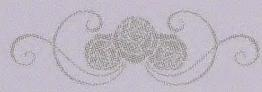
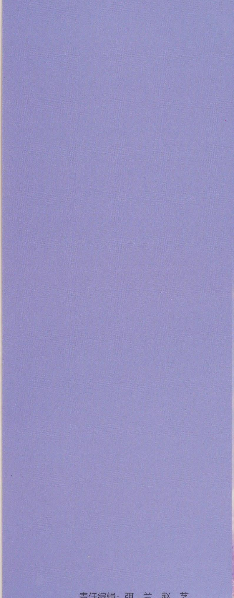
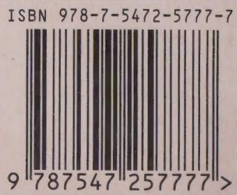

# Trở thành người phụ nữ vừa vặn

**做一个刚刚好的女子**

*zuò yí gè gāng gāng hǎo de nǚ zǐ*

微阳

wēi yáng

Vi Dương

编著

biān zhù

biên soạn

# Dùng trái tim điềm tĩnh tự tại để chống lại sự xô bồ phù phiếm bên ngoài

**用一颗安静自持的心 去敌外界声色犬马**

*yòng yī kē ān jìng zì chí de xīn qù dí wài jiè shēng sè quǎn mǎ*

不攀附高树干，不将就灌木丛你所做的一切都刚刚好

bù pān fù gāo shù gàn，bù jiāng jiù guàn mù cóng nǐ suǒ zuò de yī qiè dōu gāng gāng hǎo

Không nương tựa vào thân cây cao, không thỏa hiệp với bụi cây thấp; mọi điều bạn làm đều vừa vặn

诗意地栖息在尘世的角落内心笃定，不骄不躁

shī yì dì qī xī zài chén shì de jiǎo luò nèi xīn dǔ dìng，bù jiāo bù zào

Thi vị mà sống trong góc trần thế, lòng vững tin, không kiêu ngạo không nóng vội

不过分抱怨，不盲目期待生活就在那里，宁静淡泊。

bù guò fēn bào yuàn，bù máng mù qī dài shēng huó jiù zài nà lǐ，níng jìng dàn bó。

Không oán than quá mức, không mù quáng kỳ vọng; cuộc sống cứ ở đó, an tĩnh và nhạt nhẽo.

##

**##**

**

《做一个刚刚好的女子》是一本献给所有女人的生命化妆书。

《zuò yí gè gāng gāng hǎo de nǚ zǐ》shì yī běn xiàn gěi suǒ yǒu nǚ rén de shēng mìng huà zhuāng shū。

《Trở thành người phụ nữ vừa vặn》là cuốn sách hóa trang cuộc đời dành tặng cho mọi phụ nữ.

在本书中，女性能看到自己的影子，也可以找到帮助自己提升魅力指数与挖掘成功资本的良方。

zài běn shū zhōng，nǚ xìng néng kàn dào zì jǐ de yǐng zi，yě kě yǐ zhǎo dào bāng zhù zì jǐ tí shēng mèi lì zhǐ shù yǔ wā jué chéng gōng zī běn de liáng fāng。

Trong cuốn sách này, phụ nữ có thể thấy bóng dáng của chính mình, cũng có thể tìm thấy phương thuốc quý giúp nâng cao chỉ số sức hút và khai thác vốn thành công của bản thân.

女人的一生，就是与各种角色共舞的一生，而不管角色如何变换，女人要想活出精彩，就必须要保持自己独特的魅力，不攀附、不将就。

nǚ rén de yī shēng，jiù shì yǔ gè zhǒng jué sè gòng wǔ de yī shēng，ér bù guǎn jué sè rú hé biàn huàn，nǚ rén yào xiǎng huó chū jīng cǎi，jiù bì xū yào bǎo chí zì jǐ dú tè de mèi lì，bù pān fù、bù jiāng jiù。

Cuộc đời của người phụ nữ là cuộc đời nhảy múa cùng muôn vàn vai trò, và dù vai trò có thay đổi thế nào, người phụ nữ muốn sống thật rực rỡ thì nhất định phải giữ gìn sức hút riêng của mình, không nương tựa, không thỏa hiệp.

本书内容全面丰富，几乎涵盖了女性生活的方方面面，在给女性朋友切实指导的同时，也希望每一个女人都能展开自己更为精彩的人生。

běn shū nèi róng quán miàn fēng fù，jī hū hán gài le nǚ xìng shēng huó de fāng fāng miàn miàn，zài gěi nǚ xìng péng yǒu qiè shí zhǐ dǎo de tóng shí，yě xī wàng měi yí gè nǚ rén dōu néng zhǎn kāi zì jǐ gèng wéi jīng cǎi de rén shēng。

Nội dung cuốn sách toàn diện phong phú, gần như bao quát mọi phương diện của đời sống phụ nữ; bên cạnh việc đưa ra những chỉ dẫn thiết thực cho bạn đọc nữ, tác giả cũng mong mỗi người phụ nữ đều có thể mở ra một cuộc đời rực rỡ hơn của chính mình.

##

**##**

**

# Trở thành một người phụ nữ vừa vặn

**刚刚好的女子 做一个**

*gāng gāng hǎo de nǚ zǐ zuò yí gè*

微阳编著

wēi yáng biān zhù

Vi Dương biên soạn

## Dữ liệu biên mục trong sách theo bản quyền (CIP)

**图书在版编目（CIP）数据**

*tú shū zài bǎn biān mù （CIP） shù jù*

做一个刚刚好的女子／微阳编著.一长春：吉林

zuò yí gè gāng gāng hǎo de nǚ zǐ ／wēi yáng biān zhù.yī cháng chūn：jí lín

Trở thành người phụ nữ vừa vặn / Vi Dương biên soạn. — Trường Xuân: Cát Lâm

文史出版社，2018.11（2019.8重印）

wén shǐ chū bǎn shè ，2018.11（2019.8 chóng yìn）

Nhà xuất bản Văn Sử, 2018.11 (tái bản 2019.8)

ISBN 978-7-5472-5777-7

ISBN 978-7-5472-5777-7

ISBN 978-7-5472-5777-7

I.①做…Ⅱ.①微…Ⅲ.①女性一人生哲学一通俗读物 Ⅳ.①B821-49

I.① zuò …Ⅱ.①wēi …Ⅲ.①nǚ xìng yī rén shēng zhé xué yí tòng sú dú wù Ⅳ.①B821-49

I. ① Trở… Ⅱ. ① Vi… Ⅲ. ① Phụ nữ — triết lý nhân sinh — sách phổ thông Ⅳ. ① B821-49

中国版本图书馆CIP数据核字（2018）第263832号

zhōng guó bǎn běn tú shū guǎn CIP shù jù hé zì （2018） dì 263832 hào

Thư viện Bản quyền Trung Quốc CIP dữ liệu hạch tra (2018) số 263832

## Trở thành người phụ nữ vừa vặn

**做一个刚刚好的女子**

*zuò yí gè gāng gāng hǎo de nǚ zǐ*

出版人孙建军

chū bǎn rén sūn jiàn jūn

Người xuất bản: Tôn Kiến Quân

编著微阳

biān zhù wēi yáng

Biên soạn: Vi Dương

责任编辑弭兰赵艺

zé rèn biān jí mǐ lán zhào yì

Biên tập phụ trách: Mị Lan, Triệu Nghệ

封面设计 韩立强

fēng miàn shè jì hán lì qiáng

Thiết kế bìa: Hàn Lập Cường

图片提供 摄图网

tú piàn tí gōng shè tú wǎng

Cung cấp hình ảnh: Sán Đồ võng

出版发行 吉林文史出版社有限责任公司

chū bǎn fā xíng jí lín wén shǐ chū bǎn shè yǒu xiàn zé rèn gōng sī

Xuất bản và phát hành: Công ty TNHH Nhà xuất bản Văn Sử Cát Lâm

地址 长春市人民大街4646号

dì zhǐ cháng chūn shì rén mín dà jiē 4646 hào

Địa chỉ: 4646 Đại lộ Nhân dân, thành phố Trường Xuân

网址 www.jlws.com.cn

wǎng zhǐ www.jlws.com.cn

Website: www.jlws.com.cn

印刷 天津海德伟业印务有限公司

yìn shuā tiān jīn hǎi dé wěi yè yìn wù yǒu xiàn gōng sī

In ấn: Công ty TNHH In ấn Hải Đức Vĩ Nghiệp Thiên Tân

开本 880mm×1230mm 1/32

kāi běn 880mm×1230mm 1/32

Khổ sách: 880mm×1230mm 1/32

印张6

yìn zhāng 6

Số tờ in: 6

字 数 125千

zì shù 125 qiān

Số chữ: 125 ngàn

版 次 2018年11月第1版 2019年8月第2次印刷

bǎn cì 2018 nián 11 yuè dì 1 bǎn 2019 nián 8 yuè dì 2 cì yìn shuā

Lần xuất bản: Ấn bản lần 1 tháng 11 năm 2018, in lần thứ 2 tháng 8 năm 2019

定价32.00元

dìng jià 32.00 yuán

Giá bìa: 32.00 NDT

书号 978-7-5472-5777-7

shū hào 978-7-5472-5777-7

Mã sách: 978-7-5472-5777-7

一个刚刚好的女子，是怎样的女子？

yí gè gāng gāng hǎo de nǚ zǐ，shì zěn yàng de nǚ zǐ？

Một người phụ nữ vừa vặn là người phụ nữ như thế nào?

“我如果爱你——绝不像攀援的凌霄花，借你的高枝炫耀自己。

“wǒ rú guǒ ài nǐ——jué bù xiàng pān yuán de líng xiāo huā，jiè nǐ de gāo zhī xuàn yào zì jǐ。

“Nếu anh yêu em — em tuyệt không như hoa lăng tiêu bám trèo, mượn cành cao của anh để khoe khoang bản thân.

”就如女诗人舒婷在《致橡树》中勇敢的爱情宣言那样，人们赞扬她的人格独立，欣赏她的自强品质，只因为古往今来，有太多太多的“依赖”、“靠山”蒙蔽了人们的双眼，从而阻碍了人们的前途。

”jiù rú nǚ shī rén shū tíng zài《zhì xiàng shù》zhōng yǒng gǎn de ài qíng xuān yán nà yàng，rén men zàn yáng tā de rén gé dú lì，xīn shǎng tā de zì qiáng pǐn zhì，zhǐ yīn wèi gǔ wǎng jīn lái，yǒu tài duō tài duō de “yī lài ”、“kào shān ”méng bì le rén men de shuāng yǎn，cóng ér zǔ ài le rén men de qián tú。

”Cũng như tuyên ngôn tình yêu dũng cảm của nữ thi sĩ Thư Đình trong《Bài thơ gửi cây sồi》, người ta ca ngợi sự độc lập nhân cách và khâm phục phẩm chất tự cường của bà, chỉ vì từ xưa đến nay, có quá nhiều “dựa dẫm”, “chỗ dựa” che mờ đôi mắt con người, từ đó cản trở tiền đồ của họ.

攀附他人，只会让自己沉浸在不劳而获的喜悦中，失去自己奋斗的动力，丧失独立思考的能力。

pān fù tā rén，zhǐ huì ràng zì jǐ chén jìn zài bù láo ér huò de xǐ yuè zhōng，shī qù zì jǐ fèn dòu de dòng lì，sàng shī dú lì sī kǎo de néng lì。

Nương tựa vào người khác, chỉ khiến bản thân chìm đắm trong niềm vui không làm mà có, đánh mất động lực phấn đấu của chính mình, đánh mất năng lực tư duy độc lập.

很多女人都想做别人眼中的焦点人物，想拥有梦想的成功和幸福，但并不是每一个女人都能做到这一点。

hěn duō nǚ rén dōu xiǎng zuò bié rén yǎn zhōng de jiāo diǎn rén wù，xiǎng yōng yǒu mèng xiǎng de chéng gōng hé xìng fú，dàn bìng bú shì měi yí gè nǚ rén dōu néng zuò dào zhè yì diǎn。

Nhiều người phụ nữ đều muốn trở thành nhân vật trung tâm trong mắt người khác, muốn có được thành công và hạnh phúc như mơ, nhưng không phải người phụ nữ nào cũng làm được điều đó.

有的女人花尽了心思却不能赢得别人的好感；而有的女人不用做什么就能吸引别人的目光，总会有人众星捧月般地围绕在她们身边，甚至成功与幸福也不期而至。

yǒu de nǚ rén huā jǐn le xīn sī què bù néng yíng dé bié rén de hǎo gǎn；ér yǒu de nǚ rén bù yòng zuò shén me jiù néng xī yǐn bié rén de mù guāng，zǒng huì yǒu rén zhòng xīng pěng yuè bān dì wéi rào zài tā men shēn biān，shèn zhì chéng gōng yǔ xìng fú yě bù qī ér zhì。

Có người phụ nữ hao tâm tổn sức mà vẫn không chiếm được thiện cảm của người khác; còn có người phụ nữ không cần làm gì cũng thu hút được ánh nhìn, luôn có người vây quanh như chúng tinh phụng nguyệt, thậm chí thành công và hạnh phúc cũng tự tìm đến.

为什么会有如此大的差别？

wèi shén me huì yǒu rú cǐ dà de chā bié？

Vì sao lại có khác biệt lớn đến vậy?

毫无例外，那些能吸引他人的女人都有着刚刚好的性格。

háo wú lì wài，nà xiē néng xī yǐn tā rén de nǚ rén dōu yǒu zhe gāng gāng hǎo de xìng gé。

Không ngoại lệ, những người phụ nữ có sức hút đều sở hữu tính cách vừa vặn.

花红不为争春春自艳，花开不为引蝶蝶自来，刚刚好的女人，他们的每一个微笑，每一个动作，说出来的每一句话，都能让人感到她们与众不同的气质与魅力。

huā hóng bù wèi zhēng chūn chūn zì yàn，huā kāi bù wèi yǐn dié dié zì lái，gāng gāng hǎo de nǚ rén，tā men de měi yí gè wēi xiào，měi yí gè dòng zuò，shuō chū lái de měi yī jù huà，dōu néng ràng rén gǎn dào tā men yǔ zhòng bù tóng de qì zhì yǔ mèi lì。

Hoa đỏ không tranh xuân mà xuân tự nở rực, hoa nở không để dẫn bướm mà bướm tự tìm đến; người phụ nữ vừa vặn, mỗi nụ cười, mỗi cử chỉ, mỗi lời nói của họ đều khiến người khác cảm nhận được khí chất và sức hút khác biệt của họ.

不管在职场还是生活中，她们总是可以应对自如，将一切打理得井井有条。

bù guǎn zài zhí chǎng hái shì shēng huó zhōng，tā men zǒng shì kě yǐ yìng duì zì rú，jiāng yī qiè dǎ lǐ dé jǐng jǐng yǒu tiáo。

Dù ở nơi làm việc hay trong cuộc sống, họ luôn ứng phó trôi chảy, sắp xếp mọi thứ gọn gàng ngăn nắp.

所以刚刚好的女人在拥有成功人生方面占有着绝对的优势，因为她们总能在第一时间引起别人的注意，得到别人

suǒ yǐ gāng gāng hǎo de nǚ rén zài yōng yǒu chéng gōng rén shēng fāng miàn zhàn yǒu zhe jué duì de yōu shì，yīn wèi tā men zǒng néng zài dì yī shí jiān yǐn qǐ bié rén de zhù yì，dé dào bié rén

Vì vậy người phụ nữ vừa vặn có lợi thế tuyệt đối trong việc sở hữu một cuộc đời thành công, bởi họ luôn có thể gây chú ý với người khác ngay từ đầu, nhận được

的帮助和尊敬。

de bāng zhù hé zūn jìng。

sự giúp đỡ và tôn trọng của mọi người.

现代社会对女性要求太苛刻，既要“上得了厅堂，下得了厨房；开得起好车，买得起新房；斗得过小三，打得过流氓。

xiàn dài shè huì duì nǚ xìng yāo qiú tài kē kè，jì yào “shàng dé le tīng táng，xià dé le chú fáng；kāi dé qǐ hǎo chē，mǎi de qǐ xīn fáng；dòu dé guò xiǎo sān，dǎ dé guò liú máng。

Xã hội hiện đại yêu cầu phụ nữ quá khắt khe, vừa phải “ra bàn tiệc, vào bếp núc; mở được xe sang, mua được nhà mới; đấu được tiểu tam, đánh được lưu manh.

”既要是贤妻良母，又要是职业女性，恨不得女人能把整片天顶起。

”jì yào shì xián qī liáng mǔ，yòu yào shì zhí yè nǚ xìng，hèn bù dé nǚ rén néng bǎ zhěng piàn tiān dǐng qǐ。

”Vừa phải là người vợ hiền mẹ tốt, lại vừa phải là người phụ nữ công sở, gần như muốn phụ nữ đội cả bầu trời lên đầu.

而对于别人的标准，我们大可不必去将就，唯有活出自己才是找到快乐的唯一途经。

ér duì yú bié rén de biāo zhǔn，wǒ men dà kě bù bì qù jiāng jiù，wéi yǒu huó chū zì jǐ cái shì zhǎo dào kuài lè de wéi yī tú jīng。

Còn với những tiêu chuẩn của người khác, chúng ta hoàn toàn không cần thỏa hiệp, chỉ có sống đúng với chính mình mới là con đường duy nhất tìm thấy niềm vui.

个刚刚好的女人在人际交往中，总是能坦然地呈现最真实的自己，懂得自爱与爱人，她身上散发的性格魅力使她时刻成为一个受欢迎的人；个刚刚好的女人在职场上，谈笑风生，从容自若，不被压力击垮，不为自身情绪所左右，她总能挖掘自身潜能，展示出最好的自己；一个刚刚好的女人在婚姻中，温婉、宽容、独立，她知道幸福的婚姻是对彼此性格的接纳与完善。

gè gāng gāng hǎo de nǚ rén zài rén jì jiāo wǎng zhōng，zǒng shì néng tǎn rán dì chéng xiàn zuì zhēn shí de zì jǐ，dǒng de zì ài yǔ ài rén，tā shēn shàng sàn fà de xìng gé mèi lì shǐ tā shí kè chéng wéi yí gè shòu huān yíng de rén；gè gāng gāng hǎo de nǚ rén zài zhí chǎng shàng，tán xiào fēng shēng，cóng róng zì ruò，bù bèi yā lì jī kuǎ，bù wèi zì shēn qíng xù suǒ zuǒ yòu，tā zǒng néng wā jué zì shēn qián néng，zhǎn shì chū zuì hǎo de zì jǐ；yí gè gāng gāng hǎo de nǚ rén zài hūn yīn zhōng，wēn wǎn、kuān róng、dú lì，tā zhī dào xìng fú de hūn yīn shì duì bǐ cǐ xìng gé de jiē nà yǔ wán shàn。

Một người phụ nữ vừa vặn trong giao tiếp luôn tự tin thể hiện con người thật nhất của mình, biết yêu bản thân và yêu người khác, sức hút tính cách tỏa ra từ con người cô ấy khiến cô ấy luôn là người được yêu mến; một người phụ nữ vừa vặn nơi công sở vui vẻ đàm đạo, điềm tĩnh tự nhiên, không bị áp lực đánh gục, không bị cảm xúc chi phối, cô ấy luôn khai phá được tiềm năng của mình và thể hiện phiên bản tốt nhất; một người phụ nữ vừa vặn trong hôn nhân dịu dàng, khoan dung, độc lập, cô ấy biết rằng hôn nhân hạnh phúc là sự chấp nhận và hoàn thiện tính cách của nhau.

这样的女人拥有一颗不攀附不将就的恬淡执行，她们如一杯清茶，散发着淡淡的清香，如一缕清风，洋溢着花朵的芬芳。

zhè yàng de nǚ rén yōng yǒu yī kē bù pān fù bù jiāng jiù de tián dàn zhí xíng，tā men rú yī bēi qīng chá，sàn fà zhe dàn dàn de qīng xiāng，rú yī lǚ qīng fēng，yáng yì zhe huā duǒ de fēn fāng。

Người phụ nữ như vậy sở hữu một tâm hồn điền đạm không nương tựa không thỏa hiệp; họ như chén trà thanh khiết tỏa hương nhẹ nhàng, như làn gió mát tràn ngập hương hoa.

第一章 优雅，是最温柔的盔甲

dì yī zhāng yōu yǎ，shì zuì wēn róu de kuī jiǎ

Chương một: Thanh nhã, là bộ giáp dịu dàng nhất

怎样做一个优雅女人/2

zěn yàng zuò yí gè yōu yǎ nǚ rén /2

Làm thế nào để trở thành người phụ nữ thanh nhã/2

用品位做底蕴的女人最优雅/5

yòng pǐn wèi zuò dǐ yùn de nǚ rén zuì yōu yǎ /5

Người phụ nữ lấy gu thẩm mỹ làm nền tảng là thanh nhã nhất/5

女人要自信而优雅地生活/8

nǚ rén yào zì xìn ér yōu yǎ dì shēng huó /8

Người phụ nữ phải tự tin và sống thanh nhã/8

不要把艳俗当成惊艳/13

bú yào bǎ yàn sú dàng chéng jīng yàn /13

Đừng nhầm lẫn sự phô trương lòe loẹt với sự lộng lẫy đẹp đến kinh ngạc/13

优雅的气质来自完美的内心/16

yōu yǎ de qì zhì lái zì wán měi de nèi xīn /16

Khí chất thanh nhã đến từ tâm hồn hoàn thiện/16

笑得优雅，是种境界/19

xiào dé yōu yǎ，shì zhǒng jìng jiè /19

Cười thanh nhã là một loại cảnh giới/19

第二章 气质是你最好的衣裳

dì èr zhāng qì zhì shì nǐ zuì hǎo de yī shang

Chương hai: Khí chất là bộ áo đẹp nhất của bạn

为了幸福勇敢地作出改变/24

wèi le xìng fú yǒng gǎn dì zuò chū gǎi biàn /24

Vì hạnh phúc hãy dũng cảm thay đổi/24

永葆你的别样风情/27

yǒng bǎo nǐ de bié yàng fēng qíng /27

Giữ mãi phong thái riêng của bạn/27

美丽是女人一生的使命/39

měi lì shì nǚ rén yī shēng de shǐ mìng /39

Sắc đẹp là sứ mệnh cả đời của người phụ nữ/39

用细节造就魅力/49

yòng xì jié zào jiù mèi lì /49

Tạo nên sức hút từ những chi tiết/49

用魅力放大美丽/52

yòng mèi lì fàng dà měi lì /52

Dùng sức hút làm tỏa sáng vẻ đẹp/52

谁都会爱上满心热忱的女人／56

shéi dōu huì ài shàng mǎn xīn rè chén de nǚ rén ／56

Ai cũng sẽ yêu một người phụ nữ tràn đầy nhiệt huyết/56

## Mục lục

**目录**

*mù lù*

肢体语言不可随意/58

zhī tǐ yǔ yán bù kě suí yì /58

Ngôn ngữ cơ thể không thể tùy tiện/58

第三章 没有委屈的生活，只有玻璃心的你

dì sān zhāng méi yǒu wěi qū de shēng huó，zhǐ yǒu bō lí xīn de nǐ

Chương ba: Không có cuộc đời nào đầy ấm ức, chỉ có trái tim thủy tinh của bạn

怨恨让女人远离幸福/62

yuàn hèn ràng nǚ rén yuǎn lí xìng fú /62

Oán hận khiến phụ nữ rời xa hạnh phúc/62

不嫉妒他人的女人是天使/65

bù jí dù tā rén de nǚ rén shì tiān shǐ /65

Người phụ nữ không ghen tị là thiên thần/65

懒惰的女人再美也不惹人爱/68

lǎn duò de nǚ rén zài měi yě bù rě rén ài /68

Người phụ nữ lười biếng dù xinh đẹp cũng chẳng đáng yêu/68

适应不可避免的事实/70

shì yìng bù kě bì miǎn de shì shí /70

Thích nghi với những sự thật không thể tránh khỏi/70

做自己情绪的主人/77

zuò zì jǐ qíng xù de zhǔ rén /77

Làm chủ cảm xúc của chính mình/77

最后再考虑你的自尊心/83

zuì hòu zài kǎo lǜ nǐ de zì zūn xīn /83

Cuối cùng mới tính đến lòng tự trọng của bạn/83

第四章 纵然生活凌厉，依然要内心向暖

dì sì zhāng zòng rán shēng huó líng lì，yī rán yào nèi xīn xiàng nuǎn

Chương bốn: Dù cuộc sống khắc nghiệt, tâm hồn vẫn hướng về sự ấm áp

永远不要做个“怨妇”/88

yǒng yuǎn bú yào zuò gè “yuàn fù ”/88

Đừng bao giờ trở thành “người đàn bà oán than”/88

苦水，只会越吐越多/91

kǔ shuǐ，zhǐ huì yuè tǔ yuè duō /91

Nỗi khổ, chỉ càng giãi bày càng nhiều/91

自认倒霉的女人总是会倒霉/94

zì rèn dǎo méi de nǚ rén zǒng shì huì dǎo méi /94

Người phụ nữ tự nhận mình xui xẻo thì luôn xui xẻo/94

内心有阳光，世界就是光明的／97

nèi xīn yǒu yáng guāng，shì jiè jiù shì guāng míng de ／97

Trong tim có nắng, thế giới sẽ rạng ngời/97

发脾气无法让你变得安宁/98

fā pí qì wú fǎ ràng nǐ biàn dé ān níng /98

Nổi cáu không thể khiến bạn yên tĩnh hơn/98

对不能改变的事情“微微一笑”/100

duì bù néng gǎi biàn de shì qíng “wēi wēi yī xiào ”/100

Mỉm cười với những điều không thể thay đổi/100

第五章 与真实的自己握手言和

dì wǔ zhāng yǔ zhēn shí de zì jǐ wò shǒu yán hé

Chương năm: Bắt tay làm hòa với con người thật của mình

保持自己的个性/104

bǎo chí zì jǐ de gè xìng /104

Giữ gìn cá tính riêng/104

释放自我，本色生活／106

shì fàng zì wǒ，běn sè shēng huó ／106

Giải phóng bản thân, sống đúng bản chất/106

留一些时间给自己／109

liú yī xiē shí jiān gěi zì jǐ ／109

Dành chút thời gian cho chính mình/109

发现你的潜能，别给自己留遗憾／111

fā xiàn nǐ de qián néng，bié gěi zì jǐ liú yí hàn ／111

Khám phá tiềm năng của bạn, đừng để lại nuối tiếc/111

别做消耗式的人生规划／114

bié zuò xiāo hào shì de rén shēng guī huà ／114

Đừng lập kế hoạch cuộc đời theo kiểu bào mòn/114

做一只迎风起舞的铿锵玫瑰／116

zuò yī zhī yíng fēng qǐ wǔ de kēng qiāng méi guī ／116

Làm đóa hồng kiên cường múa trong gió/116

第六章 以感性惊天下，以性感惊世人

dì liù zhāng yǐ gǎn xìng jīng tiān xià，yǐ xìng gǎn jīng shì rén

Chương sáu: Lấy sự mềm mại làm kinh ngạc thiên hạ, lấy sự gợi cảm làm kinh ngạc thế nhân

女人可以不漂亮，但不能不性感／120

nǚ rén kě yǐ bù piào liàng，dàn bù néng bù xìng gǎn ／120

Phụ nữ có thể không xinh đẹp nhưng không thể không gợi cảm/120

一脸娇羞胜过无数情话／122

yī liǎn jiāo xiū shèng guò wú shù qíng huà ／122

Vẻ mặt e thẹn hơn ngàn vạn lời tình tự/122

适度撒娇的女人惹人疼／124

shì dù sā jiāo de nǚ rén rě rén téng ／124

Người phụ nữ biết nũng nịu đúng mực khiến người ta thương yêu/124

具有情调的女人最可爱／126

jù yǒu qíng diào de nǚ rén zuì kě ài ／126

Người phụ nữ có phong vị đáng yêu nhất/126

女人不“坏”，男人不爱／128

nǚ rén bù “huài ”，nán rén bù ài ／128

Phụ nữ không “hư”, đàn ông không yêu/128

做个“疯”情万种的女人／133

zuò gè “fēng ”qíng wàn zhǒng de nǚ rén ／133

Làm một người phụ nữ “mãnh liệt” đủ mọi vẻ quyến rũ/133

第七章岁月静静流淌，你要做的是从容前行

dì qī zhāng suì yuè jìng jìng liú tǎng，nǐ yào zuò de shì cóng róng qián xíng

Chương bảy: Thời gian lặng lẽ trôi, điều bạn cần làm là bình thản bước tiếp

让昨日止于昨夜，活在今天／136

ràng zuó rì zhǐ yú zuó yè，huó zài jīn tiān ／136

Để ngày hôm qua dừng lại ở đêm qua, sống cho hôm nay/136

为自己的心灵“留白”／138

wèi zì jǐ de xīn líng “liú bái ”／138

Chừa khoảng trống cho tâm hồn mình/138

拥有“欣赏自我”的淡定心／142

yōng yǒu “xīn shǎng zì wǒ ”de dàn dìng xīn ／142

Sở hữu trái tim bình tĩnh biết trân trọng chính mình/142

保持心态平静，戒骄戒躁／146

bǎo chí xīn tài píng jìng，jiè jiāo jiè zào ／146

Giữ tâm bình tĩnh, tránh kiêu ngạo nóng vội/146

如果没有观众，就为自己鼓掌／150

rú guǒ méi yǒu guān zhòng，jiù wèi zì jǐ gǔ zhǎng ／150

Nếu không có khán giả, hãy tự vỗ tay cho chính mình/150

## Chương tám: Nguyện bạn gặp được tình yêu, rực rỡ suốt chặng đường

**第八章 愿你遇见爱情，一路灿烂**

*dì bā zhāng yuàn nǐ yù jiàn ài qíng，yī lù càn làn*

最美的时光里你遇见了谁／156

zuì měi de shí guāng lǐ nǐ yù jiàn le shuí ／156

Trong khoảnh khắc đẹp nhất bạn đã gặp ai/156

青春橄榄树上刻满的思念／160

qīng chūn gǎn lǎn shù shàng kè mǎn de sī niàn ／160

Nỗi nhớ khắc đầy trên cây ô liu tuổi thanh xuân/160

相信爱，珍惜爱／165

xiāng xìn ài，zhēn xī ài ／165

Tin vào tình yêu, trân trọng tình yêu/165

别因爱弄丟了自己／169

bié yīn ài nòng diū le zì jǐ ／169

Đừng vì yêu mà đánh mất chính mình/169

给爱情一颗淡定的心／172

gěi ài qíng yī kē dàn dìng de xīn ／172

Dành cho tình yêu một trái tim bình tĩnh/172

有些爱情就是用来收藏的／176

yǒu xiē ài qíng jiù shì yòng lái shōu cáng de ／176

Có những tình yêu sinh ra để cất giữ/176

优雅，是最温柔的盔甲

yōu yǎ，shì zuì wēn róu de kuī jiǎ

Thanh nhã, là bộ giáp dịu dàng nhất

# Làm thế nào để trở thành người phụ nữ thanh nhã

**怎样做一个优雅女人**

*zěn yàng zuò yí gè yōu yǎ nǚ rén*

优雅是一种恒久的时尚，是一种文化和素养的积累，是修养和知识的沉淀。

yōu yǎ shì yī zhǒng héng jiǔ de shí shàng，shì yī zhǒng wén huà hé sù yǎng de jī lěi，shì xiū yǎng hé zhī shí de chén diàn。

Thanh nhã là một sự thời thượng trường tồn, là sự tích lũy của văn hóa và tố chất, là sự lắng đọng của tu dưỡng và tri thức.

从一个女人优雅的举止里，我们可以看到一种文化教养，让人赏心悦目。

cóng yí gè nǚ rén yōu yǎ de jǔ zhǐ lǐ，wǒ men kě yǐ kàn dào yī zhǒng wén huà jiào yǎng，ràng rén shǎng xīn yuè mù。

Từ những cử chỉ thanh nhã của một người phụ nữ, chúng ta có thể thấy được sự giáo dưỡng về văn hóa, khiến người ta vui vẻ dễ chịu.

优雅的女人都从容。

yōu yǎ de nǚ rén dōu cóng róng。

Người phụ nữ thanh nhã đều khoan thai.

她们经历过人生的风浪，岁月的痕迹不光留下风霜后的苍凉，更有资深的阅历，好像大树的年轮一样一圈一圈积累着人生，积累着智慧。

tā men jīng lì guò rén shēng de fēng làng，suì yuè de hén jì bù guāng liú xià fēng shuāng hòu de cāng liáng，gèng yǒu zī shēn de yuè lì，hǎo xiàng dà shù de nián lún yī yàng yī quān yī quān jī lěi zhe rén shēng，jī lěi zhe zhì huì。

Họ từng trải qua sóng gió cuộc đời, dấu vết của thời gian không chỉ để lại sự heo hút sau phong sương, mà còn có những trải nghiệm sâu sắc, giống như vòng tuổi của đại thụ, từng vòng từng vòng tích lũy nên cuộc đời, tích lũy nên trí tuệ.

优雅的女人，淡定从容，谈笑风生。

yōu yǎ de nǚ rén，dàn dìng cóng róng，tán xiào fēng shēng。

Người phụ nữ thanh nhã, điềm tĩnh khoan thai, vui vẻ trò chuyện.

你若要她们受到你的惊吓，那只是小孩子的一种尝试，她们会一笑了之。

nǐ ruò yào tā men shòu dào nǐ de jīng xià，nà zhǐ shì xiǎo hái zi de yī zhǒng cháng shì，tā men huì yī xiào liǎo zhī。

Nếu bạn muốn làm họ hoảng sợ, đó chỉ là trò trẻ con, họ sẽ bỏ qua bằng một nụ cười.

都是包容，或者是云淡风轻，举重若轻的优雅已经达到美丽的顶级。

dōu shì bāo róng，huò zhě shì yún dàn fēng qīng，jǔ zhòng ruò qīng de yōu yǎ yǐ jīng dá dào měi lì de dǐng jí。

Tất cả đều là bao dung, hoặc là nhẹ nhàng như mây gió; sự thanh nhã nhẹ nhàng như nhấc việc nặng mà như không ấy đã đạt đến đỉnh cao của vẻ đẹp.

这又何尝不是人生最美丽的风景？

zhè yòu hé cháng bú shì rén shēng zuì měi lì de fēng jǐng？

Chẳng phải đó cũng là cảnh đẹp nhất của nhân sinh hay sao?

优雅女人活泼主动。

yōu yǎ nǚ rén huó pō zhǔ dòng。

Người phụ nữ thanh nhã thì hoạt bát, chủ động.

她们是都市的靓丽风景，或者她们属于白领，有着令人羡慕的工作，或者她们有自己的生活，生活舒心，谈笑自若，雍容大方。

tā men shì dū shì de liàng lì fēng jǐng，huò zhě tā men shǔ yú bái lǐng，yǒu zhe lìng rén xiàn mù de gōng zuò，huò zhě tā men yǒu zì jǐ de shēng huó，shēng huó shū xīn，tán xiào zì ruò，yōng róng dà fāng。

Họ là cảnh đẹp rực rỡ của đô thị, hoặc họ thuộc giới văn phòng với công việc đáng ngưỡng mộ, hoặc họ có cuộc sống riêng, sống thoải mái, trò chuyện tự nhiên, đĩnh đạc hào hoa.

她们会和你矜持却不失亲切地交谈，她们会和你讨论今夏最流行的颜色，她们会提到她们家的小猫是怎样的调皮。

tā men huì hé nǐ jīn chí què bù shī qīn qiè dì jiāo tán，tā men huì hé nǐ tǎo lùn jīn xià zuì liú xíng de yán sè，tā men huì tí dào tā men jiā de xiǎo māo shì zěn yàng de tiáo pí。

Họ sẽ trò chuyện với bạn một cách kín đáo nhưng không kém phần thân mật, họ sẽ cùng bạn bàn về màu sắc thịnh hành nhất mùa hè này, họ sẽ kể chú mèo nhỏ nhà họ nghịch ngợm đến mức nào.

笑笑谈谈，眉目含笑，举止有度，点到为止。

xiào xiào tán tán，méi mù hán xiào，jǔ zhǐ yǒu dù，diǎn dào wéi zhǐ。

Cười nói nhẹ nhàng, ánh mắt ngập ý cười, cử chỉ đúng mực, vừa đủ tinh tế.

母性的光辉和智慧刺得你睁不开眼。

mǔ xìng de guāng huī hé zhì huì cì dé nǐ zhēng bù kāi yǎn。

Hào quang của người mẹ và trí tuệ chói lóa khiến bạn không mở nổi mắt.

优雅女人懂生活，懂情趣。

yōu yǎ nǚ rén dǒng shēng huó，dǒng qíng qù。

Người phụ nữ thanh nhã hiểu cuộc sống, hiểu thú vị.

她们拥有最好的品德，既不忘古典传统文化的谆谆教导，又具有接受最新文化的能力，兼容并包，和蔼可亲。

tā men yōng yǒu zuì hǎo de pǐn dé，jì bù wàng gǔ diǎn chuán tǒng wén huà de zhūn zhūn jiào dǎo，yòu jù yǒu jiē shòu zuì xīn wén huà de néng lì，jiān róng bìng bāo，hé ǎi kě qīn。

Họ sở hữu những phẩm hạnh tốt đẹp nhất, vừa không quên lời dạy ân cần của văn hóa truyền thống kinh điển, vừa có khả năng tiếp nhận văn hóa mới nhất, bao dung kiêm cả, gần gũi dễ mến.

当你和她讨论生活，讨论喜好，她们总是给你最好的建议并且策划到几近完美；她们是幼稚少女的人生指南，步步到位：她们和任何人都能成为朋友，让你相见恨晚。

dāng nǐ hé tā tǎo lùn shēng huó，tǎo lùn xǐ hào，tā men zǒng shì gěi nǐ zuì hǎo de jiàn yì bìng qiě cè huà dào jǐ jìn wán měi；tā men shì yòu zhì shào nǚ de rén shēng zhǐ nán，bù bù dào wèi：tā men hé rèn hé rén dōu néng chéng wéi péng yǒu，ràng nǐ xiāng jiàn hèn wǎn。

Khi bạn cùng họ bàn về cuộc sống, về sở thích, họ luôn cho bạn những lời khuyên tốt nhất và lên kế hoạch gần như hoàn hảo; họ là kim chỉ nam cuộc đời của những thiếu nữ ngây thơ, từng bước hoàn hảo: họ có thể kết bạn với bất kỳ ai, khiến bạn tiếc là gặp nhau quá muộn.

她们在人前是如此的矜持又开朗，进退适宜不惹人尴尬，谦虚又可爱。

tā men zài rén qián shì rú cǐ de jīn chí yòu kāi lǎng，jìn tuì shì yí bù rě rén gān gà，qiān xū yòu kě ài。

Trước mặt người khác họ vừa kín đáo lại vừa cởi mở, tiến lui hợp lễ không khiến ai bối rối, vừa khiêm tốn lại vừa đáng yêu.

没有哪个女人不想成为优雅的女人，而许多人又常苦于找不到优雅的秘诀，或者抱怨缺乏应有的条件而信心不足。

méi yǒu nǎ ge nǚ rén bù xiǎng chéng wéi yōu yǎ de nǚ rén，ér xǔ duō rén yòu cháng kǔ yú zhǎo bú dào yōu yǎ de mì jué，huò zhě bào yuàn quē fá yīng yǒu de tiáo jiàn ér xìn xīn bù zú。

Không có người phụ nữ nào không muốn trở thành người phụ nữ thanh nhã, nhưng nhiều người lại thường khổ vì không tìm được bí quyết thanh nhã, hoặc than phiền thiếu điều kiện cần có mà mất tự tin.

优雅，真那么难吗？

yōu yǎ，zhēn nà me nán ma？

Thanh nhã, có thật sự khó đến vậy không?

其实，做优雅的女人并不难，不需要很高的条件，秘诀是从身边的小处做起。

qí shí，zuò yōu yǎ de nǚ rén bìng bù nán，bù xū yào hěn gāo de tiáo jiàn，mì jué shì cóng shēn biān de xiǎo chù zuò qǐ。

Thật ra, làm người phụ nữ thanh nhã không khó, không cần điều kiện cao sang, bí quyết là bắt đầu từ những điều nhỏ nhặt xung quanh mình.

没有过度的装饰，也不流于简单随便，坚持独立与自信，热情与上进。

méi yǒu guò dù de zhuāng shì，yě bù liú yú jiǎn dān suí biàn，jiān chí dú lì yǔ zì xìn，rè qíng yǔ shàng jìn。

Không trang điểm quá đà, cũng không xuề xòa đơn giản, kiên trì độc lập và tự tin, nhiệt tình và cầu tiến.

由中国红变成亮眼蓝的羽西曾言：快乐就是成功。

yóu zhōng guó hóng biàn chéng liàng yǎn lán de yǔ xī céng yán：kuài lè jiù shì chéng gōng。

Người từng từ màu đỏ Trung Hoa chuyển sang màu xanh rực rỡ là Vũ Tây từng nói: niềm vui chính là thành công.

她说人在可以站着的时候，就一定要坚持站着，而且还要保持着漂亮的样子，这是对自己的尊重，也是对别人的尊重。

tā shuō rén zài kě yǐ zhàn zhe de shí hòu，jiù yí dìng yào jiān chí zhàn zhe，ér qiě hái yào bǎo chí zhe piào liàng de yàng zi，zhè shì duì zì jǐ de zūn zhòng，yě shì duì bié rén de zūn zhòng。

Cô ấy nói khi con người có thể đứng thẳng, thì nhất định phải kiên trì đứng thẳng, mà còn phải giữ vẻ đẹp đẽ, đó là sự tôn trọng với chính mình, cũng là sự tôn trọng với người khác.

女人要保持自己的优雅。

nǚ rén yào bǎo chí zì jǐ de yōu yǎ。

Người phụ nữ phải giữ gìn sự thanh nhã của mình.

要做一个优雅的女人，就必须增长自己的知识，将优雅之树的根深扎在文化的沃土之中，这样才能使它枝繁叶茂。

yào zuò yí gè yōu yǎ de nǚ rén，jiù bì xū zēng zhǎng zì jǐ de zhī shí，jiāng yōu yǎ zhī shù de gēn shēn zhā zài wén huà de wò tǔ zhī zhōng，zhè yàng cái néng shǐ tā zhī fán yè mào。

Muốn làm một người phụ nữ thanh nhã, nhất định phải trau dồi tri thức, để gốc rễ của cây thanh nhã cắm sâu vào mảnh đất màu mỡ của văn hóa, như vậy mới có thể cành lá sum suê.

因为优雅的女人，必定是心灵纯净的人，净化心灵的最好办法是吸取智慧，吸取智慧的最好办法则是阅读。

yīn wèi yōu yǎ de nǚ rén，bì dìng shì xīn líng chún jìng de rén，jìng huà xīn líng de zuì hǎo bàn fǎ shì xī qǔ zhì huì，xī qǔ zhì huì de zuì hǎo bàn fǎ zé shì yuè dú。

Bởi vì người phụ nữ thanh nhã, nhất định là người có tâm hồn trong sạch; cách tốt nhất để thanh lọc tâm hồn là hấp thu trí tuệ, mà cách tốt nhất để hấp thu trí tuệ chính là đọc sách.

“书中自有好风光”，“书中自有黄金屋”，“书中自有颜如玉”。

“shū zhōng zì yǒu hǎo fēng guāng ”，“shū zhōng zì yǒu huáng jīn wū ”，“shū zhōng zì yǒu yán rú yù ”。

Trong sách có phong cảnh đẹp, trong sách có nhà vàng, trong sách có mỹ nhân như ngọc.

读破万卷书的人，心中不会存有一池污水。

dú pò wàn juàn shū de rén，xīn zhōng bú huì cún yǒu yī chí wū shuǐ。

Người đọc hết vạn quyển sách, trong lòng sẽ không chứa một ao nước bẩn.

知识能够改变命运，同样，知识可以培养女人的优雅。

zhī shí néng gòu gǎi biàn mìng yùn，tóng yàng，zhī shí kě yǐ péi yǎng nǚ rén de yōu yǎ。

Tri thức có thể thay đổi vận mệnh, tương tự, tri thức có thể bồi dưỡng sự thanh nhã của người phụ nữ.

所以，要想做一个优雅的女人，就要多读一些书，尤其是一些励志的书，不断地充实自己，完善自己。

suǒ yǐ，yào xiǎng zuò yí gè yōu yǎ de nǚ rén，jiù yào duō dú yī xiē shū，yóu qí shì yī xiē lì zhì de shū，bù duàn dì chōng shí zì jǐ，wán shàn zì jǐ。

Vì vậy, muốn làm một người phụ nữ thanh nhã, hãy đọc nhiều sách, đặc biệt là những cuốn sách truyền cảm hứng, không ngừng làm phong phú bản thân, hoàn thiện bản thân.

喜欢读书的女人，永远都是不俗的人，只有不俗的人才有资格做优雅的人！

xǐ huān dú shū de nǚ rén，yǒng yuǎn dōu shì bù sú de rén，zhǐ yǒu bù sú de rén cái yǒu zī gé zuò yōu yǎ de rén！

Người phụ nữ thích đọc sách, mãi mãi là người không tầm thường, chỉ những người không tầm thường mới có tư cách làm người thanh nhã!

优雅的女人一定要有自己的事业。

yōu yǎ de nǚ rén yí dìng yào yǒu zì jǐ de shì yè。

Người phụ nữ thanh nhã nhất định phải có sự nghiệp của riêng mình.

优雅的女人不是依附的小鸟，不是攀岩的凌霄花。

yōu yǎ de nǚ rén bú shì yī fù de xiǎo niǎo，bú shì pān yán de líng xiāo huā。

Người phụ nữ thanh nhã không phải là chú chim nhỏ bám víu, không phải là hoa lăng tiêu bám trèo.

优雅的女人就是一只展翅高飞的鲲鹏，就是一棵参天的大树，而事业则是这一切的基础。

yōu yǎ de nǚ rén jiù shì yī zhī zhǎn chì gāo fēi de kūn péng，jiù shì yī kē cān tiān de dà shù，ér shì yè zé shì zhè yī qiè de jī chǔ。

Người phụ nữ thanh nhã là con cá ngạc giương cánh bay cao, là cây đại thụ vươn tận trời, mà sự nghiệp chính là nền tảng của tất cả những điều đó.

所以，要做一个优雅的女人，必须热爱自己的工作，因为只有热爱自己的工作，才能做好自己的工作。

suǒ yǐ，yào zuò yí gè yōu yǎ de nǚ rén，bì xū rè ài zì jǐ de gōng zuò，yīn wèi zhǐ yǒu rè ài zì jǐ de gōng zuò，cái néng zuò hǎo zì jǐ de gōng zuò。

Vì vậy, muốn làm một người phụ nữ thanh nhã, nhất định phải yêu công việc của mình, bởi chỉ khi yêu công việc, mình mới làm tốt được công việc của mình.

从事自己所热爱的工作是一种幸运，热爱自己所从事的工作是一种幸福。

cóng shì zì jǐ suǒ rè ài de gōng zuò shì yī zhǒng xìng yùn，rè ài zì jǐ suǒ cóng shì de gōng zuò shì yī zhǒng xìng fú。

Làm công việc mình yêu thích là một sự may mắn, yêu thích công việc mình đang làm là một niềm hạnh phúc.

幸运不是每个人都能遇到的，幸福却是大家都可以追求的。

xìng yùn bú shì měi gè rén dōu néng yù dào de，xìng fú què shì dà jiā dōu kě yǐ zhuī qiú de。

May mắn không phải ai cũng gặp được, nhưng hạnh phúc thì ai cũng có thể theo đuổi.

优雅的女人一定是幸福的女人，追求幸福就是追求优雅。

yōu yǎ de nǚ rén yí dìng shì xìng fú de nǚ rén，zhuī qiú xìng fú jiù shì zhuī qiú yōu yǎ。

Người phụ nữ thanh nhã nhất định là người phụ nữ hạnh phúc, theo đuổi hạnh phúc chính là theo đuổi sự thanh nhã.

优雅还包括一个女性对美的独到的见解和追求。

yōu yǎ hái bāo kuò yí gè nǚ xìng duì měi de dú dào de jiàn jiě hé zhuī qiú。

Sự thanh nhã còn bao gồm những kiến giải độc đáo và sự theo đuổi cái đẹp của một người phụ nữ.

倘若整日衣冠不整，不修边幅，无论怎样也是同优雅联系不上的。

tǎng ruò zhěng rì yī guān bù zhěng，bù xiū biān fú，wú lùn zěn yàng yě shì tóng yōu yǎ lián xì bù shàng de。

Nếu suốt ngày áo quần luộm thuộm, không chăm chút vẻ ngoài, thì dù thế nào cũng không thể liên quan đến sự thanh nhã.

所以，优雅的女人，她的着装永远都是不张扬而富有格调，那感觉就像静静地聆听苏格兰风笛，清清远远而又沁人心脾。

suǒ yǐ，yōu yǎ de nǚ rén，tā de zhuó zhuāng yǒng yuǎn dōu shì bù zhāng yáng ér fù yǒu gé diào，nà gǎn jué jiù xiàng jìng jìng dì líng tīng sū gé lán fēng dí，qīng qīng yuǎn yuǎn ér yòu qìn rén xīn pí。

Vì vậy, người phụ nữ thanh nhã, trang phục của cô ấy mãi mãi là thứ không phô trương mà đầy phong cách, cảm giác đó như lặng lẽ lắng nghe tiếng kèn túi Scotland, trong trẻo xa xăm mà thấm vào lòng người.

如果说女人似水，那么优雅的女人就可以水滴石穿，用智慧去获得爱与尊严。

rú guǒ shuō nǚ rén shì shuǐ，nà me yōu yǎ de nǚ rén jiù kě yǐ shuǐ dī shí chuān，yòng zhì huì qù huò dé ài yǔ zūn yán。

Nếu nói người phụ nữ như nước, thì người phụ nữ thanh nhã có thể làm nước chảy đá mòn, dùng trí tuệ để giành lấy tình yêu và phẩm giá.

外在的美随风易逝，肤浅也耐不起寻味，而优雅的女人用丰富的内心世界和对生活的智慧，让自己永远是一棵有101种风景的花树

wài zài de měi suí fēng yì shì，fū qiǎn yě nài bù qǐ xún wèi，ér yōu yǎ de nǚ rén yòng fēng fù de nèi xīn shì jiè hé duì shēng huó de zhì huì，ràng zì jǐ yǒng yuǎn shì yī kē yǒu 101 zhǒng fēng jǐng de huā shù

Vẻ đẹp bên ngoài mau chóng trôi theo gió, sự nông cạn cũng không đáng để suy ngẫm, còn người phụ nữ thanh nhã dùng thế giới nội tâm phong phú và trí tuệ về cuộc sống, khiến mình mãi là một cây hoa có 101 cảnh sắc

# Người phụ nữ lấy gu thẩm mỹ làm nền tảng là thanh nhã nhất

**用品位做底蕴的女人最优雅**

*yòng pǐn wèi zuò dǐ yùn de nǚ rén zuì yōu yǎ*

就像蒙娜丽莎的微笑一样，优雅是一种恒久的魅力。

jiù xiàng méng nà lì shā de wēi xiào yī yàng，yōu yǎ shì yī zhǒng héng jiǔ de mèi lì。

Giống như nụ cười của nàng Mona Lisa, thanh nhã là một sức hút trường tồn.

从一个女人优雅的举止里，可以看到一种文化教养，让人赏心悦目；从一个女人的优雅中，亦可以品味出一种独特的意蕴，让人开怀大笑。

cóng yí gè nǚ rén yōu yǎ de jǔ zhǐ lǐ，kě yǐ kàn dào yī zhǒng wén huà jiào yǎng，ràng rén shǎng xīn yuè mù；cóng yí gè nǚ rén de yōu yǎ zhōng，yì kě yǐ pǐn wèi chū yī zhǒng dú tè de yì yùn，ràng rén kāi huái dà xiào。

Từ những cử chỉ thanh nhã của một người phụ nữ, có thể thấy được sự giáo dưỡng về văn hóa, khiến người ta vui vẻ dễ chịu; từ sự thanh nhã của một người phụ nữ, cũng có thể cảm nhận được một tầng ý nghĩa độc đáo, khiến người ta cười vui vẻ.

优雅的女人无人不喜欢，不管是男人还是女人。

yōu yǎ de nǚ rén wú rén bù xǐ huān，bù guǎn shì nán rén hái shì nǚ rén。

Người phụ nữ thanh nhã không ai là không yêu thích, dù là đàn ông hay phụ nữ.

愚钝的女人总是在抱怨：上天是如此不公，为何不将那样的身材与美貌赐予我？

yú dùn de nǚ rén zǒng shì zài bào yuàn：shàng tiān shì rú cǐ bù gōng，wèi hé bù jiāng nà yàng de shēn cái yǔ měi mào cì yǔ wǒ？

Người phụ nữ kém cỏi luôn than phiền: ông trời sao bất công đến vậy, tại sao không ban cho tôi thân hình và nhan sắc như thế?

而优雅的女人往往是通过后天的努力，让人心服口服的。

ér yōu yǎ de nǚ rén wǎng wǎng shì tōng guò hòu tiān de nǔ lì，ràng rén xīn fú kǒu fú de。

Còn người phụ nữ thanh nhã thường đạt được bằng nỗ lực hậu thiên, khiến người ta hoàn toàn tâm phục khẩu phục.

当女人从表面的自我，过渡到一种深厚的内在之中，便会呈现出一种升华过后的极致美丽，与从前相比，不可再同日而语。

dāng nǚ rén cóng biǎo miàn de zì wǒ，guò dù dào yī zhǒng shēn hòu de nèi zài zhī zhōng，biàn huì chéng xiàn chū yī zhǒng shēng huá guò hòu de jí zhì měi lì，yǔ cóng qián xiāng bǐ，bù kě zài tóng rì ér yǔ。

Khi người phụ nữ từ cái tôi bề ngoài bước sang một nội tâm sâu sắc, sẽ hiện lên một vẻ đẹp tột cùng sau khi thăng hoa, so với trước kia, không thể so sánh cùng ngày.

一如水涨船高，是一样的定律。

yī rú shuǐ zhǎng chuán gāo，shì yī yàng de dìng lǜ。

Cũng giống như nước dâng thuyền nổi, đó là quy luật như nhau.

在一次世界文学论坛会上，有一位相貌平平的小姐端正地坐着。

zài yī cì shì jiè wén xué lùn tán huì shàng，yǒu yī wèi xiàng mào píng píng de xiǎo jiě duān zhèng dì zuò zhe。

Trong một diễn đàn văn học thế giới, có một cô gái nhan sắc bình thường ngồi ngay ngắn.

她并没有因为被邀请到这样一个高级的场合而激动不已，也不因为自己的成功而到处招摇。

tā bìng méi yǒu yīn wèi bèi yāo qǐng dào zhè yàng yí gè gāo jí de chǎng hé ér jī dòng bù yǐ，yě bù yīn wèi zì jǐ de chéng gōng ér dào chù zhāo yáo。

Cô ấy không vì được mời đến một nơi cao cấp như vậy mà kích động, cũng không vì thành công của mình mà khoe khoang khắp nơi.

她只是偶尔和人们交流一下写作的经验。

tā zhǐ shì ǒu ěr hé rén men jiāo liú yī xià xiě zuò de jīng yàn。

Cô ấy chỉ thỉnh thoảng trao đổi với mọi người về kinh nghiệm viết lách.

更多的时候，她在仔细观察着身边的人。

gèng duō de shí hòu，tā zài zǐ xì guān chá zhe shēn biān de rén。

Phần lớn thời gian, cô ấy đang quan sát kỹ những người xung quanh.

一会儿，有一个匈牙利的作家走过来。

yī huì er，yǒu yí gè xiōng yá lì de zuò jiā zǒu guò lái。

Một lúc sau, có một nhà văn người Hungary bước tới.

他问她：“请间你也是作家吗？

tā wèn tā ：“qǐng jiān nǐ yě shì zuò jiā ma？

Anh ta hỏi cô: “Xin hỏi cô cũng là nhà văn ư?

”

”

”

小姐亲切而随和地回答：“应该算是吧。

xiǎo jiě qīn qiè ér suí hé dì huí dá ：“yīng gāi suàn shì ba。

Cô gái thân thiện và tự nhiên đáp: “Chắc là phải tính như vậy.

”

”

”

匈牙利作家继续问：“哦，那你都写过什么作品？

xiōng yá lì zuò jiā jì xù wèn ：“ó，nà nǐ dōu xiě guò shén me zuò pǐn？

Nhà văn người Hungary tiếp tục hỏi: “Ồ, vậy cô đã viết những tác phẩm gì?

”

”

”

小姐笑了，谦虚地回答：“我只写过小说而已，并没有写过其他的东西。

xiǎo jiě xiào le，qiān xū dì huí dá ：“wǒ zhǐ xiě guò xiǎo shuō ér yǐ，bìng méi yǒu xiě guò qí tā de dōng xī。

Cô gái cười, khiêm tốn đáp: “Tôi chỉ viết tiểu thuyết thôi, chứ không viết gì khác.

”

”

”

匈牙利作家听后，顿有骄傲的神色，更加掩饰不住自己内心的优越感：“我也是写小说的，目前已经写了三四十部，很多人觉得我写得很好，也很受读者的好评。

xiōng yá lì zuò jiā tīng hòu，dùn yǒu jiāo ào de shén sè，gèng jiā yǎn shì bú zhù zì jǐ nèi xīn de yōu yuè gǎn ：“wǒ yě shì xiě xiǎo shuō de，mù qián yǐ jīng xiě le sān sì shí bù，hěn duō rén jué de wǒ xiě dé hěn hǎo，yě hěn shòu dú zhě de hǎo píng。

Nhà văn người Hungary nghe xong, lộ vẻ tự đắc, càng không giấu nổi cảm giác ưu việt trong lòng: “Tôi cũng viết tiểu thuyết, hiện đã viết được ba bốn mươi tác phẩm, nhiều người đánh giá tôi viết rất hay, cũng rất được độc giả khen ngợi.

”说完，他又疑惑地问道：“你也是写小说的，那么，你写了多少部了？

”shuō wán，tā yòu yí huò dì wèn dào ：“nǐ yě shì xiě xiǎo shuō de，nà me，nǐ xiě le duō shǎo bù le？

”Nói xong, anh ta lại tò mò hỏi: “Cô cũng viết tiểu thuyết, vậy cô đã viết bao nhiêu tác phẩm rồi?

”

”

”

小姐很随和地答道：“比起你来，我可差得远了，我只写过一部而已。

xiǎo jiě hěn suí hé dì dá dào ：“bǐ qǐ nǐ lái，wǒ kě chà de yuǎn le，wǒ zhǐ xiě guò yī bù ér yǐ。

Cô gái thản nhiên đáp: “So với anh thì tôi kém xa lắm, tôi chỉ viết đúng một tác phẩm thôi.

”

”

”

匈牙利作家更加得意了：“你才写一本啊，我们交流一下经验吧。

xiōng yá lì zuò jiā gèng jiā dé yì le ：“nǐ cái xiě yī běn a，wǒ men jiāo liú yī xià jīng yàn ba。

Nhà văn người Hungary càng đắc ý hơn: “Cô mới viết một cuốn thôi à, chúng ta trao đổi kinh nghiệm nhé.

对了，你写的小说叫什么名字？

duì le，nǐ xiě de xiǎo shuō jiào shén me míng zì？

À, đúng rồi, tiểu thuyết cô viết tên là gì?

看我能不能给你提点儿建议。

kàn wǒ néng bù néng gěi nǐ tí diǎn ér jiàn yì。

Xem tôi có thể góp chút ý kiến cho cô không.

99

99

99

小姐和气地说：“我的小说名叫《飘》，拍成电影时改名为《乱世佳人》，不知道这部小说你听说过没有？

xiǎo jiě hé qì dì shuō ：“wǒ de xiǎo shuō míng jiào《piāo》，pāi chéng diàn yǐng shí gǎi míng wèi《luàn shì jiā rén》，bù zhī dào zhè bù xiǎo shuō nǐ tīng shuō guò méi yǒu？

Cô gái ôn hòa nói: “Tiểu thuyết của tôi tên là《Cuốn theo chiều gió》, khi dựng thành phim được đổi tên thành《Loạn thế giai nhân》, không biết anh đã nghe qua cuốn tiểu thuyết này chưa?

”

”

”

听了这段话，匈牙利作家羞愧不已，原来她就是鼎鼎大名的玛格丽特·米歇尔。

tīng le zhè duàn huà，xiōng yá lì zuò jiā xiū kuì bù yǐ，yuán lái tā jiù shì dǐng dǐng dà míng de mǎ gé lì tè·mǐ xiē ěr。

Nghe xong, nhà văn người Hungary xấu hổ vô cùng, hóa ra cô chính là Margaret Mitchell lừng danh.

这就是有品位的女人，她不经意间所流露出来的优雅，让人佩服得五体投地。

zhè jiù shì yǒu pǐn wèi de nǚ rén，tā bù jīng yì jiān suǒ liú lù chū lái de yōu yǎ，ràng rén pèi fú dé wǔ tǐ tóu dì。

Đây chính là người phụ nữ có gu thẩm mỹ, sự thanh nhã vô tình tỏa ra từ cô ấy khiến người ta khâm phục hết lòng.

可见，优雅不是天生的，也不是夸夸其谈地知道几个所谓的时尚代名词就优雅了，优雅是一种气韵，一种坚持，一种时间的考验。

kě jiàn，yōu yǎ bú shì tiān shēng de，yě bú shì kuā kuā qí tán dì zhī dào jǐ gè suǒ wèi de shí shàng dài míng cí jiù yōu yǎ le，yōu yǎ shì yī zhǒng qì yùn，yī zhǒng jiān chí，yī zhǒng shí jiān de kǎo yàn。

Có thể thấy, thanh nhã không phải bẩm sinh, cũng không phải biết vài từ khóa thời thượng khoác lác là trở nên thanh nhã; thanh nhã là một khí vận, một sự kiên trì, một sự tôi luyện của thời gian.

时髦，可以追可以赶，可以花大钱去“人流”，而优雅却是模仿不来、着急不得的事。

shí máo，kě yǐ zhuī kě yǐ gǎn，kě yǐ huā dà qián qù “rén liú ”，ér yōu yǎ què shì mó fǎng bù lái、zháo jí bù dé de shì。

Thời thượng, có thể đuổi theo, có thể đua đòi, có thể bỏ tiền lớn để “theo dòng người”, còn thanh nhã thì là chuyện không thể bắt chước, không thể nôn nóng được.

女人怎样才能够优雅呢？

nǚ rén zěn yàng cái néng gòu yōu yǎ ne？

Làm thế nào người phụ nữ mới có thể thanh nhã được?

有人说，除非她遇到一个好男人，这个男人给予她所有优雅的动力与勇气，还有物质条件。

yǒu rén shuō，chú fēi tā yù dào yí gè hǎo nán rén，zhè ge nán rén jǐ yǔ tā suǒ yǒu yōu yǎ de dòng lì yǔ yǒng qì，hái yǒu wù zhì tiáo jiàn。

Có người nói, trừ khi cô ấy gặp được một người đàn ông tốt, người đàn ông này ban cho cô ấy mọi động lực và dũng khí của sự thanh nhã, cùng với điều kiện vật chất.

男人们总有一种感觉，认为赚了足够的钞票供养女人，让她衣食无愁，在丰富的物质面前，女人优雅的气质和内容就会表现出来。

nán rén men zǒng yǒu yī zhǒng gǎn jué，rèn wéi zhuàn le zú gòu de chāo piào gòng yǎng nǚ rén，ràng tā yī shí wú chóu，zài fēng fù de wù zhì miàn qián，nǚ rén yōu yǎ de qì zhì hé nèi róng jiù huì biǎo xiàn chū lái。

Đàn ông thường có cảm giác rằng kiếm đủ tiền nuôi người phụ nữ, để cô ấy chẳng lo cơm áo, thì trước sự vật chất dư dả, khí chất và nội hàm thanh nhã của người phụ nữ sẽ bộc lộ ra.

其实并非如此，女人的优雅不是物质生活堆积出来的，但优雅的生活多少与物质有一定关系。

qí shí bìng fēi rú cǐ，nǚ rén de yōu yǎ bú shì wù zhì shēng huó duī jī chū lái de，dàn yōu yǎ de shēng huó duō shǎo yǔ wù zhì yǒu yí dìng guān xì。

Thật ra không phải vậy, sự thanh nhã của phụ nữ không phải do cuộc sống vật chất chồng chất nên, nhưng cuộc sống thanh nhã ít nhiều có quan hệ với vật chất.

你想知道一个女人是否过着优雅的生活，你首先要问她，她是否有能力创造幸福？

nǐ xiǎng zhī dào yí gè nǚ rén shì fǒu guò zhe yōu yǎ de shēng huó，nǐ shǒu xiān yào wèn tā，tā shì fǒu yǒu néng lì chuàng zào xìng fú？

Bạn muốn biết một người phụ nữ có đang sống cuộc sống thanh nhã hay không, trước tiên bạn phải hỏi cô ấy, liệu cô ấy có khả năng tạo ra hạnh phúc?

她的生活内容是否真实？

tā de shēng huó nèi róng shì fǒu zhēn shí？

Nội dung cuộc sống của cô ấy có chân thực không?

她的感受是否是自然流露出来的？

tā de gǎn shòu shì fǒu shì zì rán liú lù chū lái de？

Cảm xúc của cô ấy có phải tự nhiên bộc lộ ra không?

如果她无法确定，那么她必然是生活在别人设计的图纸上，优雅的生活就无从谈起。

rú guǒ tā wú fǎ què dìng，nà me tā bì rán shì shēng huó zài bié rén shè jì de tú zhǐ shàng，yōu yǎ de shēng huó jiù wú cóng tán qǐ。

Nếu cô ấy không thể khẳng định, thì cô ấy nhất định đang sống trên bản thiết kế của người khác, cuộc sống thanh nhã chẳng thể nói tới.

其实，女人只有不断提升自己的品位修养，才能逐渐向优雅靠近，品位高了，你的生活中优雅的内容也就会自然而然地增加。

qí shí，nǚ rén zhǐ yǒu bù duàn tí shēng zì jǐ de pǐn wèi xiū yǎng，cái néng zhú jiàn xiàng yōu yǎ kào jìn，pǐn wèi gāo le，nǐ de shēng huó zhōng yōu yǎ de nèi róng yě jiù huì zì rán ér rán dì zēng jiā。

Thật ra, người phụ nữ chỉ khi không ngừng nâng cao gu thẩm mỹ và tu dưỡng của mình, mới dần dần tiến gần đến sự thanh nhã; gu thẩm mỹ cao rồi, những điều thanh nhã trong cuộc sống của bạn sẽ tự nhiên tăng thêm.

优雅的生活是简单而丰富的，个人的品位和素养或许是其中的关键。

yōu yǎ de shēng huó shì jiǎn dān ér fēng fù de，gè rén de pǐn wèi hé sù yǎng huò xǔ shì qí zhōng de guān jiàn。

Cuộc sống thanh nhã là đơn giản mà phong phú, gu thẩm mỹ và tố chất cá nhân có lẽ là điểm mấu chốt trong đó.

优雅，是一种知识的积淀，不管是直接还是间接的，都是一种必需的积累；优雅不是一种形式上的东西，它需要你在生活中学习，需要你以丰富的人生经历来成就。

yōu yǎ，shì yī zhǒng zhī shí de jī diàn，bù guǎn shì zhí jiē hái shì jiàn jiē de，dōu shì yī zhǒng bì xū de jī lěi；yōu yǎ bú shì yī zhǒng xíng shì shàng de dōng xī，tā xū yào nǐ zài shēng huó zhōng xué xí，xū yào nǐ yǐ fēng fù de rén shēng jīng lì lái chéng jiù。

Thanh nhã là sự lắng đọng của tri thức, dù trực tiếp hay gián tiếp, đều là sự tích lũy cần thiết; thanh nhã không phải thứ mang tính hình thức, nó cần bạn học hỏi trong cuộc sống, cần bạn dùng trải nghiệm cuộc đời phong phú để kiến tạo.

优雅有着终生学习的特性，它是台阶式的，学一点儿，修一点儿，修一点儿也就提升一点儿。

yōu yǎ yǒu zhe zhōng shēng xué xí de tè xìng，tā shì tái jiē shì de，xué yì diǎn ér，xiū yì diǎn ér，xiū yì diǎn ér yě jiù tí shēng yì diǎn ér。

Thanh nhã có đặc tính học hỏi suốt đời, nó theo kiểu từng bậc thang, học được một chút, tu dưỡng được một chút, tu dưỡng được một chút thì nâng cao được một chút.

优雅需要女人学一生，坚持一生，这样它才会让你受益一生。

yōu yǎ xū yào nǚ rén xué yī shēng，jiān chí yī shēng，zhè yàng tā cái huì ràng nǐ shòu yì yī shēng。

Thanh nhã đòi hỏi người phụ nữ học cả đời, kiên trì cả đời, như vậy nó mới khiến bạn được lợi ích cả đời.

“品位”二字，没有内涵是强作不来的。

“pǐn wèi ”èr zì，méi yǒu nèi hán shì qiáng zuò bù lái de。

Hai chữ “gu thẩm mỹ”, không có nội hàm thì ép cũng không ra.

品位不是虚无缥缈的-一种自我感觉良好，它是全面的，整体的，由表及里的综合表现。

pǐn wèi bú shì xū wú piāo miǎo de -yī zhǒng zì wǒ gǎn jué liáng hǎo，tā shì quán miàn de，zhěng tǐ de，yóu biǎo jí lǐ de zōng hé biǎo xiàn。

Gu thẩm mỹ không phải là một cảm giác tự mãn hư vô mờ ảo, nó là sự thể hiện tổng hợp toàn diện, chỉnh thể, từ ngoài vào trong.

品位是种集个人的出生背景，文化层次，生活素养为一体的，只能靠感觉去体验的东西，而不是什么人都能够拥有的。

pǐn wèi shì zhǒng jí gè rén de chū shēng bèi jǐng，wén huà céng cì，shēng huó sù yǎng wèi yī tǐ de，zhǐ néng kào gǎn jué qù tǐ yàn de dōng xī，ér bú shì shén me rén dōu néng gòu yōng yǒu de。

Gu thẩm mỹ là thứ hội tụ bối cảnh xuất thân, tầng văn hóa, tố chất sống của mỗi người, chỉ có thể cảm nhận bằng trực giác, chứ không phải ai cũng có được.

女人优雅之树的根要深扎在文化与经济的沃土里才枝繁叶茂。

nǚ rén yōu yǎ zhī shù de gēn yào shēn zhā zài wén huà yǔ jīng jì de wò tǔ lǐ cái zhī fán yè mào。

Gốc rễ của cây thanh nhã nơi người phụ nữ phải cắm sâu vào mảnh đất màu mỡ của văn hóa và kinh tế mới có thể sum suê cành lá.

当优雅成为一种自然的气质时，你一定显得成熟、温柔；当优雅代表你的性格时，事实上你已经把握了自己的人生。

dāng yōu yǎ chéng wéi yī zhǒng zì rán de qì zhì shí，nǐ yí dìng xiǎn de chéng shú、wēn róu；dāng yōu yǎ dài biǎo nǐ de xìng gé shí，shì shí shàng nǐ yǐ jīng bǎ wò le zì jǐ de rén shēng。

Khi thanh nhã trở thành một khí chất tự nhiên, bạn nhất định toát lên sự trưởng thành, dịu dàng; khi thanh nhã đại diện cho tính cách của bạn, thực ra bạn đã nắm giữ được cuộc đời của chính mình.

女人的优雅又像一口泉，智慧之水在涌动中充分展示人格魅力，散发着令人仰慕的内在品位。

nǚ rén de yōu yǎ yòu xiàng yī kǒu quán，zhì huì zhī shuǐ zài yǒng dòng zhōng chōng fèn zhǎn shì rén gé mèi lì，sàn fà zhe lìng rén yǎng mù de nèi zài pǐn wèi。

Sự thanh nhã của người phụ nữ lại như một con suối, dòng nước trí tuệ tuôn trào phô diễn trọn vẹn sức hút nhân cách, tỏa ra gu thẩm mỹ nội tại đáng ngưỡng mộ.

生活中的女人们尽量提高自己的品位，多一些优雅，实在是人生中的崇高境界。

shēng huó zhōng de nǚ rén men jǐn liàng tí gāo zì jǐ de pǐn wèi，duō yī xiē yōu yǎ，shí zài shì rén shēng zhōng de chóng gāo jìng jiè。

Những người phụ nữ trong cuộc sống cố gắng nâng cao gu thẩm mỹ của mình, thêm chút thanh nhã, quả thực là cảnh giới cao đẹp của nhân sinh.

有品位做底蕴的优雅女人不见花开，只闻暗香浮动。

yǒu pǐn wèi zuò dǐ yùn de yōu yǎ nǚ rén bú jiàn huā kāi，zhǐ wén àn xiāng fú dòng。

Người phụ nữ thanh nhã lấy gu thẩm mỹ làm nền tảng không cần thấy hoa nở, chỉ nghe hương kín tỏa bay.

## Người phụ nữ phải tự tin và sống thanh nhã

**女人要自信而优雅地生活**

*nǚ rén yào zì xìn ér yōu yǎ dì shēng huó*

真正的优雅是来自内心的“神韵”之美，是充实的内心世界、质朴的心灵付之于外的真挚表现，是自信的完美个性的体现。

zhēn zhèng de yōu yǎ shì lái zì nèi xīn de “shén yùn ”zhī měi，shì chōng shí de nèi xīn shì jiè、zhì piáo de xīn líng fù zhī yú wài de zhēn zhì biǎo xiàn，shì zì xìn de wán měi gè xìng de tǐ xiàn。

Sự thanh nhã thực sự là vẻ đẹp “thần vận” đến từ tâm hồn, là biểu hiện chân thành của một thế giới nội tâm phong phú và tâm hồn mộc mạc phô bày ra ngoài, là sự thể hiện của cá tính hoàn mỹ tự tin.

陈燕妮是一个众所周知的优雅女人。

chén yàn nī shì yí gè zhòng suǒ zhōu zhī de yōu yǎ nǚ rén。

Trần Yến Ni là một người phụ nữ thanh nhã nổi tiếng.

说起她，得要说一说她的文字。

shuō qǐ tā，dé yào shuō yī shuō tā de wén zì。

Nhắc đến cô ấy, phải nói đến văn chương của cô ấy.

在文字里，陈燕妮是个敏感多于沉稳干练的女子。

zài wén zì lǐ，chén yàn nī shì gè mǐn gǎn duō yú chén wěn gàn liàn de nǚ zǐ。

Trong văn chương, Trần Yến Ni là người phụ nữ nhạy cảm nhiều hơn là trầm ổn quả quyết.

因为在她的笔下，女人所有的触觉和感性的思维都在轻轻地颤动，让那一个一个被人们忽略、遗忘的故事重新以鲜活的面目再现。

yīn wèi zài tā de bǐ xià，nǚ rén suǒ yǒu de chù jué hé gǎn xìng de sī wéi dōu zài qīng qīng dì chàn dòng，ràng nà yí gè yí gè bèi rén men hū lüè、yí wàng de gù shì chóng xīn yǐ xiān huó de miàn mù zài xiàn。

Bởi vì dưới ngòi bút của cô ấy, mọi giác quan và tư duy cảm tính của người phụ nữ đều rung động nhẹ nhàng, khiến từng câu chuyện bị người ta bỏ qua, lãng quên được tái hiện với diện mạo sống động.

你可以不佩服她细腻的文笔，但你不能不为她纯属女性的敏感的洞察力而倾倒。

nǐ kě yǐ bù pèi fú tā xì nì de wén bǐ，dàn nǐ bù néng bù wèi tā chún shǔ nǚ xìng de mǐn gǎn de dòng chá lì ér qīng dǎo。

Bạn có thể không khâm phục ngòi bút tinh tế của cô ấy, nhưng bạn không thể không khuất phục trước sự nhạy cảm thuần túy nữ tính trong sự thấu hiểu của cô ấy.

这样的一个女子，又如何不会充满着优雅，不成为其他力求完美的女人学习的对象呢？

zhè yàng de yí gè nǚ zǐ，yòu rú hé bú huì chōng mǎn zhe yōu yǎ，bù chéng wèi qí tā lì qiú wán měi de nǚ rén xué xí de duì xiàng ne？

Một người phụ nữ như vậy, làm sao lại không tràn đầy sự thanh nhã, làm sao lại không trở thành tấm gương cho những người phụ nữ khác theo đuổi sự hoàn mỹ học tập?

从《遭遇美国》的轰动开始，陈燕妮的书就成了中国人认识美国的一个感性的窗口，人们在她的充满女性意识的笔下认识了美国更多的角角落落，也看到了更多中国人在大洋彼岸的艰辛和奋斗，以及中西文化碰撞中曲折的心灵体验。

cóng《zāo yù měi guó》de hōng dòng kāi shǐ，chén yàn nī de shū jiù chéng le zhōng guó rén rèn shí měi guó de yí gè gǎn xìng de chuāng kǒu，rén men zài tā de chōng mǎn nǚ xìng yì shí de bǐ xià rèn shí le měi guó gèng duō de jiǎo jiǎo luò luò，yě kàn dào le gèng duō zhōng guó rén zài dà yáng bǐ àn de jiān xīn hé fèn dòu，yǐ jí zhōng xī wén huà pèng zhuàng zhōng qū zhé de xīn líng tǐ yàn。

Bắt đầu từ sự thành công vang dội của《Gặp gỡ nước Mỹ》, những cuốn sách của Trần Yến Ni trở thành ô cửa cảm tính để người Trung Quốc hiểu về nước Mỹ, người ta qua ngòi bút đậm chất nữ tính của cô ấy biết thêm nhiều ngóc ngách của nước Mỹ, cũng nhìn thấy sự gian nan và phấn đấu của nhiều người Trung Quốc ở bên kia đại dương, cùng những trải nghiệm tâm hồn trắc trở trong sự giao thoa văn hóa Đông Tây.

从做《美东时报》的新闻记者，到在中文电视台工作，陈燕妮在5年后出了第一本书《告诉你一个真美国》，随后几本讲述华人在美创业以及华人回国经历的书一经面市，就成了当季的畅销书。

cóng zuò《měi dōng shí bào》de xīn wén jì zhě，dào zài zhōng wén diàn shì tái gōng zuò，chén yàn nī zài 5 nián hòu chū le dì yī běn shū《gào sù nǐ yí gè zhēn měi guó》，suí hòu jǐ běn jiǎng shù huá rén zài měi chuàng yè yǐ jí huá rén huí guó jīng lì de shū yī jīng miàn shì，jiù chéng liǎo dàng jì de chàng xiāo shū。

Từ chỗ làm phóng viên tin tức của《Nhật báo Mỹ Đông》, đến làm việc ở đài truyền hình tiếng Hoa, sau 5 năm Trần Yến Ni cho ra mắt cuốn sách đầu tiên《Kể cho bạn một nước Mỹ thực》, tiếp đó vài cuốn sách kể về hành trình khởi nghiệp của người Hoa tại Mỹ và trải nghiệm trở về nước của người Hoa vừa ra mắt đã trở thành sách bán chạy của mùa.

后来，她创办了《美洲文汇周刊》，自己担任总裁。

hòu lái，tā chuàng bàn le《měi zhōu wén huì zhōu kān》，zì jǐ dān rèn zǒng cái。

Sau đó, cô ấy sáng lập《Tuần san Văn Hối châu Mỹ》và tự mình đảm nhiệm vị trí tổng giám đốc.

在陈燕妮的言谈举止中，有种不经意流露出的自信。

zài chén yàn nī de yán tán jǔ zhǐ zhōng，yǒu zhǒng bù jīng yì liú lù chū de zì xìn。

Trong lời nói và cử chỉ của Trần Yến Ni, có một sự tự tin bộc lộ một cách vô tình.

对于一个经历丰富的女人来说，这种自信比年轻美貌的自信来得似乎更有理由。

duì yú yí gè jīng lì fēng fù de nǚ rén lái shuō，zhè zhǒng zì xìn bǐ nián qīng měi mào de zì xìn lái de sì hū gèng yǒu lǐ yóu。

Đối với một người phụ nữ trải đời phong phú, sự tự tin này dường như có lý do hơn so với sự tự tin của tuổi trẻ xinh đẹp.

当有人问她：“你一直就是这么自信吗？

dāng yǒu rén wèn tā ：“nǐ yì zhí jiù shì zhè me zì xìn ma？

Khi có người hỏi cô ấy: “Chị lúc nào cũng tự tin như vậy sao?

”

”

”

陈燕妮沉思片刻，眼睛里开始浮动着一些朦胧的东西。

chén yàn nī chén sī piàn kè，yǎn jīng lǐ kāi shǐ fú dòng zhe yī xiē méng lóng de dōng xī。

Trần Yến Ni trầm ngâm một lúc, trong mắt bắt đầu ánh lên điều gì đó mơ hồ.

“或许吧。

“huò xǔ ba。

“Có lẽ vậy.

在很多时候，我的脑子里会突然出现‘第一名’这个词，一定要做第一名的想法支撑我度过了很多艰难的时刻。

zài hěn duō shí hòu，wǒ de nǎo zi lǐ huì tū rán chū xiàn ‘dì yì míng ’zhè ge cí，yí dìng yào zuò dì yì míng de xiǎng fǎ zhī chēng wǒ dù guò le hěn duō jiān nán de shí kè。

Trong nhiều lúc, đầu óc tôi chợt hiện lên từ ‘đứng đầu’, ý nghĩ nhất định phải đứng đầu đã nâng đỡ tôi vượt qua rất nhiều khoảnh khắc gian nan.

可能我是个好胜的人，但人有什么理由不好胜呢？

kě néng wǒ shì gè hào shèng de rén，dàn rén yǒu shén me lǐ yóu bù hǎo shèng ne？

Có lẽ tôi là người hiếu thắng, nhưng con người có lý do gì để không hiếu thắng cơ chứ?

你的资质、才干都不比别人差，那你为什么要甘于人后呢？

nǐ de zī zhì、cái gàn dōu bù bǐ bié rén chà，nà nǐ wèi shén me yào gān yú rén hòu ne？

Tư chất, tài năng của bạn đều không thua kém người khác, vậy tại sao bạn lại cam chịu đứng sau người ta?

当然，要在美国有足够的自信，就要有足够的实力。

dāng rán，yào zài měi guó yǒu zú gòu de zì xìn，jiù yào yǒu zú gòu de shí lì。

Đương nhiên, muốn có đủ tự tin ở nước Mỹ thì phải có đủ thực lực.

比别人更多地付出，是在所难免的。

bǐ bié rén gèng duō dì fù chū，shì zài suǒ nán miǎn de。

Phải nỗ lực nhiều hơn người khác, là điều khó tránh khỏi.

在做记者的时候，我是最勤奋的。

zài zuò jì zhě de shí hòu，wǒ shì zuì qín fèn de。

Khi làm phóng viên, tôi là người cần cù nhất.

每期的报纸大到头条小到消息，几乎被我一个人包揽。

měi qī de bào zhǐ dà dào tóu tiáo xiǎo dào xiāo xī，jī hū bèi wǒ yí gè rén bāo lǎn。

Mỗi kỳ báo từ tít lớn đến mục tin nhỏ, gần như do một mình tôi bao trọn.

白天上班，晚上写书，把所有的业余时间都用在写书上。

bái tiān shàng bān，wǎn shàng xiě shū，bǎ suǒ yǒu de yè yú shí jiān dōu yòng zài xiě shū shàng。

Ban ngày đi làm, ban đêm viết sách, dành mọi thời gian rảnh rỗi cho việc viết lách.

即使如此，在美国写书也仍然是件奢侈的事。

jí shǐ rú cǐ，zài měi guó xiě shū yě réng rán shì jiàn shē chǐ de shì。

Kể cả như vậy, viết sách ở Mỹ vẫn là một việc xa xỉ.

要知道，美国人把所有的时间都用来挣钱，维持生计。

yào zhī dào，měi guó rén bǎ suǒ yǒu de shí jiān dōu yòng lái zhèng qián，wéi chí shēng jì。

Phải biết rằng, người Mỹ dùng mọi thời gian để kiếm tiền, mưu sinh.

好在现在我已经没有了这方面的困扰，但自己办报也是件头绪很多的事，白天忙得团团转，到晚上开始整理思绪写书，经常要写到夜里三四点钟。

hǎo zài xiàn zài wǒ yǐ jīng méi yǒu le zhè fāng miàn de kùn rǎo，dàn zì jǐ bàn bào yě shì jiàn tóu xù hěn duō de shì，bái tiān máng dé tuán tuán zhuàn，dào wǎn shàng kāi shǐ zhěng lǐ sī xù xiě shū，jīng cháng yào xiě dào yè lǐ sān sì diǎn zhōng。

May sao giờ tôi đã không còn lo lắng về điều này nữa, nhưng tự mình xuất bản báo cũng là việc rất nhiều đầu mối, ban ngày bận túi bụi, đến tối mới bắt đầu chỉnh lý suy nghĩ để viết sách, thường phải viết đến ba bốn giờ sáng.

”原来大家熟悉的这些书，这些充满感情的文字，竟然都是她在工作之余写的！

”yuán lái dà jiā shú xī de zhè xiē shū，zhè xiē chōng mǎn gǎn qíng de wén zì，jìng rán dōu shì tā zài gōng zuò zhī yú xiě de！

”Hóa ra những cuốn sách mọi người quen thuộc, những dòng chữ tràn đầy cảm xúc này, lại đều do cô ấy viết trong lúc rảnh rỗi sau giờ làm!

那么，陈燕妮怎么看待优雅女人呢？

nà me，chén yàn nī zěn me kàn dài yōu yǎ nǚ rén ne？

Vậy Trần Yến Ni nhìn nhận người phụ nữ thanh nhã như thế nào?

“我认为优雅的女人首先应该知道自己是谁。

“wǒ rèn wéi yōu yǎ de nǚ rén shǒu xiān yīng gāi zhī dào zì jǐ shì shuí。

“Tôi cho rằng người phụ nữ thanh nhã trước tiên nên biết mình là ai.

其次她应该是个成功的女人。

qí cì tā yīng gāi shì gè chéng gōng de nǚ rén。

Thứ đến, cô ấy nên là một người phụ nữ thành công.

试想一个身着高贵晚礼服的女人，在宴会上可能会做出各种优雅的姿态，可一转身，她却向身后的男人要生活费，你还会觉得她优雅吗？

shì xiǎng yí gè shēn zhe gāo guì wǎn lǐ fú de nǚ rén，zài yàn huì shàng kě néng huì zuò chū gè zhǒng yōu yǎ de zī tài，kě yī zhuǎn shēn，tā què xiàng shēn hòu de nán rén yào shēng huó fèi，nǐ hái huì jué de tā yōu yǎ ma？

Thử tưởng tượng một người phụ nữ mặc bộ đầm dạ hội sang trọng, trong bữa tiệc có thể tạo ra đủ kiểu dáng dấp thanh nhã, nhưng vừa quay đi, cô ấy lại xin tiền sinh hoạt của người đàn ông phía sau, bạn còn thấy cô ấy thanh nhã sao?

有了成功事业的女人，才会有充足的自信体现出的气质的优雅。

yǒu le chéng gōng shì yè de nǚ rén，cái huì yǒu chōng zú de zì xìn tǐ xiàn chū de qì zhì dì yōu yǎ。

Người phụ nữ có sự nghiệp thành công, mới có đủ sự tự tin để thể hiện khí chất thanh nhã.

”

”

”

有人问陈燕妮：“作为一个成功而忙碌的女人，你认为最幸福的是什么？

yǒu rén wèn chén yàn nī ：“zuò wéi yí gè chéng gōng ér máng lù de nǚ rén，nǐ rèn wéi zuì xìng fú de shì shén me？

Có người hỏi Trần Yến Ni: “Là một người phụ nữ thành công và bận rộn, chị cho rằng điều hạnh phúc nhất là gì?

”

”

”

“当然还有家庭的和睦。

“dāng rán hái yǒu jiā tíng de hé mù。

“Tất nhiên còn có sự hòa thuận của gia đình.

”陈燕妮笑了。

”chén yàn nī xiào le。

”Trần Yến Ni cười.

看得出来，她有个幸福的家庭。

kàn dé chū lái，tā yǒu gè xìng fú de jiā tíng。

Có thể nhận ra, cô ấy có một gia đình hạnh phúc.

“在过去我并没有真正认识到，可能是在美国的时间里我才慢慢意识到的。

“zài guò qù wǒ bìng méi yǒu zhēn zhèng rèn shí dào，kě néng shì zài měi guó de shí jiān lǐ wǒ cái màn màn yì shí dào de。

“Trước đây tôi chưa thực sự nhận ra, có lẽ đến khi ở nước Mỹ tôi mới dần ý thức được.

可以说，年纪渐渐大了，觉得一个和睦的家庭对女人的影响太大了。

kě yǐ shuō，nián jì jiàn jiàn dà le，jué de yí gè hé mù de jiā tíng duì nǚ rén de yǐng xiǎng tài dà le。

Có thể nói, tuổi tác dần lớn lên, tôi cảm thấy một gia đình hòa thuận có ảnh hưởng quá lớn đến người phụ nữ.

不然，人在社会里感觉特别漂浮，很难受的。

bù rán，rén zài shè huì lǐ gǎn jué tè bié piāo fú，hěn nán shòu de。

Nếu không, con người trong xã hội cảm thấy lênh đênh bồng bềnh, rất khó chịu.

”

”

”

与陈燕妮接触过的人都说她是那种可以在说笑间让你接受其想法的人，不经意间，让你感受到她的力量，是那种有特殊魅力的人。

yǔ chén yàn nī jiē chù guò de rén dōu shuō tā shì nà zhǒng kě yǐ zài shuō xiào jiān ràng nǐ jiē shòu qí xiǎng fǎ de rén，bù jīng yì jiān，ràng nǐ gǎn shòu dào tā de lì liàng，shì nà zhǒng yǒu tè shū mèi lì de rén。

Những người từng tiếp xúc với Trần Yến Ni đều nói cô ấy là người có thể khiến bạn chấp nhận suy nghĩ của cô ấy ngay trong lúc trò chuyện cười đùa, vô tình khiến bạn cảm nhận được sức mạnh của cô ấy, là người có sức hút đặc biệt.

在女人的心目中，优雅有着特殊的内涵：优雅是女人最美丽的衣裳。

zài nǚ rén de xīn mù zhōng，yōu yǎ yǒu zhe tè shū de nèi hán：yōu yǎ shì nǚ rén zuì měi lì de yī shang。

Trong tâm trí người phụ nữ, thanh nhã có một nội hàm đặc biệt: thanh nhã là bộ áo đẹp nhất của người phụ nữ.

用拆字法对“优雅”进行分析的话，“优”所指的是一个人内在的品质、涵养、气度、心态所具有的完美状态，而“雅”则是你内心所处的完美状态的外化，是你那优雅的举止、文雅的谈吐和高雅的形象。

yòng chāi zì fǎ duì “yōu yǎ ”jìn xíng fēn xī de huà ，“yōu ”suǒ zhǐ de shì yí gè rén nèi zài de pǐn zhì、hán yǎng、qì dù、xīn tài suǒ jù yǒu de wán měi zhuàng tài，ér “yǎ ”zé shì nǐ nèi xīn suǒ chù de wán měi zhuàng tài de wài huà，shì nǐ nà yōu yǎ de jǔ zhǐ、wén yǎ de tán tǔ hé gāo yǎ de xíng xiàng。

Nếu dùng cách phân tích bộ chữ cho hai chữ “优 nhã” thì “优” chỉ trạng thái hoàn mỹ của phẩm chất, hàm dưỡng, khí độ, tâm thái bên trong của một người, còn “雅” là sự biểu hiện ra ngoài của trạng thái hoàn mỹ trong tâm bạn, là những cử chỉ thanh nhã, lời ăn tiếng nói văn nhã và hình ảnh cao nhã của bạn.

因此，优雅实际上是内在和外在完美结合的产物，要找回我们生活中的优雅，就必须从内、外两个方面共同着手。

yīn cǐ，yōu yǎ shí jì shàng shì nèi zài hé wài zài wán měi jié hé de chǎn wù，yào zhǎo huí wǒ men shēng huó zhōng de yōu yǎ，jiù bì xū cóng nèi、wài liǎng gè fāng miàn gòng tóng zhuó shǒu。

Vì vậy, thanh nhã thực ra là sản phẩm của sự kết hợp hoàn mỹ giữa trong và ngoài, muốn tìm lại sự thanh nhã trong cuộc sống của chúng ta, nhất định phải bắt tay từ cả hai phương diện trong và ngoài.

真正的优雅是来自内心的“神韵”之美，是充实的内心世界、质朴的心灵付之于外的真挚表现，是自信的完美个性的体现。

zhēn zhèng de yōu yǎ shì lái zì nèi xīn de “shén yùn ”zhī měi，shì chōng shí de nèi xīn shì jiè、zhì piáo de xīn líng fù zhī yú wài de zhēn zhì biǎo xiàn，shì zì xìn de wán měi gè xìng de tǐ xiàn。

Sự thanh nhã thực sự là vẻ đẹp “thần vận” đến từ tâm hồn, là biểu hiện chân thành của thế giới nội tâm phong phú và tâm hồn mộc mạc phô bày ra ngoài, là sự thể hiện của cá tính hoàn mỹ tự tin.

而所有的这些都来自于你所受的教育、你的自身修养以及你对美好天性的培养与发展。

ér suǒ yǒu de zhè xiē dōu lái zì yú nǐ suǒ shòu de jiào yù、nǐ de zì shēn xiū yǎng yǐ jí nǐ duì měi hǎo tiān xìng de péi yǎng yǔ fā zhǎn。

Và tất cả những điều đó đều đến từ nền giáo dục bạn nhận được, sự tu dưỡng bản thân và việc bạn bồi dưỡng, phát triển những thiên tính tốt đẹp.

但是同时必须注意的是，真正的优雅是装不出来的，最真诚的往往才是最动人的。

dàn shì tóng shí bì xū zhù yì de shì，zhēn zhèng de yōu yǎ shì zhuāng bù chū lái de，zuì zhēn chéng de wǎng wǎng cái shì zuì dòng rén de。

Nhưng đồng thời phải lưu ý rằng, sự thanh nhã thực sự không thể giả vờ được, điều chân thành nhất thường mới là điều cảm động nhất.

优雅是你完美的自信个性的体现，要知道你要做的不是奥黛丽·赫本或张曼玉，而是做你自己，培养那份真正属于你自己的优雅气质。

yōu yǎ shì nǐ wán měi de zì xìn gè xìng de tǐ xiàn，yào zhī dào nǐ yào zuò de bú shì ào dài lì·hè běn huò zhāng màn yù，ér shì zuò nǐ zì jǐ，péi yǎng nà fèn zhēn zhèng shǔ yú nǐ zì jǐ de yōu yǎ qì zhì。

Thanh nhã là sự thể hiện cá tính tự tin hoàn mỹ của bạn, hãy biết rằng điều bạn cần làm không phải là trở thành Audrey Hepburn hay Trương Mạn Ngọc, mà là làm chính bạn, bồi dưỡng thứ khí chất thanh nhã thực sự thuộc về riêng bạn.

只要你自信自己是优雅的，并时刻提醒自己这一点，那么，你的优雅必定会闪耀出属于自己的光芒。

zhǐ yào nǐ zì xìn zì jǐ shì yōu yǎ de，bìng shí kè tí xǐng zì jǐ zhè yì diǎn，nà me，nǐ de yōu yǎ bì dìng huì shǎn yào chū shǔ yú zì jǐ de guāng máng。

Chỉ cần bạn tự tin rằng mình thanh nhã, và luôn nhắc nhở bản thân điều ấy, thì sự thanh nhã của bạn nhất định sẽ tỏa ra ánh sáng của riêng mình.

拥有优雅内心的你必定也会具有优雅的仪态，但是在平常的生活中经常听到有人抱怨说：“我也希望自己长裙拖地、步履轻盈、神情高贵地行走在华丽的宫殿里面，展现无限的优雅；我也希望在落日沙滩、椰树摇曳的美丽画面中悠闲地躺在长椅上，展现迷人的优雅啊！

yōng yǒu yōu yǎ nèi xīn de nǐ bì dìng yě huì jù yǒu yōu yǎ de yí tài，dàn shì zài píng cháng de shēng huó zhōng jīng cháng tīng dào yǒu rén bào yuàn shuō ：“wǒ yě xī wàng zì jǐ zhǎng qún tuō dì、bù lǚ qīng yíng、shén qíng gāo guì dì xíng zǒu zài huá lì de gōng diàn lǐ miàn，zhǎn xiàn wú xiàn de yōu yǎ；wǒ yě xī wàng zài luò rì shā tān、yē shù yáo yè de měi lì huà miàn zhōng yōu xián dì tǎng zài zhǎng yǐ shàng，zhǎn xiàn mí rén de yōu yǎ a！

Người sở hữu tâm hồn thanh nhã như bạn nhất định cũng sẽ có nghi dung thanh nhã, nhưng trong cuộc sống thường ngày ta thường nghe người ta than phiền rằng: “Tôi cũng mong mình dáng áo dài chấm đất, bước chân nhẹ nhàng, thần thái cao quý bước đi trong cung điện lộng lẫy, phô diễn sự thanh nhã vô hạn; tôi cũng mong mình nằm thư thái trên ghế dài trong khung cảnh đẹp đẽ bãi cát hoàng hôn, dừa xanh đung đưa, phô diễn sự thanh nhã đầy mê hoặc!

可是，我没有金钱，也没有时间，更糟糕的是，现代社会这么紧张快速的生活节奏已经不允许行优雅生存的空间了，为赶时间上班我只能在拥挤的公车或地铁上大口大口地啃手里的汉堡而不顾任何不雅，你怎能要求我端坐桌前，举止文雅地一小片一小片撕好手中的面包，再从容地放进嘴里呢？

kě shì，wǒ méi yǒu jīn qián，yě méi yǒu shí jiān，gèng zāo gāo de shì，xiàn dài shè huì zhè me jǐn zhāng kuài sù de shēng huó jié zòu yǐ jīng bù yǔn xǔ xíng yōu yǎ shēng cún de kōng jiān le，wèi gǎn shí jiān shàng bān wǒ zhǐ néng zài yōng jǐ de gōng chē huò dì tiě shàng dà kǒu dà kǒu dì kěn shǒu lǐ de hàn bǎo ér bù gù rèn hé bù yǎ，nǐ zěn néng yāo qiú wǒ duān zuò zhuō qián，jǔ zhǐ wén yǎ dì yī xiǎo piàn yī xiǎo piàn sī hǎo shǒu zhōng de miàn bāo，zài cóng róng dì fàng jìn zuǐ lǐ ne？

Nhưng mà, tôi không có tiền, cũng không có thời gian, tệ hơn nữa, nhịp sống xã hội hiện đại căng thẳng gấp gáp này đã không cho phép sự thanh nhã có chỗ để tồn tại, để kịp giờ đi làm tôi chỉ có thể cắn ngấu nghiến chiếc bánh hamburger trên tay trong xe buýt hay tàu điện chật chội mà chẳng màng đến sự bất nhã, bạn làm sao có thể đòi hỏi tôi ngồi ngay ngắn trước bàn, tách từng miếng bánh mì nhỏ một cách văn nhã, rồi ung dung cho vào miệng chứ?

总而言之，对现代女性(尤其是上班族)谈优雅是一种奢侈！

zǒng ér yán zhī，duì xiàn dài nǚ xìng (yóu qí shì shàng bān zú )tán yōu yǎ shì yī zhǒng shē chǐ！

Tóm lại, nói đến sự thanh nhã với người phụ nữ hiện đại (nhất là giới văn phòng) là một sự xa xỉ!

确实，忙碌的生活节奏、为生存而奔忙的压力让现代女性无法生活得悠闲、精致，但是，我们至少应该在现实的生活背景下尽可能地活出优雅品位来。

què shí，máng lù de shēng huó jié zòu、wéi shēng cún ér bēn máng de yā lì ràng xiàn dài nǚ xìng wú fǎ shēng huó dé yōu xián、jīng zhì，dàn shì，wǒ men zhì shǎo yīng gāi zài xiàn shí de shēng huó bèi jǐng xià jǐn kě néng dì huó chū yōu yǎ pǐn wèi lái。

Đúng vậy, nhịp sống bận rộn, áp lực mưu sinh khiến người phụ nữ hiện đại không thể sống nhàn nhã, tinh tế, nhưng ít nhất chúng ta nên sống ra vẻ đẹp thanh nhã nhiều nhất có thể trong bối cảnh cuộc sống thực tại.

实际上，优雅的展现方式有很多种，一个眼神、一句话语、一个动作、一抹微笑，无不让你优雅万分。

shí jì shàng，yōu yǎ de zhǎn xiàn fāng shì yǒu hěn duō zhǒng，yí gè yǎn shén、yī jù huà yǔ、yí gè dòng zuò、yī mǒ wēi xiào，wú bù ràng nǐ yōu yǎ wàn fēn。

Thực ra, có rất nhiều cách thể hiện sự thanh nhã, một ánh mắt, một lời nói, một cử chỉ, một nụ cười, không có gì là không khiến bạn thanh nhã muôn phần.

曾听人说起过俄罗斯女郎的浪漫与优雅，哪怕她身上穷得只剩下一个卢布，也要为自己买一枝玫瑰花，而不是几块可以充饥的面包，这样的优雅让人吃惊，甚至想流泪。

céng tīng rén shuō qǐ guò é luó sī nǚ láng de làng màn yǔ yōu yǎ，nǎ pà tā shēn shàng qióng dé zhǐ shèng xià yí gè lú bù，yě yào wèi zì jǐ mǎi yī zhī méi guī huā，ér bú shì jǐ kuài kě yǐ chōng jī de miàn bāo，zhè yàng de yōu yǎ ràng rén chī jīng，shèn zhì xiǎng liú lèi。

Từng nghe người ta nhắc đến sự lãng mạn và thanh nhã của các thiếu nữ Nga, dù nghèo đến mức chỉ còn một đồng rúp trong túi, cũng vẫn mua cho mình một nhành hoa hồng, thay vì mấy chiếc bánh mì có thể chống đói, sự thanh nhã như vậy khiến người ta kinh ngạc, thậm chí muốn rơi nước mắt.

所以，不要以没有时间和金钱为理由而允许自己丧失能让你魅力指数大增的优雅，正所谓“只要有心，立地成佛”，只要留意，优雅无处不在。

suǒ yǐ，bú yào yǐ méi yǒu shí jiān hé jīn qián wèi lǐ yóu ér yǔn xǔ zì jǐ sàng shī néng ràng nǐ mèi lì zhǐ shù dà zēng de yōu yǎ，zhèng suǒ wèi “zhǐ yào yǒu xīn，lì dì chéng fó ”，zhǐ yào liú yì，yōu yǎ wú chǔ bù zài。

Vì vậy, đừng lấy lý do không có thời gian và tiền bạc mà cho phép mình đánh mất sự thanh nhã có thể làm chỉ số sức hút của bạn tăng vọt, đúng như câu nói “chỉ cần có tâm, đứng ngay chỗ đó cũng thành Phật”, chỉ cần để tâm, sự thanh nhã ở khắp mọi nơi.

有什么办法可以减轻无休止的压力，营造一个优雅的你呢？

yǒu shén me bàn fǎ kě yǐ jiǎn qīng wú xiū zhǐ de yā lì，yíng zào yí gè yōu yǎ de nǐ ne？

Có cách nào có thể giảm bớt áp lực vô tận và tạo dựng một phiên bản thanh nhã của bạn?

每周至少一次，关上电视，听一曲优美的莫扎特小夜曲或外国经典萨克斯曲等柔情似水的轻音乐。

měi zhōu zhì shǎo yī cì，guān shàng diàn shì，tīng yī qū yōu měi de mò zhā tè xiǎo yè qǔ huò wài guó jīng diǎn sà kè sī qū děng róu qíng shì shuǐ de qīng yīn yuè。

Mỗi tuần ít nhất một lần, tắt ti vi, nghe một bản nhạc nhẹ nhàng du dương như nước như khúc serenade của Mozart hay những bản saxophone kinh điển nước ngoài.

不要偏爱廉价化妆品。

bú yào piān ài lián jià huà zhuāng pǐn。

Đừng ưu ái mỹ phẩm rẻ tiền.

你应该拥有至少一种以上的优质香水。

nǐ yīng gāi yōng yǒu zhì shǎo yī zhǒng yǐ shàng de yōu zhì xiāng shuǐ。

Bạn nên sở hữu ít nhất một loại nước hoa cao cấp trở lên.

选用声音悦耳的闹钟来叫醒你。

xuǎn yòng shēng yīn yuè ěr de nào zhōng lái jiào xǐng nǐ。

Hãy chọn một chiếc đồng hồ báo thức có âm thanh êm tai để đánh thức bạn.

由一个既设计美观又声音柔和的闹钟每天早晨把你从睡梦中唤醒，开始美好的一天。

yóu yí gè jì shè jì měi guān yòu shēng yīn róu hé de nào zhōng měi tiān zǎo chén bǎ nǐ cóng shuì mèng zhōng huàn xǐng，kāi shǐ měi hǎo de yī tiān。

Mỗi buổi sáng, một chiếc đồng hồ báo thức vừa đẹp mắt vừa có âm thanh dịu nhẹ đánh thức bạn khỏi giấc mơ, bắt đầu một ngày tốt đẹp.

举办晚宴时，你不必亲自下厨，可事先从各餐厅预订一桌精美的饭菜；或者是请哪位想露两手的朋友代劳，这样你就可以远离满是油烟的厨房，而保持着优雅的仪态来好好招待客人了。

jǔ bàn wǎn yàn shí，nǐ bù bì qīn zì xià chú，kě shì xiān cóng gè cān tīng yù dìng yī zhuō jīng měi de fàn cài；huò zhě shì qǐng nǎ wèi xiǎng lù liǎng shǒu de péng yǒu dài láo，zhè yàng nǐ jiù kě yǐ yuǎn lí mǎn shì yóu yān de chú fáng，ér bǎo chí zhe yōu yǎ de yí tài lái hǎo hǎo zhāo dài kè rén le。

Khi tổ chức tiệc tối, bạn không cần tự xuống bếp, có thể đặt trước một bàn tiệc tinh xảo từ các nhà hàng; hoặc nhờ người bạn nào đó muốn trổ tài giúp một tay, như vậy bạn có thể tránh xa căn bếp đầy khói dầu, và giữ nghi dung thanh nhã để tiếp đãi khách thật chu đáo.

购买纸巾时，最好买那些带清新空气味道的湿纸巾。

gòu mǎi zhǐ jīn shí，zuì hǎo mǎi nà xiē dài qīng xīn kōng qì wèi dào de shī zhǐ jīn。

Khi mua khăn giấy, tốt nhất nên mua loại khăn ướt có hương không khí trong lành.

其他女性随身用品也应注意情调和色泽，粉红色的物件给人的感觉最有情调。

qí tā nǚ xìng suí shēn yòng pǐn yě yīng zhù yì qíng diào hé sè zé，fěn hóng sè de wù jiàn gěi rén de gǎn jué zuì yǒu qíng diào。

Các vật dụng mang theo khác của phụ nữ cũng nên chú ý đến phong vị và màu sắc, những món đồ màu hồng phấn mang lại cảm giác nhiều phong vị nhất.

坚持定时做健身运动，而不要在工作得筋疲力尽之后，径直去洗桑拿浴。

jiān chí dìng shí zuò jiàn shēn yùn dòng，ér bú yào zài gōng zuò dé jīn pí lì jìn zhī hòu，jìng zhí qù xǐ sāng ná yù。

Kiên trì tập thể dục thể thao đều đặn, đừng làm việc đến kiệt sức rồi thẳng tiến đi xông hơi.

尽量经常微笑。

jǐn liàng jīng cháng wēi xiào。

Hãy cố gắng mỉm cười thường xuyên.

没有比快乐的、开朗的面容更令人喜爱的了。

méi yǒu bǐ kuài lè de、kāi lǎng de miàn róng gèng lìng rén xǐ ài de le。

Không có gì đáng yêu hơn một gương mặt vui vẻ, rạng rỡ.

优雅的魅力不是模仿人或跟着时尚的东西就能得来的，它是靠女人从自身的各个方面一点儿一点儿修炼出来的，女人在交际场上适度展现自己迷人的优雅能让自己光彩照人。

yōu yǎ de mèi lì bú shì mó fǎng rén huò gēn zhe shí shàng de dōng xī jiù néng dé lái de，tā shì kào nǚ rén cóng zì shēn de gè gè fāng miàn yì diǎn ér yì diǎn ér xiū liàn chū lái de，nǚ rén zài jiāo jì chǎng shàng shì dù zhǎn xiàn zì jǐ mí rén de yōu yǎ néng ràng zì jǐ guāng cǎi zhào rén。

Sức hút của sự thanh nhã không phải bắt chước người khác hay chạy theo thời thượng là có được, nó là do người phụ nữ từng chút từng chút rèn luyện nên từ mọi phương diện của bản thân; người phụ nữ biết thể hiện sự thanh nhã quyến rũ của mình một cách vừa phải trong giao tiếp sẽ khiến mình rạng ngời.

优雅是女人最美丽的衣裳，穿上她，再普通的女人也会神采奕奕。

yōu yǎ shì nǚ rén zuì měi lì de yī shang，chuān shàng tā，zài pǔ tōng de nǚ rén yě huì shén cǎi yì yì。

Thanh nhã là bộ áo đẹp nhất của người phụ nữ, khoác lên mình nó, dù là người phụ nữ bình thường nhất cũng trở nên rạng rỡ thần thái.

## Đừng nhầm lẫn sự phô trương lòe loẹt với sự lộng lẫy đẹp đến kinh ngạc

**不要把艳俗当成惊艳**

*bú yào bǎ yàn sú dàng chéng jīng yàn*

北方有佳人，绝世而独立。

běi fāng yǒu jiā rén，jué shì ér dú lì。

Phương bắc có người đẹp, tuyệt thế mà độc lập.

一顾倾人城，再顾倾人国。

yī gù qīng rén chéng，zài gù qīng rén guó。

Một ánh nhìn làm nghiêng thành, hai ánh nhìn làm nghiêng nước.

宁不知倾城与倾国？

níng bù zhī qīng chéng yǔ qīng guó？

Nào hay ánh nhìn làm nghiêng thành nghiêng nước ấy?

佳人难再得！

jiā rén nán zài dé！

Người đẹp khó gặp lại lần nữa!

李延年就是靠这首《佳人歌》，让雄才大略的汉武帝对自己的妹妹李夫人生出一见伊人的向往之情的李夫人也确实没让汉武帝失望，楚楚动人，巧笑妩媚，美目顾盼……汉武帝一见之下何止是怦然心动、心驰神往，简直就是惊为天人，从此难以释怀。

lǐ yán nián jiù shì kào zhè shǒu《jiā rén gē》，ràng xióng cái dà lüè de hàn wǔ dì duì zì jǐ de mèi mèi lǐ fū rén shēng chū yī jiàn yī rén de xiàng wǎng zhī qíng de lǐ fū rén yě què shí méi ràng hàn wǔ dì shī wàng，chǔ chǔ dòng rén，qiǎo xiào wǔ mèi，měi mù gù pàn……hàn wǔ dì yī jiàn zhī xià hé zhǐ shì pēng rán xīn dòng、xīn chí shén wǎng，jiǎn zhí jiù shì jīng wèi tiān rén，cóng cǐ nán yǐ shì huái。

Lý Diên Niên chính là dựa vào bài《Ca về người đẹp》này mà khiến Hán Vũ Đế anh hùng đại tài nảy sinh niềm khao khát một lần gặp gỡ người đẹp nơi em gái mình là Lý phu nhân; Lý phu nhân quả nhiên không khiến Hán Vũ Đế thất vọng, dáng vẻ đáng thương động lòng, nụ cười xinh đẹp quyến rũ, ánh mắt long lanh liếc nhìn... Hán Vũ Đế chỉ cần một ánh nhìn đâu chỉ là tim đập rộn ràng, tâm trí ngây ngất, quả thực như thấy người tiên giáng trần, từ đó mãi không thể nguôi ngoai.

常想，古代女子是不是有什么特异功能或有什么秘笈，所以才会有许多人常常因美貌让人在惊鸿一瞥后就失了魂魄，像沉鱼的西施、落雁的昭君、闭月的貂蝉、羞花的杨贵妃…从进化论角度讲，人对美的追求能力应该是越来越胜及前人的，可是，不知为什么，当下盛世之中，却有无数女子不知道如何让自己“绝世而独立”了。

cháng xiǎng，gǔ dài nǚ zǐ shì bú shì yǒu shén me tè yì gōng néng huò yǒu shén me mì jí，suǒ yǐ cái huì yǒu xǔ duō rén cháng cháng yīn měi mào ràng rén zài jīng hóng yī piē hòu jiù shī le hún pò，xiàng chén yú de xī shī、luò yàn de zhāo jūn、bì yuè de diāo chán、xiū huā de yáng guì fēi…cóng jìn huà lùn jiǎo dù jiǎng，rén duì měi de zhuī qiú néng lì yīng gāi shì yuè lái yuè shèng jí qián rén de，kě shì，bù zhī wèi shén me，dāng xià shèng shì zhī zhōng，què yǒu wú shù nǚ zǐ bù zhī dào rú hé ràng zì jǐ “jué shì ér dú lì ”le。

Tôi thường nghĩ, phải chăng người phụ nữ cổ đại có năng lực đặc biệt nào đó hay có bí kíp gì, nên mới có nhiều người thường chỉ vì nhan sắc mà khiến người ta mất hồn ngay từ cái nhìn đầu tiên, như Tây Thi làm cá chìm, Chiêu Quân làm nhạn rơi, Điêu Thuyền làm trăng phải ẩn, Dương Quý Phi làm hoa phải thẹn... Theo góc nhìn thuyết tiến hóa, năng lực theo đuổi cái đẹp của con người lẽ ra ngày càng vượt trội hơn người xưa, thế nhưng, chẳng hiểu vì sao, trong thời thịnh thế hiện nay, lại có vô số người phụ nữ không biết làm thế nào để mình “tuyệt thế mà độc lập”.

骨子里透着艳俗的女人，即使全身珠光宝气，也会因为搔首弄姿让别人怀疑她身上穿戴的都是地摊上的廉价货；即使将她包装成一个文化女人，也会全身上下往外透着不和谐。

gǔ zi lǐ tòu zhe yàn sú de nǚ rén，jí shǐ quán shēn zhū guāng bǎo qì，yě huì yīn wèi sāo shǒu nòng zī ràng bié rén huái yí tā shēn shàng chuān dài de dōu shì dì tān shàng de lián jià huò；jí shǐ jiāng tā bāo zhuāng chéng yí gè wén huà nǚ rén，yě huì quán shēn shàng xià wǎng wài tòu zhe bù hé xié。

Người phụ nữ trong cốt cách thấm đẫm sự phô trương lòe loẹt, dù đeo đầy châu báu, cũng sẽ vì những điệu bộ phô trương khiến người khác nghi ngờ những gì cô ấy mặc đeo đều là đồ rẻ tiền ngoài chợ; dù được gói ghém thành một người phụ nữ văn hóa, cũng vẫn từ đầu đến chân toát ra sự bất hòa.

看来，想靠艳俗让男人惊艳的算盘是一定要落空的。

kàn lái，xiǎng kào yàn sú ràng nán rén jīng yàn de suàn pán shì yí dìng yào luò kōng de。

Xem ra, dự định muốn dựa vào vẻ phô trương lòe loẹt để khiến đàn ông kinh ngạc nhất định sẽ thất bại.

或许，心存如此幻想的女人真的不知道什么叫惊艳？

huò xǔ，xīn cún rú cǐ huàn xiǎng de nǚ rén zhēn de bù zhī dào shén me jiào jīng yàn？

Có lẽ, người phụ nữ còn ôm ảo tưởng như vậy thực sự không biết thế nào là kinh ngạc trước vẻ đẹp?

惊艳是最能形容女人风情的一个词汇。

jīng yàn shì zuì néng xíng róng nǚ rén fēng qíng de yí gè cí huì。

Kinh ngạc trước vẻ đẹp là từ ngữ hay nhất để miêu tả phong tình của người phụ nữ.

让人惊艳的女人是月光下的游园惊梦，是黑夜里乍放的焰火，她的不同凡俗的美丽让观者惊羡，一生不能忘怀，即使付出生命也在所不惜。

ràng rén jīng yàn de nǚ rén shì yuè guāng xià de yóu yuán jīng mèng，shì hēi yè lǐ zhà fàng de yàn huǒ，tā de bù tóng fán sú de měi lì ràng guān zhě jīng xiàn，yī shēng bù néng wàng huái，jí shǐ fù chū shēng mìng yě zài suǒ bù xī。

Người phụ nữ khiến người ta kinh ngạc là giấc mộng dạo vườn dưới ánh trăng, là pháo hoa bừng nở giữa đêm đen, vẻ đẹp phi phàm của cô ấy khiến người xem kinh ngạc ngưỡng mộ, cả đời không thể quên, dù đánh đổi cả tính mạng cũng cam lòng.

埃及艳后克丽奥佩特拉就是个绝对能让人惊艳的女人。

āi jí yàn hòu kè lì ào pèi tè lā jiù shì gè jué duì néng ràng rén jīng yàn de nǚ rén。

Nữ hoàng Ai Cập Cleopatra chính là một người phụ nữ tuyệt đối có thể khiến người ta kinh ngạc.

当她以毛毯裹身出现在恺撒面前时，恺撒立刻臣服在了她的石榴裙下。

dāng tā yǐ máo tǎn guǒ shēn chū xiàn zài kǎi sā miàn qián shí，kǎi sā lì kè chén fú zài le tā de shí liú qún xià。

Khi cô ấy cuộn mình trong tấm thảm xuất hiện trước mặt Caesar, Caesar lập tức khuất phục dưới váy thạch lựu của cô ấy.

当恺撒被刺身亡后，她的迷人风姿、优雅谈吐又让安东尼神魂颠倒，不知所措……她凭借自己倾国倾城的姿色和智慧，让强大的罗马帝国的君王心甘情愿地为其效劳卖命，赢得了22年的和平。

dāng kǎi sā bèi cì shēn wáng hòu，tā de mí rén fēng zī、yōu yǎ tán tǔ yòu ràng ān dōng ní shén hún diān dǎo，bù zhī suǒ cuò……tā píng jiè zì jǐ qīng guó qīng chéng de zī sè hé zhì huì，ràng qiáng dà de luó mǎ dì guó de jūn wáng xīn gān qíng yuàn dì wèi qí xiào láo mài mìng，yíng dé le 22 nián de hé píng。

Sau khi Caesar bị ám sát qua đời, dáng vẻ mê hoặc và lời lẽ thanh nhã của cô ấy lại khiến Mark Antony thần hồn điên đảo, chẳng biết phải làm sao... Cô ấy dựa vào sắc đẹp nghiêng nước nghiêng thành và trí tuệ của mình, khiến các vị vua của đế chế La Mã hùng mạnh cam tâm phục vụ liều mình cho cô ấy, giành được 22 năm hòa bình.

世间让人惊艳的女子，哪一个没有点儿手段？

shì jiān ràng rén jīng yàn de nǚ zǐ，nǎ yí gè méi yǒu diǎn ér shǒu duàn？

Những người phụ nữ khiến người ta kinh ngạc trên đời, có ai lại không có chút thủ đoạn?

埃及艳后如此，李渔笔下的女子也如此。

āi jí yàn hòu rú cǐ，lǐ yú bǐ xià de nǚ zǐ yě rú cǐ。

Nữ hoàng Ai Cập là vậy, những người phụ nữ dưới ngòi bút của Lý Ngư cũng vậy.

只不过有的人是主动用万种风情、万般心思打动人，有的人是让自己生命的颜色自动自发地感染人罢了。

zhǐ bù guò yǒu de rén shì zhǔ dòng yòng wàn zhǒng fēng qíng、wàn bān xīn sī dǎ dòng rén，yǒu de rén shì ràng zì jǐ shēng mìng de yán sè zì dòng zì fā dì gǎn rǎn rén bà le。

Chỉ khác là có người chủ động dùng muôn vàn phong tình, muôn vàn tâm tư để lay động người khác, còn có người để màu sắc của cuộc sống mình tự nhiên mà cảm nhiễm người khác mà thôi.

李渔写春游遇雨，避一亭中，见无数女子妍媸皆慌忙奔至亭内。

lǐ yú xiě chūn yóu yù yǔ，bì yī tíng zhōng，jiàn wú shù nǚ zǐ yán chī jiē huāng máng bēn zhì tíng nèi。

Lý Ngư kể chuyện đi chơi xuân gặp mưa, tránh mưa trong một đình nghỉ, thấy vô số người phụ nữ đẹp xấu đều hốt hoảng chạy vào trong đình.

其中一三十岁贫女子独立檐下，并不往亭内无隙地再挤。

qí zhōng yī sān shí suì pín nǚ zǐ dú lì yán xià，bìng bù wǎng tíng nèi wú xì dì zài jǐ。

Trong số đó, một người phụ nữ nghèo ba mươi tuổi đứng riêng dưới mái hiên, không chen vào chỗ chật chội trong đình.

人皆抖湿衣，她则听其自然，因檐下雨侵，抖之无益。

rén jiē dǒu shī yī，tā zé tīng qí zì rán，yīn yán xià yǔ qīn，dǒu zhī wú yì。

Mọi người đều giũ quần áo ướt, còn cô ấy thì mặc kệ tự nhiên, bởi dưới mái hiên mưa vẫn tạt vào, giũ cũng chẳng ích gì.

一会儿，雨将止，人匆散，她仍立于亭中。

yī huì er，yǔ jiāng zhǐ，rén cōng sàn，tā réng lì yú tíng zhōng。

Một lúc sau, mưa sắp tạnh, mọi người vội vàng tản đi, cô ấy vẫn đứng trong đình.

不一时，雨复作，众人奔回，那些女子衣衫之湿，数倍于前，姿态百出，其状甚狼狈。

bù yī shí，yǔ fù zuò，zhòng rén bēn huí，nà xiē nǚ zǐ yī shān zhī shī，shù bèi yú qián，zī tài bǎi chū，qí zhuàng shèn láng bèi。

Chẳng bao lâu, mưa lại trút xuống, mọi người chạy vội quay về, quần áo của những người phụ nữ kia ướt gấp mấy lần trước, tư thế trăm kiểu, dáng vẻ vô cùng chật vật.

而那女子仍平和而立，自有从容之态。

ér nà nǚ zǐ réng píng hé ér lì，zì yǒu cóng róng zhī tài。

Còn người phụ nữ ấy vẫn bình thản đứng đó, tự nhiên toát ra khí chất khoan thai.

李渔为此感慨，此女子之态缘自平素之养，虽贫并年三十，“然使二八人与颈珠顶翠者皆出其下”。

lǐ yú wèi cǐ gǎn kǎi，cǐ nǚ zǐ zhī tài yuán zì píng sù zhī yǎng，suī pín bìng nián sān shí ，“rán shǐ èr bā rén yǔ jǐng zhū dǐng cuì zhě jiē chū qí xià ”。

Lý Ngư vì thế mà cảm khái, khí chất của người phụ nữ này xuất phát từ sự tu dưỡng thường ngày, tuy nghèo khó lại đã ba mươi tuổi, “thế nhưng khiến những cô gái đôi tám và những kẻ đeo ngọc đội ngọc đều thua kém cô ấy”.

女人生命中的颜色来自“态”。

nǚ rén shēng mìng zhòng de yán sè lái zì “tài ”。

Màu sắc trong cuộc đời người phụ nữ đến từ “thần thái”.

李渔笔下的女子无华中有态，故佩珠翠者不及之“惊艳”。

lǐ yú bǐ xià de nǚ zǐ wú huá zhōng yǒu tài，gù pèi zhū cuì zhě bù jí zhī “jīng yàn ”。

Những người phụ nữ dưới ngòi bút của Lý Ngư mộc mạc nhưng có thần thái, nên những kẻ đeo ngọc đính ngọc cũng không sánh được sự “kinh ngạc trước vẻ đẹp” ấy.

想来，女人之让人惊艳，不是绝世美貌，不是出奇的扮相，而是那一种“态”，如埃及艳后深藏于美丽之后的智慧和心机，如李渔笔下布衣女子的自在从容，不惊处自有一番惊心……女人之让人惊艳，是一种心性，一种态度，一种对真美的深刻理解后的本真表达。

xiǎng lái，nǚ rén zhī ràng rén jīng yàn，bú shì jué shì měi mào，bú shì chū qí de bàn xiàng，ér shì nà yī zhǒng “tài ”，rú āi jí yàn hòu shēn cáng yú měi lì zhī hòu de zhì huì hé xīn jī，rú lǐ yú bǐ xià bù yī nǚ zǐ de zì zài cóng róng，bù jīng chù zì yǒu yī fān jīng xīn……nǚ rén zhī ràng rén jīng yàn，shì yī zhǒng xīn xìng，yī zhǒng tài dù，yī zhǒng duì zhēn měi de shēn kè lǐ jiě hòu de běn zhēn biǎo dá。

Nghĩ lại, người phụ nữ khiến người ta kinh ngạc, không phải là nhan sắc tuyệt thế, không phải là dáng vẻ khác thường, mà là một loại “thần thái” ấy, như trí tuệ và tâm cơ sâu kín sau vẻ đẹp của Nữ hoàng Ai Cập, như sự tự tại khoan thai của người phụ nữ áo vải dưới ngòi bút Lý Ngư, chỗ không kinh động lại tự có điều khiến người ta rung động... Người phụ nữ khiến người ta kinh ngạc, là một loại tâm tính, một loại thái độ, một sự biểu đạt chân thực sau khi thấu hiểu sâu sắc cái đẹp chân thật.

## Khí chất thanh nhã đến từ tâm hồn hoàn thiện

**优雅的气质来自完美的内心**

*yōu yǎ de qì zhì lái zì wán měi de nèi xīn*

孔雀常为自己有一身美丽的羽毛而得意，它认为自己可与人类的皇后相媲美。

kǒng què cháng wèi zì jǐ yǒu yī shēn měi lì de yǔ máo ér dé yì，tā rèn wéi zì jǐ kě yǔ rén lèi de huáng hòu xiāng pì měi。

Con công thường tự đắc vì sở hữu bộ lông tuyệt đẹp, nó cho rằng mình có thể sánh ngang với hoàng hậu của loài người.

遗憾的是，鸟类中几乎没谁把它当成最有气质的皇后来看待。

yí hàn de shì，niǎo lèi zhōng jī hū méi shuí bǎ tā dàng chéng zuì yǒu qì zhì dì huáng hòu lái kàn dài。

Đáng tiếc là, trong loài chim gần như không ai coi nó là vị hoàng hậu có khí chất nhất.

一天，有只鹤刚好经过孔雀身边。

yī tiān，yǒu zhǐ hè gāng hǎo jīng guò kǒng què shēn biān。

Một ngày, có con hạc vừa đi ngang qua bên cạnh con công.

“喂，你就不能停下脚步看我一眼吗？

“wèi，nǐ jiù bù néng tíng xià jiǎo bù kàn wǒ yī yǎn ma？

“Này, chẳng lẽ anh không thể dừng bước nhìn tôi một chút sao?

”正在开屏的孔雀喊住了步履匆匆的鹤。

”zhèng zài kāi píng de kǒng què hǎn zhù le bù lǚ cōng cōng de hè。

”Con công đang xòe đuôi gọi giật con hạc đang vội bước.

“对不起，我还有很多事等着要做，没时间欣赏你的羽毛。

“duì bù qǐ，wǒ hái yǒu hěn duō shì děng zhe yào zuò，méi shí jiān xīn shǎng nǐ de yǔ máo。

“Xin lỗi, tôi còn nhiều việc phải làm, không có thời gian thưởng thức bộ lông của anh.

”鹤说完，又迈开了大步。

”hè shuō wán，yòu mài kāi le dà bù。

”Nói xong, con hạc lại sải bước đi xa.

孔雀却拦住了鹤的去路，并嘲笑它，讥讽它灰白色的羽毛，说：“我的衣饰像个皇后，不仅有金色还有紫色，还具有彩虹所有的色彩，而你呢，你的翅膀上连一点点彩色也没有。

kǒng què què lán zhù le hè de qù lù，bìng cháo xiào tā，jī fěng tā huī bái sè de yǔ máo，shuō ：“wǒ de yī shì xiàng gè huáng hòu，bù jǐn yǒu jīn sè hái yǒu zǐ sè，hái jù yǒu cǎi hóng suǒ yǒu de sè cǎi，ér nǐ ne，nǐ de chì bǎng shàng lián yì diǎn diǎn cǎi sè yě méi yǒu。

Con công chặn đường hạc, chế nhạo và mỉa mai bộ lông xám trắng của hạc, nói: “Bộ y phục của ta như một bà hoàng, không chỉ có sắc vàng lẫn sắc tím, mà còn có đủ mọi màu của cầu vồng, còn ngươi thì sao, trên đôi cánh của ngươi chẳng có chút màu sắc nào.”

“这一点儿都不错，但是我一飞上天，声音闻于星空，而你却只能在地下来回闲逛。

“zhè yì diǎn ér dōu bù cuò，dàn shì wǒ yī fēi shàng tiān，shēng yīn wén yú xīng kōng，ér nǐ què zhǐ néng zài dì xià lái huí xián guàng。

“Điều đó chẳng sai đâu, nhưng khi ta cất cánh bay lên trời, tiếng kêu của ta vang tận tinh tú, còn ngươi chỉ có thể dạo quanh dưới mặt đất mà thôi.”

”

”

”

孔雀因为有一身漂亮的羽毛，就理所当然地认为自己最高贵、最有气质。

kǒng què yīn wèi yǒu yī shēn piào liàng de yǔ máo，jiù lǐ suǒ dāng rán dì rèn wéi zì jǐ zuì gāo guì、zuì yǒu qì zhì。

Con công vì có bộ lông đẹp đẽ, nên đương nhiên cho rằng mình cao quý nhất, có khí chất nhất.

它趾高气扬地去嘲笑鹤，却不知道气质来自于内在心灵而不是外表、衣饰。

tā zhǐ gāo qì yáng dì qù cháo xiào hè，què bù zhī dào qì zhì lái zì yú nèi zài xīn líng ér bú shì wài biǎo、yī shì。

Nó vênh váo đi chế nhạo hạc, lại không biết rằng khí chất đến từ tâm hồn bên trong chứ không phải vẻ ngoài hay y phục.

气质是内在的自然表现。

qì zhì shì nèi zài de zì rán biǎo xiàn。

Khí chất là sự thể hiện tự nhiên của nội tâm.

人们往往对举止粗鲁、不讲文明的人嗤之以鼻，即使这种人腰缠万贯，也没有人愿意把他们当上宾看待。

rén men wǎng wǎng duì jǔ zhǐ cū lǔ、bù jiǎng wén míng de rén chī zhī yǐ bí，jí shǐ zhè zhǒng rén yāo chán wàn guàn，yě méi yǒu rén yuàn yì bǎ tā men dāng shàng bīn kàn dài。

Người ta thường coi thường những kẻ cử chỉ thô lỗ, thiếu văn minh, dù kẻ đó giàu có bạc triệu, cũng chẳng ai sẵn lòng xem họ như thượng khách.

但优雅的人则不同，即使他们没有钱，即使他们没有什么名声、地位，就凭他们的优雅举止，便能有一个良好的形象，足以赢得人们的尊重。

dàn yōu yǎ de rén zé bù tóng，jí shǐ tā men méi yǒu qián，jí shǐ tā men méi yǒu shén me míng shēng、dì wèi，jiù píng tā men de yōu yǎ jǔ zhǐ，biàn néng yǒu yí gè liáng hǎo de xíng xiàng，zú yǐ yíng dé rén men de zūn zhòng。

Nhưng người thanh nhã thì khác, dù họ không có tiền, dù họ không có danh tiếng, địa vị gì, chỉ nhờ cử chỉ thanh nhã của họ, họ cũng có được hình ảnh tốt đẹp, đủ để giành được sự tôn trọng của mọi người.

优雅是从内而外释放出来的气质，它来自你的内心。

yōu yǎ shì cóng nèi ér wài shì fàng chū lái de qì zhì，tā lái zì nǐ de nèi xīn。

Sự thanh nhã là khí chất tỏa ra từ trong ra ngoài, nó xuất phát từ nội tâm của bạn.

对于一个人而言，优雅的气质主要包括以下4个方面：

duì yú yí gè rén ér yán，yōu yǎ de qì zhì zhǔ yào bāo kuò yǐ xià 4 gè fāng miàn：

Đối với một người, khí chất thanh nhã chủ yếu bao gồm 4 phương diện sau đây:

（1）吸引力。

（1） xī yǐn lì。

（1） Sức hấp dẫn.

来源于内心的涵养、对礼仪的理解、优雅的谈吐和得体的穿着。

lái yuán yú nèi xīn de hán yǎng、duì lǐ yí de lǐ jiě、yōu yǎ de tán tǔ hé dé tǐ de chuān zhe。

Bắt nguồn từ sự tu dưỡng nội tâm, sự hiểu biết về lễ nghi, lời ăn tiếng nói thanh nhã và trang phục chỉn chu.

（2）良好的形象。

（2） liáng hǎo de xíng xiàng。

（2） Hình ảnh tốt đẹp.

包括仪容、仪表和仪态。

bāo kuò yí róng、yí biǎo hé yí tài。

Bao gồm dung nhan, ngoại hình và phong thái.

（3）好修养。

（3） hǎo xiū yǎng。

（3） Sự tu dưỡng tốt.

包括品德修养和文化修养。

bāo kuò pǐn dé xiū yǎng hé wén huà xiū yǎng。

Bao gồm tu dưỡng phẩm đức và tu dưỡng văn hóa.

（4）好心态。

（4） hǎo xīn tài。

（4） Tâm thái tốt.

是人们在感情、事业、生活中如鱼得水的保证，也是增添自身魅力的重要法则。

shì rén men zài gǎn qíng、shì yè、shēng huó zhōng rú yú dé shuǐ de bǎo zhèng，yě shì zēng tiān zì shēn mèi lì de zhòng yào fǎ zé。

Là bảo đảm cho con người như cá gặp nước trong tình cảm, sự nghiệp và cuộc sống, cũng là nguyên tắc quan trọng để tăng thêm sức hút của bản thân.

优雅是一种恒久的时尚，当优雅成为一种自然的气质时，这个人一定显得成熟、温柔，更加吸引别人的关注和喜爱。

yōu yǎ shì yī zhǒng héng jiǔ de shí shàng，dāng yōu yǎ chéng wéi yī zhǒng zì rán de qì zhì shí，zhè ge rén yí dìng xiǎn de chéng shú、wēn róu，gèng jiā xī yǐn bié rén de guān zhù hé xǐ ài。

Sự thanh nhã là một thứ thời trang trường tồn, khi thanh nhã trở thành khí chất tự nhiên, người đó nhất định sẽ tỏ ra trưởng thành, dịu dàng, càng thu hút sự quan tâm và yêu mến của người khác.

美貌或许会离去，但是优雅的魅力却历久弥新，所以，人必须学会改变自己，去读书、学习、发现、创造，它能让你获得丰富的感受、活跃的激情。

měi mào huò xǔ huì lí qù，dàn shì yōu yǎ de mèi lì què lì jiǔ mí xīn，suǒ yǐ，rén bì xū xué huì gǎi biàn zì jǐ，qù dú shū、xué xí、fā xiàn、chuàng zào，tā néng ràng nǐ huò dé fēng fù de gǎn shòu、huó yuè de jī qíng。

Nhan sắc có thể tàn phai, nhưng sức hút của sự thanh nhã thì càng lâu càng mới, vì vậy con người phải học cách thay đổi bản thân, đọc sách, học hỏi, khám phá, sáng tạo, nó có thể giúp bạn có được những cảm nhận phong phú và nhiệt huyết tràn đầy.

要学会爱自己、赞美自己，善待自己也善待别人，让生活充满意义，让内心更加完美，让气质更加优雅。

yào xué huì ài zì jǐ、zàn měi zì jǐ，shàn dài zì jǐ yě shàn dài bié rén，ràng shēng huó chōng mǎn yì yì，ràng nèi xīn gèng jiā wán měi，ràng qì zhì gèng jiā yōu yǎ。

Hãy học cách yêu thương bản thân, khen ngợi bản thân, đối xử tốt với mình và cũng đối xử tốt với người khác, khiến cuộc sống tràn đầy ý nghĩa, khiến nội tâm hoàn mỹ hơn, khiến khí chất thanh nhã hơn.

优雅是不分阶层、贫富贵贱的，它是一种处乱不惊、以不变应万变的心态。

yōu yǎ shì bù fēn jiē céng、pín fù guì jiàn de，tā shì yī zhǒng chù luàn bù jīng、yǐ bù biàn yīng wàn biàn de xīn tài。

Sự thanh nhã không phân biệt giai tầng, giàu nghèo hay sang hèn, nó là một tâm thái bình tĩnh trước loạn lạc, lấy bất biến ứng vạn biến.

真正的优雅来自完善的内心，是充实的内心世界、质朴的心灵形之于外的真挚表现，是自信的完美个性的体现。

zhēn zhèng de yōu yǎ lái zì wán shàn de nèi xīn，shì chōng shí de nèi xīn shì jiè、zhì piáo de xīn líng xíng zhī yú wài de zhēn zhì biǎo xiàn，shì zì xìn de wán měi gè xìng de tǐ xiàn。

Sự thanh nhã đích thực đến từ nội tâm hoàn thiện, là biểu hiện chân thành của một thế giới nội tâm đầy đặn, một tâm hồn chất phác được thể hiện ra ngoài, là sự thể hiện của cá tính hoàn mỹ và tự tin.

而所有的这些都来自于你所受的教育、你的自身修养以及你

ér suǒ yǒu de zhè xiē dōu lái zì yú nǐ suǒ shòu de jiào yù、nǐ de zì shēn xiū yǎng yǐ jí nǐ

Và tất cả những điều ấy đều đến từ nền giáo dục bạn nhận được, sự tu dưỡng bản thân cùng với việc bạn

对美好天性的培植与发展。

duì měi hǎo tiān xìng de péi zhí yǔ fā zhǎn。

nuôi dưỡng và phát triển những thiên tính tốt đẹp.

那么，什么样的人才是具备优雅气质的人呢？

nà me，shén me yàng de rén cái shì jù bèi yōu yǎ qì zhì dì rén ne？

Vậy thì, người như thế nào mới là người sở hữu khí chất thanh nhã?

## 1. Trang phục chỉn chu, cử chỉ hào phóng

**1. 装扮得体、举止大方**

*1.  zhuāng bàn dé tǐ、jǔ zhǐ dà fāng*

不可能每个人都拥有美貌。

bù kě néng měi gè rén dōu yōng yǒu měi mào。

Không thể ai cũng sở hữu vẻ đẹp được.

如果你的长相并不十分出众，那你就要懂得改变自己，弥补自己的先天不足，通过服装、发型等把自己装扮得体，显示出你特有的魅力。

rú guǒ nǐ de zhǎng xiàng bìng bù shí fēn chū zhòng，nà nǐ jiù yào dǒng de gǎi biàn zì jǐ，mí bǔ zì jǐ de xiān tiān bù zú，tōng guò fú zhuāng、fà xíng děng bǎ zì jǐ zhuāng bàn dé tǐ，xiǎn shì chū nǐ tè yǒu de mèi lì。

Nếu ngoại hình của bạn không quá nổi bật, thì bạn phải biết cách thay đổi bản thân, bù đắp những thiếu sót bẩm sinh, thông qua trang phục, kiểu tóc... để ăn mặc chỉn chu, thể hiện sức hút riêng của mình.

在言谈举止中要落落大方，既有女性的温柔，又有高雅的气质。

zài yán tán jǔ zhǐ zhōng yào luò luò dà fāng，jì yǒu nǚ xìng de wēn róu，yòu yǒu gāo yǎ de qì zhì。

Trong lời ăn tiếng nói và cử chỉ phải hào phóng, tự tin, vừa có sự dịu dàng của phụ nữ, vừa có khí chất thanh tao.

人的高贵并非指要出身豪门或者本身所处的地位如何显赫，而是指心态上的高贵。

rén de gāo guì bìng fēi zhǐ yào chū shēn háo mén huò zhě běn shēn suǒ chù de dì wèi rú hé xiǎn hè，ér shì zhǐ xīn tài shàng de gāo guì。

Sự cao quý của con người không phải là xuất thân danh giá hay địa vị hiển hách, mà là sự cao quý trong tâm thái.

高贵的人往往会给人生活的信心和勇气，因为他们生命里潜存着一种净化心灵、激励斗志的人性魅力。

gāo guì de rén wǎng wǎng huì gěi rén shēng huó de xìn xīn hé yǒng qì，yīn wèi tā men shēng mìng lǐ qián cún zhe yī zhǒng jìng huà xīn líng、jī lì dòu zhì de rén xìng mèi lì。

Người cao quý thường mang lại cho người khác niềm tin và dũng khí sống, bởi trong cuộc đời họ tiềm ẩn một sức hút nhân tính có thể thanh lọc tâm hồn và cổ vũ chí khí.

他们不媚俗、不盲从、不虚华，最让人欣赏。

tā men bù mèi sú、bù máng cóng、bù xū huá，zuì ràng rén xīn shǎng。

Họ không nịnh đời, không mù quáng, không phù phiếm, điều đó khiến người ta ngưỡng mộ nhất.

## 2. Giàu lòng trắc ẩn

**2. 富有同情心**

*2.  fù yǒu tóng qíng xīn*

优雅的人都有一份同情心，对弱者或是受到委屈的人们总会表示出由衷的同情，并理解他们，给他们以适当的安慰和帮助。

yōu yǎ de rén dōu yǒu yī fèn tóng qíng xīn，duì ruò zhě huò shì shòu dào wěi qū de rén men zǒng huì biǎo shì chū yóu zhōng de tóng qíng，bìng lǐ jiě tā men，gěi tā men yǐ shì dàng de ān wèi hé bāng zhù。

Người thanh nhã đều có lòng trắc ẩn, luôn bày tỏ sự đồng cảm chân thành với kẻ yếu hay những người bị oan ức, thấu hiểu họ và dành cho họ sự an ủi, giúp đỡ thích đáng.

## 3. Tâm địa lương thiện, khoan dung với người

**3.心地善良、宽容待人**

*3. xīn dì shàn liáng、kuān róng dài rén*

善良是人的特性。

shàn liáng shì rén de tè xìng。

Lòng tốt là bản tính của con người.

假如你有一颗善良的心，并且待人宽厚，从不苛求他人，而且经常帮助一些老人、小孩子，那么，即使你不是很漂亮，你不俗的优雅气质依然会让人心动。

jiǎ rú nǐ yǒu yī kē shàn liáng de xīn，bìng qiě dài rén kuān hòu，cóng bù kē qiú tā rén，ér qiě jīng cháng bāng zhù yī xiē lǎo rén、xiǎo hái zi，nà me，jí shǐ nǐ bú shì hěn piào liàng，nǐ bù sú de yōu yǎ qì zhì yī rán huì ràng rén xīn dòng。

Nếu bạn có một trái tim lương thiện, đối xử khoan hậu với mọi người, không bao giờ đòi hỏi khắt khe ở người khác, thường xuyên giúp đỡ người già, trẻ nhỏ, thì dù bạn không mấy xinh đẹp, khí chất thanh nhã không tầm thường của bạn vẫn khiến người ta rung động.

## 4. Khỏe mạnh, cởi mở, lạc quan

**4.健康、开朗、乐观**

*4. jiàn kāng、kāi lǎng、lè guān*

身体是生活的本钱，只有健康才能让自己活力四射，趋于完美。

shēn tǐ shì shēng huó de běn qián，zhǐ yǒu jiàn kāng cái néng ràng zì jǐ huó lì sì shè，qū yú wán měi。

Sức khỏe là vốn liếng của cuộc sống, chỉ có khỏe mạnh mới khiến bản thân tràn đầy sức sống và ngày càng hoàn thiện.

优雅的人开朗乐观，遇到挫折时敢于认真面对，用他的韧性，在克服困难的过程中寻求属于自己的幸福。

yōu yǎ de rén kāi lǎng lè guān，yù dào cuò zhé shí gǎn yú rèn zhēn miàn duì，yòng tā de rèn xìng，zài kè fú kùn nán de guò chéng zhōng xún qiú shǔ yú zì jǐ de xìng fú。

Người thanh nhã cởi mở lạc quan, khi gặp trở ngại dám đối mặt một cách nghiêm túc, dùng sự kiên cường của mình, tìm kiếm hạnh phúc của riêng mình trong quá trình vượt qua khó khăn.

## 5. Có lý tưởng và sự tự tin

**5.有理想和自信**

*5. yǒu lǐ xiǎng hé zì xìn*

优雅的人对未来有着崇高的理想，他们追求事业上的成功，用充满自信的目光看待每一件事和每一个人。

yōu yǎ de rén duì wèi lái yǒu zhe chóng gāo de lǐ xiǎng，tā men zhuī qiú shì yè shàng de chéng gōng，yòng chōng mǎn zì xìn de mù guāng kàn dài měi yī jiàn shì hé měi yí gè rén。

Người thanh nhã có lý tưởng cao đẹp cho tương lai, họ theo đuổi sự thành công trong sự nghiệp, nhìn nhận mọi việc và mọi người bằng ánh mắt đầy tự tin.

人们往往也更欣赏这种乐观自信的人。

rén men wǎng wǎng yě gèng xīn shǎng zhè zhǒng lè guān zì xìn de rén。

Người ta thường cũng càng ngưỡng mộ những người lạc quan tự tin như vậy.

## 6. Sở thích rộng rãi

**6. 兴趣广泛**

*6.  xìng qù guǎng fàn*

优雅的人有着广泛的兴趣爱好，并能持之以恒。

yōu yǎ de rén yǒu zhe guǎng fàn de xìng qù ài hào，bìng néng chí zhī yǐ héng。

Người thanh nhã có sở thích phong phú, và có thể kiên trì theo đuổi.

人的美丽在于心灵之美。

rén de měi lì zài yú xīn líng zhī měi。

Vẻ đẹp của con người nằm ở vẻ đẹp của tâm hồn.

试问有哪个人不想成为优雅的人？

shì wèn yǒu nǎ ge rén bù xiǎng chéng wéi yōu yǎ de rén？

Thử hỏi có ai không muốn trở thành người thanh nhã?

那就从现在做起，丰富你的内心，塑造你的气质，做个优雅的人，打造良好的形象，让自己散发永久的魅力。

nà jiù cóng xiàn zài zuò qǐ，fēng fù nǐ de nèi xīn，sù zào nǐ de qì zhì，zuò gè yōu yǎ de rén，dǎ zào liáng hǎo de xíng xiàng，ràng zì jǐ sàn fà yǒng jiǔ de mèi lì。

Vậy thì hãy bắt đầu ngay từ bây giờ, làm phong phú nội tâm, tạo dựng khí chất, làm một người thanh nhã, xây dựng hình ảnh tốt đẹp, để bản thân tỏa ra sức hút vĩnh cửu.

## Mỉm cười thanh nhã, là một cảnh giới

**笑得优雅，是种境界**

*xiào dé yōu yǎ，shì zhǒng jìng jiè*

只要活着，忙着、工作着，就不能不微笑……会笑的女人就是降落人间的天使，给凡间带来美丽无数。

zhǐ yào huó zhe，máng zhe、gōng zuò zhe，jiù bù néng bù wēi xiào……huì xiào de nǚ rén jiù shì jiàng luò rén jiān de tiān shǐ，gěi fán jiān dài lái měi lì wú shù。

Chỉ cần còn sống, còn bận rộn, còn làm việc, thì không thể không mỉm cười... Người phụ nữ biết cười chính là thiên thần giáng trần, mang vẻ đẹp vô vàn cho nhân gian.

一位日本著名造型师在他的一本书中，收集了几十位他认为很美的女性的头像，各个年龄段的都有，而她们的共同点是都展示给读者一张灿烂的笑脸。

yī wèi rì běn zhù míng zào xíng shī zài tā de yī běn shū zhōng，shōu jí le jǐ shí wèi tā rèn wéi hěn měi de nǚ xìng de tóu xiàng，gè gè nián líng duàn de dōu yǒu，ér tā men de gòng tóng diǎn shì dōu zhǎn shì gěi dú zhě yī zhāng càn làn de xiào liǎn。

Một nhà tạo mẫu nổi tiếng người Nhật trong cuốn sách của ông đã sưu tập khuôn mặt của hàng chục người phụ nữ mà ông cho là đẹp, đủ mọi lứa tuổi, và điểm chung của họ là đều khoe với độc giả một nụ cười rạng rỡ.

一位学者说：“对人笑是高超的社交技巧之一，也是获得幸福的保障。

yī wèi xué zhě shuō ：“duì rén xiào shì gāo chāo de shè jiāo jì qiǎo zhī yī，yě shì huò dé xìng fú de bǎo zhàng。

Một học giả nói: “Mỉm cười với người khác là một trong những kỹ xảo giao tiếp tuyệt vời, cũng là sự bảo đảm để có được hạnh phúc.”

”

”

”

一项调查询问数百位男士：“你最喜欢的女人脸部表情是什

yī xiàng diào chá xún wèn shù bǎi wèi nán shì ：“nǐ zuì xǐ huān de nǚ rén liǎn bù biǎo qíng shì shén

Một cuộc khảo sát hỏi hàng trăm người đàn ông: “Biểu cảm trên khuôn mặt phụ nữ mà bạn thích nhất là gì

么？

me？

vậy?”

”答案大多是：微笑。

”dá àn dà duō shì：wēi xiào。

” Câu trả lời hầu hết là: mỉm cười.

津巴布韦的乔伊夫人在巴克莱银行负责公共关系，她的办公桌就放置在银行大门内进口处的右边。

jīn bā bù wéi de qiáo yī fū rén zài bā kè lái yín háng fù zé gōng gòng guān xì，tā de bàn gōng zhuō jiù fàng zhì zài yín háng dà mén nèi jìn kǒu chù de yòu biān。

Bà Joy người Zimbabwe phụ trách quan hệ công chúng tại ngân hàng Barclays, bàn làm việc của bà đặt ngay phía bên phải lối vào bên trong cửa chính ngân hàng.

她总是面带微笑，不厌其烦地解答顾客遇到的各种问题，在她的办公桌上，有一篇用镜框镶起来的题为《一个微笑》的箴言：“一个微笑不费分文但给予甚多，它使获得者富有，但并不使给予者变穷。

tā zǒng shì miàn dài wēi xiào，bù yàn qí fán dì jiě dá gù kè yù dào de gè zhǒng wèn tí，zài tā de bàn gōng zhuō shàng，yǒu yī piān yòng jìng kuāng xiāng qǐ lái de tí wèi《yí gè wēi xiào》de zhēn yán ：“yí gè wēi xiào bù fèi fēn wén dàn jǐ yǔ shèn duō，tā shǐ huò dé zhě fù yǒu，dàn bìng bù shǐ jǐ yǔ zhě biàn qióng。

Bà luôn mỉm cười, kiên nhẫn giải đáp mọi thắc mắc mà khách hàng gặp phải, trên bàn làm việc của bà có một bài cách ngôn đóng khung tựa đề 《Một nụ cười》: “Một nụ cười không tốn một xu nhưng trao tặng rất nhiều, nó khiến người nhận trở nên giàu có, nhưng không làm cho người cho trở nên nghèo đi.”

一个微笑只是瞬间，但有时对它的记忆却是永远。

yí gè wēi xiào zhǐ shì shùn jiān，dàn yǒu shí duì tā de jì yì què shì yǒng yuǎn。

Một nụ cười chỉ là khoảnh khắc, nhưng đôi khi ký ức về nó lại là vĩnh viễn.

世上没有一个人富有和强悍得不需要微笑，世上也没有一个人贫穷得无法通过微笑变得富有。

shì shàng méi yǒu yí gè rén fù yǒu hé qiáng hàn dé bù xū yào wēi xiào，shì shàng yě méi yǒu yí gè rén pín qióng dé wú fǎ tōng guò wēi xiào biàn dé fù yǒu。

Trên đời không có ai giàu có và mạnh mẽ đến mức không cần đến nụ cười, cũng không có ai nghèo đến mức không thể trở nên giàu có qua một nụ cười.

一个微笑为家庭带来愉悦，在同事中滋生善意。

yí gè wēi xiào wèi jiā tíng dài lái yú yuè，zài tóng shì zhōng zī shēng shàn yì。

Một nụ cười mang lại niềm vui cho gia đình, gieo mầm thiện ý giữa đồng nghiệp.

它嫣然地为友谊传递信息，为疲乏者带来休憩，为沮丧者带来振奋，为悲哀者带来阳光，它是大自然中去除烦恼的灵丹妙药。

tā yān rán dì wèi yǒu yì chuán dì xìn xī，wèi pí fá zhě dài lái xiū qì，wèi jǔ sàng zhě dài lái zhèn fèn，wèi bēi āi zhě dài lái yáng guāng，tā shì dà zì rán zhōng qù chú fán nǎo de líng dān miào yào。

Nó dịu dàng gửi gắm thông điệp cho tình bạn, mang lại sự nghỉ ngơi cho kẻ mệt mỏi, mang lại sự phấn chấn cho kẻ chán nản, mang lại ánh nắng cho kẻ sầu bi, nó là thần dược xua tan phiền não của tạo hóa.

然而，它却买不到，求不得，借不了，偷不去。

rán ér，tā què mǎi bú dào，qiú bù dé，jiè bù liǎo，tōu bù qù。

Thế nhưng, nó không thể mua được, cầu không được, mượn không xong, trộm cũng không lấy được.

因为在被赠予之前，它对任何人都毫无价值可言。

yīn wèi zài bèi zèng yǔ zhī qián，tā duì rèn hé rén dōu háo wú jià zhí kě yán。

Bởi vì trước khi được trao tặng, nó chẳng có giá trị gì đối với bất kỳ ai.

有人已疲惫得再也无法给你一个微笑，请你将微笑赠予他们吧，因为没有一个人比无法给予别人微笑的人更需要一个微笑了。

yǒu rén yǐ pí bèi dé zài yě wú fǎ gěi nǐ yí gè wēi xiào，qǐng nǐ jiāng wēi xiào zèng yǔ tā men ba，yīn wèi méi yǒu yí gè rén bǐ wú fǎ jǐ yǔ bié rén wēi xiào de rén gèng xū yào yí gè wēi xiào le。

Có người đã mệt mỏi đến mức không thể trao cho bạn một nụ cười nữa, xin hãy trao nụ cười của bạn cho họ, bởi không ai cần một nụ cười hơn người không thể trao nụ cười cho người khác.

”

”

”

然而，许多人在生活中感到压力太多，时常有累的感觉，以致很少露出笑容。

rán ér，xǔ duō rén zài shēng huó zhōng gǎn dào yā lì tài duō，shí cháng yǒu lèi de gǎn jué，yǐ zhì hěn shǎo lù chū xiào róng。

Thế nhưng, nhiều người cảm thấy quá nhiều áp lực trong cuộc sống, thường xuyên có cảm giác mệt mỏi, đến mức hiếm khi nở nụ cười.

命运从指缝间匆匆淌过，不能猜测也不能确定它的走向，于是，有些人就深刻地痛苦，就愁眉苦脸地啜饮着痛苦。

mìng yùn cóng zhǐ fèng jiān cōng cōng tǎng guò，bù néng cāi cè yě bù néng què dìng tā de zǒu xiàng，yú shì，yǒu xiē rén jiù shēn kè dì tòng kǔ，jiù chóu méi kǔ liǎn dì chuài yǐn zhe tòng kǔ。

Số phận chảy vội qua kẽ tay, không thể đoán biết cũng không thể xác định hướng đi của nó, thế là có những người đau khổ sâu sắc, nhăn nhó uống cạn nỗi đau.

但是，明智的女人应该选择微笑着面对生活。

dàn shì，míng zhì de nǚ rén yīng gāi xuǎn zé wēi xiào zhe miàn duì shēng huó。

Nhưng người phụ nữ khôn ngoan nên chọn cách mỉm cười đối diện với cuộc sống.

窗外的小鸟并不轻松，然而他们却时时有欢歌笑语盈耳，有语言的温馨和心灵的微笑。

chuāng wài de xiǎo niǎo bìng bù qīng sōng，rán ér tā men què shí shí yǒu huān gē xiào yǔ yíng ěr，yǒu yǔ yán de wēn xīn hé xīn líng de wēi xiào。

Những chú chim ngoài cửa sổ không hề thảnh thơi, thế nhưng chúng lúc nào cũng rộn ràng tiếng ca tiếng cười bên tai, có sự ấm áp của tiếng chim và nụ cười của tâm hồn.

微笑，给小鸟以轻松；微笑，同样也

wēi xiào，gěi xiǎo niǎo yǐ qīng sōng；wēi xiào，tóng yàng yě

Nụ cười, mang lại sự thư thái cho loài chim; nụ cười, cũng giống vậy

能够给人以睿智、力量和启迪。

néng gòu gěi rén yǐ ruì zhì、lì liàng hé qǐ dí。

có thể mang lại cho con người trí tuệ, sức mạnh và sự khai sáng.

学会笑吧，自卑者需要微笑，自负者需要微笑，失意者需要微笑，浅薄者需要微笑，胜利者更需要用微笑来完美对生活的承诺！

xué huì xiào ba，zì bēi zhě xū yào wēi xiào，zì fù zhě xū yào wēi xiào，shī yì zhě xū yào wēi xiào，qiǎn bó zhě xū yào wēi xiào，shèng lì zhě gèng xū yào yòng wēi xiào lái wán měi duì shēng huó de chéng nuò！

Hãy học cách cười đi, người tự ti cần nụ cười, người tự cao cần nụ cười, người thất chí cần nụ cười, người nông cạn cần nụ cười, người chiến thắng lại càng cần dùng nụ cười để làm trọn lời hứa với cuộc sống!

学会了笑，把握了命运的经络，可以感知强者的奋搏和脉动，所有丢失的日子就不再追忆和叹息，所有刚刚来临的岁月都会被珍惜。

xué huì le xiào，bǎ wò le mìng yùn de jīng luò，kě yǐ gǎn zhī qiáng zhě de fèn bó hé mài dòng，suǒ yǒu diū shī de rì zi jiù bù zài zhuī yì hé tàn xī，suǒ yǒu gāng gāng lái lín de suì yuè dū huì bèi zhēn xī。

Học được cách cười, nắm được mạch sống của số phận, có thể cảm nhận sự nỗ lực và nhịp đập của kẻ mạnh, những ngày tháng đã mất không còn được nhớ lại và than thở, mọi năm tháng vừa mới đến đều sẽ được trân trọng.

学会了笑，你就学会了抖落，抖落冬天包裹你心灵的冰雪寒片，抖落碰壁后的失意，抖落尘封的情感和垢积的偏见。

xué huì le xiào，nǐ jiù xué huì le dǒu luò，dǒu luò dōng tiān bāo guǒ nǐ xīn líng de bīng xuě hán piàn，dǒu luò pèng bì hòu de shī yì，dǒu luò chén fēng de qíng gǎn hé gòu jī de piān jiàn。

Học được cách cười, bạn cũng học được cách phủi đi, phủi đi những mảnh băng tuyết mùa đông đang bủa vây tâm hồn bạn, phủi đi nỗi thất vọng sau khi vấp ngã, phủi đi những tình cảm phủ bụi và những định kiến chất chồng.

学会了微笑，你就学会了执著地追求，再一次扬起风帆，驾驭搁浅的船，虽然滞留的时光太长太久，也不要怀疑是否能够重新得到缪斯的垂青和伊甸园的温馨。

xué huì le wēi xiào，nǐ jiù xué huì le zhí zhuó dì zhuī qiú，zài yí cì yáng qǐ fēng fān，jià yù gē qiǎn de chuán，suī rán zhì liú de shí guāng tài zhǎng tài jiǔ，yě bú yào huái yí shì fǒu néng gòu chóng xīn dé dào móu sī de chuí qīng hé yī diàn yuán de wēn xīn。

Học được cách mỉm cười, bạn cũng học được cách kiên trì theo đuổi, một lần nữa giương buồm, điều khiển con thuyền mắc cạn, dù thời gian dừng lại quá lâu quá lâu, cũng đừng nghi ngờ liệu có thể một lần nữa nhận được sự ưu ái của nàng thơ Muse và sự ấm áp của vườn địa đàng.

学会了笑，你就战胜了自己这个难以较量的对手，用自信、自尊和自强黯淡了你可能存在着的悲观、失望甚至堕落。

xué huì le xiào，nǐ jiù zhàn shèng le zì jǐ zhè ge nán yǐ jiào liàng de duì shǒu，yòng zì xìn、zì zūn hé zì qiáng àn dàn le nǐ kě néng cún zài zhe de bēi guān、shī wàng shèn zhì duò luò。

Học được cách cười, bạn đã chiến thắng chính mình - đối thủ khó sánh nhất, dùng sự tự tin, tự trọng và tự cường làm lu mờ đi những bi quan, thất vọng, thậm chí sa ngã có thể tồn tại trong bạn.

微笑会解答心灵的谜语，解释痛苦的内涵与外延，体会人生的底蕴，有如一瓶红药水，缓缓地擦洗你风雨兼程的伤痕。

wēi xiào huì jiě dá xīn líng de mí yǔ，jiě shì tòng kǔ de nèi hán yǔ wài yán，tǐ huì rén shēng de dǐ yùn，yǒu rú yī píng hóng yào shuǐ，huǎn huǎn dì cā xǐ nǐ fēng yǔ jiān chéng de shāng hén。

Nụ cười sẽ giải đáp câu đố của tâm hồn, lý giải nội hàm và ngoại diên của nỗi đau, thấu hiểu chiều sâu của cuộc đời, như một lọ thuốc đỏ, nhẹ nhàng rửa sạch những vết thương dặm dài mưa gió của bạn.

学会了笑，你的生活就丰富而且充满意义，许多无法诠释的往事都突然间变得清晰、明朗和皎洁起来，即使你是物质的贫瘠者，也会让你惊讶地发现自己成为了精神的富有者。

xué huì le xiào，nǐ de shēng huó jiù fēng fù ér qiě chōng mǎn yì yì，xǔ duō wú fǎ quán shì de wǎng shì dōu tū rán jiān biàn dé qīng xī、míng lǎng hé jiǎo jié qǐ lái，jí shǐ nǐ shì wù zhì dì pín jí zhě，yě huì ràng nǐ jīng yà dì fā xiàn zì jǐ chéng wéi le jīng shén de fù yǒu zhě。

Học được cách cười, cuộc sống của bạn sẽ phong phú và tràn đầy ý nghĩa, nhiều chuyện xưa không thể lý giải bỗng chốc trở nên rõ ràng, minh bạch và trong trẻo, dù bạn là kẻ nghèo nàn về vật chất, bạn cũng sẽ ngạc nhiên khi phát hiện mình trở thành người giàu có về tinh thần.

你将发现，在这些风风雨雨的岁月里，在你年轮的轨迹中，在生命至诚至纯的深处，镌刻了一枚枚圆圆的图章，粉红色的微笑慷慨地印满了你人生书册的每一个页码。

nǐ jiāng fā xiàn，zài zhè xiē fēng fēng yǔ yǔ de suì yuè lǐ，zài nǐ nián lún de guǐ jì zhōng，zài shēng mìng zhì chéng zhì chún de shēn chù，juān kè le yī méi méi yuán yuán de tú zhāng，fěn hóng sè de wēi xiào kāng kǎi dì yìn mǎn le nǐ rén shēng shū cè de měi yí gè yè mǎ。

Bạn sẽ nhận ra, trong những năm tháng mưa gió ấy, trong dấu vết của vòng đời, nơi sâu thẳm chân thành thuần khiết nhất của sự sống, người ta đã khắc lên những con dấu tròn tròn, nụ cười màu hồng phấn hào phóng in đầy từng trang của cuốn sách đời bạn.

学会了笑，你会更容易理解他人，也更容易被他人理解。

xué huì le xiào，nǐ huì gèng róng yì lǐ jiě tā rén，yě gèng róng yì bèi tā rén lǐ jiě。

Học được cách cười, bạn sẽ dễ dàng thấu hiểu người khác hơn, và cũng dễ được người khác thấu hiểu hơn.

微笑虽然是社交场合的一张不折不扣的“绿卡”，是表达感情的最好方式之一。

wēi xiào suī rán shì shè jiāo chǎng hé de yī zhāng bù zhé bù kòu de “lǜ kǎ ”，shì biǎo dá gǎn qíng de zuì hǎo fāng shì zhī yī。

Mỉm cười tuy là một “tấm thẻ xanh” đích thực trong các dịp giao tiếp xã hội, là một trong những cách bày tỏ tình cảm tốt nhất.

但是，没有笑意、又没有经过训练的人却很难笑出魅力。

dàn shì，méi yǒu xiào yì、yòu méi yǒu jīng guò xùn liàn de rén què hěn nán xiào chū mèi lì。

Nhưng người không có ý cười, lại chưa qua rèn luyện thì rất khó cười ra sức hút.

动人的微笑需要找到最到位的表情，并将这个表情熟记在心，不断地反复练习。

dòng rén de wēi xiào xū yào zhǎo dào zuì dào wèi de biǎo qíng，bìng jiāng zhè ge biǎo qíng shú jì zài xīn，bù duàn dì fǎn fù liàn xí。

Một nụ cười động lòng người cần tìm được biểu cảm chuẩn nhất, và ghi nhớ biểu cảm ấy trong lòng, không ngừng luyện tập lặp đi lặp lại.

经过训练的笑容，应该是可以控制的、有表达力的微笑，这与本色微笑不同，本色微笑只有在非常开心的时候才会流露出来。

jīng guò xùn liàn de xiào róng，yīng gāi shì kě yǐ kòng zhì de、yǒu biǎo dá lì de wēi xiào，zhè yǔ běn sè wēi xiào bù tóng，běn sè wēi xiào zhǐ yǒu zài fēi cháng kāi xīn de shí hòu cái huì liú lù chū lái。

Nụ cười qua rèn luyện, nên là nụ cười có thể khống chế, có sức biểu đạt, điều này khác với nụ cười tự nhiên, nụ cười tự nhiên chỉ bộc lộ khi rất vui vẻ.

寻找到最好的微笑很简单，对着镜子，嘴角微微向两边牵动，眼中由心充满喜悦之情，面部肌肉柔和而放松，不断调整嘴角牵动的幅度，找到自己最得体、最亲切、最自然的笑容和面部表情。

xún zhǎo dào zuì hǎo de wēi xiào hěn jiǎn dān，duì zhe jìng zi，zuǐ jiǎo wēi wēi xiàng liǎng biān qiān dòng，yǎn zhōng yóu xīn chōng mǎn xǐ yuè zhī qíng，miàn bù jī ròu róu hé ér fàng sōng，bù duàn tiáo zhěng zuǐ jiǎo qiān dòng de fú dù，zhǎo dào zì jǐ zuì dé tǐ、zuì qīn qiè、zuì zì rán de xiào róng huó miàn bù biǎo qíng。

Tìm kiếm nụ cười đẹp nhất rất đơn giản, đứng trước gương, khóe miệng hơi nhếch về hai phía, ánh mắt tràn đầy niềm vui từ trong tim, cơ mặt mềm mại và thư giãn, không ngừng điều chỉnh biên độ nhếch khóe miệng, tìm được nụ cười và biểu cảm gương mặt thích hợp nhất, thân thiện nhất, tự nhiên nhất của mình.

微笑含蓄，柔和，有亲和力，也容易掌握和控制，有利于成为人际交往中的润滑剂。

wēi xiào hán xù，róu hé，yǒu qīn hé lì，yě róng yì zhǎng wò hé kòng zhì，yǒu lì yú chéng wéi rén jì jiāo wǎng zhōng de rùn huá jì。

Nụ cười kín đáo, mềm mại, có sức lôi cuốn, cũng dễ nắm bắt và khống chế, có lợi để trở thành chất bôi trơn trong giao tiếp giữa người với người.

女人的高品位应该是一种综合的美，笑是一种恬淡、一种自信、一种活力、一种执著，笑是女人自信的翔舞，笑是女性真诚的欢歌！

nǚ rén de gāo pǐn wèi yīng gāi shì yī zhǒng zōng hé de měi，xiào shì yī zhǒng tián dàn、yī zhǒng zì xìn、yī zhǒng huó lì、yī zhǒng zhí zhuó，xiào shì nǚ rén zì xìn de xiáng wǔ，xiào shì nǚ xìng zhēn chéng de huān gē！

Phẩm vị cao của người phụ nữ nên là một vẻ đẹp tổng hợp, nụ cười là sự thanh đạm, là sự tự tin, là sức sống, là sự kiên trì, nụ cười là điệu múa bay bổng của sự tự tin người phụ nữ, nụ cười là khúc ca chân thành của phái nữ!

当遇到困难的时候，请你笑一笑；当不安掠过你的心灵时，请你笑一笑；焦躁的时候也笑一笑；在一天之内如果你犯下了愚蠢的错误，也请你笑一笑，将它忘掉；当你因不高兴而板着面孔时，也请你一笑了之。

dāng yù dào kùn nán de shí hòu，qǐng nǐ xiào yī xiào；dāng bù ān lüè guò nǐ de xīn líng shí，qǐng nǐ xiào yī xiào；jiāo zào de shí hòu yě xiào yī xiào；zài yī tiān zhī nèi rú guǒ nǐ fàn xià le yú chǔn de cuò wù，yě qǐng nǐ xiào yī xiào，jiāng tā wàng diào；dāng nǐ yīn bù gāo xìng ér bǎn zhe miàn kǒng shí，yě qǐng nǐ yī xiào liǎo zhī。

Khi gặp khó khăn, xin bạn hãy cười một cái; khi sự bất an lướt qua tâm hồn bạn, xin bạn hãy cười một cái; lúc nóng nảy bồn chồn cũng hãy cười một cái; trong một ngày nếu bạn mắc phải sai lầm ngớ ngẩn, cũng xin bạn hãy cười một cái, rồi quên nó đi; khi bạn cau có vì không vui, cũng xin bạn hãy mỉm cười cho qua.

第二章

dì èr zhāng

Chương hai

气质是你最好的衣裳

qì zhì shì nǐ zuì hǎo de yī shang

Khí chất là bộ y phục đẹp nhất của bạn

## Vì hạnh phúc, hãy dũng cảm thay đổi

**为了幸福勇敢地作出改变**

*wèi le xìng fú yǒng gǎn dì zuò chū gǎi biàn*

拥有自我，尊重内心需求并尽力满足它们的女人，一定是无所顾忌，敢想、敢说、敢做的勇敢女人。

yōng yǒu zì wǒ，zūn zhòng nèi xīn xū qiú bìng jìn lì mǎn zú tā men de nǚ rén，yí dìng shì wú suǒ gù jì，gǎn xiǎng、gǎn shuō、gǎn zuò de yǒng gǎn nǚ rén。

Người phụ nữ giữ được bản ngã, tôn trọng những nhu cầu nội tâm và cố gắng thỏa mãn chúng, nhất định là người phụ nữ dũng cảm không lo ngại, dám nghĩ, dám nói, dám làm.

就像南丁格尔，她之所以成为女性的骄傲，就在于敢于拒绝顺从父母的意愿，拒绝接受“前途光明”的婚姻。

jiù xiàng nán dīng gé ěr，tā zhī suǒ yǐ chéng wéi nǚ xìng de jiāo ào，jiù zài yú gǎn yú jù jué shùn cóng fù mǔ de yì yuàn，jù jué jiē shòu “qián tú guāng míng ”de hūn yīn。

Cũng như Florence Nightingale, sở dĩ bà trở thành niềm tự hào của phái nữ, chính là ở chỗ dám từ chối nghe theo ý nguyện của cha mẹ, từ chối chấp nhận một cuộc hôn nhân “tiền đồ sáng lạn”.

就像著名的以色列的创始人之一梅厄夫人说的：“人的一生中没有什么东西是生来就有的。

jiù xiàng zhù míng de yǐ sè liè de chuàng shǐ rén zhī yī méi è fū rén shuō de ：“rén de yī shēng zhōng méi yǒu shén me dōng xī shì shēng lái jiù yǒu de。

Cũng như bà Golda Meir, một trong những người sáng lập nổi tiếng của Israel, từng nói: “Trong cuộc đời con người không có gì là sẵn có từ khi sinh ra.”

仅仅靠信仰的力量是不够的，还必须具有克服障碍和敢于战斗的力量和勇气。

jǐn jǐn kào xìn yǎng de lì liàng shì bù gòu de，hái bì xū jù yǒu kè fú zhàng ài hé gǎn yú zhàn dòu de lì liàng hé yǒng qì。

Chỉ dựa vào sức mạnh của niềm tin là chưa đủ, còn phải có sức mạnh và dũng khí vượt qua chướng ngại và dám chiến đấu.”

”

”

”

但是很多女人却不这样做。

dàn shì hěn duō nǚ rén què bù zhè yàng zuò。

Nhưng nhiều người phụ nữ lại không làm như vậy.

究其原因，不是因为她们伟大无私，而是因为她们不自信。

jiū qí yuán yīn，bú shì yīn wèi tā men wěi dà wú sī，ér shì yīn wèi tā men bù zì xìn。

Truy đến nguyên nhân, không phải vì họ vĩ đại vô tư, mà vì họ không tự tin.

不自信的女人总会心怀种种担忧，怕这怕那，总认为少了对别人的依赖自己不能活得很好，于是就选择丢弃自我，百般地讨好别人。

bù zì xìn de nǚ rén zǒng huì xīn huái zhǒng zhǒng dān yōu，pà zhè pà nà，zǒng rèn wéi shǎo le duì bié rén de yī lài zì jǐ bù néng huó dé hěn hǎo，yú shì jiù xuǎn zé diū qì zì wǒ，bǎi bān dì tǎo hǎo bié rén。

Người phụ nữ không tự tin luôn ôm ấp đủ thứ lo lắng, sợ cái này lo cái kia, luôn cho rằng thiếu sự nương tựa vào người khác thì mình không thể sống tốt, thế là chọn cách vứt bỏ bản ngã, trăm phương nghìn kế lấy lòng người khác.

一旦出现自己应付不了的局面时，就更会感到不安，进而以自己的退让来息事宁人。

yí dàn chū xiàn zì jǐ yìng fù bù liǎo de jú miàn shí，jiù gèng huì gǎn dào bù ān，jìn ér yǐ zì jǐ de tuì ràng lái xī shì níng rén。

Một khi xuất hiện tình huống mình không xử lý nổi, lại càng cảm thấy bất an, rồi dùng sự nhượng bộ của mình để chấm dứt chuyện phiền toái.

这样的女人实在需要作出彻底地改变了。

zhè yàng de nǚ rén shí zài xū yào zuò chū chè dǐ dì gǎi biàn le。

Những người phụ nữ như vậy thật sự cần phải thay đổi một cách triệt để.

改变的前提就是弄明白自己不自信的原因。

gǎi biàn de qián tí jiù shì nòng míng bái zì jǐ bù zì xìn de yuán yīn。

Tiền đề của sự thay đổi chính là làm rõ nguyên nhân khiến mình không tự tin.

到底哪些情况是自己应付不了的？

dào dǐ nǎ xiē qíng kuàng shì zì jǐ yìng fù bù liǎo de？

Rốt cuộc những tình huống nào là mình không xử lý nổi?

是巨大的工作压力还是繁重的家务负担？

shì jù dà de gōng zuò yā lì hái shì fán zhòng de jiā wù fù dān？

Là áp lực công việc khổng lồ hay là gánh nặng việc nhà chồng chất?

是他人的非议还是一个人的孤单？

shì tā rén de fēi yì hái shì yí gè rén de gū dān？

Là sự dèm pha của người khác hay là nỗi cô đơn một mình?

是对新事物的恐惧还是对改变现状

shì duì xīn shì wù de kǒng jù hái shì duì gǎi biàn xiàn zhuàng

Là nỗi sợ hãi trước những điều mới mẻ hay là nỗi lo về việc thay đổi hiện trạng

的担忧？

de dān yōu？

ấy nhỉ?

如果是巨大的工作压力让你不自信，就弄清楚压力究竟来自何处，是自己的专业知识欠缺还是没有掌握工作技巧？

rú guǒ shì jù dà de gōng zuò yā lì ràng nǐ bù zì xìn，jiù nòng qīng chǔ yā lì jiū jìng lái zì hé chù，shì zì jǐ de zhuān yè zhī shí qiàn quē hái shì méi yǒu zhǎng wò gōng zuò jì qiǎo？

Nếu là áp lực công việc khổng lồ khiến bạn không tự tin, hãy làm rõ áp lực ấy rốt cuộc đến từ đâu, là do thiếu kiến thức chuyên môn hay là chưa nắm vững kỹ năng làm việc?

是领导的故意刁难还是同事的刻意疏远？

shì lǐng dǎo de gù yì diāo nàn hái shì tóng shì de kè yì shū yuǎn？

Là sự gây khó dễ cố ý của cấp trên hay là sự xa lánh có chủ đích của đồng nghiệp?

找到了压力的来源，应对起来就没那么困难了。

zhǎo dào le yā lì de lái yuán，yìng duì qǐ lái jiù méi nà me kùn nán le。

Tìm được nguồn gốc của áp lực, đối phó với nó sẽ không còn khó khăn đến vậy.

如果是专业知识欠缺，那就补充专业知识；如果是没有掌握工作技巧，那就多学多练；如果是领导故意刁难，那就将自己的能力展现出来给领导看，让领导认识到自己的价值；如果是同事的刻意疏远，那就善待身边的这些同事，但不必去讨好他们。

rú guǒ shì zhuān yè zhī shí qiàn quē，nà jiù bǔ chōng zhuān yè zhī shí；rú guǒ shì méi yǒu zhǎng wò gōng zuò jì qiǎo，nà jiù duō xué duō liàn；rú guǒ shì lǐng dǎo gù yì diāo nàn，nà jiù jiāng zì jǐ de néng lì zhǎn xiàn chū lái gěi lǐng dǎo kàn，ràng lǐng dǎo rèn shí dào zì jǐ de jià zhí；rú guǒ shì tóng shì de kè yì shū yuǎn，nà jiù shàn dài shēn biān de zhè xiē tóng shì，dàn bù bì qù tǎo hǎo tā men。

Nếu là thiếu kiến thức chuyên môn, thì hãy bổ sung kiến thức chuyên môn; nếu là chưa nắm vững kỹ năng làm việc, thì hãy học nhiều luyện nhiều; nếu là cấp trên cố ý gây khó dễ, thì hãy thể hiện năng lực của mình cho cấp trên thấy, để cấp trên nhận ra giá trị của bạn; nếu là sự xa lánh có chủ đích của đồng nghiệp, thì hãy đối xử tốt với những đồng nghiệp ấy, nhưng không cần phải lấy lòng họ.

如果是繁重的家务负担让你不自信，那就找个人来帮你做。

rú guǒ shì fán zhòng de jiā wù fù dān ràng nǐ bù zì xìn，nà jiù zhǎo gè rén lái bāng nǐ zuò。

Nếu là gánh nặng việc nhà chồng chất khiến bạn không tự tin, hãy tìm người giúp bạn làm việc nhà.

做家务不是你一个人的责任，你完全可以理直气壮地要求丈夫和孩子帮你一起做，这是他们应该做的。

zuò jiā wù bú shì nǐ yí gè rén de zé rèn，nǐ wán quán kě yǐ lǐ zhí qì zhuàng dì yāo qiú zhàng fū hé hái zi bāng nǐ yì qǐ zuò，zhè shì tā men yīng gāi zuò de。

Làm việc nhà không phải là trách nhiệm của riêng bạn, bạn hoàn toàn có thể đường hoàng yêu cầu chồng và con giúp bạn làm cùng, đó là điều họ nên làm.

如果是他人的非议让你不自信，那就问问自己是不是真如他们所说的那样，如果答案是否定的，那就由他们说去吧，别人的感受你无法控制，但你完全可以不去在乎他们的感受。

rú guǒ shì tā rén de fēi yì ràng nǐ bù zì xìn，nà jiù wèn wèn zì jǐ shì bú shì zhēn rú tā men suǒ shuō de nà yàng，rú guǒ dá àn shì fǒu dìng de，nà jiù yóu tā men shuō qù ba，bié rén de gǎn shòu nǐ wú fǎ kòng zhì，dàn nǐ wán quán kě yǐ bù qù zài hū tā men de gǎn shòu。

Nếu là sự dèm pha của người khác khiến bạn không tự tin, hãy tự hỏi mình có thật sự như họ nói hay không, nếu câu trả lời là không, thì mặc họ nói đi, cảm nhận của người khác bạn không thể khống chế, nhưng bạn hoàn toàn có thể không cần quan tâm đến cảm nhận của họ.

如果是孤独让你不自信，那就告诉自己：在家庭中，你的丈夫和你的孩子都比你需要他们更需要你，你完全不必担心他们会轻易离你而去。

rú guǒ shì gū dú ràng nǐ bù zì xìn，nà jiù gào sù zì jǐ：zài jiā tíng zhōng，nǐ de zhàng fū hé nǐ de hái zi dōu bǐ nǐ xū yào tā men gèng xū yào nǐ，nǐ wán quán bù bì dān xīn tā men huì qīng yì lí nǐ ér qù。

Nếu là sự cô đơn khiến bạn không tự tin, hãy tự nhủ với mình: trong gia đình, chồng và con của bạn đều cần bạn hơn là bạn cần họ, bạn hoàn toàn không cần lo lắng họ sẽ dễ dàng rời xa bạn.

如果是忽然的改变或新事物让你不自信，那你应该清楚，任何事物都处在不断的发展变化之中，这是自然界的一般规律，人类本身也是如此。

rú guǒ shì hū rán de gǎi biàn huò xīn shì wù ràng nǐ bù zì xìn，nà nǐ yīng gāi qīng chǔ，rèn hé shì wù dōu chù zài bù duàn de fā zhǎn biàn huà zhī zhōng，zhè shì zì rán jiè de yì bān guī lǜ，rén lèi běn shēn yě shì rú cǐ。

Nếu là sự thay đổi đột ngột hay những điều mới mẻ khiến bạn không tự tin, bạn nên hiểu rõ rằng, mọi sự vật đều đang trong quá trình vận động phát triển không ngừng, đó là quy luật chung của tự nhiên, bản thân con người cũng như vậy.

既然是不可违背的自然规律，那就去适应并接受它好了，何必非要逆天而行，做无用功呢？

jì rán shì bù kě wéi bèi de zì rán guī lǜ，nà jiù qù shì yìng bìng jiē shòu tā hǎo le，hé bì fēi yào nì tiān ér xíng，zuò wú yòng gōng ne？

Đã là quy luật tự nhiên không thể trái nghịch, thì hãy thích ứng và chấp nhận nó thôi, hà tất phải đi ngược với tự nhiên, làm những việc vô ích?

其实，女人只要对自己充满信心，认为自己有能力应付各种混乱局面，那一切就会为之改变了。

qí shí，nǚ rén zhǐ yào duì zì jǐ chōng mǎn xìn xīn，rèn wéi zì jǐ yǒu néng lì yìng fù gè zhǒng hùn luàn jú miàn，nà yī qiè jiù huì wèi zhī gǎi biàn le。

Kỳ thực, người phụ nữ chỉ cần tràn đầy tự tin vào bản thân, tin rằng mình có đủ năng lực ứng phó với mọi tình huống hỗn loạn, thì mọi thứ sẽ vì thế mà thay đổi.

事实上，女人本来也具备这样的能力，甚至比男人还强，所以，女人大可以放心大胆地追求自己想过的生活，而不必再委屈自己。

shì shí shàng，nǚ rén běn lái yě jù bèi zhè yàng de néng lì，shèn zhì bǐ nán rén hái qiáng，suǒ yǐ，nǚ rén dà kě yǐ fàng xīn dà dǎn dì zhuī qiú zì jǐ xiǎng guò de shēng huó，ér bù bì zài wěi qū zì jǐ。

Trên thực tế, người phụ nữ vốn dĩ cũng sở hữu năng lực ấy, thậm chí còn mạnh hơn đàn ông, vì vậy người phụ nữ hoàn toàn có thể yên tâm mạnh dạn theo đuổi cuộc sống mình mong muốn, không cần phải tiếp tục ấm ức chính mình.

有了自信之后，自然就有勇气大胆主动地作出改变了：对自我价值重新认识，改变惯常的唯唯诺诺的做事方法以及处世态度，让自己成为一个敢想、敢说、敢做、敢于争取幸福的勇敢女人。

yǒu le zì xìn zhī hòu，zì rán jiù yǒu yǒng qì dà dǎn zhǔ dòng dì zuò chū gǎi biàn le：duì zì wǒ jià zhí chóng xīn rèn shí，gǎi biàn guàn cháng de wéi wéi nuò nuò de zuò shì fāng fǎ yǐ jí chǔ shì tài dù，ràng zì jǐ chéng wéi yí gè gǎn xiǎng、gǎn shuō、gǎn zuò、gǎn yú zhēng qǔ xìng fú de yǒng gǎn nǚ rén。

Có được sự tự tin rồi, tự nhiên sẽ có dũng khí mạnh dạn chủ động thay đổi: nhận thức lại giá trị bản thân, thay đổi cách làm việc và thái độ sống rụt rè quen thuộc ngày xưa, khiến mình trở thành một người phụ nữ dũng cảm dám nghĩ, dám nói, dám làm, dám giành lấy hạnh phúc.

在开始的时候，你的改变一定会引来别人异样的目光和对抗的态度。

zài kāi shǐ de shí hòu，nǐ de gǎi biàn yí dìng huì yǐn lái bié rén yì yàng de mù guāng hé duì kàng de tài dù。

Khi bắt đầu, sự thay đổi của bạn nhất định sẽ thu hút những ánh mắt khác thường và thái độ đối kháng của người khác.

他们会质疑你、责备你，甚至排挤你，与你决裂。

tā men huì zhì yí nǐ、zé bèi nǐ，shèn zhì pái jǐ nǐ，yǔ nǐ jué liè。

Họ sẽ hoài nghi bạn, trách móc bạn, thậm chí gạt bỏ bạn, đoạn tuyệt với bạn.

这些都很正常，毕竟你的勇敢抗争——小羊羔变成了一头狼，会让他们的利益有所损失。

zhè xiē dōu hěn zhèng cháng，bì jìng nǐ de yǒng gǎn kàng zhēng——xiǎo yáng gāo biàn chéng le yī tóu láng，huì ràng tā men de lì yì yǒu suǒ sǔn shī。

Những điều này đều rất bình thường, dù sao thì cuộc đấu tranh dũng cảm của bạn - chú cừu con hóa thành một con sói - sẽ khiến lợi ích của họ bị tổn hại.

让他们马上接受一个不一样的你是件很困难的事，他们还没做好充分的心理准备。

ràng tā men mǎ shàng jiē shòu yí gè bù yí yàng de nǐ shì jiàn hěn kùn nán de shì，tā men hái méi zuò hǎo chōng fèn de xīn lǐ zhǔn bèi。

Việc khiến họ ngay lập tức chấp nhận một con người khác trước kia của bạn là điều rất khó khăn, họ chưa chuẩn bị đầy đủ tâm lý.

但对于勇敢的女人，这算不上什么。

dàn duì yú yǒng gǎn de nǚ rén，zhè suàn bù shàng shén me。

Nhưng đối với người phụ nữ dũng cảm, điều này chẳng đáng là gì.

因为谁都没有办法左右别人的感受，也不需要对别人的感受负责，你只是在维护你自己的利益而已。

yīn wèi shéi dōu méi yǒu bàn fǎ zuǒ yòu bié rén de gǎn shòu，yě bù xū yào duì bié rén de gǎn shòu fù zé，nǐ zhǐ shì zài wéi hù nǐ zì jǐ de lì yì ér yǐ。

Bởi vì không ai có thể chi phối cảm nhận của người khác, cũng không cần chịu trách nhiệm về cảm nhận của người khác, bạn chỉ đang bảo vệ lợi ích của chính mình mà thôi.

你能做的就是对自己的感受负责，别人接不接受是别人的事，与你无关，你只需要让自己满意就足够了。

nǐ néng zuò de jiù shì duì zì jǐ de gǎn shòu fù zé，bié rén jiē bù jiē shòu shì bié rén de shì，yǔ nǐ wú guān，nǐ zhǐ xū yào ràng zì jǐ mǎn yì jiù zú gòu le。

Điều bạn có thể làm là chịu trách nhiệm về cảm nhận của chính mình, người khác chấp nhận hay không là chuyện của họ, không liên quan đến bạn, bạn chỉ cần khiến bản thân hài lòng là đủ.

再说，无论你做什么，都不可能让所有人满意；随着时间的推移，随着你的改变，最后既成事实的东西，他们不认可也得认可。

zài shuō，wú lùn nǐ zuò shén me，dōu bù kě néng ràng suǒ yǒu rén mǎn yì；suí zhe shí jiān de tuī yí，suí zhe nǐ de gǎi biàn，zuì hòu jì chéng shì shí de dōng xī，tā men bù rèn kě yě dé rèn kě。

Nói nữa, dù bạn làm gì, cũng không thể khiến tất cả mọi người hài lòng; theo thời gian trôi, theo sự thay đổi của bạn, những gì cuối cùng đã thành sự thật, họ không công nhận cũng phải công nhận.

当然，这并不是说你可以随意损害他人的利益，恶劣的损人利己也是很可耻的。

dāng rán，zhè bìng bú shì shuō nǐ kě yǐ suí yì sǔn hài tā rén de lì yì，è liè de sǔn rén lì jǐ yě shì hěn kě chǐ de。

Đương nhiên, điều này không có nghĩa bạn có thể tùy tiện gây tổn hại lợi ích của người khác, việc tổn người lợi mình xấu xa cũng rất đáng xấu hổ.

虽说不必过多地考虑身边人的感受，但也并不意味着你就可以脱离他们独自生活，所以你必须要给出合理的解释。

suī shuō bù bì guò duō dì kǎo lǜ shēn biān rén de gǎn shòu，dàn yě bìng bù yì wèi zhe nǐ jiù kě yǐ tuō lí tā men dú zì shēng huó，suǒ yǐ nǐ bì xū yào gěi chū hé lǐ de jiě shì。

Tuy nói không cần suy nghĩ quá nhiều về cảm nhận của những người xung quanh, nhưng cũng không có nghĩa bạn có thể tách khỏi họ để sống một mình, vì vậy bạn nhất định phải đưa ra những lời giải thích hợp lý.

你应该告诉他们目前的生活状态带给你哪些痛苦、你希望过什么样的生活、是什么促使你作出改变以及你想怎样改变等等。

nǐ yīng gāi gào sù tā men mù qián de shēng huó zhuàng tài dài gěi nǐ nǎ xiē tòng kǔ、nǐ xī wàng guò shén me yàng de shēng huó、shì shén me cù shǐ nǐ zuò chū gǎi biàn yǐ jí nǐ xiǎng zěn yàng gǎi biàn děng děng。

Bạn nên nói cho họ biết trạng thái sống hiện tại mang lại cho bạn những đau khổ gì, bạn mong muốn cuộc sống như thế nào, điều gì thôi thúc bạn thay đổi và bạn muốn thay đổi ra sao, v.v.

当他们了解了你为什么要改变以后，他们仍然可能会做出种种不解的反应，但没有关系，因为你要做的只是让他们认清你要改变的事实，而不是征求他们的意见，他们只需要试着去接受这些就可以了。

dāng tā men liǎo jiě le nǐ wèi shén me yào gǎi biàn yǐ hòu，tā men réng rán kě néng huì zuò chū zhǒng zhǒng bù jiě de fǎn yìng，dàn méi yǒu guān xì，yīn wèi nǐ yào zuò de zhǐ shì ràng tā men rèn qīng nǐ yào gǎi biàn de shì shí，ér bú shì zhēng qiú tā men de yì jiàn，tā men zhǐ xū yào shì zhe qù jiē shòu zhè xiē jiù kě yǐ le。

Khi họ đã hiểu vì sao bạn muốn thay đổi, họ vẫn có thể có những phản ứng không hiểu khác nhau, nhưng không sao, bởi vì điều bạn cần làm chỉ là khiến họ nhận rõ sự thật rằng bạn muốn thay đổi, chứ không phải xin ý kiến của họ, họ chỉ cần thử chấp nhận những điều ấy là được.

也许你会认为保持目前平静的生活很好，至少可以避免使自己陷入被孤立的境地之中，但你有没有想过，如果你一直都忍气吞声，忽视自己的感受，那你就永远都不可能获得真正的幸福和快乐。

yě xǔ nǐ huì rèn wéi bǎo chí mù qián píng jìng de shēng huó hěn hǎo，zhì shǎo kě yǐ bì miǎn shǐ zì jǐ xiàn rù bèi gū lì de jìng dì zhī zhōng，dàn nǐ yǒu méi yǒu xiǎng guò，rú guǒ nǐ yì zhí dōu rěn qì tūn shēng，hū shì zì jǐ de gǎn shòu，nà nǐ jiù yǒng yuǎn dōu bù kě néng huò dé zhēn zhèng de xìng fú hé kuài lè。

Có lẽ bạn sẽ cho rằng giữ cuộc sống bình yên hiện tại là tốt, ít nhất có thể tránh cho mình rơi vào cảnh bị cô lập, nhưng bạn đã bao giờ nghĩ rằng, nếu bạn cứ mãi nuốt giận nhịn nhục, bỏ qua cảm nhận của mình, thì bạn sẽ không bao giờ có được hạnh phúc và niềm vui thực sự.

究竟是继续委曲求全、假装平静，还是掀起一场狂风暴雨之后获得真正的平静，就要看你自己的选择了，你的命运会因为你的不同选择而走向两个方向。

jiū jìng shì jì xù wěi qū qiú quán、jiǎ zhuāng píng jìng，hái shì xiān qǐ yī cháng kuáng fēng bào yǔ zhī hòu huò dé zhēn zhèng de píng jìng，jiù yào kàn nǐ zì jǐ de xuǎn zé le，nǐ de mìng yùn huì yīn wèi nǐ de bù tóng xuǎn zé ér zǒu xiàng liǎng gè fāng xiàng。

Rốt cuộc là tiếp tục nhẫn nhịn cầu toàn, giả vờ bình yên, hay là sau khi dấy lên một trận phong ba bão táp mới có được sự bình yên thực sự, đều tùy thuộc vào sự lựa chọn của chính bạn, số phận của bạn sẽ rẽ theo hai hướng khác nhau bởi những lựa chọn khác nhau của bạn.

## Mãi giữ nét duyên dáng riêng của bạn

**永葆你的别样风情**

*yǒng bǎo nǐ de bié yàng fēng qíng*

卡耐基认为，这样一种女人最具魅力：她们聪明慧黠、人情练达，超越了一般女孩子的天真稚嫩，也迥异于女强人的咄咄逼人。

kǎ nài jī rèn wéi，zhè yàng yī zhǒng nǚ rén zuì jù mèi lì：tā men cōng míng huì xiá、rén qíng liàn dá，chāo yuè le yì bān nǚ hái zi de tiān zhēn zhì nèn，yě jiǒng yì yú nǚ qiáng rén de duō duō bī rén。

Carnegie cho rằng, kiểu phụ nữ như thế này có sức hút nhất: họ thông minh lanh lợi, thông thạo nhân tình, vượt qua sự ngây thơ non nớt của những cô gái bình thường, cũng hoàn toàn khác với sự hùng hổ đáng sợ của những người phụ nữ mạnh mẽ.

她们在不经意间流露着柔和知性的魅力的同时，也同人群保持若即若离的距离。

tā men zài bù jīng yì jiān liú lù zhe róu hé zhī xìng de mèi lì de tóng shí，yě tóng rén qún bǎo chí ruò jí ruò lí de jù lí。

Họ trong lúc vô tình toát ra sức hút tri thức dịu dàng, đồng thời cũng giữ khoảng cách lửng lơ giữa gần và xa với đám đông.

## Làm một phong cảnh đáng ngắm nhất giữa đám đông

**做人群中最耐看的风景**

*zuò rén qún zhōng zuì nài kàn de fēng jǐng*

英国作家毛姆曾经说过：“世界上没有丑女人，只有一些不懂得如何使自己看起来美丽的女人。

yīng guó zuò jiā máo mǔ céng jīng shuō guò ：“shì jiè shàng méi yǒu chǒu nǚ rén，zhǐ yǒu yī xiē bù dǒng de rú hé shǐ zì jǐ kàn qǐ lái měi lì de nǚ rén。

Nhà văn người Anh Maugham từng nói: “Trên đời không có người phụ nữ xấu, chỉ có những người không biết cách khiến mình trông xinh đẹp.”

”现代女性早已经学会在繁忙和悠闲中积极地生活，懂得如何读书学习，也懂得开发自身的潜能，从而使自己的女性魅力光芒四射。

”xiàn dài nǚ xìng zǎo yǐ jīng xué huì zài fán máng hé yōu xián zhōng jī jí dì shēng huó，dǒng de rú hé dú shū xué xí，yě dǒng de kāi fā zì shēn de qián néng，cóng ér shǐ zì jǐ de nǚ xìng mèi lì guāng máng sì shè。

” Người phụ nữ hiện đại từ lâu đã học cách sống tích cực giữa bận rộn và thảnh thơi, biết cách đọc sách học hỏi, cũng biết khai phá tiềm năng của bản thân, từ đó khiến sức hút nữ tính của mình tỏa sáng rực rỡ.

下面是一位女性朋友的心得：硬件不足软件补（沙浜，女，35岁）。

xià miàn shì yī wèi nǚ xìng péng yǒu de xīn dé：yìng jiàn bù zú ruǎn jiàn bǔ（shā bāng，nǚ ，35 suì）。

Dưới đây là tâm đắc của một người bạn nữ: phần cứng thiếu thì phần mềm bù (Sa Bang, nữ, 35 tuổi).

作为一个女人，只有漂亮的脸蛋是远远不够的，她必须学习，不断地在精神上有所进取。

zuò wéi yí gè nǚ rén，zhǐ yǒu piào liàng de liǎn dàn shì yuǎn yuǎn bù gòu de，tā bì xū xué xí，bù duàn dì zài jīng shén shàng yǒu suǒ jìn qǔ。

Là một người phụ nữ, chỉ có gương mặt xinh đẹp là chưa đủ, cô ấy phải học hỏi, không ngừng tiến bộ về mặt tinh thần.

当然，并不是因为我丑才说这番话的。

dāng rán，bìng bú shì yīn wèi wǒ chǒu cái shuō zhè fān huà de。

Đương nhiên, không phải vì tôi xấu mới nói lời này.

因为相貌一般或欠佳的女性，非常明白自身的缺陷，所以就特别懂得去发掘自己的个性美，更注重内在气质的培养和修炼。

yīn wèi xiàng mào yì bān huò qiàn jiā de nǚ xìng，fēi cháng míng bái zì shēn de quē xiàn，suǒ yǐ jiù tè bié dǒng de qù fā jué zì jǐ de gè xìng měi，gèng zhù zhòng nèi zài qì zhì dì péi yǎng hé xiū liàn。

Bởi vì những người phụ nữ có ngoại hình bình thường hoặc khiếm khuyết, rất hiểu rõ những thiếu sót của mình, nên đặc biệt biết cách khai thác vẻ đẹp cá tính của mình, càng chú trọng bồi dưỡng và tu luyện khí chất nội tâm.

我曾在一家国有企业任职，我们办公室有两女三男，另一个女孩的确长得很漂亮，她也因此占尽了便宜。

wǒ céng zài yī jiā guó yǒu qǐ yè rèn zhí，wǒ men bàn gōng shì yǒu liǎng nǚ sān nán，lìng yí gè nǚ hái dí què zhǎng dé hěn piào liàng，tā yě yīn cǐ zhàn jǐn le pián yi。

Tôi từng làm việc ở một doanh nghiệp nhà nước, phòng chúng tôi có hai nữ ba nam, cô gái kia quả thật rất xinh đẹp, cô ấy cũng vì thế mà hưởng hết mọi lợi thế.

但要论能力、论业务，她样样不如我。

dàn yào lùn néng lì、lùn yè wù，tā yàng yàng bù rú wǒ。

Nhưng nói về năng lực, về nghiệp vụ, cô ấy chẳng bằng tôi ở khoản nào.

可一遇到长工资、晋升职称、疗养的机会，却样样都是她的。

kě yī yù dào cháng gōng zī、jìn shēng zhí chēng、liáo yǎng de jī huì，què yàng yàng dōu shì tā de。

Thế nhưng hễ gặp cơ hội tăng lương, thăng chức, nghỉ dưỡng, thì lại đều là của cô ấy.

面对这些不公平，我没有说什么，只是暗暗地读书学习，报名参加了英语班、计算机班和舞蹈训练，给自己“配置”和“升级”了许多优秀的软件，因为我很清楚自己的硬件不足，只有靠软件来补了。

miàn duì zhè xiē bù gōng píng，wǒ méi yǒu shuō shén me，zhǐ shì àn àn dì dú shū xué xí，bào míng cān jiā le yīng yǔ bān、jì suàn jī bān hé wǔ dǎo xùn liàn，gěi zì jǐ “pèi zhì ”hé “shēng jí ”le xǔ duō yōu xiù de ruǎn jiàn，yīn wèi wǒ hěn qīng chǔ zì jǐ de yìng jiàn bù zú，zhǐ yǒu kào ruǎn jiàn lái bǔ le。

Đối mặt với những bất công ấy, tôi không nói gì, chỉ âm thầm đọc sách học hỏi, đăng ký tham gia lớp tiếng Anh, lớp máy tính và khóa học múa, tự “cấu hình” và “nâng cấp” cho mình rất nhiều phần mềm xuất sắc, bởi tôi hiểu rõ phần cứng của mình thiếu, chỉ có thể dựa vào phần mềm để bù đắp.

两年后，我辞职来到一家合资企业。

liǎng nián hòu，wǒ cí zhí lái dào yī jiā hé zī qǐ yè。

Hai năm sau, tôi từ chức và đến một doanh nghiệp liên doanh.

在那里，我从一名职员开始做起，一直做到总经理助理。

zài nà lǐ，wǒ cóng yī míng zhí yuán kāi shǐ zuò qǐ，yì zhí zuò dào zǒng jīng lǐ zhù lǐ。

Ở đó, tôi bắt đầu từ một nhân viên, làm mãi đến trợ lý tổng giám đốc.

在一次谈判结束后，对方的老总邀请我共进午餐。

zài yī cì tán pàn jié shù hòu，duì fāng de lǎo zǒng yāo qǐng wǒ gòng jìn wǔ cān。

Sau một cuộc đàm phán kết thúc, ông chủ phía đối tác mời tôi dùng bữa trưa.

后来，他成了我的先生，他说那天我在谈判中沉着冷静、不卑不亢的态度和优雅的举止、不凡的谈吐，深深地吸引了他。

hòu lái，tā chéng le wǒ de xiān shēng，tā shuō nà tiān wǒ zài tán pàn zhōng chén zhuó lěng jìng、bù bēi bù kàng de tài dù hé yōu yǎ de jǔ zhǐ、bù fán de tán tǔ，shēn shēn dì xī yǐn le tā。

Về sau, ông ấy trở thành chồng tôi, ông ấy nói ngày hôm ấy thái độ bình tĩnh, không luồn cúi không kiêu ngạo và cử chỉ thanh nhã, lời ăn tiếng nói phi phàm của tôi trong cuộc đàm phán đã sâu sắc thu hút ông ấy.

当时，他觉得我是最美的女人。

dāng shí，tā jué de wǒ shì zuì měi de nǚ rén。

Lúc ấy, ông ấy cảm thấy tôi là người phụ nữ đẹp nhất.

现在，我已经自己做了老板，有了一个可爱的孩子。

xiàn zài，wǒ yǐ jīng zì jǐ zuò le lǎo bǎn，yǒu le yí gè kě ài de hái zi。

Bây giờ, tôi đã tự mình làm ông chủ, có một đứa con đáng yêu.

先生说我在家庭中是贤妻良母，在事业上是个优秀的管理者。

xiān shēng shuō wǒ zài jiā tíng zhōng shì xián qī liáng mǔ，zài shì yè shàng shì gè yōu xiù de guǎn lǐ zhě。

Chồng tôi nói tôi trong gia đình là hiền thê lương mẫu, trong sự nghiệp là một nhà quản lý xuất sắc.

看来，有情趣、有智慧的女人是最美的。

kàn lái，yǒu qíng qù、yǒu zhì huì de nǚ rén shì zuì měi de。

Xem ra, người phụ nữ có sở thích tao nhã, có trí tuệ là đẹp nhất.

女性的智慧之美胜过容颜，因为心智不衰，它超越青春，因而永驻。

nǚ xìng de zhì huì zhī měi shèng guò róng yán，yīn wèi xīn zhì bù shuāi，tā chāo yuè qīng chūn，yīn ér yǒng zhù。

Vẻ đẹp trí tuệ của người phụ nữ còn hơn cả dung nhan, bởi vì trí tuệ không suy giảm, nó vượt qua tuổi xuân, nên trường tồn mãi mãi.

“石韫玉而山晖，水怀珠而川媚。

“shí yùn yù ér shān huī，shuǐ huái zhū ér chuān mèi。

“Trong đá ngậm ngọc mà núi rực sáng, nước chứa ngọc châu mà sông nên mỹ lệ.”

”西晋人陆机这样评说智慧之美。

”xī jìn rén lù jī zhè yàng píng shuō zhì huì zhī měi。

” Người Tây Tấn là Lục Cơ đã bình phẩm về vẻ đẹp trí tuệ như vậy.

谚语云：“智慧是穿不破的衣裳。

yàn yǔ yún ：“zhì huì shì chuān bù pò de yī shang。

Tục ngữ nói: “Trí tuệ là bộ y phục không bao giờ rách.”

”衣裳，自然是与风度美息息相关的。

”yī shang，zì rán shì yǔ fēng dù měi xī xī xiāng guān de。

” Y phục, đương nhiên là có liên quan mật thiết đến vẻ đẹp phong độ.

所以，现代女性中注重培养自身风度之美者，在不断改善自身的意识结构和情感结构的同时，无不特别注重改善自身的智力结构，积极接受艺术熏陶，使自己的风度攫获闪耀的智慧之光。

suǒ yǐ，xiàn dài nǚ xìng zhōng zhù zhòng péi yǎng zì shēn fēng dù zhī měi zhě，zài bù duàn gǎi shàn zì shēn de yì shí jié gòu hé qíng gǎn jié gòu de tóng shí，wú bù tè bié zhù zhòng gǎi shàn zì shēn de zhì lì jié gòu，jī jí jiē shòu yì shù xūn táo，shǐ zì jǐ de fēng dù jué huò shǎn yào de zhì huì zhī guāng。

Vì vậy, những người phụ nữ hiện đại chú trọng bồi dưỡng vẻ đẹp phong độ của bản thân, trong lúc không ngừng cải thiện cấu trúc ý thức và cấu trúc tình cảm, đều đặc biệt chú trọng cải thiện cấu trúc trí lực, tích cực tiếp nhận sự tôi luyện của nghệ thuật, khiến phong độ của mình tỏa ra ánh sáng trí tuệ lấp lánh.

很多男人在言语行文中流露出一种对知性女人心驰神往却又可望而不可即的无奈与惆怅，在他们眼中，这一类女人人间难求，绝对不是俗物。

hěn duō nán rén zài yán yǔ xíng wén zhōng liú lù chū yī zhǒng duì zhī xìng nǚ rén xīn chí shén wǎng què yòu kě wàng ér bù kě jí de wú nài yǔ chóu chàng，zài tā men yǎn zhōng，zhè yī lèi nǚ rén rén jiān nán qiú，jué duì bú shì sú wù。

Nhiều người đàn ông trong lời nói bài viết toát lên một sự bất lực và chán chường khi hướng lòng về người phụ nữ tri thức nhưng lại với không tới, trong mắt họ, kiểu phụ nữ này khó tìm giữa nhân gian, tuyệt đối không phải là phàm vật.

事实上，“知性女人”是食人间烟火的俗人，她们同样离不了油盐酱醋茶，同样要相夫教子，因为只有大俗方能大雅，只有这样才是完美女人。

shì shí shàng ，“zhī xìng nǚ rén ”shì shí rén jiān yān huǒ de sú rén，tā men tóng yàng lí bù liǎo yóu yán jiàng cù chá，tóng yàng yào xiāng fū jiào zi，yīn wèi zhǐ yǒu dà sú fāng néng dà yǎ，zhǐ yǒu zhè yàng cái shì wán měi nǚ rén。

Trên thực tế, “người phụ nữ tri thức” là những người bình thường hưởng khói lửa nhân gian, họ cũng không thể rời dầu muối tương dấm trà, cũng phải phụng dưỡng chồng dạy dỗ con, bởi vì chỉ có đại tục mới thành đại nhã, chỉ có như vậy mới là người phụ nữ hoàn mỹ.

在卡耐基看来，知性女人的优雅举止令人赏心悦目，她们待人接物落落大方：她们时尚、得体、懂得尊重别人，同时也爱惜自己。

zài kǎ nài jī kàn lái，zhī xìng nǚ rén de yōu yǎ jǔ zhǐ lìng rén shǎng xīn yuè mù，tā men dài rén jiē wù luò luò dà fāng：tā men shí shàng、dé tǐ、dǒng de zūn zhòng bié rén，tóng shí yě ài xī zì jǐ。

Theo cách nhìn của Carnegie, cử chỉ thanh nhã của người phụ nữ tri thức khiến người ta vui mắt đẹp lòng, họ đối nhân xử thế hào phóng tự tin: họ thời trang, chỉn chu, biết tôn trọng người khác, đồng thời cũng quý trọng chính mình.

知性女人的女性魅力和她的处世能力一样令人刮目相看。

zhī xìng nǚ rén de nǚ xìng mèi lì hé tā de chǔ shì néng lì yī yàng lìng rén guā mù xiāng kàn。

Sức hút nữ tính của người phụ nữ tri thức cũng đáng khiến người ta phải nhìn với con mắt khác, giống như năng lực xử thế của họ vậy.

在卡耐基眼里，灵性是女性的智慧，是包含着理性的感性。

zài kǎ nài jī yǎn lǐ，líng xìng shì nǚ xìng de zhì huì，shì bāo hán zhe lǐ xìng de gǎn xìng。

Trong mắt Carnegie, sự linh tính là trí tuệ của người phụ nữ, là sự cảm tính bao hàm lý tính.

它是和肉体相融合的精神，是荡漾在意识与无意识间的直觉。

tā shì hé ròu tǐ xiāng róng hé de jīng shén，shì dàng yàng zài yì shí yǔ wú yì shí jiān de zhí jué。

Nó là tinh thần hòa quyện cùng thể xác, là trực giác đong đưa giữa ý thức và vô thức.

灵性的女人有那种单纯的深刻，令人感受到无穷无尽的韵味与极致魅力。

líng xìng de nǚ rén yǒu nà zhǒng dān chún de shēn kè，lìng rén gǎn shòu dào wú qióng wú jìn de yùn wèi yǔ jí zhì mèi lì。

Người phụ nữ linh tính có cái sâu sắc thuần khiết ấy, khiến người ta cảm nhận được dư vị vô cùng tận và sức hút tột bậc.

## Có một tính cách dẻo dai

**具有弹性的性格**

*jù yǒu tán xìng de xìng gé*

弹性是性格的张力，有弹性的女人收放自如、性格柔韧。

tán xìng shì xìng gé de zhāng lì，yǒu tán xìng de nǚ rén shōu fàng zì rú、xìng gé róu rèn。

Sự đàn hồi là sức căng của tính cách, người phụ nữ có tính đàn hồi thu phóng tự nhiên, tính cách mềm dẻo.

她非常聪明，既善解人意又善于妥协，同时善于在妥协中巧妙地坚持到底。

tā fēi cháng cōng míng，jì shàn jiě rén yì yòu shàn yú tuǒ xié，tóng shí shàn yú zài tuǒ xié zhōng qiǎo miào dì jiān chí dào dǐ。

Cô ấy rất thông minh, vừa khéo hiểu lòng người lại giỏi thỏa hiệp, đồng thời giỏi khéo léo kiên trì đến cùng trong sự thỏa hiệp.

她不固执己见，但自有一种非同一般的主见。

tā bù gù zhí jǐ jiàn，dàn zì yǒu yī zhǒng fēi tóng yī bān de zhǔ jiàn。

Cô ấy không cố chấp ý kiến của mình, nhưng tự có một chính kiến không tầm thường.

男性的特点在于力，女性的特点在于收放自如的美。

nán xìng de tè diǎn zài yú lì，nǚ xìng de tè diǎn zài yú shōu fàng zì rú de měi。

Đặc điểm của nam giới nằm ở sức mạnh, đặc điểm của nữ giới nằm ở vẻ đẹp thu phóng tự nhiên.

其实，力也是知性女人的特点。

qí shí，lì yě shì zhī xìng nǚ rén de tè diǎn。

Kỳ thực, sức mạnh cũng là đặc điểm của người phụ nữ tri thức.

唯一的区别就是，男性的力往往表现为刚强，女性的力往往表现为柔韧。

wéi yī de qū bié jiù shì，nán xìng de lì wǎng wǎng biǎo xiàn wèi gāng qiáng，nǚ xìng de lì wǎng wǎng biǎo xiàn wèi róu rèn。

Điểm khác biệt duy nhất là, sức mạnh của nam giới thường thể hiện ở sự cương cường, sức mạnh của nữ giới thường thể hiện ở sự mềm dẻo.

弹性就是女性的力，是化做温柔的力量。

tán xìng jiù shì nǚ xìng de lì，shì huà zuò wēn róu de lì liàng。

Sự đàn hồi chính là sức mạnh của người phụ nữ, là sức mạnh hóa thành sự dịu dàng.

有弹性的女人使人感到轻松和愉悦，既温柔又洒脱。

yǒu tán xìng de nǚ rén shǐ rén gǎn dào qīng sōng hé yú yuè，jì wēn róu yòu sǎ tuō。

Người phụ nữ có tính đàn hồi khiến người ta cảm thấy nhẹ nhõm và vui vẻ, vừa dịu dàng vừa phóng khoáng.

真正的智慧女性具有一种大气而非平庸的小聪明，是灵性与弹性的结合。

zhēn zhèng de zhì huì nǚ xìng jù yǒu yī zhǒng dà qì ér fēi píng yōng de xiǎo cōng míng，shì líng xìng yǔ tán xìng de jié hé。

Người phụ nữ trí tuệ đích thực có một khí độ lớn chứ không phải thứ tiểu xảo tầm thường, là sự kết hợp giữa linh tính và sự đàn hồi.

一个纯粹意义上的“知性”女人，既有人格的魅力，又有女性的吸引力，更有感知的影响力。

yí gè chún cuì yì yì shàng de “zhī xìng ”nǚ rén，jì yǒu rén gé de mèi lì，yòu yǒu nǚ xìng de xī yǐn lì，gèng yǒu gǎn zhī de yǐng xiǎng lì。

Một người phụ nữ “tri thức” đúng nghĩa thuần túy, vừa có sức hút của nhân cách, vừa có sức hấp dẫn của nữ tính, lại có cả sức ảnh hưởng của cảm nhận.

她不仅能征服男人，也能征服女人。

tā bù jǐn néng zhēng fú nán rén，yě néng zhēng fú nǚ rén。

Cô ấy không chỉ chinh phục được đàn ông, mà còn chinh phục được cả phụ nữ.

这类女人不必有羞花闭月、沉鱼落雁的容貌，但她必须有优雅的举止和精致的生活。

zhè lèi nǚ rén bù bì yǒu xiū huā bì yuè、chén yú luò yàn de róng mào，dàn tā bì xū yǒu yōu yǎ de jǔ zhǐ hé jīng zhì de shēng huó。

Kiểu phụ nữ này không cần có dung nhan nghiêng nước nghiêng thành, nhưng cô ấy phải có cử chỉ thanh nhã và cuộc sống tinh tế.

不必有魔鬼身材、轻盈体态，但她一定要重视健康、珍爱生活。

bù bì yǒu mó guǐ shēn cái、qīng yíng tǐ tài，dàn tā yí dìng yào zhòng shì jiàn kāng、zhēn ài shēng huó。

Không cần có thân hình bốc lửa, dáng vóc thanh thoát, nhưng cô ấy nhất định phải coi trọng sức khỏe, trân quý cuộc sống.

她们在瞬息万变的现代社会中总是处于时尚的前沿，兴趣广泛、精力充沛，保留着好奇纯真的童心。

tā men zài shùn xī wàn biàn de xiàn dài shè huì zhōng zǒng shì chǔ yú shí shàng de qián yán，xìng qù guǎng fàn、jīng lì chōng pèi，bǎo liú zhe hào qí chún zhēn de tóng xīn。

Họ trong xã hội hiện đại biến đổi chóng mặt luôn đứng ở vị trí tiên phong của thời trang, sở thích rộng rãi, tinh lực dồi dào, giữ gìn tâm hồn trẻ thơ tò mò trong trắng.

她们不乏理性，也有更多的浪漫气质—如春天里的一缕清风。

tā men bù fá lǐ xìng，yě yǒu gèng duō de làng màn qì zhì—rú chūn tiān lǐ de yī lǚ qīng fēng。

Họ không thiếu lý trí, cũng có nhiều hơn khí chất lãng mạn - như một làn gió nhẹ của mùa xuân.

书本上的精词妙句，都会给她带来满怀的温柔、无限的生命体悟。

shū běn shàng de jīng cí miào jù，dū huì gěi tā dài lái mǎn huái de wēn róu、wú xiàn de shēng mìng tǐ wù。

Những câu từ tinh diệu trong sách, đều mang đến cho họ sự dịu dàng đầy ắp, những cảm ngộ vô hạn về cuộc sống.

她们因为经历过人生的风风雨雨，因而更加懂得包容与期待。

tā men yīn wèi jīng lì guò rén shēng de fēng fēng yǔ yǔ，yīn ér gèng jiā dǒng de bāo róng yǔ qī dài。

Họ bởi vì từng trải qua phong ba bão táp của đời người, nên càng hiểu được sự bao dung và chờ đợi.

具有了灵性与弹性完美统一的内在气质。

jù yǒu le líng xìng yǔ tán xìng wán měi tǒng yī de nèi zài qì zhì。

Đã có khí chất nội tâm thống nhất hoàn mỹ giữa linh tính và sự đàn hồi.

具体来说，女人的魅力主

jù tǐ lái shuō，nǚ rén de mèi lì zhǔ

Cụ thể mà nói, sức hút của người phụ nữ chủ yếu

要体现在以下几个方面：

yào tǐ xiàn zài yǐ xià jǐ gè fāng miàn：

thể hiện ở những phương diện sau đây:

## 1. Nội tâm phong phú

**1. 丰富的内心**

*1.  fēng fù de nèi xīn*

有理想，是内心丰富的一个重要方面；有知识，是内心丰富的另一个重要方面，这是现代女性所必不可少的。

yǒu lǐ xiǎng，shì nèi xīn fēng fù de yí gè zhòng yào fāng miàn；yǒu zhī shí，shì nèi xīn fēng fù de lìng yí gè zhòng yào fāng miàn，zhè shì xiàn dài nǚ xìng suǒ bì bù kě shǎo de。

Có lý tưởng, là một phương diện quan trọng của sự phong phú nội tâm; có tri thức, là một phương diện quan trọng khác của sự phong phú nội tâm, đây là điều không thể thiếu đối với người phụ nữ hiện đại.

掌握一定的科学文化知识会让使女性魅力大放光彩。

zhǎng wò yí dìng de kē xué wén huà zhī shí huì ràng shǐ nǚ xìng mèi lì dà fàng guāng cǎi。

Nắm vững một lượng tri thức khoa học văn hóa nhất định sẽ khiến sức hút của người phụ nữ tỏa sáng rực rỡ.

除此以外，女性还需要胸怀开阔。

chú cǐ yǐ wài，nǚ xìng hái xū yào xiōng huái kāi kuò。

Ngoài ra, người phụ nữ còn cần có tấm lòng rộng mở.

法国作家雨果说过：“比大海宽阔的是天空，比天空宽阔的是人的胸怀。

fǎ guó zuò jiā yǔ guǒ shuō guò ：“bǐ dà hǎi kuān kuò de shì tiān kōng，bǐ tiān kōng kuān kuò de shì rén de xiōng huái。

Nhà văn Pháp Victor Hugo từng nói: “Rộng lớn hơn biển cả là bầu trời, rộng lớn hơn bầu trời là tấm lòng con người.”

”然而，多数女人做不到这一点。

”rán ér，duō shù nǚ rén zuò bú dào zhè yì diǎn。

” Thế nhưng, đa số phụ nữ không làm được điều này.

## 2. Cá tính nổi bật

**2. 突出的个性**

*2.  tū chū de gè xìng*

女性的美貌往往具有最直接的吸引力，而后，随着交往的加深、广泛的了解，真正能长久地吸引人的却是她的个性。

nǚ xìng de měi mào wǎng wǎng jù yǒu zuì zhí jiē de xī yǐn lì，ér hòu，suí zhe jiāo wǎng de jiā shēn、guǎng fàn de liǎo jiě，zhēn zhèng néng cháng jiǔ dì xī yǐn rén de què shì tā de gè xìng。

Vẻ đẹp của người phụ nữ thường có sức hấp dẫn trực tiếp nhất, nhưng về sau, theo sự giao lưu sâu hơn, hiểu biết rộng hơn, thứ thực sự hấp dẫn người ta lâu dài lại là cá tính của cô ấy.

因为这里面蕴涵了她自己的特色，是在别人身上找不出来的。

yīn wèi zhè lǐ miàn yùn hán le tā zì jǐ de tè sè，shì zài bié rén shēn shàng zhǎo bù chū lái de。

Bởi vì trong đó chứa đựng nét đặc sắc riêng của cô ấy, là thứ không thể tìm thấy ở người khác.

正如索菲娅·罗兰所说：“应该珍爱自己的缺陷，与其消除它们，不如改造它们，让它们成为惹人怜爱的个性特征。

zhèng rú suǒ fēi yà·luó lán suǒ shuō ：“yīng gāi zhēn ài zì jǐ de quē xiàn，yǔ qí xiāo chú tā men，bù rú gǎi zào tā men，ràng tā men chéng wéi rě rén lián ài de gè xìng tè zhēng。

Đúng như Sophia Loren từng nói: “Nên trân quý những khuyết điểm của mình, thay vì xóa bỏ chúng, chi bằng cải tạo chúng, khiến chúng trở thành những nét cá tính đáng yêu.”

”刚柔相济是中国传统美学的一条原则，人的温柔并非沉默，更不是毫无主见。

”gāng róu xiāng jì shì zhōng guó chuán tǒng měi xué de yī tiáo yuán zé，rén de wēn róu bìng fēi chén mò，gèng bú shì háo wú zhǔ jiàn。

” Cương nhu tương tế là một nguyên tắc của mỹ học truyền thống Trung Quốc, sự dịu dàng của con người không phải là im lặng, càng không phải là không có chính kiến.

相反，开朗的性格往往透露出女性天真烂漫的气息，更易表现人的内心世界。

xiāng fǎn，kāi lǎng de xìng gé wǎng wǎng tòu lù chū nǚ xìng tiān zhēn làn màn de qì xī，gēng yì biǎo xiàn rén de nèi xīn shì jiè。

Ngược lại, tính cách cởi mở thường toát lên hơi thở ngây thơ trong sáng của người phụ nữ, càng dễ biểu lộ thế giới nội tâm của con người.

## 3. Lời ăn tiếng nói thanh nhã

**3. 优雅的言谈**

*3.  yōu yǎ de yán tán*

言为心声，言谈是窥测人们内心世界的主要渠道之一。

yán wéi xīn shēng，yán tán shì kuī cè rén men nèi xīn shì jiè de zhǔ yào qú dào zhī yī。

Lời nói là tiếng lòng, ăn nói là một trong những kênh chủ yếu để thấu hiểu thế giới nội tâm của con người.

在言谈中，对长者尊敬，对同辈谦和，对幼者爱护，这是一个人应有的美德。

zài yán tán zhōng，duì zhǎng zhě zūn jìng，duì tóng bèi qiān hé，duì yòu zhě ài hù，zhè shì yí gè rén yīng yǒu de měi dé。

Trong giao tiếp, kính trọng người lớn tuổi, khiêm hòa với người cùng trang lứa, yêu thương người nhỏ tuổi, đây là mỹ đức mà một người nên có.

## 4. Chí thú thanh cao

**4. 高雅的志趣**

*4.  gāo yǎ de zhì qù*

高雅的志趣会为女性的魅力锦上添花，从而使爱情和婚后生活充满迷人的色彩。

gāo yǎ de zhì qù huì wèi nǚ xìng de mèi lì jǐn shàng tiān huā，cóng ér shǐ ài qíng hé hūn hòu shēng huó chōng mǎn mí rén de sè cǎi。

Chí thú thanh cao sẽ thêm hoa trên gấm cho sức hút của người phụ nữ, từ đó khiến tình yêu và cuộc sống sau hôn nhân tràn đầy sắc màu quyến rũ.

每个女性的气质不尽相同。

měi gè nǚ xìng de qì zhì bù jìn xiāng tóng。

Khí chất của mỗi người phụ nữ không hoàn toàn giống nhau.

女性的气质跟女性的人品、性情、学识、智力、身世经历和思想情操分不开。

nǚ xìng de qì zhì gēn nǚ xìng de rén pǐn、xìng qíng、xué shí、zhì lì、shēn shì jīng lì hé sī xiǎng qíng cāo fēn bù kāi。

Khí chất của người phụ nữ không thể tách rời khỏi nhân phẩm, tính tình, học thức, trí lực, thân thế trải nghiệm và tâm hồn tư tưởng của họ.

要有优雅的气质和风度，需有良好的教育和修养。

yào yǒu yōu yǎ de qì zhì hé fēng dù，xū yǒu liáng hǎo de jiào yù hé xiū yǎng。

Muốn có khí chất và phong độ thanh nhã, cần có sự giáo dục và tu dưỡng tốt.

我们可以这么说，魅力实际上是一种无形的吸引力，是人类社会中各种交往活动不可缺少的条件，也是由心理的、社会的、文化的、习惯经验的等诸多因素相融合的统一体，并在人际交往中得以充分的表现。

wǒ men kě yǐ zhè me shuō，mèi lì shí jì shàng shì yī zhǒng wú xíng de xī yǐn lì，shì rén lèi shè huì zhōng gè zhǒng jiāo wǎng huó dòng bù kě quē shǎo de tiáo jiàn，yě shì yóu xīn lǐ de、shè huì de、wén huà de、xí guàn jīng yàn de děng zhū duō yīn sù xiāng róng hé de tǒng yī tǐ，bìng zài rén jì jiāo wǎng zhōng dé yǐ chōng fèn de biǎo xiàn。

Chúng ta có thể nói như vậy, sức hút thực chất là một lực hấp dẫn vô hình, là điều kiện không thể thiếu cho các hoạt động giao tiếp trong xã hội loài người, cũng là một thể thống nhất hòa quyện của nhiều yếu tố như tâm lý, xã hội, văn hóa, thói quen kinh nghiệm..., và được thể hiện đầy đủ trong giao tiếp giữa người với người.

魅力包含着深厚而丰富的心理内容，是一种人格特征，是人们心理机制与外在行为的完美统一，也是人际间评价美的唯一的标准。

mèi lì bāo hán zhe shēn hòu ér fēng fù de xīn lǐ nèi róng，shì yī zhǒng rén gé tè zhēng，shì rén men xīn lǐ jī zhì yǔ wài zài háng wèi de wán měi tǒng yī，yě shì rén jì jiān píng jià měi de wéi yī de biāo zhǔn。

Sức hút bao hàm nội dung tâm lý sâu sắc và phong phú, là một đặc trưng nhân cách, là sự thống nhất hoàn mỹ giữa cơ chế tâm lý và hành vi bên ngoài của con người, cũng là tiêu chuẩn duy nhất để con người đánh giá vẻ đẹp.

## Thể hiện sự gợi cảm của người phụ nữ

**展现女人的性感**

*zhǎn xiàn nǚ rén de xìng gǎn*

卡耐基曾说过一句经典的话：“我认为女人的性感并不是如何去吸引男人，而是凭借自身的无穷魅力将其发挥到极致。

kǎ nài jī céng shuō guò yī jù jīng diǎn de huà ：“wǒ rèn wéi nǚ rén de xìng gǎn bìng bú shì rú hé qù xī yǐn nán rén，ér shì píng jiè zì shēn de wú qióng mèi lì jiāng qí fā huī dào jí zhì。

Carnegie từng nói một câu kinh điển: “Tôi cho rằng sự gợi cảm của người phụ nữ không phải là cách thu hút đàn ông, mà là dựa vào sức hút vô tận của bản thân để phát huy nó đến tột đỉnh.”

吸引男人的目光并不十分重要，只有吸引男人们的心才是完美地诠释了性感。

xī yǐn nán rén de mù guāng bìng bù shí fēn zhòng yào，zhǐ yǒu xī yǐn nán rén men de xīn cái shì wán měi dì quán shì le xìng gǎn。

Thu hút ánh mắt của đàn ông không quan trọng lắm, chỉ có thu hút được trái tim của họ mới là sự thể hiện hoàn mỹ của sự gợi cảm.”

”

”

”

一直以来，性感的女人被喻为一朵欲望之花，能够迷惑男人的眼睛，在任何场合，性感女人都会散发出不可阻挡的光芒。

yì zhí yǐ lái，xìng gǎn de nǚ rén bèi yù wèi yī duǒ yù wàng zhī huā，néng gòu mí huò nán rén de yǎn jīng，zài rèn hé chǎng hé，xìng gǎn nǚ rén dū huì sàn fà chū bù kě zǔ dǎng de guāng máng。

Từ trước đến nay, người phụ nữ gợi cảm được ví như đóa hoa dục vọng, có thể mê hoặc ánh mắt đàn ông, trong bất kỳ hoàn cảnh nào, người phụ nữ gợi cảm đều tỏa ra ánh hào quang không thể cản trở.

不同的女人有不同的味道，很多男人认为性感女人是最有女人味的。

bù tóng de nǚ rén yǒu bù tóng de wèi dào，hěn duō nán rén rèn wéi xìng gǎn nǚ rén shì zuì yǒu nǚ rén wèi de。

Mỗi người phụ nữ có một mùi vị khác nhau, nhiều người đàn ông cho rằng phụ nữ gợi cảm là người có vị đàn bà nhất.

那么，究竟什么是性感呢？

nà me，jiū jìng shén me shì xìng gǎn ne？

Vậy thì, rốt cuộc thế nào là sự gợi cảm?

据性心理学研究，男人心目中的性感，除了发自女性的性特征和自信心、懂幽默、爱浪漫、刺激及冒险外，原来还有一些比较虚无抽象的元素，其中的神秘感就是另一个性感元素。

jù xìng xīn lǐ xué yán jiū，nán rén xīn mù zhōng de xìng gǎn，chú le fā zì nǚ xìng de xìng tè zhēng hé zì xìn xīn、dǒng yōu mò、ài làng màn、cì jī jí mào xiǎn wài，yuán lái hái yǒu yī xiē bǐ jiào xū wú chōu xiàng de yuán sù，qí zhōng de shén mì gǎn jiù shì lìng yí gè xìng gǎn yuán sù。

Theo nghiên cứu tâm lý học giới tính, sự gợi cảm trong mắt đàn ông, ngoài những đặc trưng giới tính và sự tự tin, sự hài hước, yêu lãng mạn, thích kích thích và mạo hiểm xuất phát từ người phụ nữ, thì hóa ra còn có một số yếu tố hư vô trừu tượng hơn, trong đó cảm giác bí ẩn chính là một yếu tố gợi cảm khác.

电影史上的性感明星如玛莲娜·迪特里茜、碧姬·芭铎等，哪个没有深不可测的神秘眼神？

diàn yǐng shǐ shàng de xìng gǎn míng xīng rú mǎ lián nà·dí tè lǐ qiàn、bì jī·bā duó děng，nǎ ge méi yǒu shēn bù kě cè de shén mì yǎn shén？

Những ngôi sao gợi cảm trong lịch sử điện ảnh như Marlene Dietrich, Brigitte Bardot..., ai mà không có ánh mắt bí ẩn sâu không lường được?

女人在自己喜欢的男人面前，千万别尽情流露、肆意表现，要给对方留有揣摩与想象的空间。

nǚ rén zài zì jǐ xǐ huān de nán rén miàn qián，qiān wàn bié jìn qíng liú lù、sì yì biǎo xiàn，yào gěi duì fāng liú yǒu chuǎi mó yǔ xiǎng xiàng de kōng jiān。

Người phụ nữ trước mặt người đàn ông mình thích, tuyệt đối đừng bộc lộ hết, thể hiện tùy tiện, hãy để lại cho đối phương không gian suy đoán và tưởng tượng.

留有余韵也是展现神秘感的一种手段，总之，就是不要完全满足对方的好奇心。

liú yǒu yú yùn yě shì zhǎn xiàn shén mì gǎn de yī zhǒng shǒu duàn，zǒng zhī，jiù shì bú yào wán quán mǎn zú duì fāng de hào qí xīn。

Để lại dư vị cũng là một thủ đoạn thể hiện sự bí ẩn, tóm lại, chính là không nên hoàn toàn thỏa mãn lòng hiếu kỳ của đối phương.

现代的性感早已超越视觉、身材或是暴露多少的范围，如花灿烂的笑靥、天真或带媚态的眼波、沉溺于思考或想象时忧郁而出神的神态，都是内敛的性感。

xiàn dài de xìng gǎn zǎo yǐ chāo yuè shì jué、shēn cái huò shì bào lù duō shǎo de fàn wéi，rú huā càn làn de xiào yè、tiān zhēn huò dài mèi tài de yǎn bō、chén nì yú sāi kǎo huò xiǎng xiàng shí yōu yù ér chū shén de shén tài，dōu shì nèi liǎn de xìng gǎn。

Sự gợi cảm hiện đại từ lâu đã vượt qua phạm vi thị giác, thân hình hay mức độ hở nhiều ít, như nụ cười rạng rỡ như hoa, ánh mắt ngây thơ hay mang vẻ quyến rũ, thần thái u sầu xuất thần khi chìm đắm trong suy nghĩ hay tưởng tượng, đều là sự gợi cảm nội tại.

性感女人的肢体语言、无奈和惊叹时的扬眉嘟嘴、不经意的自我触摸都是最销魂蚀骨的小动作。

xìng gǎn nǚ rén de zhī tǐ yǔ yán、wú nài hé jīng tàn shí de yáng méi dū zuǐ、bù jīng yì de zì wǒ chù mō dōu shì zuì xiāo hún shí gǔ de xiǎo dòng zuò。

Ngôn ngữ cơ thể của người phụ nữ gợi cảm, những lúc bất lực hay kinh ngạc thì nhướng mày chun mũi, những cử chỉ tự chạm vô tình, đều là những hành động nhỏ khiến người ta say đắm tận xương.

卡耐基给出了他认为的性感特征：

kǎ nài jī gěi chū le tā rèn wéi de xìng gǎn tè zhēng：

Carnegie đã đưa ra những đặc trưng gợi cảm mà ông cho là như vậy:

## 1. Thêm một chút tình điệu ngoại quốc

**1. 添一点异国情调**

*1.  tiān yì diǎn yì guó qíng diào*

很多人都会被异国情调中那份野性及神秘等因素吸引着。

hěn duō rén dū huì bèi yì guó qíng diào zhōng nà fèn yě xìng jí shén mì děng yīn sù xī yǐn zhe。

Nhiều người đều bị những yếu tố như sự hoang dã và bí ẩn trong tình điệu ngoại quốc thu hút.

女士们可以穿戴富有民族色彩的衣饰、留一头又直又长的长发（不妨让它有点凌乱美）。

nǚ shì men kě yǐ chuān dài fù yǒu mín zú sè cǎi de yī shì、liú yī tóu yòu zhí yòu zhǎng de cháng fà（bù fáng ràng tā yǒu diǎn líng luàn měi）。

Các quý bà có thể mặc trang phục mang đậm màu sắc dân tộc, để mái tóc dài thẳng tắp (không ngại để nó có chút vẻ đẹp bồng bềnh tự nhiên).

也可以给自己多一点精力及时间去流浪，这就是涵养一份异国情调的最佳方法。

yě kě yǐ gěi zì jǐ duō yì diǎn jīng lì jí shí jiān qù liú làng，zhè jiù shì hán yǎng yī fèn yì guó qíng diào de zuì jiā fāng fǎ。

Cũng có thể dành cho mình nhiều hơn chút tinh lực và thời gian để lang bạt, đó chính là phương pháp tốt nhất để vun đắp một tình điệu ngoại quốc.

## 2. Cảm tính và gợi cảm

**2. 感性与性感**

*2.  gǎn xìng yǔ xìng gǎn*

性感与感性从来都是相辅相成的。

xìng gǎn yǔ gǎn xìng cóng lái dōu shì xiāng fǔ xiāng chéng de。

Sự gợi cảm và cảm tính xưa nay luôn bổ trợ cho nhau.

一个感性温柔的女人，无论思考、语调、一举手一投足都更细腻和具感染力。

yí gè gǎn xìng wēn róu de nǚ rén，wú lùn sī kǎo、yǔ diào、yī jǔ shǒu yī tóu zú dōu gèng xì nì hé jù gǎn rǎn lì。

Một người phụ nữ cảm tính dịu dàng, dù suy nghĩ, giọng điệu, từng cử chỉ động tác đều tinh tế và có sức lay động hơn.

## 3. Thêm một chút men say

**3.添一点醉意**

*3. tiān yì diǎn zuì yì*

微微的醺醉不但为面颊添上绯红、为眼神添上份朦胧美及柔和美。

wēi wēi de xūn zuì bù dàn wèi miàn jiá tiān shàng fēi hóng、wèi yǎn shén tiān shàng fèn méng lóng měi jí róu hé měi。

Chút say nhẹ không chỉ thêm sắc hồng cho gương mặt, thêm nét đẹp mơ màng và mềm mại cho ánh mắt.

但谨记不要饮过了头。

dàn jǐn jì bú yào yǐn guò le tóu。

Nhưng hãy nhớ đừng uống quá chén.

## 4. Vun đắp một trái tim hoang dã

**4. 涵养野性的心**

*4.  hán yǎng yě xìng de xīn*

若你不是外表野性，涵养一份内心的野性一样叫人觉得你

ruò nǐ bú shì wài biǎo yě xìng，hán yǎng yī fèn nèi xīn de yě xìng yī yàng jiào rén jué de nǐ

Nếu bạn không hoang dã về ngoại hình, vun đắp một sự hoang dã trong nội tâm cũng khiến người ta cảm thấy bạn

充满魅力甚至有份神秘感。

chōng mǎn mèi lì shèn zhì yǒu fèn shén mì gǎn。

tràn đầy sức hút thậm chí có chút bí ẩn.

所谓野性可以是爱冒险、爱尝试新事物、好幻想及随时豁得出去实践梦想。

suǒ wèi yě xìng kě yǐ shì ài mào xiǎn、ài cháng shì xīn shì wù、hǎo huàn xiǎng jí suí shí huō dé chū qù shí jiàn mèng xiǎng。

Cái gọi là hoang dã có thể là thích mạo hiểm, thích thử những điều mới mẻ, ham mơ mộng và sẵn sàng liều mình thực hiện ước mơ.

## 5. Biết chơi đàn hoặc nhảy múa

**5.懂弹奏或跳舞**

*5. dǒng dàn zòu huò tiào wǔ*

懂玩乐器及跳舞的人总会流露一份夹杂着性感的感性与温柔，而这份意念其实比性感更诱人。

dǒng wán lè qì jí tiào wǔ de rén zǒng huì liú lù yī fèn jiā zá zhe xìng gǎn de gǎn xìng yǔ wēn róu，ér zhè fèn yì niàn qí shí bǐ xìng gǎn gèng yòu rén。

Người biết chơi nhạc cụ và nhảy múa luôn toát ra một sự cảm tính và dịu dàng xen lẫn gợi cảm, mà ý niệm này kỳ thực còn quyến rũ hơn cả sự gợi cảm.

如男人弹琴、吹萨克斯，女人拉小提琴或大提琴，若跳西班牙舞、探戈时流露委婉或冷艳的眼神，更能惑人于无形。

rú nán rén tán qín、chuī sà kè sī，nǚ rén lā xiǎo tí qín huò dà tí qín，ruò tiào xī bān yá wǔ、tàn gē shí liú lù wěi wǎn huò lěng yàn de yǎn shén，gèng néng huò rén yú wú xíng。

Như người đàn ông đánh đàn, thổi saxophone, người phụ nữ kéo vĩ cầm hay đại vĩ cầm, nếu khi nhảy điệu Tây Ban Nha, tango mà ánh mắt toát lên vẻ uyển chuyển hay lạnh lùng kiêu sa, thì càng có thể mê hoặc người ta một cách vô hình.

## 6. Giỏi dùng ánh mắt đưa tình

**6. 擅用眼波流转**

*6.  shàn yòng yǎn bō liú zhuǎn*

无论是忧郁的、迷惘的、缥缈的、懒洋洋的、天真带笑的或眼中藏着火焰的，只要有神韵及顾盼生辉，眼波便是性感的发源地。

wú lùn shì yōu yù de、mí wǎng de、piāo miǎo de、lǎn yáng yáng de、tiān zhēn dài xiào de huò yǎn zhōng cáng zháo huǒ yàn de，zhǐ yào yǒu shén yùn jí gù pàn shēng huī，yǎn bō biàn shì xìng gǎn de fā yuán dì。

Dù là ánh mắt u sầu, mê mang, mơ hồ, lười biếng, ngây thơ mang nụ cười hay giấu trong đó ngọn lửa, chỉ cần có thần thái và ánh mắt long lanh, thì ánh mắt đưa tình chính là cội nguồn của sự gợi cảm.

## 7. Lời thì thầm mềm mại bên tai

**7. 呢喃软语绕耳边**

*7.  ní nán ruǎn yǔ rào ěr biān*

法国人之所以被认为最性感，正是因为法国人表达时充满感性及跌宕有致，而法语又像一种呢喃软语。

fǎ guó rén zhī suǒ yǐ bèi rèn wéi zuì xìng gǎn，zhèng shì yīn wèi fǎ guó rén biǎo dá shí chōng mǎn gǎn xìng jí diē dàng yǒu zhì，ér fǎ yǔ yòu xiàng yī zhǒng ní nán ruǎn yǔ。

Sở dĩ người Pháp được cho là gợi cảm nhất, chính là vì người Pháp khi biểu đạt đầy cảm tính và lên bổng xuống trầm, mà tiếng Pháp lại giống như một thứ ngôn ngữ thì thầm mềm mại.

在适当的地方停顿，加强节奏感，并借韵律带领聆听者漫游于你的思维里，这种像叫人与你的思维一起舞蹈的说话风格，不也是一种性感吗？

zài shì dàng de dì fāng tíng dùn，jiā qiáng jié zòu gǎn，bìng jiè yùn lǜ dài lǐng líng tīng zhě màn yóu yú nǐ de sī wéi lǐ，zhè zhǒng xiàng jiào rén yǔ nǐ de sī wéi yì qǐ wǔ dǎo de shuō huà fēng gé，bù yě shì yī zhǒng xìng gǎn ma？

Ngừng lại ở những chỗ thích hợp, tăng cường cảm giác tiết tấu, và mượn nhịp điệu dẫn dắt người nghe dạo chơi trong suy nghĩ của bạn, phong cách ăn nói như khiến người ta cùng khiêu vũ với tư duy của bạn như thế này, chẳng phải cũng là một sự gợi cảm hay sao?

## 8. Chìm đắm trong suy tư

**8. 沉浸于思索中**

*8.  chén jìn yú sāi suǒ zhōng*

很多人虽其貌不扬，但一旦沉浸在思索中，脸上自会不期然地多了一份韵味。

hěn duō rén suī qí mào bù yáng，dàn yí dàn chén jìn zài sī suǒ zhōng，liǎn shàng zì huì bù qī rán dì duō le yī fèn yùn wèi。

Nhiều người tuy ngoại hình không nổi bật, nhưng một khi chìm đắm trong suy tư, trên gương mặt tự nhiên không hẹn mà tăng thêm một phần dư vị.

那些把眼神抛得远远的、嘟着嘴或微微侧着脸、托着腮的表情就更会惹人多望一眼。

nà xiē bǎ yǎn shén pāo dé yuǎn yuǎn de、dū zhe zuǐ huò wēi wēi cè zhe liǎn、tuō zhe sāi de biǎo qíng jiù gèng huì rě rén duō wàng yī yǎn。

Những biểu cảm như ánh mắt nhìn xa xăm, chun mũi chu môi hay hơi nghiêng mặt, chống cằm lại càng khiến người ta phải nhìn thêm một lần.

## 9. Làn da nắng vàng

**9. 阳光肤色**

*9.  yáng guāng fū sè*

凝肌胜雪的肤色固然如成熟的新鲜桃子一般叫人垂涎，但一

níng jī shèng xuě de fū sè gù rán rú chéng shú de xīn xiān táo zi yì bān jiào rén chuí xián，dàn yī

Làn da trắng như tuyết hơn tuyết đương nhiên như đào tươi chín mọng khiến người ta thèm thuồng, nhưng một

身阳光肤色配上苗条的身材，何尝不能散发野性的性感呢？

shēn yáng guāng fū sè pèi shàng miáo tiáo de shēn cái，hé cháng bù néng sàn fà yě xìng de xìng gǎn ne？

thân da nắng vàng phối với vóc dáng mảnh mai, há chẳng thể tỏa ra sự gợi cảm hoang dã hay sao?

## 10. Hãy để tâm hồn trẻ thơ sống mãi trong tim

**10. 让小孩子心性活在心底**

*10.  ràng xiǎo hái zi xīn xìng huó zài xīn dǐ*

曾经，西方流行冷酷性感，但在主张返璞归真的大趋势下，人们所欣赏的性感却是天使般的性感。

céng jīng，xī fāng liú xíng lěng kù xìng gǎn，dàn zài zhǔ zhāng fǎn pú guī zhēn de dà qū shì xià，rén men suǒ xīn shǎng de xìng gǎn què shì tiān shǐ bān de xìng gǎn。

Trước đây, phương Tây chuộng sự gợi cảm lạnh lùng, nhưng trong xu thế lớn chủ trương trở về với sự thuần phác, thứ gợi cảm mà người ta ngưỡng mộ lại là sự gợi cảm như thiên thần.

先让内心有若孩子般的好奇、天真与热情，你才能在眼神里流露夹杂着纯真及孩子气的另类性感。

xiān ràng nèi xīn yǒu ruò hái zi bān de hào qí、tiān zhēn yǔ rè qíng，nǐ cái néng zài yǎn shén lǐ liú lù jiā zá zhe chún zhēn jí hái zi qì de lìng lèi xìng gǎn。

Trước hết hãy để nội tâm có sự tò mò, ngây thơ và nhiệt tình như một đứa trẻ, bạn mới có thể trong ánh mắt toát lên một thứ gợi cảm khác lạ xen lẫn sự trong trắng và nét trẻ con.

事实上，碧姬·芭铎、玛莉莲·梦露、丽芙·泰勒等本身都带有孩子气，再配合其魔鬼般的身材，凑在一起便是天使式的性感。

shì shí shàng，bì jī·bā duó、mǎ lì lián·mèng lù、lì fú·tài lēi děng běn shēn dōu dài yǒu hái zi qì，zài pèi hé qí mó guǐ bān de shēn cái，còu zài yì qǐ biàn shì tiān shǐ shì de xìng gǎn。

Trên thực tế, Brigitte Bardot, Marilyn Monroe, Liv Tyler... bản thân đều mang nét trẻ con, kết hợp với thân hình như ma quỷ, gộp lại với nhau chính là sự gợi cảm kiểu thiên thần.

## 11. Giữ lại nốt ruồi gợi cảm

**11.保留性感小痣**

*11. bǎo liú xìng gǎn xiǎo zhì*

若你的脸上出现小痣，请不要去之而后快，在适当位置，如耳垂、嘴唇附近（尤其是上唇右边）与眼角附近的小痣都可以是“美人痣”哩！

ruò nǐ de liǎn shàng chū xiàn xiǎo zhì，qǐng bú yào qù zhī ér hòu kuài，zài shì dàng wèi zhì，rú ěr chuí、zuǐ chún fù jìn（yóu qí shì shàng chún yòu biān）yǔ yǎn jiǎo fù jìn de xiǎo zhì dōu kě yǐ shì “měi rén zhì ”lī！

Nếu trên mặt bạn xuất hiện nốt ruồi nhỏ, đừng vội xóa bỏ nó, ở những vị trí thích hợp, như dái tai, gần môi (đặc biệt là bên phải môi trên) và nốt ruồi nhỏ gần khóe mắt đều có thể là “nốt ruồi duyên” đấy!

本身性感的人，在嘴唇边上有颗小痣，可以看起来更加性感。

běn shēn xìng gǎn de rén，zài zuǐ chún biān shàng yǒu kē xiǎo zhì，kě yǐ kàn qǐ lái gèng jiā xìng gǎn。

Người vốn gợi cảm, trên bờ môi có một nốt ruồi nhỏ, có thể trông càng gợi cảm hơn.

性感本身就是每种雌性动物都有的天赋条件。

xìng gǎn běn shēn jiù shì měi zhǒng cí xìng dòng wù dōu yǒu de tiān fù tiáo jiàn。

Sự gợi cảm bản thân nó là điều kiện thiên bẩm mà mọi động vật giống cái đều có.

女性刚醒来时的一对惺忪睡眼、喝酒后的微醉与一脸绯红何尝不性感？

nǚ xìng gāng xǐng lái shí de yī duì xīng sōng shuì yǎn、hē jiǔ hòu de wēi zuì yǔ yī liǎn fēi hóng hé cháng bù xìng gǎn？

Đôi mắt ngái ngủ vừa tỉnh dậy của người phụ nữ, chút say nhẹ và gương mặt ửng hồng sau khi uống rượu, há chẳng phải là gợi cảm hay sao?

而这正是构成美感的元素，故性感无须刻意追求，性感原本就是上帝烙在女人骨子里的性磁力，女人只需自信地彰显自己，你的性感，别人自然而然就会感受到了。

ér zhè zhèng shì gòu chéng měi gǎn de yuán sù，gù xìng gǎn wú xū kè yì zhuī qiú，xìng gǎn yuán běn jiù shì shàng dì lào zài nǚ rén gǔ zi lǐ de xìng cí lì，nǚ rén zhǐ xū zì xìn dì zhāng xiǎn zì jǐ，nǐ de xìng gǎn，bié rén zì rán ér rán jiù huì gǎn shòu dào le。

Mà đó chính là những yếu tố cấu thành cảm giác đẹp, vì vậy sự gợi cảm không cần phải cố ý theo đuổi, sự gợi cảm vốn dĩ là nam châm tính dục mà thượng đế khắc ghi trong xương tủy người phụ nữ, người phụ nữ chỉ cần tự tin thể hiện bản thân, sự gợi cảm của bạn, người khác tự nhiên sẽ cảm nhận được.

## Giữ mãi nét quyến rũ của người phụ nữ

**永葆女人味**

*yǒng bǎo nǚ rén wèi*

每个女人都希望自己青春永驻，但我们最终都会老去。

měi gè nǚ rén dōu xī wàng zì jǐ qīng chūn yǒng zhù，dàn wǒ men zuì zhōng dū huì lǎo qù。

Mọi phụ nữ đều mong mình trẻ mãi không già, nhưng rốt cuộc ai rồi cũng sẽ già đi.

但所幸，女人即使没有青春，还有精神，还有女人味。

dàn suǒ xìng，nǚ rén jí shǐ méi yǒu qīng chūn，hái yǒu jīng shén，hái yǒu nǚ rén wèi。

Nhưng may thay, phụ nữ dù không còn tuổi trẻ vẫn còn tinh thần, vẫn còn nét quyến rũ của người phụ nữ.

女人味是一种恒久的魅力，与年龄无关，与身份与关，永远散发着引人入胜的

nǚ rén wèi shì yī zhǒng héng jiǔ de mèi lì，yǔ nián líng wú guān，yǔ shēn fèn yǔ guān，yǒng yuǎn sàn fà zhe yǐn rén rù shèng de

Nét quyến rũ của người phụ nữ là một sức hút bền lâu, không liên quan đến tuổi tác, không liên quan đến thân phận, luôn tỏa ra sức hấp dẫn

魔力。

mó lì。

mê hoặc lòng người.

青春无法把握，失去了无须惭愧，但女人味却是一种精神，把它丢失了就是一个女人最大的悲哀！

qīng chūn wú fǎ bǎ wò，shī qù liǎo wú xū cán kuì，dàn nǚ rén wèi què shì yī zhǒng jīng shén，bǎ tā diū shī le jiù shì yí gè nǚ rén zuì dà de bēi āi！

Tuổi trẻ không thể nắm giữ, mất đi cũng chẳng cần hổ thẹn, nhưng nét quyến rũ của người phụ nữ là một tinh thần, đánh mất nó mới là nỗi bi ai lớn nhất của một người phụ nữ!

青春少女是一首浪漫的诗歌，节奏明快，旋律优美，恰似春光明媚；成熟女性则应该是一篇抒情散文，情愫悠悠，蕴涵深邃，令人眷恋。

qīng chūn shào nǚ shì yī shǒu làng màn de shī gē，jié zòu míng kuài，xuán lǜ yōu měi，qià sì chūn guāng míng mèi；chéng shú nǚ xìng zé yīng gāi shì yī piān shū qíng sǎn wén，qíng sù yōu yōu，yùn hán shēn suì，lìng rén juàn liàn。

Thiếu nữ tuổi xuân là bài thơ lãng mạn, nhịp điệu khoan khoái, giai điệu du dương, đẹp tựa nắng xuân rạng rỡ; phụ nữ trưởng thành thì nên là một bài tản văn trữ tình, tình cảm sâu lắng, hàm súc thâm trầm, khiến người ta vấn vương.

所以，女士们，请一定要珍惜自己，让女人味伴随自己一生。

suǒ yǐ，nǚ shì men，qǐng yí dìng yào zhēn xī zì jǐ，ràng nǚ rén wèi bàn suí zì jǐ yī shēng。

Vì vậy, thưa các quý cô, hãy nhất định biết trân trọng chính mình, để nét quyến rũ của người phụ nữ theo mình suốt cả cuộc đời.

所谓女人味，指的是一种人格、一种文化修养、一种品位、一种美好情趣的外在表现，当然更是一种内在的品质。

suǒ wèi nǚ rén wèi，zhǐ de shì yī zhǒng rén gé、yī zhǒng wén huà xiū yǎng、yī zhǒng pǐn wèi、yī zhǒng měi hǎo qíng qù de wài zài biǎo xiàn，dāng rán gèng shì yī zhǒng nèi zài de pǐn zhì。

Cái gọi là nét quyến rũ của người phụ nữ, là sự biểu hiện bên ngoài của nhân cách, của tu dưỡng văn hóa, của phẩm vị, của thú vui tao nhã, đương nhiên càng là một phẩm chất bên trong.

简而言之，女人味就是女人的神韵和风采，是真正的女性美，使得女性的形象更美丽，女性的人生更精彩。

jiǎn ér yán zhī，nǚ rén wèi jiù shì nǚ rén de shén yùn hé fēng cǎi，shì zhēn zhèng de nǚ xìng měi，shǐ de nǚ xìng de xíng xiàng gèng měi lì，nǚ xìng de rén shēng gèng jīng cǎi。

Nói ngắn gọn, nét quyến rũ của người phụ nữ chính là thần thái và phong thái của người phụ nữ, là vẻ đẹp nữ tính đích thực, khiến hình ảnh người phụ nữ thêm xinh đẹp, cuộc đời người phụ nữ thêm rực rỡ.

女人味堪称是对女人最到位的赞美。

nǚ rén wèi kān chēng shì duì nǚ rén zuì dào wèi de zàn měi。

Nét quyến rũ của người phụ nữ có thể xem là lời khen chuẩn xác nhất dành cho phụ nữ.

那么，到底什么才是女人味呢？

nà me，dào dǐ shén me cái shì nǚ rén wèi ne？

Vậy thì, rốt cuộc thế nào mới là nét quyến rũ của người phụ nữ?

无论女人到了哪个年龄段，以下这几个特征都是一个有女人味的魅力女人所共有的：

wú lùn nǚ rén dào le nǎ ge nián líng duàn，yǐ xià zhè jǐ gè tè zhēng dōu shì yí gè yǒu nǚ rén wèi de mèi lì nǚ rén suǒ gòng yǒu de：

Dù phụ nữ ở độ tuổi nào, những đặc điểm dưới đây đều là điểm chung của một người phụ nữ quyến rũ giàu nữ tính:

## 1. Trí tuệ

**1. 智慧**

*1.  zhì huì*

外表漂亮的女人不一定有味，智慧的女人却一定很美。

wài biǎo piào liàng de nǚ rén bù yí dìng yǒu wèi，zhì huì de nǚ rén què yí dìng hěn měi。

Người phụ nữ bề ngoài xinh đẹp chưa chắc có sức quyến rũ, nhưng người phụ nữ trí tuệ thì nhất định đẹp.

因为她懂得“万绿丛中一点红，动人春色不需多”的规则，具有以少胜多的智慧；容颜可以老去，但智慧不会退色，一个充满智慧的女人，会具有与时俱进的魅力。

yīn wèi tā dǒng de “wàn lǜ cóng zhōng yì diǎn hóng，dòng rén chūn sè bù xū duō ”de guī zé，jù yǒu yǐ shǎo shèng duō de zhì huì；róng yán kě yǐ lǎo qù，dàn zhì huì bú huì tuì sè，yí gè chōng mǎn zhì huì de nǚ rén，huì jù yǒu yǔ shí jù jìn de mèi lì。

Bởi cô ấy hiểu quy luật “giữa muôn vàn cây xanh chỉ cần một điểm hồng, sắc xuân quyến rũ chẳng cần nhiều”, có trí tuệ lấy ít thắng nhiều; dung nhan có thể già đi, nhưng trí tuệ không bao giờ phai nhạt, một người phụ nữ tràn đầy trí tuệ sẽ có sức hút biết theo kịp thời đại.

## 2. Biết chừng mực

**2. 有度**

*2.  yǒu dù*

再名贵的菜，它本身也是没有味道的。

zài míng guì de cài，tā běn shēn yě shì méi yǒu wèi dào de。

Món ăn dù quý giá đến đâu, bản thân nó cũng không có vị.

譬如“石斑”和“鳜鱼”，虽然很名贵，但在烹调的时候必须佐以葱姜才能出味。

pì rú “shí bān ”hé “guì yú ”，suī rán hěn míng guì，dàn zài pēng tiáo de shí hòu bì xū zuǒ yǐ cōng jiāng cái néng chū wèi。

Chẳng hạn như cá mú và cá quả, tuy rất quý, nhưng khi nấu phải cho thêm hành gừng mới dậy vị.

女人也是这样，妆要淡妆，话要少说，笑要微笑，爱要执著。

nǚ rén yě shì zhè yàng，zhuāng yào dàn zhuāng，huà yào shǎo shuō，xiào yào wēi xiào，ài yào zhí zhuó。

Người phụ nữ cũng vậy, trang điểm nhẹ nhàng, nói năng ít lại, cười nhẹ nhàng, yêu thì kiên định.

无论

wú lùn

Bất luận

在什么样的场合，都要把握好尺度，好好地“烹饪”自己。

zài shén me yàng de chǎng hé，dōu yào bǎ wò hǎo chǐ dù，hǎo hǎo dì “pēng rèn ”zì jǐ。

trong hoàn cảnh nào, đều phải nắm vững chừng mực, khéo léo “nấu nướng” chính mình.

## 3. Phẩm vị

**3. 品位**

*3.  pǐn wèi*

前卫不是女人味，不要以为穿上件古怪的服装就有品位了。

qián wèi bú shì nǚ rén wèi，bú yào yǐ wéi chuān shàng jiàn gǔ guài de fú zhuāng jiù yǒu pǐn wèi le。

Phong cách tiền phong không phải là nét quyến rũ của người phụ nữ, đừng nghĩ mặc một bộ trang phục kỳ lạ là có phẩm vị.

真正的品位来自生活的智慧和丰富的内心。

zhēn zhèng de pǐn wèi lái zì shēng huó de zhì huì hé fēng fù de nèi xīn。

Phẩm vị đích thực đến từ trí tuệ trong cuộc sống và một tâm hồn phong phú.

## 4. Thể hiện con người chân thật nhất

**4. 展示最真实的自我**

*4.  zhǎn shì zuì zhēn shí de zì wǒ*

所有的女人都渴望自己在性格和外表方面对别人具有很大的吸引力。

suǒ yǒu de nǚ rén dōu kě wàng zì jǐ zài xìng gé hé wài biǎo fāng miàn duì bié rén jù yǒu hěn dà de xī yǐn lì。

Tất cả phụ nữ đều khao khát mình có sức hút lớn với người khác về cả tính cách lẫn ngoại hình.

在现实生活中，真实的你是最能打动人的，因为这样的你有血有肉，有喜怒哀乐。

zài xiàn shí shēng huó zhōng，zhēn shí de nǐ shì zuì néng dǎ dòng rén de，yīn wèi zhè yàng de nǐ yǒu xuè yǒu ròu，yǒu xǐ nù āi lè。

Trong cuộc sống thực, con người chân thật của bạn mới là điều khiến người khác xúc động nhất, bởi một người như vậy có máu có thịt, có vui có buồn.

真正有修养的人，气质是从骨子里透出来的，绝不是矫揉造作。

zhēn zhèng yǒu xiū yǎng de rén，qì zhì shì cóng gǔ zi lǐ tòu chū lái de，jué bú shì jiǎo róu zào zuò。

Người thực sự có tu dưỡng, khí chất tỏa ra từ tận xương tủy, tuyệt không giả tạo màu mè.

所以女性一定要学会接受自己的外貌；对别人热情、关心；仪态端庄，充满自信；保持幽默感；不要惧怕显露真实的情绪；有困难时，真诚地向朋友求助。

suǒ yǐ nǚ xìng yí dìng yào xué huì jiē shòu zì jǐ de wài mào；duì bié rén rè qíng、guān xīn；yí tài duān zhuāng，chōng mǎn zì xìn；bǎo chí yōu mò gǎn；bú yào jù pà xiǎn lù zhēn shí de qíng xù；yǒu kùn nán shí，zhēn chéng dì xiàng péng yǒu qiú zhù。

Vì vậy phụ nữ nhất định phải học cách chấp nhận ngoại hình của mình; nhiệt tình, quan tâm với mọi người; dáng vẻ đoan trang, tràn đầy tự tin; giữ khiếu hài hước; đừng sợ bộc lộ cảm xúc thật; khi gặp khó khăn, chân thành nhờ bạn bè giúp đỡ.

掌握了这几个小秘诀，你就能修炼成具有独一无二的完美气质的女人。

zhǎng wò le zhè jǐ gè xiǎo mì jué，nǐ jiù néng xiū liàn chéng jù yǒu dú yī wú èr de wán měi qì zhì dì nǚ rén。

Nắm được những bí quyết nhỏ này, bạn sẽ tu luyện thành một người phụ nữ có khí chất hoàn mỹ độc nhất vô nhị.

## Đừng đánh mất hai chữ “kín đáo”

**别丢了“矜持”两个字**

*bié diū le “jīn chí ”liǎng gè zì*

作为一个女人，毋庸置疑，你的一生将会陪伴一个男人度过，而男人最喜欢的莫过于矜持的女人。

zuò wéi yí gè nǚ rén，wú yōng zhì yí，nǐ de yī shēng jiāng huì péi bàn yí gè nán rén dù guò，ér nán rén zuì xǐ huān de mò guò yú jīn chí de nǚ rén。

Là một người phụ nữ, không còn nghi ngờ gì, cả đời bạn sẽ cùng một người đàn ông bên nhau, mà điều đàn ông thích nhất chính là người phụ nữ kín đáo.

与矜持的女人在一起，男人才会真正懂得为什么女人需要男人去珍惜，去尊重。

yǔ jīn chí de nǚ rén zài yì qǐ，nán rén cái huì zhēn zhèng dǒng de wèi shén me nǚ rén xū yào nán rén qù zhēn xī，qù zūn zhòng。

Ở bên người phụ nữ kín đáo, đàn ông mới thực sự hiểu vì sao phụ nữ cần đàn ông trân trọng, tôn trọng.

矜持是人的一种素养。

jīn chí shì rén de yī zhǒng sù yǎng。

Kín đáo là một phẩm chất tu dưỡng của con người.

一个有内涵的女人，她的生活字典里是少不了“矜持”这两个字的。

yí gè yǒu nèi hán de nǚ rén，tā de shēng huó zì diǎn lǐ shì shào bù liǎo “jīn chí ”zhè liǎng gè zì de。

Một người phụ nữ có nội hàm, trong từ điển cuộc đời cô ấy không thể thiếu hai chữ “kín đáo”.

那何谓矜持呢？

nà hé wèi jīn chí ne？

Vậy kín đáo là gì?

矜持是一种羞涩，也是一份清高，是对自己的爱护和尊重，那是人的一种高贵优雅的姿态。

jīn chí shì yī zhǒng xiū sè，yě shì yī fèn qīng gāo，shì duì zì jǐ de ài hù hé zūn zhòng，nà shì rén de yī zhǒng gāo guì yōu yǎ de zī tài。

Kín đáo là sự e ấp, cũng là sự thanh cao, là sự yêu quý và tôn trọng chính mình, đó là một tư thái cao quý thanh nhã của con người.

正因为有了这样的一种矜持，才使人觉得这个女人真是一个有气质、有涵养的人。

zhèng yīn wèi yǒu le zhè yàng de yī zhǒng jīn chí，cái shǐ rén jué de zhè ge nǚ rén zhēn shì yí gè yǒu qì zhì、yǒu hán yǎng de rén。

Chính vì có sự kín đáo như vậy, khiến người ta cảm thấy người phụ nữ này thực sự là người có khí chất, có hàm dưỡng.

因为矜持的女人是婉约的，是高贵的，她在低吟浅笑间就能够流露出一种赏心悦目的温柔。

yīn wèi jīn chí de nǚ rén shì wǎn yuē de，shì gāo guì de，tā zài dī yín qiǎn xiào jiān jiù néng gòu liú lù chū yī zhǒng shǎng xīn yuè mù dì wēn róu。

Bởi người phụ nữ kín đáo là người dịu dàng, cao quý, chỉ trong lời nói nhẹ nhàng nụ cười thoáng qua đã toát ra sự dịu dàng đẹp lòng người.

女人的矜持便好似一条内敛、深邃的小溪，她也许没有你理想中的那种浪漫、婉转，但在她目光流转的神思里，你能领略到某种浪漫的滋味。

nǚ rén de jīn chí biàn hǎo sì yī tiáo nèi liǎn、shēn suì de xiǎo xī，tā yě xǔ méi yǒu nǐ lǐ xiǎng zhōng de nà zhǒng làng màn、wǎn zhuǎn，dàn zài tā mù guāng liú zhuǎn de shén sī lǐ，nǐ néng lǐng lüè dào mǒu zhǒng làng màn de zī wèi。

Sự kín đáo của người phụ nữ tựa như con suối nhỏ kín đáo, sâu thẳm, có lẽ cô ấy không có sự lãng mạn, uyển chuyển như bạn tưởng tượng, nhưng trong ánh mắt lúng liếng của cô ấy, bạn có thể cảm nhận được một hương vị lãng mạn nào đó.

你能说她不懂浪漫吗？

nǐ néng shuō tā bù dǒng làng màn ma？

Bạn có thể nói cô ấy không hiểu lãng mạn sao?

矜持女人的浪漫，是要能懂得欣赏的男人才能欣赏到的。

jīn chí nǚ rén de làng màn，shì yào néng dǒng de xīn shǎng de nán rén cái néng xīn shǎng dào de。

Sự lãng mạn của người phụ nữ kín đáo, phải là người đàn ông biết thưởng thức mới có thể cảm nhận được.

可以说，一个矜持的女人，便是一棵专心的秋海棠，她的所有激情与浪漫，都只为她期待的那个男人而绽放。

kě yǐ shuō，yí gè jīn chí de nǚ rén，biàn shì yī kē zhuān xīn de qiū hǎi táng，tā de suǒ yǒu jī qíng yǔ làng màn，dōu zhǐ wèi tā qī dài de nà ge nán rén ér zhàn fàng。

Có thể nói, một người phụ nữ kín đáo, chính là một nhành thu hải đường chuyên tâm, mọi nồng nhiệt và lãng mạn của cô ấy, đều chỉ nở rộ cho người đàn ông mà cô ấy chờ đợi.

矜持的女人是傲气的梅，她骄傲却不冷漠，也许她的外表很冷，但是却不失一种“酷酷”的感觉。

jīn chí de nǚ rén shì ào qì de méi，tā jiāo ào què bù lěng mò，yě xǔ tā de wài biǎo hěn lěng，dàn shì què bù shī yī zhǒng “kù kù ”de gǎn jué。

Người phụ nữ kín đáo là cành mai kiêu ngạo, cô ấy kiêu nhưng không lạnh nhạt, có lẽ vẻ ngoài lạnh lùng, nhưng lại không thiếu một cảm giác “ngầu ngầu”.

矜持的女人原来最是时尚，她知道如何在传统与新潮的思想中游走。

jīn chí de nǚ rén yuán lái zuì shì shí shàng，tā zhī dào rú hé zài chuán tǒng yǔ xīn cháo de sī xiǎng zhōng yóu zǒu。

Người phụ nữ kín đáo hóa ra lại là người thời trang nhất, cô ấy biết cách dung hòa giữa tư tưởng truyền thống và mới mẻ.

对于该保持的传统，她绝不轻易放弃；对于该放弃的所谓时髦，她绝不吝啬。

duì yú gāi bǎo chí de chuán tǒng，tā jué bù qīng yì fàng qì；duì yú gāi fàng qì de suǒ wèi shí máo，tā jué bù lìn sè。

Với truyền thống cần giữ, cô ấy tuyệt đối không dễ dàng buông bỏ; với cái gọi là mốt cần từ bỏ, cô ấy tuyệt không tiếc nuối.

所以她的矜持，永远为她的美丽和魅力做了一道加法；矜持的女人，其本身便是一道优雅的风景线。

suǒ yǐ tā de jīn chí，yǒng yuǎn wèi tā de měi lì hé mèi lì zuò le yī dào jiā fǎ；jīn chí de nǚ rén，qí běn shēn biàn shì yī dào yōu yǎ de fēng jǐng xiàn。

Vì vậy sự kín đáo của cô ấy, mãi mãi làm tăng thêm vẻ đẹp và sức hút của cô ấy; người phụ nữ kín đáo, tự thân đã là một khung cảnh thanh nhã.

一个毫无矜持概念的女人是不堪想象的，放荡不羁，没有底线，为了自己的男人做牛做马都心甘情愿、毫无怨言，你以为这样那个男人就对你无可挑剔了？

yí gè háo wú jīn chí gài niàn de nǚ rén shì bù kān xiǎng xiàng de，fàng dàng bù jī，méi yǒu dǐ xiàn，wèi le zì jǐ de nán rén zuò niú zuò mǎ dōu xīn gān qíng yuàn、háo wú yuàn yán，nǐ yǐ wéi zhè yàng nà ge nán rén jiù duì nǐ wú kě tiāo tī le？

Một người phụ nữ hoàn toàn không có khái niệm kín đáo thật khó mà tưởng tượng nổi, phóng đãng bất kham, không có giới hạn, vì người đàn ông của mình mà cam tâm làm trâu làm ngựa, không một lời oán trách, bạn nghĩ như vậy người đàn ông đó sẽ không thể chê trách bạn sao?

实际上恰恰相反，你的作用，只是充当了一个保姆，一个男人要一直生活在保姆的臂弯里，哪能活得潇洒、活得恣肆呢？

shí jì shàng qià qià xiāng fǎn，nǐ de zuò yòng，zhǐ shì chōng dāng le yí gè bǎo mǔ，yí gè nán rén yào yì zhí shēng huó zài bǎo mǔ de bì wān lǐ，nǎ néng huó dé xiāo sǎ、huó dé zì sì ne？

Thực tế hoàn toàn ngược lại, vai trò của bạn chỉ giống như một bà vú, một người đàn ông phải luôn sống trong vòng tay của bà vú, thì làm sao sống được phóng khoáng, thỏa sức chứ?

男人别说感受不到爱了，生活的趣味也全无了。

nán rén bié shuō gǎn shòu bú dào ài le，shēng huó de qù wèi yě quán wú le。

Người đàn ông đó không những không cảm nhận được tình yêu, mà ngay cả niềm vui thú của cuộc sống cũng không còn.

女人总要懂得矜持。

nǚ rén zǒng yào dǒng de jīn chí。

Người phụ nữ phải luôn hiểu thế nào là kín đáo.

矜持，永远是女人的最高品位，好男人就是在矜持女人的熏陶下所生成的产物，矜持女人是不怕找不到理想男人的。

jīn chí，yǒng yuǎn shì nǚ rén de zuì gāo pǐn wèi，hǎo nán rén jiù shì zài jīn chí nǚ rén de xūn táo xià suǒ shēng chéng de chǎn wù，jīn chí nǚ rén shì bù pà zhǎo bú dào lǐ xiǎng nán rén de。

Kín đáo, mãi mãi là phẩm vị cao nhất của người phụ nữ, người đàn ông tốt chính là sản phẩm được sinh ra dưới sự ảnh hưởng của người phụ nữ kín đáo, người phụ nữ kín đáo không sợ không tìm được người đàn ông lý tưởng.

但最后要切记：矜持也要有度，过于追求矜持，结果只会适得其反。

dàn zuì hòu yào qiè jì：jīn chí yě yào yǒu dù，guò yú zhuī qiú jīn chí，jié guǒ zhǐ huì shì dé qí fǎn。

Nhưng cuối cùng phải nhớ kỹ: kín đáo cũng cần có chừng mực, quá cầu toàn sự kín đáo, kết quả chỉ phản tác dụng.

## Vẻ đẹp là sứ mệnh cả đời của người phụ nữ

**美丽是女人一生的使命**

*měi lì shì nǚ rén yī shēng de shǐ mìng*

卡耐基站在一个男人的立场，对所有女人说，一个男人对着女人一张精致的脸说话要比对着一张粗糙的脸说话有耐心得多。

kǎ nài jī zhàn zài yí gè nán rén de lì chǎng，duì suǒ yǒu nǚ rén shuō，yí gè nán rén duì zhe nǚ rén yī zhāng jīng zhì de liǎn shuō huà yào bǐ duì zhe yī zhāng cū cāo de liǎn shuō huà yǒu nài xīn dé duō。

Carnegie đứng trên lập trường của một người đàn ông, nói với tất cả phụ nữ rằng, một người đàn ông nói chuyện với khuôn mặt tinh tế của phụ nữ sẽ kiên nhẫn hơn nhiều so với nói chuyện với một khuôn mặt thô ráp.

尽管男人说出这样的话使大多数女人不满，但这又确实是不争的事实。

jǐn guǎn nán rén shuō chū zhè yàng de huà shǐ dà duō shù nǚ rén bù mǎn，dàn zhè yòu què shí shì bù zhēng de shì shí。

Dù câu nói đó của đàn ông khiến hầu hết phụ nữ không hài lòng, nhưng đó quả thực là sự thật không thể chối cãi.

因此有人说：美丽是女人一生的使命。

yīn cǐ yǒu rén shuō：měi lì shì nǚ rén yī shēng de shǐ mìng。

Vì vậy có người nói: vẻ đẹp là sứ mệnh cả đời của người phụ nữ.

## Phụ nữ phải biết yêu thương chính mình

**女人要懂得爱护自己**

*nǚ rén yào dǒng de ài hù zì jǐ*

聪慧的女人，就是懂得爱护自己的女人，不仅要让自己的生活有品质、有情调，还要懂得投资，投资青春、投资美丽。

cōng huì de nǚ rén，jiù shì dǒng de ài hù zì jǐ de nǚ rén，bù jǐn yào ràng zì jǐ de shēng huó yǒu pǐn zhì、yǒu qíng diào，hái yào dǒng de tóu zī，tóu zī qīng chūn、tóu zī měi lì。

Người phụ nữ thông minh, chính là người phụ nữ biết yêu thương chính mình, không chỉ khiến cuộc sống của mình có chất lượng, có tình thú, mà còn phải biết đầu tư, đầu tư cho tuổi xuân, đầu tư cho vẻ đẹp.

某电视台有个《情感部落格》栏目，由资深心理专家与观众见面交流，现场分析当事人的情感困惑。

mǒu diàn shì tái yǒu gè《qíng gǎn bù luò gé》lán mù，yóu zī shēn xīn lǐ zhuān jiā yǔ guān zhòng jiàn miàn jiāo liú，xiàn chǎng fēn xī dāng shì rén de qíng gǎn kùn huò。

Một đài truyền hình có chuyên mục “Tâm sự tình cảm”, các chuyên gia tâm lý dày dạn kinh nghiệm gặp gỡ giao lưu với khán giả, phân tích trực tiếp những băn khoăn tình cảm của nhân vật.

有一期嘉宾是一对新婚燕尔就起纷争的青年男女，在说起吵架的原因时，年轻的妻子这样抱怨：“和我一起逛街时，见到长得漂亮的女人他就瞅人家，有时候人家走远了，他还回过头去看，这让我很受不了。

yǒu yī qī jiā bīn shì yī duì xīn hūn yàn ěr jiù qǐ fēn zhēng de qīng nián nán nǚ，zài shuō qǐ chǎo jià de yuán yīn shí，nián qīng de qī zǐ zhè yàng bào yuàn ：“hé wǒ yì qǐ guàng jiē shí，jiàn dào zhǎng dé piào liàng de nǚ rén tā jiù chǒu rén jiā，yǒu shí hòu rén jiā zǒu yuǎn le，tā hái huí guò tóu qù kàn，zhè ràng wǒ hěn shòu bù liǎo。

Một số phát sóng mời khách mời là một đôi nam nữ trẻ vừa mới cưới đã nảy sinh mâu thuẫn, khi nói về nguyên nhân cãi nhau, người vợ trẻ phàn nàn: “Khi đi mua sắm cùng em, gặp phụ nữ xinh đẹp là anh ấy nhìn chằm chằm, có lúc người ta đã đi xa rồi anh ấy còn quay đầu lại nhìn, điều đó khiến em rất khó chịu.

为这事我们吵了无数次。

wèi zhè shì wǒ men chǎo liǎo wú shù cì。

Vì chuyện này chúng tôi đã cãi nhau vô số lần.

99

99

99

事例中这位女性的话似乎道出了一种普遍的现象：男人有对美女趋之若鹜的“好色”本性。

shì lì zhōng zhè wèi nǚ xìng de huà sì hū dào chū le yī zhǒng pǔ biàn de xiàn xiàng：nán rén yǒu duì měi nǚ qū zhī ruò wù de “hào sè ”běn xìng。

Lời nói của người phụ nữ trong ví dụ này dường như nói lên một hiện tượng phổ biến: đàn ông có bản tính “háo sắc” say mê đuổi theo người đẹp.

说“好色”，不如说“爱美”。

shuō “hào sè ”，bù rú shuō “ài měi ”。

Nói là “háo sắc”, chẳng bằng nói là “yêu cái đẹp”.

每个男人都喜欢美女，爱看美女，不管他嘴上承不承认。

měi gè nán rén dōu xǐ huān měi nǚ，ài kàn měi nǚ，bù guǎn tā zuǐ shàng chéng bù chéng rèn。

Người đàn ông nào cũng thích người đẹp, thích ngắm người đẹp, dù miệng có thừa nhận hay không.

《英国皇家学会生物学学报》公布的一份研究报告称，男性在凝视美女的面部或身体时，会触动大脑的“满足中枢”，从而产生快感。

《yīng guó huáng jiā xué huì shēng wù xué xué bào》gōng bù de yī fèn yán jiū bào gào chēng，nán xìng zài níng shì měi nǚ de miàn bù huò shēn tǐ shí，huì chù dòng dà nǎo de “mǎn zú zhōng shū ”，cóng ér chǎn shēng kuài gǎn。

Một báo cáo nghiên cứu được công bố trên “Tạp chí Sinh học Hội Hoàng gia Anh” cho biết, khi nam giới nhìn chăm chú vào khuôn mặt hoặc cơ thể người đẹp, sẽ kích hoạt “trung tâm thỏa mãn” của não bộ, từ đó sinh ra khoái cảm.

从这个意义上来讲，“好色”可以说是人的天性。

cóng zhè ge yì yì shàng lái jiǎng ，“hào sè ”kě yǐ shuō shì rén de tiān xìng。

Theo ý nghĩa này mà nói, “háo sắc” có thể nói là bản tính trời sinh của con người.

其实，“好色”绝非贬义词，它代表着人皆有之的爱美之心。

qí shí ，“hào sè ”jué fēi biǎn yì cí，tā dài biǎo zhe rén jiē yǒu zhī de ài měi zhī xīn。

Thực ra, “háo sắc” tuyệt đối không phải là từ mang nghĩa xấu, nó đại diện cho tấm lòng yêu cái đẹp mà ai cũng có.

《色·戒》的导演李安也说过：“色，是我们的野心、我们的情感，一切着色相。

《sè·jiè》de dǎo yǎn lǐ ān yě shuō guò ：“sè，shì wǒ men de yě xīn、wǒ men de qíng gǎn，yī qiè zhuó sè xiāng。

Đạo diễn Lý An của phim “Sắc, Giới” từng nói: “Sắc, là dã tâm của chúng ta, là tình cảm của chúng ta, tất cả đều mang sắc tướng.

”食色，性也。

”shí sè，xìng yě。

”Ăn uống và sắc, là bản tính con người.

这是人之本性，而人之本性不可移。

zhè shì rén zhī běn xìng，ér rén zhī běn xìng bù kě yí。

Đây là bản tính trời sinh của con người, mà bản tính trời sinh thì không thể thay đổi.

美国杜克大学医学院神经学研究中心的本杰明·海登博士说：“对男性来说，看到异性时的满足感在很大程度上受到异性外表魅力的影响。

měi guó dù kè dà xué yī xué yuàn shén jīng xué yán jiū zhōng xīn de běn jié míng·hǎi dēng bó shì shuō ：“duì nán xìng lái shuō，kàn dào yì xìng shí de mǎn zú gǎn zài hěn dà chéng dù shàng shòu dào yì xìng wài biǎo mèi lì de yǐng xiǎng。

Tiến sĩ Benjamin Hayden thuộc Trung tâm Nghiên cứu Thần kinh học, Trường Y Đại học Duke (Mỹ) nói: “Đối với nam giới, cảm giác thỏa mãn khi nhìn thấy người khác giới chịu ảnh hưởng rất lớn từ sức hút ngoại hình của đối phương.

”如果你是一个聪明的女人，那么就别太在意你的男友对街上的女人多看两眼，因为这只是满足了视觉上的享受。

”rú guǒ nǐ shì yí gè cōng míng de nǚ rén，nà me jiù bié tài zài yì nǐ de nán yǒu duì jiē shàng de nǚ rén duō kàn liǎng yǎn，yīn wèi zhè zhǐ shì mǎn zú le shì jué shàng de xiǎng shòu。

”Nếu bạn là một người phụ nữ thông minh, thì đừng quá để ý việc bạn trai nhìn phụ nữ trên phố thêm vài lần, bởi vì đó chỉ là thỏa mãn sự hưởng thụ về thị giác.

如果你也能给他提供这份享受，还担心什么呢！

rú guǒ nǐ yě néng gěi tā tí gōng zhè fèn xiǎng shòu，hái dān xīn shén me ne！

Nếu bạn cũng có thể mang lại cho anh ấy sự hưởng thụ đó, thì còn lo lắng gì nữa!

一个智慧的女人大可冷眼旁观男人的“好色”，然后从自我修炼做起，把肌肤养得柔嫩细滑，把身体练得凹凸有致，把气质培养得独一无二………如此这般，即使你不是天生的美人坯子，那也是绝佳小女子一个。

yí gè zhì huì de nǚ rén dà kě lěng yǎn páng guān nán rén de “hào sè ”，rán hòu cóng zì wǒ xiū liàn zuò qǐ，bǎ jī fū yǎng dé róu nèn xì huá，bǎ shēn tǐ liàn dé āo tū yǒu zhì，bǎ qì zhì péi yǎng dé dú yī wú èr………rú cǐ zhè bān，jí shǐ nǐ bú shì tiān shēng de měi rén pī zi，nà yě shì jué jiā xiǎo nǚ zǐ yí gè。

Một người phụ nữ trí tuệ có thể thờ ơ quan sát sự “háo sắc” của đàn ông, rồi bắt đầu từ việc tu luyện bản thân, nuôi dưỡng làn da mềm mại mịn màng, rèn luyện thân hình đầy đặn gợi cảm, bồi dưỡng khí chất độc nhất vô nhị……… như vậy, dù bạn không phải là mỹ nhân bẩm sinh, vẫn là một người phụ nữ tuyệt vời.

当脱胎换骨、秀色可餐的你出现在他的眼前时，你还用担心他的目光不停留在你身上吗？

dāng tuō tāi huàn gǔ、xiù sè kě cān de nǐ chū xiàn zài tā de yǎn qián shí，nǐ hái yòng dān xīn tā de mù guāng bù tíng liú zài nǐ shēn shàng ma？

Khi con người lột xác, xinh đẹp như hoa của bạn xuất hiện trước mắt anh ấy, bạn còn cần lo ánh mắt anh ấy không dừng lại trên người bạn sao?

## Gìn giữ dung nhan của bạn

**维护你的容颜**

*wéi hù nǐ de róng yán*

懂得爱护自己的女人一定懂得打扮自己。

dǒng de ài hù zì jǐ de nǚ rén yí dìng dǒng de dǎ bàn zì jǐ。

Người phụ nữ biết yêu thương chính mình nhất định biết cách làm đẹp cho mình.

因此，从头发的样式、护肤品的选用、服饰搭配到鞋子的颜色，无一不需要你精心地对待。

yīn cǐ，cóng tóu fā de yàng shì、hù fū pǐn de xuǎn yòng、fú shì dā pèi dào xié zi de yán sè，wú yī bù xū yào nǐ jīng xīn dì duì dài。

Vì vậy, từ kiểu tóc, lựa chọn mỹ phẩm, phối trang phục đến màu sắc của giày dép, không gì không cần bạn tỉ mỉ chăm chút.

从头到脚的细致，当然是需要花很多的时间和心思的。

cóng tóu dào jiǎo de xì zhì，dāng rán shì xū yào huā hěn duō de shí jiān hé xīn sī de。

Sự tỉ mỉ từ đầu đến chân, đương nhiên cần phải tốn rất nhiều thời gian và tâm sức.

因此，要想做高贵而有气质的女人，就必须从做细致的女人开始。

yīn cǐ，yào xiǎng zuò gāo guì ér yǒu qì zhì dì nǚ rén，jiù bì xū cóng zuò xì zhì de nǚ rén kāi shǐ。

Vì vậy, muốn trở thành người phụ nữ cao quý và có khí chất, thì phải bắt đầu từ việc trở thành người phụ nữ tỉ mỉ.

可别小看了细致，也许仅仅因为指甲油的颜色不协调就导致你前功尽弃。

kě bié xiǎo kàn le xì zhì，yě xǔ jǐn jǐn yīn wèi zhǐ jiǎ yóu de yán sè bù xié tiáo jiù dǎo zhì nǐ qián gōng jìn qì。

Đừng xem thường sự tỉ mỉ, có khi chỉ vì màu sơn móng tay không hài hòa mà khiến bạn công cốc.

毫无疑问，女人的脸部呵护是极为重要的。

háo wú yí wèn，nǚ rén de liǎn bù hē hù shì jí wéi zhòng yào de。

Không còn nghi ngờ gì, việc chăm sóc khuôn mặt của người phụ nữ là vô cùng quan trọng.

护肤品的选购和使用绝对不能偷懒，因为它关系到你的“面子”工程。

hù fū pǐn de xuǎn gòu hé shǐ yòng jué duì bù néng tōu lǎn，yīn wèi tā guān xì dào nǐ de “miàn zi ”gōng chéng。

Việc chọn mua và sử dụng mỹ phẩm tuyệt đối không thể lười biếng, bởi nó liên quan đến “công trình bộ mặt” của bạn.

“面子”在女人的形象中占有很重要的地位，因此对女人来说，“面子问题”可谓天底下最重要的事情，从踏入青春期起，年轻的女孩们便日复一日、不辞劳苦地在不足十寸的“土地上”辛勤“劳作”。

“miàn zi ”zài nǚ rén de xíng xiàng zhōng zhàn yǒu hěn zhòng yào de dì wèi，yīn cǐ duì nǚ rén lái shuō ，“miàn zi wèn tí ”kě wèi tiān dǐ xià zuì zhòng yào de shì qíng，cóng tà rù qīng chūn qī qǐ，nián qīng de nǚ hái men biàn rì fù yí rì、bù cí láo kǔ dì zài bù zú shí cùn de “tǔ dì shàng ”xīn qín “láo zuò ”。

“Bộ mặt” chiếm vị trí rất quan trọng trong hình ảnh người phụ nữ, vì vậy đối với phụ nữ, “vấn đề bộ mặt” có thể nói là chuyện quan trọng nhất thiên hạ, từ khi bước vào tuổi dậy thì, các cô gái trẻ đã ngày qua ngày, không ngại vất vả “lao động” cần mẫn trên “mảnh đất” chưa đầy mười phân.

很难想象，一个蓬头垢面、灰头土脸的女人，能有多少气质美可言。

hěn nán xiǎng xiàng，yí gè péng tóu gòu miàn、huī tóu tǔ liǎn de nǚ rén，néng yǒu duō shǎo qì zhì měi kě yán。

Khó mà tưởng tượng, một người phụ nữ đầu tóc bù xù, mặt mũi lem luốc, thì có bao nhiêu vẻ đẹp khí chất để mà nói.

美容界认为，好的肌肤是美丽的基础，完美的妆容是精神美的有效点缀。

měi róng jiè rèn wéi，hǎo de jī fū shì měi lì de jī chǔ，wán měi de zhuāng róng shì jīng shén měi de yǒu xiào diǎn zhuì。

Giới làm đẹp cho rằng, làn da tốt là nền tảng của vẻ đẹp, lớp trang điểm hoàn hảo là điểm tô hiệu quả cho vẻ đẹp tinh thần.

有些人天生丽质，就算不化妆也光彩夺目。

yǒu xiē rén tiān shēng lì zhì，jiù suàn bù huà zhuāng yě guāng cǎi duó mù。

Có người trời sinh xinh đẹp, dù không trang điểm cũng rạng rỡ chói lọi.

但这样的幸运儿只是少数，很多人都认为自己的长相不够完美：眼睛不够大、鼻子不够高、皮肤不够细腻……而化妆的作用就是掩盖瑕疵，让你看起来更加漂亮。

dàn zhè yàng de xìng yùn ér zhǐ shì shǎo shù，hěn duō rén dōu rèn wéi zì jǐ de zhǎng xiàng bù gòu wán měi：yǎn jīng bù gòu dà、bí zi bù gòu gāo、pí fū bù gòu xì nì……ér huà zhuāng de zuò yòng jiù shì yǎn gài xiá cī，ràng nǐ kàn qǐ lái gèng jiā piào liàng。

Nhưng những người may mắn như vậy chỉ là số ít, nhiều người cho rằng nhan sắc của mình chưa hoàn hảo: mắt chưa đủ to, mũi chưa đủ cao, da chưa đủ mịn màng…… mà tác dụng của trang điểm chính là che đi khuyết điểm, khiến bạn trông xinh đẹp hơn.

事实上，在正式场合下，女性化一点淡妆也被看做是礼貌的行为。

shì shí shàng，zài zhèng shì chǎng hé xià，nǚ xìng huà yì diǎn dàn zhuāng yě bèi kàn zuò shì lǐ mào de xíng wéi。

Thực tế, trong những dịp trang trọng, phụ nữ trang điểm một chút đã được xem là hành vi lịch sự.

如果你不太会化妆，可以多翻阅一些美容时尚杂志，或者请教一些会化妆的“闺中姐妹”。

rú guǒ nǐ bù tài huì huà zhuāng，kě yǐ duō fān yuè yī xiē měi róng shí shàng zá zhì，huò zhě qǐng jiào yī xiē huì huà zhuāng de “guī zhōng jiě mèi ”。

Nếu bạn chưa rành trang điểm, có thể lật xem nhiều tạp chí thời trang làm đẹp, hoặc hỏi han những “chị em trong phòng khuê” biết trang điểm.

她们会告诉你一些化妆技巧和窍门，并且你在这个过程中也能够更贴近潮流。

tā men huì gào sù nǐ yī xiē huà zhuāng jì qiǎo hé qiào mén，bìng qiě nǐ zài zhè ge guò chéng zhōng yě néng gòu gèng tiē jìn cháo liú。

Họ sẽ mách bạn những kỹ thuật và mẹo trang điểm, và trong quá trình đó bạn cũng có thể theo kịp xu hướng hơn.

一位有名的女化妆师说过：“化妆的最高境界可以用两个字形容，就是.自然.。

yī wèi yǒu míng de nǚ huà zhuāng shī shuō guò ：“huà zhuāng de zuì gāo jìng jiè kě yǐ yòng liǎng gè zì xíng róng，jiù shì.zì rán.。

Một chuyên gia trang điểm nữ nổi tiếng từng nói: “Cảnh giới cao nhất của trang điểm có thể diễn tả bằng hai chữ, đó là tự nhiên.

最高明的化妆术，是经过非常考究的化妆，让人看起来好像没有化过妆一样，并且化出来的妆与主人的身份匹配，能自然表现出那个人的个性与气质。

zuì gāo míng de huà zhuāng shù，shì jīng guò fēi cháng kǎo jiū de huà zhuāng，ràng rén kàn qǐ lái hǎo xiàng méi yǒu huà guò zhuāng yī yàng，bìng qiě huà chū lái de zhuāng yǔ zhǔ rén de shēn fèn pǐ pèi，néng zì rán biǎo xiàn chū nà ge rén de gè xìng yǔ qì zhì。

Kỹ thuật trang điểm cao minh nhất, là trải qua lớp trang điểm vô cùng cầu kỳ, khiến người ta nhìn thấy như chưa hề trang điểm, và lớp trang điểm phù hợp với thân phận của người đó, có thể tự nhiên thể hiện cá tính và khí chất của họ.

”所以，一般场合里，淡妆最适宜。

”suǒ yǐ，yì bān chǎng hé lǐ，dàn zhuāng zuì shì yí。

”Vì vậy, trong những dịp thông thường, trang điểm nhẹ nhàng là thích hợp nhất.

如果你每天都浓妆艳抹地出现在别人面前，也很难带给别人美的感受。

rú guǒ nǐ měi tiān dōu nóng zhuāng yàn mǒ dì chū xiàn zài bié rén miàn qián，yě hěn nán dài gěi bié rén měi de gǎn shòu。

Nếu ngày nào bạn cũng trang điểm đậm xuất hiện trước mặt người khác, thì cũng khó mang lại cho người ta cảm giác đẹp.

现代女性，虽然你的肤色不是很好，你的皮肤也不是“娇嫩可人”，但是只要你掌握了化妆的技巧，就会达到很好的效果，为自己增添无穷的魅力。

xiàn dài nǚ xìng，suī rán nǐ de fū sè bú shì hěn hǎo，nǐ de pí fū yě bú shì “jiāo nèn kě rén ”，dàn shì zhǐ yào nǐ zhǎng wò le huà zhuāng de jì qiǎo，jiù huì dá dào hěn hǎo de xiào guǒ，wèi zì jǐ zēng tiān wú qióng de mèi lì。

Phụ nữ hiện đại, dù màu da của bạn không được tốt, làn da của bạn cũng không “mịn màng đáng yêu”, nhưng chỉ cần bạn nắm được kỹ thuật trang điểm, sẽ đạt được hiệu quả rất tốt, tự thêm cho mình sức hút vô tận.

以下是通常女性朋友觉得很自卑的两种面部皮肤的上妆方法：

yǐ xià shì tōng cháng nǚ xìng péng yǒu jué de hěn zì bēi de liǎng zhǒng miàn bù pí fū de shàng zhuāng fāng fǎ：

Dưới đây là phương pháp trang điểm cho hai loại da mặt mà các bạn nữ thường cảm thấy tự ti:

## 1. Da màu đậm

**1. 深色皮肤**

*1.  shēn sè pí fū*

大部分深色皮肤有色斑，需要妥善处理。

dà bù fèn shēn sè pí fū yǒu sè bān，xū yào tuǒ shàn chǔ lǐ。

Hầu hết da màu đậm đều có đốm sắc tố, cần xử lý cẩn thận.

用比你的肤色浅的遮瑕膏，扫擦较深色或不均匀的部位；宜使用不含油脂的液体粉底，色调应该比你的肤色浅；轻轻扑上透明干粉。

yòng bǐ nǐ de fū sè qiǎn de zhē xiá gāo，sǎo cā jiào shēn sè huò bù jūn yún de bù wèi；yí shǐ yòng bù hán yóu zhī de yè tǐ fěn dǐ，sè diào yīng gāi bǐ nǐ de fū sè qiǎn；qīng qīng pū shàng tòu míng gān fěn。

Dùng kem che khuyết điểm sáng hơn màu da của bạn, quét lên những vùng có màu đậm hơn hoặc không đều; nên dùng kem lót dạng lỏng không chứa dầu, tông màu nên sáng hơn màu da của bạn; nhẹ nhàng phủ phấn khô trong suốt.

对于黝黑皮肤，你可能需要用有色干粉，可抹上紫丁香或粉红干粉，增加暖色的感觉；然后抹上黄褐色或古铜色胭脂；以灰色或深紫色眼影美化明眸。

duì yú yǒu hēi pí fū，nǐ kě néng xū yào yòng yǒu sè gān fěn，kě mǒ shàng zǐ dīng xiāng huò fěn hóng gān fěn，zēng jiā nuǎn sè de gǎn jué；rán hòu mǒ shàng huáng hè sè huò gǔ tóng sè yān zhī；yǐ huī sè huò shēn zǐ sè yǎn yǐng měi huà míng móu。

Với làn da ngăm đen, bạn có thể cần dùng phấn khô màu, có thể thoa phấn khô màu tử đinh hương hoặc hồng, tăng thêm cảm giác ấm áp; sau đó thoa phấn má màu vàng nâu hoặc đồng; dùng phấn mắt màu xám hoặc tím đậm để tôn vẻ đẹp của đôi mắt.

## 2. Khuôn mặt tàn nhang

**2. 雀斑脸**

*2.  què bān liǎn*

用浅色液体遮瑕膏遮掩阴影及瑕点，可将白色修护粉底液混合浅米色粉底，调成遮瑕膏，轻轻点在眼睛周围，小心按摩眼睛周围的皮肤；雀斑皮肤只需要少许干粉，如果面部的雀斑显著突出，可以采用化眼妆的方法来转移视线，把他人的注意力吸引到眼睛上；眼线要贴近眼睫毛，用灰色及褐色眼线笔，这样看来比较自然，切勿使用黑色，因为会与浅色的皮肤形成强烈的对比；涂上黑褐色睫毛液，再用软毛刷涂上浅褐色睫毛液，令眼睛看起来自然柔和；用玫瑰色唇膏掺杂玫瑰水，使朱唇保持湿润，要使妆容自然，可用海绵块轻轻抹去多余的颜色；最后在面颊上施上锈色胭脂，使之艳光四射，引来羡慕的目光。

yòng qiǎn sè yè tǐ zhē xiá gāo zhē yǎn yīn yǐng jí xiá diǎn，kě jiāng bái sè xiū hù fěn dǐ yè hùn hé qiǎn mǐ sè fěn dǐ，diào chéng zhē xiá gāo，qīng qīng diǎn zài yǎn jīng zhōu wéi，xiǎo xīn àn mó yǎn jīng zhōu wéi de pí fū；què bān pí fū zhǐ xū yào shǎo xǔ gān fěn，rú guǒ miàn bù de què bān xiǎn zhù tū chū，kě yǐ cǎi yòng huà yǎn zhuāng de fāng fǎ lái zhuǎn yí shì xiàn，bǎ tā rén de zhù yì lì xī yǐn dào yǎn jīng shàng；yǎn xiàn yào tiē jìn yǎn jié máo，yòng huī sè jí hè sè yǎn xiàn bǐ，zhè yàng kàn lái bǐ jiào zì rán，qiè wù shǐ yòng hēi sè，yīn wèi huì yǔ qiǎn sè de pí fū xíng chéng qiáng liè de duì bǐ；tú shàng hēi hè sè jié máo yè，zài yòng ruǎn máo shuā tú shàng qiǎn hè sè jié máo yè，lìng yǎn jīng kàn qǐ lái zì rán róu hé；yòng méi guī sè chún gāo càn zá méi guī shuǐ，shǐ zhū chún bǎo chí shī rùn，yào shǐ zhuāng róng zì rán，kě yòng hǎi mián kuài qīng qīng mǒ qù duō yú de yán sè；zuì hòu zài miàn jiá shàng shī shàng xiù sè yān zhī，shǐ zhī yàn guāng sì shè，yǐn lái xiàn mù de mù guāng。

Dùng kem che khuyết điểm dạng lỏng màu sáng để che đi bóng và các khuyết điểm, có thể trộn kem nền dưỡng da màu trắng với kem nền màu be nhạt, điều chỉnh thành kem che khuyết điểm, chấm nhẹ quanh vùng mắt, nhẹ nhàng massage da quanh mắt; da có tàn nhang chỉ cần một chút phấn khô, nếu tàn nhang trên mặt nổi bật rõ rệt, có thể dùng cách trang điểm mắt để chuyển hướng ánh nhìn, kéo sự chú ý của người khác vào đôi mắt; kẻ mắt sát chân mi, dùng bút kẻ mắt màu xám và nâu, như vậy trông tự nhiên hơn, tuyệt đối không dùng màu đen, vì sẽ tạo nên sự tương phản mạnh với làn da sáng màu; chuốt mascara màu nâu đen, rồi dùng cọ mềm chuốt thêm mascara màu nâu nhạt, khiến đôi mắt trông tự nhiên dịu dàng; dùng son màu hoa hồng trộn với nước hoa hồng, giữ cho đôi môi ẩm mượt, để lớp trang điểm tự nhiên, có thể dùng miếng bọt biển nhẹ nhàng lau bớt màu thừa; cuối cùng thoa phấn má màu gỉ sắt lên má, khiến gương mặt rạng rỡ, thu hút những ánh nhìn ngưỡng mộ.

女性除了要会根据自己的肤色化妆外，还要学会根据自己的形态特点给自己化妆，正所谓“欲把西湖比西子，淡妆浓抹总相宜”，这样才能让自己容光焕发、魅力无穷。

nǚ xìng chú le yào huì gēn jù zì jǐ de fū sè huà zhuāng wài，hái yào xué huì gēn jù zì jǐ de xíng tài tè diǎn gěi zì jǐ huà zhuāng，zhèng suǒ wèi “yù bǎ xī hú bǐ xī zi，dàn zhuāng nóng mǒ zǒng xiāng yí ”，zhè yàng cái néng ràng zì jǐ róng guāng huàn fā、mèi lì wú qióng。

Phụ nữ ngoài việc phải biết trang điểm theo màu da của mình, còn phải học cách trang điểm theo đặc điểm hình thể của bản thân, đúng như câu “muốn đem Tây Hồ so với Tây Tử, trang điểm nhạt hay đậm đều thích hợp”, như vậy mới khiến mình rạng rỡ tươi tắn, sức hút vô tận.

## 1. Học cách đánh kem nền

**1. 学会打粉底**

*1.  xué huì dǎ fěn dǐ*

在上浅色的粉底之前，先在脸上抹上薄薄一层肤色修颜液，然后再擦上少量浅色粉底，能使你的皮肤迅速白皙。

zài shàng qiǎn sè de fěn dǐ zhī qián，xiān zài liǎn shàng mǒ shàng báo báo yī céng fū sè xiū yán yè，rán hòu zài cā shàng shǎo liàng qiǎn sè fěn dǐ，néng shǐ nǐ de pí fū xùn sù bái xī。

Trước khi đánh kem nền màu sáng, hãy thoa một lớp mỏng dung dịch dưỡng da tone màu tự nhiên lên mặt, rồi sau đó thoa một lượng nhỏ kem nền màu sáng, sẽ khiến làn da của bạn trắng sáng nhanh chóng.

## 2. Kỹ thuật trang điểm mắt

**2. 眼部化妆技巧**

*2.  yǎn bù huà zhuāng jì qiǎo*

第一步是施眼影粉，眼影粉不能直接抹，应在粉底的基础上施入。

dì yī bù shì shī yǎn yǐng fěn，yǎn yǐng fěn bù néng zhí jiē mǒ，yīng zài fěn dǐ de jī chǔ shàng shī rù。

Bước đầu tiên là đánh phấn mắt, phấn mắt không thể đánh trực tiếp, mà nên đánh lên nền kem nền.

涂上以后，要尽量以棉棒使之均匀。

tú shàng yǐ hòu，yào jǐn liàng yǐ mián bàng shǐ zhī jūn yún。

Sau khi đánh lên, nên dùng tăm bông tán đều.

第二步是画眼线。

dì èr bù shì huà yǎn xiàn。

Bước thứ hai là kẻ đường viền mắt.

画眼线用力要均匀。

huà yǎn xiàn yòng lì yào jūn yún。

Kẻ viền mắt phải dùng lực đều tay.

第三步是上睫毛液。

dì sān bù shì shàng jié máo yè。

Bước thứ ba là chuốt mascara.

睫毛液一次不能上得过多，先上一遍，等干了之后再上一遍。

jié máo yè yī cì bù néng shàng dé guò duō，xiān shàng yī biàn，děng gàn le zhī hòu zài shàng yī biàn。

Mascara không được chuốt quá nhiều một lần, hãy chuốt một lớp trước, đợi khô rồi chuốt thêm một lớp nữa.

## 3. Khoe hàng mi óng ánh

**3. 秀出闪亮的睫毛**

*3.  xiù chū shǎn liàng de jié máo*

美丽的睫毛能给眼睛带来神秘的梦幻般的感觉。

měi lì de jié máo néng gěi yǎn jīng dài lái shén mì de mèng huàn bān de gǎn jué。

Hàng mi đẹp có thể mang lại cho đôi mắt cảm giác huyền bí như trong mộng.

在涂染睫毛膏之前，先要用睫毛夹把睫毛夹得翘上去。

zài tú rǎn jié máo gāo zhī qián，xiān yào yòng jié máo jiā bǎ jié máo jiā dé qiào shàng qù。

Trước khi chuốt mascara, hãy dùng dụng cụ uốn mi làm mi cong vút lên.

涂上睫毛时，眼睛视线要向下看，睫毛刷由上睫毛的根部向睫梢边按边涂；涂下睫毛时，眼睛视线要向上看，睫毛刷要直拿，左右移动，先沾在毛端，再刷在毛根上，最后还要把粘在一起的睫毛分开。

tú shàng jié máo shí，yǎn jīng shì xiàn yào xiàng xià kàn，jié máo shuā yóu shàng jié máo de gēn bù xiàng jié shāo biān àn biān tú；tú xià jié máo shí，yǎn jīng shì xiàn yào xiàng shàng kàn，jié máo shuā yào zhí ná，zuǒ yòu yí dòng，xiān zhān zài máo duān，zài shuā zài máo gēn shàng，zuì hòu hái yào bǎ zhān zài yì qǐ de jié máo fēn kāi。

Khi chuốt mi trên, ánh nhìn nên hướng xuống dưới, cọ mascara chải từ chân mi đến ngọn mi vừa ấn vừa chuốt; khi chuốt mi dưới, ánh nhìn nên hướng lên trên, cầm thẳng cọ, di chuyển qua lại, trước tiên chuốt vào ngọn mi, rồi chải đến chân mi, cuối cùng còn phải tách những sợi mi bị dính vào nhau.

如果每根睫毛都沾有睫毛膏，而且粗浓均匀，就达到了理想的效果。

rú guǒ měi gēn jié máo dōu zhān yǒu jié máo gāo，ér qiě cū nóng jūn yún，jiù dá dào le lǐ xiǎng de xiào guǒ。

Nếu mỗi sợi mi đều dính mascara, mà lại đậm đều, thì đã đạt được hiệu quả lý tưởng.

## 4. Kỹ thuật trang điểm cho các hình dạng môi khác nhau

**4. 不同唇形的化妆技巧**

*4.  bù tóng chún xíng de huà zhuāng jì qiǎo*

厚嘴唇要先用粉底厚厚地抹一层，盖住原来的轮廓，然后涂一些蜜粉，再涂上口红。

hòu zuǐ chún yào xiān yòng fěn dǐ hòu hòu dì mǒ yī céng，gài zhù yuán lái de lún kuò，rán hòu tú yī xiē mì fěn，zài tú shàng kǒu hóng。

Môi dày nên dùng kem nền thoa một lớp dày, che đi đường viền ban đầu, sau đó phủ một chút phấn phủ, rồi mới tô son.

要使嘴角微微上翘。

yào shǐ zuǐ jiǎo wēi wēi shàng qiào。

Nên làm cho khóe môi hơi chếch lên một chút.

薄嘴唇在化妆时要尽力表现出双唇的饱满，在画唇线时可以稍稍往外画一点儿，在上唇的中央画优美的曲线，使嘴唇显得丰满些。

báo zuǐ chún zài huà zhuāng shí yào jìn lì biǎo xiàn chū shuāng chún de bǎo mǎn，zài huà chún xiàn shí kě yǐ shāo shāo wǎng wài huà yì diǎn ér，zài shàng chún de zhōng yāng huà yōu měi de qū xiàn，shǐ zuǐ chún xiǎn de fēng mǎn xiē。

Môi mỏng khi trang điểm nên cố gắng thể hiện sự đầy đặn của đôi môi, khi kẻ viền môi có thể kẻ hơi ra ngoài một chút, kẻ đường cong duyên dáng ở chính giữa môi trên, khiến đôi môi trông đầy đặn hơn.

平直的嘴唇要在上唇画出明显的唇峰，下唇的轮廓呈满弓形。

píng zhí de zuǐ chún yào zài shàng chún huà chū míng xiǎn de chún fēng，xià chún de lún kuò chéng mǎn gōng xíng。

Môi bằng phẳng cần kẻ rõ cung môi ở môi trên, đường viền môi dưới có hình cánh cung đầy đặn.

涂唇膏时，上下唇的中间颜色要浅一点儿，唇峰的颜色要深一点儿，深浅过渡要自然，突出立体效果。

tú chún gāo shí，shàng xià chún de zhōng jiān yán sè yào qiǎn yì diǎn ér，chún fēng de yán sè yào shēn yì diǎn ér，shēn qiǎn guò dù yào zì rán，tū chū lì tǐ xiào guǒ。

Khi tô son, phần giữa môi trên và môi dưới nên màu nhạt hơn một chút, phần cung môi nên đậm hơn một chút, sự chuyển màu đậm nhạt phải tự nhiên, làm nổi bật hiệu quả ba chiều.

女人只要掌握了以上这些简单的化妆技巧，就会让自己的“面子”时刻保持光彩夺目，让自己的外在形象更加富有魅力。

nǚ rén zhǐ yào zhǎng wò le yǐ shàng zhè xiē jiǎn dān de huà zhuāng jì qiǎo，jiù huì ràng zì jǐ de “miàn zi ”shí kè bǎo chí guāng cǎi duó mù，ràng zì jǐ de wài zài xíng xiàng gèng jiā fù yǒu mèi lì。

Phụ nữ chỉ cần nắm được những kỹ thuật trang điểm đơn giản trên đây, sẽ khiến “bộ mặt” của mình luôn rạng rỡ, khiến hình ảnh bên ngoài của mình thêm phần sức hút.

## Chăm sóc mái tóc

**打理好头发**

*dǎ lǐ hǎo tóu fā*

绝大多数的男人喜欢留长发的女子，觉得那样的女子才够美丽、够温柔。

jué dà duō shù de nán rén xǐ huān liú cháng fà de nǚ zǐ，jué de nà yàng de nǚ zǐ cái gòu měi lì、gòu wēn róu。

Tuyệt đại đa số đàn ông thích người phụ nữ để tóc dài, cho rằng người phụ nữ như vậy mới đủ xinh đẹp, đủ dịu dàng.

女人飘逸的长发，似乎成了女人温柔、美丽的代名词。

nǚ rén piāo yì de cháng fà，sì hū chéng le nǚ rén wēn róu、měi lì de dài míng cí。

Mái tóc dài bay bổng của phụ nữ, dường như đã trở thành biểu tượng cho sự dịu dàng, xinh đẹp của người phụ nữ.

在如歌的岁月里，女人更应该精心地呵护自己的长发，在长发飞舞中展示自己的美丽，彰显自信。

zài rú gē de suì yuè lǐ，nǚ rén gèng yīng gāi jīng xīn dì hē hù zì jǐ de cháng fà，zài cháng fà fēi wǔ zhōng zhǎn shì zì jǐ de měi lì，zhāng xiǎn zì xìn。

Trong năm tháng như khúc ca, người phụ nữ càng nên nâng niu chăm sóc mái tóc dài của mình, khoe vẻ đẹp trong làn tóc tung bay, thể hiện sự tự tin.

多少生活的无奈，多少光阴的瑰丽，都会在飞舞的长发里，或淡然而逝，或翩然凝思。

duō shǎo shēng huó de wú nài，duō shǎo guāng yīn de guī lì，dū huì zài fēi wǔ de cháng fà lǐ，huò dàn rán ér shì，huò piān rán níng sī。

Bao nỗi bất đắc dĩ của cuộc đời, bao vẻ đẹp rực rỡ của thời gian, đều sẽ trong mái tóc tung bay, hoặc nhẹ nhàng trôi qua, hoặc lắng đọng suy tư.

在不少男人眼里，现在女人的头发越来越没有味道了。

zài bù shǎo nán rén yǎn lǐ，xiàn zài nǚ rén de tóu fà yuè lái yuè méi yǒu wèi dào le。

Trong mắt không ít đàn ông, mái tóc của phụ nữ thời nay ngày càng mất đi hương vị.

现在女人的头发，有了各种颜色的染色剂，有了各种样式的烫发，可惟独缺了一份真正打动男人心的纯美感觉。

xiàn zài nǚ rén de tóu fà，yǒu le gè zhǒng yán sè de rǎn sè jì，yǒu le gè zhǒng yàng shì de tàng fà，kě wéi dú quē le yī fèn zhēn zhèng dǎ dòng nán rén xīn de chún měi gǎn jué。

Mái tóc của phụ nữ hiện nay, có đủ các loại thuốc nhuộm màu sắc, có đủ các kiểu uốn, nhưng lại thiếu một cảm giác đẹp thuần khiết thực sự chạm đến trái tim đàn ông.

很多男人对女人头发的愿望和期待，是一头披肩的长发。

hěn duō nán rén duì nǚ rén tóu fà de yuàn wàng hé qī dài，shì yī tóu pī jiān de cháng fà。

Nguyện vọng và kỳ vọng của nhiều người đàn ông với mái tóc của phụ nữ, là một mái tóc dài thướt tha đến vai.

有首人们熟悉的歌《穿过你的黑发的我的手》，很多男人都很喜欢，因为它道尽了青春岁月里美丽的忧伤，让人不禁想起了初恋的情人，那位长发飘飘的女孩，三千青丝瀑布般倾泻下来，如山花一样烂漫。

yǒu shǒu rén men shú xī de gē《chuān guò nǐ de hēi fà de wǒ de shǒu》，hěn duō nán rén dōu hěn xǐ huān，yīn wèi tā dào jǐn le qīng chūn suì yuè lǐ měi lì de yōu shāng，ràng rén bù jīn xiǎng qǐ le chū liàn de qíng rén，nà wèi cháng fà piāo piāo de nǚ hái，sān qiān qīng sī pù bù bān qīng xiè xià lái，rú shān huā yī yàng làn màn。

Có bài hát quen thuộc “Bàn tay em xuyên qua mái tóc đen của anh”, nhiều người đàn ông rất thích, bởi nó nói hết nỗi buồn đẹp đẽ trong năm tháng tuổi trẻ, khiến người ta không khỏi nhớ về mối tình đầu, cô gái tóc dài bay trong gió, ba nghìn sợi tóc đen tuôn xuống như thác, tươi đẹp như hoa rừng.

人在画中走，指在发间游，长发随风飘起，引人无限遐思。

rén zài huà zhōng zǒu，zhǐ zài fā jiān yóu，cháng fà suí fēng piāo qǐ，yǐn rén wú xiàn xiá sī。

Người đi giữa bức tranh, tay lướt trên mái tóc, mái tóc dài bay theo gió, khiến người ta mơ mộng vô vàn.

虽然各大美发品牌、造型店、时尚杂志都在引领各种时尚发型的风潮，可实际上，男人大多喜欢女人直发，而不喜欢烫发。

suī rán gè dà měi fā pǐn pái、zào xíng diàn、shí shàng zá zhì dōu zài yǐn lǐng gè zhǒng shí shàng fà xíng de fēng cháo，kě shí jì shàng，nán rén dà duō xǐ huān nǚ rén zhí fā，ér bù xǐ huān tàng fà。

Dù các thương hiệu làm tóc lớn, các salon tạo mẫu, tạp chí thời trang đều dẫn dắt trào lưu các kiểu tóc thời trang, nhưng trên thực tế, đàn ông phần lớn thích tóc thẳng của phụ nữ, chứ không thích tóc uốn.

而如今的不少女人选择了了烫发，越来越少的女人仍然坚持直发。

ér rú jīn de bù shǎo nǚ rén xuǎn zé liǎo liǎo tàng fà，yuè lái yuè shǎo de nǚ rén réng rán jiān chí zhí fā。

Còn hiện nay không ít phụ nữ đã chọn đi uốn tóc, ngày càng ít phụ nữ vẫn kiên trì với mái tóc thẳng.

男人喜欢幻想，靠在女人的背上，闭上眼睛，从发梢开始嗅到女人的发顶。

nán rén xǐ huān huàn xiǎng，kào zài nǚ rén de bèi shàng，bì shàng yǎn jīng，cóng fā shāo kāi shǐ xiù dào nǚ rén de fā dǐng。

Đàn ông thích mơ mộng, tựa vào lưng người phụ nữ, nhắm mắt lại, hít hà mùi hương từ ngọn tóc đến đỉnh đầu người phụ nữ.

男人希望女人多留住一抹珍贵的发香，自然的东西才有永远的诱惑力。

nán rén xī wàng nǚ rén duō liú zhù yī mǒ zhēn guì de fā xiāng，zì rán de dōng xī cái yǒu yǒng yuǎn de yòu huò lì。

Đàn ông mong phụ nữ giữ thêm một chút hương tóc quý giá, những gì tự nhiên mới có sức quyến rũ vĩnh viễn.

张学友有一首歌《头发乱了》，现代男人喜欢这种感觉，一种迷离和叛逆。

zhāng xué yǒu yǒu yī shǒu gē《tóu fà luàn le》，xiàn dài nán rén xǐ huān zhè zhǒng gǎn jué，yī zhǒng mí lí hé pàn nì。

Trương Học Hữu có bài hát “Tóc rối”, đàn ông hiện đại thích cảm giác đó, một cảm giác mê ly và phản nghịch.

男人和女人亲昵时，男人喜欢抓紧女人的头发，那是一种牵引着激荡的刺激。

nán rén hé nǚ rén qīn nì shí，nán rén xǐ huān zhuā jǐn nǚ rén de tóu fà，nà shì yī zhǒng qiān yǐn zhe jī dàng de cì jī。

Khi đàn ông và phụ nữ thân mật, đàn ông thích nắm chặt mái tóc của người phụ nữ, đó là một sự kích thích dẫn dắt sự dâng trào.

头发是女人柔情万般的性感工具。

tóu fà shì nǚ rén róu qíng wàn bān de xìng gǎn gōng jù。

Mái tóc là công cụ gợi cảm chất chứa muôn vàn dịu dàng của người phụ nữ.

女人也许并不知道，当女人的发梢滑滑地扫过男人的肌肤时，有多少根头发便会传递多少柔情蜜意。

nǚ rén yě xǔ bìng bù zhī dào，dāng nǚ rén de fā shāo huá huá dì sǎo guò nán rén de jī fū shí，yǒu duō shǎo gēn tóu fà biàn huì chuán dì duō shǎo róu qíng mì yì。

Phụ nữ có lẽ không biết rằng, khi ngọn tóc lướt nhẹ qua làn da của người đàn ông, có bao nhiêu sợi tóc thì sẽ truyền đi bấy nhiêu tình ý dịu dàng.

亮泽纤柔的秀发是健康的象征，是美丽的点缀。

liàng zé xiān róu de xiù fà shì jiàn kāng de xiàng zhēng，shì měi lì de diǎn zhuì。

Mái tóc óng mượt mềm mại là biểu tượng của sức khỏe, là điểm tô cho vẻ đẹp.

在短时间内，它可以改变颜色、卷曲、拉直或任意盘束。

zài duǎn shí jiān nèi，tā kě yǐ gǎi biàn yán sè、juǎn qū、lā zhí huò rèn yì pán shù。

Trong thời gian ngắn, nó có thể thay đổi màu sắc, uốn xoăn, duỗi thẳng hoặc búi tùy ý.

然而，不当的护理，再加上环境污染、起居无序等，会使头发变成生活中的烦恼。

rán ér，bù dàng de hù lǐ，zài jiā shàng huán jìng wū rǎn、qǐ jū wú xù děng，huì shǐ tóu fà biàn chéng shēng huó zhōng de fán nǎo。

Tuy nhiên, việc chăm sóc không đúng cách, cộng thêm ô nhiễm môi trường, sinh hoạt không điều độ, sẽ khiến mái tóc trở thành nỗi phiền muộn trong cuộc sống.

此时，一般的洗护就起不了作用了，非要去美发店不可吗？

cǐ shí，yì bān de xǐ hù jiù qǐ bù liǎo zuò yòng le，fēi yào qù měi fā diàn bù kě ma？

Lúc này, việc gội và dưỡng thông thường không còn tác dụng nữa, chẳng lẽ nhất định phải đến tiệm làm tóc sao?

不必。

bù bì。

Không cần.

有了正确的认识和护理方法，就可以把专业洗护的感觉带

yǒu le zhèng què de rèn shí hé hù lǐ fāng fǎ，jiù kě yǐ bǎ zhuān yè xǐ hù de gǎn jué dài

Chỉ cần có nhận thức và phương pháp chăm sóc đúng đắn, có thể mang cảm giác chăm sóc chuyên nghiệp

回家了。

huí jiā le。

về nhà.

## 1. Mua sản phẩm chăm sóc tóc

**1. 购买美发用品**

*1.  gòu mǎi měi fā yòng pǐn*

过去我们都习惯于在商场或超市中购买洗、护发产品，现在不一样了，时尚潮流驱动我们选择一种新的购买方式来满足我们修护发丝的需要，这就是去专业发廊，像在护肤品专柜选择适合于自己的产品一样，去发廊选购适合自己发质的洗护产品。

guò qù wǒ men dōu xí guàn yú zài shāng chǎng huò chāo shì zhōng gòu mǎi xǐ、hù fà chǎn pǐn，xiàn zài bù yí yàng le，shí shàng cháo liú qū dòng wǒ men xuǎn zé yī zhǒng xīn de gòu mǎi fāng shì lái mǎn zú wǒ men xiū hù fà sī de xū yào，zhè jiù shì qù zhuān yè fà láng，xiàng zài hù fū pǐn zhuān guì xuǎn zé shì hé yú zì jǐ de chǎn pǐn yī yàng，qù fà láng xuǎn gòu shì hé zì jǐ fā zhì dì xǐ hù chǎn pǐn。

Trước đây chúng ta đều quen mua sản phẩm gội, dưỡng tóc ở trung tâm thương mại hoặc siêu thị, giờ thì khác rồi, xu hướng thời trang thúc đẩy chúng ta chọn một cách mua mới để đáp ứng nhu cầu phục hồi mái tóc, đó là đến các salon chuyên nghiệp, giống như chọn sản phẩm phù hợp với mình tại quầy mỹ phẩm, đến salon để chọn mua sản phẩm gội dưỡng phù hợp với chất tóc của mình.

长发、短发、烫发、染发，都可以在这里找到最好、最具个性的修护。

cháng fà、duǎn fà、tàng fà、rǎn fā，dōu kě yǐ zài zhè lǐ zhǎo dào zuì hǎo、zuì jù gè xìng de xiū hù。

Tóc dài, tóc ngắn, tóc uốn, tóc nhuộm, đều có thể tìm thấy sự phục hồi tốt nhất, mang đậm cá tính nhất ở đây.

## 2. Ngăn ngừa tóc khô xơ gãy rụng

**2. 防止头发干枯折断**

*2.  fáng zhǐ tóu fà gān kū zhé duàn*

使用专业洗发水、护发素可以保护秀发，滋润、顺滑发丝纤维，使秀发如丝、柔顺亮泽，易于排除缠结头发，能为发丝受损部分带来深层修护，强化发质，且无丝毫沉重感，也为烫后、染后或有问题的敏感头发带来生机。

shǐ yòng zhuān yè xǐ fà shuǐ、hù fà sù kě yǐ bǎo hù xiù fà，zī rùn、shùn huá fā sī xiān wéi，shǐ xiù fà rú sī、róu shùn liàng zé，yì yú pái chú chán jié tóu fà，néng wèi fā sī shòu sǔn bù fèn dài lái shēn céng xiū hù，qiáng huà fā zhì，qiě wú sī háo chén zhòng gǎn，yě wèi tàng hòu、rǎn hòu huò yǒu wèn tí de mǐn gǎn tóu fà dài lái shēng jī。

Dùng dầu gội, dầu xả chuyên nghiệp có thể bảo vệ mái tóc, dưỡng ẩm, làm mượt sợi tóc, khiến mái tóc mềm mượt như tơ, óng ả, dễ gỡ những phần tóc rối, có thể mang lại sự phục hồi sâu cho những phần tóc bị hư tổn, củng cố chất tóc, mà không hề gây nặng tóc, cũng mang lại sức sống cho mái tóc sau khi uốn, nhuộm hoặc mái tóc nhạy cảm có vấn đề.

## 3. Bảo vệ màu cho tóc đã nhuộm

**3. 为染过的头发护色**

*3.  wèi rǎn guò de tóu fà hù sè*

头发颜色最怕阳光和氧化两大杀手，日晒过久会导致头发的染色褪掉，因此，拥有各色漂亮染发的女人如果在夏季旅行的话，最好在出门前使用具有防晒效果的护发精华，以免紫外线加速头发褪色变浅。

tóu fà yán sè zuì pà yáng guāng hé yǎng huà liǎng dà shā shǒu，rì shài guò jiǔ huì dǎo zhì tóu fà de rǎn sè tuì diào，yīn cǐ，yōng yǒu gè sè piào liàng rǎn fā de nǚ rén rú guǒ zài xià jì lǚ xíng de huà，zuì hǎo zài chū mén qián shǐ yòng jù yǒu fáng shài xiào guǒ de hù fà jīng huá，yǐ miǎn zǐ wài xiàn jiā sù tóu fà tuì shǎi biàn qiǎn。

Màu tóc sợ nhất hai “sát thủ” là ánh nắng và sự oxy hóa, phơi nắng quá lâu sẽ khiến màu nhuộm của tóc bị phai, vì vậy, những phụ nữ sở hữu mái tóc nhuộm màu xinh đẹp nếu đi du lịch vào mùa hè, tốt nhất nên sử dụng tinh chất dưỡng tóc có khả năng chống nắng trước khi ra ngoài, để tránh tia tử ngoại đẩy nhanh quá trình phai màu nhạt đi của tóc.

修护时，选用含有维生素的染发专用洗发水、润发乳也是十分必要的。

xiū hù shí，xuǎn yòng hán yǒu wéi shēng sù de rǎn fā zhuān yòng xǐ fà shuǐ、rùn fà rǔ yě shì shí fēn bì yào de。

Khi phục hồi, lựa chọn dầu gội chuyên dụng cho tóc nhuộm có chứa vitamin, dầu dưỡng tóc cũng là vô cùng cần thiết.

## Đôi mắt chan chứa thu ba

**满含秋波的双眼**

*mǎn hán qiū bō de shuāng yǎn*

男人非常喜欢探索女性的眼睛，认为从女人的眼睛里能读出很多东西。

nán rén fēi cháng xǐ huān tàn suǒ nǚ xìng de yǎn jīng，rèn wéi cóng nǚ rén de yǎn jīng lǐ néng dú chū hěn duō dōng xī。

Đàn ông rất thích khám phá đôi mắt của phụ nữ, cho rằng có thể đọc được rất nhiều điều từ đôi mắt của người phụ nữ.

女人可以用一个眼神拒绝男人，也可以融化男人。

nǚ rén kě yǐ yòng yí gè yǎn shén jù jué nán rén，yě kě yǐ róng huà nán rén。

Phụ nữ có thể dùng một ánh mắt để từ chối đàn ông, cũng có thể khiến đàn ông tan chảy.

眼睛是心灵的窗户，内心一点点的波动，也会毫无保留地显露在眼睛的神色中。

yǎn jīng shì xīn líng de chuāng hù，nèi xīn yì diǎn diǎn de bō dòng，yě huì háo wú bǎo liú dì xiǎn lù zài yǎn jīng de shén sè zhōng。

Đôi mắt là cửa sổ tâm hồn, chỉ cần một chút xao động trong lòng, cũng sẽ không chút giữ lại hiện ra trong thần thái của đôi mắt.

异性之间免不了会有碰撞出火花的时刻，心灵的感应、思想的碰撞、身体的接触……不过最有情、最动人的是眉目间微妙传递的神情。

yì xìng zhī jiān miǎn bù liǎo huì yǒu pèng zhuàng chū huǒ huā de shí kè，xīn líng de gǎn yìng、sī xiǎng de pèng zhuàng、shēn tǐ de jiē chù……bù guò zuì yǒu qíng、zuì dòng rén de shì méi mù jiān wēi miào chuán dì de shén qíng。

Giữa hai giới khó tránh khỏi những khoảnh khắc chạm nhau bùng lên tia lửa, sự cảm ứng của tâm hồn, sự va chạm của tư tưởng, sự tiếp xúc của cơ thể…… nhưng điều đa tình nhất, động lòng nhất chính là thần thái được truyền tải tinh tế giữa ánh mắt và hàng mi.

判断一个女人对男人是否有情意，也从眼神开始。

pàn duàn yí gè nǚ rén duì nán rén shì fǒu yǒu qíng yì，yě cóng yǎn shén kāi shǐ。

Phán đoán một người phụ nữ có tình ý với đàn ông hay không, cũng bắt đầu từ ánh mắt.

从女人的眼睛中可以判断出，这个女人是否还爱你、钟情于你。

cóng nǚ rén de yǎn jīng zhōng kě yǐ pàn duàn chū，zhè ge nǚ rén shì fǒu hái ài nǐ、zhōng qíng yú nǐ。

Từ đôi mắt của người phụ nữ có thể phán đoán ra, người phụ nữ này có còn yêu bạn, có phải lòng bạn hay không.

通常，最吸引男人的有两种眼睛。

tōng cháng，zuì xī yǐn nán rén de yǒu liǎng zhǒng yǎn jīng。

Thông thường, có hai loại mắt hấp dẫn đàn ông nhất.

一种是纯情的水灵灵的大眼睛，这是少女才有的眼睛；一种是“媚眼”，这是漂亮女人专有的眼睛。

yī zhǒng shì chún qíng de shuǐ líng líng de dà yǎn jīng，zhè shì shào nǚ cái yǒu de yǎn jīng；yī zhǒng shì “mèi yǎn ”，zhè shì piào liàng nǚ rén zhuān yǒu de yǎn jīng。

Một loại là đôi mắt to trong veo ngây thơ, đó là đôi mắt mà thiếu nữ mới có; một loại là “đôi mắt quyến rũ”, đó là đôi mắt riêng có của những người phụ nữ xinh đẹp.

“媚”就媚在女人抛眼神的手法和技巧上。

“mèi ”jiù mèi zài nǚ rén pāo yǎn shén de shǒu fǎ hé jì qiǎo shàng。

Sự quyến rũ nằm ngay ở thủ pháp và kỹ thuật liếc mắt đưa tình của người phụ nữ.

很多男人曾经有过被女人的一个“媚眼”电晕，晕得甚至不知道自己在干什么的经历。

hěn duō nán rén céng jīng yǒu guò bèi nǚ rén de yí gè “mèi yǎn ”diàn yūn，yūn dé shèn zhì bù zhī dào zì jǐ zài gàn shén me de jīng lì。

Nhiều người đàn ông từng có trải nghiệm bị một ánh mắt quyến rũ của phụ nữ làm choáng váng, choáng đến mức không biết mình đang làm gì.

女人对抛“媚眼”的分寸把握很重要，过了，就会恶心、肉麻，分寸恰当才会电力十足。

nǚ rén duì pāo “mèi yǎn ”de fēn cùn bǎ wò hěn zhòng yào，guò le，jiù huì ě xīn、ròu má，fēn cùn qià dàng cái huì diàn lì shí zú。

Việc người phụ nữ nắm bắt mức độ của ánh mắt đưa tình rất quan trọng, quá đà, sẽ gây phản cảm, rợn người, chỉ khi mức độ vừa phải mới đủ sức hút như có điện.

现在还流行女人有一双迷离的眼睛，死死盯着你，却又似乎没有感觉到你的存在。

xiàn zài hái liú xíng nǚ rén yǒu yī shuāng mí lí de yǎn jīng，sǐ sǐ dīng zhe nǐ，què yòu sì hū méi yǒu gǎn jué dào nǐ de cún zài。

Thời nay còn thịnh hành người phụ nữ có đôi mắt mê ly, nhìn chằm chằm vào bạn, nhưng dường như lại không cảm nhận được sự tồn tại của bạn.

最打动人的是女人喝了一点红酒后的眼睛。

zuì dǎ dòng rén de shì nǚ rén hē le yì diǎn hóng jiǔ hòu de yǎn jīng。

Điều khiến người ta xúc động nhất là đôi mắt của người phụ nữ sau khi uống chút rượu vang đỏ.

中国女人一般含蓄、保守，而酒后微醺时的眼睛，满含春意，跳动着激情，这让她们变得妩媚而风情起来。

zhōng guó nǚ rén yì bān hán xù、bǎo shǒu，ér jiǔ hòu wēi xūn shí de yǎn jīng，mǎn hán chūn yì，tiào dòng zhe jī qíng，zhè ràng tā men biàn dé wǔ mèi ér fēng qíng qǐ lái。

Phụ nữ Trung Quốc thường kín đáo, bảo thủ, mà đôi mắt khi ngà ngà say sau khi uống rượu, chan chứa xuân tình, rung lên khát khao mãnh liệt, điều này khiến họ trở nên quyến rũ và phong tình.

男人最怕女人“哭”时的眼睛，古往今来，有多少男人倒在了女人的泪眼下。

nán rén zuì pà nǚ rén “kū ”shí de yǎn jīng，gǔ wǎng jīn lái，yǒu duō shǎo nán rén dào zài le nǚ rén de lèi yǎn xià。

Đàn ông sợ nhất đôi mắt của phụ nữ khi “khóc”, xưa nay, biết bao người đàn ông đã gục ngã dưới ánh mắt đẫm lệ của phụ nữ.

不过，很多女人并不知道，尽管男人怕女人哭，怕被哭得心烦，怕被哭得心软，但让男人最痛心、最心碎的哭，是心爱的女人把眼泪噙在眼中，含泪地哭，无声地泣。

bù guò，hěn duō nǚ rén bìng bù zhī dào，jǐn guǎn nán rén pà nǚ rén kū，pà bèi kū dé xīn fán，pà bèi kū dé xīn ruǎn，dàn ràng nán rén zuì tòng xīn、zuì xīn suì de kū，shì xīn ài de nǚ rén bǎ yǎn lèi qín zài yǎn zhōng，hán lèi dì kū，wú shēng dì qì。

Tuy nhiên, nhiều người phụ nữ không biết rằng, dù đàn ông sợ phụ nữ khóc, sợ bị khóc đến phiền lòng, sợ bị khóc đến mềm lòng, nhưng kiểu khóc khiến đàn ông đau lòng nhất, đau đớn nhất, là người phụ nữ mình yêu thương ngậm nước mắt trong đôi mắt, vừa khóc vừa ngấn lệ, nghẹn ngào không thành tiếng.

男人知道，那是女人心中淌着有情的泪，不是撕碎了情的号啕大哭。

nán rén zhī dào，nà shì nǚ rén xīn zhōng tǎng zhe yǒu qíng de lèi，bú shì sī suì le qíng de háo táo dà kū。

Đàn ông biết rằng, đó là giọt lệ chứa chan tình cảm trong lòng người phụ nữ, không phải là tiếng khóc nức nở khi tình cảm đã tan vỡ.

女人扭转身去落泪的一瞬间最动人，最容易击垮天下硬朗的男人。

nǚ rén niǔ zhuǎn shēn qù luò lèi de yī shùn jiān zuì dòng rén，zuì róng yì jī kuǎ tiān xià yìng lǎng de nán rén。

Khoảnh khắc người phụ nữ xoay người rơi lệ là động lòng nhất, dễ dàng đánh gục những người đàn ông cứng rắn nhất thiên hạ.

女人要想征服男人，最好的办法是在自己的眼睛里构筑男人着迷的世界。

nǚ rén yào xiǎng zhēng fú nán rén，zuì hǎo de bàn fǎ shì zài zì jǐ de yǎn jīng lǐ gòu zhù nán rén zháo mí de shì jiè。

Người phụ nữ muốn chinh phục đàn ông, cách tốt nhất là xây dựng trong đôi mắt của mình một thế giới khiến đàn ông say mê.

女人被男人征服，是因为男人有征服女人的能力。

nǚ rén bèi nán rén zhēng fú，shì yīn wèi nán rén yǒu zhēng fú nǚ rén de néng lì。

Người phụ nữ bị đàn ông chinh phục, là vì người đàn ông đó có năng lực chinh phục phụ nữ.

男人被女人征服，是因为女人有一双理解男人能力的眼睛。

nán rén bèi nǚ rén zhēng fú，shì yīn wèi nǚ rén yǒu yī shuāng lǐ jiě nán rén néng lì de yǎn jīng。

Người đàn ông bị phụ nữ chinh phục, là vì người phụ nữ có một đôi mắt thấu hiểu năng lực của đàn ông.

女人的眼睛其实是无边无际的情网，一旦她网住男人，男人就会变成她的“羔羊”。

nǚ rén de yǎn jīng qí shí shì wú biān wú jì de qíng wǎng，yí dàn tā wǎng zhù nán rén，nán rén jiù huì biàn chéng tā de “gāo yáng ”。

Đôi mắt của người phụ nữ thực chất là một tấm lưới tình vô biên vô hạn, một khi cô ấy giăng lưới bắt được người đàn ông, người đàn ông sẽ trở thành “con cừu non” của cô ấy.

在无数种女人的眼睛中，秋水眼绝对迷人。

zài wú shù zhǒng nǚ rén de yǎn jīng zhōng，qiū shuǐ yǎn jué duì mí rén。

Trong vô số kiểu mắt của phụ nữ, đôi mắt thu thủy tuyệt đối quyến rũ.

这种秋水眼表面有一层亮闪闪的秋水，那秋水神奇得很，除了无比美丽，还有极强的魔力，据说它能净化男人的心灵。

zhè zhǒng qiū shuǐ yǎn biǎo miàn yǒu yī céng liàng shǎn shǎn de qiū shuǐ，nà qiū shuǐ shén qí dé hěn，chú le wú bǐ měi lì，hái yǒu jí qiáng de mó lì，jù shuō tā néng jìng huà nán rén de xīn líng。

Loại mắt thu thủy này bề mặt có một tầng ánh thu ba long lanh, ánh thu ba đó rất kỳ diệu, ngoài vẻ đẹp vô song, còn có ma lực cực mạnh, nghe nói nó có thể thanh tẩy tâm hồn của đàn ông.

眼睛的美关键就在于要有神，当然要明眸如水才能传神。

yǎn jīng de měi guān jiàn jiù zài yú yào yǒu shén，dāng rán yào míng móu rú shuǐ cái néng chuán shén。

Vẻ đẹp của đôi mắt mấu chốt là ở chỗ phải có thần thái, đương nhiên phải sáng trong như nước mới truyền thần được.

一汪潭水清澈荡漾，欲语还休含珠泪。

yī wāng tán shuǐ qīng chè dàng yàng，yù yǔ hái xiū hán zhū lèi。

Một vũng nước đầm trong veo gợn sóng, muốn nói lại thôi ngậm giọt lệ ngọc.

所谓一顾倾人城，再顾倾人国。

suǒ wèi yī gù qīng rén chéng，zài gù qīng rén guó。

Người ta nói, một ánh nhìn nghiêng thành, hai ánh nhìn nghiêng nước.

眼睛是最具有杀伤力的武器，面对一双含情脉脉的眼睛，没有几个人能够抵挡得了，眼睛的威力不可估量。

yǎn jīng shì zuì jù yǒu shā shāng lì de wǔ qì，miàn duì yī shuāng hán qíng mò mò de yǎn jīng，méi yǒu jǐ gè rén néng gòu dǐ dǎng dé le，yǎn jīng de wēi lì bù kě gū liáng。

Đôi mắt là vũ khí có sức sát thương lớn nhất, đối diện với đôi mắt đa tình đằm thắm, không mấy ai có thể chống đỡ nổi, uy lực của đôi mắt không thể lường được.

当然，美丽的双眼不全是天生就长出来的，后天的栽培浇灌，也可以让女人由内而外全面美丽。

dāng rán，měi lì de shuāng yǎn bù quán shì tiān shēng jiù zhǎng chū lái de，hòu tiān de zāi péi jiāo guàn，yě kě yǐ ràng nǚ rén yóu nèi ér wài quán miàn měi lì。

Đương nhiên, đôi mắt đẹp không hoàn toàn là bẩm sinh, sự vun trồng chăm bón sau này, cũng có thể khiến người phụ nữ đẹp toàn diện từ trong ra ngoài.

想要眼睛电死人，千万不要熬夜，睡眠不足肯定会带来黑眼圈，那一对“熊猫眼”着实能把人家吓死，这般模样只能和美女无缘了。

xiǎng yào yǎn jīng diàn sǐ rén，qiān wàn bú yào áo yè，shuì mián bù zú kěn dìng huì dài lái hēi yǎn quān，nà yī duì “xióng māo yǎn ”zhe shí néng bǎ rén jiā xià sǐ，zhè bān mú yàng zhǐ néng hé měi nǚ wú yuán le。

Muốn ánh mắt hút hồn người, tuyệt đối đừng thức khuya, thiếu ngủ chắc chắn sẽ kéo theo quầng thâm mắt, đôi “mắt gấu trúc” đó quả thực có thể dọa người ta khiếp sợ, với bộ dạng như vậy chỉ có thể vô duyên với hai chữ xinh đẹp thôi.

大多数女人只注重眼睛外部的美容，但想要拥有一双被称为“美丽”的眼睛，更离不开内部的护理。

dà duō shù nǚ rén zhǐ zhù zhòng yǎn jīng wài bù de měi róng，dàn xiǎng yào yōng yǒu yī shuāng bèi chēng wéi “měi lì ”de yǎn jīng，gèng lí bù kāi nèi bù de hù lǐ。

Hầu hết phụ nữ chỉ chú trọng việc làm đẹp bên ngoài đôi mắt, nhưng muốn sở hữu một đôi mắt được gọi là “đẹp”, càng không thể thiếu sự chăm sóc bên trong.

漂亮的女人都是明眸善睐的，一双水汪汪的眼睛最能打动人，它可以不大，睫毛可以不长，但一定要水灵。

piào liàng de nǚ rén dōu shì míng móu shàn lài de，yī shuāng shuǐ wāng wāng de yǎn jīng zuì néng dǎ dòng rén，tā kě yǐ bù dà，jié máo kě yǐ bù zhǎng，dàn yí dìng yào shuǐ líng。

Người phụ nữ xinh đẹp đều có đôi mắt sáng long lanh biết nói, một đôi mắt long lanh như nước là điều đánh động lòng người nhất, nó có thể không to, hàng mi có thể không dài, nhưng nhất định phải trong trẻo mơn mởn.

含水的眸子温情脉脉且深邃地看着男人，光对着他不说话，也能让他感受到千言万语在其中。

hán shuǐ de móu zi wēn qíng mò mò qiě shēn suì dì kàn zhe nán rén，guāng duì zhe tā bù shuō huà，yě néng ràng tā gǎn shòu dào qiān yán wàn yǔ zài qí zhōng。

Đôi mắt long lanh như chứa nước nhìn người đàn ông đằm thắm và sâu thẳm, chỉ cần nhìn anh ấy không nói một lời, cũng có thể khiến anh ấy cảm nhận được ngàn lời muốn nói trong đó.

如果这眼睛一旦变得干燥，目光浑浊涣散，就是配上西施的脸蛋儿也没用了。

rú guǒ zhè yǎn jīng yí dàn biàn dé gān zào，mù guāng hún zhuó huàn sàn，jiù shì pèi shàng xī shī de liǎn dàn ér yě méi yòng le。

Nếu đôi mắt này một khi trở nên khô hạn, ánh nhìn đục ngầu lờ đờ, thì dù có gắn gương mặt của Tây Thi cũng vô dụng.

## Dùng chi tiết tạo nên sức hút

**用细节造就魅力**

*yòng xì jié zào jiù mèi lì*

女人是爱情的主角，女人是家庭的轴心，女人是社会的半边天。

nǚ rén shì ài qíng de zhǔ jué，nǚ rén shì jiā tíng de zhóu xīn，nǚ rén shì shè huì de bàn biān tiān。

Người phụ nữ là vai chính của tình yêu, người phụ nữ là trục tâm của gia đình, người phụ nữ là một nửa bầu trời của xã hội.

女人的一生都在追求完美，无论在别人的眼中还是在自己的生命里，女人，都闪烁着一种无比温馨的耀眼的光芒。

nǚ rén de yī shēng dōu zài zhuī qiú wán měi，wú lùn zài bié rén de yǎn zhōng hái shì zài zì jǐ de shēng mìng lǐ，nǚ rén，dōu shǎn shuò zhe yī zhǒng wú bǐ wēn xīn de yào yǎn de guāng máng。

Cả đời người phụ nữ đều theo đuổi sự hoàn mỹ, dù trong mắt người khác hay trong chính cuộc đời mình, người phụ nữ, đều tỏa ra một thứ ánh sáng rực rỡ vô cùng ấm áp.

从细节方面着手，你一定可以成为一个魅力女人。

cóng xì jié fāng miàn zhuó shǒu，nǐ yí dìng kě yǐ chéng wéi yí gè mèi lì nǚ rén。

Bắt đầu từ những chi tiết, bạn nhất định có thể trở thành một người phụ nữ đầy sức hút.

从外表看一个女人，你如何断定这个人在打扮上所花的心思呢？

cóng wài biǎo kàn yí gè nǚ rén，nǐ rú hé duàn dìng zhè ge rén zài dǎ bàn shàng suǒ huā de xīn sī ne？

Nhìn một người phụ nữ từ vẻ bề ngoài, bạn làm sao phán đoán được người này đã đặt bao nhiêu tâm sức vào việc làm đẹp?

一般人都是看衣服的牌子和整体形象，但是装扮高手都是关注一些细节。

yì bān rén dōu shì kàn yī fú de pái zi hé zhěng tǐ xíng xiàng，dàn shì zhuāng bàn gāo shǒu dōu shì guān zhù yī xiē xì jié。

Người bình thường đều nhìn thương hiệu quần áo và hình ảnh tổng thể, nhưng những cao thủ trang điểm đều quan tâm đến một số chi tiết.

很多时尚女性，她们对随身小饰品都有着高标准的要求。

hěn duō shí shàng nǚ xìng，tā men duì suí shēn xiǎo shì pǐn dōu yǒu zhe gāo biāo zhǔn de yāo qiú。

Nhiều phụ nữ thời trang, họ có yêu cầu tiêu chuẩn cao đối với những món phụ kiện nhỏ đeo bên người.

她们可以穿几十元一件的T恤，却不能容忍在细节处的装饰上随意降格。

tā men kě yǐ chuān jǐ shí yuán yī jiàn de T xù，què bù néng róng rěn zài xì jié chù de zhuāng shì shàng suí yì jiàng gé。

Họ có thể mặc chiếc áo phông vài chục tệ, nhưng không thể chấp nhận việc hạ thấp tiêu chuẩn một cách tùy tiện ở những chi tiết trang trí.

钱包、鞋、手表、袜子、饰品等，她们十分愿意在这些细节配件中花大价钱。

qián bāo、xié、shǒu biǎo、wà zi、shì pǐn děng，tā men shí fēn yuàn yì zài zhè xiē xì jié pèi jiàn zhōng huā dà jià qián。

Ví, giày, đồng hồ, tất, phụ kiện..., họ rất sẵn lòng chi những khoản tiền lớn cho những phụ kiện chi tiết này.

因为她们相信细节决定一切，细节可以让真正有光彩的人发出更加迷人的魅力来。

yīn wèi tā men xiāng xìn xì jié jué dìng yī qiè，xì jié kě yǐ ràng zhēn zhèng yǒu guāng cǎi de rén fā chū gèng jiā mí rén de mèi lì lái。

Bởi họ tin rằng chi tiết quyết định tất cả, chi tiết có thể khiến người thực sự tỏa sáng phát ra sức hút mê hoặc hơn.

对打扮之道颇有心得的明星刘嘉玲也在一次采访中道出了自己对细节的重视。

duì dǎ bàn zhī dào pǒ yǒu xīn dé de míng xīng liú jiā líng yě zài yī cì cǎi fǎng zhōng dào chū le zì jǐ duì xì jié de zhòng shì。

Minh tinh Lưu Gia Linh, người rất hiểu biết về đạo làm đẹp, cũng trong một cuộc phỏng vấn đã nói ra sự coi trọng của mình đối với chi tiết.

她认为细节的美丽是无法替代的，如果有人不修边幅，头发凌乱、带劣质手表、穿着勾丝破洞的袜子，这将是一件多么让人难堪的事情。

tā rèn wéi xì jié de měi lì shì wú fǎ tì dài de，rú guǒ yǒu rén bù xiū biān fú，tóu fà líng luàn、dài liè zhì shǒu biǎo、chuān zhe gōu sī pò dòng de wà zi，zhè jiāng shì yī jiàn duō me ràng rén nán kān de shì qíng。

Cô ấy cho rằng vẻ đẹp của chi tiết là không gì thay thế được, nếu có ai đó ăn mặc luộm thuộm, tóc tai bù xù, đeo đồng hồ kém chất lượng, mang đôi tất tụt sợi thủng lỗ, thì đó là chuyện khiến người ta vô cùng khó xử.

因此，在很多时候，一个上不得大台面的细节，就像一处小小的败笔那样破坏整体的美感。

yīn cǐ，zài hěn duō shí hòu，yí gè shàng bù dé dà tái miàn de xì jié，jiù xiàng yī chù xiǎo xiǎo de bài bǐ nà yàng pò huài zhěng tǐ de měi gǎn。

Vì vậy, trong nhiều lúc, một chi tiết không xứng đáng trên sân khấu lớn, giống như một nét bút hỏng nhỏ phá hỏng vẻ đẹp tổng thể.

相反，如果在细节处多花点心思，就能展现自己在穿衣打扮上的细致精巧。

xiāng fǎn，rú guǒ zài xì jié chù duō huā diǎn xīn sī，jiù néng zhǎn xiàn zì jǐ zài chuān yī dǎ bàn shàng de xì zhì jīng qiǎo。

Ngược lại, nếu dành thêm chút tâm sức cho những chi tiết, thì có thể thể hiện sự tỉ mỉ khéo léo của mình trong việc ăn mặc trang điểm.

也许你的积蓄还无法承担名牌置装费用，但只要注重一些细节，在一些小配件上将自己武装起来，你一样能成为人们注意的焦点。

yě xǔ nǐ de jī xù hái wú fǎ chéng dān míng pái zhì zhuāng fèi yòng，dàn zhǐ yào zhù zhòng yī xiē xì jié，zài yī xiē xiǎo pèi jiàn shàng jiàng zì jǐ wǔ zhuāng qǐ lái，nǐ yī yàng néng chéng wéi rén men zhù yì de jiāo diǎn。

Có lẽ khoản tiết kiệm của bạn chưa đủ để chi trả cho quần áo hàng hiệu, nhưng chỉ cần chú trọng một số chi tiết, tự trang bị cho mình bằng những phụ kiện nhỏ, bạn vẫn có thể trở thành tâm điểm chú ý của mọi người.

所以，一些小细节是非常值得投资的。

suǒ yǐ，yī xiē xiǎo xì jié shì fēi cháng zhí de tóu zī de。

Vì vậy, một số chi tiết nhỏ là rất đáng để đầu tư.

女人的魅力和美丽指数除了有无内涵之外，还有的一个区别就在于细节。

nǚ rén de mèi lì hé měi lì zhǐ shù chú le yǒu wú nèi hán zhī wài，hái yǒu de yí gè qū bié jiù zài yú xì jié。

Chỉ số sức hút và vẻ đẹp của người phụ nữ, ngoài việc có nội hàm hay không, thì còn một điểm khác biệt nữa nằm ở chi tiết.

细节女人指的绝不是那些琐碎的、絮叨的、毫无章法的女人。

xì jié nǚ rén zhǐ de jué bú shì nà xiē suǒ suì de、xù dāo de、háo wú zhāng fǎ de nǚ rén。

Người phụ nữ chú trọng chi tiết tuyệt đối không phải là những người phụ nữ vụn vặt, lải nhải, không có chừng mực.

相反，细节女人指的是那些典雅的人，也许并不富有，或许外表也并不十分漂亮，但是，她给人一种舒适放松的感觉，跟她待久了，你会感到一种通体的惬意和温暖。

xiāng fǎn，xì jié nǚ rén zhǐ de shì nà xiē diǎn yǎ de rén，yě xǔ bìng bù fù yǒu，huò xǔ wài biǎo yě bìng bù shí fēn piào liàng，dàn shì，tā gěi rén yī zhǒng shū shì fàng sōng de gǎn jué，gēn tā dài jiǔ le，nǐ huì gǎn dào yī zhǒng tōng tǐ de qiè yì hé wēn nuǎn。

Ngược lại, người phụ nữ chú trọng chi tiết chỉ những người tao nhã, có lẽ không giàu có, hoặc bề ngoài cũng không mấy xinh đẹp, nhưng cô ấy mang lại cho người ta cảm giác thoải mái dễ chịu, ở gần cô ấy lâu, bạn sẽ cảm thấy một sự khoan khoái và ấm áp toát ra từ toàn thân.

细节女人具有一种耐人寻味的美。

xì jié nǚ rén jù yǒu yī zhǒng nài rén xún wèi de měi。

Người phụ nữ chú trọng chi tiết sở hữu một vẻ đẹp đáng để suy ngẫm.

这种美丽和外貌无关，你可以从一个爱做玩具的小女孩身上看到，你也会从一个把自己的白发修饰得整齐美观的老妪身上看到，你可以从一个时尚美貌的女人身上看到，同样也可以从一个朴素但却用心的女人身上看到。

zhè zhǒng měi lì hé wài mào wú guān，nǐ kě yǐ cóng yí gè ài zuò wán jù de xiǎo nǚ hái shēn shàng kàn dào，nǐ yě huì cóng yí gè bǎ zì jǐ de bái fà xiū shì dé zhěng qí měi guān de lǎo yù shēn shàng kàn dào，nǐ kě yǐ cóng yí gè shí shàng měi mào de nǚ rén shēn shàng kàn dào，tóng yàng yě kě yǐ cóng yí gè pǔ sù dàn què yòng xīn de nǚ rén shēn shàng kàn dào。

Vẻ đẹp này không liên quan đến ngoại hình, bạn có thể nhìn thấy nó từ một cô bé thích làm đồ chơi, bạn cũng sẽ nhìn thấy nó từ một bà lão chải chuốt mái tóc bạc của mình gọn gàng đẹp mắt, bạn có thể nhìn thấy nó từ một người phụ nữ thời trang xinh đẹp, đồng thời cũng có thể nhìn thấy nó từ một người phụ nữ giản dị nhưng lại rất tâm lý.

细节无处不在，关键在于捕捉细节的眼睛，女人的美丽通常都在细节。

xì jié wú chǔ bù zài，guān jiàn zài yú bǔ zhuō xì jié de yǎn jīng，nǚ rén de měi lì tōng cháng dōu zài xì jié。

Chi tiết hiện diện khắp nơi, mấu chốt nằm ở đôi mắt biết nắm bắt chi tiết, vẻ đẹp của người phụ nữ thường nằm ở những chi tiết.

那种翩若惊鸿的美只能在刹那间震慑人们的目光，而细节处才能散发出动人的光辉。

nà zhǒng piān ruò jīng hóng de měi zhǐ néng zài chà nà jiān zhèn shè rén men de mù guāng，ér xì jié chù cái néng sàn fà chū dòng rén de guāng huī。

Vẻ đẹp như chim hồng thoáng đậu chỉ có thể trong khoảnh khắc làm chấn động ánh nhìn của người ta, mà chỉ những chi tiết mới có thể tỏa ra ánh hào quang đáng yêu.

著名模特凯特·莫斯喜欢我行我素，很多时候，她被狗仔队在街上抓拍到的镜头都是素面朝天，衣饰简洁，然而她却屡屡被评为最会穿衣的名人，靠的是什么？

zhù míng mó tè kǎi tè·mò sī xǐ huān wǒ xíng wǒ sù，hěn duō shí hòu，tā bèi gǒu zǎi duì zài jiē shàng zhuā pāi dào de jìng tóu dōu shì sù miàn cháo tiān，yī shì jiǎn jié，rán ér tā què lǚ lǚ bèi píng wéi zuì huì chuān yī de míng rén，kào de shì shén me？

Siêu mẫu nổi tiếng Kate Moss thích sống theo cách của mình, rất nhiều lần, những khoảnh khắc bị săn ảnh chụp lén trên đường phố đều là gương mặt mộc không trang điểm, trang phục giản dị, vậy mà cô ấy lại liên tục được bình chọn là người nổi tiếng biết ăn mặc nhất, dựa vào điều gì?

当然是细节的点缀，也许是一副墨镜，也许是一个挎包，或者是那随意的系扣方式……“魅力女神”的魔力就化身在这奇妙的小细节中。

dāng rán shì xì jié de diǎn zhuì，yě xǔ shì yī fù mò jìng，yě xǔ shì yí gè kuà bāo，huò zhě shì nà suí yì de xì kòu fāng shì ……“mèi lì nǚ shén ”de mó lì jiù huà shēn zài zhè qí miào de xiǎo xì jié zhōng。

Đương nhiên là sự điểm tô của chi tiết, có lẽ là một cặp kính đen, có lẽ là một chiếc túi xách, hoặc là cách cài khuy tùy ý... “nữ thần sức hút” ma lực hóa thân trong những chi tiết nhỏ kỳ diệu này.

时尚只会眷顾有心人，也许我们的衣服不起眼，但经过精心的细节点缀，我们也能成为街头的亮点。

shí shàng zhǐ huì juàn gù yǒu xīn rén，yě xǔ wǒ men de yī fú bù qǐ yǎn，dàn jīng guò jīng xīn de xì jié diǎn zhuì，wǒ men yě néng chéng wéi jiē tóu de liàng diǎn。

Thời trang chỉ chiếu cố những người có tâm, có lẽ quần áo của chúng ta không bắt mắt, nhưng sau sự điểm tô tỉ mỉ của những chi tiết, chúng ta cũng có thể trở thành điểm nhấn của đường phố.

因为细节女人都是善于感受生活的人，当许多人都在抱怨生活里缺少新鲜刺激的时候，她们的生活却过得有滋有味。

yīn wèi xì jié nǚ rén dōu shì shàn yú gǎn shòu shēng huó de rén，dāng xǔ duō rén dōu zài bào yuàn shēng huó lǐ quē shǎo xīn xiān cì jī de shí hòu，tā men de shēng huó què guò dé yǒu zī yǒu wèi。

Bởi người phụ nữ chú trọng chi tiết đều là những người giỏi cảm nhận cuộc sống, khi nhiều người đang than phiền cuộc sống thiếu đi sự mới mẻ kích thích, thì cuộc sống của họ lại diễn ra đầy hương vị.

因为她们能够欣赏细节，从不忽视生活的每一个细节。

yīn wèi tā men néng gòu xīn shǎng xì jié，cóng bù hū shì shēng huó de měi yí gè xì jié。

Bởi họ có thể thưởng thức những chi tiết, không bao giờ xem nhẹ từng chi tiết nhỏ của cuộc sống.

曾经有人说过，女人20岁的美丽不算美丽，到了50岁依然美丽的女人才是真正的美丽。

céng jīng yǒu rén shuō guò，nǚ rén 20 suì de měi lì bù suàn měi lì，dào le 50 suì yī rán měi lì de nǚ rén cái shì zhēn zhèng de měi lì。

Từng có người nói, vẻ đẹp của người phụ nữ ở tuổi 20 chưa phải là đẹp, đến 50 tuổi vẫn đẹp mới là vẻ đẹp đích thực.

我想，这种美丽已经不是单纯的“以貌取人”了，更多的倒是没有被生活磨蚀掉的风采和体味生活的敏感之心。

wǒ xiǎng，zhè zhǒng měi lì yǐ jīng bú shì dān chún de “yǐ mào qǔ rén ”le，gèng duō de dǎo shì méi yǒu bèi shēng huó mó shí diào de fēng cǎi hé tǐ wèi shēng huó de mǐn gǎn zhī xīn。

Tôi nghĩ, vẻ đẹp này đã không còn đơn thuần là “đánh giá con người qua ngoại hình”, mà nhiều hơn là phong thái không bị cuộc sống bào mòn và trái tim nhạy cảm biết cảm nhận cuộc sống.

细节女人不会给人带来压力，她们不可能是那种张牙舞爪的女人，不会咄咄逼人；相反，她们会替人想得很周全。

xì jié nǚ rén bú huì gěi rén dài lái yā lì，tā men bù kě néng shì nà zhǒng zhāng yá wǔ zhǎo de nǚ rén，bú huì duō duō bī rén；xiāng fǎn，tā men huì tì rén xiǎng dé hěn zhōu quán。

Người phụ nữ chú trọng chi tiết không mang lại áp lực cho người khác, họ không thể là loại phụ nữ hung hăng, không hống hách ép người; ngược lại, họ nghĩ rất chu toàn cho người khác.

即使在她们帮助别人的时候，也绝不会让你们有任何不舒服或者别扭的感觉。

jí shǐ zài tā men bāng zhù bié rén de shí hòu，yě jué bú huì ràng nǐ men yǒu rèn hé bù shū fú huò zhě biè niǔ de gǎn jué。

Ngay cả khi họ giúp đỡ người khác, cũng tuyệt đối không khiến bạn có bất kỳ cảm giác khó chịu hay gượng gạo nào.

她既给你关爱，同时绝不让对方感到尴尬。

tā jì gěi nǐ guān ài，tóng shí jué bù ràng duì fāng gǎn dào gān gà。

Cô ấy vừa dành cho bạn sự quan tâm, đồng thời tuyệt đối không khiến đối phương cảm thấy lúng túng.

这种深入到细节处的关爱真的让你有如沐春风之感。

zhè zhǒng shēn rù dào xì jié chù de guān ài zhēn de ràng nǐ yǒu rú mù chūn fēng zhī gǎn。

Sự quan tâm thấu đến từng chi tiết như vậy thực sự khiến bạn có cảm giác như đang tắm trong gió xuân.

女人都来做个细节女人吧！

nǚ rén dōu lái zuò gè xì jié nǚ rén ba！

Hỡi các chị em phụ nữ, hãy trở thành người phụ nữ chú trọng chi tiết nhé!

千篇一律的大众美女总是让人审美疲劳，精巧的细节女人却往往能给人清新、自然、舒适的感觉。

qiān piān yī lǜ de dà zhòng měi nǚ zǒng shì ràng rén shěn měi pí láo，jīng qiǎo de xì jié nǚ rén què wǎng wǎng néng gěi rén qīng xīn、zì rán、shū shì de gǎn jué。

Vẻ đẹp chung một khuôn mẫu của những cô gái đẹp đại chúng luôn khiến người ta mệt mỏi về thẩm mỹ, còn người phụ nữ chú trọng chi tiết tinh tế lại thường mang đến cho người ta cảm giác trong lành, tự nhiên, dễ chịu.

当然，要做一个细节女人不是简单的事情，这是一个系统的浩大工程。

dāng rán，yào zuò yí gè xì jié nǚ rén bú shì jiǎn dān de shì qíng，zhè shì yí gè xì tǒng de hào dà gōng chéng。

Đương nhiên, làm một người phụ nữ chú trọng chi tiết không phải chuyện đơn giản, đây là một công trình to lớn mang tính hệ thống.

要做细节女人，最起码的就是要细心。

yào zuò xì jié nǚ rén，zuì qǐ mǎ de jiù shì yào xì xīn。

Muốn làm người phụ nữ chú trọng chi tiết, điều tối thiểu nhất là phải tỉ mỉ.

细心的女人会让岁月成为美丽，洗尽铅华，留下精华；细心的女人在自信的舞台上轻歌曼舞，把生活经营成童话般美丽的传奇。

xì xīn de nǚ rén huì ràng suì yuè chéng wéi měi lì，xǐ jǐn qiān huá，liú xià jīng huá；xì xīn de nǚ rén zài zì xìn de wǔ tái shàng qīng gē màn wǔ，bǎ shēng huó jīng yíng chéng tóng huà bān měi lì de chuán qí。

Người phụ nữ tỉ mỉ sẽ khiến năm tháng trở thành vẻ đẹp, gột rửa hết phấn son, để lại tinh hoa; người phụ nữ tỉ mỉ ca hát múa nhẹ nhàng trên sân khấu của sự tự tin, kinh doanh cuộc sống thành một huyền thoại đẹp như cổ tích.

做一个细节女人吧，一点一滴，举手投足，一颦一笑，拿捏有度、张弛有序，让你在人生的道路上左右逢源、游刃有余。

zuò yí gè xì jié nǚ rén ba，yì diǎn yī dī，jǔ shǒu tóu zú，yī pín yī xiào，ná niē yǒu dù、zhāng chí yǒu xù，ràng nǐ zài rén shēng de dào lù shàng zuǒ yòu féng yuán、yóu rèn yǒu yú。

Hãy làm một người phụ nữ chú trọng chi tiết, từng chút từng chút một, từng cử chỉ, từng nụ cười nhíu mày, nắm bắt có chừng mực, thong thả có thứ tự, khiến bạn trên đường đời được thuận buồm xuôi gió, xử lý mọi việc dư dả.

每一位追求完美的女性都应明白这样一个道理：魅力是靠你自身全方位修炼得到的。

měi yī wèi zhuī qiú wán měi de nǚ xìng dōu yīng míng bái zhè yàng yí gè dào lǐ：mèi lì shì kào nǐ zì shēn quán fāng wèi xiū liàn dé dào de。

Mỗi người phụ nữ theo đuổi sự hoàn mỹ nên hiểu rõ một đạo lý như thế này: sức hút là có được nhờ sự tu luyện toàn diện của chính bản thân bạn.

这是一个漫长而又缓慢的过程，靠的是潜移默化、润物细无声的力量。

zhè shì yí gè màn cháng ér yòu huǎn màn de guò chéng，kào de shì qián yí mò huà、rùn wù xì wú shēng de lì liàng。

Đây là một quá trình dài lâu và chậm rãi, dựa vào sức mạnh thấm dần từ từ, làm ướt mát muôn vật trong âm thầm.

每一个女人都应该美丽，每一个女人都应该成为魅力女人，每一个女人都应该追求完美，向完美靠拢。

měi yí gè nǚ rén dōu yīng gāi měi lì，měi yí gè nǚ rén dōu yīng gāi chéng wéi mèi lì nǚ rén，měi yí gè nǚ rén dōu yīng gāi zhuī qiú wán měi，xiàng wán měi kào lǒng。

Mỗi người phụ nữ đều nên xinh đẹp, mỗi người phụ nữ đều nên trở thành người phụ nữ đầy sức hút, mỗi người phụ nữ đều nên theo đuổi sự hoàn mỹ, tiến gần đến sự hoàn mỹ.

虽然你无法成为百分百的完美女人，但从细节方面着手，一定可以不断完善自己。

suī rán nǐ wú fǎ chéng wéi bǎi fēn bǎi de wán měi nǚ rén，dàn cóng xì jié fāng miàn zhuó shǒu，yí dìng kě yǐ bù duàn wán shàn zì jǐ。

Dù bạn không thể trở thành người phụ nữ hoàn mỹ một trăm phần trăm, nhưng bắt đầu từ những chi tiết, nhất định có thể không ngừng hoàn thiện bản thân.

## Dùng sức hút phóng đại vẻ đẹp

**用魅力放大美丽**

*yòng mèi lì fàng dà měi lì*

走在街上，漂亮的女人到处都是，但如过眼云烟，转瞬即忘；而有的女人虽不漂亮，却有摄魂的惊艳，令人驻足回眸，难以忘怀，这是因为她有独特的武器——魅力。

zǒu zài jiē shàng，piào liàng de nǚ rén dào chù dōu shì，dàn rú guò yǎn yún yān，zhuǎn shùn jí wàng；ér yǒu de nǚ rén suī bù piào liàng，què yǒu shè hún de jīng yàn，lìng rén zhù zú huí móu，nán yǐ wàng huái，zhè shì yīn wèi tā yǒu dú tè de wǔ qì——mèi lì。

Đi trên phố, những người phụ nữ xinh đẹp ở khắp nơi, nhưng như mây bay khói thoảng, chốc lát là quên; mà có những người phụ nữ tuy không xinh đẹp, lại có sự quyến rũ đến mê hồn, khiến người ta dừng chân ngoái nhìn, khó mà quên được, đó là vì cô ấy có vũ khí độc nhất — sức hút.

在这个张扬个性的时代，长得漂亮不如活得漂亮，而有魅力、有自信的女人已成为新女性的代名词。

zài zhè ge zhāng yáng gè xìng de shí dài，zhǎng dé piào liàng bù rú huó dé piào liàng，ér yǒu mèi lì、yǒu zì xìn de nǚ rén yǐ chéng wéi xīn nǚ xìng de dài míng cí。

Trong thời đại đề cao cá tính này, sống đẹp còn hơn sinh ra đẹp, mà người phụ nữ có sức hút, có sự tự tin đã trở thành biểu tượng của người phụ nữ mới.

女人在不同的年龄段都有特定的魅力：20岁的清新，30岁的含蓄，40岁的豁达，50岁的精炼……美，不能仅仅局限于外表，因为外表的美是肤浅的，只有内在的美才是深刻的。

nǚ rén zài bù tóng de nián líng duàn dōu yǒu tè dìng de mèi lì ：20 suì de qīng xīn ，30 suì de hán xù ，40 suì de huò dá ，50 suì de jīng liàn……měi，bù néng jǐn jǐn jú xiàn yú wài biǎo，yīn wèi wài biǎo de měi shì fū qiǎn de，zhǐ yǒu nèi zài de měi cái shì shēn kè de。

Người phụ nữ ở những độ tuổi khác nhau đều có sức hút riêng: ở tuổi 20 là sự tươi mới, tuổi 30 là sự kín đáo, tuổi 40 là sự khoáng đạt, tuổi 50 là sự tinh luyện... vẻ đẹp, không thể chỉ giới hạn ở bề ngoài, bởi vẻ đẹp bên ngoài là nông cạn, chỉ có vẻ đẹp bên trong mới là sâu sắc.

作为一个女人，无论她漂亮与否，都希望自己有魅力，得到别人对她的赞美。

zuò wéi yí gè nǚ rén，wú lùn tā piào liàng yǔ fǒu，dōu xī wàng zì jǐ yǒu mèi lì，dé dào bié rén duì tā de zàn měi。

Là một người phụ nữ, dù xinh đẹp hay không, đều mong mình có sức hút, nhận được sự tán dương của người khác dành cho mình.

美丽的容颜是老天的恩赐，而魅力并不是生来俱有的，它是后天打造和雕饰的结果。

měi lì de róng yán shì lǎo tiān de ēn cì，ér mèi lì bìng bú shì shēng lái jù yǒu de，tā shì hòu tiān dǎ zào hé diāo shì de jié guǒ。

Dung nhan xinh đẹp là ân ban của trời, còn sức hút không phải trời sinh sẵn có, nó là kết quả của sự rèn giũa và khắc chạm về sau.

女人都想使自己有魅力，富有内涵，风采可人。

nǚ rén dōu xiǎng shǐ zì jǐ yǒu mèi lì，fù yǒu nèi hán，fēng cǎi kě rén。

Người phụ nữ nào cũng muốn khiến mình có sức hút, giàu nội hàm, phong thái đáng yêu.

那么，魅力女人是什么样的呢？

nà me，mèi lì nǚ rén shì shén me yàng de ne？

Vậy thì, người phụ nữ đầy sức hút là như thế nào?

女人的魅力绝不仅仅指容貌上的修饰，也应包括知识修养层面的。

nǚ rén de mèi lì jué bù jǐn jǐn zhǐ róng mào shàng de xiū shì，yě yīng bāo kuò zhī shí xiū yǎng céng miàn de。

Sức hút của người phụ nữ tuyệt đối không chỉ là sự tô điểm trên dung nhan, mà còn nên bao gồm cả tầng lớp tri thức tu dưỡng.

台湾名人李敖曾把女人爱美归纳了三个境界：第一个境界是化出来的美，没事常跑跑美容院；第二个境界是吃睡出来的美，改善饮食，保证睡眠；第三个境界是学出来的美，多读书，多积累知识，让美从内心里渗透出来。

tái wān míng rén lǐ áo céng bǎ nǚ rén ài měi guī nà le sān gè jìng jiè：dì yí gè jìng jiè shì huà chū lái de měi，méi shì cháng pǎo pǎo měi róng yuàn；dì èr gè jìng jiè shì chī shuì chū lái de měi，gǎi shàn yǐn shí，bǎo zhèng shuì mián；dì sān gè jìng jiè shì xué chū lái de měi，duō dú shū，duō jī lěi zhī shí，ràng měi cóng nèi xīn lǐ shèn tòu chū lái。

Nhân vật nổi tiếng Đài Loan Lý Ngao từng khái quát việc phụ nữ yêu cái đẹp thành ba cảnh giới: cảnh giới thứ nhất là vẻ đẹp trang điểm mà có, rảnh rỗi thường xuyên đến thẩm mỹ viện; cảnh giới thứ hai là vẻ đẹp ăn ngủ mà có, cải thiện chế độ ăn uống, đảm bảo giấc ngủ; cảnh giới thứ ba là vẻ đẹp học hỏi mà có, đọc nhiều sách, tích lũy nhiều tri thức, để vẻ đẹp thấm ra từ tận đáy lòng.

女人要保持长久不衰的魅力只有多读书，读好书，不断完善自己，提高自己的综合素养。

nǚ rén yào bǎo chí cháng jiǔ bù shuāi de mèi lì zhǐ yǒu duō dú shū，dú hǎo shū，bù duàn wán shàn zì jǐ，tí gāo zì jǐ de zōng hé sù yǎng。

Người phụ nữ muốn giữ được sức hút bền lâu không suy giảm chỉ có cách đọc nhiều sách, đọc sách hay, không ngừng hoàn thiện bản thân, nâng cao tố chất tổng hợp của mình.

外貌靓丽的女人让男人眼动，内在丰富的女人让男人心动。

wài mào liàng lì de nǚ rén ràng nán rén yǎn dòng，nèi zài fēng fù de nǚ rén ràng nán rén xīn dòng。

Người phụ nữ ngoại hình xinh đẹp khiến đàn ông đổi mắt nhìn theo, người phụ nữ nội tâm phong phú khiến đàn ông rung động.

外貌与内在完美的女人让男人激动。

wài mào yǔ nèi zài wán měi de nǚ rén ràng nán rén jī dòng。

Người phụ nữ hoàn mỹ cả ngoại hình lẫn nội tâm khiến đàn ông xao xuyến.

让男人激动的女人则是有魅力的女人。

ràng nán rén jī dòng de nǚ rén zé shì yǒu mèi lì de nǚ rén。

Người phụ nữ khiến đàn ông xao xuyến chính là người phụ nữ có sức hút.

女人因拥有美丽而幸福，因有魅力而骄傲。

nǚ rén yīn yōng yǒu měi lì ér xìng fú，yīn yǒu mèi lì ér jiāo ào。

Người phụ nữ hạnh phúc vì sở hữu vẻ đẹp, tự hào vì có sức hút.

伯顿说：“女人身上有某种超越所有人间之乐的东西：富有魅力的美德，令人销魂的气质，神秘而有力的动机。

bó dùn shuō ：“nǚ rén shēn shàng yǒu mǒu zhǒng chāo yuè suǒ yǒu rén jiān zhī lè de dōng xī：fù yǒu mèi lì de měi dé，lìng rén xiāo hún de qì zhì，shén mì ér yǒu lì de dòng jī。

Burton nói: "Trên người phụ nữ có một thứ vượt lên trên mọi niềm vui trần thế: đức hạnh đầy sức hút, khí chất khiến người ta say đắm, động cơ thần bí mà mãnh liệt."

”魅力是女人身上开出的一朵花。

”mèi lì shì nǚ rén shēn shàng kāi chū de yī duǒ huā。

Sức hút là đóa hoa nở ra trên người phụ nữ.

有了它，你无须再有其他的东西；缺少它，你就是优点再多也聊同于无。

yǒu le tā，nǐ wú xū zài yǒu qí tā de dōng xī；quē shǎo tā，nǐ jiù shì yōu diǎn zài duō yě liáo tóng yú wú。

Có được nó, bạn không cần bất cứ thứ gì khác; thiếu nó, dù ưu điểm nhiều đến đâu cũng như không.

生命应该是快乐的，如同鲜花的绽放，散发迷人的芳香。

shēng mìng yīng gāi shì kuài lè de，rú tóng xiān huā de zhàn fàng，sàn fà mí rén de fāng xiāng。

Cuộc đời lẽ ra phải vui tươi, như đóa hoa đang khoe sắc, tỏa hương quyến rũ.

女人应该善于发现生命的意义，让女性的魅力之花在生命中绽放。

nǚ rén yīng gāi shàn yú fā xiàn shēng mìng de yì yì，ràng nǚ xìng de mèi lì zhī huā zài shēng mìng zhòng zhàn fàng。

Người phụ nữ nên biết khám phá ý nghĩa cuộc sống, để đóa hoa sức hút của phái nữ nở rộ trong đời.

有“心计”的女人懂得培养自己的魅力，因为她们知道魅力的真正含义，更明白女人的内涵。

yǒu “xīn jì ”de nǚ rén dǒng de péi yǎng zì jǐ de mèi lì，yīn wèi tā men zhī dào mèi lì de zhēn zhèng hán yì，gèng míng bái nǚ rén de nèi hán。

Người phụ nữ có "tâm kế" biết bồi dưỡng sức hút của mình, bởi họ hiểu ý nghĩa thật sự của sức hút, càng thấu rõ nội hàm của người phụ nữ.

当女人充分施展自己的容颜、形体、装扮和风度等各个层面的魅力时，生命就被放大、充实而丰盈了。

dāng nǚ rén chōng fèn shī zhǎn zì jǐ de róng yán、xíng tǐ、zhuāng bàn hé fēng dù děng gè gè céng miàn de mèi lì shí，shēng mìng jiù bèi fàng dà、chōng shí ér fēng yíng le。

Khi người phụ nữ phát huy trọn vẹn sức hút trên mọi phương diện như dung nhan, hình thể, trang phục và phong thái, cuộc sống sẽ được nâng lên, trở nên đầy đặn và phong phú.

那么，如何才能成为魅力女人呢？

nà me，rú hé cái néng chéng wéi mèi lì nǚ rén ne？

Vậy, làm thế nào để trở thành một người phụ nữ có sức hút?

当然，做个魅力女人并不是遥不可及的梦想。

dāng rán，zuò gè mèi lì nǚ rén bìng bú shì yáo bù kě jí de mèng xiǎng。

Tất nhiên, trở thành người phụ nữ có sức hút không phải là giấc mơ xa vời.

女人们都应该知道靳羽西，这个时代感极强、富有代表性的魅力女人，她幸运地接受了东西方文化的教育和熏陶，开创了一番女人的事业。

nǚ rén men dōu yīng gāi zhī dào jìn yǔ xī，zhè ge shí dài gǎn jí qiáng、fù yǒu dài biǎo xìng de mèi lì nǚ rén，tā xìng yùn dì jiē shòu le dōng xī fāng wén huà de jiào yù hé xūn táo，kāi chuàng le yī fān nǚ rén de shì yè。

Phụ nữ ai cũng nên biết đến Cận Vũ Tây, người phụ nữ đầy sức hút, mang đậm dấu ấn thời đại và giàu tính đại diện này; bà may mắn được giáo dục và thấm nhuần văn hóa Đông - Tây, gây dựng nên sự nghiệp của riêng phái nữ.

羽西的成功不仅仅是“用一支口红改变了中国女人的形象”，还在于她在特定的年代里成为启蒙中国女性魅力的一个标志性人物。

yǔ xī de chéng gōng bù jǐn jǐn shì “yòng yī zhī kǒu hóng gǎi biàn le zhōng guó nǚ rén de xíng xiàng ”，hái zài yú tā zài tè dìng de nián dài lǐ chéng wéi qǐ méng zhōng guó nǚ xìng mèi lì de yí gè biāo zhì xìng rén wù。

Thành công của Vũ Tây không chỉ là "dùng một thỏi son đổi thay hình ảnh người phụ nữ Trung Quốc", mà còn ở chỗ bà đã trở thành nhân vật biểu tượng khai sáng sức hút của phụ nữ Trung Quốc trong một thời đại đặc biệt.

羽西在《魅力何来》一书中，把魅力分为容貌魅力、形体魅力、装扮魅力、风度魅力四种不同层次的魅力。

yǔ xī zài《mèi lì hé lái》yī shū zhōng，bǎ mèi lì fēn wéi róng mào mèi lì、xíng tǐ mèi lì、zhuāng bàn mèi lì、fēng dù mèi lì sì zhǒng bù tóng céng cì de mèi lì。

Trong cuốn "Sức hút từ đâu mà có", Vũ Tây chia sức hút thành bốn tầng bậc khác nhau: sức hút dung nhan, sức hút hình thể, sức hút trang phục và sức hút phong thái.

一个成功的女人懂得尽善尽美地展现自己的魅力。

yí gè chéng gōng de nǚ rén dǒng de jìn shàn jìn měi dì zhǎn xiàn zì jǐ de mèi lì。

Một người phụ nữ thành công biết thể hiện sức hút của mình một cách hoàn hảo nhất.

(1）容貌魅力，可以理解为外貌的魅力。

(1） róng mào mèi lì，kě yǐ lǐ jiě wèi wài mào de mèi lì。

(1) Sức hút dung nhan, có thể hiểu là sức hút của vẻ ngoài.

所有的女人都爱美，她们为了让自己变得更美而付出了很多时间和精力：化妆、染发、服饰、减肥、美体等。

suǒ yǒu de nǚ rén dōu ài měi，tā men wèi le ràng zì jǐ biàn dé gèng měi ér fù chū le hěn duō shí jiān hé jīng lì：huà zhuāng、rǎn fā、fú shì、jiǎn féi、měi tǐ děng。

Mọi phụ nữ đều yêu cái đẹp; họ bỏ ra rất nhiều thời gian và công sức để bản thân đẹp hơn: trang điểm, nhuộm tóc, trang phục, giảm cân, chăm sóc dáng vóc...

但是现实生活中还有很多不注重个人形象的女人，她们肤色暗淡、头发杂乱、形体松懈，既然爱美是女人的天性，为什么这些女人不懂得修饰自己呢？

dàn shì xiàn shí shēng huó zhōng hái yǒu hěn duō bù zhù zhòng gè rén xíng xiàng de nǚ rén，tā men fū sè àn dàn、tóu fà zá luàn、xíng tǐ sōng xiè，jì rán ài měi shì nǚ rén de tiān xìng，wèi shén me zhè xiē nǚ rén bù dǒng de xiū shì zì jǐ ne？

Nhưng ngoài đời vẫn còn nhiều phụ nữ không chú trọng hình ảnh cá nhân: làn da xỉn màu, mái tóc rối bời, dáng người lỏng lẻo. Yêu cái đẹp là bản tính của phụ nữ, vậy tại sao những người này lại không biết chăm chút cho bản thân?

原因主要有两个：一个是这些女人还没有真正认识到美和魅力是和谐统一的；一个是可能这些女人在潜意识里失去了对美和魅力的兴趣，比如说那些已经结婚的女人就在无意识间远离了美丽甚至放弃了对美丽的追求。

yuán yīn zhǔ yào yǒu liǎng gè：yí gè shì zhè xiē nǚ rén hái méi yǒu zhēn zhèng rèn shí dào měi hé mèi lì shì hé xié tǒng yī de；yí gè shì kě néng zhè xiē nǚ rén zài qián yì shí lǐ shī qù le duì měi hé mèi lì de xìng qù，bǐ rú shuō nà xiē yǐ jīng jié hūn de nǚ rén jiù zài wú yì shí jiān yuǎn lí le měi lì shèn zhì fàng qì le duì měi lì de zhuī qiú。

Nguyên nhân chủ yếu có hai: một là những phụ nữ này chưa thật sự nhận ra rằng cái đẹp và sức hút là thể thống nhất hài hòa; hai là có thể họ đã mất đi hứng thú với cái đẹp và sức hút trong tiềm thức - chẳng hạn những phụ nữ đã kết hôn vô tình rời xa cái đẹp, thậm chí từ bỏ theo đuổi vẻ đẹp.

在《泰坦尼克号》中有一句经典台词：“享受生活每一天。

zài《tài tǎn ní kè hào》zhōng yǒu yī jù jīng diǎn tái cí ：“xiǎng shòu shēng huó měi yī tiān。

Trong phim "Titanic" có câu thoại kinh điển: "Hãy tận hưởng cuộc sống từng ngày."

”这句话用在女人对美的追求上也同样适用，一个热爱生活的女人，应该追求女人的美与魅力，应该懂得享受生活、享受生命，而这种追求就是从对容貌魅力的打造开始。

”zhè jù huà yòng zài nǚ rén duì měi de zhuī qiú shàng yě tóng yàng shì yòng，yí gè rè ài shēng huó de nǚ rén，yīng gāi zhuī qiú nǚ rén de měi yǔ mèi lì，yīng gāi dǒng de xiǎng shòu shēng huó、xiǎng shòu shēng mìng，ér zhè zhǒng zhuī qiú jiù shì cóng duì róng mào mèi lì de dǎ zào kāi shǐ。

Câu nói ấy cũng đúng với hành trình theo đuổi cái đẹp của người phụ nữ: một người yêu cuộc sống, nên theo đuổi vẻ đẹp và sức hút của người phụ nữ, nên biết hưởng thụ cuộc sống, hưởng thụ sinh mệnh - và hành trình đó bắt đầu từ việc tạo dựng sức hút dung nhan.

（2）形体魅力，可以通过舞蹈、音乐、表演等艺术方面的学习和训练课程来实现，通过这些特殊的训练可以使自己的体形日渐完美。

（2） xíng tǐ mèi lì，kě yǐ tōng guò wǔ dǎo、yīn yuè、biǎo yǎn děng yì shù fāng miàn de xué xí hé xùn liàn kè chéng lái shí xiàn，tōng guò zhè xiē tè shū de xùn liàn kě yǐ shǐ zì jǐ de tǐ xíng rì jiàn wán měi。

(2) Sức hút hình thể, có thể đạt được qua việc học tập và rèn luyện các môn nghệ thuật như múa, âm nhạc, diễn xuất; nhờ những bài luyện tập đặc biệt này, vóc dáng của bạn ngày càng hoàn mỹ.

一位法国美容专家这样说过：“不要小看一个能够长久保持优美身材的女人，这通常是一个顽强和很有自制力的女人。

yī wèi fǎ guó měi róng zhuān jiā zhè yàng shuō guò ：“bú yào xiǎo kàn yí gè néng gòu cháng jiǔ bǎo chí yōu měi shēn cái de nǚ rén，zhè tōng cháng shì yí gè wán qiáng hé hěn yǒu zì zhì lì de nǚ rén。

Một chuyên gia thẩm mỹ người Pháp từng nói: "Đừng xem thường một người phụ nữ giữ được vóc dáng thanh thoát bền lâu - đó thường là người bền bỉ và rất có nghị lực."

”女人美丽的身影不仅仅是形体和漂亮的问题，这些只是表面现象，在这背后还有更深刻的内涵，那就是女性坚强的性格和坚韧的毅力，因为在塑造体形的过程中，女人首先要有长期坚持的精神。

”nǚ rén měi lì de shēn yǐng bù jǐn jǐn shì xíng tǐ hé piào liàng de wèn tí，zhè xiē zhǐ shì biǎo miàn xiàn xiàng，zài zhè bèi hòu hái yǒu gēng shēn kè de nèi hán，nà jiù shì nǚ xìng jiān qiáng de xìng gé hé jiān rèn de yì lì，yīn wèi zài sù zào tǐ xíng de guò chéng zhōng，nǚ rén shǒu xiān yào yǒu cháng qī jiān chí de jīng shén。

Bóng dáng xinh đẹp của người phụ nữ không chỉ là vấn đề hình thể hay nhan sắc - đó chỉ là hiện tượng bề ngoài. Ẩn sau đó còn là nội hàm sâu sắc hơn: tính cách mạnh mẽ và ý chí kiên cường của người phụ nữ, bởi trong quá trình rèn luyện vóc dáng, trước hết người phụ nữ cần có tinh thần kiên trì lâu dài.

此外，良好体形在塑造之后并不能长期保持，这是一个不断巩固的过程，更是营养膳食和运动修养共同结合才能达到的结果。

cǐ wài，liáng hǎo tǐ xíng zài sù zào zhī hòu bìng bù néng cháng qī bǎo chí，zhè shì yí gè bù duàn gǒng gù de guò chéng，gèng shì yíng yǎng shàn shí hé yùn dòng xiū yǎng gòng tóng jié hé cái néng dá dào de jié guǒ。

Ngoài ra, một vóc dáng tốt sau khi định hình cũng không thể giữ mãi được; đó là quá trình củng cố không ngừng, là kết quả của sự kết hợp giữa dinh dưỡng hợp lý và rèn luyện thể thao.

(3）装扮魅力，主要是穿衣品位和色彩的搭配。

(3） zhuāng bàn mèi lì，zhǔ yào shì chuān yī pǐn wèi hé sè cǎi de dā pèi。

(3) Sức hút trang phục, chủ yếu là gu ăn mặc và phối hợp màu sắc.

这是女人形象从平凡到美丽的转化秘密，化妆学上根据每个女人与生俱来的肤色、瞳孔颜色和发色等因素，将色彩分为“春、夏、秋、冬”四大色系，而每个色系都有属于自己的几十种颜色，女人在大色系的众多颜色中可以选择适合自己的颜色和样式，但是有一个底线不能超越，否则就会黯然失色。

zhè shì nǚ rén xíng xiàng cóng píng fán dào měi lì de zhuǎn huà mì mì，huà zhuāng xué shàng gēn jù měi gè nǚ rén yǔ shēng jù lái de fū sè、tóng kǒng yán sè hé fā sè děng yīn sù，jiāng sè cǎi fēn wéi “chūn、xià、qiū、dōng ”sì dà sè xì，ér měi gè sè xì dōu yǒu shǔ yú zì jǐ de jǐ shí zhǒng yán sè，nǚ rén zài dà sè xì de zhòng duō yán sè zhōng kě yǐ xuǎn zé shì hé zì jǐ de yán sè hé yàng shì，dàn shì yǒu yí gè dǐ xiàn bù néng chāo yuè，fǒu zé jiù huì àn rán shī sè。

Đây chính là bí mật đưa hình ảnh người phụ nữ từ tầm thường đến xinh đẹp. Khoa trang điểm căn cứ vào màu da, màu đồng tử, màu tóc bẩm sinh của mỗi người để chia màu sắc thành bốn hệ: "xuân, hạ, thu, đông", mỗi hệ lại có hàng chục màu riêng. Người phụ nữ có thể chọn màu sắc và kiểu dáng phù hợp trong số vô vàn màu của hệ lớn, nhưng có một giới hạn dưới không được vượt qua, nếu không mọi thứ sẽ lu mờ kém sắc.

对于女人来讲，没有不漂亮的衣服，只有不漂亮的色彩搭配，只要掌握色彩搭配的理论，女人就不会再有衣橱里缺少适合衣服的苦恼。

duì yú nǚ rén lái jiǎng，méi yǒu bù piào liàng de yī fú，zhǐ yǒu bù piào liàng de sè cǎi dā pèi，zhǐ yào zhǎng wò sè cǎi dā pèi de lǐ lùn，nǚ rén jiù bú huì zài yǒu yī chú lǐ quē shǎo shì hé yī fú de kǔ nǎo。

Với người phụ nữ, không có bộ quần áo nào xấu, chỉ có cách phối màu tồi; chỉ cần nắm vững lý thuyết phối màu, phụ nữ sẽ không còn phải khổ não vì tủ đồ thiếu quần áo hợp.

合适的色彩搭配不仅体现女人的美丽大方，还会展示女人自身的品位，因此女人在色彩搭配问题上，首先应该了解自己的气质特征，在此基础上再选择衣服来搭配自己，做到真正的对号入座。

hé shì de sè cǎi dā pèi bù jǐn tǐ xiàn nǚ rén de měi lì dà fāng，hái huì zhǎn shì nǚ rén zì shēn de pǐn wèi，yīn cǐ nǚ rén zài sè cǎi dā pèi wèn tí shàng，shǒu xiān yīng gāi liǎo jiě zì jǐ de qì zhì tè zhēng，zài cǐ jī chǔ shàng zài xuǎn zé yī fú lái dā pèi zì jǐ，zuò dào zhēn zhèng de duì hào rù zuò。

Phối màu hợp lý không chỉ tôn lên vẻ đẹp phóng khoáng của người phụ nữ mà còn phô diễn gu thẩm mỹ của chính họ. Vì vậy, trong vấn đề phối màu, trước hết người phụ nữ nên hiểu đặc điểm khí chất của bản thân, trên cơ sở đó chọn trang phục sao cho thật sự "đúng người đúng việc".

当衣服、色彩和自身达到完美而和谐统一时，女人真正的魅力就得到了真正的展现。

dāng yī fú、sè cǎi hé zì shēn dá dào wán měi ér hé xié tǒng yī shí，nǚ rén zhēn zhèng de mèi lì jiù dé dào le zhēn zhèng de zhǎn xiàn。

Khi trang phục, màu sắc và bản thân đạt đến sự hài hòa thống nhất hoàn mỹ, sức hút thật sự của người phụ nữ sẽ được bộc lộ trọn vẹn.

(4）风度魅力，是女人教养和内涵的体现，教养是善待他人和自己。

(4） fēng dù mèi lì，shì nǚ rén jiào yǎng hé nèi hán de tǐ xiàn，jiào yǎng shì shàn dài tā rén hé zì jǐ。

(4) Sức hút phong thái, là biểu hiện của sự tu dưỡng và nội hàm người phụ nữ; tu dưỡng chính là đối xử tử tế với người khác và với chính mình.

一个有教养的女人，能够认真地关注他人，真诚地倾听他人，真实地感受他人，在尊重别人的同时也赢得了别人的尊重。

yí gè yǒu jiào yǎng de nǚ rén，néng gòu rèn zhēn dì guān zhù tā rén，zhēn chéng dì qīng tīng tā rén，zhēn shí dì gǎn shòu tā rén，zài zūn zhòng bié rén de tóng shí yě yíng dé le bié rén de zūn zhòng。

Một người phụ nữ có tu dưỡng biết chân thành quan tâm đến người khác, biết lắng nghe, biết cảm nhận; khi tôn trọng người khác, cô ấy cũng giành được sự tôn trọng của mọi người.

教养并不是很高的标准，也不是空洞无物，更不是理论上的高谈阔论，而是体现在一些细小甚至琐碎的生活细节中，比如不会在公共场合大声喧哗、使用公共厕所主动冲水、在无人看管的室外公共区域不随意丢弃废物等。

jiào yǎng bìng bú shì hěn gāo de biāo zhǔn，yě bú shì kōng dòng wú wù，gèng bú shì lǐ lùn shàng de gāo tán kuò lùn，ér shì tǐ xiàn zài yī xiē xì xiǎo shèn zhì suǒ suì de shēng huó xì jié zhōng，bǐ rú bú huì zài gōng gòng chǎng hé dà shēng xuān huá、shǐ yòng gōng gòng cè suǒ zhǔ dòng chōng shuǐ、zài wú rén kān guǎn de shì wài gōng gòng qū yù bù suí yì diū qì fèi wù děng。

Tu dưỡng không phải tiêu chuẩn cao xa, không trống rỗng, càng không phải lời lẽ cao đàm khoát luận, mà thể hiện ở những chi tiết nhỏ nhặt trong đời sống: như không nói to nơi công cộng, tự dội nước sau khi dùng nhà vệ sinh chung, không vứt rác bừa bãi ở khu vực công cộng ngoài trời không có người trông coi...

所谓的“勿以善小而不为”就是这个道理，当女人能够在日常的生活中注意这些细节时，就已经具备了女人的风度。

suǒ wèi de “wù yǐ shàn xiǎo ér bù wèi ”jiù shì zhè ge dào lǐ，dāng nǚ rén néng gòu zài rì cháng de shēng huó zhōng zhù yì zhè xiē xì jié shí，jiù yǐ jīng jù bèi le nǚ rén de fēng dù。

Câu "chớ vì việc thiện nhỏ mà không làm" chính là đạo lý ấy; khi người phụ nữ chú ý đến những chi tiết này trong cuộc sống thường nhật, cô ấy đã có được phong thái của người phụ nữ.

真正的教养是发自内心的，而不是做表面文章，更不是做给别人看。

zhēn zhèng de jiào yǎng shì fā zì nèi xīn de，ér bú shì zuò biǎo miàn wén zhāng，gèng bú shì zuò gěi bié rén kàn。

Tu dưỡng thật sự xuất phát từ đáy lòng, chứ không phải làm bề ngoài, càng không phải làm cho người khác nhìn thấy.

真正的教养源自一颗热爱自己和热爱他人的心灵，“己所不欲，勿施于人”就是对“教养”的最好诠释。

zhēn zhèng de jiào yǎng yuán zì yī kē rè ài zì jǐ hé rè ài tā rén de xīn líng ，“jǐ suǒ bù yù，wù shī yú rén ”jiù shì duì “jiào yǎng ”de zuì hǎo quán shì。

Tu dưỡng thật sự bắt nguồn từ một tâm hồn biết yêu thương chính mình và yêu thương người khác; "điều gì mình không muốn, đừng làm cho người" chính là lời giải thích hay nhất cho chữ "tu dưỡng".

一个人的教养和他的习惯是紧密相连的，坚持一种良好的习惯就会养成一种自觉的行动，而这种行动的内化就是教养。

yí gè rén de jiào yǎng hé tā de xí guàn shì jǐn mì xiāng lián de，jiān chí yī zhǒng liáng hǎo de xí guàn jiù huì yǎng chéng yī zhǒng zì jué de xíng dòng，ér zhè zhǒng xíng dòng de nèi huà jiù shì jiào yǎng。

Tu dưỡng của một người gắn bó mật thiết với thói quen của họ; kiên trì một thói quen tốt sẽ hình thành hành động tự giác, và sự nội hóa của hành động ấy chính là tu dưỡng.

因此，要成为一个有教养的女人，首先从培养良好的习惯开始。

yīn cǐ，yào chéng wéi yí gè yǒu jiào yǎng de nǚ rén，shǒu xiān cóng péi yǎng liáng hǎo de xí guàn kāi shǐ。

Vì vậy, để trở thành người phụ nữ có tu dưỡng, trước hết hãy bắt đầu từ việc rèn luyện những thói quen tốt.

一个有教养的女人绝对是一个有风度的女人，能够使人感到如沐春风，感觉女人的风度魅力无时不在。

yí gè yǒu jiào yǎng de nǚ rén jué duì shì yí gè yǒu fēng dù de nǚ rén，néng gòu shǐ rén gǎn dào rú mù chūn fēng，gǎn jué nǚ rén de fēng dù mèi lì wú shí bù zài。

Một người phụ nữ có tu dưỡng chắc chắn là người có phong thái, khiến người khác cảm thấy như được tắm trong gió xuân, và thấy sức hút phong thái của người phụ nữ hiện diện ở mọi lúc, mọi nơi.

每一个女人都可能使自己有魅力而美丽动人。

měi yí gè nǚ rén dōu kě néng shǐ zì jǐ yǒu mèi lì ér měi lì dòng rén。

Mỗi người phụ nữ đều có thể khiến bản thân trở nên có sức hút và đẹp động lòng người.

当然这是个漫长的修炼与积累过程，只要不断地学习和补充，相信每一个女人都会成为一道靓丽的风景，散发出迷人的风采。

dāng rán zhè shì gè màn cháng de xiū liàn yǔ jī lěi guò chéng，zhǐ yào bù duàn dì xué xí hé bǔ chōng，xiāng xìn měi yí gè nǚ rén dū huì chéng wéi yī dào liàng lì de fēng jǐng，sàn fà chū mí rén de fēng cǎi。

Tất nhiên đó là một quá trình tu dưỡng và tích lũy lâu dài; chỉ cần không ngừng học hỏi và bổ sung, tin rằng mỗi người phụ nữ đều sẽ trở thành một cảnh sắc rực rỡ, tỏa ra phong thái quyến rũ.

## Ai cũng sẽ yêu người phụ nữ tràn đầy nhiệt thành

**谁都会爱上满心热忱的女人**

*shéi dōu huì ài shàng mǎn xīn rè chén de nǚ rén*

世界从来就有美丽和兴奋的存在，它本身就是如此动人，如此令人神往，所以我们必须对它敏感，永远不要让自己感觉迟钝、嗅觉不灵，永远也不要让自己失去那份应有的热忱。

shì jiè cóng lái jiù yǒu měi lì hé xīng fèn de cún zài，tā běn shēn jiù shì rú cǐ dòng rén，rú cǐ lìng rén shén wǎng，suǒ yǐ wǒ men bì xū duì tā mǐn gǎn，yǒng yuǎn bú yào ràng zì jǐ gǎn jué chí dùn、xiù jué bù líng，yǒng yuǎn yě bú yào ràng zì jǐ shī qù nà fèn yīng yǒu de rè chén。

Trên đời từ trước đến nay luôn tồn tại cái đẹp và sự hân hoan; thế giới vốn đã đẹp đến thế, mê hoặc đến thế, vì vậy chúng ta phải nhạy cảm với nó, đừng bao giờ để bản thân chậm chạp, thờ ơ, đừng bao giờ để mình đánh mất sự nhiệt thành lẽ ra phải có.

位于台中的永丰栈牙医诊所，是一家标榜“看牙可以很快乐”的诊所，院长吕晓鸣医师说：“看牙医一定是痛苦的吗?我与我的创业伙伴想开一个让每一个人快乐、满足的牙医诊所。

wèi yú tái zhōng de yǒng fēng zhàn yá yī zhěn suǒ，shì yī jiā biāo bǎng “kàn yá kě yǐ hěn kuài lè ”de zhěn suǒ，yuàn zhǎng lǚ xiǎo míng yī shī shuō ：“kàn yá yī yí dìng shì tòng kǔ de ma?wǒ yǔ wǒ de chuàng yè huǒ bàn xiǎng kāi yí gè ràng měi yí gè rén kuài lè、mǎn zú de yá yī zhěn suǒ。

Nha khoa Vĩnh Phong Trạm ở Đài Trung là một phòng khám đề cao tôn chỉ "khám răng thật vui vẻ". Viện trưởng - bác sĩ Lã Hiểu Minh nói: "Khám răng nhất định phải đau đớn sao? Tôi và cộng sự khởi nghiệp muốn mở một phòng khám nha khoa khiến mỗi người đều vui vẻ, hài lòng."

”这样的态度加上细心考虑患者的真正需求，让永丰栈牙医诊所和一般牙医诊所很不一样。

”zhè yàng de tài dù jiā shàng xì xīn kǎo lǜ huàn zhě de zhēn zhèng xū qiú，ràng yǒng fēng zhàn yá yī zhěn suǒ hé yì bān yá yī zhěn suǒ hěn bù yí yàng。

Chính thái độ ấy cộng với việc tận tâm quan tâm đến nhu cầu thực sự của bệnh nhân đã khiến nha khoa Vĩnh Phong Trạm rất khác biệt so với các phòng khám nha thông thường.

顾客一进门，是宽敞舒适的等待区。

gù kè yī jìn mén，shì kuān chǎng shū shì de děng dài qū。

Khách vừa bước vào là khu vực chờ rộng rãi, thoải mái.

看牙前，可以在轻柔的音乐声中，坐在沙发上，先啜饮一杯香浓的咖啡。

kàn yá qián，kě yǐ zài qīng róu de yīn yuè shēng zhōng，zuò zài shā fā shàng，xiān chuài yǐn yī bēi xiāng nóng de kā fēi。

Trước khi khám răng, khách có thể ngồi trên sofa giữa tiếng nhạc du dương, nhấp một ngụm cà phê thơm nồng.

真正进入看牙过程，还可以感受到硬件设计的贴心：每个会诊间宽畅明亮，一律设有空气清洁机。

zhēn zhèng jìn rù kàn yá guò chéng，hái kě yǐ gǎn shòu dào yìng jiàn shè jì de tiē xīn：měi gè huì zhěn jiān kuān chàng míng liàng，yī lǜ shè yǒu kòng qì qīng jié jī。

Bước vào quá trình khám, khách còn cảm nhận được sự tận tâm trong thiết kế cơ sở vật chất: mỗi phòng khám đều rộng rãi, sáng sủa, luôn có máy lọc không khí.

漱口水是经过逆渗透处理的纯水，只要是第一次挂号看牙，一定会替患者拍下口腔牙齿的全景X光片，最后还免费洗牙加上氟。

shù kǒu shuǐ shì jīng guò nì shèn tòu chǔ lǐ de chún shuǐ，zhǐ yào shì dì yī cì guà hào kàn yá，yí dìng huì tì huàn zhě pāi xià kǒu qiāng yá chǐ de quán jǐng X guāng piàn，zuì hòu hái miǎn fèi xǐ yá jiā shàng fú。

Nước súc miệng là nước tinh khiết qua xử lý thẩm thấu ngược; hễ bệnh nhân đăng ký khám răng lần đầu, phòng khám nhất định chụp phim X-quang toàn cảnh răng miệng, cuối cùng còn miễn phí làm sạch răng và chải fluoride.

一家人来的时候，甚至有一间供全家一起看牙的特别室。

yī jiā rén lái de shí hòu，shèn zhì yǒu yī jiān gōng quán jiā yì qǐ kàn yá de tè bié shì。

Khi cả nhà cùng đến, thậm chí còn có một phòng đặc biệt cho cả gia đình khám răng cùng nhau.

软件方面，患者一漱口，女助理立即体贴地主动为患者拭干嘴角。

ruǎn jiàn fāng miàn，huàn zhě yī shù kǒu，nǚ zhù lǐ lì jí tǐ tiē dì zhǔ dòng wéi huàn zhě shì gàn zuǐ jiǎo。

Về mặt phục vụ, hễ bệnh nhân súc miệng xong, nữ trợ lý lập tức ân cần chủ động lau khô khóe miệng cho bệnh nhân.

拔牙或开刀后，当天晚上，医生或女助理一定会打电话到患者家里关心患者的状况。

bá yá huò kāi dāo hòu，dàng tiān wǎn shàng，yī shēng huò nǚ zhù lǐ yí dìng huì dǎ diàn huà dào huàn zhě jiā lǐ guān xīn huàn zhě de zhuàng kuàng。

Sau khi nhổ răng hay phẫu thuật, ngay tối hôm đó, bác sĩ hoặc nữ trợ lý nhất định sẽ gọi điện về nhà hỏi thăm tình hình bệnh nhân.

一位残障人士到永丰栈牙医诊所拔牙，晚上回家正在洗澡，听到电话铃响，艰难地爬到客厅接电话。

yī wèi cán zhàng rén shì dào yǒng fēng zhàn yá yī zhěn suǒ bá yá，wǎn shàng huí jiā zhèng zài xǐ zǎo，tīng dào diàn huà líng xiǎng，jiān nán dì pá dào kè tīng jiē diàn huà。

Một người khuyết tật đến nha khoa Vĩnh Phong Trạm nhổ răng; tối về nhà đang tắm, nghe chuông điện thoại reo, ông vất vả bò ra phòng khách nghe máy.

听到是永丰栈关心的话时，他感动得热泪盈眶，说：“这辈子我都被人忽视，从来没有人这样关心过我。

tīng dào shì yǒng fēng zhàn guān xīn de huà shí，tā gǎn dòng dé rè lèi yíng kuàng，shuō ：“zhè bèi zi wǒ dōu bèi rén hū shì，cóng lái méi yǒu rén zhè yàng guān xīn guò wǒ。

Khi nghe là lời hỏi thăm từ nha khoa Vĩnh Phong Trạm, ông cảm động đến rơi nước mắt, nói: "Cả đời tôi bị người ta xem nhẹ, chưa từng có ai quan tâm đến tôi như thế."

从一开始就想提供令就诊者感动的服务，吕晓鸣以热情洋溢的态度赢得了市场，也增强了竞争力。

cóng yī kāi shǐ jiù xiǎng tí gōng lìng jiù zhěn zhě gǎn dòng de fú wù，lǚ xiǎo míng yǐ rè qíng yáng yì de tài dù yíng dé le shì chǎng，yě zēng qiáng le jìng zhēng lì。

Ngay từ đầu đã muốn mang đến dịch vụ khiến người bệnh cảm động, Lã Hiểu Minh dùng thái độ tràn đầy nhiệt tình chinh phục thị trường và gia tăng năng lực cạnh tranh.

可能很多人都觉得市场经济是冷冰冰的，没有什么人情可言，所以很多人在经济追逐中感受不到温暖，只会觉得恐慌。

kě néng hěn duō rén dōu jué de shì chǎng jīng jì shì lěng bīng bīng de，méi yǒu shén me rén qíng kě yán，suǒ yǐ hěn duō rén zài jīng jì zhuī zhú zhōng gǎn shòu bú dào wēn nuǎn，zhǐ huì jué de kǒng huāng。

Có lẽ nhiều người cho rằng kinh tế thị trường lạnh lùng vô tình, chẳng có tình người, nên nhiều người trong cuộc đua kinh tế không cảm nhận được hơi ấm, chỉ thấy hoảng loạn.

但是我们的心态是可以调整的，我们的态度是可以改变的。

dàn shì wǒ men de xīn tài shì kě yǐ tiáo zhěng de，wǒ men de tài dù shì kě yǐ gǎi biàn de。

Nhưng tâm thế của chúng ta có thể điều chỉnh, thái độ của chúng ta có thể thay đổi.

保持一颗热情的心，你就会像火炬，感染身边的每一个人。

bǎo chí yī kē rè qíng de xīn，nǐ jiù huì xiàng huǒ jù，gǎn rǎn shēn biān de měi yí gè rén。

Giữ một trái tim nồng nhiệt, bạn sẽ như ngọn đuốc, truyền cảm hứng cho mọi người xung quanh.

成功学创始人拿破仑·希尔指出，若你能保有一颗热忱之心，那是会给你带来奇迹的。

chéng gōng xué chuàng shǐ rén ná pò lún·xī ěr zhǐ chū，ruò nǐ néng bǎo yǒu yī kē rè chén zhī xīn，nà shì huì gěi nǐ dài lái qí jì de。

Người sáng lập khoa học thành công Napoleon Hill từng chỉ ra rằng, nếu bạn giữ được một trái tim nhiệt thành, nó sẽ mang đến cho bạn điều kỳ diệu.

热忱是富足的阳光，它可以化腐朽为神奇，给你温暖，给你自信，让你对世界充满爱。

rè chén shì fù zú de yáng guāng，tā kě yǐ huà fǔ xiǔ wéi shén qí，gěi nǐ wēn nuǎn，gěi nǐ zì xìn，ràng nǐ duì shì jiè chōng mǎn ài。

Nhiệt thành là nắng ấm dồi dào, có thể biến tàn tạ thành kỳ diệu, cho bạn hơi ấm, cho bạn sự tự tin, để bạn tràn đầy yêu thương với thế giới.

热情的女人是顾盼生辉的，热情的女人在人生的舞会上，必然是全场的焦点。

rè qíng de nǚ rén shì gù pàn shēng huī de，rè qíng de nǚ rén zài rén shēng de wǔ huì shàng，bì rán shì quán chǎng de jiāo diǎn。

Người phụ nữ nhiệt tình có ánh mắt rạng ngời; trên vũ hội cuộc đời, người phụ nữ nhiệt tình nhất định là tâm điểm của cả sân khấu.

“如同磁铁吸引四周的铁粉，热情也能吸引周围的人，改变周围的情况”。

“rú tóng cí tiě xī yǐn sì zhōu de tiě fěn，rè qíng yě néng xī yǐn zhōu wéi de rén，gǎi biàn zhōu wéi de qíng kuàng ”。

"Cũng như nam châm hút sắt vụn xung quanh, sự nhiệt tình cũng hút lấy những người quanh ta, thay đổi hoàn cảnh xung quanh."

## Ngôn ngữ cơ thể không thể tùy tiện

**肢体语言不可随意**

*zhī tǐ yǔ yán bù kě suí yì*

很多女孩意识到了肢体语言的重要性，她们尽管不说话，但是一举手一投足之间，表现出来的都是魅力。

hěn duō nǚ hái yì shí dào le zhī tǐ yǔ yán de zhòng yào xìng，tā men jǐn guǎn bù shuō huà，dàn shì yī jǔ shǒu yī tóu zú zhī jiān，biǎo xiàn chū lái de dōu shì mèi lì。

Nhiều cô gái nhận thức được tầm quan trọng của ngôn ngữ cơ thể; dù không nói một lời, nhưng mỗi cử chỉ, mỗi động tác của họ đều toát lên sức hút.

所以，聪明女孩，你可以不漂亮，但是你的肢体语言一定要美，只有这样才能显现出你的气质、你的与众不同。

suǒ yǐ，cōng míng nǚ hái，nǐ kě yǐ bù piào liàng，dàn shì nǐ de zhī tǐ yǔ yán yí dìng yào měi，zhǐ yǒu zhè yàng cái néng xiǎn xiàn chū nǐ de qì zhì、nǐ de yǔ zhòng bù tóng。

Vì vậy, cô gái thông minh à, bạn có thể không xinh đẹp, nhưng ngôn ngữ cơ thể nhất định phải đẹp; chỉ có vậy khí chất và sự khác biệt của bạn mới hiện rõ.

那么，怎么才能实现肢体语言的完美表现呢？

nà me，zěn me cái néng shí xiàn zhī tǐ yǔ yán de wán měi biǎo xiàn ne？

Vậy, làm thế nào để thể hiện ngôn ngữ cơ thể một cách hoàn hảo?

## 1. Tư thế đứng

**1. 站姿**

*1.  zhàn zī*

（1）正式站姿。

（1） zhèng shì zhàn zī。

(1) Tư thế đứng trang trọng.

这种站姿一般适合于在正式场合，肩线、腰线、臀线与水平线平行，全身对称，目光直视，展示了一种坦诚的、谦和的、不卑不亢的形象。

zhè zhǒng zhàn zī yì bān shì hé yú zài zhèng shì chǎng hé，jiān xiàn、yāo xiàn、tún xiàn yǔ shuǐ píng xiàn píng xíng，quán shēn duì chèn，mù guāng zhí shì，zhǎn shì le yī zhǒng tǎn chéng de、qiān hé de、bù bēi bù kàng de xíng xiàng。

Tư thế này thường phù hợp ở những nơi trang trọng: đường vai, đường eo, đường hông song song với đường chân trời, toàn thân cân đối, ánh mắt nhìn thẳng, thể hiện hình ảnh chân thành, khiêm nhường, không luồn cúi cũng không kiêu ngạo.

（2）随意站姿。

（2） suí yì zhàn zī。

(2) Tư thế đứng thả lỏng.

这种站姿要求头、颈、躯干和腿保持在一条垂直线上，或两脚平行分开，或左脚向前靠于右脚内侧，或两手互搭，或将一只手垂于体侧。

zhè zhǒng zhàn zī yāo qiú tóu、jǐng、qū gàn hé tuǐ bǎo chí zài yī tiáo chuí zhí xiàn shàng，huò liǎng jiǎo píng xíng fēn kāi，huò zuǒ jiǎo xiàng qián kào yú yòu jiǎo nèi cè，huò liǎng shǒu hù dā，huò jiāng yī zhī shǒu chuí yú tǐ cè。

Tư thế này yêu cầu đầu, cổ, thân và chân giữ trên một đường thẳng đứng; hoặc hai chân đứng song song tách rời, hoặc chân trái bước lên áp sát phía trong chân phải, hoặc hai tay đan vào nhau, hoặc một tay buông dọc bên người.

这种随意站姿有时是一种随性的站姿，有时表达了淑女的含蓄、羞涩、收敛。

zhè zhǒng suí yì zhàn zī yǒu shí shì yī zhǒng suí xìng de zhàn zī，yǒu shí biǎo dá le shū nǚ de hán xù、xiū sè、shōu liǎn。

Tư thế thả lỏng này đôi khi thể hiện sự tùy tính, đôi khi lại biểu lộ sự kín đáo, e lệ và thu liễm của người thiếu nữ.

微微含胸、双手交叉于腹前，手微曲放松，则表达了一种性感女性的曲线之美。

wēi wēi hán xiōng、shuāng shǒu jiāo chā yú fù qián，shǒu wēi qū fàng sōng，zé biǎo dá le yī zhǒng xìng gǎn nǚ xìng de qū xiàn zhī měi。

Khẽ khom ngực, hai tay bắt chéo trước bụng, tay hơi cong thả lỏng, lại biểu lộ vẻ đẹp đường cong của người phụ nữ gợi cảm.

（3）装扮站姿。

（3） zhuāng bàn zhàn zī。

(3) Tư thế đứng tạo dáng.

这是一种具有艺术性和表现欲望的站姿，在表达情感上最为生动，有时甚至会让人感到夸张。

zhè shì yī zhǒng jù yǒu yì shù xìng hé biǎo xiàn yù wàng de zhàn zī，zài biǎo dá qíng gǎn shàng zuì wéi shēng dòng，yǒu shí shèn zhì huì ràng rén gǎn dào kuā zhāng。

Đây là tư thế mang tính nghệ thuật và khát vọng thể hiện, sinh động nhất trong việc biểu đạt cảm xúc, đôi khi còn khiến người ta thấy phóng đại.

在舞台上、艺术摄影中常可以见到这种站姿。

zài wǔ tái shàng、yì shù shè yǐng zhōng cháng kě yǐ jiàn dào zhè zhǒng zhàn zī。

Trên sân khấu, trong nhiếp ảnh nghệ thuật thường thấy tư thế này.

头斜放，颈部被拉得修长而优美，一手叉在腰上，脚左右分开，重心在直立腿上，向人们展示一种自信的美、一种艺术的美。

tóu xié fàng，jǐng bù bèi lā dé xiū cháng ér yōu měi，yī shǒu chā zài yāo shàng，jiǎo zuǒ yòu fēn kāi，zhòng xīn zài zhí lì tuǐ shàng，xiàng rén men zhǎn shì yī zhǒng zì xìn de měi、yī zhǒng yì shù de měi。

Đầu nghiêng, cổ kéo dài thanh thoát, một tay chống hông, hai chân tách sang trái phải, trọng tâm dồn vào chân trụ thẳng, phô bày trước mọi người vẻ đẹp tự tin, vẻ đẹp nghệ thuật.

## 2. Tư thế ngồi

**2. 坐姿**

*2.  zuò zī*

优美的坐姿，要求上身挺直，两眼平视，下巴微收，脖子要直，挺胸收腹，脖子、脊椎骨和臀部成一条直线。

yōu měi de zuò zī，yāo qiú shàng shēn tǐng zhí，liǎng yǎn píng shì，xià bā wēi shōu，bó zi yào zhí，tǐng xiōng shōu fù，bó zi、jǐ zhuī gǔ hé tún bù chéng yī tiáo zhí xiàn。

Tư thế ngồi đẹp đòi hỏi thân trên thẳng, hai mắt nhìn thẳng, cằm hơi thu lại, cổ thẳng, ưỡn ngực hóp bụng; cổ, cột sống và hông nằm trên một đường thẳng.

另外，一切优美的姿态让腿和脚来完成。

lìng wài，yī qiè yōu měi de zī tài ràng tuǐ hé jiǎo lái wán chéng。

Ngoài ra, mọi tư thế đẹp còn cần sự phối hợp của chân và bàn chân.

上身随时要保持端正，为了尊重对方谈话，可以侧身倾听，但头不能偏得太多，双手可以轻搭在沙发扶手上，但不可手心向上。

shàng shēn suí shí yào bǎo chí duān zhèng，wèi le zūn zhòng duì fāng tán huà，kě yǐ cè shēn qīng tīng，dàn tóu bù néng piān dé tài duō，shuāng shǒu kě yǐ qīng dā zài shā fā fú shǒu shàng，dàn bù kě shǒu xīn xiàng shàng。

Thân trên lúc nào cũng phải ngay ngắn; để tôn trọng người đối thoại, có thể nghiêng người lắng nghe, nhưng đầu không được nghiêng quá nhiều; hai tay có thể nhẹ nhàng đặt trên tay vịn ghế sofa, nhưng không được để lòng bàn tay ngửa lên.

双手可以相交，搁在大腿上，但不可交得太高，最高不超过手腕两寸。

shuāng shǒu kě yǐ xiāng jiāo，gē zài dà tuǐ shàng，dàn bù kě jiāo dé tài gāo，zuì gāo bù chāo guò shǒu wàn liǎng cùn。

Hai tay có thể bắt chéo đặt trên đùi, nhưng không được chéo quá cao, tối đa không quá hai thốn so với cổ tay.

左手掌搭在大腿上，右手掌搭在左手背上，也很雅致。

zuǒ shǒu zhǎng dā zài dà tuǐ shàng，yòu shǒu zhǎng dā zài zuǒ shǒu bèi shàng，yě hěn yǎ zhì。

Lòng bàn tay trái đặt trên đùi, lòng bàn tay phải đặt lên mu bàn tay trái cũng rất nhã nhặn.

不论坐何种椅子，何种坐法，切忌两膝盖分开，两脚尖朝内，脚跟向外。

bù lùn zuò hé zhǒng yǐ zi，hé zhǒng zuò fǎ，qiè jì liǎng xī gài fēn kāi，liǎng jiǎo jiān cháo nèi，jiǎo gēn xiàng wài。

Dù ngồi loại ghế nào, kiểu nào, tuyệt đối tránh hai đầu gối tách rời, hai mũi chân chụm vào trong, gót chân hướng ra ngoài.

跷大腿坐时，尤其是一脚着地、一脚悬空时，悬空的一只脚尽量让脚背伸直，不可脚尖朝天。

qiāo dà tuǐ zuò shí，yóu qí shì yī jiǎo zhe dì、yī jiǎo xuán kōng shí，xuán kōng de yī zhī jiǎo jǐn liàng ràng jiǎo bèi shēn zhí，bù kě jiǎo jiān cháo tiān。

Khi ngồi bắt chéo chân, đặc biệt là một chân chạm đất, một chân lơ lửng, hãy cố duỗi thẳng mu bàn chân của chân lơ lửng, không được để mũi chân chĩa lên trời.

女孩子最忌两脚成“八”字伸开而坐。

nǚ hái zi zuì jì liǎng jiǎo chéng “bā ”zì shēn kāi ér zuò。

Con gái kiêng kỵ nhất là ngồi với hai chân dang ra hình chữ "八".

这些坐姿做起来都很简单，但是要做得习惯自然，就不是一两天的功夫所能做到的，必须天天练习，时时注意，久而久之，也就习惯成自然了。

zhè xiē zuò zī zuò qǐ lái dōu hěn jiǎn dān，dàn shì yào zuò dé xí guàn zì rán，jiù bú shì yī liǎng tiān de gōng fu suǒ néng zuò dào de，bì xū tiān tiān liàn xí，shí shí zhù yì，jiǔ ér jiǔ zhī，yě jiù xí guàn chéng zì rán le。

Những tư thế ngồi này làm thì đơn giản, nhưng để thành thói quen tự nhiên thì không phải một hai ngày là được; phải luyện tập mỗi ngày, chú ý mọi lúc, lâu dần sẽ quen thành tự nhiên.

## 3. Tư thế đi

**3. 行走的姿态**

*3.  xíng zǒu de zī tài*

走路时要想保持良好姿态，可遵循以下原则：

zǒu lù shí yào xiǎng bǎo chí liáng hǎo zī tài，kě zūn xún yǐ xià yuán zé：

Khi đi, muốn giữ tư thế đẹp, có thể tuân theo các nguyên tắc sau:

（1）上半身挺直，下巴微收，两眼平视，挺胸收腹，两腿挺直，双脚平行。

（1） shàng bàn shēn tǐng zhí，xià bā wēi shōu，liǎng yǎn píng shì，tǐng xiōng shōu fù，liǎng tuǐ tǐng zhí，shuāng jiǎo píng xíng。

(1) Nửa thân trên thẳng, cằm hơi thu, hai mắt nhìn thẳng, ưỡn ngực hóp bụng, hai chân thẳng, hai bàn chân song song.

（2）迈步时，应先提起脚跟，再提起脚掌，最后脚尖离地；落地时，脚尖先落地，然后脚掌落地，最后脚跟落地。

（2） mài bù shí，yīng xiān tí qǐ jiǎo gēn，zài tí qǐ jiǎo zhǎng，zuì hòu jiǎo jiān lí dì；luò dì shí，jiǎo jiān xiān luò dì，rán hòu jiǎo zhǎng luò dì，zuì hòu jiǎo gēn luò dì。

(2) Khi bước, hãy nhấc gót chân trước, rồi đến lòng bàn chân, cuối cùng mũi chân rời khỏi mặt đất; khi đặt chân xuống, mũi chân chạm đất trước, rồi đến lòng bàn chân, cuối cùng là gót chân.

（3）一脚落地时，臀部同时做轻微扭动，但幅度不可太大。

（3） yī jiǎo luò dì shí，tún bù tóng shí zuò qīng wēi niǔ dòng，dàn fú dù bù kě tài dà。

(3) Khi một chân chạm đất, hông đồng thời xoay nhẹ, nhưng biên độ không được quá lớn.

当一脚跨出时，肩膀跟着摆动，但要自然轻松，让步伐和呼吸配合成有韵律的节奏。

dāng yī jiǎo kuà chū shí，jiān bǎng gēn zhe bǎi dòng，dàn yào zì rán qīng sōng，ràng bù fá hé hū xī pèi hé chéng yǒu yùn lǜ de jié zòu。

Khi một chân bước ra, vai đưa theo nhịp, nhưng phải tự nhiên thoải mái, để bước chân và nhịp thở hòa hợp thành một nhịp điệu uyển chuyển.

（4）穿礼服、长裙或旗袍时，切勿跨大步，否则会显得很匆忙。

（4） chuān lǐ fú、zhǎng qún huò qí páo shí，qiè wù kuà dà bù，fǒu zé huì xiǎn de hěn cōng máng。

(4) Khi mặc lễ phục, váy dài hay xường xám, tuyệt đối không bước quá dài, nếu không sẽ trông vội vã.

穿长裤时，步幅放大，会显出活泼与生动。

chuān cháng kù shí，bù fú fàng dà，huì xiǎn chū huó pō yǔ shēng dòng。

Khi mặc quần dài, bước rộng hơn sẽ trông hoạt bát và sinh động.

但最大的步幅不超过脚长的两倍。

dàn zuì dà de bù fú bù chāo guò jiǎo zhǎng de liǎng bèi。

Nhưng bước tối đa không vượt quá hai lần chiều dài bàn chân.

（5）走路时膝盖和脚踝都要富于弹性，否则会失去节奏，显得浑身僵硬，失去美感。

（5） zǒu lù shí xī gài hé jiǎo huái dōu yào fù yú tán xìng，fǒu zé huì shī qù jié zòu，xiǎn de hún shēn jiāng yìng，shī qù měi gǎn。

(5) Khi đi, đầu gối và mắt cá chân đều phải dẻo dai, nếu không sẽ mất nhịp điệu, toàn thân cứng nhắc, mất đi vẻ đẹp.

以上几种方法，虽然不能对女孩的肢体语言做到全面总结，但是对于细节方面的校正，还是能够起到一定作用的。

yǐ shàng jǐ zhǒng fāng fǎ，suī rán bù néng duì nǚ hái de zhī tǐ yǔ yán zuò dào quán miàn zǒng jié，dàn shì duì yú xì jié fāng miàn de jiào zhèng，hái shì néng gòu qǐ dào yí dìng zuò yòng de。

Những cách trên tuy không thể tổng kết toàn diện ngôn ngữ cơ thể của con gái, nhưng đối với việc chỉnh sửa các chi tiết, vẫn có tác dụng nhất định.

肢体语言不可随便。

zhī tǐ yǔ yán bù kě suí biàn。

Ngôn ngữ cơ thể không thể tùy tiện.

即使不是故意，一个小小的细节就可能损坏你完美的形象。

jí shǐ bú shì gù yì，yí gè xiǎo xiǎo de xì jié jiù kě néng sǔn huài nǐ wán měi de xíng xiàng。

Dù không cố ý, một chi tiết nhỏ cũng có thể phá hỏng hình ảnh hoàn mỹ của bạn.

所以，聪明女孩一定要经常照镜子，根据自己的实际情况和需要，为自己打造出最完美的形象。

suǒ yǐ，cōng míng nǚ hái yí dìng yào jīng cháng zhào jìng zi，gēn jù zì jǐ de shí jì qíng kuàng hé xū yào，wèi zì jǐ dǎ zào chū zuì wán měi de xíng xiàng。

Vì vậy, cô gái thông minh nhất định phải thường soi gương, dựa vào tình hình thực tế và nhu cầu của mình để tạo dựng hình ảnh hoàn mỹ nhất.

第三章

dì sān zhāng

Chương ba

没有委屈的生活，只有玻璃心的你

méi yǒu wěi qū de shēng huó，zhǐ yǒu bō lí xīn de nǐ

Không có cuộc sống nào đầy tủi thân, chỉ có trái tim thủy tinh của chính bạn

## Oán hận khiến phụ nữ rời xa hạnh phúc

**怨恨让女人远离幸福**

*yuàn hèn ràng nǚ rén yuǎn lí xìng fú*

怨恨，就像一剂慢性毒药，慢慢地侵蚀我们的生活，甚至会慢慢改变一个女人的面容。

yuàn hèn，jiù xiàng yī jì màn xìng dú yào，màn màn dì qīn shí wǒ men de shēng huó，shèn zhì huì màn màn gǎi biàn yí gè nǚ rén de miàn róng。

Oán hận, giống như một liều thuốc độc mãn tính, từ từ ăn mòn cuộc sống của chúng ta, thậm chí dần dần thay đổi khuôn mặt của một người phụ nữ.

善良宽容的女人经过岁月的沉淀，越来越温和、宁静，而总是心怀怨气的女人则越来越冷漠，越来越远离幸福。

shàn liáng kuān róng de nǚ rén jīng guò suì yuè de chén diàn，yuè lái yuè wēn hé、níng jìng，ér zǒng shì xīn huái yuàn qì de nǚ rén zé yuè lái yuè lěng mò，yuè lái yuè yuǎn lí xìng fú。

Người phụ nữ tốt bụng khoan dung trải qua năm tháng lắng đọng, càng ngày càng dịu dàng, an nhiên; còn người phụ nữ luôn ôm nỗi oán hận thì càng ngày càng lạnh lùng, càng rời xa hạnh phúc.

有些人早晨睁开眼睛就开始发泄怨气了，谁也没招惹她，她就怨老天爷：天这么闷，怎么不下雨呢？

yǒu xiē rén zǎo chén zhēng kāi yǎn jīng jiù kāi shǐ fā xiè yuàn qì le，shuí yě méi zhāo rě tā，tā jiù yuàn lǎo tiān yé：tiān zhè me mèn，zěn me bù xià yǔ ne？

Có người vừa mở mắt buổi sáng đã bắt đầu trút oán khí; chẳng ai chọc đến, lại trách ông trời: trời ngột ngạt thế này, sao không mưa?

夏天就应该有夏天的样子，不下雨算什么夏天？

xià tiān jiù yīng gāi yǒu xià tiān de yàng zi，bù xià yǔ suàn shén me xià tiān？

Mùa hè thì phải ra dáng mùa hè, không mưa thì còn gì là mùa hè?

下了雨，她又说，下雨做什么呢？

xià le yǔ，tā yòu shuō，xià yǔ zuò shén me ne？

Mưa rồi, cô ta lại nói, mưa làm gì chứ?

做什么事情都不方便，这鬼天气，还真是不想让人好过………不管是晴天还是雨天，这天气总是她的一块心病。

zuò shén me shì qíng dōu bù fāng biàn，zhè guǐ tiān qì，hái zhēn shì bù xiǎng ràng rén hǎo guò………bù guǎn shì qíng tiān hái shì yǔ tiān，zhè tiān qì zǒng shì tā de yī kuài xīn bìng。

Làm gì cũng bất tiện, cái thời tiết quái quỷ này, thật chẳng cho ai sống yên... Dù nắng hay mưa, thời tiết luôn là tảng đá đè nặng trong lòng cô ta.

其实不止天气，工作和生活中的不如意事那么多，让她心怀怨气的事情总是没完没了的。

qí shí bù zhǐ tiān qì，gōng zuò hé shēng huó zhōng de bù rú yì shì nà me duō，ràng tā xīn huái yuàn qì de shì qíng zǒng shì méi wán méi liǎo de。

Thật ra không chỉ thời tiết; việc không như ý trong công việc và đời sống nhiều vô kể, những chuyện khiến cô ta ôm oán hận luôn không bao giờ dứt.

可是，怨恨又有什么用呢？

kě shì，yuàn hèn yòu yǒu shén me yòng ne？

Nhưng, oán hận thì có ích gì?

生活还是老样子，不会因为我们的怨恨而改变。

shēng huó hái shì lǎo yàng zi，bú huì yīn wèi wǒ men de yuàn hèn ér gǎi biàn。

Cuộc sống vẫn như cũ, sẽ không thay đổi vì sự oán hận của chúng ta.

只是有一些人养成了凡事都看不顺眼的习惯，不管看什么，都要说上几句，以发泄自己的情绪。

zhǐ shì yǒu yī xiē rén yǎng chéng le fán shì dōu kàn bù shùn yǎn de xí guàn，bù guǎn kàn shén me，dōu yào shuō shàng jǐ jù，yǐ fā xiè zì jǐ de qíng xù。

Chỉ là có những người hình thành thói quen thấy gì cũng chướng mắt, nhìn gì cũng muốn phàn nàn vài câu để trút bầu tâm sự.

他们利用抱怨，麻痹自己的心灵，甚至将自己的某些挫折、失误也归咎于外界的因素，寻求别人的同情。

tā men lì yòng bào yuàn，má bì zì jǐ de xīn líng，shèn zhì jiāng zì jǐ de mǒu xiē cuò zhé、shī wù yě guī jiù yú wài jiè de yīn sù，xún qiú bié rén de tóng qíng。

Họ dùng than vãn để làm tê liệt tâm hồn mình, thậm chí đổ lỗi những thất bại, sai lầm cho các yếu tố bên ngoài, để tìm kiếm sự thương hại của người khác.

可是，生活对待每个人都是有苦也有甜的，同样的事情发生在别人的身上，就什么事情都没有，放在你的身上，就问题一大堆，这是为什么呢？

kě shì，shēng huó duì dài měi gè rén dōu shì yǒu kǔ yě yǒu tián de，tóng yàng de shì qíng fā shēng zài bié rén de shēn shàng，jiù shén me shì qíng dōu méi yǒu，fàng zài nǐ de shēn shàng，jiù wèn tí yī dà duī，zhè shì wèi shén me ne？

Nhưng, cuộc sống đối xử với mỗi người đều có khổ có ngọt; chuyện y như vậy xảy ra với người khác thì chẳng sao, mà đặt vào bạn thì vô khối rắc rối, tại sao thế?

一位老人，每天都要坐在路边的椅子上，向开车经过镇上的人打招呼。

yī wèi lǎo rén，měi tiān dōu yào zuò zài lù biān de yǐ zi shàng，xiàng kāi chē jīng guò zhèn shàng de rén dǎ zhāo hū。

Một cụ già, ngày nào cũng ngồi trên chiếc ghế bên đường, chào hỏi những người lái xe qua thị trấn.

有一天，他的孙女在他身旁，陪他聊天。

yǒu yī tiān，tā de sūn nǚ zài tā shēn páng，péi tā liáo tiān。

Một hôm, cháu gái của cụ ngồi bên cạnh, trò chuyện cùng cụ.

这时有一位游客模样的陌生人在路边四处打听，看样子想找个地方住下来。

zhè shí yǒu yī wèi yóu kè mú yàng de mò shēng rén zài lù biān sì chù dǎ tīng，kàn yàng zi xiǎng zhǎo gè dì fāng zhù xià lái。

Lúc đó có một người lạ trông như khách du lịch đang hỏi han quanh quẩn bên đường, xem ra muốn tìm nơi ở lại.

陌生人从老人身边走过，问道：“请问大爷，住在这座城镇还不错吧？

mò shēng rén cóng lǎo rén shēn biān zǒu guò，wèn dào ：“qǐng wèn dà yé，zhù zài zhè zuò chéng zhèn hái bú cuò ba？

Người lạ đi ngang qua cụ già, hỏi: "Bác ơi, sống ở thị trấn này cũng tốt chứ ạ?"

”

”

"

老人慢慢转过来回答：“你原来住的城镇怎么样？

lǎo rén màn màn zhuǎn guò lái huí dá ：“nǐ yuán lái zhù de chéng zhèn zěn me yàng？

Cụ già từ từ quay lại đáp: "Thị trấn bác sống trước đây thế nào?"

”

”

"

陌生人说：“在我原来住的地方，人人都很喜欢批评别人。

mò shēng rén shuō ：“zài wǒ yuán lái zhù de dì fāng，rén rén dōu hěn xǐ huān pī píng bié rén。

Người lạ nói: "Nơi tôi ở trước đây, ai cũng thích chỉ trích người khác."

邻居之间常说闲话，总之，那地方让人很不舒服。

lín jū zhī jiān cháng shuō xián huà，zǒng zhī，nà dì fāng ràng rén hěn bù shū fú。

Hàng xóm thường xuyên ngồi lê đôi mách; tóm lại, nơi đó khiến người ta rất khó chịu.

我真高兴能够离开，那不是个令人愉快的地方。

wǒ zhēn gāo xìng néng gòu lí kāi，nà bú shì gè lìng rén yú kuài de dì fāng。

Tôi mừng vì đã rời khỏi nơi ấy, đó không phải nơi dễ chịu gì.

”摇椅上的老人对陌生人说：“那我得告诉你，其实这里也差不多。

”yáo yǐ shàng de lǎo rén duì mò shēng rén shuō ：“nà wǒ dé gào sù nǐ，qí shí zhè lǐ yě chà bu duō。

"Cụ già ngồi trên ghế bập bênh nói với người lạ: "Vậy tôi phải nói thật với anh, kỳ thực nơi này cũng na ná vậy thôi."

”

”

"

过了一会儿，一辆载着一家人的大车在老人旁边的加油站停下来加油。

guò le yī huì er，yī liàng zài zhe yī jiā rén de dà chē zài lǎo rén páng biān de jiā yóu zhàn tíng xià lái jiā yóu。

Một lúc sau, một chiếc xe lớn chở cả gia đình dừng lại trạm xăng bên cạnh cụ già để đổ xăng.

车子慢慢开进加油站，停在老先生和他孙女坐的地方。

chē zi màn màn kāi jìn jiā yóu zhàn，tíng zài lǎo xiān shēng hé tā sūn nǚ zuò de dì fāng。

Chiếc xe chậm rãi vào trạm xăng, dừng ngay chỗ cụ ông và cháu gái đang ngồi.

这时，父亲从车上走下来，对老人说道：“住在这市镇不错吧？

zhè shí，fù qīn cóng chē shàng zǒu xià lái，duì lǎo rén shuō dào ：“zhù zài zhè shì zhèn bù cuò ba？

Lúc này, người cha bước xuống xe, nói với cụ già: "Sống ở thị trấn này cũng tốt nhỉ?"

”老人没有回答，又问道：“你原来住的地方怎样？

”lǎo rén méi yǒu huí dá，yòu wèn dào ：“nǐ yuán lái zhù de dì fāng zěn yàng？

"Cụ già không trả lời, lại hỏi: "Nơi anh từng sống trước đây thế nào?"

”父亲看着老人说：“我原来住的城镇每个人都很亲切，人人都愿帮助邻居。

”fù qīn kàn zhe lǎo rén shuō ：“wǒ yuán lái zhù de chéng zhèn měi gè rén dōu hěn qīn qiè，rén rén dōu yuàn bāng zhù lín jū。

"Người cha nhìn cụ già nói: "Thị trấn tôi từng sống ai cũng thân thiện, ai cũng sẵn lòng giúp đỡ hàng xóm."

无论去哪里，总会有人跟你打招呼，说谢谢。

wú lùn qù nǎ lǐ，zǒng huì yǒu rén gēn nǐ dǎ zhāo hū，shuō xiè xiè。

Đi đến đâu cũng có người chào hỏi, cảm ơn.

我真舍不得离开。

wǒ zhēn shě bù dé lí kāi。

Tôi thật sự không nỡ rời xa.

”老人看着这位父亲，脸上露出和蔼的微笑：“其实这里也差不多。

”lǎo rén kàn zhe zhè wèi fù qīn，liǎn shàng lù chū hé ǎi de wēi xiào ：“qí shí zhè lǐ yě chà bu duō。

"Cụ già nhìn người cha, nở nụ cười hiền từ: "Kỳ thực nơi này cũng na ná vậy thôi."

”

”

"

车子开动了。

chē zi kāi dòng le。

Chiếc xe khởi hành.

那位父亲向老人说了声谢谢，驱车离开。

nà wèi fù qīn xiàng lǎo rén shuō le shēng xiè xiè，qū chē lí kāi。

Người cha nói lời cảm ơn cụ già rồi lái xe đi.

等到那家人走远，孙女抬头问老人：“爷爷，为什么你告诉第一个人这里很可怕，却告诉第二个人这里很好呢？

děng dào nà jiā rén zǒu yuǎn，sūn nǚ tái tóu wèn lǎo rén ：“yé yé，wèi shén me nǐ gào sù dì yí gè rén zhè lǐ hěn kě pà，què gào sù dì èr gè rén zhè lǐ hěn hǎo ne？

Đợi gia đình kia đi xa, cháu gái ngẩng đầu hỏi cụ: "Ông ơi, sao ông bảo người thứ nhất nơi này đáng sợ, mà lại bảo người thứ hai nơi này tốt thế ạ?"

”老人慈祥地看着孙女说：“不管你搬到哪里，你都会带着自己的态度：你如果一直怨恨周围的人和环境，那么你的心中就充满了挑剔和不满，可是感恩的人，却能够看到人们的可爱和善良。

”lǎo rén cí xiáng dì kàn zhe sūn nǚ shuō ：“bù guǎn nǐ bān dào nǎ lǐ，nǐ dū huì dài zhe zì jǐ de tài dù：nǐ rú guǒ yì zhí yuàn hèn zhōu wéi de rén hé huán jìng，nà me nǐ de xīn zhōng jiù chōng mǎn le tiāo tī hé bù mǎn，kě shì gǎn ēn de rén，què néng gòu kàn dào rén men de kě ài hé shàn liáng。

"Cụ già hiền từ nhìn cháu gái nói: "Dù cháu chuyển đến đâu, cháu cũng mang theo thái độ của mình: nếu cháu luôn oán hận những người xung quanh và hoàn cảnh, thì trong lòng cháu sẽ đầy sự soi mói và bất mãn; nhưng người biết ơn lại nhìn thấy sự đáng yêu và tốt bụng của người khác."

我正是根据两个不同人的心理给出的答案啊！

wǒ zhèng shì gēn jù liǎng gè bù tóng rén de xīn lǐ gěi chū de dá àn a！

Ông chính là dựa vào tâm lý của hai người khác nhau mà đưa ra câu trả lời đấy!

心态不同，看到的世界就会不同。

xīn tài bù tóng，kàn dào de shì jiè jiù huì bù tóng。

Tâm thế khác nhau, thế giới nhìn thấy cũng sẽ khác nhau.

如果一个女人的心中只有怨气，那么她的人生则是灰色的，她的目光只会为了生活中的不如意而停留，她的生活总会被烦恼占满，她的心里也会总是被沮丧和自卑充斥着。

rú guǒ yí gè nǚ rén de xīn zhōng zhǐ yǒu yuàn qì，nà me tā de rén shēng zé shì huī sè de，tā de mù guāng zhǐ huì wèi le shēng huó zhōng de bù rú yì ér tíng liú，tā de shēng huó zǒng huì bèi fán nǎo zhàn mǎn，tā de xīn lǐ yě huì zǒng shì bèi jǔ sàng hé zì bēi chōng chì zhe。

Nếu trong lòng người phụ nữ chỉ có oán khí, thì cuộc đời cô ấy chỉ toàn màu xám; ánh mắt cô ấy chỉ dừng lại ở những điều bất như ý trong cuộc sống, cuộc đời cô ấy lúc nào cũng bị phiền não vây kín, tâm hồn luôn bị sự chán chường và tự ti xâm chiếm.

不可否认，人生的确少不了磨难，生活的五味瓶里，除了甜，没有什么再是人们的向往，可偏偏酸咸苦辣是生活中不可或缺的，它们才真正丰富了我们的人生。

bù kě fǒu rèn，rén shēng dí què shào bù liǎo mó nàn，shēng huó de wǔ wèi píng lǐ，chú le tián，méi yǒu shén me zài shì rén men de xiàng wǎng，kě piān piān suān xián kǔ là shì shēng huó zhōng bù kě huò quē de，tā men cái zhēn zhèng fēng fù le wǒ men de rén shēng。

Không thể phủ nhận, cuộc đời đúng là không thiếu gian nan; trong chiếc lọ ngũ vị của cuộc sống, ngoài vị ngọt ra chẳng còn gì khiến người ta khao khát, nhưng chua, mặn, đắng, cay lại là những vị không thể thiếu, chính chúng mới làm phong phú cuộc đời ta.

人生需要苦难的洗礼，正是因为那些折磨过我们的人，我们才能在挫折中找到自己的不足，才能逐渐完善自己。

rén shēng xū yào kǔ nàn de xǐ lǐ，zhèng shì yīn wèi nà xiē zhé mó guò wǒ men de rén，wǒ men cái néng zài cuò zhé zhōng zhǎo dào zì jǐ de bù zú，cái néng zhú jiàn wán shàn zì jǐ。

Cuộc đời cần sự rửa tội của khổ nạn; chính nhờ những người từng làm khổ ta, ta mới tìm ra thiếu sót của mình trong nghịch cảnh, mới từng bước hoàn thiện bản thân.

眼前的困难，不会成为你一辈子的障碍。

yǎn qián de kùn nán，bú huì chéng wéi nǐ yī bèi zi de zhàng ài。

Khó khăn trước mắt sẽ không trở thành rào cản suốt cả đời bạn.

所以，即使现在面临困境，也不要因为悲观而落泪，坚持一下，总会遇到自己的晴天。

suǒ yǐ，jí shǐ xiàn zài miàn lín kùn jìng，yě bú yào yīn wèi bēi guān ér luò lèi，jiān chí yī xià，zǒng huì yù dào zì jǐ de qíng tiān。

Vì vậy, dù giờ đang đối mặt nghịch cảnh, cũng đừng rơi lệ vì bi quan; hãy cố gắng thêm một chút, rồi sẽ gặp ngày nắng của riêng mình.

生命，是苦难与幸福的轮回。

shēng mìng，shì kǔ nàn yǔ xìng fú de lún huí。

Cuộc đời là vòng luân hồi giữa khổ nạn và hạnh phúc.

只要我们在逆境中也能坚持自己，再苦也能笑一笑，再委屈的事情，也能用博大的胸怀容纳，那么，人生就没有我们过不去的坎儿。

zhǐ yào wǒ men zài nì jìng zhōng yě néng jiān chí zì jǐ，zài kǔ yě néng xiào yī xiào，zài wěi qū de shì qíng，yě néng yòng bó dà de xiōng huái róng nà，nà me，rén shēng jiù méi yǒu wǒ men guò bù qù de kǎn ér。

Chỉ cần trong nghịch cảnh ta vẫn kiên trì giữ vững mình, dù khổ cũng có thể mỉm cười, dù tủi thân đến đâu cũng có thể dùng tấm lòng bao dung để đón nhận, thì cuộc đời không có cửa ải nào ta không vượt qua.

当我们走出生活的阴霾，用乐观的心重新打量这个世界的时候，我们就会发现，原来不是生活不美好，而是我们一直在怨恨中扭曲了自己。

dāng wǒ men zǒu chū shēng huó de yīn mái，yòng lè guān de xīn zhòng xīn dǎ liàng zhè ge shì jiè de shí hòu，wǒ men jiù huì fā xiàn，yuán lái bú shì shēng huó bù měi hǎo，ér shì wǒ men yì zhí zài yuàn hèn zhōng niǔ qū le zì jǐ。

Khi chúng ta bước ra khỏi u ám của cuộc sống, dùng trái tim lạc quan nhìn lại thế gian này, chúng ta sẽ nhận ra rằng hóa ra không phải cuộc sống không tươi đẹp, mà là chúng ta cứ mãi tự bóp méo mình trong oán hận.

## Người phụ nữ không đố kỵ với người khác là thiên thần

**不嫉妒他人的女人是天使**

*bù jí dù tā rén de nǚ rén shì tiān shǐ*

某大学曾经发生过一个悲惨的故事：一名生物系即将毕业的女研究生，用水果刀将自己的导师刺伤，随即举刀自尽。

mǒu dà xué céng jīng fā shēng guò yí gè bēi cǎn de gù shì：yī míng shēng wù xì jí jiāng bì yè de nǚ yán jiū shēng，yòng shuǐ guǒ dāo jiāng zì jǐ de dǎo shī cì shāng，suí jí jǔ dāo zì jìn。

Một trường đại học từng xảy ra câu chuyện bi thảm: một nữ nghiên cứu sinh khoa sinh vật sắp tốt nghiệp dùng dao gọt hoa quả đâm bị thương người hướng dẫn của mình, rồi giơ dao tự vẫn.

这位女生自小就有自卑心理，虽然在升学的道路上，她成绩优异、一帆风顺，但她孤僻而爱嫉妒的性格始终没有改变。

zhè wèi nǚ shēng zì xiǎo jiù yǒu zì bēi xīn lǐ，suī rán zài shēng xué de dào lù shàng，tā chéng jì yōu yì、yī fān fēng shùn，dàn tā gū pì ér ài jí dù de xìng gé shǐ zhōng méi yǒu gǎi biàn。

Cô gái này từ nhỏ đã mặc cảm tự ti; dù trên con đường học hành thi cử luôn đạt thành tích xuất sắc, thuận buồm xuôi gió, nhưng tính cách cô độc và hay đố kỵ của cô chưa bao giờ thay đổi.

在就读研究生时，她的刻苦精神深得导师器重，但导师更喜欢另一位女生灵活而幽默的性格。

zài jiù dú yán jiū shēng shí，tā de kè kǔ jīng shén shēn dé dǎo shī qì zhòng，dàn dǎo shī gèng xǐ huān lìng yī wèi nǚ shēng líng huó ér yōu mò de xìng gé。

Khi học cao học, tinh thần chăm chỉ của cô được người hướng dẫn rất coi trọng, nhưng người hướng dẫn lại thích tính cách linh hoạt, hài hước của một nữ sinh khác hơn.

于是她妒火中烧，数次在导师面前中伤那位同学。

yú shì tā dù huǒ zhōng shāo，shù cì zài dǎo shī miàn qián zhòng shāng nà wèi tóng xué。

Thế là ngọn lửa ghen ghét bùng cháy trong lòng cô, nhiều lần gièm pha cô bạn kia trước mặt người hướng dẫn.

导师明察之后，发现多数事情纯属子虚乌有，便委婉地批评了她。

dǎo shī míng chá zhī hòu，fā xiàn duō shù shì qíng chún shǔ zǐ xū wū yǒu，biàn wěi wǎn dì pī píng le tā。

Người hướng dẫn sau khi điều tra rõ ràng, phát hiện phần lớn là chuyện bịa đặt hoàn toàn không có thật, bèn nhẹ nhàng phê bình cô.

由此，该女生怒不可遏，干出蠢事。

yóu cǐ，gāi nǚ shēng nù bù kě è，gàn chū chǔn shì。

Từ đó, cô nữ sinh này tức giận không kìm nén được, làm ra chuyện ngu ngốc.

女人的嫉妒是可怕的。

nǚ rén de jí dù shì kě pà de。

Sự đố kỵ của phụ nữ thật đáng sợ.

有人说，女人的天敌还是女人。

yǒu rén shuō，nǚ rén de tiān dí hái shì nǚ rén。

Có người nói, kẻ thù trời sinh của phụ nữ chính là phụ nữ.

因为女人常常忍受不了其他女人的成功，只要对方有一些方面是强于自己的，那么就有可能会对她产生一种嫉妒之感。

yīn wèi nǚ rén cháng cháng rěn shòu bù liǎo qí tā nǚ rén de chéng gōng，zhǐ yào duì fāng yǒu yī xiē fāng miàn shì qiáng yú zì jǐ de，nà me jiù yǒu kě néng huì duì tā chǎn shēng yī zhǒng jí dù zhī gǎn。

Bởi vì phụ nữ thường không chịu nổi thành công của người phụ nữ khác; chỉ cần đối phương có vài điểm vượt trội hơn mình, thì có khả năng sẽ nảy sinh cảm giác đố kỵ với họ.

为了自己心理上的平衡感，她们可能会作出一些违反常规的事情。

wèi le zì jǐ xīn lǐ shàng de píng héng gǎn，tā men kě néng huì zuò chū yī xiē wéi fǎn cháng guī de shì qíng。

Để đạt được cảm giác cân bằng trong tâm lý, họ có thể làm ra những việc trái với lẽ thường.

可是，为什么女人对待同性的嫉妒心理会这么强烈呢？

kě shì，wèi shén me nǚ rén duì dài tóng xìng de jí dù xīn lǐ huì zhè me qiáng liè ne？

Nhưng tại sao sự đố kỵ của phụ nữ với người cùng giới lại mãnh liệt đến vậy?

单纯地来看女性对于同类的嫉妒，我们就会发现，很多时候她们都是一种身不由己的心态驱使的。

dān chún dì lái kàn nǚ xìng duì yú tóng lèi de jí dù，wǒ men jiù huì fā xiàn，hěn duō shí hòu tā men dōu shì yī zhǒng shēn bù yóu jǐ de xīn tài qū shǐ de。

Nhìn riêng sự đố kỵ của phụ nữ với đồng loại, chúng ta sẽ nhận ra rằng nhiều khi họ bị thúc đẩy bởi một tâm thế không tự chủ được.

与男人相比，女人要考虑的问题可能会多一些。

yǔ nán rén xiāng bǐ，nǚ rén yào kǎo lǜ de wèn tí kě néng huì duō yī xiē。

So với đàn ông, phụ nữ phải suy nghĩ nhiều vấn đề hơn.

她们常常要求自己完美，不允许自己有一点不足。

tā men cháng cháng yāo qiú zì jǐ wán měi，bù yǔn xǔ zì jǐ yǒu yì diǎn bù zú。

Họ thường đòi hỏi bản thân phải hoàn hảo, không cho phép mình có chút thiếu sót nào.

所以，一个女人常常是将“精装版”的自己展现在别人的面前，为了维护自己的形象，她已经花费了全部的心思，浪费了几乎所有的精力。

suǒ yǐ，yí gè nǚ rén cháng cháng shì jiāng “jīng zhuāng bǎn ”de zì jǐ zhǎn xiàn zài bié rén de miàn qián，wèi le wéi hù zì jǐ de xíng xiàng，tā yǐ jīng huā fèi le quán bù de xīn sī，làng fèi le jī hū suǒ yǒu de jīng lì。

Vì vậy, người phụ nữ thường phô bày "phiên bản đóng hộp cao cấp" của mình trước mặt người khác; để gìn giữ hình ảnh, cô ấy đã tốn hết tâm tư, gần như kiệt quệ mọi sức lực.

这个时候，她们的内心是渴望得到别人的肯定和赞扬的，就好像她们每个人都在努力学习一样，尽管成绩不是很好，但是希望别人对自己的努力给予肯定。

zhè ge shí hòu，tā men de nèi xīn shì kě wàng dé dào bié rén de kěn dìng hé zàn yáng de，jiù hǎo xiàng tā men měi gè rén dōu zài nǔ lì xué xí yī yàng，jǐn guǎn chéng jì bú shì hěn hǎo，dàn shì xī wàng bié rén duì zì jǐ de nǔ lì jǐ yǔ kěn dìng。

Lúc này, sâu thẳm trong lòng họ khao khát được người khác công nhận và khen ngợi; giống như mọi người đều chăm chỉ học tập, dù thành tích không tốt lắm, nhưng vẫn mong người khác thừa nhận nỗ lực của mình.

这样的心态，让女人对别人的评价太过重视，是产生嫉妒心理的前提之一。

zhè yàng de xīn tài，ràng nǚ rén duì bié rén de píng jià tài guò zhòng shì，shì chǎn shēng jí dù xīn lǐ de qián tí zhī yī。

Tâm thế như vậy khiến phụ nữ quá coi trọng lời đánh giá của người khác, là một trong những tiền đề sản sinh tâm lý đố kỵ.

另外，女人都是排外的。

lìng wài，nǚ rén dōu shì pái wài de。

Ngoài ra, phụ nữ đều có tính bài ngoại.

即使是最好的朋友之间，她们也希望自己才是唯一的主角，其他人都成为自己的陪衬。

jí shǐ shì zuì hǎo de péng yǒu zhī jiān，tā men yě xī wàng zì jǐ cái shì wéi yī de zhǔ jué，qí tā rén dōu chéng wéi zì jǐ de péi chèn。

Ngay cả với bạn thân nhất, họ cũng mong mình là nhân vật chính duy nhất, còn người khác chỉ là phông nền cho mình.

可是，如果这样的期待没有实现，自己还成为了别人的配角，这时候，女人的内心就如同经历了一次重大的打击，嫉妒之感由此而生。

kě shì，rú guǒ zhè yàng de qī dài méi yǒu shí xiàn，zì jǐ hái chéng wéi le bié rén de pèi jué，zhè shí hòu，nǚ rén de nèi xīn jiù rú tóng jīng lì le yī cì zhòng dà de dǎ jī，jí dù zhī gǎn yóu cǐ ér shēng。

Nhưng nếu kỳ vọng ấy không thành hiện thực, bản thân lại trở thành vai phụ của người khác, lúc này trong lòng người phụ nữ như hứng chịu một cú sốc lớn, cảm giác đố kỵ từ đó mà sinh ra.

嫉妒，可以说是女人的天性。

jí dù，kě yǐ shuō shì nǚ rén de tiān xìng。

Có thể nói, đố kỵ là bản tính của phụ nữ.

生活中的她们，不可能时时刻刻都做到完美，面对比自己强的人，由于长久的羡慕或者各种感情的混杂会演化成一种嫉妒。

shēng huó zhōng de tā men，bù kě néng shí shí kè kè dōu zuò dào wán měi，miàn duì bǐ zì jǐ qiáng de rén，yóu yú cháng jiǔ de xiàn mù huò zhě gè zhǒng gǎn qíng de hùn zá huì yǎn huà chéng yī zhǒng jí dù。

Trong cuộc sống, họ không thể lúc nào cũng hoàn hảo; đối diện với người giỏi hơn mình, do sự ngưỡng mộ lâu ngày hay các cảm xúc lẫn lộn sẽ biến thành sự đố kỵ.

可是，身为一个女人，应该怎样克制自己的嫉妒？

kě shì，shēn wèi yí gè nǚ rén，yīng gāi zěn yàng kè zhì zì jǐ de jí dù？

Nhưng là một người phụ nữ, nên kìm nén sự đố kỵ của mình thế nào?

首先，对待自己的嫉妒，要摆正心态，“不以物喜，不以己悲”，要常常告诫自己：即使是嫉妒，也得不到对方的优势，没必要因为别人的好而让自己变得更加不好。

shǒu xiān，duì dài zì jǐ de jí dù，yào bǎi zhèng xīn tài ，“bù yǐ wù xǐ，bù yǐ jǐ bēi ”，yào cháng cháng gào jiè zì jǐ：jí shǐ shì jí dù，yě dé bú dào duì fāng de yōu shì，méi bì yào yīn wèi bié rén de hǎo ér ràng zì jǐ biàn dé gèng jiā bù hǎo。

Trước hết, đối với sự đố kỵ của chính mình, phải ngay ngắn tâm thế, "không vì vật mà vui, không vì mình mà buồn"; thường xuyên tự nhủ: dù có đố kỵ, cũng chẳng giành được lợi thế của người ta, không cần vì người khác tốt hơn mà khiến mình càng tệ đi.

其次，洒脱面对同性的嫉妒，不要因为别人的种种心态就想改变自己。

qí cì，sǎ tuō miàn duì tóng xìng de jí dù，bú yào yīn wèi bié rén de zhǒng zhǒng xīn tài jiù xiǎng gǎi biàn zì jǐ。

Thứ hai, hãy thản nhiên đối diện với sự đố kỵ của người cùng giới, đừng vì những tâm tư khác nhau của người khác mà muốn thay đổi mình.

为了别人的嫉妒而改变自己是没有任何意义的。

wèi le bié rén de jí dù ér gǎi biàn zì jǐ shì méi yǒu rèn hé yì yì de。

Thay đổi bản thân vì sự đố kỵ của người khác chẳng có ý nghĩa gì.

只要掌握了方法，就能控制自己烦忧的情绪，并且弱化别人的嫉妒。

zhǐ yào zhǎng wò le fāng fǎ，jiù néng kòng zhì zì jǐ fán yōu de qíng xù，bìng qiě ruò huà bié rén de jí dù。

Chỉ cần nắm được phương pháp, bạn có thể khống chế cảm xúc phiền muộn của mình, đồng thời làm giảm bớt sự đố kỵ của người khác.

知道如何克制自己的嫉妒之后，还应学会如何应付来自同性的嫉妒：

zhī dào rú hé kè zhì zì jǐ de jí dù zhī hòu，hái yīng xué huì rú hé yìng fù lái zì tóng xìng de jí dù：

Sau khi biết cách kìm nén sự đố kỵ của mình, bạn còn nên học cách ứng phó với sự đố kỵ đến từ người cùng giới:

1.把对方的嫉妒当成同情。

1. bǎ duì fāng de jí dù dàng chéng tóng qíng。

1. Coi sự đố kỵ của đối phương như sự cảm thông.

别人嫉妒你，说明你在一些方面已经出类拔萃了。

bié rén jí dù nǐ，shuō míng nǐ zài yī xiē fāng miàn yǐ jīng chū lèi bá cuì le。

Người khác đố kỵ bạn, chứng tỏ ở vài phương diện bạn đã xuất chúng vượt trội.

可是，如果是一些比你年老的人嫉妒你，说明到了一定的年纪，你也可能被年轻人赶超，这个时候，你就把她们的嫉妒当做是对你的同情，因为以后你也可能会遭遇类似的事情。

kě shì，rú guǒ shì yī xiē bǐ nǐ nián lǎo de rén jí dù nǐ，shuō míng dào le yí dìng de nián jì，nǐ yě kě néng bèi nián qīng rén gǎn chāo，zhè ge shí hòu，nǐ jiù bǎ tā men de jí dù dàng zuò shì duì nǐ de tóng qíng，yīn wèi yǐ hòu nǐ yě kě néng huì zāo yù lèi sì de shì qíng。

Nhưng nếu là những người lớn tuổi hơn bạn đố kỵ bạn, điều đó cho thấy đến một độ tuổi nào đó, bạn cũng có thể bị thế hệ trẻ vượt qua; lúc này, hãy coi sự đố kỵ của họ là sự cảm thông dành cho bạn, vì sau này bạn cũng có thể gặp chuyện tương tự.

这样，你就不会觉得别人的嫉妒会刺痛你的神经了。

zhè yàng，nǐ jiù bú huì jué de bié rén de jí dù huì cì tòng nǐ de shén jīng le。

Làm vậy, bạn sẽ không còn cảm thấy sự đố kỵ của người khác khiến thần kinh mình đau nhói nữa.

2.把对方的嫉妒当成是一种感谢。

2. bǎ duì fāng de jí dù dàng chéng shì yī zhǒng gǎn xiè。

2. Coi sự đố kỵ của đối phương như một lời cảm ơn.

嫉妒你的人，可能会千方百计地找出你的不足，让你难堪。

jí dù nǐ de rén，kě néng huì qiān fāng bǎi jì dì zhǎo chū nǐ de bù zú，ràng nǐ nán kān。

Người đố kỵ bạn có thể dùng trăm phương ngàn kế tìm ra thiếu sót của bạn, khiến bạn bối rối.

可是，这个过程恰好可以让你发现自己更多的不足，从而完善自己。

kě shì，zhè ge guò chéng qià hǎo kě yǐ ràng nǐ fā xiàn zì jǐ gèng duō de bù zú，cóng ér wán shàn zì jǐ。

Nhưng chính quá trình này lại giúp bạn phát hiện thêm nhiều thiếu sót của mình, từ đó hoàn thiện bản thân.

所以，你完全可以将别人的嫉妒堪称是促进自己进步的阶梯。

suǒ yǐ，nǐ wán quán kě yǐ jiāng bié rén de jí dù kān chēng shì cù jìn zì jǐ jìn bù de jiē tī。

Vì vậy, bạn hoàn toàn có thể xem sự đố kỵ của người khác là bậc thang thúc đẩy mình tiến bộ.

3.把利益也分给那些嫉妒你的人。

3. bǎ lì yì yě fēn gěi nà xiē jí dù nǐ de rén。

3. Chia lợi ích cho những người đố kỵ bạn.

有些女人天生喜欢嫉妒，也天生爱贪小便宜。

yǒu xiē nǚ rén tiān shēng xǐ huān jí dù，yě tiān shēng ài tān xiǎo pián yí。

Có những phụ nữ sinh ra đã thích đố kỵ, cũng sinh ra đã ham chiếm chút lợi nhỏ.

如果能够分给她们一些利益，收买她们，那么她们就会弱化对你的敌意，从而可能成为你的朋友。

rú guǒ néng gòu fēn gěi tā men yī xiē lì yì，shōu mǎi tā men，nà me tā men jiù huì ruò huà duì nǐ de dí yì，cóng ér kě néng chéng wéi nǐ de péng yǒu。

Nếu có thể chia cho họ chút lợi ích, mua chuộc họ, thì họ sẽ giảm bớt địch ý với bạn, thậm chí có thể trở thành bạn của bạn.

可见，每个人都可能会遇到同性的嫉妒，但是它并不是一个无解的难题。

kě jiàn，měi gè rén dōu kě néng huì yù dào tóng xìng de jí dù，dàn shì tā bìng bú shì yí gè wú jiě de nán tí。

Có thể thấy, ai cũng có thể gặp sự đố kỵ của người cùng giới, nhưng đó không phải bài toán không lời giải.

只要能够掌握方法，洒脱面对，那么一切问题都能迎刃而解。

zhǐ yào néng gòu zhǎng wò fāng fǎ，sǎ tuō miàn duì，nà me yī qiè wèn tí dōu néng yíng rèn ér jiě。

Chỉ cần nắm được phương pháp, thản nhiên đối diện, thì mọi vấn đề đều dễ dàng được giải quyết.

不嫉妒他人的女人是天使，宽容是另一种智慧。

bù jí dù tā rén de nǚ rén shì tiān shǐ，kuān róng shì lìng yī zhǒng zhì huì。

Người phụ nữ không đố kỵ với người khác là thiên thần; khoan dung là một thứ trí tuệ khác.

聪明的女人会把别人的优秀化作鞭策自己的力量，努力向更优秀的人学习，把她们作为自己前进的动力，这才是积极向上的正确做法。

cōng míng de nǚ rén huì bǎ bié rén de yōu xiù huà zuò biān cè zì jǐ de lì liàng，nǔ lì xiàng gèng yōu xiù de rén xué xí，bǎ tā men zuò wéi zì jǐ qián jìn de dòng lì，zhè cái shì jī jí xiàng shàng de zhèng què zuò fǎ。

Người phụ nữ thông minh sẽ biến sự ưu tú của người khác thành sức mạnh thúc đẩy mình, nỗ lực học hỏi những người xuất sắc hơn, coi họ là động lực tiến lên; đó mới là cách làm đúng đắn, tích cực đi lên.

若因嫉妒产生偏激心理，存有自卑心态，终日妒火中烧，最终只能是引火自焚。

ruò yīn jí dù chǎn shēng piān jī xīn lǐ，cún yǒu zì bēi xīn tài，zhōng rì dù huǒ zhōng shāo，zuì zhōng zhǐ néng shì yǐn huǒ zì fén。

Nếu vì đố kỵ mà nảy sinh tâm lý cực đoan, mang tâm thế tự ti, ngày ngày lửa ghen bùng cháy, cuối cùng chỉ là tự thiêu chính mình.

女人不要再为别人的幸福而徒增烦恼、心存嫉妒了。

nǚ rén bú yào zài wèi bié rén de xìng fú ér tú zēng fán nǎo、xīn cún jí dù le。

Người phụ nữ đừng vì hạnh phúc của người khác mà ôm thêm phiền não, để dạ đố kỵ nữa.

好好经营自己的幸福，让嫉妒这个由虚荣滋长出来的毒苗消失在自己的乐观和豁达中。

hǎo hǎo jīng yíng zì jǐ de xìng fú，ràng jí dù zhè ge yóu xū róng zī zhǎng chū lái de dú miáo xiāo shī zài zì jǐ de lè guān hé huò dá zhōng。

Hãy vun vén hạnh phúc của chính mình, để sự đố kỵ - mầm độc mọc lên từ hư vinh - tan biến trong sự lạc quan và thản nhiên của bạn.

驱散心中的嫉妒魔鬼，才能让宽容天使在心中常驻，少一分嫉妒，多一分宽容，就在无形中积聚了自信的资本和力量。

qū sàn xīn zhōng de jí dù mó guǐ，cái néng ràng kuān róng tiān shǐ zài xīn zhōng cháng zhù，shǎo yī fēn jí dù，duō yī fēn kuān róng，jiù zài wú xíng zhōng jī jù le zì xìn de zī běn hé lì liàng。

Xua tan con quỷ đố kỵ trong lòng, mới có thể để thiên thần khoan dung ngự trị nơi tâm hồn; bớt một phần đố kỵ, thêm một phần khoan dung, là đã âm thầm tích lũy được vốn liếng và sức mạnh của sự tự tin.

## Người phụ nữ lười biếng dù đẹp đến đâu cũng chẳng ai yêu

**懒惰的女人再美也不惹人爱**

*lǎn duò de nǚ rén zài měi yě bù rě rén ài*

女人，长得不美并不可怕，可怕的是太懒惰。

nǚ rén，zhǎng dé bù měi bìng bù kě pà，kě pà de shì tài lǎn duò。

Người phụ nữ, sinh ra không xinh đẹp chẳng đáng sợ, đáng sợ là quá lười biếng.

因为懒惰从某种意义上讲就是一种堕落，具有毁灭性，它就像一种精神腐蚀剂一样，慢慢地侵蚀着你。

yīn wèi lǎn duò cóng mǒu zhǒng yì yì shàng jiǎng jiù shì yī zhǒng duò luò，jù yǒu huǐ miè xìng，tā jiù xiàng yī zhǒng jīng shén fǔ shí jì yī yàng，màn màn dì qīn shí zhe nǐ。

Bởi vì theo một nghĩa nào đó, lười biếng chính là một sự sa ngã, mang tính hủy diệt; nó như một loại chất ăn mòn tinh thần, từ từ xói mòn con người bạn.

一旦背上了懒惰的包袱，生活将变成你脚下的泥潭。

yí dàn bèi shàng le lǎn duò de bāo fú，shēng huó jiāng biàn chéng nǐ jiǎo xià de ní tán。

Một khi mang trên lưng gánh nặng lười biếng, cuộc sống sẽ trở thành vũng bùn dưới chân bạn.

懒惰是许多女人虚度时光、碌碌无为的性格因素，这个因素最终致使她们陷入困顿的境地。

lǎn duò shì xǔ duō nǚ rén xū dù shí guāng、lù lù wú wéi de xìng gé yīn sù，zhè ge yīn sù zuì zhōng zhì shǐ tā men xiàn rù kùn dùn de jìng dì。

Lười biếng là yếu tố tính cách khiến nhiều phụ nữ hoang phí thời gian, sống tầm thường vô vị; chính yếu tố này cuối cùng đẩy họ vào cảnh khốn khó.

产生惰性的原因就是试图逃避困难的事情，图安逸，怕艰苦，积习成性。

chǎn shēng duò xìng de yuán yīn jiù shì shì tú táo bì kùn nán de shì qíng，tú ān yì，pà jiān kǔ，jī xí chéng xìng。

Nguyên nhân nảy sinh tính lười chính là tìm cách trốn tránh những việc khó khăn, ham an nhàn, sợ gian khổ, lâu dần thành thói quen, thành bản tính.

女人一旦长期躲避艰辛的工作，就会形成习惯，而习惯就会发展成不良性格倾向。

nǚ rén yí dàn cháng qī duǒ bì jiān xīn de gōng zuò，jiù huì xíng chéng xí guàn，ér xí guàn jiù huì fā zhǎn chéng bù liáng xìng gé qīng xiàng。

Người phụ nữ một khi lâu dài né tránh công việc vất vả, sẽ hình thành thói quen, và thói quen sẽ phát triển thành khuynh hướng tính cách tiêu cực.

城市附近有一个湖，湖面上总游着几只天鹅，许多人专程开车过去，就是为了欣赏天鹅的翩翩之姿。

chéng shì fù jìn yǒu yí gè hú，hú miàn shàng zǒng yóu zhe jǐ zhī tiān é，xǔ duō rén zhuān chéng kāi chē guò qù，jiù shì wèi le xīn shǎng tiān é de piān piān zhī zī。

Gần thành phố có một cái hồ, trên mặt hồ luôn có vài con thiên nga bơi lội; nhiều người lái xe chuyên tới đó, chỉ để ngắm dáng vẻ thướt tha của chúng.

“天鹅是候鸟，冬天应该向南迁徙才对，为什么这几只天鹅却终年定居，甚至从未见它们飞翔呢？

“tiān é shì hòu niǎo，dōng tiān yīng gāi xiàng nán qiān xǐ cái duì，wèi shén me zhè jǐ zhī tiān é què zhōng nián dìng jū，shèn zhì cóng wèi jiàn tā men fēi xiáng ne？

"Thiên nga là loài chim di trú, mùa đông lẽ ra phải bay về phương Nam, vì sao vài con thiên nga này lại quanh năm định cư, thậm chí chưa từng thấy chúng bay?"

”渐渐地，有人这样问湖边垂钓的老人。

”jiàn jiàn dì，yǒu rén zhè yàng wèn hú biān chuí diào de lǎo rén。

"Dần dần, có người đem thắc mắc ấy hỏi cụ già đang câu cá bên hồ."

“那还不简单吗？

“nà hái bù jiǎn dān ma？

"Chuyện đó có gì khó đâu?"

只要我们不断地喂它们好吃的东西，等到它们长肥了，自然无法起飞，就不得不待下来。

zhǐ yào wǒ men bù duàn dì wèi tā men hǎo chī de dōng xī，děng dào tā men zhǎng féi le，zì rán wú fǎ qǐ fēi，jiù bù dé bù dài xià lái。

Chỉ cần chúng ta cứ cho chúng ăn những thứ ngon, chờ đến khi chúng béo lên, tự nhiên không thể cất cánh, thì đành phải ở lại thôi.

”

”

"

圣若望大学门口的停车场，每日总能看见成群的灰鸟在场上翱翔，只要发现人们丢弃的食物，就俯冲而下。

shèng ruò wàng dà xué mén kǒu de tíng chē chǎng，měi rì zǒng néng kàn jiàn chéng qún de huī niǎo zài chǎng shàng áo xiáng，zhǐ yào fā xiàn rén men diū qì de shí wù，jiù fǔ chōng ér xià。

Ở bãi đỗ xe trước cổng trường Đại học Thánh Gioan, ngày nào cũng thấy bầy chim xám sải cánh trên không; hễ phát hiện thức ăn người ta bỏ lại là lao vun vút xuống.

它们有着窄窄的翅膀、长长的嘴、带蹼的脚。

tā men yǒu zhe zhǎi zhǎi de chì bǎng、cháng cháng de zuǐ、dài pǔ de jiǎo。

Chúng có đôi cánh hẹp, chiếc mỏ dài và bàn chân có màng.

这种“灰鸟”原本是海鸥，只为城市的食物易得，而宁愿放弃属于自己的海洋，甘心做个清道夫。

zhè zhǒng “huī niǎo ”yuán běn shì hǎi ōu，zhǐ wèi chéng shì de shí wù yì dé，ér nìng yuàn fàng qì shǔ yú zì jǐ de hǎi yáng，gān xīn zuò gè qīng dào fū。

Loài "chim xám" này vốn là hải âu, chỉ vì thức ăn ở thành phố dễ kiếm, mà thà từ bỏ biển khơi thuộc về mình, cam tâm làm kẻ quét dọn.

湖上的天鹅，的确有着翩翩之姿，窗前的海鸥也实在翱翔得十分优美，但是每当看到高空列队飞过的鸿雁，看到海面乘风破浪的海鸥，就会为前者感到悲哀，为后者的命运担忧。

hú shàng de tiān é，dí què yǒu zhe piān piān zhī zī，chuāng qián de hǎi ōu yě shí zài áo xiáng dé shí fēn yōu měi，dàn shì měi dāng kàn dào gāo kōng liè duì fēi guò de hóng yàn，kàn dào hǎi miàn chéng fēng pò làng de hǎi ōu，jiù huì wèi qián zhě gǎn dào bēi āi，wèi hòu zhě de mìng yùn dān yōu。

Những con thiên nga trên hồ quả thật có dáng vẻ thướt tha, đám hải âu trước cửa sổ cũng thật sự bay lượn rất đẹp; nhưng mỗi khi nhìn thấy những cánh chim hồng bay theo đội hình trên trời cao, nhìn thấy những con hải âu rẽ sóng trên mặt biển, người ta lại thấy thương xót cho loài trước, lo lắng cho số phận loài sau.

鸟因惰性而失去飞翔的能力，人也会因惰性而走向堕落。

niǎo yīn duò xìng ér shī qù fēi xiáng de néng lì，rén yě huì yīn duò xìng ér zǒu xiàng duò luò。

Loài chim vì lười biếng mà mất khả năng bay lượn; con người cũng sẽ vì lười biếng mà đi đến sa ngã.

如果想战胜你的慵懒，勤劳是唯一的方法。

rú guǒ xiǎng zhàn shèng nǐ de yōng lǎn，qín láo shì wéi yī de fāng fǎ。

Nếu muốn chiến thắng sự lười nhác của mình, cần cù là phương pháp duy nhất.

对于我们来说，勤劳不仅是创造财富的根本手段，而且是防止被舒适软化、涣散精神活力的“防护堤”。

duì yú wǒ men lái shuō，qín láo bù jǐn shì chuàng zào cái fù de gēn běn shǒu duàn，ér qiě shì fáng zhǐ bèi shū shì ruǎn huà、huàn sàn jīng shén huó lì de “fáng hù dī ”。

Đối với chúng ta, cần cù không chỉ là phương tiện căn bản để tạo ra của cải, mà còn là "con đê bảo vệ" ngăn ta bị sự thoải mái làm nhụt chí, làm tiêu tan sức sống tinh thần.

有位妇人名叫雅克妮，现在她已是美国好几家公司的老板，分公司遍布美国27个州，雇用的工人达8万多。

yǒu wèi fù rén míng jiào yǎ kè nī，xiàn zài tā yǐ shì měi guó hǎo jǐ jiā gōng sī de lǎo bǎn，fēn gōng sī biàn bù měi guó 27 gè zhōu，gù yòng de gōng rén dá 8 wàn duō。

Có một người phụ nữ tên là Jaquet. Giờ đây bà đã là chủ của mấy công ty ở Mỹ, chi nhánh phủ khắp 27 bang, thuê hơn 80.000 công nhân.

雅克妮原本是一位极为懒惰的妇人，后来由于她的丈夫意外去世，家庭的全部负担都落在她一个人身上，还要抚养两个子女，在这样贫困的环境下，她被迫去工作赚钱。

yǎ kè nī yuán běn shì yī wèi jí wéi lǎn duò de fù rén，hòu lái yóu yú tā de zhàng fū yì wài qù shì，jiā tíng de quán bù fù dān dōu luò zài tā yí gè rén shēn shàng，hái yào fǔ yǎng liǎng gè zǐ nǚ，zài zhè yàng pín kùn de huán jìng xià，tā bèi pò qù gōng zuò zhuàn qián。

Jaquet vốn là một người phụ nữ vô cùng lười biếng; sau này vì chồng qua đời đột ngột, mọi gánh nặng gia đình đổ dồn lên một mình bà, còn phải nuôi hai đứa con; trong hoàn cảnh nghèo khó như vậy, bà buộc phải đi làm kiếm tiền.

她每天把子女送去上学后，便利用余下的时间替别人料理家务，晚上，孩子们做功课时，她还要做一些杂务。

tā měi tiān bǎ zi nǚ sòng qù shàng xué hòu，biàn lì yòng yú xià de shí jiān tì bié rén liào lǐ jiā wù，wǎn shàng，hái zi men zuò gōng kè shí，tā hái yào zuò yī xiē zá wù。

Mỗi ngày đưa các con đến trường xong, bà tận dụng thời gian còn lại giúp người khác dọn dẹp nhà cửa; buổi tối, khi bọn trẻ làm bài, bà còn phải làm thêm những việc vặt.

这样，她懒惰的习性就被克服了。

zhè yàng，tā lǎn duò de xí xìng jiù bèi kè fú le。

Như vậy, thói quen lười biếng của bà đã bị khắc phục.

后来，她发现很多现代妇女都外出工作，无暇整理家务，于是灵机一动，花了7美元买清洁用品，为有需要的家庭整理琐碎家务。

hòu lái，tā fā xiàn hěn duō xiàn dài fù nǚ dōu wài chū gōng zuò，wú xiá zhěng lǐ jiā wù，yú shì líng jī yī dòng，huā le 7 měi yuán mǎi qīng jié yòng pǐn，wèi yǒu xū yào de jiā tíng zhěng lǐ suǒ suì jiā wù。

Sau đó, bà nhận ra nhiều phụ nữ hiện đại đều đi làm, không có thời gian dọn dẹp nhà cửa, bèn nảy ra sáng kiến, chi 7 đô la mua đồ vệ sinh, giúp những gia đình có nhu cầu thu dọn việc nhà lặt vặt.

渐渐地，她把料理家务的工作变为一种技能，后来甚至大名鼎鼎的麦当劳快餐店也找她代劳。

jiàn jiàn dì，tā bǎ liào lǐ jiā wù de gōng zuò biàn wèi yī zhǒng jì néng，hòu lái shèn zhì dà míng dǐng dǐng de mài dāng láo kuài cān diàn yě zhǎo tā dài láo。

Dần dần, bà biến công việc dọn dẹp nhà cửa thành một kỹ năng; sau này ngay cả chuỗi cửa hàng ăn nhanh nổi tiếng McDonald's cũng tìm đến bà nhờ giúp việc.

雅克妮就这样夜以继日地工作，终于使订单滚滚而来。

yǎ kè nī jiù zhè yàng yè yǐ jì rì dì gōng zuò，zhōng yú shǐ dìng dān gǔn gǔn ér lái。

Jaquet cứ thế làm việc ngày đêm, cuối cùng đơn đặt hàng ùn ùn kéo đến.

有些女人终日游手好闲、无所事事，无论干什么都舍不得花力气、下功夫，但这种人的脑瓜子可不懒，她们总想不劳而获，总想占有别人的劳动成果。

yǒu xiē nǚ rén zhōng rì yóu shǒu hào xián、wú suǒ shì shì，wú lùn gàn shén me dōu shě bù dé huā lì qì、xià gōng fū，dàn zhè zhǒng rén de nǎo guā zi kě bù lǎn，tā men zǒng xiǎng bù láo ér huò，zǒng xiǎng zhàn yǒu bié rén de láo dòng chéng guǒ。

Có những người phụ nữ suốt ngày rảnh rỗi, chẳng làm gì, làm việc gì cũng không muốn bỏ sức, không chịu đầu tư công sức; nhưng đầu óc họ chẳng hề lười, họ luôn muốn không làm mà được hưởng, luôn muốn chiếm hữu thành quả lao động của người khác.

正如肥沃的稻田不生长稻子就必然长满茂盛的杂草一样，那些好逸恶劳者的脑子中就长满了各种各样的“思想杂草”。

zhèng rú féi wò de dào tián bù shēng zhǎng dào zi jiù bì rán zhǎng mǎn mào shèng de zá cǎo yī yàng，nà xiē hào yì wù láo zhě de nǎo zi zhōng jiù zhǎng mǎn le gè zhǒng gè yàng de “sī xiǎng zá cǎo ”。

Cũng như ruộng lúa màu mỡ không trồng lúa thì ắt mọc đầy cỏ dại um tùm, đầu óc những kẻ thích an nhàn ghét lao động kia cũng mọc đầy đủ loại "cỏ dại tư tưởng".

每个人都想只享受劳动成果，而不愿从事艰苦的劳动。

měi gè rén dōu xiǎng zhǐ xiǎng shòu láo dòng chéng guǒ，ér bù yuàn cóng shì jiān kǔ de láo dòng。

Ai cũng muốn chỉ hưởng thành quả lao động mà không muốn lao động vất vả.

可是时间长了，人们自然会明白你是一个什么样的人，一定会对你感到厌烦并敬而远之。

kě shì shí jiān zhǎng le，rén men zì rán huì míng bái nǐ shì yí gè shén me yàng de rén，yí dìng huì duì nǐ gǎn dào yàn fán bìng jìng ér yuǎn zhī。

Nhưng thời gian dần trôi, người ta tự khắc hiểu bạn là hạng người thế nào, chắc chắn sẽ thấy chán ghét và kính nhi viễn chi.

生性懒惰的人不可能在社会生活中成为一个成功者，他们总是会失败的。

shēng xìng lǎn duò de rén bù kě néng zài shè huì shēng huó zhōng chéng wéi yí gè chéng gōng zhě，tā men zǒng shì huì shī bài de。

Người bản tính lười biếng không thể trở thành kẻ thành công trong đời sống xã hội, họ luôn thất bại.

懒惰是一种恶劣而卑鄙的精神重负。

lǎn duò shì yī zhǒng è liè ér bēi bǐ de jīng shén zhòng fù。

Lười biếng là một gánh nặng tinh thần xấu xa và đê tiện.

女人一旦背上了这个包袱，就会整天无所事事、怨天尤人、悲观失落。

nǚ rén yí dàn bèi shàng le zhè ge bāo fú，jiù huì zhěng tiān wú suǒ shì shì、yuàn tiān yóu rén、bēi guān shī luò。

Người phụ nữ một khi vác lên gánh nặng này, sẽ suốt ngày rảnh rỗi vô sự, oán trời trách người, bi quan chán chường.

这种人注定了不会受到别人的欢迎，也终将成为丈夫眼中令人绝望的怨妇。

zhè zhǒng rén zhù dìng le bú huì shòu dào bié rén de huān yíng，yě zhōng jiāng chéng wéi zhàng fū yǎn zhōng lìng rén jué wàng de yuàn fù。

Kiểu người này chắc chắn sẽ không được người khác chào đón, và cuối cùng sẽ trở thành người đàn bà oán than tuyệt vọng trong mắt chồng.

## Thích nghi với những sự thật không thể tránh khỏi

**适应不可避免的事实**

*shì yìng bù kě bì miǎn de shì shí*

这件事发生在我很小的时候。

zhè jiàn shì fā shēng zài wǒ hěn xiǎo de shí hòu。

Chuyện này xảy ra khi tôi còn rất nhỏ.

有一天，我和邻居的几个朋友一起在我家附近一间废弃很久的老木屋的阁楼上玩。

yǒu yī tiān，wǒ hé lín jū de jǐ gè péng yǒu yì qǐ zài wǒ jiā fù jìn yī jiān fèi qì hěn jiǔ de lǎo mù wū de gé lóu shàng wán。

Một ngày nọ, tôi và vài người bạn hàng xóm chơi trên gác xép một căn nhà gỗ cũ bỏ hoang đã lâu gần nhà tôi.

那时候的我也是很调皮的，所以当有人提起从阁楼上跳下去时，我第一个就响应了。

nà shí hòu de wǒ yě shì hěn tiáo pí de，suǒ yǐ dāng yǒu rén tí qǐ cóng gé lóu shàng tiào xià qù shí，wǒ dì yí gè jiù xiǎng yìng le。

Hồi đó tôi cũng rất nghịch ngợm, nên khi có người gợi ý nhảy xuống từ gác xép, tôi là người đầu tiên hưởng ứng.

我在窗栏上站了一会儿，然后很“勇敢”地跳了下去。

wǒ zài chuāng lán shàng zhàn le yī huì er，rán hòu hěn “yǒng gǎn ”dì tiào le xià qù。

Tôi đứng trên lan can cửa sổ một lúc, rồi rất "dũng cảm" nhảy xuống.

就这一跳，让我付出了惨重的代价。

jiù zhè yī tiào，ràng wǒ fù chū le cǎn zhòng de dài jià。

Chính cú nhảy đó đã khiến tôi trả giá đắt.

当时，我的左手食指上带了一枚戒指。

dāng shí，wǒ de zuǒ shǒu shí zhǐ shàng dài le yī méi jiè zhǐ。

Lúc đó, ngón trỏ tay trái của tôi đeo một chiếc nhẫn.

就在我的身体往下落的时候，戒指被一根钉子勾住了，而我的整根手指也被生生扯了下来。

jiù zài wǒ de shēn tǐ wǎng xià luò de shí hòu，jiè zhǐ bèi yī gēn dīng zi gōu zhù le，ér wǒ de zhěng gēn shǒu zhǐ yě bèi shēng shēng chě le xià lái。

Ngay lúc thân tôi đang rơi xuống, chiếc nhẫn bị một cây đinh móc vào, và cả ngón tay của tôi bị giật đứt rời ra.

当时我吓坏了，因为那种疼痛确实让人很难忍受。

dāng shí wǒ xià huài le，yīn wèi nà zhǒng téng tòng què shí ràng rén hěn nán rěn shòu。

Lúc đó tôi sợ hãi vô cùng, bởi nỗi đau ấy thật khó chịu đựng.

我认为我一定活不长了，可实际上事情远没有我想象得那么糟。

wǒ rèn wéi wǒ yí dìng huó bù zhǎng le，kě shí jì shàng shì qíng yuǎn méi yǒu wǒ xiǎng xiàng dé nà me zāo。

Tôi nghĩ mình chắc không sống nổi bao lâu nữa, nhưng thực ra sự việc đâu đến mức tệ như tôi tưởng tượng.

等我的手伤痊愈以后，我几乎没有为这次受伤烦恼过。

děng wǒ de shǒu shāng quán yù yǐ hòu，wǒ jī hū méi yǒu wèi zhè cì shòu shāng fán nǎo guò。

Khi vết thương ở tay lành lại, tôi gần như không hề phiền lòng về lần bị thương này.

是的，烦恼又能怎样呢？

shì de，fán nǎo yòu néng zěn yàng ne？

Đúng vậy, phiền não thì có ích gì chứ?

还不如慢慢适应这个不能避免的事实。

hái bù rú màn màn shì yìng zhè ge bù néng bì miǎn de shì shí。

Chi bằng từ từ thích nghi với sự thật không thể tránh khỏi này.

直到今天，我几乎已经忘记了那件令人痛苦的事情——我的左手只有4根手指。

zhí dào jīn tiān，wǒ jī hū yǐ jīng wàng jì le nà jiàn lìng rén tòng kǔ de shì qíng——wǒ de zuǒ shǒu zhǐ yǒu 4 gēn shǒu zhǐ。

Cho đến tận hôm nay, tôi gần như đã quên mất chuyện đau lòng ấy - tay trái của tôi chỉ còn 4 ngón.

女士们，相信你们一定和我有同样的想法，那就是每当人们处于不得已的情况时，总是能够尽快地去适应它。

nǚ shì men，xiāng xìn nǐ men yí dìng hé wǒ yǒu tóng yàng de xiǎng fǎ，nà jiù shì měi dāng rén men chǔ yú bù dé yǐ de qíng kuàng shí，zǒng shì néng gòu jǐn kuài dì qù shì yìng tā。

Các quý bà, tin rằng các vị cũng có suy nghĩ giống tôi, đó là mỗi khi con người rơi vào tình thế bất đắc dĩ, luôn có thể nhanh chóng thích nghi với nó.

因为只有去接受这种情形，才能让我们忘记它所带来的痛苦。

yīn wèi zhǐ yǒu qù jiē shòu zhè zhǒng qíng xíng，cái néng ràng wǒ men wàng jì tā suǒ dài lái de tòng kǔ。

Bởi vì chỉ khi chấp nhận tình huống ấy, chúng ta mới có thể quên đi nỗi đau mà nó mang lại.

每当我遇到不开心、不快乐的事情时，总是会想起刻在荷兰一座古老教堂里的话：事情既然已经这样了，那就不可能会有其他改变了。

měi dāng wǒ yù dào bù kāi xīn、bù kuài lè de shì qíng shí，zǒng shì huì xiǎng qǐ kè zài hé lán yī zuò gǔ lǎo jiào táng lǐ de huà：shì qíng jì rán yǐ jīng zhè yàng le，nà jiù bù kě néng huì yǒu qí tā gǎi biàn le。

Mỗi khi gặp chuyện không vui, không hạnh phúc, tôi lại nhớ đến lời khắc trên một nhà thờ cổ ở Hà Lan: sự việc đã thành ra thế này rồi, thì không thể có sự thay đổi nào khác nữa.

我认为这句话非常具有哲理，因为我们一生总是难免会遇到各种各样的挫折和不快。

wǒ rèn wéi zhè jù huà fēi cháng jù yǒu zhé lǐ，yīn wèi wǒ men yī shēng zǒng shì nán miǎn huì yù dào gè zhǒng gè yàng de cuò zhé hé bù kuài。

Tôi cho rằng câu nói ấy rất thấm thía, bởi cả đời chúng ta khó tránh khỏi gặp đủ mọi thăng trầm và điều không vui.

面对这些东西时，我们可以有两种选择：一种是接受它，适应它；另一种是担心它，忧虑它，让它摧毁我们的快乐生活。

miàn duì zhè xiē dōng xī shí，wǒ men kě yǐ yǒu liǎng zhǒng xuǎn zé：yī zhǒng shì jiē shòu tā，shì yìng tā；lìng yī zhǒng shì dān xīn tā，yōu lǜ tā，ràng tā cuī huǐ wǒ men de kuài lè shēng huó。

Khi đối mặt với những điều ấy, chúng ta có hai lựa chọn: một là chấp nhận nó, thích nghi với nó; hai là lo lắng cho nó, ưu phiền vì nó, để nó hủy hoại cuộc sống hạnh phúc của mình.

不适应现实的结果：

bù shì yīng xiàn shí de jié guǒ：

Kết quả của việc không thích nghi với hiện thực:

改变不了任何事情；

gǎi biàn bù liǎo rèn hé shì qíng；

Không thể thay đổi được bất cứ điều gì;

变得紧张、忧虑、神经质；

biàn dé jǐn zhāng、yōu lǜ、shén jīng zhì；

Trở nên căng thẳng, lo âu, đa nghi;

使周围的人不能快乐地生活；

shǐ zhōu wéi de rén bù néng kuài lè dì shēng huó；

Khiến những người xung quanh không thể sống vui vẻ;

失去对生活的希望；

shī qù duì shēng huó de xī wàng；

Mất đi hy vọng vào cuộc sống;

可能导致精神错乱。

kě néng dǎo zhì jīng shén cuò luàn。

Có thể dẫn đến rối loạn tinh thần.

就在前不久，我去拜访了一位资深的心理学家，问及他应该以怎样的心情来应对不幸才能最终获得胜利。

jiù zài qián bù jiǔ，wǒ qù bài fǎng le yī wèi zī shēn de xīn lǐ xué jiā，wèn jí tā yīng gāi yǐ zěn yàng de xīn qíng lái yìng duì bù xìng cái néng zuì zhōng huò dé shèng lì。

Cách đây không lâu, tôi đến thăm một nhà tâm lý học giàu kinh nghiệm và hỏi ông rằng nên dùng tâm thế nào để đối mặt với bất hạnh thì mới có thể giành được chiến thắng cuối cùng.

心理学家给我的答案让我有些吃惊，他告诉我说：“很简单，只要你接受了它，适应了它，那么你就已经迈出了成功战胜不幸的第一步。

xīn lǐ xué jiā gěi wǒ de dá àn ràng wǒ yǒu xiē chī jīng，tā gào sù wǒ shuō ：“hěn jiǎn dān，zhǐ yào nǐ jiē shòu le tā，shì yìng le tā，nà me nǐ jiù yǐ jīng mài chū le chéng gōng zhàn shèng bù xìng de dì yī bù。

Câu trả lời của nhà tâm lý học khiến tôi khá ngạc nhiên, ông nói với tôi: “Rất đơn giản, chỉ cần bạn chấp nhận nó, thích nghi với nó, thì bạn đã bước được bước đầu tiên để chiến thắng bất hạnh.

”本来我对他的这种说法有些怀疑，但在我接到俄亥俄州的伊丽莎白女士的信以后，我彻底接受了他的意见。

”běn lái wǒ duì tā de zhè zhǒng shuō fǎ yǒu xiē huái yí，dàn zài wǒ jiē dào é hài é zhōu de yī lì shā bái nǚ shì de xìn yǐ hòu，wǒ chè dǐ jiē shòu le tā de yì jiàn。

” Ban đầu tôi còn hoài nghi cách nói của ông, nhưng sau khi nhận được thư của bà Elizabeth ở bang Ohio, tôi hoàn toàn chấp nhận ý kiến của ông.

伊丽莎白女士在信中给我讲述了她亲身经历的一件事。

yī lì shā bái nǚ shì zài xìn zhōng gěi wǒ jiǎng shù le tā qīn shēn jīng lì de yī jiàn shì。

Bà Elizabeth đã kể cho tôi nghe một chuyện chính bà từng trải qua trong bức thư.

那天，伊丽莎白突然接到了国防部的电报。

nà tiān，yī lì shā bái tū rán jiē dào le guó fáng bù de diàn bào。

Hôm đó, Elizabeth đột nhiên nhận được điện báo từ Bộ Quốc phòng.

国防部遗憾地通知她，她最爱的侄儿乔治在北非战场上战死了。

guó fáng bù yí hàn dì tōng zhī tā，tā zuì ài de zhí ér qiáo zhì zài běi fēi zhàn chǎng shàng zhàn sǐ le。

Bộ Quốc phòng đau buồn báo tin, người cháu trai yêu quý nhất của bà là George đã hy sinh trên chiến trường Bắc Phi.

天啊，伊丽莎白女士简直不能承受如此之大的悲痛。

tiān a，yī lì shā bái nǚ shì jiǎn zhí bù néng chéng shòu rú cǐ zhī dà de bēi tòng。

Trời ơi, bà Elizabeth gần như không thể chịu đựng nổi nỗi đau lớn đến vậy.

在这之前，她是多么的幸福啊！

zài zhè zhī qián，tā shì duō me de xìng fú a！

Trước đó, bà đã hạnh phúc biết bao!

她一直都很健康，也拥有一份很好的工作，而且还有一个由她一手带大的侄儿。

tā yì zhí dōu hěn jiàn kāng，yě yōng yǒu yī fèn hěn hǎo de gōng zuò，ér qiě hái yǒu yí gè yóu tā yī shǒu dài dà de zhí ér。

Bà luôn khỏe mạnh, có một công việc tốt và còn có một đứa cháu trai do chính tay mình nuôi dưỡng.

在她看来，乔治是世界上最完美的年轻人，没有人可以替代他。

zài tā kàn lái，qiáo zhì shì shì jiè shàng zuì wán měi de nián qīng rén，méi yǒu rén kě yǐ tì dài tā。

Trong mắt bà, George là chàng trai trẻ hoàn hảo nhất thế gian, không ai có thể thay thế được.

伊丽莎白女士非常欣慰，因为她觉得自己付出的一切都有了回报。

yī lì shā bái nǚ shì fēi cháng xīn wèi，yīn wèi tā jué de zì jǐ fù chū de yī qiè dōu yǒu le huí bào。

Bà Elizabeth rất an ủi, vì bà cảm thấy mọi sự vất vả của mình đều đã được đền đáp.

然而，一封电报却毁灭了她的一切。

rán ér，yī fēng diàn bào què huǐ miè le tā de yī qiè。

Thế nhưng, một bức điện báo đã hủy hoại tất cả của bà.

伊丽莎白女士觉得自己的事业已经没有了希望，认为自己活下去都是多余的。

yī lì shā bái nǚ shì jué de zì jǐ de shì yè yǐ jīng méi yǒu le xī wàng，rèn wéi zì jǐ huó xià qù dōu shì duō yú de。

Bà Elizabeth cảm thấy sự nghiệp của mình không còn hy vọng, cho rằng việc mình sống tiếp cũng chỉ là thừa thãi.

她开始轻视自己的工作，忽视自己的朋友。

tā kāi shǐ qīng shì zì jǐ de gōng zuò，hū shì zì jǐ de péng yǒu。

Bà bắt đầu xem thường công việc của mình, lơ là bạn bè.

她不明白，为什么一个这样优秀的年轻人会过早地结束自己的生命。

tā bù míng bái，wèi shén me yí gè zhè yàng yōu xiù de nián qīng rén huì guò zǎo dì jié shù zì jǐ de shēng mìng。

Bà không hiểu vì sao một người trẻ xuất sắc như vậy lại phải kết thúc cuộc đời quá sớm.

正当伊丽莎白女士被这突如其来的灾难折磨时，一封信改变了她。

zhèng dāng yī lì shā bái nǚ shì bèi zhè tū rú qí lái de zāi nàn zhé mó shí，yī fēng xìn gǎi biàn le tā。

Ngay khi bà Elizabeth đang bị tai họa bất ngờ này giày vò, một bức thư đã thay đổi bà.

这天，伊丽莎白女士在家清理侄子的遗物——她已经有很长时间没有去工作了。

zhè tiān，yī lì shā bái nǚ shì zài jiā qīng lǐ zhí zi de yí wù——tā yǐ jīng yǒu hěn zhǎng shí jiān méi yǒu qù gōng zuò le。

Hôm đó, bà Elizabeth dọn dẹp di vật của cháu trai ở nhà — bà đã rất lâu rồi không đi làm.

突然，她发现了一封几乎已经被自己忘掉的信，那是她侄子写给她的，内容是安慰她不要为她母亲的去世太伤心。

tū rán，tā fā xiàn le yī fēng jī hū yǐ jīng bèi zì jǐ wàng diào de xìn，nà shì tā zhí zi xiě gěi tā de，nèi róng shì ān wèi tā bú yào wèi tā mǔ qīn de qù shì tài shāng xīn。

Chợt, bà phát hiện một bức thư gần như đã bị mình lãng quên, đó là lá thư cháu trai viết cho bà, nội dung là an ủi bà đừng quá đau buồn vì mẹ mình qua đời.

信中这样写道：“我们都是十分想念她的，尤其是你，我的姑妈。

xìn zhōng zhè yàng xiě dào ：“wǒ men dōu shì shí fēn xiǎng niàn tā de，yóu qí shì nǐ，wǒ de gū mā。

Trong thư viết: “Chúng ta đều rất nhớ bà ấy, đặc biệt là cô, cô của con.

但是我十分相信你，我知道你一定可以撑过去，因为你一直是我心中最坚强的女性。

dàn shì wǒ shí fēn xiāng xìn nǐ，wǒ zhī dào nǐ yí dìng kě yǐ chēng guò qù，yīn wèi nǐ yì zhí shì wǒ xīn zhōng zuì jiān qiáng de nǚ xìng。

Nhưng con rất tin cô, con biết cô nhất định có thể vượt qua, vì cô luôn là người phụ nữ kiên cường nhất trong lòng con.

你曾经教导过我，不管遇到什么困难，我都应该像个男子汉一样勇敢地面对。

nǐ céng jīng jiào dǎo guò wǒ，bù guǎn yù dào shén me kùn nán，wǒ dōu yīng gāi xiàng gè nán zi hàn yī yàng yǒng gǎn dì miàn duì。

Cô từng dạy con, dù gặp phải khó khăn gì, con cũng nên dũng cảm đối mặt như một người đàn ông thực thụ.

”

”

”

伊丽莎白女士流着眼泪把这封信读了一遍又一遍，感觉就像是侄子在身边和她说这些话。

yī lì shā bái nǚ shì liú zhuó yǎn lèi bǎ zhè fēng xìn dú le yī biàn yòu yī biàn，gǎn jué jiù xiàng shì zhí zi zài shēn biān hé tā shuō zhè xiē huà。

Bà Elizabeth vừa khóc vừa đọc lá thư hết lần này đến lần khác, cảm giác như cháu trai đang ở bên nói những lời này với bà.

她突然觉得，这就是侄子的安排，他想让自己知道：为什么自己不能按照这些方法去做，把悲伤和痛苦化解呢？

tā tū rán jué de，zhè jiù shì zhí zi de ān pái，tā xiǎng ràng zì jǐ zhī dào：wèi shén me zì jǐ bù néng àn zhào zhè xiē fāng fǎ qù zuò，bǎ bēi shāng hé tòng kǔ huà jiě ne？

Bà chợt nghĩ, đây chính là sự sắp đặt của cháu trai, cháu muốn bà hiểu: vì sao mình không thể làm theo những cách đó, để hóa giải nỗi buồn đau này chứ?

从那以后，伊丽莎白女士变了。

cóng nà yǐ hòu，yī lì shā bái nǚ shì biàn le。

Từ đó về sau, bà Elizabeth đã thay đổi.

她重新投入到了自己的工作中，对周围的人也开始十分热情。

tā chóng xīn tóu rù dào le zì jǐ de gōng zuò zhōng，duì zhōu wéi de rén yě kāi shǐ shí fēn rè qíng。

Bà quay lại tận tâm với công việc, và bắt đầu nồng hậu với mọi người xung quanh.

伊丽莎白女士经常对自己说：“乔治已经离开我了，这是我不能改变的。

yī lì shā bái nǚ shì jīng cháng duì zì jǐ shuō ：“qiáo zhì yǐ jīng lí kāi wǒ le，zhè shì wǒ bù néng gǎi biàn de。

Bà Elizabeth thường tự nhủ: “George đã rời xa tôi, đó là điều tôi không thể thay đổi được.

我能做什么？

wǒ néng zuò shén me？

Tôi có thể làm gì?

我能做的只有像他所希望的那样快乐地生活下去。

wǒ néng zuò de zhǐ yǒu xiàng tā suǒ xī wàng de nà yàng kuài lè dì shēng huó xià qù。

Tôi chỉ có thể sống vui vẻ như cháu mong muốn mà thôi.

”于是，伊丽莎白女士把自己的精力和爱都给了其他人。

”yú shì，yī lì shā bái nǚ shì bǎ zì jǐ de jīng lì hé ài dōu gěi le qí tā rén。

” Thế là, bà Elizabeth dành hết sức lực và tình yêu thương của mình cho những người khác.

她培养了自己新的兴趣，让自己结交了很多新的朋友。

tā péi yǎng le zì jǐ xīn de xìng qù，ràng zì jǐ jié jiāo le hěn duō xīn de péng yǒu。

Bà bồi đắp những sở thích mới, kết thêm nhiều bạn bè mới.

渐渐地，她将那些悲伤的过去忘掉了。

jiàn jiàn dì，tā jiāng nà xiē bēi shāng de guò qù wàng diào le。

Dần dần, bà đã quên đi quá khứ đau buồn ấy.

如今，她生活在快乐与幸福之中。

rú jīn，tā shēng huó zài kuài lè yǔ xìng fú zhī zhōng。

Ngày nay, bà sống trong niềm vui và hạnh phúc.

女士们，你们是否从伊丽莎白女士身上学到一些东西呢？

nǚ shì men，nǐ men shì fǒu cóng yī lì shā bái nǚ shì shēn shàng xué dào yī xiē dōng xī ne？

Các quý cô, các bạn có học được điều gì từ bà Elizabeth không?

我学到了，那就是环境本身其实并不会让我们感到快乐或是不快乐。

wǒ xué dào le，nà jiù shì huán jìng běn shēn qí shí bìng bú huì ràng wǒ men gǎn dào kuài lè huò shì bù kuài lè。

Tôi thì học được rằng, chính bản thân hoàn cảnh thực ra không làm chúng ta thấy vui hay buồn.

相反，我们对环境的反应才最终决定我们的感受。

xiāng fǎn，wǒ men duì huán jìng de fǎn yìng cái zuì zhōng jué dìng wǒ men de gǎn shòu。

Ngược lại, cách chúng ta phản ứng với hoàn cảnh mới là điều quyết định cảm nhận của chúng ta.

事实上，我非常清楚地知道，大多数女士的内心是十分脆弱的，因为她们没有勇气去承受住灾难的降临。

shì shí shàng，wǒ fēi cháng qīng chǔ dì zhī dào，dà duō shù nǚ shì de nèi xīn shì shí fēn cuì ruò de，yīn wèi tā men méi yǒu yǒng qì qù chéng shòu zhù zāi nàn de jiàng lín。

Thực tế, tôi biết rất rõ, phần lớn phụ nữ có nội tâm rất mong manh, vì họ không đủ dũng khí để chịu đựng khi tai họa ập xuống.

但是，我要告诉各位女士的是，每一个人，包括各位女士，你们都有能力去战胜灾难。

dàn shì，wǒ yào gào sù gè wèi nǚ shì de shì，měi yí gè rén，bāo kuò gè wèi nǚ shì，nǐ men dōu yǒu néng lì qù zhàn shèng zāi nàn。

Nhưng tôi muốn nói với các quý cô rằng, mỗi người, kể cả các bạn, đều có năng lực để chiến thắng tai họa.

不要以为你们办不到，其实你们内在的潜力是有着惊人的力量的。

bú yào yǐ wéi nǐ men bàn bú dào，qí shí nǐ men nèi zài de qián lì shì yǒu zhe jīng rén de lì liàng de。

Đừng nghĩ mình không làm được, thực ra tiềm năng bên trong của các bạn có sức mạnh đáng kinh ngạc.

只要你们能够巧妙地把它们利用起来，那么你们就可以战胜一切。

zhǐ yào nǐ men néng gòu qiǎo miào dì bǎ tā men lì yòng qǐ lái，nà me nǐ men jiù kě yǐ zhàn shèng yī qiè。

Chỉ cần các bạn biết khéo léo vận dụng chúng, thì các bạn có thể chiến thắng tất cả.

有一次，我的训练班上来了一位女士，她说自己正在忍受着灾难的折磨。

yǒu yī cì，wǒ de xùn liàn bān shàng lái le yī wèi nǚ shì，tā shuō zì jǐ zhèng zài rěn shòu zhe zāi nàn de zhé mó。

Có lần, lớp huấn luyện của tôi đón một vị phụ nữ, cô ấy nói mình đang chịu đựng sự giày vò của tai họa.

起初，我以为她也是属于那种脆弱的女士，于是就劝她勇敢地面对一切。

qǐ chū，wǒ yǐ wéi tā yě shì shǔ yú nà zhǒng cuì ruò de nǚ shì，yú shì jiù quàn tā yǒng gǎn dì miàn duì yī qiè。

Ban đầu, tôi tưởng cô ấy cũng thuộc tuýp phụ nữ yếu đuối, nên khuyên cô hãy dũng cảm đối mặt với tất cả.

可那位女士对我说：“卡耐基先生，我一直都非常勇敢！

kě nà wèi nǚ shì duì wǒ shuō ：“kǎ nài jī xiān shēng，wǒ yì zhí dōu fēi cháng yǒng gǎn！

Nhưng cô ấy nói với tôi: “Thưa ông Carnegie, tôi vẫn luôn rất dũng cảm!

我不服输，也绝不忍受命运的摧残，我要反抗，我要抗争，我绝不向命运低头。

wǒ bù fú shū，yě jué bù rěn shòu mìng yùn de cuī cán，wǒ yào fǎn kàng，wǒ yào kàng zhēng，wǒ jué bù xiàng mìng yùn dī tóu。

Tôi không chịu thua, cũng tuyệt đối không cam chịu sự giày vò của số phận, tôi muốn phản kháng, muốn đấu tranh, tuyệt đối không cúi đầu trước số phận.

”突然间，我发现自己找错了方向，因为这位女士和伊丽莎白并不一样。

”tū rán jiān，wǒ fā xiàn zì jǐ zhǎo cuò le fāng xiàng，yīn wèi zhè wèi nǚ shì hé yī lì shā bái bìng bù yí yàng。

” Đột nhiên, tôi nhận ra mình đã tìm sai hướng, vì vị phụ nữ này không giống Elizabeth.

她并不是忍受不了灾难的打击，而是因为不懈地反抗才换来的烦恼。

tā bìng bú shì rěn shòu bù liǎo zāi nàn de dǎ jī，ér shì yīn wèi bù xiè dì fǎn kàng cái huàn lái de fán nǎo。

Cô ấy không phải không chịu nổi đòn tai họa, mà nỗi phiền muộn đến từ việc phản kháng không ngừng nghỉ.

当时我的处境真的很窘迫，因为我不知道到底该怎么回答这位女士。

dāng shí wǒ de chǔ jìng zhēn de hěn jiǒng pò，yīn wèi wǒ bù zhī dào dào dǐ gāi zěn me huí dá zhè wèi nǚ shì。

Lúc đó tôi thực sự rất lúng túng, vì không biết phải trả lời vị phụ nữ này thế nào.

我拼命地在脑子里思索，希望能找到足够的证据来劝说这位女士。

wǒ pīn mìng dì zài nǎo zi lǐ sī suǒ，xī wàng néng zhǎo dào zú gòu de zhèng jù lái quàn shuō zhè wèi nǚ shì。

Tôi cố gắng nghĩ thật kỹ, mong tìm được đủ lý lẽ để khuyên cô ấy.

最后很幸运，我终于想起了一个例子。

zuì hòu hěn xìng yùn，wǒ zhōng yú xiǎng qǐ le yí gè lì zi。

Rất may, cuối cùng tôi cũng nhớ ra một ví dụ.

我认为这对那位女士是非常有帮助的。

wǒ rèn wéi zhè duì nà wèi nǚ shì shì fēi cháng yǒu bāng zhù de。

Tôi nghĩ nó rất hữu ích cho vị phụ nữ đó.

现在，我也把这个故事讲给各位女士。

xiàn zài，wǒ yě bǎ zhè ge gù shì jiǎng gěi gè wèi nǚ shì。

Bây giờ, tôi cũng kể câu chuyện này cho các quý cô.

相信女士们对萨莱·波恩萨特一定不陌生，因为在最近50年来，她一直都是四大州剧院里最受欢迎的女演员，然而命运之神却在她晚年的时候捉弄了她。

xiāng xìn nǚ shì men duì sà lái·bō ēn sà tè yí dìng bù mò shēng，yīn wèi zài zuì jìn 50 nián lái，tā yì zhí dōu shì sì dà zhōu jù yuàn lǐ zuì shòu huān yíng de nǚ yǎn yuán，rán ér mìng yùn zhī shén què zài tā wǎn nián de shí hòu zhuō nòng le tā。

Tin rằng các quý cô không xa lạ gì với Sarah Bernhardt, vì suốt 50 năm qua, bà luôn là nữ diễn viên được yêu thích nhất tại các nhà hát lớn trên thế giới, thế nhưng thần số phận lại trêu chọc bà vào lúc về già.

她先是失去了所有的财产，接着又被告知需要把一条腿锯掉。

tā xiān shì shī qù le suǒ yǒu de cái chǎn，jiē zhe yòu bèi gào zhī xū yào bǎ yī tiáo tuǐ jù diào。

Đầu tiên bà mất hết tài sản, rồi lại được báo tin phải cắt bỏ một bên chân.

原来，萨莱坐船去法国，在海上突然遇到了暴风雨。

yuán lái，sà lái zuò chuán qù fǎ guó，zài hǎi shàng tū rán yù dào le bào fēng yǔ。

Hóa ra, Sarah đi tàu sang Pháp, giữa biển bỗng gặp phải bão tố.

她摔倒在了甲板上，摔伤了自己的腿。

tā shuāi dǎo zài le jiǎ bǎn shàng，shuāi shāng le zì jǐ de tuǐ。

Bà ngã xuống boong tàu và bị thương ở chân.

由于船上的医疗设备太简陋，所以延误了伤口的治疗，结果导致萨莱患上了静脉炎和腿痉挛。

yóu yú chuán shàng de yī liáo shè bèi tài jiǎn lòu，suǒ yǐ yán wù le shāng kǒu de zhì liáo，jié guǒ dǎo zhì sà lái huàn shàng le jìng mài yán hé tuǐ jìng luán。

Vì trang thiết bị y tế trên tàu quá sơ sài, vết thương bị điều trị chậm trễ, dẫn đến Sarah mắc chứng viêm tĩnh mạch và chuột rút ở chân.

当被送往医院的时候，萨莱已经因为忍受不了剧烈的疼痛而昏过去好几次了。

dāng bèi sòng wǎng yī yuàn de shí hòu，sà lái yǐ jīng yīn wèi rěn shòu bù liǎo jù liè de téng tòng ér hūn guò qù hǎo jǐ cì le。

Khi được đưa đến bệnh viện, Sarah đã ngất đi mấy lần vì không chịu nổi cơn đau dữ dội.

医生检查完受伤的腿以后，马上诊断出必须要锯掉。

yī shēng jiǎn chá wán shòu shāng de tuǐ yǐ hòu，mǎ shàng zhěn duàn chū bì xū yào jù diào。

Sau khi khám xong bên chân bị thương, bác sĩ lập tức kết luận phải cắt bỏ.

说实话，这位医生有些胆小，因为他知道萨莱是一位脾气暴躁的女士。

shuō shí huà，zhè wèi yī shēng yǒu xiē dǎn xiǎo，yīn wèi tā zhī dào sà lái shì yī wèi pí qì bào zào de nǚ shì。

Nói thật, vị bác sĩ này hơi nhát, vì ông biết Sarah là một người phụ nữ nóng tính.

可让人没有想到的是，萨莱却异常平静地说：“哦，这是上帝的安排，这就是我的命运。

kě ràng rén méi yǒu xiǎng dào de shì，sà lái què yì cháng píng jìng dì shuō ：“ó，zhè shì shàng dì de ān pái，zhè jiù shì wǒ de mìng yùn。

Nhưng điều khiến mọi người không ngờ là Sarah lại bình thản lạ thường: “Ồ, đó là sự sắp đặt của Chúa, đó là số phận của tôi.

我不会去抵抗，更不会懊恼。

wǒ bú huì qù dǐ kàng，gèng bú huì ào nǎo。

Tôi sẽ không chống cự, càng không oán giận.

既然医生认为非这样不可，那我也只好听天由命了。

jì rán yī shēng rèn wéi fēi zhè yàng bù kě，nà wǒ yě zhǐ hǎo tīng tiān yóu mìng le。

Vì bác sĩ đã cho rằng nhất định phải làm như vậy, thì tôi cũng đành tin theo số phận vậy.

”

”

”

当萨莱被送往手术室的时候，她的孩子们都在一旁伤心地哭着。

dāng sà lái bèi sòng wǎng shǒu shù shì de shí hòu，tā de hái zi men dōu zài yī páng shāng xīn dì kū zhe。

Khi Sarah được đưa vào phòng phẫu thuật, các con bà đều đứng bên cạnh khóc lóc đau buồn.

萨莱却笑着对他们说：“好了，我的孩子们！

sà lái què xiào zhe duì tā men shuō ：“hǎo le，wǒ de hái zi men！

Sarah lại mỉm cười nói với họ: “Nào, các con của mẹ!

别这样好吗？

bié zhè yàng hǎo ma？

Đừng khóc nữa nhé?

你们要知道，这样做会给医生和护士产生很大压力的。

nǐ men yào zhī dào，zhè yàng zuò huì gěi yī shēng hé hù shì chǎn shēng hěn dà yā lì de。

Các con phải biết rằng, cứ như thế này sẽ tạo áp lực rất lớn cho các bác sĩ và y tá đấy.

为什么要为这件事伤心呢？

wèi shén me yào wèi zhè jiàn shì shāng xīn ne？

Tại sao lại phải buồn vì chuyện này chứ?

我从来不想去反抗什么，我很快就会没事的。

wǒ cóng lái bù xiǎng qù fǎn kàng shén me，wǒ hěn kuài jiù huì méi shì de。

Mẹ chưa bao giờ muốn chống cự điều gì, mẹ sẽ sớm ổn thôi.

”

”

”

事实上，萨莱真的做到了。

shì shí shàng，sà lái zhēn de zuò dào le。

Sự thật là, Sarah đã làm được.

手术进行得很顺利，萨莱恢复得很好。

shǒu shù jìn xíng dé hěn shùn lì，sà lái huī fù dé hěn hǎo。

Ca phẫu thuật diễn ra rất suôn sẻ, Sarah hồi phục rất tốt.

后来，她居然还开始了环游世界的演出，而且收到了很好的效果。

hòu lái，tā jū rán hái kāi shǐ le huán yóu shì jiè de yǎn chū，ér qiě shōu dào le hěn hǎo de xiào guǒ。

Về sau, bà thậm chí còn bắt đầu lưu diễn vòng quanh thế giới và đạt được hiệu quả rất tốt.

当我讲完这个故事的时候，那位刚才还满脸忧虑的女士突然间恍然大悟，说道：“你说得太对了，卡耐基先生，为什么我以前就没有想到呢？

dāng wǒ jiǎng wán zhè ge gù shì de shí hòu，nà wèi gāng cái hái mǎn liǎn yōu lǜ de nǚ shì tū rán jiān huǎng rán dà wù，shuō dào ：“nǐ shuō dé tài duì le，kǎ nài jī xiān shēng，wèi shén me wǒ yǐ qián jiù méi yǒu xiǎng dào ne？

Khi tôi kể xong câu chuyện này, vị phụ nữ lúc nãy còn đầy lo âu bỗng chốc tỉnh ngộ, nói rằng: “Ông nói quá đúng, thưa ông Carnegie, vì sao trước đây tôi không nghĩ ra được nhỉ?

事实上，前两天我还在《读者文摘》上看到这样一句话：我们完全可以节省下一些精力去创造一个美好的生活，前提是不去反抗那些不可避免的事情。

shì shí shàng，qián liǎng tiān wǒ hái zài《dú zhě wén zhāi》shàng kàn dào zhè yàng yī jù huà：wǒ men wán quán kě yǐ jié shěng xià yī xiē jīng lì qù chuàng zào yí gè měi hǎo de shēng huó，qián tí shì bù qù fǎn kàng nà xiē bù kě bì miǎn de shì qíng。

Thật ra, hai hôm trước tôi còn đọc thấy trên tạp chí Reader's Digest một câu như thế này: chúng ta hoàn toàn có thể tiết kiệm chút sức lực để tạo dựng một cuộc sống tốt đẹp, với điều kiện là đừng chống cự những chuyện không thể tránh khỏi.

天啊，我真的太傻了！

tiān a，wǒ zhēn de tài shǎ le！

Trời ơi, tôi thật là ngốc quá!

从现在起，我知道该怎么做了。

cóng xiàn zài qǐ，wǒ zhī dào gāi zěn me zuò le。

Từ bây giờ, tôi biết phải làm thế nào rồi.

这位女士真的很聪明，因为她马上就明白自己该如何面对那些不可改变的事实了。

zhè wèi nǚ shì zhēn de hěn cōng míng，yīn wèi tā mǎ shàng jiù míng bái zì jǐ gāi rú hé miàn duì nà xiē bù kě gǎi biàn de shì shí le。

Vị phụ nữ này thật thông minh, vì bà lập tức hiểu ra mình nên đối mặt thế nào với những sự thật không thể thay đổi.

最好的办法并不是不停地抗争，而是选择“低头”适应。

zuì hǎo de bàn fǎ bìng bú shì bù tíng dì kàng zhēng，ér shì xuǎn zé “dī tóu ”shì yìng。

Biện pháp tốt nhất không phải là chống cự không ngừng, mà là chọn cách “hạ mình” để thích nghi.

我有一个很形象的例子讲给各位女士。

wǒ yǒu yí gè hěn xíng xiàng de lì zi jiǎng gěi gè wèi nǚ shì。

Tôi có một ví dụ rất sinh động để kể cho các quý cô nghe.

相信女士们一定都想知道为什么汽车的轮胎可以在公路上持续地跑很长时间。

xiāng xìn nǚ shì men yí dìng dōu xiǎng zhī dào wèi shén me qì chē de lún tāi kě yǐ zài gōng lù shàng chí xù dì pǎo hěn zhǎng shí jiān。

Tin rằng các quý cô đều thắc mắc vì sao lốp xe hơi có thể chạy bền bỉ trên đường lâu đến vậy.

事实上，起初设计人员在设计轮胎时，总是想把它设计为可以抵抗路面一切的阻碍。

shì shí shàng，qǐ chū shè jì rén yuán zài shè jì lún tāi shí，zǒng shì xiǎng bǎ tā shè jì wèi kě yǐ dǐ kàng lù miàn yī qiè de zǔ ài。

Thực ra, ban đầu khi thiết kế lốp xe, các kỹ sư luôn muốn thiết kế nó có thể kháng lại mọi chướng ngại trên mặt đường.

可是结果显示，那些轮胎一个个都被颠簸得支离破碎。

kě shì jié guǒ xiǎn shì，nà xiē lún tāi yí gè gè dōu bèi diān bǒ dé zhī lí pò suì。

Thế nhưng kết quả cho thấy, những chiếc lốp đó lần lượt bị xóc nảy đến nát vụn.

后来，设计人员改变了设计思路，他们设计出一种能够承受路面所带来的一切压力的轮胎，这种轮胎一直使用到现在。

hòu lái，shè jì rén yuán gǎi biàn le shè jì sī lù，tā men shè jì chū yī zhǒng néng gòu chéng shòu lù miàn suǒ dài lái de yī qiè yā lì de lún tāi，zhè zhǒng lún tāi yì zhí shǐ yòng dào xiàn zài。

Về sau, các kỹ sư thay đổi hướng thiết kế, họ tạo ra loại lốp có thể chịu đựng mọi áp lực mà mặt đường tạo ra, loại lốp này được dùng cho đến tận ngày nay.

女士们，实际上我们每个人就像一辆车，而我们的思想就是四个车轮。

nǚ shì men，shí jì shàng wǒ men měi gè rén jiù xiàng yī liàng chē，ér wǒ men de sī xiǎng jiù shì sì gè chē lún。

Các quý cô, thực ra mỗi người chúng ta giống như một chiếc xe, còn suy nghĩ chính là bốn bánh xe.

人生之路要比那些笔直、平坦的高速公路颠簸得多，所要遇到的阻碍也多得多。

rén shēng zhī lù yào bǐ nà xiē bǐ zhí、píng tǎn de gāo sù gōng lù diān bǒ dé duō，suǒ yào yù dào de zǔ ài yě duō dé duō。

Con đường đời gập ghềnh hơn nhiều so với những con đường cao tốc thẳng tắp bằng phẳng, và chướng ngại phải đối mặt cũng nhiều hơn nhiều.

如果我们为自己安上“强硬”的轮胎，那么我们的路途恐怕就不会快乐顺畅了。

rú guǒ wǒ men wèi zì jǐ ān shàng “qiáng yìng ”de lún tāi，nà me wǒ men de lù tú kǒng pà jiù bú huì kuài lè shùn chàng le。

Nếu chúng ta lắp cho mình những chiếc lốp “cứng rắn”, thì con đường của chúng ta e rằng sẽ không được vui vẻ thuận lợi.

相反，如果我们吸收了这些挫折呢？

xiāng fǎn，rú guǒ wǒ men xī shōu le zhè xiē cuò zhé ne？

Ngược lại, nếu chúng ta hấp thụ những thất bại này thì sao?

答案非常简单，一切的困难和矛盾都会消失，我们也不会被忧虑所困扰。

dá àn fēi cháng jiǎn dān，yī qiè de kùn nán hé máo dùn dū huì xiāo shī，wǒ men yě bú huì bèi yōu lǜ suǒ kùn rǎo。

Câu trả lời rất đơn giản, mọi khó khăn và mâu thuẫn đều sẽ tan biến, chúng ta cũng sẽ không bị lo âu vây hãm.

当然，在这里我必须要澄清一点。

dāng rán，zài zhè lǐ wǒ bì xū yào chéng qīng yì diǎn。

Tất nhiên, ở đây tôi phải làm rõ một điều.

我建议女士们适应不可避免的事实，建议女士不去反抗所遇到的灾难，这并不代表我是一个宿命论者，也并不表示我希望女士们在碰到任何挫折的时候都选择退缩和放弃。

wǒ jiàn yì nǚ shì men shì yìng bù kě bì miǎn de shì shí，jiàn yì nǚ shì bù qù fǎn kàng suǒ yù dào de zāi nàn，zhè bìng bù dài biǎo wǒ shì yí gè sù mìng lùn zhě，yě bìng bù biǎo shì wǒ xī wàng nǚ shì men zài pèng dào rèn hé cuò zhé de shí hòu dōu xuǎn zé tuì suō hé fàng qì。

Tôi khuyên các quý cô thích nghi với những sự thật không thể tránh khỏi, khuyên các bạn đừng chống cự tai họa đã xảy đến, điều đó không có nghĩa tôi là người theo thuyết định mệnh, cũng không có nghĩa tôi muốn các quý cô chọn cách rút lui và buông bỏ khi gặp bất kỳ thất bại nào.

事实上，我更希望看到坚强的女士，希望女士们能够勇敢地面对一切。

shì shí shàng，wǒ gèng xī wàng kàn dào jiān qiáng de nǚ shì，xī wàng nǚ shì men néng gòu yǒng gǎn dì miàn duì yī qiè。

Thực ra, tôi càng muốn thấy những người phụ nữ kiên cường, mong các quý cô có thể dũng cảm đối mặt với tất cả.

不管在什么情况下，只要还有哪怕是一丝希望，我们都要努力奋斗。

bù guǎn zài shén me qíng kuàng xià，zhǐ yào hái yǒu nǎ pà shì yī sī xī wàng，wǒ men dōu yào nǔ lì fèn dòu。

Dù trong hoàn cảnh nào, chỉ cần còn dù chỉ một tia hy vọng, chúng ta đều phải cố gắng phấn đấu.

可是，当那些人力所不能改变的事情发生时，比如亲人离我们而去、自然灾害所造成的损伤等，我们应该选择适应。

kě shì，dāng nà xiē rén lì suǒ bù néng gǎi biàn de shì qíng fā shēng shí，bǐ rú qīn rén lí wǒ men ér qù、zì rán zāi hài suǒ zào chéng de sǔn shāng děng，wǒ men yīng gāi xuǎn zé shì yìng。

Thế nhưng, khi những chuyện con người không thể thay đổi xảy ra, như người thân rời xa chúng ta, tổn thương do thiên tai gây ra..., chúng ta nên chọn cách thích nghi.

这些事情是不可能避免的，更是不可能改变的。

zhè xiē shì qíng shì bù kě néng bì miǎn de，gèng shì bù kě néng gǎi biàn de。

Những chuyện này không thể tránh khỏi, càng không thể thay đổi.

也就是说，不管我们再怎么努力，都不能使事情本身出现任何转机，因此我们应该毫不犹豫地选择适应。

yě jiù shì shuō，bù guǎn wǒ men zài zěn me nǔ lì，dōu bù néng shǐ shì qíng běn shēn chū xiàn rèn hé zhuǎn jī，yīn cǐ wǒ men yīng gāi háo bù yóu yù dì xuǎn zé shì yìng。

Nói cách khác, dù chúng ta có cố gắng đến đâu cũng không thể tạo ra bất kỳ bước ngoặt nào cho sự việc, vì vậy chúng ta nên không chút do dự chọn cách thích nghi.

最后，我再为我的观点找一个经典的论据。

zuì hòu，wǒ zài wèi wǒ de guān diǎn zhǎo yí gè jīng diǎn de lùn jù。

Cuối cùng, tôi xin tìm thêm một luận cứ kinh điển cho quan điểm của mình.

早在耶稣出生前

zǎo zài yē sū chū shēng qián

Từ trước khi Chúa Jesus ra đời

399年，就有一句非常经典的话在欧洲流传：“对那些必然发生的事，应该轻松快乐地接受它们。

399 nián，jiù yǒu yī jù fēi cháng jīng diǎn de huà zài ōu zhōu liú chuán ：“duì nà xiē bì rán fā shēng de shì，yīng gāi qīng sōng kuài lè dì jiē shòu tā men。

khoảng 399 năm, ở châu Âu đã lưu truyền một câu nói rất kinh điển: “Đối với những chuyện tất yếu sẽ xảy ra, hãy nhẹ nhàng vui vẻ mà chấp nhận chúng.

## Làm chủ cảm xúc của chính mình

**做自己情绪的主人**

*zuò zì jǐ qíng xù de zhǔ rén*

那是很多年前的事了，那时候我的事业才刚刚起步。

nà shì hěn duō nián qián de shì le，nà shí hòu wǒ de shì yè cái gāng gāng qǐ bù。

Đó là chuyện của nhiều năm trước, hồi đó sự nghiệp của tôi chỉ vừa mới bắt đầu.

女士们都知道，创业初期是很累人的，每天似乎都有忙不完的事。

nǚ shì men dōu zhī dào，chuàng yè chū qī shì hěn lèi rén de，měi tiān sì hū dōu yǒu máng bù wán de shì。

Các quý cô đều biết, thời kỳ đầu khởi nghiệp rất mệt mỏi, ngày nào cũng như có vô vàn việc phải làm.

于是，为了减轻自己的负担，我决定请一个女秘书。

yú shì，wèi le jiǎn qīng zì jǐ de fù dān，wǒ jué dìng qǐng yí gè nǚ mì shū。

Vì vậy, để giảm bớt gánh nặng, tôi quyết định thuê một cô thư ký.

后来，在一位朋友的介绍下，我雇用了一位名叫丽莎的小姑娘。

hòu lái，zài yī wèi péng yǒu de jiè shào xià，wǒ gù yòng le yī wèi míng jiào lì shā de xiǎo gū niáng。

Sau đó, qua sự giới thiệu của một người bạn, tôi thuê một cô gái trẻ tên là Lisa.

我必须承认，丽莎的能力很强，的确让我轻松了很多。

wǒ bì xū chéng rèn，lì shā de néng lì hěn qiáng，dí què ràng wǒ qīng sōng le hěn duō。

Tôi phải thừa nhận, năng lực của Lisa rất tốt, quả thực giúp tôi nhẹ nhõm rất nhiều.

然而，只要是人就一定会犯错误，丽莎也不会例外。

rán ér，zhǐ yào shì rén jiù yí dìng huì fàn cuò wù，lì shā yě bú huì lì wài。

Tuy nhiên, đã là con người thì nhất định sẽ mắc sai lầm, Lisa cũng không ngoại lệ.

这天，我在检查文件的时候发现，丽莎居然粗心地把一份很重要的文件搞错了。

zhè tiān，wǒ zài jiǎn chá wén jiàn de shí hòu fā xiàn，lì shā jū rán cū xīn dì bǎ yī fèn hěn zhòng yào de wén jiàn gǎo cuò le。

Hôm đó, khi kiểm tra hồ sơ, tôi phát hiện Lisa đã bất cẩn làm sai một văn bản rất quan trọng.

当时的我也并不成熟，所以就狠狠地批评了丽莎一顿。

dāng shí de wǒ yě bìng bù chéng shú，suǒ yǐ jiù hěn hěn dì pī píng le lì shā yī dùn。

Lúc đó tôi cũng chưa trưởng thành, nên đã nghiêm khắc mắng Lisa một trận.

后来，当冷静下来的时候，我觉得自己的做法有些不妥，于是又向丽莎道了歉。

hòu lái，dāng lěng jìng xià lái de shí hòu，wǒ jué de zì jǐ de zuò fǎ yǒu xiē bù tuǒ，yú shì yòu xiàng lì shā dào le qiàn。

Sau này, khi bình tĩnh lại, tôi thấy cách làm của mình có chút không phải, bèn xin lỗi Lisa.

本来，我以为这件事很快就会过去，然而却并非如此，丽莎从此变得一蹶不振。

běn lái，wǒ yǐ wéi zhè jiàn shì hěn kuài jiù huì guò qù，rán ér què bìng fēi rú cǐ，lì shā cóng cǐ biàn dé yī jué bù zhèn。

Ban đầu, tôi tưởng chuyện này sẽ sớm qua đi, nhưng đâu có như vậy, từ đó Lisa trở nên kiệt quệ tinh thần.

她是个挺细心的姑娘，平时很少出错，可从那以后，她的工作却频频出错。

tā shì gè tǐng xì xīn de gū niáng，píng shí hěn shǎo chū cuò，kě cóng nà yǐ hòu，tā de gōng zuò què pín pín chū cuò。

Cô ấy là một cô gái khá cẩn thận, ngày thường rất ít sai sót, thế nhưng từ đó về sau, công việc của cô lại thường xuyên phạm lỗi.

不光这样，我还发现她工作的时候常常心不在焉，有时候我连叫几声她都听不见。

bù guāng zhè yàng，wǒ hái fā xiàn tā gōng zuò de shí hòu cháng cháng xīn bù zài yān，yǒu shí hòu wǒ lián jiào jǐ shēng tā dōu tīng bú jiàn。

Không chỉ vậy, tôi còn phát hiện lúc làm việc cô ấy thường xuyên lơ đãng, có lúc tôi gọi mấy lần cô ấy cũng không nghe thấy.

我不知道丽莎是怎么了，难道就是因为我批评了她？

wǒ bù zhī dào lì shā shì zěn me le，nán dào jiù shì yīn wèi wǒ pī píng le tā？

Tôi không hiểu Lisa làm sao, chẳng lẽ chỉ vì tôi đã mắng cô ấy?

不，我觉得不应该是，因为被别人批评也是一件很平常的事，不应该给她造成这么大的影响。

bù，wǒ jué de bù yīng gāi shì，yīn wèi bèi bié rén pī píng yě shì yī jiàn hěn píng cháng de shì，bù yīng gāi gěi tā zào chéng zhè me dà de yǐng xiǎng。

Không, tôi thấy không phải, vì bị người khác mắng cũng là chuyện hết sức bình thường, không nên ảnh hưởng lớn đến vậy.

几天以后，我的那位朋友打电话给我，问我丽莎最近是不是出了什么事。

jǐ tiān yǐ hòu，wǒ de nà wèi péng yǒu dǎ diàn huà gěi wǒ，wèn wǒ lì shā zuì jìn shì bú shì chū le shén me shì。

Vài ngày sau, người bạn đó của tôi gọi điện, hỏi gần đây Lisa có gặp chuyện gì không.

我把丽莎的工作情况简单说了一下，并问他是如何知道的。

wǒ bǎ lì shā de gōng zuò qíng kuàng jiǎn dān shuō le yī xià，bìng wèn tā shì rú hé zhī dào de。

Tôi kể vắn tắt tình hình công việc của Lisa, rồi hỏi anh ấy làm sao biết.

朋友告诉我，丽莎的父母找到他，说丽莎最近变得沉默寡言，而且还非常容易发脾气，常常因为一件小事就和父母大吵一架。

péng yǒu gào sù wǒ，lì shā de fù mǔ zhǎo dào tā，shuō lì shā zuì jìn biàn dé chén mò guǎ yán，ér qiě hái fēi cháng róng yì fā pí qì，cháng cháng yīn wèi yī jiàn xiǎo shì jiù hé fù mǔ dà chǎo yī jià。

Người bạn kể rằng, bố mẹ của Lisa đã tìm anh, nói dạo gần đây Lisa trở nên ít nói trầm mặc, lại rất dễ nổi cáu, thường vì một chuyện nhỏ mà cãi nhau ầm ĩ với bố mẹ.

我似乎已经明白了其中的原因，于是在挂掉电话以后，我把丽莎叫到了办公室。

wǒ sì hū yǐ jīng míng bái le qí zhōng de yuán yīn，yú shì zài guà diào diàn huà yǐ hòu，wǒ bǎ lì shā jiào dào le bàn gōng shì。

Tôi dường như đã hiểu ra nguyên nhân, nên sau khi cúp máy, tôi gọi Lisa vào văn phòng.

我问丽莎：“有什么可以帮你的吗？

wǒ wèn lì shā ：“yǒu shén me kě yǐ bāng nǐ de ma？

Tôi hỏi Lisa: “Tôi có thể giúp gì cho cô không?

我知道你最近的情绪很不好！

wǒ zhī dào nǐ zuì jìn de qíng xù hěn bù hǎo！

Tôi biết dạo gần đây tâm trạng của cô rất tệ!

首先，我为我那天的行为道歉，因为我的行为受到了情绪的控制。

shǒu xiān，wǒ wèi wǒ nà tiān de xíng wéi dào qiàn，yīn wèi wǒ de xíng wéi shòu dào le qíng xù de kòng zhì。

Trước hết, tôi xin lỗi về hành động của mình hôm đó, vì tôi đã để cảm xúc kiểm soát hành vi của mình.

真是对不起！

zhēn shì duì bù qǐ！

Thật sự rất xin lỗi!

”

”

”

丽莎对我说：“不，卡耐基先生，这和你没有什么关系！

lì shā duì wǒ shuō ：“bù，kǎ nài jī xiān shēng，zhè hé nǐ méi yǒu shén me guān xì！

Lisa nói với tôi: “Không, thưa ông Carnegie, chuyện này không liên quan gì đến ông!

即使你今天不找我，我也正打算向您辞职。

jí shǐ nǐ jīn tiān bù zhǎo wǒ，wǒ yě zhèng dǎ suàn xiàng nín cí zhí。

Dù hôm nay ông không tìm tôi, tôi cũng đang định xin nghỉ việc.

实际上，从那次您批评我之后，我就对自己丧失了信心。

shí jì shàng，cóng nà cì nín pī píng wǒ zhī hòu，wǒ jiù duì zì jǐ sàng shī le xìn xīn。

Thực ra, kể từ lần ông mắng tôi, tôi đã đánh mất niềm tin vào bản thân mình.

现在，我根本没有办法集中精神工作，因为我老是担心出错。

xiàn zài，wǒ gēn běn méi yǒu bàn fǎ jí zhōng jīng shén gōng zuò，yīn wèi wǒ lǎo shì dān xīn chū cuò。

Bây giờ, tôi không thể tập trung tinh thần làm việc, vì tôi cứ lo sợ mình sẽ phạm sai lầm.

可我发现，我越是担心就越出错。

kě wǒ fā xiàn，wǒ yuè shì dān xīn jiù yuè chū cuò。

Nhưng tôi nhận ra, càng lo lắng thì càng sai.

不光这样，每天回到家的时候，我不愿意和父母多说话，而且心情非常烦躁，常常和父母吵架。

bù guāng zhè yàng，měi tiān huí dào jiā de shí hòu，wǒ bù yuàn yì hé fù mǔ duō shuō huà，ér qiě xīn qíng fēi cháng fán zào，cháng cháng hé fù mǔ chǎo jià。

Không chỉ vậy, mỗi ngày về đến nhà, tôi không muốn nói chuyện nhiều với bố mẹ, tâm trạng rất bực bội, thường xuyên cãi nhau với bố mẹ.

对不起，卡耐基先生，我真的做不下去了，因此我还是决定辞职。

duì bù qǐ，kǎ nài jī xiān shēng，wǒ zhēn de zuò bù xià qù le，yīn cǐ wǒ hái shì jué dìng cí zhí。

Xin lỗi ông Carnegie, tôi thật sự không làm tiếp được nữa, nên tôi vẫn quyết định nghỉ việc.

老实说，当时我真的很想帮助丽莎，可是我却想不出一个好的办法。

lǎo shí shuō，dāng shí wǒ zhēn de hěn xiǎng bāng zhù lì shā，kě shì wǒ què xiǎng bù chū yí gè hǎo de bàn fǎ。

Nói thật, lúc đó tôi rất muốn giúp Lisa, thế nhưng tôi không nghĩ ra được biện pháp tốt nào.

无奈，我只好同意了她的请求。

wú nài，wǒ zhǐ hǎo tóng yì le tā de qǐng qiú。

Bất đắc dĩ, tôi đành đồng ý với yêu cầu của cô ấy.

事后，我专程前往华盛顿，到那里去拜访美国著名的心理学家约翰·华莱士，希望从他那里得到一些好的建议。

shì hòu，wǒ zhuān chéng qián wǎng huá shèng dùn，dào nà lǐ qù bài fǎng měi guó zhù míng de xīn lǐ xué jiā yuē hàn·huá lái shì，xī wàng cóng tā nà lǐ dé dào yī xiē hǎo de jiàn yì。

Sau đó, tôi đặc biệt đến Washington để thăm nhà tâm lý học nổi tiếng người Mỹ John Wallace, mong nhận được vài lời khuyên hay từ ông.

华莱士告诉我：“丽莎这种做法是典型的情绪失控，而戴尔你也差一点做出同样的蠢事。

huá lái shì gào sù wǒ ：“lì shā zhè zhǒng zuò fǎ shì diǎn xíng de qíng xù shī kòng，ér dài ěr nǐ yě chà yì diǎn zuò chū tóng yàng de chǔn shì。

Wallace nói với tôi: “Cách làm của Lisa là biểu hiện điển hình của việc mất kiểm soát cảm xúc, còn Dale à, anh cũng suýt nữa làm điều dại dột tương tự.

从严格意义上讲，情绪不过是一种心理活动而已，但你千万不能小看它。

cóng yán gé yì yì shàng jiǎng，qíng xù bù guò shì yī zhǒng xīn lǐ huó dòng ér yǐ，dàn nǐ qiān wàn bù néng xiǎo kàn tā。

Nói theo nghĩa nghiêm ngặt, cảm xúc chẳng qua chỉ là một hoạt động tâm lý, nhưng anh tuyệt đối không được xem thường nó.

事实上，它和一个人的学习、工作、生活等各个方面都息息相关。

shì shí shàng，tā hé yí gè rén de xué xí、gōng zuò、shēng huó děng gè gè fāng miàn dōu xī xī xiāng guān。

Thực tế, nó liên quan mật thiết đến mọi mặt của một người như học tập, công việc, cuộc sống...

如果一个人的情绪是积极的、乐观的、向上的，那么这无疑就有益于他的身心健康、智力发展以及个人水平的发挥。

rú guǒ yí gè rén de qíng xù shì jī jí de、lè guān de、xiàng shàng de，nà me zhè wú yí jiù yǒu yì yú tā de shēn xīn jiàn kāng、zhì lì fā zhǎn yǐ jí gè rén shuǐ píng de fā huī。

Nếu cảm xúc của một người tích cực, lạc quan, phấn chấn, thì điều đó hiển nhiên có lợi cho sức khỏe thể chất và tinh thần, sự phát triển trí tuệ cũng như khả năng phát huy năng lực cá nhân của họ.

反过来，如果一个人的情绪是消极的、悲观的、不思进取的，那么这无疑就会影响到他的身心健康，阻碍它智力水平的发展以及正常水平的发挥。

fǎn guò lái，rú guǒ yí gè rén de qíng xù shì xiāo jí de、bēi guān de、bù sī jìn qǔ de，nà me zhè wú yí jiù huì yǐng xiǎng dào tā de shēn xīn jiàn kāng，zǔ ài tā zhì lì shuǐ píng de fā zhǎn yǐ jí zhèng cháng shuǐ píng de fā huī。

Ngược lại, nếu cảm xúc của một người tiêu cực, bi quan, không cầu tiến, thì điều đó chắc chắn sẽ ảnh hưởng đến sức khỏe thể chất và tinh thần, cản trở sự phát triển trí tuệ và khả năng phát huy ở mức bình thường của họ.

我同意他的说法，于是追问道：“那有什么办法能够解决这个问题吗？

wǒ tóng yì tā de shuō fǎ，yú shì zhuī wèn dào ：“nà yǒu shén me bàn fǎ néng gòu jiě jué zhè ge wèn tí ma？

Tôi đồng ý với ông ấy, bèn hỏi tiếp: “Vậy có biện pháp nào giải quyết được vấn đề này không?

”

”

”

华莱士笑了笑：“很简单，做自己情绪的主人。

huá lái shì xiào le xiào ：“hěn jiǎn dān，zuò zì jǐ qíng xù de zhǔ rén。

Wallace mỉm cười: “Rất đơn giản, hãy làm chủ cảm xúc của chính mình.

”

”

”

女士们，不知道你们在读完上面的故事以后有什么感想？

nǚ shì men，bù zhī dào nǐ men zài dú wán shàng miàn de gù shì yǐ hòu yǒu shén me gǎn xiǎng？

Các quý cô, không biết sau khi đọc xong câu chuyện trên, các bạn có cảm nghĩ gì?

是不是觉得自己有时候也和丽莎一样？

shì bú shì jué de zì jǐ yǒu shí hòu yě hé lì shā yī yàng？

Có phải thấy đôi khi mình cũng giống Lisa?

有人曾经说，女人是最情绪化的生物。

yǒu rén céng jīng shuō，nǚ rén shì zuì qíng xù huà de shēng wù。

Từng có người nói, phụ nữ là sinh vật dễ xúc động nhất.

我对这句话有些意见，因为它的言外之意就是说女士们都无法控制自己的情绪，都是情绪的奴隶。

wǒ duì zhè jù huà yǒu xiē yì jiàn，yīn wèi tā de yán wài zhī yì jiù shì shuō nǚ shì men dōu wú fǎ kòng zhì zì jǐ de qíng xù，dōu shì qíng xù de nú lì。

Tôi không đồng tình với câu nói này, vì hàm ý của nó là các quý cô đều không thể kiểm soát cảm xúc của mình, đều là nô lệ của cảm xúc.

虽然不愿意承认这是真的，但事实却让我哑口无言。

suī rán bù yuàn yì chéng rèn zhè shì zhēn de，dàn shì shí què ràng wǒ yǎ kǒu wú yán。

Dù không muốn thừa nhận điều đó là đúng, nhưng sự thật khiến tôi không thể nói nên lời.

很多女士都被自己的情绪所拖累，似乎所有的烦恼、忧闷、失落、压抑和痛苦等全都降临到自己的身上。

hěn duō nǚ shì dōu bèi zì jǐ de qíng xù suǒ tuō lěi，sì hū suǒ yǒu de fán nǎo、yōu mèn、shī luò、yā yì hé tòng kǔ děng quán dōu jiàng lín dào zì jǐ de shēn shàng。

Nhiều phụ nữ bị cảm xúc của chính mình kéo lụy, dường như mọi phiền não, u sầu, mất mát, ngột ngạt và đau khổ đều ập xuống trên người họ.

她们的生活没有了快乐，开始抱怨这个不公的世界。

tā men de shēng huó méi yǒu le kuài lè，kāi shǐ bào yuàn zhè ge bù gōng de shì jiè。

Cuộc sống của họ không còn niềm vui, bắt đầu oán trách thế giới bất công này.

她们每天都祈祷上帝，希望她能早一天将快乐降到自己身上。

tā men měi tiān dōu qí dǎo shàng dì，xī wàng tā néng zǎo yī tiān jiāng kuài lè jiàng dào zì jǐ shēn shàng。

Họ mỗi ngày đều cầu nguyện Chúa, mong ngài sớm mang niềm vui đến cho mình.

其实，女士们何必如此呢？

qí shí，nǚ shì men hé bì rú cǐ ne？

Thực ra, các quý cô hà tất phải như vậy?

人是世界上感情最丰富的动物，也是情绪最多的动物，喜、怒、哀、乐对于每一个人来说都是再正常不过的事情了，何必让那些小事打扰了我们正常的生活呢？

rén shì shì jiè shàng gǎn qíng zuì fēng fù de dòng wù，yě shì qíng xù zuì duō de dòng wù，xǐ、nù、āi、lè duì yú měi yí gè rén lái shuō dōu shì zài zhèng cháng bù guò de shì qíng le，hé bì ràng nà xiē xiǎo shì dǎ rǎo le wǒ men zhèng cháng de shēng huó ne？

Con người là loài động vật có tình cảm phong phú nhất, cũng là loài có nhiều cung bậc cảm xúc nhất, vui, giận, buồn, sướng đối với mỗi người đều là chuyện hết sức bình thường, hà tất để những chuyện nhỏ nhặt làm phiền cuộc sống bình thường của chúng ta?

其实，女士们只要进行一定的自我调整，是能够让自己成为情绪的主人的。

qí shí，nǚ shì men zhǐ yào jìn xíng yí dìng de zì wǒ tiáo zhěng，shì néng gòu ràng zì jǐ chéng wéi qíng xù de zhǔ rén de。

Thực ra, các quý cô chỉ cần có sự điều chỉnh bản thân nhất định, là có thể khiến mình trở thành chủ nhân của cảm xúc.

可是为什么还是有很多女士做不到这一点呢？

kě shì wèi shén me hái shì yǒu hěn duō nǚ shì zuò bú dào zhè yì diǎn ne？

Thế nhưng vì sao vẫn còn nhiều quý cô không làm được điều này?

答案就在下面的这个例子中。

dá àn jiù zài xià miàn de zhè ge lì zi zhōng。

Câu trả lời nằm ngay trong ví dụ dưới đây.

有一次，我的培训班上来了一位非常苦恼的女士。

yǒu yī cì，wǒ de péi xùn bān shàng lái le yī wèi fēi cháng kǔ nǎo de nǚ shì。

Có lần, lớp huấn luyện của tôi đón một vị phụ nữ vô cùng khổ não.

她对我说：“卡耐基先生，帮帮我好吗？

tā duì wǒ shuō ：“kǎ nài jī xiān shēng，bāng bāng wǒ hǎo ma？

Cô ấy nói với tôi: “Ông Carnegie, giúp tôi được không?

我真的难过死了！

wǒ zhēn de nán guò sǐ le！

Tôi thật sự đau khổ chết đi được!

”我问她究竟发生了什么事。

”wǒ wèn tā jiū jìng fā shēng le shén me shì。

” Tôi hỏi cô ấy rốt cuộc đã xảy ra chuyện gì.

她回答我说：“是这样的，我真的受不了自己的脾气了（请注意，她是说自己的脾气，而不是情绪。

tā huí dá wǒ shuō ：“shì zhè yàng de，wǒ zhēn de shòu bù liǎo zì jǐ de pí qì le（qǐng zhù yì，tā shì shuō zì jǐ de pí qì，ér bú shì qíng xù。

Cô ấy trả lời: “Chuyện là thế này, tôi thật sự không chịu nổi tính khí của mình nữa (xin lưu ý, cô ấy nói là tính khí, chứ không phải cảm xúc.

显然，她没有认识到本质的问题）。

xiǎn rán，tā méi yǒu rèn shí dào běn zhì dì wèn tí）。

Rõ ràng, cô ấy chưa nhận ra vấn đề bản chất).

我不明白，为什么身为一个女人我竟然会如此的情绪化？

wǒ bù míng bái，wèi shén me shēn wèi yí gè nǚ rén wǒ jìng rán huì rú cǐ de qíng xù huà？

Tôi không hiểu, vì sao là một người phụ nữ mà tôi lại cảm xúc hóa đến vậy?

我管不住我的脾气，经常会因为一些鸡毛蒜皮的小事大发脾气，有时候还又哭又闹。

wǒ guǎn bú zhù wǒ de pí qì，jīng cháng huì yīn wèi yī xiē jī máo suàn pí de xiǎo shì dà fā pí qì，yǒu shí hòu hái yòu kū yòu nào。

Tôi không kiềm chế được tính khí của mình, thường vì những chuyện vụn vặt lặt vặt mà nổi trận lôi đình, có lúc còn vừa khóc vừa làm ầm lên.

我知道这样做不好，可我也没办法。

wǒ zhī dào zhè yàng zuò bù hǎo，kě wǒ yě méi bàn fǎ。

Tôi biết làm vậy là không tốt, nhưng tôi cũng chẳng có cách nào.

”我说：“既然你知道自己的问题所在，为什么不试着控制它呢？

”wǒ shuō ：“jì rán nǐ zhī dào zì jǐ de wèn tí suǒ zài，wèi shén me bù shì zhe kòng zhì tā ne？

” Tôi nói: “Nếu cô đã biết vấn đề của mình nằm ở đâu, vì sao không thử kiềm chế nó?

”女士显然有些激动，大声说：“我怎么没有控制？

”nǚ shì xiǎn rán yǒu xiē jī dòng，dà shēng shuō ：“wǒ zěn me méi yǒu kòng zhì？

” Vị phụ nữ có vẻ hơi kích động, lớn tiếng nói: “Tôi chẳng phải đã kiềm chế đấy sao?

我试过了，可那根本不管用！

wǒ shì guò le，kě nà gēn běn bù guǎn yòng！

Tôi đã thử rồi, nhưng chẳng có tác dụng gì cả!

一切都发生得太快了，我还没来得及多想就已经作出了判断。

yī qiè dōu fā shēng dé tài kuài le，wǒ hái méi lái de jí duō xiǎng jiù yǐ jīng zuò chū le pàn duàn。

Mọi thứ diễn ra quá nhanh, tôi chưa kịp suy nghĩ kỹ đã đưa ra phán đoán rồi.

事实上，这一切都不是出自我本意的。

shì shí shàng，zhè yī qiè dōu bú shì chū zì wǒ běn yì de。

Thực ra, tất cả những điều đó đều không phải xuất phát từ bản ý của tôi.

”

”

”

女士们，你们找到答案了吗？

nǚ shì men，nǐ men zhǎo dào dá àn le ma？

Các quý cô, các bạn đã tìm ra câu trả lời chưa?

实际上，人之所以会被情绪控制自己，主要是因为当人们周围的环境变化得过快时，人们的潜意识会告诉自己：“不，绝不能让自己受到伤害，我一定要保护自己。

shí jì shàng，rén zhī suǒ yǐ huì bèi qíng xù kòng zhì zì jǐ，zhǔ yào shì yīn wèi dāng rén men zhōu wéi de huán jìng biàn huà dé guò kuài shí，rén men de qián yì shí huì gào sù zì jǐ ：“bù，jué bù néng ràng zì jǐ shòu dào shāng hài，wǒ yí dìng yào bǎo hù zì jǐ。

Thực ra, con người bị cảm xúc khống chế chủ yếu là vì khi hoàn cảnh xung quanh thay đổi quá nhanh, tiềm thức của con người sẽ tự nhủ: “Không, tuyệt đối không để bản thân bị tổn thương, tôi nhất định phải bảo vệ chính mình.

”的确，这时候人的情绪就会指导人将自己变成一只蜷缩好的、准备战斗的刺猬，会毫不留情地攻击给你施加伤害的人。

”dí què，zhè shí hòu rén de qíng xù jiù huì zhǐ dǎo rén jiāng zì jǐ biàn chéng yī zhī quán suō hǎo de、zhǔn bèi zhàn dòu de cì wèi，huì háo bù liú qíng dì gōng jī gěi nǐ shī jiā shāng hài de rén。

” Đúng vậy, lúc này cảm xúc sẽ mách bảo con người biến mình thành một chú nhím cuộn tròn sẵn sàng chiến đấu, không nương tình tấn công kẻ đã gây tổn thương cho mình.

这也就是我们所说的情绪失控。

zhè yě jiù shì wǒ men suǒ shuō de qíng xù shī kòng。

Đây cũng chính là điều chúng ta gọi là mất kiểm soát cảm xúc.

其实，很多女士都知道控制情绪的重要性，不过她们在遇到具体的问题的时候却往往会败下阵来。

qí shí，hěn duō nǚ shì dōu zhī dào kòng zhì qíng xù de zhòng yào xìng，bù guò tā men zài yù dào jù tǐ de wèn tí de shí hòu què wǎng wǎng huì bài xià zhèn lái。

Thực ra, nhiều quý cô đều biết tầm quan trọng của việc kiểm soát cảm xúc, nhưng khi gặp vấn đề cụ thể thì lại thường thất bại.

她们会说：“我知道控制情绪的重要性，也梦想着成为情绪的主人。

tā men huì shuō ：“wǒ zhī dào kòng zhì qíng xù de zhòng yào xìng，yě mèng xiǎng zhe chéng wéi qíng xù de zhǔ rén。

Họ sẽ nói: “Tôi biết tầm quan trọng của việc kiểm soát cảm xúc, cũng mơ ước trở thành chủ nhân của cảm xúc.

可是，控制情绪实在是一件太困难的事情了。

kě shì，kòng zhì qíng xù shí zài shì yī jiàn tài kùn nán de shì qíng le。

Nhưng kiểm soát cảm xúc thật sự là một chuyện quá khó khăn.

”显然，她们是在向别人表示：“我做不到，我真的无法控制自己的情绪。

”xiǎn rán，tā men shì zài xiàng bié rén biǎo shì ：“wǒ zuò bú dào，wǒ zhēn de wú fǎ kòng zhì zì jǐ de qíng xù。

” Rõ ràng, họ đang ngầm nói với người khác: “Tôi không làm được, tôi thật sự không thể kiểm soát cảm xúc của mình.

”还有的女士习惯于抱怨生活，她们总是说：“我大概是世界上最倒霉的人了，为什么生活会对我如此不公？

”hái yǒu de nǚ shì xí guàn yú bào yuàn shēng huó，tā men zǒng shì shuō ：“wǒ dà gài shì shì jiè shàng zuì dǎo méi de rén le，wèi shén me shēng huó huì duì wǒ rú cǐ bù gōng？

” Lại có những quý cô quen oán trách cuộc sống, họ thường nói: “Tôi có lẽ là người xui xẻo nhất thế giới, vì sao cuộc sống lại bất công với tôi đến vậy?

”言外之意就是在对别人说：“这不能怪我，是生活环境逼迫我这样做的。

”yán wài zhī yì jiù shì zài duì bié rén shuō ：“zhè bù néng guài wǒ，shì shēng huó huán jìng bī pò wǒ zhè yàng zuò de。

” Hàm ý chính là nói với người khác: “Đây không phải lỗi của tôi, là hoàn cảnh sống ép buộc tôi làm như vậy.

”正是这些看似合理的借口使女士们放弃了主宰自己情绪的权力。

”zhèng shì zhè xiē kàn shì hé lǐ de jiè kǒu shǐ nǚ shì men fàng qì le zhǔ zǎi zì jǐ qíng xù de quán lì。

” Chính những cái cớ nghe có vẻ hợp lý này đã khiến các quý cô từ bỏ quyền làm chủ cảm xúc của chính mình.

她们在这些借口中得到安慰和解脱，从而没有勇气去面对失控的情绪。

tā men zài zhè xiē jiè kǒu zhōng dé dào ān wèi hé jiě tuō，cóng ér méi yǒu yǒng qì qù miàn duì shī kòng de qíng xù。

Họ tìm được sự an ủi và giải thoát trong những cái cớ ấy, từ đó không còn dũng khí để đối mặt với cảm xúc mất kiểm soát.

因此，女士们如果想主宰自己的情绪，成为情绪的主人，首先就要让自己有这样的信念：我相信自己一定可以摆脱情绪的控制，无论如何我都要试一试。

yīn cǐ，nǚ shì men rú guǒ xiǎng zhǔ zǎi zì jǐ de qíng xù，chéng wéi qíng xù de zhǔ rén，shǒu xiān jiù yào ràng zì jǐ yǒu zhè yàng de xìn niàn：wǒ xiāng xìn zì jǐ yí dìng kě yǐ bǎi tuō qíng xù de kòng zhì，wú lùn rú hé wǒ dōu yào shì yī shì。

Vì vậy, nếu các quý cô muốn làm chủ cảm xúc của mình, trở thành chủ nhân của cảm xúc, trước hết hãy để bản thân có niềm tin như thế này: Tôi tin mình nhất định có thể thoát khỏi sự khống chế của cảm xúc, dù thế nào tôi cũng phải thử một lần.

只有这样，女士们的主动性才能被启动，从而真正战胜情绪。

zhǐ yǒu zhè yàng，nǚ shì men de zhǔ dòng xìng cái néng bèi qǐ dòng，cóng ér zhēn zhèng zhàn shèng qíng xù。

Chỉ có như vậy, tính chủ động của các quý cô mới được khơi dậy, từ đó thật sự chiến thắng cảm xúc.

的确，让自己拥有自我控制意识，是打赢这场战争的最关键一步。

dí què，ràng zì jǐ yōng yǒu zì wǒ kòng zhì yì shí，shì dǎ yíng zhè chǎng zhàn zhēng de zuì guān jiàn yī bù。

Đúng vậy, để bản thân có ý thức tự kiểm soát, chính là bước quan trọng nhất để thắng cuộc chiến này.

罗琳是位情绪化非常严重的女士，经常会和身边的朋友大吵大闹。

luó lín shì wèi qíng xù huà fēi cháng yán zhòng de nǚ shì，jīng cháng huì hé shēn biān de péng yǒu dà chǎo dà nào。

Lorraine là một quý cô có vấn đề cảm xúc rất nghiêm trọng, thường xuyên cãi vã om sòm với bạn bè xung quanh.

其实，她也对此事也非常苦恼，因为这使她失去了很多朋友。

qí shí，tā yě duì cǐ shì yě fēi cháng kǔ nǎo，yīn wèi zhè shǐ tā shī qù le hěn duō péng yǒu。

Thực ra, cô ấy cũng rất khổ não về chuyện này, vì nó khiến cô mất đi rất nhiều bạn bè.

为了能够帮助自己，罗琳报名参加了我的培训课。

wèi le néng gòu bāng zhù zì jǐ，luó lín bào míng cān jiā le wǒ de péi xùn kè。

Để có thể tự giúp mình, Lorraine đã đăng ký tham gia khóa huấn luyện của tôi.

然而，几天下来，罗琳似乎并没有得到她想要的东西。

rán ér，jǐ tiān xià lái，luó lín sì hū bìng méi yǒu dé dào tā xiǎng yào de dōng xī。

Tuy nhiên, mấy ngày trôi qua, Lorraine dường như vẫn chưa có được thứ cô muốn.

于是，她在私下里找到了我。

yú shì，tā zài sī xià lǐ zhǎo dào le wǒ。

Thế là, cô ấy tìm tôi riêng.

她问我：“卡耐基先生，你说的那些道理我都明白，可是我到现在还是不知道该如何解决我的问题。

tā wèn wǒ ：“kǎ nài jī xiān shēng，nǐ shuō de nà xiē dào lǐ wǒ dōu míng bái，kě shì wǒ dào xiàn zài hái shì bù zhī dào gāi rú hé jiě jué wǒ de wèn tí。

Cô ấy hỏi tôi: “Ông Carnegie, những lý lẽ ông nói tôi đều hiểu, nhưng đến bây giờ tôi vẫn không biết nên giải quyết vấn đề của mình thế nào.

事实上，你的课程并没有给我提供很大的帮助。

shì shí shàng，nǐ de kè chéng bìng méi yǒu gěi wǒ tí gōng hěn dà de bāng zhù。

Thực ra, khóa học của ông không giúp ích được nhiều cho tôi.

”

”

”

我回答说：“是吗？

wǒ huí dá shuō ：“shì ma？

Tôi trả lời: “Vậy sao?

好，那我首先要弄明白你是否愿意改正你的缺点？

hǎo，nà wǒ shǒu xiān yào nòng míng bái nǐ shì fǒu yuàn yì gǎi zhèng nǐ de quē diǎn？

Được, vậy trước tiên tôi phải biết cô có sẵn lòng sửa chữa khuyết điểm của mình không?

”

”

”

罗琳又开始激动了，她没好气地说：“你在说什么？

luó lín yòu kāi shǐ jī dòng le，tā méi hǎo qì dì shuō ：“nǐ zài shuō shén me？

Lorraine lại bắt đầu kích động, cô ấy cáu kỉnh nói: “Ông đang nói gì vậy?

难道我不想改正吗？

nán dào wǒ bù xiǎng gǎi zhèng ma？

Chẳng lẽ tôi không muốn sửa sao?

如果是那样的话，我就不会来到这里听你讲课了。

rú guǒ shì nà yàng de huà，wǒ jiù bú huì lái dào zhè lǐ tīng nǐ jiǎng kè le。

Nếu vậy thì tôi đã không đến đây nghe ông giảng bài.

你以为改变一个人真的那么容易吗？

nǐ yǐ wéi gǎi biàn yí gè rén zhēn de nà me róng yì ma？

Ông tưởng thay đổi một con người thật dễ dàng sao?

我现在已经坚信我不可能改正这个错误了。

wǒ xiàn zài yǐ jīng jiān xìn wǒ bù kě néng gǎi zhèng zhè ge cuò wù le。

Giờ tôi đã tin chắc rằng mình không thể sửa được sai lầm này.

”

”

”

我笑着对她说：“是吗？

wǒ xiào zhe duì tā shuō ：“shì ma？

Tôi mỉm cười nói với cô ấy: “Vậy sao?

罗琳女士！

luó lín nǚ shì！

Cô Lorraine!

你认为你不可能改变自己？

nǐ rèn wéi nǐ bù kě néng gǎi biàn zì jǐ？

Cô cho rằng mình không thể thay đổi bản thân?

可我不这么认为。

kě wǒ bù zhè me rèn wéi。

Nhưng tôi không nghĩ vậy.

我觉得你之所以没有成功，完全是因为你对自己没有信心。

wǒ jué de nǐ zhī suǒ yǐ méi yǒu chéng gōng，wán quán shì yīn wèi nǐ duì zì jǐ méi yǒu xìn xīn。

Tôi thấy sở dĩ cô chưa thành công, hoàn toàn là vì cô không có niềm tin vào chính mình.

你没有勇气去面对你的情绪化，你更加没有信心战胜它，所以你不会成功。

nǐ méi yǒu yǒng qì qù miàn duì nǐ de qíng xù huà，nǐ gèng jiā méi yǒu xìn xīn zhàn shèng tā，suǒ yǐ nǐ bú huì chéng gōng。

Cô không có dũng khí đối mặt với sự cảm xúc hóa của mình, càng không có niềm tin chiến thắng nó, nên cô sẽ không thành công.

”

”

”

尽管罗琳女士当时表现得满不在乎，但我知道她已经相信了我的话。

jǐn guǎn luó lín nǚ shì dāng shí biǎo xiàn dé mǎn bù zài hū，dàn wǒ zhī dào tā yǐ jīng xiāng xìn le wǒ de huà。

Dù lúc đó cô Lorraine tỏ vẻ thờ ơ, nhưng tôi biết cô đã tin những lời tôi nói.

后来发生的事情证实了我的猜测，因为罗琳女士正在一点点地改变自己。

hòu lái fā shēng de shì qíng zhèng shí le wǒ de cāi cè，yīn wèi luó lín nǚ shì zhèng zài yì diǎn diǎn dì gǎi biàn zì jǐ。

Những chuyện sau đó đã chứng thực phán đoán của tôi, vì cô Lorraine đang từng chút một thay đổi bản thân.

其实，控制自己的情绪并不是一件非常困难的事，只要女士们掌握了一定的方法，还是完全可以做到的。

qí shí，kòng zhì zì jǐ de qíng xù bìng bú shì yī jiàn fēi cháng kùn nán de shì，zhǐ yào nǚ shì men zhǎng wò le yí dìng de fāng fǎ，hái shì wán quán kě yǐ zuò dào de。

Thực ra, kiểm soát cảm xúc của chính mình không phải là chuyện quá khó khăn, chỉ cần các quý cô nắm được những phương pháp nhất định là hoàn toàn có thể làm được.

在这里，我还有一个小技巧要教给女士们，那就是当你们心中产生不良情绪的时候，不如选择暂时避开，把自己所有的精力、注意力和兴趣都投入到其他活动之中。

zài zhè lǐ，wǒ hái yǒu yí gè xiǎo jì qiǎo yào jiāo gěi nǚ shì men，nà jiù shì dāng nǐ men xīn zhōng chǎn shēng bù liáng qíng xù de shí hòu，bù rú xuǎn zé zàn shí bì kāi，bǎ zì jǐ suǒ yǒu de jīng lì、zhù yì lì hé xìng qù dōu tóu rù dào qí tā huó dòng zhī zhōng。

Ở đây, tôi còn có một mẹo nhỏ muốn dạy các quý cô, đó là khi trong lòng các bạn nảy sinh cảm xúc tiêu cực, hãy chọn cách tạm thời tránh xa, dồn toàn bộ sức lực, sự chú ý và sở thích của mình vào những hoạt động khác.

这样就可以减少不良情绪对自己的冲击。

zhè yàng jiù kě yǐ jiǎn shǎo bù liáng qíng xù duì zì jǐ de chōng jī。

Như vậy sẽ giảm bớt được sự công kích của cảm xúc tiêu cực đối với bản thân.

卡瑟琳有一段时间非常失意，因为她经营的一家小杂货店破产了。

kǎ sè lín yǒu yī duàn shí jiān fēi cháng shī yì，yīn wèi tā jīng yíng de yī jiā xiǎo zá huò diàn pò chǎn le。

Catherine có một thời gian rất thất chí, vì cửa hàng tạp hóa nhỏ mà cô kinh doanh đã phá sản.

很多人都为她担心，怕她做出什么傻事，因为那家杂货店倾注了她太多的心血。

hěn duō rén dōu wèi tā dān xīn，pà tā zuò chū shén me shǎ shì，yīn wèi nà jiā zá huò diàn qīng zhù le tā tài duō de xīn xuè。

Nhiều người lo lắng cho cô, sợ cô làm chuyện dại dột, vì cô đã dồn quá nhiều tâm huyết vào cửa hàng đó.

谁知，卡瑟琳非但没有垂头丧气，反而对她的朋友说：“现在我已经欠了银行几百美元，所以我必须到外面去避避难。

shuí zhī，kǎ sè lín fēi dàn méi yǒu chuí tóu sàng qì，fǎn ér duì tā de péng yǒu shuō ：“xiàn zài wǒ yǐ jīng qiàn le yín háng jǐ bǎi měi yuán，suǒ yǐ wǒ bì xū dào wài miàn qù bì bì nàn。

Nào ngờ, Catherine chẳng những không rầu rĩ, mà còn nói với bạn bè: “Bây giờ tôi đã nợ ngân hàng vài trăm đô la, nên tôi phải ra ngoài tránh nạn.

”就这样，卡瑟琳独自一人到外面去旅游，并借此打发掉了心中的烦闷。

”jiù zhè yàng，kǎ sè lín dú zì yī rén dào wài miàn qù lǚ yóu，bìng jiè cǐ dǎ fā diào le xīn zhōng de fán mèn。

” Cứ thế, Catherine một mình đi du lịch bên ngoài, và nhờ đó xua tan đi nỗi buồn phiền trong lòng.

女士们，我们的先人曾经为了自由战斗过，而今天你们依然是在为自由而战。

nǚ shì men，wǒ men de xiān rén céng jīng wèi le zì yóu zhàn dòu guò，ér jīn tiān nǐ men yī rán shì zài wèi zì yóu ér zhàn。

Các quý cô, tổ tiên chúng ta từng chiến đấu vì tự do, còn hôm nay các bạn vẫn đang chiến đấu vì tự do.

你们的对手是自己的情绪，只有你们战胜了，成为了情绪的主人，才能让你获得真正的自由之身，才能让你过得幸福快乐。

nǐ men de duì shǒu shì zì jǐ de qíng xù，zhǐ yǒu nǐ men zhàn shèng le，chéng wéi le qíng xù de zhǔ rén，cái néng ràng nǐ huò dé zhēn zhèng de zì yóu zhī shēn，cái néng ràng nǐ guò dé xìng fú kuài lè。

Đối thủ của các bạn chính là cảm xúc của mình, chỉ khi chiến thắng nó, trở thành chủ nhân của cảm xúc, các bạn mới có được thân thể tự do thực sự, mới được sống hạnh phúc vui vẻ.

## Hãy để lòng tự trọng sang một bên

**最后再考虑你的自尊心**

*zuì hòu zài kǎo lǜ nǐ de zì zūn xīn*

总是喜欢拿“问心无愧”为自己的不当行为开脱的女人，往往也都是自尊心很强、过于考虑自尊的人。

zǒng shì xǐ huān ná “wèn xīn wú kuì ”wèi zì jǐ de bù dàng xíng wéi kāi tuō de nǚ rén，wǎng wǎng yě dōu shì zì zūn xīn hěn qiáng、guò yú kǎo lǜ zì zūn de rén。

Những người phụ nữ thích lấy câu “lòng ta thanh thản” để bao biện cho hành vi không đúng của mình, thường cũng là những người lòng tự trọng rất mạnh, quá coi trọng sĩ diện.

我们平常所说的自尊心，是个体因自身的价值、在群体中的地位而肯定自己、接纳自己的体验。

wǒ men píng cháng suǒ shuō de zì zūn xīn，shì gè tǐ yīn zì shēn de jià zhí、zài qún tǐ zhōng de dì wèi ér kěn dìng zì jǐ、jiē nà zì jǐ de tǐ yàn。

Cái chúng ta thường gọi là lòng tự trọng, là cảm nhận của cá nhân về việc khẳng định mình, chấp nhận mình dựa trên giá trị bản thân và vị thế trong tập thể.

自尊心是自我意识中最敏感的一个部分。

zì zūn xīn shì zì wǒ yì shí zhōng zuì mǐn gǎn de yí gè bù fèn。

Lòng tự trọng là phần nhạy cảm nhất trong nhận thức về bản thân.

自尊心强的人对自己的生活比较满意，不仅对自己持肯定态度，也往往能接纳别人，乐于参加社会活动。

zì zūn xīn qiáng de rén duì zì jǐ de shēng huó bǐ jiào mǎn yì，bù jǐn duì zì jǐ chí kěn dìng tài dù，yě wǎng wǎng néng jiē nà bié rén，lè yú cān jiā shè huì huó dòng。

Người có lòng tự trọng cao thường hài lòng với cuộc sống của mình, không chỉ giữ thái độ tích cực với bản thân, mà còn thường có thể chấp nhận người khác, vui vẻ tham gia các hoạt động xã hội.

但是，有的人自尊得过分，特别好面子，贪图表面光彩，这就走向了虚荣，刚者易折，洁者易污。

dàn shì，yǒu de rén zì zūn dé guò fèn，tè bié hǎo miàn zi，tān tú biǎo miàn guāng cǎi，zhè jiù zǒu xiàng le xū róng，gāng zhě yì zhé，jié zhě yì wū。

Nhưng có những người tự trọng quá mức, rất sĩ diện, ham chuộng vẻ hào nhoáng bề ngoài, đó chính là đi đến hư vinh, vật cứng dễ gãy, vật trong sạch dễ dơ bẩn.

自尊心过强的人会显得特别脆弱，容易伤害别人，也容易被人伤害。

zì zūn xīn guò qiáng de rén huì xiǎn de tè bié cuì ruò，róng yì shāng hài bié rén，yě róng yì bèi rén shāng hài。

Người có lòng tự trọng quá mạnh sẽ tỏ ra đặc biệt mong manh, dễ làm tổn thương người khác, cũng dễ bị người khác làm tổn thương.

这种人往往欠随和，别人偶尔不慎说了不够尊重他的话，他就会产生强烈的情绪反应。

zhè zhǒng rén wǎng wǎng qiàn suí hé，bié rén ǒu ěr bù shèn shuō le bù gòu zūn zhòng tā de huà，tā jiù huì chǎn shēng qiáng liè de qíng xù fǎn yìng。

Loại người này thường thiếu sự hòa nhã, nếu người khác lỡ lời không đủ tôn trọng, họ sẽ có phản ứng cảm xúc rất gay gắt.

因此，他很难和他人处好关系。

yīn cǐ，tā hěn nán hé tā rén chù hǎo guān xì。

Vì vậy, họ rất khó xử tốt mối quan hệ với người khác.

过于自尊就成了自卑。

guò yú zì zūn jiù chéng le zì bēi。

Quá tự trọng sẽ trở thành tự ti.

为了自尊心，我们做过多少实际上不利于自己的事情？

wèi le zì zūn xīn，wǒ men zuò guò duō shǎo shí jì shàng bù lì yú zì jǐ de shì qíng？

Vì lòng tự trọng, chúng ta đã làm bao nhiêu chuyện thực ra không có lợi cho chính mình?

因为在公司经常被老板命令做些工作之外的杂事，觉得有伤自尊，因而毅然辞去薪水可观的工作；因为一点小事和男友争吵，由于自尊、拉不下面子承认自己的错误，而错失一个自己其实深爱的男人;花掉半个月的工资去请一大堆客人到家里来玩，而不好意思让大家AA制，因为这样很没面子……

yīn wèi zài gōng sī jīng cháng bèi lǎo bǎn mìng lìng zuò xiē gōng zuò zhī wài de zá shì，jué de yǒu shāng zì zūn，yīn ér yì rán cí qù xīn shuǐ kě guān de gōng zuò；yīn wèi yì diǎn xiǎo shì hé nán yǒu zhēng chǎo，yóu yú zì zūn、lā bù xià miàn zi chéng rèn zì jǐ de cuò wù，ér cuò shī yí gè zì jǐ qí shí shēn ài de nán rén;huā diào bàn gè yuè de gōng zī qù qǐng yī dà duī kè rén dào jiā lǐ lái wán，ér bù hǎo yì sī ràng dà jiā AA zhì，yīn wèi zhè yàng hěn méi miàn zi……

Vì ở công ty thường bị sếp sai làm những việc vặt ngoài công việc, cảm thấy tổn thương lòng tự trọng, nên dứt khoát từ bỏ công việc lương cao; vì một chuyện nhỏ cãi nhau với bạn trai, do tự trọng, không thể hạ mình xuống nhận sai, mà đánh mất một người đàn ông mình thực sự yêu thương; tiêu nửa tháng lương để mời cả đống khách đến nhà chơi, mà không nỡ để mọi người chia tiền AA, vì như vậy rất mất mặt...

她是公司的一个普通职员。

tā shì gōng sī de yí gè pǔ tōng zhí yuán。

Cô ấy là một nhân viên bình thường trong công ty.

有一次，公司组织了一次主管级的培训，这次培训意味着公司将会提拔一批员工。

yǒu yī cì，gōng sī zǔ zhī le yī cì zhǔ guǎn jí de péi xùn，zhè cì péi xùn yì wèi zhe gōng sī jiāng huì tí bá yī pī yuán gōng。

Một lần, công ty tổ chức một khóa đào tạo cấp quản lý, khóa đào tạo này đồng nghĩa với việc công ty sẽ thăng chức cho một số nhân viên.

她发现培训名单上有和自己同一职务、同一级别、业务能力似乎不如自己的女同事的名字，却没有自己的名字。

tā fā xiàn péi xùn míng dān shàng yǒu hé zì jǐ tóng yī zhí wù、tóng yī jí bié、yè wù néng lì sì hū bù rú zì jǐ de nǚ tóng shì de míng zì，què méi yǒu zì jǐ de míng zì。

Cô phát hiện trong danh sách đào tạo có tên của cô đồng nghiệp nữ cùng chức vụ, cùng cấp bậc, năng lực nghiệp vụ có vẻ không bằng mình, nhưng lại không có tên cô.

她很受打击：她有什么好？

tā hěn shòu dǎ jī：tā yǒu shén me hǎo？

Cô vô cùng chấn động: cô ấy có gì hay ho?

她哪一点比得上我？

tā nǎ yì diǎn bǐ dé shàng wǒ？

Cô ấy có điểm nào hơn được tôi?

为什么老板却偏偏看上了她？

wèi shén me lǎo bǎn què piān piān kàn shàng le tā？

Vì sao ông chủ lại chỉ chọn trúng cô ấy?

这件事让她心里很不平衡。

zhè jiàn shì ràng tā xīn lǐ hěn bù píng héng。

Chuyện này khiến trong lòng cô vô cùng mất cân bằng.

从此她工作情绪越来越低落，甚至对老板交代的任务有抵触心理。

cóng cǐ tā gōng zuò qíng xù yuè lái yuè dī luò，shèn zhì duì lǎo bǎn jiāo dài de rèn wù yǒu dǐ chù xīn lǐ。

Từ đó tâm trạng làm việc của cô ngày càng chán nản, thậm chí nảy sinh tâm lý chống đối với nhiệm vụ ông chủ giao.

不久，她就主动向公司提出了辞职，舍弃了一份当初好不容易得来的工作。

bù jiǔ，tā jiù zhǔ dòng xiàng gōng sī tí chū le cí zhí，shě qì le yī fèn dāng chū hǎo bù róng yì dé lái de gōng zuò。

Không lâu sau, cô chủ động nộp đơn xin nghỉ việc, từ bỏ một công việc khó khăn lắm mới có được hồi đầu.

聪明的女人应该懂得，自尊心是建立在自信的基础上的。

cōng míng de nǚ rén yīng gāi dǒng de，zì zūn xīn shì jiàn lì zài zì xìn de jī chǔ shàng de。

Người phụ nữ thông minh nên hiểu rằng, lòng tự trọng được xây dựng trên nền tảng của sự tự tin.

有自尊心的人也承认自己有比不上别人的地方，但是她们相信通过努力能够改变这种状况。

yǒu zì zūn xīn de rén yě chéng rèn zì jǐ yǒu bǐ bù shàng bié rén de dì fāng，dàn shì tā men xiāng xìn tōng guò nǔ lì néng gòu gǎi biàn zhè zhǒng zhuàng kuàng。

Người có lòng tự trọng cũng thừa nhận mình có chỗ không bằng người khác, nhưng họ tin rằng qua nỗ lực có thể thay đổi được tình trạng đó.

而虚荣心却建立在自卑的基础上，有虚荣心的女人非常在意自己在别人眼里的形象，总是不由自主地掩盖自己的弱点，以便显得自己和别人不一样或比别人更优越。

ér xū róng xīn què jiàn lì zài zì bēi de jī chǔ shàng，yǒu xū róng xīn de nǚ rén fēi cháng zài yì zì jǐ zài bié rén yǎn lǐ de xíng xiàng，zǒng shì bù yóu zì zhǔ dì yǎn gài zì jǐ de ruò diǎn，yǐ biàn xiǎn de zì jǐ hé bié rén bù yí yàng huò bǐ bié rén gèng yōu yuè。

Còn lòng hư vinh lại được xây dựng trên nền tảng của sự tự ti, người phụ nữ có lòng hư vinh rất để ý hình ảnh của mình trong mắt người khác, luôn không tự chủ được mà che giấu điểm yếu của mình, để tỏ ra mình khác biệt với người khác hoặc ưu việt hơn người khác.

虚荣心使她们不是去努力提高自己的实力，而是急功近利地做表面文章，结果到头来并不能真正改变不利地位，反而进一步丧失了自尊。

xū róng xīn shǐ tā men bú shì qù nǔ lì tí gāo zì jǐ de shí lì，ér shì jí gōng jìn lì dì zuò biǎo miàn wén zhāng，jié guǒ dào tóu lái bìng bù néng zhēn zhèng gǎi biàn bù lì dì wèi，fǎn ér jìn yí bù sàng shī le zì zūn。

Lòng hư vinh khiến họ không chịu nâng cao thực lực của mình, mà lại làm việc bề ngoài theo lối cầu lợi nhanh, cuối cùng không thay đổi thực sự được vị thế bất lợi, trái lại còn mất thêm cả lòng tự trọng.

在东方的中国文化中，自尊心被外化为“面子”，在中国人眼中面子非常重要。

zài dōng fāng de zhōng guó wén huà zhōng，zì zūn xīn bèi wài huà wèi “miàn zi ”，zài zhōng guó rén yǎn zhōng miàn zi fēi cháng zhòng yào。

Trong văn hóa Trung Hoa phương Đông, lòng tự trọng được ngoại hóa thành “thể diện”, trong mắt người Trung Quốc, thể diện vô cùng quan trọng.

面子是一种表面上的收益。

miàn zi shì yī zhǒng biǎo miàn shàng de shōu yì。

Thể diện là một loại lợi ích mang tính bề ngoài.

因为有了这项收益，可以承受实际上的没有收益或损失。

yīn wèi yǒu le zhè xiàng shōu yì，kě yǐ chéng shòu shí jì shàng de méi yǒu shōu yì huò sǔn shī。

Vì có lợi ích này, có thể chấp nhận việc thực tế không có lợi ích hay bị tổn thất.

有时，这有很强的负面作用。

yǒu shí，zhè yǒu hěn qiáng de fù miàn zuò yòng。

Đôi khi, điều này có tác động tiêu cực rất mạnh.

J.戴维斯还举了实际的例子来说明中国人的重面子问题：

J. dài wéi sī hái jǔ le shí jì de lì zi lái shuō míng zhōng guó rén de zhòng miàn zi wèn tí：

J. Davis còn đưa ra ví dụ thực tế để minh họa vấn đề coi trọng thể diện của người Trung Quốc:

我曾经做过一些消费者权益方面的工作。

wǒ céng jīng zuò guò yī xiē xiāo fèi zhě quán yì fāng miàn de gōng zuò。

Tôi từng làm một số công việc liên quan đến quyền lợi người tiêu dùng.

当我在饭馆吃完饭买单时，经常看到单上有一些错误。

dāng wǒ zài fàn guǎn chī wán fàn mǎi dān shí，jīng cháng kàn dào dān shàng yǒu yī xiē cuò wù。

Khi tôi ăn xong trong nhà hàng và tính tiền, tôi thường thấy hóa đơn có vài chỗ sai.

比如我没点某个菜，但单上却出现了。

bǐ rú wǒ méi diǎn mǒu gè cài，dàn dān shàng què chū xiàn le。

Ví dụ tôi không gọi món nào đó, nhưng hóa đơn lại xuất hiện món đó.

我习惯于在买单时仔细地看一看，以保证我付的钱和点的菜是一致的。

wǒ xí guàn yú zài mǎi dān shí zǐ xì dì kàn yī kàn，yǐ bǎo zhèng wǒ fù de qián hé diǎn de cài shì yí zhì de。

Tôi có thói quen xem kỹ khi thanh toán, để đảm bảo số tiền tôi trả và món tôi gọi là khớp nhau.

在出错时，我会指出来。

zài chū cuò shí，wǒ huì zhǐ chū lái。

Khi có sai sót, tôi sẽ chỉ ra.

中国人一般不会仔细地看单子，请客、买单，是一连串很潇洒的动作。

zhōng guó rén yì bān bú huì zǐ xì dì kàn dān zi，qǐng kè、mǎi dān，shì yī lián chuàn hěn xiāo sǎ de dòng zuò。

Người Trung Quốc thường không xem kỹ hóa đơn, mời khách, trả tiền, là một chuỗi những hành động rất phóng khoáng.

看单子这种做法在中国人眼里可能是没面子的事。

kàn dān zi zhè zhǒng zuò fǎ zài zhōng guó rén yǎn lǐ kě néng shì méi miàn zi de shì。

Cách xem kỹ hóa đơn như vậy trong mắt người Trung Quốc có thể là chuyện mất mặt.

但是在美国人眼里，如果买的菜和付的钱不一致，反而是没面子的，因为自己没有管理好这个过程。

dàn shì zài měi guó rén yǎn lǐ，rú guǒ mǎi de cài hé fù de qián bù yī zhì，fǎn ér shì méi miàn zi de，yīn wèi zì jǐ méi yǒu guǎn lǐ hǎo zhè ge guò chéng。

Nhưng trong mắt người Mỹ, nếu món ăn và số tiền phải trả không khớp nhau, ngược lại mới là mất mặt, vì mình đã không quản lý tốt quá trình này.

有的人认为，坚持自己的原则就是自尊，其实不然。

yǒu de rén rèn wéi，jiān chí zì jǐ de yuán zé jiù shì zì zūn，qí shí bù rán。

Có người cho rằng, kiên trì nguyên tắc của mình chính là lòng tự trọng, kỳ thực không phải vậy.

我们有时候可以看到大街上两个女人吵架，引来一群人围观。

wǒ men yǒu shí hòu kě yǐ kàn dào dà jiē shàng liǎng gè nǚ rén chǎo jià，yǐn lái yī qún rén wéi guān。

Chúng ta đôi khi có thể thấy hai người phụ nữ cãi nhau ngoài phố, kéo theo một đám người vây xem.

她们骂得不可开交，要多难听有多难听，理由都是为了维护自己的尊严赢得公正。

tā men mà dé bù kě kāi jiāo，yào duō nán tīng yǒu duō nán tīng，lǐ yóu dōu shì wèi le wéi hù zì jǐ de zūn yán yíng dé gōng zhèng。

Họ chửi nhau không ngớt, càng khó nghe càng hay, lý do đều là để bảo vệ phẩm giá của mình và giành lấy công bằng.

一方面维护自尊，一方面成为路人取乐的对象，这不是自相矛盾吗？

yì fāng miàn wéi hù zì zūn，yì fāng miàn chéng wéi lù rén qǔ lè de duì xiàng，zhè bú shì zì xiāng máo dùn ma？

Một mặt bảo vệ lòng tự trọng, một mặt lại trở thành trò cười cho người qua đường, đây chẳng phải là tự mâu thuẫn sao?

世界上有太多比自尊心更重要的东西。

shì jiè shàng yǒu tài duō bǐ zì zūn xīn gèng zhòng yào de dōng xī。

Trên thế giới này có quá nhiều thứ quan trọng hơn lòng tự trọng.

如果真的懂得珍惜自己，那就先放下自尊心，作出最有利于自己的选择。

rú guǒ zhēn de dǒng de zhēn xī zì jǐ，nà jiù xiān fàng xià zì zūn xīn，zuò chū zuì yǒu lì yú zì jǐ de xuǎn zé。

Nếu thật sự biết quý trọng bản thân, thì hãy tạm đặt lòng tự trọng xuống, đưa ra lựa chọn có lợi nhất cho mình.

如果在一件事情上你的良心不会受到谴责，那你也不应当让你的自尊心受到伤害。

rú guǒ zài yī jiàn shì qíng shàng nǐ de liáng xīn bú huì shòu dào qiǎn zé，nà nǐ yě bù yīng dāng ràng nǐ de zì zūn xīn shòu dào shāng hài。

Nếu trong một việc nào đó lương tâm của bạn không bị cắn rứt, thì bạn cũng không nên để lòng tự trọng của mình bị tổn thương.

女人，做事情之前，请先放下你的自尊心。

nǚ rén，zuò shì qíng zhī qián，qǐng xiān fàng xià nǐ de zì zūn xīn。

Người phụ nữ ơi, trước khi làm bất cứ điều gì, hãy tạm đặt lòng tự trọng xuống.

只有先把它放在一边，最后才能真正地维护它。

zhǐ yǒu xiān bǎ tā fàng zài yī biān，zuì hòu cái néng zhēn zhèng dì wéi hù tā。

Chỉ khi tạm đặt nó sang một bên, cuối cùng bạn mới thật sự bảo vệ được nó.

第四章

dì sì zhāng

Chương 4

## Đừng bao giờ trở thành người “oán than”

**永远不要做个“怨妇”**

*yǒng yuǎn bú yào zuò gè “yuàn fù ”*

在生活中，常有女性抱怨爱人不够体贴，孩子不听话；在工作中，埋怨上级不会领导、安排工作不合理得力，等等。

zài shēng huó zhōng，cháng yǒu nǚ xìng bào yuàn ài rén bù gòu tǐ tiē，hái zi bù tīng huà；zài gōng zuò zhōng，mán yuàn shàng jí bú huì lǐng dǎo、ān pái gōng zuò bù hé lǐ dé lì，děng děng。

Trong cuộc sống, thường có phụ nữ than phiền người yêu không đủ chu đáo, con cái không nghe lời; trong công việc, trách móc cấp trên không biết lãnh đạo, sắp xếp công việc không hợp lý thỏa đáng, v.v.

总之对生活永远是一种抱怨，而不是一种感激。

zǒng zhī duì shēng huó yǒng yuǎn shì yī zhǒng bào yuàn，ér bú shì yī zhǒng gǎn jī。

Tóm lại đối với cuộc sống luôn là một sự oán trách, chứ không phải là sự biết ơn.

她们只计较自己得到了什么，在自己和别人的得与失之间斤斤计较。

tā men zhǐ jì jiào zì jǐ dé dào le shén me，zài zì jǐ hé bié rén de dé yǔ shī zhī jiān jīn jīn jì jiào。

Họ chỉ tính toán xem mình được gì, so đo từng chút giữa được và mất của bản thân với người khác.

殊不知，她们喋喋不休的抱怨，不仅不会带来任何改善，反而会让别人对你产生不好的印象。

shū bù zhī，tā men dié dié bù xiū de bào yuàn，bù jǐn bú huì dài lái rèn hé gǎi shàn，fǎn ér huì ràng bié rén duì nǐ chǎn shēng bù hǎo de yìn xiàng。

Nào ngờ, những lời oán trách lải nhải không thôi của họ, chẳng những không mang lại sự cải thiện nào, mà ngược lại còn khiến người khác có ấn tượng không tốt về bạn.

“烦死了，烦死了！

“fán sǐ le，fán sǐ le！

“Chán chết đi được, chán chết đi được!

”一大早就听张丽不停地抱怨，一位同事皱皱眉头，不高兴地嘀咕着：“本来心情好好的，被你一吵也烦了。

”yī dà zǎo jiù tīng zhāng lì bù tíng dì bào yuàn，yī wèi tóng shì zhòu zhòu méi tou，bù gāo xìng dì dí gū zhe ：“běn lái xīn qíng hǎo hǎo de，bèi nǐ yī chǎo yě fán le。

” Vừa sáng sớm đã nghe Trương Lệ oán trách không ngừng, một đồng nghiệp nhíu mày, càu nhàu không vui: “Vốn dĩ tâm trạng tốt đẹp, bị cậu cãi um lên cũng thấy phiền.

”张丽现在是公司的行政助理，事物繁杂，可谁叫她是公司的管家呢，事无巨细，不找她找谁？

”zhāng lì xiàn zài shì gōng sī de xíng zhèng zhù lǐ，shì wù fán zá，kě shuí jiào tā shì gōng sī de guǎn jiā ne，shì wú jù xì，bù zhǎo tā zhǎo shuí？

” Trương Lệ hiện là trợ lý hành chính của công ty, công việc phức tạp bộn bề, nhưng ai bảo cô ấy là quản gia của công ty, việc dù lớn hay nhỏ, không tìm cô thì tìm ai?

其实，张丽性格开朗，工作起来认真负责，虽说牢骚满腹，该做的事情，一点也不曾拖延。

qí shí，zhāng lì xìng gé kāi lǎng，gōng zuò qǐ lái rèn zhēn fù zé，suī shuō láo sāo mǎn fù，gāi zuò de shì qíng，yì diǎn yě bù céng tuō yán。

Thực ra, Trương Lệ tính tình hoạt bát, làm việc nghiêm túc có trách nhiệm, tuy rằng đầy bụng than phiền, nhưng việc đáng làm thì chưa từng trì hoãn chút nào.

设备维护、办公用品购买、交通讯费、买机票、订客房……张丽整天忙得晕头转向，恨不得长出8只手来。

shè bèi wéi hù、bàn gōng yòng pǐn gòu mǎi、jiāo tōng xùn fèi、mǎi jī piào、dìng kè fáng……zhāng lì zhěng tiān máng dé yūn tóu zhuàn xiàng，hèn bù dé zhǎng chū 8 zhǐ shǒu lái。

Bảo trì thiết bị, mua văn phòng phẩm, thanh toán phí điện thoại, mua vé máy bay, đặt phòng khách sạn... Trương Lệ cả ngày bận đến chóng mặt, ước gì mọc ra tám cái tay.

刚交完电话费，财务部的小李来领胶水，张丽不高兴地说：“昨天不是来过了吗？

gāng jiāo wán diàn huà fèi，cái wù bù de xiǎo lǐ lái lǐng jiāo shuǐ，zhāng lì bù gāo xìng dì shuō ：“zuó tiān bú shì lái guò le ma？

Vừa nộp xong tiền điện thoại, Tiểu Lý bên phòng tài vụ đến lấy keo dán, Trương Lệ không vui nói: “Hôm qua chẳng phải đã đến rồi sao?

怎么就你事情多，不是领这个，就是领那个！

zěn me jiù nǐ shì qíng duō，bú shì lǐng zhè ge，jiù shì lǐng nà ge！

Sao có mình cậu là nhiều chuyện thế, không lĩnh cái này thì lĩnh cái kia!

”抽屉开得噼里啪啦，翻出一个胶棒，往桌子上一扔，说：“以后东西一起领！

”chōu tì kāi dé pī lǐ pā lā，fān chū yí gè jiāo bàng，wǎng zhuō zi shàng yī rēng，shuō ：“yǐ hòu dōng xī yì qǐ lǐng！

” Ngăn kéo mở loảng xoảng, lục ra một cây keo khô, ném xuống bàn, nói: “Sau này đồ đạc lĩnh một lượt!

”小李有些尴尬，又不好说什么，只得赔笑脸。

”xiǎo lǐ yǒu xiē gān gà，yòu bù hǎo shuō shén me，zhǐ dé péi xiào liǎn。

” Tiểu Lý hơi lúng túng, lại không tiện nói gì, đành nở nụ cười trừ.

大家正笑着，销售部的王娜风风火火地冲进来，原来复印机卡纸了。

dà jiā zhèng xiào zhe，xiāo shòu bù de wáng nà fēng fēng huǒ huǒ dì chōng jìn lái，yuán lái fù yìn jī kǎ zhǐ le。

Mọi người đang cười, Vương Na bên phòng kinh doanh hớt hải xông vào, hóa ra máy photocopy bị kẹt giấy.

张丽脸上立刻晴转多云，不耐烦地挥挥手：“知道了。

zhāng lì liǎn shàng lì kè qíng zhuǎn duō yún，bù nài fán dì huī huī shǒu ：“zhī dào le。

Vẻ mặt Trương Lệ lập tức chuyển từ nắng sang mây, sốt ruột phẩy tay: “Biết rồi.

烦死了！

fán sǐ le！

Chán chết!

和你说一百遍了，先填保修单。

hé nǐ shuō yì bǎi biàn le，xiān tián bǎo xiū dān。

Nói với cậu cả trăm lần rồi, trước tiên phải điền phiếu bảo hành.

”单子一甩，“填一下，我去看看，”张丽边往外走边嘟囔，“综合部的人干什么去了，什么事情都找我！

”dān zi yī shuǎi ，“tián yī xià，wǒ qù kàn kàn ，”zhāng lì biān wǎng wài zǒu biān dū nāng ，“zōng hé bù de rén gàn shén me qù le，shén me shì qíng dōu zhǎo wǒ！

” Tờ phiếu vung ra, “Điền đi, tôi đi xem đây,” Trương Lệ vừa đi ra ngoài vừa càu nhàu, “Mấy người phòng tổng hợp đi đâu cả rồi, chuyện gì cũng tìm tôi!

”对桌的小张气坏了：“这叫什么话啊？

”duì zhuō de xiǎo zhāng qì huài le ：“zhè jiào shén me huà a？

” Tiểu Trương ngồi đối diện tức điên: “Đây là câu nói kiểu gì vậy?

我招你惹你了？

wǒ zhāo nǐ rě nǐ le？

Tôi chọc giận gì cậu chứ?

”

”

”

态度虽然不好，可整个公司的正常运转真是离不开张丽。

tài dù suī rán bù hǎo，kě zhěng gè gōng sī de zhèng cháng yùn zhuàn zhēn shì lí bù kāi zhāng lì。

Thái độ tuy không tốt, nhưng sự vận hành bình thường của cả công ty thật sự không thể thiếu Trương Lệ.

虽然有时候被她抢白得下不来台，也没有人说什么。

suī rán yǒu shí hòu bèi tā qiǎng bái dé xià bù lái tái，yě méi yǒu rén shuō shén me。

Dù đôi khi bị cô chẹn họng đến bẽ mặt, cũng không ai nói gì.

怎么说呢？

zěn me shuō ne？

Nói sao đây?

她不是应该做的都尽心尽力做好了吗？

tā bú shì yīng gāi zuò de dōu jìn xīn jìn lì zuò hǎo le ma？

Chẳng phải những việc cô nên làm đều tận tâm tận lực làm tốt rồi sao?

可是，那些“讨厌”、“烦死了”、“不是说过了吗”……实在是让人不舒服。

kě shì，nà xiē “tǎo yàn ”、“fán sǐ le ”、“bú shì shuō guò le ma ”……shí zài shì ràng rén bù shū fú。

Nhưng những câu như “Ghét thật”, “Chán chết”, “Chẳng phải nói rồi sao”... thật sự khiến người ta khó chịu.

年末的时候公司选举先进工作者，领导们认为先进非张丽莫属，可一看投票结果，50多份选票，张丽只得12张。

nián mò de shí hòu gōng sī xuǎn jǔ xiān jìn gōng zuò zhě，lǐng dǎo men rèn wéi xiān jìn fēi zhāng lì mò shǔ，kě yī kàn tóu piào jié guǒ ，50 duō fèn xuǎn piào，zhāng lì zhǐ dé 12 zhāng。

Cuối năm công ty bình chọn nhân viên tiên tiến, các lãnh đạo đều cho rằng danh hiệu tiên tiến nhất định thuộc về Trương Lệ, thế nhưng nhìn kết quả bỏ phiếu, hơn 50 lá phiếu, Trương Lệ chỉ được 12 phiếu.

有人私下说：“张丽是不错，就是嘴巴太厉害了。

yǒu rén sī xià shuō ：“zhāng lì shì bù cuò，jiù shì zuǐ bā tài lì hài le。

Có người nói riêng: “Trương Lệ cũng tốt, chỉ là miệng lưỡi quá gắt.

”张丽很委屈：“我累死累活的，却没有人体谅……”

”zhāng lì hěn wěi qū ：“wǒ lèi sǐ lèi huó de，què méi yǒu rén tǐ liàng ……”

” Trương Lệ rất ấm ức: “Tôi vất vả đến chết đi được, vậy mà không ai thấu hiểu...”

喜欢抱怨的人不见得不优秀，但常常不受欢迎。

xǐ huān bào yuàn de rén bú jiàn de bù yōu xiù，dàn cháng cháng bù shòu huān yíng。

Người thích oán trách chưa chắc không giỏi giang, nhưng thường không được hoan nghênh.

抱怨不仅伤了自身，也会影响其他人的情绪，让不明真相的人心理产生波动，也会破坏工作的氛围。

bào yuàn bù jǐn shāng le zì shēn，yě huì yǐng xiǎng qí tā rén de qíng xù，ràng bù míng zhēn xiàng de rén xīn lǐ chǎn shēng bō dòng，yě huì pò huài gōng zuò de fēn wéi。

Oán trách không chỉ làm tổn thương chính mình, mà còn ảnh hưởng đến tâm trạng của người khác, khiến người không rõ sự thật nảy sinh dao động tâm lý, cũng phá hỏng bầu không khí làm việc.

谁都不愿靠近牢骚满腹的人，怕自己也受到传染。

shéi dōu bù yuàn kào jìn láo sāo mǎn fù de rén，pà zì jǐ yě shòu dào chuán rǎn。

Ai cũng không muốn đến gần người đầy bụng cáu gắt, sợ bản thân cũng bị lây nhiễm.

抱怨除了让你丧失勇气和朋友，于事无补。

bào yuàn chú le ràng nǐ sàng shī yǒng qì hé péng yǒu，yú shì wú bǔ。

Oán trách ngoài việc khiến bạn mất đi dũng khí và bạn bè, thì chẳng giúp ích gì.

如果你还有时间进行抱怨，那么你就有时间把工作做得更好；如果你已觉得抱怨无济于事，你就应该去寻找克服困难、改变环境的办法；如果你认为抱怨是一种坏习惯，你就应该化抱怨为抱负，变怨气为志气。

rú guǒ nǐ hái yǒu shí jiān jìn xíng bào yuàn，nà me nǐ jiù yǒu shí jiān bǎ gōng zuò zuò dé gèng hǎo；rú guǒ nǐ yǐ jué de bào yuàn wú jì yú shì，nǐ jiù yīng gāi qù xún zhǎo kè fú kùn nán、gǎi biàn huán jìng de bàn fǎ；rú guǒ nǐ rèn wéi bào yuàn shì yī zhǒng huài xí guàn，nǐ jiù yīng gāi huà bào yuàn wèi bào fù，biàn yuàn qì wèi zhì qì。

Nếu bạn còn thời gian để oán trách, thì bạn có thời gian để làm công việc tốt hơn; nếu bạn đã thấy oán trách vô ích, thì bạn nên đi tìm biện pháp khắc phục khó khăn, thay đổi hoàn cảnh; nếu bạn cho rằng oán trách là thói quen xấu, thì bạn nên biến oán trách thành hoài bão, biến oán khí thành chí khí.

娜娜35岁了，过着平静、舒适的中产阶层的家庭生活。

nà nà 35 suì le，guò zhe píng jìng、shū shì de zhōng chǎn jiē céng de jiā tíng shēng huó。

Na Na 35 tuổi, đang sống cuộc sống gia đình bình yên, thoải mái của tầng lớp trung lưu.

但是，最近她突然连遭四重厄运的打击。

dàn shì，zuì jìn tā tū rán lián zāo sì zhòng è yùn de dǎ jī。

Nhưng gần đây, cô đột nhiên liên tiếp hứng chịu bốn đòn số phận đen đủi.

丈夫在一次事故中丧生，留下两个小孩。

zhàng fū zài yī cì shì gù zhōng sàng shēng，liú xià liǎng gè xiǎo hái。

Chồng qua đời trong một vụ tai nạn, để lại hai đứa con nhỏ.

没过多久，一个女儿被烤面包的油脂烫伤了脸，医生告诉她孩子脸上的伤疤终生难消，她为此伤透了心。

mò guò duō jiǔ，yí gè nǚ ér bèi kǎo miàn bāo de yóu zhī tàng shāng le liǎn，yī shēng gào sù tā hái zi liǎn shàng de shāng bā zhōng shēng nán xiāo，tā wèi cǐ shāng tòu le xīn。

Chưa được bao lâu, một cô con gái bị mỡ nướng bánh mì bỏng mặt, bác sĩ nói vết sẹo trên mặt con bé cả đời khó mà tan đi, vì thế cô đau lòng xé ruột.

她在一家小商店找了份工作，可没过多久，这家商店就关门倒闭了。

tā zài yī jiā xiǎo shāng diàn zhǎo le fèn gōng zuò，kě mò guò duō jiǔ，zhè jiā shāng diàn jiù guān mén dǎo bì le。

Cô tìm được một công việc ở cửa hàng nhỏ, nhưng chưa được bao lâu thì cửa hàng này đóng cửa phá sản.

丈夫给她留下一份小额保险，但是她耽误了最后一次保费的续交期，因此保险公司拒绝支付保费。

zhàng fū gěi tā liú xià yī fèn xiǎo é bǎo xiǎn，dàn shì tā dān wù le zuì hòu yī cì bǎo fèi de xù jiāo qī，yīn cǐ bǎo xiǎn gōng sī jù jué zhī fù bǎo fèi。

Chồng để lại cho cô một khoản bảo hiểm nhỏ, nhưng cô lỡ kỳ hạn đóng phí lần cuối, nên công ty bảo hiểm từ chối chi trả.

碰到一连串不幸事件后，娜娜近于绝望。

pèng dào yī lián chuàn bù xìng shì jiàn hòu，nà nà jìn yú jué wàng。

Sau khi gặp phải một chuỗi sự việc bất hạnh, Na Na gần như tuyệt vọng.

她左思右想，为了自救，她决定再做一次努力，尽力拿到保险补偿。

tā zuǒ sī yòu xiǎng，wèi le zì jiù，tā jué dìng zài zuò yī cì nǔ lì，jìn lì ná dào bǎo xiǎn bǔ cháng。

Cô suy đi tính lại, để tự cứu lấy mình, cô quyết định nỗ lực thêm một lần nữa, cố gắng lấy được khoản bồi thường bảo hiểm.

在此之前，她一直与保险公司的下级员工打交道。

zài cǐ zhī qián，tā yì zhí yǔ bǎo xiǎn gōng sī de xià jí yuán gōng dǎ jiāo dào。

Trước đó, cô luôn làm việc với nhân viên cấp dưới của công ty bảo hiểm.

当她想面见经理时，一位多管闲事的接待员告诉她经理出去了。

dāng tā xiǎng miàn jiàn jīng lǐ shí，yī wèi duō guǎn xián shì de jiē dài yuán gào sù tā jīng lǐ chū qù le。

Khi cô muốn gặp trực tiếp người quản lý, một nhân viên lễ tân hay nhiều chuyện nói với cô rằng quản lý đã ra ngoài.

她站在办公室门口无所适从，就在这时，接待员离开了办公桌，机遇来了。

tā zhàn zài bàn gōng shì mén kǒu wú suǒ shì cóng，jiù zài zhè shí，jiē dài yuán lí kāi le bàn gōng zhuō，jī yù lái le。

Cô đứng trước cửa văn phòng không biết phải làm gì, ngay lúc đó, nhân viên lễ tân rời khỏi bàn làm việc, cơ hội đã đến.

她毫不犹豫地走进里面的办公室，结果，看见经理独自一人在那里。

tā háo bù yóu yù dì zǒu jìn lǐ miàn de bàn gōng shì，jié guǒ，kàn jiàn jīng lǐ dú zì yī rén zài nà lǐ。

Cô không chút do dự bước vào văn phòng bên trong, kết quả là nhìn thấy người quản lý đang một mình ở đó.

经理很有礼貌地问候了她。

jīng lǐ hěn yǒu lǐ mào dì wèn hòu le tā。

Người quản lý lịch sự chào hỏi cô.

她受到了鼓励，沉着镇静地讲述了索赔时碰到的难题。

tā shòu dào le gǔ lì，chén zhuó zhèn jìng dì jiǎng shù le suǒ péi shí pèng dào de nán tí。

Cô được khích lệ, bình tĩnh điềm đạm kể về những khó khăn gặp phải khi đòi bồi thường.

经理派人取来她的档案，经过再三思索，决定应当以德为先，给予赔偿，虽然从法律上讲，公司没有承担赔偿的义务。

jīng lǐ pài rén qǔ lái tā de dàng àn，jīng guò zài sān sī suǒ，jué dìng yīng dāng yǐ dé wèi xiān，jǐ yǔ péi cháng，suī rán cóng fǎ lǜ shàng jiǎng，gōng sī méi yǒu chéng dān péi cháng de yì wù。

Người quản lý sai người lấy hồ sơ của cô ra, sau khi suy đi tính lại nhiều lần, quyết định lấy đức làm đầu, bồi thường cho cô, mặc dù về mặt pháp lý, công ty không có nghĩa vụ chịu bồi thường.

工作人员按照经理的决定为她办了赔偿手续。

gōng zuò rén yuán àn zhào jīng lǐ de jué dìng wèi tā bàn le péi cháng shǒu xù。

Nhân viên theo quyết định của người quản lý làm thủ tục bồi thường cho cô.

之后，经理欣赏她的果敢，又给她安排了很好的工作，并且爱上了她。

zhī hòu，jīng lǐ xīn shǎng tā de guǒ gǎn，yòu gěi tā ān pái le hěn hǎo de gōng zuò，bìng qiě ài shàng le tā。

Sau đó, người quản lý cảm phục sự dũng cảm của cô, lại sắp xếp cho cô một công việc rất tốt, và yêu cô.

厄运不会长久持续下去。

è yùn bú huì cháng jiǔ chí xù xià qù。

Vận rủi sẽ không kéo dài mãi mãi.

所以当遭遇不幸，与其以消极抱怨的心态待之，不如以积极的心态去化解。

suǒ yǐ dāng zāo yù bù xìng，yǔ qí yǐ xiāo jí bào yuàn de xīn tài dài zhī，bù rú yǐ jī jí de xīn tài qù huà jiě。

Vì vậy khi gặp bất hạnh, thay vì đối mặt với tâm thế oán trách tiêu cực, chi bằng dùng tâm thế tích cực để hóa giải.

要相信，终有一天会雨

yào xiāng xìn，zhōng yǒu yī tiān huì yǔ

Hãy tin rằng, cuối cùng sẽ có ngày mưa

过天晴，而且大雨过后天更蓝。

guò tiān qíng，ér qiě dà yǔ guò hòu tiān gèng lán。

qua tạnh, mà sau cơn mưa lớn trời lại càng xanh.

世界是美丽的，世界也是有缺陷的。

shì jiè shì měi lì de，shì jiè yě shì yǒu quē xiàn de。

Thế giới là tươi đẹp, thế giới cũng có khiếm khuyết.

人生是美丽的，人生也是有缺陷的。

rén shēng shì měi lì de，rén shēng yě shì yǒu quē xiàn de。

Cuộc đời là tươi đẹp, cuộc đời cũng có khiếm khuyết.

因为美丽，才值得我们活一回；因为有缺陷，才需要我们弥补，需要我们有所作为。

yīn wèi měi lì，cái zhí de wǒ men huó yī huí；yīn wèi yǒu quē xiàn，cái xū yào wǒ men mí bǔ，xū yào wǒ men yǒu suǒ zuò wéi。

Vì tươi đẹp nên mới đáng để chúng ta sống một lần; vì có khiếm khuyết nên mới cần chúng ta bù đắp, cần chúng ta làm nên điều gì đó.

一位伟人曾说：“有所作为是生活中的最高境界。

yī wèi wěi rén céng shuō ：“yǒu suǒ zuò wéi shì shēng huó zhōng de zuì gāo jìng jiè。

Một vĩ nhân từng nói: "Làm nên điều gì đó là cảnh giới cao nhất trong cuộc sống.

而抱怨则是无所作为，是逃避责任，是放弃义务，是自甘沉沦。

ér bào yuàn zé shì wú suǒ zuò wéi，shì táo bì zé rèn，shì fàng qì yì wù，shì zì gān chén lún。

Còn oán trách thì là không làm nên điều gì, là trốn tránh trách nhiệm, là từ bỏ nghĩa vụ, là tự mình chìm đắm.

”

”

"

不抱怨，不仅是一种平和的心态，更是一种非凡的气度。

bù bào yuàn，bù jǐn shì yī zhǒng píng hé de xīn tài，gèng shì yī zhǒng fēi fán de qì dù。

Không oán trách, không chỉ là một tâm thế bình hòa, mà còn là một khí độ phi thường.

不论我们遭遇到的是什么境况，光是喋喋不休地抱怨不已，都注定于事无补，只会把事情弄得更糟，而这绝不是我们的初衷。

bù lùn wǒ men zāo yù dào de shì shén me jìng kuàng，guāng shì dié dié bù xiū dì bào yuàn bù yǐ，dōu zhù dìng yú shì wú bǔ，zhǐ huì bǎ shì qíng nòng dé gèng zāo，ér zhè jué bú shì wǒ men de chū zhōng。

Dù chúng ta gặp phải hoàn cảnh gì đi nữa, chỉ biết oán trách không ngừng thì đều chắc chắn chẳng ích gì, chỉ khiến sự việc trở nên tệ hơn, mà đó tuyệt đối không phải là mục đích ban đầu của chúng ta.

没有人欣赏好抱怨的女人，就是因为这不是有出息的行为，真有志气、有出息的女人从来不会抱怨。

méi yǒu rén xīn shǎng hǎo bào yuàn de nǚ rén，jiù shì yīn wèi zhè bú shì yǒu chū xī de xíng wéi，zhēn yǒu zhì qì、yǒu chū xī de nǚ rén cóng lái bú huì bào yuàn。

Không ai ngưỡng mộ những người phụ nữ hay oán trách, chính vì đó không phải là hành vi có triển vọng, những người phụ nữ thật sự có chí khí, có triển vọng chưa bao giờ oán trách.

恐怕没有女人愿意做一个没有志气、没有出息的女人吧？

kǒng pà méi yǒu nǚ rén yuàn yì zuò yí gè méi yǒu zhì qì、méi yǒu chū xī de nǚ rén ba？

Sợ rằng không có người phụ nữ nào muốn làm một người phụ nữ không có chí khí, không có triển vọng phải không?

那么，就把所有应该的和不应该的抱怨都一齐抛弃，开动脑筋，甩开臂膀，与其抱怨不如改变！

nà me，jiù bǎ suǒ yǒu yīng gāi de hé bù yīng gāi de bào yuàn dōu yī qí pāo qì，kāi dòng nǎo jīn，shuǎi kāi bì bǎng，yǔ qí bào yuàn bù rú gǎi biàn！

Vậy thì, hãy gạt bỏ hết tất cả những oán trách nên và không nên, động não suy nghĩ, xắn tay hành động, thay vì oán trách chi bằng thay đổi!

## Nỗi khổ, chỉ càng kể càng nhiều

**苦水，只会越吐越多**

*kǔ shuǐ，zhǐ huì yuè tǔ yuè duō*

倾诉，是缓解痛苦的一种方式，但不是解决痛苦的方式。

qīng sù，shì huǎn jiě tòng kǔ de yī zhǒng fāng shì，dàn bú shì jiě jué tòng kǔ de fāng shì。

Tâm sự là một cách giảm bớt nỗi đau, nhưng không phải là cách giải quyết nỗi đau.

一味地吐苦水，最终只会把自己淹没在苦水之中。

yī wèi dì tǔ kǔ shuǐ，zuì zhōng zhǐ huì bǎ zì jǐ yān mò zài kǔ shuǐ zhī zhōng。

Một mực trút nỗi khổ, cuối cùng chỉ tự nhấn chìm mình trong nỗi khổ mà thôi.

柔弱无助的女人总是会引起别人的同情及保护欲望，但凡事都应有个限度。

róu ruò wú zhù de nǚ rén zǒng shì huì yǐn qǐ bié rén de tóng qíng jí bǎo hù yù wàng，dàn fán shì dōu yīng yǒu gè xiàn dù。

Những người phụ nữ yếu đuối vô vọng luôn khơi gợi sự đồng cảm và ham muốn bảo vệ của người khác, nhưng mọi việc đều nên có giới hạn.

反复重复自己的不幸，这样做就不像一个青春女人应有的柔韧，反而如同一个自怨自艾的老妇人。

fǎn fù chóng fù zì jǐ de bù xìng，zhè yàng zuò jiù bù xiàng yí gè qīng chūn nǚ rén yīng yǒu de róu rèn，fǎn ér rú tóng yí gè zì yuàn zì yì de lǎo fù rén。

Cứ lặp đi lặp lại nỗi bất hạnh của mình, làm vậy không còn giống sự dẻo dai mà một người phụ nữ trẻ nên có, ngược lại như một bà lão tự oán tự trách.

或者，更形象一点地说，像“祥林嫂”，不停诉说自己的不幸遭遇，得到的只是看客悲剧心理的满足、饭后的谈资以及别人对你的厌烦。

huò zhě，gèng xíng xiàng yì diǎn dì shuō，xiàng “xiáng lín sǎo ”，bù tíng sù shuō zì jǐ de bù xìng zāo yù，dé dào de zhǐ shì kàn kè bēi jù xīn lǐ de mǎn zú、fàn hòu de tán zī yǐ jí bié rén duì nǐ de yàn fán。

Hay nói hình tượng hơn một chút, giống như "Tường Lâm tẩu", cứ không ngừng kể lể nỗi bất hạnh của mình, nhận được chỉ là sự thỏa mãn tâm lý bi kịch của những kẻ xem thường, đề tài câu chuyện sau bữa ăn và sự chán ghét của người khác.

电视剧《好想好想谈恋爱》中有这样一段，女主人公谭艾琳和男朋友伍岳峰分手之后，巨大的伤痛让她几乎崩溃，她将自己所有的情绪都用来抱怨：

diàn shì jù《hǎo xiǎng hǎo xiǎng tán liàn ài》zhōng yǒu zhè yàng yī duàn，nǚ zhǔ rén gōng tán ài lín hé nán péng yǒu wǔ yuè fēng fēn shǒu zhī hòu，jù dà de shāng tòng ràng tā jī hū bēng kuì，tā jiāng zì jǐ suǒ yǒu de qíng xù dōu yòng lái bào yuàn：

Trong phim truyền hình "Rất muốn rất muốn yêu đương" có một phân đoạn như vậy, sau khi nữ chính Đàm Ái Lâm và bạn trai Ngũ Nhạc Phong chia tay, nỗi đau khổng lồ khiến cô gần như sụp đổ, cô dùng toàn bộ cảm xúc của mình để oán trách:

“你现在打死伍岳峰他也不会明白，其实最受损失的是他，而不是我。

“nǐ xiàn zài dǎ sǐ wǔ yuè fēng tā yě bú huì míng bái，qí shí zuì shòu sǔn shī de shì tā，ér bú shì wǒ。

"Dù bây giờ anh ta có chết, Ngũ Nhạc Phong cũng sẽ không hiểu, thật ra người chịu thiệt thòi nhất là anh ta, chứ không phải tôi.

我是他生命中唯一的一次爱情机会，他错失了，他以后再也没有机会了，他以为他的天底下有几个谭艾琳？

wǒ shì tā shēng mìng zhòng wéi yī de yī cì ài qíng jī huì，tā cuò shī le，tā yǐ hòu zài yě méi yǒu jī huì le，tā yǐ wéi tā de tiān dǐ xià yǒu jǐ gè tán ài lín？

Tôi là cơ hội tình yêu duy nhất trong cuộc đời anh ta, anh ta bỏ lỡ rồi, sau này anh ta không còn cơ hội nào nữa, anh ta tưởng trên đời này có mấy Đàm Ái Lâm à?

他真是有眼无珠，他以后只有哭的分儿了，这就叫过了这村就没这店了，他肠子都得悔青了。

tā zhēn shì yǒu yǎn wú zhū，tā yǐ hòu zhǐ yǒu kū de fēn ér le，zhè jiù jiào guò le zhè cūn jiù méi zhè diàn le，tā cháng zi dōu dé huǐ qīng le。

Anh ta thật có mắt không thấy, anh ta sau này chỉ có nước khóc thôi, đây gọi là qua làng này không có quán này, anh ta ruột gan cũng sẽ hối hận xanh cả.

有的男人对我来说重如泰山，有的轻如鸿毛。

yǒu de nán rén duì wǒ lái shuō zhòng rú tài shān，yǒu de qīng rú hóng máo。

Có người đàn ông với tôi nặng như Thái Sơn, có người nhẹ như lông hồng.

伍岳峰就是鸿毛。

wǔ yuè fēng jiù shì hóng máo。

Ngũ Nhạc Phong chính là lông hồng.

我像扔个酒瓶似的把他彻底打碎了，他根本不懂女人，离开他是我的幸运和解脱，他将永远处处碰壁，对，碰壁，碰得头破血流。

wǒ xiàng rēng gè jiǔ píng shì de bǎ tā chè dǐ dǎ suì le，tā gēn běn bù dǒng nǚ rén，lí kāi tā shì wǒ de xìng yùn hé jiě tuō，tā jiāng yǒng yuǎn chù chù pèng bì，duì，pèng bì，pèng dé tóu pò xuè liú。

Tôi như ném chai rượu vậy đập vỡ anh ta tan tành, anh ta căn bản không hiểu phụ nữ, rời xa anh ta là may mắn và giải thoát của tôi, anh ta sẽ mãi mãi vấp ngã ở khắp mọi nơi, đúng, vấp ngã, vấp đến đầu rơi máu chảy.

而我经过历练，炉火纯青，笑到最后的是我。

ér wǒ jīng guò lì liàn，lú huǒ chún qīng，xiào dào zuì hòu de shì wǒ。

Còn tôi sau bao rèn luyện, thuần thục tuyệt đối, người cười đến cuối cùng là tôi.

他完蛋了，他会一蹶不振，追悔莫及，太好了。

tā wán dàn le，tā huì yī jué bù zhèn，zhuī huǐ mò jí，tài hǎo le。

Anh ta xong đời rồi, anh ta sẽ gục ngã không gượng dậy nổi, hối hận không kịp, quá tốt.

”

”

"

诸如此类的抱怨她几乎如同潮水一样地倾倒给自己所有的朋友，直到有一天，朋友实在忍受不住自己的抱怨：“你已经唠叨了一个星期了。

zhū rú cǐ lèi de bào yuàn tā jī hū rú tóng cháo shuǐ yī yàng dì qīng dǎo gěi zì jǐ suǒ yǒu de péng yǒu，zhí dào yǒu yī tiān，péng yǒu shí zài rěn shòu bú zhù zì jǐ de bào yuàn ：“nǐ yǐ jīng láo dāo le yí gè xīng qī le。

Những lời oán trách như thế cô gần như như thủy triều dốc hết cho tất cả bạn bè, cho đến một ngày, người bạn thật sự không thể chịu đựng nổi những lời oán trách của cô: "Cậu đã lải nhải một tuần rồi đấy.

说实话我听得已经有点儿头晕耳鸣了，再听下去我会疯掉的。

shuō shí huà wǒ tīng dé yǐ jīng yǒu diǎn ér tóu yūn ěr míng le，zài tīng xià qù wǒ huì fēng diào de。

Nói thật tớ nghe đã hơi chóng mặt ù tai rồi, nghe tiếp nữa tớ sẽ phát điên mất.

”于是，在之后的日子中，她与同样失恋的男人章月明一起倾诉自己的不幸，在章月明的不断抱怨中，谭艾琳自己渐渐开始沉默，直到有一天她也听够了大喊道：“别说了，太无聊了，一个男人或一个女人一辈子愤怒的是爱情、谩骂的是爱情、得意的是爱情、沮丧的还是爱情，一辈子就忙活爱情吗？

”yú shì，zài zhī hòu de rì zi zhōng，tā yǔ tóng yàng shī liàn de nán rén zhāng yuè míng yì qǐ qīng sù zì jǐ de bù xìng，zài zhāng yuè míng de bù duàn bào yuàn zhōng，tán ài lín zì jǐ jiàn jiàn kāi shǐ chén mò，zhí dào yǒu yī tiān tā yě tīng gòu le dà hǎn dào ：“bié shuō le，tài wú liáo le，yí gè nán rén huò yí gè nǚ rén yī bèi zi fèn nù de shì ài qíng、màn mà de shì ài qíng、dé yì de shì ài qíng、jǔ sàng de hái shì ài qíng，yī bèi zi jiù máng huó ài qíng ma？

" Thế là, trong những ngày sau đó, cô cùng người đàn ông cũng thất tình là Chương Nguyệt Minh kể lể nỗi bất hạnh của mình, giữa những lời oán trách không ngừng của Chương Nguyệt Minh, Đàm Ái Lâm dần dần bắt đầu im lặng, cho đến một ngày cô cũng nghe đủ rồi hét lớn: "Đừng nói nữa, quá nhàm chán, một người đàn ông hay một người phụ nữ cả đời tức giận vì tình yêu, mắng mỏ vì tình yêu, đắc ý vì tình yêu, chán nản cũng vì tình yêu, cả đời chỉ bận bịu vì tình yêu sao?

你别再跟我唠叨了，我受够了。

nǐ bié zài gēn wǒ láo dāo le，wǒ shòu gòu le。

Anh đừng lải nhải với tôi nữa, tôi nghe đủ rồi.

别人没有义务承担你感情的后果，这是你应该自己解决的问题，你爱一个人就是愿打愿挨的事，没有人逼你，知道吗？

bié rén méi yǒu yì wù chéng dān nǐ gǎn qíng de hòu guǒ，zhè shì nǐ yīng gāi zì jǐ jiě jué de wèn tí，nǐ ài yí gè rén jiù shì yuàn dǎ yuàn āi de shì，méi yǒu rén bī nǐ，zhī dào ma？

Người khác không có nghĩa vụ gánh chịu hậu quả tình cảm của anh, đây là vấn đề anh nên tự mình giải quyết, anh yêu một người là chuyện tình nguyện qua lại, không ai ép anh, hiểu chưa?

敢做就得敢当。

gǎn zuò jiù dé gǎn dāng。

Đã dám làm thì phải dám chịu.

”

”

"

相信很多人小时候都有这样的经历：在跌跌撞撞地学走路时，无数次跌倒。

xiāng xìn hěn duō rén xiǎo shí hòu dōu yǒu zhè yàng de jīng lì：zài diē diē zhuàng zhuàng dì xué zǒu lù shí，wú shù cì diē dǎo。

Tin rằng nhiều người thời nhỏ đều có trải nghiệm như vậy: lúc lẫm chẫm tập đi, ngã vô số lần.

孩子对于疼痛是无法忍耐的，跌倒时每个孩子都会失声痛哭。

hái zi duì yú téng tòng shì wú fǎ rěn nài de，diē dǎo shí měi gè hái zi dū huì shī shēng tòng kū。

Trẻ con không thể nhẫn nhịn được cơn đau, ngã xuống là đứa trẻ nào cũng khóc to thành tiếng.

如果这时你的父母匆忙赶过来，将你抱起，焦虑地检查你身上的伤口，宠溺地哄劝，本来已经声势渐竭的抽噎，又重新鼓足了力量。

rú guǒ zhè shí nǐ de fù mǔ cōng máng gǎn guò lái，jiāng nǐ bào qǐ，jiāo lǜ dì jiǎn chá nǐ shēn shàng de shāng kǒu，chǒng nì dì hǒng quàn，běn lái yǐ jīng shēng shì jiàn jié de chōu yē，yòu chóng xīn gǔ zú le lì liàng。

Nếu lúc này cha mẹ vội vàng chạy tới, bế bạn lên, lo lắng kiểm tra vết thương trên người bạn, cưng nựng dỗ dành, thì tiếng nấc vốn đã dần nhỏ lại, lại được tiếp thêm sức mạnh.

因为父母的悉心呵护让我们觉得更加委屈，不自觉地软弱，用哭声向父母撒娇。

yīn wèi fù mǔ de xī xīn hē hù ràng wǒ men jué de gèng jiā wěi qū，bù zì jué dì ruǎn ruò，yòng kū shēng xiàng fù mǔ sā jiāo。

Bởi vì sự nâng niu chăm chút của cha mẹ khiến chúng ta càng thấy tủi thân, không tự chủ được mà yếu mềm, dùng tiếng khóc làm nũng với cha mẹ.

但如果父母只是轻轻走过对你说声：“站起来。

dàn rú guǒ fù mǔ zhǐ shì qīng qīng zǒu guò duì nǐ shuō shēng ：“zhàn qǐ lái。

Nhưng nếu cha mẹ chỉ nhẹ nhàng đi qua nói với bạn một câu: "Đứng dậy.

”我们的委屈也没有了什么理由，也会重新步子走路。

”wǒ men de wěi qū yě méi yǒu le shén me lǐ yóu，yě huì chóng xīn bù zi zǒu lù。

" thì sự tủi thân của chúng ta cũng chẳng còn lý do gì, cũng sẽ tập bước đi lại.

我们已经不再是小孩子了，早就该消除这种孩子气。

wǒ men yǐ jīng bù zài shì xiǎo hái zi le，zǎo jiù gāi xiāo chú zhè zhǒng hái zi qì。

Chúng ta không còn là trẻ con nữa, đã sớm nên xóa bỏ tính trẻ con này.

别把自己的苦水吐尽，向别人撒娇，让自己的失意不断扩散。

bié bǎ zì jǐ de kǔ shuǐ tǔ jǐn，xiàng bié rén sā jiāo，ràng zì jǐ de shī yì bù duàn kuò sàn。

Đừng trút hết nỗi khổ của mình, làm nũng với người khác, để nỗi thất vọng của mình không ngừng lan rộng.

## Người phụ nữ tự nhận xui xẻo thì luôn gặp xui xẻo

**自认倒霉的女人总是会倒霉**

*zì rèn dǎo méi de nǚ rén zǒng shì huì dǎo méi*

“福无双降，祸不单行”，越是倒霉的时候，越容易遇上更多的倒霉事，其实都是自己的心理在作祟。

“fú wú shuāng jiàng，huò bù dān xíng ”，yuè shì dǎo méi de shí hòu，yuè róng yì yù shàng gèng duō de dǎo méi shì，qí shí dōu shì zì jǐ de xīn lǐ zài zuò suì。

"Phúc không song giáng, họa không đơn hành", càng lúc xui xẻo thì càng dễ gặp thêm nhiều chuyện xui xẻo, thật ra đều do tâm lý của chính mình quấy phá.

越是把“倒霉”二字挂在嘴边的女人，越不容易走出倒霉的怪圈。

yuè shì bǎ “dǎo méi ”èr zì guà zài zuǐ biān de nǚ rén，yuè bù róng yì zǒu chū dǎo méi de guài quān。

Người phụ nữ càng thường đem hai chữ "xui xẻo" treo bên miệng, càng khó thoát khỏi vòng luẩn quẩn xui xẻo.

因为倒霉的女人思考问题总是朝负面、消极的方向去想，这也就为下一步的倒霉铺好了道路。

yīn wèi dǎo méi de nǚ rén sī kǎo wèn tí zǒng shì cháo fù miàn、xiāo jí de fāng xiàng qù xiǎng，zhè yě jiù wèi xià yī bù de dǎo méi pù hǎo le dào lù。

Bởi vì người phụ nữ xui xẻo suy nghĩ vấn đề luôn hướng về phương diện tiêu cực, ảm đạm, điều này cũng chính là đã trải sẵn đường cho sự xui xẻo ở bước tiếp theo.

就好比我们心情不好的时候更容易跟人吵架，更容易看孩子不顺眼一样，这样一来事情肯定会越做越砸。

jiù hǎo bǐ wǒ men xīn qíng bù hǎo de shí hòu gèng róng yì gēn rén chǎo jià，gèng róng yì kàn hái zi bù shùn yǎn yī yàng，zhè yàng yī lái shì qíng kěn dìng huì yuè zuò yuè zá。

Cũng giống như khi chúng ta tâm trạng không tốt thì dễ cãi nhau với người khác, dễ nhìn con cái không vừa mắt vậy, cứ thế này sự việc chắc chắn sẽ càng làm càng hỏng.

大结局的时候正好遇上停电；天天带着伞，只要一天没带就下雨；电脑一死机总会丢失重要文件；上班赶时间却总是遇到红灯；面包掉到地上总是有奶酪的那面着地；银行排队好不容易轮到自己了却刚好下班，闲置了很久的东西决定丢掉，可刚一丢掉就又要用到；没自己姿色好的女人都嫁了好男人，自家的那个却没什么本事；别人家的孩子样样都好，而自己的孩子却哪门功课都不理想……

dà jié jú de shí hòu zhèng hǎo yù shàng tíng diàn；tiān tiān dài zhe sǎn，zhǐ yào yī tiān méi dài jiù xià yǔ；diàn nǎo yī sǐ jī zǒng huì diū shī zhòng yào wén jiàn；shàng bān gǎn shí jiān què zǒng shì yù dào hóng dēng；miàn bāo diào dào dì shàng zǒng shì yǒu nǎi lào de nà miàn zhe dì；yín háng pái duì hǎo bù róng yì lún dào zì jǐ liǎo què gāng hǎo xià bān，xián zhì le hěn jiǔ de dōng xī jué dìng diū diào，kě gāng yī diū diào jiù yòu yào yòng dào；méi zì jǐ zī sè hǎo de nǚ rén dōu jià le hǎo nán rén，zì jiā de nà ge què méi shén me běn shì；bié rén jiā de hái zi yàng yàng dōu hǎo，ér zì jǐ de hái zi què nǎ mén gōng kè dōu bù lǐ xiǎng……

Đến hồi kết phim thì đúng lúc gặp cúp điện; ngày nào cũng mang ô, chỉ cần một ngày không mang là trời mưa; máy tính vừa treo là luôn mất những file quan trọng; đi làm đang vội thì lại cứ gặp đèn đỏ; bánh mì rơi xuống đất thì luôn là mặt có phô mai úp xuống; xếp hàng ngân hàng vất vả lắm mới đến lượt mình thì lại vừa khéo đến giờ đóng cửa; đồ để lâu không dùng quyết định vứt đi, vậy mà vừa vứt xong lại phải dùng đến; những người phụ nữ không xinh bằng mình đều gả được chồng tốt, còn người của mình thì chẳng có bản lĩnh gì; con nhà người ta môn nào cũng giỏi, còn con mình thì môn học nào cũng không ưng ý……

还有更糟糕的：好不容易跟别人学了炒股，没想到刚入市就碰上股市大跌；看着房子在涨价就赶紧买了房子准备投资，没想到刚买不久房价却跌了；把钱都存在银行里吧，结果出现了负利率，存钱反而赔钱了；孩子生了病住院花了不少钱准备去保险公司理赔，结果又碰上不明条款人家不赔。

hái yǒu gèng zāo gāo de：hǎo bù róng yì gēn bié rén xué le chǎo gǔ，méi xiǎng dào gāng rù shì jiù pèng shàng gǔ shì dà diē；kàn zhe fáng zi zài zhǎng jià jiù gǎn jǐn mǎi le fáng zi zhǔn bèi tóu zī，méi xiǎng dào gāng mǎi bù jiǔ fáng jià què diē le；bǎ qián dōu cún zài yín háng lǐ ba，jié guǒ chū xiàn le fù lì lǜ，cún qián fǎn ér péi qián le；hái zi shēng le bìng zhù yuàn huā le bù shǎo qián zhǔn bèi qù bǎo xiǎn gōng sī lǐ péi，jié guǒ yòu pèng shàng bù míng tiáo kuǎn rén jiā bù péi。

Còn có điều tệ hơn nữa: vất vả lắm mới học chứng khoán với người khác, không ngờ vừa vào thị trường đã gặp thị trường giảm mạnh; thấy nhà đất tăng giá vội vàng mua nhà để đầu tư, không ngờ vừa mua không lâu giá nhà lại giảm; cất hết tiền vào ngân hàng thì lại gặp lãi suất âm, gửi tiền ngược lại lỗ tiền; con bị bệnh nhập viện tốn không ít tiền, định đi công ty bảo hiểm giải quyết bồi thường, kết quả lại gặp điều khoản mơ hồ người ta không bồi thường.

发生这样的事实在让人郁闷？

fā shēng zhè yàng de shì shí zài ràng rén yù mèn？

Gặp phải những chuyện như thế thật khiến người ta bực bội?

可也没办法，只能自认倒霉了，谁让咱运气不好呢？

kě yě méi bàn fǎ，zhǐ néng zì rèn dǎo méi le，shuí ràng zán yùn qì bù hǎo ne？

Nhưng cũng không còn cách nào, chỉ có thể tự nhận xui xẻo thôi, ai bảo mình vận khí không tốt làm sao?

一时间，倒霉的事情接踵而来，仿佛天底下的倒霉都落在自己一个人身上了。

yī shí jiān，dǎo méi de shì qíng jiē zhǒng ér lái，fǎng fú tiān dǐ xià de dǎo méi dōu luò zài zì jǐ yí gè rén shēn shàng le。

Trong chốc lát, những chuyện xui xẻo nối tiếp nhau kéo tới, như thể mọi sự xui xẻo trên đời đều rơi xuống một mình mình vậy.

不少女人都会发出这样的感叹，倒霉的事情就像一个恶性循环，不断地找上门来。

bù shǎo nǚ rén dū huì fā chū zhè yàng de gǎn tàn，dǎo méi de shì qíng jiù xiàng yí gè è xìng xún huán，bù duàn dì zhǎo shàng mén lái。

Không ít người phụ nữ đều thốt lên cảm thán như vậy, chuyện xui xẻo cứ như một vòng luẩn quẩn xấu, không ngừng tự tìm tới cửa.

这是老天爷在跟我们开玩笑，还是真的“倒霉事都让我承包了”？

zhè shì lǎo tiān yé zài gēn wǒ men kāi wán xiào，hái shì zhēn de “dǎo méi shì dōu ràng wǒ chéng bāo le ”？

Đây là ông trời đang đùa giỡn chúng ta, hay thật sự "mọi chuyện xui xẻo đều do một mình tôi nhận hết"?

现代心理学家发现，坏事总是比好事更能引起我们的兴趣，更能使我们无法忘怀，于是我们就更容易记住那些不愉快的经历，从而发出“喝口凉水都塞牙”的感慨。

xiàn dài xīn lǐ xué jiā fā xiàn，huài shì zǒng shì bǐ hǎo shì gèng néng yǐn qǐ wǒ men de xìng qù，gèng néng shǐ wǒ men wú fǎ wàng huái，yú shì wǒ men jiù gèng róng yì jì zhù nà xiē bù yú kuài de jīng lì，cóng ér fā chū “hē kǒu liáng shuǐ dōu sāi yá ”de gǎn kǎi。

Các nhà tâm lý học hiện đại phát hiện ra rằng, chuyện xấu bao giờ cũng dễ khơi gợi sự chú ý của chúng ta hơn chuyện tốt, dễ khiến chúng ta không thể quên, thế là chúng ta càng dễ nhớ những trải nghiệm không vui, từ đó thốt lên cảm khái "uống nước lạnh cũng kẹt răng".

倒霉的人总是觉得自己倒霉，是因为他们看问题的方式和幸运的人不一样。

dǎo méi de rén zǒng shì jué de zì jǐ dǎo méi，shì yīn wèi tā men kàn wèn tí de fāng shì hé xìng yùn de rén bù yí yàng。

Người xui xẻo luôn cảm thấy mình xui xẻo, là vì cách họ nhìn vấn đề không giống với người may mắn.

已经28岁的芬妮就是个倒霉的女人，遇到的男人都是铁公鸡一样一毛不拔，从没有为她花过一分钱。

yǐ jīng 28 suì de fēn nī jiù shì gè dǎo méi de nǚ rén，yù dào de nán rén dōu shì tiě gōng jī yī yàng yī máo bù bá，cóng méi yǒu wèi tā huā guò yī fēn qián。

Đã 28 tuổi mà Phân Ni vẫn là một người phụ nữ xui xẻo, đàn ông cô gặp đều như gà trống sắt không rút một cọng lông, chưa bao giờ tiêu vì cô một đồng nào.

芬妮不是个贪心的女人，但男人请自己吃顿饭总可以的吧？

fēn nī bú shì gè tān xīn de nǚ rén，dàn nán rén qǐng zì jǐ chī dùn fàn zǒng kě yǐ de ba？

Phân Ni không phải người phụ nữ tham lam, nhưng đàn ông mời mình ăn một bữa cơm cũng được chứ?

可巧碰到了那么一个肯花钱为自己买东西的，却还是骗子，根本无心长期交往！

kě qiǎo pèng dào le nà me yí gè kěn huā qián wèi zì jǐ mǎi dōng xī de，què hái shì piàn zi，gēn běn wú xīn cháng qī jiāo wǎng！

Chẳng ngờ lại đúng lúc gặp được một người chịu tốn tiền mua đồ cho mình, thì lại là kẻ lừa đảo, căn bản không có ý định lâu dài!

芬妮跟好友倾诉：“真是倒霉啊！

fēn nī gēn hǎo yǒu qīng sù ：“zhēn shì dǎo méi a！

Phân Ni tâm sự với bạn thân: "Thật xui xẻo quá!

我怎么这么不顺，不能个个男人见了我都这样吧？

wǒ zěn me zhè me bù shùn，bù néng gè gè nán rén jiàn le wǒ dōu zhè yàng ba？

Sao mình lại kém may mắn như thế, không thể nào đàn ông nào gặp mình cũng đều như vậy chứ?

我这一辈子没亏欠过任何人，连媒人见了面都会送她个小礼物，可有些媒人就是骗子！

wǒ zhè yī bèi zi méi kuī qiàn guò rèn hé rén，lián méi rén jiàn le miàn dū huì sòng tā gè xiǎo lǐ wù，kě yǒu xiē méi rén jiù shì piàn zi！

Cả đời này mình chưa từng thiếu nợ ai, ngay cả bà mối gặp mặt mình cũng tặng quà nhỏ, vậy mà có mấy bà mối chính là lừa đảo!

上次说介绍个老板给我，结果大饭店狂扫一顿都是我买单！

shàng cì shuō jiè shào gè lǎo bǎn gěi wǒ，jié guǒ dà fàn diàn kuáng sǎo yī dùn dōu shì wǒ mǎi dān！

Lần trước nói giới thiệu một ông chủ cho mình, kết quả ở nhà hàng lớn chén một bữa no nê mà toàn mình trả tiền!

是不是串通好了？

shì bú shì chuàn tōng hǎo le？

Chẳng phải đã thông đồng với nhau rồi sao?

真是倒八辈子霉了！

zhēn shì dào bā bèi zi méi le！

Đúng là xui xẻo tám đời rồi!

”

”

"

刚说完自己情场不顺，芬妮又开始艳羡公司的两个女同事：“人家命好啊，经理帮她们介绍了对象，有一对成了，有一个现在升职了，得宠得不得了。

gāng shuō wán zì jǐ qíng chǎng bù shùn，fēn nī yòu kāi shǐ yàn xiàn gōng sī de liǎng gè nǚ tóng shì ：“rén jiā mìng hǎo a，jīng lǐ bāng tā men jiè shào le duì xiàng，yǒu yī duì chéng le，yǒu yí gè xiàn zài shēng zhí le，dé chǒng dé bù dé le。

Vừa nói xong chuyện tình duyên không thuận, Phân Ni lại bắt đầu ngưỡng mộ hai nữ đồng nghiệp trong công ty: "Người ta mệnh tốt thật, quản lý giới thiệu đối tượng cho họ, một cặp thành công, một người giờ được thăng chức, được sủng ái vô cùng.

而我，也没得罪谁，可换了个经理就是跟我过不去，让他的小秘享受，却把我发配到环境恶劣的地方去工作。

ér wǒ，yě méi dé zuì shuí，kě huàn le gè jīng lǐ jiù shì gēn wǒ guò bù qù，ràng tā de xiǎo mì xiǎng shòu，què bǎ wǒ fā pèi dào huán jìng è liè de dì fāng qù gōng zuò。

Còn mình, cũng không đắc tội với ai, vậy mà đổi một quản lý là cứ như cố tình gây khó dễ với mình, để thư ký nhỏ của ông ta hưởng sướng, còn đày mình đến nơi môi trường khắc nghiệt để làm việc.

这个账我一定要算！

zhè ge zhàng wǒ yí dìng yào suàn！

Món nợ này nhất định phải tính cho rõ!

”芬妮义愤填膺，“算那个经理倒霉，要是他不让我干了，那我把上辈子受的苦全发在他身上，我拼了老命也要把他从经理位子上拉下来！

”fēn nī yì fèn tián yīng ，“suàn nà ge jīng lǐ dǎo méi，yào shì tā bù ràng wǒ gàn le，nà wǒ bǎ shàng bèi zi shòu de kǔ quán fā zài tā shēn shàng，wǒ pīn le lǎo mìng yě yào bǎ tā cóng jīng lǐ wèi zi shàng lā xià lái！

" Phân Ni phẫn nộ tột cùng, "Để xem người quản lý đó xui xẻo thế nào, nếu ông ta không cho tôi làm nữa, thì tôi sẽ trút hết nỗi khổ đời trước lên người ông ta, tôi liều mạng cũng phải kéo ông ta xuống khỏi ghế quản lý!

”

”

"

芬妮不仅自认倒霉，甚至还产生了报复心理，遇上这样的女人，谁的背脊不发凉。

fēn nī bù jǐn zì rèn dǎo méi，shèn zhì hái chǎn shēng le bào fù xīn lǐ，yù shàng zhè yàng de nǚ rén，shéi de bèi jǐ bù fā liáng。

Phân Ni không chỉ tự nhận xui xẻo, thậm chí còn nảy sinh tâm lý trả thù, gặp phải người phụ nữ như vậy, ai mà không lạnh cả sống lưng.

其实，从来没有谁比谁倒霉，也没有谁比谁幸运，任何事物都是相对的。

qí shí，cóng lái méi yǒu shuí bǐ shuí dǎo méi，yě méi yǒu shuí bǐ shuí xìng yùn，rèn hé shì wù dōu shì xiāng duì de。

Thật ra, chưa bao giờ có ai xui xẻo hơn ai, cũng chưa có ai may mắn hơn ai, mọi sự vật đều là tương đối.

像芬妮，为什么非要想着报复别人呢？

xiàng fēn nī，wèi shén me fēi yào xiǎng zhe bào fù bié rén ne？

Như Phân Ni, tại sao cứ nhất định phải nghĩ đến chuyện trả thù người khác?

为什么口口声声说自己倒霉呢？

wèi shén me kǒu kǒu shēng shēng shuō zì jǐ dǎo méi ne？

Tại sao cứ mồm năm miệng mười nói mình xui xẻo?

为什么不去主动努力工作获得别人认可，情场不得意是不是应该先检查一下自己性格或行事方式不太妥当？

wèi shén me bù qù zhǔ dòng nǔ lì gōng zuò huò dé bié rén rèn kě，qíng chǎng bù dé yì shì bú shì yīng gāi xiān jiǎn chá yī xià zì jǐ xìng gé huò xíng shì fāng shì bù tài tuǒ dàng？

Tại sao không chủ động làm việc chăm chỉ để được người khác công nhận, chuyện tình duyên không như ý chẳng lẽ không nên tự kiểm tra xem tính cách hay cách hành xử của mình có gì chưa ổn?

其实，许多“倒霉事儿”都是因为自己的疏忽大意造成的，并非老天爷一定要和自己作对。

qí shí，xǔ duō “dǎo méi shì ér ”dōu shì yīn wèi zì jǐ de shū hū dà yì zào chéng de，bìng fēi lǎo tiān yé yí dìng yào hé zì jǐ zuò duì。

Thật ra, nhiều "chuyện xui xẻo" đều do sự sơ suất lơ đễnh của chính mình gây ra, không phải ông trời nhất định muốn chống lại mình.

如果平时经常进行一下电脑维护，清除垃圾并安装较安全的防病毒软件，就可以预防电脑死机、崩溃；抽空收拾屋子，暂时不用的东西可以用收纳盒收起来以防万一而不是随手扔掉；投资的时候不要光想能赚多少，而应该想到可能会赔多少，要有风险意识：买保险前把条款看清楚，不明白的地方一定要询问清楚，或者向身边有经验的朋友请教，省得出问题了处理起来麻烦；好孩子是夸出来的，应该多鼓励自己孩子，而不是考砸了就责备孩子。

rú guǒ píng shí jīng cháng jìn xíng yī xià diàn nǎo wéi hù，qīng chú lā jī bìng ān zhuāng jiào ān quán de fáng bìng dú ruǎn jiàn，jiù kě yǐ yù fáng diàn nǎo sǐ jī、bēng kuì；chōu kòng shōu shí wū zi，zàn shí bù yòng de dōng xī kě yǐ yòng shōu nà hé shōu qǐ lái yǐ fáng wàn yī ér bú shì suí shǒu rēng diào；tóu zī de shí hòu bú yào guāng xiǎng néng zhuàn duō shǎo，ér yīng gāi xiǎng dào kě néng huì péi duō shǎo，yào yǒu fēng xiǎn yì shí：mǎi bǎo xiǎn qián bǎ tiáo kuǎn kàn qīng chǔ，bù míng bái de dì fāng yí dìng yào xún wèn qīng chǔ，huò zhě xiàng shēn biān yǒu jīng yàn de péng yǒu qǐng jiào，shěng de chū wèn tí le chǔ lǐ qǐ lái má fán；hǎo hái zi shì kuā chū lái de，yīng gāi duō gǔ lì zì jǐ hái zi，ér bú shì kǎo zá le jiù zé bèi hái zi。

Nếu thường ngày thường xuyên bảo trì máy tính, dọn dẹp rác và cài phần mềm diệt virus an toàn hơn, thì có thể phòng tránh máy tính treo, sụp đổ; rảnh rỗi dọn dẹp nhà cửa, những thứ tạm thời không dùng có thể cất vào hộp để phòng khi cần thay vì tiện tay vứt bỏ; khi đầu tư đừng chỉ nghĩ kiếm được bao nhiêu, mà nên nghĩ đến có thể lỗ bao nhiêu, phải có ý thức rủi ro: trước khi mua bảo hiểm phải xem kỹ điều khoản, chỗ nào không hiểu nhất định phải hỏi cho rõ, hoặc hỏi ý kiến những người bạn có kinh nghiệm xung quanh, để tránh khi xảy ra vấn đề xử lý rắc rối; đứa trẻ ngoan là nhờ được khen ngợi, nên thường xuyên động viên con mình, chứ không phải thi hỏng là mắng con.

不如意的事在所难免，但应该带着好心情去对待它。

bù rú yì de shì zài suǒ nán miǎn，dàn yīng gāi dài zhe hǎo xīn qíng qù duì dài tā。

Chuyện không như ý là khó tránh khỏi, nhưng nên dùng tâm trạng vui vẻ để đối mặt với nó.

遇事不顺要积极去找原因以避免再次发生，而不是坐在那里悲天悯人，像个怨妇一样怨天怨地，那样不仅害了自己，连朋友都不敢再靠近你。

yù shì bù shùn yào jī jí qù zhǎo yuán yīn yǐ bì miǎn zài cì fā shēng，ér bú shì zuò zài nà lǐ bēi tiān mǐn rén，xiàng gè yuàn fù yī yàng yuàn tiān yuàn dì，nà yàng bù jǐn hài le zì jǐ，lián péng yǒu dōu bù gǎn zài kào jìn nǐ。

Gặp chuyện không thuận nên tích cực tìm nguyên nhân để tránh tái diễn, chứ không phải ngồi đó thương xót thế nhân, như người đàn bà oán than kêu trời trách đất, như vậy không chỉ hại mình, mà ngay cả bạn bè cũng không dám lại gần bạn.

所以，快为自己解开倒霉的魔咒，做个能给自己和别人带来快乐的幸福女神！

suǒ yǐ，kuài wèi zì jǐ jiě kāi dǎo méi de mó zhòu，zuò gè néng gěi zì jǐ hé bié rén dài lái kuài lè de xìng fú nǚ shén！

Vì vậy, hãy mau tháo bỏ lời nguyền xui xẻo cho chính mình, làm một nữ thần hạnh phúc mang lại niềm vui cho mình và cho người khác!

## Tâm hồn có nắng, thế giới sẽ sáng sủa

**内心有阳光，世界就是光明的**

*nèi xīn yǒu yáng guāng，shì jiè jiù shì guāng míng de*

一样的事情，可以选择不同的态度对待。

yī yàng de shì qíng，kě yǐ xuǎn zé bù tóng de tài dù duì dài。

Cùng một sự việc, có thể chọn thái độ khác nhau để đối mặt.

选择积极的方面，并作出积极努力，就一定会看到前方的风景。

xuǎn zé jī jí de fāng miàn，bìng zuò chū jī jí nǔ lì，jiù yí dìng huì kàn dào qián fāng de fēng jǐng。

Chọn phương diện tích cực, và nỗ lực tích cực, nhất định sẽ nhìn thấy phong cảnh phía trước.

两个小桶一同被吊在井口上。

liǎng gè xiǎo tǒng yī tóng bèi diào zài jǐng kǒu shàng。

Hai cái xô nhỏ cùng được treo trên miệng giếng.

其中一个对另一个说：“你看起来似乎闷闷不乐，有什么不愉快的事吗？

qí zhōng yí gè duì lìng yí gè shuō ：“nǐ kàn qǐ lái sì hū mèn mèn bù lè，yǒu shén me bù yú kuài de shì ma？

Một trong hai nói với cái kia: "Trông ngươi có vẻ buồn bực ủ rũ, có chuyện gì không vui à?

”

”

"

另一个回答：“我常在想，这真是一场徒劳，没什么意思。

lìng yí gè huí dá ：“wǒ cháng zài xiǎng，zhè zhēn shì yī cháng tú láo，méi shén me yì si。

Cái kia trả lời: "Tôi thường nghĩ, đây thật là một công cốc, chẳng có gì thú vị.

常常是这样，装得满满地上去，又空着下来。

cháng cháng shì zhè yàng，zhuāng dé mǎn mǎn dì shàng qù，yòu kōng zhe xià lái。

Thường là như vậy, đầy ắp lên trên, rồi lại trống không đi xuống.

”

”

"

第一个小桶说：“我倒不觉得如此。

dì yí gè xiǎo tǒng shuō ：“wǒ dào bù jué de rú cǐ。

Cái xô thứ nhất nói: "Tôi thì không thấy vậy.

我一直这样想：我们空空地下来，装得满满地上去！

wǒ yì zhí zhè yàng xiǎng：wǒ men kōng kōng dì xià lái，zhuāng dé mǎn mǎn dì shàng qù！

Tôi luôn nghĩ thế này: chúng ta trống không đi xuống, đầy ắp lên trên!

！

！

!

”

”

"

很多事情，站在不同的立场，便有不同的看法，正面的想法产生积极的效果，负面的想法产生消极的效果。

hěn duō shì qíng，zhàn zài bù tóng de lì chǎng，biàn yǒu bù tóng de kàn fǎ，zhèng miàn de xiǎng fǎ chǎn shēng jī jí de xiào guǒ，fù miàn de xiǎng fǎ chǎn shēng xiāo jí de xiào guǒ。

Rất nhiều chuyện, đứng ở lập trường khác nhau thì có cách nhìn khác nhau, suy nghĩ tích cực tạo ra hiệu quả tích cực, suy nghĩ tiêu cực tạo ra hiệu quả tiêu cực.

乐观的人，在每一个忧患中看到机会；悲观的人，在每一个机会中看到忧患。

lè guān de rén，zài měi yí gè yōu huàn zhōng kàn dào jī huì；bēi guān de rén，zài měi yí gè jī huì zhōng kàn dào yōu huàn。

Người lạc quan, trong mỗi lo âu đều nhìn thấy cơ hội; người bi quan, trong mỗi cơ hội đều nhìn thấy lo âu.

普希金说，假如生活欺骗了你，不要忧郁，也不要愤慨。

pǔ xī jīn shuō，jiǎ rú shēng huó qī piàn le nǐ，bú yào yōu yù，yě bú yào fèn kǎi。

Pushkin nói, nếu cuộc sống lừa dối bạn, đừng u sầu, cũng đừng phẫn nộ.

我们的心憧憬着未来，现实总是令人悲哀。

wǒ men de xīn chōng jǐng zhe wèi lái，xiàn shí zǒng shì lìng rén bēi āi。

Trái tim chúng ta hướng về tương lai, hiện thực luôn khiến người ta bi ai.

一切都是暂时的，转瞬

yī qiè dōu shì zàn shí de，zhuǎn shùn

Mọi thứ đều là tạm thời, chớp mắt

即逝，而那逝去的将变为可爱。

jí shì，ér nà shì qù de jiāng biàn wèi kě ài。

là tan biến, mà những gì đã qua sẽ trở nên đáng yêu.

在曲折的人生路上，如果我们也能够承受所有的挫折和颠簸，化解与消释所有的困难与不幸，我们就能够活得更长久，我们的人生之旅就会更加顺畅、更加开阔。

zài qū zhé de rén shēng lù shàng，rú guǒ wǒ men yě néng gòu chéng shòu suǒ yǒu de cuò zhé hé diān bǒ，huà jiě yǔ xiāo shì suǒ yǒu de kùn nán yǔ bù xìng，wǒ men jiù néng gòu huó dé gèng cháng jiǔ，wǒ men de rén shēng zhī lǚ jiù huì gèng jiā shùn chàng、gèng jiā kāi kuò。

Trên con đường đời gập ghềnh, nếu chúng ta cũng có thể chịu đựng mọi thăng trầm gian nan, hóa giải và tiêu tan mọi khó khăn bất hạnh, thì chúng ta sẽ sống lâu hơn, hành trình cuộc đời của chúng ta sẽ càng thuận buồm xuôi gió, càng rộng mở.

## Nổi nóng không thể khiến bạn trở nên bình yên

**发脾气无法让你变得安宁**

*fā pí qì wú fǎ ràng nǐ biàn dé ān níng*

如果我们的心中存在不满，就总想找地方发泄出去，而最为直接的发泄方式就是发脾气。

rú guǒ wǒ men de xīn zhōng cún zài bù mǎn，jiù zǒng xiǎng zhǎo dì fāng fā xiè chū qù，ér zuì wèi zhí jiē de fā xiè fāng shì jiù shì fā pí qì。

Nếu trong lòng chúng ta tồn tại bất mãn, thì luôn muốn tìm nơi để trút bỏ, mà cách trút bỏ trực tiếp nhất chính là nổi nóng.

很多人认为，发脾气是最好的发泄方式，因为如果事情一直憋在心里，很容易憋出病来。

hěn duō rén rèn wéi，fā pí qì shì zuì hǎo de fā xiè fāng shì，yīn wèi rú guǒ shì qíng yì zhí biē zài xīn lǐ，hěn róng yì biē chū bìng lái。

Nhiều người cho rằng, nổi nóng là cách trút giận tốt nhất, vì nếu chuyện cứ dồn nén trong lòng, rất dễ sinh bệnh.

可是宣泄出去了，心里就得到了放松，情绪上也会趋向平稳了。

kě shì xuān xiè chū qù le，xīn lǐ jiù dé dào le fàng sōng，qíng xù shàng yě huì qū xiàng píng wěn le。

Nhưng trút ra ngoài rồi, trong lòng được thư giãn, cảm xúc cũng sẽ dần bình ổn.

可是这样的说法是错误的。

kě shì zhè yàng de shuō fǎ shì cuò wù de。

Nhưng cách nói như vậy là sai lầm.

因为我们每个人都是相互影响的，一个人的怒火在发脾气中得到了释放，那么必定会有其他人受了这种不良情绪的影响，身心都受到了委屈。

yīn wèi wǒ men měi gè rén dōu shì xiāng hù yǐng xiǎng de，yí gè rén de nù huǒ zài fā pí qì zhōng dé dào le shì fàng，nà me bì dìng huì yǒu qí tā rén shòu le zhè zhǒng bù liáng qíng xù de yǐng xiǎng，shēn xīn dōu shòu dào le wěi qū。

Vì mỗi chúng ta đều ảnh hưởng lẫn nhau, cơn giận của một người được giải tỏa qua việc nổi nóng, thì nhất định sẽ có người khác chịu ảnh hưởng của cảm xúc không tốt đó, thân tâm đều bị ấm ức.

如果每个人都选择用发脾气的方式来宣泄自己，那么这个世界恐怕再无和平与安宁了

rú guǒ měi gè rén dōu xuǎn zé yòng fā pí qì de fāng shì lái xuān xiè zì jǐ，nà me zhè ge shì jiè kǒng pà zài wú hé píng yǔ ān níng le

Nếu ai cũng chọn cách nổi nóng để trút bầu tâm sự của mình, thì thế giới này e rằng không còn hòa bình và bình yên nữa

心理学上有一个“踢猫效应”的故事：

xīn lǐ xué shàng yǒu yí gè “tī māo xiào yìng ”de gù shì：

Trong tâm lý học có một câu chuyện về "hiệu ứng đá mèo":

一公司老板因急于赶时间去公司，结果闯了两个红灯，被警察扣了驾驶执照，他感到十分沮丧和愤怒，他抱怨说：“今天活该倒霉！

yī gōng sī lǎo bǎn yīn jí yú gǎn shí jiān qù gōng sī，jié guǒ chuǎng le liǎng gè hóng dēng，bèi jǐng chá kòu le jià shǐ zhí zhào，tā gǎn dào shí fēn jǔ sàng hé fèn nù，tā bào yuàn shuō ：“jīn tiān huó gāi dǎo méi！

Một ông chủ công ty vì vội vàng chạy đua với thời gian để đến công ty, kết quả vượt qua hai đèn đỏ, bị cảnh sát giữ bằng lái, ông ta cảm thấy vô cùng chán nản và tức giận, ông ta oán trách: "Hôm nay đúng là xui xẻo!

”

”

"

到了办公室，他把秘书叫进来问道：“我给你的那五封信打

dào le bàn gōng shì，tā bǎ mì shū jiào jìn lái wèn dào ：“wǒ gěi nǐ de nà wǔ fēng xìn dǎ

Đến văn phòng, ông ta gọi thư ký vào hỏi: "Năm lá thư tôi đưa cho cô đã đánh máy

好了没有？

hǎo le méi yǒu？

xong chưa?

”

”

"

她回答说：“没有。

tā huí dá shuō ：“méi yǒu。

Cô ấy trả lời: "Chưa xong.

我……”

wǒ ……”

Tôi……"

老板立刻火冒三丈，指责秘书说：“不要找任何借口！

lǎo bǎn lì kè huǒ mào sān zhàng，zhǐ zé mì shū shuō ：“bú yào zhǎo rèn hé jiè kǒu！

Ông chủ lập tức nổi giận đùng đùng, chỉ trích thư ký: "Đừng viện bất kỳ cái cớ nào!

我要你赶快打好这些信。

wǒ yào nǐ gǎn kuài dǎ hǎo zhè xiē xìn。

Tôi muốn cô đánh nhanh những lá thư này.

如果你办不到，我就交给别人，虽然你在这儿干了3年，但并不表示你将终生受雇！

rú guǒ nǐ bàn bú dào，wǒ jiù jiāo gěi bié rén，suī rán nǐ zài zhè ér gàn le 3 nián，dàn bìng bù biǎo shì nǐ jiāng zhōng shēng shòu gù！

Nếu cô không làm được, tôi sẽ giao cho người khác, tuy cô đã làm ở đây 3 năm, nhưng điều đó không có nghĩa là cô sẽ được thuê trọn đời!

”

”

"

秘书用力关上老板的门出来，抱怨说：“真是糟透了！

mì shū yòng lì guān shàng lǎo bǎn de mén chū lái，bào yuàn shuō ：“zhēn shì zāo tòu le！

Cô thư ký đóng sầm cửa phòng ông chủ bước ra, oán trách: "Đúng là tồi tệ!

3年来，我一直尽力做好这份工作，经常加班加点，现在就因为我无法同时做好两件事，就恐吓要辞退我。

3 nián lái，wǒ yì zhí jìn lì zuò hǎo zhè fèn gōng zuò，jīng cháng jiā bān jiā diǎn，xiàn zài jiù yīn wèi wǒ wú fǎ tóng shí zuò hǎo liǎng jiàn shì，jiù kǒng hè yào cí tuì wǒ。

Suốt 3 năm, tôi luôn cố gắng hết sức làm tốt công việc này, thường xuyên tăng ca làm thêm, vậy mà giờ chỉ vì tôi không thể làm tốt hai việc cùng lúc, liền dọa đuổi việc tôi.

岂有此理！

qǐ yǒu cǐ lǐ！

Thật là vô lý!

”

”

"

秘书回家后仍然在发怒。

mì shū huí jiā hòu réng rán zài fā nù。

Cô thư ký về nhà vẫn còn tức giận.

她进了屋，看到8岁的孩子正躺着看电视，短裤上破了一个大洞。

tā jìn le wū，kàn dào 8 suì de hái zi zhèng tǎng zhe kàn diàn shì，duǎn kù shàng pò le yí gè dà dòng。

Cô bước vào nhà, thấy đứa con 8 tuổi đang nằm xem ti vi, quần đùi thủng một lỗ to.

在极其愤怒之下，她嚷道：“我告诉你多少次了，放学回家不要去瞎疯，你就是不听。

zài jí qí fèn nù zhī xià，tā rǎng dào ：“wǒ gào sù nǐ duō shǎo cì le，fàng xué huí jiā bú yào qù xiā fēng，nǐ jiù shì bù tīng。

Trong cơn tức giận tột cùng, cô gào lên: "Mẹ đã nói với con bao nhiêu lần rồi, tan học về nhà đừng chạy chơi lung tung, con cứ không nghe.

现在你给我回房间去，晚饭也别吃了。

xiàn zài nǐ gěi wǒ huí fáng jiān qù，wǎn fàn yě bié chī le。

Giờ con lên phòng đi, tối nay đừng ăn cơm nữa.

以后3个星期内不准你看电视！

yǐ hòu 3 gè xīng qī nèi bù zhǔn nǐ kàn diàn shì！

3 tuần tới không được xem ti vi!

”

”

"

8岁的儿子一边走出客厅一边说：“真是莫名其妙！

8 suì de ér zi yī biān zǒu chū kè tīng yī biān shuō ：“zhēn shì mò míng qí miào！

Đứa con trai 8 tuổi vừa bước ra khỏi phòng khách vừa nói: "Đúng là không thể hiểu nổi!

妈妈也不给我机会解释到底发生了什么事，就冲我发火。

mā mā yě bù gěi wǒ jī huì jiě shì dào dǐ fā shēng le shén me shì，jiù chōng wǒ fā huǒ。

Mẹ cũng không cho con cơ hội giải thích rốt cuộc đã xảy ra chuyện gì, đã nổi giận với con.

”就在这时，他的猫走到面前。

”jiù zài zhè shí，tā de māo zǒu dào miàn qián。

" Đúng lúc đó, con mèo của cậu bé bước đến trước mặt.

小孩狠狠地踢了猫一脚，骂道：“给我滚出去！

xiǎo hái hěn hěn dì tī le māo yī jiǎo，mà dào ：“gěi wǒ gǔn chū qù！

Cậu bé hung hăng đá mèo một cú, chửi: "Cút ra ngoài đi!

你这只该死的臭猫！

nǐ zhè zhǐ gāi sǐ de chòu māo！

Con mèo chết tiệt!

”

”

"

从这个故事中我们看出：本来是一个人的愤怒，可是经过了多番的传递，最后竟然将怒气转嫁到了猫的身上。

cóng zhè ge gù shì zhōng wǒ men kàn chū：běn lái shì yí gè rén de fèn nù，kě shì jīng guò le duō fān de chuán dì，zuì hòu jìng rán jiāng nù qì zhuǎn jià dào le māo de shēn shàng。

Từ câu chuyện này chúng ta thấy ra: vốn dĩ là cơn giận của một người, nhưng qua nhiều lần truyền đi, cuối cùng lại chuyển cơn giận lên người con mèo.

这只猫没有办法像人类一样发泄自己的不满，否则这样的情绪传递估计就没有尽头了，所以，在面对自已的不良情绪时，要尽可能地想办法控制，而不是直接发泄出去。

zhè zhǐ māo méi yǒu bàn fǎ xiàng rén lèi yī yàng fā xiè zì jǐ de bù mǎn，fǒu zé zhè yàng de qíng xù chuán dì gū jì jiù méi yǒu jìn tóu le，suǒ yǐ，zài miàn duì zì yǐ de bù liáng qíng xù shí，yào jǐn kě néng dì xiǎng bàn fǎ kòng zhì，ér bú shì zhí jiē fā xiè chū qù。

Con mèo này không có cách nào như con người để trút bỏ sự bất mãn của mình, nếu không thì sự truyền cảm xúc như vậy e rằng không có điểm kết thúc, cho nên, khi đối mặt với cảm xúc không tốt của chính mình, hãy cố gắng hết sức tìm cách khống chế, chứ không nên trút ra trực tiếp.

当然，这里说的“控制”，不是说让你有什么事情都不说，有什么委屈都不去反抗，而是将大事化小，小事化无。

dāng rán，zhè lǐ shuō de “kòng zhì ”，bú shì shuō ràng nǐ yǒu shén me shì qíng dōu bù shuō，yǒu shén me wěi qū dōu bù qù fǎn kàng，ér shì jiāng dà shì huà xiǎo，xiǎo shì huà wú。

Đương nhiên, "khống chế" nói ở đây, không phải là bảo bạn có chuyện gì cũng không nói, có uất ức gì cũng không phản kháng, mà là biến việc lớn thành việc nhỏ, việc nhỏ thành không có gì.

试想，我们每天都会面对很多人，经历很多事情，如果别人不小心踩了自己一下，或者等公车的时候被撞到了头，就觉得受到了莫大的委屈，之后就要发脾气去怒火，那不是太不值得了吗？

shì xiǎng，wǒ men měi tiān dū huì miàn duì hěn duō rén，jīng lì hěn duō shì qíng，rú guǒ bié rén bù xiǎo xīn cǎi le zì jǐ yī xià，huò zhě děng gōng chē de shí hòu bèi zhuàng dào le tóu，jiù jué de shòu dào le mò dà de wěi qū，zhī hòu jiù yào fā pí qì qù nù huǒ，nà bú shì tài bù zhí dé le ma？

Thử nghĩ mà xem, mỗi ngày chúng ta đều phải đối mặt với rất nhiều người, trải qua rất nhiều chuyện, nếu người khác không cẩn thận giẫm phải mình một cái, hoặc khi chờ xe buýt bị đụng vào đầu, liền cảm thấy mình bị oan ức to lớn, sau đó nổi nóng trút giận, chẳng phải quá không đáng sao?

既然我们每个人都能影响别人和受别人影响，那么我们何不放下心中的怒火，给别人一片安宁呢？

jì rán wǒ men měi gè rén dōu néng yǐng xiǎng bié rén hé shòu bié rén yǐng xiǎng，nà me wǒ men hé bù fàng xià xīn zhōng de nù huǒ，gěi bié rén yī piàn ān níng ne？

Vì mỗi chúng ta đều có thể ảnh hưởng người khác và chịu ảnh hưởng của người khác, vậy sao chúng ta không buông bỏ cơn giận trong lòng, để cho người khác một khoảng bình yên?

这样，我们从别人那里得到的，也将是一种安宁。

zhè yàng，wǒ men cóng bié rén nà lǐ dé dào de，yě jiāng shì yī zhǒng ān níng。

Như vậy, thứ chúng ta nhận được từ người khác, cũng sẽ là một sự bình yên.

## "Mỉm cười" với những điều không thể thay đổi

**对不能改变的事情“微微一笑”**

*duì bù néng gǎi biàn de shì qíng “wēi wēi yī xiào ”*

“山重水复疑无路，柳暗花明又一村”，这句中国名诗道出了一个深刻的道理：人生的车辙永远向前，人们应该向前看，这样才能寻找到光明的希望。

“shān chóng shuǐ fù yí wú lù，liǔ àn huā míng yòu yī cūn ”，zhè jù zhōng guó míng shī dào chū le yí gè shēn kè de dào lǐ：rén shēng de chē zhé yǒng yuǎn xiàng qián，rén men yīng gāi xiàng qián kàn，zhè yàng cái néng xún zhǎo dào guāng míng de xī wàng。

"Núi trùng nước lặng ngỡ không đường, liễu rủ hoa tươi lại một thôn", câu thơ nổi tiếng Trung Quốc này nói lên một đạo lý sâu sắc: vết bánh xe cuộc đời luôn hướng về phía trước, con người nên nhìn về phía trước, như vậy mới có thể tìm thấy niềm hy vọng sáng sủa.

命运中总是充满了不可捉摸的变数，如果它给我们带来了快乐，我们很容易接受，但事情却往往并非如此；有时，它带给我们的会是可怕的灾难，这时如果我们不能学会接受它，而让灾难主宰了我们的心灵，生活就会永远地失去阳光。

mìng yùn zhōng zǒng shì chōng mǎn le bù kě zhuō mō de biàn shù，rú guǒ tā gěi wǒ men dài lái le kuài lè，wǒ men hěn róng yì jiē shòu，dàn shì qíng què wǎng wǎng bìng fēi rú cǐ；yǒu shí，tā dài gěi wǒ men de huì shì kě pà de zāi nàn，zhè shí rú guǒ wǒ men bù néng xué huì jiē shòu tā，ér ràng zāi nàn zhǔ zǎi le wǒ men de xīn líng，shēng huó jiù huì yǒng yuǎn dì shī qù yáng guāng。

Số phận luôn đầy những biến số khó lường, nếu nó mang đến cho chúng ta niềm vui, chúng ta rất dễ chấp nhận, nhưng sự việc thường không phải như vậy; có khi, nó mang đến cho chúng ta những tai họa đáng sợ, lúc này nếu chúng ta không học cách chấp nhận nó, mà để tai họa ngự trị tâm hồn chúng ta, thì cuộc sống sẽ mãi mãi mất đi ánh nắng.

学会接受不可避免的事实，这样我们才能从不幸的阴影中摆脱，聪明的人都应清楚地认识这一点。

xué huì jiē shòu bù kě bì miǎn de shì shí，zhè yàng wǒ men cái néng cóng bù xìng de yīn yǐng zhōng bǎi tuō，cōng míng de rén dōu yīng qīng chǔ dì rèn shí zhè yì diǎn。

Học cách chấp nhận những sự thật không thể tránh khỏi, như vậy chúng ta mới có thể thoát khỏi bóng tối của bất hạnh, người thông minh đều nên hiểu rõ điều này.

卡耐基曾在纽约市中心的一座办公大楼电梯里，遇到一位男士，他的左臂由腕骨处切除了。

kǎ nài jī céng zài niǔ yuē shì zhōng xīn de yī zuò bàn gōng dà lóu diàn tī lǐ，yù dào yī wèi nán shì，tā de zuǒ bì yóu wàn gǔ chù qiē chú le。

Carnegie từng gặp một người đàn ông trong thang máy của một tòa nhà văn phòng ở trung tâm thành phố New York, cánh tay trái của ông ta đã bị cắt bỏ từ chỗ xương cổ tay.

卡耐基问他伤残是否会令他烦恼，他说：“噢？

kǎ nài jī wèn tā shāng cán shì fǒu huì lìng tā fán nǎo，tā shuō ：“ō？

Carnegie hỏi ông ta rằng thương tật có khiến ông phiền não không, ông ta nói: "Ồ?

我已很少想起它了。

wǒ yǐ hěn shǎo xiǎng qǐ tā le。

Tôi rất ít khi nghĩ đến nó rồi.

我还未婚，所以只有在穿针引线时觉得不便。

wǒ hái wèi hūn，suǒ yǐ zhǐ yǒu zài chuān zhēn yǐn xiàn shí jué de bù biàn。

Tôi vẫn chưa kết hôn, nên chỉ có lúc xỏ kim chỉ mới thấy bất tiện.

”

”

"

从这位男士的回答中我们可看出，人在不得已时几乎可以接受任何状况，调整自己，适度遗忘，而且速度惊人。

cóng zhè wèi nán shì de huí dá zhōng wǒ men kě kàn chū，rén zài bù dé yǐ shí jī hū kě yǐ jiē shòu rèn hé zhuàng kuàng，tiáo zhěng zì jǐ，shì dù yí wàng，ér qiě sù dù jīng rén。

Từ câu trả lời của người đàn ông này chúng ta có thể thấy, con người khi bất đắc dĩ gần như có thể chấp nhận mọi tình huống, tự điều chỉnh bản thân, thích nghi với việc quên đi, mà tốc độ còn đáng kinh ngạc.

荷兰阿姆斯特丹有一座15世纪的教堂遗迹，有这样一句让人过目不忘的题词：“事必如此，别无选择。

hé lán ā mǔ sī tè dān yǒu yī zuò 15 shì jì de jiào táng yí jì，yǒu zhè yàng yī jù ràng rén guò mù bù wàng de tí cí ：“shì bì rú cǐ，bié wú xuǎn zé。

Ở Amsterdam (Hà Lan) có một di tích nhà thờ thế kỷ 15, trong đó có một câu đề từ khiến người ta không thể nào quên: "Mọi việc ắt là như vậy, không còn lựa chọn nào khác.

”

”

"

在我们的有生之年，我们所经历的很多遭遇，它们是不可逃避的。

zài wǒ men de yǒu shēng zhī nián，wǒ men suǒ jīng lì de hěn duō zāo yù，tā men shì bù kě táo bì de。

Trong suốt cuộc đời mình, rất nhiều chuyện chúng ta gặp phải là không thể trốn tránh.

为此，我们所能做出的唯一选择就是接受不可避免的事实做自我调整，抗拒不但可能毁了自己的生活，而且也许会使自己精神崩溃。

wèi cǐ，wǒ men suǒ néng zuò chū de wéi yī xuǎn zé jiù shì jiē shòu bù kě bì miǎn de shì shí zuò zì wǒ tiáo zhěng，kàng jù bù dàn kě néng huǐ le zì jǐ de shēng huó，ér qiě yě xǔ huì shǐ zì jǐ jīng shén bēng kuì。

Vì thế, lựa chọn duy nhất chúng ta có thể làm là chấp nhận những sự thật không thể tránh khỏi để tự điều chỉnh, chống cự không những có thể hủy hoại cuộc sống của mình, mà cũng có thể khiến mình suy sụp tinh thần.

显然，决定能否给我们快乐的不是所处的环境，而是我们对事情的反应。

xiǎn rán，jué dìng néng fǒu gěi wǒ men kuài lè de bú shì suǒ chù de huán jìng，ér shì wǒ men duì shì qíng de fǎn yìng。

Rõ ràng, thứ quyết định niềm vui của chúng ta không phải là môi trường ta đang ở, mà là phản ứng của chúng ta đối với sự việc.

有消息说，Twins在她们的唱片公司培训得最多的不是舞技，不是唱功，而是微笑。

yǒu xiāo xī shuō ，Twins zài tā men de chàng piàn gōng sī péi xùn dé zuì duō de bú shì wǔ jì，bú shì chàng gōng，ér shì wēi xiào。

Có tin nói rằng, Twins ở công ty thu âm được đào tạo nhiều nhất không phải vũ đạo, không phải kỹ thuật hát, mà là nụ cười.

公司要她们不管遇到什么情况，都要在一秒钟内恢复笑脸，她们必须全天保持微笑。

gōng sī yào tā men bù guǎn yù dào shén me qíng kuàng，dōu yào zài yī miǎo zhōng nèi huī fù xiào liǎn，tā men bì xū quán tiān bǎo chí wēi xiào。

Công ty yêu cầu họ dù gặp bất kỳ tình huống nào cũng phải lấy lại nụ cười trong một giây, họ phải giữ nụ cười suốt cả ngày.

时刻微笑着，是Twins始终能够得到歌迷喜爱的法宝，她们脸上的甜美微笑为她们赢得了巨额的财富，也给她们带来了巨大的成功。

shí kè wēi xiào zhe，shì Twins shǐ zhōng néng gòu dé dào gē mí xǐ ài de fǎ bǎo，tā men liǎn shàng de tián měi wēi xiào wèi tā men yíng dé le jù é de cái fù，yě gěi tā men dài lái le jù dà de chéng gōng。

Luôn mỉm cười chính là bảo bối giúp Twins luôn được người hâm mộ yêu mến, nụ cười ngọt ngào trên khuôn mặt họ đã mang lại cho họ khối tài sản khổng lồ, cũng mang lại cho họ thành công to lớn.

著名主持人吴小莉，有着一张与众不同的笑嘴，嘴角略微往上翘，她曾说过：“我希望我的生活是不断快乐的积累。

zhù míng zhǔ chí rén wú xiǎo lì，yǒu zhe yī zhāng yǔ zhòng bù tóng de xiào zuǐ，zuǐ jiǎo lüè wēi wǎng shàng qiào，tā céng shuō guò ：“wǒ xī wàng wǒ de shēng huó shì bù duàn kuài lè de jī lěi。

Nghệ sĩ dẫn chương trình nổi tiếng Ngô Tiểu Lợi có một "cái miệng cười" khác người, khóe miệng hơi hếch lên, cô từng nói: "Tôi hy vọng cuộc sống của mình là sự tích lũy niềm vui không ngừng.

”她的梦想天天都在实现。

”tā de mèng xiǎng tiān tiān dōu zài shí xiàn。

" Ước mơ của cô đang từng ngày thành hiện thực.

我们从她甜蜜的微笑中看到她的快乐积累，她的笑嘴在向我们娓娓道来她事业如日中天的秘诀。

wǒ men cóng tā tián mì de wēi xiào zhōng kàn dào tā de kuài lè jī lěi，tā de xiào zuǐ zài xiàng wǒ men wěi wěi dào lái tā shì yè rú rì zhōng tiān de mì jué。

Chúng ta từ nụ cười ngọt ngào của cô nhìn thấy sự tích lũy niềm vui của cô, "cái miệng cười" của cô đang thủ thỉ kể với chúng ta bí quyết khiến sự nghiệp của cô đang lên như mặt trời giữa trưa.

我们在羡慕她的好运时，有没有想过她脸上的甜美微笑呢？

wǒ men zài xiàn mù tā de hǎo yùn shí，yǒu méi yǒu xiǎng guò tā liǎn shàng de tián měi wēi xiào ne？

Khi ngưỡng mộ vận may của cô, chúng ta có bao giờ nghĩ đến nụ cười ngọt ngào trên khuôn mặt cô không?

微笑的女人是快乐的，也是幸福的。

wēi xiào de nǚ rén shì kuài lè de，yě shì xìng fú de。

Người phụ nữ hay mỉm cười là người vui vẻ, cũng là người hạnh phúc.

每天甜美微笑的女人才是最美的女人。

měi tiān tián měi wēi xiào de nǚ rén cái shì zuì měi de nǚ rén。

Người phụ nữ mỗi ngày nở nụ cười ngọt ngào mới là người phụ nữ đẹp nhất.

她用平静的眼光观察世界，用平常的心情感受万物，用平正的思维考虑问题。

tā yòng píng jìng de yǎn guāng guān chá shì jiè，yòng píng cháng de xīn qíng gǎn shòu wàn wù，yòng píng zhèng de sī wéi kǎo lǜ wèn tí。

Cô dùng ánh mắt bình tĩnh quan sát thế giới, dùng tâm trạng bình thường cảm nhận vạn vật, dùng tư duy ngay thẳng suy xét vấn đề.

喜从天降时，她不会手舞足蹈；厄运来临时，她不会捶首顿足；取得成绩时，她不会得意忘形；面对挫折时，她不会一蹶不振；生活优裕时，她不会不可一世；处于困境时，她不会垂头丧气；宾朋满座时，她不会趾高气扬；门庭冷落时，她不会怨天尤人。

xǐ cóng tiān jiàng shí，tā bú huì shǒu wǔ zú dǎo；è yùn lái lín shí，tā bú huì chuí shǒu dùn zú；qǔ dé chéng jì shí，tā bú huì dé yì wàng xíng；miàn duì cuò zhé shí，tā bú huì yī jué bù zhèn；shēng huó yōu yù shí，tā bú huì bù kě yī shì；chǔ yú kùn jìng shí，tā bú huì chuí tóu sàng qì；bīn péng mǎn zuò shí，tā bú huì zhǐ gāo qì yáng；mén tíng lěng luò shí，tā bú huì yuàn tiān yóu rén。

Khi niềm vui từ trời rơi xuống, cô không múa may chân tay; khi vận rủi ập đến, cô không giậm chân đấm ngực; khi đạt được thành tích, cô không đắc chí quên cả hình hài; khi đối mặt khó khăn, cô không nản chí sụp đổ; khi cuộc sống sung túc, cô không tự cao tự đại; khi ở trong cảnh khốn khó, cô không rũ rượi thất vọng; khi bạn bè tụ tập đông đủ, cô không kiêu ngạo hống hách; khi cửa nhà vắng vẻ, cô không oán trời trách người.

面对一切，她只是微微一笑。

miàn duì yī qiè，tā zhǐ shì wēi wēi yī xiào。

Đối diện với tất cả, cô chỉ mỉm cười nhẹ nhàng.

只要坚强，我们都能度过灾难与悲剧，并且战胜它。

zhǐ yào jiān qiáng，wǒ men dōu néng dù guò zāi nàn yǔ bēi jù，bìng qiě zhàn shèng tā。

Chỉ cần mạnh mẽ, chúng ta đều có thể vượt qua tai nạn và bi kịch, và chiến thắng nó.

也许我们察觉不到，但是我们内心都有更强的力量帮助我们度过。

yě xǔ wǒ men chá jué bú dào，dàn shì wǒ men nèi xīn dōu yǒu gèng qiáng de lì liàng bāng zhù wǒ men dù guò。

Có lẽ chúng ta không nhận ra, nhưng trong lòng chúng ta đều có sức mạnh lớn hơn giúp chúng ta vượt qua.

我们都比自己想象的更坚强。

wǒ men dōu bǐ zì jǐ xiǎng xiàng de gèng jiān qiáng。

Chúng ta đều mạnh mẽ hơn chúng ta tưởng tượng.

“事必如此，别无选择”，不少名人志士都很重视这一道理。

“shì bì rú cǐ，bié wú xuǎn zé ”，bù shǎo míng rén zhì shì dōu hěn zhòng shì zhè yī dào lǐ。

"Mọi việc ắt là như vậy, không còn lựa chọn nào khác", không ít danh nhân chí sĩ đều rất coi trọng đạo lý này.

英王乔治五世在白金汉宫的图书室就挂着一句话：“请教导我不要凭空妄想，或作无谓的怨叹。

yīng wáng qiáo zhì wǔ shì zài bái jīn hàn gōng de tú shū shì jiù guà zhe yī jù huà ：“qǐng jiào dǎo wǒ bú yào píng kōng wàng xiǎng，huò zuò wú wèi de yuàn tàn。

Vua George V của Anh treo trong thư phòng tại Cung điện Buckingham một câu: "Xin dạy con đừng mơ tưởng hão huyền, hoặc than thở vô ích.

”显然，叹息和伤感都是无用功，事实已经发生，我们为何不调整心态，微微一笑，然后勇敢面对当下。

”xiǎn rán，tàn xī hé shāng gǎn dōu shì wú yòng gōng，shì shí yǐ jīng fā shēng，wǒ men wèi hé bù tiáo zhěng xīn tài，wēi wēi yī xiào，rán hòu yǒng gǎn miàn duì dāng xià。

" Rõ ràng, than thở và buồn thương đều là công cốc, sự thật đã xảy ra, sao chúng ta không điều chỉnh tâm thế, mỉm cười nhẹ nhàng, rồi dũng cảm đối mặt hiện tại.

对那些无力改变的事实，停止过多的忧郁和抱怨吧，用微笑的心态面对那些你没有办法改变的事情，你会发现更多当下的美好！

duì nà xiē wú lì gǎi biàn de shì shí，tíng zhǐ guò duō de yōu yù hé bào yuàn ba，yòng wēi xiào de xīn tài miàn duì nà xiē nǐ méi yǒu bàn fǎ gǎi biàn de shì qíng，nǐ huì fā xiàn gèng duō dāng xià de měi hǎo！

Với những sự thật không thể thay đổi, hãy ngừng quá nhiều u sầu và oán trách, dùng tâm thế mỉm cười đối mặt với những điều bạn không thể thay đổi, bạn sẽ phát hiện ra nhiều điều tốt đẹp của hiện tại hơn!

# Làm hòa với con người thật của chính mình

**与真实的自己握手言和**

*yǔ zhēn shí de zì jǐ wò shǒu yán hé*

第五章

dì wǔ zhāng

Chương năm

## Giữ gìn cá tính của chính mình

**保持自己的个性**

*bǎo chí zì jǐ de gè xìng*

世界上所有珍贵的东西，都是不可仿制的，是绝无仅有的。

shì jiè shàng suǒ yǒu zhēn guì de dōng xī，dōu shì bù kě fǎng zhì de，shì jué wú jǐn yǒu de。

Mọi thứ quý giá trên thế giới đều không thể bắt chước, là duy nhất vô nhị.

女性大家族中的你，也是这个世界上独一无二的。

nǚ xìng dà jiā zú zhōng de nǐ，yě shì zhè ge shì jiè shàng dú yī wú èr de。

Bạn trong đại gia đình phụ nữ này, cũng là người duy nhất vô nhị trên thế giới.

成功女性往往都具有独特的个性，无论是着装打扮、言谈举止，还是思维方式、处世风格，都与众不同。

chéng gōng nǚ xìng wǎng wǎng dōu jù yǒu dú tè de gè xìng，wú lùn shì zhuó zhuāng dǎ bàn、yán tán jǔ zhǐ，hái shì sī wéi fāng shì、chǔ shì fēng gé，dōu yǔ zhòng bù tóng。

Người phụ nữ thành công thường đều có cá tính độc đáo, dù là cách ăn mặc trang điểm, lời nói cử chỉ, hay là cách tư duy, phong cách xử thế, đều khác người.

正是因为有了这许许多多的“不同”，才孕育出了她们不同凡响的成功。

zhèng shì yīn wèi yǒu le zhè xǔ xǔ duō duō de “bù tóng ”，cái yùn yù chū le tā men bù tóng fán xiǎng de chéng gōng。

Chính vì có biết bao nhiêu "khác biệt" này, mới nuôi dưỡng nên sự thành công phi phàm của họ.

因此，每个想要成功的女性，都应该坚守自己的个性，保持自己的本色。

yīn cǐ，měi gè xiǎng yào chéng gōng de nǚ xìng，dōu yīng gāi jiān shǒu zì jǐ de gè xìng，bǎo chí zì jǐ de běn sè。

Vì vậy, người phụ nữ nào muốn thành công, đều nên giữ vững cá tính của mình, giữ gìn bản sắc của mình.

“保持本色的问题，像历史一样的古老，”詹姆斯·高登·季尔基博士说，“也像人生一样的普遍。

“bǎo chí běn sè de wèn tí，xiàng lì shǐ yī yàng de gǔ lǎo ，”zhān mǔ sī·gāo dēng·jì ěr jī bó shì shuō ，“yě xiàng rén shēng yī yàng de pǔ biàn。

"Vấn đề giữ gìn bản sắc, cổ xưa như lịch sử," tiến sĩ James Gordon Gilkey nói, "cũng phổ biến như cuộc đời.

”不愿意保持本色，即是很多精神和心理问题的潜在原因。

”bù yuàn yì bǎo chí běn sè，jí shì hěn duō jīng shén hé xīn lǐ wèn tí de qián zài yuán yīn。

" Không muốn giữ gìn bản sắc, chính là nguyên nhân tiềm ẩn của nhiều vấn đề tinh thần và tâm lý.

安吉罗·帕屈在幼儿教育方面，曾写过13本书和数以千计的文章，他说：“没有比那些想做其他人和除他自己以外其他东西的人更痛苦的了。

ān jí luó·pà qū zài yòu ér jiào yù fāng miàn，céng xiě guò 13 běn shū hé shù yǐ qiān jì de wén zhāng，tā shuō ：“méi yǒu bǐ nà xiē xiǎng zuò qí tā rén hé chú tā zì jǐ yǐ wài qí tā dōng xī de rén gèng tòng kǔ de le。

Angelo Patri trong lĩnh vực giáo dục trẻ nhỏ, từng viết 13 cuốn sách và hàng nghìn bài viết, ông nói: "Không có ai đau khổ hơn những người muốn trở thành người khác và những thứ không phải là chính mình.

”在个人成功的经验之中，保持自我的本色及以自身的创造性去赢得一个新天地，是有意义的。

”zài gè rén chéng gōng de jīng yàn zhī zhōng，bǎo chí zì wǒ de běn sè jí yǐ zì shēn de chuàng zào xìng qù yíng dé yí gè xīn tiān dì，shì yǒu yì yì de。

" Trong kinh nghiệm thành công cá nhân, giữ gìn bản sắc của bản thân và dùng sức sáng tạo của chính mình để giành lấy một chân trời mới, là điều có ý nghĩa.

你和我都有这样的能力，所以我们不应再浪费任何一秒钟，去忧虑我们不是其他人这一点。

nǐ hé wǒ dōu yǒu zhè yàng de néng lì，suǒ yǐ wǒ men bù yīng zài làng fèi rèn hé yī miǎo zhōng，qù yōu lǜ wǒ men bú shì qí tā rén zhè yì diǎn。

Bạn và tôi đều có năng lực đó, vậy nên chúng ta không nên lãng phí thêm một giây nào, để lo lắng rằng chúng ta không phải là người khác.

你是独一无二的，你应该为这一点而庆幸，应该尽量利用大自然所赋子你的一切。

nǐ shì dú yī wú èr de，nǐ yīng gāi wèi zhè yì diǎn ér qìng xìng，yīng gāi jǐn liàng lì yòng dà zì rán suǒ fù zi nǐ de yī qiè。

Bạn là người duy nhất vô nhị, bạn nên mừng vì điều đó, nên tận dụng tối đa tất cả những gì tạo hóa ban cho bạn.

归根结底，所有的艺术都带着一些自传色彩，你只能唱你自己的歌，你只能画你自己的画，你只能做一个由你的经验、你的环境和你的家庭所造就的你。

guī gēn jié dǐ，suǒ yǒu de yì shù dōu dài zhe yī xiē zì zhuàn sè cǎi，nǐ zhǐ néng chàng nǐ zì jǐ de gē，nǐ zhǐ néng huà nǐ zì jǐ de huà，nǐ zhǐ néng zuò yí gè yóu nǐ de jīng yàn、nǐ de huán jìng hé nǐ de jiā tíng suǒ zào jiù de nǐ。

Quy về cội nguồn, mọi nghệ thuật đều mang chút sắc màu tự truyện, bạn chỉ có thể hát bài hát của chính mình, bạn chỉ có thể vẽ bức tranh của chính mình, bạn chỉ có thể trở thành con người được tạo nên từ kinh nghiệm, môi trường và gia đình của bạn.

不论情况怎样，你都是在创造一个自己的小花园；不论情况怎样，你都得在生命的交响乐中，演奏你自己的小乐器；不论情况怎样，你都要在生命的沙漠上数清自己已走过的脚印。

bù lùn qíng kuàng zěn yàng，nǐ dōu shì zài chuàng zào yí gè zì jǐ de xiǎo huā yuán；bù lùn qíng kuàng zěn yàng，nǐ dōu dé zài shēng mìng de jiāo xiǎng yuè zhōng，yǎn zòu nǐ zì jǐ de xiǎo yuè qì；bù lùn qíng kuàng zěn yàng，nǐ dōu yào zài shēng mìng de shā mò shàng shù qīng zì jǐ yǐ zǒu guò de jiǎo yìn。

Dù tình huống thế nào, bạn đều đang tạo ra một khu vườn nhỏ của riêng mình; dù tình huống thế nào, bạn đều phải trong bản giao hưởng cuộc đời, trình diễn nhạc cụ nhỏ của chính mình; dù tình huống thế nào, bạn đều phải trên sa mạc cuộc đời đếm rõ những dấu chân mình đã đi qua.

玛丽·玛格丽特·麦克布蕾刚刚进入广播界的时候，想做一个爱尔兰喜剧演员，结果失败了。

mǎ lì·mǎ gé lì tè·mài kè bù lěi gāng gāng jìn rù guǎng bō jiè de shí hòu，xiǎng zuò yí gè ài ěr lán xǐ jù yǎn yuán，jié guǒ shī bài le。

Khi Mary Margaret McBride vừa bước vào giới phát thanh, cô muốn làm một diễn viên hài người Ireland, kết quả thất bại.

后来她发挥了的自己长处，成为纽约最受欢迎的广播明星。

hòu lái tā fā huī le de zì jǐ cháng chù，chéng wéi niǔ yuē zuì shòu huān yíng de guǎng bō míng xīng。

Sau đó cô phát huy sở trường của mình, trở thành ngôi sao phát thanh được yêu thích nhất ở New York.

著名影星索菲亚·罗兰第一次踏入电影圈试镜头时，摄影师抱怨她那异乎寻常的容貌，认为她的颧骨、鼻子太突出，嘴也太大，应当先去整容再试镜头。

zhù míng yǐng xīng suǒ fēi yà·luó lán dì yī cì tà rù diàn yǐng quān shì jìng tóu shí，shè yǐng shī bào yuàn tā nà yì hū xún cháng de róng mào，rèn wéi tā de quán gǔ、bí zi tài tū chū，zuǐ yě tài dà，yīng dāng xiān qù zhěng róng zài shì jìng tóu。

Khi minh tinh màn bạc nổi tiếng Sophia Loren lần đầu bước vào giới điện ảnh thử cảnh, nhà quay phim phàn nàn về ngoại hình khác thường của bà, cho rằng gò má, mũi của bà quá nổi bật, miệng cũng quá to, nên đi phẫu thuật thẩm mỹ trước rồi mới thử cảnh.

她却说：“我不打算削平颧骨、换个鼻子和嘴巴，尽管你们摄影师不喜欢灯光照在我脸上的样子。

tā què shuō ：“wǒ bù dǎ suàn xuē píng quán gǔ、huàn gè bí zi hé zuǐ bā，jǐn guǎn nǐ men shè yǐng shī bù xǐ huān dēng guāng zhào zài wǒ liǎn shàng de yàng zi。

Bà lại nói: "Tôi không định gọt bớt gò má, thay mũi và miệng, dù các ông nhà quay phim không thích ánh đèn chiếu lên khuôn mặt tôi như thế.

要解决这个问题，不是我去整容，而是你们要好好琢磨琢磨应当怎样给我拍照。

yào jiě jué zhè ge wèn tí，bú shì wǒ qù zhěng róng，ér shì nǐ men yào hǎo hǎo zhuó mó zhuó mó yīng dāng zěn yàng gěi wǒ pāi zhào。

Để giải quyết vấn đề này, không phải tôi đi phẫu thuật thẩm mỹ, mà là các ông phải nghiền ngẫm xem nên chụp ảnh tôi như thế nào.

我认为，如果我看上去与众不同，这是件好事。

wǒ rèn wéi，rú guǒ wǒ kàn shàng qù yǔ zhòng bù tóng，zhè shì jiàn hǎo shì。

Tôi cho rằng, nếu tôi trông khác người, thì đó là điều tốt.

我的脸长得不漂亮，但长得很有特色。

wǒ de liǎn zhǎng dé bù piào liàng，dàn zhǎng dé hěn yǒu tè sè。

Khuôn mặt tôi không xinh đẹp, nhưng rất có đặc trưng.

99

99

99

这就是自信自爱、特立独行。

zhè jiù shì zì xìn zì ài、tè lì dú xíng。

Đó chính là tự tin tự trọng, độc lập khác người.

在每一个女人的成长过程中，她一定会在某个时候发现，羡慕是无知的。

zài měi yí gè nǚ rén de chéng zhǎng guò chéng zhōng，tā yí dìng huì zài mǒu gè shí hòu fā xiàn，xiàn mù shì wú zhī de。

Trong quá trình trưởng thành của mỗi người phụ nữ, nhất định sẽ có lúc cô ấy phát hiện ra rằng, ganh tị là sự ngu muội.

不论好坏，你都必须保持本色。

bù lùn hǎo huài，nǐ dōu bì xū bǎo chí běn sè。

Dù tốt hay xấu, bạn đều phải giữ gìn bản sắc của mình.

个性是一笔财富，一个可爱的个性，会让你一辈子受益无穷。

gè xìng shì yī bǐ cái fù，yí gè kě ài de gè xìng，huì ràng nǐ yī bèi zi shòu yì wú qióng。

Cá tính là một kho tài sản, một cá tính đáng yêu, sẽ khiến bạn cả đời hưởng lợi vô cùng.

你可以把巩俐、张惠妹当作心中的偶像，可以惊叹杨澜、张璨创造的惊人财富，但你千万不可妄自菲薄，从心中小视了自已，尽管自己存在着这样那样的缺陷。

nǐ kě yǐ bǎ gǒng lì、zhāng huì mèi dàng zuò xīn zhōng de ǒu xiàng，kě yǐ jīng tàn yáng lán、zhāng càn chuàng zào de jīng rén cái fù，dàn nǐ qiān wàn bù kě wàng zì fěi bó，cóng xīn zhōng xiǎo shì le zì yǐ，jǐn guǎn zì jǐ cún zài zhe zhè yàng nà yàng de quē xiàn。

Bạn có thể lấy Củng Lợi, Trương Huệ Muội làm thần tượng trong lòng, có thể kinh ngạc trước khối tài sản đáng kinh ngạc do Dương Lan, Trương Xán tạo ra, nhưng bạn tuyệt đối không được tự khinh thường mình, xem thường chính mình trong lòng, dù bản thân mình có những khiếm khuyết thế này thế khác.

或许你的形象不及巩俐的美丽，或许你的财富和杨澜比起来显得微不足道，但你大可不必自惭形秽，你的勤奋刻苦、你的自强不息，谁又能否认这是你人生的一大亮点呢？

huò xǔ nǐ de xíng xiàng bù jí gǒng lì de měi lì，huò xǔ nǐ de cái fù hé yáng lán bǐ qǐ lái xiǎn de wēi bù zú dào，dàn nǐ dà kě bù bì zì cán xíng huì，nǐ de qín fèn kè kǔ、nǐ de zì qiáng bù xī，shuí yòu néng fǒu rèn zhè shì nǐ rén shēng de yī dà liàng diǎn ne？

Có lẽ ngoại hình của bạn không đẹp bằng Củng Lợi, có lẽ tài sản của bạn so với Dương Lan thật không đáng nhắc đến, nhưng bạn hoàn toàn không cần tự ti xấu hổ, sự chăm chỉ khổ luyện của bạn, sự tự cường không ngừng của bạn, ai có thể phủ nhận đó là điểm sáng lớn trong cuộc đời bạn chứ?

有一句老话叫“尺有所短，寸有所长”，是很有道理的。

yǒu yī jù lǎo huà jiào “chǐ yǒu suǒ duǎn，cùn yǒu suǒ cháng ”，shì hěn yǒu dào lǐ de。

Có một câu nói xưa gọi là "thước có chỗ ngắn, tấc có chỗ dài", rất có lý.

她有她的优势，你有你的长处，没有必要拿自己和她去对照，更没有必要通过有意对比给自己造成某种压力。

tā yǒu tā de yōu shì，nǐ yǒu nǐ de cháng chù，méi yǒu bì yào ná zì jǐ hé tā qù duì zhào，gèng méi yǒu bì yào tōng guò yǒu yì duì bǐ gěi zì jǐ zào chéng mǒu zhǒng yā lì。

Cô ấy có ưu thế của cô ấy, bạn có sở trường của bạn, không cần thiết đem mình ra so sánh với cô ấy, càng không cần thiết thông qua việc cố ý so sánh để tự tạo cho mình áp lực nào đó.

唐代大诗人李白曾说“天生我材必有用”，既然如此，人家是块金子能闪闪发光、灿烂夺目，你是块煤炭也熊熊燃烧、温暖世界。

táng dài dà shī rén lǐ bái céng shuō “tiān shēng wǒ cái bì yǒu yòng ”，jì rán rú cǐ，rén jiā shì kuài jīn zi néng shǎn shǎn fā guāng、càn làn duó mù，nǐ shì kuài méi tàn yě xióng xióng rán shāo、wēn nuǎn shì jiè。

Đại thi hào thời Đường Lý Bạch từng nói "trời sinh ta có tài ắt có chỗ dùng", đã như vậy, người ta là cục vàng có thể tỏa sáng lấp lánh, rực rỡ chói mắt, bạn là cục than cũng bừng bừng cháy rực, sưởi ấm thế gian.

## Giải phóng bản thân, sống đúng bản sắc

**释放自我，本色生活**

*shì fàng zì wǒ，běn sè shēng huó*

莎士比亚说：“你是独一无二的，这是最大的赞美：”女人，可以没有西施般倾国倾城的美貌，但你不能失去追寻浪漫的心。

shā shì bǐ yà shuō ：“nǐ shì dú yī wú èr de，zhè shì zuì dà de zàn měi ：”nǚ rén，kě yǐ méi yǒu xī shī bān qīng guó qīng chéng de měi mào，dàn nǐ bù néng shī qù zhuī xún làng màn de xīn。

Shakespeare nói: "Bạn là duy nhất vô nhị, đó là lời khen lớn nhất:" người phụ nữ, có thể không có vẻ đẹp nghiêng nước nghiêng thành như Tây Thi, nhưng bạn không thể đánh mất trái tim theo đuổi lãng mạn.

这颗浪漫的心告诉你，你就是你自己，你的本色就是你独一无二的美丽。

zhè kē làng màn de xīn gào sù nǐ，nǐ jiù shì nǐ zì jǐ，nǐ de běn sè jiù shì nǐ dú yī wú èr de měi lì。

Trái tim lãng mạn này nói cho bạn biết, bạn chính là chính bạn, bản sắc của bạn chính là vẻ đẹp duy nhất vô nhị của bạn.

在这个“她时代”，女人都在高呼“生得漂亮不如活得漂亮”。

zài zhè ge “tā shí dài ”，nǚ rén dōu zài gāo hū “shēng dé piào liàng bù rú huó dé piào liàng ”。

Trong "thời đại của phái đẹp" này, phụ nữ đều đang hô vang "sinh ra đẹp không bằng sống đẹp".

活得漂亮，就是活出一种精神、一种品位、一份至情至性的精彩。

huó dé piào liàng，jiù shì huó chū yī zhǒng jīng shén、yī zhǒng pǐn wèi、yī fèn zhì qíng zhì xìng de jīng cǎi。

Sống đẹp, chính là sống ra một tinh thần, một phẩm vị, một sự rực rỡ trọn vẹn tình cảm và bản tính.

良好的教养、丰富的阅历、优雅的举止、宽广的胸襟，以及一颗博爱的心灵，一定可以让女人活得越来越漂亮。

liáng hǎo de jiào yǎng、fēng fù de yuè lì、yōu yǎ de jǔ zhǐ、kuān guǎng de xiōng jīn，yǐ jí yī kē bó ài de xīn líng，yí dìng kě yǐ ràng nǚ rén huó dé yuè lái yuè piào liàng。

Sự giáo dưỡng tốt đẹp, trải nghiệm phong phú, cử chỉ thanh nhã, tấm lòng rộng mở, cùng với một trái tim bác ái, nhất định có thể khiến người phụ nữ sống ngày càng đẹp.

要想活出自己的浪漫，怎能做他人的“副本”？

yào xiǎng huó chū zì jǐ de làng màn，zěn néng zuò tā rén de “fù běn ”？

Muốn sống ra sự lãng mạn của chính mình, làm sao có thể làm "bản sao" của người khác?

在这个百花争放的“她时代”花园里，你要坚守自己的个性，不盲从她人的美丽，从灵魂深入去认知自己，尽情地释放你的勇敢、你的美丽、你的沁人芬芳。

zài zhè ge bǎi huā zhēng fàng de “tā shí dài ”huā yuán lǐ，nǐ yào jiān shǒu zì jǐ de gè xìng，bù máng cóng tā rén de měi lì，cóng líng hún shēn rù qù rèn zhī zì jǐ，jìn qíng dì shì fàng nǐ de yǒng gǎn、nǐ de měi lì、nǐ de qìn rén fēn fāng。

Trong khu vườn "thời đại của phái đẹp" trăm hoa đua nở này, bạn phải giữ vững cá tính của mình, không mù quáng chạy theo vẻ đẹp của người khác, từ sâu thẳm tâm hồn nhận thức chính mình, thỏa sức giải phóng sự dũng cảm, vẻ đẹp, hương thơm ngọt ngào của bạn.

你要坚信，你就是这个人生花园中的一朵奇葩，你有着独一无二的美丽，世界因为你的存在而分外美丽。

nǐ yào jiān xìn，nǐ jiù shì zhè ge rén shēng huā yuán zhōng de yī duǒ qí pā，nǐ yǒu zhe dú yī wú èr de měi lì，shì jiè yīn wèi nǐ de cún zài ér fèn wài měi lì。

Bạn phải tin tưởng vững chắc, bạn chính là đóa hoa đặc biệt trong khu vườn cuộc đời này, bạn có vẻ đẹp duy nhất vô nhị, thế giới vì sự tồn tại của bạn mà đẹp hơn bội phần.

看一看杨二车那姆吧，她活出了自己的美丽，并在人们的心中留下了深刻的杨二车那姆式“烙印”。

kàn yī kàn yáng èr chē nà mǔ ba，tā huó chū le zì jǐ de měi lì，bìng zài rén men de xīn zhōng liú xià le shēn kè de yáng èr chē nà mǔ shì “lào yìn ”。

Hãy nhìn Dương Nhị Xa Na Mỗ kìa, cô ấy đã sống ra vẻ đẹp của chính mình, và lưu lại trong lòng mọi người một "dấu ấn" mang phong cách Dương Nhị Xa Na Mỗ sâu sắc.

一提到杨二车那姆，人们都会对她啧啧称奇：“她太有个性了！

yī tí dào yáng èr chē nà mǔ，rén men dū huì duì tā zé zé chēng qí ：“tā tài yǒu gè xìng le！

Vừa nhắc đến Dương Nhị Xa Na Mỗ, mọi người đều tấm tắc khen ngợi: "Cô ấy quá có cá tính!

”“她的味道很独特！

”“tā de wèi dào hěn dú tè！

""Hương vị của cô ấy thật độc đáo!

”“她真不简单！

”“tā zhēn bù jiǎn dān！

""Cô ấy thật không đơn giản!

”的确，这个不平凡的摩梭女性的身上，鲜明地体现了“活力、社交、自由、出走、追求……”等这些动感十足的词汇，总之，她真是太有自己的一套了。

”dí què，zhè ge bù píng fán de mó suō nǚ xìng de shēn shàng，xiān míng dì tǐ xiàn le “huó lì、shè jiāo、zì yóu、chū zǒu、zhuī qiú ……”děng zhè xiē dòng gǎn shí zú de cí huì，zǒng zhī，tā zhēn shì tài yǒu zì jǐ de yī tào le。

" Đúng vậy, trên người người phụ nữ Mosuo phi thường này, hiện rõ những từ ngữ đầy động lực như "sức sống, giao tiếp, tự do, ra đi, theo đuổi……", tóm lại, cô ấy thật sự quá có phong cách riêng của mình.

那姆唱歌之余笔耕不辍，《走出女儿国》、《中国红遇见挪威蓝》、《你也可以》、《长得漂亮不如活得漂亮》等作品不仅感染了许多中国女人的心，还被译成多国文字，冲击着国外女性的浪漫心灵。

nà mǔ chàng gē zhī yú bǐ gēng bù chuò，《zǒu chū nǚ ér guó》、《zhōng guó hóng yù jiàn nuó wēi lán》、《nǐ yě kě yǐ》、《zhǎng dé piào liàng bù rú huó dé piào liàng》děng zuò pǐn bù jǐn gǎn rǎn le xǔ duō zhōng guó nǚ rén de xīn，hái bèi yì chéng duō guó wén zì，chōng jī zhe guó wài nǚ xìng de làng màn xīn líng。

Na Mỗ ngoài ca hát vẫn không ngừng sáng tác, các tác phẩm như "Bước ra khỏi vương quốc con gái", "Màu đỏ Trung Quốc gặp màu xanh Na Uy", "Bạn cũng có thể", "Sinh ra đẹp không bằng sống đẹp" không chỉ lay động trái tim của nhiều người phụ nữ Trung Quốc, còn được dịch ra nhiều thứ tiếng, đánh thẳng vào trái tim lãng mạn của phụ nữ nước ngoài.

杨二车那姆这样评说自己：“在常人眼里我长得不算漂亮，但自认活得漂亮；我的这张嘴虽然不够性感，但吃过世上的山珍海味，也吃过人间最多的辛苦；我的这双眼睛虽然不算漂亮，但让我看过了人间各种美景和各种辛酸艰苦！

yáng èr chē nà mǔ zhè yàng píng shuō zì jǐ ：“zài cháng rén yǎn lǐ wǒ zhǎng dé bù suàn piào liàng，dàn zì rèn huó dé piào liàng；wǒ de zhè zhāng zuǐ suī rán bù gòu xìng gǎn，dàn chī guò shì shàng de shān zhēn hǎi wèi，yě chī guò rén jiān zuì duō de xīn kǔ；wǒ de zhè shuāng yǎn jīng suī rán bù suàn piào liàng，dàn ràng wǒ kàn guò le rén jiān gè zhǒng měi jǐng hé gè zhǒng xīn suān jiān kǔ！

Dương Nhị Xa Na Mỗ tự đánh giá chính mình như vậy: "Trong mắt người thường tôi sinh ra không tính là đẹp, nhưng tự nhận mình sống đẹp; cái miệng này của tôi tuy không đủ quyến rũ, nhưng đã ăn qua sơn hào hải vị trên đời, cũng đã ăn qua nhiều gian khổ nhất trần gian; đôi mắt này của tôi tuy không tính là đẹp, nhưng đã cho tôi nhìn qua mọi cảnh đẹp và mọi cay đắng gian nan trên đời!

”

”

"

“我的性格注定了我的命运只能这样，我喜欢在路上的感觉，我喜欢转换不同的角色，喜欢尝试各种事情，只要我想，我就要去做，没有什么东西可以拦住我！

“wǒ de xìng gé zhù dìng le wǒ de mìng yùn zhǐ néng zhè yàng，wǒ xǐ huān zài lù shàng de gǎn jué，wǒ xǐ huān zhuǎn huàn bù tóng de jué sè，xǐ huān cháng shì gè zhǒng shì qíng，zhǐ yào wǒ xiǎng，wǒ jiù yào qù zuò，méi yǒu shén me dōng xī kě yǐ lán zhù wǒ！

"Tính cách của tôi đã định trước số phận của tôi chỉ có thể như vậy, tôi thích cảm giác đang trên đường, tôi thích chuyển hóa vai trò khác nhau, thích thử sức đủ mọi việc, chỉ cần tôi muốn, tôi sẽ đi làm, không có thứ gì có thể ngăn cản tôi!

”14岁那年，一支采风队“采”中了她和另外三个女孩，到县里参加歌唱比赛。

”14 suì nà nián，yī zhī cǎi fēng duì “cǎi ”zhōng le tā hé lìng wài sān gè nǚ hái，dào xiàn lǐ cān jiā gē chàng bǐ sài。

" Năm 14 tuổi, một đoàn sáng tác "chọn" trúng cô và ba cô gái khác, đến huyện tham gia cuộc thi hát.

杨二车那姆的人生由此翻开新的篇章。

yáng èr chē nà mǔ de rén shēng yóu cǐ fān kāi xīn de piān zhāng。

Cuộc đời Dương Nhị Xa Na Mỗ từ đó mở ra một trang mới.

她抱着唱歌的梦想，独自走进了城市，走进了上海音乐学院，走进了北京中央民族歌舞团，走进了美国东西海岸和世界各地。

tā bào zhe chàng gē de mèng xiǎng，dú zì zǒu jìn le chéng shì，zǒu jìn le shàng hǎi yīn yuè xué yuàn，zǒu jìn le běi jīng zhōng yāng mín zú gē wǔ tuán，zǒu jìn le měi guó dōng xī hǎi àn hé shì jiè gè dì。

Ôm ấp giấc mơ ca hát, cô một mình bước vào thành phố, bước vào Nhạc viện Thượng Hải, bước vào Đoàn ca múa dân tộc trung ương Bắc Kinh, bước ra miền Đông miền Tây nước Mỹ và khắp thế giới.

她这只“中国的夜莺”，用她不可思议的甜美嗓音，向世界宣言她独特的美丽。

tā zhè zhǐ “zhōng guó de yè yīng ”，yòng tā bù kě sī yì de tián měi sǎng yīn，xiàng shì jiè xuān yán tā dú tè de měi lì。

Cô, con "chim họa mi của Trung Quốc" này, dùng giọng hát ngọt ngào khó tin của mình, tuyên ngôn vẻ đẹp độc đáo của mình với thế giới.

生活中的那姆随性自然。

shēng huó zhōng de nà mǔ suí xìng zì rán。

Na Mỗ trong cuộc sống tùy tính tự nhiên.

她会随意将牛仔和T恤套在身上，买了很重的东西就那样拎着回去，一点不顾形象，却是活力充沛。

tā huì suí yì jiāng niú zǎi hé T xù tào zài shēn shàng，mǎi le hěn zhòng de dōng xī jiù nà yàng līn zhe huí qù，yì diǎn bù gù xíng xiàng，què shì huó lì chōng pèi。

Cô sẽ tiện tay khoác lên mình quần jean và áo thun, mua đồ nặng thì cứ thế xách về, chẳng bận tâm hình tượng chút nào, thế nhưng tràn đầy sức sống.

她性格直爽，会和装修房子的工人大吵一顿，随后又若无其事给人家买水果，很体贴很乖巧，没把谁当外人。

tā xìng gé zhí shuǎng，huì hé zhuāng xiū fáng zi de gōng rén dà chǎo yī dùn，suí hòu yòu ruò wú qí shì gěi rén jiā mǎi shuǐ guǒ，hěn tǐ tiē hěn guāi qiǎo，méi bǎ shuí dāng wài rén。

Cô tính tình thẳng thắn, có thể cãi nhau ầm ĩ với thợ sửa nhà, rồi sau đó lại như không có chuyện gì mua trái cây cho người ta, rất chu đáo ngoan ngoãn, không xem ai là người ngoài.

那姆会去花市，捡几朵花瓣回家放进大盆子，纯粹只为不花钱地美一美。

nà mǔ huì qù huā shì，jiǎn jǐ duǒ huā bàn huí jiā fàng jìn dà pén zi，chún cuì zhǐ wèi bù huā qián dì měi yī měi。

Na Mỗ sẽ đến chợ hoa, nhặt vài cánh hoa mang về nhà bỏ vào chậu lớn, chỉ đơn thuần vì muốn đẹp một chút mà không tốn tiền.

工作中，杨二车那姆可以一套黑色公主服，一条白金项链，一头长发，素面朝天地去了。

gōng zuò zhōng，yáng èr chē nà mǔ kě yǐ yī tào hēi sè gōng zhǔ fú，yī tiáo bái jīn xiàng liàn，yī tóu cháng fà，sù miàn cháo tiān dì qù le。

Trong công việc, Dương Nhị Xa Na Mỗ có thể khoác một bộ váy công chúa màu đen, một sợi dây chuyền bạch kim, một mái tóc dài, mặt mộc tự nhiên mà đi.

社交宴会上，杨二车那姆又可以着一袭华丽的印度长裙，用东方文化武装自己，大大方方、不卑不亢地表现出她最光亮的地方，轻松夺得晚会上风头最劲的美女子。

shè jiāo yàn huì shàng，yáng èr chē nà mǔ yòu kě yǐ zhe yī xí huá lì de yìn dù zhǎng qún，yòng dōng fāng wén huà wǔ zhuāng zì jǐ，dà dà fāng fāng、bù bēi bù kàng dì biǎo xiàn chū tā zuì guāng liàng de dì fāng，qīng sōng duó de wǎn huì shàng fēng tou zuì jìn de měi nǚ zi。

Trong những buổi tiệc giao lưu, Dương Nhị Xa Na Mỗ lại có thể khoác lên mình một chiếc váy dài Ấn Độ lộng lẫy, dùng văn hóa phương Đông vũ trang cho mình, tự nhiên hào phóng, không kiêu không nịnh thể hiện phần rạng rỡ nhất của mình, nhẹ nhàng giành lấy danh hiệu người phụ nữ xinh đẹp nổi bật nhất buổi tiệc.

“活出漂亮的自己”——正是这种想法让杨二车那姆一直发掘自己的特质，坚持自己率真的个性，成了一个从头到脚洋溢着神奇魅力的女子。

“huó chū piào liàng de zì jǐ ”——zhèng shì zhè zhǒng xiǎng fǎ ràng yáng èr chē nà mǔ yì zhí fā jué zì jǐ de tè zhì，jiān chí zì jǐ shuài zhēn de gè xìng，chéng le yí gè cóng tóu dào jiǎo yáng yì zhe shén qí mèi lì de nǚ zǐ。

"Sống ra vẻ đẹp của chính mình" — chính là suy nghĩ này khiến Dương Nhị Xa Na Mỗ luôn khai quật đặc chất của mình, kiên trì cá tính chân thật của mình, trở thành một người phụ nữ từ đầu đến chân tràn ngập sức hút kỳ diệu.

每个女人都拥有自己独特的美，要善于挖掘你这份独一无二的美丽，让它通过你的言谈举止，你的衣着打扮，感染她人的灵魂。

měi gè nǚ rén dōu yōng yǒu zì jǐ dú tè de měi，yào shàn yú wā jué nǐ zhè fèn dú yī wú èr de měi lì，ràng tā tōng guò nǐ de yán tán jǔ zhǐ，nǐ de yī zhuó dǎ bàn，gǎn rǎn tā rén de líng hún。

Mỗi người phụ nữ đều sở hữu vẻ đẹp độc đáo của riêng mình, hãy khéo léo khai quật vẻ đẹp duy nhất vô nhị của bạn, để nó thông qua lời nói cử chỉ, ăn mặc trang điểm của bạn, mà lay động tâm hồn người khác.

浪漫的女人，就是要敢于做本色的自己，在生活的道路上一路高歌热舞，活出漂亮的自我来！

làng màn de nǚ rén，jiù shì yào gǎn yú zuò běn sè de zì jǐ，zài shēng huó de dào lù shàng yī lù gāo gē rè wǔ，huó chū piào liàng de zì wǒ lái！

Người phụ nữ lãng mạn, chính là phải dám làm chính mình với đúng bản sắc, trên con đường đời vừa đi vừa ca hát nhảy múa, sống ra bản ngã xinh đẹp của chính mình!

## Dành chút thời gian cho chính mình

**留一些时间给自己**

*liú yī xiē shí jiān gěi zì jǐ*

现在生活节奏在不断地加快，人们每日的生活被安排得满满的，甚至会为工作忙碌到深夜。

xiàn zài shēng huó jié zòu zài bù duàn dì jiā kuài，rén men měi rì de shēng huó bèi ān pái dé mǎn mǎn de，shèn zhì huì wèi gōng zuò máng lù dào shēn yè。

Giờ đây nhịp sống không ngừng tăng nhanh, cuộc sống hằng ngày của con người bị sắp xếp kín đặc, thậm chí vì công việc mà bận rộn đến đêm khuya.

每天忙碌的是工作，谈论的是工作，几乎没有任何的个人闲暇时间，更何况说有什么娱乐活动呢？

měi tiān máng lù de shì gōng zuò，tán lùn de shì gōng zuò，jī hū méi yǒu rèn hé de gè rén xián xiá shí jiān，gèng hé kuàng shuō yǒu shén me yú lè huó dòng ne？

Ngày nào cũng bận rộn với công việc, nói chuyện cũng về công việc, gần như không có chút thời gian rảnh cá nhân nào, nói gì đến hoạt động giải trí?

生活是丰富多彩的，而我们却只顾低头赶路！

shēng huó shì fēng fù duō cǎi de，ér wǒ men què zhǐ gù dī tóu gǎn lù！

Cuộc sống là đầy màu sắc phong phú, vậy mà chúng ta chỉ biết cúi đầu chạy nhanh!

曾经有一个都市白领在日记中这样写道：“前几天，遇到一个好久不见的朋友，聊天的时候，他问了我这样一句话：‘你是怎么休假的？

céng jīng yǒu yí gè dū shì bái lǐng zài rì jì zhōng zhè yàng xiě dào ：“qián jǐ tiān，yù dào yí gè hǎo jiǔ bú jiàn de péng yǒu，liáo tiān de shí hòu，tā wèn le wǒ zhè yàng yī jù huà ：‘nǐ shì zěn me xiū jià de？

Từng có một cô nhân viên văn phòng thành thị viết trong nhật ký thế này: “Mấy hôm trước, tôi gặp một người bạn đã lâu không gặp, khi trò chuyện, anh ấy hỏi tôi một câu: ‘Em nghỉ lễ thế nào?’

’面对这个极其普通的问题，我竟半天答不上来。

’miàn duì zhè ge jí qí pǔ tōng de wèn tí，wǒ jìng bàn tiān dá bù shàng lái。

Đối mặt với câu hỏi hết sức bình thường này, tôi lại không thể trả lời trong một lúc lâu.

后来，静下心来仔细想想，我最大的苦恼，就是很难找到真正属于自己的时间。

hòu lái，jìng xià xīn lái zǐ xì xiǎng xiǎng，wǒ zuì dà de kǔ nǎo，jiù shì hěn nán zhǎo dào zhēn zhèng shǔ yú zì jǐ de shí jiān。

Sau đó, tĩnh tâm suy nghĩ kỹ, nỗi khổ lớn nhất của tôi là rất khó tìm được khoảng thời gian thực sự thuộc về mình.

一周五天，一天八个小时，工作时间的紧张繁忙自不必说，连准时下班对我来说都是一种奢侈，因为多半时候到了下班时间无法结束工作。

yī zhōu wǔ tiān，yī tiān bā gè xiǎo shí，gōng zuò shí jiān de jǐn zhāng fán máng zì bù bì shuō，lián zhǔn shí xià bān duì wǒ lái shuō dōu shì yī zhǒng shē chǐ，yīn wèi duō bàn shí hòu dào le xià bān shí jiān wú fǎ jié shù gōng zuò。

Một tuần năm ngày, một ngày tám giờ, sự căng thẳng bận rộn của giờ làm việc khỏi phải nói, ngay cả việc tan làm đúng giờ đối với tôi cũng là một sự xa xỉ, vì đa phần khi đến giờ tan làm công việc vẫn chưa thể kết thúc.

99

99

99

生活中需要一些时刻属于我们自己。

shēng huó zhōng xū yào yī xiē shí kè shǔ yú wǒ men zì jǐ。

Trong cuộc sống cần có những khoảnh khắc thuộc về chúng ta.

巴尔扎克说过，躬身自问和沉思默想能够充实我们的头脑。

bā ěr zhā kè shuō guò，gōng shēn zì wèn hé chén sī mò xiǎng néng gòu chōng shí wǒ men de tóu nǎo。

Balzac từng nói, tự vấn bản thân và trầm tư suy ngẫm có thể làm phong phú đầu óc chúng ta.

生活中，我们需要为自己找出一段完全属于自己的时间，和自己的心灵对话，体味生命的意义。

shēng huó zhōng，wǒ men xū yào wèi zì jǐ zhǎo chū yī duàn wán quán shǔ yú zì jǐ de shí jiān，hé zì jǐ de xīn líng duì huà，tǐ wèi shēng mìng de yì yì。

Trong cuộc sống, chúng ta cần tìm cho mình một khoảng thời gian hoàn toàn thuộc về mình, đối thoại với tâm hồn mình, cảm nhận ý nghĩa của sự sống.

有人问古希腊大学问家安提司泰尼：“你从哲学中获得什么呢？

yǒu rén wèn gǔ xī là dà xué wèn jiā ān tí sī tài ní ：“nǐ cóng zhé xué zhōng huò dé shén me ne？

Có người hỏi nhà bác học cổ đại Hy Lạp Antisthenes: “Ông thu được gì từ triết học?”

”他回答说：“同自己谈话的能力。

”tā huí dá shuō ：“tóng zì jǐ tán huà de néng lì。

Ông trả lời: “Khả năng trò chuyện với chính mình.”

”同自己谈话，就是发现自己，发现另一个更加真实的自己。

”tóng zì jǐ tán huà，jiù shì fā xiàn zì jǐ，fā xiàn lìng yí gè gèng jiā zhēn shí de zì jǐ。

Trò chuyện với chính mình, chính là khám phá ra mình, khám phá ra một con người chân thực hơn nữa trong ta.

很多时候我们的内心常为外物所遮蔽掩饰，从而无暇去聆听自己内心最真实的声音。

hěn duō shí hòu wǒ men de nèi xīn cháng wèi wài wù suǒ zhē bì yǎn shì，cóng ér wú xiá qù líng tīng zì jǐ nèi xīn zuì zhēn shí de shēng yīn。

Nhiều khi nội tâm chúng ta thường bị những thứ bên ngoài che phủ, che đậy, vì thế không có thời gian để lắng nghe tiếng nói chân thật nhất bên trong lòng mình.

于是，我们总是在冥冥之中希望有一个天底下最了解自己的人，能够在大千世界中坐下来静静倾听自己心灵的诉说，能够在熙来攘往的人群中为我们开辟一方心灵的净土。

yú shì，wǒ men zǒng shì zài míng míng zhī zhōng xī wàng yǒu yí gè tiān dǐ xià zuì liǎo jiě zì jǐ de rén，néng gòu zài dà qiān shì jiè zhōng zuò xià lái jìng jìng qīng tīng zì jǐ xīn líng de sù shuō，néng gòu zài xī lái rǎng wǎng de rén qún zhōng wèi wǒ men kāi pì yī fāng xīn líng de jìng tǔ。

Vì vậy, chúng ta luôn mơ hồ hy vọng có một người hiểu mình nhất trên đời, có thể ngồi xuống giữa thế gian rộng lớn lặng lẽ lắng nghe tâm sự của tâm hồn mình, có thể giữa dòng người tấp nập mở cho chúng ta một vùng đất trong sạch cho tâm hồn.

可芸芸众生，“万般心事付瑶琴，弦断有谁听？

kě yún yún zhòng shēng ，“wàn bān xīn shì fù yáo qín，xián duàn yǒu shuí tīng？

Nhưng giữa muôn vàn chúng sinh, “muôn nỗi tâm sự gửi vào cây đàn ngọc, dây đứt có ai nghe?”

”余伯牙与仲子期的这样挚深的友谊似乎都成了可望而不可即的奢望。

”yú bó yá yǔ zhòng zi qī de zhè yàng zhì shēn de yǒu yì sì hū dōu chéng le kě wàng ér bù kě jí de shē wàng。

Tình bạn thắm thiết như Bá Nha và Tử Kỳ dường như cũng trở thành điều xa vời khó với tới.

知己是难寻，不过友情也是需要经营的，我们却忽视了，所以我们孤单。

zhī jǐ shì nán xún，bù guò yǒu qíng yě shì xū yào jīng yíng de，wǒ men què hū shì le，suǒ yǐ wǒ men gū dān。

Tri kỷ khó tìm, hơn nữa tình bạn cũng cần được vun đắp, nhưng chúng ta lại lãng quên điều đó, vì thế chúng ta cô đơn.

其实很多时候我们就是自己最好的知音，世界上还有谁能比自己更了解自己？

qí shí hěn duō shí hòu wǒ men jiù shì zì jǐ zuì hǎo de zhī yīn，shì jiè shàng hái yǒu shuí néng bǐ zì jǐ gèng liǎo jiě zì jǐ？

Thực ra nhiều lúc chúng ta chính là người tri kỷ tốt nhất của chính mình, trên thế gian còn ai hiểu mình hơn chính mình?

还有谁能比自己更能替自己保守秘密呢？

hái yǒu shuí néng bǐ zì jǐ gèng néng tì zì jǐ bǎo shǒu mì mì ne？

Còn ai có thể giữ bí mật cho mình tốt hơn chính mình?

因此，当你烦躁、无聊的时候，不妨给自己一点时间，和自己的心灵认真地对话，让心灵退入自己的灵魂中，静下心来聆听自己心灵的声音，问问自己：我为何烦恼？

yīn cǐ，dāng nǐ fán zào、wú liáo de shí hòu，bù fáng gěi zì jǐ yì diǎn shí jiān，hé zì jǐ de xīn líng rèn zhēn dì duì huà，ràng xīn líng tuì rù zì jǐ de líng hún zhōng，jìng xià xīn lái líng tīng zì jǐ xīn líng de shēng yīn，wèn wèn zì jǐ：wǒ wèi hé fán nǎo？

Vì vậy, khi bạn bực bội, buồn chán, chẳng ngại dành cho mình một chút thời gian, nghiêm túc đối thoại với tâm hồn mình, để tâm hồn lui về trong tận sâu linh hồn, tĩnh lặng lắng nghe tiếng nói của trái tim, tự hỏi mình: Vì sao ta phiền não?

为何不快？

wèi hé bù kuài？

Vì sao không vui?

满意这样的生活吗？

mǎn yì zhè yàng de shēng huó ma？

Có hài lòng với cuộc sống như thế này không?

我的待人处世错在哪里？

wǒ de dài rén chǔ shì cuò zài nǎ lǐ？

Cách cư xử đối nhân xử thế của tôi sai ở đâu?

我是不是还要追求工作上的成就？

wǒ shì bú shì hái yào zhuī qiú gōng zuò shàng de chéng jiù？

Tôi có còn phải theo đuổi thành tựu trong công việc không?

我要的是自己现在这个样子吗？

wǒ yào de shì zì jǐ xiàn zài zhè ge yàng zi ma？

Tôi có muốn bản thân ở hình hài hiện tại này không?

生命如果这样走完，我会不会有遗憾？

shēng mìng rú guǒ zhè yàng zǒu wán，wǒ huì bú huì yǒu yí hàn？

Nếu cuộc đời trôi qua như thế, tôi có hối tiếc không?

我让生活压垮或埋没了没有？

wǒ ràng shēng huó yā kuǎ huò mái mò le méi yǒu？

Tôi có để cuộc sống đè bẹp hay vùi lấp mình không?

人生至此，我得到了什么、失落了什么？

rén shēng zhì cǐ，wǒ dé dào le shén me、shī luò le shén me？

Cuộc đời đến nay, tôi đã được gì, mất gì?

我还想追求什么……

wǒ hái xiǎng zhuī qiú shén me……

Tôi còn muốn theo đuổi điều gì……

在自己的天地里，你可以毫无顾忌地“得意”，可以慢慢修复自己受伤的尊严，也可以坦诚地剖析自己，告诉自己什么样的生活是适合自己的，在与自己的对话中，让心灵放松，找到最适合自己的生活方式。

zài zì jǐ de tiān dì lǐ，nǐ kě yǐ háo wú gù jì dì “dé yì ”，kě yǐ màn màn xiū fù zì jǐ shòu shāng de zūn yán，yě kě yǐ tǎn chéng dì pōu xī zì jǐ，gào sù zì jǐ shén me yàng de shēng huó shì shì hé zì jǐ de，zài yǔ zì jǐ de duì huà zhōng，ràng xīn líng fàng sōng，zhǎo dào zuì shì hé zì jǐ de shēng huó fāng shì。

Trong thế giới của riêng mình, bạn có thể “đắc ý” mà không cần kiêng nể, có thể từ từ hàn gắn lòng tự trọng bị tổn thương, cũng có thể thành thật soi xét chính mình, tự nói với mình cuộc sống thế nào là phù hợp, trong cuộc đối thoại với chính mình, để tâm hồn thư thái, tìm ra phương thức sống phù hợp nhất.

当你的生活变得干涸乏味时，当你的内心觉得需要审视自己时，女人该为自己留出一点时间，与自己独处，试着安静下来认真倾听内心最真实的声音。

dāng nǐ de shēng huó biàn dé gān hé fá wèi shí，dāng nǐ de nèi xīn jué de xū yào shěn shì zì jǐ shí，nǚ rén gāi wèi zì jǐ liú chū yì diǎn shí jiān，yǔ zì jǐ dú chǔ，shì zhe ān jìng xià lái rèn zhēn qīng tīng nèi xīn zuì zhēn shí de shēng yīn。

Khi cuộc sống của bạn trở nên khô khan tẻ nhạt, khi nội tâm bạn cảm thấy cần nhìn lại chính mình, người phụ nữ nên dành cho mình một chút thời gian, ở một mình với bản thân, thử lắng xuống nghiêm túc lắng nghe tiếng nói chân thật nhất trong lòng.

这种倾听可以让我们从生活的繁忙中抽身出来，让我们再度体验自己生命甘泉的甜美。

zhè zhǒng qīng tīng kě yǐ ràng wǒ men cóng shēng huó de fán máng zhōng chōu shēn chū lái，ràng wǒ men zài dù tǐ yàn zì jǐ shēng mìng gān quán de tián měi。

Sự lắng nghe ấy có thể giúp chúng ta thoát khỏi sự bận rộn của cuộc sống, để chúng ta một lần nữa nếm trải vị ngọt ngào của suối ngọt cuộc đời mình.

## Khám phá tiềm năng của bạn, đừng để lại tiếc nuối cho mình

**发现你的潜能，别给自己留遗憾**

*fā xiàn nǐ de qián néng，bié gěi zì jǐ liú yí hàn*

潜能犹如一座待开发的金矿，蕴藏无穷，价值无限。

qián néng yóu rú yī zuò dài kāi fā de jīn kuàng，yùn cáng wú qióng，jià zhí wú xiàn。

Tiềm năng giống như một mỏ vàng chờ khai phá, ẩn chứa vô tận, giá trị vô hạn.

每一个二十几岁的女人都有一座巨大的潜能金矿。

měi yí gè èr shí jǐ suì de nǚ rén dōu yǒu yī zuò jù dà de qián néng jīn kuàng。

Mỗi người phụ nữ ngoài hai mươi đều có một mỏ vàng tiềm năng khổng lồ.

奥里森·马登：“我们大多数人的体内都潜伏着巨大的才能，但这种潜能酣睡着，旦被激发，便能做出惊人的事业来。

ào lǐ sēn·mǎ dēng ：“wǒ men dà duō shù rén de tǐ nèi dōu qián fú zhe jù dà de cái néng，dàn zhè zhǒng qián néng hān shuì zháo，dàn bèi jī fā，biàn néng zuò chū jīng rén de shì yè lái。

Orison Marden: “Trong cơ thể hầu hết chúng ta đều tiềm ẩn tài năng to lớn, nhưng tiềm năng ấy đang ngủ say, một khi được khơi dậy, sẽ tạo nên sự nghiệp đáng kinh ngạc.”

”

”

”

但是，为什么大多数年轻女人不能拥有丰富的知识，获得成功的人生呢？

dàn shì，wèi shén me dà duō shù nián qīng nǚ rén bù néng yōng yǒu fēng fù de zhī shí，huò dé chéng gōng de rén shēng ne？

Nhưng vì sao phần lớn phụ nữ trẻ không thể có tri thức phong phú, có được cuộc đời thành công?

答案是：潜在的巨大能量没有得到有效的开发和利用。

dá àn shì：qián zài de jù dà néng liàng méi yǒu dé dào yǒu xiào de kāi fā hé lì yòng。

Câu trả lời là: nguồn năng lượng tiềm ẩn to lớn chưa được khai thác và sử dụng hiệu quả.

被称为20世纪最发达的大脑的拥有者爱因斯坦，终究也不过仅仅使用了自身能力的10%！

bèi chēng wéi 20 shì jì zuì fā dá de dà nǎo de yōng yǒu zhě ài yīn sī tǎn，zhōng jiū yě bù guò jǐn jǐn shǐ yòng le zì shēn néng lì de 10%！

Albert Einstein, người sở hữu bộ não được gọi là phát triển nhất thế kỷ 20, rốt cuộc cũng chỉ sử dụng 10% năng lực của bản thân!

人类的大脑是世界上最复杂、也是效率最高的信息处理系统。

rén lèi de dà nǎo shì shì jiè shàng zuì fù zá、yě shì xiào lǜ zuì gāo de xìn xī chǔ lǐ xì tǒng。

Bộ não con người là hệ thống xử lý thông tin phức tạp nhất, cũng là hiệu quả nhất trên thế giới.

别看它的重量只有1400克左右，其中却包含着100多亿个神经元。

bié kàn tā de zhòng liàng zhǐ yǒu 1400 kè zuǒ yòu，qí zhōng què bāo hán zhe 100 duō yì gè shén jīng yuán。

Đừng nhìn nó chỉ nặng khoảng 1400 gam, bên trong lại chứa hơn 10 tỷ tế bào thần kinh.

在这些神经元的周围还有1000多亿个胶质细胞。

zài zhè xiē shén jīng yuán de zhōu wéi hái yǒu 1000 duō yì gè jiāo zhì xì bāo。

Xung quanh các tế bào thần kinh ấy còn có hơn 100 tỷ tế bào đệm.

人脑的存储量大得惊人，在从出生到老年的漫长岁月中，我们的大脑每秒钟足以记录1000个信息单位。

rén nǎo de cún chǔ liàng dà dé jīng rén，zài cóng chū shēng dào lǎo nián de màn cháng suì yuè zhōng，wǒ men de dà nǎo měi miǎo zhōng zú yǐ jì lù 1000 gè xìn xī dān wèi。

Dung lượng lưu trữ của não người lớn đến kinh ngạc, trong suốt quãng đời dài từ khi sinh ra đến lúc già, mỗi giây não chúng ta đủ khả năng ghi lại 1000 đơn vị thông tin.

著名的苏联学者兼作家伊凡·业夫里莫夫指出：“一旦科学的发展能够更深入了解大脑的构造和功能，人类将会为储存在脑内的巨大能力所震惊。

zhù míng de sū lián xué zhě jiān zuò jiā yī fán·yè fū lǐ mò fū zhǐ chū ：“yí dàn kē xué de fā zhǎn néng gòu gēng shēn rù liǎo jiě dà nǎo de gòu zào hé gōng néng，rén lèi jiāng huì wèi chǔ cún zài nǎo nèi de jù dà néng lì suǒ zhèn jīng。

Học giả kiêm nhà văn nổi tiếng Liên Xô Ivan Efremov chỉ ra: “Một khi khoa học phát triển có thể hiểu sâu hơn về cấu tạo và chức năng của bộ não, con người sẽ kinh ngạc trước năng lực to lớn được lưu trữ trong não.”

人类平常只发挥了极小部分的大脑功能，如果能够发挥一半的大脑功能，将轻易地学会40种语言、背诵整本百科全书、拿12个博士学位。

rén lèi píng cháng zhǐ fā huī le jí xiǎo bù fèn de dà nǎo gōng néng，rú guǒ néng gòu fā huī yí bàn de dà nǎo gōng néng，jiāng qīng yì dì xué huì 40 zhǒng yǔ yán、bèi sòng zhěng běn bǎi kē quán shū、ná 12 gè bó shì xué wèi。

Con người bình thường chỉ phát huy một phần rất nhỏ chức năng của não, nếu có thể phát huy một nửa chức năng não, sẽ dễ dàng học được 40 thứ tiếng, học thuộc cả cuốn bách khoa toàn thư, lấy được 12 bằng tiến sĩ.

”

”

”

可见，每个人的身上都蕴藏着巨大的潜能，这些潜能对人生价值的实现起着举足轻重的作用。

kě jiàn，měi gè rén de shēn shàng dōu yùn cáng zhe jù dà de qián néng，zhè xiē qián néng duì rén shēng jià zhí de shí xiàn qǐ zhe jǔ zú qīng zhòng de zuò yòng。

Có thể thấy, mỗi người đều ẩn chứa tiềm năng to lớn, những tiềm năng này đóng vai trò quan trọng trong việc thực hiện giá trị cuộc đời.

只要我们有效地开发自身的潜能，不但可以实现人生的种种愿望，甚至可以创造出令人惊讶的奇迹。

zhǐ yào wǒ men yǒu xiào dì kāi fā zì shēn de qián néng，bù dàn kě yǐ shí xiàn rén shēng de zhǒng zhǒng yuàn wàng，shèn zhì kě yǐ chuàng zào chū lìng rén jīng yà de qí jì。

Chỉ cần chúng ta khai thác tiềm năng của bản thân một cách hiệu quả, không chỉ có thể thực hiện được bao điều ước muốn trong đời, thậm chí có thể tạo ra những kỳ tích khiến người ta kinh ngạc.

你是不是经常因为一点点小挫折就从心里否定自己，暗自沮丧，丧失了继续前行与奋斗的勇气？

nǐ shì bú shì jīng cháng yīn wèi yì diǎn diǎn xiǎo cuò zhé jiù cóng xīn lǐ fǒu dìng zì jǐ，àn zì jǔ sàng，sàng shī le jì xù qián xíng yǔ fèn dòu de yǒng qì？

Bạn có thường vì một chút thất bại nhỏ mà từ trong lòng phủ nhận mình, âm thầm chán nản, đánh mất dũng khí tiếp tục tiến về phía trước và phấn đấu?

如果真是如此，你应该及时改变这种消极的心态，你的潜能宝藏还未被你挖掘出来，你的能力与才华也并未得到正确而充分的展示。

rú guǒ zhēn shì rú cǐ，nǐ yīng gāi jí shí gǎi biàn zhè zhǒng xiāo jí de xīn tài，nǐ de qián néng bǎo zàng hái wèi bèi nǐ wā jué chū lái，nǐ de néng lì yǔ cái huá yě bìng wèi dé dào zhèng què ér chōng fèn de zhǎn shì。

Nếu quả thực là như vậy, bạn nên kịp thời thay đổi tâm thế tiêu cực này, kho báu tiềm năng của bạn vẫn chưa được đào sâu ra, năng lực và tài hoa của bạn cũng chưa được thể hiện đúng đắn và đầy đủ.

潜能是上天放在我们每个人心中的“巨人”，千万别因为在现实中遇到困难就对自己失去信心，赶快唤醒你心中的“巨人”吧。

qián néng shì shàng tiān fàng zài wǒ men měi gè rén xīn zhōng de “jù rén ”，qiān wàn bié yīn wèi zài xiàn shí zhōng yù dào kùn nán jiù duì zì jǐ shī qù xìn xīn，gǎn kuài huàn xǐng nǐ xīn zhōng de “jù rén ”ba。

Tiềm năng là “người khổng lồ” mà thượng đế đặt trong lòng mỗi chúng ta, đừng vì gặp khó khăn trong hiện thực mà đánh mất niềm tin vào bản thân, hãy nhanh chóng đánh thức “người khổng lồ” trong tim bạn.

## 1. Mỗi ngày tự nhủ “bạn làm rất tốt”

**1. 每天暗示自己“你做得很好”**

*1.  měi tiān àn shì zì jǐ “nǐ zuò dé hěn hǎo ”*

想成功的你，要每天在心中念诵自励的暗示宣言，并牢记成功心法：你要有强烈的成功欲望、无坚不摧的自信心。

xiǎng chéng gōng de nǐ，yào měi tiān zài xīn zhōng niàn sòng zì lì de àn shì xuān yán，bìng láo jì chéng gōng xīn fǎ：nǐ yào yǒu qiáng liè de chéng gōng yù wàng、wú jiān bù cuī de zì xìn xīn。

Nếu bạn muốn thành công, hãy mỗi ngày trong lòng niệm những lời tự động viên, và khắc ghi tâm pháp thành công: bạn phải có khát vọng thành công mãnh liệt, lòng tự tin vững vàng không gì lay chuyển.

如果你使精神与行动一致的话，一种神奇的宇宙力量将会替你打开宝库之门。

rú guǒ nǐ shǐ jīng shén yǔ xíng dòng yí zhì de huà，yī zhǒng shén qí de yǔ zhòu lì liàng jiāng huì tì nǐ dǎ kāi bǎo kù zhī mén。

Nếu bạn khiến tinh thần và hành động nhất quán, một sức mạnh thần kỳ của vũ trụ sẽ thay bạn mở ra cánh cửa kho báu.

二十几岁的时候，如果在你的潜意识中你是一个幸福的女人，你会不断地在内心的“荧屏”上见到一个充满信心、锐意进取的自我，听到“你做得很好，你会做得更好”这一类的鼓舞

èr shí jǐ suì de shí hòu，rú guǒ zài nǐ de qián yì shí zhōng nǐ shì yí gè xìng fú de nǚ rén，nǐ huì bù duàn dì zài nèi xīn de “yíng píng ”shàng jiàn dào yí gè chōng mǎn xìn xīn、ruì yì jìn qǔ de zì wǒ，tīng dào “nǐ zuò dé hěn hǎo，nǐ huì zuò dé gèng hǎo ”zhè yī lèi de gǔ wǔ

Ở tuổi đôi mươi, nếu trong tiềm thức bạn là một người phụ nữ hạnh phúc, bạn sẽ không ngừng nhìn thấy trên “màn hình” nội tâm một con người tràn đầy tự tin, phấn đấu tiến thủ, nghe thấy những lời cổ vũ như “bạn làm rất tốt, bạn sẽ làm tốt hơn nữa”

信息；然后感受到喜悦、兴奋与力量———而你在现实生活中便会“注定”成功。

xìn xī；rán hòu gǎn shòu dào xǐ yuè、xīng fèn yǔ lì liàng———ér nǐ zài xiàn shí shēng huó zhōng biàn huì “zhù dìng ”chéng gōng。

và rồi cảm nhận niềm vui, sự phấn khích và sức mạnh — và bạn sẽ “chắc chắn” thành công trong cuộc sống thực tế.

## 2. Hãy viết ra khẩu hiệu tinh thần của bạn

**2. 将你的精神标语写下来**

*2.  jiāng nǐ de jīng shén biāo yǔ xiě xià lái*

将你的精神标语写下来，例如“我一定可以完成这个项目”、“我现在感到很幸福”。

jiāng nǐ de jīng shén biāo yǔ xiě xià lái，lì rú “wǒ yí dìng kě yǐ wán chéng zhè ge xiàng mù ”、“wǒ xiàn zài gǎn dào hěn xìng fú ”。

Hãy viết ra khẩu hiệu tinh thần của bạn, ví dụ “tôi nhất định có thể hoàn thành dự án này”, “hiện tại tôi cảm thấy rất hạnh phúc”.

明晰的标语能使你的目标清晰明朗，这是光凭记忆做不到的。

míng xī de biāo yǔ néng shǐ nǐ de mù biāo qīng xī míng lǎng，zhè shì guāng píng jì yì zuò bú dào de。

Khẩu hiệu rõ ràng khiến mục tiêu của bạn trở nên minh bạch, rõ ràng, điều mà chỉ dựa vào trí nhớ là không thể làm được.

每天念诵两次你的精神标语：一次在刚醒来的时候，一次在临睡之前——这两段时间是你潜意识活动比较弱，最容易与潜意识沟通的时段。

měi tiān niàn sòng liǎng cì nǐ de jīng shén biāo yǔ：yī cì zài gāng xǐng lái de shí hòu，yī cì zài lín shuì zhī qián——zhè liǎng duàn shí jiān shì nǐ qián yì shí huó dòng bǐ jiào ruò，zuì róng yì yǔ qián yì shí gōu tōng de shí duàn。

Mỗi ngày niệm khẩu hiệu tinh thần hai lần: một lần vừa tỉnh giấc, một lần trước khi ngủ — hai khoảng thời gian này là lúc hoạt động của tiềm thức khá yếu, dễ dàng nhất để giao tiếp với tiềm thức.

在念诵的时候，你要贯注感情，并且想象你成功的样子。

zài niàn sòng de shí hòu，nǐ yào guàn zhù gǎn qíng，bìng qiě xiǎng xiàng nǐ chéng gōng de yàng zi。

Khi niệm, bạn phải dồn cả tâm tình vào đó, và tưởng tượng dáng vẻ thành công của mình.

## 3. Sử dụng ngôn từ tích cực và mang tính xây dựng

**3.使用积极和正面的言辞**

*3. shǐ yòng jī jí hé zhèng miàn de yán cí*

在我们的潜意识中，积极的信念会比消极的自我暗示更容易产生影响力。

zài wǒ men de qián yì shí zhōng，jī jí de xìn niàn huì bǐ xiāo jí de zì wǒ àn shì gèng róng yì chǎn shēng yǐng xiǎng lì。

Trong tiềm thức của chúng ta, niềm tin tích cực dễ tạo ra sức ảnh hưởng hơn so với những ám thị tiêu cực của bản thân.

譬如，你心里很害怕时，如果你说“没有什么可怕的”会比“好恐怖，怎么办呢”这样的话语更有镇静作用。

pì rú，nǐ xīn lǐ hěn hài pà shí，rú guǒ nǐ shuō “méi yǒu shén me kě pà de ”huì bǐ “hǎo kǒng bù，zěn me bàn ne ”zhè yàng de huà yǔ gèng yǒu zhèn jìng zuò yòng。

Chẳng hạn, khi trong lòng bạn rất sợ hãi, nếu bạn nói “không có gì đáng sợ” sẽ có tác dụng trấn tĩnh hơn những lời như “kinh khủng quá, phải làm sao đây”.

## 4. Hình dung về bản thân sau khi thành công

**4. 构想成功后的自我**

*4.  gòu xiǎng chéng gōng hòu de zì wǒ*

伟大的人生始自你心里的想象，即你希望做什么事、成为什么人。

wěi dà de rén shēng shǐ zì nǐ xīn lǐ de xiǎng xiàng，jí nǐ xī wàng zuò shén me shì、chéng wéi shén me rén。

Cuộc đời vĩ đại bắt đầu từ sự tưởng tượng trong lòng bạn, tức là bạn hy vọng làm việc gì, trở thành người như thế nào.

二十几岁的女人都有自己的梦想，在你心里的远方，应该稳定地放置一幅自己的画像，然后向前移动并与之吻合。

èr shí jǐ suì de nǚ rén dōu yǒu zì jǐ de mèng xiǎng，zài nǐ xīn lǐ de yuǎn fāng，yīng gāi wěn dìng dì fàng zhì yī fú zì jǐ de huà xiàng，rán hòu xiàng qián yí dòng bìng yǔ zhī wěn hé。

Phụ nữ tuổi đôi mươi đều có ước mơ của riêng mình, ở nơi xa trong tâm trí bạn, nên đặt một bức chân dung của chính mình, rồi tiến về phía trước và hòa làm một với nó.

如果你替自己画一幅失败的画像，那么，你必将远离胜利；相反，替自己画一幅胜利的画像，你与成功即可不期而遇。

rú guǒ nǐ tì zì jǐ huà yī fú shī bài de huà xiàng，nà me，nǐ bì jiāng yuǎn lí shèng lì；xiāng fǎn，tì zì jǐ huà yī fú shèng lì de huà xiàng，nǐ yǔ chéng gōng jí kě bù qī ér yù。

Nếu bạn vẽ cho mình một bức chân dung thất bại, bạn nhất định sẽ rời xa chiến thắng; ngược lại, vẽ cho mình một bức chân dung chiến thắng, bạn và thành công sẽ tình cờ gặp gỡ.

## 5. Tạo cho mình áp lực “vừa đủ”

**5.给自己制造“适量”的压力**

*5. gěi zì jǐ zhì zào “shì liàng ”de yā lì*

我们知道有“狗急跳墙”“背水一战”的说法，因为在面对险恶绝望的环境时，无论动物还是人，出于求生的本能都易于激发自己的潜能，从而创造令人匪夷所思的奇迹。

wǒ men zhī dào yǒu “gǒu jí tiào qiáng ”“bèi shuǐ yī zhàn ”de shuō fǎ，yīn wèi zài miàn duì xiǎn è jué wàng de huán jìng shí，wú lùn dòng wù hái shì rén，chū yú qiú shēng de běn néng dōu yì yú jī fā zì jǐ de qián néng，cóng ér chuàng zào lìng rén fěi yí suǒ sī de qí jì。

Chúng ta biết có những câu nói “chó cùng dứt dậu” “phá phủ thuyền tất thắng”, bởi vì khi đối mặt với hoàn cảnh hiểm ác tuyệt vọng, dù là động vật hay con người, xuất phát từ bản năng sinh tồn đều dễ kích phát tiềm năng của mình, từ đó tạo ra những kỳ tích khó tin.

明白了潜能激发的道理，我们就可以给自己制造“适量”的压力，例如“在下班之前我务必要拜访5个客户”、“3个小时之内把所有工作完成”，等等。

míng bái le qián néng jī fā de dào lǐ，wǒ men jiù kě yǐ gěi zì jǐ zhì zào “shì liàng ”de yā lì，lì rú “zài xià bān zhī qián wǒ wù bì yào bài fǎng 5 gè kè hù ”、“3 gè xiǎo shí zhī nèi bǎ suǒ yǒu gōng zuò wán chéng ”，děng děng。

Hiểu được đạo lý kích phát tiềm năng, chúng ta có thể tự tạo cho mình áp lực “vừa đủ”, ví dụ “trước khi tan làm tôi nhất định phải ghé thăm 5 khách hàng”, “hoàn thành toàn bộ công việc trong 3 giờ đồng hồ”, v.v.

只要这种压力在你的承受范围之内，你就可能开发出无穷无尽的潜能，并能创造性地完成任务。

zhǐ yào zhè zhǒng yā lì zài nǐ de chéng shòu fàn wéi zhī nèi，nǐ jiù kě néng kāi fā chū wú qióng wú jìn de qián néng，bìng néng chuàng zào xìng dì wán chéng rèn wù。

Chỉ cần áp lực này nằm trong khả năng chịu đựng của bạn, bạn có thể khai phá ra tiềm năng vô tận, và có thể hoàn thành công việc một cách sáng tạo.

## 6. Thử thách giới hạn của chính mình một lần

**6. 挑战一次自己的极限**

*6.  tiǎo zhàn yī cì zì jǐ de jí xiàn*

二十几岁的时候，多尝试做一些自己从来没做过的事情，例如当众做一次激情洋溢的演讲，参加一次马拉松长跑比赛……抛弃小姑娘一样的羞涩。

èr shí jǐ suì de shí hòu，duō cháng shì zuò yī xiē zì jǐ cóng lái méi zuò guò de shì qíng，lì rú dāng zhòng zuò yī cì jī qíng yáng yì de yǎn jiǎng，cān jiā yī cì mǎ lā sōng cháng pǎo bǐ sài……pāo qì xiǎo gū niáng yī yàng de xiū sè。

Ở tuổi đôi mươi, hãy thử làm nhiều điều mình chưa từng làm, ví dụ phát biểu một bài diễn thuyết tràn đầy nhiệt huyết trước đám đông, tham gia một cuộc thi chạy marathon... vứt bỏ sự ngượng ngùng như cô bé con.

大自然赐给每个人巨大的潜能，但由于没有进行各种智力训练，每个人的潜能似乎都未得到淋漓尽致的发挥。

dà zì rán cì gěi měi gè rén jù dà de qián néng，dàn yóu yú méi yǒu jìn xíng gè zhǒng zhì lì xùn liàn，měi gè rén de qián néng sì hū dōu wèi dé dào lín lí jìn zhì de fā huī。

Tạo hóa ban cho mỗi người tiềm năng to lớn, nhưng do không được rèn luyện trí tuệ nhiều mặt, tiềm năng của mỗi người dường như chưa được phát huy đến mức tột cùng.

而在寻求极限体验的过程中，随着“极限时刻”的来临，你的潜能会一次又一次被激发出来，你会感到：自身的力量是无限的。

ér zài xún qiú jí xiàn tǐ yàn de guò chéng zhōng，suí zhe “jí xiàn shí kè ”de lái lín，nǐ de qián néng huì yī cì yòu yī cì bèi jī fā chū lái，nǐ huì gǎn dào：zì shēn de lì liàng shì wú xiàn de。

Còn trong quá trình tìm kiếm trải nghiệm giới hạn, khi “khoảnh khắc cực hạn” đến gần, tiềm năng của bạn sẽ hết lần này đến lần khác được khơi dậy, bạn sẽ cảm thấy: sức mạnh của bản thân là vô hạn.

## Đừng làm những kế hoạch cuộc đời kiểu tiêu hao

**别做消耗式的人生规划**

*bié zuò xiāo hào shì de rén shēng guī huà*

刚刚走出校园的女人，不要让最灿烂的青春年华白白浪费在无谓的忙碌中，在明确规划自己人生目标的时候，千万不要做消耗式的人生规划，这样会让自己得不偿失。

gāng gāng zǒu chū xiào yuán de nǚ rén，bú yào ràng zuì càn làn de qīng chūn nián huá bái bái làng fèi zài wú wèi de máng lù zhōng，zài míng què guī huà zì jǐ rén shēng mù biāo de shí hòu，qiān wàn bú yào zuò xiāo hào shì de rén shēng guī huà，zhè yàng huì ràng zì jǐ dé bù cháng shī。

Những người phụ nữ vừa rời khỏi giảng đường, đừng để những năm tháng tuổi xuân rực rỡ nhất trôi qua lãng phí trong sự bận rộn vô nghĩa, khi hoạch định rõ mục tiêu cuộc đời, tuyệt đối đừng làm những kế hoạch cuộc đời kiểu tiêu hao, như vậy sẽ khiến mình được ít mất nhiều.

什么是消耗式的人生规划呢？

shén me shì xiāo hào shì de rén shēng guī huà ne？

Kế hoạch cuộc đời kiểu tiêu hao là gì?

就是为自己设定了很多高远的目标，并且都投入了精力。

jiù shì wèi zì jǐ shè dìng le hěn duō gāo yuǎn de mù biāo，bìng qiě dōu tóu rù le jīng lì。

Là đặt ra cho mình rất nhiều mục tiêu cao xa, và đều đầu tư sức lực vào cả.

消耗式的人生规划忽略了人的局限性——我们的精力和时间都是有限的。

xiāo hào shì de rén shēng guī huà hū lüè le rén de jú xiàn xìng——wǒ men de jīng lì hé shí jiān dōu shì yǒu xiàn de。

Kế hoạch cuộc đời kiểu tiêu hao bỏ qua tính hạn chế của con người — sức lực và thời gian của chúng ta đều có hạn.

在此，向大家提一个问题：一个人的一生有多少天？

zài cǐ，xiàng dà jiā tí yí gè wèn tí：yí gè rén de yī shēng yǒu duō shǎo tiān？

Ở đây, xin nêu một câu hỏi: một đời người có bao nhiêu ngày?

10万天还是20万天？

10 wàn tiān hái shì 20 wàn tiān？

10 vạn ngày hay 20 vạn ngày?

实际上一个一百岁的老人一生也就3万来天。

shí jì shàng yí gè yì bǎi suì de lǎo rén yī shēng yě jiù 3 wàn lái tiān。

Thực tế một cụ già trăm tuổi cả đời cũng chỉ có hơn 3 vạn ngày.

这其中还包括睡眠和休闲以及其他不能用在实现目标上的时间。

zhè qí zhōng hái bāo kuò shuì mián hé xiū xián yǐ jí qí tā bù néng yòng zài shí xiàn mù biāo shàng de shí jiān。

Trong đó còn bao gồm cả thời gian ngủ nghỉ, thư giãn và những thời gian khác không thể dùng vào việc thực hiện mục tiêu.

而我们的精力也是有限的，人人都想做超人，但超人只存在于童话世界之中。

ér wǒ men de jīng lì yě shì yǒu xiàn de，rén rén dōu xiǎng zuò chāo rén，dàn chāo rén zhǐ cún zài yú tóng huà shì jiè zhī zhōng。

Mà sức lực của chúng ta cũng có hạn, ai ai cũng muốn làm siêu nhân, nhưng siêu nhân chỉ tồn tại trong thế giới cổ tích.

所以，消耗式的人生规划到头来还是会让你一事无成。

suǒ yǐ，xiāo hào shì de rén shēng guī huà dào tóu lái hái shì huì ràng nǐ yí shì wú chéng。

Vì vậy, kế hoạch cuộc đời kiểu tiêu hao đến cuối cùng vẫn sẽ khiến bạn chẳng làm nên trò trống gì.

如果你想成功，就要学会使用“凸透镜”，把自己的精力集中在一点上。

rú guǒ nǐ xiǎng chéng gōng，jiù yào xué huì shǐ yòng “tū tòu jìng ”，bǎ zì jǐ de jīng lì jí zhōng zài yì diǎn shàng。

Nếu bạn muốn thành công, phải học cách dùng “thấu kính lồi”, tập trung sức lực của mình vào một điểm.

这是由平凡变为不平凡的卓越法则。

zhè shì yóu píng fán biàn wèi bù píng fán de zhuó yuè fǎ zé。

Đây là quy luật ưu việt để từ tầm thường trở nên phi thường.

软件银行总裁孙正义20岁出头到美国留学，为了节省开支，他决定不再花家里的钱，而是自己挣生活费。

ruǎn jiàn yín háng zǒng cái sūn zhèng yì 20 suì chū tóu dào měi guó liú xué，wèi le jié shěng kāi zhī，tā jué dìng bù zài huā jiā lǐ de qián，ér shì zì jǐ zhēng shēng huó fèi。

Chủ tịch tập đoàn SoftBank Son Masayoshi sang Mỹ du học khi vừa ngoài 20 tuổi, để tiết kiệm chi tiêu, anh quyết định không tiêu tiền của gia đình nữa, mà tự mình kiếm tiền sinh hoạt.

为了兼顾学习和工作，规定自己一天中学习以外的时间——5分钟是可以随意安排的。

wèi le jiān gù xué xí hé gōng zuò，guī dìng zì jǐ yī tiān zhōng xué xí yǐ wài de shí jiān ——5 fēn zhōng shì kě yǐ suí yì ān pái de。

Để cân đối học tập và công việc, anh quy định thời gian ngoài giờ học trong một ngày — 5 phút là có thể tự do sắp xếp.

他想在专利上有所建树，一年下来，他居然创造出了250多个小发明，从中了解了不少电子产品的研发知识。

tā xiǎng zài zhuān lì shàng yǒu suǒ jiàn shù，yī nián xià lái，tā jū rán chuàng zào chū le 250 duō gè xiǎo fā míng，cóng zhōng liǎo jiě le bù shǎo diàn zi chǎn pǐn de yán fā zhī shí。

Anh muốn có thành tựu trong lĩnh vực bằng sáng chế, một năm trôi qua, anh bất ngờ tạo ra hơn 250 phát minh nhỏ, từ đó hiểu biết khá nhiều kiến thức nghiên cứu chế tạo sản phẩm điện tử.

人的生命和精力都是有限的，但是人生发展的可能性却是无限的。

rén de shēng mìng hé jīng lì dōu shì yǒu xiàn de，dàn shì rén shēng fà zhǎn de kě néng xìng què shì wú xiàn de。

Sinh mệnh và sức lực của con người đều có hạn, nhưng khả năng phát triển của cuộc đời lại là vô hạn.

所以，要清醒地告诫自己：不要做消耗式的人生规划。

suǒ yǐ，yào qīng xǐng dì gào jiè zì jǐ：bú yào zuò xiāo hào shì de rén shēng guī huà。

Vì vậy, hãy tỉnh táo cảnh cáo mình: đừng làm những kế hoạch cuộc đời kiểu tiêu hao.

不能每件事都只做一半，就畏难、畏烦而放弃；也不应该没有规划，看到什么有利的条件，就去追逐，最终什么都做不好。

bù néng měi jiàn shì dōu zhǐ zuò yí bàn，jiù wèi nán、wèi fán ér fàng qì；yě bù yīng gāi méi yǒu guī huà，kàn dào shén me yǒu lì de tiáo jiàn，jiù qù zhuī zhú，zuì zhōng shén me dōu zuò bù hǎo。

Không thể việc gì cũng chỉ làm dở dang, rồi vì ngại khó, ngại phiền phức mà bỏ cuộc; cũng không nên không có kế hoạch, thấy điều kiện thuận lợi nào thì cứ đuổi theo, cuối cùng chẳng làm tốt được việc gì.

一旦我们树立了一个人生目标，就要集中所有的力量去实现它。

yí dàn wǒ men shù lì le yí gè rén shēng mù biāo，jiù yào jí zhōng suǒ yǒu de lì liàng qù shí xiàn tā。

Một khi đã lập ra mục tiêu cuộc đời, chúng ta phải tập trung mọi sức lực để thực hiện nó.

我们不能把有限的力量分散在许多问题上，每个问题都去解决，最终可能连一个都解决不了。

wǒ men bù néng bǎ yǒu xiàn de lì liàng fēn sàn zài xǔ duō wèn tí shàng，měi gè wèn tí dōu qù jiě jué，zuì zhōng kě néng lián yí gè dōu jiě jué bù liǎo。

Chúng ta không thể chia sức lực có hạn ra nhiều vấn đề, vấn đề nào cũng muốn giải quyết, cuối cùng có khi chẳng giải quyết được một vấn đề nào.

女人掌握了这个原则，就能离开困难的泥沼，打造属于自己的花样年华。

nǚ rén zhǎng wò le zhè ge yuán zé，jiù néng lí kāi kùn nán de ní zhǎo，dǎ zào shǔ yú zì jǐ de huā yàng nián huá。

Người phụ nữ nắm được nguyên tắc này, sẽ thoát khỏi vũng bùn khó khăn, tạo nên tuổi xuân rực rỡ của riêng mình.

## Hãy làm một đóa hồng kiên cường vũ điệu trong gió

**做一只迎风起舞的铿锵玫瑰**

*zuò yī zhī yíng fēng qǐ wǔ de kēng qiāng méi guī*

别看比尔·盖茨富可敌国，别看妮可·基德曼艳光四射，任何人都是时间的产物，荣华可以无限，时间却有限；生命虽然有限，精彩却可以无限。

bié kàn bǐ ěr·gài cí fù kě dí guó，bié kàn nī kě·jī dé màn yàn guāng sì shè，rèn hé rén dōu shì shí jiān de chǎn wù，róng huá kě yǐ wú xiàn，shí jiān què yǒu xiàn；shēng mìng suī rán yǒu xiàn，jīng cǎi què kě yǐ wú xiàn。

Đừng nhìn Bill Gates giàu ngang một nước, đừng nhìn Nicole Kidman rực rỡ xinh đẹp, bất kỳ ai cũng là sản phẩm của thời gian, vinh hoa có thể vô hạn, nhưng thời gian thì có hạn; sinh mệnh tuy có hạn, nhưng sự rực rỡ có thể vô hạn.

算一算我们的时间，一天24小时，你有多少时间留给自己？

suàn yī suàn wǒ men de shí jiān，yī tiān 24 xiǎo shí，nǐ yǒu duō shǎo shí jiān liú gěi zì jǐ？

Hãy tính xem thời gian của chúng ta, một ngày 24 giờ, bạn có bao nhiêu thời gian dành cho mình?

人补充能量的时间竟是工作时间的一半——一生中要在饭桌上度过6年。

rén bǔ chōng néng liàng de shí jiān jìng shì gōng zuò shí jiān de yí bàn——yī shēng zhōng yào zài fàn zhuō shàng dù guò 6 nián。

Thời gian con người bổ sung năng lượng hóa ra lại bằng một nửa thời gian làm việc — cả đời phải dành 6 năm trên bàn ăn.

长嘴就要说话，人一生用于交谈的时间需要2年。

zhǎng zuǐ jiù yào shuō huà，rén yī shēng yòng yú jiāo tán de shí jiān xū yào 2 nián。

Có miệng là phải nói, cả đời con người cần 2 năm để trò chuyện.

看电视已是当代生活的一部分了。

kàn diàn shì yǐ shì dāng dài shēng huó de yī bù fèn le。

Xem tivi đã trở thành một phần của cuộc sống hiện đại.

且不说那些整天泡在电视机前的人，仅从每晚的“新闻联播”开始计算，至正常的就寝时间止，人一生就要在电视机前度过2128天（昼夜），约6年……

qiě bù shuō nà xiē zhěng tiān pào zài diàn shì jī qián de rén，jǐn cóng měi wǎn de “xīn wén lián bō ”kāi shǐ jì suàn，zhì zhèng cháng de jiù qǐn shí jiān zhǐ，rén yī shēng jiù yào zài diàn shì jī qián dù guò 2128 tiān（zhòu yè），yuē 6 nián……

Chưa nói đến những người cả ngày ngồi bên tivi, chỉ tính từ chương trình “Thời sự liên hợp” mỗi tối đến giờ đi ngủ bình thường, cả đời con người phải trải qua 2128 ngày đêm trước tivi, khoảng 6 năm...

人的一生中，有1/3的时间要用来睡觉，1/3的时间用来做其他的事情，真正用来工作的只有1/3的时间。

rén de yī shēng zhōng，yǒu 1/3 de shí jiān yào yòng lái shuì jiào ，1/3 de shí jiān yòng lái zuò qí tā de shì qíng，zhēn zhèng yòng lái gōng zuò de zhǐ yǒu 1/3 de shí jiān。

Trong một đời người, có 1/3 thời gian dành để ngủ, 1/3 thời gian làm những việc khác, thời gian thực sự dành cho công việc chỉ có 1/3.

有的女人崇尚悠闲，安于“散漫”，三三两两聚在一起能聊个天昏地暗，有什么不顺心的事能一个人郁闷好几天，刚准备读读书、看看报，一个电话打来，就兴高采烈地随老友逛街吃烤串去了。

yǒu de nǚ rén chóng shàng yōu xián，ān yú “sǎn màn ”，sān sān liǎng liǎng jù zài yì qǐ néng liáo gè tiān hūn dì àn，yǒu shén me bù shùn xīn de shì néng yí gè rén yù mèn hǎo jǐ tiān，gāng zhǔn bèi dú dú shū、kàn kàn bào，yí gè diàn huà dǎ lái，jiù xìng gāo cǎi liè dì suí lǎo yǒu guàng jiē chī kǎo chuàn qù le。

Có những người phụ nữ sùng thượng sự thảnh thơi, bằng lòng với sự “tự do tán mạn”, tụ ba ba bạn bè lại có thể tán gẫu đến quên trời đất, có chuyện không vừa lòng nào đó lại có thể một mình u sầu mấy ngày liền, vừa định đọc sách xem báo, một cuộc điện thoại gọi đến, liền hứng khởi cùng bạn bè đi dạo phố ăn thịt xiên nướng.

这就是大部分女人的生活，读书时还能有点奋斗热情如争取奖学金等；越到后来，女人的兴趣似乎越发广泛，爱情、路边小摊、娱乐八卦都日益成为她们兴趣的重心，并取代了原先“出人头地”的愿望，成为个人生活的“主流”了。

zhè jiù shì dà bù fèn nǚ rén de shēng huó，dú shū shí hái néng yǒu diǎn fèn dòu rè qíng rú zhēng qǔ jiǎng xué jīn děng；yuè dào hòu lái，nǚ rén de xìng qù sì hū yuè fā guǎng fàn，ài qíng、lù biān xiǎo tān、yú lè bā guà dōu rì yì chéng wéi tā men xìng qù de zhòng xīn，bìng qǔ dài le yuán xiān “chū rén tóu dì ”de yuàn wàng，chéng wéi gè rén shēng huó de “zhǔ liú ”le。

Đây chính là cuộc sống của phần lớn phụ nữ, lúc đi học còn có chút nhiệt huyết phấn đấu như giành học bổng chẳng hạn; càng về sau, hứng thú của phụ nữ dường như càng rộng khắp, tình yêu, hàng quán ven đường, chuyện phiếm giải trí đều dần trở thành trọng tâm hứng thú của họ, thay thế khát vọng “nổi bật vượt người” trước đây, trở thành “dòng chính” của đời sống cá nhân.

此时的女人，释放着“十年寒窗”之中苦苦压抑的激情，愉快忘我地享受着青春耀眼的阳光。

cǐ shí de nǚ rén，shì fàng zhe “shí nián hán chuāng ”zhī zhōng kǔ kǔ yā yì de jī qíng，yú kuài wàng wǒ dì xiǎng shòu zhe qīng chūn yào yǎn de yáng guāng。

Lúc này, người phụ nữ giải phóng niềm đam mê bị đè nén bao lâu trong “mười năm đèn sách”, vui vẻ quên mình tận hưởng ánh nắng chói lọi của tuổi xuân.

她们开心地笑，放肆地哭，是天底下最幸福、最快乐、最自在的人。

tā men kāi xīn dì xiào，fàng sì dì kū，shì tiān dǐ xià zuì xìng fú、zuì kuài lè、zuì zì zài de rén。

Họ cười vui vẻ, khóc thả ga, là những người hạnh phúc nhất, vui vẻ nhất, tự do thong thả nhất trên đời.

她们不必思考未来，只考虑现在；她们不用忧虑前程，只享受今朝。

tā men bù bì sī kǎo wèi lái，zhǐ kǎo lǜ xiàn zài；tā men bù yòng yōu lǜ qián chéng，zhǐ xiǎng shòu jīn zhāo。

Họ không cần nghĩ về tương lai, chỉ nghĩ đến hiện tại; họ không lo lắng tiền đồ, chỉ tận hưởng hôm nay.

这时候，女人的快乐恐怕连仙女也艳羡不已吧！

zhè shí hòu，nǚ rén de kuài lè kǒng pà lián xiān nǚ yě yàn xiàn bù yǐ ba！

Lúc này, niềm vui của phụ nữ e rằng ngay cả tiên nữ cũng phải ganh tị không thôi!

人生难得如此从容自得，本是值得庆贺的事情。

rén shēng nán dé rú cǐ cóng róng zì dé，běn shì zhí de qìng hè de shì qíng。

Cuộc đời hiếm khi được tự tại thong dong như thế, vốn là chuyện đáng mừng.

但是“生于忧患，死于安乐”，女人在生命的黄金时段不是提升自我，而是享乐“放纵”，一旦“美人迟暮”，又没有“救世主”救你于“水火”之中，未来风云难料的岁月中，你是否有足够的准备能够走得下去？

dàn shì “shēng yú yōu huàn，sǐ yú ān lè ”，nǚ rén zài shēng mìng de huáng jīn shí duàn bú shì tí shēng zì wǒ，ér shì xiǎng lè “fàng zòng ”，yí dàn “měi rén chí mù ”，yòu méi yǒu “jiù shì zhǔ ”jiù nǐ yú “shuǐ huǒ ”zhī zhōng，wèi lái fēng yún nán liào de suì yuè zhōng，nǐ shì fǒu yǒu zú gòu de zhǔn bèi néng gòu zǒu dé xià qù？

Nhưng “sinh ư hoạn nạn, tử ư an lạc”, người phụ nữ trong quãng thời gian vàng của cuộc đời không nâng cao bản thân, mà lại hưởng lạc “buông thả”, một khi “hồng nhan già cỗi”, lại không có “vị cứu tinh” nào cứu bạn khỏi “hiểm cảnh nước sôi lửa bỏng”, trong những năm tháng khó lường sóng gió về sau, bạn có đủ sự chuẩn bị để bước tiếp không?

年轻时正是奋斗学习、积累自身实力的时期，否则年纪大了再来吃苦，就是“自造孽”。

nián qīng shí zhèng shì fèn dòu xué xí、jī lěi zì shēn shí lì de shí qī，fǒu zé nián jì dà le zài lái chī kǔ，jiù shì “zì zào niè ”。

Tuổi trẻ chính là giai đoạn phấn đấu học hỏi, tích lũy thực lực của bản thân, nếu không, đến khi lớn tuổi mới chịu khổ, thì chính là “tự gieo nghiệp chướng”.

世界上最宝贵的是时间，最被人轻视的也是时间。

shì jiè shàng zuì bǎo guì de shì shí jiān，zuì bèi rén qīng shì de yě shì shí jiān。

Trên đời quý giá nhất là thời gian, và cũng là thứ bị người ta coi thường nhất.

时间是有限的，构成了我们的生命，负载着我们所拥有的一切。

shí jiān shì yǒu xiàn de，gòu chéng le wǒ men de shēng mìng，fù zài zhe wǒ men suǒ yōng yǒu de yī qiè。

Thời gian có hạn, cấu thành sinh mệnh chúng ta, chở theo tất cả những gì chúng ta có.

但是我们在年轻的时候，却总以为自己有用不完的时间，于是毫不怜惜地蹉跎岁月，挥霍着光阴，多么可悲！

dàn shì wǒ men zài nián qīng de shí hòu，què zǒng yǐ wéi zì jǐ yǒu yòng bù wán de shí jiān，yú shì háo bù lián xī dì cuō tuó suì yuè，huī huò zhe guāng yīn，duō me kě bēi！

Nhưng khi còn trẻ, chúng ta luôn cho rằng mình có thời gian dùng không hết, vì thế không chút tiếc nuối phí phạm năm tháng, hoang phí thời gian, thật đáng buồn!

女人，你还以为你有大把的时间可以挥霍吗？

nǚ rén，nǐ hái yǐ wéi nǐ yǒu dà bǎ de shí jiān kě yǐ huī huò ma？

Này người phụ nữ, bạn còn cho rằng mình có thật nhiều thời gian để hoang phí sao?

如果上帝没有赐予你傲人的姿色、出色的才能、高贵的出身，但是请你相信，上天给了你公平的时间。

rú guǒ shàng dì méi yǒu cì yǔ nǐ ào rén de zī sè、chū sè de cái néng、gāo guì de chū shēn，dàn shì qǐng nǐ xiāng xìn，shàng tiān gěi le nǐ gōng píng de shí jiān。

Nếu thượng đế không ban cho bạn sắc đẹp kiêu hãnh, tài năng xuất chúng, xuất thân cao quý, thì hãy tin rằng, ông trời đã ban cho bạn thời gian công bằng.

积极地投身生活，你没有下一个轮回，你只有现世。

jī jí dì tóu shēn shēng huó，nǐ méi yǒu xià yí gè lún huí，nǐ zhǐ yǒu xiàn shì。

Hãy tích cực dấn thân vào cuộc sống, bạn không có kiếp sau, bạn chỉ có đời này.

别等走到生命的尽头才遗憾自己的生命并未“燃烧”，“人生能有几回搏”，让我们尽情释放自己，做一朵风雨中迎风起舞的“铿锵玫瑰”！

bié děng zǒu dào shēng mìng de jìn tóu cái yí hàn zì jǐ de shēng mìng bìng wèi “rán shāo ”，“rén shēng néng yǒu jǐ huí bó ”，ràng wǒ men jìn qíng shì fàng zì jǐ，zuò yī duǒ fēng yǔ zhōng yíng fēng qǐ wǔ de “kēng qiāng méi guī ”！

Đừng đợi đến khi đến tận cùng cuộc đời mới tiếc nuối sinh mệnh mình chưa từng “bùng cháy”, “đời người có mấy lần quyết chiến”, hãy để chúng ta thỏa sức giải phóng bản thân, làm một đóa “hồng kiên cường” vũ điệu trong mưa gió!

第六章

dì liù zhāng

Chương Sáu

以感性惊天下，以性感惊世人

yǐ gǎn xìng jīng tiān xià，yǐ xìng gǎn jīng shì rén

Lấy cảm tính khiến thiên hạ kinh ngạc, lấy gợi cảm làm thế nhân rung động

## Phụ nữ có thể không xinh đẹp, nhưng không thể không gợi cảm

**女人可以不漂亮，但不能不性感**

*nǚ rén kě yǐ bù piào liàng，dàn bù néng bù xìng gǎn*

性感是一种状态，一种气质，一种表达。

xìng gǎn shì yī zhǒng zhuàng tài，yī zhǒng qì zhì，yī zhǒng biǎo dá。

Gợi cảm là một trạng thái, một khí chất, một sự biểu đạt.

女人可以不漂亮，但不能不性感。

nǚ rén kě yǐ bù piào liàng，dàn bù néng bù xìng gǎn。

Phụ nữ có thể không xinh đẹp, nhưng không thể không gợi cảm.

脸蛋是天生的，性感却是可以后天修炼的。

liǎn dàn shì tiān shēng de，xìng gǎn què shì kě yǐ hòu tiān xiū liàn de。

Gương mặt là trời sinh, nhưng gợi cảm lại có thể tu luyện về sau.

当女人外貌的鲜艳随着年岁而逐渐淡去时，还能用什么来留住她心爱的人？

dāng nǚ rén wài mào de xiān yàn suí zhe nián suì ér zhú jiàn dàn qù shí，hái néng yòng shén me lái liú zhù tā xīn ài de rén？

Khi sự rực rỡ bên ngoài của người phụ nữ dần phai nhạt theo năm tháng, còn gì có thể giữ chân người nàng yêu thương?

成功的女人告诉我们她的秘诀——来自举手投足间的性感和女人味。

chéng gōng de nǚ rén gào sù wǒ men tā de mì jué——lái zì jǔ shǒu tóu zú jiān de xìng gǎn hé nǚ rén wèi。

Người phụ nữ thành công mách chúng ta bí quyết của nàng — sự gợi cảm và nét nữ tính toát ra từ từng cử chỉ động tác.

女人更应该懂得感受和珍爱自我给予的馈赠，爱自己的心灵、身体……并让它们焕发出恒久的光彩。

nǚ rén gèng yīng gāi dǒng de gǎn shòu hé zhēn ài zì wǒ jǐ yǔ de kuì zèng，ài zì jǐ de xīn líng、shēn tǐ……bìng ràng tā men huàn fā chū héng jiǔ de guāng cǎi。

Phụ nữ càng nên biết cảm nhận và trân quý món quà bản thân ban tặng, yêu thương tâm hồn, cơ thể của mình... và để chúng tỏa ra vẻ rạng rỡ bền lâu.

男人是注重感官的，喜欢性感的女人。

nán rén shì zhù zhòng gǎn guān de，xǐ huān xìng gǎn de nǚ rén。

Đàn ông chú trọng cảm quan, thích những người phụ nữ gợi cảm.

一直以来，性感的女人被喻为一朵欲望之花，能够迷惑男人的眼睛。

yì zhí yǐ lái，xìng gǎn de nǚ rén bèi yù wèi yī duǒ yù wàng zhī huā，néng gòu mí huò nán rén de yǎn jīng。

Từ trước đến nay, người phụ nữ gợi cảm được ví như một đóa hoa dục vọng, có thể mê hoặc ánh mắt đàn ông.

在任何场合，性感女人都会散发出耀眼的光芒。

zài rèn hé chǎng hé，xìng gǎn nǚ rén dū huì sàn fà chū yào yǎn de guāng máng。

Ở bất kỳ nơi nào, người phụ nữ gợi cảm cũng tỏa ra ánh sáng chói lọi.

不同的女人有不同的味道，很多男人认为性感女人是最有女人味的。

bù tóng de nǚ rén yǒu bù tóng de wèi dào，hěn duō nán rén rèn wéi xìng gǎn nǚ rén shì zuì yǒu nǚ rén wèi de。

Những người phụ nữ khác nhau có hương vị khác nhau, nhiều đàn ông cho rằng phụ nữ gợi cảm là những người có nét nữ tính nhất.

说到性感，会使人想起感性这个词。

shuō dào xìng gǎn，huì shǐ rén xiǎng qǐ gǎn xìng zhè ge cí。

Nhắc đến gợi cảm, người ta sẽ nghĩ đến từ cảm tính.

性感和感性就好像一对孪生姐妹，如影随形。

xìng gǎn hé gǎn xìng jiù hǎo xiàng yī duì luán shēng jiě mèi，rú yǐng suí xíng。

Gợi cảm và cảm tính giống như một cặp chị em sinh đôi, như hình với bóng.

一个感性的女人，无论是在凝神静思还是侃侃而谈，她的一举手一投足，都是那么细腻和充满感染力。

yí gè gǎn xìng de nǚ rén，wú lùn shì zài níng shén jìng sī hái shì kǎn kǎn ér tán，tā de yī jǔ shǒu yī tóu zú，dōu shì nà me xì nì hé chōng mǎn gǎn rǎn lì。

Một người phụ nữ đa cảm, dù đang trầm tư tĩnh lặng hay trò chuyện hào hứng, từng cử chỉ động tác của nàng đều tinh tế và tràn đầy sức lan tỏa.

一个很简单的例子，假如你不是个外表充满野性的女人，那么涵养一份内心的野性，也会让别人觉得你充满刺激乃至有种神秘感。

yí gè hěn jiǎn dān de lì zi，jiǎ rú nǐ bú shì gè wài biǎo chōng mǎn yě xìng de nǚ rén，nà me hán yǎng yī fèn nèi xīn de yě xìng，yě huì ràng bié rén jué de nǐ chōng mǎn cì jī nǎi zhì yǒu zhǒng shén mì gǎn。

Một ví dụ rất đơn giản, nếu bạn không phải là người phụ nữ có vẻ ngoài đầy hoang dã, thì nuôi dưỡng một phần hoang dã trong tâm hồn, cũng sẽ khiến người khác cảm thấy bạn đầy hứng thú thậm chí có chút bí ẩn.

而所谓的内心的野性，可以是爱冒险、爱尝试新事物、好幻想及

ér suǒ wèi de nèi xīn de yě xìng，kě yǐ shì ài mào xiǎn、ài cháng shì xīn shì wù、hǎo huàn xiǎng jí

Còn cái gọi là hoang dã trong tâm hồn, có thể là thích mạo hiểm, thích thử điều mới lạ, mơ mộng và

随时为了实践梦想而豁出去。

suí shí wèi le shí jiàn mèng xiǎng ér huō chū qù。

sẵn sàng liều mình vì hiện thực hóa ước mơ bất cứ lúc nào.

性感在不同的女性身上，散发出不同的味道，产生不一样的效果。

xìng gǎn zài bù tóng de nǚ xìng shēn shàng，sàn fà chū bù tóng de wèi dào，chǎn shēng bù yí yàng de xiào guǒ。

Gợi cảm ở những người phụ nữ khác nhau, tỏa ra những hương vị khác nhau, tạo ra những hiệu quả khác biệt.

女人的性感是烙在骨子里的。

nǚ rén de xìng gǎn shì lào zài gǔ zi lǐ de。

Sự gợi cảm của phụ nữ được khắc sâu trong xương tủy.

女人真正的性感并不局限于女人的外表，比如相貌是否妩媚迷人，衣着是否风情撩人。

nǚ rén zhēn zhèng de xìng gǎn bìng bù jú xiàn yú nǚ rén de wài biǎo，bǐ rú xiàng mào shì fǒu wǔ mèi mí rén，yī zhuó shì fǒu fēng qíng liáo rén。

Sự gợi cảm thực sự của phụ nữ không giới hạn ở vẻ bề ngoài, chẳng hạn như gương mặt có quyến rũ mê hoặc hay không, trang phục có phong tình gợi cảm hay không.

女人性感的本质是一种发自内心的活力，这种活力彰显着女人丰富的内心，令男人情不自禁地遐想连篇。

nǚ rén xìng gǎn de běn zhì shì yī zhǒng fā zì nèi xīn de huó lì，zhè zhǒng huó lì zhāng xiǎn zhe nǚ rén fēng fù de nèi xīn，lìng nán rén qíng bù zì jīn dì xiá xiǎng lián piān。

Bản chất sự gợi cảm của phụ nữ là một sức sống xuất phát từ tận đáy lòng, sức sống ấy thể hiện nội tâm phong phú của người phụ nữ, khiến đàn ông không kìm được mà mơ mộng liên miên.

千万不要误认为穿得越少越性感，女人不应该把妩媚和性感当做荣耀，男人的“回头率”也不是她们作为女人的资本。

qiān wàn bú yào wù rèn wèi chuān dé yuè shǎo yuè xìng gǎn，nǚ rén bù yīng gāi bǎ wǔ mèi hé xìng gǎn dàng zuò róng yào，nán rén de “huí tóu lǜ ”yě bú shì tā men zuò wéi nǚ rén de zī běn。

Tuyệt đối đừng hiểu lầm rằng mặc càng ít càng gợi cảm, phụ nữ không nên coi sự quyến rũ và gợi cảm là vinh quang, “tỷ lệ ngoái nhìn” của đàn ông cũng không phải là vốn liếng làm người phụ nữ của họ.

如果某个女人在街上穿得过于暴露，人们免不了对她品头论足，尤其是一些在职场里身居要职的女人更是公众目光的焦点，她们应该清楚，“职场”和性感永远都不可能友好携手，上班时穿得太暴露是一种缺乏教养的表现。

rú guǒ mǒu gè nǚ rén zài jiē shàng chuān dé guò yú bào lù，rén men miǎn bù liǎo duì tā pǐn tóu lùn zú，yóu qí shì yī xiē zài zhí chǎng lǐ shēn jū yào zhí de nǚ rén gèng shì gōng zhòng mù guāng de jiāo diǎn，tā men yīng gāi qīng chǔ ，“zhí chǎng ”hé xìng gǎn yǒng yuǎn dōu bù kě néng yǒu hǎo xié shǒu，shàng bān shí chuān dé tài bào lù shì yī zhǒng quē fá jiào yǎng de biǎo xiàn。

Nếu một người phụ nữ nào đó ăn mặc quá phản cảm nơi công cộng, người ta khó tránh khỏi bàn tán phẩm bình về cô ta, đặc biệt những người phụ nữ giữ vị trí quan trọng trong công sở càng là tâm điểm của dư luận, họ nên hiểu rõ, “chốn công sở” và gợi cảm sẽ không bao giờ có thể thân thiện cùng nhau, ăn mặc quá hở hang khi đi làm là biểu hiện thiếu giáo dưỡng.

总之，女人追求性感千万不要采取媚俗的方式。

zǒng zhī，nǚ rén zhuī qiú xìng gǎn qiān wàn bú yào cǎi qǔ mèi sú de fāng shì。

Tóm lại, phụ nữ theo đuổi sự gợi cảm tuyệt đối đừng dùng cách thức phô trương dung tục.

据性心理学研究，男人心目中的性感，除了发自女性的性特征和自信心、懂幽默、爱浪漫、刺激及冒险外，神秘也是性感的一种元素。

jù xìng xīn lǐ xué yán jiū，nán rén xīn mù zhōng de xìng gǎn，chú le fā zì nǚ xìng de xìng tè zhēng hé zì xìn xīn、dǒng yōu mò、ài làng màn、cì jī jí mào xiǎn wài，shén mì yě shì xìng gǎn de yī zhǒng yuán sù。

Theo nghiên cứu tâm lý học giới tính, sự gợi cảm trong mắt đàn ông, ngoài những đặc trưng giới tính tự nhiên, sự tự tin, khiếu hài hước, yêu lãng mạn, kích thích và mạo hiểm của phái đẹp ra, bí ẩn cũng là một yếu tố của sự gợi cảm.

电影史上被称为性感的明星如玛丽莲·梦露、碧姬·芭铎等，哪个没有深不可测的神秘眼神？

diàn yǐng shǐ shàng bèi chēng wéi xìng gǎn de míng xīng rú mǎ lì lián·mèng lù、bì jī·bā duó děng，nǎ ge méi yǒu shēn bù kě cè de shén mì yǎn shén？

Những ngôi sao từng được gọi là gợi cảm trong lịch sử điện ảnh như Marilyn Monroe, Brigitte Bardot v.v., ai mà không có ánh mắt thần bí sâu không lường được?

女人在自己喜欢的男人面前，千万别尽情流露、肆意表现，要给对方留有揣摩与想象的空间。

nǚ rén zài zì jǐ xǐ huān de nán rén miàn qián，qiān wàn bié jìn qíng liú lù、sì yì biǎo xiàn，yào gěi duì fāng liú yǒu chuǎi mó yǔ xiǎng xiàng de kōng jiān。

Người phụ nữ trước mặt người đàn ông mình thích, tuyệt đối đừng bộc lộ hết tình cảm, thể hiện một cách tùy tiện, phải để lại cho đối phương khoảng không để suy đoán và tưởng tượng.

所谓“犹抱琵琶半遮面”，若隐若现、若有若无，留有余韵也是玩神秘感的一种手段，总之，就是不要完全满足对方的好奇心。

suǒ wèi “yóu bào pí pá bàn zhē miàn ”，ruò yǐn ruò xiàn、ruò yǒu ruò wú，liú yǒu yú yùn yě shì wán shén mì gǎn de yī zhǒng shǒu duàn，zǒng zhī，jiù shì bú yào wán quán mǎn zú duì fāng de hào qí xīn。

Cái gọi là “ôm đàn tỳ bà nửa che mặt”, mờ mờ ảo ảo, lúc có lúc không, để lại dư âm cũng là một thủ đoạn chơi cảm giác thần bí, tóm lại, chính là đừng hoàn toàn thỏa mãn lòng hiếu kỳ của đối phương.

现代的性感早已超越视觉、身材或是暴露多少的范围，如花灿烂的笑靥、天真或带媚态的眼波、沉溺于思考或想象时忧郁而出神的神态，都是内敛的性感。

xiàn dài de xìng gǎn zǎo yǐ chāo yuè shì jué、shēn cái huò shì bào lù duō shǎo de fàn wéi，rú huā càn làn de xiào yè、tiān zhēn huò dài mèi tài de yǎn bō、chén nì yú sāi kǎo huò xiǎng xiàng shí yōu yù ér chū shén de shén tài，dōu shì nèi liǎn de xìng gǎn。

Sự gợi cảm hiện đại từ lâu đã vượt qua phạm vi thị giác, vóc dáng hay độ hở của trang phục, như nụ cười rạng rỡ như hoa, ánh mắt ngây thơ hoặc quyến rũ, dáng vẻ ưu tư thất thần khi đắm chìm trong suy tư hay tưởng tượng, đều là sự gợi cảm kín đáo.

现在，越来越多的现代女性都只为自己而不是为讨好男人而性感。

xiàn zài，yuè lái yuè duō de xiàn dài nǚ xìng dōu zhǐ wèi zì jǐ ér bú shì wèi tǎo hǎo nán rén ér xìng gǎn。

Ngày nay, ngày càng nhiều phụ nữ hiện đại gợi cảm vì chính mình chứ không phải để lấy lòng đàn ông.

正如今天的女性爱好打扮只为“自我感觉良好”，不是为“悦己者”容，而是为“悦己”容。

zhèng rú jīn tiān de nǚ xìng ài hào dǎ bàn zhǐ wèi “zì wǒ gǎn jué liáng hǎo ”，bú shì wèi “yuè jǐ zhě ”róng，ér shì wèi “yuè jǐ ”róng。

Cũng như phụ nữ ngày nay thích trang điểm chỉ vì “cảm giác tốt về bản thân”, không phải làm đẹp vì “người yêu mến mình”, mà là làm đẹp vì “chính mình vui”.

何况，性感本身就是每个女人都有的天赋条件。

hé kuàng，xìng gǎn běn shēn jiù shì měi gè nǚ rén dōu yǒu de tiān fù tiáo jiàn。

Huống chi, gợi cảm bản thân nó vốn là điều kiện bẩm sinh mà mỗi người phụ nữ đều có.

女性刚醒来时的一对惺松睡眼、喝酒后的微醉与一脸绯红何尝不性感？

nǚ xìng gāng xǐng lái shí de yī duì xīng sōng shuì yǎn、hē jiǔ hòu de wēi zuì yǔ yī liǎn fēi hóng hé cháng bù xìng gǎn？

Đôi mắt ngái ngủ vừa tỉnh dậy, men say lờ đờ sau khi uống rượu cùng gương mặt ửng hồng của người phụ nữ, làm sao lại không gợi cảm?

故性感无须刻意追求，性感原本就是上帝烙在女人骨子里的性磁力。

gù xìng gǎn wú xū kè yì zhuī qiú，xìng gǎn yuán běn jiù shì shàng dì lào zài nǚ rén gǔ zi lǐ de xìng cí lì。

Cho nên gợi cảm không cần phải cố ý theo đuổi, gợi cảm vốn là lực hút tính cảm mà thượng đế khắc sâu trong xương tủy người phụ nữ.

女人只需自信地彰显自己，你的性感别人自然而然就会感受到了。

nǚ rén zhǐ xū zì xìn dì zhāng xiǎn zì jǐ，nǐ de xìng gǎn bié rén zì rán ér rán jiù huì gǎn shòu dào le。

Người phụ nữ chỉ cần tự tin thể hiện mình, sự gợi cảm của bạn người khác tự nhiên sẽ cảm nhận được.

## Một nét thẹn thùng e ấp hơn cả vạn lời yêu thương

**一脸娇羞胜过无数情话**

*yī liǎn jiāo xiū shèng guò wú shù qíng huà*

时尚，似乎总与羞涩为敌。

shí shàng，sì hū zǒng yǔ xiū sè wèi dí。

Thời trang, dường như luôn là kẻ thù của sự e thẹn.

吊带裙、露脐装，裸肩露背、大胆奔放。

diào dài qún、lù qí zhuāng，luǒ jiān lù bèi、dà dǎn bēn fàng。

Đầm dây, áo hở rốn, hở vai lộ lưng, táo bạo phóng khoáng.

羞涩，成了现代女性最为缺乏的元素之一。

xiū sè，chéng le xiàn dài nǚ xìng zuì wèi quē fá de yuán sù zhī yī。

Sự e thẹn, trở thành một trong những yếu tố mà phụ nữ hiện đại thiếu thốn nhất.

羞涩，是人类文明进步的产物。

xiū sè，shì rén lèi wén míng jìn bù de chǎn wù。

Sự e thẹn, là sản phẩm của tiến bộ văn minh nhân loại.

然而社会越发展，女人反而越来越不懂得羞涩了。

rán ér shè huì yuè fā zhǎn，nǚ rén fǎn ér yuè lái yuè bù dǒng de xiū sè le。

Nhưng xã hội càng phát triển, phụ nữ ngược lại càng không hiểu sự e thẹn là gì nữa.

其实，暴露只能唤起肉欲，而性格气质的性感，才是性感的最高境界。

qí shí，bào lù zhǐ néng huàn qǐ ròu yù，ér xìng gé qì zhì dì xìng gǎn，cái shì xìng gǎn de zuì gāo jìng jiè。

Thực ra, sự phơi bày chỉ khơi dậy dục vọng xác thịt, mà sự gợi cảm toát ra từ tính cách khí chất, mới là cảnh giới cao nhất của sự gợi cảm.

娇羞曾是女人独特的美丽，是一种青春的闪光、感情的信号，是被异性撩动了心弦的一种外在表现，是传递情波的一种特殊语言。

jiāo xiū céng shì nǚ rén dú tè de měi lì，shì yī zhǒng qīng chūn de shǎn guāng、gǎn qíng de xìn hào，shì bèi yì xìng liáo dòng le xīn xián de yī zhǒng wài zài biǎo xiàn，shì chuán dì qíng bō de yī zhǒng tè shū yǔ yán。

E ấp thẹn thùng từng là vẻ đẹp độc đáo của người phụ nữ, là ánh sáng lấp lánh của tuổi xuân, là tín hiệu của tình cảm, là biểu hiện bên ngoài khi trái tim bị người khác phái khẽ gảy sợi tơ lòng, là ngôn ngữ đặc biệt truyền tải những con sóng tình.

当心仪的他出现眼前，女人内心深处的一颗心不由自主地悸动，红晕爬上了青春美丽的脸庞，似一种无声的诱惑语言，撩动了男人内心的爱情之弦。

dāng xīn yí de tā chū xiàn yǎn qián，nǚ rén nèi xīn shēn chù de yī kē xīn bù yóu zì zhǔ dì jì dòng，hóng yùn pá shàng le qīng chūn měi lì de liǎn páng，shì yī zhǒng wú shēng de yòu huò yǔ yán，liáo dòng le nán rén nèi xīn de ài qíng zhī xián。

Khi chàng trai trong lòng xuất hiện trước mắt, trái tim sâu trong lòng người phụ nữ không kìm được mà rung động, ánh hồng leo lên gương mặt trẻ đẹp, tựa một thứ ngôn ngữ quyến rũ không lời, khẽ gảy sợi dây tình yêu trong lòng chàng trai.

当女人知道了羞涩对男人的魅惑力，便学会了在脸庞涂抹淡淡的红色胭脂，似一抹羞涩的红云，男人看在眼里，心里愈发荡起层层的涟漪。

dāng nǚ rén zhī dào le xiū sè duì nán rén de mèi huò lì，biàn xué huì le zài liǎn páng tú mǒ dàn dàn de hóng sè yān zhī，shì yī mǒ xiū sè de hóng yún，nán rén kàn zài yǎn lǐ，xīn lǐ yù fā dàng qǐ céng céng de lián yī。

Khi người phụ nữ hiểu được sức quyến rũ của sự e thẹn đối với đàn ông, liền học cách thoa lên má chút phấn hồng nhạt, tựa một đám mây đỏ e thẹn, đàn ông nhìn thấy trong mắt, trong lòng càng dậy lên từng lớp gợn sóng.

许多时候，女人一脸的娇羞反而胜过了无数的情话，让男人的心怦怦跳动。

xǔ duō shí hòu，nǚ rén yī liǎn de jiāo xiū fǎn ér shèng guò liǎo wú shù de qíng huà，ràng nán rén de xīn pēng pēng tiào dòng。

Nhiều khi, một nét thẹn thùng e ấp trên gương mặt người phụ nữ ngược lại còn hơn cả ngàn vạn lời yêu, khiến trái tim người đàn ông đập thình thịch.

娇羞的女人，在男人的眼中有一种别样的魅力，令他们魂牵梦萦，欲罢不能。

jiāo xiū de nǚ rén，zài nán rén de yǎn zhōng yǒu yī zhǒng bié yàng de mèi lì，lìng tā men hún qiān mèng yíng，yù bà bù néng。

Người phụ nữ e ấp thẹn thùng, trong mắt đàn ông có một sức hút khác lạ, khiến họ đêm nhớ ngày mong, muốn dừng mà không thể.

有男人爱煞女人一脸娇羞的表情，曾写诗赞道：“姑娘，你那娇羞的脸使我动心，那两片绯红的云显示了你爱我的纯真。

yǒu nán rén ài shā nǚ rén yī liǎn jiāo xiū de biǎo qíng，céng xiě shī zàn dào ：“gū niáng，nǐ nà jiāo xiū de liǎn shǐ wǒ dòng xīn，nà liǎng piàn fēi hóng de yún xiǎn shì le nǐ ài wǒ de chún zhēn。

Có người đàn ông yêu tha thiết vẻ thẹn thùng e ấp của người phụ nữ, từng làm thơ ca ngợi: “Này cô gái, gương mặt e thẹn của em khiến anh rung động, hai áng mây hồng kia cho thấy sự thuần chân em yêu anh.”

”就连著名诗人徐志摩都写诗赞叹道：“最是那一低头的温柔，像一朵水莲花，不胜凉风的娇羞。

”jiù lián zhù míng shī rén xú zhì mó dōu xiě shī zàn tàn dào ：“zuì shì nà yī dī tóu de wēn róu，xiàng yī duǒ shuǐ lián huā，bù shèng liáng fēng de jiāo xiū。

” Ngay cả nhà thơ nổi tiếng Từ Chí Ma cũng làm thơ trầm trồ: “Đẹp nhất là cái cúi đầu dịu dàng ấy, tựa đóa sen nước, e ấp thẹn thùng không chịu nổi làn gió mát.”

”知名作家老舍先生也以为：“女子的心在羞耻上运用着一大半，一个女子的脸红胜过一大片话。

”zhī míng zuò jiā lǎo shě xiān shēng yě yǐ wéi ：“nǚ zǐ de xīn zài xiū chǐ shàng yùn yòng zhe yī dà bàn，yí gè nǚ zǐ de liǎn hóng shèng guò yī dà piàn huà。

” Nhà văn nổi tiếng Lão Xá cũng cho rằng: “Trái tim người con gái có hơn nửa dành cho sự thẹn thùng, gương mặt một người con gái đỏ hồng còn hơn cả một tràng lời nói.”

”

”

”

韩剧《星梦奇缘》中，男主角江民之所以爱上女主角涟漪，正是源于她时时流露出的娇羞女儿姿态，让他内心腾升出一股想要拥她入怀、终生呵护她的欲望。

hán jù《xīng mèng qí yuán》zhōng，nán zhǔ jué jiāng mín zhī suǒ yǐ ài shàng nǚ zhǔ jué lián yī，zhèng shì yuán yú tā shí shí liú lù chū de jiāo xiū nǚ ér zī tài，ràng tā nèi xīn téng shēng chū yī gǔ xiǎng yào yōng tā rù huái、zhōng shēng hē hù tā de yù wàng。

Trong bộ phim truyền hình Hàn Quốc 《Ngôi sao trong tim》, nam chính Giang Dân yêu nữ chính Liên Y, chính là bởi dáng vẻ thẹn thùng e ấp của con gái mà cô thường toát lộ, khiến trong lòng anh dâng lên một khát khao muốn ôm cô vào lòng, nâng niu che chở cho cô trọn đời.

娇羞的涟漪，尽管她也深深地爱着江民，但她总不敢像时下的热情奔放型女人一般，大胆将内心的爱意说出口，总是将那份深深的爱埋藏心底。

jiāo xiū de lián yī，jǐn guǎn tā yě shēn shēn dì ài zhe jiāng mín，dàn tā zǒng bù gǎn xiàng shí xià de rè qíng bēn fàng xíng nǚ rén yì bān，dà dǎn jiāng nèi xīn de ài yì shuō chū kǒu，zǒng shì jiāng nà fèn shēn shēn de ài mái cáng xīn dǐ。

Liên Y e ấp thẹn thùng, dù cô cũng yêu Giang Dân sâu đậm, nhưng cô không bao giờ dám như những cô gái hiện đại nồng nhiệt phóng khoáng, mạnh dạn nói ra tình ý trong lòng, mà luôn chôn giấu tình yêu sâu đậm ấy tận đáy lòng.

她和江民相处了那么久，只有唯一的一次告白，那是在相思之苦的煎熬下，才让一句“你知道我有多想你吗”脱口而出，让江民为之动容。

tā hé jiāng mín xiāng chǔ le nà me jiǔ，zhǐ yǒu wéi yī de yī cì gào bái，nà shì zài xiāng sī zhī kǔ de jiān áo xià，cái ràng yī jù “nǐ zhī dào wǒ yǒu duō xiǎng nǐ ma ”tuō kǒu ér chū，ràng jiāng mín wèi zhī dòng róng。

Cô và Giang Dân bên nhau lâu như vậy, chỉ có duy nhất một lần tỏ tình, đó là dưới nỗi giày vò của nỗi nhớ nhung, mới để câu “Anh có biết em nhớ anh đến mức nào không” thốt ra khỏi miệng, khiến Giang Dân xúc động lòng.

虽然涟漪不擅长用言词表达自己的爱意，但她含情的眼神、绯红的脸颊和温柔的笑容，却在默默地向江民袒露心迹，告诉这个优秀的男人她有多爱他。

suī rán lián yī bù shàn cháng yòng yán cí biǎo dá zì jǐ de ài yì，dàn tā hán qíng de yǎn shén、fēi hóng de liǎn jiá hé wēn róu de xiào róng，què zài mò mò dì xiàng jiāng mín tǎn lù xīn jì，gào sù zhè ge yōu xiù de nán rén tā yǒu duō ài tā。

Tuy Liên Y không giỏi dùng lời lẽ bày tỏ tình yêu của mình, nhưng ánh mắt chan chứa tình cảm, gò má ửng hồng và nụ cười dịu dàng, lại âm thầm bộc lộ tâm sự với Giang Dân, nói cho người đàn ông ưu tú ấy biết cô yêu anh đến nhường nào.

娇羞朦胧，魅力无穷。

jiāo xiū méng lóng，mèi lì wú qióng。

E ấp thẹn thùng mờ ảo, sức hút vô cùng.

娇羞犹如披在女人身上的神秘轻纱，增添了一种迷离朦胧的美感，这是一种含蓄的美，是一种蕴藉的柔情。

jiāo xiū yóu rú pī zài nǚ rén shēn shàng de shén mì qīng shā，zēng tiān le yī zhǒng mí lí méng lóng de měi gǎn，zhè shì yī zhǒng hán xù de měi，shì yī zhǒng yùn jiè de róu qíng。

Sự e ấp thẹn thùng tựa tấm khăn voan thần bí khoác trên người phụ nữ, tăng thêm một vẻ đẹp mờ ảo hư huyền, đây là vẻ đẹp kín đáo, là sự dịu dàng thầm kín.

温柔似水是大多数女人的天性，纯真善良是女人应有的品质，而娇羞正是二者的结合与体现。

wēn róu shì shuǐ shì dà duō shù nǚ rén de tiān xìng，chún zhēn shàn liáng shì nǚ rén yīng yǒu de pǐn zhì，ér jiāo xiū zhèng shì èr zhě de jié hé yǔ tǐ xiàn。

Dịu dàng như nước là bản tính của hầu hết phụ nữ, thuần chân tốt bụng là phẩm chất mà phụ nữ nên có, mà sự e ấp thẹn thùng chính là sự kết hợp và thể hiện của cả hai.

娇羞的女人是春天的草，想探头，却似露非露；娇羞的女人是清晨的雾，朦朦胧胧，似古时的女子掩袖遮那颊上的彩云；娇羞的女人是山中的泉，清凉心间；娇羞的女人是一缕风，柔柔拂面，情不自禁伸手去抓。

jiāo xiū de nǚ rén shì chūn tiān de cǎo，xiǎng tàn tóu，què shì lù fēi lù；jiāo xiū de nǚ rén shì qīng chén de wù，méng méng lóng lóng，shì gǔ shí de nǚ zǐ yǎn xiù zhē nà jiá shàng de cǎi yún；jiāo xiū de nǚ rén shì shān zhōng de quán，qīng liáng xīn jiān；jiāo xiū de nǚ rén shì yī lǚ fēng，róu róu fú miàn，qíng bù zì jīn shēn shǒu qù zhuā。

Người phụ nữ e ấp là ngọn cỏ mùa xuân, muốn nhú lên, lại như lộ không lộ; người phụ nữ e ấp là làn sương sớm, mờ mờ ảo ảo, tựa thiếu nữ ngày xưa lấy tay áo che áng mây hồng trên má; người phụ nữ e ấp là dòng suối trong núi, mát lạnh lòng người; người phụ nữ e ấp là làn gió nhẹ, thoảng qua mặt mềm mại, khiến người ta không kìm được đưa tay nắm lấy.

娇羞的目光清澈如皎洁的月光，娇羞的潮红明艳如含露的花瓣，娇羞的语言含蓄委婉地传递女人的兰心蕙质。

jiāo xiū de mù guāng qīng chè rú jiǎo jié de yuè guāng，jiāo xiū de cháo hóng míng yàn rú hán lù de huā bàn，jiāo xiū de yǔ yán hán xù wěi wǎn dì chuán dì nǚ rén de lán xīn huì zhì。

Ánh mắt e ấp trong trẻo như ánh trăng sáng ngời, làn má ửng hồng e ấp tươi thắm như cánh hoa đẫm sương, ngôn ngữ e ấp kín đáo uyển chuyển truyền tải tâm hồn thanh khiết như lan của người phụ nữ.

娇羞的女人，美在含蓄，美在执意，美在精致，美在柔情，美在朦胧，这样的美，是自然的美，是内心最最真实的心境美。

jiāo xiū de nǚ rén，měi zài hán xù，měi zài zhí yì，měi zài jīng zhì，měi zài róu qíng，měi zài méng lóng，zhè yàng de měi，shì zì rán de měi，shì nèi xīn zuì zuì zhēn shí de xīn jìng měi。

Người phụ nữ e ấp, đẹp ở sự kín đáo, đẹp ở sự kiên định, đẹp ở sự tinh tế, đẹp ở sự dịu dàng, đẹp ở sự mờ ảo, vẻ đẹp ấy, là vẻ đẹp tự nhiên, là vẻ đẹp tâm hồn chân thật nhất tận sâu trong lòng.

只有这样朦胧的美丽，才能牵扯着他的魂魄，让他日思夜想，惦记在心的中央。

zhǐ yǒu zhè yàng méng lóng de měi lì，cái néng qiān chě zhe tā de hún pò，ràng tā rì sī yè xiǎng，diàn jì zài xīn de zhōng yāng。

Chỉ có vẻ đẹp mờ ảo như vậy, mới có thể níu kéo hồn phách anh, khiến anh ngày đêm nhung nhớ, lưu luyến giữa tận cùng con tim.

## Người phụ nữ biết làm nũng đúng mực thì càng đáng yêu

**适度撒娇的女人惹人疼**

*shì dù sā jiāo de nǚ rén rě rén téng*

作为一个女人，最能使男人动心的迷人之处，莫过于在男人面前表现出来的娇弱和妩媚。

zuò wéi yí gè nǚ rén，zuì néng shǐ nán rén dòng xīn de mí rén zhī chù，mò guò yú zài nán rén miàn qián biǎo xiàn chū lái de jiāo ruò hé wǔ mèi。

Là một người phụ nữ, điều mê hoặc nhất có thể khiến đàn ông động lòng, không gì bằng sự yếu đuối đáng thương và quyến rũ thể hiện trước mặt đàn ông.

撒娇是女人的特权。

sā jiāo shì nǚ rén de tè quán。

Làm nũng là đặc quyền của phụ nữ.

女人只需将头依偎在男人胸前娇滴滴地喃喃几声，男人就恨不得为你赴汤蹈火、摘星取月。

nǚ rén zhǐ xū jiāng tóu yī wēi zài nán rén xiōng qián jiāo dī dī dì nán nán jǐ shēng，nán rén jiù hèn bù dé wèi nǐ fù tāng dǎo huǒ、zhāi xīng qǔ yuè。

Người phụ nữ chỉ cần tựa đầu vào lồng ngực người đàn ông thì thầm vài tiếng nũng nịu, người đàn ông liền hận không thể vì bạn mà xông pha nước sôi lửa bỏng, hái sao lấy trăng.

情理上，男人都喜欢女人撒娇。

qíng lǐ shàng，nán rén dōu xǐ huān nǚ rén sā jiāo。

Xét về tình lý, đàn ông đều thích phụ nữ làm nũng.

而热恋中的男人，尤其喜欢女人撒娇。

ér rè liàn zhōng de nán rén，yóu qí xǐ huān nǚ rén sā jiāo。

Mà người đàn ông đang yêu đương say đắm, đặc biệt thích phụ nữ làm nũng.

聪明的女人很明白男人对女人撒娇又爱又怕的弱点，所以撒娇也就成为她们左右男人的最大本钱。

cōng míng de nǚ rén hěn míng bái nán rén duì nǚ rén sā jiāo yòu ài yòu pà de ruò diǎn，suǒ yǐ sā jiāo yě jiù chéng wéi tā men zuǒ yòu nán rén de zuì dà běn qián。

Người phụ nữ thông minh rất hiểu điểm yếu vừa thích vừa sợ của đàn ông trước sự làm nũng của phái nữ, vì vậy làm nũng trở thành vốn liếng lớn nhất để họ điều khiển đàn ông.

在普通女人的意识中，撒娇是没有技术含量的，是最简单的撩拨男人的方式。

zài pǔ tōng nǚ rén de yì shí zhōng，sā jiāo shì méi yǒu jì shù hán liàng de，shì zuì jiǎn dān de liáo bō nán rén de fāng shì。

Trong ý thức của những người phụ nữ bình thường, làm nũng không có hàm lượng kỹ thuật gì, là cách khơi gợi đàn ông đơn giản nhất.

其实不然，撒娇有它独有的特点。

qí shí bù rán，sā jiāo yǒu tā dú yǒu de tè diǎn。

Thực ra không phải vậy, làm nũng có những đặc điểm riêng độc đáo của nó.

没有哪个男人不会在深谙撒娇之道的女子面前败下阵来。

méi yǒu nǎ ge nán rén bú huì zài shēn ān sā jiāo zhī dào de nǚ zǐ miàn qián bài xià zhèn lái。

Không người đàn ông nào không chịu thua trước một người phụ nữ thấu hiểu nghệ thuật làm nũng.

当然，一个愚蠢的女人，会不分时间、地点处处撒娇时时撒娇，这时的男人也就只有郁闷到极点了，因为在外人眼中，他的女友太做作。

dāng rán，yí gè yú chǔn de nǚ rén，huì bù fēn shí jiān、dì diǎn chù chù sā jiāo shí shí sā jiāo，zhè shí de nán rén yě jiù zhǐ yǒu yù mèn dào jí diǎn le，yīn wèi zài wài rén yǎn zhōng，tā de nǚ yǒu tài zuò zuò。

Tất nhiên, một người phụ nữ ngốc nghếch, sẽ không phân biệt thời gian, địa điểm mà làm nũng ở khắp nơi lúc nào cũng làm nũng, lúc này người đàn ông chỉ còn bực bội đến tột cùng, bởi vì trong mắt người ngoài, bạn gái của anh ta quá giả tạo.

杰在热恋时，因为新鲜，对自己女友的撒娇水平赞不绝口，总说自己简直要在女友的娇媚中幸福死，每次谈到女友撒娇时便两眼放光。

jié zài rè liàn shí，yīn wèi xīn xiān，duì zì jǐ nǚ yǒu de sā jiāo shuǐ píng zàn bù jué kǒu，zǒng shuō zì jǐ jiǎn zhí yào zài nǚ yǒu de jiāo mèi zhōng xìng fú sǐ，měi cì tán dào nǚ yǒu sā jiāo shí biàn liǎng yǎn fàng guāng。

Kiệt lúc yêu say đắm, vì sự mới mẻ, khen ngợi hết lời về khả năng làm nũng của bạn gái, luôn nói mình sắp hạnh phúc chết trong sự dịu dàng quyến rũ của bạn gái, mỗi lần nhắc đến chuyện bạn gái làm nũng liền ánh mắt sáng rỡ.

但是久而久之，一来女朋友的撒娇方式和技术总没有长进和改变，二来女朋友撒娇总是不看地点和场合，弄得他很没有面子，下不了台。

dàn shì jiǔ ér jiǔ zhī，yī lái nǚ péng yǒu de sā jiāo fāng shì hé jì shù zǒng méi yǒu zhǎng jìn hé gǎi biàn，èr lái nǚ péng yǒu sā jiāo zǒng shì bù kàn dì diǎn hé chǎng hé，nòng dé tā hěn méi yǒu miàn zi，xià bù liǎo tái。

Nhưng lâu dần, một là cách thức và kỹ thuật làm nũng của bạn gái chẳng tiến bộ thay đổi gì, hai là bạn gái làm nũng luôn không xem xét địa điểm và hoàn cảnh, khiến anh rất mất mặt, không biết giấu mặt vào đâu.

时间一长，杰笑称自己都得了“撒娇恐惧症”，一听到女朋友撒娇就心惊胆战。

shí jiān yī zhǎng，jié xiào chēng zì jǐ dōu dé le “sā jiāo kǒng jù zhèng ”，yī tīng dào nǚ péng yǒu sā jiāo jiù xīn jīng dǎn zhàn。

Thời gian dài, Kiệt đùa rằng mình mắc chứng “sợ bạn gái làm nũng”, chỉ cần nghe bạn gái nũng nịu là lòng đã run sợ.

所以说，撒娇一样地需要计谋和技巧。

suǒ yǐ shuō，sā jiāo yī yàng dì xū yào jì móu hé jì qiǎo。

Cho nên nói, làm nũng cũng đồng dạng cần có mưu lược và kỹ xảo.

不是撅起嘴、把声音变细、做点弱智的表情和肢体动作就算是撒娇了。

bú shì juē qǐ zuǐ、bǎ shēng yīn biàn xì、zuò diǎn ruò zhì de biǎo qíng hé zhī tǐ dòng zuò jiù suàn shì sā jiāo le。

Không phải chu mỏ, kéo giọng thật nhỏ, làm vài biểu cảm ngây ngô và động tác cơ thể là được xem là làm nũng.

撒娇同样也是一种气质，不是胡乱做作一番就可以征服男人的。

sā jiāo tóng yàng yě shì yī zhǒng qì zhì，bú shì hú luàn zuò zuò yī fān jiù kě yǐ zhēng fú nán rén de。

Làm nũng đồng dạng cũng là một khí chất, không phải làm màu bừa bãi một hồi là có thể chinh phục đàn ông.

至少不要为了一件衣服，在商场柜台前，当着营业员小姐对男友撒娇；至少不要为了一个苹果，在公婆家里，当着丈夫的父母撒娇。

zhì shǎo bú yào wèi le yī jiàn yī fú，zài shāng chǎng guì tái qián，dāng zhe yíng yè yuán xiǎo jiě duì nán yǒu sā jiāo；zhì shǎo bú yào wèi le yí gè píng guǒ，zài gōng pó jiā lǐ，dāng zhe zhàng fū de fù mǔ sā jiāo。

Ít nhất đừng vì một bộ quần áo, mà trước quầy hàng trong siêu thị, ngay trước mặt cô nhân viên bán hàng lại làm nũng với bạn trai; ít nhất đừng vì một quả táo, mà ở nhà cha mẹ chồng, ngay trước mặt cha mẹ của chồng mà làm nũng.

总而言之，撒娇的时候你要考虑一下，不但要让男人心花怒放，还得注意你身边的男人是不是能在面子上挂得住。

zǒng ér yán zhī，sā jiāo de shí hòu nǐ yào kǎo lǜ yī xià，bù dàn yào ràng nán rén xīn huā nù fàng，hái dé zhù yì nǐ shēn biān de nán rén shì bú shì néng zài miàn zi shàng guà dé zhù。

Tóm lại, khi làm nũng bạn phải cân nhắc một chút, không những phải khiến người đàn ông vui vẻ rạng ngời, mà còn phải chú ý xem người đàn ông bên cạnh bạn có giữ được thể diện hay không.

工作中的撒娇，要选准对象，见人行事。

gōng zuò zhōng de sā jiāo，yào xuǎn zhǔn duì xiàng，jiàn rén xíng shì。

Làm nũng trong công việc, phải chọn đúng đối tượng, tùy người mà ứng xử.

对男同事，自不必费太大心机，普通撒娇便能省去不少体力兼解决技术性问题的工夫；对女同事，则需施点儿小巧，适当示弱自是聪明女人的不二法则。

duì nán tóng shì，zì bù bì fèi tài dà xīn jī，pǔ tōng sā jiāo biàn néng shěng qù bù shǎo tǐ lì jiān jiě jué jì shù xìng wèn tí de gōng fu；duì nǚ tóng shì，zé xū shī diǎn ér xiǎo qiǎo，shì dàng shì ruò zì shì cōng míng nǚ rén de bù èr fǎ zé。

Với đồng nghiệp nam, không cần tốn quá nhiều tâm cơ, làm nũng bình thường là có thể tiết kiệm được kha khá sức lực lẫn thời gian giải quyết vấn đề kỹ thuật; với đồng nghiệp nữ, thì cần khéo léo một chút, thích hợp tỏ ra yếu thế chính là quy tắc duy nhất đúng của người phụ nữ thông minh.

夫妻（情侣）中的撒娇，就不能有功利心、工于心计，否则会功亏一篑。

fū qī（qíng lǚ）zhōng de sā jiāo，jiù bù néng yǒu gōng lì xīn、gōng yú xīn jì，fǒu zé huì gōng kuī yī kuì。

Làm nũng giữa vợ chồng (người yêu), thì không thể có tâm lý vụ lợi, tính toán toan tính, nếu không sẽ công dã tràng.

要记住，对于相爱的人来说，真心和自然才是最重要的。

yào jì zhù，duì yú xiāng ài de rén lái shuō，zhēn xīn hé zì rán cái shì zuì zhòng yào de。

Phải nhớ rằng, đối với những người yêu nhau, chân thành và tự nhiên mới là điều quan trọng nhất.

## Người phụ nữ có tình điệu đáng yêu nhất

**具有情调的女人最可爱**

*jù yǒu qíng diào de nǚ rén zuì kě ài*

“女人不是因为美丽而可爱，而是因为可爱而美丽。

“nǚ rén bú shì yīn wèi měi lì ér kě ài，ér shì yīn wèi kě ài ér měi lì。

“Phụ nữ không phải vì xinh đẹp mà đáng yêu, mà là vì đáng yêu nên xinh đẹp.

”这话不无道理。

”zhè huà bù wú dào lǐ。

” Câu nói này không phải không có lý.

什么样的女人才可爱？

shén me yàng de nǚ rén cái kě ài？

Người phụ nữ như thế nào mới đáng yêu?

具有浪漫情调的女人最可爱。

jù yǒu làng màn qíng diào de nǚ rén zuì kě ài。

Người phụ nữ có tình điệu lãng mạn là đáng yêu nhất.

浪漫情调是一种美丽的象征，它是女人的天性。

làng màn qíng diào shì yī zhǒng měi lì de xiàng zhēng，tā shì nǚ rén de tiān xìng。

Tình điệu lãng mạn là một biểu tượng của vẻ đẹp, nó là bản tính của người phụ nữ.

因为浪漫，女人把爱她的男人带向海边去感受大自然，这远比到服装店去包装自己的躯壳更有意境；因为浪漫，女人从工薪中抽取部分钱去音乐厅接受“大弦、小弦”的陶冶，这远比把成堆的时间耗在“追星”上高雅得多；因为浪漫，女人用自己的主观感受美，又把自己变成美的客观存在的化身。

yīn wèi làng màn，nǚ rén bǎ ài tā de nán rén dài xiàng hǎi biān qù gǎn shòu dà zì rán，zhè yuǎn bǐ dào fú zhuāng diàn qù bāo zhuāng zì jǐ de qū qiào gèng yǒu yì jìng；yīn wèi làng màn，nǚ rén cóng gōng xīn zhōng chōu qǔ bù fèn qián qù yīn yuè tīng jiē shòu “dà xián、xiǎo xián ”de táo yě，zhè yuǎn bǐ bǎ chéng duī de shí jiān hào zài “zhuī xīng ”shàng gāo yǎ dé duō；yīn wèi làng màn，nǚ rén yòng zì jǐ de zhǔ guān gǎn shòu měi，yòu bǎ zì jǐ biàn chéng měi de kè guān cún zài de huà shēn。

Bởi lãng mạn, người phụ nữ đưa người đàn ông yêu mình ra biển để cảm nhận thiên nhiên, điều này còn có ý vị hơn nhiều so với đến cửa hàng thời trang để tôn tạo vẻ ngoài của mình; bởi lãng mạn, người phụ nữ trích một phần tiền lương đến phòng hòa nhạc để đắm mình trong tiếng “đàn lớn, đàn nhỏ”, điều này thanh cao hơn nhiều so với việc tiêu tốn cả đống thời gian vào “cuồng nhiệt thần tượng”; bởi lãng mạn, người phụ nữ dùng cảm nhận chủ quan của mình để thưởng thức cái đẹp, lại biến mình thành hóa thân của cái đẹp tồn tại khách quan.

具有浪漫情调的女人通常胸怀比较豁达，不会和别的女人斤斤计较鸡毛蒜皮的小事，她们会把自己的眼光放在远处，对未来的生活充满美好的憧憬和期待。

jù yǒu làng màn qíng diào de nǚ rén tōng cháng xiōng huái bǐ jiào huò dá，bú huì hé bié de nǚ rén jīn jīn jì jiào jī máo suàn pí de xiǎo shì，tā men huì bǎ zì jǐ de yǎn guāng fàng zài yuǎn chù，duì wèi lái de shēng huó chōng mǎn měi hǎo de chōng jǐng hé qī dài。

Người phụ nữ có tình điệu lãng mạn thường có tấm lòng khoan khoái rộng mở, không so đo hơn thiệt với người phụ nữ khác về những chuyện vặt vãnh đầu mày cuối mắt, họ đặt ánh nhìn của mình ở phía xa, tràn đầy khát khao và kỳ vọng tốt đẹp về cuộc sống tương lai.

尽管她们知道未来与现实相距十万八千里，但她们并不悲观，在自我精神获得满足的前提下，女人还会把很多乐趣带给周围的人，让周围的人在她的感染下也充满浪漫情调。

jǐn guǎn tā men zhī dào wèi lái yǔ xiàn shí xiàng jù shí wàn bā qiān lǐ，dàn tā men bìng bù bēi guān，zài zì wǒ jīng shén huò dé mǎn zú de qián tí xià，nǚ rén hái huì bǎ hěn duō lè qù dài gěi zhōu wéi de rén，ràng zhōu wéi de rén zài tā de gǎn rǎn xià yě chōng mǎn làng màn qíng diào。

Dù họ biết tương lai cách hiện thực cả mười vạn tám ngàn dặm, nhưng họ không bi quan, trong điều kiện tinh thần của bản thân được thỏa mãn, người phụ nữ còn mang lại rất nhiều niềm vui cho những người xung quanh, khiến những người xung quanh dưới sự lan tỏa của cô cũng tràn đầy tình điệu lãng mạn.

伴于她周围的人，也因此会感受到她一 —一个女人因为可爱而显得如此的美丽。

bàn yú tā zhōu wéi de rén，yě yīn cǐ huì gǎn shòu dào tā yī —yí gè nǚ rén yīn wèi kě ài ér xiǎn de rú cǐ de měi lì。

Những người xung quanh cô, vì vậy cũng cảm nhận được cô ấy — một người phụ nữ vì đáng yêu mà trở nên xinh đẹp đến vậy.

现代人的生活大都很忙碌，生活的压力使得每个人或多或少都感觉有些郁闷，一个喜欢浪漫并善于制造浪漫气氛的女子，不仅会使她的容貌变得非常迷人，而且也能使年龄的鸿沟在人们的概念中不知不觉地减到最浅，从而缔造出美丽的情愫来，使得女人豁达起来。

xiàn dài rén de shēng huó dà dū hěn máng lù，shēng huó de yā lì shǐ de měi gè rén huò duō huò shǎo dōu gǎn jué yǒu xiē yù mèn，yí gè xǐ huān làng màn bìng shàn yú zhì zào làng màn qì fēn de nǚ zǐ，bù jǐn huì shǐ tā de róng mào biàn dé fēi cháng mí rén，ér qiě yě néng shǐ nián líng de hóng gōu zài rén men de gài niàn zhōng bù zhī bù jué dì jiǎn dào zuì qiǎn，cóng ér dì zào chū měi lì de qíng sù lái，shǐ de nǚ rén huò dá qǐ lái。

Cuộc sống của người hiện đại đa phần đều bận rộn, áp lực cuộc sống khiến mỗi người ít nhiều đều cảm thấy có chút u sầu, một người phụ nữ thích lãng mạn và khéo léo tạo bầu không khí lãng mạn, không chỉ khiến dung nhan của mình trở nên rất mê hoặc, mà còn khiến khoảng cách tuổi tác trong khái niệm của mọi người lặng lẽ giảm xuống mức nhỏ nhất, từ đó tạo nên những cảm xúc đẹp đẽ, khiến người phụ nữ trở nên khoan khoái rộng rãi.

一个外表美丽的女人固然能让人动容，但一个情调浪漫的女人则能用她的浪漫影响他人，这才是最出色的动人的美。

yí gè wài biǎo měi lì de nǚ rén gù rán néng ràng rén dòng róng，dàn yí gè qíng diào làng màn de nǚ rén zé néng yòng tā de làng màn yǐng xiǎng tā rén，zhè cái shì zuì chū sè de dòng rén de měi。

Một người phụ nữ bề ngoài xinh đẹp quả nhiên có thể khiến người ta xúc động, nhưng một người phụ nữ tình điệu lãng mạn lại có thể dùng sự lãng mạn của mình để ảnh hưởng người khác, đây mới là vẻ đẹp động lòng xuất sắc nhất.

我们的生活可以很平淡，很简单，但是不可以缺少情趣。

wǒ men de shēng huó kě yǐ hěn píng dàn，hěn jiǎn dān，dàn shì bù kě yǐ quē shǎo qíng qù。

Cuộc sống của chúng ta có thể rất đạm bạc, rất giản đơn, nhưng không thể thiếu đi thú vị.

一个兰心蕙质的灵巧女孩，必定懂得从生活的点滴琐碎中采撷出五彩缤纷的情趣。

yí gè lán xīn huì zhì dì líng qiǎo nǚ hái，bì dìng dǒng de cóng shēng huó de diǎn dī suǒ suì zhōng cǎi xié chū wǔ cǎi bīn fēn de qíng qù。

Một cô gái khéo léo tâm hồn thanh khiết như lan, ắt hẳn biết cách từ những mảnh vụn nhỏ nhặt của cuộc sống hái lấy những thú vui muôn màu muôn vẻ.

小张是一个大三的穷学生。

xiǎo zhāng shì yí gè dà sān de qióng xué shēng。

Tiểu Trương là một cô sinh viên nghèo năm ba đại học.

一个男生喜欢她，同时也喜欢另一个家境很好的女生。

yí gè nán shēng xǐ huān tā，tóng shí yě xǐ huān lìng yí gè jiā jìng hěn hǎo de nǚ shēng。

Một chàng trai thích cô, đồng thời cũng thích một cô gái khác gia cảnh rất tốt.

在他眼里，她们都很优秀，他不知道应该选谁做妻子。

zài tā yǎn lǐ，tā men dōu hěn yōu xiù，tā bù zhī dào yīng gāi xuǎn shuí zuò qī zǐ。

Trong mắt anh, cả hai đều rất ưu tú, anh không biết nên chọn ai làm vợ.

有一次，他到小张家玩，她的房间非常简陋，没什么像样的家具。

yǒu yī cì，tā dào xiǎo zhāng jiā wán，tā de fáng jiān fēi cháng jiǎn lòu，méi shén me xiàng yàng de jiā jù。

Một lần, anh đến nhà Tiểu Trương chơi, phòng của cô rất đơn sơ, chẳng có đồ đạc gì ra hồn.

但当他走到窗前时，发现窗台上放了一瓶花—瓶子只是一个普通的水杯，花是在田野里采来的野花。

dàn dāng tā zǒu dào chuāng qián shí，fā xiàn chuāng tái shàng fàng le yī píng huā—píng zi zhǐ shì yí gè pǔ tōng de shuǐ bēi，huā shì zài tián yě lǐ cǎi lái de yě huā。

Nhưng khi anh bước đến bên cửa sổ, phát hiện trên bệ cửa đặt một bình hoa — bình chỉ là một chiếc cốc thủy tinh bình thường, hoa là những bông hoa dại hái ngoài cánh đồng.

就在那一瞬，他下定了决心，选择小张作为自己的终身伴侣。

jiù zài nà yī shùn，tā xià dìng le jué xīn，xuǎn zé xiǎo zhāng zuò wéi zì jǐ de zhōng shēn bàn lǚ。

Ngay khoảnh khắc đó, anh hạ quyết tâm, chọn Tiểu Trương làm bạn đời trọn đời của mình.

促使他下这个决心的理由很简单，小张虽然穷，却是个懂得如何生活的人，将来无论他们遇到什么困难，他相信她都不会失去对生活的信心。

cù shǐ tā xià zhè ge jué xīn de lǐ yóu hěn jiǎn dān，xiǎo zhāng suī rán qióng，què shì gè dǒng de rú hé shēng huó de rén，jiāng lái wú lùn tā men yù dào shén me kùn nán，tā xiāng xìn tā dōu bú huì shī qù duì shēng huó de xìn xīn。

Lý do thúc đẩy anh hạ quyết tâm này rất đơn giản, Tiểu Trương tuy nghèo, nhưng là người biết cách sống, tương lai dù họ gặp phải khó khăn gì, anh tin cô sẽ không bao giờ mất đi niềm tin vào cuộc sống.

小王是个普通的职员，过着很平淡的日子。

xiǎo wáng shì gè pǔ tōng de zhí yuán，guò zhe hěn píng dàn de rì zi。

Tiểu Vương là một nhân viên bình thường, sống cuộc sống rất đạm bạc.

她常和同事说笑：“如果我将来有了钱………”同事以为她一定会说买房子买车子，而她的回答是：“我就每天买一束鲜花回家！

tā cháng hé tóng shì shuō xiào ：“rú guǒ wǒ jiāng lái yǒu le qián ………”tóng shì yǐ wéi tā yí dìng huì shuō mǎi fáng zi mǎi chē zi，ér tā de huí dá shì ：“wǒ jiù měi tiān mǎi yī shù xiān huā huí jiā！

Cô thường đùa vui với đồng nghiệp: “Nếu sau này tôi có tiền…” Đồng nghiệp tưởng cô nhất định sẽ nói mua nhà mua xe, mà câu trả lời của cô là: “Tôi sẽ mỗi ngày mua một bó hoa tươi về nhà!”

”不是她现在买不起，而是觉得按她目前的收入，到花店买花有些奢侈。

”bú shì tā xiàn zài mǎi bù qǐ，ér shì jué de àn tā mù qián de shōu rù，dào huā diàn mǎi huā yǒu xiē shē chǐ。

” Không phải hiện tại cô không mua nổi, mà là cảm thấy với thu nhập hiện tại của cô, đến tiệm hoa mua hoa có phần xa xỉ.

有一天她走过人行天桥，看见一个乡下人在卖花，他身边的塑料桶里放着好几把康乃馨，她不由得停了下来。

yǒu yī tiān tā zǒu guò rén xíng tiān qiáo，kàn jiàn yí gè xiāng xià rén zài mài huā，tā shēn biān de sù liào tǒng lǐ fàng zhe hǎo jǐ bǎ kāng nǎi xīn，tā bù yóu de tíng le xià lái。

Một hôm cô đi qua cầu vượt bộ hành, nhìn thấy một người nông dân đang bán hoa, chiếc xô nhựa bên cạnh anh ta đựng mấy bó hoa cẩm chướng, cô không khỏi dừng bước.

这些花一把才开价5元钱，如果是在花店，起码要15元，她毫不犹豫地掏钱买了一把这把从天桥上买回来的康乃馨，在她的精心呵护下开了一个月。

zhè xiē huā yī bǎ cái kāi jià 5 yuán qián，rú guǒ shì zài huā diàn，qǐ mǎ yào 15 yuán，tā háo bù yóu yù dì tāo qián mǎi le yī bǎ zhè bǎ cóng tiān qiáo shàng mǎi huí lái de kāng nǎi xīn，zài tā de jīng xīn hē hù xià kāi le yí gè yuè。

Những bông hoa này mỗi bó chỉ bán với giá 5 đồng, nếu ở tiệm hoa thì ít nhất phải 15 đồng, cô không chút do dự rút tiền mua một bó, bó cẩm chướng mua về từ cầu vượt ấy, dưới sự chăm sóc tỉ mỉ của cô đã nở trọn một tháng.

每隔两三天，她就为花换一次水，再放一粒维生素C，据说这样可以让鲜花开放的时间更长一些。

měi gé liǎng sān tiān，tā jiù wèi huā huàn yī cì shuǐ，zài fàng yī lì wéi shēng sù C， jù shuō zhè yàng kě yǐ ràng xiān huā kāi fàng de shí jiān gèng zhǎng yī xiē。

Cứ hai ba ngày, cô lại thay nước cho hoa một lần, rồi thả thêm một viên vitamin C, nghe nói như vậy có thể khiến hoa tươi nở được lâu hơn một chút.

每当她和孩子一起做这一切的时候，都觉得特别开心。

měi dāng tā hé hái zi yì qǐ zuò zhè yī qiè de shí hòu，dōu jué de tè bié kāi xīn。

Mỗi khi cô cùng đứa con làm tất cả những việc này, đều cảm thấy đặc biệt vui vẻ.

生活中还有很多像小张、小王这样懂得生活情调的女人，她们懂得在平凡的生活细节中拣拾生活的情趣。

shēng huó zhōng hái yǒu hěn duō xiàng xiǎo zhāng、xiǎo wáng zhè yàng dǒng de shēng huó qíng diào de nǚ rén，tā men dǒng de zài píng fán de shēng huó xì jié zhōng jiǎn shí shēng huó de qíng qù。

Trong cuộc sống còn rất nhiều người phụ nữ biết hưởng thụ tình điệu cuộc sống như Tiểu Trương, Tiểu Vương, họ biết nhặt nhạnh thú vui của cuộc sống từ những chi tiết bình dị.

亨利·梭罗说过：“我们来到这个世上，就有理由享受生活的乐趣。

hēng lì·suō luó shuō guò ：“wǒ men lái dào zhè ge shì shàng，jiù yǒu lǐ yóu xiǎng shòu shēng huó de lè qù。

Henry David Thoreau từng nói: “Chúng ta đến trên đời này, thì có lý do để tận hưởng niềm vui của cuộc sống.

”当然，享受生活并不需要太多的物质支持，因为无论是穷人还是富人，他们在对幸福的感受方面并没有很大的区别，我们可以通过摄影、收藏、从事业余爱好等途径培养生活情趣。

”dāng rán，xiǎng shòu shēng huó bìng bù xū yào tài duō de wù zhì zhī chí，yīn wèi wú lùn shì qióng rén hái shì fù rén，tā men zài duì xìng fú de gǎn shòu fāng miàn bìng méi yǒu hěn dà de qū bié，wǒ men kě yǐ tōng guò shè yǐng、shōu cáng、cóng shì yè yú ài hào děng tú jìng péi yǎng shēng huó qíng qù。

” Đương nhiên, tận hưởng cuộc sống không cần quá nhiều sự chống đỡ về vật chất, bởi vì dù là người nghèo hay người giàu, cảm nhận của họ về hạnh phúc không có khác biệt lớn lao gì, chúng ta có thể bồi dưỡng thú vui cuộc sống qua những con đường như nhiếp ảnh, sưu tầm, theo đuổi sở thích nghiệp dư.

卡耐基说过，生活的艺术可以用许多方法表现出来。

kǎ nài jī shuō guò，shēng huó de yì shù kě yǐ yòng xǔ duō fāng fǎ biǎo xiàn chū lái。

Dale Carnegie từng nói, nghệ thuật sống có thể được thể hiện bằng nhiều phương pháp.

没有任何东西可以不屑一顾，没有任何一件小事可以被忽略。

méi yǒu rèn hé dōng xī kě yǐ bù xiè yī gù，méi yǒu rèn hé yī jiàn xiǎo shì kě yǐ bèi hū lüè。

Không có thứ gì có thể dửng dưng làm ngơ, không có việc nhỏ nào có thể bị bỏ qua.

一次家庭聚会，一件普通得再也不能普通的家务都可以为我们的生活带来无穷的乐趣与活力。

yī cì jiā tíng jù huì，yī jiàn pǔ tōng dé zài yě bù néng pǔ tōng de jiā wù dōu kě yǐ wèi wǒ men de shēng huó dài lái wú qióng de lè qù yǔ huó lì。

Một buổi sum họp gia đình, một việc nhà bình thường đến không thể bình thường hơn đều có thể mang lại cho cuộc sống của chúng ta niềm vui và sức sống vô tận.

## Phụ nữ không "hư", đàn ông không yêu

**女人不“坏”，男人不爱**

*nǚ rén bù “huài ”，nán rén bù ài*

人们常说“男人不坏，女人不爱”，这其实是有一定道理的。

rén men cháng shuō “nán rén bù huài，nǚ rén bù ài ”，zhè qí shí shì yǒu yí dìng dào lǐ de。

Người ta thường nói "đàn ông không hư, phụ nữ không yêu", điều này thực ra cũng có lý lẽ nhất định.

女人之所以喜欢“坏”男人是有很多原因的：“坏”男人先天具有幽默的本领；“坏”男人行为举止新潮潇洒；“坏”男人表达爱坦率直白；“坏”男人善于标新立异，有很多浪漫情怀……随着社会发展的日新月异，这句话同样可以用在女人身上：女人不“坏”，男人不爱！

nǚ rén zhī suǒ yǐ xǐ huān “huài ”nán rén shì yǒu hěn duō yuán yīn de ：“huài ”nán rén xiān tiān jù yǒu yōu mò de běn lǐng ；“huài ”nán rén xíng wéi jǔ zhǐ xīn cháo xiāo sǎ ；“huài ”nán rén biǎo dá ài tǎn shuài zhí bái ；“huài ”nán rén shàn yú biāo xīn lì yì，yǒu hěn duō làng màn qíng huái……suí zhe shè huì fā zhǎn de rì xīn yuè yì，zhè jù huà tóng yàng kě yǐ yòng zài nǚ rén shēn shàng：nǚ rén bù “huài ”，nán rén bù ài！

Phụ nữ thích đàn ông "hư" có nhiều nguyên nhân: đàn ông "hư" bẩm sinh có bản lĩnh hài hước; đàn ông "hư" ăn nói cử chỉ mới mẻ phóng khoáng; đàn ông "hư" bày tỏ tình yêu thẳng thắn bộc trực; đàn ông "hư" giỏi tạo ra cái mới lạ, có nhiều tâm hồn lãng mạn... Cùng với sự phát triển thay đổi từng ngày của xã hội, câu nói này cũng có thể dùng cho phụ nữ: phụ nữ không "hư", đàn ông không yêu!

在生活中，乖乖的贤良女人总是精心地对待男人，把自己的男人当成是自己的整个世界。

zài shēng huó zhōng，guāi guāi de xián liáng nǚ rén zǒng shì jīng xīn dì duì dài nán rén，bǎ zì jǐ de nán rén dàng chéng shì zì jǐ de zhěng gè shì jiè。

Trong cuộc sống, những người phụ nữ hiền lành ngoan ngoãn luôn đối đãi với đàn ông thật chu đáo, coi người đàn ông của mình như cả thế giới của mình.

她温和平淡，这样就让男人产生比较安全的感觉，没有刺激感，没有新鲜感，生活没有激情。

tā wēn hé píng dàn，zhè yàng jiù ràng nán rén chǎn shēng bǐ jiào ān quán de gǎn jué，méi yǒu cì jī gǎn，méi yǒu xīn xiān gǎn，shēng huó méi yǒu jī qíng。

Nàng ấy ôn hòa bình thản, điều đó khiến đàn ông có cảm giác an toàn, nhưng không có cảm giác kích thích, không có cảm giác mới lạ, cuộc sống không có đam mê.

而“坏”女人正好相反，她可以时刻保持清醒的头脑，聪明地把握与男人相处的度，她依恋男人，但也想着法子“折磨”男人、“逗”男人，欲擒故纵，欲语还休。

ér “huài ”nǚ rén zhèng hǎo xiāng fǎn，tā kě yǐ shí kè bǎo chí qīng xǐng de tóu nǎo，cōng míng dì bǎ wò yǔ nán rén xiāng chǔ de dù，tā yī liàn nán rén，dàn yě xiǎng zhe fǎ zi “zhé mó ”nán rén 、“dòu ”nán rén，yù qín gù zòng，yù yǔ hái xiū。

Còn người phụ nữ "hư" thì hoàn toàn ngược lại, nàng luôn giữ được đầu óc tỉnh táo, khôn khéo nắm bắt chừng mực khi ở bên đàn ông, nàng quyến luyến đàn ông, nhưng cũng nghĩ cách "hành hạ" đàn ông, "trêu chọc" đàn ông, muốn bắt mà lại thả, muốn nói lại thôi.

“坏”女人让男人捉摸不透，总保持新鲜刺激的感觉，最终他会觉得，他的生活不能没有你。

“huài ”nǚ rén ràng nán rén zhuō mō bù tòu，zǒng bǎo chí xīn xiān cì jī de gǎn jué，zuì zhōng tā huì jué de，tā de shēng huó bù néng méi yǒu nǐ。

Người phụ nữ "hư" khiến đàn ông khó lòng đoán được lòng, luôn giữ được cảm giác mới lạ kích thích, cuối cùng anh ta sẽ nhận ra rằng, cuộc sống của anh ta không thể thiếu bạn.

做个“坏”女人不是一件难事，可做个既让男人心仪也放心的“坏”女人可不是一件简单的事，这是需要一定的修养和品位的。

zuò gè “huài ”nǚ rén bú shì yī jiàn nán shì，kě zuò gè jì ràng nán rén xīn yí yě fàng xīn de “huài ”nǚ rén kě bú shì yī jiàn jiǎn dān de shì，zhè shì xū yào yí dìng de xiū yǎng hé pǐn wèi de。

Làm một người phụ nữ "hư" không phải là chuyện khó, nhưng làm một người phụ nữ "hư" vừa khiến đàn ông mến mộ vừa yên tâm lại không hề đơn giản, điều này cần có sự tu dưỡng và gu thẩm mỹ nhất định.

做这样的“坏”女人，首先要本性善良，不积小怨，拿得起、放得下，不与人纠缠不休；其次要有一种“爱我当然好，不爱亦为好”的精神，骨子里透着一份洒脱与大气；最后就是要成熟、独立、带点挑衅、内敛又妖娆、含蓄又张扬，把那种或健康或优雅或奔放的性感贯穿到生活的每个细节里，知道什么是收、什么是放，也深谙职场、情场的游戏规则，不会为难对手，更不会为难自己，有时还可以转换自己的性别，像男人那样玩，却像女人那样赢，聪明而有韵味。

zuò zhè yàng de “huài ”nǚ rén，shǒu xiān yào běn xìng shàn liáng，bù jī xiǎo yuàn，ná de qǐ、fàng dé xià，bù yǔ rén jiū chán bù xiū；qí cì yào yǒu yī zhǒng “ài wǒ dāng rán hǎo，bù ài yì wèi hǎo ”de jīng shén，gǔ zi lǐ tòu zhe yī fèn sǎ tuō yǔ dà qì；zuì hòu jiù shì yào chéng shú、dú lì、dài diǎn tiǎo xìn、nèi liǎn yòu yāo ráo、hán xù yòu zhāng yáng，bǎ nà zhǒng huò jiàn kāng huò yōu yǎ huò bēn fàng de xìng gǎn guàn chuān dào shēng huó de měi gè xì jié lǐ，zhī dào shén me shì shōu、shén me shì fàng，yě shēn ān zhí chǎng、qíng chǎng de yóu xì guī zé，bú huì wéi nán duì shǒu，gèng bú huì wéi nán zì jǐ，yǒu shí hái kě yǐ zhuǎn huàn zì jǐ de xìng bié，xiàng nán rén nà yàng wán，què xiàng nǚ rén nà yàng yíng，cōng míng ér yǒu yùn wèi。

Để làm người phụ nữ "hư" như thế, trước hết phải bản chất lương thiện, không ghim những bực dọc nhỏ nhặt, lấy được thì buông được, không lôi thôi vướng víu với người khác; thứ hai phải có tinh thần "được yêu thì tốt, không được yêu cũng là tốt", trong tận đáy lòng toát lên vẻ phóng khoáng và khí độ; cuối cùng phải trưởng thành, độc lập, hơi thách thức, kín đáo mà quyến rũ, hàm súc mà bộc lộ, đem thứ quyến rũ hoặc khỏe khoắn hoặc thanh nhã hoặc phóng khoáng ấy thấm vào từng chi tiết nhỏ của cuộc sống, biết lúc nào nên giữ, lúc nào nên buông, cũng thấu hiểu quy tắc của công sở và tình trường, không làm khó đối thủ, càng không làm khó chính mình, đôi khi còn có thể thay đổi giới tính của mình, chơi như đàn ông, nhưng thắng như phụ nữ, thông minh mà đầy ý vị.

所以在我们的现实生活中，要想相处得和谐温馨，女人们就该变得聪明些，恋男人也“炼”男人。

suǒ yǐ zài wǒ men de xiàn shí shēng huó zhōng，yào xiǎng xiāng chǔ dé hé xié wēn xīn，nǚ rén men jiù gāi biàn dé cōng míng xiē，liàn nán rén yě “liàn ”nán rén。

Vì vậy trong cuộc sống thực tế của chúng ta, muốn ở bên nhau hòa hợp ấm áp, phụ nữ nên trở nên thông minh hơn, yêu thương đàn ông cũng là "rèn luyện" đàn ông.

不能一味地宠着、顺着、大包大揽，贤惠是应该有度的。

bù néng yī wèi dì chǒng zhe、shùn zhe、dà bāo dà lǎn，xián huì shì yīng gāi yǒu dù de。

Không thể cứ chiều chuộng, xuôi theo, gánh vác hết mọi thứ, sự hiền thục cũng nên có chừng mực.

让男人感觉到温暖的同时还保持着新鲜感和内疚感，欣然接受但心存感激，努力回报，这需要一个女人的聪明与智慧。

ràng nán rén gǎn jué dào wēn nuǎn de tóng shí hái bǎo chí zhe xīn xiān gǎn hé nèi jiù gǎn，xīn rán jiē shòu dàn xīn cún gǎn jī，nǔ lì huí bào，zhè xū yào yí gè nǚ rén de cōng míng yǔ zhì huì。

Để đàn ông cảm nhận được sự ấm áp đồng thời vẫn giữ được cảm giác mới lạ và chút áy náy, vui vẻ chấp nhận nhưng biết ơn trong lòng, cố gắng đền đáp, điều này cần trí tuệ và sự khôn khéo của người phụ nữ.

电影《我的野蛮女友》里全智贤饰演的野蛮女友尽管野蛮粗暴，却以自己的方式驯服了车太贤饰演的牵牛，让他即使面对情敌，也能忍住内心的痛楚，建议情敌记住和她相处的10大规则：“第一，不要叫她温柔；第二，不要让她喝3杯以上，否则她会见人就打；在咖啡馆里要喝咖啡，不要叫可乐或者橙汁；如果她打你，那么你要装得很痛，如果真的很痛，那么也要装得无所谓的样子；在你们认识的第100天，一定要去她班上当众送她一支玫瑰，她会很喜欢；你一定要会剑道、打壁球……另外，还要随时有蹲监狱的思想准备。

diàn yǐng《wǒ de yě mán nǚ yǒu》lǐ quán zhì xián shì yǎn de yě mán nǚ yǒu jǐn guǎn yě mán cū bào，què yǐ zì jǐ de fāng shì xùn fú le chē tài xián shì yǎn de qiān niú，ràng tā jí shǐ miàn duì qíng dí，yě néng rěn zhù nèi xīn de tòng chǔ，jiàn yì qíng dí jì zhù hé tā xiāng chǔ de 10 dà guī zé ：“dì yī，bú yào jiào tā wēn róu；dì èr，bú yào ràng tā hē 3 bēi yǐ shàng，fǒu zé tā huì jiàn rén jiù dǎ；zài kā fēi guǎn lǐ yào hē kā fēi，bú yào jiào kě lè huò zhě chéng zhī；rú guǒ tā dǎ nǐ，nà me nǐ yào zhuāng dé hěn tòng，rú guǒ zhēn de hěn tòng，nà me yě yào zhuāng dé wú suǒ wèi de yàng zi；zài nǐ men rèn shí de dì 100 tiān，yí dìng yào qù tā bān shàng dàng zhòng sòng tā yī zhī méi guī，tā huì hěn xǐ huān；nǐ yí dìng yào huì jiàn dào、dǎ bì qiú……lìng wài，hái yào suí shí yǒu dūn jiān yù de sī xiǎng zhǔn bèi。

Trong phim "Cô nàng ngổ ngáo của tôi", nàng bạn gái ngổ ngáo do Jun Ji-hyun (Toàn Trí Hiền) thủ vai dù hung dữ thô lỗ nhưng vẫn thuần phục được Kyun-woo do Cha Tae-hyun (Xa Thái Hiền) thủ vai theo cách của riêng mình, khiến anh dù đối mặt với tình địch cũng nhẫn nhịn được nỗi đau trong lòng, còn khuyên tình địch hãy nhớ 10 quy tắc khi ở bên cô ấy: "Thứ nhất, đừng bảo cô ấy dịu dàng; thứ hai, đừng để cô ấy uống quá 3 ly, nếu không cô ấy sẽ đánh người gặp ai đánh nấy; ở quán cà phê phải gọi cà phê, đừng gọi coca hay nước cam; nếu cô ấy đánh anh, anh phải giả vờ rất đau, nếu thật sự rất đau thì cũng phải giả vờ như không sao; vào ngày thứ 100 quen biết, nhất định phải đến lớp cô ấy tặng một đóa hồng trước mặt mọi người, cô ấy sẽ rất thích; anh nhất định phải biết kiếm đạo, chơi bóng quần... Ngoài ra, còn phải chuẩn bị tinh thần ngồi tù bất cứ lúc nào.

如果她说要杀了你，那么不要当真，这样你会好受一点；如果她的鞋子穿着不舒服，一定要和她换鞋穿——最后，她喜欢写东西，要好好地鼓励她……”

rú guǒ tā shuō yào shā le nǐ，nà me bú yào dàng zhēn，zhè yàng nǐ huì hǎo shòu yì diǎn；rú guǒ tā de xié zi chuān zhe bù shū fú，yí dìng yào hé tā huàn xié chuān——zuì hòu，tā xǐ huān xiě dōng xī，yào hǎo hǎo dì gǔ lì tā ……”

Nếu cô ấy nói muốn giết anh, thì đừng coi là thật, như thế anh sẽ dễ chịu hơn một chút; nếu đôi giày của cô ấy đi không thoải mái, nhất định phải đổi giày với cô ấy — cuối cùng, cô ấy thích viết lách, hãy khuyến khích cô ấy thật tốt..."

“从现在开始，你只许疼我一个人，要宠我，不能骗我；答应我的每一件事都要做到，对我讲的每一句话都要真心；不许欺负我、骂我，要相信我；别人欺负我，你要在第一时间出来帮我；我开心了，你就要陪着我开心，我不开心了，你就要哄我开心；永远都要觉得我是最漂亮的，梦里也要见到我，在你的心里

“cóng xiàn zài kāi shǐ，nǐ zhǐ xǔ téng wǒ yí gè rén，yào chǒng wǒ，bù néng piàn wǒ；dā yìng wǒ de měi yī jiàn shì dōu yào zuò dào，duì wǒ jiǎng de měi yī jù huà dōu yào zhēn xīn；bù xǔ qī fù wǒ、mà wǒ，yào xiāng xìn wǒ；bié rén qī fù wǒ，nǐ yào zài dì yī shí jiān chū lái bāng wǒ；wǒ kāi xīn le，nǐ jiù yào péi zhe wǒ kāi xīn，wǒ bù kāi xīn le，nǐ jiù yào hǒng wǒ kāi xīn；yǒng yuǎn dōu yào jué de wǒ shì zuì piào liàng de，mèng lǐ yě yào jiàn dào wǒ，zài nǐ de xīn lǐ

"Từ giờ trở đi, anh chỉ được phép yêu thương mình em, phải chiều chuộng em, không được lừa dối em; mọi điều đã hứa với em đều phải làm được, mỗi câu nói với em đều phải thật lòng; không được bắt nạt em, mắng em, phải tin em; người khác bắt nạt em, anh phải ra mặt giúp em ngay lập tức; em vui thì anh phải ở bên em cùng vui, em buồn thì anh phải dỗ dành em vui; mãi mãi phải thấy em là người xinh đẹp nhất, trong mơ cũng phải thấy em, trong trái tim

面只有我。

miàn zhǐ yǒu wǒ。

của anh chỉ có em.

”

”

"

《河东狮吼》里的张柏芝饰演的柳月虹在新婚的第一天，就给古天乐饰演的丈夫陈季常定下了这样一个男人的“三从四德”。

《hé dōng shī hǒu》lǐ de zhāng bǎi zhī shì yǎn de liǔ yuè hóng zài xīn hūn de dì yī tiān，jiù gěi gǔ tiān lè shì yǎn de zhàng fū chén jì cháng dìng xià le zhè yàng yí gè nán rén de “sān cóng sì dé ”。

Trong phim "Tiếng gầm sư tử Hà Đông", nhân vật Lưu Nguyệt Hồng do Trương Bá Chi (Cecilia Cheung) thủ vai ngay trong ngày cưới đầu tiên đã đặt ra cho chồng Trần Quý Thường do Cổ Thiên Lạc (Louis Koo) thủ vai một bộ "tam tòng tứ đức" dành riêng cho đàn ông như vậy.

正是柳月虹的霸道，将陈季常驯服，在家里，柳月虹说一，陈季常绝不敢说二。

zhèng shì liǔ yuè hóng de bà dào，jiāng chén jì cháng xùn fú，zài jiā lǐ，liǔ yuè hóng shuō yī，chén jì cháng jué bù gǎn shuō èr。

Chính sự bá đạo của Lưu Nguyệt Hồng đã thuần phục được Trần Quý Thường, ở nhà, Lưu Nguyệt Hồng nói một, Trần Quý Thường tuyệt đối không dám nói hai.

女人谁不想成为下一个“野蛮女友”或柳月虹，而自己的恋人就是又一个牵牛或又一个陈季常。

nǚ rén shuí bù xiǎng chéng wéi xià yí gè “yě mán nǚ yǒu ”huò liǔ yuè hóng，ér zì jǐ de liàn rén jiù shì yòu yí gè qiān niú huò yòu yí gè chén jì cháng。

Người phụ nữ nào chẳng muốn trở thành "cô nàng ngổ ngáo" hay Lưu Nguyệt Hồng tiếp theo, mà người yêu của mình lại là một Kyun-woo hay một Trần Quý Thường khác.

女人，抛弃那些“以夫为纲”的陈谷子烂芝麻思想吧，学会驯化男人这种动物。

nǚ rén，pāo qì nà xiē “yǐ fū wèi gāng ”de chén gǔ zi làn zhī má sī xiǎng ba，xué huì xùn huà nán rén zhè zhǒng dòng wù。

Hỡi phụ nữ, hãy vứt bỏ những tư tưởng lỗi thời kiểu "lấy chồng làm trời" ấy đi, hãy học cách thuần hóa loài đàn ông này.

如果他是一只风筝，那你就要牢牢拽住风筝线，将他牢牢掌控在你的掌心。

rú guǒ tā shì yī zhī fēng zhēng，nà nǐ jiù yào láo láo zhuāi zhù fēng zhēng xiàn，jiāng tā láo láo zhǎng kòng zài nǐ de zhǎng xīn。

Nếu anh ấy là một cánh diều, thì bạn phải nắm chặt sợi dây diều, khống chế chặt anh ấy trong lòng bàn tay mình.

有时候，你只需要花一点小心思，就能将这只雄鹰收服，乖乖地待在你的身边，听任你的调遣。

yǒu shí hòu，nǐ zhǐ xū yào huā yì diǎn xiǎo xīn sī，jiù néng jiāng zhè zhǐ xióng yīng shōu fú，guāi guāi dì dài zài nǐ de shēn biān，tīng rèn nǐ de diào qiǎn。

Có những lúc, bạn chỉ cần bỏ chút tâm tư nhỏ, là có thể thu phục được con chim ưng này, ngoan ngoãn ở bên bạn, nghe theo sự sai khiến của bạn.

## 1. Cho anh ấy thêm một chút thử thách

**1. 给他多一点儿挑战**

*1.  gěi tā duō yì diǎn ér tiǎo zhàn*

渴望着得不到的东西，是人类的天性，而对于单身男人来说，这种诱惑特别强烈。

kě wàng zhe dé bú dào de dōng xī，shì rén lèi de tiān xìng，ér duì yú dān shēn nán rén lái shuō，zhè zhǒng yòu huò tè bié qiáng liè。

Khao khát những thứ không có được là bản tính của con người, mà với đàn ông độc thân, sức cám dỗ này lại đặc biệt mãnh liệt.

女人，面对自己心仪的男人，与其在那儿自怜自艾地怀疑着：“他喜欢我吗？

nǚ rén，miàn duì zì jǐ xīn yí de nán rén，yǔ qí zài nà ér zì lián zì ài dì huái yí zhe ：“tā xǐ huān wǒ ma？

Hỡi phụ nữ, khi đối diện với người đàn ông mình vừa ý, thay vì tự thương hại mình mà ngờ vực: "Anh ấy có thích mình không?

他觉得我怎么样？

tā jué de wǒ zěn me yàng？

Anh ấy thấy mình thế nào?

他到底看上我什么？

tā dào dǐ kàn shàng wǒ shén me？

Rốt cuộc anh ấy thích mình ở điểm gì?

”还不如在脑子里盘算：“跟这个家伙在一起，对我有什么好处？

”hái bù rú zài nǎo zi lǐ pán suàn ：“gēn zhè ge jiā huo zài yì qǐ，duì wǒ yǒu shén me hǎo chù？

"Chẳng bằng trong đầu tính toán: "Ở bên gã này, mình được lợi gì?

”适当有一点傲气，给男人一点挑战感，才会让他对你倍感珍惜。

”shì dàng yǒu yì diǎn ào qì，gěi nán rén yì diǎn tiǎo zhàn gǎn，cái huì ràng tā duì nǐ bèi gǎn zhēn xī。

"Có chút kiêu ngạo vừa phải, cho đàn ông một chút cảm giác thử thách, mới khiến anh ta càng trân trọng bạn.

## 2. Gây dựng uy tín cho bản thân

**2. 树立自己的威信**

*2.  shù lì zì jǐ de wēi xìn*

在爱情中，女人总是默默无闻地付出的时代已经远去了，她时代”的女人，爱他就要告诉他，告诉他你为这段爱情奉献了些什么。

zài ài qíng zhōng，nǚ rén zǒng shì mò mò wú wén dì fù chū de shí dài yǐ jīng yuǎn qù le，tā shí dài ”de nǚ rén，ài tā jiù yào gào sù tā，gào sù tā nǐ wèi zhè duàn ài qíng fèng xiàn le xiē shén me。

Thời đại phụ nữ luôn thầm lặng hy sinh trong tình yêu đã qua lâu rồi, người phụ nữ của "thời đại cô ấy", yêu anh thì phải nói cho anh biết, nói cho anh biết bạn đã hiến dâng những gì cho tình yêu này.

## 3. "Một mình đi hưởng lạc"

**3.“独自去偷欢”**

*3.“ dú zì qù tōu huān ”*

天天黏一起容易让他“审美疲劳”，偶尔也要给自己放几天，“独自去偷欢”，给他思念你的机会，制造“小别胜新婚”的浪漫感。

tiān tiān nián yì qǐ róng yì ràng tā “shěn měi pí láo ”，ǒu ěr yě yào gěi zì jǐ fàng jǐ tiān ，“dú zì qù tōu huān ”，gěi tā sī niàn nǐ de jī huì，zhì zào “xiǎo bié shèng xīn hūn ”de làng màn gǎn。

Ngày nào cũng dính lấy nhau dễ khiến anh ấy "chán thẩm mỹ", thỉnh thoảng cũng nên cho mình vài ngày nghỉ, "một mình đi hưởng lạc", cho anh ấy cơ hội nhớ bạn, tạo nên sự lãng mạn kiểu "xa nhau một lúc thắm hơn vợ chồng mới cưới".

## 4. Thỉnh thoảng khen ngợi anh ấy

**4. 时不时赞美他一下**

*4.  shí bù shí zàn měi tā yī xià*

时不时地赞美他，尤其是在他的朋友和同事面前，要流露出一副幸福小女人状。

shí bù shí dì zàn měi tā，yóu qí shì zài tā de péng yǒu hé tóng shì miàn qián，yào liú lù chū yī fù xìng fú xiǎo nǚ rén zhuàng。

Thỉnh thoảng khen ngợi anh ấy, đặc biệt là trước mặt bạn bè và đồng nghiệp của anh ấy, hãy lộ ra dáng vẻ một người phụ nữ nhỏ hạnh phúc.

即便在两人世界里你就是个对他吆五喝六的野蛮女友，在旁人面前也对他言听计从，你在人前给足他面子，他自然会在人后给足你“里子”。

jí biàn zài liǎng rén shì jiè lǐ nǐ jiù shì gè duì tā yāo wǔ hè liù de yě mán nǚ yǒu，zài páng rén miàn qián yě duì tā yán tīng jì cóng，nǐ zài rén qián gěi zú tā miàn zi，tā zì rán huì zài rén hòu gěi zú nǐ “lǐ zi ”。

Dù trong thế giới hai người bạn là một cô nàng ngổ ngáo ra lệnh quát tháo với anh ấy, nhưng trước mặt người khác vẫn vâng lời răm rắp, bạn cho anh ấy đủ thể diện trước mặt mọi người, anh ấy tự nhiên sẽ cho bạn đủ "mặt trong" sau lưng mọi người.

## 5. Thường xuyên giục giã anh ấy

**5.经常鞭策他**

*5. jīng cháng biān cè tā*

经常鞭策他，要让他明白生活的艰辛和肩上的重任，进而发奋图强、勇于拼搏。

jīng cháng biān cè tā，yào ràng tā míng bái shēng huó de jiān xīn hé jiān shàng de zhòng rèn，jìn ér fā fèn tú qiáng、yǒng yú pīn bó。

Thường xuyên giục giã anh ấy, để anh ấy hiểu được sự vất vả của cuộc sống và trọng trách trên vai, từ đó phấn đấu vươn lên, dũng cảm đấu tranh.

需要注意的是，鞭策不等于抱怨，更不要动不动就拿他和隔壁的钻石王老五相比，要顾及他的自尊心。

xū yào zhù yì de shì，biān cè bù děng yú bào yuàn，gèng bú yào dòng bù dòng jiù ná tā hé gé bì de zuàn shí wáng lǎo wǔ xiāng bǐ，yào gù jí tā de zì zūn xīn。

Cần lưu ý rằng, giục giã không phải là than phiền, càng đừng lúc nào cũng đem anh ấy ra so sánh với những gã đại gia kim cương hàng xóm, phải quan tâm đến lòng tự trọng của anh ấy.

## 6. Thỉnh thoảng làm nũng dỗi hờn

**6. 偶尔耍耍小性子**

*6.  ǒu ěr shuǎ shuǎ xiǎo xìng zi*

女人是用来宠的，你需要持之以恒地给他灌输这一理念，在一起久了，生活日趋平淡，你不妨偶尔对他耍点小性子，比如故意告诉他你要加班，让他晚上9点来你公司楼下接你，或者缠着他陪你一起看韩剧。

nǚ rén shì yòng lái chǒng de，nǐ xū yào chí zhī yǐ héng dì gěi tā guàn shū zhè yī lǐ niàn，zài yì qǐ jiǔ le，shēng huó rì qū píng dàn，nǐ bù fáng ǒu ěr duì tā shuǎ diǎn xiǎo xìng zi，bǐ rú gù yì gào sù tā nǐ yào jiā bān，ràng tā wǎn shàng 9 diǎn lái nǐ gōng sī lóu xià jiē nǐ，huò zhě chán zhe tā péi nǐ yì qǐ kàn hán jù。

Phụ nữ sinh ra là để được chiều chuộng, bạn cần kiên trì truyền đạt quan niệm này cho anh ấy, ở bên nhau lâu rồi, cuộc sống ngày càng tẻ nhạt, thỉnh thoảng bạn có thể hờn dỗi anh ấy một chút, chẳng hạn cố ý nói với anh ấy rằng bạn phải tăng ca, bảo anh ấy 9 giờ tối đến dưới công ty bạn đón, hoặc nũng nịu đòi anh ấy ở bên xem phim Hàn Quốc.

女人，别再抱怨别人的男友怎样温柔体贴，你的男友如何粗心自大，你需要明白，好男人的“好”都是女人驯服出来的。

nǚ rén，bié zài bào yuàn bié rén de nán yǒu zěn yàng wēn róu tǐ tiē，nǐ de nán yǒu rú hé cū xīn zì dà，nǐ xū yào míng bái，hǎo nán rén de “hǎo ”dōu shì nǚ rén xùn fú chū lái de。

Hỡi phụ nữ, đừng than phiền nữa rằng bạn trai của người khác dịu dàng chu đáo thế nào, bạn trai của bạn vụng về kiêu ngạo ra sao, bạn cần hiểu rằng, cái "tốt" của người đàn ông tốt đều do phụ nữ thuần phục mà ra.

女人，从现在开始，用你的心、你的魅力，化为教鞭，驯服你的男友。

nǚ rén，cóng xiàn zài kāi shǐ，yòng nǐ de xīn、nǐ de mèi lì，huà wèi jiào biān，xùn fú nǐ de nán yǒu。

Hỡi phụ nữ, từ bây giờ, hãy dùng trái tim và sức hút của mình, hóa thành cây roi, thuần phục bạn trai của mình.

## Làm một người phụ nữ "điên" mà vạn phần phong tình

**做个“疯”情万种的女人**

*zuò gè “fēng ”qíng wàn zhǒng de nǚ rén*

再循规蹈矩的女人心底对“疯”都有或多或少的向往，涂银色唇膏、把头发喷个幻彩、穿透明装、吹声口哨，甚至点支烟、骂几句粗话。

zài xún guī dǎo jǔ de nǚ rén xīn dǐ duì “fēng ”dōu yǒu huò duō huò shǎo de xiàng wǎng，tú yín sè chún gāo、bǎ tóu fā pēn gè huàn cǎi、chuān tòu míng zhuāng、chuī shēng kǒu shào，shèn zhì diǎn zhī yān、mà jǐ jù cū huà。

Dù là người phụ nữ tuân thủ khuôn phép nhất cũng có ít nhiều khao khát với chữ "điên" trong đáy lòng, tô son môi bạc, xịt tóc đủ màu sắc, mặc đồ xuyên thấu, huýt sáo, thậm chí châm một điếu thuốc, mắng vài câu thô tục.

更有甚者，还和别的男人打打情、骂骂俏。

gèng yǒu shèn zhě，hái hé bié de nán rén dǎ dǎ qíng、mà mà qiào。

Thậm chí có người còn tán tỉnh, trêu ghẹo cả đàn ông khác.

“疯”女人的确更能让男人的目光在她身上滞留。

“fēng ”nǚ rén dí què gèng néng ràng nán rén de mù guāng zài tā shēn shàng zhì liú。

Người phụ nữ "điên" quả thực khiến ánh mắt đàn ông dừng lại nơi cô ấy lâu hơn.

她们有多变的装束，她们藐视所谓的妇道。

tā men yǒu duō biàn de zhuāng shù，tā men miǎo shì suǒ wèi de fù dào。

Họ có trang phục thay đổi đa dạng, họ xem thường cái gọi là đạo đức phụ nữ.

“疯”女人把男人喜新厌旧的心思琢磨透了，但她们自己也是如此的“精明”。

“fēng ”nǚ rén bǎ nán rén xǐ xīn yàn jiù de xīn sī zhuó mó tòu le，dàn tā men zì jǐ yě shì rú cǐ de “jīng míng ”。

Người phụ nữ "điên" đã thấu hiểu cái tâm lý ham của mới chán của cũ của đàn ông, nhưng chính họ cũng "tinh ranh" y như vậy.

够韵味的女人，才具有最真实的风情。

gòu yùn wèi de nǚ rén，cái jù yǒu zuì zhēn shí de fēng qíng。

Chỉ người phụ nữ đủ vị mới có được thứ phong tình chân thật nhất.

风情不同于性感，风情女人来自神，性感女人来自形；风情女人富于情调与韵致，性感女人多于性与肉感。

fēng qíng bù tóng yú xìng gǎn，fēng qíng nǚ rén lái zì shén，xìng gǎn nǚ rén lái zì xíng；fēng qíng nǚ rén fù yú qíng diào yǔ yùn zhì，xìng gǎn nǚ rén duō yú xìng yǔ ròu gǎn。

Phong tình khác với quyến rũ, người phụ nữ phong tình đến từ thần thái, người phụ nữ quyến rũ đến từ hình thể; người phụ nữ phong tình đầy đủ tình điệu và dư vị, người phụ nữ quyến rũ nhiều ở sắc tình và cảm giác thịt.

国内外许多时尚杂志的封面，几乎千篇一律都是美人像。

guó nèi wài xǔ duō shí shàng zá zhì de fēng miàn，jī hū qiān piān yī lǜ dōu shì měi rén xiàng。

Trang bìa của nhiều tạp chí thời trang trong và ngoài nước, gần như đều giống nhau là ảnh người đẹp.

有的颇觉一般，形象并不漂亮，眼神很空洞，只是穿着比较时尚；有的虽堪称绝代佳人，但形神之间，总感觉缺了点什么，只是美，却少了撩人的情韵，难以给人深刻的震撼；有的虽长相平平，但细品之下，顿觉她女人味十足，让人过目不忘，一招一式皆风情。

yǒu de pǒ jué yì bān，xíng xiàng bìng bù piào liàng，yǎn shén hěn kōng dòng，zhǐ shì chuān zhe bǐ jiào shí shàng；yǒu de suī kān chēng jué dài jiā rén，dàn xíng shén zhī jiān，zǒng gǎn jué quē le diǎn shén me，zhǐ shì měi，què shǎo le liáo rén de qíng yùn，nán yǐ gěi rén shēn kè de zhèn hàn；yǒu de suī zhǎng xiàng píng píng，dàn xì pǐn zhī xià，dùn jué tā nǚ rén wèi shí zú，ràng rén guò mù bù wàng，yī zhāo yī shì jiē fēng qíng。

Có người thấy cũng bình thường, dung mạo không đẹp lắm, ánh mắt trống rỗng, chỉ là ăn mặc thời trang; có người tuy xứng là giai nhân tuyệt thế, nhưng giữa hình và thần, tổng cảm thấy thiếu điều gì đó, chỉ là đẹp, nhưng lại thiếu vẻ đằm thắm quyến rũ, khó tạo nên sự chấn động sâu sắc; có người tuy diện mạo bình thường, nhưng nhìn kỹ lại, chợt thấy cô ấy đầy nữ tính, khiến người ta nhìn một lần không thể quên, từng cử chỉ điệu bộ đều là phong tình.

女人的风情最多来源于她的眼睛，有的女人有一双明亮的大眼睛，可读她的瞳仁，有的却像结束的电视屏幕，里面什么也没有，让人读不出她内心的风景。

nǚ rén de fēng qíng zuì duō lái yuán yú tā de yǎn jīng，yǒu de nǚ rén yǒu yī shuāng míng liàng de dà yǎn jīng，kě dú tā de tóng rén，yǒu de què xiàng jié shù de diàn shì píng mù，lǐ miàn shén me yě méi yǒu，ràng rén dú bù chū tā nèi xīn de fēng jǐng。

Phong tình của phụ nữ phần lớn đến từ đôi mắt, có người có đôi mắt to sáng long lanh, có thể đọc được trong đồng tử của cô ấy, nhưng có người giống như màn hình TV vừa tắt, bên trong chẳng có gì, khiến người ta đọc không ra cảnh sắc trong tâm hồn cô ấy.

这样的大眼睛，只是造物主捏造出来的美丽，而且是否真正美丽，还大有疑问。

zhè yàng de dà yǎn jīng，zhǐ shì zào wù zhǔ niē zào chū lái de měi lì，ér qiě shì fǒu zhēn zhèng měi lì，hái dà yǒu yí wèn。

Đôi mắt to như thế, chỉ là vẻ đẹp do tạo hóa nhào nặn ra, mà có thật sự đẹp hay không, còn là dấu hỏi lớn.

有风情韵味的眼睛绝对是耐看、耐读的，它是心灵的传感器，让阅读者产生心灵感应。

yǒu fēng qíng yùn wèi de yǎn jīng jué duì shì nài kàn、nài dú de，tā shì xīn líng de chuán gǎn qì，ràng yuè dú zhě chǎn shēng xīn líng gǎn yìng。

Đôi mắt có phong tình dư vị tuyệt đối là đáng ngắm, đáng đọc, nó là thiết bị cảm biến của tâm hồn, khiến người đọc sinh ra sự rung cảm đồng điệu.

它的忽闪萌动着生命，其神韵类似伦勃朗肖像画笔下的光，闪烁而灵动。

tā de hū shǎn méng dòng zhe shēng mìng，qí shén yùn lèi sì lún bó lǎng xiào xiàng huà bǐ xià de guāng，shǎn shuò ér líng dòng。

Sự chớp động của nó đong đưa sức sống, thần thái của nó giống như ánh sáng dưới ngòi bút vẽ chân dung của Rembrandt, lấp lánh mà linh động.

一个好演员的眼神里必是写满风情的，导演称之为“眼睛里有戏”。

yí gè hǎo yǎn yuán de yǎn shén lǐ bì shì xiě mǎn fēng qíng de，dǎo yǎn chēng zhī wèi “yǎn jīng lǐ yǒu xì ”。

Ánh mắt của một diễn viên giỏi chắc chắn tràn đầy phong tình, đạo diễn gọi đó là "trong mắt có kịch".

戏台上的人生是百变的，好演员的眼里更需要有百变的风情。

xì tái shàng de rén shēng shì bǎi biàn de，hǎo yǎn yuán de yǎn lǐ gèng xū yào yǒu bǎi biàn de fēng qíng。

Cuộc đời trên sân khấu là muôn hình vạn trạng, ánh mắt của diễn viên giỏi càng cần có muôn vàn phong tình.

日常生活当然不同于舞台人生，生活中需要的风情眼，应该是至诚、至真、至纯的。

rì cháng shēng huó dāng rán bù tóng yú wǔ tái rén shēng，shēng huó zhōng xū yào de fēng qíng yǎn，yīng gāi shì zhì chéng、zhì zhēn、zhì chún de。

Cuộc sống đời thường đương nhiên khác với cuộc đời trên sân khấu, đôi mắt phong tình cần có trong cuộc sống, nên là chí thành, chí chân, chí thuần.

善于把内心的风景通过眼波与流盼倾泻出来，会让人感到女人的可爱，让女人娇嗔毕现。

shàn yú bǎ nèi xīn de fēng jǐng tōng guò yǎn bō yǔ liú pàn qīng xiè chū lái，huì ràng rén gǎn dào nǚ rén de kě ài，ràng nǚ rén jiāo chēn bì xiàn。

Giỏi đem cảnh sắc trong lòng khuấy ra qua ánh mắt và ánh nhìn liếc trộm, sẽ khiến người ta cảm thấy sự đáng yêu của phụ nữ, để sự hờn dỗi làm nũng của phụ nữ hiện ra trọn vẹn.

女人的风情并不完全在于她标致的身段。

nǚ rén de fēng qíng bìng bù wán quán zài yú tā biāo zhì de shēn duàn。

Phong tình của phụ nữ không hoàn toàn nằm ở thân hình mảnh mai xinh đẹp của cô ấy.

有着苗条的好身材，长腿、硕胸、蜂腰，并自诩为性感迷人，走起路来婀娜多姿，但仍难以评上高分。

yǒu zhe miáo tiáo de hǎo shēn cái，zhǎng tuǐ、shuò xiōng、fēng yāo，bìng zì xǔ wèi xìng gǎn mí rén，zǒu qǐ lù lái ē nuó duō zī，dàn réng nán yǐ píng shàng gāo fēn。

Sở hữu thân hình thon thả, đôi chân dài, vòng một đầy đặn, vòng eo con kiến, tự cho mình là quyến rũ mê người, đi đứng uyển chuyển, nhưng vẫn khó được điểm cao.

因为她走的“猫步”虽然很标准，但在肢体语言上，总感觉少了点儿风情；论“三围”她或许达标，但那些徒有外表的“硬条件”，只能说明她有些性感而已。

yīn wèi tā zǒu de “māo bù ”suī rán hěn biāo zhǔn，dàn zài zhī tǐ yǔ yán shàng，zǒng gǎn jué shǎo le diǎn ér fēng qíng；lùn “sān wéi ”tā huò xǔ dá biāo，dàn nà xiē tú yǒu wài biǎo de “yìng tiáo jiàn ”，zhǐ néng shuō míng tā yǒu xiē xìng gǎn ér yǐ。

Bởi dáng đi "catwalk" của cô ấy dù rất chuẩn, nhưng về ngôn ngữ cơ thể, tổng cảm thấy thiếu một chút phong tình; xét về "số đo ba vòng" cô ấy có lẽ đạt chuẩn, nhưng những "điều kiện cứng" chỉ có vẻ bề ngoài ấy, chỉ nói lên rằng cô ấy có chút quyến rũ mà thôi.

它们只是机械地陈列，僵硬地拼凑，缺乏灵性，没有韵致，类似对毕加索线条的拙劣模仿。

tā men zhǐ shì jī xiè dì chén liè，jiāng yìng dì pīn còu，quē fá líng xìng，méi yǒu yùn zhì，lèi sì duì bì jiā suǒ xiàn tiáo de zhuō liè mó fǎng。

Chúng chỉ là bày biện máy móc, ghép nối cứng nhắc, thiếu linh hồn, không có dư vị, giống như sự bắt chước vụng về nét vẽ của Picasso.

相反，有些女人即使不是模特出身，但其形体风情显山露水，走起路来风情顿起，让人感到是一幅移动的画，如清风扑面，如婷婷玉莲，怎么看都秀色可餐、光彩照人。

xiāng fǎn，yǒu xiē nǚ rén jí shǐ bú shì mó tè chū shēn，dàn qí xíng tǐ fēng qíng xiǎn shān lù shuǐ，zǒu qǐ lù lái fēng qíng dùn qǐ，ràng rén gǎn dào shì yī fú yí dòng de huà，rú qīng fēng pū miàn，rú tíng tíng yù lián，zěn me kàn dōu xiù sè kě cān、guāng cǎi zhào rén。

Ngược lại, có những người phụ nữ dù không phải xuất thân người mẫu, nhưng phong tình trong dáng vóc bộc lộ rõ ràng, bước đi phong tình trỗi dậy, khiến người ta cảm thấy như một bức tranh biết chuyển động, như gió mát lùa vào mặt, như đóa sen ngọc yêu kiều, nhìn thế nào cũng thấy sắc đẹp mê người, rực rỡ chói lọi.

风情是十分微妙的，它是不可言明的。

fēng qíng shì shí fēn wēi miào de，tā shì bù kě yán míng de。

Phong tình là thứ vô cùng vi diệu, không thể nói rõ được.

风情是附在女人身上的精灵，无色无香，令人捉摸不透。

fēng qíng shì fù zài nǚ rén shēn shàng de jīng líng，wú sè wú xiāng，lìng rén zhuō mō bù tòu。

Phong tình là một linh hồn nhỏ bám trên người phụ nữ, không màu không hương, khiến người ta không lường được.

也许它是一股“气”—女人气，既可以藏匿，也可以外泄。

yě xǔ tā shì yī gǔ “qì ”—nǚ rén qì，jì kě yǐ cáng nì，yě kě yǐ wài xiè。

Có lẽ nó là một luồng "khí" — khí của phụ nữ, vừa có thể che giấu, cũng có thể bộc lộ ra ngoài.

一藏一露之间，方得女人之佳妙；一敛一放之间，方显女人之妖媚。

yī cáng yī lù zhī jiān，fāng dé nǚ rén zhī jiā miào；yī liǎn yī fàng zhī jiān，fāng xiǎn nǚ rén zhī yāo mèi。

Trong khoảnh khắc một giấu một lộ, mới có được vẻ đẹp tuyệt diệu của phụ nữ; trong lúc một thu một phóng, mới hiện rõ vẻ yêu kiều quyến rũ của phụ nữ.

风情女人端庄、典雅，韵味无穷、风情万种。

fēng qíng nǚ rén duān zhuāng、diǎn yǎ，yùn wèi wú qióng、fēng qíng wàn zhǒng。

Người phụ nữ phong tình trang nhã, thanh thoát, dư vị vô tận, vạn phần phong tình.

第七章

dì qī zhāng

Chương bảy

岁月静静流淌，你要做的是从容前行

suì yuè jìng jìng liú tǎng，nǐ yào zuò de shì cóng róng qián xíng

Thời gian lặng lẽ trôi, điều bạn cần làm là thong dong bước tiếp

# Hãy để ngày hôm qua dừng lại ở đêm qua, sống ở hôm nay

**让昨日止于昨夜，活在今天**

*ràng zuó rì zhǐ yú zuó yè，huó zài jīn tiān*

很多女人喜欢抓住过去不放，总是活在过去里，对往事缅怀。

hěn duō nǚ rén xǐ huān zhuā zhù guò qù bù fàng，zǒng shì huó zài guò qù lǐ，duì wǎng shì miǎn huái。

Nhiều người phụ nữ thích giữ lấy quá khứ không buông, luôn sống trong quá khứ, hoài niệm về những chuyện cũ.

尤其是面对一个没有适应的新环境时，总沉浸在过去的场景或事情里，而迟迟不愿接受一个新的生活。

yóu qí shì miàn duì yí gè méi yǒu shì yìng de xīn huán jìng shí，zǒng chén jìn zài guò qù de chǎng jǐng huò shì qíng lǐ，ér chí chí bù yuàn jiē shòu yí gè xīn de shēng huó。

Đặc biệt khi đối mặt với một môi trường mới chưa thích nghi, luôn chìm đắm trong những cảnh tượng hay chuyện cũ, mà chần chừ không muốn đón nhận một cuộc sống mới.

对于过去发生的事情，我们无能为力。

duì yú guò qù fā shēng de shì qíng，wǒ men wú néng wéi lì。

Đối với những chuyện đã xảy ra trong quá khứ, chúng ta bất lực không làm gì được.

至于未来，它还没有发生，我们对于它的一切不过是想象。

zhì yú wèi lái，tā hái méi yǒu fā shēng，wǒ men duì yú tā de yī qiè bù guò shì xiǎng xiàng。

Còn về tương lai, nó còn chưa xảy ra, mọi điều chúng ta nghĩ về nó chỉ là tưởng tượng.

智慧的女人总是让昨日止于昨夜，牢牢地抓住此刻。

zhì huì de nǚ rén zǒng shì ràng zuó rì zhǐ yú zuó yè，láo láo dì zhuā zhù cǐ kè。

Người phụ nữ trí tuệ luôn để ngày hôm qua dừng lại ở đêm qua, nắm chắc khoảnh khắc hiện tại.

因为只有抓住此刻，珍惜眼前的生活，努力把握当下，方为明智之举。

yīn wèi zhǐ yǒu zhuā zhù cǐ kè，zhēn xī yǎn qián de shēng huó，nǔ lì bǎ wò dāng xià，fāng wèi míng zhì zhī jǔ。

Bởi chỉ có nắm chắc khoảnh khắc hiện tại, trân trọng cuộc sống trước mắt, nỗ lực nắm bắt ngay bây giờ, mới là sách lược sáng suốt.

进入一个新的学校，新生往往会不自觉地与以前相对比，而当闲难和挫折发生时，产生“回归心理”更是一种普遍的心理状态。

jìn rù yí gè xīn de xué xiào，xīn shēng wǎng wǎng huì bù zì jué dì yǔ yǐ qián xiāng duì bǐ，ér dāng xián nán hé cuò zhé fā shēng shí，chǎn shēng “huí guī xīn lǐ ”gèng shì yī zhǒng pǔ biàn de xīn lǐ zhuàng tài。

Bước vào một ngôi trường mới, tân sinh viên thường không tự giác đem ra so sánh với trước kia, mà khi gặp khó khăn và trắc trở, sinh ra "tâm lý hồi quy" lại là một trạng thái tâm lý phổ biến.

淑娟在新学校中缺少安全感，不管是与人相处方面，还是自尊、自信方面，这使她长期处于一种怀旧、留恋过去的心理状态中，如果不去正视目前的困境，就会更加难以适应新的生活环境、建立新的自信。

shū juān zài xīn xué xiào zhōng quē shǎo ān quán gǎn，bù guǎn shì yǔ rén xiāng chǔ fāng miàn，hái shì zì zūn、zì xìn fāng miàn，zhè shǐ tā cháng qī chǔ yú yī zhǒng huái jiù、liú liàn guò qù de xīn lǐ zhuàng tài zhōng，rú guǒ bù qù zhèng shì mù qián de kùn jìng，jiù huì gèng jiā nán yǐ shì yìng xīn de shēng huó huán jìng、jiàn lì xīn de zì xìn。

Thục Quyên ở ngôi trường mới thiếu cảm giác an toàn, dù là chuyện hòa hợp với mọi người, hay về lòng tự trọng, sự tự tin, điều này khiến cô ấy lâu dài rơi vào trạng thái tâm lý hoài niệm, luyến tiếc quá khứ, nếu không đối mặt với khó khăn hiện tại, sẽ càng khó thích nghi với môi trường sống mới, xây dựng sự tự tin mới.

不能尽快适应新环境，就会导致过分的怀旧。

bù néng jǐn kuài shì yìng xīn huán jìng，jiù huì dǎo zhì guò fèn de huái jiù。

Không thể thích nghi sớm với môi trường mới, sẽ dẫn đến hoài niệm quá mức.

过分的怀旧行为将阻碍着你去适应新的环境，使你很难与时代同步。

guò fèn de huái jiù xíng wéi jiāng zǔ ài zhe nǐ qù shì yìng xīn de huán jìng，shǐ nǐ hěn nán yǔ shí dài tóng bù。

Hành vi hoài niệm quá mức sẽ cản trở bạn thích nghi với môi trường mới, khiến bạn khó đồng hành cùng thời đại.

回忆是属于过去岁月的，一个人应该不断进步。

huí yì shì shǔ yú guò qù suì yuè de，yí gè rén yīng gāi bù duàn jìn bù。

Ký ức thuộc về thời gian đã qua, một con người nên không ngừng tiến bộ.

我们要试着走出过去的回忆，不管它是悲还是喜，不能让回忆干扰我们今天的生活。

wǒ men yào shì zhe zǒu chū guò qù de huí yì，bù guǎn tā shì bēi hái shì xǐ，bù néng ràng huí yì gān rǎo wǒ men jīn tiān de shēng huó。

Chúng ta nên thử bước ra khỏi những hồi ức trong quá khứ, dù đó là buồn hay vui, không thể để hồi ức quấy nhiễu cuộc sống hôm nay của chúng ta.

一个人适当怀旧是正常的，也是必要的，但是因为怀旧而否认现在和将来，就会陷入病态。

yí gè rén shì dàng huái jiù shì zhèng cháng de，yě shì bì yào de，dàn shì yīn wèi huái jiù ér fǒu rèn xiàn zài hé jiāng lái，jiù huì xiàn rù bìng tài。

Một người hoài niệm ở mức độ vừa phải là bình thường, cũng là cần thiết, nhưng vì hoài niệm mà phủ nhận hiện tại và tương lai, thì sẽ rơi vào trạng thái bệnh hoạn.

不要总是表现出对现状很不满意的样子，更不要因此过于沉溺在对过去的追忆中。

bú yào zǒng shì biǎo xiàn chū duì xiàn zhuàng hěn bù mǎn yì de yàng zi，gèng bú yào yīn cǐ guò yú chén nì zài duì guò qù de zhuī yì zhōng。

Đừng luôn tỏ ra không hài lòng với hiện trạng, càng đừng vì thế mà quá chìm đắm trong sự hồi tưởng về quá khứ.

当你不厌其烦地重复述说往事，述说着过去如何如何时，你可能忽略了今天正在经历的体验。

dāng nǐ bù yàn qí fán dì chóng fù shù shuō wǎng shì，shù shuō zhe guò qù rú hé rú hé shí，nǐ kě néng hū lüè le jīn tiān zhèng zài jīng lì de tǐ yàn。

Khi bạn không biết mệt mỏi lặp đi lặp lại chuyện cũ, kể mãi chuyện quá khứ thế này thế kia, bạn có thể đã bỏ lỡ những trải nghiệm đang diễn ra hôm nay.

把过多的时间放在追忆上，会或多或少地影响你的正常生活。

bǎ guò duō de shí jiān fàng zài zhuī yì shàng，huì huò duō huò shǎo dì yǐng xiǎng nǐ de zhèng cháng shēng huó。

Dành quá nhiều thời gian cho việc hồi tưởng, sẽ ít nhiều ảnh hưởng đến cuộc sống bình thường của bạn.

年轻的时候，玛丽比较贪心，什么都追求最好的，拼了命想抓住每一个机会。

nián qīng de shí hòu，mǎ lì bǐ jiào tān xīn，shén me dōu zhuī qiú zuì hǎo de，pīn le mìng xiǎng zhuā zhù měi yí gè jī huì。

Khi còn trẻ, Mary khá tham lam, cái gì cũng muốn theo đuổi điều tốt nhất, liều mạng muốn nắm bắt mọi cơ hội.

有一段时间，她手上同时拥有十三个广播节目，每天忙得昏天暗地，她形容自己：“简直累得跟狗一样！

yǒu yī duàn shí jiān，tā shǒu shàng tóng shí yōng yǒu shí sān gè guǎng bō jié mù，měi tiān máng dé hūn tiān àn dì，tā xíng róng zì jǐ ：“jiǎn zhí lèi dé gēn gǒu yī yàng！

Có một thời gian, cô ấy cùng lúc nắm giữ mười ba chương trình phát thanh, ngày nào cũng bận túi bụi đến tối tăm mặt mũi, cô ấy tự mô tả: "Bận đến mức mệt như một con chó vậy!"

”尽管她要承受繁重的工作压力，但她也在享受工作带来的辉煌成就与名利双收的喜悦。

”jǐn guǎn tā yào chéng shòu fán zhòng de gōng zuò yā lì，dàn tā yě zài xiǎng shòu gōng zuò dài lái de huī huáng chéng jiù yǔ míng lì shuāng shōu de xǐ yuè。

"Dù phải gánh chịu áp lực công việc nặng nề, nhưng cô ấy cũng đang tận hưởng niềm vui của thành tựu rực rỡ và danh lợi song toàn mà công việc mang lại.

突然这间，“灾难”仿佛从天而降，她独资经营的传播公司被恶性倒账四五千万美元，交往了七年的男友和她分手……一连串的打击直奔她而来，就在极度痛苦的时候，她的脑海中甚至产生了自杀的念头。

tū rán zhè jiān ，“zāi nàn ”fǎng fú cóng tiān ér jiàng，tā dú zī jīng yíng de chuán bō gōng sī bèi è xìng dǎo zhàng sì wǔ qiān wàn měi yuán，jiāo wǎng le qī nián de nán yǒu hé tā fēn shǒu……yī lián chuàn de dǎ jī zhí bēn tā ér lái，jiù zài jí dù tòng kǔ de shí hòu，tā de nǎo hǎi zhōng shèn zhì chǎn shēng le zì shā de niàn tou。

Đột nhiên, "tai họa" như từ trên trời rơi xuống, công ty truyền thông cô ấy độc quyền kinh doanh bị phá sản nợ nần bốn năm chục triệu đô la, người bạn trai bảy năm bên nhau chia tay cô ấy... Một chuỗi đòn giáng liên tiếp ập thẳng vào cô ấy, ngay trong lúc vô cùng đau khổ, trong đầu cô ấy thậm chí nảy sinh ý nghĩ tự sát.

玛丽一度陷入崩溃之中，她觉得自己再也无法像以前那拥有事业上的成功，再也找不到那个如此英俊而体贴的男友了。

mǎ lì yí dù xiàn rù bēng kuì zhī zhōng，tā jué de zì jǐ zài yě wú fǎ xiàng yǐ qián nà yōng yǒu shì yè shàng de chéng gōng，zài yě zhǎo bú dào nà ge rú cǐ yīng jùn ér tǐ tiē de nán yǒu le。

Mary từng rơi vào sụp đổ, cô ấy cảm thấy mình không bao giờ có thể thành công trong sự nghiệp như trước nữa, không bao giờ tìm được người bạn trai tuấn tú và chu đáo như thế nữa.

她在家里整日以泪洗面，为已经失去的事业和爱情痛苦不已。

tā zài jiā lǐ zhěng rì yǐ lèi xǐ miàn，wèi yǐ jīng shī qù de shì yè hé ài qíng tòng kǔ bù yǐ。

Cô ấy ở nhà ngày ngày khóc lóc đẫm nước mắt, đau khổ không thôi vì sự nghiệp và tình yêu đã mất.

被这种悲伤的情绪压抑得透不过气来，无奈之下，她向一位朋友哭诉着：“如此大的打击，让我们如何面对以后的生活？

bèi zhè zhǒng bēi shāng de qíng xù yā yì dé tòu bù guò qì lái，wú nài zhī xià，tā xiàng yī wèi péng yǒu kū sù zhe ：“rú cǐ dà de dǎ jī，ràng wǒ men rú hé miàn duì yǐ hòu de shēng huó？

Bị nỗi buồn đè nén đến khó thở, bất đắc dĩ, cô ấy khóc lóc với một người bạn: "Cú đòn lớn như vậy, khiến chúng ta làm sao đối mặt với cuộc sống sau này?

朋友反问她：“如果你把公司关掉，你知道自己还能做

péng yǒu fǎn wèn tā ：“rú guǒ nǐ bǎ gōng sī guān diào，nǐ zhī dào zì jǐ hái néng zuò

Người bạn hỏi ngược lại cô ấy: "Nếu cô đóng cửa công ty, cô biết mình còn có thể làm

什么？

shén me？

được gì?"

”

”

"

玛丽沉吟片刻后回答：“既然过去的都过去了，我又回到一无所有，就只能先找一份工作养活自己。

mǎ lì chén yín piàn kè hòu huí dá ：“jì rán guò qù de dōu guò qù le，wǒ yòu huí dào yī wú suǒ yǒu，jiù zhǐ néng xiān zhǎo yī fèn gōng zuò yǎng huó zì jǐ。

Mary trầm ngâm một lúc rồi trả lời: "Đã qua đều đã qua, mình lại trở về tay trắng, chỉ còn cách trước tiên tìm một công việc để nuôi sống bản thân.

朋友笑着回答：“这才对嘛。

péng yǒu xiào zhe huí dá ：“zhè cái duì ma。

Người bạn cười đáp: "Vậy mới đúng chứ.

既然失去已经失去，就让昨日的痛苦也结束在昨天。

jì rán shī qù yǐ jīng shī qù，jiù ràng zuó rì de tòng kǔ yě jié shù zài zuó tiān。

Đã mất thì mất rồi, hãy để nỗi đau của ngày hôm qua cũng kết thúc ở hôm qua.

事业和爱情都可以重新开始的。

shì yè hé ài qíng dōu kě yǐ chóng xīn kāi shǐ de。

Sự nghiệp và tình yêu đều có thể bắt đầu lại từ đầu.

”

”

"

过去的再美好抑或再悲伤，那毕竟已经因为岁月的流逝而沉淀。

guò qù de zài měi hǎo yì huò zài bēi shāng，nà bì jìng yǐ jīng yīn wèi suì yuè de liú shì ér chén diàn。

Dù quá khứ có đẹp đẽ hay đau buồn đến đâu, dù sao cũng đã lắng đọng theo dòng chảy thời gian.

如果我们总是因为昨天而错过今天，那么在不远的将来，你又会回忆着今天的错过。

rú guǒ wǒ men zǒng shì yīn wèi zuó tiān ér cuò guò jīn tiān，nà me zài bù yuǎn de jiāng lái，nǐ yòu huì huí yì zhe jīn tiān de cuò guò。

Nếu chúng ta luôn vì ngày hôm qua mà bỏ lỡ ngày hôm nay, thì trong tương lai không xa, bạn lại sẽ hồi tưởng về sự bỏ lỡ của ngày hôm nay.

在这样的恶性循环中，你永远是一个迟到的人。

zài zhè yàng de è xìng xún huán zhōng，nǐ yǒng yuǎn shì yí gè chí dào de rén。

Trong vòng luẩn quẩn như vậy, bạn mãi mãi là kẻ đến muộn.

我们需要做的是从现在开始，寻找一个最佳的结合点，从这个点上做起。

wǒ men xū yào zuò de shì cóng xiàn zài kāi shǐ，xún zhǎo yí gè zuì jiā de jié hé diǎn，cóng zhè ge diǎn shàng zuò qǐ。

Điều chúng ta cần làm là từ bây giờ, tìm kiếm một điểm kết nối tốt nhất, và bắt đầu từ chính điểm đó.

回到从前不过是一次心灵的谎言，也是对现在的一种不负责的敷衍。

huí dào cóng qián bù guò shì yī cì xīn líng de huǎng yán，yě shì duì xiàn zài de yī zhǒng bù fù zé de fū yǎn。

Quay về quá khứ chẳng qua là một lời dối lừa của tâm hồn, cũng là một sự qua loa vô trách nhiệm với hiện tại.

淡定的女人总是清醒的把握住今天，不在过去的回忆中痛苦挣扎，也不会提前透支明天的烦恼，这样才能感受到生活的美好和幸福。

dàn dìng de nǚ rén zǒng shì qīng xǐng de bǎ wò zhù jīn tiān，bù zài guò qù de huí yì zhōng tòng kǔ zhēng zhá，yě bú huì tí qián tòu zhī míng tiān de fán nǎo，zhè yàng cái néng gǎn shòu dào shēng huó de měi hǎo hé xìng fú。

Người phụ nữ bình tĩnh luôn tỉnh táo nắm bắt ngày hôm nay, không đau khổ giãy giụa trong hồi ức quá khứ, cũng không vay trước những phiền não của ngày mai, như vậy mới có thể cảm nhận được vẻ đẹp và hạnh phúc của cuộc sống.

## Để "khoảng trống" cho tâm hồn mình

**为自己的心灵“留白”**

*wèi zì jǐ de xīn líng “liú bái ”*

每个女人都希望自己能成功，过得幸福，生活一帆风顺，然而生活却有重重压力：追求的失落，奋斗的挫折，情感的伤害，等等，都让女性的心灵背上了重重的负荷。

měi gè nǚ rén dōu xī wàng zì jǐ néng chéng gōng，guò dé xìng fú，shēng huó yī fān fēng shùn，rán ér shēng huó què yǒu chóng chóng yā lì：zhuī qiú de shī luò，fèn dòu de cuò zhé，qíng gǎn de shāng hài，děng děng，dōu ràng nǚ xìng de xīn líng bèi shàng le chóng chóng de fù hè。

Mỗi người phụ nữ đều hy vọng mình thành công, sống hạnh phúc, cuộc sống thuận buồm xuôi gió, nhưng cuộc sống lại có vô vàn áp lực: thất vọng khi theo đuổi, trắc trở khi phấn đấu, tổn thương về tình cảm, vân vân, đều khiến tâm hồn người phụ nữ mang theo gánh nặng trĩu nặng.

面对压力，要想获得平和的心，不至于摧残自己的成就感，有一个最重要的方法，那就是注意为自己的心灵留下适当的空白，使自己的内心保持一定的空间。

miàn duì yā lì，yào xiǎng huò dé píng hé de xīn，bù zhì yú cuī cán zì jǐ de chéng jiù gǎn，yǒu yí gè zuì zhòng yào de fāng fǎ，nà jiù shì zhù yì wèi zì jǐ de xīn líng liú xià shì dàng de kòng bái，shǐ zì jǐ de nèi xīn bǎo chí yí dìng de kōng jiān。

Đối mặt với áp lực, muốn có được trái tim bình hòa, không để cảm giác thành tựu bị bào mòn, có một phương pháp quan trọng nhất, đó là chú ý để lại cho tâm hồn mình khoảng trống thích hợp, giữ cho nội tâm một không gian nhất định.

南希·戴维斯·里根，美国前总统罗纳德·里根的妻子。

nán xī·dài wéi sī·lǐ gēn，měi guó qián zǒng tǒng luó nà dé·lǐ gēn de qī zǐ。

Nancy Davis Reagan, vợ của cựu Tổng thống Mỹ Ronald Reagan.

里根于1981年至1989年担任美国第40任总统。

lǐ gēn yú 1981 nián zhì 1989 nián dān rèn měi guó dì 40 rèn zǒng tǒng。

Reagan giữ chức vụ Tổng thống thứ 40 của nước Mỹ từ năm 1981 đến 1989.

她在白宫的影响力和作用远比今天一般人所想象的要大。

tā zài bái gōng de yǐng xiǎng lì hé zuò yòng yuǎn bǐ jīn tiān yì bān rén suǒ xiǎng xiàng de yào dà。

Ảnh hưởng và vai trò của bà trong Nhà Trắng lớn hơn nhiều so với điều người thường tưởng tượng hôm nay.

原白宫办公厅副主任、被认为是南希的亲信迪弗曾这么说过：“在某些事情上，即使她没有表明自己的观点，白宫的官员们也会事先揣度一下夫人将持何种态度，然后方能安心行事。

yuán bái gōng bàn gōng tīng fù zhǔ rèn、bèi rèn wéi shì nán xī de qīn xìn dí fú céng zhè me shuō guò ：“zài mǒu xiē shì qíng shàng，jí shǐ tā méi yǒu biǎo míng zì jǐ de guān diǎn，bái gōng de guān yuán men yě huì shì xiān chuǎi duó yī xià fū rén jiāng chí hé zhǒng tài dù，rán hòu fāng néng ān xīn xíng shì。

Nguyên Phó Chánh Văn phòng Nhà Trắng, được coi là thân tín của Nancy là Deaver từng nói như thế này: "Trong một số việc, dù bà không bày tỏ quan điểm của mình, các quan chức Nhà Trắng cũng sẽ đoán trước xem đệ nhất phu nhân giữ thái độ gì, rồi mới yên tâm hành sự.

”事实的确如此，从一开始，南希就显示了她在白宫不同寻常的影响力。

”shì shí dí què rú cǐ，cóng yī kāi shǐ，nán xī jiù xiǎn shì le tā zài bái gōng bù tóng xún cháng de yǐng xiǎng lì。

"Sự thật đúng là như vậy, ngay từ đầu, Nancy đã cho thấy sức ảnh hưởng khác thường của bà trong Nhà Trắng.

表面上，南希显得对政治不感兴趣，但伴随丈夫露面却表明事实恰恰相反：从一开始，她就在幕后寻找一些对路的关系。

biǎo miàn shàng，nán xī xiǎn de duì zhèng zhì bù gǎn xìng qù，dàn bàn suí zhàng fū lòu miàn què biǎo míng shì shí qià qià xiāng fǎn：cóng yī kāi shǐ，tā jiù zài mù hòu xún zhǎo yī xiē duì lù de guān xì。

Bề ngoài, Nancy tỏ ra không hứng thú với chính trị, nhưng việc luôn xuất hiện bên cạnh chồng lại cho thấy sự thật hoàn toàn ngược lại: ngay từ đầu, bà đã tìm kiếm những mối quan hệ hữu ích phía sau hậu trường.

在拉斯维加斯，她就交上了一群被叫做“女孩儿们”的富婆，经常和她们一起吃饭，赞助慈善活动。

zài lā sī wéi jiā sī，tā jiù jiāo shàng le yī qún bèi jiào zuò “nǚ hái ér men ”de fù pó，jīng cháng hé tā men yì qǐ chī fàn，zàn zhù cí shàn huó dòng。

Tại Las Vegas, bà đã kết giao với một nhóm phụ nữ giàu có gọi là "những cô gái", thường xuyên ăn tối với họ, tài trợ các hoạt động từ thiện.

她们的男人，其中有石油大亨、车商，带来了金钱和影响力，通过他们来左右政治。

tā men de nán rén，qí zhōng yǒu shí yóu dà hēng、chē shāng，dài lái le jīn qián hé yǐng xiǎng lì，tōng guò tā men lái zuǒ yòu zhèng zhì。

Những người chồng của họ, trong đó có ông trùm dầu mỏ, đại gia ô tô, mang đến tiền bạc và sức ảnh hưởng, thông qua họ để chi phối chính trị.

虽然南希并不是特别的聪明，因为在多数的社交场合和协助丈夫的政务处理上，她并不能和谐、灵活地应付诸种情况，以致于众多美国民众与新闻媒体对这位第40任美国第一夫人未表示出过多的好感，甚至有些极为负面的评价。

suī rán nán xī bìng bú shì tè bié de cōng míng，yīn wèi zài duō shù de shè jiāo chǎng hé hé xié zhù zhàng fū de zhèng wù chǔ lǐ shàng，tā bìng bù néng hé xié、líng huó dì yìng fù zhū zhǒng qíng kuàng，yǐ zhì yú zhòng duō měi guó mín zhòng yǔ xīn wén méi tǐ duì zhè wèi dì 40 rèn měi guó dì yī fū rén wèi biǎo shì chū guò duō de hǎo gǎn，shèn zhì yǒu xiē jí wéi fù miàn de píng jià。

Dù Nancy không đặc biệt thông minh, bởi trong hầu hết các dịp giao tiếp xã hội và việc hỗ trợ chồng xử lý công vụ, bà không thể ứng phó hài hòa, linh hoạt với đủ các tình huống, đến mức đông đảo công chúng và giới truyền thông Mỹ không dành quá nhiều thiện cảm cho vị đệ nhất phu nhân thứ 40 của nước Mỹ, thậm chí có những đánh giá vô cùng tiêu cực.

民众尤其不满她“协助”总统过多参政。

mín zhòng yóu qí bù mǎn tā “xié zhù ”zǒng tǒng guò duō cān zhèng。

Công chúng đặc biệt bất mãn vì bà "hỗ trợ" tổng thống tham chính quá nhiều.

但是，南希却知道如何在适当的场合保持沉默，虽然她极为在意公众对她的切实看法。

dàn shì，nán xī què zhī dào rú hé zài shì dàng de chǎng hé bǎo chí chén mò，suī rán tā jí wéi zài yì gōng zhòng duì tā de qiè shí kàn fǎ。

Nhưng Nancy lại biết cách giữ im lặng ở những dịp thích hợp, dù bà vô cùng để tâm đến những đánh giá thực sự của công chúng về mình.

但是在批评与非议中，她依旧以第一夫人的仪态较为完整地站在了民众面前。

dàn shì zài pī píng yǔ fēi yì zhōng，tā yī jiù yǐ dì yī fū rén de yí tài jiào wéi wán zhěng dì zhàn zài le mín zhòng miàn qián。

Nhưng giữa những lời phê bình và dị nghị, bà vẫn giữ được khí độ của một đệ nhất phu nhân khá trọn vẹn trước mặt công chúng.

在拍摄工作变为纪录片期间，南希无法进行每个本能的表达。

zài pāi shè gōng zuò biàn wèi jì lù piàn qī jiān，nán xī wú fǎ jìn xíng měi gè běn néng de biǎo dá。

Trong thời gian quay phim thành bộ phim tài liệu, Nancy không thể bộc lộ theo từng bản năng.

制片人华伦·斯泰伯说：“她的行为举止总像在镜头前，总是准备好的，总是按照剧本，总是像在扮演角色。

zhì piàn rén huá lún·sī tài bó shuō ：“tā de xíng wéi jǔ zhǐ zǒng xiàng zài jìng tóu qián，zǒng shì zhǔn bèi hǎo de，zǒng shì àn zhào jù běn，zǒng shì xiàng zài bàn yǎn jué sè。

Nhà sản xuất Warren Steibel nói: "Cử chỉ hành vi của bà ấy luôn như đứng trước ống kính, luôn chuẩn bị sẵn sàng, luôn theo kịch bản, luôn như đang diễn một vai.

”

”

"

南希虽然曾因为过多地干政，招致很多负面的评价，但她却是一个很会调整自己的人，因此，在批评与非议中，她依旧能保持第一夫人的仪态站在民众面前。

nán xī suī rán céng yīn wèi guò duō dì gān zhèng，zhāo zhì hěn duō fù miàn de píng jià，dàn tā què shì yí gè hěn huì tiáo zhěng zì jǐ de rén，yīn cǐ，zài pī píng yǔ fēi yì zhōng，tā yī jiù néng bǎo chí dì yī fū rén de yí tài zhàn zài mín zhòng miàn qián。

Nancy tuy từng vì can dự chính sự quá nhiều mà vướng phải nhiều đánh giá tiêu cực, nhưng bà lại là người rất biết điều chỉnh bản thân, vì vậy, giữa những lời phê bình và dị nghị, bà vẫn giữ được khí độ của đệ nhất phu nhân đứng trước công chúng.

生活中，每个女人都应该学会调整自己，让自己的心灵有休息的时刻。

shēng huó zhōng，měi gè nǚ rén dōu yīng gāi xué huì tiáo zhěng zì jǐ，ràng zì jǐ de xīn líng yǒu xiū xī de shí kè。

Trong cuộc sống, mỗi người phụ nữ đều nên học cách điều chỉnh bản thân, để tâm hồn mình có những khoảnh khắc nghỉ ngơi.

在这个过程中你可以将头脑中忧虑、不安、沉重、憎恶等不良情绪“清空”，取而代之的是愉悦、安定、轻松、满足的心境。

zài zhè ge guò chéng zhōng nǐ kě yǐ jiāng tóu nǎo zhōng yōu lǜ、bù ān、chén zhòng、zēng wù děng bù liáng qíng xù “qīng kōng ”，qǔ ér dài zhī de shì yú yuè、ān dìng、qīng sōng、mǎn zú de xīn jìng。

Trong quá trình này, bạn có thể "dọn sạch" những cảm xúc tiêu cực như lo lắng, bất an, nặng nề, căm ghét trong đầu, thay vào đó là tâm trạng vui vẻ, an ổn, nhẹ nhõm, thỏa mãn.

成功学大师卡耐基曾在拉赖因号轮船上举办过一场演讲会。

chéng gōng xué dà shī kǎ nài jī céng zài lā lài yīn hào lún chuán shàng jǔ bàn guò yī cháng yǎn jiǎng huì。

Bậc thầy khoa học thành công Carnegie từng tổ chức một buổi diễn thuyết trên con tàu La Lai Yin.

他在演讲中说道，“当你感觉到内心有压力和烦恼时，不妨走到船尾去，把烦恼的事一一说出，然后把它们抛掷到汪洋大海中，注视着它直到它消逝不见。

tā zài yǎn jiǎng zhōng shuō dào ，“dāng nǐ gǎn jué dào nèi xīn yǒu yā lì hé fán nǎo shí，bù fáng zǒu dào chuán wěi qù，bǎ fán nǎo de shì yī yī shuō chū，rán hòu bǎ tā men pāo zhì dào wāng yáng dà hǎi zhōng，zhù shì zhe tā zhí dào tā xiāo shì bú jiàn。

Trong bài diễn thuyết, ông nói: "Khi bạn cảm thấy trong lòng có áp lực và phiền não, chi bằng đi ra phía đuôi tàu, lần lượt nói ra những chuyện phiền não, rồi ném chúng xuống biển cả mênh mông, nhìn chúng cho đến khi chúng biến mất không còn thấy đâu.

”这个建议乍听起来仿佛有一点荒诞和幼稚，但是当晚却有一个人跑来对他说：“我按照你的话去做了，结果觉得心中非常舒畅，这实在是件令人吃惊的事呀！

”zhè ge jiàn yì zhà tīng qǐ lái fǎng fú yǒu yì diǎn huāng dàn hé yòu zhì，dàn shì dàng wǎn què yǒu yí gè rén pǎo lái duì tā shuō ：“wǒ àn zhào nǐ de huà qù zuò le，jié guǒ jué de xīn zhōng fēi cháng shū chàng，zhè shí zài shì jiàn lìng rén chī jīng de shì ya！

"Lời đề nghị này nghe qua có vẻ hơi hoang đường và ngây thơ, nhưng tối hôm đó lại có một người chạy đến nói với ông: "Tôi làm theo lời ông nói, kết quả cảm thấy trong lòng vô cùng sảng khoái, đây quả thực là chuyện khiến người ta kinh ngạc!"

”这人还继续说道：“待在船上的这段时间里，我将天天在日落的时刻，把一切恼人的烦忧抛入大海，直到自己觉得完全没有一丝烦恼为止。

”zhè rén hái jì xù shuō dào ：“dài zài chuán shàng de zhè duàn shí jiān lǐ，wǒ jiāng tiān tiān zài rì luò de shí kè，bǎ yī qiè nǎo rén de fán yōu pāo rù dà hǎi，zhí dào zì jǐ jué de wán quán méi yǒu yī sī fán nǎo wéi zhǐ。

"Người này còn tiếp tục nói: "Trong khoảng thời gian ở trên tàu, tôi sẽ mỗi ngày vào khoảnh khắc hoàng hôn, ném hết mọi phiền muộn buồn bực vào biển cả, cho đến khi mình cảm thấy không còn một chút phiền não nào.

同时我将日日注视着这些烦恼消失于时间的大海里！

tóng shí wǒ jiāng rì rì zhù shì zhe zhè xiē fán nǎo xiāo shī yú shí jiān de dà hǎi lǐ！

Đồng thời tôi sẽ ngày ngày nhìn những phiền não này biến mất trong biển thời gian!

”

”

"

的确，女人很多时候因为忙碌，因为各种事情的困扰，没有自己的时间，没有给自己与心灵对话的时间。

dí què，nǚ rén hěn duō shí hòu yīn wèi máng lù，yīn wèi gè zhǒng shì qíng de kùn rǎo，méi yǒu zì jǐ de shí jiān，méi yǒu gěi zì jǐ yǔ xīn líng duì huà de shí jiān。

Quả đúng vậy, phụ nữ rất nhiều lúc vì bận rộn, vì bị vướng bận đủ thứ chuyện, không có thời gian của riêng mình, không có thời gian để đối thoại với tâm hồn mình.

我们的时间被一个叫做“忙碌”的东西所占用，到头来却发现自己需要的东西一个都没有得到，而实际上生活需要一些宁静，自己的心灵需要定期的清空，需要我们将生活那些烦恼都倒出去，新鲜的，带有活力的内容才可以填充进来，否则，我们的生活将是一团糟，烦躁、抑郁接踵而来。

wǒ men de shí jiān bèi yí gè jiào zuò “máng lù ”de dōng xī suǒ zhàn yòng，dào tóu lái què fā xiàn zì jǐ xū yào de dōng xī yí gè dōu méi yǒu dé dào，ér shí jì shàng shēng huó xū yào yī xiē níng jìng，zì jǐ de xīn líng xū yào dìng qī de qīng kōng，xū yào wǒ men jiāng shēng huó nà xiē fán nǎo dōu dào chū qù，xīn xiān de，dài yǒu huó lì de nèi róng cái kě yǐ tián chōng jìn lái，fǒu zé，wǒ men de shēng huó jiāng shì yī tuán zāo，fán zào、yì yù jiē zhǒng ér lái。

Thời gian của chúng ta bị chiếm dụng bởi thứ gọi là "bận rộn", cuối cùng lại phát hiện những thứ mình cần chẳng có thứ nào có được, mà thực ra cuộc sống cần chút tĩnh lặng, tâm hồn mình cần được dọn trống định kỳ, cần chúng ta đổ hết những phiền não của cuộc sống ra ngoài, những nội dung mới mẻ, tràn đầy sức sống mới có thể lấp đầy vào, nếu không, cuộc sống của chúng ta sẽ là một mớ hỗn độn, bực bội, u uất ập đến liên tiếp.

女人要学会为自己的心灵“留白”，比如找个时间，让自己的心灵完全静下来，静静地去听一首喜欢的音乐，安静的，或者大笑或者大哭着看完一场电影，简简单单地去野外欣赏大自然的美景，或者只是安安静静地坐着，什么都不想，都不做，又或者周末去除所有忙碌，一个人给自己煮一壶咖啡，惬意地坐在窗前晒着太阳。

nǚ rén yào xué huì wèi zì jǐ de xīn líng “liú bái ”，bǐ rú zhǎo gè shí jiān，ràng zì jǐ de xīn líng wán quán jìng xià lái，jìng jìng dì qù tīng yī shǒu xǐ huān de yīn yuè，ān jìng de，huò zhě dà xiào huò zhě dà kū zhe kàn wán yī cháng diàn yǐng，jiǎn jiǎn dān dān dì qù yě wài xīn shǎng dà zì rán de měi jǐng，huò zhě zhǐ shì ān ān jìng jìng dì zuò zhe，shén me dōu bù xiǎng，dōu bù zuò，yòu huò zhě zhōu mò qù chú suǒ yǒu máng lù，yí gè rén gěi zì jǐ zhǔ yī hú kā fēi，qiè yì dì zuò zài chuāng qián shài zhe tài yáng。

Phụ nữ phải học cách để "khoảng trống" cho tâm hồn mình, chẳng hạn tìm một khoảng thời gian, khiến tâm hồn mình hoàn toàn tĩnh lặng, lặng lẽ nghe một bản nhạc yêu thích, yên tĩnh, hoặc cười lớn hoặc khóc lớn xem trọn một bộ phim, đơn giản ra ngoài đồng nội ngắm vẻ đẹp của thiên nhiên, hoặc chỉ ngồi lặng lẽ, không nghĩ gì, không làm gì, hoặc cuối tuần gạt bỏ mọi bận rộn, một mình pha một bình cà phê, thong thả ngồi bên cửa sổ phơi nắng.

这样的日子会让自己心情非常的愉悦，我们不必很功利地为了学英语去看外文电影，或者为了学习某些东西去看一些书，只是很简单的，很享受地信手拈来一本自己喜欢的书，很随意地翻看着。

zhè yàng de rì zi huì ràng zì jǐ xīn qíng fēi cháng de yú yuè，wǒ men bù bì hěn gōng lì dì wèi le xué yīng yǔ qù kàn wài wén diàn yǐng，huò zhě wèi le xué xí mǒu xiē dōng xī qù kàn yī xiē shū，zhǐ shì hěn jiǎn dān de，hěn xiǎng shòu dì xìn shǒu niān lái yī běn zì jǐ xǐ huān de shū，hěn suí yì dì fān kàn zhe。

Những ngày như thế sẽ khiến tâm trạng mình vô cùng vui vẻ, chúng ta không cần vị lợi đến mức vì học tiếng Anh mà xem phim nước ngoài, hay vì học điều gì đó mà đọc sách, chỉ đơn giản thế thôi, tận hưởng việc thuận tay cầm lấy một cuốn sách mình thích, thong thả lật xem.

女人需要这样的安静，可以清空内心的烦恼和忧虑，使我们从压力中解脱出来，当然，仅使心灵空白还是不够的，必须加进一些内容才可，因为人的心灵不能永远呈现空白而毫无内涵，否则，曾经丢弃的消极想法极有可能又会重新回到你的思想之中。

nǚ rén xū yào zhè yàng de ān jìng，kě yǐ qīng kōng nèi xīn de fán nǎo hé yōu lǜ，shǐ wǒ men cóng yā lì zhōng jiě tuō chū lái，dāng rán，jǐn shǐ xīn líng kòng bái hái shì bù gòu de，bì xū jiā jìn yī xiē nèi róng cái kě，yīn wèi rén de xīn líng bù néng yǒng yuǎn chéng xiàn kòng bái ér háo wú nèi hán，fǒu zé，céng jīng diū qì de xiāo jí xiǎng fǎ jí yǒu kě néng yòu huì chóng xīn huí dào nǐ de sī xiǎng zhī zhōng。

Phụ nữ cần sự yên tĩnh như vậy, có thể dọn sạch phiền não và lo âu trong lòng, giúp chúng ta giải thoát khỏi áp lực, tất nhiên, chỉ để tâm hồn trống rỗng thôi là chưa đủ, phải thêm vào ít nội dung mới được, bởi tâm hồn con người không thể mãi trống rỗng mà không có nội hàm, nếu không, những suy nghĩ tiêu cực từng vứt bỏ rất có thể sẽ lại quay về trong suy nghĩ của bạn.

因此，我们必须在心灵呈现空白的同时，立即注入富含创造性、健康性的想法。

yīn cǐ，wǒ men bì xū zài xīn líng chéng xiàn kòng bái de tóng shí，lì jí zhù rù fù hán chuàng zào xìng、jiàn kāng xìng de xiǎng fǎ。

Vì vậy, chúng ta phải ngay khi tâm hồn trống rỗng, đồng thời lập tức đưa vào những suy nghĩ giàu tính sáng tạo, lành mạnh.

这样一来，那些负面的想法就无法再对你造成任何影响。

zhè yàng yī lái，nà xiē fù miàn de xiǎng fǎ jiù wú fǎ zài duì nǐ zào chéng rèn hé yǐng xiǎng。

Làm như vậy, những suy nghĩ tiêu cực kia sẽ không thể gây ảnh hưởng gì đến bạn nữa.

久而久之，那些重新注人脑中的新想法将在你的思想中生长，而且能击退任何负面的想法。

jiǔ ér jiǔ zhī，nà xiē chóng xīn zhù rén nǎo zhōng de xīn xiǎng fǎ jiāng zài nǐ de sī xiǎng zhōng shēng zhǎng，ér qiě néng jī tuì rèn hé fù miàn de xiǎng fǎ。

Dần dần, những suy nghĩ mới được đưa vào trong đầu sẽ sinh trưởng trong tư tưởng của bạn, và có thể đánh lui mọi suy nghĩ tiêu cực.

那时你的心灵将远离压力的困扰，永葆平和。

nà shí nǐ de xīn líng jiāng yuǎn lí yā lì de kùn rǎo，yǒng bǎo píng hé。

Lúc đó tâm hồn bạn sẽ rời xa những phiền toái của áp lực, mãi mãi bình hòa.

这样的心境正是每一位成功女性需要的。

zhè yàng de xīn jìng zhèng shì měi yī wèi chéng gōng nǚ xìng xū yào de。

Tâm trạng như thế chính là điều mỗi người phụ nữ thành công cần có.

## Giữ tấm lòng bình thản "biết trân trọng chính mình"

**拥有“欣赏自我”的淡定心**

*yōng yǒu “xīn shǎng zì wǒ ”de dàn dìng xīn*

面对纷繁的世间万物，很多东西是值得我们欣赏和自豪的。

miàn duì fēn fán de shì jiān wàn wù，hěn duō dōng xī shì zhí de wǒ men xīn shǎng hé zì háo de。

Đối diện với muôn vàn sự vật phức tạp trên đời, có rất nhiều thứ đáng để chúng ta trân trọng và tự hào.

单就人与人之间来说，我们多习惯于欣赏别人，学习别人，常常自觉或不自觉、有心或违心地为别人而鼓掌和呐喊。

dān jiù rén yǔ rén zhī jiān lái shuō，wǒ men duō xí guàn yú xīn shǎng bié rén，xué xí bié rén，cháng cháng zì jué huò bù zì jué、yǒu xīn huò wéi xīn dì wèi bié rén ér gǔ zhǎng hé nà hǎn。

Chỉ riêng giữa người với người, chúng ta thường quen trân trọng người khác, học hỏi người khác, thường có ý hay không có ý, thật lòng hay trái lòng mà vỗ tay và reo hò cho người khác.

我们很少或者从来没有欣赏过自己。

wǒ men hěn shǎo huò zhě cóng lái méi yǒu xīn shǎng guò zì jǐ。

Chúng ta rất ít khi hoặc chưa bao giờ trân trọng chính mình.

尤其是对女人来说，似乎永远对自己的身材不满意，但这也反证了一个道理：你梦寐以求的好身材并不等同于快乐！

yóu qí shì duì nǚ rén lái shuō，sì hū yǒng yuǎn duì zì jǐ de shēn cái bù mǎn yì，dàn zhè yě fǎn zhèng le yí gè dào lǐ：nǐ mèng mèi yǐ qiú de hǎo shēn cái bìng bù děng tóng yú kuài lè！

Đặc biệt đối với phụ nữ, dường như mãi mãi không hài lòng với thân hình của mình, nhưng điều này cũng phản chứng một đạo lý: thân hình đẹp mà bạn ao ước bấy lâu không đồng nghĩa với hạnh phúc!

其实，只要你转过身，就会发现美丽一直都在你身上。

qí shí，zhǐ yào nǐ zhuǎn guò shēn，jiù huì fā xiàn měi lì yì zhí dōu zài nǐ shēn shàng。

Thực ra, chỉ cần bạn quay người lại, sẽ phát hiện vẻ đẹp luôn ở trên người bạn.

学会欣赏自己，发现自己的美，你一定会更快乐！

xué huì xīn shǎng zì jǐ，fā xiàn zì jǐ de měi，nǐ yí dìng huì gèng kuài lè！

Học cách trân trọng bản thân, phát hiện vẻ đẹp của mình, bạn nhất định sẽ vui vẻ hơn!

一位叫斯达利的青年，从小在收容院里长大，身材矮小，长相也不漂亮，说话又带着浓厚的法国乡下口音，所以他一直很瞧不起自己，认为自己是一个又丑又笨的乡巴佬，连最普通的工作都不敢去应聘。

yī wèi jiào sī dá lì de qīng nián，cóng xiǎo zài shōu róng yuàn lǐ zhǎng dà，shēn cái ǎi xiǎo，zhǎng xiàng yě bù piào liàng，shuō huà yòu dài zhe nóng hòu de fǎ guó xiāng xià kǒu yīn，suǒ yǐ tā yì zhí hěn qiáo bù qǐ zì jǐ，rèn wéi zì jǐ shì yí gè yòu chǒu yòu bèn de xiāng bā lǎo，lián zuì pǔ tōng de gōng zuò dōu bù gǎn qù yìng pìn。

Một chàng trai tên là Staley, từ nhỏ lớn lên trong trại trẻ mồ côi, dáng người thấp bé, dung mạo cũng không đẹp, nói chuyện lại mang đậm giọng quê Pháp, nên anh ta luôn tự coi thường mình, cho rằng mình là kẻ nhà quê vừa xấu vừa ngốc, đến công việc bình thường nhất cũng không dám đi phỏng vấn xin việc.

斯达利三十岁生日那天，他一个人站在河边发呆，不知道自己还有没有活下去的必要。

sī dá lì sān shí suì shēng rì nà tiān，tā yí gè rén zhàn zài hé biān fā dāi，bù zhī dào zì jǐ hái yǒu méi yǒu huó xià qù de bì yào。

Vào ngày sinh nhật thứ ba mươi của Staley, anh ta đứng bên bờ sông thẫn thờ, không biết mình còn có cần thiết sống tiếp hay không.

就在他正犹豫生死选择时，他的好朋友约翰兴冲冲地跑来对他说：“斯达利，告诉你一个好消息！

jiù zài tā zhèng yóu yù shēng sǐ xuǎn zé shí，tā de hǎo péng yǒu yuē hàn xìng chōng chōng dì pǎo lái duì tā shuō ：“sī dá lì，gào sù nǐ yí gè hǎo xiāo xī！

Ngay lúc anh ta đang do dự giữa lựa chọn sống chết, người bạn tốt John hớn hở chạy đến nói với anh ta: "Staley, báo cho cậu một tin tốt lành!

我刚刚从收音机里听到一则消息，拿破仑曾经丢失一个孙子。

wǒ gāng gāng cóng shōu yīn jī lǐ tīng dào yī zé xiāo xī，ná pò lún céng jīng diū shī yí gè sūn zi。

Tôi vừa nghe được một tin trên radio, Napoléon từng đánh mất một đứa cháu trai.

据播音员描述的相貌特征，那人与你丝毫不差！

jù bō yīn yuán miáo shù de xiàng mào tè zhēng，nà rén yǔ nǐ sī háo bù chà！

Theo đặc điểm dung mạo mà người dẫn chương trình mô tả, người đó giống cậu y đúc không sai một chút!

”

”

"

“真的吗？

“zhēn de ma？

"Thật sao?

我竟然是拿破仑的孙子？

wǒ jìng rán shì ná pò lún de sūn zi？

Tôi vậy mà lại là cháu trai của Napoléon?

”斯达利一下子精神大振。

”sī dá lì yī xià zi jīng shén dà zhèn。

"Staley lập tức tinh thần phấn chấn.

联想到爷爷曾经以矮小的身材在战场上指挥着千军万马，用带着泥土芳香的法语发出威严的命令，他顿时感觉自己矮小的身材同样充满力量，讲话时的法国乡下口音也带着几分高贵和威严。

lián xiǎng dào yé yé céng jīng yǐ ǎi xiǎo de shēn cái zài zhàn chǎng shàng zhǐ huī zhe qiān jūn wàn mǎ，yòng dài zhe ní tǔ fāng xiāng de fǎ yǔ fā chū wēi yán de mìng lìng，tā dùn shí gǎn jué zì jǐ ǎi xiǎo de shēn cái tóng yàng chōng mǎn lì liàng，jiǎng huà shí de fǎ guó xiāng xià kǒu yīn yě dài zhe jǐ fēn gāo guì hé wēi yán。

Liên tưởng đến ông nội từng với thân hình thấp bé chỉ huy muôn ngàn quân trên chiến trường, dùng thứ tiếng Pháp đượm mùi đất cát ra những mệnh lệnh uy nghiêm, anh ta chợt cảm thấy thân hình thấp bé của mình cũng tràn đầy sức mạnh, giọng quê Pháp khi nói chuyện cũng mang thêm vài phần cao quý và uy nghiêm.

第二天一大早，斯达利便满怀自信地来到一家大公司应聘。

dì èr tiān yī dà zǎo，sī dá lì biàn mǎn huái zì xìn dì lái dào yī jiā dà gōng sī yìng pìn。

Sáng hôm sau thật sớm, Staley tràn đầy tự tin đến một công ty lớn xin việc.

二十年过去了，斯达利已成为一家公司总裁，当然他已经知道自己并不是拿破仑的孙子，但这早已不重要了。

èr shí nián guò qù le，sī dá lì yǐ chéng wéi yī jiā gōng sī zǒng cái，dāng rán tā yǐ jīng zhī dào zì jǐ bìng bú shì ná pò lún de sūn zi，dàn zhè zǎo yǐ bú zhòng yào le。

Hai mươi năm trôi qua, Staley đã trở thành tổng giám đốc một công ty, tất nhiên anh ta đã biết mình không phải là cháu trai của Napoléon, nhưng điều này đã không còn quan trọng nữa.

后来，在一次知名企业家的讲座上，曾有人向斯达利提出一个问题：“作为一名成功人士，您认为，在成功的诸多前提中，最重要的是什么？

hòu lái，zài yī cì zhī míng qǐ yè jiā de jiǎng zuò shàng，céng yǒu rén xiàng sī dá lì tí chū yí gè wèn tí ：“zuò wéi yī míng chéng gōng rén shì，nín rèn wéi，zài chéng gōng de zhū duō qián tí zhōng，zuì zhòng yào de shì shén me？

Sau này, trong một buổi tọa đàm của các doanh nhân nổi tiếng, có người từng đặt cho Staley một câu hỏi: "Là một người thành công, ông cho rằng, trong vô số tiền đề của sự thành công, điều gì quan trọng nhất?

”

”

"

斯达利没有直接回答问题，而是讲了这个故事。

sī dá lì méi yǒu zhí jiē huí dá wèn tí，ér shì jiǎng le zhè ge gù shì。

Staley không trực tiếp trả lời câu hỏi, mà kể câu chuyện này.

然后他才说：“接纳自己，欣赏自己，将所有的自卑全都抛到九霄云外。

rán hòu tā cái shuō ：“jiē nà zì jǐ，xīn shǎng zì jǐ，jiāng suǒ yǒu de zì bēi quán dōu pāo dào jiǔ xiāo yún wài。

Sau đó ông mới nói: "Chấp nhận bản thân, trân trọng bản thân, ném hết mọi mặc cảm tự ti lên chín tầng mây.

我认为，这就是成功最重要的前提！

wǒ rèn wéi，zhè jiù shì chéng gōng zuì zhòng yào de qián tí！

Tôi cho rằng, đây chính là tiền đề quan trọng nhất của sự thành công!

”

”

"

我们也许曾埋怨过自己的出身不够高贵，我们也许曾叹惋过自己人生中的坎坷。

wǒ men yě xǔ céng mán yuàn guò zì jǐ de chū shēn bù gòu gāo guì，wǒ men yě xǔ céng tàn wǎn guò zì jǐ rén shēng zhōng de kǎn kě。

Chúng ta có lẽ từng than trách xuất thân của mình không đủ cao quý, chúng ta có lẽ từng tiếc nuối những chông gai trong cuộc đời mình.

可是扪心自问，我们到底有没有真正正视过自己？

kě shì mén xīn zì wèn，wǒ men dào dǐ yǒu méi yǒu zhēn zhèng zhèng shì guò zì jǐ？

Nhưng hãy tự vấn lương tâm, rốt cuộc chúng ta đã thật sự nhìn thẳng vào chính mình hay chưa?

其实，对于一个生活的强者而言，所有的一切不过是外在的表象，而非成功的必然前提，你又何必为此而斤斤计较！

qí shí，duì yú yí gè shēng huó de qiáng zhě ér yán，suǒ yǒu de yī qiè bù guò shì wài zài de biǎo xiàng，ér fēi chéng gōng de bì rán qián tí，nǐ yòu hé bì wèi cǐ ér jīn jīn jì jiào！

Thực ra, đối với một người mạnh mẽ trong cuộc sống, tất cả mọi thứ chỉ là biểu hiện bên ngoài, chứ không phải tiền đề tất yếu của sự thành công, bạn lại vì thế mà tính toán so đo làm gì!

学会接纳自己、欣赏自己，我们才会感受到命运的公正无私，从而淡定面对人生。

xué huì jiē nà zì jǐ、xīn shǎng zì jǐ，wǒ men cái huì gǎn shòu dào mìng yùn de gōng zhèng wú sī，cóng ér dàn dìng miàn duì rén shēng。

Học cách chấp nhận bản thân, trân trọng bản thân, chúng ta mới có thể cảm nhận được sự công bằng vô tư của số phận, từ đó bình thản đối mặt với cuộc đời.

我们都行走于大千世界，芸芸众生之中。

wǒ men dōu xíng zǒu yú dà qiān shì jiè，yún yún zhòng shēng zhī zhōng。

Chúng ta đều bước đi trong thế giới bao la, giữa cõi nhân sinh muôn vạn.

尽管别人比我们走得姿态好看些、步子迈得矫健些。

jǐn guǎn bié rén bǐ wǒ men zǒu dé zī tài hǎo kàn xiē、bù zi mài dé jiǎo jiàn xiē。

Dù người khác đi với dáng vẻ đẹp hơn chúng ta một chút, bước chân khỏe khoắn hơn một chút.

但是，我们也一样有着一份优势、一份自信。

dàn shì，wǒ men yě yī yàng yǒu zhe yī fèn yōu shì、yī fèn zì xìn。

Nhưng chúng ta cũng có một phần ưu thế, một phần tự tin của riêng mình.

比如，我们有珍爱的家人、挚爱的亲朋、信奉的理想、恪守的底线等，这些荣耀也是我们值得骄傲、值得欣赏的资本。

bǐ rú，wǒ men yǒu zhēn ài de jiā rén、zhì ài de qīn péng、xìn fèng de lǐ xiǎng、kè shǒu de dǐ xiàn děng，zhè xiē róng yào yě shì wǒ men zhí de jiāo ào、zhí de xīn shǎng de zī běn。

Chẳng hạn, chúng ta có gia đình thương yêu, bạn bè thân thiết, lý tưởng tin thờ, giới hạn giữ gìn, vân vân, những vinh dự này cũng là vốn liếng đáng để chúng ta tự hào, trân trọng.

一个人首先应该学会欣赏自己。

yí gè rén shǒu xiān yīng gāi xué huì xīn shǎng zì jǐ。

Một người trước tiên nên học cách trân trọng bản thân mình.

卡耐基說过一段耐人寻味的话：“发现你自己，你就是你。

kǎ nài jī shuō guò yī duàn nài rén xún wèi de huà ：“fā xiàn nǐ zì jǐ，nǐ jiù shì nǐ。

Carnegie từng nói một đoạn đáng suy ngẫm: "Hãy khám phá chính mình, bạn chính là bạn.

记住，地球上没有和你一样的人…在这个世界上，你是一种独特的存在。

jì zhù，dì qiú shàng méi yǒu hé nǐ yī yàng de rén…zài zhè ge shì jiè shàng，nǐ shì yī zhǒng dú tè de cún zài。

Hãy nhớ rằng, trên trái đất này không có người nào giống bạn... Trong thế giới này, bạn là một tồn tại độc nhất vô nhị.

你只能以自己的方式歌唱，只能以自己的方式绘画。

nǐ zhǐ néng yǐ zì jǐ de fāng shì gē chàng，zhǐ néng yǐ zì jǐ de fāng shì huì huà。

Bạn chỉ có thể ca hát theo cách của mình, chỉ có thể vẽ tranh theo cách của mình.

你是你的经验、你的环境、你的遗传造就的你。

nǐ shì nǐ de jīng yàn、nǐ de huán jìng、nǐ de yí chuán zào jiù de nǐ。

Bạn là chính bạn được tạo nên từ kinh nghiệm, hoàn cảnh và di truyền của bạn.

不论好坏与否，你只能耕耘自己的小园地；无论好坏与否，你只能在生命的乐章中奏出自己的发音符。

bù lùn hǎo huài yǔ fǒu，nǐ zhǐ néng gēng yún zì jǐ de xiǎo yuán dì；wú lùn hǎo huài yǔ fǒu，nǐ zhǐ néng zài shēng mìng de yuè zhāng zhōng zòu chū zì jǐ de fā yīn fú。

Dù tốt hay xấu, bạn chỉ có thể cày cấy mảnh vườn nhỏ của mình; dù tốt hay xấu, bạn chỉ có thể tấu lên nốt nhạc của chính mình trong bản nhạc cuộc đời.

罗慕洛是一名著名的职业外交家，先后服务于8位菲律宾总统。

luó mù luò shì yī míng zhù míng de zhí yè wài jiāo jiā，xiān hòu fú wù yú 8 wèi fēi lǜ bīn zǒng tǒng。

Romulo là một nhà ngoại giao chuyên nghiệp nổi tiếng, từng phục vụ 8 đời tổng thống Philippines.

他在上大学的时候就机智过人，能言善辩，但由于身材矮小，参加公众活动常常遭到同学们的嘲笑，甚至歧视。

tā zài shàng dà xué de shí hòu jiù jī zhì guò rén，néng yán shàn biàn，dàn yóu yú shēn cái ǎi xiǎo，cān jiā gōng zhòng huó dòng cháng cháng zāo dào tóng xué men de cháo xiào，shèn zhì qí shì。

Khi học đại học, ông đã mẫn tiệp hơn người, hùng biện giỏi giang, nhưng vì dáng người thấp bé, khi tham gia các hoạt động công chúng thường bị bạn học chế giễu, thậm chí kỳ thị.

有一次，学校组织演讲比赛，他成功通过了初赛。

yǒu yī cì，xué xiào zǔ zhī yǎn jiǎng bǐ sài，tā chéng gōng tōng guò le chū sài。

Có một lần, trường tổ chức cuộc thi diễn thuyết, ông xuất sắc vượt qua vòng sơ khảo.

在决赛的时候，他最后一个上台演讲。

zài jué sài de shí hòu，tā zuì hòu yí gè shàng tái yǎn jiǎng。

Đến vòng chung kết, ông là người cuối cùng lên sân khấu diễn thuyết.

当他信心满满地走上演讲台的时候，却发现演讲台的桌子几乎和他的头差不多高，台下一片哄笑。

dāng tā xìn xīn mǎn mǎn dì zǒu shàng yǎn jiǎng tái de shí hòu，què fā xiàn yǎn jiǎng tái de zhuō zi jī hū hé tā de tóu chà bu duō gāo，tái xià yī piàn hōng xiào。

Khi ông tràn đầy tự tin bước lên bục diễn thuyết, lại phát hiện chiếc bàn trên bục cao gần bằng đầu mình, bên dưới vang lên một trận cười ồ.

原来，组委会的一个同学和他一起参加初赛，却被口才不凡的罗慕洛淘汰出局，这个同学怀恨在心，特意准备了一张高桌子，想让罗慕洛出丑。

yuán lái，zǔ wěi huì de yí gè tóng xué hé tā yì qǐ cān jiā chū sài，què bèi kǒu cái bù fán de luó mù luò táo tài chū jú，zhè ge tóng xué huái hèn zài xīn，tè yì zhǔn bèi le yī zhāng gāo zhuō zi，xiǎng ràng luó mù luò chū chǒu。

Hóa ra, một người bạn học trong ban tổ chức cùng ông dự vòng sơ khảo, nhưng bị Romulo tài ăn nói xuất chúng loại khỏi cuộc thi, người bạn học này ghim hận trong lòng, cố tình chuẩn bị một chiếc bàn cao, muốn làm Romulo bẽ mặt.

面对大家的嘲笑，罗慕洛并没有生气，他先是不慌不忙环顾了一下四周，然后转身走向观众席，朝第一排的一名观众深深地一鞠躬，真诚地说道：“这位同学，我能不能借你的椅子用一下？

miàn duì dà jiā de cháo xiào，luó mù luò bìng méi yǒu shēng qì，tā xiān shì bù huāng bù máng huán gù le yī xià sì zhōu，rán hòu zhuǎn shēn zǒu xiàng guān zhòng xí，cháo dì yī pái de yī míng guān zhòng shēn shēn dì yī jū gōng，zhēn chéng dì shuō dào ：“zhè wèi tóng xué，wǒ néng bù néng jiè nǐ de yǐ zi yòng yī xià？

Đối mặt với sự chế giễu của mọi người, Romulo không hề tức giận, ông bình tĩnh không chút vội vàng nhìn quanh một lượt, rồi quay người đi về phía khán đài, cúi người thật sâu chào một khán giả ở hàng ghế đầu, chân thành nói: "Bạn học này, tôi có thể mượn ghế của bạn được không?

”

”

"

不知所以的这位同学，看到罗慕洛如此真诚，就把自己的椅子递给了他。

bù zhī suǒ yǐ de zhè wèi tóng xué，kàn dào luó mù luò rú cǐ zhēn chéng，jiù bǎ zì jǐ de yǐ zi dì gěi le tā。

Người bạn học chưa hiểu chuyện gì, thấy Romulo chân thành như vậy, liền đưa chiếc ghế của mình cho ông.

这时，罗慕洛接过这把椅子放到演讲台前，然后站在椅子上，从容地开始演讲。

zhè shí，luó mù luò jiē guò zhè bǎ yǐ zi fàng dào yǎn jiǎng tái qián，rán hòu zhàn zài yǐ zi shàng，cóng róng dì kāi shǐ yǎn jiǎng。

Lúc này, Romulo nhận lấy chiếc ghế đặt trước bục diễn thuyết, rồi đứng lên ghế, thong dong bắt đầu diễn thuyết.

台下立刻鸦雀无声，罗慕洛放弃了精心准备好的演讲稿，即兴发表演讲，口若悬河、思如泉涌。

tái xià lì kè yā què wú shēng，luó mù luò fàng qì le jīng xīn zhǔn bèi hǎo de yǎn jiǎng gǎo，jí xìng fā biǎo yǎn jiǎng，kǒu ruò xuán hé、sī rú quán yǒng。

Bên dưới lập tức im phăng phắc, Romulo bỏ qua bản diễn văn đã chuẩn bị kỹ lưỡng, ứng khẩu trình bày bài diễn thuyết, nói năng lưu loát như nước chảy, tư duy ùa về như suối.

他自信的姿态和精彩的演说深深地折服了所有的观众，台下不时发出雷鸣般的掌声。

tā zì xìn de zī tài hé jīng cǎi de yǎn shuō shēn shēn dì zhé fú le suǒ yǒu de guān zhòng，tái xià bù shí fā chū léi míng bān de zhǎng shēng。

Dáng vẻ tự tin và bài diễn thuyết xuất sắc của ông đã làm mọi khán giả khâm phục sâu sắc, bên dưới thi thoảng vang lên tràng pháo tay như sấm.

后来，罗慕洛凭借自己在演讲和思辨等方面的出色才华，成为菲律宾外交部长，代表国家一次次出现在国际政治舞台上。

hòu lái，luó mù luò píng jiè zì jǐ zài yǎn jiǎng hé sī biàn děng fāng miàn de chū sè cái huá，chéng wéi fēi lǜ bīn wài jiāo bù zhǎng，dài biǎo guó jiā yī cì cì chū xiàn zài guó jì zhèng zhì wǔ tái shàng。

Sau này, Romulo nhờ tài năng xuất chúng trong diễn thuyết và biện luận, đã trở thành Bộ trưởng Ngoại giao Philippines, đại diện cho đất nước hết lần này đến lần khác xuất hiện trên vũ đài chính trị quốc tế.

罗慕洛面对同学的嘲笑，并没有沮丧，而是淡定从容地处理了让自己尴尬的场面，从而用自己的实力赢得了观众的认可。

luó mù luò miàn duì tóng xué de cháo xiào，bìng méi yǒu jǔ sàng，ér shì dàn dìng cóng róng dì chǔ lǐ le ràng zì jǐ gān gà de chǎng miàn，cóng ér yòng zì jǐ de shí lì yíng dé le guān zhòng de rèn kě。

Romulo đối mặt với sự chế giễu của bạn học, không hề chán nản, mà bình tĩnh thong dong xử lý tình huống khiến mình bẽ mặt, từ đó dùng thực lực của mình chiếm được sự công nhận của khán giả.

他自我欣赏的淡定心态是我们每一个人都应该学习的。

tā zì wǒ xīn shǎng de dàn dìng xīn tài shì wǒ men měi yí gè rén dōu yīng gāi xué xí de。

Tâm thái bình thản biết trân trọng bản thân của ông là điều mỗi chúng ta đều nên học hỏi.

淡定的女人总是充分地自我接纳，懂得欣赏自己，于是，她们有良好的自我感觉，也就有了自信地与人交往，出色地发挥自己的才能和潜力。

dàn dìng de nǚ rén zǒng shì chōng fèn dì zì wǒ jiē nà，dǒng de xīn shǎng zì jǐ，yú shì，tā men yǒu liáng hǎo de zì wǒ gǎn jué，yě jiù yǒu le zì xìn dì yǔ rén jiāo wǎng，chū sè dì fā huī zì jǐ de cái néng hé qián lì。

Người phụ nữ bình tĩnh luôn chấp nhận bản thân một cách trọn vẹn, hiểu cách trân trọng bản thân, vì vậy, họ có cảm giác tốt về bản thân, cũng có được sự tự tin khi giao tiếp với mọi người, phát huy xuất sắc tài năng và tiềm năng của mình.

假如一个女人不懂得欣赏自己、接纳自己，老是以怀疑的、否定的态度看待自己，就不可能活出自己的风采来，怎会具有个性之美？

jiǎ rú yí gè nǚ rén bù dǒng de xīn shǎng zì jǐ、jiē nà zì jǐ，lǎo shì yǐ huái yí de、fǒu dìng de tài dù kàn dài zì jǐ，jiù bù kě néng huó chū zì jǐ de fēng cǎi lái，zěn huì jù yǒu gè xìng zhī měi？

Nếu một người phụ nữ không biết trân trọng bản thân, chấp nhận bản thân, lúc nào cũng nhìn mình bằng thái độ hoài nghi, phủ định, thì không thể sống ra phong thái của chính mình, làm sao có được vẻ đẹp cá tính?

欣赏自己也是一门艺术，淡定的女人不仅善于欣赏自己，更重要的是能够让别人也欣赏自己。

xīn shǎng zì jǐ yě shì yī mén yì shù，dàn dìng de nǚ rén bù jǐn shàn yú xīn shǎng zì jǐ，gèng zhòng yào de shì néng gòu ràng bié rén yě xīn shǎng zì jǐ。

Trân trọng bản thân cũng là một nghệ thuật, người phụ nữ bình tĩnh không chỉ giỏi trân trọng bản thân, quan trọng hơn là khiến người khác cũng trân trọng mình.

所以，女人必须用一颗平常心看待自己，在自我欣赏中不断充实自己，完善自己，提高自己，这样才能有资格欣赏别人，才能等到别人欣赏自己的那一天。

suǒ yǐ，nǚ rén bì xū yòng yī kē píng cháng xīn kàn dài zì jǐ，zài zì wǒ xīn shǎng zhōng bù duàn chōng shí zì jǐ，wán shàn zì jǐ，tí gāo zì jǐ，zhè yàng cái néng yǒu zī gé xīn shǎng bié rén，cái néng děng dào bié rén xīn shǎng zì jǐ de nà yī tiān。

Vì vậy, phụ nữ phải nhìn mình bằng trái tim bình thường, không ngừng làm giàu bản thân, hoàn thiện bản thân, nâng cao bản thân trong quá trình tự trân trọng, như vậy mới có tư cách trân trọng người khác, mới đợi được đến ngày người khác trân trọng mình.

当然，欣赏自己决不是夜郎自大、唯我独尊，更不是自以为是，不可一世。

dāng rán，xīn shǎng zì jǐ jué bù shì yè láng zì dà、wéi wǒ dú zūn，gèng bú shì zì yǐ wéi shì，bù kě yī shì。

Tất nhiên, trân trọng bản thân tuyệt không phải là tự cao tự đại, chỉ biết đến mình, càng không phải là tự cho mình là đúng, kiêu ngạo không ai ra gì.

真正懂得欣赏自我的女人会认可他人所拥有的值得骄傲的东西，从而自觉地去博采众长，补充自我，完善自我，然后再不断地丰富和拥有更多更好的值得自己骄傲的资本，形成欣赏自己的淡定之心。

zhēn zhèng dǒng de xīn shǎng zì wǒ de nǚ rén huì rèn kě tā rén suǒ yōng yǒu de zhí de jiāo ào de dōng xī，cóng ér zì jué dì qù bó cǎi zhòng cháng，bǔ chōng zì wǒ，wán shàn zì wǒ，rán hòu zài bù duàn dì fēng fù hé yōng yǒu gèng duō gèng hǎo de zhí de zì jǐ jiāo ào de zī běn，xíng chéng xīn shǎng zì jǐ de dàn dìng zhī xīn。

Người phụ nữ thật sự hiểu việc trân trọng bản thân sẽ công nhận những điều đáng tự hào của người khác, từ đó tự giác học hỏi ưu điểm của mọi người, bổ sung bản thân, hoàn thiện bản thân, rồi không ngừng làm giàu và có thêm nhiều vốn liếng tốt đẹp hơn đáng để mình tự hào, hình thành tấm lòng bình thản biết trân trọng bản thân.

## Giữ tâm thế bình tĩnh, tránh kiêu ngạo tránh nóng vội

**保持心态平静，戒骄戒躁**

*bǎo chí xīn tài píng jìng，jiè jiāo jiè zào*

焦躁不安是现代女人所共有的一个通病，她们动辄就抱怨生活寂寞，工作单调无聊。

jiāo zào bù ān shì xiàn dài nǚ rén suǒ gòng yǒu de yí gè tōng bìng，tā men dòng zhé jiù bào yuàn shēng huó jì mò，gōng zuò dān diào wú liáo。

Nôn nóng bất an là một căn bệnh chung của phụ nữ hiện đại, họ động một tí là than phiền cuộc sống cô quạnh, công việc đơn điệu nhàm chán.

因而，追求内心的宁静几乎成为所有女人获得幸福的一个标准。

yīn ér，zhuī qiú nèi xīn de níng jìng jī hū chéng wéi suǒ yǒu nǚ rén huò dé xìng fú de yí gè biāo zhǔn。

Vì thế, theo đuổi sự tĩnh lặng trong tâm hồn gần như trở thành một tiêu chuẩn để mọi phụ nữ đạt được hạnh phúc.

可是，现代社会的许多人却害怕寂寞，往往借热闹来麻痹自己。

kě shì，xiàn dài shè huì de xǔ duō rén què hài pà jì mò，wǎng wǎng jiè rè nào lái má bì zì jǐ。

Nhưng nhiều người trong xã hội hiện đại lại sợ cô đơn, thường mượn sự náo nhiệt để tự tê liệt mình.

滚滚红尘中，已经很少有人能够固守一方清静，更多的人脚步匆匆，奔向人声鼎沸的地方。

gǔn gǔn hóng chén zhōng，yǐ jīng hěn shǎo yǒu rén néng gòu gù shǒu yī fāng qīng jìng，gèng duō de rén jiǎo bù cōng cōng，bēn xiàng rén shēng dǐng fèi de dì fāng。

Giữa cõi hồng trần cuồn cuộn, đã rất ít người có thể giữ được một góc thanh tĩnh, phần đông mọi người bước chân vội vã, chạy về những nơi đông vui nhộn nhịp.

殊不知，热闹之后更加寂寞。

shū bù zhī，rè nào zhī hòu gèng jiā jì mò。

Nào ngờ, sau náo nhiệt lại càng cô đơn hơn.

我辈如能保持平静的心态，将是祛除浮躁的最有效手段。

wǒ bèi rú néng bǎo chí píng jìng de xīn tài，jiāng shì qū chú fú zào de zuì yǒu xiào shǒu duàn。

Nếu chúng ta có thể giữ được tâm thế bình tĩnh, sẽ là biện pháp hữu hiệu nhất để loại bỏ sự bồn chồn nóng vội.

生命的本身是宁静的，只有内心不为外物所惑，不为环境所扰，才能做到像陶渊明那样身在闹市而无车马之喧，正所谓“心远地自偏”。

shēng mìng de běn shēn shì níng jìng de，zhǐ yǒu nèi xīn bù wèi wài wù suǒ huò，bù wèi huán jìng suǒ rǎo，cái néng zuò dào xiàng táo yuān míng nà yàng shēn zài nào shì ér wú chē mǎ zhī xuān，zhèng suǒ wèi “xīn yuǎn dì zì piān ”。

Bản chất của cuộc sống là tĩnh lặng, chỉ khi nội tâm không bị vật ngoài mê hoặc, không bị hoàn cảnh quấy nhiễu, mới có thể như Đào Uyên Minh thân ở chốn phồn hoa mà không nghe tiếng xe ngựa, đúng như câu "tâm xa thì đất tự nhiên xa lánh".

心态平静的女人遇事不骄不躁，不急不怒，能让人仔细分析所处困境，理清思路，找出解决办法，顺利渡过难关。

xīn tài píng jìng de nǚ rén yù shì bù jiāo bù zào，bù jí bù nù，néng ràng rén zǐ xì fēn xī suǒ chù kùn jìng，lǐ qīng sī lù，zhǎo chū jiě jué bàn fǎ，shùn lì dù guò nán guān。

Người phụ nữ có tâm thế bình tĩnh gặp việc không kiêu ngạo không nóng vội, không gấp gáp không giận dữ, có thể khiến người ta phân tích kỹ hoàn cảnh khó khăn, gỡ rối suy nghĩ, tìm ra cách giải quyết, thuận lợi vượt qua cửa ải.

人们都希望自己的生活中能够多一些快乐，少一些痛苦；多些顺利，少些挫折，可是命运却似乎总爱捉弄人、折磨人，总是给人以更多的失落、痛苦和挫折。

rén men dōu xī wàng zì jǐ de shēng huó zhōng néng gòu duō yī xiē kuài lè，shǎo yī xiē tòng kǔ；duō xiē shùn lì，shǎo xiē cuò zhé，kě shì mìng yùn què sì hū zǒng ài zhuō nòng rén、zhé mó rén，zǒng shì gěi rén yǐ gèng duō de shī luò、tòng kǔ hé cuò zhé。

Mọi người đều hy vọng cuộc sống của mình có thêm nhiều niềm vui, bớt đi nỗi khổ; thêm nhiều thuận lợi, bớt đi trắc trở, nhưng số phận dường như lại thích trêu đùa, hành hạ con người, luôn cho người ta thêm nhiều thất vọng, đau khổ và trắc trở.

逆境中的微笑可以让人心平气和，不急不躁，能使人冷静分析所处的困境，从而找出解决问题的方法，找到突破口，顺利渡过难关。

nì jìng zhōng de wēi xiào kě yǐ ràng rén xīn píng qì hé，bù jí bù zào，néng shǐ rén lěng jìng fēn xī suǒ chù de kùn jìng，cóng ér zhǎo chū jiě jué wèn tí de fāng fǎ，zhǎo dào tū pò kǒu，shùn lì dù guò nán guān。

Nụ cười trong nghịch cảnh có thể khiến lòng người bình hòa, không vội vàng không nóng nảy, có thể khiến người ta bình tĩnh phân tích hoàn cảnh khó khăn, từ đó tìm ra phương pháp giải quyết vấn đề, tìm được bước đột phá, thuận lợi vượt qua cửa ải.

小雅和琳琳同时被一家化妆品公司聘为销售员，同为新人，两人对工作的态度却大相径庭：小雅踏实工作，虚心请教，不投机取巧。

xiǎo yǎ hé lín lín tóng shí bèi yī jiā huà zhuāng pǐn gōng sī pìn wèi xiāo shòu yuán，tóng wèi xīn rén，liǎng rén duì gōng zuò de tài dù què dà xiāng jìng tíng：xiǎo yǎ tà shí gōng zuò，xū xīn qǐng jiào，bù tóu jī qǔ qiǎo。

Tiểu Nhã và Lâm Lâm cùng lúc được một công ty mỹ phẩm tuyển làm nhân viên bán hàng, đều là người mới, nhưng thái độ đối với công việc của hai người lại khác nhau một trời một vực: Tiểu Nhã làm việc chăm chỉ, khiêm tốn học hỏi, không tìm đường tắt trục lợi.

每天都跟在销售前辈身后，留心学习别人的销售技巧，学习化妆要点与美容知识，积极向顾客介绍适合不同肤色的化妆品，没有顾客的时候她就坐在一边研究看些化妆色彩与服饰搭配的书。

měi tiān dōu gēn zài xiāo shòu qián bèi shēn hòu，liú xīn xué xí bié rén de xiāo shòu jì qiǎo，xué xí huà zhuāng yào diǎn yǔ měi róng zhī shí，jī jí xiàng gù kè jiè shào shì hé bù tóng fū sè de huà zhuāng pǐn，méi yǒu gù kè de shí hòu tā jiù zuò zài yī biān yán jiū kàn xiē huà zhuāng sè cǎi yǔ fú shì dā pèi de shū。

Ngày nào cũng theo sau các đàn anh trong nghề bán hàng, để tâm học hỏi kỹ năng bán hàng của người khác, học kiến thức trang điểm và làm đẹp, tích cực giới thiệu cho khách hàng những sản phẩm mỹ phẩm phù hợp với các màu da khác nhau, khi không có khách cô ấy lại ngồi một bên nghiên cứu xem sách về phối màu trang điểm và trang phục.

琳琳则觉得做一名销售员没有前途，也不知道什么时候能混出人样。

lín lín zé jué de zuò yī míng xiāo shòu yuán méi yǒu qián tú，yě bù zhī dào shén me shí hòu néng hùn chū rén yàng。

Còn Lâm Lâm thì cho rằng làm một nhân viên bán hàng chẳng có tương lai gì, cũng không biết bao giờ mới gây dựng nổi chút danh phận.

于是，她把心思放在了如何讨好领导上，经常在领导面前说些奉承的话，或者表现出自己是多么努力工作。

yú shì，tā bǎ xīn sī fàng zài le rú hé tǎo hǎo lǐng dǎo shàng，jīng cháng zài lǐng dǎo miàn qián shuō xiē fèng chéng de huà，huò zhě biǎo xiàn chū zì jǐ shì duō me nǔ lì gōng zuò。

Vì thế, cô ta dồn tâm trí vào việc làm sao lấy lòng cấp trên, thường xuyên nói những lời nịnh nọt trước mặt lãnh đạo, hoặc ra vẻ cho thấy mình làm việc chăm chỉ đến nhường nào.

其实，她总是掐算好时间，每当领导进门时，她都会装模作样地拿起某款化妆品琢磨，实则她的注意力跟随着领导的身影，领导一离开，她就和同事聊天。

qí shí，tā zǒng shì qiā suàn hǎo shí jiān，měi dāng lǐng dǎo jìn mén shí，tā dū huì zhuāng mú zuò yàng dì ná qǐ mǒu kuǎn huà zhuāng pǐn zhuó mó，shí zé tā de zhù yì lì gēn suí zhe lǐng dǎo de shēn yǐng，lǐng dǎo yī lí kāi，tā jiù hé tóng shì liáo tiān。

Thực ra, cô ta luôn tính toán canh đúng thời điểm, mỗi khi lãnh đạo bước vào cửa, cô ta đều giả vờ như đang cầm lên một loại mỹ phẩm nào đó ngắm nghía, nhưng sự thật là sự chú ý của cô ta dõi theo bóng dáng của lãnh đạo, lãnh đạo vừa rời đi, cô ta liền tán gẫu với đồng nghiệp.

一年过去了，小雅潜心业务、不停提升终于得到回报，不仅在新人中销售业绩遥遥领先，在整个公司的业务中也名列前茅，得到了老板的特别关注，并在年底顺利地被提升为销售顾问。

yī nián guò qù le，xiǎo yǎ qián xīn yè wù、bù tíng tí shēng zhōng yú dé dào huí bào，bù jǐn zài xīn rén zhōng xiāo shòu yè jì yáo yáo lǐng xiān，zài zhěng gè gōng sī de yè wù zhōng yě míng liè qián máo，dé dào le lǎo bǎn de tè bié guān zhù，bìng zài nián dǐ shùn lì dì bèi tí shēng wèi xiāo shòu gù wèn。

Một năm trôi qua, Tiểu Nhã chuyên tâm vào công việc, không ngừng nâng cao năng lực, cuối cùng cũng được đền đáp: không chỉ doanh số bán hàng vượt xa các nhân viên mới, mà còn đứng đầu trong toàn công ty, nhận được sự chú ý đặc biệt của sếp, và vào cuối năm đã thuận lợi được thăng chức làm cố vấn bán hàng.

而琳琳却因为没有把公关特长用在工作上，出不了业绩，甚至好几个月业绩不达标，濒临淘汰，部门领导也因此冷淡了他。

ér lín lín què yīn wèi méi yǒu bǎ gōng guān tè cháng yòng zài gōng zuò shàng，chū bù liǎo yè jì，shèn zhì hǎo jǐ gè yuè yè jì bù dá biāo，bīn lín táo tài，bù mén lǐng dǎo yě yīn cǐ lěng dàn le tā。

Còn Lâm Lâm thì vì không dùng sở trường giao tiếp của mình vào công việc, nên không tạo ra được thành tích, thậm chí mấy tháng liền không đạt chỉ tiêu, suýt bị đào thải, lãnh đạo bộ phận cũng vì thế mà trở nên lạnh nhạt với cô ta.

琳琳在公司的地位岌岌可危，不久便被迫离开了。

lín lín zài gōng sī de dì wèi jí jí kě wēi，bù jiǔ biàn bèi pò lí kāi le。

Địa vị của Lâm Lâm trong công ty trở nên chênh vênh nguy ngập, chẳng bao lâu sau buộc phải rời đi.

小雅和琳琳面对同样的工作，所表出的态度完全不同，其结果也相差甚远。

xiǎo yǎ hé lín lín miàn duì tóng yàng de gōng zuò，suǒ biǎo chū de tài dù wán quán bù tóng，qí jié guǒ yě xiāng chā shèn yuǎn。

Tiểu Nhã và Lâm Lâm đối mặt với cùng một công việc, nhưng thái độ thể hiện hoàn toàn khác nhau, nên kết quả cũng khác xa.

小雅用一颗平静的心踏实工作，不争不夺，却得到了晋升；琳琳的心是浮躁的，不愿忍受工作的辛苦，企图以投机取巧的方式为自己争得名利，结果却因没有任何业绩而失业了。

xiǎo yǎ yòng yī kē píng jìng de xīn tà shí gōng zuò，bù zhēng bù duó，què dé dào le jìn shēng；lín lín de xīn shì fú zào de，bù yuàn rěn shòu gōng zuò de xīn kǔ，qǐ tú yǐ tóu jī qǔ qiǎo de fāng shì wèi zì jǐ zhēng de míng lì，jié guǒ què yīn méi yǒu rèn hé yè jì ér shī yè le。

Tiểu Nhã dùng một trái tim bình thản làm việc chăm chỉ, không tranh giành, vậy mà lại được thăng chức; còn tâm của Lâm Lâm thì nóng nảy, không chịu được cực nhọc của công việc, cố tìm cách gian lận để giành lấy danh lợi cho mình, kết quả lại vì chẳng có chút thành tích nào mà mất việc.

其实，做表面功夫是很累的，而且很容易被揭穿。

qí shí，zuò biǎo miàn gōng fu shì hěn lèi de，ér qiě hěn róng yì bèi jiē chuān。

Thật ra, làm những chuyện hình thức bề ngoài là rất mệt mỏi, mà lại rất dễ bị vạch trần.

你在表面表演忙碌的时候其实是很累的，其劳动强度不啻实际做些工作。

nǐ zài biǎo miàn biǎo yǎn máng lù de shí hòu qí shí shì hěn lèi de，qí láo dòng qiáng dù bù chì shí jì zuò xiē gōng zuò。

Khi bạn ra vẻ bận rộn trên bề mặt thì thực ra cũng rất mệt, cường độ lao động chẳng kém gì làm việc thực sự.

因此，你与其把大部分时间放在精心策划的忙碌表演上面，还不如真真正正地做点事情呢。

yīn cǐ，nǐ yǔ qí bǎ dà bù fèn shí jiān fàng zài jīng xīn cè huà de máng lù biǎo yǎn shàng miàn，hái bù rú zhēn zhēn zhèng zhèng dì zuò diǎn shì qíng ne。

Vì vậy, thay vì dành phần lớn thời gian vào những màn diễn bận rộn được dàn dựng tỉ mỉ, chi bằng hãy thành thật làm chút việc thực sự đi.

与其辛苦表面功夫最后却换来竹篮打水一场空的结果，倒不如一开始就端正态度，沉住气，扎扎实实做事，这样你在为公司创造业绩的同时，自己的能力与价值也得到了提升，今后要想谋求大的发展也就相对容易多了。

yǔ qí xīn kǔ biǎo miàn gōng fu zuì hòu què huàn lái zhú lán dǎ shuǐ yī cháng kōng de jié guǒ，dào bù rú yī kāi shǐ jiù duān zhèng tài dù，chén zhù qì，zhā zhā shí shí zuò shì，zhè yàng nǐ zài wèi gōng sī chuàng zào yè jì de tóng shí，zì jǐ de néng lì yǔ jià zhí yě dé dào le tí shēng，jīn hòu yào xiǎng móu qiú dà de fā zhǎn yě jiù xiāng duì róng yì duō le。

Thay vì vất vả làm chuyện bề ngoài cuối cùng chỉ đổi lấy kết quả rỗng tuếch như gầu tre múc nước, chi bằng ngay từ đầu hãy ngay thẳng thái độ, bình tĩnh giữ hơi, làm việc vững chắc từng bước, như vậy trong lúc bạn tạo ra thành tích cho công ty, năng lực và giá trị của bản thân cũng được nâng cao, sau này muốn mưu cầu sự phát triển lớn cũng tương đối dễ dàng hơn nhiều.

我们无论在工作还是生活当中，都应该静下心来深入钻研，“见人所不能见，思人所不能思”，其结果也必然能成人所不能成之功。

wǒ men wú lùn zài gōng zuò hái shì shēng huó dāng zhōng，dōu yīng gāi jìng xià xīn lái shēn rù zuān yán ，“jiàn rén suǒ bù néng jiàn，sī rén suǒ bù néng sī ”，qí jié guǒ yě bì rán néng chéng rén suǒ bù néng chéng zhī gōng。

Dù trong công việc hay cuộc sống, chúng ta đều nên lắng lòng xuống để nghiên cứu sâu xa, "thấy điều người ta không thấy được, nghĩ điều người ta không nghĩ được", kết quả nhất định cũng sẽ thành tựu được những việc mà người ta không thể thành tựu.

古人说：“如何三万六千日，不放心身静片时？

gǔ rén shuō ：“rú hé sān wàn liù qiān rì，bù fàng xīn shēn jìng piàn shí？

Cổ nhân nói: "Trong ba vạn sáu nghìn ngày, sao không để tâm thân được tĩnh lặng đôi chút?

”保持心灵平静，便能以慈悲、开放的心面对生活的挑战，并以从容、宽广的态度，看待所生存的世界。

”bǎo chí xīn líng píng jìng，biàn néng yǐ cí bēi、kāi fàng de xīn miàn duì shēng huó de tiǎo zhàn，bìng yǐ cóng róng、kuān guǎng de tài dù，kàn dài suǒ shēng cún de shì jiè。

" Giữ tâm hồn tĩnh lặng, ta sẽ đối diện với thử thách cuộc sống bằng trái tim từ bi, cởi mở, và nhìn ngắm thế giới ta đang sống với thái độ ung dung, bao dung.

一个现代学生和一个宋朝书生在梦中碰了面，宋朝书生问

yí gè xiàn dài xué shēng hé yí gè sòng cháo shū shēng zài mèng zhōng pèng le miàn，sòng cháo shū shēng wèn

Một học sinh hiện đại và một thư sinh đời Tống gặp nhau trong mộng, thư sinh đời Tống hỏi

他：“你来自一千年后的中国，想必是十分快乐的了。

tā ：“nǐ lái zì yī qiān nián hòu de zhōng guó，xiǎng bì shì shí fēn kuài lè de le。

anh ta: "Ngươi đến từ Trung Quốc của một nghìn năm sau, hẳn là vô cùng hạnh phúc rồi nhỉ."

”

”

"

现代学生说：“恰好相反，我的心情很是焦躁，生活中有太多限制了。

xiàn dài xué shēng shuō ：“qià hǎo xiāng fǎn，wǒ de xīn qíng hěn shì jiāo zào，shēng huó zhōng yǒu tài duō xiàn zhì le。

Học sinh hiện đại nói: "Ngược lại hoàn toàn, tâm trạng tôi vô cùng bức bối, trong cuộc sống có quá nhiều ràng buộc."

”

”

"

宋朝书生问他：“此话怎讲？

sòng cháo shū shēng wèn tā ：“cǐ huà zěn jiǎng？

Thư sinh đời Tống hỏi anh ta: "Lời này nói thế nào?

”

”

"

现代学生说：“我去市中心参加同学的生日晚宴，可是坐车得花两个小时；我想当‘三好学生’，可是同学们都不选我；周末我想和爸爸妈妈到风景区游玩，结果人多得像蚂蚁一样，让我寸步难行，你说生活在这样的环境里，还有什么快乐？

xiàn dài xué shēng shuō ：“wǒ qù shì zhōng xīn cān jiā tóng xué de shēng rì wǎn yàn，kě shì zuò chē dé huā liǎng gè xiǎo shí；wǒ xiǎng dāng ‘sān hǎo xué shēng ’，kě shì tóng xué men dōu bù xuǎn wǒ；zhōu mò wǒ xiǎng hé bà bà mā mā dào fēng jǐng qū yóu wán，jié guǒ rén duō dé xiàng mǎ yǐ yī yàng，ràng wǒ cùn bù nán xíng，nǐ shuō shēng huó zài zhè yàng de huán jìng lǐ，hái yǒu shén me kuài lè？

Học sinh hiện đại nói: "Tôi đến trung tâm thành phố dự tiệc sinh nhật của bạn học, vậy mà đi xe phải mất hai tiếng đồng hồ; tôi muốn làm 'học sinh ba tốt', vậy mà các bạn học đều không bầu cho tôi; cuối tuần tôi muốn cùng bố mẹ đi khu thắng cảnh chơi, kết quả là đông người như kiến, khiến tôi tấc bước khó đi, ngươi nói xem sống trong hoàn cảnh như vậy thì còn niềm vui nào?"

”

”

"

宋朝书生听完他的诉说，言道：“我不曾吃过什么宴会，每天吃点母亲做的饭菜，觉得很可口。

sòng cháo shū shēng tīng wán tā de sù shuō，yán dào ：“wǒ bù céng chī guò shén me yàn huì，měi tiān chī diǎn mǔ qīn zuò de fàn cài，jué de hěn kě kǒu。

Thư sinh đời Tống nghe xong lời giãi bày của anh ta, mới nói: "Ta chưa từng dự tiệc gì, mỗi ngày ăn chút cơm mẹ nấu, thấy rất ngon miệng.

我不争什么名誉，平时和朋友下下棋，输了喝几杯酒，也很快乐。

wǒ bù zhēng shén me míng yù，píng shí hé péng yǒu xià xià qí，shū le hē jǐ bēi jiǔ，yě hěn kuài lè。

Ta không tranh giành danh vọng gì, thường ngày cùng bạn bè đánh cờ, thua thì uống vài chén rượu, cũng rất vui.

我晚上点一盏灯，读几本书，睡觉了就把灯熄掉。

wǒ wǎn shàng diǎn yī zhǎn dēng，dú jǐ běn shū，shuì jiào le jiù bǎ dēng xī diào。

Buổi tối ta thắp một ngọn đèn, đọc vài quyển sách, đi ngủ thì tắt đèn.

我也不去什么风景区，我家周围的稻田、小桥就是很好的风景。

wǒ yě bù qù shén me fēng jǐng qū，wǒ jiā zhōu wéi de dào tián、xiǎo qiáo jiù shì hěn hǎo de fēng jǐng。

Ta cũng không đi đâu cảnh đẹp, ruộng lúa, chiếc cầu nhỏ quanh nhà ta chính là cảnh đẹp tuyệt vời.

我不知道你为什么有那么多的欲望。

wǒ bù zhī dào nǐ wèi shén me yǒu nà me duō de yù wàng。

Ta không hiểu vì sao ngươi lại có nhiều dục vọng đến thế.

人的欲望是无穷无尽的，你有再丰盛的晚宴、再美的风景区，总有吃腻看腻玩腻的时候，你的快乐无非是建立在吃喝、争斗之上，如果没有这些，你该怎么办呢？

rén de yù wàng shì wú qióng wú jìn de，nǐ yǒu zài fēng shèng de wǎn yàn、zài měi de fēng jǐng qū，zǒng yǒu chī nì kàn nì wán nì de shí hòu，nǐ de kuài lè wú fēi shì jiàn lì zài chī hē、zhēng dòu zhī shàng，rú guǒ méi yǒu zhè xiē，nǐ gāi zěn me bàn ne？

Dục vọng của con người là vô cùng vô tận, dù ngươi có bữa tiệc thịnh soạn đến mấy, khu cảnh đẹp tuyệt trần đến mấy, cũng có lúc ăn chán ngắm chán chơi chán, niềm vui của ngươi chẳng qua chỉ dựa vào ăn uống, tranh đấu, nếu không có những thứ này thì ngươi phải làm sao đây?

所以你不快乐的真正原因，不是外界的限制，而是你内心对外界的依赖。

suǒ yǐ nǐ bù kuài lè de zhēn zhèng yuán yīn，bú shì wài jiè de xiàn zhì，ér shì nǐ nèi xīn duì wài jiè de yī lài。

Cho nên nguyên nhân thực sự khiến ngươi không vui, không phải là sự giới hạn từ bên ngoài, mà là sự phụ thuộc của nội tâm ngươi vào thế giới bên ngoài.

”

”

"

现代学生说：“可是别的同学都是这样，我不这样行吗？

xiàn dài xué shēng shuō ：“kě shì bié de tóng xué dōu shì zhè yàng，wǒ bù zhè yàng xíng ma？

Học sinh hiện đại nói: "Nhưng các bạn học khác đều như thế, tôi không làm như thế có được không?

”

”

"

宋朝书生说：“那在你这个躯壳里的，是别人的心，还是你自己的心呢？

sòng cháo shū shēng shuō ：“nà zài nǐ zhè ge qū qiào lǐ de，shì bié rén de xīn，hái shì nǐ zì jǐ de xīn ne？

Thư sinh đời Tống nói: "Vậy thì trong thân xác của ngươi đây, là trái tim của người khác, hay là trái tim của chính ngươi?"

”

”

"

现代学生恍然大悟：“原来这个世界之所以不宁静，只是因为我们自己的心平静不下来，真是‘致虚极，守静笃’啊……”

xiàn dài xué shēng huǎng rán dà wù ：“yuán lái zhè ge shì jiè zhī suǒ yǐ bù níng jìng，zhǐ shì yīn wèi wǒ men zì jǐ de xīn píng jìng bù xià lái，zhēn shì ‘zhì xū jí，shǒu jìng dǔ ’a ……”

Học sinh hiện đại bừng tỉnh: "Hóa ra thế giới này sở dĩ không yên tĩnh, chỉ là vì trái tim chúng ta không thể bình yên, thật đúng là 'đạt đến hư cực, giữ lấy tĩnh vững vàng' vậy..."

的确，我们总是埋怨这个社会太浮躁，其实是我们无法保持心态的平静。

dí què，wǒ men zǒng shì mán yuàn zhè ge shè huì tài fú zào，qí shí shì wǒ men wú fǎ bǎo chí xīn tài de píng jìng。

Quả thực, chúng ta luôn oán trách xã hội này quá nông nổi, thực ra là vì chúng ta không giữ được tâm thái bình tĩnh.

我们都向往内心安宁，却常常遇到无法释怀的事情。

wǒ men dōu xiàng wǎng nèi xīn ān níng，què cháng cháng yù dào wú fǎ shì huái de shì qíng。

Chúng ta đều khao khát sự an yên trong tâm hồn, nhưng lại thường gặp phải những chuyện không thể buông bỏ.

世人在竞争中变得焦虑，在纷乱中变得急躁，在贫穷中变得卑微。

shì rén zài jìng zhēng zhōng biàn dé jiāo lǜ，zài fēn luàn zhōng biàn dé jí zào，zài pín qióng zhōng biàn dé bēi wēi。

Người đời trong cạnh tranh trở nên lo âu, trong hỗn loạn trở nên nóng vội, trong nghèo khó trở nên tự ti.

外界环境总是在飞速变化，一个女人无论脚步多么矫健，也走不出环境布下的局，让我们做一个心态平和的女人，不论外面的世界是阴云密布还是阳光灿烂，都让我们时时刻刻保持平静。

wài jiè huán jìng zǒng shì zài fēi sù biàn huà，yí gè nǚ rén wú lùn jiǎo bù duō me jiǎo jiàn，yě zǒu bù chū huán jìng bù xià de jú，ràng wǒ men zuò yí gè xīn tài píng hé de nǚ rén，bù lùn wài miàn de shì jiè shì yīn yún mì bù hái shì yáng guāng càn làn，dōu ràng wǒ men shí shí kè kè bǎo chí píng jìng。

Môi trường bên ngoài luôn biến đổi với tốc độ chóng mặt, một người phụ nữ dù bước chân có nhanh nhẹn đến mấy cũng không thoát khỏi bàn cờ do hoàn cảnh bày ra, hãy để chúng ta trở thành người phụ nữ có tâm thái điềm hòa, dù thế giới bên ngoài có mây đen phủ kín hay nắng vàng rực rỡ, chúng ta vẫn luôn giữ sự bình tĩnh trong từng khoảnh khắc.

## Nếu không có khán giả, hãy vỗ tay cho chính mình

**如果没有观众，就为自己鼓掌**

*rú guǒ méi yǒu guān zhòng，jiù wèi zì jǐ gǔ zhǎng*

每个女人都想在自己的舞台上演绎出辉煌的人生，总希望收尽所有人的掌声，被众人簇拥于鲜花之中。

měi gè nǚ rén dōu xiǎng zài zì jǐ de wǔ tái shàng yǎn yì chū huī huáng de rén shēng，zǒng xī wàng shōu jǐn suǒ yǒu rén de zhǎng shēng，bèi zhòng rén cù yōng yú xiān huā zhī zhōng。

Mỗi người phụ nữ đều muốn trên sân khấu của chính mình diễn ra một cuộc đời rực rỡ, luôn hy vọng nhận được trọn vẹn tiếng vỗ tay của tất cả mọi người, được đám đông vây quanh trong hoa tươi.

但我们只是一个平凡的小女子，身上没有耀眼的光环，生活中甚至没有人为自己呐喊助威。

dàn wǒ men zhǐ shì yí gè píng fán de xiǎo nǚ zǐ，shēn shàng méi yǒu yào yǎn de guāng huán，shēng huó zhōng shèn zhì méi yǒu rén wéi zì jǐ nà hǎn zhù wēi。

Nhưng chúng ta chỉ là một người phụ nữ nhỏ bé bình phàm, trên người không có hào quang chói lọi, trong cuộc sống thậm chí không có ai cổ vũ hò reo cho mình.

就算没有观众又如何？

jiù suàn méi yǒu guān zhòng yòu rú hé？

Dẫu không có khán giả thì sao?

淡定的女人会自我激励，为自己鼓掌。

dàn dìng de nǚ rén huì zì wǒ jī lì，wèi zì jǐ gǔ zhǎng。

Người phụ nữ bình tĩnh sẽ tự động viên mình, vỗ tay cho chính mình.

为了迎接六一儿童节的到来，某市举办了一次儿童才艺展示活动。

wèi le yíng jiē liù yī ér tóng jié de dào lái，mǒu shì jǔ bàn le yī cì ér tóng cái yì zhǎn shì huó dòng。

Để chào đón ngày Tết Thiếu nhi (1/6) đến, một thành phố nọ đã tổ chức một buổi biểu diễn tài năng dành cho trẻ em.

家长们带着孩子来到现场，当自家的孩子在舞台表演结束时，无论表演得是否出色，那个孩子的家长总会先鼓掌，接着台下观众们便会跟着鼓掌，顿时响起一阵阵热烈的掌声。

jiā zhǎng men dài zhe hái zi lái dào xiàn chǎng，dāng zì jiā de hái zi zài wǔ tái biǎo yǎn jié shù shí，wú lùn biǎo yǎn dé shì fǒu chū sè，nà ge hái zi de jiā zhǎng zǒng huì xiān gǔ zhǎng，jiē zhe tái xià guān zhòng men biàn huì gēn zhe gǔ zhǎng，dùn shí xiǎng qǐ yī zhèn zhèn rè liè de zhǎng shēng。

Các bậc phụ huynh dẫn con đến hiện trường, khi con nhà mình kết thúc phần biểu diễn trên sân khấu, dù biểu diễn có xuất sắc hay không, phụ huynh của đứa trẻ đó cũng luôn vỗ tay trước, rồi sau đó khán giả dưới sân khấu liền theo đó vỗ tay, nhất thời vang lên từng tràng pháo tay rộn rã.

当一个小女孩跳完一支舞时，台下并没有立即响起热烈的掌声。

dāng yí gè xiǎo nǚ hái tiào wán yī zhī wǔ shí，tái xià bìng méi yǒu lì jí xiǎng qǐ rè liè de zhǎng shēng。

Khi một cô bé nhảy xong một điệu múa, dưới sân khấu không hề vang lên tiếng vỗ tay rộn rã ngay lập tức.

只见小女孩伸出小手，自己鼓起掌来。

zhǐ jiàn xiǎo nǚ hái shēn chū xiǎo shǒu，zì jǐ gǔ qǐ zhǎng lái。

Mọi người chỉ thấy cô bé đưa bàn tay nhỏ của mình ra, tự mình vỗ tay.

台下观众看到这一刻一下笑了起来。

tái xià guān zhòng kàn dào zhè yī kè yī xià xiào le qǐ lái。

Khán giả dưới sân khấu nhìn thấy khoảnh khắc này bỗng bật cười.

有一个评委觉得很奇怪，就问她：“孩子，你为什么自己鼓掌呢？

yǒu yí gè píng wěi jué de hěn qí guài，jiù wèn tā ：“hái zi，nǐ wèi shén me zì jǐ gǔ zhǎng ne？

Có một vị giám khảo cảm thấy rất kỳ lạ, bèn hỏi cô bé: "Này bé, vì sao cháu lại tự vỗ tay cho mình thế?

”

”

"

小女孩天真地回答道：“妈妈有事没到现场，我来的时候她告诉我，如果没有观众为我加油，我可以为自己鼓掌。

xiǎo nǚ hái tiān zhēn dì huí dá dào ：“mā mā yǒu shì méi dào xiàn chǎng，wǒ lái de shí hòu tā gào sù wǒ，rú guǒ méi yǒu guān zhòng wèi wǒ jiā yóu，wǒ kě yǐ wèi zì jǐ gǔ zhǎng。

Cô bé ngây thơ trả lời: "Mẹ cháu có việc không đến được, lúc cháu đến mẹ bảo rằng, nếu không có khán giả cổ vũ cho cháu, cháu có thể tự vỗ tay cho chính mình."

”听完小女孩的话，台下响起一阵经久不息的掌声。

”tīng wán xiǎo nǚ hái de huà，tái xià xiǎng qǐ yī zhèn jīng jiǔ bù xī de zhǎng shēng。

" Nghe xong lời cô bé, dưới sân khấu vang lên một tràng pháo tay kéo dài không ngớt.

的确，既然没有人为我加油，我们为什么不能为自己加油。

dí què，jì rán méi yǒu rén wéi wǒ jiā yóu，wǒ men wèi shén me bù néng wèi zì jǐ jiā yóu。

Quả thực, đã không có ai cổ vũ cho mình, vậy tại sao chúng ta lại không thể tự cổ vũ cho chính mình.

就算没有人鼓掌，我也不会轻视自己，可以自己鼓掌啊。

jiù suàn méi yǒu rén gǔ zhǎng，wǒ yě bú huì qīng shì zì jǐ，kě yǐ zì jǐ gǔ zhǎng a。

Dẫu không ai vỗ tay, tôi cũng sẽ không coi thường chính mình, tôi có thể tự vỗ tay cho mình mà.

如果没有人为你呐喊，你可以为自己呐喊。

rú guǒ méi yǒu rén wéi nǐ nà hǎn，nǐ kě yǐ wèi zì jǐ nà hǎn。

Nếu không có ai hò hét cổ vũ cho bạn, bạn có thể tự hò hét cho chính mình.

让我们可以当自己的观众，为自己助威。

ràng wǒ men kě yǐ dāng zì jǐ de guān zhòng，wèi zì jǐ zhù wēi。

Hãy để chúng ta được làm khán giả của chính mình, tiếp sức cho chính mình.

失败并不可怕，可怕的是自己沮丧的心境，就算没有观众，也要坚持到底，自己为自己鼓掌。

shī bài bìng bù kě pà，kě pà de shì zì jǐ jǔ sàng de xīn jìng，jiù suàn méi yǒu guān zhòng，yě yào jiān chí dào dǐ，zì jǐ wèi zì jǐ gǔ zhǎng。

Thất bại không đáng sợ, đáng sợ là tâm trạng chán nản của chính mình, dẫu không có khán giả, cũng phải kiên trì đến cùng, tự mình vỗ tay cho chính mình.

淡定的女人要学会为自己鼓掌，给自己力量，做自己喜欢的事情，为每一次的成功而感到骄傲。

dàn dìng de nǚ rén yào xué huì wèi zì jǐ gǔ zhǎng，gěi zì jǐ lì liàng，zuò zì jǐ xǐ huān de shì qíng，wèi měi yī cì de chéng gōng ér gǎn dào jiāo ào。

Người phụ nữ bình tĩnh phải học cách vỗ tay cho chính mình, trao cho mình sức mạnh, làm những việc mình yêu thích, và tự hào về mỗi lần thành công.

女孩18岁那年，从小就喜爱音乐和舞蹈的她，如愿以偿进入了大学艺术系，攻读声乐专业。

nǚ hái 18 suì nà nián，cóng xiǎo jiù xǐ ài yīn yuè hé wǔ dǎo de tā，rú yuàn yǐ cháng jìn rù le dà xué yì shù xì，gōng dú shēng yuè zhuān yè。

Năm cô gái 18 tuổi, người từ nhỏ đã yêu thích âm nhạc và múa hát này, đã như nguyện bước vào khoa nghệ thuật của trường đại học, theo học chuyên ngành thanh nhạc.

父母是普通工人，家境自然不宽裕。

fù mǔ shì pǔ tōng gōng rén，jiā jìng zì rán bù kuān yù。

Bố mẹ là công nhân bình thường, hoàn cảnh gia đình đương nhiên không dư dả.

学习期间，她总是尽可能多地兼职，自食其力，以减轻家庭负担。

xué xí qī jiān，tā zǒng shì jǐn kě néng duō dì jiān zhí，zì shí qí lì，yǐ jiǎn qīng jiā tíng fù dān。

Trong thời gian học, cô luôn cố gắng làm thêm thật nhiều việc, tự mình kiếm sống, để giảm bớt gánh nặng cho gia đình.

大学毕业前夕，有一天，她拖着疲惫的身子回到宿舍时，已是晚上11点多钟了，舍友们还在兴高采烈地叽叽喳喳。

dà xué bì yè qián xī，yǒu yī tiān，tā tuō zhe pí bèi de shēn zi huí dào sù shè shí，yǐ shì wǎn shàng 11 diǎn duō zhōng le，shě yǒu men hái zài xìng gāo cǎi liè dì jī jī zhā zhā。

Trước ngày tốt nghiệp đại học, một hôm, khi cô lê thân thể mệt mỏi trở về ký túc xá thì đã hơn 11 giờ đêm, các bạn cùng phòng vẫn còn hớn hở ríu rít chuyện trò.

一打听，原来，一个同学探听到一家电视台对外公开招聘气象节目主持人，正在撺掇大家去报名应聘呢！

yī dǎ tīng，yuán lái，yí gè tóng xué tàn tīng dào yī jiā diàn shì tái duì wài gōng kāi zhāo pìn qì xiàng jié mù zhǔ chí rén，zhèng zài cuān duō dà jiā qù bào míng yìng pìn ne！

Hỏi ra mới biết, thì ra một người bạn học nghe được tin một đài truyền hình đang tuyển người dẫn chương trình dự báo thời tiết công khai, đang rủ rê mọi người đi đăng ký ứng tuyển!

谁知，那个同学记错了面试时间，当她和同学赶到电视台时，面试已经结束了，考官正在收拾东西，准备离开。

shuí zhī，nà ge tóng xué jì cuò le miàn shì shí jiān，dāng tā hé tóng xué gǎn dào diàn shì tái shí，miàn shì yǐ jīng jié shù le，kǎo guān zhèng zài shōu shí dōng xī，zhǔn bèi lí kāi。

Ai ngờ, cô bạn đó nhớ nhầm thời gian phỏng vấn, khi cô và bạn đến đài truyền hình thì buổi phỏng vấn đã kết thúc, giám khảo đang thu dọn đồ đạc, chuẩn bị rời đi.

“完了，完了。

“wán le，wán le。

"Hỏng rồi, hỏng hết rồi.

”几个同学急得直跺脚，一个个脸上露出失落绝望的神情。

”jǐ gè tóng xué jí dé zhí duò jiǎo，yí gè gè liǎn shàng lù chū shī luò jué wàng de shén qíng。

" Mấy cô bạn sốt ruột giậm chân liên hồi, trên mặt ai nấy đều lộ ra vẻ thất vọng tuyệt vọng.

但女孩坚信的是，如果没有观众，就自己鼓掌，凡事一定要争取。

dàn nǚ hái jiān xìn de shì，rú guǒ méi yǒu guān zhòng，jiù zì jǐ gǔ zhǎng，fán shì yí dìng yào zhēng qǔ。

Nhưng cô gái vẫn kiên định một niềm tin: nếu không có khán giả, thì tự mình vỗ tay, bất cứ việc gì cũng nhất định phải tranh thủ.

不知从哪里来的勇气，她一个箭步冲上去，女孩把主考官堵在电梯门口。

bù zhī cóng nǎ lǐ lái de yǒng qì，tā yí gè jiàn bù chōng shàng qù，nǚ hái bǎ zhǔ kǎo guān dǔ zài diàn tī mén kǒu。

Chẳng biết can đảm từ đâu đến, cô nàng một bước lao lên, chặn vị giám khảo chính ngay trước cửa thang máy.

“请给我们一个面试的机会，也许，我们就是最合适的人选!”她言辞恳切，神情充满自信。

“qǐng gěi wǒ men yí gè miàn shì de jī huì，yě xǔ，wǒ men jiù shì zuì hé shì de rén xuǎn !”tā yán cí kěn qiè，shén qíng chōng mǎn zì xìn。

"Xin hãy cho chúng cháu một cơ hội phỏng vấn, biết đâu, chúng cháu chính là những ứng viên phù hợp nhất!" Cô nói với lời lẽ chân thành khẩn thiết, vẻ mặt tràn đầy tự tin.

考官们一下子愣住了。

kǎo guān men yī xià zi lèng zhù le。

Các vị giám khảo nhất thời sững sờ.

在与她对视了足足半分钟后，决定破例给她们一次机会。

zài yǔ tā duì shì le zú zú bàn fēn zhōng hòu，jué dìng pò lì gěi tā men yī cì jī huì。

Sau khi nhìn cô đúng nửa phút, họ quyết định phá lệ cho các cô một cơ hội.

结果，凭着清纯可人的外形气质、出色超人的自身素质和机敏过人的临场表现，她脱颖而出，最终被电视台录用了。

jié guǒ，píng zhe qīng chún kě rén de wài xíng qì zhì、chū sè chāo rén de zì shēn sù zhì hé jī mǐn guò rén de lín chǎng biǎo xiàn，tā tuō yǐng ér chū，zuì zhōng bèi diàn shì tái lù yòng le。

Kết quả, nhờ vẻ ngoài thanh thuần đáng yêu, tố chất vượt trội và phần thể hiện trước ống kính nhạy bén hơn người, cô đã nổi bật vượt trội, cuối cùng được đài truyền hình nhận vào làm.

她没有想到，绝望之际凭着给自己鼓掌的勇气，以及自己大胆得有点出格的举动，竟然开启了人生的一个希望之门。

tā méi yǒu xiǎng dào，jué wàng zhī jì píng zhe gěi zì jǐ gǔ zhǎng de yǒng qì，yǐ jí zì jǐ dà dǎn dé yǒu diǎn chū gé de jǔ dòng，jìng rán kāi qǐ le rén shēng de yí gè xī wàng zhī mén。

Cô không ngờ rằng, trong lúc tuyệt vọng, nhờ can đảm tự vỗ tay cho mình cùng hành động táo bạo có phần quá đà của bản thân, lại mở ra một cánh cửa hy vọng của đời người.

一年后，她毅然辞去在省电视台这个已经有点成绩的主持人工作，决定“北漂”，去寻找一片更广阔的飞翔天空。

yī nián hòu，tā yì rán cí qù zài shěng diàn shì tái zhè ge yǐ jīng yǒu diǎn chéng jì de zhǔ chí rén gōng zuò，jué dìng “běi piāo ”，qù xún zhǎo yī piàn gèng guǎng kuò de fēi xiáng tiān kōng。

Một năm sau, cô kiên quyết từ bỏ công việc người dẫn chương trình đã có chút thành tựu tại đài truyền hình tỉnh, quyết định "phiêu bạt phương Bắc", để tìm kiếm một bầu trời bay lượn rộng mở hơn.

那是一段清苦、艰辛且看不清未来的“全漂”生活:偌大的北京，没有她的地方，在一个极其闭塞的社区，蹭着一个转了多少道弯的朋友的空房子，但即便是在这样生存状态极其恶劣，对未来充满绝望的日子，她还是没有放弃心中的梦想，咬紧牙关，坚持参加中国传媒大学的专业培训。

nà shì yī duàn qīng kǔ、jiān xīn qiě kàn bù qīng wèi lái de “quán piāo ”shēng huó:ruò dà de běi jīng，méi yǒu tā de dì fāng，zài yí gè jí qí bì sè de shè qū，cèng zhe yí gè zhuǎn le duō shǎo dào wān de péng yǒu de kòng fáng zi，dàn jí biàn shì zài zhè yàng shēng cún zhuàng tài jí qí è liè，duì wèi lái chōng mǎn jué wàng de rì zi，tā hái shì méi yǒu fàng qì xīn zhōng de mèng xiǎng，yǎo jǐn yá guān，jiān chí cān jiā zhōng guó chuán méi dà xué de zhuān yè péi xùn。

Đó là một khoảng thời gian "phiêu bạt trọn vẹn" đạm bạc, gian nan và chẳng nhìn thấy tương lai: Bắc Kinh rộng lớn không có chỗ cho cô, trong một khu dân cư vô cùng hẻo lánh, cô trú nhờ căn nhà trống của một người bạn quen qua bao nhiêu mối quan hệ dây dưa, nhưng dù sống trong điều kiện sinh tồn khắc nghiệt đến thế, trong những ngày tháng tràn ngập tuyệt vọng về tương lai, cô vẫn không từ bỏ ước mơ trong lòng, nghiến răng kiên trì theo học các khóa đào tạo chuyên nghiệp của Đại học Truyền thông Trung Quốc.

她在潜心等待着一个属于自己的机会。

tā zài qián xīn děng dài zhe yí gè shǔ yú zì jǐ de jī huì。

Cô đang lặng lẽ chờ đợi một cơ hội thuộc về chính mình.

机会终于来了，中国气象局华风声像技术中心招聘气象主持人，她兴奋地跳了起来。

jī huì zhōng yú lái le，zhōng guó qì xiàng jú huá fēng shēng xiàng jì shù zhōng xīn zhāo pìn qì xiàng zhǔ chí rén，tā xīng fèn dì tiào le qǐ lái。

Cuối cùng cơ hội cũng đến, Trung tâm Kỹ thuật Hình ảnh và Âm thanh Hoa Phong của Cục Khí tượng Trung Quốc tuyển người dẫn chương trình khí tượng, cô phấn khích nhảy cẫng lên.

但同学看后，沮丧地说：高兴什么呀人家规定应聘者必须持有北京户口，你怎么去?她却不以为然，说，只要我们有真本事，他们是不会拒之门外的吧?去试试看，或许就是个机会呢!她再一次为自己鼓掌打气。

dàn tóng xué kàn hòu，jǔ sàng dì shuō：gāo xìng shén me ya rén jiā guī dìng yìng pìn zhě bì xū chí yǒu běi jīng hù kǒu，nǐ zěn me qù?tā què bù yǐ wéi rán，shuō，zhǐ yào wǒ men yǒu zhēn běn shì，tā men shì bú huì jù zhī mén wài de ba?qù shì shì kàn，huò xǔ jiù shì gè jī huì ne!tā zài yí cì wèi zì jǐ gǔ zhǎng dǎ qì。

Nhưng bạn học xem xong, ủ rũ nói: Mừng gì mà mừng, người ta quy định ứng viên bắt buộc phải có hộ khẩu Bắc Kinh, cậu đi thế nào được? Cô lại chẳng nghĩ vậy, nói, chỉ cần chúng ta có thực tài, họ sẽ không từ chối đâu chứ? Đi thử xem sao, biết đâu lại là một cơ hội! Cô lại một lần nữa tự vỗ tay cổ vũ chính mình.

抱着试一试的想法，她拨通了招聘处的电话。

bào zhe shì yī shì de xiǎng fǎ，tā bō tōng le zhāo pìn chù de diàn huà。

Mang ý nghĩ thử xem sao, cô gọi điện cho phòng tuyển dụng.

对方说:在这么多不符合招聘条件的应聘者中，你是第一个没有放弃和退却的人，我们接受你的报名。

duì fāng shuō:zài zhè me duō bù fú hé zhāo pìn tiáo jiàn de yìng pìn zhě zhōng，nǐ shì dì yí gè méi yǒu fàng qì hé tuì què de rén，wǒ men jiē shòu nǐ de bào míng。

Đầu dây bên kia nói: Trong số rất nhiều ứng viên không đủ điều kiện tuyển dụng, cô là người đầu tiên không bỏ cuộc và không lùi bước, chúng tôi chấp nhận đăng ký của cô.

凭着扎实过硬的主持功底，她最终胜出，被录用了。

píng zhe zhā shí guò yìng de zhǔ chí gōng dǐ，tā zuì zhōng shèng chū，bèi lù yòng le。

Nhờ nền tảng dẫn chương trình vững chắc xuất sắc, cuối cùng cô đã thắng, được tuyển dụng.

她，又一次凭着为自已鼓掌的勇气和心态敲开了成功的希望之门。

tā，yòu yī cì píng zhe wèi zì yǐ gǔ zhǎng de yǒng qì hé xīn tài qiāo kāi le chéng gōng de xī wàng zhī mén。

Cô, lại một lần nữa nhờ dũng khí và tâm thái tự vỗ tay cho mình mà gõ mở cánh cửa hy vọng của thành công.

她就是王蓝一，中央电视台一套“天气预报”节目主持人。

tā jiù shì wáng lán yī，zhōng yāng diàn shì tái yī tào “tiān qì yù bào ”jié mù zhǔ chí rén。

Cô chính là Vương Lam Nhất, người dẫn chương trình "Dự báo thời tiết" của kênh 1 Đài Truyền hình Trung ương (CCTV).

她用自己的亲身实践证明了：如果没有观众，就为自己鼓掌。

tā yòng zì jǐ de qīn shēn shí jiàn zhèng míng liǎo：rú guǒ méi yǒu guān zhòng，jiù wèi zì jǐ gǔ zhǎng。

Cô đã dùng chính trải nghiệm của mình chứng minh rằng: nếu không có khán giả, hãy vỗ tay cho chính mình.

在每一个女孩的成长路上，都会遇到障碍与险阻，甚至会有别人无情的冷潮热讽，四处投来的不屑的目光，我们要坚定地为自己鼓掌，给自己前进的力量，然后永往直前地走下去，活出自己的风采来，把自己证明给别人看。

zài měi yí gè nǚ hái de chéng zhǎng lù shàng，dū huì yù dào zhàng ài yǔ xiǎn zǔ，shèn zhì huì yǒu bié rén wú qíng de lěng cháo rè fěng，sì chù tóu lái de bù xiè de mù guāng，wǒ men yào jiān dìng dì wèi zì jǐ gǔ zhǎng，gěi zì jǐ qián jìn de lì liàng，rán hòu yǒng wǎng zhí qián dì zǒu xià qù，huó chū zì jǐ de fēng cǎi lái，bǎ zì jǐ zhèng míng gěi bié rén kàn。

Trên con đường trưởng thành của mỗi cô gái, đều sẽ gặp phải trở ngại và hiểm nguy, thậm chí có cả những lời chế giễu lạnh lùng, những ánh mắt khinh thường từ bốn phía, chúng ta phải kiên định vỗ tay cho chính mình, trao cho mình sức mạnh tiến bước, rồi kiên định tiến về phía trước, sống toát lên phong thái riêng của mình, chứng minh bản thân cho người khác thấy.

2006年的超级女声的主题歌这样唱道：“想唱就唱呀，唱得响亮，就算是没有人为我鼓掌，但是我还能够勇敢的自我欣赏！

2006 nián de chāo jí nǚ shēng de zhǔ tí gē zhè yàng chàng dào ：“xiǎng chàng jiù chàng ya，chàng dé xiǎng liàng，jiù suàn shì méi yǒu rén wéi wǒ gǔ zhǎng，dàn shì wǒ hái néng gòu yǒng gǎn de zì wǒ xīn shǎng！

Ca khúc chủ đề của Siêu cấp nữ thanh năm 2006 hát rằng: "Muốn hát thì cứ hát, hát cho thật vang, dẫu không có ai vỗ tay cho tôi, nhưng tôi vẫn có thể dũng cảm tự ngắm mình mà trân trọng!

”这首歌唱出了多少青春女孩的心声。

”zhè shǒu gē chàng chū le duō shǎo qīng chūn nǚ hái de xīn shēng。

" Bài hát này đã cất lên tiếng lòng của bao cô gái trẻ.

是呀，在每个人的生命之歌里，自己才是自己最忠实的观众。

shì ya，zài měi gè rén de shēng mìng zhī gē lǐ，zì jǐ cái shì zì jǐ zuì zhōng shí de guān zhòng。

Phải đó, trong bản ca cuộc đời của mỗi người, chính mình mới là khán giả trung thành nhất của chính mình.

让我们“想唱就唱”为自己鼓掌，为自己加油，朝着自己的梦想奋斗，鲜花与掌声在前方为你等候。

ràng wǒ men “xiǎng chàng jiù chàng ”wèi zì jǐ gǔ zhǎng，wèi zì jǐ jiā yóu，cháo zhe zì jǐ de mèng xiǎng fèn dòu，xiān huā yǔ zhǎng shēng zài qián fāng wèi nǐ děng hòu。

Hãy để chúng ta "muốn hát thì cứ hát", vỗ tay cho chính mình, cổ vũ cho chính mình, phấn đấu hướng về ước mơ của mình, hoa tươi và tiếng vỗ tay đang chờ đón bạn ở phía trước.

每个女孩在成长中的过程中，也许你只是一朵残缺的小花，也许你只是一片枯黄的叶子，也许你只是一颗遇到秋霜的青果。

měi gè nǚ hái zài chéng zhǎng zhōng de guò chéng zhōng，yě xǔ nǐ zhǐ shì yī duǒ cán quē de xiǎo huā，yě xǔ nǐ zhǐ shì yī piàn kū huáng de yè zi，yě xǔ nǐ zhǐ shì yī kē yù dào qiū shuāng de qīng guǒ。

Trong quá trình trưởng thành của mỗi cô gái, có lẽ bạn chỉ là một bông hoa nhỏ khuyết thiếu, có lẽ bạn chỉ là một chiếc lá vàng úa, có lẽ bạn chỉ là một trái thanh xuân gặp phải sương thu.

这些都不要紧，关键是你要坚强，你要努力，为自己鼓掌，为自己前进的道路上播洒一份阳光！

zhè xiē dōu bú yào jǐn，guān jiàn shì nǐ yào jiān qiáng，nǐ yào nǔ lì，wèi zì jǐ gǔ zhǎng，wèi zì jǐ qián jìn de dào lù shàng bō sǎ yī fèn yáng guāng！

Những điều ấy đều không sao, quan trọng là bạn phải mạnh mẽ, bạn phải cố gắng, vỗ tay cho chính mình, rải một phần nắng ấm trên con đường tiến bước của mình!

第八章

dì bā zhāng

Chương Tám

愿你遇见爱情，一路灿烂

yuàn nǐ yù jiàn ài qíng，yī lù càn làn

Nguyện bạn gặp được tình yêu, cả một hành trình rực rỡ

## Trong khoảng thời gian đẹp nhất, bạn đã gặp ai

**最美的时光里你遇见了谁**

*zuì měi de shí guāng lǐ nǐ yù jiàn le shuí*

无论我们是正在一如继往地过着没激情、没效率的忙碌生活，还是在享受当下的幸福生活，内心正流露出舒心的笑容，有某个瞬间，站在记忆的旅途，遥望某一段时光，不经意想起在那段最美丽的时光里，遇见了谁？

wú lùn wǒ men shì zhèng zài yī rú jì wǎng dì guò zhe méi jī qíng、méi xiào lǜ de máng lù shēng huó，hái shì zài xiǎng shòu dāng xià de xìng fú shēng huó，nèi xīn zhèng liú lù chū shū xīn de xiào róng，yǒu mǒu gè shùn jiān，zhàn zài jì yì de lǚ tú，yáo wàng mǒu yī duàn shí guāng，bù jīng yì xiǎng qǐ zài nà duàn zuì měi lì de shí guāng lǐ，yù jiàn le shuí？

Dù chúng ta đang tiếp tục như thường lệ sống cuộc sống bận rộn không cảm xúc, không hiệu quả, hay đang tận hưởng cuộc sống hạnh phúc hiện tại, trong lòng lộ ra nụ cười thư thái, thì cũng có một khoảnh khắc nào đó, đứng trên chặng đường ký ức, nhìn xa về một đoạn thời gian nào đó, chợt nghĩ đến trong đoạn thời gian đẹp nhất ấy, ta đã gặp ai?

张小娴说，如果你开心和悲伤的時候，首先想到的都是同一个人，那就最完美。

zhāng xiǎo xián shuō，rú guǒ nǐ kāi xīn hé bēi shāng de shí hòu，shǒu xiān xiǎng dào de dōu shì tóng yī gè rén，nà jiù zuì wán měi。

Trương Tiểu Nhàn nói, nếu lúc bạn vui và lúc bạn buồn, điều đầu tiên nghĩ đến đều là cùng một người, thì đó chính là sự hoàn mỹ nhất.

人的一生中，那些青春激扬的日子总是让人最难忘，哪怕是一点点自以为是的纪念，也给我们无限的温暖。

rén de yī shēng zhōng，nà xiē qīng chūn jī yáng de rì zi zǒng shì ràng rén zuì nán wàng，nǎ pà shì yì diǎn diǎn zì yǐ wéi shì de jì niàn，yě gěi wǒ men wú xiàn de wēn nuǎn。

Trong cuộc đời con người, những ngày tháng tuổi trẻ sôi nổi luôn khiến người ta khó quên nhất, dẫu chỉ là chút kỷ niệm tự cho là đáng nhớ, cũng mang đến cho chúng ta sự ấm áp vô hạn.

一位诗人说：“一生至少该有一次，为了某个人而忘了自己。

yī wèi shī rén shuō ：“yī shēng zhì shǎo gāi yǒu yī cì，wèi le mǒu gè rén ér wàng le zì jǐ。

Một nhà thơ từng nói: "Một đời ít nhất nên có một lần, vì một người nào đó mà quên chính mình.

不求有结果，不求同行，不求曾经拥有，甚至不求你爱我，只求在我最美的年华里，遇见你。

bù qiú yǒu jié guǒ，bù qiú tóng háng，bù qiú céng jīng yōng yǒu，shèn zhì bù qiú nǐ ài wǒ，zhǐ qiú zài wǒ zuì měi de nián huá lǐ，yù jiàn nǐ。

Không cầu có kết quả, không cầu đồng hành, không cầu từng được sở hữu, thậm chí không cầu em yêu anh, chỉ cầu trong những năm tháng đẹp nhất của anh, được gặp em.

”爱情最美的不仅是相伴老去看细水长流，更重要的是我们在最美的年华里遇见了那个生命中重要的人。

”ài qíng zuì měi de bù jǐn shì xiāng bàn lǎo qù kàn xì shuǐ cháng liú，gèng zhòng yào de shì wǒ men zài zuì měi de nián huá lǐ yù jiàn le nà ge shēng mìng zhòng zhòng yào de rén。

" Điều đẹp nhất của tình yêu không chỉ là bên nhau đến già ngắm dòng nước chảy dài lặng lẽ, mà quan trọng hơn là chúng ta đã gặp được người quan trọng của đời mình trong những năm tháng đẹp nhất.

窦漪房，从出身贫寒的赵国少女到吕雉的侍女，到代王妃，到皇后、太后，直至太皇太后，似乎世界上所有的好运气都被她撞上了，最幸运的是，她竟然得到了中国历史最不好女色的皇帝——汉文帝的爱，最终获得宫廷里最难得的爱情。

dòu yī fáng，cóng chū shēn pín hán de zhào guó shào nǚ dào lǚ zhì de shì nǚ，dào dài wáng fēi，dào huáng hòu、tài hòu，zhí zhì tài huáng tài hòu，sì hū shì jiè shàng suǒ yǒu de hǎo yùn qì dōu bèi tā zhuàng shàng le，zuì xìng yùn de shì，tā jìng rán dé dào le zhōng guó lì shǐ zuì bù hǎo nǚ sè de huáng dì——hàn wén dì de ài，zuì zhōng huò dé gōng tíng lǐ zuì nán dé de ài qíng。

Đậu Y Phòng, từ thiếu nữ nước Triệu xuất thân bần hàn đến thị nữ của Lữ Trĩ, rồi Vương phi nước Đại, đến Hoàng hậu, Thái hậu, cho đến Thái hoàng thái hậu, dường như mọi vận may trên đời đều gặp phải nàng, điều may mắn nhất là, nàng lại có được tình yêu của vị hoàng đế không ham nữ sắc nhất trong lịch sử Trung Quốc — Hán Văn Đế, cuối cùng đạt được thứ tình yêu hiếm có nhất trong cung đình.

窦漪房有一个悲惨的童年。

dòu yī fáng yǒu yí gè bēi cǎn de tóng nián。

Đậu Y Phòng có một tuổi thơ bất hạnh.

她的父亲为了逃避秦乱，隐居于观津钓鱼，却不幸坠河而死，遗下她和哥哥、弟弟三个孤儿。

tā de fù qīn wèi le táo bì qín luàn，yǐn jū yú guān jīn diào yú，què bù xìng zhuì hé ér sǐ，yí xià tā hé gē gē、dì di sān gè gū ér。

Cha nàng để trốn tránh loạn lạc thời Tần, ẩn cư ở Quan Tân câu cá, nhưng chẳng may rơi xuống sông mà chết, để lại nàng cùng anh trai và em trai thành ba đứa trẻ mồ côi.

汉初，朝廷到清河召募宫女，窦氏年幼应召入宫。

hàn chū，cháo tíng dào qīng hé zhào mù gōng nǚ，dòu shì nián yòu yìng zhào rù gōng。

Đầu đời Hán, triều đình đến Thanh Hà tuyển cung nữ, họ Đậu còn nhỏ tuổi liền ứng triệu vào cung.

出身贫寒的她却备受命运垂青，由民女到宫女，最后成为辅佐文、景、武三位帝王治理大汉。

chū shēn pín hán de tā què bèi shòu mìng yùn chuí qīng，yóu mín nǚ dào gōng nǚ，zuì hòu chéng wéi fǔ zuǒ wén、jǐng、wǔ sān wèi dì wáng zhì lǐ dà hàn。

Xuất thân bần hàn nhưng nàng lại được số phận đặc biệt ưu ái, từ con gái nhà dân đến cung nữ, cuối cùng trở thành người phụ tá ba vị hoàng đế Văn, Cảnh, Võ trị vì đại Hán.

当时，吕雉作为皇太后操纵国政。

dāng shí，lǚ zhì zuò wéi huáng tài hòu cāo zòng guó zhèng。

Lúc bấy giờ, Lữ Trĩ với tư cách hoàng thái hậu thao túng chính sự quốc gia.

吕后为安抚各诸侯王，决定挑选一些宫女赏赐给诸侯王，窦氏也在选中之列。

lǚ hòu wèi ān fǔ gè zhū hóu wáng，jué dìng tiāo xuǎn yī xiē gōng nǚ shǎng cì gěi zhū hóu wáng，dòu shì yě zài xuǎn zhōng zhī liè。

Lữ hậu để trấn an các chư hầu vương, quyết định chọn một số cung nữ ban thưởng cho các chư hầu vương, họ Đậu cũng nằm trong danh sách được chọn.

窦氏因家在清河，离赵国近，希望能到赵国去，这样可以照顾到自己的家人。

dòu shì yīn jiā zài qīng hé，lí zhào guó jìn，xī wàng néng dào zhào guó qù，zhè yàng kě yǐ zhào gù dào zì jǐ de jiā rén。

Vì nhà họ Đậu ở Thanh Hà, gần nước Triệu, nên nàng hy vọng được đến nước Triệu, như vậy có thể chăm sóc được gia đình mình.

于是，窦漪房向主持派遣宫女的宦官请求，一定要把她分到赵国去。

yú shì，dòu yī fáng xiàng zhǔ chí pài qiǎn gōng nǚ de huàn guān qǐng qiú，yí dìng yào bǎ tā fēn dào zhào guó qù。

Vì thế, Đậu Y Phòng cầu xin vị hoạn quan phụ trách điều phái cung nữ, nhất định phải xếp nàng đến nước Triệu.

后来，这个宦官却把她的名字误放到去代国的花名册里了，她于是去了代国，虽然这不是她的心愿。

hòu lái，zhè ge huàn guān què bǎ tā de míng zì wù fàng dào qù dài guó de huā míng cè lǐ le，tā yú shì qù le dài guó，suī rán zhè bú shì tā de xīn yuàn。

Sau đó, vị hoạn quan này lại lỡ tay đưa tên nàng vào danh sách đến nước Đại, nàng bèn đến nước Đại, dù đó không phải là điều nàng mong muốn.

代王就是后来的汉文帝刘恒。

dài wáng jiù shì hòu lái de hàn wén dì liú héng。

Vương nước Đại chính là Hán Văn Đế Lưu Hằng sau này.

最初的那一眼，最缠绵。

zuì chū de nà yī yǎn，zuì chán mián。

Ánh nhìn đầu tiên ấy, quyến luyến nhất.

他看到的她是一个面容姣好的女子，带着如水般清澈的笑颜！

tā kàn dào de tā shì yí gè miàn róng jiāo hǎo de nǚ zǐ，dài zhe rú shuǐ bān qīng chè de xiào yán！

Chàng nhìn thấy nàng là một người con gái dung nhan xinh đẹp, mang nụ cười trong trẻo như nước!

她看到的他是个风华初显的男子，从他干净的瞳孔里看到笑靥如花的自己！

tā kàn dào de tā shì gè fēng huá chū xiǎn de nán zi，cóng tā gān jìng de tóng kǒng lǐ kàn dào xiào yè rú huā de zì jǐ！

Nàng nhìn thấy chàng là một nam nhân phong thái chớm nở, từ trong đồng tử trong sạch của chàng nàng thấy bóng dáng mình cười rạng rỡ như hoa!

执手的那一刻，仿佛天地交合，仅有一句缠绵悱恻的诗在耳边翩然而至。

zhí shǒu de nà yī kè，fǎng fú tiān dì jiāo hé，jǐn yǒu yī jù chán mián fěi cè de shī zài ěr biān piān rán ér zhì。

Khoảnh khắc nắm tay nhau, dường như trời đất giao hòa, chỉ có một câu thơ quyến luyến vương vấn nhẹ nhàng vang bên tai.

纵然身旁红粉万千，他的眼中却只有一人，情有独钟，难能可贵的独钟！

zòng rán shēn páng hóng fěn wàn qiān，tā de yǎn zhōng què zhǐ yǒu yī rén，qíng yǒu dú zhōng，nán néng kě guì de dú zhōng！

Dẫu bên cạnh muôn hồng nghìn tía, trong mắt chàng chỉ có một người, tình riêng chỉ dành một mình, một sự một lòng thật khó có được!

那些女子，在他的心里荡不起一点涟漪！

nà xiē nǚ zǐ，zài tā de xīn lǐ dàng bù qǐ yì diǎn lián yī！

Những người con gái ấy, trong lòng chàng không gợn nổi một chút gợn sóng!

她支持他的雄心霸业，尽管她的身份有难言的悲凉；他相信她，许下此生永不相间的誓言！

tā zhī chí tā de xióng xīn bà yè，jǐn guǎn tā de shēn fèn yǒu nán yán de bēi liáng；tā xiāng xìn tā，xǔ xià cǐ shēng yǒng bù xiāng jiàn de shì yán！

Nàng ủng hộ hoài bão bá nghiệp của chàng, dẫu thân phận nàng mang nỗi bi thương khó nói; chàng tin nàng, thề nguyền cả đời này không bao giờ xa rời nhau!

他们携手并进，他们举案齐眉。

tā men xié shǒu bìng jìn，tā men jǔ àn qí méi。

Họ nắm tay nhau cùng tiến bước, họ tương kính như tân.

在代国的日子是美好的，虽然她常常陷入尴尬的境地，虽然他也曾有过怀疑，只是，在那些美好的感情面前，一丝丝的疑虑只能是浮云般的掠过。

zài dài guó de rì zi shì měi hǎo de，suī rán tā cháng cháng xiàn rù gān gà de jìng dì，suī rán tā yě céng yǒu guò huái yí，zhǐ shì，zài nà xiē měi hǎo de gǎn qíng miàn qián，yī sī sī de yí lǜ zhǐ néng shì fú yún bān de lüè guò。

Những ngày ở nước Đại thật đẹp đẽ, dù nàng thường rơi vào những tình huống khó xử, dù chàng cũng từng có những nghi ngờ, chỉ là, trước những tình cảm tốt đẹp ấy, chút nghi hoặc chỉ như mây bay thoáng qua.

后来，他成了九五之尊，受万世景仰！

hòu lái，tā chéng le jiǔ wǔ zhī zūn，shòu wàn shì jǐng yǎng！

Sau này, chàng trở thành bậc đế vương tôn quý, được muôn đời ngưỡng mộ!

山呼万岁，顷刻间的变化悉数袭来。

shān hū wàn suì，qǐng kè jiān de biàn huà xī shù xí lái。

Tiếng hô vạn tuế vang dội, những biến đổi trong khoảnh khắc ập đến tất cả.

在刘恒成为大汉天子的时候，立窦漪房为皇后，但按照皇室的传统，皇帝都会有三宫六院、嫔妃成群，可为了窦漪房，为了心中挚爱的这个女人不成为众矢之的，为了证明自己对窦漪房的爱，他废六宫，将所有的嫔妃全部遣散出宫，只留窦漪房一人相伴一生足矣。

zài liú héng chéng wéi dà hàn tiān zi de shí hòu，lì dòu yī fáng wèi huáng hòu，dàn àn zhào huáng shì de chuán tǒng，huáng dì dū huì yǒu sān gōng liù yuàn、pín fēi chéng qún，kě wèi le dòu yī fáng，wèi le xīn zhōng zhì ài de zhè ge nǚ rén bù chéng wèi zhòng shǐ zhī dì，wèi le zhèng míng zì jǐ duì dòu yī fáng de ài，tā fèi liù gōng，jiāng suǒ yǒu de pín fēi quán bù qiǎn sàn chū gōng，zhǐ liú dòu yī fáng yī rén xiāng bàn yī shēng zú yǐ。

Khi Lưu Hằng trở thành thiên tử đại Hán, đã lập Đậu Y Phòng làm Hoàng hậu, nhưng theo truyền thống hoàng gia, hoàng đế đều có tam cung lục viện, phi tần thành đàn, thế nhưng vì Đậu Y Phòng, vì để người con gái thương yêu nhất trong lòng mình không trở thành cái bia cho mọi người công kích, để chứng minh tình yêu của mình với Đậu Y Phòng, chàng bãi bỏ lục cung, đưa toàn bộ phi tần ra khỏi cung, chỉ giữ lại một mình Đậu Y Phòng bên cạnh trọn đời là đủ.

自古帝王多寂寞，可她却把一个帝王的心装得满满的，他们注定要携手，开创那份伟大的基业！

zì gǔ dì wáng duō jì mò，kě tā què bǎ yí gè dì wáng de xīn zhuāng dé mǎn mǎn de，tā men zhù dìng yào xié shǒu，kāi chuàng nà fèn wěi dà de jī yè！

Từ xưa đế vương thường cô tịch, thế mà nàng lại lấp đầy trái tim một vị đế vương, họ định mệnh sẽ nắm tay nhau, sáng lập nên cơ nghiệp vĩ đại ấy!

帝王之心是坚强的，也是脆弱的，他们还是出现了隔阂。

dì wáng zhī xīn shì jiān qiáng de，yě shì cuì ruò de，tā men hái shì chū xiàn le gé hé。

Trái tim đế vương vừa kiên cường, vừa mong manh, vậy mà giữa họ vẫn xuất hiện những rạn nứt.

哪怕在他们的相互伤害的那段的日子，也没有一刻停止对彼此的思念，直到心底布满厚厚的尘埃！

nǎ pà zài tā men de xiāng hù shāng hài de nà duàn de rì zi，yě méi yǒu yī kè tíng zhǐ duì bǐ cǐ de sī niàn，zhí dào xīn dǐ bù mǎn hòu hòu de chén āi！

Dẫu trong những ngày tháng tổn thương nhau, họ cũng không có một khoảnh khắc nào ngừng nhớ về nhau, cho đến khi đáy lòng phủ kín bụi trần dày đặc!

终于，他们明白，人生苦短，原本相爱的两个人为何不怜惜时日，相守走完人生。

zhōng yú，tā men míng bái，rén shēng kǔ duǎn，yuán běn xiàng ài de liǎng gè rén wéi hé bù lián xī shí rì，xiāng shǒu zǒu wán rén shēng。

Cuối cùng, họ hiểu ra, đời người ngắn ngủi, hai người vốn yêu nhau sao không trân quý từng ngày, ở bên nhau trọn kiếp.

她看到他蹙眉，她伸出颤抖的手，轻轻地拂过他的眉。

tā kàn dào tā cù méi，tā shēn chū chàn dǒu de shǒu，qīng qīng dì fú guò tā de méi。

Nàng thấy chàng nhíu mày, nàng đưa bàn tay run rẩy ra, nhẹ nhàng vuốt qua hàng lông mày của chàng.

指尖轻触间的温暖，却在他心里掀起了瀚然大波，再也不迟疑，紧紧地将她拥入怀中，三年的误会全部释然。

zhǐ jiān qīng chù jiān de wēn nuǎn，què zài tā xīn lǐ xiān qǐ le hàn rán dà bō，zài yě bù chí yí，jǐn jǐn dì jiāng tā yōng rù huái zhōng，sān nián de wù huì quán bù shì rán。

Hơi ấm trong khoảnh khắc đầu ngón tay chạm nhẹ, lại dấy lên trong lòng chàng một làn sóng lớn, chàng không chút do dự, siết chặt nàng vào lòng, ba năm hiểu lầm hoàn toàn tan biến.

那一刻，所有的是非，所有的纷扰荡然无存，肌肤的相触，已留下岁月的坎坷，心中的沟壑，只为这一句话、一个动作，平

nà yī kè，suǒ yǒu de shì fēi，suǒ yǒu de fēn rǎo dàng rán wú cún，jī fū de xiāng chù，yǐ liú xià suì yuè de kǎn kě，xīn zhōng de gōu hè，zhǐ wèi zhè yī jù huà、yí gè dòng zuò，píng

Khoảnh khắc ấy, mọi đúng sai, mọi phiền nhiễu đều tan biến sạch, sự chạm vào làn da đã in dấu những gập ghềnh của năm tháng, những hố sâu trong lòng, chỉ vì một câu nói, một hành động ấy mà trở nên

坦了。

tǎn le。

bằng phẳng.

渐渐地，他们已经老去了，褪尽了容颜，鬓角的白发却是记录着他们这些年的过往。

jiàn jiàn dì，tā men yǐ jīng lǎo qù le，tuì jǐn le róng yán，bìn jiǎo de bái fà què shì jì lù zhe tā men zhè xiē nián de guò wǎng。

Dần dà, họ đã già đi, nhan sắc phai tàn, mái tóc mai bạc trắng lại ghi dấu những tháng ngày họ từng đi qua.

她的视线渐渐模糊，他搀扶着她，就像是一对寻常人家的夫妻那般的云淡风轻。

tā de shì xiàn jiàn jiàn mó hú，tā chān fú zhe tā，jiù xiàng shì yī duì xún cháng rén jiā de fū qī nà bān de yún dàn fēng qīng。

Thị lực nàng dần mờ đi, chàng dìu nàng, giống như một đôi phu thê nhà thường an nhiên nhẹ nhàng.

他曾经对儿子说：“朕一生有过很多女人，但此生最爱的就只有你的母亲——窦漪房。

tā céng jīng duì ér zi shuō ：“zhèn yī shēng yǒu guò hěn duō nǚ rén，dàn cǐ shēng zuì ài de jiù zhǐ yǒu nǐ de mǔ qīn——dòu yī fáng。

Chàng từng nói với con trai: "Trẫm cả đời có rất nhiều người phụ nữ, nhưng người trẫm yêu nhất đời này chỉ có mẹ của con — Đậu Y Phòng.

”一句曾经看似简单的承诺，刘恒却用毕生的行动履行了自己当初在代国冰室中对窦漪房许下的那句诺言。

”yī jù céng jīng kàn shì jiǎn dān de chéng nuò，liú héng què yòng bì shēng de xíng dòng lǚ xíng le zì jǐ dāng chū zài dài guó bīng shì zhōng duì dòu yī fáng xǔ xià de nà jù nuò yán。

" Một lời hứa từng nhìn qua có vẻ đơn giản, Lưu Hằng lại dùng hành động cả đời mình để thực hiện lời hứa năm xưa đã dành cho Đậu Y Phòng trong căn phòng băng ở nước Đại.

他已到垂暮之年，得了重病，即将离世的弥留之际，忍着咳血倒地的危险也要亲自为眼睛不好、行动不便的窦漪房雕刻一根梨木的拐杖，希望她在自己走后的岁月里，能有一个可以代替他扶持窦漪房继续走下去的物件。

tā yǐ dào chuí mù zhī nián，dé le zhòng bìng，jí jiāng lí shì de mí liú zhī jì，rěn zhe ké xiě dǎo dì de wēi xiǎn yě yào qīn zì wèi yǎn jīng bù hǎo、xíng dòng bù biàn de dòu yī fáng diāo kè yī gēn lí mù de guǎi zhàng，xī wàng tā zài zì jǐ zǒu hòu de suì yuè lǐ，néng yǒu yí gè kě yǐ dài tì tā fú chí dòu yī fáng jì xù zǒu xià qù de wù jiàn。

Chàng đã đến tuổi xế chiều, mắc trọng bệnh, trong giờ phút lâm chung sắp từ giã cõi đời, dù phải chịu hiểm nguy khạc máu mà ngã xuống, vẫn đích thân khắc cho Đậu Y Phòng, người mắt kém và đi lại khó khăn, một chiếc gậy làm từ gỗ lê, hy vọng trong những tháng ngày sau khi chàng ra đi, nàng sẽ có một vật thay chàng đỡ nâng nàng tiếp tục bước tiếp.

爱与被爱是相互的，刘恒之所以爱妻之深，也是因为窦漪房同样一生深爱着刘恒。

ài yǔ bèi ài shì xiāng hù de，liú héng zhī suǒ yǐ ài qī zhī shēn，yě shì yīn wèi dòu yī fáng tóng yàng yī shēng shēn ài zhe liú héng。

Yêu và được yêu là tương hỗ, Lưu Hằng sở dĩ yêu vợ sâu đậm đến thế, cũng là vì Đậu Y Phòng suốt một đời cũng yêu Lưu Hằng sâu đậm như vậy.

在他的病榻前，将脸轻轻地贴在他胸口，她说：“我不会把你让给任何人，包括上天，你再陪我走一段好吗，哪怕只有一小段，我不想我偶一回身的时候，缺少了你的双手来搀扶，这么大的椒房殿，我什么都没有，我只有你。

zài tā de bìng tà qián，jiāng liǎn qīng qīng dì tiē zài tā xiōng kǒu，tā shuō ：“wǒ bú huì bǎ nǐ ràng gěi rèn hé rén，bāo kuò shàng tiān，nǐ zài péi wǒ zǒu yī duàn hǎo ma，nǎ pà zhǐ yǒu yī xiǎo duàn，wǒ bù xiǎng wǒ ǒu yī huí shēn de shí hòu，quē shǎo le nǐ de shuāng shǒu lái chān fú，zhè me dà de jiāo fáng diàn，wǒ shén me dōu méi yǒu，wǒ zhǐ yǒu nǐ。

Bên giường bệnh của chàng, nàng áp nhẹ khuôn mặt vào lồng ngực chàng, nàng nói: "Em sẽ không để anh cho bất kỳ ai, kể cả ông trời, anh ở lại bên em thêm một đoạn nữa được không, dù chỉ một đoạn thật ngắn, em không muốn có lúc em ngoảnh lại, lại thiếu đôi tay anh nâng đỡ, gian điện Tiêu Phòng rộng lớn thế này, em chẳng có gì, em chỉ có anh."

”

”

"

“好，那陛下再睡一会儿。

“hǎo，nà bì xià zài shuì yī huì er。

"Được, vậy bệ hạ ngủ thêm một lát nữa nhé.

”

”

"

他走了，离她而去了。

tā zǒu le，lí tā ér qù le。

Anh đã ra đi, rời xa nàng mà đi.

她想等到风景都看透，她会陪着他，一起看细水长流！

tā xiǎng děng dào fēng jǐng dōu kàn tòu，tā huì péi zhe tā，yì qǐ kàn xì shuǐ cháng liú！

Nàng muốn đợi đến khi ngắm thấu mọi phong cảnh, nàng sẽ bên anh, cùng nhau ngắm dòng nước chảy dài!

窦漪房的一生都不曾为自己着想过，总是在为大汉、为刘氏的基业、为刘家的子孙们着想，当刘恒逝去，新帝刘启登基之后，刘盈曾劝说窦漪房，既然刘恒已去，那汉宫也没有什么可留恋的了，不如跟他一起去梁国，远离宫廷事务。

dòu yī fáng de yī shēng dōu bù céng wèi zì jǐ zhuó xiǎng guò，zǒng shì zài wèi dà hàn、wèi liú shì de jī yè、wèi liú jiā de zǐ sūn men zhuó xiǎng，dāng liú héng shì qù，xīn dì liú qǐ dēng jī zhī hòu，liú yíng céng quàn shuō dòu yī fáng，jì rán liú héng yǐ qù，nà hàn gōng yě méi yǒu shén me kě liú liàn de le，bù rú gēn tā yì qǐ qù liáng guó，yuǎn lí gōng tíng shì wù。

Cả đời Đậu Y Phòng chưa từng nghĩ cho bản thân mình, luôn vì đại Hán, vì cơ nghiệp nhà họ Lưu, vì con cháu nhà họ Lưu mà suy nghĩ, khi Lưu Hằng qua đời, tân đế Lưu Khải lên ngôi, Lưu Doanh từng khuyên Đậu Y Phòng rằng, đã Lưu Hằng đi rồi, thì Hán cung cũng chẳng còn gì đáng lưu luyến nữa, chi bằng cùng ông đến nước Lương, tránh xa chuyện triều đình.

她告诉刘盈：“虽然他不在了，但汉宫还留有他的气息，在这里我仍然能感受到他的存在，所以我不会离开………”可见她对丈夫刘恒的眷恋与思念之情。

tā gào sù liú yíng ：“suī rán tā bù zài le，dàn hàn gōng hái liú yǒu tā de qì xī，zài zhè lǐ wǒ réng rán néng gǎn shòu dào tā de cún zài，suǒ yǐ wǒ bú huì lí kāi ………”kě jiàn tā duì zhàng fū liú héng de juàn liàn yǔ sī niàn zhī qíng。

Nàng nói với Lưu Doanh: "Tuy ông ấy không còn nữa, nhưng Hán cung vẫn còn lưu hơi thở của ông ấy, ở đây ta vẫn cảm nhận được sự tồn tại của ông ấy, cho nên ta sẽ không rời đi..." Đủ thấy tình lưu luyến và nỗi nhớ nhung của nàng dành cho chồng là Lưu Hằng.

她的灵魂，早在他逝去的那一刻，追随而去了！

tā de líng hún，zǎo zài tā shì qù de nà yī kè，zhuī suí ér qù le！

Linh hồn nàng, ngay từ khoảnh khắc anh ấy qua đời, đã theo anh ấy đi rồi!

亦舒说，命运旅途中，每个人演出的时间是规定的，冥冥中注定，该离场的时候，多不舍得，也得离开。

yì shū shuō，mìng yùn lǚ tú zhōng，měi gè rén yǎn chū de shí jiān shì guī dìng de，míng míng zhōng zhù dìng，gāi lí chǎng de shí hòu，duō bù shě dé，yě dé lí kāi。

Dịch Thư từng nói, trong hành trình số phận, thời gian trình diễn của mỗi người là đã được định sẵn, trong cõi vô hình đã an bài, đến lúc phải rời sân khấu, dù có luyến tiếc đến mấy, cũng phải ra đi.

刘恒纵为万般不舍，却抵不过命运的安排，幸运的是他们在彼此最美好的年华遇见了对方，并且边走边爱。

liú héng zòng wèi wàn bān bù shě，què dǐ bù guò mìng yùn de ān pái，xìng yùn de shì tā men zài bǐ cǐ zuì měi hǎo de nián huá yù jiàn le duì fāng，bìng qiě biān zǒu biān ài。

Lưu Hằng dẫu muôn phần luyến tiếc, cũng không cưỡng lại được sự sắp đặt của số phận, may mắn thay là họ đã gặp được nhau trong những năm tháng đẹp nhất của nhau, và yêu nhau trên từng bước đường.

生活中，女人要懂得珍惜身边那个守护自己的人，因为对方见过你最深情的面孔和最柔软的笑意，在炎凉的世态之中，他像灯火一样给予你生活的力量和方向。

shēng huó zhōng，nǚ rén yào dǒng de zhēn xī shēn biān nà ge shǒu hù zì jǐ de rén，yīn wèi duì fāng jiàn guò nǐ zuì shēn qíng de miàn kǒng hé zuì róu ruǎn de xiào yì，zài yán liáng de shì tài zhī zhōng，tā xiàng dēng huǒ yī yàng jǐ yǔ nǐ shēng huó de lì liàng hé fāng xiàng。

Trong cuộc sống, người phụ nữ phải biết trân quý người đang bên cạnh che chở cho mình, bởi vì người ấy đã từng thấy gương mặt thâm tình nhất và nụ cười dịu mềm nhất của bạn, giữa thói đời nóng lạnh, anh ấy như ngọn đèn soi sáng trao cho bạn sức mạnh và phương hướng của cuộc sống.

我们何不感谢生活，感谢命运让我们在最美的时光里遇见了彼此，从此边走边爱。

wǒ men hé bù gǎn xiè shēng huó，gǎn xiè mìng yùn ràng wǒ men zài zuì měi de shí guāng lǐ yù jiàn le bǐ cǐ，cóng cǐ biān zǒu biān ài。

Sao chúng ta không biết ơn cuộc sống, biết ơn số phận đã cho chúng ta gặp nhau trong khoảng thời gian đẹp nhất, từ đó yêu nhau trên từng bước đường.

## Nỗi nhớ khắc đầy trên cây ô liu tuổi trẻ

**青春橄榄树上刻满的思念**

*qīng chūn gǎn lǎn shù shàng kè mǎn de sī niàn*

生活中，女人总有太多的抱怨、太多的不平衡、太多的不满足，犹如一个被宠坏的孩子，总是向生活不断索取着。

shēng huó zhōng，nǚ rén zǒng yǒu tài duō de bào yuàn、tài duō de bù píng héng、tài duō de bù mǎn zú，yóu rú yí gè bèi chǒng huài de hái zi，zǒng shì xiàng shēng huó bù duàn suǒ qǔ zhe。

Trong cuộc sống, người phụ nữ luôn có quá nhiều lời than phiền, quá nhiều sự bất bình, quá nhiều sự không thỏa mãn, tựa như một đứa trẻ được cưng chiều, luôn không ngừng đòi hỏi cuộc sống.

越是拥有，越是担心失去。

yuè shì yōng yǒu，yuè shì dān xīn shī qù。

Càng có được, lại càng lo sợ mất đi.

生活中的很多东西一旦失去，便不容我们

shēng huó zhōng de hěn duō dōng xī yí dàn shī qù，biàn bù róng wǒ men

Rất nhiều thứ trong cuộc sống một khi đã mất đi, thì không cho chúng ta

找寻。

zhǎo xún。

tìm lại.

有时幸福就像手心里的沙，握得越紧，失去得越快。

yǒu shí xìng fú jiù xiàng shǒu xīn lǐ de shā，wò dé yuè jǐn，shī qù dé yuè kuài。

Có khi hạnh phúc giống như cát trong lòng bàn tay, nắm càng chặt, lại càng mất nhanh.

有时幸福就像彼岸的花朵，隐约可见，却无法触摸。

yǒu shí xìng fú jiù xiàng bǐ àn de huā duǒ，yǐn yuē kě jiàn，què wú fǎ chù mō。

Có khi hạnh phúc giống như đóa hoa bên bờ đối diện, thoáng thấy lờ mờ, nhưng không thể chạm tới.

年轻的女人往往不懂如何守护爱情，即便是遇到了相爱的人，却因无知或任性错过了，因此便留下永久的遗憾，那棵青春的橄榄树上挂满了思念。

nián qīng de nǚ rén wǎng wǎng bù dǒng rú hé shǒu hù ài qíng，jí biàn shì yù dào le xiāng ài de rén，què yīn wú zhī huò rèn xìng cuò guò le，yīn cǐ biàn liú xià yǒng jiǔ de yí hàn，nà kē qīng chūn de gǎn lǎn shù shàng guà mǎn le sī niàn。

Người phụ nữ trẻ thường không hiểu cách bảo vệ tình yêu, dù đã gặp được người mình yêu, lại vì ngây thơ hay bướng bỉnh mà bỏ lỡ, do đó để lại tiếc nuối vĩnh viễn, cái cây ô liu tuổi trẻ ấy treo đầy nỗi nhớ.

那一年，她和他都处于青涩的年华，一个是长发飘飘的17岁的女孩，一个是刚刚成年、初长胡须的18岁男孩。

nà yī nián，tā hé tā dōu chǔ yú qīng sè de nián huá，yí gè shì cháng fà piāo piāo de 17 suì de nǚ hái，yí gè shì gāng gāng chéng nián、chū zhǎng hú xū de 18 suì nán hái。

Năm đó, cô và anh đều đang ở độ tuổi ngây ngô bồng bột, một người là cô gái 17 tuổi tóc dài bay trong gió, một người là chàng trai 18 tuổi vừa mới trưởng thành, để râu non.

她是美丽恬淡又能歌会舞的云南姑娘，他是来云南亲戚家度假的北京少年。

tā shì měi lì tián dàn yòu néng gē huì wǔ de yún nán gū niáng，tā shì lái yún nán qīn qī jiā dù jià de běi jīng shào nián。

Cô là cô gái Vân Nam xinh đẹp dịu dàng, hát hay múa giỏi, anh là chàng thiếu niên Bắc Kinh đến nghỉ hè ở nhà người thân tại Vân Nam.

个下午，就在小镇的某个街道上，突然相遇，彼此喜欢了。

gè xià wǔ，jiù zài xiǎo zhèn de mǒu gè jiē dào shàng，tū rán xiāng yù，bǐ cǐ xǐ huān le。

Một buổi chiều, ngay trên một con phố nào đó của thị trấn nhỏ, họ chợt gặp nhau, và đã thích nhau.

她带他走遍小镇的每一个角落，介绍当地的风土人情；他讲述都市的繁华与绚丽，两个人心照不宣却又默然相爱。

tā dài tā zǒu biàn xiǎo zhèn de měi yí gè jiǎo luò，jiè shào dāng dì de fēng tǔ rén qíng；tā jiǎng shù dū shì de fán huá yǔ xuàn lì，liǎng gè rén xīn zhào bù xuān què yòu mò rán xiāng ài。

Cô dẫn anh đi khắp mọi ngõ ngách của thị trấn, giới thiệu phong tục tập quán nơi đây; anh kể về sự phồn hoa rực rỡ của đô thị, hai người thầm hiểu lòng nhau mà lặng lẽ yêu nhau.

羞涩到谁都开不口说出那三个字。

xiū sè dào shéi dōu kāi bù kǒu shuō chū nà sān gè zì。

Ngượng ngùng đến mức không ai dám mở miệng nói ra ba chữ ấy.

他觉得那年的假期格外的短，仿佛昨天刚来，今天突然就要离开了。

tā jué de nà nián de jià qī gé wài de duǎn，fǎng fú zuó tiān gāng lái，jīn tiān tū rán jiù yào lí kāi le。

Anh cảm thấy kỳ nghỉ năm đó ngắn lạ thường, như thể hôm qua mới đến, hôm nay bỗng đã phải rời đi.

但他不得不离去，因为他要回北京读大学了。

dàn tā bù dé bù lí qù，yīn wèi tā yào huí běi jīng dú dà xué le。

Nhưng anh buộc phải ra đi, vì anh phải về Bắc Kinh học đại học.

临走时，她悄悄地站在送别的人群中，看他离开。

lín zǒu shí，tā qiāo qiāo dì zhàn zài sòng bié de rén qún zhōng，kàn tā lí kāi。

Lúc chia tay, cô lặng lẽ đứng trong đám người tiễn biệt, nhìn anh rời đi.

他走到她身边，往她手心里塞了一纸条，然后迅速离开。

tā zǒu dào tā shēn biān，wǎng tā shǒu xīn lǐ sāi le yī zhǐ tiáo，rán hòu xùn sù lí kāi。

Anh bước đến bên cô, nhét vào lòng bàn tay cô một mảnh giấy, rồi vội vã rời đi.

她小心翼翼地展开那张粉色纸条，上面写了一句话：“我会等你，你来，是我生命的花树绽放，你不来，我的青春里满是思念。

tā xiǎo xīn yì yì dì zhǎn kāi nà zhāng fěn sè zhǐ tiáo，shàng miàn xiě le yī jù huà ：“wǒ huì děng nǐ，nǐ lái，shì wǒ shēng mìng de huā shù zhàn fàng，nǐ bù lái，wǒ de qīng chūn lǐ mǎn shì sī niàn。

Cô cẩn thận mở mảnh giấy màu hồng ấy, trên đó viết một câu: "Anh sẽ đợi em, em đến, là cây hoa trong đời anh nở rộ, em không đến, tuổi xuân của anh tràn đầy nỗi nhớ."

”随后，又附上他家的地址，北京某个街道某个门牌号。

”suí hòu，yòu fù shàng tā jiā de dì zhǐ，běi jīng mǒu gè jiē dào mǒu gè mén pái hào。

" Phía sau, còn ghi kèm địa chỉ nhà anh, một con phố nào đó ở Bắc Kinh, một số nhà nào đó.

她心里是一阵窃喜，更多是激动，因为这是她收到的最动听的情书。

tā xīn lǐ shì yī zhèn qiè xǐ，gèng duō shì jī dòng，yīn wèi zhè shì tā shōu dào de zuì dòng tīng de qíng shū。

Trong lòng cô là một niềm vui lén lút, nhưng nhiều hơn là sự rung động, bởi vì đây là lá thư tình hay nhất mà cô từng nhận được.

就这样，他回北京读大学，开始了多彩的大学生活，多了一分对远方的期待，期待她的来信，期待有一天她会突然出现在这个学校里。

jiù zhè yàng，tā huí běi jīng dú dà xué，kāi shǐ le duō cǎi de dà xué shēng huó，duō le yī fēn duì yuǎn fāng de qī dài，qī dài tā de lái xìn，qī dài yǒu yī tiān tā huì tū rán chū xiàn zài zhè ge xué xiào lǐ。

Cứ thế, anh về Bắc Kinh học đại học, bắt đầu cuộc sống đại học nhiều màu sắc, có thêm một phần mong đợi nơi phương xa, mong đợi lá thư của cô, mong đợi một ngày nào đó cô sẽ chợt xuất hiện trong ngôi trường này.

那一年，两人鸿雁传书。

nà yī nián，liǎng rén hóng yàn chuán shū。

Năm đó, hai người trao nhau những lá thư qua đường chim bay.

她还有一年才高考。

tā hái yǒu yī nián cái gāo kǎo。

Cô còn một năm nữa mới thi đại học.

没有多余的时间写信给他，一个个寒冷的冬夜，在别人休息之后，她点着蜡烛，借助微弱的灯光，趴在床上向他诉说自己的思念。

méi yǒu duō yú de shí jiān xiě xìn gěi tā，yí gè gè hán lěng de dōng yè，zài bié rén xiū xī zhī hòu，tā diǎn zháo là zhú，jiè zhù wēi ruò de dēng guāng，pā zài chuáng shàng xiàng tā sù shuō zì jǐ de sī niàn。

Không có thêm thời gian viết thư cho anh, trong những đêm đông giá lạnh, sau khi mọi người đã nghỉ ngơi, cô thắp ngọn nến, nhờ ánh sáng leo lét, nằm trên giường kể cho anh nghe nỗi nhớ của mình.

因为有了他和他每周必到的信，那个冬天是她人生最温暖的一个季节。

yīn wèi yǒu le tā hé tā měi zhōu bì dào de xìn，nà ge dōng tiān shì tā rén shēng zuì wēn nuǎn de yí gè jì jié。

Bởi vì có anh và lá thư mỗi tuần chắc chắn đến của anh, mùa đông ấy là mùa ấm áp nhất trong cuộc đời cô.

每日黄昏，她去学校门口等着邮递员，等着她的幸福心事。

měi rì huáng hūn，tā qù xué xiào mén kǒu děng zhe yóu dì yuán，děng zhe tā de xìng fú xīn shì。

Mỗi buổi chiều tà, cô ra cổng trường chờ bác đưa thư, chờ niềm hạnh phúc riêng của mình.

一个少女朦胧的爱情和牵挂，全与北京的那个少年有关。

yí gè shào nǚ méng lóng de ài qíng hé qiān guà，quán yǔ běi jīng de nà ge shào nián yǒu guān。

Tình yêu mơ hồ và nỗi vấn vương của một thiếu nữ, đều liên quan đến chàng thiếu niên ở Bắc Kinh ấy.

那张粉色纸条，因为有了他的地址而变成珍宝，她东藏西藏，生怕弄丢。

nà zhāng fěn sè zhǐ tiáo，yīn wèi yǒu le tā de dì zhǐ ér biàn chéng zhēn bǎo，tā dōng cáng xī zàng，shēng pà nòng diū。

Mảnh giấy màu hồng ấy, vì có địa chỉ của anh mà trở thành báu vật, cô giấu chỗ này tránh chỗ kia, sợ làm mất.

临近高考的一天，她在紧张地学习还是照倒写信给他。

lín jìn gāo kǎo de yī tiān，tā zài jǐn zhāng dì xué xí hái shì zhào dào xiě xìn gěi tā。

Một ngày gần kỳ thi đại học, dù đang ôn thi căng thẳng, cô vẫn như thường lệ viết thư cho anh.

有天夜里，她实在太累了，写着写着睡着了，蜡烛竟然点燃了被子，所有的书都被烧光。

yǒu tiān yè lǐ，tā shí zài tài lèi le，xiě zhe xiě zhe shuì zháo le，là zhú jìng rán diǎn rán le bèi zi，suǒ yǒu de shū dōu bèi shāo guāng。

Có một đêm, cô quá mệt mỏi, viết rồi viết rồi mà ngủ lúc nào không hay, ngọn nến không ngờ đã làm cháy chiếc chăn, toàn bộ sách vở đều bị thiêu rụi.

学校以违反规定为由，拒绝她参加高考。

xué xiào yǐ wéi fǎn guī dìng wèi yóu，jù jué tā cān jiā gāo kǎo。

Nhà trường lấy lý do vi phạm nội quy, từ chối cho cô tham dự kỳ thi đại học.

情绪低落的她，只好去一个偏僻山区教小学，后来遇到现在的先生，结婚生子，也与他失去了联系。

qíng xù dī luò de tā，zhǐ hǎo qù yí gè piān pì shān qū jiào xiǎo xué，hòu lái yù dào xiàn zài de xiān shēng，jié hūn shēng zi，yě yǔ tā shī qù le lián xì。

Tâm trạng sa sút, cô đành đến một vùng núi hẻo lánh dạy tiểu học, sau này gặp được người chồng hiện tại, kết hôn sinh con, và cũng mất liên lạc với anh.

他收不到她的信，以为她在紧张地准备高考，因为他们约好了，要在一个地方上大学。

tā shōu bú dào tā de xìn，yǐ wéi tā zài jǐn zhāng dì zhǔn bèi gāo kǎo，yīn wèi tā men yuē hǎo le，yào zài yí gè dì fāng shàng dà xué。

Anh không nhận được thư cô, cứ tưởng cô đang căng thẳng ôn thi đại học, bởi vì họ đã hẹn ước, sẽ học đại học ở cùng một nơi.

又一个暑假过去了，他没有等到她的人，也没有收到她的信。

yòu yí gè shǔ jià guò qù le，tā méi yǒu děng dào tā de rén，yě méi yǒu shōu dào tā de xìn。

Một kỳ nghỉ hè nữa lại trôi qua, anh không đợi được người cô, cũng không nhận được thư cô.

他写信的地址已经以“查无此人”退回了。

tā xiě xìn de dì zhǐ yǐ jīng yǐ “chá wú cǐ rén ”tuì huí le。

Lá thư anh viết đã bị trả về với lý do "không tìm thấy người này".

他想也许她不再爱他了，有了更好的生活。

tā xiǎng yě xǔ tā bù zài ài tā le，yǒu le gèng hǎo de shēng huó。

Anh nghĩ có lẽ cô không còn yêu anh nữa, đã có cuộc sống tốt đẹp hơn.

4年后，他也毕业了，又恋爱了，结婚了，当然对方不是她。

4 nián hòu，tā yě bì yè le，yòu liàn ài le，jié hūn le，dāng rán duì fāng bú shì tā。

4 năm sau, anh cũng tốt nghiệp, yêu đương, kết hôn, đương nhiên người ấy không phải là cô.

8年后，他在北京有自己的公司，还有可爱的孩子。

8 nián hòu，tā zài běi jīng yǒu zì jǐ de gōng sī，hái yǒu kě ài de hái zi。

8 năm sau, anh có công ty riêng ở Bắc Kinh, còn có cả những đứa con đáng yêu.

虽然时过境迁，可他留着那些旧信。

suī rán shí guò jìng qiān，kě tā liú zhe nà xiē jiù xìn。

Tuy thời thế đã đổi thay, nhưng anh vẫn giữ những lá thư cũ ấy.

甚至，他常常喝醉酒后读那些旧信，虽没有山盟海誓，可那一字字一句句全是真情啊。

shèn zhì，tā cháng cháng hē zuì jiǔ hòu dú nà xiē jiù xìn，suī méi yǒu shān méng hǎi shì，kě nà yī zì zì yī jù jù quán shì zhēn qíng a。

Thậm chí, anh thường say rượu rồi đọc lại những lá thư cũ ấy, tuy không có những lời thề son sắt, nhưng từng chữ từng câu đều là chân tình.

如果仔细看，还能看出上面的眼泪，是的，那是她当年的相思泪！

rú guǒ zǐ xì kàn，hái néng kàn chū shàng miàn de yǎn lèi，shì de，nà shì tā dāng nián de xiāng sī lèi！

Nếu nhìn kỹ, còn có thể thấy những giọt nước mắt trên đó, đúng vậy, đó là những giọt lệ tương tư năm xưa của cô!

当年她忽然不再回信，也从没来北京找过他，他想，少时的初恋，只是一段过眼云烟吧。

dāng nián tā hū rán bù zài huí xìn，yě cóng méi lái běi jīng zhǎo guò tā，tā xiǎng，shǎo shí de chū liàn，zhǐ shì yī duàn guò yǎn yún yān ba。

Năm đó cô bỗng dưng không hồi âm, cũng chưa từng đến Bắc Kinh tìm anh, anh nghĩ, mối tình đầu thuở thiếu thời, chỉ là một đoạn mây bay khói thoảng mà thôi.

那么漂亮的女孩，学习成绩又如此优秀，肯定考了名牌大学，身边多是优秀男人追求，她怎么还会千里迢迢来找他？

nà me piào liàng de nǚ hái，xué xí chéng jì yòu rú cǐ yōu xiù，kěn dìng kǎo le míng pái dà xué，shēn biān duō shì yōu xiù nán rén zhuī qiú，tā zěn me hái huì qiān lǐ tiáo tiáo lái zhǎo tā？

Một cô gái xinh đẹp như thế, thành tích học tập lại xuất sắc như vậy, chắc chắn đã thi đỗ trường đại học danh tiếng, bên cạnh toàn những người đàn ông ưu tú theo đuổi, làm sao cô còn vượt nghìn dặm đến tìm anh được?

10年后，他的事业做大了。

10 nián hòu，tā de shì yè zuò dà le。

10 năm sau, sự nghiệp của anh phát triển lớn mạnh.

他有机会在云南设立分公司。

tā yǒu jī huì zài yún nán shè lì fēn gōng sī。

Anh có cơ hội thành lập chi nhánh tại Vân Nam.

分公司开业的那天，他想亲自去云南剪彩。

fēn gōng sī kāi yè de nà tiān，tā xiǎng qīn zì qù yún nán jiǎn cǎi。

Ngày chi nhánh khai trương, anh muốn đích thân đến Vân Nam cắt băng khánh thành.

坐上飞机的刹那，他想起10年前自己坐火车来云南，想起走时她站在人群中，那不舍的眼光，心里软软地疼着，惆怅不已。

zuò shàng fēi jī de chà nà，tā xiǎng qǐ 10 nián qián zì jǐ zuò huǒ chē lái yún nán，xiǎng qǐ zǒu shí tā zhàn zài rén qún zhōng，nà bù shě de yǎn guāng，xīn lǐ ruǎn ruǎn dì téng zhe，chóu chàng bù yǐ。

Khoảnh khắc lên máy bay, anh nhớ lại 10 năm trước mình ngồi tàu hỏa đến Vân Nam, nhớ lúc ra đi cô đứng giữa dòng người, ánh mắt luyến tiếc ấy, trong lòng đau nhói mềm dịu, buồn bã khôn nguôi.

他想见她一面，不为别的，仅仅是想见。

tā xiǎng jiàn tā yí miàn，bù wèi bié de，jǐn jǐn shì xiǎng jiàn。

Anh muốn gặp cô một lần, không vì gì khác, chỉ đơn giản là muốn gặp.

终于找到了她，她也过得很好，嫁了一个中学老师。

zhōng yú zhǎo dào le tā，tā yě guò dé hěn hǎo，jià le yí gè zhōng xué lǎo shī。

Cuối cùng cũng tìm được cô, cô cũng sống rất tốt, lấy một giáo viên trung học.

她真是老了，不如以前好看了，脸有些微黑，特别是左侧。

tā zhēn shì lǎo le，bù rú yǐ qián hǎo kàn le，liǎn yǒu xiē wēi hēi，tè bié shì zuǒ cè。

Cô đã già thật rồi, không còn đẹp như trước nữa, khuôn mặt hơi ngăm đen, đặc biệt là bên trái.

见面之后，两个人竟然出奇的平静。

jiàn miàn zhī hòu，liǎng gè rén jìng rán chū qí de píng jìng。

Sau khi gặp mặt, hai người bất ngờ lại bình tĩnh đến lạ.

他想原来自以为的刻骨铭心，不过是心清心明。

tā xiǎng yuán lái zì yǐ wéi de kè gǔ míng xīn，bù guò shì xīn qīng xīn míng。

Anh nghĩ hóa ra cái thứ tình sâu khắc cốt tưởng chừng khó quên, chẳng qua chỉ là khi lòng đã sáng tỏ, tâm đã rõ ràng.

他们一起说着孩子，说着自己过的日子。

tā men yì qǐ shuō zhe hái zi，shuō zhe zì jǐ guò de rì zi。

Họ cùng nhau nói về con cái, nói về cuộc sống mỗi người đang có.

她在当地一个工厂当工人，并没有上大学。

tā zài dāng dì yí gè gōng chǎng dāng gōng rén，bìng méi yǒu shàng dà xué。

Cô làm công nhân trong một nhà máy ở địa phương, và đã không thi đại học.

他没问原因，她也没说。

tā méi wèn yuán yīn，tā yě méi shuō。

Anh không hỏi nguyên nhân, cô cũng không nói.

临走时，他还是忍不住问：“当年，我曾给过你粉色的纸条，上面有我的地址。

lín zǒu shí，tā hái shì rěn bú zhù wèn ：“dāng nián，wǒ céng gěi guò nǐ fěn sè de zhǐ tiáo，shàng miàn yǒu wǒ de dì zhǐ。

Lúc chia tay, anh vẫn không kìm được hỏi: "Năm đó, anh từng đưa em mảnh giấy màu hồng, trên đó có địa chỉ của anh.

你弄丢了是吗？

nǐ nòng diū le shì ma？

Em làm mất rồi phải không?

”

”

"

她没有说话，慢慢地打开手包，拉开内层的拉链，拿出一个蓝色的小布袋，抽出一个折叠得整齐的纸条。

tā méi yǒu shuō huà，màn màn dì dǎ kāi shǒu bāo，lā kāi nèi céng de lā liàn，ná chū yí gè lán sè de xiǎo bù dài，chōu chū yí gè zhé dié dé zhěng qí de zhǐ tiáo。

Cô không nói gì, từ từ mở túi xách, kéo khóa lớp trong, lấy ra một chiếc túi vải nhỏ màu xanh, rút ra một mảnh giấy được gấp gọn gàng.

他晃了一晃，他以为她早就忘记了，没想到她如此珍藏着。

tā huǎng le yī huǎng，tā yǐ wéi tā zǎo jiù wàng jì le，méi xiǎng dào tā rú cǐ zhēn cáng zhe。

Anh khựng lại, anh cứ tưởng cô đã quên từ lâu, không ngờ cô lại trân trọng giữ gìn như vậy.

“当年，为什么不来找我？

“dāng nián，wèi shén me bù lái zhǎo wǒ？

"Năm đó, vì sao em không đến tìm anh?

”他问。

”tā wèn。

" Anh hỏi.

她平静地注视着他，半晌无语，不肯回答。

tā píng jìng dì zhù shì zhe tā，bàn shǎng wú yǔ，bù kěn huí dá。

Cô bình tĩnh nhìn anh, hồi lâu không nói, không chịu trả lời.

他却执意要一个答案。

tā què zhí yì yào yí gè dá àn。

Anh lại khăng khăng muốn một câu trả lời.

“10年了，我想知道原因！

“10 nián le，wǒ xiǎng zhī dào yuán yīn！

"10 năm rồi, anh muốn biết nguyên nhân!

”他追问着。

”tā zhuī wèn zhe。

" Anh gặng hỏi.

“因为——爱。

“yīn wèi——ài。

"Bởi vì——yêu.

”她答。

”tā dá。

" Cô trả lời.

是的，因为爱，她没能兑现他们的诺言，没有上大学，她不想成为他的负担，她爱他，所以希望他以他喜欢的方式生活，她独自一人默默饮着这杯机缘错失的苦酒。

shì de，yīn wèi ài，tā méi néng duì xiàn tā men de nuò yán，méi yǒu shàng dà xué，tā bù xiǎng chéng wéi tā de fù dān，tā ài tā，suǒ yǐ xī wàng tā yǐ tā xǐ huān de fāng shì shēng huó，tā dú zì yī rén mò mò yǐn zhe zhè bēi jī yuán cuò shī de kǔ jiǔ。

Đúng vậy, bởi vì yêu, cô đã không thể thực hiện lời hẹn của họ, không thi đại học, cô không muốn trở thành gánh nặng của anh, cô yêu anh, nên hy vọng anh sống theo cách anh thích, cô lặng lẽ một mình uống chén đắng của duyên phận lỡ làng.

“一切总会过来的，看，现在不是很好？

“yī qiè zǒng huì guò lái de，kàn，xiàn zài bú shì hěn hǎo？

"Mọi chuyện rồi cũng sẽ qua thôi, xem này, bây giờ không phải rất tốt sao?

”

”

"

回来的飞机上，他一直握着那张粉色的纸条，那是他给她最初的爱情承诺，她宁肯错过美丽的爱情，也不愿在生活中连累他，却又一直珍藏这份青春的记忆。

huí lái de fēi jī shàng，tā yì zhí wò zhe nà zhāng fěn sè de zhǐ tiáo，nà shì tā gěi tā zuì chū de ài qíng chéng nuò，tā nìng kěn cuò guò měi lì de ài qíng，yě bù yuàn zài shēng huó zhōng lián lěi tā，què yòu yì zhí zhēn cáng zhè fèn qīng chūn de jì yì。

Trên chuyến bay trở về, anh luôn nắm chặt mảnh giấy màu hồng ấy, đó là lời hứa hẹn tình yêu ban đầu anh dành cho cô, cô thà bỏ lỡ tình yêu đẹp đẽ, cũng không muốn làm liên lụy anh trong cuộc sống, thế mà lại luôn trân trọng ký ức tuổi trẻ này.

他把那个粉色纸条轻轻地放进了垃圾筒里，他知道她会同意自己这样做。

tā bǎ nà ge fěn sè zhǐ tiáo qīng qīng dì fàng jìn le lā jī tǒng lǐ，tā zhī dào tā huì tóng yì zì jǐ zhè yàng zuò。

Anh nhẹ nhàng đặt mảnh giấy màu hồng ấy vào thùng rác, anh biết cô sẽ đồng ý cho anh làm như vậy.

因为他们隔着青春岁月，都将那个地址放在心里，在心里，始终有一条通向彼此的路径。

yīn wèi tā men gé zhe qīng chūn suì yuè，dōu jiāng nà ge dì zhǐ fàng zài xīn lǐ，zài xīn lǐ，shǐ zhōng yǒu yī tiáo tōng xiàng bǐ cǐ de lù jìng。

Bởi vì họ cách nhau cả một quãng đời thanh xuân, đều đặt địa chỉ ấy trong lòng, trong tim, luôn có một con đường dẫn về nhau.

只是现实中，他们再也回不去当初。

zhǐ shì xiàn shí zhōng，tā men zài yě huí bù qù dāng chū。

Chỉ là trong hiện thực, họ không thể nào quay về buổi ban đầu nữa.

不是所有的爱情都能白头偕老，不是所有的婚姻都如西瓜待熟，全是殷红蜜意。

bú shì suǒ yǒu de ài qíng dōu néng bái tóu xié lǎo，bú shì suǒ yǒu de hūn yīn dōu rú xī guā dài shú，quán shì yān hóng mì yì。

Không phải mọi tình yêu đều có thể bạc đầu bên nhau, không phải mọi cuộc hôn nhân đều như quả dưa hấu chín đỏ mọng, đầy ắp mật ngọt.

有时候我们正是因为相爱才放开对方，哪怕心中充满思念。

yǒu shí hòu wǒ men zhèng shì yīn wèi xiāng ài cái fàng kāi duì fāng，nǎ pà xīn zhōng chōng mǎn sī niàn。

Có khi chúng ta chính vì yêu nhau mà buông tay nhau ra, dẫu trong lòng tràn ngập nỗi nhớ.

所以，很多时候，我们对过往的思念不是某个人，而那段美好的青春时光。

suǒ yǐ，hěn duō shí hòu，wǒ men duì guò wǎng de sī niàn bú shì mǒu gè rén，ér nà duàn měi hǎo de qīng chūn shí guāng。

Vì vậy, rất nhiều khi, thứ chúng ta nhớ về quá khứ không phải là một người nào đó, mà là đoạn thời gian tươi đẹp của tuổi trẻ ấy.

幸运的是，我们身边始终会有一个人，爱我们百般纠结的灵魂，爱我们衰老了的脸上痛苦的皱纹。

xìng yùn de shì，wǒ men shēn biān shǐ zhōng huì yǒu yí gè rén，ài wǒ men bǎi bān jiū jié de líng hún，ài wǒ men shuāi lǎo le de liǎn shàng tòng kǔ de zhòu wén。

May mắn thay, bên cạnh chúng ta luôn có một người, yêu lấy tâm hồn trăm mối dây dưa của chúng ta, yêu cả những nếp nhăn đau đớn trên gương mặt già nua.

无论如何，我们还是要相信爱情，请相信未来，尽管我们最终没能与那个人在一起，但那段时光却给了我们别样的温暖，充实了我们的青春。

wú lùn rú hé，wǒ men hái shì yào xiāng xìn ài qíng，qǐng xiāng xìn wèi lái，jǐn guǎn wǒ men zuì zhōng méi néng yǔ nà ge rén zài yì qǐ，dàn nà duàn shí guāng què gěi le wǒ men bié yàng de wēn nuǎn，chōng shí le wǒ men de qīng chūn。

Dù thế nào đi nữa, chúng ta vẫn phải tin vào tình yêu, hãy tin vào tương lai, dù cuối cùng chúng ta không thể ở bên người ấy, nhưng đoạn thời gian ấy đã mang đến cho chúng ta sự ấm áp khác lạ, làm trọn vẹn tuổi trẻ của chúng ta.

## Tin vào tình yêu, trân quý tình yêu

**相信爱，珍惜爱**

*xiāng xìn ài，zhēn xī ài*

爱情是人生中永恒的主题。

ài qíng shì rén shēng zhōng yǒng héng de zhǔ tí。

Tình yêu là chủ đề vĩnh hằng trong cuộc đời.

几乎在每一部文学艺术作品亦或是每部影视剧中，或多或少都有爱情出现。

jī hū zài měi yī bù wén xué yì shù zuò pǐn yì huò shì měi bù yǐng shì jù zhōng，huò duō huò shǎo dōu yǒu ài qíng chū xiàn。

Gần như trong mỗi tác phẩm văn học nghệ thuật hay mỗi bộ phim, ít nhiều đều có sự xuất hiện của tình yêu.

尽管爱情有时是看不见摸不到的东西，但如果生活中缺少了爱情，会让人觉得索然无味。

jǐn guǎn ài qíng yǒu shí shì kàn bú jiàn mō bú dào de dōng xī，dàn rú guǒ shēng huó zhōng quē shǎo le ài qíng，huì ràng rén jué de suǒ rán wú wèi。

Dù tình yêu có lúc là thứ không nhìn thấy không sờ được, nhưng nếu cuộc sống thiếu vắng tình yêu, sẽ khiến người ta cảm thấy nhạt nhẽo vô vị.

生活中，有的人一生享受着爱情的甜蜜，也有的人一生相守着爱情的苦恼。

shēng huó zhōng，yǒu de rén yī shēng xiǎng shòu zhe ài qíng de tián mì，yě yǒu de rén yī shēng xiāng shǒu zhe ài qíng de kǔ nǎo。

Trong cuộc sống, có người cả đời tận hưởng ngọt ngào của tình yêu, cũng có người cả đời ôm giữ nỗi khổ của tình yêu.

有人在受爱情的伤害后，而不再相信有真正的爱情存在。

yǒu rén zài shòu ài qíng de shāng hài hòu，ér bù zài xiāng xìn yǒu zhēn zhèng de ài qíng cún zài。

Có người sau khi bị tình yêu làm tổn thương, liền không còn tin có tình yêu chân thật tồn tại.

身为女人，爱情是几乎是生命的全部，我们要相信爱，并珍惜爱，只有这样，我们才能生活得幸福快乐。

shēn wèi nǚ rén，ài qíng shì jī hū shì shēng mìng de quán bù，wǒ men yào xiāng xìn ài，bìng zhēn xī ài，zhǐ yǒu zhè yàng，wǒ men cái néng shēng huó dé xìng fú kuài lè。

Là một người phụ nữ, tình yêu gần như là tất cả của cuộc đời, chúng ta phải tin vào tình yêu, và trân quý tình yêu, chỉ có như vậy, chúng ta mới có thể sống hạnh phúc vui vẻ.

有一个智慧的父亲在给女儿“相信爱情，珍惜爱情，爱自己”的爱情警言中这样写道：

yǒu yí gè zhì huì de fù qīn zài gěi nǚ ér “xiāng xìn ài qíng，zhēn xī ài qíng，ài zì jǐ ”de ài qíng jǐng yán zhōng zhè yàng xiě dào：

Có một người cha thông thái trong lời dạy về tình yêu "tin vào tình yêu, trân quý tình yêu, yêu chính mình" dành cho con gái đã viết như thế này:

给女儿的爱情警言之一：爱上一个人，一定要珍惜。

gěi nǚ ér de ài qíng jǐng yán zhī yī：ài shàng yí gè rén，yí dìng yào zhēn xī。

Lời dạy về tình yêu thứ nhất dành cho con gái: yêu một người, nhất định phải trân quý.

但珍惜的最好方式不是放纵，而是克制。

dàn zhēn xī de zuì hǎo fāng shì bú shì fàng zòng，ér shì kè zhì。

Nhưng cách trân quý tốt nhất không phải là buông thả, mà là biết kiềm chế.

亲爱的女儿，不论任何时候，若你爱上一个人，哪怕是老爸最不喜欢的笨人，不自信的人、不上进的人—都还是要珍惜。

qīn ài de nǚ ér，bù lùn rèn hé shí hòu，ruò nǐ ài shàng yí gè rén，nǎ pà shì lǎo bà zuì bù xǐ huān de bèn rén，bù zì xìn de rén、bù shàng jìn de rén—dōu hái shì yào zhēn xī。

Con gái yêu quý, bất kể lúc nào, nếu con yêu một người, dù là người ngốc nghếch, người thiếu tự tin, người không cầu tiến mà bố không thích nhất — vẫn phải trân quý.

爱是神秘的相遇，是不可逆的命运。

ài shì shén mì de xiāng yù，shì bù kě nì de mìng yùn。

Tình yêu là cuộc gặp gỡ thần bí, là số phận không thể đảo ngược.

只是我的意见，爱不要放纵，要克制、修行、牺牲，才能抵达庄严的美。

zhǐ shì wǒ de yì jiàn，ài bú yào fàng zòng，yào kè zhì、xiū xíng、xī shēng，cái néng dǐ dá zhuāng yán de měi。

Chỉ là ý kiến của bố thôi, tình yêu không nên buông thả, phải kiềm chế, tu dưỡng, hy sinh, mới có thể đạt đến vẻ đẹp trang nghiêm.

这话你年轻时一定不懂，可是很重要。

zhè huà nǐ nián qīng shí yí dìng bù dǒng，kě shì hěn zhòng yào。

Lời này lúc con trẻ chắc chắn không hiểu, nhưng rất quan trọng.

若你懂得珍惜和克制，就能收获更多的爱。

ruò nǐ dǒng de zhēn xī hé kè zhì，jiù néng shōu huò gèng duō de ài。

Nếu con biết trân quý và kiềm chế, con sẽ thu được nhiều tình yêu hơn.

在所有的克制里，身体尤甚。

zài suǒ yǒu de kè zhì lǐ，shēn tǐ yóu shèn。

Trong mọi sự kiềm chế, đối với thân thể càng phải đặc biệt.

身体不是自己的，它是上天借父母之爱而赠予，永远不要轻贱它。

shēn tǐ bú shì zì jǐ de，tā shì shàng tiān jiè fù mǔ zhī ài ér zèng yǔ，yǒng yuǎn bú yào qīng jiàn tā。

Thân thể không phải của riêng con, nó là trời cao mượn tình yêu cha mẹ để ban tặng, đừng bao giờ khinh rẻ nó.

你有多爱自己的身体，就有多爱自己。

nǐ yǒu duō ài zì jǐ de shēn tǐ，jiù yǒu duō ài zì jǐ。

Con yêu thân thể mình bao nhiêu, chính là yêu bản thân mình bấy nhiêu.

给女儿的爱情警言之三：爱情绝对存在。

gěi nǚ ér de ài qíng jǐng yán zhī sān：ài qíng jué duì cún zài。

Lời dạy về tình yêu thứ ba dành cho con gái: tình yêu tuyệt đối tồn tại.

这道理可以用一万句话来当作证据。

zhè dào lǐ kě yǐ yòng yī wàn jù huà lái dàng zuò zhèng jù。

Đạo lý này có thể dùng một vạn lời nói để làm bằng chứng.

但是最简洁的方法是：视为公理。

dàn shì zuì jiǎn jié de fāng fǎ shì：shì wèi gōng lǐ。

Nhưng cách đơn giản nhất là: xem nó như một tiên đề.

就像“两点之间直线最短”、“圆周为360度”一样，你必须相信一些不需要证明的公理，才能由此推导出全部的几何学。

jiù xiàng “liǎng diǎn zhī jiān zhí xiàn zuì duǎn ”、“yuán zhōu wèi 360 dù ”yī yàng，nǐ bì xū xiāng xìn yī xiē bù xū yào zhèng míng de gōng lǐ，cái néng yóu cǐ tuī dǎo chū quán bù de jǐ hé xué。

Giống như "đường thẳng là khoảng cách ngắn nhất giữa hai điểm", "đường tròn có 360 độ", con phải tin vào những tiên đề không cần chứng minh, mới có thể từ đó suy ra toàn bộ hình học.

爱情绝对存在，就是这样。

ài qíng jué duì cún zài，jiù shì zhè yàng。

Tình yêu tuyệt đối tồn tại, chính là như vậy.

亲爱的女儿，你一生都会需要爱，寻找爱，你会遭遇到许多困惑，许多挫折，但是任何时候，记住老爸的这句公理：爱情绝对存在，不需证据。

qīn ài de nǚ ér，nǐ yī shēng dū huì xū yào ài，xún zhǎo ài，nǐ huì zāo yù dào xǔ duō kùn huò，xǔ duō cuò zhé，dàn shì rèn hé shí hòu，jì zhù lǎo bà de zhè jù gōng lǐ：ài qíng jué duì cún zài，bù xū zhèng jù。

Con gái yêu quý, cả đời con sẽ luôn cần tình yêu, tìm kiếm tình yêu, con sẽ gặp phải nhiều bối rối, nhiều trắc trở, nhưng bất kể lúc nào, hãy nhớ tiên đề này của bố: tình yêu tuyệt đối tồn tại, không cần bằng chứng.

…

…

…

这个父亲以一个过来人的身份，告诉最亲爱的女儿，遇到爱情要珍惜，失去爱情依然要相信真爱的存在。

zhè ge fù qīn yǐ yí gè guò lái rén de shēn fèn，gào sù zuì qīn ài de nǚ ér，yù dào ài qíng yào zhēn xī，shī qù ài qíng yī rán yào xiāng xìn zhēn ài de cún zài。

Người cha này với thân phận người từng trải, nói với người con gái yêu quý nhất rằng, gặp được tình yêu phải trân quý, mất đi tình yêu vẫn phải tin vào sự tồn tại của tình yêu chân thật.

尽管爱情有时是看不见摸不到的东西，但它确实存在于每一个相信爱情的人心中。

jǐn guǎn ài qíng yǒu shí shì kàn bú jiàn mō bú dào de dōng xī，dàn tā què shí cún zài yú měi yí gè xiāng xìn ài qíng de rén xīn zhōng。

Dù tình yêu có lúc là thứ không nhìn thấy không sờ được, nhưng nó thực sự tồn tại trong lòng mỗi người tin vào tình yêu.

只有相信爱，心中才有爱。

zhǐ yǒu xiāng xìn ài，xīn zhōng cái yǒu ài。

Chỉ khi tin vào tình yêu, trong lòng mới có tình yêu.

如果你正在享受甜蜜的爱情，就要更加珍惜你的爱情，不要让幸福与甜蜜从身边走掉。

rú guǒ nǐ zhèng zài xiǎng shòu tián mì de ài qíng，jiù yào gèng jiā zhēn xī nǐ de ài qíng，bú yào ràng xìng fú yǔ tián mì cóng shēn biān zǒu diào。

Nếu bạn đang tận hưởng một tình yêu ngọt ngào, hãy càng trân quý tình yêu của mình hơn, đừng để hạnh phúc và ngọt ngào trôi khỏi bên cạnh.

拥有爱情，把握幸福，珍惜身边的爱人，是我们每个人获得幸福所必须所做的。

yōng yǒu ài qíng，bǎ wò xìng fú，zhēn xī shēn biān de ài rén，shì wǒ men měi gè rén huò dé xìng fú suǒ bì xū suǒ zuò de。

Có được tình yêu, nắm giữ hạnh phúc, trân quý người thương bên cạnh, là điều mỗi chúng ta buộc phải làm để đạt được hạnh phúc.

如果爱，就深爱。

rú guǒ ài，jiù shēn ài。

Nếu yêu, hãy yêu thật sâu đậm.

让我们共同珍惜爱，拥有爱，让我们为爱而飞翔。

ràng wǒ men gòng tóng zhēn xī ài，yōng yǒu ài，ràng wǒ men wèi ài ér fēi xiáng。

Hãy để chúng ta cùng trân quý tình yêu, có được tình yêu, hãy để chúng ta bay lượn vì tình yêu.

也许有些回忆，我们无法忘记，可是我们要懂得如何释放自己的情感。

yě xǔ yǒu xiē huí yì，wǒ men wú fǎ wàng jì，kě shì wǒ men yào dǒng de rú hé shì fàng zì jǐ de qíng gǎn。

Có lẽ có những ký ức, chúng ta không thể nào quên, nhưng chúng ta phải biết cách giải phóng cảm xúc của mình.

该珍惜的就要珍惜，该忘记的就要忘记。

gāi zhēn xī de jiù yào zhēn xī，gāi wàng jì de jiù yào wàng jì。

Đáng trân quý thì hãy trân quý, đáng quên thì hãy quên.

或许你以前受过伤害，所以不相信爱情也未必是你的错。

huò xǔ nǐ yǐ qián shòu guò shāng hài，suǒ yǐ bù xiāng xìn ài qíng yě wèi bì shì nǐ de cuò。

Hoặc giả bạn từng bị tổn thương, nên không tin vào tình yêu cũng chưa hẳn là lỗi của bạn.

但是，记住不要拿别人的错误来惩罚自己。

dàn shì，jì zhù bú yào ná bié rén de cuò wù lái chéng fá zì jǐ。

Nhưng hãy nhớ, đừng lấy lỗi lầm của người khác để trừng phạt chính mình.

也许人生正因为有了遗憾，我们的人生才会更加的美丽。

yě xǔ rén shēng zhèng yīn wèi yǒu le yí hàn，wǒ men de rén shēng cái huì gèng jiā de měi lì。

Hoặc giả chính vì cuộc đời có những tiếc nuối, mà cuộc sống của chúng ta mới thêm đẹp đẽ.

让我们从现在开始，做个幸福快乐的自己。

ràng wǒ men cóng xiàn zài kāi shǐ，zuò gè xìng fú kuài lè de zì jǐ。

Hãy bắt đầu từ hôm nay, làm một bản thân hạnh phúc và vui vẻ.

聪聪今年33岁了，5年前结束了自己的婚姻。

cōng cōng jīn nián 33 suì le ，5 nián qián jié shù le zì jǐ de hūn yīn。

Thông Thông năm nay 33 tuổi, cách đây 5 năm đã kết thúc cuộc hôn nhân của mình.

容貌和身体依旧姣好的聪聪一直单身。

róng mào hé shēn tǐ yī jiù jiāo hǎo de cōng cōng yì zhí dān shēn。

Dung mạo và vóc dáng vẫn xinh đẹp, Thông Thông vẫn độc thân.

虽然也被父母催促开始新的生活，但聪聪依旧没有信心重新开始新的婚姻。

suī rán yě bèi fù mǔ cuī cù kāi shǐ xīn de shēng huó，dàn cōng cōng yī jiù méi yǒu xìn xīn chóng xīn kāi shǐ xīn de hūn yīn。

Dù bị cha mẹ thúc giục bắt đầu cuộc sống mới, nhưng Thông Thông vẫn không có tự tin để bắt đầu một cuộc hôn nhân mới.

后来，一位闺蜜强行拉她去见了一个各方面条件都不错的男人。

hòu lái，yī wèi guī mì qiáng xíng lā tā qù jiàn le yí gè gè fāng miàn tiáo jiàn dōu bù cuò de nán rén。

Sau đó, một cô bạn thân kéo cô đi gặp một người đàn ông có điều kiện tốt trên mọi phương diện.

人品好，家底也殷实，有自己的事业。

rén pǐn hǎo，jiā dǐ yě yīn shí，yǒu zì jǐ de shì yè。

Người tốt, gia sản khá giả, lại có sự nghiệp riêng.

男人很满意聪聪，特别欣赏她的优雅、知性的气质，认定聪聪就是陪伴自己一生的那个女人。

nán rén hěn mǎn yì cōng cōng，tè bié xīn shǎng tā de yōu yǎ、zhī xìng de qì zhì，rèn dìng cōng cōng jiù shì péi bàn zì jǐ yī shēng de nà ge nǚ rén。

Người đàn ông rất hài lòng với Thông Thông, đặc biệt ngưỡng mộ khí chất thanh nhã, tri thức của cô, cho rằng Thông Thông chính là người phụ nữ đồng hành cùng mình cả đời.

在这个男人的主动追求下，聪聪开始与他交往。

zài zhè ge nán rén de zhǔ dòng zhuī qiú xià，cōng cōng kāi shǐ yǔ tā jiāo wǎng。

Dưới sự theo đuổi chủ động của người đàn ông này, Thông Thông bắt đầu hẹn hò với anh ta.

交往过程还算顺利，几个月后，两人谈到了婚姻。

jiāo wǎng guò chéng hái suàn shùn lì，jǐ gè yuè hòu，liǎng rén tán dào le hūn yīn。

Quá trình hẹn hò khá thuận lợi, vài tháng sau, hai người nói đến chuyện hôn nhân.

一天，男人说希望结婚后聪聪能和自己一起打理自己的事业，做家务就请个保姆处理。

yī tiān，nán rén shuō xī wàng jié hūn hòu cōng cōng néng hé zì jǐ yì qǐ dǎ lǐ zì jǐ de shì yè，zuò jiā wù jiù qǐng gè bǎo mǔ chǔ lǐ。

Một ngày nọ, người đàn ông nói hy vọng sau khi kết hôn Thông Thông có thể cùng anh ta quản lý sự nghiệp, việc nhà thì thuê người giúp việc lo liệu.

于是，两个人一起去保姆公司找人。

yú shì，liǎng gè rén yì qǐ qù bǎo mǔ gōng sī zhǎo rén。

Thế là, hai người cùng nhau đến công ty giúp việc tìm người.

为了能找到一个能干而素质较高的保姆，方便两人能专心打拼生意，男人开出招聘保姆的优厚条件：“月薪千元，单独一间房给保姆住，有双休日、年假、报销探亲车费和小病医疗费。

wèi le néng zhǎo dào yí gè néng gàn ér sù zhì jiào gāo de bǎo mǔ，fāng biàn liǎng rén néng zhuān xīn dǎ pīn shēng yì，nán rén kāi chū zhāo pìn bǎo mǔ de yōu hòu tiáo jiàn ：“yuè xīn qiān yuán，dān dú yī jiān fáng gěi bǎo mǔ zhù，yǒu shuāng xiū rì、nián jià、bào xiāo tàn qīn chē fèi hé xiǎo bìng yī liáo fèi。

Để tìm được một người giúp việc giỏi giang, phẩm chất cao, tiện cho hai người chuyên tâm làm ăn, người đàn ông đưa ra điều kiện tuyển dụng hậu hĩnh: “Lương tháng một nghìn tệ, phòng riêng cho người giúp việc ở, có cuối tuần nghỉ, phép năm, trả chi phí xe về thăm nhà và tiền thuốc men khi ốm nhẹ.

”

”

”

尽管如此优厚的条件，可是依然没有找到合适的人选。

jǐn guǎn rú cǐ yōu hòu de tiáo jiàn，kě shì yī rán méi yǒu zhǎo dào hé shì de rén xuǎn。

Dù điều kiện hậu hĩnh như vậy, thế mà vẫn không tìm được người phù hợp.

与男人返回的路上，聪聪忽然对男人说：“要不，咱俩别结婚了，我去你们家当保姆吧？

yǔ nán rén fǎn huí de lù shàng，cōng cōng hū rán duì nán rén shuō ：“yào bù，zán liǎ bié jié hūn le，wǒ qù nǐ men jiā dàng bǎo mǔ ba？

Trên đường trở về với người đàn ông, Thông Thông bỗng nói: “Hay là, hai ta đừng kết hôn nữa, tôi đến nhà anh làm người giúp việc nhé?

”

”

”

男人大吃一惊，然后说：“放着女主人不做，做保姆，你脑子有病啊？

nán rén dà chī yī jīng，rán hòu shuō ：“fàng zhe nǚ zhǔ rén bù zuò，zuò bǎo mǔ，nǐ nǎo zi yǒu bìng a？

Người đàn ông giật mình, rồi nói: “Có nữ chủ nhà không làm, lại đi làm người giúp việc, đầu óc cô bị bệnh à?

”

”

”

聪聪半开玩笑半认真说：“找个好人家做保姆，工资有保证；吃住有保证，况且你又给出如此优厚的条件。

cōng cōng bàn kāi wán xiào bàn rèn zhēn shuō ：“zhǎo gè hǎo rén jiā zuò bǎo mǔ，gōng zī yǒu bǎo zhèng；chī zhù yǒu bǎo zhèng，kuàng qiě nǐ yòu gěi chū rú cǐ yōu hòu de tiáo jiàn。

Thông Thông vừa đùa vừa nghiêm túc nói: “Tìm một nhà tốt làm người giúp việc, tiền lương có bảo đảm; ăn ở có bảo đảm, huống chi anh lại đưa ra điều kiện hậu hĩnh như vậy.

你这个男主人又是单身，心情好的时候可以与你调调情，不顺眼的时候，你也不敢强迫我。

nǐ zhè ge nán zhǔ rén yòu shì dān shēn，xīn qíng hǎo de shí hòu kě yǐ yǔ nǐ tiáo diào qíng，bù shùn yǎn de shí hòu，nǐ yě bù gǎn qiǎng pò wǒ。

Anh - ông chủ nhà này - lại đang độc thân, lúc tâm trạng tốt có thể tán tỉnh với anh, lúc thấy khó chịu thì anh cũng không dám ép buộc tôi.

因为没有义务，感觉好就继续留下，感觉不好就拔脚走人，没有牵绊，没有伤害，多好！

yīn wèi méi yǒu yì wù，gǎn jué hǎo jiù jì xù liú xià，gǎn jué bù hǎo jiù bá jiǎo zǒu rén，méi yǒu qiān bàn，méi yǒu shāng hài，duō hǎo！

Vì không có nghĩa vụ, cảm thấy tốt thì tiếp tục ở lại, cảm thấy không tốt thì đứng dậy ra đi, không vướng bận, không tổn thương, tốt biết bao!

我对一个丈夫的要求基本就是这样了。

wǒ duì yí gè zhàng fū de yāo qiú jī běn jiù shì zhè yàng le。

Yêu cầu của tôi đối với một người chồng về cơ bản là như vậy đấy.

男人注视聪聪良久，然后说：“我不知你从过去的爱情婚姻受到了什么伤害，以至于你现在不再相信爱情。

nán rén zhù shì cōng cōng liáng jiǔ，rán hòu shuō ：“wǒ bù zhī nǐ cóng guò qù de ài qíng hūn yīn shòu dào le shén me shāng hài，yǐ zhì yú nǐ xiàn zài bù zài xiāng xìn ài qíng。

Người đàn ông nhìn Thông Thông hồi lâu, rồi nói: “Tôi không biết cô đã chịu tổn thương gì từ tình yêu hôn nhân trước đây, đến nỗi bây giờ không còn tin vào tình yêu.

但是，我想娶的是一个能爱的女人。

dàn shì，wǒ xiǎng qǔ de shì yí gè néng ài de nǚ rén。

Nhưng, tôi muốn cưới là một người phụ nữ biết yêu.

你还会爱吗？

nǐ hái huì ài ma？

Cô còn biết yêu nữa không?

”

”

”

聪聪听了，没有说出话。

cōng cōng tīng le，méi yǒu shuō chū huà。

Thông Thông nghe vậy, không nói nên lời.

是呀，她还会爱吗？

shì ya，tā hái huì ài ma？

Đúng vậy, cô còn biết yêu nữa không?

这些年，她好像对爱情彻底死了心。

zhè xiē nián，tā hǎo xiàng duì ài qíng chè dǐ sǐ le xīn。

Những năm nay, hình như cô đã hoàn toàn từ bỏ tình yêu.

男人走了，聪聪依然独身。

nán rén zǒu le，cōng cōng yī rán dú shēn。

Người đàn ông ra đi, Thông Thông vẫn độc thân.

女人一生中最大的不幸不是失恋，不是离婚，而是失恋和离婚后不再相信爱情，失去了爱与被爱的勇气和能力！

nǚ rén yī shēng zhōng zuì dà de bù xìng bú shì shī liàn，bú shì lí hūn，ér shì shī liàn hé lí hūn hòu bù zài xiāng xìn ài qíng，shī qù le ài yǔ bèi ài de yǒng qì hé néng lì！

Bất hạnh lớn nhất trong cuộc đời người phụ nữ không phải là thất tình, không phải là ly hôn, mà là sau khi thất tình và ly hôn không còn tin vào tình yêu, mất đi dũng khí và năng lực yêu và được yêu!

如果你曾经受过爱情的伤害，那么最好的方法就是尽快遗忘的过去的失败和心痛，否则你将永远无法生活得很好。

rú guǒ nǐ céng jīng shòu guò ài qíng de shāng hài，nà me zuì hǎo de fāng fǎ jiù shì jǐn kuài yí wàng de guò qù de shī bài hé xīn tòng，fǒu zé nǐ jiāng yǒng yuǎn wú fǎ shēng huó dé hěn hǎo。

Nếu bạn từng bị tổn thương trong tình yêu, thì cách tốt nhất là nhanh chóng quên đi những thất bại và đau lòng trong quá khứ, nếu không bạn sẽ mãi mãi không thể sống thật tốt.

虽然我们有时候会和我们爱的人争吵，争吵只是证明彼此都很重视，彼此都很相爱，珍惜爱，在爱的每个季节里，默默走过每个春夏秋冬。

suī rán wǒ men yǒu shí hòu huì hé wǒ men ài de rén zhēng chǎo，zhēng chǎo zhǐ shì zhèng míng bǐ cǐ dōu hěn zhòng shì，bǐ cǐ dōu hěn xiāng ài，zhēn xī ài，zài ài de měi gè jì jié lǐ，mò mò zǒu guò měi gè chūn xià qiū dōng。

Dù đôi khi chúng ta cãi nhau với người mình yêu, tranh cãi chỉ chứng tỏ cả hai đều rất trân trọng nhau, đều rất yêu nhau, biết quý trọng tình yêu, trong mỗi mùa của tình yêu, lặng lẽ bước qua từng năm tháng xuân hạ thu đông.

相信爱会让人变得温暖，变得幸福。

xiāng xìn ài huì ràng rén biàn dé wēn nuǎn，biàn dé xìng fú。

Hãy tin rằng tình yêu sẽ khiến con người trở nên ấm áp, trở nên hạnh phúc.

既然有缘分在一起，就要好好珍惜上天赐给的机缘，不管发生什么困难，两个人都要彼此牵手共同走下去，这才是相濡以沫。

jì rán yǒu yuán fēn zài yì qǐ，jiù yào hǎo hǎo zhēn xī shàng tiān cì gěi de jī yuán，bù guǎn fā shēng shén me kùn nán，liǎng gè rén dōu yào bǐ cǐ qiān shǒu gòng tóng zǒu xià qù，zhè cái shì xiāng rú yǐ mò。

Đã có duyên phận ở bên nhau, thì hãy trân quý cơ duyên trời ban, dù gặp khó khăn gì, hai người đều phải nắm tay nhau cùng bước tiếp, đó mới là tình cảm sâu đậm.

因此，当爱情光顾我们时，请不要犹豫，珍惜曾经和已有的爱情，守护好我们的爱情。

yīn cǐ，dāng ài qíng guāng gù wǒ men shí，qǐng bú yào yóu yù，zhēn xī céng jīng hé yǐ yǒu de ài qíng，shǒu hù hǎo wǒ men de ài qíng。

Vì vậy, khi tình yêu gõ cửa, xin đừng do dự, hãy trân trọng tình yêu đã qua và đang có, gìn giữ tốt tình yêu của chúng ta.

用心浇灌爱情的园地，让它开花结果。

yòng xīn jiāo guàn ài qíng de yuán dì，ràng tā kāi huā jié guǒ。

Dùng tâm huyết vun đắp cho khu vườn tình yêu, để nó đơm hoa kết trái.

真正的爱有时候充满了挫折和坎坷，有时候也会有困惑和磨难，只要是真正的爱，我们就要珍惜，要呵护，要坚强地守候和耐心地等待。

zhēn zhèng de ài yǒu shí hòu chōng mǎn le cuò zhé hé kǎn kě，yǒu shí hòu yě huì yǒu kùn huò hé mó nàn，zhǐ yào shì zhēn zhèng de ài，wǒ men jiù yào zhēn xī，yào hē hù，yào jiān qiáng dì shǒu hòu hé nài xīn dì děng dài。

Tình yêu chân thật đôi khi đầy trắc trở và gian nan, đôi khi cũng có hoang mang và khổ luyện, chỉ cần là tình yêu chân thật, chúng ta hãy trân trọng, nâng niu, kiên cường chờ đợi và nhẫn nại bên nhau.

相信爱情，相信世间每个人都可以拥有属于自己的一段真爱，和那个我们执子之手、与子偕老的人共同演绎爱的浪漫之旅，希望那些相爱的人永远可以将爱情进行到底。

xiāng xìn ài qíng，xiāng xìn shì jiān měi gè rén dōu kě yǐ yōng yǒu shǔ yú zì jǐ de yī duàn zhēn ài，hé nà ge wǒ men zhí zi zhī shǒu、yǔ zi xié lǎo de rén gòng tóng yǎn yì ài de làng màn zhī lǚ，xī wàng nà xiē xiāng ài de rén yǒng yuǎn kě yǐ jiāng ài qíng jìn xíng dào dǐ。

Hãy tin vào tình yêu, tin rằng mỗi người trên đời đều có thể có được một đoạn chân tình thuộc về mình, cùng người chúng ta nắm tay nhau đến bạc đầu chung tay diễn tấu hành trình lãng mạn của tình yêu, mong những người yêu nhau mãi mãi có thể đưa tình yêu đi đến cùng.

## Đừng vì yêu mà đánh mất chính mình

**别因爱弄丢了自己**

*bié yīn ài nòng diū le zì jǐ*

日常生活中，我们会常常听恋爱中的女孩抱怨：“我爱他爱得已经不能自已了，为何他始终像-一块焙不热的石头，无动于衷呢？

rì cháng shēng huó zhōng，wǒ men huì cháng cháng tīng liàn ài zhōng de nǚ hái bào yuàn ：“wǒ ài tā ài dé yǐ jīng bù néng zì yǐ le，wèi hé tā shǐ zhōng xiàng -yī kuài bèi bù rè de shí tou，wú dòng yú zhōng ne？

Trong cuộc sống hàng ngày, chúng ta thường nghe những cô gái đang yêu than phiền: “Em yêu anh đến mức không thể kìm lòng, vì sao anh mãi như một hòn đá không thể hâm nóng, dửng dưng vô cảm vậy?

”的确，爱情本身没有错，可如果爱一个爱得丢了自我，那就可悲了

”dí què，ài qíng běn shēn méi yǒu cuò，kě rú guǒ ài yí gè ài dé diū le zì wǒ，nà jiù kě bēi le

” Đúng vậy, tình yêu tự thân không có lỗi, nhưng nếu yêu đến mức đánh mất chính mình, thì thật đáng buồn.

身为女人，我们不要因为恋爱和婚姻而迷失自己。

shēn wèi nǚ rén，wǒ men bú yào yīn wèi liàn ài hé hūn yīn ér mí shī zì jǐ。

Là phụ nữ, chúng ta đừng vì yêu đương và hôn nhân mà lạc mất chính mình.

如果我们失去了当初的自信、乐观、积极的个性，对方当初正是被我们身上的这些优点所吸引，现在的你还有什么值得对方欣赏的优点呢？

rú guǒ wǒ men shī qù liǎo dàng chū de zì xìn、lè guān、jī jí de gè xìng，duì fāng dāng chū zhèng shì bèi wǒ men shēn shàng de zhè xiē yōu diǎn suǒ xī yǐn，xiàn zài de nǐ hái yǒu shén me zhí de duì fāng xīn shǎng de yōu diǎn ne？

Nếu chúng ta đánh mất sự tự tin, lạc quan, tính cách tích cực ban đầu, mà chính những ưu điểm ấy trên con người chúng ta đã thu hút đối phương, thì bây giờ bạn còn gì đáng để đối phương ngưỡng mộ?

在婚姻或恋爱中，我们可以深爱，努力爱，却不要迷失了自己。

zài hūn yīn huò liàn ài zhōng，wǒ men kě yǐ shēn ài，nǔ lì ài，què bú yào mí shī le zì jǐ。

Trong hôn nhân hay yêu đương, chúng ta có thể yêu sâu đậm, yêu hết mình, nhưng đừng đánh mất chính mình.

无论你有多爱他，都要记住：在得到爱的时候，不要丢了自己；在失去爱的时候，才不会失去自己的生活。

wú lùn nǐ yǒu duō ài tā，dōu yào jì zhù：zài dé dào ài de shí hòu，bú yào diū le zì jǐ；zài shī qù ài de shí hòu，cái bú huì shī qù zì jǐ de shēng huó。

Dù bạn yêu anh ấy nhiều đến đâu, cũng phải nhớ: khi có được tình yêu, đừng đánh mất mình; khi mất đi tình yêu, bạn mới không mất luôn cuộc sống của mình.

永远不要对爱情付出十分的精力，留给自己的那三分爱情以外的空间，有时候会比爱情更多彩。

yǒng yuǎn bú yào duì ài qíng fù chū shí fēn de jīng lì，liú gěi zì jǐ de nà sān fēn ài qíng yǐ wài de kōng jiān，yǒu shí hòu huì bǐ ài qíng gèng duō cǎi。

Đừng bao giờ dồn mười phần tâm lực vào tình yêu, hãy để lại cho mình ba phần không gian ngoài tình yêu, đôi khi nó còn nhiều màu sắc hơn cả tình yêu.

爱情是爱和爱的表达，别总想着“他怎么样说、他怎么想”。

ài qíng shì ài hé ài de biǎo dá，bié zǒng xiǎng zhe “tā zěn me yàng shuō、tā zěn me xiǎng ”。

Tình yêu là tình yêu và sự thể hiện của tình yêu, đừng lúc nào cũng nghĩ “anh ấy nói thế nào, anh ấy nghĩ thế nào”.

真正的爱情不是建立在讨好的基础上，而是发自内心的喜欢，建立在彼此尊重、彼此平等的基础之上，而不是一味地去迎合对方，将自己的生活弄得“黑白颠倒”。

zhēn zhèng de ài qíng bú shì jiàn lì zài tǎo hǎo de jī chǔ shàng，ér shì fā zì nèi xīn de xǐ huān，jiàn lì zài bǐ cǐ zūn zhòng、bǐ cǐ píng děng de jī chǔ zhī shàng，ér bú shì yī wèi dì qù yíng hé duì fāng，jiāng zì jǐ de shēng huó nòng dé “hēi bái diān dǎo ”。

Tình yêu chân thật không được xây dựng trên nền tảng nịnh bợ, mà là sự yêu thích xuất phát từ đáy lòng, được xây dựng trên nền tảng tôn trọng nhau, bình đẳng với nhau, chứ không phải một mực chiều theo đối phương, khiến cuộc sống của mình bị đảo lộn “trắng đen”.

热恋中的女人常常有一种盲目的献身精神，在自己的幻觉中，心甘情愿地为男友做任何事，认为为所爱的人付出一切是理所当然的。

rè liàn zhōng de nǚ rén cháng cháng yǒu yī zhǒng máng mù dì xiàn shēn jīng shén，zài zì jǐ de huàn jué zhōng，xīn gān qíng yuàn dì wèi nán yǒu zuò rèn hé shì，rèn wéi wèi suǒ ài de rén fù chū yī qiè shì lǐ suǒ dāng rán de。

Người phụ nữ đang trong cơn say đắm thường có tinh thần hiến thân mù quáng, trong ảo giác của mình, cam tâm tình nguyện làm mọi điều cho bạn trai, cho rằng hy sinh tất cả vì người mình yêu là điều hiển nhiên.

对于自己的行为，即使明知是不理智的，也总是要找出各种理由来进行辩解。

duì yú zì jǐ de xíng wéi，jí shǐ míng zhī shì bù lǐ zhì de，yě zǒng shì yào zhǎo chū gè zhǒng lǐ yóu lái jìn xíng biàn jiě。

Đối với hành vi của mình, dù biết rõ là thiếu lý trí, vẫn luôn tìm đủ mọi lý do để biện bạch.

最终，在热恋中昏了头，干了荒唐事，还以为是为了爱情，真是可悲。

zuì zhōng，zài rè liàn zhōng hūn le tóu，gàn le huāng táng shì，hái yǐ wéi shì wèi le ài qíng，zhēn shì kě bēi。

Cuối cùng, trong cơn nóng lòng, làm những chuyện hoang đường, còn tưởng là vì tình yêu, thật đáng buồn.

李玲在刚刚20岁的时候，认识了吴双，两人很快就陷入热恋。

lǐ líng zài gāng gāng 20 suì de shí hòu，rèn shí le wú shuāng，liǎng rén hěn kuài jiù xiàn rù rè liàn。

Lý Linh vừa mới 20 tuổi thì quen biết Ngô Song, hai người nhanh chóng rơi vào cơn say đắm.

在李玲眼里，吴双英俊潇洒，温柔、体贴，吴双的出现给李玲的生活带来了喜悦。

zài lǐ líng yǎn lǐ，wú shuāng yīng jùn xiāo sǎ，wēn róu、tǐ tiē，wú shuāng de chū xiàn gěi lǐ líng de shēng huó dài lái le xǐ yuè。

Trong mắt Lý Linh, Ngô Song tuấn tú phong lưu, dịu dàng, chu đáo, sự xuất hiện của Ngô Song đem lại niềm vui cho cuộc sống của Lý Linh.

但这个吴双是当地出了名的“恶棍”，曾因为打架滋事，多次被公安机关处理。

dàn zhè ge wú shuāng shì dāng dì chū le míng de “è gùn ”，céng yīn wèi dǎ jià zī shì，duō cì bèi gōng ān jī guān chǔ lǐ。

Nhưng Ngô Song này là kẻ “côn đồ” khét tiếng địa phương, từng vì đánh nhau gây sự, nhiều lần bị công an xử lý.

后来，吴双动起了抢劫的罪恶念头，并且多次得手，然后用抢劫来的钱挥霍。

hòu lái，wú shuāng dòng qǐ le qiǎng jié de zuì è niàn tou，bìng qiě duō cì dé shǒu，rán hòu yòng qiǎng jié lái de qián huī huò。

Sau đó, Ngô Song nảy sinh ý nghĩ tội ác đi cướp của, và nhiều lần thành công, rồi dùng tiền cướp được để phung phí.

一次，在抢劫一位老人时，由于老人拼命抵抗，吴双竟然用铁棍狠狠地击打老人头部，老人当场死亡。

yī cì，zài qiǎng jié yī wèi lǎo rén shí，yóu yú lǎo rén pīn mìng dǐ kàng，wú shuāng jìng rán yòng tiě gùn hěn hěn dì jī dǎ lǎo rén tóu bù，lǎo rén dāng chǎng sǐ wáng。

Một lần, khi cướp một cụ già, vì cụ kháng cự quyết liệt, Ngô Song đã dùng gậy sắt đánh mạnh vào đầu cụ, cụ chết ngay tại chỗ.

李玲在知道这些事后，竟然表示要对爱情忠贞不渝，发誓不离开吴双，还帮助吴双东逃西躲。

lǐ líng zài zhī dào zhè xiē shì hòu，jìng rán biǎo shì yào duì ài qíng zhōng zhēn bù yú，fā shì bù lí kāi wú shuāng，hái bāng zhù wú shuāng dōng táo xī duǒ。

Lý Linh khi biết những chuyện này, lại tuyên bố sẽ trung thành với tình yêu, thề không rời xa Ngô Song, còn giúp Ngô Song trốn chạy khắp nơi.

当吴双的父亲知情后，要儿子去自首，李玲甚至还跪在未来的公公面前，求他别这么做……

dāng wú shuāng de fù qīn zhī qíng hòu，yào ér zi qù zì shǒu，lǐ líng shèn zhì hái guì zài wèi lái de gōng gōng miàn qián，qiú tā bié zhè me zuò……

Khi cha của Ngô Song biết chuyện, bắt con trai đi tự thú, Lý Linh thậm chí còn quỳ trước mặt ông bố chồng tương lai, van xin ông đừng làm vậy……

最后，吴双落网，被判处死刑。

zuì hòu，wú shuāng luò wǎng，bèi pàn chǔ sǐ xíng。

Cuối cùng, Ngô Song sa lưới, bị kết án tử hình.

李玲也因为包庇罪，判了3年有期徒刑。

lǐ líng yě yīn wèi bāo bì zuì，pàn le 3 nián yǒu qī tú xíng。

Lý Linh cũng vì tội bao che, bị kết án 3 năm tù giam.

事后，李玲追悔莫及。

shì hòu，lǐ líng zhuī huǐ mò jí。

Sau sự việc, Lý Linh hối hận không kịp.

当女人陷入恋爱的旋涡中，很容易失去理智，对人、物的判断以主观好恶为标准，常常不由自主地将对方过于理想化，再也听不进任何忠告、劝阻了。

dāng nǚ rén xiàn rù liàn ài de xuán wō zhōng，hěn róng yì shī qù lǐ zhì，duì rén、wù de pàn duàn yǐ zhǔ guān hào wù wèi biāo zhǔn，cháng cháng bù yóu zì zhǔ dì jiāng duì fāng guò yú lǐ xiǎng huà，zài yě tīng bù jìn rèn hé zhōng gào、quàn zǔ le。

Khi người phụ nữ sa vào vòng xoáy yêu đương, rất dễ mất đi lý trí, phán đoán người và việc theo tiêu chuẩn yêu ghét chủ quan, thường không kìm được mà lý tưởng hóa đối phương quá mức, chẳng còn nghe lọt tai bất kỳ lời khuyên bảo, can ngăn nào.

俗话说“情人眼里出西施”，对热恋中的对象，女人们往往爱得盲目，只看到优点、长处。

sú huà shuō “qíng rén yǎn lǐ chū xī shī ”，duì rè liàn zhōng de duì xiàng，nǚ rén men wǎng wǎng ài dé máng mù，zhǐ kàn dào yōu diǎn、cháng chù。

Tục ngữ có câu “người thương thì đẹp hết”, đối với người đang say đắm, phụ nữ thường yêu một cách mù quáng, chỉ nhìn thấy ưu điểm, thế mạnh.

即使恋人有些什么缺点，在她的眼里，都成了优点。

jí shǐ liàn rén yǒu xiē shén me quē diǎn，zài tā de yǎn lǐ，dōu chéng le yōu diǎn。

Dù người yêu có khuyết điểm gì, trong mắt cô ấy cũng đều trở thành ưu điểm.

希腊有一句名言说：“感情必须温暖理智，但理智必须诱导感情。

xī là yǒu yī jù míng yán shuō ：“gǎn qíng bì xū wēn nuǎn lǐ zhì，dàn lǐ zhì bì xū yòu dǎo gǎn qíng。

Hy Lạp có một câu danh ngôn: “Cảm xúc phải sưởi ấm lý trí, nhưng lý trí phải dẫn dắt cảm xúc.

”也就是说：当你在爱上一个人时，在感情上会有一股冲动，但是你必须要理智地处理自己的恋爱。

”yě jiù shì shuō：dāng nǐ zài ài shàng yí gè rén shí，zài gǎn qíng shàng huì yǒu yī gǔ chōng dòng，dàn shì nǐ bì xū yào lǐ zhì dì chǔ lǐ zì jǐ de liàn ài。

” Nói cách khác: khi bạn yêu một người, trong tình cảm sẽ có một sự bốc đồng, nhưng bạn phải xử lý chuyện tình yêu của mình một cách lý trí.

心理学家发现，在夫妻关系中保持自我是幸福婚姻的秘诀之一。

xīn lǐ xué jiā fā xiàn，zài fū qī guān xì zhōng bǎo chí zì wǒ shì xìng fú hūn yīn de mì jué zhī yī。

Các nhà tâm lý học phát hiện, giữ gìn bản thân trong mối quan hệ vợ chồng là một trong những bí quyết của hôn nhân hạnh phúc.

许多人结婚后不仅放弃了自我，也要求对方放弃自我，要求两个人融入一个为婚姻而建立的“第三体”中。

xǔ duō rén jié hūn hòu bù jǐn fàng qì le zì wǒ，yě yāo qiú duì fāng fàng qì zì wǒ，yāo qiú liǎng gè rén róng rù yí gè wèi hūn yīn ér jiàn lì de “dì sān tǐ ”zhōng。

Nhiều người sau khi kết hôn không chỉ từ bỏ bản thân mình, mà còn yêu cầu đối phương từ bỏ bản thân, yêu cầu hai người hòa vào một “thực thể thứ ba” được xây dựng cho hôn nhân.

就好像有的女人每次买衣服，首先考虑的是丈夫会不会喜欢；更有甚者，有些妻子开口闭口都是“我丈夫说的”，凡事都拿不了主意。

jiù hǎo xiàng yǒu de nǚ rén měi cì mǎi yī fú，shǒu xiān kǎo lǜ de shì zhàng fū huì bú huì xǐ huān；gèng yǒu shèn zhě，yǒu xiē qī zǐ kāi kǒu bì kǒu dōu shì “wǒ zhàng fū shuō de ”，fán shì dōu ná bù liǎo zhǔ yì。

Giống như có những người phụ nữ mỗi lần mua quần áo, điều đầu tiên cân nhắc là chồng có thích hay không; tệ hơn nữa, có những bà vợ mở miệng ra là “chồng tôi nói”, việc gì cũng không tự quyết được.

心理学家认为，这种为了爱而牺牲自我的做法是不可取的。

xīn lǐ xué jiā rèn wéi，zhè zhǒng wèi le ài ér xī shēng zì wǒ de zuò fǎ shì bù kě qǔ de。

Các nhà tâm lý học cho rằng, cách làm hy sinh bản thân vì tình yêu này là không nên.

它不仅违背了双方因“个性”所吸引爱情的初衷，而且失去自我会让个性感到压抑和束缚，而真正的爱是一种包容，应该给彼此自由。

tā bù jǐn wéi bèi le shuāng fāng yīn “gè xìng ”suǒ xī yǐn ài qíng de chū zhōng，ér qiě shī qù zì wǒ huì ràng gè xìng gǎn dào yā yì hé shù fù，ér zhēn zhèng de ài shì yī zhǒng bāo róng，yīng gāi gěi bǐ cǐ zì yóu。

Nó không chỉ đi ngược lại ý định ban đầu của tình yêu nảy sinh từ “cá tính” thu hút nhau, mà mất đi bản thân còn khiến cá tính bị đè nén và trói buộc, còn tình yêu chân thật là sự bao dung, nên trao cho nhau tự do.

最后，始终沉迷于爱河、眼中只有你和我，这种感情也是脆弱的，不能经历风雨。

zuì hòu，shǐ zhōng chén mí yú ài hé、yǎn zhōng zhǐ yǒu nǐ hé wǒ，zhè zhǒng gǎn qíng yě shì cuì ruò de，bù néng jīng lì fēng yǔ。

Cuối cùng, cứ chìm đắm trong sông ái tình, trong mắt chỉ có anh và em, thứ tình cảm ấy cũng mong manh, không thể vượt qua phong ba bão táp.

相爱是应该互相迁就、互相体谅，但绝不是无条件的顺从。

xiāng ài shì yīng gāi hù xiāng qiān jiù、hù xiāng tǐ liàng，dàn jué bú shì wú tiáo jiàn de shùn cóng。

Yêu nhau là phải nhường nhịn nhau, thấu hiểu nhau, nhưng tuyệt đối không phải là phục tùng vô điều kiện.

女人不要在爱情中迷失自己，别因爱丧失了自我，要爱得独立爱得自尊。

nǚ rén bú yào zài ài qíng zhōng mí shī zì jǐ，bié yīn ài sàng shī le zì wǒ，yào ài dé dú lì ài dé zì zūn。

Người phụ nữ đừng đánh mất mình trong tình yêu, đừng vì yêu mà mất đi bản ngã, hãy yêu thật độc lập, yêu thật tự trọng.

## Trao cho tình yêu một trái tim bình thản

**给爱情一颗淡定的心**

*gěi ài qíng yī kē dàn dìng de xīn*

现代人的爱情已经充满了浮躁和刻意，很多人看重的是物质基础是否足够丰厚。

xiàn dài rén de ài qíng yǐ jīng chōng mǎn le fú zào hé kè yì，hěn duō rén kàn zhòng de shì wù zhì jī chǔ shì fǒu zú gòu fēng hòu。

Tình yêu của con người hiện đại đã đầy sự nông nổi và cố tình, nhiều người coi trọng việc nền tảng vật chất có đủ dồi dào hay không.

正如有人“宁愿坐在宝马车中哭也不愿坐在自行车后面笑”，他们在乎的是除了情感之外的一切有形的利益。

zhèng rú yǒu rén “nìng yuàn zuò zài bǎo mǎ chē zhōng kū yě bù yuàn zuò zài zì xíng chē hòu miàn xiào ”，tā men zài hū de shì chú le qíng gǎn zhī wài de yī qiè yǒu xíng de lì yì。

Giống như có người “thà ngồi trong xe BMW mà khóc còn hơn ngồi sau xe đạp mà cười”, họ quan tâm đến mọi lợi ích hữu hình ngoài tình cảm.

爱情在这个时代似乎成了一种奢侈品，令我们可望而不可及。

ài qíng zài zhè ge shí dài sì hū chéng le yī zhǒng shē chǐ pǐn，lìng wǒ men kě wàng ér bù kě jí。

Tình yêu trong thời đại này dường như trở thành một thứ xa xỉ, khiến chúng ta nhìn mà không thể chạm tới.

事实上，我们却忽视了一个简单的道理：最经典、最浪漫、最深情不渝的爱情永远来自平淡的生活、淡定的心态。

shì shí shàng，wǒ men què hū shì le yí gè jiǎn dān de dào lǐ：zuì jīng diǎn、zuì làng màn、zuì shēn qíng bù yú de ài qíng yǒng yuǎn lái zì píng dàn de shēng huó、dàn dìng de xīn tài。

Sự thật, chúng ta lại bỏ qua một đạo lý giản đơn: tình yêu kinh điển nhất, lãng mạn nhất, thủy chung sâu đậm nhất mãi mãi đến từ cuộc sống bình dị và tâm thái bình thản.

我们也许会羡慕别人华丽的爱情，但过于绚丽的爱情往往只是昙花一现，不能长久。

wǒ men yě xǔ huì xiàn mù bié rén huá lì de ài qíng，dàn guò yú xuàn lì de ài qíng wǎng wǎng zhǐ shì tán huā yī xiàn，bù néng cháng jiǔ。

Chúng ta có thể ngưỡng mộ tình yêu hoa lệ của người khác, nhưng tình yêu quá rực rỡ thường chỉ như hoa nở sớm nở tối tàn, không thể lâu bền.

爱的最高境界是要经得起平淡的流年。

ài de zuì gāo jìng jiè shì yào jīng dé qǐ píng dàn de liú nián。

Cảnh giới cao nhất của tình yêu là phải chịu được dòng năm tháng bình dị.

方鹏和赵倩是大学同学，但他比妻子大两属。

fāng péng hé zhào qiàn shì dà xué tóng xué，dàn tā bǐ qī zǐ dà liǎng shǔ。

Phương Bằng và Triệu Thiến là bạn học đại học, nhưng anh lớn hơn vợ hai tuổi.

毕业后，他进入了一个保险公司，妻子却顺利进了一个学校做教师。

bì yè hòu，tā jìn rù le yí gè bǎo xiǎn gōng sī，qī zǐ què shùn lì jìn le yí gè xué xiào zuò jiào shī。

Sau khi tốt nghiệp, anh vào một công ty bảo hiểm, vợ thì thuận lợi vào một trường học làm giáo viên.

他们原本是一对甜蜜的小夫妻，共同负担一套小户型的房子。

tā men yuán běn shì yī duì tián mì de xiǎo fū qī，gòng tóng fù dān yī tào xiǎo hù xíng de fáng zi。

Họ vốn là một đôi vợ chồng trẻ ngọt ngào, cùng gánh vác một căn hộ nhỏ.

每天上班下班，日子倒也过得温馨。

měi tiān shàng bān xià bān，rì zi dào yě guò dé wēn xīn。

Mỗi ngày đi làm rồi tan làm, cuộc sống cũng thật ấm áp.

这种平淡的生活却因为妻子赵倩参加了一次同学聚会而打破了。

zhè zhǒng píng dàn de shēng huó què yīn wèi qī zǐ zhào qiàn cān jiā le yī cì tóng xué jù huì ér dǎ pò le。

Cuộc sống bình dị ấy lại bị phá vỡ vì vợ là Triệu Thiến tham gia một buổi họp lớp.

一个周末，赵倩高高兴兴去赴大学同学会，出门前还给老公吻别，并因聚会没能陪老公过周末道歉。

yí gè zhōu mò，zhào qiàn gāo gāo xìng xìng qù fù dà xué tóng xué huì，chū mén qián huán gěi lǎo gōng wěn bié，bìng yīn jù huì méi néng péi lǎo gōng guò zhōu mò dào qiàn。

Một cuối tuần, Triệu Thiến vui vẻ đi dự họp lớp đại học, trước khi ra cửa còn hôn tạm biệt chồng, và xin lỗi vì đi họp không thể ở nhà cùng chồng cuối tuần.

可晚上回来，老公发现妻子赵倩像变了个人。

kě wǎn shàng huí lái，lǎo gōng fā xiàn qī zǐ zhào qiàn xiàng biàn le gè rén。

Nhưng tối về, chồng phát hiện vợ Triệu Thiến như biến thành người khác.

没有像平常兴奋地给老公讲聚会上发生的趣事，却什么也没说，一脸的心事，直接洗洗就睡了。

méi yǒu xiàng píng cháng xīng fèn dì gěi lǎo gōng jiǎng jù huì shàng fā shēng de qù shì，què shén me yě méi shuō，yī liǎn de xīn shì，zhí jiē xǐ xǐ jiù shuì le。

Không còn hào hứng kể cho chồng những chuyện vui ở buổi họp như thường lệ, mà chẳng nói gì, mặt đầy tâm sự, tắm rửa xong là đi ngủ.

当时，老公以为妻子太累了，并没有在意她的情绪发生了变化。

dāng shí，lǎo gōng yǐ wéi qī zǐ tài lèi le，bìng méi yǒu zài yì tā de qíng xù fā shēng le biàn huà。

Lúc đó, chồng tưởng vợ quá mệt, không để ý rằng cảm xúc của cô đã thay đổi.

直到第二天早上，方鹏做好饭叫赵倩吃饭，才发现妻子两眼红红的，看来是哭过了。

zhí dào dì èr tiān zǎo shàng，fāng péng zuò hǎo fàn jiào zhào qiàn chī fàn，cái fā xiàn qī zǐ liǎng yǎn hóng hóng de，kàn lái shì kū guò le。

Cho đến sáng hôm sau, Phương Bằng nấu cơm xong gọi Triệu Thiến ăn, mới phát hiện mắt vợ đỏ hoe, có vẻ vừa khóc.

无论方鹏怎么哄怎么问，妻子就是不说话。

wú lùn fāng péng zěn me hǒng zěn me wèn，qī zǐ jiù shì bù shuō huà。

Dù Phương Bằng dỗ thế nào, hỏi thế nào, vợ cũng nhất quyết không nói.

更让方鹏意想不到的是，第二天早上准备出门上班时，赵倩竟拿出一份离婚协议书，要他签字离婚。

gèng ràng fāng péng yì xiǎng bù dào de shì，dì èr tiān zǎo shàng zhǔn bèi chū mén shàng bān shí，zhào qiàn jìng ná chū yī fèn lí hūn xié yì shū，yào tā qiān zì lí hūn。

Điều khiến Phương Bằng không ngờ đến hơn nữa, là sáng hôm sau lúc chuẩn bị đi làm, Triệu Thiến lại đưa ra một bản thỏa thuận ly hôn, yêu cầu anh ký tên ly hôn.

“为什么要离？

“wèi shén me yào lí？

“Vì sao phải ly hôn?

赵倩，你从同学会回来就不对头，是不是和哪位男同学好上了。

zhào qiàn，nǐ cóng tóng xué huì huí lái jiù bú duì tóu，shì bú shì hé nǎ wèi nán tóng xué hǎo shàng le。

Triệu Thiến, em từ lúc họp lớp về là lạ, có phải em phải lòng bạn học nam nào rồi không.

”赵鹏冲动得口无遮拦。

”zhào péng chōng dòng dé kǒu wú zhē lán。

” Phương Bằng bốc đồng nói năng buông tuồng.

见丈夫这样质问自己，赵倩情绪十分激动，甩门进卧室，翻出行李箱收拾衣服，打算离家。

jiàn zhàng fū zhè yàng zhì wèn zì jǐ，zhào qiàn qíng xù shí fēn jī dòng，shuǎi mén jìn wò shì，fān chū xíng lǐ xiāng shōu shí yī fú，dǎ suàn lí jiā。

Thấy chồng chất vấn như vậy, Triệu Thiến kích động vô cùng, đóng sầm cửa vào phòng ngủ, lôi vali ra thu dọn quần áo, định bỏ nhà ra đi.

弄得他只有丢下句“你别走，我走还不成吗”，离开家。

nòng dé tā zhǐ yǒu diū xià jù “nǐ bié zǒu，wǒ zǒu hái bù chéng ma ”，lí kāi jiā。

Khiến anh chỉ đành buông một câu “Em đừng đi, anh đi được chưa”, rồi rời khỏi nhà.

冷战了几天，方鹏总住单位也不是回事。

lěng zhàn le jǐ tiān，fāng péng zǒng zhù dān wèi yě bú shì huí shì。

Chiến tranh lạnh vài ngày, Phương Bằng cứ ở mãi cơ quan cũng chẳng ra làm sao.

他想回家看看妻子的态度好些没，没想到一进家门，妻子又重提离婚的事。

tā xiǎng huí jiā kàn kàn qī zǐ de tài dù hǎo xiē méi，méi xiǎng dào yī jìn jiā mén，qī zǐ yòu chóng tí lí hūn de shì。

Anh muốn về nhà xem thái độ của vợ đã khá hơn chưa, không ngờ vừa bước vào cửa, vợ lại nhắc lại chuyện ly hôn.

方鹏实在弄不懂了，这日子过得好好的，自己也没有做错什么，妻子为什么要离婚？

fāng péng shí zài nòng bù dǒng le，zhè rì zi guò dé hǎo hǎo de，zì jǐ yě méi yǒu zuò cuò shén me，qī zǐ wèi shén me yào lí hūn？

Phương Bằng thật sự không hiểu nổi, cuộc sống đang yên đang lành, mình cũng chẳng làm gì sai, vì sao vợ lại muốn ly hôn?

可赵倩就是不说，方鹏只得求助于妻子最好的朋友木子。

kě zhào qiàn jiù shì bù shuō，fāng péng zhǐ dé qiú zhù yú qī zǐ zuì hǎo de péng yǒu mù zi。

Nhưng Triệu Thiến nhất quyết không nói, Phương Bằng chỉ đành nhờ đến người bạn thân nhất của vợ là Mộc Tử.

木子见到方鹏就明白了来意。

mù zi jiàn dào fāng péng jiù míng bái le lái yì。

Mộc Tử vừa thấy Phương Bằng đã hiểu mục đích chuyến đến.

她对方鹏说：“其实这件事你们俩没错，错就错在她的那些同学混得都太好了。

tā duì fāng péng shuō ：“qí shí zhè jiàn shì nǐ men liǎ méi cuò，cuò jiù cuò zài tā de nà xiē tóng xué hùn dé dōu tài hǎo le。

Cô nói với Phương Bằng: “Kỳ thực chuyện này hai người chẳng ai sai cả, sai là sai ở chỗ những bạn học của cô ấy giờ đều phất lên quá tốt.

”方鹏还是不明白，示意木子进一步解释。

”fāng péng hái shì bù míng bái，shì yì mù zi jìn yí bù jiě shì。

” Phương Bằng vẫn không hiểu, ra hiệu Mộc Tử giải thích thêm.

事情原来是这样的。

shì qíng yuán lái shì zhè yàng de。

Sự việc hóa ra là như vậy.

在同学会上，赵倩看到那些在学校专业知识不如自己的同学个个都比她强。

zài tóng xué huì shàng，zhào qiàn kàn dào nà xiē zài xué xiào zhuān yè zhī shí bù rú zì jǐ de tóng xué gè gè dōu bǐ tā qiáng。

Tại buổi họp lớp, Triệu Thiến thấy những bạn học có kiến thức chuyên môn hồi đi học không bằng mình thì giờ ai cũng giỏi hơn cô.

别人都是开名车、穿名牌。

bié rén dōu shì kāi míng chē、chuān míng pái。

Người khác thì đều lái xe sang, mặc đồ hiệu.

尤其是她那几个室友，个个都因嫁得好而过上奢华的生活，包包是LV、香奈儿，衣服是bcbg、范思哲，连手机都用苹果牌。

yóu qí shì tā nà jǐ gè shì yǒu，gè gè dōu yīn jià dé hǎo ér guò shàng shē huá de shēng huó，bāo bāo shì LV、 xiāng nài ér，yī fú shì bcbg、 fàn sī zhé，lián shǒu jī dōu yòng píng guǒ pái。

Đặc biệt là mấy cô bạn cùng phòng, ai cũng vì gả chồng tốt mà sống cuộc sống xa hoa, túi xách là LV, Chanel, quần áo là bcbg, Versace, ngay cả điện thoại cũng dùng hàng Apple.

甚至有个同学结了婚又离了再找，现在开着奔驰来同学会。

shèn zhì yǒu gè tóng xué jié le hūn yòu lí le zài zhǎo，xiàn zài kāi zhe bēn chí lái tóng xué huì。

Thậm chí có cô bạn kết hôn rồi ly hôn rồi tìm lại, giờ lái xe Mercedes đến họp lớp.

可一想到自己，和老公每个月只有6000多元的工资，除去房贷、日常开销，所剩无几。

kě yī xiǎng dào zì jǐ，hé lǎo gōng měi gè yuè zhǐ yǒu 6000 duō yuán de gōng zī，chú qù fáng dài、rì cháng kāi xiāo，suǒ shèng wú jǐ。

Nhưng nghĩ đến mình, lương mỗi tháng của hai vợ chồng chỉ hơn 6000 tệ, trừ tiền trả nợ nhà, chi tiêu hàng ngày, chẳng còn lại bao nhiêu.

自从结婚，她甚至都没有买过一件像样的衣服。

zì cóng jié hūn，tā shèn zhì dōu méi yǒu mǎi guò yī jiàn xiàng yàng de yī fú。

Từ khi kết hôn, cô thậm chí chưa từng mua nổi một bộ quần áo tử tế.

于是，她越想越觉得自己悲哀，活得窝囊。

yú shì，tā yuè xiǎng yuè jué de zì jǐ bēi āi，huó dé wō nāng。

Thế là, cô càng nghĩ càng thấy mình bi thảm, sống thật tầm thường.

聚会结束时，那个开着宝马的室友要送赵倩回家，赵倩拒绝了。

jù huì jié shù shí，nà ge kāi zhe bǎo mǎ de shì yǒu yào sòng zhào qiàn huí jiā，zhào qiàn jù jué le。

Khi buổi họp kết thúc, cô bạn cùng phòng lái BMW muốn đưa Triệu Thiến về nhà, Triệu Thiến từ chối.

她站在拥挤的公交车上，望着夜幕下的这个城市，她觉得自己真是委屈。

tā zhàn zài yōng jǐ de gōng jiāo chē shàng，wàng zhe yè mù xià de zhè ge chéng shì，tā jué de zì jǐ zhēn shì wěi qū。

Cô đứng trên chiếc xe buýt đông đúc, nhìn thành phố dưới màn đêm, cô thấy mình thật ấm ức.

想当初她们这些人都不如她，她在班上算得上数一数二的美女，成绩又好，怎么也不比人差，可4年过去，不如自己的同学，找到有钱老公，比自己过得滋润得多。

xiǎng dāng chū tā men zhè xiē rén dōu bù rú tā，tā zài bān shàng suàn dé shàng shǔ yī shǔ èr de měi nǚ，chéng jì yòu hǎo，zěn me yě bù bǐ rén chà，kě 4 nián guò qù，bù rú zì jǐ de tóng xué，zhǎo dào yǒu qián lǎo gōng，bǐ zì jǐ guò dé zī rùn dé duō。

Nghĩ lại ban đầu những người này đều không bằng mình, cô ở lớp xứng là một trong những người đẹp hàng đầu, học hành lại tốt, thế nào cũng không kém ai, thế mà 4 năm trôi qua, những bạn học không bằng mình lại tìm được chồng giàu, sống sung sướng hơn mình rất nhiều.

到了家门口，赵倩打定了主意，别人可以离了婚再找，自己为何不趁年轻还有机会，离了婚再找，人生将会是另外的模样。

dào le jiā mén kǒu，zhào qiàn dǎ dìng le zhǔ yì，bié rén kě yǐ lí le hūn zài zhǎo，zì jǐ wèi hé bù chèn nián qīng hái yǒu jī huì，lí le hūn zài zhǎo，rén shēng jiāng huì shì lìng wài de mú yàng。

Về đến cửa nhà, Triệu Thiến đã quyết định, người khác có thể ly hôn rồi tìm lại, tại sao mình không nhân lúc còn trẻ vẫn còn cơ hội, ly hôn rồi tìm lại, cuộc đời sẽ là một dáng vẻ khác.

但一想到，老公虽然挣钱不多，对自己可真是体贴有加，况且他又没做什么对不起自己的事情，所以，她决定什么也不说，只提出离婚。

dàn yī xiǎng dào，lǎo gōng suī rán zhèng qián bù duō，duì zì jǐ kě zhēn shì tǐ tiē yǒu jiā，kuàng qiě tā yòu méi zuò shén me duì bù qǐ zì jǐ de shì qíng，suǒ yǐ，tā jué dìng shén me yě bù shuō，zhǐ tí chū lí hūn。

Nhưng nghĩ lại, chồng tuy kiếm tiền không nhiều, nhưng đối xử với mình thật sự chu đáo, huống hồ anh cũng chẳng làm gì có lỗi với mình, thế nên cô quyết định không nói gì, chỉ đề xuất ly hôn.

方鹏听完妻子离婚的原因更加无措了，他确实不能给她奢华的物质生活，但他是真的爱她，况且还有可爱的儿子。

fāng péng tīng wán qī zǐ lí hūn de yuán yīn gèng jiā wú cuò le，tā què shí bù néng gěi tā shē huá de wù zhì shēng huó，dàn tā shì zhēn de ài tā，kuàng qiě hái yǒu kě ài de ér zi。

Phương Bằng nghe xong lý do ly hôn của vợ càng bối rối hơn, anh đúng là không thể cho cô cuộc sống vật chất xa hoa, nhưng anh thật sự yêu cô, huống chi còn có đứa con trai đáng yêu.

赵倩之所以想要离婚，主要是看到了别人的生活，禁不住物质方面的诱惑，于是，她的心开始焦躁不安了，以前的平淡日子再也感觉不到温馨了，心也不再淡定了。

zhào qiàn zhī suǒ yǐ xiǎng yào lí hūn，zhǔ yào shì kàn dào le bié rén de shēng huó，jīn bú zhù wù zhì fāng miàn de yòu huò，yú shì，tā de xīn kāi shǐ jiāo zào bù ān le，yǐ qián de píng dàn rì zi zài yě gǎn jué bú dào wēn xīn le，xīn yě bù zài dàn dìng le。

Sở dĩ Triệu Thiến muốn ly hôn, chủ yếu là vì nhìn thấy cuộc sống của người khác, không cưỡng lại được cám dỗ vật chất, thế là lòng cô bắt đầu bồn chồn lo lắng, những ngày tháng bình dị trước đây chẳng còn cảm thấy ấm áp, lòng cũng không còn bình thản nữa.

事实上看到同学比自己过得好就想要离婚，她对婚姻的态度就不够严谨。

shì shí shàng kàn dào tóng xué bǐ zì jǐ guò dé hǎo jiù xiǎng yào lí hūn，tā duì hūn yīn de tài dù jiù bù gòu yán jǐn。

Sự thật, nhìn thấy bạn học sống tốt hơn mình mà muốn ly hôn, thái độ của cô với hôn nhân như vậy là chưa đủ nghiêm túc.

婚姻不是我们炫耀的资本，爱情也不是用物质的多少可以衡量的。

hūn yīn bú shì wǒ men xuàn yào de zī běn，ài qíng yě bú shì yòng wù zhì dì duō shǎo kě yǐ héng liáng de。

Hôn nhân không phải là vốn liếng để chúng ta khoe khoang, tình yêu cũng không thể đo bằng vật chất nhiều hay ít.

在生活中可能还会遇到其他各种各样的诱惑，总不能因为靠一次次的离婚来换内心的虚荣吧。

zài shēng huó zhōng kě néng hái huì yù dào qí tā gè zhǒng gè yàng de yòu huò，zǒng bù néng yīn wèi kào yī cì cì de lí hūn lái huàn nèi xīn de xū róng ba。

Trong cuộc sống có thể còn gặp đủ loại cám dỗ khác, không thể cứ dựa vào từng lần ly hôn để đổi lấy hư vinh trong lòng.

也许我们的爱情虽然算不上绚烂，可是平淡中不免感动！

yě xǔ wǒ men de ài qíng suī rán suàn bù shàng xuàn làn，kě shì píng dàn zhōng bù miǎn gǎn dòng！

Có lẽ tình yêu của chúng ta dù chưa hẳn rực rỡ, nhưng trong sự bình dị không khỏi có những rung động!

请给爱情一颗淡定的心。

qǐng gěi ài qíng yī kē dàn dìng de xīn。

Hãy trao cho tình yêu một trái tim bình thản.

人生是一个漫长的过程，我们应心态平和地看待婚姻和爱情，要用平常心看待别人的奢华，珍惜自己的生活，才不至于“人比人气死人”，因为光鲜的生活也有烦恼，也有压力，自己生活中的快乐也许是别人没有甚至渴望的。

rén shēng shì yí gè màn cháng de guò chéng，wǒ men yīng xīn tài píng hé dì kàn dài hūn yīn hé ài qíng，yào yòng píng cháng xīn kàn dài bié rén de shē huá，zhēn xī zì jǐ de shēng huó，cái bù zhì yú “rén bǐ rén qì sǐ rén ”，yīn wèi guāng xiān de shēng huó yě yǒu fán nǎo，yě yǒu yā lì，zì jǐ shēng huó zhōng de kuài lè yě xǔ shì bié rén méi yǒu shèn zhì kě wàng de。

Cuộc đời là một quá trình dài, chúng ta nên nhìn hôn nhân và tình yêu bằng tâm thái bình hòa, dùng tâm thường xem nhẹ sự xa hoa của người khác, trân trọng cuộc sống của mình, mới không đến nỗi “so bì mà tức chết”, vì cuộc sống hào nhoáng cũng có phiền não, cũng có áp lực, niềm vui trong cuộc sống của mình có thể là thứ người khác không có thậm chí còn khao khát.

因此，我们要细细去体会婚姻和爱情，只需淡淡地面对，静静地渗入彼此的生命，那份温暖淡定的爱将会永恒。

yīn cǐ，wǒ men yào xì xì qù tǐ huì hūn yīn hé ài qíng，zhǐ xū dàn dàn dì miàn duì，jìng jìng dì shèn rù bǐ cǐ de shēng mìng，nà fèn wēn nuǎn dàn dìng de ài jiāng huì yǒng héng。

Vì vậy, chúng ta hãy tỉ mỉ cảm nhận hôn nhân và tình yêu, chỉ cần nhẹ nhàng đối diện, lặng lẽ thấm vào cuộc sống của nhau, thứ tình yêu ấm áp bình thản ấy sẽ trường tồn.

如果女人想收获幸福，你的心灵就必须拥有一份淡定，唯有淡定，才能让你的内心安静下来，才能明白其实这也是生活万千滋味中的一种。

rú guǒ nǚ rén xiǎng shōu huò xìng fú，nǐ de xīn líng jiù bì xū yōng yǒu yī fèn dàn dìng，wéi yǒu dàn dìng，cái néng ràng nǐ de nèi xīn ān jìng xià lái，cái néng míng bái qí shí zhè yě shì shēng huó wàn qiān zī wèi zhōng de yī zhǒng。

Nếu người phụ nữ muốn gặt hái hạnh phúc, tâm hồn bạn nhất định phải có một phần bình thản, chỉ có bình thản mới khiến nội tâm bạn tĩnh lặng, mới hiểu rằng kỳ thực đây cũng chỉ là một trong muôn vàn mùi vị của cuộc sống.

## Có những tình yêu sinh ra để cất giữ

**有些爱情就是用来收藏的**

*yǒu xiē ài qíng jiù shì yòng lái shōu cáng de*

爱情到底有多少种可能，电影版《将爱情进行到底》对曾经的一对恋人展现了三种不同的场景。

ài qíng dào dǐ yǒu duō shǎo zhǒng kě néng，diàn yǐng bǎn《jiāng ài qíng jìn xíng dào dǐ》duì céng jīng de yī duì liàn rén zhǎn xiàn le sān zhǒng bù tóng de chǎng jǐng。

Tình yêu rốt cuộc có bao nhiêu khả năng, bản điện ảnh “Đưa tình yêu đi đến cùng” đã trình chiếu ba bối cảnh khác nhau cho một cặp tình nhân ngày trước.

但无论哪一种可能，都表明两个人不可能重新走到一起了。

dàn wú lùn nǎ yī zhǒng kě néng，dōu biǎo míng liǎng gè rén bù kě néng chóng xīn zǒu dào yì qǐ le。

Nhưng dù là khả năng nào, đều cho thấy hai người không thể quay lại bên nhau nữa.

因为有些过往留存在记忆里就好，不必非有一个结果。

yīn wèi yǒu xiē guò wǎng liú cún zài jì yì lǐ jiù hǎo，bù bì fēi yǒu yí gè jié guǒ。

Bởi có những quá khứ chỉ cần lưu lại trong ký ức là được, không nhất thiết phải có một kết quả.

也许多年前，两人曾相爱过，对彼此付出真心，也愿意为这段感情赴汤蹈火。

yě xǔ duō nián qián，liǎng rén céng xiāng ài guò，duì bǐ cǐ fù chū zhēn xīn，yě yuàn yì wèi zhè duàn gǎn qíng fù tāng dǎo huǒ。

Có lẽ nhiều năm trước, hai người từng yêu nhau, trao nhau chân thành, cũng sẵn lòng vì mối tình này mà vào sinh ra tử.

后来不知什么原因，劳燕分飞，天各一方。

hòu lái bù zhī shén me yuán yīn，láo yàn fēn fēi，tiān gè yī fāng。

Sau này không biết vì lý do gì, chim sẻ chim én ly tán, mỗi người mỗi nơi.

偶尔阳光明媚的午后，回忆起彼此，却发现这段感情留下的只剩甜蜜，原本经历过的磕磕绊绊再也想不起来。

ǒu ěr yáng guāng míng mèi de wǔ hòu，huí yì qǐ bǐ cǐ，què fā xiàn zhè duàn gǎn qíng liú xià de zhǐ shèng tián mì，yuán běn jīng lì guò de kē kē bàn bàn zài yě xiǎng bù qǐ lái。

Thỉnh thoảng vào buổi chiều nắng đẹp, nhớ về nhau, lại phát hiện mối tình này để lại chỉ còn ngọt ngào, những lần trắc trở từng trải qua chẳng thể nào nhớ nổi.

但如果真的重新生活在一起，才发现大家都发生了变化，甚至变成了对方所无法接受的另一面。

dàn rú guǒ zhēn de chóng xīn shēng huó zài yì qǐ，cái fā xiàn dà jiā dōu fā shēng le biàn huà，shèn zhì biàn chéng le duì fāng suǒ wú fǎ jiē shòu de lìng yí miàn。

Nhưng nếu thật sự sống lại bên nhau, mới phát hiện cả hai đều đã thay đổi, thậm chí trở thành một con người khác mà đối phương không thể chấp nhận.

电影《非诚勿扰2》中，秦奋向梁笑笑求婚时说：“一辈子很短，我愿意和你将错就错。

diàn yǐng《fēi chéng wù rǎo 2》 zhōng，qín fèn xiàng liáng xiào xiào qiú hūn shí shuō ：“yī bèi zi hěn duǎn，wǒ yuàn yì hé nǐ jiāng cuò jiù cuò。

Trong phim “Nếu yêu thật lòng 2”, Tần Phấn khi cầu hôn Lương Tiếu Tiếu nói: “Cả đời rất ngắn, anh nguyện cùng em mặc kệ sai đúng mà bước tiếp.

”这句话看似很矫情，其实如果明知道是一个错误，为何不及时抽身，非要让自己陷入感情的沼泽中无法自拔呢？

”zhè jù huà kàn shì hěn jiǎo qíng，qí shí rú guǒ míng zhī dào shì yí gè cuò wù，wèi hé bù jí shí chōu shēn，fēi yào ràng zì jǐ xiàn rù gǎn qíng de zhǎo zé zhōng wú fǎ zì bá ne？

” Câu nói này nghe có vẻ rất sến sẩm, kỳ thực nếu đã biết rõ là một sai lầm, vì sao không kịp thời rút lui, lại nhất quyết để mình sa vào vũng lầy tình cảm không thể tự thoát ra?

杨丽跟丈夫结婚3年了。

yáng lì gēn zhàng fū jié hūn 3 nián le。

Dương Lệ kết hôn với chồng được 3 năm.

结婚前，他们对彼此的了解都不多。

jié hūn qián，tā men duì bǐ cǐ de liǎo jiě dōu bù duō。

Trước khi kết hôn, họ hiểu biết về nhau không nhiều.

两人认识的时候，杨丽已经30岁了，她老公35岁了，彼此都对婚姻有很急切的愿望，所以他们很快就结婚了。

liǎng rén rèn shí de shí hòu，yáng lì yǐ jīng 30 suì le，tā lǎo gōng 35 suì le，bǐ cǐ dōu duì hūn yīn yǒu hěn jí qiè de yuàn wàng，suǒ yǐ tā men hěn kuài jiù jié hūn le。

Khi hai người quen nhau, Dương Lệ đã 30 tuổi, chồng cô 35 tuổi, cả hai đều có mong muốn kết hôn rất cấp thiết, nên họ nhanh chóng cưới nhau.

在结婚以前，杨丽听别人说她老公很孝顺，没什么脾气，很知道心疼人，而且工作稳定。

zài jié hūn yǐ qián，yáng lì tīng bié rén shuō tā lǎo gōng hěn xiào shùn，méi shén me pí qì，hěn zhī dào xīn téng rén，ér qiě gōng zuò wěn dìng。

Trước khi kết hôn, Dương Lệ nghe người khác nói chồng cô rất hiếu thảo, không nóng tính, rất biết thương người, lại có công việc ổn định.

她觉得有这些就已经够了，自已在婚姻里应该不会太委屈。

tā jué de yǒu zhè xiē jiù yǐ jīng gòu le，zì yǐ zài hūn yīn lǐ yīng gāi bú huì tài wěi qū。

Cô nghĩ có những điều đó là đủ rồi, bản thân trong hôn nhân chắc sẽ không quá ấm ức.

可是，结婚以后两个人在一起过日子，才发现事情并没有想象中那么简单。

kě shì，jié hūn yǐ hòu liǎng gè rén zài yì qǐ guò rì zi，cái fā xiàn shì qíng bìng méi yǒu xiǎng xiàng zhōng nà me jiǎn dān。

Thế nhưng, sau khi kết hôn hai người sống chung, mới phát hiện mọi chuyện không đơn giản như tưởng tượng.

她老公是一个很多情的人，对他过去交往过的女朋友也很关心。

tā lǎo gōng shì yí gè hěn duō qíng de rén，duì tā guò qù jiāo wǎng guò de nǚ péng yǒu yě hěn guān xīn。

Chồng cô là một người đa tình, cũng rất quan tâm đến những cô bạn gái từng hẹn hò trước đây.

在与杨丽结婚前，老公曾经交往过3个女朋友。

zài yǔ yáng lì jié hūn qián，lǎo gōng céng jīng jiāo wǎng guò 3 gè nǚ péng yǒu。

Trước khi cưới Dương Lệ, chồng cô từng hẹn hò với 3 cô bạn gái.

尽管后来都分手了，他和她们之间还是保持着密切的联系。

jǐn guǎn hòu lái dōu fēn shǒu le，tā hé tā men zhī jiān hái shì bǎo chí zhe mì qiè de lián xì。

Dù sau này đều đã chia tay, nhưng anh vẫn giữ mối liên hệ mật thiết với họ.

工作之余经常一起吃饭聊天，有时候还把她们带到家里，杨丽心里颇为不悦。

gōng zuò zhī yú jīng cháng yì qǐ chī fàn liáo tiān，yǒu shí hòu hái bǎ tā men dài dào jiā lǐ，yáng lì xīn lǐ pǒ wèi bú yuè。

Ngoài giờ làm thường cùng nhau ăn cơm tán gẫu, có khi còn đưa họ về nhà, Dương Lệ trong lòng khá không vui.

但老公似乎并不在意这些，说他们之间虽然没有爱情了，但感情还在。

dàn lǎo gōng sì hū bìng bù zài yì zhè xiē，shuō tā men zhī jiān suī rán méi yǒu ài qíng le，dàn gǎn qíng hái zài。

Nhưng chồng dường như chẳng để ý những chuyện này, nói rằng giữa họ tuy không còn tình yêu, nhưng tình cảm vẫn còn.

让杨丽不要太敏感，小题大做。

ràng yáng lì bú yào tài mǐn gǎn，xiǎo tí dà zuò。

Bảo Dương Lệ đừng quá nhạy cảm, chuyện bé xé ra to.

而老公的这些前女友，更不在乎杨丽的感受，当着杨丽的面说些暖昧的话。

ér lǎo gōng de zhè xiē qián nǚ yǒu，gèng bù zài hū yáng lì de gǎn shòu，dāng zhe yáng lì de miàn shuō xiē nuǎn mèi de huà。

Còn những cô bạn gái cũ của chồng, càng không bận tâm đến cảm nhận của Dương Lệ, trước mặt Dương Lệ nói những lời mập mờ.

每个周末，老公都会与他的某个前女友见个面、吃个饭什么的。

měi gè zhōu mò，lǎo gōng dū huì yǔ tā de mǒu gè qián nǚ yǒu jiàn gè miàn、chī gè fàn shén me de。

Mỗi cuối tuần, chồng cô đều gặp một trong những cô bạn gái cũ, ăn một bữa cơm gì đó.

杨丽实在无法忍受，多次向老公提出抗议无效后，只好离家出走。

yáng lì shí zài wú fǎ rěn shòu，duō cì xiàng lǎo gōng tí chū kàng yì wú xiào hòu，zhǐ hǎo lí jiā chū zǒu。

Dương Lệ thật sự không thể chịu nổi, nhiều lần phản đối chồng đều vô hiệu, đành bỏ nhà đi.

老公这才意识到问题的严重性，找回杨丽并真诚地向她道了歉，并保证以后不再与那些人联系。

lǎo gōng zhè cái yì shí dào wèn tí de yán zhòng xìng，zhǎo huí yáng lì bìng zhēn chéng dì xiàng tā dào le qiàn，bìng bǎo zhèng yǐ hòu bù zài yǔ nà xiē rén lián xì。

Chồng cô lúc này mới nhận ra mức độ nghiêm trọng của vấn đề, tìm Dương Lệ về và chân thành xin lỗi cô, đồng thời hứa sau này không liên lạc với những người đó nữa.

杨丽也表达了自己的态度，说：“如果你还珍惜我们的爱情，就要双方用心去呵护，而不是我一个人竭力维护。

yáng lì yě biǎo dá le zì jǐ de tài dù，shuō ：“rú guǒ nǐ hái zhēn xī wǒ men de ài qíng，jiù yào shuāng fāng yòng xīn qù hē hù，ér bú shì wǒ yí gè rén jié lì wéi hù。

Dương Lệ cũng bày tỏ thái độ của mình, nói: “Nếu anh còn trân trọng tình yêu của chúng ta, thì cần cả hai cùng chung tâm vun đắp, chứ không phải một mình em ra sức gìn giữ.

你那些过往的爱情，既然没能走到一起，那就说明只能放在心底，当作一段美好的记忆来收藏。

nǐ nà xiē guò wǎng de ài qíng，jì rán méi néng zǒu dào yì qǐ，nà jiù shuō míng zhǐ néng fàng zài xīn dǐ，dàng zuò yī duàn měi hǎo de jì yì lái shōu cáng。

Những mối tình quá khứ của anh, đã không thể đến được với nhau, thì có nghĩa chỉ có thể cất trong đáy lòng, coi như một đoạn ký ức đẹp để cất giữ.

杨丽的话点醒了老公，的确，有些爱情只能用来收藏的，不能重新来过。

yáng lì de huà diǎn xǐng le lǎo gōng，dí què，yǒu xiē ài qíng zhǐ néng yòng lái shōu cáng de，bù néng chóng xīn lái guò。

Lời nói của Dương Lệ đã thức tỉnh chồng, đúng vậy, có những tình yêu chỉ có thể dùng để cất giữ, không thể làm lại lần nữa.

从此，两个人努力经营着自已的婚姻

cóng cǐ，liǎng gè rén nǔ lì jīng yíng zhe zì yǐ de hūn yīn

Từ đó, hai người nỗ lực vun đắp cuộc hôn nhân của mình.

爱情便是这样，隔着多年的时光回望，要么多是美好，要么全是怨恨，而那些对立的情绪在不知不觉间已经被记忆筛选殆尽。

ài qíng biàn shì zhè yàng，gé zhe duō nián de shí guāng huí wàng，yào me duō shì měi hǎo，yào me quán shì yuàn hèn，ér nà xiē duì lì de qíng xù zài bù zhī bù jué jiān yǐ jīng bèi jì yì shāi xuǎn dài jìn。

Tình yêu là như thế, cách xa ngần ấy năm tháng nhìn lại, hoặc là toàn kỷ niệm đẹp, hoặc là toàn oán hận, còn những cảm xúc đối lập ấy trong lúc không hay không biết đã bị ký ức sàng lọc đi gần hết.

如果两人曾经相爱，却最终决定分手，说明彼此间肯定存在着无法逾越的鸿沟。

rú guǒ liǎng rén céng jīng xiāng ài，què zuì zhōng jué dìng fēn shǒu，shuō míng bǐ cǐ jiān kěn dìng cún zài zhe wú fǎ yú yuè de hóng gōu。

Nếu hai người từng yêu nhau, mà cuối cùng quyết định chia tay, chứng tỏ giữa họ nhất định tồn tại một hố sâu ngăn cách không thể vượt qua.

这道鸿沟可以被时光遗忘，却不会轻易改变，一旦重新在一起，便又成为爱情的杀手。

zhè dào hóng gōu kě yǐ bèi shí guāng yí wàng，què bú huì qīng yì gǎi biàn，yí dàn chóng xīn zài yì qǐ，biàn yòu chéng wéi ài qíng de shā shǒu。

Hố sâu này có thể bị thời gian lãng quên, nhưng không dễ dàng thay đổi, một khi quay lại bên nhau, liền lại trở thành kẻ giết chết tình yêu.

如果因为一通电话或某次偶遇，萌生了对往昔恋情的怀念，也许两人便旧情复燃。

rú guǒ yīn wèi yí tòng diàn huà huò mǒu cì ǒu yù，méng shēng le duì wǎng xī liàn qíng de huái niàn，yě xǔ liǎng rén biàn jiù qíng fù rán。

Nếu chỉ vì một cuộc điện thoại hay một lần tình cờ gặp gỡ, mà nảy sinh nỗi nhớ về mối tình xưa, có lẽ hai người sẽ bùng cháy lại tình cũ.

可重新在一起后，记忆中的美好却未曾出现，那些曾导致两人分手的问题将会再次重现。

kě chóng xīn zài yì qǐ hòu，jì yì zhōng de měi hǎo què wèi céng chū xiàn，nà xiē céng dǎo zhì liǎng rén fēn shǒu de wèn tí jiāng huì zài cì chóng xiàn。

Nhưng sau khi quay lại bên nhau, những điều tốt đẹp trong ký ức lại chẳng hề xuất hiện, những vấn đề từng khiến hai người chia tay sẽ một lần nữa hiện về.

如果两人再次分手，连最后一丝的怀念也烟消云散。

rú guǒ liǎng rén zài cì fēn shǒu，lián zuì hòu yī sī de huái niàn yě yān xiāo yún sàn。

Nếu hai người lại chia tay, thì ngay cả chút hoài niệm cuối cùng cũng tan biến theo khói.

倒不如把那些过往的片段收藏到记忆深处。

dào bù rú bǎ nà xiē guò wǎng de piàn duàn shōu cáng dào jì yì shēn chù。

Chi bằng hãy cất những mảnh ghép quá khứ ấy vào nơi sâu thẳm của ký ức.

她那年刚刚20岁，花一般的年龄，不羁的青春之下有一颗单纯痴情的心。

tā nà nián gāng gāng 20 suì，huā yì bān de nián líng，bù jī de qīng chūn zhī xià yǒu yī kē dān chún chī qíng de xīn。

Cô năm ấy vừa tròn 20 tuổi, tuổi như hoa, dưới tuổi xuân phóng khoáng là một trái tim ngây thơ si tình.

她爱上了他，那是一个眉宇间充满阳刚之气的男人。

tā ài shàng le tā，nà shì yí gè méi yǔ jiān chōng mǎn yáng gāng zhī qì de nán rén。

Cô yêu anh, một người đàn ông giữa đôi mày đầy khí chất dương cương.

她贪恋他自信的笑容、儒雅的气质，甚至是嘴角微翘的小动作。

tā tān liàn tā zì xìn de xiào róng、rú yǎ de qì zhì，shèn zhì shì zuǐ jiǎo wēi qiào de xiǎo dòng zuò。

Cô say mê nụ cười tự tin, khí chất nho nhã của anh, thậm chí là cái động tác nhỏ khẽ nhếch khóe miệng.

为了他，她有始以来第一次失眠，只为白天他帮她纠错时一个爱怜的眼神，或者接过她手中咖啡，从指尖传递的温暖。

wèi le tā，tā yǒu shǐ yǐ lái dì yī cì shī mián，zhǐ wèi bái tiān tā bāng tā jiū cuò shí yí gè ài lián de yǎn shén，huò zhě jiē guò tā shǒu zhōng kā fēi，cóng zhǐ jiān chuán dì de wēn nuǎn。

Vì anh, cô lần đầu tiên trong đời mất ngủ, chỉ vì ban ngày anh giúp cô sửa lỗi lúc trao một ánh mắt thương yêu, hay nhận lấy ly cà phê từ tay cô, hơi ấm truyền qua đầu ngón tay.

他有一个温暖的家，有爱他的妻儿，她也是知道的。

tā yǒu yí gè wēn nuǎn de jiā，yǒu ài tā de qī ér，tā yě shì zhī dào de。

Anh có một mái ấm, có vợ con yêu thương anh, cô cũng biết điều đó.

有一次，在街上偶遇，他一手牵着妻子，一手抱着儿子，满脸幸福。

yǒu yī cì，zài jiē shàng ǒu yù，tā yī shǒu qiān zhe qī zǐ，yī shǒu bào zhe ér zi，mǎn liǎn xìng fú。

Có một lần, tình cờ gặp nhau trên phố, anh một tay nắm tay vợ, một tay bế con trai, mặt đầy hạnh phúc.

他坦然介绍：爱人，幼儿。

tā tǎn rán jiè shào：ài rén，yòu ér。

Anh thoải mái giới thiệu: vợ, con trai nhỏ.

他的妻温柔如水，幸福恬静；儿子活泼可爱，用稚嫩地声音喊着阿姨。

tā de qī wēn róu rú shuǐ，xìng fú tián jìng；ér zi huó pō kě ài，yòng zhì nèn dì shēng yīn hǎn zhe ā yí。

Vợ anh dịu dàng như nước, hạnh phúc êm đềm; con trai hoạt bát đáng yêu, dùng giọng non nớt gọi cô là dì.

她惶恐不安，借机躲开，只恐内心隐情被人识破。

tā huáng kǒng bù ān，jiè jī duǒ kāi，zhǐ kǒng nèi xīn yǐn qíng bèi rén shí pò。

Cô hoảng hốt bất an, mượn cớ né tránh, chỉ sợ tâm sự thầm kín trong lòng bị người khác nhìn thấu.

随后，他被公司外派出国考察，不到一个月的时间，她却度日如年，每天都在煎熬中盼他归来。

suí hòu，tā bèi gōng sī wài pài chū guó kǎo chá，bú dào yí gè yuè de shí jiān，tā què dù rì rú nián，měi tiān dōu zài jiān áo zhōng pàn tā guī lái。

Sau đó, anh được công ty cử ra nước ngoài khảo sát, chưa đầy một tháng, thế mà cô mỗi ngày dài như một năm, ngày nào cũng trong dày vò mong anh trở về.

只几天的时间，人已经憔悴得不像样子。

zhǐ jǐ tiān de shí jiān，rén yǐ jīng qiáo cuì dé bù xiàng yàng zi。

Chỉ vài ngày, cô đã tiều tụy không ra hình dạng.

同事关心地问是不是遇到麻烦事了。

tóng shì guān xīn dì wèn shì bú shì yù dào má fán shì le。

Đồng nghiệp quan tâm hỏi có phải gặp chuyện phiền toái gì không.

她多想打个电话听听他的声音，但好像又没有什么理由。

tā duō xiǎng dǎ gè diàn huà tīng tīng tā de shēng yīn，dàn hǎo xiàng yòu méi yǒu shén me lǐ yóu。

Cô biết bao muốn gọi một cuộc điện thoại để nghe giọng anh, nhưng dường như lại chẳng có lý do gì.

对了，就汇报公司的情况，电话接通了，只听见他在那端“喂”了一声，她的心似乎要跳出来。

duì le，jiù huì bào gōng sī de qíng kuàng，diàn huà jiē tōng le，zhǐ tīng jiàn tā zài nà duān “wèi ”le yī shēng，tā de xīn sì hū yào tiào chū lái。

Đúng rồi, cứ báo cáo tình hình công ty, điện thoại đã thông, chỉ nghe thấy anh ở đầu dây “a lô” một tiếng, tim cô như muốn nhảy ra ngoài.

手握着话筒，喉头哽咽，万语千言，不知从何说起。

shǒu wò zhe huà tǒng，hóu tóu gěng yè，wàn yǔ qiān yán，bù zhī cóng hé shuō qǐ。

Tay cầm ống nghe, nghẹn ngào nơi cổ họng, muôn lời nghìn ý, chẳng biết nói từ đâu.

唯恐他猜出自己的心思，丢开话筒，落荒而逃。

wéi kǒng tā cāi chū zì jǐ de xīn sī，diū kāi huà tǒng，luò huāng ér táo。

Chỉ sợ anh đoán ra tâm tư của mình, cô buông ống nghe, bỏ chạy thục mạng.

公司周年庆典，他携了妻子一起出席。

gōng sī zhōu nián qìng diǎn，tā xié le qī zǐ yì qǐ chū xí。

Lễ kỷ niệm thành lập công ty, anh dẫn vợ cùng tham dự.

看他优雅地牵过她的手滑进舞池，看他体贴地为她拨开面颊的发丝，看他呵护地牵着她的手路过身旁。

kàn tā yōu yǎ dì qiān guò tā de shǒu huá jìn wǔ chí，kàn tā tǐ tiē dì wèi tā bō kāi miàn jiá de fā sī，kàn tā hē hù dì qiān zhe tā de shǒu lù guò shēn páng。

Nhìn anh duyên dáng nắm tay vợ trượt vào sàn nhảy, nhìn anh ân cần gạt những sợi tóc trên gò má cho vợ, nhìn anh âu yếm dắt tay vợ đi ngang qua bên mình.

她的心一阵疼痛，分分秒秒都是煎熬。

tā de xīn yī zhèn téng tòng，fēn fēn miǎo miǎo dōu shì jiān áo。

Lòng cô đau nhói, từng giây từng phút đều là dày vò.

晚会没有结束，她就借故离开了。

wǎn huì méi yǒu jié shù，tā jiù jiè gù lí kāi le。

Tiệc chưa kết thúc, cô đã mượn cớ rời đi.

离开的路上，泪水也洒了一路。

lí kāi de lù shàng，lèi shuǐ yě sǎ le yī lù。

Trên đường rời đi, nước mắt cũng rơi suốt cả dọc đường.

醒来已经第二天清晨，睁开眼看到他正坐在床前微笑着看她。

xǐng lái yǐ jīng dì èr tiān qīng chén，zhēng kāi yǎn kàn dào tā zhèng zuò zài chuáng qián wēi xiào zhe kàn tā。

Tỉnh dậy đã là sáng sớm hôm sau, mở mắt ra thấy anh đang ngồi trước giường mỉm cười nhìn cô.

她一时恍惚，做梦了吗？

tā yī shí huǎng hū，zuò mèng le ma？

Cô nhất thời bàng hoàng, mơ hay sao?

怎么可能是他?这时，他抚摸着她的头发说，你这丫头，好好的一个聚会，怎么把自己喝醉了，亏得我们看到你醉倒在地上，要不然还不知道你会不会被哪个坏人带走呢?

zěn me kě néng shì tā?zhè shí，tā fǔ mō zhe tā de tóu fà shuō，nǐ zhè yā tou，hǎo hǎo de yí gè jù huì，zěn me bǎ zì jǐ hē zuì le，kuī de wǒ men kàn dào nǐ zuì dǎo zài dì shàng，yào bù rán hái bù zhī dào nǐ huì bú huì bèi nǎ ge huài rén dài zǒu ne?

Sao có thể là anh? Lúc này, anh vuốt tóc cô nói, con bé này, buổi tiệc vui vẻ như vậy, sao lại tự làm mình say mèm, may là bọn anh thấy em ngã gục dưới đất, không thì không biết em có bị kẻ xấu nào bắt đi mất không đấy?

他的妻子正好走过来，把一杯热茶放在她的掌心。

tā de qī zǐ zhèng hǎo zǒu guò lái，bǎ yī bēi rè chá fàng zài tā de zhǎng xīn。

Vợ anh vừa lúc đi tới, đặt một tách trà nóng vào lòng bàn tay cô.

他借故走开。

tā jiè gù zǒu kāi。

Anh mượn cớ đi ra ngoài.

她正想如何面对身边的这个女子，但对方好像能读懂她的心，微笑着说：“感谢你也爱他。

tā zhèng xiǎng rú hé miàn duì shēn biān de zhè ge nǚ zǐ，dàn duì fāng hǎo xiàng néng dú dǒng tā de xīn，wēi xiào zhe shuō ：“gǎn xiè nǐ yě ài tā。

Cô đang nghĩ làm sao đối diện với người phụ nữ bên cạnh, nhưng đối phương dường như đọc được tâm tư cô, mỉm cười nói: “Cảm ơn em cũng yêu anh ấy.

”看着她困惑的眼神，他的妻这才道出原委。

”kàn zhe tā kùn huò de yǎn shén，tā de qī zhè cái dào chū yuán wěi。

” Nhìn ánh mắt bối rối của cô, vợ anh lúc này mới nói ra nguyên do.

她昨夜因为喝了太多酒，离开时倒在门口。

tā zuó yè yīn wèi hē le tài duō jiǔ，lí kāi shí dào zài mén kǒu。

Đêm qua cô vì uống quá nhiều rượu, lúc rời đi ngã gục ngay cửa.

正好被担心儿子提前离场的他们看到，于是，他们把她带到了自己的家。

zhèng hǎo bèi dān xīn ér zi tí qián lí chǎng de tā men kàn dào，yú shì，tā men bǎ tā dài dào le zì jǐ de jiā。

Vừa hay bị hai người họ vì lo lắng cho con trai mà rời tiệc sớm trông thấy, thế là họ đưa cô về nhà mình.

昨夜梦中不停地呼喊他的名字，她自己出卖了自己。

zuó yè mèng zhōng bù tíng dì hū hǎn tā de míng zì，tā zì jǐ chū mài le zì jǐ。

Trong giấc mơ đêm qua không ngừng gọi tên anh, chính cô đã tự phản bội mình.

女人接着说：“我理解你的感受，因为我也有过你那样的年龄，这种痴迷和爱恋，我也曾有过。

nǚ rén jiē zhe shuō ：“wǒ lǐ jiě nǐ de gǎn shòu，yīn wèi wǒ yě yǒu guò nǐ nà yàng de nián líng，zhè zhǒng chī mí hé ài liàn，wǒ yě céng yǒu guò。

Người phụ nữ nói tiếp: “Tôi hiểu cảm giác của em, vì tôi cũng từng trải qua tuổi như em, thứ si mê và rung động ấy, tôi cũng từng có.

爱无错，只是当你遇到的人不能给你归宿时，请把这种爱恋收藏起来。

ài wú cuò，zhǐ shì dāng nǐ yù dào de rén bù néng gěi nǐ guī sù shí，qǐng bǎ zhè zhǒng ài liàn shōu cáng qǐ lái。

Tình yêu không có lỗi, chỉ là khi người em gặp không thể cho em bến đỗ, hãy cất giữ mối tình ấy lại.

直到遇到那个对的人。

zhí dào yù dào nà ge duì de rén。

Cho đến khi gặp được đúng người.

你还年轻，会找到真正属于自己的那个人。

nǐ hái nián qīng，huì zhǎo dào zhēn zhèng shǔ yú zì jǐ de nà ge rén。

Em còn trẻ, sẽ tìm được người thật sự thuộc về em.

”

”

”

她闭着眼睛，任泪水恣意横流，不发一言

tā bì zhuó yǎn jīng，rèn lèi shuǐ zì yì héng liú，bù fā yī yán

Cô nhắm mắt, mặc nước mắt tuôn trào, không nói một lời.

不久，她离开了公司，离开了他，离开了这个城市，回到家乡那个安稳舒适的小城。

bù jiǔ，tā lí kāi le gōng sī，lí kāi le tā，lí kāi le zhè ge chéng shì，huí dào jiā xiāng nà ge ān wěn shū shì de xiǎo chéng。

Chẳng bao lâu, cô rời công ty, rời xa anh, rời khỏi thành phố này, trở về thị trấn nhỏ yên ổn thoải mái ở quê nhà.

两年后，她找到了生命中的那个人，彼此相爱，幸福美满。

liǎng nián hòu，tā zhǎo dào le shēng mìng zhòng de nà ge rén，bǐ cǐ xiāng ài，xìng fú měi mǎn。

Hai năm sau, cô tìm được người của đời mình, hai người yêu nhau, hạnh phúc viên mãn.

她终于找到了属于自己的瓶，只有在自已的瓶里，才能开得恣意芬芳，娇艳醇香。

tā zhōng yú zhǎo dào le shǔ yú zì jǐ de píng，zhǐ yǒu zài zì yǐ de píng lǐ，cái néng kāi dé zì yì fēn fāng，jiāo yàn chún xiāng。

Cô cuối cùng đã tìm được chiếc bình thuộc về mình, chỉ có trong bình của mình, mới có thể nở rộ hương thơm thỏa chí, kiều diễm ngọt ngào.

爱情是世界上最美好的情感，爱本身并没什么不对，我们都有爱人的权利。

ài qíng shì shì jiè shàng zuì měi hǎo de qíng gǎn，ài běn shēn bìng méi shén me bú duì，wǒ men dōu yǒu ài rén de quán lì。

Tình yêu là thứ tình cảm đẹp đẽ nhất trên thế gian, bản thân tình yêu không có gì sai trái, chúng ta đều có quyền được yêu.

但前提是在对的时间遇到一个对的人。

dàn qián tí shì zài duì de shí jiān yù dào yí gè duì de rén。

Nhưng tiền đề là gặp đúng người vào đúng thời điểm.

只有属于自己的、适合自己的爱情，才会真正酝酿出最怡人的香醇的爱的佳酿

zhǐ yǒu shǔ yú zì jǐ de、shì hé zì jǐ de ài qíng，cái huì zhēn zhèng yùn niàng chū zuì yí rén de xiāng chún de ài de jiā niàng

Chỉ có tình yêu thuộc về mình, phù hợp với mình, mới thực sự ủ nên được thứ rượu ngon tình yêu thơm nồng dễ chịu nhất.

女人总是走不出自已设置的感情陷阱，念念不忘地奔赴旧情，甚至期待破镜重圆。

nǚ rén zǒng shì zǒu bù chū zì yǐ shè zhì de gǎn qíng xiàn jǐng，niàn niàn bù wàng dì bēn fù jiù qíng，shèn zhì qī dài pò jìng chóng yuán。

Người phụ nữ luôn không thoát khỏi cái bẫy tình cảm do chính mình đặt ra, khắc cốt ghi tâm lao về tình cũ, thậm chí mong chờ viên gương vỡ lành lại.

其实，对于曾经尽管相爱最终毅然分手的旧情人们，最好的办法就是不见：对于曾经暗恋的人，也让对方静静地留在自己的记忆里。

qí shí，duì yú céng jīng jǐn guǎn xiāng ài zuì zhōng yì rán fēn shǒu de jiù qíng rén men，zuì hǎo de bàn fǎ jiù shì bú jiàn：duì yú céng jīng àn liàn de rén，yě ràng duì fāng jìng jìng dì liú zài zì jǐ de jì yì lǐ。

Kỳ thực, đối với những tình cũ từng yêu nhau rồi cuối cùng kiên quyết chia tay, cách tốt nhất là không gặp lại: còn với người từng thầm thương, cũng hãy để họ lặng lẽ ở lại trong ký ức của mình.

唯有这样，我们才能保留爱情曾经的美好，不至于因为时光而变了味道。

wéi yǒu zhè yàng，wǒ men cái néng bǎo liú ài qíng céng jīng de měi hǎo，bù zhì yú yīn wèi shí guāng ér biàn le wèi dào。

Chỉ có như vậy, chúng ta mới có thể giữ lại những điều đẹp đẽ của tình yêu từng có, không đến nỗi vì thời gian mà đổi vị.

女人，请记住：有些爱情，就是用来收藏的。

nǚ rén，qǐng jì zhù：yǒu xiē ài qíng，jiù shì yòng lái shōu cáng de。

Người phụ nữ, xin hãy nhớ: có những tình yêu, sinh ra là để cất giữ.

有些情人，只适合用来怀念。

yǒu xiē qíng rén，zhǐ shì hé yòng lái huái niàn。

Có những người tình, chỉ thích hợp để hoài niệm.

我如果爱你——绝不像攀援的凌霄花，借你的高枝炫耀自己。

wǒ rú guǒ ài nǐ——jué bù xiàng pān yuán de líng xiāo huā，jiè nǐ de gāo zhī xuàn yào zì jǐ。

Nếu em yêu anh — em tuyệt đối không như hoa lăng tiêu leo bám, mượn cành cao của anh để khoe mình.

舒婷

shū tíng

Thư Đình

责任编辑：弭兰赵艺

zé rèn biān jí：mǐ lán zhào yì

Biên tập viên phụ trách: Mị Lan Triệu Nghệ

封面设计：韩立强

fēng miàn shè jì：hán lì qiáng

Thiết kế bìa: Hàn Lập Cường

个刚刚好的女子，应该是不迷茫不低头的，应该是不虚荣不浮躁的，应该是不自卑不自大的，应该是不放弃不沉迷的。

gè gāng gāng hǎo de nǚ zǐ，yīng gāi shì bù mí máng bù dī tóu de，yīng gāi shì bù xū róng bù fú zào de，yīng gāi shì bù zì bēi bù zì dà de，yīng gāi shì bù fàng qì bù chén mí de。

Một người phụ nữ vừa vặn, nên là người không lạc lối, không cúi đầu, nên là người không hư vinh, không nông nổi, nên là người không tự ti, không tự đại, nên là người không bỏ cuộc, không sa đà.

这部女性话题书，虽是写给“轻熟女”和“熟女们”看的，但年轻的女孩，甚至是男人，都值得一看。

zhè bù nǚ xìng huà tí shū，suī shì xiě gěi “qīng shú nǚ ”hé “shú nǚ men ”kàn de，dàn nián qīng de nǚ hái，shèn zhì shì nán rén，dōu zhí de yī kàn。

Cuốn sách về đề tài phụ nữ này, tuy viết cho những “nữ nhân trẻ trưởng thành” và “những quý cô chín chắn” xem, nhưng những cô gái trẻ, thậm chí cả đàn ông, đều đáng đọc.

书中涉及到的内容，涵盖了恋爱、婚姻、家庭、事业等诸多方面，论述清晰透彻，有理有据，读起来生动有趣，代入感强。

shū zhōng shè jí dào de nèi róng，hán gài le liàn ài、hūn yīn、jiā tíng、shì yè děng zhū duō fāng miàn，lùn shù qīng xī tòu chè，yǒu lǐ yǒu jù，dú qǐ lái shēng dòng yǒu qù，dài rù gǎn qiáng。

Nội dung cuốn sách bao trùm nhiều phương diện như yêu đương, hôn nhân, gia đình, sự nghiệp, luận thuật rõ ràng thấu đáo, có lý có lẽ, đọc lên sinh động thú vị, cảm giác nhập vai mạnh.

定价:32.00元

dìng jià :32.00 yuán

Giá bìa: 32.00 NDT

