

康静文著

kāng jìng wén zhù

Khang Tĩnh Văn

不攀附不将就不迷茫不低头一本改变你人生的书

bù pān fù bù jiāng jiù bù mí máng bù dī tóu yī běn gǎi biàn nǐ rén shēng de shū

Không nương tựa, không thỏa hiệp, không lạc lối, không cúi đầu — một cuốn sách thay đổi cuộc đời bạn

## Khang Tĩnh Văn

**康静文**

*kāng jìng wén*

中国作家协会会员。

zhōng guó zuò jiā xié huì huì yuán。

Hội viên Hội Nhà văn Trung Quốc.

自2011年起以笔名路易11、寂小静在多家杂志报刊发表作品，文字清新优美。

zì 2011 nián qǐ yǐ bǐ míng lù yì 11、 jì xiǎo jìng zài duō jiā zá zhì bào kān fā biǎo zuò pǐn，wén zì qīng xīn yōu měi。

Từ năm 2011, dưới các bút danh Louis 11, Tịch Tiểu Tĩnh, chị đã cho đăng tác phẩm trên nhiều tạp chí và báo, văn chương trong trẻo và đẹp đẽ.

已出版长篇小说《化妆师》《第N重真相》《水漫城堡的森林少女》等多部作品，《半夜谁敲门》和《44号房客》两本书翻译本远销海外，作品常见于年销量60万册的畅销杂志《新锐阅读》《男生女生》等。

yǐ chū bǎn cháng piān xiǎo shuō《huà zhuāng shī》《dì N zhòng zhēn xiàng》《shuǐ màn chéng bǎo de sēn lín shào nǚ》děng duō bù zuò pǐn，《bàn yè shuí qiāo mén》hé 《44 hào fáng kè》liǎng běn shū fān yì běn yuǎn xiāo hǎi wài，zuò pǐn cháng jiàn yú nián xiāo liàng 60 wàn cè de chàng xiāo zá zhì《xīn ruì yuè dú》《nán shēng nǚ shēng》děng。

Đã xuất bản nhiều tác phẩm như các tiểu thuyết dài 《Hóa trang sư》, 《Sự thật tầng thứ N》, 《Thiếu nữ rừng xanh của lâu đài chìm trong nước》; hai cuốn 《Nửa đêm ai gõ cửa》 và 《Vị khách số 44》 đã được dịch và bán chạy ở hải ngoại, tác phẩm thường xuất hiện trên các tạp chí ăn khách với lượng tiêu thụ 600.000 bản một năm như 《Đọc sách thế hệ mới》 và 《Nam sinh nữ sinh》.

感情细腻、心思敏感，生活多彩的她喜欢用手中的笔记录下生活浮沉的点点滴滴。

gǎn qíng xì nì、xīn sī mǐn gǎn，shēng huó duō cǎi de tā xǐ huān yòng shǒu zhōng de bǐ jì lù xià shēng huó fú chén de diǎn diǎn dī dī。

Với tình cảm tinh tế, tâm hồn nhạy cảm và cuộc sống đầy màu sắc, chị thích dùng ngòi bút của mình ghi lại từng khoảnh khắc thăng trầm của cuộc đời.

她要用自己经历过的“故事”，阐述人生的真谛，描绘青春往来的路。

tā yào yòng zì jǐ jīng lì guò de “gù shì ”，chǎn shù rén shēng de zhēn dì，miáo huì qīng chūn wǎng lái de lù。

Chị muốn dùng những “câu chuyện” mà mình từng trải qua để giãi bày chân lý của cuộc đời, khắc họa con đường đi và về của tuổi trẻ.

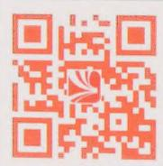

天猫兴盛乐图书专营店二维码

tiān māo xīng shèng lè tú shū zhuān yíng diàn èr wéi mǎ

Mã QR của cửa hàng sách chính hãng Xingshengle trên Tmall

# Trở thành người phụ nữ vừa vặn

**刚刚好的女子 做一个**

*gāng gāng hǎo de nǚ zǐ zuò yí gè*

康静文著

kāng jìng wén zhù

Khang Tĩnh Văn

## Dữ liệu biên mục trước khi xuất bản (CIP)

**图书在版编目（CIP）数据**

*tú shū zài bǎn biān mù （CIP） shù jù*

做一个刚刚好的女子/康静文著.-—南昌:江西美术出版社,2017.7ISBN 978-7-5480-4332-4

zuò yí gè gāng gāng hǎo de nǚ zǐ /kāng jìng wén zhù .-—nán chāng:jiāng xī měi shù chū bǎn shè ,2017.7ISBN 978-7-5480-4332-4

Trở thành người phụ nữ vừa vặn / Khang Tĩnh Văn. — Nam Xương: Nhà xuất bản Mỹ thuật Giang Tây, 2017.7 ISBN 978-7-5480-4332-4

Ⅰ.①做…Ⅱ.①康…Ⅲ.①女性-人生哲学-通俗读物 ⅣV.① B821-49

Ⅰ.①zuò …Ⅱ.①kāng …Ⅲ.①nǚ xìng -rén shēng zhé xué -tōng sú dú wù ⅣV.① B821-49

Ⅰ.①Trở…Ⅱ.①Khang…Ⅲ.①Phụ nữ - Triết lý nhân sinh - Độc phẩm phổ thông Ⅳ.① B821-49

中国版本图书馆CIP数据核字（2017）第033400号

zhōng guó bǎn běn tú shū guǎn CIP shù jù hé zì （2017） dì 033400 hào

Dữ liệu CIP của Thư viện Bản quyền Trung Quốc đã được kiểm duyệt (2017) số 033400

出品人：汤华

chū pǐn rén：tāng huá

Nhà sản xuất: Thang Hoa

企划：江西美术出版社北京分社（北京江美长风文化传播有限公司）

qǐ huà：jiāng xī měi shù chū bǎn shè běi jīng fēn shè（běi jīng jiāng měi zhǎng fēng wén huà chuán bō yǒu xiàn gōng sī）

Điều hành dự án: Chi nhánh Bắc Kinh, Nhà xuất bản Mỹ thuật Giang Tây (Công ty TNHH Văn hóa Truyền thông Giang Mỹ Trường Phong Bắc Kinh)

策划：北京兴盛乐书刊发行有限责任公司

cè huà：běi jīng xīng shèng lè shū kān fā xíng yǒu xiàn zé rèn gōng sī

Định hướng nội dung: Công ty TNHH Phát hành Sách báo Bắc Kinh Xingshengle

责任编辑：王国栋 陈漫兮 楚天顺 陈东

zé rèn biān jí：wáng guó dòng chén màn xī chǔ tiān shùn chén dōng

Biên tập viên phụ trách: Vương Quốc Đống, Trần Mạn Hề, Sở Thiên Thuận, Trần Đông

版式设计：曹☑敏

bǎn shì shè jì：cáo ☑mǐn

Thiết kế trình bày: Tào Mẫn

责任印制：谭勋

zé rèn yìn zhì：tán xūn

Phụ trách in ấn: Đàm Huân

## Trở thành người phụ nữ vừa vặn

**做一个刚刚好的女子**

*zuò yí gè gāng gāng hǎo de nǚ zǐ*

作者：康静文

zuò zhě：kāng jìng wén

Tác giả: Khang Tĩnh Văn

出版：江西美术出版社

chū bǎn：jiāng xī měi shù chū bǎn shè

Nhà xuất bản: Nhà xuất bản Mỹ thuật Giang Tây

社址：南昌市子安路66号江美大厦

shè zhǐ：nán chāng shì zi ān lù 66 hào jiāng měi dà shà

Trụ sở: Tòa nhà Giang Mỹ, số 66, đường Tử An, thành phố Nam Xương

网址：http：//www.jxfinearts.com

wǎng zhǐ ：http：//www.jxfinearts.com

Website: http://www.jxfinearts.com

电子信箱：jxms@jxfinearts.com

diàn zi xìn xiāng ：jxms@jxfinearts.com

Hộp thư điện tử: jxms@jxfinearts.com

电话：010-822937500791-86566124

diàn huà ：010-822937500791-86566124

Điện thoại: 010-82293750 / 0791-86566124

邮编：330025

yóu biān ：330025

Mã bưu chính: 330025

经销：全国新华书店

jīng xiāo：quán guó xīn huá shū diàn

Phân phối: Hệ thống nhà sách Tân Hoa toàn quốc

印刷：保定市西城胶印有限公司

yìn shuā：bǎo dìng shì xī chéng jiāo yìn yǒu xiàn gōng sī

In: Công ty TNHH In ốp-xét Tây Thành, thành phố Bảo Định

版次：2017年7月第1版

bǎn cì ：2017 nián 7 yuè dì 1 bǎn

Lần xuất bản: Lần thứ nhất, tháng 7 năm 2017

印次：2017年7月第1次印刷

yìn cì ：2017 nián 7 yuè dì 1 cì yìn shuā

Lần in: Lần thứ nhất, tháng 7 năm 2017

开本：880mm×1280mm1/32

kāi běn ：880mm×1280mm1/32

Khổ sách: 880mm×1280mm 1/32

印张：7

yìn zhāng ：7

Số trang in: 7

ISBN：978-7-5480-4332-4

ISBN：978-7-5480-4332-4

ISBN: 978-7-5480-4332-4

定价：26.80元

dìng jià ：26.80 yuán

Giá bìa: 26,80 NDT

本书由江西美术出版社出版。

běn shū yóu jiāng xī měi shù chū bǎn shè chū bǎn。

Cuốn sách này do Nhà xuất bản Mỹ thuật Giang Tây xuất bản.

未经出版者书面许可，不得以任何方式抄袭、或节录本书的任何部分。

wèi jīng chū bǎn zhě shū miàn xǔ kě，bù dé yǐ rèn hé fāng shì chāo xí、huò jié lù běn shū de rèn hé bù fèn。

Nếu không có sự cho phép bằng văn bản của nhà xuất bản, không được phép sao chép hoặc trích đoạn bất kỳ phần nào của cuốn sách này dưới bất kỳ hình thức nào.

版权所有，侵权必究

bǎn quán suǒ yǒu，qīn quán bì jiū

Đã đăng ký bản quyền, vi phạm bản quyền sẽ bị xử lý

本书法律顾问：江西豫章律师事务所 晏辉律师

běn shū fǎ lǜ gù wèn：jiāng xī yù zhāng lǜ shī shì wù suǒ yàn huī lǜ shī

Cố vấn pháp lý cho cuốn sách: Luật sư Yến Huy, Công ty Luật Dự Chương Giang Tây

每个女孩的心中都会有一个得不到、放不开的男神。

měi gè nǚ hái de xīn zhōng dū huì yǒu yí gè dé bú dào、fàng bù kāi de nán shén。

Trong lòng mỗi cô gái đều có một “nam thần” không thể có được, không thể buông bỏ.

而每一个男孩的心中，也会有一个忘不了、舍不掉的女神。

ér měi yí gè nán hái de xīn zhōng，yě huì yǒu yí gè wàng bù liǎo、shě bù diào de nǚ shén。

Còn trong lòng mỗi chàng trai, cũng có một “nữ thần” không thể quên, không thể buông.

我的两个闺蜜都有自己仰慕的男神，这两个男神，我就叫他们A和B好了。

wǒ de liǎng gè guī mì dōu yǒu zì jǐ yǎng mù de nán shén，zhè liǎng gè nán shén，wǒ jiù jiào tā men A hé B hǎo le。

Hai cô bạn thân của tôi đều có “nam thần” mình ngưỡng mộ, hai người ấy, tôi gọi là A và B.

很巧，A和B都有自己仰慕的女神，她叫star。

hěn qiǎo ，A hé B dōu yǒu zì jǐ yǎng mù de nǚ shén，tā jiào star。

Thật trùng hợp, A và B đều có một “nữ thần” mà họ ngưỡng mộ, cô ấy tên là Star.

是的，她是同一个人，一个优雅淡然的女子。

shì de，tā shì tóng yī gè rén，yí gè yōu yǎ dàn rán de nǚ zǐ。

Đúng vậy, họ cùng ngưỡng mộ một người — một người phụ nữ thanh nhã và bình thản.

两个闺蜜曾评价star，要说她多美吧，也不觉得；要说她身材多好吧，其实也还好；要说她多么有人格魅力，多么有语言魅力吧，好像也就那样。

liǎng gè guī mì céng píng jià star， yào shuō tā duō měi ba，yě bù jué dé；yào shuō tā shēn cái duō hǎo ba，qí shí yě hái hǎo；yào shuō tā duō me yǒu rén gé mèi lì，duō me yǒu yǔ yán mèi lì ba，hǎo xiàng yě jiù nà yàng。

Hai cô bạn thân từng nhận xét về Star: bảo cô ấy đẹp đến đâu thì cũng chẳng thấy; bảo dáng người cô ấy đẹp thế nào, thực ra cũng bình thường; bảo cô ấy có sức hút về nhân cách, sức hút về lời ăn tiếng nói đến đâu, có vẻ cũng chỉ vậy thôi.

但她就是那么吸引眼球，不愠不火，不骄不躁，不胖不瘦，不极美也绝对不丑……单看每一样都不是多大的优点，但累积在一起，就成为了一个了不起的女人。

dàn tā jiù shì nà me xī yǐn yǎn qiú，bù yùn bù huǒ，bù jiāo bù zào，bù pàng bù shòu，bù jí měi yě jué duì bù chǒu……dān kàn měi yī yàng dōu bú shì duō dà de yōu diǎn，dàn lěi jī zài yì qǐ，jiù chéng wéi le yí gè liǎo bù qǐ de nǚ rén。

Nhưng cô ấy lại thu hút ánh nhìn đến vậy — không lạnh cũng không nồng, không kiêu căng cũng không nóng nảy, không béo không gầy, không tuyệt đẹp nhưng tuyệt đối không xấu... Từng điểm một nhìn riêng đều chẳng phải ưu điểm gì to lớn, nhưng gộp lại với nhau, cô ấy trở thành một người phụ nữ phi thường.

她什么都不是最好，但什么都刚刚好。

tā shén me dōu bú shì zuì hǎo，dàn shén me dōu gāng gāng hǎo。

Ở cô ấy, không gì là tốt nhất, nhưng mọi thứ đều vừa vặn.

在你的身边，或许也有这样的女子。

zài nǐ de shēn biān，huò xǔ yě yǒu zhè yàng de nǚ zǐ。

Xung quanh bạn, có lẽ cũng có những người phụ nữ như vậy.

我们应该以她们为鉴，不攀附不将就，不迷茫不低头，不虚荣不浮躁，不自卑不自大不放弃不沉迷……慢慢地改变自己，把自己变成自己喜欢的样子。

wǒ men yīng gāi yǐ tā men wèi jiàn，bù pān fù bù jiāng jiù，bù mí máng bù dī tóu，bù xū róng bù fú zào，bù zì bēi bù zì dà bù fàng qì bù chén mí……màn màn dì gǎi biàn zì jǐ，bǎ zì jǐ biàn chéng zì jǐ xǐ huān de yàng zi。

Chúng ta nên lấy họ làm gương — không nương tựa, không thỏa hiệp, không lạc lối, không cúi đầu, không hư vinh, không nông nổi, không tự ti, không tự đại, không bỏ cuộc, không đắm chìm... từ từ thay đổi bản thân, biến mình thành hình dáng mà mình yêu thích.

## Điều bạn mong muốn, chính là điều tốt đẹp nhất

**你想要的，就是最好的**

*nǐ xiǎng yào de，jiù shì zuì hǎo de*

相信爱情，爱情才会靠近／003

xiāng xìn ài qíng，ài qíng cái huì kào jìn ／003

Hãy tin vào tình yêu, tình yêu mới tới gần / 003

现实对谁都残酷 / 006

xiàn shí duì shéi dōu cán kù / 006

Hiện thực tàn nhẫn với tất cả mọi người / 006

在时间面前，我们都一样／on

zài shí jiān miàn qián，wǒ men dōu yī yàng ／on

Trước thời gian, chúng ta đều như nhau / 011

那个爱你的人在前方等你／015

nà ge ài nǐ de rén zài qián fāng děng nǐ ／015

Người yêu bạn đang chờ bạn ở phía trước / 015

爱情没有谁对谁错／ 019

ài qíng méi yǒu shuí duì shuí cuò ／ 019

Trong tình yêu, không ai đúng ai sai / 019

一个人也可以过得很好/023

yí gè rén yě kě yǐ guò dé hěn hǎo /023

Một mình cũng có thể sống thật tốt / 023

人生何处是归宿/ 026

rén shēng hé chù shì guī sù / 026

Đâu là bến đỗ của đời người / 026

快乐的时光留不住，悲伤的时光也会过去／029

kuài lè de shí guāng liú bú zhù，bēi shāng de shí guāng yě huì guò qù ／029

Niềm vui không giữ được lâu, nỗi buồn rồi cũng qua đi / 029

当我们一无所有／032

dāng wǒ men yī wú suǒ yǒu ／032

Khi chúng ta trắng tay / 032

不管怎样，无论如何，好好爱自己／035

bù guǎn zěn yàng，wú lùn rú hé，hǎo hǎo ài zì jǐ ／035

Dù thế nào đi nữa, cũng hãy yêu thương bản thân thật tốt / 035

你是不是真正的快乐／039

nǐ shì bú shì zhēn zhèng de kuài lè ／039

Liệu bạn có thực sự vui không / 039

他爱不爱你，只有你自己知道／043

tā ài bù ài nǐ，zhǐ yǒu nǐ zì jǐ zhī dào ／043

Anh ấy có yêu bạn hay không, chỉ mình bạn biết / 043

爱一个人，会改变你的生活态度／046

ài yí gè rén，huì gǎi biàn nǐ de shēng huó tài dù ／046

Yêu một người, sẽ thay đổi thái độ sống của bạn / 046

# Bạn tất nhiên không tầm thường, bạn chỉ cần thời gian để thành công

**你当然不平庸，你只是需要时间去成功**

*nǐ dāng rán bù píng yōng，nǐ zhǐ shì xū yào shí jiān qù chéng gōng*

可以平凡，但别平庸／051

kě yǐ píng fán，dàn bié píng yōng ／051

Có thể bình thường, nhưng đừng tầm thường / 051

坚定你的人生路，不怕晚也别怕输／054

jiān dìng nǐ de rén shēng lù，bù pà wǎn yě bié pà shū ／054

Hãy kiên định con đường đời của mình, đừng sợ muộn cũng đừng sợ thua / 054

不要难为自己／057

bú yào nán wéi zì jǐ ／057

Đừng làm khó bản thân / 057

总有一天你会成为你想成为的自己/060

zǒng yǒu yī tiān nǐ huì chéng wéi nǐ xiǎng chéng wéi de zì jǐ /060

Sẽ có ngày bạn trở thành con người bạn muốn trở thành / 060

我们都曾暗淡无光／064

wǒ men dōu céng àn dàn wú guāng ／064

Chúng ta đều từng mờ nhạt, không ánh sáng / 064

因为什么，我们想要活得漂亮／067

yīn wèi shén me，wǒ men xiǎng yào huó dé piào liàng ／067

Vì điều gì, chúng ta muốn sống cho đẹp / 067

让自己先做个碌碌无为的人／070

ràng zì jǐ xiān zuò gè lù lù wú wéi de rén ／070

Trước tiên, hãy để mình là một người bình thường vô tích sự / 070

你最想要的到底是什么／073

nǐ zuì xiǎng yào de dào dǐ shì shén me ／073

Điều bạn thực sự muốn nhất rốt cuộc là gì / 073

哭过就好了／075

kū guò jiù hǎo le ／075

Khóc xong rồi sẽ ổn / 075

还一片属于自己的天空／078

hái yī piàn shǔ yú zì jǐ de tiān kōng ／078

Trả lại một khoảng trời thuộc về riêng mình / 078

给理想一点时间／082

gěi lǐ xiǎng yì diǎn shí jiān ／082

Hãy cho lý tưởng một chút thời gian / 082

给自己一些消遣的时间／086

gěi zì jǐ yī xiē xiāo qiǎn de shí jiān ／086

Hãy dành cho mình chút thời gian thư giãn / 086

有理想，就有疼痛／090

yǒu lǐ xiǎng，jiù yǒu téng tòng ／090

Có lý tưởng, ắt có đau đớn / 090

不要害怕一无所有，应该害怕的是别无所求/095

bú yào hài pà yī wú suǒ yǒu，yīng gāi hài pà de shì bié wú suǒ qiú /095

Đừng sợ trắng tay, điều đáng sợ là không còn điều gì để cầu mong / 095

## PHẦN 3

**PART 3**

*PART 3*

谢谢那些人，曾经温暖过我们的人生

xiè xiè nà xiē rén，céng jīng wēn nuǎn guò wǒ men de rén shēng

Cảm ơn những người từng sưởi ấm cuộc đời chúng ta

给你以温暖信任的人/101

gěi nǐ yǐ wēn nuǎn xìn rèn de rén /101

Người trao cho bạn sự ấm áp và tin cậy / 101

最重要的人一直都在你身边／105

zuì zhòng yào de rén yì zhí dōu zài nǐ shēn biān ／105

Người quan trọng nhất vẫn luôn ở bên bạn / 105

家，就是我们的退路／109

jiā，jiù shì wǒ men de tuì lù ／109

Gia đình, chính là đường lui của chúng ta / 109

谁都要面对生死离别／

shéi dōu yào miàn duì shēng sǐ lí bié ／

Ai rồi cũng phải đối mặt với sinh ly tử biệt /

谢谢你温暖我 ／114

xiè xiè nǐ wēn nuǎn wǒ ／114

Cảm ơn em đã sưởi ấm tôi / 114

是他让你成为一个独立的人/121

shì tā ràng nǐ chéng wéi yí gè dú lì de rén /121

Là anh ấy giúp bạn trở thành một người độc lập / 121

遇见和你心灵相通的人／124

yù jiàn hé nǐ xīn líng xiāng tōng de rén ／124

Gặp người tâm đầu ý hợp với bạn / 124

未来你还好吗/127

wèi lái nǐ hái hǎo ma /127

Tương lai ơi, bạn vẫn ổn chứ / 127

爱一种让你拥有力量的东西／130

ài yī zhǒng ràng nǐ yōng yǒu lì liàng de dōng xī ／130

Yêu — một thứ cho bạn sức mạnh / 130

PART 4成为一个淡定从容，一切都刚刚好的女子真正的坚强，是当你不再需要倾诉／139淡然面对青春的弯路／143有些事，学会接受就好了／147

PART 4 chéng wéi yí gè dàn dìng cóng róng，yī qiè dōu gāng gāng hǎo de nǚ zǐ zhēn zhèng de jiān qiáng，shì dāng nǐ bù zài xū yào qīng sù ／139 dàn rán miàn duì qīng chūn de wān lù ／143 yǒu xiē shì，xué huì jiē shòu jiù hǎo le ／147

PHẦN 4 Trở thành một người phụ nữ bình thản ung dung, mọi thứ đều vừa vặn — Sự kiên cường thực sự là khi bạn không còn cần trút bầu tâm sự / 139 — Bình thản đối diện với những khúc quanh của tuổi trẻ / 143 — Có những chuyện, học cách chấp nhận là được / 147

不经过深夜痛哭的人，不足以谈人生/151

bù jīng guò shēn yè tòng kū de rén，bù zú yǐ tán rén shēng /151

Người chưa từng khóc thảm thiết trong đêm khuya thì không đủ tư cách bàn về nhân sinh / 151

每个人都有一个自我／155

měi gè rén dōu yǒu yí gè zì wǒ ／155

Mỗi người đều có một cái tôi / 155

从黑暗到光明，或许只有一扇门的距离／158

cóng hēi àn dào guāng míng，huò xǔ zhǐ yǒu yī shàn mén de jù lí ／158

Từ bóng tối đến ánh sáng, có lẽ chỉ cách một cánh cửa / 158

让心里永远住着未成年的你／161

ràng xīn lǐ yǒng yuǎn zhù zhe wèi chéng nián de nǐ ／161

Hãy để trong tim mãi mãi có một “bạn” chưa trưởng thành / 161

不断受伤，不断成长/165

bù duàn shòu shāng，bù duàn chéng zhǎng /165

Không ngừng tổn thương, không ngừng trưởng thành / 165

每一次的心痛都是一种领悟／168

měi yī cì de xīn tòng dōu shì yī zhǒng lǐng wù ／168

Mỗi lần đau lòng đều là một lần ngộ ra / 168

别怕岁月蹉跎／172

bié pà suì yuè cuō tuó ／172

Đừng sợ thời gian bị hoang phí / 172

没有人会在原地等你／175

méi yǒu rén huì zài yuán dì děng nǐ ／175

Không ai đứng yên nơi cũ chờ bạn / 175

人生要有一场说走就走的旅行／179

rén shēng yào yǒu yī cháng shuō zǒu jiù zǒu de lǚ xíng ／179

Đời người cần có một chuyến đi nói đi là đi / 179

感谢生活给予我们的所有刁难/183

gǎn xiè shēng huó jǐ yǔ wǒ men de suǒ yǒu diāo nàn /183

Cảm ơn cuộc sống đã ban cho chúng ta mọi khó khăn / 183

我们都曾孤单前行／187

wǒ men dōu céng gū dān qián xíng ／187

Chúng ta đều từng cô đơn bước về phía trước / 187

每个人心里都有一个小王子／191

měi gè rén xīn lǐ dōu yǒu yí gè xiǎo wáng zǐ ／191

Trong lòng mỗi người đều có một hoàng tử bé / 191

怎样才能成为最好的自己／194

zěn yàng cái néng chéng wéi zuì hǎo de zì jǐ ／194

Làm thế nào để trở thành bản thân tốt nhất / 194

没人会心疼你，你要好好爱自己／198

méi rén huì xīn téng nǐ，nǐ yào hǎo hǎo ài zì jǐ ／198

Không ai xót thương bạn, bạn phải yêu thương bản thân thật tốt / 198

如花美眷，似水流年／203

rú huā měi juàn，sì shuǐ liú nián ／203

Người đẹp như hoa, năm tháng trôi như dòng nước / 203

愿被这个世界温柔相待/207

yuàn bèi zhè ge shì jiè wēn róu xiāng dài /207

Mong được thế gian này đối xử dịu dàng / 207

没有任何原因，不去绽放自己/210

méi yǒu rèn hé yuán yīn，bù qù zhàn fàng zì jǐ /210

Không có bất kỳ lý do nào để không nở rộ chính mình / 210

一切好的坏的，都会过去/213

yī qiè hǎo de huài de，dū huì guò qù /213

Mọi điều tốt đẹp hay tồi tệ, rồi cũng sẽ qua đi / 213

PART 1

PART 1

PHẦN 1

你想要的，就是最好的

nǐ xiǎng yào de，jiù shì zuì hǎo de

Điều bạn mong muốn, chính là điều tốt đẹp nhất

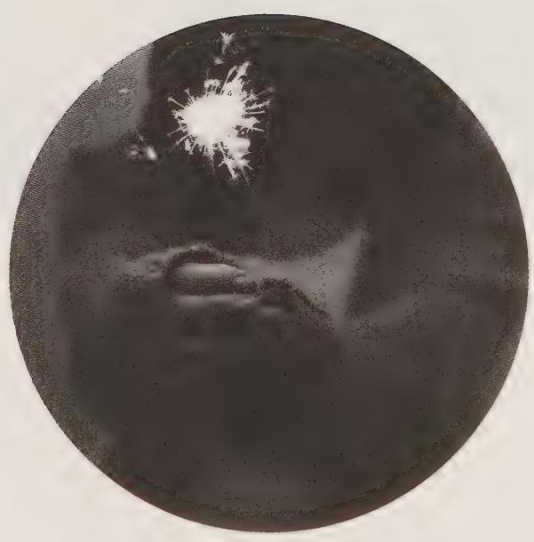

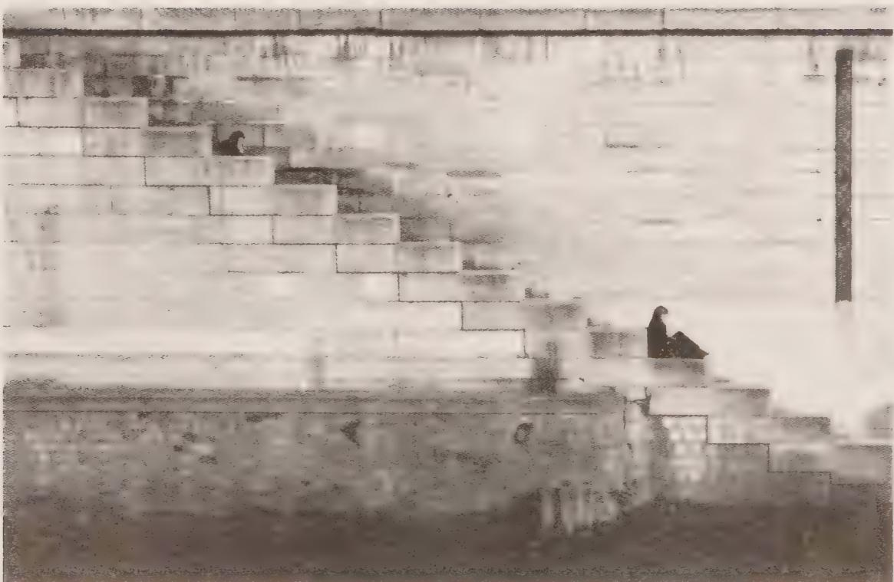

## Hãy tin vào tình yêu, tình yêu mới tới gần

**相信爱情，爱情才会靠近**

*xiāng xìn ài qíng，ài qíng cái huì kào jìn*

爱情这种事，经不起细细推敲，一推敲就千疮百孔。

ài qíng zhè zhǒng shì，jīng bù qǐ xì xì tuī qiāo，yī tuī qiāo jiù qiān chuāng bǎi kǒng。

Chuyện tình yêu chẳng chịu nổi sự soi xét tỉ mỉ, vừa soi xét là lộ ra đầy vết thương.

但是我们唯有相信幸福，幸福才会来临；相信爱情，爱情才会靠近。

dàn shì wǒ men wéi yǒu xiāng xìn xìng fú，xìng fú cái huì lái lín；xiāng xìn ài qíng，ài qíng cái huì kào jìn。

Nhưng chúng ta chỉ có tin vào hạnh phúc, hạnh phúc mới tìm đến; tin vào tình yêu, tình yêu mới tới gần.

记得大学毕业刚出来找工作的时候，每天奔波劳累却一直找不到自己喜欢和满意的工作，每天都非常失意、痛苦、懊恼。

jì de dà xué bì yè gāng chū lái zhǎo gōng zuò de shí hòu，měi tiān bēn bō láo lèi què yì zhí zhǎo bú dào zì jǐ xǐ huān hé mǎn yì de gōng zuò，měi tiān dōu fēi cháng shī yì、tòng kǔ、ào nǎo。

Nhớ hồi vừa tốt nghiệp đại học ra đời tìm việc, ngày ngày vất vả bôn ba mà mãi không tìm được công việc mình thích và hài lòng, mỗi ngày đều thất vọng, khổ sở, bực bội.

个女同学打电话告诉我：“你不要太消极悲伤了，生活是你想过成什么样子，就是什么样子的。

gè nǚ tóng xué dǎ diàn huà gào sù wǒ ：“nǐ bú yào tài xiāo jí bēi shāng le，shēng huó shì nǐ xiǎng guò chéng shén me yàng zi，jiù shì shén me yàng zi de。

Một nữ bạn học gọi điện nói với tôi: “Cậu đừng tiêu cực bi thương quá, cuộc sống là như thế nào là do cậu muốn nó như thế.

我总是把事情往好的方面想，我总是告诉自己要开心快乐生活，结果就是好的，我也活得很阳光。

wǒ zǒng shì bǎ shì qíng wǎng hǎo de fāng miàn xiǎng，wǒ zǒng shì gào sù zì jǐ yào kāi xīn kuài lè shēng huó，jié guǒ jiù shì hǎo de，wǒ yě huó dé hěn yáng guāng。

Tớ luôn nghĩ về những điều tốt đẹp, tớ luôn tự nhủ phải vui vẻ hạnh phúc mà sống, kết quả là mọi thứ đều tốt đẹp, tớ sống rất tươi sáng.

转念一想，爱情又何尝不是如此呢。

zhuǎn niàn yī xiǎng，ài qíng yòu hé cháng bú shì rú cǐ ne。

Nghĩ lại, tình yêu chẳng phải cũng như thế hay sao.

我们内心怎样看待它，它就是怎样的。

wǒ men nèi xīn zěn yàng kàn dài tā，tā jiù shì zěn yàng de。

Trong lòng ta nhìn nhận nó thế nào, nó chính là như thế ấy.

只是，我们看了太多他人的分分合合，也经历了太多的恩恩怨怨，从心里怕了。

zhǐ shì，wǒ men kàn le tài duō tā rén de fēn fēn hé hé，yě jīng lì le tài duō de ēn ēn yuàn yuàn，cóng xīn lǐ pà le。

Chỉ là, chúng ta đã chứng kiến quá nhiều cảnh hợp tan của người khác, cũng trải qua quá nhiều ân ân oán oán, nên đã sợ từ trong tâm.

有一个女孩总是在半夜里发短信给我，说她害怕，说她不敢爱，不敢接受。

yǒu yí gè nǚ hái zǒng shì zài bàn yè lǐ fā duǎn xìn gěi wǒ，shuō tā hài pà，shuō tā bù gǎn ài，bù gǎn jiē shòu。

Có một cô gái luôn nhắn tin cho tôi lúc nửa đêm, nói cô ấy sợ hãi, nói cô ấy không dám yêu, không dám nhận.

于是，有些故事，还没开始就退却了；有些话还没来得及说，就在心底泯灭了。

yú shì，yǒu xiē gù shì，hái méi kāi shǐ jiù tuì què le；yǒu xiē huà hái méi lái de jí shuō，jiù zài xīn dǐ mǐn miè le。

Thế là, có những câu chuyện, chưa bắt đầu đã lùi bước; có những lời, chưa kịp nói ra đã chôn vùi trong đáy lòng.

刚毕业的时候，一个谈了多次恋爱的朋友告诉我，他不会再相信爱情了。

gāng bì yè de shí hòu，yí gè tán le duō cì liàn ài de péng yǒu gào sù wǒ，tā bú huì zài xiāng xìn ài qíng le。

Hồi mới tốt nghiệp, một người bạn đã yêu nhiều lần nói với tôi rằng anh ấy sẽ không tin vào tình yêu nữa.

他说，他们宿舍的一个哥们儿跟他女朋友谈了三年，最后还是分手了。

tā shuō，tā men sù shè de yí gè gē men er gēn tā nǚ péng yǒu tán le sān nián，zuì hòu hái shì fēn shǒu le。

Anh ấy kể, một người bạn cùng phòng ký túc xá của anh yêu bạn gái được ba năm, cuối cùng vẫn chia tay.

都说大学时谈恋爱，毕业的那天就是分手的那天，但那对情侣感情非常好，是他最看好的一对，他以为他们会一直走下去，可最后还是分开了。

dōu shuō dà xué shí tán liàn ài，bì yè de nà tiān jiù shì fēn shǒu de nà tiān，dàn nà duì qíng lǚ gǎn qíng fēi cháng hǎo，shì tā zuì kàn hǎo de yī duì，tā yǐ wéi tā men huì yì zhí zǒu xià qù，kě zuì hòu hái shì fēn kāi le。

Người ta thường nói yêu hồi đại học, ngày tốt nghiệp chính là ngày chia tay, nhưng đôi ấy tình cảm rất tốt, là cặp đôi anh ấy trông đợi nhất, anh cứ tưởng họ sẽ bên nhau mãi, thế mà cuối cùng vẫn chia xa.

他说不再相信爱情的时候，眼神坚定而悲伤。

tā shuō bù zài xiāng xìn ài qíng de shí hòu，yǎn shén jiān dìng ér bēi shāng。

Lúc nói không còn tin vào tình yêu, ánh mắt anh ấy kiên định mà lại buồn.

但是两年之后，他又恋爱了。

dàn shì liǎng nián zhī hòu，tā yòu liàn ài le。

Nhưng hai năm sau, anh ấy lại yêu.

他说：“五一，我要结婚了，你来参加婚礼吗？

tā shuō ：“wǔ yī，wǒ yào jié hūn le，nǐ lái cān jiā hūn lǐ ma？

Anh ấy nói: “Nghỉ lễ Quốc tế Lao động, tôi sắp cưới rồi, cậu đến dự đám cưới nhé?

”我把他曾说过不再相信爱情的话告诉他，他居然很惊讶，自己完全不记得说过这样的话。

”wǒ bǎ tā céng shuō guò bù zài xiāng xìn ài qíng de huà gào sù tā，tā jū rán hěn jīng yà，zì jǐ wán quán bú jì dé shuō guò zhè yàng de huà。

” Tôi nhắc lại những lời anh ấy từng nói là không còn tin vào tình yêu, vậy mà anh ấy ngạc nhiên lắm, hoàn toàn không nhớ mình từng nói như vậy.

人是敏感的，受了伤之后，总是选择躲藏。

rén shì mǐn gǎn de，shòu le shāng zhī hòu，zǒng shì xuǎn zé duǒ cáng。

Con người vốn nhạy cảm, sau khi bị tổn thương, luôn chọn cách trốn tránh.

人也是天性猜疑的，在经历和看过了背叛，感受不安之后，不愿意再去相信。

rén yě shì tiān xìng cāi yí de，zài jīng lì hé kàn guò le bèi pàn，gǎn shòu bù ān zhī hòu，bù yuàn yì zài qù xiāng xìn。

Con người cũng mang bản tính nghi ngờ, sau khi trải qua và chứng kiến sự phản bội, cảm nhận bất an, thì không muốn tin lại nữa.

有多少次因为胆怯，我们跟自己喜欢的人擦肩而过；有多少次因为害怕，我们拒绝了幸福来临的机会；又有多少次，因为闪躲和畏惧，我们连“喜欢”两个字都未曾开口。

yǒu duō shǎo cì yīn wèi dǎn qiè，wǒ men gēn zì jǐ xǐ huān de rén cā jiān ér guò；yǒu duō shǎo cì yīn wèi hài pà，wǒ men jù jué le xìng fú lái lín de jī huì；yòu yǒu duō shǎo cì，yīn wèi shǎn duǒ hé wèi jù，wǒ men lián “xǐ huān ”liǎng gè zì dōu wèi céng kāi kǒu。

Đã bao nhiêu lần vì nhút nhát, chúng ta lỡ hẹn với người mình thích; bao nhiêu lần vì sợ hãi, chúng ta từ chối cơ hội hạnh phúc đến; lại bao nhiêu lần, vì né tránh và e dè, chúng ta chưa từng nói ra được hai chữ “thích”.

我们宁愿忍受失去和错过的痛苦，宁愿忍受想念和孤独的煎熬，都不愿意迈出心底的那一步防线，去相信对方，相信爱情，抑或只是相信自己。

wǒ men nìng yuàn rěn shòu shī qù hé cuò guò de tòng kǔ，nìng yuàn rěn shòu xiǎng niàn hé gū dú de jiān áo，dōu bù yuàn yì mài chū xīn dǐ de nà yī bù fáng xiàn，qù xiāng xìn duì fāng，xiāng xìn ài qíng，yì huò zhǐ shì xiāng xìn zì jǐ。

Chúng ta thà chịu đựng nỗi đau mất mát và lỡ hẹn, thà chịu đựng nỗi giày vò của nhớ mong và cô đơn, cũng không muốn bước qua hàng rào cuối cùng trong lòng, để tin đối phương, tin vào tình yêu, hay chỉ đơn giản là tin vào chính mình.

关于爱情，真的有太多的说法，不尽雷同。

guān yú ài qíng，zhēn de yǒu tài duō de shuō fǎ，bù jìn léi tóng。

Về tình yêu, thực sự có quá nhiều cách nói, không giống nhau.

在一段时间内，有人告诉我们，不要去找，而是要等，真正的缘分早晚都会降临你身，你只要做好你自己就行了。

zài yī duàn shí jiān nèi，yǒu rén gào sù wǒ men，bú yào qù zhǎo，ér shì yào děng，zhēn zhèng de yuán fēn zǎo wǎn dū huì jiàng lín nǐ shēn，nǐ zhǐ yào zuò hǎo nǐ zì jǐ jiù xíng le。

Có những lúc, người ta bảo chúng ta, đừng đi tìm, mà hãy chờ đợi, duyên phận thực sự sớm muộn gì cũng sẽ đến với bạn, bạn chỉ cần làm tốt chính mình là được.

在另一段时间内，一些人告诉我们，喜欢就要勇敢主动地去争取，难道你要眼睁睁地看着自己喜欢的人跟别人在一起？

zài lìng yī duàn shí jiān nèi，yī xiē rén gào sù wǒ men，xǐ huān jiù yào yǒng gǎn zhǔ dòng dì qù zhēng qǔ，nán dào nǐ yào yǎn zhēng zhēng dì kàn zhe zì jǐ xǐ huān de rén gēn bié rén zài yì qǐ？

Có những lúc khác, người ta lại bảo chúng ta, đã thích thì phải dũng cảm chủ động giành lấy, lẽ nào bạn muốn nhìn người mình thích ở bên người khác?

我们有时候相信前者，有时候默认后者，有时候我们什么也不相信。

wǒ men yǒu shí hòu xiāng xìn qián zhě，yǒu shí hòu mò rèn hòu zhě，yǒu shí hòu wǒ men shén me yě bù xiāng xìn。

Chúng ta có khi tin điều trước, có khi ngầm chấp nhận điều sau, có khi chẳng tin gì cả.

只是，在我们读过了那么多爱情的理论，看过了那么多爱情的故事，我们应该已经明白：爱情，它没有任何成文的规定，就像生活没有任何成文的准则。

zhǐ shì，zài wǒ men dú guò le nà me duō ài qíng de lǐ lùn，kàn guò le nà me duō ài qíng de gù shì，wǒ men yīng gāi yǐ jīng míng bái：ài qíng，tā méi yǒu rèn hé chéng wén de guī dìng，jiù xiàng shēng huó méi yǒu rèn hé chéng wén de zhǔn zé。

Chỉ là, khi đã đọc qua nhiều lý thuyết tình yêu đến thế, xem qua nhiều câu chuyện tình yêu đến thế, chúng ta hẳn đã hiểu: tình yêu, nó chẳng có quy định nào thành văn, cũng như cuộc sống không có bất kỳ chuẩn mực nào thành văn.

能够把握和主宰爱情的，不是书中的文字，也不是别人的故事，而是你自己。

néng gòu bǎ wò hé zhǔ zǎi ài qíng de，bú shì shū zhōng de wén zì，yě bú shì bié rén de gù shì，ér shì nǐ zì jǐ。

Người có thể nắm giữ và làm chủ tình yêu, không phải con chữ trong sách, cũng không phải câu chuyện của người khác, mà là chính bạn.

相信，只要你快乐地抬头看着天，只要你仍然选择相信爱情，命运绝不会亏待你。

xiāng xìn，zhǐ yào nǐ kuài lè dì tái tóu kàn zhe tiān，zhǐ yào nǐ réng rán xuǎn zé xiāng xìn ài qíng，mìng yùn jué bú huì kuī dài nǐ。

Hãy tin rằng, chỉ cần bạn vui vẻ ngẩng đầu nhìn trời, chỉ cần bạn vẫn chọn tin vào tình yêu, số phận tuyệt đối sẽ không phụ bạn.

我们往往要做的，是原谅他人，也放过自己。

wǒ men wǎng wǎng yào zuò de，shì yuán liàng tā rén，yě fàng guò zì jǐ。

Điều chúng ta thường cần làm, là tha thứ cho người khác, cũng là buông tha cho chính mình.

真爱永远不晚，

zhēn ài yǒng yuǎn bù wǎn，

Tình yêu chân thành không bao giờ là quá muộn,

## Hiện thực tàn nhẫn với tất cả mọi người

**现实对谁都残酷**

*xiàn shí duì shéi dōu cán kù*

随着年龄的增长，现实会告诉你，曾经的理想、年少时坚定的信念，是多么的幼稚，又似天方夜谭般不可实现。

suí zhe nián líng de zēng zhǎng，xiàn shí huì gào sù nǐ，céng jīng de lǐ xiǎng、nián shào shí jiān dìng de xìn niàn，shì duō me de yòu zhì，yòu shì tiān fāng yè tán bān bù kě shí xiàn。

Càng lớn tuổi, hiện thực sẽ cho bạn biết, những lý tưởng ngày xưa, những niềm tin kiên định thuở thiếu thời, ngây thơ biết bao, lại như chuyện cổ tích không thể nào thực hiện được.

如果你被现实说服了，便会改变自己，拔掉自己身上所有的刺；而若你试着反抗，除了被现实无情地改变之外，可能还要承受煎熬的苦楚。

rú guǒ nǐ bèi xiàn shí shuō fú le，biàn huì gǎi biàn zì jǐ，bá diào zì jǐ shēn shàng suǒ yǒu de cì；ér ruò nǐ shì zhe fǎn kàng，chú le bèi xiàn shí wú qíng dì gǎi biàn zhī wài，kě néng hái yào chéng shòu jiān áo de kǔ chǔ。

Nếu bạn bị hiện thực thuyết phục, bạn sẽ thay đổi bản thân, nhổ đi mọi chiếc gai trên người; còn nếu bạn thử phản kháng, ngoài việc bị hiện thực tàn nhẫn thay đổi, bạn còn có thể phải chịu đựng nỗi khổ giày vò.

《海上钢琴师》中“1900”说：“我害怕的不是我看到的一切，而是我没有看到的。

《hǎi shàng gāng qín shī》zhōng “1900” shuō ：“wǒ hài pà de bú shì wǒ kàn dào de yī qiè，ér shì wǒ méi yǒu kàn dào de。

Trong phim 《Nghệ sĩ dương cầm trên biển》, nhân vật “1900” nói: “Điều tôi sợ không phải những gì tôi đã thấy, mà là những gì tôi chưa thấy.

世界那么大，请你告诉我它的尽头在哪儿？

shì jiè nà me dà，qǐng nǐ gào sù wǒ tā de jìn tóu zài nǎ ér？

Thế giới rộng lớn đến vậy, xin hãy nói cho tôi biết điểm tận cùng của nó ở đâu?

我不知道在那么大的世界里怎样去选择一条路，一栋房子，一个女人，一个家。

wǒ bù zhī dào zài nà me dà de shì jiè lǐ zěn yàng qù xuǎn zé yī tiáo lù，yī dòng fáng zi，yí gè nǚ rén，yí gè jiā。

Tôi không biết trong một thế giới rộng lớn như vậy làm sao để chọn một con đường, một ngôi nhà, một người phụ nữ, một mái ấm.

99

99

99

“1900”就是现实中的你我，在选择前进和面对时，会觉得这个世界是一次太过于漫长的旅途。

“1900” jiù shì xiàn shí zhōng de nǐ wǒ，zài xuǎn zé qián jìn huó miàn duì shí，huì jué de zhè ge shì jiè shì yī cì tài guò yú màn cháng de lǚ tú。

“1900” chính là tôi và bạn ngoài hiện thực, khi phải lựa chọn tiến lên và đối mặt, chúng ta sẽ cảm thấy thế giới này là một chuyến hành trình quá đỗi dài dằng dặc.

但我们无法像“1900”那样，永远待在海上。

dàn wǒ men wú fǎ xiàng “1900” nà yàng，yǒng yuǎn dài zài hǎi shàng。

Nhưng chúng ta không thể như “1900”, mãi mãi ở trên biển.

更多的时候，我们必须在理想与现实的冲突中，不断地摸索和前进。

gèng duō de shí hòu，wǒ men bì xū zài lǐ xiǎng yǔ xiàn shí de chōng tū zhōng，bù duàn dì mō suǒ hé qián jìn。

Phần lớn thời gian, chúng ta buộc phải trong sự xung đột giữa lý tưởng và hiện thực, không ngừng dò dẫm và tiến bước.

记得，有一个朋友，在她第一次感情受挫的时候，哭着跑过来向我询问，为什么爱的人要让自己受伤，她那么爱他。

jì de，yǒu yí gè péng yǒu，zài tā dì yī cì gǎn qíng shòu cuò de shí hòu，kū zhe pǎo guò lái xiàng wǒ xún wèn，wèi shén me ài de rén yào ràng zì jǐ shòu shāng，tā nà me ài tā。

Nhớ có một người bạn, lần đầu tình cảm thất bại, cô ấy khóc lóc chạy đến hỏi tôi, vì sao người mình yêu lại khiến mình tổn thương, cô yêu anh ấy nhiều đến thế.

她觉得整个世界都坍塌了，她一无所有，她再也无法重新生活，再也无法去重新爱上什么人。

tā jué de zhěng gè shì jiè dōu tān tā le，tā yī wú suǒ yǒu，tā zài yě wú fǎ chóng xīn shēng huó，zài yě wú fǎ qù chóng xīn ài shàng shén me rén。

Cô ấy cảm thấy cả thế giới sụp đổ, cô trắng tay, cô không thể nào sống lại được nữa, không thể nào yêu lại một ai đó nữa.

她觉得自己受到了这个世界上最深最重的伤害。

tā jué de zì jǐ shòu dào le zhè ge shì jiè shàng zuì shēn zuì zhòng de shāng hài。

Cô ấy cho rằng mình phải chịu tổn thương sâu nặng nhất trên đời này.

也许爱情的伤害对她来说，真的太深刻、太刻骨，但是没有什么绝无仅有。

yě xǔ ài qíng de shāng hài duì tā lái shuō，zhēn de tài shēn kè、tài kè gǔ，dàn shì méi yǒu shén me jué wú jǐn yǒu。

Có lẽ nỗi tổn thương tình yêu đối với cô ấy thực sự quá sâu sắc, quá khắc cốt, nhưng chẳng có gì là duy nhất, không gì sánh được.

一切的脆弱，都只是因为她第一次经历情感的挫败，第一次受伤罢了。

yī qiè de cuì ruò，dōu zhǐ shì yīn wèi tā dì yī cì jīng lì qíng gǎn de cuò bài，dì yī cì shòu shāng bà le。

Mọi sự yếu đuối, chỉ vì cô ấy lần đầu trải qua thất bại trong tình cảm, lần đầu bị tổn thương mà thôi.

她还是重新爱了，仅仅半年之后。

tā hái shì chóng xīn ài le，jǐn jǐn bàn nián zhī hòu。

Cô ấy vẫn yêu lại, chỉ nửa năm sau.

她脸上的笑容，已经淹没了她曾经问过的那些问题，爱情为什么会这样，为什么自己会那么凄惨。

tā liǎn shàng de xiào róng，yǐ jīng yān mò le tā céng jīng wèn guò de nà xiē wèn tí，ài qíng wèi shén me huì zhè yàng，wèi shén me zì jǐ huì nà me qī cǎn。

Nụ cười trên gương mặt cô đã phủ lấp những câu hỏi cô từng thắc mắc, vì sao tình yêu lại ra nông nỗi này, vì sao mình lại bi thảm đến vậy.

第二年，当她再次失去，被伤害、被欺骗时，她又来找我。

dì èr nián，dāng tā zài cì shī qù，bèi shāng hài、bèi qī piàn shí，tā yòu lái zhǎo wǒ。

Năm sau, khi cô ấy lại mất đi, lại bị tổn thương, bị lừa dối, cô lại tìm đến tôi.

依然痛哭流涕，像个受伤的孩子。

yī rán tòng kū liú tì，xiàng gè shòu shāng de hái zi。

Vẫn khóc lóc thảm thiết, như một đứa trẻ bị tổn thương.

但这一次她并不绝望地认为失去爱情就一无所有。

dàn zhè yī cì tā bìng bù jué wàng dì rèn wéi shī qù ài qíng jiù yī wú suǒ yǒu。

Nhưng lần này cô không tuyệt vọng cho rằng mất tình yêu là mất tất cả.

那个时候，我看到的，是她默认现实的残

nà ge shí hòu，wǒ kàn dào de，shì tā mò rèn xiàn shí de cán

Lúc đó, điều tôi thấy, là cô ngầm chấp nhận sự tàn

酷，承认自己错误的眼光。

kù，chéng rèn zì jǐ cuò wù de yǎn guāng。

khốc của hiện thực, thừa nhận cái nhìn sai lầm của mình.

当哭完、发泄完，她不再像第一次那样埋怨诅咒这一切，反而狠狠地说以后要更加坚强，迎难而上。

dāng kū wán、fā xiè wán，tā bù zài xiàng dì yī cì nà yàng mán yuàn zǔ zhòu zhè yī qiè，fǎn ér hěn hěn dì shuō yǐ hòu yào gèng jiā jiān qiáng，yíng nán ér shàng。

Khi khóc xong, trút xong, cô không còn như lần đầu oán trách nguyền rủa mọi thứ, ngược lại nghiến răng nói sau này phải mạnh mẽ hơn, đối mặt với khó khăn.

她已经学会，想尽办法让自己更坚韧地面对所发生的一切。

tā yǐ jīng xué huì，xiǎng jǐn bàn fǎ ràng zì jǐ gèng jiān rèn dì miàn duì suǒ fā shēng de yī qiè。

Cô đã học được cách, dùng mọi cách để bản thân kiên cường hơn mà đối diện với mọi chuyện đã xảy ra.

真的是这样，这个世界，没有什么是绝无仅有。

zhēn de shì zhè yàng，zhè ge shì jiè，méi yǒu shén me shì jué wú jǐn yǒu。

Đúng là như vậy, trên đời này, không có gì là duy nhất, hiếm có.

你以为他离开你，你便再也不会义无反顾地那样去爱一个人了，然而不久，你又遇到了一个更值得爱的人，完全忘记了上一次的伤痛。

nǐ yǐ wéi tā lí kāi nǐ，nǐ biàn zài yě bú huì yì wú fǎn gù dì nà yàng qù ài yí gè rén le，rán ér bù jiǔ，nǐ yòu yù dào le yí gè gèng zhí de ài de rén，wán quán wàng jì le shàng yī cì de shāng tòng。

Bạn tưởng anh ấy rời xa bạn, bạn sẽ không bao giờ dốc lòng yêu một người như thế nữa, nhưng chẳng bao lâu, bạn lại gặp một người đáng yêu hơn, hoàn toàn quên đi nỗi đau lần trước.

你以为，你经历了命运所能给的最大的苦楚，然而人生还有不断的千难万难的事在等着你。

nǐ yǐ wéi，nǐ jīng lì le mìng yùn suǒ néng gěi de zuì dà de kǔ chǔ，rán ér rén shēng huán yǒu bù duàn de qiān nán wàn nán de shì zài děng zhe nǐ。

Bạn tưởng rằng, mình đã trải qua nỗi khổ lớn nhất mà số phận có thể ban cho, thế nhưng cuộc đời còn muôn vàn gian nan đang chờ bạn phía trước.

我们唯有不断地打磨修炼自己，变成一个内心强大的人，去坦然面对现实所给的一切痛苦与不安，才能左右生活，主宰命运。

wǒ men wéi yǒu bù duàn dì dǎ mó xiū liàn zì jǐ，biàn chéng yí gè nèi xīn qiáng dà de rén，qù tǎn rán miàn duì xiàn shí suǒ gěi de yī qiè tòng kǔ yǔ bù ān，cái néng zuǒ yòu shēng huó，zhǔ zǎi mìng yùn。

Chúng ta chỉ có không ngừng rèn giũa và tu dưỡng bản thân, trở thành một người có tâm hồn mạnh mẽ, bình thản đối mặt với mọi đau khổ và bất an mà hiện thực mang đến, mới có thể xoay chuyển cuộc sống, làm chủ số phận.

人生路上我们一直都在做选择题，即使我们没有主动做任何选择。

rén shēng lù shàng wǒ men yì zhí dōu zài zuò xuǎn zé tí，jí shǐ wǒ men méi yǒu zhǔ dòng zuò rèn hé xuǎn zé。

Trên đường đời, chúng ta luôn đứng trước những bài toán lựa chọn, dù chúng ta chẳng hề chủ động lựa chọn gì cả.

人生没有标准的答案，谁都无法预料未来，我们只能走好自己选择的每一步。

rén shēng méi yǒu biāo zhǔn de dá àn，shéi dōu wú fǎ yù liào wèi lái，wǒ men zhǐ néng zǒu hǎo zì jǐ xuǎn zé de měi yī bù。

Cuộc đời không có đáp án tiêu chuẩn, không ai có thể đoán trước tương lai, chúng ta chỉ có thể bước vững từng bước mình đã chọn.

即使偶尔也会觉得这个世界是一次太过于漫长的旅途。

jí shǐ ǒu ěr yě huì jué de zhè ge shì jiè shì yī cì tài guò yú màn cháng de lǚ tú。

Dẫu đôi khi cũng cảm thấy thế giới này là một chuyến hành trình quá đỗi dài dằng dặc.

而更多的时候，我会在夜深人静里惧怕起生命的短暂。

ér gèng duō de shí hòu，wǒ huì zài yè shēn rén jìng lǐ jù pà qǐ shēng mìng de duǎn zàn。

Còn phần lớn thời gian, tôi sợ hãi sự ngắn ngủi của đời người trong đêm khuya thanh vắng.

我怕来不及爱，来不及带走，来不及做很多事情。

wǒ pà lái bù jí ài，lái bù jí dài zǒu，lái bù jí zuò hěn duō shì qíng。

Tôi sợ không kịp yêu, không kịp mang đi, không kịp làm rất nhiều điều.

我害怕自己认认真真、辛辛苦苦来人世走一遭，就这样在百年之后被所有人遗忘。

wǒ hài pà zì jǐ rèn rèn zhēn zhēn、xīn xīn kǔ kǔ lái rén shì zǒu yī zāo，jiù zhè yàng zài bǎi nián zhī hòu bèi suǒ yǒu rén yí wàng。

Tôi sợ mình nghiêm túc, vất vả đến thế gian này một chuyến, cuối cùng sau trăm năm lại bị tất cả mọi người lãng quên.

为了在人生路上留下痕迹，我们多少人都在不停地努力，一个故事，一部书，一种行为，一个家，或者一个孩子。

wèi le zài rén shēng lù shàng liú xià hén jì，wǒ men duō shǎo rén dōu zài bù tíng dì nǔ lì，yí gè gù shì，yī bù shū，yī zhǒng xíng wéi，yí gè jiā，huò zhě yí gè hái zi。

Để lưu lại dấu vết trên đường đời, biết bao chúng ta không ngừng nỗ lực, một câu chuyện, một cuốn sách, một hành vi, một mái nhà, hay một đứa trẻ.

我们在自己生命的土地上含辛茹苦地耕耘，继而不断地开垦。

wǒ men zài zì jǐ shēng mìng de tǔ dì shàng hán xīn rú kǔ dì gēng yún，jì ér bù duàn dì kāi kěn。

Chúng ta trên mảnh đất cuộc đời mình nhọc nhằn cày cấy, rồi không ngừng khai phá.

我们活得越来越明了，只为了让别人，让更多的人看见自己种植的繁花似锦的庄园。

wǒ men huó dé yuè lái yuè míng liǎo，zhǐ wèi le ràng bié rén，ràng gèng duō de rén kàn jiàn zì jǐ zhòng zhí de fán huā sì jǐn de zhuāng yuán。

Chúng ta sống càng ngày càng rõ ràng, chỉ để cho người khác, cho nhiều người hơn nhìn thấy khu vườn rực rỡ muôn hoa mà mình đã trồng.

当人们看见美并为此惊叹的时候，他们一定会问，这是谁创造的，不是吗？

dāng rén men kàn jiàn měi bìng wèi cǐ jīng tàn de shí hòu，tā men yí dìng huì wèn，zhè shì shuí chuàng zào de，bú shì ma？

Khi người ta nhìn thấy vẻ đẹp và trầm trồ thán phục, họ nhất định sẽ hỏi, đây là do ai tạo nên, phải không nào?

在人类历史的长河里，我们是多么不值一提，可是在生命的长河里，我们又是多么害怕被人遗忘。

zài rén lèi lì shǐ de cháng hé lǐ，wǒ men shì duō me bù zhí yī tí，kě shì zài shēng mìng de cháng hé lǐ，wǒ men yòu shì duō me hài pà bèi rén yí wàng。

Trong dòng sông dài của lịch sử nhân loại, chúng ta chẳng đáng kể bao nhiêu, thế nhưng trong dòng sông dài của cuộc đời, chúng ta lại sợ bị lãng quên biết bao.

在很小的时候，我们就听过不少大道理。

zài hěn xiǎo de shí hòu，wǒ men jiù tīng guò bù shǎo dà dào lǐ。

Hồi còn rất nhỏ, chúng ta đã nghe không ít đạo lý lớn.

然而在我们长大以后，才逐渐懂得那些大道理里面蕴含的小道理。

rán ér zài wǒ men zhǎng dà yǐ hòu，cái zhú jiàn dǒng de nà xiē dà dào lǐ lǐ miàn yùn hán de xiǎo dào lǐ。

Thế nhưng phải đến khi trưởng thành, chúng ta mới dần hiểu được những đạo lý nhỏ ẩn chứa trong những đạo lý lớn ấy.

所以现如今，我们还是讨厌老师总是给我们抄写一黑板的名人名言。

suǒ yǐ xiàn rú jīn，wǒ men hái shì tǎo yàn lǎo shī zǒng shì gěi wǒ men chāo xiě yī hēi bǎn de míng rén míng yán。

Vì vậy đến nay, chúng ta vẫn ghét việc thầy cô bắt chép đầy cả một bảng đen những danh ngôn của người nổi tiếng.

或许那些真理的确道出了我们一直想要的真知，可是它解决不了我们成长的疑惑。

huò xǔ nà xiē zhēn lǐ dí què dào chū le wǒ men yì zhí xiǎng yào de zhēn zhī，kě shì tā jiě jué bù liǎo wǒ men chéng zhǎng de yí huò。

Có lẽ những chân lý ấy quả thực nói ra chân tri mà chúng ta hằng khao khát, nhưng nó không giải quyết được những hoài nghi trong quá trình trưởng thành của chúng ta.

很多人告诉你，难过的时候可以说，或者写下来。

hěn duō rén gào sù nǐ，nán guò de shí hòu kě yǐ shuō，huò zhě xiě xià lái。

Nhiều người nói với bạn rằng, khi buồn phiền, hãy nói ra, hoặc viết ra giấy.

我可以写，但是我写出的只是我的迷惑，答案，我没有。

wǒ kě yǐ xiě，dàn shì wǒ xiě chū de zhǐ shì wǒ de mí huò，dá àn，wǒ méi yǒu。

Tôi có thể viết, nhưng những gì tôi viết ra chỉ là sự mê hoặc của tôi, còn đáp án, tôi không có.

很多事情你知道就是那么回事儿，但是关于明天，下一步，你还是不知道该如何走。

hěn duō shì qíng nǐ zhī dào jiù shì nà me huí shì ér，dàn shì guān yú míng tiān，xià yī bù，nǐ hái shì bù zhī dào gāi rú hé zǒu。

Nhiều chuyện bạn biết rõ chỉ là như thế, nhưng về ngày mai, về bước tiếp theo, bạn vẫn không biết phải đi thế nào.

慢慢地，你的心在这现实里不断经受风雨的磨砺，你所感受到的伤害也越来越小，像时间带走记忆的踪迹一样，愈来愈浅。

màn màn dì，nǐ de xīn zài zhè xiàn shí lǐ bù duàn jīng shòu fēng yǔ de mó lì，nǐ suǒ gǎn shòu dào de shāng hài yě yuè lái yuè xiǎo，xiàng shí jiān dài zǒu jì yì de zōng jì yī yàng，yù lái yù qiǎn。

Dần dần, trái tim bạn trong hiện thực này không ngừng trải qua mưa gió mài giũa, những tổn thương bạn cảm nhận cũng ngày càng nhỏ dần, như thời gian cuốn đi dấu vết ký ức, càng lúc càng nhạt.

那些伤害在你的身体里像条安静的小溪，慢慢地，缓缓地流淌。

nà xiē shāng hài zài nǐ de shēn tǐ lǐ xiàng tiáo ān jìng de xiǎo xī，màn màn dì，huǎn huǎn dì liú tǎng。

Những tổn thương ấy trong cơ thể bạn như một dòng suối nhỏ yên tĩnh, chậm rãi, từ từ chảy.

当你再次受伤，怨怼生活的时候，匆匆走过红绿灯的马路，不经意地抬头看见头上炫目的光，会突然明白：原来现实，对谁都一样。

dāng nǐ zài cì shòu shāng，yuàn duì shēng huó de shí hòu，cōng cōng zǒu guò hóng lǜ dēng de mǎ lù，bù jīng yì dì tái tóu kàn jiàn tóu shàng xuàn mù dì guāng，huì tū rán míng bái：yuán lái xiàn shí，duì shéi dōu yī yàng。

Khi bạn lại bị tổn thương, oán trách cuộc sống, vội vã bước qua con đường ngã tư đèn xanh đèn đỏ, vô tình ngẩng đầu nhìn ánh sáng chói lòa trên đầu, chợt hiểu ra: hóa ra hiện thực, với ai cũng như nhau.

## Trước thời gian, chúng ta đều như nhau

**在时间面前，我们都一样**

*zài shí jiān miàn qián，wǒ men dōu yī yàng*

记得好几年前一个同学跟我说，他很喜欢一个女孩。

jì de hǎo jǐ nián qián yí gè tóng xué gēn wǒ shuō，tā hěn xǐ huān yí gè nǚ hái。

Nhớ vài năm trước một người bạn học nói với tôi, anh ấy rất thích một cô gái.

那个女孩是我的好朋友。

nà ge nǚ hái shì wǒ de hǎo péng yǒu。

Cô gái ấy là bạn thân của tôi.

他说，当他独自一人走在他们曾经一起走过的地方时，他的心尖都在颤抖。

tā shuō，dāng tā dú zì yī rén zǒu zài tā men céng jīng yì qǐ zǒu guò de dì fāng shí，tā de xīn jiān dōu zài chàn dǒu。

Anh ấy nói, khi một mình bước trên những nơi họ từng cùng nhau đi qua, đầu trái tim anh ấy đều run rẩy.

那是我第一次听到有人用心尖颤抖来形容自己对一个人的喜欢。

nà shì wǒ dì yī cì tīng dào yǒu rén yòng xīn jiān chàn dǒu lái xíng róng zì jǐ duì yí gè rén de xǐ huān。

Đó là lần đầu tiên tôi nghe có người dùng “đầu trái tim run rẩy” để hình dung sự thích thú của mình với một người.

他有没有表白过，我不知道。

tā yǒu méi yǒu biǎo bái guò，wǒ bù zhī dào。

Anh ấy đã từng tỏ tình chưa, tôi không biết.

每年送贺卡，他都是大清早起来偷偷塞进女孩家的门缝里。

měi nián sòng hè kǎ，tā dōu shì dà qīng zǎo qǐ lái tōu tōu sāi jìn nǚ hái jiā de mén fèng lǐ。

Mỗi năm tặng thiệp chúc mừng, anh ấy đều dậy từ sáng sớm, lén nhét vào khe cửa nhà cô gái.

现在女孩已经没有跟他联系了，女孩已经结婚，生子，而他也结婚了，有了自己的家庭。

xiàn zài nǚ hái yǐ jīng méi yǒu gēn tā lián xì le，nǚ hái yǐ jīng jié hūn，shēng zi，ér tā yě jié hūn le，yǒu le zì jǐ de jiā tíng。

Giờ cô gái đã không còn liên lạc với anh ấy, cô ấy đã kết hôn, sinh con, còn anh ấy cũng đã cưới vợ, có gia đình riêng.

他们或许彼此都再无交集。

tā men huò xǔ bǐ cǐ dōu zài wú jiāo jí。

Có lẽ họ không còn bất kỳ giao điểm nào với nhau nữa.

不管曾经多么刻骨铭心的感情摆在时间面前，也不过都一样。

bù guǎn céng jīng duō me kè gǔ míng xīn de gǎn qíng bǎi zài shí jiān miàn qián，yě bù guò dōu yī yàng。

Dù tình cảm từng khắc cốt ghi tâm đến đâu, đặt trước thời gian, cũng chỉ như nhau.

也许后来的日子里会怀念，会想起，但终将过去。

yě xǔ hòu lái de rì zi lǐ huì huái niàn，huì xiǎng qǐ，dàn zhōng jiāng guò qù。

Có lẽ những ngày sau sẽ hoài niệm, sẽ nhớ về, nhưng rốt cuộc vẫn sẽ qua đi.

就像初中的时候因为喜欢或者好奇而做了很多傻事的我们。

jiù xiàng chū zhōng de shí hòu yīn wèi xǐ huān huò zhě hào qí ér zuò le hěn duō shǎ shì de wǒ men。

Cũng như chúng ta hồi cấp hai từng vì thích thú hay tò mò mà làm biết bao chuyện ngốc nghếch.

或许只是因为他不爱说话，也或许只是因为他总是独自一人，你会每天悄无声息地关注他，穿什么衣服，去哪儿吃饭，走哪条路回家。

huò xǔ zhǐ shì yīn wèi tā bù ài shuō huà，yě huò xǔ zhǐ shì yīn wèi tā zǒng shì dú zì yī rén，nǐ huì měi tiān qiāo wú shēng xī dì guān zhù tā，chuān shén me yī fú，qù nǎ ér chī fàn，zǒu nǎ tiáo lù huí jiā。

Có lẽ chỉ vì anh ấy ít nói, cũng có lẽ chỉ vì anh ấy luôn một mình, bạn sẽ mỗi ngày lặng lẽ dõi theo anh ấy, hôm nay mặc áo gì, đi đâu ăn cơm, đi con đường nào về nhà.

你想让他注意到你，你会跟他一样早早地去班里上早自习。

nǐ xiǎng ràng tā zhù yì dào nǐ，nǐ huì gēn tā yī yàng zǎo zǎo dì qù bān lǐ shàng zǎo zì xí。

Bạn muốn anh ấy để ý đến bạn, bạn sẽ giống anh ấy, đến lớp thật sớm để học tự buổi sáng.

有时候你第一个到，有时候他比你先到。

yǒu shí hòu nǐ dì yí gè dào，yǒu shí hòu tā bǐ nǐ xiān dào。

Có khi bạn là người đến đầu tiên, có khi anh ấy đến trước bạn.

你从不跟他打招呼，也不说话，就是那么坐着，他在后，你在前。

nǐ cóng bù gēn tā dǎ zhāo hū，yě bù shuō huà，jiù shì nà me zuò zhe，tā zài hòu，nǐ zài qián。

Bạn chưa bao giờ chào hỏi anh ấy, cũng không nói chuyện, chỉ ngồi yên như thế, anh ấy ở phía sau, bạn ở phía trước.

一直到同学陆陆续续地涌进教室。

yì zhí dào tóng xué lù lù xù xù dì yǒng jìn jiào shì。

Mãi đến khi các bạn học lần lượt ùa vào lớp.

也许只是因为他无意中的一个举动，你会在心底铭记很久。

yě xǔ zhǐ shì yīn wèi tā wú yì zhōng de yí gè jǔ dòng，nǐ huì zài xīn dǐ míng jì hěn jiǔ。

Có lẽ chỉ vì một hành động vô tình của anh ấy, bạn sẽ ghi nhớ mãi trong lòng.

不管任何人提到他，你都会记得他曾经帮你修理过板凳，在你背诵课文时，偷偷把书给你看，因此挨了英语老师一耳光。

bù guǎn rèn hé rén tí dào tā，nǐ dū huì jì de tā céng jīng bāng nǐ xiū lǐ guò bǎn dèng，zài nǐ bèi sòng kè wén shí，tōu tōu bǎ shū gěi nǐ kàn，yīn cǐ āi le yīng yǔ lǎo shī yī ěr guāng。

Dù bất kỳ ai nhắc đến anh ấy, bạn đều nhớ anh ấy từng sửa chiếc ghế đẩu cho bạn, khi bạn học thuộc bài, lén đưa sách cho bạn xem, vì thế mà bị cô giáo tiếng Anh tát một cái.

他只是出于本性，或许心底没有丝毫在意。

tā zhǐ shì chū yú běn xìng，huò xǔ xīn dǐ méi yǒu sī háo zài yì。

Anh ấy chỉ xuất phát từ bản tính, có lẽ trong lòng chẳng hề để tâm chút nào.

但是你记得。

dàn shì nǐ jì de。

Nhưng bạn nhớ.

你记得那种小小的但是很暖人心的举动，你记得老师的那一耳光在你的心底打得有多响亮。

nǐ jì de nà zhǒng xiǎo xiǎo de dàn shì hěn nuǎn rén xīn de jǔ dòng，nǐ jì de lǎo shī de nà yī ěr guāng zài nǐ de xīn dǐ dǎ dé yǒu duō xiǎng liàng。

Bạn nhớ cái cử chỉ nhỏ bé mà ấm lòng đến thế ấy, bạn nhớ cái tát của cô giáo vang lên trong đáy lòng bạn lớn đến nhường nào.

或许只是在做完早操的清晨，他在路过你座位的时候，揪了一下你的马尾辫。

huò xǔ zhǐ shì zài zuò wán zǎo cāo de qīng chén，tā zài lù guò nǐ zuò wèi de shí hòu，jiū le yī xià nǐ de mǎ wěi biàn。

Có lẽ chỉ là vào buổi sớm sau khi tập thể dục buổi sáng, khi đi ngang qua chỗ ngồi của bạn, anh ấy khẽ kéo nhẹ cái đuôi ngựa của bạn.

或许是在你的作业本被撕烂的时候，他若无其事地帮你粘好。

huò xǔ shì zài nǐ de zuò yè běn bèi sī làn de shí hòu，tā ruò wú qí shì dì bāng nǐ zhān hǎo。

Có lẽ là khi quyển vở bài tập của bạn bị xé rách, anh ấy thản nhiên dán giúp bạn lại.

这样那样的记忆，看似无足轻重，有时候却可以温暖一生。

zhè yàng nà yàng de jì yì，kàn shì wú zú qīng zhòng，yǒu shí hòu què kě yǐ wēn nuǎn yī shēng。

Những ký ức thế này thế kia, nhìn thì có vẻ chẳng đáng kể, nhưng đôi khi có thể sưởi ấm cả một đời.

不管时光如何流逝，或许老了，或许将要死去，可能也还会想起。

bù guǎn shí guāng rú hé liú shì，huò xǔ lǎo le，huò xǔ jiāng yào sǐ qù，kě néng yě hái huì xiǎng qǐ。

Dù thời gian trôi đi thế nào, có lẽ khi già, có lẽ khi sắp rời xa, có thể vẫn sẽ nhớ lại.

更何况，那个曾让你心尖颤抖的人。

gèng hé kuàng，nà ge céng ràng nǐ xīn jiān chàn dǒu de rén。

Huống chi, người từng khiến đầu trái tim bạn run rẩy.

只是我们需要继续生活，继续寻找。

zhǐ shì wǒ men xū yào jì xù shēng huó，jì xù xún zhǎo。

Chỉ là chúng ta cần tiếp tục sống, tiếp tục tìm kiếm.

曾经的美好并不是被主动地遗忘，而是被被动地淡忘。

céng jīng de měi hǎo bìng bú shì bèi zhǔ dòng dì yí wàng，ér shì bèi bèi dòng dì dàn wàng。

Những điều tốt đẹp ngày xưa không phải bị chủ động quên đi, mà là bị thời gian lặng lẽ phai nhạt.

不忘记又能怎样，继续的时光将一切打散，告诉我们，不忘记也不会怎样。

bù wàng jì yòu néng zěn yàng，jì xù de shí guāng jiāng yī qiè dǎ sàn，gào sù wǒ men，bù wàng jì yě bú huì zěn yàng。

Không quên thì có thể làm được gì, thời gian vẫn tiếp diễn làm tan biến mọi thứ, cho chúng ta biết rằng, không quên cũng chẳng khác gì.

相信不管过了多久，当你有一天想到曾经的真心，那份悸动依然如故。

xiāng xìn bù guǎn guò le duō jiǔ，dāng nǐ yǒu yī tiān xiǎng dào céng jīng de zhēn xīn，nà fèn jì dòng yī rán rú gù。

Hãy tin rằng dù đã bao lâu, khi một ngày bạn nghĩ đến tấm chân tình năm ấy, niềm rung động vẫn y nguyên như xưa.

会揪心，会难过，会留恋，会不舍。

huì jiū xīn，huì nán guò，huì liú liàn，huì bù shě。

Sẽ thắt lòng, sẽ buồn bã, sẽ lưu luyến, sẽ không nỡ.

不管是喜欢，是爱，还是其他，只要曾真心诚意过。

bù guǎn shì xǐ huān，shì ài，hái shì qí tā，zhǐ yào céng zhēn xīn chéng yì guò。

Dù là thích, là yêu, hay là điều gì khác, chỉ cần từng thành tâm thành ý.

只是以后的路会更长，感动也会更多。

zhǐ shì yǐ hòu de lù huì gèng zhǎng，gǎn dòng yě huì gèng duō。

Chỉ là con đường sau này sẽ dài hơn, những xúc động cũng sẽ nhiều hơn.

也许你们曾经一起走过几年，却有人陪你度过一生。

yě xǔ nǐ men céng jīng yì qǐ zǒu guò jǐ nián，què yǒu rén péi nǐ dù guò yī shēng。

Có lẽ các bạn từng cùng nhau đi qua vài năm, nhưng lại có người bên bạn trọn một đời.

也许你曾经拉过她的手，却有人亲吻过她的脸。

yě xǔ nǐ céng jīng lā guò tā de shǒu，què yǒu rén qīn wěn guò tā de liǎn。

Có lẽ bạn từng nắm tay cô ấy, nhưng lại có người hôn lên má cô ấy.

也许你们曾一起欢闹，却有人让你又哭又笑……

yě xǔ nǐ men céng yì qǐ huān nào，què yǒu rén ràng nǐ yòu kū yòu xiào……

Có lẽ các bạn từng cùng nhau vui đùa, nhưng lại có người khiến bạn vừa khóc vừa cười...

你会更加记得和珍惜谁呢？

nǐ huì gèng jiā jì de hé zhēn xī shuí ne？

Bạn sẽ nhớ mãi và trân trọng ai hơn đây?

不管是谁陪在我们身边，或许都不是我们主动的选择，主动的遗忘。

bù guǎn shì shuí péi zài wǒ men shēn biān，huò xǔ dōu bú shì wǒ men zhǔ dòng de xuǎn zé，zhǔ dòng de yí wàng。

Dù là ai bên cạnh chúng ta, có lẽ cũng không phải sự lựa chọn chủ động, hay sự lãng quên chủ động của chúng ta.

因为，我们始终活在当下；因为，我们只爱现在的时光；因为，在时间面前，我们都一样。

yīn wèi，wǒ men shǐ zhōng huó zài dāng xià；yīn wèi，wǒ men zhǐ ài xiàn zài de shí guāng；yīn wèi，zài shí jiān miàn qián，wǒ men dōu yī yàng。

Bởi vì, chúng ta luôn sống ở hiện tại; bởi vì, chúng ta chỉ yêu khoảng thời gian hiện tại; bởi vì, trước thời gian, chúng ta đều như nhau.

某一天，我还会想起你，你也还会偶尔想到我。

mǒu yī tiān，wǒ hái huì xiǎng qǐ nǐ，nǐ yě hái huì ǒu ěr xiǎng dào wǒ。

Một ngày nào đó, tôi vẫn sẽ nhớ đến bạn, bạn cũng sẽ thi thoảng nghĩ về tôi.

想起初中时候你感冒了偷偷往你抽屉底下塞过药和鼻涕纸的同桌，那份感动依然在，那份思念却早已阻挡不了明日我们打开门，前去远方重新遇见的决心。

xiǎng qǐ chū zhōng shí hòu nǐ gǎn mào le tōu tōu wǎng nǐ chōu tì dǐ xià sāi guò yào hé bí tì zhǐ de tóng zhuō，nà fèn gǎn dòng yī rán zài，nà fèn sī niàn què zǎo yǐ zǔ dǎng bù liǎo míng rì wǒ men dǎ kāi mén，qián qù yuǎn fāng chóng xīn yù jiàn de jué xīn。

Nghĩ về người bạn cùng bàn hồi cấp hai, khi bạn bị cảm đã lén nhét thuốc và giấy lau mũi dưới ngăn bàn của bạn, cảm động ấy vẫn còn nguyên, nhưng nỗi nhớ ấy sớm đã không thể cản nổi quyết tâm ngày mai chúng ta mở cửa bước ra, lên đường đến phương xa để gặp lại nhau.

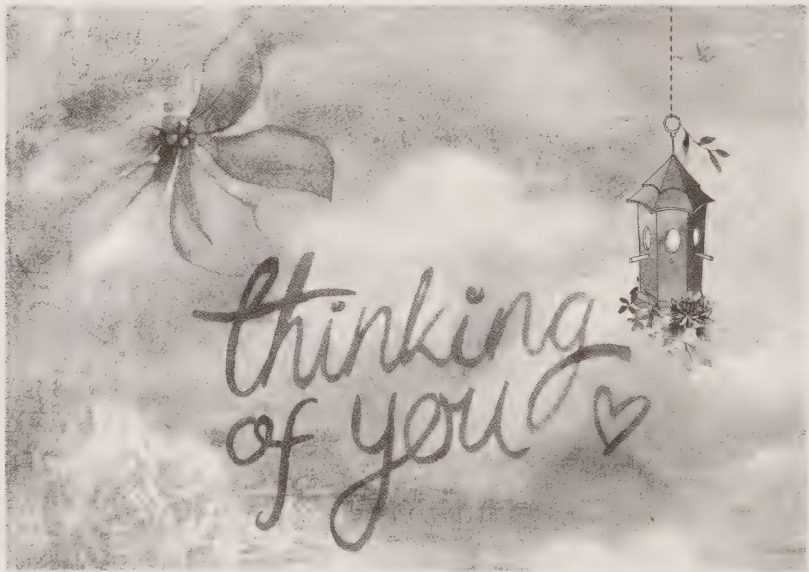

# Người yêu bạn đang đợi bạn ở phía trước

**那个爱你的人在前方等你**

*nà ge ài nǐ de rén zài qián fāng děng nǐ*

不管你一个人曾经历了多少不幸，不管你的内心隐藏了多少疼痛，不管你曾多么孤单落寞，不管你是多么优秀简单美好。

bù guǎn nǐ yí gè rén céng jīng lì le duō shǎo bù xìng，bù guǎn nǐ de nèi xīn yǐn cáng le duō shǎo téng tòng，bù guǎn nǐ céng duō me gū dān luò mò，bù guǎn nǐ shì duō me yōu xiù jiǎn dān měi hǎo。

Dù một mình bạn từng trải qua bao bất hạnh, dù trong lòng bạn ẩn giấu bao đau đớn, dù bạn từng cô đơn lạc lõng đến thế nào, dù bạn xuất sắc giản đơn tốt đẹp ra sao.

管你曾多少次一个人无助地在街头痛哭，不管你多少次质疑爱情和身边的人，不管你有多少次渴望、期待一再落空，都请你不要悲伤。

guǎn nǐ céng duō shǎo cì yí gè rén wú zhù dì zài jiē tóu tòng kū，bù guǎn nǐ duō shǎo cì zhì yí ài qíng hé shēn biān de rén，bù guǎn nǐ yǒu duō shǎo cì kě wàng、qī dài yī zài luò kōng，dōu qǐng nǐ bú yào bēi shāng。

Dù bạn đã bao lần một mình bất lực khóc giữa phố, dù bạn bao lần nghi ngờ tình yêu và những người bên cạnh, dù bạn bao lần khao khát, chờ mong đều hụt hẫng, xin bạn đừng buồn.

你要坚信你的王子还在路上，因为他要翻山越岭、斩恶龙、斗巫师，所以你要淡定，不要抓狂慌张，那样，你终会看见爱情为你不死的模样。

nǐ yào jiān xìn nǐ de wáng zǐ hái zài lù shàng，yīn wèi tā yào fān shān yuè lǐng、zhǎn è lóng、dòu wū shī，suǒ yǐ nǐ yào dàn dìng，bú yào zhuā kuáng huāng zhāng，nà yàng，nǐ zhōng huì kàn jiàn ài qíng wèi nǐ bù sǐ de mú yàng。

Bạn phải tin chắc rằng hoàng tử của bạn vẫn đang trên đường tới, bởi vì anh ấy phải vượt núi băng rừng, chém ác long, đấu pháp sư, vì vậy bạn hãy bình tĩnh, đừng phát cuồng hoảng loạn, như thế, rồi bạn sẽ thấy hình hài của tình yêu không bao giờ lụi tàn vì bạn.

有些人初中就懵懂地恋爱；有些人高中毕业就找到心爱的人长相厮守；有些人一进大学就有了喜欢的人，在一起很多年；有些人，刚失恋，来到一个新的城市，就遇到了对的人；有些人简单平凡，没有远大的追求，却早早过上了幸福的生活。

yǒu xiē rén chū zhōng jiù měng dǒng dì liàn ài；yǒu xiē rén gāo zhōng bì yè jiù zhǎo dào xīn ài de rén zhǎng xiàng sī shǒu；yǒu xiē rén yī jìn dà xué jiù yǒu le xǐ huān de rén，zài yì qǐ hěn duō nián；yǒu xiē rén，gāng shī liàn，lái dào yí gè xīn de chéng shì，jiù yù dào le duì de rén；yǒu xiē rén jiǎn dān píng fán，méi yǒu yuǎn dà de zhuī qiú，què zǎo zǎo guò shàng le xìng fú de shēng huó。

Có người yêu từ hồi cấp hai còn mơ mộng; có người vừa tốt nghiệp cấp ba đã tìm được người trong lòng bên nhau trọn đời; có người vừa vào đại học đã có người thương, ở bên nhau nhiều năm; có người, vừa thất tình, đến một thành phố mới, đã gặp đúng người; có người giản đơn bình thường, không có mưu cầu lớn lao, lại sớm có được cuộc sống hạnh phúc.

为此，你唏嘘不已。

wèi cǐ，nǐ xī xū bù yǐ。

Vì thế, bạn thở dài ngậm ngùi.

可是，你知道吗，这只是因为每个人站的角度不同，所以你才会觉得期待每每落空。

kě shì，nǐ zhī dào ma，zhè zhǐ shì yīn wèi měi gè rén zhàn de jiǎo dù bù tóng，suǒ yǐ nǐ cái huì jué de qī dài měi měi luò kōng。

Nhưng, bạn biết không, đó chỉ là vì mỗi người đứng ở góc độ khác nhau, nên bạn mới cảm thấy kỳ vọng lần nào cũng hụt hẫng.

并不是你一个人渴望爱情但总无法实现，也并不是只有你一个人温柔善良，却一直没有人保护和心疼。

bìng bú shì nǐ yí gè rén kě wàng ài qíng dàn zǒng wú fǎ shí xiàn，yě bìng bú shì zhǐ yǒu nǐ yí gè rén wēn róu shàn liáng，què yì zhí méi yǒu rén bǎo hù hé xīn téng。

Không phải chỉ mình bạn khao khát tình yêu mà mãi không thành, cũng không phải chỉ mình bạn dịu dàng lương thiện mà mãi chẳng có ai bảo vệ và xót thương.

并不是只有你一个人，每天坚强勇敢地面对一切；并不是只有你一个人，内心沁满了汗水与泪水，早已模糊不清；也并不是你一个人，一直没有遇见对的人…

bìng bú shì zhǐ yǒu nǐ yí gè rén，měi tiān jiān qiáng yǒng gǎn dì miàn duì yī qiè；bìng bú shì zhǐ yǒu nǐ yí gè rén，nèi xīn qìn mǎn le hàn shuǐ yǔ lèi shuǐ，zǎo yǐ mó hú bù qīng；yě bìng bú shì nǐ yí gè rén，yì zhí méi yǒu yù jiàn duì de rén…

Không phải chỉ mình bạn, mỗi ngày mạnh mẽ dũng cảm đối mặt với tất cả; không phải chỉ mình bạn, trong lòng thấm đẫm mồ hôi và nước mắt, sớm đã nhòe mờ không rõ; cũng không phải chỉ mình bạn, mãi không gặp được đúng người...

记得和一个多年没见的朋友相见。

jì de hé yí gè duō nián méi jiàn de péng yǒu xiāng jiàn。

Nhớ lần gặp lại một người bạn nhiều năm không gặp.

她还是原来的那个她，一点都没有变。

tā hái shì yuán lái de nà ge tā，yì diǎn dōu méi yǒu biàn。

Cô ấy vẫn là cô ấy của ngày xưa, chẳng thay đổi chút nào.

她还是像从前那样不顾形象地大声说话，侃侃而谈。

tā hái shì xiàng cóng qián nà yàng bù gù xíng xiàng dì dà shēng shuō huà，kǎn kǎn ér tán。

Cô ấy vẫn như trước, bất chấp hình ảnh nói chuyện thật to, huyên thuyên rôm rả.

她还是疯疯癫癫，一点都不淑女，有潜在暴力倾向的女汉子。

tā hái shì fēng fēng diān diān，yì diǎn dōu bù shū nǚ，yǒu qián zài bào lì qīng xiàng de nǚ hàn zi。

Cô ấy vẫn điên điên khùng khùng, chẳng chút dịu dàng nữ tính, là một cô gái cá tính tiềm ẩn xu hướng bạo lực.

唯一变了的是，她有了男朋友，一个很疼她的男人。

wéi yī biàn le de shì，tā yǒu le nán péng yǒu，yí gè hěn téng tā de nán rén。

Điều duy nhất thay đổi là, cô ấy có bạn trai, một người đàn ông rất yêu chiều cô.

她说起他的时候，眼睛里有不一样的光芒，满脸都洋溢着幸福。

tā shuō qǐ tā de shí hòu，yǎn jīng lǐ yǒu bù yí yàng de guāng máng，mǎn liǎn dōu yáng yì zhe xìng fú。

Khi nhắc đến anh ấy, trong mắt cô ấy ánh lên ánh sáng khác lạ, gương mặt tràn đầy hạnh phúc.

她说男朋友个头比她矮，她都没办法穿高跟鞋。

tā shuō nán péng yǒu gè tóu bǐ tā ǎi，tā dōu méi bàn fǎ chuān gāo gēn xié。

Cô nói bạn trai thấp hơn cô, đến giày cao gót cô cũng không thể đi được.

她说男朋友总是早上给她送早饭，中午、晚上陪她一起吃饭，害她都没有时间减肥。

tā shuō nán péng yǒu zǒng shì zǎo shàng gěi tā sòng zǎo fàn，zhōng wǔ、wǎn shàng péi tā yì qǐ chī fàn，hài tā dōu méi yǒu shí jiān jiǎn féi。

Cô nói bạn trai sáng nào cũng mang bữa sáng đến cho cô, trưa và tối lại cùng cô ăn cơm, khiến cô chẳng có thời gian giảm cân.

她说一吵架，她就要跟他分手，男朋友却死活不同意，都受不了一个男人这么缠着她……你看，她连抱怨他的时候都充满了甜蜜。

tā shuō yī chǎo jià，tā jiù yào gēn tā fēn shǒu，nán péng yǒu què sǐ huó bù tóng yì，dōu shòu bù liǎo yí gè nán rén zhè me chán zhe tā……nǐ kàn，tā lián bào yuàn tā de shí hòu dōu chōng mǎn le tián mì。

Cô nói cứ cãi nhau là cô đòi chia tay, thế mà bạn trai chết sống không chịu, đúng là chịu không nổi một người đàn ông cứ quấn lấy cô như vậy... Bạn xem, ngay cả khi phàn nàn về anh ấy, cô ấy cũng tràn đầy ngọt ngào.

我看着眼前的她，这个不漂亮、不温柔也不可爱的姑娘；这个能让每个听到她恋爱的人都露出惊讶表情的姑娘；这个从前从未谈过恋爱，甚至也一度担心自己嫁不出去的姑娘，才发现幸福原来可以来得这么快、这么简单。

wǒ kàn zhuó yǎn qián de tā，zhè ge bù piào liàng、bù wēn róu yě bù kě ài de gū niáng；zhè ge néng ràng měi gè tīng dào tā liàn ài de rén dōu lù chū jīng yà biǎo qíng de gū niáng；zhè ge cóng qián cóng wèi tán guò liàn ài，shèn zhì yě yí dù dān xīn zì jǐ jià bù chū qù de gū niáng，cái fā xiàn xìng fú yuán lái kě yǐ lái de zhè me kuài、zhè me jiǎn dān。

Tôi nhìn cô ấy trước mắt, cô gái chẳng xinh đẹp, chẳng dịu dàng cũng chẳng đáng yêu; cô gái khiến ai nghe tin cô yêu cũng lộ vẻ kinh ngạc; cô gái xưa nay chưa từng yêu ai, thậm chí từng lo mình không lấy được chồng, mới nhận ra hạnh phúc hóa ra có thể đến nhanh như vậy, đơn giản như vậy.

而这一刻，她是美的，因为她心里有满满的爱。

ér zhè yī kè，tā shì měi de，yīn wèi tā xīn lǐ yǒu mǎn mǎn de ài。

Mà khoảnh khắc này, cô ấy thật đẹp, vì trong lòng cô ấy tràn đầy tình yêu.

所以说，白雪公主会等到王子的亲吻，灰姑娘一定会找到属于她的水晶鞋，每个人都会等到属于自己的幸福。

suǒ yǐ shuō，bái xuě gōng zhǔ huì děng dào wáng zǐ de qīn wěn，huī gū niáng yí dìng huì zhǎo dào shǔ yú tā de shuǐ jīng xié，měi gè rén dū huì děng dào shǔ yú zì jǐ de xìng fú。

Cho nên nói, Bạch Tuyết công chúa sẽ chờ được nụ hôn của hoàng tử, Lọ Lem nhất định sẽ tìm được đôi giày thủy tinh của mình, mỗi người đều sẽ chờ được hạnh phúc thuộc về mình.

无论你是相信，还是怀疑；无论你是选择了等待，还是争取，不论结果是否满意，都请在心底记得：那个爱你的人，他正翻山越岭在来的路上，他正在一步步向你靠近，而你现在要做的，就是用最好的姿态去生活，去等待。

wú lùn nǐ shì xiāng xìn，hái shì huái yí；wú lùn nǐ shì xuǎn zé le děng dài，hái shì zhēng qǔ，bù lùn jié guǒ shì fǒu mǎn yì，dōu qǐng zài xīn dǐ jì de：nà ge ài nǐ de rén，tā zhèng fān shān yuè lǐng zài lái de lù shàng，tā zhèng zài yí bù bù xiàng nǐ kào jìn，ér nǐ xiàn zài yào zuò de，jiù shì yòng zuì hǎo de zī tài qù shēng huó，qù děng dài。

Dù bạn tin hay hoài nghi; dù bạn chọn chờ đợi hay tranh giành, dù kết quả có như ý hay không, xin hãy ghi nhớ trong lòng: người yêu bạn, đang trên đường vượt núi băng rừng đi về phía bạn, anh ấy đang từng bước tiến lại gần bạn, còn điều bạn cần làm bây giờ, chính là dùng tư thế tốt nhất để sống, để chờ đợi.

他来时，会让你明白，为什么会和其他人跌跌撞撞没有结果，为什么你一个人孤单落寞。

tā lái shí，huì ràng nǐ míng bái，wèi shén me huì hé qí tā rén diē diē zhuàng zhuàng méi yǒu jié guǒ，wèi shén me nǐ yí gè rén gū dān luò mò。

Khi anh ấy đến, sẽ khiến bạn hiểu rõ, vì sao từng lảo đảo với người khác mà chẳng có kết quả, vì sao bạn một mình cô đơn lạc lõng.

他会弥补你所有的遗憾，他会理解你所有的痛楚，并且听你倾诉心事。

tā huì mí bǔ nǐ suǒ yǒu de yí hàn，tā huì lǐ jiě nǐ suǒ yǒu de tòng chǔ，bìng qiě tīng nǐ qīng sù xīn shì。

Anh ấy sẽ bù đắp mọi tiếc nuối của bạn, anh ấy sẽ thấu hiểu mọi đau khổ của bạn, và lắng nghe bạn giãi bày tâm sự.

他会给你所有你想要的心疼和柔软。

tā huì gěi nǐ suǒ yǒu nǐ xiǎng yào de xīn téng hé róu ruǎn。

Anh ấy sẽ trao bạn mọi sự xót thương và dịu dàng bạn mong muốn.

他会和你牵手，直至一生。

tā huì hé nǐ qiān shǒu，zhí zhì yī shēng。

Anh ấy sẽ nắm tay bạn, cho đến trọn đời.

幸福都是因人而异，所以不要总以为别人的东西总是好的别人的爱情为何总是如此甜蜜…你也要相信，自己就是他人眼中的那个别人，那个命中注定的人，正在来的路上，你不要颓废，也不要悲伤。

xìng fú dōu shì yīn rén ér yì，suǒ yǐ bú yào zǒng yǐ wéi bié rén de dōng xī zǒng shì hǎo de bié rén de ài qíng wèi hé zǒng shì rú cǐ tián mì…nǐ yě yào xiāng xìn，zì jǐ jiù shì tā rén yǎn zhōng de nà ge bié rén，nà ge mìng zhōng zhù dìng de rén，zhèng zài lái de lù shàng，nǐ bú yào tuí fèi，yě bú yào bēi shāng。

Hạnh phúc mỗi người mỗi khác, vì vậy đừng luôn cho rằng thứ của người khác bao giờ cũng tốt, tình yêu của người khác vì sao luôn ngọt ngào như thế... Bạn cũng nên tin rằng, chính bạn là “người khác” trong mắt người ta, người định mệnh của bạn, đang trên đường đến, bạn đừng chán nản, cũng đừng buồn.

不管你在哪里，在干什么，过着怎样的生活，单身还是被单身，总有一天，他会穿越汹涌的人海，走向你，抓紧你。

bù guǎn nǐ zài nǎ lǐ，zài gàn shén me，guò zhe zěn yàng de shēng huó，dān shēn hái shì bèi dān shēn，zǒng yǒu yī tiān，tā huì chuān yuè xiōng yǒng de rén hǎi，zǒu xiàng nǐ，zhuā jǐn nǐ。

Dù bạn ở nơi đâu, đang làm gì, sống cuộc sống ra sao, độc thân hay bị độc thân, sẽ có một ngày, anh ấy băng qua biển người mênh mông, bước về phía bạn, nắm chặt lấy bạn.

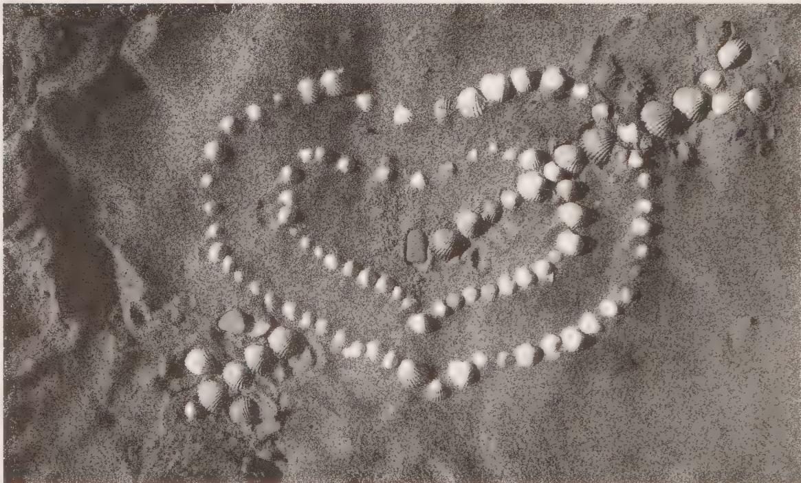

## Trong tình yêu, không ai đúng ai sai

**爱情没有谁对谁错**

*ài qíng méi yǒu shuí duì shuí cuò*

爱的路上，没有谁对谁错，只有谁爱谁，谁不爱谁。

ài de lù shàng，méi yǒu shuí duì shuí cuò，zhǐ yǒu shuí ài shuí，shuí bù ài shuí。

Trên con đường tình yêu, không có ai đúng ai sai, chỉ có ai yêu ai, ai không yêu ai.

爱之深，恨之切。

ài zhī shēn，hèn zhī qiè。

Yêu sâu bao nhiêu, hận thấm bấy nhiêu.

因为爱，所以恨；因为恨，所以执念难消。

yīn wèi ài，suǒ yǐ hèn；yīn wèi hèn，suǒ yǐ zhí niàn nán xiāo。

Vì yêu, nên hận; vì hận, nên chấp niệm khó tan.

由爱生恨，最后都是苦了自己。

yóu ài shēng hèn，zuì hòu dōu shì kǔ le zì jǐ。

Từ yêu sinh hận, cuối cùng đều là tự làm khổ chính mình.

其实，贵与贱，爱与恨，不过在人的一念之间。

qí shí，guì yǔ jiàn，ài yǔ hèn，bù guò zài rén de yí niàn zhī jiān。

Thực ra, sang với hèn, yêu với hận, chỉ trong khoảnh khắc một ý niệm của con người.

如果你喜欢，那么他们就是手心眸底璀璨生辉的珍宝；如果你无视，他们便是路边泥中肮脏不堪的顽石。

rú guǒ nǐ xǐ huān，nà me tā men jiù shì shǒu xīn móu dǐ cuǐ càn shēng huī de zhēn bǎo；rú guǒ nǐ wú shì，tā men biàn shì lù biān ní zhōng āng zāng bù kān de wán shí。

Nếu bạn thích, thì họ chính là báu vật lấp lánh rực rỡ trong lòng bàn tay và đáy mắt bạn; nếu bạn xem thường, họ liền trở thành hòn đá bẩn thỉu nhơ nhớp trong bùn bên đường.

如所谓爱情，如所谓至亲，如所谓海枯石烂天长地久…

rú suǒ wèi ài qíng，rú suǒ wèi zhì qīn，rú suǒ wèi hǎi kū shí làn tiān cháng dì jiǔ…

Như cái gọi là tình yêu, như cái gọi là người thân, như cái gọi là đá mòn biển cạn trời trường đất cửu...

尽管过去了很多年，那个画面还是会不时地出现在我的脑海。

jǐn guǎn guò qù le hěn duō nián，nà ge huà miàn hái shì huì bù shí dì chū xiàn zài wǒ de nǎo hǎi。

Dù đã nhiều năm trôi qua, hình ảnh ấy vẫn thi thoảng hiện về trong tâm trí tôi.

在下着雪的冬天，一个女孩儿挽着母亲的手，像是和她一起走到了生命的尽头。

zài xià zhe xuě de dōng tiān，yí gè nǚ hái ér wǎn zhe mǔ qīn de shǒu，xiàng shì hé tā yì qǐ zǒu dào le shēng mìng de jìn tóu。

Trong mùa đông tuyết rơi, một cô gái khoác tay mẹ, như thể đang cùng bà đi đến tận cùng của cuộc đời.

那是在多年前，一个女孩儿跟我的一次倾诉。

nà shì zài duō nián qián，yí gè nǚ hái ér gēn wǒ de yī cì qīng sù。

Đó là lần giãi bày của một cô gái với tôi, nhiều năm về trước.

她说，那天挽着母亲的胳膊在下着雪的冬天走在回家的路上，她回来悄悄地写下日记，如果可以一直挽着母亲的手走下去，没有爱情也无妨。

tā shuō，nà tiān wǎn zhe mǔ qīn de gē bó zài xià zhe xuě de dōng tiān zǒu zài huí jiā de lù shàng，tā huí lái qiāo qiāo dì xiě xià rì jì，rú guǒ kě yǐ yì zhí wǎn zhe mǔ qīn de shǒu zǒu xià qù，méi yǒu ài qíng yě wú fáng。

Cô ấy kể, hôm đó khoác tay mẹ trong mùa đông tuyết rơi, trên đường về nhà, cô trở về lặng lẽ viết nhật ký, nếu có thể cứ mãi khoác tay mẹ mà bước đi, thì không có tình yêu cũng chẳng sao.

她有多爱她的母亲，可能无法与旁人道，她只是觉得可以挽着母亲走路，就已经幸福至极。

tā yǒu duō ài tā de mǔ qīn，kě néng wú fǎ yǔ páng rén dào，tā zhǐ shì jué de kě yǐ wǎn zhe mǔ qīn zǒu lù，jiù yǐ jīng xìng fú zhì jí。

Cô yêu mẹ mình đến mức nào, có lẽ không thể nói với người ngoài, cô chỉ cảm thấy được khoác tay mẹ mà đi, đã là hạnh phúc tột cùng.

她说，我真的很想拥有一个母亲，一个跟天下诸多的平凡的母亲一样待自己孩子的母亲。

tā shuō，wǒ zhēn de hěn xiǎng yōng yǒu yí gè mǔ qīn，yí gè gēn tiān xià zhū duō de píng fán de mǔ qīn yī yàng dài zì jǐ hái zi de mǔ qīn。

Cô nói, tôi thực sự rất muốn có một người mẹ, một người mẹ đối xử với con mình như bao người mẹ bình dị trên đời.

她可以没有钱财，也可以没有美貌，但是她可以跟其他的母亲一样朴素而伟大。

tā kě yǐ méi yǒu qián cái，yě kě yǐ méi yǒu měi mào，dàn shì tā kě yǐ gēn qí tā de mǔ qīn yī yàng pǔ sù ér wěi dà。

Bà có thể không có tiền của, cũng có thể không có nhan sắc, nhưng bà có thể giống như những người mẹ khác, mộc mạc mà vĩ đại.

她们之间没有争吵，没有反目。

tā men zhī jiān méi yǒu zhēng chǎo，méi yǒu fǎn mù。

Giữa họ không có cãi vã, không có phản bội.

在她到母亲身边的时候，可以吃她做的饭，喝一碗她做的热汤。

zài tā dào mǔ qīn shēn biān de shí hòu，kě yǐ chī tā zuò de fàn，hē yī wǎn tā zuò de rè tāng。

Khi cô đến bên mẹ, có thể ăn bữa cơm bà nấu, uống một bát canh nóng bà làm.

她无依无靠的时候，能给她打个电话，撒撒娇。

tā wú yī wú kào de shí hòu，néng gěi tā dǎ gè diàn huà，sā sā jiāo。

Khi cô không nơi nương tựa, có thể gọi một cuộc điện thoại cho bà, làm nũng một chút.

在她很小的时候，父亲便跟她的母亲分开了，她成长的岁月里记不起一张关于母亲清晰的画面。

zài tā hěn xiǎo de shí hòu，fù qīn biàn gēn tā de mǔ qīn fēn kāi le，tā chéng zhǎng de suì yuè lǐ jì bù qǐ yī zhāng guān yú mǔ qīn qīng xī de huà miàn。

Khi cô còn rất nhỏ, cha đã chia tay với mẹ cô, trong những năm tháng lớn lên, cô không thể nhớ nổi một hình ảnh rõ ràng nào về mẹ.

在她少不更事的时候，她还能够跟她的母亲争吵，还能够抗争与原谅。

zài tā shào bù gēng shì de shí hòu，tā hái néng gòu gēn tā de mǔ qīn zhēng chǎo，hái néng gòu kàng zhēng yǔ yuán liàng。

Hồi còn bé dại chưa hiểu chuyện, cô còn có thể cãi nhau với mẹ, còn có thể phản kháng và tha thứ.

但是如今她长大成熟，已经没了那样的勇气与力量，去抵挡那般强烈的伤害，那般强烈的恐慌与绝望。

dàn shì rú jīn tā zhǎng dà chéng shú，yǐ jīng méi le nà yàng de yǒng qì yǔ lì liàng，qù dǐ dǎng nà bān qiáng liè de shāng hài，nà bān qiáng liè de kǒng huāng yǔ jué wàng。

Nhưng giờ đây cô đã trưởng thành chín chắn, đã không còn dũng khí và sức lực ấy để chống đỡ những tổn thương mãnh liệt như vậy, những hoảng sợ và tuyệt vọng mãnh liệt như vậy.

每当因为得不到他人的关怀而伤心欲绝的时候，她就告诉自己：你不应该奢望从别人那里索取爱，哪怕是父母，你已经长大，你要学会自己爱自己。

měi dāng yīn wèi dé bú dào tā rén de guān huái ér shāng xīn yù jué de shí hòu，tā jiù gào sù zì jǐ：nǐ bù yīng gāi shē wàng cóng bié rén nà lǐ suǒ qǔ ài，nǎ pà shì fù mǔ，nǐ yǐ jīng zhǎng dà，nǐ yào xué huì zì jǐ ài zì jǐ。

Mỗi khi vì không nhận được sự quan tâm của người khác mà đau lòng muốn chết, cô lại tự nhủ: con không nên ảo tưởng đòi hỏi tình yêu từ người khác, dẫu đó là cha mẹ, con đã lớn, con phải học cách yêu lấy bản thân.

但在她成长的生命里，何曾得到过被疼爱的温暖呢。

dàn zài tā chéng zhǎng de shēng mìng lǐ，hé zēng dé dào guò bèi téng ài de wēn nuǎn ne。

Thế nhưng trong cuộc đời lớn lên của cô, đã bao giờ nhận được hơi ấm của sự yêu thương nâng niu đâu.

现在她长大了，那很多年前呢，很久很久以前呢，为什么她依然两手空空，一无所有。

xiàn zài tā zhǎng dà le，nà hěn duō nián qián ne，hěn jiǔ hěn jiǔ yǐ qián ne，wèi shén me tā yī rán liǎng shǒu kōng kōng，yī wú suǒ yǒu。

Giờ cô đã lớn, vậy còn nhiều năm về trước, còn thuở rất rất xa xưa nữa, vì sao cô vẫn hai bàn tay trắng, không có gì cả.

一个孩子，应该要有多坚强，才能脱离父母的搀扶，颤抖着站立起来。

yí gè hái zi，yīng gāi yào yǒu duō jiān qiáng，cái néng tuō lí fù mǔ de chān fú，chàn dǒu zhe zhàn lì qǐ lái。

Một đứa trẻ, phải mạnh mẽ đến mức nào, mới có thể rời khỏi bàn tay dìu dắt của cha mẹ, run rẩy đứng lên.

当她说这些话的时候，声音几乎是颤抖的。

dāng tā shuō zhè xiē huà de shí hòu，shēng yīn jī hū shì chàn dǒu de。

Khi nói những lời ấy, giọng cô gần như run rẩy.

见到母亲的时候，她十五岁，在B城。

jiàn dào mǔ qīn de shí hòu，tā shí wǔ suì，zài B chéng。

Gặp mẹ, cô mười lăm tuổi, ở thành phố B.

从此以后每次她途径B城的时候，都会下意识地望向母亲曾经站在那向她挥手的地方。

cóng cǐ yǐ hòu měi cì tā tú jìng B chéng de shí hòu，dū huì xià yì shí dì wàng xiàng mǔ qīn céng jīng zhàn zài nà xiàng tā huī shǒu de dì fāng。

Từ đó về sau mỗi lần đi ngang thành phố B, cô đều theo phản xạ nhìn về nơi mẹ từng đứng vẫy tay với cô.

就是在那儿，她生平第一次见到了母亲。

jiù shì zài nà ér，tā shēng píng dì yī cì jiàn dào le mǔ qīn。

Chính là nơi đó, lần đầu tiên trong đời cô gặp mẹ.

生活真的很会捉弄人，有的时候，你以为你的奋不顾身是为了得到难以泯灭的爱；但它带给你的，不过是清醒的伤害。

shēng huó zhēn de hěn huì zhuō nòng rén，yǒu de shí hòu，nǐ yǐ wéi nǐ de fèn bù gù shēn shì wèi le dé dào nán yǐ mǐn miè de ài；dàn tā dài gěi nǐ de，bù guò shì qīng xǐng de shāng hài。

Cuộc sống thật sự rất biết trêu ngươi con người, có những lúc, bạn tưởng sự bất chấp thân mình của bạn là để có được tình yêu khó phai nhòa; nhưng điều nó mang lại cho bạn, chỉ là tổn thương mà bạn phải tỉnh táo nhìn nhận.

如果你已经做好承受的准备，那么不管是哪一个，对你来说都不难。

rú guǒ nǐ yǐ jīng zuò hǎo chéng shòu de zhǔn bèi，nà me bù guǎn shì nǎ yí gè，duì nǐ lái shuō dōu bù nán。

Nếu bạn đã chuẩn bị tâm lý để chịu đựng, thì dù là điều nào, với bạn cũng chẳng khó khăn.

但她没有做好准备，她希望被爱。

dàn tā méi yǒu zuò hǎo zhǔn bèi，tā xī wàng bèi ài。

Nhưng cô chưa chuẩn bị sẵn sàng, cô mong được yêu thương.

在她的母亲面前，她永远拥有这样的渴望，渴望她的母亲能够清醒，渴望她的母亲爱她。

zài tā de mǔ qīn miàn qián，tā yǒng yuǎn yōng yǒu zhè yàng de kě wàng，kě wàng tā de mǔ qīn néng gòu qīng xǐng，kě wàng tā de mǔ qīn ài tā。

Trước mẹ mình, cô luôn mang khao khát ấy, khao khát mẹ mình có thể tỉnh táo, khao khát mẹ mình yêu cô.

受到母亲冷落的时候，她悲伤、痛苦、压抑、失落。

shòu dào mǔ qīn lěng luò de shí hòu，tā bēi shāng、tòng kǔ、yā yì、shī luò。

Khi bị mẹ hờ hững, cô buồn bã, đau khổ, u uất, mất mát.

这种悲伤影响了她整个青春时光。

zhè zhǒng bēi shāng yǐng xiǎng le tā zhěng gè qīng chūn shí guāng。

Nỗi buồn ấy ảnh hưởng đến suốt cả tuổi thanh xuân của cô.

在本该茁壮成长的年纪里，她伤痕累累。

zài běn gāi zhuó zhuàng chéng zhǎng de nián jì lǐ，tā shāng hén lěi lěi。

Trong độ tuổi lẽ ra phải lớn lên căng tràn nhựa sống, cô lại vết thương chồng chất.

我不知道该以什么样的心态来看待她的故事，但是希望在这些不太明媚的故事之后，我们还能记得她最初的表达：“她不爱我，我也要活；她不爱我，我也要走自己的路。

wǒ bù zhī dào gāi yǐ shén me yàng de xīn tài lái kàn dài tā de gù shì，dàn shì xī wàng zài zhè xiē bù tài míng mèi de gù shì zhī hòu，wǒ men hái néng jì de tā zuì chū de biǎo dá ：“tā bù ài wǒ，wǒ yě yào huó；tā bù ài wǒ，wǒ yě yào zǒu zì jǐ de lù。

Tôi không biết nên dùng tâm thế nào để nhìn nhận câu chuyện của cô, nhưng mong rằng sau những câu chuyện không mấy tươi sáng này, chúng ta vẫn nhớ được lời nói đầu tiên của cô: “Mẹ không yêu con, con cũng phải sống; mẹ không yêu con, con cũng phải đi con đường của mình.

当她战胜了那曾经让她痛不欲生的一切，虽然她仍然不知道未来在哪里，前方是否有曙光，也不知道哪条路是正确的，但她终于知道哪条路是不正确的。

dāng tā zhàn shèng le nà céng jīng ràng tā tòng bù yù shēng de yī qiè，suī rán tā réng rán bù zhī dào wèi lái zài nǎ lǐ，qián fāng shì fǒu yǒu shǔ guāng，yě bù zhī dào nǎ tiáo lù shì zhèng què de，dàn tā zhōng yú zhī dào nǎ tiáo lù shì bù zhèng què de。

Khi cô chiến thắng tất cả những gì từng khiến cô đau đến không muốn sống, dù cô vẫn không biết tương lai ở nơi đâu, phía trước có ánh bình minh hay không, cũng không biết con đường nào là đúng, nhưng cuối cùng cô đã biết con đường nào là không đúng.

她所做的不是恨，也不是怨，而是感谢。

tā suǒ zuò de bú shì hèn，yě bú shì yuàn，ér shì gǎn xiè。

Điều cô làm không phải là hận, cũng không phải là oán, mà là cảm ơn.

她说：“感谢我爱的人，给予我如此残酷的成长。

tā shuō ：“gǎn xiè wǒ ài de rén，jǐ yǔ wǒ rú cǐ cán kù de chéng zhǎng。

Cô nói: “Cảm ơn người tôi yêu, đã ban cho tôi sự trưởng thành tàn khốc như thế.

并不希望所有人都像我一样受伤。

bìng bù xī wàng suǒ yǒu rén dōu xiàng wǒ yī yàng shòu shāng。

Tôi không mong tất cả mọi người đều tổn thương như tôi.

”

”

”

我不知道对一个人的感情要有多么强大，才可以超越爱情；我也不知道一个人的内心要经受怎样的磨炼与成长，才会对残酷与无情说声谢谢。

wǒ bù zhī dào duì yí gè rén de gǎn qíng yào yǒu duō me qiáng dà，cái kě yǐ chāo yuè ài qíng；wǒ yě bù zhī dào yí gè rén de nèi xīn yào jīng shòu zěn yàng de mó liàn yǔ chéng zhǎng，cái huì duì cán kù yǔ wú qíng shuō shēng xiè xiè。

Tôi không biết tình cảm dành cho một người phải mạnh mẽ đến mức nào, mới có thể vượt lên trên tình yêu; tôi cũng không biết nội tâm một người phải trải qua bao mài giũa và trưởng thành, mới có thể nói lời cảm ơn với sự tàn khốc và vô tình.

只愿，我们能够像她一样，不管曾经承受了多少无法言说的苦痛，都还能站起来做我们自己。

zhǐ yuàn，wǒ men néng gòu xiàng tā yī yàng，bù guǎn céng jīng chéng shòu le duō shǎo wú fǎ yán shuō de kǔ tòng，dōu hái néng zhàn qǐ lái zuò wǒ men zì jǐ。

Chỉ mong, chúng ta có thể giống như cô, dù từng gánh chịu bao đau khổ không thể nói thành lời, vẫn có thể đứng dậy và làm chính mình.

它不会妨碍我们成为自己想成为的人，它让我们觉得这并不是完全不幸。

tā bú huì fáng ài wǒ men chéng wéi zì jǐ xiǎng chéng wéi de rén，tā ràng wǒ men jué de zhè bìng bú shì wán quán bù xìng。

Nó sẽ không cản trở chúng ta trở thành con người mình muốn, nó khiến chúng ta cảm thấy đây không phải là điều hoàn toàn bất hạnh.

在人生中正是这样不悔的爱，给予了我们不为荣华而渴慕，不为贫困而恐惧，以及想要勇敢坚韧去走自己的路的心灵。

zài rén shēng zhōng zhèng shì zhè yàng bù huǐ de ài，jǐ yǔ le wǒ men bù wèi róng huá ér kě mù，bù wèi pín kùn ér kǒng jù，yǐ jí xiǎng yào yǒng gǎn jiān rèn qù zǒu zì jǐ de lù de xīn líng。

Trong cuộc đời, chính thứ tình yêu không hối tiếc như vậy, đã ban cho chúng ta trái tim không thèm khát vinh hoa, không sợ hãi nghèo khó, và muốn dũng cảm kiên cường bước đi con đường của mình.

## Một mình cũng có thể sống thật tốt

**一个人也可以过得很好**

*yí gè rén yě kě yǐ guò dé hěn hǎo*

一个人听歌，一个人走路，一个人睡觉，一个人难过，一个人开心；一个人自言自语，一个人自哼自唱，一个人等待月落晨起，一个人走过风风雨雨；一个人的生活或许很寂寞，很孤单。

yí gè rén tīng gē，yí gè rén zǒu lù，yí gè rén shuì jiào，yí gè rén nán guò，yí gè rén kāi xīn；yí gè rén zì yán zì yǔ，yí gè rén zì hēng zì chàng，yí gè rén děng dài yuè luò chén qǐ，yí gè rén zǒu guò fēng fēng yǔ yǔ；yí gè rén de shēng huó huò xǔ hěn jì mò，hěn gū dān。

Một mình nghe nhạc, một mình đi bộ, một mình đi ngủ, một mình buồn phiền, một mình vui vẻ; một mình tự nói chuyện với mình, một mình tự ngân nga ca hát, một mình chờ trăng lặn bình minh, một mình đi qua mưa gió; cuộc sống một mình có lẽ rất vắng vẻ, rất cô đơn.

但其实，一个人也很自在，很开心，很快乐。

dàn qí shí，yí gè rén yě hěn zì zài，hěn kāi xīn，hěn kuài lè。

Nhưng thực ra, một mình cũng rất thảnh thơi, rất vui vẻ, rất hạnh phúc.

即使有一点点无聊和寂寞，但是游走在自己的街道上，什么都可以无所谓，没有任何束缚。

jí shǐ yǒu yì diǎn diǎn wú liáo hé jì mò，dàn shì yóu zǒu zài zì jǐ de jiē dào shàng，shén me dōu kě yǐ wú suǒ wèi，méi yǒu rèn hé shù fù。

Dù có một chút chán chường và cô quạnh, nhưng dạo bước trên con phố của riêng mình, chẳng cần bận tâm điều gì, không bất kỳ ràng buộc nào.

即使很多人都在疑惑，你为什么始终没有告别一个人的孤寂时光。

jí shǐ hěn duō rén dōu zài yí huò，nǐ wèi shén me shǐ zhōng méi yǒu gào bié yí gè rén de gū jì shí guāng。

Dù nhiều người đều thắc mắc, vì sao bạn mãi không chấm dứt khoảng thời gian cô độc một mình.

我们都以为自己长大成熟之后，会恋爱、结婚、生子，像大多数人那样顺理成章地生活。

wǒ men dōu yǐ wéi zì jǐ zhǎng dà chéng shú zhī hòu，huì liàn ài、jié hūn、shēng zi，xiàng dà duō shù rén nà yàng shùn lǐ chéng zhāng dì shēng huó。

Chúng ta đều tưởng rằng sau khi lớn lên trưởng thành, mình sẽ yêu đương, kết hôn, sinh con, sống thuận lý tự nhiên như đa số mọi người.

但是生活并不如我们想象的那般模样，有人走这样的路，有人走那样的路，各不相同。

dàn shì shēng huó bìng bù rú wǒ men xiǎng xiàng de nà bān mú yàng，yǒu rén zǒu zhè yàng de lù，yǒu rén zǒu nà yàng de lù，gè bù xiāng tóng。

Nhưng cuộc sống không như chúng ta tưởng tượng, có người đi con đường này, có người đi con đường kia, mỗi người mỗi khác.

身边有一个特别漂亮的姑娘，一直坚持独身主义，不结婚。

shēn biān yǒu yí gè tè bié piào liàng de gū niáng，yì zhí jiān chí dú shēn zhǔ yì，bù jié hūn。

Bên cạnh tôi có một cô gái vô cùng xinh đẹp, kiên trì chủ nghĩa độc thân, không kết hôn.

所有的人都以为她疯了，精神有问题，但只有她自己知道，她个人的生活很好。

suǒ yǒu de rén dōu yǐ wéi tā fēng le，jīng shén yǒu wèn tí，dàn zhǐ yǒu tā zì jǐ zhī dào，tā gè rén de shēng huó hěn hǎo。

Mọi người đều cho rằng cô ấy điên rồ, có vấn đề về tinh thần, nhưng chỉ mình cô biết, cuộc sống riêng của cô rất tốt đẹp.

我们聚会的时候，大家都挽着自己的男女朋友来，只有她是一个人。

wǒ men jù huì de shí hòu，dà jiā dōu wǎn zhe zì jǐ de nán nǚ péng yǒu lái，zhǐ yǒu tā shì yí gè rén。

Khi chúng tôi tụ họp, mọi người đều khoác tay người yêu của mình đến, chỉ có cô ấy một mình.

晚上吃饭的时候，我坐在她的旁边，我问她，你长得那么漂亮，家境也很好，为什么要一直一个人呢？

wǎn shàng chī fàn de shí hòu，wǒ zuò zài tā de páng biān，wǒ wèn tā，nǐ zhǎng dé nà me piào liàng，jiā jìng yě hěn hǎo，wèi shén me yào yì zhí yí gè rén ne？

Buổi tối ăn cơm, tôi ngồi bên cạnh cô ấy, tôi hỏi, cậu xinh đẹp như vậy, gia cảnh cũng tốt, vì sao cứ mãi một mình thế?

她说，如果我是一个人，可以想哭就哭，想笑就笑。

tā shuō，rú guǒ wǒ shì yí gè rén，kě yǐ xiǎng kū jiù kū，xiǎng xiào jiù xiào。

Cô ấy nói, nếu tớ là một mình, có thể muốn khóc thì khóc, muốn cười thì cười.

我可以一整天不说话，可以懒猪般睡到日晒三竿。

wǒ kě yǐ yī zhěng tiān bù shuō huà，kě yǐ lǎn zhū bān shuì dào rì shài sān gān。

Tớ có thể cả ngày không nói lời nào, có thể ngủ như lợn lười cho đến khi mặt trời lên ba sào.

你觉得有几个男人能够容忍你跟他在一起无缘由地沉默一整天，或者嫁进他们家的门，每天还睡到日上三竿的？

nǐ jué de yǒu jǐ gè nán rén néng gòu róng rěn nǐ gēn tā zài yì qǐ wú yuán yóu dì chén mò yī zhěng tiān，huò zhě jià jìn tā men jiā de mén，měi tiān hái shuì dào rì shàng sān gān de？

Cậu nghĩ có mấy người đàn ông có thể chịu đựng việc cậu ở bên anh ta cả ngày im lặng không lý do, hay gả vào nhà họ rồi ngày nào cũng ngủ đến mặt trời lên ba sào?

我并不是非要不说话，或者那么懒惰，我只是不想失去自由，不想失去随心所欲的权利，活得干净利落。

wǒ bìng bú shì fēi yào bù shuō huà，huò zhě nà me lǎn duò，wǒ zhǐ shì bù xiǎng shī qù zì yóu，bù xiǎng shī qù suí xīn suǒ yù de quán lì，huó dé gān jìng lì luò。

Tớ không phải nhất định phải im lặng, hay lười biếng đến thế, tớ chỉ không muốn mất tự do, không muốn mất quyền được sống tùy theo ý mình, sống một cách sạch sẽ gọn gàng.

你们愿意为爱失去自由，所以你们能够两个人在一起，而我的自由胜过了爱情，我宁愿选择一个人生活，又有什么不好、不对呢?

nǐ men yuàn yì wèi ài shī qù zì yóu，suǒ yǐ nǐ men néng gòu liǎng gè rén zài yì qǐ，ér wǒ de zì yóu shèng guò le ài qíng，wǒ nìng yuàn xuǎn zé yí gè rén shēng huó，yòu yǒu shén me bù hǎo、bú duì ne?

Các cậu sẵn lòng vì tình yêu mà mất đi tự do, nên các cậu có thể bên nhau thành đôi, còn tự do của tớ quan trọng hơn tình yêu, tớ thà chọn sống một mình, thì có gì là không tốt, không đúng đâu?

尽管我不是一个独身主义者，但是听她说这些话的时候，我选择了肯定。

jǐn guǎn wǒ bú shì yí gè dú shēn zhǔ yì zhě，dàn shì tīng tā shuō zhè xiē huà de shí hòu，wǒ xuǎn zé le kěn dìng。

Dù tôi không phải là người theo chủ nghĩa độc thân, nhưng khi nghe cô ấy nói những lời ấy, tôi đã lựa chọn sự đồng tình.

就像人们说的那样，一个人久了，会上瘾的。

jiù xiàng rén men shuō de nà yàng，yí gè rén jiǔ le，huì shàng yǐn de。

Cũng như người ta nói, một mình lâu rồi, sẽ nghiện đấy.

我想

wǒ xiǎng

Tôi nghĩ

她就是如此吧。

tā jiù shì rú cǐ ba。

Cô ấy chính là như vậy thôi.

我想，一个决心独自生活并且过得很好的人，是远远胜过那些如胶似漆矢志不渝的两个人的。

wǒ xiǎng，yí gè jué xīn dú zì shēng huó bìng qiě guò dé hěn hǎo de rén，shì yuǎn yuǎn shèng guò nà xiē rú jiāo sì qī shǐ zhì bù yú de liǎng gè rén de。

Tôi nghĩ, một người quyết tâm sống một mình và sống thật tốt, là vượt xa những cặp đôi như keo như sơn, thề non hẹn biển.

## Đâu là bến đỗ của đời người

**人生何处是归宿**

*rén shēng hé chù shì guī sù*

有一段时间，和几个朋友吃完饭，就在一起讨论归宿的问题。

yǒu yī duàn shí jiān，hé jǐ gè péng yǒu chī wán fàn，jiù zài yì qǐ tǎo lùn guī sù de wèn tí。

Có một thời gian, sau khi ăn cơm xong với vài người bạn, chúng tôi ngồi lại bàn về vấn đề bến đỗ.

归宿，对于每个女孩儿来说都是一件很严肃也值得期盼的事情。

guī sù，duì yú měi gè nǚ hái ér lái shuō dōu shì yī jiàn hěn yán sù yě zhí de qī pàn de shì qíng。

Bến đỗ, với mỗi cô gái mà nói, đều là một chuyện rất nghiêm túc và đáng để mong chờ.

我们都在分析与自己喜欢的人能否走到以后，即使在一起好几年，或者几个月，或者素未谋面。

wǒ men dōu zài fēn xī yǔ zì jǐ xǐ huān de rén néng fǒu zǒu dào yǐ hòu，jí shǐ zài yì qǐ hǎo jǐ nián，huò zhě jǐ gè yuè，huò zhě sù wèi móu miàn。

Chúng tôi đều phân tích xem liệu mình có thể đi cùng người mình thích đến tương lai hay không, dù là bên nhau vài năm, vài tháng, hay chưa từng gặp mặt.

你会发现所有推测都出现一种结果：不确定与未知。

nǐ huì fā xiàn suǒ yǒu tuī cè dōu chū xiàn yī zhǒng jié guǒ：bù què dìng yǔ wèi zhī。

Bạn sẽ nhận ra mọi suy đoán đều đưa về một kết quả: bất định và chưa biết.

记得朋友曾经说过，如果你爱了，没有必要去计较结果，就像遥远的未来一样，谁都不能给你确定的答案。

jì de péng yǒu céng jīng shuō guò，rú guǒ nǐ ài le，méi yǒu bì yào qù jì jiào jié guǒ，jiù xiàng yáo yuǎn de wèi lái yī yàng，shéi dōu bù néng gěi nǐ què dìng de dá àn。

Nhớ rằng có một người bạn từng nói, nếu bạn đã yêu thì chẳng cần tính toán kết quả, cũng giống như tương lai xa xôi kia, không ai có thể cho bạn một câu trả lời chắc chắn.

后来仔细想想她说的是对的，却是让人恐慌的。

hòu lái zǐ xì xiǎng xiǎng tā shuō de shì duì de，què shì ràng rén kǒng huāng de。

Sau này nghĩ kỹ lại, những gì cô ấy nói là đúng, nhưng lại khiến người ta hoảng sợ.

爱的时候，谁不想要一个结果呢。

ài de shí hòu，shuí bù xiǎng yào yí gè jié guǒ ne。

Khi yêu, ai lại không mong muốn một kết quả cơ chứ.

而更多时候是没有根的，我们的身体和灵魂都随着命运四处漂流。

ér gèng duō shí hòu shì méi yǒu gēn de，wǒ men de shēn tǐ hé líng hún dōu suí zhe mìng yùn sì chù piāo liú。

Mà phần lớn thời gian là không có gốc rễ, thân thể và linh hồn của chúng ta đều phiêu bạt khắp nơi theo số phận.

我们总是这样想，一旦遇见自己深爱的人，我们一定会用尽全力依附，能让我们深爱着的那个人，便一定是我们的归宿。

wǒ men zǒng shì zhè yàng xiǎng，yí dàn yù jiàn zì jǐ shēn ài de rén，wǒ men yí dìng huì yòng jìn quán lì yī fù，néng ràng wǒ men shēn ài zhe de nà ge rén，biàn yí dìng shì wǒ men de guī sù。

Chúng ta luôn nghĩ như thế này, một khi gặp được người mình yêu sâu đậm, chúng ta nhất định sẽ dùng hết sức lực để nương tựa, người khiến chúng ta yêu sâu đậm ấy, nhất định sẽ là bến đỗ của chúng ta.

但是人生的路还那么长，一切都还是未知。

dàn shì rén shēng de lù hái nà me zhǎng，yī qiè dōu hái shì wèi zhī。

Nhưng con đường đời còn dài lắm, tất cả vẫn còn là điều chưa biết.

关于我们，现在所做的一切都只像个起点，包括感情、生活、梦想。

guān yú wǒ men，xiàn zài suǒ zuò de yī qiè dōu zhǐ xiàng gè qǐ diǎn，bāo kuò gǎn qíng、shēng huó、mèng xiǎng。

Về chúng ta, mọi thứ đang làm bây giờ chỉ giống như một điểm khởi đầu, bao gồm tình cảm, cuộc sống, ước mơ.

未来还有很长很长的路要走，无法知道谁能陪自己走到最后。

wèi lái hái yǒu hěn zhǎng hěn zhǎng de lù yào zǒu，wú fǎ zhī dào shuí néng péi zì jǐ zǒu dào zuì hòu。

Tương lai còn rất rất dài để bước đi, không thể biết được ai sẽ đồng hành cùng mình đến cuối cùng.

一路上有再遇见，也有再消失。

yī lù shàng yǒu zài yù jiàn，yě yǒu zài xiāo shī。

Trên đường đi có những cuộc gặp lại, cũng có những lần biến mất.

当我们无法找到一个很好的解释时，我们或许只能把这一切归结于缘分或命运。

dāng wǒ men wú fǎ zhǎo dào yí gè hěn hǎo de jiě shì shí，wǒ men huò xǔ zhǐ néng bǎ zhè yī qiè guī jié yú yuán fēn huò mìng yùn。

Khi chúng ta không thể tìm được một lời giải thích thỏa đáng, chúng ta có lẽ chỉ có thể quy tất cả cho duyên phận hay số mệnh.

如若有缘，或许某一天我们还会再遇见；如若没有，那便咫尺天涯。

rú ruò yǒu yuán，huò xǔ mǒu yī tiān wǒ men hái huì zài yù jiàn；rú ruò méi yǒu，nà biàn zhǐ chǐ tiān yá。

Nếu có duyên, có lẽ một ngày nào đó chúng ta sẽ còn gặp lại; nếu không, thì cách nhau gang tấc cũng như chân trời góc bể.

因为长久的寻觅和等待，我们经常会怀疑自己：为什么没有人来肯定我，而我又为什么不去争取，尝试打开心扉，让别人走进来。

yīn wèi cháng jiǔ de xún mì hé děng dài，wǒ men jīng cháng huì huái yí zì jǐ：wèi shén me méi yǒu rén lái kěn dìng wǒ，ér wǒ yòu wèi shén me bù qù zhēng qǔ，cháng shì dǎ kāi xīn fēi，ràng bié rén zǒu jìn lái。

Bởi vì sự tìm kiếm và chờ đợi lâu dài, chúng ta thường tự hoài nghi: vì sao không ai đến khẳng định mình, và vì sao mình lại không đi tranh giành, thử mở lòng để người khác bước vào.

我们就这样处于一个孤高又卑微的状态中，一边觉得自己无与伦比，一边害怕自己一无所有。

wǒ men jiù zhè yàng chǔ yú yí gè gū gāo yòu bēi wēi de zhuàng tài zhōng，yī biān jué de zì jǐ wú yǔ lún bǐ，yī biān hài pà zì jǐ yī wú suǒ yǒu。

Chúng ta cứ thế ở trong trạng thái vừa kiêu ngạo vừa hèn mọn, một bên tự thấy mình vô song, một bên lại sợ mình chẳng còn gì.

因为害怕，所以我们用更多的时间去预备，养精蓄锐，去迎接一个对的人。

yīn wèi hài pà，suǒ yǐ wǒ men yòng gèng duō de shí jiān qù yù bèi，yǎng jīng xù ruì，qù yíng jiē yí gè duì de rén。

Vì sợ hãi, nên chúng ta dùng nhiều thời gian hơn để chuẩn bị, dưỡng sức chờ thời, để đón một người đúng đắn.

因为他们说，上天是公平的，它一定会派一个对的人来爱你，如果你还没有等到他，不要心急，而是在等待的岁月里，完善自己，以最好的姿态迎接他的来临。

yīn wèi tā men shuō，shàng tiān shì gōng píng de，tā yí dìng huì pài yí gè duì de rén lái ài nǐ，rú guǒ nǐ hái méi yǒu děng dào tā，bú yào xīn jí，ér shì zài děng dài de suì yuè lǐ，wán shàn zì jǐ，yǐ zuì hǎo de zī tài yíng jiē tā de lái lín。

Bởi vì họ nói, ông trời là công bằng, ông trời nhất định sẽ phái một người đúng đắn đến yêu bạn, nếu bạn vẫn chưa đợi được người ấy, đừng sốt ruột, mà hãy trong những tháng năm chờ đợi ấy, hoàn thiện bản thân, dùng tư thái tốt nhất để đón chờ sự xuất hiện của người ấy.

所以，当我们软弱，想要妥协的时候，我们便用这样的话语来激励自己。

suǒ yǐ，dāng wǒ men ruǎn ruò，xiǎng yào tuǒ xié de shí hòu，wǒ men biàn yòng zhè yàng de huà yǔ lái jī lì zì jǐ。

Vì vậy, khi chúng ta yếu đuối, muốn thỏa hiệp, chúng ta liền dùng những lời lẽ như vậy để động viên chính mình.

再等等，再等等。

zài děng děng，zài děng děng。

Chờ thêm chút nữa, chờ thêm chút nữa.

慢慢地，我们把等待之外的时间，用来热爱其他的东西，让自己更加优秀。

màn màn dì，wǒ men bǎ děng dài zhī wài de shí jiān，yòng lái rè ài qí tā de dōng xī，ràng zì jǐ gèng jiā yōu xiù。

Dần dần, chúng ta dùng thời gian ngoài việc chờ đợi để yêu thích những thứ khác, khiến bản thân ưu tú hơn.

但不知不觉中，可能等待与热爱的天平倾斜了，我们更在乎自己的精神世界，自身的完美程度，而开始忽略所谓等待的那个对的人了。

dàn bù zhī bù jué zhōng，kě néng děng dài yǔ rè ài de tiān píng qīng xié le，wǒ men gèng zài hū zì jǐ de jīng shén shì jiè，zì shēn de wán měi chéng dù，ér kāi shǐ hū lüè suǒ wèi děng dài de nà ge duì de rén le。

Nhưng không hay không biết, có thể cán cân giữa chờ đợi và yêu thích đã lệch đi, chúng ta quan tâm hơn đến thế giới tinh thần của mình, đến mức độ hoàn mỹ của bản thân, và bắt đầu bỏ quên người đúng đắn được gọi là đang chờ đợi ấy.

所以当一个人来临的时候，我们增加了更多去审视他的砝码，慢慢地，仍旧孤身一人的时候，我们会觉得归宿是一个理想的天国，它是梦幻的，是不存在的。

suǒ yǐ dāng yí gè rén lái lín de shí hòu，wǒ men zēng jiā le gèng duō qù shěn shì tā de fá mǎ，màn màn dì，réng jiù gū shēn yī rén de shí hòu，wǒ men huì jué de guī sù shì yí gè lǐ xiǎng de tiān guó，tā shì mèng huàn de，shì bù cún zài de。

Vậy nên khi một người xuất hiện, chúng ta lại thêm nhiều tiêu chuẩn để soi xét anh ta, dần dần, khi vẫn còn cô độc một mình, chúng ta sẽ thấy bến đỗ là một thiên đường lý tưởng, nó mộng ảo, nó không tồn tại.

归宿成为别人的事情，马路上别人紧握的双手，橱窗里美丽的婚纱照，玻璃房子里面欢乐的一家人。

guī sù chéng wéi bié rén de shì qíng，mǎ lù shàng bié rén jǐn wò de shuāng shǒu，chú chuāng lǐ měi lì de hūn shā zhào，bō lí fáng zi lǐ miàn huān lè de yī jiā rén。

Bến đỗ trở thành chuyện của người khác, những đôi bàn tay nắm chặt của người ta trên phố, những tấm ảnh cưới xinh đẹp trong tủ kính, gia đình vui vẻ trong ngôi nhà kính.

自己慢慢成为孤独的旁观者。

zì jǐ màn màn chéng wéi gū dú de páng guān zhě。

Mình dần dần trở thành một người đứng ngoài cô đơn.

但幸好，我们的心是柔软的，会一直渴望着爱与被爱。

dàn xìng hǎo，wǒ men de xīn shì róu ruǎn de，huì yì zhí kě wàng zhe ài yǔ bèi ài。

Nhưng may thay, trái tim chúng ta vẫn mềm mại, sẽ luôn khát khao được yêu và được yêu.

不管我们如何孤独冷漠，我们总还是会被各种各样的爱情而感动。

bù guǎn wǒ men rú hé gū dú lěng mò，wǒ men zǒng hái shì huì bèi gè zhǒng gè yàng de ài qíng ér gǎn dòng。

Dù chúng ta cô đơn và lạnh lùng thế nào, chúng ta vẫn luôn bị những tình yêu đủ loại làm cho xúc động.

所以，没有麻痹的心，在那个对的人来临的时候，它依然还会热泪盈眶地迎接。

suǒ yǐ，méi yǒu má bì de xīn，zài nà ge duì de rén lái lín de shí hòu，tā yī rán hái huì rè lèi yíng kuàng dì yíng jiē。

Vậy nên, một trái tim không tê liệt, khi người đúng đắn ấy xuất hiện, nó vẫn sẽ rưng rưng nước mắt mà đón chào.

## Khoảnh khắc vui vẻ không giữ được, khoảnh khắc buồn bã cũng sẽ qua

**快乐的时光留不住，悲伤的时光也会过去**

*kuài lè de shí guāng liú bú zhù，bēi shāng de shí guāng yě huì guò qù*

张爱玲曾经说过：忘记一段感情的最好方法就是时间和新欢。

zhāng ài líng céng jīng shuō guò：wàng jì yī duàn gǎn qíng de zuì hǎo fāng fǎ jiù shì shí jiān hé xīn huān。

Trương Ái Linh từng nói: cách tốt nhất để quên một đoạn tình cảm chính là thời gian và tình yêu mới.

如果时间和新欢也不能让你忘记一段美好的感情，那么原因只有一个，时间不够长，新欢不够好。

rú guǒ shí jiān hé xīn huān yě bù néng ràng nǐ wàng jì yī duàn měi hǎo de gǎn qíng，nà me yuán yīn zhǐ yǒu yí gè，shí jiān bù gòu zhǎng，xīn huān bù gòu hǎo。

Nếu thời gian và tình yêu mới cũng không thể khiến bạn quên đi một đoạn tình cảm đẹp đẽ, thì nguyên nhân chỉ có một, thời gian chưa đủ dài, tình yêu mới chưa đủ tốt.

或许是你爱她，但是她没有接受你；或许是你们早已分手，但是你没办法忘记心底的那个人，去重新爱上别人；或许是你喜欢她，但是她心里却已经有了喜欢的人；或许你们彼此都有感觉，但是错过了相遇的时间。

huò xǔ shì nǐ ài tā，dàn shì tā méi yǒu jiē shòu nǐ；huò xǔ shì nǐ men zǎo yǐ fēn shǒu，dàn shì nǐ méi bàn fǎ wàng jì xīn dǐ de nà ge rén，qù chóng xīn ài shàng bié rén；huò xǔ shì nǐ xǐ huān tā，dàn shì tā xīn lǐ què yǐ jīng yǒu le xǐ huān de rén；huò xǔ nǐ men bǐ cǐ dōu yǒu gǎn jué，dàn shì cuò guò le xiāng yù de shí jiān。

Có thể là bạn yêu cô ấy, nhưng cô ấy không chấp nhận bạn; có thể là hai người đã chia tay từ lâu, nhưng bạn không thể quên người trong đáy lòng để yêu lại một người khác; có thể là bạn thích cô ấy, nhưng trong lòng cô ấy đã có người mình thích; có thể là hai người đều có cảm tình với nhau, nhưng lại lỡ mất thời điểm gặp gỡ.

记得见L的时候，她已经分手近两年。

jì de jiàn L de shí hòu，tā yǐ jīng fēn shǒu jìn liǎng nián。

Nhớ khi gặp L, cô ấy đã chia tay gần hai năm.

她说，小苏，你知道吗？

tā shuō，xiǎo sū，nǐ zhī dào ma？

Cô ấy nói, Tiểu Tô, bạn có biết không?

虽然说时间可以淡忘一切，但如果你还爱着一个人，怎么都忘不了，除非你有朝一日不爱他了，自然就忘了。

suī rán shuō shí jiān kě yǐ dàn wàng yī qiè，dàn rú guǒ nǐ hái ài zhe yí gè rén，zěn me dōu wàng bù liǎo，chú fēi nǐ yǒu zhāo yī rì bù ài tā le，zì rán jiù wàng le。

Tuy nói thời gian có thể làm phai nhạt tất cả, nhưng nếu bạn vẫn còn yêu một người, thì kiểu gì cũng không thể quên được, trừ khi có một ngày bạn không còn yêu anh ta nữa, tự nhiên sẽ quên thôi.

因为想要忘记，你要想办法让自己不再爱他。

yīn wèi xiǎng yào wàng jì，nǐ yào xiǎng bàn fǎ ràng zì jǐ bù zài ài tā。

Bởi vì muốn quên, bạn phải nghĩ cách khiến mình không còn yêu anh ta nữa.

或者尽量不去回忆两个人曾经的场景，不再做以前你们经常做的事情，跟朋友一起去玩，一起疯一起闹，或者出去旅行。

huò zhě jǐn liàng bù qù huí yì liǎng gè rén céng jīng de chǎng jǐng，bù zài zuò yǐ qián nǐ men jīng cháng zuò de shì qíng，gēn péng yǒu yì qǐ qù wán，yì qǐ fēng yì qǐ nào，huò zhě chū qù lǚ xíng。

Hoặc là cố gắng không hồi tưởng những cảnh tượng của hai người ngày xưa, không làm những việc trước đây các bạn vẫn thường làm, đi chơi cùng bạn bè, cùng nhau nô đùa quậy phá, hoặc đi du lịch.

这是一个长久而又煎熬的过程，或许因为一个像他的身影，或者是听见一首曾经跟他一起听过的歌，又或者只是一个场景都让你即使在大街上也会不顾众人眼光，号啕痛哭。

zhè shì yí gè cháng jiǔ ér yòu jiān áo de guò chéng，huò xǔ yīn wèi yí gè xiàng tā de shēn yǐng，huò zhě shì tīng jiàn yī shǒu céng jīng gēn tā yì qǐ tīng guò de gē，yòu huò zhě zhǐ shì yí gè chǎng jǐng dōu ràng nǐ jí shǐ zài dà jiē shàng yě huì bù gù zhòng rén yǎn guāng，háo táo tòng kū。

Đó là một quá trình dài lâu và giày vò, có lẽ vì một bóng dáng giống anh ta, hoặc nghe một bài hát từng cùng anh ta nghe, hay chỉ một cảnh tượng thôi cũng khiến bạn bật khóc nức nở ngay giữa phố, mặc kệ ánh mắt của mọi người.

她说的时候，依然热泪盈眶。

tā shuō de shí hòu，yī rán rè lèi yíng kuàng。

Lúc nói ra, cô ấy vẫn rưng rưng nước mắt.

我知道，她还爱着。

wǒ zhī dào，tā hái ài zhe。

Tôi biết, cô ấy vẫn còn yêu.

刘墉说：“亲情，友情，最终都代替不了男女之间的恋情。

liú yōng shuō ：“qīn qíng，yǒu qíng，zuì zhōng dōu dài tì bù liǎo nán nǚ zhī jiān de liàn qíng。

Lưu Dung nói: "Tình thân, tình bạn, cuối cùng đều không thể thay thế được tình yêu giữa nam và nữ."

”

”

"

爱，的确是无处不在的，但快乐的时光留不住，悲伤的时光也会过去，只要你不去怀念，不活在回忆里，一段感情的结束也许就是另一个新的开始。

ài，dí què shì wú chǔ bù zài de，dàn kuài lè de shí guāng liú bú zhù，bēi shāng de shí guāng yě huì guò qù，zhǐ yào nǐ bù qù huái niàn，bù huó zài huí yì lǐ，yī duàn gǎn qíng de jié shù yě xǔ jiù shì lìng yí gè xīn de kāi shǐ。

Tình yêu, quả thật ở khắp mọi nơi, nhưng khoảnh khắc vui vẻ không giữ được, thời gian buồn bã rồi cũng sẽ qua, chỉ cần bạn không hoài niệm, không sống trong hồi ức, sự kết thúc của một đoạn tình cảm có lẽ chính là một khởi đầu mới.

但如果那个人是你相爱至深，无法磨灭的爱人，就让他安静地躺在回忆里吧，别为了忘记而忘记，曾经有过的美好，不值得你怀念吗？

dàn rú guǒ nà ge rén shì nǐ xiāng ài zhì shēn，wú fǎ mó miè de ài rén，jiù ràng tā ān jìng dì tǎng zài huí yì lǐ ba，bié wèi le wàng jì ér wàng jì，céng jīng yǒu guò de měi hǎo，bù zhí dé nǐ huái niàn ma？

Nhưng nếu người ấy là người bạn yêu thương sâu đậm, không thể xóa nhòa, thì hãy để anh ta nằm yên trong hồi ức đi, đừng vì quên mà quên, những điều tốt đẹp đã từng có, chẳng lẽ không đáng để bạn hoài niệm sao?

不要试图刻意去忘记一个人，越是刻意越是记得清楚。

bú yào shì tú kè yì qù wàng jì yí gè rén，yuè shì kè yì yuè shì jì de qīng chǔ。

Đừng cố tình quên một người, càng cố ý lại càng nhớ rõ.

如果你真的想要忘记一个人，也要学会放弃一些东西，让你的心放开，勇敢面对，告诉自己那些都已经是过去了。

rú guǒ nǐ zhēn de xiǎng yào wàng jì yí gè rén，yě yào xué huì fàng qì yī xiē dōng xī，ràng nǐ de xīn fàng kāi，yǒng gǎn miàn duì，gào sù zì jǐ nà xiē dōu yǐ jīng shì guò qù le。

Nếu bạn thật sự muốn quên một người, cũng phải học cách buông bỏ một vài thứ, khiến trái tim mình thả lỏng, dũng cảm đối mặt, tự nhủ với bản thân rằng những chuyện đó đã là quá khứ.

人非草木，这世间没有忘情水，也没有能消除回忆的药，在漫长的生活里你一定会偶尔想起以前曾深爱过的人，这不可避免，让一切顺其自然，时间会洗涤一切。

rén fēi cǎo mù，zhè shì jiān méi yǒu wàng qíng shuǐ，yě méi yǒu néng xiāo chú huí yì de yào，zài màn cháng de shēng huó lǐ nǐ yí dìng huì ǒu ěr xiǎng qǐ yǐ qián céng shēn ài guò de rén，zhè bù kě bì miǎn，ràng yī qiè shùn qí zì rán，shí jiān huì xǐ dí yī qiè。

Con người không phải cỏ cây, trên thế gian này không có nước quên tình, cũng không có loại thuốc xóa bỏ hồi ức, trong cuộc sống dài lâu bạn nhất định sẽ thỉnh thoảng nhớ đến người từng yêu sâu đậm, điều đó không thể tránh khỏi, hãy thuận theo tự nhiên, thời gian sẽ gột rửa tất cả.

时间会让深的更深，浅的更浅，如果时间没有让你忘记那个人，那一定是有你无法割舍的回忆，请把过去的爱深深藏在你的心底吧。

shí jiān huì ràng shēn de gēng shēn，qiǎn de gèng qiǎn，rú guǒ shí jiān méi yǒu ràng nǐ wàng jì nà ge rén，nà yí dìng shì yǒu nǐ wú fǎ gē shě de huí yì，qǐng bǎ guò qù de ài shēn shēn cáng zài nǐ de xīn dǐ ba。

Thời gian sẽ khiến sâu thêm sâu, nông thêm nông, nếu thời gian chưa khiến bạn quên được người ấy, thì nhất định có những hồi ức bạn không thể cắt bỏ, hãy giấu thật sâu tình yêu trong quá khứ vào đáy lòng mình đi.

别再一个人孤零零地走在街头，别再一个人彻夜不眠地折磨自己。

bié zài yí gè rén gū líng líng dì zǒu zài jiē tóu，bié zài yí gè rén chè yè bù mián dì zhé mó zì jǐ。

Đừng một mình lẻ loi bước trên phố nữa, đừng một mình thức trắng đêm hành hạ bản thân nữa.

当一段感情，不能给你带来喜悦和快乐，而只剩下痛苦和折磨时，或许就是应该放手的时候。

dāng yī duàn gǎn qíng，bù néng gěi nǐ dài lái xǐ yuè hé kuài lè，ér zhǐ shèng xià tòng kǔ hé zhé mó shí，huò xǔ jiù shì yīng gāi fàng shǒu de shí hòu。

Khi một đoạn tình cảm, không thể mang lại cho bạn niềm vui và hạnh phúc, mà chỉ còn lại đau khổ và giày vò, thì có lẽ đã đến lúc nên buông tay.

交给流年，或者寻找新欢。

jiāo gěi liú nián，huò zhě xún zhǎo xīn huān。

Gửi lại cho dòng thời gian, hoặc tìm một tình yêu mới.

当爱着的时候，要相信爱情的忠贞不渝；当散了的时候，要明白爱情并不只在一个人身上发生。

dāng ài zhe de shí hòu，yào xiāng xìn ài qíng de zhōng zhēn bù yú；dāng sàn le de shí hòu，yào míng bái ài qíng bìng bù zhǐ zài yí gè rén shēn shàng fā shēng。

Khi đang yêu, hãy tin vào sự chung thủy bất biến của tình yêu; khi đã tan vỡ, hãy hiểu rằng tình yêu không chỉ xảy ra với một người.

去喜欢一个人吧，去跟他一起逛街、吃饭、牵手、旅行，去跟他一起做之前做过的以及还没有做过的事情，跟他结婚，组成一个家庭。

qù xǐ huān yí gè rén ba，qù gēn tā yì qǐ guàng jiē、chī fàn、qiān shǒu、lǚ xíng，qù gēn tā yì qǐ zuò zhī qián zuò guò de yǐ jí hái méi yǒu zuò guò de shì qíng，gēn tā jié hūn，zǔ chéng yí gè jiā tíng。

Hãy đi yêu một người đi, cùng anh ấy đi dạo phố, ăn cơm, nắm tay, du lịch, cùng anh ấy làm những việc đã làm trước kia cũng như những việc chưa từng làm, cùng anh ấy kết hôn, tạo lập một gia đình.

## Khi chúng ta tay trắng

**当我们一无所有**

*dāng wǒ men yī wú suǒ yǒu*

是不是你也有一个不敢去正视的人，只是因为你觉得不比他差多少，但是他已经比你好了千万倍。

shì bú shì nǐ yě yǒu yí gè bù gǎn qù zhèng shì de rén，zhǐ shì yīn wèi nǐ jué de bù bǐ tā chà duō shǎo，dàn shì tā yǐ jīng bǐ nǐ hǎo le qiān wàn bèi。

Có phải bạn cũng có một người không dám đối diện, chỉ vì bạn nghĩ mình không kém anh ta bao nhiêu, nhưng anh ta đã tốt hơn bạn cả vạn lần.

你一定是下过决心，有一天要超越他，以自己的方式。

nǐ yí dìng shì xià guò jué xīn，yǒu yī tiān yào chāo yuè tā，yǐ zì jǐ de fāng shì。

Bạn nhất định đã từng hạ quyết tâm, có một ngày phải vượt qua anh ta, theo cách của riêng mình.

但是当你长久地选择忽视和逃避，突然有一天你会发现，那个曾经的相似，已经变成不可一世。

dàn shì dāng nǐ cháng jiǔ dì xuǎn zé hū shì hé táo bì，tū rán yǒu yī tiān nǐ huì fā xiàn，nà ge céng jīng de xiāng sì，yǐ jīng biàn chéng bù kě yī shì。

Nhưng khi bạn lâu dài chọn cách phớt lờ và trốn tránh, bỗng một ngày bạn sẽ phát hiện ra, người từng tương tự như mình ấy, đã trở thành kẻ ngông cuồng tự đại.

我无法说任何安慰你的话，因为我自己也活得一塌糊涂。

wǒ wú fǎ shuō rèn hé ān wèi nǐ de huà，yīn wèi wǒ zì jǐ yě huó dé yī tā hú tú。

Tôi không thể nói bất cứ lời an ủi nào cho bạn, bởi vì chính tôi cũng đang sống một cuộc đời hỗn độn.

我没有出过一本像样的书，也没有多少钱来买别墅。

wǒ méi yǒu chū guò yī běn xiàng yàng de shū，yě méi yǒu duō shǎo qián lái mǎi bié shù。

Tôi chưa xuất bản nổi một cuốn sách ra hồn, cũng không có bao nhiêu tiền để mua biệt thự.

偶尔觉得自己有着信仰和追求，却还是那么忧伤痛苦。

ǒu ěr jué de zì jǐ yǒu zhe xìn yǎng hé zhuī qiú，què hái shì nà me yōu shāng tòng kǔ。

Thỉnh thoảng tự thấy mình có niềm tin và khát khao theo đuổi, vậy mà vẫn buồn thương đau khổ đến thế.

所以，我无权安慰，更无权告诫。

suǒ yǐ，wǒ wú quán ān wèi，gèng wú quán gào jiè。

Vậy nên, tôi không có quyền an ủi, càng không có quyền khuyên răn.

知道为什么不一样吗？

zhī dào wèi shén me bù yí yàng ma？

Bạn có biết vì sao lại khác nhau không?

是因为，你一直以为自己想要的是一个苹果，而他一直想要的是一片森林。

shì yīn wèi，nǐ yì zhí yǐ wéi zì jǐ xiǎng yào de shì yí gè píng guǒ，ér tā yì zhí xiǎng yào de shì yī piàn sēn lín。

Là bởi vì, bạn luôn tưởng thứ mình muốn là một quả táo, còn anh ta luôn muốn cả một khu rừng.

当他得到森林的时候，你却还没有摘到苹果。

dāng tā dé dào sēn lín de shí hòu，nǐ què hái méi yǒu zhāi dào píng guǒ。

Khi anh ta có được khu rừng, bạn lại vẫn chưa hái được quả táo.

那个时候你又想，是不是你要的也是森林？

nà ge shí hòu nǐ yòu xiǎng，shì bú shì nǐ yào de yě shì sēn lín？

Lúc đó bạn lại nghĩ, chẳng lẽ thứ mình muốn cũng là một khu rừng?

这样，是不是有一点晚。

zhè yàng，shì bú shì yǒu yì diǎn wǎn。

Như vậy, có phải hơi muộn rồi không.

即使从此你每天三点睡觉，五点起床，我们追不上的不是地位，而是时光。

jí shǐ cóng cǐ nǐ měi tiān sān diǎn shuì jiào，wǔ diǎn qǐ chuáng，wǒ men zhuī bù shàng de bú shì dì wèi，ér shì shí guāng。

Dù từ nay bạn ngày ngày ba giờ đi ngủ, năm giờ dậy sớm, thứ chúng ta đuổi không kịp không phải là địa vị, mà là thời gian.

看到他闪闪发光的时候，你还会记得当初你们的想法和追求是一模一样吗？

kàn dào tā shǎn shǎn fā guāng de shí hòu，nǐ hái huì jì de dāng chū nǐ men de xiǎng fǎ hé zhuī qiú shì yī mú yī yàng ma？

Khi nhìn thấy anh ta tỏa sáng rực rỡ, bạn còn nhớ lúc ban đầu suy nghĩ và khát khao của hai người là giống hệt nhau không?

是不是在最初我们就应该想好，该怎么走，要什么东西。

shì bú shì zài zuì chū wǒ men jiù yīng gāi xiǎng hǎo，gāi zěn me zǒu，yào shén me dōng xī。

Có phải ngay từ đầu chúng ta đã nên nghĩ kỹ, phải đi thế nào, muốn thứ gì.

这样想的好处是，即使多年后，那个曾经远不如你的人过上了比你好干倍万倍的日子，你也不会羡慕嫉妒恨，也不会悔不当初。

zhè yàng xiǎng de hǎo chù shì，jí shǐ duō nián hòu，nà ge céng jīng yuǎn bù rú nǐ de rén guò shàng le bǐ nǐ hǎo gàn bèi wàn bèi de rì zi，nǐ yě bú huì xiàn mù jí dù hèn，yě bú huì huǐ bù dāng chū。

Lợi ích của việc nghĩ như vậy là, dù nhiều năm sau, người từng kém xa bạn có cuộc sống tốt hơn bạn gấp ngàn vạn lần, bạn cũng sẽ không ghen tỵ hận, cũng sẽ không hối tiếc như ban đầu.

也还会坚定自己最初的选择，以及最终想要的未来。

yě hái huì jiān dìng zì jǐ zuì chū de xuǎn zé，yǐ jí zuì zhōng xiǎng yào de wèi lái。

Vẫn sẽ kiên định với lựa chọn ban đầu của mình, và tương lai cuối cùng mình mong muốn.

不知道为什么他人的繁华总是那么容易，而自己的光荣总是那么坎坷。

bù zhī dào wèi shén me tā rén de fán huá zǒng shì nà me róng yì，ér zì jǐ de guāng róng zǒng shì nà me kǎn kě。

Không hiểu vì sao sự phồn hoa của người khác luôn dễ dàng đến thế, còn vinh quang của mình lại luôn chông gai đến vậy.

当你们再见面的时候，你哭了，哭得放肆而决绝。

dāng nǐ men zài jiàn miàn de shí hòu，nǐ kū le，kū dé fàng sì ér jué jué。

Khi hai người gặp lại nhau, bạn khóc, khóc buông thả và dứt khoát.

最令人痛心的不是多年后的遥不可及，也不是多年后的无法比拟。

zuì lìng rén tòng xīn de bú shì duō nián hòu de yáo bù kě jí，yě bú shì duō nián hòu de wú fǎ bǐ nǐ。

Điều đau lòng nhất không phải là sự xa vời không thể với tới sau nhiều năm, cũng không phải là sự không thể so sánh sau nhiều năm.

而是在你波澜不惊的生活里，他突然出现，闯进你的心房。

ér shì zài nǐ bō lán bù jīng de shēng huó lǐ，tā tū rán chū xiàn，chuǎng jìn nǐ de xīn fáng。

Mà là trong cuộc sống tĩnh lặng như mặt nước hồ thu của bạn, anh ta bỗng xuất hiện, xông thẳng vào trái tim bạn.

这已经不是全身没有一件名牌，月薪没有过万那么简单。

zhè yǐ jīng bú shì quán shēn méi yǒu yī jiàn míng pái，yuè xīn méi yǒu guò wàn nà me jiǎn dān。

Đây đã không còn là chuyện cả người không có nổi một món hàng hiệu, lương tháng chưa tới mười nghìn đơn giản như vậy.

那是尊严的破碎，尊严没了，一切也都不复存在。

nà shì zūn yán de pò suì，zūn yán méi le，yī qiè yě dōu bù fù cún zài。

Đó là sự vỡ vụn của phẩm giá, phẩm giá không còn, tất cả cũng không còn tồn tại.

你无法像他一样去表达，也无法像他一样去爱。

nǐ wú fǎ xiàng tā yī yàng qù biǎo dá，yě wú fǎ xiàng tā yī yàng qù ài。

Bạn không thể bày tỏ như anh ta, cũng không thể yêu như anh ta.

你忽然不知为什么，当初选择了苹果。

nǐ hū rán bù zhī wèi shén me，dāng chū xuǎn zé le píng guǒ。

Bạn bỗng không hiểu vì sao, lúc ban đầu mình lại chọn quả táo.

不知道为什么决绝的选择没有给自己带来成功，反而有了更多的苦痛折磨。

bù zhī dào wèi shén me jué jué de xuǎn zé méi yǒu gěi zì jǐ dài lái chéng gōng，fǎn ér yǒu le gèng duō de kǔ tòng zhé mó。

Không hiểu vì sao lựa chọn dứt khoát ấy không mang lại cho mình thành công, trái lại còn có thêm nhiều đau khổ giày vò.

真的，坚持到底是多么困难的一件事情。

zhēn de，jiān chí dào dǐ shì duō me kùn nán de yī jiàn shì qíng。

Thật đấy, kiên trì đến cùng là một việc khó khăn biết bao.

它不仅在于你要说服、鼓励自己，而且还在于你要猛烈地成长。

tā bù jǐn zài yú nǐ yào shuō fú、gǔ lì zì jǐ，ér qiě hái zài yú nǐ yào měng liè dì chéng zhǎng。

Nó không chỉ nằm ở việc bạn phải thuyết phục, động viên bản thân, mà còn nằm ở việc bạn phải trưởng thành dữ dội.

还有他人，还有人群，还有那个曾与你并肩，后来高高在上的他。

hái yǒu tā rén，hái yǒu rén qún，hái yǒu nà ge céng yǔ nǐ bìng jiān，hòu lái gāo gāo zài shàng de tā。

Còn có người khác, còn có đám đông, còn có anh ta từng sánh vai cùng bạn, sau này đứng trên cao ngạo nghễ.

他是谁，还重要吗？

tā shì shuí，hái zhòng yào ma？

Anh ta là ai, còn quan trọng nữa sao?

重要的是你是谁，曾经是谁，现在又是谁。

zhòng yào de shì nǐ shì shuí，céng jīng shì shuí，xiàn zài yòu shì shuí。

Điều quan trọng là bạn là ai, từng là ai, và bây giờ là ai.

曾经渴望什么，现在呢。

céng jīng kě wàng shén me，xiàn zài ne。

Từng khát khao điều gì, còn bây giờ thì sao.

下次相见的时候不要再哭，凌晨再看见他成功的消息时，不再难过。

xià cì xiāng jiàn de shí hòu bú yào zài kū，líng chén zài kàn jiàn tā chéng gōng de xiāo xī shí，bù zài nán guò。

Lần sau gặp lại đừng khóc nữa, lúc nửa đêm nhìn thấy tin anh ta thành công, cũng đừng buồn nữa.

这才是最要紧的事。

zhè cái shì zuì yào jǐn de shì。

Đó mới là điều quan trọng nhất.

# Dù thế nào, dù ra sao, hãy yêu thương chính mình

**不管怎样，无论如何，好好爱自己**

*bù guǎn zěn yàng，wú lùn rú hé，hǎo hǎo ài zì jǐ*

说一个真实的故事，发生在我的身边。

shuō yí gè zhēn shí de gù shì，fā shēng zài wǒ de shēn biān。

Kể một câu chuyện có thật, xảy ra ngay bên cạnh tôi.

一个女人，因为自己的男人不爱自己，整日出去花天酒地，过得悲伤和压抑。

yí gè nǚ rén，yīn wèi zì jǐ de nán rén bù ài zì jǐ，zhěng rì chū qù huā tiān jiǔ dì，guò dé bēi shāng hé yā yì。

Một người phụ nữ, vì người đàn ông của mình không còn yêu mình, ngày ngày ra ngoài ăn chơi trác táng, sống trong buồn bã và uất ức.

她经常会想到死。

tā jīng cháng huì xiǎng dào sǐ。

Cô ấy thường nghĩ đến cái chết.

因为她觉得把自己的青春、爱，一切都给了男人，而男人却看也不看就扔掉了。

yīn wèi tā jué de bǎ zì jǐ de qīng chūn、ài，yī qiè dōu gěi le nán rén，ér nán rén què kàn yě bù kàn jiù rēng diào le。

Vì cô ấy cảm thấy mình đã dâng hiến tuổi thanh xuân, tình yêu, tất cả cho người đàn ông, vậy mà người đàn ông chẳng thèm nhìn một cái đã vứt bỏ.

曾经为了得到她，男人使尽招数，说过太多花言巧语。

céng jīng wèi le dé dào tā，nán rén shǐ jǐn zhāo shù，shuō guò tài duō huā yán qiǎo yǔ。

Ngày xưa để có được cô ấy, người đàn ông đã dùng hết mọi chiêu trò, nói bao lời đường mật.

而现在，男人连欺骗她的话都懒得说，直接当着她的面给其他女人打电话，言语暖昧。

ér xiàn zài，nán rén lián qī piàn tā de huà dōu lǎn de shuō，zhí jiē dāng zhe tā de miàn gěi qí tā nǚ rén dǎ diàn huà，yán yǔ nuǎn mèi。

Còn bây giờ, người đàn ông ngay cả lời lừa dối cũng lười nói, trực tiếp gọi điện cho người phụ nữ khác ngay trước mặt cô, lời lẽ mập mờ thân mật.

她哭过、闹过、打过，都无济于事。

tā kū guò、nào guò、dǎ guò，dōu wú jì yú shì。

Cô ấy đã khóc, đã gào, đã đánh ghen, đều vô ích.

她开始夜夜失眠，觉得自己就要疯了。

tā kāi shǐ yè yè shī mián，jué de zì jǐ jiù yào fēng le。

Cô ấy bắt đầu mất ngủ mỗi đêm, cảm thấy mình sắp phát điên.

她每天都猜忌男人在跟哪个女人打电话，说了什么。

tā měi tiān dōu cāi jì nán rén zài gēn nǎ ge nǚ rén dǎ diàn huà，shuō le shén me。

Ngày nào cô ấy cũng nghi ngờ người đàn ông đang gọi cho người phụ nữ nào, đã nói những gì.

她偷偷查看男人的手机，往来电话与短信，心都碎了。

tā tōu tōu chá kàn nán rén de shǒu jī，wǎng lái diàn huà yǔ duǎn xìn，xīn dōu suì le。

Cô ấy lén xem điện thoại của người đàn ông, những cuộc gọi và tin nhắn qua lại, trái tim tan nát.

男人那些无情的话，恶心的甜言蜜语，让

nán rén nà xiē wú qíng de huà，ě xīn de tián yán mì yǔ，ràng

Những lời vô tình, những lời đường mật ghê tởm của người đàn ông, khiến

她无比绝望。

tā wú bǐ jué wàng。

cô ấy vô cùng tuyệt vọng.

她不明白这个曾视她如命的人，为何现在这样对待自己。

tā bù míng bái zhè ge céng shì tā rú mìng de rén，wèi hé xiàn zài zhè yàng duì dài zì jǐ。

Cô ấy không hiểu người từng xem cô như mạng sống, vì sao bây giờ lại đối xử với mình như vậy.

她恨，绝望，发狂。

tā hèn，jué wàng，fā kuáng。

Cô ấy hận, tuyệt vọng, phát cuồng.

她每天活在冰冷的世界里，不想吃饭，不想睡觉，也不想做任何事情。

tā měi tiān huó zài bīng lěng de shì jiè lǐ，bù xiǎng chī fàn，bù xiǎng shuì jiào，yě bù xiǎng zuò rèn hé shì qíng。

Cô ấy mỗi ngày sống trong thế giới lạnh lẽo, không muốn ăn, không muốn ngủ, cũng không muốn làm bất cứ điều gì.

她活在男人有一天可以回头、可以认错的渴望里，期盼而绝望着。

tā huó zài nán rén yǒu yī tiān kě yǐ huí tóu、kě yǐ rèn cuò de kě wàng lǐ，qī pàn ér jué wàng zhe。

Cô ấy sống trong niềm khao khát một ngày nào đó người đàn ông sẽ quay đầu, sẽ nhận sai, vừa chờ mong vừa tuyệt vọng.

但是男人不但没有悔改，反而更加肆无忌惮，完全无视她的存在。

dàn shì nán rén bù dàn méi yǒu huǐ gǎi，fǎn ér gèng jiā sì wú jì dàn，wán quán wú shì tā de cún zài。

Nhưng người đàn ông không những không hối cải, trái lại càng trắng trợn hơn, hoàn toàn phớt lờ sự tồn tại của cô.

她不敢出门，也不敢与别人交流，她怕别人知道，更怕别人瞧不起。

tā bù gǎn chū mén，yě bù gǎn yǔ bié rén jiāo liú，tā pà bié rén zhī dào，gèng pà bié rén qiáo bù qǐ。

Cô ấy không dám ra khỏi nhà, cũng không dám giao tiếp với người khác, cô sợ người khác biết, càng sợ người khác coi thường.

她越来越堕落，无望。

tā yuè lái yuè duò luò，wú wàng。

Cô ấy ngày càng chìm đắm, tuyệt vọng.

她不知道人生的希望在哪里。

tā bù zhī dào rén shēng de xī wàng zài nǎ lǐ。

Cô ấy không biết hy vọng của cuộc đời nằm ở đâu.

尽管她如此绝望，却还是期盼着男人回头。

jǐn guǎn tā rú cǐ jué wàng，què hái shì qī pàn zhe nán rén huí tóu。

Dù tuyệt vọng đến vậy, cô vẫn mong người đàn ông quay đầu.

爱情是一件玄之又玄的东西。

ài qíng shì yī jiàn xuán zhī yòu xuán de dōng xī。

Tình yêu là một thứ huyền diệu khôn cùng.

也许你会说，是你，你肯定会离开那个男人，与他一刀两断。

yě xǔ nǐ huì shuō，shì nǐ，nǐ kěn dìng huì lí kāi nà ge nán rén，yǔ tā yì dāo liǎng duàn。

Có lẽ bạn sẽ nói, nếu là bạn, bạn nhất định sẽ rời bỏ người đàn ông đó, cắt đứt hoàn toàn với anh ta.

但是世间还有这样一种爱存在就是不管他如何伤害你，你还是爱他。

dàn shì shì jiān hái yǒu zhè yàng yī zhǒng ài cún zài jiù shì bù guǎn tā rú hé shāng hài nǐ，nǐ hái shì ài tā。

Nhưng trên đời vẫn tồn tại một thứ tình yêu như thế, đó là dù anh ta có làm tổn thương bạn thế nào, bạn vẫn yêu anh ta.

或许这才是爱情最崇高的美。

huò xǔ zhè cái shì ài qíng zuì chóng gāo de měi。

Có lẽ đó mới là vẻ đẹp cao cả nhất của tình yêu.

爱一个人，最终的壮美，并不是在他爱你的时候你有多爱他，而是在他不爱你甚至伤害你的时候，你还爱不爱他，有没有

ài yí gè rén，zuì zhōng de zhuàng měi，bìng bú shì zài tā ài nǐ de shí hòu nǐ yǒu duō ài tā，ér shì zài tā bù ài nǐ shèn zhì shāng hài nǐ de shí hòu，nǐ hái ài bù ài tā，yǒu méi yǒu

Yêu một người, vẻ đẹp hùng tráng cuối cùng, không phải là khi anh ta yêu bạn bạn yêu anh ta nhiều đến đâu, mà là khi anh ta không yêu bạn thậm chí làm tổn thương bạn, bạn còn yêu anh ta hay không, có

勇气离开他。

yǒng qì lí kāi tā。

dũng khí rời bỏ anh ta hay không.

但是当哭泣、乞求、等待、渴望都无济于事的时候，是不是应该不再那么沉沦于它。

dàn shì dāng kū qì、qǐ qiú、děng dài、kě wàng dōu wú jì yú shì de shí hòu，shì bú shì yīng gāi bù zài nà me chén lún yú tā。

Nhưng khi khóc lóc, cầu xin, chờ đợi, khát khao đều vô ích, có phải nên ngừng đắm chìm trong nó nữa hay không.

如果你真的无法割舍，但起码从明天起你要试着爱自己。

rú guǒ nǐ zhēn de wú fǎ gē shě，dàn qǐ mǎ cóng míng tiān qǐ nǐ yào shì zhe ài zì jǐ。

Nếu bạn thật sự không thể cắt bỏ, thì ít nhất từ ngày mai bạn phải thử yêu thương bản thân.

如果无论怎样他都无法回头，你要过好自己的日子。

rú guǒ wú lùn zěn yàng tā dōu wú fǎ huí tóu，nǐ yào guò hǎo zì jǐ de rì zi。

Nếu dù thế nào anh ta cũng không thể quay đầu, bạn phải sống tốt cuộc đời của mình.

如果有天你好起来，也许他会回来。

rú guǒ yǒu tiān nǐ hǎo qǐ lái，yě xǔ tā huì huí lái。

Nếu có một ngày bạn khỏe lên, có lẽ anh ta sẽ quay lại.

也许那个时候，你对他回头与否已经不在乎了。

yě xǔ nà ge shí hòu，nǐ duì tā huí tóu yǔ fǒu yǐ jīng bù zài hū le。

Có lẽ lúc đó, bạn đã không còn quan tâm anh ta có quay đầu hay không.

不管发生什么，我们都要好好爱自己，不是吗？

bù guǎn fā shēng shén me，wǒ men dōu yào hǎo hǎo ài zì jǐ，bú shì ma？

Dù có chuyện gì xảy ra, chúng ta đều phải yêu thương chính mình thật tốt, phải không?

一个人这一生其实只能为自己而活，你帮不了任何人，任何人也帮不了你。

yí gè rén zhè yī shēng qí shí zhǐ néng wèi zì jǐ ér huó，nǐ bāng bù liǎo rèn hé rén，rèn hé rén yě bāng bù liǎo nǐ。

Một người cả đời này thật ra chỉ có thể sống vì chính mình, bạn không thể giúp được ai, ai cũng không thể giúp được bạn.

别人如何对待你，都是外力，是无法控制的事情，而你自己如何对待自己，主动权则掌握在你自己的手里。

bié rén rú hé duì dài nǐ，dōu shì wài lì，shì wú fǎ kòng zhì de shì qíng，ér nǐ zì jǐ rú hé duì dài zì jǐ，zhǔ dòng quán zé zhǎng wò zài nǐ zì jǐ de shǒu lǐ。

Người khác đối xử với bạn thế nào, đều là ngoại lực, là việc không thể khống chế, còn bạn đối xử với bản thân ra sao, quyền chủ động nằm trong tay chính bạn.

连你都放弃了自己，那么还有谁会爱你。

lián nǐ dōu fàng qì le zì jǐ，nà me hái yǒu shuí huì ài nǐ。

Ngay cả bạn còn từ bỏ chính mình, thì còn ai yêu bạn nữa.

这世间没有任何人值得我们每日愁眉不展，也没有任何事情值得我们天天以泪洗面。

zhè shì jiān méi yǒu rèn hé rén zhí de wǒ men měi rì chóu méi bù zhǎn，yě méi yǒu rèn hé shì qíng zhí de wǒ men tiān tiān yǐ lèi xǐ miàn。

Trên đời này không có ai đáng khiến chúng ta mỗi ngày ủ rũ phiền muộn, cũng không có việc gì đáng khiến chúng ta ngày ngày khóc sướt mướt.

真正伤害我们的往往不是别人，而是已经放弃了的自己。

zhēn zhèng shāng hài wǒ men de wǎng wǎng bú shì bié rén，ér shì yǐ jīng fàng qì le de zì jǐ。

Thứ thật sự làm tổn thương chúng ta thường không phải là người khác, mà là chính mình đã tự từ bỏ.

我们不会因为失去一件东西而天塌地陷，只要还活着，我们仍有很多事情需要承受和面对。

wǒ men bú huì yīn wèi shī qù yī jiàn dōng xī ér tiān tā dì xiàn，zhǐ yào hái huó zhe，wǒ men réng yǒu hěn duō shì qíng xū yào chéng shòu huó miàn duì。

Chúng ta sẽ không vì mất đi một thứ gì mà trời sập đất lún, chỉ cần còn sống, chúng ta vẫn còn nhiều điều cần gánh chịu và đối mặt.

一个男人他不爱你了，并不是你崩溃放弃的理由，因为在这一生中，他并不是你的所有。

yí gè nán rén tā bù ài nǐ le，bìng bú shì nǐ bēng kuì fàng qì de lǐ yóu，yīn wèi zài zhè yī shēng zhōng，tā bìng bú shì nǐ de suǒ yǒu。

Một người đàn ông không còn yêu bạn, không phải là lý do để bạn sụp đổ và từ bỏ, vì trong cả đời này, anh ta không phải là tất cả của bạn.

你还有亲人，还有未来，还有自己。

nǐ hái yǒu qīn rén，hái yǒu wèi lái，hái yǒu zì jǐ。

Bạn còn có người thân, còn có tương lai, còn có chính mình.

你可以爱他，但是也别忘记了好好爱自己。

nǐ kě yǐ ài tā，dàn shì yě bié wàng jì le hǎo hǎo ài zì jǐ。

Bạn có thể yêu anh ta, nhưng cũng đừng quên yêu thương chính mình thật tốt.

或许一些事情在你选择爱自己的时候，它会变得很淡，不再让你撕心裂肺，号啕大哭。

huò xǔ yī xiē shì qíng zài nǐ xuǎn zé ài zì jǐ de shí hòu，tā huì biàn dé hěn dàn，bù zài ràng nǐ sī xīn liè fèi，háo táo dà kū。

Có lẽ một vài chuyện, khi bạn chọn yêu thương chính mình, nó sẽ trở nên nhạt nhòa, không còn khiến bạn đau đớn xé lòng, khóc nức nở.

它就像无数晴天里的一场毛毛雨，下过，但很快销声匿迹。

tā jiù xiàng wú shù qíng tiān lǐ de yī cháng máo máo yǔ，xià guò，dàn hěn kuài xiāo shēng nì jì。

Nó giống như một trận mưa phùn giữa vô vàn ngày nắng, có rơi xuống, nhưng nhanh chóng tan biến không dấu vết.

都说会笑的人，运气一定不会太坏；会好好爱自己的人，人生也一定不会太差。

dōu shuō huì xiào de rén，yùn qì yí dìng bú huì tài huài；huì hǎo hǎo ài zì jǐ de rén，rén shēng yě yí dìng bú huì tài chà。

Ai cũng nói người biết cười, vận khí nhất định không tệ; người biết yêu thương chính mình thật tốt, cuộc đời nhất định không tệ.

不管怎样，无论如何，好好爱自己。

bù guǎn zěn yàng，wú lùn rú hé，hǎo hǎo ài zì jǐ。

Dù thế nào, dù ra sao, hãy yêu thương chính mình thật tốt.

# Bạn có thật sự vui không

**你是不是真正的快乐**

*nǐ shì bú shì zhēn zhèng de kuài lè*

每个人都缺乏什么，我们才会瞬间就不快乐。

měi gè rén dōu quē fá shén me，wǒ men cái huì shùn jiān jiù bù kuài lè。

Mỗi người đều thiếu một điều gì đó, chúng ta mới chợt không vui trong khoảnh khắc.

很多时候，觉得自己已经很勇敢了，简单地生活，快乐地做事情：很多时候，也觉得自己已经竭尽全力了，该忘记的都忘记了，该爱的一个也没有少。

hěn duō shí hòu，jué de zì jǐ yǐ jīng hěn yǒng gǎn le，jiǎn dān dì shēng huó，kuài lè dì zuò shì qíng：hěn duō shí hòu，yě jué de zì jǐ yǐ jīng jié jìn quán lì le，gāi wàng jì de dōu wàng jì le，gāi ài de yí gè yě méi yǒu shǎo。

Nhiều lúc, tự thấy mình đã rất dũng cảm, sống đơn giản, vui vẻ làm việc: nhiều lúc, cũng tự thấy mình đã dốc hết sức, nên quên đều đã quên, nên yêu thì một người cũng chẳng thiếu.

但是当生活这个七彩球砸向我们的时候，为什么，我们还是会难过。

dàn shì dāng shēng huó zhè ge qī cǎi qiú zá xiàng wǒ men de shí hòu，wèi shén me，wǒ men hái shì huì nán guò。

Nhưng khi quả bóng bảy sắc của cuộc sống đập về phía chúng ta, vì sao, chúng ta vẫn thấy buồn.

一个朋友跟在一起很多年的女朋友分开了，他一直是一个很快乐的人，从小到大，他一直想着，如果自己能够遇到一个真正爱自己、自己也爱的人，他一定会爱护她、保护她，开心快乐地过一辈子。

yí gè péng yǒu gēn zài yì qǐ hěn duō nián de nǚ péng yǒu fēn kāi le，tā yì zhí shì yí gè hěn kuài lè de rén，cóng xiǎo dào dà，tā yì zhí xiǎng zhe，rú guǒ zì jǐ néng gòu yù dào yí gè zhēn zhèng ài zì jǐ、zì jǐ yě ài de rén，tā yí dìng huì ài hù tā、bǎo hù tā，kāi xīn kuài lè dì guò yī bèi zi。

Một người bạn chia tay cô bạn gái đã bên nhau nhiều năm, anh ấy luôn là một người rất vui vẻ, từ nhỏ đến lớn, anh luôn nghĩ, nếu mình có thể gặp được một người thật sự yêu mình và người mình cũng yêu, anh nhất định sẽ yêu thương cô ấy, bảo vệ cô ấy, vui vẻ hạnh phúc suốt đời.

他始终相信爱情，不管看过了多少次背叛。

tā shǐ zhōng xiāng xìn ài qíng，bù guǎn kàn guò le duō shǎo cì bèi pàn。

Anh luôn tin vào tình yêu, dù đã chứng kiến bao nhiêu lần phản bội.

当他遇见这个女朋友的时候，他决定把一切都给她。

dāng tā yù jiàn zhè ge nǚ péng yǒu de shí hòu，tā jué dìng bǎ yī qiè dōu gěi tā。

Khi anh gặp cô bạn gái này, anh quyết định trao tất cả cho cô.

但是这世间从来不公平，付出与得到也很难成正比。

dàn shì zhè shì jiān cóng lái bù gōng píng，fù chū yǔ dé dào yě hěn nán chéng zhèng bǐ。

Nhưng thế gian này chưa bao giờ công bằng, cho đi và nhận lại cũng khó thành tỷ lệ thuận.

他们分开了，在他还是那么爱着她的时候。

tā men fēn kāi le，zài tā hái shì nà me ài zhe tā de shí hòu。

Họ chia tay, vào lúc anh vẫn còn yêu cô ấy sâu đậm đến vậy.

分手的理由很可笑，他女朋友觉得他太

fēn shǒu de lǐ yóu hěn kě xiào，tā nǚ péng yǒu jué de tā tài

Lý do chia tay thật buồn cười, bạn gái anh ấy cảm thấy anh

爱自己了。

ài zì jǐ le。

yêu chính mình quá nhiều.

我讨厌男人酗酒，但是如果他想大醉一场，我愿意陪他。

wǒ tǎo yàn nán rén xù jiǔ，dàn shì rú guǒ tā xiǎng dà zuì yī cháng，wǒ yuàn yì péi tā。

Tôi ghét đàn ông rượu chè say sưa, nhưng nếu anh ấy muốn uống một trận thật say, tôi sẵn lòng bầu bạn.

但他没有。

dàn tā méi yǒu。

Nhưng anh ấy đã không làm vậy.

一个平时嘻嘻哈哈阳光明媚的大男孩儿，突然变得沉默寡言，毫无生气，我不知道他的内心承受了多么大的痛苦。

yí gè píng shí xī xī hā hā yáng guāng míng mèi de dà nán hái er，tū rán biàn dé chén mò guǎ yán，háo wú shēng qì，wǒ bù zhī dào tā de nèi xīn chéng shòu le duō me dà de tòng kǔ。

Một chàng trai lớn ngày thường vui vẻ nói cười rạng rỡ như nắng, bỗng trở nên trầm mặc ít nói, chẳng chút sức sống, tôi không biết trong lòng anh đã gánh chịu nỗi đau lớn đến nhường nào.

他辞掉了工作，选择去旅行。

tā cí diào le gōng zuò，xuǎn zé qù lǚ xíng。

Anh ấy xin nghỉ việc, chọn đi du lịch.

一个人。

yí gè rén。

Một mình.

他说，他只是想在路上寻找到最初那个阳光的自己。

tā shuō，tā zhǐ shì xiǎng zài lù shàng xún zhǎo dào zuì chū nà ge yáng guāng de zì jǐ。

Anh nói, anh chỉ muốn trên đường đi tìm lại được chính mình rạng rỡ như nắng ban đầu.

如果回得来，说明还可以爱；如果回不来，就再不爱了。

rú guǒ huí dé lái，shuō míng hái kě yǐ ài；rú guǒ huí bù lái，jiù zài bù ài le。

Nếu trở về được, chứng tỏ còn có thể yêu; nếu trở về không được, thì sẽ không yêu nữa.

爱情是什么，谁能给一个好的定义呢？

ài qíng shì shén me，shuí néng gěi yí gè hǎo de dìng yì ne？

Tình yêu là gì, ai có thể đưa ra một định nghĩa thỏa đáng đây?

一如快乐，也是一样。

yī rú kuài lè，yě shì yī yàng。

Cũng giống như niềm vui, vậy thôi.

它们永远行驶在路上，没有准则，也没有模板。

tā men yǒng yuǎn xíng shǐ zài lù shàng，méi yǒu zhǔn zé，yě méi yǒu mú bǎn。

Chúng mãi mãi hành trình trên đường, không có chuẩn mực, cũng không có khuôn mẫu.

曾经我以为快乐就是一个人生来简单，生活得自然，缺少烦恼；一个女孩儿有完整的家庭，美好的爱情，积极勇敢。

céng jīng wǒ yǐ wéi kuài lè jiù shì yí gè rén shēng lái jiǎn dān，shēng huó dé zì rán，quē shǎo fán nǎo；yí gè nǚ hái ér yǒu wán zhěng de jiā tíng，měi hǎo de ài qíng，jī jí yǒng gǎn。

Từng có lúc tôi nghĩ niềm vui là một người sinh ra đã giản đơn, sống tự nhiên, ít phiền muộn; một cô gái có gia đình trọn vẹn, tình yêu đẹp đẽ, tích cực dũng cảm.

我以为，快乐是与生俱来，是自身携带的。

wǒ yǐ wéi，kuài lè shì yǔ shēng jù lái，shì zì shēn xié dài de。

Tôi nghĩ, niềm vui là bẩm sinh, là vốn mang theo trong người.

我以为，简单就是不经世事，没看过沧海桑田。

wǒ yǐ wéi，jiǎn dān jiù shì bù jīng shì shì，méi kàn guò cāng hǎi sāng tián。

Tôi nghĩ, giản đơn là chưa từng trải đời, chưa từng chứng kiến biển cả hóa nương dâu.

那个时候，我想，我再也不能做一个简单快乐的人了。

nà ge shí hòu，wǒ xiǎng，wǒ zài yě bù néng zuò yí gè jiǎn dān kuài lè de rén le。

Lúc đó, tôi nghĩ, tôi không thể làm một người giản đơn vui vẻ được nữa.

因为我经历了伤痛与无尽的寒冷。

yīn wèi wǒ jīng lì le shāng tòng yǔ wú jìn de hán lěng。

Vì tôi đã trải qua tổn thương và cái lạnh vô tận.

后来分手的他旅行回来了。

hòu lái fēn shǒu de tā lǚ xíng huí lái le。

Sau này, anh ấy chia tay rồi đi du lịch trở về.

我们见面。

wǒ men jiàn miàn。

Chúng tôi gặp nhau.

他变黑了，瘦了，但是成熟了，好似比从前还阳光明媚。

tā biàn hēi le，shòu le，dàn shì chéng shú le，hǎo sì bǐ cóng qián huán yáng guāng míng mèi。

Anh đen hơn, gầy đi, nhưng trưởng thành hơn, dường như còn rạng rỡ hơn cả trước kia.

他举着左手给我看，他说，那些难挨的日子，就像这手腕上的线一样，已经渐渐消失了。

tā jǔ zhe zuǒ shǒu gěi wǒ kàn，tā shuō，nà xiē nán āi de rì zi，jiù xiàng zhè shǒu wàn shàng de xiàn yī yàng，yǐ jīng jiàn jiàn xiāo shī le。

Anh giơ tay trái cho tôi xem, anh nói, những ngày tháng khó khăn ấy, giống như những đường vân trên cổ tay này, đã dần dần biến mất.

他笑着的脸，是我见过的最帅气的一张脸。

tā xiào zhe de liǎn，shì wǒ jiàn guò de zuì shuài qì de yī zhāng liǎn。

Khuôn mặt cười của anh, là khuôn mặt đẹp trai nhất tôi từng thấy.

那个时候，我想，曾经我以为经历了人生的挫伤就再也无法做回简单的自己，这个想法其实不对，我自己不也正在尝试着去做一个简单而快乐的人吗？

nà ge shí hòu，wǒ xiǎng，céng jīng wǒ yǐ wéi jīng lì le rén shēng de cuò shāng jiù zài yě wú fǎ zuò huí jiǎn dān de zì jǐ，zhè ge xiǎng fǎ qí shí bú duì，wǒ zì jǐ bù yě zhèng zài cháng shì zhe qù zuò yí gè jiǎn dān ér kuài lè de rén ma？

Lúc đó, tôi nghĩ, từng có lúc tôi cho rằng sau khi trải qua tổn thương của cuộc đời thì không thể làm lại con người giản đơn của mình, suy nghĩ này thật ra là sai, chẳng phải chính tôi cũng đang cố gắng làm một người giản đơn mà vui vẻ hay sao?

尽管心底波涛汹涌，尽管血液里暗潮涌动。

jǐn guǎn xīn dǐ bō tāo xiōng yǒng，jǐn guǎn xuè yè lǐ àn cháo yǒng dòng。

Dẫu trong đáy lòng sóng cuộn dâng trào, dẫu trong huyết quản dòng chảy âm thầm mãnh liệt.

生活坍塌了吗，还是我已经迷失了自我呢？

shēng huó tān tā le ma，hái shì wǒ yǐ jīng mí shī le zì wǒ ne？

Cuộc sống đã sụp đổ rồi sao, hay là tôi đã đánh mất chính mình?

谁能说我的每次微笑，不是真的；谁又能说，我说的每一句都是假的，我的坦率和直接是虚伪的，我的善良和包容是做作的。

shuí néng shuō wǒ de měi cì wēi xiào，bú shì zhēn de；shuí yòu néng shuō，wǒ shuō de měi yī jù dōu shì jiǎ de，wǒ de tǎn shuài hé zhí jiē shì xū wěi de，wǒ de shàn liáng hé bāo róng shì zuò zuò de。

Ai có thể nói mỗi nụ cười của tôi không phải là thật; ai lại có thể nói, lời tôi nói câu nào cũng giả dối, sự thẳng thắn và trực tiếp của tôi là đạo đức giả, lòng tốt và bao dung của tôi là giả tạo.

那是一种怎样的伤痛呢，或许用伤痛来形容它已经不再合适。

nà shì yī zhǒng zěn yàng de shāng tòng ne，huò xǔ yòng shāng tòng lái xíng róng tā yǐ jīng bù zài hé shì。

Đó là một loại tổn thương như thế nào đây, có lẽ dùng từ tổn thương để hình dung nó đã không còn thích hợp.

它仅仅是绝望，绝望得想死。

tā jǐn jǐn shì jué wàng，jué wàng dé xiǎng sǐ。

Nó chỉ đơn thuần là tuyệt vọng, tuyệt vọng đến mức muốn chết.

它与希望每天都在对抗，它们分布于白天和夜晚，每一个夜晚都在无尽地受折磨和抗争，那种揪心的、滚烫的煎熬，好像，哪一夜没有抵抗得了，就会死于非命。

tā yǔ xī wàng měi tiān dōu zài duì kàng，tā men fēn bù yú bái tiān hé yè wǎn，měi yí gè yè wǎn dōu zài wú jìn dì shòu zhé mó hé kàng zhēng，nà zhǒng jiū xīn de、gǔn tàng de jiān áo，hǎo xiàng，nǎ yī yè méi yǒu dǐ kàng dé le，jiù huì sǐ yú fēi mìng。

Nó và hy vọng ngày nào cũng đối kháng, chúng chia nhau ở ban ngày và ban đêm, mỗi đêm đều chịu giày vò và chống cự vô tận, thứ giày vò nóng bỏng quặn thắt ấy, dường như, đêm nào không chống chọi được, sẽ chết bất đắc kỳ tử.

但只要黎明会来，白天一定是快乐着的，充满热情和希望。

dàn zhǐ yào lí míng huì lái，bái tiān yí dìng shì kuài lè zhe de，chōng mǎn rè qíng hé xī wàng。

Nhưng chỉ cần bình minh sẽ tới, ban ngày nhất định sẽ vui vẻ, tràn đầy nhiệt tình và hy vọng.

是岁月对吗，是它让我们知道了，什么才是真正的快乐。

shì suì yuè duì ma，shì tā ràng wǒ men zhī dào le，shén me cái shì zhēn zhèng de kuài lè。

Là thời gian phải không, là nó khiến chúng ta biết được, thế nào mới là niềm vui đích thực.

是它，让我们学会了，做一个真正快乐的人。

shì tā，ràng wǒ men xué huì le，zuò yí gè zhēn zhèng kuài lè de rén。

Là nó, khiến chúng ta học được, cách làm một người thật sự vui vẻ.

是它让我们明白，真正快乐简单的人，并不是毫无经历像一张白纸，而是一个经历了悲伤和忧愁、孤单和寂寞，最后选择了简单生活的人。

shì tā ràng wǒ men míng bái，zhēn zhèng kuài lè jiǎn dān de rén，bìng bú shì háo wú jīng lì xiàng yī zhāng bái zhǐ，ér shì yí gè jīng lì le bēi shāng hé yōu chóu、gū dān hé jì mò，zuì hòu xuǎn zé le jiǎn dān shēng huó de rén。

Là nó khiến chúng ta hiểu ra, người thật sự vui vẻ giản đơn, không phải là người chưa từng trải nghiệm như tờ giấy trắng, mà là người đã trải qua buồn thương và u sầu, cô đơn và trống trải, cuối cùng lựa chọn một cuộc sống giản đơn.

那，你是真正快乐的吗？

nà，nǐ shì zhēn zhèng kuài lè de ma？

Vậy, bạn có thật sự vui không?

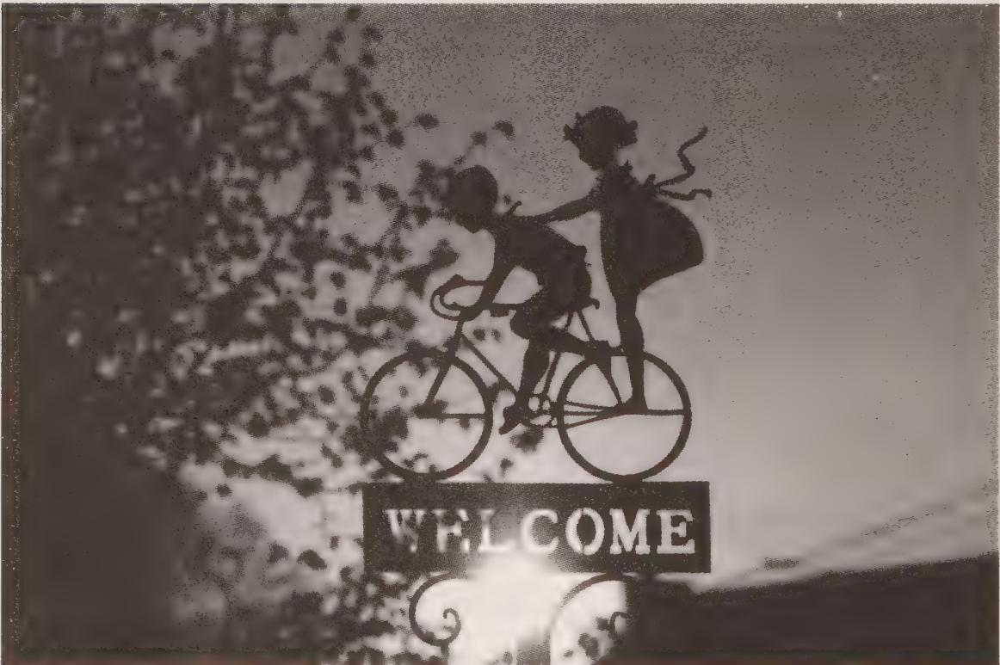

## Anh ấy có yêu bạn hay không, chỉ mình bạn biết

**他爱不爱你，只有你自己知道**

*tā ài bù ài nǐ，zhǐ yǒu nǐ zì jǐ zhī dào*

平日里总会听见有人问起：“他是不是好人？

píng rì lǐ zǒng huì tīng jiàn yǒu rén wèn qǐ ：“tā shì bú shì hǎo rén？

Trong cuộc sống thường ngày luôn nghe thấy có người hỏi: "Anh ta có phải là người tốt không?

”“她是不是喜欢我？

”“tā shì bú shì xǐ huān wǒ？

""Cô ấy có thích tôi không?

”“他是不是在骗我？

”“tā shì bú shì zài piàn wǒ？

""Anh ta có đang lừa tôi không?

因为听见了一些流言蜚语，总不免担惊受怕。

yīn wèi tīng jiàn le yī xiē liú yán fēi yǔ，zǒng bù miǎn dān jīng shòu pà。

Vì nghe thấy vài lời đồn đại, nên không tránh khỏi lo lắng sợ hãi.

自己当初付出的真心真意，是不是太傻太痴？

zì jǐ dāng chū fù chū de zhēn xīn zhēn yì，shì bú shì tài shǎ tài chī？

Tấm lòng chân thành đã trao ban lúc ban đầu của mình, có phải quá ngốc nghếch si tình?

是不是在别人眼里不过是一场戏，而自己当作了刻骨铭心。

shì bú shì zài bié rén yǎn lǐ bù guò shì yī cháng xì，ér zì jǐ dàng zuò le kè gǔ míng xīn。

Có phải trong mắt người khác chỉ là một vở kịch, còn mình lại xem đó là khắc cốt ghi tâm.

去年看了一场《张爱玲》，剧里，她天真烂漫，优容大度。

qù nián kàn le yī cháng《zhāng ài líng》，jù lǐ，tā tiān zhēn làn màn，yōu róng dà dù。

Năm ngoái tôi xem một vở 《Trương Ái Linh》, trong vở, bà hồn nhiên trong sáng, độ lượng bao dung.

高中的时候，父亲要我买了一本张爱玲全集，我记得父亲一夜便把一本全集读完了，并勾勾画画很多精彩的地方。

gāo zhōng de shí hòu，fù qīn yào wǒ mǎi le yī běn zhāng ài líng quán jí，wǒ jì de fù qīn yī yè biàn bǎ yī běn quán jí dú wán le，bìng gōu gōu huà huà hěn duō jīng cǎi de dì fāng。

Hồi cấp ba, cha bảo tôi mua một cuốn 《Trương Ái Linh toàn tập》, tôi nhớ cha chỉ một đêm đã đọc xong cuốn toàn tập, và gạch chân đánh dấu rất nhiều chỗ hay.

我则是看了很久，《倾城之恋》《怨女》……

wǒ zé shì kàn le hěn jiǔ，《qīng chéng zhī liàn》《yuàn nǚ》……

Còn tôi thì đọc rất lâu, 《Khuynh thành chi luyến》《Oán nữ》……

很多时候，只有当我们接触了很多人之后，才能明白，我们心里最中意的是哪一个，心底最喜欢的是谁。

hěn duō shí hòu，zhǐ yǒu dāng wǒ men jiē chù le hěn duō rén zhī hòu，cái néng míng bái，wǒ men xīn lǐ zuì zhōng yì de shì nǎ yí gè，xīn dǐ zuì xǐ huān de shì shuí。

Nhiều khi, chỉ sau khi chúng ta tiếp xúc với thật nhiều người, mới hiểu được, người mình vừa ý nhất trong lòng là ai, người mình thích nhất trong tim là ai.

读书也是一样。

dú shū yě shì yī yàng。

Đọc sách cũng giống vậy.

书读得多了，自然有很多是不记得的，包括作者，还有他的作品。

shū dú dé duō le，zì rán yǒu hěn duō shì bú jì dé de，bāo kuò zuò zhě，hái yǒu tā de zuò pǐn。

Sách đọc nhiều rồi, tự nhiên có nhiều thứ không nhớ nổi, bao gồm cả tác giả, lẫn tác phẩm của họ.

但如果你记得谁，并且非常深刻，说明你是钟爱他的。

dàn rú guǒ nǐ jì de shuí，bìng qiě fēi cháng shēn kè，shuō míng nǐ shì zhōng ài tā de。

Nhưng nếu bạn nhớ ai đó, và nhớ vô cùng sâu sắc, chứng tỏ bạn dành tình yêu đặc biệt cho người ấy.

我一直记得《倾城之恋》，并且记得里面的敢于争取自己的爱情的白流苏，还有男主人公柳原。

wǒ yì zhí jì de《qīng chéng zhī liàn》，bìng qiě jì de lǐ miàn de gǎn yú zhēng qǔ zì jǐ de ài qíng de bái liú sū，hái yǒu nán zhǔ rén gōng liǔ yuán。

Tôi luôn nhớ 《Khuynh thành chi luyến》, và nhớ Bạch Lưu Tô trong truyện, người dám giành lấy tình yêu của chính mình, cùng nam chính Liễu Nguyên.

我很少记得一些作品，并且记得小说里面主人公的名字，这些记忆让我自己都诧异。

wǒ hěn shǎo jì de yī xiē zuò pǐn，bìng qiě jì de xiǎo shuō lǐ miàn zhǔ rén gōng de míng zì，zhè xiē jì yì ràng wǒ zì jǐ dōu chà yì。

Tôi rất hiếm khi nhớ được tác phẩm nào, lại càng hiếm khi nhớ tên nhân vật chính trong tiểu thuyết, những ký ức này khiến chính tôi cũng phải ngạc nhiên.

或许，由此来说，我也是偏爱张爱玲的。

huò xǔ，yóu cǐ lái shuō，wǒ yě shì piān ài zhāng ài líng de。

Có lẽ, xét theo đó, tôi cũng thiên vị Trương Ái Linh.

张爱玲与胡兰成，很多人都觉得张爱玲爱得痴傻，胡兰成薄情甚至无情无义。

zhāng ài líng yǔ hú lán chéng，hěn duō rén dōu jué de zhāng ài líng ài dé chī shǎ，hú lán chéng bó qíng shèn zhì wú qíng wú yì。

Trương Ái Linh và Hồ Lan Thành, nhiều người cho rằng Trương Ái Linh yêu một cách si mê ngu ngốc, còn Hồ Lan Thành bạc tình thậm chí vô tình vô nghĩa.

他一生不仅多情，且无耻。

tā yī shēng bù jǐn duō qíng，qiě wú chǐ。

Cả đời ông ta không chỉ đa tình, mà còn vô sỉ.

他将与张爱玲在一起的细枝末节都写进了《今生今世》里。

tā jiāng yǔ zhāng ài líng zài yì qǐ de xì zhī mò jié dōu xiě jìn le《jīn shēng jīn shì》lǐ。

Ông ta đem cả những chi tiết vụn vặt khi ở bên Trương Ái Linh viết hết vào 《Kim sinh kim thế》.

那对于张爱玲来说极为珍贵且不想与人知的情感，全都让这个“负心人”抖落与世人了。

nà duì yú zhāng ài líng lái shuō jí wéi zhēn guì qiě bù xiǎng yǔ rén zhī de qíng gǎn，quán dōu ràng zhè ge “fù xīn rén ”dǒu luò yǔ shì rén le。

Thứ tình cảm vô cùng quý giá mà Trương Ái Linh không muốn ai biết, tất cả đều bị kẻ “bạc tình” này phơi bày trước thiên hạ.

所以，她才说，一生都鄙夷胡兰成。

suǒ yǐ，tā cái shuō，yī shēng dōu bǐ yí hú lán chéng。

Vì vậy, bà mới nói, cả đời đều khinh miệt Hồ Lan Thành.

但在她看透了、伤透了之后，她还是将最后的一笔钱，三十万的剧本费，寄给了胡兰成。

dàn zài tā kàn tòu le、shāng tòu le zhī hòu，tā hái shì jiāng zuì hòu de yī bǐ qián，sān shí wàn de jù běn fèi，jì gěi le hú lán chéng。

Nhưng sau khi bà đã nhìn thấu, đã tổn thương đến tận cùng, bà vẫn đem khoản tiền cuối cùng, ba mươi vạn tiền kịch bản, gửi cho Hồ Lan Thành.

她真是痴傻吗？

tā zhēn shì chī shǎ ma？

Bà thật sự si mê ngu ngốc sao?

她只是爱得彻底，惊天动地罢了。

tā zhǐ shì ài dé chè dǐ，jīng tiān dòng dì bà le。

Bà chỉ là yêu đến cùng cực, yêu đến long trời lở đất mà thôi.

我读过一篇胡兰成给张爱玲写的信：《我身在忘川》。

wǒ dú guò yī piān hú lán chéng gěi zhāng ài líng xiě de xìn：《wǒ shēn zài wàng chuān》。

Tôi từng đọc một bức thư Hồ Lan Thành viết cho Trương Ái Linh: 《Ta ở bên sông Vong Xuyên》.

只这封信，我就谅解了胡兰成。

zhǐ zhè fēng xìn，wǒ jiù liàng jiě le hú lán chéng。

Chỉ bức thư này thôi, tôi đã tha thứ cho Hồ Lan Thành.

我相信他爱她并不比她少。

wǒ xiāng xìn tā ài tā bìng bù bǐ tā shǎo。

Tôi tin rằng ông ta yêu bà không hề ít hơn bà yêu ông ta.

而张爱玲也是知道的，所以她才爱以倾城、恨以倾城。

ér zhāng ài líng yě shì zhī dào de，suǒ yǐ tā cái ài yǐ qīng chéng、hèn yǐ qīng chéng。

Và Trương Ái Linh cũng biết điều đó, vì thế bà mới yêu bằng cả tấm thành trì khuynh đảo, hận cũng bằng cả tấm thành trì.

世间所有的情感，应都是这样的：毋管他人如何说三道四，左右摇摆你的心思，是真是假，是爱是骗，只有你自己心里有

shì jiān suǒ yǒu de qíng gǎn，yīng dōu shì zhè yàng de：wú guǎn tā rén rú hé shuō sān dào sì，zuǒ yòu yáo bǎi nǐ de xīn sī，shì zhēn shì jiǎ，shì ài shì piàn，zhǐ yǒu nǐ zì jǐ xīn lǐ yǒu

Mọi tình cảm trên đời, lẽ ra đều như vậy: mặc người khác đàm tiếu, mặc những lời khiến tâm tư bạn dao động, thật hay giả, yêu hay lừa dối, chỉ có trong lòng chính bạn mới

答案。

dá àn。

có câu trả lời.

只是在岁月长河的洗练之后，我们经常忘记了，自己就是捍卫命运的王。

zhǐ shì zài suì yuè cháng hé de xǐ liàn zhī hòu，wǒ men jīng cháng wàng jì le，zì jǐ jiù shì hàn wèi mìng yùn de wáng。

Chỉ là sau khi bị dòng sông thời gian tôi luyện, chúng ta thường quên mất rằng, chính mình mới là vị vua bảo vệ số phận của mình.

中学的时候，我就跟一个女孩子说，你不要管其他人怎么说，怎么想，你要自己去感知。

zhōng xué de shí hòu，wǒ jiù gēn yí gè nǚ hái zi shuō，nǐ bú yào guǎn qí tā rén zěn me shuō，zěn me xiǎng，nǐ yào zì jǐ qù gǎn zhī。

Hồi trung học, tôi từng nói với một cô bạn, bạn đừng quan tâm người khác nói gì, nghĩ gì, bạn phải tự mình cảm nhận.

你觉得他是喜欢你的，他就是喜欢你的，你觉得他是假的，那就是假的。

nǐ jué de tā shì xǐ huān nǐ de，tā jiù shì xǐ huān nǐ de，nǐ jué de tā shì jiǎ de，nà jiù shì jiǎ de。

Bạn cảm thấy anh ấy thích bạn, thì anh ấy chính là thích bạn, bạn cảm thấy anh ấy giả dối, thì đó chính là giả dối.

直到今天，我依然这样想。

zhí dào jīn tiān，wǒ yī rán zhè yàng xiǎng。

Cho đến hôm nay, tôi vẫn nghĩ như vậy.

真真假假，不要去问别人，只问自己的心。

zhēn zhēn jiǎ jiǎ，bú yào qù wèn bié rén，zhǐ wèn zì jǐ de xīn。

Thật thật giả giả, đừng đi hỏi người khác, chỉ cần hỏi trái tim của mình.

那时，你的内心会告诉你，值得吗？

nà shí，nǐ de nèi xīn huì gào sù nǐ，zhí de ma？

Lúc đó, trái tim bạn sẽ mách bảo bạn, đáng hay không?

忘记，还是怀念？

wàng jì，hái shì huái niàn？

Quên đi, hay hoài niệm?

爱还是恨？

ài hái shì hèn？

Yêu hay hận?

天地鸿蒙还是心如止水…它会将一切答案都告诉你。

tiān dì hóng méng hái shì xīn rú zhǐ shuǐ…tā huì jiāng yī qiè dá àn dōu gào sù nǐ。

Hỗn độn vũ trụ hay lòng như nước lặng… Nó sẽ nói cho bạn biết tất cả câu trả lời.

那时，我们会理解这世间所有的痴男怨女。

nà shí，wǒ men huì lǐ jiě zhè shì jiān suǒ yǒu de chī nán yuàn nǚ。

Lúc đó, chúng ta sẽ thấu hiểu tất cả những kẻ si tình oán trách trên đời.

抓住这欺骗里裹藏的一丝真心实意，一生一世，谁又能去评判值得与不值得呢？

zhuā zhù zhè qī piàn lǐ guǒ cáng de yī sī zhēn xīn shí yì，yì shēng yí shì，shuí yòu néng qù píng pàn zhí de yǔ bù zhí dé ne？

Nắm lấy một chút chân tâm thật ý giấu trong sự lừa dối ấy, cả một đời, ai có thể phán xét được đáng hay không đáng đây?

“三生石，三生路，三世情缘尘归土”……

“sān shēng shí，sān shēng lù，sān shì qíng yuán chén guī tǔ ”……

“Tam sinh thạch, tam sinh lộ, tam thế tình duyên trần quy thổ”……

如一些旧人，早已断了情，绝了路，面且全非。

rú yī xiē jiù rén，zǎo yǐ duàn le qíng，jué le lù，miàn qiě quán fēi。

Như những người xưa cũ, sớm đã dứt tình, tuyệt đường, khuôn mặt chẳng còn như xưa.

在这滚滚红尘中，若他日再见，是忘还是念，只有你知，我知。

zài zhè gǔn gǔn hóng chén zhōng，ruò tā rì zài jiàn，shì wàng hái shì niàn，zhǐ yǒu nǐ zhī，wǒ zhī。

Trong cõi hồng trần cuồn cuộn này, nếu ngày khác còn gặp lại, là quên hay là nhớ, chỉ có bạn biết, tôi biết.

## Yêu một người, sẽ thay đổi thái độ sống của bạn

**爱一个人，会改变你的生活态度**

*ài yí gè rén，huì gǎi biàn nǐ de shēng huó tài dù*

《来自星星的你》里，古代的小千为都敏俊挡箭死去的时候，说：“在没有遇见你之前，我的生活里都是抱怨和气馁，在遇见你之后，我突然开始思念未来了，开始想恳切地生活。

《lái zì xīng xīng de nǐ》lǐ，gǔ dài de xiǎo qiān wèi dōu mǐn jùn dǎng jiàn sǐ qù de shí hòu，shuō ：“zài méi yǒu yù jiàn nǐ zhī qián，wǒ de shēng huó lǐ dōu shì bào yuàn hé qì něi，zài yù jiàn nǐ zhī hòu，wǒ tū rán kāi shǐ sī niàn wèi lái le，kāi shǐ xiǎng kěn qiè dì shēng huó。

Trong 《Vì sao đưa anh tới》, khi Tiểu Thiên ngày xưa dùng thân đỡ mũi tên rồi chết thay Đô Mẫn Tuấn, cô nói: "Trước khi gặp được anh, cuộc sống của em chỉ toàn oán trách và chán nản, sau khi gặp được anh, em bỗng bắt đầu nhớ mong về tương lai, bắt đầu muốn sống một cách tha thiết."

我想，这便是真正的爱情吧。

wǒ xiǎng，zhè biàn shì zhēn zhèng de ài qíng ba。

Tôi nghĩ, đây mới chính là tình yêu đích thực.

又或许这并不是仅仅能用爱来衡量的。

yòu huò xǔ zhè bìng bú shì jǐn jǐn néng yòng ài lái héng liáng de。

Lại có lẽ đây không chỉ đơn thuần có thể đo bằng tình yêu.

在没有遇见那个人之前，我们孤单、寂寞，我们深受折磨，乃至绝望。

zài méi yǒu yù jiàn nà ge rén zhī qián，wǒ men gū dān、jì mò，wǒ men shēn shòu zhé mó，nǎi zhì jué wàng。

Trước khi gặp được người ấy, chúng ta cô đơn, trống trải, chúng ta bị giày vò, thậm chí tuyệt vọng.

但是遇见了一个人，一切都改变了。

dàn shì yù jiàn le yí gè rén，yī qiè dōu gǎi biàn le。

Nhưng khi gặp được một người, tất cả đều thay đổi.

我们想好好地活着，充满希望与快乐地活着。

wǒ men xiǎng hǎo hǎo dì huó zhe，chōng mǎn xī wàng yǔ kuài lè dì huó zhe。

Chúng ta muốn sống thật tốt, sống tràn đầy hy vọng và niềm vui.

如果你一直不敢爱，那么就等待遇见这样一个人吧。

rú guǒ nǐ yì zhí bù gǎn ài，nà me jiù děng dài yù jiàn zhè yàng yí gè rén ba。

Nếu bạn luôn không dám yêu, vậy hãy chờ đợi gặp được một người như thế.

这样一个人他会改变你生活的态度，还有以往寒冷的内心。

zhè yàng yí gè rén tā huì gǎi biàn nǐ shēng huó de tài dù，hái yǒu yǐ wǎng hán lěng de nèi xīn。

Một người như thế sẽ thay đổi thái độ sống của bạn, và cả trái tim lạnh giá trước kia.

一如小千一样，就这样去喜欢一个人，让你变得快乐起来。

yī rú xiǎo qiān yī yàng，jiù zhè yàng qù xǐ huān yí gè rén，ràng nǐ biàn dé kuài lè qǐ lái。

Cũng như Tiểu Thiên, cứ như vậy đi yêu một người, khiến bạn trở nên vui vẻ.

不一定非要有浪漫的追求，开心的旅行，只要你们心心相印。

bù yí dìng fēi yào yǒu làng màn de zhuī qiú，kāi xīn de lǚ xíng，zhǐ yào nǐ men xīn xīn xiāng yìn。

Không nhất thiết phải có màn theo đuổi lãng mạn, chuyến du lịch vui vẻ, chỉ cần hai người tâm đầu ý hợp.

这种感觉会改变你们的心态。

zhè zhǒng gǎn jué huì gǎi biàn nǐ men de xīn tài。

Cảm giác này sẽ thay đổi tâm thái của hai người.

当有那么一个人，不用开口说话，只要彼此相望，就能感到温暖，这是多么幸福的事情。

dāng yǒu nà me yí gè rén，bù yòng kāi kǒu shuō huà，zhǐ yào bǐ cǐ xiāng wàng，jiù néng gǎn dào wēn nuǎn，zhè shì duō me xìng fú de shì qíng。

Khi có một người như vậy, không cần mở lời nói, chỉ cần nhìn nhau, đã cảm thấy ấm áp, đó là chuyện hạnh phúc biết bao.

我一直相信，爱情可以改变人生，因为这人世间最动人的莫过于爱。

wǒ yì zhí xiāng xìn，ài qíng kě yǐ gǎi biàn rén shēng，yīn wèi zhè rén shì jiān zuì dòng rén de mò guò yú ài。

Tôi luôn tin, tình yêu có thể thay đổi cuộc đời, vì trên cõi đời này điều động lòng người nhất chính là tình yêu.

人们形形色色，敢爱敢恨。

rén men xíng xíng sè sè，gǎn ài gǎn hèn。

Con người muôn hình muôn vẻ, dám yêu dám hận.

人们因此而无悔地付出，无怨地追逐。

rén men yīn cǐ ér wú huǐ dì fù chū，wú yuàn dì zhuī zhú。

Con người vì thế mà không tiếc nuối trao đi, không oán hận theo đuổi.

人们因为爱而冒险，因为爱而勇敢。

rén men yīn wèi ài ér mào xiǎn，yīn wèi ài ér yǒng gǎn。

Con người vì tình yêu mà mạo hiểm, vì tình yêu mà dũng cảm.

你甚至不用去管那个人喜不喜欢你，只要去勇敢地喜欢就好。

nǐ shèn zhì bù yòng qù guǎn nà ge rén xǐ bù xǐ huān nǐ，zhǐ yào qù yǒng gǎn dì xǐ huān jiù hǎo。

Bạn thậm chí không cần quan tâm người ấy có thích bạn hay không, chỉ cần dũng cảm yêu thích là được.

就像柯景腾说的那样：“我也喜欢那个时候喜欢着你的我。

jiù xiàng kē jǐng téng shuō de nà yàng ：“wǒ yě xǐ huān nà ge shí hòu xǐ huān zhe nǐ de wǒ。

Giống như Kha Cảnh Đằng đã nói: "Tôi cũng thích cái tôi đang thích em hồi đó."

”你会发现，当你心里存在一个人的时候，自己不那么孤单，也不那么寂寞。

”nǐ huì fā xiàn，dāng nǐ xīn lǐ cún zài yí gè rén de shí hòu，zì jǐ bù nà me gū dān，yě bù nà me jì mò。

"Bạn sẽ phát hiện ra, khi trong lòng bạn có một người, mình không còn cô đơn lắm, cũng không còn trống trải lắm.

做什么事情你都会想到他，哪怕没有任何回应。

zuò shén me shì qíng nǐ dū huì xiǎng dào tā，nǎ pà méi yǒu rèn hé huí yìng。

Làm việc gì bạn cũng nghĩ đến anh ấy, dù không hề có bất kỳ hồi đáp nào.

等时间久了，你蓦然回首的时候，会发现，心里藏着一个人的日子，是那么丰盈，满足。

děng shí jiān jiǔ le，nǐ mò rán huí shǒu de shí hòu，huì fā xiàn，xīn lǐ cáng zhe yí gè rén de rì zi，shì nà me fēng yíng，mǎn zú。

Chờ thời gian trôi lâu, khi bạn chợt ngoảnh đầu nhìn lại, sẽ phát hiện ra, những ngày tháng trong lòng giấu một người, là trọn vẹn, thỏa mãn đến thế.

而如果有一天你将那个人遗忘的时候，你会发现，你的生活，是那么虚空。

ér rú guǒ yǒu yī tiān nǐ jiāng nà ge rén yí wàng de shí hòu，nǐ huì fā xiàn，nǐ de shēng huó，shì nà me xū kōng。

Còn nếu có một ngày bạn lãng quên người ấy, bạn sẽ phát hiện ra, cuộc sống của mình, trống rỗng đến vậy.

随着年龄、知识、阅历的增长，对于我们来说，已经很难随随便便再遇见爱情。

suí zhe nián líng、zhī shí、yuè lì de zēng zhǎng，duì yú wǒ men lái shuō，yǐ jīng hěn nán suí suí biàn biàn zài yù jiàn ài qíng。

Cùng với sự tăng trưởng của tuổi tác, tri thức, trải nghiệm, đối với chúng ta mà nói, đã rất khó để tùy tiện gặp gỡ tình yêu.

我们很难再有一不小心就碰见的爱情，见面就忠贞不渝的爱恋。

wǒ men hěn nán zài yǒu yí bù xiǎo xīn jiù pèng jiàn de ài qíng，jiàn miàn jiù zhōng zhēn bù yú de ài liàn。

Chúng ta rất khó còn có được một tình yêu vô tình va phải, một mối tình vừa gặp đã chung thủy sắt son.

因为成长，我们有了自己的人生观、价值观、爱情观，在一个人外在条件符合的情况下，我们还会去发掘他的生活品质、个人素养等方面。

yīn wèi chéng zhǎng，wǒ men yǒu le zì jǐ de rén shēng guān、jià zhí guān、ài qíng guān，zài yí gè rén wài zài tiáo jiàn fú hé de qíng kuàng xià，wǒ men hái huì qù fā jué tā de shēng huó pǐn zhì、gè rén sù yǎng děng fāng miàn。

Vì trưởng thành, chúng ta có quan điểm sống, quan điểm giá trị, quan điểm tình yêu của riêng mình, khi điều kiện bên ngoài của một người phù hợp, chúng ta còn đi khai thác chất lượng cuộc sống, phẩm chất cá nhân và các phương diện khác của anh ta.

或许只是因为他的一个小举动，我们便会容忍不了跟他继续交往。

huò xǔ zhǐ shì yīn wèi tā de yí gè xiǎo jǔ dòng，wǒ men biàn huì róng rěn bù liǎo gēn tā jì xù jiāo wǎng。

Có lẽ chỉ vì một cử chỉ nhỏ của anh ta, chúng ta liền không thể chấp nhận tiếp tục qua lại với anh ta.

曾经我遇见过一个男孩子，各方面都很好，唯独一件事情让我觉得无法接受—两个人出去点菜吃饭的时候，他点的永远不是我爱吃的。

céng jīng wǒ yù jiàn guò yí gè nán hái zi，gè fāng miàn dōu hěn hǎo，wéi dú yī jiàn shì qíng ràng wǒ jué de wú fǎ jiē shòu—liǎng gè rén chū qù diǎn cài chī fàn de shí hòu，tā diǎn de yǒng yuǎn bú shì wǒ ài chī de。

Tôi từng gặp một chàng trai, mọi mặt đều rất tốt, duy chỉ một chuyện khiến tôi cảm thấy không thể chấp nhận — khi hai người ra ngoài gọi món ăn cơm, anh ấy gọi mãi không bao giờ là món tôi thích.

这件事情让我耿耿于怀，后来两人无疾而终。

zhè jiàn shì qíng ràng wǒ gěng gěng yú huái，hòu lái liǎng rén wú jí ér zhōng。

Chuyện này khiến tôi cứ mãi vướng bận trong lòng, sau đó hai người lặng lẽ chia tay không lý do.

你可以说这是我太过矫情，但我愿意坚守我的原则。

nǐ kě yǐ shuō zhè shì wǒ tài guò jiǎo qíng，dàn wǒ yuàn yì jiān shǒu wǒ de yuán zé。

Bạn có thể nói đây là tôi quá làm quá, nhưng tôi nguyện giữ vững nguyên tắc của mình.

因为我始终相信，跟自己合得来的人，两个人的喜好大多时候也是相同的。

yīn wèi wǒ shǐ zhōng xiāng xìn，gēn zì jǐ hé de lái de rén，liǎng gè rén de xǐ hào dà duō shí hòu yě shì xiāng tóng de。

Vì tôi luôn tin, người hợp với mình, thì sở thích của hai người phần lớn thời gian cũng tương đồng.

一个人口味上跟你大相径庭，他的性格以及为人处事，多半也会跟你有很大不同。

yí gè rén kǒu wèi shàng gēn nǐ dà xiāng jìng tíng，tā de xìng gé yǐ jí wéi rén chǔ shì，duō bàn yě huì gēn nǐ yǒu hěn dà bù tóng。

Một người khẩu vị khác xa bạn, thì tính cách cũng như cách đối nhân xử thế của anh ta, phần lớn cũng sẽ rất khác bạn.

就是这样，我们希望一个人不仅与我们生活习惯吻合，还要心灵相通。

jiù shì zhè yàng，wǒ men xī wàng yí gè rén bù jǐn yǔ wǒ men shēng huó xí guàn wěn hé，hái yào xīn líng xiāng tōng。

Chính là như vậy, chúng ta hy vọng một người không chỉ khớp với thói quen sinh hoạt của chúng ta, mà còn phải tâm ý tương thông.

哪怕只差一点，我们都无法接受和妥协。

nǎ pà zhǐ chà yì diǎn，wǒ men dōu wú fǎ jiē shòu hé tuǒ xié。

Dù chỉ chênh lệch một chút, chúng ta cũng không thể chấp nhận và thỏa hiệp.

因为我们想到的总是一生。

yīn wèi wǒ men xiǎng dào de zǒng shì yī shēng。

Vì thứ chúng ta nghĩ đến luôn là cả một đời.

如果可以，去喜欢那样一个人吧。

rú guǒ kě yǐ，qù xǐ huān nà yàng yí gè rén ba。

Nếu có thể, hãy đi yêu một người như thế.

如果你正当青春年少，就简单地去喜欢；如果你经历苦痛，就去喜欢那个让你想要恳切生活的人。

rú guǒ nǐ zhèng dāng qīng chūn nián shào，jiù jiǎn dān dì qù xǐ huān；rú guǒ nǐ jīng lì kǔ tòng，jiù qù xǐ huān nà ge ràng nǐ xiǎng yào kěn qiè shēng huó de rén。

Nếu bạn đang tuổi thanh xuân trẻ trung, hãy đơn giản mà yêu; nếu bạn từng trải qua đau khổ, hãy yêu người khiến bạn muốn sống một cách tha thiết.

让日子充实起来，也让自己明媚起来。

ràng rì zi chōng shí qǐ lái，yě ràng zì jǐ míng mèi qǐ lái。

Hãy khiến những ngày tháng trở nên đầy đặn, cũng khiến bản thân rạng rỡ.

爱情，它真的是一剂充满魔力的药。

ài qíng，tā zhēn de shì yī jì chōng mǎn mó lì de yào。

Tình yêu, nó thật sự là một thang thuốc đầy ma lực.

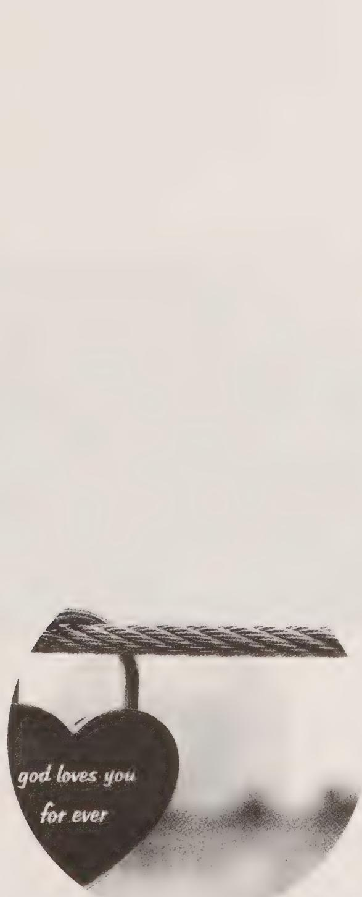

PART 2

PART 2

PHẦN 2

# Bạn đương nhiên không tầm thường, bạn chỉ cần thời gian để thành công

**你当然不平庸，你只是需要时间去成功**

*nǐ dāng rán bù píng yōng，nǐ zhǐ shì xū yào shí jiān qù chéng gōng*

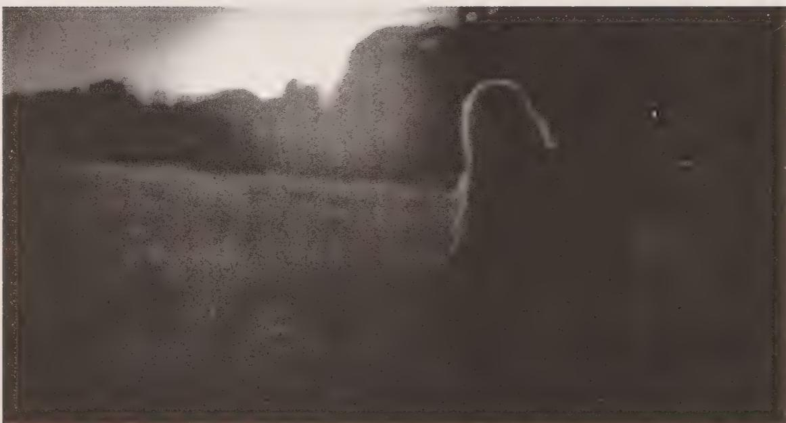

## Có thể bình thường, nhưng đừng tầm thường

**可以平凡，但别平庸**

*kě yǐ píng fán，dàn bié píng yōng*

很多人都曾不停地叩问过自己的心，在经历现实击打之后自己是否能够放弃追求，是否能够对梦想不再坚持。

hěn duō rén dōu céng bù tíng dì kòu wèn guò zì jǐ de xīn，zài jīng lì xiàn shí jī dǎ zhī hòu zì jǐ shì fǒu néng gòu fàng qì zhuī qiú，shì fǒu néng gòu duì mèng xiǎng bù zài jiān chí。

Rất nhiều người từng không ngừng tự vấn lòng mình, sau khi trải qua đòn roi của hiện thực, mình có thể buông bỏ khát vọng theo đuổi hay không, có thể không còn kiên trì với ước mơ hay không.

人生可以平凡，却不能平庸，也许我终不能将梦想实现，但是我不能放弃追逐的脚步。

rén shēng kě yǐ píng fán，què bù néng píng yōng，yě xǔ wǒ zhōng bù néng jiāng mèng xiǎng shí xiàn，dàn shì wǒ bù néng fàng qì zhuī zhú de jiǎo bù。

Cuộc đời có thể bình thường, nhưng không thể tầm thường, có lẽ tôi suy cho cùng cũng không thể thực hiện được ước mơ, nhưng tôi không thể ngừng bước chân theo đuổi.

如果坚持自己的梦想，它便会融入灵魂，与我们的血肉合为体，不管他人非议，不管生活折磨，不管世事无常，不管人心冷暖，都撕不去我们对梦想的这一渴望。

rú guǒ jiān chí zì jǐ de mèng xiǎng，tā biàn huì róng rù líng hún，yǔ wǒ men de xuè ròu hé wèi tǐ，bù guǎn tā rén fēi yì，bù guǎn shēng huó zhé mó，bù guǎn shì shì wú cháng，bù guǎn rén xīn lěng nuǎn，dōu sī bù qù wǒ men duì mèng xiǎng de zhè yī kě wàng。

Nếu kiên trì với ước mơ của mình, nó sẽ hòa vào linh hồn, cùng máu thịt chúng ta kết làm một, dù người khác bàn tán, dù cuộc sống giày vò, dù thế sự vô thường, dù lòng người lạnh ấm, đều không thể xé rời khát vọng với ước mơ này của chúng ta.

当你明确地向前走，大胆不移地走，你会发现所有的苦难都是必经的路途。

dāng nǐ míng què dì xiàng qián zǒu，dà dǎn bù yí dì zǒu，nǐ huì fā xiàn suǒ yǒu de kǔ nàn dōu shì bì jīng de lù tú。

Khi bạn kiên định bước về phía trước, dũng cảm không lay chuyển mà bước, bạn sẽ phát hiện ra mọi gian khổ đều là con đường tất phải đi qua.

做你自己的信徒，没有任何人能成为刽子手，也没有任何人能成为掌舵人，来改变你追逐梦想的方向，来改变人生尽头的最终目的地。

zuò nǐ zì jǐ de xìn tú，méi yǒu rèn hé rén néng chéng wéi guì zi shǒu，yě méi yǒu rèn hé rén néng chéng wéi zhǎng duò rén，lái gǎi biàn nǐ zhuī zhú mèng xiǎng de fāng xiàng，lái gǎi biàn rén shēng jìn tóu de zuì zhōng mù dì dì。

Hãy làm tín đồ của chính mình, không ai có thể trở thành kẻ hành quyết, cũng không ai có thể trở thành người cầm lái, để đổi hướng bạn theo đuổi ước mơ, để thay đổi điểm đến cuối cùng ở tận cùng cuộc đời.

对于追求，如果我们总是选择去相信，有着自己明确的想

duì yú zhuī qiú，rú guǒ wǒ men zǒng shì xuǎn zé qù xiāng xìn，yǒu zhe zì jǐ míng què de xiǎng

Đối với khát vọng theo đuổi, nếu chúng ta luôn chọn cách tin tưởng, có suy nghĩ rõ ràng của riêng mình,

法，就不会受到任何危言的影响和叨扰。

fǎ，jiù bú huì shòu dào rèn hé wēi yán de yǐng xiǎng hé tāo rǎo。

thì sẽ không bị bất kỳ lời đồn thổi nguy hại nào ảnh hưởng và quấy nhiễu.

就像电影《我们是冠军》里面的那个乒乓球教练那样，他从小就喜欢打乒乓球，但是因为身高比例不符合标准，没有进体校。

jiù xiàng diàn yǐng《wǒ men shì guàn jūn》lǐ miàn de nà ge pīng pāng qiú jiào liàn nà yàng，tā cóng xiǎo jiù xǐ huān dǎ pīng pāng qiú，dàn shì yīn wèi shēn gāo bǐ lì bù fú hé biāo zhǔn，méi yǒu jìn tǐ xiào。

Cũng giống như vị huấn luyện viên bóng bàn trong bộ phim 《Chúng ta là quán quân》, anh ấy từ nhỏ đã thích đánh bóng bàn, nhưng vì tỷ lệ chiều cao không đạt chuẩn, nên không vào được trường thể thao.

后来经过自己的努力，他到体校当了老师，但一直是陪练。

hòu lái jīng guò zì jǐ de nǔ lì，tā dào tǐ xiào dāng le lǎo shī，dàn yì zhí shì péi liàn。

Sau đó nhờ nỗ lực của bản thân, anh đến trường thể thao làm giáo viên, nhưng mãi chỉ là người làm bia tập.

脚受了伤之后，他来到那个小山村，培养孩子们打乒乓球。

jiǎo shòu le shāng zhī hòu，tā lái dào nà ge xiǎo shān cūn，péi yǎng hái zi men dǎ pīng pāng qiú。

Sau khi bị thương ở chân, anh đến ngôi làng nhỏ miền núi kia, đào tạo lũ trẻ đánh bóng bàn.

他们没有球拍，没有球台，也没有队服，甚至没有一双白球鞋，第一次参加比赛失利，回来后球队就被解散。

tā men méi yǒu qiú pāi，méi yǒu qiú tái，yě méi yǒu duì fú，shèn zhì méi yǒu yī shuāng bái qiú xié，dì yī cì cān jiā bǐ sài shī lì，huí lái hòu qiú duì jiù bèi jiě sàn。

Chúng không có vợt, không có bàn bóng, cũng không có đồng phục đội, thậm chí không có một đôi giày trắng để chơi bóng, lần đầu thi đấu đã thất bại, về đến nơi đội bóng liền bị giải tán.

如果在那个时候他选择了彻底的放弃，那么他的人生将是一个彻底的悲剧吧，而他应该是反抗命运失败的产物吧。

rú guǒ zài nà ge shí hòu tā xuǎn zé le chè dǐ de fàng qì，nà me tā de rén shēng jiāng shì yí gè chè dǐ de bēi jù ba，ér tā yīng gāi shì fǎn kàng mìng yùn shī bài de chǎn wù ba。

Nếu lúc đó anh chọn buông bỏ hoàn toàn, thì cuộc đời anh sẽ là một bi kịch trọn vẹn, mà anh chắc là sản phẩm của sự chống lại số phận thất bại.

但是，他没有放弃，并且最后拿到了冠军。

dàn shì，tā méi yǒu fàng qì，bìng qiě zuì hòu ná dào le guàn jūn。

Nhưng, anh đã không từ bỏ, và cuối cùng giành được chức vô địch.

当他们打进半决赛，校长带着全村的人到球场上为他们助阵的时候，他们就已经赢了。

dāng tā men dǎ jìn bàn jué sài，xiào zhǎng dài zhe quán cūn de rén dào qiú chǎng shàng wèi tā men zhù zhèn de shí hòu，tā men jiù yǐ jīng yíng le。

Khi họ lọt vào bán kết, hiệu trưởng dẫn cả dân làng ra sân bóng cổ vũ cho họ, thì họ đã thắng rồi.

历经曲折所取得的成功，是比一帆风顺得到的收获更振奋人心的。

lì jīng qū zhé suǒ qǔ dé de chéng gōng，shì bǐ yī fān fēng shùn dé dào de shōu huò gèng zhèn fèn rén xīn de。

Thành công đạt được qua gian nan quanh co, là điều làm phấn chấn lòng người hơn hẳn sự thu hoạch đạt được thuận buồm xuôi gió.

它能让你体悟很多事情，明白很多事情。

tā néng ràng nǐ tǐ wù hěn duō shì qíng，míng bái hěn duō shì qíng。

Nó có thể khiến bạn ngộ ra nhiều điều, hiểu ra nhiều điều.

那个时候，我们再回首内心因失落所承受的折磨，不再觉得它是苦痛的，而是充实的。

nà ge shí hòu，wǒ men zài huí shǒu nèi xīn yīn shī luò suǒ chéng shòu de zhé mó，bù zài jué de tā shì kǔ tòng de，ér shì chōng shí de。

Lúc đó, chúng ta ngoảnh lại nhìn những giày vò trong lòng vì mất mát, không còn thấy nó đau khổ, mà là đầy đặn.

所以，在追求的道路上，我们又有什么好畏惧的呢。

suǒ yǐ，zài zhuī qiú de dào lù shàng，wǒ men yòu yǒu shén me hǎo wèi jù de ne。

Vậy nên, trên con đường theo đuổi, chúng ta còn gì để sợ hãi nữa đâu.

一个有着明确想法的人，会有自己的判断力。

yí gè yǒu zhe míng què xiǎng fǎ de rén，huì yǒu zì jǐ de pàn duàn lì。

Một người có suy nghĩ rõ ràng, sẽ có khả năng phán đoán của riêng mình.

就像教练一样，他会去判断一个现象的好坏，一件事情的好坏，一个人人品的好坏。

jiù xiàng jiào liàn yī yàng，tā huì qù pàn duàn yí gè xiàn xiàng de hǎo huài，yī jiàn shì qíng de hǎo huài，yí gè rén rén pǐn de hǎo huài。

Cũng như vị huấn luyện viên, anh sẽ phán đoán một hiện tượng tốt xấu, một sự việc tốt xấu, phẩm hạnh của một người tốt xấu.

并且他会以正确的心态去接纳和吸收生活中的一切，取其精华，去其糟粕。

bìng qiě tā huì yǐ zhèng què de xīn tài qù jiē nà hé xī shōu shēng huó zhōng de yī qiè，qǔ qí jīng huá，qù qí zāo pò。

Và anh sẽ dùng tâm thái đúng đắn để đón nhận và hấp thu mọi thứ trong cuộc sống, lấy tinh hoa, bỏ cặn bã.

我们不要因为别人说你不适合文学创作，就放弃写作的道路；也不要因为别人说你没有音乐天赋，就放弃对音乐梦想的追求；不要因为他人的冷漠和不理解，放弃自己内心真正的渴望。

wǒ men bú yào yīn wèi bié rén shuō nǐ bú shì hé wén xué chuàng zuò，jiù fàng qì xiě zuò de dào lù；yě bú yào yīn wèi bié rén shuō nǐ méi yǒu yīn yuè tiān fù，jiù fàng qì duì yīn yuè mèng xiǎng de zhuī qiú；bú yào yīn wèi tā rén de lěng mò hé bù lǐ jiě，fàng qì zì jǐ nèi xīn zhēn zhèng de kě wàng。

Chúng ta đừng vì người khác nói bạn không hợp với sáng tác văn học, mà từ bỏ con đường viết lách; cũng đừng vì người khác nói bạn không có thiên phú âm nhạc, mà từ bỏ khát vọng theo đuổi giấc mơ âm nhạc; đừng vì sự lạnh nhạt và không hiểu của người khác, mà từ bỏ khát khao đích thực trong lòng mình.

除非你的梦想从来都不是真的。

chú fēi nǐ de mèng xiǎng cóng lái dōu bú shì zhēn de。

Trừ khi ước mơ của bạn chưa bao giờ là thật.

就让自己积极且向上地去探索，简单且快乐地去生活吧。

jiù ràng zì jǐ jī jí qiě xiàng shàng dì qù tàn suǒ，jiǎn dān qiě kuài lè dì qù shēng huó ba。

Hãy để mình tích cực và phấn đấu đi khám phá, giản đơn và vui vẻ mà sống đi.

人生是属于自己的，我们不要为社会与流言所动摇、所影响。

rén shēng shì shǔ yú zì jǐ de，wǒ men bú yào wèi shè huì yǔ liú yán suǒ dòng yáo、suǒ yǐng xiǎng。

Cuộc đời là của riêng mình, chúng ta đừng bị xã hội và lời đồn làm dao động, làm ảnh hưởng.

只要我们内心坚定，那些磨难不过都是通向成功的垫脚石，不过都是身为一个人活在这个世间所必经的历程。

zhǐ yào wǒ men nèi xīn jiān dìng，nà xiē mó nàn bù guò dōu shì tōng xiàng chéng gōng de diàn jiǎo shí，bù guò dōu shì shēn wèi yí gè rén huó zài zhè ge shì jiān suǒ bì jīng de lì chéng。

Chỉ cần trong lòng chúng ta kiên định, những gian nan đó chẳng qua đều là bậc thang dẫn đến thành công, chẳng qua đều là hành trình tất yếu của một con người sống trên thế gian.

所有发生过的一切，并不是最终的命运，也不是最终的旅途，真正的真实的路，在你的心间，在你的脚下。

suǒ yǒu fā shēng guò de yī qiè，bìng bú shì zuì zhōng de mìng yùn，yě bú shì zuì zhōng de lǚ tú，zhēn zhèng de zhēn shí de lù，zài nǐ de xīn jiān，zài nǐ de jiǎo xià。

Mọi điều đã xảy ra, không phải là số phận cuối cùng, cũng không phải là hành trình cuối cùng, con đường chân thật nhất, nằm trong tim bạn, dưới chân bạn.

我们有韶光，有生命，我们就必将拥有自我。

wǒ men yǒu sháo guāng，yǒu shēng mìng，wǒ men jiù bì jiāng yōng yǒu zì wǒ。

Chúng ta có thời gian tươi đẹp, có sự sống, chúng ta nhất định sẽ có được chính mình.

# Kiên định con đường đời của bạn, không sợ muộn cũng đừng sợ thua

**坚定你的人生路，不怕晚也别怕输**

*jiān dìng nǐ de rén shēng lù，bù pà wǎn yě bié pà shū*

生活是一个复杂的调味瓶，会随着时间、地点、人物的变换，有着不同的味道。

shēng huó shì yí gè fù zá de tiáo wèi píng，huì suí zhe shí jiān、dì diǎn、rén wù de biàn huàn，yǒu zhe bù tóng de wèi dào。

Cuộc sống là một lọ gia vị phức tạp, sẽ theo sự đổi thay của thời gian, địa điểm, con người, mà có những hương vị khác nhau.

在大学的时候，一群人聚集在一起，学习、讨论、交流，总是能激起我们的斗志，让我们时刻想要奋进。

zài dà xué de shí hòu，yī qún rén jù jí zài yì qǐ，xué xí、tǎo lùn、jiāo liú，zǒng shì néng jī qǐ wǒ men de dòu zhì，ràng wǒ men shí kè xiǎng yào fèn jìn。

Hồi đại học, một nhóm người tụ tập bên nhau, học tập, thảo luận, giao lưu, luôn có thể khơi dậy chí khí chiến đấu của chúng ta, khiến chúng ta lúc nào cũng muốn phấn đấu vươn lên.

但我们离开学校，失去这样的环境之后，我们的意志常常随着时间而变得薄弱。

dàn wǒ men lí kāi xué xiào，shī qù zhè yàng de huán jìng zhī hòu，wǒ men de yì zhì cháng cháng suí zhe shí jiān ér biàn dé bó ruò。

Nhưng sau khi chúng ta rời trường học, mất đi môi trường như vậy, ý chí của chúng ta thường theo thời gian mà trở nên mỏng manh.

所以，才有这样一句话：跟比自己强大的人做朋友。

suǒ yǐ，cái yǒu zhè yàng yī jù huà：gēn bǐ zì jǐ qiáng dà de rén zuò péng yǒu。

Vì vậy, mới có câu nói như thế này: hãy kết bạn với những người mạnh mẽ hơn mình.

这种强大的朋友，他们一定是拥有了自己的人生信念，不管是什么行业，什么职位，他们心中一定有一个不变的追求。

zhè zhǒng qiáng dà de péng yǒu，tā men yí dìng shì yōng yǒu le zì jǐ de rén shēng xìn niàn，bù guǎn shì shén me háng yè，shén me zhí wèi，tā men xīn zhōng yí dìng yǒu yí gè bù biàn de zhuī qiú。

Loại bạn bè mạnh mẽ này, họ nhất định đã sở hữu niềm tin cuộc đời của riêng mình, dù là ngành nghề nào, chức vụ gì, trong lòng họ nhất định có một khát vọng không đổi.

这种坚定不移的追求，让他们懂得了怎样去走自己的人生路，并且给予自己足够的力量去解决生活的苦痛，处理复杂的交际关系。

zhè zhǒng jiān dìng bù yí de zhuī qiú，ràng tā men dǒng de le zěn yàng qù zǒu zì jǐ de rén shēng lù，bìng qiě jǐ yǔ zì jǐ zú gòu de lì liàng qù jiě jué shēng huó de kǔ tòng，chǔ lǐ fù zá de jiāo jì guān xì。

Khát vọng kiên định không lay chuyển này, khiến họ hiểu được cách đi con đường đời của mình, và trao cho mình đủ sức mạnh để giải quyết khổ đau trong cuộc sống, xử lý những mối quan hệ giao tiếp phức tạp.

记得有一个非常优秀的朋友跟我说过，他说，当你有了自己的人生理想之后，你会发现，人生的方方面面都会有一个明确的

jì de yǒu yí gè fēi cháng yōu xiù de péng yǒu gēn wǒ shuō guò，tā shuō，dāng nǐ yǒu le zì jǐ de rén shēng lǐ xiǎng zhī hòu，nǐ huì fā xiàn，rén shēng de fāng fāng miàn miàn dū huì yǒu yí gè míng què de

Tôi nhớ có một người bạn rất ưu tú từng nói với tôi, anh ấy nói, khi bạn đã có lý tưởng cuộc đời của riêng mình, bạn sẽ phát hiện ra, mọi phương diện của cuộc đời đều sẽ có một

答案。

dá àn。

câu trả lời rõ ràng.

或许有人很早就找到并拥有了这样一种理想，或许有更多的人很早就在追求的路上。

huò xǔ yǒu rén hěn zǎo jiù zhǎo dào bìng yōng yǒu le zhè yàng yī zhǒng lǐ xiǎng，huò xǔ yǒu gèng duō de rén hěn zǎo jiù zài zhuī qiú de lù shàng。

Có lẽ có người từ rất sớm đã tìm thấy và sở hữu một lý tưởng như thế, có lẽ có nhiều người hơn đã sớm ở trên con đường theo đuổi.

或许有更多的人早就醒悟，或许有一些人从一开始就知道自己来与去的道路。

huò xǔ yǒu gèng duō de rén zǎo jiù xǐng wù，huò xǔ yǒu yī xiē rén cóng yī kāi shǐ jiù zhī dào zì jǐ lái yǔ qù de dào lù。

Có lẽ có nhiều người đã sớm tỉnh ngộ, có lẽ có một số người ngay từ đầu đã biết con đường mình đến và đi.

但在羡慕、嫉妒的同时，我们也应该为自己庆幸。

dàn zài xiàn mù、jí dù de tóng shí，wǒ men yě yīng gāi wèi zì jǐ qìng xìng。

Nhưng trong khi ngưỡng mộ, ghen tỵ, chúng ta cũng nên thấy may mắn cho chính mình.

我们也同样找到了自己的前路。

wǒ men yě tóng yàng zhǎo dào le zì jǐ de qián lù。

Chúng ta cũng đã tìm thấy con đường phía trước của chính mình.

虽然，我们不知道是否追赶得上前人的脚步，但我们庆幸自己知道要往哪儿走，从哪里开始，到哪里结束。

suī rán，wǒ men bù zhī dào shì fǒu zhuī gǎn dé shàng qián rén de jiǎo bù，dàn wǒ men qìng xìng zì jǐ zhī dào yào wǎng nǎ ér zǒu，cóng nǎ lǐ kāi shǐ，dào nǎ lǐ jié shù。

Dù vậy, chúng ta không biết liệu có đuổi kịp bước chân người đi trước hay không, nhưng chúng ta mừng vì mình biết phải đi về đâu, bắt đầu từ đâu, và kết thúc ở đâu.

如果我们相信自己，那么一旦我们找到自己想要的目标，想走的路，是会比旁人走得真切、走得热烈的。

rú guǒ wǒ men xiāng xìn zì jǐ，nà me yí dàn wǒ men zhǎo dào zì jǐ xiǎng yào de mù biāo，xiǎng zǒu de lù，shì huì bǐ páng rén zǒu dé zhēn qiè、zǒu dé rè liè de。

Nếu chúng ta tin vào chính mình, thì một khi tìm thấy mục tiêu mong muốn và con đường muốn đi, chúng ta sẽ bước đi chân thật và nồng nhiệt hơn những người khác.

所以我们别怕晚，也别怕输。

suǒ yǐ wǒ men bié pà wǎn，yě bié pà shū。

Vì vậy, đừng sợ đến muộn, cũng đừng sợ thất bại.

不管之后生活如何艰苦迷惘，都不要放弃，也不要迷失。

bù guǎn zhī hòu shēng huó rú hé jiān kǔ mí wǎng，dōu bú yào fàng qì，yě bú yào mí shī。

Dù sau này cuộc sống có gian khổ, mê mang đến đâu, cũng đừng buông bỏ, cũng đừng đánh mất chính mình.

如果迷惘了，便在彷徨中寻找，寻找那些遗失的、获得的以及在此之后明了的自我。

rú guǒ mí wǎng le，biàn zài páng huáng zhōng xún zhǎo，xún zhǎo nà xiē yí shī de、huò dé de yǐ jí zài cǐ zhī hòu míng liǎo de zì wǒ。

Nếu lạc lối, hãy tìm kiếm giữa những bàng hoàng, hãy tìm lại những phần bản ngã đã đánh mất, đã có được và sau tất cả đã sáng tỏ.

万事开头难，没有走过的路，一开始就不可能走得一路畅通。

wàn shì kāi tóu nán，méi yǒu zǒu guò de lù，yī kāi shǐ jiù bù kě néng zǒu dé yī lù chàng tōng。

Vạn sự khởi đầu nan, con đường chưa từng đi qua, ngay từ đầu không thể một mạch thênh thang thuận lợi.

但是别怕走，别怕错，别怕艰辛。

dàn shì bié pà zǒu，bié pà cuò，bié pà jiān xīn。

Nhưng đừng sợ bước đi, đừng sợ sai lầm, đừng sợ gian nan.

道路的中途是最难的，是最让人迷失的，在这样的时候，想一想自己曾感动的热泪，曾感受到的幸福与力量，想一想之后的漫漫人生路，如果就此放弃，是多么可怕，多么的毫无价值。

dào lù de zhōng tú shì zuì nán de，shì zuì ràng rén mí shī de，zài zhè yàng de shí hòu，xiǎng yī xiǎng zì jǐ céng gǎn dòng de rè lèi，céng gǎn shòu dào de xìng fú yǔ lì liàng，xiǎng yī xiǎng zhī hòu de màn màn rén shēng lù，rú guǒ jiù cǐ fàng qì，shì duō me kě pà，duō me de háo wú jià zhí。

Giữa đường là quãng khó khăn nhất, dễ khiến người ta lạc lối nhất; vào những lúc như vậy, hãy nghĩ đến những giọt nước mắt từng khiến mình xúc động, hạnh phúc và sức mạnh từng cảm nhận được, nghĩ đến con đường đời dằng dặc phía trước, nếu buông bỏ ngay lúc này thì đáng sợ và vô nghĩa biết bao.

因为，失去了金钱与韶光，我们都还可以继续苟活，但我们如果没有了追求，那以后的路，还算是路吗？

yīn wèi，shī qù le jīn qián yǔ sháo guāng，wǒ men dōu hái kě yǐ jì xù gǒu huó，dàn wǒ men rú guǒ méi yǒu le zhuī qiú，nà yǐ hòu de lù，hái suàn shì lù ma？

Bởi vì, mất đi tiền bạc và thời gian tươi đẹp, chúng ta vẫn có thể tiếp tục sống lay lắt, nhưng nếu không còn bất cứ theo đuổi nào, thì con đường phía trước còn được coi là đường sao?

以后的人生，还算是人生吗？

yǐ hòu de rén shēng，hái suàn shì rén shēng ma？

Cuộc đời phía sau, còn được coi là cuộc đời sao?

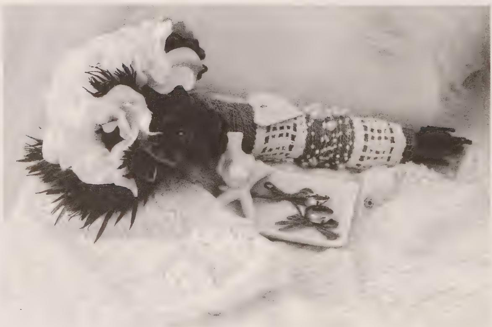

## Đừng tự làm khổ chính mình

**不要难为自己**

*bú yào nán wéi zì jǐ*

人生不如意十之八九，但也正因为人生有了很多的坎坎坷坷，才使我们找到了属于自己的那条路。

rén shēng bù rú yì shí zhī bā jiǔ，dàn yě zhèng yīn wèi rén shēng yǒu le hěn duō de kǎn kǎn kě kě，cái shǐ wǒ men zhǎo dào le shǔ yú zì jǐ de nà tiáo lù。

Cuộc đời chẳng mấy khi như ý, nhưng cũng chính nhờ nhiều gập ghềnh trắc trở, chúng ta mới tìm ra con đường thuộc về riêng mình.

我们在黑暗中寻找光明，以至于把远处的一点亮光当成了救命的稻草，奋力奔去，却忽略了途中的荆棘。

wǒ men zài hēi àn zhōng xún zhǎo guāng míng，yǐ zhì yú bǎ yuǎn chù de yì diǎn liàng guāng dàng chéng le jiù mìng de dào cǎo，fèn lì bēn qù，què hū lüè le tú zhōng de jīng jí。

Chúng ta tìm kiếm ánh sáng giữa bóng tối, đến mức coi một tia sáng leo lét ở xa như cọng cỏ cứu mạng, hết sức chạy về phía đó mà bỏ quên chông gai dọc đường.

当伤痕累累地到达时，却发现那只是一盏孤灯，它的背后依然是无尽的黑暗。

dāng shāng hén lěi lěi dì dào dá shí，què fā xiàn nà zhǐ shì yī zhǎn gū dēng，tā de bèi hòu yī rán shì wú jìn de hēi àn。

Khi chạm tới đích với thân đầy thương tích, mới phát hiện đó chỉ là một ngọn đèn cô quạnh, phía sau nó vẫn là bóng tối vô tận.

爱了，痛了，明白了。

ài le，tòng le，míng bái le。

Đã yêu, đã đau, đã hiểu ra.

哭了，累了，醒悟了。

kū le，lèi le，xǐng wù le。

Đã khóc, đã mệt, đã tỉnh ngộ.

时间已过，不再回来。

shí jiān yǐ guò，bù zài huí lái。

Thời gian đã trôi qua, không bao giờ quay trở lại.

希望瞬间破灭，若不想放弃颓唐，那就必须在黑暗中继续摸索。

xī wàng shùn jiān pò miè，ruò bù xiǎng fàng qì tuí táng，nà jiù bì xū zài hēi àn zhōng jì xù mō suǒ。

Hy vọng phút chốc tan vỡ; nếu không muốn buông xuôi chán nản, thì nhất định phải tiếp tục mò mẫm trong bóng tối.

现实总是这么残酷，但是必须去经历。

xiàn shí zǒng shì zhè me cán kù，dàn shì bì xū qù jīng lì。

Hiện thực luôn tàn khốc như vậy, nhưng vẫn nhất định phải trải qua.

虽然我们都不知道这样烧心的痛楚感受会在生命里持续多久，是前半生，后半生还是整个一生。

suī rán wǒ men dōu bù zhī dào zhè yàng shāo xīn de tòng chǔ gǎn shòu huì zài shēng mìng lǐ chí xù duō jiǔ，shì qián bàn shēng，hòu bàn shēng huán shì zhěng gè yī shēng。

Tuy chúng ta đều không biết nỗi đau thiêu đốt trái tim này sẽ kéo dài bao lâu trong cuộc đời, là nửa đời trước, nửa đời sau hay cả một đời.

只有在这样的时候，我们的心，才是真实的痛着的。

zhǐ yǒu zài zhè yàng de shí hòu，wǒ men de xīn，cái shì zhēn shí de tòng zhe de。

Chỉ trong những lúc như vậy, trái tim chúng ta mới thực sự đau đớn.

胸口像是被人用力地夯了一锤，夯得又重又痛。

xiōng kǒu xiàng shì bèi rén yòng lì dì hāng le yī chuí，hāng dé yòu zhòng yòu tòng。

Lồng ngực như bị ai đó dùng sức đóng một nhát búa, nặng nề và đau đớn.

我们无法责怪他人，也无法怨怼生命。

wǒ men wú fǎ zé guài tā rén，yě wú fǎ yuàn duì shēng mìng。

Chúng ta không thể trách cứ người khác, cũng không thể oán hận cuộc đời.

因为如果没有今日今时的苦楚，也一定不会有来日千般万般的幸福。

yīn wèi rú guǒ méi yǒu jīn rì jīn shí de kǔ chǔ，yě yí dìng bú huì yǒu lái rì qiān bān wàn bān de xìng fú。

Bởi vì nếu không có nỗi khổ của hôm nay, chắc chắn sẽ không có muôn vàn hạnh phúc của ngày mai.

这世间并不是我们简单地想象的样子，它复杂得多。

zhè shì jiān bìng bú shì wǒ men jiǎn dān dì xiǎng xiàng de yàng zi，tā fù zá dé duō。

Thế gian này không đơn giản như chúng ta tưởng tượng, nó phức tạp hơn nhiều.

或许你以为自己披上了铠甲，拿好了刺刀，骑上了战马，做足了万全的准备，但殊不知，这世间还有更多更多的阻挠和伤害让你现有的准备无法承载。

huò xǔ nǐ yǐ wéi zì jǐ pī shàng le kǎi jiǎ，ná hǎo le cì dāo，qí shàng le zhàn mǎ，zuò zú le wàn quán de zhǔn bèi，dàn shū bù zhī，zhè shì jiān hái yǒu gèng duō gèng duō de zǔ náo hé shāng hài ràng nǐ xiàn yǒu de zhǔn bèi wú fǎ chéng zài。

Có lẽ bạn nghĩ mình đã mặc giáp, cầm lưỡi lê, cưỡi chiến mã, chuẩn bị đầy đủ mọi thứ, nhưng đâu ngờ rằng thế gian này còn vô vàn trở ngại và tổn thương khiến những chuẩn bị hiện tại của bạn không thể gánh nổi.

或许这就是痛苦的根源，能让人将心连根拔起。

huò xǔ zhè jiù shì tòng kǔ de gēn yuán，néng ràng rén jiāng xīn lián gēn bá qǐ。

Có lẽ đó chính là cội nguồn của đau khổ, khiến người ta muốn nhổ bật cả trái tim.

如果可以，请别再提往日的伤痛，因为昨天的太阳晒不干今天的衣裳。

rú guǒ kě yǐ，qǐng bié zài tí wǎng rì de shāng tòng，yīn wèi zuó tiān de tài yáng shài bù gàn jīn tiān de yī shang。

Nếu có thể, xin đừng nhắc lại những tổn thương ngày xưa, vì mặt trời hôm qua không thể phơi khô quần áo hôm nay.

再提起，不过是苦了自己，而泪水和绞痛都不能给你丝毫宽慰。

zài tí qǐ，bù guò shì kǔ le zì jǐ，ér lèi shuǐ hé jiǎo tòng dōu bù néng gěi nǐ sī háo kuān wèi。

Nhắc lại, chẳng qua chỉ làm khổ chính mình, mà nước mắt và những cơn đau quặn thắt chẳng thể cho bạn chút an ủi nào.

我们要和所有人一样生活，一样苦乐，藏在心底的东西，就让它一直留在心底。

wǒ men yào hé suǒ yǒu rén yī yàng shēng huó，yī yàng kǔ lè，cáng zài xīn dǐ de dōng xī，jiù ràng tā yì zhí liú zài xīn dǐ。

Chúng ta phải sống như tất cả mọi người, vui buồn như nhau; những điều giấu kín trong đáy lòng, cứ để nó mãi nằm trong đáy lòng.

记得认识M的时候，他说：“曾经我以为自己懂得很多，已经融入并了解生活。

jì de rèn shí M de shí hòu，tā shuō ：“céng jīng wǒ yǐ wéi zì jǐ dǒng de hěn duō，yǐ jīng róng rù bìng liǎo jiě shēng huó。

Nhớ hồi mới quen M, anh ấy nói: "Từng nghĩ mình hiểu biết nhiều, đã hòa nhập và thấu hiểu cuộc sống.

但是你信吗，总有一天，你也会同我一样遇见那么一个人，他将你现在所有的骄傲和自尊都打破，让你深深地知道自己其实一无所有。

dàn shì nǐ xìn ma，zǒng yǒu yī tiān，nǐ yě huì tóng wǒ yī yàng yù jiàn nà me yí gè rén，tā jiāng nǐ xiàn zài suǒ yǒu de jiāo ào hé zì zūn dōu dǎ pò，ràng nǐ shēn shēn dì zhī dào zì jǐ qí shí yī wú suǒ yǒu。

Nhưng bạn có tin không, có một ngày nào đó, bạn cũng sẽ như tôi gặp một người như thế, người đó sẽ đập vỡ tất cả kiêu hãnh và lòng tự trọng của bạn hiện tại, khiến bạn thấm thía rằng mình thực ra chẳng có gì.

当他那么说的时候，我内心的痛楚便又来了，来得那么猛，那么烈。

dāng tā nà me shuō de shí hòu，wǒ nèi xīn de tòng chǔ biàn yòu lái le，lái de nà me měng，nà me liè。

Khi anh ấy nói vậy, nỗi đau trong lòng tôi lại ùa về, dữ dội và mãnh liệt.

我相信有那么一个人，会突然地在某一天某一时刻，来打醒我。

wǒ xiāng xìn yǒu nà me yí gè rén，huì tū rán dì zài mǒu yī tiān mǒu yī shí kè，lái dǎ xǐng wǒ。

Tôi tin có một người như vậy, sẽ bất ngờ đánh thức tôi vào một ngày, một khoảnh khắc nào đó.

他或者是长者，或者是路人，或者是未来的自己。

tā huò zhě shì zhǎng zhě，huò zhě shì lù rén，huò zhě shì wèi lái de zì jǐ。

Người đó có thể là bậc trưởng bối, có thể là người qua đường, có thể là chính tôi trong tương lai.

是这样吧，生命中总是会不断出现一些M说的那种，不断提醒你，刺痛你。

shì zhè yàng ba，shēng mìng zhòng zǒng shì huì bù duàn chū xiàn yī xiē M shuō de nà zhǒng，bù duàn tí xǐng nǐ，cì tòng nǐ。

Đúng vậy, trong cuộc sống luôn không ngừng xuất hiện những người như M nói, liên tục nhắc nhở bạn, chạm vào nỗi đau của bạn.

让你在匆忙的路上，慢慢懂得一些事情。

ràng nǐ zài cōng máng de lù shàng，màn màn dǒng de yī xiē shì qíng。

Khiến bạn trên con đường hối hả, dần dần hiểu ra nhiều điều.

而关于今后能否有个清清楚楚、真真切切的结果，我们谁都不能预知。

ér guān yú jīn hòu néng fǒu yǒu gè qīng qīng chǔ chǔ、zhēn zhēn qiè qiè de jié guǒ，wǒ men shéi dōu bù néng yù zhī。

Còn về việc sau này liệu có một kết cục rõ ràng, chân thật hay không, không ai trong chúng ta có thể biết trước.

只愿我们每日心向彼处，安魂度日。

zhǐ yuàn wǒ men měi rì xīn xiàng bǐ chù，ān hún dù rì。

Chỉ mong mỗi ngày chúng ta hướng lòng về nơi ấy, an nhiên trải qua năm tháng.

毕竟，葡萄不是一日成熟，硕果也不是一日全都能收获难为自己，倒不如同他人一样欢乐，静等岁月。

bì jìng，pú táo bú shì yī rì chéng shú，shuò guǒ yě bú shì yī rì quán dōu néng shōu huò nán wéi zì jǐ，dào bù rú tóng tā rén yī yàng huān lè，jìng děng suì yuè。

Dù sao, nho không một ngày mà chín, quả ngọt cũng không một ngày thu được hết; tự làm khổ chính mình, chi bằng vui vẻ như người khác, tĩnh lặng chờ thời gian trôi.

只求心中黑白明晓，分辨善恶。

zhǐ qiú xīn zhōng hēi bái míng xiǎo，fēn biàn shàn è。

Chỉ cầu trong lòng sáng tỏ phải trái, phân biệt thiện ác.

有人懂就好，有人明白就好。

yǒu rén dǒng jiù hǎo，yǒu rén míng bái jiù hǎo。

Có người hiểu là tốt, có người thấu là được.

世间本就是一把双刃剑，有幸有苦，有利有害，我们自是权衡罢了。

shì jiān běn jiù shì yī bǎ shuāng rèn jiàn，yǒu xìng yǒu kǔ，yǒu lì yǒu hài，wǒ men zì shì quán héng bà le。

Thế gian vốn là một lưỡi kiếm hai lưỡi, có may có rủi, có lợi có hại, chúng ta tự mình cân nhắc mà thôi.

只是，这世间，你莫要给我们前路，否则我们会踏平所有艰难险阻！

zhǐ shì，zhè shì jiān，nǐ mò yào gěi wǒ men qián lù，fǒu zé wǒ men huì tà píng suǒ yǒu jiān nán xiǎn zǔ！

Chỉ là, thế gian này, đừng chắn ngang con đường phía trước của chúng ta, nếu không chúng ta sẽ san bằng mọi gian nan hiểm trở!

## Rồi sẽ có ngày bạn trở thành con người bạn muốn trở thành

**总有一天你会成为你想成为的自己**

*zǒng yǒu yī tiān nǐ huì chéng wéi nǐ xiǎng chéng wéi de zì jǐ*

记得小时候，我跟阿姨去外面买东西，看见一个非常漂亮的大姐姐。

jì de xiǎo shí hòu，wǒ gēn ā yí qù wài miàn mǎi dōng xī，kàn jiàn yí gè fēi cháng piào liàng de dà jiě jiě。

Nhớ hồi còn nhỏ, tôi cùng dì đi mua đồ bên ngoài, nhìn thấy một chị gái vô cùng xinh đẹp.

那个时候，我觉得她穿的衣服和鞋子、拿的包包以及行为举止，都非常好看。

nà ge shí hòu，wǒ jué de tā chuān de yī fú hé xié zi、ná de bāo bāo yǐ jí xíng wéi jǔ zhǐ，dōu fēi cháng hǎo kàn。

Lúc đó, tôi thấy quần áo, giày dép chị ấy mặc, chiếc túi cầm trên tay cùng cử chỉ hành vi, đều rất đẹp.

我很羡慕她，很想快一点长大，像她一样，有长长的头发和干脆利落的个性。

wǒ hěn xiàn mù tā，hěn xiǎng kuài yì diǎn zhǎng dà，xiàng tā yī yàng，yǒu cháng cháng de tóu fà hé gān cuì lì luò de gè xìng。

Tôi rất ngưỡng mộ chị ấy, rất muốn mau chóng lớn lên, giống như chị, có mái tóc dài và tính cách dứt khoát mạnh mẽ.

为此，我夜以继日地期盼，直到很多年后的今天。

wèi cǐ，wǒ yè yǐ jì rì dì qī pàn，zhí dào hěn duō nián hòu de jīn tiān。

Vì vậy, tôi ngày đêm mong ngóng, cho đến tận hôm nay, nhiều năm về sau.

我已经过了二十五岁，性格张扬，特立独行。

wǒ yǐ jīng guò le èr shí wǔ suì，xìng gé zhāng yáng，tè lì dú xíng。

Tôi đã qua tuổi hai mươi lăm, tính tình phóng khoáng, cá tính độc lập.

我想我变得比小时候看见的那个女孩儿更加成熟、更加特别。

wǒ xiǎng wǒ biàn dé bǐ xiǎo shí hòu kàn jiàn de nà ge nǚ hái ér gèng jiā chéng shú、gèng jiā tè bié。

Tôi nghĩ mình đã trở nên trưởng thành và đặc biệt hơn cô gái từng thấy hồi nhỏ.

尽管我没有长发，也没有高跟鞋。

jǐn guǎn wǒ méi yǒu cháng fà，yě méi yǒu gāo gēn xié。

Dù tôi không có mái tóc dài, cũng không có đôi giày cao gót.

我拥有了自己成熟的想法，也拥有了其他人无法轻易改变的价值观。

wǒ yōng yǒu le zì jǐ chéng shú de xiǎng fǎ，yě yōng yǒu le qí tā rén wú fǎ qīng yì gǎi biàn de jià zhí guān。

Tôi đã có những suy nghĩ chín chắn của riêng mình, cũng có những quan điểm giá trị mà người khác khó lòng thay đổi.

我学会怎么与别人相处，也学会怎么来表达自己。

wǒ xué huì zěn me yǔ bié rén xiāng chǔ，yě xué huì zěn me lái biǎo dá zì jǐ。

Tôi học được cách hòa hợp với mọi người, cũng học được cách thể hiện bản thân.

但我们还想拥有他人的睿智，长大的权利。

dàn wǒ men hái xiǎng yōng yǒu tā rén de ruì zhì，zhǎng dà de quán lì。

Nhưng chúng ta vẫn muốn có được trí tuệ của người khác, quyền được trưởng thành.

前者就像我们想要橱窗里的名牌包包、马路上的名贵跑车一样，那是一种欲望的增长和叠加。

qián zhě jiù xiàng wǒ men xiǎng yào chú chuāng lǐ de míng pái bāo bāo、mǎ lù shàng de míng guì pǎo chē yī yàng，nà shì yī zhǒng yù wàng de zēng zhǎng hé dié jiā。

Điều trước giống như việc chúng ta muốn chiếc túi xách hàng hiệu trong tủ kính, chiếc siêu xe đắt tiền ngoài phố, đó là sự tăng trưởng và chồng chất của dục vọng.

在岁月里，我们都期盼自己能够拥有更多金钱和名誉。

zài suì yuè lǐ，wǒ men dōu qī pàn zì jǐ néng gòu yōng yǒu gèng duō jīn qián hé míng yù。

Trong tháng năm, chúng ta đều mong mình có được nhiều tiền bạc và danh vọng hơn.

获得更多尊严和被人尊重的待遇。

huò dé gèng duō zūn yán hé bèi rén zūn zhòng de dài yù。

Có được nhiều phẩm giá hơn và được người khác tôn trọng.

但我们最终想要成为的人，应该是一个睿智的人，不是吗？

dàn wǒ men zuì zhōng xiǎng yào chéng wéi de rén，yīng gāi shì yí gè ruì zhì de rén，bú shì ma？

Nhưng con người cuối cùng chúng ta muốn trở thành, lẽ ra nên là một người thông tuệ, phải không?

在成长中，如何对待生活与他人，不骄不躁，不畏不惧；如何集宠爱与温暖于一身；如何更加自信，找到自己的人生目标和方向。

zài chéng zhǎng zhōng，rú hé duì dài shēng huó yǔ tā rén，bù jiāo bù zào，bù wèi bù jù；rú hé jí chǒng ài yǔ wēn nuǎn yú yī shēn；rú hé gèng jiā zì xìn，zhǎo dào zì jǐ de rén shēng mù biāo hé fāng xiàng。

Trong quá trình trưởng thành, làm thế nào để đối đãi với cuộc sống và mọi người, không kiêu ngạo không nóng vội, không sợ hãi không lo lắng; làm thế nào để hội tụ yêu thương và ấm áp nơi mình; làm thế nào để tự tin hơn, tìm ra mục tiêu và phương hướng cuộc đời mình.

这才是我们真正想要的成长。

zhè cái shì wǒ men zhēn zhèng xiǎng yào de chéng zhǎng。

Đó mới là sự trưởng thành thực sự mà chúng ta mong muốn.

慢慢地，这样的成长并没有像年岁一样，那么明显地赋予我们。

màn màn dì，zhè yàng de chéng zhǎng bìng méi yǒu xiàng nián suì yī yàng，nà me míng xiǎn dì fù yǔ wǒ men。

Dần dần, sự trưởng thành ấy không giống như năm tháng, ban tặng cho chúng ta một cách rõ ràng đến vậy.

今年我们二十岁，明年我们二十一岁。

jīn nián wǒ men èr shí suì，míng nián wǒ men èr shí yī suì。

Năm nay chúng ta hai mươi tuổi, sang năm hai mươi mốt tuổi.

它在看似缓慢实则飞快流逝的岁月中，悄悄地为我们披上了外衣，教会了我们爱与成长。

tā zài kàn shì huǎn màn shí zé fēi kuài liú shì de suì yuè zhōng，qiāo qiāo dì wèi wǒ men pī shàng le wài yī，jiào huì le wǒ men ài yǔ chéng zhǎng。

Nó ở trong dòng thời gian tưởng chậm mà thực ra trôi đi vun vút, lặng lẽ khoác lên chúng ta tấm áo mới, dạy chúng ta biết yêu thương và trưởng thành.

不知不觉间，我们学会了爱自己，学会了尊敬，学会了付出和给予。

bù zhī bù jué jiān，wǒ men xué huì le ài zì jǐ，xué huì le zūn jìng，xué huì le fù chū hé jǐ yǔ。

Chẳng hay chẳng biết, chúng ta học được cách yêu bản thân, học được sự tôn trọng, học được cách cống hiến và trao đi.

不知不觉间，我们有了要好的朋友，也树立了不可化解的敌人。

bù zhī bù jué jiān，wǒ men yǒu le yào hǎo de péng yǒu，yě shù lì le bù kě huà jiě de dí rén。

Chẳng hay chẳng biết, chúng ta có những người bạn thân thiết, cũng gây dựng những kẻ thù không thể hóa giải.

我们拥有了自己喜欢的事物，也失去了美丽曼妙的青春。

wǒ men yōng yǒu le zì jǐ xǐ huān de shì wù，yě shī qù le měi lì màn miào de qīng chūn。

Chúng ta có được những điều mình yêu thích, cũng đánh mất tuổi xuân xinh đẹp diễm lệ.

我们变得聪明伶俐，或者放肆大胆、或者温柔坚韧、或者勇敢前行、或者依偎他人身边。

wǒ men biàn dé cōng míng líng lì，huò zhě fàng sì dà dǎn、huò zhě wēn róu jiān rèn、huò zhě yǒng gǎn qián xíng、huò zhě yī wēi tā rén shēn biān。

Chúng ta trở nên lanh lợi thông minh, hoặc phóng túng táo bạo, hoặc dịu dàng kiên cường, hoặc dũng cảm tiến bước, hoặc nương tựa bên người khác.

我们选择了各自的路途，拥有了各自的习性。

wǒ men xuǎn zé le gè zì de lù tú，yōng yǒu le gè zì de xí xìng。

Chúng ta chọn lối đi riêng của mỗi người, nuôi dưỡng thói quen của riêng mình.

我们会选择去爱不同的人，面对不同的结果。

wǒ men huì xuǎn zé qù ài bù tóng de rén，miàn duì bù tóng de jié guǒ。

Chúng ta sẽ chọn yêu những người khác nhau, đối diện với những kết cục khác nhau.

只是在长大成熟后的今天，我不再像小时候那样去羡慕那个女孩子，我反而害怕这样的一种成长。

zhǐ shì zài zhǎng dà chéng shú hòu de jīn tiān，wǒ bù zài xiàng xiǎo shí hòu nà yàng qù xiàn mù nà ge nǚ hái zi，wǒ fǎn ér hài pà zhè yàng de yī zhǒng chéng zhǎng。

Chỉ là ở cái ngày đã trưởng thành, chín chắn như hôm nay, tôi không còn ngưỡng mộ cô gái ấy như hồi nhỏ nữa, trái lại tôi e sợ kiểu trưởng thành như thế này.

飞快迅猛，让我手足无措。

fēi kuài xùn měng，ràng wǒ shǒu zú wú cuò。

Nhanh đến chóng mặt, khiến tôi luống cuống tay chân.

我们以为，个子高高的，身材瘦瘦的，长发飘飘的样子就好。

wǒ men yǐ wéi，gè zi gāo gāo de，shēn cái shòu shòu de，cháng fà piāo piāo de yàng zi jiù hǎo。

Chúng ta cứ nghĩ, dáng cao ráo, thân hình mảnh khảnh, mái tóc dài bay trong gió là đủ tốt.

我们没有想到过，时间会赋予我们更多更多其他的东西。

wǒ men méi yǒu xiǎng dào guò，shí jiān huì fù yǔ wǒ men gèng duō gèng duō qí tā de dōng xī。

Chúng ta chưa từng nghĩ rằng, thời gian sẽ ban cho chúng ta nhiều, nhiều hơn thế những điều khác.

之前我们总以为，喜欢就是你喜欢我，我也喜欢你；总以为，爱情向来平等，没有一个人执着无悔地付出；总以为，孝顺就是常回家看看父母，开心就是每天简简单单地对待别人，获得同等的回报。

zhī qián wǒ men zǒng yǐ wéi，xǐ huān jiù shì nǐ xǐ huān wǒ，wǒ yě xǐ huān nǐ；zǒng yǐ wéi，ài qíng xiàng lái píng děng，méi yǒu yí gè rén zhí zhuó wú huǐ dì fù chū；zǒng yǐ wéi，xiào shùn jiù shì cháng huí jiā kàn kàn fù mǔ，kāi xīn jiù shì měi tiān jiǎn jiǎn dān dān dì duì dài bié rén，huò dé tóng děng de huí bào。

Trước đây chúng ta luôn nghĩ, thích là bạn thích tôi, tôi cũng thích bạn; luôn nghĩ, tình yêu xưa nay vốn bình đẳng, không có ai một lòng một dạ không hối tiếc mà hi sinh; luôn nghĩ, hiếu thảo là thường xuyên về nhà thăm cha mẹ, vui vẻ là mỗi ngày đối đãi với mọi người thật đơn giản, rồi nhận lại sự hồi đáp tương xứng.

可我们不曾想，岁月在给我们带来美好和幸福的时候，还会带给我们无尽的离别和难过，难以想象的煎熬和伤害。

kě wǒ men bù céng xiǎng，suì yuè zài gěi wǒ men dài lái měi hǎo hé xìng fú de shí hòu，hái huì dài gěi wǒ men wú jìn de lí bié hé nán guò，nán yǐ xiǎng xiàng de jiān áo hé shāng hài。

Nhưng chúng ta đâu ngờ rằng, thời gian khi ban tặng cho chúng ta điều tốt đẹp và hạnh phúc, cũng sẽ mang đến những chia ly và buồn đau vô tận, những giày vò và tổn thương khó mà tưởng tượng nổi.

最终这些经历和沧桑，让我们改变了最初渴望迅速成长的模样。

zuì zhōng zhè xiē jīng lì hé cāng sāng，ràng wǒ men gǎi biàn le zuì chū kě wàng xùn sù chéng zhǎng de mú yàng。

Cuối cùng, những trải nghiệm và dâu bể ấy khiến chúng ta thay đổi bộ dạng thuở ban đầu khao khát lớn thật nhanh.

但此时，岁月再也无法止住向前的脚步，以奔跑的方式贯穿我们的人生。

dàn cǐ shí，suì yuè zài yě wú fǎ zhǐ zhù xiàng qián de jiǎo bù，yǐ bēn pǎo de fāng shì guàn chuān wǒ men de rén shēng。

Nhưng lúc này, năm tháng không thể ngăn lại bước chân tiến về phía trước, nó chạy xuyên suốt cuộc đời chúng ta.

在无法停止的人生里，我们只能学着去选择和装饰它，如何让它更精彩，更加漂亮。

zài wú fǎ tíng zhǐ de rén shēng lǐ，wǒ men zhǐ néng xué zhe qù xuǎn zé hé zhuāng shì tā，rú hé ràng tā gèng jīng cǎi，gèng jiā piào liàng。

Trong cuộc đời không thể dừng lại ấy, chúng ta chỉ có thể học cách lựa chọn và tô điểm nó, làm sao để nó rực rỡ và đẹp đẽ hơn.

它需要花费我们整整一生去学习，自我们真正成长的那天起。

tā xū yào huā fèi wǒ men zhěng zhěng yī shēng qù xué xí，zì wǒ men zhēn zhèng chéng zhǎng de nà tiān qǐ。

Điều đó cần chúng ta dành trọn cả một đời để học, kể từ ngày chúng ta thực sự trưởng thành.

所以，不要急，你想要的岁月都会给你，而时间也会让你成为那个最想成为的自己。

suǒ yǐ，bú yào jí，nǐ xiǎng yào de suì yuè dū huì gěi nǐ，ér shí jiān yě huì ràng nǐ chéng wéi nà ge zuì xiǎng chéng wéi de zì jǐ。

Vì vậy, đừng vội, những gì bạn muốn rồi năm tháng sẽ cho bạn, và thời gian cũng sẽ khiến bạn trở thành con người mà bạn khát khao nhất.

只要我们坚定地走自己的路，敢于承担每一个选择，相信我们会活得简单快乐。

zhǐ yào wǒ men jiān dìng dì zǒu zì jǐ de lù，gǎn yú chéng dān měi yí gè xuǎn zé，xiāng xìn wǒ men huì huó dé jiǎn dān kuài lè。

Chỉ cần chúng ta kiên định bước trên con đường của mình, dám gánh vác mỗi lựa chọn, tin rằng chúng ta sẽ sống giản đơn và vui vẻ.

至于那些看不清的是与非，猜不透的错与对，时间统统会把它揭晓。

zhì yú nà xiē kàn bù qīng de shì yǔ fēi，cāi bù tòu de cuò yǔ duì，shí jiān tǒng tǒng huì bǎ tā jiē xiǎo。

Còn những chuyện đúng sai mờ mịt khó nhìn rõ, những lỗi lầm không thể đoán định, thời gian rồi sẽ hé lộ tất cả.

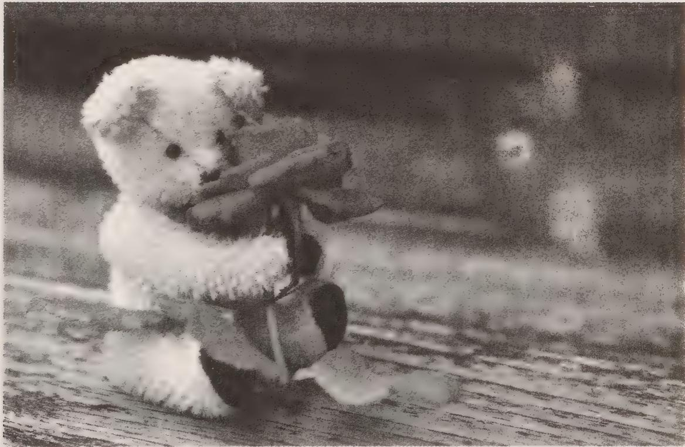

## Ai trong chúng ta cũng từng tối tăm mờ nhạt

**我们都曾暗淡无光**

*wǒ men dōu céng àn dàn wú guāng*

我想每个人都经历过离职的日子。

wǒ xiǎng měi gè rén dōu jīng lì guò lí zhí de rì zi。

Tôi nghĩ ai cũng từng trải qua những ngày nghỉ việc.

那些日子，仿佛是我们最浑噩的时候。

nà xiē rì zi，fǎng fú shì wǒ men zuì hún è de shí hòu。

Những ngày ấy, như thể là quãng thời gian mơ màng nhất của chúng ta.

很多事情，我们已经毫无办法将它想清楚。

hěn duō shì qíng，wǒ men yǐ jīng háo wú bàn fǎ jiāng tā xiǎng qīng chǔ。

Nhiều chuyện, chúng ta đã không còn cách nào nghĩ cho rõ ràng.

从学校出来的我也换了好几份工作，每一次离开都让我受伤、成长。

cóng xué xiào chū lái de wǒ yě huàn le hǎo jǐ fèn gōng zuò，měi yī cì lí kāi dōu ràng wǒ shòu shāng、chéng zhǎng。

Tôi, vừa rời khỏi cổng trường, cũng đã đổi vài ba công việc, mỗi lần rời đi đều khiến tôi tổn thương và trưởng thành.

现在我终于有了那么一点时间用来矫情，用来反省。

xiàn zài wǒ zhōng yú yǒu le nà me yì diǎn shí jiān yòng lái jiǎo qíng，yòng lái fǎn xǐng。

Giờ tôi cuối cùng cũng có chút thời gian để cảm thán, để tự vấn bản thân.

做的每一件事情，终于没有必要去跟所有的人说清楚。

zuò de měi yī jiàn shì qíng，zhōng yú méi yǒu bì yào qù gēn suǒ yǒu de rén shuō qīng chǔ。

Mỗi việc mình làm, rốt cuộc cũng không cần phải giải thích cho tất cả mọi người.

只要自己在乎的人站在自己身旁就够了。

zhǐ yào zì jǐ zài hū de rén zhàn zài zì jǐ shēn páng jiù gòu le。

Chỉ cần người mình quan tâm đứng bên cạnh mình là đủ.

在这样一次次的站队里，在这样一次次左左右右里，深刻体会到爱的人才越来越爱，不爱的人才越来越远。

zài zhè yàng yī cì cì de zhàn duì lǐ，zài zhè yàng yī cì cì zuǒ zuǒ yòu yòu lǐ，shēn kè tǐ huì dào ài de rén cái yuè lái yuè ài，bù ài de rén cái yuè lái yuè yuǎn。

Trong những lần chọn phe như thế, trong những lần qua lại trái phải như thế, tôi thấm thía rằng người yêu thương thì ngày càng yêu thương hơn, kẻ không yêu thì ngày càng xa cách.

曾经为了工作放弃了学习，现在如果没有了工作，我可能也没有了学习的那股冲动。

céng jīng wèi le gōng zuò fàng qì le xué xí，xiàn zài rú guǒ méi yǒu le gōng zuò，wǒ kě néng yě méi yǒu le xué xí de nà gǔ chōng dòng。

Từng vì công việc mà bỏ bê việc học, giờ nếu không còn công việc, có lẽ tôi cũng chẳng còn cái hứng thú học tập ấy nữa.

因为我被时间这把锋利的刀刺伤了，所有爱的、恨的。

yīn wèi wǒ bèi shí jiān zhè bǎ fēng lì de dāo cì shāng le，suǒ yǒu ài de、hèn de。

Bởi vì tôi đã bị thời gian, thanh đao sắc bén ấy, đâm trọng thương, tất cả những điều yêu, những điều hận.

真的很感谢我的朋友，让我不孤单，在我心情最低落的时候。

zhēn de hěn gǎn xiè wǒ de péng yǒu，ràng wǒ bù gū dān，zài wǒ xīn qíng zuì dī luò de shí hòu。

Thật sự rất cảm ơn những người bạn của tôi, đã khiến tôi không cô đơn, vào những lúc tâm trạng tôi tệ nhất.

感谢他们，让我懂得了幸福其实很简单，简单到我无需爬得太高，看得太远，就唾手可得。

gǎn xiè tā men，ràng wǒ dǒng de le xìng fú qí shí hěn jiǎn dān，jiǎn dān dào wǒ wú xū pá dé tài gāo，kàn dé tài yuǎn，jiù tuò shǒu kě dé。

Cảm ơn họ, khiến tôi hiểu hạnh phúc thật ra rất đơn giản, đơn giản đến mức tôi chẳng cần leo quá cao, nhìn quá xa, mà vẫn với tay là có được.

让我在某一个时间、地点，心里的暖与冷交替着，告诉自己，我很孤寂，也幸福，平凡。

ràng wǒ zài mǒu yí gè shí jiān、dì diǎn，xīn lǐ de nuǎn yǔ lěng jiāo tì zhe，gào sù zì jǐ，wǒ hěn gū jì，yě xìng fú，píng fán。

Khiến tôi trong một khoảnh khắc, một nơi chốn nào đó, ấm áp và lạnh giá trong lòng đan xen, tự nhủ rằng, tôi rất cô quạnh, cũng rất hạnh phúc, rất bình dị.

曾经为了依赖，我总是去霸占，如今我学会了柔软。

céng jīng wèi le yī lài，wǒ zǒng shì qù bà zhàn，rú jīn wǒ xué huì le róu ruǎn。

Từng vì muốn nương tựa mà tôi luôn chiếm hữu, giờ đây tôi đã học được cách mềm mại.

对于我内心里缺少的，也许今生补不齐了。

duì yú wǒ nèi xīn lǐ quē shǎo de，yě xǔ jīn shēng bǔ bù qí le。

Còn những gì thiếu hụt trong lòng tôi, có lẽ kiếp này không thể bù đắp cho trọn vẹn.

这一生的缺憾，是谁也弥补不了的。

zhè yī shēng de quē hàn，shì shuí yě mí bǔ bù liǎo de。

Những khiếm khuyết của cả một đời này, không ai có thể bù đắp nổi.

一开始就注定了的，没让我选，也没等我选。

yī kāi shǐ jiù zhù dìng le de，méi ràng wǒ xuǎn，yě méi děng wǒ xuǎn。

Ngay từ đầu đã được định sẵn, không để tôi chọn, cũng không chờ tôi lựa.

所以，世界既然这样来了，我就来对付这样的世界好了。

suǒ yǐ，shì jiè jì rán zhè yàng lái le，wǒ jiù lái duì fù zhè yàng de shì jiè hǎo le。

Vì vậy, thế giới đã đến như thế, thì tôi cứ đối phó với thế giới như thế vậy.

这并不是在勉强和伪装。

zhè bìng bú shì zài miǎn qiǎng hé wěi zhuāng。

Đây không phải là sự gượng ép hay giả tạo.

生命本就造就了两个不同的我。

shēng mìng běn jiù zào jiù le liǎng gè bù tóng de wǒ。

Sinh mệnh vốn đã tạo nên hai con người khác nhau trong tôi.

个坚韧，一个柔弱。

gè jiān rèn，yí gè róu ruò。

Một người kiên cường, một người yếu mềm.

我应该好好来安排他们，哪一个什么时候该出现，哪一个什么时候该隐藏。

wǒ yīng gāi hǎo hǎo lái ān pái tā men，nǎ yí gè shén me shí hòu gāi chū xiàn，nǎ yí gè shén me shí hòu gāi yǐn cáng。

Tôi nên sắp xếp cho họ thật tốt, người nào xuất hiện lúc nào, người nào ẩn giấu khi nào.

我相信坚韧是装不出来的，也相信柔弱是无法替代的。

wǒ xiāng xìn jiān rèn shì zhuāng bù chū lái de，yě xiāng xìn róu ruò shì wú fǎ tì dài de。

Tôi tin kiên cường không thể giả vờ được, cũng tin yếu mềm không thể thay thế được.

所以，面对破碎，我是那么坚韧；面对柔软的伤感，我是那么脆弱。

suǒ yǐ，miàn duì pò suì，wǒ shì nà me jiān rèn；miàn duì róu ruǎn de shāng gǎn，wǒ shì nà me cuì ruò。

Vì vậy, đối diện với vỡ tan, tôi kiên cường đến thế; đối diện với nỗi buồn mềm mại, tôi lại mong manh đến thế.

为一张脸，一个表情，泪流满面。

wèi yī zhāng liǎn，yí gè biǎo qíng，lèi liú mǎn miàn。

Vì một gương mặt, một ánh mắt, mà tôi rơi lệ đầy mặt.

因为我发现了每个角落，每件事情，都是有爱的。

yīn wèi wǒ fā xiàn le měi gè jiǎo luò，měi jiàn shì qíng，dōu shì yǒu ài de。

Bởi vì tôi phát hiện ra rằng, mỗi góc nhỏ, mỗi điều gì đó, đều có tình yêu trong đó.

所以我爱这个世界。

suǒ yǐ wǒ ài zhè ge shì jiè。

Vì vậy tôi yêu thế giới này.

即使它疯狂对我，即使我一次次被它欺辱而跌倒。

jí shǐ tā fēng kuáng duì wǒ，jí shǐ wǒ yī cì cì bèi tā qī rǔ ér diē dǎo。

Dù nó có cuồng loạn với tôi, dù tôi lần lượt bị nó ức hiếp rồi ngã gục.

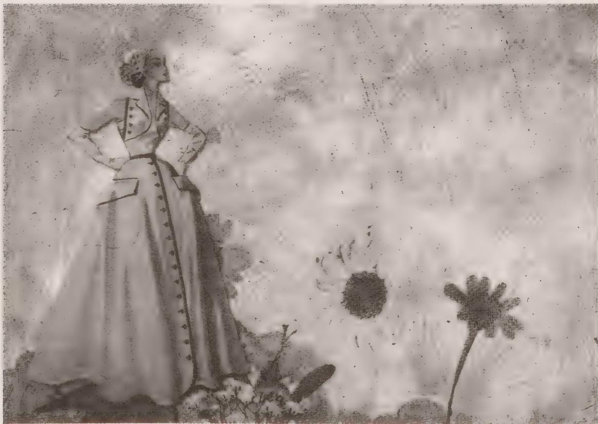

# Vì điều gì, chúng ta muốn sống rạng rỡ

**因为什么，我们想要活得漂亮**

*yīn wèi shén me，wǒ men xiǎng yào huó dé piào liàng*

每个人都想活得与众不同，不管他贫穷还是富有，平凡还是卓越。

měi gè rén dōu xiǎng huó dé yǔ zhòng bù tóng，bù guǎn tā pín qióng hái shì fù yǒu，píng fán hái shì zhuó yuè。

Ai cũng muốn sống khác biệt, dù nghèo hay giàu, dù tầm thường hay xuất chúng.

而这一动机，都有一个深藏在内心的理由。

ér zhè yī dòng jī，dōu yǒu yí gè shēn cáng zài nèi xīn de lǐ yóu。

Mà động lực ấy, đều có một lý do chôn sâu trong lòng.

每次回老家，还未到家中，路上便有想哭的冲动。

měi cì huí lǎo jiā，hái wèi dào jiā zhōng，lù shàng biàn yǒu xiǎng kū de chōng dòng。

Mỗi lần về quê, còn chưa tới nhà, trên đường đã có cái thôi thúc muốn khóc.

不是因为想念，或是离亲人越来越近，而是，越来越切实地感受到所爱的人的生活。

bú shì yīn wèi xiǎng niàn，huò shì lí qīn rén yuè lái yuè jìn，ér shì，yuè lái yuè qiè shí dì gǎn shòu dào suǒ ài de rén de shēng huó。

Không phải vì nhớ nhung, hay vì ngày càng gần người thân, mà là vì càng ngày càng cảm nhận rõ nét cuộc sống của những người mình yêu thương.

他们生活的不易与苍老。

tā men shēng huó de bù yì yǔ cāng lǎo。

Sự vất vả và già nua trong cuộc sống của họ.

我想这世界上是没什么有比看着爱的人屈尊于人更让人心酸的了。

wǒ xiǎng zhè shì jiè shàng shì méi shén me yǒu bǐ kàn zhe ài de rén qū zūn yú rén gèng ràng rén xīn suān de le。

Tôi nghĩ trên đời này không gì khiến lòng người chua xót hơn việc nhìn người mình yêu phải hạ mình trước người khác.

你还记得吗？

nǐ hái jì de ma？

Bạn còn nhớ không?

那年，因为你打破了邻居家的玻璃，你母亲为了你去别人家低三下四道歉的情形。

nà nián，yīn wèi nǐ dǎ pò le lín jū jiā de bō lí，nǐ mǔ qīn wèi le nǐ qù bié rén jiā dī sān xià sì dào qiàn de qíng xíng。

Năm ấy, vì bạn làm vỡ kính nhà hàng xóm, mẹ bạn đã vì bạn sang nhà họ cúi đầu nhún nhường xin lỗi.

你还记得吗？

nǐ hái jì de ma？

Bạn còn nhớ không?

小时候参加家长会的时候，你的父母因为看到同班同学的父母是当官的，极尽恭维，强颜欢笑地跟对方打招呼的情景。

xiǎo shí hòu cān jiā jiā zhǎng huì de shí hòu，nǐ de fù mǔ yīn wèi kàn dào tóng bān tóng xué de fù mǔ shì dāng guān de，jí jǐn gōng wéi，qiǎng yán huān xiào dì gēn duì fāng dǎ zhāo hū de qíng jǐng。

Hồi nhỏ đi họp phụ huynh, cha mẹ bạn vì thấy cha mẹ bạn cùng lớp là quan chức, nên hết lời tâng bốc, gượng cười chào hỏi người ta.

你父亲因为学费，去朋友家借钱时候的样子；你母亲因为你想学钢琴，在外面辛苦挣钱，又去央求钢琴老师的样子…

nǐ fù qīn yīn wèi xué fèi，qù péng yǒu jiā jiè qián shí hòu de yàng zi；nǐ mǔ qīn yīn wèi nǐ xiǎng xué gāng qín，zài wài miàn xīn kǔ zhèng qián，yòu qù yāng qiú gāng qín lǎo shī de yàng zi…

Bộ dạng cha bạn vì tiền học phí mà sang nhà bạn bè vay tiền; bộ dạng mẹ bạn vì bạn muốn học piano, vất vả kiếm tiền bên ngoài, rồi lại đi năn nỉ thầy dạy piano…

也许你都不记得了，因为我也时常想不起。

yě xǔ nǐ dōu bú jì dé le，yīn wèi wǒ yě shí cháng xiǎng bù qǐ。

Có lẽ bạn đều không nhớ nữa, vì tôi cũng thường chẳng thể nhớ ra.

那些往事已经非常久远，近似于消失在我们的记忆里。

nà xiē wǎng shì yǐ jīng fēi cháng jiǔ yuǎn，jìn sì yú xiāo shī zài wǒ men de jì yì lǐ。

Những chuyện cũ ấy đã rất xa xôi, gần như biến mất khỏi ký ức chúng ta.

但是我记得，父亲年轻的时候，喝醉了酒，哭泣的样子；记得，他每一次带我去市作协，与人小心翼翼打交道的样子；记得爷爷去世时，他在众人面前跪下的情景；记得他为了我的前途，一大早领着我坐车去市里请老朋友吃饭的场景…

dàn shì wǒ jì de，fù qīn nián qīng de shí hòu，hē zuì le jiǔ，kū qì de yàng zi；jì de，tā měi yī cì dài wǒ qù shì zuò xié，yǔ rén xiǎo xīn yì yì dǎ jiāo dào de yàng zi；jì de yé yé qù shì shí，tā zài zhòng rén miàn qián guì xià de qíng jǐng；jì de tā wèi le wǒ de qián tú，yī dà zǎo lǐng zhe wǒ zuò chē qù shì lǐ qǐng lǎo péng yǒu chī fàn de chǎng jǐng…

Nhưng tôi nhớ, hồi cha còn trẻ, say rượu rồi khóc lóc ra sao; nhớ, mỗi lần ông đưa tôi đến Hội Nhà văn thành phố, khép nép thận trọng giao tiếp với người ta thế nào; nhớ cảnh ông quỳ xuống trước mọi người khi ông nội qua đời; nhớ cảnh ông vì tương lai của tôi, sáng sớm đã dẫn tôi bắt xe vào thành phố mời bạn cũ dùng cơm…

只有在那样的时候，我这一生最爱的伟大的宽厚的男人，变得脆弱而渺小，让我想要用瘦弱的身体去保护。

zhǐ yǒu zài nà yàng de shí hòu，wǒ zhè yī shēng zuì ài de wěi dà de kuān hòu de nán rén，biàn dé cuì ruò ér miǎo xiǎo，ràng wǒ xiǎng yào yòng shòu ruò de shēn tǐ qù bǎo hù。

Chỉ trong những lúc như vậy, người đàn ông vĩ đại và độ lượng nhất mà tôi yêu thương cả đời này, mới trở nên yếu đuối và bé nhỏ, khiến tôi muốn dùng thân thể gầy gò của mình để che chở.

那个时候，我会下定决心，要好好生活，要活得漂亮，只为让他不再低头。

nà ge shí hòu，wǒ huì xià dìng jué xīn，yào hǎo hǎo shēng huó，yào huó dé piào liàng，zhǐ wèi ràng tā bù zài dī tóu。

Lúc đó, tôi sẽ hạ quyết tâm, phải sống thật tốt, phải sống rạng rỡ, chỉ để ông không phải cúi đầu nữa.

但是，我什么也不会跟他说，仍旧陪着他坐车回来。

dàn shì，wǒ shén me yě bú huì gēn tā shuō，réng jiù péi zhe tā zuò chē huí lái。

Nhưng tôi sẽ không nói gì với ông, vẫn ngồi xe cùng ông trở về.

困了，就靠在他的肩膀上，睡一小会儿。

kùn le，jiù kào zài tā de jiān bǎng shàng，shuì yī xiǎo huì er。

Mệt, tôi tựa vào vai ông, ngủ một lát.

这或许是我最初想要不一样的缘由。

zhè huò xǔ shì wǒ zuì chū xiǎng yào bù yí yàng de yuán yóu。

Đây có lẽ là lý do ban đầu khiến tôi muốn trở nên khác biệt.

然后才是我的理想，我的梦，我的爱情，我的归宿。

rán hòu cái shì wǒ de lǐ xiǎng，wǒ de mèng，wǒ de ài qíng，wǒ de guī sù。

Sau đó mới đến lý tưởng của tôi, giấc mơ của tôi, tình yêu của tôi, bến đỗ của tôi.

其实，每次我很害怕，在我回家时，父亲就会带着我跟他的朋友吃饭。

qí shí，měi cì wǒ hěn hài pà，zài wǒ huí jiā shí，fù qīn jiù huì dài zhe wǒ gēn tā de péng yǒu chī fàn。

Thật ra, mỗi lần tôi rất sợ, khi tôi về nhà, cha lại dẫn tôi đi ăn cùng bạn của ông.

这无疑说明，我还不够好，我还不够活得漂亮，我还要他保护，我还要他因我而弯腰。

zhè wú yí shuō míng，wǒ hái bù gòu hǎo，wǒ hái bù gòu huó dé piào liàng，wǒ hái yào tā bǎo hù，wǒ hái yào tā yīn wǒ ér wān yāo。

Điều đó vô tình cho thấy, tôi vẫn chưa đủ tốt, tôi vẫn chưa đủ rạng rỡ, tôi vẫn cần ông che chở, vẫn khiến ông phải cúi mình vì tôi.

所以，想活得漂亮些。

suǒ yǐ，xiǎng huó dé piào liàng xiē。

Vì vậy, tôi muốn sống rạng rỡ hơn.

让我爱的人，只为了我。

ràng wǒ ài de rén，zhǐ wèi le wǒ。

Để người tôi yêu thương, chỉ vì tôi.

而这种漂亮，就是需要作为一个人，付出无止境的隐忍和汗水，经过无数恸哭的夜晚…然后，在某一天的某个时刻，告诉父亲：我看到了光明！

ér zhè zhǒng piào liàng，jiù shì xū yào zuò wéi yí gè rén，fù chū wú zhǐ jìng de yǐn rěn hé hàn shuǐ，jīng guò wú shù tòng kū de yè wǎn…rán hòu，zài mǒu yī tiān de mǒu gè shí kè，gào sù fù qīn：wǒ kàn dào le guāng míng！

Mà sự rạng rỡ ấy, chính là cần tôi với tư cách một con người, hi sinh vô tận sự nhẫn nhịn và mồ hôi, trải qua vô số đêm khóc nghẹn… rồi, trong một khoảnh khắc của một ngày nào đó, thưa với cha: con đã nhìn thấy ánh sáng!

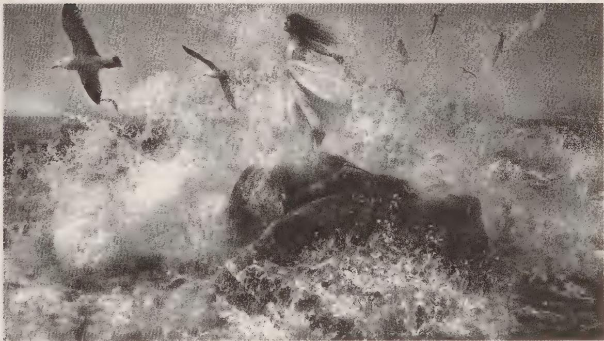

# Trước hết hãy để mình làm một người tầm thường vô vi

**让自己先做个碌碌无为的人**

*ràng zì jǐ xiān zuò gè lù lù wú wéi de rén*

我们无法和生活较真，因为当我们认真起来的时候，心多半会隐隐作痛。

wǒ men wú fǎ hé shēng huó jiào zhēn，yīn wèi dāng wǒ men rèn zhēn qǐ lái de shí hòu，xīn duō bàn huì yǐn yǐn zuò tòng。

Chúng ta không thể quá cầu toàn với cuộc sống, bởi vì khi chúng ta nghiêm túc lên, trái tim phần lớn sẽ âm ỉ đau.

虽然骨子里我们并不甘愿忙忙碌碌，成为碌碌无为的人，但往往是生活选择了我们，而不是我们去选择怎样的生活。

suī rán gǔ zi lǐ wǒ men bìng bù gān yuàn máng máng lù lù，chéng wéi lù lù wú wéi de rén，dàn wǎng wǎng shì shēng huó xuǎn zé le wǒ men，ér bú shì wǒ men qù xuǎn zé zěn yàng de shēng huó。

Tuy trong sâu thẳm chúng ta không cam lòng bận rộn ngược xuôi, trở thành người tầm thường vô vi, nhưng thường là cuộc sống chọn chúng ta, chứ không phải chúng ta chọn cuộc sống như thế nào.

在我没有找到人生的方向的时候，我也非常茫然失措，害怕认真地活着。

zài wǒ méi yǒu zhǎo dào rén shēng de fāng xiàng de shí hòu，wǒ yě fēi cháng máng rán shī cuò，hài pà rèn zhēn dì huó zhe。

Khi chưa tìm ra phương hướng cuộc đời, tôi cũng rất mê mang luống cuống, sợ hãi việc phải nghiêm túc mà sống.

害怕到我不敢认真地去了解一个人、阅读一个作家的作品。

hài pà dào wǒ bù gǎn rèn zhēn dì qù liǎo jiě yí gè rén、yuè dú yí gè zuò jiā de zuò pǐn。

Sợ đến mức tôi không dám nghiêm túc tìm hiểu một con người, đọc tác phẩm của một nhà văn nào.

我怕自己会被他戳穿心思，我怕自己会被他看透企图。

wǒ pà zì jǐ huì bèi tā chuō chuān xīn sī，wǒ pà zì jǐ huì bèi tā kàn tòu qǐ tú。

Tôi sợ mình sẽ bị anh ta nhìn thấu tâm tư, tôi sợ mình sẽ bị anh ta xuyên thủng ý đồ.

我渴望这样的痛楚，但又害怕这样的痛楚。

wǒ kě wàng zhè yàng de tòng chǔ，dàn yòu hài pà zhè yàng de tòng chǔ。

Tôi khao khát nỗi đau ấy, nhưng lại e sợ nỗi đau ấy.

毕竟如今并不是我喊痛的时候。

bì jìng rú jīn bìng bú shì wǒ hǎn tòng de shí hòu。

Dù sao bây giờ cũng không phải lúc để tôi kêu đau.

若真到了时候，我一定毫不畏惧。

ruò zhēn dào le shí hòu，wǒ yí dìng háo bù wèi jù。

Nếu thực sự đến lúc đó, tôi nhất định sẽ không chút e sợ.

因为我知道，这样才是真正地活着，这样，才能真正地激发自我。

yīn wèi wǒ zhī dào，zhè yàng cái shì zhēn zhèng dì huó zhe，zhè yàng，cái néng zhēn zhèng dì jī fā zì wǒ。

Vì tôi biết, như vậy mới là thực sự sống, như vậy, mới thực sự khơi dậy được bản thân.

但是，现在的自己经常会感到疲惫。

dàn shì，xiàn zài de zì jǐ jīng cháng huì gǎn dào pí bèi。

Nhưng, bản thân hiện tại của tôi thường xuyên cảm thấy mệt mỏi.

虽然我只有二十几岁，但脆弱的身体，让我无法拥有太多的精气神儿去做更多的事情。

suī rán wǒ zhǐ yǒu èr shí jǐ suì，dàn cuì ruò de shēn tǐ，ràng wǒ wú fǎ yōng yǒu tài duō de jīng qì shén ér qù zuò gèng duō de shì qíng。

Dù tôi mới chỉ ngoài hai mươi, nhưng thân thể yếu ớt khiến tôi không đủ tinh thần khí lực để làm thêm nhiều việc.

要么平凡地生活，要么奋不顾身地追逐。

yào me píng fán dì shēng huó，yào me fèn bù gù shēn dì zhuī zhú。

Hoặc là sống tầm thường, hoặc là đuổi theo bất chấp tất cả.

追逐是我渴望的，是我未曾停止的渴望。

zhuī zhú shì wǒ kě wàng de，shì wǒ wèi céng tíng zhǐ de kě wàng。

Đuổi theo là điều tôi khao khát, là khát vọng tôi chưa từng ngừng.

我渴望飞奔在追逐的路上…即便是死呢。

wǒ kě wàng fēi bēn zài zhuī zhú de lù shàng…jí biàn shì sǐ ne。

Tôi khao khát được chạy thật nhanh trên con đường đuổi theo… dẫu có phải chết đi.

但是在我走进理想的坟墓之前，我应当好好活着，不是吗？

dàn shì zài wǒ zǒu jìn lǐ xiǎng de fén mù zhī qián，wǒ yīng dāng hǎo hǎo huó zhe，bú shì ma？

Nhưng trước khi tôi bước vào nấm mồ của lý tưởng, tôi nên sống thật tốt, phải không?

于是，慢慢地，我把自己先交给了生活。

yú shì，màn màn dì，wǒ bǎ zì jǐ xiān jiāo gěi le shēng huó。

Vì vậy, dần dần, tôi giao chính mình cho cuộc sống trước đã.

在这样平凡、简单的生活里，我拥有简单、平凡的欢乐。

zài zhè yàng píng fán、jiǎn dān de shēng huó lǐ，wǒ yōng yǒu jiǎn dān、píng fán de huān lè。

Trong cuộc sống bình dị, giản đơn ấy, tôi có những niềm vui giản đơn, bình dị.

我在其中去调节我疲乏的心态，去安抚我劳累的心灵。

wǒ zài qí zhōng qù tiáo jié wǒ pí fá de xīn tài，qù ān fǔ wǒ láo lèi de xīn líng。

Tôi ở trong đó điều hòa tâm thái mệt mỏi của mình, xoa dịu tâm hồn lao lực của mình.

我不作诗，不写字，不去读一本好书。

wǒ bù zuò shī，bù xiě zì，bù qù dú yī běn hǎo shū。

Tôi không làm thơ, không viết lách, không đọc một cuốn sách hay nào.

因为我担心文字的温度会将我灼烧，烧得粉碎，烧成灰烬。

yīn wèi wǒ dān xīn wén zì de wēn dù huì jiāng wǒ zhuó shāo，shāo dé fěn suì，shāo chéng huī jìn。

Vì tôi lo sợ hơi ấm của con chữ sẽ thiêu đốt tôi, thiêu thành vụn nát, thiêu thành tro tàn.

还是让自己先做个碌碌无为的人吧，让自己先这样做人，先这样疲乏而又简单、劳累而又平凡。

hái shì ràng zì jǐ xiān zuò gè lù lù wú wéi de rén ba，ràng zì jǐ xiān zhè yàng zuò rén，xiān zhè yàng pí fá ér yòu jiǎn dān、láo lèi ér yòu píng fán。

Thôi thì cứ để mình trước hết làm một người tầm thường vô vi đi, cứ để mình sống như thế, mệt mỏi mà giản đơn, lao lực mà bình dị.

先让自己这样活着吧，不管他人还知道不知道，看透看不透，自己的心思，自己懂得。

xiān ràng zì jǐ zhè yàng huó zhe ba，bù guǎn tā rén hái zhī dào bù zhī dào，kàn tòu kàn bù tòu，zì jǐ de xīn sī，zì jǐ dǒng de。

Cứ để mình sống như thế đã, dù người khác biết hay không biết, thấu hay không thấu, tâm tư của mình, tự mình hiểu là được.

毕竟，人生很长，我们是在一条迢迢大路上。

bì jìng，rén shēng hěn zhǎng，wǒ men shì zài yī tiáo tiáo tiáo dà lù shàng。

Dù sao, cuộc đời rất dài, chúng ta đang ở trên một con đường lớn xa xôi.

而这条路，又会分出枝权。

ér zhè tiáo lù，yòu huì fēn chū zhī quán。

Mà con đường này, lại chia ra nhiều nhánh.

让我们将所有的枝权爬遍，让我们摸索清楚每一根枝权来与去的道路。

ràng wǒ men jiāng suǒ yǒu de zhī quán pá biàn，ràng wǒ men mō suǒ qīng chǔ měi yī gēn zhī quán lái yǔ qù de dào lù。

Hãy để chúng ta đi khắp mọi nhánh rẽ, để chúng ta mò mẫm cho rõ con đường đi tới đi lui của mỗi nhánh.

## Điều bạn muốn nhất rốt cuộc là gì

**你最想要的到底是什么**

*nǐ zuì xiǎng yào de dào dǐ shì shén me*

很多时候，生活就像是无数次从食堂买回来的饭菜一样，哽咽在喉，难以下咽。

hěn duō shí hòu，shēng huó jiù xiàng shì wú shù cì cóng shí táng mǎi huí lái de fàn cài yī yàng，gěng yè zài hóu，nán yǐ xià yàn。

Nhiều khi, cuộc sống giống như những suất cơm mua từ căng tin biết bao lần, nghẹn nơi cổ họng, khó nuốt trôi.

那个时候，我们还在这个十几平方米的房间里每天努力地看着书，我们还在那个几十平方米的房间里认真地听着课，尽管我们有着比任何人都汹涌的充斥在心中的梦想，而与现实相比，它是那么遥远而又模糊不清。

nà ge shí hòu，wǒ men hái zài zhè ge shí jǐ píng fāng mǐ de fáng jiān lǐ měi tiān nǔ lì dì kàn zhe shū，wǒ men hái zài nà ge jǐ shí píng fāng mǐ de fáng jiān lǐ rèn zhēn dì tīng zhe kè，jǐn guǎn wǒ men yǒu zhe bǐ rèn hé rén dōu xiōng yǒng de chōng chì zài xīn zhōng de mèng xiǎng，ér yǔ xiàn shí xiàng bǐ，tā shì nà me yáo yuǎn ér yòu mó hú bù qīng。

Lúc đó, chúng ta vẫn còn ở trong căn phòng mười mấy mét vuông mỗi ngày chăm chỉ đọc sách, vẫn còn ở trong căn phòng mấy chục mét vuông chăm chú nghe giảng, dù chúng ta có những giấc mơ cuồn cuộn trong lòng hơn bất cứ ai, mà so với hiện thực, nó lại xa vời và mơ hồ đến vậy.

我们在那里一直用同样的姿态去看着这个变幻的世界，还有走在路上的行人。

wǒ men zài nà lǐ yì zhí yòng tóng yàng de zī tài qù kàn zhe zhè ge biàn huàn de shì jiè，hái yǒu zǒu zài lù shàng de xíng rén。

Ở đó, chúng ta cứ dùng cùng một tư thế nhìn thế giới biến đổi khôn lường này, cùng những người qua lại trên đường.

他们可以向前，向左，向右，甚至向后，而我们却只能停留在这里，失去任何坐姿。

tā men kě yǐ xiàng qián，xiàng zuǒ，xiàng yòu，shèn zhì xiàng hòu，ér wǒ men què zhǐ néng tíng liú zài zhè lǐ，shī qù rèn hé zuò zī。

Họ có thể tiến về phía trước, sang trái, sang phải, thậm chí đi về sau, còn chúng ta chỉ có thể đứng yên nơi đây, mất đi mọi thế đứng.

我们在这里把自己的梦想凝聚成了无比巨大的珍贵之物，似乎任何人都敲不碎、砸不灭。

wǒ men zài zhè lǐ bǎ zì jǐ de mèng xiǎng níng jù chéng liǎo wú bǐ jù dà de zhēn guì zhī wù，sì hū rèn hé rén dōu qiāo bù suì、zá bù miè。

Ở đây, chúng ta kết tinh giấc mơ của mình thành thứ trân quý vô cùng to lớn, dường như bất cứ ai cũng không thể đập vỡ, không thể đánh tan.

别人带着梦想一路奔跑一路活，而我们只是为了心中的梦想而活。

bié rén dài zhe mèng xiǎng yī lù bēn pǎo yī lù huó，ér wǒ men zhǐ shì wèi le xīn zhōng de mèng xiǎng ér huó。

Người khác ôm giấc mơ chạy trên suốt hành trình và sống, còn chúng ta chỉ sống vì giấc mơ trong lòng.

我们规划着、描述着、构建着、幻想着，尽己所能地把它变得更加透明莹亮，光彩照人。

wǒ men guī huà zhe、miáo shù zhe、gòu jiàn zhe、huàn xiǎng zhe，jǐn jǐ suǒ néng dì bǎ tā biàn dé gèng jiā tòu míng yíng liàng，guāng cǎi zhào rén。

Chúng ta hoạch định, miêu tả, kiến tạo, tưởng tượng, dốc hết sức mình khiến nó trở nên trong veo sáng long lanh, rực rỡ chói ngời.

因为我们自身被笼罩了，被环绕了，所以我们义无反顾，奋不顾身。

yīn wèi wǒ men zì shēn bèi lǒng zhào le，bèi huán rào le，suǒ yǐ wǒ men yì wú fǎn gù，fèn bù gù shēn。

Bởi vì bản thân chúng ta đã bị bao phủ, bị vây quanh, nên chúng ta không chút do dự, bất chấp tất cả.

似乎就是死，也死得其所。

sì hū jiù shì sǐ，yě sǐ dé qí suǒ。

Dường như dẫu có chết, cũng chết đúng nơi đáng chết.

每日听不同的人用不同的表情叙述，有了不同的感受，而唯一可以确定的是自己更加坚定不移。

měi rì tīng bù tóng de rén yòng bù tóng de biǎo qíng xù shù，yǒu le bù tóng de gǎn shòu，ér wéi yī kě yǐ què dìng de shì zì jǐ gèng jiā jiān dìng bù yí。

Mỗi ngày nghe những con người khác nhau dùng những sắc thái khác nhau trần thuật, có những cảm nhận khác nhau, mà điều duy nhất có thể khẳng định là mình càng thêm kiên định.

多少次在空白的地方写下“加油”的字迹，多少次在虚无的内心里呼喊过向前走，毫不迟疑。

duō shǎo cì zài kòng bái de dì fāng xiě xià “jiā yóu ”de zì jì，duō shǎo cì zài xū wú de nèi xīn lǐ hū hǎn guò xiàng qián zǒu，háo bù chí yí。

Bao nhiêu lần viết lên những khoảng trống hai chữ "cố lên", bao nhiêu lần trong lòng hư vô gào thét hãy bước về phía trước, không chút do dự.

可是我们还在大风里，我们还在偏僻的山坳里。

kě shì wǒ men hái zài dà fēng lǐ，wǒ men hái zài piān pì de shān ào lǐ。

Vậy mà chúng ta vẫn đang trong cơn gió lớn, vẫn đang trong thung lũng heo hút.

还在因为这个白日梦，日日哽咽。

hái zài yīn wèi zhè ge bái rì mèng，rì rì gěng yè。

Vẫn vì giấc mơ ban ngày ấy mà ngày ngày nghẹn ngào.

我们把所有的未知都交给了未来，但是不是一旦我们冲出去，被摧毁，我们便无的放矢。

wǒ men bǎ suǒ yǒu de wèi zhī dōu jiāo gěi le wèi lái，dàn shì bú shì yí dàn wǒ men chōng chū qù，bèi cuī huǐ，wǒ men biàn wú dì fàng shǐ。

Chúng ta giao mọi điều chưa biết cho tương lai, nhưng chẳng phải một khi xông ra ngoài, bị hủy diệt, chúng ta sẽ mất phương hướng sao?

梦想都是这样被毁的吧，正如我们怀揣着美梦亲手打破美丽的恋情一样。

mèng xiǎng dōu shì zhè yàng bèi huǐ de ba，zhèng rú wǒ men huái chuāi zhe měi mèng qīn shǒu dǎ pò měi lì de liàn qíng yī yàng。

Giấc mơ đều bị hủy hoại như thế, giống như việc chúng ta ôm ấp giấc mộng đẹp rồi tự tay đập vỡ mối tình tuyệt đẹp vậy.

直到有一天，我们发现，每个人的美，生活的美。

zhí dào yǒu yī tiān，wǒ men fā xiàn，měi gè rén de měi，shēng huó de měi。

Mãi cho đến một ngày, chúng ta phát hiện ra, vẻ đẹp của mỗi người, vẻ đẹp của cuộc sống.

但是我们还在为早餐喝牛奶还是豆浆发愁，还在为美学老师的义正辞严低头微笑，还在为睡午觉的时候被手机吵醒而困扰，还在每日殚精竭虑地害怕自己不够好，我们真的像是失去了清晰的眼睛，被世界困在一处。

dàn shì wǒ men hái zài wèi zǎo cān hē niú nǎi hái shì dòu jiāng fā chóu，hái zài wèi měi xué lǎo shī de yì zhèng cí yán dī tóu wēi xiào，hái zài wèi shuì wǔ jiào de shí hòu bèi shǒu jī chǎo xǐng ér kùn rǎo，hái zài měi rì dān jīng jié lǜ dì hài pà zì jǐ bù gòu hǎo，wǒ men zhēn de xiàng shì shī qù le qīng xī de yǎn jīng，bèi shì jiè kùn zài yī chù。

Nhưng chúng ta vẫn còn lo lắng buổi sáng uống sữa hay sữa đậu nành, vẫn còn cúi đầu mỉm cười trước lời lẽ nghiêm khắc chính nghĩa của thầy dạy mỹ học, vẫn còn phiền não vì đang ngủ trưa lại bị điện thoại đánh thức, vẫn còn ngày ngày mệt tâm mệt trí sợ mình chưa đủ tốt, chúng ta thật sự như đã mất đi đôi mắt sáng suốt, bị thế giới giam giữ trong một chốn.

我们还需要为即将来临的一切夜以继日地奋斗，那么你呢，是在口若悬河地笑谈生活，还是在低眉信手地经营人生？

wǒ men hái xū yào wèi jí jiāng lái lín de yī qiè yè yǐ jì rì dì fèn dòu，nà me nǐ ne，shì zài kǒu ruò xuán hé dì xiào tán shēng huó，hái shì zài dī méi xìn shǒu dì jīng yíng rén shēng？

Chúng ta vẫn cần ngày đêm phấn đấu cho tất cả những gì sắp đến, còn bạn thì sao, đang tán chuyện ríu rít về cuộc sống, hay đang âm thầm lặng lẽ vun vén cho cuộc đời?

## Khóc qua rồi sẽ ổn thôi

**哭过就好了**

*kū guò jiù hǎo le*

很多事情，开始都非常美好，但后来却需要努力才能回忆起这些美好，来维持慢慢演变的疲惫和厌倦。

hěn duō shì qíng，kāi shǐ dōu fēi cháng měi hǎo，dàn hòu lái què xū yào nǔ lì cái néng huí yì qǐ zhè xiē měi hǎo，lái wéi chí màn màn yǎn biàn de pí bèi hé yàn juàn。

Nhiều chuyện, lúc đầu đều rất tốt đẹp, nhưng về sau lại cần nỗ lực mới nhớ lại được những tốt đẹp ấy, để duy trì sự mệt mỏi và chán chường dần biến đổi.

我一直很喜欢阿信的一句歌词：“在坚持些什么，有时候我也不是太懂。

wǒ yì zhí hěn xǐ huān ā xìn de yī jù gē cí ：“zài jiān chí xiē shén me，yǒu shí hòu wǒ yě bú shì tài dǒng。

Tôi luôn rất thích một câu hát của A Tín: "Đang kiên trì điều gì, có lúc tôi cũng chẳng hiểu lắm.

99

99

99

一位前辈说让我记录每天发生的事情、接触的人，以后会有用。

yī wèi qián bèi shuō ràng wǒ jì lù měi tiān fā shēng de shì qíng、jiē chù de rén，yǐ hòu huì yǒu yòng。

Một vị tiền bối bảo tôi hãy ghi lại những chuyện xảy ra mỗi ngày, những người đã gặp, về sau sẽ có ích.

当我听见他这句话的时候，我才意识到，我的每一天都过得那么不同。

dāng wǒ tīng jiàn tā zhè jù huà de shí hòu，wǒ cái yì shí dào，wǒ de měi yī tiān dōu guò dé nà me bù tóng。

Khi tôi nghe câu nói ấy của ông, tôi mới ý thức được, mỗi ngày của tôi đều trôi qua khác biệt đến vậy.

每一个人，每一件事，不重复地新鲜。

měi yí gè rén，měi yī jiàn shì，bù chóng fù dì xīn xiān。

Mỗi con người, mỗi sự việc, đều tươi mới không hề lặp lại.

但是很多时候我无力去写，哪怕用利益的皮鞭鞭打我，我也已经写不出那些想写的东西来了。

dàn shì hěn duō shí hòu wǒ wú lì qù xiě，nǎ pà yòng lì yì de pí biān biān dǎ wǒ，wǒ yě yǐ jīng xiě bù chū nà xiē xiǎng xiě de dōng xī lái le。

Nhưng nhiều khi tôi không đủ sức để viết, dẫu bị roi da của lợi ích quất vào người, tôi cũng chẳng thể viết ra những điều muốn viết nữa.

我忙完了手上所有的工作拥有一个缝隙的时候，我选择舒服地写字，只为了自己能够透明地生活。

wǒ máng wán le shǒu shàng suǒ yǒu de gōng zuò yōng yǒu yí gè fèng xì de shí hòu，wǒ xuǎn zé shū fú dì xiě zì，zhǐ wèi le zì jǐ néng gòu tòu míng dì shēng huó。

Khi tôi làm xong mọi công việc trong tay, có một khoảng trống nhỏ, tôi chọn ngồi viết cho thoải mái, chỉ để mình có thể sống một cách trong suốt.

因为工作受了委屈，那日我一个人偷偷跑到图书馆三层痛哭流涕。

yīn wèi gōng zuò shòu le wěi qū，nà rì wǒ yí gè rén tōu tōu pǎo dào tú shū guǎn sān céng tòng kū liú tì。

Vì công việc chịu ấm ức, hôm đó một mình tôi lén chạy lên tầng ba thư viện khóc nức nở.

我也没有想太多，或许只是觉得太委屈，难以抑制。

wǒ yě méi yǒu xiǎng tài duō，huò xǔ zhǐ shì jué de tài wěi qū，nán yǐ yì zhì。

Tôi cũng không nghĩ ngợi nhiều, có lẽ chỉ thấy quá ấm ức, khó mà kìm nén.

因为上一次去图书馆的时候，发现三层是卖少儿书，人比较少，所以直接奔那里去了。

yīn wèi shàng yī cì qù tú shū guǎn de shí hòu，fā xiàn sān céng shì mài shào ér shū，rén bǐ jiào shǎo，suǒ yǐ zhí jiē bēn nà lǐ qù le。

Bởi lần trước đến thư viện, tôi phát hiện tầng ba bán sách thiếu nhi, ít người hơn, nên chạy thẳng tới đó.

那个时候我知道，不管多么坚韧独立的人，总会有这样痛哭流涕的时候。

nà ge shí hòu wǒ zhī dào，bù guǎn duō me jiān rèn dú lì de rén，zǒng huì yǒu zhè yàng tòng kū liú tì de shí hòu。

Lúc đó tôi biết, dù là người kiên cường và độc lập đến đâu, cũng sẽ có những lúc khóc nức nở như thế này.

从三岁长到七岁，不再为摔了一跤而放声大哭，但是会为了不会做的数学题而难过。

cóng sān suì zhǎng dào qī suì，bù zài wèi shuāi le yī jiāo ér fàng shēng dà kū，dàn shì huì wèi le bú huì zuò de shù xué tí ér nán guò。

Từ ba tuổi lên bảy tuổi, không còn vì ngã một cú mà khóc toáng lên, nhưng lại buồn vì những bài toán không làm được.

从刚上大学到毕业，不会再为了那些考试的煎熬而彻夜难眠，但是会为了寻找一份满意的工作流浪街头。

cóng gāng shàng dà xué dào bì yè，bú huì zài wèi le nà xiē kǎo shì de jiān áo ér chè yè nán mián，dàn shì huì wèi le xún zhǎo yī fèn mǎn yì de gōng zuò liú làng jiē tóu。

Từ mới vào đại học đến khi tốt nghiệp, không còn vì giày vò của các kỳ thi mà thức trắng đêm, nhưng lại phải lang thang ngoài phố để tìm một công việc ưng ý.

从一个小职员变成一个大领导的时候，不会再为了拿着微薄的工资而发愁，但是会为了一个大项目而眉头不展……

cóng yí gè xiǎo zhí yuán biàn chéng yí gè dà lǐng dǎo de shí hòu，bú huì zài wèi le ná zhe wēi bó de gōng zī ér fā chóu，dàn shì huì wèi le yí gè dà xiàng mù ér méi tóu bù zhǎn……

Từ một nhân viên nhỏ trở thành một lãnh đạo lớn, không còn lo lắng vì đồng lương mỏng manh, nhưng lại nhíu mày mãi vì một dự án lớn…

你总以为，明天就好了，明年又是新的一年；你总以为，你已经长大了，不再是十八岁，但是岁月却让你知道，一个阶段有一个阶段的困扰，一个位置有一个位置的忧伤。

nǐ zǒng yǐ wéi，míng tiān jiù hǎo le，míng nián yòu shì xīn de yī nián；nǐ zǒng yǐ wéi，nǐ yǐ jīng zhǎng dà le，bù zài shì shí bā suì，dàn shì suì yuè què ràng nǐ zhī dào，yí gè jiē duàn yǒu yí gè jiē duàn de kùn rǎo，yí gè wèi zhì yǒu yí gè wèi zhì de yōu shāng。

Bạn luôn nghĩ, ngày mai sẽ ổn thôi, sang năm lại là một năm mới; bạn luôn nghĩ, mình đã lớn rồi, không còn là tuổi mười tám nữa, nhưng năm tháng khiến bạn hiểu, mỗi giai đoạn có nỗi vướng bận của giai đoạn ấy, mỗi vị trí có nỗi buồn của vị trí ấy.

在做得好的时候，你觉得一切都值得，这种值得足以战胜人情的冷漠，内心的痛楚，和理想的折磨。

zài zuò dé hǎo de shí hòu，nǐ jué de yī qiè dōu zhí de，zhè zhǒng zhí de zú yǐ zhàn shèng rén qíng de lěng mò，nèi xīn de tòng chǔ，hé lǐ xiǎng de zhé mó。

Khi làm tốt, bạn thấy tất cả đều xứng đáng, sự xứng đáng ấy đủ để chiến thắng sự lạnh nhạt của nhân tình, nỗi đau trong lòng, và sự giày vò của lý tưởng.

它战胜了我最畏惧的寒冷。

tā zhàn shèng le wǒ zuì wèi jù de hán lěng。

Nó chiến thắng cả cái lạnh giá mà tôi sợ nhất.

在你跌倒了的时候，一切痛楚、冷漠、折磨蜂拥而来，会崩溃吗？

zài nǐ diē dǎo le de shí hòu，yī qiè tòng chǔ、lěng mò、zhé mó fēng yōng ér lái，huì bēng kuì ma？

Khi bạn ngã xuống, mọi đau đớn, lạnh lùng, giày vò ùa đến, bạn có sụp đổ không?

会疯掉吗？

huì fēng diào ma？

Có phát điên không?

会死去吗？

huì sǐ qù ma？

Có chết không?

真的，都不会。

zhēn de，dōu bú huì。

Thật đấy, đều sẽ không.

因为已经踏进光亮的天堂，即使它突然失去了颜色，你也不会瞬间崩塌，推翻所有，堕落成一个恶魔。

yīn wèi yǐ jīng tà jìn guāng liàng de tiān táng，jí shǐ tā tū rán shī qù le yán sè，nǐ yě bú huì shùn jiān bēng tā，tuī fān suǒ yǒu，duò luò chéng yí gè è mó。

Bởi vì đã bước vào thiên đường ánh sáng, dù nó đột nhiên mất đi sắc màu, bạn cũng sẽ không sụp đổ trong khoảnh khắc, phủ nhận tất cả, sa ngã thành một ác quỷ.

像是爱情、友情、亲情，即使肝肠寸断，但最终还是那些美好和庆幸占了上风。

xiàng shì ài qíng、yǒu qíng、qīn qíng，jí shǐ gān cháng cùn duàn，dàn zuì zhōng hái shì nà xiē měi hǎo hé qìng xìng zhàn le shàng fēng。

Như tình yêu, tình bạn, tình thân, dù có đứt ruột xé gan, cuối cùng vẫn là những điều tốt đẹp và may mắn chiếm ưu thế.

也许以后，我还会恸哭，还会红着眼眶走在大街上。

yě xǔ yǐ hòu，wǒ hái huì tòng kū，hái huì hóng zhuó yǎn kuàng zǒu zài dà jiē shàng。

Có lẽ về sau, tôi vẫn sẽ khóc nghẹn, vẫn sẽ đỏ hoe vành mắt bước trên phố.

只是，我还是透明色，还是简单的，还是执守一个选择。

zhǐ shì，wǒ hái shì tòu míng sè，hái shì jiǎn dān de，hái shì zhí shǒu yí gè xuǎn zé。

Chỉ là, tôi vẫn màu trong suốt, vẫn giản đơn, vẫn kiên thủ với một lựa chọn.

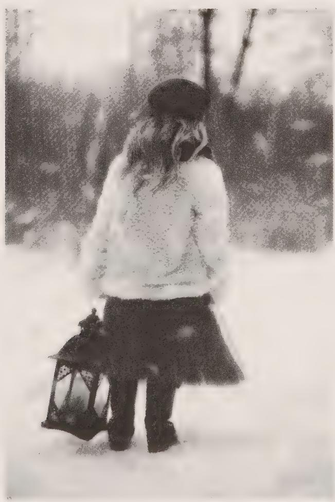

## Trả lại một khoảng trời thuộc về mình

**还一片属于自己的天空**

*hái yī piàn shǔ yú zì jǐ de tiān kōng*

每一个年轻人，都要经历从校园踏向社会的过程。

měi yí gè nián qīng rén，dōu yào jīng lì cóng xiào yuán tà xiàng shè huì de guò chéng。

Mỗi người trẻ đều phải trải qua quá trình từ giảng đường bước ra xã hội.

那是一段鲁莽而冲动、寻找与迷惘的日子。

nà shì yī duàn lǔ mǎng ér chōng dòng、xún zhǎo yǔ mí wǎng de rì zi。

Đó là quãng ngày bồng bột mà hấp tấp, kiếm tìm và mê mang.

我们带着心中的理想和对生活的热爱、激情，勇敢地投进社会的洪流。

wǒ men dài zhe xīn zhōng de lǐ xiǎng hé duì shēng huó de rè ài、jī qíng，yǒng gǎn dì tóu jìn shè huì de hóng liú。

Chúng ta mang theo lý tưởng trong lòng cùng tình yêu và nhiệt huyết với cuộc sống, dũng cảm lao vào dòng chảy của xã hội.

我们犹如初生牛犊，到处横冲直撞。

wǒ men yóu rú chū shēng niú dú，dào chù héng chōng zhí zhuàng。

Chúng ta như trâu con mới sinh, ngang dọc xông pha khắp nơi.

我们并不知道自已想要什么，但是往往知道自己不想要什么。

wǒ men bìng bù zhī dào zì yǐ xiǎng yào shén me，dàn shì wǎng wǎng zhī dào zì jǐ bù xiǎng yào shén me。

Chúng ta không biết mình muốn gì, nhưng thường lại biết mình không muốn gì.

我们不知道什么工作最适合自己；但是我们所做的工作，大都不是自己想做的。

wǒ men bù zhī dào shén me gōng zuò zuì shì hé zì jǐ；dàn shì wǒ men suǒ zuò de gōng zuò，dà dū bú shì zì jǐ xiǎng zuò de。

Chúng ta không biết công việc nào hợp với mình nhất; nhưng công việc chúng ta đang làm, phần lớn đều không phải việc mình muốn làm.

喜欢画画的人，做了医学编辑；喜欢音乐的人，做了行政助理；喜欢新闻的人，做了网络小说；喜欢文学的人，做了媒体公关……

xǐ huān huà huà de rén，zuò le yī xué biān jí；xǐ huān yīn yuè de rén，zuò le xíng zhèng zhù lǐ；xǐ huān xīn wén de rén，zuò le wǎng luò xiǎo shuō；xǐ huān wén xué de rén，zuò le méi tǐ gōng guān……

Người thích vẽ tranh, làm biên tập y khoa; người thích âm nhạc, làm trợ lý hành chính; người thích tin tức, viết tiểu thuyết mạng; người thích văn học, làm quan hệ công chúng truyền thông…

于是，因为不甘心，我们从一家公司跳槽到另一家公司。

yú shì，yīn wèi bù gān xīn，wǒ men cóng yī jiā gōng sī tiào cáo dào lìng yī jiā gōng sī。

Vì vậy, bởi không cam lòng, chúng ta nhảy việc từ công ty này sang công ty khác.

我们从北京的这一头，跑到那一头。

wǒ men cóng běi jīng de zhè yī tóu，pǎo dào nà yī tóu。

Chúng ta từ đầu này của Bắc Kinh, chạy tới đầu kia.

我们为了找工作穿遍北京的大街小巷。

wǒ men wèi le zhǎo gōng zuò chuān biàn běi jīng de dà jiē xiǎo xiàng。

Chúng ta vì tìm việc mà rảo khắp các ngõ ngách đường phố Bắc Kinh.

去过西直门的彩票公司，也去过德胜门的图书公司；去过三元桥的团购网站，也去过劲松的门户网站；去过十三号线的开心麻花剧组，也去过十号线的迅雷看看；去过四号线好几层楼的时尚公司，也去过上地只有四个人的小说网站…

qù guò xī zhí mén de cǎi piào gōng sī，yě qù guò dé shèng mén de tú shū gōng sī；qù guò sān yuán qiáo de tuán gòu wǎng zhàn，yě qù guò jìn sōng de mén hù wǎng zhàn；qù guò shí sān hào xiàn de kāi xīn má huā jù zǔ，yě qù guò shí hào xiàn de xùn léi kàn kàn；qù guò sì hào xiàn hǎo jǐ céng lóu de shí shàng gōng sī，yě qù guò shàng dì zhǐ yǒu sì gè rén de xiǎo shuō wǎng zhàn…

Từng đến công ty xổ số ở Tây Trực Môn, cũng từng đến công ty sách ở Đức Thắng Môn; từng đến website mua nhóm ở Tam Nguyên Kiều, cũng từng đến cổng thông tin ở Kính Tùng; từng đến đoàn làm phim Khai Tâm Ma Hoa ở tuyến số 13, cũng từng đến Tầm Lôi Khán Khán ở tuyến số 10; từng đến công ty thời trang mấy tầng lầu ở tuyến số 4, cũng từng đến website tiểu thuyết chỉ có bốn người ở Thượng Địa…

或者是因为工资，或者是因为工作内容，或者是因为公司领导，或者是因为公司的名气，我们不断地辗转于不同的工作之中，只是想找到一个称心如意的工作环境。

huò zhě shì yīn wèi gōng zī，huò zhě shì yīn wèi gōng zuò nèi róng，huò zhě shì yīn wèi gōng sī lǐng dǎo，huò zhě shì yīn wèi gōng sī de míng qì，wǒ men bù duàn dì zhǎn zhuǎn yú bù tóng de gōng zuò zhī zhōng，zhǐ shì xiǎng zhǎo dào yí gè chèn xīn rú yì de gōng zuò huán jìng。

Hoặc vì lương, hoặc vì nội dung công việc, hoặc vì lãnh đạo công ty, hoặc vì danh tiếng công ty, chúng ta không ngừng lưu chuyển giữa những công việc khác nhau, chỉ muốn tìm được một môi trường làm việc vừa lòng.

在奔跑与忙碌之中，我们疲惫而又迷茫。

zài bēn pǎo yǔ máng lù zhī zhōng，wǒ men pí bèi ér yòu mí máng。

Trong bôn ba và bận rộn, chúng ta mệt mỏi mà lại mê mang.

那些刚从校园里携带的热情，像泄了气的气球。

nà xiē gāng cóng xiào yuán lǐ xié dài de rè qíng，xiàng xiè le qì de qì qiú。

Những nhiệt huyết vừa mang ra từ giảng đường, như quả bóng xì hơi.

有些人放弃了，回家乡去了；有些人离开北京，去到另一个可以拥有一份安稳工作的城市；有些人继续在城市里晃荡，高不成低不就。

yǒu xiē rén fàng qì le，huí jiā xiāng qù le；yǒu xiē rén lí kāi běi jīng，qù dào lìng yí gè kě yǐ yōng yǒu yī fèn ān wěn gōng zuò de chéng shì；yǒu xiē rén jì xù zài chéng shì lǐ huàng dàng，gāo bù chéng dī bù jiù。

Có người buông xuôi, về quê; có người rời Bắc Kinh, đến một thành phố khác có thể có công việc ổn định; có người tiếp tục lảng vảng trong thành phố, cao không tới thấp không thông.

那些早在几个月前还说着毕业就回家很没出息的人，现今说着不同的话。

nà xiē zǎo zài jǐ gè yuè qián hái shuō zhe bì yè jiù huí jiā hěn méi chū xī de rén，xiàn jīn shuō zhe bù tóng de huà。

Những người vài tháng trước còn nói tốt nghiệp xong về nhà là không có chí khí, giờ lại nói những lời khác.

“其实想想回家也挺好的，有车有房有工作，过得安稳舒适。

“qí shí xiǎng xiǎng huí jiā yě tǐng hǎo de，yǒu chē yǒu fáng yǒu gōng zuò，guò dé ān wěn shū shì。

"Thật ra nghĩ lại thì về nhà cũng tốt, có xe có nhà có việc làm, sống yên ổn thoải mái.

“在北京不过是见多识广。

“zài běi jīng bù guò shì jiàn duō shí guǎng。

"Ở Bắc Kinh chẳng qua cũng chỉ là thấy nhiều biết rộng.

”“关键还在于你自己，究竟能否放下，或者究竟想要什么样的生活。

”“guān jiàn hái zài yú nǐ zì jǐ，jiū jìng néng fǒu fàng xià，huò zhě jiū jìng xiǎng yào shén me yàng de shēng huó。

"Điều quan trọng vẫn ở chính bạn, rốt cuộc có thể buông xuống được hay không, hay rốt cuộc bạn muốn cuộc sống như thế nào.

”

”

"

在我还是学生的时候，我也很瞧不起毕了业就卷着行李回家的人。

zài wǒ hái shì xué shēng de shí hòu，wǒ yě hěn qiáo bù qǐ bì le yè jiù juǎn zhe xíng lǐ huí jiā de rén。

Khi tôi còn là sinh viên, tôi cũng rất khinh thường những người tốt nghiệp xong là cuốn gói về nhà.

我曾跟朋友说：“正是因为你家里什么都有，才应该在外面放手一搏。

wǒ céng gēn péng yǒu shuō ：“zhèng shì yīn wèi nǐ jiā lǐ shén me dōu yǒu，cái yīng gāi zài wài miàn fàng shǒu yī bó。

Tôi từng nói với bạn: "Chính vì nhà bạn có đủ thứ, mới nên ở ngoài này liều một phen.

即使拼败了，到时候回家也不晚。

jí shǐ pīn bài le，dào shí hòu huí jiā yě bù wǎn。

Dẫu có thua cuộc, lúc đó về nhà cũng chưa muộn.

现在，虽然我不想离开北京这个城市，也不愿放弃我的梦想，但是我愿试着理解那些离开这里回到家乡，去往二三线城市的朋友们。

xiàn zài，suī rán wǒ bù xiǎng lí kāi běi jīng zhè ge chéng shì，yě bù yuàn fàng qì wǒ de mèng xiǎng，dàn shì wǒ yuàn shì zhe lǐ jiě nà xiē lí kāi zhè lǐ huí dào jiā xiāng，qù wǎng èr sān xiàn chéng shì de péng yǒu men。

Giờ đây, dù tôi không muốn rời thành phố Bắc Kinh này, cũng không muốn từ bỏ giấc mơ của mình, nhưng tôi nguyện thử thấu hiểu những người bạn rời nơi đây trở về quê hương, đến các thành phố hạng hai hạng ba.

每个人对于生命和生活的渴望，并不一样。

měi gè rén duì yú shēng mìng hé shēng huó de kě wàng，bìng bù yí yàng。

Mỗi người có những khao khát về sinh mệnh và cuộc sống, không hề giống nhau.

当我前去山东看见刚毕业的同学要结婚的时候，我便理解了这一切。

dāng wǒ qián qù shān dōng kàn jiàn gāng bì yè de tóng xué yào jié hūn de shí hòu，wǒ biàn lǐ jiě le zhè yī qiè。

Khi tôi đến Sơn Đông nhìn thấy bạn học vừa tốt nghiệp chuẩn bị kết hôn, tôi liền hiểu được tất cả.

他们过着无忧无虑的生活，两个人的家不过几站公交站。

tā men guò zhe wú yōu wú lǜ de shēng huó，liǎng gè rén de jiā bù guò jǐ zhàn gōng jiāo zhàn。

Họ sống cuộc sống vô lo vô nghĩ, tổ ấm của hai người chỉ cách vài trạm xe buýt.

有车，有房，有疼爱自己的父母，有相爱的人，这还不够吗？

yǒu chē，yǒu fáng，yǒu téng ài zì jǐ de fù mǔ，yǒu xiāng ài de rén，zhè hái bù gòu ma？

Có xe, có nhà, có cha mẹ thương yêu mình, có người mình yêu, như vậy chưa đủ sao?

你又能因此笑话他们没有骨气，没有追求吗？

nǐ yòu néng yīn cǐ xiào huà tā men méi yǒu gǔ qì，méi yǒu zhuī qiú ma？

Bạn lại có thể vì thế mà cười họ không có khí chất, không có chí hướng sao?

有一些人，找到了，坚持下来。

yǒu yī xiē rén，zhǎo dào le，jiān chí xià lái。

Có một số người, tìm thấy rồi, kiên trì đến cùng.

有了一份好的工作，或是有了一个明确的方向。

yǒu le yī fèn hǎo de gōng zuò，huò shì yǒu le yí gè míng què de fāng xiàng。

Có một công việc tốt, hoặc có một phương hướng rõ ràng.

也或许是有了一颗不再浮躁的心。

yě huò xǔ shì yǒu le yī kē bù zài fú zào de xīn。

Cũng có thể là có được một trái tim không còn nông nổi.

原本以为不给五千绝对不干的工作，现在给三千也干着；原本以为不是自己喜欢的工作，现在也踏实干着；原本以为自己不喜欢的人，无论如何都不给他好脸色，现在也忍着；原来非常鄙视别人溜须拍马，如今自己偶尔也那么做。

yuán běn yǐ wéi bù gěi wǔ qiān jué duì bù gàn de gōng zuò，xiàn zài gěi sān qiān yě gàn zhe；yuán běn yǐ wéi bú shì zì jǐ xǐ huān de gōng zuò，xiàn zài yě tà shí gàn zhe；yuán běn yǐ wéi zì jǐ bù xǐ huān de rén，wú lùn rú hé dōu bù gěi tā hǎo liǎn sè，xiàn zài yě rěn zhe；yuán lái fēi cháng bǐ shì bié rén liū xū pāi mǎ，rú jīn zì jǐ ǒu ěr yě nà me zuò。

Công việc trước đây nghĩ không cho năm nghìn thì tuyệt đối không làm, giờ cho ba nghìn cũng làm; việc trước đây nghĩ không phải mình thích, giờ cũng chăm chỉ làm; người trước đây nghĩ mình không thích, thế nào cũng không cho sắc mặt tốt, giờ cũng nhịn nhục; trước đây rất khinh bỉ người khác xu nịnh bợ đỡ, giờ thỉnh thoảng mình cũng làm như thế.

我们不再看钱的多少，我们看的是上升的空间；我们不再看公司的大小，看的是能学到多少东西；我们不再看领导的好坏知道“天下乌鸦一般黑”；我们不再计较同事的不真诚，知道商场即战场，少有好友。

wǒ men bù zài kàn qián de duō shǎo，wǒ men kàn de shì shàng shēng de kōng jiān；wǒ men bù zài kàn gōng sī de dà xiǎo，kàn de shì néng xué dào duō shǎo dōng xī；wǒ men bù zài kàn lǐng dǎo de hǎo huài zhī dào “tiān xià wū yā yì bān hēi ”；wǒ men bù zài jì jiào tóng shì de bù zhēn chéng，zhī dào shāng chǎng jí zhàn chǎng，shǎo yǒu hǎo yǒu。

Chúng ta không còn nhìn vào đồng lương nhiều ít, chúng ta nhìn vào không gian thăng tiến; không còn nhìn công ty lớn nhỏ, mà nhìn học được bao nhiêu điều; không còn nhìn lãnh đạo tốt xấu, biết rằng "quạ ở đâu cũng đen"; chúng ta không còn so đo sự không chân thành của đồng nghiệp, biết rằng thương trường là chiến trường, khó có tri kỷ.

我们大都是这样一路彷徨，走进这个现实的社会。

wǒ men dà dū shì zhè yàng yī lù páng huáng，zǒu jìn zhè ge xiàn shí de shè huì。

Phần lớn chúng ta đều bàng hoàng dọc đường như thế, bước vào xã hội hiện thực này.

虽然眼下还没有成功，但是在经历无数打击和挫败之后，也并没有失败。

suī rán yǎn xià hái méi yǒu chéng gōng，dàn shì zài jīng lì wú shù dǎ jī hé cuò bài zhī hòu，yě bìng méi yǒu shī bài。

Dù hiện tại vẫn chưa thành công, nhưng sau khi trải qua vô số đả kích và thất bại, cũng chưa từng thất bại.

现在想来，应该感谢生活。

xiàn zài xiǎng lái，yīng gāi gǎn xiè shēng huó。

Giờ nghĩ lại, nên cảm ơn cuộc sống.

如果不是生活所迫，我们也许就会轻易地被打败，轻易地放弃了。

rú guǒ bú shì shēng huó suǒ pò，wǒ men yě xǔ jiù huì qīng yì dì bèi dǎ bài，qīng yì dì fàng qì le。

Nếu không phải vì cuộc sống ép buộc, có lẽ chúng ta đã dễ dàng bị đánh bại, dễ dàng buông bỏ rồi.

那时候想的是，再不上班就吃不上饭，也交不起房租了。

nà shí hòu xiǎng de shì，zài bù shàng bān jiù chī bù shàng fàn，yě jiāo bù qǐ fáng zū le。

Lúc đó nghĩ rằng, không đi làm nữa thì chẳng có cơm ăn, cũng không trả nổi tiền thuê nhà.

这些基本的生活条件，迫使我们无法懈怠，无法懒惰，无法放弃。

zhè xiē jī běn de shēng huó tiáo jiàn，pò shǐ wǒ men wú fǎ xiè dài，wú fǎ lǎn duò，wú fǎ fàng qì。

Những điều kiện sinh hoạt cơ bản ấy, buộc chúng ta không thể lơ là, không thể lười biếng, không thể buông bỏ.

于是我们拖着疲沓的身体，继续奔走。

yú shì wǒ men tuō zhe pí tà de shēn tǐ，jì xù bēn zǒu。

Vì vậy chúng ta lê tấm thân mệt mỏi, tiếp tục tất bật.

幸而，我们年轻；幸而，我们有梦。

xìng ér，wǒ men nián qīng；xìng ér，wǒ men yǒu mèng。

May thay, chúng ta còn trẻ; may thay, chúng ta còn mộng.

或许这不过是人生必经的过程。

huò xǔ zhè bù guò shì rén shēng bì jīng de guò chéng。

Có lẽ đây chỉ là quá trình tất yếu của cuộc đời.

## Hãy cho lý tưởng một chút thời gian

**给理想一点时间**

*gěi lǐ xiǎng yì diǎn shí jiān*

走在下班回家的路上，我经常会感到自己被一股莫名的力量压着、堵着，仿佛快要窒息了。

zǒu zài xià bān huí jiā de lù shàng，wǒ jīng cháng huì gǎn dào zì jǐ bèi yī gǔ mò míng de lì liàng yā zhe、dǔ zhe，fǎng fú kuài yào zhì xī le。

Trên đường tan làm về nhà, tôi thường cảm thấy mình bị một sức mạnh kỳ lạ đè nén, chặn nghẽn, như thể sắp ngạt thở.

这股力量或许来自于我去了一趟某某大学，或许来自看见一些为理想奋斗的人们，或许来自于跟好朋友的谈话。

zhè gǔ lì liàng huò xǔ lái zì yú wǒ qù le yī tàng mǒu mǒu dà xué，huò xǔ lái zì kàn jiàn yī xiē wèi lǐ xiǎng fèn dòu de rén men，huò xǔ lái zì yú gēn hǎo péng yǒu de tán huà。

Sức mạnh ấy có lẽ đến từ chuyến tôi đến một trường đại học nào đó, có lẽ đến từ việc nhìn thấy những con người phấn đấu vì lý tưởng, có lẽ đến từ cuộc trò chuyện với người bạn thân.

这让我多次感到痛楚，闷、堵、难以呼吸。

zhè ràng wǒ duō cì gǎn dào tòng chǔ，mèn、dǔ、nán yǐ hū xī。

Điều đó khiến tôi nhiều lần cảm thấy đau đớn, u uất, nghẹn tắc, khó thở.

我走在路上觉得自己从喉咙到心脏全被堵住了，被封死了。

wǒ zǒu zài lù shàng jué de zì jǐ cóng hóu lóng dào xīn zàng quán bèi dǔ zhù le，bèi fēng sǐ le。

Tôi đi trên đường cảm thấy mình từ cổ họng đến trái tim đều bị chặn kín, bị bịt chết.

我一直渴望而又不敢去看公司书架上那一排胡适全集，我不敢去阅读那个我所敬仰的人，不敢去领会其中的思想和艰辛。

wǒ yì zhí kě wàng ér yòu bù gǎn qù kàn gōng sī shū jià shàng nà yī pái hú shì quán jí，wǒ bù gǎn qù yuè dú nà ge wǒ suǒ jìng yǎng de rén，bù gǎn qù lǐng huì qí zhōng de sī xiǎng hé jiān xīn。

Tôi luôn khao khát lại không dám nhìn dãy Hồ Thích toàn tập trên giá sách công ty, tôi không dám đọc những trang viết của người mà tôi ngưỡng mộ, không dám lĩnh hội tư tưởng và gian nan trong đó.

我曾跟一位老师说，我要成为胡适那样的人，那样热血的人。

wǒ céng gēn yī wèi lǎo shī shuō，wǒ yào chéng wéi hú shì nà yàng de rén，nà yàng rè xuè de rén。

Tôi từng nói với một vị thầy rằng, tôi muốn trở thành người như Hồ Thích, người sục sôi nhiệt huyết như thế.

但我是那么的矛盾，无法像其他人一样，马上去选择自己想要的生活。

dàn wǒ shì nà me de máo dùn，wú fǎ xiàng qí tā rén yī yàng，mǎ shàng qù xuǎn zé zì jǐ xiǎng yào de shēng huó。

Nhưng tôi mâu thuẫn đến vậy, không thể như những người khác, lập tức chọn lấy cuộc sống mình muốn.

有时，我甚至惧怕安静下来看一本书。

yǒu shí，wǒ shèn zhì jù pà ān jìng xià lái kàn yī běn shū。

Có khi, tôi thậm chí e sợ việc yên tĩnh lại để đọc một cuốn sách.

我害怕一种莫名的痛会来吞噬我，而胡适的此类书籍无疑就是划开我痛处的尖刀。

wǒ hài pà yī zhǒng mò míng de tòng huì lái tūn shì wǒ，ér hú shì de cǐ lèi shū jí wú yí jiù shì huà kāi wǒ tòng chù de jiān dāo。

Tôi sợ một nỗi đau khó gọi tên sẽ đến nuốt chửng tôi, mà những cuốn sách kiểu Hồ Thích ấy chính là lưỡi dao mổ vào nỗi đau của tôi.

我不敢去放肆地触碰理想，我怕忘却，更怕它带来的苦楚那种苦，犹如百爪挠心，让人手无足措，坐立不安，心烦意乱。

wǒ bù gǎn qù fàng sì dì chù pèng lǐ xiǎng，wǒ pà wàng què，gèng pà tā dài lái de kǔ chǔ nà zhǒng kǔ，yóu rú bǎi zhǎo náo xīn，ràng rén shǒu wú zú cuò，zuò lì bù ān，xīn fán yì luàn。

Tôi không dám thỏa sức chạm vào lý tưởng, tôi sợ quên lãng, lại càng sợ nỗi khổ nó mang đến, thứ khổ ấy như trăm móng vuốt cào trong lòng, khiến người ta luống cuống tay chân, ngồi đứng không yên, lòng rối như tơ.

就像他人说的那样“给理想一点时间”吧。

jiù xiàng tā rén shuō de nà yàng “gěi lǐ xiǎng yì diǎn shí jiān ”ba。

Cứ như người ta nói "hãy cho lý tưởng một chút thời gian" vậy.

就像自己说过的那样，没有任何捷径地走下去。

jiù xiàng zì jǐ shuō guò de nà yàng，méi yǒu rèn hé jié jìng dì zǒu xià qù。

Cứ như chính mình từng nói, cứ bước tiếp mà không có bất kỳ đường tắt nào.

路，自己不走过，别人如何说都是不信的；滋味，自己不亲自尝过，别人如何形容也是不懂的。

lù，zì jǐ bù zǒu guò，bié rén rú hé shuō dōu shì bù xìn de；zī wèi，zì jǐ bù qīn zì cháng guò，bié rén rú hé xíng róng yě shì bù dǒng de。

Con đường, nếu tự mình chưa từng đi, dù người khác nói thế nào cũng khó mà tin; mùi vị, nếu tự mình chưa từng nếm, dù người khác tả thế nào cũng khó mà hiểu.

不信那曲折，也不懂那熬煎。

bù xìn nà qū zhé，yě bù dǒng nà áo jiān。

Không tin nổi sự quanh co gập ghềnh ấy, cũng không hiểu nổi sự dày vò ấy.

只是现今的自己是不愿去想的，怕会被苦难的火种燃烧，会被其粉碎。

zhǐ shì xiàn jīn de zì jǐ shì bù yuàn qù xiǎng de，pà huì bèi kǔ nàn de huǒ zhǒng rán shāo，huì bèi qí fěn suì。

Chỉ là bản thân hiện tại không muốn nghĩ ngợi, sợ sẽ bị ngọn lửa khổ nạn thiêu đốt, bị nó nghiền nát.

一位长者说：现今浮躁的时代，真正的文学者、作家是少之又少。

yī wèi zhǎng zhě shuō：xiàn jīn fú zào de shí dài，zhēn zhèng de wén xué zhě、zuò jiā shì shǎo zhī yòu shǎo。

Một bậc trưởng bối nói: trong thời đại nông nổi ngày nay, những người làm văn học đích thực, những nhà văn thực sự là hiếm vô cùng.

中国的作家不缺少才华，缺少的是一种风骨。

zhōng guó de zuò jiā bù quē shǎo cái huá，quē shǎo de shì yī zhǒng fēng gǔ。

Nhà văn Trung Quốc không thiếu tài hoa, thiếu là một thứ cốt cách phong thái.

庸俗的社会，造就了诸多庸俗的作家。

yōng sú de shè huì，zào jiù le zhū duō yōng sú de zuò jiā。

Xã hội tục tằn, tạo nên vô số nhà văn tục tằn.

“你是一个有希望的青年。

“nǐ shì yí gè yǒu xī wàng de qīng nián。

"Cậu là một thanh niên có hy vọng.

”他是这样对我说的。

”tā shì zhè yàng duì wǒ shuō de。

" Ông ấy nói với tôi như vậy.

一个追求真，追求文学之根本，游历文字生涯大半生的长者是这样评价我的。

yí gè zhuī qiú zhēn，zhuī qiú wén xué zhī gēn běn，yóu lì wén zì shēng yá dà bàn shēng de zhǎng zhě shì zhè yàng píng jià wǒ de。

Một bậc trưởng bối theo đuổi chân lý, theo đuổi cái gốc của văn học, rong ruổi gần nửa đời trong sự nghiệp con chữ đã đánh giá tôi như vậy.

我并不感到高兴、愉快，反而更加痛心。

wǒ bìng bù gǎn dào gāo xìng、yú kuài，fǎn ér gèng jiā tòng xīn。

Tôi không hề thấy vui vẻ, hân hoan, ngược lại càng thêm đau lòng.

我不敢深想，因为思想的世界里，全是眼泪的海洋。

wǒ bù gǎn shēn xiǎng，yīn wèi sī xiǎng de shì jiè lǐ，quán shì yǎn lèi de hǎi yáng。

Tôi không dám nghĩ sâu, bởi vì trong thế giới tư tưởng, toàn là đại dương nước mắt.

我不想比自己同行的伙伴先走上追求理想之路，我该怎么办。

wǒ bù xiǎng bǐ zì jǐ tóng háng de huǒ bàn xiān zǒu shàng zhuī qiú lǐ xiǎng zhī lù，wǒ gāi zěn me bàn。

Tôi không muốn bước lên con đường theo đuổi lý tưởng trước cả những người bạn đồng hành của mình, tôi phải làm sao đây.

我只是决心追赶，寂寞地追赶。

wǒ zhǐ shì jué xīn zhuī gǎn，jì mò dì zhuī gǎn。

Tôi chỉ quyết tâm đuổi theo, đuổi theo trong cô độc.

我习惯了寂寞，是的，我早已习惯。

wǒ xí guàn le jì mò，shì de，wǒ zǎo yǐ xí guàn。

Tôi đã quen với cô độc, đúng vậy, tôi sớm đã quen.

我经常想起那次在校园里的哭诉。

wǒ jīng cháng xiǎng qǐ nà cì zài xiào yuán lǐ de kū sù。

Tôi thường nhớ đến lần khóc than giữa sân trường ấy.

自己是那么孤单，在梦想的路上，没有伙伴。

zì jǐ shì nà me gū dān，zài mèng xiǎng de lù shàng，méi yǒu huǒ bàn。

Mình cô đơn đến thế, trên con đường mộng mơ, chẳng có bạn đồng hành.

理想这东西是可怕的，一旦你让它冒出头来，它便拉拉扯扯越拽越多，越开越盛，犹如茂密森林，将你遮盖；犹如汹涌大海，将你吞没；犹如飞石狂沙，将你掩埋；犹如干斤重担，将你压扁；犹如毒品，就是毒品，让你费尽心思戒掉，却又一次次让你的每一根血管、每一个器官、每一次呼吸都想要得到。

lǐ xiǎng zhè dōng xī shì kě pà de，yí dàn nǐ ràng tā mào chū tóu lái，tā biàn lā lā chě chě yuè zhuāi yuè duō，yuè kāi yuè shèng，yóu rú mào mì sēn lín，jiāng nǐ zhē gài；yóu rú xiōng yǒng dà hǎi，jiāng nǐ tūn mò；yóu rú fēi shí kuáng shā，jiāng nǐ yǎn mái；yóu rú gàn jīn zhòng dàn，jiāng nǐ yā biǎn；yóu rú dú pǐn，jiù shì dú pǐn，ràng nǐ fèi jìn xīn sī jiè diào，què yòu yī cì cì ràng nǐ de měi yī gēn xuè guǎn、měi yí gè qì guān、měi yī cì hū xī dōu xiǎng yào dé dào。

Lý tưởng là thứ đáng sợ, một khi bạn để nó nhú đầu lên, nó sẽ kéo dài kéo dài ngày càng nhiều, ngày càng nở rộ, như rừng rậm rườm rà, che phủ bạn; như đại dương cuồn cuộn, nhấn chìm bạn; như đá bay cát cuốn, vùi lấp bạn; như gánh nặng nghìn cân, đè bẹp bạn; như ma túy, chính là ma túy, khiến bạn tốn bao tâm sức để cai nghiện, mà lại lần lần khiến mỗi mạch máu, mỗi cơ quan, mỗi hơi thở của bạn đều muốn có được nó.

是它让我知道，世上的毒品并非只有冰毒、吗啡、罂粟，还有一种毒品，叫理想。

shì tā ràng wǒ zhī dào，shì shàng de dú pǐn bìng fēi zhǐ yǒu bīng dú、mǎ fēi、yīng sù，hái yǒu yī zhǒng dú pǐn，jiào lǐ xiǎng。

Chính nó khiến tôi biết rằng, thứ ma túy trên đời không chỉ có băng độc, morphine, thuốc phiện, mà còn một thứ ma túy, gọi là lý tưởng.

我不知道该做些什么，只能够摆正自己的心态，只能更加努力认真地工作。

wǒ bù zhī dào gāi zuò xiē shén me，zhǐ néng gòu bǎi zhèng zì jǐ de xīn tài，zhǐ néng gèng jiā nǔ lì rèn zhēn dì gōng zuò。

Tôi không biết nên làm gì, chỉ có thể ngay ngắn lại tâm thái của mình, chỉ có thể nỗ lực chăm chỉ hơn trong công việc.

只要自己痛不至死，就一定还有明日。

zhǐ yào zì jǐ tòng bù zhì sǐ，jiù yí dìng hái yǒu míng rì。

Chỉ cần nỗi đau chưa đến mức chết đi, nhất định vẫn còn ngày mai.

不奢求其他，不奢求痛楚消减，不奢求苦楚消逝，因为我知道，只要我身不死，理想便不会死，而疼痛亦不死。

bù shē qiú qí tā，bù shē qiú tòng chǔ xiāo jiǎn，bù shē qiú kǔ chǔ xiāo shì，yīn wèi wǒ zhī dào，zhǐ yào wǒ shēn bù sǐ，lǐ xiǎng biàn bú huì sǐ，ér téng tòng yì bù sǐ。

Không mong cầu điều gì khác, không mong cầu nỗi đau vơi bớt, không mong cầu khổ đau biến mất, bởi vì tôi biết, chỉ cần thân này chưa chết, lý tưởng sẽ không chết, mà nỗi đau cũng không chết.

# Hãy cho mình một chút thời gian tiêu khiển

**给自己一些消遣的时间**

*gěi zì jǐ yī xiē xiāo qiǎn de shí jiān*

相信我们很多人，在开始工作和真正生活之后，只能从时间的夹缝之中去获取额外的快乐。

xiāng xìn wǒ men hěn duō rén，zài kāi shǐ gōng zuò hé zhēn zhèng shēng huó zhī hòu，zhǐ néng cóng shí jiān de jiā fèng zhī zhōng qù huò qǔ é wài de kuài lè。

Tin rằng nhiều người trong chúng ta, sau khi bắt đầu công việc và sống cuộc sống thực sự, chỉ có thể từ kẽ hở của thời gian mà kiếm được chút niềm vui thêm.

我们可能想去一个地方，已经想了很久，但是由于各种原因，让自己无法去到那里。

wǒ men kě néng xiǎng qù yí gè dì fāng，yǐ jīng xiǎng le hěn jiǔ，dàn shì yóu yú gè zhǒng yuán yīn，ràng zì jǐ wú fǎ qù dào nà lǐ。

Có thể chúng ta muốn đến một nơi nào đó, đã nghĩ suốt một thời gian dài, nhưng vì nhiều lý do, khiến mình không thể đến đó được.

就像我，一直很想去什刹海，这个念头，距今已经近一年。

jiù xiàng wǒ，yì zhí hěn xiǎng qù shén shā hǎi，zhè ge niàn tou，jù jīn yǐ jīng jìn yī nián。

Giống như tôi, luôn rất muốn đến Thập Sát Hải, ý nghĩ này, đến nay đã gần một năm.

从去年夏天我在杂志社实习开始，便想要再去一次什刹海。

cóng qù nián xià tiān wǒ zài zá zhì shè shí xí kāi shǐ，biàn xiǎng yào zài qù yī cì shén shā hǎi。

Từ mùa hè năm ngoái khi tôi thực tập ở tòa soạn tạp chí, tôi đã muốn đến Thập Sát Hải thêm một lần.

至于为什么如此渴望去一个地方，我自己也不知道。

zhì yú wèi shén me rú cǐ kě wàng qù yí gè dì fāng，wǒ zì jǐ yě bù zhī dào。

Còn vì sao lại khao khát đến một nơi đến vậy, bản thân tôi cũng không biết.

可能是想要获得一篇好的文字，也可能是想要它给予一份心灵的宁静。

kě néng shì xiǎng yào huò dé yī piān hǎo de wén zì，yě kě néng shì xiǎng yào tā jǐ yǔ yī fèn xīn líng de níng jìng。

Có thể là muốn có được những dòng chữ hay, cũng có thể là muốn nó trao cho một sự tĩnh lặng của tâm hồn.

可能只是为了自我的放松，也可能是为了暂时的躲避。

kě néng zhǐ shì wèi le zì wǒ de fàng sōng，yě kě néng shì wèi le zàn shí de duǒ bì。

Có thể chỉ để cho bản thân thư giãn, cũng có thể là để trốn tránh nhất thời.

而现实却总是不如人愿，你没到那个地方的时候，你以为一旦到达会是无比喜悦的，或者感触颇多的，而当你真切地到了那里的时候，当你被连绵阴雨包围在它的怀抱里的时候，却最容易将自己的眼睛和心灵远远地迷失掉。

ér xiàn shí què zǒng shì bù rú rén yuàn，nǐ méi dào nà ge dì fāng de shí hòu，nǐ yǐ wéi yí dàn dào dá huì shì wú bǐ xǐ yuè de，huò zhě gǎn chù pǒ duō de，ér dāng nǐ zhēn qiè dì dào le nà lǐ de shí hòu，dāng nǐ bèi lián mián yīn yǔ bāo wéi zài tā de huái bào lǐ de shí hòu，què zuì róng yì jiāng zì jǐ de yǎn jīng hé xīn líng yuǎn yuǎn dì mí shī diào。

Mà hiện thực thì luôn không như ý người, khi bạn chưa đến nơi ấy, bạn nghĩ một khi đặt chân tới sẽ vui sướng vô cùng, hoặc cảm khái dạt dào, nhưng khi bạn thực sự đến đó, khi bạn bị mưa dầm liên miên vây quanh trong lòng nó, lại dễ nhất đánh mất xa xôi đôi mắt và tâm hồn của chính mình.

当我如愿以偿地走在什刹海的海岸上，天色渐昏，夜晚正在以慢爬的速度笼罩着海的脸庞。

dāng wǒ rú yuàn yǐ cháng dì zǒu zài shén shā hǎi de hǎi àn shàng，tiān sè jiàn hūn，yè wǎn zhèng zài yǐ màn pá de sù dù lǒng zhào zhe hǎi de liǎn páng。

Khi cuối cùng tôi cũng được như nguyện bước trên bờ biển Thập Sát Hải, trời dần tối, màn đêm đang từ từ bao phủ lấy gương mặt của biển.

海的胸膛上，倒映着那些荧荧灯火。

hǎi de xiōng táng shàng，dào yìng zhe nà xiē yíng yíng dēng huǒ。

Trên lồng ngực của biển, phản chiếu những ánh đèn lung linh.

我只看到了风景，而没有其他心情。

wǒ zhǐ kàn dào le fēng jǐng，ér méi yǒu qí tā xīn qíng。

Tôi chỉ nhìn thấy phong cảnh, mà không có tâm trạng nào khác.

去时，我跟朋友是从右侧小路进去的，进去之后，正巧是海边最为热闹的酒吧小道。

qù shí，wǒ gēn péng yǒu shì cóng yòu cè xiǎo lù jìn qù de，jìn qù zhī hòu，zhèng qiǎo shì hǎi biān zuì wèi rè nào de jiǔ bā xiǎo dào。

Khi đến, tôi cùng bạn đi vào từ con đường nhỏ bên phải, sau khi vào, đúng lúc gặp con ngõ quán bar nhộn nhịp nhất bên bờ biển.

我们先是在道路旁的小亭子中坐了一会儿。

wǒ men xiān shì zài dào lù páng de xiǎo tíng zi zhōng zuò le yī huì er。

Chúng tôi ngồi trong một chiếc đình nhỏ bên đường một lúc.

当我坐下来远望什刹海的时候，我觉得它并不能称为“海”，它不够壮阔，也没有大的波澜，但它颇为亲切，随和。

dāng wǒ zuò xià lái yuǎn wàng shén shā hǎi de shí hòu，wǒ jué de tā bìng bù néng chēng wéi “hǎi ”，tā bù gòu zhuàng kuò，yě méi yǒu dà de bō lán，dàn tā pǒ wèi qīn qiè，suí hé。

Khi tôi ngồi xuống nhìn ra xa Thập Sát Hải, tôi thấy nó không thể gọi là “biển”, nó chưa đủ hùng vĩ, cũng không có những con sóng lớn, nhưng nó khá gần gũi, hòa nhã.

记得第一次来的时候，我巴巴地要去找一家名为“七月七日晴”的酒吧。

jì de dì yī cì lái de shí hòu，wǒ bā bā dì yào qù zhǎo yī jiā míng wèi “qī yuè qī rì qíng ”de jiǔ bā。

Nhớ lần đầu tiên đến đây, tôi háo hức đi tìm một quán bar tên là “Tháng Bảy ngày Bảy trời quang”.

那时候天色已晚，我们只好问路人。

nà shí hòu tiān sè yǐ wǎn，wǒ men zhǐ hǎo wèn lù rén。

Lúc ấy trời đã muộn, chúng tôi đành phải hỏi người qua đường.

走在路上的一位阿姨见我问路，一把拉住我，“你们要去哪儿，过来我告诉你。

zǒu zài lù shàng de yī wèi ā yí jiàn wǒ wèn lù，yī bǎ lā zhù wǒ ，“nǐ men yào qù nǎ ér，guò lái wǒ gào sù nǐ。

Một bác gái đang đi trên đường thấy tôi hỏi đường, liền kéo tôi lại, “Các cháu muốn đi đâu, lại đây bác chỉ cho.”

”她的这一举动，我至今都是难忘的。

”tā de zhè yī jǔ dòng，wǒ zhì jīn dōu shì nán wàng de。

Hành động ấy của bác, đến nay tôi vẫn không thể quên.

她的这一拉，多少拉出了一些温情。

tā de zhè yī lā，duō shǎo lā chū le yī xiē wēn qíng。

Cái kéo tay ấy của bác, phần nào kéo ra được chút hơi ấm tình người.

或许随着时间的变迁，北京这座城市的古老正在消失殆尽，一如记忆中那些美好的回忆，它们像什刹海一样，老北京的情调在变淡，酒吧和茶馆也不那么风韵十足，但总有这样或者那样的热心且给人以温情的人儿，让人心存感动。

huò xǔ suí zhe shí jiān de biàn qiān，běi jīng zhè zuò chéng shì de gǔ lǎo zhèng zài xiāo shī dài jìn，yī rú jì yì zhōng nà xiē měi hǎo de huí yì，tā men xiàng shén shā hǎi yī yàng，lǎo běi jīng de qíng diào zài biàn dàn，jiǔ bā hé chá guǎn yě bù nà me fēng yùn shí zú，dàn zǒng yǒu zhè yàng huò zhě nà yàng de rè xīn qiě gěi rén yǐ wēn qíng de rén ér，ràng rén xīn cún gǎn dòng。

Có lẽ theo sự đổi thay của thời gian, vẻ cổ kính của thành phố Bắc Kinh đang dần tan biến, cũng như những ký ức đẹp đẽ trong trí nhớ, chúng giống như Thập Sát Hải, hương vị Bắc Kinh xưa đang nhạt dần, quán bar và quán trà cũng không còn phong vị như xưa, nhưng luôn có những con người nhiệt tâm, mang đến hơi ấm như thế này hay thế khác, khiến người ta xúc động.

话说回来，在生活之中，又有什么是能够长存的呢。

huà shuō huí lái，zài shēng huó zhī zhōng，yòu yǒu shén me shì néng gòu cháng cún de ne。

Nói đi cũng phải nói lại, trong cuộc sống, có gì là có thể trường tồn đâu.

不管是来过还是没来过什刹海的人，只要一提到它，总是会说到这些热闹非凡的酒吧。

bù guǎn shì lái guò hái shì méi lái guò shén shā hǎi de rén，zhǐ yào yī tí dào tā，zǒng shì huì shuō dào zhè xiē rè nào fēi fán de jiǔ bā。

Dù là người đã từng đến hay chưa từng đến Thập Sát Hải, chỉ cần nhắc đến nó, luôn nhắc đến những quán bar náo nhiệt phi thường này.

而偏偏我跟朋友都是不知风趣的人，每每走过一个酒吧，有服务生过来强拉硬拽我们进去坐一坐的时候，我们不禁心生反感，且一脸严肃地疾步走掉。

ér piān piān wǒ gēn péng yǒu dōu shì bù zhī fēng qù de rén，měi měi zǒu guò yí gè jiǔ bā，yǒu fú wù shēng guò lái qiáng lā yìng zhuāi wǒ men jìn qù zuò yī zuò de shí hòu，wǒ men bù jīn xīn shēng fǎn gǎn，qiě yī liǎn yán sù dì jí bù zǒu diào。

Thế nhưng tôi và bạn lại là những người không biết thưởng thức, mỗi lần đi qua một quán bar, có nhân viên phục vụ chạy đến kéo tay ép chúng tôi vào ngồi một chút, chúng tôi không khỏi sinh lòng phản cảm, rồi một vẻ mặt nghiêm túc bước nhanh bỏ đi.

我想我更喜欢这一汪水，及笼罩四周的黑夜。

wǒ xiǎng wǒ gèng xǐ huān zhè yī wāng shuǐ，jí lǒng zhào sì zhōu de hēi yè。

Tôi nghĩ tôi thích hơn vùng nước này, và màn đêm bao phủ xung quanh.

我更喜欢这荧荧灯火，及跟一个贴心的人儿沉默地走在这条热闹非凡的路上的感觉。

wǒ gèng xǐ huān zhè yíng yíng dēng huǒ，jí gēn yí gè tiē xīn de rén ér chén mò dì zǒu zài zhè tiáo rè nào fēi fán de lù shàng de gǎn jué。

Tôi thích hơn những ánh đèn lung linh này, và cảm giác cùng một người tri kỷ lặng lẽ bước trên con đường náo nhiệt phi thường này.

自我开始奔走于一个城市的大街小巷，过着朝九晚五的生活，我时常觉得自身在被生活撕裂着。

zì wǒ kāi shǐ bēn zǒu yú yí gè chéng shì de dà jiē xiǎo xiàng，guò zhe cháo jiǔ wǎn wǔ de shēng huó，wǒ shí cháng jué de zì shēn zài bèi shēng huó sī liè zhe。

Từ khi tôi bắt đầu ngược xuôi trên những con phố lớn ngõ nhỏ của một thành phố, sống cuộc đời tám giờ sáng năm giờ chiều, tôi thường cảm thấy bản thân đang bị cuộc sống xé toạc.

于是，我边走，边寻找我不能从现实生活中清醒的原因：我为什么如此疲惫，为什么毫无斗志。

yú shì，wǒ biān zǒu，biān xún zhǎo wǒ bù néng cóng xiàn shí shēng huó zhōng qīng xǐng de yuán yīn：wǒ wèi shén me rú cǐ pí bèi，wèi shén me háo wú dòu zhì。

Thế là, tôi vừa đi vừa tìm nguyên nhân vì sao mình không thể tỉnh táo trước cuộc sống thực tại: vì sao tôi mệt mỏi đến vậy, vì sao không còn chút ý chí.

所以，我才想去远行，我才突然想来什刹海，才如此渴望再来一次这里。

suǒ yǐ，wǒ cái xiǎng qù yuǎn xíng，wǒ cái tū rán xiǎng lái shén shā hǎi，cái rú cǐ kě wàng zài lái yī cì zhè lǐ。

Vì thế, tôi mới muốn đi thật xa, mới bỗng nhiên muốn đến Thập Sát Hải, mới khao khát được quay lại nơi này lần nữa đến thế.

去年来什刹海的时候，是学校五一放假。

qù nián lái shén shā hǎi de shí hòu，shì xué xiào wǔ yī fàng jià。

Năm ngoái đến Thập Sát Hải, là dịp nghỉ lễ Quốc tế Lao động 1/5 của trường.

那个时候和两位同学一起，我们一路说笑，一路打闹。

nà ge shí hòu hé liǎng wèi tóng xué yì qǐ，wǒ men yī lù shuō xiào，yī lù dǎ nào。

Lúc đó cùng với hai người bạn học, chúng tôi vừa đi vừa cười đùa, vừa đi vừa nô giỡn.

而今一位同学去了河南，一位同学回了老家。

ér jīn yī wèi tóng xué qù le hé nán，yī wèi tóng xué huí le lǎo jiā。

Còn bây giờ, một người bạn đã đến Hà Nam, một người đã về quê.

昨日远离我于他乡的朋友，今日反倒陪伴在我的身边。

zuó rì yuǎn lí wǒ yú tā xiāng de péng yǒu，jīn rì fǎn dào péi bàn zài wǒ de shēn biān。

Người bạn hôm qua còn xa tôi ở phương trời xa lạ, hôm nay ngược lại lại đang ở bên cạnh tôi.

在回来的路上，我心里想：不管生活如何对待我们，我们都要从容不迫地去应对。

zài huí lái de lù shàng，wǒ xīn lǐ xiǎng：bù guǎn shēng huó rú hé duì dài wǒ men，wǒ men dōu yào cóng róng bù pò dì qù yìng duì。

Trên đường trở về, tôi thầm nghĩ: dù cuộc sống đối xử với chúng ta thế nào, chúng ta đều phải bình tĩnh không vội vã mà đối mặt.

尤其是在我们迷路的时候，我们不妨给自己一些额外消遣的时间。

yóu qí shì zài wǒ men mí lù de shí hòu，wǒ men bù fáng gěi zì jǐ yī xiē é wài xiāo qiǎn de shí jiān。

Nhất là khi chúng ta lạc lối, chúng ta có thể dành cho bản thân chút thời gian giải trí thêm.

在诸如什刹海这类地方走走路、散散心、谈谈理想。

zài zhū rú shén shā hǎi zhè lèi dì fāng zǒu zǒu lù、sàn sàn xīn、tán tán lǐ xiǎng。

Ở những nơi như Thập Sát Hải, đi dạo một chút, khuây khỏa lòng mình một chút, trò chuyện về lý tưởng.

顺便找回一些欢快。

shùn biàn zhǎo huí yī xiē huān kuài。

Thuận tiện tìm lại chút vui vẻ.

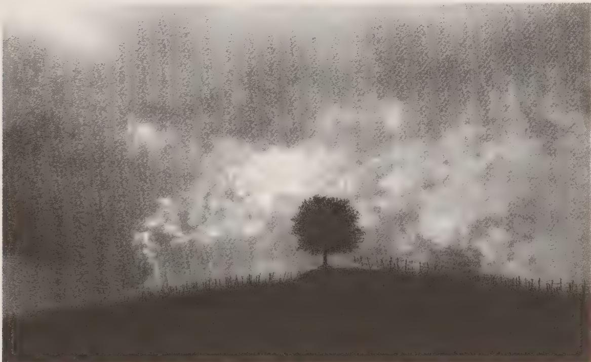

## Có lý tưởng, thì sẽ có đau đớn

**有理想，就有疼痛**

*yǒu lǐ xiǎng，jiù yǒu téng tòng*

一个人的心若是不能沉静下来，是无法去读懂一本好书的。

yí gè rén de xīn ruò shì bù néng chén jìng xià lái，shì wú fǎ qù dú dǒng yī běn hǎo shū de。

Một người nếu tâm không thể trầm tĩnh lại, thì không thể đọc hiểu một cuốn sách hay.

尤其是面对有些枯燥乏味的理论作品，一些淳朴真实的乡土小说。

yóu qí shì miàn duì yǒu xiē kū zào fá wèi de lǐ lùn zuò pǐn，yī xiē chún pǔ zhēn shí de xiāng tǔ xiǎo shuō。

Đặc biệt khi đối mặt với những tác phẩm lý luận khô khan buồn tẻ, những tiểu thuyết đồng quê chân chất chân thật.

如果不静下心来，你便一个字也读不进去；如果静下心来去读，你便会全身心地投入进去。

rú guǒ bù jìng xià xīn lái，nǐ biàn yí gè zì yě dú bù jìn qù；rú guǒ jìng xià xīn lái qù dú，nǐ biàn huì quán shēn xīn dì tóu rù jìn qù。

Nếu không tĩnh tâm, bạn sẽ không đọc lọt nổi một chữ; nếu tĩnh tâm mà đọc, bạn sẽ dồn toàn tâm toàn ý vào đó.

大概是大二那年，我读了贾平凹的《秦腔》，如今我已经不太记得其中的细节，关于疯子张引生、美丽的姑娘白雪、家大势大的夏家，以及贯穿全文的秦腔戏曲等等。

dà gài shì dà èr nà nián，wǒ dú le jiǎ píng āo de《qín qiāng》，rú jīn wǒ yǐ jīng bù tài jì de qí zhōng de xì jié，guān yú fēng zi zhāng yǐn shēng、měi lì de gū niáng bái xuě、jiā dà shì dà de xià jiā，yǐ jí guàn chuān quán wén de qín qiāng xì qǔ děng děng。

Đại khái là năm thứ hai đại học, tôi đã đọc cuốn “Tần Khương” của Giả Bình Ao, giờ đây tôi đã không còn nhớ rõ chi tiết trong đó, về gã điên Trương Dẫn Sinh, cô gái xinh đẹp Bạch Tuyết, dòng họ Hạ gia thế lớn, cùng với tiếng hát Tần Khương xuyên suốt toàn văn v.v.

之所以要提起它，是因为我无法忘记它带给我内心的触动。

zhī suǒ yǐ yào tí qǐ tā，shì yīn wèi wǒ wú fǎ wàng jì tā dài gěi wǒ nèi xīn de chù dòng。

Sở dĩ phải nhắc đến nó, là vì tôi không thể quên những rung động mà nó mang lại cho tâm hồn tôi.

生活中，我们经常会为伤感的爱情故事而流泪，然而，如果有一次，你掉了无关于爱情的眼泪，那么，它或许便是人生的一种成长。

shēng huó zhōng，wǒ men jīng cháng huì wèi shāng gǎn de ài qíng gù shì ér liú lèi，rán ér，rú guǒ yǒu yī cì，nǐ diào liǎo wú guān yú ài qíng de yǎn lèi，nà me，tā huò xǔ biàn shì rén shēng de yī zhǒng chéng zhǎng。

Trong cuộc sống, chúng ta thường rơi lệ vì những câu chuyện tình buồn, thế nhưng, nếu có một lần, bạn rơi nước mắt không liên quan đến tình yêu, thì có lẽ đó chính là một sự trưởng thành của cuộc đời.

书的最后，疯子张引生自残，夏天义被七里沟山体滑坡掩埋，众生悲惨命运淋漓尽显，让人心痛不已。

shū de zuì hòu，fēng zi zhāng yǐn shēng zì cán，xià tiān yì bèi qī lǐ gōu shān tǐ huá pō yǎn mái，zhòng shēng bēi cǎn mìng yùn lín lí jìn xiǎn，ràng rén xīn tòng bù yǐ。

Ở cuối sách, gã điên Trương Dẫn Sinh tự làm hại mình, Hạ Thiên Nghĩa bị vùi lấp trong vụ sạt lở núi Thất Lý Câu, số phận bi thảm của chúng sinh hiện ra vô cùng, khiến người ta đau lòng không thôi.

尽管我没能记住里面所有的故事情节，但后来不管我走到哪里，都会向别人介绍这本书，希望他们会看。

jǐn guǎn wǒ méi néng jì zhù lǐ miàn suǒ yǒu de gù shì qíng jié，dàn hòu lái bù guǎn wǒ zǒu dào nǎ lǐ，dū huì xiàng bié rén jiè shào zhè běn shū，xī wàng tā men huì kàn。

Mặc dù tôi không thể nhớ hết mọi tình tiết câu chuyện trong đó, nhưng sau này dù tôi đi đến đâu, tôi cũng sẽ giới thiệu cuốn sách này với người khác, hy vọng họ sẽ đọc.

作为这本书的作者，我想他已经成功了。

zuò wéi zhè běn shū de zuò zhě，wǒ xiǎng tā yǐ jīng chéng gōng le。

Là tác giả của cuốn sách này, tôi nghĩ ông ấy đã thành công.

贾平凹在写这本书时说：“如果你慢慢去读，能理解我的迷茫和辛酸。

jiǎ píng āo zài xiě zhè běn shū shí shuō ：“rú guǒ nǐ màn màn qù dú，néng lǐ jiě wǒ de mí máng hé xīn suān。

Khi viết cuốn sách này, Giả Bình Ao từng nói: “Nếu em đọc thật chậm rãi, em sẽ hiểu được nỗi mê mang và chua xót của tôi.”

”在我读完之后，深深地理解了其中的辛酸。

”zài wǒ dú wán zhī hòu，shēn shēn dì lǐ jiě le qí zhōng de xīn suān。

Sau khi tôi đọc xong, tôi đã hiểu thấu nỗi chua xót trong đó.

也许一本好的、影响你心灵的书，大概是这样的：在你读的时候，你感到千斤压顶，读完之后你如释重负。

yě xǔ yī běn hǎo de、yǐng xiǎng nǐ xīn líng de shū，dà gài shì zhè yàng de：zài nǐ dú de shí hòu，nǐ gǎn dào qiān jīn yā dǐng，dú wán zhī hòu nǐ rú shì zhòng fù。

Có lẽ một cuốn sách hay, một cuốn sách lay động tâm hồn bạn, đại khái là thế này: khi bạn đọc, bạn cảm thấy như ngàn cân đè nặng, đọc xong bạn như trút được gánh nặng.

但心灵在虚空的同时，还会有一种沉重感。

dàn xīn líng zài xū kōng de tóng shí，hái huì yǒu yī zhǒng chén zhòng gǎn。

Nhưng tâm hồn trong lúc trống rỗng, còn mang một cảm giác nặng nề.

它让你不自主地去联系并思考到自身，自己的人生与学识，自己的生活与未来。

tā ràng nǐ bù zì zhǔ dì qù lián xì bìng sī kǎo dào zì shēn，zì jǐ de rén shēng yǔ xué shí，zì jǐ de shēng huó yǔ wèi lái。

Nó khiến bạn không tự chủ được mà liên tưởng và suy nghĩ về bản thân, về cuộc đời và học thức của mình, về cuộc sống và tương lai của mình.

使你眼下的生活，起了些波澜，让你多少有些躁动的力量，想要加速往前。

shǐ nǐ yǎn xià de shēng huó，qǐ le xiē bō lán，ràng nǐ duō shǎo yǒu xiē zào dòng de lì liàng，xiǎng yào jiā sù wǎng qián。

Khiến cuộc sống trước mắt của bạn gợn lên vài con sóng, cho bạn chút sức lực bồi hồi, muốn thúc mình tiến về phía trước.

而《秦腔》在我浑噩不知的大学生涯里，无疑是一本影响我心灵的书籍。

ér《qín qiāng》zài wǒ hún è bù zhī de dà xué shēng yá lǐ，wú yí shì yī běn yǐng xiǎng wǒ xīn líng de shū jí。

Còn cuốn “Tần Khương” trong quãng thời gian đại học mờ mịt mông lung của tôi, không nghi ngờ gì là một cuốn sách ảnh hưởng đến tâm hồn tôi.

一位长者曾说过：“看对自己有用的书，胜过看些许无感的书。

yī wèi zhǎng zhě céng shuō guò ：“kàn duì zì jǐ yǒu yòng de shū，shèng guò kàn xiē xǔ wú gǎn de shū。

Một bậc trưởng bối từng nói: “Xem sách có ích cho mình, còn hơn xem những cuốn sách nhạt nhẽo vô cảm.”

”当我们读得深了，读得静了，自然会体会到读书的幸福。

”dāng wǒ men dú dé shēn le，dú dé jìng le，zì rán huì tǐ huì dào dú shū de xìng fú。

Khi chúng ta đọc sâu hơn, đọc tĩnh hơn, tự nhiên sẽ cảm nhận được hạnh phúc của việc đọc sách.

所以，在我们压抑苦楚的日子里，匆忙疲惫的生活中，抽些时间去读书吧。

suǒ yǐ，zài wǒ men yā yì kǔ chǔ de rì zi lǐ，cōng máng pí bèi de shēng huó zhōng，chōu xiē shí jiān qù dú shū ba。

Vì thế, trong những ngày tháng u uất khổ sở, trong cuộc sống vội vàng mệt mỏi, hãy tranh thủ chút thời gian để đọc sách.

读书能够让你的心灵摇曳，读书能让你静下心来思考生活与人生。

dú shū néng gòu ràng nǐ de xīn líng yáo yè，dú shū néng ràng nǐ jìng xià xīn lái sī kǎo shēng huó yǔ rén shēng。

Đọc sách có thể khiến tâm hồn bạn rung động, đọc sách có thể khiến bạn tĩnh tâm suy nghĩ về cuộc sống và nhân sinh.

让自己尝试着流一次无关伤感爱情故事的眼泪，在以后别人问你喜欢看什么书的时候，能够脱口而出，不失颜面。

ràng zì jǐ cháng shì zhe liú yī cì wú guān shāng gǎn ài qíng gù shì de yǎn lèi，zài yǐ hòu bié rén wèn nǐ xǐ huān kàn shén me shū de shí hòu，néng gòu tuō kǒu ér chū，bù shī yán miàn。

Hãy để bản thân thử rơi một lần nước mắt không liên quan đến những câu chuyện tình buồn, để sau này khi người khác hỏi bạn thích đọc sách gì, bạn có thể nói ra ngay mà không mất mặt.

追究生活的本身，我们总是要多去增加一些知识，多去感受些发自心底深处的感动，才能真正寻找到积极向上的心态，走上积极奋进的人生。

zhuī jiū shēng huó de běn shēn，wǒ men zǒng shì yào duō qù zēng jiā yī xiē zhī shí，duō qù gǎn shòu xiē fā zì xīn dǐ shēn chù de gǎn dòng，cái néng zhēn zhèng xún zhǎo dào jī jí xiàng shàng de xīn tài，zǒu shàng jī jí fèn jìn de rén shēng。

Truy tìm bản chất của cuộc sống, chúng ta luôn cần tăng thêm chút kiến thức, cảm nhận thêm chút rung động xuất phát từ tận đáy lòng, mới có thể thật sự tìm được tâm thế tích cực hướng thượng, bước lên cuộc đời tích cực phấn đấu.

如果你读过《北方的河》，如果你像我一样体会到其中的意味，你一定会被感动、被震撼。

rú guǒ nǐ dú guò《běi fāng de hé》，rú guǒ nǐ xiàng wǒ yī yàng tǐ huì dào qí zhōng de yì wèi，nǐ yí dìng huì bèi gǎn dòng、bèi zhèn hàn。

Nếu bạn đã đọc “Những dòng sông phương Bắc”, nếu bạn giống như tôi cảm nhận được ý vị trong đó, bạn nhất định sẽ bị cảm động, bị chấn động.

它所表达的，是那样宏阔，那样热切，那般滚烫。

tā suǒ biǎo dá de，shì nà yàng hóng kuò，nà yàng rè qiè，nà bān gǔn tàng。

Điều nó biểu đạt, thật mênh mông, thật nồng nhiệt, thật bỏng rát.

让人感受到生命的倔强、顽强，也让人感受到生命的真实与根本。

ràng rén gǎn shòu dào shēng mìng de jué jiàng、wán qiáng，yě ràng rén gǎn shòu dào shēng mìng de zhēn shí yǔ gēn běn。

Khiến người ta cảm nhận được sự bướng bỉnh, sự kiên cường của sinh mệnh, cũng khiến người ta cảm nhận được sự chân thật và gốc rễ của sinh mệnh.

读这本书的时候，我正在一家杂志社实习，那个时候，初进社会的我对于自身的追求以及未来的道路都十分迷惘。

dú zhè běn shū de shí hòu，wǒ zhèng zài yī jiā zá zhì shè shí xí，nà ge shí hòu，chū jìn shè huì de wǒ duì yú zì shēn de zhuī qiú yǐ jí wèi lái de dào lù dōu shí fēn mí wǎng。

Khi đọc cuốn sách này, tôi đang thực tập tại một tòa soạn tạp chí, lúc đó, mới bước chân vào xã hội, tôi vô cùng mê mang về những theo đuổi của bản thân cũng như con đường tương lai.

那时我也非常莽撞而有斗志，同书中的人儿一样，不怕跌撞，不惧坎坷，有着上刀山下火海的冲劲。

nà shí wǒ yě fēi cháng mǎng zhuàng ér yǒu dòu zhì，tóng shū zhōng de rén ér yī yàng，bù pà diē zhuàng，bù jù kǎn kě，yǒu zhe shàng dāo shān xià huǒ hǎi de chòng jìn。

Lúc ấy tôi cũng rất liều lĩnh và đầy chí khí, giống như những con người trong sách, không sợ vấp ngã, không ngại gian nan, có khí thế lên đao sơn xuống biển lửa.

那些振奋人心的东西，现在想起来，依然会热泪盈眶。

nà xiē zhèn fèn rén xīn de dōng xī，xiàn zài xiǎng qǐ lái，yī rán huì rè lèi yíng kuàng。

Những điều khiến người ta phấn chấn ấy, giờ nghĩ lại, vẫn khiến tôi rưng rưng nước mắt.

每当自己独处的时候，心会经常因此而疼痛，双眼迷蒙。

měi dāng zì jǐ dú chǔ de shí hòu，xīn huì jīng cháng yīn cǐ ér téng tòng，shuāng yǎn mí méng。

Mỗi khi ở một mình, trái tim tôi thường đau nhói vì điều đó, hai mắt mờ mịt.

那藏在心底一直作祟的东西，一股脑儿地冒出来，热烈，急切。

nà cáng zài xīn dǐ yì zhí zuò suì de dōng xī，yī gǔ nǎo ér dì mào chū lái，rè liè，jí qiè。

Thứ cứ quấy phá mãi trong đáy lòng ấy, ùa hết ra ngoài, nồng nhiệt, khẩn thiết.

胸口像是被千斤大石压着，只想不顾一切地放声大哭。

xiōng kǒu xiàng shì bèi qiān jīn dà shí yā zhe，zhǐ xiǎng bù gù yī qiè dì fàng shēng dà kū。

Ngực như bị tảng đá ngàn cân đè lên, chỉ muốn bất chấp tất cả mà khóc to.

因为内心拥有这种蛊，也许只是因为一本书，你就会感到前所未有的孤独，那种孤独，是那么苦，那么涩。

yīn wèi nèi xīn yōng yǒu zhè zhǒng gǔ，yě xǔ zhǐ shì yīn wèi yī běn shū，nǐ jiù huì gǎn dào qián suǒ wèi yǒu de gū dú，nà zhǒng gū dú，shì nà me kǔ，nà me sè。

Bởi vì trong lòng có loại bùa mê này, có lẽ chỉ vì một cuốn sách, bạn sẽ cảm thấy cô đơn chưa từng có, nỗi cô đơn ấy, thật đắng, thật chát.

会让你想把天、地、鬼、神都召唤出来，都从自己的体内拔出来，来陪同你一起尝尝这煎熬的滋味。

huì ràng nǐ xiǎng bǎ tiān、dì、guǐ、shén dōu zhào huàn chū lái，dōu cóng zì jǐ de tǐ nèi bá chū lái，lái péi tóng nǐ yì qǐ cháng cháng zhè jiān áo de zī wèi。

Khiến bạn muốn gọi trời, đất, quỷ, thần tất cả hiện ra, đều kéo ra khỏi thân thể mình, để cùng bạn nếm thử vị giày vò này.

甚至会让你哭天抢地，号啕，嘶喊。

shèn zhì huì ràng nǐ kū tiān qiāng dì，háo táo，sī hǎn。

Thậm chí khiến bạn khóc than trời đất, gào thét, hét lên.

会让你发觉，想要走自 己的路，竟是这样难。

huì ràng nǐ fā jué，xiǎng yào zǒu zì jǐ de lù，jìng shì zhè yàng nán。

Khiến bạn nhận ra, muốn đi con đường của riêng mình, hóa ra lại khó đến thế.

想要坚持自己的追求，竟是如此孤独。

xiǎng yào jiān chí zì jǐ de zhuī qiú，jìng shì rú cǐ gū dú。

Muốn kiên trì với sự theo đuổi của mình, hóa ra lại cô đơn đến vậy.

但也会告诉你，不要再害怕，不要因为害怕而不去碰触。

dàn yě huì gào sù nǐ，bú yào zài hài pà，bú yào yīn wèi hài pà ér bù qù pèng chù。

Nhưng nó cũng sẽ nói với bạn, đừng sợ hãi nữa, đừng vì sợ hãi mà không dám chạm đến.

因为这一切都是一个好的开始。

yīn wèi zhè yī qiè dōu shì yí gè hǎo de kāi shǐ。

Bởi vì tất cả những điều này đều là một khởi đầu tốt đẹp.

书真的是一个神奇的东西，所以很多伟人都说，如果你坚持每天读书，相信很多年以后，你会跟其他人有天壤之别。

shū zhēn de shì yí gè shén qí de dōng xī，suǒ yǐ hěn duō wěi rén dōu shuō，rú guǒ nǐ jiān chí měi tiān dú shū，xiāng xìn hěn duō nián yǐ hòu，nǐ huì gēn qí tā rén yǒu tiān rǎng zhī bié。

Sách quả thật là một thứ kỳ diệu, vì thế nhiều vĩ nhân đều nói, nếu bạn kiên trì đọc sách mỗi ngày, tin rằng nhiều năm sau, bạn sẽ khác biệt một trời một vực so với những người khác.

我相信这句话不是戏言。

wǒ xiāng xìn zhè jù huà bú shì xì yán。

Tôi tin câu nói này không phải lời đùa.

或许读书就像是每天习惯了抽烟一样，烟最终会把肺染黑，而读书则会把你的灵魂点燃。

huò xǔ dú shū jiù xiàng shì měi tiān xí guàn le chōu yān yī yàng，yān zuì zhōng huì bǎ fèi rǎn hēi，ér dú shū zé huì bǎ nǐ de líng hún diǎn rán。

Có lẽ đọc sách giống như hút thuốc mỗi ngày thành thói quen, thuốc cuối cùng sẽ nhuộm đen lá phổi, còn đọc sách sẽ thắp sáng linh hồn của bạn.

只愿我们都能用一颗坚定的心去感受生活的伟大、慈爱与尊严，一如《北方的河》中那个年轻奋斗的人，坚韧不拔地向生活挑战，向新的人生目标冲刺。

zhǐ yuàn wǒ men dōu néng yòng yī kē jiān dìng de xīn qù gǎn shòu shēng huó de wěi dà、cí ài yǔ zūn yán，yī rú《běi fāng de hé》zhōng nà ge nián qīng fèn dòu de rén，jiān rèn bù bá dì xiàng shēng huó tiǎo zhàn，xiàng xīn de rén shēng mù biāo chōng cì。

Chỉ mong chúng ta đều có thể dùng một trái tim kiên định để cảm nhận sự vĩ đại, từ ái và nhân phẩm của cuộc sống, như người thanh niên phấn đấu trong “Những dòng sông phương Bắc”, kiên cường bất khuất thách thức cuộc sống, bứt phá về phía mục tiêu mới của cuộc đời.

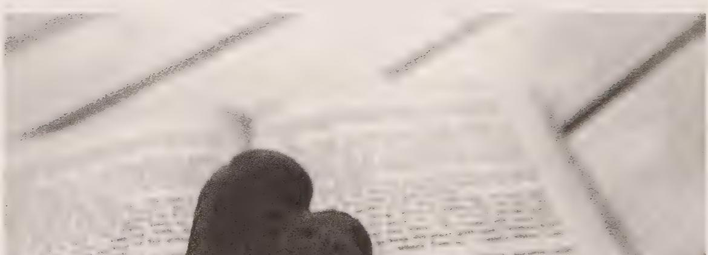

Senr a" She walked stowy

Senr a" She walked stowy

Senr a" She walked stowy

ed match in front of his lips. edges of its paris

ed match in front of his lips. edges of its paris

ed match in front of his lips. edges of its paris

herself away from him. the somethin ctraight,

herself away from him. the somethin ctraight,

herself away from him. the somethin ctraight,

tractor. tracing along nuartied dowa in

tractor. tracing along nuartied dowa in

tractor. tracing along nuartied dowa in

arlet nail. "You better get ur, sde? Out

arlet nail. "You better get ur, sde? Out

arlet nail. "You better get ur, sde? Out

our brother and me shasz

our brother and me shasz

our brother and me shasz

:the zod ed oe à 046 7 Ake5060gs ghe Splss:

:the zod ed oe à 046 7 Ake5060gs ghe Splss:

:the zod ed oe à 046 7 Ake5060gs ghe Splss:

8 947 4 ：99 ghuDes

8 947 4 ：99 ghuDes

8 947 4 ：99 ghuDes

into the shastowt ot ter toas f se ys " Hes mmd a re sked me il I loved Tom. "he said caimly. "Wasn't no need te go pais & whoke goklar spesch about it." swa jud askia." She ssee e lsde shat te tua, her expreion sharpening feo eys sinadig lamihy wnth sdien con-Sbose sosè see dond se bkas yos. Thad's dos1 kacs whos a à.N 1.4 4664

into the shastowt ot ter toas f se ys " Hes mmd a re sked me il I loved Tom. "he said caimly. "Wasn't no need te go pais & whoke goklar spesch about it." swa jud askia." She ssee e lsde shat te tua, her expreion sharpening feo eys sinadig lamihy wnth sdien con-Sbose sosè see dond se bkas yos. Thad's dos1 kacs whos a à.N 1.4 4664

into the shastowt ot ter toas f se ys " Hes mmd a re sked me il I loved Tom. "he said caimly. "Wasn't no need te go pais & whoke goklar spesch about it." swa jud askia." She ssee e lsde shat te tua, her expreion sharpening feo eys sinadig lamihy wnth sdien con-Sbose sosè see dond se bkas yos. Thad's dos1 kacs whos a à.N 1.4 4664

# Đừng sợ hãi khi trắng tay, điều nên sợ hãi là chúng ta chẳng còn gì để cầu

**不要害怕一无所有，应该害怕的是别无所求**

*bú yào hài pà yī wú suǒ yǒu，yīng gāi hài pà de shì bié wú suǒ qiú*

我们不要因为一无所有、一无所知，而不敢去触碰世界。

wǒ men bú yào yīn wèi yī wú suǒ yǒu、yī wú suǒ zhī，ér bù gǎn qù chù pèng shì jiè。

Chúng ta đừng vì trắng tay, vì chẳng biết gì, mà không dám chạm đến thế giới.

记忆里，好像是在读过一本《中国当代文学史》之后，我才开始看各种学术、理论著作。

jì yì lǐ，hǎo xiàng shì zài dú guò yī běn《zhōng guó dāng dài wén xué shǐ》zhī hòu，wǒ cái kāi shǐ kàn gè zhǒng xué shù、lǐ lùn zhù zuò。

Trong ký ức, hình như là sau khi đọc một cuốn “Lịch sử văn học Trung Quốc đương đại”, tôi mới bắt đầu đọc các loại tác phẩm học thuật, lý luận.

那个时候不仅看学术作品，还去阅读自己不太了解的国学作品。

nà ge shí hòu bù jǐn kàn xué shù zuò pǐn，hái qù yuè dú zì jǐ bù tài liǎo jiě de guó xué zuò pǐn。

Lúc ấy không chỉ đọc tác phẩm học thuật, còn đi đọc những tác phẩm quốc học mà bản thân chưa hiểu rõ.

《四书》《五经》在我手里已经近两年，也不过只看了《四书》，《五经》到目前碰都没碰。

《sì shū》《wǔ jīng》zài wǒ shǒu lǐ yǐ jīng jìn liǎng nián，yě bù guò zhǐ kàn le《sì shū》，《wǔ jīng》dào mù qián pèng dōu méi pèng。

“Tứ Thư” “Ngũ Kinh” ở trong tay tôi đã gần hai năm, thế mà cũng chỉ mới đọc “Tứ Thư”, còn “Ngũ Kinh” đến nay chưa hề đụng đến.

有时候没有读完的书，就像没有吃饱的饭，像没有吃尽兴好东西，总让你惦记。

yǒu shí hòu méi yǒu dú wán de shū，jiù xiàng méi yǒu chī bǎo de fàn，xiàng méi yǒu chī jìn xìng hǎo dōng xī，zǒng ràng nǐ diàn jì。

Có khi cuốn sách chưa đọc xong, giống như bữa cơm chưa ăn no, như món ngon chưa được ăn thỏa thích, luôn khiến bạn vương vấn.

不管我后来看了什么书，只要一想起这本书，就特别地难受，顺不了胸膛里的那口气儿。

bù guǎn wǒ hòu lái kàn le shén me shū，zhǐ yào yī xiǎng qǐ zhè běn shū，jiù tè bié dì nán shòu，shùn bù liǎo xiōng táng lǐ de nà kǒu qì ér。

Dù sau này tôi có xem cuốn sách nào, chỉ cần nghĩ đến cuốn sách này, liền thấy đặc biệt khó chịu, cái khí trong lòng không tài nào nuốt trôi.

虽然我对国学一窍不通，甚至不知道什么是国学。

suī rán wǒ duì guó xué yī qiào bù tōng，shèn zhì bù zhī dào shén me shì guó xué。

Mặc dù tôi chẳng biết gì về quốc học, thậm chí không biết quốc học là gì.

但是我既然把书拿到手中，硬着头皮我也要看完它。

dàn shì wǒ jì rán bǎ shū ná dào shǒu zhōng，yìng zhe tóu pí wǒ yě yào kàn wán tā。

Nhưng tôi đã cầm cuốn sách trong tay, thì dù cắn răng chịu đựng tôi cũng phải đọc cho xong.

我不想再吃不饱、吃不高兴，留一股气儿堵得我难受。

wǒ bù xiǎng zài chī bù bǎo、chī bù gāo xìng，liú yī gǔ qì ér dǔ dé wǒ nán shòu。

Tôi không muốn lại ăn không no, ăn không vui, để lại một cục tức nghẹn trong lòng khó chịu.

每当他人说到一些我不知道的东西时，我都心惊胆寒。

měi dāng tā rén shuō dào yī xiē wǒ bù zhī dào de dōng xī shí，wǒ dōu xīn jīng dǎn hán。

Mỗi khi người khác nhắc đến những điều tôi không biết, tôi đều thấy kinh hồn khiếp đảm.

我总是怕自己犯错，所以每每他人谈论时，我都默不发言，在一旁仔细听讲。

wǒ zǒng shì pà zì jǐ fàn cuò，suǒ yǐ měi měi tā rén tán lùn shí，wǒ dōu mò bù fā yán，zài yī páng zǐ xì tīng jiǎng。

Tôi luôn sợ bản thân mắc sai lầm, nên mỗi khi người khác bàn luận, tôi đều im lặng không lên tiếng, đứng bên cạnh chăm chú lắng nghe.

然后将自己不懂不知不明白的全部记下来，回去把它弄个明白。

rán hòu jiāng zì jǐ bù dǒng bù zhī bù míng bái de quán bù jì xià lái，huí qù bǎ tā nòng gè míng bái。

Rồi ghi lại hết những điều mình không hiểu, không biết, không rõ, về nhà tìm hiểu cho ra lẽ.

或许我这样的举措，完全暴露了我的虚荣要强的本性。

huò xǔ wǒ zhè yàng de jǔ cuò，wán quán bào lù le wǒ de xū róng yào qiáng de běn xìng。

Có lẽ hành động như thế của tôi, hoàn toàn phơi bày bản tính háo danh hiếu thắng của tôi.

另外，还有心存芥蒂，总是相信自己会接受别人任何窘迫的举动而无法相信别人也是如此。

lìng wài，hái yǒu xīn cún jiè dì，zǒng shì xiāng xìn zì jǐ huì jiē shòu bié rén rèn hé jiǒng pò de jǔ dòng ér wú fǎ xiàng xìn bié rén yě shì rú cǐ。

Ngoài ra, còn có sự nghi kỵ vương vấn trong lòng, luôn tin rằng bản thân sẽ chấp nhận mọi hành động ngượng ngùng của người khác mà lại không thể tin người khác cũng như vậy.

如果你不像我这样虚荣和软弱，不妨与他人大胆交谈，反而能知道得更快，明白得更多。

rú guǒ nǐ bù xiàng wǒ zhè yàng xū róng hé ruǎn ruò，bù fáng yǔ tā rén dà dǎn jiāo tán，fǎn ér néng zhī dào dé gèng kuài，míng bái dé gèng duō。

Nếu bạn không háo danh và yếu đuối như tôi, không ngại mạnh dạn trò chuyện với người khác, ngược lại có thể biết nhanh hơn, hiểu nhiều hơn.

我偷偷去理解和认识那些我不知道的东西，而且越发觉得自己欠缺。

wǒ tōu tōu qù lǐ jiě hé rèn shí nà xiē wǒ bù zhī dào de dōng xī，ér qiě yuè fā jué dé zì jǐ qiàn quē。

Tôi lén lút đi tìm hiểu và nhận biết những điều tôi không biết, và càng ngày càng thấy bản thân thiếu sót.

起码在此之后，我觉得我是充实的。

qǐ mǎ zài cǐ zhī hòu，wǒ jué de wǒ shì chōng shí de。

Ít nhất sau đó, tôi cảm thấy bản thân được lấp đầy.

我在其中吸收养分，只要起作用，起到触动和改变，对我来说都是好的。

wǒ zài qí zhōng xī shōu yǎng fèn，zhǐ yào qǐ zuò yòng，qǐ dào chù dòng hé gǎi biàn，duì wǒ lái shuō dōu shì hǎo de。

Tôi hấp thụ dưỡng chất từ trong đó, chỉ cần có tác dụng, gây ra được rung động và thay đổi, đối với tôi đều là tốt.

我选择去挖掘，而不是逃避，一叶障目。

wǒ xuǎn zé qù wā jué，ér bú shì táo bì，yī yè zhàng mù。

Tôi chọn cách đào sâu tìm hiểu, chứ không phải trốn tránh, che mắt một lá.

尽管，后来我变得更加自卑。

jǐn guǎn，hòu lái wǒ biàn dé gèng jiā zì bēi。

Mặc dù vậy, sau này tôi càng trở nên tự ti hơn.

发现了自己的渺小和卑微，恐慌至极。

fā xiàn le zì jǐ de miǎo xiǎo hé bēi wēi，kǒng huāng zhì jí。

Phát hiện ra sự nhỏ bé và hèn mọn của bản thân, hoảng sợ tột cùng.

只是因为恐慌，我就更不敢停下来。

zhǐ shì yīn wèi kǒng huāng，wǒ jiù gèng bù gǎn tíng xià lái。

Chỉ vì hoảng sợ, tôi càng không dám dừng lại.

我在想，世间那么多的东西在等着我去领悟，那么多人在拼命学习，上进，如果自己再停滞不前，恐怕在广阔天空下，自己连一席之地也没有了。

wǒ zài xiǎng，shì jiān nà me duō de dōng xī zài děng zhe wǒ qù lǐng wù，nà me duō rén zài pīn mìng xué xí，shàng jìn，rú guǒ zì jǐ zài tíng zhì bù qián，kǒng pà zài guǎng kuò tiān kōng xià，zì jǐ lián yī xí zhī dì yě méi yǒu le。

Tôi nghĩ, trên đời nhiều thứ như vậy đang chờ tôi lĩnh hội, nhiều người như vậy đang liều mạng học tập, vươn lên, nếu bản thân cứ đứng yên không tiến tới, e rằng dưới bầu trời rộng lớn, tôi sẽ chẳng có nổi chỗ đứng một mình.

我倒并不害怕自己走得太慢，太辛苦，因为我一直记得那句话：无论你犯了多少错，或者你进步得有多慢，你都走在了那些不曾尝试的人的前面。

wǒ dào bìng bù hài pà zì jǐ zǒu dé tài màn，tài xīn kǔ，yīn wèi wǒ yì zhí jì de nà jù huà：wú lùn nǐ fàn le duō shǎo cuò，huò zhě nǐ jìn bù dé yǒu duō màn，nǐ dōu zǒu zài le nà xiē bù céng cháng shì de rén de qián miàn。

Tôi lại không sợ bản thân đi quá chậm, quá vất vả, bởi vì tôi luôn nhớ câu nói ấy: dù bạn phạm bao nhiêu sai lầm, hay bạn tiến bộ chậm đến đâu, bạn vẫn luôn đi trước những người chưa từng thử sức.

所以，不要害怕一无所有，应该害怕的是我们别无所求。

suǒ yǐ，bú yào hài pà yī wú suǒ yǒu，yīng gāi hài pà de shì wǒ men bié wú suǒ qiú。

Vì thế, đừng sợ hãi khi trắng tay, điều nên sợ hãi là chúng ta chẳng còn gì để cầu.

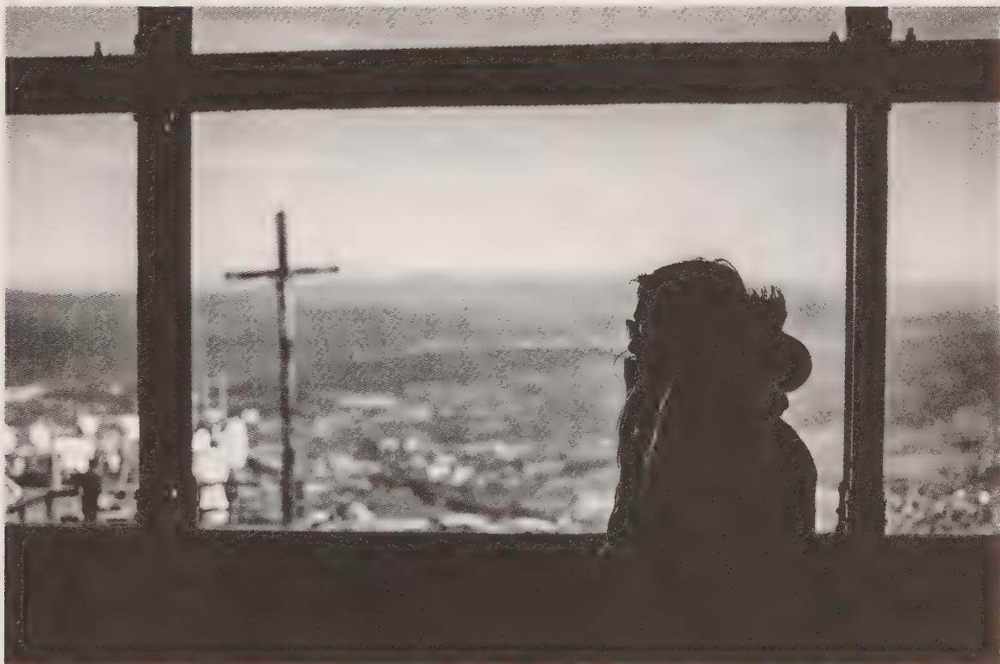

PART 3

PART 3

PHẦN 3

# Cảm ơn những người, đã từng sưởi ấm cuộc đời chúng ta

**谢谢那些人，曾经温暖过我们的人生**

*xiè xiè nà xiē rén，céng jīng wēn nuǎn guò wǒ men de rén shēng*

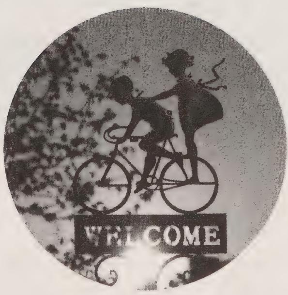

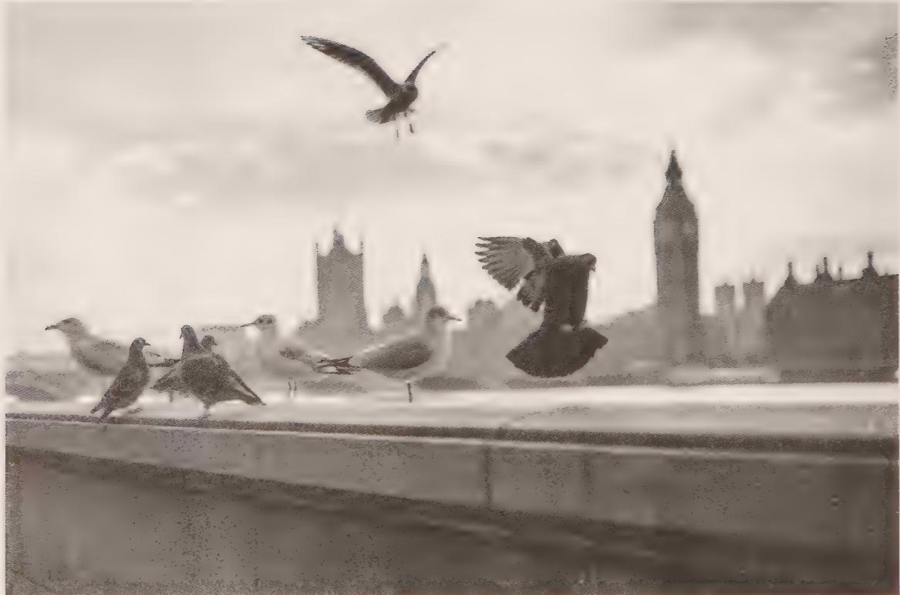

## Người trao cho bạn sự ấm áp và tin cậy

**给你以温暖信任的人**

*gěi nǐ yǐ wēn nuǎn xìn rèn de rén*

2013年即将结束的时候，我跟Y重逢在京。

2013 nián jí jiāng jié shù de shí hòu，wǒ gēn Y chóng féng zài jīng。

Khi năm 2013 sắp kết thúc, tôi và Y gặp lại nhau ở Bắc Kinh.

我们已经认识整整七年。

wǒ men yǐ jīng rèn shí zhěng zhěng qī nián。

Chúng tôi đã quen biết nhau tròn bảy năm.

在高中三年的生涯里，我们朝夕相伴，无话不谈。

zài gāo zhōng sān nián de shēng yá lǐ，wǒ men zhāo xī xiāng bàn，wú huà bù tán。

Trong ba năm trung học, chúng tôi ngày đêm bên nhau, không chuyện gì không nói.

后来，由于上大学，我们一个天南，一个地北。

hòu lái，yóu yú shàng dà xué，wǒ men yí gè tiān nán，yí gè dì běi。

Sau này, vì lên đại học, chúng tôi mỗi người một phương trời, một nơi tận trời nam, một nơi tận đất bắc.

四年间，我们生活在不同的城市，过着不同的生活，很少见面也少有来往。

sì nián jiān，wǒ men shēng huó zài bù tóng de chéng shì，guò zhe bù tóng de shēng huó，hěn shǎo jiàn miàn yě shǎo yǒu lái wǎng。

Bốn năm đó, chúng tôi sống ở những thành phố khác nhau, sống cuộc sống khác nhau, rất ít gặp mặt cũng rất ít qua lại.

有些事情就是这样，曾经你们朝夕相处，吃饭上课在一起，甚至放寒暑假也要去找对方。

yǒu xiē shì qíng jiù shì zhè yàng，céng jīng nǐ men zhāo xī xiāng chǔ，chī fàn shàng kè zài yì qǐ，shèn zhì fàng hán shǔ jià yě yào qù zhǎo duì fāng。

Có những chuyện là như vậy, từng ngày đêm bên nhau, ăn cơm lên lớp đều ở cùng nhau, thậm chí nghỉ hè nghỉ đông cũng phải đi tìm đối phương.

一旦分离，却渐渐地都不再联系了。

yí dàn fēn lí，què jiàn jiàn dì dōu bù zài lián xì le。

Một khi xa cách, lại dần dần không còn liên lạc với nhau nữa.

但是这次与Y在北京相见，我反而更加坚定，他是我此生最值得信任的异性朋友。

dàn shì zhè cì yǔ Y zài běi jīng xiāng jiàn，wǒ fǎn ér gèng jiā jiān dìng，tā shì wǒ cǐ shēng zuì zhí de xìn rèn de yì xìng péng yǒu。

Nhưng lần này gặp Y ở Bắc Kinh, tôi ngược lại càng kiên định rằng, anh ấy là người bạn khác giới đáng tin cậy nhất trong cuộc đời tôi.

高中时期，男孩子处在青春叛逆期，而女孩子对这个世界做着很多美梦。

gāo zhōng shí qī，nán hái zi chù zài qīng chūn pàn nì qī，ér nǚ hái zi duì zhè ge shì jiè zuò zhe hěn duō měi mèng。

Thời trung học, con trai đang ở giai đoạn nổi loạn tuổi trẻ, còn con gái thì mơ về thế giới này bao giấc mộng đẹp.

我也会幻想自己是韩剧的女主角，某一天上演灰姑娘与白马王子的故事。

wǒ yě huì huàn xiǎng zì jǐ shì hán jù de nǚ zhǔ jué，mǒu yī tiān shàng yǎn huī gū niáng yǔ bái mǎ wáng zǐ de gù shì。

Tôi cũng từng mơ tưởng mình là nữ chính trong phim truyền hình Hàn Quốc, có một ngày diễn ra câu chuyện Cô bé Lọ Lem và Hoàng tử Bạch Mã.

也常想象自己像小说中的主人公一样不顾一切地出走，在某个陌生的地方，机缘巧合走上明媚的人生路。

yě cháng xiǎng xiàng zì jǐ xiàng xiǎo shuō zhōng de zhǔ rén gōng yī yàng bù gù yī qiè dì chū zǒu，zài mǒu gè mò shēng de dì fāng，jī yuán qiǎo hé zǒu shàng míng mèi de rén shēng lù。

Cũng thường tưởng tượng mình giống như nhân vật chính trong tiểu thuyết, bất chấp tất cả bỏ đi, ở một nơi xa lạ nào đó, nhờ duyên phận gặp gỡ mà bước lên con đường đời tươi sáng.

那个时候，我们爱把悲伤最大化，最好能让人一眼就看出你忧郁的眼神，你与别人不一样的特质。

nà ge shí hòu，wǒ men ài bǎ bēi shāng zuì dà huà，zuì hǎo néng ràng rén yī yǎn jiù kàn chū nǐ yōu yù de yǎn shén，nǐ yǔ bié rén bù yí yàng de tè zhì。

Lúc đó, chúng tôi thích phóng đại nỗi buồn của mình lên tối đa, tốt nhất là để người ta liếc một cái là nhìn ra ánh mắt u sầu của bạn, nhìn ra nét đặc biệt khác người của bạn.

虽然，我不知道那时我的眼神是否忧郁，我是否真的给别人展现出忧郁而又独特的形象。

suī rán，wǒ bù zhī dào nà shí wǒ de yǎn shén shì fǒu yōu yù，wǒ shì fǒu zhēn de gěi bié rén zhǎn xiàn chū yōu yù ér yòu dú tè de xíng xiàng。

Mặc dù, tôi không biết lúc ấy ánh mắt tôi có u sầu hay không, tôi có thật sự cho người khác thấy một hình ảnh u sầu mà lại độc đáo hay không.

但现在想起那真是一段幼稚而又天真快乐的时光。

dàn xiàn zài xiǎng qǐ nà zhēn shì yī duàn yòu zhì ér yòu tiān zhēn kuài lè de shí guāng。

Nhưng giờ nghĩ lại, đó thật sự là một quãng thời gian ngây ngô lại ngây thơ vui vẻ.

那个时候，我跟Y几乎走遍我们那个小镇。

nà ge shí hòu，wǒ gēn Y jī hū zǒu biàn wǒ men nà ge xiǎo zhèn。

Lúc đó, tôi và Y gần như đã đi khắp thị trấn nhỏ của chúng tôi.

我们经常从学校溜走，去河边或者马路上谈心。

wǒ men jīng cháng cóng xué xiào liū zǒu，qù hé biān huò zhě mǎ lù shàng tán xīn。

Chúng tôi thường lẻn khỏi trường, ra bờ sông hay ngoài đường để tâm sự.

谈论家庭、理想、生活，以及过去、现在与未来。

tán lùn jiā tíng、lǐ xiǎng、shēng huó，yǐ jí guò qù、xiàn zài yǔ wèi lái。

Nói về gia đình, lý tưởng, cuộc sống, cùng với quá khứ, hiện tại và tương lai.

记得高中老师曾说，高中认识的朋友，是最为珍贵的，是一辈子的，这值得让人去相信。

jì de gāo zhōng lǎo shī céng shuō，gāo zhōng rèn shí de péng yǒu，shì zuì wèi zhēn guì de，shì yī bèi zi de，zhè zhí de ràng rén qù xiāng xìn。

Nhớ thầy giáo thời trung học từng nói, bạn bè quen biết thời trung học là quý giá nhất, là bạn bè cả đời, điều này đáng để người ta tin.

记得那时，不管Y走到哪儿，认识了谁，他都要跟朋友们提起我。

jì de nà shí，bù guǎn Y zǒu dào nǎ ér，rèn shí le shuí，tā dōu yào gēn péng yǒu men tí qǐ wǒ。

Nhớ lúc ấy, dù Y đi đến đâu, quen biết với ai, anh ấy cũng đều nhắc đến tôi với bạn bè.

他说我是一个会写作的人，将来一定会成为一个大作家，不管遇见谁他都说我是一个多么多么特别的人。

tā shuō wǒ shì yí gè huì xiě zuò de rén，jiāng lái yí dìng huì chéng wéi yí gè dà zuò jiā，bù guǎn yù jiàn shuí tā dōu shuō wǒ shì yí gè duō me duō me tè bié de rén。

Anh ấy nói tôi là một người biết viết lách, tương lai nhất định sẽ trở thành một nhà văn lớn, dù gặp ai anh ấy cũng nói tôi là một người đặc biệt biết bao nhiêu.

我自知自己的文字生涯只是刚开始摸索而已，也无任何特别之处。

wǒ zì zhī zì jǐ de wén zì shēng yá zhǐ shì gāng kāi shǐ mō suǒ ér yǐ，yě wú rèn hé tè bié zhī chù。

Tôi tự biết sự nghiệp viết lách của mình chỉ mới bắt đầu dò dẫm mà thôi, cũng chẳng có gì đặc biệt.

Y因为有我这样一个朋友而骄傲，我也觉得三生有幸。

Y yīn wèi yǒu wǒ zhè yàng yí gè péng yǒu ér jiāo ào，wǒ yě jué de sān shēng yǒu xìng。

Y tự hào vì có một người bạn như tôi, tôi cũng cảm thấy mình may mắn ba đời.

甚至，很多时候我都在为了他的这一举动而奋力前行。

shèn zhì，hěn duō shí hòu wǒ dōu zài wèi le tā de zhè yī jǔ dòng ér fèn lì qián xíng。

Thậm chí, rất nhiều lúc tôi đều vì hành động ấy của anh ấy mà cố gắng phấn đấu tiến về phía trước.

在我不幸的人生中，我能遇到一个生活中跟我合得来，精神世界里又能与我同在的人，不得不说这是上天对我的眷顾。

zài wǒ bù xìng de rén shēng zhōng，wǒ néng yù dào yí gè shēng huó zhōng gēn wǒ hé de lái，jīng shén shì jiè lǐ yòu néng yǔ wǒ tóng zài de rén，bù dé bù shuō zhè shì shàng tiān duì wǒ de juàn gù。

Trong cuộc đời không mấy may mắn của mình, tôi có thể gặp được một người hòa hợp với tôi trong cuộc sống, lại có thể đồng hành cùng tôi trong thế giới tinh thần, phải nói rằng đây là sự ưu ái của ông trời dành cho tôi.

很多年过去了，我们没有一直生活在同一个城市里，但是我们依然活在彼此的生命中，我们依然无话不谈，依然知心。

hěn duō nián guò qù le，wǒ men méi yǒu yì zhí shēng huó zài tóng yī gè chéng shì lǐ，dàn shì wǒ men yī rán huó zài bǐ cǐ de shēng mìng zhòng，wǒ men yī rán wú huà bù tán，yī rán zhī xīn。

Nhiều năm trôi qua, chúng tôi không phải lúc nào cũng sống ở cùng một thành phố, nhưng chúng tôi vẫn hiện diện trong cuộc đời của nhau, vẫn không chuyện gì không nói, vẫn thấu hiểu lòng nhau.

我相信，随着时间的流逝，我们会成为贴心的老友。

wǒ xiāng xìn，suí zhe shí jiān de liú shì，wǒ men huì chéng wéi tiē xīn de lǎo yǒu。

Tôi tin rằng, theo thời gian trôi qua, chúng tôi sẽ trở thành những người bạn già tri kỷ.

如同那些长辈，从年轻时候相识，之后一直陪伴在自己生命里相交几十年的老友。

rú tóng nà xiē zhǎng bèi，cóng nián qīng shí hòu xiāng shí，zhī hòu yì zhí péi bàn zài zì jǐ shēng mìng lǐ xiāng jiāo jǐ shí nián de lǎo yǒu。

Giống như những bậc trưởng bối, quen biết nhau từ thời trẻ, sau đó luôn ở bên trong cuộc đời mình, gắn bó với nhau mấy chục năm trời.

从北京回去之后，Y给我打电话。

cóng běi jīng huí qù zhī hòu ，Y gěi wǒ dǎ diàn huà。

Sau khi tôi từ Bắc Kinh trở về, Y gọi điện cho tôi.

他说看得出来，我生活过得很艰难。

tā shuō kàn dé chū lái，wǒ shēng huó guò dé hěn jiān nán。

Anh ấy nói nhìn ra được, cuộc sống của tôi rất chật vật.

这是此次再见到Y的第二次感动。

zhè shì cǐ cì zài jiàn dào Y de dì èr cì gǎn dòng。

Đây là lần cảm động thứ hai trong lần gặp lại Y này.

第一次是在我接到他的那天晚上，我带他跟同学去聚会。

dì yī cì shì zài wǒ jiē dào tā de nà tiān wǎn shàng，wǒ dài tā gēn tóng xué qù jù huì。

Lần đầu tiên là tối hôm tôi đón anh ấy, tôi đưa anh ấy cùng bạn học đi tụ tập.

在KTV嘈杂的包厢里，他俯到我耳边说的那句“不再让你孤单”。

zài KTV cáo zá de bāo xiāng lǐ，tā fǔ dào wǒ ěr biān shuō de nà jù “bù zài ràng nǐ gū dān ”。

Trong căn phòng ồn ào của quán KTV, anh ấy cúi sát tai tôi nói câu “Không để em cô đơn nữa”.

在艰难苦楚的岁月里，我多么庆幸自己有这样一位朋友，并与他重逢。

zài jiān nán kǔ chǔ de suì yuè lǐ，wǒ duō me qìng xìng zì jǐ yǒu zhè yàng yī wèi péng yǒu，bìng yǔ tā chóng féng。

Trong những năm tháng gian nan khổ cực, tôi thật may mắn biết bao khi có một người bạn như vậy, và được gặp lại anh ấy.

能给予我贴心的问候，真实的温暖。

néng jǐ yǔ wǒ tiē xīn de wèn hòu，zhēn shí de wēn nuǎn。

Một người có thể cho tôi lời hỏi han ấm áp, hơi ấm chân thật.

往往正因为我们有这样的朋友，才不怕走漫漫人生路，才不怕人生路上的坎坷荆棘，不是吗？

wǎng wǎng zhèng yīn wèi wǒ men yǒu zhè yàng de péng yǒu，cái bù pà zǒu màn màn rén shēng lù，cái bù pà rén shēng lù shàng de kǎn kě jīng jí，bú shì ma？

Cũng chính vì chúng ta có những người bạn như vậy, mới không sợ bước trên con đường đời dài đằng đẵng, mới không sợ những gập ghềnh chông gai trên đường đời, phải không nào?

我知道他终究要走，要离开我的道路，去过他自己的人生，世间哪有永恒的陪伴呢。

wǒ zhī dào tā zhōng jiū yào zǒu，yào lí kāi wǒ de dào lù，qù guò tā zì jǐ de rén shēng，shì jiān nǎ yǒu yǒng héng de péi bàn ne。

Tôi biết cuối cùng anh ấy vẫn sẽ đi, sẽ rời khỏi con đường của tôi, để sống cuộc đời của riêng anh ấy, trên đời làm gì có sự bầu bạn vĩnh hằng.

Y打电话说，很敬佩我，在北京这样的城市里，坚持自己的梦想，对生活有这么大的勇气。

Y dǎ diàn huà shuō，hěn jìng pèi wǒ，zài běi jīng zhè yàng de chéng shì lǐ，jiān chí zì jǐ de mèng xiǎng，duì shēng huó yǒu zhè me dà de yǒng qì。

Y gọi điện nói, rất khâm phục tôi, ở thành phố như Bắc Kinh, vẫn kiên trì giấc mơ của mình, có dũng khí lớn đến vậy với cuộc sống.

只这一句，我便知道，我们终将殊途。

zhǐ zhè yī jù，wǒ biàn zhī dào，wǒ men zhōng jiāng shū tú。

Chỉ một câu này, tôi liền biết, cuối cùng chúng tôi vẫn mỗi người một ngả.

但是，仔细想来，人生终究是一场一个人的旅程，在我们马不停蹄地追求理想的路上，每个人都在孤单前行，终有一些人会靠近我们，又渐渐远离我们。

dàn shì，zǐ xì xiǎng lái，rén shēng zhōng jiū shì yī cháng yí gè rén de lǚ chéng，zài wǒ men mǎ bù tíng tí dì zhuī qiú lǐ xiǎng de lù shàng，měi gè rén dōu zài gū dān qián xíng，zhōng yǒu yī xiē rén huì kào jìn wǒ men，yòu jiàn jiàn yuǎn lí wǒ men。

Nhưng, nghĩ kỹ lại, cuộc đời rốt cuộc vẫn là một hành trình một mình, trên con đường không ngừng nghỉ theo đuổi lý tưởng, mỗi người đều lẻ loi tiến bước, cuối cùng sẽ có những người lại gần chúng ta, rồi dần dần rời xa chúng ta.

他们有了自己的生活，有了自己的世界，好似与我们再无瓜葛。

tā men yǒu le zì jǐ de shēng huó，yǒu le zì jǐ de shì jiè，hǎo sì yǔ wǒ men zài wú guā gé。

Họ có cuộc sống của riêng mình, có thế giới của riêng mình, dường như không còn liên quan gì đến chúng ta nữa.

只是彼此曾惺惺相惜的心灵，应是不会因长途跋涉，而行将陌路。

zhǐ shì bǐ cǐ céng xīng xīng xiāng xī de xīn líng，yīng shì bú huì yīn cháng tú bá shè，ér xíng jiāng mò lù。

Chỉ là những tâm hồn từng quý trọng lẫn nhau, chắc hẳn sẽ không vì đường xa vạn dặm mà hóa thành người dưng.

所以，愿我们不要为离别和消逝而感伤。

suǒ yǐ，yuàn wǒ men bú yào wèi lí bié hé xiāo shì ér gǎn shāng。

Vì thế, mong chúng ta đừng buồn thương vì ly biệt và mất mát.

我们总还会在路上，重新遇到懂你、知你、给你以温暖和信任的人。

wǒ men zǒng hái huì zài lù shàng，chóng xīn yù dào dǒng nǐ、zhī nǐ、gěi nǐ yǐ wēn nuǎn huo xìn rèn de rén。

Chúng ta vẫn sẽ còn trên đường, gặp lại những người hiểu bạn, biết bạn, trao cho bạn hơi ấm và sự tin cậy.

## Người quan trọng nhất luôn ở bên bạn

**最重要的人一直都在你身边**

*zuì zhòng yào de rén yì zhí dōu zài nǐ shēn biān*

对于一个在精神世界备受熬煎的人来说，在生活中若没有一个与自己相依为命的人，是断然不好过的。

duì yú yí gè zài jīng shén shì jiè bèi shòu áo jiān de rén lái shuō，zài shēng huó zhōng ruò méi yǒu yí gè yǔ zì jǐ xiāng yī wéi mìng de rén，shì duàn rán bù hǎo guò de。

Đối với một người bị giày vò trong thế giới tinh thần, nếu trong cuộc sống không có một người cùng nương tựa vào nhau để sống, thì quả thật không dễ sống nổi.

往往人们对于相依为命这个词会备感凄楚，而它真实的面孔，或许是至死不渝的幸福。

wǎng wǎng rén men duì yú xiāng yī wéi mìng zhè ge cí huì bèi gǎn qī chǔ，ér tā zhēn shí de miàn kǒng，huò xǔ shì zhì sǐ bù yú de xìng fú。

Người ta thường cảm thấy chua xót khi nghe đến hai chữ nương tựa vào nhau để sống, nhưng gương mặt thật sự của nó, có lẽ lại là hạnh phúc đến chết không đổi.

如果你有一个可以相依为命的人，你一定要好好地爱她，因为在你要面对这个世界的时候，她是你的保护伞，帮你挡去了许多风雨。

rú guǒ nǐ yǒu yí gè kě yǐ xiāng yī wéi mìng de rén，nǐ yí dìng yào hǎo hǎo dì ài tā，yīn wèi zài nǐ yào miàn duì zhè ge shì jiè de shí hòu，tā shì nǐ de bǎo hù sǎn，bāng nǐ dǎng qù le xǔ duō fēng yǔ。

Nếu bạn có một người có thể cùng mình nương tựa vào nhau để sống, bạn nhất định phải yêu thương cô ấy thật tốt, bởi vì khi bạn phải đối mặt với thế giới này, cô ấy chính là chiếc ô bảo vệ bạn, giúp bạn chặn bớt bao mưa gió.

如同我，在缺失父母温情的时候，我庆幸自己拥有一个可以相依为命的人我的姐姐。

rú tóng wǒ，zài quē shī fù mǔ wēn qíng de shí hòu，wǒ qìng xìng zì jǐ yōng yǒu yí gè kě yǐ xiāng yī wéi mìng de rén wǒ de jiě jiě。

Giống như tôi, khi thiếu vắng hơi ấm của cha mẹ, tôi may mắn khi có một người có thể cùng mình nương tựa vào nhau để sống, đó là chị gái tôi.

她照看我，温暖我。

tā zhào kàn wǒ，wēn nuǎn wǒ。

Chị ấy chăm sóc tôi, sưởi ấm tôi.

和她在一起，出门我可以不带钱包，不带钥匙，只要跟着她，她就是我的银行，我的敲门砖，甚至更多…有她在，我即使双手空空，也很安心，因为她在我身边，就是最大的依靠。

hé tā zài yì qǐ，chū mén wǒ kě yǐ bù dài qián bāo，bù dài yào shi，zhǐ yào gēn zhe tā，tā jiù shì wǒ de yín háng，wǒ de qiāo mén zhuān，shèn zhì gèng duō…yǒu tā zài，wǒ jí shǐ shuāng shǒu kōng kōng，yě hěn ān xīn，yīn wèi tā zài wǒ shēn biān，jiù shì zuì dà de yī kào。

Ở bên chị ấy, ra ngoài tôi có thể không mang ví, không mang chìa khóa, chỉ cần đi theo chị ấy, chị ấy chính là ngân hàng của tôi, là tấm thẻ gõ cửa của tôi, thậm chí còn hơn thế... có chị ấy ở đây, dù tay trắng tôi cũng thấy yên tâm, bởi vì chị ấy ở bên tôi, chính là chỗ dựa lớn nhất.

即使加班到很晚，也不用担心晚上没有饭吃。

jí shǐ jiā bān dào hěn wǎn，yě bù yòng dān xīn wǎn shàng méi yǒu fàn chī。

Dù tăng ca đến tận khuya, cũng không cần lo buổi tối không có cơm ăn.

一进家门就看到暖暖的灯光，闻到浓浓的饭香，因为，她在等我回家。

yī jìn jiā mén jiù kàn dào nuǎn nuǎn de dēng guāng，wén dào nóng nóng de fàn xiāng，yīn wèi，tā zài děng wǒ huí jiā。

Vừa bước chân vào nhà đã thấy ánh đèn ấm áp, ngửi thấy mùi cơm thơm nồng, bởi vì, chị ấy đang đợi tôi về nhà.

即便是一个遥远而又陌生的城市，我也会一个人毫无顾虑，坐着漫长的火车前往，因为那里有她在。

jí biàn shì yí gè yáo yuǎn ér yòu mò shēng de chéng shì，wǒ yě huì yí gè rén háo wú gù lǜ，zuò zhe màn cháng de huǒ chē qián wǎng，yīn wèi nà lǐ yǒu tā zài。

Dù là một thành phố xa xôi lại xa lạ, tôi cũng sẽ một mình không chút lo lắng, ngồi chuyến tàu dài đằng đẵng đi đến, bởi vì nơi đó có chị ấy.

我看上一件心仪的衣服，就打电话给她。

wǒ kàn shàng yī jiàn xīn yí de yī fú，jiù dǎ diàn huà gěi tā。

Tôi thích một bộ quần áo vừa ý, liền gọi điện cho chị ấy.

我钱不够用，就发个短信给她。

wǒ qián bù gòu yòng，jiù fā gè duǎn xìn gěi tā。

Tôi không đủ tiền tiêu, liền nhắn tin cho chị ấy.

她在骂骂咧咧说我花钱没节制的时候，最终还是会把钱打给我。

tā zài mà mà liē liē shuō wǒ huā qián méi jié zhì de shí hòu，zuì zhōng hái shì huì bǎ qián dǎ gěi wǒ。

Chị ấy vừa cằn nhằn nói tôi tiêu tiền không biết tiết chế, cuối cùng vẫn sẽ chuyển tiền cho tôi.

就是这样一个人，不管是在飘着雪的季节，还是朗朗乾坤的阳光下，她都会一路陪着你。

jiù shì zhè yàng yí gè rén，bù guǎn shì zài piāo zhe xuě de jì jié，hái shì lǎng lǎng qián kūn de yáng guāng xià，tā dū huì yī lù péi zhe nǐ。

Chính là một người như vậy, dù là mùa tuyết rơi, hay dưới ánh mặt trời quang đãng, chị ấy đều sẽ đồng hành cùng bạn trên suốt chặng đường.

你犯错时，她打你骂你；别人欺负你时，她却第一时间跳出来保护你；她知道你所有的小秘密，你失恋时，她恶语相向，骂那个臭小子；你升职加薪的时候，她比你还开心……

nǐ fàn cuò shí，tā dǎ nǐ mà nǐ；bié rén qī fù nǐ shí，tā què dì yī shí jiān tiào chū lái bǎo hù nǐ；tā zhī dào nǐ suǒ yǒu de xiǎo mì mì，nǐ shī liàn shí，tā è yǔ xiāng xiàng，mà nà ge chòu xiǎo zi；nǐ shēng zhí jiā xīn de shí hòu，tā bǐ nǐ hái kāi xīn……

Khi bạn phạm lỗi, chị ấy đánh bạn mắng bạn; khi người khác bắt nạt bạn, chị ấy lại là người đầu tiên nhảy ra bảo vệ bạn; chị ấy biết mọi bí mật nhỏ của bạn, khi bạn thất tình, chị ấy chửi rủa, mắng cái thằng nhóc thối tha kia; khi bạn thăng chức tăng lương, chị ấy vui hơn cả bạn...

在这个世界上，这个人，解你心怀，懂你苦痛，给你依靠，不用言说，是一件多么幸福的事。

zài zhè ge shì jiè shàng，zhè ge rén，jiě nǐ xīn huái，dǒng nǐ kǔ tòng，gěi nǐ yī kào，bù yòng yán shuō，shì yī jiàn duō me xìng fú de shì。

Trên thế gian này, người ấy, gỡ được tâm sự trong lòng bạn, hiểu được nỗi khổ của bạn, cho bạn chỗ dựa, không cần nói ra lời, đó là một điều hạnh phúc biết bao.

相信上天是公平的。

xiāng xìn shàng tiān shì gōng píng de。

Hãy tin rằng ông trời là công bằng.

在让我们失去一份温情的同时，会让我们去获得另一种温情。

zài ràng wǒ men shī qù yī fèn wēn qíng de tóng shí，huì ràng wǒ men qù huò dé lìng yī zhǒng wēn qíng。

Trong khi khiến chúng ta mất đi một hơi ấm, ông trời sẽ cho chúng ta có được một hơi ấm khác.

我们有着此生无法弥补的缺憾，但是也有了不可被替代的幸福。

wǒ men yǒu zhe cǐ shēng wú fǎ mí bǔ de quē hàn，dàn shì yě yǒu le bù kě bèi tì dài de xìng fú。

Chúng ta có những thiếu sót không thể bù đắp trong đời này, nhưng cũng có được hạnh phúc không gì thay thế được.

希望这个与你相依为命的人简单、平淡、自然地生活。

xī wàng zhè ge yǔ nǐ xiāng yī wéi mìng de rén jiǎn dān、píng dàn、zì rán dì shēng huó。

Mong người cùng bạn nương tựa vào nhau để sống này sống một cuộc đời giản đơn, bình dị, tự nhiên.

不提及那些一起走过的难熬的日子，也不提及那些纠结的爱与挣扎。

bù tí jí nà xiē yì qǐ zǒu guò de nán áo de rì zi，yě bù tí jí nà xiē jiū jié de ài yǔ zhēng zhá。

Không nhắc đến những ngày tháng khó nhọc đã cùng nhau đi qua, cũng không nhắc đến những yêu thương giằng xé và đấu tranh.

她如何走，走得如何，我们都在韶光背后看着她。

tā rú hé zǒu，zǒu dé rú hé，wǒ men dōu zài sháo guāng bèi hòu kàn zhe tā。

Dù chị ấy đi như thế nào, đi ra sao, chúng tôi đều ở phía sau quang âm lặng lẽ nhìn theo chị ấy.

如果没有这样一个人，我们的痛苦是无法想象的。

rú guǒ méi yǒu zhè yàng yí gè rén，wǒ men de tòng kǔ shì wú fǎ xiǎng xiàng de。

Nếu không có một người như vậy, nỗi đau của chúng ta là không thể tưởng tượng nổi.

在这样一个繁芜的世界中，残酷的现实，逼仄的生活，经常让我们无法喘息。

zài zhè yàng yí gè fán wú de shì jiè zhōng，cán kù de xiàn shí，bī zè de shēng huó，jīng cháng ràng wǒ men wú fǎ chuǎn xī。

Trong một thế giới rối ren phồn tạp như vậy, hiện thực tàn khốc, cuộc sống chật hẹp bức bối, thường khiến chúng ta không thở nổi.

在我们疲惫不堪的时候，这个相依为命的人，就是我们的救命稻草，就是我们栖息躲避风雨的港湾。

zài wǒ men pí bèi bù kān de shí hòu，zhè ge xiāng yī wéi mìng de rén，jiù shì wǒ men de jiù mìng dào cǎo，jiù shì wǒ men qī xī duǒ bì fēng yǔ de gǎng wān。

Khi chúng ta mệt mỏi rã rời, người nương tựa vào nhau để sống này, chính là cọng rơm cứu mạng của chúng ta, chính là bến cảng cho chúng ta dừng chân trú mưa gió.

我们可以跟她诉说内心的爱与恨，苦与愁。

wǒ men kě yǐ gēn tā sù shuō nèi xīn de ài yǔ hèn，kǔ yǔ chóu。

Chúng ta có thể giãi bày cùng cô ấy những yêu và hận, khổ và sầu trong lòng.

人生路真的很长，也很艰难。

rén shēng lù zhēn de hěn zhǎng，yě hěn jiān nán。

Con đường đời thật sự rất dài, cũng rất gian nan.

在追逐的路上，每个人都是自私的。

zài zhuī zhú de lù shàng，měi gè rén dōu shì zì sī de。

Trên con đường theo đuổi, mỗi người đều ích kỷ.

我们渴求、坚持、执着的，都是我们自己内心热爱的东西。

wǒ men kě qiú、jiān chí、zhí zhuó de，dōu shì wǒ men zì jǐ nèi xīn rè ài de dōng xī。

Những gì chúng ta khao khát, kiên trì, chấp niệm, đều là những thứ chính lòng mình yêu thích.

为此，我们坚定不移下定决心地走自己的前路，常常是无尽的索取，而无法给予同等的付出。

wèi cǐ，wǒ men jiān dìng bù yí xià dìng jué xīn dì zǒu zì jǐ de qián lù，cháng cháng shì wú jìn de suǒ qǔ，ér wú fǎ jǐ yǔ tóng děng de fù chū。

Vì thế, chúng ta kiên định không đổi, hạ quyết tâm bước trên con đường phía trước của mình, thường là sự lấy đi không ngừng, mà không thể cho đi sự cống hiến tương xứng.

而这样一个为我们付出的人，她还怕给的不够多，理解不够深刻，还怕我们气馁，要给我们以鼓励和支持。

ér zhè yàng yí gè wèi wǒ men fù chū de rén，tā hái pà gěi de bù gòu duō，lǐ jiě bù gòu shēn kè，hái pà wǒ men qì něi，yào gěi wǒ men yǐ gǔ lì hé zhī chí。

Còn một người vì chúng ta mà cống hiến như vậy, cô ấy còn sợ cho đi chưa đủ nhiều, chưa hiểu thấu, còn sợ chúng ta nản lòng, luôn muốn cho chúng ta sự động viên và ủng hộ.

她会说：如果你走不到自己想要走的那一步，这会成为你一辈子的遗憾。

tā huì shuō：rú guǒ nǐ zǒu bú dào zì jǐ xiǎng yào zǒu de nà yī bù，zhè huì chéng wéi nǐ yī bèi zi de yí hàn。

Cô ấy sẽ nói: nếu bạn không đi tới được bước bạn muốn đi, điều này sẽ trở thành sự tiếc nuối cả đời của bạn.

尽管路途坎坷，荆棘密布，尽管我们凭空想象的时候，心有余悸。

jǐn guǎn lù tú kǎn kě，jīng jí mì bù，jǐn guǎn wǒ men píng kōng xiǎng xiàng de shí hòu，xīn yǒu yú jì。

Mặc dù đường đi gập ghềnh, chông gai dày đặc, mặc dù khi chúng ta tưởng tượng ra, lòng vẫn còn kinh sợ.

但是有这样一个人在身边陪伴着我们，困难和不幸对于我们来说，便不再那么可怕。

dàn shì yǒu zhè yàng yí gè rén zài shēn biān péi bàn zhe wǒ men，kùn nán hé bù xìng duì yú wǒ men lái shuō，biàn bù zài nà me kě pà。

Nhưng có một người như vậy ở bên cạnh đồng hành cùng chúng ta, khó khăn và bất hạnh đối với chúng ta, liền không còn đáng sợ đến vậy.

我们都有一个爱人，一个一直守护在自己身边爱着自己的人，或许是家人，或许是朋友，如果她保护了你，请你学会珍惜她。

wǒ men dōu yǒu yí gè ài rén，yí gè yì zhí shǒu hù zài zì jǐ shēn biān ài zhe zì jǐ de rén，huò xǔ shì jiā rén，huò xǔ shì péng yǒu，rú guǒ tā bǎo hù le nǐ，qǐng nǐ xué huì zhēn xī tā。

Chúng ta đều có một người yêu thương, một người luôn bảo vệ bên cạnh và yêu thương mình, có lẽ là người nhà, có lẽ là bạn bè, nếu cô ấy đã bảo vệ bạn, xin hãy học cách trân trọng cô ấy.

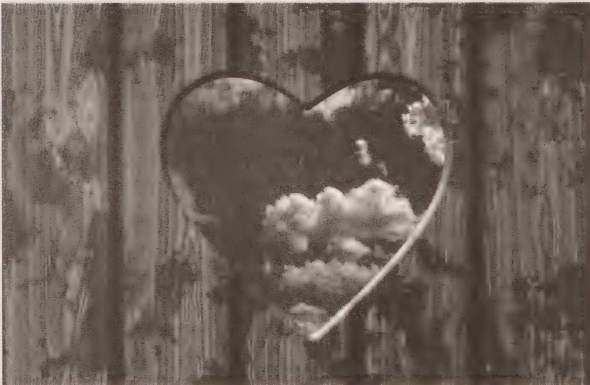

## Nhà, chính là đường lui của chúng ta

**家，就是我们的退路**

*jiā，jiù shì wǒ men de tuì lù*

慢慢地，生活教会了我们想念故土，思念家乡，就像当初曾以为一旦我们离开那片黄土，就再也不会怀念一样坚定。

màn màn dì，shēng huó jiào huì le wǒ men xiǎng niàn gù tǔ，sī niàn jiā xiāng，jiù xiàng dāng chū céng yǐ wéi yí dàn wǒ men lí kāi nà piàn huáng tǔ，jiù zài yě bú huì huái niàn yī yàng jiān dìng。

Dần dần, cuộc sống dạy chúng ta nhớ thương quê cũ, nhớ nhung quê hương, cũng giống như lúc đầu từng tin rằng một khi rời khỏi mảnh đất vàng ấy, sẽ không bao giờ hoài niệm nữa mà kiên định đến vậy.

即使我们一度奋力挣扎，想要脱离故乡，但故乡毕竟是给了我们的童年、青春的地方。

jí shǐ wǒ men yí dù fèn lì zhēng zhá，xiǎng yào tuō lí gù xiāng，dàn gù xiāng bì jìng shì gěi le wǒ men de tóng nián、qīng chūn de dì fāng。

Dù chúng ta đã từng ra sức giãy giụa, muốn thoát khỏi quê hương, nhưng quê hương dù sao cũng là nơi đã cho chúng ta tuổi thơ, tuổi xuân.

所以很多时候想念起来也会一发不可收拾。

suǒ yǐ hěn duō shí hòu xiǎng niàn qǐ lái yě huì yī fā bù kě shōu shí。

Vì thế rất nhiều lúc nhớ nhung lên cũng không sao kìm nén nổi.

虽然如今可能我们也依旧不愿意走上归途，但故乡应该就像位慈父一样，在日夜等待着我们迷途知返吧。

suī rán rú jīn kě néng wǒ men yě yī jiù bù yuàn yì zǒu shàng guī tú，dàn gù xiāng yīng gāi jiù xiàng wèi cí fù yī yàng，zài rì yè děng dài zhe wǒ men mí tú zhī fǎn ba。

Mặc dù hiện tại có lẽ chúng ta vẫn không muốn lên đường trở về, nhưng quê hương hẳn vẫn giống như người cha từ ái, ngày đêm chờ đợi chúng ta lạc đường biết quay đầu.

曾想着写一篇“假如我是百万富翁”的文章。

céng xiǎng zhe xiě yī piān “jiǎ rú wǒ shì bǎi wàn fù wēng ”de wén zhāng。

Từng định viết một bài văn “Giả sử tôi là triệu phú”.

每个人都有很多愿望，很多私欲，而当一切面临现实巨大的盾牌时，最有力的证据便成了金钱。

měi gè rén dōu yǒu hěn duō yuàn wàng，hěn duō sī yù，ér dāng yī qiè miàn lín xiàn shí jù dà de dùn pái shí，zuì yǒu lì de zhèng jù biàn chéng le jīn qián。

Mỗi người đều có nhiều ước nguyện, nhiều dục vọng riêng tư, mà khi tất cả đối mặt với tấm khiên khổng lồ của hiện thực, thứ bằng chứng hữu lực nhất lại chính là tiền bạc.

我想人不仅仅应该知道自己想要什么，还应该知道自己该负担起什么。

wǒ xiǎng rén bù jǐn jǐn yīng gāi zhī dào zì jǐ xiǎng yào shén me，hái yīng gāi zhī dào zì jǐ gāi fù dān qǐ shén me。

Tôi nghĩ con người không chỉ nên biết mình muốn gì, mà còn nên biết mình phải gánh vác điều gì.

然后坚定不移地往前走，不管一路的遗失。

rán hòu jiān dìng bù yí dì wǎng qián zǒu，bù guǎn yī lù de yí shī。

Rồi kiên định không đổi mà bước về phía trước, mặc cho những mất mát trên suốt chặng đường.

当我不能安稳自己的心，内心迫切想要去改变生活而又知道一切是不可以急于求成的时候，又如何去为了前程奋不顾身呢。

dāng wǒ bù néng ān wěn zì jǐ de xīn，nèi xīn pò qiè xiǎng yào qù gǎi biàn shēng huó ér yòu zhī dào yī qiè shì bù kě yǐ jí yú qiú chéng de shí hòu，yòu rú hé qù wèi le qián chéng fèn bù gù shēn ne。

Khi tôi không thể làm an yên trái tim mình, trong lòng khẩn thiết muốn thay đổi cuộc sống mà lại biết mọi chuyện không thể nôn nóng cầu nhanh, thì làm sao có thể bất chấp thân mình vì tiền đồ đây.

这种痛楚，让我们知道了希望的定义是什么。

zhè zhǒng tòng chǔ，ràng wǒ men zhī dào le xī wàng de dìng yì shì shén me。

Nỗi đau đớn ấy, khiến chúng ta hiểu được định nghĩa của hy vọng là gì.

总要有一个人来牺牲，在时光把一切冲垮之前。

zǒng yào yǒu yí gè rén lái xī shēng，zài shí guāng bǎ yī qiè chōng kuǎ zhī qián。

Luôn cần một người phải hy sinh, trước khi thời gian cuốn phăng tất cả.

慢慢地，我很想念故乡，想念我的父亲，我们已经近两年没有坐在一起谈心。

màn màn dì，wǒ hěn xiǎng niàn gù xiāng，xiǎng niàn wǒ de fù qīn，wǒ men yǐ jīng jìn liǎng nián méi yǒu zuò zài yì qǐ tán xīn。

Dần dần, tôi rất nhớ quê hương, nhớ cha tôi, hai chúng tôi đã gần hai năm không ngồi lại bên nhau tâm sự.

如果说有人教会了我爱与成长，那他便首当其冲。

rú guǒ shuō yǒu rén jiào huì le wǒ ài yǔ chéng zhǎng，nà tā biàn shǒu dāng qí chōng。

Nếu nói có người dạy tôi biết yêu thương và trưởng thành, thì người đầu tiên chính là cha.

一旦你了解了一个人内心真正的痛苦，你就会因为他身上的痛苦而产生爱。

yí dàn nǐ liǎo jiě le yí gè rén nèi xīn zhēn zhèng de tòng kǔ，nǐ jiù huì yīn wèi tā shēn shàng de tòng kǔ ér chǎn shēng ài。

Một khi bạn hiểu được nỗi đau thật sự trong lòng một người, bạn sẽ bởi nỗi đau trên người họ mà sinh ra tình yêu thương.

父亲是我生命中的至亲，让我在冥冥之中读懂了他一生的凄楚。

fù qīn shì wǒ shēng mìng zhòng de zhì qīn，ràng wǒ zài míng míng zhī zhōng dú dǒng le tā yī shēng de qī chǔ。

Cha là người thân thiết nhất trong cuộc đời tôi, khiến tôi trong cõi vô hình mà thấu hiểu được nỗi chua xót cả đời của cha.

当我不能给他更好的生活时，我会好好爱他；当我们无法一起更好地生活时，我会替他好好地活着，让一切延续。

dāng wǒ bù néng gěi tā gèng hǎo de shēng huó shí，wǒ huì hǎo hǎo ài tā；dāng wǒ men wú fǎ yì qǐ gèng hǎo dì shēng huó shí，wǒ huì tì tā hǎo hǎo dì huó zhe，ràng yī qiè yán xù。

Khi tôi chưa thể cho cha cuộc sống tốt đẹp hơn, tôi sẽ yêu thương cha thật tốt; khi chúng tôi không thể cùng nhau sống tốt đẹp hơn, tôi sẽ thay cha sống thật tốt, để mọi thứ được nối tiếp.

也许我们还在漂泊，还在为了寻一个落脚之处而奔忙。

yě xǔ wǒ men hái zài piāo bó，hái zài wèi le xún yí gè luò jiǎo zhī chù ér bēn máng。

Có lẽ chúng ta vẫn còn phiêu bạt, vẫn còn tất bật tìm một nơi dừng chân.

离开了生我们养我们的地方，和我们的爱人。

lí kāi le shēng wǒ men yǎng wǒ men de dì fāng，hé wǒ men de ài rén。

Đã rời khỏi nơi sinh ta dưỡng ta, và những người thân yêu của ta.

有时候想，如果生命可以绑缚那该多好，那我们便可以跟爱的人一同面临暴风雨，我们不会再有千里之外的无助，也不会有一个人在夜里蜷缩着痛哭。

yǒu shí hòu xiǎng，rú guǒ shēng mìng kě yǐ bǎng fù nà gāi duō hǎo，nà wǒ men biàn kě yǐ gēn ài de rén yī tóng miàn lín bào fēng yǔ，wǒ men bú huì zài yǒu qiān lǐ zhī wài de wú zhù，yě bú huì yǒu yí gè rén zài yè lǐ quán suō zhe tòng kū。

Có lúc nghĩ, nếu sinh mệnh có thể trói buộc lại với nhau thì tốt biết bao, vậy thì chúng ta có thể cùng người thương yêu đối mặt với bão giông, chúng ta sẽ không còn nỗi bơ vơ nơi ngàn dặm xa, cũng sẽ không còn một mình co ro khóc nức nở trong đêm.

很多时候我这样渴望过：有个家多好，有个故乡多好，有个属于自己的东西多好。

hěn duō shí hòu wǒ zhè yàng kě wàng guò：yǒu gè jiā duō hǎo，yǒu gè gù xiāng duō hǎo，yǒu gè shǔ yú zì jǐ de dōng xī duō hǎo。

Rất nhiều lúc tôi từng khát khao như thế: có một mái nhà tốt biết bao, có một quê hương tốt biết bao, có một thứ thuộc về riêng mình tốt biết bao.

那样的话，即使走遍四海都无所畏惧，因为一旦崩溃还有回去的路。

nà yàng de huà，jí shǐ zǒu biàn sì hǎi dōu wú suǒ wèi jù，yīn wèi yí dàn bēng kuì hái yǒu huí qù de lù。

Nếu như vậy, dù đi khắp bốn biển cũng chẳng sợ hãi gì, bởi vì một khi gục ngã vẫn còn con đường để trở về.

## Ai rồi cũng phải đối mặt với sinh ly tử biệt

**谁都要面对生死离别**

*shéi dōu yào miàn duì shēng sǐ lí bié*

有人说：“死亡不过是另一种方式的旅行。

yǒu rén shuō ：“sǐ wáng bù guò shì lìng yī zhǒng fāng shì de lǚ xíng。

Có người nói: “Cái chết chẳng qua chỉ là một kiểu du hành theo cách khác.”

”但当死亡真正来临的时候，没有人能如此淡定从容。

”dàn dāng sǐ wáng zhēn zhèng lái lín de shí hòu，méi yǒu rén néng rú cǐ dàn dìng cóng róng。

Nhưng khi cái chết thật sự đến, không ai có thể bình tĩnh ung dung như vậy.

亲人的消失，爱人的离散，包括自己的消亡，永远是非常残酷的现实。

qīn rén de xiāo shī，ài rén de lí sàn，bāo kuò zì jǐ de xiāo wáng，yǒng yuǎn shì fēi cháng cán kù de xiàn shí。

Người thân biến mất, người yêu ly tán, kể cả sự tiêu vong của chính mình, mãi mãi là hiện thực vô cùng tàn khốc.

由此，我想到我的爷爷，他已经不在人世了。

yóu cǐ，wǒ xiǎng dào wǒ de yé yé，tā yǐ jīng bù zài rén shì le。

Từ đó, tôi nghĩ đến ông nội tôi, ông đã không còn trên đời nữa.

因为他是我的爷爷，“他已经不在人世”这一句话就足以让我眼眶湿润。

yīn wèi tā shì wǒ de yé yé ，“tā yǐ jīng bù zài rén shì ”zhè yī jù huà jiù zú yǐ ràng wǒ yǎn kuàng shī rùn。

Bởi vì ông là ông nội của tôi, một câu “ông đã không còn trên đời” cũng đủ khiến khóe mắt tôi cay cay.

这是我人生中第一次经历生死离别，第一个从出生到长大陪伴在自己身边的亲人离开这个世界。

zhè shì wǒ rén shēng zhōng dì yī cì jīng lì shēng sǐ lí bié，dì yí gè cóng chū shēng dào zhǎng dà péi bàn zài zì jǐ shēn biān de qīn rén lí kāi zhè ge shì jiè。

Đây là lần đầu tiên trong đời tôi trải qua sinh ly tử biệt, người thân đầu tiên từ khi tôi chào đời đến lúc lớn khôn luôn ở bên cạnh rời khỏi thế gian này.

当噩耗来临的时候，我痛苦地想把世间撕碎。

dāng è hào lái lín de shí hòu，wǒ tòng kǔ dì xiǎng bǎ shì jiān sī suì。

Khi tin dữ đến, tôi đau đớn muốn xé toạc cả thế gian.

我不知道为什么人生如此苦短，为什么要让自己深爱的人消逝在自己的身边。

wǒ bù zhī dào wèi shén me rén shēng rú cǐ kǔ duǎn，wèi shén me yào ràng zì jǐ shēn ài de rén xiāo shì zài zì jǐ de shēn biān。

Tôi không hiểu vì sao cuộc đời ngắn ngủi đắng cay đến vậy, vì sao phải để người mình yêu thương sâu đậm tiêu vong ngay bên cạnh mình.

我怨怼世间，怨怼生命，怨怼一切。

wǒ yuàn duì shì jiān，yuàn duì shēng mìng，yuàn duì yī qiè。

Tôi oán hận thế gian, oán hận sinh mệnh, oán hận tất cả.

我像所有的年轻人一样，年轻气盛，只顾漂泊他乡，追逐自己的理想，实现自己的抱负，而远远不懂得珍惜亲情，也不知道

wǒ xiàng suǒ yǒu de nián qīng rén yī yàng，nián qīng qì shèng，zhǐ gù piāo bó tā xiāng，zhuī zhú zì jǐ de lǐ xiǎng，shí xiàn zì jǐ de bào fù，ér yuǎn yuǎn bù dǒng de zhēn xī qīn qíng，yě bù zhī dào

Tôi giống như tất cả những người trẻ tuổi, trẻ tuổi hăng hái, chỉ mải phiêu bạt nơi xa, theo đuổi lý tưởng của mình, thực hiện hoài bão của mình, mà chẳng hiểu quý trọng tình thân, cũng không biết

去思念故乡。

qù sī niàn gù xiāng。

để mà nhớ thương quê hương.

自上大学之后，我很少见到爷爷。

zì shàng dà xué zhī hòu，wǒ hěn shǎo jiàn dào yé yé。

Từ khi lên đại học, tôi rất ít khi gặp ông nội.

有时候放假在外实习，也没能回去看他。

yǒu shí hòu fàng jià zài wài shí xí，yě méi néng huí qù kàn tā。

Có khi nghỉ lễ còn đi thực tập nơi xa, cũng không về thăm ông được.

那个时候的我一心想着脱离，想着远走高飞。

nà ge shí hòu de wǒ yī xīn xiǎng zhe tuō lí，xiǎng zhe yuǎn zǒu gāo fēi。

Lúc ấy tôi một lòng nghĩ đến việc rời xa, nghĩ đến chuyện bay thật xa.

当我知道并紧紧去抓住的时候，韶光已经在他的身上走尽了。

dāng wǒ zhī dào bìng jǐn jǐn qù zhuā zhù de shí hòu，sháo guāng yǐ jīng zài tā de shēn shàng zǒu jǐn le。

Khi tôi biết mà cố gắng nắm chặt lấy, thì quang âm đã cạn kiệt trên người ông mất rồi.

我会永远记得那一年的端午节，即使随着年轮滚动的久远，它也只会愈发地深刻。

wǒ huì yǒng yuǎn jì de nà yī nián de duān wǔ jié，jí shǐ suí zhe nián lún gǔn dòng de jiǔ yuǎn，tā yě zhǐ huì yù fā dì shēn kè。

Tôi sẽ mãi mãi nhớ cái Tết Đoan Ngọ năm đó, dù thời gian trôi qua lâu xa, nó cũng chỉ càng thêm khắc sâu.

我会比如今更加读懂它，会比如今更加难以忘记。

wǒ huì bǐ rú jīn gèng jiā dú dǒng tā，huì bǐ rú jīn gèng jiā nán yǐ wàng jì。

Tôi sẽ thấu hiểu nó hơn ngày hôm nay, sẽ khó quên hơn ngày hôm nay.

端午节，我从北京坐车回家看望病重的爷爷。

duān wǔ jié，wǒ cóng běi jīng zuò chē huí jiā kàn wàng bìng zhòng de yé yé。

Ngày Tết Đoan Ngọ, tôi từ Bắc Kinh bắt xe về nhà thăm ông nội đang bệnh nặng.

回到家里，我放下东西就去看他。

huí dào jiā lǐ，wǒ fàng xià dōng xī jiù qù kàn tā。

Về đến nhà, tôi đặt đồ xuống liền đi xem ông.

不知道是不是为了看病方便的缘故，爷爷剃光了头发。

bù zhī dào shì bú shì wèi le kàn bìng fāng biàn de yuán gù，yé yé tì guāng le tóu fà。

Không biết có phải vì tiện cho việc chữa bệnh hay không, ông nội đã cạo trọc tóc.

虽然他消瘦、瘦骨嶙峋，但是他光溜溜的脑袋，总让我觉得他年轻了起来，像个孩子。

suī rán tā xiāo shòu、shòu gǔ lín xún，dàn shì tā guāng liū liū de nǎo dài，zǒng ràng wǒ jué de tā nián qīng le qǐ lái，xiàng gè hái zi。

Mặc dù ông gầy gò, da bọc xương, nhưng cái đầu nhẵn bóng của ông, luôn khiến tôi thấy ông trẻ lại, giống như một đứa trẻ.

于是，不管别人如何说他的病情，我内心总相信他会好起来。

yú shì，bù guǎn bié rén rú hé shuō tā de bìng qíng，wǒ nèi xīn zǒng xiāng xìn tā huì hǎo qǐ lái。

Vì thế, dù người khác nói về bệnh tình của ông thế nào, trong lòng tôi vẫn luôn tin ông sẽ khỏe lại.

我希望他能够像从前一样站起来，拿着他抽了一辈子的旱烟袋，走街串巷。

wǒ xī wàng tā néng gòu xiàng cóng qián yī yàng zhàn qǐ lái，ná zhe tā chōu le yī bèi zi de hàn yān dài，zǒu jiē chuàn xiàng。

Tôi hy vọng ông có thể đứng dậy như xưa, cầm điếu thuốc lào ông đã hút cả đời, đi khắp phố phường.

每次，我要离家上学去，奶奶总是会哭，弄得我也把眼睛哭红。

měi cì，wǒ yào lí jiā shàng xué qù，nǎi nǎi zǒng shì huì kū，nòng dé wǒ yě bǎ yǎn jīng kū hóng。

Mỗi lần tôi sắp rời nhà lên đường đi học, bà nội luôn khóc, làm tôi cũng khóc đỏ cả mắt.

当我跟奶奶在一旁泣不成声的时候，爷爷总是兀自坐在一旁，他好像什么也没有听见，也没有什么要说，没有什么难过的脸色。

dāng wǒ gēn nǎi nǎi zài yī páng qì bù chéng shēng de shí hòu，yé yé zǒng shì wù zì zuò zài yī páng，tā hǎo xiàng shén me yě méi yǒu tīng jiàn，yě méi yǒu shén me yào shuō，méi yǒu shén me nán guò de liǎn sè。

Khi tôi và bà nội đứng bên cạnh khóc không thành tiếng, ông nội luôn lặng lẽ ngồi một bên, như thể không nghe thấy gì, cũng không có gì để nói, không lộ vẻ mặt buồn bã gì.

这就是我的爷爷。

zhè jiù shì wǒ de yé yé。

Ông nội tôi là như thế.

若是论到打骂我，他自我小时候就不含糊，但论到情分的时候，他反而最默默无语。

ruò shì lùn dào dǎ mà wǒ，tā zì wǒ xiǎo shí hòu jiù bù hán hù，dàn lùn dào qíng fēn de shí hòu，tā fǎn ér zuì mò mò wú yǔ。

Nếu nói về chuyện đánh mắng tôi, thì từ khi tôi còn nhỏ ông chưa bao giờ nương tay, nhưng khi nói về tình cảm, ông lại là người im lặng nhất.

只是，这一次的端午节，是我有生以来第一次见到，也是最后一次看到，他同奶奶一样脆弱。

zhǐ shì，zhè yī cì de duān wǔ jié，shì wǒ yǒu shēng yǐ lái dì yī cì jiàn dào，yě shì zuì hòu yī cì kàn dào，tā tóng nǎi nǎi yī yàng cuì ruò。

Chỉ là, cái Tết Đoan Ngọ lần này, là lần đầu tiên trong đời tôi thấy, cũng là lần cuối cùng tôi thấy, ông yếu đuối như bà nội.

三天假期过去，我又要返京。

sān tiān jià qī guò qù，wǒ yòu yào fǎn jīng。

Kỳ nghỉ ba ngày trôi qua, tôi lại phải về Bắc Kinh.

坐在床边的奶奶没有任何言语，也没有哭，反倒是爷爷慌乱地哭了。

zuò zài chuáng biān de nǎi nǎi méi yǒu rèn hé yán yǔ，yě méi yǒu kū，fǎn dào shì yé yé huāng luàn dì kū le。

Bà nội ngồi bên giường không nói lời nào, cũng không khóc, ngược lại ông nội lại cuống cuồng khóc.

他用哀鸣的语调，从喉咙里喊出：“下次回来，你就再也看不见你爷爷了……”

tā yòng āi míng de yǔ diào，cóng hóu lóng lǐ hǎn chū ：“xià cì huí lái，nǐ jiù zài yě kàn bú jiàn nǐ yé yé le ……”

Ông dùng giọng ai oán, từ cổ họng gào lên: “Lần sau về, cháu sẽ không bao giờ được nhìn thấy ông nữa...”

他一直在重复着这句话，颤抖着双手，在床上翻来覆去。

tā yì zhí zài chóng fù zhe zhè jù huà，chàn dǒu zhe shuāng shǒu，zài chuáng shàng fān lái fù qù。

Ông cứ lặp đi lặp lại câu nói ấy, hai bàn tay run rẩy, trở mình qua lại trên giường.

我知道他的病让他疼，但我更知道，他的疼来源于心底。

wǒ zhī dào tā de bìng ràng tā téng，dàn wǒ gèng zhī dào，tā de téng lái yuán yú xīn dǐ。

Tôi biết bệnh tật khiến ông đau, nhưng tôi càng biết, nỗi đau của ông xuất phát từ đáy lòng.

他哭得像个孩子，哭碎了我整个生命。

tā kū dé xiàng gè hái zi，kū suì le wǒ zhěng gè shēng mìng。

Ông khóc như một đứa trẻ, tiếng khóc ấy tan vỡ cả cuộc đời tôi.

我在离家的那个清晨想着，如果人生必须如此残酷，我愿来世再重来一次。

wǒ zài lí jiā de nà ge qīng chén xiǎng zhe，rú guǒ rén shēng bì xū rú cǐ cán kù，wǒ yuàn lái shì zài zhòng lái yī cì。

Sáng sớm hôm rời nhà, tôi nghĩ, nếu cuộc đời nhất định phải tàn khốc như vậy, tôi nguyện kiếp sau được làm lại một lần nữa.

我还是我，我的爷爷还是我的爷爷。

wǒ hái shì wǒ，wǒ de yé yé hái shì wǒ de yé yé。

Tôi vẫn là tôi, ông nội tôi vẫn là ông nội tôi.

## Cảm ơn bạn đã sưởi ấm tôi

**谢谢你温暖我**

*xiè xiè nǐ wēn nuǎn wǒ*

总有一些记忆碎片，会清晰地记在脑海里。

zǒng yǒu yī xiē jì yì suì piàn，huì qīng xī dì jì zài nǎo hǎi lǐ。

Luôn có những mảnh ký ức, được ghi khắc rõ ràng trong đầu.

或许是一句话，一个表情，一个场景…过去了很多年，你忘记了很多事，甚至是那些爱过的、恨过的人。

huò xǔ shì yī jù huà，yí gè biǎo qíng，yí gè chǎng jǐng…guò qù le hěn duō nián，nǐ wàng jì le hěn duō shì，shèn zhì shì nà xiē ài guò de、hèn guò de rén。

Có lẽ là một câu nói, một biểu cảm, một khung cảnh... đã bao năm trôi qua, bạn quên đi rất nhiều chuyện, thậm chí cả những người từng yêu, từng hận.

那些记忆里的碎片，却依然鲜活地在脑海里徘徊，久久不息。

nà xiē jì yì lǐ de suì piàn，què yī rán xiān huó dì zài nǎo hǎi lǐ pái huái，jiǔ jiǔ bù xī。

Những mảnh vụn ký ức ấy, vẫn cứ tươi sống mà lởn vởn trong đầu, lâu lắm không nguôi.

18岁的那年夏天，我们高中毕业。

18 suì de nà nián xià tiān，wǒ men gāo zhōng bì yè。

Mùa hè năm 18 tuổi, chúng tôi tốt nghiệp trung học.

我和Y抱着一堆书，一起回家。

wǒ hé Y bào zhe yī duī shū，yì qǐ huí jiā。

Tôi và Y ôm một đống sách, cùng nhau về nhà.

他把书顶在头上，出了学校门口，路过右边一排的小饭馆，他冲着那一家家饭店的老板大声喊：“×××，我们毕业了！

tā bǎ shū dǐng zài tóu shàng，chū le xué xiào mén kǒu，lù guò yòu biān yī pái de xiǎo fàn guǎn，tā chōng zhe nà yī jiā jiā fàn diàn de lǎo bǎn dà shēng hǎn ：“×××，wǒ men bì yè le！

Anh ấy đội sách trên đầu, ra khỏi cổng trường, đi ngang qua dãy quán cơm nhỏ bên phải, anh ấy hướng về ông chủ từng quán hô to: “×××, chúng tôi tốt nghiệp rồi!”

×××我们毕业了！

×××wǒ men bì yè le！

××× chúng tôi tốt nghiệp rồi!

Y呼喊的声音是毕业的喜悦，是青春的绽放，是我们18岁的时光。

Y hū hǎn de shēng yīn shì bì yè de xǐ yuè，shì qīng chūn de zhàn fàng，shì wǒ men 18 suì de shí guāng。

Tiếng hô của Y là niềm vui của ngày tốt nghiệp, là sự bung nở của tuổi xuân, là quãng thời gian 18 tuổi của chúng tôi.

那天阳光照在他脸上，关于那天的画面，一直记在我脑海里挥之不去。

nà tiān yáng guāng zhào zài tā liǎn shàng，guān yú nà tiān de huà miàn，yì zhí jì zài wǒ nǎo hǎi lǐ huī zhī bù qù。

Ngày hôm ấy ánh nắng chiếu trên gương mặt anh ấy, khung cảnh của ngày hôm ấy, mãi khắc ghi trong đầu tôi không thể phai mờ.

在上大学之前，乃至大二之前，我觉得我的生活和人生整个都是浑噩的，我记不清楚自己的过往，也记不起所有的青春，我找不到任何印记。

zài shàng dà xué zhī qián，nǎi zhì dà èr zhī qián，wǒ jué de wǒ de shēng huó hé rén shēng zhěng gè dōu shì hún è de，wǒ jì bù qīng chǔ zì jǐ de guò wǎng，yě jì bù qǐ suǒ yǒu de qīng chūn，wǒ zhǎo bú dào rèn hé yìn jì。

Trước khi lên đại học, thậm chí trước năm thứ hai, tôi cảm thấy cuộc sống và cuộc đời mình hoàn toàn mờ mịt, tôi không nhớ rõ quá khứ của mình, cũng không nhớ nổi tất cả tuổi xuân, tôi không tìm thấy bất kỳ dấu vết nào.

唯此，记忆的片段，让我知道，我曾流淌在那样的青春岁月里。

wéi cǐ，jì yì de piàn duàn，ràng wǒ zhī dào，wǒ céng liú tǎng zài nà yàng de qīng chūn suì yuè lǐ。

Chỉ vì thế, những mảnh ký ức, khiến tôi biết rằng, tôi đã từng trôi chảy trong những năm tháng tuổi xuân như vậy.

然后，我可以由此联想到整个青春盛放的过程。

rán hòu，wǒ kě yǐ yóu cǐ lián xiǎng dào zhěng gè qīng chūn shèng fàng de guò chéng。

Rồi, tôi có thể từ đó liên tưởng đến toàn bộ quá trình tuổi xuân nở rộ.

我在篮球场旁边看Y打球，有时候是透过食堂二楼的蓝色玻璃。

wǒ zài lán qiú chǎng páng biān kàn Y dǎ qiú，yǒu shí hòu shì tòu guò shí táng èr lóu de lán sè bō lí。

Tôi đứng bên cạnh sân bóng rổ nhìn Y đánh bóng, có lúc là nhìn qua tấm kính màu xanh ở tầng hai nhà ăn.

那个时候高三了，我每天都在紧张地复习，好久也不跟其他人说上一句话。

nà ge shí hòu gāo sān le，wǒ měi tiān dōu zài jǐn zhāng dì fù xí，hǎo jiǔ yě bù gēn qí tā rén shuō shàng yī jù huà。

Lúc đó là năm cuối cấp ba, tôi ngày nào cũng khẩn trương ôn bài, đã lâu không nói với ai lấy một câu.

以前我们总是一起逃课、散步、聊天、吃饭。

yǐ qián wǒ men zǒng shì yì qǐ táo kè、sàn bù、liáo tiān、chī fàn。

Trước đây chúng tôi luôn cùng nhau trốn học, tản bộ, tán gẫu, ăn cơm.

最终，我只能把最后的关注定格在食堂二楼的玻璃窗上。

zuì zhōng，wǒ zhǐ néng bǎ zuì hòu de guān zhù dìng gé zài shí táng èr lóu de bō lí chuāng shàng。

Cuối cùng, tôi chỉ có thể cố định sự quan tâm cuối cùng của mình lên ô cửa kính tầng hai nhà ăn.

在我跟同伴一起去三楼吃饭的时候，在二楼的楼梯上，我停下来，看着外面的操场上，Y在奋力地打球、比赛。

zài wǒ gēn tóng bàn yì qǐ qù sān lóu chī fàn de shí hòu，zài èr lóu de lóu tī shàng，wǒ tíng xià lái，kàn zhe wài miàn de cāo chǎng shàng ，Y zài fèn lì dì dǎ qiú、bǐ sài。

Khi tôi cùng bạn đến nhà ăn tầng ba, trên cầu thang tầng hai, tôi dừng lại, nhìn ra sân vận động bên ngoài, Y đang hết mình đánh bóng, thi đấu.

那是永远都不会属于我的生活，我看着他想到。

nà shì yǒng yuǎn dōu bú huì shǔ yú wǒ de shēng huó，wǒ kàn zhe tā xiǎng dào。

Đó là cuộc sống vĩnh viễn không thuộc về tôi, tôi nhìn anh ấy mà nghĩ.

但这也是我们成为好朋友的原因。

dàn zhè yě shì wǒ men chéng wéi hǎo péng yǒu de yuán yīn。

Nhưng đó cũng chính là lý do chúng tôi trở thành những người bạn tốt.

还记得17岁那年的冬天，在北方，我陪着弟弟去滑雪场滑雪。

hái jì de 17 suì nà nián de dōng tiān，zài běi fāng，wǒ péi zhe dì di qù huá xuě chǎng huá xuě。

Vẫn nhớ mùa đông năm 17 tuổi, ở phương Bắc, tôi cùng em trai đến khu trượt tuyết chơi trượt tuyết.

滑雪场，遍地雪白，只有弟弟一个人在滑雪，从高处滑到低处。

huá xuě chǎng，biàn dì xuě bái，zhǐ yǒu dì di yí gè rén zài huá xuě，cóng gāo chù huá dào dī chù。

Khu trượt tuyết, tuyết trắng khắp nơi, chỉ có mình em trai tôi trượt tuyết, từ trên cao trượt xuống chỗ thấp.

那个时候我在听游鸿明的《白色恋人》，之后，再听的时候，没有了当时的感觉。

nà ge shí hòu wǒ zài tīng yóu hóng míng de《bái sè liàn rén》，zhī hòu，zài tīng de shí hòu，méi yǒu liǎo dàng shí de gǎn jué。

Lúc đó tôi đang nghe “Người tình trắng” của Du Hồng Minh, sau này, khi nghe lại, đã không còn cảm giác của lúc ấy nữa.

由此，我记得我的17岁，记得冰天雪地里弟弟滑雪的场景，记得《白色恋人》。

yóu cǐ，wǒ jì de wǒ de 17 suì，jì de bīng tiān xuě dì lǐ dì di huá xuě de chǎng jǐng，jì de《bái sè liàn rén》。

Từ đó, tôi nhớ tuổi 17 của mình, nhớ khung cảnh em trai trượt tuyết giữa trời băng tuyết, nhớ “Người tình trắng”.

尽管，我们已经遥远而陌生地分离。

jǐn guǎn，wǒ men yǐ jīng yáo yuǎn ér mò shēng dì fēn lí。

Mặc dù, chúng tôi đã xa cách nhau thật xa và thật lạ.

16岁那年，从北方坐火车回家，遇到过一个山东男孩。

16 suì nà nián，cóng běi fāng zuò huǒ chē huí jiā，yù dào guò yí gè shān dōng nán hái。

Năm 16 tuổi, từ phương Bắc bắt tàu hỏa về nhà, tôi gặp một chàng trai Sơn Đông.

那个时候，他大概二十三四岁，单眼皮，很白。

nà ge shí hòu，tā dà gài èr shí sān sì suì，dān yǎn pí，hěn bái。

Lúc ấy, anh ấy khoảng hai ba hai tư tuổi, mắt một mí, da rất trắng.

姐姐买了一盒梨，座位上正好四个人，每个人分了一个。

jiě jiě mǎi le yī hé lí，zuò wèi shàng zhèng hǎo sì gè rén，měi gè rén fēn le yí gè。

Chị tôi mua một hộp lê, trên ghế vừa đúng bốn người, mỗi người được chia một quả.

他拿了梨，咬了一口，然后冲着我笑，很温暖、很明媚。

tā ná le lí，yǎo le yī kǒu，rán hòu chōng zhe wǒ xiào，hěn wēn nuǎn、hěn míng mèi。

Anh ấy cầm quả lê, cắn một miếng, rồi nhìn tôi mỉm cười, rất ấm áp, rất tươi sáng.

结果，到枣庄站的时候，他下车了。

jié guǒ，dào zǎo zhuāng zhàn de shí hòu，tā xià chē le。

Kết quả là, đến ga Tảo Trang, anh ấy xuống tàu.

我总以为，我们会再遇见，因为我是如此清晰地记得他。

wǒ zǒng yǐ wéi，wǒ men huì zài yù jiàn，yīn wèi wǒ shì rú cǐ qīng xī dì jì de tā。

Tôi luôn nghĩ, chúng tôi sẽ còn gặp lại, bởi vì tôi nhớ anh ấy rõ ràng đến vậy.

他的发型、眼睛、脸、皮肤、书包、上衣。

tā de fà xíng、yǎn jīng、liǎn、pí fū、shū bāo、shàng yī。

Kiểu tóc, đôi mắt, gương mặt, làn da, chiếc cặp sách, áo khoác của anh ấy.

但是，7年过去了我知道，我们再也不会相见了。

dàn shì ，7 nián guò qù le wǒ zhī dào，wǒ men zài yě bú huì xiāng jiàn le。

Nhưng, 7 năm đã trôi qua, tôi biết, chúng tôi sẽ không bao giờ gặp lại nhau nữa.

是他让我第一次知道了“擦肩而过”这四个字的含义。

shì tā ràng wǒ dì yī cì zhī dào le “cā jiān ér guò ”zhè sì gè zì de hán yì。

Chính là anh ấy khiến tôi lần đầu hiểu được ý nghĩa của bốn chữ “lướt qua nhau trong gang tấc”.

不美好吗？

bù měi hǎo ma？

Chẳng đẹp hay sao?

这一切都很美好，很明媚、很温暖，但是再也不会遇到和重逢了。

zhè yī qiè dōu hěn měi hǎo，hěn míng mèi、hěn wēn nuǎn，dàn shì zài yě bú huì yù dào hé chóng féng le。

Tất cả những điều ấy đều rất đẹp, rất tươi sáng, rất ấm áp, nhưng sẽ không bao giờ còn gặp lại và tương phùng nữa.

我记得大二那年开春，一个人坐车回学校。

wǒ jì de dà èr nà nián kāi chūn，yí gè rén zuò chē huí xué xiào。

Tôi nhớ mùa xuân năm thứ hai đại học, một mình bắt xe về trường.

我走了很久的路，提着大行李箱，身体疲惫不堪。

wǒ zǒu le hěn jiǔ de lù，tí zhe dà xíng lǐ xiāng，shēn tǐ pí bèi bù kān。

Tôi đi bộ rất lâu, xách chiếc vali lớn, thân thể mệt lử.

我蹲坐在一个院子门口的花园放声大哭。

wǒ dūn zuò zài yí gè yuàn zi mén kǒu de huā yuán fàng shēng dà kū。

Tôi ngồi sụp xuống trong khu vườn trước cổng một sân nhà, khóc to lên.

之后每次坐车回学校，我都能够看见那个院子，我坐过的那片水泥地。

zhī hòu měi cì zuò chē huí xué xiào，wǒ dōu néng gòu kàn jiàn nà ge yuàn zi，wǒ zuò guò de nà piàn shuǐ ní dì。

Sau đó mỗi lần bắt xe về trường, tôi đều có thể nhìn thấy cái sân nhà ấy, khoảng nền xi măng tôi đã từng ngồi.

每次经过那个地方的时候，我就那样张望它。

měi cì jīng guò nà ge dì fāng de shí hòu，wǒ jiù nà yàng zhāng wàng tā。

Mỗi lần đi ngang qua nơi ấy, tôi đều đăm đăm nhìn về nó như vậy.

即便现在去了，我依然会看着它。

jí biàn xiàn zài qù le，wǒ yī rán huì kàn zhe tā。

Dù bây giờ có đến đó, tôi vẫn sẽ nhìn nó.

还有第一次到北京，15岁，住在一个旅馆，迄今为止，我都不知道那是在哪个区，什么地方。

hái yǒu dì yī cì dào běi jīng ，15 suì，zhù zài yí gè lǚ guǎn，qì jīn wéi zhǐ，wǒ dōu bù zhī dào nà shì zài nǎ ge qū，shén me dì fāng。

Còn có lần đầu tiên đến Bắc Kinh, lúc 15 tuổi, ở một nhà trọ, cho đến hôm nay, tôi vẫn không biết đó là quận nào, nơi nào.

那是我第一次坐火车出远门。

nà shì wǒ dì yī cì zuò huǒ chē chū yuǎn mén。

Đó là lần đầu tiên tôi bắt tàu hỏa đi xa.

母亲出去办事了，黄昏的时候，我醒了，在胡同里走。

mǔ qīn chū qù bàn shì le，huáng hūn de shí hòu，wǒ xǐng le，zài hú tòng lǐ zǒu。

Mẹ ra ngoài có việc, lúc hoàng hôn, tôi tỉnh giấc, đi dạo trong con hutong.

个老人，问我有没有吃饭。

gè lǎo rén，wèn wǒ yǒu méi yǒu chī fàn。

Một cụ già, hỏi tôi đã ăn cơm chưa.

就像邻里街坊一样的问候，我无法忘记。

jiù xiàng lín lǐ jiē fāng yī yàng de wèn hòu，wǒ wú fǎ wàng jì。

Giống như lời hỏi thăm của hàng xóm láng giềng, tôi không thể nào quên.

就那么一刻，我在心里想，我日后一定是要来北京的，因为这个城市如此温暖，跟我如此契合。

jiù nà me yī kè，wǒ zài xīn lǐ xiǎng，wǒ rì hòu yí dìng shì yào lái běi jīng de，yīn wèi zhè ge chéng shì rú cǐ wēn nuǎn，gēn wǒ rú cǐ qì hé。

Chỉ trong khoảnh khắc ấy, tôi thầm nghĩ, sau này tôi nhất định sẽ đến Bắc Kinh, bởi vì thành phố này ấm áp đến vậy, hợp với tôi đến vậy.

第一次动手术，在市医院。

dì yī cì dòng shǒu shù，zài shì yī yuàn。

Lần đầu tiên phẫu thuật, ở bệnh viện thành phố.

我在医院的长凳上疼得翻来覆去，等着父亲来。

wǒ zài yī yuàn de zhǎng dèng shàng téng dé fān lái fù qù，děng zhe fù qīn lái。

Tôi nằm trên chiếc ghế dài ở bệnh viện, đau đớn trở mình qua lại, chờ cha đến.

那个时候，长凳缝隙下面，全是我掉的眼泪。

nà ge shí hòu，zhǎng dèng fèng xì xià miàn，quán shì wǒ diào de yǎn lèi。

Lúc ấy, bên dưới khe ghế dài, toàn là nước mắt tôi rơi.

高中，周五放学的时候，我刚从教学楼走出来不远，就听见四楼窗口的S大声地冲我喊：“苏和青！

gāo zhōng，zhōu wǔ fàng xué de shí hòu，wǒ gāng cóng jiào xué lóu zǒu chū lái bù yuǎn，jiù tīng jiàn sì lóu chuāng kǒu de S dà shēng dì chōng wǒ hǎn ：“sū hé qīng！

Thời trung học, chiều thứ sáu tan học, tôi vừa bước ra khỏi tòa nhà dạy học được một đoạn, liền nghe thấy S ở cửa sổ tầng bốn hét to về phía tôi: “Tô Hòa Thanh!

苏和青！

sū hé qīng！

Tô Hòa Thanh!

………”我还没来得及扭过头，就被侧面疾驶来的摩托车“砰”的一声撞倒了。

………”wǒ hái méi lái de jí niǔ guò tóu，jiù bèi cè miàn jí shǐ lái de mó tuō chē “pēng ”de yī shēng zhuàng dào le。

...” Tôi còn chưa kịp quay đầu lại, đã bị chiếc xe máy lao vun vút từ bên hông “rầm” một tiếng húc ngã.

我记得的不是被车撞到的疼痛，是那个男同学大声喊我的场景。

wǒ jì de de bú shì bèi chē zhuàng dào de téng tòng，shì nà ge nán tóng xué dà shēng hǎn wǒ de chǎng jǐng。

Điều tôi nhớ không phải cơn đau khi bị xe đâm, mà là cảnh cậu bạn nam gọi tôi thật to.

周五放学，大家都走了，整个教学楼和学校都很空旷。

zhōu wǔ fàng xué，dà jiā dōu zǒu le，zhěng gè jiào xué lóu hé xué xiào dōu hěn kōng kuàng。

Chiều thứ sáu tan học, mọi người đều đã về, cả dãy nhà học và sân trường trở nên vắng vẻ.

教导主任和我初中的班主任一起冲过去拦那辆车，要他带我去医院，然后S从四楼跑下来。

jiào dǎo zhǔ rèn hé wǒ chū zhōng de bān zhǔ rèn yì qǐ chōng guò qù lán nà liàng chē，yào tā dài wǒ qù yī yuàn，rán hòu S cóng sì lóu pǎo xià lái。

Thầy giám thị cùng giáo viên chủ nhiệm cấp hai của tôi lao ra chặn chiếc xe đó, bắt anh ta đưa tôi đi bệnh viện, rồi S từ tầng bốn chạy xuống.

我的腿被撞了，肿了起来，好疼。

wǒ de tuǐ bèi zhuàng le，zhǒng le qǐ lái，hǎo téng。

Chân tôi bị đâm phải, sưng lên, đau lắm.

我对S说：“没事，你看骑摩托的人都流血了。

wǒ duì S shuō ：“méi shì，nǐ kàn qí mó tuō de rén dōu liú xiě le。

Tôi nói với S: "Không sao đâu, cậu xem người đi xe máy còn chảy máu kìa.

其实，那个时候，我耳朵里听见的，还是那个声音，他喊得那么大声、直接，声音刺耳，震痛我的耳膜。

qí shí，nà ge shí hòu，wǒ ěr duǒ lǐ tīng jiàn de，hái shì nà ge shēng yīn，tā hǎn dé nà me dà shēng、zhí jiē，shēng yīn cì ěr，zhèn tòng wǒ de ěr mó。

Thực ra, lúc đó, trong tai tôi vẫn còn văng vẳng tiếng gọi ấy, anh ấy gọi thật to, thật thẳng thắn, giọng chói tai, làm đau cả màng nhĩ tôi.

他一定是先看到了飞驰而来的车，让我小心。

tā yí dìng shì xiān kàn dào le fēi chí ér lái de chē，ràng wǒ xiǎo xīn。

Anh ấy hẳn là đã nhìn thấy chiếc xe lao tới trước, nên mới gọi tôi cẩn thận.

或许，人生没有完完整整的记忆，有的不过是这样那样的片段，它们组成了我们的一生。

huò xǔ，rén shēng méi yǒu wán wán zhěng zhěng de jì yì，yǒu de bù guò shì zhè yàng nà yàng de piàn duàn，tā men zǔ chéng le wǒ men de yī shēng。

Có lẽ, cuộc đời không có ký ức trọn vẹn, chỉ có những mảnh ghép đủ kiểu như thế, chúng tạo nên cả một đời người của chúng ta.

那里，有青春、有时光、有亲情、有伤痛、有爱。

nà lǐ，yǒu qīng chūn、yǒu shí guāng、yǒu qīn qíng、yǒu shāng tòng、yǒu ài。

Trong đó có tuổi trẻ, có thời gian, có tình thân, có tổn thương, có tình yêu.

或许因失眠而辗转反侧的深夜里；或许在某一个节日；或许在拥挤的人潮，看到了熟悉的身影；或许在寒夜佝偻着身子向前奔走时；或许在某个时间看到旧物时；或许在吃着吃着东西忽然想起这是谁爱吃的食物时。

huò xǔ yīn shī mián ér zhǎn zhuǎn fǎn cè de shēn yè lǐ；huò xǔ zài mǒu yí gè jié rì；huò xǔ zài yōng jǐ de rén cháo，kàn dào le shú xī de shēn yǐng；huò xǔ zài hán yè gōu lóu zhe shēn zi xiàng qián bēn zǒu shí；huò xǔ zài mǒu gè shí jiān kàn dào jiù wù shí；huò xǔ zài chī zhe chī zhe dōng xī hū rán xiǎng qǐ zhè shì shuí ài chī de shí wù shí。

Có thể trong những đêm khuya trằn trọc vì mất ngủ; có thể trong một ngày lễ nào đó; có thể giữa dòng người đông đúc, thoáng thấy một bóng dáng quen thuộc; có thể trong đêm giá lạnh còng lưng bước vội về phía trước; có thể khi nhìn thấy một món đồ cũ trong khoảnh khắc nào đó; có thể khi đang ăn bỗng nhớ ra đây là món ai đó từng thích.

那些记忆里的画面，那个人的神态，那个人的温度就会浮现在你眼前。

nà xiē jì yì lǐ de huà miàn，nà ge rén de shén tài，nà ge rén de wēn dù jiù huì fú xiàn zài nǐ yǎn qián。

Những hình ảnh trong ký ức ấy, thần thái của người đó, hơi ấm của người đó lại hiện lên trước mắt bạn.

然而，往事一一都过去了。

rán ér，wǎng shì yī yī dōu guò qù le。

Thế nhưng, mọi chuyện xưa đều đã qua đi.

在这人来人往的尘世间，我们经营着各自的人生。

zài zhè rén lái rén wǎng de chén shì jiān，wǒ men jīng yíng zhe gè zì de rén shēng。

Giữa chốn trần thế người qua kẻ lại này, chúng ta gây dựng cuộc đời riêng của mỗi người.

有些人，消失得无踪无迹。

yǒu xiē rén，xiāo shī dé wú zōng wú jì。

Có những người, biến mất không dấu vết.

曾经你以为你们会长久相伴，曾经你们是最亲密的朋友、最心爱的人，或许是亲人。

céng jīng nǐ yǐ wéi nǐ men huì zhǎng jiǔ xiāng bàn，céng jīng nǐ men shì zuì qīn mì de péng yǒu、zuì xīn ài de rén，huò xǔ shì qīn rén。

Từng có lúc bạn tưởng rằng hai người sẽ bên nhau thật lâu, từng có lúc các bạn là những người bạn thân thiết nhất, người thương yêu nhất, hoặc là người thân.

只因某一件事、某一句话、某一个误会、某一次争吵……你们的关系出现裂痕，接着破裂，然后消逝在彼此的生活里。

zhǐ yīn mǒu yī jiàn shì、mǒu yī jù huà、mǒu yí gè wù huì、mǒu yī cì zhēng chǎo……nǐ men de guān xì chū xiàn liè hén，jiē zhe pò liè，rán hòu xiāo shì zài bǐ cǐ de shēng huó lǐ。

Chỉ vì một chuyện nào đó, một câu nói nào đó, một hiểu lầm nào đó, một lần cãi vã nào đó... mối quan hệ của các bạn xuất hiện vết nứt, rồi rạn vỡ, rồi biến mất khỏi cuộc sống của nhau.

在后来的岁月里我们各自活着。

zài hòu lái de suì yuè lǐ wǒ men gè zì huó zhe。

Trong những năm tháng về sau, chúng ta sống cuộc đời riêng của mình.

四肢健全，吃穿依旧。

sì zhī jiàn quán，chī chuān yī jiù。

Chân tay lành lặn, ăn mặc như xưa.

我们还会笑、会哭、会爱，身边也会有另一个人作陪。

wǒ men hái huì xiào、huì kū、huì ài，shēn biān yě huì yǒu lìng yí gè rén zuò péi。

Chúng ta vẫn biết cười, biết khóc, biết yêu, bên cạnh cũng sẽ có một người khác đồng hành.

然而，你在喝醉时，想起他拥抱的温暖；听到某首歌时，想起他最爱唱这首歌，你哼着哼着就想哭了。

rán ér，nǐ zài hē zuì shí，xiǎng qǐ tā yōng bào de wēn nuǎn；tīng dào mǒu shǒu gē shí，xiǎng qǐ tā zuì ài chàng zhè shǒu gē，nǐ hēng zhe hēng zhe jiù xiǎng kū le。

Thế nhưng, khi say rượu, bạn lại nhớ hơi ấm của vòng tay anh ấy; khi nghe một bài hát nào đó, lại nhớ anh ấy từng thích hát bài này nhất, bạn ngân nga mãi rồi lại muốn khóc.

后来，除了回忆，你什么都找不到，没有人，没有物，没有回得去的时间。

hòu lái，chú le huí yì，nǐ shén me dōu zhǎo bú dào，méi yǒu rén，méi yǒu wù，méi yǒu huí dé qù de shí jiān。

Về sau, ngoài ký ức ra, bạn chẳng thể tìm thấy gì cả, không người, không vật, không có thời gian nào để quay trở lại.

一天过去了，一个月过去了，一年过去了……你没了当初的愤恨，很奇怪，你忽视了他全部的坏，比起他曾犯过的错，他对你的好更让你热泪盈眶。

yī tiān guò qù le，yí gè yuè guò qù le，yī nián guò qù le……nǐ méi liǎo dàng chū de fèn hèn，hěn qí guài，nǐ hū shì le tā quán bù de huài，bǐ qǐ tā céng fàn guò de cuò，tā duì nǐ de hǎo gèng ràng nǐ rè lèi yíng kuàng。

Một ngày trôi qua, một tháng trôi qua, một năm trôi qua... bạn không còn sự oán giận ngày đầu nữa, thật lạ, bạn bỏ qua tất cả những điều xấu của anh ấy, so với những lỗi lầm anh ấy từng phạm phải, sự tốt đẹp anh ấy dành cho bạn lại khiến bạn rưng rưng nước mắt.

然而当你们想起早已失去联络的对方，就算再次联系，也没

rán ér dāng nǐ men xiǎng qǐ zǎo yǐ shī qù lián luò de duì fāng，jiù suàn zài cì lián xì，yě méi

Thế nhưng khi các bạn nhớ về người đã mất liên lạc từ lâu, dù có liên lạc lại, cũng không còn

了当初的热忱，依旧冷下去。

liǎo dàng chū de rè chén，yī jiù lěng xià qù。

sự nhiệt thành thuở ban đầu, vẫn cứ lạnh nhạt dần.

在某一个时间，某一个片刻，我们还是会想起故人，想起往事。

zài mǒu yí gè shí jiān，mǒu yí gè piàn kè，wǒ men hái shì huì xiǎng qǐ gù rén，xiǎng qǐ wǎng shì。

Vào một thời điểm nào đó, một khoảnh khắc nào đó, chúng ta vẫn sẽ nhớ về người xưa, nhớ về chuyện cũ.

只是心中早已没了爱恨，没了酸楚……

zhǐ shì xīn zhōng zǎo yǐ méi le ài hèn，méi le suān chǔ……

Chỉ là trong lòng sớm đã không còn yêu hận, không còn chua xót...

那么，我们没有必要事无巨细地记住所有的一切，我们没有必要记住一个人的所有。

nà me，wǒ men méi yǒu bì yào shì wú jù xì dì jì zhù suǒ yǒu de yī qiè，wǒ men méi yǒu bì yào jì zhù yí gè rén de suǒ yǒu。

Vậy thì, chúng ta không cần phải nhớ đến từng chi tiết nhỏ nhặt mọi thứ, không cần phải nhớ tất cả về một người.

只需要记住他凑过来挂着微笑的脸的那个时刻；记住那天，她在风中又疯又傻大声喊你的样子。

zhǐ xū yào jì zhù tā còu guò lái guà zhe wēi xiào de liǎn de nà ge shí kè；jì zhù nà tiān，tā zài fēng zhōng yòu fēng yòu shǎ dà shēng hǎn nǐ de yàng zi。

Chỉ cần nhớ khoảnh khắc anh ấy áp sát lại với gương mặt nở nụ cười; nhớ ngày hôm đó, dáng vẻ cô ấy điên điên dại dại gọi thật to tên bạn trong gió.

即使多年过去，依然刻骨铭心。

jí shǐ duō nián guò qù，yī rán kè gǔ míng xīn。

Dù nhiều năm trôi qua, vẫn khắc cốt ghi tâm.

谢谢那些人，曾经温暖过我们的人生。

xiè xiè nà xiē rén，céng jīng wēn nuǎn guò wǒ men de rén shēng。

Cảm ơn những người ấy, từng sưởi ấm cuộc đời chúng ta.

至于其他，一切都让它随风而去……

zhì yú qí tā，yī qiè dōu ràng tā suí fēng ér qù……

Còn về những điều khác, cứ để tất cả cuốn theo gió...

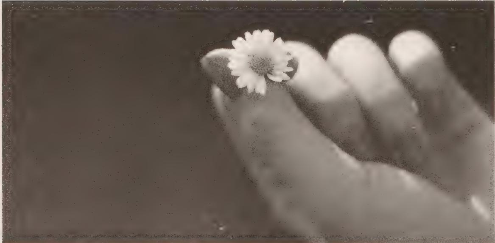

# Chính anh ấy đã khiến bạn trở thành một người độc lập

**是他让你成为一个独立的人**

*shì tā ràng nǐ chéng wéi yí gè dú lì de rén*

相信在每个人的一生中，都会有那么一些人，在匆匆韶光里，教你成长，教会你爱。

xiāng xìn zài měi gè rén de yī shēng zhōng，dū huì yǒu nà me yī xiē rén，zài cōng cōng sháo guāng lǐ，jiào nǐ chéng zhǎng，jiào huì nǐ ài。

Tôi tin trong cuộc đời mỗi người, sẽ có những người như thế, giữa quãng thời gian vội vã, dạy bạn trưởng thành, dạy bạn biết yêu thương.

就像我的父亲对于我。

jiù xiàng wǒ de fù qīn duì yú wǒ。

Cũng như cha tôi đối với tôi vậy.

对于父亲，我不知道是爱还是恨。

duì yú fù qīn，wǒ bù zhī dào shì ài hái shì hèn。

Với cha, tôi không biết đó là yêu hay hận.

因为，爱恨像是在随着时间的年轮而翻转。

yīn wèi，ài hèn xiàng shì zài suí zhe shí jiān de nián lún ér fān zhuǎn。

Bởi vì, yêu hận cứ như đang lật ngược theo từng vòng năm tháng.

在一些年纪，我是恨着他的；而在另一些年纪，我又觉得他是我此生最爱的人。

zài yī xiē nián jì，wǒ shì hèn zhe tā de；ér zài lìng yī xiē nián jì，wǒ yòu jué de tā shì wǒ cǐ shēng zuì ài de rén。

Có những giai đoạn, tôi hận ông; mà ở những giai đoạn khác, tôi lại thấy ông là người tôi yêu nhất đời.

在我爱着他的时候，我看到的全是他的痛苦，他内心的渴念，以及他的人生、婚姻与爱情所受的磨难。

zài wǒ ài zhe tā de shí hòu，wǒ kàn dào de quán shì tā de tòng kǔ，tā nèi xīn de kě niàn，yǐ jí tā de rén shēng、hūn yīn yǔ ài qíng suǒ shòu de mó nàn。

Khi tôi yêu ông, tôi nhìn thấy toàn những đau khổ của ông, khát khao trong lòng ông, cùng những gian nan mà cuộc đời, hôn nhân và tình yêu của ông phải chịu đựng.

在这样的时候，我觉得自己是这世间最了解、最懂他的人。

zài zhè yàng de shí hòu，wǒ jué de zì jǐ shì zhè shì jiān zuì liǎo jiě、zuì dǒng tā de rén。

Trong những lúc như thế, tôi cảm thấy mình là người hiểu ông nhất, thấu ông nhất trên đời.

我读遍他所有的文字，陪他经受每一段痛苦。

wǒ dú biàn tā suǒ yǒu de wén zì，péi tā jīng shòu měi yī duàn tòng kǔ。

Tôi đọc hết tất cả những dòng chữ của ông, cùng ông trải qua từng nỗi đau.

或者，我就是他人生磨难的果实。

huò zhě，wǒ jiù shì tā rén shēng mó nàn de guǒ shí。

Hoặc giả, tôi chính là kết quả của những gian nan trong cuộc đời ông.

不管是我出生，还是渐渐长大变得懂事，我都算是当事人。

bù guǎn shì wǒ chū shēng，hái shì jiàn jiàn zhǎng dà biàn dé dǒng shì，wǒ dōu suàn shì dāng shì rén。

Dù là lúc tôi chào đời, hay khi lớn dần lên trở nên hiểu chuyện, tôi đều coi như là người trong cuộc.

作为一个当事人，总是要比他人看得清。

zuò wéi yí gè dāng shì rén，zǒng shì yào bǐ tā rén kàn de qīng。

Là người trong cuộc, bao giờ cũng nhìn rõ hơn người ngoài.

我总是记得他不管去任何地方，都会拿着一沓稿纸与几本杂志。

wǒ zǒng shì jì de tā bù guǎn qù rèn hé dì fāng，dū huì ná zhe yī dá gǎo zhǐ yǔ jǐ běn zá zhì。

Tôi luôn nhớ rằng dù đi đến bất cứ đâu, ông đều mang theo một xấp giấy nháp và vài cuốn tạp chí.

仿佛纸和笔成了他的一种标志。

fǎng fú zhǐ hé bǐ chéng le tā de yī zhǒng biāo zhì。

Như thể giấy và bút đã trở thành một thứ biểu trưng của ông.

不管在任何情况下，他都用这纸与笔去创作。

bù guǎn zài rèn hé qíng kuàng xià，tā dōu yòng zhè zhǐ yǔ bǐ qù chuàng zuò。

Dù trong hoàn cảnh nào, ông cũng dùng giấy bút ấy để sáng tác.

他一路写下的文字，或许就是他一生中痛苦与幸福的原路。

tā yī lù xiě xià de wén zì，huò xǔ jiù shì tā yī shēng zhōng tòng kǔ yǔ xìng fú de yuán lù。

Những dòng chữ ông viết trên suốt chặng đường, có lẽ chính là con đường nguyên thủy của đau khổ và hạnh phúc trong đời ông.

在他的文字中，我看到了他的成长，以及那些撼动人心的经历。

zài tā de wén zì zhōng，wǒ kàn dào le tā de chéng zhǎng，yǐ jí nà xiē hàn dòng rén xīn de jīng lì。

Trong những dòng chữ của ông, tôi nhìn thấy sự trưởng thành của ông, cùng những trải nghiệm làm rung động lòng người.

很多时候，我们是分离的，我不知道他经历了什么，他也不曾告诉我。

hěn duō shí hòu，wǒ men shì fēn lí de，wǒ bù zhī dào tā jīng lì le shén me，tā yě bù céng gào sù wǒ。

Nhiều lúc, chúng tôi ở xa nhau, tôi không biết ông đã trải qua điều gì, ông cũng chưa từng kể cho tôi.

但是这些文字会告诉我。

dàn shì zhè xiē wén zì huì gào sù wǒ。

Nhưng những dòng chữ này sẽ kể cho tôi nghe.

告诉我他的前半生发生了什么，告诉我他的后半生经历了什么。

gào sù wǒ tā de qián bàn shēng fà shēng le shén me，gào sù wǒ tā de hòu bàn shēng jīng lì le shén me。

Kể cho tôi nghe nửa đời trước của ông đã xảy ra những gì, nửa đời sau của ông đã trải qua những gì.

站在这个角度上想的时候，我对这样一个父亲是心存敬意与爱意的。

zhàn zài zhè ge jiǎo dù shàng xiǎng de shí hòu，wǒ duì zhè yàng yí gè fù qīn shì xīn cún jìng yì yǔ ài yì de。

Khi nghĩ từ góc độ này, tôi dành cho một người cha như thế lòng kính trọng và yêu thương.

我总想着，自己要挣一些钱，出息些，给他更好的生活。

wǒ zǒng xiǎng zhe，zì jǐ yào zhēng yī xiē qián，chū xī xiē，gěi tā gèng hǎo de shēng huó。

Tôi luôn nghĩ, mình phải kiếm được chút tiền, nên người hơn, cho ông cuộc sống tốt đẹp hơn.

在我所走的道路上，多少有些是为了他而勤奋。

zài wǒ suǒ zǒu de dào lù shàng，duō shǎo yǒu xiē shì wèi le tā ér qín fèn。

Trên con đường tôi đi, có phần nào đó là vì ông mà siêng năng cố gắng.

为了他，我想把这条路走好，走得长远，走得正确。

wèi le tā，wǒ xiǎng bǎ zhè tiáo lù zǒu hǎo，zǒu dé cháng yuǎn，zǒu dé zhèng què。

Vì ông, tôi muốn đi cho tốt con đường này, đi thật xa, đi thật đúng.

我是他的孩子，而我也会有自己的孩子，我希望一切可以好起来，可以得到好的传递。

wǒ shì tā de hái zi，ér wǒ yě huì yǒu zì jǐ de hái zi，wǒ xī wàng yī qiè kě yǐ hǎo qǐ lái，kě yǐ dé dào hǎo de chuán dì。

Tôi là con của ông, và tôi cũng sẽ có con của mình, tôi mong mọi thứ có thể tốt lên, có thể được truyền thừa những điều tốt đẹp.

那个时候，我愿意抛开诸多问题，因为有一个会陪着自己修改诗歌到深夜两点、探讨文学风格、讨论生活好坏的父亲，感到知足且幸福。

nà ge shí hòu，wǒ yuàn yì pāo kāi zhū duō wèn tí，yīn wèi yǒu yí gè huì péi zhe zì jǐ xiū gǎi shī gē dào shēn yè liǎng diǎn、tàn tǎo wén xué fēng gé、tǎo lùn shēng huó hǎo huài de fù qīn，gǎn dào zhī zú qiě xìng fú。

Lúc đó, tôi sẵn lòng gạt sang một bên nhiều chuyện, vì có một người cha sẵn sàng ngồi cùng sửa từng câu thơ đến hai giờ đêm, bàn về phong cách văn học, trò chuyện về tốt xấu của cuộc sống, tôi thấy mãn nguyện và hạnh phúc.

他真的就是一个父亲，一个教会了我成长与爱的人。

tā zhēn de jiù shì yí gè fù qīn，yí gè jiào huì le wǒ chéng zhǎng yǔ ài de rén。

Ông thật sự là một người cha, một người đã dạy tôi trưởng thành và biết yêu thương.

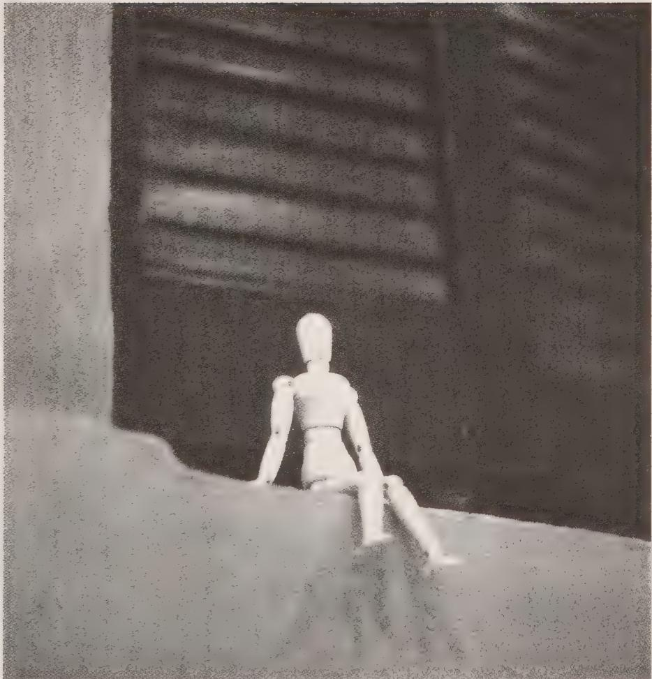

# Gặp gỡ người tâm đầu ý hợp với bạn

**遇见和你心灵相通的人**

*yù jiàn hé nǐ xīn líng xiāng tōng de rén*

不要因为长久的孤单而难过，也不要因为一直没有人跟你做朋友而意志不坚。

bú yào yīn wèi cháng jiǔ de gū dān ér nán guò，yě bú yào yīn wèi yì zhí méi yǒu rén gēn nǐ zuò péng yǒu ér yì zhì bù jiān。

Đừng vì cô đơn lâu dài mà buồn bã, cũng đừng vì mãi không có ai làm bạn với mình mà trở nên chùn bước.

每一个人都有适合自己存在的人群，只是他们要么没有出现，要么就在来的路上。

měi yí gè rén dōu yǒu shì hé zì jǐ cún zài de rén qún，zhǐ shì tā men yào me méi yǒu chū xiàn，yào me jiù zài lái de lù shàng。

Mỗi người đều có một nhóm người phù hợp để mình tồn tại giữa họ, chỉ là họ hoặc là chưa xuất hiện, hoặc là đang trên đường đến.

正如曾经的我一样。

zhèng rú céng jīng de wǒ yī yàng。

Cũng như chính tôi ngày trước vậy.

认识z是大学社团参加一次全国高校文学作品大赛。

rèn shí z shì dà xué shè tuán cān jiā yī cì quán guó gāo xiào wén xué zuò pǐn dà sài。

Quen biết z là nhờ lần câu lạc bộ đại học tham gia một cuộc thi tác phẩm văn học sinh viên toàn quốc.

那个时候我是编辑部的部长，收到了很多同学的稿件。

nà ge shí hòu wǒ shì biān jí bù de bù zhǎng，shōu dào le hěn duō tóng xué de gǎo jiàn。

Lúc đó tôi là trưởng ban biên tập, nhận được rất nhiều bản thảo của các bạn sinh viên.

其中有一沓是Z的。

qí zhōng yǒu yī dá shì Z de。

Trong đó có một xấp bản thảo là của Z.

他写了一篇散文和一篇小说，外加几首诗歌。

tā xiě le yī piān sǎn wén hé yī piān xiǎo shuō，wài jiā jǐ shǒu shī gē。

Anh ấy viết một bài tản văn, một truyện ngắn, thêm vài bài thơ.

当我看到他的作品时，便兴奋了。

dāng wǒ kàn dào tā de zuò pǐn shí，biàn xīng fèn le。

Khi nhìn thấy tác phẩm của anh ấy, tôi đã phấn khích.

这是我一直要找的文字，粗犷、有力。

zhè shì wǒ yì zhí yào zhǎo de wén zì，cū guǎng、yǒu lì。

Đây chính là thứ văn chương tôi hằng tìm kiếm, phóng khoáng, đầy sức mạnh.

而且我们的小说风格也很像。

ér qiě wǒ men de xiǎo shuō fēng gé yě hěn xiàng。

Vả lại phong cách tiểu thuyết của chúng tôi cũng rất giống nhau.

因而，我们认识了，成为朋友。

yīn ér，wǒ men rèn shí le，chéng wéi péng yǒu。

Nhờ vậy, chúng tôi quen biết nhau và trở thành bạn bè.

后来他给我推荐《红字》《一个青年人的画像》，以及《人民文学》这本杂志中精美的文章，让我阅读。

hòu lái tā gěi wǒ tuī jiàn《hóng zì》《yí gè qīng nián rén de huà xiàng》，yǐ jí《rén mín wén xué》zhè běn zá zhì zhōng jīng měi de wén zhāng，ràng wǒ yuè dú。

Về sau anh ấy giới thiệu cho tôi đọc "Chữ đỏ", "Chân dung một thanh niên", cùng những bài viết tinh tế trong tạp chí "Nhân dân văn học".

因为他，我读了很多外国作品，知道了一些我从来不知道的外国作家。

yīn wèi tā，wǒ dú le hěn duō wài guó zuò pǐn，zhī dào le yī xiē wǒ cóng lái bù zhī dào de wài guó zuò jiā。

Nhờ anh ấy, tôi đọc được nhiều tác phẩm nước ngoài, biết đến những nhà văn nước ngoài mà tôi chưa từng biết.

Z是我第一个文学上的朋友，一个可以跟我谈文学、谈读书、谈生活的人。

Z shì wǒ dì yí gè wén xué shàng de péng yǒu，yí gè kě yǐ gēn wǒ tán wén xué、tán dú shū、tán shēng huó de rén。

Z là người bạn văn chương đầu tiên của tôi, một người có thể cùng tôi bàn về văn học, về sách vở, về cuộc sống.

等我有了知心的朋友，我便想，如果说一个男人没有英俊的相貌，巨大的财富，那么还能让我为之动心的，便是写得出一手好文章。

děng wǒ yǒu le zhī xīn de péng yǒu，wǒ biàn xiǎng，rú guǒ shuō yí gè nán rén méi yǒu yīng jùn de xiàng mào，jù dà de cái fù，nà me hái néng ràng wǒ wèi zhī dòng xīn de，biàn shì xiě dé chū yī shǒu hǎo wén zhāng。

Khi đã có người bạn tri kỷ, tôi mới nghĩ rằng, nếu một người đàn ông không có ngoại hình tuấn tú, không có tài sản lớn, thì thứ còn có thể khiến tôi rung động chính là khả năng viết được những bài văn hay.

我依然会觉得他熠熠生辉。

wǒ yī rán huì jué de tā yì yì shēng huī。

Tôi vẫn sẽ thấy anh ấy lấp lánh tỏa sáng.

曾经我生活的周围缺少真正交心的人，我们每天谈论的都是男女同学、生活琐事、八卦之类的话题，而对于文学，或者思想的交流，真的少之甚少。

céng jīng wǒ shēng huó de zhōu wéi quē shǎo zhēn zhèng jiāo xīn de rén，wǒ men měi tiān tán lùn de dōu shì nán nǚ tóng xué、shēng huó suǒ shì、bā guà zhī lèi de huà tí，ér duì yú wén xué，huò zhě sī xiǎng de jiāo liú，zhēn de shǎo zhī shèn shǎo。

Xung quanh cuộc sống của tôi ngày trước thiếu những người thật sự trao đổi tâm tình, mỗi ngày chúng tôi chỉ bàn về bạn nam bạn nữ cùng lớp, chuyện vặt trong cuộc sống, chuyện phiếm v.v., còn về văn học hay những trao đổi tư tưởng thì thật sự rất hiếm hoi.

我从不敢轻易开口和别人谈论理想。

wǒ cóng bù gǎn qīng yì kāi kǒu hé bié rén tán lùn lǐ xiǎng。

Tôi chưa từng dám dễ dàng mở lời bàn về lý tưởng với người khác.

后来认识z，我会在网上看他写的文章，他也会看我的。

hòu lái rèn shí z， wǒ huì zài wǎng shàng kàn tā xiě de wén zhāng，tā yě huì kàn wǒ de。

Về sau quen z, tôi thường xem những bài viết của anh ấy trên mạng, anh ấy cũng xem của tôi.

我记得那时他正打算写一篇长篇小说《无处透气》。

wǒ jì de nà shí tā zhèng dǎ suàn xiě yī piān cháng piān xiǎo shuō《wú chǔ tòu qì》。

Tôi nhớ lúc đó anh ấy đang định viết một cuốn tiểu thuyết dài mang tên "Không chốn thoát thân".

在我读完他的《无处透气》之后，我除了觉得自己活得狭隘以外，还觉得自己失去了本性。

zài wǒ dú wán tā de《wú chǔ tòu qì》zhī hòu，wǒ chú le jué de zì jǐ huó dé xiá ài yǐ wài，hái jué de zì jǐ shī qù le běn xìng。

Sau khi đọc xong "Không chốn thoát thân" của anh ấy, ngoài cảm thấy mình sống quá hẹp hòi, tôi còn thấy mình đã đánh mất bản tính.

我本不该抱怨生活太过枯燥乏味，循规蹈矩，如果我有追求，那么每一天对我来说，都很珍贵。

wǒ běn bù gāi bào yuàn shēng huó tài guò kū zào fá wèi，xún guī dǎo jǔ，rú guǒ wǒ yǒu zhuī qiú，nà me měi yī tiān duì wǒ lái shuō，dōu hěn zhēn guì。

Lẽ ra tôi không nên than phiền cuộc sống quá nhàm chán, khuôn phép; nếu tôi có lý tưởng theo đuổi, thì mỗi ngày đối với tôi đều vô cùng trân quý.

而我把这些珍贵的东西毫不在意地丢失了，还没有为之惋惜、心疼。

ér wǒ bǎ zhè xiē zhēn guì de dōng xī háo bù zài yì dì diū shī le，hái méi yǒu wèi zhī wǎn xī、xīn téng。

Thế mà tôi đã làm mất những điều quý giá ấy một cách thờ ơ, thậm chí không biết tiếc nuối, không biết đau lòng.

我想一个人总是要活在一个圈子里才能有所造诣，如果你是一个文人，一定要活在文学的圈子里，沾着那么一些书香气。

wǒ xiǎng yí gè rén zǒng shì yào huó zài yí gè quān zi lǐ cái néng yǒu suǒ zào yì，rú guǒ nǐ shì yí gè wén rén，yí dìng yào huó zài wén xué de quān zi lǐ，zhān zhe nà me yī xiē shū xiāng qì。

Tôi nghĩ một người phải sống trong một vòng tròn nhất định mới có thể thành tựu, nếu bạn là một người viết văn, hãy sống trong vòng tròn văn học, để thấm đẫm chút hương sách ấy.

正如我跟Z，虽然我们只是两个人，但已经是1+1>2了。

zhèng rú wǒ gēn Z， suī rán wǒ men zhǐ shì liǎng gè rén，dàn yǐ jīng shì 1+1>2 le。

Cũng như tôi và Z, tuy chỉ là hai người, nhưng đã là 1+1>2 rồi.

相信在追逐的路上，我们都会遇见这样一个人的，志趣相投、毫无违和感的那么一个人。

xiāng xìn zài zhuī zhú de lù shàng，wǒ men dū huì yù jiàn zhè yàng yí gè rén de，zhì qù xiāng tóu、háo wú wéi hé gǎn de nà me yí gè rén。

Tôi tin trên con đường theo đuổi, chúng ta đều sẽ gặp được một người như thế, một người cùng chí hướng, ăn ý không chút gượng gạo.

他是我们迈出孤单的第一步，也是我们成长的第一步。

tā shì wǒ men mài chū gū dān de dì yī bù，yě shì wǒ men chéng zhǎng de dì yī bù。

Người ấy là bước đầu tiên để chúng ta bước ra khỏi cô đơn, cũng là bước đầu tiên của sự trưởng thành.

只要我们坚持走在路上，一定会不断地遇见心灵共通的人。

zhǐ yào wǒ men jiān chí zǒu zài lù shàng，yí dìng huì bù duàn dì yù jiàn xīn líng gòng tōng de rén。

Chỉ cần chúng ta kiên trì bước đi trên đường, nhất định sẽ không ngừng gặp được những tâm hồn đồng điệu.

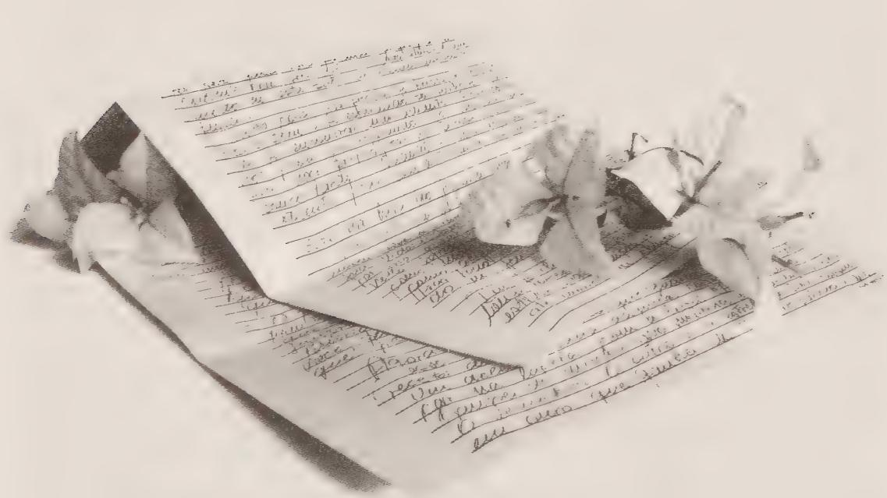

## Tương lai ơi, bạn còn khỏe chứ

**未来你还好吗**

*wèi lái nǐ hái hǎo ma*

很多时候，我总是在质疑未来。

hěn duō shí hòu，wǒ zǒng shì zài zhì yí wèi lái。

Rất nhiều lúc, tôi cứ luôn hoài nghi về tương lai.

它还在吗，它还是我们最初想象的那个样子吗？

tā hái zài ma，tā hái shì wǒ men zuì chū xiǎng xiàng de nà ge yàng zi ma？

Nó còn ở đó không, nó có còn đúng như những gì chúng ta tưởng tượng ban đầu không?

它还有没有在等待着我……

tā hái yǒu méi yǒu zài děng dài zhe wǒ……

Liệu nó có còn đang chờ đợi tôi nữa không...

彻底离开校园之后，又回去过一次，待了半个小时。

chè dǐ lí kāi xiào yuán zhī hòu，yòu huí qù guò yī cì，dài le bàn gè xiǎo shí。

Sau khi rời hẳn giảng đường, tôi đã quay lại một lần, ở lại nửa tiếng.

一路坐车看着路过的熟悉地方，内心感受到“回忆很美”。

yī lù zuò chē kàn zhe lù guò de shú xī dì fāng，nèi xīn gǎn shòu dào “huí yì hěn měi ”。

Trên đường ngồi xe nhìn những nơi thân quen lướt qua, trong lòng tôi cảm nhận được "kỷ niệm thật đẹp".

校园里还有我的骄傲和信仰的影子，我在心间问自己，难道因为我脱离了校园，脱离了朋友，就脱离了自己真实渴望的生活了吗？

xiào yuán lǐ hái yǒu wǒ de jiāo ào hé xìn yǎng de yǐng zi，wǒ zài xīn jiān wèn zì jǐ，nán dào yīn wèi wǒ tuō lí le xiào yuán，tuō lí le péng yǒu，jiù tuō lí le zì jǐ zhēn shí kě wàng de shēng huó le ma？

Trong khuôn viên trường vẫn còn bóng dáng niềm kiêu hãnh và đức tin của tôi, tôi tự hỏi lòng mình, chẳng lẽ chỉ vì tôi rời xa giảng đường, rời xa bạn bè, là đã rời xa cuộc sống mà mình thực sự khao khát sao?

毕业后我回了两次家，让我深刻体会到，自己的感情还是那么热烈。

bì yè hòu wǒ huí le liǎng cì jiā，ràng wǒ shēn kè tǐ huì dào，zì jǐ de gǎn qíng hái shì nà me rè liè。

Sau khi tốt nghiệp tôi về nhà hai lần, khiến tôi thấm thía rằng, tình cảm của mình vẫn mãnh liệt như thế.

第一次回去的时候，爷爷病重，很瘦很痛苦的样子。

dì yī cì huí qù de shí hòu，yé yé bìng zhòng，hěn shòu hěn tòng kǔ de yàng zi。

Lần đầu về, ông nội đang bệnh nặng, gầy gò và đau đớn.

我回京的时候，他哭了，像个孩子，我也哭了。

wǒ huí jīng de shí hòu，tā kū le，xiàng gè hái zi，wǒ yě kū le。

Khi tôi trở về kinh thành, ông đã khóc, khóc như một đứa trẻ, tôi cũng khóc.

我永远不会忘记他那个时候哭的样子，就像他说的那样，下次，我就真的再也看不到他了。

wǒ yǒng yuǎn bú huì wàng jì tā nà ge shí hòu kū de yàng zi，jiù xiàng tā shuō de nà yàng，xià cì，wǒ jiù zhēn de zài yě kàn bú dào tā le。

Tôi sẽ không bao giờ quên dáng vẻ ông khóc lúc đó, đúng như lời ông nói, lần sau, tôi thật sự sẽ không bao giờ được nhìn thấy ông nữa.

余生里都不会再看到他了。

yú shēng lǐ dōu bú huì zài kàn dào tā le。

Quãng đời còn lại sẽ không bao giờ còn được thấy ông.

第二次我回去的时候，爷爷就不在了。

dì èr cì wǒ huí qù de shí hòu，yé yé jiù bù zài le。

Lần thứ hai tôi về, ông nội đã không còn nữa.

回程的时候，我一直都没有哭，一直到我回家看到灵堂上他的照片。

huí chéng de shí hòu，wǒ yì zhí dōu méi yǒu kū，yì zhí dào wǒ huí jiā kàn dào líng táng shàng tā de zhào piān。

Trên đường về, tôi cứ không hề khóc, cho đến khi về đến nhà nhìn thấy tấm ảnh của ông trên linh đường.

想到我再也看不到他的时候，我捂着嘴呜呜哭了。

xiǎng dào wǒ zài yě kàn bú dào tā de shí hòu，wǒ wǔ zhe zuǐ wū wū kū le。

Nghĩ đến việc mình sẽ không bao giờ được thấy ông nữa, tôi bụm miệng khóc nức nở.

我已经责怪过生命了，它那么短，那么无常。

wǒ yǐ jīng zé guài guò shēng mìng le，tā nà me duǎn，nà me wú cháng。

Tôi đã từng trách móc sự sống, nó quá ngắn ngủi, quá vô thường.

我不哭，是因为我不知道我该去恨什么了，而那一刻我再也忍不住了。

wǒ bù kū，shì yīn wèi wǒ bù zhī dào wǒ gāi qù hèn shén me le，ér nà yī kè wǒ zài yě rěn bú zhù le。

Tôi không khóc, là vì tôi không biết mình nên hận điều gì nữa, mà đến khoảnh khắc đó tôi không thể kìm nén thêm được nữa.

丧事整整进行了三天，却也很快就过去了。

sāng shì zhěng zhěng jìn xíng le sān tiān，què yě hěn kuài jiù guò qù le。

Tang lễ kéo dài trọn ba ngày, thế mà cũng nhanh chóng qua đi.

好似这二十多年就在这三天过去了。

hǎo sì zhè èr shí duō nián jiù zài zhè sān tiān guò qù le。

Cứ như hơn hai mươi năm ấy trôi qua trong ba ngày ngắn ngủi.

以后的人生里，再也没有这二十多年，还有我曾挚爱的亲人。

yǐ hòu de rén shēng lǐ，zài yě méi yǒu zhè èr shí duō nián，hái yǒu wǒ céng zhì ài de qīn rén。

Trong cuộc đời về sau, sẽ không còn hai mươi mấy năm ấy nữa, cùng những người thân tôi hết mực yêu thương.

在我们的人生里，得到总是那么不知不觉，而失去总是这么迅速而彻底。

zài wǒ men de rén shēng lǐ，dé dào zǒng shì nà me bù zhī bù jué，ér shī qù zǒng shì zhè me xùn sù ér chè dǐ。

Trong cuộc đời chúng ta, đạt được thì luôn thầm lặng, còn mất đi thì luôn nhanh chóng và triệt để đến thế.

因为得到，我们曾信心满满，想要创造更好的生活。

yīn wèi dé dào，wǒ men céng xìn xīn mǎn mǎn，xiǎng yào chuàng zào gèng hǎo de shēng huó。

Vì được, chúng ta từng tràn đầy tự tin, muốn tạo nên cuộc sống tốt đẹp hơn.

也因为这样的失去，我们可能会磨灭自己的梦想。

yě yīn wèi zhè yàng de shī qù，wǒ men kě néng huì mó miè zì jǐ de mèng xiǎng。

Cũng vì những mất mát như thế, chúng ta có thể tiêu tan giấc mơ của mình.

我们会忘记自己曾信誓旦旦许下的誓言。

wǒ men huì wàng jì zì jǐ céng xìn shì dàn dàn xǔ xià de shì yán。

Chúng ta sẽ quên những lời thề đã trang trọng hứa hẹn ngày xưa.

是啊，一切都好远。

shì a，yī qiè dōu hǎo yuǎn。

Phải rồi, mọi thứ đều thật xa.

好远，走上自己想要走的路。

hǎo yuǎn，zǒu shàng zì jǐ xiǎng yào zǒu de lù。

Thật xa, con đường mình muốn đi.

好远，明年今日，自己会在哪儿努力工作，在什么地方过着怎样的生活。

hǎo yuǎn，míng nián jīn rì，zì jǐ huì zài nǎ ér nǔ lì gōng zuò，zài shén me dì fāng guò zhe zěn yàng de shēng huó。

Thật xa, ngày này sang năm, mình sẽ nỗ lực làm việc ở đâu, sống cuộc đời ra sao ở nơi nào.

好远，远得让人害怕。

hǎo yuǎn，yuǎn dé ràng rén hài pà。

Thật xa, xa đến đáng sợ.

当收入渐渐丰厚，当果实也越来越多，当梦想都渐渐实现，

dāng shōu rù jiàn jiàn fēng hòu，dāng guǒ shí yě yuè lái yuè duō，dāng mèng xiǎng dōu jiàn jiàn shí xiàn，

Khi thu nhập dần dư dả, khi quả ngọt ngày càng nhiều, khi ước mơ dần thành hiện thực,

我们还会不会找到当初真实的自己，不再越走越远呢？

wǒ men hái huì bú huì zhǎo dào dāng chū zhēn shí de zì jǐ，bù zài yuè zǒu yuè yuǎn ne？

liệu chúng ta còn tìm lại được con người thật của thuở ban đầu, không còn càng đi càng xa nữa chăng?

当我们感到迷茫的时候，我们会找各种人说话谈天，没有目的，也没有所向。

dāng wǒ men gǎn dào mí máng de shí hòu，wǒ men huì zhǎo gè zhǒng rén shuō huà tán tiān，méi yǒu mù dì，yě méi yǒu suǒ xiàng。

Khi cảm thấy lạc lối, chúng ta sẽ tìm đủ mọi người để trò chuyện tán gẫu, chẳng có mục đích, cũng chẳng có phương hướng.

直到弄得大家都厌倦、心烦。

zhí dào nòng dé dà jiā dōu yàn juàn、xīn fán。

Cho đến khi khiến tất cả mọi người đều chán ngán, phiền lòng.

一本书看了好几个月，还是那一页。

yī běn shū kàn le hǎo jǐ gè yuè，hái shì nà yī yè。

Một cuốn sách xem mấy tháng trời, vẫn dừng ở trang đó.

即使有时候想起来心急如焚，但是下班回家还是不愿意翻开它。

jí shǐ yǒu shí hòu xiǎng qǐ lái xīn jí rú fén，dàn shì xià bān huí jiā hái shì bù yuàn yì fān kāi tā。

Dù đôi khi nghĩ đến lại nóng lòng sốt ruột, nhưng tan làm về nhà vẫn chẳng muốn mở nó ra.

我们试图以各种途径找回自己，但发现竟是那样的难。

wǒ men shì tú yǐ gè zhǒng tú jìng zhǎo huí zì jǐ，dàn fā xiàn jìng shì nà yàng de nán。

Chúng ta cố gắng tìm lại chính mình bằng đủ mọi cách, nhưng phát hiện khó khăn đến thế.

只是当清晨醒来，看见窗子外明媚的阳光时，我们知道未来，它还好，它一直在等待着我们。

zhǐ shì dāng qīng chén xǐng lái，kàn jiàn chuāng zi wài míng mèi de yáng guāng shí，wǒ men zhī dào wèi lái，tā hái hǎo，tā yì zhí zài děng dài zhe wǒ men。

Chỉ khi thức dậy vào sớm mai, nhìn thấy ánh nắng rực rỡ ngoài cửa sổ, chúng ta mới biết rằng tương lai, nó vẫn ổn, nó vẫn luôn đang chờ đợi chúng ta.

等待着我们结束自己的烦恼和困惑，大步迎上，去它的面前。

děng dài zhe wǒ men jié shù zì jǐ de fán nǎo hé kùn huò，dà bù yíng shàng，qù tā de miàn qián。

Chờ đợi chúng ta gác lại những phiền muộn và hoang mang, sải bước tiến tới, đến trước mặt nó.

## Yêu một thứ mang lại cho bạn sức mạnh

**爱一种让你拥有力量的东西**

*ài yī zhǒng ràng nǐ yōng yǒu lì liàng de dōng xī*

相信很多人的人生，是在一两部书的启发下改变的。

xiāng xìn hěn duō rén de rén shēng，shì zài yī liǎng bù shū de qǐ fā xià gǎi biàn de。

Tôi tin cuộc đời của nhiều người đã thay đổi nhờ sự khai sáng của một hai cuốn sách.

也许从前一直在迷惘，一直没有找到方向，无从下手，也没有什么宏图大志。

yě xǔ cóng qián yì zhí zài mí wǎng，yì zhí méi yǒu zhǎo dào fāng xiàng，wú cóng xià shǒu，yě méi yǒu shén me hóng tú dà zhì。

Có thể trước đây cứ mãi mê muội, mãi không tìm được hướng đi, không biết bắt đầu từ đâu, cũng chẳng có chí lớn gì.

但是，就有那么一本书、一句话，或许就从此改变了你的命运，让你不再彷徨。

dàn shì，jiù yǒu nà me yī běn shū、yī jù huà，huò xǔ jiù cóng cǐ gǎi biàn le nǐ de mìng yùn，ràng nǐ bù zài páng huáng。

Thế nhưng, chỉ cần có một cuốn sách, một câu nói, có lẽ từ đó sẽ thay đổi số phận bạn, khiến bạn không còn bồi hồi lạc lối.

让你有了骨气，树立了人格，也树立了此生的追求与理想。

ràng nǐ yǒu le gǔ qì，shù lì le rén gé，yě shù lì le cǐ shēng de zhuī qiú yǔ lǐ xiǎng。

Khiến bạn có khí tiết, dựng nên nhân cách, cũng lập nên lý tưởng và khát vọng của cả đời này.

十六岁时，我开始写作，发表作品。

shí liù suì shí，wǒ kāi shǐ xiě zuò，fā biǎo zuò pǐn。

Năm mười sáu tuổi, tôi bắt đầu viết và cho đăng tác phẩm.

高中的三年，我开始写乡土小说，写了散文，写了青春小说，因此，还拿了几个奖。

gāo zhōng de sān nián，wǒ kāi shǐ xiě xiāng tǔ xiǎo shuō，xiě le sǎn wén，xiě le qīng chūn xiǎo shuō，yīn cǐ，hái ná le jǐ gè jiǎng。

Ba năm cấp ba, tôi bắt đầu viết tiểu thuyết đồng quê, viết tản văn, viết tiểu thuyết tuổi trẻ, nhờ đó còn giành được mấy giải thưởng.

十九岁的时候，去市里领奖。

shí jiǔ suì de shí hòu，qù shì lǐ lǐng jiǎng。

Năm mười chín tuổi, tôi lên thành phố nhận giải.

市作协主席让我发言，我犹豫的时候，他说：“你要是不行，我就让别人上。

shì zuò xié zhǔ xí ràng wǒ fā yán，wǒ yóu yù de shí hòu，tā shuō ：“nǐ yào shì bù xíng，wǒ jiù ràng bié rén shàng。

Chủ tịch Hội Nhà văn thành phố mời tôi phát biểu, khi tôi còn đang do dự, ông nói: "Nếu cháu không làm được, ta sẽ để người khác lên.

”我还记得那天我站在领奖台上说的话，我说：“十九岁，是我文学路的开始，但它不会有结束。

”wǒ hái jì de nà tiān wǒ zhàn zài lǐng jiǎng tái shàng shuō de huà，wǒ shuō ：“shí jiǔ suì，shì wǒ wén xué lù de kāi shǐ，dàn tā bú huì yǒu jié shù。

"Tôi vẫn nhớ những lời mình đứng trên bục nhận giải hôm đó, tôi nói: "Mười chín tuổi, là khởi đầu con đường văn chương của tôi, nhưng nó sẽ không bao giờ kết thúc.

如今，我非常惭愧，那个时候的大言不惭。

rú jīn，wǒ fēi cháng cán kuì，nà ge shí hòu de dà yán bù cán。

Ngày nay, tôi vô cùng hổ thẹn về sự khoác lác của mình lúc đó.

那个时候的自

nà ge shí hòu de zì

Khoảng thời gian ấy, bản thân

己，何尝知道什么是文学。

jǐ，hé cháng zhī dào shén me shì wén xué。

tôi, đâu hề biết văn học là gì.

我像每一个渴望写出好文章、一夜成名的年轻人一样，每天拼命地写字。

wǒ xiàng měi yí gè kě wàng xiě chū hǎo wén zhāng、yī yè chéng míng de nián qīng rén yī yàng，měi tiān pīn mìng dì xiě zì。

Tôi giống như bao người trẻ khao khát viết ra những bài văn hay, một đêm nổi danh, ngày nào cũng liều mạng viết lách.

上课的时候，放学回家的晚上，星期天冰冷的房间里。

shàng kè de shí hòu，fàng xué huí jiā de wǎn shàng，xīng qī tiān bīng lěng de fáng jiān lǐ。

Trong những giờ lên lớp, những buổi tối tan học về nhà, những căn phòng lạnh lẽo ngày chủ nhật.

我写我自己的故事，也写别人的故事。

wǒ xiě wǒ zì jǐ de gù shì，yě xiě bié rén de gù shì。

Tôi viết câu chuyện của chính mình, cũng viết câu chuyện của người khác.

上大学后，我开始写散文。

shàng dà xué hòu，wǒ kāi shǐ xiě sǎn wén。

Sau khi vào đại học, tôi bắt đầu viết tản văn.

大学三年，我像是虚度的。

dà xué sān nián，wǒ xiàng shì xū dù de。

Ba năm đại học, tôi như sống hoài sống phí.

前三年，我同舍友过着散漫的生活。

qián sān nián，wǒ tóng shě yǒu guò zhe sǎn màn de shēng huó。

Ba năm đầu, tôi cùng bạn cùng phòng sống cuộc đời thảnh thơi lơ đễnh.

上课的时候去上课，下课就回寝室看电影、聊天、上网。

shàng kè de shí hòu qù shàng kè，xià kè jiù huí qǐn shì kàn diàn yǐng、liáo tiān、shàng wǎng。

Giờ học thì đi học, hết tiết về ký túc xá xem phim, tán gẫu, lướt web.

周末睡懒觉，或者出去逛街。

zhōu mò shuì lǎn jiào，huò zhě chū qù guàng jiē。

Cuối tuần ngủ nướng, hoặc ra ngoài dạo phố.

俞敏洪说：“大学时期要博览群书，大学四年至少要读400本书，优秀的书籍就像难得的朋友，在你不需要的时候，你感觉不到他们的存在；在你需要的时候，他们总是及时地来到你的身边，忠诚地守候在你生命的左右，随时宽解、充实你那不安、寂寞的灵魂。

yú mǐn hóng shuō ：“dà xué shí qī yào bó lǎn qún shū，dà xué sì nián zhì shǎo yào dú 400 běn shū，yōu xiù de shū jí jiù xiàng nán dé de péng yǒu，zài nǐ bù xū yào de shí hòu，nǐ gǎn jué bú dào tā men de cún zài；zài nǐ xū yào de shí hòu，tā men zǒng shì jí shí dì lái dào nǐ de shēn biān，zhōng chéng dì shǒu hòu zài nǐ shēng mìng de zuǒ yòu，suí shí kuān jiě、chōng shí nǐ nà bù ān、jì mò de líng hún。

Du Mẫn Hồng nói: "Thời đại học nên đọc rộng khắp sách vở, bốn năm đại học ít nhất phải đọc 400 cuốn sách, sách hay cũng như những người bạn khó tìm, khi bạn không cần đến, bạn chẳng cảm nhận được sự tồn tại của họ; khi bạn cần, họ luôn kịp thời đến bên bạn, trung thành canh giữ bên đời bạn, lúc nào cũng an ủi, làm phong phú tâm hồn bất an, cô đơn của bạn.

99

99

99

我虽然没有放弃读书，在此期间也读了《秦腔》《香水》《苏童作品集》《罪与罚》等那么几部让我印象深刻的书，但是这在知识的海洋里，无疑是微不足道的。

wǒ suī rán méi yǒu fàng qì dú shū，zài cǐ qī jiān yě dú le《qín qiāng》《xiāng shuǐ》《sū tóng zuò pǐn jí》《zuì yǔ fá》děng nà me jǐ bù ràng wǒ yìn xiàng shēn kè de shū，dàn shì zhè zài zhī shí de hǎi yáng lǐ，wú yí shì wēi bù zú dào de。

Dù tôi không hề từ bỏ việc đọc sách, trong thời gian đó cũng đã đọc "Tần Khang", "Nước hoa", "Tuyển tập tác phẩm Tô Đồng", "Tội ác và trừng phạt" cùng vài cuốn khiến tôi nhớ mãi, nhưng những điều ấy trong đại dương tri thức, quả thật không đáng kể.

或许每个人，心中都有一道门。

huò xǔ měi gè rén，xīn zhōng dōu yǒu yī dào mén。

Có lẽ mỗi người, trong lòng đều có một cánh cửa.

打开这扇门的关键所在，是要找到开启它的那把钥匙。

dǎ kāi zhè shàn mén de guān jiàn suǒ zài，shì yào zhǎo dào kāi qǐ tā de nà bǎ yào shi。

Điều then chốt để mở cánh cửa ấy, là tìm được chiếc chìa khóa mở nó.

而对我而言，或许《平凡的世界》便是我人生的第一把钥匙。

ér duì wǒ ér yán，huò xǔ《píng fán de shì jiè》biàn shì wǒ rén shēng de dì yī bǎ yào shi。

Còn với tôi, có lẽ "Thế giới bình phàm" chính là chiếc chìa khóa đầu tiên của cuộc đời tôi.

让我由一个浑噩的人，变成一个惊醒于生活的人。

ràng wǒ yóu yí gè hún è de rén，biàn chéng yí gè jīng xǐng yú shēng huó de rén。

Nó giúp tôi từ một người mê muội, trở thành một người tỉnh thức trước cuộc sống.

在大三的上半年，我们刚刚考完试，H向我推荐了《平凡的世界》，让我无论如何要读一读。

zài dà sān de shàng bàn nián，wǒ men gāng gāng kǎo wán shì ，H xiàng wǒ tuī jiàn le《píng fán de shì jiè》，ràng wǒ wú lùn rú hé yào dú yī dú。

Học kỳ đầu năm ba, chúng tôi vừa thi xong, H giới thiệu cho tôi "Thế giới bình phàm", bảo tôi bằng mọi giá phải đọc một lần.

我把厚厚的《平凡的世界》拿回宿舍，当我翻开它，认真读它的时候，我深深地陷进去了。

wǒ bǎ hòu hòu de《píng fán de shì jiè》ná huí sù shè，dāng wǒ fān kāi tā，rèn zhēn dú tā de shí hòu，wǒ shēn shēn dì xiàn jìn qù le。

Tôi mang cuốn "Thế giới bình phàm" dày cộp về ký túc xá, khi mở nó ra và đọc thật nghiêm túc, tôi đã chìm sâu vào trong đó.

我再次见到H，跟他说，读的时候，有好几次险些哭了。

wǒ zài cì jiàn dào H， gēn tā shuō，dú de shí hòu，yǒu hǎo jǐ cì xiǎn xiē kū le。

Tôi gặp lại H, nói với anh ấy rằng, lúc đọc có mấy lần suýt khóc.

我们都活在平凡的世界之中，而我们也都是平凡的人。

wǒ men dōu huó zài píng fán de shì jiè zhī zhōng，ér wǒ men yě dōu shì píng fán de rén。

Chúng ta đều đang sống trong một thế giới bình phàm, và chúng ta đều là những con người bình phàm.

但是在平凡简单的生活里，有一些人走得远，登得高，是因为他们拥有了不平凡的理想。

dàn shì zài píng fán jiǎn dān de shēng huó lǐ，yǒu yī xiē rén zǒu dé yuǎn，dēng dé gāo，shì yīn wèi tā men yōng yǒu le bù píng fán de lǐ xiǎng。

Nhưng trong cuộc sống bình phàm giản đơn, có những người đi xa, leo cao, là bởi họ sở hữu những lý tưởng không bình phàm.

有时候觉得，书中的孙少平，好像是自己的影子。

yǒu shí hòu jué de，shū zhōng de sūn shǎo píng，hǎo xiàng shì zì jǐ de yǐng zi。

Có lúc tôi cảm thấy, Tôn Thiếu Bình trong sách, cứ như là cái bóng của chính mình.

他对于生活苦难的承担，对于知识的渴求，以及对于人生的领悟，是那么深沉而执着，那么坚韧而有力。

tā duì yú shēng huó kǔ nàn de chéng dān，duì yú zhī shí de kě qiú，yǐ jí duì yú rén shēng de lǐng wù，shì nà me shēn chén ér zhí zhuó，nà me jiān rèn ér yǒu lì。

Sự gánh vác gian khổ của đời sống, khát khao tri thức, cùng sự ngộ ra về nhân sinh của anh ấy, sâu lắng mà bền bỉ, kiên cường mà mạnh mẽ biết bao.

他的人生路是平凡的，但是他有着坚强的意志和精神。

tā de rén shēng lù shì píng fán de，dàn shì tā yǒu zhe jiān qiáng de yì zhì hé jīng shén。

Con đường đời của anh ấy bình phàm, nhưng anh ấy có ý chí và tinh thần kiên cường.

这种意志可以说是一种信仰，让他在任何苦难里，都能坚韧地活着。

zhè zhǒng yì zhì kě yǐ shuō shì yī zhǒng xìn yǎng，ràng tā zài rèn hé kǔ nán lǐ，dōu néng jiān rèn dì huó zhe。

Ý chí ấy có thể nói là một niềm tin, khiến anh ấy trong bất kỳ gian khổ nào cũng có thể kiên cường mà sống.

他努力地为自己在残酷的现实世界里，挤出一道缝隙，供自己喘息、欢愉。

tā nǔ lì dì wèi zì jǐ zài cán kù de xiàn shí shì jiè lǐ，jǐ chū yī dào fèng xì，gōng zì jǐ chuǎn xī、huān yú。

Anh ấy nỗ lực chen mình trong thế giới hiện thực tàn khốc, mở ra một khe nhỏ để cho mình được thở, được vui.

在苦难的日子里，他以读书为支柱；在冰冷的坯楼里，他也要坚持读书；在危险的挖煤工作中，他仍坚持读书。

zài kǔ nàn de rì zi lǐ，tā yǐ dú shū wèi zhī zhù；zài bīng lěng de pī lóu lǐ，tā yě yào jiān chí dú shū；zài wēi xiǎn de wā méi gōng zuò zhōng，tā réng jiān chí dú shū。

Trong những ngày gian khổ, anh ấy lấy việc đọc sách làm chỗ dựa; trong căn nhà gạch lạnh lẽo, anh ấy vẫn kiên trì đọc sách; trong công việc đào than nguy hiểm, anh ấy vẫn cố đọc sách.

他有幸有田晓霞这样一个爱着他的人。

tā yǒu xìng yǒu tián xiǎo xiá zhè yàng yí gè ài zhe tā de rén。

Anh ấy may mắn có Điền Hiểu Hà, một người yêu thương anh ấy.

他们的精神领域相同，她给予他支持和鼓励。

tā men de jīng shén lǐng yù xiāng tóng，tā jǐ yǔ tā zhī chí hé gǔ lì。

Họ thuộc cùng một thế giới tinh thần, cô ấy cho anh ấy sự ủng hộ và động viên.

他没有被现实、被他的贫穷打倒。

tā méi yǒu bèi xiàn shí、bèi tā de pín qióng dǎ dǎo。

Anh ấy đã không bị hiện thực, bị cái nghèo đánh gục.

我向来相信，对于爱情，一个有着热忱的爱的人，是不会畏惧穷困和现实的。

wǒ xiàng lái xiāng xìn，duì yú ài qíng，yí gè yǒu zhe rè chén de ài de rén，shì bú huì wèi jù qióng kùn hé xiàn shí de。

Tôi vẫn luôn tin rằng, đối với tình yêu, một người yêu với lòng nhiệt thành, sẽ không sợ nghèo khó và hiện thực.

一个有着自己坚定信念的人，会坚定地去爱个人，不论岁月多么艰苦。

yí gè yǒu zhe zì jǐ jiān dìng xìn niàn de rén，huì jiān dìng dì qù ài gè rén，bù lùn suì yuè duō me jiān kǔ。

Một người có niềm tin kiên định của riêng mình, sẽ kiên định yêu một người, bất kể thời gian gian khó ra sao.

第一次流泪，是看到孙少平给他奶奶点眼药水的部分。

dì yī cì liú lèi，shì kàn dào sūn shǎo píng gěi tā nǎi nǎi diǎn yǎn yào shuǐ de bù fèn。

Lần đầu rơi nước mắt, là khi đọc đến đoạn Tôn Thiếu Bình nhỏ thuốc mắt cho bà nội.

孙少平用田润叶给他奶奶买了两瓶眼药水和一瓶止痛片。

sūn shǎo píng yòng tián rùn yè gěi tā nǎi nǎi mǎi le liǎng píng yǎn yào shuǐ hé yī píng zhǐ tòng piàn。

Tôn Thiếu Bình dùng tiền Điền Nhuận Diệp mua cho bà nội hai lọ thuốc nhỏ mắt và một lọ thuốc giảm đau.

他跟他奶奶说：“奶奶，看我给你买的药。

tā gēn tā nǎi nǎi shuō ：“nǎi nǎi，kàn wǒ gěi nǐ mǎi de yào。

Anh ấy nói với bà nội: "Bà ơi, xem cháu mua thuốc cho bà này.

这是治眼睛的，这是止痛片，浑身什么地方疼的时候，你就吃一片………”

zhè shì zhì yǎn jīng de，zhè shì zhǐ tòng piàn，hún shēn shén me dì fāng téng de shí hòu，nǐ jiù chī yī piàn ………”

Đây là thuốc chữa mắt, đây là thuốc giảm đau, khi nào thân thể đau chỗ nào, bà cứ uống một viên..."

因为年少，我们说友情，谈爱情，却经常忽略亲情。

yīn wèi nián shào，wǒ men shuō yǒu qíng，tán ài qíng，què jīng cháng hū lüè qīn qíng。

Bởi vì tuổi trẻ, chúng ta nói tình bạn, bàn tình yêu, mà thường bỏ quên tình thân.

等有一天，我们回首会发现，这世间最让人痛心的情感，是亲情。

děng yǒu yī tiān，wǒ men huí shǒu huì fā xiàn，zhè shì jiān zuì ràng rén tòng xīn de qíng gǎn，shì qīn qíng。

Đến một ngày, khi ngoảnh lại chúng ta sẽ nhận ra, tình cảm làm người ta đau lòng nhất trên đời, chính là tình thân.

无论时代如何轮转，人心如何改变，这种血浓于水的亲情，都是最珍贵，最打动人心的情感。

wú lùn shí dài rú hé lún zhuàn，rén xīn rú hé gǎi biàn，zhè zhǒng xuè nóng yú shuǐ de qīn qíng，dōu shì zuì zhēn guì，zuì dǎ dòng rén xīn de qíng gǎn。

Dù thời đại có xoay vần thế nào, lòng người có đổi thay ra sao, tình thân máu mủ ruột rà ấy vẫn là thứ tình cảm quý giá nhất, chạm đến trái tim nhất.

这种打动，是以至于你看到一句话，都

zhè zhǒng dǎ dòng，shì yǐ zhì yú nǐ kàn dào yī jù huà，dōu

Sự rung động ấy, đến mức bạn chỉ cần nhìn thấy một câu văn, cũng

会泪流满面。

huì lèi liú mǎn miàn。

sẽ rơi nước mắt đầy mặt.

再流泪，是看到孙兰香考上大学。

zài liú lèi，shì kàn dào sūn lán xiāng kǎo shàng dà xué。

Khóc lần nữa, là khi đọc đến đoạn Tôn Lan Hương đỗ đại học.

那个时候，我还在教室里，老师还在讲台上讲课，我坐在座位上止不住地流泪。

nà ge shí hòu，wǒ hái zài jiào shì lǐ，lǎo shī hái zài jiǎng tái shàng jiǎng kè，wǒ zuò zài zuò wèi shàng zhǐ bú zhù dì liú lèi。

Lúc đó, tôi vẫn đang ở trong lớp học, cô giáo vẫn đang giảng trên bục, tôi ngồi tại chỗ không kìm được nước mắt.

对于-个一直贫困潦倒、忍气吞声、受尽屈辱苦难的家庭来说，孙兰香考上大学无疑是一件天大的喜事，给予了他们每一个人至高的希望。

duì yú -gè yì zhí pín kùn liáo dǎo、rěn qì tūn shēng、shòu jǐn qū rǔ kǔ nàn de jiā tíng lái shuō，sūn lán xiāng kǎo shàng dà xué wú yí shì yī jiàn tiān dà de xǐ shì，jǐ yǔ le tā men měi yí gè rén zhì gāo de xī wàng。

Đối với một gia đình vốn dĩ bần cùng khốn khổ, cam chịu nhẫn nhục, chịu đựng đủ mọi tủi nhục gian truân, Tôn Lan Hương đỗ đại học quả là một niềm vui lớn lao trời bể, trao cho mỗi người trong nhà niềm hy vọng cao cả nhất.

就像《Χ战警》中说得那样：“挫折虽然痛苦，但会令你变得强大。

jiù xiàng 《Χzhàn jǐng》zhōng shuō dé nà yàng ：“cuò zhé suī rán tòng kǔ，dàn huì lìng nǐ biàn dé qiáng dà。

Cũng như lời trong "X-Men": "Nghịch cảnh dù đau đớn, nhưng sẽ khiến bạn trở nên mạnh mẽ.

最终能够改变这一切的，便是生命之最根本的希望。

zuì zhōng néng gòu gǎi biàn zhè yī qiè de，biàn shì shēng mìng zhī zuì gēn běn de xī wàng。

Điều cuối cùng có thể thay đổi tất cả những điều ấy, chính là hy vọng căn bản nhất của sự sống.

9

9

9

不管是被命运打折了腰的孙少安，是被苦难折磨一生的孙老汉，还是经受折磨的孙少平，这无疑是他们人生中头一次且最至高的幸福。

bù guǎn shì bèi mìng yùn dǎ zhé le yāo de sūn shǎo ān，shì bèi kǔ nàn zhé mó yī shēng de sūn lǎo hàn，hái shì jīng shòu zhé mó de sūn shǎo píng，zhè wú yí shì tā men rén shēng zhōng tóu yī cì qiě zuì zhì gāo de xìng fú。

Dù là Tôn Thiếu An bị số phận bẻ gãy lưng, là lão Tôn bị gian khổ giày vò cả đời, hay Tôn Thiếu Bình chịu nhiều nghiệt ngã, đây quả là niềm hạnh phúc lần đầu tiên và cao cả nhất trong đời họ.

虽然追求是幸福的，阅读也使人幸福，坚忍不拔是幸福，但是在人无完人的生命中，人还是需要得到那么一些切实的幸福的，一些摸得着、看得见、感受得到的幸福。

suī rán zhuī qiú shì xìng fú de，yuè dú yě shǐ rén xìng fú，jiān rěn bù bá shì xìng fú，dàn shì zài rén wú wán rén de shēng mìng zhòng，rén hái shì xū yào dé dào nà me yī xiē qiè shí de xìng fú de，yī xiē mō dé zhe、kàn dé jiàn、gǎn shòu dé dào de xìng fú。

Dù theo đuổi là hạnh phúc, đọc sách cũng khiến người ta hạnh phúc, kiên nhẫn bền bỉ là hạnh phúc, nhưng trong cuộc đời không ai hoàn mỹ, con người vẫn cần có được những niềm hạnh phúc thực tế, những hạnh phúc chạm được, thấy được, cảm nhận được.

孙兰香考上大学，便是那个家庭里一次切实的幸福。

sūn lán xiāng kǎo shàng dà xué，biàn shì nà ge jiā tíng lǐ yī cì qiè shí de xìng fú。

Tôn Lan Hương đỗ đại học, chính là một niềm hạnh phúc thực tế của gia đình ấy.

最后一次流泪，是惠英丈夫的死。

zuì hòu yī cì liú lèi，shì huì yīng zhàng fū de sǐ。

Lần cuối cùng rơi nước mắt, là cái chết của chồng Huệ Anh.

世间有太多平凡的人们，在夹层里享受仅有的幸福而被现实狠狠地击碎。

shì jiān yǒu tài duō píng fán de rén men，zài jiā céng lǐ xiǎng shòu jǐn yǒu de xìng fú ér bèi xiàn shí hěn hěn dì jī suì。

Trên đời có quá nhiều con người bình phàm, đang tận hưởng niềm hạnh phúc mong manh trong khe hẹp thì bị hiện thực nghiền nát không thương tiếc.

他们要的不多，他们不贪心，也不虚荣。

tā men yào de bù duō，tā men bù tān xīn，yě bù xū róng。

Họ không đòi hỏi nhiều, không tham lam, cũng không hư vinh.

但是上天硬是不给他们安稳的生活，硬是将尖刀刺进他们的心窝。

dàn shì shàng tiān yìng shì bù gěi tā men ān wěn de shēng huó，yìng shì jiāng jiān dāo cì jìn tā men de xīn wō。

Thế nhưng ông trời nhất quyết không cho họ cuộc sống yên ổn, nhất quyết cắm con dao nhọn vào tim họ.

生活好似在说，你不是要在苦难中寻找快乐吗，你不是要在残酷的现实中享受幸福吗，那么，就让你尽情地去经受吧。

shēng huó hǎo sì zài shuō，nǐ bú shì yào zài kǔ nàn zhōng xún zhǎo kuài lè ma，nǐ bú shì yào zài cán kù de xiàn shí zhōng xiǎng shòu xìng fú ma，nà me，jiù ràng nǐ jìn qíng dì qù jīng shòu ba。

Cuộc sống như đang nói, chẳng phải ngươi muốn tìm niềm vui trong gian khổ sao, chẳng phải ngươi muốn tận hưởng hạnh phúc trong hiện thực tàn khốc sao, vậy thì, cứ để ngươi thỏa sức mà trải nghiệm đi.

家里仅有的支柱死了、心里仅有的精神支柱分离了、生命的爱人消失了…他们若是爱得不那么沉重，伤害对于他们还会那么残忍吗？

jiā lǐ jǐn yǒu de zhī zhù sǐ le、xīn lǐ jǐn yǒu de jīng shén zhī zhù fēn lí le、shēng mìng de ài rén xiāo shī le…tā men ruò shì ài dé bù nà me chén zhòng，shāng hài duì yú tā men hái huì nà me cán rěn ma？

Trụ cột duy nhất trong nhà đã mất, chỗ dựa tinh thần duy nhất trong lòng đã rời xa, người thương yêu của đời mình đã biến mất... nếu họ yêu không sâu đậm đến thế, thì những tổn thương đối với họ có còn tàn nhẫn đến vậy không?

在阅读的过程中，我最为孙少平痛心。

zài yuè dú de guò chéng zhōng，wǒ zuì wèi sūn shǎo píng tòng xīn。

Trong quá trình đọc, tôi đau lòng nhất vì Tôn Thiếu Bình.

他在跟命运抗争着、战斗着，顽强而不屈服。

tā zài gēn mìng yùn kàng zhēng zhe、zhàn dòu zhe，wán qiáng ér bù qū fú。

Anh ấy đang chống chọi, chiến đấu với số phận, ngoan cường mà không khuất phục.

相信，如果你也拥有自己的信念与追求，而又不能尽力去追寻的时候，你也会变成这样一位战斗者。

xiāng xìn，rú guǒ nǐ yě yōng yǒu zì jǐ de xìn niàn yǔ zhuī qiú，ér yòu bù néng jìn lì qù zhuī xún de shí hòu，nǐ yě huì biàn chéng zhè yàng yī wèi zhàn dòu zhě。

Tôi tin, nếu bạn cũng có niềm tin và khát vọng của riêng mình, mà lại không thể hết sức theo đuổi, bạn cũng sẽ trở thành một chiến binh như thế.

或许孙少平就是我们青年人的写照。

huò xǔ sūn shǎo píng jiù shì wǒ men qīng nián rén de xiě zhào。

Có lẽ Tôn Thiếu Bình chính là bức chân dung của chúng ta, những người trẻ.

是我们关于理想、关于生活、关于苦难、关于人生的真实写照。

shì wǒ men guān yú lǐ xiǎng、guān yú shēng huó、guān yú kǔ nàn、guān yú rén shēng de zhēn shí xiě zhào。

Là bức chân dung chân thực của chúng ta về lý tưởng, về cuộc sống, về gian khổ, về nhân sinh.

关于这本书，其中的亲情、爱情、友情、信仰与热爱、生活与现实，是我写不尽，也写不透的。

guān yú zhè běn shū，qí zhōng de qīn qíng、ài qíng、yǒu qíng、xìn yǎng yǔ rè ài、shēng huó yǔ xiàn shí，shì wǒ xiě bù jìn，yě xiě bù tòu de。

Về cuốn sách này, tình thân, tình yêu, tình bạn, đức tin và lòng nhiệt thành, cuộc sống và hiện thực trong đó, là những điều tôi viết không hết, cũng viết không thấu.

我只能说，还未读过且想要明白生活、亲情、爱情、友情的人儿，安静且积极地去读这一本书吧。

wǒ zhǐ néng shuō，hái wèi dú guò qiě xiǎng yào míng bái shēng huó、qīn qíng、ài qíng、yǒu qíng de rén ér，ān jìng qiě jī jí dì qù dú zhè yī běn shū ba。

Tôi chỉ có thể nói, những ai chưa đọc và muốn hiểu về cuộc sống, tình thân, tình yêu, tình bạn, hãy yên lặng và tích cực đọc cuốn sách này đi.

不管你是何种身份的人，有着何样的生活，以及做好了怎样的打算，去读一读这本平凡的著作，去亲自尝一尝其中的苦与乐吧。

bù guǎn nǐ shì hé zhǒng shēn fèn de rén，yǒu zhe hé yàng de shēng huó，yǐ jí zuò hǎo le zěn yàng de dǎ suàn，qù dú yī dú zhè běn píng fán de zhù zuò，qù qīn zì cháng yī cháng qí zhōng de kǔ yǔ lè ba。

Dù bạn là người thế nào, đang sống cuộc đời ra sao, và đã có những dự định gì, hãy đọc cuốn tác phẩm bình phàm này, hãy tự mình nếm trải vị đắng ngọt trong đó.

去领悟其中的人生路，哪怕你获得了一丁点儿力量，有了一丁点儿的改变，它也总算是对你起了些作用。

qù lǐng wù qí zhōng de rén shēng lù，nǎ pà nǐ huò dé le yī dīng diǎn er lì liàng，yǒu le yī dīng diǎn er de gǎi biàn，tā yě zǒng suàn shì duì nǐ qǐ le xiē zuò yòng。

Hãy đi lĩnh hội con đường nhân sinh trong đó, dù chỉ nhận được chút sức mạnh nhỏ nhoi, có chút thay đổi nhỏ bé, thì nó cũng coi như đã có tác dụng với bạn.

《平凡的世界》这一把打开我命运之门的钥匙，让我清醒，也让我坚韧。

《píng fán de shì jiè》zhè yī bǎ dǎ kāi wǒ mìng yùn zhī mén de yào shi，ràng wǒ qīng xǐng，yě ràng wǒ jiān rèn。

"Thế giới bình phàm" chiếc chìa khóa mở cánh cửa số phận của tôi, khiến tôi tỉnh táo, cũng khiến tôi kiên cường.

我永远记得那些熬夜读它的日子，我躲在暗夜里又哭又笑的日子。

wǒ yǒng yuǎn jì de nà xiē áo yè dú tā de rì zi，wǒ duǒ zài àn yè lǐ yòu kū yòu xiào de rì zi。

Tôi mãi mãi nhớ những ngày thức khuya đọc nó, những ngày tôi trốn trong màn đêm vừa khóc vừa cười.

在一个又一个的深夜里，我读懂和领会了一种平凡而伟大的人生。

zài yí gè yòu yí gè de shēn yè lǐ，wǒ dú dǒng hé lǐng huì le yī zhǒng píng fán ér wěi dà de rén shēng。

Trong những đêm khuya nối tiếp nhau, tôi đã đọc hiểu và lĩnh hội được một cuộc đời bình phàm mà vĩ đại.

虽然我们早已远离黄土，早已远离书中的苦难。

suī rán wǒ men zǎo yǐ yuǎn lí huáng tǔ，zǎo yǐ yuǎn lí shū zhōng de kǔ nàn。

Dù chúng ta đã sớm rời xa đất vàng, đã sớm rời xa những gian khổ trong sách.

但是每一个时代有着每一个时代的艰辛和苦楚，一个想要活得至真至性的人，总会有着那些可以激荡、可以共鸣的酸楚。

dàn shì měi yí gè shí dài yǒu zhe měi yí gè shí dài de jiān xīn hé kǔ chǔ，yí gè xiǎng yào huó dé zhì zhēn zhì xìng de rén，zǒng huì yǒu zhe nà xiē kě yǐ jī dàng、kě yǐ gòng míng de suān chǔ。

Nhưng mỗi thời đại đều có nỗi vất vả và khổ đau của riêng mình, một người muốn sống thật đến tận cùng, luôn có những nỗi cay đắng có thể khuấy động, có thể đồng vọng.

只不过，这还是一个平凡的世界。

zhǐ bù guò，zhè hái shì yí gè píng fán de shì jiè。

Chỉ có điều, đây vẫn là một thế giới bình phàm.

PART 4

PART 4

PART 4

成为一个淡定从容，一切都刚刚好的女子

chéng wéi yí gè dàn dìng cóng róng，yī qiè dōu gāng gāng hǎo de nǚ zǐ

Trở thành một người phụ nữ bình thản ung dung, mọi thứ đều vừa vặn

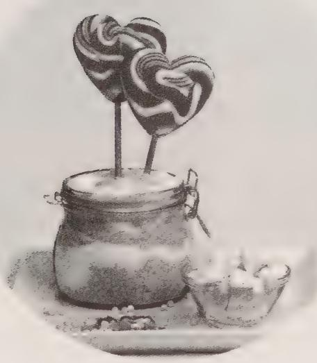

god loves you for ever

god loves you for ever

god loves you for ever

## Sự mạnh mẽ thật sự, là khi bạn không còn cần giãi bày

**真正的坚强，是当你不再需要倾诉**

*zhēn zhèng de jiān qiáng，shì dāng nǐ bù zài xū yào qīng sù*

很多时候，我们都想要倾诉，跟亲密的人，或者陌生人。

hěn duō shí hòu，wǒ men dōu xiǎng yào qīng sù，gēn qīn mì de rén，huò zhě mò shēng rén。

Rất nhiều lúc, chúng ta đều muốn giãi bày, với người thân thiết, hoặc người xa lạ.

我们想把折磨自己内心的“疾”说出来，让自己好受一点。

wǒ men xiǎng bǎ zhé mó zì jǐ nèi xīn de “jí ”shuō chū lái，ràng zì jǐ hǎo shòu yì diǎn。

Chúng ta muốn nói ra "chứng bệnh" đang giày vò trong lòng mình, để bản thân dễ chịu hơn một chút.

但是当多次倾诉，内心的痛感依然存在的时候，我们又应该把心声置于何处呢？

dàn shì dāng duō cì qīng sù，nèi xīn de tòng gǎn yī rán cún zài de shí hòu，wǒ men yòu yīng gāi bǎ xīn shēng zhì yú hé chù ne？

Nhưng khi đã giãi bày nhiều lần, nỗi đau trong lòng vẫn còn nguyên, thì chúng ta lại nên đặt lòng mình vào đâu?

不知道何时，我们才能够做到“下定决心迎接忍辱的前程，并目绝不诉说”。

bù zhī dào hé shí，wǒ men cái néng gòu zuò dào “xià dìng jué xīn yíng jiē rěn rǔ de qián chéng，bìng mù jué bù sù shuō ”。

Không biết đến bao giờ, chúng ta mới có thể làm được "hạ quyết tâm đón nhận con đường nhẫn nhục phía trước, và tuyệt đối không hé răng".

尽管我们已经深深了解了“没有必要向任何人讲述过往，人心的体会是完全属于私人的”这一道理。

jǐn guǎn wǒ men yǐ jīng shēn shēn liǎo jiě le “méi yǒu bì yào xiàng rèn hé rén jiǎng shù guò wǎng，rén xīn de tǐ huì shì wán quán shǔ yú sī rén de ”zhè yī dào lǐ。

Dù chúng ta đã thấu hiểu sâu sắc đạo lý "không cần thiết phải kể lại quá khứ cho bất kỳ ai, cảm nhận trong lòng hoàn toàn là chuyện riêng tư".

倾诉是可耻的，但是一个人，在决定缄口不言之前，一定历经了生活的磨难、人生的艰苦、情感的冲刷。

qīng sù shì kě chǐ de，dàn shì yí gè rén，zài jué dìng jiān kǒu bù yán zhī qián，yí dìng lì jīng le shēng huó de mó nàn、rén shēng de jiān kǔ、qíng gǎn de chōng shuā。

Giãi bày là điều đáng xấu hổ, nhưng một người, trước khi quyết định im lặng không nói, nhất định đã trải qua những trắc trở của cuộc sống, những gian khổ của đời người, những thăng trầm của cảm xúc.

更多时候，我们必须做些什么，才能平复自己的心情，平息内心错综复杂的想法。

gèng duō shí hòu，wǒ men bì xū zuò xiē shén me，cái néng píng fù zì jǐ de xīn qíng，píng xī nèi xīn cuò zōng fù zá de xiǎng fǎ。

Nhiều lúc hơn, chúng ta phải làm điều gì đó, mới có thể xoa dịu tâm trạng của mình, lắng xuống những ý nghĩ rối ren chằng chịt trong lòng.

或许是因为听见了一个人的心声，或许是因为一个人与自己的心灵产生了共鸣，或许是其他人的太过强大，让我们觉得自己所拥有的一切都是如此地微不足道。

huò xǔ shì yīn wèi tīng jiàn le yí gè rén de xīn shēng，huò xǔ shì yīn wèi yí gè rén yǔ zì jǐ de xīn líng chǎn shēng le gòng míng，huò xǔ shì qí tā rén de tài guò qiáng dà，ràng wǒ men jué de zì jǐ suǒ yōng yǒu de yī qiè dōu shì rú cǐ dì wēi bù zú dào。

Có thể vì nghe thấy tiếng lòng của một người, có thể vì một người khiến tâm hồn mình cộng hưởng, có thể vì người khác quá mạnh mẽ, khiến chúng ta cảm thấy những gì mình đang có đều nhỏ bé vô cùng.

而我们也知道，那内心的复杂来自于自身受到的一次次庞大的冲击，在每一次前行的路上，我们备感渺小。

ér wǒ men yě zhī dào，nà nèi xīn de fù zá lái zì yú zì shēn shòu dào de yī cì cì páng dà de chōng jī，zài měi yī cì qián xíng de lù shàng，wǒ men bèi gǎn miǎo xiǎo。

Mà chúng ta cũng biết, sự phức tạp trong lòng ấy đến từ những cú sốc to lớn bản thân phải hứng chịu hết lần này đến lần khác, trên mỗi con đường tiến về phía trước, chúng ta đều cảm thấy mình nhỏ bé biết bao.

我们愿意试着去做一个正直的人，并尽力秉承天性，坚守善良。

wǒ men yuàn yì shì zhe qù zuò yí gè zhèng zhí de rén，bìng jìn lì bǐng chéng tiān xìng，jiān shǒu shàn liáng。

Chúng ta sẵn lòng thử làm một người chính trực, hết sức giữ gìn bản tính, kiên định với lòng tốt.

我们也试图去用自己的心感受生命里的一切，一个人，一部作品，一首歌，一场电影，一件事情……

wǒ men yě shì tú qù yòng zì jǐ de xīn gǎn shòu shēng mìng lǐ de yī qiè，yí gè rén，yī bù zuò pǐn，yī shǒu gē，yī cháng diàn yǐng，yī jiàn shì qíng……

Chúng ta cũng cố dùng trái tim mình để cảm nhận tất cả trong đời sống, một con người, một tác phẩm, một bài hát, một bộ phim, một sự việc...

或许只是听了一场讲座，我们便开始尊重每一个作者，从此站在了理解和懂得的一方，与他们并肩前行。

huò xǔ zhǐ shì tīng le yī cháng jiǎng zuò，wǒ men biàn kāi shǐ zūn zhòng měi yí gè zuò zhě，cóng cǐ zhàn zài le lǐ jiě hé dǒng de de yī fāng，yǔ tā men bìng jiān qián xíng。

Có lẽ chỉ vì nghe một buổi giảng, chúng ta bắt đầu tôn trọng mỗi tác giả, từ đó đứng về phía sự thấu hiểu và thấu cảm, cùng họ sánh bước đi tới.

或许是因为一首歌、一部电影，从此开始爱这个世界，珍惜身边每一个来过的走过的人。

huò xǔ shì yīn wèi yī shǒu gē、yī bù diàn yǐng，cóng cǐ kāi shǐ ài zhè ge shì jiè，zhēn xī shēn biān měi yí gè lái guò de zǒu guò de rén。

Có thể vì một bài hát, một bộ phim, từ đó bắt đầu yêu thế giới này, trân trọng từng người đã đến, đã đi qua bên đời mình.

我们为每一个人做出的选择和决定感动不已，因为我们了解生而为人的艰辛。

wǒ men wèi měi yí gè rén zuò chū de xuǎn zé hé jué dìng gǎn dòng bù yǐ，yīn wèi wǒ men liǎo jiě shēng ér wéi rén de jiān xīn。

Chúng ta cảm động vô cùng trước những lựa chọn và quyết định của mỗi người, bởi chúng ta hiểu nỗi gian nan của kiếp người.

尽管他不那么光彩夺目，尽管他也没什么权位与名誉。

jǐn guǎn tā bù nà me guāng cǎi duó mù，jǐn guǎn tā yě méi shén me quán wèi yǔ míng yù。

Dù anh ấy không lộng lẫy chói lọi, dù anh ấy cũng chẳng có quyền vị và danh vọng gì.

但我们切实看到过、了解过作为一个“人”的煎熬。

dàn wǒ men qiè shí kàn dào guò、liǎo jiě guò zuò wéi yí gè “rén ”de jiān áo。

Nhưng chúng ta từng thật sự chứng kiến, từng hiểu được nỗi giày vò khi làm một "con người".

当一个人活在这个世界的时候，他就是一个伟大的战士。

dāng yí gè rén huó zài zhè ge shì jiè de shí hòu，tā jiù shì yí gè wěi dà de zhàn shì。

Khi một người đang sống trên thế gian này, anh ta chính là một chiến sĩ vĩ đại.

从有生命的那一刻起，他就跳进了情与愁、怨与恨、爱与伤、悲与痛的旋涡，且永无脱身之日。

cóng yǒu shēng mìng de nà yī kè qǐ，tā jiù tiào jìn le qíng yǔ chóu、yuàn yǔ hèn、ài yǔ shāng、bēi yǔ tòng de xuán wō，qiě yǒng wú tuō shēn zhī rì。

Từ khoảnh khắc có sinh mệnh, anh ta đã lao vào vòng xoáy của tình và sầu, oán và hận, yêu và thương, bi và đau, và không bao giờ có ngày thoát ra.

活着，到底是怎样的一种熬煎呢？

huó zhe，dào dǐ shì zěn yàng de yī zhǒng áo jiān ne？

Sống, rốt cuộc là một thứ giày vò như thế nào?

就像当你抓紧一根绳索。

jiù xiàng dāng nǐ zhuā jǐn yī gēn shéng suǒ。

Cũng như khi bạn nắm chặt một sợi dây thừng.

开始的时候，你力大无比，走得艰辛但坚定，但是路上你疲惫了，双手红肿，双腿发颤，你不再去抓紧绳索，而是以绳索保命，慢慢地松懈下来。

kāi shǐ de shí hòu，nǐ lì dà wú bǐ，zǒu dé jiān xīn dàn jiān dìng，dàn shì lù shàng nǐ pí bèi le，shuāng shǒu hóng zhǒng，shuāng tuǐ fā chàn，nǐ bù zài qù zhuā jǐn shéng suǒ，ér shì yǐ shéng suǒ bǎo mìng，màn màn dì sōng xiè xià lái。

Ban đầu, bạn sức lực vô biên, đi vất vả nhưng kiên định, nhưng dần dà bạn mệt mỏi, hai bàn tay sưng đỏ, hai chân run rẩy, bạn không còn nắm chặt sợi dây nữa, mà chỉ dựa vào nó để giữ mạng, từ từ buông lỏng.

在习惯了平淡的日子里，怕的并不是突如其来的暴风骤雨，而仅仅是你当初下定决心握紧绳索去寻找光荣和胜利的心。

zài xí guàn le píng dàn de rì zi lǐ，pà de bìng bú shì tū rú qí lái de bào fēng zhòu yǔ，ér jǐn jǐn shì nǐ dāng chū xià dìng jué xīn wò jǐn shéng suǒ qù xún zhǎo guāng róng hé shèng lì de xīn。

Trong những ngày tháng quen với sự tẻ nhạt, thứ đáng sợ không phải là cơn mưa gió ập đến bất chợt, mà chỉ là trái tim ngày ấy bạn đã hạ quyết tâm nắm chặt sợi dây để đi tìm vinh quang và chiến thắng.

这颗心无法再被平常的岁月掩埋，尽管它穿着岁月的长襟。

zhè kē xīn wú fǎ zài bèi píng cháng de suì yuè yǎn mái，jǐn guǎn tā chuān zhe suì yuè de zhǎng jīn。

Trái tim ấy không thể bị những năm tháng tầm thường chôn vùi, dù nó đang khoác chiếc áo dài của thời gian.

它从安静的时光中，慢慢地爬行，从下到上，从外到内。

tā cóng ān jìng de shí guāng zhōng，màn màn dì pá xíng，cóng xià dào shàng，cóng wài dào nèi。

Nó từ trong tháng ngày tĩnh lặng, chầm chậm bò lên, từ dưới lên trên, từ ngoài vào trong.

它以各种方式、各种形式攀爬蔓延到你的灵魂深处：是否能够这样活着，是否能够平淡无奇地去爱。

tā yǐ gè zhǒng fāng shì、gè zhǒng xíng shì pān pá màn yán dào nǐ de líng hún shēn chù：shì fǒu néng gòu zhè yàng huó zhe，shì fǒu néng gòu píng dàn wú qí dì qù ài。

Nó bằng đủ mọi cách, đủ mọi hình thức leo trèo lan tỏa vào sâu thẳm tâm hồn bạn: liệu có thể sống như thế này không, liệu có thể yêu một cách tẻ nhạt vô vị không.

或许，我们应该原谅向生活妥协的人们。

huò xǔ，wǒ men yīng gāi yuán liàng xiàng shēng huó tuǒ xié de rén men。

Có lẽ, chúng ta nên tha thứ cho những người đã nhượng bộ trước cuộc sống.

原谅他们的善变甚至不负责任。

yuán liàng tā men de shàn biàn shèn zhì bù fù zé rèn。

Tha thứ cho sự thay lòng đổi dạ, thậm chí là sự vô trách nhiệm của họ.

我们只看到了他们的傲气与跋扈、刁钻与自私，但我们并没有看到他们的穷困与潦倒、折磨与煎熬、忍受与屈服。

wǒ men zhǐ kàn dào le tā men de ào qì yǔ bá hù、diāo zuān yǔ zì sī，dàn wǒ men bìng méi yǒu kàn dào tā men de qióng kùn yǔ liáo dǎo、zhé mó yǔ jiān áo、rěn shòu yǔ qū fú。

Chúng ta chỉ nhìn thấy sự kiêu ngạo và ngang ngược, ngoa ngoắt và ích kỷ của họ, nhưng chúng ta không hề nhìn thấy sự bần cùng và khốn đốn, dày vò và giày vò, nhẫn nhịn và khuất phục của họ.

或许他们一直走在不断寻找的路上，一切都缘由最初的那一次握紧绳索的双手。

huò xǔ tā men yì zhí zǒu zài bù duàn xún zhǎo de lù shàng，yī qiè dōu yuán yóu zuì chū de nà yī cì wò jǐn shéng suǒ de shuāng shǒu。

Có lẽ họ vẫn luôn bước trên con đường tìm kiếm không ngừng, tất cả đều bắt nguồn từ lần nắm chặt sợi dây đầu tiên ấy.

我们去体会他们的感动，了解和想象他们写下这一行字的经历和感受，为此，我们尊敬他们，不苛责、不狭隘。

wǒ men qù tǐ huì tā men de gǎn dòng，liǎo jiě hé xiǎng xiàng tā men xiě xià zhè yī xíng zì de jīng lì hé gǎn shòu，wèi cǐ，wǒ men zūn jìng tā men，bù kē zé、bù xiá ài。

Chúng ta thấu hiểu sự cảm động của họ, thấu hiểu và tưởng tượng trải nghiệm cùng cảm xúc khi họ viết nên những dòng chữ ấy, vì thế, chúng ta kính trọng họ, không khắt khe, không hẹp hòi.

当我们听见闻所未闻的事情时，当我们见到没见过的穷困、潦倒、折磨、忍辱、屈服的时候，我们会觉得自己的一切都太过微小，包括那些煎熬的选择。

dāng wǒ men tīng jiàn wén suǒ wèi wén de shì qíng shí，dāng wǒ men jiàn dào méi jiàn guò de qióng kùn、liáo dǎo、zhé mó、rěn rǔ、qū fú de shí hòu，wǒ men huì jué de zì jǐ de yī qiè dōu tài guò wēi xiǎo，bāo kuò nà xiē jiān áo de xuǎn zé。

Khi chúng ta nghe những chuyện chưa từng nghe, khi chúng ta thấy những cảnh bần cùng, khốn đốn, dày vò, nhẫn nhục, khuất phục chưa từng thấy, chúng ta sẽ cảm thấy những gì của mình đều quá nhỏ bé, kể cả những lựa chọn đầy giày vò.

新鲜的东西，总是让我们在生命中获得意想不到的震惊，或许，也正是因为这样的震惊，才让我们充满了血性。

xīn xiān de dōng xī，zǒng shì ràng wǒ men zài shēng mìng zhòng huò dé yì xiǎng bù dào de zhèn jīng，huò xǔ，yě zhèng shì yīn wèi zhè yàng de zhèn jīng，cái ràng wǒ men chōng mǎn le xuè xìng。

Những điều mới mẻ, luôn khiến chúng ta nhận được những chấn động bất ngờ trong đời sống, có lẽ, cũng chính vì những chấn động ấy, mà chúng ta tràn đầy sức sống mãnh liệt.

这样的一种血性，超越故乡，超越城市，超越自我，把我们带到了遥不可及的地方。

zhè yàng de yī zhǒng xuè xìng，chāo yuè gù xiāng，chāo yuè chéng shì，chāo yuè zì wǒ，bǎ wǒ men dài dào le yáo bù kě jí de dì fāng。

Thứ sức sống mãnh liệt ấy, vượt qua quê hương, vượt qua thành phố, vượt qua chính mình, đưa chúng ta đến những nơi xa vời không chạm tới.

那个时候，我们或许会稍稍明白，某一天某一刻那些难以答复的困惑。

nà ge shí hòu，wǒ men huò xǔ huì shāo shāo míng bái，mǒu yī tiān mǒu yī kè nà xiē nán yǐ dá fù de kùn huò。

Khi ấy, có lẽ chúng ta sẽ dần hiểu ra, những hoang mang khó trả lời trong một khoảnh khắc, một ngày nào đó.

真正的选择，并不是生活或工作，学习或堕落。

zhēn zhèng de xuǎn zé，bìng bú shì shēng huó huò gōng zuò，xué xí huò duò luò。

Sự lựa chọn thật sự, không phải là sống hay làm việc, học tập hay sa ngã.

不是脱颖而出，不是标新立异，不是鹤立鸡群、木秀于林。

bú shì tuō yǐng ér chū，bú shì biāo xīn lì yì，bú shì hè lì jī qún、mù xiù yú lín。

Không phải trổi vượt hơn người, không phải kỳ lạ khác thường, không phải nổi trội giữa đám đông, cao hơn rừng cây.

而是要抛开这所有的一切，去做一个选择。

ér shì yào pāo kāi zhè suǒ yǒu de yī qiè，qù zuò yí gè xuǎn zé。

Mà là gạt bỏ tất cả những điều ấy, để thực hiện một lựa chọn.

到底哪里，是存放灵魂的天地。

dào dǐ nǎ lǐ，shì cún fàng líng hún de tiān dì。

Rốt cuộc đâu mới là nơi để gửi gắm tâm hồn.

渴望迎接平静，渴望迎接忍辱的前程的决心。

kě wàng yíng jiē píng jìng，kě wàng yíng jiē rěn rǔ de qián chéng de jué xīn。

Khát khao đón nhận sự bình yên, khát khao đón nhận quyết tâm về con đường nhẫn nhục phía trước.

在未来的路上，等待着那个绝不诉说的自己。

zài wèi lái de lù shàng，děng dài zhe nà ge jué bù sù shuō de zì jǐ。

Trên con đường tương lai, chờ đợi con người tuyệt đối không hé răng ấy.

## Bình thản đối diện với những khúc quanh của tuổi trẻ

**淡然面对青春的弯路**

*dàn rán miàn duì qīng chūn de wān lù*

年轻的时候，我们总是会将自己的痛苦放大，将自己的幸福缩小。

nián qīng de shí hòu，wǒ men zǒng shì huì jiāng zì jǐ de tòng kǔ fàng dà，jiāng zì jǐ de xìng fú suō xiǎo。

Khi còn trẻ, chúng ta luôn phóng đại nỗi đau của mình, thu nhỏ hạnh phúc của mình.

我们总以为自己经历了任何人都不曾经历的伤痛，于是，我们堕落，抑郁，悲伤，乃至一蹶不振。

wǒ men zǒng yǐ wéi zì jǐ jīng lì le rèn hé rén dōu bù céng jīng lì de shāng tòng，yú shì，wǒ men duò luò，yì yù，bēi shāng，nǎi zhì yī jué bù zhèn。

Chúng ta luôn tưởng rằng mình đã trải qua những tổn thương mà không ai từng trải, thế là chúng ta sa ngã, u uất, bi thương, thậm chí gục ngã không dậy nổi.

我是一个缺乏温情的人。

wǒ shì yí gè quē fá wēn qíng de rén。

Tôi là một người thiếu thốn sự ấm áp.

四岁的时候，父母便离异了。

sì suì de shí hòu，fù mǔ biàn lí yì le。

Năm tôi lên bốn, cha mẹ đã ly hôn.

七岁的时候，父亲再娶。

qī suì de shí hòu，fù qīn zài qǔ。

Năm lên bảy, cha tôi tái hôn.

这是我人生所无法弥补的缺憾，这早在我还不能选择和主导命运之时，就已经成了定局。

zhè shì wǒ rén shēng suǒ wú fǎ mí bǔ de quē hàn，zhè zǎo zài wǒ hái bù néng xuǎn zé hé zhǔ dǎo mìng yùn zhī shí，jiù yǐ jīng chéng le dìng jú。

Đây là nỗi khuyết hận không thể bù đắp trong đời tôi, từ sớm, khi tôi còn chưa thể lựa chọn và định đoạt số phận, nó đã thành một kết cục đã an bài.

之所以说我缺乏温情，是因为父亲不爱我，当我满怀希望地去找寻母亲时，她比父亲更甚。

zhī suǒ yǐ shuō wǒ quē fá wēn qíng，shì yīn wèi fù qīn bù ài wǒ，dāng wǒ mǎn huái xī wàng dì qù zhǎo xún mǔ qīn shí，tā bǐ fù qīn gèng shèn。

Sở dĩ nói tôi thiếu sự ấm áp, là vì cha không yêu tôi, khi tôi tràn đầy hy vọng đi tìm mẹ, thì bà còn thậm tệ hơn cả cha.

母亲重组了家庭，有了自己的孩子。

mǔ qīn chóng zǔ le jiā tíng，yǒu le zì jǐ de hái zi。

Mẹ tái lập gia đình, có con riêng của mình.

她常将我跟父亲划为一派，我们经常争吵。

tā cháng jiāng wǒ gēn fù qīn huà wèi yī pài，wǒ men jīng cháng zhēng chǎo。

Bà thường gán tôi cùng phe với cha, chúng tôi thường xuyên cãi vã.

而我在父亲这里，又挨了不少的打骂。

ér wǒ zài fù qīn zhè lǐ，yòu āi le bù shǎo de dǎ mà。

Còn ở chỗ cha, tôi lại chịu không ít đòn roi mắng chửi.

一旦他们吵架或者不

yí dàn tā men chǎo jià huò zhě bù

Mỗi khi họ cãi nhau hoặc bất

和，我便是他打骂的对象。

hé，wǒ biàn shì tā dǎ mà de duì xiàng。

hòa, tôi chính là đối tượng để ông ta đánh chửi.

因此，一直到二十二岁前，我都是一个非常悲伤的人。

yīn cǐ，yì zhí dào èr shí èr suì qián，wǒ dōu shì yí gè fēi cháng bēi shāng de rén。

Vì thế, cho đến tận trước năm hai mươi hai tuổi, tôi là một người vô cùng u buồn.

我沉浸在命运的苦痛里不能自拔。

wǒ chén jìn zài mìng yùn de kǔ tòng lǐ bù néng zì bá。

Tôi đắm chìm trong nỗi khổ đau của số phận không thể tự thoát ra.

我用自己悲伤的心灵，去爱着自己的亲人和朋友。

wǒ yòng zì jǐ bēi shāng de xīn líng，qù ài zhe zì jǐ de qīn rén hé péng yǒu。

Tôi dùng trái tim u sầu của mình để yêu thương người thân và bạn bè.

把悲伤当成一种性情，一种资本。

bǎ bēi shāng dàng chéng yī zhǒng xìng qíng，yī zhǒng zī běn。

Coi nỗi buồn như một thứ tính khí, một thứ tư bản.

我不仅接受来源于生活的伤害，还试图将其放大。

wǒ bù jǐn jiē shòu lái yuán yú shēng huó de shāng hài，hái shì tú jiāng qí fàng dà。

Tôi không chỉ chấp nhận những tổn thương đến từ cuộc sống, mà còn cố phóng đại chúng lên.

想要自我摧残，自我放纵，自我逃离。

xiǎng yào zì wǒ cuī cán，zì wǒ fàng zòng，zì wǒ táo lí。

Muốn tự hủy hoại bản thân, tự buông thả, tự trốn chạy.

在经历痛楚，且读了几本书之后，我就以为自己与他人不同了。

zài jīng lì tòng chǔ，qiě dú le jǐ běn shū zhī hòu，wǒ jiù yǐ wéi zì jǐ yǔ tā rén bù tóng le。

Sau khi trải qua đau đớn, và đọc được vài cuốn sách, tôi cứ ngỡ mình khác biệt với người khác.

写了几篇文章，我就觉得自己真的很厉害。

xiě le jǐ piān wén zhāng，wǒ jiù jué de zì jǐ zhēn de hěn lì hài。

Viết được vài bài, tôi liền thấy mình thật giỏi giang.

因此，我没有好好读书，考一个好的学校，而是想着用我的悲伤，写出一鸣惊人的作品。

yīn cǐ，wǒ méi yǒu hǎo hǎo dú shū，kǎo yí gè hǎo de xué xiào，ér shì xiǎng zhe yòng wǒ de bēi shāng，xiě chū yì míng jīng rén de zuò pǐn。

Vì vậy, tôi không chăm chỉ học hành, thi vào một trường tốt, mà chỉ nghĩ dùng nỗi buồn của mình để viết ra tác phẩm gây chấn động.

在生活影响之外，青年人阅读的书籍，也多少影响到我。

zài shēng huó yǐng xiǎng zhī wài，qīng nián rén yuè dú de shū jí，yě duō shǎo yǐng xiǎng dào wǒ。

Ngoài ảnh hưởng từ cuộc sống, những cuốn sách mà người trẻ đọc, cũng ít nhiều tác động đến tôi.

它们好似给青年人画了一个圈，无形之中定了一个准则。

tā men hǎo sì gěi qīng nián rén huà le yí gè quān，wú xíng zhī zhōng dìng le yí gè zhǔn zé。

Chúng như vẽ cho người trẻ một vòng tròn, vô hình định ra một chuẩn mực.

大都对深夜通宵写作、生活黯淡无光、心态压抑沉闷，心有所往。

dà dū duì shēn yè tōng xiāo xiě zuò、shēng huó àn dàn wú guāng、xīn tài yā yì chén mèn，xīn yǒu suǒ wǎng。

Phần lớn đều hướng về việc thức trắng viết lách lúc nửa đêm, cuộc sống u ám ảm đạm, tâm trạng đè nén nặng nề.

好似只有这样才是一个作家，才能写得出非凡的文章来。

hǎo sì zhǐ yǒu zhè yàng cái shì yí gè zuò jiā，cái néng xiě dé chū fēi fán de wén zhāng lái。

Cứ như chỉ có như thế mới là một nhà văn, mới viết ra được những bài văn phi thường.

在此影响下，我消极悲伤地度过了我青春岁月里最好的时光。

zài cǐ yǐng xiǎng xià，wǒ xiāo jí bēi shāng dì dù guò le wǒ qīng chūn suì yuè lǐ zuì hǎo de shí guāng。

Dưới ảnh hưởng ấy, tôi đã tiêu cực u buồn mà trôi qua quãng thời gian đẹp nhất của tuổi trẻ mình.

如今，你让我回想青春，我都不愿去想。

rú jīn，nǐ ràng wǒ huí xiǎng qīng chūn，wǒ dōu bù yuàn qù xiǎng。

Ngày nay, dù bạn bảo tôi hồi tưởng lại tuổi trẻ, tôi cũng chẳng muốn nghĩ.

它不是明媚的，也不是简单快乐的，而是沁满泪水的，悲伤而绝望。

tā bú shì míng mèi de，yě bú shì jiǎn dān kuài lè de，ér shì qìn mǎn lèi shuǐ de，bēi shāng ér jué wàng。

Nó không tươi sáng, cũng không giản đơn vui vẻ, mà thấm đẫm nước mắt, bi thương và tuyệt vọng.

人生真的很讽刺，在你应该快乐的时候，没有让你快乐；而在你应该成熟的时候，也没有让你成熟起来。

rén shēng zhēn de hěn fěng cì，zài nǐ yīng gāi kuài lè de shí hòu，méi yǒu ràng nǐ kuài lè；ér zài nǐ yīng gāi chéng shú de shí hòu，yě méi yǒu ràng nǐ chéng shú qǐ lái。

Đời thật trớ trêu, khi lẽ ra bạn nên vui, thì lại chẳng cho bạn vui; mà khi lẽ ra bạn nên trưởng thành, cũng chẳng khiến bạn trưởng thành lên.

我之所以说自己的一些事情，并不是为了求得怜悯，也不是为了释放情绪。

wǒ zhī suǒ yǐ shuō zì jǐ de yī xiē shì qíng，bìng bú shì wèi le qiú dé lián mǐn，yě bú shì wèi le shì fàng qíng xù。

Tôi sở dĩ kể ra một vài chuyện của mình, không phải để cầu xin sự thương hại, cũng không phải để trút bỏ cảm xúc.

只是想说，我也曾黯淡无光地生活过，并且有很多缘由。

zhǐ shì xiǎng shuō，wǒ yě céng àn dàn wú guāng dì shēng huó guò，bìng qiě yǒu hěn duō yuán yóu。

Chỉ là muốn nói rằng, tôi cũng từng sống một cuộc đời ảm đạm thiếu sáng, và có rất nhiều nguyên do.

但岁月终会教会我们应该走哪一条路，做一个什么样的人。

dàn suì yuè zhōng huì jiào huì wǒ men yīng gāi zǒu nǎ yī tiáo lù，zuò yí gè shén me yàng de rén。

Nhưng thời gian rốt cuộc sẽ dạy chúng ta nên đi con đường nào, nên làm một con người như thế nào.

大多数人的青春岁月里都有一条弯路要走，或许是因为家庭，或许是因为爱情，或许是因为友谊，或许是因为金钱，又或者一个虚无缥缈的梦。

dà duō shù rén de qīng chūn suì yuè lǐ dōu yǒu yī tiáo wān lù yào zǒu，huò xǔ shì yīn wèi jiā tíng，huò xǔ shì yīn wèi ài qíng，huò xǔ shì yīn wèi yǒu yì，huò xǔ shì yīn wèi jīn qián，yòu huò zhě yí gè xū wú piāo miǎo de mèng。

Tuổi trẻ của phần lớn mọi người đều có một khúc quanh phải đi, có thể vì gia đình, có thể vì tình yêu, có thể vì tình bạn, có thể vì tiền bạc, hay cũng có thể vì một giấc mơ hư huyễn.

而这些都需要你自己去完成，如果你不经过一番折腾，可能你也不会知道自己真正想要什么。

ér zhè xiē dōu xū yào nǐ zì jǐ qù wán chéng，rú guǒ nǐ bù jīng guò yī fān zhē teng，kě néng nǐ yě bú huì zhī dào zì jǐ zhēn zhèng xiǎng yào shén me。

Mà những điều ấy đều cần chính bạn tự hoàn thành, nếu bạn không trải qua một phen vất vả xoay xở, có lẽ bạn cũng sẽ không biết mình thật sự muốn điều gì.

如果在青春里，你的经历不是那么的大悲大喜，就不要悲伤地度过，青春本就是肆无忌惮、无忧无虑的时光。

rú guǒ zài qīng chūn lǐ，nǐ de jīng lì bú shì nà me de dà bēi dà xǐ，jiù bú yào bēi shāng dì dù guò，qīng chūn běn jiù shì sì wú jì dàn、wú yōu wú lǜ de shí guāng。

Nếu trong tuổi trẻ, trải nghiệm của bạn không có những niềm vui nỗi buồn quá lớn, thì đừng u buồn mà sống qua ngày, tuổi trẻ vốn dĩ là quãng thời gian vô lo vô nghĩ, thả sức tung hoành.

如果你悲伤地度过了最美好的年华，也不要因此有丝毫的悔恨。

rú guǒ nǐ bēi shāng dì dù guò le zuì měi hǎo de nián huá，yě bú yào yīn cǐ yǒu sī háo de huǐ hèn。

Nếu bạn đã u buồn mà trôi qua quãng thời gian đẹp nhất, thì cũng đừng vì thế mà hối hận dù chỉ một chút.

很多时候，它只是一个过程，而未来，还在。

hěn duō shí hòu，tā zhǐ shì yí gè guò chéng，ér wèi lái，hái zài。

Rất nhiều lúc, nó chỉ là một quá trình, còn tương lai, vẫn còn đó.

要相信每一天，都是一个新的开始；每一天，都是一次新的重生。

yào xiāng xìn měi yī tiān，dōu shì yí gè xīn de kāi shǐ；měi yī tiān，dōu shì yī cì xīn de chóng shēng。

Hãy tin rằng mỗi ngày, đều là một khởi đầu mới; mỗi ngày, đều là một lần tái sinh.

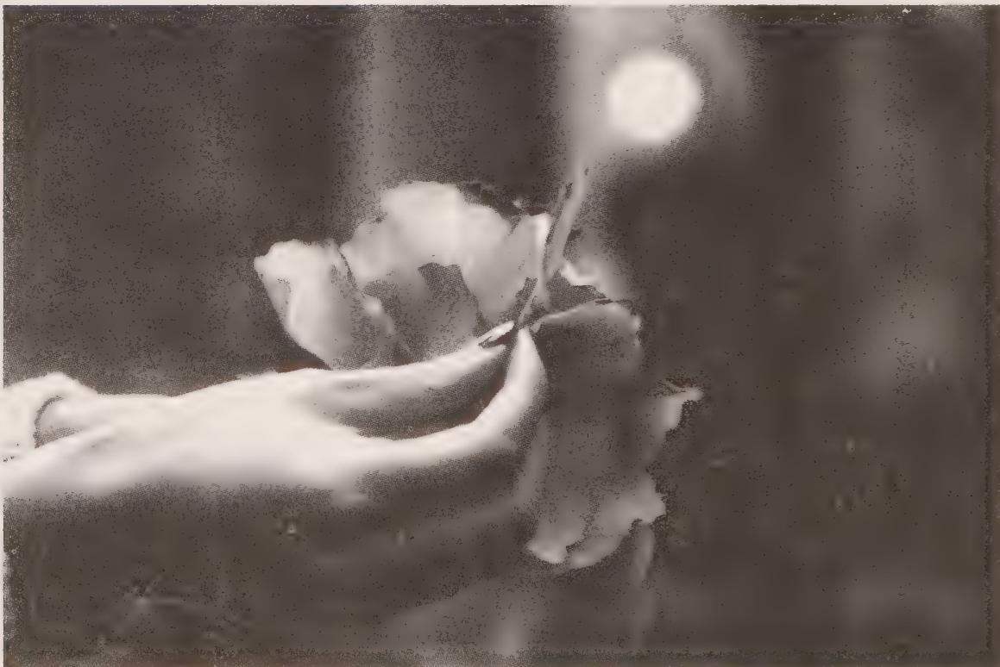

## Có những chuyện, học cách chấp nhận là được

**有些事，学会接受就好了**

*yǒu xiē shì，xué huì jiē shòu jiù hǎo le*

我们曾勇敢地去选择自己的道路，并下定决心要在这条路上大展拳脚，克服所有的苦难和阻碍。

wǒ men céng yǒng gǎn dì qù xuǎn zé zì jǐ de dào lù，bìng xià dìng jué xīn yào zài zhè tiáo lù shàng dà zhǎn quán jiǎo，kè fú suǒ yǒu de kǔ nàn hé zǔ ài。

Chúng ta từng dũng cảm lựa chọn con đường của mình, và hạ quyết tâm sẽ tung hoành trên con đường ấy, vượt qua mọi gian khổ và chướng ngại.

但是，当路途坎坷的刀刃挫伤了我们当初刚强的内心时，我们是否依旧能够为了梦想而战？

dàn shì，dāng lù tú kǎn kě de dāo rèn cuò shāng le wǒ men dāng chū gāng qiáng de nèi xīn shí，wǒ men shì fǒu yī jiù néng gòu wèi le mèng xiǎng ér zhàn？

Nhưng, khi lưỡi dao gập ghềnh của chặng đường cắt sâu vào trái tim cương nghị thuở ban đầu của chúng ta, liệu chúng ta có còn có thể chiến đấu vì giấc mơ?

每一条用心去坚持的路，都一定是一条艰辛至极的路。

měi yī tiáo yòng xīn qù jiān chí de lù，dōu yí dìng shì yī tiáo jiān xīn zhì jí de lù。

Mỗi con đường kiên trì bước đi bằng cả tấm lòng, nhất định là một con đường gian nan đến tận cùng.

也许刚开始我们就已经知晓，只是越发地有所领悟和感同身受。

yě xǔ gāng kāi shǐ wǒ men jiù yǐ jīng zhī xiǎo，zhǐ shì yuè fā dì yǒu suǒ lǐng wù hé gǎn tóng shēn shòu。

Có lẽ ngay từ đầu chúng ta đã biết rõ, chỉ là càng ngày càng thấu hiểu và cảm nhận sâu sắc hơn mà thôi.

当你失了信心、摔了跤，多多少少会退去最初激荡的热情，增添一点困惑，来审视最开始选择的道路。

dāng nǐ shī le xìn xīn、shuāi le jiāo，duō duō shǎo shǎo huì tuì qù zuì chū jī dàng de rè qíng，zēng tiān yì diǎn kùn huò，lái shěn shì zuì kāi shǐ xuǎn zé de dào lù。

Khi bạn mất đi tự tin, vấp ngã, ít nhiều sẽ phai nhạt đi nhiệt huyết sục sôi ban đầu, thêm chút hoang mang, để nhìn lại con đường đã chọn từ thuở ban đầu.

那个时候的你，甚至会发现，在人生这条路上，人与人之间根本没有什么至真至情，不过是真假虚实的互换而已。

nà ge shí hòu de nǐ，shèn zhì huì fā xiàn，zài rén shēng zhè tiáo lù shàng，rén yǔ rén zhī jiān gēn běn méi yǒu shén me zhì zhēn zhì qíng，bù guò shì zhēn jiǎ xū shí de hù huàn ér yǐ。

Con người ấy của lúc đó, thậm chí sẽ phát hiện ra rằng, trên con đường đời này, giữa người với người căn bản chẳng có thứ tình cảm chân thật nào, chỉ là sự đổi chác giữa thật giả, hư thực mà thôi.

但我们不要因此绝望。

dàn wǒ men bú yào yīn cǐ jué wàng。

Nhưng chúng ta đừng vì thế mà tuyệt vọng.

细细想来，人生不过一副皮囊，谁又经得起被看透看清楚？

xì xì xiǎng lái，rén shēng bù guò yī fù pí náng，shuí yòu jīng dé qǐ bèi kàn tòu kàn qīng chǔ？

Nghĩ kỹ mà xem, đời người chỉ là một tấm da thịt, ai mà chịu nổi bị nhìn thấu, nhìn rõ?

人与人之间，你为我美言，我自为你留薄

rén yǔ rén zhī jiān，nǐ wèi wǒ měi yán，wǒ zì wèi nǐ liú báo

Giữa người với người, bạn nói lời hay cho tôi, tôi tự nhiên vì bạn chừa chút

面，终不过如此。

miàn，zhōng bù guò rú cǐ。

thể diện, rốt cuộc cũng chỉ thế thôi.

只是，我们不是只爱金钱、爱物质、爱事业、爱文学，不是只爱这座颠沛流离的城市，不是只爱人，我们爱的是这整个世界。

zhǐ shì，wǒ men bú shì zhǐ ài jīn qián、ài wù zhì、ài shì yè、ài wén xué，bú shì zhǐ ài zhè zuò diān pèi liú lí de chéng shì，bú shì zhǐ ài rén，wǒ men ài de shì zhè zhěng gè shì jiè。

Chỉ có điều, chúng ta không chỉ yêu tiền bạc, yêu vật chất, yêu sự nghiệp, yêu văn học, không chỉ yêu thành phố ly tán phiêu bạt này, không chỉ yêu con người, chúng ta yêu cả thế giới này.

我们爱着这世界的一情一景、一草一木。

wǒ men ài zhe zhè shì jiè de yī qíng yī jǐng、yī cǎo yī mù。

Chúng ta yêu từng tình cảm, từng cảnh vật, từng cọng cỏ, từng cành cây của thế giới này.

所以才会有失亲之痛，叛离之苦，相残之煎。

suǒ yǐ cái huì yǒu shī qīn zhī tòng，pàn lí zhī kǔ，xiāng cán zhī jiān。

Vì thế mới có nỗi đau mất người thân, nỗi khổ bị phản bội rời xa, nỗi dày vò khi người thân tương tàn.

一个至情至性的人在每一件事情上都会付出过多的感情，自然要比常人受伤千万倍。

yí gè zhì qíng zhì xìng de rén zài měi yī jiàn shì qíng shàng dū huì fù chū guò duō de gǎn qíng，zì rán yào bǐ cháng rén shòu shāng qiān wàn bèi。

Một người trọn tình trọn tính trong mỗi sự việc đều dồn quá nhiều cảm xúc, tự nhiên sẽ bị tổn thương gấp nghìn vạn lần người thường.

人生走一遭，不过就是为了“值得”两个字。

rén shēng zǒu yī zāo，bù guò jiù shì wèi le “zhí de ”liǎng gè zì。

Đi một vòng nhân thế, chẳng qua chỉ vì hai chữ "đáng giá".

生活不能处处遂人愿，毕竟世事无常。

shēng huó bù néng chù chù suì rén yuàn，bì jìng shì shì wú cháng。

Cuộc sống không thể lúc nào cũng vừa ý người, dù sao mọi sự trên đời luôn vô thường.

今天你离别，明天他分手，也不过是世间里的常事而已。

jīn tiān nǐ lí bié，míng tiān tā fēn shǒu，yě bù guò shì shì jiān lǐ de cháng shì ér yǐ。

Hôm nay bạn chia ly, ngày mai người khác ly tan, cũng chẳng qua là chuyện thường tình ở đời mà thôi.

很多事情，如果你选择躲避，它反而会在生命中延长。

hěn duō shì qíng，rú guǒ nǐ xuǎn zé duǒ bì，tā fǎn ér huì zài shēng mìng zhòng yán cháng。

Nhiều chuyện, nếu bạn chọn cách né tránh, nó ngược lại sẽ kéo dài trong đời bạn.

如果因为憎恨，一直选择逃避和不原谅，那么一直苦着的还是自己。

rú guǒ yīn wèi zēng hèn，yì zhí xuǎn zé táo bì hé bù yuán liàng，nà me yì zhí kǔ zhe de hái shì zì jǐ。

Nếu vì hận thù mà cứ chọn trốn tránh và không tha thứ, thì người khổ suốt vẫn là chính mình.

不管是亲人也好，朋友也罢，背叛你也好，伤了你的心也罢，试着去面对。

bù guǎn shì qīn rén yě hǎo，péng yǒu yě bà，bèi pàn nǐ yě hǎo，shāng le nǐ de xīn yě bà，shì zhe qù miàn duì。

Dù là người thân hay bạn bè, dù phản bội bạn hay làm tổn thương lòng bạn, hãy thử đối diện.

那样一切都会很快好起来，一切都会变得平静下来。

nà yàng yī qiè dū huì hěn kuài hǎo qǐ lái，yī qiè dū huì biàn dé píng jìng xià lái。

Như thế mọi thứ sẽ sớm tốt đẹp hơn, mọi thứ sẽ trở nên bình yên.

不要因为初次和某人见面的一时失态而耿耿于怀，它会影响你接下来所有的对话和沟通。

bú yào yīn wèi chū cì hé mǒu rén jiàn miàn de yī shí shī tài ér gěng gěng yú huái，tā huì yǐng xiǎng nǐ jiē xià lái suǒ yǒu de duì huà hé gōu tōng。

Đừng vì một phút thất thố lần đầu gặp gỡ ai đó mà cứ mãi canh cánh trong lòng, nó sẽ ảnh hưởng đến mọi cuộc trò chuyện và giao tiếp sau đó của bạn.

如果你试着忘记它，面对它，你会发现，其实他人根本没有在意。

rú guǒ nǐ shì zhe wàng jì tā，miàn duì tā，nǐ huì fā xiàn，qí shí tā rén gēn běn méi yǒu zài yì。

Nếu bạn thử quên nó đi, đối diện với nó, bạn sẽ nhận ra rằng thật ra người khác chẳng hề để tâm.

不要因为初到一个地方做了愚蠢的事情就担惊受怕。

bú yào yīn wèi chū dào yí gè dì fāng zuò le yú chǔn de shì qíng jiù dān jīng shòu pà。

Đừng vì mới đến một nơi nào đó đã làm điều ngốc nghếch mà lo sợ hãi hùng.

只要你吸取了教训，下次不再犯同样的错误。

zhǐ yào nǐ xī qǔ le jiào xùn，xià cì bù zài fàn tóng yàng de cuò wù。

Chỉ cần bạn rút ra bài học, lần sau không tái phạm lỗi lầm tương tự.

不要让它像挥不去的影子一样，伴随你之后的生活。

bú yào ràng tā xiàng huī bù qù de yǐng zi yī yàng，bàn suí nǐ zhī hòu de shēng huó。

Đừng để nó như cái bóng không thể xua tan, đi cùng cuộc sống sau này của bạn.

有很多时候，我们都很想问自己。

yǒu hěn duō shí hòu，wǒ men dōu hěn xiǎng wèn zì jǐ。

Có nhiều lúc, chúng ta đều rất muốn tự hỏi mình.

很想问，在我们经受了离别、伤痛、苦楚之后，我们最初的选择是否还在，我们最终的决定是否依然如初。

hěn xiǎng wèn，zài wǒ men jīng shòu le lí bié、shāng tòng、kǔ chǔ zhī hòu，wǒ men zuì chū de xuǎn zé shì fǒu hái zài，wǒ men zuì zhōng de jué dìng shì fǒu yī rán rú chū。

Rất muốn hỏi, sau khi đã trải qua chia ly, tổn thương, khổ đau, lựa chọn ban đầu của chúng ta còn đó không, quyết định cuối cùng của chúng ta có còn như thuở ban đầu.

纵然我们有万般害怕，也不要丢了追逐。

zòng rán wǒ men yǒu wàn bān hài pà，yě bú yào diū le zhuī zhú。

Dẫu cho chúng ta muôn vàn sợ hãi, cũng đừng đánh mất sự theo đuổi.

纵使岁月会蹉跎我们所有的渴念，斑驳我们所有的希望，也不要忘了，梦想一直都在心中。

zòng shǐ suì yuè huì cuō tuó wǒ men suǒ yǒu de kě niàn，bān bó wǒ men suǒ yǒu de xī wàng，yě bú yào wàng le，mèng xiǎng yì zhí dōu zài xīn zhōng。

Dẫu thời gian có làm hao mòn mọi khao khát, làm phai nhạt mọi hy vọng của chúng ta, cũng đừng quên rằng, ước mơ luôn ở trong tim.

我们遇到的那些流言蜚语，让它们呼啸而过吧。

wǒ men yù dào de nà xiē liú yán fēi yǔ，ràng tā men hū xiào ér guò ba。

Những lời thị phi chúng ta gặp phải, cứ để chúng gào thét đi qua.

在这世界上，没有谁值得我们半夜两三点还不睡觉，为他辗转反侧，也没有谁值得我们泪流满面，伤心欲绝。

zài zhè shì jiè shàng，méi yǒu shuí zhí de wǒ men bàn yè liǎng sān diǎn hái bù shuì jiào，wèi tā zhǎn zhuǎn fǎn cè，yě méi yǒu shuí zhí de wǒ men lèi liú mǎn miàn，shāng xīn yù jué。

Trên thế gian này, không ai đáng để chúng ta đã hai ba giờ sáng vẫn không ngủ, vì họ mà trằn trọc, cũng không ai đáng để chúng ta nước mắt giàn giụa, đau lòng muốn chết.

就像这世间没有任何一处，任何一物，值得我们放掉追逐一样。

jiù xiàng zhè shì jiān méi yǒu rèn hé yī chù，rèn hé yī wù，zhí de wǒ men fàng diào zhuī zhú yī yàng。

Cũng như trên cõi đời này không có bất kỳ nơi nào, bất kỳ vật gì, đáng để chúng ta buông bỏ sự theo đuổi.

当我们不再纠结于贫穷，不再纠结于灾难，也不再纠结于你爱他、他爱不爱你时……或许一切会变得简单，自然。

dāng wǒ men bù zài jiū jié yú pín qióng，bù zài jiū jié yú zāi nàn，yě bù zài jiū jié yú nǐ ài tā、tā ài bù ài nǐ shí……huò xǔ yī qiè huì biàn dé jiǎn dān，zì rán。

Khi chúng ta không còn bận tâm về nghèo khó, không còn bận tâm về tai họa, cũng không còn bận tâm chuyện bạn yêu anh ta, anh ta có yêu bạn hay không… có lẽ mọi thứ sẽ trở nên giản đơn, tự nhiên.

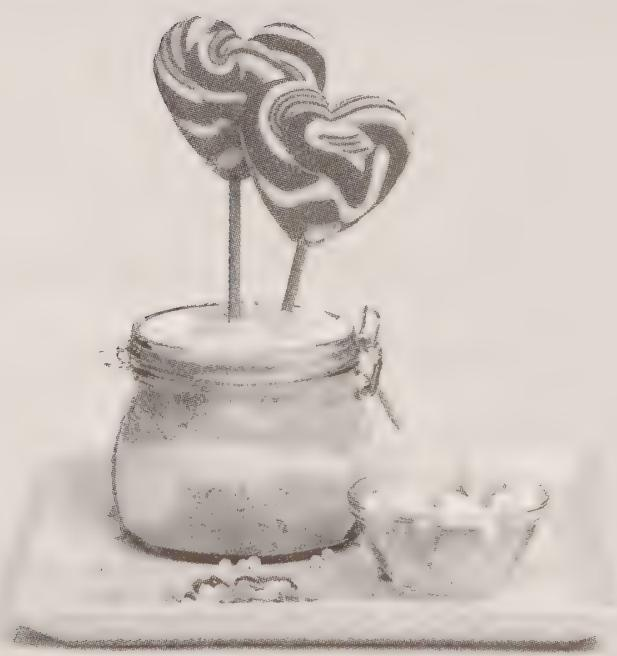

# Người chưa từng khóc thảm trong đêm khuya, không đủ tư cách bàn về nhân sinh

**不经过深夜痛哭的人，不足以谈人生**

*bù jīng guò shēn yè tòng kū de rén，bù zú yǐ tán rén shēng*

不知你是不是像我一样，一直在思考死亡这件事情。

bù zhī nǐ shì bú shì xiàng wǒ yī yàng，yì zhí zài sī kǎo sǐ wáng zhè jiàn shì qíng。

Không biết bạn có giống tôi không, luôn luôn nghĩ về cái chết.

毕竟，人生短暂，活不过百年。

bì jìng，rén shēng duǎn zàn，huó bù guò bǎi nián。

Dù sao, đời người ngắn ngủi, sống chẳng quá trăm năm.

在这样的一生里，我们究竟该怎样去活，去演绎，才会觉得死不足惜？

zài zhè yàng de yī shēng lǐ，wǒ men jiū jìng gāi zěn yàng qù huó，qù yǎn yì，cái huì jué de sǐ bù zú xī？

Trong một đời người như thế, rốt cuộc chúng ta nên sống thế nào, diễn xuất thế nào, mới thấy chết cũng không tiếc?

才能从根本上去战胜死亡这件不可抗拒的东西？

cái néng cóng gēn běn shàng qù zhàn shèng sǐ wáng zhè jiàn bù kě kàng jù de dōng xī？

Mới có thể từ gốc rễ chiến thắng cái điều không thể cưỡng lại là cái chết?

在小的时候，我们可能以为是家庭的温暖。

zài xiǎo de shí hòu，wǒ men kě néng yǐ wéi shì jiā tíng de wēn nuǎn。

Khi còn nhỏ, chúng ta có thể cho rằng đó là hơi ấm gia đình.

如果我们拥有一个温暖的家庭，就不会惧怕死亡。

rú guǒ wǒ men yōng yǒu yí gè wēn nuǎn de jiā tíng，jiù bú huì jù pà sǐ wáng。

Nếu chúng ta có một gia đình ấm áp, sẽ không còn sợ hãi cái chết.

等大一些，懂了些事的时候我们可能以为是温情，一个知我们懂我们的知己，一个与我们天涯做伴的朋友。

děng dà yī xiē，dǒng le xiē shì de shí hòu wǒ men kě néng yǐ wéi shì wēn qíng，yí gè zhī wǒ men dǒng wǒ men de zhī jǐ，yí gè yǔ wǒ men tiān yá zuò bàn de péng yǒu。

Lớn hơn một chút, hiểu chuyện hơn một chút, chúng ta có thể cho rằng đó là tình ấm, một tri kỷ hiểu ta thấu ta, một người bạn cùng ta kết bạn nơi chân trời góc bể.

后来，我们想，也许应该是爱情。

hòu lái，wǒ men xiǎng，yě xǔ yīng gāi shì ài qíng。

Về sau, chúng ta nghĩ, có lẽ phải là tình yêu.

等我爱上一个人或许就不再畏惧死亡。

děng wǒ ài shàng yí gè rén huò xǔ jiù bù zài wèi jù sǐ wáng。

Chờ đến khi tôi yêu một người, có lẽ sẽ không còn sợ hãi cái chết.

再后来，我们开始醒悟。

zài hòu lái，wǒ men kāi shǐ xǐng wù。

Rồi sau nữa, chúng ta bắt đầu tỉnh ngộ.

要战胜死亡的恐惧，是要找出生命的意义。

yào zhàn shèng sǐ wáng de kǒng jù，shì yào zhǎo chū shēng mìng de yì yì。

Muốn chiến thắng nỗi sợ cái chết, là phải tìm ra ý nghĩa của sự sống.

而生命的意义，完全源于自己对于人生的领悟，对人生道路的选择和追求。

ér shēng mìng de yì yì，wán quán yuán yú zì jǐ duì yú rén shēng de lǐng wù，duì rén shēng dào lù de xuǎn zé hé zhuī qiú。

Mà ý nghĩa của sự sống, hoàn toàn bắt nguồn từ sự lĩnh hội của bản thân về cuộc đời, từ sự lựa chọn và theo đuổi con đường đời.

生命的意义，便是信仰。

shēng mìng de yì yì，biàn shì xìn yǎng。

Ý nghĩa của sự sống, chính là niềm tin.

是我们对于未来道路的期盼，对于人生价值的参悟。

shì wǒ men duì yú wèi lái dào lù de qī pàn，duì yú rén shēng jià zhí de cān wù。

Là niềm kỳ vọng của chúng ta vào con đường phía trước, là sự ngộ ra giá trị của cuộc đời.

信仰，像是一道光，能照亮我们的前路。

xìn yǎng，xiàng shì yī dào guāng，néng zhào liàng wǒ men de qián lù。

Niềm tin, như một luồng sáng, có thể soi sáng con đường phía trước của chúng ta.

它让我们看到身为人的荣光，我们可以拥有一种对生命的狂爱。

tā ràng wǒ men kàn dào shēn wéi rén de róng guāng，wǒ men kě yǐ yōng yǒu yī zhǒng duì shēng mìng de kuáng ài。

Nó cho chúng ta thấy vinh quang của kiếp người, chúng ta có thể có một tình yêu cuồng nhiệt với sự sống.

这种狂爱让我们用生命去担保，去追寻。

zhè zhǒng kuáng ài ràng wǒ men yòng shēng mìng qù dān bǎo，qù zhuī xún。

Tình yêu cuồng nhiệt ấy khiến chúng ta lấy cả cuộc đời để bảo chứng, để truy tìm.

也许是，心心相印却一直无法在一起的恋人再次拥抱的深情；也许是，失去至亲时，想要撕裂胸膛与世间的疼痛……只要我们用心去体会，生命里的一切至真至性便是信仰的脸孔。

yě xǔ shì，xīn xīn xiāng yìn què yì zhí wú fǎ zài yì qǐ de liàn rén zài cì yōng bào de shēn qíng；yě xǔ shì，shī qù zhì qīn shí，xiǎng yào sī liè xiōng táng yǔ shì jiān de téng tòng……zhǐ yào wǒ men yòng xīn qù tǐ huì，shēng mìng lǐ de yī qiè zhì zhēn zhì xìng biàn shì xìn yǎng de liǎn kǒng。

Có lẽ là, nỗi khắc khoải của những đôi tình nhân tâm đầu ý hợp mà mãi không thể bên nhau khi được ôm nhau lần nữa; có lẽ là, nỗi đau muốn xé toang lồng ngực cùng thế gian khi mất đi người thân yêu nhất… chỉ cần chúng ta dụng tâm cảm nhận, mọi điều chân thật nhất trong cuộc sống chính là gương mặt của niềm tin.

信仰也是一道伤痛。

xìn yǎng yě shì yī dào shāng tòng。

Niềm tin cũng là một vết thương.

它带来的苦痛，像千斤的铁锤砸中胸口，像锋利的尖刀刺进心窝。

tā dài lái de kǔ tòng，xiàng qiān jīn de tiě chuí zá zhōng xiōng kǒu，xiàng fēng lì de jiān dāo cì jìn xīn wō。

Nỗi khổ đau nó mang lại, như chiếc búa ngàn cân giáng xuống lồng ngực, như mũi dao sắc lẹm đâm thấu trái tim.

这种痛，沉重而深邃。

zhè zhǒng tòng，chén zhòng ér shēn suì。

Cái đau ấy, nặng nề mà sâu thẳm.

在寂静最深处，眼泪最深处，让人蜷缩、翻滚、安静、流泪都无法解除。

zài jì jìng zuì shēn chù，yǎn lèi zuì shēn chù，ràng rén quán suō、fān gǔn、ān jìng、liú lèi dōu wú fǎ jiě chú。

Trong tận cùng tĩnh lặng, tận cùng nước mắt, khiến người ta co quắp, lăn lộn, im lặng, rơi lệ mà vẫn không thể nguôi ngoai.

信仰也是最为孤单的心事。

xìn yǎng yě shì zuì wèi gū dān de xīn shì。

Niềm tin cũng là tâm sự cô đơn nhất.

即使我们试着倾诉，试着寻找知音，试图成熟，让自己安静地面对，都无济于事。

jí shǐ wǒ men shì zhe qīng sù，shì zhe xún zhǎo zhī yīn，shì tú chéng shú，ràng zì jǐ ān jìng dì miàn duì，dōu wú jì yú shì。

Dù chúng ta thử giãi bày, thử tìm tri âm, cố gắng trưởng thành, khiến bản thân bình tĩnh đối diện, tất cả đều vô ích.

当我们再次想起它时，还是如此让你难过。

dāng wǒ men zài cì xiǎng qǐ tā shí，hái shì rú cǐ ràng nǐ nán guò。

Khi chúng ta một lần nữa nghĩ về nó, vẫn khiến ta buồn đến vậy.

或者可以视信仰为生命的魂灵，贯穿着整个人生，在你的体内不断蔓延、生长，打通每一根血管，伴随生命成长。

huò zhě kě yǐ shì xìn yǎng wéi shēng mìng de hún líng，guàn chuān zhe zhěng gè rén shēng，zài nǐ de tǐ nèi bù duàn màn yán、shēng zhǎng，dǎ tōng měi yī gēn xuè guǎn，bàn suí shēng mìng chéng zhǎng。

Hoặc có thể xem niềm tin như linh hồn của sự sống, xuyên suốt cả cuộc đời, không ngừng lan tỏa, lớn lên trong cơ thể bạn, thông suốt từng mạch máu, đồng hành cùng sự sống.

路途上，它让人坚强而又绝望。

lù tú shàng，tā ràng rén jiān qiáng ér yòu jué wàng。

Trên đường đời, nó khiến người ta vừa mạnh mẽ lại vừa tuyệt vọng.

在生活中，希望我们能够拥有这样的一个信仰。

zài shēng huó zhōng，xī wàng wǒ men néng gòu yōng yǒu zhè yàng de yí gè xìn yǎng。

Trong cuộc sống, mong rằng chúng ta có thể có được một niềm tin như vậy.

这样一个我们说也说不尽，道也道不明的信仰。

zhè yàng yí gè wǒ men shuō yě shuō bù jìn，dào yě dào bù míng de xìn yǎng。

Một niềm tin như thế, ta nói cũng không hết, giảng cũng không rõ.

我们不知道它的样子以及含义，因为它在生长，它在不断地变幻。

wǒ men bù zhī dào tā de yàng zi yǐ jí hán yì，yīn wèi tā zài shēng zhǎng，tā zài bù duàn dì biàn huàn。

Chúng ta không biết hình dáng cũng như hàm nghĩa của nó, bởi vì nó đang lớn lên, nó không ngừng biến ảo.

或许生命停止的时候，才是它的终结。

huò xǔ shēng mìng tíng zhǐ de shí hòu，cái shì tā de zhōng jié。

Có lẽ khi sự sống dừng lại, mới là lúc nó kết thúc.

当我们拥有信仰之后，我们会发现，对很多事情，很多人的认识，已经发生了质的改变，像是重新活一次。

dāng wǒ men yōng yǒu xìn yǎng zhī hòu，wǒ men huì fā xiàn，duì hěn duō shì qíng，hěn duō rén de rèn shí，yǐ jīng fā shēng le zhì dì gǎi biàn，xiàng shì chóng xīn huó yī cì。

Khi đã có niềm tin, chúng ta sẽ nhận ra rằng, nhận thức về rất nhiều việc, rất nhiều người, đã thay đổi về chất, như thể được sống lại lần nữa.

我们应该去爱一样东西，不管是钢琴、油画还是书法……我们应该深爱那么一样东西，为它拼搏奋斗。

wǒ men yīng gāi qù ài yī yàng dōng xī，bù guǎn shì gāng qín、yóu huà hái shì shū fǎ……wǒ men yīng gāi shēn ài nà me yī yàng dōng xī，wèi tā pīn bó fèn dòu。

Chúng ta nên yêu một thứ gì đó, dù là đàn piano, tranh sơn dầu hay thư pháp… chúng ta nên yêu sâu sắc một thứ như thế, vì nó mà phấn đấu, nỗ lực.

感受它带来的痛苦与艰难，也享受它带来的荣光与幸福。

gǎn shòu tā dài lái de tòng kǔ yǔ jiān nán，yě xiǎng shòu tā dài lái de róng guāng yǔ xìng fú。

Cảm nhận những đau khổ và gian nan nó mang lại, cũng tận hưởng vinh quang và hạnh phúc nó đem đến.

如果我们获得了这样一种用生命热爱的东西，我们便有了无坚不摧的信念。

rú guǒ wǒ men huò dé le zhè yàng yī zhǒng yòng shēng mìng rè ài de dōng xī，wǒ men biàn yǒu liǎo wú jiān bù cuī de xìn niàn。

Nếu chúng ta có được một thứ dùng cả cuộc đời để yêu như thế, chúng ta sẽ có niềm tin vững vàng không gì phá nổi.

我们会从容地去处理和面对生命中痛苦的经历，贫苦的人

wǒ men huì cóng róng dì qù chù lǐ huó miàn duì shēng mìng zhòng tòng kǔ de jīng lì，pín kǔ de rén

Chúng ta sẽ bình thản xử lý và đối diện với những trải nghiệm đau khổ trong đời, cuộc đời nghèo

生，不幸的爱情。

shēng，bù xìng de ài qíng。

khổ, và tình yêu bất hạnh.

尽管在青春里，这样一种热爱，长满芒刺，时常扎痛人心。

jǐn guǎn zài qīng chūn lǐ，zhè yàng yī zhǒng rè ài，zhǎng mǎn máng cì，shí cháng zhā tòng rén xīn。

Dẫu trong tuổi thanh xuân, một tình yêu như thế, mọc đầy gai nhọn, thường khiến lòng người nhói đau.

生活的现实，让我们不得不经常将自己的理想埋藏起来，经常将它束之高阁。

shēng huó de xiàn shí，ràng wǒ men bù dé bù jīng cháng jiāng zì jǐ de lǐ xiǎng mái cáng qǐ lái，jīng cháng jiāng tā shù zhī gāo gé。

Hiện thực cuộc sống, khiến chúng ta không thể không thường xuyên chôn giấu lý tưởng của mình, thường xuyên gác nó lên kệ cao.

生活告诉我们，如果我们想要解开暗夜的纱布，就必须先要弄懂它。

shēng huó gào sù wǒ men，rú guǒ wǒ men xiǎng yào jiě kāi àn yè de shā bù，jiù bì xū xiān yào nòng dǒng tā。

Cuộc sống dạy chúng ta rằng, nếu muốn gỡ lớp băng đen tối, phải hiểu rõ nó trước đã.

去读懂它的平凡，它的残酷，它的多情，它的幸福。

qù dú dǒng tā de píng fán，tā de cán kù，tā de duō qíng，tā de xìng fú。

Phải đọc hiểu sự tầm thường của nó, sự tàn khốc của nó, sự đa tình của nó, hạnh phúc của nó.

托马斯·卡莱尔说：“不曾深夜痛哭过的人，是不足以谈人生的。

tuō mǎ sī·kǎ lái ěr shuō ：“bù céng shēn yè tòng kū guò de rén，shì bù zú yǐ tán rén shēng de。

Thomas Carlyle nói: "Người chưa từng khóc thảm trong đêm khuya, không đủ tư cách bàn về nhân sinh.

”伴随着生命的成长，痛哭原因的转变，我们会越来越了解生命的含义。

”bàn suí zhe shēng mìng de chéng zhǎng，tòng kū yuán yīn de zhuǎn biàn，wǒ men huì yuè lái yuè liǎo jiě shēng mìng de hán yì。

" Cùng với sự trưởng thành của cuộc đời, sự chuyển biến trong nguyên nhân của những giọt nước mắt, chúng ta sẽ càng ngày càng hiểu rõ ý nghĩa của sự sống.

## Mỗi người đều có một cái tôi

**每个人都有一个自我**

*měi gè rén dōu yǒu yí gè zì wǒ*

渐渐地，生活把我们变成了一个特别自我的人，特别是在几经生活、感情的历练之后。

jiàn jiàn dì，shēng huó bǎ wǒ men biàn chéng le yí gè tè bié zì wǒ de rén，tè bié shì zài jǐ jīng shēng huó、gǎn qíng de lì liàn zhī hòu。

Dần dần, cuộc sống biến chúng ta thành những người đặc biệt tự ngã, nhất là sau nhiều lần trải qua thử thách của cuộc sống, tình cảm.

早晨上班的路上，我还在思考，究竟是因为我们愿意去直面生活才变得自我，还是因为自我，我们才敢狠狠地去面对生活。

zǎo chén shàng bān de lù shàng，wǒ hái zài sī kǎo，jiū jìng shì yīn wèi wǒ men yuàn yì qù zhí miàn shēng huó cái biàn dé zì wǒ，hái shì yīn wèi zì wǒ，wǒ men cái gǎn hěn hěn dì qù miàn duì shēng huó。

Trên đường đi làm buổi sáng, tôi vẫn đang suy nghĩ, rốt cuộc là vì chúng ta sẵn lòng đối mặt với cuộc sống nên mới trở nên tự ngã, hay vì tự ngã, chúng ta mới dám dũng cảm đối diện cuộc sống.

自我是有一点的贬义的，它可以理解为自我的意识强烈，也就是自私、自傲、自大。

zì wǒ shì yǒu yì diǎn de biǎn yì de，tā kě yǐ lǐ jiě wèi zì wǒ de yì shí qiáng liè，yě jiù shì zì sī、zì ào、zì dà。

Tự ngã mang một chút nghĩa tiêu cực, nó có thể được hiểu là ý thức bản ngã mạnh mẽ, tức là ích kỷ, tự kiêu, tự đại.

这些让人很少去关心其他人的感受，更别提路人的眼光了。

zhè xiē ràng rén hěn shǎo qù guān xīn qí tā rén de gǎn shòu，gèng bié tí lù rén de yǎn guāng le。

Điều này khiến người ta hiếm khi quan tâm đến cảm nhận của người khác, huống chi là ánh mắt của người qua đường.

做自己想做的事情，走自己想走的路。

zuò zì jǐ xiǎng zuò de shì qíng，zǒu zì jǐ xiǎng zǒu de lù。

Làm điều mình muốn làm, đi con đường mình muốn đi.

哪怕前方泥泞满地，我乐意，我就会前往。

nǎ pà qián fāng ní nìng mǎn dì，wǒ lè yì，wǒ jiù huì qián wǎng。

Dẫu phía trước bùn lầy khắp nơi, miễn tôi vui lòng, tôi sẽ bước đi.

为此，自我的人不惜冷酷地对待他人，无暇顾及其他人的感受和想法。

wèi cǐ，zì wǒ de rén bù xī lěng kù dì duì dài tā rén，wú xiá gù jí qí tā rén de gǎn shòu hé xiǎng fǎ。

Vì thế, người tự ngã không ngại đối xử lạnh lùng với người khác, chẳng có thời gian bận tâm đến cảm xúc và suy nghĩ của người khác.

自我的人会变得迷惘、失措，会像其他人一样成为黑夜里摸不清方向的行路人。

zì wǒ de rén huì biàn dé mí wǎng、shī cuò，huì xiàng qí tā rén yī yàng chéng wéi hēi yè lǐ mō bù qīng fāng xiàng de xíng lù rén。

Người tự ngã sẽ trở nên mê man, lạc lối, sẽ như những người khác trở thành kẻ lữ hành không tìm ra phương hướng trong đêm đen.

自我用自己强大而炙热的身体去烫伤别人，而且头也不回，看也不看。

zì wǒ yòng zì jǐ qiáng dà ér zhì rè de shēn tǐ qù tàng shāng bié rén，ér qiě tóu yě bù huí，kàn yě bù kàn。

Cái tôi dùng thân thể nóng bỏng và mạnh mẽ của mình để làm bỏng người khác, mà quay đầu không ngoảnh lại, chẳng nhìn lấy một cái.

你若觉得受伤，自可离弃打骂而去；你若觉得可以招架抵抗，愿意继续跟随前往，也无人赞赏你。

nǐ ruò jué de shòu shāng，zì kě lí qì dǎ mà ér qù；nǐ ruò jué de kě yǐ zhāo jià dǐ kàng，yuàn yì jì xù gēn suí qián wǎng，yě wú rén zàn shǎng nǐ。

Nếu bạn cảm thấy bị tổn thương, tự khắc có thể bỏ đi mà mắng chửi; nếu bạn cảm thấy có thể chống đỡ, sẵn lòng tiếp tục đi theo, cũng chẳng ai ngợi khen bạn.

自我像是一匹脱缰的马儿，只顾自己的前程风雨。

zì wǒ xiàng shì yì pǐ tuō jiāng de mǎ ér，zhǐ gù zì jǐ de qián chéng fēng yǔ。

Cái tôi như một con ngựa tuột dây cương, chỉ lo cho chặng đường mưa gió của riêng mình.

从这方面来看，自我，好像真是很自私的一种东西。

cóng zhè fāng miàn lái kàn，zì wǒ，hǎo xiàng zhēn shì hěn zì sī de yī zhǒng dōng xī。

Xét từ khía cạnh này, cái tôi, hình như thật sự là một thứ rất ích kỷ.

另外，自我也是有褒义的。

lìng wài，zì wǒ yě shì yǒu bāo yì de。

Ngoài ra, cái tôi cũng có nghĩa tích cực.

它可以理解为有自己的主意，敢于做，敢于选择，坚韧不拔。

tā kě yǐ lǐ jiě wèi yǒu zì jǐ de zhǔ yì，gǎn yú zuò，gǎn yú xuǎn zé，jiān rèn bù bá。

Nó có thể được hiểu là có chủ kiến của riêng mình, dám làm, dám lựa chọn, kiên cường bất khuất.

不管前程路上几多坎坷，只要它想要，就必须到达。

bù guǎn qián chéng lù shàng jǐ duō kǎn kě，zhǐ yào tā xiǎng yào，jiù bì xū dào dá。

Dù con đường phía trước gian truân mấy lần, chỉ cần nó muốn, nhất định phải đạt đến.

这样一种渴望，让它坚强，不畏惧任何困难艰险。

zhè yàng yī zhǒng kě wàng，ràng tā jiān qiáng，bù wèi jù rèn hé kùn nán jiān xiǎn。

Một khát vọng như thế, khiến nó mạnh mẽ, không sợ hãi bất kỳ khó khăn hiểm nguy nào.

哪怕不用掌灯，也能自行走到天明。

nǎ pà bù yòng zhǎng dēng，yě néng zì xíng zǒu dào tiān míng。

Dẫu không cần thắp đèn, cũng có thể tự mình bước đến trời sáng.

拥有了这样的自我，让你敢去面对生活中的种种不堪。

yōng yǒu le zhè yàng de zì wǒ，ràng nǐ gǎn qù miàn duì shēng huó zhōng de zhǒng zhǒng bù kān。

Có được một cái tôi như thế, khiến bạn dám đối diện với mọi sự tồi tệ trong cuộc sống.

自我让那些难堪变得那么简单、自然，让你快乐、神采飞扬。

zì wǒ ràng nà xiē nán kān biàn dé nà me jiǎn dān、zì rán，ràng nǐ kuài lè、shén cǎi fēi yáng。

Cái tôi khiến những điều khó xử kia trở nên đơn giản, tự nhiên đến vậy, khiến bạn vui vẻ, thần thái rạng rỡ.

远离了惭愧、尴尬、不安的种种，让你知道年轻就是会犯错，没有工作经验就是会鲁莽，没有表达好自己想要表达的意思就可能会起反作用，没有树立好自己的第一次印象可能就会由好变坏，没有百分百，没有十全十美。

yuǎn lí le cán kuì、gān gà、bù ān de zhǒng zhǒng，ràng nǐ zhī dào nián qīng jiù shì huì fàn cuò，méi yǒu gōng zuò jīng yàn jiù shì huì lǔ mǎng，méi yǒu biǎo dá hǎo zì jǐ xiǎng yào biǎo dá de yì si jiù kě néng huì qǐ fǎn zuò yòng，méi yǒu shù lì hǎo zì jǐ de dì yī cì yìn xiàng kě néng jiù huì yóu hǎo biàn huài，méi yǒu bǎi fēn bǎi，méi yǒu shí quán shí měi。

Rời xa mọi điều hổ thẹn, ngượng ngùng, bất an, khiến bạn hiểu rằng trẻ tuổi thì sẽ mắc lỗi, không có kinh nghiệm làm việc thì sẽ nông nổi, chưa diễn đạt tốt ý mình muốn bày tỏ thì có thể phản tác dụng, chưa gây dựng tốt ấn tượng đầu tiên thì có thể từ tốt chuyển thành xấu, không có gì là hoàn hảo trăm phần trăm, không có gì là toàn vẹn mười phân vẹn mười.

自我对个人而言绝不仅仅只是理论和定义，它切实地存在于你的生活之中，让你全然接受。

zì wǒ duì gè rén ér yán jué bù jǐn jǐn zhǐ shì lǐ lùn hé dìng yì，tā qiè shí dì cún zài yú nǐ de shēng huó zhī zhōng，ràng nǐ quán rán jiē shòu。

Cái tôi đối với mỗi người tuyệt đối không chỉ là lý thuyết và định nghĩa, nó tồn tại thực sự trong cuộc sống của bạn, khiến bạn hoàn toàn chấp nhận.

你要做的就是成长，如雨后春竹般狂野地生长。

nǐ yào zuò de jiù shì chéng zhǎng，rú yǔ hòu chūn zhú bān kuáng yě dì shēng zhǎng。

Điều bạn cần làm chính là trưởng thành, trưởng thành một cách mãnh liệt như măng mọc sau mưa.

在你柔软的心房里种下坚韧不拔的种子，开拓坦然宽阔的江流，谱写宁静动人的曲子，临摹俊秀隽永的文字……

zài nǐ róu ruǎn de xīn fáng lǐ zhòng xià jiān rèn bù bá de zhǒng zi，kāi tuò tǎn rán kuān kuò de jiāng liú，pǔ xiě níng jìng dòng rén de qǔ zi，lín mó jùn xiù juàn yǒng de wén zì……

Gieo vào trái tim mềm mại của bạn hạt giống kiên cường bất khuất, khai phá dòng sông thênh thang thản nhiên, viết nên khúc nhạc tĩnh lặng lay động lòng người, luyện viết những dòng chữ tuấn tú đậm sâu…

更多的时候，我们感谢生活给予了我们这样一个自我，让我们在成长的路上被撕裂得毫无察觉。

gèng duō de shí hòu，wǒ men gǎn xiè shēng huó jǐ yǔ le wǒ men zhè yàng yí gè zì wǒ，ràng wǒ men zài chéng zhǎng de lù shàng bèi sī liè dé háo wú chá jué。

Phần lớn thời gian, chúng ta cảm ơn cuộc sống đã ban tặng cho chúng ta một cái tôi như thế, khiến chúng ta trên đường trưởng thành bị xé toạc mà chẳng hề hay biết.

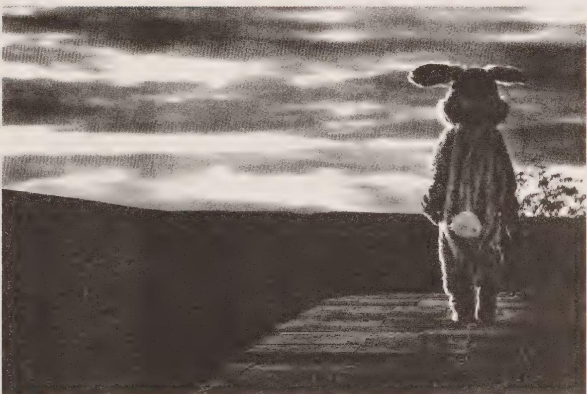

## Từ bóng tối đến ánh sáng, có lẽ chỉ cách một cánh cửa

**从黑暗到光明，或许只有一扇门的距离**

*cóng hēi àn dào guāng míng，huò xǔ zhǐ yǒu yī shàn mén de jù lí*

往往，从黑暗到光明，只隔着一扇门。

wǎng wǎng，cóng hēi àn dào guāng míng，zhǐ gé zhe yī shàn mén。

Thường thì, từ bóng tối đến ánh sáng, chỉ cách một cánh cửa.

怎么推开它或者什么时候推开它，在于每个人自己。

zěn me tuī kāi tā huò zhě shén me shí hòu tuī kāi tā，zài yú měi gè rén zì jǐ。

Làm thế nào đẩy nó ra hay khi nào đẩy nó ra, nằm ở chính mỗi người.

记得初进大学时，我是个压抑自闭的人。

jì de chū jìn dà xué shí，wǒ shì gè yā yì zì bì de rén。

Nhớ lúc mới vào đại học, tôi là một người kìm nén, khép kín.

入学一年，也很少和同学开口说话，更不主动去交朋友。

rù xué yī nián，yě hěn shǎo hé tóng xué kāi kǒu shuō huà，gèng bù zhǔ dòng qù jiāo péng yǒu。

Một năm nhập học, cũng rất ít khi mở lời nói chuyện với bạn học, càng không chủ động kết bạn.

好似那个时候流了此生最多的眼泪。

hǎo sì nà ge shí hòu liú le cǐ shēng zuì duō de yǎn lèi。

Dường như thời đó đã rơi nhiều nước mắt nhất trong đời.

现在想一想，有什么事情足以让我如此呢。

xiàn zài xiǎng yī xiǎng，yǒu shén me shì qíng zú yǐ ràng wǒ rú cǐ ne。

Giờ nghĩ lại, có chuyện gì đủ để tôi như thế đâu.

想想那些一度自认为苦难的事情，就是生命中致命的伤害吗？

xiǎng xiǎng nà xiē yí dù zì rèn wéi kǔ nàn de shì qíng，jiù shì shēng mìng zhòng zhì mìng de shāng hài ma？

Nghĩ lại những chuyện từng một thời tự cho là khổ nạn, đó thật sự là những tổn thương chí mạng trong đời sao?

那些经历就是生命中最大的痛苦吗？

nà xiē jīng lì jiù shì shēng mìng zhòng zuì dà de tòng kǔ ma？

Những trải nghiệm ấy có phải là nỗi đau lớn nhất trong đời không?

不过是那时的自己目光短促，太过软弱，才被挫折一次次击垮。

bù guò shì nà shí de zì jǐ mù guāng duǎn cù，tài guò ruǎn ruò，cái bèi cuò zhé yī cì cì jī kuǎ。

Chẳng qua là lúc ấy bản thân quá nông cạn, quá yếu đuối, nên mới bị những trắc trở đánh gục hết lần này đến lần khác.

人生就是这样一个慢慢蜕变的过程，而这就是我的命运。

rén shēng jiù shì zhè yàng yí gè màn màn tuì biàn de guò chéng，ér zhè jiù shì wǒ de mìng yùn。

Cuộc đời chính là một quá trình lột xác từ từ như thế, và đó chính là số phận của tôi.

由消极悲伤，到积极乐观。

yóu xiāo jí bēi shāng，dào jī jí lè guān。

Từ tiêu cực buồn bã, đến tích cực lạc quan.

记得一年冬天，见到W。

jì de yī nián dōng tiān，jiàn dào W。

Nhớ một mùa đông nọ, tôi gặp W.

他说上大学之后，他每天早晨七八点起床读书，中午吃饭，下午读书，下课吃饭之后，再读书到晚上十点。

tā shuō shàng dà xué zhī hòu，tā měi tiān zǎo chén qī bā diǎn qǐ chuáng dú shū，zhōng wǔ chī fàn，xià wǔ dú shū，xià kè chī fàn zhī hòu，zài dú shū dào wǎn shàng shí diǎn。

Anh ấy nói sau khi lên đại học, mỗi sáng anh dậy đọc sách lúc bảy tám giờ, trưa ăn cơm, chiều đọc sách, tan học ăn cơm xong, lại đọc sách đến mười giờ tối.

三年来他都是如此。

sān nián lái tā dōu shì rú cǐ。

Ba năm qua anh ấy đều như vậy.

想一想这三年，1095天，他该读了多少书，看了多少字呢。

xiǎng yī xiǎng zhè sān nián ，1095 tiān，tā gāi dú le duō shǎo shū，kàn le duō shǎo zì ne。

Thử nghĩ ba năm này, 1095 ngày, anh ấy đã đọc bao nhiêu sách, đọc bao nhiêu chữ đâu.

而这其中更为重要的并不是读了多少书，而是一个人，一个青年人的自制力，一颗年轻的心对于知识的渴求。

ér zhè qí zhōng gèng wéi zhòng yào de bìng bú shì dú le duō shǎo shū，ér shì yí gè rén，yí gè qīng nián rén de zì zhì lì，yī kē nián qīng de xīn duì yú zhī shí de kě qiú。

Mà điều quan trọng hơn cả trong đó không phải là đọc bao nhiêu sách, mà là một con người, sự tự chủ của một thanh niên, một trái tim trẻ khao khát tri thức.

所以每每见到W，我都心存羞愧。

suǒ yǐ měi měi jiàn dào W， wǒ dōu xīn cún xiū kuì。

Vì vậy mỗi lần gặp W, tôi đều thấy hổ thẹn trong lòng.

一直以来，我都觉得自己是一个有着很强自我意识的人，有着自己的个性与本真。

yì zhí yǐ lái，wǒ dōu jué de zì jǐ shì yí gè yǒu zhe hěn qiáng zì wǒ yì shí de rén，yǒu zhe zì jǐ de gè xìng yǔ běn zhēn。

Suốt bao lâu nay, tôi luôn tự thấy mình là người có ý thức bản ngã rất mạnh, có cá tính và bản chân của riêng mình.

但是在这样的人面前，我真是完完全全失掉自己了。

dàn shì zài zhè yàng de rén miàn qián，wǒ zhēn shì wán wán quán quán shī diào zì jǐ le。

Nhưng trước một người như thế, tôi thật sự hoàn toàn đánh mất chính mình.

真是悔极了，我走得那么缓慢。

zhēn shì huǐ jí le，wǒ zǒu dé nà me huǎn màn。

Hối hận vô cùng, tôi đã đi chậm quá.

直到二十岁，才懂得怎么去生活，才懂得向往快乐，才懂得怎么去分辨善恶美丑。

zhí dào èr shí suì，cái dǒng de zěn me qù shēng huó，cái dǒng de xiàng wǎng kuài lè，cái dǒng de zěn me qù fēn biàn shàn è měi chǒu。

Mãi đến hai mươi tuổi, mới hiểu được cách sống, mới biết hướng về niềm vui, mới biết phân biệt thiện ác tốt xấu.

人生真正的猛醒，来源于发现自身对于知识的匮乏。

rén shēng zhēn zhèng de měng xǐng，lái yuán yú fā xiàn zì shēn duì yú zhī shí de kuì fá。

Sự bừng tỉnh thật sự của cuộc đời, bắt nguồn từ việc nhận ra sự thiếu hụt tri thức của bản thân.

就像一个学中文的人，一个热衷于写小说、散文，结交志同道合之人的青年。

jiù xiàng yí gè xué zhōng wén de rén，yí gè rè zhōng yú xiě xiǎo shuō、sǎn wén，jié jiāo zhì tóng dào hé zhī rén de qīng nián。

Giống như một người học văn, một thanh niên say mê viết tiểu thuyết, tản văn, kết giao với những người cùng chí hướng.

当他发现自己对于知识的热爱是微乎其微的对于自身的人生追求也是茫然无措的。

dāng tā fā xiàn zì jǐ duì yú zhī shí de rè ài shì wēi hū qí wēi de duì yú zì shēn de rén shēng zhuī qiú yě shì máng rán wú cuò de。

Khi anh ấy phát hiện ra tình yêu của mình đối với tri thức là vô cùng nhỏ nhoi, và đối với việc theo đuổi cuộc đời của chính mình cũng mờ mịt bất lực.

他猛醒的时候，也便是他最痛楚、最无助的时候。

tā měng xǐng de shí hòu，yě biàn shì tā zuì tòng chǔ、zuì wú zhù de shí hòu。

Lúc anh ấy bừng tỉnh, cũng chính là lúc anh ấy đau đớn nhất, bất lực nhất.

当我们开始懂得思考人生，当我们发现一种值得我们去尊敬的精神，当我们开始嫉妒羡慕一种奋进的生活，当我们发现未来要走的真正的路。

dāng wǒ men kāi shǐ dǒng de sī kǎo rén shēng，dāng wǒ men fā xiàn yī zhǒng zhí de wǒ men qù zūn jìng de jīng shén，dāng wǒ men kāi shǐ jí dù xiàn mù yī zhǒng fèn jìn de shēng huó，dāng wǒ men fā xiàn wèi lái yào zǒu de zhēn zhèng de lù。

Khi chúng ta bắt đầu biết suy ngẫm về cuộc đời, khi chúng ta phát hiện ra một tinh thần đáng để chúng ta kính trọng, khi chúng ta bắt đầu ngưỡng mộ ghen tị một lối sống phấn đấu, khi chúng ta phát hiện ra con đường thật sự cần đi ở phía trước.

那个时候，我们再不会觉得生活无趣，也再不觉得人生暗淡无光，再不低迷于悲伤世界，也再不愿白白浪费光阴。

nà ge shí hòu，wǒ men zài bù huì jué de shēng huó wú qù，yě zài bù jué de rén shēng àn dàn wú guāng，zài bù dī mí yú bēi shāng shì jiè，yě zài bù yuàn bái bái làng fèi guāng yīn。

Lúc ấy, chúng ta sẽ không còn thấy cuộc sống vô vị, cũng không còn thấy cuộc đời u ám không ánh sáng, không còn chìm đắm trong thế giới bi thương, cũng không còn muốn lãng phí thời gian vô ích.

迷惘无措之后，我们开始喜欢读书，喜欢上进，喜欢争取…因为我们觉得每一种追求都打动了我们要去热爱的心。

mí wǎng wú cuò zhī hòu，wǒ men kāi shǐ xǐ huān dú shū，xǐ huān shàng jìn，xǐ huān zhēng qǔ…yīn wèi wǒ men jué de měi yī zhǒng zhuī qiú dōu dǎ dòng le wǒ men yào qù rè ài de xīn。

Sau khi mê man bất lực, chúng ta bắt đầu thích đọc sách, thích tiến bộ, thích phấn đấu… bởi vì chúng ta cảm thấy mỗi sự theo đuổi đều lay động trái tim muốn yêu thương của chúng ta.

当你看得越多，知道得越多时，就会发现自己越来越渺小。

dāng nǐ kàn dé yuè duō，zhī dào dé yuè duō shí，jiù huì fā xiàn zì jǐ yuè lái yuè miǎo xiǎo。

Khi bạn xem càng nhiều, biết càng nhiều, sẽ phát hiện ra bản thân mình càng ngày càng nhỏ bé.

正因为这种渺小，让我们恐惧，让我们看到这浩瀚的世界是那么大，而自己用尽毕生的力量能探索到的东西是那么有限。

zhèng yīn wèi zhè zhǒng miǎo xiǎo，ràng wǒ men kǒng jù，ràng wǒ men kàn dào zhè hào hàn de shì jiè shì nà me dà，ér zì jǐ yòng jǐn bì shēng de lì liàng néng tàn suǒ dào de dōng xī shì nà me yǒu xiàn。

Chính vì sự nhỏ bé ấy, khiến chúng ta sợ hãi, khiến chúng ta thấy thế giới bao la này thật lớn, mà những gì mình dùng hết sức lực cả đời có thể khám phá lại hữu hạn đến vậy.

但也是这样的一种渺小，让我们不得不如饥似渴地去学习，去汲取。

dàn yě shì zhè yàng de yī zhǒng miǎo xiǎo，ràng wǒ men bù dé bù rú jī sì kě dì qù xué xí，qù jí qǔ。

Nhưng cũng chính sự nhỏ bé ấy, khiến chúng ta không thể không như đói như khát mà học tập, tiếp thu.

我们开始为这一种信仰热泪盈眶，我们读到一本好书会如获至宝，甚至会感动得泪如泉涌，也明白了所谓的“爱的深沉”。

wǒ men kāi shǐ wèi zhè yī zhǒng xìn yǎng rè lèi yíng kuàng，wǒ men dú dào yī běn hǎo shū huì rú huò zhì bǎo，shèn zhì huì gǎn dòng dé lèi rú quán yǒng，yě míng bái le suǒ wèi de “ài de shēn chén ”。

Chúng ta bắt đầu rơi nước mắt vì niềm tin ấy, đọc được một cuốn sách hay chúng ta như bắt được báu vật, thậm chí cảm động đến nước mắt tuôn trào, cũng hiểu ra cái gọi là "tình yêu sâu đậm".

如果没有惊醒，或许我们永远会活在黑暗里。

rú guǒ méi yǒu jīng xǐng，huò xǔ wǒ men yǒng yuǎn huì huó zài hēi àn lǐ。

Nếu không có sự tỉnh giấc, có lẽ chúng ta sẽ mãi sống trong bóng tối.

也或许在哪一天，黑暗的天使睡着了，一不小心，我们迎来了光明。

yě huò xǔ zài nǎ yī tiān，hēi àn de tiān shǐ shuì zháo le，yí bù xiǎo xīn，wǒ men yíng lái le guāng míng。

Cũng có lẽ một ngày nào đó, thiên sứ bóng tối ngủ say, trong khoảnh khắc lơ đễnh, chúng ta chạm tới ánh sáng.

## Hãy để tâm hồn mãi mãi giữ đứa trẻ chưa trưởng thành trong bạn

**让心里永远住着未成年的你**

*ràng xīn lǐ yǒng yuǎn zhù zhe wèi chéng nián de nǐ*

不管你是青春年少，还是已经进入不惑之年，不管你是深深爱过，还是从未喜欢过任何人，相信你的心里，一定还藏着那么一个孤单的孩子。

bù guǎn nǐ shì qīng chūn nián shào，hái shì yǐ jīng jìn rù bù huò zhī nián，bù guǎn nǐ shì shēn shēn ài guò，hái shì cóng wèi xǐ huān guò rèn hé rén，xiāng xìn nǐ de xīn lǐ，yí dìng hái cáng zhe nà me yí gè gū dān de hái zi。

Dù bạn đang tuổi thanh xuân, hay đã bước vào tuổi bốn mươi hiểu sự đời, dù bạn từng yêu sâu đậm, hay chưa từng thích ai, tin rằng trong lòng bạn, nhất định vẫn còn giấu một đứa trẻ cô đơn nào đó.

他可能藏在你生活的各个细节里。

tā kě néng cáng zài nǐ shēng huó de gè gè xì jié lǐ。

Nó có thể ẩn trong từng chi tiết nhỏ của cuộc sống bạn.

也许是无人的马路上，你蹦蹦跳跳的举动；也可能是夜晚你在无人的街道上放声高歌；可能是在地铁里，你像中学生一样交叉着双脚；也许是你对亲近的人无理取闹时候的一个眼神…

yě xǔ shì wú rén de mǎ lù shàng，nǐ bèng bèng tiào tiào de jǔ dòng；yě kě néng shì yè wǎn nǐ zài wú rén de jiē dào shàng fàng shēng gāo gē；kě néng shì zài dì tiě lǐ，nǐ xiàng zhōng xué shēng yī yàng jiāo chā zhe shuāng jiǎo；yě xǔ shì nǐ duì qīn jìn de rén wú lǐ qǔ nào shí hòu de yí gè yǎn shén…

Có thể là trên con đường vắng người, cái dáng nhảy nhót tung tăng của bạn; cũng có thể là ban đêm bạn cất tiếng hát to trên con phố không một bóng người; có thể là trong tàu điện ngầm, bạn bắt chéo chân như một học sinh cấp ba; có thể là ánh mắt bạn khi vô cớ làm loạn với người thân thiết…

不管我们踏进社会多久，不管我们有没有遵守它的秩序与规则，知道哪些事情该做，哪些事情不该做。

bù guǎn wǒ men tà jìn shè huì duō jiǔ，bù guǎn wǒ men yǒu méi yǒu zūn shǒu tā de zhì xù yǔ guī zé，zhī dào nǎ xiē shì qíng gāi zuò，nǎ xiē shì qíng bù gāi zuò。

Dù chúng ta bước vào xã hội bao lâu, dù chúng ta có tuân thủ trật tự và quy tắc của nó hay không, biết được việc nào nên làm, việc nào không nên làm.

那个心底的小孩子，他永远存在。

nà ge xīn dǐ de xiǎo hái zi，tā yǒng yuǎn cún zài。

Đứa trẻ trong đáy lòng ấy, nó luôn tồn tại.

他依然喜欢简单，依然渴望自由、快乐。

tā yī rán xǐ huān jiǎn dān，yī rán kě wàng zì yóu、kuài lè。

Nó vẫn thích sự giản đơn, vẫn khao khát tự do, vui vẻ.

你相信吗，不管你看过多少污浊，当你置身于美丽的景色、辽阔的天地时，你的眼睛一定还是像孩子一样，亮闪闪的。

nǐ xiāng xìn ma，bù guǎn nǐ kàn guò duō shǎo wū zhuó，dāng nǐ zhì shēn yú měi lì de jǐng sè、liáo kuò de tiān dì shí，nǐ de yǎn jīng yí dìng hái shì xiàng hái zi yī yàng，liàng shǎn shǎn de。

Bạn có tin không, dù bạn từng thấy bao nhiêu điều nhơ bẩn, khi bạn đắm mình trong cảnh đẹp, trời đất bao la, đôi mắt bạn nhất định vẫn như con trẻ, long lanh sáng.

只有我们学着保护他，他才会好好地保护我们。

zhǐ yǒu wǒ men xué zhe bǎo hù tā，tā cái huì hǎo hǎo dì bǎo hù wǒ men。

Chỉ khi chúng ta học cách bảo vệ nó, nó mới bảo vệ chúng ta thật tốt.

让我们不丢失快乐，也不丢失童心。

ràng wǒ men bù diū shī kuài lè，yě bù diū shī tóng xīn。

Khiến chúng ta không đánh mất niềm vui, cũng không đánh mất tâm hồn trẻ thơ.

在得到的时候，依然会开心地笑；在失去的时候，也会破涕大哭。

zài dé dào de shí hòu，yī rán huì kāi xīn dì xiào；zài shī qù de shí hòu，yě huì pò tì dà kū。

Khi có được, vẫn sẽ cười vui vẻ; khi mất đi, cũng sẽ bật khóc thành tiếng.

正如马丁说的那样：“每个人心中都藏着一个孩子，一定要接受自己心里的小孩，请不要用大人的衣服和扎得紧紧地领带，把自己心中的小孩隐藏起来。

zhèng rú mǎ dīng shuō de nà yàng ：“měi gè rén xīn zhōng dōu cáng zhe yí gè hái zi，yí dìng yào jiē shòu zì jǐ xīn lǐ de xiǎo hái，qǐng bú yào yòng dà rén de yī fú hé zhā dé jǐn jǐn dì lǐng dài，bǎ zì jǐ xīn zhōng de xiǎo hái yǐn cáng qǐ lái。

Như Martin đã nói: "Trong lòng mỗi người đều giấu một đứa trẻ, nhất định phải chấp nhận đứa trẻ trong lòng mình, đừng dùng bộ quần áo người lớn và chiếc cà vạt thắt chặt để che giấu đứa trẻ trong tim mình.

如果每个人都接受了自己心里的小孩，我相信世界会变得更美好。

rú guǒ měi gè rén dōu jiē shòu le zì jǐ xīn lǐ de xiǎo hái，wǒ xiāng xìn shì jiè huì biàn dé gèng měi hǎo。

Nếu mỗi người đều chấp nhận đứa trẻ trong lòng mình, tôi tin thế giới sẽ trở nên tốt đẹp hơn.

这就是为什么有一些人，在步入了社会之后，就变得成熟稳重，失去童心；而一些人，不管经历多少风雨波折，依然像个孩子的原因吧。

zhè jiù shì wèi shén me yǒu yī xiē rén，zài bù rù le shè huì zhī hòu，jiù biàn dé chéng shú wěn zhòng，shī qù tóng xīn；ér yī xiē rén，bù guǎn jīng lì duō shǎo fēng yǔ bō zhé，yī rán xiàng gè hái zi de yuán yīn ba。

Đó có lẽ chính là lý do vì sao có những người, sau khi bước vào xã hội, liền trở nên trưởng thành trầm ổn, đánh mất tâm hồn trẻ thơ; còn một số người, dù trải qua bao mưa gió sóng gió, vẫn như một đứa trẻ.

某天去参加一个读书会，看到一个老态龙钟的教授，步履蹒跚。

mǒu tiān qù cān jiā yí gè dú shū huì，kàn dào yí gè lǎo tài lóng zhōng de jiào shòu，bù lǚ pán shān。

Một ngày nọ đi dự một buổi hội đọc sách, tôi thấy một vị giáo sư già nua lão lụy, bước chân loạng choạng.

但是当他开口说话的时候，我震惊了。

dàn shì dāng tā kāi kǒu shuō huà de shí hòu，wǒ zhèn jīng le。

Nhưng khi ông ấy mở lời nói, tôi đã kinh ngạc.

他的声音是那么的洪亮、有震慑力，与他苍老的外表丝毫不符。

tā de shēng yīn shì nà me de hóng liàng、yǒu zhèn shè lì，yǔ tā cāng lǎo de wài biǎo sī háo bù fú。

Giọng ông vang dội, đầy uy lực đến vậy, hoàn toàn không khớp với vẻ ngoài già cỗi của ông.

就是正当盛年的人，也不一定有他那样洪亮的声音，清晰的思路，每一句都是那么有力量而发人深思。

jiù shì zhèng dāng shèng nián de rén，yě bù yí dìng yǒu tā nà yàng hóng liàng de shēng yīn，qīng xī de sī lù，měi yī jù dōu shì nà me yǒu lì liàng ér fā rén shēn sī。

Ngay cả những người đang độ tuổi tráng niên, cũng chưa chắc có được giọng nói vang dội, tư duy rành mạch như ông, mỗi câu đều mạnh mẽ và đáng suy ngẫm.

活动结束的时候，上前去跟他打招呼，把带的几本书和名片递给他。

huó dòng jié shù de shí hòu，shàng qián qù gēn tā dǎ zhāo hū，bǎ dài de jǐ běn shū hé míng piàn dì gěi tā。

Khi buổi hoạt động kết thúc, tôi tiến lên chào ông, đưa cho ông mấy cuốn sách mang theo và danh thiếp.

他像个孩子一样慌忙地从座椅上站起来，接过名片。

tā xiàng gè hái zi yī yàng huāng máng dì cóng zuò yǐ shàng zhàn qǐ lái，jiē guò míng piàn。

Ông như một đứa trẻ cuống quýt đứng dậy khỏi ghế, nhận lấy danh thiếp.

我说：“老师，我读过您的很多书。

wǒ shuō ：“lǎo shī，wǒ dú guò nín de hěn duō shū。

Tôi nói: "Thầy ơi, em đã đọc rất nhiều sách của thầy.

”他特别开心地说：“是吗，谢谢你，谢谢。

”tā tè bié kāi xīn dì shuō ：“shì ma，xiè xiè nǐ，xiè xiè。

" Ông đặc biệt vui vẻ nói: "Thật sao, cảm ơn em, cảm ơn.

这个教授一辈子著书无数，连我都没有想到他还会如此欣喜。

zhè ge jiào shòu yī bèi zi zhù shū wú shù，lián wǒ dōu méi yǒu xiǎng dào tā hái huì rú cǐ xīn xǐ。

Vị giáo sư này cả đời viết sách vô số, ngay cả tôi cũng không ngờ ông còn vui mừng đến vậy.

只是短短的一个对话，引起我的思索。

zhǐ shì duǎn duǎn de yí gè duì huà，yǐn qǐ wǒ de sī suǒ。

Chỉ một cuộc đối thoại ngắn ngủi, đã khơi gợi suy nghĩ của tôi.

回去的时候，我跟身旁的人说：“等到我老了，也一定要像他一样，做一个睿智、并像个孩子的老人，多可爱啊。

huí qù de shí hòu，wǒ gēn shēn páng de rén shuō ：“děng dào wǒ lǎo le，yě yí dìng yào xiàng tā yī yàng，zuò yí gè ruì zhì、bìng xiàng gè hái zi de lǎo rén，duō kě ài a。

Lúc trở về, tôi nói với người bên cạnh: "Chờ đến khi tôi già, nhất định cũng phải như ông ấy, làm một ông lão trí tuệ, lại như một đứa trẻ, đáng yêu biết bao.

随着岁月的流逝，我们可能会失去一些什么，但总有一些事情，会唤醒我们心里的那个孩子，让我们能够暂时脱离现实的喧嚣与嘈杂，在滚滚红尘中获得纯净。

suí zhe suì yuè de liú shì，wǒ men kě néng huì shī qù yī xiē shén me，dàn zǒng yǒu yī xiē shì qíng，huì huàn xǐng wǒ men xīn lǐ de nà ge hái zi，ràng wǒ men néng gòu zàn shí tuō lí xiàn shí de xuān xiāo yǔ cáo zá，zài gǔn gǔn hóng chén zhōng huò dé chún jìng。

Theo dòng thời gian trôi qua, chúng ta có thể mất đi một vài điều gì đó, nhưng luôn có những chuyện, đánh thức đứa trẻ trong lòng chúng ta, khiến chúng ta có thể tạm thoát khỏi ồn ào xô bồ của hiện thực, có được sự thuần khiết giữa cõi hồng trần lăn lộn.

像那个教授一样吧，不管经历了多少沧桑巨变，依然睿智，依然是一个容易满足的孩子。

xiàng nà ge jiào shòu yī yàng ba，bù guǎn jīng lì le duō shǎo cāng sāng jù biàn，yī rán ruì zhì，yī rán shì yí gè róng yì mǎn zú de hái zi。

Hãy như vị giáo sư ấy, dù trải qua bao thăng trầm biến đổi, vẫn trí tuệ, vẫn là một đứa trẻ dễ mãn nguyện.

在难过的时候就哭，在开心的时候就笑吧，别太在意其他人的眼光。

zài nán guò de shí hòu jiù kū，zài kāi xīn de shí hòu jiù xiào ba，bié tài zài yì qí tā rén de yǎn guāng。

Buồn thì cứ khóc, vui thì cứ cười, đừng quá để tâm ánh mắt người khác.

跨过我们自己内心的那一道坎，童真地活着吧。

kuà guò wǒ men zì jǐ nèi xīn de nà yī dào kǎn，tóng zhēn dì huó zhe ba。

Vượt qua cái ngưỡng trong chính lòng mình, hãy sống với sự hồn nhiên ngây thơ.

这样，孤单的时候，也不会那么孤单；痛苦的时候，也不会那么痛苦。

zhè yàng，gū dān de shí hòu，yě bú huì nà me gū dān；tòng kǔ de shí hòu，yě bú huì nà me tòng kǔ。

Như thế, lúc cô đơn, cũng sẽ không cô đơn đến vậy; lúc đau khổ, cũng sẽ không đau khổ đến vậy.

因为当你愿意简单地看待一件事情、对待一个人时，你的生活会一直明亮着。

yīn wèi dāng nǐ yuàn yì jiǎn dān dì kàn dài yī jiàn shì qíng、duì dài yí gè rén shí，nǐ de shēng huó huì yì zhí míng liàng zhe。

Bởi vì khi bạn sẵn lòng nhìn nhận một việc, đối đãi một người một cách giản đơn, cuộc sống của bạn sẽ luôn tươi sáng.

如果可以，请将心中那个孤单的孩子永远留在心间。

rú guǒ kě yǐ，qǐng jiāng xīn zhōng nà ge gū dān de hái zi yǒng yuǎn liú zài xīn jiān。

Nếu có thể, hãy giữ mãi trong lòng đứa trẻ cô đơn ấy.

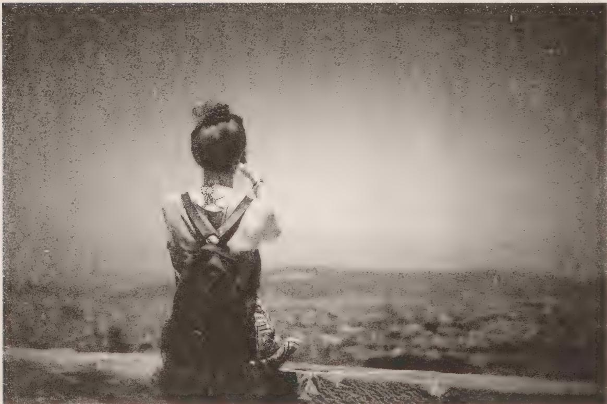

## Liên tục tổn thương, liên tục trưởng thành

**不断受伤，不断成长**

*bù duàn shòu shāng，bù duàn chéng zhǎng*

在成长的岁月里，原本以为时间只会带给我们成长的力量和不屈的个性，却不曾想在一个个阳光初露的清晨，在一个个灿烂日头的午后，它还会给我们带来无限的悲恸。

zài chéng zhǎng de suì yuè lǐ，yuán běn yǐ wéi shí jiān zhǐ huì dài gěi wǒ men chéng zhǎng de lì liàng hé bù qū de gè xìng，què bù céng xiǎng zài yí gè gè yáng guāng chū lù de qīng chén，zài yí gè gè càn làn rì tou de wǔ hòu，tā hái huì gěi wǒ men dài lái wú xiàn de bēi tòng。

Trong năm tháng trưởng thành, vốn tưởng rằng thời gian chỉ mang lại cho chúng ta sức mạnh trưởng thành và cá tính bất khuất, không ngờ rằng vào những buổi sớm nắng vừa hé, vào những buổi chiều nắng rực rỡ, nó còn mang đến cho chúng ta nỗi bi thương vô hạn.

这悲恸或许不是来自于受虐、受屈、受辱、受弃，而仅仅是突然意识到在时间的骨骼中自己太过缓慢的成长。

zhè bēi tòng huò xǔ bú shì lái zì yú shòu nüè、shòu qū、shòu rǔ、shòu qì，ér jǐn jǐn shì tū rán yì shí dào zài shí jiān de gǔ gé zhōng zì jǐ tài guò huǎn màn de chéng zhǎng。

Nỗi bi thương này có lẽ không đến từ việc bị ngược đãi, bị khuất nhục, bị xúc phạm, bị ruồng bỏ, mà chỉ đơn giản là chợt nhận ra giữa khung xương thời gian, sự trưởng thành của bản thân quá chậm chạp.

我们并不是生来矮小，而那些闪耀的人也并不是生来伟大。

wǒ men bìng bú shì shēng lái ǎi xiǎo，ér nà xiē shǎn yào de rén yě bìng bú shì shēng lái wěi dà。

Chúng ta không phải sinh ra đã nhỏ bé, mà những người tỏa sáng kia cũng không phải sinh ra đã vĩ đại.

从青春年少走向而立之年，再到迟暮耄耋，这人生缓慢而必然的过程可能任何人都无法参透。

cóng qīng chūn nián shào zǒu xiàng ér lì zhī nián，zài dào chí mù mào dié，zhè rén shēng huǎn màn ér bì rán de guò chéng kě néng rèn hé rén dōu wú fǎ cān tòu。

Từ tuổi thanh xuân đến tuổi tam thập nhi lập, rồi đến tuổi già lão mạo điệt, quá trình chậm rãi mà tất yếu của đời người này có lẽ không ai có thể thấu hiểu được.

而世间好像是不公正的，你年少时，它嫌你不经世事、乳臭未干；你年老时，它欺你残阳暮年、老而不坚。

ér shì jiān hǎo xiàng shì bù gōng zhèng de，nǐ nián shào shí，tā xián nǐ bù jīng shì shì、rǔ xiù wèi gān；nǐ nián lǎo shí，tā qī nǐ cán yáng mù nián、lǎo ér bù jiān。

Mà cõi đời dường như bất công, khi bạn trẻ, nó chê bạn chưa từng trải, hôi mùi sữa; khi bạn già, nó bắt nạt bạn lúc tuổi già chiều tàn, già mà không vững vàng.

如果我们活到恰好的年岁，便是适应这个世间最好的时期吗？

rú guǒ wǒ men huó dào qià hǎo de nián suì，biàn shì shì yìng zhè ge shì jiān zuì hǎo de shí qī ma？

Nếu chúng ta sống đến cái tuổi vừa phải, chính là thời kỳ thích ứng tốt nhất với cõi đời này sao?

是否在那样的时期，我们才可以真正地不被轻易迷惑，真正地解惑，真正地生，真正地活?

shì fǒu zài nà yàng de shí qī，wǒ men cái kě yǐ zhēn zhèng dì bù bèi qīng yì mí huò，zhēn zhèng dì jiě huò，zhēn zhèng dì shēng，zhēn zhèng dì huó?

Liệu có phải ở thời kỳ ấy, chúng ta mới có thể thật sự không bị mê hoặc một cách dễ dàng, thật sự giải được mọi thắc mắc, thật sự sinh ra, thật sự sống?

如果不是年少，我们是不是可以毫无顾忌地偕朋友去大漠或者山间出游，以文会友。

rú guǒ bú shì nián shào，wǒ men shì bú shì kě yǐ háo wú gù jì dì xié péng yǒu qù dà mò huò zhě shān jiān chū yóu，yǐ wén huì yǒu。

Nếu không phải tuổi trẻ, liệu chúng ta có thể không chút kiêng dè cùng bạn bè du ngoạn nơi sa mạc hay núi rừng, lấy văn chương kết giao tri âm.

如果不是年少，我们是不是能理所当然地坐在大雅之堂，不惧目光与众人举杯同庆。

rú guǒ bú shì nián shào，wǒ men shì bú shì néng lǐ suǒ dāng rán dì zuò zài dà yǎ zhī táng，bù jù mù guāng yǔ zhòng rén jǔ bēi tóng qìng。

Nếu không phải tuổi trẻ, liệu chúng ta có thể thản nhiên ngồi giữa nơi tao nhã, không sợ ánh nhìn cùng mọi người nâng chén mừng vui.

如果不是年少，我们是不是不需要洒下那么多无名的汗水，如果我们已成熟，或者已老，是不是就会换来多一些关注，少一些冷落。

rú guǒ bú shì nián shào，wǒ men shì bú shì bù xū yào sǎ xià nà me duō wú míng de hàn shuǐ，rú guǒ wǒ men yǐ chéng shú，huò zhě yǐ lǎo，shì bú shì jiù huì huàn lái duō yī xiē guān zhù，shǎo yī xiē lěng luò。

Nếu không phải tuổi trẻ, liệu chúng ta có cần phải đổ biết bao mồ hôi vô danh không, nếu chúng ta đã trưởng thành, hoặc đã già, liệu có đổi được nhiều sự quan tâm hơn, bớt đi chút hờ hững.

热情与现实成为对比，时间无形地走过，却总能在人的心里留下深深的烙印。

rè qíng yǔ xiàn shí chéng wéi duì bǐ，shí jiān wú xíng dì zǒu guò，què zǒng néng zài rén de xīn lǐ liú xià shēn shēn de lào yìn。

Nhiệt huyết và hiện thực thành tương phản, thời gian lặng lẽ trôi đi, lại luôn có thể in lại dấu ấn sâu đậm trong lòng người.

因年少而热情四溢，也因年少而让热情付诸东流。

yīn nián shào ér rè qíng sì yì，yě yīn nián shào ér ràng rè qíng fù zhū dōng liú。

Vì tuổi trẻ mà nhiệt huyết dâng tràn, cũng vì tuổi trẻ mà nhiệt huyết tan thành mây khói.

但是年少的我们终究有我们要做的事，要走的路，如同诸多前人一样。

dàn shì nián shào de wǒ men zhōng jiū yǒu wǒ men yào zuò de shì，yào zǒu de lù，rú tóng zhū duō qián rén yī yàng。

Nhưng tuổi trẻ chúng ta rốt cuộc vẫn có việc phải làm, con đường phải đi, cũng như bao người đi trước.

他们在走自己豁达的路，我们在走自己怅惘的路，仅此而已。

tā men zài zǒu zì jǐ huò dá de lù，wǒ men zài zǒu zì jǐ chàng wǎng de lù，jǐn cǐ ér yǐ。

Họ đang đi con đường khoáng đạt của họ, chúng ta đang đi con đường thẫn thờ của mình, chỉ vậy thôi.

一觉醒来，你可能会忘记那个想要破涕大哭的上午；无数次醒来，你可能依然记得自己的初衷。

yī jiào xǐng lái，nǐ kě néng huì wàng jì nà ge xiǎng yào pò tì dà kū de shàng wǔ；wú shù cì xǐng lái，nǐ kě néng yī rán jì de zì jǐ de chū zhōng。

Một giấc tỉnh dậy, bạn có thể quên đi buổi sáng muốn bật khóc thành tiếng ấy; vô số lần tỉnh dậy, bạn có thể vẫn nhớ chí ban đầu của mình.

那些被奚落，被搁置，被不屑的热情也一直还在，而且愈加丰满。

nà xiē bèi xī luò，bèi gē zhì，bèi bù xiè de rè qíng yě yì zhí hái zài，ér qiě yù jiā fēng mǎn。

Những nhiệt huyết từng bị chê cười, bị gác lại, bị coi thường vẫn còn đó, mà càng ngày càng thêm đầy đặn.

我们没有扭转乾坤，或者颠倒时光的能力，所以我们没有办法改变我们所经历的岁月，只能任岁月在身体里流淌成河。

wǒ men méi yǒu niǔ zhuǎn qián kūn，huò zhě diān dǎo shí guāng de néng lì，suǒ yǐ wǒ men méi yǒu bàn fǎ gǎi biàn wǒ men suǒ jīng lì de suì yuè，zhǐ néng rèn suì yuè zài shēn tǐ lǐ liú tǎng chéng hé。

Chúng ta không có năng lực xoay chuyển càn khôn, hay đảo ngược thời gian, nên chúng ta không có cách nào thay đổi những năm tháng mình đã trải qua, chỉ có thể để năm tháng chảy thành dòng sông trong thân thể.

一如我们无力改变我们正值青春茂盛之年。

yī rú wǒ men wú lì gǎi biàn wǒ men zhèng zhí qīng chūn mào shèng zhī nián。

Cũng như chúng ta bất lực thay đổi việc mình đang ở độ tuổi thanh xuân tươi tốt.

但是有人，有岁月，有韶光，来改变这一切的一切。

dàn shì yǒu rén，yǒu suì yuè，yǒu sháo guāng，lái gǎi biàn zhè yī qiè de yī qiè。

Nhưng có con người, có năm tháng, có thời gian tươi đẹp, để thay đổi tất cả mọi điều này.

我们应该都是这样成长的，在冷眼的世界里，不忘自己至真至性的渴望。

wǒ men yīng gāi dōu shì zhè yàng chéng zhǎng de，zài lěng yǎn de shì jiè lǐ，bù wàng zì jǐ zhì zhēn zhì xìng de kě wàng。

Chúng ta có lẽ đều trưởng thành như thế, trong cái thế giới lạnh lùng, không quên những khát khao chân thành nhất của bản thân.

我们也都是这样经历的，在茫然未知的世界，一次次掩住流血的头颅，流泪的眼眶，只顾走前方那条时而清晰时而模糊的路。

wǒ men yě dōu shì zhè yàng jīng lì de，zài máng rán wèi zhī de shì jiè，yī cì cì yǎn zhù liú xiě de tóu lú，liú lèi de yǎn kuàng，zhǐ gù zǒu qián fāng nà tiáo shí ér qīng xī shí ér mó hú de lù。

Chúng ta cũng đều trải qua như thế, trong thế giới mờ mịt chưa biết, hết lần này đến lần khác che lại vầng trán rướm máu, đôi mắt rưng rưng lệ, chỉ lo bước trên con đường phía trước lúc rõ ràng lúc mơ hồ.

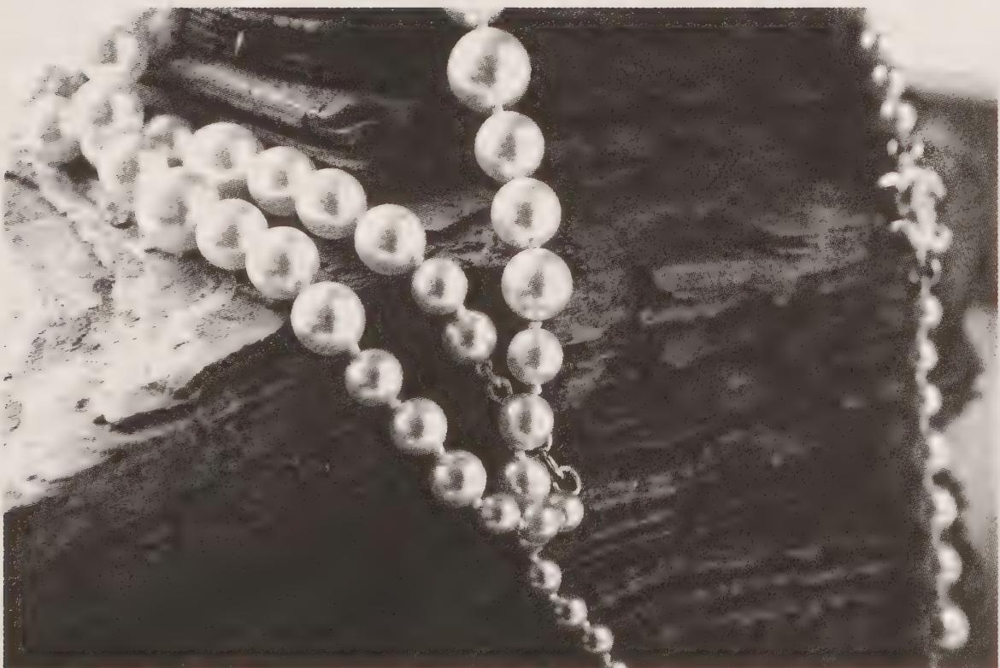

## Mỗi lần đau lòng đều là một sự lĩnh ngộ

**每一次的心痛都是一种领悟**

*měi yī cì de xīn tòng dōu shì yī zhǒng lǐng wù*

每个人都曾心痛过，或许因为朋友，或许因为家人，或许因为想念，或许因为爱情。

měi gè rén dōu céng xīn tòng guò，huò xǔ yīn wèi péng yǒu，huò xǔ yīn wèi jiā rén，huò xǔ yīn wèi xiǎng niàn，huò xǔ yīn wèi ài qíng。

Ai cũng từng đau lòng, có lẽ vì bạn bè, có lẽ vì gia đình, có lẽ vì nhớ nhung, có lẽ vì tình yêu.

这种心痛，也许是在一个人的时候，也许是在一群人中间，也许在喧闹的白天，也许在寂静的夜晚。

zhè zhǒng xīn tòng，yě xǔ shì zài yí gè rén de shí hòu，yě xǔ shì zài yī qún rén zhōng jiān，yě xǔ zài xuān nào de bái tiān，yě xǔ zài jì jìng de yè wǎn。

Nỗi đau lòng này, có lẽ là lúc chỉ có một mình, có lẽ là giữa một nhóm người, có lẽ trong ban ngày ồn ào, có lẽ trong đêm khuya tĩnh lặng.

心痛经常以一种安静的方式，爬到我们的心尖，让我们用最直接、最沉寂的方式去面对。

xīn tòng jīng cháng yǐ yī zhǒng ān jìng de fāng shì，pá dào wǒ men de xīn jiān，ràng wǒ men yòng zuì zhí jiē、zuì chén jì de fāng shì qù miàn duì。

Nỗi đau lòng thường len đến đỉnh tim ta theo một cách lặng lẽ, khiến chúng ta đối diện theo cách trực tiếp nhất, trầm lặng nhất.

每个人都哭过吧，因为想念一个人。

měi gè rén dōu kū guò ba，yīn wèi xiǎng niàn yí gè rén。

Ai cũng từng khóc, vì nhớ một người.

想念两个人曾在一起的日子。

xiǎng niàn liǎng gè rén céng zài yì qǐ de rì zi。

Nhớ những ngày hai người từng ở bên nhau.

风雨同舟，甘苦与共。

fēng yǔ tóng zhōu，gān kǔ yǔ gòng。

Cùng một con thuyền vượt mưa gió, ngọt bùi cùng chia.

没有冰冷的房间，也没有冷漠的人情。

méi yǒu bīng lěng de fáng jiān，yě méi yǒu lěng mò de rén qíng。

Không có căn phòng lạnh lẽo, cũng không có tình người băng giá.

因为破碎的家庭。

yīn wèi pò suì de jiā tíng。

Bởi vì gia đình tan vỡ.

它像一个秘密一样，永远无法诉说，以最保密的方式存在你的心底。

tā xiàng yí gè mì mì yī yàng，yǒng yuǎn wú fǎ sù shuō，yǐ zuì bǎo mì de fāng shì cún zài nǐ de xīn dǐ。

Nó như một bí mật, mãi mãi không thể giãi bày, tồn tại trong đáy lòng bạn theo cách kín đáo nhất.

白天快乐地生活着，跟其他人一样忙碌而疲惫着。

bái tiān kuài lè dì shēng huó zhe，gēn qí tā rén yī yàng máng lù ér pí bèi zhe。

Ban ngày vui vẻ sống, bận rộn và mệt mỏi như bao người khác.

到了晚上，才会敞开心扉去想，那些揪心的人与事，那些不能说出口将要把自己折磨得疯掉的心事。

dào le wǎn shàng，cái huì chǎng kāi xīn fēi qù xiǎng，nà xiē jiū xīn de rén yǔ shì，nà xiē bù néng shuō chū kǒu jiāng yào bǎ zì jǐ zhé mó dé fēng diào de xīn shì。

Đến đêm, mới mở lòng nghĩ về những con người và chuyện khiến lòng quặn thắt, những tâm sự không thể thốt ra lời sắp sửa dày vò mình phát điên.

在心痛的时候，多想有一个回应；当自己无路可走张皇失措的时候，多想要一个答案。

zài xīn tòng de shí hòu，duō xiǎng yǒu yí gè huí yìng；dāng zì jǐ wú lù kě zǒu zhāng huáng shī cuò de shí hòu，duō xiǎng yào yí gè dá àn。

Lúc đau lòng, biết bao mong có một hồi âm; khi mình đường cùng lối bước hoang mang thất thố, biết bao mong có một lời đáp.

因为有时真的不能理解，为什么人这一生，除了快乐和欢笑，还有这样多的心痛与悲哀。

yīn wèi yǒu shí zhēn de bù néng lǐ jiě，wèi shén me rén zhè yī shēng，chú le kuài lè hé huān xiào，hái yǒu zhè yàng duō de xīn tòng yǔ bēi āi。

Bởi vì có lúc thật sự không thể hiểu, vì sao một đời người, ngoài vui vẻ và tiếng cười, còn có nhiều nỗi đau lòng và bi ai đến vậy.

于是，我们在下着雨的车窗前发呆，在明媚的阳光下放空自己。

yú shì，wǒ men zài xià zhe yǔ de chē chuāng qián fā dāi，zài míng mèi de yáng guāng xià fàng kōng zì jǐ。

Thế là, chúng ta thẫn thờ bên cửa kính xe dưới mưa, buông lỏng chính mình dưới ánh nắng tươi đẹp.

我们突然，想抬头看看蓝天，突如其来地想大声歌唱。

wǒ men tū rán，xiǎng tái tóu kàn kàn lán tiān，tū rú qí lái dì xiǎng dà shēng gē chàng。

Chúng ta chợt, muốn ngẩng đầu nhìn bầu trời xanh, bất chợt muốn cất tiếng hát thật to.

总是安静，又总是疯狂。

zǒng shì ān jìng，yòu zǒng shì fēng kuáng。

Luôn luôn yên tĩnh, lại luôn luôn điên cuồng.

而你会发现不管我们经历过多少苦痛与不幸，总结了多少教训与真理，当我们迎接新的迷惘时，我们依旧彷徨无助。

ér nǐ huì fā xiàn bù guǎn wǒ men jīng lì guò duō shǎo kǔ tòng yǔ bù xìng，zǒng jié le duō shǎo jiào xùn yǔ zhēn lǐ，dāng wǒ men yíng jiē xīn de mí wǎng shí，wǒ men yī jiù páng huáng wú zhù。

Mà bạn sẽ nhận ra dù chúng ta đã trải qua bao khổ đau và bất hạnh, đúc kết bao bài học và chân lý, khi chúng ta đón nhận sự mê mang mới, chúng ta vẫn bàng hoàng bất lực.

它总是以不同的面目呈现在生活里，这次你学会了折叠千纸鹤，但下一个习题是怎样放风筝。

tā zǒng shì yǐ bù tóng de miàn mù chéng xiàn zài shēng huó lǐ，zhè cì nǐ xué huì le zhé dié qiān zhǐ hè，dàn xià yí gè xí tí shì zěn yàng fàng fēng zhēng。

Nó luôn hiện diện trong cuộc sống với những gương mặt khác nhau, lần này bạn học được cách gấp hạc giấy, nhưng bài tập tiếp theo là cách thả diều.

三毛说：“伤过，痛过，才知道有多深刻。

sān máo shuō ：“shāng guò，tòng guò，cái zhī dào yǒu duō shēn kè。

Tam Mao nói: "Tổn thương qua, đau đớn qua, mới biết sâu đậm đến nhường nào.

”也许我们永远找不到下一个习题的答案，但是我们起码知道了上一个习题带来的收获。

”yě xǔ wǒ men yǒng yuǎn zhǎo bú dào xià yí gè xí tí de dá àn，dàn shì wǒ men qǐ mǎ zhī dào le shàng yí gè xí tí dài lái de shōu huò。

" Có lẽ chúng ta mãi mãi không tìm được đáp án của bài tập tiếp theo, nhưng ít nhất chúng ta biết được thu hoạch mà bài tập trước mang lại.

生活本来就没有任何前车之鉴，我们要做的是学会面对，并在之后依然简单从容。

shēng huó běn lái jiù méi yǒu rèn hé qián chē zhī jiàn，wǒ men yào zuò de shì xué huì miàn duì，bìng zài zhī hòu yī rán jiǎn dān cóng róng。

Cuộc sống vốn dĩ không có bất kỳ tiền lệ nào, điều chúng ta cần làm là học cách đối diện, và sau đó vẫn giản đơn bình thản.

纵然伤痛撕心裂肺，天塌地陷，你还是要选择，是悲伤到底，还是继续快乐。

zòng rán shāng tòng sī xīn liè fèi，tiān tā dì xiàn，nǐ hái shì yào xuǎn zé，shì bēi shāng dào dǐ，hái shì jì xù kuài lè。

Dẫu nỗi đau xé lòng tan phổi, trời sụp đất lún, bạn vẫn phải lựa chọn, là buồn thảm đến cùng, hay tiếp tục vui vẻ.

只要还活着，就还有以后的路啊。

zhǐ yào hái huó zhe，jiù hái yǒu yǐ hòu de lù a。

Chỉ cần còn sống, vẫn còn con đường phía sau.

明天你是要笑，还是要哭；是要说话，还是要沉默。

míng tiān nǐ shì yào xiào，hái shì yào kū；shì yào shuō huà，hái shì yào chén mò。

Ngày mai bạn sẽ cười, hay sẽ khóc; sẽ nói, hay sẽ im lặng.

就像小时候被父亲狠狠揍了一顿，号啕大哭伤心欲绝的时候，想着怎么报复他，不再跟他说话，或者离家出走。

jiù xiàng xiǎo shí hòu bèi fù qīn hěn hěn zòu le yī dùn，háo táo dà kū shāng xīn yù jué de shí hòu，xiǎng zhe zěn me bào fù tā，bù zài gēn tā shuō huà，huò zhě lí jiā chū zǒu。

Cũng như hồi nhỏ bị bố đánh một trận nên thân, đang gào khóc đau lòng muốn chết, nghĩ cách trả thù ông, không nói chuyện với ông nữa, hoặc bỏ nhà ra đi.

等到睡了一觉醒来的时候，还是要面对要不要跟他说话，要不要吃他做的饭这些问题。

děng dào shuì le yī jiào xǐng lái de shí hòu，hái shì yào miàn duì yào bù yào gēn tā shuō huà，yào bù yào chī tā zuò de fàn zhè xiē wèn tí。

Đợi đến khi ngủ một giấc tỉnh dậy, vẫn phải đối mặt với những vấn đề có nên nói chuyện với ông hay không, có nên ăn cơm ông nấu hay không.

不能不说，生活是残酷的。

bù néng bù shuō，shēng huó shì cán kù de。

Không thể phủ nhận, cuộc sống là tàn khốc.

它一直在我们最绝望、最缺乏温情的时候，以最冰冷的方式对待我们。

tā yì zhí zài wǒ men zuì jué wàng、zuì quē fá wēn qíng de shí hòu，yǐ zuì bīng lěng de fāng shì duì dài wǒ men。

Nó luôn đối đãi với chúng ta theo cách lạnh lùng nhất vào lúc chúng ta tuyệt vọng nhất, thiếu hơi ấm nhất.

它就像是《一代枭雄》里面的那个典狱长一样，遵守着一个军人的规则，不会因为同情而做出任何让步。

tā jiù xiàng shì《yí dài xiāo xióng》lǐ miàn de nà ge diǎn yù zhǎng yī yàng，zūn shǒu zhe yí gè jūn rén de guī zé，bú huì yīn wèi tóng qíng ér zuò chū rèn hé ràng bù。

Nó giống như người quản ngục trong phim "Một đời hào kiệt" vậy, tuân thủ quy tắc của một người lính, sẽ không vì đồng cảm mà nhượng bộ bất kỳ điều gì.

它会说，正是因为我的大公无私，我的毫不让步，才证明了你们的刚强。

tā huì shuō，zhèng shì yīn wèi wǒ de dà gōng wú sī，wǒ de háo bù ràng bù，cái zhèng míng liǎo nǐ men de gāng qiáng。

Nó sẽ nói, chính vì sự vô tư đại công của tôi, sự không nhượng bộ của tôi, mới chứng minh được sự cứng cỏi của các người.

不是吗？

bú shì ma？

Chẳng phải sao?

如果我们克服了困难，哭过就会好起来。

rú guǒ wǒ men kè fú le kùn nán，kū guò jiù huì hǎo qǐ lái。

Nếu chúng ta vượt qua khó khăn, khóc xong sẽ tốt lên.

如果我们没能克服，选择了堕落。

rú guǒ wǒ men méi néng kè fú，xuǎn zé le duò luò。

Nếu chúng ta không vượt qua được, chọn cách sa ngã.

我们一定会憎恨生活，憎恨一切，甚至生命。

wǒ men yí dìng huì zēng hèn shēng huó，zēng hèn yī qiè，shèn zhì shēng mìng。

Chúng ta nhất định sẽ căm hận cuộc sống, căm hận tất cả, thậm chí cả sinh mệnh.

是啊，这一生，我们为何而来，又为何而活。

shì a，zhè yī shēng，wǒ men wèi hé ér lái，yòu wèi hé ér huó。

Vâng, một đời này, chúng ta vì sao mà đến, lại vì sao mà sống.

它永远没有答案，真的。

tā yǒng yuǎn méi yǒu dá àn，zhēn de。

Nó mãi mãi không có đáp án, thật đấy.

不管你以多么分裂、残酷、极端的方式，向它逼迫，它都不会有任何答案。

bù guǎn nǐ yǐ duō me fēn liè、cán kù、jí duān de fāng shì，xiàng tā bī pò，tā dōu bú huì yǒu rèn hé dá àn。

Dù bạn dùng cách phân liệt, tàn khốc, cực đoan đến đâu để ép nó, nó cũng sẽ không có bất kỳ đáp án nào.

生活不会在乎我们选择了哪一种方式生活。

shēng huó bú huì zài hū wǒ men xuǎn zé le nǎ yī zhǒng fāng shì shēng huó。

Cuộc sống không bận tâm chúng ta chọn cách sống nào.

如果选择了结束，那也就是结束；如果选择了明天，那我们就还有明天。

rú guǒ xuǎn zé liǎo jié shù，nà yě jiù shì jié shù；rú guǒ xuǎn zé le míng tiān，nà wǒ men jiù hái yǒu míng tiān。

Nếu chọn kết thúc, thì cũng chính là kết thúc; nếu chọn ngày mai, thì chúng ta vẫn còn ngày mai.

如果我们选择被动，那就被它奴役；如果我们选择主动，则自己掌握命运。

rú guǒ wǒ men xuǎn zé bèi dòng，nà jiù bèi tā nú yì；rú guǒ wǒ men xuǎn zé zhǔ dòng，zé zì jǐ zhǎng wò mìng yùn。

Nếu chúng ta chọn bị động, thì sẽ bị nó nô dịch; nếu chúng ta chọn chủ động, thì tự mình nắm lấy số phận.

最终，会哭、会笑、会伤、会痛的只有我们自己。

zuì zhōng，huì kū、huì xiào、huì shāng、huì tòng de zhǐ yǒu wǒ men zì jǐ。

Cuối cùng, người biết khóc, biết cười, biết tổn thương, biết đau đớn chỉ có chính chúng ta.

生活它只是一面镜子，而每一段痛苦，都不过是一种领悟。

shēng huó tā zhǐ shì yí miàn jìng zi，ér měi yī duàn tòng kǔ，dōu bù guò shì yī zhǒng lǐng wù。

Cuộc sống chỉ là một tấm gương, mà mỗi đoạn đau khổ, chẳng qua là một sự lĩnh ngộ.

今天我又哭了，但是明天我还会再笑的，不是吗？

jīn tiān wǒ yòu kū le，dàn shì míng tiān wǒ hái huì zài xiào de，bú shì ma？

Hôm nay tôi lại khóc rồi, nhưng ngày mai tôi sẽ lại cười, chẳng phải sao?

今天因为别人犀利的言辞刺伤了自己，非常难过；明天依然会因为他人温暖的话语温暖自己，非常快乐。

jīn tiān yīn wèi bié rén xī lì de yán cí cì shāng le zì jǐ，fēi cháng nán guò；míng tiān yī rán huì yīn wèi tā rén wēn nuǎn de huà yǔ wēn nuǎn zì jǐ，fēi cháng kuài lè。

Hôm nay vì lời lẽ sắc bén của người khác làm tổn thương chính mình, rất buồn; ngày mai vẫn sẽ vì lời nói ấm áp của người khác mà sưởi ấm lòng mình, rất vui.

纠结吧，为什么人生是这样子的；恨吧，为什么生活是这样的，为什么不能只是哭，或者只是笑。

jiū jié ba，wèi shén me rén shēng shì zhè yàng zi de；hèn ba，wèi shén me shēng huó shì zhè yàng de，wèi shén me bù néng zhǐ shì kū，huò zhě zhǐ shì xiào。

Cứ băn khoăn đi, vì sao cuộc đời là như vậy; cứ hận đi, vì sao cuộc sống là như vậy, vì sao không thể chỉ khóc, hay chỉ cười.

幸好，站在明天与期许中，我们可以用纤细的双手推翻苦痛。

xìng hǎo，zhàn zài míng tiān yǔ qī xǔ zhōng，wǒ men kě yǐ yòng xiān xì de shuāng shǒu tuī fān kǔ tòng。

May thay, đứng giữa ngày mai và kỳ vọng, chúng ta có thể dùng đôi bàn tay mảnh mai lật đổ khổ đau.

那个时候，我们想哭的时候就哭，想笑的时候就笑。

nà ge shí hòu，wǒ men xiǎng kū de shí hòu jiù kū，xiǎng xiào de shí hòu jiù xiào。

Lúc ấy, muốn khóc thì cứ khóc, muốn cười thì cứ cười.

嗯，是的，只为简单而深刻，只为疯狂而高歌。

ń，shì de，zhǐ wèi jiǎn dān ér shēn kè，zhǐ wèi fēng kuáng ér gāo gē。

Ừ, đúng vậy, chỉ vì giản đơn mà sâu sắc, chỉ vì điên cuồng mà cất cao giọng hát.

## Đừng sợ năm tháng trôi hoài

**别怕岁月蹉跎**

*bié pà suì yuè cuō tuó*

当我们还在校园的时候，总想着早点毕业，早点脱离校园，踏入社会，找一份自己喜欢的工作，过自己想要的生活。

dāng wǒ men hái zài xiào yuán de shí hòu，zǒng xiǎng zhe zǎo diǎn bì yè，zǎo diǎn tuō lí xiào yuán，tà rù shè huì，zhǎo yī fèn zì jǐ xǐ huān de gōng zuò，guò zì jǐ xiǎng yào de shēng huó。

Khi chúng ta còn trong trường, luôn nghĩ đến việc sớm tốt nghiệp, sớm rời khỏi cổng trường, bước vào xã hội, tìm một công việc mình thích, sống cuộc đời mình muốn.

我们对未来充满无限的希望，对日复一日的重复着上课、吃饭、睡觉的生活，感到无比厌倦。

wǒ men duì wèi lái chōng mǎn wú xiàn de xī wàng，duì rì fù yí rì de chóng fù zhe shàng kè、chī fàn、shuì jiào de shēng huó，gǎn dào wú bǐ yàn juàn。

Chúng ta tràn đầy hy vọng vô hạn về tương lai, vô cùng chán ngán cuộc sống lặp đi lặp lại ngày qua ngày chỉ có lên lớp, ăn cơm, ngủ.

但我们踏入社会的时候，才明白那些每天只上课、吃饭、睡觉的日子，是那么简单快乐。

dàn wǒ men tà rù shè huì de shí hòu，cái míng bái nà xiē měi tiān zhǐ shàng kè、chī fàn、shuì jiào de rì zi，shì nà me jiǎn dān kuài lè。

Nhưng khi chúng ta bước vào xã hội, mới hiểu ra những ngày tháng chỉ lên lớp, ăn cơm, ngủ ấy, đơn giản và vui vẻ đến nhường nào.

我们不用和同事之间明争暗斗，不用为了讨好领导还是保持自我而苦恼。

wǒ men bù yòng hé tóng shì zhī jiān míng zhēng àn dòu，bù yòng wèi le tǎo hǎo lǐng dǎo hái shì bǎo chí zì wǒ ér kǔ nǎo。

Chúng ta không cần tranh giành ngấm ngầm với đồng nghiệp, không cần khổ não vì nên chiều lòng sếp hay giữ vững bản thân.

而现在的我们要面对难缠的客户，有做不完的方案，要工作，要加班，要应酬…

ér xiàn zài de wǒ men yào miàn duì nán chán de kè hù，yǒu zuò bù wán de fāng àn，yào gōng zuò，yào jiā bān，yào yìng chóu…

Còn bây giờ chúng ta phải đối mặt với những khách hàng khó chiều, những bản kế hoạch làm không hết, phải làm việc, phải tăng ca, phải tiếp khách…

当我们明白的时候，我们已经跟校园彻底分开了。

dāng wǒ men míng bái de shí hòu，wǒ men yǐ jīng gēn xiào yuán chè dǐ fēn kāi le。

Khi chúng ta hiểu ra, chúng ta đã chia tay hoàn toàn với cổng trường.

不管我们有多怀念我们读书的日子，与同学们讨论诗歌、文学的日子；不论后来我们曾为了这些不舍的日子，哭痛了多少个黑夜，都再也回不去了。

bù guǎn wǒ men yǒu duō huái niàn wǒ men dú shū de rì zi，yǔ tóng xué men tǎo lùn shī gē、wén xué de rì zi；bù lùn hòu lái wǒ men céng wèi le zhè xiē bù shě de rì zi，kū tòng le duō shǎo gè hēi yè，dōu zài yě huí bù qù le。

Dù chúng ta có hoài niệm những ngày đi học, những ngày cùng bạn bè bàn luận thơ ca, văn chương đến đâu; dù về sau chúng ta đã vì những ngày không nỡ xa rời ấy mà khóc đau bao đêm tối, cũng không thể quay về được nữa.

或许只有每日不移地坚持着自己的方向，不管天长日久，才会在某一天找回原来的路。

huò xǔ zhǐ yǒu měi rì bù yí dì jiān chí zhe zì jǐ de fāng xiàng，bù guǎn tiān cháng rì jiǔ，cái huì zài mǒu yī tiān zhǎo huí yuán lái de lù。

Có lẽ chỉ có ngày ngày không đổi dời kiên trì theo hướng của mình, dù năm dài tháng rộng, mới có thể một ngày nào đó tìm lại con đường ban đầu.

因为，踏入社会后，很少还会有人去读书，增进知识。

yīn wèi，tà rù shè huì hòu，hěn shǎo hái huì yǒu rén qù dú shū，zēng jìn zhī shí。

Bởi vì, sau khi bước vào xã hội, rất ít người còn đọc sách, trau dồi tri thức.

在社会中，人们对于知识的渴求就像是一剂药，时而热得人心发烫，时而冰得人心发凉。

zài shè huì zhōng，rén men duì yú zhī shí de kě qiú jiù xiàng shì yī jì yào，shí ér rè dé rén xīn fā tàng，shí ér bīng dé rén xīn fā liáng。

Trong xã hội, sự khao khát tri thức của con người như một liều thuốc, lúc khiến lòng người nóng bỏng, lúc khiến lòng người lạnh giá.

感到烫、无法喘息的时候，便是人最勇敢坚韧的时候，在这个时候，人总知道自己的路该怎么走，也知道自己追寻的方向。

gǎn dào tàng、wú fǎ chuǎn xī de shí hòu，biàn shì rén zuì yǒng gǎn jiān rèn de shí hòu，zài zhè ge shí hòu，rén zǒng zhī dào zì jǐ de lù gāi zěn me zǒu，yě zhī dào zì jǐ zhuī xún de fāng xiàng。

Lúc cảm thấy bỏng rát, không thể thở nổi, chính là lúc con người dũng cảm kiên cường nhất, trong giờ khắc này, con người luôn biết đường mình nên đi thế nào, cũng biết phương hướng mình đang truy tìm.

也许你会在地铁里写字，在街道上哭泣，在道路旁思索，也会在家中闭门苦读。

yě xǔ nǐ huì zài dì tiě lǐ xiě zì，zài jiē dào shàng kū qì，zài dào lù páng sī suǒ，yě huì zài jiā zhōng bì mén kǔ dú。

Có lẽ bạn sẽ viết trong tàu điện ngầm, khóc trên phố, trầm tư bên vệ đường, cũng sẽ ở nhà đóng cửa khổ đọc.

往往在这样的时刻，你才会完完全全地沉浸在自信的海洋里。

wǎng wǎng zài zhè yàng de shí kè，nǐ cái huì wán wán quán quán dì chén jìn zài zì xìn de hǎi yáng lǐ。

Thường chỉ trong những giờ khắc như thế, bạn mới hoàn toàn chìm đắm trong đại dương tự tin.

尽管你眉头紧皱，但依然会满心欢喜。

jǐn guǎn nǐ méi tóu jǐn zhòu，dàn yī rán huì mǎn xīn huān xǐ。

Dẫu đôi mày bạn nhíu chặt, vẫn sẽ tràn ngập niềm vui trong lòng.

是爱、生活与追求，组成了我们人生的幸福与苦楚。

shì ài、shēng huó yǔ zhuī qiú，zǔ chéng le wǒ men rén shēng de xìng fú yǔ kǔ chǔ。

Chính tình yêu, cuộc sống và sự theo đuổi, tạo nên hạnh phúc và khổ đau trong đời chúng ta.

但是，想一想，如果有一日没有了信仰，那活着该有多么的绝望。

dàn shì，xiǎng yī xiǎng，rú guǒ yǒu yī rì mò yǒu le xìn yǎng，nà huó zhe gāi yǒu duō me de jué wàng。

Nhưng, hãy nghĩ xem, nếu một ngày kia không còn niềm tin, thì sống sẽ tuyệt vọng đến nhường nào.

是它们，让我们拥有前行的力量，并且不去绝望。

shì tā men，ràng wǒ men yōng yǒu qián xíng de lì liàng，bìng qiě bù qù jué wàng。

Chính chúng, cho chúng ta sức mạnh tiến về phía trước, và không đi đến tuyệt vọng.

不管你踏入社会多久，它们一直存在，不会消失。

bù guǎn nǐ tà rù shè huì duō jiǔ，tā men yì zhí cún zài，bú huì xiāo shī。

Dù bạn bước vào xã hội bao lâu, chúng vẫn luôn tồn tại, không hề biến mất.

而且，随着时间的流逝，你会慢慢发现和领悟，职场和人生无关，生活和梦想无关，需分清立场，明确方向。

ér qiě，suí zhe shí jiān de liú shì，nǐ huì màn màn fā xiàn hé lǐng wù，zhí chǎng hé rén shēng wú guān，shēng huó hé mèng xiǎng wú guān，xū fēn qīng lì chǎng，míng què fāng xiàng。

Hơn nữa, theo thời gian trôi qua, bạn sẽ dần phát hiện và lĩnh ngộ rằng, công sở và cuộc đời không liên quan, cuộc sống và ước mơ không liên quan, cần phân rõ lập trường, làm rõ phương hướng.

爱是什么呢？

ài shì shén me ne？

Tình yêu là gì?

爱是不管你曾如何颓废、绝望，也应坚韧地生活，并坚持自己的理想。

ài shì bù guǎn nǐ céng rú hé tuí fèi、jué wàng，yě yīng jiān rèn dì shēng huó，bìng jiān chí zì jǐ de lǐ xiǎng。

Tình yêu là dù bạn từng sa sút, tuyệt vọng đến đâu, cũng nên sống kiên cường, và kiên trì lý tưởng của mình.

爱是你满怀的热情，带你走向最终的地方。

ài shì nǐ mǎn huái de rè qíng，dài nǐ zǒu xiàng zuì zhōng de dì fāng。

Tình yêu là nhiệt tình tràn đầy trong bạn, dẫn bạn đến nơi cuối cùng.

爱，是在路上，让你懂得了追寻的意义；在终点，让你会找到生而为人的使命。

ài，shì zài lù shàng，ràng nǐ dǒng de le zhuī xún de yì yì；zài zhōng diǎn，ràng nǐ huì zhǎo dào shēng ér wéi rén de shǐ mìng。

Tình yêu, trên đường đi, khiến bạn hiểu được ý nghĩa của sự truy tìm; ở đích đến, khiến bạn tìm thấy sứ mệnh của kiếp người.

所以，别怕岁月蹉跎，因为，它可以蹉跎你的容颜，但无法蹉跎你年轻而勇敢的心。

suǒ yǐ，bié pà suì yuè cuō tuó，yīn wèi，tā kě yǐ cuō tuó nǐ de róng yán，dàn wú fǎ cuō tuó nǐ nián qīng ér yǒng gǎn de xīn。

Vậy nên, đừng sợ năm tháng trôi hoài, bởi vì, nó có thể khiến dung nhan bạn phôi pha, nhưng không thể làm hao mòn trái tim trẻ trung và dũng cảm của bạn.

带着你满腔的热与爱，大步向前吧

dài zhe nǐ mǎn qiāng de rè yǔ ài，dà bù xiàng qián ba

Hãy mang theo ngọn lửa nhiệt và tình yêu tràn đầy trong lòng, bước lớn về phía trước

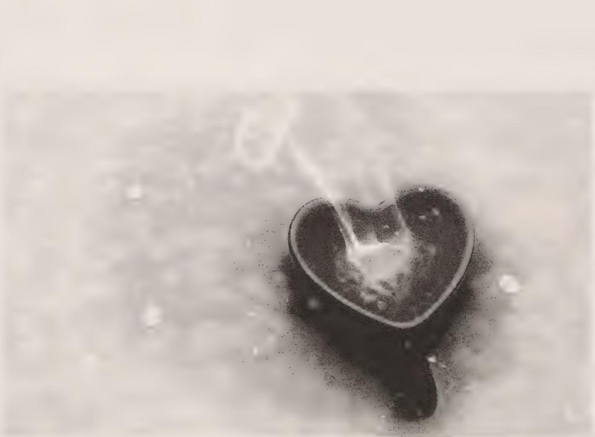

## Không ai đứng nguyên chỗ cũ đợi bạn

**没有人会在原地等你**

*méi yǒu rén huì zài yuán dì děng nǐ*

生活就是这样的，路太多太长太难，即使面对生死，它也不会有丝毫怜悯和手软。

shēng huó jiù shì zhè yàng de，lù tài duō tài zhǎng tài nán，jí shǐ miàn duì shēng sǐ，tā yě bú huì yǒu sī háo lián mǐn hé shǒu ruǎn。

Cuộc sống là như vậy đấy, đường thì nhiều, thì dài, thì khó, dù đối mặt với sống chết, nó cũng không có chút thương hại hay nương tay nào.

面对生离死别之后，我们依然要回归到自己的生活轨道上，安然无恙地生活。

miàn duì shēng lí sǐ bié zhī hòu，wǒ men yī rán yào huí guī dào zì jǐ de shēng huó guǐ dào shàng，ān rán wú yàng dì shēng huó。

Sau khi đối diện sinh ly tử biệt, chúng ta vẫn phải quay về quỹ đạo cuộc sống của mình, bình an vô sự mà sống.

不管我们的内心曾多么恐慌和畏惧，不管我们曾多少次在深夜里撕心裂肺地想起。

bù guǎn wǒ men de nèi xīn céng duō me kǒng huāng hé wèi jù，bù guǎn wǒ men céng duō shǎo cì zài shēn yè lǐ sī xīn liè fèi dì xiǎng qǐ。

Dù nội tâm chúng ta từng hoảng sợ và e dè đến đâu, dù chúng ta từng bao nhiêu lần trong đêm khuya xé lòng nhớ về.

但是我们依旧要为了生活而战，我们不能因为他要不在了而不去上班，也不能因为他要不在了，就永远留在他曾经待过的地方。

dàn shì wǒ men yī jiù yào wèi le shēng huó ér zhàn，wǒ men bù néng yīn wèi tā yào bù zài le ér bù qù shàng bān，yě bù néng yīn wèi tā yào bù zài le，jiù yǒng yuǎn liú zài tā céng jīng dài guò de dì fāng。

Nhưng chúng ta vẫn phải chiến đấu vì cuộc sống, chúng ta không thể vì anh ấy sắp ra đi mà không đi làm, cũng không thể vì anh ấy sắp ra đi mà mãi mãi ở lại nơi anh từng sống.

听见爷爷去世的消息，我才真切地体会到生离死别的苦，这不是以往无数次的空想，它真切地发生在自己的身上，自己的生命里。

tīng jiàn yé yé qù shì de xiāo xī，wǒ cái zhēn qiè dì tǐ huì dào shēng lí sǐ bié de kǔ，zhè bú shì yǐ wǎng wú shù cì de kōng xiǎng，tā zhēn qiè dì fā shēng zài zì jǐ de shēn shàng，zì jǐ de shēng mìng lǐ。

Nghe tin ông nội qua đời, tôi mới thật sự thấm thía nỗi đau sinh ly tử biệt, đây không phải những lần tưởng tượng hão huyền trước kia, nó thật sự xảy ra trên chính thân mình, trong chính cuộc đời mình.

我无数次想，是不是等到再大些，就不惧怕离别；是不是等到自己老一些，就能够看透人生短暂、生命易逝这回事儿。

wǒ wú shù cì xiǎng，shì bú shì děng dào zài dà xiē，jiù bù jù pà lí bié；shì bú shì děng dào zì jǐ lǎo yī xiē，jiù néng gòu kàn tòu rén shēng duǎn zàn、shēng mìng yì shì zhè huí shì ér。

Tôi đã vô số lần nghĩ, liệu có phải chờ lớn thêm chút nữa, sẽ không còn sợ chia ly; liệu có phải chờ mình già thêm chút, sẽ thấu hiểu chuyện đời người ngắn ngủi, sinh mệnh dễ tan.

是不是等到那一天，我就能很坦然、很平静地去面对生离死别。

shì bú shì děng dào nà yī tiān，wǒ jiù néng hěn tǎn rán、hěn píng jìng dì qù miàn duì shēng lí sǐ bié。

Liệu có phải chờ đến ngày ấy, tôi sẽ rất thản nhiên, rất bình tĩnh mà đối diện với sinh ly tử biệt.

但是当死亡硬生生地闯进我现在的生活中时，我连眼泪都没有。

dàn shì dāng sǐ wáng yìng shēng shēng dì chuǎng jìn wǒ xiàn zài de shēng huó zhōng shí，wǒ lián yǎn lèi dōu méi yǒu。

Nhưng khi cái chết xông thẳng vào cuộc sống hiện tại của tôi, tôi thậm chí không có nổi một giọt nước mắt.

不是平静，而是一种从未经受过的不知所措。

bú shì píng jìng，ér shì yī zhǒng cóng wèi jīng shòu guò de bù zhī suǒ cuò。

Không phải bình tĩnh, mà là một sự bối rối chưa từng trải qua.

不知道该怎么做，该用什么表情。

bù zhī dào gāi zěn me zuò，gāi yòng shén me biǎo qíng。

Không biết nên làm gì, nên dùng biểu cảm gì.

至今如若不是要写，我都觉得死亡、奔丧、下葬这些都没有出现过。

zhì jīn rú ruò bú shì yào xiě，wǒ dōu jué de sǐ wáng、bēn sāng、xià zàng zhè xiē dōu méi yǒu chū xiàn guò。

Cho đến nay nếu không phải phải viết ra, tôi đều cảm thấy cái chết, việc lo tang, việc hạ huyệt như chưa từng xảy ra.

从小到大，一直看别人家办丧事，自己从未经历过。

cóng xiǎo dào dà，yì zhí kàn bié rén jiā bàn sāng shì，zì jǐ cóng wèi jīng lì guò。

Từ nhỏ đến lớn, luôn nhìn người khác lo tang sự, bản thân chưa từng trải qua.

看到爷爷的照片时，心口说不上来的疼，还有父亲下跪的场景以及奶奶一直非常平静的脸。

kàn dào yé yé de zhào piān shí，xīn kǒu shuō bù shàng lái de téng，hái yǒu fù qīn xià guì de chǎng jǐng yǐ jí nǎi nǎi yì zhí fēi cháng píng jìng de liǎn。

Nhìn thấy di ảnh của ông, lồng ngực đau không nói nên lời, còn có cảnh bố quỳ xuống và khuôn mặt vô cùng bình tĩnh của bà nội.

守灵那天晚上，我一个人躺在长条的板凳上看着黑夜，我觉得那就像是此生最安静的夜一样。

shǒu líng nà tiān wǎn shàng，wǒ yí gè rén tǎng zài cháng tiáo de bǎn dèng shàng kàn zhe hēi yè，wǒ jué de nà jiù xiàng shì cǐ shēng zuì ān jìng de yè yī yàng。

Đêm giữ linh hồn ngày hôm đó, một mình tôi nằm trên chiếc ghế dài nhìn màn đêm, tôi cảm thấy đó như là đêm yên tĩnh nhất trong đời.

我躺在上面感受夜晚的冷风，透过灯光看见爷爷的棺材。

wǒ tǎng zài shàng miàn gǎn shòu yè wǎn de lěng fēng，tòu guò dēng guāng kàn jiàn yé yé de guān cái。

Tôi nằm trên đó cảm nhận cơn gió lạnh đêm, qua ánh đèn nhìn thấy quan tài của ông.

或许此时我才有资格去跟那些经受亲人生死离别的人说，我明白他们的难过和痛苦，明白他们号啕大哭的心情。

huò xǔ cǐ shí wǒ cái yǒu zī gé qù gēn nà xiē jīng shòu qīn rén shēng sǐ lí bié de rén shuō，wǒ míng bái tā men de nán guò hé tòng kǔ，míng bái tā men háo táo dà kū de xīn qíng。

Có lẽ lúc này tôi mới có tư cách nói với những người trải qua sinh ly tử biệt của người thân rằng, tôi hiểu nỗi buồn và đau khổ của họ, hiểu tâm trạng muốn gào khóc thảm thiết của họ.

举行丧事期间，奶奶一直在屋子里坐着。

jǔ xíng sāng shì qī jiān，nǎi nǎi yì zhí zài wū zi lǐ zuò zhe。

Trong thời gian lo tang sự, bà nội luôn ngồi trong nhà.

她没有哭，也不到外面看一眼。

tā méi yǒu kū，yě bú dào wài miàn kàn yī yǎn。

Bà không khóc, cũng không ra ngoài nhìn lấy một cái.

即使有奔丧的人来与她说话，她也是很平静。

jí shǐ yǒu bēn sāng de rén lái yǔ tā shuō huà，tā yě shì hěn píng jìng。

Dù có người đến viếng tang trò chuyện cùng bà, bà cũng rất bình tĩnh.

直到丧事结束，要将爷爷的棺材下葬的时候，她才拄着拐杖走出屋子来，对着慢慢远去的棺材凝望。

zhí dào sāng shì jié shù，yào jiāng yé yé de guān cái xià zàng de shí hòu，tā cái zhǔ zhe guǎi zhàng zǒu chū wū zi lái，duì zhe màn màn yuǎn qù de guān cái níng wàng。

Mãi đến khi tang lễ kết thúc, chuẩn bị hạ huyệt quan tài của ông, bà mới chống gậy bước ra khỏi nhà, ngóng nhìn cỗ quan tài từ từ khuất xa.

她坐在门前看着，一句话也不说，一滴眼泪也没有掉。

tā zuò zài mén qián kàn zhe，yī jù huà yě bù shuō，yī dī yǎn lèi yě méi yǒu diào。

Bà ngồi trước cửa nhìn theo, không nói một lời, cũng không rơi một giọt nước mắt.

曾经我跟奶奶说过，等自己长大，让她过得好些。

céng jīng wǒ gēn nǎi nǎi shuō guò，děng zì jǐ zhǎng dà，ràng tā guò dé hǎo xiē。

Ngày xưa tôi từng nói với bà nội, chờ tôi lớn lên, sẽ để bà sống tốt hơn.

我无法跟她说我的理想，我的追求，我的信念。

wǒ wú fǎ gēn tā shuō wǒ de lǐ xiǎng，wǒ de zhuī qiú，wǒ de xìn niàn。

Tôi không thể nói với bà về lý tưởng, sự theo đuổi, niềm tin của tôi.

我只能跟她说我现在做什么工作，拿多少钱，生活得怎么样。

wǒ zhǐ néng gēn tā shuō wǒ xiàn zài zuò shén me gōng zuò，ná duō shǎo qián，shēng huó dé zěn me yàng。

Tôi chỉ có thể nói với bà công việc tôi đang làm, kiếm được bao nhiêu tiền, cuộc sống thế nào.

我总想着自己要有出息些，给予这些亲人们好一点的生活。

wǒ zǒng xiǎng zhe zì jǐ yào yǒu chū xī xiē，jǐ yǔ zhè xiē qīn rén men hǎo yì diǎn de shēng huó。

Tôi luôn nghĩ bản thân phải thành đạt hơn một chút, cho những người thân này cuộc sống tốt đẹp hơn.

待到爷爷去世，我才被打醒。

dài dào yé yé qù shì，wǒ cái bèi dǎ xǐng。

Mãi đến khi ông nội qua đời, tôi mới bị đánh thức.

时光和生命是很残酷的，它们岂会等你、满足你的一切所想。

shí guāng hé shēng mìng shì hěn cán kù de，tā men qǐ huì děng nǐ、mǎn zú nǐ de yī qiè suǒ xiǎng。

Thời gian và sinh mệnh rất tàn khốc, chúng nào có đợi bạn, thỏa mãn mọi điều bạn nghĩ.

它一分一秒都不会因为你的深情而停下来，在它面前，有些时候你只能是无能为力。

tā yī fēn yī miǎo dōu bú huì yīn wèi nǐ de shēn qíng ér tíng xià lái，zài tā miàn qián，yǒu xiē shí hòu nǐ zhǐ néng shì wú néng wéi lì。

Nó sẽ không vì tình cảm sâu nặng của bạn mà dừng lại dù chỉ một giây một phút, trước mặt nó, có những lúc bạn chỉ có thể bất lực.

先把自己照顾好吧，先走好自己的路。

xiān bǎ zì jǐ zhào gù hǎo ba，xiān zǒu hǎo zì jǐ de lù。

Trước hết hãy tự chăm sóc bản thân thật tốt, trước hết hãy bước cho tốt con đường của mình.

如果在这条路上必将有所失，也让这些失去有价值一些吧。

rú guǒ zài zhè tiáo lù shàng bì jiāng yǒu suǒ shī，yě ràng zhè xiē shī qù yǒu jià zhí yī xiē ba。

Nếu trên con đường này ắt có điều phải đánh mất, thì cũng hãy khiến những mất mát ấy trở nên có giá trị hơn một chút.

下定决心，勇敢地去走自己的路吧，在生死面前，一切是那么的渺小、微不足道。

xià dìng jué xīn，yǒng gǎn dì qù zǒu zì jǐ de lù ba，zài shēng sǐ miàn qián，yī qiè shì nà me de miǎo xiǎo、wēi bù zú dào。

Hãy hạ quyết tâm, dũng cảm bước trên con đường của mình, trước sống chết, tất cả đều nhỏ bé, chẳng đáng kể đến thế.

有什么信念就去实现吧，别再说一些骗人的空话。

yǒu shén me xìn niàn jiù qù shí xiàn ba，bié zài shuō yī xiē piàn rén de kōng huà。

Có niềm tin gì thì hãy đi thực hiện nó, đừng nói những lời suông dối lòng nữa.

直到有一天，你不再能够想起曾经陪伴在你身边的那个人，直到你不愿去回想与他的点滴回忆，直到你不愿去他住过的住所，走他走过的路，那你就是真的失去他了。

zhí dào yǒu yī tiān，nǐ bù zài néng gòu xiǎng qǐ céng jīng péi bàn zài nǐ shēn biān de nà ge rén，zhí dào nǐ bù yuàn qù huí xiǎng yǔ tā de diǎn dī huí yì，zhí dào nǐ bù yuàn qù tā zhù guò de zhù suǒ，zǒu tā zǒu guò de lù，nà nǐ jiù shì zhēn de shī qù tā le。

Cho đến một ngày, bạn không còn có thể nhớ đến người từng bên cạnh bạn, cho đến khi bạn không muốn hồi tưởng những ký ức vụn vặt với anh ấy, cho đến khi bạn không muốn đến nơi anh từng ở, đi con đường anh từng đi, thì lúc đó bạn thật sự đã mất anh rồi.

我们还年轻，生命对于我们来说也才刚刚开始，有很多事情我们还没有经历，有很多事情我们也无法言说，很多时候我们也不知道路途该如何走。

wǒ men hái nián qīng，shēng mìng duì yú wǒ men lái shuō yě cái gāng gāng kāi shǐ，yǒu hěn duō shì qíng wǒ men hái méi yǒu jīng lì，yǒu hěn duō shì qíng wǒ men yě wú fǎ yán shuō，hěn duō shí hòu wǒ men yě bù zhī dào lù tú gāi rú hé zǒu。

Chúng ta vẫn còn trẻ, sinh mệnh đối với chúng ta mà nói vừa mới bắt đầu, có rất nhiều việc chúng ta chưa trải qua, có rất nhiều việc chúng ta không thể nói nên lời, rất nhiều lúc chúng ta cũng không biết đường đi phải thế nào.

它需要我们自己去摸索，去探寻。

tā xū yào wǒ men zì jǐ qù mō suǒ，qù tàn xún。

Nó cần chính chúng ta tự mò mẫm, tự khám phá.

可能我们没有走过的路，无法与人分享，可能我们也不知道在人生的时光中，如何兼得生命与信仰。

kě néng wǒ men méi yǒu zǒu guò de lù，wú fǎ yǔ rén fēn xiǎng，kě néng wǒ men yě bù zhī dào zài rén shēng de shí guāng zhōng，rú hé jiān dé shēng mìng yǔ xìn yǎng。

Có thể những con đường ta chưa từng đi, không thể chia sẻ với ai, có lẽ ta cũng không biết trong dòng thời gian của cuộc đời, làm thế nào để có được cả sự sống lẫn niềm tin.

不知道在这残酷的时光中，我们该如何做到鱼和熊掌兼得。

bù zhī dào zài zhè cán kù de shí guāng zhōng，wǒ men gāi rú hé zuò dào yú hé xióng zhǎng jiān dé。

Không biết trong khoảng thời gian tàn khốc này, ta nên làm thế nào để vẹn toàn cả đôi đường.

但我们可以尝试着去找一条正确的路，去找到最好的方法，来面对因为生命的短暂而带来的一次次心尖的颤抖。

dàn wǒ men kě yǐ cháng shì zhe qù zhǎo yī tiáo zhèng què de lù，qù zhǎo dào zuì hǎo de fāng fǎ，lái miàn duì yīn wèi shēng mìng de duǎn zàn ér dài lái de yī cì cì xīn jiān de chàn dǒu。

Nhưng ta có thể thử tìm một con đường đúng đắn, tìm ra phương pháp tốt nhất, để đối mặt với những cơn run rẩy trong tim vì sự ngắn ngủi của cuộc đời mà đến.

## Cuộc đời nên có một chuyến đi nói đi là đi

**人生要有一场说走就走的旅行**

*rén shēng yào yǒu yī cháng shuō zǒu jiù zǒu de lǚ xíng*

当一个人有了自己明确的人生道路之后，生活中的一切都会变得诗意起来。

dāng yí gè rén yǒu le zì jǐ míng què de rén shēng dào lù zhī hòu，shēng huó zhōng de yī qiè dū huì biàn dé shī yì qǐ lái。

Khi một người đã có con đường đời rõ ràng của riêng mình, mọi thứ trong cuộc sống đều sẽ trở nên đầy thi vị.

“一生中至少要有两次冲动，一次为奋不顾身的爱情，一次为说走就走的旅行。

“yī shēng zhōng zhì shǎo yào yǒu liǎng cì chōng dòng，yī cì wèi fèn bù gù shēn de ài qíng，yī cì wèi shuō zǒu jiù zǒu de lǚ xíng。

"Một đời người ít nhất phải có hai lần bốc đồng, một lần vì tình yêu bất chấp tất cả, một lần vì chuyến đi nói đi là đi.

”许多人都喜欢这样既爽快又明亮的句子，但真正能做到的人又有几个呢？

”xǔ duō rén dōu xǐ huān zhè yàng jì shuǎng kuài yòu míng liàng de jù zi，dàn zhēn zhèng néng zuò dào de rén yòu yǒu jǐ gè ne？

"Nhiều người đều thích những câu chữ vừa sảng khoái vừa sáng sủa như thế, nhưng thực sự làm được lại có mấy người?

有多少人能够勇敢面对一场“只求同行，不求结果”的爱情？

yǒu duō shǎo rén néng gòu yǒng gǎn miàn duì yī cháng “zhǐ qiú tóng háng，bù qiú jié guǒ ”de ài qíng？

Có bao nhiêu người đủ dũng cảm đối mặt với một tình yêu "chỉ cầu đồng hành, không cầu kết quả"?

又有多少人能丢掉工作，离开压抑的城市，给自己一份洒脱，去寻一处美景？

yòu yǒu duō shǎo rén néng diū diào gōng zuò，lí kāi yā yì de chéng shì，gěi zì jǐ yī fèn sǎ tuō，qù xún yī chù měi jǐng？

Lại có bao nhiêu người có thể buông bỏ công việc, rời khỏi thành phố ngột ngạt, dành cho mình một sự phóng khoáng, đi tìm một chốn mỹ cảnh?

长久以来，我一直想要有一次奋不顾身的旅行。

cháng jiǔ yǐ lái，wǒ yì zhí xiǎng yào yǒu yī cì fèn bù gù shēn de lǚ xíng。

Từ lâu nay, tôi luôn muốn có một chuyến đi bất chấp tất cả.

若要问我最想去的地方，那便是敦煌。

ruò yào wèn wǒ zuì xiǎng qù de dì fāng，nà biàn shì dūn huáng。

Nếu hỏi tôi nơi muốn đến nhất, thì đó chính là Đôn Hoàng.

我渴望在一个炎热的夏天，单薄而瘦弱地暴露在那座城市的阳光下。

wǒ kě wàng zài yí gè yán rè de xià tiān，dān bó ér shòu ruò dì bào lù zài nà zuò chéng shì de yáng guāng xià。

Tôi khao khát được trong một mùa hè nóng bức, thân hình mảnh khảnh gầy yếu phơi mình dưới ánh nắng của thành phố ấy.

我常跟朋友说，在炎热的夏天，去敦煌晒到脱皮回来，是我一个长久的愿望。

wǒ cháng gēn péng yǒu shuō，zài yán rè de xià tiān，qù dūn huáng shài dào tuō pí huí lái，shì wǒ yí gè cháng jiǔ de yuàn wàng。

Tôi thường nói với bạn bè rằng, vào mùa hè nóng bức, đến Đôn Hoàng phơi nắng đến bong da rồi trở về, là một ước nguyện lâu nay của tôi.

在如今快节奏的生活里，每个人的生活压力都非常大。

zài rú jīn kuài jié zòu de shēng huó lǐ，měi gè rén de shēng huó yā lì dōu fēi cháng dà。

Trong cuộc sống nhịp sống nhanh như hiện nay, áp lực cuộc sống của mỗi người đều rất lớn.

先不说有无理想，有无长夜痛哭。

xiān bù shuō yǒu wú lǐ xiǎng，yǒu wú cháng yè tòng kū。

Không nói đến có lý tưởng hay không, có từng khóc nức nở suốt đêm dài hay không.

我们肯定都有一颗疲惫的心灵，很多时候，我们渴望自由，渴望远方。

wǒ men kěn dìng dū yǒu yī kē pí bèi de xīn líng，hěn duō shí hòu，wǒ men kě wàng zì yóu，kě wàng yuǎn fāng。

Chắc chắn chúng ta đều có một tâm hồn mệt mỏi, rất nhiều lúc, chúng ta khao khát tự do, khao khát phương xa.

我常常劝说身边的人，如果可以，少买些物件，多攒点钱，趁年轻去外面看看，多出去走走，看看山水。

wǒ cháng cháng quàn shuō shēn biān de rén，rú guǒ kě yǐ，shǎo mǎi xiē wù jiàn，duō zǎn diǎn qián，chèn nián qīng qù wài miàn kàn kàn，duō chū qù zǒu zǒu，kàn kàn shān shuǐ。

Tôi thường khuyên những người xung quanh, nếu có thể, hãy bớt mua sắm đồ đạc, dành dụm chút tiền, nhân lúc còn trẻ hãy ra ngoài nhìn ngắm, đi nhiều nơi, ngắm sông ngắm núi.

这并不是为了单纯的休息，单纯的开阔眼界，而是去寻找自己最纯净的心灵，在旅途中拥抱美好。

zhè bìng bú shì wèi le dān chún de xiū xī，dān chún de kāi kuò yǎn jiè，ér shì qù xún zhǎo zì jǐ zuì chún jìng de xīn líng，zài lǚ tú zhōng yōng bào měi hǎo。

Điều này không phải chỉ để nghỉ ngơi đơn thuần, mở mang tầm mắt đơn thuần, mà là để đi tìm tâm hồn thuần khiết nhất của mình, trong hành trình ôm trọn những điều tốt đẹp.

也许你的生活观由此就改变了，也许世界由此就颠了个个儿。

yě xǔ nǐ de shēng huó guān yóu cǐ jiù gǎi biàn le，yě xǔ shì jiè yóu cǐ jiù diān le gè gè ér。

Có lẽ quan niệm sống của bạn từ đó mà thay đổi, có lẽ thế giới từ đó mà đảo lộn.

在备感压抑疲累的时候，选择出行。

zài bèi gǎn yā yì pí lèi de shí hòu，xuǎn zé chū xíng。

Khi cảm thấy ngột ngạt mệt mỏi, hãy chọn lên đường.

如果我们没有太多的钱去太远的地方，可以去一个花费不多的地方，去一个小城市。

rú guǒ wǒ men méi yǒu tài duō de qián qù tài yuǎn de dì fāng，kě yǐ qù yí gè huā fèi bù duō de dì fāng，qù yí gè xiǎo chéng shì。

Nếu chúng ta không có quá nhiều tiền để đi đến những nơi quá xa, có thể đi đến một nơi tốn kém ít, đến một thành phố nhỏ.

因为风景并不重要，重要的是这一次出走的本身。

yīn wèi fēng jǐng bìng bú zhòng yào，zhòng yào de shì zhè yī cì chū zǒu de běn shēn。

Bởi vì phong cảnh không quan trọng, điều quan trọng chính là sự ra đi này.

走在路上，住在别的城市，走在别的土地上，看见别的城市的人。

zǒu zài lù shàng，zhù zài bié de chéng shì，zǒu zài bié de tǔ dì shàng，kàn jiàn bié de chéng shì de rén。

Bước trên đường, sống ở thành phố khác, đi trên mảnh đất khác, nhìn thấy con người của những thành phố khác.

一些不明的想法，一些心灵的疲惫，就可以慢慢散去。

yī xiē bù míng de xiǎng fǎ，yī xiē xīn líng de pí bèi，jiù kě yǐ màn màn sàn qù。

Những ý nghĩ mơ hồ, những mệt mỏi trong tâm hồn, đều có thể dần dần tan biến.

我们还可以就此去理解生活，去理解过着平淡日子的人们，

wǒ men hái kě yǐ jiù cǐ qù lǐ jiě shēng huó，qù lǐ jiě guò zhe píng dàn rì zi de rén men，

Chúng ta còn có thể nhờ đó mà hiểu về cuộc sống, hiểu về những con người đang sống những ngày tháng bình đạm,

他们的幸福、安详。

tā men de xìng fú、ān xiáng。

hạnh phúc và an yên của họ.

或许可以这样说，在我们忙碌的生活里，没有旅行，是不完整的。

huò xǔ kě yǐ zhè yàng shuō，zài wǒ men máng lù de shēng huó lǐ，méi yǒu lǚ xíng，shì bù wán zhěng de。

Có lẽ có thể nói như thế này, trong cuộc sống bận rộn của chúng ta, nếu không có những chuyến đi, thì thật không trọn vẹn.

旅行应当成为我们生活的一部分，成为我们所追求的一部分，不管多么疲惫，多么焦躁，多么繁忙，下定决心，出走一次。

lǚ xíng yīng dāng chéng wéi wǒ men shēng huó de yī bù fèn，chéng wéi wǒ men suǒ zhuī qiú de yī bù fèn，bù guǎn duō me pí bèi，duō me jiāo zào，duō me fán máng，xià dìng jué xīn，chū zǒu yī cì。

Du lịch nên trở thành một phần của cuộc sống, trở thành một phần điều ta theo đuổi, dù có mệt mỏi đến đâu, nôn nóng đến đâu, bận rộn đến đâu, hãy hạ quyết tâm, ra đi một lần.

去一个陌生的城市。

qù yí gè mò shēng de chéng shì。

Đến một thành phố xa lạ.

记得有人曾说：“人的一生，如果真的有什么事情叫作无愧无悔的话，在我看来，就是你的童年有游戏的欢乐，你的青春有漂泊的经历，你的老年有难忘的回忆。

jì de yǒu rén céng shuō ：“rén de yī shēng，rú guǒ zhēn de yǒu shén me shì qíng jiào zuò wú kuì wú huǐ de huà，zài wǒ kàn lái，jiù shì nǐ de tóng nián yǒu yóu xì de huān lè，nǐ de qīng chūn yǒu piāo bó de jīng lì，nǐ de lǎo nián yǒu nán wàng de huí yì。

Tôi nhớ có người từng nói: "Cuộc đời một con người, nếu thực sự có điều gì gọi là hổ thẹn hay hối tiếc thì, theo tôi, chính là tuổi thơ bạn có niềm vui của trò chơi, tuổi trẻ bạn có trải nghiệm phiêu bạt, tuổi già bạn có những hồi ức khó quên.

而青春，就应该像是春天里的蒲公英，即使力气单薄、个头又小，还没有能力长出飞天的翅膀，借着风力也要飘向远方：哪怕是飘落在你不知道的地方，也要去闯一闯。

ér qīng chūn，jiù yīng gāi xiàng shì chūn tiān lǐ de pú gōng yīng，jí shǐ lì qì dān bó、gè tóu yòu xiǎo，hái méi yǒu néng lì zhǎng chū fēi tiān de chì bǎng，jiè zháo fēng lì yě yào piāo xiàng yuǎn fāng：nǎ pà shì piāo luò zài nǐ bù zhī dào de dì fāng，yě yào qù chuǎng yī chuǎng。

Còn tuổi trẻ, nên giống như bồ công anh của mùa xuân, dù sức lực mỏng manh, thân hình bé nhỏ, chưa đủ khả năng mọc ra đôi cánh bay lên trời, thì cũng phải mượn ngọn gió phiêu về phương xa: dẫu có rơi xuống nơi bạn không biết, cũng phải đi xông pha một phen.

是啊，唯独这样我们才能认识和看清楚真正的世界。

shì a，wéi dú zhè yàng wǒ men cái néng rèn shí hé kàn qīng chǔ zhēn zhèng de shì jiè。

Phải, chỉ có như vậy chúng ta mới có thể nhận thức và nhìn rõ thế giới chân thật.

在宁静的小路上，在秋风呼啸的山顶，在波涛汹涌的岸边与清爽无人的溪畔，我们去想明白一些事情、一些人。

zài níng jìng de xiǎo lù shàng，zài qiū fēng hū xiào de shān dǐng，zài bō tāo xiōng yǒng de àn biān yǔ qīng shuǎng wú rén de xī pàn，wǒ men qù xiǎng míng bái yī xiē shì qíng、yī xiē rén。

Trên những con đường nhỏ yên tĩnh, trên đỉnh núi gió thu gào thét, bên bờ biển sóng cuộn trào và bên dòng suối mát lạnh vắng người, chúng ta đi nghĩ thông suốt một số việc, một số người.

去领悟生命，贴近自然。

qù lǐng wù shēng mìng，tiē jìn zì rán。

Đi lĩnh hội sự sống, gần gũi thiên nhiên.

归来的途中，做好再次上路的准备。

guī lái de tú zhōng，zuò hǎo zài cì shàng lù de zhǔn bèi。

Trên đường trở về, hãy chuẩn bị sẵn sàng cho lần lên đường tiếp theo.

趁着年轻，趁着青春尚在，趁着我们还有大把的闲暇时光，离开你朝九晚五生活的地方，别再过着一年其实只过一天，只是重复着365次的日子了。

chèn zhe nián qīng，chèn zhe qīng chūn shàng zài，chèn zhe wǒ men hái yǒu dà bǎ de xián xiá shí guāng，lí kāi nǐ cháo jiǔ wǎn wǔ shēng huó de dì fāng，bié zài guò zhe yī nián qí shí zhǐ guò yī tiān，zhǐ shì chóng fù zhe 365 cì de rì zi le。

Nhân lúc còn trẻ, nhân lúc thanh xuân vẫn còn, nhân lúc chúng ta vẫn còn nhiều thời gian rảnh rỗi, hãy rời khỏi nơi bạn sống với guồng quay sáng chín chiều năm, đừng tiếp tục sống kiểu một năm thực ra chỉ như một ngày, chỉ lặp lại 365 lần.

背上背包，关掉手机，买一张车票，去你心里一直向往的地方吧，给青春一个无悔的交代！

bèi shàng bēi bāo，guān diào shǒu jī，mǎi yī zhāng chē piào，qù nǐ xīn lǐ yì zhí xiàng wǎng de dì fāng ba，gěi qīng chūn yí gè wú huǐ de jiāo dài！

Đeo ba lô lên, tắt điện thoại, mua một tấm vé, đi đến nơi mà trong lòng bạn luôn hướng về đi, để thanh xuân có một lời giao phó không hối tiếc!

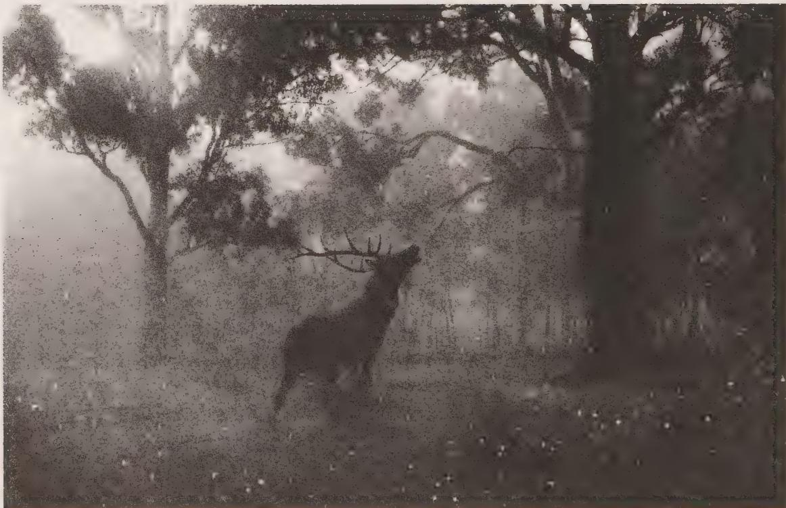

# Cảm ơn mọi thử thách mà cuộc sống đã ban cho chúng ta

**感谢生活给予我们的所有刁难**

*gǎn xiè shēng huó jǐ yǔ wǒ men de suǒ yǒu diāo nàn*

感谢生命里的每一个人，生活中发生的每一件事。

gǎn xiè shēng mìng lǐ de měi yí gè rén，shēng huó zhōng fā shēng de měi yī jiàn shì。

Cảm ơn từng người trong cuộc đời, từng việc xảy ra trong cuộc sống.

感谢生活给予我们的所有刁难，让我们学会了在荆棘中忍耐，让我们看得见破茧成蝶后的光明，凤凰涅槃后的辉煌。

gǎn xiè shēng huó jǐ yǔ wǒ men de suǒ yǒu diāo nàn，ràng wǒ men xué huì le zài jīng jí zhōng rěn nài，ràng wǒ men kàn dé jiàn pò jiǎn chéng dié hòu de guāng míng，fèng huáng niè pán hòu de huī huáng。

Cảm ơn mọi thử thách mà cuộc sống đã ban cho chúng ta, để chúng ta học được sự nhẫn nại giữa gai góc, để chúng ta nhìn thấy ánh sáng sau khi phá kén hóa bướm, vẻ huy hoàng sau khi phượng hoàng tái sinh.

曾有一个朋友，在她很小的时候，父母就离异了。

céng yǒu yí gè péng yǒu，zài tā hěn xiǎo de shí hòu，fù mǔ jiù lí yì le。

Từng có một người bạn, khi cô ấy còn rất nhỏ, cha mẹ đã ly hôn.

她说，走到如今，她的父亲没有给过她多少帮助。

tā shuō，zǒu dào rú jīn，tā de fù qīn méi yǒu gěi guò tā duō shǎo bāng zhù。

Cô ấy nói, cho đến hôm nay, cha cô ấy chưa từng giúp cô ấy bao nhiêu.

父亲从不管她的学习情况，只会问她考试的结果。

fù qīn cóng bù guǎn tā de xué xí qíng kuàng，zhǐ huì wèn tā kǎo shì de jié guǒ。

Cha không bao giờ quan tâm đến việc học của cô ấy, chỉ hỏi kết quả thi cử.

也不曾问她平日里读了哪些书，有什么样的理想，想过怎样的生活。

yě bù céng wèn tā píng rì lǐ dú le nǎ xiē shū，yǒu shén me yàng de lǐ xiǎng，xiǎng guò zěn yàng de shēng huó。

Cũng chưa từng hỏi cô ấy ngày thường đọc những cuốn sách gì, có lý tưởng gì, muốn sống cuộc sống thế nào.

最多电话里说一句，多看书，多写点作品。

zuì duō diàn huà lǐ shuō yī jù，duō kàn shū，duō xiě diǎn zuò pǐn。

Nhiều nhất cũng chỉ qua điện thoại nói một câu, đọc nhiều sách, viết nhiều tác phẩm.

听起来是悲伤的，甚至有悲悯之情。

tīng qǐ lái shì bēi shāng de，shèn zhì yǒu bēi mǐn zhī qíng。

Nghe có vẻ buồn bã, thậm chí là đáng thương.

但其实对于我们的成长，及要走的道路，都是要我们自己去点滴摸索的。

dàn qí shí duì yú wǒ men de chéng zhǎng，jí yào zǒu de dào lù，dōu shì yào wǒ men zì jǐ qù diǎn dī mō suǒ de。

Nhưng thực ra đối với sự trưởng thành của chúng ta, và con đường phải đi, đều cần chúng ta tự mình mò mẫm từng chút một.

总有一天，我们可以直言不讳，是××改变了我。

zǒng yǒu yī tiān，wǒ men kě yǐ zhí yán bù huì，shì ××gǎi biàn le wǒ。

Có một ngày, chúng ta có thể nói thẳng không kiêng nể, chính ×× đã thay đổi tôi.

改变了一个消极、悲伤、抑郁、流泪的青年，走上了追求理想、自我与生命价值的道路，让曾经所有苦痛和折磨都迎刃而解。

gǎi biàn le yí gè xiāo jí、bēi shāng、yì yù、liú lèi de qīng nián，zǒu shàng le zhuī qiú lǐ xiǎng、zì wǒ yǔ shēng mìng jià zhí de dào lù，ràng céng jīng suǒ yǒu kǔ tòng hé zhé mó dōu yíng rèn ér jiě。

Đã thay đổi một thanh niên tiêu cực, buồn bã, trầm uất, hay khóc lóc, bước lên con đường theo đuổi lý tưởng, bản ngã và giá trị cuộc sống, khiến mọi đau khổ và dày vò trước đây đều được hóa giải.

后来她结婚生子，家庭美满，事业有成。

hòu lái tā jié hūn shēng zi，jiā tíng měi mǎn，shì yè yǒu chéng。

Sau này cô ấy kết hôn sinh con, gia đình viên mãn, sự nghiệp thành đạt.

她又说，很感谢生命赋予自己的那些曲折和坎坷，才让自己蜕变成今天强大的自己。

tā yòu shuō，hěn gǎn xiè shēng mìng fù yǔ zì jǐ de nà xiē qū zhé hé kǎn kě，cái ràng zì jǐ tuì biàn chéng jīn tiān qiáng dà de zì jǐ。

Cô ấy lại nói, rất cảm ơn những quanh co trắc trở mà cuộc đời ban cho mình, mới khiến mình lột xác thành con người mạnh mẽ như hôm nay.

她一直独身一人在陌生的城市打拼。

tā yì zhí dú shēn yī rén zài mò shēng de chéng shì dǎ pīn。

Cô ấy luôn một mình phấn đấu ở thành phố xa lạ.

无法想象她由一个女孩儿成长为一个独立的女人，经过了多少坎坷和艰辛。

wú fǎ xiǎng xiàng tā yóu yí gè nǚ hái ér chéng zhǎng wèi yí gè dú lì de nǚ rén，jīng guò le duō shǎo kǎn kě hé jiān xīn。

Không thể tưởng tượng nổi để từ một cô gái trưởng thành thành một người phụ nữ độc lập, cô ấy đã trải qua bao nhiêu gian truân vất vả.

但是最终完满的家庭，结束了她的颠沛流离。

dàn shì zuì zhōng wán mǎn de jiā tíng，jié shù le tā de diān pèi liú lí。

Nhưng cuối cùng gia đình viên mãn đã kết thúc những tháng ngày phiêu dạt của cô ấy.

我相信她也深深地绝望过、无助过。

wǒ xiāng xìn tā yě shēn shēn dì jué wàng guò、wú zhù guò。

Tôi tin cô ấy cũng từng tuyệt vọng sâu sắc, bơ vơ vô vọng.

但只是因为那么一种骄傲的姿态，让她一切都好了起来。

dàn zhǐ shì yīn wèi nà me yī zhǒng jiāo ào de zī tài，ràng tā yī qiè dōu hǎo le qǐ lái。

Nhưng chỉ vì một thái độ kiêu hãnh như thế, đã khiến mọi thứ của cô ấy trở nên tốt đẹp.

或许，有时候我们自身的骄傲，真的并不是取决于我们获得了怎样的荣耀，做出了什么惊天动地的大事。

huò xǔ，yǒu shí hòu wǒ men zì shēn de jiāo ào，zhēn de bìng bú shì qǔ jué yú wǒ men huò dé le zěn yàng de róng yào，zuò chū le shén me jīng tiān dòng dì de dà shì。

Có lẽ, đôi khi sự kiêu hãnh của chúng ta, thực sự không phụ thuộc vào việc chúng ta đạt được vinh quang nào, làm ra việc lớn lao kinh thiên động địa gì.

而是我们自身人格的改变，人生态度的转变。

ér shì wǒ men zì shēn rén gé de gǎi biàn，rén shēng tài dù de zhuǎn biàn。

Mà là sự thay đổi nhân cách của chính chúng ta, sự chuyển biến trong thái độ sống.

人生道路上，总会有凛冽的风霜一点一点撕破我们身上的血肉，让我们连哭带号。

rén shēng dào lù shàng，zǒng huì yǒu lǐn liè de fēng shuāng yì diǎn yì diǎn sī pò wǒ men shēn shàng de xuè ròu，ràng wǒ men lián kū dài hào。

Trên đường đời, luôn có những trận phong sương lạnh lẽo từng chút từng chút xé rách da thịt chúng ta, khiến chúng ta khóc lóc thảm thiết.

但那些日子只要咬牙坚持挨过去，就会迎接新生。

dàn nà xiē rì zi zhǐ yào yǎo yá jiān chí āi guò qù，jiù huì yíng jiē xīn shēng。

Nhưng chỉ cần những ngày ấy nghiến răng kiên trì vượt qua, sẽ đón nhận một sự sống mới.

尽管以后可能还是会经受很多痛楚，很多艰难，但是我们的心会变得更加坚韧。

jǐn guǎn yǐ hòu kě néng hái shì huì jīng shòu hěn duō tòng chǔ，hěn duō jiān nán，dàn shì wǒ men de xīn huì biàn dé gèng jiā jiān rèn。

Dù sau này có lẽ vẫn phải chịu đựng rất nhiều đau đớn, rất nhiều gian nan, nhưng tâm hồn chúng ta sẽ trở nên kiên cường hơn.

没有谁能永远都做好梦，在这个纷扰的世间，谁能幸免于难，永远相安无事？

méi yǒu shuí néng yǒng yuǎn dōu zuò hǎo mèng，zài zhè ge fēn rǎo de shì jiān，shuí néng xìng miǎn yú nán，yǒng yuǎn xiāng ān wú shì？

Không ai có thể mãi mãi mơ những giấc mơ đẹp, giữa thế gian xô bồ này, ai có thể thoát nạn, mãi mãi bình an vô sự?

解决不了的事情，就交给岁月吧。

jiě jué bù liǎo de shì qíng，jiù jiāo gěi suì yuè ba。

Những việc giải quyết không nổi, cứ giao cho thời gian vậy.

随着岁月的流逝，那些悲伤的日子不会再那么刻骨，那些从未有过的平凡，也会变成如今最大的幸福。

suí zhe suì yuè de liú shì，nà xiē bēi shāng de rì zi bú huì zài nà me kè gǔ，nà xiē cóng wèi yǒu guò de píng fán，yě huì biàn chéng rú jīn zuì dà de xìng fú。

Khi thời gian trôi qua, những ngày buồn đau sẽ không còn khắc cốt như vậy, những điều bình thường tưởng chừng chưa từng có, cũng sẽ trở thành hạnh phúc lớn nhất của hiện tại.

人生是公正的，不是吗？

rén shēng shì gōng zhèng de，bú shì ma？

Cuộc đời là công bằng, phải không?

有所失，就会有所得。

yǒu suǒ shī，jiù huì yǒu suǒ de。

Có mất đi, thì sẽ có được nhận lại.

既然失去的已经成为无法弥补的缺憾，那么就让我们忽略那些遗憾，不看一眼，只全心看我们所获得的吧。

jì rán shī qù de yǐ jīng chéng wéi wú fǎ mí bǔ de quē hàn，nà me jiù ràng wǒ men hū lüè nà xiē yí hàn，bù kàn yī yǎn，zhǐ quán xīn kàn wǒ men suǒ huò dé de ba。

Đã mất đi trở thành khuyết thiếu không thể bù đắp, vậy thì hãy để chúng ta bỏ qua những tiếc nuối ấy, không ngoảnh lại nhìn lấy một cái, chỉ dồn tâm sức nhìn vào những gì mình đạt được thôi.

就像女孩儿一样，总有一天，我们会很平静地说，感谢生活。

jiù xiàng nǚ hái ér yī yàng，zǒng yǒu yī tiān，wǒ men huì hěn píng jìng dì shuō，gǎn xiè shēng huó。

Giống như những cô gái vậy, có một ngày, chúng ta sẽ thật bình thản nói rằng, cảm ơn cuộc sống.

尽管我们还是会想起，很久以前那些痛哭的日子，独自吃饭的时候自己掉眼泪的场景，深夜痛苦的呼喊…生活的折磨，家庭的煎熬，爱情的撕裂。

jǐn guǎn wǒ men hái shì huì xiǎng qǐ，hěn jiǔ yǐ qián nà xiē tòng kū de rì zi，dú zì chī fàn de shí hòu zì jǐ diào yǎn lèi de chǎng jǐng，shēn yè tòng kǔ de hū hǎn…shēng huó de zhé mó，jiā tíng de jiān áo，ài qíng de sī liè。

Dù chúng ta vẫn sẽ nhớ về, những ngày tháng khóc lóc thảm thiết rất lâu về trước, cảnh tượng tự rơi nước mắt khi một mình ăn cơm, những tiếng gào thét đau đớn trong đêm khuya… sự giày vò của cuộc sống, sự dày vò của gia đình, sự xé nát của tình yêu.

但是我们不会再憎恨岁月的不公，那个父亲的残忍。

dàn shì wǒ men bú huì zài zēng hèn suì yuè de bù gōng，nà ge fù qīn de cán rěn。

Nhưng chúng ta sẽ không còn căm hận sự bất công của thời gian, sự tàn nhẫn của người cha ấy.

我们会自然而然地过滤掉那些不快乐，让记忆变得美好。

wǒ men huì zì rán ér rán dì guò lǜ diào nà xiē bù kuài lè，ràng jì yì biàn dé měi hǎo。

Chúng ta sẽ tự nhiên lọc bỏ những điều không vui, khiến ký ức trở nên tốt đẹp.

我们只记得，那时，父亲牵着自己的小手，无言地走在回家的路上；那时，父亲骑着车，送自己去中考；那时，父亲激动地握着我们的手，为我们骄傲；那时，生病的我们躺在父亲的怀里，感受到的疼爱…那时，父亲是一个忠厚的长者，抚摸着我们的头，告诉我们，我们是他最爱的女儿。

wǒ men zhǐ jì de，nà shí，fù qīn qiān zhe zì jǐ de xiǎo shǒu，wú yán dì zǒu zài huí jiā de lù shàng；nà shí，fù qīn qí zhe chē，sòng zì jǐ qù zhōng kǎo；nà shí，fù qīn jī dòng dì wò zhe wǒ men de shǒu，wèi wǒ men jiāo ào；nà shí，shēng bìng de wǒ men tǎng zài fù qīn de huái lǐ，gǎn shòu dào de téng ài…nà shí，fù qīn shì yí gè zhōng hòu de zhǎng zhě，fǔ mō zhe wǒ men de tóu，gào sù wǒ men，wǒ men shì tā zuì ài de nǚ ér。

Chúng ta chỉ nhớ, hồi đó, cha nắm lấy bàn tay bé nhỏ của mình, lặng lẽ bước trên đường về nhà; hồi đó, cha đạp xe đưa mình đi thi tuyển sinh cấp ba; hồi đó, cha xúc động nắm chặt tay chúng ta, tự hào vì chúng ta; hồi đó, khi ốm bệnh chúng ta nằm trong vòng tay cha, cảm nhận được tình thương yêu… hồi đó, cha là một bậc trưởng thượng hiền hậu, xoa đầu chúng ta, nói với chúng ta rằng, chúng ta là cô con gái yêu quý nhất của cha.

感谢命运，也感谢生活。

gǎn xiè mìng yùn，yě gǎn xiè shēng huó。

Cảm ơn số phận, cũng cảm ơn cuộc sống.

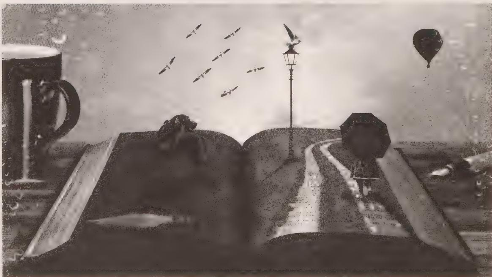

## Chúng ta từng cô đơn bước về phía trước

**我们都曾孤单前行**

*wǒ men dōu céng gū dān qián xíng*

孤单，是一个人的狂欢。

gū dān，shì yí gè rén de kuáng huān。

Cô đơn, là một cuộc vui của riêng một người.

孤单曾被这样解释：孤单，一种心理反应，独自一人时、有很多人在周围时都可能会有这种感觉。

gū dān céng bèi zhè yàng jiě shì：gū dān，yī zhǒng xīn lǐ fǎn yìng，dú zì yī rén shí、yǒu hěn duō rén zài zhōu wéi shí dōu kě néng huì yǒu zhè zhǒng gǎn jué。

Cô đơn từng được giải thích như thế này: cô đơn, một phản ứng tâm lý, khi ở một mình hoặc khi có nhiều người xung quanh đều có thể có cảm giác này.

它常被视为人类痛苦最普遍的来源之一，每个人隔一段时期就会被孤单的感觉包围，并会持续一段时间，甚至终身为寂寞所苦。

tā cháng bèi shì wéi rén lèi tòng kǔ zuì pǔ biàn de lái yuán zhī yī，měi gè rén gé yī duàn shí qī jiù huì bèi gū dān de gǎn jué bāo wéi，bìng huì chí xù yī duàn shí jiān，shèn zhì zhōng shēn wèi jì mò suǒ kǔ。

Nó thường được xem là một trong những nguồn cơn đau khổ phổ biến nhất của con người, mỗi người cách một khoảng thời gian lại bị cảm giác cô đơn bao vây, và nó sẽ kéo dài một thời gian, thậm chí cả đời chịu khổ vì sự tịch mịch.

我想世间的每一个人都体会过孤单的滋味，很多时候它不是苦，也不是涩，而是跟眼泪一样咸。

wǒ xiǎng shì jiān de měi yí gè rén dōu tǐ huì guò gū dān de zī wèi，hěn duō shí hòu tā bú shì kǔ，yě bú shì sè，ér shì gēn yǎn lèi yī yàng xián。

Tôi nghĩ mỗi người trên đời đều từng nếm trải mùi vị cô đơn, rất nhiều lúc nó không phải đắng, cũng không phải chát, mà là mặn như nước mắt.

大概每个人都是害怕和拒绝孤单的，怕被它包围时携带而来的忧伤，怕它侵袭身心时，那种海潮般的寒冷。

dà gài měi gè rén dōu shì hài pà hé jù jué gū dān de，pà bèi tā bāo wéi shí xié dài ér lái de yōu shāng，pà tā qīn xí shēn xīn shí，nà zhǒng hǎi cháo bān de hán lěng。

Có lẽ ai cũng sợ hãi và từ chối sự cô đơn, sợ nỗi buồn mà nó mang đến khi bao vây, sợ cái lạnh giá như triều biển khi nó xâm lấn tâm can.

当孤单成为一种无法改变的事实，我们永远无法再选择其他方式不孤单地活着的时候，它该有多恐怖呢。

dāng gū dān chéng wéi yī zhǒng wú fǎ gǎi biàn de shì shí，wǒ men yǒng yuǎn wú fǎ zài xuǎn zé qí tā fāng shì bù gū dān dì huó zhe de shí hòu，tā gāi yǒu duō kǒng bù ne。

Khi cô đơn trở thành một sự thật không thể thay đổi, khi chúng ta vĩnh viễn không thể chọn cách sống khác để không cô đơn, thì nó đáng sợ đến nhường nào.

一如电影《明亮的心》里面的老萧。

yī rú diàn yǐng《míng liàng de xīn》lǐ miàn de lǎo xiāo。

Giống như lão Tiêu trong bộ phim 《Trái tim sáng》.

他是一个瞎子，领着一条叫不来梅的狗，整日在马路旁卖报纸。

tā shì yí gè xiā zi，lǐng zhe yī tiáo jiào bù lái méi de gǒu，zhěng rì zài mǎ lù páng mài bào zhǐ。

Ông là một người mù, dắt một con chó tên là Bất Lai Mai, cả ngày ngồi bên đường bán báo.

他有一把军号，他的眼睛是军伤。

tā yǒu yī bǎ jūn hào，tā de yǎn jīng shì jūn shāng。

Ông có một chiếc kèn quân đội, đôi mắt ông bị thương trong quân ngũ.

他一直在寻找一个每天买他的报纸，把一块钱说成五毛钱的姑娘。

tā yì zhí zài xún zhǎo yí gè měi tiān mǎi tā de bào zhǐ，bǎ yī kuài qián shuō chéng wǔ máo qián de gū niáng。

Ông luôn tìm kiếm một cô gái hằng ngày mua báo của ông, nói một đồng thành năm hào.

他戴着眼镜，领着不来梅的时候，依然威风凛凛。

tā dài zhuó yǎn jìng，lǐng zhe bù lái méi de shí hòu，yī rán wēi fēng lǐn lǐn。

Khi đeo kính, dắt Bất Lai Mai đi, ông vẫn uy phong lẫm liệt.

他从不让任何人搀扶。

tā cóng bù ràng rèn hé rén chān fú。

Ông không bao giờ để bất kỳ ai dìu dắt.

“可以扶一时，不能扶一世。

“kě yǐ fú yī shí，bù néng fú yī shì。

"Có thể dìu một thời, không thể dìu cả một đời.

”这是他说的话。

”zhè shì tā shuō de huà。

"Đó là câu ông nói.

每当他吹起军号，那种属于盲人的孤独从四面八方包围他。

měi dāng tā chuī qǐ jūn hào，nà zhǒng shǔ yú máng rén de gū dú cóng sì miàn bā fāng bāo wéi tā。

Mỗi khi ông thổi chiếc kèn quân đội, thứ cô đơn thuộc về người mù từ bốn phương tám hướng bao vây lấy ông.

这种孤独，包含着他的生活，他的回忆，他的经历，还有他的漫漫人生。

zhè zhǒng gū dú，bāo hán zhe tā de shēng huó，tā de huí yì，tā de jīng lì，hái yǒu tā de màn màn rén shēng。

Sự cô đơn ấy, bao hàm cuộc sống của ông, hồi ức của ông, trải nghiệm của ông, và cả cuộc đời dài đằng đẵng của ông.

当他骑上那匹马，狂奔向机场的时候，威风得让人流泪。

dāng tā qí shàng nà pǐ mǎ，kuáng bēn xiàng jī chǎng de shí hòu，wēi fēng dé ràng rén liú lèi。

Khi ông cưỡi lên con ngựa ấy, lao nhanh về phía sân bay, uy phong đến mức khiến người ta rơi nước mắt.

一直到电影结束好一会儿，我还躺在床上哭。

yì zhí dào diàn yǐng jié shù hǎo yī huì er，wǒ hái tǎng zài chuáng shàng kū。

Mãi đến khi phim kết thúc được một lúc, tôi vẫn nằm trên giường khóc.

因为在那个时候我突然明白，自己到底想要的是什么。

yīn wèi zài nà ge shí hòu wǒ tū rán míng bái，zì jǐ dào dǐ xiǎng yào de shì shén me。

Bởi vì ngay lúc đó tôi chợt hiểu ra, rốt cuộc bản thân mình muốn điều gì.

自己整日埋怨工作的辛苦和忙碌，总是想抽出时间度假、旅行或者休息。

zì jǐ zhěng rì mán yuàn gōng zuò de xīn kǔ hé máng lù，zǒng shì xiǎng chōu chū shí jiān dù jià、lǚ xíng huò zhě xiū xī。

Bản thân ngày ngày oán trách công việc vất vả bận rộn, luôn muốn tranh thủ thời gian đi nghỉ dưỡng, du lịch hay nghỉ ngơi.

想在有一个属于工作日的时间里，坐在家里，在中午从窗户折射进来的阳光里，读读书，写写字。

xiǎng zài yǒu yí gè shǔ yú gōng zuò rì de shí jiān lǐ，zuò zài jiā lǐ，zài zhōng wǔ cóng chuāng hù zhé shè jìn lái de yáng guāng lǐ，dú dú shū，xiě xiě zì。

Muốn trong một khoảng thời gian thuộc về ngày làm việc, ngồi ở nhà, trong ánh nắng giữa trưa hắt qua ô cửa sổ, đọc sách, viết lách.

它们跟星期日没有任何关系，只是单纯地想要不被他人打扰。

tā men gēn xīng qī rì méi yǒu rèn hé guān xì，zhǐ shì dān chún dì xiǎng yào bù bèi tā rén dǎ rǎo。

Chúng chẳng liên quan gì đến ngày Chủ nhật, chỉ đơn thuần là muốn không bị người khác quấy rầy.

因为平日里我们真的太忙了，我们根本无法静下心来去思考。

yīn wèi píng rì lǐ wǒ men zhēn de tài máng le，wǒ men gēn běn wú fǎ jìng xià xīn lái qù sī kǎo。

Bởi vì ngày thường chúng ta thật sự quá bận rộn, hoàn toàn không thể tĩnh lòng lại để suy nghĩ.

我们来不及学习，来不及感伤。

wǒ men lái bù jí xué xí，lái bù jí gǎn shāng。

Chúng ta không kịp học hỏi, không kịp buồn thương.

每日都好似在争分夺秒，只想要睡个好觉。

měi rì dōu hǎo sì zài zhēng fēn duó miǎo，zhǐ xiǎng yào shuì gè hǎo jué。

Mỗi ngày đều như đang tranh thủ từng giây từng phút, chỉ muốn được ngủ một giấc ngon lành.

在一个安静的午夜，思考着如果这世界只剩下自己，孤单一人是什么样子的。

zài yí gè ān jìng de wǔ yè，sī kǎo zhe rú guǒ zhè shì jiè zhǐ shèng xià zì jǐ，gū dān yì rén shì shén me yàng zi de。

Trong một đêm khuya tĩnh lặng, suy nghĩ nếu thế giới này chỉ còn lại mình, một mình cô đơn thì sẽ như thế nào.

就像如果老萧没有不来梅，没有军号，他会是什么样子。

jiù xiàng rú guǒ lǎo xiāo méi yǒu bù lái méi，méi yǒu jūn hào，tā huì shì shén me yàng zi。

Cũng giống như nếu lão Tiêu không có Bất Lai Mai, không có chiếc kèn quân đội, ông ấy sẽ ra sao.

除了他一个人之外，除了回忆和无数个夜晚之外，一无所有，是多么可怕。

chú le tā yí gè rén zhī wài，chú le huí yì hé wú shù gè yè wǎn zhī wài，yī wú suǒ yǒu，shì duō me kě pà。

Ngoài một mình ông ấy ra, ngoài hồi ức và vô số đêm dài ra, chẳng còn gì cả, thật đáng sợ biết bao.

或许那个藏在他内心殿堂的姑娘，不过是他为了抵抗现实和孤单的力量。

huò xǔ nà ge cáng zài tā nèi xīn diàn táng de gū niáng，bù guò shì tā wèi le dǐ kàng xiàn shí hé gū dān de lì liàng。

Có lẽ cô gái giấu trong cung điện nội tâm của ông, chẳng qua chỉ là sức mạnh để ông chống lại hiện thực và cô đơn.

我们不是老萧，不能明白他的那种孤寂。

wǒ men bú shì lǎo xiāo，bù néng míng bái tā de nà zhǒng gū jì。

Chúng ta không phải lão Tiêu, không thể hiểu được nỗi cô quạnh ấy của ông.

但我们可以由此明白自己。

dàn wǒ men kě yǐ yóu cǐ míng bái zì jǐ。

Nhưng chúng ta có thể từ đó mà hiểu được chính mình.

在安静无人的时候，我们去领略那些来自内心深处的孤独和寒冷。

zài ān jìng wú rén de shí hòu，wǒ men qù lǐng lüè nà xiē lái zì nèi xīn shēn chù de gū dú hé hán lěng。

Trong những lúc vắng lặng không người, chúng ta đi cảm nhận những nỗi cô đơn và giá lạnh đến từ sâu thẳm nội tâm.

我们不知道，它到底是来自于哪里。

wǒ men bù zhī dào，tā dào dǐ shì lái zì yú nǎ lǐ。

Chúng ta không biết, nó rốt cuộc đến từ đâu.

生活、家庭、理想？

shēng huó、jiā tíng、lǐ xiǎng？

Cuộc sống, gia đình, lý tưởng?

究竟是什么给了我们残缺，这个缺口是那么的大，似乎任何人都无法填补和愈合。

jiū jìng shì shén me gěi le wǒ men cán quē，zhè ge quē kǒu shì nà me de dà，sì hū rèn hé rén dōu wú fǎ tián bǔ hé yù hé。

Rốt cuộc điều gì đã khiến chúng ta thiếu khuyết, khoảng trống ấy lớn đến vậy, dường như không ai có thể lấp đầy và hàn gắn.

我们一直在等待一个答案，我们总是在想，等我们真正找到并清楚这样的缺口来自于何处时，是不是生活中的一切问题都会解决。

wǒ men yì zhí zài děng dài yí gè dá àn，wǒ men zǒng shì zài xiǎng，děng wǒ men zhēn zhèng zhǎo dào bìng qīng chǔ zhè yàng de quē kǒu lái zì yú hé chù shí，shì bú shì shēng huó zhōng de yī qiè wèn tí dū huì jiě jué。

Chúng ta vẫn luôn chờ đợi một câu trả lời, chúng ta luôn nghĩ, đợi khi chúng ta thực sự tìm ra và hiểu rõ khoảng trống ấy đến từ đâu, liệu có phải mọi vấn đề trong cuộc sống đều sẽ được giải quyết.

就像我们发现了文字的错误一样，会准确地改正。

jiù xiàng wǒ men fā xiàn le wén zì de cuò wù yī yàng，huì zhǔn què dì gǎi zhèng。

Giống như khi chúng ta phát hiện ra lỗi sai trong văn bản vậy, sẽ sửa chính xác nó.

你是不是也和我一样，渴望有一个这样的日子：独自在家，看着电视流眼泪。

nǐ shì bú shì yě hé wǒ yī yàng，kě wàng yǒu yí gè zhè yàng de rì zi：dú zì zài jiā，kàn zhe diàn shì liú yǎn lèi。

Bạn có giống tôi không, khao khát một ngày như thế này: ở nhà một mình, xem TV rồi rơi nước mắt.

顺便沉寂一下自己的心，听听内心深处的声音。

shùn biàn chén jì yī xià zì jǐ de xīn，tīng tīng nèi xīn shēn chù de shēng yīn。

Tiện thể trầm lắng tâm hồn mình, lắng nghe tiếng nói trong sâu thẳm.

当抽泣已经找不到任何原因变成莫名其妙的时候，能让自己在干头万绪中捉住一条叫做灵魂的线。

dāng chōu qì yǐ jīng zhǎo bú dào rèn hé yuán yīn biàn chéng mò míng qí miào de shí hòu，néng ràng zì jǐ zài gàn tóu wàn xù zhōng zhuō zhù yī tiáo jiào zuò líng hún de xiàn。

Khi tiếng nấc nghẹn ngào không tìm ra được nguyên do nào trở nên kỳ lạ vô cớ, có thể khiến mình trong muôn vàn đầu mối bắt lấy một sợi chỉ gọi là linh hồn.

然后，庆幸自己还能体会这种当世界只剩下自己一人的孤单感觉。

rán hòu，qìng xìng zì jǐ hái néng tǐ huì zhè zhǒng dāng shì jiè zhǐ shèng xià zì jǐ yī rén de gū dān gǎn jué。

Rồi sau đó, mừng vì mình vẫn còn có thể cảm nhận được cảm giác cô đơn khi thế giới chỉ còn lại một mình mình.

起码，它让我们知道，在我们心中还有一个地方，任何人都无法侵犯。

qǐ mǎ，tā ràng wǒ men zhī dào，zài wǒ men xīn zhōng hái yǒu yí gè dì fāng，rèn hé rén dōu wú fǎ qīn fàn。

Ít nhất, nó cho chúng ta biết, trong lòng chúng ta vẫn còn một nơi chốn, không ai có thể xâm phạm.

# Mỗi người trong lòng đều có một hoàng tử bé

**每个人心里都有一个小王子**

*měi gè rén xīn lǐ dōu yǒu yí gè xiǎo wáng zǐ*

当我用了一天的时间看完安东尼·德·圣埃克苏佩里的《小王子》的时候，心情恰如那天风和日丽的天气一样，很美好，也很忧伤。

dāng wǒ yòng le yī tiān de shí jiān kàn wán ān dōng ní·dé·shèng āi kè sū pèi lǐ de《xiǎo wáng zǐ》de shí hòu，xīn qíng qià rú nà tiān fēng hé rì lì de tiān qì yī yàng，hěn měi hǎo，yě hěn yōu shāng。

Khi tôi dùng một ngày đọc xong 《Hoàng tử bé》 của Antoine de Saint-Exupéry, tâm trạng đúng như tiết trời gió hòa nắng đẹp hôm ấy, rất đẹp đẽ, mà cũng rất buồn.

记得在高中的时候读过郭敬明的文章，其中提到过《小王子》。

jì de zài gāo zhōng de shí hòu dú guò guō jìng míng de wén zhāng，qí zhōng tí dào guò《xiǎo wáng zǐ》。

Nhớ hồi học cấp ba từng đọc bài viết của Quách Kính Minh, trong đó có nhắc đến 《Hoàng tử bé》.

小王子说：“你们这儿的人，在一个花园里种满五千朵玫瑰，却没能从中找到自己要的东西。

xiǎo wáng zǐ shuō ：“nǐ men zhè ér de rén，zài yí gè huā yuán lǐ zhǒng mǎn wǔ qiān duǒ méi guī，què méi néng cóng zhōng zhǎo dào zì jǐ yào de dōng xī。

Hoàng tử bé nói: "Người ở nơi đây của các anh, trong một khu vườn trồng đầy năm nghìn đóa hoa hồng, lại chẳng thể tìm được thứ mình muốn.

”那个时候，我便很想看这本书。

”nà ge shí hòu，wǒ biàn hěn xiǎng kàn zhè běn shū。

" Lúc đó, tôi đã rất muốn đọc cuốn sách này.

我一直对这本书充满期待和幻想，我一直想它是一本美好、天真烂漫的书，一直到昨天我在书店里买到它为止，我都是这样认定它的。

wǒ yì zhí duì zhè běn shū chōng mǎn qī dài hé huàn xiǎng，wǒ yì zhí xiǎng tā shì yī běn měi hǎo、tiān zhēn làn màn de shū，yì zhí dào zuó tiān wǒ zài shū diàn lǐ mǎi dào tā wéi zhǐ，wǒ dōu shì zhè yàng rèn dìng tā de。

Tôi luôn đầy kỳ vọng và mộng tưởng về cuốn sách này, tôi luôn nghĩ nó là một cuốn sách đẹp đẽ, hồn nhiên ngây thơ, cho đến tận hôm qua khi tôi mua được nó ở hiệu sách, tôi vẫn luôn nghĩ về nó như vậy.

有时候，人想要去实现自己的一个愿望，立马会去实践，但有时候，它则是一件很长久的事情。

yǒu shí hòu，rén xiǎng yào qù shí xiàn zì jǐ de yí gè yuàn wàng，lì mǎ huì qù shí jiàn，dàn yǒu shí hòu，tā zé shì yī jiàn hěn cháng jiǔ de shì qíng。

Có lúc, con người muốn thực hiện một ước muốn của mình, lập tức sẽ đi thực hiện, nhưng có lúc, nó lại là một việc rất lâu dài.

我不知道为什么我一直渴望读《小王子》，却一直没有买过这本书。

wǒ bù zhī dào wèi shén me wǒ yì zhí kě wàng dú《xiǎo wáng zǐ》，què yì zhí méi yǒu mǎi guò zhè běn shū。

Tôi không biết vì sao tôi luôn khao khát đọc 《Hoàng tử bé》, lại chưa từng mua cuốn sách này.

从高中十七岁到现在，已经过去七年有余，期间我买过那么多书，却从未下定决心去买《小王子》。

cóng gāo zhōng shí qī suì dào xiàn zài，yǐ jīng guò qù qī nián yǒu yú，qī jiān wǒ mǎi guò nà me duō shū，què cóng wèi xià dìng jué xīn qù mǎi《xiǎo wáng zǐ》。

Từ năm mười bảy tuổi hồi cấp ba đến bây giờ, đã hơn bảy năm trôi qua, trong khoảng thời gian đó tôi mua biết bao nhiêu sách, lại chưa từng hạ quyết tâm mua 《Hoàng tử bé》.

但就像是一个人说的那样：“我恨它来得为时已晚，又欢喜它终于惠及我身。

dàn jiù xiàng shì yí gè rén shuō de nà yàng ：“wǒ hèn tā lái de wéi shí yǐ wǎn，yòu huān xǐ tā zhōng yú huì jí wǒ shēn。

Nhưng giống như có người từng nói: "Tôi hận nó đến quá muộn màng, lại vui mừng vì nó cuối cùng cũng ban ơn đến thân tôi.

”

”

"

“你们很美。

“nǐ men hěn měi。

"Các bạn rất đẹp.

”他继续说，“但是很空虚，没有人会为你们而死，没错，一般过路的人，可能会认为我的玫瑰和你们很像，但她只要一朵就胜过你们全部，因为她是我灌溉的那朵玫瑰花儿，她是我放在玻璃罩下面，让我保护不被风吹袭，而且为她打死毛毛虫（只留两三只变成蝴蝶）的玫瑰；因为，她是那朵我愿意倾听她发牢骚、吹嘘甚至沉默的那朵玫瑰；因为，她是我的玫瑰。

”tā jì xù shuō ，“dàn shì hěn kōng xū，méi yǒu rén huì wèi nǐ men ér sǐ，méi cuò，yì bān guò lù de rén，kě néng huì rèn wéi wǒ de méi guī hé nǐ men hěn xiàng，dàn tā zhǐ yào yī duǒ jiù shèng guò nǐ men quán bù，yīn wèi tā shì wǒ guàn gài de nà duǒ méi guī huā ér，tā shì wǒ fàng zài bō lí zhào xià miàn，ràng wǒ bǎo hù bù bèi fēng chuī xí，ér qiě wèi tā dǎ sǐ máo máo chóng（zhǐ liú liǎng sān zhǐ biàn chéng hú dié）de méi guī；yīn wèi，tā shì nà duǒ wǒ yuàn yì qīng tīng tā fā láo sāo、chuī xū shèn zhì chén mò de nà duǒ méi guī；yīn wèi，tā shì wǒ de méi guī。

" Anh tiếp tục nói, "nhưng rất trống rỗng, không ai vì các bạn mà chết, đúng vậy, người qua đường bình thường, có lẽ sẽ nghĩ bông hồng của tôi giống các bạn, nhưng chỉ một bông của cô ấy thôi đã thắng tất cả các bạn, bởi vì cô ấy là đóa hoa hồng tôi đã tưới nước, là đóa hồng tôi đặt dưới lồng kính, bảo vệ khỏi gió thổi, và vì cô ấy mà tôi đập chết những con sâu bướm (chỉ để lại hai ba con để hóa bướm); bởi vì, cô ấy là đóa hoa hồng mà tôi sẵn lòng lắng nghe cô than phiền, khoe khoang, thậm chí im lặng; bởi vì, cô ấy là bông hồng của tôi.

”在读到这一段的时候，我还在来上班的地铁上，很想哭。

”zài dú dào zhè yī duàn de shí hòu，wǒ hái zài lái shàng bān de dì tiě shàng，hěn xiǎng kū。

" Khi đọc đến đoạn này, tôi vẫn còn đang trên tàu điện ngầm đi làm, rất muốn khóc.

这种想要眼泪横流的心情和冲动，一直延续到睡前。

zhè zhǒng xiǎng yào yǎn lèi héng liú de xīn qíng hé chōng dòng，yì zhí yán xù dào shuì qián。

Cảm giác muốn để nước mắt tuôn trào và sự xúc động ấy, cứ kéo dài mãi đến trước khi đi ngủ.

我不想对这本书做过多的解释和介绍，如果你也是一个小王子、一朵玫瑰，或者那只等爱的狐狸，一定要读一读它。

wǒ bù xiǎng duì zhè běn shū zuò guò duō de jiě shì hé jiè shào，rú guǒ nǐ yě shì yí gè xiǎo wáng zǐ、yī duǒ méi guī，huò zhě nà zhǐ děng ài de hú lí，yí dìng yào dú yī dú tā。

Tôi không muốn giải thích và giới thiệu quá nhiều về cuốn sách này, nếu bạn cũng là một hoàng tử bé, một đóa hoa hồng, hay con cáo chờ đợi tình yêu kia, nhất định hãy đọc thử nó một lần.

那天晚上，自己是躺在床上读着《小王子》睡着的。

nà tiān wǎn shàng，zì jǐ shì tǎng zài chuáng shàng dú zhe《xiǎo wáng zǐ》shuì zháo de。

Đêm hôm đó, tôi nằm trên giường đọc 《Hoàng tử bé》 rồi ngủ lúc nào không hay.

夜里，自己做了很多的梦。

yè lǐ，zì jǐ zuò le hěn duō de mèng。

Trong đêm, tôi mơ rất nhiều giấc mơ.

没有星球，也没有国王；没有沙漠，也没有蟒蛇。

méi yǒu xīng qiú，yě méi yǒu guó wáng；méi yǒu shā mò，yě méi yǒu mǎng shé。

Không có hành tinh, cũng không có vị quốc vương; không có sa mạc, cũng không có loài trăn.

但是梦见了我的家人，还有我已经去世的外婆。

dàn shì mèng jiàn le wǒ de jiā rén，hái yǒu wǒ yǐ jīng qù shì de wài pó。

Nhưng mơ thấy gia đình tôi, và cả người bà ngoại đã khuất của tôi.

我犹记得在告别外婆的时候，我站在山下大哭的场景。

wǒ yóu jì de zài gào bié wài pó de shí hòu，wǒ zhàn zài shān xià dà kū de chǎng jǐng。

Tôi vẫn còn nhớ khoảnh khắc tiễn biệt bà ngoại, tôi đứng dưới chân núi gào khóc.

按道理来说，应该是站在我身边的母亲大哭不止，而不应该是我一直哭着从山下追到山腰。

àn dào lǐ lái shuō，yīng gāi shì zhàn zài wǒ shēn biān de mǔ qīn dà kū bù zhǐ，ér bù yīng gāi shì wǒ yì zhí kū zhe cóng shān xià zhuī dào shān yāo。

Theo lẽ thường, đáng ra phải là mẹ tôi đứng bên cạnh khóc nức nở, chứ không phải tôi cứ khóc mãi từ chân núi chạy lên tận sườn núi.

我在想，或许这就是一生所背负的东西，注定要比他人爱得纯粹。

wǒ zài xiǎng，huò xǔ zhè jiù shì yī shēng suǒ bēi fù de dōng xī，zhù dìng yào bǐ tā rén ài dé chún cuì。

Tôi nghĩ, có lẽ đó chính là thứ phải gánh vác cả đời, định sẵn phải yêu thuần khiết hơn người khác.

安东尼是一个浑身沁满了乡愁的男人，他对童年时光如此眷恋不舍。

ān dōng ní shì yí gè hún shēn qìn mǎn le xiāng chóu de nán rén，tā duì tóng nián shí guāng rú cǐ juàn liàn bù shě。

Antoine là một người đàn ông thấm đẫm nỗi nhớ quê hương, ông lưu luyến không rời với khoảng thời thơ ấu ấy.

而我们，在生活中有时候很想把自己跟过去切断开来，或许为了抹杀，或许为了忘却。

ér wǒ men，zài shēng huó zhōng yǒu shí hòu hěn xiǎng bǎ zì jǐ gēn guò qù qiē duàn kāi lái，huò xǔ wèi le mǒ shā，huò xǔ wèi le wàng què。

Còn chúng ta, trong cuộc sống đôi khi rất muốn cắt đứt chính mình với quá khứ, có lẽ để phủ nhận, có lẽ để quên lãng.

但是在这一生中，的的确确每一段时光都是我们人生不可或缺的一部分。

dàn shì zài zhè yī shēng zhōng，de dí què què měi yī duàn shí guāng dōu shì wǒ men rén shēng bù kě huò quē de yī bù fèn。

Nhưng trong cuộc đời này, đích thực mỗi một khoảng thời gian đều là phần không thể thiếu trong cuộc đời chúng ta.

不管它是快乐也好，悲伤也罢。

bù guǎn tā shì kuài lè yě hǎo，bēi shāng yě bà。

Dù nó là vui vẻ cũng được, bi thương cũng thế.

总有一天，它们会从记忆海洋的深处，蜿蜒而上，爬到你的心间。

zǒng yǒu yī tiān，tā men huì cóng jì yì hǎi yáng de shēn chù，wān yán ér shàng，pá dào nǐ de xīn jiān。

Có một ngày, chúng sẽ từ đáy sâu của đại dương ký ức, uốn lượn trồi lên, bò vào tận trái tim bạn.

那些快乐的时光，让你变得简单而美好；那些悲伤疼痛的日子，教会你成长与爱。

nà xiē kuài lè de shí guāng，ràng nǐ biàn dé jiǎn dān ér měi hǎo；nà xiē bēi shāng téng tòng de rì zi，jiào huì nǐ chéng zhǎng yǔ ài。

Những khoảng thời gian vui vẻ ấy, khiến bạn trở nên đơn giản và đẹp đẽ; những ngày tháng bi thương đau đớn, dạy bạn trưởng thành và biết yêu thương.

你开始怀恋每一段时光，让你变成了今天的样子。

nǐ kāi shǐ huái liàn měi yī duàn shí guāng，ràng nǐ biàn chéng le jīn tiān de yàng zi。

Bạn bắt đầu hoài niệm mỗi khoảng thời gian, điều đã khiến bạn trở thành con người của ngày hôm nay.

《小王子》中，纯真也好，爱情也好，友情也好…都在固执地坚守里，有着让人鼻酸的淡淡忧伤。

《xiǎo wáng zǐ》zhōng，chún zhēn yě hǎo，ài qíng yě hǎo，yǒu qíng yě hǎo…dōu zài gù zhí dì jiān shǒu lǐ，yǒu zhe ràng rén bí suān de dàn dàn yōu shāng。

Trong 《Hoàng tử bé》, sự thuần chân cũng vậy, tình yêu cũng vậy, tình bạn cũng vậy… trong sự kiên trì cố chấp, đều có nỗi buồn nhạt man mác khiến người ta cay sống mũi.

它在用简单的方式传递着人生的智慧与奇妙。

tā zài yòng jiǎn dān de fāng shì chuán dì zhe rén shēng de zhì huì yǔ qí miào。

Nó đang truyền tải trí tuệ và sự kỳ diệu của cuộc đời theo một cách rất giản đơn.

做一个怎样的人呢？

zuò yí gè zěn yàng de rén ne？

Trở thành một con người như thế nào đây?

爱哪一朵玫瑰？

ài nǎ yī duǒ méi guī？

Yêu đóa hoa hồng nào?

如何对待逝去的、进行的和未发生的这些生命之光？

rú hé duì dài shì qù de、jìn xíng de hé wèi fā shēng de zhè xiē shēng mìng zhī guāng？

Làm thế nào để đối đãi với những ánh sáng cuộc đời đã qua, đang diễn ra và chưa xảy ra này?

给我们心中的那个《小王子》。

gěi wǒ men xīn zhōng de nà ge《xiǎo wáng zǐ》。

Dành cho 《Hoàng tử bé》 trong trái tim chúng ta.

# Làm thế nào để trở thành bản thân tốt nhất

**怎样才能成为最好的自己**

*zěn yàng cái néng chéng wéi zuì hǎo de zì jǐ*

我们不知道未来会发生什么，也不知道前方的路会通向何方。

wǒ men bù zhī dào wèi lái huì fā shēng shén me，yě bù zhī dào qián fāng de lù huì tōng xiàng hé fāng。

Chúng ta không biết tương lai sẽ xảy ra điều gì, cũng không biết con đường phía trước sẽ dẫn đến đâu.

没有人能够预知命运，告诉自己应该怎样成为最好的自己。

méi yǒu rén néng gòu yù zhī mìng yùn，gào sù zì jǐ yīng gāi zěn yàng chéng wéi zuì hǎo de zì jǐ。

Không ai có thể đoán trước được số phận, tự nhủ với mình nên trở thành bản thân tốt nhất như thế nào.

那在这样的时代里，我们不得不去思考，自己究竟该做一个怎样的人？

nà zài zhè yàng de shí dài lǐ，wǒ men bù dé bù qù sī kǎo，zì jǐ jiū jìng gāi zuò yí gè zěn yàng de rén？

Vậy trong thời đại như thế này, chúng ta không thể không suy nghĩ, rốt cuộc mình nên làm một con người như thế nào?

该做一个怎样的人，在经过长久的沉思之后，我突然理解了某位长辈，他为什么一直固执、果断、坚韧，甚至有些独断的个性。

gāi zuò yí gè zěn yàng de rén，zài jīng guò cháng jiǔ de chén sī zhī hòu，wǒ tū rán lǐ jiě le mǒu wèi zhǎng bèi，tā wèi shén me yì zhí gù zhí、guǒ duàn、jiān rèn，shèn zhì yǒu xiē dú duàn de gè xìng。

Nên làm một con người như thế nào, sau một hồi trầm tư lâu dài, tôi chợt hiểu ra một vị trưởng bối nào đó, vì sao ông ấy luôn có tính cách cố chấp, quả đoán, kiên cường, thậm chí có phần độc đoán.

他的这种固执，针对的不是个人，不是群体，不是民族，而是整个社会。

tā de zhè zhǒng gù zhí，zhēn duì de bú shì gè rén，bú shì qún tǐ，bú shì mín zú，ér shì zhěng gè shè huì。

Sự cố chấp của ông ấy, nhắm vào không phải cá nhân, không phải tập thể, không phải dân tộc, mà là toàn xã hội.

因为面对生活的现实和社会的残酷，如果不做一个固执的人，会很难坚守住自己的信仰，更无法高举信仰的大旗。

yīn wèi miàn duì shēng huó de xiàn shí hé shè huì de cán kù，rú guǒ bù zuò yí gè gù zhí de rén，huì hěn nán jiān shǒu zhù zì jǐ de xìn yǎng，gèng wú fǎ gāo jǔ xìn yǎng de dà qí。

Bởi vì đối mặt với hiện thực cuộc sống và sự tàn khốc của xã hội, nếu không làm một con người cố chấp, sẽ rất khó kiên trì giữ vững tín ngưỡng của mình, càng không thể giương cao ngọn cờ tín ngưỡng.

当我们能够固执于社会的残酷，固执于生活的现实，也固执于人情的冷漠。

dāng wǒ men néng gòu gù zhí yú shè huì de cán kù，gù zhí yú shēng huó de xiàn shí，yě gù zhí yú rén qíng de lěng mò。

Khi chúng ta có thể cố chấp với sự tàn khốc của xã hội, cố chấp với hiện thực của cuộc sống, cũng cố chấp với sự lạnh nhạt của nhân tình.

我们不会再因为社会的残酷而软下心来，改变自己的初衷。

wǒ men bú huì zài yīn wèi shè huì de cán kù ér ruǎn xià xīn lái，gǎi biàn zì jǐ de chū zhōng。

Chúng ta sẽ không còn vì sự tàn khốc của xã hội mà mềm lòng, thay đổi ý nguyện ban đầu của mình.

我们不会再为生活现实的逼仄，而隐藏对于灵魂真谛的渴念，坦坦荡荡地活着。

wǒ men bú huì zài wéi shēng huó xiàn shí de bī zè，ér yǐn cáng duì yú líng hún zhēn dì de kě niàn，tǎn tǎn dàng dàng dì huó zhe。

Chúng ta sẽ không còn vì sự chật hẹp của hiện thực cuộc sống mà giấu đi khát khao chân lý của linh hồn, mà sống thẳng thắn hào sảng.

我们不再因为熟知冷漠的人情，而对情感不再信任和付出。

wǒ men bù zài yīn wèi shú zhī lěng mò de rén qíng，ér duì qíng gǎn bù zài xìn rèn hé fù chū。

Chúng ta không còn vì quá quen thuộc với sự lạnh nhạt của nhân tình mà không còn tin tưởng và trao gửi tình cảm.

所以我们必须带着一颗坚韧的心去面对，面对生活的规则，不妥协；面对时间的锋利，不流于世俗。

suǒ yǐ wǒ men bì xū dài zhe yī kē jiān rèn de xīn qù miàn duì，miàn duì shēng huó de guī zé，bù tuǒ xié；miàn duì shí jiān de fēng lì，bù liú yú shì sú。

Vì vậy chúng ta phải mang theo một trái tim kiên cường để đối mặt, đối mặt với quy luật của cuộc sống, không thỏa hiệp; đối mặt với sự sắc bén của thời gian, không chạy theo thế tục.

你不觉得，一个人敢于跟这个社会和所有人固执一辈子，也是一种了不起的坚守吗？

nǐ bù jué dé，yí gè rén gǎn yú gēn zhè ge shè huì hé suǒ yǒu rén gù zhí yī bèi zi，yě shì yī zhǒng liǎo bù qǐ de jiān shǒu ma？

Bạn không thấy sao, một người dám cố chấp cả đời với xã hội và mọi người, cũng là một sự kiên trì đáng nể sao?

或许，对于有信念的人来说，如果有一天丢失了这样的固执和坚韧，那么就已经向世俗低头了。

huò xǔ，duì yú yǒu xìn niàn de rén lái shuō，rú guǒ yǒu yī tiān diū shī le zhè yàng de gù zhí hé jiān rèn，nà me jiù yǐ jīng xiàng shì sú dī tóu le。

Có lẽ, đối với người có niềm tin, nếu có một ngày đánh mất sự cố chấp và kiên cường ấy, thì cũng đã cúi đầu trước thế tục rồi.

而如果他选择了坚守，那么永远也不会向世俗妥协。

ér rú guǒ tā xuǎn zé le jiān shǒu，nà me yǒng yuǎn yě bú huì xiàng shì sú tuǒ xié。

Còn nếu anh ta chọn sự kiên trì, thì mãi mãi sẽ không thỏa hiệp với thế tục.

为此，我们或许应该试着去理解所有人，不抨击长辈，不侮辱先贤，不鄙夷他人，不欺辱弱小。

wèi cǐ，wǒ men huò xǔ yīng gāi shì zhe qù lǐ jiě suǒ yǒu rén，bù pēng jī zhǎng bèi，bù wǔ rǔ xiān xián，bù bǐ yí tā rén，bù qī rǔ ruò xiǎo。

Vì vậy, chúng ta có lẽ nên thử hiểu tất cả mọi người, không công kích trưởng bối, không xúc phạm tiền nhân, không khinh bỉ người khác, không bắt nạt kẻ yếu.

他们有选择自己生活方式的权利，他们选择的道路都应该被尊重。

tā men yǒu xuǎn zé zì jǐ shēng huó fāng shì de quán lì，tā men xuǎn zé de dào lù dōu yīng gāi bèi zūn zhòng。

Họ có quyền lựa chọn cách sống của mình, con đường họ lựa chọn đều nên được tôn trọng.

如同文学这条道路上，不管一个人选择在城市，还是选择隐居于乡村，他都有他的故事，也都有他的缘由。

rú tóng wén xué zhè tiáo dào lù shàng，bù guǎn yí gè rén xuǎn zé zài chéng shì，hái shì xuǎn zé yǐn jū yú xiāng cūn，tā dōu yǒu tā de gù shì，yě dōu yǒu tā de yuán yóu。

Cũng như trên con đường văn học này, dù một người chọn sống ở thành phố, hay chọn ẩn cư ở thôn quê, anh ta đều có câu chuyện của mình, cũng đều có lý do của mình.

没有谁比谁辉煌，也没有谁比谁暗淡。

méi yǒu shuí bǐ shuí huī huáng，yě méi yǒu shuí bǐ shuí àn dàn。

Không ai huy hoàng hơn ai, cũng không ai ảm đạm hơn ai.

我自己从不敢颐指气使批评哪个老师没有真学问，哪个作家作品尽是垃圾，哪些网络小说不堪入目。

wǒ zì jǐ cóng bù gǎn yí zhǐ qì shǐ pī píng nǎ ge lǎo shī méi yǒu zhēn xué wèn，nǎ ge zuò jiā zuò pǐn jìn shì lā jī，nǎ xiē wǎng luò xiǎo shuō bù kān rù mù。

Bản thân tôi chưa bao giờ dám giở giọng hống hách phê phán thầy giáo nào không có học vấn thực sự, tác giả nào tác phẩm toàn rác rưởi, tiểu thuyết mạng nào khó coi không nổi.

我总是愿意站在包容的一端，去体会每一个作者的每一部书、每一篇散文、每一首诗歌。

wǒ zǒng shì yuàn yì zhàn zài bāo róng de yī duān，qù tǐ huì měi yí gè zuò zhě de měi yī bù shū、měi yī piān sǎn wén、měi yī shǒu shī gē。

Tôi luôn sẵn lòng đứng ở phía bao dung, để thấu hiểu mỗi cuốn sách, mỗi bài tản văn, mỗi bài thơ của mỗi tác giả.

因为，我们生活得忙碌、疲倦，我们来不及去听他人背后的故事，也来不及去品味其中的真实。

yīn wèi，wǒ men shēng huó dé máng lù、pí juàn，wǒ men lái bù jí qù tīng tā rén bèi hòu de gù shì，yě lái bù jí qù pǐn wèi qí zhōng de zhēn shí。

Bởi vì, chúng ta sống bận rộn, mệt mỏi, chúng ta không kịp lắng nghe câu chuyện đằng sau mỗi con người, cũng không kịp nhấm nháp sự chân thực bên trong.

太多的时候，我们只是用眼睛去看，武断地猜测，以偏概全，去鄙夷、蔑视。

tài duō de shí hòu，wǒ men zhǐ shì yòng yǎn jīng qù kàn，wǔ duàn dì cāi cè，yǐ piān gài quán，qù bǐ yí、miè shì。

Quá nhiều lúc, chúng ta chỉ dùng con mắt để nhìn, đoán mò một cách võ đoán, suy bụng ta ra bụng người, rồi khinh bỉ, coi thường.

当我们停下来，多花一点点时间听听他人背后的故事的时候，也许我们会发现一个爱笑的人或许心里藏血泪，一个温和的人或许在暗地里耍心机，一个严厉的人或许比谁都良善。

dāng wǒ men tíng xià lái，duō huā yì diǎn diǎn shí jiān tīng tīng tā rén bèi hòu de gù shì de shí hòu，yě xǔ wǒ men huì fā xiàn yí gè ài xiào de rén huò xǔ xīn lǐ cáng xuè lèi，yí gè wēn hé de rén huò xǔ zài àn dì lǐ shuǎ xīn jī，yí gè yán lì de rén huò xǔ bǐ shéi dōu liáng shàn。

Khi chúng ta dừng lại, dành thêm chút thời gian nghe câu chuyện đằng sau mỗi con người, có lẽ chúng ta sẽ phát hiện ra một người hay cười có lẽ trong lòng giấu máu và nước mắt, một người ôn hòa có lẽ sau lưng giở trò mưu kế, một người nghiêm khắc có lẽ lại lương thiện hơn bất kỳ ai.

就让我们停下来，去读懂沉默；停下来，去看穿阴暗背后的阳光。

jiù ràng wǒ men tíng xià lái，qù dú dǒng chén mò；tíng xià lái，qù kàn chuān yīn àn bèi hòu de yáng guāng。

Hãy để chúng ta dừng lại, đọc hiểu sự im lặng; dừng lại, nhìn thấu ánh dương phía sau bóng tối.

当有一天我突然发现我的勇敢和尖锐的羽翼已经变成了能扑腾几下的小翅膀时，我不得不仔细地想一想，自己究竟该选择成为一个什么样的人。

dāng yǒu yī tiān wǒ tū rán fā xiàn wǒ de yǒng gǎn hé jiān ruì de yǔ yì yǐ jīng biàn chéng le néng pū téng jǐ xià de xiǎo chì bǎng shí，wǒ bù dé bù zǐ xì dì xiǎng yī xiǎng，zì jǐ jiū jìng gāi xuǎn zé chéng wéi yí gè shén me yàng de rén。

Khi có một ngày tôi chợt phát hiện đôi cánh dũng cảm và sắc bén của mình đã biến thành đôi cánh nhỏ chỉ còn đập phành phạch được vài cái, tôi không thể không suy nghĩ thật kỹ, rốt cuộc mình nên lựa chọn trở thành một con người như thế nào.

有一些秉性是天成的，但我们更多的，是后天的选择。

yǒu yī xiē bǐng xìng shì tiān chéng de，dàn wǒ men gèng duō de，shì hòu tiān de xuǎn zé。

Có một số bản tính là trời sinh, nhưng phần lớn ở chúng ta, là sự lựa chọn của đời sau.

这世间，人无完人，即使你从一个小职员升为一个大领导，即使你从一个小学生成为一个大教授。

zhè shì jiān，rén wú wán rén，jí shǐ nǐ cóng yí gè xiǎo zhí yuán shēng wèi yí gè dà lǐng dǎo，jí shǐ nǐ cóng yí gè xiǎo xué shēng chéng wéi yí gè dà jiào shòu。

Giữa thế gian này, người không ai hoàn hảo, dù bạn từ một nhân viên nhỏ thăng lên thành lãnh đạo lớn, dù bạn từ một học sinh nhỏ trở thành một giáo sư lừng lẫy.

依然人外有人，天外有天。

yī rán rén wài yǒu rén，tiān wài yǒu tiān。

Vẫn là người ngoài có người, trời ngoài có trời.

如果你是做文化的，必定有做财经的人鄙夷你；如果你是教英文的，必然会有学法文的人看不起你。

rú guǒ nǐ shì zuò wén huà de，bì dìng yǒu zuò cái jīng de rén bǐ yí nǐ；rú guǒ nǐ shì jiào yīng wén de，bì rán huì yǒu xué fǎ wén de rén kàn bù qǐ nǐ。

Nếu bạn làm văn hóa, ắt có người làm tài chính khinh bỉ bạn; nếu bạn dạy tiếng Anh, ắt sẽ có người học tiếng Pháp coi thường bạn.

所以，为什么那些功成名就的人，爬到了很多人自以为光鲜亮丽的地位，仍然有失落感。

suǒ yǐ，wèi shén me nà xiē gōng chéng míng jiù de rén，pá dào le hěn duō rén zì yǐ wéi guāng xiān liàng lì de dì wèi，réng rán yǒu shī luò gǎn。

Vậy nên, vì sao những người công thành danh toại, leo lên vị trí mà nhiều người tự cho là hào nhoáng rực rỡ, vẫn có cảm giác mất mát.

因为，人生是没有尽头的。

yīn wèi，rén shēng shì méi yǒu jìn tóu de。

Bởi vì, cuộc đời là không có điểm cuối.

而我们的生命，是有限的。

ér wǒ men de shēng mìng，shì yǒu xiàn de。

Còn sinh mệnh của chúng ta, là hữu hạn.

不是吗？

bú shì ma？

Chẳng phải sao?

在我们有限的生命里，我们必须选择去做一种人，一种能够独立于天地间、人群中的人。

zài wǒ men yǒu xiàn de shēng mìng lǐ，wǒ men bì xū xuǎn zé qù zuò yī zhǒng rén，yī zhǒng néng gòu dú lì yú tiān dì jiān、rén qún zhōng de rén。

Trong sinh mệnh hữu hạn của chúng ta, chúng ta phải lựa chọn làm một kiểu người, một kiểu người có thể độc lập giữa đất trời, giữa dòng người.

你有跟我一样的头发，他有跟我-样的双眼，但是你一定要有一样是别人没有的。

nǐ yǒu gēn wǒ yī yàng de tóu fà，tā yǒu gēn wǒ -yàng de shuāng yǎn，dàn shì nǐ yí dìng yào yǒu yī yàng shì bié rén méi yǒu de。

Bạn có mái tóc giống tôi, anh ấy có đôi mắt giống tôi, nhưng nhất định bạn phải có một thứ mà người khác không có.

当他们评价你的头发太糟糕，你的双眼太不明亮的时候，起码你还拥有一件无可取代的利器。

dāng tā men píng jià nǐ de tóu fà tài zāo gāo，nǐ de shuāng yǎn tài bù míng liàng de shí hòu，qǐ mǎ nǐ hái yōng yǒu yī jiàn wú kě qǔ dài de lì qì。

Khi họ đánh giá mái tóc của bạn quá tệ, đôi mắt của bạn không đủ sáng, thì ít nhất bạn vẫn còn sở hữu một vũ khí sắc bén không gì thay thế được.

它或许会刺向你，也或许不会伤害任何人，只保护你自己。

tā huò xǔ huì cì xiàng nǐ，yě huò xǔ bú huì shāng hài rèn hé rén，zhǐ bǎo hù nǐ zì jǐ。

Nó có lẽ sẽ đâm về phía bạn, cũng có lẽ sẽ không làm tổn thương ai, chỉ bảo vệ chính bạn.

那是一种固执坚守且又避免受伤和诋毁的保护。

nà shì yī zhǒng gù zhí jiān shǒu qiě yòu bì miǎn shòu shāng hé dǐ huǐ de bǎo hù。

Đó là một sự bảo vệ vừa cố chấp kiên trì vừa tránh khỏi tổn thương và hủy hoại.

所以，尝试着做一个更为锋利的人吧，不怕别人刺伤，也不怕刺伤自己。

suǒ yǐ，cháng shì zhe zuò yí gè gèng wéi fēng lì de rén ba，bù pà bié rén cì shāng，yě bù pà cì shāng zì jǐ。

Vậy nên, hãy thử trở thành một người sắc bén hơn đi, không sợ bị người khác đâm chọc, cũng không sợ làm tổn thương chính mình.

## Không ai sẽ xót thương bạn, bạn phải yêu thương chính mình thật tốt

**没人会心疼你，你要好好爱自己**

*méi rén huì xīn téng nǐ，nǐ yào hǎo hǎo ài zì jǐ*

我不知道你有没有和我一样的感受，随着年龄的增长、阅历的增加，我们越来越想要好好地爱自己。

wǒ bù zhī dào nǐ yǒu méi yǒu hé wǒ yī yàng de gǎn shòu，suí zhe nián líng de zēng zhǎng、yuè lì de zēng jiā，wǒ men yuè lái yuè xiǎng yào hǎo hǎo dì ài zì jǐ。

Tôi không biết bạn có cùng cảm nhận với tôi không, khi tuổi tác tăng lên, kinh nghiệm tích lũy nhiều hơn, chúng ta càng ngày càng muốn yêu thương chính mình thật tốt.

这种爱，不仅仅体现在身体上，也更加突出在心理上。

zhè zhǒng ài，bù jǐn jǐn tǐ xiàn zài shēn tǐ shàng，yě gèng jiā tū chū zài xīn lǐ shàng。

Tình yêu thương này, không chỉ thể hiện ở thể xác, mà còn nổi bật hơn ở tâm lý.

年龄的增长，让身体总是不间断地给我们一些信号。

nián líng de zēng zhǎng，ràng shēn tǐ zǒng shì bù jiàn duàn dì gěi wǒ men yī xiē xìn hào。

Tuổi tác tăng lên, khiến cơ thể luôn không ngừng gửi cho chúng ta những tín hiệu.

哪里病了，哪里需要治疗；哪里需要补，哪里需要锻炼。

nǎ lǐ bìng le，nǎ lǐ xū yào zhì liáo；nǎ lǐ xū yào bǔ，nǎ lǐ xū yào duàn liàn。

Chỗ nào bệnh, chỗ nào cần chữa trị; chỗ nào cần bồi bổ, chỗ nào cần rèn luyện.

我们一直都仰仗着自己年轻，不管怎么折腾，并无畏惧。

wǒ men yì zhí dōu yǎng zhàng zhe zì jǐ nián qīng，bù guǎn zěn me zhē teng，bìng wú wèi jù。

Chúng ta luôn dựa vào sự trẻ trung của mình, dù có vất vả thế nào, cũng không hề e sợ.

加班到深夜，黑白颠倒玩通宵，抽烟，酗酒。

jiā bān dào shēn yè，hēi bái diān dǎo wán tōng xiāo，chōu yān，xù jiǔ。

Tăng ca đến đêm khuya, đảo lộn ngày đêm chơi thâu đêm, hút thuốc, uống rượu bê tha.

忽然有那么一日身体就垮下去了。

hū rán yǒu nà me yī rì shēn tǐ jiù kuǎ xià qù le。

Bỗng một ngày cơ thể liền suy sụp.

最开始，我们很少收到身体发出来的信号，所以我们并没有在身体上过多地去爱自己。

zuì kāi shǐ，wǒ men hěn shǎo shōu dào shēn tǐ fā chū lái de xìn hào，suǒ yǐ wǒ men bìng méi yǒu zài shēn tǐ shàng guò duō dì qù ài zì jǐ。

Ban đầu, chúng ta rất ít khi nhận được tín hiệu từ cơ thể, nên chúng ta không hề yêu thương cơ thể mình cho lắm.

但是当我们频繁地收到这些信号的时候，我们不得不去在意它，并想办法将其抚平。

dàn shì dāng wǒ men pín fán dì shōu dào zhè xiē xìn hào de shí hòu，wǒ men bù dé bù qù zài yì tā，bìng xiǎng bàn fǎ jiāng qí fǔ píng。

Nhưng khi chúng ta nhận được những tín hiệu này một cách thường xuyên, chúng ta không thể không để tâm đến nó, và nghĩ cách xoa dịu nó.

第一件让我们重新重视的事情，便是饮食问题。

dì yī jiàn ràng wǒ men chóng xīn zhòng shì de shì qíng，biàn shì yǐn shí wèn tí。

Điều đầu tiên khiến chúng ta coi trọng trở lại, chính là vấn đề ăn uống.

比如一定要吃早饭。

bǐ rú yí dìng yào chī zǎo fàn。

Ví dụ nhất định phải ăn sáng.

好像身体内不管是胃、是肾还是血压等问题，最后医生多少都会强调，一定要按时吃早饭！

hǎo xiàng shēn tǐ nèi bù guǎn shì wèi、shì shèn hái shì xuè yā děng wèn tí，zuì hòu yī shēng duō shǎo dū huì qiáng diào，yí dìng yào àn shí chī zǎo fàn！

Hình như bất kể là vấn đề dạ dày, thận hay huyết áp trong cơ thể, cuối cùng bác sĩ đều sẽ nhấn mạnh, nhất định phải ăn sáng đúng giờ!

骤然，吃早饭不再是自然而然的事情，也不再是可以搪塞或者忽略的事情，它变成了我们必须履行的一项义务、必须完成的一个任务。

zhòu rán，chī zǎo fàn bù zài shì zì rán ér rán de shì qíng，yě bù zài shì kě yǐ táng sè huò zhě hū lüè de shì qíng，tā biàn chéng le wǒ men bì xū lǚ xíng de yī xiàng yì wù、bì xū wán chéng de yí gè rèn wù。

Bỗng chốc, ăn sáng không còn là chuyện hiển nhiên, cũng không còn là chuyện có thể qua loa hay bỏ qua, nó trở thành một nghĩa vụ chúng ta phải thực hiện, một nhiệm vụ phải hoàn thành.

如果你不按时吃早饭，或者不吃早饭，医生的警告就会回响在你的脑海里，身体也会发出向你警告的信号。

rú guǒ nǐ bù àn shí chī zǎo fàn，huò zhě bù chī zǎo fàn，yī shēng de jǐng gào jiù huì huí xiǎng zài nǐ de nǎo hǎi lǐ，shēn tǐ yě huì fā chū xiàng nǐ jǐng gào de xìn hào。

Nếu bạn không ăn sáng đúng giờ, hoặc không ăn sáng, lời cảnh báo của bác sĩ sẽ vang vọng trong đầu bạn, cơ thể cũng sẽ phát ra tín hiệu cảnh báo bạn.

于是，我们开始想着法地吃早饭。

yú shì，wǒ men kāi shǐ xiǎng zhe fǎ dì chī zǎo fàn。

Thế là, chúng ta bắt đầu nghĩ đủ mọi cách để ăn sáng.

即使我们不能吃上家中做的丰富的早饭，馒头、粥搭配咸菜之类，也没时间去快餐店吃咖啡搭配汉堡、油条之类的套餐，但是我们总要想办法吃点。

jí shǐ wǒ men bù néng chī shàng jiā zhōng zuò de fēng fù de zǎo fàn，mán tou、zhōu dā pèi xián cài zhī lèi，yě méi shí jiān qù kuài cān diàn chī kā fēi dā pèi hàn bǎo、yóu tiáo zhī lèi de tào cān，dàn shì wǒ men zǒng yào xiǎng bàn fǎ chī diǎn。

Dù chúng ta không được ăn bữa sáng thịnh soạn nấu ở nhà, như bánh bao, cháo kèm dưa muối gì đó, cũng không có thời gian đến quán ăn nhanh ăn những bữa cà phê kèm bánh mì kẹp thịt, quẩy gì đó, nhưng chúng ta vẫn phải nghĩ cách ăn chút gì đó.

头天晚上去买上几块面包，顺带一袋牛奶，第二天洗漱完，匆匆吃掉它们。

tóu tiān wǎn shàng qù mǎi shàng jǐ kuài miàn bāo，shùn dài yī dài niú nǎi，dì èr tiān xǐ shù wán，cōng cōng chī diào tā men。

Tối hôm trước đi mua vài ổ bánh mì, tiện thể một túi sữa, hôm sau rửa mặt xong, vội vàng ăn hết chúng.

吃这一点，似乎不是为了吃，而是为了给心理带来一些安慰：今天早饭我吃了啊，胃病之类的疾病不要来找我。

chī zhè yì diǎn，sì hū bú shì wèi le chī，ér shì wèi le gěi xīn lǐ dài lái yī xiē ān wèi：jīn tiān zǎo fàn wǒ chī le a，wèi bìng zhī lèi de jí bìng bú yào lái zhǎo wǒ。

Ăn chút ấy, dường như không phải để ăn, mà là để cho tâm lý chút an ủi: hôm nay tôi có ăn sáng rồi nhé, bệnh dạ dày gì đó đừng tìm đến tôi.

让我们重视的第二件事，便是锻炼。

ràng wǒ men zhòng shì de dì èr jiàn shì，biàn shì duàn liàn。

Việc thứ hai khiến chúng ta coi trọng, chính là rèn luyện thân thể.

对于那些总爱运动的人，就不必说了。

duì yú nà xiē zǒng ài yùn dòng de rén，jiù bù bì shuō le。

Đối với những người luôn thích vận động, thì không cần phải nói.

说的是平时不爱运动、不重视运动的人。

shuō de shì píng shí bù ài yùn dòng、bù zhòng shì yùn dòng de rén。

Nói đến những người bình thường không thích vận động, không coi trọng vận động.

虽然都知道运动才能强身健体，但还是像做暑假作业一样，一拖再拖。

suī rán dōu zhī dào yùn dòng cái néng qiáng shēn jiàn tǐ，dàn hái shì xiàng zuò shǔ jià zuò yè yī yàng，yī tuō zài tuō。

Tuy ai cũng biết chỉ có vận động mới khiến cơ thể cường tráng, nhưng vẫn cứ như làm bài tập hè vậy, hết lần này đến lần khác trì hoãn.

直到有一天，我们的身体某部分突然就疼了，或者是我们的气血骤然虚得厉害。

zhí dào yǒu yī tiān，wǒ men de shēn tǐ mǒu bù fèn tū rán jiù téng le，huò zhě shì wǒ men de qì xuè zhòu rán xū dé lì hài。

Mãi đến một ngày, một bộ phận nào đó trên cơ thể chúng ta bỗng nhiên đau nhức, hoặc là khí huyết của chúng ta chợt hư yếu dữ dội.

我们开始注重锻炼。

wǒ men kāi shǐ zhù zhòng duàn liàn。

Chúng ta bắt đầu coi trọng việc rèn luyện.

不管下班有多累，吃完饭也要去楼下锻炼一下。

bù guǎn xià bān yǒu duō lèi，chī wán fàn yě yào qù lóu xià duàn liàn yī xià。

Dù tan làm có mệt đến đâu, ăn cơm xong cũng phải xuống lầu vận động một chút.

花上半个小时跑跑步、扭扭腰、甩甩腿，就会觉得身体比往常结实许多。

huā shàng bàn gè xiǎo shí pǎo pǎo bù、niǔ niǔ yāo、shuǎi shuǎi tuǐ，jiù huì jué de shēn tǐ bǐ wǎng cháng jiē shí xǔ duō。

Bỏ ra nửa tiếng chạy bộ, vặn vặn eo, đá đá chân, sẽ thấy cơ thể rắn chắc hơn ngày thường nhiều.

其实，这其中大部分是心理作用。

qí shí，zhè qí zhōng dà bù fèn shì xīn lǐ zuò yòng。

Thực ra, phần lớn trong đó đều là tác dụng của tâm lý.

我们还想方设法地去爬山。

wǒ men hái xiǎng fāng shè fǎ dì qù pá shān。

Chúng ta còn nghĩ đủ mọi cách để đi leo núi.

爬各种各样各个地方的山。

pá gè zhǒng gè yàng gè gè dì fāng de shān。

Leo đủ loại ngọn núi ở đủ mọi nơi.

后来，只要是到了一个有山的地方，都想去爬一爬。

hòu lái，zhǐ yào shì dào le yí gè yǒu shān de dì fāng，dōu xiǎng qù pá yī pá。

Về sau, chỉ cần đến một nơi nào có núi, đều muốn đi leo thử một chuyến.

身体上我们渐渐觉得自己要做的太多太多，补充营养，注意饮食，保持心态，旅行，定期参加聚会，等等。

shēn tǐ shàng wǒ men jiàn jiàn jué de zì jǐ yào zuò de tài duō tài duō，bǔ chōng yíng yǎng，zhù yì yǐn shí，bǎo chí xīn tài，lǚ xíng，dìng qī cān jiā jù huì，děng děng。

Về mặt thể xác, chúng ta dần dần cảm thấy mình cần làm quá nhiều quá nhiều thứ, bổ sung dinh dưỡng, chú ý ăn uống, giữ gìn tâm thái, đi du lịch, định kỳ tham gia tụ họp, vân vân.

在我们想着办法对自己身体好一些的同时，我们也希望自己的心理能够因此而好受些。

zài wǒ men xiǎng zhe bàn fǎ duì zì jǐ shēn tǐ hǎo yī xiē de tóng shí，wǒ men yě xī wàng zì jǐ de xīn lǐ néng gòu yīn cǐ ér hǎo shòu xiē。

Trong lúc chúng ta nghĩ cách đối xử tốt hơn với cơ thể mình, chúng ta cũng hy vọng tâm lý của mình nhờ đó mà dễ chịu hơn chút.

当我们这样做的时候，我们的心理也的确获得了一种平衡感。

dāng wǒ men zhè yàng zuò de shí hòu，wǒ men de xīn lǐ yě dí què huò dé le yī zhǒng píng héng gǎn。

Khi chúng ta làm như vậy, tâm lý của chúng ta quả thực cũng có được một cảm giác cân bằng.

在追求理想的过程里，我曾想到过家庭、朋友、时间，乃至爱情、生活，唯独忽略了健康。

zài zhuī qiú lǐ xiǎng de guò chéng lǐ，wǒ céng xiǎng dào guò jiā tíng、péng yǒu、shí jiān，nǎi zhì ài qíng、shēng huó，wéi dú hū lüè le jiàn kāng。

Trong quá trình theo đuổi lý tưởng, tôi từng nghĩ đến gia đình, bạn bè, thời gian, thậm chí cả tình yêu, cuộc sống, duy chỉ bỏ quên sức khỏe.

人往往是这样吧，对于上天所赋予的，反而从不放心上。

rén wǎng wǎng shì zhè yàng ba，duì yú shàng tiān suǒ fù yǔ de，fǎn ér cóng bù fàng xīn shàng。

Con người thường là vậy nhỉ, đối với những gì ông trời ban cho, trái lại chưa từng để tâm.

就是这样的一种忽略，才让人后知后觉，它才是最重最初的东西。

jiù shì zhè yàng de yī zhǒng hū lüè，cái ràng rén hòu zhī hòu jué，tā cái shì zuì zhòng zuì chū de dōng xī。

Chính là sự bỏ quên ấy, mới khiến người ta muộn màng nhận ra, nó mới là thứ quan trọng và cốt yếu nhất.

记得一次我去听一个老师的讲座。

jì de yī cì wǒ qù tīng yí gè lǎo shī de jiǎng zuò。

Nhớ có lần tôi đi nghe một thầy giáo giảng bài.

他说：“如果你想要考研，第一，你要具备健康的身体；第二，是一定的物质基础；第三，才是学习。

tā shuō ：“rú guǒ nǐ xiǎng yào kǎo yán，dì yī，nǐ yào jù bèi jiàn kāng de shēn tǐ；dì èr，shì yí dìng de wù zhì jī chǔ；dì sān，cái shì xué xí。

Ông ấy nói: "Nếu bạn muốn thi cao học, thứ nhất, bạn phải có một cơ thể khỏe mạnh; thứ hai, là nền tảng vật chất nhất định; thứ ba, mới là việc học.

”之前我一直在为后两者胆战心惊，但是当我想到健康的时候，我更加恐慌了。

”zhī qián wǒ yì zhí zài wèi hòu liǎng zhě dǎn zhàn xīn jīng，dàn shì dāng wǒ xiǎng dào jiàn kāng de shí hòu，wǒ gèng jiā kǒng huāng le。

" Trước đó tôi vẫn luôn hồi hộp lo lắng cho hai điều sau, nhưng khi tôi nghĩ đến sức khỏe, tôi lại càng hoảng sợ hơn.

我自小是一个身体羸弱的人，每年都会去很多次不同的医院。

wǒ zì xiǎo shì yí gè shēn tǐ léi ruò de rén，měi nián dū huì qù hěn duō cì bù tóng de yī yuàn。

Tôi vốn từ nhỏ là người thân thể yếu ớt, mỗi năm đều đi rất nhiều bệnh viện khác nhau.

或许看病，或许做检查，或许拿药。

huò xǔ kàn bìng，huò xǔ zuò jiǎn chá，huò xǔ ná yào。

Có khi khám bệnh, có khi làm kiểm tra, có khi lấy thuốc.

而去医院是最让我厌恶的事情，因为一走进那个院子，闻到消毒水的味道，我整个人便彻底虚脱了。

ér qù yī yuàn shì zuì ràng wǒ yàn wù de shì qíng，yīn wèi yī zǒu jìn nà ge yuàn zi，wén dào xiāo dú shuǐ de wèi dào，wǒ zhěng gè rén biàn chè dǐ xū tuō le。

Mà đi bệnh viện là chuyện khiến tôi chán ghét nhất, bởi vì vừa bước vào khu bệnh viện ấy, ngửi thấy mùi nước khử trùng, cả người tôi liền kiệt sức hoàn toàn.

我讨厌在医院里感受到的那样一种无力。

wǒ tǎo yàn zài yī yuàn lǐ gǎn shòu dào de nà yàng yī zhǒng wú lì。

Tôi ghét cái cảm giác bất lực như thế khi ở trong bệnh viện.

它让你无力去做任何事情，让你彻底被打败，被摧毁。

tā ràng nǐ wú lì qù zuò rèn hé shì qíng，ràng nǐ chè dǐ bèi dǎ bài，bèi cuī huǐ。

Nó khiến bạn không thể làm được bất cứ điều gì, khiến bạn hoàn toàn bị đánh bại, bị hủy diệt.

在那一刻，所有的理想追求、坚韧和悲伤都成烟云。

zài nà yī kè，suǒ yǒu de lǐ xiǎng zhuī qiú、jiān rèn hé bēi shāng dōu chéng yān yún。

Trong khoảnh khắc đó, mọi lý tưởng theo đuổi, kiên cường và bi thương đều hóa thành mây khói.

我第一次动手术时，还很小，十七八岁。

wǒ dì yī cì dòng shǒu shù shí，hái hěn xiǎo，shí qī bā suì。

Lần đầu tiên tôi phẫu thuật, khi đó còn rất nhỏ, mười bảy mười tám tuổi.

当我趴在手术台上的时候，才真切地懂得了“珍惜生命”这句话的含义。

dāng wǒ pā zài shǒu shù tái shàng de shí hòu，cái zhēn qiè dì dǒng de le “zhēn xī shēng mìng ”zhè jù huà de hán yì。

Khi tôi nằm úp trên bàn mổ, mới thực sự hiểu được ý nghĩa của câu "trân trọng sinh mệnh".

我疼得哭湿了半个枕头，那时候我下定决心好好对待自己的身体。

wǒ téng dé kū shī le bàn gè zhěn tou，nà shí hòu wǒ xià dìng jué xīn hǎo hǎo duì dài zì jǐ de shēn tǐ。

Tôi đau đến mức khóc ướt nửa chiếc gối, lúc đó tôi đã hạ quyết tâm phải đối xử thật tốt với cơ thể mình.

然而人都是不长记性的。

rán ér rén dōu shì bù zhǎng jì xìng de。

Nhưng con người đều là không biết ghi nhớ.

尽管曾经那么疼过，但随着时间的流逝和生活的阻隔，当时手术的疼痛，我早已不再铭记于心了。

jǐn guǎn céng jīng nà me téng guò，dàn suí zhe shí jiān de liú shì hé shēng huó de zǔ gé，dāng shí shǒu shù de téng tòng，wǒ zǎo yǐ bù zài míng jì yú xīn le。

Dù từng đau đớn như vậy, nhưng khi thời gian trôi qua và cuộc sống xen vào, nỗi đau của ca phẫu thuật ngày đó, tôi đã sớm không còn khắc ghi trong lòng nữa.

结果第二年，我再一次躺在那个手术台上。

jié guǒ dì èr nián，wǒ zài yí cì tǎng zài nà ge shǒu shù tái shàng。

Kết quả là năm thứ hai, tôi lại một lần nữa nằm trên chiếc bàn mổ ấy.

那个时候，我想念我的亲人，我的朋友。

nà ge shí hòu，wǒ xiǎng niàn wǒ de qīn rén，wǒ de péng yǒu。

Lúc đó, tôi nhớ người thân của tôi, bạn bè của tôi.

那种来自心灵的脆弱，是无法言说的。

nà zhǒng lái zì xīn líng de cuì ruò，shì wú fǎ yán shuō de。

Cái sự yếu đuối đến từ tâm hồn ấy, là không thể diễn tả bằng lời.

因为身体的羸弱，会经常让我感受不到理想的脉搏，它使人生、生命变得微弱、朦胧。

yīn wèi shēn tǐ de léi ruò，huì jīng cháng ràng wǒ gǎn shòu bú dào lǐ xiǎng de mài bó，tā shǐ rén shēng、shēng mìng biàn dé wēi ruò、méng lóng。

Bởi vì thân thể yếu ớt, khiến tôi thường xuyên không cảm nhận được mạch đập của lý tưởng, nó khiến cuộc đời, sinh mệnh trở nên yếu ớt, mờ ảo.

在经过了数次这样的感受之后，我不得不将健康列入我人生道路上最为重要的目标。

zài jīng guò le shù cì zhè yàng de gǎn shòu zhī hòu，wǒ bù dé bù jiāng jiàn kāng liè rù wǒ rén shēng dào lù shàng zuì wèi zhòng yào de mù biāo。

Sau khi trải qua cảm giác ấy vài lần, tôi không thể không đưa sức khỏe vào mục tiêu quan trọng nhất trên con đường đời của mình.

我想方设法想要一个好的身体。

wǒ xiǎng fāng shè fǎ xiǎng yào yí gè hǎo de shēn tǐ。

Tôi nghĩ đủ mọi cách để có một cơ thể tốt.

我相信我有一颗明朗的心灵，但是我也要一个健康的身体。

wǒ xiāng xìn wǒ yǒu yī kē míng lǎng de xīn líng，dàn shì wǒ yě yào yí gè jiàn kāng de shēn tǐ。

Tôi tin mình có một tâm hồn minh mẫn, nhưng tôi cũng cần một cơ thể khỏe mạnh.

我从未想过自己会天折在追梦的路上，不管是天意，还是人为。

wǒ cóng wèi xiǎng guò zì jǐ huì tiān zhé zài zhuī mèng de lù shàng，bù guǎn shì tiān yì，hái shì rén wéi。

Tôi chưa từng nghĩ mình sẽ gục ngã trên con đường theo đuổi ước mơ, dù là do ý trời, hay do con người.

父亲说，文学这条路很苦，但是你不要走得太极端，像海子，像顾城。

fù qīn shuō，wén xué zhè tiáo lù hěn kǔ，dàn shì nǐ bú yào zǒu dé tài jí duān，xiàng hǎi zi，xiàng gù chéng。

Cha nói, con đường văn học này rất gian khổ, nhưng con đừng đi quá cực đoan, như Hải Tử, như Cố Thành.

我都懂，尽管我没有完完全全体会过他们追求的狂热与苦痛。

wǒ dōu dǒng，jǐn guǎn wǒ méi yǒu wán wán quán quán tǐ huì guò tā men zhuī qiú de kuáng rè yǔ kǔ tòng。

Tôi đều hiểu, dù tôi chưa từng hoàn toàn thấm thía sự cuồng nhiệt và đau khổ trong sự theo đuổi của họ.

但是世间很多事情都是如此，只要你内心拥有希望，一切都是可以以此为标准来衡量。

dàn shì shì jiān hěn duō shì qíng dōu shì rú cǐ，zhǐ yào nǐ nèi xīn yōng yǒu xī wàng，yī qiè dōu shì kě yǐ yǐ cǐ wèi biāo zhǔn lái héng liáng。

Nhưng rất nhiều chuyện trên đời đều là như vậy, chỉ cần trong lòng bạn có hy vọng, thì mọi thứ đều có thể lấy nó làm tiêu chuẩn để đo lường.

因为希望，我试着去理解一切，包括人生的缺憾、爱情的缺失、道德的沦落、生命的短暂…都说所有病源皆来自于内心，我不愿我的内心在予我以伤痛之后，再予我以病痛。

yīn wèi xī wàng，wǒ shì zhe qù lǐ jiě yī qiè，bāo kuò rén shēng de quē hàn、ài qíng de quē shī、dào dé de lún luò、shēng mìng de duǎn zàn…dōu shuō suǒ yǒu bìng yuán jiē lái zì yú nèi xīn，wǒ bù yuàn wǒ de nèi xīn zài yǔ wǒ yǐ shāng tòng zhī hòu，zài yǔ wǒ yǐ bìng tòng。

Bởi vì hy vọng, tôi cố gắng thấu hiểu tất cả, bao gồm sự thiếu khuyết của cuộc đời, sự vắng bóng của tình yêu, sự sa đọa của đạo đức, sự ngắn ngủi của sinh mệnh… người ta đều nói mọi căn nguyên bệnh tật đều đến từ nội tâm, tôi không muốn nội tâm của mình sau khi ban cho tôi nỗi đau, lại tiếp tục ban cho tôi bệnh tật.

所以，不管我们想要做什么，都要照顾好自己，它是一切的资本。

suǒ yǐ，bù guǎn wǒ men xiǎng yào zuò shén me，dōu yào zhào gù hǎo zì jǐ，tā shì yī qiè de zī běn。

Vì vậy, dù chúng ta muốn làm điều gì, cũng phải chăm sóc tốt cho bản thân, đó là vốn liếng của tất cả.

漫漫人生路，我们无论如何也不能忽视这一点。

màn màn rén shēng lù，wǒ men wú lùn rú hé yě bù néng hū shì zhè yì diǎn。

Đường đời dài đằng đẵng, chúng ta dù thế nào cũng không thể coi nhẹ điểm này.

## Sắc đẹp như hoa, tuổi xuân như dòng nước

**如花美眷，似水流年**

*rú huā měi juàn，sì shuǐ liú nián*

如今你可能像我一样，已经接近中年。

rú jīn nǐ kě néng xiàng wǒ yī yàng，yǐ jīng jiē jìn zhōng nián。

Ngày nay có lẽ bạn giống tôi, đã gần đến tuổi trung niên.

虽然人生不能用沧桑、凄苦之类的词语来形容，但是也总算经历了一些挫折、失落与迷惘。

suī rán rén shēng bù néng yòng cāng sāng、qī kǔ zhī lèi de cí yǔ lái xíng róng，dàn shì yě zǒng suàn jīng lì le yī xiē cuò zhé、shī luò yǔ mí wǎng。

Dù cuộc đời không thể dùng những từ như tang thương, khổ sở để hình dung, nhưng cũng coi như đã trải qua một số thất bại, mất mát và mê mang.

按常理来说，站在二十几岁的角度，未来会远一些，但是，那些逝去的最美的年华，对我们来说，似乎是更远了。

àn cháng lǐ lái shuō，zhàn zài èr shí jǐ suì de jiǎo dù，wèi lái huì yuǎn yī xiē，dàn shì，nà xiē shì qù de zuì měi de nián huá，duì wǒ men lái shuō，sì hū shì gèng yuǎn le。

Theo lẽ thường, đứng ở độ tuổi hơn hai mươi, tương lai sẽ xa vời hơn, nhưng những năm tháng đẹp nhất đã qua ấy, đối với chúng ta, dường như lại càng xa hơn.

不仅仅是时光阻碍和流逝着那些天真烂漫的年华，生活和距离也阻碍着它们，使其越来越远。

bù jǐn jǐn shì shí guāng zǔ ài hé liú shì zhe nà xiē tiān zhēn làn màn de nián huá，shēng huó hé jù lí yě zǔ ài zhe tā men，shǐ qí yuè lái yuè yuǎn。

Không chỉ thời gian ngăn cách và làm trôi qua những năm tháng hồn nhiên thơ mộng ấy, cuộc sống và khoảng cách cũng ngăn cách chúng, khiến chúng càng ngày càng xa.

三年高中，四年大学，以及后来的毕业生涯，都将这些蹉跎改变了太多。

sān nián gāo zhōng，sì nián dà xué，yǐ jí hòu lái de bì yè shēng yá，dōu jiāng zhè xiē cuō tuó gǎi biàn le tài duō。

Ba năm cấp ba, bốn năm đại học, cùng với quãng đời sau khi tốt nghiệp, đều đã thay đổi những tháng ngày hoang phí ấy quá nhiều.

这七八年里，不仅时光在叠加，地点在变换，人心也像是重新生长了一个又一个。

zhè qī bā nián lǐ，bù jǐn shí guāng zài dié jiā，dì diǎn zài biàn huàn，rén xīn yě xiàng shì chóng xīn shēng zhǎng le yí gè yòu yí gè。

Trong bảy tám năm ấy, không chỉ thời gian chồng chất, địa điểm đổi thay, mà lòng người cũng như được mọc lại từng cái một.

尤其是活在城市里，活在远方，记忆里的那些美好而灿烂的日子，终被这拥挤而忙碌的城市洗劫一空。

yóu qí shì huó zài chéng shì lǐ，huó zài yuǎn fāng，jì yì lǐ de nà xiē měi hǎo ér càn làn de rì zi，zhōng bèi zhè yōng jǐ ér máng lù de chéng shì xǐ jié yī kōng。

Nhất là khi sống ở thành phố, sống ở phương xa, những ngày tháng tươi đẹp và rực rỡ trong ký ức, cuối cùng đều bị thành phố chật chội bận rộn này cuốn trôi sạch.

我们只能在抬头看见道路两旁的枝丫缝隙时恍然想起那如昔往日。

wǒ men zhǐ néng zài tái tóu kàn jiàn dào lù liǎng páng de zhī yā fèng xì shí huǎng rán xiǎng qǐ nà rú xī wǎng rì。

Chúng ta chỉ có thể khi ngẩng đầu nhìn thấy những kẽ hở giữa những cành cây hai bên đường mà chợt nhớ về những ngày xưa ấy.

它们如同被树枝阻拦的杂乱的阳光一样，虽曲折遥远，但

tā men rú tóng bèi shù zhī zǔ lán de zá luàn de yáng guāng yī yàng，suī qū zhé yáo yuǎn，dàn

Chúng giống như ánh nắng lộn xộn bị cành cây chắn lại, dù quanh co xa xôi, nhưng

依然如此明媚。

yī rán rú cǐ míng mèi。

vẫn rực rỡ đến vậy.

单纯的年纪里，我们不像如今这样去分清你我。

dān chún de nián jì lǐ，wǒ men bù xiàng rú jīn zhè yàng qù fēn qīng nǐ wǒ。

Ở cái tuổi đơn thuần ấy, chúng ta không giống như bây giờ, phân chia rõ ràng bạn tôi.

你对我好，我就对你好，你对我不好，我也不会再理你。

nǐ duì wǒ hǎo，wǒ jiù duì nǐ hǎo，nǐ duì wǒ bù hǎo，wǒ yě bú huì zài lǐ nǐ。

Bạn đối xử tốt với tôi, tôi sẽ đối xử tốt với bạn, bạn đối xử không tốt với tôi, tôi cũng sẽ không thèm để ý đến bạn nữa.

那个时候，也没有贫穷与富有的概念。

nà ge shí hòu，yě méi yǒu pín qióng yǔ fù yǒu de gài niàn。

Lúc đó, cũng không có khái niệm nghèo hèn hay giàu sang.

不会因为贫穷而遭受冷眼，也不会因为富有而去奉迎。

bú huì yīn wèi pín qióng ér zāo shòu lěng yǎn，yě bú huì yīn wèi fù yǒu ér qù fèng yíng。

Không vì nghèo hèn mà hứng chịu ánh mắt lạnh lùng, cũng không vì giàu sang mà đi nịnh bợ.

那个时候，也没有什么美丑之分。

nà ge shí hòu，yě méi yǒu shén me měi chǒu zhī fēn。

Lúc đó, cũng không có sự phân biệt đẹp xấu.

喜欢便是最好，不喜欢便是最不好的。

xǐ huān biàn shì zuì hǎo，bù xǐ huān biàn shì zuì bù hǎo de。

Thích chính là tốt nhất, không thích chính là tệ nhất.

那个时候，也不在乎晴天还是雨天，只要开心，心情永远与天气无关。

nà ge shí hòu，yě bù zài hū qíng tiān hái shì yǔ tiān，zhǐ yào kāi xīn，xīn qíng yǒng yuǎn yǔ tiān qì wú guān。

Lúc đó, cũng không bận tâm trời nắng hay trời mưa, chỉ cần vui vẻ, tâm trạng vĩnh viễn chẳng liên quan gì đến thời tiết.

还记得童年吗？

hái jì de tóng nián ma？

Còn nhớ tuổi thơ không?

在夏日炎热的中午，我们拿着自制的工具网，穿过一条条马路去捕蝉，大多时候，我们都是光着脚。

zài xià rì yán rè de zhōng wǔ，wǒ men ná zhe zì zhì de gōng jù wǎng，chuān guò yī tiáo tiáo mǎ lù qù bǔ chán，dà duō shí hòu，wǒ men dōu shì guāng zhe jiǎo。

Vào buổi trưa nắng nóng của mùa hè, chúng tôi cầm những chiếc vợt tự chế, băng qua từng con đường để bắt ve sầu, phần lớn thời gian, chúng tôi đều đi chân đất.

我们没有夏日午后的睡意，也没有害怕被晒黑蜕皮的意识。

wǒ men méi yǒu xià rì wǔ hòu de shuì yì，yě méi yǒu hài pà bèi shài hēi tuì pí de yì shí。

Chúng tôi không có cơn buồn ngủ của buổi trưa hè, cũng không có ý thức sợ bị đen da bong tróc.

我们光着脚走在沙子路上，在吱吱的蝉声中，捂住一只又一只蝉，直到日落西山。

wǒ men guāng zhe jiǎo zǒu zài shā zi lù shàng，zài zhī zhī de chán shēng zhōng，wǔ zhù yī zhī yòu yī zhī chán，zhí dào rì luò xī shān。

Chúng tôi đi chân đất trên con đường cát, trong tiếng ve kêu râm ran, chụp lấy con ve này đến con ve khác, cho đến khi mặt trời lặn về tây.

寒冷的冬天里，我们也未曾像现今这样感受到严寒就惧怕出门或者远行。

hán lěng de dōng tiān lǐ，wǒ men yě wèi céng xiàng xiàn jīn zhè yàng gǎn shòu dào yán hán jiù jù pà chū mén huò zhě yuǎn xíng。

Những mùa đông giá lạnh, chúng tôi cũng chưa từng giống như bây giờ, cảm thấy rét buốt liền sợ ra khỏi nhà hay đi xa.

我们到河里去滑冰，到雪地里去打雪仗，在家门口堆雪人，在屋檐下砸冰溜溜。

wǒ men dào hé lǐ qù huá bīng，dào xuě dì lǐ qù dǎ xuě zhàng，zài jiā mén kǒu duī xuě rén，zài wū yán xià zá bīng liū liū。

Chúng tôi ra sông trượt băng, ra cánh đồng tuyết đánh tuyết, ngay trước cửa nhà đắp người tuyết, dưới mái hiên nện xuống những cột băng.

我们没有忧伤孤寂的秋。

wǒ men méi yǒu yōu shāng gū jì de qiū。

Chúng tôi không có một mùa thu buồn thương cô quạnh.

秋天的落叶与秋天的萧瑟，都还不属于我们触及的范围。

qiū tiān de luò yè yǔ qiū tiān de xiāo sè，dōu hái bù shǔ yú wǒ men chù jí de fàn wéi。

Lá rụng của mùa thu và sự tiêu điều của mùa thu, đều chưa thuộc về phạm vi chúng tôi chạm tới.

而初夏里，我们用柳条编织草帽，到山顶去采摘野花、果实。

ér chū xià lǐ，wǒ men yòng liǔ tiáo biān zhī cǎo mào，dào shān dǐng qù cǎi zhāi yě huā、guǒ shí。

Còn đầu hạ, chúng tôi dùng cành liễu bện mũ cỏ, lên đỉnh núi hái hoa dại, trái cây.

你总也不知道，那时候的日子，竟能如此丰盈、充实和快乐。

nǐ zǒng yě bù zhī dào，nà shí hòu de rì zi，jìng néng rú cǐ fēng yíng、chōng shí hé kuài lè。

Bạn không thể nào biết được, những ngày tháng ấy, lại có thể trọn vẹn, đong đầy và vui vẻ đến thế.

我们翻滚在大片大片的油菜花地里，全身沾满了花粉。

wǒ men fān gǔn zài dà piàn dà piàn de yóu cài huā dì lǐ，quán shēn zhān mǎn le huā fěn。

Chúng tôi lăn lộn trên cánh đồng hoa cải vàng bạt ngàn, cả người dính đầy phấn hoa.

我们同油菜花一样金灿灿的，香喷喷的。

wǒ men tóng yóu cài huā yī yàng jīn càn càn de，xiāng pēn pēn de。

Chúng tôi vàng óng như hoa cải, thơm phức như hoa cải.

我们翻滚在一块又一块的麦田里，我至今还记得小麦的麦香，那种天然的、鲜嫩的味道，让人沉醉、欢喜。

wǒ men fān gǔn zài yī kuài yòu yī kuài de mài tián lǐ，wǒ zhì jīn hái jì de xiǎo mài de mài xiāng，nà zhǒng tiān rán de、xiān nèn de wèi dào，ràng rén chén zuì、huān xǐ。

Chúng tôi lăn lộn trên từng thửa ruộng lúa mì, đến giờ tôi vẫn còn nhớ mùi thơm của lúa mì, cái hương vị tự nhiên, non tươi ấy, khiến người ta say đắm, vui sướng.

我们骑着还够不着脚踏版的大自行车，或者是用脚勾着，或者是把腿伸进大杠底下，或者是站起来…骑得飞快。

wǒ men qí zhe hái gòu bù zhe jiǎo tà bǎn de dà zì xíng chē，huò zhě shì yòng jiǎo gōu zhe，huò zhě shì bǎ tuǐ shēn jìn dà gāng dǐ xià，huò zhě shì zhàn qǐ lái…qí dé fēi kuài。

Chúng tôi đạp những chiếc xe đạp lớn mà chân còn chưa tới bàn đạp, có khi dùng chân móc vào, có khi thò chân qua gầm khung xe, có khi đứng hẳn lên… mà vẫn đạp thật nhanh.

一路陪伴着的，是那欢声笑语，是那云淡风轻。

yī lù péi bàn zhe de，shì nà huān shēng xiào yǔ，shì nà yún dàn fēng qīng。

Suốt chặng đường bên cạnh chúng tôi là tiếng cười giòn giã, là những áng mây nhẹ, làn gió thanh.

那时候，日子是飞快得如同弓弦上发出去的箭。

nà shí hòu，rì zi shì fēi kuài dé rú tóng gōng xián shàng fā chū qù de jiàn。

Thuở ấy, thời gian trôi nhanh như mũi tên rời khỏi dây cung.

我们经常不知道日升与日落。

wǒ men jīng cháng bù zhī dào rì shēng yǔ rì luò。

Chúng tôi thường không để ý đến lúc mặt trời mọc hay lặn.

天好像突然黑了，然后突然又亮起来。

tiān hǎo xiàng tū rán hēi le，rán hòu tū rán yòu liàng qǐ lái。

Trời như chợt tối, rồi chợt lại sáng.

我们有着做不完的事情，不管是在学校，在家里，还是在马路上。

wǒ men yǒu zhe zuò bù wán de shì qíng，bù guǎn shì zài xué xiào，zài jiā lǐ，hái shì zài mǎ lù shàng。

Chúng tôi có vô vàn việc để làm, dù là ở trường, ở nhà hay ngoài đường.

虽然现在我们并未老去，但是念及那些烂漫的时光，总像是老了。

suī rán xiàn zài wǒ men bìng wèi lǎo qù，dàn shì niàn jí nà xiē làn màn de shí guāng，zǒng xiàng shì lǎo le。

Dù bây giờ chúng tôi chưa già, nhưng mỗi khi nghĩ về những năm tháng tươi đẹp ấy, cứ như đã già đi rồi.

好似我们成长了很久很久，总是想要回头看一看那从前的时光，而不是以后。

hǎo sì wǒ men chéng zhǎng le hěn jiǔ hěn jiǔ，zǒng shì xiǎng yào huí tóu kàn yī kàn nà cóng qián de shí guāng，ér bú shì yǐ hòu。

Như thể chúng tôi đã trưởng thành từ rất rất lâu, luôn muốn ngoảnh lại nhìn khoảng thời gian xưa cũ, chứ không phải hướng về phía trước.

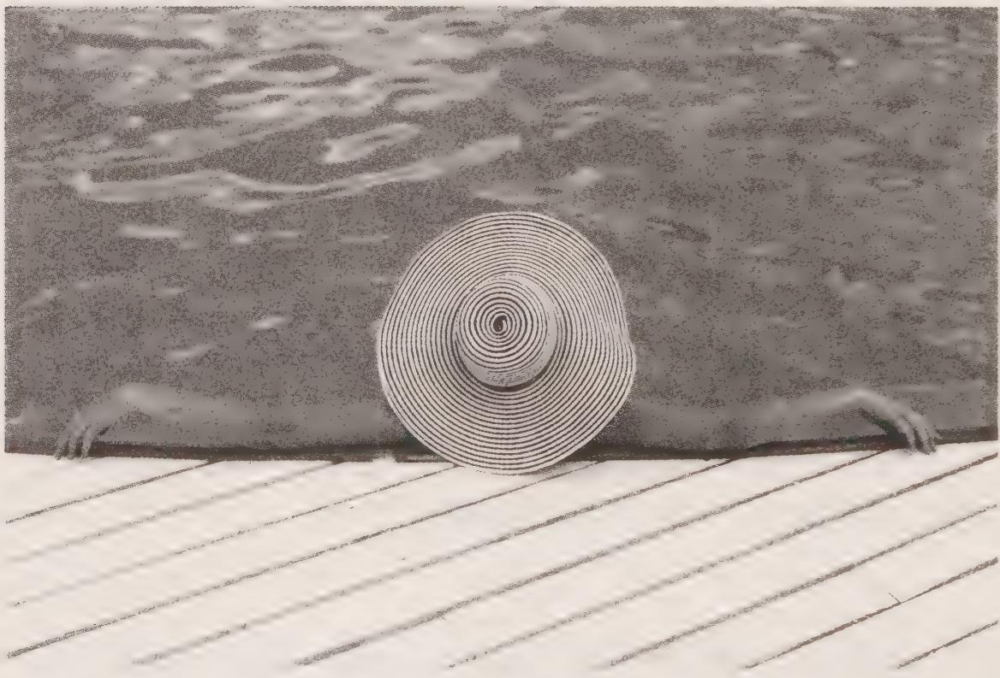

## Mong được thế gian này dịu dàng đối đãi

**愿被这个世界温柔相待**

*yuàn bèi zhè ge shì jiè wēn róu xiāng dài*

人的理想会被三样东西打败：时间、爱情、生活。

rén de lǐ xiǎng huì bèi sān yàng dōng xī dǎ bài：shí jiān、ài qíng、shēng huó。

Lý tưởng của con người có thể bị ba thứ đánh bại: thời gian, tình yêu và cuộc sống.

我们应该会时常害怕自己的梦想被其中任何一个打败，所以我们才一直与之抗争。

wǒ men yīng gāi huì shí cháng hài pà zì jǐ de mèng xiǎng bèi qí zhōng rèn hé yí gè dǎ bài，suǒ yǐ wǒ men cái yì zhí yǔ zhī kàng zhēng。

Chúng ta hẳn thường xuyên lo sợ giấc mơ của mình bị một trong ba thứ ấy đánh bại, vì thế nên ta mới luôn chống lại chúng.

因为这三种东西，在人的生命里，呈现的方式太过猛烈。

yīn wèi zhè sān zhǒng dōng xī，zài rén de shēng mìng lǐ，chéng xiàn de fāng shì tài guò měng liè。

Bởi ba thứ này xuất hiện trong đời người theo những cách quá dữ dội.

一不小心，就会淹没理想。

yí bù xiǎo xīn，jiù huì yān mò lǐ xiǎng。

Chỉ cần một chút sơ sẩy, lý tưởng sẽ bị nhấn chìm.

这三样东西能给予人刻骨的感受：时间会消磨一个人的斗志，爱情会让人失去理智，生活会给人残酷的压迫。

zhè sān yàng dōng xī néng jǐ yǔ rén kè gǔ de gǎn shòu：shí jiān huì xiāo mó yí gè rén de dòu zhì，ài qíng huì ràng rén shī qù lǐ zhì，shēng huó huì gěi rén cán kù de yā pò。

Ba thứ này đem đến cho con người những cảm giác khắc cốt ghi tâm: thời gian bào mòn chí khí của một người, tình yêu khiến người ta mất lý trí, cuộc sống tạo nên áp lực tàn khốc.

一个人能够坚持理想，坚守信仰，必定是要有顽强的意志。

yí gè rén néng gòu jiān chí lǐ xiǎng，jiān shǒu xìn yǎng，bì dìng shì yào yǒu wán qiáng de yì zhì。

Một người có thể kiên trì lý tưởng, giữ vững niềm tin, ắt hẳn phải có ý chí ngoan cường.

一方面，我相信如果一个人坚持下去，理想不会被其磨灭。

yì fāng miàn，wǒ xiāng xìn rú guǒ yí gè rén jiān chí xià qù，lǐ xiǎng bú huì bèi qí mó miè。

Một mặt, tôi tin rằng nếu một người kiên trì bước tiếp, lý tưởng sẽ không bị chúng bào mòn.

另一方面，我也相信，人会在这三种事物中，沉溺不醒。

lìng yì fāng miàn，wǒ yě xiāng xìn，rén huì zài zhè sān zhǒng shì wù zhōng，chén nì bù xǐng。

Mặt khác, tôi cũng tin rằng con người sẽ chìm đắm trong ba thứ ấy mà không tỉnh ra.

而这一段沉溺，可能是幸福的，也可能是可怕的。

ér zhè yī duàn chén nì，kě néng shì xìng fú de，yě kě néng shì kě pà de。

Và đoạn chìm đắm ấy, có thể là hạnh phúc, cũng có thể là đáng sợ.

不管它们是使用温柔刀，还是残忍的毒酒，都会有一种力量，把人生之梦扑灭。

bù guǎn tā men shì shǐ yòng wēn róu dāo，hái shì cán rěn de dú jiǔ，dū huì yǒu yī zhǒng lì liàng，bǎ rén shēng zhī mèng pū miè。

Dù chúng dùng thanh đao dịu dàng hay chén rượu độc tàn nhẫn, đều có một sức mạnh dập tắt giấc mơ của cuộc đời.

所以，很多时候，执着的人才如此执拗。

suǒ yǐ，hěn duō shí hòu，zhí zhuó de rén cái rú cǐ zhí niù。

Vì thế, nhiều khi, những người chấp nhất mới cố chấp đến vậy.

踏进社会后，我一直恐惧自己会忘记初衷。

tà jìn shè huì hòu，wǒ yì zhí kǒng jù zì jǐ huì wàng jì chū zhōng。

Bước chân vào xã hội, tôi luôn sợ hãi mình sẽ quên mất ý nguyện ban đầu.

每当我走在街头时，常提醒自己，骨子里还做着梦，还留着它的鲜血，我不能将它忘记。

měi dāng wǒ zǒu zài jiē tóu shí，cháng tí xǐng zì jǐ，gǔ zi lǐ hái zuò zhe mèng，hái liú zhe tā de xiān xuè，wǒ bù néng jiāng tā wàng jì。

Mỗi khi bước trên đường phố, tôi thường tự nhắc mình rằng trong cốt tủy vẫn còn đang mơ, vẫn còn máu nóng của giấc mơ, tôi không thể quên nó.

因为随着时间的流逝，梦想必然会变淡变浅。

yīn wèi suí zhe shí jiān de liú shì，mèng xiǎng bì rán huì biàn dàn biàn qiǎn。

Bởi khi thời gian trôi đi, giấc mơ ắt sẽ phai nhạt dần.

最初的那些强烈的渴望和斗志，也会渐渐薄弱下来。

zuì chū de nà xiē qiáng liè de kě wàng hé dòu zhì，yě huì jiàn jiàn bó ruò xià lái。

Những khát khao và chí khí mãnh liệt ban đầu cũng dần yếu đi.

不管多么铭心刻骨的事情，随着韶光流逝，也会斗转星移。

bù guǎn duō me míng xīn kè gǔ de shì qíng，suí zhe sháo guāng liú shì，yě huì dǒu zhuǎn xīng yí。

Cho dù chuyện có khắc cốt ghi tâm đến đâu, theo năm tháng trôi qua cũng sẽ thay đổi.

以前以为万箭穿心的事情，后来也可以笑着说出口，与他人谈论。

yǐ qián yǐ wéi wàn jiàn chuān xīn de shì qíng，hòu lái yě kě yǐ xiào zhe shuō chū kǒu，yǔ tā rén tán lùn。

Những chuyện tưởng chừng như vạn mũi tên xuyên tim, sau này cũng có thể mỉm cười nói ra, đem kể cho người khác nghe.

于是，我们终日活在这样的恐慌之中，时不时地把理想拉出来，让它见见光，看看前路的方向。

yú shì，wǒ men zhōng rì huó zài zhè yàng de kǒng huāng zhī zhōng，shí bù shí dì bǎ lǐ xiǎng lā chū lái，ràng tā jiàn jiàn guāng，kàn kàn qián lù de fāng xiàng。

Vì thế, ngày ngày chúng ta sống trong nỗi hoảng sợ ấy, thỉnh thoảng kéo lý tưởng ra, để nó phơi mình dưới ánh sáng, nhìn xem phương hướng phía trước.

学习便是学习，不可分神写作；写作就好好写作，不能好好学习。

xué xí biàn shì xué xí，bù kě fēn shén xiě zuò；xiě zuò jiù hǎo hǎo xiě zuò，bù néng hǎo hǎo xué xí。

Học tập thì cứ học tập, không được phân tâm viết lách; viết lách thì phải viết cho tử tế, không thể vừa viết vừa lo học.

从前我一直纠结于如何选择这两件事情，学习与写作。

cóng qián wǒ yì zhí jiū jié yú rú hé xuǎn zé zhè liǎng jiàn shì qíng，xué xí yǔ xiě zuò。

Trước đây tôi cứ mãi phân vân giữa hai việc, học tập và viết lách.

我究竟该坚持哪一个，放弃哪一个。

wǒ jiū jìng gāi jiān chí nǎ yí gè，fàng qì nǎ yí gè。

Rốt cuộc tôi nên kiên trì việc nào, từ bỏ việc nào.

直到后来我知道，选择哪一个都不是最好。

zhí dào hòu lái wǒ zhī dào，xuǎn zé nǎ yí gè dōu bú shì zuì hǎo。

Mãi đến sau này tôi mới hiểu, chọn cái nào cũng không phải là tốt nhất.

它们是连成一体的，我非要分开来选一个，这只会让我两者都做不好。

tā men shì lián chéng yī tǐ de，wǒ fēi yào fēn kāi lái xuǎn yí gè，zhè zhǐ huì ràng wǒ liǎng zhě dōu zuò bù hǎo。

Chúng vốn gắn liền làm một, nếu tôi cứ tách rời để chọn một, thì chỉ khiến tôi chẳng làm tốt được việc nào cả.

最后说说生活。

zuì hòu shuō shuō shēng huó。

Cuối cùng, nói về cuộc sống.

生活最大的敌人是贫穷、没有物质基础，任

shēng huó zuì dà de dí rén shì pín qióng、méi yǒu wù zhì jī chǔ，rèn

Kẻ thù lớn nhất của cuộc sống là nghèo đói, thiếu nền tảng vật chất, dù

何雄心壮志想实现都是顶难的。

hé xióng xīn zhuàng zhì xiǎng shí xiàn dōu shì dǐng nán de。

có hoài bão lớn đến đâu muốn thực hiện cũng vô cùng khó khăn.

人生如白驹过隙，弹指而过，而我们又如此羸弱。

rén shēng rú bái jū guò xì，dàn zhǐ ér guò，ér wǒ men yòu rú cǐ léi ruò。

Đời người như bóng câu qua cửa sổ, một thoáng đã trôi, mà chúng ta lại yếu đuối mong manh đến vậy.

因此，我们经常想到死亡这件事，又想到该怎样给生命一个交代。

yīn cǐ，wǒ men jīng cháng xiǎng dào sǐ wáng zhè jiàn shì，yòu xiǎng dào gāi zěn yàng gěi shēng mìng yí gè jiāo dài。

Vì thế, chúng ta thường nghĩ đến cái chết, lại nghĩ phải làm sao để trả lời trước cuộc đời.

是的，没有人可以阻止死亡的到来，而要做到不畏怯死亡，我们所能做的，或许只是活出自己。

shì de，méi yǒu rén kě yǐ zǔ zhǐ sǐ wáng de dào lái，ér yào zuò dào bù wèi qiè sǐ wáng，wǒ men suǒ néng zuò de，huò xǔ zhǐ shì huó chū zì jǐ。

Đúng vậy, không ai có thể ngăn cản cái chết đến, mà để không sợ hãi cái chết, điều chúng ta có thể làm, có lẽ chỉ là sống đúng là mình.

在人生路上，不妄想，不妄为，切切实实地，踏出每一步。

zài rén shēng lù shàng，bù wàng xiǎng，bù wàng wéi，qiè qiè shí shí dì，tà chū měi yī bù。

Trên đường đời, không mơ tưởng hão huyền, không làm điều bừa bãi, hãy bước từng bước thật chân thực.

只愿路上，被这个世界温柔相待。

zhǐ yuàn lù shàng，bèi zhè ge shì jiè wēn róu xiāng dài。

Chỉ mong trên đường đời, được thế gian này dịu dàng đối đãi.

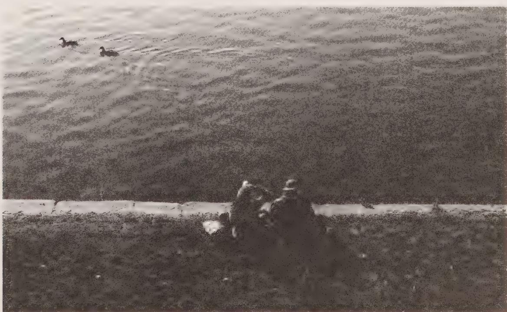

# Không có bất kỳ lý do nào để không rực nở chính mình

**没有任何原因，不去绽放自己**

*méi yǒu rèn hé yuán yīn，bù qù zhàn fàng zì jǐ*

在最茂盛的时候，不要忘记绽放自己。

zài zuì mào shèng de shí hòu，bú yào wàng jì zhàn fàng zì jǐ。

Vào lúc tươi tốt nhất, đừng quên rực nở chính mình.

一朵花儿尚可以做到如此，更何况是我们呢。

yī duǒ huā ér shàng kě yǐ zuò dào rú cǐ，gèng hé kuàng shì wǒ men ne。

Một bông hoa còn có thể làm được như vậy, huống chi là chúng ta.

你有没有这样的时候，会一眼爱上一处风景、一株树、一种花儿。

nǐ yǒu méi yǒu zhè yàng de shí hòu，huì yī yǎn ài shàng yī chù fēng jǐng、yī zhū shù、yī zhǒng huā ér。

Bạn có bao giờ như thế này không, chỉ một ánh nhìn đã phải lòng một cảnh sắc, một cây cối, một loài hoa nào đó.

当我遇见海棠花的时候，第一眼我便迷醉了。

dāng wǒ yù jiàn hǎi táng huā de shí hòu，dì yī yǎn wǒ biàn mí zuì le。

Khi tôi gặp hoa hải đường, ngay từ ánh nhìn đầu tiên tôi đã say đắm.

那是在一日的中午，跟同事吃完饭回来，看到了道路两旁鲜红鲜红的花儿。

nà shì zài yī rì de zhōng wǔ，gēn tóng shì chī wán fàn huí lái，kàn dào le dào lù liǎng páng xiān hóng xiān hóng de huā ér。

Đó là một buổi trưa, ăn cơm với đồng nghiệp xong trở về, tôi thấy hai bên đường nở những bông hoa đỏ rực.

我喜欢那样一种红，仿佛生来就与我吻合一般，让我知道我还有这样一种喜好。

wǒ xǐ huān nà yàng yī zhǒng hóng，fǎng fú shēng lái jiù yǔ wǒ wěn hé yì bān，ràng wǒ zhī dào wǒ hái yǒu zhè yàng yī zhǒng xǐ hào。

Tôi yêu cái màu đỏ ấy, như thể sinh ra đã khớp với tôi, khiến tôi nhận ra mình còn có một sở thích như vậy.

要不是其中有一棵树上挂了一个小小的牌子，我还会一直只专注于它艳丽的颜色，而不知道它就是花中神仙海棠花。

yào bú shì qí zhōng yǒu yī kē shù shàng guà le yí gè xiǎo xiǎo de pái zi，wǒ hái huì yì zhí zhǐ zhuān zhù yú tā yàn lì de yán sè，ér bù zhī dào tā jiù shì huā zhōng shén xiān hǎi táng huā。

Nếu không vì một trong những cây ấy treo một tấm biển nhỏ, có lẽ tôi vẫn chỉ mãi chú ý đến màu sắc rực rỡ của nó, mà không biết nó chính là hoa hải đường, loài hoa thần tiên trong các loài hoa.

春光下的海棠，簇拥着，绽放得似一把小伞，在春风里摇曳；没有绽放的花蕾，则似胭脂点点，动人可爱。

chūn guāng xià de hǎi táng，cù yōng zhe，zhàn fàng dé shì yī bǎ xiǎo sǎn，zài chūn fēng lǐ yáo yè；méi yǒu zhàn fàng de huā lěi，zé shì yān zhī diǎn diǎn，dòng rén kě ài。

Hải đường dưới ánh xuân, cụm lại với nhau, nở ra như một chiếc ô nhỏ, đung đưa trong gió xuân; những nụ hoa chưa nở thì như những chấm phấn son, động lòng người đáng yêu.

我不知道它的名字时，便喜爱它，我知道它的名字后，依然陶醉于它。

wǒ bù zhī dào tā de míng zì shí，biàn xǐ ài tā，wǒ zhī dào tā de míng zì hòu，yī rán táo zuì yú tā。

Khi chưa biết tên nó, tôi đã yêu nó, khi biết tên nó rồi, tôi vẫn say đắm nó.

可人生，又有多少事件、多少情感能似这海棠花一样，始终如一地给我以美好、以静美呢。

kě rén shēng，yòu yǒu duō shǎo shì jiàn、duō shǎo qíng gǎn néng shì zhè hǎi táng huā yī yàng，shǐ zhōng rú yī dì gěi wǒ yǐ měi hǎo、yǐ jìng měi ne。

Nhưng trong cuộc đời, có bao nhiêu sự việc, bao nhiêu cảm xúc có thể giống như đóa hải đường này, luôn như một mà trao tôi vẻ đẹp, vẻ tĩnh lặng đẹp đẽ ấy chứ.

生活并不像这花儿，它有无数的面具和皮囊。

shēng huó bìng bù xiàng zhè huā ér，tā yǒu wú shù de miàn jù hé pí náng。

Cuộc sống không giống đóa hoa này, nó có vô số lớp mặt nạ và những bộ vỏ.

它面对什么样的人儿，换上什么样的面具，让人看也看不清，猜也猜不透。

tā miàn duì shén me yàng de rén ér，huàn shàng shén me yàng de miàn jù，ràng rén kàn yě kàn bù qīng，cāi yě cāi bù tòu。

Nó đối diện với người như thế nào, lại đeo lên chiếc mặt nạ như thế ấy, khiến người ta nhìn cũng không rõ, đoán cũng không thấu.

作为一个年轻人，我们都曾渴望乘着火车奔驰远方。

zuò wéi yí gè nián qīng rén，wǒ men dōu céng kě wàng chéng zháo huǒ chē bēn chí yuǎn fāng。

Là những người trẻ, chúng ta đều từng khao khát cưỡi tàu hỏa lao đi nơi xa.

而当我们刚刚爬上那迅猛的火车头，就被生活狠狠地绊了一个趔趄。

ér dāng wǒ men gāng gāng pá shàng nà xùn měng de huǒ chē tóu，jiù bèi shēng huó hěn hěn dì bàn le yí gè liè qiè。

Vậy mà vừa mới leo lên đầu tàu đang lao nhanh, chúng ta đã bị cuộc sống vấp cho một cú lảo đảo.

好似还没像海棠这般在春日盛开过，就渐褪颜色，自行消散了。

hǎo sì hái méi xiàng hǎi táng zhè bān zài chūn rì shèng kāi guò，jiù jiàn tuì yán sè，zì xíng xiāo sàn le。

Như thể còn chưa kịp nở rộ trong mùa xuân như hoa hải đường, màu sắc đã phai nhạt dần, tự mình tan biến.

之后，我们之所以困苦的生活，是因为厌恶地拒绝了生活好心赠送给我们的面具。

zhī hòu，wǒ men zhī suǒ yǐ kùn kǔ de shēng huó，shì yīn wèi yàn wù dì jù jué le shēng huó hǎo xīn zèng sòng gěi wǒ men de miàn jù。

Sau đó, cuộc sống của chúng ta trở nên khốn khó, là vì chúng ta đã ghê tởm mà khước từ chiếc mặt nạ cuộc sống tốt bụng tặng cho.

于是它便对我们换了一种模样，让我们不息的热情一下子消失在了恐吓与威胁中。

yú shì tā biàn duì wǒ men huàn le yī zhǒng mú yàng，ràng wǒ men bù xī de rè qíng yī xià zi xiāo shī zài le kǒng hè yǔ wēi xié zhōng。

Vì thế nó bèn đổi sang một dáng vẻ khác với chúng ta, khiến ngọn nhiệt huyết không ngừng nghỉ của chúng ta bỗng chốc tan biến trong dọa dẫm và đe dọa.

每日我们都在寻觅和挣脱，寻觅原本的自我，挣脱恫吓。

měi rì wǒ men dōu zài xún mì hé zhèng tuō，xún mì yuán běn de zì wǒ，zhèng tuō dòng hè。

Mỗi ngày chúng ta đều đi tìm và gỡ thoát, tìm lại con người vốn có của mình, gỡ thoát khỏi sự hù dọa.

但不知道为什么，会觉得自己没有力量了，好似再没有力气去驾驶火车，而无力地被火车驮着。

dàn bù zhī dào wèi shén me，huì jué de zì jǐ méi yǒu lì liàng le，hǎo sì zài méi yǒu lì qì qù jià shǐ huǒ chē，ér wú lì dì bèi huǒ chē tuó zhe。

Nhưng không hiểu vì sao, lại thấy mình chẳng còn sức lực, như thể không còn hơi sức để lái con tàu, mà bất lực để con tàu chở đi.

甚至失去了抓紧铁栓的力量，开始在生活的火车头上摇摇晃晃。

shèn zhì shī qù le zhuā jǐn tiě shuān de lì liàng，kāi shǐ zài shēng huó de huǒ chē tóu shàng yáo yáo huàng huǎng。

Thậm chí mất cả sức để bám chặt thanh sắt, bắt đầu loạng choạng trên đầu tàu của cuộc sống.

直到春天再来，直到我发现了海棠花。

zhí dào chūn tiān zài lái，zhí dào wǒ fā xiàn le hǎi táng huā。

Mãi đến khi mùa xuân lại đến, mãi đến khi tôi phát hiện ra hoa hải đường.

它如此艳丽妖娆，在属于它的季节里绽放它的生命。

tā rú cǐ yàn lì yāo ráo，zài shǔ yú tā de jì jié lǐ zhàn fàng tā de shēng mìng。

Nó rực rỡ yêu kiều đến thế, trong mùa thuộc về mình, nó bung nở sự sống của mình.

它难道没有像我们一样曾经遭受风吹雨打吗，它难道没有像我们一样为吐露新芽而受尽苦楚吗？

tā nán dào méi yǒu xiàng wǒ men yī yàng céng jīng zāo shòu fēng chuī yǔ dǎ ma，tā nán dào méi yǒu xiàng wǒ men yī yàng wèi tǔ lù xīn yá ér shòu jǐn kǔ chǔ ma？

Chẳng lẽ nó không từng như chúng ta, chịu mưa gió dập vùi sao, chẳng lẽ nó không từng như chúng ta, chịu muôn vàn khổ ải để nhú những mầm non mới sao?

当我看见这样美丽的生命，我仿佛得知了一件事情：在白驹过隙的人生里，人何尝不应像这花一样，将自己最热烈的生命，绽放在属于它的美好季节里！

dāng wǒ kàn jiàn zhè yàng měi lì de shēng mìng，wǒ fǎng fú dé zhī le yī jiàn shì qíng：zài bái jū guò xì de rén shēng lǐ，rén hé cháng bù yīng xiàng zhè huā yī yàng，jiāng zì jǐ zuì rè liè de shēng mìng，zhàn fàng zài shǔ yú tā de měi hǎo jì jié lǐ！

Khi nhìn thấy một sinh mệnh đẹp đẽ như vậy, tôi như thấu hiểu được một điều: trong cuộc đời ngắn ngủi như bóng câu qua cửa sổ, con người chẳng lẽ không nên giống như đóa hoa này, đem sự sống nồng nhiệt nhất của mình, bung nở trong mùa tươi đẹp thuộc về nó hay sao!

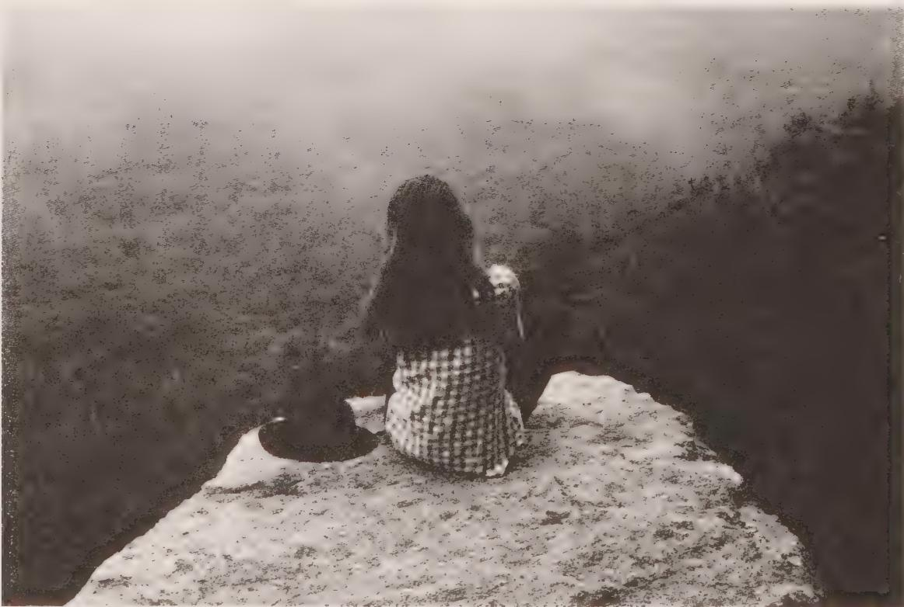

## Mọi điều tốt đẹp hay tồi tệ, đều sẽ qua đi

**一切好的坏的，都会过去**

*yī qiè hǎo de huài de，dū huì guò qù*

你是不是也会有那么一段时间，感到非常暴躁，而且凭直觉判断，这种暴躁会持续飙升？

nǐ shì bú shì yě huì yǒu nà me yī duàn shí jiān，gǎn dào fēi cháng bào zào，ér qiě píng zhí jué pàn duàn，zhè zhǒng bào zào huì chí xù biāo shēng？

Bạn có bao giờ có những lúc cảm thấy vô cùng cáu bẳn, và theo trực giác đoán rằng sự cáu bẳn này sẽ còn tăng vọt mãi không?

它已经从你身边的人，扩散到几乎每一个跟你接触的人身上。

tā yǐ jīng cóng nǐ shēn biān de rén，kuò sàn dào jī hū měi yí gè gēn nǐ jiē chù de rén shēn shàng。

Nó đã từ những người xung quanh bạn, lan ra đến gần như mọi người mà bạn tiếp xúc.

那个时候，生活里所有的事情，都想用一个字解决，那就是“拖”。

nà ge shí hòu，shēng huó lǐ suǒ yǒu de shì qíng，dōu xiǎng yòng yí gè zì jiě jué，nà jiù shì “tuō ”。

Lúc đó, mọi chuyện trong cuộc sống đều muốn giải quyết bằng một chữ, đó là “kéo” (trì hoãn).

那个时候，我们非常希望一切变得直接明了而简单。

nà ge shí hòu，wǒ men fēi cháng xī wàng yī qiè biàn dé zhí jiē míng liǎo ér jiǎn dān。

Lúc đó, chúng ta vô cùng mong mọi thứ trở nên trực tiếp, rõ ràng và đơn giản.

宁愿万人厌恶，也要做自己。

nìng yuàn wàn rén yàn wù，yě yào zuò zì jǐ。

Thà bị muôn người ghét bỏ, cũng muốn làm chính mình.

工作上，我们不想再额外帮任何人做任何事情。

gōng zuò shàng，wǒ men bù xiǎng zài é wài bāng rèn hé rén zuò rèn hé shì qíng。

Trong công việc, chúng ta không muốn giúp thêm ai làm bất kỳ điều gì nữa.

既然当面沟通过，交代过，回头你就不要向我提要求，会很烦躁。

jì rán dāng miàn gōu tōng guò，jiāo dài guò，huí tóu nǐ jiù bú yào xiàng wǒ tí yào qiú，huì hěn fán zào。

Đã trao đổi trực tiếp, đã dặn dò xong xuôi, thì sau đó đừng có đến đòi hỏi tôi gì nữa, sẽ khiến người ta rất bực mình.

不是我负责的工作，不要来找我沟通，而且非要说出一个三七二十一来，这让人也十分不能容忍。

bú shì wǒ fù zé de gōng zuò，bú yào lái zhǎo wǒ gōu tōng，ér qiě fēi yào shuō chū yí gè sān qī èr shí yī lái，zhè ràng rén yě shí fēn bù néng róng rěn。

Công việc không phải của tôi phụ trách, đừng đến tìm tôi bàn bạc, mà còn cứ bắt tôi phải nói ra rõ ràng từng ly từng tí, điều này khiến người ta cũng không thể nào chịu nổi.

尽管工作上会接触领导和其他一些业界人士，自己还是一样会懈怠、只想早一点儿回家，不想应酬，不想吃饭，不想浪费

jǐn guǎn gōng zuò shàng huì jiē chù lǐng dǎo hé qí tā yī xiē yè jiè rén shì，zì jǐ hái shì yī yàng huì xiè dài、zhǐ xiǎng zǎo yì diǎn ér huí jiā，bù xiǎng yìng chóu，bù xiǎng chī fàn，bù xiǎng làng fèi

Dù trong công việc phải tiếp xúc với cấp trên và một số nhân sĩ trong giới, bản thân vẫn như cũ lười biếng, chỉ muốn về nhà sớm một chút, không muốn giao lưu, không muốn ăn cơm, không muốn phí

口舌。

kǒu shé。

lời ăn tiếng nói.

其实，哪怕知道是自己错过了报考确认时间，即使要责怪，也是责怪自己掉以轻心忘记了。

qí shí，nǎ pà zhī dào shì zì jǐ cuò guò le bào kǎo què rèn shí jiān，jí shǐ yào zé guài，yě shì zé guài zì jǐ diào yǐ qīng xīn wàng jì le。

Thực ra, dù biết rõ là mình đã lỡ thời gian xác nhận đăng ký dự thi, dù có phải trách thì cũng trách bản thân đã lơ là quên mất.

但还是无条件地对别人发火。

dàn hái shì wú tiáo jiàn dì duì bié rén fā huǒ。

Nhưng vẫn vô điều kiện trút cơn giận lên người khác.

就好像如果自己想要走路回家，而其他人非要坐公交，自己一定会雷霆大怒一样。

jiù hǎo xiàng rú guǒ zì jǐ xiǎng yào zǒu lù huí jiā，ér qí tā rén fēi yào zuò gōng jiāo，zì jǐ yí dìng huì léi tíng dà nù yī yàng。

Cứ như thể nếu mình muốn đi bộ về nhà, mà người khác cứ khăng khăng bắt đi xe buýt, thì mình nhất định sẽ nổi trận lôi đình.

就这样，生活中处处都会成为自己心情的引爆点。

jiù zhè yàng，shēng huó zhōng chù chù dū huì chéng wéi zì jǐ xīn qíng de yǐn bào diǎn。

Cứ như vậy, mọi nơi trong cuộc sống đều có thể trở thành điểm châm ngòi cho tâm trạng của mình.

也是这样的时候，我们是一个泪点极低的人。

yě shì zhè yàng de shí hòu，wǒ men shì yí gè lèi diǎn jí dī de rén。

Cũng trong những lúc như thế, chúng ta trở thành những người cực kỳ dễ rơi nước mắt.

任何一件事情，一个眼神，一个画面，一个因素，都可能是自己痛哭一场的缘由。

rèn hé yī jiàn shì qíng，yí gè yǎn shén，yí gè huà miàn，yí gè yīn sù，dōu kě néng shì zì jǐ tòng kū yī cháng de yuán yóu。

Bất kỳ một chuyện gì, một ánh mắt, một khung cảnh, một yếu tố nào, cũng có thể là cái cớ để mình khóc một trận.

而且也不会向任何人解释这是因为什么。

ér qiě yě bú huì xiàng rèn hé rén jiě shì zhè shì yīn wèi shén me。

Và cũng chẳng giải thích cho ai biết vì sao lại như thế.

他人也不知道，也不会体会到你的心情。

tā rén yě bù zhī dào，yě bú huì tǐ huì dào nǐ de xīn qíng。

Người khác cũng không biết, cũng không thể thấu hiểu tâm trạng của bạn.

这些自己都了解，但还是觉得自己有足够的理由去向别人开火。

zhè xiē zì jǐ dōu liǎo jiě，dàn hái shì jué de zì jǐ yǒu zú gòu de lǐ yóu qù xiàng bié rén kāi huǒ。

Những điều này bản thân đều hiểu rõ, nhưng vẫn cảm thấy mình có đủ lý do để khai hỏa với người khác.

这是浮躁吗？

zhè shì fú zào ma？

Đây là sự nông nổi ư?

当因为一个默默无闻的老人，坚持了三十年的舞蹈而以泪洗面，自己却不能为自己内心的渴念找到任何哭泣的理由的时候，真的很想爬上床，蒙上被子大哭一场。

dāng yīn wèi yí gè mò mò wú wén de lǎo rén，jiān chí le sān shí nián de wǔ dǎo ér yǐ lèi xǐ miàn，zì jǐ què bù néng wèi zì jǐ nèi xīn de kě niàn zhǎo dào rèn hé kū qì de lǐ yóu de shí hòu，zhēn de hěn xiǎng pá shàng chuáng，méng shàng bèi zi dà kū yī cháng。

Khi vì một ông lão vô danh, kiên trì nhảy múa suốt ba mươi năm mà nước mắt rưng rưng, còn bản thân mình lại không thể tìm được bất kỳ lý do nào để khóc cho những khao khát trong lòng, lúc ấy thật sự chỉ muốn trèo lên giường, trùm chăn khóc một trận thật lớn.

夜晚，只能拿起书来看，看到自己发困的时候就睡觉，明天照常起来上班。

yè wǎn，zhǐ néng ná qǐ shū lái kàn，kàn dào zì jǐ fā kùn de shí hòu jiù shuì jiào，míng tiān zhào cháng qǐ lái shàng bān。

Đêm đến, chỉ có thể cầm sách lên đọc, đọc đến khi buồn ngủ thì đi ngủ, ngày mai vẫn như thường dậy đi làm.

继续暴躁。

jì xù bào zào。

Tiếp tục cáu bẳn.

也许很久之前，有人认为你是一个博爱且善良的人，在这个时候，如果他看到你，一定不敢相信你变成了一个只为自己，而不愿意为任何人着想的人。

yě xǔ hěn jiǔ zhī qián，yǒu rén rèn wéi nǐ shì yí gè bó ài qiě shàn liáng de rén，zài zhè ge shí hòu，rú guǒ tā kàn dào nǐ，yí dìng bù gǎn xiāng xìn nǐ biàn chéng le yí gè zhǐ wèi zì jǐ，ér bù yuàn yì wèi rèn hé rén zhuó xiǎng de rén。

Có lẽ từ rất lâu trước đây, có người cho rằng bạn là một người bác ái và tốt bụng, nhưng vào lúc này, nếu anh ta nhìn thấy bạn, ắt hẳn sẽ không tin nổi bạn đã trở thành một người chỉ vì bản thân, mà không muốn nghĩ đến bất kỳ ai.

或许包括自己，都已经不再是属于自己的。

huò xǔ bāo kuò zì jǐ，dōu yǐ jīng bù zài shì shǔ yú zì jǐ de。

Có lẽ, kể cả bản thân mình, cũng đã không còn thuộc về chính mình nữa.

我认认真真地想过，或许这一切不是因为厌烦才发脾气，也不是因为不懂礼貌而任性无理。

wǒ rèn rèn zhēn zhēn dì xiǎng guò，huò xǔ zhè yī qiè bú shì yīn wèi yàn fán cái fā pí qì，yě bú shì yīn wèi bù dǒng lǐ mào ér rèn xìng wú lǐ。

Tôi đã nghiêm túc nghĩ về điều này, có lẽ tất cả những chuyện này không phải vì chán ghét mà nổi nóng, cũng không phải vì vô lễ mà ương bướng vô lý.

我们选择忽视，只是因为我们已没有时间来正视自己。

wǒ men xuǎn zé hū shì，zhǐ shì yīn wèi wǒ men yǐ méi yǒu shí jiān lái zhèng shì zì jǐ。

Chúng ta chọn cách phớt lờ, chỉ vì chúng ta không còn thời gian để đối diện với chính mình.

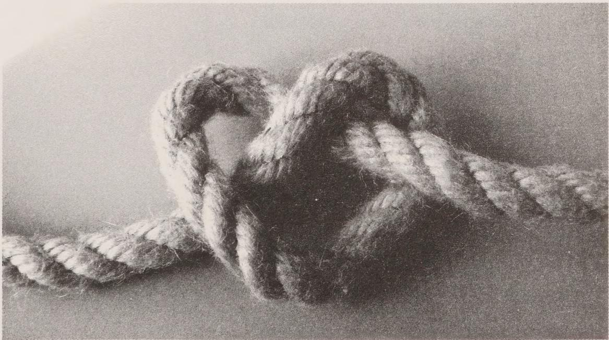

## Danh mục tủ sách Độc Mỹ:

**读美文库书目：**

*dú měi wén kù shū mù：*

马云工作法 人际交往心理学

mǎ yún gōng zuò fǎ rén jì jiāo wǎng xīn lǐ xué

Phương pháp làm việc của Mã Vân — Tâm lý học giao tiếp xã hội

高效演讲 失落的致富经典

gāo xiào yǎn jiǎng shī luò de zhì fù jīng diǎn

Diễn thuyết hiệu quả — Kinh điển làm giàu đã thất truyền

奥黛丽·赫本 消费者行为心理学

ào dài lì·hè běn xiāo fèi zhě xíng wéi xīn lǐ xué

Audrey Hepburn — Tâm lý học hành vi người tiêu dùng

人人都能成功 天才在左疯子在右

rén rén dōu néng chéng gōng tiān cái zài zuǒ fēng zi zài yòu

Ai cũng có thể thành công — Thiên tài bên trái, kẻ điên bên phải

心静的力量 开一家赚钱的餐馆

xīn jìng de lì liàng kāi yī jiā zhuàn qián de cān guǎn

Sức mạnh của tâm tĩnh — Mở một nhà hàng kiếm tiền

思考致富 不生气，你就赢了

sī kǎo zhì fù bù shēng qì，nǐ jiù yíng le

Tư duy làm giàu — Không tức giận, bạn đã thắng

社交与礼仪 跟任何人都能聊得来

shè jiāo yǔ lǐ yí gēn rèn hé rén dōu néng liáo dé lái

Giao tiếp xã hội và lễ nghi — Nói chuyện được với bất kỳ ai

情绪急救 你当善良，且有锋芒

qíng xù jí jiù nǐ dāng shàn liáng，qiě yǒu fēng máng

Sơ cứu cảm xúc — Bạn nên tốt bụng, nhưng phải có nét sắc bén

领导的艺术 你当温柔，且有力量

lǐng dǎo de yì shù nǐ dāng wēn róu，qiě yǒu lì liàng

Nghệ thuật lãnh đạo — Bạn nên dịu dàng, nhưng phải có sức mạnh

沟通的艺术 不畏将来，不念过去

gōu tōng de yì shù bù wèi jiāng lái，bù niàn guò qù

Nghệ thuật giao tiếp — Không sợ tương lai, không vấn vương quá khứ

推销的艺术 一切都是最好的安排

tuī xiāo de yì shù yī qiè dōu shì zuì hǎo de ān pái

Nghệ thuật chào hàng — Tất cả đều là sự sắp đặt tốt nhất

谈判的艺术 女人不要输在情商上

tán pàn de yì shù nǚ rén bú yào shū zài qíng shāng shàng

Nghệ thuật đàm phán — Phụ nữ đừng thua ở trí tuệ cảm xúc

做生意的艺术 做一个刚刚好的女子

zuò shēng yì de yì shù zuò yí gè gāng gāng hǎo de nǚ zǐ

Nghệ thuật làm ăn — Trở thành người phụ nữ vừa vặn

魔鬼金融学 灵魂有香气的女子

mó guǐ jīn róng xué líng hún yǒu xiāng qì de nǚ zǐ

Tài chính học ma quỷ — Người phụ nữ có tâm hồn toả hương thơm

怪诞心理学 一年级影响孩子的一生

guài dàn xīn lǐ xué yì nián jí yǐng xiǎng hái zi de yī shēng

Tâm lý học kỳ quái — Năm lớp một ảnh hưởng cả cuộc đời trẻ

幽默沟通学 所谓做生意，就是交朋友

yōu mò gōu tōng xué suǒ wèi zuò shēng yì，jiù shì jiāo péng yǒu

Nghệ thuật giao tiếp hài hước — Cái gọi là làm ăn, chính là kết giao bạn bè

淡定心理学 所谓做销售，就是搞定人

dàn dìng xīn lǐ xué suǒ wèi zuò xiāo shòu，jiù shì gǎo dìng rén

Tâm lý học bình thản — Cái gọi là làm sales, chính là chinh phục con người

性格心理学 所谓情商高，就是会说话

xìng gé xīn lǐ xué suǒ wèi qíng shāng gāo，jiù shì huì shuō huà

Tâm lý học tính cách — Cái gọi là EQ cao, chính là biết nói năng

暗示心理学 提升女人气质的100个细节

àn shì xīn lǐ xué tí shēng nǚ rén qì zhì dì 100 gè xì jié

Tâm lý học ám thị — 100 chi tiết nâng cao khí chất của phụ nữ

自控力 别在该动脑子的时候动感情

zì kòng lì bié zài gāi dòng nǎo zi de shí hòu dòng gǎn qíng

Năng lực tự kiềm chế — Đừng động cảm xúc khi lẽ ra phải động não

拒绝力 对于自己，你还是个陌生人

jù jué lì duì yú zì jǐ，nǐ hái shì gè mò shēng rén

Năng lực từ chối — Với chính mình, bạn vẫn còn là một người xa lạ

回话的技术 别在该奋斗的年龄选择了安逸

huí huà de jì shù bié zài gāi fèn dòu de nián líng xuǎn zé le ān yì

Nghệ thuật đối đáp — Đừng lựa chọn an nhàn ở cái tuổi lẽ ra phải phấn đấu

竟然想通了 生命中最美好的事都是免费的

jìng rán xiǎng tōng le shēng mìng zhòng zuì měi hǎo de shì dōu shì miǎn fèi de

Không ngờ đã nghĩ thông — Những điều tốt đẹp nhất trong đời đều là miễn phí

心理学与生活 将来的你，一定会感谢现在拼命的自己

xīn lǐ xué yǔ shēng huó jiāng lái de nǐ，yí dìng huì gǎn xiè xiàn zài pīn mìng de zì jǐ

Tâm lý học và cuộc sống — Người bạn của tương lai, nhất định sẽ cảm ơn chính mình đang liều mạng ở hiện tại

什么样的女子才是刚刚好的？

shén me yàng de nǚ zǐ cái shì gāng gāng hǎo de？

Người phụ nữ như thế nào mới được gọi là vừa vặn?

这本书会告诉你答案。

zhè běn shū huì gào sù nǐ dá àn。

Cuốn sách này sẽ cho bạn câu trả lời.

个刚刚好的女子，应该是不攀附不将就的，应该是不迷茫不低头的，应该是不虚荣不浮躁的，应该是不自卑不自大的，应该是不放弃不沉迷的……全书用很多个女子的故事告诉我们如何做才能变得更好更快乐。

gè gāng gāng hǎo de nǚ zǐ，yīng gāi shì bù pān fù bù jiāng jiù de，yīng gāi shì bù mí máng bù dī tóu de，yīng gāi shì bù xū róng bù fú zào de，yīng gāi shì bù zì bēi bù zì dà de，yīng gāi shì bù fàng qì bù chén mí de……quán shū yòng hěn duō gè nǚ zǐ de gù shì gào sù wǒ men rú hé zuò cái néng biàn dé gèng hǎo gèng kuài lè。

Một người phụ nữ vừa vặn, hẳn là không nương tựa, không thỏa hiệp; hẳn là không lạc lối, không cúi đầu; hẳn là không hư vinh, không nông nổi; hẳn là không tự ti, không tự đại; hẳn là không bỏ cuộc, không đắm chìm… Cả cuốn sách dùng câu chuyện của rất nhiều người phụ nữ để nói cho chúng ta biết làm thế nào để trở nên tốt đẹp và hạnh phúc hơn.

在故事中看到为人处世的真谛。

zài gù shì zhōng kàn dào wéi rén chǔ shì de zhēn dì。

Trong những câu chuyện, nhìn thấy chân lý của cách đối nhân xử thế.

在感悟中学会成为更好的自己。

zài gǎn wù zhōng xué huì chéng wéi gèng hǎo de zì jǐ。

Trong những cảm ngộ, học cách trở thành một phiên bản tốt hơn của chính mình.

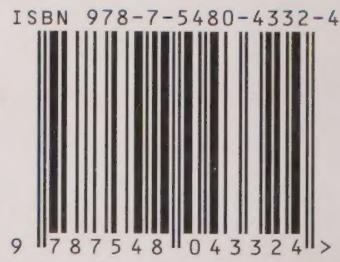