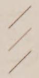
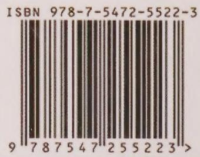

微阳编著

wēi yáng biān zhù

Vi Dương biên soạn

任何打不倒我的挫折只会使我更坚强

rèn hé dǎ bù dào wǒ de cuò zhé zhǐ huì shǐ wǒ gèng jiān qiáng

Những trở ngại nào không đánh gục được tôi chỉ khiến tôi mạnh mẽ hơn

做一个

zuò yí gè

Hãy trở thành

# Có Phong Thái

**有风骨的**

*yǒu fēng gǔ de*

女子

nǚ zǐ

người phụ nữ

不迎合，不将就，不媚俗。

bù yíng hé，bù jiāng jiù，bù mèi sú。

Không xu nịnh, không thỏa hiệp, không mê tục.

任何时候都要做一个有风骨的女子，面带微笑，内心强大。

rèn hé shí hòu dōu yào zuò yí gè yǒu fēng gǔ de nǚ zǐ，miàn dài wēi xiào，nèi xīn qiáng dà。

Bất cứ lúc nào cũng hãy là một người phụ nữ có phong thái, mỉm cười, tâm hồn mạnh mẽ.

## Giới Thiệu Nội Dung

**筒价内容**

*tǒng jià nèi róng*

做一个有风骨的女子也许是许多女人的梦想，但要实现这一梦想，却需要女人不断加强修养，从而提升自己。

zuò yí gè yǒu fēng gǔ de nǚ zǐ yě xǔ shì xǔ duō nǚ rén de mèng xiǎng，dàn yào shí xiàn zhè yī mèng xiǎng，què xū yào nǚ rén bù duàn jiā qiáng xiū yǎng，cóng ér tí shēng zì jǐ。

Trở thành người phụ nữ có phong thái có lẽ là mơ ước của nhiều phụ nữ, nhưng để thực hiện được ước mơ này, người phụ nữ cần không ngừng trau dồi dưỡng chất để nâng cao bản thân.

本书从气质、谈吐、性格、心态、职场、交际、爱情、婚姻等方面入手，运用通俗而精练的语言，与众多的女性朋友进行交流，并详细介绍了如何成为一个有风骨的女人的方法与技巧，教会女性展示自己独一无二的魅力，开启属于自己的别样人生。

běn shū cóng qì zhì、tán tǔ、xìng gé、xīn tài、zhí chǎng、jiāo jì、ài qíng、hūn yīn děng fāng miàn rù shǒu，yùn yòng tōng sú ér jīng liàn de yǔ yán，yǔ zhòng duō de nǚ xìng péng yǒu jìn xíng jiāo liú，bìng xiáng xì jiè shào le rú hé chéng wéi yí gè yǒu fēng gǔ de nǚ rén de fāng fǎ yǔ jì qiǎo，jiào huì nǚ xìng zhǎn shì zì jǐ dú yī wú èr de mèi lì，kāi qǐ shǔ yú zì jǐ de bié yàng rén shēng。

Cuốn sách bắt đầu từ những khía cạnh như khí chất, ăn nói, tính cách, tâm thái, nơi làm việc, giao tiếp, tình yêu, hôn nhân, sử dụng ngôn ngữ dễ hiểu mà tinh gọn, trò chuyện cùng đông đảo những người bạn nữ, đồng thời giới thiệu chi tiết phương pháp và kỹ xảo để trở thành một người phụ nữ có phong thái, dạy phụ nữ cách thể hiện sức hút độc nhất vô nhị của mình, mở ra một cuộc đời khác biệt thuộc về chính mình.

# Trở Thành Người Phụ Nữ Có Phong Thái

**做一个有风骨的女子**

*zuò yí gè yǒu fēng gǔ de nǚ zǐ*

微阳 / 编著

wēi yáng / biān zhù

Vi Dương / Biên soạn

## Dữ Liệu Mục Lục Trong Sách (CIP)

**图书在版编目（CIP）数据**

*tú shū zài bǎn biān mù （CIP） shù jù*

做一个有风骨的女子 ／微阳编著.-- 长春：吉林

zuò yí gè yǒu fēng gǔ de nǚ zǐ ／wēi yáng biān zhù .-- cháng chūn：jí lín

Trở thành người phụ nữ có phong thái ／Vi Dương biên soạn. -- Trường Xuân: Cát Lâm

文史出版社，2018.10

wén shǐ chū bǎn shè ，2018.10

Nhà xuất bản Văn Sử, 2018.10

ISBN 978-7-5472-5522-3

ISBN 978-7-5472-5522-3

ISBN 978-7-5472-5522-3

Ⅰ.①做…Ⅱ.①微…Ⅲ.①女性一成功心理一通俗读物 Ⅳ.①B848.4-49

Ⅰ.①zuò …Ⅱ.①wēi …Ⅲ.①nǚ xìng yì chéng gōng xīn lǐ yí tòng sú dú wù Ⅳ.①B848.4-49

Ⅰ.①Trở…Ⅱ.①Vi…Ⅲ.①Tâm lý thành công của phụ nữ — sách phổ thông Ⅳ.①B848.4-49

中国版本图书馆CIP数据核字（2018）第230681号

zhōng guó bǎn běn tú shū guǎn CIP shù jù hé zì （2018） dì 230681 hào

Số đăng ký dữ liệu CIP của Thư viện Phiên bản Trung Quốc (2018) số 230681

## Trở Thành Người Phụ Nữ Có Phong Thái

**做一个有风骨的女子**

*zuò yí gè yǒu fēng gǔ de nǚ zǐ*

编著微阳

biān zhù wēi yáng

Biên soạn: Vi Dương

出版人孙建军

chū bǎn rén sūn jiàn jūn

Nhà xuất bản: Tôn Kiến Quân

责任编辑 陈春燕 赵 艺

zé rèn biān jí chén chūn yàn zhào yì

Biên tập viên phụ trách: Trần Xuân Yến, Triệu Nghệ

封面设计 韩立强

fēng miàn shè jì hán lì qiáng

Thiết kế bìa: Hàn Lập Cường

图片提供 www.quanjing.com

tú piàn tí gōng www.quanjing.com

Cung cấp hình ảnh: www.quanjing.com

出版发行 吉林文史出版社有限责任公司

chū bǎn fā xíng jí lín wén shǐ chū bǎn shè yǒu xiàn zé rèn gōng sī

Xuất bản và phát hành: Công ty TNHH Nhà xuất bản Văn Sử Cát Lâm

地址 长春市人民大街4646号

dì zhǐ cháng chūn shì rén mín dà jiē 4646 hào

Địa chỉ: Số 4646, đường Nhân Dân, thành phố Trường Xuân

网址 www.jlws.com.cn

wǎng zhǐ www.jlws.com.cn

Trang web: www.jlws.com.cn

印刷 天津海德伟业印务有限公司

yìn shuā tiān jīn hǎi dé wěi yè yìn wù yǒu xiàn gōng sī

In ấn: Công ty TNHH In ấn Hải Đức Vĩ Nghiệp, Thiên Tân

开本880mm×1230mm 1/32

kāi běn 880mm×1230mm 1/32

Khổ sách: 880mm×1230mm 1/32

印张6

yìn zhāng 6

Số trang in: 6

字数 125干

zì shù 125 gàn

Số chữ: 125 nghìn

版 次 2018年10月第1版 2018年10月第1次印刷

bǎn cì 2018 nián 10 yuè dì 1 bǎn 2018 nián 10 yuè dì 1 cì yìn shuā

Lần xuất bản: Ấn bản thứ 1 tháng 10 năm 2018, in lần thứ 1 tháng 10 năm 2018

定价 32.00元

dìng jià 32.00 yuán

Giá bìa: 32,00 NDT

书号 978-7-5472-5522-3

shū hào 978-7-5472-5522-3

Số sách: 978-7-5472-5522-3

# Lời Nói Đầu

**前言**

*qián yán*

女人不一定要美丽，但一定要有风骨。

nǚ rén bù yí dìng yào měi lì，dàn yí dìng yào yǒu fēng gǔ。

Người phụ nữ không nhất thiết phải xinh đẹp, nhưng nhất định phải có phong thái.

对一个女人而言，气质的价值远远胜于外表的美丽。

duì yí gè nǚ rén ér yán，qì zhì dì jià zhí yuǎn yuǎn shèng yú wài biǎo de měi lì。

Đối với một người phụ nữ, giá trị của khí chất vượt xa vẻ đẹp bề ngoài.

外表的魅力就如同昙花一现般稍纵即逝。

wài biǎo de mèi lì jiù rú tóng tán huā yī xiàn bān shāo zòng jí shì。

Sức hút bề ngoài cũng giống như hoa quỳnh nở trong chốc lát, thoáng qua là mất.

然而风骨却是伴随女人一生的资本。

rán ér fēng gǔ què shì bàn suí nǚ rén yī shēng de zī běn。

Thế nhưng phong thái lại là vốn liếng đồng hành cùng người phụ nữ cả đời.

20世纪最有影响的女性之一、法国存在主义作家西蒙娜·波伏娃曾说过一句让女人自豪的话：“我们不是生为女人，而是要做女人。

20 shì jì zuì yǒu yǐng xiǎng de nǚ xìng zhī yī、fǎ guó cún zài zhǔ yì zuò jiā xī méng nà·bō fú wá céng shuō guò yī jù ràng nǚ rén zì háo de huà ：“wǒ men bú shì shēng wèi nǚ rén，ér shì yào zuò nǚ rén。

Một trong những người phụ nữ có ảnh hưởng nhất thế kỷ 20, nhà văn hiện sinh Pháp Simone de Beauvoir từng nói một câu khiến phụ nữ tự hào: “Chúng ta không phải sinh ra làm phụ nữ, mà là phải trở thành phụ nữ.

”而我们不但要做一个女人，还要做一个有风骨的女人。

”ér wǒ men bù dàn yào zuò yí gè nǚ rén，hái yào zuò yí gè yǒu fēng gǔ de nǚ rén。

” Còn chúng ta không chỉ phải làm một người phụ nữ, mà còn phải làm một người phụ nữ có phong thái.

因为这样的女人才能有好命，才能成为成功和幸福的垂青者。

yīn wèi zhè yàng de nǚ rén cái néng yǒu hǎo mìng，cái néng chéng wéi chéng gōng hé xìng fú de chuí qīng zhě。

Bởi chỉ những người phụ nữ như vậy mới có số phận tốt đẹp, mới trở thành người được thành công và hạnh phúc ưu ái.

风骨是女人的护身符，它是比美丽更有价值的东西。

fēng gǔ shì nǚ rén de hù shēn fú，tā shì bǐ měi lì gèng yǒu jià zhí de dōng xī。

Phong thái là lá bùa hộ mệnh của người phụ nữ, nó là thứ còn giá trị hơn cả sắc đẹp.

女人的美丽会因岁月的漂洗而褪色，而女人的风骨却会因岁月的淘洗而使其放出耀眼的光华。

nǚ rén de měi lì huì yīn suì yuè de piǎo xǐ ér tuì shǎi，ér nǚ rén de fēng gǔ què huì yīn suì yuè de táo xǐ ér shǐ qí fàng chū yào yǎn de guāng huá。

Vẻ đẹp của người phụ nữ sẽ phai nhạt theo sự bào mòn của thời gian, còn phong thái của người phụ nữ lại càng tôi luyện dưới thời gian mà tỏa ra ánh sáng rực rỡ.

索菲亚·罗兰说：“美丽使你引起别人的注意，而睿智使你得到别人的赏识。

suǒ fēi yà·luó lán shuō ：“měi lì shǐ nǐ yǐn qǐ bié rén de zhù yì，ér ruì zhì shǐ nǐ dé dào bié rén de shǎng shí。

Sophia Loren nói: “Sắc đẹp khiến bạn thu hút sự chú ý của người khác, còn trí tuệ khiến bạn nhận được sự trân trọng của người khác.

”女人要想生活得更幸福，仅有漂亮的外表是不够的，还需要有聪明的头脑，更重要的是，要有风骨。

”nǚ rén yào xiǎng shēng huó dé gèng xìng fú，jǐn yǒu piào liàng de wài biǎo shì bù gòu de，hái xū yào yǒu cōng míng de tóu nǎo，gèng zhòng yào de shì，yào yǒu fēng gǔ。

” Người phụ nữ muốn sống hạnh phúc hơn, chỉ có vẻ ngoài xinh đẹp là chưa đủ, còn cần có trí óc thông minh, quan trọng hơn là phải có phong thái.

一个看似无所谓的决定，会如蝴蝶效应般影响你的一生。

yí gè kàn shì wú suǒ wèi de jué dìng，huì rú hú dié xiào yìng bān yǐng xiǎng nǐ de yī shēng。

Một quyết định tưởng chừng như không quan trọng có thể ảnh hưởng đến cả cuộc đời bạn như hiệu ứng bướm.

风骨是女人的幸福禅，也是女人成熟的标志。

fēng gǔ shì nǚ rén de xìng fú chán，yě shì nǚ rén chéng shú de biāo zhì。

Phong thái là thiền của hạnh phúc phụ nữ, cũng là dấu hiệu của sự trưởng thành.

光阴荏苒，有些女人只是徒长了年岁，却憔悴了心灵。

guāng yīn rěn rǎn，yǒu xiē nǚ rén zhǐ shì tú zhǎng le nián suì，què qiáo cuì le xīn líng。

Thời gian thấm thoát trôi, có những người phụ nữ chỉ tăng thêm tuổi tác, mà tâm hồn thì héo úa.

于她们而言，时光是多么的面目可憎，剥夺了美丽容颜，使生活变得寡淡无味。

yú tā men ér yán，shí guāng shì duō me de miàn mù kě zēng，bō duó le měi lì róng yán，shǐ shēng huó biàn dé guǎ dàn wú wèi。

Đối với họ, thời gian thật đáng ghét, tước đi dung nhan xinh đẹp, khiến cuộc sống trở nên nhạt nhẽo vô vị.

柴米油盐的乏味、家长里短的琐碎、工作的不尽如人意，沉重的负担压得她们喘不过气来，抱怨、烦恼成了她们生活的主旋律。

chái mǐ yóu yán de fá wèi、jiā cháng lǐ duǎn de suǒ suì、gōng zuò de bù jìn rú rén yì，chén zhòng de fù dān yā dé tā men chuǎn bù guò qì lái，bào yuàn、fán nǎo chéng le tā men shēng huó de zhǔ xuán lǜ。

Sự nhàm chán của cơm áo gạo tiền, sự vụn vặt của chuyện gia đình, công việc không như ý, những gánh nặng nặng nề đè lên khiến họ không thở nổi, than vãn và phiền muộn trở thành giai điệu chính trong cuộc sống của họ.

但她们有所不知，还有一些女人同样历经岁月，却褪去青涩浮躁，变得淡定从容有风骨。

dàn tā men yǒu suǒ bù zhī，hái yǒu yī xiē nǚ rén tóng yàng lì jīng suì yuè，què tùn qù qīng sè fú zào，biàn dé dàn dìng cóng róng yǒu fēng gǔ。

Nhưng họ đâu biết rằng, vẫn còn những người phụ nữ cũng trải qua năm tháng, lại gột bỏ sự non nớt nông nổi, trở nên bình tĩnh, từ từ, có phong thái.

淡定女人的美由内而外地渗透，让人不禁心生亲近之心。

dàn dìng nǚ rén de měi yóu nèi ér wài dì shèn tòu，ràng rén bù jīn xīn shēng qīn jìn zhī xīn。

Vẻ đẹp của người phụ nữ bình tĩnh thấm từ trong ra ngoài, khiến người ta không khỏi sinh lòng gần gũi.

花朵会因淡雅而更显得娇艳，而女人也会因有风骨的内心显得更加美丽。

huā duǒ huì yīn dàn yǎ ér gèng xiǎn de jiāo yàn，ér nǚ rén yě huì yīn yǒu fēng gǔ de nèi xīn xiǎn de gèng jiā měi lì。

Hoa nhờ thanh nhã mà càng thêm kiều diễm, còn người phụ nữ cũng nhờ tâm hồn có phong thái mà càng trở nên xinh đẹp hơn.

有风骨的女人或许不会成为众人瞩目的焦点，但却从来不会被人遗忘；有风骨的女人或许不会轰轰烈烈，但却可以享受细水长流的悠远绵长；有风骨的女人或许不会妩媚妖娆，但却可以智慧儒雅；有风骨的女人或许不会得到人们心目中认定的幸福，但却可以远离悲剧。

yǒu fēng gǔ de nǚ rén huò xǔ bú huì chéng wéi zhòng rén zhǔ mù dì jiāo diǎn，dàn què cóng lái bú huì bèi rén yí wàng；yǒu fēng gǔ de nǚ rén huò xǔ bú huì hōng hōng liè liè，dàn què kě yǐ xiǎng shòu xì shuǐ cháng liú de yōu yuǎn mián zhǎng；yǒu fēng gǔ de nǚ rén huò xǔ bú huì wǔ mèi yāo ráo，dàn què kě yǐ zhì huì rú yǎ；yǒu fēng gǔ de nǚ rén huò xǔ bú huì dé dào rén men xīn mù zhōng rèn dìng de xìng fú，dàn què kě yǐ yuǎn lí bēi jù。

Người phụ nữ có phong thái có lẽ sẽ không trở thành tâm điểm chú ý của mọi người, nhưng lại không bao giờ bị người ta lãng quên; người phụ nữ có phong thái có lẽ không ồn ào náo nhiệt, nhưng lại có thể tận hưởng sự bền lâu của dòng nước chảy dài; người phụ nữ có phong thái có lẽ không quyến rũ yêu kiều, nhưng lại có thể trí tuệ nho nhã; người phụ nữ có phong thái có lẽ không nhận được hạnh phúc như mọi người vẫn hình dung, nhưng lại có thể tránh xa bi kịch.

风骨是女人最“昂贵”的彩妆，也是最“华丽”的衣裳。

fēng gǔ shì nǚ rén zuì “áng guì ”de cǎi zhuāng，yě shì zuì “huá lì ”de yī shang。

Phong thái là lớp phấn trang điểm “đắt giá” nhất và cũng là bộ y phục “lộng lẫy” nhất của người phụ nữ.

如果你天生丽质，那么风骨会点缀你的美丽，使你的魅力得到升华；如果你相貌平平，风骨可以让你修炼出超凡脱俗的气质，从而使你变得楚楚动人。

rú guǒ nǐ tiān shēng lì zhì，nà me fēng gǔ huì diǎn zhuì nǐ de měi lì，shǐ nǐ de mèi lì dé dào shēng huá；rú guǒ nǐ xiàng mào píng píng，fēng gǔ kě yǐ ràng nǐ xiū liàn chū chāo fán tuō sú de qì zhì，cóng ér shǐ nǐ biàn dé chǔ chǔ dòng rén。

Nếu bạn có vẻ đẹp trời ban, thì phong thái sẽ tô điểm cho vẻ đẹp của bạn, khiến sức hút của bạn được thăng hoa; nếu bạn ngoại hình bình thường, phong thái có thể giúp bạn tu dưỡng ra khí chất thoát tục, từ đó khiến bạn trở nên xinh đẹp đáng yêu.

一个女人只要有风骨，无论她的外貌多么平凡，也会呈现出流光溢彩的美丽。

yí gè nǚ rén zhǐ yào yǒu fēng gǔ，wú lùn tā de wài mào duō me píng fán，yě huì chéng xiàn chū liú guāng yì cǎi de měi lì。

Một người phụ nữ chỉ cần có phong thái, dù ngoại hình tầm thường đến đâu, cũng sẽ toát lên vẻ đẹp rực rỡ lấp lánh.

因为风骨可以变成一种人格魅力，深深地吸引周围的人、感染周围的人，让周围的人也快乐起来。

yīn wèi fēng gǔ kě yǐ biàn chéng yī zhǒng rén gé mèi lì，shēn shēn dì xī yǐn zhōu wéi de rén、gǎn rǎn zhōu wéi de rén，ràng zhōu wéi de rén yě kuài lè qǐ lái。

Bởi vì phong thái có thể trở thành một sức hút nhân cách, thu hút sâu sắc những người xung quanh, cảm hóa những người xung quanh, khiến những người xung quanh cũng trở nên vui vẻ.

风骨是女人永恒的化妆品，动人的容颜无法抗拒岁月的印痕，唯有风骨，如陈年佳酿般随着人们自身修养的完善和自我价值的提升，体现出无与伦比的恒久魅力。

fēng gǔ shì nǚ rén yǒng héng de huà zhuāng pǐn，dòng rén de róng yán wú fǎ kàng jù suì yuè de yìn hén，wéi yǒu fēng gǔ，rú chén nián jiā niàng bān suí zhe rén men zì shēn xiū yǎng de wán shàn hé zì wǒ jià zhí de tí shēng，tǐ xiàn chū wú yǔ lún bǐ de héng jiǔ mèi lì。

Phong thái là mỹ phẩm vĩnh hằng của người phụ nữ, dung nhan động lòng người không thể chống lại dấu vết của thời gian, chỉ có phong thái, như rượu ngon lâu năm, theo sự hoàn thiện dưỡng chất của bản thân và sự nâng cao giá trị tự thân, mà thể hiện sức hút vĩnh cửu vô song.

永远散发着迷人的芳香。

yǒng yuǎn sàn fà zháo mí rén de fāng xiāng。

Mãi mãi tỏa ra hương thơm quyến rũ.

## Mục Lục CONTENTS

**目录 CONTENTS**

*mù lù CONTENTS*

第一章 自信源于底气，傲气需要实力

dì yī zhāng zì xìn yuán yú dǐ qì，ào qì xū yào shí lì

Chương 1: Sự tự tin bắt nguồn từ bản lĩnh, sự kiêu hãnh cần đến thực lực

个人魅力是你走向成功的“法宝”/2

gè rén mèi lì shì nǐ zǒu xiàng chéng gōng de “fǎ bǎo ”/2

Sức hút cá nhân là “bảo bối” đưa bạn đến thành công/2

自信心有多大，舞台就有多大/4

zì xìn xīn yǒu duō dà，wǔ tái jiù yǒu duō dà /4

Tự tin bao nhiêu, sân khấu bấy nhiêu/4

打造自己的外形/6

dǎ zào zì jǐ de wài xíng /6

Xây dựng ngoại hình của mình/6

增强吸引力，一出场就有气场／7

zēng qiáng xī yǐn lì，yī chū chǎng jiù yǒu qì chǎng ／7

Tăng cường sức hút, vừa xuất hiện đã có khí trường/7

创造出色的个人品牌，你会因此而更加成功/10

chuàng zào chū sè de gè rén pǐn pái，nǐ huì yīn cǐ ér gèng jiā chéng gōng /10

Tạo dựng thương hiệu cá nhân xuất sắc, bạn sẽ thành công hơn nhờ đó/10

与成功者为伍，营造成功气场/11

yǔ chéng gōng zhě wéi wǔ，yíng zào chéng gōng qì chǎng /11

Đồng hành cùng người thành công, tạo dựng khí trường thành công/11

自抬身价，把自己武装成“绩优股”/14

zì tái shēn jià，bǎ zì jǐ wǔ zhuāng chéng “jì yōu gǔ ”/14

Tự nâng giá trị bản thân, trang bị mình thành “cổ phiếu tiềm năng”/14

你不服输的形象会打动命运之神/16

nǐ bù fú shū de xíng xiàng huì dǎ dòng mìng yùn zhī shén /16

Hình ảnh không chịu khuất phục của bạn sẽ lay động thần số mệnh/16

底气十足先赢三分，开口就将对方吸引住/18

dǐ qì shí zú xiān yíng sān fēn，kāi kǒu jiù jiāng duì fāng xī yǐn zhù /18

Bản lĩnh đầy đủ thắng trước ba phần, vừa mở lời đã thu hút đối phương/18

第二章 孤芳不自赏，要让所有人看到你的漂亮

dì èr zhāng gū fāng bù zì shǎng，yào ràng suǒ yǒu rén kàn dào nǐ de piào liàng

Chương 2: Không tự khen tài riêng mình, hãy để tất cả mọi người thấy vẻ đẹp của bạn

孤芳自赏的“冷美人”是交际场上的失败者/22

gū fāng zì shǎng de “lěng měi rén ”shì jiāo jì chǎng shàng de shī bài zhě /22

“Mỹ nhân lạnh lùng” chỉ biết tự khen mình là kẻ thất bại trong giao tiếp/22

借助高质量朋友提升自己/24

jiè zhù gāo zhì liàng péng yǒu tí shēng zì jǐ /24

Mượn những người bạn chất lượng cao để nâng cao bản thân/24

心无城府才是最大的城府/26

xīn wú chéng fǔ cái shì zuì dà de chéng fǔ /26

Không mưu tính mới là mưu tính lớn nhất/26

别让你的前程毁于糟糕的人际／29

bié ràng nǐ de qián chéng huǐ yú zāo gāo de rén jì ／29

Đừng để tiền đồ của bạn hủy hoại vì quan hệ xã hội tồi tệ/29

恰到好处的批评是“甜”的/31

qià dào hǎo chù de pī píng shì “tián ”de /31

Lời phê bình đúng lúc là “ngọt ngào”/31

你的前程系在你的嘴上／34

nǐ de qián chéng xì zài nǐ de zuǐ shàng ／34

Tiền đồ của bạn buộc vào cái miệng của bạn/34

“曝光”自己，提高你的身价／36

“bào guāng ”zì jǐ，tí gāo nǐ de shēn jià ／36

“Phơi bày” bản thân, nâng cao giá trị của bạn/36

分享是为了以后的得到／38

fēn xiǎng shì wèi le yǐ hòu de dé dào ／38

Chia sẻ là để nhận lại sau này/38

第三章 即使命运让你遍体鳞伤，你也要从伤口长出翅膀

dì sān zhāng jí shǐ mìng yùn ràng nǐ biàn tǐ lín shāng，nǐ yě yào cóng shāng kǒu zhǎng chū chì bǎng

Chương 3: Dù số phận khiến bạn thân tàn tích đầy thương tích, bạn vẫn phải từ vết thương mà mọc ra đôi cánh

命运出错时，坚强是人生天平最重的砝码／42

mìng yùn chū cuò shí，jiān qiáng shì rén shēng tiān píng zuì zhòng de fá mǎ ／42

Khi số phận trớ trêu, sự mạnh mẽ là quả cân nặng nhất trên cân đời/42

只看我有的，不看我所没有的／44

zhǐ kàn wǒ yǒu de，bù kàn wǒ suǒ méi yǒu de ／44

Chỉ nhìn điều tôi có, đừng nhìn điều tôi không có/44

用沙漏哲学一点一滴化解压力／46

yòng shā lòu zhé xué yì diǎn yī dī huà jiě yā lì ／46

Dùng triết lý đồng hồ cát từng chút một giải tỏa áp lực/46

不要“攒”下了所有的苦再来享受幸福/51

bú yào “zǎn ”xià le suǒ yǒu de kǔ zài lái xiǎng shòu xìng fú /51

Đừng “tích góp” hết mọi khổ cực rồi mới hưởng hạnh phúc/51

不需要别人施舍的阳光／53

bù xū yào bié rén shī shě de yáng guāng ／53

Không cần ánh nắng ban phát của người khác/53

牵着自己的手去散步／57

qiān zhe zì jǐ de shǒu qù sàn bù ／57

Nắm tay chính mình đi dạo/57

为了生活，女人需要一些“傻气”/60

wèi le shēng huó，nǚ rén xū yào yī xiē “shǎ qì ”/60

Vì cuộc sống, phụ nữ cần một chút “ngờ nghệch”/60

心情的颜色影响世界的颜色／62

xīn qíng de yán sè yǐng xiǎng shì jiè de yán sè ／62

Màu sắc tâm trạng ảnh hưởng đến màu sắc thế giới/62

第四章 把容颜作为招牌，无限风情尽自来

dì sì zhāng bǎ róng yán zuò wéi zhāo pái，wú xiàn fēng qíng jǐn zì lái

Chương 4: Lấy dung nhan làm tấm biển hiệu, phong tình vô hạn tự khắc đến

好形象从“头”出发／66

hǎo xíng xiàng cóng “tóu ”chū fā ／66

Hình ảnh tốt bắt đầu từ “mái tóc”/66

控制体重才是对形象负责任的态度/69

kòng zhì tǐ zhòng cái shì duì xíng xiàng fù zé rèn de tài dù /69

Kiểm soát cân nặng mới là thái độ có trách nhiệm với hình ảnh/69

面容修饰，铸出亮丽容颜/71

miàn róng xiū shì，zhù chū liàng lì róng yán /71

Chăm chút gương mặt, đúc nên dung nhan tươi sáng/71

迷人的双眼需要外护和内养/73

mí rén de shuāng yǎn xū yào wài hù hé nèi yǎng /73

Đôi mắt quyến rũ cần che chở bên ngoài và nuôi dưỡng bên trong/73

细心修饰眉毛的美丽／75

xì xīn xiū shì méi máo de měi lì ／75

Tỉ mỉ chăm chút vẻ đẹp của lông mày/75

别让残余唇色毁坏优雅形象/77

bié ràng cán yú chún sè huǐ huài yōu yǎ xíng xiàng /77

Đừng để màu son phai tàn phá hình ảnh thanh nhã/77

保护双手就是保护你的第二张脸/79

bǎo hù shuāng shǒu jiù shì bǎo hù nǐ de dì èr zhāng liǎn /79

Bảo vệ đôi bàn tay chính là bảo vệ gương mặt thứ hai của bạn/79

美腿凸显修长身材／81

měi tuǐ tū xiǎn xiū cháng shēn cái ／81

Đôi chân đẹp tôn lên thân hình thon dài/81

美胸让你丰满自信／85

měi xiōng ràng nǐ fēng mǎn zì xìn ／85

Vòng ngực đẹp khiến bạn đầy đặn và tự tin/85

第五章 既要穿出品位，又要打扮时尚

dì wǔ zhāng jì yào chuān chū pǐn wèi，yòu yào dǎ bàn shí shàng

Chương 5: Vừa mặc ra phong vị, vừa phải thời trang

学会用衣服来掩饰臀部的缺陷/92

xué huì yòng yī fú lái yǎn shì tún bù de quē xiàn /92

Học cách dùng trang phục để che khuyết điểm của vòng hông/92

让身高不再是美丽的距离/93

ràng shēn gāo bù zài shì měi lì de jù lí /93

Để chiều cao không còn là khoảng cách của vẻ đẹp/93

套裙——打造职场女性的优雅魅力/95

tào qún——dǎ zào zhí chǎng nǚ xìng de yōu yǎ mèi lì /95

Chân váy liền — tạo dựng sức hút thanh nhã cho người phụ nữ công sở/95

不合时宜的性感会削弱你的权威和信任度/99

bù hé shí yí de xìng gǎn huì xuē ruò nǐ de quán wēi hé xìn rèn dù /99

Sự gợi cảm không đúng chỗ sẽ làm suy yếu quyền uy và độ tin cậy của bạn/99

用衣服包装自我，用自信打动他人/100

yòng yī fú bāo zhuāng zì wǒ，yòng zì xìn dǎ dòng tā rén /100

Dùng trang phục gói gém bản thân, dùng sự tự tin lay động người khác/100

选对衣服穿出个性品位/103

xuǎn duì yī fú chuān chū gè xìng pǐn wèi /103

Chọn đúng trang phục để mặc ra phong vị cá tính/103

提高自己的衣饰修养/106

tí gāo zì jǐ de yī shì xiū yǎng /106

Nâng cao dưỡng chất trang phục của bản thân/106

跟时尚学穿衣／108

gēn shí shàng xué chuān yī ／108

Học mặc đẹp từ thời trang/108

整理一下你的衣橱/110

zhěng lǐ yī xià nǐ de yī chú /110

Thu dọn lại tủ quần áo của bạn/110

第六章 如果你知道自己去哪儿，全世界都会给你让路

dì liù zhāng rú guǒ nǐ zhī dào zì jǐ qù nǎ ér，quán shì jiè dū huì gěi nǐ ràng lù

Chương 6: Nếu bạn biết mình đang đi về đâu, cả thế giới sẽ nhường đường cho bạn

为梦而活，但不要活在梦中/116

wèi mèng ér huó，dàn bú yào huó zài mèng zhōng /116

Sống vì ước mơ, nhưng đừng sống trong mộng/116

生气不如争气，翻脸不如翻身/118

shēng qì bù rú zhēng qì，fān liǎn bù rú fān shēn /118

Tức giận không bằng phấn đấu, trở mặt không bằng trở mình/118

有些弯路必不可少/120

yǒu xiē wān lù bì bù kě shǎo /120

Có những con đường vòng là điều không thể tránh khỏi/120

先做适应者，再做强者／123

xiān zuò shì yìng zhě，zài zuò qiáng zhě ／123

Trước hãy làm người thích nghi, sau hãy làm người mạnh mẽ/123

保持自己的本色/125

bǎo chí zì jǐ de běn sè /125

Giữ gìn bản sắc của mình/125

美与丑主要取决于内在/129

měi yǔ chǒu zhǔ yào qǔ jué yú nèi zài /129

Đẹp xấu chủ yếu phụ thuộc vào nội tâm/129

无须顾虑别人对你的看法／132

wú xū gù lǜ bié rén duì nǐ de kàn fǎ ／132

Không cần bận tâm người khác nghĩ gì về bạn/132

要想自信还得勤奋／136

yào xiǎng zì xìn hái dé qín fèn ／136

Muốn tự tin còn phải siêng năng/136

唯有坚持才会有效/139

wéi yǒu jiān chí cái huì yǒu xiào /139

Chỉ có kiên trì mới có hiệu quả/139

## Chương 7: Dù có mệnh công chúa, cũng phải có phong thái nữ hoàng

**第七章 即使有公主命，也要有女王风**

*dì qī zhāng jí shǐ yǒu gōng zhǔ mìng，yě yào yǒu nǚ wáng fēng*

自强却不争强／144

zì qiáng què bù zhēng qiáng ／144

Tự cường nhưng không ham tranh đua/144

你可以比男人做得更好／146

nǐ kě yǐ bǐ nán rén zuò dé gèng hǎo ／146

Bạn có thể làm tốt hơn đàn ông/146

“安稳”不是女孩最好的归宿/148

“ān wěn ”bú shì nǚ hái zuì hǎo de guī sù /148

“An ổn” không phải là nơi trở về tốt nhất của con gái/148

别让“贤淑”埋没你的精彩／150

bié ràng “xián shū ”mái mò nǐ de jīng cǎi ／150

Đừng để sự “nhu mì hiền thục” chôn vùi sự xuất sắc của bạn/150

“狠女孩”才能主宰自我／153

“hěn nǚ hái ”cái néng zhǔ zǎi zì wǒ ／153

Chỉ “cô gái quyết đoán” mới làm chủ được bản thân/153

不可能一辈子都生活在青春的短暂时光里／155

bù kě néng yī bèi zi dōu shēng huó zài qīng chūn de duǎn zàn shí guāng lǐ ／155

Không thể cả đời sống trong khoảnh khắc ngắn ngủi của tuổi xuân/155

想要什么，就要自己去争取/157

xiǎng yào shén me，jiù yào zì jǐ qù zhēng qǔ /157

Muốn có gì, hãy tự mình tranh lấy/157

公主也不能染上“公主病”/159

gōng zhǔ yě bù néng rǎn shàng “gōng zhǔ bìng ”/159

Công chúa cũng không thể nhiễm “bệnh công chúa”/159

既要有深度，也要有弧度／161

jì yào yǒu shēn dù，yě yào yǒu hú dù ／161

Vừa phải có chiều sâu, vừa phải có đường cong/161

## Chương 8: Làm việc bằng sự chân thật, đối nhân bằng sự chân thành

**第八章 用真实做事，以真诚处世**

*dì bā zhāng yòng zhēn shí zuò shì，yǐ zhēn chéng chǔ shì*

没有原则之争的事情，“糊涂”为上／164

méi yǒu yuán zé zhī zhēng de shì qíng ，“hú tú ”wèi shàng ／164

Chuyện không tranh đấu vì nguyên tắc, “hồ đồ” là thượng sách/164

不要时时去争口头上的胜利／167

bú yào shí shí qù zhēng kǒu tóu shàng de shèng lì ／167

Đừng lúc nào cũng tranh thắng lợi bằng lời nói/167

环境所迫时，适时吃点“眼前亏”／169

huán jìng suǒ pò shí，shì shí chī diǎn “yǎn qián kuī ”／169

Khi hoàn cảnh bức bách, đúng lúc chịu chút “thiệt thòi trước mắt”/169

有理时也要让人三分／172

yǒu lǐ shí yě yào ràng rén sān fēn ／172

Có lý cũng nên nhường người ba phần/172

精明不必写在脸上／174

jīng míng bù bì xiě zài liǎn shàng ／174

Sự tinh anh không cần viết lên mặt/174

听懂那些“弦外之音”／175

tīng dǒng nà xiē “xián wài zhī yīn ”／175

Hiểu được những “ý ngoài lời”/175

把荣誉的蛋糕多切几块送人／177

bǎ róng yù de dàn gāo duō qiè jǐ kuài sòng rén ／177

Cắt thêm vài miếng bánh vinh dự tặng người khác/177

春风得意之时，勿忘反躬自省／179

chūn fēng dé yì zhī shí，wù wàng fǎn gōng zì xǐng ／179

Lúc đắc ý như gió xuân, chớ quên tự xét lại mình/179

为他人贴金扑粉，收获人情／182

wèi tā rén tiē jīn pū fěn，shōu huò rén qíng ／182

Tô son điểm phấn cho người khác, gặt hái tình người/182

## Sức Hút Cá Nhân Là “Bảo Bối” Đưa Bạn Đến Thành Công

**个人魅力是你走向成功的“法宝”**

*gè rén mèi lì shì nǐ zǒu xiàng chéng gōng de “fǎ bǎo ”*

松下电器的创始人松下幸之助就是一个颇具人格魅力的管理者。

sōng xià diàn qì de chuàng shǐ rén sōng xià xìng zhī zhù jiù shì yí gè pǒ jù rén gé mèi lì de guǎn lǐ zhě。

Người sáng lập tập đoàn Matsushita Electric, Matsushita Konosuke, chính là một nhà quản lý có sức hút nhân cách rất lớn.

20世纪20年代末，日本经济很不景气，也影响到松下电器。

20 shì jì 20 nián dài mò，rì běn jīng jì hěn bù jǐng qì，yě yǐng xiǎng dào sōng xià diàn qì。

Cuối những năm 1920, kinh tế Nhật Bản vô cùng ảm đạm, cũng ảnh hưởng đến Matsushita Electric.

很多企业都纷纷卷入裁员减薪的浪潮中，可松下既不裁员也不减薪，却毅然减产。

hěn duō qǐ yè dōu fēn fēn juǎn rù cái yuán jiǎn xīn de làng cháo zhōng，kě sōng xià jì bù cái yuán yě bù jiǎn xīn，què yì rán jiǎn chǎn。

Nhiều doanh nghiệp lần lượt cuốn vào làn sóng sa thải cắt giảm lương, nhưng Matsushita vừa không sa thải cũng không giảm lương, mà kiên quyết giảm sản lượng.

这种正直负责的态度和宏伟的气概感染了员工，从而在公司内部自发形成一支促销大军，不久就实现了销空库存、全员生产的局面。

zhè zhǒng zhèng zhí fù zé de tài dù hé hóng wěi de qì gài gǎn rǎn le yuán gōng，cóng ér zài gōng sī nèi bù zì fā xíng chéng yī zhī cù xiāo dà jūn，bù jiǔ jiù shí xiàn le xiāo kōng kù cún、quán yuán shēng chǎn de jú miàn。

Thái độ chính trực có trách nhiệm và khí phách lớn lao này đã cảm hóa nhân viên, từ đó trong nội bộ công ty tự nhiên hình thành một đội quân xúc tiến tiêu thụ, chẳng bao lâu đã đạt được cục diện bán hết hàng tồn kho và toàn bộ nhân viên tiếp tục sản xuất.

拿破仑·希尔指出：“有魅力的人，人人都爱和他交朋友。

ná pò lún·xī ěr zhǐ chū ：“yǒu mèi lì de rén，rén rén dōu ài hé tā jiāo péng yǒu。

Napoleon Hill chỉ ra rằng: “Người có sức hút thì ai cũng thích kết bạn với họ.

和有魅力的人相处总是愉快的，他好像雨天的太阳，能驱除昏暗；人人都乐于为他做事，他也能一个人做别人连做梦都想不到的事。

hé yǒu mèi lì de rén xiāng chǔ zǒng shì yú kuài de，tā hǎo xiàng yǔ tiān de tài yáng，néng qū chú hūn àn；rén rén dōu lè yú wèi tā zuò shì，tā yě néng yí gè rén zuò bié rén lián zuò mèng dōu xiǎng bú dào de shì。

Ở cạnh người có sức hút luôn dễ chịu, họ như mặt trời giữa ngày mưa, có thể xua tan u ám; ai cũng vui lòng làm việc giúp họ, mà họ cũng có thể một mình làm những việc người khác nằm mơ cũng không nghĩ tới.

一个人能否成功与他的个人魅力有密切的关系，那些能够成功地创造财富的人往往拥有能招财进宝的个性。

yí gè rén néng fǒu chéng gōng yǔ tā de gè rén mèi lì yǒu mì qiè de guān xì，nà xiē néng gòu chéng gōng dì chuàng zào cái fù de rén wǎng wǎng yōng yǒu néng zhāo cái jìn bǎo de gè xìng。

Một người có thành công hay không có quan hệ mật thiết với sức hút cá nhân, những người có thể sáng tạo ra của cải thành công thường sở hữu tính cách biết chiêu tài.

良好的个人魅力是一种神奇的天赋，就连最冷酷无情的人都能受到他的感染。

liáng hǎo de gè rén mèi lì shì yī zhǒng shén qí de tiān fù，jiù lián zuì lěng kù wú qíng de rén dōu néng shòu dào tā de gǎn rǎn。

Sức hút cá nhân tốt là một thiên phú kỳ diệu, ngay cả những kẻ lạnh lùng tàn nhẫn nhất cũng bị họ cảm hóa.

”

”

”

的确，你看见某些人，无论他的职位如何，不管他站在哪里，他总能吸引一群人围绕在他的周围，不管他的头衔是什么，总是不由得令人肃然起敬，渴望结交、认识他。

dí què，nǐ kàn jiàn mǒu xiē rén，wú lùn tā de zhí wèi rú hé，bù guǎn tā zhàn zài nǎ lǐ，tā zǒng néng xī yǐn yī qún rén wéi rào zài tā de zhōu wéi，bù guǎn tā de tóu xián shì shén me，zǒng shì bù yóu de lìng rén sù rán qǐ jìng，kě wàng jié jiāo、rèn shí tā。

Đúng vậy, bạn thấy có những người, dù chức vụ ra sao, dù đứng ở đâu, họ luôn thu hút một nhóm người vây quanh, dù danh hiệu là gì, vẫn khiến người ta không khỏi sinh lòng kính nể, khao khát kết giao, làm quen.

为什么会这样呢？

wèi shén me huì zhè yàng ne？

Vì sao lại như vậy?

就是因为他具有能够鹤立鸡群的特质——独特的个人魅力。

jiù shì yīn wèi tā jù yǒu néng gòu hè lì jī qún de tè zhì——dú tè de gè rén mèi lì。

Chính là vì họ sở hữu tố chất nổi bật giữa đám đông — sức hút cá nhân độc đáo.

通常会遇到这样的情况：一个人可以毫不费力、轻而易举地得到某个职位，而另一个人，虽然可能更优秀、更有才能，但费了九牛二虎之力依旧是徒劳无功。

tōng cháng huì yù dào zhè yàng de qíng kuàng：yí gè rén kě yǐ háo bù fèi lì、qīng ér yì jǔ dì dé dào mǒu gè zhí wèi，ér lìng yí gè rén，suī rán kě néng gèng yōu xiù、gèng yǒu cái néng，dàn fèi le jiǔ niú èr hǔ zhī lì yī jiù shì tú láo wú gōng。

Thường gặp tình huống như thế này: một người có thể chẳng tốn chút sức nào mà dễ dàng có được một vị trí, còn người khác, dù có thể ưu tú hơn, tài năng hơn, nhưng đã dốc hết chín trâu hai hổ vẫn công cốc.

这是为什么呢？

zhè shì wèi shén me ne？

Vì sao vậy?

显然，有魅力的人格是成功的关键。

xiǎn rán，yǒu mèi lì de rén gé shì chéng gōng de guān jiàn。

Rõ ràng, nhân cách có sức hút chính là chìa khóa của thành công.

个人魅力最引人注目的优点是它能够让你更具吸引力。

gè rén mèi lì zuì yǐn rén zhù mù dì yōu diǎn shì tā néng gòu ràng nǐ gèng jù xī yǐn lì。

Ưu điểm đáng chú ý nhất của sức hút cá nhân là nó có thể khiến bạn hấp dẫn hơn.

当人们认为你这个人很有魅力时，他们更有可能采取你所建议的行动步骤。

dāng rén men rèn wéi nǐ zhè ge rén hěn yǒu mèi lì shí，tā men gèng yǒu kě néng cǎi qǔ nǐ suǒ jiàn yì de xíng dòng bù zhòu。

Khi mọi người cho rằng bạn là người rất có sức hút, họ càng có khả năng thực hiện những bước hành động mà bạn đề xuất.

人格魅力常常不反映在大事上，而是反映在很少有人会注意的细节上。

rén gé mèi lì cháng cháng bù fǎn yìng zài dà shì shàng，ér shì fǎn yìng zài hěn shǎo yǒu rén huì zhù yì de xì jié shàng。

Sức hút nhân cách thường không thể hiện ở việc lớn, mà thể hiện ở những chi tiết rất ít người để ý.

面对一个极好的职位，许多人总是对其所要求的条件感到惊愕，因为这些条件，往往是他们从未想过的品质和性格，例如，优雅的举止、谦恭的态度、乐观的精神，以及亲切且乐于助人的性格等。

miàn duì yí gè jí hǎo de zhí wèi，xǔ duō rén zǒng shì duì qí suǒ yāo qiú de tiáo jiàn gǎn dào jīng è，yīn wèi zhè xiē tiáo jiàn，wǎng wǎng shì tā men cóng wèi xiǎng guò de pǐn zhì hé xìng gé，lì rú，yōu yǎ de jǔ zhǐ、qiān gōng de tài dù、lè guān de jīng shén，yǐ jí qīn qiè qiě lè yú zhù rén de xìng gé děng。

Đối diện với một vị trí rất tốt, nhiều người luôn kinh ngạc trước những điều kiện mà nó yêu cầu, bởi những điều kiện đó thường là những phẩm chất và tính cách mà họ chưa từng nghĩ tới, chẳng hạn như cử chỉ thanh nhã, thái độ khiêm cung, tinh thần lạc quan, cùng tính cách thân thiện và sẵn lòng giúp đỡ người khác.

有出色的才能，但是却缺乏吸引他人注意的魅力，这样的人是如此之多，以至于我们常常听到老板们说，他们决定不聘用某某应聘者，因为他举止欠佳，或者因为他没有风度。

yǒu chū sè de cái néng，dàn shì què quē fá xī yǐn tā rén zhù yì de mèi lì，zhè yàng de rén shì rú cǐ zhī duō，yǐ zhì yú wǒ men cháng cháng tīng dào lǎo bǎn men shuō，tā men jué dìng bù pìn yòng mǒu mǒu yìng pìn zhě，yīn wèi tā jǔ zhǐ qiàn jiā，huò zhě yīn wèi tā méi yǒu fēng dù。

Có tài năng xuất sắc, nhưng lại thiếu sức hút để thu hút sự chú ý của người khác, những người như vậy nhiều đến mức chúng ta thường nghe các ông chủ nói rằng họ quyết định không tuyển ứng viên nọ, vì cử chỉ không được tốt, hoặc vì không có phong độ.

没有什么可以替代个人魅力和优雅迷人的风度。

méi yǒu shén me kě yǐ tì dài gè rén mèi lì hé yōu yǎ mí rén de fēng dù。

Không gì có thể thay thế sức hút cá nhân và phong độ thanh nhã quyến rũ.

尽管大多数人认为，人的风度是与生俱来的，但事实上是可以后天获得的，只不过你要为此承受烦恼和痛苦，就像要成就任何有价值的事业，你要有所付出一样。

jǐn guǎn dà duō shù rén rèn wéi，rén de fēng dù shì yǔ shēng jù lái de，dàn shì shí shàng shì kě yǐ hòu tiān huò dé de，zhǐ bù guò nǐ yào wèi cǐ chéng shòu fán nǎo hé tòng kǔ，jiù xiàng yào chéng jiù rèn hé yǒu jià zhí de shì yè，nǐ yào yǒu suǒ fù chū yī yàng。

Dù đa số cho rằng phong độ của con người là bẩm sinh, nhưng thực tế nó có thể có được qua rèn luyện, chỉ là bạn phải chịu đựng phiền não và đau khổ vì điều đó, cũng như muốn thành tựu bất kỳ sự nghiệp có giá trị nào, bạn cũng phải đánh đổi.

可见，一个人的个人魅力对他的成功是十分重要的。

kě jiàn，yí gè rén de gè rén mèi lì duì tā de chéng gōng shì shí fēn zhòng yào de。

Có thể thấy, sức hút cá nhân vô cùng quan trọng đối với sự thành công của một người.

打造个人魅力是一种长期的行为，是一个人终其一生都要面对的问题所以，我们在日常生活和工作中不要忽略自己个人魅力的提升当你拥有卓尔不群的个人魅力，你的形象更加良好时，你的人生才会更加完美。

dǎ zào gè rén mèi lì shì yī zhǒng cháng qī de xíng wéi，shì yí gè rén zhōng qí yī shēng dōu yào miàn duì de wèn tí suǒ yǐ，wǒ men zài rì cháng shēng huó hé gōng zuò zhōng bú yào hū lüè zì jǐ gè rén mèi lì de tí shēng dāng nǐ yōng yǒu zhuó ěr bù qún de gè rén mèi lì，nǐ de xíng xiàng gèng jiā liáng hǎo shí，nǐ de rén shēng cái huì gèng jiā wán měi。

Xây dựng sức hút cá nhân là hành vi lâu dài, là vấn đề mà một người phải đối mặt cả đời. Vì vậy, trong cuộc sống và công việc hằng ngày, chúng ta đừng bỏ qua việc nâng cao sức hút cá nhân của mình. Khi bạn sở hữu sức hút cá nhân phi phàm, hình ảnh của bạn càng tốt đẹp hơn, cuộc đời bạn mới càng hoàn mỹ hơn.

## Tự Tin Bao Nhiêu, Sân Khấu Bấy Nhiêu

**自信心有多大，舞台就有多大**

*zì xìn xīn yǒu duō dà，wǔ tái jiù yǒu duō dà*

2001年5月20日，美国一位名叫乔治·赫伯特的推销员成功地把一把斧子推销给小布什总统。

2001 nián 5 yuè 20 rì，měi guó yī wèi míng jiào qiáo zhì·hè bó tè de tuī xiāo yuán chéng gōng dì bǎ yī bǎ fǔ zi tuī xiāo gěi xiǎo bù shén zǒng tǒng。

Ngày 20 tháng 5 năm 2001, một nhân viên bán hàng người Mỹ tên là George Herbert đã thành công trong việc bán một chiếc rìu cho Tổng thống George W. Bush.

他所在的布鲁金斯学会得知这一消息，把刻有“最伟大推销员”的一只金靴赠与他。

tā suǒ zài de bù lǔ jīn sī xué huì dé zhī zhè yī xiāo xī，bǎ kè yǒu “zuì wěi dà tuī xiāo yuán ”de yī zhī jīn xuē zèng yǔ tā。

Viện Brookings nơi ông làm việc biết được tin này, đã trao tặng cho ông một chiếc ủng vàng khắc dòng chữ “Nhân viên bán hàng vĩ đại nhất”.

这是自1975年以来，该学会一名学员成功地把一台微型录音机卖给尼克松后，又一学员跨过如此高的门槛。

zhè shì zì 1975 nián yǐ lái，gāi xué huì yī míng xué yuán chéng gōng dì bǎ yī tái wēi xíng lù yīn jī mài gěi ní kè sōng hòu，yòu yī xué yuán kuà guò rú cǐ gāo de mén kǎn。

Đây là lần đầu tiên kể từ năm 1975, khi một học viên của học viện này thành công bán một chiếc máy ghi âm mini cho Nixon, mới lại có một học viên vượt qua ngưỡng cửa cao như vậy.

布鲁金斯学会以培养世界上最杰出的推销员闻名于世。

bù lǔ jīn sī xué huì yǐ péi yǎng shì jiè shàng zuì jié chū de tuī xiāo yuán wén míng yú shì。

Viện Brookings nổi tiếng thế giới với việc đào tạo những nhân viên bán hàng xuất sắc nhất thế giới.

它有一个传统，在每期学员毕业时，设计一道最能体现推销员能力的实习题，让学员去完成。

tā yǒu yí gè chuán tǒng，zài měi qī xué yuán bì yè shí，shè jì yī dào zuì néng tǐ xiàn tuī xiāo yuán néng lì de shí xí tí，ràng xué yuán qù wán chéng。

Viện có một truyền thống, mỗi khi học viên một khóa tốt nghiệp, sẽ thiết kế một bài thực tập thể hiện rõ nhất năng lực của người bán hàng để học viên hoàn thành.

克林顿当政期间，他们出了这么一题目：把一条三角裤推销给现任总统。

kè lín dùn dāng zhèng qī jiān，tā men chū le zhè me yī tí mù：bǎ yī tiáo sān jiǎo kù tuī xiāo gěi xiàn rèn zǒng tǒng。

Trong thời kỳ Clinton cầm quyền, họ đưa ra đề bài thế này: bán một chiếc quần lót cho đương kim Tổng thống.

8年间，有无数个学员为此绞尽脑汁，可是，最后都无功而返。

8 nián jiān，yǒu wú shù gè xué yuán wèi cǐ jiǎo jìn nǎo zhī，kě shì，zuì hòu dōu wú gōng ér fǎn。

Trong 8 năm, vô số học viên vắt óc suy nghĩ vì điều này, nhưng cuối cùng đều ra về tay trắng.

克林顿卸任后，布鲁金斯学会把题目换成：请把一把斧子推销给小布什总统。

kè lín dùn xiè rèn hòu，bù lǔ jīn sī xué huì bǎ tí mù huàn chéng：qǐng bǎ yī bǎ fǔ zi tuī xiāo gěi xiǎo bù shén zǒng tǒng。

Sau khi Clinton mãn nhiệm, Viện Brookings đổi đề bài thành: hãy bán một chiếc rìu cho Tổng thống George W. Bush.

鉴于前8年的失败，许多学员放弃了争夺金靴奖，个别学员甚至认为，这道毕业实习题会和克林顿当政期间一样毫无结果，因为现在的总统什么都不缺，再说即使缺少，也用不着他们亲自购买。

jiàn yú qián 8 nián de shī bài，xǔ duō xué yuán fàng qì le zhēng duó jīn xuē jiǎng，gè bié xué yuán shèn zhì rèn wéi，zhè dào bì yè shí xí tí huì hé kè lín dùn dāng zhèng qī jiān yī yàng háo wú jié guǒ，yīn wèi xiàn zài de zǒng tǒng shén me dōu bù quē，zài shuō jí shǐ quē shǎo，yě yòng bù zhe tā men qīn zì gòu mǎi。

Trước thất bại của 8 năm trước, nhiều học viên từ bỏ việc tranh giành giải Chiếc ủng vàng, một số học viên thậm chí cho rằng đề bài thực tập tốt nghiệp này sẽ giống như thời Clinton cầm quyền, chẳng có kết quả gì, bởi vị Tổng thống hiện tại chẳng thiếu thứ gì, huống hồ dù có thiếu, cũng chẳng cần họ đích thân mua.

然而，乔治·赫伯特做到了，并且没有花多少工夫。

rán ér，qiáo zhì·hè bó tè zuò dào le，bìng qiě méi yǒu huā duō shǎo gōng fu。

Thế nhưng, George Herbert đã làm được, mà chẳng tốn bao nhiêu công sức.

一位记者采访他时，他说：“我认为，把一把斧子推销给小布什总统是完全可能的，因为布什总统在得克萨斯州有一个农场，里面长着许多树。

yī wèi jì zhě cǎi fǎng tā shí，tā shuō ：“wǒ rèn wéi，bǎ yī bǎ fǔ zi tuī xiāo gěi xiǎo bù shén zǒng tǒng shì wán quán kě néng de，yīn wèi bù shén zǒng tǒng zài dé kè sà sī zhōu yǒu yí gè nóng chǎng，lǐ miàn zhǎng zhe xǔ duō shù。

Khi một phóng viên phỏng vấn, ông nói: “Tôi cho rằng bán một chiếc rìu cho Tổng thống Bush là hoàn toàn khả thi, bởi Tổng thống Bush có một nông trại ở bang Texas, trong đó mọc rất nhiều cây.

于是我给他写了一封信，说：有一次，我有幸参观您的农场，发现里面长着许多大树，有些已经死掉，木质已变得松软。

yú shì wǒ gěi tā xiě le yī fēng xìn，shuō：yǒu yī cì，wǒ yǒu xìng cān guān nín de nóng chǎng，fā xiàn lǐ miàn zhǎng zhe xǔ duō dà shù，yǒu xiē yǐ jīng sǐ diào，mù zhì yǐ biàn dé sōng ruǎn。

Vì vậy tôi viết cho ông ấy một lá thư, nói rằng: một lần, tôi vinh hạnh được tham quan nông trại của ngài, phát hiện trong đó mọc nhiều cây to, có một số cây đã chết, thân gỗ đã trở nên mềm xốp.

我想，您一定需要一把小斧头，但是从您现在的体质来看，这种小斧头显然太轻，因此您仍然需要一把不甚锋利的老斧头。

wǒ xiǎng，nín yí dìng xū yào yī bǎ xiǎo fǔ tóu，dàn shì cóng nín xiàn zài de tǐ zhì lái kàn，zhè zhǒng xiǎo fǔ tóu xiǎn rán tài qīng，yīn cǐ nín réng rán xū yào yī bǎ bù shèn fēng lì de lǎo fǔ tóu。

Tôi nghĩ, ngài nhất định cần một chiếc rìu nhỏ, nhưng xét theo thể trạng hiện tại của ngài, loại rìu nhỏ này rõ ràng quá nhẹ, vì vậy ngài vẫn cần một chiếc rìu cũ không quá sắc bén.

现在我这儿正好有一把这样的斧头，很适合砍伐枯树。

xiàn zài wǒ zhè ér zhèng hǎo yǒu yī bǎ zhè yàng de fǔ tóu，hěn shì hé kǎn fá kū shù。

Hiện tại tôi vừa vặn có một chiếc rìu như vậy, rất thích hợp để đốn cây khô.

假如您有兴趣的话，请按这封信所留的信箱，给予回复…最后他就给我汇来了15美元。

jiǎ rú nín yǒu xìng qù de huà，qǐng àn zhè fēng xìn suǒ liú de xìn xiāng，jǐ yǔ huí fù…zuì hòu tā jiù gěi wǒ huì lái le 15 měi yuán。

Nếu ngài có hứng thú, xin hãy trả lời theo hộp thư để lại trong bức thư này... Cuối cùng ông ấy đã gửi cho tôi 15 đô la.

”

”

”

在乔治·赫伯特成功之前，谁也不相信他能将一把斧头卖给总统。

zài qiáo zhì·hè bó tè chéng gōng zhī qián，shuí yě bù xiāng xìn tā néng jiāng yī bǎ fǔ tóu mài gěi zǒng tǒng。

Trước khi George Herbert thành công, không ai tin ông có thể bán một chiếc rìu cho Tổng thống.

有些人之所以不能成功，是因为他们在尝试之前就给自己预设了一种可能：这件事情绝不可能成功！

yǒu xiē rén zhī suǒ yǐ bù néng chéng gōng，shì yīn wèi tā men zài cháng shì zhī qián jiù gěi zì jǐ yù shè le yī zhǒng kě néng：zhè jiàn shì qíng jué bù kě néng chéng gōng！

Sở dĩ có những người không thể thành công, là vì trước khi thử họ đã tự đặt trước cho mình một khả năng: chuyện này tuyệt đối không thể thành công!

就这样，失败的念头抢占了他们脑海中的高地，堵塞了努力的道路。

jiù zhè yàng，shī bài de niàn tou qiǎng zhàn le tā men nǎo hǎi zhōng de gāo dì，dǔ sè le nǔ lì de dào lù。

Cứ như vậy, ý nghĩ thất bại chiếm lĩnh cao điểm trong tâm trí họ, bịt kín con đường nỗ lực.

而满怀信心的人永远相信，如果想要追求梦想，首先要有自信。

ér mǎn huái xìn xīn de rén yǒng yuǎn xiāng xìn，rú guǒ xiǎng yào zhuī qiú mèng xiǎng，shǒu xiān yào yǒu zì xìn。

Còn những người tràn đầy tự tin thì mãi mãi tin rằng, muốn theo đuổi ước mơ, trước hết phải có tự tin.

因为自信的人知道，没有想不到的，只有做不到的，自信心有多大，你的舞台就有多大！

yīn wèi zì xìn de rén zhī dào，méi yǒu xiǎng bú dào de，zhǐ yǒu zuò bú dào de，zì xìn xīn yǒu duō dà，nǐ de wǔ tái jiù yǒu duō dà！

Bởi người tự tin biết rằng, không có gì là không nghĩ tới được, chỉ có điều là không làm được; tự tin bao nhiêu, sân khấu của bạn bấy nhiêu!

自信是什么，自信就是相信自己，相信自己能够完成自己想做的事，从来不会轻易放弃。

zì xìn shì shén me，zì xìn jiù shì xiāng xìn zì jǐ，xiāng xìn zì jǐ néng gòu wán chéng zì jǐ xiǎng zuò de shì，cóng lái bú huì qīng yì fàng qì。

Tự tin là gì, tự tin chính là tin vào bản thân, tin rằng mình có thể hoàn thành điều mình muốn làm, chưa bao giờ dễ dàng buông bỏ.

自信能够最大限度地影响我们的生活，如果你自己相信自己是一个能力不凡的人，那么你就是个不平凡的人。

zì xìn néng gòu zuì dà xiàn dù dì yǐng xiǎng wǒ men de shēng huó，rú guǒ nǐ zì jǐ xiāng xìn zì jǐ shì yí gè néng lì bù fán de rén，nà me nǐ jiù shì gè bù píng fán de rén。

Tự tin có thể ảnh hưởng đến cuộc sống của chúng ta ở mức tối đa; nếu bạn tin mình là một người có năng lực phi thường, thì bạn chính là một người không tầm thường.

自信心代表着一个人在事业中的精神状态和把握工作的热情，以及对自己能力的正确认知。

zì xìn xīn dài biǎo zhe yí gè rén zài shì yè zhōng de jīng shén zhuàng tài hé bǎ wò gōng zuò de rè qíng，yǐ jí duì zì jǐ néng lì de zhèng què rèn zhī。

Sự tự tin đại diện cho trạng thái tinh thần của một người trong sự nghiệp, nhiệt huyết nắm bắt công việc, cùng nhận thức đúng đắn về năng lực của bản thân.

只有怀着必胜的信心，我们工作起来才能充满热情，干劲十足，无所畏惧地勇往直前。

zhǐ yǒu huái zhe bì shèng de xìn xīn，wǒ men gōng zuò qǐ lái cái néng chōng mǎn rè qíng，gàn jìn shí zú，wú suǒ wèi jù dì yǒng wǎng zhí qián。

Chỉ khi mang trong lòng niềm tin chắc thắng, chúng ta làm việc mới tràn đầy nhiệt huyết, hăng hái bội phần, không sợ hãi mà thẳng tiến về phía trước.

在这个过程中，我们难免会碰到一些小麻烦、小挫折，但这些都将成为我们走向成功的垫脚石、助推器。

zài zhè ge guò chéng zhōng，wǒ men nán miǎn huì pèng dào yī xiē xiǎo má fán、xiǎo cuò zhé，dàn zhè xiē dōu jiāng chéng wéi wǒ men zǒu xiàng chéng gōng de diàn jiǎo shí、zhù tuī qì。

Trong quá trình này, chúng ta khó tránh khỏi gặp phải những rắc rối nhỏ, trở ngại nhỏ, nhưng những điều đó sẽ trở thành bậc đá lót đường, bàn đạp đẩy chúng ta đến thành công.

决心就是力量，自信就是成功，拥有必胜信念的人有着强大的正面气场，永远比别人更容易走向成功。

jué xīn jiù shì lì liàng，zì xìn jiù shì chéng gōng，yōng yǒu bì shèng xìn niàn de rén yǒu zhe qiáng dà de zhèng miàn qì chǎng，yǒng yuǎn bǐ bié rén gèng róng yì zǒu xiàng chéng gōng。

Quyết tâm chính là sức mạnh, tự tin chính là thành công; người có niềm tin chắc thắng sở hữu khí trường tích cực mạnh mẽ, mãi mãi dễ dàng đi đến thành công hơn người khác.

## Xây Dựng Ngoại Hình Của Mình

**打造自己的外形**

*dǎ zào zì jǐ de wài xíng*

“看起来像个成功者”能够让你感受成功者的自信；激励自己走向成功，像成功者那样行事。

“kàn qǐ lái xiàng gè chéng gōng zhě ”néng gòu ràng nǐ gǎn shòu chéng gōng zhě de zì xìn；jī lì zì jǐ zǒu xiàng chéng gōng，xiàng chéng gōng zhě nà yàng xíng shì。

“Trông giống người thành công” có thể giúp bạn cảm nhận được sự tự tin của người thành công; thôi thúc bản thân đi đến thành công, hành xử như người thành công.

因而，当成功的机会到来时你就是成功者！

yīn ér，dàng chéng gōng de jī huì dào lái shí nǐ jiù shì chéng gōng zhě！

Bởi vậy, khi cơ hội thành công đến, bạn chính là người thành công!

成功外形是一个人无形的资产，“看起来像个成功者和领导者”，那么幸运的大门会为你敞开，让你脱颖而出。

chéng gōng wài xíng shì yí gè rén wú xíng de zī chǎn ，“kàn qǐ lái xiàng gè chéng gōng zhě hé lǐng dǎo zhě ”，nà me xìng yùn de dà mén huì wèi nǐ chǎng kāi，ràng nǐ tuō yǐng ér chū。

Ngoại hình thành công là tài sản vô hình của một người; “trông giống một người thành công và lãnh đạo”, thì cánh cửa may mắn sẽ mở rộng vì bạn, để bạn nổi bật giữa đám đông.

对外进行商务交往时，由于你“像个成功的人”，人们可能愿意相信你的公司也是成功的，因而愿意与你的公司进行交易。

duì wài jìn xíng shāng wù jiāo wǎng shí，yóu yú nǐ “xiàng gè chéng gōng de rén ”，rén men kě néng yuàn yì xiāng xìn nǐ de gōng sī yě shì chéng gōng de，yīn ér yuàn yì yǔ nǐ de gōng sī jìn xíng jiāo yì。

Khi giao dịch thương mại bên ngoài, vì bạn “trông như người thành công”, mọi người có thể sẵn lòng tin rằng công ty của bạn cũng thành công, do đó sẵn lòng làm ăn với công ty của bạn.

为了取得成功，你必须在脑中“看”到你正在取得成功的形象。

wèi le qǔ dé chéng gōng，nǐ bì xū zài nǎo zhōng “kàn ”dào nǐ zhèng zài qǔ dé chéng gōng de xíng xiàng。

Để đạt được thành công, bạn phải “nhìn thấy” trong đầu hình ảnh mình đang đạt được thành công.

在脑中显现你充满自信地投身一项困难的挑战的形象。

zài nǎo zhōng xiǎn xiàn nǐ chōng mǎn zì xìn dì tóu shēn yī xiàng kùn nán de tiǎo zhàn de xíng xiàng。

Hãy hiện lên trong đầu hình ảnh bạn tràn đầy tự tin dấn thân vào một thử thách khó khăn.

这种积极的自我形象反复在心中呈现，就会成为潜意识的一个组成部分，从而引导我们走向成功。

zhè zhǒng jī jí de zì wǒ xíng xiàng fǎn fù zài xīn zhōng chéng xiàn，jiù huì chéng wéi qián yì shí de yí gè zǔ chéng bù fèn，cóng ér yǐn dǎo wǒ men zǒu xiàng chéng gōng。

Hình ảnh tự thân tích cực này lặp đi lặp lại trong tâm trí, sẽ trở thành một bộ phận của tiềm thức, từ đó dẫn dắt chúng ta đến thành công.

努力在外表上塑造“像个成功人士”的例子数不胜数，因为他们深刻理解“看起来像个成功者”的形象对事业有多大的促进作用。

nǔ lì zài wài biǎo shàng sù zào “xiàng gè chéng gōng rén shì ”de lì zi shǔ bù shèng shǔ，yīn wèi tā men shēn kè lǐ jiě “kàn qǐ lái xiàng gè chéng gōng zhě ”de xíng xiàng duì shì yè yǒu duō dà de cù jìn zuò yòng。

Những tấm gương nỗ lực tạo dựng vẻ ngoài “trông như người thành đạt” không thể đếm xuể, bởi họ thấu hiểu sâu sắc hình ảnh “trông giống người thành công” có tác dụng thúc đẩy sự nghiệp lớn đến nhường nào.

在20世纪70年代末上大学时，一位企业老总就有着强烈的“领导意识”。

zài 20 shì jì 70 nián dài mò shàng dà xué shí，yī wèi qǐ yè lǎo zǒng jiù yǒu zhe qiáng liè de “lǐng dǎo yì shí ”。

Khi còn học đại học vào cuối những năm 1970, một vị tổng giám đốc doanh nghiệp đã có ý thức “lãnh đạo” mãnh liệt.

他认为伟人具有散发着魅力的外形和举止，他开始模仿我国某位伟人的举止和仪态，通过练习腹腔发声，他把自己原本并没有权威感的脆弱音质改为具有磁性魅力的浑厚的男低音。

tā rèn wéi wěi rén jù yǒu sàn fà zhe mèi lì de wài xíng hé jǔ zhǐ，tā kāi shǐ mó fǎng wǒ guó mǒu wèi wěi rén de jǔ zhǐ hé yí tài，tōng guò liàn xí fù qiāng fā shēng，tā bǎ zì jǐ yuán běn bìng méi yǒu quán wēi gǎn de cuì ruò yīn zhì gǎi wéi jù yǒu cí xìng mèi lì de hún hòu de nán dī yīn。

Ông cho rằng những vĩ nhân có ngoại hình và cử chỉ tỏa ra sức hút, ông bắt đầu bắt chước cử chỉ và dáng vẻ của một vĩ nhân đất nước mình, bằng cách luyện tập phát âm từ bụng, ông đã biến giọng nói yếu ớt vốn không có chút cảm giác uy quyền nào của mình thành giọng nam trầm hùng hậu mang sức hút từ tính.

在1995年他又有了国际领导人的新意识，他请了形象设计师，为自己设计具有国际标准的世界巨商的形象。

zài 1995 nián tā yòu yǒu le guó jì lǐng dǎo rén de xīn yì shí，tā qǐng le xíng xiàng shè jì shī，wèi zì jǐ shè jì jù yǒu guó jì biāo zhǔn de shì jiè jù shāng de xíng xiàng。

Năm 1995, ông lại có ý thức mới về một nhà lãnh đạo quốc tế, ông mời chuyên gia thiết kế hình ảnh, thiết kế cho mình hình ảnh một thương nhân khổng lồ đạt tiêu chuẩn quốc tế.

他完全接受国际化的商业形象理念，无论是西装还是休闲服，他只穿能够衬托一个领导宏伟气派的高质量、有品位的服装，他还不放过每一个细节。

tā wán quán jiē shòu guó jì huà de shāng yè xíng xiàng lǐ niàn，wú lùn shì xī zhuāng hái shì xiū xián fú，tā zhǐ chuān néng gòu chèn tuō yí gè lǐng dǎo hóng wěi qì pài de gāo zhì liàng、yǒu pǐn wèi de fú zhuāng，tā hái bù fàng guò měi yí gè xì jié。

Ông hoàn toàn tiếp nhận triết lý hình ảnh kinh doanh quốc tế hóa, dù là comple hay trang phục thường ngày, ông chỉ mặc những bộ quần áo chất lượng cao, có phong vị có thể tôn lên khí phái oai hùng của một nhà lãnh đạo, ông không bỏ sót bất kỳ chi tiết nào.

如今，无论在外观、口音、思想意识上，他都更像一位来自华尔街的金融家。

rú jīn，wú lùn zài wài guān、kǒu yīn、sī xiǎng yì shí shàng，tā dōu gèng xiàng yī wèi lái zì huá ěr jiē de jīn róng jiā。

Ngày nay, dù về ngoại hình, giọng nói hay ý thức tư tưởng, ông đều giống một nhà tài chính đến từ Phố Wall hơn bao giờ hết.

人们都希望成功能够早一点到来，而树立良好的形象就是其中的方法之一。

rén men dōu xī wàng chéng gōng néng gòu zǎo yì diǎn dào lái，ér shù lì liáng hǎo de xíng xiàng jiù shì qí zhōng de fāng fǎ zhī yī。

Mọi người đều mong thành công đến sớm hơn, mà xây dựng hình ảnh tốt chính là một trong những phương pháp để làm được điều đó.

在成功之前我们就要树立一个成功者的形象，因为成功的形象会吸引成功。

zài chéng gōng zhī qián wǒ men jiù yào shù lì yí gè chéng gōng zhě de xíng xiàng，yīn wèi chéng gōng de xíng xiàng huì xī yǐn chéng gōng。

Trước khi thành công, chúng ta phải xây dựng hình ảnh của một người thành công, bởi hình ảnh thành công sẽ thu hút sự thành công.

## Tăng Cường Sức Hút, Vừa Xuất Hiện Đã Có Khí Trường

**增强吸引力，一出场就有气场**

*zēng qiáng xī yǐn lì，yī chū chǎng jiù yǒu qì chǎng*

我们与人相处，有些人虽然话不多，但我们却喜欢和他待在一起，因为他能让你感到轻松愉快；有的人逢人便滔滔不绝，夸夸其谈，不但不让我们喜欢，反而令我们十分讨厌，总想与之拉开一段距离。

wǒ men yǔ rén xiāng chǔ，yǒu xiē rén suī rán huà bù duō，dàn wǒ men què xǐ huān hé tā dài zài yì qǐ，yīn wèi tā néng ràng nǐ gǎn dào qīng sōng yú kuài；yǒu de rén féng rén biàn tāo tāo bù jué，kuā kuā qí tán，bù dàn bù ràng wǒ men xǐ huān，fǎn ér lìng wǒ men shí fēn tǎo yàn，zǒng xiǎng yǔ zhī lā kāi yī duàn jù lí。

Khi chúng ta giao tiếp với mọi người, có những người tuy ít nói, nhưng chúng ta lại thích ở cạnh họ, vì họ khiến bạn cảm thấy nhẹ nhõm vui vẻ; có người gặp ai cũng nói huyên thuyên, khoác lác, không những không khiến chúng ta thích, mà ngược lại còn khiến chúng ta vô cùng chán ghét, luôn muốn kéo giãn khoảng cách.

出现这些不同情况的原因是什么呢？

chū xiàn zhè xiē bù tóng qíng kuàng de yuán yīn shì shén me ne？

Nguyên nhân của những khác biệt này là gì?

主要就是人的吸引力和气场的问题。

zhǔ yào jiù shì rén de xī yǐn lì hé qì chǎng de wèn tí。

Chủ yếu là vấn đề sức hút và khí trường của con người.

有时我们确实感觉得到，有一种人无论出现在哪儿，都能立即成为众人瞩目的焦点，即使他们不言语，就那么站着或坐着，也带给人一种特别的感觉和深刻的印象，甚至还能令人毫无保留地对他产生信任感。

yǒu shí wǒ men què shí gǎn jué dé dào，yǒu yī zhǒng rén wú lùn chū xiàn zài nǎ ér，dōu néng lì jí chéng wéi zhòng rén zhǔ mù dì jiāo diǎn，jí shǐ tā men bù yán yǔ，jiù nà me zhàn zhe huò zuò zhe，yě dài gěi rén yī zhǒng tè bié de gǎn jué hé shēn kè de yìn xiàng，shèn zhì hái néng lìng rén háo wú bǎo liú dì duì tā chǎn shēng xìn rèn gǎn。

Đôi khi chúng ta thực sự cảm nhận được, có một loại người dù xuất hiện ở đâu, cũng lập tức trở thành tâm điểm chú ý của mọi người, dù họ không nói năng gì, chỉ đứng hoặc ngồi như vậy, cũng đem lại cho người ta cảm giác đặc biệt và ấn tượng sâu sắc, thậm chí còn khiến người ta vô điều kiện sinh ra lòng tin đối với họ.

气场与外貌漂亮与否并没有什么关系，关键是看你能否通过你的面部表情、形体动作、语言等展示你迷人的个性气质。

qì chǎng yǔ wài mào piào liàng yǔ fǒu bìng méi yǒu shén me guān xì，guān jiàn shì kàn nǐ néng fǒu tōng guò nǐ de miàn bù biǎo qíng、xíng tǐ dòng zuò、yǔ yán děng zhǎn shì nǐ mí rén de gè xìng qì zhì。

Khí trường không liên quan gì đến việc ngoại hình có xinh đẹp hay không, điều then chốt là xem bạn có thể thông qua biểu cảm gương mặt, động tác hình thể, ngôn ngữ... để thể hiện khí chất cá tính quyến rũ của mình hay không.

真正能打动人的是气质，而不是外貌。

zhēn zhèng néng dǎ dòng rén de shì qì zhì，ér bú shì wài mào。

Thứ thực sự có thể đánh động lòng người là khí chất, chứ không phải ngoại hình.

每一个人都具有一种理想的自我形象，这就是心理学上所说的“理想的自己”。

měi yí gè rén dōu jù yǒu yī zhǒng lǐ xiǎng de zì wǒ xíng xiàng，zhè jiù shì xīn lǐ xué shàng suǒ shuō de “lǐ xiǎng de zì jǐ ”。

Mỗi người đều có một hình ảnh tự thân lý tưởng, đó chính là điều tâm lý học gọi là “bản ngã lý tưởng”.

“理想的自己”往往被赋予很高的价值。

“lǐ xiǎng de zì jǐ ”wǎng wǎng bèi fù yǔ hěn gāo de jià zhí。

“Bản ngã lý tưởng” thường được gán cho giá trị rất cao.

尽管这些人来自于不同地方，成长在不同环境，各自具有不同的自我形象，但他们的“理想的自己”也许具有一些共同点，如丰富的情感、敏捷的思维、幽默的语言，等等，而且都希望给对方留下亲切善良、聪慧正直、才学渊博的印象。

jǐn guǎn zhè xiē rén lái zì yú bù tóng dì fāng，chéng zhǎng zài bù tóng huán jìng，gè zì jù yǒu bù tóng de zì wǒ xíng xiàng，dàn tā men de “lǐ xiǎng de zì jǐ ”yě xǔ jù yǒu yī xiē gòng tóng diǎn，rú fēng fù de qíng gǎn、mǐn jié de sī wéi、yōu mò de yǔ yán，děng děng，ér qiě dōu xī wàng gěi duì fāng liú xià qīn qiè shàn liáng、cōng huì zhèng zhí、cái xué yuān bó de yìn xiàng。

Dù những người này đến từ những nơi khác nhau, trưởng thành trong những môi trường khác nhau, mỗi người có hình ảnh tự thân khác nhau, nhưng “bản ngã lý tưởng” của họ có lẽ có những điểm chung, như tình cảm phong phú, tư duy nhạy bén, ngôn ngữ hài hước, v.v., và đều mong để lại ấn tượng thân thiện tốt bụng, thông minh chính trực, học vấn uyên bác.

所有这些，都要求自然而不做作，随和而又机敏，由此所透露出来的权威感，会产生一种无形的气场，一点一滴地注入对方的心田，在他们的心里产生连锁反应，使对方在不知不觉中被吸引、被征服。

suǒ yǒu zhè xiē，dōu yāo qiú zì rán ér bù zuò zuò，suí hé ér yòu jī mǐn，yóu cǐ suǒ tòu lù chū lái de quán wēi gǎn，huì chǎn shēng yī zhǒng wú xíng de qì chǎng，yì diǎn yī dī dì zhù rù duì fāng de xīn tián，zài tā men de xīn lǐ chǎn shēng lián suǒ fǎn yìng，shǐ duì fāng zài bù zhī bù jué zhōng bèi xī yǐn、bèi zhēng fú。

Tất cả những điều đó đều đòi hỏi sự tự nhiên mà không giả tạo, hòa nhã lại lanh lợi; cảm giác uy quyền toát ra từ đó sẽ tạo nên một khí trường vô hình, từng chút một thấm vào tâm can đối phương, sinh ra phản ứng dây chuyền trong lòng họ, khiến đối phương bị thu hút, bị chinh phục lúc nào không hay.

因此，思想、行动与感情构成了气场的三大基石，所以若要从具体的方面来改变你的气场，增强个人的吸引力，你应该在思想、行动与感情方面进行努力。

yīn cǐ，sī xiǎng、xíng dòng yǔ gǎn qíng gòu chéng le qì chǎng de sān dà jī shí，suǒ yǐ ruò yào cóng jù tǐ de fāng miàn lái gǎi biàn nǐ de qì chǎng，zēng qiáng gè rén de xī yǐn lì，nǐ yīng gāi zài sī xiǎng、xíng dòng yǔ gǎn qíng fāng miàn jìn xíng nǔ lì。

Vì vậy, tư tưởng, hành động và tình cảm cấu thành ba nền tảng của khí trường, cho nên nếu muốn thay đổi khí trường của mình từ những khía cạnh cụ thể, tăng cường sức hút cá nhân, bạn nên nỗ lực ở phương diện tư tưởng, hành động và tình cảm.

你的外在表现，也就是你气场的特征，主要不是由当时当地的环境决定的，而是由你的内在创造的。

nǐ de wài zài biǎo xiàn，yě jiù shì nǐ qì chǎng de tè zhēng，zhǔ yào bú shì yóu dāng shí dāng dì de huán jìng jué dìng de，ér shì yóu nǐ de nèi zài chuàng zào de。

Biểu hiện bên ngoài của bạn, tức là đặc trưng khí trường của bạn, chủ yếu không do môi trường lúc đó nơi đó quyết định, mà do nội tâm của bạn tạo ra.

你能否改变自己也主要不是由于别人是否对你进行了批评，而是你自己本身是否想改变自己。

nǐ néng fǒu gǎi biàn zì jǐ yě zhǔ yào bú shì yóu yú bié rén shì fǒu duì nǐ jìn xíng le pī píng，ér shì nǐ zì jǐ běn shēn shì fǒu xiǎng gǎi biàn zì jǐ。

Bạn có thay đổi được bản thân hay không cũng chủ yếu không phải vì người khác có phê bình bạn hay không, mà là chính bạn có muốn thay đổi bản thân mình hay không.

所以是你的思想创造了你本身，使你成为今天这个样子的。

suǒ yǐ shì nǐ de sī xiǎng chuàng zào le nǐ běn shēn，shǐ nǐ chéng wéi jīn tiān zhè ge yàng zi de。

Vì vậy, chính tư tưởng của bạn đã tạo nên con người bạn, khiến bạn trở thành như ngày hôm nay.

可能你没有意识到，但你仔细想想，是不是你怎么想就决定了你的性格？

kě néng nǐ méi yǒu yì shí dào，dàn nǐ zǐ xì xiǎng xiǎng，shì bú shì nǐ zěn me xiǎng jiù jué dìng le nǐ de xìng gé？

Có thể bạn chưa nhận ra, nhưng bạn hãy nghĩ kỹ xem, có phải bạn nghĩ thế nào sẽ quyết định tính cách của bạn như thế đó không?

你为什么不被人喜欢呢？

nǐ wèi shén me bù bèi rén xǐ huān ne？

Vì sao bạn không được người khác yêu mến?

大概是你的想法不受欢迎。

dà gài shì nǐ de xiǎng fǎ bù shòu huān yíng。

Có lẽ là do cách nghĩ của bạn không được hoan nghênh.

你为什么气场四射呢？

nǐ wèi shén me qì chǎng sì shè ne？

Vì sao bạn khí trường tỏa khắp bốn phương?

首先是你的想法，其次才是你其他条件的配合，使你引起了人们的普遍关注。

shǒu xiān shì nǐ de xiǎng fǎ，qí cì cái shì nǐ qí tā tiáo jiàn de pèi hé，shǐ nǐ yǐn qǐ le rén men de pǔ biàn guān zhù。

Trước hết là cách nghĩ của bạn, tiếp đó mới là sự phối hợp của các điều kiện khác, khiến bạn thu hút sự chú ý rộng rãi của mọi người.

有的人之所以无法成功，是因为他的想法使他难以成功。

yǒu de rén zhī suǒ yǐ wú fǎ chéng gōng，shì yīn wèi tā de xiǎng fǎ shǐ tā nán yǐ chéng gōng。

Sở dĩ có người không thể thành công, là vì cách nghĩ của họ khiến họ khó mà thành công.

别人通过你的行动——你的说话方式、你的做事方式、你的脸部表情——才能给你一个评判，才能使他们心中形成一个印象。

bié rén tōng guò nǐ de xíng dòng——nǐ de shuō huà fāng shì、nǐ de zuò shì fāng shì、nǐ de liǎn bù biǎo qíng——cái néng gěi nǐ yí gè píng pàn，cái néng shǐ tā men xīn zhōng xíng chéng yí gè yìn xiàng。

Người khác chỉ có thể thông qua hành động của bạn — cách bạn nói chuyện, cách bạn làm việc, biểu cảm gương mặt của bạn — mới có thể đánh giá bạn, mới có thể hình thành một ấn tượng trong lòng họ.

行动是造就气场的关键，还因为只有通过行动你才能改善自身。

xíng dòng shì zào jiù qì chǎng de guān jiàn，hái yīn wèi zhǐ yǒu tōng guò xíng dòng nǐ cái néng gǎi shàn zì shēn。

Hành động là then chốt tạo nên khí trường, còn bởi vì chỉ thông qua hành động bạn mới có thể cải thiện bản thân.

通过很多小的行动、通过人格的训练、通过对自我行为的反思与调整，你就可以创造新的自我，使你自己变得更富有魅力。

tōng guò hěn duō xiǎo de xíng dòng、tōng guò rén gé de xùn liàn、tōng guò duì zì wǒ xíng wéi de fǎn sī yǔ tiáo zhěng，nǐ jiù kě yǐ chuàng zào xīn de zì wǒ，shǐ nǐ zì jǐ biàn dé gèng fù yǒu mèi lì。

Thông qua nhiều hành động nhỏ, thông qua rèn luyện nhân cách, thông qua phản tỉnh và điều chỉnh hành vi của bản thân, bạn có thể tạo ra một con người mới, khiến bản thân trở nên đầy sức hút hơn.

人们通过你的外在表现、你的行动与思想，对你产生了喜欢，如果你的感情特征是积极的、友善的、温和的、宽容的，那么别人就会很喜欢你、赞赏你，因此你往往气场大增；反之你就会成为一个没有气场的人。

rén men tōng guò nǐ de wài zài biǎo xiàn、nǐ de xíng dòng yǔ sī xiǎng，duì nǐ chǎn shēng le xǐ huān，rú guǒ nǐ de gǎn qíng tè zhēng shì jī jí de、yǒu shàn de、wēn hé de、kuān róng de，nà me bié rén jiù huì hěn xǐ huān nǐ、zàn shǎng nǐ，yīn cǐ nǐ wǎng wǎng qì chǎng dà zēng；fǎn zhī nǐ jiù huì chéng wéi yí gè méi yǒu qì chǎng de rén。

Mọi người thông qua biểu hiện bên ngoài, hành động và tư tưởng của bạn mà sinh ra sự yêu mến; nếu đặc trưng tình cảm của bạn là tích cực, thân thiện, ôn hòa, khoan dung, thì người khác sẽ rất thích bạn, tán thưởng bạn, do đó khí trường của bạn thường tăng vọt; ngược lại bạn sẽ trở thành người không có khí trường.

所以，如果你拥有令人愉悦的个性，你往往会使自己的气场大增。

suǒ yǐ，rú guǒ nǐ yōng yǒu lìng rén yú yuè de gè xìng，nǐ wǎng wǎng huì shǐ zì jǐ de qì chǎng dà zēng。

Vì vậy, nếu bạn sở hữu tính cách khiến người khác vui lòng, bạn thường sẽ khiến khí trường của mình tăng vọt.

并非所有的性格都是令人愉悦的，有很多性格令大部分人感到没有气场。

bìng fēi suǒ yǒu de xìng gé dōu shì lìng rén yú yuè de，yǒu hěn duō xìng gé lìng dà bù fèn rén gǎn dào méi yǒu qì chǎng。

Không phải mọi tính cách đều khiến người khác vui lòng, có rất nhiều tính cách khiến phần lớn mọi người cảm thấy không có khí trường.

比如人们一般不喜欢消极的、极端化的性格特征，人们对报复性的、敌意的性格特征更是感到厌恶，一般人们都喜欢富有热情的、积极向上的、友善的、亲切温和的、宽容大度的、富有感染力的性格。

bǐ rú rén men yì bān bù xǐ huān xiāo jí de、jí duān huà de xìng gé tè zhēng，rén men duì bào fù xìng de、dí yì de xìng gé tè zhēng gèng shì gǎn dào yàn wù，yì bān rén men dōu xǐ huān fù yǒu rè qíng de、jī jí xiàng shàng de、yǒu shàn de、qīn qiè wēn hé de、kuān róng dà dù de、fù yǒu gǎn rǎn lì de xìng gé。

Chẳng hạn, mọi người thường không thích những đặc trưng tính cách tiêu cực, cực đoan; người ta càng cảm thấy chán ghét những tính cách thù hằn, địch ý; nói chung mọi người đều thích những tính cách tràn đầy nhiệt tình, tích cực tiến lên, thân thiện, gần gũi ôn hòa, khoan dung độ lượng, giàu sức lan tỏa.

所以，如果你能够培养起为大部分人所喜欢的正面性格，你的气场就大大增加了。

suǒ yǐ，rú guǒ nǐ néng gòu péi yǎng qǐ wèi dà bù fèn rén suǒ xǐ huān de zhèng miàn xìng gé，nǐ de qì chǎng jiù dà dà zēng jiā le。

Vì vậy, nếu bạn có thể bồi dưỡng nên tính cách tích cực được phần lớn mọi người yêu thích, khí trường của bạn sẽ tăng lên đáng kể.

## Tạo Dựng Thương Hiệu Cá Nhân Xuất Sắc, Bạn Sẽ Thành Công Hơn Nhờ Đó

**创造出色的个人品牌，你会因此而更加成功**

*chuàng zào chū sè de gè rén pǐn pái，nǐ huì yīn cǐ ér gèng jiā chéng gōng*

品牌体现价值观也体现影响力。

pǐn pái tǐ xiàn jià zhí guān yě tǐ xiàn yǐng xiǎng lì。

Thương hiệu thể hiện giá trị quan, cũng thể hiện sức ảnh hưởng.

人人都有价值观，人们正是因为按照自己的价值观才取得成功。

rén rén dōu yǒu jià zhí guān，rén men zhèng shì yīn wèi àn zhào zì jǐ de jià zhí guān cái qǔ dé chéng gōng。

Ai cũng có giá trị quan, con người chính là nhờ hành xử theo giá trị quan của mình mới đạt được thành công.

只有保持真实的自我，只有恪守自己基本的价值观，才能创造出自己的品牌。

zhǐ yǒu bǎo chí zhēn shí de zì wǒ，zhǐ yǒu kè shǒu zì jǐ jī běn de jià zhí guān，cái néng chuàng zào chū zì jǐ de pǐn pái。

Chỉ có giữ gìn bản ngã chân thật, chỉ có tuân thủ giá trị quan cơ bản của mình, mới có thể tạo nên thương hiệu của chính mình.

无论对于企业还是个人，成功品牌都是其创造者内在核心的准确、真实的反映。

wú lùn duì yú qǐ yè hái shì gè rén，chéng gōng pǐn pái dōu shì qí chuàng zào zhě nèi zài hé xīn de zhǔn què、zhēn shí de fǎn yìng。

Dù đối với doanh nghiệp hay cá nhân, thương hiệu thành công đều là sự phản ánh chính xác, chân thật về cốt lõi nội tại của người tạo ra nó.

为了以现实赢得信誉（认可、接受、赞许），创造者必须每天积极地体现出品牌的价值观，并在个人和专业“市场”中进行检验，观察他人是否接受这些价值观。

wèi le yǐ xiàn shí yíng dé xìn yù（rèn kě、jiē shòu、zàn xǔ），chuàng zào zhě bì xū měi tiān jī jí dì tǐ xiàn chū pǐn pái de jià zhí guān，bìng zài gè rén hé zhuān yè “shì chǎng ”zhōng jìn xíng jiǎn yàn，guān chá tā rén shì fǒu jiē shòu zhè xiē jià zhí guān。

Để dùng thực tế giành lấy uy tín (công nhận, chấp nhận, tán thưởng), người tạo ra thương hiệu phải tích cực thể hiện giá trị quan của thương hiệu mỗi ngày, đồng thời kiểm nghiệm trong “thị trường” cá nhân và chuyên môn, quan sát xem người khác có chấp nhận những giá trị quan đó hay không.

归根结底，个人品牌是否出色并可行，要看关系是否已经成形，关系的深度和广度如何。

guī gēn jié dǐ，gè rén pǐn pái shì fǒu chū sè bìng kě xíng，yào kàn guān xì shì fǒu yǐ jīng chéng xíng，guān xì de shēn dù hé guǎng dù rú hé。

Nói cho cùng, thương hiệu cá nhân có xuất sắc và khả thi hay không, phải xem quan hệ đã hình thành hay chưa, chiều sâu và bề rộng của quan hệ như thế nào.

你需要将自己的价值观融入生活中，塑造品牌要从这里开始，最后也是到这里结束。

nǐ xū yào jiāng zì jǐ de jià zhí guān róng rù shēng huó zhōng，sù zào pǐn pái yào cóng zhè lǐ kāi shǐ，zuì hòu yě shì dào zhè lǐ jié shù。

Bạn cần hòa giá trị quan của mình vào cuộc sống, việc xây dựng thương hiệu phải bắt đầu từ đây, cuối cùng cũng kết thúc ở đây.

正如我们强调的，这么做的目的不只是用价值观作为出色的个人品牌的基石，而且还是为了获得信誉，为了让周围的人认可你。

zhèng rú wǒ men qiáng diào de，zhè me zuò de mù dì bù zhǐ shì yòng jià zhí guān zuò wéi chū sè de gè rén pǐn pái de jī shí，ér qiě hái shì wèi le huò dé xìn yù，wèi le ràng zhōu wéi de rén rèn kě nǐ。

Như chúng tôi đã nhấn mạnh, mục đích của việc này không chỉ là dùng giá trị quan làm nền tảng của thương hiệu cá nhân xuất sắc, mà còn để giành được uy tín, để những người xung quanh công nhận bạn.

如果你没有为自己的价值观树立起信誉，别人就无法通过你的品牌认识到你为这些价值观付出的努力。

rú guǒ nǐ méi yǒu wèi zì jǐ de jià zhí guān shù lì qǐ xìn yù，bié rén jiù wú fǎ tōng guò nǐ de pǐn pái rèn shí dào nǐ wèi zhè xiē jià zhí guān fù chū de nǔ lì。

Nếu bạn chưa vì giá trị quan của mình mà gây dựng được uy tín, người khác sẽ không thể thông qua thương hiệu của bạn mà nhận ra những nỗ lực bạn đã bỏ ra vì những giá trị quan đó.

周围的人也无法通过观察你与他人的关系，看到这种内在的联系，最终也就无法认识“真正的你”。

zhōu wéi de rén yě wú fǎ tōng guò guān chá nǐ yǔ tā rén de guān xì，kàn dào zhè zhǒng nèi zài de lián xì，zuì zhōng yě jiù wú fǎ rèn shí “zhēn zhèng de nǐ ”。

Những người xung quanh cũng không thể thông qua việc quan sát mối quan hệ giữa bạn và người khác mà nhìn thấy mối liên hệ nội tại này, cuối cùng cũng không thể hiểu về “con người thật của bạn”.

你应该给你自己经过奋斗可以成功的机会，将自己放在可以取得成功的位置上，把自己拉出注定要遭遇失败的地方（或者必须牺牲价值观才可通过的地方)，坚持树立自己的个人品牌，要知道，出色的个人品牌比华而不实的表面形象深刻得多。

nǐ yīng gāi gěi nǐ zì jǐ jīng guò fèn dòu kě yǐ chéng gōng de jī huì，jiāng zì jǐ fàng zài kě yǐ qǔ dé chéng gōng de wèi zhì shàng，bǎ zì jǐ lā chū zhù dìng yào zāo yù shī bài de dì fāng（huò zhě bì xū xī shēng jià zhí guān cái kě tōng guò de dì fāng )，jiān chí shù lì zì jǐ de gè rén pǐn pái，yào zhī dào，chū sè de gè rén pǐn pái bǐ huá ér bù shí de biǎo miàn xíng xiàng shēn kè dé duō。

Bạn nên cho chính mình cơ hội có thể thành công sau khi phấn đấu, đặt bản thân vào vị trí có thể đạt được thành công, kéo bản thân ra khỏi nơi nhất định sẽ gặp thất bại (hoặc nơi phải hy sinh giá trị quan mới có thể vượt qua), kiên trì xây dựng thương hiệu cá nhân của mình; hãy biết rằng, thương hiệu cá nhân xuất sắc sâu sắc hơn nhiều so với hình ảnh bề ngoài hào nhoáng rỗng tuếch.

因为品牌是关系，它们反映影响力。

yīn wèi pǐn pái shì guān xì，tā men fǎn yìng yǐng xiǎng lì。

Bởi thương hiệu là quan hệ, chúng phản ánh sức ảnh hưởng.

所以，创造并活出一个出色的个人品牌，这是你能够做的最好的投资。

suǒ yǐ，chuàng zào bìng huó chū yí gè chū sè de gè rén pǐn pái，zhè shì nǐ néng gòu zuò de zuì hǎo de tóu zī。

Vì vậy, tạo nên và sống trọn một thương hiệu cá nhân xuất sắc, đó là khoản đầu tư tốt nhất mà bạn có thể làm.

世界需要有影响力的品牌，并且尊重、依靠有影响力的品牌。

shì jiè xū yào yǒu yǐng xiǎng lì de pǐn pái，bìng qiě zūn zhòng、yī kào yǒu yǐng xiǎng lì de pǐn pái。

Thế giới cần những thương hiệu có sức ảnh hưởng, đồng thời tôn trọng và dựa vào những thương hiệu có sức ảnh hưởng.

如果你能够成就一个有影响力的品牌，你会因此更加成功。

rú guǒ nǐ néng gòu chéng jiù yí gè yǒu yǐng xiǎng lì de pǐn pái，nǐ huì yīn cǐ gèng jiā chéng gōng。

Nếu bạn có thể tạo nên một thương hiệu có sức ảnh hưởng, bạn sẽ thành công hơn nhờ đó.

## Đồng Hành Cùng Người Thành Công, Tạo Dựng Khí Trường Thành Công

**与成功者为伍，营造成功气场**

*yǔ chéng gōng zhě wéi wǔ，yíng zào chéng gōng qì chǎng*

1831年，波兰作曲家肖邦在华沙起义失败后，只身流亡至法国巴黎定居。

1831 nián，bō lán zuò qǔ jiā xiào bāng zài huá shā qǐ yì shī bài hòu，zhī shēn liú wáng zhì fǎ guó bā lí dìng jū。

Năm 1831, sau khi cuộc khởi nghĩa Warsaw thất bại, nhà soạn nhạc Ba Lan Chopin đơn thân lưu vong đến Paris, Pháp định cư.

年轻的肖邦虽然才华出众，却空有大志而无施展之地，为求生计，只得以教书为生，处境甚为落魄。

nián qīng de xiào bāng suī rán cái huá chū zhòng，què kōng yǒu dà zhì ér wú shī zhǎn zhī dì，wèi qiú shēng jì，zhǐ dé yǐ jiāo shū wéi shēng，chǔ jìng shèn wéi luò pò。

Chopin lúc trẻ tuy tài hoa xuất chúng, nhưng hoài bão lớn mà không có đất dụng võ, vì mưu sinh chỉ đành dạy học kiếm sống, cảnh ngộ vô cùng sa sút.

一个偶然的机会，肖邦结识了大名鼎鼎的匈牙利钢琴家李斯特。

yí gè ǒu rán de jī huì，xiào bāng jié shí le dà míng dǐng dǐng de xiōng yá lì gāng qín jiā lǐ sī tè。

Một cơ hội tình cờ, Chopin kết bạn với nghệ sĩ piano lừng danh người Hungary là Liszt.

两人一见如故，大有相见恨晚之感。

liǎng rén yī jiàn rú gù，dà yǒu xiāng jiàn hèn wǎn zhī gǎn。

Hai người gặp nhau như đã thân từ lâu, có cảm giác tiếc là gặp nhau quá muộn.

当时，李斯特在巴黎上流文艺沙龙中已是闻名遐迩的骄子，可他对默默无闻但才华横溢的肖邦大为赞赏。

dāng shí，lǐ sī tè zài bā lí shàng liú wén yì shā lóng zhōng yǐ shì wén míng xiá ěr de jiāo zi，kě tā duì mò mò wú wén dàn cái huá héng yì de xiào bāng dà wèi zàn shǎng。

Khi đó, Liszt đã là ngôi sao nổi tiếng khắp chốn trong giới salon nghệ thuật thượng lưu Paris, nhưng ông vô cùng tán thưởng Chopin, người còn vô danh tiểu tốt nhưng tài hoa tràn trề.

他想：绝不能让肖邦这个人才埋没，必须帮他赢得观众。

tā xiǎng：jué bù néng ràng xiào bāng zhè ge rén cái mái mò，bì xū bāng tā yíng dé guān zhòng。

Ông nghĩ: tuyệt đối không thể để nhân tài như Chopin bị chôn vùi, nhất định phải giúp anh giành lấy khán giả.

一天，巴黎街头广告登出了钢琴大师李斯特举行个人演奏会的消息，剧场门口人头攒动，门票一售而空。

yī tiān，bā lí jiē tóu guǎng gào dēng chū le gāng qín dà shī lǐ sī tè jǔ xíng gè rén yǎn zòu huì de xiāo xī，jù chǎng mén kǒu rén tóu cuán dòng，mén piào yī shòu ér kōng。

Một ngày nọ, trên đường phố Paris xuất hiện quảng cáo thông báo bậc thầy piano Liszt tổ chức buổi độc tấu, trước cửa nhà hát người đông nghịt, vé bán sạch trong nháy mắt.

紫红色的帷幕徐徐拉开，灯光下，风度翩翩的李斯特身着燕尾服朝观众致意。

zǐ hóng sè de wéi mù xú xú lā kāi，dēng guāng xià，fēng dù piān piān de lǐ sī tè shēn zhe yàn wěi fú cháo guān zhòng zhì yì。

Tấm màn đỏ tía từ từ kéo ra, dưới ánh đèn, Liszt phong độ chững chạc trong bộ y phục đuôi tôm chào khán giả.

台下掌声雷动，李斯特朝观众行礼后，便转身坐在钢琴前，摆好演奏姿势。

tái xià zhǎng shēng léi dòng，lǐ sī tè cháo guān zhòng xíng lǐ hòu，biàn zhuǎn shēn zuò zài gāng qín qián，bǎi hǎo yǎn zòu zī shì。

Dưới khán đài tiếng vỗ tay như sấm, Liszt cúi chào khán giả xong, liền quay người ngồi trước cây đàn piano, tư thế biểu diễn sẵn sàng.

灯熄了，剧场内一片寂静，人们屏息静气地闭上眼睛，准备享受美好的音乐声。

dēng xī le，jù chǎng nèi yī piàn jì jìng，rén men bǐng xī jìng qì dì bì shàng yǎn jīng，zhǔn bèi xiǎng shòu měi hǎo de yīn yuè shēng。

Đèn tắt, trong nhà hát im lặng như tờ, mọi người nín thở nhắm mắt lại, chuẩn bị tận hưởng âm thanh tuyệt vời.

琴声响了，时而如高山流水，时而如夜莺啼鸣；时而如诉如泣，时而如歌如舞……观众完全被那美妙的音乐征服了。

qín shēng xiǎng le，shí ér rú gāo shān liú shuǐ，shí ér rú yè yīng tí míng；shí ér rú sù rú qì，shí ér rú gē rú wǔ……guān zhòng wán quán bèi nà měi miào de yīn yuè zhēng fú le。

Tiếng đàn vang lên, khi thì như nước chảy núi cao, khi thì như tiếng chim sơn ca hót; khi thì như nỉ non than khóc, khi thì như ca như múa... Khán giả hoàn toàn bị bản nhạc tuyệt diệu đó chinh phục.

演奏结束，人们跳起来，兴奋地高喊：“李斯特！

yǎn zòu jié shù，rén men tiào qǐ lái，xīng fèn dì gāo hǎn ：“lǐ sī tè！

Buổi diễn kết thúc, mọi người nhảy dựng lên, phấn khích hô to: “Liszt!

李斯特！

lǐ sī tè！

Liszt!

可灯一亮，大家傻了。

kě dēng yī liàng，dà jiā shǎ le。

Nhưng đèn vừa sáng lên, ai nấy đều sững sờ.

观众看到舞台上坐的根本不是李斯特，而是一位眼中闪着泪花的陌生年轻人，他就是肖邦。

guān zhòng kàn dào wǔ tái shàng zuò de gēn běn bú shì lǐ sī tè，ér shì yī wèi yǎn zhōng shǎn zhe lèi huā de mò shēng nián qīng rén，tā jiù shì xiào bāng。

Khán giả nhìn thấy trên sân khấu ngồi căn bản không phải Liszt, mà là một chàng trai trẻ lạ mặt với ánh mắt long lanh giọt lệ, chính là Chopin.

人们大为惊愕！

rén men dà wèi jīng è！

Mọi người vô cùng kinh ngạc!

原来，那时有个规矩，演奏钢琴要把剧场的灯熄灭，一片黑暗，以便观众能够聚精会神地听演奏。

yuán lái，nà shí yǒu gè guī jǔ，yǎn zòu gāng qín yào bǎ jù chǎng de dēng xī miè，yī piàn hēi àn，yǐ biàn guān zhòng néng gòu jù jīng huì shén dì tīng yǎn zòu。

Hóa ra, lúc bấy giờ có một quy định, khi biểu diễn piano phải tắt hết đèn của nhà hát, một màn tối đen, để khán giả có thể tập trung nghe biểu diễn.

李斯特便利用这个空子，灯一熄，就让肖邦过来代替自己演奏。

lǐ sī tè biàn lì yòng zhè ge kòng zi，dēng yī xī，jiù ràng xiào bāng guò lái dài tì zì jǐ yǎn zòu。

Liszt bèn lợi dụng kẽ hở này, đèn vừa tắt, liền để Chopin thay mình biểu diễn.

当观众明白刚才的演奏竟出自面前这位年轻人之手后，立即 变惊愕为惊喜。

dāng guān zhòng míng bái gāng cái de yǎn zòu jìng chū zì miàn qián zhè wèi nián qīng rén zhī shǒu hòu，lì jí biàn jīng è wèi jīng xǐ。

Khi khán giả hiểu ra bản diễn vừa rồi lại xuất phát từ tay chàng trai trẻ trước mặt, lập tức biến kinh ngạc thành mừng rỡ.

剧场内，掌声四起，鲜花一束束地朝台上“飞去”。

jù chǎng nèi，zhǎng shēng sì qǐ，xiān huā yī shù shù dì cháo tái shàng “fēi qù ”。

Trong nhà hát, tiếng vỗ tay nổi lên khắp nơi, từng bó hoa “bay” về phía sân khấu.

于是，一位伟大的钢琴演奏家便这样为众人所知了。

yú shì，yī wèi wěi dà de gāng qín yǎn zòu jiā biàn zhè yàng wèi zhòng rén suǒ zhī le。

Thế là, một nghệ sĩ piano vĩ đại đã được mọi người biết đến như vậy.

古希腊哲学家伊壁鸠鲁说过：“我们与谁在一起吃饭，比我们

gǔ xī là zhé xué jiā yī bì jiū lǔ shuō guò ：“wǒ men yǔ shuí zài yì qǐ chī fàn，bǐ wǒ men

Triết gia Hy Lạp cổ đại Epicurus từng nói: “Chúng ta ăn cùng ai, còn quan trọng hơn việc

吃什么更为重要。

chī shén me gèng wéi zhòng yào。

chúng ta ăn gì.

”正如《论语·里仁》有云：“见贤思齐焉。

”zhèng rú《lún yǔ·lǐ rén》yǒu yún ：“jiàn xián sī qí yān。

” Như trong “Luận Ngữ - Lý Nhân” có câu: “Thấy người hiền thì nghĩ đến việc noi theo họ.

”

”

”

和什么样的人在一起，你就有什么样的气场，你自己的未来或许就是什么样子。

hé shén me yàng de rén zài yì qǐ，nǐ jiù yǒu shén me yàng de qì chǎng，nǐ zì jǐ de wèi lái huò xǔ jiù shì shén me yàng zi。

Ở cạnh người như thế nào, bạn sẽ có khí trường như thế ấy, tương lai của chính bạn có lẽ cũng trở nên như thế.

因此，想做什么样的人，就要和什么样的人在一起，要想成为一个成功者，就先要学会和成功者在一起。

yīn cǐ，xiǎng zuò shén me yàng de rén，jiù yào hé shén me yàng de rén zài yì qǐ，yào xiǎng chéng wéi yí gè chéng gōng zhě，jiù xiān yào xué huì hé chéng gōng zhě zài yì qǐ。

Vì vậy, muốn trở thành người như thế nào, hãy ở cạnh những người như thế; muốn trở thành người thành công, trước hết hãy học cách ở cạnh những người thành công.

有一个美国女人叫凯丽，她出生于贫穷的波兰难民家庭，在贫民区长大。

yǒu yí gè měi guó nǚ rén jiào kǎi lì，tā chū shēng yú pín qióng de bō lán nàn mín jiā tíng，zài pín mín qū zhǎng dà。

Có một người phụ nữ Mỹ tên là Kelly, cô sinh ra trong một gia đình người tị nạn Ba Lan nghèo khó, lớn lên ở khu ổ chuột.

她只上过6年学，只有小学文化程度，从小就干杂工，命运十分坎坷。

tā zhǐ shàng guò 6 nián xué，zhǐ yǒu xiǎo xué wén huà chéng dù，cóng xiǎo jiù gàn zá gōng，mìng yùn shí fēn kǎn kě。

Cô chỉ học 6 năm, chỉ có trình độ tiểu học, từ nhỏ đã làm việc vặt, số phận vô cùng long đong lận đận.

凯丽13岁时，看了《全美名人传记大全》后突发奇想，要直接和许多名人交往。

kǎi lì 13 suì shí，kàn le《quán měi míng rén zhuàn jì dà quán》hòu tū fā qí xiǎng，yào zhí jiē hé xǔ duō míng rén jiāo wǎng。

Năm 13 tuổi, sau khi đọc “Tuyển tập tiểu sử danh nhân toàn nước Mỹ”, Kelly nảy ra ý tưởng táo bạo, muốn trực tiếp kết giao với nhiều người nổi tiếng.

她的主要办法是写信，每写一封信都要提出一两个让收信人感兴趣的具体问题。

tā de zhǔ yào bàn fǎ shì xiě xìn，měi xiě yī fēng xìn dōu yào tí chū yī liǎng gè ràng shōu xìn rén gǎn xìng qù de jù tǐ wèn tí。

Cách chủ yếu của cô là viết thư, mỗi bức thư đều nêu ra một hai câu hỏi cụ thể khiến người nhận hứng thú.

许多名人纷纷给她回信。

xǔ duō míng rén fēn fēn gěi tā huí xìn。

Nhiều người nổi tiếng lần lượt hồi âm cho cô.

凡是有名人到她所在的城市来参加活动，她总要想办法与她所仰慕的名人见上一面，只说两三句话，不给人家更多的打扰。

fán shì yǒu míng rén dào tā suǒ zài de chéng shì lái cān jiā huó dòng，tā zǒng yào xiǎng bàn fǎ yǔ tā suǒ yǎng mù de míng rén jiàn shàng yí miàn，zhǐ shuō liǎng sān jù huà，bù gěi rén jiā gèng duō de dǎ rǎo。

Hễ có người nổi tiếng nào đến thành phố của cô tham gia hoạt động, cô luôn tìm cách gặp mặt người nổi tiếng mà mình ngưỡng mộ, chỉ nói hai ba câu, không làm phiền người ta nhiều hơn.

就这样，她认识了社会各界的许多名人。

jiù zhè yàng，tā rèn shí le shè huì gè jiè de xǔ duō míng rén。

Cứ như vậy, cô quen biết nhiều người nổi tiếng thuộc mọi giới trong xã hội.

成年后，凯丽经营自己的生意，因为认识很多名流，他们的光顾让她的商店人气很旺。

chéng nián hòu，kǎi lì jīng yíng zì jǐ de shēng yì，yīn wèi rèn shí hěn duō míng liú，tā men de guāng gù ràng tā de shāng diàn rén qì hěn wàng。

Khi trưởng thành, Kelly kinh doanh việc buôn bán của mình, vì quen biết nhiều danh nhân, sự ghé thăm của họ khiến cửa hàng của cô khách đông như trảy hội.

于是，凯丽自己也逐渐成了名人和富翁。

yú shì，kǎi lì zì jǐ yě zhú jiàn chéng le míng rén hé fù wēng。

Thế là, bản thân Kelly cũng dần trở thành người nổi tiếng và người giàu có.

有人说，看一个人是什么样的人，就看他的朋友是什么样的人。

yǒu rén shuō，kàn yí gè rén shì shén me yàng de rén，jiù kàn tā de péng yǒu shì shén me yàng de rén。

Có người nói, muốn xem một người là người như thế nào, hãy xem bạn bè của họ là người như thế nào.

确实，我们所交的朋友的水准直接影响到我们自己的水准与强者为伍，时间长了，我们会有一个成功者的气场。

què shí，wǒ men suǒ jiāo de péng yǒu de shuǐ zhǔn zhí jiē yǐng xiǎng dào wǒ men zì jǐ de shuǐ zhǔn yǔ qiáng zhě wéi wǔ，shí jiān zhǎng le，wǒ men huì yǒu yí gè chéng gōng zhě de qì chǎng。

Đúng vậy, trình độ của những người bạn chúng ta kết giao ảnh hưởng trực tiếp đến trình độ của chính chúng ta; đồng hành cùng người mạnh, thời gian lâu dài, chúng ta sẽ có khí trường của một người thành công.

很多时候，决定一个人身份和地位的并不完全是自身的才能和价值，还有自身所处的环境。

hěn duō shí hòu，jué dìng yí gè rén shēn fèn hé dì wèi de bìng bù wán quán shì zì shēn de cái néng hé jià zhí，hái yǒu zì shēn suǒ chù de huán jìng。

Nhiều lúc, quyết định thân phận và địa vị của một người không hoàn toàn là tài năng và giá trị của bản thân, mà còn có môi trường mà họ đang ở.

如果想有成功者的气场和形象，我们先要努力去和成功人士站在一起。

rú guǒ xiǎng yǒu chéng gōng zhě de qì chǎng hé xíng xiàng，wǒ men xiān yào nǔ lì qù hé chéng gōng rén shì zhàn zài yì qǐ。

Nếu muốn có khí trường và hình ảnh của người thành công, trước hết chúng ta phải nỗ lực đứng cạnh những người thành công.

## Tự Nâng Giá Trị Bản Thân, Trang Bị Mình Thành “Cổ Phiếu Tiềm Năng”

**自抬身价，把自己武装成“绩优股”**

*zì tái shēn jià，bǎ zì jǐ wǔ zhuāng chéng “jì yōu gǔ ”*

有句俗话叫：“王婆卖瓜，自卖自夸。

yǒu jù sú huà jiào ：“wáng pó mài guā，zì mài zì kuā。

Có câu tục ngữ rằng: “Bà Vương bán dưa, tự bán tự khen.

”虽然其中蕴涵了一些对自吹自擂者的讽刺意味，但这种自吹在某些情况下还是很有必要的。

”suī rán qí zhōng yùn hán le yī xiē duì zì chuī zì léi zhě de fěng cì yì wèi，dàn zhè zhǒng zì chuī zài mǒu xiē qíng kuàng xià hái shì hěn yǒu bì yào de。

” Dù trong đó ẩn chứa chút ý mỉa mai dành cho những kẻ tự khen mình, nhưng kiểu tự khen này trong một số trường hợp vẫn rất cần thiết.

社会就如同一个大丛林，有许多机会都是要靠自己去争取的。

shè huì jiù rú tóng yí gè dà cóng lín，yǒu xǔ duō jī huì dōu shì yào kào zì jǐ qù zhēng qǔ de。

Xã hội giống như một khu rừng rậm lớn, có rất nhiều cơ hội đều phải dựa vào bản thân để tranh lấy.

如果有能力，就应该自告奋勇地去争取那些别人无法完成的任务，千万不要让自己淹没在人群中，或者躲在被人们遗忘的角落里。

rú guǒ yǒu néng lì，jiù yīng gāi zì gào fèn yǒng dì qù zhēng qǔ nà xiē bié rén wú fǎ wán chéng de rèn wù，qiān wàn bú yào ràng zì jǐ yān mò zài rén qún zhōng，huò zhě duǒ zài bèi rén men yí wàng de jiǎo luò lǐ。

Nếu có năng lực, nên tự mình xung phong tranh lấy những nhiệm vụ mà người khác không thể hoàn thành, tuyệt đối đừng để bản thân chìm lấp trong đám đông, hay ẩn mình trong những góc khuất bị mọi người lãng quên.

成功者会让自己闪耀夺目，像磁铁一样吸引各方的注意。

chéng gōng zhě huì ràng zì jǐ shǎn yào duó mù，xiàng cí tiě yī yàng xī yǐn gè fāng de zhù yì。

Người thành công sẽ khiến mình tỏa sáng rực rỡ, như nam châm thu hút sự chú ý của mọi phía.

有一匹千里马，身材非常瘦小，它混在众多马匹之中，默默无闻。

yǒu yì pǐ qiān lǐ mǎ，shēn cái fēi cháng shòu xiǎo，tā hùn zài zhòng duō mǎ pǐ zhī zhōng，mò mò wú wén。

Có một con thiên lý mã, thân hình vô cùng gầy nhỏ, nó lẫn trong đám đông ngựa, vô danh tiểu tốt.

主人不知道它有与众不同的奔跑能力，它也不屑表现，它坚信伯乐会发现它的过人之处，改变它的命运。

zhǔ rén bù zhī dào tā yǒu yǔ zhòng bù tóng de bēn pǎo néng lì，tā yě bù xiè biǎo xiàn，tā jiān xìn bó lè huì fā xiàn tā de guò rén zhī chù，gǎi biàn tā de mìng yùn。

Chủ nhân không biết nó có năng lực phi thường chạy nhanh khác thường, nó cũng không thèm thể hiện, nó tin chắc Bá Lạc sẽ phát hiện ra chỗ hơn người của nó, thay đổi số phận của nó.

有一天，它真的遇到了伯乐。

yǒu yī tiān，tā zhēn de yù dào le bó lè。

Một ngày nọ, nó thực sự gặp được Bá Lạc.

伯乐径直来到千里马面前，拍了拍马背，要它跑跑看。

bó lè jìng zhí lái dào qiān lǐ mǎ miàn qián，pāi le pāi mǎ bèi，yào tā pǎo pǎo kàn。

Bá Lạc đi thẳng đến trước mặt thiên lý mã, vỗ nhẹ lên lưng ngựa, bảo nó chạy thử xem.

千里马激动的心情像被泼了盆冷水，它想，真正的伯乐一眼就会相中我，为什么不相信我，还要我跑给他看呢？

qiān lǐ mǎ jī dòng de xīn qíng xiàng bèi pō le pén lěng shuǐ，tā xiǎng，zhēn zhèng de bó lè yī yǎn jiù huì xiāng zhòng wǒ，wèi shén me bù xiāng xìn wǒ，hái yào wǒ pǎo gěi tā kàn ne？

Tâm trạng phấn khích của thiên lý mã như bị dội một gáo nước lạnh, nó nghĩ, một Bá Lạc đích thực liếc một cái sẽ chọn trúng ta, vì sao không tin ta, còn bắt ta chạy cho hắn xem?

这个人一定是冒牌的。

zhè ge rén yí dìng shì mào pái de。

Người này nhất định là Bá Lạc giả hiệu.

千里马傲慢地摇了摇头。

qiān lǐ mǎ ào màn dì yáo le yáo tóu。

Thiên lý mã kiêu ngạo lắc đầu.

伯乐感到很奇怪，但时间有限，来不及多作考察，只得失望地离开了。

bó lè gǎn dào hěn qí guài，dàn shí jiān yǒu xiàn，lái bù jí duō zuò kǎo chá，zhǐ dé shī wàng dì lí kāi le。

Bá Lạc cảm thấy rất kỳ lạ, nhưng thời gian có hạn, không kịp khảo sát thêm, đành thất vọng rời đi.

又过了许多年，千里马还是没有遇到它心中的伯乐。

yòu guò le xǔ duō nián，qiān lǐ mǎ hái shì méi yǒu yù dào tā xīn zhōng de bó lè。

Lại trải qua nhiều năm, thiên lý mã vẫn chưa gặp được Bá Lạc trong lòng nó.

它已经不再年轻，体力越来越差，主人见它没什么用，就把它杀掉了。

tā yǐ jīng bù zài nián qīng，tǐ lì yuè lái yuè chà，zhǔ rén jiàn tā méi shén me yòng，jiù bǎ tā shā diào le。

Nó đã không còn trẻ, thể lực ngày càng kém, chủ nhân thấy nó chẳng còn tác dụng gì, bèn giết nó đi.

千里马在死前的一刻还在哀叹，不明白世人为什么要这么对待它。

qiān lǐ mǎ zài sǐ qián de yī kè hái zài āi tàn，bù míng bái shì rén wéi shén me yào zhè me duì dài tā。

Trong khoảnh khắc trước khi chết, thiên lý mã vẫn than thở, không hiểu vì sao người đời lại đối xử với nó như vậy.

客观而言，千里马的一生是悲惨的，可以说是“怀才不遇”。

kè guān ér yán，qiān lǐ mǎ de yī shēng shì bēi cǎn de，kě yǐ shuō shì “huái cái bú yù ”。

Nói một cách khách quan, cuộc đời của thiên lý mã thật bi thảm, có thể nói là “hoài tài bất ngộ” (tài năng mà không gặp thời).

它终年混迹于平庸之辈中，普通人不能看出它的不凡之处，伯乐也错过了提拔它的机会。

tā zhōng nián hùn jì yú píng yōng zhī bèi zhōng，pǔ tōng rén bù néng kàn chū tā de bù fán zhī chù，bó lè yě cuò guò le tí bá tā de jī huì。

Nó cả năm lẫn lộn giữa những con ngựa tầm thường, người thường không nhìn ra chỗ phi phàm của nó, Bá Lạc cũng bỏ lỡ cơ hội đề bạt nó.

但是谁导致这种悲剧的呢？

dàn shì shuí dǎo zhì zhè zhǒng bēi jù de ne？

Nhưng ai đã gây ra bi kịch này?

是它的主人，还是伯乐？

shì tā de zhǔ rén，hái shì bó lè？

Là chủ nhân của nó, hay là Bá Lạc?

都不是。

dōu bú shì。

Đều không phải.

怪只怪千里马自己，假如它当初能够抓住机遇，勇敢地站出来，在伯乐面前不顾一切地奔跑，表现出自己与众不同的优秀品质来，用速度与激情证明自己的实力，恐怕它早就离开那个狭窄的空间，到属于自己的广阔天地尽情施展才能了。

guài zhǐ guài qiān lǐ mǎ zì jǐ，jiǎ rú tā dāng chū néng gòu zhuā zhù jī yù，yǒng gǎn dì zhàn chū lái，zài bó lè miàn qián bù gù yī qiè dì bēn pǎo，biǎo xiàn chū zì jǐ yǔ zhòng bù tóng de yōu xiù pǐn zhì lái，yòng sù dù yǔ jī qíng zhèng míng zì jǐ de shí lì，kǒng pà tā zǎo jiù lí kāi nà ge xiá zhǎi de kōng jiān，dào shǔ yú zì jǐ de guǎng kuò tiān dì jìn qíng shī zhǎn cái néng le。

Chỉ trách chính thiên lý mã, giá như lúc đó nó biết nắm bắt cơ hội, dũng cảm đứng ra, trước mặt Bá Lạc bất chấp tất cả chạy nước rút, thể hiện phẩm chất ưu tú khác thường của mình, dùng tốc độ và nhiệt huyết chứng minh thực lực, e rằng nó sớm đã rời khỏi không gian chật hẹp đó, đến bầu trời rộng lớn thuộc về mình mà thỏa sức thi triển tài năng.

人们过去总说“酒香不怕巷子深”，但事实并非如此。

rén men guò qù zǒng shuō “jiǔ xiāng bù pà xiàng zi shēn ”，dàn shì shí bìng fēi rú cǐ。

Người ta xưa nay vẫn nói “rượu thơm không sợ ngõ sâu”, nhưng sự thật không phải vậy.

试想，要有多么浓郁的芳香才能从深巷里传入人们的鼻中呢？

shì xiǎng，yào yǒu duō me nóng yù de fāng xiāng cái néng cóng shēn xiàng lǐ chuán rù rén men de bí zhōng ne？

Thử nghĩ xem, phải có hương thơm nồng nàn đến mức nào mới có thể từ trong ngõ sâu truyền đến mũi người ta?

又有多少人能够静下心来寻找这芳香的源头呢？

yòu yǒu duō shǎo rén néng gòu jìng xià xīn lái xún zhǎo zhè fāng xiāng de yuán tóu ne？

Lại có bao nhiêu người chịu tĩnh tâm tìm kiếm nguồn gốc của hương thơm này?

再香的酒，只怕最终也不过落得个“长在深巷无人识”的结局。

zài xiāng de jiǔ，zhǐ pà zuì zhōng yě bù guò luò de gè “zhǎng zài shēn xiàng wú rén shí ”de jié jú。

Dù rượu có thơm đến đâu, e rằng cuối cùng cũng chỉ rơi vào kết cục “mọc trong ngõ sâu chẳng ai biết”.

许多人常慨叹怀才不遇，却不知道，能力是需要表现出来的，有本事就要发挥出来，不吭声、不动作，谁会知道你胸中的万千丘壑，谁会将你这匹千里马从马群中挑选出来呢？

xǔ duō rén cháng kǎi tàn huái cái bú yù，què bù zhī dào，néng lì shì xū yào biǎo xiàn chū lái de，yǒu běn shì jiù yào fā huī chū lái，bù kēng shēng、bù dòng zuò，shuí huì zhī dào nǐ xiōng zhōng de wàn qiān qiū hè，shuí huì jiāng nǐ zhè pǐ qiān lǐ mǎ cóng mǎ qún zhōng tiāo xuǎn chū lái ne？

Nhiều người thường than thở hoài tài bất ngộ, lại không biết rằng, năng lực cần phải được thể hiện ra, có tài năng thì phải phát huy, không lên tiếng, không hành động, thì ai biết trong lòng bạn chứa đựng muôn ngàn cơ mưu, ai sẽ chọn bạn, con thiên lý mã này, ra khỏi bầy ngựa chứ?

不少人总是满怀希望地等待着，期待伯乐发现自己，提拔自己。

bù shǎo rén zǒng shì mǎn huái xī wàng dì děng dài zhe，qī dài bó lè fā xiàn zì jǐ，tí bá zì jǐ。

Không ít người luôn tràn đầy hy vọng chờ đợi, mong Bá Lạc phát hiện ra mình, đề bạt mình.

只可惜千里马常有，而伯乐不常有，并不是所有领导、上司都独具慧眼，将机会拱手送上。

zhǐ kě xī qiān lǐ mǎ cháng yǒu，ér bó lè bù cháng yǒu，bìng bú shì suǒ yǒu lǐng dǎo、shàng sī dōu dú jù huì yǎn，jiāng jī huì gǒng shǒu sòng shàng。

Đáng tiếc là thiên lý mã thì thường có, mà Bá Lạc lại không thường có; không phải mọi nhà lãnh đạo, cấp trên đều có cặp mắt tinh đời, sẵn sàng dâng cơ hội đến tận tay.

在你做白日梦的时候，别的千里马，甚至是九百里马、八百里马们早已迎风驰骋，令众人瞩目，获得了充分展示自己的舞台。

zài nǐ zuò bái rì mèng de shí hòu，bié de qiān lǐ mǎ，shèn zhì shì jiǔ bǎi lǐ mǎ、bā bǎi lǐ mǎ men zǎo yǐ yíng fēng chí chěng，lìng zhòng rén zhǔ mù，huò dé le chōng fèn zhǎn shì zì jǐ de wǔ tái。

Trong lúc bạn mơ mộng giữa ban ngày, những con thiên lý mã khác, thậm chí là những con ngựa chạy chín trăm dặm, tám trăm dặm đã sớm phi nước đại nghênh gió, khiến mọi người chú mục, giành được sân khấu thể hiện bản thân một cách trọn vẹn.

而默不做声的你，自然只能被淹没在无人问津的平庸者当中。

ér mò bù zuò shēng de nǐ，zì rán zhǐ néng bèi yān mò zài wú rén wèn jīn de píng yōng zhě dāng zhōng。

Còn bạn lặng lẽ không lên tiếng, tự nhiên chỉ có thể chìm lấp giữa những kẻ tầm thường chẳng ai đoái hoài.

因此，即便是实力再强的人，也要学会表现自己，要善于表现自己，才能让自己的优势展现于世人面前，才能使自己成为求才若渴的人们心目中的抢手货。

yīn cǐ，jí biàn shì shí lì zài qiáng de rén，yě yào xué huì biǎo xiàn zì jǐ，yào shàn yú biǎo xiàn zì jǐ，cái néng ràng zì jǐ de yōu shì zhǎn xiàn yú shì rén miàn qián，cái néng shǐ zì jǐ chéng wéi qiú cái ruò kě de rén men xīn mù zhōng de qiǎng shǒu huò。

Vì vậy, dù là người có thực lực mạnh đến đâu cũng cần học cách thể hiện bản thân, biết cách khoe thế mạnh của mình trước mọi người, thì mới có thể trở thành người được săn đón trong mắt những ai đang khát khao tìm kiếm nhân tài.

以现代职场为例，默默无闻、埋头苦干的人，往往不一定能够得到重用，要想出头，不仅要拥有雄厚的实力，还要善于表现自己，这样才有机会脱颖而出。

yǐ xiàn dài zhí chǎng wèi lì，mò mò wú wén、mái tóu kǔ gàn de rén，wǎng wǎng bù yí dìng néng gòu dé dào zhòng yòng，yào xiǎng chū tóu，bù jǐn yào yōng yǒu xióng hòu de shí lì，hái yào shàn yú biǎo xiàn zì jǐ，zhè yàng cái yǒu jī huì tuō yǐng ér chū。

Lấy công sở hiện đại làm ví dụ, những người âm thầm lặng lẽ, cắm đầu làm việc thường không hẳn được trọng dụng; muốn vươn lên, không chỉ cần có thực lực hùng hậu mà còn phải biết thể hiện bản thân, như vậy mới có cơ hội nổi bật giữa đám đông.

正如卡耐基所言：“你应庆幸自己是世上独一无二的，应该把自己的禀赋发挥出来。

zhèng rú kǎ nài jī suǒ yán ：“nǐ yīng qìng xìng zì jǐ shì shì shàng dú yī wú èr de，yīng gāi bǎ zì jǐ de bǐng fù fā huī chū lái。

Như Carnegie từng nói: "Bạn nên may mắn vì mình là người duy nhất trên đời, hãy phát huy hết những tố chất trời ban của mình.

”

”

"

## Hình ảnh không chịu thua của bạn sẽ lay động thần số mệnh

**你不服输的形象会打动命运之神**

*nǐ bù fú shū de xíng xiàng huì dǎ dòng mìng yùn zhī shén*

1796年的一天，德国哥廷根大学，一个很有数学天赋的19岁青年吃完晚饭，开始做导师单独布置给他的每天例行的3道数学题。

1796 nián de yī tiān，dé guó gē tíng gēn dà xué，yí gè hěn yǒu shù xué tiān fù de 19 suì qīng nián chī wán wǎn fàn，kāi shǐ zuò dǎo shī dān dú bù zhì gěi tā de měi tiān lì xíng de 3 dào shù xué tí。

Một ngày năm 1796, tại Đại học Göttingen, Đức, một chàng trai 19 tuổi có năng khiếu toán học xuất sắc sau bữa tối bắt đầu giải 3 bài toán thường nhật do thầy giáo riêng giao cho mỗi ngày.

前两道题他在两个小时内就顺利完成了。

qián liǎng dào tí tā zài liǎng gè xiǎo shí nèi jiù shùn lì wán chéng le。

Hai bài đầu cậu giải xong trôi chảy chỉ trong vòng hai giờ.

第三道题写在另一张小字条上：要求只用圆规和一把没有刻度的直尺，画出一个正17边形。

dì sān dào tí xiě zài lìng yī zhāng xiǎo zì tiáo shàng：yāo qiú zhǐ yòng yuán guī hé yī bǎ méi yǒu kè dù de zhí chǐ，huà chū yí gè zhèng 17 biān xíng。

Bài toán thứ ba được viết trên một mảnh giấy nhỏ khác: yêu cầu chỉ dùng compa và một chiếc thước kẻ không có vạch chia để vẽ ra một hình 17 cạnh đều.

时间一分一秒地过去了，第三道题竟然毫无进展。

shí jiān yī fēn yī miǎo dì guò qù le，dì sān dào tí jìng rán háo wú jìn zhǎn。

Thời gian từng phút từng giây trôi qua, thế mà bài toán thứ ba vẫn không có chút tiến triển nào.

这位青年绞尽脑汁，但他发现，自己学过的所有数学知识似乎对解开这道题都没有任何帮助。

zhè wèi qīng nián jiǎo jìn nǎo zhī，dàn tā fā xiàn，zì jǐ xué guò de suǒ yǒu shù xué zhī shí sì hū duì jiě kāi zhè dào tí dōu méi yǒu rèn hé bāng zhù。

Chàng trai vắt óc suy nghĩ, nhưng cậu nhận ra, mọi kiến thức toán học đã học dường như chẳng giúp ích gì để giải được bài toán này.

困难激起了他的斗志：我一定要把它做出来！

kùn nán jī qǐ le tā de dòu zhì：wǒ yí dìng yào bǎ tā zuò chū lái！

Khó khăn khơi dậy ý chí chiến đấu trong cậu: nhất định phải làm ra nó!

他拿起圆规和直尺，一边思索一边在纸上不停地画着，尝试着用一些超常规的思路去寻求答案。

tā ná qǐ yuán guī hé zhí chǐ，yī biān sī suǒ yī biān zài zhǐ shàng bù tíng dì huà zhe，cháng shì zhe yòng yī xiē chāo cháng guī de sī lù qù xún qiú dá àn。

Cậu cầm compa và thước kẻ, vừa suy nghĩ vừa không ngừng vẽ trên giấy, thử tìm lời giải bằng những hướng đi vượt ngoài lối mòn thông thường.

当窗口露出曙光时，青年长舒了一口气，他终于完成了这道难题。

dāng chuāng kǒu lù chū shǔ guāng shí，qīng nián zhǎng shū le yì kǒu qì，tā zhōng yú wán chéng le zhè dào nán tí。

Khi ánh bình minh ló dạng bên khung cửa sổ, chàng trai thở phào nhẹ nhõm, cuối cùng cậu đã giải xong bài toán khó này.

见到导师时，青年有些内疚和自责。

jiàn dào dǎo shī shí，qīng nián yǒu xiē nèi jiù hé zì zé。

Khi gặp thầy, chàng trai cảm thấy day dứt và tự trách.

他对导师说：“您给我布置的第三道题，我竟然做了整整一个通宵，我辜负了您对我的栽培……”

tā duì dǎo shī shuō ：“nín gěi wǒ bù zhì de dì sān dào tí，wǒ jìng rán zuò le zhěng zhěng yí gè tōng xiāo，wǒ gū fù le nín duì wǒ de zāi péi ……”

"Bài toán thứ ba thầy giao, con đã phải làm trọn một đêm, con thật có lỗi với sự dạy dỗ của thầy..."

导师接过学生的作业一看，当即惊呆了。

dǎo shī jiē guò xué shēng de zuò yè yī kàn，dāng jí jīng dāi le。

Thầy giáo nhận lấy bài tập của cậu học trò vừa xem, liền sững sờ.

他用颤抖的声音对青年说：“这是你自己做出来的吗？

tā yòng chàn dǒu de shēng yīn duì qīng nián shuō ：“zhè shì nǐ zì jǐ zuò chū lái de ma？

"Đây là tự con giải ra à?

”

”

"

青年有些疑惑地看着导师，回答道：“是我做的。

qīng nián yǒu xiē yí huò dì kàn zhe dǎo shī，huí dá dào ：“shì wǒ zuò de。

Chàng trai khó hiểu nhìn thầy, đáp: "Là con làm đấy ạ.

但是，我花了整整一个通宵。

dàn shì，wǒ huā le zhěng zhěng yí gè tōng xiāo。

Nhưng con đã mất trọn một đêm.

”

”

"

导师让他坐下，取出圆规和直尺，在书桌上铺开纸。

dǎo shī ràng tā zuò xià，qǔ chū yuán guī hé zhí chǐ，zài shū zhuō shàng pù kāi zhǐ。

Thầy bảo cậu ngồi xuống, lấy compa và thước kẻ, trải giấy trên bàn.

让他当着自己的面再做出一个正17边形。

ràng tā dāng zhe zì jǐ de miàn zài zuò chū yí gè zhèng 17 biān xíng。

Bảo cậu vẽ lại một hình 17 cạnh đều ngay trước mặt mình.

青年很快做出了一个正17边形。

qīng nián hěn kuài zuò chū le yí gè zhèng 17 biān xíng。

Chàng trai nhanh chóng vẽ ra một hình 17 cạnh đều.

导师激动地对他说：“你知不知道，你解开了一桩有2000多年历史的数学悬案！

dǎo shī jī dòng dì duì tā shuō ：“nǐ zhī bù zhī dào，nǐ jiě kāi le yī zhuāng yǒu 2000 duō nián lì shǐ de shù xué xuán àn！

"Con có biết không, con vừa giải được một vụ án hóc búa trong toán học đã hơn 2000 năm!

阿基米德没有解决，牛顿也没有解决，你竟然一个晚上就解出来了，你是一个真正的天才！

ā jī mǐ dé méi yǒu jiě jué，niú dùn yě méi yǒu jiě jué，nǐ jìng rán yí gè wǎn shàng jiù jiě chū lái le，nǐ shì yí gè zhēn zhèng de tiān cái！

Archimedes không giải được, Newton cũng không giải được, thế mà con chỉ một đêm đã giải ra, con đúng là một thiên tài thực sự!

”

”

"

原来，导师也一直想解开这道难题。

yuán lái，dǎo shī yě yì zhí xiǎng jiě kāi zhè dào nán tí。

Hóa ra, thầy giáo cũng luôn muốn giải bài toán khó này.

那天，他是因为失误，才将写有这道题目的纸条交给了学生。

nà tiān，tā shì yīn wèi shī wù，cái jiāng xiě yǒu zhè dào tí mù dì zhǐ tiáo jiāo gěi le xué shēng。

Hôm đó, vì sơ suất mà ông đã đưa nhầm mảnh giấy ghi đề bài này cho cậu học trò.

这个青年就是数学王子高斯。

zhè ge qīng nián jiù shì shù xué wáng zǐ gāo sī。

Chàng trai ấy chính là Gauss - hoàng tử của toán học.

阿里巴巴的马云曾说：“创业者成功要具备3大素质：实力、眼光、胸怀，而一次又一次的失败，就是实力。

ā lǐ bā bā de mǎ yún céng shuō ：“chuàng yè zhě chéng gōng yào jù bèi 3 dà sù zhì：shí lì、yǎn guāng、xiōng huái，ér yī cì yòu yī cì de shī bài，jiù shì shí lì。

"Người khởi nghiệp muốn thành công cần hội tụ 3 tố chất: thực lực, tầm nhìn và tấm lòng, mà những lần thất bại liên tiếp chính là thực lực.

”因此我们不要惧怕失败和挫折，挫折是一个人人格的试金石，在一个人输得只剩下生命时，潜在心灵的力量还有几何？

”yīn cǐ wǒ men bú yào jù pà shī bài hé cuò zhé，cuò zhé shì yí gè rén rén gé de shì jīn shí，zài yí gè rén shū dé zhǐ shèng xià shēng mìng shí，qián zài xīn líng de lì liàng hái yǒu jǐ hé？

" Vì vậy chúng ta đừng sợ hãi thất bại và trở ngại; trở ngại chính là viên đá thử vàng nhân cách của mỗi người, khi một người thua đến mức chỉ còn lại mạng sống, thì sức mạnh tiềm ẩn trong tâm hồn còn được bao nhiêu?

没有勇气，没有不服输的精神，自认挫败的人的答案是零，只有无所畏惧、一往无前坚持不懈的人，才会在失败中崛起，奏出人生的华章。

méi yǒu yǒng qì，méi yǒu bù fú shū de jīng shén，zì rèn cuò bài de rén de dá àn shì líng，zhǐ yǒu wú suǒ wèi jù、yī wǎng wú qián jiān chí bù xiè de rén，cái huì zài shī bài zhōng jué qǐ，zòu chū rén shēng de huá zhāng。

Với người không có dũng khí, không có tinh thần không chịu thua, tự nhận mình thất bại thì câu trả lời là con số không; chỉ những ai không sợ hãi, tiến thẳng về phía trước, bền bỉ không ngừng mới đứng dậy được từ trong thất bại, viết nên bản nhạc huy hoàng của cuộc đời.

世界上有无数人，尽管失去了拥有的全部资产，然而他们并不是失败者，他们依旧有着不可屈服的意志，有着不服输的精神，凭借这种精神，他们依旧能成功。

shì jiè shàng yǒu wú shù rén，jǐn guǎn shī qù le yōng yǒu de quán bù zī chǎn，rán ér tā men bìng bú shì shī bài zhě，tā men yī jiù yǒu zhe bù kě qū fú de yì zhì，yǒu zhe bù fú shū de jīng shén，píng jiè zhè zhǒng jīng shén，tā men yī jiù néng chéng gōng。

Trên thế giới có vô số người, dù đã mất đi toàn bộ tài sản mình có, nhưng họ không phải là kẻ thất bại, họ vẫn giữ ý chí không khuất phục, vẫn có tinh thần không chịu thua, dựa vào tinh thần ấy, họ vẫn có thể thành công.

真正的伟人面对种种成败时从不介意，所谓“不以物喜，不以己悲”。

zhēn zhèng de wěi rén miàn duì zhǒng zhǒng chéng bài shí cóng bù jiè yì，suǒ wèi “bù yǐ wù xǐ，bù yǐ jǐ bēi ”。

Người vĩ đại thực sự đối mặt với thành bại muôn hình vạn trạng mà chẳng bao giờ bận lòng, như câu "không vì vật mà vui, không vì mình mà buồn".

无论遇到多么大的失望，绝不失去镇静，绝不会服输只有这样的人才能获得最后的胜利。

wú lùn yù dào duō me dà de shī wàng，jué bù shī qù zhèn jìng，jué bú huì fú shū zhǐ yǒu zhè yàng de rén cái néng huò dé zuì hòu de shèng lì。

Dù gặp phải sự thất vọng lớn đến đâu, cũng tuyệt đối không mất bình tĩnh, tuyệt đối không chịu thua; chỉ những người như vậy mới giành được chiến thắng cuối cùng.

正如温特·菲力所说：“失败，是走上更高地位的开始。

zhèng rú wēn tè·fēi lì suǒ shuō ：“shī bài，shì zǒu shàng gèng gāo dì wèi de kāi shǐ。

"Thất bại, là khởi đầu để bước lên vị trí cao hơn.

”

”

"

许多人之所以获得最后的胜利，只是受恩于他们的屡败屡战。

xǔ duō rén zhī suǒ yǐ huò dé zuì hòu de shèng lì，zhǐ shì shòu ēn yú tā men de lǚ bài lǚ zhàn。

Nhiều người sở dĩ giành được chiến thắng cuối cùng, chính là nhờ tinh thần thua mãi vẫn đánh mãi của họ.

事实上，只有失败才能给勇敢者以果断和决心。

shì shí shàng，zhǐ yǒu shī bài cái néng gěi yǒng gǎn zhě yǐ guǒ duàn hé jué xīn。

Sự thật là, chỉ có thất bại mới mang lại cho kẻ dũng cảm sự quyết đoán và quyết tâm.

并且，在失败过后，他们用自己不服输的精神，顽强地拼搏和奋斗，终于为自己赢得了成功。

bìng qiě，zài shī bài guò hòu，tā men yòng zì jǐ bù fú shū de jīng shén，wán qiáng dì pīn bó hé fèn dòu，zhōng yú wèi zì jǐ yíng dé le chéng gōng。

Hơn nữa, sau thất bại, họ dùng tinh thần không chịu thua của mình, nỗ lực phấn đấu kiên cường, cuối cùng tự giành lấy thành công cho mình.

这样的人永远给人以自信、不服输的形象，拥有强大的自信气场，也永远不会被打败。

zhè yàng de rén yǒng yuǎn gěi rén yǐ zì xìn、bù fú shū de xíng xiàng，yōng yǒu qiáng dà de zì xìn qì chǎng，yě yǒng yuǎn bú huì bèi dǎ bài。

Những con người như vậy luôn cho người khác ấn tượng tự tin, không chịu thua, sở hữu một khí trường tự tin mạnh mẽ, và sẽ không bao giờ bị đánh bại.

## Tự tin dõng dạc đã thắng ba phần, vừa cất lời đã thu hút được đối phương

**底气十足先赢三分，开口就将对方吸引住**

*dǐ qì shí zú xiān yíng sān fēn，kāi kǒu jiù jiāng duì fāng xī yǐn zhù*

当我们与人打交道时，别人通常会从我们的言谈来判断我们的能力，一个人如果说话畏畏缩缩、细声细气，即使确实有才能，也很难让人相信。

dāng wǒ men yǔ rén dǎ jiāo dào shí，bié rén tōng cháng huì cóng wǒ men de yán tán lái pàn duàn wǒ men de néng lì，yí gè rén rú guǒ shuō huà wèi wèi suō suō、xì shēng xì qì，jí shǐ què shí yǒu cái néng，yě hěn nán ràng rén xiāng xìn。

Khi chúng ta giao tiếp với người khác, họ thường đánh giá năng lực của ta qua lời ăn tiếng nói; một người nếu nói năng rụt rè, nói lí nhí, thì dù thật sự có tài cũng khó khiến người khác tin tưởng.

而那些自信满满的人，说话办事时底气十足，他们明白自己的优势和劣势，不夸耀自己，也不轻视自己，这样的人更容易赢得他人的认可和欣赏。

ér nà xiē zì xìn mǎn mǎn de rén，shuō huà bàn shì shí dǐ qì shí zú，tā men míng bái zì jǐ de yōu shì hé liè shì，bù kuā yào zì jǐ，yě bù qīng shì zì jǐ，zhè yàng de rén gèng róng yì yíng dé tā rén de rèn kě hé xīn shǎng。

Còn những người tự tin đầy mình, khi nói năng làm việc đều dõng dạc tự tin, họ hiểu rõ ưu thế và nhược điểm của bản thân, không khoe khoang cũng không tự coi nhẹ mình, những con người như vậy dễ dàng giành được sự công nhận và ngưỡng mộ của người khác.

例如在面试的时候，没有人不希望自己能登上理想的职位，但是绝大多数人，在面对考官的时候，缺少必需的自信和说话的底气，因此他们不能打动考官。

lì rú zài miàn shì de shí hòu，méi yǒu rén bù xī wàng zì jǐ néng dēng shàng lǐ xiǎng de zhí wèi，dàn shì jué dà duō shù rén，zài miàn duì kǎo guān de shí hòu，quē shǎo bì xū de zì xìn hé shuō huà de dǐ qì，yīn cǐ tā men bù néng dǎ dòng kǎo guān。

Chẳng hạn như trong buổi phỏng vấn, ai cũng mong mình có được vị trí lý tưởng, nhưng tuyệt đại đa số mọi người khi đối mặt với giám khảo lại thiếu đi sự tự tin cần thiết và lời nói đầy khí thế, vì thế họ không thể chinh phục được giám khảo.

但是有少部分人真的相信他们会成功，他们抱着“我就要坐上这个位置”的积极态度来进行求职面试，最后，他们终于凭着十足的底气赢得了主考官的青睐。

dàn shì yǒu shǎo bù fèn rén zhēn de xiāng xìn tā men huì chéng gōng，tā men bào zhe “wǒ jiù yào zuò shàng zhè ge wèi zhì ”de jī jí tài dù lái jìn xíng qiú zhí miàn shì，zuì hòu，tā men zhōng yú píng zhe shí zú de dǐ qì yíng dé le zhǔ kǎo guān de qīng lài。

Nhưng có một số ít người thật sự tin mình sẽ thành công, họ ôm thái độ tích cực "tôi nhất định sẽ ngồi vào vị trí này" để bước vào buổi phỏng vấn xin việc, cuối cùng, họ đã giành được sự tín nhiệm của nhà tuyển dụng nhờ vào sự tự tin dõng dạc hoàn toàn của mình.

吉拉德欲步入推销界的时候，曾因多次遭拒绝而感到极端沮丧。

jí lā dé yù bù rù tuī xiāo jiè de shí hòu，céng yīn duō cì zāo jù jué ér gǎn dào jí duān jǔ sàng。

Khi Girard muốn bước vào lĩnh vực kinh doanh bán hàng, anh từng vì bị từ chối nhiều lần mà cảm thấy vô cùng chán nản.

吉拉德重新开始建立信心，他拜访了底特律一家大的汽车经销商，要求获得一份推销工作。

jí lā dé chóng xīn kāi shǐ jiàn lì xìn xīn，tā bài fǎng le dǐ tè lǜ yī jiā dà de qì chē jīng xiāo shāng，yāo qiú huò dé yī fèn tuī xiāo gōng zuò。

Girard bắt đầu xây dựng lại niềm tin, anh đến gặp một đại lý ô tô lớn ở Detroit, xin được một công việc bán hàng.

推销经理起初很不乐意。

tuī xiāo jīng lǐ qǐ chū hěn bù lè yì。

Ban đầu, vị giám đốc kinh doanh rất không vui lòng.

“你曾经推销过车子吗？

“nǐ céng jīng tuī xiāo guò chē zi ma？

"Anh đã từng bán xe hơi bao giờ chưa?

”经理问道。

”jīng lǐ wèn dào。

" Vị giám đốc hỏi.

“没有。

“méi yǒu。

"Chưa từng.

”

”

"

“为什么你觉得你能胜任？

“wèi shén me nǐ jué de nǐ néng shèng rèn？

"Vậy tại sao anh nghĩ mình có thể đảm nhiệm được?

”

”

"

“我推销过其他的东西——报纸、鞋油、房屋、食品，但人们真正买的是我，我推销自己，哈雷先生。

“wǒ tuī xiāo guò qí tā de dōng xī——bào zhǐ、xié yóu、fáng wū、shí pǐn，dàn rén men zhēn zhèng mǎi de shì wǒ，wǒ tuī xiāo zì jǐ，hā léi xiān shēng。

"Tôi từng bán những thứ khác - báo, xi đánh giày, nhà cửa, thực phẩm, nhưng thứ người ta thực sự mua chính là tôi, tôi bán chính bản thân mình, thưa ông Harley.

”

”

"

此时的吉拉德已表现出了足够的信心。

cǐ shí de jí lā dé yǐ biǎo xiàn chū le zú gòu de xìn xīn。

Lúc này, Girard đã thể hiện ra sự tự tin đầy đủ.

经理笑笑说：“现在正是严冬，是销售的淡季，假如我雇用了你，我会受到其他推销员的责难，再说也没有足够的暖气房间给你用。

jīng lǐ xiào xiào shuō ：“xiàn zài zhèng shì yán dōng，shì xiāo shòu de dàn jì，jiǎ rú wǒ gù yòng le nǐ，wǒ huì shòu dào qí tā tuī xiāo yuán de zé nàn，zài shuō yě méi yǒu zú gòu de nuǎn qì fáng jiān gěi nǐ yòng。

"Hiện đang là giữa mùa đông giá rét, là mùa bán hàng ế ẩm, nếu tôi thuê anh, tôi sẽ bị các nhân viên bán hàng khác trách móc, hơn nữa cũng không có đủ phòng có sưởi cho anh dùng.

”

”

"

“哈雷先生，假如您不雇用我，您将犯下一生最大的错误。

“hā léi xiān shēng，jiǎ rú nín bù gù yòng wǒ，nín jiāng fàn xià yī shēng zuì dà de cuò wù。

"Thưa ông Harley, nếu ông không thuê tôi, ông sẽ phạm phải sai lầm lớn nhất trong đời.

我不抢其他推销员的店面生意，我也不要暖气房间，我只要一张桌子和一部电话，两个月内我将打败您最佳推销员的纪录，就这

wǒ bù qiǎng qí tā tuī xiāo yuán de diàn miàn shēng yì，wǒ yě bú yào nuǎn qì fáng jiān，wǒ zhǐ yào yī zhāng zhuō zi hé yī bù diàn huà，liǎng gè yuè nèi wǒ jiāng dǎ bài nín zuì jiā tuī xiāo yuán de jì lù，jiù zhè

Tôi không giành việc bán hàng ở cửa hàng của các nhân viên khác, tôi cũng không cần phòng có sưởi, tôi chỉ cần một chiếc bàn và một chiếc điện thoại, trong vòng hai tháng tôi sẽ phá kỷ lục của nhân viên bán hàng giỏi nhất của ông, cứ như vậy

么定了。

me dìng le。

là quyết định.

”

”

"

哈雷先生终于同意了吉拉德的请求，在楼上的角落里，给了他一张满是灰尘的桌子和一部电话。

hā léi xiān shēng zhōng yú tóng yì le jí lā dé de qǐng qiú，zài lóu shàng de jiǎo luò lǐ，gěi le tā yī zhāng mǎn shì huī chén de zhuō zi hé yī bù diàn huà。

Ông Harley cuối cùng đã đồng ý với yêu cầu của Girard, ở góc tầng trên, ông cho anh một chiếc bàn đầy bụi và một chiếc điện thoại.

就这样，吉拉德开始了他的汽车推销生涯。

jiù zhè yàng，jí lā dé kāi shǐ le tā de qì chē tuī xiāo shēng yá。

Cứ như thế, Girard bắt đầu sự nghiệp bán xe hơi của mình.

吉拉德在求职的谈话中体现了十足的底气，这不可否认地让主考官对他建立起了一种信任感，使他的求职面试成功了一大半。

jí lā dé zài qiú zhí de tán huà zhōng tǐ xiàn le shí zú de dǐ qì，zhè bù kě fǒu rèn dì ràng zhǔ kǎo guān duì tā jiàn lì qǐ le yī zhǒng xìn rèn gǎn，shǐ tā de qiú zhí miàn shì chéng gōng le yī dà bàn。

Girard đã thể hiện sự tự tin dõng dạc trọn vẹn trong cuộc trò chuyện xin việc, điều này không thể phủ nhận đã khiến nhà tuyển dụng xây dựng được cảm giác tin tưởng nơi anh, khiến buổi phỏng vấn xin việc của anh thành công được quá nửa.

有的面试过程中，主考官会故意采用一种压力面试，来测验你的抗压能力。

yǒu de miàn shì guò chéng zhōng，zhǔ kǎo guān huì gù yì cǎi yòng yī zhǒng yā lì miàn shì，lái cè yàn nǐ de kàng yā néng lì。

Trong một số buổi phỏng vấn, nhà tuyển dụng cố tình áp dụng kiểu phỏng vấn gây áp lực để kiểm tra khả năng chịu áp lực của bạn.

所谓压力面试一般是指在面试刚刚开始时，主考官就风向一转，给应试者以意想不到的一击，以此观察应试者的反应。

suǒ wèi yā lì miàn shì yì bān shì zhǐ zài miàn shì gāng gāng kāi shǐ shí，zhǔ kǎo guān jiù fēng xiàng yī zhuǎn，gěi yìng shì zhě yǐ yì xiǎng bù dào de yī jī，yǐ cǐ guān chá yìng shì zhě de fǎn yìng。

Cái gọi là phỏng vấn tạo áp lực thường là ngay khi buổi phỏng vấn vừa bắt đầu, nhà tuyển dụng đã đổi gió, giáng cho ứng viên một đòn bất ngờ, từ đó quan sát phản ứng của ứng viên.

比如，面试官会突然提出一些不甚友好或具有攻击性的问题，这时，如果你能顶住压力，从容不迫，表现出你十足的把握，那你多半都能在面试中获胜。

bǐ rú，miàn shì guān huì tū rán tí chū yī xiē bù shèn yǒu hǎo huò jù yǒu gōng jī xìng de wèn tí，zhè shí，rú guǒ nǐ néng dǐng zhù yā lì，cóng róng bù pò，biǎo xiàn chū nǐ shí zú de bǎ wò，nà nǐ duō bàn dōu néng zài miàn shì zhōng huò shèng。

Chẳng hạn, người phỏng vấn sẽ đột nhiên đưa ra những câu hỏi không mấy thân thiện hoặc mang tính công kích; lúc này, nếu bạn có thể chịu đựng được áp lực, thản nhiên không vội vã, thể hiện sự tự tin trọn vẹn, thì phần lớn bạn sẽ thắng trong buổi phỏng vấn.

要是遇到问题就发软，说起话来有气无力，谁能相信你并录用你呢？

yào shì yù dào wèn tí jiù fā ruǎn，shuō qǐ huà lái yǒu qì wú lì，shuí néng xiāng xìn nǐ bìng lù yòng nǐ ne？

Còn nếu gặp vấn đề là đã mềm yếu, nói năng uể oải không hơi sức, thì ai tin bạn và nhận bạn vào làm?

同样，我们在生活和工作中说话办事也要有底气，在别人面前拿出你的自信。

tóng yàng，wǒ men zài shēng huó hé gōng zuò zhōng shuō huà bàn shì yě yào yǒu dǐ qì，zài bié rén miàn qián ná chū nǐ de zì xìn。

Tương tự, trong cuộc sống và công việc, chúng ta nói năng làm việc cũng cần tự tin dõng dạc, trước mặt người khác hãy thể hiện sự tự tin của mình.

只有信任自己的人，别人才会被你的好形象吸引，才能放心地与你合作。

zhǐ yǒu xìn rèn zì jǐ de rén，bié rén cái huì bèi nǐ de hǎo xíng xiàng xī yǐn，cái néng fàng xīn dì yǔ nǐ hé zuò。

Chỉ có người tin tưởng bản thân, thì người khác mới bị hình ảnh tốt đẹp của bạn thu hút, mới yên tâm hợp tác với bạn.

孤芳不自赏，

gū fāng bù zì shǎng，

Hoa thơm chẳng tự mình khoe hương,

要让所有人看到你的漂亮

yào ràng suǒ yǒu rén kàn dào nǐ de piào liàng

hãy để mọi người nhìn thấy vẻ đẹp của bạn

## "Người đẹp lạnh lùng" tự khoe mình chính là kẻ thất bại trên trường giao tiếp

**孤芳自赏的“冷美人”是交际场上的失败者**

*gū fāng zì shǎng de “lěng měi rén ”shì jiāo jì chǎng shàng de shī bài zhě*

有一种说法一直颇为流行，那就是“赞扬能使羸弱的躯体变得强壮，能给恐惧的内心恢复平静和信赖，能让受伤的神经得到休息和力量，能给身处逆境的人以务求成功的决心”。

yǒu yī zhǒng shuō fǎ yì zhí pǒ wèi liú xíng，nà jiù shì “zàn yáng néng shǐ léi ruò de qū tǐ biàn dé qiáng zhuàng，néng gěi kǒng jù de nèi xīn huī fù píng jìng hé xìn lài，néng ràng shòu shāng de shén jīng dé dào xiū xī hé lì liàng，néng gěi shēn chù nì jìng de rén yǐ wù qiú chéng gōng de jué xīn ”。

"Lời khen có thể khiến thân thể gầy yếu trở nên cường tráng, có thể giúp tâm hồn sợ hãi lấy lại bình yên và lòng tin, có thể giúp những dây thần kinh tổn thương được nghỉ ngơi và nhận thêm sức mạnh, có thể trao cho người trong nghịch cảnh quyết tâm phải thành công".

美国《幸福》杂志研究的结果表明：人际关系的顺畅是成功的关键因素，而赞美别人是交际的最关键课程，因此如果你懂得如何去赞美别人，再加上你聪明的脑袋，还有脚踏实地的精神就等于事业成功了一半。

měi guó《xìng fú》zá zhì yán jiū de jié guǒ biǎo míng：rén jì guān xì de shùn chàng shì chéng gōng de guān jiàn yīn sù，ér zàn měi bié rén shì jiāo jì de zuì guān jiàn kè chéng，yīn cǐ rú guǒ nǐ dǒng de rú hé qù zàn měi bié rén，zài jiā shàng nǐ cōng míng de nǎo dài，hái yǒu jiǎo tà shí dì de jīng shén jiù děng yú shì yè chéng gōng le yí bàn。

Kết quả nghiên cứu của tạp chí Hạnh phúc (Mỹ) cho thấy: sự thuận lợi trong các mối quan hệ là yếu tố then chốt dẫn đến thành công, mà biết khen ngợi người khác là bài học quan trọng nhất trong giao tiếp; vì vậy nếu bạn biết cách khen ngợi người khác, cộng thêm đầu óc thông minh và tinh thần thực tế vững vàng thì đã thành công được một nửa sự nghiệp.

一个只会孤芳自赏的“冷美人”是不可能在交际场上获得成功的，可以说，学会赞美他人是女人获得交际成功的第一步。

yí gè zhǐ huì gū fāng zì shǎng de “lěng měi rén ”shì bù kě néng zài jiāo jì chǎng shàng huò dé chéng gōng de，kě yǐ shuō，xué huì zàn měi tā rén shì nǚ rén huò dé jiāo jì chéng gōng de dì yī bù。

Một "người đẹp lạnh lùng" chỉ biết tự khoe mình thì không thể thành công trên trường giao tiếp được; có thể nói, học cách khen ngợi người khác chính là bước đầu tiên để phụ nữ đạt được thành công trong giao tiếp.

在特定场合，女性本身认为自己打扮得很漂亮。

zài tè dìng chǎng hé，nǚ xìng běn shēn rèn wéi zì jǐ dǎ bàn dé hěn piào liàng。

Trong những dịp đặc biệt, người phụ nữ tự cho rằng mình ăn diện rất xinh đẹp.

这时你的夸赞就可以大胆一些，以表达自己的赞赏之情。

zhè shí nǐ de kuā zàn jiù kě yǐ dà dǎn yī xiē，yǐ biǎo dá zì jǐ de zàn shǎng zhī qíng。

Lúc này lời khen của bạn có thể mạnh dạn hơn một chút, để bày tỏ sự ngưỡng mộ của mình.

比如在舞场上，这是找到舞伴的重要技巧。

bǐ rú zài wǔ chǎng shàng，zhè shì zhǎo dào wǔ bàn de zhòng yào jì qiǎo。

Chẳng hạn như tại vũ trường, đây là kỹ năng quan trọng để tìm được bạn nhảy.

一天，小何去参加舞会时没有带舞伴。

yī tiān，xiǎo hé qù cān jiā wǔ huì shí méi yǒu dài wǔ bàn。

Một hôm, Tiểu Hà đi dự vũ hội mà không mang theo bạn nhảy.

当他看见旁边坐着一位身穿长裙的女士时，他决定请她跳舞。

dāng tā kàn jiàn páng biān zuò zhe yī wèi shēn chuān zhǎng qún de nǚ shì shí，tā jué dìng qǐng tā tiào wǔ。

Khi nhìn thấy bên cạnh có một quý cô mặc váy dài đang ngồi, anh quyết định mời cô nhảy.

他走近这位女士，夸赞道：“小姐，您今晚的一袭长裙配上舞场的灯光，简直就是仙女下凡，真是太迷人了！

tā zǒu jìn zhè wèi nǚ shì，kuā zàn dào ：“xiǎo jiě，nín jīn wǎn de yī xí zhǎng qún pèi shàng wǔ chǎng de dēng guāng，jiǎn zhí jiù shì xiān nǚ xià fán，zhēn shì tài mí rén le！

"Thưa cô, chiếc váy dài cô mặc tối nay kết hợp với ánh đèn vũ trường, quả thực là tiên nữ giáng trần, đẹp mê hồn!

要不是您穿在身上，我真不知道这座城市的某家商场里居然有这样漂亮的长裙在卖！

yào bú shì nín chuān zài shēn shàng，wǒ zhēn bù zhī dào zhè zuò chéng shì de mǒu jiā shāng chǎng lǐ jū rán yǒu zhè yàng piào liàng de zhǎng qún zài mài！

Nếu không phải cô đang mặc trên người, tôi thật không biết rằng có một cửa hàng trong thành phố này lại bán chiếc váy dài đẹp đến vậy!

我已经静静地欣赏了您好久，终于忍不住过来邀请您跳一支舞，你不会拒绝一个崇拜者吧！

wǒ yǐ jīng jìng jìng dì xīn shǎng le nín hǎo jiǔ，zhōng yú rěn bú zhù guò lái yāo qǐng nín tiào yī zhī wǔ，nǐ bú huì jù jué yí gè chóng bài zhě ba！

Tôi đã lặng lẽ ngắm nhìn cô rất lâu, cuối cùng không kìm được bước tới mời cô nhảy một điệu, cô sẽ không từ chối một người ngưỡng mộ chứ!

”这位女士笑了，答应了小何的要求。

”zhè wèi nǚ shì xiào le，dā yìng le xiǎo hé de yāo qiú。

" Quý cô mỉm cười, đồng ý với lời mời của Tiểu Hà.

真诚的、发自内心的赞美可以优化你的人际关系。

zhēn chéng de、fā zì nèi xīn de zàn měi kě yǐ yōu huà nǐ de rén jì guān xì。

Lời khen chân thành, xuất phát từ tận đáy lòng có thể cải thiện các mối quan hệ của bạn.

赞美从一定意义上讲，是一种有效的感情投资，当然，有付出就会有回报。

zàn měi cóng yí dìng yì yì shàng jiǎng，shì yī zhǒng yǒu xiào de gǎn qíng tóu zī，dāng rán，yǒu fù chū jiù huì yǒu huí bào。

Theo một nghĩa nào đó, khen ngợi chính là một hình thức đầu tư tình cảm hiệu quả, tất nhiên, có bỏ công thì sẽ có hồi báo.

对于领导的赞美，能使领导心情愉悦，对你越发重视；对于同事的赞美，能够联络感情，增强团队精神，在合作中更加愉快；对于下属的赞美，能使你赢得下属的敬重，激发下属的工作热情和创造精神，从而更好地协助自己在事业上的发展；对自己生意伙伴的赞美则会赢得更多的合作机会，从而获取更多的利润。

duì yú lǐng dǎo de zàn měi，néng shǐ lǐng dǎo xīn qíng yú yuè，duì nǐ yuè fā zhòng shì；duì yú tóng shì de zàn měi，néng gòu lián luò gǎn qíng，zēng qiáng tuán duì jīng shén，zài hé zuò zhōng gèng jiā yú kuài；duì yú xià shǔ de zàn měi，néng shǐ nǐ yíng dé xià shǔ de jìng zhòng，jī fā xià shǔ de gōng zuò rè qíng hé chuàng zào jīng shén，cóng ér gèng hǎo dì xié zhù zì jǐ zài shì yè shàng de fā zhǎn；duì zì jǐ shēng yì huǒ bàn de zàn měi zé huì yíng dé gèng duō de hé zuò jī huì，cóng ér huò qǔ gèng duō de lì rùn。

Khen ngợi lãnh đạo sẽ khiến lãnh đạo vui lòng, càng coi trọng bạn; khen ngợi đồng nghiệp sẽ gắn kết tình cảm, tăng cường tinh thần đồng đội, hợp tác vui vẻ hơn; khen ngợi cấp dưới sẽ giúp bạn giành được sự kính trọng của họ, khơi dậy nhiệt huyết và tinh thần sáng tạo trong công việc của họ, từ đó hỗ trợ tốt hơn cho sự nghiệp của bạn; khen ngợi đối tác kinh doanh sẽ giành được nhiều cơ hội hợp tác hơn, từ đó thu về nhiều lợi nhuận hơn.

如果你是一个商人，学会赞美你的顾客，则会拥有更多回头的顾客。

rú guǒ nǐ shì yí gè shāng rén，xué huì zàn měi nǐ de gù kè，zé huì yōng yǒu gèng duō huí tóu de gù kè。

Nếu bạn là một thương nhân, biết cách khen ngợi khách hàng của mình thì sẽ có được nhiều khách quay lại hơn.

一位精明的裁缝往往会说：“太太真是好眼光，这是我们这里最新潮的款式，穿在太太身上，太太一定会更加漂亮。

yī wèi jīng míng de cái féng wǎng wǎng huì shuō ：“tài tài zhēn shì hǎo yǎn guāng，zhè shì wǒ men zhè lǐ zuì xīn cháo de kuǎn shì，chuān zài tài tài shēn shàng，tài tài yí dìng huì gèng jiā piào liàng。

"Quý bà đúng là có con mắt tinh tường, đây là kiểu dáng thời thượng nhất của chúng tôi, mặc lên người quý bà, quý bà chắc chắn sẽ càng xinh đẹp hơn.

”几句话这位太太肯定眉开眼笑，马上开包拿钱。

”jǐ jù huà zhè wèi tài tài kěn dìng méi kāi yǎn xiào，mǎ shàng kāi bāo ná qián。

" Vài câu nói ấy khiến quý bà chắc chắn vui mừng hớn hở, lập tức mở túi lấy tiền.

美国的商界奇才鲍罗齐就曾说过：“赞美你的顾客比赞美你的商品更重要，因为让你的顾客高兴你就成功了一半。

měi guó de shāng jiè qí cái bào luó qí jiù céng shuō guò ：“zàn měi nǐ de gù kè bǐ zàn měi nǐ de shāng pǐn gèng zhòng yào，yīn wèi ràng nǐ de gù kè gāo xìng nǐ jiù chéng gōng le yí bàn。

"Khen ngợi khách hàng của bạn còn quan trọng hơn khen ngợi sản phẩm của bạn, bởi vì khiến khách hàng vui lòng thì bạn đã thành công được một nửa.

”

”

"

赞美他人，是女人在处理人际关系中的一种技巧，学会赞美他人的女人用口才去推广自己的影响力，在无形中增添自己的魅力，使别人更乐于接纳自己，所以赞美他人的女人会使自己变得越来越美丽。

zàn měi tā rén，shì nǚ rén zài chǔ lǐ rén jì guān xì zhōng de yī zhǒng jì qiǎo，xué huì zàn měi tā rén de nǚ rén yòng kǒu cái qù tuī guǎng zì jǐ de yǐng xiǎng lì，zài wú xíng zhōng zēng tiān zì jǐ de mèi lì，shǐ bié rén gèng lè yú jiē nà zì jǐ，suǒ yǐ zàn měi tā rén de nǚ rén huì shǐ zì jǐ biàn dé yuè lái yuè měi lì。

Khen ngợi người khác là một kỹ năng của phụ nữ trong việc xử lý các mối quan hệ; người phụ nữ biết khen ngợi người khác sẽ dùng tài ăn nói để mở rộng sức ảnh hưởng của mình, vô hình trung tăng thêm sức hút của bản thân, khiến người khác sẵn lòng đón nhận mình hơn, vì vậy người phụ nữ biết khen ngợi người khác sẽ khiến bản thân ngày càng trở nên xinh đẹp.

赞美对于你的家人、朋友同样重要，俗话说：“家和万事兴。

zàn měi duì yú nǐ de jiā rén、péng yǒu tóng yàng zhòng yào，sú huà shuō ：“jiā hé wàn shì xīng。

Lời khen cũng quan trọng không kém đối với gia đình và bạn bè của bạn, như tục ngữ nói: "Gia đình hòa thuận thì mọi việc thịnh vượng.

”

”

"

家庭和睦，则万事兴旺。

jiā tíng hé mù，zé wàn shì xīng wàng。

Gia đình hòa thuận thì mọi sự đều hưng vượng.

作为父母，适当地赞美自己的孩子，可以使孩子更具有自尊心和自信心，可以沟通家长与孩子的感情。

zuò wéi fù mǔ，shì dàng dì zàn měi zì jǐ de hái zi，kě yǐ shǐ hái zi gèng jù yǒu zì zūn xīn hé zì xìn xīn，kě yǐ gōu tōng jiā zhǎng yǔ hái zi de gǎn qíng。

Làm cha mẹ, biết khen ngợi con mình đúng mực sẽ giúp con có thêm lòng tự trọng và sự tự tin, gắn kết tình cảm giữa cha mẹ và con cái.

另外，朋友之间适当的赞美也是必不可少的。

lìng wài，péng yǒu zhī jiān shì dàng de zàn měi yě shì bì bù kě shǎo de。

Ngoài ra, lời khen hợp lý giữa bạn bè với nhau cũng là điều không thể thiếu.

赞美可以让女人获得更和谐、更亲密、更甜蜜的亲情、友情和爱情。

zàn měi kě yǐ ràng nǚ rén huò dé gèng hé xié、gèng qīn mì、gèng tián mì de qīn qíng、yǒu qíng hé ài qíng。

Lời khen có thể giúp phụ nữ có được tình thân, tình bạn và tình yêu hài hòa hơn, gắn bó hơn, ngọt ngào hơn.

一个懂得在适当的场合赞美他人的女人，一定是充满魅力的女人，并处处受欢迎。

yí gè dǒng de zài shì dàng de chǎng hé zàn měi tā rén de nǚ rén，yí dìng shì chōng mǎn mèi lì de nǚ rén，bìng chǔ chù shòu huān yíng。

Một người phụ nữ biết khen ngợi người khác đúng lúc đúng chỗ, chắc chắn là người phụ nữ đầy sức hút và được hoan nghênh ở mọi nơi.

真诚的赞美是衡量女人影响力的一个标准，也是衡量她们交际水平的标准，有助于女人影响力的提高。

zhēn chéng de zàn měi shì héng liáng nǚ rén yǐng xiǎng lì de yí gè biāo zhǔn，yě shì héng liáng tā men jiāo jì shuǐ píng de biāo zhǔn，yǒu zhù yú nǚ rén yǐng xiǎng lì de tí gāo。

Lời khen chân thành là một tiêu chuẩn để đánh giá sức ảnh hưởng của phụ nữ, cũng là tiêu chuẩn đánh giá trình độ giao tiếp của họ, góp phần nâng cao sức ảnh hưởng của phụ nữ.

如果一个女人学会了赞美别人，她就拥有了开启和谐人际关系之门的钥匙。

rú guǒ yí gè nǚ rén xué huì le zàn měi bié rén，tā jiù yōng yǒu le kāi qǐ hé xié rén jì guān xì zhī mén de yào shi。

Nếu một người phụ nữ học được cách khen ngợi người khác, cô ấy đã nắm giữ chìa khóa mở cánh cửa đến những mối quan hệ hài hòa.

## Nhờ những người bạn chất lượng cao để nâng cao bản thân

**借助高质量朋友提升自己**

*jiè zhù gāo zhì liàng péng yǒu tí shēng zì jǐ*

有人说，要判断一个人是怎样的人，只需看他身边的朋友。

yǒu rén shuō，yào pàn duàn yí gè rén shì zěn yàng de rén，zhǐ xū kàn tā shēn biān de péng yǒu。

Có người nói, muốn đánh giá một người là người như thế nào, chỉ cần nhìn vào những người bạn quanh họ.

所谓“近朱者赤，近墨者黑”，真正能做到出淤泥而不染的那是人中圣贤。

suǒ wèi “jìn zhū zhě chì，jìn mò zhě hēi ”，zhēn zhèng néng zuò dào chū yū ní ér bù rǎn de nà shì rén zhōng shèng xián。

Cái gọi là "gần mực thì đen, gần đèn thì sáng", những người thật sự ở trong bùn mà chẳng nhiễm mùi bùn mới chính là bậc thánh nhân trong loài người.

朋友之间的价值观念、性格气质都会相互影响，聪明的女人要适当地提高自己的交友水准，要懂得借助高质量的朋友圈提升自己的素质修养。

péng yǒu zhī jiān de jià zhí guān niàn、xìng gé qì zhì dū huì xiāng hù yǐng xiǎng，cōng míng de nǚ rén yào shì dàng dì tí gāo zì jǐ de jiāo yǒu shuǐ zhǔn，yào dǒng de jiè zhù gāo zhì liàng de péng yǒu quān tí shēng zì jǐ de sù zhì xiū yǎng。

Giá trị quan, tính cách và khí chất giữa bạn bè với nhau đều ảnh hưởng lẫn nhau; người phụ nữ thông minh cần nâng cao tiêu chuẩn kết bạn của mình một cách hợp lý, phải biết mượn mối quan hệ bạn bè chất lượng cao để nâng cao tố chất và dưỡng chất của bản thân.

想一想，你和童年的小伙伴在一起，学到的是不是也只是怎么玩“跳房子”的游戏？

xiǎng yī xiǎng，nǐ hé tóng nián de xiǎo huǒ bàn zài yì qǐ，xué dào de shì bú shì yě zhǐ shì zěn me wán “tiào fáng zi ”de yóu xì？

Nghĩ lại mà xem, khi ở cùng bạn bè thời thơ ấu, điều bạn học được phải chăng cũng chỉ là cách chơi trò "nhảy ô"?

你和中学的好伙伴学到的是不是也只是一些学习上的小技巧？

nǐ hé zhōng xué de hǎo huǒ bàn xué dào de shì bú shì yě zhǐ shì yī xiē xué xí shàng de xiǎo jì qiǎo？

Cùng những người bạn tốt thời cấp hai, thứ bạn học được phải chăng cũng chỉ là vài mẹo vặt trong học tập?

你和大学的好友学到的是不是只是最近哪个商场又在打折了？

nǐ hé dà xué de hǎo yǒu xué dào de shì bú shì zhǐ shì zuì jìn nǎ ge shāng chǎng yòu zài dǎ zhé le？

Cùng những người bạn tốt thời đại học, thứ bạn học được phải chăng chỉ là gần đây trung tâm thương mại nào lại đang giảm giá?

这样想来，如果你认识和来往的都是这些朋友，你会知道现在哪个行业最有发展前景吗？

zhè yàng xiǎng lái，rú guǒ nǐ rèn shí hé lái wǎng de dōu shì zhè xiē péng yǒu，nǐ huì zhī dào xiàn zài nǎ ge háng yè zuì yǒu fā zhǎn qián jǐng ma？

Nghĩ như vậy, nếu những người bạn quen biết và giao lưu đều là những người bạn như thế, liệu bạn có biết ngành nghề nào hiện nay có triển vọng phát triển nhất không?

你会知道怎样投资才最能赚钱吗？

nǐ huì zhī dào zěn yàng tóu zī cái zuì néng zhuàn qián ma？

Liệu bạn có biết đầu tư thế nào mới sinh lời nhất không?

你会知道女人应该找一个什么样的另一半才是最大的幸福吗？

nǐ huì zhī dào nǚ rén yīng gāi zhǎo yí gè shén me yàng de lìng yí bàn cái shì zuì dà de xìng fú ma？

Liệu bạn có biết người phụ nữ nên tìm một người bạn đời như thế nào mới là hạnh phúc lớn nhất không?

相同的精神追求，才能让你们找到共同语言。

xiāng tóng de jīng shén zhuī qiú，cái néng ràng nǐ men zhǎo dào gòng tóng yǔ yán。

Chỉ khi có chung sự theo đuổi tinh thần, các bạn mới tìm được tiếng nói chung.

只有拥有同样的人生信仰，你们才能彼此发现、彼此懂得、彼此珍惜。

zhǐ yǒu yōng yǒu tóng yàng de rén shēng xìn yǎng，nǐ men cái néng bǐ cǐ fā xiàn、bǐ cǐ dǒng de、bǐ cǐ zhēn xī。

Chỉ khi có chung niềm tin về nhân sinh, các bạn mới có thể phát hiện ra nhau, hiểu nhau và trân trọng nhau.

所以，是时候提高你的交友水准了。

suǒ yǐ，shì shí hòu tí gāo nǐ de jiāo yǒu shuǐ zhǔn le。

Vì vậy, đã đến lúc nâng cao tiêu chuẩn kết bạn của bạn rồi.

只有在更高一层的精神领域里，你才能遇到可以引领你生活的星探。

zhǐ yǒu zài gèng gāo yī céng de jīng shén lǐng yù lǐ，nǐ cái néng yù dào kě yǐ yǐn lǐng nǐ shēng huó de xīng tàn。

Chỉ ở tầng tinh thần cao hơn, bạn mới có thể gặp được người dẫn dắt cuộc sống của mình.

有两个毕业一年的同寝室的两个女人在对话。

yǒu liǎng gè bì yè yī nián de tóng qǐn shì de liǎng gè nǚ rén zài duì huà。

Có hai người phụ nữ từng ở cùng phòng, đã tốt nghiệp được một năm, đang trò chuyện với nhau.

她们中一个光艳照人、谈吐不凡，另一个却愁眉苦脸、未老先衰。

tā men zhōng yí gè guāng yàn zhào rén、tán tǔ bù fán，lìng yí gè què chóu méi kǔ liǎn、wèi lǎo xiān shuāi。

Trong đó một người rực rỡ chói lọi, ăn nói phi thường, còn người kia lại mặt mày ủ rũ, lão hóa sớm.

第一个女人感慨道：“我认识的人都好强，他们才刚刚毕业几年，就买房的买房，买车的买车。

dì yí gè nǚ rén gǎn kǎi dào ：“wǒ rèn shí de rén dōu hǎo qiáng，tā men cái gāng gāng bì yè jǐ nián，jiù mǎi fáng de mǎi fáng，mǎi chē de mǎi chē。

"Những người tôi quen biết đều rất giỏi, họ mới tốt nghiệp vài năm, người thì đã mua nhà, người thì đã mua xe.

我从他们身上学到了好多东西。

wǒ cóng tā men shēn shàng xué dào le hǎo duō dōng xī。

Tôi học được từ họ rất nhiều điều.

我感觉现在生活很充实，需要我去实现的梦想也很多。

wǒ gǎn jué xiàn zài shēng huó hěn chōng shí，xū yào wǒ qù shí xiàn de mèng xiǎng yě hěn duō。

Tôi cảm thấy cuộc sống hiện tại rất phong phú, có rất nhiều ước mơ cần tôi thực hiện.

”第二个女人却苦笑着说：“我认识的人都不如我，好多都是咱们以前的同学，大家过得差不多。

”dì èr gè nǚ rén què kǔ xiào zhe shuō ：“wǒ rèn shí de rén dōu bù rú wǒ，hǎo duō dōu shì zán men yǐ qián de tóng xué，dà jiā guò dé chà bu duō。

" Người phụ nữ thứ hai lại cười khổ nói: "Những người tôi quen biết đều không bằng tôi, nhiều người đều là bạn học cũ của chúng ta, mọi người sống cũng na ná nhau.

我现在感觉生活就这样了，也没有什么追求。

wǒ xiàn zài gǎn jué shēng huó jiù zhè yàng le，yě méi yǒu shén me zhuī qiú。

Tôi bây giờ cảm thấy cuộc sống chỉ đến thế thôi, cũng chẳng còn mục tiêu theo đuổi gì nữa.

”

”

"

是什么导致两个曾经同寝室的姐妹人生观这样不同呢？

shì shén me dǎo zhì liǎng gè céng jīng tóng qǐn shì de jiě mèi rén shēng guān zhè yàng bù tóng ne？

Điều gì khiến quan điểm nhân sinh của hai chị em từng ở cùng phòng lại khác nhau đến vậy?

那就是她们的朋友圈不同，朋友的质量不同。

nà jiù shì tā men de péng yǒu quān bù tóng，péng yǒu de zhì liàng bù tóng。

Đó chính là mối quan hệ bạn bè của họ khác nhau, chất lượng bạn bè khác nhau.

一个女人的朋友都比自己成功，她在自己朋友的身上学到很多东西，也拥有了很多积极的心态，所以她就会向着成功的方向努力。

yí gè nǚ rén de péng yǒu dōu bǐ zì jǐ chéng gōng，tā zài zì jǐ péng yǒu de shēn shàng xué dào hěn duō dōng xī，yě yōng yǒu le hěn duō jī jí de xīn tài，suǒ yǐ tā jiù huì xiàng zhe chéng gōng de fāng xiàng nǔ lì。

Một người phụ nữ có những người bạn đều thành công hơn mình, cô học được rất nhiều điều từ những người bạn của mình, cũng có được nhiều tâm thế tích cực, vì vậy cô sẽ nỗ lực theo hướng thành công.

而另外一个女人，处在和自己一个水平，甚至还不如自己的朋友圈里，时间一长，她认为大家的生活状态都是这样的，所以也就不思进取了。

ér lìng wài yí gè nǚ rén，chù zài hé zì jǐ yí gè shuǐ píng，shèn zhì hái bù rú zì jǐ de péng yǒu quān lǐ，shí jiān yī zhǎng，tā rèn wéi dà jiā de shēng huó zhuàng tài dōu shì zhè yàng de，suǒ yǐ yě jiù bù sī jìn qǔ le。

Còn người phụ nữ kia, ở trong vòng bạn bè cùng đẳng cấp với mình, thậm chí còn kém mình hơn, thời gian dài ra, cô cho rằng cuộc sống của mọi người đều như thế, nên cũng chẳng nghĩ đến chuyện tiến thủ nữa.

提高自己的交友水准，可以让你找到自身的不足，促使你学习朋友身上的优点，拓展自己的知识面。

tí gāo zì jǐ de jiāo yǒu shuǐ zhǔn，kě yǐ ràng nǐ zhǎo dào zì shēn de bù zú，cù shǐ nǐ xué xí péng yǒu shēn shàng de yōu diǎn，tuò zhǎn zì jǐ de zhī shí miàn。

Nâng cao tiêu chuẩn kết bạn có thể giúp bạn nhận ra những thiếu sót của bản thân, thúc đẩy bạn học tập những ưu điểm của bạn bè, mở rộng vốn kiến thức của mình.

如今，不再是女子“大门不出，二门不迈”的时代。

rú jīn，bù zài shì nǚ zǐ “dà mén bù chū，èr mén bù mài ”de shí dài。

Ngày nay, không còn là thời đại phụ nữ "đóng cửa kín cổng cao tường, không bước ra khỏi nhà" nữa.

作为女人你，不仅要走出去认识他人，与他人交往，特别要与成功人士交往。

zuò wéi nǚ rén nǐ，bù jǐn yào zǒu chū qù rèn shí tā rén，yǔ tā rén jiāo wǎng，tè bié yào yǔ chéng gōng rén shì jiāo wǎng。

Là người phụ nữ, bạn không chỉ cần bước ra ngoài làm quen, giao lưu với người khác, đặc biệt phải giao lưu với những người thành công.

一个人只活在自己的世界里，不会有大的建树，只有与强者做朋友，时间长了，你才会有一个成功者的思维，你才会用一个成功者的思维去思考、思想决定行动，当你和优秀人士的想法相近时，你自然会朝着成功的方向迈进。

yí gè rén zhǐ huó zài zì jǐ de shì jiè lǐ，bú huì yǒu dà de jiàn shù，zhǐ yǒu yǔ qiáng zhě zuò péng yǒu，shí jiān zhǎng le，nǐ cái huì yǒu yí gè chéng gōng zhě de sī wéi，nǐ cái huì yòng yí gè chéng gōng zhě de sī wéi qù sī kǎo、sī xiǎng jué dìng xíng dòng，dāng nǐ hé yōu xiù rén shì de xiǎng fǎ xiàng jìn shí，nǐ zì rán huì cháo zhe chéng gōng de fāng xiàng mài jìn。

Một người chỉ sống trong thế giới của riêng mình thì sẽ không có thành tựu lớn; chỉ khi kết bạn với người mạnh, thời gian dài ra, bạn mới có được tư duy của người thành công, bạn mới dùng tư duy của người thành công để suy nghĩ; tư tưởng quyết định hành động, khi ý tưởng của bạn gần với những người ưu tú, bạn tự nhiên sẽ bước về phía thành công.

## Tâm hồn không mưu toan mới là sự thâm sâu lớn nhất

**心无城府才是最大的城府**

*xīn wú chéng fǔ cái shì zuì dà de chéng fǔ*

在还没有出校门之前，就有很多前辈告诉我们：这个社会很复杂，做人一定不能太单纯。

zài hái méi yǒu chū xiào mén zhī qián，jiù yǒu hěn duō qián bèi gào sù wǒ men：zhè ge shè huì hěn fù zá，zuò rén yí dìng bù néng tài dān chún。

Trước khi bước ra khỏi cổng trường, đã có nhiều bậc tiền bối dạy chúng ta: xã hội này rất phức tạp, làm người nhất định không thể quá đơn thuần.

但是，如果太不单纯，甚至从小就深怀心机，未必就是一件好事情。

dàn shì，rú guǒ tài bù dān chún，shèn zhì cóng xiǎo jiù shēn huái xīn jī，wèi bì jiù shì yī jiàn hǎo shì qíng。

Nhưng nếu quá không đơn thuần, thậm chí từ nhỏ đã mang nặng mưu tính, thì chưa chắc đã là chuyện tốt.

有这么一个真实的故事，某一天，学校里的年轻老师像往常一样给孩子们讲述《乌鸦和狐狸》的故事：狐狸看到乌鸦嘴里衔着一块令人馋涎欲滴的肉，就赞美乌鸦羽毛漂亮、身材健美，是天生的百鸟之王，如果再唱支歌的话那就更可爱。

yǒu zhè me yí gè zhēn shí de gù shì，mǒu yī tiān，xué xiào lǐ de nián qīng lǎo shī xiàng wǎng cháng yī yàng gěi hái zi men jiǎng shù《wū yā hé hú lí》de gù shì：hú lí kàn dào wū yā zuǐ lǐ xián zhe yī kuài lìng rén chán xián yù dī de ròu，jiù zàn měi wū yā yǔ máo piào liàng、shēn cái jiàn měi，shì tiān shēng de bǎi niǎo zhī wáng，rú guǒ zài chàng zhī gē de huà nà jiù gèng kě ài。

Có một câu chuyện có thật như thế này: một ngày nọ, cô giáo trẻ trong trường như thường lệ kể cho các em học sinh câu chuyện "Con quạ và con cáo": cáo nhìn thấy con quạ ngậm trong miệng một miếng thịt khiến người ta thèm chảy nước miếng, bèn khen quạ có bộ lông đẹp, thân hình cường tráng, là vua của trăm loài chim bẩm sinh, nếu hót một bài nữa thì càng đáng yêu.

乌鸦听了十分高兴，就得意忘形地唱起歌来。

wū yā tīng le shí fēn gāo xìng，jiù dé yì wàng xíng dì chàng qǐ gē lái。

Con quạ nghe xong vô cùng vui sướng, liền hớn hở cất tiếng hót.

可是刚一张嘴，肉就掉到了地上。

kě shì gāng yī zhāng zuǐ，ròu jiù diào dào le dì shàng。

Nhưng vừa mở miệng ra, miếng thịt liền rơi xuống đất.

狐狸叼起肉喜滋滋地走了。

hú lí diāo qǐ ròu xǐ zī zī dì zǒu le。

Con cáo ngoạm lấy miếng thịt, vui vẻ bỏ đi.

讲完课文的中心思想之后，老师让同学们对受骗的乌鸦说一句话。

jiǎng wán kè wén de zhōng xīn sī xiǎng zhī hòu，lǎo shī ràng tóng xué men duì shòu piàn de wū yā shuō yī jù huà。

Sau khi giảng xong ý chính của bài học, cô giáo bảo các em học sinh nói một câu với con quạ bị lừa.

几乎所有的同学都说：“乌鸦，你太虚荣了，听了恭维话就得意忘形”。

jī hū suǒ yǒu de tóng xué dōu shuō ：“wū yā，nǐ tài xū róng le，tīng le gōng wéi huà jiù dé yì wàng xíng ”。

Gần như tất cả học sinh đều nói: "Con quạ ơi, mày quá hư vinh, nghe lời xu nịnh liền hớn hở quên cả mình".

只有一位胖乎乎的小女孩说：“乌鸦，你别难过了，我分给你一块肉。

zhǐ yǒu yī wèi pàng hū hū de xiǎo nǚ hái shuō ：“wū yā，nǐ bié nán guò le，wǒ fēn gěi nǐ yī kuài ròu。

"Con quạ ơi, đừng buồn nữa, mình chia cho cậu một miếng thịt nhé.

”小女孩刚说完，全班都开始哄堂大笑。

”xiǎo nǚ hái gāng shuō wán，quán bān dōu kāi shǐ hōng táng dà xiào。

" Cô bé vừa dứt lời, cả lớp đều cười rộ lên.

老师语重心长地说：“你这孩子，就像《农夫和蛇》里的农夫一样，会吃亏的。

lǎo shī yǔ zhòng xīn cháng dì shuō ：“nǐ zhè hái zi，jiù xiàng《nóng fū hé shé》lǐ de nóng fū yī yàng，huì chī kuī de。

"Con bé này, cứ như người nông dân trong truyện "Nông dân và con rắn" vậy, sẽ chịu thiệt thòi đấy.

”小女孩依然小声地说：“乌鸦受骗心里正难过呢，这个时候一定最需要好朋友的安慰了。

”xiǎo nǚ hái yī rán xiǎo shēng dì shuō ：“wū yā shòu piàn xīn lǐ zhèng nán guò ne，zhè ge shí hòu yí dìng zuì xū yào hǎo péng yǒu de ān wèi le。

" Cô bé vẫn khẽ nói: "Con quạ đang buồn vì bị lừa, lúc này chắc chắn đang rất cần sự an ủi của bạn tốt.

”

”

"

过了一会儿，老师又开始问同学们：“你们再想一想，如果乌鸦以后再见到狐狸，会是什么情况呢？

guò le yī huì er，lǎo shī yòu kāi shǐ wèn tóng xué men ：“nǐ men zài xiǎng yī xiǎng，rú guǒ wū yā yǐ hòu zài jiàn dào hú lí，huì shì shén me qíng kuàng ne？

Một lúc sau, cô giáo lại hỏi các em: "Các em suy nghĩ thêm xem, nếu sau này con quạ lại gặp con cáo, thì chuyện gì sẽ xảy ra nhỉ?

”同学们都抢先回答：“无论狐狸再怎么夸奖乌鸦，乌鸦都不会再理它。

”tóng xué men dōu qiǎng xiān huí dá ：“wú lùn hú lí zài zěn me kuā jiǎng wū yā，wū yā dōu bú huì zài lǐ tā。

" Các em học sinh đều giành trả lời: "Dù con cáo có khen ngợi con quạ thế nào đi nữa, con quạ cũng sẽ không thèm đếm xỉa đến nó.

”只有班上最机灵的小男孩回答：“狐狸是狡猾的，肯定不会再用老办法骗乌鸦了。

”zhǐ yǒu bān shàng zuì jī líng de xiǎo nán hái huí dá ：“hú lí shì jiǎo huá de，kěn dìng bú huì zài yòng lǎo bàn fǎ piàn wū yā le。

" Chỉ có cậu bé thông minh lanh lợi nhất lớp trả lời: "Con cáo rất xảo quyệt, chắc chắn sẽ không dùng cách cũ để lừa con quạ nữa.

它一定会对乌鸦说，上次我骗了你的肉，我妈妈狠狠地批评了我，让我回来向你道歉。

tā yí dìng huì duì wū yā shuō，shàng cì wǒ piàn le nǐ de ròu，wǒ mā mā hěn hěn dì pī píng le wǒ，ràng wǒ huí lái xiàng nǐ dào qiàn。

Nó nhất định sẽ nói với con quạ rằng, lần trước tớ lừa miếng thịt của cậu, mẹ tớ đã mắng tớ thậm tệ, bảo tớ quay lại xin lỗi cậu.

如果你不肯原谅我，我就站在这里不走了。

rú guǒ nǐ bù kěn yuán liàng wǒ，wǒ jiù zhàn zài zhè lǐ bù zǒu le。

Nếu cậu không chịu tha thứ cho tớ, tớ sẽ đứng ở đây không đi.

乌鸦见他一脸诚恳，就对他说，你不要担心，我原谅你了。

wū yā jiàn tā yī liǎn chéng kěn，jiù duì tā shuō，nǐ bú yào dān xīn，wǒ yuán liàng nǐ le。

Con quạ thấy nó vẻ mặt thành khẩn, liền nói với nó, cậu đừng lo, tớ tha thứ cho cậu rồi.

刚说完，嘴里的肉又掉了。

gāng shuō wán，zuǐ lǐ de ròu yòu diào le。

Vừa nói xong, miếng thịt trong miệng lại rơi xuống.

狐狸立即又把肉叼到了嘴里。

hú lí lì jí yòu bǎ ròu diāo dào le zuǐ lǐ。

Con cáo lập tức lại ngoạm miếng thịt vào miệng.

乌鸦哈哈大笑，臭狐狸，你死定了，我在肉里下了药。

wū yā hā hā dà xiào，chòu hú lí，nǐ sǐ dìng le，wǒ zài ròu lǐ xià le yào。

Con quạ cười ha hả, con cáo hôi hám, mày tiêu đời rồi, tớ đã bỏ thuốc vào miếng thịt rồi.

狐狸连忙把肉吐了出来，以最快的速度奔到小溪边用水漱口。

hú lí lián máng bǎ ròu tǔ le chū lái，yǐ zuì kuài de sù dù bēn dào xiǎo xī biān yòng shuǐ shù kǒu。

Con cáo vội vàng nhả miếng thịt ra, chạy với tốc độ nhanh nhất ra bờ suối súc miệng bằng nước.

这时乌鸦从树上飞下来把肉叼走了。

zhè shí wū yā cóng shù shàng fēi xià lái bǎ ròu diāo zǒu le。

Lúc này con quạ bay xuống từ trên cây, ngoạm lấy miếng thịt bay đi.

”听了这段想象力丰富的描述，同学们禁不住鼓起掌来，老师也为孩子的聪明暗暗惊叹。

”tīng le zhè duàn xiǎng xiàng lì fēng fù de miáo shù，tóng xué men jīn bú zhù gǔ qǐ zhǎng lái，lǎo shī yě wèi hái zi de cōng míng àn àn jīng tàn。

" Nghe xong đoạn mô tả giàu trí tưởng tượng này, các em học sinh không kìm được vỗ tay, cô giáo cũng thầm kinh ngạc trước sự thông minh của đứa trẻ.

按常理说，这个聪明的小男孩长大后也一定不简单，但是最终的结局却出乎意料。

àn cháng lǐ shuō，zhè ge cōng míng de xiǎo nán hái zhǎng dà hòu yě yí dìng bù jiǎn dān，dàn shì zuì zhōng de jié jú què chū hū yì liào。

Theo lẽ thường, cậu bé thông minh này lớn lên chắc chắn cũng chẳng đơn giản, nhưng kết cục cuối cùng lại nằm ngoài dự đoán.

很多年之后，当这位老师作为教育界知名人士去监狱做帮教演讲的时候，遇到的服刑人员居然是当年那个绝顶聪明的小男孩。

hěn duō nián zhī hòu，dāng zhè wèi lǎo shī zuò wéi jiào yù jiè zhī míng rén shì qù jiān yù zuò bāng jiào yǎn jiǎng de shí hòu，yù dào de fú xíng rén yuán jū rán shì dāng nián nà ge jué dǐng cōng míng de xiǎo nán hái。

Nhiều năm sau, khi cô giáo này với tư cách là nhân vật nổi tiếng trong giới giáo dục đến nhà tù diễn thuyết giáo dục cải tạo, người phạm nhân gặp phải hóa ra lại chính là cậu bé vô cùng thông minh năm nào.

而作为优秀企业家与她同行的则是被全班同学嘲笑的那个小女孩。

ér zuò wéi yōu xiù qǐ yè jiā yǔ tā tóng háng de zé shì bèi quán bān tóng xué cháo xiào de nà ge xiǎo nǚ hái。

Còn người đi cùng cô với tư cách là doanh nhân ưu tú lại chính là cô bé từng bị cả lớp cười nhạo.

这位老师开始深深反省，当时怎么没有想到，去安慰被讽刺被嘲笑乌鸦的小女孩有着多么单纯的爱心！

zhè wèi lǎo shī kāi shǐ shēn shēn fǎn xǐng，dāng shí zěn me méi yǒu xiǎng dào，qù ān wèi bèi fěng cì bèi cháo xiào wū yā de xiǎo nǚ hái yǒu zhe duō me dān chún de ài xīn！

Cô giáo bắt đầu tự vấn sâu sắc, tại sao năm đó không hề nghĩ rằng, cô bé đi an ủi con quạ bị châm chọc bị cười nhạo lại có một trái tim yêu thương đơn thuần đến nhường nào!

而小小年纪，连狐狸都敢骗的孩子，在如此聪明绝顶的背后又隐藏着多么可怕的东西啊！

ér xiǎo xiǎo nián jì，lián hú lí dōu gǎn piàn de hái zi，zài rú cǐ cōng míng jué dǐng de bèi hòu yòu yǐn cáng zhe duō me kě pà de dōng xī a！

Còn đứa trẻ tuổi còn nhỏ mà đã dám lừa cả con cáo, đằng sau sự thông minh tuyệt đỉnh như vậy lại ẩn giấu những thứ đáng sợ biết bao!

这孩子生活在怎样的家庭？

zhè hái zi shēng huó zài zěn yàng de jiā tíng？

Đứa trẻ này sống trong gia đình như thế nào?

为什么会有这样狡诈的心计？

wèi shén me huì yǒu zhè yàng jiǎo zhà de xīn jì？

Vì sao lại có tâm cơ xảo trá như vậy?

自己当年怎么就没有想过呢？

zì jǐ dāng nián zěn me jiù méi yǒu xiǎng guò ne？

Tại sao năm đó mình lại chưa từng nghĩ đến nhỉ?

很多时候，从表面上看似单纯的孩子比较没有生存能力。

hěn duō shí hòu，cóng biǎo miàn shàng kàn shì dān chún de hái zi bǐ jiào méi yǒu shēng cún néng lì。

Nhiều khi, những đứa trẻ nhìn bề ngoài có vẻ đơn thuần thì khả năng sinh tồn lại kém hơn.

但从另一方面看，身边的一些人却真的是因为简单而优秀的。

dàn cóng lìng yì fāng miàn kàn，shēn biān de yī xiē rén què zhēn de shì yīn wèi jiǎn dān ér yōu xiù de。

Nhưng nhìn từ khía cạnh khác, một số người xung quanh ta thật sự ưu tú chính là nhờ sự giản đơn.

这并不奇怪，因为聪明并不一定全是成功的最终条件。

zhè bìng bù qí guài，yīn wèi cōng míng bìng bù yí dìng quán shì chéng gōng de zuì zhōng tiáo jiàn。

Điều này không có gì lạ, bởi vì thông minh chưa hẳn đã là điều kiện cuối cùng để thành công.

在《射雕英雄传》里，郭靖憨厚质朴，傻乎乎的没有什么心机，更没有什么人生技巧和策略。

zài《shè diāo yīng xióng zhuàn》lǐ，guō jìng hān hòu zhì piáo，shǎ hū hū de méi yǒu shén me xīn jī，gèng méi yǒu shén me rén shēng jì qiǎo hé cè lüè。

Trong "Anh hùng xạ điêu", Quách Tĩnh chất phác thật thà, ngờ nghệch chẳng có chút mưu tâm nào, càng chẳng có kỹ xảo hay chiến lược sống gì.

但正是这种单纯，使得他心无旁骛地学成了天下最高的武艺—“降龙十八掌”，成为顶天立地的武林高手。

dàn zhèng shì zhè zhǒng dān chún，shǐ de tā xīn wú páng wù dì xué chéng le tiān xià zuì gāo de wǔ yì —“xiáng lóng shí bā zhǎng ”，chéng wéi dǐng tiān lì dì de wǔ lín gāo shǒu。

Nhưng chính sự đơn thuần này đã khiến chàng chuyên tâm không bị phân tâm, học thành công võ công cao nhất thiên hạ - "Hàng long thập bát chưởng", trở thành cao thủ võ lâm hiên ngang giữa đất trời.

我们总是习惯于把成功的秘诀往一些诡秘的方向猜测，其实在社会中生存的最优法则仍然是那些被我们忽视的、最古老、最简单的东西，比如诚实、勤劳、宽恕。

wǒ men zǒng shì xí guàn yú bǎ chéng gōng de mì jué wǎng yī xiē guǐ mì de fāng xiàng cāi cè，qí shí zài shè huì zhōng shēng cún de zuì yōu fǎ zé réng rán shì nà xiē bèi wǒ men hū shì de、zuì gǔ lǎo、zuì jiǎn dān de dōng xī，bǐ rú chéng shí、qín láo、kuān shù。

Chúng ta thường quen đoán già đoán non bí quyết thành công theo những hướng bí ẩn, thực ra quy luật tối ưu nhất để sinh tồn trong xã hội vẫn là những thứ bị chúng ta lãng quên, cổ xưa nhất, đơn giản nhất, chẳng hạn như trung thực, cần cù, khoan dung.

上天从不为难简单的人，简单的人会做得更优秀。

shàng tiān cóng bù wéi nán jiǎn dān de rén，jiǎn dān de rén huì zuò dé gèng yōu xiù。

Ông trời chưa bao giờ làm khó người giản đơn, người giản đơn sẽ làm được tốt hơn.

因为简单的人没有太多复杂的算计，就多一些实干的行动，建议大家要多和这样的人交朋友。

yīn wèi jiǎn dān de rén méi yǒu tài duō fù zá de suàn jì，jiù duō yī xiē shí gàn de xíng dòng，jiàn yì dà jiā yào duō hé zhè yàng de rén jiāo péng yǒu。

Bởi vì người giản đơn không có quá nhiều tính toán phức tạp, nên sẽ có thêm nhiều hành động thực tế; khuyên mọi người nên kết bạn với những người như vậy.

简单的人往往会把这个世界想象成如童话般纯净明亮。

jiǎn dān de rén wǎng wǎng huì bǎ zhè ge shì jiè xiǎng xiàng chéng rú tóng huà bān chún jìng míng liàng。

Người giản đơn thường hình dung thế giới này trong sáng thuần khiết như truyện cổ tích.

这并不是因为他们不知道世道的艰难险恶，当你和他们进行对话时就会发现，愈是这样的人，愈具有广阔的胸襟。

zhè bìng bú shì yīn wèi tā men bù zhī dào shì dào de jiān nán xiǎn è，dāng nǐ hé tā men jìn xíng duì huà shí jiù huì fā xiàn，yù shì zhè yàng de rén，yù jù yǒu guǎng kuò de xiōng jīn。

Điều này không phải vì họ không biết sự gian nan hiểm ác của đời, khi bạn trò chuyện với họ sẽ phát hiện ra rằng, chính những người như vậy càng có tấm lòng rộng mở.

他们懂得，这样的人生态度才可以让自己在这个世界中更好地生存。

tā men dǒng de，zhè yàng de rén shēng tài dù cái kě yǐ ràng zì jǐ zài zhè ge shì jiè zhōng gèng hǎo dì shēng cún。

Họ hiểu rằng, chỉ thái độ sống như vậy mới giúp mình sinh tồn tốt hơn trong thế giới này.

多和单纯的人在一起，我们会得到幸福，因为幸福会相互传染。

duō hé dān chún de rén zài yì qǐ，wǒ men huì dé dào xìng fú，yīn wèi xìng fú huì xiāng hù chuán rǎn。

Ở bên cạnh những người đơn thuần nhiều hơn, chúng ta sẽ có được hạnh phúc, bởi vì hạnh phúc biết lây lan.

变成简单的人，就会多出一份脚踏实地的专注，多一份成功的回旋余地。

biàn chéng jiǎn dān de rén，jiù huì duō chū yī fèn jiǎo tà shí dì de zhuān zhù，duō yī fèn chéng gōng de huí xuán yú dì。

Trở thành người giản đơn, bạn sẽ có thêm một phần tập trung thực tế vững vàng, có thêm một phần dư địa để thành công.

毕竟，这个世界最终还是靠实力来说话的。

bì jìng，zhè ge shì jiè zuì zhōng hái shì kào shí lì lái shuō huà de。

Dù sao, thế giới này cuối cùng vẫn dựa vào thực lực để nói chuyện.

## Đừng để sự nghiệp của bạn bị hủy hoại bởi những mối quan hệ tồi tệ

**别让你的前程毁于糟糕的人际**

*bié ràng nǐ de qián chéng huǐ yú zāo gāo de rén jì*

有人才华横溢，却终生不得志；也有人能力平平，却能够节节高升。

yǒu rén cái huá héng yì，què zhōng shēng bù dé zhì；yě yǒu rén néng lì píng píng，què néng gòu jié jié gāo shēng。

Có người tài hoa xuất chúng nhưng cả đời không được toại nguyện; cũng có người năng lực tầm thường mà lại thăng tiến đều đều.

这其中，个人的机遇是一方面，另外很重要的则是个人的人际关系状况。

zhè qí zhōng，gè rén de jī yù shì yì fāng miàn，lìng wài hěn zhòng yào de zé shì gè rén de rén jì guān xì zhuàng kuàng。

Trong đó, cơ hội cá nhân là một mặt, còn điều quan trọng khác chính là tình trạng các mối quan hệ của mỗi người.

一个人如果孤立无援，那他一生就很难幸福；一个人如果不能处理好人际关系，就犹如在雷区里穿行，举步维艰。

yí gè rén rú guǒ gū lì wú yuán，nà tā yī shēng jiù hěn nán xìng fú；yí gè rén rú guǒ bù néng chǔ lǐ hǎo rén jì guān xì，jiù yóu rú zài léi qū lǐ chuān xíng，jǔ bù wéi jiān。

Một người nếu cô lập không nơi nương tựa thì cả đời khó có hạnh phúc; một người nếu không xử lý tốt các mối quan hệ thì cũng như đi xuyên qua bãi mìn, mỗi bước đi đều gian nan.

“条条大路通罗马”，而人际关系好的人可以在每条大路上任意驰骋。

“tiáo tiáo dà lù tōng luó mǎ ”，ér rén jì guān xì hǎo de rén kě yǐ zài měi tiáo dà lù shàng rèn yì chí chěng。

"Mọi con đường đều dẫn đến La Mã", mà người có các mối quan hệ tốt có thể tự do phi nước đại trên mọi con đường.

古往今来，许多杰出的人士，之所以被能力不如自己的人击垮，就是因为不善与人沟通，不注意与人交流，被一些非能力因素打败。

gǔ wǎng jīn lái，xǔ duō jié chū de rén shì，zhī suǒ yǐ bèi néng lì bù rú zì jǐ de rén jī kuǎ，jiù shì yīn wèi bù shàn yǔ rén gōu tōng，bù zhù yì yǔ rén jiāo liú，bèi yī xiē fēi néng lì yīn sù dǎ bài。

Xưa nay, nhiều nhân vật kiệt xuất sở dĩ bị những kẻ năng lực kém hơn mình đánh bại, chính là vì không giỏi giao tiếp, không chú trọng trao đổi với người khác, bị những yếu tố phi năng lực đánh bại.

不能融入人群无异于自毁前程，把自己逼入进退两难的境地。

bù néng róng rù rén qún wú yì yú zì huǐ qián chéng，bǎ zì jǐ bī rù jìn tuì liǎng nán de jìng dì。

Không thể hòa nhập với mọi người chẳng khác nào tự hủy hoại tiền đồ của mình, tự đẩy mình vào cảnh tiến thoái lưỡng nan.

刘红在一家公司做一名管理人员。

liú hóng zài yī jiā gōng sī zuò yī míng guǎn lǐ rén yuán。

Lưu Hồng làm quản lý tại một công ty.

在公司产品遭遇退货、赔款，濒临倒闭，公司高层们急得团团转而又束手无策时，硕士毕业的刘红站了出来，提供了一份调查报告，找出了问题的症结。

zài gōng sī chǎn pǐn zāo yù tuì huò、péi kuǎn，bīn lín dǎo bì，gōng sī gāo céng men jí dé tuán tuán zhuàn ér yòu shù shǒu wú cè shí，shuò shì bì yè de liú hóng zhàn le chū lái，tí gōng le yī fèn diào chá bào gào，zhǎo chū le wèn tí de zhēng jié。

Khi sản phẩm của công ty bị trả hàng, bồi thường, suýt phá sản, ban lãnh đạo cấp cao loay hoay hết cách xoay xở, Lưu Hồng tốt nghiệp thạc sĩ đã đứng ra, đưa ra một bản báo cáo điều tra, tìm ra nút thắt của vấn đề.

此举不仅一下子解决了公司的难题，还为公司赚了几百万。

cǐ jǔ bù jǐn yī xià zi jiě jué le gōng sī de nán tí，hái wèi gōng sī zhuàn le jǐ bǎi wàn。

Việc làm này không chỉ một lần giải quyết xong nan đề của công ty mà còn giúp công ty kiếm được vài triệu.

因工作出色，刘红深受老总的重视，不久就成为全公司的一颗明星。

yīn gōng zuò chū sè，liú hóng shēn shòu lǎo zǒng de zhòng shì，bù jiǔ jiù chéng wéi quán gōng sī de yī kē míng xīng。

Nhờ làm việc xuất sắc, Lưu Hồng được tổng giám đốc rất coi trọng, chẳng bao lâu đã trở thành một ngôi sao sáng của toàn công ty.

凭着自己的智慧和胆略，她又为公司的产品拓展了国内市场，立下了汗马功劳，两年时间内为公司赚回几千万利润，成为公司举足轻重的人物。

píng zhe zì jǐ de zhì huì hé dǎn lüè，tā yòu wèi gōng sī de chǎn pǐn tuò zhǎn le guó nèi shì chǎng，lì xià le hàn mǎ gōng láo，liǎng nián shí jiān nèi wèi gōng sī zhuàn huí jǐ qiān wàn lì rùn，chéng wéi gōng sī jǔ zú qīng zhòng de rén wù。

Dựa vào trí tuệ và mưu lược dũng cảm của mình, cô lại giúp sản phẩm của công ty mở rộng thị trường trong nước, lập công lớn, trong hai năm giúp công ty thu về hàng chục triệu lợi nhuận, trở thành nhân vật có vai trò quan trọng trong công ty.

刘红踌躇满志，以为销售部经理一职非她莫属。

liú hóng chóu chú mǎn zhì，yǐ wéi xiāo shòu bù jīng lǐ yī zhí fēi tā mò shǔ。

Lưu Hồng đầy tự tin, cho rằng chức giám đốc bộ phận kinh doanh không ai có thể tranh giành với mình.

然而，她没有获得升迁。

rán ér，tā méi yǒu huò dé shēng qiān。

Thế nhưng, cô không được thăng chức.

本来公司董事会要提拔她为销售部经理，却由于在提名时遭到人事部门的强烈反对而作罢，理由是各部门对她的负面反映太大，比如不懂人情世故，骄傲自大…让这样一个人进入公司的决策层显然不太适宜。

běn lái gōng sī dǒng shì huì yào tí bá tā wèi xiāo shòu bù jīng lǐ，què yóu yú zài tí míng shí zāo dào rén shì bù mén de qiáng liè fǎn duì ér zuò bà，lǐ yóu shì gè bù mén duì tā de fù miàn fǎn yìng tài dà，bǐ rú bù dǒng rén qíng shì gù，jiāo ào zì dà…ràng zhè yàng yí gè rén jìn rù gōng sī de jué cè céng xiǎn rán bù tài shì yí。

Vốn dĩ hội đồng quản trị công ty định bổ nhiệm cô làm giám đốc bộ phận kinh doanh, nhưng vì vấp phải sự phản đối gay gắt của bộ phận nhân sự khi đề cử nên đành bỏ dở, lý do là các bộ phận phản ánh quá nhiều tiêu cực về cô, chẳng hạn như không hiểu đời, kiêu ngạo tự đại... để một người như vậy bước vào tầng quyết định của công ty hiển nhiên là không thích hợp.

销售部经理一职被别人担任了，她只好拱手交出自己创建、培养成熟的国内市场。

xiāo shòu bù jīng lǐ yī zhí bèi bié rén dān rèn le，tā zhǐ hǎo gǒng shǒu jiāo chū zì jǐ chuàng jiàn、péi yǎng chéng shú de guó nèi shì chǎng。

Chức giám đốc bộ phận kinh doanh bị người khác đảm nhận, cô chỉ đành trao tay thị trường trong nước do chính mình tạo dựng và vun đắp trưởng thành.

这就好比自己亲手种下的果树上所结的果子被别人摘走一样，她非常痛苦。

zhè jiù hǎo bǐ zì jǐ qīn shǒu zhòng xià de guǒ shù shàng suǒ jié de guǒ zi bèi bié rén zhāi zǒu yī yàng，tā fēi cháng tòng kǔ。

Việc này giống như trái trên cây do chính tay mình trồng bị người khác hái đi vậy, cô vô cùng đau khổ.

还有一次她在外办事，需要公司派人来协助，却不料人还没有到，马上又被撤回去了，原来是一些资格较老的人觉得她很孤傲”“目中无人”，在工作上从不与他们交流……所以想尽办法拖她的后腿，让她的工作无法展开。

hái yǒu yī cì tā zài wài bàn shì，xū yào gōng sī pài rén lái xié zhù，què bù liào rén hái méi yǒu dào，mǎ shàng yòu bèi chè huí qù le，yuán lái shì yī xiē zī gé jiào lǎo de rén jué de tā hěn gū ào ”“mù zhōng wú rén ”，zài gōng zuò shàng cóng bù yǔ tā men jiāo liú……suǒ yǐ xiǎng jǐn bàn fǎ tuō tā de hòu tuǐ，ràng tā de gōng zuò wú fǎ zhǎn kāi。

Còn một lần cô đi giải quyết công việc bên ngoài, cần công ty cử người đến hỗ trợ, không ngờ người chưa đến nơi đã lập tức bị gọi về, hóa ra là vì một số người thâm niên cho rằng cô quá kiêu ngạo, "không coi ai ra gì", khi làm việc chẳng bao giờ trao đổi với họ... nên tìm đủ mọi cách kéo chân cô, khiến công việc của cô không thể triển khai.

尽管刘红工作业绩辉煌，但她忽视了人际关系的重要性。

jǐn guǎn liú hóng gōng zuò yè jì huī huáng，dàn tā hū shì le rén jì guān xì de zhòng yào xìng。

Dù thành tích công việc của Lưu Hồng rực rỡ, nhưng cô đã bỏ qua tầm quan trọng của các mối quan hệ.

那些她不熟悉的、不放在眼里的小人物，阻碍她在公司的发展和成功，在无可奈何的情况下，她只好伤心地离开了公司。

nà xiē tā bù shú xī de、bù fàng zài yǎn lǐ de xiǎo rén wù，zǔ ài tā zài gōng sī de fā zhǎn hé chéng gōng，zài wú kě nài hé de qíng kuàng xià，tā zhǐ hǎo shāng xīn dì lí kāi le gōng sī。

Những người nhỏ bé mà cô không quen biết, không để vào mắt, đã cản trở sự phát triển và thành công của cô trong công ty; trong tình thế bất đắc dĩ, cô chỉ đành buồn bã rời khỏi công ty.

正如唐太宗李世民所说：“水能载舟，亦能覆舟。

zhèng rú táng tài zōng lǐ shì mín suǒ shuō ：“shuǐ néng zài zhōu，yì néng fù zhōu。

"Nước có thể nâng thuyền, cũng có thể lật thuyền.

”人在社会中生存，人际关系能推动你走向成功，也能让你顷刻间一无所有。

”rén zài shè huì zhōng shēng cún，rén jì guān xì néng tuī dòng nǐ zǒu xiàng chéng gōng，yě néng ràng nǐ qǐng kè jiān yī wú suǒ yǒu。

" Con người sinh tồn trong xã hội, các mối quan hệ có thể đẩy bạn đến thành công, cũng có thể khiến bạn trong khoảnh khắc trắng tay.

千万不要忽视了你身边任何一个人的力量，也许关键时刻他们会是你成败之间的决定因素。

qiān wàn bú yào hū shì le nǐ shēn biān rèn hé yí gè rén de lì liàng，yě xǔ guān jiàn shí kè tā men huì shì nǐ chéng bài zhī jiān de jué dìng yīn sù。

Nhất định đừng xem thường sức mạnh của bất kỳ ai bên cạnh bạn, biết đâu vào thời khắc then chốt họ sẽ là nhân tố quyết định giữa thành bại của bạn.

做个聪明的交际女人，适当时进行感情投资，树立良好的交际形象，会为你带来意想不到的收获。

zuò gè cōng míng de jiāo jì nǚ rén，shì dàng shí jìn xíng gǎn qíng tóu zī，shù lì liáng hǎo de jiāo jì xíng xiàng，huì wèi nǐ dài lái yì xiǎng bù dào de shōu huò。

Làm một người phụ nữ giao tiếp khôn ngoan, đầu tư tình cảm đúng lúc, xây dựng hình ảnh giao tiếp tốt đẹp, sẽ mang lại cho bạn những thu hoạch bất ngờ.

## Lời phê bình đúng mực là "ngọt ngào"

**恰到好处的批评是“甜”的**

*qià dào hǎo chù de pī píng shì “tián ”de*

人无完人，在这个世界上，没有人不会犯错误。

rén wú wán rén，zài zhè ge shì jiè shàng，méi yǒu rén bú huì fàn cuò wù。

Nhân vô thập toàn, trên thế giới này, không ai không mắc sai lầm.

在错误面前，有的女孩可能要忍不住怒目圆睁。

zài cuò wù miàn qián，yǒu de nǚ hái kě néng yào rěn bú zhù nù mù yuán zhēng。

Trước sai lầm, có những cô gái có thể không kìm được mà trợn mắt giận dữ.

狂风暴雨过后，女孩可能会沮丧地发现，她的善意并没有被对方所接受，甚至，换来的结果可能与预想的结果截然相反。

kuáng fēng bào yǔ guò hòu，nǚ hái kě néng huì jǔ sàng dì fā xiàn，tā de shàn yì bìng méi yǒu bèi duì fāng suǒ jiē shòu，shèn zhì，huàn lái de jié guǒ kě néng yǔ yù xiǎng de jié guǒ jié rán xiāng fǎn。

Sau cơn mưa giông, cô gái có thể buồn bã nhận ra rằng, thiện ý của mình không được đối phương tiếp nhận, thậm chí, kết quả nhận lại có thể hoàn toàn ngược lại với điều cô mong đợi.

有这样一个故事：

yǒu zhè yàng yí gè gù shì：

Có một câu chuyện như thế này:

山顶住着一位智者，他胡子雪白，谁也说不清他有多大年纪。

shān dǐng zhù zhe yī wèi zhì zhě，tā hú zi xuě bái，shuí yě shuō bù qīng tā yǒu duō dà nián jì。

Trên đỉnh núi có một vị trí giả ở, râu ông bạc trắng, chẳng ai biết ông bao nhiêu tuổi.

男女老少都非常尊敬他，不管谁遇到大事小情，都来找他请求他提些忠告。

nán nǚ lǎo shào dōu fēi cháng zūn jìng tā，bù guǎn shuí yù dào dà shì xiǎo qíng，dōu lái zhǎo tā qǐng qiú tā tí xiē zhōng gào。

Mọi người già trẻ trai gái đều rất kính trọng ông, bất kể ai gặp chuyện lớn chuyện nhỏ đều tìm đến ông xin những lời khuyên.

但智者总是笑眯眯地说：“我能提些什么忠告呢？

dàn zhì zhě zǒng shì xiào mī mī dì shuō ：“wǒ néng tí xiē shén me zhōng gào ne？

Nhưng vị trí giả luôn tươi cười nói: "Ta có thể đưa ra những lời khuyên gì đây?

”

”

"

这天，又有年轻人来求他提忠告。

zhè tiān，yòu yǒu nián qīng rén lái qiú tā tí zhōng gào。

Hôm đó, lại có người trẻ tuổi đến xin ông lời khuyên.

智者仍然婉言谢绝，但年轻人苦缠不放。

zhì zhě réng rán wǎn yán xiè jué，dàn nián qīng rén kǔ chán bù fàng。

Vị trí giả vẫn khéo léo từ chối, nhưng người trẻ tuổi cứ nằng nặc không buông.

智者无奈，他拿来两块窄窄的木条，两撮钉子——一撮螺钉，一撮直钉。

zhì zhě wú nài，tā ná lái liǎng kuài zhǎi zhǎi de mù tiáo，liǎng cuō dīng zi——yī zuǒ luó dīng，yī zuǒ zhí dīng。

Vị trí giả bất đắc dĩ, ông lấy ra hai thanh gỗ hẹp, hai nắm đinh - một nắm đinh vít, một nắm đinh thẳng.

另外，他还拿来一个榔头，一把钳子，一个改锥。

lìng wài，tā hái ná lái yí gè láng tou，yī bǎ qián zi，yí gè gǎi zhuī。

Ngoài ra, ông còn lấy ra một cái búa, một cái kìm, một cái tuốc-nơ-vít.

他先用锤子往木条上钉直钉，但是木条很硬，他费了很大劲也钉不进去，倒是把钉子砸弯了，不得不再换一根。

tā xiān yòng chuí zi wǎng mù tiáo shàng dīng zhí dīng，dàn shì mù tiáo hěn yìng，tā fèi le hěn dà jìn yě dīng bù jìn qù，dǎo shì bǎ dīng zi zá wān le，bù dé bù zài huàn yī gēn。

Ông trước tiên dùng búa đóng đinh thẳng vào thanh gỗ, nhưng thanh gỗ rất cứng, ông dùng hết sức cũng không đóng được vào, ngược lại còn làm cong mấy cây đinh, đành phải đổi cây khác.

一会儿工夫，好几根钉子都被他砸弯了。

yī huì er gōng fu，hǎo jǐ gēn dīng zi dōu bèi tā zá wān le。

Chỉ một lúc sau, mấy cây đinh đều bị ông đóng cong.

最后，他用钳子夹住钉子，用榔头使劲砸，钉子总算歪歪扭扭地进到木条里面去了。

zuì hòu，tā yòng qián zi jiā zhù dīng zi，yòng láng tou shǐ jìn zá，dīng zi zǒng suàn wāi wāi niǔ niǔ dì jìn dào mù tiáo lǐ miàn qù le。

Cuối cùng, ông dùng kìm kẹp chặt cây đinh, dùng búa đóng thật mạnh, cây đinh cuối cùng cũng lệch lạc cắm vào trong thanh gỗ.

但他也前功尽弃了，因为那根木条裂成了两半。

dàn tā yě qián gōng jìn qì le，yīn wèi nà gēn mù tiáo liè chéng le liǎng bàn。

Nhưng ông cũng công cốc rồi, bởi vì thanh gỗ đó đã nứt làm đôi.

智者又拿起螺钉、改锥和锤子，他把钉子往木板上轻轻一砸，然后拿起改锥拧了起来，没费多大力气，螺钉便钻进木条里了。

zhì zhě yòu ná qǐ luó dīng、gǎi zhuī hé chuí zi，tā bǎ dīng zi wǎng mù bǎn shàng qīng qīng yī zá，rán hòu ná qǐ gǎi zhuī níng le qǐ lái，méi fèi duō dà lì qì，luó dīng biàn zuān jìn mù tiáo lǐ le。

Vị trí giả lại cầm lấy đinh vít, tuốc-nơ-vít và búa, ông đóng nhẹ cây đinh lên tấm gỗ, rồi cầm tuốc-nơ-vít vặn vào, chẳng tốn bao nhiêu sức, cây đinh vít đã chui sâu vào thanh gỗ.

智者指着两块木板笑了笑：“忠言不必逆耳，良药不必苦口，人们津津乐道的逆耳忠言、苦口良药，其实都是笨人的笨办法。

zhì zhě zhǐ zhe liǎng kuài mù bǎn xiào le xiào ：“zhōng yán bù bì nì ěr，liáng yào bù bì kǔ kǒu，rén men jīn jīn lè dào de nì ěr zhōng yán、kǔ kǒu liáng yào，qí shí dōu shì bèn rén de bèn bàn fǎ。

Vị trí giả chỉ vào hai tấm gỗ mỉm cười: "Lời khuyên chân thành không nhất thiết phải chói tai, thuốc tốt không nhất thiết phải đắng miệng; những lời chói tai, thuốc đắng mà người ta vẫn thường ca ngợi, thực ra đều là cách làm ngu ngốc của kẻ ngu ngốc.

硬碰硬有什么好处呢？

yìng pèng yìng yǒu shén me hǎo chù ne？

Đụng mạnh vào nhau thì có ích lợi gì?

说的人生气，听的人上火，最后伤了和气，好心变成了冷漠，友谊变成了仇恨。

shuō de rén shēng qì，tīng de rén shàng huǒ，zuì hòu shāng le hé qì，hǎo xīn biàn chéng le lěng mò，yǒu yì biàn chéng le chóu hèn。

Người nói thì tức giận, người nghe thì nóng lòng, cuối cùng tổn hại hòa khí, lòng tốt biến thành sự lạnh lùng, tình bạn biến thành thù hận.

我活了这么大年纪，只有一条经验，那就是绝对不直接向任何人提忠告。

wǒ huó le zhè me dà nián jì，zhǐ yǒu yī tiáo jīng yàn，nà jiù shì jué duì bù zhí jiē xiàng rèn hé rén tí zhōng gào。

Ta sống đến tuổi này, chỉ có một kinh nghiệm duy nhất, đó là tuyệt đối không trực tiếp đưa ra lời khuyên cho bất kỳ ai.

当需要指出别人的错误的时候，我会像螺钉一样婉转曲折地表达自己的意见和建议。

dāng xū yào zhǐ chū bié rén de cuò wù de shí hòu，wǒ huì xiàng luó dīng yī yàng wǎn zhuǎn qū zhé dì biǎo dá zì jǐ de yì jiàn hé jiàn yì。

Khi cần chỉ ra sai lầm của người khác, ta sẽ giống như cây đinh vít, uyển chuyển khúc khuỷu để bày tỏ ý kiến và kiến nghị của mình.

”

”

"

没有人喜欢被批评，不要相信“闻过则喜”。

méi yǒu rén xǐ huān bèi pī píng，bú yào xiāng xìn “wén guò zé xǐ ”。

Không ai thích bị phê bình, đừng tin vào câu "nghe lỗi mình thì vui".

如果一味指责别人，我们将会发现，除了别人的厌恶和不满外，我们将一无所获。

rú guǒ yī wèi zhǐ zé bié rén，wǒ men jiāng huì fā xiàn，chú le bié rén de yàn wù hé bù mǎn wài，wǒ men jiāng yī wú suǒ huò。

Nếu cứ một mực trách móc người khác, chúng ta sẽ phát hiện ra rằng, ngoài sự chán ghét và bất mãn của người khác ra, chúng ta chẳng thu được gì cả.

如果你能够让对方感到你是来解决问题纠正错误的，而不是仅仅来发泄不满的，那么你的形象一定会大大提升。

rú guǒ nǐ néng gòu ràng duì fāng gǎn dào nǐ shì lái jiě jué wèn tí jiū zhèng cuò wù de，ér bú shì jǐn jǐn lái fā xiè bù mǎn de，nà me nǐ de xíng xiàng yí dìng huì dà dà tí shēng。

Nếu bạn có thể khiến đối phương cảm nhận rằng bạn đến để giải quyết vấn đề, sửa chữa sai lầm, chứ không phải chỉ để trút bỏ sự bất mãn, thì hình ảnh của bạn nhất định sẽ được nâng lên rất nhiều.

学会恰到好处地“批评”，是聪明女孩应该掌握的技巧，这里有几点小建议：

xué huì qià dào hǎo chù dì “pī píng ”，shì cōng míng nǚ hái yīng gāi zhǎng wò de jì qiǎo，zhè lǐ yǒu jǐ diǎn xiǎo jiàn yì：

Học cách "phê bình" đúng mực là kỹ năng mà những cô gái thông minh nên nắm vững, ở đây có vài gợi ý nhỏ:

## 1. Nên phê bình ở nơi riêng tư

**1. 批评宜在私下进行**

*1.  pī píng yí zài sī xià jìn xíng*

被批评可不是什么光彩的事，没有人希望在自己受到批评的时候召开一个“新闻发布会”。

bèi pī píng kě bú shì shén me guāng cǎi de shì，méi yǒu rén xī wàng zài zì jǐ shòu dào pī píng de shí hòu zhào kāi yí gè “xīn wén fā bù huì ”。

Bị phê bình không phải chuyện vẻ vang gì, không ai muốn tổ chức một "cuộc họp báo" khi mình đang bị phê bình cả.

所以，为了被批评者的“面子”，在批评的时候，要尽可能避免第三者在场。

suǒ yǐ，wèi le bèi pī píng zhě de “miàn zi ”，zài pī píng de shí hòu，yào jǐn kě néng bì miǎn dì sān zhě zài chǎng。

Vì vậy, vì "thể diện" của người bị phê bình, khi phê bình cần tránh sự hiện diện của người thứ ba càng nhiều càng tốt.

不要把门大开着，也

bú yào bǎ mén dà kāi zhe，yě

Đừng mở toang cửa, cũng

不要高声叫嚷使周围的人都知道。

bú yào gāo shēng jiào rǎng shǐ zhōu wéi de rén dōu zhī dào。

đừng lớn tiếng la hét khiến những người xung quanh đều biết.

在这种时候，你的语气越温和越容易让人接受。

zài zhè zhǒng shí hòu，nǐ de yǔ qì yuè wēn hé yuè róng yì ràng rén jiē shòu。

Trong lúc này, giọng điệu của bạn càng ôn hòa thì càng dễ được người khác chấp nhận.

## 2. Đừng đi thẳng vào vấn đề quá nhanh

**2. 不要很快进入正题**

*2.  bú yào hěn kuài jìn rù zhèng tí*

做错事的一方，一般都会本能地有种害怕被批评的心理。

zuò cuò shì de yī fāng，yì bān dū huì běn néng dì yǒu zhǒng hài pà bèi pī píng de xīn lǐ。

Người làm sai việc, thường sẽ theo bản năng có tâm lý sợ bị phê bình.

如果很快进入正题，被批评者很可能会产生不自主的抵触情绪。

rú guǒ hěn kuài jìn rù zhèng tí，bèi pī píng zhě hěn kě néng huì chǎn shēng bù zì zhǔ de dǐ chù qíng xù。

Nếu đi thẳng vào vấn đề quá nhanh, người bị phê bình rất có thể sẽ nảy sinh tâm lý kháng cự vô thức.

即使他表面上接受，也未必表明你已经达到了目的。

jí shǐ tā biǎo miàn shàng jiē shòu，yě wèi bì biǎo míng nǐ yǐ jīng dá dào le mù dì。

Dù bề ngoài anh ta chấp nhận, cũng chưa chắc đã chứng tỏ bạn đã đạt được mục đích.

所以，先让他放松下来，然后再开始你的“慷慨陈词”。

suǒ yǐ，xiān ràng tā fàng sōng xià lái，rán hòu zài kāi shǐ nǐ de “kāng kǎi chén cí ”。

Vì vậy, hãy để anh ta thả lỏng trước, rồi mới bắt đầu phần "trình bày hùng hồn" của bạn.

有句话说得好：胡萝卜加大棒，这样才能达到比较好的效果。

yǒu jù huà shuō dé hǎo：hú luó bo jiā dà bàng，zhè yàng cái néng dá dào bǐ jiào hǎo de xiào guǒ。

Có câu nói hay: vừa cho cà rốt vừa giơ gậy, như vậy mới đạt được hiệu quả tốt.

## 3. Vì việc chứ không vì người

**3. 对事不对人**

*3.  duì shì bú duì rén*

批评时，一定要针对事情本身，不要针对人。

pī píng shí，yí dìng yào zhēn duì shì qíng běn shēn，bú yào zhēn duì rén。

Khi phê bình, nhất định phải nhắm vào chính sự việc, đừng nhắm vào con người.

谁都会犯错误，这并不代表他人品有问题。

shéi dōu huì fàn cuò wù，zhè bìng bù dài biǎo tā rén pǐn yǒu wèn tí。

Ai cũng có thể mắc sai lầm, điều đó không có nghĩa là phẩm chất của họ có vấn đề.

错的只是行为本身，而不是某个人。

cuò de zhǐ shì xíng wéi běn shēn，ér bú shì mǒu gè rén。

Sai lầm chỉ nằm ở bản thân hành vi, chứ không phải ở một con người nào đó.

一定要记住：在批评时，永远不要针对某个人。

yí dìng yào jì zhù：zài pī píng shí，yǒng yuǎn bú yào zhēn duì mǒu gè rén。

Nhất định phải ghi nhớ: khi phê bình, đừng bao giờ nhắm vào một cá nhân cụ thể.

## 4. Đưa ra cách giải quyết vấn đề

**4. 提出解决问题的办法**

*4.  tí chū jiě jué wèn tí de bàn fǎ*

批评的同时，你必须要告诉他怎么做才是正确的，这才是正确的批评方法。

pī píng de tóng shí，nǐ bì xū yào gào sù tā zěn me zuò cái shì zhèng què de，zhè cái shì zhèng què de pī píng fāng fǎ。

Khi phê bình, bạn phải nói cho anh ta biết làm thế nào mới đúng, đó mới là cách phê bình đúng đắn.

不要只是“指手画脚”，一定要使他明白：你不是想追究谁的责任，只是想提醒他解决问题。

bú yào zhǐ shì “zhǐ shǒu huà jiǎo ”，yí dìng yào shǐ tā míng bái：nǐ bú shì xiǎng zhuī jiū shéi de zé rèn，zhǐ shì xiǎng tí xǐng tā jiě jué wèn tí。

Đừng chỉ "chỉ tay năm ngón", nhất định phải khiến anh ta hiểu rằng: bạn không muốn truy cứu trách nhiệm của ai, chỉ muốn nhắc anh ta giải quyết vấn đề.

而且，他有能力解决。

ér qiě，tā yǒu néng lì jiě jué。

Hơn nữa, anh ta có đủ khả năng giải quyết.

恰到好处的批评应该是“甜”的，它所产生的效果，应该是使被批评者心悦诚服，主动接受批评、改正错误，并且受到鼓励，让对方感受到你的亲和力。

qià dào hǎo chù de pī píng yīng gāi shì “tián ”de，tā suǒ chǎn shēng de xiào guǒ，yīng gāi shì shǐ bèi pī píng zhě xīn yuè chéng fú，zhǔ dòng jiē shòu pī píng、gǎi zhèng cuò wù，bìng qiě shòu dào gǔ lì，ràng duì fāng gǎn shòu dào nǐ de qīn hé lì。

Lời phê bình đúng mực nên "ngọt ngào", hiệu quả mà nó tạo ra nên là khiến người bị phê bình tâm phục khẩu phục, chủ động tiếp nhận phê bình, sửa chữa sai lầm, đồng thời được động viên, để đối phương cảm nhận được sự thân thiện của bạn.

巧妙把握批评的分寸，会让你与他人之间建立起和谐的人际关系，大大提高工作效率。

qiǎo miào bǎ wò pī píng de fēn cùn，huì ràng nǐ yǔ tā rén zhī jiān jiàn lì qǐ hé xié de rén jì guān xì，dà dà tí gāo gōng zuò xiào lǜ。

Khéo léo nắm bắt chừng mực của lời phê bình sẽ giúp bạn xây dựng mối quan hệ hài hòa với người khác, nâng cao rất nhiều hiệu suất công việc.

## Sự nghiệp của bạn gắn liền với miệng lưỡi của bạn

**你的前程系在你的嘴上**

*nǐ de qián chéng xì zài nǐ de zuǐ shàng*

在现代社会中，语言艺术对社会交际的重要性已越来越明显。

zài xiàn dài shè huì zhōng，yǔ yán yì shù duì shè huì jiāo jì de zhòng yào xìng yǐ yuè lái yuè míng xiǎn。

Trong xã hội hiện đại, tầm quan trọng của nghệ thuật ngôn ngữ đối với giao tiếp xã hội ngày càng rõ rệt.

美国人类行为科学研究者汤姆士指出：“说话的能力是成名的捷径。

měi guó rén lèi xíng wéi kē xué yán jiū zhě tāng mǔ shì zhǐ chū ：“shuō huà de néng lì shì chéng míng de jié jìng。

Nhà nghiên cứu khoa học hành vi con người người Mỹ Thomas chỉ ra: "Khả năng ăn nói là con đường tắt để nổi danh.

它能使人显赫，令人鹤立鸡群。

tā néng shǐ rén xiǎn hè，lìng rén hè lì jī qún。

Nó có thể khiến con người vẻ vang lẫy lừng, nổi bật giữa đám đông.

能言善辩的人，往往令人尊敬受人爱戴，得人拥护。

néng yán shàn biàn de rén，wǎng wǎng lìng rén zūn jìng shòu rén ài dài，dé rén yōng hù。

Người ăn nói giỏi, biện bác tài tình thường khiến người khác kính nể, yêu mến, được lòng người.

它使一个人的才学充分拓展，事半功倍业绩卓著。

tā shǐ yí gè rén de cái xué chōng fèn tuò zhǎn，shì bàn gōng bèi yè jì zhuó zhù。

Nó khiến tài học của một người được phát huy trọn vẹn, tốn ít công sức mà đạt hiệu quả gấp bội, thành tích xuất sắc.

”他甚至断言：“发生在成功人物身上的奇迹，一半是由口才创造的。

”tā shèn zhì duàn yán ：“fā shēng zài chéng gōng rén wù shēn shàng de qí jì，yí bàn shì yóu kǒu cái chuàng zào de。

" Ông thậm chí còn khẳng định: "Những kỳ tích xảy ra trên những nhân vật thành công, một nửa là do tài ăn nói tạo ra.

”美国著名的政治家、外交家富兰克林也说过：“说话和事业的进步有很大的关系。

”měi guó zhù míng de zhèng zhì jiā、wài jiāo jiā fù lán kè lín yě shuō guò ：“shuō huà hé shì yè de jìn bù yǒu hěn dà de guān xì。

" Nhà chính trị, nhà ngoại giao nổi tiếng nước Mỹ Franklin cũng từng nói: "Ăn nói có quan hệ rất lớn đến sự tiến bộ của sự nghiệp.

”无数事实证明，说话水平是事业成功的重要因素之一，口语表达的好坏会影响到事业的成败。

”wú shù shì shí zhèng míng，shuō huà shuǐ píng shì shì yè chéng gōng de zhòng yào yīn sù zhī yī，kǒu yǔ biǎo dá de hǎo huài huì yǐng xiǎng dào shì yè de chéng bài。

" Vô số sự thật chứng minh, trình độ ăn nói là một trong những yếu tố quan trọng để sự nghiệp thành công, biểu đạt bằng lời nói tốt hay xấu sẽ ảnh hưởng đến thành bại của sự nghiệp.

女性要想在交际中占据优势，口才是一大武器。

nǚ xìng yào xiǎng zài jiāo jì zhōng zhàn jù yōu shì，kǒu cái shì yī dà wǔ qì。

Phụ nữ muốn chiếm ưu thế trong giao tiếp, tài ăn nói chính là một vũ khí lớn.

女孩若成为一个健谈者，运用自己在交流沟通方面非同一般的技能，就能够引起别人的兴趣，吸引他们的注意力，自然地使他们聚集到自己的周围。

nǚ hái ruò chéng wéi yí gè jiàn tán zhě，yùn yòng zì jǐ zài jiāo liú gōu tōng fāng miàn fēi tóng yī bān de jì néng，jiù néng gòu yǐn qǐ bié rén de xìng qù，xī yǐn tā men de zhù yì lì，zì rán dì shǐ tā men jù jí dào zì jǐ de zhōu wéi。

Nếu một cô gái trở thành người khéo ăn khéo nói, vận dụng kỹ năng giao tiếp phi thường của mình, thì có thể khơi gợi sự hứng thú của người khác, thu hút sự chú ý của họ, khiến họ tự nhiên quây quần quanh mình.

生活中，口才出众的女性受人欢迎，讨人喜欢，能够使许多不认识的人成为自己的朋友，也能使许多毫无交往的人促进了解，还能替人排忧解难，消除人与人之间的猜忌和疑虑。

shēng huó zhōng，kǒu cái chū zhòng de nǚ xìng shòu rén huān yíng，tǎo rén xǐ huān，néng gòu shǐ xǔ duō bù rèn shí de rén chéng wéi zì jǐ de péng yǒu，yě néng shǐ xǔ duō háo wú jiāo wǎng de rén cù jìn liǎo jiě，hái néng tì rén pái yōu jiě nàn，xiāo chú rén yǔ rén zhī jiān de cāi jì hé yí lǜ。

Trong cuộc sống, người phụ nữ ăn nói xuất chúng được mọi người hoan nghênh, yêu mến, có thể khiến nhiều người chưa quen biết trở thành bạn của mình, cũng có thể giúp những người chưa hề qua lại hiểu nhau hơn, còn có thể thay người khác gỡ rối khó khăn, xóa bỏ sự nghi ngờ và hoài nghi giữa người với người.

同时，能说会道的女性往往成为众人瞩目的核心人物，赢得不少人的信赖和欢迎。

tóng shí，néng shuō huì dào de nǚ xìng wǎng wǎng chéng wéi zhòng rén zhǔ mù dì hé xīn rén wù，yíng dé bù shǎo rén de xìn lài hé huān yíng。

Đồng thời, người phụ nữ khéo ăn khéo nói thường trở thành nhân vật trung tâm được mọi người chú ý, giành được sự tin cậy và hoan nghênh của không ít người.

才女林徽因令许多青年才俊为之神魂颠倒，梁思成、徐志

cái nǚ lín huī yīn lìng xǔ duō qīng nián cái jùn wèi zhī shén hún diān dǎo，liáng sī chéng、xú zhì

Tài nữ Lâm Huy Nhân khiến nhiều tài tử trẻ tuổi phải mê mẩn, Lương Tư Thành, Từ Chí

摩、金岳霖……每一位都是响当当的人物。

mó、jīn yuè lín……měi yī wèi dōu shì xiǎng dāng dāng de rén wù。

Ma, Kim Nhạc Lâm... mỗi người đều là những nhân vật lẫy lừng.

她的

tā de

Sức hút của cô,

魅力，来自于先天美丽与后天才华的交融，来自于良好的修养和高贵的人格，来自于她对语言艺术的绝佳把握。

mèi lì，lái zì yú xiān tiān měi lì yǔ hòu tiān cái huá de jiāo róng，lái zì yú liáng hǎo de xiū yǎng hé gāo guì de rén gé，lái zì yú tā duì yǔ yán yì shù de jué jiā bǎ wò。

đến từ sự giao hòa giữa vẻ đẹp trời ban và tài hoa hậu thiên, đến từ dưỡng chất tốt đẹp và nhân cách cao quý, đến từ sự nắm bắt tuyệt hảo nghệ thuật ngôn ngữ của cô.

如“大珠小珠落玉盘”一般，她用语言完美地展现了她的智慧、她的灵秀她的柔情、她的细腻。

rú “dà zhū xiǎo zhū luò yù pán ”yì bān，tā yòng yǔ yán wán měi dì zhǎn xiàn le tā de zhì huì、tā de líng xiù tā de róu qíng、tā de xì nì。

Như "những viên ngọc lớn nhỏ rơi xuống mâm ngọc" vậy, cô dùng ngôn ngữ thể hiện một cách hoàn mỹ trí tuệ, sự tinh anh, sự dịu dàng và sự tinh tế của mình.

林徽因和梁思成结婚之后，梁思成曾问林徽因为什么没有选择徐志摩而选择了他，这是一个令人尴尬的问题。

lín huī yīn hé liáng sī chéng jié hūn zhī hòu，liáng sī chéng céng wèn lín huī yīn wèi shén me méi yǒu xuǎn zé xú zhì mó ér xuǎn zé le tā，zhè shì yí gè lìng rén gān gà de wèn tí。

Sau khi Lâm Huy Nhân và Lương Tư Thành kết hôn, Lương Tư Thành từng hỏi Lâm Huy Nhân vì sao không chọn Từ Chí Ma mà lại chọn anh, đây là một câu hỏi khiến người ta bối rối.

林徽因这样回答：“我想我要用一生来回答这个问题。

lín huī yīn zhè yàng huí dá ：“wǒ xiǎng wǒ yào yòng yī shēng lái huí dá zhè ge wèn tí。

Lâm Huy Nhân trả lời như thế này: "Em nghĩ em cần dùng cả đời để trả lời câu hỏi này.

”

”

"

这真是一个绝妙的回答，不但让梁思成相信她说的话的真实性，还使他下定决心要表现出色，才不至于让她失望。

zhè zhēn shì yí gè jué miào de huí dá，bù dàn ràng liáng sī chéng xiāng xìn tā shuō de huà de zhēn shí xìng，hái shǐ tā xià dìng jué xīn yào biǎo xiàn chū sè，cái bù zhì yú ràng tā shī wàng。

Đây quả là một câu trả lời tuyệt diệu, không chỉ khiến Lương Tư Thành tin vào sự chân thật trong lời cô nói, mà còn khiến anh hạ quyết tâm phải thể hiện thật xuất sắc, để không phụ lòng mong đợi của cô.

从这句话里面就能看出林徽因的智慧——不贬低谁，反显出自己人格的高贵；没有男人那么棱角分明，可是水一般的柔情却能够让人感动。

cóng zhè jù huà lǐ miàn jiù néng kàn chū lín huī yīn de zhì huì——bù biǎn dī shuí，fǎn xiǎn chū zì jǐ rén gé de gāo guì；méi yǒu nán rén nà me léng jiǎo fēn míng，kě shì shuǐ yì bān de róu qíng què néng gòu ràng rén gǎn dòng。

Từ câu nói này có thể thấy được trí tuệ của Lâm Huy Nhân - không hạ thấp ai, ngược lại càng tôn lên sự cao quý trong nhân cách của mình; không góc cạnh sắc sảo như đàn ông, nhưng sự dịu dàng như nước lại có thể khiến người ta xúc động.

除了自身的美丽和智慧之外，林徽因在社交方面更是魅力无穷。

chú le zì shēn de měi lì hé zhì huì zhī wài，lín huī yīn zài shè jiāo fāng miàn gèng shì mèi lì wú qióng。

Ngoài vẻ đẹp và trí tuệ của bản thân, Lâm Huy Ân còn có sức hút vô tận trong giao tiếp xã hội.

林徽因在北京东城北总布胡同家中的“太太客厅”里，结交了不少当时才华杰出的人才，不仅是人文学科的学者，连许多自然科学家也对那里流连忘返。

lín huī yīn zài běi jīng dōng chéng běi zǒng bù hú tòng jiā zhōng de “tài tài kè tīng ”lǐ，jié jiāo le bù shǎo dāng shí cái huá jié chū de rén cái，bù jǐn shì rén wén xué kē de xué zhě，lián xǔ duō zì rán kē xué jiā yě duì nà lǐ liú lián wàng fǎn。

Trong "phòng khách của phu nhân" tại nhà riêng ở hẻm Bắc Tổng Bố, khu Đông thành Bắc Kinh, Lâm Huy Ân đã kết giao với không ít nhân tài kiệt xuất thời bấy giờ; không chỉ những học giả khoa học nhân văn mà ngay cả nhiều nhà khoa học tự nhiên cũng lưu luyến mãi nơi ấy.

林徽因说起话来别人插不上嘴，沈从文、梁思成以及金岳霖等都心甘情愿坐在沙发上抽着烟斗倾听。

lín huī yīn shuō qǐ huà lái bié rén chā bù shàng zuǐ，shěn cóng wén、liáng sī chéng yǐ jí jīn yuè lín děng dōu xīn gān qíng yuàn zuò zài shā fā shàng chōu zhe yān dǒu qīng tīng。

Khi Lâm Huy Ân trò chuyện, người khác khó mà chen được lời vào; Thẩm Tòng Văn, Lương Tư Thành và cả Kim Nhạc Lâm đều tình nguyện ngồi trên ghế sofa vừa hút tẩu vừa chăm chú lắng nghe.

这就是女人妙语连珠所散发出来的魅力。

zhè jiù shì nǚ rén miào yǔ lián zhū suǒ sàn fà chū lái de mèi lì。

Đó chính là sức hút tỏa ra từ người phụ nữ ăn nói hoạt bát, lời hay ý đẹp.

林徽因是一个不仅知道自己的资本，也懂得如何利用自己资本的女人。

lín huī yīn shì yí gè bù jǐn zhī dào zì jǐ de zī běn，yě dǒng de rú hé lì yòng zì jǐ zī běn de nǚ rén。

Lâm Huy Ân là người phụ nữ không chỉ biết rõ vốn liếng của mình mà còn hiểu cách tận dụng nó.

对于林徽因的谈话，萧乾多有赞美之词，认为“是有学识，有见地，犀利敏捷的批评”，还认为：“倘若这位述而不作的小姐能像18世纪英国的约翰逊博士那样，身边也有一位博斯韦尔，把她那些充满机智、饶有风趣的话一一记载下来，那该是多么精彩的一部书啊。

duì yú lín huī yīn de tán huà，xiāo qián duō yǒu zàn měi zhī cí，rèn wéi “shì yǒu xué shí，yǒu jiàn dì，xī lì mǐn jié de pī píng ”，hái rèn wéi ：“tǎng ruò zhè wèi shù ér bù zuò de xiǎo jiě néng xiàng 18 shì jì yīng guó de yuē hàn xùn bó shì nà yàng，shēn biān yě yǒu yī wèi bó sī wéi ěr，bǎ tā nà xiē chōng mǎn jī zhì、ráo yǒu fēng qù de huà yī yī jì zǎi xià lái，nà gāi shì duō me jīng cǎi de yī bù shū a。

Đối với những lời nói của Lâm Huy Ân, Tiêu Càn đã dành nhiều lời ca ngợi, cho rằng đó là "những lời phê bình uyên bác, có kiến giải, sắc sảo và nhạy bén", đồng thời còn nói: "Giả như vị tiểu thư chỉ nói mà không viết này có bên cạnh một người như bác sĩ Johnson ở nước Anh thế kỷ 18, với một Boswell ở ngay bên mình, ghi chép lại từng lời nói đầy trí tuệ và hóm hỉnh ấy, thì đó sẽ là một cuốn sách tuyệt vời biết bao."

”

”

"

虽然不是每个女孩都能如林徽因拥有容貌、家世、才华，但至少可以改进自己，锤炼自己的语言艺术。

suī rán bú shì měi gè nǚ hái dōu néng rú lín huī yīn yōng yǒu róng mào、jiā shì、cái huá，dàn zhì shǎo kě yǐ gǎi jìn zì jǐ，chuí liàn zì jǐ de yǔ yán yì shù。

Tuy không phải cô gái nào cũng có được dung mạo, gia thế và tài hoa như Lâm Huy Ân, nhưng ít nhất ta có thể hoàn thiện bản thân và tôi luyện nghệ thuật ngôn ngữ của mình.

让我们立志做舌灿莲花的女人吧，谈吐自如，妙语连珠，在谈笑风生中尽展女性的风采和魅力。

ràng wǒ men lì zhì zuò shé càn lián huā de nǚ rén ba，tán tǔ zì rú，miào yǔ lián zhū，zài tán xiào fēng shēng zhōng jǐn zhǎn nǚ xìng de fēng cǎi hé mèi lì。

Hãy quyết tâm trở thành người phụ nữ ăn nói hoa mỹ, giỏi biện luận, tự nhiên trong lời ăn tiếng nói, ý đẹp lời hay, để trong những câu chuyện vui vẻ mà phô diễn hết phong thái và sức hút của người phụ nữ.

## "Phơi bày" bản thân, nâng giá trị của bạn

**“曝光”自己，提高你的身价**

*“bào guāng ”zì jǐ，tí gāo nǐ de shēn jià*

如今的社会不再是那个“酒香不怕巷子深”的社会，纵然我们是“皇帝的女儿”，要想嫁出去，也免不了要走出深宫，主动推销自己。

rú jīn de shè huì bù zài shì nà ge “jiǔ xiāng bù pà xiàng zi shēn ”de shè huì，zòng rán wǒ men shì “huáng dì de nǚ ér ”，yào xiǎng jià chū qù，yě miǎn bù liǎo yào zǒu chū shēn gōng，zhǔ dòng tuī xiāo zì jǐ。

Xã hội ngày nay không còn là xã hội "rượu ngon chẳng sợ hẻm sâu" nữa; dù chúng ta có là "con gái của hoàng đế", muốn lấy được chồng thì cũng không tránh khỏi phải bước ra khỏi cung sâu, chủ động quảng bá bản thân.

在这个世界上，真正比我们聪明的人只有5%，而比我们愚蠢的人，也只有5%，我们大多数人都是普通人。

zài zhè ge shì jiè shàng，zhēn zhèng bǐ wǒ men cōng míng de rén zhǐ yǒu 5%， ér bǐ wǒ men yú chǔn de rén，yě zhǐ yǒu 5%， wǒ men dà duō shù rén dōu shì pǔ tōng rén。

Trên thế giới này, những người thực sự thông minh hơn chúng ta chỉ chiếm 5%, mà những người kém thông minh hơn chúng ta cũng chỉ có 5%, còn đại đa số chúng ta đều là những người bình thường.

既然这样，我们靠什么理由去说服买家，证明自己比别人有更高的身价、更值得他选择呢？

jì rán zhè yàng，wǒ men kào shén me lǐ yóu qù shuō fú mǎi jiā，zhèng míng zì jǐ bǐ bié rén yǒu gèng gāo de shēn jià、gèng zhí de tā xuǎn zé ne？

Đã vậy, chúng ta dựa vào lý do gì để thuyết phục "người mua", chứng minh bản thân có giá trị cao hơn người khác, đáng để họ lựa chọn hơn?

这里给你提供几个自我推销的技巧。

zhè lǐ gěi nǐ tí gōng jǐ gè zì wǒ tuī xiāo de jì qiǎo。

Dưới đây là một vài kỹ năng tự quảng bá bản thân dành cho bạn.

## 1. Xác định đối tượng giao tiếp

**1. 确定交往对象**

*1.  què dìng jiāo wǎng duì xiàng*

请考虑一下：你在公司里喜欢与哪些人交谈？

qǐng kǎo lǜ yī xià：nǐ zài gōng sī lǐ xǐ huān yǔ nǎ xiē rén jiāo tán？

Hãy cân nhắc xem: bạn thích trò chuyện với những ai ở công ty?

他们对你有什

tā men duì nǐ yǒu shén

Họ mong đợi

么期望？

me qī wàng？

điều gì ở bạn?

你有哪些特点能够对你的“对象”产生影响？

nǐ yǒu nǎ xiē tè diǎn néng gòu duì nǐ de “duì xiàng ”chǎn shēng yǐng xiǎng？

Bạn có những đặc điểm nào có thể gây ảnh hưởng đến "đối tượng" của mình?

请注意观察优秀同事的行为准则，并学习他们的优点。

qǐng zhù yì guān chá yōu xiù tóng shì de xíng wéi zhǔn zé，bìng xué xí tā men de yōu diǎn。

Hãy chú ý quan sát chuẩn mực hành vi của những đồng nghiệp xuất sắc và học hỏi ưu điểm của họ.

## 2. Khéo léo dùng lời phê bình của người khác

**2. 善用别人的批评**

*2.  shàn yòng bié rén de pī píng*

许多营销部门利用民意调查表，了解消费者对产品好坏的评价。

xǔ duō yíng xiāo bù mén lì yòng mín yì diào chá biǎo，liǎo jiě xiāo fèi zhě duì chǎn pǐn hǎo huài de píng jià。

Nhiều bộ phận marketing dùng bảng thăm dò ý kiến để nắm bắt đánh giá tốt xấu của người tiêu dùng về sản phẩm.

你也应了解别人对你的评价，应该坦诚地接受批评，从中吸取教训应当注意言外之意。

nǐ yě yīng liǎo jiě bié rén duì nǐ de píng jià，yīng gāi tǎn chéng dì jiē shòu pī píng，cóng zhōng xī qǔ jiào xùn yīng dāng zhù yì yán wài zhī yì。

Bạn cũng nên tìm hiểu người khác đánh giá mình thế nào, cần thành thật đón nhận lời phê bình, rút ra bài học và nên chú ý đến ẩn ý đằng sau lời nói.

例如，如果你的上司说，你干活很快，那么在这背后也可能隐藏着对你的批评。

lì rú，rú guǒ nǐ de shàng sī shuō，nǐ gàn huó hěn kuài，nà me zài zhè bèi hòu yě kě néng yǐn cáng zhe duì nǐ de pī píng。

Chẳng hạn, nếu cấp trên nói rằng bạn làm việc rất nhanh, thì đằng sau đó có thể ẩn chứa một lời phê bình dành cho bạn.

## 3. Giỏi thể hiện bản thân

**3.要善于展示自己**

*3. yào shàn yú zhǎn shì zì jǐ*

要尽量展示自己的优点。

yào jǐn liàng zhǎn shì zì jǐ de yōu diǎn。

Hãy cố gắng phô bày những ưu điểm của mình.

例如，你的语调是否庄重、令人讨厌？

lì rú，nǐ de yǔ diào shì fǒu zhuāng zhòng、lìng rén tǎo yàn？

Chẳng hạn, giọng nói của bạn có trang trọng không, hay gây khó chịu?

语调与握手和微笑一样可以说明一个人的许多特性。

yǔ diào yǔ wò shǒu hé wēi xiào yī yàng kě yǐ shuō míng yí gè rén de xǔ duō tè xìng。

Giọng điệu cũng giống như cái bắt tay và nụ cười, có thể nói lên rất nhiều đặc điểm của một con người.

## 4. Khéo léo "đóng gói" bản thân

**4.精心包装自己**

*4. jīng xīn bāo zhuāng zì jǐ*

超级市场的货架上灰色和棕色的包装为什么那么少？

chāo jí shì chǎng de huò jià shàng huī sè hé zōng sè de bāo zhuāng wèi shén me nà me shǎo？

Vì sao trên kệ siêu thị, những sản phẩm có bao bì màu xám và màu nâu lại hiếm hoi đến vậy?

这是因为没有人喜欢这些颜色的包装。

zhè shì yīn wèi méi yǒu rén xǐ huān zhè xiē yán sè de bāo zhuāng。

Đó là vì không ai thích bao bì với những màu sắc này.

你要不想成为滞销品，也应当检查自己的“包装”—服装、鞋子、发型。

nǐ yào bù xiǎng chéng wéi zhì xiāo pǐn，yě yīng dāng jiǎn chá zì jǐ de “bāo zhuāng ”—fú zhuāng、xié zi、fà xíng。

Nếu không muốn trở thành món hàng ế ẩm, bạn cũng nên kiểm tra "bao bì" của mình — quần áo, giày dép, kiểu tóc.

要经常改变自己的“包装”，时常给人耳目一新的感觉。

yào jīng cháng gǎi biàn zì jǐ de “bāo zhuāng ”，shí cháng gěi rén ěr mù yī xīn de gǎn jué。

Hãy thường xuyên thay đổi "bao bì" của mình, để luôn tạo cho người khác cảm giác mới mẻ.

## 5. Nói năng rõ ràng

**5.说话要明确**

*5. shuō huà yào míng què*

说话要言简意赅，不要用“也许”或“我想只好这样”等词句来表达。

shuō huà yào yán jiǎn yì gāi，bú yào yòng “yě xǔ ”huò “wǒ xiǎng zhǐ hǎo zhè yàng ”děng cí jù lái biǎo dá。

Nói năng phải ngắn gọn súc tích, đừng dùng những từ ngữ như "có lẽ" hoặc "tôi nghĩ chỉ đành thế thôi" để bày tỏ.

上司一般都喜欢下属能有一个明确的态度，不论对人还是对事。

shàng sī yì bān dōu xǐ huān xià shǔ néng yǒu yí gè míng què de tài dù，bù lùn duì rén hái shì duì shì。

Cấp trên thường thích cấp dưới có một thái độ dứt khoát, dù đối với người hay đối với việc.

## 6. Chiếm lĩnh "thị trường", xây dựng mạng lưới quan hệ

**6. 占领“市场”，建立关系网**

*6.  zhàn lǐng “shì chǎng ”，jiàn lì guān xì wǎng*

你在公司里的知名度怎么样？

nǐ zài gōng sī lǐ de zhī míng dù zěn me yàng？

Mức độ nổi tiếng của bạn trong công ty thế nào?

要使自己引起别人的注意，可以在夏天组织一次舞会或与同事们一道远足。

yào shǐ zì jǐ yǐn qǐ bié rén de zhù yì，kě yǐ zài xià tiān zǔ zhī yī cì wǔ huì huò yǔ tóng shì men yī dào yuǎn zú。

Muốn khiến bản thân thu hút sự chú ý của người khác, bạn có thể tổ chức một buổi vũ hội vào mùa hè hoặc cùng đồng nghiệp đi dã ngoại.

要与以前的上司们

yào yǔ yǐ qián de shàng sī men

Hãy giữ liên lạc với những vị cấp trên trước đây,

保持联系，建立一张属于自己的关系网。

bǎo chí lián xì，jiàn lì yī zhāng shǔ yú zì jǐ de guān xì wǎng。

và xây dựng một mạng lưới quan hệ thuộc về riêng mình.

## 7. Thích đáng bộc lộ thành tích của mình

**7. 适当地表露自己的成绩**

*7.  shì dàng dì biǎo lù zì jǐ de chéng jì*

不要怕难为情，大胆地说出你自己已经取得的成就。

bú yào pà nán wéi qíng，dà dǎn dì shuō chū nǐ zì jǐ yǐ jīng qǔ dé de chéng jiù。

Đừng ngại ngùng, hãy mạnh dạn nói ra những thành tựu mà bản thân đã đạt được.

没有必要总是谦虚，你得学会表扬你自己，尤其是在上司面前。

méi yǒu bì yào zǒng shì qiān xū，nǐ dé xué huì biǎo yáng nǐ zì jǐ，yóu qí shì zài shàng sī miàn qián。

Không cần phải lúc nào cũng khiêm tốn, bạn phải học cách tự khen ngợi bản thân, nhất là trước mặt cấp trên.

但要注意找准时机，不显山不露水地提及。

dàn yào zhù yì zhǎo zhǔn shí jī，bù xiǎn shān bù lù shuǐ dì tí jí。

Nhưng cần chú ý chọn đúng thời cơ, nhắc khéo léo mà không phô trương.

## Chia sẻ là để sau này được nhận lại

**分享是为了以后的得到**

*fēn xiǎng shì wèi le yǐ hòu de dé dào*

无论是机会、利益还是其他各种人们都想得到的东西，你越吝啬，凯觎的人反而会越多，适当地分享既能保证你的利益，其他得利的人也会对你更加忠诚，而一旦你有需要时，你便能从他们那里得到更多。

wú lùn shì jī huì、lì yì hái shì qí tā gè zhǒng rén men dōu xiǎng de dào de dōng xī，nǐ yuè lìn sè，kǎi yú de rén fǎn ér huì yuè duō，shì dàng dì fēn xiǎng jì néng bǎo zhèng nǐ de lì yì，qí tā dé lì de rén yě huì duì nǐ gèng jiā zhōng chéng，ér yí dàn nǐ yǒu xū yào shí，nǐ biàn néng cóng tā men nà lǐ dé dào gèng duō。

Dù là cơ hội, lợi ích hay bất cứ thứ gì khác mà người ta đều muốn có, bạn càng keo kiệt thì những kẻ dòm ngó lại càng nhiều; biết chia sẻ một cách thích đáng vừa bảo đảm lợi ích của bạn, vừa khiến những người được lợi càng trung thành hơn với bạn, và một khi bạn cần đến, bạn sẽ nhận lại được từ họ nhiều hơn.

很多女人吝啬分享，害怕别人得利，自己便会失利。

hěn duō nǚ rén lìn sè fēn xiǎng，hài pà bié rén dé lì，zì jǐ biàn huì shī lì。

Nhiều phụ nữ keo kiệt trong chuyện chia sẻ, sợ rằng người khác được lợi thì mình sẽ chịu thiệt.

其实你选择了分享，就为自己又增加了一份人情。

qí shí nǐ xuǎn zé le fēn xiǎng，jiù wèi zì jǐ yòu zēng jiā le yī fèn rén qíng。

Thực ra, khi bạn chọn chia sẻ, bạn đã tự tích thêm cho mình một phần tình người.

金楠是一家外企的高级白领，由于公司规模很大，她所在的宣传部门就设立了两个办公室。

jīn nán shì yī jiā wài qǐ de gāo jí bái lǐng，yóu yú gōng sī guī mó hěn dà，tā suǒ zài de xuān chuán bù mén jiù shè lì le liǎng gè bàn gōng shì。

Kim Nam là một nhân viên văn phòng cấp cao của một công ty nước ngoài; vì quy mô công ty rất lớn nên bộ phận quảng bá của cô được bố trí tận hai phòng làm việc.

金楠的办公室在6层的最里边，十分隐蔽，而且透过窗子可以眺望不远处公园的美丽风光。

jīn nán de bàn gōng shì zài 6 céng de zuì lǐ biān，shí fēn yǐn bì，ér qiě tòu guò chuāng zi kě yǐ tiào wàng bù yuǎn chù gōng yuán de měi lì fēng guāng。

Phòng làm việc của Kim Nam nằm sâu nhất ở tầng 6, rất kín đáo, và qua cửa sổ có thể phóng tầm mắt ngắm cảnh đẹp của công viên gần đó.

因此，公司的许多同事都喜欢聚在她的办公室聊天，哪怕只是临窗看看公园，也能驱散些工作的劳累。

yīn cǐ，gōng sī de xǔ duō tóng shì dōu xǐ huān jù zài tā de bàn gōng shì liáo tiān，nǎ pà zhǐ shì lín chuāng kàn kàn gōng yuán，yě néng qū sàn xiē gōng zuò de láo lèi。

Vì thế, nhiều đồng nghiệp trong công ty thích tụ họp ở phòng cô để trò chuyện, dù chỉ đứng bên cửa sổ ngắm công viên cũng đủ xua tan phần nào mệt mỏi trong công việc.

因此，金楠的办公室在休息时间总是有许多人，大家坐在一块儿互相交流工作心得、谈谈公司规章的缺陷，而公司的一些管理者也都愿意来到金楠的办公室

yīn cǐ，jīn nán de bàn gōng shì zài xiū xī shí jiān zǒng shì yǒu xǔ duō rén，dà jiā zuò zài yī kuài ér hù xiāng jiāo liú gōng zuò xīn dé、tán tán gōng sī guī zhāng de quē xiàn，ér gōng sī de yī xiē guǎn lǐ zhě yě dōu yuàn yì lái dào jīn nán de bàn gōng shì

Do vậy, phòng của Kim Nam lúc nghỉ giải lao luôn đông người, mọi người ngồi lại với nhau trao đổi kinh nghiệm công việc, bàn về những khiếm khuyết trong quy chế công ty, và một số nhà quản lý cũng đều sẵn lòng đến phòng của Kim Nam

与大家一起交流。

yǔ dà jiā yì qǐ jiāo liú。

để cùng mọi người trao đổi.

金楠却私下总是抱怨太多的人在她的办公室，她的工作都被影响了。

jīn nán què sī xià zǒng shì bào yuàn tài duō de rén zài tā de bàn gōng shì，tā de gōng zuò dōu bèi yǐng xiǎng le。

Thế nhưng Kim Nam lại luôn than phiền trong lòng rằng có quá nhiều người ở phòng cô, làm ảnh hưởng đến công việc của cô.

于是，她就在办公室门的把手那儿挂了一个牌子，上面写着“工作中”。

yú shì，tā jiù zài bàn gōng shì mén de bǎ shǒu nà ér guà le yí gè pái zi，shàng miàn xiě zhe “gōng zuò zhōng ”。

Thế là cô treo một tấm biển ngay chỗ tay nắm cửa phòng, trên đó ghi "Đang làm việc".

这样，金楠就可以一个人安静地工作了，窗外那一大片美丽的风景也独属于她自己了。

zhè yàng，jīn nán jiù kě yǐ yí gè rén ān jìng dì gōng zuò le，chuāng wài nà yī dà piàn měi lì de fēng jǐng yě dú shǔ yú tā zì jǐ le。

Nhờ vậy, Kim Nam có thể yên tĩnh làm việc một mình, và khoảng cảnh đẹp rộng lớn ngoài cửa sổ cũng chỉ còn thuộc về riêng cô.

开始时，一些同事还是三五成群地在休息时间到她的办公室串门，但是，金楠总是以她在工作为由，说自己没时间休息。

kāi shǐ shí，yī xiē tóng shì hái shì sān wǔ chéng qún dì zài xiū xī shí jiān dào tā de bàn gōng shì chuàn mén，dàn shì，jīn nán zǒng shì yǐ tā zài gōng zuò wéi yóu，shuō zì jǐ méi shí jiān xiū xī。

Ban đầu, một số đồng nghiệp vẫn rủ nhau đến phòng cô ghé chơi trong giờ nghỉ, nhưng Kim Nam luôn lấy lý do đang làm việc mà nói mình không có thời gian nghỉ ngơi.

后来，同事不再来她的办公室，即使来办公室，也只是因为工作的关系。

hòu lái，tóng shì bù zài lái tā de bàn gōng shì，jí shǐ lái bàn gōng shì，yě zhǐ shì yīn wèi gōng zuò de guān xì。

Sau đó, đồng nghiệp không còn đến phòng cô nữa, dù có đến thì cũng chỉ vì công việc.

一段时间后，金楠成了公司内的孤家寡人，同事们都不愿和她交流，工作中出现问题时，同事们也不再热心地帮助她。

yī duàn shí jiān hòu，jīn nán chéng le gōng sī nèi de gū jiā guǎ rén，tóng shì men dōu bù yuàn hé tā jiāo liú，gōng zuò zhōng chū xiàn wèn tí shí，tóng shì men yě bù zài rè xīn dì bāng zhù tā。

Một thời gian sau, Kim Nam trở thành kẻ cô độc trong công ty, đồng nghiệp đều không muốn giao tiếp với cô; khi gặp trục trặc trong công việc, họ cũng không còn nhiệt tình giúp đỡ cô nữa.

再后来，由于公司的经营出现了一些问题，不得不裁减人员，裁减人员名单上的第一个人就是金楠。

zài hòu lái，yóu yú gōng sī de jīng yíng chū xiàn le yī xiē wèn tí，bù dé bù cái jiǎn rén yuán，cái jiǎn rén yuán míng dān shàng de dì yí gè rén jiù shì jīn nán。

Về sau, vì hoạt động kinh doanh của công ty gặp trục trặc, buộc phải cắt giảm nhân sự, và người đầu tiên trong danh sách bị sa thải chính là Kim Nam.

由于吝啬与同事分享办公室的美景，金楠失去了一份令人艳羡的工作。

yóu yú lìn sè yǔ tóng shì fēn xiǎng bàn gōng shì de měi jǐng，jīn nán shī qù le yī fèn lìng rén yàn xiàn de gōng zuò。

Vì keo kiệt không chịu chia sẻ cảnh đẹp của văn phòng với đồng nghiệp, Kim Nam đã đánh mất một công việc khiến nhiều người ao ước.

吝啬是一种极端自私的表现。

lìn sè shì yī zhǒng jí duān zì sī de biǎo xiàn。

Keo kiệt là biểu hiện của sự ích kỷ tột cùng.

任何人都有自私的一面，不为自己打算的人很少，然而在人际交往中，要做到公私兼顾并不困难。

rèn hé rén dōu yǒu zì sī de yí miàn，bù wèi zì jǐ dǎ suàn de rén hěn shǎo，rán ér zài rén jì jiāo wǎng zhōng，yào zuò dào gōng sī jiān gù bìng bù kùn nán。

Ai cũng có mặt ích kỷ của mình, người không vì bản thân tính toán thì rất hiếm; thế nhưng trong giao tiếp giữa người với người, làm được trọn vẹn cả lợi mình lẫn lợi người cũng chẳng khó khăn gì.

所谓礼尚往来，来而不往非礼也。

suǒ wèi lǐ shàng wǎng lái，lái ér bù wǎng fēi lǐ yě。

Cái gọi là lễ nghi qua lại, người đến mà mình không đáp lễ thì là thất lễ.

人敬你一分，你回敬三分，这当然好，回敬一分，也不为过。

rén jìng nǐ yī fēn，nǐ huí jìng sān fēn，zhè dāng rán hǎo，huí jìng yī fēn，yě bù wèi guò。

Người ta kính bạn một phần, bạn đáp lễ ba phần, dĩ nhiên là tốt; đáp lễ lại một phần cũng chẳng phải là quá đáng.

如果总想让人敬你，而你不回敬别人，这就会得到“吝啬”的评价。

rú guǒ zǒng xiǎng ràng rén jìng nǐ，ér nǐ bù huí jìng bié rén，zhè jiù huì dé dào “lìn sè ”de píng jià。

Nếu lúc nào cũng muốn người khác kính nể mình mà mình chẳng đáp lễ ai, thì bạn sẽ bị đánh giá là "keo kiệt".

吝啬的毛病在女人的身上表现得非常突出。

lìn sè de máo bìng zài nǚ rén de shēn shàng biǎo xiàn dé fēi cháng tū chū。

Tật keo kiệt thể hiện rất rõ nơi phụ nữ.

仔细想想，我们是否也有这种毛病呢？

zǐ xì xiǎng xiǎng，wǒ men shì fǒu yě yǒu zhè zhǒng máo bìng ne？

Thử nghĩ kỹ xem, liệu chúng ta có mắc tật này không?

小时候有好玩的玩具，我们只是自己玩；有了好吃的，自己偷偷藏起来；上学时别人借笔记，我们却拒绝；买了一件漂亮的衣服穿给朋友看，朋友也想买一件我们却谎称卖完了；老板给了我们一个“肥差”，我们却拒绝别人的帮忙，想要自己独立完成……

xiǎo shí hòu yǒu hǎo wán de wán jù，wǒ men zhǐ shì zì jǐ wán；yǒu le hǎo chī de，zì jǐ tōu tōu cáng qǐ lái；shàng xué shí bié rén jiè bǐ jì，wǒ men què jù jué；mǎi le yī jiàn piào liàng de yī fú chuān gěi péng yǒu kàn，péng yǒu yě xiǎng mǎi yī jiàn wǒ men què huǎng chēng mài wán le；lǎo bǎn gěi le wǒ men yí gè “féi chà ”，wǒ men què jù jué bié rén de bāng máng，xiǎng yào zì jǐ dú lì wán chéng……

Hồi nhỏ có món đồ chơi thú vị, chúng ta chỉ chơi một mình; có đồ ăn ngon thì lén cất riêng; đi học khi người khác mượn vở ghi chép, chúng ta lại từ chối; mua một chiếc áo đẹp mặc khoe với bạn bè, bạn cũng muốn mua một chiếc thì chúng ta lại nói dối là đã bán hết; sếp giao cho chúng ta một "việc béo bở", chúng ta lại khước từ sự giúp đỡ của người khác, muốn một mình tự hoàn thành…

分享是为了以后的得到。

fēn xiǎng shì wèi le yǐ hòu de dé dào。

Chia sẻ là để sau này được nhận lại.

所谓“拿人手短，吃人嘴软”，乐于拿出自己的东西与人分享的人，人缘总不会太坏。

suǒ wèi “ná rén shǒu duǎn，chī rén zuǐ ruǎn ”，lè yú ná chū zì jǐ de dōng xī yǔ rén fēn xiǎng de rén，rén yuán zǒng bú huì tài huài。

Cái gọi là "ăn của người miệng mềm, nhận của người tay ngắn", người vui vẻ đem những thứ của mình ra chia sẻ với người khác thì số nhân duyên chưa bao giờ quá tệ.

人是社会性动物，没有谁能够独立生活。

rén shì shè huì xìng dòng wù，méi yǒu shuí néng gòu dú lì shēng huó。

Con người là loài vật mang tính xã hội, không ai có thể sống độc lập hoàn toàn.

人与人之间少不了交往，我们也总有需要别人帮忙的时候。

rén yǔ rén zhī jiān shào bù liǎo jiāo wǎng，wǒ men yě zǒng yǒu xū yào bié rén bāng máng de shí hòu。

Giữa người với người không thể thiếu sự qua lại, và chúng ta luôn có lúc cần người khác giúp đỡ.

所以，不要吝啬分享你的东西，有时只是一杯小小的可乐，都可以让你拥有一个朋友。

suǒ yǐ，bú yào lìn sè fēn xiǎng nǐ de dōng xī，yǒu shí zhǐ shì yī bēi xiǎo xiǎo de kě lè，dōu kě yǐ ràng nǐ yōng yǒu yí gè péng yǒu。

Vì vậy, đừng keo kiệt chuyện chia sẻ những thứ của mình, đôi khi chỉ là một ly nước ngọt nhỏ bé cũng đủ giúp bạn có thêm một người bạn.

所以，女人的目光不要太短浅，心胸不要太狭窄。

suǒ yǐ，nǚ rén de mù guāng bú yào tài duǎn qiǎn，xīn xiōng bú yào tài xiá zhǎi。

Vì thế, ánh nhìn của phụ nữ đừng quá nông cạn, tấm lòng đừng quá hẹp hòi.

学会分享，其实是一项“长远投资”，有利于提升我们的形象，有利于改善我们的生存环境，有利于我们在社会中更好地立足并发展。

xué huì fēn xiǎng，qí shí shì yī xiàng “cháng yuǎn tóu zī ”，yǒu lì yú tí shēng wǒ men de xíng xiàng，yǒu lì yú gǎi shàn wǒ men de shēng cún huán jìng，yǒu lì yú wǒ men zài shè huì zhōng gèng hǎo dì lì zú bìng fā zhǎn。

Học cách chia sẻ, thực ra là một khoản "đầu tư dài hạn", có lợi cho việc nâng cao hình ảnh của chúng ta, cải thiện môi trường sinh tồn, giúp chúng ta đứng vững và phát triển tốt hơn trong xã hội.

即使命运让你遍体鳞伤， 你也要从伤口长出翅膀

jí shǐ mìng yùn ràng nǐ biàn tǐ lín shāng， nǐ yě yào cóng shāng kǒu zhǎng chū chì bǎng

Dù số phận khiến bạn chẳng lành lặn một chỗ nào, bạn vẫn phải mọc cánh từ chính vết thương

## Khi số phận lầm lỗi, mạnh mẽ là quả cân nặng nhất trên bàn cân cuộc đời

**命运出错时，坚强是人生天平最重的砝码**

*mìng yùn chū cuò shí，jiān qiáng shì rén shēng tiān píng zuì zhòng de fá mǎ*

幸福的人生是类似的，不幸的生活各有各的不幸。

xìng fú de rén shēng shì lèi sì de，bù xìng de shēng huó gè yǒu gè de bù xìng。

Những cuộc đời hạnh phúc thì na ná giống nhau, còn những cuộc sống bất hạnh thì mỗi người một nỗi bất hạnh riêng.

命运不是早就调整好的精密仪器，它偶尔也会犯错。

mìng yùn bú shì zǎo jiù tiáo zhěng hǎo de jīng mì yí qì，tā ǒu ěr yě huì fàn cuò。

Số phận không phải là cỗ máy tinh vi đã được chỉnh sẵn từ trước, đôi khi nó cũng mắc sai lầm.

这个时候，苦难就降临到了我们头上。

zhè ge shí hòu，kǔ nàn jiù jiàng lín dào le wǒ men tóu shàng。

Vào những lúc ấy, khổ nạn ập đến trên đầu chúng ta.

对苦难，有些女人只以眼泪当武器，结果溺死在自己的眼泪之中。

duì kǔ nàn，yǒu xiē nǚ rén zhǐ yǐ yǎn lèi dāng wǔ qì，jié guǒ nì sǐ zài zì jǐ de yǎn lèi zhī zhōng。

Đối diện với khổ nạn, một số phụ nữ chỉ lấy nước mắt làm vũ khí, kết cục lại chết đuối trong chính dòng lệ của mình.

那些选择坚强的女人，虽然她们没有男儿惊天动地的气概，但是她们在接受命运女神挑战的时候，一定会赢得最终的胜利！

nà xiē xuǎn zé jiān qiáng de nǚ rén，suī rán tā men méi yǒu nán ér jīng tiān dòng dì de qì gài，dàn shì tā men zài jiē shòu mìng yùn nǚ shén tiǎo zhàn de shí hòu，yí dìng huì yíng dé zuì zhōng de shèng lì！

Những phụ nữ chọn sự mạnh mẽ, dù không có khí phách rung trời chuyển đất của đấng nam nhi, nhưng khi đón nhận thử thách của nữ thần số phận, họ nhất định sẽ giành chiến thắng cuối cùng!

2008年北京奥运会中，一位叫做纳塔莉·杜托伊特的女子游泳运动员赢得了大家的赞赏。

2008 nián běi jīng ào yùn huì zhōng，yī wèi jiào zuò nà tǎ lì·dù tuō yī tè de nǚ zǐ yóu yǒng yùn dòng yuán yíng dé le dà jiā de zàn shǎng。

Trong Thế vận hội Bắc Kinh 2008, một vận động viên bơi lội nữ tên là Natalie du Toit đã giành được sự khâm phục của tất cả mọi người.

不是因为她获得了冠军，而是因为她的顽强性格感动了我们。

bú shì yīn wèi tā huò dé le guàn jūn，ér shì yīn wèi tā de wán qiáng xìng gé gǎn dòng le wǒ men。

Không phải vì cô giành được ngôi vô địch, mà vì ý chí ngoan cường của cô đã khiến chúng ta cảm động.

24岁的南非选手纳塔莉·杜托伊特7年前遇到了车祸，事后杜托伊特左腿膝盖以下部分被截肢，这一2000年仅以毫厘之差无缘悉尼奥运会的女子混合泳冠军的希望之星，转瞬之间成了一位肢残者。

24 suì de nán fēi xuǎn shǒu nà tǎ lì·dù tuō yī tè 7 nián qián yù dào le chē huò，shì hòu dù tuō yī tè zuǒ tuǐ xī gài yǐ xià bù fèn bèi jié zhī，zhè yī 2000 nián jǐn yǐ háo lí zhī chà wú yuán xī ní ào yùn huì de nǚ zǐ hùn hé yǒng guàn jūn de xī wàng zhī xīng，zhuǎn shùn zhī jiān chéng le yī wèi zhī cán zhě。

Vận động viên Nam Phi 24 tuổi Natalie du Toit đã gặp tai nạn xe hơi 7 năm trước, sau tai nạn phần dưới đầu gối chân trái của cô phải cắt bỏ; ngôi sao hy vọng từng suýt soát vô địch nội dung bơi hỗn hợp nữ tại Sydney 2000 chỉ kém chút ít, trong chớp mắt đã trở thành một người tàn tật.

人们都认为她的运动生涯就此结束了，然而3个月后，她重返泳池，开始学习用一条腿游泳，但她很难保持平衡，于是她决定主攻不需要太多依赖打腿动作的长距离游泳。

rén men dōu rèn wéi tā de yùn dòng shēng yá jiù cǐ jié shù le，rán ér 3 gè yuè hòu，tā chóng fǎn yǒng chí，kāi shǐ xué xí yòng yī tiáo tuǐ yóu yǒng，dàn tā hěn nán bǎo chí píng héng，yú shì tā jué dìng zhǔ gōng bù xū yào tài duō yī lài dǎ tuǐ dòng zuò de zhǎng jù lí yóu yǒng。

Người ta đều cho rằng sự nghiệp thể thao của cô đến đây là chấm dứt, thế nhưng 3 tháng sau, cô trở lại bể bơi, bắt đầu học bơi bằng một chân; vì khó giữ thăng bằng, cô quyết định tập trung vào nội dung bơi đường dài vốn không phụ thuộc nhiều vào động tác đạp chân.

1年后杜托伊特在英联邦运动会上闯进女子800米自由泳决赛。

1 nián hòu dù tuō yī tè zài yīng lián bāng yùn dòng huì shàng chuǎng jìn nǚ zǐ 800 mǐ zì yóu yǒng jué sài。

Một năm sau, du Toit đã lọt vào chung kết 800m tự do nữ tại Đại hội thể thao Khối thịnh vượng chung.

2008年5月，她在世锦赛上夺得女子10公里马拉松游泳第4名，一举“游”进北京奥运会。

2008 nián 5 yuè，tā zài shì jǐn sài shàng duó de nǚ zǐ 10 gōng lǐ mǎ lā sōng yóu yǒng dì 4 míng，yī jǔ “yóu ”jìn běi jīng ào yùn huì。

Tháng 5 năm 2008, cô giành hạng 4 nội dung bơi marathon 10km nữ tại giải vô địch thế giới, một cú "bơi" thẳng vào Thế vận hội Bắc Kinh.

决赛中，杜托伊特在25名参赛选手中最终位列第16位，但她并不满意自己的表现：“有些失望，我应该能进前五，对于一名久经赛事的选手来说，这是不能原谅的。

jué sài zhōng，dù tuō yī tè zài 25 míng cān sài xuǎn shǒu zhōng zuì zhōng wèi liè dì 16 wèi，dàn tā bìng bù mǎn yì zì jǐ de biǎo xiàn ：“yǒu xiē shī wàng，wǒ yīng gāi néng jìn qián wǔ，duì yú yī míng jiǔ jīng sài shì de xuǎn shǒu lái shuō，zhè shì bù néng yuán liàng de。

Trong trận chung kết, du Toit xếp thứ 16 trong số 25 vận động viên tham dự, nhưng cô không hài lòng với màn trình diễn của mình: "Hơi thất vọng, lẽ ra tôi phải vào top năm, đối với một vận động viên dày dặn kinh nghiệm như tôi thì điều đó không thể tha thứ được.

我不想无偿地得到什么。

wǒ bù xiǎng wú cháng dì dé dào shén me。

Tôi không muốn nhận được điều gì mà không phải đánh đổi.

我是为梦想而来，梦是自己给自己的，而不是别人给的。

wǒ shì wèi mèng xiǎng ér lái，mèng shì zì jǐ gěi zì jǐ de，ér bú shì bié rén gěi de。

Tôi đến vì ước mơ, ước mơ là do chính mình tự đặt ra, chứ không phải do người khác ban cho.

”

”

"

納塔莉·杜托伊特的形象是北京奧运會中最感人的画面之一，“独腿的美人鱼”让我们看到了坚强所赋予人们的巨大潜力。

nà tǎ lì·dù tuō yī tè de xíng xiàng shì běi jīng ào yùn huì zhōng zuì gǎn rén de huà miàn zhī yī ，“dú tuǐ de měi rén yú ”ràng wǒ men kàn dào le jiān qiáng suǒ fù yǔ rén men de jù dà qián lì。

Hình ảnh Natalie du Toit là một trong những khoảnh khắc cảm động nhất tại Thế vận hội Bắc Kinh; "nàng tiên cá một chân" đã cho chúng ta thấy tiềm năng to lớn mà sự mạnh mẽ mang lại cho con người.

凤凰台的一位美女主持刘海若，是一位很有风度的主播和记者，深受观众的喜爱。

fèng huáng tái de yī wèi měi nǚ zhǔ chí liú hǎi ruò，shì yī wèi hěn yǒu fēng dù de zhǔ bō hé jì zhě，shēn shòu guān zhòng de xǐ ài。

Lưu Hải Nhược, một nữ MC xinh đẹp của đài Phượng Hoàng, là người dẫn chương trình kiêm phóng viên rất phong độ, được khán giả vô cùng yêu mến.

2002年5月8日，她与同伴在英国遭遇火车出轨意外，经英国医院抢救后，被判定脑干死亡。

2002 nián 5 yuè 8 rì，tā yǔ tóng bàn zài yīng guó zāo yù huǒ chē chū guǐ yì wài，jīng yīng guó yī yuàn qiǎng jiù hòu，bèi pàn dìng nǎo gàn sǐ wáng。

Ngày 8 tháng 5 năm 2002, cô cùng đồng nghiệp gặp tai nạn trật đường ray xe lửa tại Anh, sau khi được cấp cứu tại bệnh viện, cô bị kết luận là chết não.

后来，医生发现她还能够自主呼吸，脑死亡的结论才被推翻。

hòu lái，yī shēng fà xiàn tā hái néng gòu zì zhǔ hū xī，nǎo sǐ wáng de jié lùn cái bèi tuī fān。

Sau đó, các bác sĩ phát hiện cô vẫn có thể tự thở, kết luận chết não mới bị bác bỏ.

此时，凤凰同行一起为海若祈祷着，他们相信海若能够创造奇迹，“因为她是这样坚强的一个人”。

cǐ shí，fèng huáng tóng háng yì qǐ wèi hǎi ruò qí dǎo zhe，tā men xiāng xìn hǎi ruò néng gòu chuàng zào qí jì ，“yīn wèi tā shì zhè yàng jiān qiáng de yí gè rén ”。

Lúc đó, đồng nghiệp đài Phượng Hoàng cùng nhau cầu nguyện cho Hải Nhược, họ tin Hải Nhược có thể tạo nên kỳ tích, "bởi vì cô ấy là một người mạnh mẽ như thế".

果然，在顽强的求生欲望下，海若从死亡线上走下来。

guǒ rán，zài wán qiáng de qiú shēng yù wàng xià，hǎi ruò cóng sǐ wáng xiàn shàng zǒu xià lái。

Quả nhiên, nhờ khát vọng sống mãnh liệt, Hải Nhược đã bước ra khỏi lằn ranh sinh tử.

在康复治疗中，海若也表现出了非同一般的坚强，康复的速度之快让医生都感到惊奇。

zài kāng fù zhì liáo zhōng，hǎi ruò yě biǎo xiàn chū le fēi tóng yī bān de jiān qiáng，kāng fù de sù dù zhī kuài ràng yī shēng dōu gǎn dào jīng qí。

Trong quá trình phục hồi chức năng, Hải Nhược cũng thể hiện sự mạnh mẽ phi thường, tốc độ bình phục nhanh đến mức khiến các bác sĩ phải kinh ngạc.

后来，她重返凤凰，负责凤凰的海外节目。

hòu lái，tā chóng fǎn fèng huáng，fù zé fèng huáng de hǎi wài jié mù。

Về sau, cô trở lại đài Phượng Hoàng, phụ trách các chương trình hải ngoại của đài.

无论是纳塔莉还是刘海若，她们在苦难面前所现出来的坚强让所有人崇敬。

wú lùn shì nà tǎ lì hái shì liú hǎi ruò，tā men zài kǔ nàn miàn qián suǒ xiàn chū lái de jiān qiáng ràng suǒ yǒu rén chóng jìng。

Dù là Natalie hay Lưu Hải Nhược, sự mạnh mẽ mà họ thể hiện trước khổ nạn khiến tất cả mọi người phải kính phục.

抱怨人生不公、感叹自己是上帝的“弃儿”的人，应该在这样的女性面前感到惭愧。

bào yuàn rén shēng bù gōng、gǎn tàn zì jǐ shì shàng dì de “qì ér ”de rén，yīng gāi zài zhè yàng de nǚ xìng miàn qián gǎn dào cán kuì。

Những ai than thở cuộc đời bất công, tự thương mình là "kẻ bị Thượng đế bỏ rơi" nên cảm thấy xấu hổ trước những người phụ nữ như thế.

生活不是设定好的旅途，一切都能尽在你掌握。

shēng huó bú shì shè dìng hǎo de lǚ tú，yī qiè dōu néng jǐn zài nǐ zhǎng wò。

Cuộc sống không phải là hành trình được sắp đặt sẵn, mọi thứ đều nằm trong tầm tay bạn.

在你的人生道路上可能存在着挫折甚至灾难，你是选择软弱地承受，还是坚强地面对？

zài nǐ de rén shēng dào lù shàng kě néng cún zài zhe cuò zhé shèn zhì zāi nàn，nǐ shì xuǎn zé ruǎn ruò dì chéng shòu，hái shì jiān qiáng dì miàn duì？

Trên con đường đời của bạn có thể tồn tại những thất bại, thậm chí là tai ương, bạn chọn chịu đựng một cách yếu đuối hay đối mặt một cách mạnh mẽ?

命运出错，你不能错，选择坚强，你才为自己的人生天平选择了最重的砝码。

mìng yùn chū cuò，nǐ bù néng cuò，xuǎn zé jiān qiáng，nǐ cái wèi zì jǐ de rén shēng tiān píng xuǎn zé le zuì zhòng de fá mǎ。

Số phận có thể sai, nhưng bạn không được sai; chọn sự mạnh mẽ, bạn mới tự đặt lên bàn cân cuộc đời mình quả cân nặng nhất.

引用鲁豫的一句话：“我们都不完美，但我们都要体验生命带给我们的冷暖悲喜。

yǐn yòng lǔ yù de yī jù huà ：“wǒ men dōu bù wán měi，dàn wǒ men dōu yào tǐ yàn shēng mìng dài gěi wǒ men de lěng nuǎn bēi xǐ。

Mượn một câu nói của Lỗ Dự: "Chúng ta đều không hoàn hảo, nhưng tất cả chúng ta đều phải trải nghiệm những ấm lạnh, buồn vui mà cuộc sống mang lại.

”无论是悲是喜，一颗坚强的心就是你最重的砝码。

”wú lùn shì bēi shì xǐ，yī kē jiān qiáng de xīn jiù shì nǐ zuì zhòng de fá mǎ。

"Dù buồn hay vui, một trái tim mạnh mẽ chính là quả cân nặng nhất của bạn.

## Chỉ nhìn những gì mình có, đừng nhìn những gì mình không có

**只看我有的，不看我所没有的**

*zhǐ kàn wǒ yǒu de，bù kàn wǒ suǒ méi yǒu de*

世界上不存在绝对完美的事物，我们每一个人都是不完美的，没有人会将所有的好处都一个人占尽，也不可能所有的坏事都发生在一个人身上。

shì jiè shàng bù cún zài jué duì wán měi de shì wù，wǒ men měi yí gè rén dōu shì bù wán měi de，méi yǒu rén huì jiāng suǒ yǒu de hǎo chù dōu yí gè rén zhàn jǐn，yě bù kě néng suǒ yǒu de huài shì dōu fā shēng zài yí gè rén shēn shàng。

Trên thế giới không tồn tại sự vật nào hoàn mỹ tuyệt đối, mỗi người chúng ta đều không hoàn hảo, không ai có thể hưởng hết mọi điều tốt đẹp một mình, cũng không thể mọi chuyện xấu đều dồn vào một người.

年轻的女人对于自己的种种缺陷不要耿耿于怀，要敢于直面不完善的自我。

nián qīng de nǚ rén duì yú zì jǐ de zhǒng zhǒng quē xiàn bú yào gěng gěng yú huái，yào gǎn yú zhí miàn bù wán shàn de zì wǒ。

Những người phụ nữ trẻ đừng mãi băn khoăn về những khuyết điểm của mình, hãy dũng cảm đối diện với bản thân chưa hoàn thiện.

也许你没有过人的口才，但是善于写作；也许没有领导的才能，但是善于配合。

yě xǔ nǐ méi yǒu guò rén de kǒu cái，dàn shì shàn yú xiě zuò；yě xǔ méi yǒu lǐng dǎo de cái néng，dàn shì shàn yú pèi hé。

Có thể bạn không có tài ăn nói hơn người, nhưng bạn giỏi viết lách; có thể bạn không có tài lãnh đạo, nhưng bạn khéo phối hợp.

如果一味盯着自己的缺点，就只能困在自己画的圈子内黯然神伤，应该看到自己的优点，经营自己的长处，积极地生活。

rú guǒ yī wèi dīng zhe zì jǐ de quē diǎn，jiù zhǐ néng kùn zài zì jǐ huà de quān zi nèi àn rán shén shāng，yīng gāi kàn dào zì jǐ de yōu diǎn，jīng yíng zì jǐ de cháng chù，jī jí dì shēng huó。

Nếu cứ mãi chăm chăm vào khuyết điểm của mình, bạn chỉ có thể khép mình trong vòng tròn tự vẽ mà ủ rũ buồn bã; hãy nhìn thấy ưu điểm, phát huy sở trường của mình và sống tích cực.

她站在台上，不时不规律地挥舞着她的双手；仰着头，脖子伸得好长好长，与她尖尖的下巴扯成一条直线；她的嘴张着，眼睛眯成一条线，诡谲地看着台下的学生；偶然她口中也会咿咿唔唔的，不知在说些什么。

tā zhàn zài tái shàng，bù shí bù guī lǜ dì huī wǔ zhe tā de shuāng shǒu；yǎng zhe tóu，bó zi shēn dé hǎo zhǎng hǎo zhǎng，yǔ tā jiān jiān de xià bā chě chéng yī tiáo zhí xiàn；tā de zuǐ zhāng zhe，yǎn jīng mī chéng yī tiáo xiàn，guǐ jué dì kàn zhe tái xià de xué shēng；ǒu rán tā kǒu zhōng yě huì yī yī wú wú de，bù zhī zài shuō xiē shén me。

Cô đứng trên bục, thỉnh thoảng lại vung vẫy đôi tay một cách bất thường; ngửa đầu lên, cổ vươn dài thật dài, kéo thành một đường thẳng với chiếc cằm nhọn; miệng mở ra, đôi mắt híp lại thành một khe, nhìn xuống các sinh viên dưới hội trường một cách bí hiểm; thỉnh thoảng trong miệng cũng phát ra những âm thanh ú ớ, chẳng ai biết cô đang nói gì.

基本上她是一个不会说话的人，但是，她的听力很好，只要对方猜中，或说出她的意见，她就会乐得大叫一声，伸出右手，用两个指头指着你，或者拍着手，歪歪斜斜地向你走来，送给你一张用她的画制作的明信片。

jī běn shàng tā shì yí gè bú huì shuō huà de rén，dàn shì，tā de tīng lì hěn hǎo，zhǐ yào duì fāng cāi zhōng，huò shuō chū tā de yì jiàn，tā jiù huì lè dé dà jiào yī shēng，shēn chū yòu shǒu，yòng liǎng gè zhǐ tou zhǐ zhe nǐ，huò zhě pāi zhuó shǒu，wāi wāi xié xié dì xiàng nǐ zǒu lái，sòng gěi nǐ yī zhāng yòng tā de huà zhì zuò de míng xìn piàn。

Về cơ bản cô là người không thể nói, nhưng thính giác của cô rất tốt; chỉ cần đối phương đoán đúng hoặc nói ra ý kiến của cô, cô sẽ vui sướng kêu lên một tiếng, đưa tay phải ra dùng hai ngón tay chỉ vào bạn, hoặc vỗ tay, lảo đảo bước về phía bạn và tặng bạn một tấm bưu thiếp làm từ chính bức tranh của cô.

她就是黄美廉，一位自小就患脑性麻痹的病人。

tā jiù shì huáng měi lián，yī wèi zì xiǎo jiù huàn nǎo xìng má bì de bìng rén。

Cô chính là Hoàng Mỹ Liêm, một bệnh nhân mắc chứng bại não từ nhỏ.

脑性麻痹夺去了她肢体的平衡，也夺走了她发声讲话的能力。

nǎo xìng má bì duó qù le tā zhī tǐ de píng héng，yě duó zǒu le tā fā shēng jiǎng huà de néng lì。

Bại não đã lấy đi sự cân bằng trong vận động của cơ thể cô, cũng tước đoạt khả năng phát âm và nói chuyện của cô.

从小她就活在肢体不便及众多异样的眼光中，她的成长充满了眼泪。

cóng xiǎo tā jiù huó zài zhī tǐ bù biàn jí zhòng duō yì yàng de yǎn guāng zhōng，tā de chéng zhǎng chōng mǎn le yǎn lèi。

Từ nhỏ cô đã sống trong cảnh cơ thể bất tiện và vô số ánh mắt khác lạ, quá trình lớn lên của cô tràn ngập nước mắt.

然而她没有让这些外在的痛苦击败内在奋斗的精神，她昂然面对，迎向一切的不可能，终于获得了加州大学艺术博士学位。

rán ér tā méi yǒu ràng zhè xiē wài zài de tòng kǔ jī bài nèi zài fèn dòu de jīng shén，tā áng rán miàn duì，yíng xiàng yī qiè de bù kě néng，zhōng yú huò dé le jiā zhōu dà xué yì shù bó shì xué wèi。

Thế nhưng cô không để những nỗi đau bên ngoài kia đánh bại tinh thần phấn đấu bên trong; cô hiên ngang đối mặt, đón nhận mọi điều tưởng như bất khả, và cuối cùng đã đạt được học vị Tiến sĩ Nghệ thuật của Đại học California.

她把她的手当画笔，以色彩告诉人们“寰宇之力与美”，并且灿烂地“活出生命的色彩”。

tā bǎ tā de shǒu dāng huà bǐ，yǐ sè cǎi gào sù rén men “huán yǔ zhī lì yǔ měi ”，bìng qiě càn làn dì “huó chū shēng mìng de sè cǎi ”。

Cô dùng chính đôi tay của mình làm cây cọ, dùng màu sắc để nói với mọi người về "Sức mạnh và vẻ đẹp của vũ trụ", đồng thời rực rỡ "sống trọn màu sắc của cuộc đời".

全场的学生都被她不能控制自如的肢体动作震慑住了，这是一场倾倒生命、与生命相遇的演讲会。

quán chǎng de xué shēng dōu bèi tā bù néng kòng zhì zì rú de zhī tǐ dòng zuò zhèn shè zhù le，zhè shì yī cháng qīng dǎo shēng mìng、yǔ shēng mìng xiàng yù de yǎn jiǎng huì。

Toàn bộ sinh viên trong hội trường đều bị những cử động cơ thể không thể điều khiển được của cô làm cho rúng động; đây là một buổi diễn thuyết dốc cạn cả sự sống, một cuộc gặp gỡ giữa những con người với sự sống.

“请问黄博士，”一个学生小声地问，“你从小就这个样子，请问你怎么看你自己？

“qǐng wèn huáng bó shì ，”yí gè xué shēng xiǎo shēng dì wèn ，“nǐ cóng xiǎo jiù zhè ge yàng zi，qǐng wèn nǐ zěn me kàn nǐ zì jǐ？

"Xin hỏi Tiến sĩ Hoàng," một sinh viên khẽ hỏi, "từ nhỏ chị đã như thế này, xin hỏi chị nhìn nhận bản thân mình thế nào?"

你没有怨恨过吗？

nǐ méi yǒu yuàn hèn guò ma？

Chị chưa từng oán hận sao?"

”大家的心一紧，这孩子真是太不成熟了，怎么可以在大庭广众之下问这个问题，太伤人了大家都很担心黄美廉会受不了。

”dà jiā de xīn yī jǐn，zhè hái zi zhēn shì tài bù chéng shú le，zěn me kě yǐ zài dà tíng guǎng zhòng zhī xià wèn zhè ge wèn tí，tài shāng rén le dà jiā dōu hěn dān xīn huáng měi lián huì shòu bù liǎo。

Mọi người trong lòng đều thắt lại, đứa trẻ này thật quá thiếu trưởng thành, làm sao có thể hỏi câu hỏi đó giữa nơi đông người như vậy, quá tổn thương người ta; ai nấy đều lo lắng sợ Hoàng Mỹ Liêm sẽ chịu không nổi.

“我怎么看自己？

“wǒ zěn me kàn zì jǐ？

"Tôi nhìn nhận bản thân mình thế nào ư?"

”美廉用粉笔在黑板上重重地写下这几个字。

”měi lián yòng fěn bǐ zài hēi bǎn shàng chóng chóng dì xiě xià zhè jǐ gè zì。

Mỹ Liêm dùng phấn viết mấy chữ này thật mạnh lên bảng đen.

她写字时用力极猛，有力透纸背的气势。

tā xiě zì shí yòng lì jí měng，yǒu lì tòu zhǐ bèi de qì shì。

Khi viết cô dùng sức rất mạnh, có khí thế xuyên thấu cả mặt giấy.

写完这个问题，她停下笔来，歪着头，回头看着发问的同学，然后嫣然一笑，回过头来，在黑板上龙飞凤舞地写了起来：

xiě wán zhè ge wèn tí，tā tíng xià bǐ lái，wāi zhe tóu，huí tóu kàn zhe fā wèn de tóng xué，rán hòu yān rán yí xiào，huí guò tóu lái，zài hēi bǎn shàng lóng fēi fèng wǔ dì xiě le qǐ lái：

Viết xong câu hỏi, cô dừng phấn lại, nghiêng đầu, ngoảnh lại nhìn cậu sinh viên vừa hỏi, rồi mỉm cười rạng rỡ, quay về phía trước, nắn nót viết lên bảng như rồng bay phượng múa:

1. 我好可爱！

1.  wǒ hǎo kě ài！

1. Tôi thật đáng yêu!

2. 我的腿很长很美！

2.  wǒ de tuǐ hěn zhǎng hěn měi！

2. Đôi chân tôi dài và đẹp!

3. 爸爸妈妈这么爱我！

3.  bà bà mā mā zhè me ài wǒ！

3. Bố mẹ yêu tôi nhiều đến thế!

4.上帝这么爱我！

4. shàng dì zhè me ài wǒ！

4. Thượng đế yêu tôi nhiều đến thế!

5.我会画画！

5. wǒ huì huà huà！

5. Tôi biết vẽ tranh!

我会写稿！

wǒ huì xiě gǎo！

Tôi biết viết bài!

6.我有只可爱的猫！

6. wǒ yǒu zhǐ kě ài de māo！

6. Tôi có một chú mèo đáng yêu!

7.还有……

7. hái yǒu……

7. Còn nữa…

忽然，教室内鸦雀无声，没有人敢讲话。

hū rán，jiào shì nèi yā què wú shēng，méi yǒu rén gǎn jiǎng huà。

Đột nhiên, cả phòng học im phăng phắc, không ai dám nói gì.

她回过头来看着大家，再回过头去，在黑板上写下了她的结论：“我只看我所有的，不看我所没有的。

tā huí guò tóu lái kàn zhe dà jiā，zài huí guò tóu qù，zài hēi bǎn shàng xiě xià le tā de jié lùn ：“wǒ zhǐ kàn wǒ suǒ yǒu de，bù kàn wǒ suǒ méi yǒu de。

Cô quay lại nhìn mọi người, rồi lại quay lên, viết lên bảng kết luận của mình: "Tôi chỉ nhìn những gì mình có, không nhìn những gì mình không có."

”

”

"

掌声由学生群中响起，黄美廉倾斜着身子站在台上，满足的笑容从她的嘴角荡漾开来，她的眼睛眯得更小了，有一种永远不被击败的傲然写在她脸上。

zhǎng shēng yóu xué shēng qún zhōng xiǎng qǐ，huáng měi lián qīng xié zhe shēn zi zhàn zài tái shàng，mǎn zú de xiào róng cóng tā de zuǐ jiǎo dàng yàng kāi lái，tā de yǎn jīng mī dé gèng xiǎo le，yǒu yī zhǒng yǒng yuǎn bù bèi jī bài de ào rán xiě zài tā liǎn shàng。

Tiếng vỗ tay vang lên từ phía các sinh viên; Hoàng Mỹ Liêm nghiêng mình đứng trên bục, nụ cười mãn nguyện nở rộ nơi khóe miệng, đôi mắt híp lại càng nhỏ hơn, trên gương mặt hiện rõ vẻ kiêu hãnh của một người chưa bao giờ bị đánh bại.

大家不觉两眼湿润起来，看着黄美廉写在黑板上的结论：“我只看我所有的，不看我所没有的。

dà jiā bù jué liǎng yǎn shī rùn qǐ lái，kàn zhe huáng měi lián xiě zài hēi bǎn shàng de jié lùn ：“wǒ zhǐ kàn wǒ suǒ yǒu de，bù kàn wǒ suǒ méi yǒu de。

Không ai bảo ai, mọi người đều cay cay khóe mắt, nhìn kết luận Hoàng Mỹ Liêm viết trên bảng: "Tôi chỉ nhìn những gì mình có, không nhìn những gì mình không có."

”每个人都想，这句话将永远鲜活地印在自己心上。

”měi gè rén dōu xiǎng，zhè jù huà jiāng yǒng yuǎn xiān huó dì yìn zài zì jǐ xīn shàng。

Ai cũng nghĩ, câu nói này sẽ mãi mãi in sâu trong tim mình.

学会容纳自己的不完美，实事求是地看待自己，才能从自身条件的不足和所处不利环境的局限中解脱出来，去做自己想做的事。

xué huì róng nà zì jǐ de bù wán měi，shí shì qiú shì dì kàn dài zì jǐ，cái néng cóng zì shēn tiáo jiàn de bù zú hé suǒ chù bù lì huán jìng de jú xiàn zhōng jiě tuō chū lái，qù zuò zì jǐ xiǎng zuò de shì。

Học cách chấp nhận sự không hoàn hảo của bản thân, nhìn nhận chính mình một cách thực tế, mới có thể thoát khỏi những thiếu hụt của điều kiện bản thân và những giới hạn của hoàn cảnh bất lợi, để làm những điều mình muốn.

很多女人每天生活在一个美丽的童话王国里，却看不见生活的美丽，怨天尤人，时常感到失落。

hěn duō nǚ rén měi tiān shēng huó zài yí gè měi lì de tóng huà wáng guó lǐ，què kàn bú jiàn shēng huó de měi lì，yuàn tiān yóu rén，shí cháng gǎn dào shī luò。

Nhiều phụ nữ mỗi ngày sống trong một vương quốc cổ tích đẹp đẽ, thế mà lại không nhìn thấy vẻ đẹp của cuộc sống, trách trời oán người, thường xuyên cảm thấy hụt hẫng.

要得到快乐，请记住这条规则：“只看我所有的，不看我所没有的。

yào de dào kuài lè，qǐng jì zhù zhè tiáo guī zé ：“zhǐ kàn wǒ suǒ yǒu de，bù kàn wǒ suǒ méi yǒu de。

Muốn có được niềm vui, hãy ghi nhớ nguyên tắc này: "Chỉ nhìn những gì mình có, không nhìn những gì mình không có."

”

”

"

## Dùng triết lý chiếc đồng hồ cát hóa giải áp lực từng chút một

**用沙漏哲学一点一滴化解压力**

*yòng shā lòu zhé xué yì diǎn yī dī huà jiě yā lì*

现代女性通常肩负着事业和家庭的双重责任，每一天都在压力中度过。

xiàn dài nǚ xìng tōng cháng jiān fù zhe shì yè hé jiā tíng de shuāng chóng zé rèn，měi yī tiān dōu zài yā lì zhōng dù guò。

Người phụ nữ hiện đại thường gánh vác trách nhiệm kép giữa sự nghiệp và gia đình, ngày nào cũng sống trong áp lực.

脆弱的女人很有可能产生抗拒心理，诅咒压力、憎恶压力，在压力中消沉，甚至在压力中崩溃，选择一些极端的解决方式，这样的例子都不胜枚举。

cuì ruò de nǚ rén hěn yǒu kě néng chǎn shēng kàng jù xīn lǐ，zǔ zhòu yā lì、zēng wù yā lì，zài yā lì zhōng xiāo chén，shèn zhì zài yā lì zhōng bēng kuì，xuǎn zé yī xiē jí duān de jiě jué fāng shì，zhè yàng de lì zi dōu bù shèng méi jǔ。

Những người phụ nữ yếu đuối rất có thể nảy sinh tâm lý kháng cự, nguyền rủa áp lực, căm ghét áp lực, chán chường trong áp lực, thậm chí sụp đổ trong áp lực và lựa chọn những cách giải quyết cực đoan; những ví dụ như vậy nhiều không sao kể xiết.

压力到底是一种什么样的东西，可以有如此大的摧毁力。

yā lì dào dǐ shì yī zhǒng shén me yàng de dōng xī，kě yǐ yǒu rú cǐ dà de cuī huǐ lì。

Rốt cuộc áp lực là thứ gì mà lại có sức hủy diệt lớn đến vậy?

压力来自方方面面，工作的繁重、生活中的各种琐事、情感纠葛、人际紧张都可能造成压力，让你感觉到一种“备战状态”，精神高度紧张，随时等待着灾祸的发生。

yā lì lái zì fāng fāng miàn miàn，gōng zuò de fán zhòng、shēng huó zhōng de gè zhǒng suǒ shì、qíng gǎn jiū gé、rén jì jǐn zhāng dōu kě néng zào chéng yā lì，ràng nǐ gǎn jué dào yī zhǒng “bèi zhàn zhuàng tài ”，jīng shén gāo dù jǐn zhāng，suí shí děng dài zhe zāi huò de fā shēng。

Áp lực đến từ muôn ngàn phía: công việc nặng nề, những chuyện vụn vặt trong cuộc sống, những rối ren tình cảm, căng thẳng trong quan hệ đều có thể tạo nên áp lực, khiến bạn có cảm giác như đang ở "trạng thái sẵn sàng chiến đấu", tinh thần căng thẳng tột độ, lúc nào cũng chờ đợi tai họa xảy đến.

绝大多数的人都面临着相似的境况，尤其是金融危机来临之后，大家都在担心自己的饭碗能否保得住、高额的房贷如何偿还、父母子女等待供养……可以说，承受着压力是一个现代人的常态。

jué dà duō shù de rén dōu miàn lín zhe xiāng sì de jìng kuàng，yóu qí shì jīn róng wēi jī lái lín zhī hòu，dà jiā dōu zài dān xīn zì jǐ de fàn wǎn néng fǒu bǎo de zhù、gāo é de fáng dài rú hé cháng huán、fù mǔ zǐ nǚ děng dài gòng yǎng……kě yǐ shuō，chéng shòu zhe yā lì shì yí gè xiàn dài rén de cháng tài。

Tuyệt đại đa số mọi người đều đối mặt với những hoàn cảnh tương tự, nhất là sau khi cuộc khủng hoảng tài chính ập đến, ai cũng lo lắng liệu cơm áo gạo tiền của mình có giữ được không, khoản vay mua nhà khổng lồ trả thế nào, cha mẹ con cái chờ mình báo hiếu… Có thể nói, gánh chịu áp lực là trạng thái thường trực của người hiện đại.

但问题是，一些人似乎能够承受，而另一些人却被压力击垮。

dàn wèn tí shì，yī xiē rén sì hū néng gòu chéng shòu，ér lìng yī xiē rén què bèi yā lì jī kuǎ。

Nhưng vấn đề là, một số người dường như chịu đựng được, còn những người khác lại bị áp lực đánh gục.

究其原因，外部压力的大小只是很小的一部分原因，更大的原因来自于自我，是我们让自己的心灵背负了沉重的压力。

jiū qí yuán yīn，wài bù yā lì de dà xiǎo zhǐ shì hěn xiǎo de yī bù fèn yuán yīn，gèng dà de yuán yīn lái zì yú zì wǒ，shì wǒ men ràng zì jǐ de xīn líng bēi fù le chén zhòng de yā lì。

Truy nguyên nguyên nhân, mức độ áp lực bên ngoài chỉ là một phần nhỏ; nguyên nhân lớn hơn đến từ chính bản thân mình, là chúng ta tự để tâm hồn mình gánh vác những áp lực nặng nề.

其实完全没有心理压力的情况是不存在的。

qí shí wán quán méi yǒu xīn lǐ yā lì de qíng kuàng shì bù cún zài de。

Thực ra, trạng thái hoàn toàn không có áp lực tâm lý là không tồn tại.

如果你的生活失去了压力，那么“空虚”就会找上门来。

rú guǒ nǐ de shēng huó shī qù le yā lì，nà me “kōng xū ”jiù huì zhǎo shàng mén lái。

Nếu cuộc sống của bạn mất đi áp lực, thì "sự trống rỗng" sẽ tự tìm đến cửa nhà bạn.

无所事事，对生活失去兴趣的状态比高压状态更加不利于你的心理和生理健康。

wú suǒ shì shì，duì shēng huó shī qù xìng qù de zhuàng tài bǐ gāo yā zhuàng tài gèng jiā bù lì yú nǐ de xīn lǐ hé shēng lǐ jiàn kāng。

Trạng thái không có gì làm, mất hết hứng thú với cuộc sống còn bất lợi cho sức khỏe tâm lý và sinh lý của bạn hơn cả trạng thái áp lực cao.

其实有很多生活在高压中的人能够笑面压力。

qí shí yǒu hěn duō shēng huó zài gāo yā zhōng de rén néng gòu xiào miàn yā lì。

Thực ra, rất nhiều người sống trong áp lực cao vẫn có thể mỉm cười đối diện với áp lực.

我国知名的心理咨询专家曾奇峰先生说过：心理压力是魔鬼与天使的混合体。

wǒ guó zhī míng de xīn lǐ zī xún zhuān jiā céng qí fēng xiān shēng shuō guò：xīn lǐ yā lì shì mó guǐ yǔ tiān shǐ de hùn hé tǐ。

Chuyên gia tư vấn tâm lý nổi tiếng của nước ta, ông Tăng Kỳ Phong từng nói: áp lực tâm lý là sự pha trộn giữa ác quỷ và thiên thần.

它就像是能带给人心灵的和躯体的双重伤害的魔鬼。

tā jiù xiàng shì néng dài gěi rén xīn líng de hé qū tǐ de shuāng chóng shāng hài de mó guǐ。

Nó giống như ác quỷ có thể mang đến cho con người những tổn thương kép cả về tinh thần lẫn thể xác.

而另一方面，压力又能让我们保持较好的觉醒状态，智力活动处于较高的水平，可以更好地处理生活中的各种事件。

ér lìng yì fāng miàn，yā lì yòu néng ràng wǒ men bǎo chí jiào hǎo de jué xǐng zhuàng tài，zhì lì huó dòng chǔ yú jiào gāo de shuǐ píng，kě yǐ gèng hǎo dì chǔ lǐ shēng huó zhōng de gè zhǒng shì jiàn。

Nhưng mặt khác, áp lực lại giúp chúng ta duy trì trạng thái tỉnh táo tốt, hoạt động trí tuệ ở mức cao hơn, có thể xử lý tốt hơn mọi sự kiện trong cuộc sống.

压力是一种常态，但不会与压力相处的人就会打破这种状态，而让自己的精神和身体陷入崩溃的边缘。

yā lì shì yī zhǒng cháng tài，dàn bú huì yǔ yā lì xiāng chǔ de rén jiù huì dǎ pò zhè zhǒng zhuàng tài，ér ràng zì jǐ de jīng shén hé shēn tǐ xiàn rù bēng kuì de biān yuán。

Áp lực là một trạng thái bình thường, nhưng người không biết sống chung với áp lực sẽ phá vỡ trạng thái đó, đẩy tinh thần và thể xác của mình tới bờ vực sụp đổ.

如何与压力相处，关键看承受者的心态。

rú hé yǔ yā lì xiāng chǔ，guān jiàn kàn chéng shòu zhě de xīn tài。

Làm sao để sống chung với áp lực, mấu chốt nằm ở tâm thái của người chịu đựng.

所以，与其在压力来临时诅咒它，不如从自身做起，改观心态，增强承受力，更要向沙漏学习怎样把压力一点一滴地释放。

suǒ yǐ，yǔ qí zài yā lì lái lín shí zǔ zhòu tā，bù rú cóng zì shēn zuò qǐ，gǎi guān xīn tài，zēng qiáng chéng shòu lì，gèng yào xiàng shā lòu xué xí zěn yàng bǎ yā lì yì diǎn yī dī dì shì fàng。

Vì vậy, thay vì nguyền rủa áp lực khi nó ập đến, chi bằng bắt đầu từ chính mình, thay đổi tâm thái, tăng cường sức chịu đựng, và hơn thế nữa, hãy học chiếc đồng hồ cát cách giải phóng áp lực từng chút một.

现代人大都背负着沉重的生活压力，时常担心这个，担心那个。

xiàn dài rén dà dōu bēi fù zhe chén zhòng de shēng huó yā lì，shí cháng dān xīn zhè ge，dān xīn nà ge。

Người hiện đại phần lớn đều gánh trên vai những áp lực cuộc sống nặng nề, lúc nào cũng lo cái này, lo cái kia.

面对这么多的压力，你该试一试“沙漏哲学”，既然你所忧虑的事不是一时半刻就能改变的，你就要用另一种心情去面对。

miàn duì zhè me duō de yā lì，nǐ gāi shì yī shì “shā lòu zhé xué ”，jì rán nǐ suǒ yōu lǜ de shì bú shì yī shí bàn kè jiù néng gǎi biàn de，nǐ jiù yào yòng lìng yī zhǒng xīn qíng qù miàn duì。

Đối mặt với ngần ấy áp lực, bạn nên thử "triết lý đồng hồ cát"; đã là những điều lo lắng không thể thay đổi trong chốc lát, bạn hãy dùng một tâm trạng khác để đối diện.

二次大战时期，米诺肩负着沉重的任务，每天花很长的时间在收发室里，努力整理在战争中死伤和失踪者的最新纪录。

èr cì dà zhàn shí qī，mǐ nuò jiān fù zhe chén zhòng de rèn wù，měi tiān huā hěn zhǎng de shí jiān zài shōu fā shì lǐ，nǔ lì zhěng lǐ zài zhàn zhēng zhōng sǐ shāng hé shī zōng zhě de zuì xīn jì lù。

Vào thời kỳ Thế chiến thứ hai, Mino đảm nhiệm một nhiệm vụ nặng nề, mỗi ngày dành rất nhiều thời gian trong phòng thư tín để miệt mài tổng hợp những ghi chép mới nhất về những người tử trận, bị thương và mất tích trong chiến tranh.

源源不绝的情报接踵而来，收发室的人员必须分秒必争地处理，一丁点的小错误都可能会造成难以弥补的后果。

yuán yuán bù jué de qíng bào jiē zhǒng ér lái，shōu fā shì de rén yuán bì xū fēn miǎo bì zhēng dì chǔ lǐ，yī dīng diǎn de xiǎo cuò wù dōu kě néng huì zào chéng nán yǐ mí bǔ de hòu guǒ。

Tin tức tuôn đến không ngừng, nhân viên phòng thư tín phải xử lý từng giây từng phút, chỉ cần một sai sót nhỏ xíu thôi cũng có thể gây ra hậu quả khó bù đắp.

米诺的心始终悬在半空中，小心翼翼地避免出现任何差错。

mǐ nuò de xīn shǐ zhōng xuán zài bàn kōng zhōng，xiǎo xīn yì yì dì bì miǎn chū xiàn rèn hé chā cuò。

Lòng Mino lúc nào cũng treo lơ lửng giữa trời, hết sức cẩn thận để tránh mắc phải bất kỳ sai lầm nào.

在压力和疲劳的袭击之下，米诺患了结肠痉挛症。

zài yā lì hé pí láo de xí jī zhī xià，mǐ nuò huàn liǎo jié cháng jìng luán zhèng。

Dưới sự tấn công của áp lực và mệt mỏi, Mino mắc chứng co thắt đại tràng.

身体上的病痛使他忧心忡忡，他担心自己从此一蹶不振，又担心自己是否能撑到战争结束，活着回去见他的家人。

shēn tǐ shàng de bìng tòng shǐ tā yōu xīn chōng chōng，tā dān xīn zì jǐ cóng cǐ yī jué bù zhèn，yòu dān xīn zì jǐ shì fǒu néng chēng dào zhàn zhēng jié shù，huó zhe huí qù jiàn tā de jiā rén。

Cơn đau trên cơ thể khiến anh lo lắng khôn nguôi, sợ mình từ nay sẽ sa sút không gượng dậy nổi, lại sợ không biết mình có trụ nổi đến khi chiến tranh kết thúc để còn sống trở về gặp gia đình hay không.

在身体和心理的双重煎熬下，米诺整个人瘦了34磅。

zài shēn tǐ hé xīn lǐ de shuāng chóng jiān áo xià，mǐ nuò zhěng gè rén shòu le 34 bàng。

Trong nỗi giày vò kép về thể xác lẫn tâm lý, Mino gầy đi cả 34 cân Anh.

他想自己就要垮了，几乎已经不奢望会有痊愈的一天。

tā xiǎng zì jǐ jiù yào kuǎ le，jī hū yǐ jīng bù shē wàng huì yǒu quán yù de yī tiān。

Anh nghĩ mình sắp suy sụp đến nơi, gần như chẳng còn hy vọng có ngày bình phục.

身心交相煎熬，米诺终于不支倒地，住进医院。

shēn xīn jiāo xiāng jiān áo，mǐ nuò zhōng yú bù zhī dǎo dì，zhù jìn yī yuàn。

Thân tâm bị giày vò đến kiệt sức, cuối cùng Mino ngã gục và phải vào viện.

军医了解他的状况后，语重心长地对他说：“米诺，你身体上的疾病没什么大不了，真正的问题出在你的心里。

jūn yī liǎo jiě tā de zhuàng kuàng hòu，yǔ zhòng xīn cháng dì duì tā shuō ：“mǐ nuò，nǐ shēn tǐ shàng de jí bìng méi shén me dà bù liǎo，zhēn zhèng de wèn tí chū zài nǐ de xīn lǐ。

Sau khi nắm rõ tình trạng của anh, quân y đã chân tình nói với anh: "Mino, bệnh tật trên cơ thể anh chẳng có gì to tát, vấn đề thực sự nằm ở trong lòng anh.

我希望你把自己的生命想象成一个沙漏，在沙漏的上半部，有成千上万的沙子。

wǒ xī wàng nǐ bǎ zì jǐ de shēng mìng xiǎng xiàng chéng yí gè shā lòu，zài shā lòu de shàng bàn bù，yǒu chéng qiān shàng wàn de shā zi。

Tôi mong anh hãy tưởng tượng cuộc đời mình như một chiếc đồng hồ cát; ở nửa phần trên của đồng hồ cát, có hàng nghìn hàng vạn hạt cát.

它们在流过中间那条细缝时，都平均而且缓慢，除了弄坏它，你跟我没办法让很多沙粒同时通过那条窄缝。

tā men zài liú guò zhōng jiān nà tiáo xì fèng shí，dōu píng jūn ér qiě huǎn màn，chú le nòng huài tā，nǐ gēn wǒ méi bàn fǎ ràng hěn duō shā lì tóng shí tōng guò nà tiáo zhǎi fèng。

Khi chảy qua khe hẹp ở giữa, chúng đều chảy đều đặn và chậm rãi; trừ khi làm hỏng chiếc đồng hồ cát, nếu không thì anh và tôi đều không thể khiến nhiều hạt cát cùng lúc chui qua khe hẹp ấy được.

人也是一样，每一个人都像是一个沙漏，每天都是一大堆的工作等着去做，但是我们必须一次一件慢慢来，否则我们的精神绝对承受不了。

rén yě shì yī yàng，měi yí gè rén dōu xiàng shì yí gè shā lòu，měi tiān dōu shì yī dà duī de gōng zuò děng zhe qù zuò，dàn shì wǒ men bì xū yī cì yī jiàn màn màn lái，fǒu zé wǒ men de jīng shén jué duì chéng shòu bù liǎo。

Con người cũng vậy, mỗi người đều giống như một chiếc đồng hồ cát; mỗi ngày đều có một đống công việc chờ ta làm, nhưng chúng ta phải làm từng việc một cách từ từ, nếu không tinh thần của chúng ta nhất định sẽ không chịu nổi."

”

”

"

医生的忠告给了米诺很大的启发，从那天起，他就一直奉行着这种“沙漏哲学”，即使问题如成千上万的沙子般涌到面前，米诺也能沉着应对，不再杞人忧天。

yī shēng de zhōng gào gěi le mǐ nuò hěn dà de qǐ fā，cóng nà tiān qǐ，tā jiù yì zhí fèng xíng zhe zhè zhǒng “shā lòu zhé xué ”，jí shǐ wèn tí rú chéng qiān shàng wàn de shā zi bān yǒng dào miàn qián，mǐ nuò yě néng chén zhuó yìng duì，bù zài qǐ rén yōu tiān。

Lời khuyên của bác sĩ đã mang lại cho Mino niềm khai sáng lớn lao; từ ngày đó, anh luôn thực hành "triết lý đồng hồ cát" này; dù vấn đề có trào dâng trước mặt như hàng nghìn hàng vạn hạt cát, Mino vẫn bình tĩnh ứng phó, không còn lo xa quá lẽ.

他反复告诫自己：“一次只流过一粒沙子，一次只做一件工作。

tā fǎn fù gào jiè zì jǐ ：“yī cì zhǐ liú guò yī lì shā zi，yī cì zhǐ zuò yī jiàn gōng zuò。

Anh không ngừng tự nhắc nhở mình: "Mỗi lần chỉ để một hạt cát chảy qua, mỗi lần chỉ làm một công việc."

”没过多久，米诺的身体便恢复正常了，从此，他也学会了如何从容不迫地面对自己的工作了。

”mò guò duō jiǔ，mǐ nuò de shēn tǐ biàn huī fù zhèng cháng le，cóng cǐ，tā yě xué huì le rú hé cóng róng bù pò dì miàn duì zì jǐ de gōng zuò le。

Chẳng bao lâu, sức khỏe của Mino trở lại bình thường; từ đó, anh cũng học được cách đối mặt với công việc của mình một cách không vội vã.

人没有一万只手，不能把所有的事情一次解决，那么又何必一次为那么多事情而烦恼呢？

rén méi yǒu yī wàn zhǐ shǒu，bù néng bǎ suǒ yǒu de shì qíng yī cì jiě jué，nà me yòu hé bì yī cì wèi nà me duō shì qíng ér fán nǎo ne？

Con người không có vạn bàn tay, không thể giải quyết hết mọi việc cùng một lúc, vậy thì hà cớ gì phải phiền não cho quá nhiều chuyện cùng một lúc?

不能即时改变的事，你再怎么担心忧虑也只是空想而已，事情并不能马上解决；你应该试着一件一件慢慢来，全心全意把眼前的这件事做好。

bù néng jí shí gǎi biàn de shì，nǐ zài zěn me dān xīn yōu lǜ yě zhǐ shì kōng xiǎng ér yǐ，shì qíng bìng bù néng mǎ shàng jiě jué；nǐ yīng gāi shì zhe yī jiàn yī jiàn màn màn lái，quán xīn quán yì bǎ yǎn qián de zhè jiàn shì zuò hǎo。

Những việc không thể thay đổi ngay lập tức, dù bạn có lo lắng đến đâu cũng chỉ là mơ tưởng hão huyền, mọi việc không thể giải quyết ngay được; bạn nên thử làm từng việc một cách từ từ, toàn tâm toàn ý làm tốt việc trước mắt.

人生在世，必然要面临各种各样的压力。

rén shēng zài shì，bì rán yào miàn lín gè zhǒng gè yàng de yā lì。

Người sống trên đời, tất yếu phải đối mặt với muôn vàn áp lực.

当你学会调整自己，让压力一点一滴而来时，它就会不断推动着你努力前进。

dāng nǐ xué huì tiáo zhěng zì jǐ，ràng yā lì yì diǎn yī dī ér lái shí，tā jiù huì bù duàn tuī dòng zhe nǐ nǔ lì qián jìn。

Khi bạn học được cách điều chỉnh bản thân, để áp lực đến từng chút một, nó sẽ không ngừng thôi thúc bạn nỗ lực tiến về phía trước.

你也可以试试这些化解压力的办法：

nǐ yě kě yǐ shì shì zhè xiē huà jiě yā lì de bàn fǎ：

Bạn cũng có thể thử những cách hóa giải áp lực sau đây:

1. 罗列出具体的压力源

1.  luó liè chū jù tǐ de yā lì yuán

1. Liệt kê cụ thể những nguồn gây áp lực

你可以仔细思考自己到底有哪些压力，它是来自工作、生活、交际还是其他方面，把让你感到困难的事情仔细写出来。

nǐ kě yǐ zǐ xì sī kǎo zì jǐ dào dǐ yǒu nǎ xiē yā lì，tā shì lái zì gōng zuò、shēng huó、jiāo jì hái shì qí tā fāng miàn，bǎ ràng nǐ gǎn dào kùn nán de shì qíng zǐ xì xiě chū lái。

Bạn hãy suy nghĩ kỹ xem mình thực sự có những áp lực gì, chúng đến từ công việc, cuộc sống, giao tiếp hay những phương diện khác; hãy viết ra thật kỹ những chuyện khiến bạn cảm thấy khó khăn.

旦写出来以后，你就会发现了解自己的具体所想就能化解掉一半的压力。

dàn xiě chū lái yǐ hòu，nǐ jiù huì fā xiàn liǎo jiě zì jǐ de jù tǐ suǒ xiǎng jiù néng huà jiě diào yí bàn de yā lì。

Sau khi viết ra, bạn sẽ nhận ra rằng hiểu rõ những băn khoăn cụ thể của mình có thể hóa giải được một nửa áp lực.

然后为这些事情排一个序，哪些是你必须马上要解决的，哪些是可以稍微放缓一下的。

rán hòu wèi zhè xiē shì qíng pái yí gè xù，nǎ xiē shì nǐ bì xū mǎ shàng yào jiě jué de，nǎ xiē shì kě yǐ shāo wēi fàng huǎn yī xià de。

Sau đó hãy sắp xếp thứ tự cho những việc này, xem việc nào bạn phải giải quyết ngay, việc nào có thể hoãn lại một chút.

从重点开始逐个一一击破。

cóng zhòng diǎn kāi shǐ zhú gè yī yī jī pò。

Bắt đầu từ trọng điểm, lần lượt đánh tan từng cái một.

## 2. Tự ám thị tâm lý.

**2. 自我心理暗示。**

*2.  zì wǒ xīn lǐ àn shì。*

通过积极地自我心理暗示，如告诉自己“这些都不算什么，我可以轻松解决”，或者想象着“蓝天白云下，我坐在平坦绿茵的草地上”，“我舒适地泡在浴缸里，听着优美的轻音乐”，这些积极的暗示都能在短时间内让你平复心情，获得轻松感。

tōng guò jī jí dì zì wǒ xīn lǐ àn shì，rú gào sù zì jǐ “zhè xiē dōu bù suàn shén me，wǒ kě yǐ qīng sōng jiě jué ”，huò zhě xiǎng xiàng zhe “lán tiān bái yún xià，wǒ zuò zài píng tǎn lǜ yīn de cǎo dì shàng ”，“wǒ shū shì dì pào zài yù gāng lǐ，tīng zhe yōu měi de qīng yīn yuè ”，zhè xiē jī jí de àn shì dōu néng zài duǎn shí jiān nèi ràng nǐ píng fù xīn qíng，huò dé qīng sōng gǎn。

Thông qua việc tự ám thị tâm lý một cách tích cực, chẳng hạn tự nhủ "những điều này chẳng là gì cả, tôi có thể giải quyết một cách dễ dàng", hoặc tưởng tượng "dưới bầu trời xanh mây trắng, tôi ngồi trên thảm cỏ xanh mướt bằng phẳng", "tôi đang thoải mái ngâm mình trong bồn tắm, lắng nghe bản nhạc nhẹ du dương", những ám thị tích cực này đều có thể giúp bạn bình tâm và có được cảm giác nhẹ nhõm trong thời gian ngắn.

## 3. Khóc thật to để giải tỏa

**3. 用大哭来发泄**

*3.  yòng dà kū lái fā xiè*

心理学家认为，大哭能缓解压力。

xīn lǐ xué jiā rèn wéi，dà kū néng huǎn jiě yā lì。

Các nhà tâm lý học cho rằng, khóc thật to có thể làm dịu áp lực.

一个对比试验可以证明这个结论：心理学家曾给一些成年人测验血压，然后按正常血压和高血压编成两组，分别询问他们是否偶尔哭泣。

yí gè duì bǐ shì yàn kě yǐ zhèng míng zhè ge jié lùn：xīn lǐ xué jiā céng gěi yī xiē chéng nián rén cè yàn xuè yā，rán hòu àn zhèng cháng xuè yā hé gāo xuè yā biān chéng liǎng zǔ，fēn bié xún wèn tā men shì fǒu ǒu ěr kū qì。

Một thí nghiệm đối chứng có thể chứng minh kết luận này: các nhà tâm lý học từng đo huyết áp cho một số người trưởng thành, sau đó chia thành hai nhóm huyết áp bình thường và huyết áp cao, rồi lần lượt hỏi họ có thỉnh thoảng khóc hay không.

结果87%的血压正常的人都说他们偶尔有过哭泣，而那些高血压患者却大多数回答说从不流泪。

jié guǒ 87% de xuè yā zhèng cháng de rén dōu shuō tā men ǒu ěr yǒu guò kū qì，ér nà xiē gāo xuè yā huàn zhě què dà duō shù huí dá shuō cóng bù liú lèi。

Kết quả là 87% những người có huyết áp bình thường cho biết họ thỉnh thoảng có khóc, còn đa số những bệnh nhân cao huyết áp lại trả lời rằng họ chưa bao giờ rơi nước mắt.

由此看来，让人类情感抒发出来要比深深埋在心里有益得多。

yóu cǐ kàn lái，ràng rén lèi qíng gǎn shū fā chū lái yào bǐ shēn shēn mái zài xīn lǐ yǒu yì dé duō。

Từ đó có thể thấy, để cảm xúc của con người được bộc lộ ra ngoài còn có ích hơn nhiều so với việc chôn chặt trong lòng.

## 4. Tìm cách giải thích hợp lý cho áp lực

**4. 为压力寻找合理的解释**

*4.  wèi yā lì xún zhǎo hé lǐ de jiě shì*

这个方法是在你明确压力来自什么方面以后采取的，目的是增强心理承受能力。

zhè ge fāng fǎ shì zài nǐ míng què yā lì lái zì shén me fāng miàn yǐ hòu cǎi qǔ de，mù dì shì zēng qiáng xīn lǐ chéng shòu néng lì。

Phương pháp này được áp dụng sau khi bạn xác định rõ áp lực đến từ phương diện nào, mục đích là tăng cường sức chịu đựng về mặt tâm lý.

比如说当你在繁重的工作中与同事产生纠纷，感觉到对方更增添了你的工作压力。

bǐ rú shuō dāng nǐ zài fán zhòng de gōng zuò zhōng yǔ tóng shì chǎn shēng jiū fēn，gǎn jué dào duì fāng gèng zēng tiān le nǐ de gōng zuò yā lì。

Chẳng hạn, khi bạn nảy sinh tranh chấp với đồng nghiệp trong công việc bộn bề và cảm thấy đối phương càng gia tăng áp lực công việc cho mình.

这个时候你不妨想一想对方的处境，他可能最近面临着什么困境，所以情绪不稳定，因而在与你的合作中产生了摩擦。

zhè ge shí hòu nǐ bù fáng xiǎng yī xiǎng duì fāng de chǔ jìng，tā kě néng zuì jìn miàn lín zhe shén me kùn jìng，suǒ yǐ qíng xù bù wěn dìng，yīn ér zài yǔ nǐ de hé zuò zhōng chǎn shēng le mó cā。

Lúc này, bạn không ngại thử nghĩ đến hoàn cảnh của đối phương, có thể gần đây anh ta đang đối mặt với khó khăn gì đó nên tâm trạng bất ổn, vì vậy mới nảy sinh va chạm trong quá trình hợp tác với bạn.

这样一想，你就会觉得心里平和多了。

zhè yàng yī xiǎng，nǐ jiù huì jué de xīn lǐ píng hé duō le。

Nghĩ như vậy, bạn sẽ thấy trong lòng bình thản hơn nhiều.

## 5. Tìm kiếm sự hỗ trợ

**5.寻求支持**

*5. xún qiú zhī chí*

当你觉得自己的心理压力过大，已经快超出承受范围的时候，可以适当地向亲戚、朋友、心理医生求助。

dāng nǐ jué de zì jǐ de xīn lǐ yā lì guò dà，yǐ jīng kuài chāo chū chéng shòu fàn wéi de shí hòu，kě yǐ shì dàng dì xiàng qīn qī、péng yǒu、xīn lǐ yī shēng qiú zhù。

Khi bạn cảm thấy áp lực tâm lý của mình quá lớn, sắp vượt quá giới hạn chịu đựng, bạn có thể thích đáng tìm đến sự giúp đỡ của người thân, bạn bè, bác sĩ tâm lý.

倾诉可以缓解你的精神紧张，千万不要一个人硬撑。

qīng sù kě yǐ huǎn jiě nǐ de jīng shén jǐn zhāng，qiān wàn bú yào yí gè rén yìng chēng。

Việc giãi bày có thể làm dịu căng thẳng tinh thần của bạn, đừng bao giờ cố gắng gồng gánh một mình.

其实承认自己在一定时期软

qí shí chéng rèn zì jǐ zài yí dìng shí qī ruǎn

Thực ra, thừa nhận bản thân có lúc yếu

弱，然后通过外部有益的支持降低紧张、减弱不良的情绪反应是明智之举。

ruò，rán hòu tōng guò wài bù yǒu yì de zhī chí jiàng dī jǐn zhāng、jiǎn ruò bù liáng de qíng xù fǎn yìng shì míng zhì zhī jǔ。

đuối, rồi nhờ sự hỗ trợ hữu ích từ bên ngoài để hạ bớt căng thẳng, làm dịu đi những phản ứng cảm xúc tiêu cực, chính là hành động sáng suốt.

总而言之，压力是客观存在的。

zǒng ér yán zhī，yā lì shì kè guān cún zài de。

Tóm lại, áp lực là một sự tồn tại khách quan.

你不可能减掉所有的压力，但是把压力放在沙漏里，让它一点一点地囤积，又一点一点地漏下，你的生活就能找到平衡，心情也能归于平静。

nǐ bù kě néng jiǎn diào suǒ yǒu de yā lì，dàn shì bǎ yā lì fàng zài shā lòu lǐ，ràng tā yì diǎn yì diǎn dì tún jī，yòu yì diǎn yì diǎn dì lòu xià，nǐ de shēng huó jiù néng zhǎo dào píng héng，xīn qíng yě néng guī yú píng jìng。

Bạn không thể loại bỏ hết mọi áp lực, nhưng nếu đặt áp lực vào chiếc đồng hồ cát, để nó từng chút một tích lại rồi từng chút một trôi xuống, thì cuộc sống của bạn sẽ tìm được sự cân bằng, tâm trạng cũng có thể trở về bình yên.

## Đừng "tích cóp" hết những khổ đau rồi mới hưởng thụ hạnh phúc

**不要“攒”下了所有的苦再来享受幸福**

*bú yào “zǎn ”xià le suǒ yǒu de kǔ zài lái xiǎng shòu xìng fú*

2009年的春晚，小品《不差钱》一夜之间红遍大江南北，其中小沈阳的一句话广为流传：“人生最大的痛苦莫过于，人死了钱还没花完。

2009 nián de chūn wǎn，xiǎo pǐn《bù chà qián》yī yè zhī jiān hóng biàn dà jiāng nán běi，qí zhōng xiǎo shěn yáng de yī jù huà guǎng wèi liú chuán ：“rén shēng zuì dà de tòng kǔ mò guò yú，rén sǐ le qián hái méi huā wán。

Trong chương trình Gala mừng xuân năm 2009, tiểu phẩm "Không thiếu tiền" chỉ sau một đêm đã nổi tiếng khắp nam bắc sông dài, trong đó câu nói của Tiểu Thẩm Dương được truyền tụng rộng rãi: "Nỗi đau lớn nhất của cuộc đời chẳng gì bằng, người đã chết rồi mà tiền vẫn chưa tiêu hết."

”

”

"

一笑而过之后，相信很多人都会有所感悟。

yī xiào ér guò zhī hòu，xiāng xìn hěn duō rén dū huì yǒu suǒ gǎn wù。

Sau một trận cười xòa, tin rằng rất nhiều người sẽ có chút ngộ ra điều gì đó.

从小，家长和老师就教导我们要“先苦后甜”，年轻时如果贪图享乐，年老时就会过着穷困潦倒的生活。

cóng xiǎo，jiā zhǎng hé lǎo shī jiù jiào dǎo wǒ men yào “xiān kǔ hòu tián ”，nián qīng shí rú guǒ tān tú xiǎng lè，nián lǎo shí jiù huì guò zhe qióng kùn liáo dǎo de shēng huó。

Từ nhỏ, cha mẹ và thầy cô đã dạy chúng ta rằng "khổ trước sướng sau"; nếu hồi trẻ chỉ biết hưởng lạc, khi về già sẽ phải sống một cuộc đời nghèo khổ bần hàn.

于是，生活中许多女人都有意无意中将幸福当做一种奢侈品，认为自己只能在储存了许多的“苦”后，才能有资格享受幸福。

yú shì，shēng huó zhōng xǔ duō nǚ rén dōu yǒu yì wú yì zhōng jiàng xìng fú dàng zuò yī zhǒng shē chǐ pǐn，rèn wéi zì jǐ zhǐ néng zài chǔ cún le xǔ duō de “kǔ ”hòu，cái néng yǒu zī gé xiǎng shòu xìng fú。

Vì thế, nhiều phụ nữ trong cuộc sống hữu ý hay vô ý đều coi hạnh phúc như một thứ xa xỉ, cho rằng mình chỉ có thể được phép hưởng thụ hạnh phúc sau khi đã tích trữ thật nhiều "đắng cay".

有的女人在读书的时候，明明家里不缺钱，还省吃俭用，每天用白菜、萝卜打发伙食。

yǒu de nǚ rén zài dú shū de shí hòu，míng míng jiā lǐ bù quē qián，hái shěng chī jiǎn yòng，měi tiān yòng bái cài、luó bo dǎ fā huǒ shí。

Có những phụ nữ thời đi học, gia đình rõ ràng không thiếu tiền, vậy mà vẫn tằn tiện chi tiêu, mỗi ngày chỉ lấy cải thảo, củ cải trắng qua bữa.

这种精神虽然可嘉，可青春期的女人正是长身体的时候，平时学习又辛苦，不注意调节营养怎么行呢？

zhè zhǒng jīng shén suī rán kě jiā，kě qīng chūn qī de nǚ rén zhèng shì zhǎng shēn tǐ de shí hòu，píng shí xué xí yòu xīn kǔ，bù zhù yì tiáo jié yíng yǎng zěn me xíng ne？

Tinh thần ấy tuy đáng khen, nhưng người phụ nữ ở tuổi dậy thì đang trong giai đoạn phát triển cơ thể, việc học hành lại vất vả, không chú ý cân bằng dinh dưỡng thì sao được?

还有的女人更厉害，竟然采取一种自虐性的进取方式，规定自己每天工作或学习要达到12个小时，也不管身体是不是受得了。

hái yǒu de nǚ rén gèng lì hài，jìng rán cǎi qǔ yī zhǒng zì nüè xìng de jìn qǔ fāng shì，guī dìng zì jǐ měi tiān gōng zuò huò xué xí yào dá dào 12 gè xiǎo shí，yě bù guǎn shēn tǐ shì bú shì shòu dé le。

Còn có những phụ nữ đáng gờm hơn, lại áp dụng một cách phấn đấu mang tính tự hành hạ, tự quy định mỗi ngày phải làm việc hoặc học tập đủ 12 tiếng, mặc kệ cơ thể có chịu nổi hay không.

一旦某天工作或学习状态不理想，尤其在受到别人“奋发图强”精神的刺激后，她们会义无反顾地甚至“开夜车”到天亮，用以惩罚自己的“不刻苦”。

yí dàn mǒu tiān gōng zuò huò xué xí zhuàng tài bù lǐ xiǎng，yóu qí zài shòu dào bié rén “fèn fā tú qiáng ”jīng shén de cì jī hòu，tā men huì yì wú fǎn gù dì shèn zhì “kāi yè chē ”dào tiān liàng，yòng yǐ chéng fá zì jǐ de “bù kè kǔ ”。

Một khi ngày nào đó trạng thái làm việc hay học tập không được như ý, đặc biệt là sau khi bị kích thích bởi tinh thần "nỗ lực phấn đấu" của người khác, họ sẽ bất chấp tất cả thậm chí "thức trắng đêm" đến sáng để trừng phạt sự "không chăm chỉ" của mình.

这些女人一般来说意志力都很坚强品性也不错，但是却用功过头了。

zhè xiē nǚ rén yì bān lái shuō yì zhì lì dōu hěn jiān qiáng pǐn xìng yě bù cuò，dàn shì què yòng gōng guò tóu le。

Những người phụ nữ này nói chung ý chí rất mạnh mẽ, phẩm tính cũng tốt, nhưng lại quá sức dùng công.

日复一日地惩罚和约束自己会令大脑失去创造热情，也会加重身心的负担，不利于个人健康。

rì fù yí rì dì chéng fá hé yuē shù zì jǐ huì lìng dà nǎo shī qù chuàng zào rè qíng，yě huì jiā zhòng shēn xīn de fù dān，bù lì yú gè rén jiàn kāng。

Ngày qua ngày tự trừng phạt và ràng buộc bản thân sẽ khiến bộ não mất đi nhiệt huyết sáng tạo, đồng thời làm tăng thêm gánh nặng thân tâm, bất lợi cho sức khỏe của bản thân.

有时候，人太在乎目的本身，一门心思扑入其中，就会忘记生命中还有许多美好的事物同样值得珍惜。

yǒu shí hòu，rén tài zài hū mù dì běn shēn，yī mén xīn sī pū rù qí zhōng，jiù huì wàng jì shēng mìng zhòng hái yǒu xǔ duō měi hǎo de shì wù tóng yàng zhí de zhēn xī。

Có đôi khi, con người quá để tâm vào mục đích, một lòng dồn sức vào đó, thì sẽ quên mất rằng trong cuộc đời còn biết bao điều tốt đẹp đáng được trân trọng.

等到老去的时候，才发觉自己只顾着追求和赶路，从来没有轻松地享受过。

děng dào lǎo qù de shí hòu，cái fā jué zì jǐ zhǐ gù zhe zhuī qiú hé gǎn lù，cóng lái méi yǒu qīng sōng dì xiǎng shòu guò。

Đến khi già đi, mới nhận ra rằng mình chỉ biết chạy theo mục tiêu và vội vã trên đường, chưa từng được hưởng thụ một cách nhẹ nhàng.

这难道不是人生的悲哀吗？

zhè nán dào bú shì rén shēng de bēi āi ma？

Chẳng lẽ đó không phải là nỗi bi ai của cuộc đời sao?

任何人的生命都只有一次，任何一秒对于人来说都是弥足珍贵无法再生的。

rèn hé rén de shēng mìng dōu zhǐ yǒu yī cì，rèn hé yī miǎo duì yú rén lái shuō dōu shì mí zú zhēn guì wú fǎ zài shēng de。

Mỗi người chỉ có một lần sống, từng giây từng phút đối với con người đều vô cùng quý giá và không thể tái sinh.

幸福无法“零存整取”，你需要在每分每秒中去体会幸福，而不是把所有的幸福“储存”起来，尝遍了所有的苦再一次性享受幸福。

xìng fú wú fǎ “líng cún zhěng qǔ ”，nǐ xū yào zài měi fēn měi miǎo zhōng qù tǐ huì xìng fú，ér bú shì bǎ suǒ yǒu de xìng fú “chǔ cún ”qǐ lái，cháng biàn le suǒ yǒu de kǔ zài yí cì xìng xiǎng shòu xìng fú。

Hạnh phúc không thể "gửi góp lấy một lần", bạn cần cảm nhận hạnh phúc trong từng phút từng giây, chứ không phải đem "tích trữ" hết hạnh phúc lại, nếm đủ mọi đắng cay rồi mới hưởng thụ hạnh phúc một lần duy nhất.

她们常常会对自己说“如果我考上理想的大学……”，“如果我进了知名的外资企业……”，“如果我付清住房的贷款……”，“如果我得到提升……”，“如果我退休，我就可以永远地享受人生”。

tā men cháng cháng huì duì zì jǐ shuō “rú guǒ wǒ kǎo shàng lǐ xiǎng de dà xué ……”，“rú guǒ wǒ jìn le zhī míng de wài zī qǐ yè ……”，“rú guǒ wǒ fù qīng zhù fáng de dài kuǎn ……”，“rú guǒ wǒ dé dào tí shēng ……”，“rú guǒ wǒ tuì xiū，wǒ jiù kě yǐ yǒng yuǎn dì xiǎng shòu rén shēng ”。

Họ thường tự nhủ "nếu tôi thi đỗ trường đại học mơ ước…", "nếu tôi vào được công ty nước ngoài danh tiếng…", "nếu tôi trả hết khoản vay mua nhà…", "nếu tôi được thăng chức…", "nếu tôi nghỉ hưu, tôi sẽ có thể hưởng thụ cuộc đời mãi mãi".

但或迟或早，你就会明白，生活中根本不存在什么驿站，也没有什么既定的路线。

dàn huò chí huò zǎo，nǐ jiù huì míng bái，shēng huó zhōng gēn běn bù cún zài shén me yì zhàn，yě méi yǒu shén me jì dìng de lù xiàn。

Nhưng sớm muộn gì, bạn cũng sẽ hiểu rằng trong cuộc sống căn bản không tồn tại trạm dừng chân nào, cũng không có lộ trình định sẵn nào.

世界上没有后悔药，生命过去了就不可能重来。

shì jiè shàng méi yǒu hòu huǐ yào，shēng mìng guò qù le jiù bù kě néng zhòng lái。

Trên đời không có thuốc hối hận, cuộc đời đã trôi qua thì không thể nào làm lại được.

与其后悔，为什么当初不好好过呢？

yǔ qí hòu huǐ，wèi shén me dāng chū bù hǎo hǎo guò ne？

Thay vì hối hận, sao lúc đó không sống cho tử tế?

寻找生命本真的乐趣，不因任何顾虑而战战兢兢，不为任何流俗而生活压抑，这样在生命的终点，就不会痛悔不已。

xún zhǎo shēng mìng běn zhēn de lè qù，bù yīn rèn hé gù lǜ ér zhàn zhàn jīng jīng，bù wèi rèn hé liú sú ér shēng huó yā yì，zhè yàng zài shēng mìng de zhōng diǎn，jiù bú huì tòng huǐ bù yǐ。

Hãy tìm kiếm niềm vui đích thực của cuộc sống, không run sợ vì bất kỳ nỗi lo ngại nào, không bị nén ép vì bất kỳ tập tục tầm thường nào; như vậy, đến tận cùng cuộc đời, bạn sẽ không phải hối tiếc khôn nguôi.

活着，就尽情地享受人生！

huó zhe，jiù jìn qíng dì xiǎng shòu rén shēng！

Đã sống, hãy cứ tận hưởng cuộc đời thỏa thích!

有人说：“幸福与否不在于目的的达到，而在于追求的本身及其过程。

yǒu rén shuō ：“xìng fú yǔ fǒu bù zài yú mù dì de dá dào，ér zài yú zhuī qiú de běn shēn jí qí guò chéng。

Có người nói: "Hạnh phúc hay không không nằm ở việc đạt được mục đích, mà nằm ở chính sự theo đuổi và quá trình theo đuổi ấy."

”生活中的绝大多数情景就是这样的。

”shēng huó zhōng de jué dà duō shù qíng jǐng jiù shì zhè yàng de。

Tuyệt đại đa số những tình huống trong cuộc sống đều như vậy.

辛苦工作之余，放纵一下自己，享受自己的花样年华吧！

xīn kǔ gōng zuò zhī yú，fàng zòng yī xià zì jǐ，xiǎng shòu zì jǐ de huā yàng nián huá ba！

Sau những giờ lao lực vì công việc, hãy thả lỏng bản thân một chút, tận hưởng tuổi xuân rực rỡ của mình!

## Ánh nắng không cần ai ban phát

**不需要别人施舍的阳光**

*bù xū yào bié rén shī shě de yáng guāng*

生活有了热情才会有希望，生命中充满热情，生活便每天都充满阳光。

shēng huó yǒu le rè qíng cái huì yǒu xī wàng，shēng mìng zhòng chōng mǎn rè qíng，shēng huó biàn měi tiān dōu chōng mǎn yáng guāng。

Cuộc sống có nhiệt huyết mới có hy vọng, cuộc đời tràn đầy nhiệt huyết thì ngày nào cuộc sống cũng chan hòa ánh nắng.

相信你一定看过小提琴家在演奏时满头乱发飞扬的场面，他只顾演奏，丝毫不关心外表如何。

xiāng xìn nǐ yí dìng kàn guò xiǎo tí qín jiā zài yǎn zòu shí mǎn tóu luàn fà fēi yáng de chǎng miàn，tā zhǐ gù yǎn zòu，sī háo bù guān xīn wài biǎo rú hé。

Chắc hẳn bạn đã từng xem cảnh tượng nghệ sĩ vĩ cầm lúc biểu diễn, mái tóc rối tung bay trong gió; ông chỉ chú tâm vào bản nhạc, chẳng hề bận tâm đến vẻ ngoài của mình.

恰恰是这份热情弥补了他的外表，让他气质非凡，让他魅力无穷，让观众为之倾倒。

qià qià shì zhè fèn rè qíng mí bǔ le tā de wài biǎo，ràng tā qì zhì fēi fán，ràng tā mèi lì wú qióng，ràng guān zhòng wèi zhī qīng dǎo。

Chính nhiệt huyết ấy đã bù đắp cho vẻ ngoài, khiến ông có khí chất phi phàm, sức hút vô tận, khiến khán giả phải khuất phục.

这就是热情的爆发力和感染力。

zhè jiù shì rè qíng de bào fā lì hé gǎn rǎn lì。

Đó chính là sức bùng nổ và sức lan tỏa của nhiệt huyết.

发挥热情，能带给你真正的自信。

fā huī rè qíng，néng dài gěi nǐ zhēn zhèng de zì xìn。

Phát huy nhiệt huyết, có thể mang lại cho bạn sự tự tin đích thực.

因为你专注于自己的兴趣而非外表时，你就有了自信。

yīn wèi nǐ zhuān zhù yú zì jǐ de xìng qù ér fēi wài biǎo shí，nǐ jiù yǒu le zì xìn。

Bởi vì khi bạn tập trung vào sở thích của mình thay vì vẻ ngoài, bạn sẽ có được sự tự tin.

你不再以自我为中心，你不再担心自己的工作表现，只是充分地展现自己的热情。

nǐ bù zài yǐ zì wǒ wèi zhōng xīn，nǐ bù zài dān xīn zì jǐ de gōng zuò biǎo xiàn，zhǐ shì chōng fèn dì zhǎn xiàn zì jǐ de rè qíng。

Bạn không còn lấy bản thân làm trung tâm, không còn lo lắng về màn thể hiện trong công việc, mà chỉ đơn giản là trọn vẹn phô diễn nhiệt huyết của mình.

快乐生活的一个基本要点就是拿出你的热情来，你有了对生活的热情，就不需要在意别人对你的看法和评价，不需要依靠别人施舍给你阳光，只要你对待生活有足够热情的态度，你就可以成为自己的太阳！

kuài lè shēng huó de yí gè jī běn yào diǎn jiù shì ná chū nǐ de rè qíng lái，nǐ yǒu le duì shēng huó de rè qíng，jiù bù xū yào zài yì bié rén duì nǐ de kàn fǎ hé píng jià，bù xū yào yī kào bié rén shī shě gěi nǐ yáng guāng，zhǐ yào nǐ duì dài shēng huó yǒu zú gòu rè qíng de tài dù，nǐ jiù kě yǐ chéng wéi zì jǐ de tài yáng！

Một điểm mấu chốt cơ bản để sống vui vẻ chính là hãy đem nhiệt huyết của bạn ra; một khi bạn có nhiệt huyết với cuộc sống, bạn sẽ không cần bận tâm đến ánh mắt và đánh giá của người khác, không cần dựa dẫm vào ánh nắng người khác ban phát; chỉ cần bạn đối đãi với cuộc sống bằng một thái độ đủ nhiệt thành, bạn có thể trở thành mặt trời của chính mình!

热情是一种青春的活力。

rè qíng shì yī zhǒng qīng chūn de huó lì。

Nhiệt huyết là sức sống của tuổi trẻ.

富有热情的女人，会谈笑风生，以自己的言语感染别人，使周围的人感到愉悦，受到激励；当别人遇到困难时，能热情相助，使人感到可亲、可敬。

fù yǒu rè qíng de nǚ rén，huì tán xiào fēng shēng，yǐ zì jǐ de yán yǔ gǎn rǎn bié rén，shǐ zhōu wéi de rén gǎn dào yú yuè，shòu dào jī lì；dāng bié rén yù dào kùn nán shí，néng rè qíng xiāng zhù，shǐ rén gǎn dào kě qīn、kě jìng。

Người phụ nữ tràn đầy nhiệt huyết sẽ biết trò chuyện vui vẻ, dùng lời nói của mình truyền cảm hứng cho người khác, khiến những người xung quanh cảm thấy vui vẻ và được khích lệ; khi người khác gặp khó khăn, họ có thể nhiệt tình giúp đỡ, khiến người ta cảm thấy gần gũi, đáng quý.

一个失去热情、对一切人和事物都采取漠视和冷淡态度的女人，看不到生活的本质和人生的真谛，看不到希望和曙光，不能寻觅到挚友和知音，也激发不起生活的热情和兴趣，终日伴随她的只是内心深处的孤寂、凄凉和空虚。

yí gè shī qù rè qíng、duì yī qiè rén hé shì wù dōu cǎi qǔ mò shì hé lěng dàn tài dù de nǚ rén，kàn bú dào shēng huó de běn zhì hé rén shēng de zhēn dì，kàn bú dào xī wàng hé shǔ guāng，bù néng xún mì dào zhì yǒu hé zhī yīn，yě jī fā bù qǐ shēng huó de rè qíng hé xìng qù，zhōng rì bàn suí tā de zhǐ shì nèi xīn shēn chù de gū jì、qī liáng hé kōng xū。

Một người phụ nữ đánh mất nhiệt huyết, đối với mọi người và mọi vật đều thờ ơ lạnh nhạt, sẽ không nhìn thấy bản chất của cuộc sống và chân lý của đời người, không thấy hy vọng và ánh bình minh, không tìm được tri kỷ và tri âm, cũng không khơi dậy nổi nhiệt huyết và hứng thú sống; thứ duy nhất ngày ngày bầu bạn với họ chỉ là sự cô quạnh, tiêu điều và trống rỗng sâu thẳm trong tâm hồn.

这无疑是一种可悲的自我摧残和自我埋葬。

zhè wú yí shì yī zhǒng kě bēi de zì wǒ cuī cán hé zì wǒ mái zàng。

Điều đó vô nghi là một sự tự hủy hoại và tự chôn vùi bản thân đáng buồn.

对人热情的女人言行举止间会显露出一种吸引人的气质，会得到别人的喜欢，就像有人说的那样，“你对我热情，我就喜欢你”。

duì rén rè qíng de nǚ rén yán xíng jǔ zhǐ jiān huì xiǎn lù chū yī zhǒng xī yǐn rén de qì zhì，huì dé dào bié rén de xǐ huān，jiù xiàng yǒu rén shuō de nà yàng ，“nǐ duì wǒ rè qíng，wǒ jiù xǐ huān nǐ ”。

Người phụ nữ nhiệt tình với người khác, trong lời nói và cử chỉ sẽ toát lên một khí chất hấp dẫn, nhận được sự quý mến của mọi người, như có người từng nói: "Bạn nhiệt tình với tôi, tôi sẽ thích bạn."

当一个女人充满热情时，她散发的是一种生机勃勃的魅力。

dāng yí gè nǚ rén chōng mǎn rè qíng shí，tā sàn fà de shì yī zhǒng shēng jī bó bó de mèi lì。

Khi một người phụ nữ tràn đầy nhiệt huyết, thứ cô ấy tỏa ra là một sức hút tràn đầy sức sống.

所以，我们不要做老气横秋、毫无激情的女人，一定要让热情灿烂我们的一生！

suǒ yǐ，wǒ men bú yào zuò lǎo qì héng qiū、háo wú jī qíng de nǚ rén，yí dìng yào ràng rè qíng càn làn wǒ men de yī shēng！

Vì vậy, chúng ta đừng làm người phụ nữ già cỗi, không chút đam mê; nhất định phải để nhiệt huyết rực rỡ suốt cả cuộc đời!

很多女人对人生每每抱有一种力求完美的心态，凡事都要全力以赴，事事都不能落后于人，她们可能会因为脸上长了痘而涂抹厚厚的化妆品遮掩，甚至不敢出门，也可能因为学识不佳而不敢跟人谈恋爱。

hěn duō nǚ rén duì rén shēng měi měi bào yǒu yī zhǒng lì qiú wán měi de xīn tài，fán shì dōu yào quán lì yǐ fù，shì shì dōu bù néng luò hòu yú rén，tā men kě néng huì yīn wèi liǎn shàng zhǎng le dòu ér tú mǒ hòu hòu de huà zhuāng pǐn zhē yǎn，shèn zhì bù gǎn chū mén，yě kě néng yīn wèi xué shí bù jiā ér bù gǎn gēn rén tán liàn ài。

Nhiều phụ nữ đối với cuộc đời luôn ôm một tâm thế cầu toàn, việc gì cũng muốn dốc toàn lực, chuyện gì cũng không muốn thua kém người khác; họ có thể vì trên mặt nổi mụn mà trát một lớp mỹ phẩm dày cộm để che đi, thậm chí không dám ra khỏi nhà, hoặc có thể vì học vấn không tốt mà không dám yêu đương.

可是人生又哪里来的十全十美，你又何必把自己折腾得这么累？

kě shì rén shēng yòu nǎ lǐ lái de shí quán shí měi，nǐ yòu hé bì bǎ zì jǐ zhē teng dé zhè me lèi？

Nhưng trên đời này đâu có sự hoàn mỹ mười phân vẹn mười, hà cớ gì phải tự làm khổ mình mệt mỏi đến thế?

你是否想过，事事不必苛求完美，尽力而为即可。

nǐ shì fǒu xiǎng guò，shì shì bù bì kē qiú wán měi，jìn lì ér wéi jí kě。

Bạn đã bao giờ nghĩ rằng, không cần phải khắt khe đòi hỏi mọi việc hoàn hảo, chỉ cần hết sức mình là được?

让自己过过减法生活，无法改变的事情就不要过度在意，要懂得从内心善待自己，你会活得神采飞扬。

ràng zì jǐ guò guò jiǎn fǎ shēng huó，wú fǎ gǎi biàn de shì qíng jiù bú yào guò dù zài yì，yào dǒng de cóng nèi xīn shàn dài zì jǐ，nǐ huì huó dé shén cǎi fēi yáng。

Hãy để bản thân trải qua lối sống "phép trừ", những chuyện không thể thay đổi thì đừng quá để tâm; hãy biết đối tốt với chính mình từ sâu trong tâm hồn, bạn sẽ sống đầy thần thái.

有一个女人，她自小的梦想是成为一位歌唱家，可是她长得并不好看。

yǒu yí gè nǚ rén，tā zì xiǎo de mèng xiǎng shì chéng wéi yī wèi gē chàng jiā，kě shì tā zhǎng dé bìng bù hǎo kàn。

Có một người phụ nữ, ước mơ từ nhỏ của cô là trở thành một ca sĩ, thế nhưng cô lại không được xinh đẹp.

她的嘴很大，牙齿很暴露，每一次公开演唱的时候——在新泽西州的一家夜总会里——她都想把上嘴唇拉下来盖住她的牙齿。

tā de zuǐ hěn dà，yá chǐ hěn bào lù，měi yī cì gōng kāi yǎn chàng de shí hòu——zài xīn zé xī zhōu de yī jiā yè zǒng huì lǐ——tā dōu xiǎng bǎ shàng zuǐ chún lā xià lái gài zhù tā de yá chǐ。

Miệng cô rất rộng, răng rất hô; mỗi lần hát trước công chúng — tại một hộp đêm ở bang New Jersey — cô đều muốn kéo môi trên xuống để che đi hàm răng của mình.

她想要表演得“很美”，结果呢？

tā xiǎng yào biǎo yǎn dé “hěn měi ”，jié guǒ ne？

Cô muốn trình diễn thật "xinh đẹp", kết quả thì sao?

她使自己大出洋相，总也逃脱不了失败的命运。

tā shǐ zì jǐ dà chū yáng xiàng，zǒng yě táo tuō bù liǎo shī bài de mìng yùn。

Cô tự làm mình thành trò cười lớn, mãi mãi không thoát khỏi số phận thất bại.

恰巧那家夜总会里听这个女人唱歌的一个人，认为她很有天分。

qià qiǎo nà jiā yè zǒng huì lǐ tīng zhè ge nǚ rén chàng gē de yí gè rén，rèn wéi tā hěn yǒu tiān fèn。

Trùng hợp thay, một người trong hộp đêm ấy lắng nghe cô hát lại cho rằng cô rất có thiên phú.

他很直率地说：“我一直在看你的表演，我知道你想掩藏的是什么，你觉得你的牙长得很难看。

tā hěn zhí shuài dì shuō ：“wǒ yì zhí zài kàn nǐ de biǎo yǎn，wǒ zhī dào nǐ xiǎng yǎn cáng de shì shén me，nǐ jué de nǐ de yá zhǎng dé hěn nán kàn。

Anh ta thẳng thắn nói: "Tôi luôn theo dõi phần trình diễn của cô, tôi biết cô muốn che giấu điều gì; cô cho rằng hàm răng của mình rất xấu xí."

”这个女人非常难为情，可是那个男的继续说道：“这是怎么回事？

”zhè ge nǚ rén fēi cháng nán wéi qíng，kě shì nà ge nán de jì xù shuō dào ：“zhè shì zěn me huí shì？

Người phụ nữ ấy vô cùng ngượng ngùng, nhưng người đàn ông ấy tiếp tục nói: "Chuyện này thì có gì đâu?

难道说长了龅牙就罪大恶极吗？

nán dào shuō zhǎng le bāo yá jiù zuì dà è jí ma？

Chẳng lẽ mọc răng hô thì đã tội ác tày trời sao?

不要去遮掩，张开你的嘴，观众欣赏的是你的歌声。

bú yào qù zhē yǎn，zhāng kāi nǐ de zuǐ，guān zhòng xīn shǎng de shì nǐ de gē shēng。

Đừng che giấu nữa, hãy mở miệng ra, khán giả thưởng thức chính là giọng hát của cô.

再说，那些你想遮起来的牙齿，说不定还会带给你好运呢。

zài shuō，nà xiē nǐ xiǎng zhē qǐ lái de yá chǐ，shuō bù dìng hái huì dài gěi nǐ hǎo yùn ne。

Với lại, những chiếc răng mà cô muốn che đi ấy, biết đâu còn mang lại may mắn cho cô đấy.

”

”

"

她接受了他的忠告，没有再去注意牙齿。

tā jiē shòu le tā de zhōng gào，méi yǒu zài qù zhù yì yá chǐ。

Cô đã nghe theo lời khuyên của anh, không còn để ý đến hàm răng nữa.

从那时候开始，她只想到她的观众，她张大了嘴巴，热情而高兴地唱着，后来，她成为电影界和广播界的一流红星。

cóng nà shí hòu kāi shǐ，tā zhǐ xiǎng dào tā de guān zhòng，tā zhāng dà le zuǐ bā，rè qíng ér gāo xìng dì chàng zhe，hòu lái，tā chéng wéi diàn yǐng jiè hé guǎng bō jiè de yì liú hóng xīng。

Từ đó trở đi, cô chỉ nghĩ đến khán giả, há to miệng hát say sưa và vui vẻ, sau này, cô trở thành ngôi sao hạng nhất trong làng điện ảnh và phát thanh.

她的名字叫凯丝·达莉。

tā de míng zì jiào kǎi sī·dá lì。

Tên cô ấy là Ca-xi Đa-li.

在你的生活中，是否有你想刻意隐藏的“龅牙”呢？

zài nǐ de shēng huó zhōng，shì fǒu yǒu nǐ xiǎng kè yì yǐn cáng de “bāo yá ”ne？

Trong cuộc sống của bạn, có phải bạn đang cố tình che giấu một hàm "răng hô" nào đó?

是否你的刻意隐藏达到的效果反而适得其反呢？

shì fǒu nǐ de kè yì yǐn cáng dá dào de xiào guǒ fǎn ér shì dé qí fǎn ne？

Sự cố tình che giấu của bạn có khiến kết quả phản tác dụng ngược lại không?

勇敢地接受自己的不完美，或许你会发现生命中有更灿烂的阳光。

yǒng gǎn dì jiē shòu zì jǐ de bù wán měi，huò xǔ nǐ huì fā xiàn shēng mìng zhòng yǒu gèng càn làn de yáng guāng。

Hãy dũng cảm chấp nhận sự không hoàn hảo của mình, biết đâu bạn sẽ khám phá ra ánh nắng rực rỡ hơn trong cuộc đời.

有一个人，他得到了一张精致的由檀木做成的弓。

yǒu yí gè rén，tā dé dào le yī zhāng jīng zhì de yóu tán mù zuò chéng de gōng。

Có một người, ông có được một cây cung tinh xảo làm từ gỗ đàn hương.

他非常珍惜这张弓——它射得又远又准。

tā fēi cháng zhēn xī zhè zhāng gōng——tā shè dé yòu yuǎn yòu zhǔn。

Ông vô cùng trân quý cây cung này — nó bắn vừa xa vừa chuẩn.

有一次，这个人一边观察一边想：还是有些笨重，外观也无特色，请艺术家在弓上雕一些图画就好了。

yǒu yī cì，zhè ge rén yī biān guān chá yī biān xiǎng：hái shì yǒu xiē bèn zhòng，wài guān yě wú tè sè，qǐng yì shù jiā zài gōng shàng diāo yī xiē tú huà jiù hǎo le。

Có lần, người này vừa ngắm nghía vừa nghĩ: cây cung vẫn hơi nặng nề, bề ngoài cũng không có gì đặc sắc, giá mà nhờ nghệ sĩ khắc lên cung vài bức tranh thì hay biết mấy.

他请艺术家在弓上雕了一幅完整的行猎图。

tā qǐng yì shù jiā zài gōng shàng diāo le yī fú wán zhěng de xíng liè tú。

Ông nhờ nghệ sĩ khắc lên cây cung một bức tranh đi săn hoàn chỉnh.

这个人拿着这张完美的弓心中充满了喜悦。

zhè ge rén ná zhe zhè zhāng wán měi de gōng xīn zhōng chōng mǎn le xǐ yuè。

Người này cầm cây cung hoàn hảo ấy trong lòng tràn đầy niềm vui.

“你终于变得完美了，我亲爱的弓！

“nǐ zhōng yú biàn dé wán měi le，wǒ qīn ài de gōng！

"Cuối cùng ngươi cũng trở nên hoàn hảo rồi, cây cung thân yêu của ta!

”

”

"

这个人一面想着一面拉紧了弓，这时，弓“咔”的一声断了。

zhè ge rén yí miàn xiǎng zhe yí miàn lā jǐn le gōng，zhè shí，gōng “kā ”de yī shēng duàn le。

Người này vừa nghĩ vừa giương cung căng hết mức, đúng lúc ấy, cây cung "rắc" một tiếng rồi gãy đôi.

人生就像这个人手中的弓，追求完美唯一的结果就是让这张弓毁于一旦。

rén shēng jiù xiàng zhè ge rén shǒu zhōng de gōng，zhuī qiú wán měi wéi yī de jié guǒ jiù shì ràng zhè zhāng gōng huǐ yú yí dàn。

Cuộc đời giống như cây cung trong tay người này, theo đuổi sự hoàn hảo chỉ dẫn đến một kết cục duy nhất là khiến cây cung hỏng tan trong chốc lát.

“金无足赤，人无完人”，我们都应该认识到十全十美的人和事物是根本不存在的，不要因为不完美而恨自己。

“jīn wú zú chì，rén wú wán rén ”，wǒ men dōu yīng gāi rèn shí dào shí quán shí měi de rén hé shì wù shì gēn běn bù cún zài de，bú yào yīn wèi bù wán měi ér hèn zì jǐ。

"Vàng không nguyên chất, người không hoàn mỹ", tất cả chúng ta đều nên nhận ra rằng người và vật hoàn hảo mười phân vẹn mười về cơ bản là không tồn tại, đừng vì không hoàn hảo mà ghét bỏ chính mình.

只有从内心接受自己，喜欢自己，坦然地展示真实的自己，才能拥有成功快乐的人生。

zhǐ yǒu cóng nèi xīn jiē shòu zì jǐ，xǐ huān zì jǐ，tǎn rán dì zhǎn shì zhēn shí de zì jǐ，cái néng yōng yǒu chéng gōng kuài lè de rén shēng。

Chỉ khi từ sâu thẳm trong lòng chấp nhận bản thân, yêu quý bản thân, bình thản bộc lộ con người thật của mình, bạn mới có thể có được một cuộc sống thành công và hạnh phúc.

我们知道，这个世界上不是所有东西都让人满意，也没有任何一件事物是十全十美的，它们或多或少皆有瑕疵，人类亦同。

wǒ men zhī dào，zhè ge shì jiè shàng bú shì suǒ yǒu dōng xī dōu ràng rén mǎn yì，yě méi yǒu rèn hé yī jiàn shì wù shì shí quán shí měi de，tā men huò duō huò shǎo jiē yǒu xiá cī，rén lèi yì tóng。

Chúng ta biết rằng, trên thế gian này không phải mọi thứ đều vừa lòng người, cũng chẳng có vật gì là hoàn mỹ tuyệt đối, chúng ít nhiều đều có khuyết điểm, con người cũng vậy.

我们只能尽最大的能力去使它更完美一些。

wǒ men zhǐ néng jǐn zuì dà de néng lì qù shǐ tā gèng wán měi yī xiē。

Chúng ta chỉ có thể cố gắng hết sức để làm cho nó hoàn mỹ hơn một chút mà thôi.

智者告诉我们，凡事切勿过于苛求，如果采取一种务实的态度，你会活得更快乐！

zhì zhě gào sù wǒ men，fán shì qiè wù guò yú kē qiú，rú guǒ cǎi qǔ yī zhǒng wù shí de tài dù，nǐ huì huó dé gèng kuài lè！

Người trí tuệ mách bảo chúng ta rằng, chớ nên khắt khe quá mức với bất cứ điều gì, nếu thực hiện một thái độ thực dụng, bạn sẽ sống vui vẻ hơn!

哲学家伏尔泰曾言：“幸福，是上帝赐予那些心灵自由之人的人生大礼。

zhé xué jiā fú ěr tài céng yán ：“xìng fú，shì shàng dì cì yǔ nà xiē xīn líng zì yóu zhī rén de rén shēng dà lǐ。

Nhà triết học Voltaire từng nói: "Hạnh phúc là món quà lớn của cuộc đời mà Thượng đế ban tặng cho những con người có tâm hồn tự do.

”这句话足以点醒每一个追求幸福的女人：要做幸福女人，你首先要当自己思想、行为的主人。

”zhè jù huà zú yǐ diǎn xǐng měi yí gè zhuī qiú xìng fú de nǚ rén：yào zuò xìng fú nǚ rén，nǐ shǒu xiān yào dāng zì jǐ sī xiǎng、xíng wéi de zhǔ rén。

" Câu nói ấy đủ để đánh thức mỗi người phụ nữ đang tìm kiếm hạnh phúc: muốn trở thành người phụ nữ hạnh phúc, trước tiên bạn phải là người làm chủ suy nghĩ và hành vi của chính mình.

换言之，你只有做自己，当个完完全全的自己，你的幸福才会降临！

huàn yán zhī，nǐ zhǐ yǒu zuò zì jǐ，dāng gè wán wán quán quán de zì jǐ，nǐ de xìng fú cái huì jiàng lín！

Nói cách khác, chỉ khi bạn được là chính mình, làm một con người trọn vẹn đúng với bản thân, hạnh phúc mới gõ cửa đời bạn!

这就是幸福女人的秘密。

zhè jiù shì xìng fú nǚ rén de mì mì。

Đó chính là bí quyết của người phụ nữ hạnh phúc.

一个圆环被切掉了一块，圆环想使自己重新完整起来，于是就到处去寻找丢失的那块儿。

yí gè yuán huán bèi qiè diào le yī kuài，yuán huán xiǎng shǐ zì jǐ chóng xīn wán zhěng qǐ lái，yú shì jiù dào chù qù xún zhǎo diū shī de nà kuài ér。

Một vòng tròn bị cắt mất một mảnh, vòng tròn muốn cho mình trọn vẹn trở lại, bèn đi khắp nơi tìm kiếm mảnh đã mất.

可是由于它不完整，因此滚得很慢，它欣赏路边的花儿，它与虫儿聊天，它享受阳光。

kě shì yóu yú tā bù wán zhěng，yīn cǐ gǔn dé hěn màn，tā xīn shǎng lù biān de huā ér，tā yǔ chóng ér liáo tiān，tā xiǎng shòu yáng guāng。

Nhưng vì không trọn vẹn nên nó lăn rất chậm, nó ngắm nghía những bông hoa bên đường, trò chuyện với côn trùng, tận hưởng ánh nắng.

它发现了许多不同的小块儿，可没有一块适合它。

tā fā xiàn le xǔ duō bù tóng de xiǎo kuài ér，kě méi yǒu yī kuài shì hé tā。

Nó tìm thấy rất nhiều mảnh khác nhau, nhưng không có mảnh nào vừa vặn với nó.

于是它继续寻找着。

yú shì tā jì xù xún zhǎo zháo。

Thế là nó tiếp tục tìm kiếm.

终于有一天，圆环找到了非常适合自己的小块，它高兴极了，将那小块装上，然后又滚了起来，它终于成为完美的圆环了。

zhōng yú yǒu yī tiān，yuán huán zhǎo dào le fēi cháng shì hé zì jǐ de xiǎo kuài，tā gāo xìng jí le，jiāng nà xiǎo kuài zhuāng shàng，rán hòu yòu gǔn le qǐ lái，tā zhōng yú chéng wéi wán měi de yuán huán le。

Cuối cùng một ngày kia, vòng tròn tìm được mảnh ghép vừa vặn với mình, nó vui mừng khôn xiết, gắn mảnh đó vào rồi lại lăn tiếp, rốt cuộc nó đã trở thành một vòng tròn hoàn hảo.

它能够滚得很快，以致无暇注意花儿或和虫儿聊天。

tā néng gòu gǔn dé hěn kuài，yǐ zhì wú xiá zhù yì huā ér huò hé chóng ér liáo tiān。

Nó có thể lăn rất nhanh đến mức không còn thời gian ngắm hoa hay trò chuyện với côn trùng.

当它发现飞快地滚动使得它的世界再也不像以前那样时，它停住了，把那一小块又放回到路边，缓慢地向前滚去。

dāng tā fā xiàn fēi kuài dì gǔn dòng shǐ de tā de shì jiè zài yě bù xiàng yǐ qián nà yàng shí，tā tíng zhù le，bǎ nà yī xiǎo kuài yòu fàng huí dào lù biān，huǎn màn dì xiàng qián gǔn qù。

Khi phát hiện việc lăn quá nhanh khiến thế giới của nó không còn như trước nữa, nó dừng lại, đặt mảnh ghép kia trở lại bên đường, rồi chầm chậm lăn về phía trước.

其实我们每个人都是一个不完整的圆，生命中有些东西原本是可以舍弃的，太完美的结局往往像那个完整的圆一样，会失去很多曾经拥有的快乐。

qí shí wǒ men měi gè rén dōu shì yí gè bù wán zhěng de yuán，shēng mìng zhòng yǒu xiē dōng xī yuán běn shì kě yǐ shě qì de，tài wán měi de jié jú wǎng wǎng xiàng nà ge wán zhěng de yuán yī yàng，huì shī qù hěn duō céng jīng yōng yǒu de kuài lè。

Thực ra mỗi chúng ta đều là một vòng tròn không trọn vẹn, trong cuộc sống có những thứ vốn dĩ có thể buông bỏ, kết cục quá hoàn mỹ thường giống như vòng tròn hoàn chỉnh kia, sẽ đánh mất nhiều niềm vui từng có.

另一方面，这个故事也告诉我们，也许正是失去，才令我们完整；也许正是缺陷，才体现我们的真实。

lìng yì fāng miàn，zhè ge gù shì yě gào sù wǒ men，yě xǔ zhèng shì shī qù，cái lìng wǒ men wán zhěng；yě xǔ zhèng shì quē xiàn，cái tǐ xiàn wǒ men de zhēn shí。

Mặt khác, câu chuyện này cũng dạy chúng ta rằng, có lẽ chính sự đánh mất mới khiến ta trọn vẹn; có lẽ chính khiếm khuyết mới thể hiện sự chân thật của ta.

没有一个人是完美无瑕的，难道有缺点和不足就注定要悲哀，要默默无闻，无法成就大事吗？

méi yǒu yí gè rén shì wán měi wú xiá de，nán dào yǒu quē diǎn hé bù zú jiù zhù dìng yào bēi āi，yào mò mò wú wén，wú fǎ chéng jiù dà shì ma？

Không một ai là hoàn hảo không tỳ vết, chẳng lẽ có khuyết điểm và thiếu sót thì đã đành chịu bi thương, cam phận mờ nhạt, không thể thành tựu được việc lớn hay sao?

你是否想过缺憾也是一种美，如同断臂的维纳斯。

nǐ shì fǒu xiǎng guò quē hàn yě shì yī zhǒng měi，rú tóng duàn bì de wéi nà sī。

Bạn đã bao giờ nghĩ rằng khuyết thiếu cũng là một vẻ đẹp, giống như bức tượng thần Vệ Nữ cụt tay.

只要你把“缺陷、不足”这块堵在心口上的石头放下来，别过分地去关注它，它也就不会成为你的障碍。

zhǐ yào nǐ bǎ “quē xiàn、bù zú ”zhè kuài dǔ zài xīn kǒu shàng de shí tou fàng xià lái，bié guò fèn dì qù guān zhù tā，tā yě jiù bú huì chéng wéi nǐ de zhàng ài。

Chỉ cần bạn đặt xuống tảng đá "khiếm khuyết, thiếu sót" đang đè nặng trong lòng, đừng quá để tâm đến nó, nó sẽ không trở thành chướng ngại của bạn.

所以，聪明的女人们懂得珍惜自己身边的一切，不会为无法改变的事情忧愁郁闷。

suǒ yǐ，cōng míng de nǚ rén men dǒng de zhēn xī zì jǐ shēn biān de yī qiè，bú huì wèi wú fǎ gǎi biàn de shì qíng yōu chóu yù mèn。

Vì vậy, những người phụ nữ thông minh biết trân trọng mọi thứ bên cạnh mình, không phiền muộn buồn bã vì những điều không thể thay đổi.

做一个不太完美的圆，人生路途漫漫，放慢脚步，你会惊喜地发现，快乐可以是路边的那一株小草，虽然略显单薄，但是它仍然以自己的方式傲然地活着，为春天增加一抹清新的绿色，也在你心灵的春天挥洒了永恒的快乐！

zuò yí gè bù tài wán měi de yuán，rén shēng lù tú màn màn，fàng màn jiǎo bù，nǐ huì jīng xǐ dì fā xiàn，kuài lè kě yǐ shì lù biān de nà yī zhū xiǎo cǎo，suī rán lüè xiǎn dān bó，dàn shì tā réng rán yǐ zì jǐ de fāng shì ào rán dì huó zhe，wèi chūn tiān zēng jiā yī mǒ qīng xīn de lǜ sè，yě zài nǐ xīn líng de chūn tiān huī sǎ le yǒng héng de kuài lè！

Hãy làm một vòng tròn không quá hoàn hảo, đường đời dài dằng dặc, hãy chậm lại bước chân, bạn sẽ ngạc nhiên phát hiện rằng, niềm vui có thể là ngọn cỏ bên đường, tuy hơi mong manh nhưng nó vẫn theo cách riêng của mình kiêu hãnh sống, góp cho mùa xuân một sắc xanh tươi mát, cũng rải lên mùa xuân trong tâm hồn bạn niềm vui vĩnh cửu!

## Nắm tay chính mình đi dạo

**牵着自己的手去散步**

*qiān zhe zì jǐ de shǒu qù sàn bù*

如果有什么事让你感到忧伤，让你无法自拔，不要躲在房间，暗自神伤。

rú guǒ yǒu shén me shì ràng nǐ gǎn dào yōu shāng，ràng nǐ wú fǎ zì bá，bú yào duǒ zài fáng jiān，àn zì shén shāng。

Nếu có chuyện gì khiến bạn buồn phiền, khiến bạn không thể thoát ra, đừng trốn trong phòng, âm thầm tự tổn thương.

何不放下那些牵挂和羁绊，那些纷争和困扰，出门走走。

hé bù fàng xià nà xiē qiān guà hé jī bàn，nà xiē fēn zhēng hé kùn rǎo，chū mén zǒu zǒu。

Sao không buông xuống những vấn vương và ràng buộc, những tranh chấp và ưu phiền, ra ngoài bước đi.

走出家吧，外面有广阔的天地。

zǒu chū jiā ba，wài miàn yǒu guǎng kuò de tiān dì。

Bước ra khỏi nhà đi, bên ngoài có cả một khoảng trời bao la.

那样，会让你的心胸更加宽广。

nà yàng，huì ràng nǐ de xīn xiōng gèng jiā kuān guǎng。

Như vậy, sẽ khiến tâm hồn bạn rộng mở hơn.

在晚餐后，傍晚的余晖下，一个人独自出门散步。

zài wǎn cān hòu，bàng wǎn de yú huī xià，yí gè rén dú zì chū mén sàn bù。

Sau bữa tối, dưới ánh hoàng hôn của buổi chiều tà, một mình bước ra ngoài đi dạo.

无论我们有多么累，只要走进林荫小道，看着欢快的孩子们在身边跑来跑去，一天中所有的疲惫和烦恼都将烟消云散。

wú lùn wǒ men yǒu duō me lèi，zhǐ yào zǒu jìn lín yīn xiǎo dào，kàn zhe huān kuài de hái zi men zài shēn biān pǎo lái pǎo qù，yī tiān zhōng suǒ yǒu de pí bèi hé fán nǎo dōu jiāng yān xiāo yún sàn。

Dù chúng ta có mệt mỏi đến đâu, chỉ cần bước vào con đường rợp bóng cây, nhìn những đứa trẻ vui tươi chạy qua chạy lại bên cạnh, mọi mệt mỏi và phiền muộn của cả ngày sẽ tan biến như mây khói.

人生就是一场马拉松式的运动，何必时刻总想着都争个第一，时时刻刻绷紧了神经，蓄势待发？

rén shēng jiù shì yī cháng mǎ lā sōng shì de yùn dòng，hé bì shí kè zǒng xiǎng zhe dōu zhēng gè dì yī，shí shí kè kè bēng jǐn le shén jīng，xù shì dài fā？

Cuộc đời giống như một cuộc thi marathon, cớ gì phải lúc nào cũng nghĩ đến chuyện tranh vị trí đầu tiên, giờ nào phút nào cũng căng thẳng đầu óc, sẵn sàng xung trận?

你大可不必如此紧张，或许，你觉得现在正缺少功名利禄，你无法抽出身，闲眼看浮云。

nǐ dà kě bù bì rú cǐ jǐn zhāng，huò xǔ，nǐ jué de xiàn zài zhèng quē shǎo gōng míng lì lù，nǐ wú fǎ chōu chū shēn，xián yǎn kàn fú yún。

Bạn hoàn toàn không cần căng thẳng như thế, có lẽ, bạn cho rằng mình đang thiếu danh vọng lợi lộc, không thể thoát ra, thảnh thơi nhìn mây trôi.

其实，我们缺少的既不是功名，也不是利禄，而是一双适合的鞋子。

qí shí，wǒ men quē shǎo de jì bú shì gōng míng，yě bú shì lì lù，ér shì yī shuāng shì hé de xié zi。

Thực ra, thứ chúng ta thiếu không phải danh vọng, cũng chẳng phải lợi lộc, mà là một đôi giày vừa vặn.

穿上它，轻轻松松迈出家门。

chuān shàng tā，qīng qīng sōng sōng mài chū jiā mén。

Mang nó vào, nhẹ nhàng bước ra khỏi cửa nhà.

穿过小区的公园，走过院子里那条羊肠小道。

chuān guò xiǎo qū de gōng yuán，zǒu guò yuàn zi lǐ nà tiáo yáng cháng xiǎo dào。

Băng qua công viên trong khu nhà, đi qua con đường nhỏ quanh co trong sân.

看看阳光，吹吹清风，注视一下树枝上对你叫个不停的小鸟。

kàn kàn yáng guāng，chuī chuī qīng fēng，zhù shì yī xià shù zhī shàng duì nǐ jiào gè bù tíng de xiǎo niǎo。

Ngắm ánh nắng, đón làn gió trong lành, nhìn chú chim non trên cành đang hót không ngừng về phía bạn.

这个时候，你会发现，阳光并不像平时那样刺眼，而是给了你温暖；清风不会吹乱你的头发，而是温柔地给你抚摸；鸟叫声也并不那么刺耳，而是那样和悦动听。

zhè ge shí hòu，nǐ huì fā xiàn，yáng guāng bìng bù xiàng píng shí nà yàng cì yǎn，ér shì gěi le nǐ wēn nuǎn；qīng fēng bú huì chuī luàn nǐ de tóu fà，ér shì wēn róu dì gěi nǐ fǔ mō；niǎo jiào shēng yě bìng bù nà me cì ěr，ér shì nà yàng hé yuè dòng tīng。

Lúc này, bạn sẽ nhận ra, ánh nắng không còn chói chang như ngày thường, mà đem lại cho bạn sự ấm áp; làn gió không làm rối tóc bạn, mà dịu dàng vuốt ve bạn; tiếng chim cũng không chói tai, mà du dương êm ái lạ thường.

你并不需要有明确的目的地，漫无目的就行了。

nǐ bìng bù xū yào yǒu míng què de mù dì dì，màn wú mù dì jiù xíng le。

Bạn không cần có đích đến rõ ràng, cứ vô định mà bước là được.

即使走到天边也无妨。

jí shǐ zǒu dào tiān biān yě wú fáng。

Dù có đi đến chân trời góc bể cũng chẳng sao.

你不需要担心自己迷路，因为只有这个时候，你的思绪是最放松的、最清醒的。

nǐ bù xū yào dān xīn zì jǐ mí lù，yīn wèi zhǐ yǒu zhè ge shí hòu，nǐ de sī xù shì zuì fàng sōng de、zuì qīng xǐng de。

Bạn không cần lo mình lạc đường, vì chỉ có những giây phút như thế này, tâm trí bạn mới được thả lỏng và tỉnh táo nhất.

此时此刻，这个世界是你的，你可以晃晃悠悠地走，也可以蹦蹦跳跳地跑，不必在意别人的眼光，也不必窥探别人的心事。

cǐ shí cǐ kè，zhè ge shì jiè shì nǐ de，nǐ kě yǐ huàng huàng yōu yōu dì zǒu，yě kě yǐ bèng bèng tiào tiào dì pǎo，bù bì zài yì bié rén de yǎn guāng，yě bù bì kuī tàn bié rén de xīn shì。

Ngay lúc này đây, thế giới này là của bạn, bạn có thể nhàn nhã bước đi, cũng có thể nhún nhảy chạy nhảy, không cần bận tâm đến ánh mắt người khác, cũng chẳng cần dò xét tâm sự của ai.

这里，没有利益之争，没有猜疑，没有压力，你体会到的只有轻松。

zhè lǐ，méi yǒu lì yì zhī zhēng，méi yǒu cāi yí，méi yǒu yā lì，nǐ tǐ huì dào de zhǐ yǒu qīng sōng。

Ở đây, không có sự tranh giành lợi ích, không có nghi kỵ, không có áp lực, điều duy nhất bạn cảm nhận được là sự nhẹ nhõm.

在一次谈话节目中，主持人正采访几位不同年龄的观众，让他们说出各自心中的偶像。

zài yī cì tán huà jié mù zhōng，zhǔ chí rén zhèng cǎi fǎng jǐ wèi bù tóng nián líng de guān zhòng，ràng tā men shuō chū gè zì xīn zhōng de ǒu xiàng。

Trong một chương trình trò chuyện, người dẫn chương trình đang phỏng vấn vài khán giả ở các độ tuổi khác nhau, mời họ nói ra thần tượng trong lòng mỗi người.

在场的年轻人，有的说周杰伦，有的说孙燕姿。

zài chǎng de nián qīng rén，yǒu de shuō zhōu jié lún，yǒu de shuō sūn yàn zī。

Các bạn trẻ có mặt, người thì nói Châu Kiệt Luân, người thì nói Tôn Yến Tư.

当采访到一位五十多岁的阿姨的时候，阿姨很开心地说：“我的偶像是苏有朋！

dāng cǎi fǎng dào yī wèi wǔ shí duō suì de ā yí de shí hòu，ā yí hěn kāi xīn dì shuō ：“wǒ de ǒu xiàng shì sū yǒu péng！

Khi phỏng vấn đến một bác gái ngoài năm mươi tuổi, bác vui vẻ nói: "Thần tượng của cháu là Tô Hữu Bằng!

”苏有朋应该是年轻人的偶像，这位阿姨是不是有点“追星”的感觉？

”sū yǒu péng yīng gāi shì nián qīng rén de ǒu xiàng，zhè wèi ā yí shì bú shì yǒu diǎn “zhuī xīng ”de gǎn jué？

"Tô Hữu Bằng lẽ ra là thần tượng của giới trẻ, vị bác gái này có hơi giống kiểu "đuổi sao" không nhỉ?

阿姨不紧不慢地说出了自己的理由。

ā yí bù jǐn bù màn dì shuō chū le zì jǐ de lǐ yóu。

Bác gái ung dung từ tốn nói ra lý do của mình.

阿姨年轻的时候原本是一个工厂的工人，因为效益不好，工厂开源节流的时候，她下岗了。

ā yí nián qīng de shí hòu yuán běn shì yí gè gōng chǎng de gōng rén，yīn wèi xiào yì bù hǎo，gōng chǎng kāi yuán jié liú de shí hòu，tā xià gǎng le。

Hồi trẻ, bác vốn là công nhân trong một nhà máy, vì hiệu quả kinh doanh không tốt, khi nhà máy tinh giản chi phí, bác bị mất việc.

接着，她的孩子在一次车祸中丧生，她的家庭本来就很困难，在为生计发愁的时候，又意外接到这个噩耗。

jiē zhe，tā de hái zi zài yī cì chē huò zhōng sàng shēng，tā de jiā tíng běn lái jiù hěn kùn nán，zài wéi shēng jì fā chóu de shí hòu，yòu yì wài jiē dào zhè ge è hào。

Tiếp đó, đứa con của bác qua đời trong một vụ tai nạn xe hơi, gia đình bác vốn đã khó khăn, đang lo toan chuyện mưu sinh lại bất ngờ nhận tin dữ này.

这让她几乎痛不欲生。

zhè ràng tā jī hū tòng bù yù shēng。

Điều đó khiến bác gần như đau đớn không muốn sống.

半年的时间，她不再张罗着找工作，几乎不主动跟家人说话，也很少出门见人，因为她不再有那份心情。

bàn nián de shí jiān，tā bù zài zhāng luó zhe zhǎo gōng zuò，jī hū bù zhǔ dòng gēn jiā rén shuō huà，yě hěn shǎo chū mén jiàn rén，yīn wèi tā bù zài yǒu nà fèn xīn qíng。

Suốt nửa năm, bác không còn chạy chọt tìm việc, gần như không chủ động trò chuyện với người nhà, cũng rất ít ra ngoài gặp người, vì bác không còn tâm trạng nào nữa.

那段时间的她，处于人生的最低谷。

nà duàn shí jiān de tā，chǔ yú rén shēng de zuì dī gǔ。

Khoảng thời gian đó, bác chìm trong vực thẳm thấp nhất của cuộc đời.

突然，某一天，她不经意间听到了屋外广播中传来的歌声，正是苏有朋唱的《出去走走》：“出去走走，忙里偷点闲；出去走走，烦恼抛一边，好心情就在一瞬间。

tū rán，mǒu yī tiān，tā bù jīng yì jiān tīng dào le wū wài guǎng bō zhōng chuán lái de gē shēng，zhèng shì sū yǒu péng chàng de《chū qù zǒu zǒu 》：“chū qù zǒu zǒu，máng lǐ tōu diǎn xián；chū qù zǒu zǒu，fán nǎo pāo yī biān，hǎo xīn qíng jiù zài yī shùn jiān。

Bỗng một ngày nọ, bác tình cờ nghe thấy tiếng hát vọng ra từ chiếc loa phát thanh ngoài cửa, chính là ca khúc "Đi ra ngoài dạo bước" do Tô Hữu Bằng thể hiện: "Đi ra ngoài dạo bước, giữa bộn bề trộm chút thảnh thơi; đi ra ngoài dạo bước, phiền muộn gạt sang một bên, tâm trạng vui tươi chỉ trong khoảnh khắc.

随绿色蔓延，从嘴角到心田，从今天到永远，热雷雨后，挂一道彩虹，天空多耀眼。

suí lǜ sè màn yán，cóng zuǐ jiǎo dào xīn tián，cóng jīn tiān dào yǒng yuǎn，rè léi yǔ hòu，guà yī dào cǎi hóng，tiān kōng duō yào yǎn。

Theo sắc xanh lan tỏa, từ khóe miệng đến tâm can, từ hôm nay đến mãi mãi, sau cơn mưa giông nóng bức, một cầu vồng vắt ngang, bầu trời rực rỡ xiết bao.

”

”

"

一首歌，顿时让阿姨豁然开朗。

yī shǒu gē，dùn shí ràng ā yí huò rán kāi lǎng。

Một ca khúc, lập tức khiến bác gái bừng sáng trong lòng.

是啊，为什么不出去走走？

shì a，wèi shén me bù chū qù zǒu zǒu？

Ừ nhỉ, sao không đi ra ngoài dạo bước?

既然选择了生活，为什么不活得好一点？

jì rán xuǎn zé le shēng huó，wèi shén me bù huó dé hǎo yì diǎn？

Đã chọn cuộc sống rồi thì tại sao không sống cho tốt hơn một chút?

她决定出去走走，把所有的烦恼都丢在一边，只欣赏一些美好的东西。

tā jué dìng chū qù zǒu zǒu，bǎ suǒ yǒu de fán nǎo dōu diū zài yī biān，zhǐ xīn shǎng yī xiē měi hǎo de dōng xī。

Bác quyết định đi ra ngoài dạo bước, vứt hết mọi phiền muộn sang một bên, chỉ ngắm nhìn những điều đẹp đẽ.

于是，她背上行李，暂时离开家人，离开那个让她伤心的地方，来到一个全新的城市，找了一份工作，之后她不断用工作充实自己。

yú shì，tā bèi shàng háng lǐ，zàn shí lí kāi jiā rén，lí kāi nà ge ràng tā shāng xīn de dì fāng，lái dào yí gè quán xīn de chéng shì，zhǎo le yī fèn gōng zuò，zhī hòu tā bù duàn yòng gōng zuò chōng shí zì jǐ。

Thế là, bác xách hành lý, tạm rời xa gia đình, rời xa nơi khiến bác tổn thương, đến một thành phố hoàn toàn mới, tìm một công việc, sau đó không ngừng lấp đầy bản thân bằng công việc.

现在，她已经是一家服装公司的老板。

xiàn zài，tā yǐ jīng shì yī jiā fú zhuāng gōng sī de lǎo bǎn。

Giờ đây, bác đã là chủ một công ty thời trang.

也许现在的你，生活并不富裕；也许你没有一份体面的工作；也许你正在困境中；也许你被情所弃。

yě xǔ xiàn zài de nǐ，shēng huó bìng bù fù yù；yě xǔ nǐ méi yǒu yī fèn tǐ miàn de gōng zuò；yě xǔ nǐ zhèng zài kùn jìng zhōng；yě xǔ nǐ bèi qíng suǒ qì。

Có lẽ bạn hiện tại, cuộc sống không dư dả; có lẽ bạn không có một công việc đáng nể; có lẽ bạn đang trong cảnh khốn khó; có lẽ bạn bị tình phụ bạc.

但不论什么原因，请试着出门走走。

dàn bù lùn shén me yuán yīn，qǐng shì zhe chū mén zǒu zǒu。

Nhưng dù vì lý do gì, hãy thử bước ra ngoài dạo bước.

一个人出门散步，能让你的心灵获得一片宁静。

yí gè rén chū mén sàn bù，néng ràng nǐ de xīn líng huò dé yī piàn níng jìng。

Một mình ra ngoài đi dạo, có thể giúp tâm hồn bạn có được khoảng lặng yên bình.

只要能保持一种淡泊清净的心境，守住一片温馨的宁静，就能够理智、从容地对待生活。

zhǐ yào néng bǎo chí yī zhǒng dàn bó qīng jìng de xīn jìng，shǒu zhù yī piàn wēn xīn de níng jìng，jiù néng gòu lǐ zhì、cóng róng dì duì dài shēng huó。

Chỉ cần giữ được một tâm cảnh nhạt nhẽo thanh tịnh, giữ được một khoảng tĩnh lặng ấm áp, là có thể đối diện cuộc sống một cách lý trí và từ từ.

你也会发现人生处处有美丽的风景，生活时时有温馨的笑靥。

nǐ yě huì fā xiàn rén shēng chù chù yǒu měi lì de fēng jǐng，shēng huó shí shí yǒu wēn xīn de xiào yè。

Bạn cũng sẽ nhận ra đâu đâu trong cuộc đời cũng có phong cảnh đẹp, cuộc sống lúc nào cũng có những nụ cười ấm áp.

当你尝试着牵着自己的手，进行这样一次漫无目的的散步的时候，你会发现，你的心情豁然开朗，仿佛进行了人生的一次洗礼。

dāng nǐ cháng shì zhe qiān zhe zì jǐ de shǒu，jìn xíng zhè yàng yī cì màn wú mù dì de sàn bù de shí hòu，nǐ huì fā xiàn，nǐ de xīn qíng huò rán kāi lǎng，fǎng fú jìn xíng le rén shēng de yī cì xǐ lǐ。

Khi bạn thử nắm tay chính mình, thực hiện một chuyến đi bộ vô định như thế, bạn sẽ nhận ra, tâm trạng mình bừng sáng, như vừa được một lần tắm gội tâm hồn.

## Vì cuộc sống, người phụ nữ cần một chút "ngờ nghệch"

**为了生活，女人需要一些“傻气”**

*wèi le shēng huó，nǚ rén xū yào yī xiē “shǎ qì ”*

二十几岁的女人缺少生活的历练，却对生活要求太高，任何事情都想要一个结果：朋友为什么会给自己“穿小鞋”？

èr shí jǐ suì de nǚ rén quē shǎo shēng huó de lì liàn，què duì shēng huó yāo qiú tài gāo，rèn hé shì qíng dōu xiǎng yào yí gè jié guǒ：péng yǒu wèi shén me huì gěi zì jǐ “chuān xiǎo xié ”？

Người phụ nữ ngoài đôi mươi thiếu sự tôi luyện của cuộc sống, nhưng lại đòi hỏi cuộc sống quá cao, chuyện gì cũng muốn có một kết quả: tại sao bạn bè lại "ngáng đường" mình?

男友在外面交了些什么朋友？

nán yǒu zài wài miàn jiāo le xiē shén me péng yǒu？

Bạn trai bên ngoài đã kết giao với những người bạn nào?

上司对某女同事为什么比自己好？

shàng sī duì mǒu nǚ tóng shì wèi shén me bǐ zì jǐ hǎo？

Tại sao cấp trên lại đối tốt với cô đồng nghiệp nữ nào đó hơn với mình?

但生活中的是是非非很多，我们无法对每件事都做一个清楚的交代。

dàn shēng huó zhōng de shì shì fēi fēi hěn duō，wǒ men wú fǎ duì měi jiàn shì dōu zuò yí gè qīng chǔ de jiāo dài。

Nhưng trong cuộc sống thị phi nhiều vô kể, chúng ta không thể giải trình rõ ràng từng chuyện.

这些看似聪明的女人其实都很愚蠢。

zhè xiē kàn shì cōng míng de nǚ rén qí shí dōu hěn yú chǔn。

Những người phụ nữ trông có vẻ thông minh này thực ra đều rất ngốc nghếch.

她们总被生活牵着走，为了一点小事，就会歇斯底里，这种女人就会老得很快。

tā men zǒng bèi shēng huó qiān zhe zǒu，wèi le yì diǎn xiǎo shì，jiù huì xiē sī dǐ lǐ，zhè zhǒng nǚ rén jiù huì lǎo dé hěn kuài。

Họ luôn bị cuộc sống dắt mũi, chỉ vì chuyện nhỏ nhặt mà có thể hét hơi như phát điên, những người phụ nữ như vậy sẽ già rất nhanh.

如果能够“糊涂”一些，女人就会远离很多烦恼，活得更加快乐，不会被生活的琐碎困扰。

rú guǒ néng gòu “hú tú ”yī xiē，nǚ rén jiù huì yuǎn lí hěn duō fán nǎo，huó dé gèng jiā kuài lè，bú huì bèi shēng huó de suǒ suì kùn rǎo。

Nếu có thể "hồ đồ" một chút, người phụ nữ sẽ tránh xa được nhiều phiền não, sống vui vẻ hơn, không bị những chuyện vụn vặt của cuộc sống quấy nhiễu.

郑板桥的一句名言“难得糊涂洞明世事：聪明易做，糊涂难为，被世事纠缠不清的人难有大智

zhèng bǎn qiáo de yī jù míng yán “nán dé hú tú dòng míng shì shì：cōng míng yì zuò，hú tú nán wéi，bèi shì shì jiū chán bù qīng de rén nán yǒu dà zhì

Câu danh ngôn của Trịnh Bản Kiều: "Khó được hồ đồ thấu hiểu việc đời: thông minh thì dễ làm, hồ đồ mới khó, người bị chuyện đời ràng buộc không thấu rõ thì khó có đại trí

慧、大作为。

huì、dà zuò wèi。

tuệ, đại thành tựu.

“糊涂”的女人在为人处世上就精明多了，她们能用豁达、广阔的心胸包容着每一个人，甚至曾经伤害过自己的“敌人”她们都能以仁慈之心去微笑着面对，这样的“糊涂”女人怎么能不可爱?

“hú tú ”de nǚ rén zài wéi rén chǔ shì shàng jiù jīng míng duō le，tā men néng yòng huò dá、guǎng kuò de xīn xiōng bāo róng zhe měi yí gè rén，shèn zhì céng jīng shāng hài guò zì jǐ de “dí rén ”tā men dōu néng yǐ rén cí zhī xīn qù wēi xiào zhe miàn duì，zhè yàng de “hú tú ”nǚ rén zěn me néng bù kě ài?

Người phụ nữ "hồ đồ" lại tinh tường hơn nhiều trong cách đối nhân xử thế, họ dùng tấm lòng khoan hòa, bao dung rộng mở để dung chứa mỗi người, thậm chí với cả những "kẻ thù" từng làm tổn thương mình, họ vẫn có thể nhân từ mỉm cười đối diện, người phụ nữ "hồ đồ" như thế sao có thể không đáng yêu?

“糊涂”的女人朋友多。

“hú tú ”de nǚ rén péng yǒu duō。

Người phụ nữ "hồ đồ" có nhiều bạn bè.

因为她们懂得人与人之间只要渗透一点“虚假”，一切美好的感觉就会烟消云散，所以她们会用真情来赢得友情。

yīn wèi tā men dǒng de rén yǔ rén zhī jiān zhǐ yào shèn tòu yì diǎn “xū jiǎ ”，yī qiè měi hǎo de gǎn jué jiù huì yān xiāo yún sàn，suǒ yǐ tā men huì yòng zhēn qíng lái yíng dé yǒu qíng。

Bởi vì họ hiểu rằng giữa người với người chỉ cần thấm vào một chút "giả dối", mọi cảm giác tốt đẹp sẽ tan biến như mây khói, nên họ dùng chân tình để giành lấy tình bạn.

虽然不是每一份“真情”都能赢得友情，但她们知道宽容似水、宽容似火、宽容是诗，退一步海阔天空。

suī rán bú shì měi yī fèn “zhēn qíng ”dōu néng yíng dé yǒu qíng，dàn tā men zhī dào kuān róng shì shuǐ、kuān róng shì huǒ、kuān róng shì shī，tuì yī bù hǎi kuò tiān kōng。

Dù không phải mỗi phần "chân tình" đều có thể giành được tình bạn, nhưng họ biết rằng khoan dung như nước, khoan dung như lửa, khoan dung là thi ca, lùi một bước là biển rộng trời cao.

想要与人和平相处，想要拥有一个良好的人际关系网和前途，你就需要一本糊涂经。

xiǎng yào yǔ rén hé píng xiāng chǔ，xiǎng yào yōng yǒu yí gè liáng hǎo de rén jì guān xì wǎng hé qián tú，nǐ jiù xū yào yī běn hú tú jīng。

Muốn hòa bình sống chung với mọi người, muốn có một mạng lưới quan hệ tốt đẹp và tương lai tươi sáng, bạn cần một quyển kinh hồ đồ.

所谓糊涂经就是外表糊涂、内心清明的大智若愚。

suǒ wèi hú tú jīng jiù shì wài biǎo hú tú、nèi xīn qīng míng de dà zhì ruò yú。

Cái gọi là kinh hồ đồ chính là bề ngoài ngờ nghệch, trong lòng sáng rõ, đại trí nhược ngu.

太过计较的人总是追着幸福跑，用尽全力也抓不住飘忽不定、转瞬即逝的幸福。

tài guò jì jiào de rén zǒng shì zhuī zhe xìng fú pǎo，yòng jìn quán lì yě zhuā bú zhù piāo hū bù dìng、zhuǎn shùn jí shì de xìng fú。

Những người quá so đo luôn chạy đuổi theo hạnh phúc, dùng hết sức lực cũng không nắm bắt được thứ hạnh phúc lưng chừng mong manh, chớp mắt đã tan biến.

可笑的追逐，就如无声的宣判，如终审不能上诉，人生就是这么无奈，当你无法改变太多的时候，只有顺从。

kě xiào de zhuī zhú，jiù rú wú shēng de xuān pàn，rú zhōng shěn bù néng shàng sù，rén shēng jiù shì zhè me wú nài，dāng nǐ wú fǎ gǎi biàn tài duō de shí hòu，zhǐ yǒu shùn cóng。

Sự truy đuổi đáng cười ấy, tựa như bản án không lời, như án chung thẩm không thể kháng cáo, cuộc đời chính là đầy bất lực như vậy, khi bạn không thể thay đổi quá nhiều thứ, chỉ còn cách thuận theo.

他们大多数处在痛苦之中，生命中充满矛盾与挣扎，他们在放与不放间徘徊、流连。

tā men dà duō shù chù zài tòng kǔ zhī zhōng，shēng mìng zhòng chōng mǎn máo dùn yǔ zhēng zhá，tā men zài fàng yǔ bù fàng jiān pái huái、liú lián。

Phần lớn họ đang chìm trong đau khổ, cuộc đời đầy rẫy mâu thuẫn và giằng xé, họ chênh vênh giữa buông và không buông, luyến tiếc vấn vương.

每跨出一步，前面意味着什么，得到什么或失去什么，人未动心已远，何止一个“累”字了得。

měi kuà chū yī bù，qián miàn yì wèi zhe shén me，dé dào shén me huò shī qù shén me，rén wèi dòng xīn yǐ yuǎn，hé zhǐ yí gè “lèi ”zì liǎo de。

Mỗi bước bước ra, phía trước nghĩa là gì, được gì hay mất gì, người chưa động mà lòng đã xa, nào chỉ một chữ "mệt" cho đủ.

不要太过计较，糊涂一番又何妨？

bú yào tài guò jì jiào，hú tú yī fān yòu hé fáng？

Đừng so đo quá mức, cứ hồ đồ một phen thì đã sao?

只有想得开，放得下，朝前看，才有可能从琐事的纠缠中超脱出来。

zhǐ yǒu xiǎng dé kāi，fàng dé xià，cháo qián kàn，cái yǒu kě néng cóng suǒ shì de jiū chán zhōng chāo tuō chū lái。

Chỉ khi nghĩ thông suốt, buông bỏ được, nhìn về phía trước, mới có thể thoát khỏi những ràng buộc của chuyện vụn vặt.

假如对生活中发生的每件事都寻根究底，去问一个为什么，那实在既无好处，又无必要，而且破坏了生活的诗意。

jiǎ rú duì shēng huó zhōng fā shēng de měi jiàn shì dōu xún gēn jiū dǐ，qù wèn yí gè wèi shén me，nà shí zài jì wú hǎo chù，yòu wú bì yào，ér qiě pò huài le shēng huó de shī yì。

Nếu như mọi chuyện xảy ra trong cuộc sống đều truy tìm đến tận cùng, hỏi cho ra một cái tại sao, thì thật chẳng có lợi gì, cũng chẳng cần thiết, mà còn phá hỏng cái chất thơ của cuộc sống.

## Màu sắc của tâm trạng quyết định màu sắc của thế giới

**心情的颜色影响世界的颜色**

*xīn qíng de yán sè yǐng xiǎng shì jiè de yán sè*

芭芭拉在小时候，不知道从哪儿得到了一堆各种颜色的镜片，她喜欢用这些有颜色的镜片遮挡眼睛，站在窗台上看窗外的风景。

bā bā lā zài xiǎo shí hòu，bù zhī dào cóng nǎ ér dé dào le yī duī gè zhǒng yán sè de jìng piàn，tā xǐ huān yòng zhè xiē yǒu yán sè de jìng piàn zhē dǎng yǎn jīng，zhàn zài chuāng tái shàng kàn chuāng wài de fēng jǐng。

Hồi nhỏ, Barbara không biết từ đâu có được một xấp kính màu đủ loại, cô thích dùng những tấm kính màu này che mắt, đứng trên bệ cửa sổ ngắm phong cảnh bên ngoài.

用粉红色的镜片，面前的世界便是一片粉红色；用蓝色的镜片，眼前就是一片蓝色；当用黄色镜片的时候，世界又变成黄色的。

yòng fěn hóng sè de jìng piàn，miàn qián de shì jiè biàn shì yī piàn fěn hóng sè；yòng lán sè de jìng piàn，yǎn qián jiù shì yī piàn lán sè；dāng yòng huáng sè jìng piàn de shí hòu，shì jiè yòu biàn chéng huáng sè de。

Dùng kính màu hồng, thế giới trước mắt liền nhuộm một màu hồng; dùng kính màu xanh, trước mắt là một mảng xanh; khi dùng kính màu vàng, thế giới lại trở thành màu vàng.

用不同的镜片去看眼前的世界，世界便呈现不同的颜色。

yòng bù tóng de jìng piàn qù kàn yǎn qián de shì jiè，shì jiè biàn chéng xiàn bù tóng de yán sè。

Dùng những tấm kính màu khác nhau để nhìn thế giới trước mắt, thế giới sẽ hiện ra những màu sắc khác nhau.

这是在她小时候发生的一件事情。

zhè shì zài tā xiǎo shí hòu fā shēng de yī jiàn shì qíng。

Đây là một chuyện xảy ra hồi cô còn bé.

后来芭芭拉渐渐长大，每当遇到不高兴的时候，她就会想起这件事情。

hòu lái bā bā lā jiàn jiàn zhǎng dà，měi dāng yù dào bù gāo xìng de shí hòu，tā jiù huì xiǎng qǐ zhè jiàn shì qíng。

Sau này Barbara dần trưởng thành, mỗi khi gặp chuyện không vui, cô lại nhớ đến chuyện này.

她总是对自己说：世界并没什么不同，我可以决定这个世界的颜色啊！

tā zǒng shì duì zì jǐ shuō：shì jiè bìng méi shén me bù tóng，wǒ kě yǐ jué dìng zhè ge shì jiè de yán sè a！

Cô luôn tự nhủ: thế giới vốn chẳng có gì khác nhau, mình có thể quyết định màu sắc của thế giới mà!

明代陆绍珩说，一个人生活在世上，要敢于“放开眼”，而不向人间“浪皱眉”。

míng dài lù shào háng shuō，yí gè rén shēng huó zài shì shàng，yào gǎn yú “fàng kāi yǎn ”，ér bù xiàng rén jiān “làng zhòu méi ”。

Lục Thiệu Hành đời Minh từng nói, một người sống trên đời, phải dám "mở rộng tầm mắt", mà không hướng về nhân gian "vô cớ cau mày".

“放开眼”和“浪皱眉”就是对人生正反面的选择。

“fàng kāi yǎn ”hé “làng zhòu méi ”jiù shì duì rén shēng zhèng fǎn miàn de xuǎn zé。

"Mở rộng tầm mắt" và "vô cớ cau mày" chính là sự lựa chọn giữa mặt tích cực và tiêu cực của cuộc đời.

你选择正面，就能乐观自信地舒展眉头，面对一切；你选择背面，就只能是眉头紧锁、郁郁寡欢，最终成为人生的失败者。

nǐ xuǎn zé zhèng miàn，jiù néng lè guān zì xìn dì shū zhǎn méi tóu，miàn duì yī qiè；nǐ xuǎn zé bèi miàn，jiù zhǐ néng shì méi tóu jǐn suǒ、yù yù guǎ huān，zuì zhōng chéng wéi rén shēng de shī bài zhě。

Bạn chọn mặt tích cực, thì có thể lạc quan tự tin, giãn đôi mày, đối diện với tất cả; bạn chọn mặt tiêu cực, thì chỉ có thể cau mày suy tư, phiền muộn u sầu, cuối cùng trở thành kẻ thất bại của cuộc đời.

一个阳光的人，心情乐观开朗，他的人生态度是积极的，不管在工作中还是在生活上，都能很好地完成任务，因此自我价值也就容易实现，自我价值实现了，自我肯定的成就感就会上升，这样就能拥有一个好的心情，形成一个良性循环。

yí gè yáng guāng de rén，xīn qíng lè guān kāi lǎng，tā de rén shēng tài dù shì jī jí de，bù guǎn zài gōng zuò zhōng hái shì zài shēng huó shàng，dōu néng hěn hǎo dì wán chéng rèn wù，yīn cǐ zì wǒ jià zhí yě jiù róng yì shí xiàn，zì wǒ jià zhí shí xiàn le，zì wǒ kěn dìng de chéng jiù gǎn jiù huì shàng shēng，zhè yàng jiù néng yōng yǒu yí gè hǎo de xīn qíng，xíng chéng yí gè liáng xìng xún huán。

Một người đầy nắng, tâm trạng lạc quan vui vẻ, thái độ sống tích cực, dù trong công việc hay cuộc sống đều hoàn thành tốt nhiệm vụ, vì vậy giá trị bản thân cũng dễ dàng được thực hiện, giá trị bản thân được thực hiện, cảm giác thành tựu từ sự tự khẳng định sẽ dâng cao, như vậy sẽ có được tâm trạng tốt, hình thành một vòng tuần hoàn tích cực.

相反，一个心情阴暗的人悲观、抑郁，整天愁眉苦脸地面对生活，不管做什么事情都不积极，甚至错误百出，那么他的自我价值就会很难，自我否定的因素就会增加，使心情更加消极抑郁，成了一个恶性循环。

xiāng fǎn，yí gè xīn qíng yīn àn de rén bēi guān、yì yù，zhěng tiān chóu méi kǔ liǎn dì miàn duì shēng huó，bù guǎn zuò shén me shì qíng dōu bù jī jí，shèn zhì cuò wù bǎi chū，nà me tā de zì wǒ jià zhí jiù huì hěn nán，zì wǒ fǒu dìng de yīn sù jiù huì zēng jiā，shǐ xīn qíng gèng jiā xiāo jí yì yù，chéng le yí gè è xìng xún huán。

Ngược lại, một người tâm trạng u ám thì bi quan, trầm uất, ngày ngày rầu rĩ đối diện cuộc sống, làm việc gì cũng không tích cực, thậm chí sai sót chồng chất, thì giá trị bản thân rất khó được thực hiện, những yếu tố tự phủ nhận sẽ tăng lên, khiến tâm trạng càng tiêu cực trầm uất, tạo thành một vòng tuần hoàn tiêu cực.

因此有人说，积极的心态会创造阳光的人生，而消极的心态则让人生充满阴霾；积极的心态是成功的源泉，是生命的阳光和温暖，而消极的心态是失败的开始，是生命的无形杀手。

yīn cǐ yǒu rén shuō，jī jí de xīn tài huì chuàng zào yáng guāng de rén shēng，ér xiāo jí de xīn tài zé ràng rén shēng chōng mǎn yīn mái；jī jí de xīn tài shì chéng gōng de yuán quán，shì shēng mìng de yáng guāng hé wēn nuǎn，ér xiāo jí de xīn tài shì shī bài de kāi shǐ，shì shēng mìng de wú xíng shā shǒu。

Vì vậy có người nói, tâm thái tích cực sẽ tạo nên cuộc đời đầy nắng, còn tâm thái tiêu cực thì khiến cuộc đời phủ đầy mây u ám; tâm thái tích cực là cội nguồn của thành công, là ánh nắng và hơi ấm của sự sống, còn tâm thái tiêu cực là khởi đầu của thất bại, là sát thủ vô hình của sự sống.

有两个人在沙漠的黑夜中行走，水壶中的水早就喝完了，两人又累又饿，体力渐渐不支。

yǒu liǎng gè rén zài shā mò de hēi yè zhōng háng zǒu，shuǐ hú zhōng de shuǐ zǎo jiù hē wán le，liǎng rén yòu lèi yòu è，tǐ lì jiàn jiàn bù zhī。

Có hai người đang đi trong đêm tối giữa sa mạc, nước trong bình đã cạn từ lâu, cả hai mệt mỏi, đói khát, sức lực dần cạn kiệt.

在休息的时候，其中一个人问另一个人，现在你能看到什么？

zài xiū xī de shí hòu，qí zhōng yí gè rén wèn lìng yí gè rén，xiàn zài nǐ néng kàn dào shén me？

Lúc nghỉ ngơi, một người hỏi người kia, giờ anh nhìn thấy được điều gì?

被问的那个人回答道：“我现在似乎看到了死亡，似乎看到死神在一步一步地靠近。

bèi wèn de nà ge rén huí dá dào ：“wǒ xiàn zài sì hū kàn dào le sǐ wáng，sì hū kàn dào sǐ shén zài yí bù yí bù dì kào jìn。

Người được hỏi trả lời: "Tôi dường như đang nhìn thấy cái chết, dường như thấy thần chết đang từng bước từng bước tiến lại gần.

”

”

"

发问的这个人却微微一笑说：“我现在看到的是满天的星星和我的妻子、儿女等待我回家的脸庞。

fā wèn de zhè ge rén què wēi wēi yī xiào shuō ：“wǒ xiàn zài kàn dào de shì mǎn tiān de xīng xīng hé wǒ de qī zǐ、ér nǚ děng dài wǒ huí jiā de liǎn páng。

Người lên tiếng hỏi kia lại mỉm cười nói: "Tôi nhìn thấy bầu trời đầy sao và những gương mặt vợ con đang đợi tôi trở về nhà.

”

”

"

最后，那个说看到死亡的人真的死了，就在快要走出沙漠的时候，他用刀子结束了自己的生命。

zuì hòu，nà ge shuō kàn dào sǐ wáng de rén zhēn de sǐ le，jiù zài kuài yào zǒu chū shā mò de shí hòu，tā yòng dāo zi jié shù le zì jǐ de shēng mìng。

Cuối cùng, người nói nhìn thấy cái chết kia đã thực sự chết, ngay khi sắp bước ra khỏi sa mạc, anh ta dùng dao kết liễu đời mình.

而另一个说看见星星和自己妻子、儿女脸庞的人成功地走出了沙漠，并成为人们心目中的英雄。

ér lìng yí gè shuō kàn jiàn xīng xīng hé zì jǐ qī zǐ、ér nǚ liǎn páng de rén chéng gōng dì zǒu chū le shā mò，bìng chéng wéi rén men xīn mù zhōng de yīng xióng。

Còn người kia nói nhìn thấy sao trời và gương mặt vợ con đã thành công bước ra khỏi sa mạc, và trở thành anh hùng trong lòng mọi người.

这两个人仅仅是当时的心态有所不同，最后却演绎了截然不同的命运。

zhè liǎng gè rén jǐn jǐn shì dāng shí de xīn tài yǒu suǒ bù tóng，zuì hòu què yǎn yì le jié rán bù tóng de mìng yùn。

Hai người này chỉ khác nhau ở tâm thái lúc đó, cuối cùng lại diễn ra hai số phận hoàn toàn khác biệt.

悲观失望的人在挫折面前，会陷入不能自拔的困境；乐观向上的人即使在绝境之中，也能看到一线生机，并为此努力。

bēi guān shī wàng de rén zài cuò zhé miàn qián，huì xiàn rù bù néng zì bá de kùn jìng；lè guān xiàng shàng de rén jí shǐ zài jué jìng zhī zhōng，yě néng kàn dào yī xiàn shēng jī，bìng wèi cǐ nǔ lì。

Người bi quan thất vọng khi đối diện với khó khăn, sẽ rơi vào cảnh khốn cùng không thể tự thoát ra; người lạc quan hướng thượng dù trong tuyệt cảnh vẫn có thể nhìn thấy một tia hy vọng sống, và nỗ lực vì điều đó.

有位诗人说：“即使到了我生命的最后一天，我也要像太阳一样，总是面对着事物光明的一面。

yǒu wèi shī rén shuō ：“jí shǐ dào le wǒ shēng mìng de zuì hòu yī tiān，wǒ yě yào xiàng tài yáng yī yàng，zǒng shì miàn duì zhe shì wù guāng míng de yí miàn。

Có một nhà thơ nói: "Dù đến ngày cuối cùng của cuộc đời, tôi cũng sẽ như mặt trời, luôn hướng về mặt tươi sáng của sự vật.

”到处都有明媚宜人的阳光，勇敢的人一路纵情歌唱，即使在乌云的笼罩之下，他也会充满对美好未来的期待，跳动的心灵一刻都不曾沮丧悲观：不管他从事什么行业，他都会觉得工作很重要、很体面；即使衣衫褴褛不堪，也无碍于他的尊严；他不仅自己感到快乐，也给别人带来快乐。

”dào chù dōu yǒu míng mèi yí rén de yáng guāng，yǒng gǎn de rén yī lù zòng qíng gē chàng，jí shǐ zài wū yún de lǒng zhào zhī xià，tā yě huì chōng mǎn duì měi hǎo wèi lái de qī dài，tiào dòng de xīn líng yī kè dōu bù céng jǔ sàng bēi guān：bù guǎn tā cóng shì shén me háng yè，tā dū huì jué de gōng zuò hěn zhòng yào、hěn tǐ miàn；jí shǐ yī shān lán lǚ bù kān，yě wú ài yú tā de zūn yán；tā bù jǐn zì jǐ gǎn dào kuài lè，yě gěi bié rén dài lái kuài lè。

"Nơi đâu cũng có ánh nắng chan hòa dễ chịu, người dũng cảm một đường hát vang thả mình, dù bị mây đen bao phủ, họ vẫn tràn đầy niềm tin vào tương lai tươi đẹp, trái tim rộn ràng chưa một giây buồn bã bi quan: dù làm ngành nghề gì, họ cũng thấy công việc của mình quan trọng và đáng tự hào; dù quần áo rách rưới tả tơi, cũng không hề tổn hại đến lương khí của họ; họ không chỉ tự thấy vui, mà còn mang niềm vui đến cho người khác.

既然世界的变化完全是由自己的感觉来决定的，那么，何不让自己永远保持良好的感觉呢？

jì rán shì jiè de biàn huà wán quán shì yóu zì jǐ de gǎn jué lái jué dìng de，nà me，hé bù ràng zì jǐ yǒng yuǎn bǎo chí liáng hǎo de gǎn jué ne？

Đã biết rằng sự thay đổi của thế giới hoàn toàn do cảm nhận của chính mình quyết định, vậy tại sao không khiến bản thân luôn giữ được cảm giác tốt đẹp?

世界是快乐的还是悲伤的，是精彩的还是单调的，关键在于你怎么看。

shì jiè shì kuài lè de hái shì bēi shāng de，shì jīng cǎi de hái shì dān diào de，guān jiàn zài yú nǐ zěn me kàn。

Thế giới là vui hay buồn, là rực rỡ hay đơn điệu, mấu chốt nằm ở cách bạn nhìn.

把容颜作为招牌，无限风情尽自来

bǎ róng yán zuò wéi zhāo pái，wú xiàn fēng qíng jǐn zì lái

Dung nhan làm tấm biển hiệu, vô hạn phong tình tự nhiên đến

# Hình ảnh đẹp bắt đầu từ "cái đầu"

**好形象从“头”出发**

*hǎo xíng xiàng cóng “tóu ”chū fā*

按照一般习惯，一个人注意和打量他人，往往是从头部开始的。

àn zhào yì bān xí guàn，yí gè rén zhù yì hé dǎ liàng tā rén，wǎng wǎng shì cóng tóu bù kāi shǐ de。

Theo thói quen thông thường, một người chú ý và quan sát người khác, thường bắt đầu từ phần đầu.

而头发生长于头顶，位于人体的“制高点”，所以更容易先入为主引起重视。

ér tóu fà shēng zhǎng yú tóu dǐng，wèi yú rén tǐ de “zhì gāo diǎn ”，suǒ yǐ gèng róng yì xiān rù wéi zhǔ yǐn qǐ zhòng shì。

Mà tóc mọc trên đỉnh đầu, nằm ở "điểm cao nhất" của cơ thể con người, nên càng dễ gây chú ý theo kiểu ấn tượng đầu tiên.

鉴于此，要想打造良好形象，首先应该从“头”出发。

jiàn yú cǐ，yào xiǎng dǎ zào liáng hǎo xíng xiàng，shǒu xiān yīng gāi cóng “tóu ”chū fā。

Chính vì vậy, muốn tạo dựng hình ảnh tốt đẹp, trước hết phải bắt đầu từ "cái đầu".

## 1. Chăm chỉ gội chải

**1.勤于梳洗**

*1. qín yú shū xǐ*

头发是人们脸面之中的脸面，所以应当自觉地做好日常护理。

tóu fà shì rén men liǎn miàn zhī zhōng de liǎn miàn，suǒ yǐ yīng dāng zì jué dì zuò hǎo rì cháng hù lǐ。

Mái tóc là gương mặt trong gương mặt của con người, vì vậy nên tự giác chăm sóc hằng ngày.

不论有无交际应酬活动，平日都要对自己的头发勤于梳洗不要临阵磨枪，更不能忽略此点，疏于对头发的“管理”。

bù lùn yǒu wú jiāo jì yìng chóu huó dòng，píng rì dōu yào duì zì jǐ de tóu fà qín yú shū xǐ bú yào lín zhèn mó qiāng，gèng bù néng hū lüè cǐ diǎn，shū yú duì tóu fā de “guǎn lǐ ”。

Dù có hoạt động giao tiếp xã giao hay không, ngày thường cũng nên chăm chỉ gội chải mái tóc, đừng đến lúc lâm trận mới mài gươm, lại càng không thể bỏ qua điểm này, lơ là việc "quản lý" mái tóc.

通常理发的间隔，男士应为半月左右一次，女士可根据个人情况而定，但最长不应长于一个月。

tōng cháng lǐ fà de jiàn gé，nán shì yīng wèi bàn yuè zuǒ yòu yī cì，nǚ shì kě gēn jù gè rén qíng kuàng ér dìng，dàn zuì zhǎng bù yīng cháng yú yí gè yuè。

Thông thường khoảng cách giữa các lần cắt tóc, nam giới khoảng nửa tháng một lần, nữ giới có thể tùy theo tình hình cá nhân, nhưng dài nhất không nên quá một tháng.

洗发，一般可以3天左右进行一次。

xǐ fà，yì bān kě yǐ 3 tiān zuǒ yòu jìn xíng yī cì。

Gội đầu, thông thường có thể khoảng 3 ngày một lần.

至于梳理头发，更应当时时不忘，见机行事。

zhì yú shū lǐ tóu fà，gèng yīng dāng shí shí bù wàng，jiàn jī xíng shì。

Còn việc chải tóc, lại càng phải ghi nhớ mọi lúc, tùy cơ ứng biến.

总之，头发一定要洗净、理好、梳整齐。

zǒng zhī，tóu fà yí dìng yào xǐ jìng、lǐ hǎo、shū zhěng qí。

Tóm lại, tóc nhất định phải gội sạch, cắt gọn, chải ngay ngắn.

如有重要的交际应酬，应于事前再进行一次洗发、理发、梳发，不必拘泥于以上时限。

rú yǒu zhòng yào de jiāo jì yìng chóu，yīng yú shì qián zài jìn xíng yī cì xǐ fà、lǐ fà、shū fā，bù bì jū nì yú yǐ shàng shí xiàn。

Nếu có buổi giao tiếp xã giao quan trọng, nên trước đó gội đầu, cắt tóc, chải tóc một lần nữa, không cần câu nệ vào khung thời gian trên.

不过切记，此类活动应在“幕后”操作，不可当众“演出”。

bù guò qiè jì，cǐ lèi huó dòng yīng zài “mù hòu ”cāo zuò，bù kě dāng zhòng “yǎn chū ”。

Nhưng hãy nhớ kỹ, những việc như thế nên thực hiện "sau cánh gà", không thể "trình diễn" trước công chúng.

## 2. Kiểu tóc phù hợp

**2. 发型得体**

*2.  fà xíng dé tǐ*

发型，即头发的整体造型。

fà xíng，jí tóu fà de zhěng tǐ zào xíng。

Kiểu tóc, tức là tạo hình tổng thể của mái tóc.

在理发与修饰头发时，对此都不

zài lǐ fà yǔ xiū shì tóu fà shí，duì cǐ dōu bù

Khi cắt và chỉnh trang mái tóc, điều này đều không thể

容回避。

róng huí bì。

tránh né.

选择发型，除个人偏好可适当兼顾外，最重要的是要考虑个人条件和所处场合。

xuǎn zé fà xíng，chú gè rén piān hǎo kě shì dàng jiān gù wài，zuì zhòng yào de shì yào kǎo lǜ gè rén tiáo jiàn hé suǒ chù chǎng hé。

Chọn kiểu tóc, ngoài việc cân nhắc phù hợp sở thích cá nhân, điều quan trọng nhất là phải xét đến điều kiện cá nhân và hoàn cảnh nơi chốn.

## (1) Điều kiện cá nhân

**（1）个人条件**

*（1） gè rén tiáo jiàn*

个人条件，包括发质、脸形、身高、胖瘦、年纪、着装、佩饰、性格等，都会影响发型的选择，对此切不可掉以轻心。

gè rén tiáo jiàn，bāo kuò fā zhì、liǎn xíng、shēn gāo、pàng shòu、nián jì、zhuó zhuāng、pèi shì、xìng gé děng，dū huì yǐng xiǎng fà xíng de xuǎn zé，duì cǐ qiè bù kě diào yǐ qīng xīn。

Điều kiện cá nhân, bao gồm chất tóc, khuôn mặt, chiều cao, béo gầy, tuổi tác, trang phục, phụ kiện, tính cách, v.v., đều ảnh hưởng đến việc chọn kiểu tóc, tuyệt đối không thể xem nhẹ.

在上述个人条件里，脸形对发型的选择影响最大。

zài shàng shù gè rén tiáo jiàn lǐ，liǎn xíng duì fà xíng de xuǎn zé yǐng xiǎng zuì dà。

Trong các điều kiện cá nhân nêu trên, khuôn mặt có ảnh hưởng lớn nhất đến việc chọn kiểu tóc.

选择发型时，一定要考虑自己的脸形特点，例如，国字脸的男士最好别理板寸，否则看上去好像一张扑克牌。

xuǎn zé fà xíng shí，yí dìng yào kǎo lǜ zì jǐ de liǎn xíng tè diǎn，lì rú，guó zì liǎn de nán shì zuì hǎo bié lǐ bǎn cùn，fǒu zé kàn shàng qù hǎo xiàng yī zhāng pū kè pái。

Khi chọn kiểu tóc, nhất định phải cân nhắc đặc điểm khuôn mặt của mình, ví dụ, nam giới mặt chữ điền tốt nhất đừng cắt tóc số ba, nếu không nhìn sẽ giống như một lá bài.

卷发外翻的短发发型，则主要适合鹅蛋脸的女士，头发的下端向外翻翘，可展示此种脸形之美。

juǎn fà wài fān de duǎn fà fà xíng，zé zhǔ yào shì hé é dàn liǎn de nǚ shì，tóu fà de xià duān xiàng wài fān qiào，kě zhǎn shì cǐ zhǒng liǎn xíng zhī měi。

Kiểu tóc ngắn uốn xoăn hất ra ngoài, chủ yếu phù hợp với phái nữ mặt trái xoan, phần đuôi tóc hất cong ra ngoài, có thể tôn lên vẻ đẹp của khuôn mặt này.

要是倒三角脸形的女士选择了它，就不太好看了。

yào shì dào sān jiǎo liǎn xíng de nǚ shì xuǎn zé le tā，jiù bù tài hǎo kàn le。

Nếu phái nữ mặt tam giác ngược chọn kiểu này, thì sẽ không đẹp lắm.

## (2) Hoàn cảnh nơi chốn

**（2）所处场合**

*（2） suǒ chù chǎng hé*

在社会生活中，人们的职业不同、身份不同、工作环境不同，发型自然也应有所不同。

zài shè huì shēng huó zhōng，rén men de zhí yè bù tóng、shēn fèn bù tóng、gōng zuò huán jìng bù tóng，fà xíng zì rán yě yīng yǒu suǒ bù tóng。

Trong đời sống xã hội, con người nghề nghiệp khác nhau, thân phận khác nhau, môi trường làm việc khác nhau, kiểu tóc tự nhiên cũng nên khác nhau.

总而言之，在工作场合抛头露面的人，发型应当传统、庄重、保守一些；在社交场合频频亮相的人，发型则应当个性、时尚、艺术一些。

zǒng ér yán zhī，zài gōng zuò chǎng hé pāo tóu lù miàn de rén，fà xíng yīng dāng chuán tǒng、zhuāng zhòng、bǎo shǒu yī xiē；zài shè jiāo chǎng hé pín pín liàng xiàng de rén，fà xíng zé yīng dāng gè xìng、shí shàng、yì shù yī xiē。

Nói tóm lại, những người xuất đầu lộ diện nơi công sở, kiểu tóc nên truyền thống, trang trọng, bảo thủ một chút; những người thường xuyên xuất hiện trong các dịp xã giao, kiểu tóc nên cá tính, thời trang, nghệ thuật hơn.

至于前卫、怪异的发型，大约只有对艺术工作者才是适合的。

zhì yú qián wèi、guài yì de fà xíng，dà yuē zhǐ yǒu duì yì shù gōng zuò zhě cái shì shì hé de。

Còn những kiểu tóc tiền phong, kỳ dị, có lẽ chỉ phù hợp với những người làm nghệ thuật.

## 3. Độ dài vừa phải

**3. 长短适中**

*3.  cháng duǎn shì zhōng*

虽然说想要头发或长或短完全是一个人的自由，但是从社交礼仪和审美的角度来说，头发到底该多长或多短是有讲究的。

suī rán shuō xiǎng yào tóu fà huò zhǎng huò duǎn wán quán shì yí gè rén de zì yóu，dàn shì cóng shè jiāo lǐ yí hé shěn měi de jiǎo dù lái shuō，tóu fà dào dǐ gāi duō zhǎng huò duō duǎn shì yǒu jiǎng jiū de。

Dù nói rằng muốn để tóc dài hay ngắn hoàn toàn là quyền tự do của mỗi người, nhưng xét từ góc độ lễ nghi xã giao và thẩm mỹ, tóc nên dài hay ngắn đến đâu là có quy tắc riêng.

具体来说，其受以下几个因素的影响：

jù tǐ lái shuō，qí shòu yǐ xià jǐ gè yīn sù de yǐng xiǎng：

Cụ thể, nó chịu ảnh hưởng của những yếu tố sau:

## (1) Yếu tố giới tính

**（1）性别因素**

*（1） xìng bié yīn sù*

男性和女性的区别，在头发长短上就有所体现。

nán xìng hé nǚ xìng de qū bié，zài tóu fà cháng duǎn shàng jiù yǒu suǒ tǐ xiàn。

Sự khác biệt giữa nam và nữ, thể hiện ngay ở độ dài của mái tóc.

一般大家的

yì bān dà jiā de

Quan điểm chung của

观点是：女士可以留短发，但是却很少理寸头；男士的头发虽然也可以稍长，但是不宜长发披肩、扎辫子之类的。

guān diǎn shì：nǚ shì kě yǐ liú duǎn fà，dàn shì què hěn shǎo lǐ cùn tóu；nán shì de tóu fà suī rán yě kě yǐ shāo zhǎng，dàn shì bù yí cháng fà pī jiān、zhā biàn zi zhī lèi de。

mọi người là: phái nữ có thể để tóc ngắn, nhưng rất ít khi cắt tóc số ba; tóc nam giới dù có thể hơi dài, nhưng không nên để tóc dài thướt tha xuống vai, tết tóc hay tương tự.

## (2) Yếu tố chiều cao

**（2）身高因素**

*（2） shēn gāo yīn sù*

从美观的角度来说，头发的长度在一定程度上应该与个人身高有关。

cóng měi guān de jiǎo dù lái shuō，tóu fà de cháng dù zài yí dìng chéng dù shàng yīng gāi yǔ gè rén shēn gāo yǒu guān。

Xét từ góc độ thẩm mỹ, độ dài của tóc ở một mức độ nào đó nên liên quan đến chiều cao của mỗi người.

以女士留长发为例，头发的长度应该与身高成正比。

yǐ nǚ shì liú cháng fà wèi lì，tóu fà de cháng dù yīng gāi yǔ shēn gāo chéng zhèng bǐ。

Lấy ví dụ phái nữ để tóc dài, độ dài tóc nên tỷ lệ thuận với chiều cao.

如果一个矮小的女生，头发却长过腰，反而会显得自己的个头更矮的。

rú guǒ yí gè ǎi xiǎo de nǚ shēng，tóu fà què zhǎng guò yāo，fǎn ér huì xiǎn de zì jǐ de gè tóu gèng ǎi de。

Nếu một cô gái thấp bé mà để tóc dài quá eo, ngược lại sẽ khiến mình trông càng lùn hơn.

## (3) Yếu tố tuổi tác

**（3）年龄因素**

*（3） nián líng yīn sù*

如果一头飘逸的长发出现在少女的头上，会有相得益彰的感觉。

rú guǒ yī tóu piāo yì de cháng fà chū xiàn zài shào nǚ de tóu shàng，huì yǒu xiāng dé yì zhāng de gǎn jué。

Nếu một mái tóc dài mượt mà xuất hiện trên đầu một thiếu nữ, sẽ có cảm giác tương xứng tôn lên vẻ đẹp.

但是如果一位六七十岁的老奶奶却留很长的头发，则会让人感觉有些怪异，且显得自己没有多大的精神。

dàn shì rú guǒ yī wèi liù qī shí suì de lǎo nǎi nǎi què liú hěn zhǎng de tóu fà，zé huì ràng rén gǎn jué yǒu xiē guài yì，qiě xiǎn de zì jǐ méi yǒu duō dà de jīng shén。

Nhưng nếu một bà cụ sáu bảy mươi tuổi lại để tóc rất dài, thì sẽ khiến người ta cảm thấy hơi kỳ lạ, và trông có vẻ thiếu sức sống.

## (4) Yếu tố nghề nghiệp

**（4）职业因素**

*（4） zhí yè yīn sù*

职业对头发的长短也有一定的影响因素的。

zhí yè duì tóu fā de cháng duǎn yě yǒu yí dìng de yǐng xiǎng yīn sù de。

Nghề nghiệp cũng có ảnh hưởng nhất định đến độ dài của tóc.

比如，野战军的战士通常会理寸头，这是为了方便负伤的抢救，但是商政界人士则不适合这样。

bǐ rú，yě zhàn jūn de zhàn shì tōng cháng huì lǐ cùn tóu，zhè shì wèi le fāng biàn fù shāng de qiǎng jiù，dàn shì shāng zhèng jiè rén shì zé bú shì hé zhè yàng。

Ví dụ, các chiến sĩ dã chiến thường cắt tóc số ba, đây là để tiện cho việc cứu chữa khi bị thương, nhưng giới thương chính lại không thích hợp kiểu này.

对于在商界工作的女士来说，应以束发、盘发作为变通；男士则不宜留鬓角和发帘，长度最好以不触及衬衣领口为宜。

duì yú zài shāng jiè gōng zuò de nǚ shì lái shuō，yīng yǐ shù fà、pán fā zuò wèi biàn tōng；nán shì zé bù yí liú bìn jiǎo hé fā lián，cháng dù zuì hǎo yǐ bù chù jí chèn yī lǐng kǒu wèi yí。

Đối với phái nữ làm việc trong giới kinh doanh, nên biến tấu bằng cách búi tóc, cuộn tóc; nam giới thì không nên để tóc mai và tóc mái, độ dài tốt nhất không nên chạm đến cổ áo sơ mi.

## 4. Làm đẹp, tự nhiên

**4.美化、自然**

*4. měi huà、zì rán*

人们在修饰头发时，往往会有意识地运用某些技术手段对其进行美化，这就是所谓的美发。

rén men zài xiū shì tóu fà shí，wǎng wǎng huì yǒu yì shí dì yùn yòng mǒu xiē jì shù shǒu duàn duì qí jìn xíng měi huà，zhè jiù shì suǒ wèi de měi fā。

Khi chỉnh trang mái tóc, người ta thường có ý thức vận dụng những thủ pháp kỹ thuật nhất định để làm đẹp nó, đây chính là cái gọi là làm đẹp tóc.

美发不仅要美观大方，而且要自然，不宜雕琢过重或是不合时宜。

měi fā bù jǐn yào měi guān dà fāng，ér qiě yào zì rán，bù yí diāo zhuó guò zhòng huò shì bù hé shí yí。

Làm đẹp tóc không chỉ cần đẹp mắt, trang nhã, mà còn phải tự nhiên, không nên chau chuốt quá đà hoặc lạc lõng với thời đại.

在通常情况下，美发的方法有4种形式，它们分别是：

zài tōng cháng qíng kuàng xià，měi fā de fāng fǎ yǒu 4 zhǒng xíng shì，tā men fēn bié shì：

Trong điều kiện bình thường, có 4 hình thức làm đẹp tóc, chúng lần lượt là:

（1）烫发。

（1） tàng fà。

(1) Uốn tóc.

烫发，即运用物理手段或化学手段，将头发做成

tàng fà，jí yùn yòng wù lǐ shǒu duàn huò huà xué shǒu duàn，jiāng tóu fà zuò chéng

Uốn tóc, tức là dùng biện pháp vật lý hoặc hóa học, tạo cho tóc thành

适当形状的方法。

shì dàng xíng zhuàng de fāng fǎ。

hình dạng thích hợp.

决定烫发之前，先要看一下本人发质、年龄、职业是否合适。

jué dìng tàng fà zhī qián，xiān yào kàn yī xià běn rén fā zhì、nián líng、zhí yè shì fǒu hé shì。

Trước khi quyết định uốn tóc, trước tiên phải xem chất tóc, tuổi tác, nghề nghiệp của bản thân có phù hợp hay không.

如果一个不到20岁的女孩子烫了大波浪卷的头发，就会显得老气横秋。

rú guǒ yí gè bú dào 20 suì de nǚ hái zi tàng le dà bō làng juǎn de tóu fà，jiù huì xiǎn de lǎo qì héng qiū。

Nếu một cô gái chưa đến 20 tuổi mà uốn tóc xoăn sóng lớn, sẽ trông già dặn hơn tuổi.

（2）染发。

（2） rǎn fā。

(2) Nhuộm tóc.

发色不理想，或是头发变白，即可使用染发剂令其变色。

fā sè bù lǐ xiǎng，huò shì tóu fà biàn bái，jí kě shǐ yòng rǎn fā jì lìng qí biàn sè。

Màu tóc không như ý, hoặc tóc bạc đi, thì có thể dùng thuốc nhuộm để đổi màu.

对中国人而言，将头发染黑无可非议，而若想将其染成其他色彩，甚至染成多色彩发，则须三思而行。

duì zhōng guó rén ér yán，jiāng tóu fà rǎn hēi wú kě fēi yì，ér ruò xiǎng jiāng qí rǎn chéng qí tā sè cǎi，shèn zhì rǎn chéng duō sè cǎi fā，zé xū sān sī ér xíng。

Đối với người Trung Quốc, nhuộm đen tóc là điều không có gì bàn cãi, còn nếu muốn nhuộm màu khác, thậm chí nhuộm thành nhiều màu, thì phải suy nghĩ kỹ rồi mới làm.

（3）作发。

（3） zuò fā。

(3) Tạo kiểu tóc.

作发，即运用发油、发露、发乳、发胶、摩丝等美发用品，将头发塑造成一定形状，或对其进行护理。

zuò fā，jí yùn yòng fā yóu、fā lù、fà rǔ、fà jiāo、mó sī děng měi fā yòng pǐn，jiāng tóu fà sù zào chéng yí dìng xíng zhuàng，huò duì qí jìn xíng hù lǐ。

Tạo kiểu tóc, tức là dùng dầu bóng, xịt dưỡng, kem bóng, keo xịt, mousse... các sản phẩm làm đẹp tóc, để tạo cho tóc một hình dạng nhất định, hoặc chăm sóc nó.

作发的要求与烫发的要求大体相似。

zuò fā de yāo qiú yǔ tàng fà de yāo qiú dà tǐ xiāng sì。

Yêu cầu của tạo kiểu tóc về cơ bản tương tự như uốn tóc.

（4）假发。

（4） jiǎ fā。

(4) Tóc giả.

头发有先天缺陷或后天缺陷者，均可选戴假发。

tóu fà yǒu xiān tiān quē xiàn huò hòu tiān quē xiàn zhě，jūn kě xuǎn dài jiǎ fā。

Những người có khiếm khuyết về tóc bẩm sinh hoặc mắc phải, đều có thể chọn đội tóc giả.

选择假发，一是要使用方便，二是要天衣无缝，不可过分俗气。

xuǎn zé jiǎ fā，yī shì yào shǐ yòng fāng biàn，èr shì yào tiān yī wú fèng，bù kě guò fèn sú qì。

Chọn tóc giả, một là phải dùng tiện lợi, hai là phải khít khao hoàn hảo, không thể quá tục tằn.

## Kiểm soát cân nặng mới là thái độ có trách nhiệm với hình ảnh

**控制体重才是对形象负责任的态度**

*kòng zhì tǐ zhòng cái shì duì xíng xiàng fù zé rèn de tài dù*

人的形体美在很大程度上与体重有关系，一个身材臃肿的人给人的印象很难会是干练的，而一个身材过于干瘪的人也会给人无精打采的感觉，而且一般来说，体形不好的人都会显得比实际年龄要老。

rén de xíng tǐ měi zài hěn dà chéng dù shàng yǔ tǐ zhòng yǒu guān xì，yí gè shēn cái yōng zhǒng de rén gěi rén de yìn xiàng hěn nán huì shì gàn liàn de，ér yí gè shēn cái guò yú gān biě de rén yě huì gěi rén wú jīng dǎ cǎi de gǎn jué，ér qiě yì bān lái shuō，tǐ xíng bù hǎo de rén dū huì xiǎn de bǐ shí jì nián líng yào lǎo。

Vẻ đẹp hình thể của con người có liên quan rất lớn đến cân nặng, một người thân hình mập mạp khó có thể để lại ấn tượng lanh lẹ, mà một người quá gầy gò khô đét cũng khiến người khác cảm thấy thiếu sức sống, hơn nữa nói chung, những người có thân hình không đẹp đều trông già hơn tuổi thật.

由此可见，体形对一个人的形象有很大影响，及时控制自己的体重不仅是时代潮流的需要，更是一种对个人形象负责任的态度。

yóu cǐ kě jiàn，tǐ xíng duì yí gè rén de xíng xiàng yǒu hěn dà yǐng xiǎng，jí shí kòng zhì zì jǐ de tǐ zhòng bù jǐn shì shí dài cháo liú de xū yào，gèng shì yī zhǒng duì gè rén xíng xiàng fù zé rèn de tài dù。

Từ đó có thể thấy, thân hình có ảnh hưởng rất lớn đến hình ảnh của một người, kịp thời kiểm soát cân nặng không chỉ là nhu cầu của xu thế thời đại, mà còn là thái độ có trách nhiệm với hình ảnh cá nhân.

控制体重是一项长期的工作，需要不断坚持和长久的耐心。

kòng zhì tǐ zhòng shì yī xiàng cháng qī de gōng zuò，xū yào bù duàn jiān chí hé cháng jiǔ de nài xīn。

Kiểm soát cân nặng là một công việc lâu dài, cần sự kiên trì không ngừng và sự nhẫn nại lâu bền.

要控制好你的体重，有很多方法可以选择，你可以不断地尝试选出适合自己的。

yào kòng zhì hǎo nǐ de tǐ zhòng，yǒu hěn duō fāng fǎ kě yǐ xuǎn zé，nǐ kě yǐ bù duàn dì cháng shì xuǎn chū shì hé zì jǐ de。

Muốn kiểm soát tốt cân nặng, có rất nhiều phương pháp để lựa chọn, bạn có thể không ngừng thử nghiệm để chọn ra phương pháp phù hợp với mình.

但一般来说以下3点是必须要注意的：

dàn yì bān lái shuō yǐ xià 3 diǎn shì bì xū yào zhù yì de：

Nhưng nói chung, 3 điểm sau đây nhất định phải chú ý:

首先，要长期控制食量。

shǒu xiān，yào cháng qī kòng zhì shí liàng。

Thứ nhất, phải kiểm soát lượng ăn trong thời gian dài.

一般来说，食量应掌握在七八分饱，不能到十分饱，更不能有饱胀的感觉。

yì bān lái shuō，shí liàng yīng zhǎng wò zài qī bā fēn bǎo，bù néng dào shí fēn bǎo，gèng bù néng yǒu bǎo zhàng de gǎn jué。

Nói chung, lượng ăn nên giữ ở mức no bảy tám phần, không thể no mười phần, càng không thể có cảm giác căng bụng.

中国传统的中医养生也讲究“食不过饱”。

zhōng guó chuán tǒng de zhōng yī yǎng shēng yě jiǎng jiū “shí bù guò bǎo ”。

Dưỡng sinh Đông y truyền thống Trung Quốc cũng chú trọng "ăn không quá no".

长期控制食量是件比较困难的事情，最忌在坚持一两天或一段时间后，再大吃一顿，这样不仅不能达到控制体重的目的，还会损害身体的健康。

cháng qī kòng zhì shí liàng shì jiàn bǐ jiào kùn nán de shì qíng，zuì jì zài jiān chí yī liǎng tiān huò yī duàn shí jiān hòu，zài dà chī yī dùn，zhè yàng bù jǐn bù néng dá dào kòng zhì tǐ zhòng de mù dì，hái huì sǔn hài shēn tǐ de jiàn kāng。

Kiểm soát lượng ăn lâu dài là chuyện khá khó khăn, tối kỵ nhất là kiên trì được một hai ngày hoặc một thời gian rồi lại ăn một bữa thật lớn, như vậy không những không đạt được mục đích kiểm soát cân nặng, mà còn gây hại cho sức khỏe.

人的胃是有伸缩功能的，如果能把控制食量长期坚持下来，胃的伸缩也会维持在相应的平衡状态下，人就不会再有太多的饥饿感，控制体重就成为身体能够适应的良性循环。

rén de wèi shì yǒu shēn suō gōng néng de，rú guǒ néng bǎ kòng zhì shí liàng cháng qī jiān chí xià lái，wèi de shēn suō yě huì wéi chí zài xiāng yìng de píng héng zhuàng tài xià，rén jiù bú huì zài yǒu tài duō de jī è gǎn，kòng zhì tǐ zhòng jiù chéng wéi shēn tǐ néng gòu shì yìng de liáng xìng xún huán。

Dạ dày của con người có chức năng co giãn, nếu có thể kiên trì kiểm soát lượng ăn lâu dài, sự co giãn của dạ dày cũng sẽ duy trì ở trạng thái cân bằng tương ứng, con người sẽ không còn cảm thấy quá đói nữa, kiểm soát cân nặng sẽ trở thành vòng tuần hoàn tích cực mà cơ thể có thể thích nghi.

其次，要避免高脂肪和过油的食品。

qí cì，yào bì miǎn gāo zhī fáng hé guò yóu de shí pǐn。

Thứ hai, phải tránh những thực phẩm nhiều chất béo và quá dầu mỡ.

在我们日常饮食中，身体所需要的脂肪含量一般是足够的，不需要再额外补充脂肪。

zài wǒ men rì cháng yǐn shí zhōng，shēn tǐ suǒ xū yào de zhī fáng hán liàng yì bān shì zú gòu de，bù xū yào zài é wài bǔ chōng zhī fáng。

Trong bữa ăn hằng ngày, lượng chất béo cơ thể cần nói chung là đủ, không cần bổ sung thêm chất béo.

过多地摄取脂肪会造成身体脂肪堆积，严重影响身体健康和形体美。

guò duō dì shè qǔ zhī fáng huì zào chéng shēn tǐ zhī fáng duī jī，yán zhòng yǐng xiǎng shēn tǐ jiàn kāng hé xíng tǐ měi。

Hấp thụ quá nhiều chất béo sẽ khiến mỡ tích tụ trong cơ thể, ảnh hưởng nghiêm trọng đến sức khỏe và vẻ đẹp hình thể.

过油的食品不仅会使人长胖，还会加速皮肤的衰老，应该避免吃这些食品。

guò yóu de shí pǐn bù jǐn huì shǐ rén zhǎng pàng，hái huì jiā sù pí fū de shuāi lǎo，yīng gāi bì miǎn chī zhè xiē shí pǐn。

Thực phẩm quá dầu mỡ không chỉ khiến người ta béo lên, mà còn đẩy nhanh quá trình lão hóa da, nên tránh ăn những thực phẩm này.

最后，最好不要吃甜食。

zuì hòu，zuì hǎo bù yào chī tián shí。

Cuối cùng, tốt nhất không nên ăn đồ ngọt.

在我们的日常饮食中，糖分的摄取已经很充足。

zài wǒ men de rì cháng yǐn shí zhōng，táng fēn de shè qǔ yǐ jīng hěn chōng zú。

Trong bữa ăn hằng ngày của chúng ta, việc hấp thụ đường đã rất đầy đủ.

所以，甜食在节日的时候稍微吃些就可以了，平时最好不要吃太多。

suǒ yǐ，tián shí zài jié rì de shí hòu shāo wēi chī xiē jiù kě yǐ le，píng shí zuì hǎo bù yào chī tài duō。

Vì vậy, đồ ngọt thỉnh thoảng ăn một chút vào dịp lễ tết là được, ngày thường tốt nhất đừng ăn quá nhiều.

饮食是控制体重最为重要的一个方面，另外一个方面就是运动。

yǐn shí shì kòng zhì tǐ zhòng zuì wèi zhòng yào de yí gè fāng miàn，lìng wài yí gè fāng miàn jiù shì yùn dòng。

Ăn uống là một khía cạnh quan trọng nhất của việc kiểm soát cân nặng, khía cạnh khác chính là vận động.

选择一项适合你的运动，并且长期坚持下去，对控制体重也是非常有帮助的，而且还会让你的身体更健康、更有活力。

xuǎn zé yī xiàng shì hé nǐ de yùn dòng，bìng qiě cháng qī jiān chí xià qù，duì kòng zhì tǐ zhòng yě shì fēi cháng yǒu bāng zhù de，ér qiě hái huì ràng nǐ de shēn tǐ gèng jiàn kāng、gèng yǒu huó lì。

Chọn một môn vận động phù hợp với bạn, và kiên trì lâu dài, sẽ rất có ích cho việc kiểm soát cân nặng, mà còn giúp cơ thể bạn khỏe mạnh hơn, tràn đầy sức sống hơn.

将自己的体重控制在一个合理的范围之内，无论对于男人还是女人来说都是非常有益的，这会让你拥有形体美，也会让你的心态变得更年轻。

jiāng zì jǐ de tǐ zhòng kòng zhì zài yí gè hé lǐ de fàn wéi zhī nèi，wú lùn duì yú nán rén hái shì nǚ rén lái shuō dōu shì fēi cháng yǒu yì de，zhè huì ràng nǐ yōng yǒu xíng tǐ měi，yě huì ràng nǐ de xīn tài biàn dé gèng nián qīng。

Kiểm soát cân nặng của mình trong một khoảng hợp lý, bất kể đối với nam hay nữ đều rất có lợi, điều này giúp bạn có vẻ đẹp hình thể, cũng khiến tâm thái của bạn trẻ trung hơn.

需要特别注意的是，饮食控制体重时一定要注意营养的搭配和均衡，否则以牺牲健康为代价，可就得不偿失了。

xū yào tè bié zhù yì de shì，yǐn shí kòng zhì tǐ zhòng shí yí dìng yào zhù yì yíng yǎng de dā pèi hé jūn héng，fǒu zé yǐ xī shēng jiàn kāng wèi dài jià，kě jiù dé bù cháng shī le。

Điều cần đặc biệt lưu ý là, khi kiểm soát cân nặng bằng ăn uống nhất định phải chú ý đến sự phối hợp và cân bằng dinh dưỡng, nếu không lấy sức khỏe làm giá phải trả thì quả là không đáng.

## Chăm chút khuôn mặt, tạo nên dung nhan rạng rỡ

**面容修饰，铸出亮丽容颜**

*miàn róng xiū shì，zhù chū liàng lì róng yán*

面容是人的仪表之首，也是最能动人之处，所以面容的修饰是仪容美的重头戏，特别是在社交场合，对于面容的修饰更为重要。

miàn róng shì rén de yí biǎo zhī shǒu，yě shì zuì néng dòng rén zhī chù，suǒ yǐ miàn róng de xiū shì shì yí róng měi de zhòng tóu xì，tè bié shì zài shè jiāo chǎng hé，duì yú miàn róng de xiū shì gèng wéi zhòng yào。

Khuôn mặt là phần đầu tiên của dáng vẻ con người, cũng là nơi lay động lòng người nhất, vì vậy việc chăm chút khuôn mặt là trọng tâm của vẻ đẹp dung nhan, đặc biệt trong các dịp xã giao, việc chăm chút khuôn mặt lại càng quan trọng.

由于性别的差异和人们认知角度的不同，男女在面容美化的方式、方法和具体要求上是不同的，他们有着各自不同的特点。

yóu yú xìng bié de chā yì hé rén men rèn zhī jiǎo dù de bù tóng，nán nǚ zài miàn róng měi huà de fāng shì、fāng fǎ hé jù tǐ yāo qiú shàng shì bù tóng de，tā men yǒu zhe gè zì bù tóng de tè diǎn。

Do sự khác biệt về giới tính và góc nhìn nhận thức khác nhau của con người, nam và nữ có sự khác nhau trong cách thức, phương pháp và yêu cầu cụ thể khi làm đẹp khuôn mặt, họ có những đặc điểm riêng khác nhau.

1. 男士面容的基本要求

1.  nán shì miàn róng de jī běn yāo qiú

1. Yêu cầu cơ bản về khuôn mặt của nam giới

男士面容最基本的地方，体现在胡须上。

nán shì miàn róng zuì jī běn de dì fāng，tǐ xiàn zài hú xū shàng。

Điều cơ bản nhất của khuôn mặt nam giới, thể hiện ở bộ râu.

男士应该养成每天修面剃须的良好习惯。

nán shì yīng gāi yǎng chéng měi tiān xiū miàn tì xū de liáng hǎo xí guàn。

Nam giới nên hình thành thói quen tốt là cạo râu sửa mặt mỗi ngày.

如果实在想蓄须的话，男士朋友们也应该从工作的角度出发，看工作是否允许，并应该经常修剪，保持卫生。

rú guǒ shí zài xiǎng xù xū de huà，nán shì péng yǒu men yě yīng gāi cóng gōng zuò de jiǎo dù chū fā，kàn gōng zuò shì fǒu yǔn xǔ，bìng yīng gāi jīng cháng xiū jiǎn，bǎo chí wèi shēng。

Nếu thật sự muốn để râu, các quý ông cũng nên xuất phát từ góc độ công việc, xem công việc có cho phép hay không, và nên thường xuyên tỉa gọn, giữ vệ sinh.

不管是留小胡子还是络腮胡，整洁大方是最重要的。

bù guǎn shì liú xiǎo hú zi hái shì luò sāi hú，zhěng jié dà fāng shì zuì zhòng yào de。

Dù là để ria mép hay râu quai nón, sạch sẽ gọn gàng là điều quan trọng nhất.

而没有留胡子的人，在出席各种公共场合或社交活动的时候，切不能胡子拉碴地去。

ér méi yǒu liú hú zi de rén，zài chū xí gè zhǒng gōng gòng chǎng hé huò shè jiāo huó dòng de shí hòu，qiè bù néng hú zǐ lā chā dì qù。

Còn những người không để râu, khi tham dự các nơi công cộng hoặc hoạt động xã giao, tuyệt đối không thể râu ria lởm chởm mà đến.

## 2. Yêu cầu cơ bản về khuôn mặt của nữ giới

**2.女士面容的基本要求**

*2. nǚ shì miàn róng de jī běn yāo qiú*

一般来说，女士的美容化妆应特别注意如下几点：

yì bān lái shuō，nǚ shì de měi róng huà zhuāng yīng tè bié zhù yì rú xià jǐ diǎn：

Nói chung, việc làm đẹp trang điểm của phái nữ nên đặc biệt chú ý những điểm sau:

（1）化妆的浓淡要考虑时间、场合的问题

（1） huà zhuāng de nóng dàn yào kǎo lǜ shí jiān、chǎng hé de wèn tí

(1) Việc đậm nhạt khi trang điểm cần cân nhắc vấn đề thời gian, nơi chốn

随着时间与场合的改变，女士化妆应有相应的变化。

suí zhe shí jiān yǔ chǎng hé de gǎi biàn，nǚ shì huà zhuāng yīng yǒu xiāng yìng de biàn huà。

Theo sự thay đổi của thời gian và nơi chốn, việc trang điểm của phái nữ nên có sự thay đổi tương ứng.

白天，在自然光下，一般女士略施粉黛即可；在工作的时候也应以清新、自然的妆容为宜。

bái tiān，zài zì rán guāng xià，yì bān nǚ shì lüè shī fěn dài jí kě；zài gōng zuò de shí hòu yě yīng yǐ qīng xīn、zì rán de zhuāng róng wèi yí。

Ban ngày, dưới ánh sáng tự nhiên, phái nữ thông thường chỉ cần trang điểm nhẹ nhàng; khi làm việc cũng nên chọn lớp trang điểm tươi mát, tự nhiên.

而在参加晚间的娱乐的活动时，浓妆比淡妆更好。

ér zài cān jiā wǎn jiān de yú lè de huó dòng shí，nóng zhuāng bǐ dàn zhuāng gèng hǎo。

Còn khi tham gia các hoạt động vui chơi buổi tối, trang điểm đậm sẽ tốt hơn trang điểm nhạt.

（2）化妆治标而不治本，属消极的美容，应提倡积极的美容

（2） huà zhuāng zhì biāo ér bù zhì běn，shǔ xiāo jí de měi róng，yīng tí chàng jī jí de měi róng

(2) Trang điểm chỉ chữa ngọn chứ không chữa gốc, thuộc loại làm đẹp thụ động, nên đề cao việc làm đẹp chủ động

面部的皮肤比我们想象中更娇嫩，任何不科学的外部刺激都会对其产生不同程度的损伤。

miàn bù de pí fū bǐ wǒ men xiǎng xiàng zhōng gèng jiāo nèn，rèn hé bù kē xué de wài bù cì jī dū huì duì qí chǎn shēng bù tóng chéng dù de sǔn shāng。

Làn da trên mặt mỏng manh hơn chúng ta tưởng tượng, bất kỳ tác động bên ngoài không khoa học nào cũng sẽ gây tổn hại ở những mức độ khác nhau.

正如大家所知道的，任何化妆品中都含有一定量的化学物质，这些化学物质对皮肤多少都会有不良的刺激。

zhèng rú dà jiā suǒ zhī dào de，rèn hé huà zhuāng pǐn zhōng dū hán yǒu yí dìng liàng de huà xué wù zhì，zhè xiē huà xué wù zhì duì pí fū duō shǎo dū huì yǒu bù liáng de cì jī。

Như mọi người đều biết, bất kỳ loại mỹ phẩm nào cũng chứa một lượng nhất định các chất hóa học, những chất hóa học này ít nhiều đều có kích thích bất lợi cho da.

不少女士喜欢浓妆艳抹，这样也许会为她增添几分妖媚，但事实上，这是消极美容，会对皮肤产生一定程度的伤害。

bù shǎo nǚ shì xǐ huān nóng zhuāng yàn mǒ，zhè yàng yě xǔ huì wèi tā zēng tiān jǐ fēn yāo mèi，dàn shì shí shàng，zhè shì xiāo jí měi róng，huì duì pí fū chǎn shēng yí dìng chéng dù de shāng hài。

Không ít phái nữ thích trang điểm đậm son phấn, như vậy có lẽ sẽ tăng thêm vài phần quyến rũ cho họ, nhưng thực ra, đây là cách làm đẹp thụ động, sẽ gây tổn hại ở mức độ nhất định cho làn da.

因此，要想使面容的仪表更好，最好的方法是采用体内调和的美容法。

yīn cǐ，yào xiǎng shǐ miàn róng de yí biǎo gèng hǎo，zuì hǎo de fāng fǎ shì cǎi yòng tǐ nèi tiáo hé de měi róng fǎ。

Vì vậy, muốn cho dung nhan đẹp hơn, cách tốt nhất là áp dụng phương pháp làm đẹp điều hòa từ bên trong cơ thể.

首先，在生活中要多多参加户外体育活动，促进表皮细胞的繁殖，使表皮形成一层抵御有害物质的天然屏障。

shǒu xiān，zài shēng huó zhōng yào duō duō cān jiā hù wài tǐ yù huó dòng，cù jìn biǎo pí xì bāo de fán zhí，shǐ biǎo pí xíng chéng yī céng dǐ yù yǒu hài wù zhì dì tiān rán píng zhàng。

Trước tiên, trong cuộc sống phải thường xuyên tham gia các hoạt động thể thao ngoài trời, thúc đẩy sự tái sinh của tế bào biểu bì, giúp lớp biểu bì hình thành một hàng rào tự nhiên chống lại các chất có hại.

其次，良好的心境与充足的睡眠也是不可少的。

qí cì，liáng hǎo de xīn jìng yǔ chōng zú de shuì mián yě shì bù kě shǎo de。

Thứ hai, tâm trạng tốt và giấc ngủ đầy đủ cũng không thể thiếu.

这对皮肤的新陈代谢有一定的作用，也会使面容有光泽。

zhè duì pí fū de xīn chén dài xiè yǒu yí dìng de zuò yòng，yě huì shǐ miàn róng yǒu guāng zé。

Điều này có tác dụng nhất định đối với quá trình trao đổi chất của da, cũng khiến khuôn mặt trở nên bóng khỏe.

再次，合理的饮食也不可忽略。

zài cì，hé lǐ de yǐn shí yě bù kě hū lüè。

Thứ ba, chế độ ăn uống hợp lý cũng không thể bỏ qua.

多喝水，多吃富含维生素C较多的水果蔬菜等，少吃辛辣、高糖、高盐的食物。

duō hē shuǐ，duō chī fù hán wéi shēng sù C jiào duō de shuǐ guǒ shū cài děng，shǎo chī xīn là、gāo táng、gāo yán de shí wù。

Uống nhiều nước, ăn nhiều trái cây rau củ giàu vitamin C, ăn ít các món cay nóng, nhiều đường, nhiều muối.

最后，坚持科学的面部护理与按摩也是十分重要的。

zuì hòu，jiān chí kē xué de miàn bù hù lǐ yǔ àn mó yě shì shí fēn zhòng yào de。

Cuối cùng, kiên trì chăm sóc da mặt khoa học và massage cũng rất quan trọng.

它能促进血液的循环，使面容更加红润健康。

tā néng cù jìn xuè yè de xún huán，shǐ miàn róng gèng jiā hóng rùn jiàn kāng。

Nó có thể thúc đẩy tuần hoàn máu, khiến khuôn mặt hồng hào khỏe mạnh hơn.

无论男性女性，都应该注意自己的面容修饰，让亮丽的容颜增加你的吸引力。

wú lùn nán xìng nǚ xìng，dōu yīng gāi zhù yì zì jǐ de miàn róng xiū shì，ràng liàng lì de róng yán zēng jiā nǐ de xī yǐn lì。

Bất kể nam hay nữ, đều nên chú ý đến việc chăm chút khuôn mặt của mình, để dung nhan rạng rỡ tăng thêm sức hút cho bạn.

## Đôi mắt quyến rũ cần chăm sóc ngoài và nuôi dưỡng trong

**迷人的双眼需要外护和内养**

*mí rén de shuāng yǎn xū yào wài hù hé nèi yǎng*

每一个人都想拥有美丽迷人、会说话的眼睛。

měi yí gè rén dōu xiǎng yōng yǒu měi lì mí rén、huì shuō huà de yǎn jīng。

Ai cũng muốn có một đôi mắt đẹp, quyến rũ và biết nói.

眼睛不美，即使其他部位再美，也会失色。

yǎn jīng bù měi，jí shǐ qí tā bù wèi zài měi，yě huì shī sè。

Nếu đôi mắt không đẹp, dù những bộ phận khác có đẹp đến đâu, cũng sẽ kém sắc.

而如果眼睛明亮动人，那么其他部位即使差了些，也照样可以留给别人美的印象，因此，眼睛的美化是不可忽视的。

ér rú guǒ yǎn jīng míng liàng dòng rén，nà me qí tā bù wèi jí shǐ chà le xiē，yě zhào yàng kě yǐ liú gěi bié rén měi de yìn xiàng，yīn cǐ，yǎn jīng de měi huà shì bù kě hū shì de。

Còn nếu đôi mắt sáng long lanh, thì dù những bộ phận khác có kém một chút, vẫn có thể để lại ấn tượng đẹp cho người khác, vì vậy, việc làm đẹp đôi mắt là không thể xem nhẹ.

要想拥有一双迷人的眼睛，就应当对眼睛加以特别的保护，不但使它美丽，而且要使它健康。

yào xiǎng yōng yǒu yī shuāng mí rén de yǎn jīng，jiù yīng dāng duì yǎn jīng jiā yǐ tè bié de bǎo hù，bù dàn shǐ tā měi lì，ér qiě yào shǐ tā jiàn kāng。

Muốn có một đôi mắt quyến rũ, nên đặc biệt bảo vệ đôi mắt, không chỉ khiến nó đẹp, mà còn phải khiến nó khỏe mạnh.

所以，迷人的双眼需要外护和内养结合。

suǒ yǐ，mí rén de shuāng yǎn xū yào wài hù hé nèi yǎng jié hé。

Vì vậy, đôi mắt quyến rũ cần kết hợp chăm sóc bên ngoài và nuôi dưỡng bên trong.

除了化妆之外，基本的保养也是不可或缺的。

chú le huà zhuāng zhī wài，jī běn de bǎo yǎng yě shì bù kě huò quē de。

Ngoài việc trang điểm, việc dưỡng da cơ bản cũng không thể thiếu.

## 1. Chăm sóc bên ngoài

**1.外护**

*1. wài hù*

如果说眼睛是心灵的窗户，那么我们的眼脸就是它独一无二的窗帘，为眼睛提供保护和清洁。

rú guǒ shuō yǎn jīng shì xīn líng de chuāng hù，nà me wǒ men de yǎn liǎn jiù shì tā dú yī wú èr de chuāng lián，wèi yǎn jīng tí gōng bǎo hù hé qīng jié。

Nếu nói đôi mắt là cửa sổ của tâm hồn, thì mí mắt của chúng ta chính là tấm rèm độc nhất vô nhị của nó, mang lại sự bảo vệ và làm sạch cho đôi mắt.

所以说，眼睛的保养，在很大程度上是指对眼部皮肤的护理和滋润。

suǒ yǐ shuō，yǎn jīng de bǎo yǎng，zài hěn dà chéng dù shàng shì zhǐ duì yǎn bù pí fū de hù lǐ hé zī rùn。

Chính vì vậy, việc dưỡng mắt, ở mức độ lớn là nói đến việc chăm sóc và dưỡng ẩm làn da vùng mắt.

眼部周围的皮肤拥有的皮脂腺非常少，所以是最纤薄、最敏感的，很容易处于缺水的状态。

yǎn bù zhōu wéi de pí fū yōng yǒu de pí zhī xiàn fēi cháng shǎo，suǒ yǐ shì zuì xiān báo、zuì mǐn gǎn de，hěn róng yì chǔ yú quē shuǐ de zhuàng tài。

Vùng da quanh mắt có rất ít tuyến bã nhờn, nên mỏng manh và nhạy cảm nhất, rất dễ rơi vào trạng thái thiếu nước.

想保持眼睑的平滑明净，要重视补充足够的水分。

xiǎng bǎo chí yǎn jiǎn de píng huá míng jìng，yào zhòng shì bǔ chōng zú gòu de shuǐ fèn。

Muốn giữ mí mắt mịn màng sáng sạch, phải chú trọng bổ sung đủ nước.

每天早晚的眼部护理程序，尤其是在干燥的季节和环境中时更不能忽视。

měi tiān zǎo wǎn de yǎn bù hù lǐ chéng xù，yóu qí shì zài gān zào de jì jié hé huán jìng zhōng shí gèng bù néng hū shì。

Quy trình chăm sóc mắt mỗi sáng tối, đặc biệt là trong môi trường và mùa khô hanh, càng không thể lơ là.

在早晨，轻柔的喱状眼部净化露、凝露是年轻肌肤最理想的选择，而在晚上可以选择更富有滋养以及修复作用的眼部精华液和眼霜。

zài zǎo chén，qīng róu de lí zhuàng yǎn bù jìng huà lù、níng lù shì nián qīng jī fū zuì lǐ xiǎng de xuǎn zé，ér zài wǎn shàng kě yǐ xuǎn zé gèng fù yǒu zī yǎng yǐ jí xiū fù zuò yòng de yǎn bù jīng huá yè hé yǎn shuāng。

Vào buổi sáng, các loại sữa rửa mắt dạng gel nhẹ nhàng, dạng tinh chất lỏng là lựa chọn lý tưởng nhất cho làn da trẻ, còn vào buổi tối có thể chọn những loại tinh chất và kem mắt giàu dưỡng chất và phục hồi hơn.

还有定期做眼膜能使眼部肌肤重获生机，让你的眼睛时刻如秋水般澄澈明净。

hái yǒu dìng qī zuò yǎn mó néng shǐ yǎn bù jī fū chóng huò shēng jī，ràng nǐ de yǎn jīng shí kè rú qiū shuǐ bān chéng chè míng jìng。

Ngoài ra, việc đắp mặt nạ mắt định kỳ có thể giúp làn da quanh mắt hồi sinh, khiến đôi mắt bạn lúc nào cũng trong trẻo tinh khôi như nước thu.

在眼部使用的产品最关键的原则是安全，一定要选用经过眼科检测的产品。

zài yǎn bù shǐ yòng de chǎn pǐn zuì guān jiàn de yuán zé shì ān quán，yí dìng yào xuǎn yòng jīng guò yǎn kē jiǎn cè de chǎn pǐn。

Nguyên tắc quan trọng nhất đối với sản phẩm dùng cho mắt là an toàn, nhất định phải chọn sản phẩm đã qua kiểm nghiệm nhãn khoa.

对眼部的彩妆，一定要使用眼部专用的卸妆液，不仅卸妆快捷容易，也不会损伤到娇嫩的眼睛及眼部肌肤。

duì yǎn bù de cǎi zhuāng，yí dìng yào shǐ yòng yǎn bù zhuān yòng de xiè zhuāng yè，bù jǐn xiè zhuāng kuài jié róng yì，yě bú huì sǔn shāng dào jiāo nèn de yǎn jīng jí yǎn bù jī fū。

Đối với lớp trang điểm màu vùng mắt, nhất định phải dùng sản phẩm tẩy trang chuyên dụng cho mắt, không những tẩy trang nhanh chóng dễ dàng, mà còn không gây hại cho đôi mắt và vùng da mắt non nớt.

当然即使是选对了产品，仍然要注意卸妆的手势应轻柔细致。

dāng rán jí shǐ shì xuǎn duì le chǎn pǐn，réng rán yào zhù yì xiè zhuāng de shǒu shì yīng qīng róu xì zhì。

Tất nhiên dù đã chọn đúng sản phẩm, vẫn phải chú ý thao tác tẩy trang nhẹ nhàng tỉ mỉ.

## 2. Nuôi dưỡng bên trong

**2.内养**

*2. nèi yǎng*

眼睛应有充分的休息，眼睛疲倦除了影响美丽之外，还会伤害眼睛，首先要知道怎样避免眼睛疲倦，其次疲倦了应当知道怎样休息。

yǎn jīng yīng yǒu chōng fèn de xiū xī，yǎn jīng pí juàn chú le yǐng xiǎng měi lì zhī wài，hái huì shāng hài yǎn jīng，shǒu xiān yào zhī dào zěn yàng bì miǎn yǎn jīng pí juàn，qí cì pí juàn le yīng dāng zhī dào zěn yàng xiū xī。

Đôi mắt cần được nghỉ ngơi đầy đủ, đôi mắt mệt mỏi ngoài ảnh hưởng đến vẻ đẹp ra, còn làm tổn hại đôi mắt, trước tiên phải biết cách tránh cho mắt mệt mỏi, kế đến khi mệt rồi phải biết cách nghỉ ngơi.

一般造成眼睛疲倦的原因，第一是在光线不足的灯光下阅读；第二是做细小的工作，令眼睛太过专注而产生疲劳；第三是用不正确的方法看电视。

yì bān zào chéng yǎn jīng pí juàn de yuán yīn，dì yī shì zài guāng xiàn bù zú de dēng guāng xià yuè dú；dì èr shì zuò xì xiǎo de gōng zuò，lìng yǎn jīng tài guò zhuān zhù ér chǎn shēng pí láo；dì sān shì yòng bù zhèng què de fāng fǎ kàn diàn shì。

Những nguyên nhân thường khiến mắt mệt mỏi, thứ nhất là đọc sách dưới ánh đèn thiếu sáng; thứ hai là làm những công việc chi tiết nhỏ, khiến mắt quá tập trung mà sinh mệt; thứ ba là xem tivi sai cách.

阅读时光线要足够，在电灯下阅读，应该选择80\~100瓦的灯光，电灯的位置应该高于视平线，书的位置应当放于灯的一边，才能避免反光，书与你眼睛应保持35\~40厘米的距离。

yuè dú shí guāng xiàn yào zú gòu，zài diàn dēng xià yuè dú，yīng gāi xuǎn zé 80\~100 wǎ de dēng guāng，diàn dēng de wèi zhì yīng gāi gāo yú shì píng xiàn，shū de wèi zhì yīng dāng fàng yú dēng de yī biān，cái néng bì miǎn fǎn guāng，shū yǔ nǐ yǎn jīng yīng bǎo chí 35\~40 lí mǐ de jù lí。

Khi đọc sách cần đủ ánh sáng, đọc dưới đèn điện, nên chọn đèn 80~100 watt, vị trí đèn nên cao hơn đường ngang tầm mắt, sách nên đặt ở một bên đèn, để tránh phản quang, khoảng cách giữa sách và mắt bạn nên giữ 35~40 cm.

有些工作，如抄写、打字、统计、速记、做针线等，这类工作很容易使眼睛疲倦，所以做一段时间，应让眼睛休息2\~3分钟，休息的方法是让眼睛看远处的东西，如墙壁、天花板，如果能凭窗眺望两分钟更好。

yǒu xiē gōng zuò，rú chāo xiě、dǎ zì、tǒng jì、sù jì、zuò zhēn xiàn děng，zhè lèi gōng zuò hěn róng yì shǐ yǎn jīng pí juàn，suǒ yǐ zuò yī duàn shí jiān，yīng ràng yǎn jīng xiū xī 2\~3 fēn zhōng，xiū xī de fāng fǎ shì ràng yǎn jīng kàn yuǎn chù de dōng xī，rú qiáng bì、tiān huā bǎn，rú guǒ néng píng chuāng tiào wàng liǎng fēn zhōng gèng hǎo。

Một số công việc như chép lại, đánh máy, thống kê, tốc ký, may vá... loại công việc này rất dễ khiến mắt mệt mỏi, vì vậy làm được một lúc, nên cho mắt nghỉ ngơi 2~3 phút, cách nghỉ ngơi là để mắt nhìn những vật ở xa, như tường, trần nhà, nếu có thể nhìn ra ngoài cửa sổ hai phút thì càng tốt.

眼睛是对光线最敏感的器官，紫外线对眼部肌肤的伤害当然不用多说，同时过多的强光刺激还会增加患白内障的概率。

yǎn jīng shì duì guāng xiàn zuì mǐn gǎn de qì guān，zǐ wài xiàn duì yǎn bù jī fū de shāng hài dāng rán bù yòng duō shuō，tóng shí guò duō de qiáng guāng cì jī hái huì zēng jiā huàn bái nèi zhàng de gài lǜ。

Đôi mắt là cơ quan nhạy cảm nhất với ánh sáng, tác hại của tia tử ngoại đối với vùng da mắt đương nhiên không cần phải nói nhiều, đồng thời quá nhiều kích thích ánh sáng mạnh còn làm tăng xác suất mắc bệnh đục thủy tinh thể.

养成在明亮的光线下戴太阳眼镜的习惯，这在保护眼睛的同时，也有效防止因强光照射引起的眯眼而使得皱纹提早出现。

yǎng chéng zài míng liàng de guāng xiàn xià dài tài yáng yǎn jìng de xí guàn，zhè zài bǎo hù yǎn jīng de tóng shí，yě yǒu xiào fáng zhǐ yīn qiáng guāng zhào shè yǐn qǐ de mī yǎn ér shǐ de zhòu wén tí zǎo chū xiàn。

Hãy hình thành thói quen đeo kính râm dưới ánh sáng chói, điều này vừa bảo vệ đôi mắt, vừa hữu hiệu ngăn ngừa việc nheo mắt do ánh sáng mạnh gây ra khiến nếp nhăn xuất hiện sớm.

眼睛明亮与否，与营养有密切的关系。

yǎn jīng míng liàng yǔ fǒu，yǔ yíng yǎng yǒu mì qiè de guān xì。

Đôi mắt sáng hay không có quan hệ mật thiết với dinh dưỡng.

食物与这种情形有很大的关联，一般而言，眼睛出现混浊的人，多是由于过分吃肉类、细粮类等食物，而含淀粉、鲜果、蔬菜等食物吸收太少。

shí wù yǔ zhè zhǒng qíng xíng yǒu hěn dà de guān lián，yì bān ér yán，yǎn jīng chū xiàn hùn zhuó de rén，duō shì yóu yú guò fèn chī ròu lèi、xì liáng lèi děng shí wù，ér hán diàn fěn、xiān guǒ、shū cài děng shí wù xī shōu tài shǎo。

Thức ăn có mối liên quan rất lớn với tình trạng này, nhìn chung, những người mắt bị đục ngầu thường là do ăn quá nhiều thịt, ngũ cốc tinh chế..., mà hấp thu quá ít các loại thực phẩm chứa tinh bột, hoa quả tươi, rau củ.

宜多吃有利于眼睛的食物和水果，例如鱼类、肝脏、橙汁等。

yí duō chī yǒu lì yú yǎn jīng de shí wù hé shuǐ guǒ，lì rú yú lèi、gān zàng、chéng zhī děng。

Nên ăn nhiều thực phẩm và trái cây có lợi cho mắt, ví dụ như cá, gan, nước cam...

睡眠适量充足、精神愉快、身体健康，自然有动态美的表现。

shuì mián shì liàng chōng zú、jīng shén yú kuài、shēn tǐ jiàn kāng，zì rán yǒu dòng tài měi de biǎo xiàn。

Ngủ đủ giấc, tinh thần vui vẻ, thân thể khỏe mạnh, tự nhiên sẽ có biểu hiện của vẻ đẹp sinh động.

睡眠前若能够用鲜奶洗眼一次，也是最优良的美眼方法，用鲜奶来洗涤，一方面可将眼睛所留存的不需要物质清除，同时由于鲜奶含有酵素及种种营养成分，不只对眼睛有补充营养的作用，还有清洁作用。

shuì mián qián ruò néng gòu yòng xiān nǎi xǐ yǎn yī cì，yě shì zuì yōu liáng de měi yǎn fāng fǎ，yòng xiān nǎi lái xǐ dí，yì fāng miàn kě jiāng yǎn jīng suǒ liú cún de bù xū yào wù zhì qīng chú，tóng shí yóu yú xiān nǎi hán yǒu jiào sù jí zhǒng zhǒng yíng yǎng chéng fèn，bù zhǐ duì yǎn jīng yǒu bǔ chōng yíng yǎng de zuò yòng，hái yǒu qīng jié zuò yòng。

Nếu trước khi ngủ có thể dùng sữa tươi rửa mắt một lần, đó cũng là phương pháp dưỡng mắt tốt nhất, dùng sữa tươi để rửa, một mặt có thể loại bỏ các chất không cần thiết tồn đọng trong mắt, đồng thời vì sữa tươi chứa men và nhiều chất dinh dưỡng, không chỉ bổ sung dinh dưỡng cho mắt mà còn có tác dụng làm sạch.

茶因含有维生素C，茶叶中的单宁酸也非常丰富，对清净眼睛都有很大的功效，睡眠前用茶洗眼一次，对眼的美丽极有效果，但以清茶类如水仙、龙井、寿眉等未经制炼的较佳，所以饮茶对美容也是一个良好的方法。

chá yīn hán yǒu wéi shēng sù C， chá yè zhōng de dān níng suān yě fēi cháng fēng fù，duì qīng jìng yǎn jīng dōu yǒu hěn dà de gōng xiào，shuì mián qián yòng chá xǐ yǎn yī cì，duì yǎn de měi lì jí yǒu xiào guǒ，dàn yǐ qīng chá lèi rú shuǐ xiān、lóng jǐng、shòu méi děng wèi jīng zhì liàn de jiào jiā，suǒ yǐ yǐn chá duì měi róng yě shì yí gè liáng hǎo de fāng fǎ。

Trà vì chứa vitamin C, axit tannic trong lá trà cũng rất phong phú, có công hiệu rất lớn trong việc làm sạch mắt, trước khi ngủ dùng trà rửa mắt một lần rất có hiệu quả đối với vẻ đẹp của mắt, nhưng tốt nhất nên dùng các loại trà thanh như thủy tiên, long tỉnh, thọ mi chưa qua chế biến, vì vậy uống trà cũng là một phương pháp làm đẹp tốt.

想要拥有闪亮迷人的眼睛，就行动起来吧，外护和内养一个也不能少。

xiǎng yào yōng yǒu shǎn liàng mí rén de yǎn jīng，jiù xíng dòng qǐ lái ba，wài hù hé nèi yǎng yí gè yě bù néng shǎo。

Muốn có đôi mắt sáng long lanh đầy quyến rũ thì hãy hành động ngay, chăm sóc bên ngoài và dưỡng bên trong đều không thể thiếu.

## Tỉ mỉ chăm chút vẻ đẹp của lông mày

**细心修饰眉毛的美丽**

*xì xīn xiū shì méi máo de měi lì*

眉毛对人形象气质的重要性非常大，想拥有一个好形象，就要从眉毛开始，进行美丽规划。

méi máo duì rén xíng xiàng qì zhì dì zhòng yào xìng fēi cháng dà，xiǎng yōng yǒu yí gè hǎo xíng xiàng，jiù yào cóng méi máo kāi shǐ，jìn xíng měi lì guī huà。

Lông mày có tầm quan trọng rất lớn đối với hình ảnh và khí chất của con người, muốn có hình ảnh đẹp thì phải bắt đầu từ lông mày, lên kế hoạch làm đẹp.

首先要根据眼睑缘形状，从内眦角沿着上睑的睫毛延至外眦角设计一条眼虚线，一般眉毛的弧度应该和这条眼虚线的弧度相平行。

shǒu xiān yào gēn jù yǎn jiǎn yuán xíng zhuàng，cóng nèi zì jiǎo yán zhe shàng jiǎn de jié máo yán zhì wài zì jiǎo shè jì yī tiáo yǎn xū xiàn，yì bān méi máo de hú dù yīng gāi hé zhè tiáo yǎn xū xiàn de hú dù xiāng píng xíng。

Trước hết phải căn cứ vào hình dạng bờ mi, từ khóe mắt trong men theo lông mi của mi trên kéo dài đến khóe mắt ngoài để thiết kế một đường giả định của mắt, thông thường độ cong của lông mày nên song song với độ cong của đường giả định này.

眉头的标准位置位于内眦角的正上方。

méi tóu de biāo zhǔn wèi zhì wèi yú nèi zì jiǎo de zhèng shàng fāng。

Vị trí chuẩn của đầu mày nằm ngay phía trên khóe mắt trong.

两眉头之间的距离约相当于一只眼睛的长度。

liǎng méi tóu zhī jiān de jù lí yuē xiāng dāng yú yī zhī yǎn jīng de cháng dù。

Khoảng cách giữa hai đầu mày tương đương với chiều dài một con mắt.

眉峰的位置在眉梢到眉头距离的外1/3，大约是在外眦角的上端。

méi fēng de wèi zhì zài méi shāo dào méi tóu jù lí de wài 1/3， dà yuē shì zài wài zì jiǎo de shàng duān。

Vị trí đỉnh mày nằm ở 1/3 phía ngoài của khoảng cách từ đuôi mày đến đầu mày, khoảng ở phía trên khóe mắt ngoài.

眉梢自眉峰起微微向下倾斜，眉梢的末端和眉头应该大致在一条水平线上。

méi shāo zì méi fēng qǐ wēi wēi xiàng xià qīng xié，méi shāo de mò duān hé méi tóu yīng gāi dà zhì zài yī tiáo shuǐ píng xiàn shàng。

Đuôi mày từ đỉnh mày hơi chếch xuống dưới, điểm cuối của đuôi mày và đầu mày nên nằm gần như trên một đường ngang.

眉毛位置与眼、鼻、唇之间还有一定关联：

méi máo wèi zhì yǔ yǎn、bí、chún zhī jiān hái yǒu yí dìng guān lián：

Giữa vị trí lông mày với mắt, mũi, môi còn có mối liên quan nhất định:

（1）眉头与内眦角和鼻翼外缘应该在一条垂直线上。

（1） méi tóu yǔ nèi zì jiǎo hé bí yì wài yuán yīng gāi zài yī tiáo chuí zhí xiàn shàng。

（1）Đầu mày, khóe mắt trong và mép ngoài cánh mũi nên nằm trên một đường thẳng đứng.

（2）眉峰与外眦角应该在一条垂直线上。

（2） méi fēng yǔ wài zì jiǎo yīng gāi zài yī tiáo chuí zhí xiàn shàng。

（2）Đỉnh mày và khóe mắt ngoài nên nằm trên một đường thẳng đứng.

（3）眉梢、外眦角、鼻翼和唇峰四点应在一条斜直线上。

（3） méi shāo、wài zì jiǎo、bí yì hé chún fēng sì diǎn yīng zài yī tiáo xié zhí xiàn shàng。

（3）Đuôi mày, khóe mắt ngoài, cánh mũi và đỉnh môi bốn điểm nên nằm trên một đường chéo thẳng.

无论是画眉还是修眉，都应该注意这些位置关系，然后再结合自己的脸形设计不同的眉形。

wú lùn shì huà méi hái shì xiū méi，dōu yīng gāi zhù yì zhè xiē wèi zhì guān xì，rán hòu zài jié hé zì jǐ de liǎn xíng shè jì bù tóng de méi xíng。

Dù là vẽ mày hay sửa mày, đều nên chú ý các mối quan hệ vị trí này, sau đó kết hợp với hình dáng khuôn mặt của mình để thiết kế các kiểu mày khác nhau.

如果眉头过于向脸的正中靠近，往往显得很凶，让人觉得很紧张、严肃；如果眉头过于远离脸中线，也会显得“苦相”。

rú guǒ méi tóu guò yú xiàng liǎn de zhèng zhōng kào jìn，wǎng wǎng xiǎn de hěn xiōng，ràng rén jué de hěn jǐn zhāng、yán sù；rú guǒ méi tóu guò yú yuǎn lí liǎn zhōng xiàn，yě huì xiǎn de “kǔ xiàng ”。

Nếu đầu mày quá gần chính giữa khuôn mặt, thường sẽ trông rất dữ, khiến người ta cảm thấy căng thẳng, nghiêm khắc; nếu đầu mày quá xa trục giữa khuôn mặt, cũng sẽ trông "khổ tướng".

眉峰位置的高度，以及眉峰与眉头、眉梢之间的关系，也直接影响着人的外貌。

méi fēng wèi zhì de gāo dù，yǐ jí méi fēng yǔ méi tóu、méi shāo zhī jiān de guān xì，yě zhí jiē yǐng xiǎng zhe rén de wài mào。

Độ cao của vị trí đỉnh mày, cũng như mối quan hệ giữa đỉnh mày với đầu mày, đuôi mày, cũng ảnh hưởng trực tiếp đến diện mạo của con người.

眉峰到眉头有一定斜度的人，显得有英气。

méi fēng dào méi tóu yǒu yí dìng xié dù de rén，xiǎn de yǒu yīng qì。

Người có độ dốc nhất định từ đỉnh mày đến đầu mày trông có khí khái anh hùng.

眉梢越高，脸显得越长；眉峰低，脸形会显得较宽。

méi shāo yuè gāo，liǎn xiǎn de yuè zhǎng；méi fēng dī，liǎn xíng huì xiǎn de jiào kuān。

Đuôi mày càng cao, khuôn mặt trông càng dài; đỉnh mày thấp, hình dáng khuôn mặt sẽ trông rộng hơn.

眉梢的位置对人的脸形也有影响。

méi shāo de wèi zhì duì rén de liǎn xíng yě yǒu yǐng xiǎng。

Vị trí đuôi mày cũng có ảnh hưởng đến hình dáng khuôn mặt.

比较平的眉梢，可以缩短并加宽脸形，给人文雅的感觉；向上挑的眉梢，给人感觉活泼，但过分向上挑，则给人感觉比较“愤怒”；眉梢向下斜，给人以温柔感，但过分向下斜又不美观。

bǐ jiào píng de méi shāo，kě yǐ suō duǎn bìng jiā kuān liǎn xíng，gěi rén wén yǎ de gǎn jué；xiàng shàng tiāo de méi shāo，gěi rén gǎn jué huó pō，dàn guò fèn xiàng shàng tiāo，zé gěi rén gǎn jué bǐ jiào “fèn nù ”；méi shāo xiàng xià xié，gěi rén yǐ wēn róu gǎn，dàn guò fèn xiàng xià xié yòu bù měi guān。

Đuôi mày tương đối ngang bằng có thể làm ngắn và rộng khuôn mặt, tạo cảm giác văn nhã; đuôi mày hếch lên khiến người ta cảm thấy hoạt bát, nhưng hếch quá mức thì lại gây cảm giác "tức giận"; đuôi mày chếch xuống tạo cảm giác dịu dàng, nhưng chếch xuống quá lại không đẹp.

为了更彻底地修眉，很多女性不顾疼痛，选择用小镊子拔除多余的眉毛，但是这样做的结果是：长出的眉毛更加杂乱，眼皮还会出现松弛的现象。

wèi le gèng chè dǐ dì xiū méi，hěn duō nǚ xìng bù gù téng tòng，xuǎn zé yòng xiǎo niè zi bá chú duō yú de méi máo，dàn shì zhè yàng zuò de jié guǒ shì：zhǎng chū de méi máo gèng jiā zá luàn，yǎn pí hái huì chū xiàn sōng chí de xiàn xiàng。

Để sửa mày triệt để hơn, nhiều phụ nữ bất chấp đau đớn, chọn dùng nhíp nhổ bỏ những sợi lông mày thừa, nhưng kết quả của việc làm này là: lông mày mọc ra càng lộn xộn hơn, mí mắt còn xuất hiện hiện tượng chùng nhão.

因为眉毛长在眼眶上缘，这个部位的肌肤本来就很脆弱，拔眉毛时的反复拉扯动作很容易令肌肤松弛、产生皱纹。

yīn wèi méi máo zhǎng zài yǎn kuàng shàng yuán，zhè ge bù wèi de jī fū běn lái jiù hěn cuì ruò，bá méi máo shí de fǎn fù lā chě dòng zuò hěn róng yì lìng jī fū sōng chí、chǎn shēng zhòu wén。

Vì lông mày mọc trên bờ trên của hốc mắt, vùng da này vốn rất mỏng manh, động tác kéo giật lặp đi lặp lại khi nhổ lông mày rất dễ khiến da chùng nhão, sinh ra nếp nhăn.

而且眉毛周围神经血管比较丰富，若常拔眉毛，易对神经血管产生不良刺激，使面部肌肉运动失调，从而出现疼痛、视物模糊或复视等症状，还有引发皮炎、毛囊炎的可能。

ér qiě méi máo zhōu wéi shén jīng xuè guǎn bǐ jiào fēng fù，ruò cháng bá méi máo，yì duì shén jīng xuè guǎn chǎn shēng bù liáng cì jī，shǐ miàn bù jī ròu yùn dòng shī tiáo，cóng ér chū xiàn téng tòng、shì wù mó hú huò fù shì děng zhèng zhuàng，hái yǒu yǐn fā pí yán、máo náng yán de kě néng。

Hơn nữa, xung quanh lông mày có khá nhiều dây thần kinh và mạch máu, nếu thường xuyên nhổ lông mày, dễ gây kích thích xấu cho dây thần kinh và mạch máu, khiến cơ mặt vận động mất điều hòa, từ đó xuất hiện các triệu chứng như đau đớn, nhìn mờ hoặc nhìn đôi, còn có khả năng gây viêm da, viêm nang lông.

此外，眉毛拔除后，使毛囊张开，而如果不及时采取收敛护理。

cǐ wài，méi máo bá chú hòu，shǐ máo náng zhāng kāi，ér rú guǒ bù jí shí cǎi qǔ shōu liǎn hù lǐ。

Ngoài ra, sau khi nhổ lông mày, nang lông giãn ra, nếu không kịp thời thực hiện chăm sóc se khít.

很容易感染发炎，造成红肿或暗沉。

hěn róng yì gǎn rǎn fā yán，zào chéng hóng zhǒng huò àn chén。

Rất dễ bị nhiễm trùng, viêm, gây sưng đỏ hoặc thâm sạm.

所以修眉最好是用眉刀刮，而不是拔。

suǒ yǐ xiū méi zuì hǎo shì yòng méi dāo guā，ér bú shì bá。

Vì vậy sửa mày tốt nhất là dùng dao cạo mày để cạo, chứ không nên nhổ.

## Đừng để màu son còn sót lại phá hỏng hình ảnh thanh nhã

**别让残余唇色毁坏优雅形象**

*bié ràng cán yú chún sè huǐ huài yōu yǎ xíng xiàng*

莉莉是个爱美的女孩儿，今年刚刚大学毕业，在一家外贸公司上班，每天早上莉莉都会早起一个小时用来穿衣化妆，打扮得漂漂亮亮才出门。

lì lì shì gè ài měi de nǚ hái ér，jīn nián gāng gāng dà xué bì yè，zài yī jiā wài mào gōng sī shàng bān，měi tiān zǎo shàng lì lì dū huì zǎo qǐ yí gè xiǎo shí yòng lái chuān yī huà zhuāng，dǎ bàn dé piāo piāo liàng liàng cái chū mén。

Lily là cô gái thích làm đẹp, năm nay vừa tốt nghiệp đại học, đang làm việc tại một công ty ngoại thương, mỗi sáng Lily đều dậy sớm một tiếng để thay quần áo, trang điểm, phải ăn mặc xinh đẹp mới ra ngoài.

这天早上莉莉约了一位客户谈生意，到了约会地点时，客户与她打完招呼后，就仔细打量着她，说道：“莉莉小姐真是劳累啊，一看就是没休息好，嘴唇都没有血色。

zhè tiān zǎo shàng lì lì yuē le yī wèi kè hù tán shēng yì，dào le yuē huì dì diǎn shí，kè hù yǔ tā dǎ wán zhāo hū hòu，jiù zǐ xì dǎ liàng zhe tā，shuō dào ：“lì lì xiǎo jiě zhēn shì láo lèi a，yī kàn jiù shì méi xiū xī hǎo，zuǐ chún dōu méi yǒu xuè sè。

Sáng hôm đó Lily hẹn một khách hàng bàn chuyện làm ăn, khi đến điểm hẹn, khách hàng sau khi chào hỏi xong liền chăm chú nhìn cô, nói: "Cô Lily trông mệt mỏi thật đấy, nhìn là biết không nghỉ ngơi tốt, môi không có chút máu.

”莉莉心想：我休息得很好啊，而且早上明明化了妆，为什么嘴唇没有血色呢？

”lì lì xīn xiǎng：wǒ xiū xī dé hěn hǎo a，ér qiě zǎo shàng míng míng huà le zhuāng，wèi shén me zuǐ chún méi yǒu xuè sè ne？

"Lily thầm nghĩ: mình nghỉ ngơi rất tốt mà, sáng nay rõ ràng đã trang điểm, tại sao môi lại không có máu nhỉ?

她来到洗手间一看，原来是口红掉色了，色彩不匀的嘴唇看上去是有些苍老，看来口红也有副作用啊！

tā lái dào xǐ shǒu jiān yī kàn，yuán lái shì kǒu hóng diào sè le，sè cǎi bù yún de zuǐ chún kàn shàng qù shì yǒu xiē cāng lǎo，kàn lái kǒu hóng yě yǒu fù zuò yòng a！

Cô đến phòng vệ sinh xem, thì ra là son môi bị phai màu, đôi môi với màu sắc không đều nhìn có phần già nua, xem ra son môi cũng có tác dụng phụ!

也许很多女性都有过这样的经历：饭前，唇部的妆容好好的；饭后，只剩下嘴唇边缘一圈，十分尴尬。

yě xǔ hěn duō nǚ xìng dōu yǒu guò zhè yàng de jīng lì：fàn qián，chún bù de zhuāng róng hǎo hǎo de；fàn hòu，zhǐ shèng xià zuǐ chún biān yuán yī quān，shí fēn gān gà。

Có lẽ nhiều phụ nữ từng có trải nghiệm này: trước bữa ăn, lớp trang điểm môi vẫn hoàn hảo; sau bữa ăn, chỉ còn lại một vòng quanh viền môi, vô cùng ngượng ngùng.

这样除瞬间破坏自己精心打造的优雅形象外，还会影响自己的心情，真是得不偿失。

zhè yàng chú shùn jiān pò huài zì jǐ jīng xīn dǎ zào de yōu yǎ xíng xiàng wài，hái huì yǐng xiǎng zì jǐ de xīn qíng，zhēn shì dé bù cháng shī。

Như vậy ngoài việc phá hỏng hình ảnh thanh nhã được tỉ mỉ tạo dựng trong nháy mắt, còn ảnh hưởng đến tâm trạng, thật là lỗ vốn.

但是，有时候又不能不化妆，这该怎么办呢？

dàn shì，yǒu shí hòu yòu bù néng bù huà zhuāng，zhè gāi zěn me bàn ne？

Nhưng đôi khi lại không thể không trang điểm, vậy phải làm sao đây?

也许商家早想到了这一问题，所以推出了“不脱色口红”，但这类产品大多色泽比较暗淡，而且在卸妆的时候还会给唇部造成额外的负担。

yě xǔ shāng jiā zǎo xiǎng dào le zhè yī wèn tí，suǒ yǐ tuī chū le “bù tuō sè kǒu hóng ”，dàn zhè lèi chǎn pǐn dà duō sè zé bǐ jiào àn dàn，ér qiě zài xiè zhuāng de shí hòu hái huì gěi chún bù zào chéng é wài de fù dān。

Có lẽ nhà sản xuất đã sớm nghĩ đến vấn đề này, nên đã cho ra đời "son không phai màu", nhưng các sản phẩm loại này đa số màu sắc khá tối, hơn nữa khi tẩy trang còn gây thêm gánh nặng cho môi.

那么，怎样才能避免出现用餐过后唇妆脱色这样令人尴尬的事情呢？

nà me，zěn yàng cái néng bì miǎn chū xiàn yòng cān guò hòu chún zhuāng tuō sè zhè yàng lìng rén gān gà de shì qíng ne？

Vậy làm thế nào để tránh được chuyện ngượng ngùng như son môi bị phai sau bữa ăn?

有没有什么简单的方法让普通口红也能做到“不脱色”呢？

yǒu méi yǒu shén me jiǎn dān de fāng fǎ ràng pǔ tōng kǒu hóng yě néng zuò dào “bù tuō sè ”ne？

Có phương pháp đơn giản nào giúp son thường cũng "không phai màu" được không?

你可以从化妆手法上着手，即：唇线笔+口红+珠光。

nǐ kě yǐ cóng huà zhuāng shǒu fǎ shàng zhuó shǒu，jí：chún xiàn bǐ +kǒu hóng +zhū guāng。

Bạn có thể bắt đầu từ kỹ thuật trang điểm, đó là: bút kẻ viền môi + son môi + son bóng ánh nhũ.

先用唇线笔涂抹整个唇部，像平时化妆一样用口红涂抹整个唇部，再涂上珠光，以增加立体感。

xiān yòng chún xiàn bǐ tú mǒ zhěng gè chún bù，xiàng píng shí huà zhuāng yī yàng yòng kǒu hóng tú mǒ zhěng gè chún bù，zài tú shàng zhū guāng，yǐ zēng jiā lì tǐ gǎn。

Trước tiên dùng bút kẻ viền môi tô toàn bộ môi, giống như trang điểm thường ngày dùng son tô toàn bộ môi, sau đó tô son bóng ánh nhũ để tăng hiệu ứng nổi khối.

这种化妆手法的秘诀在于将涂抹唇线的范围扩大，从原来描画嘴唇的轮廓部分，改为涂抹整个唇部。

zhè zhǒng huà zhuāng shǒu fǎ de mì jué zài yú jiāng tú mǒ chún xiàn de fàn wéi kuò dà，cóng yuán lái miáo huà zuǐ chún de lún kuò bù fèn，gǎi wéi tú mǒ zhěng gè chún bù。

Bí quyết của kỹ thuật trang điểm này là mở rộng phạm vi tô kẻ viền môi, từ chỗ ban đầu chỉ vẽ viền môi, chuyển thành tô toàn bộ môi.

这样一来，即使口红或者珠光的部分稍微脱落一点也不用特别担心，因为唇线笔打出的底色可以一直陪伴你坚持到最后。

zhè yàng yī lái，jí shǐ kǒu hóng huò zhě zhū guāng de bù fèn shāo wēi tuō luò yì diǎn yě bù yòng tè bié dān xīn，yīn wèi chún xiàn bǐ dǎ chū de dǐ sè kě yǐ yì zhí péi bàn nǐ jiān chí dào zuì hòu。

Như vậy, cho dù son môi hay son bóng có hơi trôi đi một chút cũng không cần lo lắng, vì lớp nền do bút kẻ viền môi tạo ra có thể đồng hành cùng bạn đến cuối cùng.

用这种办法你完全可以从“唇妆脱色”的噩梦中解脱出来，放心地用餐了。

yòng zhè zhǒng bàn fǎ nǐ wán quán kě yǐ cóng “chún zhuāng tuō sè ”de è mèng zhōng jiě tuō chū lái，fàng xīn dì yòng cān le。

Với cách này, bạn hoàn toàn có thể thoát khỏi ác mộng "son bị phai", yên tâm dùng bữa.

还要注意的是，由于各种原因，我们的嘴唇会出现脱皮的现象，无论怎么涂口红还是很难看，于是有人就用手撕翘起的唇皮。

hái yào zhù yì de shì，yóu yú gè zhǒng yuán yīn，wǒ men de zuǐ chún huì chū xiàn tuō pí de xiàn xiàng，wú lùn zěn me tú kǒu hóng hái shì hěn nán kàn，yú shì yǒu rén jiù yòng shǒu sī qiào qǐ de chún pí。

Cần chú ý thêm rằng, vì nhiều nguyên nhân khác nhau, môi chúng ta sẽ xuất hiện hiện tượng bong tróc da, dù có tô son thế nào vẫn rất khó coi, vì thế có người dùng tay xé lớp da môi bong tróc.

这是个很不好的习惯，手上有很多细菌，唇皮一旦被撕破导致流血，很容易感染细菌。

zhè shì gè hěn bù hǎo de xí guàn，shǒu shàng yǒu hěn duō xì jūn，chún pí yí dàn bèi sī pò dǎo zhì liú xiě，hěn róng yì gǎn rǎn xì jūn。

Đây là một thói quen rất không tốt, tay có rất nhiều vi khuẩn, lớp da môi một khi bị xé rách gây chảy máu, rất dễ nhiễm khuẩn.

其实，嘴唇干燥的原因大概有以下几种：暴饮暴食导致胃黏膜状态不好、缺乏维生素E、食用过多辛辣的食物、在太阳下暴晒、长时间待在干燥的环境中，等等。

qí shí，zuǐ chún gān zào de yuán yīn dà gài yǒu yǐ xià jǐ zhǒng：bào yǐn bào shí dǎo zhì wèi nián mó zhuàng tài bù hǎo、quē fá wéi shēng sù E、 shí yòng guò duō xīn là de shí wù、zài tài yáng xià pù shài、zhǎng shí jiān dài zài gān zào de huán jìng zhōng，děng děng。

Thực ra, nguyên nhân môi khô nứt đại khái có mấy loại sau: ăn uống vô độ khiến niêm mạc dạ dày kém, thiếu vitamin E, ăn quá nhiều đồ cay nóng, phơi nắng lâu, ở lâu trong môi trường khô hanh, v.v.

针对这些情况，推荐大家使用蜂蜜。

zhēn duì zhè xiē qíng kuàng，tuī jiàn dà jiā shǐ yòng fēng mì。

Đối với những tình trạng này, khuyên mọi người nên dùng mật ong.

其实很早以前就有人建议往干燥的嘴唇上涂抹蜂蜜，而且含有蜂蜜成分的唇膏也已经问世。

qí shí hěn zǎo yǐ qián jiù yǒu rén jiàn yì wǎng gān zào de zuǐ chún shàng tú mǒ fēng mì，ér qiě hán yǒu fēng mì chéng fèn de chún gāo yě yǐ jīng wèn shì。

Thực ra từ rất lâu đã có người khuyên bôi mật ong lên môi khô, và son dưỡng chứa thành phần mật ong cũng đã ra đời.

蜂蜜是天然的滋润剂，所以舔进嘴里也不必担心。

fēng mì shì tiān rán de zī rùn jì，suǒ yǐ tiǎn jìn zuǐ lǐ yě bù bì dān xīn。

Mật ong là chất dưỡng ẩm tự nhiên, nên liếm vào miệng cũng không phải lo lắng.

请大家一定要试着做做蜂蜜面膜，家中也应常备蜂蜜。

qǐng dà jiā yí dìng yào shì zhe zuò zuò fēng mì miàn mó，jiā zhōng yě yīng cháng bèi fēng mì。

Mọi người hãy nhất định thử làm mặt nạ mật ong, trong nhà cũng nên thường trữ sẵn mật ong.

先在嘴唇上涂抹足量的蜂蜜，然后按照嘴唇的大小剪一块保鲜膜盖在唇上，保持约5分钟，嘴唇就会变得很滋润。

xiān zài zuǐ chún shàng tú mǒ zú liàng de fēng mì，rán hòu àn zhào zuǐ chún de dà xiǎo jiǎn yī kuài bǎo xiān mó gài zài chún shàng，bǎo chí yuē 5 fēn zhōng，zuǐ chún jiù huì biàn dé hěn zī rùn。

Trước tiên bôi một lượng mật ong đủ dày lên môi, sau đó theo kích cỡ của môi cắt một miếng màng bọc thực phẩm đậy lên môi, giữ khoảng 5 phút, môi sẽ trở nên rất ẩm mượt.

爱美的你，一定要记得给嘴唇做好护理和美化工作，千万别让翘起的唇皮和残余的唇色破坏你优雅完美的形象哦！

ài měi de nǐ，yí dìng yào jì de gěi zuǐ chún zuò hǎo hù lǐ hé měi huà gōng zuò，qiān wàn bié ràng qiào qǐ de chún pí hé cán yú de chún sè pò huài nǐ yōu yǎ wán měi de xíng xiàng ó！

Bạn yêu cái đẹp ơi, nhất định phải nhớ chăm sóc và làm đẹp cho đôi môi, đừng để lớp da môi bong tróc và màu son còn sót lại phá hỏng hình ảnh thanh nhã hoàn mỹ của bạn nhé!

## Bảo vệ đôi bàn tay chính là bảo vệ khuôn mặt thứ hai của bạn

**保护双手就是保护你的第二张脸**

*bǎo hù shuāng shǒu jiù shì bǎo hù nǐ de dì èr zhāng liǎn*

在招待客人端茶给对方时，在签字仪式上众目注视时，如果你的手非常漂亮，不但可表现出自己的魅力，同时也会让他人觉得非常舒服。

zài zhāo dài kè rén duān chá gěi duì fāng shí，zài qiān zì yí shì shàng zhòng mù zhù shì shí，rú guǒ nǐ de shǒu fēi cháng piào liàng，bù dàn kě biǎo xiàn chū zì jǐ de mèi lì，tóng shí yě huì ràng tā rén jué de fēi cháng shū fú。

Khi tiếp khách bưng trà mời khách, khi trong buổi lễ ký tên mọi ánh mắt đổ dồn vào bạn, nếu đôi tay của bạn đẹp, không chỉ thể hiện được sức hút của bản thân, mà còn khiến người khác cảm thấy rất dễ chịu.

这样一来，岂不是又为成功多增加了一个机会？

zhè yàng yī lái，qǐ bù shì yòu wèi chéng gōng duō zēng jiā le yí gè jī huì？

Như vậy, chẳng phải lại là thêm một cơ hội cho thành công sao?

因此，健康美观的双手是你绝对不可以忽视的部分。

yīn cǐ，jiàn kāng měi guān de shuāng shǒu shì nǐ jué duì bù kě yǐ hū shì de bù fèn。

Vì vậy, đôi bàn tay khỏe đẹp là phần mà bạn tuyệt đối không thể xem nhẹ.

当然，别人看到你的双手，就不可避免地要看到你的指甲，因此，保持指甲的良好状态也是保护双手不可缺少的。

dāng rán，bié rén kàn dào nǐ de shuāng shǒu，jiù bù kě bì miǎn dì yào kàn dào nǐ de zhǐ jiǎ，yīn cǐ，bǎo chí zhǐ jiǎ de liáng hǎo zhuàng tài yě shì bǎo hù shuāng shǒu bù kě quē shǎo de。

Tất nhiên, người khác nhìn thấy đôi tay bạn, thì không thể tránh khỏi nhìn thấy móng tay, vì vậy, giữ cho móng tay ở trạng thái tốt cũng là điều không thể thiếu trong việc bảo vệ đôi tay.

你应该经常修剪指甲，在职场中或是商务交往等场合，没人喜欢留着长指甲的人。

nǐ yīng gāi jīng cháng xiū jiǎn zhǐ jiǎ，zài zhí chǎng zhōng huò shì shāng wù jiāo wǎng děng chǎng hé，méi rén xǐ huān liú zhe zhǎng zhǐ jiǎ de rén。

Bạn nên thường xuyên cắt móng tay, ở nơi công sở hay trong giao tiếp thương mại, không ai thích người để móng tay dài.

指甲的长度，不应超过手指指尖。

zhǐ jiǎ de cháng dù，bù yīng chāo guò shǒu zhǐ zhǐ jiān。

Độ dài của móng tay, không nên vượt quá đầu ngón tay.

修指甲时，指甲沟附近的“爆皮”要同时剪去，不要用牙齿啃指甲。

xiū zhǐ jiǎ shí，zhǐ jiǎ gōu fù jìn de “bào pí ”yào tóng shí jiǎn qù，bú yào yòng yá chǐ kěn zhǐ jiǎ。

Khi cắt móng, lớp "da khô" gần khóe móng phải cắt đi cùng lúc, không nên dùng răng cắn móng.

在任何公众场所修剪指甲，都是不文明、不雅观的举止。

zài rèn hé gōng zhòng chǎng suǒ xiū jiǎn zhǐ jiǎ，dōu shì bù wén míng、bù yǎ guān de jǔ zhǐ。

Cắt móng tay ở bất kỳ nơi công cộng nào cũng là hành vi thiếu văn minh, mất thẩm mỹ.

时下，很多女性都喜欢给自己的手指涂上各色的指甲油，如果在工作之外的场合，涂一点也无妨，但在工作场合，你就需仔细考虑一下了。

shí xià，hěn duō nǚ xìng dōu xǐ huān gěi zì jǐ de shǒu zhǐ tú shàng gè sè de zhǐ jiǎ yóu，rú guǒ zài gōng zuò zhī wài de chǎng hé，tú yì diǎn yě wú fáng，dàn zài gōng zuò chǎng hé，nǐ jiù xū zǐ xì kǎo lǜ yī xià le。

Hiện nay, nhiều phụ nữ thích sơn các màu khác nhau lên móng tay, nếu ở những nơi ngoài công việc, sơn một chút cũng không sao, nhưng ở nơi làm việc, bạn cần phải cân nhắc kỹ.

如果想让你的手指看起来比较修长，可把指甲稍微磨尖，同时使用一种透明稍带粉红或肉色的指甲油来增加效果，不仅仅是因为这些指甲油的颜色和所有衣服的颜色都很般配，还因为一旦指甲油脱落，看起来也不会太明显。

rú guǒ xiǎng ràng nǐ de shǒu zhǐ kàn qǐ lái bǐ jiào xiū cháng，kě bǎ zhǐ jiǎ shāo wēi mó jiān，tóng shí shǐ yòng yī zhǒng tòu míng shāo dài fěn hóng huò ròu sè de zhǐ jiǎ yóu lái zēng jiā xiào guǒ，bù jǐn jǐn shì yīn wèi zhè xiē zhǐ jiǎ yóu de yán sè hé suǒ yǒu yī fú de yán sè dōu hěn bān pèi，hái yīn wèi yí dàn zhǐ jiǎ yóu tuō luò，kàn qǐ lái yě bú huì tài míng xiǎn。

Nếu muốn ngón tay trông thon dài, có thể mài hơi nhọn móng tay, đồng thời dùng một loại sơn bóng trong suốt hơi ánh hồng hoặc màu da để tăng hiệu quả, không chỉ vì màu của các loại sơn này hợp với mọi màu quần áo, mà còn vì một khi sơn bị tróc, nhìn cũng không quá rõ.

你可以每月光顾几次专业的美甲店，这样不用花太多时间就能让你的指甲美观一点。

nǐ kě yǐ měi yuè guāng gù jǐ cì zhuān yè de měi jiǎ diàn，zhè yàng bù yòng huā tài duō shí jiān jiù néng ràng nǐ de zhǐ jiǎ měi guān yì diǎn。

Bạn có thể mỗi tháng ghé thăm vài lần tiệm làm móng chuyên nghiệp, như vậy không tốn quá nhiều thời gian mà móng tay đã đẹp hơn một chút.

经过专业护理的指甲会在你每次看到自己的手时，都会增添一份自信。

jīng guò zhuān yè hù lǐ de zhǐ jiǎ huì zài nǐ měi cì kàn dào zì jǐ de shǒu shí，dū huì zēng tiān yī fèn zì xìn。

Móng tay được chăm sóc chuyên nghiệp sẽ khiến mỗi lần bạn nhìn thấy đôi tay mình, lại thêm một phần tự tin.

如果你由于各种原因不能让专业的美甲师给你设计整修指甲，那么就要靠你自己了，可千万不要找借口对自己的双手置之不理啊，它们可是你的第二张脸。

rú guǒ nǐ yóu yú gè zhǒng yuán yīn bù néng ràng zhuān yè de měi jiǎ shī gěi nǐ shè jì zhěng xiū zhǐ jiǎ，nà me jiù yào kào nǐ zì jǐ le，kě qiān wàn bú yào zhǎo jiè kǒu duì zì jǐ de shuāng shǒu zhì zhī bù lǐ a，tā men kě shì nǐ de dì èr zhāng liǎn。

Nếu vì nhiều lý do bạn không thể nhờ thợ làm móng chuyên nghiệp thiết kế và sửa sang móng, thì phải dựa vào chính mình, tuyệt đối đừng viện cớ phó mặc đôi tay của mình nhé, chúng chính là khuôn mặt thứ hai của bạn.

以下提供几条针对指甲的小“规则”，希望你能好好借鉴一下：

yǐ xià tí gōng jǐ tiáo zhēn duì zhǐ jiǎ de xiǎo “guī zé ”，xī wàng nǐ néng hǎo hǎo jiè jiàn yī xià：

Dưới đây xin đưa ra vài "quy tắc" nhỏ dành cho móng tay, hy vọng bạn có thể tham khảo tốt:

（1）长度：手指甲长度不能超过2毫米。

（1） cháng dù：shǒu zhǐ jiǎ cháng dù bù néng chāo guò 2 háo mǐ。

（1）Độ dài: móng tay không được dài quá 2 mm.

（2）缝隙：不能有异物。

（2） fèng xì：bù néng yǒu yì wù。

（2）Kẽ móng: không được có dị vật.

（3）习惯：养成“3天一修剪，每天一检查”的良好习惯。

（3） xí guàn：yǎng chéng “3 tiān yī xiū jiǎn，měi tiān yī jiǎn chá ”de liáng hǎo xí guàn。

（3）Thói quen: hình thành thói quen tốt "3 ngày cắt một lần, mỗi ngày kiểm tra một lần".

（4）美甲：日常生活中，涂指甲油要均匀、美观、整洁，不能出现斑驳陆离的现象。

（4） měi jiǎ：rì cháng shēng huó zhōng，tú zhǐ jiǎ yóu yào jūn yún、měi guān、zhěng jié，bù néng chū xiàn bān bó lù lí de xiàn xiàng。

（4）Làm móng: trong cuộc sống hàng ngày, sơn móng phải đều, đẹp, sạch sẽ, không được xuất hiện hiện tượng loang lổ.

（5）行规：服务行业上班时不允许涂指甲油或只允许涂无色的指甲油。

（5） háng guī：fú wù háng yè shàng bān shí bù yǔn xǔ tú zhǐ jiǎ yóu huò zhǐ yǔn xǔ tú wú sè de zhǐ jiǎ yóu。

（5）Quy định ngành: ngành dịch vụ khi làm việc không được sơn móng hoặc chỉ được sơn sơn không màu.

手的美没有绝对的标准，但对年轻的女子来说，理想的手要丰满、修长、流畅、细腻、平滑，它应具有一种观感上形态的美与接触中感觉的美，因而要对手部进行清洁、保养和美化。

shǒu de měi méi yǒu jué duì de biāo zhǔn，dàn duì nián qīng de nǚ zǐ lái shuō，lǐ xiǎng de shǒu yào fēng mǎn、xiū cháng、liú chàng、xì nì、píng huá，tā yīng jù yǒu yī zhǒng guān gǎn shàng xíng tài de měi yǔ jiē chù zhōng gǎn jué de měi，yīn ér yào duì shǒu bù jìn xíng qīng jié、bǎo yǎng hé měi huà。

Vẻ đẹp của bàn tay không có tiêu chuẩn tuyệt đối, nhưng với những phụ nữ trẻ, bàn tay lý tưởng phải đầy đặn, thon dài, mượt mà, mịn màng, trơn nhẵn, nó cần có vẻ đẹp về hình dạng khi nhìn và vẻ đẹp khi chạm vào, vì thế phải vệ sinh, chăm sóc và làm đẹp cho đôi tay.

人的双手因为长时间暴露在空气中，而且还要去做各种各样的劳动，因此手部皮肤特别容易干燥、老化。

rén de shuāng shǒu yīn wèi zhǎng shí jiān bào lù zài kōng qì zhōng，ér qiě hái yào qù zuò gè zhǒng gè yàng de láo dòng，yīn cǐ shǒu bù pí fū tè bié róng yì gān zào、lǎo huà。

Đôi tay con người vì tiếp xúc lâu với không khí, lại còn phải làm nhiều loại lao động khác nhau, nên da tay đặc biệt dễ khô, lão hóa.

因此就要时刻注意对手部皮肤进行保养，平时饮食要注意营养的摄取，多食富含蛋白和纤维素的食物，少食辛辣食物，多饮水，禁烟。

yīn cǐ jiù yào shí kè zhù yì duì shǒu bù pí fū jìn xíng bǎo yǎng，píng shí yǐn shí yào zhù yì yíng yǎng de shè qǔ，duō shí fù hán dàn bái hé xiān wéi sù de shí wù，shǎo shí xīn là shí wù，duō yǐn shuǐ，jìn yān。

Vì vậy phải luôn chú ý chăm sóc da tay, chế độ ăn hằng ngày chú ý hấp thu dinh dưỡng, ăn nhiều thực phẩm giàu protein và chất xơ, ăn ít đồ cay nóng, uống nhiều nước, kiêng thuốc lá.

要注意劳逸结合，保证充足睡眠，保持精神愉快。

yào zhù yì láo yì jié hé，bǎo zhèng chōng zú shuì mián，bǎo chí jīng shén yú kuài。

Cần chú ý cân bằng làm việc và nghỉ ngơi, đảm bảo ngủ đủ giấc, giữ tinh thần vui vẻ.

要少晒太阳，烈日下撑伞遮光，如果对光过敏还要外涂防晒霜。

yào shǎo shài tài yáng，liè rì xià chēng sǎn zhē guāng，rú guǒ duì guāng guò mǐn hái yào wài tú fáng shài shuāng。

Nên ít phơi nắng, dưới trời nắng gắt phải che ô, nếu dị ứng với ánh sáng còn phải bôi kem chống nắng.

搽化妆品时要选择适合自己皮肤的品牌。

chá huà zhuāng pǐn shí yào xuǎn zé shì hé zì jǐ pí fū de pǐn pái。

Khi bôi mỹ phẩm phải chọn nhãn hiệu phù hợp với làn da của mình.

## Phương pháp làm cho đùi, bắp chân từ thô trở nên thon dài

**大、小腿由粗变修长的方法**

*dà、xiǎo tuǐ yóu cū biàn xiū cháng de fāng fǎ*

修长、匀称且协调的双腿，给人以美感。

xiū cháng、yún chèn qiě xié tiáo de shuāng tuǐ，gěi rén yǐ měi gǎn。

Đôi chân thon dài, cân đối và hài hòa, mang lại cảm giác đẹp cho người nhìn.

如果你的大腿太粗或过细，小腿过细或过粗，都会给人带来不愉快。

rú guǒ nǐ de dà tuǐ tài cū huò guò xì，xiǎo tuǐ guò xì huò guò cū，dū huì gěi rén dài lái bù yú kuài。

Nếu đùi quá to hoặc quá nhỏ, bắp chân quá nhỏ hoặc quá to, đều khiến người ta khó chịu.

女性的腿外露机会很多，腿部的健美更有必要。

nǚ xìng de tuǐ wài lù jī huì hěn duō，tuǐ bù de jiàn měi gèng yǒu bì yào。

Chân của phụ nữ có nhiều cơ hội lộ ra ngoài, việc rèn luyện đôi chân săn chắc đẹp lại càng cần thiết.

## 1. Phương pháp luyện tập cho đùi quá to

**1. 大腿太粗的锻炼方法**

*1.  dà tuǐ tài cū de duàn liàn fāng fǎ*

（1）仰卧，两臂体侧伸直，两脚做模仿蹬自行车的动作，主要是两条大腿用力蹬直，腿弯曲时肌肉要充分放松，节奏要快，一开始每分钟蹬40次，以后可逐渐加快节奏增到150次。

（1） yǎng wò，liǎng bì tǐ cè shēn zhí，liǎng jiǎo zuò mó fǎng dēng zì xíng chē de dòng zuò，zhǔ yào shì liǎng tiáo dà tuǐ yòng lì dēng zhí，tuǐ wān qū shí jī ròu yào chōng fèn fàng sōng，jié zòu yào kuài，yī kāi shǐ měi fēn zhōng dēng 40 cì，yǐ hòu kě zhú jiàn jiā kuài jié zòu zēng dào 150 cì。

（1）Nằm ngửa, hai tay duỗi thẳng dọc thân, hai chân làm động tác mô phỏng đạp xe đạp, chủ yếu là dùng hai đùi đạp thẳng hết sức, khi chân gập lại cơ phải thả lỏng hoàn toàn, nhịp độ phải nhanh, lúc đầu mỗi phút đạp 40 lần, sau đó có thể tăng dần nhịp độ lên 150 lần.

（2）仰卧，两腿放松，稍屈上举，两臂体侧伸直，做两腿交叉动作，即左腿在右腿前，接着右腿在左腿前，节奏要快。

（2） yǎng wò，liǎng tuǐ fàng sōng，shāo qū shàng jǔ，liǎng bì tǐ cè shēn zhí，zuò liǎng tuǐ jiāo chā dòng zuò，jí zuǒ tuǐ zài yòu tuǐ qián，jiē zhe yòu tuǐ zài zuǒ tuǐ qián，jié zòu yào kuài。

（2）Nằm ngửa, hai chân thả lỏng, hơi co và giơ lên, hai tay duỗi thẳng dọc thân, làm động tác vắt chéo hai chân, tức chân trái trước chân phải, tiếp theo chân phải trước chân trái, nhịp độ phải nhanh.

同时做到放松，随意呼吸，做150次。

tóng shí zuò dào fàng sōng，suí yì hū xī，zuò 150 cì。

Đồng thời thả lỏng, hít thở tự nhiên, làm 150 lần.

（3）仰卧，两腿并拢伸直，两臂体侧伸直，掌心向内。

（3） yǎng wò，liǎng tuǐ bìng lǒng shēn zhí，liǎng bì tǐ cè shēn zhí，zhǎng xīn xiàng nèi。

（3）Nằm ngửa, hai chân khép duỗi thẳng, hai tay duỗi thẳng dọc thân, lòng bàn tay hướng vào trong.

两腿迅速弯曲，两膝贴胸，两手抱膝，吸气，然后慢慢还原到开始的姿势，呼气，做5\~8次。

liǎng tuǐ xùn sù wān qū，liǎng xī tiē xiōng，liǎng shǒu bào xī，xī qì，rán hòu màn màn huán yuán dào kāi shǐ de zī shì，hū qì，zuò 5\~8 cì。

Hai chân gập nhanh, hai đầu gối áp vào ngực, hai tay ôm gối, hít vào, sau đó từ từ trở về tư thế ban đầu, thở ra, làm 5\~8 lần.

（4）站立，两臂自然下垂伸直。

（4） zhàn lì，liǎng bì zì rán xià chuí shēn zhí。

（4）Đứng thẳng, hai tay tự nhiên buông thõng duỗi thẳng.

一开始为便于做动作，两脚左右分开站立，但以后两脚间距离可逐渐缩小。

yī kāi shǐ wèi biàn yú zuò dòng zuò，liǎng jiǎo zuǒ yòu fēn kāi zhàn lì，dàn yǐ hòu liǎng jiǎo jiān jù lí kě zhú jiàn suō xiǎo。

Lúc đầu để dễ thực hiện động tác, đứng tách hai chân sang hai bên, nhưng sau đó khoảng cách giữa hai chân có thể thu nhỏ dần.

上体前屈，两手尽力触地，两腿保持伸直不动，吸气，然后还原到开始的姿势，呼气，做5\~8次。

shàng tǐ qián qū，liǎng shǒu jìn lì chù dì，liǎng tuǐ bǎo chí shēn zhí bù dòng，xī qì，rán hòu huán yuán dào kāi shǐ de zī shì，hū qì，zuò 5\~8 cì。

Thân trên gập về phía trước, hai tay cố hết sức chạm đất, hai chân giữ thẳng không nhúc nhích, hít vào, sau đó trở về tư thế ban đầu, thở ra, làm 5\~8 lần.

2. 小腿太粗的锻炼方法

2.  xiǎo tuǐ tài cū de duàn liàn fāng fǎ

2. Phương pháp luyện tập cho bắp chân quá to

（1）足跟提起，用足尖行走。

（1） zú gēn tí qǐ，yòng zú jiān xíng zǒu。

（1）Nhấc gót chân lên, đi bằng mũi bàn chân.

（2）足跟不着地的跳绳。

（2） zú gēn bù zhe dì de tiào shéng。

（2）Nhảy dây mà gót chân không chạm đất.

（3）在沙坑内做连续向上的弹跳。

（3） zài shā kēng nèi zuò lián xù xiàng shàng de dàn tiào。

（3）Trong hố cát làm động tác bật nhảy liên tục hướng lên trên.

（4）肩部负重足尖行走。

（4） jiān bù fù zhòng zú jiān xíng zǒu。

（4）Vai mang tạ, đi bằng mũi bàn chân.

（5）肩部负重原地弹跳。

（5） jiān bù fù zhòng yuán dì dàn tiào。

（5）Vai mang tạ, bật nhảy tại chỗ.

锻炼时要逐渐增加强度和密度，每次练到疲劳为止，而且要持之以恒。

duàn liàn shí yào zhú jiàn zēng jiā qiáng dù hé mì dù，měi cì liàn dào pí láo wéi zhǐ，ér qiě yào chí zhī yǐ héng。

Khi luyện tập phải tăng dần cường độ và mật độ, mỗi lần tập đến khi mệt mỏi, hơn nữa phải kiên trì lâu dài.

另外，游戏、跳舞、打球、踏自行车等，都能使小腿修长。

lìng wài，yóu xì、tiào wǔ、dǎ qiú、tà zì xíng chē děng，dōu néng shǐ xiǎo tuǐ xiū cháng。

Ngoài ra, chơi trò chơi, nhảy múa, đánh bóng, đạp xe đạp... đều có thể làm cho bắp chân thon dài.

## Giảm béo cho bắp chân

**给小腿减肥**

*gěi xiǎo tuǐ jiǎn féi*

如果能去掉腿部因循环不良所引起的淤血，再借助由运动送入的良好的血液，就能让腿部呈现出美丽健康形态曲线。

rú guǒ néng qù diào tuǐ bù yīn xún huán bù liáng suǒ yǐn qǐ de yū xuè，zài jiè zhù yóu yùn dòng sòng rù de liáng hǎo de xuè yè，jiù néng ràng tuǐ bù chéng xiàn chū měi lì jiàn kāng xíng tài qū xiàn。

Nếu có thể loại bỏ máu ứ do tuần hoàn kém gây ra ở chân, lại nhờ lượng máu tốt được đưa tới qua vận động, thì có thể khiến đôi chân hiện ra đường cong hình thể đẹp và khỏe mạnh.

想瘦小腿，先要检查自己小腿的肌肉是松驰还是紧绷。

xiǎng shòu xiǎo tuǐ，xiān yào jiǎn chá zì jǐ xiǎo tuǐ de jī ròu shì sōng chí hái shì jǐn bēng。

Muốn làm thon bắp chân, trước tiên phải kiểm tra xem cơ bắp chân đang giãn lỏng hay căng cứng.

若有肌肉紧绷的话，要瘦就会较困难。

ruò yǒu jī ròu jǐn bēng de huà，yào shòu jiù huì jiào kùn nán。

Nếu cơ bị căng cứng thì việc làm thon sẽ khó khăn hơn.

所以首要的减小腿计划，要由打松结实的小腿肥肉开始。

suǒ yǐ shǒu yào de jiǎn xiǎo tuǐ jì huà，yào yóu dǎ sōng jiē shí de xiǎo tuǐ féi ròu kāi shǐ。

Vì vậy kế hoạch làm thon bắp chân hàng đầu phải bắt đầu từ việc làm giãn mỡ bắp chân săn chắc.

方法一：平日可坐在地上，将一只腿抬高成直角，涂上促进微循环、紧肤消脂的纤体产品并用拳头拍打小腿，或以手掌按摩，每边做10分钟即可。

fāng fǎ yī：píng rì kě zuò zài dì shàng，jiāng yī zhī tuǐ tái gāo chéng zhí jiǎo，tú shàng cù jìn wēi xún huán、jǐn fū xiāo zhī de xiān tǐ chǎn pǐn bìng yòng quán tou pāi dǎ xiǎo tuǐ，huò yǐ shǒu zhǎng àn mó，měi biān zuò 10 fēn zhōng jí kě。

Cách một: ngày thường có thể ngồi trên sàn, nâng một chân lên tạo thành góc vuông, bôi sản phẩm giảm béo giúp tăng tuần hoàn vi mạch, se khít da, tiêu mỡ rồi dùng nắm tay vỗ vào bắp chân, hoặc dùng lòng bàn tay xoa bóp, mỗi bên làm 10 phút là được.

方法二：睡前将腿抬高，成九十度，放在墙壁上，二三十分钟再放下，将有助于腿部血液循环，减轻腿部浮肿。

fāng fǎ èr：shuì qián jiāng tuǐ tái gāo，chéng jiǔ shí dù，fàng zài qiáng bì shàng，èr sān shí fēn zhōng zài fàng xià，jiāng yǒu zhù yú tuǐ bù xuè yè xún huán，jiǎn qīng tuǐ bù fú zhǒng。

Cách hai: trước khi đi ngủ nâng chân lên tạo thành góc chín mươi độ, đặt lên tường, khoảng hai ba mươi phút rồi hạ xuống, sẽ có ích cho việc tuần hoàn máu ở chân, giảm phù nề ở chân.

## 1. Tư thế đứng

**1.站姿**

*1. zhàn zī*

（1）左脚往前呈弓步，身体重心转移至左腿，右脚绷直，保持15秒。

（1） zuǒ jiǎo wǎng qián chéng gōng bù，shēn tǐ zhòng xīn zhuǎn yí zhì zuǒ tuǐ，yòu jiǎo bēng zhí，bǎo chí 15 miǎo。

（1）Chân trái bước lên tạo tư thế nhấn, trọng tâm cơ thể chuyển sang chân trái, chân phải duỗi thẳng, giữ 15 giây.

左右轮流15次，可让大腿内侧脂肪减少。

zuǒ yòu lún liú 15 cì，kě ràng dà tuǐ nèi cè zhī fáng jiǎn shǎo。

Luân phiên trái phải 15 lần, có thể giúp giảm mỡ mặt trong đùi.

（2）以基本姿势站立，双手叉腰，两脚向左右跨开，背脊挺直，臂部夹紧，向下蹲马步。

（2） yǐ jī běn zī shì zhàn lì，shuāng shǒu chā yāo，liǎng jiǎo xiàng zuǒ yòu kuà kāi，bèi jǐ tǐng zhí，bì bù jiā jǐn，xiàng xià dūn mǎ bù。

（2）Đứng ở tư thế cơ bản, hai tay chống hông, hai chân bước rộng sang hai bên, lưng thẳng, mông siết chặt, hạ thấp người xuống tư thế đứng tấn.

重复20次，可美化腿部线条。

chóng fù 20 cì，kě měi huà tuǐ bù xiàn tiáo。

Lặp lại 20 lần, có thể làm đẹp đường nét của đôi chân.

## 2. Tư thế đi

**2.走姿**

*2. zǒu zī*

常常用脚尖走路，以脚尖支持全身的重量，把腿部的肌肉尽量拉长，并且稍倾向前，用手叉腰，把双脚尽量向前踢和向后踢，就能收到美腿的效果。

cháng cháng yòng jiǎo jiān zǒu lù，yǐ jiǎo jiān zhī chí quán shēn de zhòng liàng，bǎ tuǐ bù de jī ròu jǐn liàng lā cháng，bìng qiě shāo qīng xiàng qián，yòng shǒu chā yāo，bǎ shuāng jiǎo jǐn liàng xiàng qián tī hé xiàng hòu tī，jiù néng shōu dào měi tuǐ de xiào guǒ。

Thường xuyên đi bằng mũi chân, dùng mũi chân đỡ toàn bộ trọng lượng cơ thể, kéo giãn cơ chân hết mức, hơi nghiêng người về phía trước, tay chống hông, đá chân về phía trước và phía sau hết mức, sẽ đạt được hiệu quả làm đẹp chân.

## Đạp xe động lực vẽ nên đường nét đôi chân của bạn

**动感单车骑出你的腿部线条**

*dòng gǎn dān chē qí chū nǐ de tuǐ bù xiàn tiáo*

起源于美国的“动感单车”是一个很受欢迎的有氧运动项目，这种单车之所以称为“动感”，是因为其音乐的动感力强，而周围的模拟环境也很特别，配合单车本身的新潮设计，让人感觉置身于科幻世界之中。

qǐ yuán yú měi guó de “dòng gǎn dān chē ”shì yí gè hěn shòu huān yíng de yǒu yǎng yùn dòng xiàng mù，zhè zhǒng dān chē zhī suǒ yǐ chēng wéi “dòng gǎn ”，shì yīn wèi qí yīn yuè de dòng gǎn lì qiáng，ér zhōu wéi de mó nǐ huán jìng yě hěn tè bié，pèi hé dān chē běn shēn de xīn cháo shè jì，ràng rén gǎn jué zhì shēn yú kē huàn shì jiè zhī zhōng。

"Xe đạp động lực" có nguồn gốc từ Mỹ là một môn thể thao aerobic rất được ưa chuộng, sở dĩ loại xe đạp này được gọi là "động lực", là vì âm nhạc có sức động viên mạnh mẽ, mà môi trường mô phỏng xung quanh cũng rất đặc biệt, kết hợp với thiết kế mới lạ của chính chiếc xe, khiến người ta có cảm giác như đang ở trong thế giới khoa học viễn tưởng.

单车的设计是模仿日常所骑的自行车制造的，前面是一个很大的飞轮，这个轮子很有分量，这样骑起来会有些阻力。

dān chē de shè jì shì mó fǎng rì cháng suǒ qí de zì xíng chē zhì zào de，qián miàn shì yí gè hěn dà de fēi lún，zhè ge lún zi hěn yǒu fèn liàng，zhè yàng qí qǐ lái huì yǒu xiē zǔ lì。

Thiết kế của chiếc xe mô phỏng theo xe đạp thường ngày, phía trước là một bánh đà rất lớn, bánh xe này rất có trọng lượng, vì vậy khi đạp sẽ có một chút lực cản.

车上有一个调节阻力大小的摩擦片，可以调节不同的训练强度。

chē shàng yǒu yí gè tiáo jié zǔ lì dà xiǎo de mó cā piàn，kě yǐ tiáo jié bù tóng de xùn liàn qiáng dù。

Trên xe có một tấm ma sát để điều chỉnh độ lớn của lực cản, có thể điều chỉnh cường độ tập luyện khác nhau.

座位、手柄和速度都可以根据骑车人的身体比例来调节。

zuò wèi、shǒu bǐng hé sù dù dōu kě yǐ gēn jù qí chē rén de shēn tǐ bǐ lì lái tiáo jié。

Yên xe, tay cầm và tốc độ đều có thể điều chỉnh theo tỷ lệ cơ thể của người đạp.

具体的方法步骤如下：

jù tǐ de fāng fǎ bù zhòu rú xià：

Các bước thực hiện cụ thể như sau:

（1）5分钟的热身，35分钟的主要训练，再加上5分钟的放松动作。

（1）5 fēn zhōng de rè shēn ，35 fēn zhōng de zhǔ yào xùn liàn，zài jiā shàng 5 fēn zhōng de fàng sōng dòng zuò。

（1）5 phút khởi động, 35 phút luyện tập chính, cộng thêm 5 phút động tác thả lỏng.

（2）15分钟的时速单骑等于40分钟的慢跑，不仅可减脂，还可提高心肺功能，令腿、臀部的线条更美。

（2）15 fēn zhōng de shí sù dān qí děng yú 40 fēn zhōng de màn pǎo，bù jǐn kě jiǎn zhī，hái kě tí gāo xīn fèi gōng néng，lìng tuǐ、tún bù de xiàn tiáo gèng měi。

（2）Đạp xe 15 phút với tốc độ nhanh tương đương 40 phút chạy bộ chậm, không chỉ giảm mỡ, mà còn nâng cao chức năng tim phổi, khiến đường nét chân, mông đẹp hơn.

动感单车最大的功效就是让你最大限度地流汗，这样就可以很轻松地将身体里的毒素排掉，并且减掉脂肪，减脂也就在不知不觉中完成了。

dòng gǎn dān chē zuì dà de gōng xiào jiù shì ràng nǐ zuì dà xiàn dù dì liú hàn，zhè yàng jiù kě yǐ hěn qīng sōng dì jiāng shēn tǐ lǐ de dú sù pái diào，bìng qiě jiǎn diào zhī fáng，jiǎn zhī yě jiù zài bù zhī bù jué zhōng wán chéng le。

Công dụng lớn nhất của xe đạp động lực là khiến bạn đổ mồ hôi nhiều nhất có thể, như vậy có thể rất nhẹ nhàng đào thải độc tố trong cơ thể, đồng thời giảm mỡ, việc giảm mỡ cũng được hoàn thành lúc nào không hay.

## Đi dép lê có thể làm đẹp chân

**穿拖鞋可以美腿**

*chuān tuō xié kě yǐ měi tuǐ*

长期困坐于电脑桌前的上班族们，因为缺乏运动，容易造成臀部与腿部肥胖。

cháng qī kùn zuò yú diàn nǎo zhuō qián de shàng bān zú men，yīn wèi quē fá yùn dòng，róng yì zào chéng tún bù yǔ tuǐ bù féi pàng。

Những người làm văn phòng ngồi lâu trước màn hình máy tính, vì thiếu vận động, dễ bị béo mông và béo chân.

英国著名体操家、电视明星苏珊娜女士发现穿拖鞋对腿部健美有微妙的作用，可使踝、小腿和大腿变得匀称健美。

yīng guó zhù míng tǐ cāo jiā、diàn shì míng xīng sū shān nà nǚ shì fā xiàn chuān tuō xié duì tuǐ bù jiàn měi yǒu wēi miào de zuò yòng，kě shǐ huái、xiǎo tuǐ hé dà tuǐ biàn dé yún chèn jiàn měi。

Nhà thể dục dụng cụ nổi tiếng người Anh, ngôi sao truyền hình, tiểu thư Suzanne phát hiện đi dép lê có tác dụng vi diệu đối với việc rèn luyện đôi chân thon đẹp, có thể khiến cổ chân, bắp chân và đùi trở nên cân đối khỏe đẹp.

因为穿稍微宽松的拖鞋走路，会迫使人们动用平时用不上的腿部肌肉，脚趾必须“抓”着才能防止拖鞋脱落，不仅锻炼了腿肌，还有助于腿脚肌肉的协调活动、促进腿部的血液循环。

yīn wèi chuān shāo wēi kuān sōng de tuō xié zǒu lù，huì pò shǐ rén men dòng yòng píng shí yòng bù shàng de tuǐ bù jī ròu，jiǎo zhǐ bì xū “zhuā ”zhe cái néng fáng zhǐ tuō xié tuō luò，bù jǐn duàn liàn le tuǐ jī，hái yǒu zhù yú tuǐ jiǎo jī ròu de xié tiáo huó dòng、cù jìn tuǐ bù de xuè yè xún huán。

Vì đi dép lê hơi rộng khi đi lại, sẽ buộc con người phải vận dụng những cơ bắp ở chân thường ngày không dùng đến, các ngón chân phải "bấu" chặt mới ngăn được dép bị tuột, không chỉ rèn luyện cơ chân, mà còn có ích cho sự phối hợp hoạt động của các cơ chân, thúc đẩy tuần hoàn máu ở chân.

但是，穿拖鞋式凉鞋的鞋跟不宜太高，那样走起路来，着力点会转移到前脚掌，容易摇摇晃晃、重心不稳，从而导致足部伤害。

dàn shì，chuān tuō xié shì liáng xié de xié gēn bù yí tài gāo，nà yàng zǒu qǐ lù lái，zhuó lì diǎn huì zhuǎn yí dào qián jiǎo zhǎng，róng yì yáo yáo huàng huǎng、zhòng xīn bù wěn，cóng ér dǎo zhì zú bù shāng hài。

Nhưng, giày sandal kiểu dép lê không nên để gót quá cao, như vậy khi đi bộ, điểm đặt lực sẽ chuyển sang phần trước của bàn chân, dễ bước loạng choạng, mất trọng tâm, từ đó gây tổn thương cho bàn chân.

美国人所钟爱的高跟拖鞋的鞋跟高度一般约在三四厘米之间。

měi guó rén suǒ zhōng ài de gāo gēn tuō xié de xié gēn gāo dù yì bān yuē zài sān sì lí mǐ zhī jiān。

Gót của dép lê cao gót mà người Mỹ yêu thích thường cao khoảng từ ba đến bốn cm.

## Ngực đẹp giúp bạn đầy đặn tự tin

**美胸让你丰满自信**

*měi xiōng ràng nǐ fēng mǎn zì xìn*

让乳房轻松挺起来

ràng rǔ fáng qīng sōng tǐng qǐ lái

Giúp bầu ngực nâng lên nhẹ nhàng

（1）牵拉运动：采取站或坐的姿势，两臂放于身体内侧，缓慢地向两边举起，达到头、肩之间高度后，再缓慢向前举，直到两臂快要相碰时停止；之后两臂分开，还原并使肌肉放松。

（1） qiān lā yùn dòng：cǎi qǔ zhàn huò zuò de zī shì，liǎng bì fàng yú shēn tǐ nèi cè，huǎn màn dì xiàng liǎng biān jǔ qǐ，dá dào tóu、jiān zhī jiān gāo dù hòu，zài huǎn màn xiàng qián jǔ，zhí dào liǎng bì kuài yào xiāng pèng shí tíng zhǐ；zhī hòu liǎng bì fēn kāi，huán yuán bìng shǐ jī ròu fàng sōng。

（1）Động tác kéo giãn: ở tư thế đứng hoặc ngồi, hai tay đặt bên trong thân, từ từ giơ lên hai bên, khi đạt đến độ cao giữa đầu và vai, lại từ từ đưa ra phía trước, cho đến khi hai tay sắp chạm nhau thì dừng lại; sau đó hai tay tách ra, trở về và thả lỏng cơ.

如此反复慢移5\~8次。

rú cǐ fǎn fù màn yí 5\~8 cì。

Cứ lặp đi lặp lại chậm rãi như vậy 5\~8 lần.

（2）反支撑挺身：坐在椅上，两臂撑于椅两侧。

（2） fǎn zhī chēng tǐng shēn：zuò zài yǐ shàng，liǎng bì chēng yú yǐ liǎng cè。

（2）Chống người ngả ra sau: ngồi trên ghế, hai tay chống vào hai bên ghế.

上体后靠，重心移至手臂，同时两腿伸直，臀部紧缩向前提髋，抬头挺胸使身体成直线，持续5秒钟，还原。

shàng tǐ hòu kào，zhòng xīn yí zhì shǒu bì，tóng shí liǎng tuǐ shēn zhí，tún bù jǐn suō xiàng qián tí kuān，tái tóu tǐng xiōng shǐ shēn tǐ chéng zhí xiàn，chí xù 5 miǎo zhōng，huán yuán。

Thân trên ngả ra sau, trọng tâm dồn về cánh tay, đồng thời hai chân duỗi thẳng, mông siết chặt đưa hông về phía trước, ngẩng đầu ưỡn ngực khiến cơ thể thành một đường thẳng, giữ 5 giây, trở về vị trí ban đầu.

注意自然呼吸，两臂和身体均伸直。

zhù yì zì rán hū xī，liǎng bì hé shēn tǐ jūn shēn zhí。

Chú ý hít thở tự nhiên, hai tay và thân đều duỗi thẳng.

（3）挺胸运动：跪立，两臂自然下垂。

（3） tǐng xiōng yùn dòng：guì lì，liǎng bì zì rán xià chuí。

（3）Động tác ưỡn ngực: quỳ thẳng người, hai tay tự nhiên buông thõng.

上体后移，臀部坐在脚跟上，同时呼气。

shàng tǐ hòu yí，tún bù zuò zài jiǎo gēn shàng，tóng shí hū qì。

Thân trên dịch về phía sau, mông ngồi lên gót chân, đồng thời thở ra.

两臂胸前平屈，手背相对，手指触胸，含胸低头。

liǎng bì xiōng qián píng qū，shǒu bèi xiāng duì，shǒu zhǐ chù xiōng，hán xiōng dī tóu。

Hai tay co ngang trước ngực, mu bàn tay đối nhau, ngón tay chạm ngực, thu ngực cúi đầu.

然后重心前移，挺髋，上体立起，同时吸气，两臂肩侧屈(手心，五指张开)，抬头挺胸。

rán hòu zhòng xīn qián yí，tǐng kuān，shàng tǐ lì qǐ，tóng shí xī qì，liǎng bì jiān cè qū (shǒu xīn，wǔ zhǐ zhāng kāi )，tái tóu tǐng xiōng。

Sau đó trọng tâm chuyển về phía trước, đẩy hông, thân trên dựng thẳng lên, đồng thời hít vào, hai tay co ở hai bên vai (lòng bàn tay, năm ngón xòe ra), ngẩng đầu ưỡn ngực.

反复进行此动作。

fǎn fù jìn xíng cǐ dòng zuò。

Lặp lại động tác này nhiều lần.

（4）俯卧运动：俯撑，双脚分开与肩宽。

（4） fǔ wò yùn dòng：fǔ chēng，shuāng jiǎo fēn kāi yǔ jiān kuān。

（4）Động tác nằm sấp: chống sấp người, hai chân tách rộng bằng vai.

上体下压，两臂弯曲置体侧，使上臂与地面平行，然后吸气，两臂用力撑地将肘关节停直，同时抬头挺胸，还原成预备姿势，呼气。

shàng tǐ xià yā，liǎng bì wān qū zhì tǐ cè，shǐ shàng bì yǔ dì miàn píng xíng，rán hòu xī qì，liǎng bì yòng lì chēng dì jiāng zhǒu guān jié tíng zhí，tóng shí tái tóu tǐng xiōng，huán yuán chéng yù bèi zī shì，hū qì。

Thân trên hạ xuống, hai tay co đặt hai bên thân, khiến cánh tay trên song song với mặt đất, sau đó hít vào, hai tay dùng lực chống đất duỗi thẳng khuỷu tay, đồng thời ngẩng đầu ưỡn ngực, trở về tư thế chuẩn bị, thở ra.

每次尽力重复数次。

měi cì jìn lì chóng fù shù cì。

Mỗi lần cố gắng lặp lại nhiều lần.

（5）仰卧运动：仰卧在床上或长椅上，双手握哑铃，两臂平伸，依靠胸肌收缩力直臂上举，然后放松还原，每分钟重复做20\~30次。

（5） yǎng wò yùn dòng：yǎng wò zài chuáng shàng huò zhǎng yǐ shàng，shuāng shǒu wò yǎ líng，liǎng bì píng shēn，yī kào xiōng jī shōu suō lì zhí bì shàng jǔ，rán hòu fàng sōng huán yuán，měi fēn zhōng chóng fù zuò 20\~30 cì。

（5）Động tác nằm ngửa: nằm ngửa trên giường hoặc ghế dài, hai tay cầm tạ đơn, hai tay duỗi ngang, dựa vào lực co của cơ ngực nâng thẳng tay lên, sau đó thả lỏng trở về, mỗi phút lặp lại 20\~30 lần.

（6）床上运动：俯卧于床边，将胸部伸出床外，然后上半身抬起，双手交替做“划水”的姿势。

（6） chuáng shàng yùn dòng：fǔ wò yú chuáng biān，jiāng xiōng bù shēn chū chuáng wài，rán hòu shàng bàn shēn tái qǐ，shuāng shǒu jiāo tì zuò “huà shuǐ ”de zī shì。

（6）Động tác trên giường: nằm sấp ở mép giường, đưa ngực ra ngoài mép giường, sau đó nâng nửa thân trên lên, hai tay luân phiên làm động tác "bơi trải nước".

每分钟10\~15次。

měi fēn zhōng 10\~15 cì。

Mỗi phút 10\~15 lần.

## Làm cô gái đẹp có vòng một đầy đặn

**做个丰胸俏佳人**

*zuò gè fēng xiōng qiào jiā rén*

丰满的胸部是女子线条美的特征，乳房对女子胸部健美起着决定性作用。

fēng mǎn de xiōng bù shì nǚ zǐ xiàn tiáo měi de tè zhēng，rǔ fáng duì nǚ zǐ xiōng bù jiàn měi qǐ zhe jué dìng xìng zuò yòng。

Vòng một đầy đặn là đặc trưng của vẻ đẹp đường nét của phụ nữ, bầu ngực đóng vai trò quyết định đối với sự săn chắc đẹp của vòng một.

要使胸部丰满而富有弹性，首先要锻炼胸壁肌肉因为发达的胸肌肉是支托乳房的基础。

yào shǐ xiōng bù fēng mǎn ér fù yǒu tán xìng，shǒu xiān yào duàn liàn xiōng bì jī ròu yīn wèi fā dá de xiōng jī ròu shì zhī tuō rǔ fáng de jī chǔ。

Muốn làm cho vòng một đầy đặn và đàn hồi, trước tiên phải rèn luyện cơ thành ngực, vì cơ ngực phát triển chính là nền tảng nâng đỡ bầu ngực.

胸部锻炼有很多种，除了去健身房锻炼之外，时常做一些小运动也是一种不错的方法。

xiōng bù duàn liàn yǒu hěn duō zhǒng，chú le qù jiàn shēn fáng duàn liàn zhī wài，shí cháng zuò yī xiē xiǎo yùn dòng yě shì yī zhǒng bù cuò de fāng fǎ。

Bài tập ngực có rất nhiều loại, ngoài việc tập ở phòng gym, thường xuyên làm một số động tác nhỏ cũng là một phương pháp không tồi.

这里教你几种在不同场合都能够进行的健胸运动。

zhè lǐ jiào nǐ jǐ zhǒng zài bù tóng chǎng hé dōu néng gòu jìn xíng de jiàn xiōng yùn dòng。

Ở đây hướng dẫn bạn vài động tác luyện ngực có thể thực hiện trong những hoàn cảnh khác nhau.

（1）沐浴是很多人的爱好，但是少有人能够养成利用沐浴来健身的习惯。

（1） mù yù shì hěn duō rén de ài hào，dàn shì shǎo yǒu rén néng gòu yǎng chéng lì yòng mù yù lái jiàn shēn de xí guàn。

（1）Tắm là sở thích của nhiều người, nhưng ít ai có thể hình thành thói quen lợi dụng lúc tắm để rèn luyện sức khỏe.

其实沐浴时是健胸的好时机，利用热水喷射胸部同时按摩皮肤，促进血液循环，能够预防胸部松弛。

qí shí mù yù shí shì jiàn xiōng de hǎo shí jī，lì yòng rè shuǐ pēn shè xiōng bù tóng shí àn mó pí fū，cù jìn xuè yè xún huán，néng gòu yù fáng xiōng bù sōng chí。

Thực ra lúc tắm chính là thời cơ tốt để luyện ngực, dùng nước nóng phun vào ngực đồng thời xoa bóp da, thúc đẩy tuần hoàn máu, có thể phòng ngừa tình trạng ngực chảy xệ.

（2）对于经常伏案工作的白领女性来说，利用椅子来锻炼不失为一个好方法。

（2） duì yú jīng cháng fú àn gōng zuò de bái lǐng nǚ xìng lái shuō，lì yòng yǐ zi lái duàn liàn bù shī wèi yí gè hǎo fāng fǎ。

（2）Đối với những nữ nhân viên văn phòng thường xuyên làm việc bàn giấy, lợi dụng chiếc ghế để luyện tập không phải là một phương pháp tồi.

方法是用双手扶着椅背，做突出胸部的运动。

fāng fǎ shì yòng shuāng shǒu fú zhe yǐ bèi，zuò tū chū xiōng bù de yùn dòng。

Phương pháp là dùng hai tay vịn vào lưng ghế, làm động tác ưỡn ngực ra.

此举有利于加强胸部的韧带组织。

cǐ jǔ yǒu lì yú jiā qiáng xiōng bù de rèn dài zǔ zhī。

Động tác này có ích cho việc tăng cường mô dây chằng của ngực.

（3）睡觉前，在床上俯卧，胸部以上伸出床外，拾起上半

（3） shuì jiào qián，zài chuáng shàng fǔ wò，xiōng bù yǐ shàng shēn chū chuáng wài，shí qǐ shàng bàn

（3）Trước khi đi ngủ, nằm sấp trên giường, phần trên ngực đưa ra ngoài mép giường, nhấc nửa thân trên

身，然后双手有如蛙泳般做划水动作。

shēn，rán hòu shuāng shǒu yǒu rú wā yǒng bān zuò huà shuǐ dòng zuò。

lên, sau đó hai tay làm động tác đập nước như bơi ếch.

## Làm đẹp ngực bằng phương pháp truyền thống

**传统法美胸**

*chuán tǒng fǎ měi xiōng*

（1）饮食清淡：不偏食、不挑食，合理摄取营养是预防乳腺疾病的有效手段。

（1） yǐn shí qīng dàn：bù piān shí、bù tiāo shí，hé lǐ shè qǔ yíng yǎng shì yù fáng rǔ xiàn jí bìng de yǒu xiào shǒu duàn。

（1）Ăn uống thanh đạm: không kén ăn, không chê món, hấp thu dinh dưỡng hợp lý là biện pháp hữu hiệu để phòng ngừa các bệnh về tuyến vú.

(2）坚持哺乳：不进行或不经常进行母乳喂养的女性患乳腺癌的几率要高于与之相反的女性。

(2） jiān chí bǔ rǔ：bù jìn xíng huò bù jīng cháng jìn xíng mǔ rǔ wèi yǎng de nǚ xìng huàn rǔ xiàn ái de jī lǜ yào gāo yú yǔ zhī xiāng fǎn de nǚ xìng。

(2）Kiên trì cho con bú: những phụ nữ không cho con bú sữa mẹ hoặc không thường xuyên cho bú có tỷ lệ mắc ung thư vú cao hơn những phụ nữ ngược lại.

一些女性为了体形美等因素，不愿用母乳喂养孩子，结果使激素分泌加快，导致各种妇科疾病的发生。

yī xiē nǚ xìng wèi le tǐ xíng měi děng yīn sù，bù yuàn yòng mǔ rǔ wèi yǎng hái zi，jié guǒ shǐ jī sù fēn mì jiā kuài，dǎo zhì gè zhǒng fù kē jí bìng de fā shēng。

Một số phụ nữ vì các yếu tố như giữ dáng, không muốn cho con bú sữa mẹ, kết quả khiến hormone tiết ra nhanh hơn, dẫn đến phát sinh các bệnh phụ khoa khác nhau.

哺乳时间在8个月左右，是不会影响乳房健美的。

bǔ rǔ shí jiān zài 8 gè yuè zuǒ yòu，shì bú huì yǐng xiǎng rǔ fáng jiàn měi de。

Thời gian cho con bú khoảng 8 tháng sẽ không ảnh hưởng đến sự săn chắc đẹp của bầu ngực.

（3）顺应自然规律：城市女性的西方化问题引起全社会的关注，为减少罹患乳腺疾病及妇科疾病，女性应顺应自然规律，不要滥用嫩肤美容、丰乳产品。

（3） shùn yìng zì rán guī lǜ：chéng shì nǚ xìng de xī fāng huà wèn tí yǐn qǐ quán shè huì de guān zhù，wèi jiǎn shǎo lí huàn rǔ xiàn jí bìng jí fù kē jí bìng，nǚ xìng yīng shùn yìng zì rán guī lǜ，bú yào làn yòng nèn fū měi róng、fēng rǔ chǎn pǐn。

（3）Thuận theo quy luật tự nhiên: vấn đề phương Tây hóa của phụ nữ thành thị thu hút sự quan tâm của toàn xã hội, để giảm nguy cơ mắc các bệnh về tuyến vú và bệnh phụ khoa, phụ nữ nên thuận theo quy luật tự nhiên, không nên lạm dụng các sản phẩm làm đẹp da, tăng vòng một.

（4）维生素是天然美乳品：维生素E可促使卵巢发育和完善，女性应该注意多摄取一些富含维生素E的食物，如卷心菜、菜心、葵花籽油、菜籽油等。

（4） wéi shēng sù shì tiān rán měi rǔ pǐn：wéi shēng sù E kě cù shǐ luǎn cháo fā yù hé wán shàn，nǚ xìng yīng gāi zhù yì duō shè qǔ yī xiē fù hán wéi shēng sù E de shí wù，rú juǎn xīn cài、cài xīn、kuí huā zǐ yóu、cài zǐ yóu děng。

（4）Vitamin là sản phẩm làm đẹp ngực tự nhiên: vitamin E có thể thúc đẩy buồng trứng phát triển và hoàn thiện, phụ nữ nên chú ý hấp thu nhiều hơn những thực phẩm giàu vitamin E, như bắp cải, cải ngọt, dầu hướng dương, dầu hạt cải...

维生素B是体内合成雌性激素不可缺少的成分，富含维生素 $\mathrm { B } _ { 2 }$ 的食物有动物肝、肾、心脏、蛋类、奶类及其制品；富含维生素 $\mathrm { B } _ { 6 }$ 的食物有谷类、豆类、瘦肉、酵母等。

wéi shēng sù B shì tǐ nèi hé chéng cí xìng jī sù bù kě quē shǎo de chéng fèn，fù hán wéi shēng sù $\mathrm { B } _ { 2 }$  de shí wù yǒu dòng wù gān、shèn、xīn zàng、dàn lèi、nǎi lèi jí qí zhì pǐn；fù hán wéi shēng sù $\mathrm { B } _ { 6 }$  de shí wù yǒu gǔ lèi、dòu lèi、shòu ròu、jiào mǔ děng。

Vitamin B là thành phần không thể thiếu để cơ thể tổng hợp hormone nữ, thực phẩm giàu vitamin $\\mathrm { B } _ { 2 }$ có gan động vật, thận, tim, trứng, sữa và các sản phẩm từ sữa; thực phẩm giàu vitamin $\\mathrm { B } _ { 6 }$ có ngũ cốc, các loại đậu, thịt nạc, men...

（5）良好的姿势让胸部更动人：走路时保持背部平直，收腹、提臀；坐时挺胸抬头，挺直腰板，这样胸部的曲线就会显得更动人。

（5） liáng hǎo de zī shì ràng xiōng bù gēng dòng rén：zǒu lù shí bǎo chí bèi bù píng zhí，shōu fù、tí tún；zuò shí tǐng xiōng tái tóu，tǐng zhí yāo bǎn，zhè yàng xiōng bù de qū xiàn jiù huì xiǎn de gēng dòng rén。

（5）Tư thế tốt khiến vòng một quyến rũ hơn: khi đi giữ lưng thẳng, hóp bụng, nâng mông; khi ngồi ưỡn ngực ngẩng đầu, thẳng lưng, như vậy đường cong của vòng một sẽ trông quyến rũ hơn.

长期坐办公室的女性，伏案时胸部不要与桌边贴近，应与书桌相距10厘米左右；睡觉时以侧卧为好，且左右轮换侧卧。

cháng qī zuò bàn gōng shì de nǚ xìng，fú àn shí xiōng bù bú yào yǔ zhuō biān tiē jìn，yīng yǔ shū zhuō xiāng jù 10 lí mǐ zuǒ yòu；shuì jiào shí yǐ cè wò wèi hǎo，qiě zuǒ yòu lún huàn cè wò。

Những phụ nữ ngồi văn phòng lâu ngày, khi cúi xuống bàn làm việc ngực không nên sát mép bàn, nên cách bàn khoảng 10 cm; khi ngủ nên nằm nghiêng, và luân phiên nằm nghiêng cả hai bên.

（6）文胸大小、质地要合适：正确选用适合自己的文胸，可以起到衬托、固定乳房的作用，从而避免因乳房过分摇动而引起韧带松弛、下垂甚至病变。

（6） wén xiōng dà xiǎo、zhì dì yào hé shì：zhèng què xuǎn yòng shì hé zì jǐ de wén xiōng，kě yǐ qǐ dào chèn tuō、gù dìng rǔ fáng de zuò yòng，cóng ér bì miǎn yīn rǔ fáng guò fèn yáo dòng ér yǐn qǐ rèn dài sōng chí、xià chuí shèn zhì bìng biàn。

（6）Áo ngực phải vừa về kích cỡ, phù hợp về chất liệu: chọn đúng áo ngực phù hợp với mình có thể phát huy tác dụng nâng đỡ, cố định bầu ngực, từ đó tránh tình trạng dây chằng bị giãn, chảy xệ thậm chí bệnh lý do bầu ngực lắc lư quá mức.

选择文胸时应根据自己的体型以及乳房大小选用适中的，同时还要观察文胸的材质，一定要选择透气材料制成的，一般主张戴棉布或真丝面料的乳罩。

xuǎn zé wén xiōng shí yīng gēn jù zì jǐ de tǐ xíng yǐ jí rǔ fáng dà xiǎo xuǎn yòng shì zhōng de，tóng shí hái yào guān chá wén xiōng de cái zhì，yí dìng yào xuǎn zé tòu qì cái liào zhì chéng de，yì bān zhǔ zhāng dài mián bù huò zhēn sī miàn liào de rǔ zhào。

Khi chọn áo ngực nên căn cứ vào vóc dáng và kích cỡ bầu ngực của mình để chọn cỡ vừa phải, đồng thời cũng phải chú ý chất liệu của áo ngực, nhất định phải chọn loại làm bằng chất liệu thoáng khí, thường khuyến nghị đeo áo ngực làm bằng vải cotton hoặc lụa tơ tằm.

（7）锻炼、按摩不可少：做一些俯卧撑及单、双杠运动以及游泳，或者每天早晚深呼吸数次，也可以促进胸部发育。

（7） duàn liàn、àn mó bù kě shǎo：zuò yī xiē fǔ wò chēng jí dān、shuāng gàng yùn dòng yǐ jí yóu yǒng，huò zhě měi tiān zǎo wǎn shēn hū xī shù cì，yě kě yǐ cù jìn xiōng bù fā yù。

（7）Luyện tập, xoa bóp không thể thiếu: làm một số động tác chống đẩy, xà đơn, xà kép và bơi lội, hoặc mỗi ngày sáng tối hít thở sâu vài lần, cũng có thể thúc đẩy sự phát triển của vòng một.

## Thời điểm tăng vòng một mỗi tháng có sự tinh tế

**每个月丰胸时间有讲究**

*měi gè yuè fēng xiōng shí jiān yǒu jiǎng jiū*

从月经来的第11、12、13天，这三天为丰胸最佳时期，第18、19、20、21、22、23、24七天为次佳的时期，因为在这10天当中影响胸部丰满的卵巢激素是24小时等量分泌的，这也正是激发乳房脂肪囤积增厚的最佳时机，在此时间段进行健胸运动、按摩等，适时的激发乳房都能使乳房慢慢增大。

cóng yuè jīng lái de dì 11、12、13 tiān，zhè sān tiān wèi fēng xiōng zuì jiā shí qī，dì 18、19、20、21、22、23、24 qī tiān wèi cì jiā de shí qī，yīn wèi zài zhè 10 tiān dāng zhōng yǐng xiǎng xiōng bù fēng mǎn de luǎn cháo jī sù shì 24 xiǎo shí děng liàng fēn mì de，zhè yě zhèng shì jī fā rǔ fáng zhī fáng tún jī zēng hòu de zuì jiā shí jī，zài cǐ shí jiān duàn jìn xíng jiàn xiōng yùn dòng、àn mó děng，shì shí de jī fā rǔ fáng dōu néng shǐ rǔ fáng màn màn zēng dà。

Từ ngày thứ 11, 12, 13 của kỳ kinh, ba ngày này là thời kỳ tốt nhất để tăng vòng một, bảy ngày thứ 18, 19, 20, 21, 22, 23, 24 là thời kỳ tốt thứ nhì, vì trong 10 ngày này, hormone buồng trứng ảnh hưởng đến độ đầy đặn của vòng một được tiết ra đều đặn trong suốt 24 giờ, đây cũng chính là thời cơ tốt nhất để kích thích mỡ ở ngực tích tụ dày lên, trong khoảng thời gian này tiến hành luyện tập, xoa bóp vòng một... kích thích đúng lúc đều có thể khiến bầu ngực to dần lên.

与此同时，适量摄取含有动情激素成分的食物，如青椒、番茄、胡萝卜、马铃薯以及豆类和坚果类等，多喝牛奶，能获取更好的丰胸效果。

yǔ cǐ tóng shí，shì liàng shè qǔ hán yǒu dòng qíng jī sù chéng fèn de shí wù，rú qīng jiāo、fān qié、hú luó bo、mǎ líng shǔ yǐ jí dòu lèi hé jiān guǒ lèi děng，duō hē niú nǎi，néng huò qǔ gèng hǎo de fēng xiōng xiào guǒ。

Đồng thời, hấp thu vừa phải những thực phẩm chứa thành phần hormone estrogen, như ớt xanh, cà chua, cà rốt, khoai tây cùng các loại đậu và các loại hạt..., uống nhiều sữa, sẽ đạt được hiệu quả tăng vòng một tốt hơn.

## Phương pháp hữu hiệu giúp bầu ngực đầy đặn tự nhiên

**使乳房自然丰满的有效方法**

*shǐ rǔ fáng zì rán fēng mǎn de yǒu xiào fāng fǎ*

决定乳房发育大小的是乳腺，因为女性的胸部主要是由乳腺外覆盖脂肪而形成的。

jué dìng rǔ fáng fā yù dà xiǎo de shì rǔ xiàn，yīn wèi nǚ xìng de xiōng bù zhǔ yào shì yóu rǔ xiàn wài fù gài zhī fáng ér xíng chéng de。

Quyết định kích cỡ phát triển của bầu ngực là tuyến vú, vì vòng một của phụ nữ chủ yếu được hình thành từ tuyến vú bên ngoài được bao phủ bởi lớp mỡ.

女孩子在青春期（一般在16\~18岁）是胸部发育的顶峰，乳房坚挺而富有弹性。

nǚ hái zi zài qīng chūn qī（yì bān zài 16\~18 suì）shì xiōng bù fā yù de dǐng fēng，rǔ fáng jiān tǐng ér fù yǒu tán xìng。

Con gái ở tuổi dậy thì (thường khoảng 16\~18 tuổi) là đỉnh cao của sự phát triển vòng một, bầu ngực săn chắc và đàn hồi.

20岁以后，脂肪逐渐增多、胸部变得柔软而丰满。

20 suì yǐ hòu，zhī fáng zhú jiàn zēng duō、xiōng bù biàn dé róu ruǎn ér fēng mǎn。

Sau 20 tuổi, mỡ dần tăng lên, vòng một trở nên mềm mại và đầy đặn.

25岁以后，尤其是哺乳以后，如果不注意乳房的保护，就会因脂肪增多、乳腺萎缩而造成乳

25 suì yǐ hòu，yóu qí shì bǔ rǔ yǐ hòu，rú guǒ bù zhù yì rǔ fáng de bǎo hù，jiù huì yīn zhī fáng zēng duō、rǔ xiàn wēi suō ér zào chéng rǔ

Sau 25 tuổi, đặc biệt sau khi cho con bú, nếu không chú ý bảo vệ bầu ngực, sẽ vì mỡ tăng lên, tuyến vú teo lại mà khiến bầu ngực

房松弛。

fáng sōng chí。

chảy xệ.

乳腺主要由两种激素促成乳房的发育。

rǔ xiàn zhǔ yào yóu liǎng zhǒng jī sù cù chéng rǔ fáng de fā yù。

Tuyến vú chủ yếu được hai loại hormone thúc đẩy sự phát triển của bầu ngực.

一是雌性激素，这与妊娠有直接关系。

yī shì cí xìng jī sù，zhè yǔ rèn shēn yǒu zhí jiē guān xì。

Một là hormone nữ, loại này có quan hệ trực tiếp với việc mang thai.

另一个因素是从皮肤直接刺激乳腺，刺激部位以乳房上下侧至腑下间的皮肤位置尤为见效。

lìng yí gè yīn sù shì cóng pí fū zhí jiē cì jī rǔ xiàn，cì jī bù wèi yǐ rǔ fáng shàng xià cè zhì fǔ xià jiān de pí fū wèi zhì yóu wèi jiàn xiào。

Một yếu tố khác là kích thích trực tiếp tuyến vú từ da, vị trí kích thích đặc biệt hiệu quả là vùng da từ bên trên, bên dưới bầu ngực đến khoảng giữa nách.

（1）方法步骤一：由内而外做圆形按摩。

（1） fāng fǎ bù zhòu yī：yóu nèi ér wài zuò yuán xíng àn mó。

（1）Phương pháp bước một: massage hình tròn từ trong ra ngoài.

双手握住乳房，轻轻震动，由乳下轻轻拍打，双手交替由胸颈处向上按摩。

shuāng shǒu wò zhù rǔ fáng，qīng qīng zhèn dòng，yóu rǔ xià qīng qīng pāi dǎ，shuāng shǒu jiāo tì yóu xiōng jǐng chù xiàng shàng àn mó。

Hai tay nắm lấy bầu ngực, rung nhẹ, từ dưới ngực vỗ nhẹ, hai tay luân phiên massage hướng lên từ vùng ngực cổ.

（2）方法步骤二：用右手掌面从左乳房根部至右肋骨、左锁骨自上而下，自外而内地按摩，共做60下，然后按上述方法用左手按摩右乳房。

（2） fāng fǎ bù zhòu èr：yòng yòu shǒu zhǎng miàn cóng zuǒ rǔ fáng gēn bù zhì yòu lē gǔ、zuǒ suǒ gǔ zì shàng ér xià，zì wài ér nèi dì àn mó，gòng zuò 60 xià，rán hòu àn shàng shù fāng fǎ yòng zuǒ shǒu àn mó yòu rǔ fáng。

（2）Phương pháp bước hai: dùng lòng bàn tay phải massage từ chân bầu ngực trái đến xương sườn phải, xương đòn trái từ trên xuống dưới, từ ngoài vào trong, tổng cộng làm 60 cái, sau đó theo phương pháp trên dùng tay trái massage bầu ngực phải.

（3）方法步骤三：一手放在乳房下侧，从胸谷向腋下按摩，然后再由腋下向外按摩；另一手放在乳房上侧，由腋下向胸谷柔和移动，两手向对进行。

（3） fāng fǎ bù zhòu sān：yī shǒu fàng zài rǔ fáng xià cè，cóng xiōng gǔ xiàng yè xià àn mó，rán hòu zài yóu yè xià xiàng wài àn mó；lìng yī shǒu fàng zài rǔ fáng shàng cè，yóu yè xià xiàng xiōng gǔ róu hé yí dòng，liǎng shǒu xiàng duì jìn xíng。

（3）Phương pháp bước ba: một tay đặt ở phía dưới bầu ngực, massage từ khe ngực về phía nách, sau đó lại massage từ nách ra ngoài; tay kia đặt ở phía trên bầu ngực, từ nách dịch chuyển nhẹ nhàng về phía khe ngực, hai tay tiến hành hướng ngược nhau.

按摩20次再换一侧。

àn mó 20 cì zài huàn yī cè。

Massage 20 lần rồi đổi sang bên kia.

以上为旋转按摩法。

yǐ shàng wèi xuán zhuǎn àn mó fǎ。

Trên đây là phương pháp massage xoay tròn.

此法可以促进胸肌多活动，使乳腺发达，起到隆胸的作用。

cǐ fǎ kě yǐ cù jìn xiōng jī duō huó dòng，shǐ rǔ xiàn fā dá，qǐ dào lóng xiōng de zuò yòng。

Phương pháp này có thể thúc đẩy cơ ngực hoạt động nhiều hơn, khiến tuyến vú phát triển, có tác dụng nâng ngực.

先用右手托住右乳房，再将左手轻放右乳房上侧。

xiān yòng yòu shǒu tuō zhù yòu rǔ fáng，zài jiāng zuǒ shǒu qīng fàng yòu rǔ fáng shàng cè。

Trước tiên dùng tay phải nâng đỡ bầu ngực phải, sau đó đặt nhẹ tay trái lên phía trên bầu ngực phải.

右手沿着乳房线条之势用掌心向上托，左手顺着圆势向下压。

yòu shǒu yán zhe rǔ fáng xiàn tiáo zhī shì yòng zhǎng xīn xiàng shàng tuō，zuǒ shǒu shùn zhe yuán shì xiàng xià yā。

Tay phải men theo đường nét của bầu ngực dùng lòng bàn tay nâng lên trên, tay trái theo đường cong ép xuống dưới.

进行20次再换一侧。

jìn xíng 20 cì zài huàn yī cè。

Tiến hành 20 lần rồi đổi sang bên kia.

以上为轻压法。

yǐ shàng wèi qīng yā fǎ。

Trên đây là phương pháp ấn nhẹ.

此法对整个乳房发育有益处，还可增加乳房弹性。

cǐ fǎ duì zhěng gè rǔ fáng fā yù yǒu yì chù，hái kě zēng jiā rǔ fáng tán xìng。

Phương pháp này có lợi cho sự phát triển của toàn bộ bầu ngực, còn có thể tăng độ đàn hồi cho bầu ngực.

按照上述方法坚持三个月，可使乳房隆起2厘米。

àn zhào shàng shù fāng fǎ jiān chí sān gè yuè，kě shǐ rǔ fáng lóng qǐ 2 lí mǐ。

Kiên trì theo các phương pháp trên ba tháng, có thể khiến bầu ngực nâng lên 2 cm.

同时请不要忘记沐浴时的按摩。

tóng shí qǐng bú yào wàng jì mù yù shí de àn mó。

Đồng thời xin đừng quên massage lúc tắm.

## Thực phẩm đặc hiệu tăng vòng một cho thiếu nữ

**少女丰胸特效食物**

*shào nǚ fēng xiōng tè xiào shí wù*

青春期女性一定要注意营养摄取，不要刻意减肥，在维持适当体重的情况下，胸部才有较好的条件发育，毕竟乳房主要为脂

qīng chūn qī nǚ xìng yí dìng yào zhù yì yíng yǎng shè qǔ，bú yào kè yì jiǎn féi，zài wéi chí shì dàng tǐ zhòng de qíng kuàng xià，xiōng bù cái yǒu jiào hǎo de tiáo jiàn fā yù，bì jìng rǔ fáng zhǔ yào wèi zhī

Phụ nữ tuổi dậy thì nhất định phải chú ý hấp thu dinh dưỡng, không nên cố tình giảm cân, trong điều kiện duy trì cân nặng phù hợp, vòng một mới có điều kiện phát triển tốt, dù sao bầu ngực chủ yếu do mỡ

肪构成。

fáng gòu chéng。

cấu thành.

在持续发育的关键性阶段（10～18岁），必须多摄取下列食物：

zài chí xù fā yù de guān jiàn xìng jiē duàn （10～18 suì），bì xū duō shè qǔ xià liè shí wù：

Trong giai đoạn then chốt đang phát triển liên tục (10～18 tuổi), phải hấp thu nhiều các loại thực phẩm sau:

（1）木瓜、牛奶：木瓜、牛奶都有助于胸部发育。

（1） mù guā、niú nǎi：mù guā、niú nǎi dōu yǒu zhù yú xiōng bù fā yù。

（1）Đu đủ, sữa: đu đủ, sữa đều có ích cho sự phát triển của vòng một.

另外，青木瓜、地瓜叶和各种莴苣，也都是效果不错的丰胸蔬果。

lìng wài，qīng mù guā、dì guā yè hé gè zhǒng wō jù，yě dōu shì xiào guǒ bù cuò de fēng xiōng shū guǒ。

Ngoài ra, đu đủ xanh, rau lang và các loại xà lách, cũng đều là rau quả tăng vòng một hiệu quả tốt.

（2）种子、坚果类食物：含卵磷脂的黄豆、花生等，含丰富蛋白质的杏仁、核桃、芝麻等，都是良好的丰胸食物；玉米更是被营养专家肯定为最佳的丰胸食品。

（2） zhǒng zi、jiān guǒ lèi shí wù：hán luǎn lín zhī de huáng dòu、huā shēng děng，hán fēng fù dàn bái zhì dì xìng rén、hé táo、zhī má děng，dōu shì liáng hǎo de fēng xiōng shí wù；yù mǐ gèng shì bèi yíng yǎng zhuān jiā kěn dìng wèi zuì jiā de fēng xiōng shí pǐn。

（2）Các loại hạt, quả hạch: đậu nành, lạc chứa lecithin, hạnh nhân, óc chó, mè chứa nhiều protein... đều là những thực phẩm tăng vòng một tốt; ngô còn được các chuyên gia dinh dưỡng khẳng định là thực phẩm tăng vòng một tốt nhất.

（3）富含维生素A的食物：如花椰菜、甘蓝菜、葵花子油等，有利于激素分泌，可帮助乳房发育。

（3） fù hán wéi shēng sù A de shí wù：rú huā yē cài、gān lán cài、kuí huā zi yóu děng，yǒu lì yú jī sù fēn mì，kě bāng zhù rǔ fáng fā yù。

（3）Thực phẩm giàu vitamin A: như súp lơ, bắp cải, dầu hạt hướng dương... có lợi cho việc tiết hormone, có thể giúp bầu ngực phát triển.

（4）富含B族维生素的食物：富含B族维生素的食物。

（4） fù hán B zú wéi shēng sù de shí wù：fù hán B zú wéi shēng sù de shí wù。

（4）Thực phẩm giàu vitamin nhóm B: thực phẩm giàu vitamin nhóm B.

如粗粮、豆类、豆奶、猪肝、牛肉等，有助于激素的合成。

rú cū liáng、dòu lèi、dòu nǎi、zhū gān、niú ròu děng，yǒu zhù yú jī sù de hé chéng。

Như ngũ cốc thô, các loại đậu, sữa đậu nành, gan lợn, thịt bò... có ích cho việc tổng hợp hormone.

（5）富含胶质的食物：富含胶质的食物如海参、猪脚、蹄筋等，也都是丰胸圣品。

（5） fù hán jiāo zhì dì shí wù：fù hán jiāo zhì dì shí wù rú hǎi shēn、zhū jiǎo、tí jīn děng，yě dōu shì fēng xiōng shèng pǐn。

（5）Thực phẩm giàu chất keo: thực phẩm giàu chất keo như hải sâm, móng giò, gân chân... cũng đều là thực phẩm tăng vòng một thượng hạng.

## Học cách dùng quần áo để che đi khuyết điểm của vòng ba

**学会用衣服来掩饰臀部的缺陷**

*xué huì yòng yī fú lái yǎn shì tún bù de quē xiàn*

李文是个非常爱美的人，对穿衣打扮十分讲究，家里的衣柜里塞满了她购买的衣物。

lǐ wén shì gè fēi cháng ài měi de rén，duì chuān yī dǎ bàn shí fēn jiǎng jiū，jiā lǐ de yī guì lǐ sāi mǎn le tā gòu mǎi de yī wù。

Lý Văn là người rất thích làm đẹp, vô cùng cầu kỳ trong việc ăn mặc trang điểm, tủ quần áo trong nhà chất đầy quần áo cô mua.

一个周日，她要去参加同学聚会，大早上起来就开始翻箱倒柜地搭配衣服，想穿得漂漂亮亮的，在同学们面前保持以往的风光。

yí gè zhōu rì，tā yào qù cān jiā tóng xué jù huì，dà zǎo shàng qǐ lái jiù kāi shǐ fān xiāng dǎo guì dì dā pèi yī fú，xiǎng chuān dé piāo piāo liàng liàng de，zài tóng xué men miàn qián bǎo chí yǐ wǎng de fēng guāng。

Một ngày chủ nhật, cô phải đi dự buổi họp mặt bạn học, sáng sớm đã dậy lục lọi đồ để phối đồ, muốn ăn mặc thật đẹp, giữ phong độ như trước trước mặt bạn bè.

可是，她试了二十几套衣服，还是觉得自己穿得很臃肿，她看了又看，想了又想，终于发现是臀部下垂的原因导致她穿上以前的这些衣服没有了以往的光彩。

kě shì，tā shì le èr shí jǐ tào yī fú，hái shì jué de zì jǐ chuān dé hěn yōng zhǒng，tā kàn le yòu kàn，xiǎng le yòu xiǎng，zhōng yú fā xiàn shì tún bù xià chuí de yuán yīn dǎo zhì tā chuān shàng yǐ qián de zhè xiē yī fú méi yǒu le yǐ wǎng de guāng cǎi。

Thế nhưng, cô thử hơn hai chục bộ quần áo, vẫn cảm thấy mình mặc trông rất nặng nề, cô nhìn đi nhìn lại, nghĩ đi nghĩ lại, cuối cùng phát hiện ra chính là vì vòng ba bị chảy xệ khiến cô mặc những bộ đồ cũ này không còn vẻ rạng rỡ như trước.

看来身材变了，衣服也得跟着变了，不然怎么看都不顺眼。

kàn lái shēn cái biàn le，yī fú yě dé gēn zhe biàn le，bù rán zěn me kàn dōu bù shùn yǎn。

Xem ra vóc dáng đã thay đổi, quần áo cũng phải thay đổi theo, nếu không nhìn thế nào cũng thấy không vừa mắt.

和李文一样，很多女性，特别是职业女性，因为经常久坐和年龄的增长，臀部会有不同程度的下垂。

hé lǐ wén yī yàng，hěn duō nǚ xìng，tè bié shì zhí yè nǚ xìng，yīn wèi jīng cháng jiǔ zuò hé nián líng de zēng zhǎng，tún bù huì yǒu bù tóng chéng dù de xià chuí。

Giống như Lý Văn, nhiều phụ nữ, đặc biệt là phụ nữ công sở, vì thường xuyên ngồi lâu và tuổi tác tăng lên, vòng ba sẽ bị chảy xệ ở những mức độ khác nhau.

臀部下垂的人一定要知道如何用衣服来掩饰不足，才能让你更加精神有型。

tún bù xià chuí de rén yí dìng yào zhī dào rú hé yòng yī fú lái yǎn shì bù zú，cái néng ràng nǐ gèng jiā jīng shén yǒu xíng。

Người bị chảy xệ vòng ba nhất định phải biết cách dùng quần áo để che đi khuyết điểm, mới khiến bạn trông thần thái và có dáng hơn.

臀部下垂者可利用短圆裙和阔褶的长裙拉长身形线条；也可以利用深色无花样的长裙和格子裙掩饰缺点；还可以选择穿有后袋的长裤或短裤。

tún bù xià chuí zhě kě lì yòng duǎn yuán qún hé kuò zhě de zhǎng qún lā cháng shēn xíng xiàn tiáo；yě kě yǐ lì yòng shēn sè wú huā yàng de zhǎng qún hé gé zi qún yǎn shì quē diǎn；hái kě yǐ xuǎn zé chuān yǒu hòu dài de cháng kù huò duǎn kù。

Người bị chảy xệ vòng ba có thể dùng chân váy ngắn tròn và váy dài xếp ly rộng để kéo dài đường nét cơ thể; cũng có thể dùng váy dài màu trầm không hoa văn và váy kẻ ô để che khuyết điểm; còn có thể chọn mặc quần dài hoặc quần đùi có túi sau.

美化掩饰下垂的臀部的各种方法中，以细褶或收腰的长白衬衫盖着冷色系裙子的掩饰方法最简单又最漂亮。

měi huà yǎn shì xià chuí de tún bù de gè zhǒng fāng fǎ zhōng，yǐ xì zhě huò shōu yāo de zhǎng bái chèn shān gài zhe lěng sè xì qún zi de yǎn shì fāng fǎ zuì jiǎn dān yòu zuì piào liàng。

Trong các phương pháp làm đẹp che đi vòng ba chảy xệ, phương pháp áo sơ mi trắng dài có xếp ly nhỏ hoặc eo thon phủ ngoài chân váy tông lạnh là đơn giản nhất lại đẹp nhất.

这种格子裙的腰侧皮带，是掩饰臀部下垂的重点。

zhè zhǒng gé zi qún de yāo cè pí dài，shì yǎn shì tún bù xià chuí de zhòng diǎn。

Chiếc thắt lưng bên hông của chiếc váy kẻ ô này, là điểm mấu chốt để che đi phần hông chảy xệ.

上半身设计简单的服饰和其他

shàng bàn shēn shè jì jiǎn dān de fú shì hé qí tā

Trang phục nửa trên có thiết kế đơn giản và các phụ kiện

饰物，可强调裙子的效果。

shì wù，kě qiáng diào qún zi de xiào guǒ。

trang sức khác, có thể làm nổi bật hiệu quả của chiếc váy.

还可以利用裤子后面的口袋及皮带来掩饰。

hái kě yǐ lì yòng kù zi hòu miàn de kǒu dài jí pí dài lái yǎn shì。

Còn có thể lợi dụng túi phía sau của quần và thắt lưng để che đi.

将上衣束入有后袋的裤子，并以深色的皮带束着，颇具立体感，这样的穿法相当出色。

jiāng shàng yī shù rù yǒu hòu dài de kù zi，bìng yǐ shēn sè de pí dài shù zhe，pǒ jù lì tǐ gǎn，zhè yàng de chuān fǎ xiàng dāng chū sè。

Sơ vin áo vào chiếc quần có túi sau, và thắt chiếc thắt lưng màu trầm, khá có cảm giác nổi khối, cách mặc này vô cùng xuất sắc.

选择裙子掩饰臀部时，阔褶的长裙最为理想，上衣则选择同一色系的服装。

xuǎn zé qún zi yǎn shì tún bù shí，kuò zhě de zhǎng qún zuì wèi lǐ xiǎng，shàng yī zé xuǎn zé tóng yī sè xì de fú zhuāng。

Khi chọn váy để che vòng ba, váy dài xếp ly rộng là lý tưởng nhất, áo thì chọn trang phục cùng tông màu.

这款组合整体轻便，显露出时髦。

zhè kuǎn zǔ hé zhěng tǐ qīng biàn，xiǎn lù chū shí máo。

Sự kết hợp này tổng thể nhẹ nhàng, toát lên vẻ thời trang.

贴紧臀部的窄裙、直筒裙，不适合臀部下垂者穿着，而摇曳生姿的及膝圆裙才是最佳选择。

tiē jǐn tún bù de zhǎi qún、zhí tǒng qún，bú shì hé tún bù xià chuí zhě chuān zhe，ér yáo yè shēng zī de jí xī yuán qún cái shì zuì jiā xuǎn zé。

Váy ôm sát hông, váy suông không phù hợp với người bị chảy xệ vòng ba, mà chân váy tròn dài qua gối đung đưa duyên dáng mới là lựa chọn tốt nhất.

## Để chiều cao không còn là khoảng cách với vẻ đẹp

**让身高不再是美丽的距离**

*ràng shēn gāo bù zài shì měi lì de jù lí*

很多人为自己长得矮小而烦恼，他们认为身材矮小让自己与美丽产生了距离。

hěn duō rén wéi zì jǐ zhǎng dé ǎi xiǎo ér fán nǎo，tā men rèn wéi shēn cái ǎi xiǎo ràng zì jǐ yǔ měi lì chǎn shēng le jù lí。

Nhiều người phiền não vì mình thấp bé, họ cho rằng thân hình thấp bé khiến mình tạo ra khoảng cách với vẻ đẹp.

其实个子矮小的人完全可以凭借衣服让自己看起来更高些，而完全不必为此烦恼。

qí shí gè zi ǎi xiǎo de rén wán quán kě yǐ píng jiè yī fú ràng zì jǐ kàn qǐ lái gèng gāo xiē，ér wán quán bù bì wèi cǐ fán nǎo。

Thực ra người thấp bé hoàn toàn có thể dựa vào quần áo để trông cao hơn, mà hoàn toàn không cần phiền não vì điều đó.

掌握了下面这些穿衣方法，你就能显得更高，更有自信！

zhǎng wò le xià miàn zhè xiē chuān yī fāng fǎ，nǐ jiù néng xiǎn de gèng gāo，gèng yǒu zì xìn！

Nắm vững những phương pháp mặc quần áo dưới đây, bạn sẽ trông cao hơn, tự tin hơn!

## 1. Mặc đúng màu sắc là trông cao

**1. 穿对颜色就显高**

*1.  chuān duì yán sè jiù xiǎn gāo*

一般来讲，浅色比深色显高，暖色比冷色显高，艳色比浊色显高，从人对色彩视觉感知和心理感知来讲，浅色、暖色、艳色都是膨胀色，深色、冷色、浊色都是收缩色。

yì bān lái jiǎng，qiǎn sè bǐ shēn sè xiǎn gāo，nuǎn sè bǐ lěng sè xiǎn gāo，yàn sè bǐ zhuó sè xiǎn gāo，cóng rén duì sè cǎi shì jué gǎn zhī hé xīn lǐ gǎn zhī lái jiǎng，qiǎn sè、nuǎn sè、yàn sè dōu shì péng zhàng sè，shēn sè、lěng sè、zhuó sè dōu shì shōu suō sè。

Nhìn chung, màu sáng làm trông cao hơn màu tối, màu ấm làm trông cao hơn màu lạnh, màu rực rỡ làm trông cao hơn màu đục ngầu, xét từ góc độ tri giác thị giác và tri giác tâm lý của con người về màu sắc, màu sáng, màu ấm, màu rực rỡ đều là màu giãn nở, màu tối, màu lạnh, màu đục đều là màu co lại.

所以，个矮的人应多选择穿浅色、暖色和艳色的服装，尽量回避深暗、灰浊的色彩。

suǒ yǐ，gè ǎi de rén yīng duō xuǎn zé chuān qiǎn sè、nuǎn sè hé yàn sè de fú zhuāng，jǐn liàng huí bì shēn àn、huī zhuó de sè cǎi。

Vì vậy, người thấp nên chọn mặc nhiều trang phục màu sáng, màu ấm và màu rực rỡ, cố gắng tránh những màu tối sẫm, xám đục.

并且全身服装色调最好相同或相近，这样可以修长身形，如果色彩搭配对比太强烈，个子就会显得矮。

bìng qiě quán shēn fú zhuāng sè diào zuì hǎo xiāng tóng huò xiāng jìn，zhè yàng kě yǐ xiū cháng shēn xíng，rú guǒ sè cǎi dā pèi duì bǐ tài qiáng liè，gè zi jiù huì xiǎn de ǎi。

Đồng thời tông màu của trang phục toàn thân tốt nhất là giống nhau hoặc gần nhau, như vậy có thể khiến thân hình thon dài, nếu sự tương phản của phối màu quá mạnh, vóc người sẽ trông thấp.

上下身不同颜色的衣服也可以穿，但要注意颜色面积的比例，上下身颜色的面积比例以2：3或3：2为宜。

shàng xià shēn bù tóng yán sè de yī fú yě kě yǐ chuān，dàn yào zhù yì yán sè miàn jī de bǐ lì，shàng xià shēn yán sè de miàn jī bǐ lì yǐ 2：3 huò 3：2 wèi yí。

Quần áo trên dưới màu khác nhau cũng có thể mặc, nhưng phải chú ý tỷ lệ diện tích màu sắc, tỷ lệ diện tích màu của trên dưới nên là 2:3 hoặc 3:2.

最好上浅下深，把别人的注意力引向头部或肩部。

zuì hǎo shàng qiǎn xià shēn，bǎ bié rén de zhù yì lì yǐn xiàng tóu bù huò jiān bù。

Tốt nhất là trên sáng dưới tối, đưa sự chú ý của người khác về phía đầu hoặc vai.

同色的鞋和袜，或式样简单、狭长的裤子可使腿部看起来修长，以增加身体高度感。

tóng sè de xié hé wà，huò shì yàng jiǎn dān、xiá cháng de kù zi kě shǐ tuǐ bù kàn qǐ lái xiū cháng，yǐ zēng jiā shēn tǐ gāo dù gǎn。

Giày và tất cùng màu, hoặc quần kiểu đơn giản, thon dài có thể khiến chân trông thon dài, để tăng cảm giác chiều cao của cơ thể.

高跟鞋的式样宜斯文大方，丝袜不宜过花、过浅。

gāo gēn xié de shì yàng yí sī wén dà fāng，sī wà bù yí guò huā、guò qiǎn。

Kiểu giày cao gót nên trang nhã đoan trang, tất tơ lụa không nên quá hoa văn, quá mỏng.

## 2. Chọn đúng kiểu dáng là trông cao

**2. 选对款式就显高**

*2.  xuǎn duì kuǎn shì jiù xiǎn gāo*

个子矮的人在选择上衣时应避免选择过长、过复杂的款式，简洁大方的短款或不到膝盖的直线条小长款能起到拉长身段的效果，让你看起来干练而不拖沓。

gè zi ǎi de rén zài xuǎn zé shàng yī shí yīng bì miǎn xuǎn zé guò cháng、guò fù zá de kuǎn shì，jiǎn jié dà fāng de duǎn kuǎn huò bú dào xī gài de zhí xiàn tiáo xiǎo cháng kuǎn néng qǐ dào lā cháng shēn duàn de xiào guǒ，ràng nǐ kàn qǐ lái gàn liàn ér bù tuō tà。

Người thấp khi chọn áo nên tránh chọn những kiểu quá dài, quá phức tạp, kiểu ngắn gọn gàng hay kiểu dài nhỏ với đường nét thẳng chưa tới đầu gối có thể phát huy hiệu quả kéo dài dáng người, khiến bạn trông gọn gàng nhanh nhẹn mà không lôi thôi.

选择裤子时最好避免过于肥大的裤型，选择直筒裤或小微喇，采用短衣配长裤，就能在视觉上起到拉长腿型的效果。

xuǎn zé kù zi shí zuì hǎo bì miǎn guò yú féi dà de kù xíng，xuǎn zé zhí tǒng kù huò xiǎo wēi lǎ，cǎi yòng duǎn yī pèi cháng kù，jiù néng zài shì jué shàng qǐ dào lā cháng tuǐ xíng de xiào guǒ。

Khi chọn quần tốt nhất nên tránh những kiểu quần quá rộng thùng thình, chọn quần suông hoặc hơi loe nhẹ, dùng áo ngắn phối quần dài, sẽ có hiệu quả kéo dài dáng chân về mặt thị giác.

还有一个小细节要注意，裤袋的开口应尽量以纵切线或斜切线来代替横切线，因为纵向线条会显高，线条越少越显高，而横切线往往会显矮、显胖。

hái yǒu yí gè xiǎo xì jié yào zhù yì，kù dài de kāi kǒu yīng jǐn liàng yǐ zòng qiè xiàn huò xié qiè xiàn lái dài tì héng qiè xiàn，yīn wèi zòng xiàng xiàn tiáo huì xiǎn gāo，xiàn tiáo yuè shǎo yuè xiǎn gāo，ér héng qiè xiàn wǎng wǎng huì xiǎn ǎi、xiǎn pàng。

Còn có một chi tiết nhỏ cần chú ý, đường cắt miệng túi quần nên dùng đường cắt dọc hoặc đường cắt chéo thay cho đường cắt ngang, vì đường nét dọc sẽ làm trông cao, đường nét càng ít càng trông cao, mà đường cắt ngang thường làm trông thấp, trông béo.

如果你喜欢穿裙子，裙子的长度很重要，最好不要超过膝盖，太长的裙子会显得更矮。

rú guǒ nǐ xǐ huān chuān qún zi，qún zi de cháng dù hěn zhòng yào，zuì hǎo bù yào chāo guò xī gài，tài zhǎng de qún zi huì xiǎn de gèng ǎi。

Nếu bạn thích mặc váy, độ dài của váy rất quan trọng, tốt nhất không nên quá đầu gối, váy quá dài sẽ khiến bạn trông thấp hơn.

若穿衣裙套装，上衣或外套的长度最好在臀部最宽处3厘米以上，或刚刚长及腰部，这样会使人看起来较高。

ruò chuān yī qún tào zhuāng，shàng yī huò wài tào de cháng dù zuì hǎo zài tún bù zuì kuān chù 3 lí mǐ yǐ shàng，huò gāng gāng zhǎng jí yāo bù，zhè yàng huì shǐ rén kàn qǐ lái jiào gāo。

Nếu mặc bộ váy liền, độ dài của áo hoặc áo khoác tốt nhất dài hơn 3 cm so với phần rộng nhất của hông, hoặc vừa chạm tới eo, như vậy sẽ khiến người ta trông cao hơn.

裙子上千万不能有印花或绣花等，以免穿上后显得又矮又胖。

qún zi shàng qiān wàn bù néng yǒu yìn huā huò xiù huā děng，yǐ miǎn chuān shàng hòu xiǎn de yòu ǎi yòu pàng。

Trên váy tuyệt đối không được có họa tiết in hoặc thêu thùa..., tránh mặc vào trông vừa thấp vừa béo.

## 3. Chọn đúng chất liệu là trông cao

**3. 挑对面料就显高**

*3.  tiāo duì miàn liào jiù xiǎn gāo*

个子矮的人选择服装面料以光滑平整为佳。

gè zi ǎi de rén xuǎn zé fú zhuāng miàn liào yǐ guāng huá píng zhěng wèi jiā。

Người thấp chọn chất liệu trang phục nên chọn loại mịn màng, phẳng phiu.

服装式样也应尽可能地简单，但一定要制作精致，上装的腰线可以略微提高一

fú zhuāng shì yàng yě yīng jǐn kě néng dì jiǎn dān，dàn yí dìng yào zhì zuò jīng zhì，shàng zhuāng de yāo xiàn kě yǐ lüè wēi tí gāo yī

Kiểu dáng trang phục cũng nên càng đơn giản càng tốt, nhưng nhất định phải được may tinh xảo, đường eo của áo có thể nâng cao hơn một chút một

点。

diǎn。

chút.

衣料可选择柔软贴身的那种，使穿起来的你有种颀长的感觉。

yī liào kě xuǎn zé róu ruǎn tiē shēn de nà zhǒng，shǐ chuān qǐ lái de nǐ yǒu zhǒng qí cháng de gǎn jué。

Chất liệu có thể chọn loại mềm mại ôm sát cơ thể, khiến bạn mặc lên có cảm giác thon cao.

衣料的图案、花纹宜小而碎，颜色不必太抢眼。

yī liào de tú àn、huā wén yí xiǎo ér suì，yán sè bù bì tài qiǎng yǎn。

Họa tiết, hoa văn của chất liệu nên nhỏ và mảnh, màu sắc không cần quá bắt mắt.

另外，单襟、直褶都适合矮个子的你。

lìng wài，dān jīn、zhí zhě dōu shì hé ǎi gè zi de nǐ。

Ngoài ra, áo một ve, ly thẳng đều phù hợp với bạn dáng thấp.

而脚花、带子缚上足踝的鞋子都应避免。

ér jiǎo huā、dài zi fù shàng zú huái de xié zi dōu yīng bì miǎn。

Còn những đôi giày có hoa ở cổ chân, có dây buộc quanh mắt cá chân đều nên tránh.

佩戴的珠宝饰物也不宜过大，而丝巾或领带会使人看起来文雅而修长。

pèi dài de zhū bǎo shì wù yě bù yí guò dà，ér sī jīn huò lǐng dài huì shǐ rén kàn qǐ lái wén yǎ ér xiū cháng。

Trang sức đeo trên người cũng không nên quá lớn, mà khăn lụa hoặc cà vạt sẽ khiến người ta trông văn nhã và thon dài.

记住，个子矮的人只要懂得一些服装的搭配方法，保持你的自信与苗条身材，你一样可以吸引别人的目光。

jì zhù，gè zi ǎi de rén zhǐ yào dǒng de yī xiē fú zhuāng de dā pèi fāng fǎ，bǎo chí nǐ de zì xìn yǔ miáo tiáo shēn cái，nǐ yī yàng kě yǐ xī yǐn bié rén de mù guāng。

Hãy nhớ rằng, người thấp chỉ cần hiểu một chút phương pháp phối đồ, giữ sự tự tin và thân hình mảnh mai của mình, bạn vẫn có thể thu hút ánh nhìn của người khác.

## Chân váy công sở — tạo nên sức hút thanh nhã của người phụ nữ nơi công sở

**套裙——打造职场女性的优雅魅力**

*tào qún——dǎ zào zhí chǎng nǚ xìng de yōu yǎ mèi lì*

套裙是西装套裙的简称，一般分为两种基本类型：一种是用女式西装上衣和随便的一条裙子进行的自由搭配组合成的“随意型”；一种是女式西装上衣和裙子成套设计、制作而成的“标准型”。

tào qún shì xī zhuāng tào qún de jiǎn chēng，yì bān fēn wéi liǎng zhǒng jī běn lèi xíng：yī zhǒng shì yòng nǚ shì xī zhuāng shàng yī hé suí biàn de yī tiáo qún zi jìn xíng de zì yóu dā pèi zǔ hé chéng de “suí yì xíng ”；yī zhǒng shì nǚ shì xī zhuāng shàng yī hé qún zi chéng tào shè jì、zhì zuò ér chéng de “biāo zhǔn xíng ”。

Chân váy công sở là tên gọi tắt của bộ váy áo vest, thường được chia thành hai loại cơ bản: một loại là "loại tự do" được kết hợp tự do giữa áo vest nữ và một chiếc váy bất kỳ; một loại là "loại tiêu chuẩn" được thiết kế và may đồng bộ giữa áo vest nữ và váy.

套裙是最适合职业女性在正式场合穿着的裙式服装，可以塑造出职业女性端庄干练的形象。

tào qún shì zuì shì hé zhí yè nǚ xìng zài zhèng shì chǎng hé chuān zhe de qún shì fú zhuāng，kě yǐ sù zào chū zhí yè nǚ xìng duān zhuāng gàn liàn de xíng xiàng。

Chân váy công sở là trang phục kiểu váy phù hợp nhất để phụ nữ đi làm mặc trong các dịp trang trọng, có thể tạo nên hình ảnh đoan trang, sắc sảo của người phụ nữ đi làm.

关于套裙的选择，有下列几点需要注意：

guān yú tào qún de xuǎn zé，yǒu xià liè jǐ diǎn xū yào zhù yì：

Khi chọn chân váy công sở, cần chú ý những điểm sau:

1.质地

1. zhì dì

1. Chất liệu

一套在正式场合穿着的套裙，应该由高档面料缝制，上衣和裙子要采用同一质地、同一色彩的素色面料。

yī tào zài zhèng shì chǎng hé chuān zhe de tào qún，yīng gāi yóu gāo dàng miàn liào féng zhì，shàng yī hé qún zi yào cǎi yòng tóng yī zhì dì、tóng yī sè cǎi de sù sè miàn liào。

Một bộ chân váy công sở mặc trong dịp trang trọng nên được may từ loại vải cao cấp, áo và váy nên dùng cùng một chất liệu, cùng một màu sắc đơn giản.

在造型上讲究为着装者扬长避短，所以提倡量体裁衣、做工讲究。

zài zào xíng shàng jiǎng jiū wèi zhe zhuāng zhě yáng cháng bì duǎn，suǒ yǐ tí chàng liàng tǐ cái yī、zuò gōng jiǎng jiū。

Về kiểu dáng, cần chú trọng phát huy ưu điểm, khắc phục nhược điểm của người mặc, vì vậy nên may theo số đo, đường may tỉ mỉ.

上衣注重平整、挺括、贴身，较少使用饰物和花边进行点缀。

shàng yī zhù zhòng píng zhěng、tǐng guā、tiē shēn，jiào shǎo shǐ yòng shì wù hé huā biān jìn xíng diǎn zhuì。

Áo chú trọng sự phẳng phiu, thẳng thớm, ôm sát người, ít dùng phụ kiện và ren để trang trí.

裙子要以窄裙为主，并且裙长要到膝盖或者过膝。

qún zi yào yǐ zhǎi qún wéi zhǔ，bìng qiě qún zhǎng yào dào xī gài huò zhě guò xī。

Váy nên chủ yếu là váy bó, và độ dài váy phải tới đầu gối hoặc qua đầu gối.

## 2. Màu sắc

**2. 颜色**

*2.  yán sè*

套裙的颜色应以冷色调为主，清新、淡雅、凝重，以体现着装者的典雅、端庄和稳重。

tào qún de yán sè yīng yǐ lěng sè diào wéi zhǔ，qīng xīn、dàn yǎ、níng zhòng，yǐ tǐ xiàn zhuó zhuāng zhě de diǎn yǎ、duān zhuāng hé wěn zhòng。

Màu sắc của chân váy công sở nên chủ yếu là tông màu lạnh, tươi mát, nhã nhặn, trầm tĩnh, để thể hiện sự thanh nhã, đoan trang và điềm tĩnh của người mặc.

藏青、炭黑、茶褐、土黄等稍冷一些的色彩都可以。

zàng qīng、tàn hēi、chá hè、tǔ huáng děng shāo lěng yī xiē de sè cǎi dōu kě yǐ。

Có thể chọn những màu hơi lạnh hơn như xanh đen, đen than, nâu trà, vàng đất...

不要选鲜亮抢眼的。

bú yào xuǎn xiān liàng qiǎng yǎn de。

Đừng chọn những màu sặc sỡ gây chú ý.

有时套裙的上衣和裙子可以是一色，也可以是上浅下深或上深下浅等两种不同的色彩，这样形成鲜明的对比，可以强化它留给别人的印象。

yǒu shí tào qún de shàng yī hé qún zi kě yǐ shì yī sè，yě kě yǐ shì shàng qiǎn xià shēn huò shàng shēn xià qiǎn děng liǎng zhǒng bù tóng de sè cǎi，zhè yàng xíng chéng xiān míng de duì bǐ，kě yǐ qiáng huà tā liú gěi bié rén de yìn xiàng。

Đôi khi áo và váy của chân váy công sở có thể cùng một màu, hoặc có thể là hai màu khác nhau như trên nhạt dưới đậm hoặc trên đậm dưới nhạt, tạo thành sự tương phản rõ rệt, có thể củng cố ấn tượng mà nó để lại cho người khác.

## 3. Họa tiết

**3.图案**

*3. tú àn*

正式场合穿的套裙，要讲究朴素而简洁，可以不带任何图案。

zhèng shì chǎng hé chuān de tào qún，yào jiǎng jiū pǔ sù ér jiǎn jié，kě yǐ bù dài rèn hé tú àn。

Chân váy công sở mặc trong dịp trang trọng cần chú trọng sự mộc mạc và giản dị, có thể không cần bất kỳ họa tiết nào.

以方格为主体图案的套裙，可以使人静中有动，充满活力。

yǐ fāng gé wéi zhǔ tǐ tú àn de tào qún，kě yǐ shǐ rén jìng zhōng yǒu dòng，chōng mǎn huó lì。

Chân váy công sở lấy ô vuông làm họa tiết chủ đạo có thể khiến người mặc vừa tĩnh vừa động, tràn đầy sức sống.

套裙上尽量不要添加过多的点缀，否则会显得杂乱而小气。

tào qún shàng jǐn liàng bú yào tiān jiā guò duō de diǎn zhuì，fǒu zé huì xiǎn de zá luàn ér xiǎo qì。

Trên chân váy công sở cố gắng không thêm quá nhiều điểm trang trí, nếu không sẽ trông rối rắm và nhỏ mọn.

如果喜欢，可以选择少而且制作精美、简单的配饰物。

rú guǒ xǐ huān，kě yǐ xuǎn zé shǎo ér qiě zhì zuò jīng měi、jiǎn dān de pèi shì wù。

Nếu thích, có thể chọn những phụ kiện ít, tinh xảo và đơn giản.

如穿着同色的套裙，可以用和套裙不同色的衬衫、领花、丝巾、胸针、围巾等衣饰来加以点缀，显得生动活泼。

rú chuān zhe tóng sè de tào qún，kě yǐ yòng hé tào qún bù tóng sè de chèn shān、lǐng huā、sī jīn、xiōng zhēn、wéi jīn děng yī shì lái jiā yǐ diǎn zhuì，xiǎn de shēng dòng huó pō。

Nếu mặc chân váy công sở cùng màu, có thể dùng áo sơ mi, nơ cổ, khăn lụa, trâm cài, khăn quàng... có màu khác với bộ váy để tô điểm, trông sinh động hoạt bát.

另外，还可以采用不同色彩的面料，来制作套裙的衣领、兜盖、前襟、下摆，这样也可以使套裙的色彩看起来比较活泼。

lìng wài，hái kě yǐ cǎi yòng bù tóng sè cǎi de miàn liào，lái zhì zuò tào qún de yī lǐng、dōu gài、qián jīn、xià bǎi，zhè yàng yě kě yǐ shǐ tào qún de sè cǎi kàn qǐ lái bǐ jiào huó pō。

Ngoài ra, cũng có thể dùng vải có màu sắc khác nhau để may cổ áo, nắp túi, thân trước, lai áo của chân váy công sở, như vậy cũng có thể làm cho màu sắc của bộ váy trông sinh động hơn.

为避免显得杂乱无章，一套套裙的全部色彩不应超过两种。

wèi bì miǎn xiǎn de zá luàn wú zhāng，yī tào tào qún de quán bù sè cǎi bù yīng chāo guò liǎng zhǒng。

Để tránh trông rối loạn, toàn bộ màu sắc của một bộ chân váy công sở không nên vượt quá hai màu.

## 4. Độ dài

**4. 长短**

*4.  cháng duǎn*

套裙的上衣和裙子的长短没有明确的规定。

tào qún de shàng yī hé qún zi de cháng duǎn méi yǒu míng què de guī dìng。

Độ dài của áo và váy chân váy công sở không có quy định rõ ràng.

一般认为裙短不雅，裙长无神。

yì bān rèn wéi qún duǎn bù yǎ，qún zhǎng wú shén。

Người ta cho rằng váy quá ngắn thì không lịch sự, váy quá dài thì kém sức sống.

最理想的裙长，是裙子的下摆恰好抵达小腿肚最丰满的地方。

zuì lǐ xiǎng de qún zhǎng，shì qún zi de xià bǎi qià hǎo dǐ dá xiǎo tuǐ dù zuì fēng mǎn de dì fāng。

Độ dài váy lý tưởng nhất là lai váy chạm đúng chỗ bắp chân đầy đặn nhất.

套裙中的超短裙，裙长应以不短于膝盖以上15厘

tào qún zhōng de chāo duǎn qún，qún zhǎng yīng yǐ bù duǎn yú xī gài yǐ shàng 15 lí

Với váy siêu ngắn trong bộ chân váy công sở, độ dài váy nên không ngắn hơn 15 xentimét

米为限。

mǐ wéi xiàn。

tính từ trên đầu gối.

关于套裙的穿着和搭配，还应该注意以下几点：

guān yú tào qún de chuān zhe hé dā pèi，hái yīng gāi zhù yì yǐ xià jǐ diǎn：

Khi mặc và phối đồ với chân váy công sở, còn nên chú ý những điểm sau:

## 1. Kích cỡ

**1.大小**

*1. dà xiǎo*

套裙的上衣最短可以齐腰，裙子最长可以达到小腿中部，上衣的袖长要盖住手腕。

tào qún de shàng yī zuì duǎn kě yǐ qí yāo，qún zi zuì zhǎng kě yǐ dá dào xiǎo tuǐ zhōng bù，shàng yī de xiù zhǎng yào gài zhù shǒu wàn。

Áo của chân váy công sở ngắn nhất có thể ngang eo, váy dài nhất có thể tới giữa bắp chân, tay áo phải che kín cổ tay.

## 2. Chỉnh tề

**2. 端正**

*2.  duān zhèng*

套裙属于正式服装，一定要穿得端端正正。

tào qún shǔ yú zhèng shì fú zhuāng，yí dìng yào chuān dé duān duān zhèng zhèng。

Chân váy công sở thuộc loại trang phục trang trọng, nhất định phải mặc cho chỉnh tề đàng hoàng.

上衣的领子要完全翻好，衣袋的盖子要拉出来盖住衣袋或披、搭在身上；衣扣一律全部系上，不允许部分或全部解开，更不允许当着别人的面随便脱下上衣。

shàng yī de lǐng zi yào wán quán fān hǎo，yī dài de gài zi yào lā chū lái gài zhù yī dài huò pī、dā zài shēn shàng；yī kòu yī lǜ quán bù xì shàng，bù yǔn xǔ bù fèn huò quán bù jiě kāi，gèng bù yǔn xǔ dāng zhe bié rén de miàn suí biàn tuō xià shàng yī。

Cổ áo phải được lật chỉnh chu, nắp túi phải kéo ra che kín túi; cúc áo phải cài hết tất cả, không được phép cởi một phần hay toàn bộ, lại càng không được phép cởi áo tùy tiện trước mặt người khác.

## 3. Hoàn cảnh

**3.场合**

*3. chǎng hé*

女士在各种正式活动中，一般以穿着套裙为好，但当出席宴会、舞会、音乐会时，就可以选择和这类场面相协调的礼服或时装。

nǚ shì zài gè zhǒng zhèng shì huó dòng zhōng，yì bān yǐ chuān zhe tào qún wèi hǎo，dàn dāng chū xí yàn huì、wǔ huì、yīn yuè huì shí，jiù kě yǐ xuǎn zé hé zhè lèi chǎng miàn xiāng xié tiáo de lǐ fú huò shí zhuāng。

Phụ nữ trong các hoạt động trang trọng khác nhau thường nên mặc chân váy công sở, nhưng khi dự tiệc chiêu đãi, vũ hội, hòa nhạc thì có thể chọn lễ phục hay trang phục thời trang hài hòa với khung cảnh đó.

在这种场合还穿套裙的话，会使你和现场风格“格格不入”还有可能影响别人的情绪。

zài zhè zhǒng chǎng hé hái chuān tào qún de huà，huì shǐ nǐ hé xiàn chǎng fēng gé “gé gé bù rù ”hái yǒu kě néng yǐng xiǎng bié rén de qíng xù。

Nếu trong những dịp này vẫn mặc chân váy công sở, sẽ khiến bạn "không hòa hợp" với phong cách của hiện trường và có thể ảnh hưởng đến tâm trạng của người khác.

## 4. Trang điểm

**4.妆饰**

*4. zhuāng shì*

穿套裙一定要注意着装、化妆和配饰的风格统一，维护好个人的形象，不能不化妆，但也不能化浓妆。

chuān tào qún yí dìng yào zhù yì zhuó zhuāng、huà zhuāng hé pèi shì de fēng gé tǒng yī，wéi hù hǎo gè rén de xíng xiàng，bù néng bù huà zhuāng，dàn yě bù néng huà nóng zhuāng。

Khi mặc chân váy công sở nhất định phải chú ý sự thống nhất về phong cách giữa trang phục, trang điểm và phụ kiện, giữ gìn tốt hình ảnh cá nhân; không thể không trang điểm, nhưng cũng không thể trang điểm đậm.

选配饰也要少，在工作岗位上，不佩戴任何首饰也是可以的。

xuǎn pèi shì yě yào shǎo，zài gōng zuò gǎng wèi shàng，bù pèi dài rèn hé shǒu shì yě shì kě yǐ de。

Chọn phụ kiện cũng nên ít thôi, ở nơi làm việc, không đeo bất kỳ trang sức nào cũng được.

## 5. Dáng điệu

**5.仪态**

*5. yí tài*

当穿上套裙后，站要站得又稳又正。

dāng chuān shàng tào qún hòu，zhàn yào zhàn dé yòu wěn yòu zhèng。

Khi mặc chân váy công sở, đứng phải đứng vững và ngay ngắn.

就座以后，务必注意姿态，不要双腿分开过大，或是跷起一条腿来，抖动脚尖；更不可以脚尖挑鞋直晃，甚至当众脱下鞋来。

jiù zuò yǐ hòu，wù bì zhù yì zī tài，bú yào shuāng tuǐ fēn kāi guò dà，huò shì qiāo qǐ yī tiáo tuǐ lái，dǒu dòng jiǎo jiān；gèng bù kě yǐ jiǎo jiān tiāo xié zhí huǎng，shèn zhì dāng zhòng tuō xià xié lái。

Sau khi ngồi xuống, nhất định phải chú ý tư thế, không được dang chân quá rộng, hay bắt chéo chân, lắc lư đầu ngón chân; càng không được dùng đầu ngón chân khều giày đong đưa, thậm chí cởi giày ngay trước mặt mọi người.

走路时不能大步地奔跑，而只能小碎步走，步子要轻而稳。

zǒu lù shí bù néng dà bù dì bēn pǎo，ér zhǐ néng xiǎo suì bù zǒu，bù zi yào qīng ér wěn。

Khi đi không được sải bước chạy lớn, mà chỉ có thể đi những bước nhỏ, bước đi phải nhẹ nhàng và vững vàng.

拿自己够不着的东西，可以请他人帮忙，千万不要逞强，尤其是不要踮起脚尖、伸直胳膊费力地去够，或是俯身、探头去拿。

ná zì jǐ gòu bù zhe de dōng xī，kě yǐ qǐng tā rén bāng máng，qiān wàn bú yào chěng qiáng，yóu qí shì bú yào diǎn qǐ jiǎo jiān、shēn zhí gē bó fèi lì dì qù gòu，huò shì fǔ shēn、tàn tóu qù ná。

Lấy những thứ mà mình không với tới, có thể nhờ người khác giúp, tuyệt đối không nên cố sức, đặc biệt là không nên nhón chân, duỗi thẳng cánh tay khó nhọc để với, hay cúi người, thò đầu ra lấy.

## 6. Váy trong

**6.衬裙**

*6. chèn qún*

穿套裙的时候一定要穿衬裙。

chuān tào qún de shí hòu yí dìng yào chuān chèn qún。

Khi mặc chân váy công sở nhất định phải mặc váy trong.

特别是穿丝、棉、麻等薄型面料或浅色面料的套裙时，假如不穿衬裙，就很有可能使内衣“活灵活现”。

tè bié shì chuān sī、mián、má děng báo xíng miàn liào huò qiǎn sè miàn liào de tào qún shí，jiǎ rú bù chuān chèn qún，jiù hěn yǒu kě néng shǐ nèi yī “huó líng huó xiàn ”。

Đặc biệt là khi mặc chân váy công sở bằng chất liệu mỏng như lụa, cotton, vải lanh hay vải màu sáng, nếu không mặc váy trong, rất có thể sẽ khiến đồ lót "hiện hình".

衬裙可以选择透气、吸湿、单薄、柔软面料的，而且应为单色，如白色、肉色等，必须和外面套裙的色彩相协调。

chèn qún kě yǐ xuǎn zé tòu qì、xī shī、dān bó、róu ruǎn miàn liào de，ér qiě yīng wèi dān sè，rú bái sè、ròu sè děng，bì xū hé wài miàn tào qún de sè cǎi xiāng xié tiáo。

Váy trong nên chọn chất liệu thoáng khí, thấm hút, mỏng nhẹ, mềm mại, và nên là màu trơn như trắng, màu da... phải hài hòa với màu sắc của bộ váy ngoài.

不要出现任何图案。

bú yào chū xiàn rèn hé tú àn。

Không nên có bất kỳ họa tiết nào.

大小也要合适，不要过于肥大。

dà xiǎo yě yào hé shì，bú yào guò yú féi dà。

Kích cỡ cũng phải vừa vặn, không nên quá rộng.

另外，穿衬裙的时候裙腰也不能高于套裙的裙腰，不然就暴露在外了。

lìng wài，chuān chèn qún de shí hòu qún yāo yě bù néng gāo yú tào qún de qún yāo，bù rán jiù bào lù zài wài le。

Ngoài ra, khi mặc váy trong, cạp váy trong cũng không được cao hơn cạp váy ngoài, nếu không sẽ lộ ra ngoài.

要把衬衫下摆掖到衬裙裙腰和套裙裙腰之间，不可以掖到衬裙裙腰内。

yào bǎ chèn shān xià bǎi yē dào chèn qún qún yāo hé tào qún qún yāo zhī jiān，bù kě yǐ yē dào chèn qún qún yāo nèi。

Phải nhét vạt áo sơ mi vào giữa cạp váy trong và cạp váy ngoài, không được nhét vào trong cạp váy trong.

穿套裙时，要注意鞋袜的选择。

chuān tào qún shí，yào zhù yì xié wà de xuǎn zé。

Khi mặc chân váy công sở, cần chú ý lựa chọn giày và tất.

首先，用来和套裙配套的鞋子，应该是皮鞋，并且黑色的牛皮鞋最好。

shǒu xiān，yòng lái hé tào qún pèi tào de xié zi，yīng gāi shì pí xié，bìng qiě hēi sè de niú pí xié zuì hǎo。

Trước tiên, giày đi kèm với chân váy công sở nên là giày da, và giày da bò màu đen là tốt nhất.

和套裙色彩一致色彩的皮鞋也可以选择。

hé tào qún sè cǎi yí zhì sè cǎi de pí xié yě kě yǐ xuǎn zé。

Giày da cùng màu với bộ chân váy công sở cũng có thể chọn.

袜子，可以是尼龙丝袜或羊毛袜，肉色、黑色、浅灰、浅棕色都可以，避免艳丽的颜色。

wà zi，kě yǐ shì ní lóng sī wà huò yáng máo wà，ròu sè、hēi sè、qiǎn huī、qiǎn zōng sè dōu kě yǐ，bì miǎn yàn lì de yán sè。

Tất có thể là tất nilon hoặc tất len, màu da, đen, xám nhạt, nâu nhạt đều được, tránh những màu rực rỡ.

鞋、袜、裙之间的颜色要协调。

xié、wà、qún zhī jiān de yán sè yào xié tiáo。

Màu sắc giữa giày, tất và váy cần hài hòa.

鞋、裙的色彩应深于或略同于袜子的色彩。

xié、qún de sè cǎi yīng shēn yú huò lüè tóng yú wà zi de sè cǎi。

Màu sắc của giày và váy nên đậm hơn hoặc gần tương đương với màu của tất.

不论是鞋子还是袜子，图案和装饰都不要过多。

bù lùn shì xié zi hái shì wà zi，tú àn hé zhuāng shì dōu bú yào guò duō。

Dù là giày hay tất, họa tiết và trang trí đều không nên quá nhiều.

一些加了网眼、镂空、珠饰、吊带、链扣，或印有时尚图案的鞋袜，只能给人肤浅的感觉。

yī xiē jiā le wǎng yǎn、lòu kōng、zhū shì、diào dài、liàn kòu，huò yìn yǒu shí shàng tú àn de xié wà，zhǐ néng gěi rén fū qiǎn de gǎn jué。

Những đôi giày tất có thêm lưới, xuyên lỗ, đính cườm, dây đeo, khóa xích, hay in họa tiết thời trang chỉ tạo cảm giác nông cạn.

另外，穿套裙时要注意不要暴露袜口。

lìng wài，chuān tào qún shí yào zhù yì bú yào bào lù wà kǒu。

Ngoài ra, khi mặc chân váy công sở cần chú ý không để lộ miệng tất.

暴露袜口，是公认的既缺乏服饰品位又失礼的表现，特别是穿开衩裙时一定要注意。

bào lù wà kǒu，shì gōng rèn de jì quē fá fú shì pǐn wèi yòu shī lǐ de biǎo xiàn，tè bié shì chuān kāi chǎ qún shí yí dìng yào zhù yì。

Để lộ miệng tất là biểu hiện vừa thiếu gu thẩm mỹ trang phục vừa thất lễ được mọi người công nhận, đặc biệt khi mặc váy xẻ tà nhất định phải chú ý.

总之，一套适合自己的套裙，可以让职业女性看起来专业而不失女性风韵，拥有干练而不失优雅的魅力形象。

zǒng zhī，yī tào shì hé zì jǐ de tào qún，kě yǐ ràng zhí yè nǚ xìng kàn qǐ lái zhuān yè ér bù shī nǚ xìng fēng yùn，yōng yǒu gàn liàn ér bù shī yōu yǎ de mèi lì xíng xiàng。

Tóm lại, một bộ chân váy công sở phù hợp với mình có thể khiến người phụ nữ đi làm trông chuyên nghiệp mà vẫn giữ được nét duyên dáng của phái đẹp, có được hình ảnh sắc sảo mà vẫn thanh nhã đầy sức hút.

## Sự gợi cảm không đúng lúc sẽ làm suy yếu uy quyền và độ tin cậy của bạn

**不合时宜的性感会削弱你的权威和信任度**

*bù hé shí yí de xìng gǎn huì xuē ruò nǐ de quán wēi hé xìn rèn dù*

过分的性感是商业会晤和事业成功的杀手，但是，不修边幅的、不在乎外表的习惯也一样是抑制女人事业发展的因素。

guò fèn de xìng gǎn shì shāng yè huì wù hé shì yè chéng gōng de shā shǒu，dàn shì，bù xiū biān fú de、bù zài hū wài biǎo de xí guàn yě yī yàng shì yì zhì nǚ rén shì yè fā zhǎn de yīn sù。

Sự gợi cảm thái quá là kẻ giết chết các cuộc gặp gỡ thương mại và thành công trong sự nghiệp, nhưng thói quen ăn mặc xuề xòa, không quan tâm đến ngoại hình cũng chính là yếu tố kìm hãm sự phát triển sự nghiệp của người phụ nữ.

而这正是在一些中国女性中所常见的。

ér zhè zhèng shì zài yī xiē zhōng guó nǚ xìng zhōng suǒ cháng jiàn de。

Và đây lại là điều thường thấy ở một số phụ nữ Trung Quốc.

她们忽略甚至完全不在乎自己的外表，常常不修饰自己，穿着质量低劣、没有风格和品位的服装就走进了办公室的大门。

tā men hū lüè shèn zhì wán quán bù zài hū zì jǐ de wài biǎo，cháng cháng bù xiū shì zì jǐ，chuān zhe zhì liàng dī liè、méi yǒu fēng gé hé pǐn wèi de fú zhuāng jiù zǒu jìn le bàn gōng shì de dà mén。

Họ bỏ qua thậm chí hoàn toàn không quan tâm đến ngoại hình của mình, thường không chăm chút bản thân, mặc những bộ trang phục chất lượng kém, không có phong cách và gu thẩm mỹ rồi cứ thế bước vào cửa văn phòng.

很多女人依靠自己的本能，选择了自己认为最得体的服装。

hěn duō nǚ rén yī kào zì jǐ de běn néng，xuǎn zé le zì jǐ rèn wéi zuì dé tǐ de fú zhuāng。

Nhiều phụ nữ dựa vào bản năng của mình, chọn bộ trang phục mà họ cho là chỉnh chu nhất.

还有很多女人在对服装的选择中，并不考虑服装对于事业的影响，而仅仅考虑到实用和舒适。

hái yǒu hěn duō nǚ rén zài duì fú zhuāng de xuǎn zé zhōng，bìng bù kǎo lǜ fú zhuāng duì yú shì yè de yǐng xiǎng，ér jǐn jǐn kǎo lǜ dào shí yòng hé shū shì。

Còn rất nhiều phụ nữ khi chọn trang phục lại không hề cân nhắc ảnh hưởng của trang phục đối với sự nghiệp, mà chỉ nghĩ đến tính tiện dụng và sự thoải mái.

更加让人遗憾的是，当一个女人穿衣不当、不修边幅时，却很少会有人直率、真诚地告诉她，这样的着装会破坏她的事业发展。

gèng jiā ràng rén yí hàn de shì，dāng yí gè nǚ rén chuān yī bù dàng、bù xiū biān fú shí，què hěn shǎo huì yǒu rén zhí shuài、zhēn chéng dì gào sù tā，zhè yàng de zhuó zhuāng huì pò huài tā de shì yè fā zhǎn。

Đáng tiếc hơn nữa là, khi một người phụ nữ ăn mặc không đúng, xuề xòa, thì rất ít người thẳng thắn, chân thành nói với cô ấy rằng cách ăn mặc như vậy sẽ phá hỏng sự phát triển sự nghiệp của cô.

因此，很多兢兢业业的女人根本不知道自己的事业长期停滞不前的重要原因。

yīn cǐ，hěn duō jīng jīng yè yè de nǚ rén gēn běn bù zhī dào zì jǐ de shì yè cháng qī tíng zhì bù qián de zhòng yào yuán yīn。

Vì vậy, nhiều người phụ nữ làm việc cần cù chăm chỉ căn bản không biết nguyên nhân quan trọng khiến sự nghiệp của mình trì trệ lâu dài.

还有一些人，喜欢穿过分性感的衣服，比如透装或露装。

hái yǒu yī xiē rén，xǐ huān chuān guò fèn xìng gǎn de yī fú，bǐ rú tòu zhuāng huò lù zhuāng。

Lại có một số người thích mặc những bộ đồ gợi cảm thái quá, chẳng hạn như đồ xuyên thấu hay đồ hở.

透明的衣装已成为当今城市夏天一个美丽的时尚重点。

tòu míng de yī zhuāng yǐ chéng wéi dāng jīn chéng shì xià tiān yí gè měi lì de shí shàng zhòng diǎn。

Trang phục xuyên thấu đã trở thành một điểm nhấn thời trang đẹp đẽ của mùa hè các thành phố ngày nay.

但是，如果不懂区分场合，“透”“露”装的情形就更为微妙，往往让人好生尴尬。

dàn shì，rú guǒ bù dǒng qū fēn chǎng hé ，“tòu ”“lù ”zhuāng de qíng xíng jiù gèng wéi wēi miào，wǎng wǎng ràng rén hǎo shēng gān gà。

Nhưng nếu không biết phân biệt hoàn cảnh, thì trường hợp mặc đồ "xuyên thấu" "hở" càng tinh tế hơn, thường khiến người khác phải bối rối khó xử.

比如，有的女性喜欢把“透”“露”装穿到办公室里去这不仅与办公室的气氛格格不入，降低了办公的效率，还有损自己的形象。

bǐ rú，yǒu de nǚ xìng xǐ huān bǎ “tòu ”“lù ”zhuāng chuān dào bàn gōng shì lǐ qù zhè bù jǐn yǔ bàn gōng shì de qì fēn gé gé bù rù，jiàng dī le bàn gōng de xiào lǜ，hái yǒu sǔn zì jǐ de xíng xiàng。

Ví dụ, có những phụ nữ thích mặc đồ "xuyên thấu" "hở" đến văn phòng, điều này không chỉ lạc lõng với bầu không khí văn phòng, làm giảm hiệu quả công việc, mà còn ảnh hưởng đến hình ảnh của chính mình.

在我们的生活中，很少有人告诉我们女人在各种场合下应该如何着装，没有人告诉我们着装不当的恶劣后果，我们的意识中没有这样的概念：引人注目的、高质量的、有品位的外表让别人尊重你，女人的着装反映了一个女人的能力，出色的外表对女人的事业起着推波助澜的作用。

zài wǒ men de shēng huó zhōng，hěn shǎo yǒu rén gào sù wǒ men nǚ rén zài gè zhǒng chǎng hé xià yīng gāi rú hé zhuó zhuāng，méi yǒu rén gào sù wǒ men zhuó zhuāng bù dàng de è liè hòu guǒ，wǒ men de yì shí zhōng méi yǒu zhè yàng de gài niàn：yǐn rén zhù mù dì、gāo zhì liàng de、yǒu pǐn wèi de wài biǎo ràng bié rén zūn zhòng nǐ，nǚ rén de zhuó zhuāng fǎn yìng le yí gè nǚ rén de néng lì，chū sè de wài biǎo duì nǚ rén de shì yè qǐ zhe tuī bō zhù lán de zuò yòng。

Trong cuộc sống của chúng ta, rất ít người nói cho chúng ta biết phụ nữ nên ăn mặc như thế nào trong các hoàn cảnh khác nhau, không ai nói cho chúng ta biết hậu quả nghiêm trọng của việc ăn mặc không đúng; trong nhận thức của chúng ta không hề có khái niệm này: một ngoại hình nổi bật, chất lượng cao, có gu sẽ khiến người khác tôn trọng bạn; cách ăn mặc của người phụ nữ phản ánh năng lực của người đó; ngoại hình xuất sắc đóng vai trò tiếp sức đẩy nhanh sự nghiệp của người phụ nữ.

因此，很多女人并不对自己的外表付出任何努力，其结果是她们自己的事业付出了代价。

yīn cǐ，hěn duō nǚ rén bìng bú duì zì jǐ de wài biǎo fù chū rèn hé nǔ lì，qí jié guǒ shì tā men zì jǐ de shì yè fù chū le dài jià。

Vì vậy, nhiều phụ nữ không bỏ ra bất kỳ nỗ lực nào cho ngoại hình của mình, kết quả là chính sự nghiệp của họ phải trả giá.

性感的女人能吸引更多的目光，因此，很多女士都喜欢把自己装扮的性感一些，然而并不是任何时候的性感都能取得良好的效果。

xìng gǎn de nǚ rén néng xī yǐn gèng duō de mù guāng，yīn cǐ，hěn duō nǚ shì dōu xǐ huān bǎ zì jǐ zhuāng bàn de xìng gǎn yī xiē，rán ér bìng bú shì rèn hé shí hòu de xìng gǎn dōu néng qǔ dé liáng hǎo de xiào guǒ。

Người phụ nữ gợi cảm có thể thu hút nhiều ánh nhìn hơn, vì vậy nhiều quý cô thích trang điểm cho mình gợi cảm một chút, nhưng không phải lúc nào sự gợi cảm cũng đạt được hiệu quả tốt.

因此，女性在职业着装时，应该特别注意，不要让不合时宜的性感削弱了你的权威和信任度，损坏了你的职业形象。

yīn cǐ，nǚ xìng zài zhí yè zhuó zhuāng shí，yīng gāi tè bié zhù yì，bú yào ràng bù hé shí yí de xìng gǎn xuē ruò le nǐ de quán wēi hé xìn rèn dù，sǔn huài le nǐ de zhí yè xíng xiàng。

Vì vậy, khi ăn mặc đi làm, phụ nữ nên đặc biệt chú ý, đừng để sự gợi cảm không đúng lúc làm suy yếu uy quyền và độ tin cậy của bạn, làm tổn hại đến hình ảnh nghề nghiệp của bạn.

## Dùng trang phục gói ghém bản thân, dùng sự tự tin chinh phục người khác

**用衣服包装自我，用自信打动他人**

*yòng yī fú bāo zhuāng zì wǒ，yòng zì xìn dǎ dòng tā rén*

美国商人希尔在创业之初，就意识到了服饰的作用，他清楚地认识到，商业社会中，一般人是根据一个人的衣着来判断对方的实力的，因此他首先去拜访裁缝。

měi guó shāng rén xī ěr zài chuàng yè zhī chū，jiù yì shí dào le fú shì de zuò yòng，tā qīng chǔ dì rèn shí dào，shāng yè shè huì zhōng，yì bān rén shì gēn jù yí gè rén de yī zhuó lái pàn duàn duì fāng de shí lì de，yīn cǐ tā shǒu xiān qù bài fǎng cái féng。

Thương nhân người Mỹ Hill ngay từ khi khởi nghiệp đã nhận thức được vai trò của trang phục; ông hiểu rõ rằng, trong xã hội thương mại, người ta thường đánh giá thực lực của một người qua cách ăn mặc của họ, vì vậy ông đi gặp thợ may trước tiên.

靠着往日的信用，希尔定做了3套昂贵的西服，共花了275美元，而当时他的口袋里仅有不到1美元的零钱。

kào zhe wǎng rì de xìn yòng，xī ěr dìng zuò le 3 tào áng guì de xī fú，gòng huā le 275 měi yuán，ér dāng shí tā de kǒu dài lǐ jǐn yǒu bú dào 1 měi yuán de líng qián。

Nhờ uy tín tích lũy từ trước, Hill đặt may 3 bộ vest đắt tiền, tổng cộng hết 275 đô la, trong khi lúc đó trong túi ông chỉ có chưa tới 1 đô la tiền lẻ.

然后，他又买了一整套最好的衬衫、衣领、领带、吊带及内衣裤，而这时他的债务已经达到了675美元。

rán hòu，tā yòu mǎi le yī zhěng tào zuì hǎo de chèn shān、yī lǐng、lǐng dài、diào dài jí nèi yī kù，ér zhè shí tā de zhài wù yǐ jīng dá dào le 675 měi yuán。

Sau đó, ông lại mua trọn một bộ áo sơ mi, cổ áo, cà vạt, dây đeo và đồ lót tốt nhất, và lúc này số nợ của ông đã lên tới 675 đô la.

每天早上，他都会身穿一套全新的衣服，在同一个时间里、同一个街道与某位富裕的出版商“邂逅”相遇，希尔每天都和他打招呼，并偶尔聊上一两分钟。

měi tiān zǎo shàng，tā dū huì shēn chuān yī tào quán xīn de yī fú，zài tóng yī gè shí jiān lǐ、tóng yī gè jiē dào yǔ mǒu wèi fù yù de chū bǎn shāng “xiè hòu ”xiāng yù，xī ěr měi tiān dōu hé tā dǎ zhāo hū，bìng ǒu ěr liáo shàng yī liǎng fēn zhōng。

Mỗi buổi sáng, ông đều mặc một bộ đồ hoàn toàn mới, vào cùng một thời điểm, trên cùng một con phố, "tình cờ gặp gỡ" một nhà xuất bản giàu có; Hill chào hỏi ông ta mỗi ngày, và thỉnh thoảng trò chuyện một hai phút.

这种例行性会面大约进行了一星期之后出版商开始主动与希尔搭话，并说：“你看起来混得相当不错。

zhè zhǒng lì xíng xìng huì miàn dà yuē jìn xíng le yī xīng qī zhī hòu chū bǎn shāng kāi shǐ zhǔ dòng yǔ xī ěr dā huà，bìng shuō ：“nǐ kàn qǐ lái hùn dé xiāng dāng bù cuò。

Cuộc gặp gỡ định kỳ như vậy diễn ra khoảng một tuần thì nhà xuất bản bắt đầu chủ động bắt chuyện với Hill, và nói: "Có vẻ anh đang làm ăn khấm khá đấy.

”

”

"

接着出版商便想知道希尔从事哪种行业。

jiē zhe chū bǎn shāng biàn xiǎng zhī dào xī ěr cóng shì nǎ zhǒng háng yè。

Tiếp đó, nhà xuất bản muốn biết Hill đang làm ngành nghề gì.

因为希尔的衣着所表现出来的这种极有成就的气质，再加上每天一套不同的新衣服，已引起了出版商极大的好奇心，这正是希尔盼望发生的情况。

yīn wèi xī ěr de yī zhuó suǒ biǎo xiàn chū lái de zhè zhǒng jí yǒu chéng jiù de qì zhì，zài jiā shàng měi tiān yī tào bù tóng de xīn yī fú，yǐ yǐn qǐ le chū bǎn shāng jí dà de hào qí xīn，zhè zhèng shì xī ěr pàn wàng fā shēng de qíng kuàng。

Bởi khí chất đầy thành tựu mà cách ăn mặc của Hill thể hiện ra, cộng với việc mỗi ngày một bộ đồ mới khác nhau, đã khơi gợi sự tò mò vô cùng lớn của nhà xuất bản, và đây chính là điều Hill mong chờ xảy ra.

希尔于是很轻松地告诉出版商：“我正在筹备一份新杂志，打算在近期内争取出版，杂志的名称为《希尔的黄金定律》”出版商说：“我是从事杂志印刷及发行的，也许我可以帮你的忙。

xī ěr yú shì hěn qīng sōng dì gào sù chū bǎn shāng ：“wǒ zhèng zài chóu bèi yī fèn xīn zá zhì，dǎ suàn zài jìn qī nèi zhēng qǔ chū bǎn，zá zhì de míng chēng wèi《xī ěr de huáng jīn dìng lǜ 》”chū bǎn shāng shuō ：“wǒ shì cóng shì zá zhì yìn shuā jí fā xíng de，yě xǔ wǒ kě yǐ bāng nǐ de máng。

Hill liền vui vẻ nói với nhà xuất bản: "Tôi đang chuẩn bị một tạp chí mới, định trong thời gian tới sẽ xuất bản, tên tạp chí là Quy luật vàng của Hill". Nhà xuất bản nói: "Tôi làm về in ấn và phát hành tạp chí, có lẽ tôi có thể giúp anh.

”

”

"

这正是希尔所等候的那一刻，而当他购买这些新衣服时，他心中已想到了这一刻。

zhè zhèng shì xī ěr suǒ děng hòu de nà yī kè，ér dāng tā gòu mǎi zhè xiē xīn yī fú shí，tā xīn zhōng yǐ xiǎng dào le zhè yī kè。

Đó chính là khoảnh khắc mà Hill chờ đợi, và khi ông mua những bộ quần áo mới này, ông đã nghĩ đến khoảnh khắc này trong lòng.

后来，这位出版商邀请希尔到他的俱乐部和他共进午餐，在咖啡和香烟尚未送上桌前，已“说服了希尔”答应和他签合约，由他负责印刷及发行希尔的杂志。

hòu lái，zhè wèi chū bǎn shāng yāo qǐng xī ěr dào tā de jù lè bù hé tā gòng jìn wǔ cān，zài kā fēi hé xiāng yān shàng wèi sòng shàng zhuō qián，yǐ “shuō fú le xī ěr ”dā yìng hé tā qiān hé yuē，yóu tā fù zé yìn shuā jí fā xíng xī ěr de zá zhì。

Sau đó, vị nhà xuất bản này mời Hill đến câu lạc bộ của ông ta dùng bữa trưa, và trước khi cà phê và thuốc lá được dọn lên bàn, ông ta đã "thuyết phục được Hill" đồng ý ký hợp đồng, để ông ta phụ trách in ấn và phát hành tạp chí của Hill.

希尔甚至“答应”允许他提供资金并不收取任何利息。

xī ěr shèn zhì “dā yìng ”yǔn xǔ tā tí gōng zī jīn bìng bù shōu qǔ rèn hé lì xī。

Hill thậm chí còn "đồng ý" để ông ta cung cấp vốn mà không thu bất kỳ khoản lãi nào.

发行《希尔的黄金定律》这本杂志所需要的资金至少在3万美元以上，而其中的每一分钱都是从漂亮衣服所创造的“幌子”上筹集来的。

fā xíng《xī ěr de huáng jīn dìng lǜ》zhè běn zá zhì suǒ xū yào de zī jīn zhì shǎo zài 3 wàn měi yuán yǐ shàng，ér qí zhōng de měi yī fēn qián dōu shì cóng piào liàng yī fú suǒ chuàng zào de “huǎng zi ”shàng chóu jí lái de。

Số vốn cần thiết để phát hành tạp chí Quy luật vàng của Hill ít nhất trên 3 vạn đô la, và từng xu một trong đó đều được huy động từ "tấm bình phong" do những bộ quần áo đẹp tạo ra.

希尔的成功很有力地证明了衣着对一个人的巨大作用，如果当初他根本不注重衣着，那么那位出版商肯定连看都不愿看他，更不会帮他出版杂志了。

xī ěr de chéng gōng hěn yǒu lì dì zhèng míng liǎo yī zhuó duì yí gè rén de jù dà zuò yòng，rú guǒ dāng chū tā gēn běn bù zhù zhòng yī zhuó，nà me nà wèi chū bǎn shāng kěn dìng lián kàn dōu bù yuàn kàn tā，gèng bú huì bāng tā chū bǎn zá zhì le。

Thành công của Hill đã chứng minh một cách đầy sức thuyết phục tác dụng to lớn của trang phục đối với một người; nếu ban đầu ông hoàn toàn không chú trọng đến ăn mặc, thì vị nhà xuất bản đó chắc chắn thậm chí chẳng thèm nhìn ông, lại càng không giúp ông xuất bản tạp chí.

据社会心理学家估计，第一印象的93%是由服装、外表修饰和非语言信息组成。

jù shè huì xīn lǐ xué jiā gū jì，dì yī yìn xiàng de 93% shì yóu fú zhuāng、wài biǎo xiū shì hé fēi yǔ yán xìn xī zǔ chéng。

Theo ước tính của các nhà tâm lý học xã hội, 93% ấn tượng đầu tiên được tạo nên từ trang phục, chăm chút ngoại hình và thông tin phi ngôn ngữ.

服饰是一种无声语言，不但能给对方留下一定的审美观感，而且它还能反映出你个人的气质、性格、内心世界。

fú shì shì yī zhǒng wú shēng yǔ yán，bù dàn néng gěi duì fāng liú xià yí dìng de shěn měi guān gǎn，ér qiě tā hái néng fǎn yìng chū nǐ gè rén de qì zhì、xìng gé、nèi xīn shì jiè。

Trang phục là một thứ ngôn ngữ không lời, không chỉ để lại cho đối phương một cảm nhận thẩm mỹ nhất định, mà còn phản ánh được khí chất, tính cách và thế giới nội tâm của bạn.

它在很大程度上决定了别人对你的喜欢程度。

tā zài hěn dà chéng dù shàng jué dìng le bié rén duì nǐ de xǐ huān chéng dù。

Nó ở một mức độ lớn quyết định mức độ người khác yêu mến bạn.

美国的心理学者雷诺·毕克曼做了以下有趣的实验：在纽约机场和中央火车站的电话亭里，在任何人都可以看到的地方，放了10美分，等到一有人进入电话亭，约2分钟后敲门说：“对不起，我在这里放了10美分，不知道你有没有看到？

měi guó de xīn lǐ xué zhě léi nuò·bì kè màn zuò le yǐ xià yǒu qù de shí yàn：zài niǔ yuē jī chǎng hé zhōng yāng huǒ chē zhàn de diàn huà tíng lǐ，zài rèn hé rén dōu kě yǐ kàn dào de dì fāng，fàng le 10 měi fēn，děng dào yī yǒu rén jìn rù diàn huà tíng，yuē 2 fēn zhōng hòu qiāo mén shuō ：“duì bù qǐ，wǒ zài zhè lǐ fàng le 10 měi fēn，bù zhī dào nǐ yǒu méi yǒu kàn dào？

Nhà tâm lý học người Mỹ Reno Bickman đã làm thí nghiệm thú vị sau: trong buồng điện thoại ở sân bay New York và nhà ga trung tâm, ở nơi mà ai cũng có thể nhìn thấy, ông đặt 10 xu, chờ khi có người bước vào buồng điện thoại khoảng 2 phút rồi gõ cửa nói: "Xin lỗi, tôi để 10 xu ở đây, không biết anh/chị có nhìn thấy không?

”结果退还钱的比率差异较大，询问者服装整齐时占77%，而询问者衣服较寒酸时则占38%。

”jié guǒ tuì huán qián de bǐ lǜ chā yì jiào dà，xún wèn zhě fú zhuāng zhěng qí shí zhàn 77%， ér xún wèn zhě yī fú jiào hán suān shí zé zhàn 38%。

"Kết quả tỷ lệ trả lại tiền khác nhau khá rõ: khi người hỏi ăn mặc chỉnh tề thì chiếm 77%, còn khi người hỏi ăn mặc xuề xòa thì chỉ chiếm 38%.

因此可以看出，衣服一定程度上决定了别人对你的印象和态度。

yīn cǐ kě yǐ kàn chū，yī fú yí dìng chéng dù shàng jué dìng le bié rén duì nǐ de yìn xiàng hé tài dù。

Vì vậy có thể thấy, trang phục ở một mức độ nào đó quyết định ấn tượng và thái độ của người khác dành cho bạn.

一套得体的服装会带给你自信，从而使别人更愿意与你交往。

yī tào dé tǐ de fú zhuāng huì dài gěi nǐ zì xìn，cóng ér shǐ bié rén gèng yuàn yì yǔ nǐ jiāo wǎng。

Một bộ trang phục chỉnh chu sẽ mang lại cho bạn sự tự tin, từ đó khiến người khác càng sẵn lòng giao tiếp với bạn.

着装艺术不仅给人以好感，同时还直接反映出一个人的修养、气质与情操，它往往能在尚未认识你或你的才华之前，向别人透露出你是何种人物。

zhuó zhuāng yì shù bù jǐn gěi rén yǐ hǎo gǎn，tóng shí hái zhí jiē fǎn yìng chū yí gè rén de xiū yǎng、qì zhì yǔ qíng cāo，tā wǎng wǎng néng zài shàng wèi rèn shí nǐ huò nǐ de cái huá zhī qián，xiàng bié rén tòu lù chū nǐ shì hé zhǒng rén wù。

Nghệ thuật ăn mặc không chỉ tạo thiện cảm cho người khác, mà còn trực tiếp phản ánh dưỡng chất, khí chất và tâm hồn của một người; nó thường có thể tiết lộ cho người khác biết bạn là hạng người như thế nào trước khi họ quen biết bạn hay tài năng của bạn.

因此，在这方面稍下一点工夫，是会事半功倍的。

yīn cǐ，zài zhè fāng miàn shāo xià yì diǎn gōng fu，shì huì shì bàn gōng bèi de。

Vì vậy, bỏ chút công sức vào phương diện này sẽ đạt được hiệu quả gấp bội.

所以，你要学会用服装来包装自我，选择带给你自信的优质服装，不但可以掩盖你身材的不足，还可以衬托形体的优势，并在心理上消除由于对外表不满带来的焦虑。

suǒ yǐ，nǐ yào xué huì yòng fú zhuāng lái bāo zhuāng zì wǒ，xuǎn zé dài gěi nǐ zì xìn de yōu zhì fú zhuāng，bù dàn kě yǐ yǎn gài nǐ shēn cái de bù zú，hái kě yǐ chèn tuō xíng tǐ de yōu shì，bìng zài xīn lǐ shàng xiāo chú yóu yú duì wài biǎo bù mǎn dài lái de jiāo lǜ。

Vì vậy, bạn cần học cách dùng trang phục để gói ghém bản thân; chọn những bộ trang phục chất lượng mang lại cho bạn sự tự tin, không chỉ che đi những khuyết điểm của vóc dáng, mà còn tôn lên ưu điểm của hình thể, đồng thời loại bỏ về mặt tâm lý nỗi lo lắng do bất mãn với ngoại hình gây ra.

优质的服装还可以积极地调整穿衣者的态度，它有强烈的暗示作用，在心理上提示自己表现得要如同自己的服装一样出色。

yōu zhì dì fú zhuāng hái kě yǐ jī jí dì tiáo zhěng chuān yī zhě de tài dù，tā yǒu qiáng liè de àn shì zuò yòng，zài xīn lǐ shàng tí shì zì jǐ biǎo xiàn dé yào rú tóng zì jǐ de fú zhuāng yī yàng chū sè。

Trang phục chất lượng còn có thể chủ động điều chỉnh thái độ của người mặc, nó có tác dụng ám thị mạnh mẽ, nhắc nhở bản thân về mặt tâm lý rằng phải thể hiện xuất sắc như chính bộ trang phục của mình.

另外，它还能够增加着装人的成就感，让你表现得自豪、沉着、优雅。

lìng wài，tā hái néng gòu zēng jiā zhuó zhuāng rén de chéng jiù gǎn，ràng nǐ biǎo xiàn dé zì háo、chén zhuó、yōu yǎ。

Ngoài ra, nó còn có thể tăng thêm cảm giác thành tựu của người mặc, khiến bạn thể hiện sự tự hào, trầm tĩnh, thanh nhã.

因而，你不一定穿自己喜欢的衣服，但你一定要穿让你自信的衣服，它绝对会在很多层面上影响你的工作、你的生活。

yīn ér，nǐ bù yí dìng chuān zì jǐ xǐ huān de yī fú，dàn nǐ yí dìng yào chuān ràng nǐ zì xìn de yī fú，tā jué duì huì zài hěn duō céng miàn shàng yǐng xiǎng nǐ de gōng zuò、nǐ de shēng huó。

Vì vậy, bạn không nhất thiết phải mặc những bộ đồ mình thích, nhưng bạn nhất định phải mặc những bộ đồ khiến bạn tự tin; nó tuyệt đối sẽ ảnh hưởng đến công việc và cuộc sống của bạn trên nhiều phương diện.

你穿着自信的衣服时，你在3秒钟之内可以抓住别人的视线；如果你抓住别人的视线，你在3分钟之内才可以得到别人的注意力；如果你得到别人的注意力，才有后面30分钟跟别人交谈的机会。

nǐ chuān zhe zì xìn de yī fú shí，nǐ zài 3 miǎo zhōng zhī nèi kě yǐ zhuā zhù bié rén de shì xiàn；rú guǒ nǐ zhuā zhù bié rén de shì xiàn，nǐ zài 3 fēn zhōng zhī nèi cái kě yǐ dé dào bié rén de zhù yì lì；rú guǒ nǐ dé dào bié rén de zhù yì lì，cái yǒu hòu miàn 30 fēn zhōng gēn bié rén jiāo tán de jī huì。

Khi bạn mặc bộ đồ khiến bạn tự tin, bạn có thể thu hút ánh nhìn của người khác trong vòng 3 giây; nếu bạn thu hút được ánh nhìn của người khác, bạn mới có thể nhận được sự chú ý của họ trong vòng 3 phút; nếu bạn có được sự chú ý của người khác, mới có cơ hội 30 phút tiếp theo để trò chuyện với họ.

所以每天出门的时候，你要先照一下镜子，看看自己有没有穿着吸引别人的服装。

suǒ yǐ měi tiān chū mén de shí hòu，nǐ yào xiān zhào yī xià jìng zi，kàn kàn zì jǐ yǒu méi yǒu chuān zhe xī yǐn bié rén de fú zhuāng。

Vì vậy mỗi ngày khi ra khỏi nhà, bạn nên soi gương trước, xem mình có mặc bộ trang phục hấp dẫn người khác không.

衣着对一个人的影响非常大，一个不讲究衣着、对衣着缺乏品位的人，人际关系的效果势必会受到影响。

yī zhuó duì yí gè rén de yǐng xiǎng fēi cháng dà，yí gè bù jiǎng jiū yī zhuó、duì yī zhuó quē fá pǐn wèi de rén，rén jì guān xì de xiào guǒ shì bì huì shòu dào yǐng xiǎng。

Trang phục có ảnh hưởng rất lớn đến một người; một người không chú trọng ăn mặc, thiếu gu thẩm mỹ về trang phục thì hiệu quả trong các mối quan hệ xã hội chắc chắn sẽ bị ảnh hưởng.

因此，你若想有个好形象，从现在起，请立即注重你的衣着。

yīn cǐ，nǐ ruò xiǎng yǒu gè hǎo xíng xiàng，cóng xiàn zài qǐ，qǐng lì jí zhù zhòng nǐ de yī zhuó。

Vì vậy, nếu bạn muốn có một hình ảnh tốt, từ giờ trở đi, xin hãy lập tức chú trọng đến trang phục của mình.

用衣装来包装自我，用自信来打动他人。

yòng yī zhuāng lái bāo zhuāng zì wǒ，yòng zì xìn lái dǎ dòng tā rén。

Dùng trang phục để gói ghém bản thân, dùng sự tự tin để chinh phục người khác.

## Chọn đúng trang phục để tạo nên phong cách cá tính

**选对衣服穿出个性品位**

*xuǎn duì yī fú chuān chū gè xìng pǐn wèi*

选衣服绝对是一门学问。

xuǎn yī fú jué duì shì yī mén xué wèn。

Chọn quần áo tuyệt đối là một môn học.

虽然我们没有服装造型师那么的专业，但是用心琢磨这门学问还真可以让你受益匪浅呢。

suī rán wǒ men méi yǒu fú zhuāng zào xíng shī nà me de zhuān yè，dàn shì yòng xīn zhuó mó zhè mén xué wèn hái zhēn kě yǐ ràng nǐ shòu yì fěi qiǎn ne。

Dù chúng ta không chuyên nghiệp như những nhà tạo mẫu thời trang, nhưng chịu khó nghiền ngẫm môn học này quả thật có thể khiến bạn được lợi không ít đấy.

1. 自己喜欢的，并不是最好的

1.  zì jǐ xǐ huān de，bìng bú shì zuì hǎo de

1. Bộ đồ mình thích chưa chắc là bộ đồ tốt nhất

作为平常人来说，大多没有经受过专业的有关时尚方面的训练，所以大多数自己喜欢的穿着方式。

zuò wéi píng cháng rén lái shuō，dà duō méi yǒu jīng shòu guò zhuān yè de yǒu guān shí shàng fāng miàn de xùn liàn，suǒ yǐ dà duō shù zì jǐ xǐ huān de chuān zhe fāng shì。

Đối với những người bình thường, phần lớn không được đào tạo chuyên nghiệp về thời trang, vì vậy hầu hết những cách ăn mặc mình thích.

从时装的角度来看，往往并不是入流的，有些甚至可能是恶俗和低劣的，回想一下大街上的某些镜头，真的是这样。

cóng shí zhuāng de jiǎo dù lái kàn，wǎng wǎng bìng bú shì rù liú de，yǒu xiē shèn zhì kě néng shì è sú hé dī liè de，huí xiǎng yī xià dà jiē shàng de mǒu xiē jìng tóu，zhēn de shì zhè yàng。

Xét theo góc độ thời trang, thường không theo dòng chảy, một số thậm chí có thể là lố lăng và kém chất lượng; hãy hồi tưởng lại một số cảnh trên đường phố, quả thực là như vậy.

所以，不要认为自己的就是最好的，就是必须坚持的。

suǒ yǐ，bú yào rèn wéi zì jǐ de jiù shì zuì hǎo de，jiù shì bì xū jiān chí de。

Vì vậy, đừng cho rằng của mình là tốt nhất, là nhất định phải giữ vững.

能领导潮流的人毕竟只是少数，而且必须是有时尚功底的才又可能完全做到。

néng lǐng dǎo cháo liú de rén bì jìng zhǐ shì shǎo shù，ér qiě bì xū shì yǒu shí shàng gōng dǐ de cái yòu kě néng wán quán zuò dào。

Người có thể dẫn dắt trào lưu dù sao cũng chỉ là số ít, và phải có nền tảng thời trang mới có thể hoàn toàn làm được.

## 2. Gu thẩm mỹ thời trang cần phải liên tục "học hỏi"

**2. 时尚品位需要不断的“学习”**

*2.  shí shàng pǐn wèi xū yào bù duàn de “xué xí ”*

每个人喜欢和偏爱的东西，比如花布裙、蕾丝、蝴蝶结等等，它们本身并没有错，关键还是看组合的方式，就是如何用时尚的而且是适合自己的方式表达出来。

měi gè rén xǐ huān hé piān ài de dōng xī，bǐ rú huā bù qún、lěi sī、hú dié jié děng děng，tā men běn shēn bìng méi yǒu cuò，guān jiàn hái shì kàn zǔ hé de fāng shì，jiù shì rú hé yòng shí shàng de ér qiě shì shì hé zì jǐ de fāng shì biǎo dá chū lái。

Những thứ mỗi người yêu thích và say mê, chẳng hạn như váy hoa, ren, nơ bướm... bản thân chúng không hề sai, mấu chốt nằm ở cách kết hợp, tức là cách thể hiện chúng theo phương thức thời trang và phù hợp với bản thân.

了解时尚讯息是最最关键的一步，也绝对是最快捷的一种方法。

liǎo jiě shí shàng xùn xī shì zuì zuì guān jiàn de yī bù，yě jué duì shì zuì kuài jié de yī zhǒng fāng fǎ。

Nắm bắt thông tin thời trang là bước then chốt nhất, cũng tuyệt đối là phương pháp nhanh nhất.

找一本适合自己风格和穿着的服饰书固定下来，每个月买一本就可以了。

zhǎo yī běn shì hé zì jǐ fēng gé hé chuān zhe de fú shì shū gù dìng xià lái，měi gè yuè mǎi yī běn jiù kě yǐ le。

Hãy chọn một cuốn sách về trang phục phù hợp với phong cách và cách ăn mặc của bạn để theo đuổi, mỗi tháng mua một cuốn là được.

## 3. Cố định thương hiệu quần áo

**3. 固定服装品牌**

*3.  gù dìng fú zhuāng pǐn pái*

商场的衣服琳琅满目，但是我们必须要记住的是：并不是所有的衣服都是适合你的。

shāng chǎng de yī fú lín láng mǎn mù，dàn shì wǒ men bì xū yào jì zhù de shì：bìng bú shì suǒ yǒu de yī fú dōu shì shì hé nǐ de。

Quần áo trong trung tâm thương mại muôn màu muôn vẻ, nhưng chúng ta phải nhớ rằng: không phải tất cả quần áo đều phù hợp với bạn.

适合一般主要表现在价位和风格上。

shì hé yì bān zhǔ yào biǎo xiàn zài jià wèi hé fēng gé shàng。

Sự phù hợp thường thể hiện ở mức giá và phong cách.

要尝试着尽快确定价位和风格都合适的3\~4个品牌，并尽量尝试着固定下来。

yào cháng shì zhe jǐn kuài què dìng jià wèi hé fēng gé dōu hé shì de 3\~4 gè pǐn pái，bìng jǐn liàng cháng shì zhe gù dìng xià lái。

Hãy cố gắng nhanh chóng xác định 3~4 thương hiệu có mức giá và phong cách đều phù hợp, và cố gắng giữ ổn định.

固定的意思并不是说每一件衣服都挑选这些品牌之内的，但是外衣（就是外套、大衣、西装等）必须尽量选择这些品牌。

gù dìng de yì si bìng bú shì shuō měi yī jiàn yī fú dōu tiāo xuǎn zhè xiē pǐn pái zhī nèi de，dàn shì wài yī（jiù shì wài tào、dà yī、xī zhuāng děng）bì xū jǐn liàng xuǎn zé zhè xiē pǐn pái。

Cố định không có nghĩa là món đồ nào cũng chọn trong các thương hiệu đó, nhưng áo khoác ngoài (tức là áo khoác, áo dạ, vest...) thì nhất định phải cố gắng chọn các thương hiệu này.

因为外衣往往是个人服饰风格最关键的部分，也是最能体现个人品位的。

yīn wèi wài yī wǎng wǎng shì gè rén fú shì fēng gé zuì guān jiàn de bù fèn，yě shì zuì néng tǐ xiàn gè rén pǐn wèi de。

Bởi vì áo khoác ngoài thường là phần quan trọng nhất trong phong cách trang phục của cá nhân, cũng là phần thể hiện rõ nhất gu thẩm mỹ cá nhân.

## 4. Cố định phong cách ăn mặc

**4. 固定着装风格**

*4.  gù dìng zhuó zhuāng fēng gé*

对于25岁以上的普通人来说，一般应该开始着手尝试并选择固定的服装品牌。

duì yú 25 suì yǐ shàng de pǔ tōng rén lái shuō，yì bān yīng gāi kāi shǐ zhuó shǒu cháng shì bìng xuǎn zé gù dìng de fú zhuāng pǐn pái。

Đối với những người bình thường trên 25 tuổi, nói chung nên bắt đầu thử nghiệm và lựa chọn thương hiệu quần áo cố định.

选择期可以有2～3年。

xuǎn zé qī kě yǐ yǒu 2～3 nián。

Giai đoạn lựa chọn có thể kéo dài 2~3 năm.

2～3年后，也就是快30岁的时候，应该已经确定了服装品牌。

2～3 nián hòu，yě jiù shì kuài 30 suì de shí hòu，yīng gāi yǐ jīng què dìng le fú zhuāng pǐn pái。

Sau 2~3 năm, tức là gần 30 tuổi, nên đã xác định được thương hiệu quần áo.

下一步工作就是确定固定的个人着装风格。

xià yī bù gōng zuò jiù shì què dìng gù dìng de gè rén zhuó zhuāng fēng gé。

Bước tiếp theo chính là xác định phong cách ăn mặc cá nhân cố định.

风格，这对一个人或一件衣服来说，几乎是最重要的了。

fēng gé，zhè duì yí gè rén huò yī jiàn yī fú lái shuō，jī hū shì zuì zhòng yào de le。

Phong cách, đối với một con người hay một bộ quần áo, gần như là điều quan trọng nhất.

看一件衣服的时候，先不要单纯考虑颜色或者款式，应该做的是大致揣摩这件衣服的整体体现出来的风格，这种风格与自己的是否吻合。

kàn yī jiàn yī fú de shí hòu，xiān bú yào dān chún kǎo lǜ yán sè huò zhě kuǎn shì，yīng gāi zuò de shì dà zhì chuǎi mó zhè jiàn yī fú de zhěng tǐ tǐ xiàn chū lái de fēng gé，zhè zhǒng fēng gé yǔ zì jǐ de shì fǒu wěn hé。

Khi nhìn một bộ quần áo, trước tiên đừng chỉ nghĩ đến màu sắc hay kiểu dáng, điều nên làm là phỏng đoán tổng thể phong cách mà bộ quần áo này thể hiện, xem phong cách đó có khớp với mình hay không.

如果风格不是自己的，那就坚决放弃。

rú guǒ fēng gé bú shì zì jǐ de，nà jiù jiān jué fàng qì。

Nếu phong cách không phải của mình, thì kiên quyết từ bỏ.

如果风格吻合了，再考虑颜色和款式等方面的细节。

rú guǒ fēng gé wěn hé le，zài kǎo lǜ yán sè hé kuǎn shì děng fāng miàn de xì jié。

Nếu phong cách khớp rồi, mới cân nhắc đến các chi tiết như màu sắc, kiểu dáng...

另外，在固定个人风格的时候要注意多样化，就是最少确定上班风格、休闲风格和晚会风格这三种风格，那样的话才不会太单调。

lìng wài，zài gù dìng gè rén fēng gé de shí hòu yào zhù yì duō yàng huà，jiù shì zuì shǎo què dìng shàng bān fēng gé、xiū xián fēng gé hé wǎn huì fēng gé zhè sān zhǒng fēng gé，nà yàng de huà cái bú huì tài dān diào。

Ngoài ra, khi cố định phong cách cá nhân cần chú ý đến sự đa dạng, tức là ít nhất xác định ba phong cách: phong cách đi làm, phong cách thư giãn và phong cách dạ hội, như vậy mới không quá đơn điệu.

5. 确定自己的主打色系和辅助色系

5.  què dìng zì jǐ de zhǔ dǎ sè xì hé fǔ zhù sè xì

5. Xác định tông màu chủ đạo và tông màu phụ của mình

根据自己的肤色、喜好等确定个人衣橱的主打色系，并尽量保持衣橱中60%衣服的颜色在主打色系之中。

gēn jù zì jǐ de fū sè、xǐ hào děng què dìng gè rén yī chú de zhǔ dǎ sè xì，bìng jǐn liàng bǎo chí yī chú zhōng 60% yī fú de yán sè zài zhǔ dǎ sè xì zhī zhōng。

Dựa vào màu da, sở thích... để xác định tông màu chủ đạo cho tủ quần áo của cá nhân, và cố gắng giữ 60% quần áo trong tủ có màu thuộc tông chủ đạo.

同时根据当季流行的色彩确定衣橱的辅助色系，并保持40%衣服的颜色在辅助色系中。

tóng shí gēn jù dāng jì liú xíng de sè cǎi què dìng yī chú de fǔ zhù sè xì，bìng bǎo chí 40% yī fú de yán sè zài fǔ zhù sè xì zhōng。

Đồng thời dựa vào màu sắc thịnh hành của mùa đó để xác định tông màu phụ cho tủ quần áo, và giữ 40% quần áo có màu thuộc tông phụ.

6. 确定基础款和流行款的比例

6.  què dìng jī chǔ kuǎn hé liú xíng kuǎn de bǐ lì

6. Xác định tỷ lệ giữa kiểu cơ bản và kiểu thịnh hành

把个人衣橱中基础款式和流行款式的比例尽量保持在3：2之间。

bǎ gè rén yī chú zhōng jī chǔ kuǎn shì hé liú xíng kuǎn shì de bǐ lì jǐn liàng bǎo chí zài 3：2 zhī jiān。

Cố gắng giữ tỷ lệ giữa kiểu cơ bản và kiểu thịnh hành trong tủ quần áo cá nhân ở mức 3:2.

这点其实很难做到，一般来说，每个人购物的时候，总想买那些款式最流行、颜色最耀眼的衣服，但如果每次购物的时候总是买这些的话，那么可以想象你的衣橱一定很糟糕。

zhè diǎn qí shí hěn nán zuò dào，yì bān lái shuō，měi gè rén gòu wù de shí hòu，zǒng xiǎng mǎi nà xiē kuǎn shì zuì liú xíng、yán sè zuì yào yǎn de yī fú，dàn rú guǒ měi cì gòu wù de shí hòu zǒng shì mǎi zhè xiē de huà，nà me kě yǐ xiǎng xiàng nǐ de yī chú yí dìng hěn zāo gāo。

Điều này kỳ thực rất khó làm; nói chung, mỗi khi mua sắm, ai cũng muốn mua những bộ đồ có kiểu dáng thịnh hành nhất, màu sắc rực rỡ nhất, nhưng nếu mỗi lần mua sắm đều chỉ mua những thứ đó thì có thể tưởng tượng tủ quần áo của bạn nhất định rất tệ.

黑色长裤、米色风衣、白衬衫、圆领黑T恤之类的基础款衣服，它们在你衣橱中的比例一定要占60%以上，否则你的品味就可能有问题了。

hēi sè cháng kù、mǐ sè fēng yī、bái chèn shān、yuán lǐng hēi T xù zhī lèi de jī chǔ kuǎn yī fú，tā men zài nǐ yī chú zhōng de bǐ lì yí dìng yào zhàn 60% yǐ shàng，fǒu zé nǐ de pǐn wèi jiù kě néng yǒu wèn tí le。

Quần dài đen, áo khoác gió màu be, áo sơ mi trắng, áo thun đen cổ tròn... những kiểu cơ bản như thế này, tỷ lệ của chúng trong tủ quần áo của bạn nhất định phải chiếm trên 60%, nếu không gu thẩm mỹ của bạn có thể có vấn đề.

## 7. Gạt bỏ sự rập khuôn

**7. 摈弃模式化**

*7.  bìn qì mó shì huà*

在前面6点全部做到之后，可以相信你的衣橱、着装已经做到了基本不大容易挑出明显的毛病了。

zài qián miàn 6 diǎn quán bù zuò dào zhī hòu，kě yǐ xiāng xìn nǐ de yī chú、zhuó zhuāng yǐ jīng zuò dào le jī běn bù dà róng yì tiāo chū míng xiǎn de máo bìng le。

Sau khi làm được hết 6 điểm trên, có thể tin rằng tủ quần áo và cách ăn mặc của bạn về cơ bản đã khó có thể bị chê trách điều gì rõ ràng.

当然，这6点只是提高品味的捷径，但要有最佳的品位，单纯靠这6点是绝对不行了。

dāng rán，zhè 6 diǎn zhǐ shì tí gāo pǐn wèi de jié jìng，dàn yào yǒu zuì jiā de pǐn wèi，dān chún kào zhè 6 diǎn shì jué duì bù xíng le。

Tất nhiên, 6 điểm này chỉ là con đường tắt nâng cao gu thẩm mỹ, nhưng để có gu thẩm mỹ tuyệt nhất, chỉ dựa vào 6 điểm này là tuyệt đối không được.

答案很明显，那就是太模式化了。

dá àn hěn míng xiǎn，nà jiù shì tài mó shì huà le。

Đáp án rất rõ ràng, đó là quá rập khuôn.

模式化本质上是与瞬息万变的时尚潮流完全不合拍的。

mó shì huà běn zhì shàng shì yǔ shùn xī wàn biàn de shí shàng cháo liú wán quán bù hé pāi de。

Sự rập khuôn về bản chất hoàn toàn không ăn khớp với trào lưu thời trang thay đổi từng giây từng phút.

所以，在模式化的基础上，适当加一些小小的灵感的大胆点缀，将让你的品味大大提升。

suǒ yǐ，zài mó shì huà de jī chǔ shàng，shì dàng jiā yī xiē xiǎo xiǎo de líng gǎn de dà dǎn diǎn zhuì，jiāng ràng nǐ de pǐn wèi dà dà tí shēng。

Vì vậy, trên nền tảng rập khuôn, thêm vào một chút điểm nhấn táo bạo từ những cảm hứng nhỏ nhặt sẽ khiến gu thẩm mỹ của bạn tăng vọt.

小小的配饰等一些属于个人的东西，都可以尽情尝试。

xiǎo xiǎo de pèi shì děng yī xiē shǔ yú gè rén de dōng xī，dōu kě yǐ jìn qíng cháng shì。

Những phụ kiện nhỏ và những thứ thuộc về cá nhân như vậy, đều có thể thoải mái thử nghiệm.

## Nâng cao dưỡng chất trang phục của bản thân

**提高自己的衣饰修养**

*tí gāo zì jǐ de yī shì xiū yǎng*

服饰巧妙的搭配是女性流动的风景线。

fú shì qiǎo miào de dā pèi shì nǚ xìng liú dòng de fēng jǐng xiàn。

Sự kết hợp trang phục khéo léo là đường phong cảnh lưu động của người phụ nữ.

春天它把女人变成欢乐明亮的女神；夏天让女人成为热情奔放的情人；秋天它使女人成为风韵犹存的妇人；冬天则令女人成为冷艳绝色的美人……

chūn tiān tā bǎ nǚ rén biàn chéng huān lè míng liàng de nǚ shén；xià tiān ràng nǚ rén chéng wéi rè qíng bēn fàng de qíng rén；qiū tiān tā shǐ nǚ rén chéng wéi fēng yùn yóu cún de fù rén；dōng tiān zé lìng nǚ rén chéng wéi lěng yàn jué sè de měi rén……

Mùa xuân nó biến người phụ nữ thành nữ thần vui tươi rạng rỡ; mùa hè khiến người phụ nữ trở thành người tình nồng nàn phóng khoáng; mùa thu làm người phụ nữ trở thành người thiếu phụ phong tình; mùa đông thì khiến người phụ nữ trở thành mỹ nhân lạnh lùng tuyệt sắc...

但是在现实生活中，每个女人都会迷失、彷徨，“永远都缺一件衣服”更成了女人在出门前常常拿来自嘲的一句话。

dàn shì zài xiàn shí shēng huó zhōng，měi gè nǚ rén dū huì mí shī、páng huáng ，“yǒng yuǎn dōu quē yī jiàn yī fú ”gèng chéng le nǚ rén zài chū mén qián cháng cháng ná lái zì cháo de yī jù huà。

Nhưng trong cuộc sống thực tế, người phụ nữ nào cũng sẽ lạc lối, bàng hoàng, "mãi thiếu một bộ quần áo" càng trở thành câu nói mà phụ nữ thường dùng để tự trào trước khi ra khỏi nhà.

不过不要紧，只要你够勤奋，真正地认识自己，并读懂服饰语言，每个女人都会变得分外美丽。

bù guò bú yào jǐn，zhǐ yào nǐ gòu qín fèn，zhēn zhèng dì rèn shí zì jǐ，bìng dú dǒng fú shì yǔ yán，měi gè nǚ rén dū huì biàn dé fèn wài měi lì。

Tuy nhiên không sao, chỉ cần bạn đủ chăm chỉ, thực sự hiểu bản thân, và đọc hiểu ngôn ngữ của trang phục, người phụ nữ nào cũng sẽ trở nên đẹp đến lạ thường.

## 1. Xây dựng phong cách ăn mặc của riêng mình

**1. 建立自己的穿衣风格**

*1.  jiàn lì zì jǐ de chuān yī fēng gé*

我们不能妄谈拥有自己的一套美学，但应该有自己的审美倾向。

wǒ men bù néng wàng tán yōng yǒu zì jǐ de yī tào měi xué，dàn yīng gāi yǒu zì jǐ de shěn měi qīng xiàng。

Chúng ta không thể nói vu vơ về việc sở hữu một hệ thống thẩm mỹ của riêng mình, nhưng nên có xu hướng thẩm mỹ của riêng mình.

而要做到这一点，就不能被千变万化的潮流所左右。

ér yào zuò dào zhè yì diǎn，jiù bù néng bèi qiān biàn wàn huà de cháo liú suǒ zuǒ yòu。

Và để làm được điều đó, không thể bị trào lưu biến ảo nghìn trùng chi phối.

我们应该在自己所欣赏的审美基调中，加入时尚的元素，融合成个人品位。

wǒ men yīng gāi zài zì jǐ suǒ xīn shǎng de shěn měi jī diào zhōng，jiā rù shí shàng de yuán sù，róng hé chéng gè rén pǐn wèi。

Chúng ta nên thêm những yếu tố thời trang vào nền tảng thẩm mỹ mà mình ngưỡng mộ, hòa trộn thành gu thẩm mỹ cá nhân.

比如，如果你只喜欢穿裙子的淑女感，也不必排斥宽腿长裤、九分裤等同样能传递出优雅感觉的裤装。

bǐ rú，rú guǒ nǐ zhǐ xǐ huān chuān qún zi de shū nǚ gǎn，yě bù bì pái chì kuān tuǐ cháng kù、jiǔ fēn kù děng tóng yàng néng chuán dì chū yōu yǎ gǎn jué de kù zhuāng。

Ví dụ, nếu bạn chỉ thích cảm giác nữ tính dịu dàng khi mặc váy, thì cũng không cần phải gạt bỏ quần ống rộng, quần lửng... những loại quần cũng có thể truyền tải cảm giác thanh nhã tương tự.

融合了个人的气质、涵养、风格的穿着会体现出个性，而个性是最高境界的穿衣之道。

róng hé le gè rén de qì zhì、hán yǎng、fēng gé de chuān zhe huì tǐ xiàn chū gè xìng，ér gè xìng shì zuì gāo jìng jiè de chuān yī zhī dào。

Cách ăn mặc hòa quyện khí chất, hàm dưỡng và phong cách cá nhân sẽ thể hiện được cá tính, mà cá tính chính là đạo ăn mặc ở cảnh giới cao nhất.

## 2. Trang phục cần phải lớn lên cùng tuổi tác, thân phận, địa vị của bạn

**2.衣服要与你的年龄、身份、地位一起成长**

*2. yī fú yào yǔ nǐ de nián líng、shēn fèn、dì wèi yì qǐ chéng zhǎng*

西方学者雅波特教授认为，在人与人的互动行为中，别人对你的观感只有7%是注意你的谈话内容，有38%是观察你的表达方式和沟通技巧（如态度、语气、形体语言等)，但却有53%是判断你的外表是否和你的表现相称，也就是你看起来像不像你所表现的那个样子。

xī fāng xué zhě yǎ bō tè jiào shòu rèn wéi，zài rén yǔ rén de hù dòng xíng wéi zhōng，bié rén duì nǐ de guān gǎn zhǐ yǒu 7% shì zhù yì nǐ de tán huà nèi róng，yǒu 38% shì guān chá nǐ de biǎo dá fāng shì hé gōu tōng jì qiǎo（rú tài dù、yǔ qì、xíng tǐ yǔ yán děng )，dàn què yǒu 53% shì pàn duàn nǐ de wài biǎo shì fǒu hé nǐ de biǎo xiàn xiāng chèn，yě jiù shì nǐ kàn qǐ lái xiàng bù xiàng nǐ suǒ biǎo xiàn de nà ge yàng zi。

Giáo sư Yabote, học giả phương Tây, cho rằng trong các hành vi tương tác giữa người với người, ấn tượng người khác dành cho bạn chỉ có 7% là chú ý đến nội dung câu chuyện của bạn, 38% là quan sát cách diễn đạt và kỹ năng giao tiếp của bạn (như thái độ, giọng điệu, ngôn ngữ cơ thể...), nhưng có tới 53% là đánh giá xem ngoại hình của bạn có tương xứng với cách bạn thể hiện hay không, tức là trông bạn có giống như những gì bạn thể hiện hay không.

因此，踏入职场之后，那些慵懒随意的学生形象，或者娇娇女般的梦幻风格都要主动回避。

yīn cǐ，tà rù zhí chǎng zhī hòu，nà xiē yōng lǎn suí yì de xué shēng xíng xiàng，huò zhě jiāo jiāo nǚ bān de mèng huàn fēng gé dōu yào zhǔ dòng huí bì。

Vì vậy, sau khi bước chân vào môi trường làm việc, những hình ảnh học sinh lười biếng tùy tiện, hay phong cách mộng mơ kiểu tiểu thư đài các đều phải chủ động tránh xa.

随着年龄的增长职位的改变，你的穿着打扮也应该随之改变，记住，衣着是你的第一张名片。

suí zhe nián líng de zēng zhǎng zhí wèi de gǎi biàn，nǐ de chuān zhuó dǎ bàn yě yīng gāi suí zhī gǎi biàn，jì zhù，yī zhuó shì nǐ de dì yī zhāng míng piàn。

Theo năm tháng trôi qua và chức vụ thay đổi, cách ăn mặc trang điểm của bạn cũng nên thay đổi theo; hãy nhớ rằng, trang phục chính là tấm danh thiếp đầu tiên của bạn.

## 3. Trang phục cơ bản là báu vật trấn sơn của bạn

**3. 基本服饰是你的镇山之宝**

*3.  jī běn fú shì shì nǐ de zhèn shān zhī bǎo*

虽然服饰的流行没有尽头，但一些基本的服饰是没有流行不流行之说的，比如及膝裙、粗花呢宽腿长裤、白衬衫……这些都是“衣坛常青树”，历久弥新，哪怕10年也不会过时。

suī rán fú shì de liú xíng méi yǒu jìn tóu，dàn yī xiē jī běn de fú shì shì méi yǒu liú xíng bù liú xíng zhī shuō de，bǐ rú jí xī qún、cū huā ní kuān tuǐ cháng kù、bái chèn shān……zhè xiē dōu shì “yī tán cháng qīng shù ”，lì jiǔ mí xīn，nǎ pà 10 nián yě bú huì guò shí。

Dù trào lưu trang phục không có điểm dừng, nhưng một số trang phục cơ bản thì không có chuyện thịnh hành hay lỗi thời, ví dụ như váy qua gối, quần ống rộng vải tuýt thô, áo sơ mi trắng... đây đều là những "cây xanh vĩnh cửu của làng mốt", càng để lâu càng mới, dù 10 năm cũng không lỗi mốt.

这些衣物是你衣橱的“镇山之宝”、必备之品，所以选购时要注意材质上乘、剪裁得体的衣物。

zhè xiē yī wù shì nǐ yī chú de “zhèn shān zhī bǎo ”、bì bèi zhī pǐn，suǒ yǐ xuǎn gòu shí yào zhù yì cái zhì shàng chéng、jiǎn cái dé tǐ de yī wù。

Những món đồ này là "báu vật trấn sơn" và vật không thể thiếu trong tủ quần áo của bạn, vì vậy khi mua sắm cần chú ý chọn những món có chất liệu thượng hạng, cắt may chỉnh chu.

多花点儿钱买件优质品，不仅穿起来好看，而且穿着时间长，绝对值得。

duō huā diǎn ér qián mǎi jiàn yōu zhì pǐn，bù jǐn chuān qǐ lái hǎo kàn，ér qiě chuān zhe shí jiān zhǎng，jué duì zhí de。

Bỏ thêm chút tiền để mua một món chất lượng, không chỉ mặc vào đẹp, mà còn mặc được lâu, tuyệt đối đáng giá.

## 4. Khi nguồn vốn hạn chế thì nhất định phải cầu tinh

**4. 资金受到限制时务必求精**

*4.  zī jīn shòu dào xiàn zhì shí wù bì qiú jīng*

把眼光放得高些，学会挑剔，从款式、材质、颜色到剪裁、工艺……道道门槛都要过，不要因为偏爱某一个元素而忽视其他方面。

bǎ yǎn guāng fàng dé gāo xiē，xué huì tiāo tī，cóng kuǎn shì、cái zhì、yán sè dào jiǎn cái、gōng yì……dào dào mén kǎn dōu yào guò，bú yào yīn wèi piān ài mǒu yí gè yuán sù ér hū shì qí tā fāng miàn。

Nâng tầm ánh nhìn lên cao, học cách khắt khe, từ kiểu dáng, chất liệu, màu sắc đến đường cắt, kỹ thuật... từng cửa ải đều phải vượt qua, đừng vì thiên vị một yếu tố nào đó mà bỏ qua những phương diện khác.

如果你在买的时候就是犹豫不决的，那么几乎可以肯定，买回来后的这件衣服你肯定也很少光顾它。

rú guǒ nǐ zài mǎi de shí hòu jiù shì yóu yù bù jué de，nà me jī hū kě yǐ kěn dìng，mǎi huí lái hòu de zhè jiàn yī fú nǐ kěn dìng yě hěn shǎo guāng gù tā。

Nếu khi mua bạn đã do dự không quyết, thì gần như có thể khẳng định, sau khi mua về bạn cũng sẽ rất ít khi động đến bộ đồ đó.

所以，哪怕只拥有几件出色的衣服也比有一柜子穿不出去的衣服强。

suǒ yǐ，nǎ pà zhǐ yōng yǒu jǐ jiàn chū sè de yī fú yě bǐ yǒu yī guì zi chuān bù chū qù de yī fú qiáng。

Vì vậy, dù chỉ sở hữu vài bộ đồ xuất sắc cũng tốt hơn có cả một tủ quần áo chẳng mặc được bộ nào.

5.买和自己身材、肤色、气质能够“速配”的衣服

5. mǎi hé zì jǐ shēn cái、fū sè、qì zhì néng gòu “sù pèi ”de yī fú

5. Mua những bộ đồ có thể "nhanh hợp" với vóc dáng, màu da, khí chất của mình

专卖店精美的橱窗和优雅的店堂都是经过专业人士精心设计的，其目的就是营造出一种特别的气氛，突出服装的动人之处。

zhuān mài diàn jīng měi de chú chuāng hé yōu yǎ de diàn táng dōu shì jīng guò zhuān yè rén shì jīng xīn shè jì de，qí mù dì jiù shì yíng zào chū yī zhǒng tè bié de qì fēn，tū chū fú zhuāng de dòng rén zhī chù。

Những cửa hàng trưng bày tinh xảo và gian hàng thanh nhã đều được các chuyên gia thiết kế tỉ mỉ, mục đích là tạo nên một bầu không khí đặc biệt, làm nổi bật vẻ đẹp của trang phục.

但是，那些穿在模特身上或者陈列在货架上的漂亮衣服不一定适合你，不要在精致的灯光和导购小姐的游说造成的假象中迷失了自己。

dàn shì，nà xiē chuān zài mó tè shēn shàng huò zhě chén liè zài huò jià shàng de piào liàng yī fú bù yí dìng shì hé nǐ，bú yào zài jīng zhì de dēng guāng hé dǎo gòu xiǎo jiě de yóu shuì zào chéng de jiǎ xiàng zhōng mí shī le zì jǐ。

Nhưng những bộ đồ đẹp mặc trên người mẫu hay trưng bày trên giá không hẳn đã phù hợp với bạn, đừng để mình lạc lối trong ảo ảnh tạo nên bởi ánh đèn tinh xảo và lời dụ dỗ của cô nhân viên bán hàng.

为了避免被一时的购物气氛迷惑，彻底了解自己是非常重要的基础课程，读懂自己的身材、气质、肤色，才不会买回错误的衣服。

wèi le bì miǎn bèi yī shí de gòu wù qì fēn mí huò，chè dǐ liǎo jiě zì jǐ shì fēi cháng zhòng yào de jī chǔ kè chéng，dú dǒng zì jǐ de shēn cái、qì zhì、fū sè，cái bú huì mǎi huí cuò wù de yī fú。

Để tránh bị mê hoặc bởi bầu không khí mua sắm nhất thời, hiểu rõ bản thân chính là bài học nền tảng vô cùng quan trọng; đọc hiểu được vóc dáng, khí chất, màu da của mình, mới không mua nhầm những bộ đồ sai lầm.

## Học ăn mặc cùng thời trang

**跟時尚学穿衣**

*gēn shí shàng xué chuān yī*

有句广告经典名句说“女性主义就是败在‘爱情’和‘衣服’这两件事上”的，相信大部分人是有着深刻的体会和认同的，那些即使是为了捍卫理念而走上街头激进抗争的女性主义者，也难免会碰上“衣橱里永远少一件衣服”的烦恼！

yǒu jù guǎng gào jīng diǎn míng jù shuō “nǚ xìng zhǔ yì jiù shì bài zài ‘ài qíng ’hé ‘yī fú ’zhè liǎng jiàn shì shàng ”de，xiāng xìn dà bù fèn rén shì yǒu zhe shēn kè de tǐ huì hé rèn tóng de，nà xiē jí shǐ shì wèi le hàn wèi lǐ niàn ér zǒu shàng jiē tóu jī jìn kàng zhēng de nǚ xìng zhǔ yì zhě，yě nán miǎn huì pèng shàng “yī chú lǐ yǒng yuǎn shǎo yī jiàn yī fú ”de fán nǎo！

Có một câu nói kinh điển trong quảng cáo rằng "chủ nghĩa nữ quyền chính là bại trận ở hai chuyện 'tình yêu' và 'quần áo'", tin rằng đa số mọi người đều có trải nghiệm và sự đồng tình sâu sắc; những người theo chủ nghĩa nữ quyền thậm chí lên đường biểu tình kịch liệt để bảo vệ lý tưởng, cũng khó tránh khỏi nỗi phiền muộn "tủ quần áo mãi thiếu một bộ đồ"!

有趣的是，当全世界女人都在为那“永远少一件”的衣服而努力败家时，法国女人就是有办法成为每年全欧洲服饰和化妆品消费最少的族群；她们花的钱虽然少，打扮起来却永远都是那么优雅、美丽、有品位，甚至成为全世界的时尚指标。

yǒu qù de shì，dāng quán shì jiè nǚ rén dōu zài wèi nà “yǒng yuǎn shǎo yī jiàn ”de yī fú ér nǔ lì bài jiā shí，fǎ guó nǚ rén jiù shì yǒu bàn fǎ chéng wéi měi nián quán ōu zhōu fú shì hé huà zhuāng pǐn xiāo fèi zuì shǎo de zú qún；tā men huā de qián suī rán shǎo，dǎ bàn qǐ lái què yǒng yuǎn dōu shì nà me yōu yǎ、měi lì、yǒu pǐn wèi，shèn zhì chéng wéi quán shì jiè de shí shàng zhǐ biāo。

Điều thú vị là, khi phụ nữ cả thế giới đều đang cố "phá gia" vì bộ đồ "mãi thiếu một bộ" kia, thì phụ nữ Pháp lại có cách trở thành nhóm tiêu dùng trang phục và mỹ phẩm ít nhất cả châu Âu mỗi năm; họ tiêu ít tiền, nhưng khi diện lên lại luôn thanh nhã, xinh đẹp, có gu đến vậy, thậm chí trở thành tiêu chuẩn thời trang của cả thế giới.

她们并非个个都有苏菲玛索或凯萨琳莉塔琼斯的姣好容颜、魔鬼身材，可是她们几乎都懂得透过服装造型呈现出自己最好、最美的一面，关键何在？

tā men bìng fēi gè gè dōu yǒu sū fēi mǎ suǒ huò kǎi sà lín lì tǎ qióng sī de jiāo hǎo róng yán、mó guǐ shēn cái，kě shì tā men jī hū dōu dǒng de tòu guò fú zhuāng zào xíng chéng xiàn chū zì jǐ zuì hǎo、zuì měi de yí miàn，guān jiàn hé zài？

Họ không phải ai cũng có gương mặt xinh đẹp, thân hình bốc lửa như Sophie Marceau hay Catherine Zeta-Jones, nhưng gần như họ đều biết cách thông qua phối đồ thể hiện ra khía cạnh tốt nhất, đẹp nhất của mình; mấu chốt nằm ở đâu?

关键就在：少即是多，用智慧打扮自己。

guān jiàn jiù zài：shǎo jí shì duō，yòng zhì huì dǎ bàn zì jǐ。

Mấu chốt nằm ở chỗ: ít chính là nhiều, dùng trí tuệ để trang điểm cho bản thân.

在高雅的品位和有限的金钱之间取得平衡，的确是需要智慧—了解自己的智慧、选择服饰的智慧、富含美学素养的搭配智慧、衣橱管理的智慧。

zài gāo yǎ de pǐn wèi hé yǒu xiàn de jīn qián zhī jiān qǔ dé píng héng，dí què shì xū yào zhì huì—liǎo jiě zì jǐ de zhì huì、xuǎn zé fú shì de zhì huì、fù hán měi xué sù yǎng de dā pèi zhì huì、yī chú guǎn lǐ de zhì huì。

Cân bằng giữa gu thẩm mỹ cao sang và đồng tiền có hạn, quả thật cần đến trí tuệ — trí tuệ hiểu bản thân, trí tuệ chọn trang phục, trí tuệ phối đồ giàu tố chất thẩm mỹ, trí tuệ quản lý tủ quần áo.

并且，这种美丽的智慧绝对是可以、也需要学习的！

bìng qiě，zhè zhǒng měi lì de zhì huì jué duì shì kě yǐ、yě xū yào xué xí de！

Và, thứ trí tuệ đẹp đẽ này tuyệt đối có thể học được, và cũng cần phải học!

美国一位世界知名的形象顾问认为：如果一个人想成为上流社会的一分子，在穿着方面若是不通过学习，采取耳濡目染的方式，那么，至少要十年才有办法穿得像上流社会人士。

měi guó yī wèi shì jiè zhī míng de xíng xiàng gù wèn rèn wéi：rú guǒ yí gè rén xiǎng chéng wéi shàng liú shè huì de yī fèn zǐ，zài chuān zhe fāng miàn ruò shì bù tōng guò xué xí，cǎi qǔ ěr rú mù rǎn de fāng shì，nà me，zhì shǎo yào shí nián cái yǒu bàn fǎ chuān dé xiàng shàng liú shè huì rén shì。

Một chuyên gia tư vấn hình ảnh nổi tiếng thế giới người Mỹ cho rằng: nếu một người muốn trở thành một phần của giới thượng lưu, trong việc ăn mặc nếu không học tập, mà chỉ áp dụng cách thấm dần qua tiếp xúc hằng ngày, thì phải mất ít nhất mười năm mới mặc được như người thượng lưu.

问题是，我们不一定有机会可以长期和上流社会的人朝夕相处，这辈子如果想穿出品位，最快速的方法就是通过“学习”！

wèn tí shì，wǒ men bù yí dìng yǒu jī huì kě yǐ cháng qī hé shàng liú shè huì de rén zhāo xī xiāng chǔ，zhè bèi zi rú guǒ xiǎng chuān chū pǐn wèi，zuì kuài sù de fāng fǎ jiù shì tōng guò “xué xí ”！

Vấn đề là, chúng ta không nhất định có cơ hội sống lâu dài bên cạnh những người thượng lưu; nếu đời này muốn mặc có gu, cách nhanh nhất chính là thông qua "học tập"!

在专家的指导下，从穿着的基本概念到灵活运用，都可以迅速地吸收成为自己的“智慧财产”，经过不断的练习，就能穿出真正属于自己的美丽，而非大众化地被流行浪潮所淹没；在不断练习的过程中，美丽和自信与日俱增荷包与农橱的负担却减轻许多，这种快乐很难用文字形容，你一定要试试看才知道！

zài zhuān jiā de zhǐ dǎo xià，cóng chuān zhe de jī běn gài niàn dào líng huó yùn yòng，dōu kě yǐ xùn sù dì xī shōu chéng wéi zì jǐ de “zhì huì cái chǎn ”，jīng guò bù duàn de liàn xí，jiù néng chuān chū zhēn zhèng shǔ yú zì jǐ de měi lì，ér fēi dà zhòng huà dì bèi liú xíng làng cháo suǒ yān mò；zài bù duàn liàn xí de guò chéng zhōng，měi lì hé zì xìn yǔ rì jù zēng hé bāo yǔ nóng chú de fù dān què jiǎn qīng xǔ duō，zhè zhǒng kuài lè hěn nán yòng wén zì xíng róng，nǐ yí dìng yào shì shì kàn cái zhī dào！

Dưới sự chỉ dẫn của chuyên gia, từ khái niệm cơ bản về ăn mặc đến vận dụng linh hoạt, đều có thể nhanh chóng hấp thu thành "tài sản trí tuệ" của riêng mình; trải qua quá trình luyện tập không ngừng, bạn sẽ mặc ra được vẻ đẹp thực sự thuộc về mình, chứ không phải bị sóng trào lưu nhấn chìm một cách tầm thường; trong quá trình luyện tập không ngừng, vẻ đẹp và sự tự tin tăng dần theo ngày, gánh nặng cho ví tiền và tủ quần áo lại giảm đi nhiều, niềm vui này rất khó diễn tả bằng lời, bạn nhất định phải thử mới biết được!

## Dọn dẹp tủ quần áo của bạn

**整理一下你的衣橱**

*zhěng lǐ yī xià nǐ de yī chú*

作为一个女人，可以没有电脑，没有跑车，没有花园洋房，但绝不可能没有一个属于自己的衣橱。

zuò wéi yí gè nǚ rén，kě yǐ méi yǒu diàn nǎo，méi yǒu pǎo chē，méi yǒu huā yuán yáng fáng，dàn jué bù kě néng méi yǒu yí gè shǔ yú zì jǐ de yī chú。

Là một người phụ nữ, có thể không có máy tính, không có xe thể thao, không có nhà vườn biệt thự, nhưng tuyệt đối không thể không có một chiếc tủ quần áo thuộc về riêng mình.

而且，不论这衣橱是原木的还是塑料的，它里面的内容都一样地多姿多彩，气象万千。

ér qiě，bù lùn zhè yī chú shì yuán mù de hái shì sù liào de，tā lǐ miàn de nèi róng dōu yī yàng dì duō zī duō cǎi，qì xiàng wàn qiān。

Hơn nữa, dù chiếc tủ đó làm bằng gỗ nguyên khối hay bằng nhựa, thì nội dung bên trong của nó cũng đều đa sắc màu, vạn tượng đổi thay như nhau.

但是懂得修饰自己的女人往往不一定能打理好自己的衣橱，许多女人的衣橱打开后，都有相同的“症状”：塞得满满的，太多不合穿却舍不得丢掉的服装，而当有些场合需要自己展示魅力时，却一件得体的也找不到。

dàn shì dǒng de xiū shì zì jǐ de nǚ rén wǎng wǎng bù yí dìng néng dǎ lǐ hǎo zì jǐ de yī chú，xǔ duō nǚ rén de yī chú dǎ kāi hòu，dōu yǒu xiāng tóng de “zhèng zhuàng ”：sāi dé mǎn mǎn de，tài duō bù hé chuān què shě bù dé diū diào de fú zhuāng，ér dāng yǒu xiē chǎng hé xū yào zì jǐ zhǎn shì mèi lì shí，què yī jiàn dé tǐ de yě zhǎo bú dào。

Nhưng những người phụ nữ biết chăm chút bản thân lại chưa chắc đã biết quản lý tốt tủ quần áo của mình; tủ quần áo của nhiều phụ nữ khi mở ra đều có chung một "triệu chứng": nhồi nhét đầy ắp, quá nhiều bộ đồ không hợp để mặc nhưng lại tiếc không nỡ vứt, thế mà khi có dịp cần thể hiện sức hút của mình thì lại chẳng tìm được bộ nào chỉnh chu.

你是否也有这种毛病？

nǐ shì fǒu yě yǒu zhè zhǒng máo bìng？

Bạn có mắc chứng bệnh này không?

如果有，该是你整理衣橱的时候了。

rú guǒ yǒu，gāi shì nǐ zhěng lǐ yī chú de shí hòu le。

Nếu có, thì đã đến lúc bạn nên dọn dẹp tủ quần áo rồi.

首先一定要清楚自己的“基本服饰骨架”，它是一个人衣橱的“基础”，有了“基础”，再添加其他的物品，就会变得很好搭配。

shǒu xiān yí dìng yào qīng chǔ zì jǐ de “jī běn fú shì gǔ jià ”，tā shì yí gè rén yī chú de “jī chǔ ”，yǒu le “jī chǔ ”，zài tiān jiā qí tā de wù pǐn，jiù huì biàn dé hěn hǎo dā pèi。

Trước tiên nhất định phải nắm rõ "khung trang phục cơ bản" của mình; nó là "nền tảng" của tủ quần áo, có "nền tảng" rồi, thêm các món đồ khác vào sẽ trở nên rất dễ phối.

但大多数人并不知道“基本服饰骨架”的重要，因此衣服裤子不要只照着一时的感觉去买，虽然每一件看起来都还可以，但相互搭配起来不合适，造成尽管衣橱衣满为患，实际能派上用场的衣服却不多的现象。

dàn dà duō shù rén bìng bù zhī dào “jī běn fú shì gǔ jià ”de zhòng yào，yīn cǐ yī fú kù zi bú yào zhǐ zhào zhe yī shí de gǎn jué qù mǎi，suī rán měi yī jiàn kàn qǐ lái dōu hái kě yǐ，dàn xiāng hù dā pèi qǐ lái bù hé shì，zào chéng jǐn guǎn yī chú yī mǎn wéi huàn，shí jì néng pài shàng yòng chǎng de yī fú què bù duō de xiàn xiàng。

Nhưng đa số mọi người không biết tầm quan trọng của "khung trang phục cơ bản", vì vậy đừng chỉ mua quần áo theo cảm hứng nhất thời; dù món nào trông cũng tạm được, nhưng phối với nhau lại không hợp, dẫn đến hiện tượng tủ quần áo chật ních mà thực tế chẳng có mấy bộ mặc được.

衣橱保持八分满是保护衣服的大原则。

yī chú bǎo chí bā fēn mǎn shì bǎo hù yī fú de dà yuán zé。

Giữ tủ quần áo chật khoảng tám phần là nguyên tắc lớn để bảo vệ quần áo.

一个拥挤的衣橱，空气无法流通，纤维不能呼吸，会对服饰造成意想不到的伤害；尤有甚者，你可能会发现，明明送洗、整理好放进去的衣服，拿出来穿时又皱了。

yí gè yōng jǐ de yī chú，kōng qì wú fǎ liú tōng，xiān wéi bù néng hū xī，huì duì fú shì zào chéng yì xiǎng bù dào de shāng hài；yóu yǒu shèn zhě，nǐ kě néng huì fā xiàn，míng míng sòng xǐ、zhěng lǐ hǎo fàng jìn qù de yī fú，ná chū lái chuān shí yòu zhòu le。

Một chiếc tủ quần áo chật chội, không khí không thể lưu thông, sợi vải không thể "thở", sẽ gây tổn hại khó lường cho trang phục; tệ hơn nữa, bạn có thể phát hiện ra rằng, những bộ đồ rõ ràng đã giặt sạch, gấp gọn cất vào, thế mà lấy ra mặc lại nhăn nhúm.

其实，只要想想：如果让不常穿、不能穿的衣服去破坏掉常常穿的、心爱的衣服，不是很得不偿失吗？

qí shí，zhǐ yào xiǎng xiǎng：rú guǒ ràng bù cháng chuān、bù néng chuān de yī fú qù pò huài diào cháng cháng chuān de、xīn ài de yī fú，bú shì hěn dé bù cháng shī ma？

Kỳ thực, chỉ cần nghĩ: nếu để những bộ đồ ít mặc, không mặc được phá hỏng những bộ đồ hay mặc, yêu thích, thì chẳng phải lỗ to rồi sao?

因此你就要作出决定：什么是要的、什么是不要的。

yīn cǐ nǐ jiù yào zuò chū jué dìng：shén me shì yào de、shén me shì bú yào de。

Vì vậy bạn phải đưa ra quyết định: cái gì nên giữ, cái gì nên bỏ.

以下就是整理衣橱的几个步骤。

yǐ xià jiù shì zhěng lǐ yī chú de jǐ gè bù zhòu。

Dưới đây là vài bước dọn dẹp tủ quần áo.

步骤1：先将太大、太小，不合尺寸的衣服都拿掉

bù zhòu 1： xiān jiāng tài dà、tài xiǎo，bù hé chǐ cùn de yī fú dōu ná diào

Bước 1: Trước tiên lấy hết những bộ quần áo quá rộng, quá chật, không hợp số đo ra

若真舍不得，或真的有减肥或增肥的计划，可以先将这些不合尺寸的衣服分类装箱，等达到目标后再拿出来穿也不迟。

ruò zhēn shě bù dé，huò zhēn de yǒu jiǎn féi huò zēng féi de jì huà，kě yǐ xiān jiāng zhè xiē bù hé chǐ cùn de yī fú fēn lèi zhuāng xiāng，děng dá dào mù biāo hòu zài ná chū lái chuān yě bù chí。

Nếu thực sự không nỡ, hoặc thực sự có kế hoạch giảm cân hay tăng cân, thì có thể phân loại những bộ quần áo không hợp số đo này đóng gói vào hộp, chờ khi đạt mục tiêu rồi lấy ra mặc cũng chưa muộn.

接下来，你可以将不符合现在工作、身份、地位、年龄的衣服一并清出来，若某件衣服有特别的纪念价值，或者让你每次看到它或穿起它就感到温暖快乐，可以用其他更有创意的方式收藏起来，而不是全吊在衣橱里，和其他衣服相互挤压。

jiē xià lái，nǐ kě yǐ jiāng bù fú hé xiàn zài gōng zuò、shēn fèn、dì wèi、nián líng de yī fú yī bìng qīng chū lái，ruò mǒu jiàn yī fú yǒu tè bié de jì niàn jià zhí，huò zhě ràng nǐ měi cì kàn dào tā huò chuān qǐ tā jiù gǎn dào wēn nuǎn kuài lè，kě yǐ yòng qí tā gèng yǒu chuàng yì de fāng shì shōu cáng qǐ lái，ér bú shì quán diào zài yī chú lǐ，hé qí tā yī fú xiāng hù jǐ yā。

Tiếp theo, bạn có thể loại ra những bộ đồ không phù hợp với công việc, thân phận, địa vị, tuổi tác hiện tại; nếu bộ đồ nào có giá trị kỷ niệm đặc biệt, hoặc khiến bạn cảm thấy ấm áp vui vẻ mỗi khi nhìn thấy hay mặc vào, thì có thể dùng những cách sáng tạo hơn để cất giữ, chứ đừng treo hết trong tủ quần áo, chen chúc với những bộ khác.

超过一年没穿的服饰，你也要重新审视，最好也扔掉。

chāo guò yī nián méi chuān de fú shì，nǐ yě yào chóng xīn shěn shì，zuì hǎo yě rēng diào。

Những bộ trang phục quá một năm không mặc, bạn cũng nên xem xét lại, tốt nhất là vứt bỏ luôn.

对于那些不适合你身材的衣服，就更加不要考虑立马扔掉。

duì yú nà xiē bú shì hé nǐ shēn cái de yī fú，jiù gèng jiā bú yào kǎo lǜ lì mǎ rēng diào。

Còn những bộ đồ không hợp vóc dáng của bạn thì lại càng không cần băn khoăn, vứt ngay lập tức.

经过这种大清除后，你的衣橱会多出很多空间，你就可以自由安排了。

jīng guò zhè zhǒng dà qīng chú hòu，nǐ de yī chú huì duō chū hěn duō kōng jiān，nǐ jiù kě yǐ zì yóu ān pái le。

Sau đợt dọn dẹp lớn này, tủ quần áo của bạn sẽ có thêm nhiều khoảng trống, bạn có thể tự do sắp xếp.

在任何时候，若衣橱又太满，说明又有些衣服你要扔掉了，这时只要稍作清理即可，不会再占用你太多的时间。

zài rèn hé shí hòu，ruò yī chú yòu tài mǎn，shuō míng yòu yǒu xiē yī fú nǐ yào rēng diào le，zhè shí zhǐ yào shāo zuò qīng lǐ jí kě，bú huì zài zhàn yòng nǐ tài duō de shí jiān。

Bất cứ lúc nào, nếu tủ quần áo lại quá đầy, tức là có những bộ đồ bạn lại cần vứt đi; lúc này chỉ cần dọn nhẹ một chút là được, sẽ không chiếm quá nhiều thời gian của bạn nữa.

步骤2：检查留下来的衣服

bù zhòu 2： jiǎn chá liú xià lái de yī fú

Bước 2: Kiểm tra những bộ đồ giữ lại

在清理衣橱的同时，你更应该让决定留下来的每件服饰都派上用场，当下拿出立即可穿，而不是事后还需要烫、需要缝补，甚至是需要修改。

zài qīng lǐ yī chú de tóng shí，nǐ gèng yīng gāi ràng jué dìng liú xià lái de měi jiàn fú shì dōu pài shàng yòng chǎng，dāng xià ná chū lì jí kě chuān，ér bú shì shì hòu hái xū yào tàng、xū yào féng bǔ，shèn zhì shì xū yào xiū gǎi。

Trong lúc dọn tủ quần áo, bạn càng nên khiến mỗi bộ trang phục quyết định giữ lại đều phát huy công dụng, lấy ra là mặc được ngay, chứ không phải sau đó còn cần là ủi, khâu vá, thậm chí sửa đổi.

想想也是如此，千挑万选留下来的衣服，当你决定今天要穿时，却发现它竟然有一块很明显的污渍，或者拉链坏了，岂不是完全白费心机，徒增烦恼。

xiǎng xiǎng yě shì rú cǐ，qiān tiāo wàn xuǎn liú xià lái de yī fú，dāng nǐ jué dìng jīn tiān yào chuān shí，què fā xiàn tā jìng rán yǒu yī kuài hěn míng xiǎn de wū zì，huò zhě lā liàn huài le，qǐ bù shì wán quán bái fèi xīn jī，tú zēng fán nǎo。

Nghĩ cũng đúng thôi, bộ đồ được chọn đi chọn lại kỹ càng để giữ lại, khi bạn quyết định hôm nay mặc, lại phát hiện ra nó dính một vết bẩn rõ ràng, hoặc dây khóa kéo hỏng, chẳng phải tốn công vô ích, chỉ thêm phiền muộn hay sao.

因此现在就赶快将所有留下来的服饰仔细检查一遍，将该缝的、该补的、该改的、该洗的、该烫的，都做“修复计划”，如果当下有时间处理，就赶快把所有需要修复的服饰都拿出来一次搞定；如果当下实在没空，建议你记在笔记本里头，安排时间进行衣物的修复工程。

yīn cǐ xiàn zài jiù gǎn kuài jiāng suǒ yǒu liú xià lái de fú shì zǐ xì jiǎn chá yī biàn，jiāng gāi fèng de、gāi bǔ de、gāi gǎi de、gāi xǐ de、gāi tàng de，dōu zuò “xiū fù jì huà ”，rú guǒ dāng xià yǒu shí jiān chǔ lǐ，jiù gǎn kuài bǎ suǒ yǒu xū yào xiū fù de fú shì dōu ná chū lái yī cì gǎo dìng；rú guǒ dāng xià shí zài méi kòng，jiàn yì nǐ jì zài bǐ jì běn lǐ tou，ān pái shí jiān jìn xíng yī wù de xiū fù gōng chéng。

Vì vậy bây giờ hãy nhanh chóng kiểm tra kỹ lưỡng tất cả những bộ trang phục giữ lại, với những bộ cần khâu, cần vá, cần sửa, cần giặt, cần là, đều lập "kế hoạch sửa chữa"; nếu lúc này có thời gian xử lý, hãy nhanh chóng lấy hết những bộ cần sửa chữa ra làm cho xong một lần; nếu thực sự không có thời gian, khuyên bạn ghi vào sổ tay, sắp xếp thời gian để tiến hành công trình sửa chữa quần áo.

虽然费一番工夫，却为往后的生活带来无穷方便，绝对值得。

suī rán fèi yī fān gōng fu，què wèi wǎng hòu de shēng huó dài lái wú qióng fāng biàn，jué duì zhí de。

Dù tốn chút công sức, nhưng đem lại sự tiện lợi vô tận cho cuộc sống sau này, tuyệt đối đáng giá.

除了衣物之外，配饰也要记得整理。

chú le yī wù zhī wài，pèi shì yě yào jì de zhěng lǐ。

Ngoài quần áo ra, phụ kiện cũng cần nhớ dọn dẹp.

帽子、皮包、腰带、手套、袜子、鞋子、丝巾、首饰，也以同样的过程加以过滤。

mào zi、pí bāo、yāo dài、shǒu tào、wà zi、xié zi、sī jīn、shǒu shì，yě yǐ tóng yàng de guò chéng jiā yǐ guò lǜ。

Mũ, túi xách, thắt lưng, găng tay, tất, giày, khăn lụa, trang sức, cũng dùng quy trình tương tự để sàng lọc.

所不同的是，配饰难以修复如新，对于常需要佩戴、却已显岁月痕迹的，请马上写在购物卡上，添购补替。

suǒ bù tóng de shì，pèi shì nán yǐ xiū fù rú xīn，duì yú cháng xū yào pèi dài、què yǐ xiǎn suì yuè hén jì de，qǐng mǎ shàng xiě zài gòu wù kǎ shàng，tiān gòu bǔ tì。

Điểm khác biệt là phụ kiện khó sửa chữa như mới; với những món thường cần đeo nhưng đã lộ dấu vết thời gian, hãy viết ngay vào phiếu mua sắm để thêm mới thay thế.

步骤3：有系统地吊挂、摆放

bù zhòu 3： yǒu xì tǒng dì diào guà、bǎi fàng

Bước 3: Treo và sắp xếp có hệ thống

如此这般整理后，现在的服饰都已经是适合你的，并且随时可穿可用的衣物了。

rú cǐ zhè bān zhěng lǐ hòu，xiàn zài de fú shì dōu yǐ jīng shì shì hé nǐ de，bìng qiě suí shí kě chuān kě yòng de yī wù le。

Sau khi dọn dẹp như vậy, những bộ trang phục hiện tại đều đã phù hợp với bạn, và là những món đồ có thể mặc dùng bất cứ lúc nào.

你要更进一步有系统地吊挂摆放服饰，才能在打开衣橱后一目了然，易取易配。

nǐ yào gèng jìn yí bù yǒu xì tǒng dì diào guà bǎi fàng fú shì，cái néng zài dǎ kāi yī chú hòu yī mù liǎo rán，yì qǔ yì pèi。

Bạn cần tiến thêm một bước, treo và sắp xếp trang phục có hệ thống, mới có thể khiến tủ quần áo nhìn là thấy ngay, dễ lấy dễ phối.

先依款式分类：你可以将“春夏”与“秋冬”的服饰分开吊挂。

xiān yī kuǎn shì fēn lèi：nǐ kě yǐ jiāng “chūn xià ”yǔ “qiū dōng ”de fú shì fēn kāi diào guà。

Trước tiên phân loại theo kiểu dáng: bạn có thể treo riêng trang phục "xuân hạ" và "thu đông".

要是在炎热的夏日里，夏装混着厚厚的冬衣，你岂不是又要皱眉头了。

yào shì zài yán rè de xià rì lǐ，xià zhuāng hùn zhe hòu hòu de dōng yī，nǐ qǐ bù shì yòu yào zhòu méi tou le。

Nếu vào những ngày hè oi bức, mà áo hè lẫn lộn với áo đông dày cộp, chẳng phải bạn lại phải nhíu mày sao.

不管是“春夏”或“秋冬”的衣橱，都先以款式做分类，例如衬衫类、外套类、夹克类、洋装类、长裙类、短裙类长裤类等等，将同一类的衣服吊挂在一起。

bù guǎn shì “chūn xià ”huò “qiū dōng ”de yī chú，dōu xiān yǐ kuǎn shì zuò fēn lèi，lì rú chèn shān lèi、wài tào lèi、jiá kè lèi、yáng zhuāng lèi、zhǎng qún lèi、duǎn qún lèi cháng kù lèi děng děng，jiāng tóng yī lèi de yī fú diào guà zài yì qǐ。

Dù là tủ quần áo "xuân hạ" hay "thu đông", trước tiên đều phân loại theo kiểu dáng, ví dụ áo sơ mi, áo khoác, áo vét, váy đầm, váy dài, váy ngắn, quần dài... treo những bộ cùng loại lại với nhau.

此外，吊挂的次序也是非常重要的，逻辑的次序可以方便你的取物和搭配，譬如长裤、长裙、短裙，接着是衬衫、外套、夹克，再下来则是洋装。

cǐ wài，diào guà de cì xù yě shì fēi cháng zhòng yào de，luó jí de cì xù kě yǐ fāng biàn nǐ de qǔ wù hé dā pèi，pì rú cháng kù、zhǎng qún、duǎn qún，jiē zhe shì chèn shān、wài tào、jiá kè，zài xià lái zé shì yáng zhuāng。

Ngoài ra, thứ tự treo cũng vô cùng quan trọng; thứ tự hợp lý có thể thuận tiện cho việc lấy đồ và phối đồ của bạn, ví dụ quần dài, váy dài, váy ngắn, tiếp theo là áo sơ mi, áo khoác, áo vét, rồi đến váy đầm.

你最好是将套装的外套和裙子也分开吊挂，因为如果套装的外套、裙子挂在一起，你会发现一辈子可能就只有一种穿法。

nǐ zuì hǎo shì jiāng tào zhuāng de wài tào hé qún zi yě fēn kāi diào guà，yīn wèi rú guǒ tào zhuāng de wài tào、qún zi guà zài yì qǐ，nǐ huì fā xiàn yī bèi zi kě néng jiù zhǐ yǒu yī zhǒng chuān fǎ。

Bạn nên treo riêng áo khoác và váy của bộ vest, bởi vì nếu áo khoác và váy của bộ vest treo cùng nhau, bạn sẽ phát hiện ra cả đời có lẽ chỉ có một cách mặc.

现在，你已经将外套、裙子分开吊挂了，当你决定穿某件外套后，可以到下身区去检视所有的选择，你会忽然发现：原来这件外套还可以搭配另一条长裙、格子及膝裙、某件长裤等第。

xiàn zài，nǐ yǐ jīng jiāng wài tào、qún zi fēn kāi diào guà le，dāng nǐ jué dìng chuān mǒu jiàn wài tào hòu，kě yǐ dào xià shēn qū qù jiǎn shì suǒ yǒu de xuǎn zé，nǐ huì hū rán fā xiàn：yuán lái zhè jiàn wài tào hái kě yǐ dā pèi lìng yī tiáo zhǎng qún、gé zi jí xī qún、mǒu jiàn cháng kù děng dì。

Bây giờ, bạn đã treo riêng áo khoác và váy rồi; khi bạn quyết định mặc một chiếc áo khoác nào đó, có thể đến khu quần váy bên dưới xem xét tất cả các lựa chọn, bạn sẽ bất ngờ phát hiện: thì ra chiếc áo khoác này còn có thể phối với một chiếc váy dài khác, váy qua gối kẻ ô vuông, một chiếc quần dài nào đó...

一件外套忽然增加了好几种穿法，它的“身价”也立即水涨船高了。

yī jiàn wài tào hū rán zēng jiā le hǎo jǐ zhǒng chuān fǎ，tā de “shēn jià ”yě lì jí shuǐ zhǎng chuán gāo le。

Một chiếc áo khoác bỗng nhiên tăng thêm nhiều cách mặc, "giá trị" của nó cũng lập tức theo đó tăng vọt.

再依颜色、材质或性质区分：款式分好后，再依照颜色、图案、正式或休闲的性质作出区分，如此会让衣橱更有条理。

zài yī yán sè、cái zhì huò xìng zhì qū fēn：kuǎn shì fēn hǎo hòu，zài yī zhào yán sè、tú àn、zhèng shì huò xiū xián de xìng zhì zuò chū qū fēn，rú cǐ huì ràng yī chú gèng yǒu tiáo lǐ。

Lại phân loại theo màu sắc, chất liệu hoặc tính chất: sau khi phân loại kiểu dáng xong, lại phân biệt theo màu sắc, họa tiết, tính chất trang trọng hay thư giãn, như vậy sẽ khiến tủ quần áo có trật tự hơn.

例如衬衫群里，所有白衬衫挂在一起、淡颜色的在一起、鲜艳的在一起、印花的在一起、正式豪华的在一起；长裙区里，黑色的在一起、有图案的在一起、休闲的在一起等等。

lì rú chèn shān qún lǐ，suǒ yǒu bái chèn shān guà zài yì qǐ、dàn yán sè de zài yì qǐ、xiān yàn de zài yì qǐ、yìn huā de zài yì qǐ、zhèng shì háo huá de zài yì qǐ；zhǎng qún qū lǐ，hēi sè de zài yì qǐ、yǒu tú àn de zài yì qǐ、xiū xián de zài yì qǐ děng děng。

Ví dụ trong nhóm áo sơ mi, tất cả áo trắng treo cùng nhau, áo màu nhạt treo cùng nhau, áo sặc sỡ treo cùng nhau, áo in hoa treo cùng nhau, áo trang trọng sang trọng treo cùng nhau; trong khu váy dài, váy đen treo cùng nhau, váy có họa tiết treo cùng nhau, váy thư giãn treo cùng nhau...

在整理衣橱时应注意以下几点。

zài zhěng lǐ yī chú shí yīng zhù yì yǐ xià jǐ diǎn。

Khi sắp xếp tủ quần áo, bạn nên chú ý những điểm sau đây.

（1）每一件吊挂的衣物，都要保持适当距离，不要挤在一起。

（1） měi yī jiàn diào guà de yī wù，dōu yào bǎo chí shì dàng jù lí，bú yào jǐ zài yì qǐ。

（1） Mỗi món đồ được treo đều cần giữ khoảng cách thích hợp, không nên chen chúc sát nhau.

(2）衣架的选择不可不慎，尤其是较重的外套，要用宽厚坚固的衣架，肩膀处才不会变形；而细致的丝质衣物，则可用有海绵衬的衣架。

(2） yī jià de xuǎn zé bù kě bù shèn，yóu qí shì jiào zhòng de wài tào，yào yòng kuān hòu jiān gù de yī jià，jiān bǎng chù cái bú huì biàn xíng；ér xì zhì de sī zhì yī wù，zé kě yòng yǒu hǎi mián chèn de yī jià。

(2） Việc chọn mắc áo không thể không thận trọng, đặc biệt là những chiếc áo khoác nặng, phải dùng mắc áo rộng, dày và chắc chắn thì phần vai mới không bị biến dạng; còn những trang phục lụa mỏng manh thì có thể dùng mắc áo có lót mút.

（3）纯丝、真假皮质等料子的长裤、裙子，在用衣夹吊挂时，夹子与衣物间要垫一层纸，以免产生难以磨灭的夹痕。

（3） chún sī、zhēn jiǎ pí zhì děng liào zi de cháng kù、qún zi，zài yòng yī jiā diào guà shí，jiā zi yǔ yī wù jiān yào diàn yī céng zhǐ，yǐ miǎn chǎn shēng nán yǐ mó miè de jiā hén。

（3） Với quần dài, váy làm từ lụa nguyên chất, da thật hay da giả, khi treo bằng kẹp, nên lót một lớp giấy giữa kẹp và quần áo để tránh để lại những vết kẹp khó phai.

有些衣物不适合吊挂，如很重的缀珠服饰，针织毛衣等等，最好能以折叠方式收藏，并且折痕要越少越好，就在身体处由腰部往上对折一次，再将两个袖子折进来平放即可。

yǒu xiē yī wù bú shì hé diào guà，rú hěn zhòng de zhuì zhū fú shì，zhēn zhī máo yī děng děng，zuì hǎo néng yǐ zhé dié fāng shì shōu cáng，bìng qiě zhé hén yào yuè shǎo yuè hǎo，jiù zài shēn tǐ chù yóu yāo bù wǎng shàng duì zhé yī cì，zài jiāng liǎng gè xiù zi zhé jìn lái píng fàng jí kě。

Một số trang phục không thích hợp để treo, chẳng hạn như trang phục đính cườm rất nặng, áo len đan... tốt nhất nên cất theo kiểu gấp, và càng ít nếp gấp càng tốt, chỉ cần gấp đôi một lần từ eo trở lên ở phần thân, rồi gấp hai tay áo vào trong và đặt phẳng là được.

(4）重量较重的长洋装，可以自己在衣服内的左右腰际处各缝上一条细带子，长度是拉直时比上衣稍微短些，以这两条带子辅助吊挂，可以帮忙支撑重量、防止变形。

(4） zhòng liàng jiào zhòng de zhǎng yáng zhuāng，kě yǐ zì jǐ zài yī fú nèi de zuǒ yòu yāo jì chù gè fèng shàng yī tiáo xì dài zi，cháng dù shì lā zhí shí bǐ shàng yī shāo wēi duǎn xiē，yǐ zhè liǎng tiáo dài zi fǔ zhù diào guà，kě yǐ bāng máng zhī chēng zhòng liàng、fáng zhǐ biàn xíng。

(4） Với những chiếc đầm dài khá nặng, bạn có thể tự khâu hai dải ruy băng mảnh ở hai bên hông phía trong quần áo, độ dài khi kéo thẳng ra ngắn hơn phần áo một chút, dùng hai dải này hỗ trợ khi treo, có thể giúp đỡ trọng lượng và ngăn ngừa biến dạng.

(5）折叠的衣物若怕产生皱纹，可以在折叠时放进薄薄一层棉纸，或将卷筒放在中央折处，将有助于减少皱褶。

(5） zhé dié de yī wù ruò pà chǎn shēng zhòu wén，kě yǐ zài zhé dié shí fàng jìn báo báo yī céng mián zhǐ，huò jiāng juǎn tǒng fàng zài zhōng yāng zhé chù，jiāng yǒu zhù yú jiǎn shǎo zhòu zhě。

(5） Nếu sợ quần áo gấp bị nhăn, khi gấp có thể lót một lớp giấy mỏng bên trong, hoặc đặt một ống giấy cuộn vào chỗ gấp ở giữa, sẽ giúp giảm bớt nếp nhăn.

步骤4：为你的服饰做搭配

bù zhòu 4： wèi nǐ de fú shì zuò dā pèi

Bước 4: Phối đồ cho trang phục của bạn

现在，你的衣橱已经是整齐而系统化了，你可以开始为所有的服饰做一下搭配。

xiàn zài，nǐ de yī chú yǐ jīng shì zhěng qí ér xì tǒng huà le，nǐ kě yǐ kāi shǐ wèi suǒ yǒu de fú shì zuò yī xià dā pèi。

Bây giờ, tủ quần áo của bạn đã gọn gàng và có hệ thống, bạn có thể bắt đầu phối đồ cho tất cả trang phục của mình.

例如一件西装外套，你好好看一下自己的衣橱，把你认为适合它的上身，无论衬衫、毛衣、针织衫皆可，下身（裤子或裙子）、鞋子、首饰，全都摊到床上看所有的选择；或者作橱窗设计般地摆出整体搭配，如果看起来的效果不错，接下来你就可以试穿一下，依照刚才的搭配实际穿上，看看效果如何。

lì rú yī jiàn xī zhuāng wài tào，nǐ hǎo hǎo kàn yī xià zì jǐ de yī chú，bǎ nǐ rèn wéi shì hé tā de shàng shēn，wú lùn chèn shān、máo yī、zhēn zhī shān jiē kě，xià shēn（kù zi huò qún zi）、xié zi、shǒu shì，quán dōu tān dào chuáng shàng kàn suǒ yǒu de xuǎn zé；huò zhě zuò chú chuāng shè jì bān dì bǎi chū zhěng tǐ dā pèi，rú guǒ kàn qǐ lái de xiào guǒ bù cuò，jiē xià lái nǐ jiù kě yǐ shì chuān yī xià，yī zhào gāng cái de dā pèi shí jì chuān shàng，kàn kàn xiào guǒ rú hé。

Ví dụ với một chiếc áo khoác vest, bạn hãy nhìn kỹ tủ quần áo của mình, chọn những gì bạn cho là phù hợp với nó, dù là áo sơ mi, áo len hay áo len dệt kim đều được, cùng với phần dưới (quần hoặc váy), giày dép, trang sức, tất cả trải lên giường để ngắm mọi lựa chọn; hoặc bày ra tổng thể như cách thiết kế tủ trưng bày, nếu nhìn hiệu quả ổn, tiếp theo bạn có thể thử mặc, mặc thử theo sự phối hợp vừa rồi, xem hiệu quả thế nào.

步骤5：列出衣柜新成员的采购清单

bù zhòu 5： liè chū yī guì xīn chéng yuán de cǎi gòu qīng dān

Bước 5: Lập danh sách mua sắm cho những thành viên mới của tủ quần áo

在你的衣橱里，可能会有某些单品，找不到它理想的伴侣，你需要添一些新衣服。

zài nǐ de yī chú lǐ，kě néng huì yǒu mǒu xiē dān pǐn，zhǎo bú dào tā lǐ xiǎng de bàn lǚ，nǐ xū yào tiān yī xiē xīn yī fú。

Trong tủ quần áo của bạn, có thể có một số món đồ không tìm được bạn đời lý tưởng của chúng, bạn cần thêm một chút quần áo mới.

例如有一条裙子，始终找不到合适的上衣；或者一件心爱的洋装，永远都缺少一双可搭配的鞋子。

lì rú yǒu yī tiáo qún zi，shǐ zhōng zhǎo bú dào hé shì de shàng yī；huò zhě yī jiàn xīn ài de yáng zhuāng，yǒng yuǎn dōu quē shǎo yī shuāng kě dā pèi de xié zi。

Ví dụ có một chiếc váy, mãi vẫn không tìm được chiếc áo phù hợp; hoặc một chiếc đầm yêu thích, luôn thiếu một đôi giày phối hợp được.

对于这些服饰，你就要认真做一张购物提醒卡片，上面记录着：某某裙子，缺衬衫一件，或者某某长裤，缺外套一件。

duì yú zhè xiē fú shì，nǐ jiù yào rèn zhēn zuò yī zhāng gòu wù tí xǐng kǎ piàn，shàng miàn jì lù zhe：mǒu mǒu qún zi，quē chèn shān yī jiàn，huò zhě mǒu mǒu cháng kù，quē wài tào yī jiàn。

Đối với những trang phục này, bạn phải nghiêm túc làm một tấm thẻ nhắc mua sắm, trên đó ghi: váy nào đó, thiếu một chiếc áo sơ mi, hoặc quần dài nào đó, thiếu một chiếc áo khoác.

另外，逛街时别忘了把这张购物卡片随身携带，如此就会清楚地知道自己实际上到底需要或想要些什么，而不再是漫无目的地乱逛，买回你已经有的或其他怎么配也配不起来的东西。

lìng wài，guàng jiē shí bié wàng le bǎ zhè zhāng gòu wù kǎ piàn suí shēn xié dài，rú cǐ jiù huì qīng chǔ dì zhī dào zì jǐ shí jì shàng dào dǐ xū yào huò xiǎng yào xiē shén me，ér bù zài shì màn wú mù dì dì luàn guàng，mǎi huí nǐ yǐ jīng yǒu de huò qí tā zěn me pèi yě pèi bù qǐ lái de dōng xī。

Ngoài ra, khi đi dạo phố đừng quên mang theo tấm thẻ mua sắm này bên mình, như vậy bạn sẽ biết rõ ràng mình thực sự cần hay muốn những gì, mà không còn lãng phí dạo quanh vô định, mua về những thứ mình đã có hoặc những thứ phối thế nào cũng không hợp.

总之，衣橱应该像活水一样，新鲜的水不断流进来，旧的水不断排出去。

zǒng zhī，yī chú yīng gāi xiàng huó shuǐ yī yàng，xīn xiān de shuǐ bù duàn liú jìn lái，jiù de shuǐ bù duàn pái chū qù。

Tóm lại, tủ quần áo nên như dòng nước chảy, nước mới liên tục chảy vào, nước cũ liên tục thải ra.

你可以每次淘汰1/3或1/4的量，重点是每隔一段时间要检视衣橱一次，不让不合时宜的“过期”衣服阻碍你的美丽。

nǐ kě yǐ měi cì táo tài 1/3 huò 1/4 de liàng，zhòng diǎn shì měi gé yī duàn shí jiān yào jiǎn shì yī chú yī cì，bù ràng bù hé shí yí de “guò qī ”yī fú zǔ ài nǐ de měi lì。

Bạn có thể mỗi lần loại bỏ lượng bằng 1/3 hoặc 1/4, điểm mấu chốt là định kỳ kiểm tra tủ quần áo một lần, không để những món đồ quá hạn lỗi thời cản trở vẻ đẹp của bạn.

等到衣橱里全换成目前最需要而且是最“新鲜”的服饰时你的穿着和心情也就会非常非常愉悦。

děng dào yī chú lǐ quán huàn chéng mù qián zuì xū yào ér qiě shì zuì “xīn xiān ”de fú shì shí nǐ de chuān zhe hé xīn qíng yě jiù huì fēi cháng fēi cháng yú yuè。

Khi tủ quần áo được thay toàn bộ bằng những trang phục hiện cần nhất và mới nhất, thì cách ăn mặc và tâm trạng của bạn cũng sẽ vui vẻ vô cùng.

如果你知道自己去哪儿，全世界都会给你让路

rú guǒ nǐ zhī dào zì jǐ qù nǎ ér，quán shì jiè dū huì gěi nǐ ràng lù

Nếu bạn biết mình sẽ đi đâu, cả thế giới sẽ nhường đường cho bạn

## Sống vì mơ ước, nhưng đừng sống trong mơ

**为梦而活，但不要活在梦中**

*wèi mèng ér huó，dàn bú yào huó zài mèng zhōng*

女人是感性动物，经常头脑中浮想联翩：梦想自己拥有一份体面的工作，梦想自己得到白马王子的追求，梦想自己就是高贵的公主。

nǚ rén shì gǎn xìng dòng wù，jīng cháng tóu nǎo zhōng fú xiǎng lián piān：mèng xiǎng zì jǐ yōng yǒu yī fèn tǐ miàn de gōng zuò，mèng xiǎng zì jǐ dé dào bái mǎ wáng zǐ de zhuī qiú，mèng xiǎng zì jǐ jiù shì gāo guì de gōng zhǔ。

Phụ nữ là những sinh vật đa cảm, trong đầu thường liên tưởng mông lung: mơ ước mình có một công việc đàng hoàng, mơ ước được hoàng tử bạch mã theo đuổi, mơ ước mình chính là công chúa cao quý.

生活中，我们常常能听到有的女人对人说：“我有漂亮的长相，又有那么好的家庭背景，头脑也聪明，将来我一定会做成大事。

shēng huó zhōng，wǒ men cháng cháng néng tīng dào yǒu de nǚ rén duì rén shuō ：“wǒ yǒu piào liàng de zhǎng xiàng，yòu yǒu nà me hǎo de jiā tíng bèi jǐng，tóu nǎo yě cōng míng，jiāng lái wǒ yí dìng huì zuò chéng dà shì。

Trong cuộc sống, chúng ta thường nghe thấy có những người phụ nữ nói với người khác: “Tôi có ngoại hình xinh đẹp, lại có bối cảnh gia đình tốt, đầu óc thông minh, sau này tôi nhất định sẽ làm nên chuyện lớn.

等到我赚大钱的那一天，肯定请大家吃满汉全席，到时候大家有什么困难，尽管来找我！

děng dào wǒ zhuàn dà qián de nà yī tiān，kěn dìng qǐng dà jiā chī mǎn hàn quán xí，dào shí hòu dà jiā yǒu shén me kùn nán，jǐn guǎn lái zhǎo wǒ！

Đến ngày tôi kiếm được nhiều tiền, nhất định sẽ mời mọi người dùng đại tiệc Mãn Hán, lúc đó mọi người có khó khăn gì, cứ đến tìm tôi!

”言语之间，踌躇满志，仿佛自己已经功成名就、财富百万。

”yán yǔ zhī jiān，chóu chú mǎn zhì，fǎng fú zì jǐ yǐ jīng gōng chéng míng jiù、cái fù bǎi wàn。

” Trong lời nói, đầy vẻ đắc chí, như thể mình đã thành công danh, giàu có bạc triệu.

当别人问她凭什么就能做大事的时候，她会振振有词地说：“知识就是力量，智慧就是财富，我是美貌与智慧并重的超级美少女，我怕谁？

dāng bié rén wèn tā píng shén me jiù néng zuò dà shì de shí hòu，tā huì zhèn zhèn yǒu cí dì shuō ：“zhī shí jiù shì lì liàng，zhì huì jiù shì cái fù，wǒ shì měi mào yǔ zhì huì bìng zhòng de chāo jí měi shào nǚ，wǒ pà shuí？

Khi người khác hỏi cô ấy dựa vào đâu mà làm được chuyện lớn, cô ta sẽ hùng hồn nói: “Tri thức là sức mạnh, trí tuệ là tài sản, tôi là siêu mỹ nữ vừa xinh đẹp vừa thông minh, tôi sợ ai?

哼！

hēng！

Hừ!

”

”

”

白日梦谁都会做，关键是要有所行动。

bái rì mèng shéi dōu huì zuò，guān jiàn shì yào yǒu suǒ xíng dòng。

Mơ giữa ban ngày thì ai cũng biết mơ, điều mấu chốt là phải có hành động.

白日梦不能当饭吃，你要想获得你想要的东西，你就得有实实在在的成绩，否则，光是有想法就能成功，那世界上岂不人人都是亿万富翁了？

bái rì mèng bù néng dāng fàn chī，nǐ yào xiǎng huò dé nǐ xiǎng yào de dōng xī，nǐ jiù dé yǒu shí shí zài zài de chéng jì，fǒu zé，guāng shì yǒu xiǎng fǎ jiù néng chéng gōng，nà shì jiè shàng qǐ bù rén rén dōu shì yì wàn fù wēng le？

Mộng mơ không thể thay cơm ăn, bạn muốn có được những thứ bạn mong muốn, thì bạn phải có thành tích thực chất, nếu không, cứ có ý tưởng là thành công, thì trên thế giới chẳng phải ai cũng là tỷ phú rồi sao?

正如英国前首相本杰明·狄斯雷利指出的，虽然行动不一定能带来令人满意的结果，但不采取行动就绝无满意的结果可言——你需要的不只是梦想，你还要付出切切实实的努力。

zhèng rú yīng guó qián shǒu xiàng běn jié míng·dí sī léi lì zhǐ chū de，suī rán xíng dòng bù yí dìng néng dài lái lìng rén mǎn yì de jié guǒ，dàn bù cǎi qǔ xíng dòng jiù jué wú mǎn yì de jié guǒ kě yán——nǐ xū yào de bù zhǐ shì mèng xiǎng，nǐ hái yào fù chū qiè qiè shí shí de nǔ lì。

Như cựu Thủ tướng Anh Benjamin Disraeli đã chỉ ra, tuy hành động chưa chắc mang lại kết quả như ý, nhưng không hành động thì tuyệt đối không có kết quả như ý nào cả — bạn cần không chỉ là mơ ước, bạn còn phải nỗ lực thực sự.

有了

yǒu le

Có ý tưởng

想法就去做，这样你才能成功。

xiǎng fǎ jiù qù zuò，zhè yàng nǐ cái néng chéng gōng。

rồi hãy làm theo, như vậy bạn mới thành công.

有一位名叫莱温的美国女人，她的父亲是芝加哥有名的牙科医生，母亲在一家声誉很高的大学担任教授。

yǒu yī wèi míng jiào lái wēn de měi guó nǚ rén，tā de fù qīn shì zhī jiā gē yǒu míng de yá kē yī shēng，mǔ qīn zài yī jiā shēng yù hěn gāo de dà xué dān rèn jiào shòu。

Có một người phụ nữ Mỹ tên là Levin, cha cô là bác sĩ nha khoa nổi tiếng ở Chicago, mẹ cô làm giáo sư tại một trường đại học có danh tiếng cao.

她的家庭对她有很大的帮助和支持，她完全有机会实现自己的理想。

tā de jiā tíng duì tā yǒu hěn dà de bāng zhù hé zhī chí，tā wán quán yǒu jī huì shí xiàn zì jǐ de lǐ xiǎng。

Gia đình cô ấy giúp đỡ và ủng hộ cô rất nhiều, cô hoàn toàn có cơ hội thực hiện lý tưởng của mình.

她从念中学的时候起，就一直梦想当电视节目主持人。

tā cóng niàn zhōng xué de shí hòu qǐ，jiù yì zhí mèng xiǎng dāng diàn shì jié mù zhǔ chí rén。

Từ khi học trung học, cô đã luôn mơ ước trở thành người dẫn chương trình truyền hình.

她觉得自己具有这方面的天赋，因为每当她和别人相处时，即使是生人也都愿意亲近她并和她长谈。

tā jué de zì jǐ jù yǒu zhè fāng miàn de tiān fù，yīn wèi měi dāng tā hé bié rén xiāng chǔ shí，jí shǐ shì shēng rén yě dōu yuàn yì qīn jìn tā bìng hé tā cháng tán。

Cô cảm thấy mình có thiên phú về lĩnh vực này, bởi vì mỗi khi cô tiếp xúc với người khác, kể cả người lạ cũng đều muốn thân thiết và trò chuyện lâu với cô.

但是，她为这个理想什么也没有做！

dàn shì，tā wèi zhè ge lǐ xiǎng shén me yě méi yǒu zuò！

Nhưng, cô chẳng làm gì để theo đuổi lý tưởng này cả!

她在等待奇迹出现，希望一下子就当上电视节目的主持人。

tā zài děng dài qí jì chū xiàn，xī wàng yī xià zi jiù dāng shàng diàn shì jié mù de zhǔ chí rén。

Cô chờ đợi điều kỳ diệu xuất hiện, hy vọng một sớm một chiều trở thành người dẫn chương trình truyền hình.

莱温不切实际地期待着，结果什么奇迹也没有出现。

lái wēn bù qiē shí jì dì qī dài zhe，jié guǒ shén me qí jì yě méi yǒu chū xiàn。

Levin chờ đợi một cách không thực tế, kết quả chẳng có điều kỳ diệu nào xảy ra.

另一个名叫海伦的女人却实现了莱温的理想，成了著名的电视节目主持人。

lìng yí gè míng jiào hǎi lún de nǚ rén què shí xiàn le lái wēn de lǐ xiǎng，chéng le zhù míng de diàn shì jié mù zhǔ chí rén。

Một người phụ nữ khác tên là Helen lại thực hiện được lý tưởng của Levin, trở thành người dẫn chương trình truyền hình nổi tiếng.

海伦之所以会成功，就是因为她知道“天下没有免费的午餐”，一切成功都要靠自己的努力去争取。

hǎi lún zhī suǒ yǐ huì chéng gōng，jiù shì yīn wèi tā zhī dào “tiān xià méi yǒu miǎn fèi de wǔ cān ”，yī qiè chéng gōng dōu yào kào zì jǐ de nǔ lì qù zhēng qǔ。

Helen thành công được là vì cô biết “trên đời không có bữa trưa miễn phí”, mọi thành công đều phải tự mình nỗ lực giành lấy.

她不像莱温那样有可靠的经济来源，所以没有白白地等待机会出现。

tā bù xiàng lái wēn nà yàng yǒu kě kào de jīng jì lái yuán，suǒ yǐ méi yǒu bái bái dì děng dài jī huì chū xiàn。

Cô không có nguồn kinh tế ổn định như Levin, nên không ngồi không chờ đợi cơ hội xuất hiện.

她白天去打工，晚上在大学的舞台艺术系上夜校。

tā bái tiān qù dǎ gōng，wǎn shàng zài dà xué de wǔ tái yì shù xì shàng yè xiào。

Ban ngày cô đi làm thêm, ban đêm học lớp buổi tối ở khoa nghệ thuật sân khấu của trường đại học.

毕业之后，她开始谋职，跑遍了芝加哥每一个广播电台和电视台。

bì yè zhī hòu，tā kāi shǐ móu zhí，pǎo biàn le zhī jiā gē měi yí gè guǎng bō diàn tái hé diàn shì tái。

Sau khi tốt nghiệp, cô bắt đầu tìm việc, chạy khắp mọi đài phát thanh và truyền hình ở Chicago.

但是，每个经理对她的答复都差不多：“不是已经有几年经验的人，我们一般不会雇用的。

dàn shì，měi gè jīng lǐ duì tā de dá fù dōu chà bu duō ：“bú shì yǐ jīng yǒu jǐ nián jīng yàn de rén，wǒ men yì bān bú huì gù yòng de。

Nhưng, câu trả lời của mỗi giám đốc với cô đều na ná nhau: “Không phải người đã có vài năm kinh nghiệm thì chúng tôi thường không nhận.

”

”

”

海伦没有退缩，也没有等待机会，而是继续走出去寻找机会。

hǎi lún méi yǒu tuì suō，yě méi yǒu děng dài jī huì，ér shì jì xù zǒu chū qù xún zhǎo jī huì。

Helen không lùi bước, cũng không ngồi chờ cơ hội, mà tiếp tục bước ra ngoài tìm kiếm cơ hội.

她一连几个月仔细阅读广播电视方面的杂志，最后终于看到一则招聘广告：北达科他州有一家很小的电视台招聘一名预报天气的女人。

tā yī lián jǐ gè yuè zǐ xì yuè dú guǎng bō diàn shì fāng miàn de zá zhì，zuì hòu zhōng yú kàn dào yī zé zhāo pìn guǎng gào：běi dá kē tā zhōu yǒu yī jiā hěn xiǎo de diàn shì tái zhāo pìn yī míng yù bào tiān qì de nǚ rén。

Cô đọc kỹ các tạp chí về phát thanh truyền hình suốt mấy tháng liền, cuối cùng cũng thấy một mẩu tin tuyển dụng: một đài truyền hình rất nhỏ ở bang North Dakota cần tuyển một người phụ nữ dự báo thời tiết.

海伦在那里工作了两年，之后又在洛杉矶的电视台找到了一

hǎi lún zài nà lǐ gōng zuò le liǎng nián，zhī hòu yòu zài luò shān jī de diàn shì tái zhǎo dào le yī

Helen làm việc ở đó hai năm, sau đó lại tìm được một

个工作。

gè gōng zuò。

công việc tại một đài truyền hình ở Los Angeles.

又过了5年，她终于成为她梦想已久的节目主持人。

yòu guò le 5 nián，tā zhōng yú chéng wéi tā mèng xiǎng yǐ jiǔ de jié mù zhǔ chí rén。

Lại 5 năm nữa trôi qua, cuối cùng cô đã trở thành người dẫn chương trình mà cô hằng mơ ước.

为什么会这样呢？

wèi shén me huì zhè yàng ne？

Vì sao lại như vậy?

因为莱温在10年当中，一直停留在幻想上，坐等机会；而海伦则采取行动，最后，终于实现了理想。

yīn wèi lái wēn zài 10 nián dāng zhōng，yì zhí tíng liú zài huàn xiǎng shàng，zuò děng jī huì；ér hǎi lún zé cǎi qǔ xíng dòng，zuì hòu，zhōng yú shí xiàn le lǐ xiǎng。

Bởi vì trong suốt 10 năm, Levin luôn đứng yên trong ảo tưởng, ngồi chờ cơ hội; còn Helen thì hành động, và cuối cùng, đã thực hiện được lý tưởng của mình.

成功不在难易，而在于“谁真正去做了”。

chéng gōng bù zài nán yì，ér zài yú “shuí zhēn zhèng qù zuò le ”。

Thành công không nằm ở chuyện khó hay dễ, mà ở chỗ “ai thực sự đã làm”.

这个世界不缺乏机遇，缺少的是抓住机遇的手。

zhè ge shì jiè bù quē fá jī yù，quē shǎo de shì zhuā zhù jī yù de shǒu。

Thế giới này không thiếu cơ hội, thiếu là bàn tay nắm bắt cơ hội.

如果你有想法就要赶紧去做，别担心失败或困难重重，人都是在不断地跌倒与爬起中学会走路的。

rú guǒ nǐ yǒu xiǎng fǎ jiù yào gǎn jǐn qù zuò，bié dān xīn shī bài huò kùn nán chóng chóng，rén dōu shì zài bù duàn dì diē dǎo yǔ pá qǐ zhōng xué huì zǒu lù de。

Nếu bạn có ý tưởng thì phải nhanh chóng thực hiện, đừng lo lắng thất bại hay gian nan chồng chất, con người đều học cách đi từ trong những lần vấp ngã và đứng lên không ngừng.

在不停地实践与追求中，你就能超越自我，成为一块耀眼的真金。

zài bù tíng dì shí jiàn yǔ zhuī qiú zhōng，nǐ jiù néng chāo yuè zì wǒ，chéng wéi yī kuài yào yǎn de zhēn jīn。

Trong quá trình thực hành và theo đuổi không ngừng, bạn sẽ vượt qua chính mình, trở thành một khối vàng thật lấp lánh.

梦想是心灵的翅膀，只有付诸行动才能让自己腾飞。

mèng xiǎng shì xīn líng de chì bǎng，zhǐ yǒu fù zhū xíng dòng cái néng ràng zì jǐ téng fēi。

Mơ ước là đôi cánh của tâm hồn, chỉ có hành động mới giúp mình bay cao.

所有拥有美丽梦想的女人们，快快行动起来，不要让梦想只在你脑海中浮动，用行动证明你梦想的可能性！

suǒ yǒu yōng yǒu měi lì mèng xiǎng de nǚ rén men，kuài kuài xíng dòng qǐ lái，bú yào ràng mèng xiǎng zhǐ zài nǐ nǎo hǎi zhōng fú dòng，yòng xíng dòng zhèng míng nǐ mèng xiǎng de kě néng xìng！

Tất cả những người phụ nữ sở hữu những giấc mơ đẹp, hãy nhanh chóng hành động, đừng để giấc mơ chỉ trôi nổi trong đầu, hãy dùng hành động chứng minh khả năng của giấc mơ bạn!

## Tức giận không bằng gắng gỏi, giận dỗi không bằng lật ngược thế cờ

**生气不如争气，翻脸不如翻身**

*shēng qì bù rú zhēng qì，fān liǎn bù rú fān shēn*

女人总是容忍不了自己受委屈，一旦她们觉得自己吃亏了，就容易引起很大的情绪波动。

nǚ rén zǒng shì róng rěn bù liǎo zì jǐ shòu wěi qū，yí dàn tā men jué de zì jǐ chī kuī le，jiù róng yì yǐn qǐ hěn dà de qíng xù bō dòng。

Phụ nữ luôn không thể chịu được việc mình bị ấm ức, một khi cảm thấy mình bị thiệt thòi, dễ dẫn đến những chấn động cảm xúc lớn.

于是，有一部分人，会冲上去跟对方理论，宁可抓破脸，也要让对方明白自己的不满，并且让对方看到自己的强烈抗议，让对方知道自己并非软弱可欺。

yú shì，yǒu yī bù fèn rén，huì chōng shàng qù gēn duì fāng lǐ lùn，nìng kě zhuā pò liǎn，yě yào ràng duì fāng míng bái zì jǐ de bù mǎn，bìng qiě ràng duì fāng kàn dào zì jǐ de qiáng liè kàng yì，ràng duì fāng zhī dào zì jǐ bìng fēi ruǎn ruò kě qī。

Thế là, có một bộ phận người sẽ xông lên tranh luận với đối phương, thà làm rách mặt cũng phải để đối phương hiểu rõ sự bất mãn của mình, và để đối phương thấy sự phản đối mãnh liệt của mình, để đối phương biết mình không hề yếu đuối dễ bắt nạt.

也有一些人会暗自发牢骚，向朋友倾诉自己所受的委屈，甚至在心里上开始排斥那个欺负她的人，发誓不再跟那个人有任何的来往。

yě yǒu yī xiē rén huì àn zì fā láo sāo，xiàng péng yǒu qīng sù zì jǐ suǒ shòu de wěi qū，shèn zhì zài xīn lǐ shàng kāi shǐ pái chì nà ge qī fù tā de rén，fā shì bù zài gēn nà ge rén yǒu rèn hé de lái wǎng。

Cũng có một số người âm thầm than phiền, tâm sự với bạn bè những ấm ức mình chịu, thậm chí trong lòng bắt đầu bài xích người đã bắt nạt mình, thề rằng sẽ không qua lại với người đó nữa.

其实，在你冲上前理论的一刹那，你已经在生活的棋局上输了一盘；在你暗自发牢骚的那一刻，你也熄灭了生活中的一盏灯。

qí shí，zài nǐ chōng shàng qián lǐ lùn de yī chà nà，nǐ yǐ jīng zài shēng huó de qí jú shàng shū le yī pán；zài nǐ àn zì fā láo sāo de nà yī kè，nǐ yě xī miè le shēng huó zhōng de yī zhǎn dēng。

Thực ra, trong khoảnh khắc bạn xông lên tranh luận, bạn đã thua một nước cờ trong ván cờ cuộc đời; trong giây phút bạn âm thầm than phiền, bạn cũng đã thổi tắt một ngọn đèn của cuộc sống.

生活在一个圈子里的人，怎么可能不产生矛盾？

shēng huó zài yí gè quān zi lǐ de rén，zěn me kě néng bù chǎn shēng máo dùn？

Những người sống trong cùng một vòng tròn, làm sao không thể nảy sinh mâu thuẫn?

他或者看轻你了，说话伤害到你了，但你不是一定要打破鼻子、抓破脸的。

tā huò zhě kàn qīng nǐ le，shuō huà shāng hài dào nǐ le，dàn nǐ bú shì yí dìng yào dǎ pò bí zi、zhuā pò liǎn de。

Có thể người ta xem thường bạn, lời nói làm tổn thương bạn, nhưng bạn không nhất thiết phải đập vỡ mũi, làm rách mặt.

其实，与其抱怨不如改变。

qí shí，yǔ qí bào yuàn bù rú gǎi biàn。

Thực ra, thà thay đổi còn hơn oán trách.

把对方对你的轻视看做是一种促使你向上的动力，做出成绩让他们看看，他们的看法是错的，让他们自己去悔悟，这样往往要比你自己冲上去的效果更好。

bǎ duì fāng duì nǐ de qīng shì kàn zuò shì yī zhǒng cù shǐ nǐ xiàng shàng de dòng lì，zuò chū chéng jì ràng tā men kàn kàn，tā men de kàn fǎ shì cuò de，ràng tā men zì jǐ qù huǐ wù，zhè yàng wǎng wǎng yào bǐ nǐ zì jǐ chōng shàng qù de xiào guǒ gèng hǎo。

Hãy coi sự xem thường của đối phương là động lực thúc đẩy bạn vươn lên, làm ra thành tích để họ nhìn thấy, để họ biết quan điểm của họ là sai, để họ tự mình hối ngộ, như vậy thường hiệu quả hơn nhiều so với việc tự mình xông lên.

有一个女孩毕业找工作的时候，曾经接受过一个机场广播电台的面试。

yǒu yí gè nǚ hái bì yè zhǎo gōng zuò de shí hòu，céng jīng jiē shòu guò yí gè jī chǎng guǎng bō diàn tái de miàn shì。

Có một cô gái khi tốt nghiệp đi tìm việc, từng trải qua một buổi phỏng vấn tại một đài phát thanh trong sân bay.

当她出现在面试官面前时，面试官一直在摇头，似乎在说，这样又瘦又小的形象怎么可能当主持人？

dāng tā chū xiàn zài miàn shì guān miàn qián shí，miàn shì guān yì zhí zài yáo tóu，sì hū zài shuō，zhè yàng yòu shòu yòu xiǎo de xíng xiàng zěn me kě néng dāng zhǔ chí rén？

Khi cô xuất hiện trước mặt nhà tuyển dụng, nhà tuyển dụng cứ lắc đầu mãi, như đang nói, một hình ảnh gầy gò nhỏ bé như vậy thì làm sao làm được người dẫn chương trình?

女孩明白了对方的意思，也没说什么，默默地走开了。

nǚ hái míng bái le duì fāng de yì si，yě méi shuō shén me，mò mò dì zǒu kāi le。

Cô gái hiểu ý đối phương, cũng không nói gì, lặng lẽ bước đi.

可是，若干年后，女孩以其独特的主持风格，在电视台闯出了一片天。

kě shì，ruò gān nián hòu，nǚ hái yǐ qí dú tè de zhǔ chí fēng gé，zài diàn shì tái chuǎng chū le yī piàn tiān。

Nhưng, nhiều năm sau, cô gái ấy với phong cách dẫn chương trình độc đáo của mình, đã tạo dựng được sự nghiệp trên đài truyền hình.

谁的人生都会有波折，没有一个人能说“我的人生之路是平坦的”。

shéi de rén shēng dū huì yǒu bō zhé，méi yǒu yí gè rén néng shuō “wǒ de rén shēng zhī lù shì píng tǎn de ”。

Cuộc đời ai cũng có lúc gập ghềnh, không một ai có thể nói “con đường đời của tôi bằng phẳng”.

但是，你该怎样面对你的人生？

dàn shì，nǐ gāi zěn yàng miàn duì nǐ de rén shēng？

Nhưng, bạn nên đối mặt với cuộc đời mình như thế nào?

面对那些否定你或者看轻你的人，冲上去理论无疑是最不明智的行为。

miàn duì nà xiē fǒu dìng nǐ huò zhě kàn qīng nǐ de rén，chōng shàng qù lǐ lùn wú yí shì zuì bù míng zhì de xíng wéi。

Đối mặt với những người phủ định hay xem thường bạn, xông lên tranh luận chắc chắn là hành vi thiếu khôn ngoan nhất.

女人不妨学学上面的女孩，在经历了别人的轻视时，在承受了人生的冷遇时，生气不如争气，翻脸不如翻身。

nǚ rén bù fáng xué xué shàng miàn de nǚ hái，zài jīng lì le bié rén de qīng shì shí，zài chéng shòu le rén shēng de lěng yù shí，shēng qì bù rú zhēng qì，fān liǎn bù rú fān shēn。

Phụ nữ hãy học theo cô gái ở trên, khi trải qua sự xem thường của người khác, khi chịu đựng sự hắt hủi của cuộc đời, tức giận không bằng gắng gỏi, giận dỗi không bằng lật ngược thế cờ.

你说我不行，我偏要让你看看，我是可以的，我能行！

nǐ shuō wǒ bù xíng，wǒ piān yào ràng nǐ kàn kàn，wǒ shì kě yǐ de，wǒ néng xíng！

Bạn nói tôi không được, tôi cứ phải cho bạn thấy, tôi làm được, tôi có thể!

对于一个聪明的女人来说，生气还是忍下这口气对自己更有利，翻脸还是适时弯曲对自己更有利，这是不言自明的。

duì yú yí gè cōng míng de nǚ rén lái shuō，shēng qì hái shì rěn xià zhè kǒu qì duì zì jǐ gèng yǒu lì，fān liǎn hái shì shì shí wān qū duì zì jǐ gèng yǒu lì，zhè shì bù yán zì míng de。

Đối với một người phụ nữ thông minh, tức giận hay nuốt giận xuống có lợi hơn cho mình, giận dỗi hay uốn mình đúng lúc có lợi hơn cho mình, điều này là điều hiển nhiên.

在弯曲时不忘积极进取，在受到质疑时执着坚持，用你的实力赢取别人的尊重，这才是一个成功的女人。

zài wān qū shí bù wàng jī jí jìn qǔ，zài shòu dào zhì yí shí zhí zhuó jiān chí，yòng nǐ de shí lì yíng qǔ bié rén de zūn zhòng，zhè cái shì yí gè chéng gōng de nǚ rén。

Khi uốn mình vẫn không quên tích cực tiến thủ, khi bị hoài nghi vẫn kiên trì, dùng thực lực của mình giành được sự tôn trọng của người khác, đó mới là một người phụ nữ thành công.

## Có những con đường vòng không thể thiếu

**有些弯路必不可少**

*yǒu xiē wān lù bì bù kě shǎo*

成长，其实就是一个走弯路的过程。

chéng zhǎng，qí shí jiù shì yí gè zǒu wān lù de guò chéng。

Trưởng thành, thực ra chính là một quá trình đi đường vòng.

非要经历阵痛，人才能慢慢长大。

fēi yào jīng lì zhèn tòng，rén cái néng màn màn zhǎng dà。

Nhất định phải trải qua những cơn đau quặn thắt, con người mới từ từ lớn lên.

正如陆游所说：“纸上得来终觉浅，绝知此事要躬行。

zhèng rú lù yóu suǒ shuō ：“zhǐ shàng dé lái zhōng jué qiǎn，jué zhī cǐ shì yào gōng xíng。

Như Lục Du đã nói: “Kiến thức từ sách vở mà ra rốt cuộc vẫn nông cạn, muốn hiểu thấu đáo việc này thì phải tự mình trải nghiệm.

一个孩子，父母再怎么给他示范如何走路，可是如果他不亲自学着下地走路，不经过摔跤，又怎么能学会呢？

yí gè hái zi，fù mǔ zài zěn me gěi tā shì fàn rú hé zǒu lù，kě shì rú guǒ tā bù qīn zì xué zhe xià dì zǒu lù，bù jīng guò shuāi jiāo，yòu zěn me néng xué huì ne？

Một đứa trẻ, dù cha mẹ có hướng dẫn cách đi như thế nào đi nữa, nhưng nếu nó không tự mình học bước chân xuống đất, không trải qua những cú ngã, thì làm sao học được?

别人的经验不经过实践始终都是大脑里虚无缥缈的概念，没有脚踏实地亲自验证的经验等于没有经验。

bié rén de jīng yàn bù jīng guò shí jiàn shǐ zhōng dōu shì dà nǎo lǐ xū wú piāo miǎo de gài niàn，méi yǒu jiǎo tà shí dì qīn zì yàn zhèng de jīng yàn děng yú méi yǒu jīng yàn。

Kinh nghiệm của người khác nếu không trải qua thực hành thì mãi chỉ là khái niệm hư ảo trong đầu, kinh nghiệm không được chính mình đặt chân lên đất kiểm chứng thì bằng như không có.

人生中的一些弯路是必须的，因为它会不断地使人在亲身感受中获得真实的力量和进步。

rén shēng zhōng de yī xiē wān lù shì bì xū de，yīn wèi tā huì bù duàn dì shǐ rén zài qīn shēn gǎn shòu zhōng huò dé zhēn shí de lì liàng hé jìn bù。

Một số con đường vòng trong cuộc đời là cần thiết, bởi vì nó sẽ liên tục giúp con người có được sức mạnh và sự tiến bộ chân thực từ những trải nghiệm của bản thân.

年轻的女人都很害怕留有遗憾，特别是刻骨铭心的遗憾，总是极力地去避免。

nián qīng de nǚ rén dōu hěn hài pà liú yǒu yí hàn，tè bié shì kè gǔ míng xīn de yí hàn，zǒng shì jí lì dì qù bì miǎn。

Những người phụ nữ trẻ đều rất sợ để lại tiếc nuối, đặc biệt là những tiếc nuối khắc sâu trong lòng, luôn ra sức tránh né.

我们都知道一步错步步错的道理，但却忘记了有些弯路是必不可少的。

wǒ men dōu zhī dào yī bù cuò bù bù cuò de dào lǐ，dàn què wàng jì le yǒu xiē wān lù shì bì bù kě shǎo de。

Chúng ta đều biết đạo lý sai một bước là sai cả hành trình, nhưng lại quên rằng có những con đường vòng là không thể thiếu.

张爱玲有一篇文章叫《非走不可的弯路》就说得十分经典：

zhāng ài líng yǒu yì piān wén zhāng jiào《fēi zǒu bù kě de wān lù》jiù shuō dé shí fēn jīng diǎn：

Trương Ái Linh có một bài văn tên là “Con đường vòng không thể không đi” đã nói rất kinh điển:

在青春的路口，曾经有那么有条小路若隐若现，召唤着我。

zài qīng chūn de lù kǒu，céng jīng yǒu nà me yǒu tiáo xiǎo lù ruò yǐn ruò xiàn，zhào huàn zhe wǒ。

Ở ngã rẽ của tuổi thanh xuân, từng có một con đường nhỏ lúc ẩn lúc hiện, vẫy gọi tôi.

母亲拦住我：“那条路走不得。

mǔ qīn lán zhù wǒ ：“nà tiáo lù zǒu bù dé。

Mẹ chặn tôi lại: “Con đường đó không đi được.

”

”

”

我不信。

wǒ bù xìn。

Tôi không tin.

“我就是从那条路走过来的，你还有什么不信？

“wǒ jiù shì cóng nà tiáo lù zǒu guò lái de，nǐ hái yǒu shén me bù xìn？

“Mẹ chính là đi qua con đường đó mà đến, con còn gì mà không tin?

”

”

”

“既然你能从那条路走过来，我为什么不能？

“jì rán nǐ néng cóng nà tiáo lù zǒu guò lái，wǒ wèi shén me bù néng？

“Đã vậy mẹ đi qua được con đường đó, tại sao con lại không thể?

”

”

”

“我不想让你走弯路。

“wǒ bù xiǎng ràng nǐ zǒu wān lù。

“Mẹ không muốn con đi đường vòng.

”

”

”

“但是我喜欢，而且我不怕。

“dàn shì wǒ xǐ huān，ér qiě wǒ bù pà。

“Nhưng con thích, và con không sợ.

”

”

”

母亲心疼地看我好久，然后叹口气：“好吧，你这个倔强的孩子，那条路很难走，一路小心！

mǔ qīn xīn téng dì kàn wǒ hǎo jiǔ，rán hòu tàn kǒu qì ：“hǎo ba，nǐ zhè ge jué jiàng de hái zi，nà tiáo lù hěn nán zǒu，yī lù xiǎo xīn！

Mẹ thương xót nhìn tôi hồi lâu, rồi thở dài: “Thôi được, đứa trẻ bướng bỉnh này, con đường đó rất khó đi, đi đường cẩn thận nhé!

”

”

”

上路后，我发现母亲没有骗我，那的确是条弯路，我碰壁，摔跟头，有时碰得头破血流，但我不停地走，终于走过来了。

shàng lù hòu，wǒ fā xiàn mǔ qīn méi yǒu piàn wǒ，nà dí què shì tiáo wān lù，wǒ pèng bì，shuāi gēn tou，yǒu shí pèng dé tóu pò xuè liú，dàn wǒ bù tíng dì zǒu，zhōng yú zǒu guò lái le。

Sau khi lên đường, tôi phát hiện mẹ không lừa tôi, đó quả thực là con đường vòng, tôi đâm đầu vào tường, vấp ngã, có lúc va đầu chảy máu, nhưng tôi vẫn không ngừng bước, cuối cùng cũng đi qua.

坐下来喘息的时候，我看见一个朋友，自然很年轻，正站在我当年的路口，我忍不住喊：“那条路走不得。

zuò xià lái chuǎn xī de shí hòu，wǒ kàn jiàn yí gè péng yǒu，zì rán hěn nián qīng，zhèng zhàn zài wǒ dāng nián de lù kǒu，wǒ rěn bú zhù hǎn ：“nà tiáo lù zǒu bù dé。

Khi ngồi xuống thở dốc, tôi thấy một người bạn, còn rất trẻ, đang đứng ở ngã rẽ năm xưa của tôi, tôi không kìm được mà hét lên: “Con đường đó không đi được.

”

”

”

她不信。

tā bù xìn。

Cô ấy không tin.

“我母亲就是从那条路走过来的，我也是。

“wǒ mǔ qīn jiù shì cóng nà tiáo lù zǒu guò lái de，wǒ yě shì。

“Mẹ tôi chính là đi qua con đường đó, tôi cũng vậy.

”

”

”

“既然你们都可以从那条路走过来，我为什么不能？

“jì rán nǐ men dōu kě yǐ cóng nà tiáo lù zǒu guò lái，wǒ wèi shén me bù néng？

“Đã vậy các người đều đi qua được con đường đó, tại sao tôi lại không thể?

”

”

”

“我不想让你走同样的弯路。

“wǒ bù xiǎng ràng nǐ zǒu tóng yàng de wān lù。

“Mẹ không muốn con đi cùng con đường vòng đó.

”

”

”

“但是我喜欢。

“dàn shì wǒ xǐ huān。

“Nhưng con thích.

”

”

”

我看了看她，看了看自己，然后笑了：“一路小心。

wǒ kàn le kàn tā，kàn le kàn zì jǐ，rán hòu xiào le ：“yī lù xiǎo xīn。

Tôi nhìn cô ấy, nhìn lại chính mình, rồi cười: “Đi đường cẩn thận.

”

”

”

我很感激她，她让我发现自己不再年轻，已经开始扮演“过来人”的角色，同时患有“过来人”常患的“拦路癖”。

wǒ hěn gǎn jī tā，tā ràng wǒ fā xiàn zì jǐ bù zài nián qīng，yǐ jīng kāi shǐ bàn yǎn “guò lái rén ”de jué sè，tóng shí huàn yǒu “guò lái rén ”cháng huàn de “lán lù pǐ ”。

Tôi rất biết ơn cô ấy, cô ấy khiến tôi nhận ra mình không còn trẻ nữa, đã bắt đầu đóng vai “người từng trải”, đồng thời mắc phải “chứng hay cản đường” mà những “người từng trải” thường mắc.

在人生的路上，有一条路每个人非走不可，那就是年轻时候的弯路。

zài rén shēng de lù shàng，yǒu yī tiáo lù měi gè rén fēi zǒu bù kě，nà jiù shì nián qīng shí hòu de wān lù。

Trên con đường đời, có một con đường ai cũng nhất định phải đi, đó chính là con đường vòng của tuổi trẻ.

不摔跟头、不碰壁、不碰个头破血流，怎能炼出钢筋铁骨，怎能长大呢？

bù shuāi gēn tou、bù pèng bì、bù pèng gè tóu pò xuè liú，zěn néng liàn chū gāng jīn tiě gǔ，zěn néng zhǎng dà ne？

Không vấp ngã, không đụng tường, không va chạm đến đầu rách máu chảy, thì làm sao rèn được thân sắt xương đồng, làm sao trưởng thành được?

我们总是喜欢看别人的经验，看别人如何才能不走弯路。

wǒ men zǒng shì xǐ huān kàn bié rén de jīng yàn，kàn bié rén rú hé cái néng bù zǒu wān lù。

Chúng ta luôn thích xem kinh nghiệm của người khác, xem người khác làm thế nào để không đi đường vòng.

这是一个好习惯，同时也是迷茫的根源。

zhè shì yí gè hǎo xí guàn，tóng shí yě shì mí máng de gēn yuán。

Đây là một thói quen tốt, đồng thời cũng là cội nguồn của sự mê mang.

为了不走弯路，我们阅览群书，结果却陷入了似乎什么都懂又似乎什么都不懂的迷茫境地。

wèi le bù zǒu wān lù，wǒ men yuè lǎn qún shū，jié guǒ què xiàn rù le sì hū shén me dōu dǒng yòu sì hū shén me dōu bù dǒng de mí máng jìng dì。

Để không đi đường vòng, chúng ta đọc rộng các loại sách, kết quả lại rơi vào trạng thái mê mang như biết tất cả lại như không biết gì.

缺少了实践的基础，一切都好像是活在云里雾里的虚无缥缈中。

quē shǎo le shí jiàn de jī chǔ，yī qiè dōu hǎo xiàng shì huó zài yún lǐ wù lǐ de xū wú piāo miǎo zhōng。

Thiếu đi nền tảng thực hành, mọi thứ dường như sống trong sự hư ảo mơ hồ giữa mây và sương.

看书的时候以为自己无所不能，可到了现实生活中却又不知

kàn shū de shí hòu yǐ wéi zì jǐ wú suǒ bù néng，kě dào le xiàn shí shēng huó zhōng què yòu bù zhī

Khi đọc sách thì tưởng mình vô sở bất năng, nhưng đến cuộc sống thực tế lại không biết

道该先迈哪只脚了。

dào gāi xiān mài nǎ zhǐ jiǎo le。

nên bước chân nào trước.

小學時学過的一篇叫《小马過河》的课文：

xiǎo xué shí xué guò de yī piān jiào《xiǎo mǎ guò hé》de kè wén：

Bài học hồi tiểu học có tên là “Ngựa con qua sông”:

小马要过河，妈妈不在身边，它问在河边吃草的老牛：“牛伯伯，请您告诉我，这条河我能过去吗？

xiǎo mǎ yào guò hé，mā mā bù zài shēn biān，tā wèn zài hé biān chī cǎo de lǎo niú ：“niú bó bo，qǐng nín gào sù wǒ，zhè tiáo hé wǒ néng guò qù ma？

Ngựa con muốn qua sông, mẹ không có ở bên cạnh, nó hỏi con trâu già đang gặm cỏ bên sông: “Bác Trâu, xin bác hãy nói cho cháu biết, con sông này cháu có qua được không?

”老牛说：“水很浅，刚没小腿，能过去。

”lǎo niú shuō ：“shuǐ hěn qiǎn，gāng méi xiǎo tuǐ，néng guò qù。

” Trâu già nói: “Nước rất nông, chỉ vừa ngập tới bắp chân, qua được.

”小马听了老牛的话，立刻跑到河边，准备过去。

”xiǎo mǎ tīng le lǎo niú de huà，lì kè pǎo dào hé biān，zhǔn bèi guò qù。

” Nghe lời trâu già, ngựa con lập tức chạy đến bờ sông, chuẩn bị qua.

突然从树上跳下一只松鼠，拦住它大叫：“小马！

tū rán cóng shù shàng tiào xià yī zhī sōng shǔ，lán zhù tā dà jiào ：“xiǎo mǎ！

Đột nhiên từ trên cây nhảy xuống một con sóc, chặn nó lại hét lớn: “Ngựa con!

别过河，别过河，河水会淹死你的！

bié guò hé，bié guò hé，hé shuǐ huì yān sǐ nǐ de！

Đừng qua sông, đừng qua sông, nước sông sẽ nhấn chìm ngươi đấy!

”小马吃惊地问：“水很深吗？

”xiǎo mǎ chī jīng dì wèn ：“shuǐ hěn shēn ma？

” Ngựa con kinh ngạc hỏi: “Nước rất sâu sao?

”松鼠认真地说：“当然啦！

”sōng shǔ rèn zhēn dì shuō ：“dāng rán la！

” Sóc nói nghiêm túc: “Tất nhiên rồi!

昨天，我的一个伙伴就掉在这条河里淹死的！

zuó tiān，wǒ de yí gè huǒ bàn jiù diào zài zhè tiáo hé lǐ yān sǐ de！

Hôm qua, một người bạn của tôi đã rơi xuống con sông này chết đuối đấy!

”小马连忙收住脚步，不知道怎么办好。

”xiǎo mǎ lián máng shōu zhù jiǎo bù，bù zhī dào zěn me bàn hǎo。

” Ngựa con vội thu chân lại, không biết làm sao cho phải.

它只好回去问妈妈。

tā zhǐ hǎo huí qù wèn mā mā。

Nó đành quay về hỏi mẹ.

妈妈说：“那条河不是很浅吗？

mā mā shuō ：“nà tiáo hé bú shì hěn qiǎn ma？

Mẹ nói: “Con sông đó chẳng phải rất nông sao?

”小马说：“是呀！

”xiǎo mǎ shuō ：“shì ya！

” Ngựa con nói: “Vâng ạ!

牛伯伯也这么说。

niú bó bo yě zhè me shuō。

Bác Trâu cũng nói vậy.

可是松鼠说河水很深，还淹死过它的伙伴呢。

kě shì sōng shǔ shuō hé shuǐ hěn shēn，hái yān sǐ guò tā de huǒ bàn ne。

Nhưng sóc lại nói nước sông rất sâu, còn từng làm chết đuối bạn của nó nữa.

”妈妈说：“那么到底是深还是浅？

”mā mā shuō ：“nà me dào dǐ shì shēn hái shì qiǎn？

” Mẹ nói: “Vậy rốt cuộc là sâu hay nông?

你仔细想过它们的话吗？

nǐ zǐ xì xiǎng guò tā men de huà ma？

Con đã suy nghĩ kỹ những lời chúng nói chưa?

”小马低下了头，说：“没……没想过。

”xiǎo mǎ dī xià le tóu，shuō ：“méi……méi xiǎng guò。

” Ngựa con cúi đầu, nói: “Chưa... chưa nghĩ qua.

”妈妈亲切地对小马说：“孩子，光听别人说，自己不动脑筋，不去试试，是不行的，你去试一试，就会明白了。

”mā mā qīn qiè dì duì xiǎo mǎ shuō ：“hái zi，guāng tīng bié rén shuō，zì jǐ bù dòng nǎo jīn，bù qù shì shì，shì bù xíng de，nǐ qù shì yī shì，jiù huì míng bái le。

” Mẹ dịu dàng nói với ngựa con: “Con ơi, chỉ nghe người khác nói, bản thân không động não, không thử, là không được, con đi thử xem, sẽ hiểu ra.

”

”

”

小马跑到河边，试着往前走……原来河水既不像老牛说的那样浅，也不像松鼠说的那样深，它顺利地过了河。

xiǎo mǎ pǎo dào hé biān，shì zhe wǎng qián zǒu……yuán lái hé shuǐ jì bù xiàng lǎo niú shuō de nà yàng qiǎn，yě bù xiàng sōng shǔ shuō de nà yàng shēn，tā shùn lì dì guò le hé。

Ngựa con chạy đến bờ sông, thử bước về phía trước... hóa ra nước sông không nông như trâu già nói, cũng không sâu như sóc nói, nó qua sông một cách thuận lợi.

同一条河流，老牛觉得它是没不过膝盖的小溪，松鼠觉得它是深不可测的天险，而小马却觉得它不深不浅刚刚好。

tóng yī tiáo hé liú，lǎo niú jué de tā shì méi bù guò xī gài de xiǎo xī，sōng shǔ jué de tā shì shēn bù kě cè de tiān xiǎn，ér xiǎo mǎ què jué de tā bù shēn bù qiǎn gāng gāng hǎo。

Cùng một dòng sông, trâu già thấy nó chỉ là con suối không quá đầu gối, sóc thấy nó là hiểm trở sâu không lường được, còn ngựa con lại thấy nó không sâu không nông vừa khéo.

很多东西，别人说的也许是真理，但是不一定适合自己，非要自己试着尝试过了，才会知道水深水浅。

hěn duō dōng xī，bié rén shuō de yě xǔ shì zhēn lǐ，dàn shì bù yí dìng shì hé zì jǐ，fēi yào zì jǐ shì zhe cháng shì guò le，cái huì zhī dào shuǐ shēn shuǐ qiǎn。

Nhiều thứ, người khác nói có lẽ là chân lý, nhưng chưa chắc phù hợp với mình, nhất định phải tự mình thử trải qua, mới biết nước sâu nước nông.

很多的东西，非要亲自体验了摔跟头了，才会刻骨铭心地记得，才会变得更聪明。

hěn duō de dōng xī，fēi yào qīn zì tǐ yàn le shuāi gēn tou le，cái huì kè gǔ míng xīn dì jì de，cái huì biàn dé gèng cōng míng。

Nhiều thứ, nhất định phải tự mình trải qua những cú vấp ngã, mới khắc sâu trong tâm khảm mà nhớ, mới trở nên thông minh hơn.

长期待在父母怀里长大的孩子，一般都会有些幼稚和晚熟。

cháng qī dài zài fù mǔ huái lǐ zhǎng dà de hái zi，yì bān dū huì yǒu xiē yòu zhì hé wǎn shú。

Những đứa trẻ lớn lên lâu trong vòng tay cha mẹ, nói chung sẽ có chút ngây thơ và trưởng thành muộn.

而那些离开父母保护的孩子，则会在孤独和不断的摔跤中迅速长大，远远地超越同龄人。

ér nà xiē lí kāi fù mǔ bǎo hù de hái zi，zé huì zài gū dú hé bù duàn de shuāi jiāo zhōng xùn sù zhǎng dà，yuǎn yuǎn dì chāo yuè tóng líng rén。

Còn những đứa trẻ rời khỏi sự bảo bọc của cha mẹ, sẽ lớn nhanh trong sự cô đơn và những lần vấp ngã không ngừng, vượt xa những người cùng trang lứa.

多走一段弯路，就是多记住一个教训，为我们以后的人生铺平道路；多走一段弯路，就是多看一段风景，不管景色是不是美丽，都为我们的人生添加了一抹色彩；多走一段弯路，就是多明白了一个哲理，会让你在今后漫漫的旅途中受益匪浅！

duō zǒu yī duàn wān lù，jiù shì duō jì zhù yí gè jiào xùn，wèi wǒ men yǐ hòu de rén shēng pū píng dào lù；duō zǒu yī duàn wān lù，jiù shì duō kàn yī duàn fēng jǐng，bù guǎn jǐng sè shì bú shì měi lì，dōu wèi wǒ men de rén shēng tiān jiā le yī mǒ sè cǎi；duō zǒu yī duàn wān lù，jiù shì duō míng bái le yí gè zhé lǐ，huì ràng nǐ zài jīn hòu màn màn de lǚ tú zhōng shòu yì fěi qiǎn！

Đi thêm một đoạn đường vòng, là nhớ thêm một bài học, mở đường bằng phẳng cho cuộc đời về sau của chúng ta; đi thêm một đoạn đường vòng, là xem thêm một đoạn phong cảnh, dù cảnh đẹp hay không, đều tô thêm một màu sắc cho cuộc đời; đi thêm một đoạn đường vòng, là hiểu thêm một đạo lý, sẽ khiến bạn được lợi ích lớn trên con đường dài dằng dặc phía trước!

## Trước hãy làm người thích nghi, rồi mới làm người mạnh mẽ

**先做适应者，再做强者**

*xiān zuò shì yìng zhě，zài zuò qiáng zhě*

每个女人都想做一个强者，但是做一个强者何其容易，尤其是对于那些正处于人生过渡期的年轻女人而言，此前已经有了一些人生和工作经验，但是距离成功尚有一段很长的路。

měi gè nǚ rén dōu xiǎng zuò yí gè qiáng zhě，dàn shì zuò yí gè qiáng zhě hé qí róng yì，yóu qí shì duì yú nà xiē zhèng chǔ yú rén shēng guò dù qī de nián qīng nǚ rén ér yán，cǐ qián yǐ jīng yǒu le yī xiē rén shēng hé gōng zuò jīng yàn，dàn shì jù lí chéng gōng shàng yǒu yī duàn hěn zhǎng de lù。

Mỗi người phụ nữ đều muốn làm người mạnh mẽ, nhưng làm người mạnh mẽ đâu phải dễ, đặc biệt là với những người phụ nữ trẻ đang trong giai đoạn chuyển tiếp của cuộc đời, trước đó đã có chút kinh nghiệm sống và làm việc, nhưng cách thành công vẫn còn một quãng đường dài.

渴望成功的同时，难免会心急，事实上，越是这样，越是什么也做不好。

kě wàng chéng gōng de tóng shí，nán miǎn huì xīn jí，shì shí shàng，yuè shì zhè yàng，yuè shì shén me yě zuò bù hǎo。

Khao khát thành công, khó tránh khỏi sốt ruột, thực tế là, càng như vậy, càng chẳng làm nên trò trống gì.

处于这种阶段的女人，做不了强者，就该从适应者做起，适应了，才可能超越。

chǔ yú zhè zhǒng jiē duàn de nǚ rén，zuò bù liǎo qiáng zhě，jiù gāi cóng shì yìng zhě zuò qǐ，shì yìng le，cái kě néng chāo yuè。

Người phụ nữ ở trong giai đoạn này, làm không nổi người mạnh mẽ, thì nên bắt đầu từ người thích nghi, thích nghi rồi, mới có thể vượt qua.

有一个女人在社会上总是不得志，有人向她推荐一位得道大师。

yǒu yí gè nǚ rén zài shè huì shàng zǒng shì bù dé zhì，yǒu rén xiàng tā tuī jiàn yī wèi dé dào dà shī。

Có một người phụ nữ luôn không được như ý ngoài xã hội, có người giới thiệu cho cô một vị đại sư đắc đạo.

她找到大师，倾诉了自己的烦恼。

tā zhǎo dào dà shī，qīng sù le zì jǐ de fán nǎo。

Cô tìm gặp đại sư, giãi bày nỗi phiền muộn của mình.

大师沉思了一会儿，默然舀起一瓢水，说：“这水是什么形状？

dà shī chén sī le yī huì er，mò rán yǎo qǐ yī piáo shuǐ，shuō ：“zhè shuǐ shì shén me xíng zhuàng？

Đại sư trầm ngâm một lát, lặng lẽ múc lên một gáo nước, nói: “Nước này có hình dạng gì?

”

”

”

女人摇头：“水哪有形状呢？

nǚ rén yáo tóu ：“shuǐ nǎ yǒu xíng zhuàng ne？

Người phụ nữ lắc đầu: “Nước thì làm gì có hình dạng?

”

”

”

大师不答，只是把水倒入一只杯子，女人恍然，说道：“我知道了，水的形状像杯子。

dà shī bù dá，zhǐ shì bǎ shuǐ dào rù yī zhī bēi zi，nǚ rén huǎng rán，shuō dào ：“wǒ zhī dào le，shuǐ de xíng zhuàng xiàng bēi zi。

Đại sư không đáp, chỉ đổ nước vào một chiếc cốc, người phụ nữ chợt hiểu, nói: “Tôi biết rồi, hình dạng của nước giống chiếc cốc.

”

”

”

大师无语，轻轻地拿起花瓶，把水倒入其中，女人又说道：“哦，难道说这水的形状像花瓶？

dà shī wú yǔ，qīng qīng dì ná qǐ huā píng，bǎ shuǐ dào rù qí zhōng，nǚ rén yòu shuō dào ：“ó，nán dào shuō zhè shuǐ de xíng zhuàng xiàng huā píng？

Đại sư không nói, nhẹ nhàng cầm lấy chiếc bình hoa, đổ nước vào trong, người phụ nữ lại nói: “Ồ, chẳng lẽ hình dạng của nước giống chiếc bình hoa?

”

”

”

大师摇头，把水倒人一个盛满花土的盆中。

dà shī yáo tóu，bǎ shuǐ dào rén yí gè shèng mǎn huā tǔ de pén zhōng。

Đại sư lắc đầu, đổ nước vào một cái chậu đầy đất trồng hoa.

水很快就渗入土中，消失不见了。

shuǐ hěn kuài jiù shèn rù tǔ zhōng，xiāo shī bú jiàn le。

Nước nhanh chóng ngấm vào đất, biến mất không còn thấy.

女人陷入了沉思。

nǚ rén xiàn rù le chén sī。

Người phụ nữ chìm vào suy tư.

这时，大师俯身抓起一把泥土，叹道：“看，水就这么消逝了，这就是人的一生。

zhè shí，dà shī fǔ shēn zhuā qǐ yī bǎ ní tǔ，tàn dào ：“kàn，shuǐ jiù zhè me xiāo shì le，zhè jiù shì rén de yī shēng。

Lúc này, đại sư cúi người bốc một nắm đất, thở dài: “Xem này, nước cứ thế mà tan biến, đó chính là một đời người.

”

”

”

女人沉思良久，忽然站起来，高兴地说：“我知道了，您是想通过水告诉我，社会就像一个个有规则的容器，人应该像水一样，在什么容器之中就像什么形状。

nǚ rén chén sī liáng jiǔ，hū rán zhàn qǐ lái，gāo xìng dì shuō ：“wǒ zhī dào le，nín shì xiǎng tōng guò shuǐ gào sù wǒ，shè huì jiù xiàng yí gè gè yǒu guī zé de róng qì，rén yīng gāi xiàng shuǐ yī yàng，zài shén me róng qì zhī zhōng jiù xiàng shén me xíng zhuàng。

Người phụ nữ trầm tư hồi lâu, đột nhiên đứng dậy, vui vẻ nói: “Tôi hiểu rồi, ngài muốn thông qua nước nói cho tôi biết, xã hội giống như những chiếc hộp có quy tắc, con người nên như nước, ở trong chiếc hộp nào thì mang hình dạng ấy.

而且，人还极可能在一个规则的容器中消失，就像水一样，消失得迅速、突然，而且一切都无法改变。

ér qiě，rén hái jí kě néng zài yí gè guī zé de róng qì zhōng xiāo shī，jiù xiàng shuǐ yī yàng，xiāo shī dé xùn sù、tū rán，ér qiě yī qiè dōu wú fǎ gǎi biàn。

Hơn nữa, con người còn rất có thể biến mất trong một chiếc hộp có quy tắc, giống như nước, tan biến nhanh chóng, đột ngột, và mọi thứ đều không thể thay đổi.

”

”

”

女人说完，眼睛急切地盯着大师，渴盼着大师的肯定。

nǚ rén shuō wán，yǎn jīng jí qiè dì dīng zhe dà shī，kě pàn zhe dà shī de kěn dìng。

Nói xong, người phụ nữ dán mắt khẩn thiết nhìn đại sư, mong chờ sự khẳng định của đại sư.

“是这样，”大师微笑，接着说，“又不是这样！

“shì zhè yàng ，”dà shī wēi xiào，jiē zhe shuō ，“yòu bú shì zhè yàng！

“Là như vậy,” đại sư mỉm cười, rồi nói tiếp, “lại không phải như vậy!

”说毕，大师出门，女人随后。

”shuō bì，dà shī chū mén，nǚ rén suí hòu。

” Nói xong, đại sư bước ra cửa, người phụ nữ đi theo sau.

在屋檐下，大师伏下身，用手在青石板的台阶上摸了一会儿，然后顿住。

zài wū yán xià，dà shī fú xià shēn，yòng shǒu zài qīng shí bǎn de tái jiē shàng mō le yī huì er，rán hòu dùn zhù。

Dưới mái hiên, đại sư cúi người xuống, dùng tay sờ soạng bậc thềm đá xanh một lúc, rồi dừng lại.

女人把手指伸向大师手指所触之地，那里有一个深深的凹口。

nǚ rén bǎ shǒu zhǐ shēn xiàng dà shī shǒu zhǐ suǒ chù zhī dì，nà lǐ yǒu yí gè shēn shēn de āo kǒu。

Người phụ nữ đưa ngón tay đến nơi ngón tay đại sư chạm vào, ở đó có một chỗ lõm sâu.

大师说：“下雨天，雨水就会从屋檐落下。

dà shī shuō ：“xià yǔ tiān，yǔ shuǐ jiù huì cóng wū yán là xià。

Đại sư nói: “Những ngày mưa, nước mưa sẽ từ mái hiên rơi xuống.

你看，这个凹口就是雨水落下的结果。

nǐ kàn，zhè ge āo kǒu jiù shì yǔ shuǐ là xià de jié guǒ。

Con nhìn xem, chỗ lõm này chính là kết quả của nước mưa rơi xuống.

”

”

”

女人大悟：“我明白了，人可以被装入规则的容器，又可以像这小小的雨滴，改变这坚硬的青石板，直到容器破坏。

nǚ rén dà wù ：“wǒ míng bái le，rén kě yǐ bèi zhuāng rù guī zé de róng qì，yòu kě yǐ xiàng zhè xiǎo xiǎo de yǔ dī，gǎi biàn zhè jiān yìng de qīng shí bǎn，zhí dào róng qì pò huài。

Người phụ nữ bừng tỉnh: “Tôi hiểu rồi, con người có thể bị đặt vào chiếc hộp có quy tắc, lại có thể giống như giọt mưa nhỏ bé này, làm thay đổi phiến đá xanh cứng rắn kia, cho đến khi chiếc hộp bị phá vỡ.

大师点头：“对，这个窝会变成一个洞。

dà shī diǎn tóu ：“duì，zhè ge wō huì biàn chéng yí gè dòng。

Đại sư gật đầu: “Đúng, cái hõm này sẽ biến thành một cái hố.

”

”

”

人生当如水，无常形常式，却包容万物，无往不利。

rén shēng dāng rú shuǐ，wú cháng xíng cháng shì，què bāo róng wàn wù，wú wǎng bù lì。

Đời người nên như nước, không có hình thức cố định, nhưng bao dung vạn vật, đi đến đâu cũng thuận lợi.

能屈能伸，乃智者人生。

néng qū néng shēn，nǎi zhì zhě rén shēng。

Biết uốn mình biết vươn mình, đó mới là cuộc đời của người trí tuệ.

的确，女人在你还没有能力做强者之时，就该适应环境，在逆境中努力掌握生存的法则，保存实力，以待转机。

dí què，nǚ rén zài nǐ hái méi yǒu néng lì zuò qiáng zhě zhī shí，jiù gāi shì yìng huán jìng，zài nì jìng zhōng nǔ lì zhǎng wò shēng cún de fǎ zé，bǎo cún shí lì，yǐ dài zhuǎn jī。

Đúng vậy, người phụ nữ khi chưa có năng lực làm người mạnh mẽ, thì nên thích nghi với hoàn cảnh, trong nghịch cảnh cố gắng nắm bắt quy luật sinh tồn, giữ gìn thực lực, để chờ đợi bước ngoặt.

等到顺境时，幸运和环境皆有利于你时，乘风万里，扶摇直上，顺势应时，则能更上一层楼。

děng dào shùn jìng shí，xìng yùn hé huán jìng jiē yǒu lì yú nǐ shí，chéng fēng wàn lǐ，fú yáo zhí shàng，shùn shì yìng shí，zé néng gèng shàng yī céng lóu。

Khi đến thuận cảnh, may mắn và hoàn cảnh đều có lợi cho bạn, hãy cưỡi gió vạn dặm, bay cao vút lên, thuận theo thời thế, thì sẽ càng lên một tầng cao mới.

一个女人不懂得去适应环境，那么估计还没有等到好的时机，已经被社会所淘汰。

yí gè nǚ rén bù dǒng de qù shì yìng huán jìng，nà me gū jì hái méi yǒu děng dào hǎo de shí jī，yǐ jīng bèi shè huì suǒ táo tài。

Một người phụ nữ không biết thích nghi với hoàn cảnh, thì có lẽ chưa kịp chờ đến thời cơ tốt, đã bị xã hội đào thải rồi.

所以，要做一个适应者，就得学会有刚有柔。

suǒ yǐ，yào zuò yí gè shì yìng zhě，jiù dé xué huì yǒu gāng yǒu róu。

Vì vậy, muốn làm một người thích nghi, phải học được lúc cứng rắn lúc mềm mỏng.

人太刚强，遇事就会不顾后果，这样的人容易遭受挫折。

rén tài gāng qiáng，yù shì jiù huì bù gù hòu guǒ，zhè yàng de rén róng yì zāo shòu cuò zhé。

Người quá cứng rắn, gặp việc sẽ bất chấp hậu quả, người như vậy dễ chịu thất bại.

人太柔弱，遇事就会优柔寡断，坐失良机，这样的人很难成就大事。

rén tài róu ruò，yù shì jiù huì yōu róu guǎ duàn，zuò shī liáng jī，zhè yàng de rén hěn nán chéng jiù dà shì。

Người quá mềm yếu, gặp việc sẽ do dự không quyết đoán, bỏ lỡ cơ hội tốt, người như vậy rất khó làm nên chuyện lớn.

做女人就要刚柔并济，能刚能柔、能屈能伸，当刚则刚、当柔则柔，屈伸有度。

zuò nǚ rén jiù yào gāng róu bìng jì，néng gāng néng róu、néng qū néng shēn，dāng gāng zé gāng、dāng róu zé róu，qū shēn yǒu dù。

Làm phụ nữ phải cứng mềm kết hợp, lúc cứng lúc mềm, biết uốn mình biết vươn mình, nên cứng thì cứng, nên mềm thì mềm, uốn vươn có chừng mực.

## Giữ gìn bản sắc của chính mình

**保持自己的本色**

*bǎo chí zì jǐ de běn sè*

你应该为自己是这个世界上全新的个体而庆幸，应该充分利用自然赋予你的一切。

nǐ yīng gāi wèi zì jǐ shì zhè ge shì jiè shàng quán xīn de gè tǐ ér qìng xìng，yīng gāi chōng fèn lì yòng zì rán fù yǔ nǐ de yī qiè。

Bạn nên mừng vì mình là một cá thể hoàn toàn mới trên thế giới này, nên tận dụng triệt để tất cả những gì tạo hóa ban tặng cho bạn.

从某种意义上说，所有的艺术都带有一些自传体性质。

cóng mǒu zhǒng yì yì shàng shuō，suǒ yǒu de yì shù dōu dài yǒu yī xiē zì zhuàn tǐ xìng zhì。

Theo một nghĩa nào đó, tất cả nghệ thuật đều mang chút tính chất tự truyện.

充满自信地在他人面前展现一个本色的自我吧，不必为讨好他人而刻意改变自己，尽力成就真实的自我，用你的坦诚赢得他人的坦诚，以自信的步伐行进在人生的路上——这才是人生的真谛。

chōng mǎn zì xìn dì zài tā rén miàn qián zhǎn xiàn yí gè běn sè de zì wǒ ba，bù bì wèi tǎo hǎo tā rén ér kè yì gǎi biàn zì jǐ，jìn lì chéng jiù zhēn shí de zì wǒ，yòng nǐ de tǎn chéng yíng dé tā rén de tǎn chéng，yǐ zì xìn de bù fá xíng jìn zài rén shēng de lù shàng——zhè cái shì rén shēng de zhēn dì。

Hãy tràn đầy tự tin phô bày một con người chân thật của mình trước mặt người khác, không cần vì muốn lấy lòng người khác mà cố tình thay đổi bản thân, cố gắng làm nên con người thật của mình, dùng sự chân thành của bạn đổi lấy sự chân thành của người khác, bước đi tự tin trên đường đời — đó mới là chân lý của cuộc sống.

下面的故事或许会给我们一些启示：

xià miàn de gù shì huò xǔ huì gěi wǒ men yī xiē qǐ shì：

Câu chuyện dưới đây có lẽ sẽ cho chúng ta vài gợi mở:

从小就十分敏感和腼腆的李女士，身体一直很胖，而且脸部看起来比实际上还要胖。

cóng xiǎo jiù shí fēn mǐn gǎn hé miǎn tiǎn de lǐ nǚ shì，shēn tǐ yì zhí hěn pàng，ér qiě liǎn bù kàn qǐ lái bǐ shí jì shàng hái yào pàng。

Bà Lý vốn rất nhạy cảm và nhút nhát từ nhỏ, thân hình luôn mập mạp, mà gương mặt nhìn còn có vẻ béo hơn thực tế.

她的母亲十分古板，在母亲看来，穿漂亮的衣服是一件很张扬并且愚蠢的事。

tā de mǔ qīn shí fēn gǔ bǎn，zài mǔ qīn kàn lái，chuān piào liàng de yī fú shì yī jiàn hěn zhāng yáng bìng qiě yú chǔn de shì。

Mẹ bà rất cổ hủ, trong mắt bà cụ, mặc quần áo đẹp là chuyện khoe khoang và ngớ ngẩn.

为此，李女士从来都不参加别人的聚会，也很少快活过。

wèi cǐ，lǐ nǚ shì cóng lái dōu bù cān jiā bié rén de jù huì，yě hěn shǎo kuài huó guò。

Vì vậy, bà Lý chưa từng tham gia buổi tụ họp nào của người khác, cũng rất ít khi vui vẻ.

上学的时候，她很少和其他孩子一起到室外活动，甚至不愿意上体育课。

shàng xué de shí hòu，tā hěn shǎo hé qí tā hái zi yì qǐ dào shì wài huó dòng，shèn zhì bù yuàn yì shàng tǐ yù kè。

Hồi đi học, bà hiếm khi ra ngoài hoạt động cùng các đứa trẻ khác, thậm chí không muốn học thể dục.

她很害羞，觉得自己与其他人不一样，完全不讨人喜欢。

tā hěn hài xiū，jué de zì jǐ yǔ qí tā rén bù yí yàng，wán quán bù tǎo rén xǐ huān。

Bà rất ngại ngùng, cảm thấy mình khác với những người khác, hoàn toàn không được yêu quý.

长大之后，她嫁给一个比自己年长的男人，可是她并没有多大的改变。

zhǎng dà zhī hòu，tā jià gěi yí gè bǐ zì jǐ nián zhǎng de nán rén，kě shì tā bìng méi yǒu duō dà de gǎi biàn。

Lớn lên, bà lấy một người đàn ông lớn tuổi hơn mình, nhưng bà không thay đổi được bao nhiêu.

丈夫及家人都很友善，充满了自信。

zhàng fū jí jiā rén dōu hěn yǒu shàn，chōng mǎn le zì xìn。

Chồng và gia đình nhà chồng đều rất tử tế, tràn đầy sự tự tin.

这正是她所希望的那类人。

zhè zhèng shì tā suǒ xī wàng de nà lèi rén。

Đây chính là kiểu người mà bà hằng mong muốn.

她尽最大的努力使自己能和他们融为一体，可是却无法做到。

tā jǐn zuì dà de nǔ lì shǐ zì jǐ néng hé tā men róng wéi yī tǐ，kě shì què wú fǎ zuò dào。

Bà cố gắng hết sức để hòa mình vào họ, nhưng lại không thể làm được.

他们为了使她变得开朗而做的每一件事情，都使她更加不自然。

tā men wèi le shǐ tā biàn dé kāi lǎng ér zuò de měi yī jiàn shì qíng，dōu shǐ tā gèng jiā bù zì rán。

Mỗi việc họ làm để giúp bà cởi mở hơn, đều khiến bà càng thêm gượng gạo.

她变得异常紧张，开始回避所有的朋友，甚至紧张到怕听到门铃响。

tā biàn dé yì cháng jǐn zhāng，kāi shǐ huí bì suǒ yǒu de péng yǒu，shèn zhì jǐn zhāng dào pà tīng dào mén líng xiǎng。

Bà trở nên căng thẳng lạ thường, bắt đầu tránh mặt tất cả bạn bè, thậm chí căng thẳng đến mức sợ nghe thấy tiếng chuông cửa.

她总认为自己是一个失败者，却又害怕丈夫发现这一点。

tā zǒng rèn wéi zì jǐ shì yí gè shī bài zhě，què yòu hài pà zhàng fū fā xiàn zhè yì diǎn。

Bà luôn tự cho mình là kẻ thất bại, lại sợ chồng phát hiện ra điều đó.

所以每一次在公开场合，她都假装十分开心，结果反而做得很不得体。

suǒ yǐ měi yī cì zài gōng kāi chǎng hé，tā dōu jiǎ zhuāng shí fēn kāi xīn，jié guǒ fǎn ér zuò dé hěn bù dé tǐ。

Vì vậy mỗi lần ở chốn đông người, bà đều giả vờ vui vẻ lắm, kết quả ngược lại càng ứng xử không phải phép.

李女士常常为自己的过失而后悔不已，有时候甚至没有得活下去的勇气——她想到自杀。

lǐ nǚ shì cháng cháng wèi zì jǐ de guò shī ér hòu huǐ bù yǐ，yǒu shí hòu shèn zhì méi yǒu dé huó xià qù de yǒng qì——tā xiǎng dào zì shā。

Bà Lý thường hối hận không nguôi về những sai lầm của mình, có lúc thậm chí không có nổi dũng khí sống tiếp — bà nghĩ đến cái chết.

是什么东西改变了这个痛苦女人的生活呢？

shì shén me dōng xī gǎi biàn le zhè ge tòng kǔ nǚ rén de shēng huó ne？

Điều gì đã thay đổi cuộc sống của người phụ nữ đau khổ này?

原来不过是一句随口而出的话。

yuán lái bù guò shì yī jù suí kǒu ér chū de huà。

Hóa ra chỉ là một câu nói buột miệng.

有一天，婆婆谈到自己是怎样教育孩子时，说道：“无论如何，我总是要求他们保持自己的本色。

yǒu yī tiān，pó po tán dào zì jǐ shì zěn yàng jiào yù hái zi shí，shuō dào ：“wú lùn rú hé，wǒ zǒng shì yāo qiú tā men bǎo chí zì jǐ de běn sè。

Một hôm, mẹ chồng nói về cách mình dạy con: “Dù thế nào đi nữa, ta luôn yêu cầu chúng giữ gìn bản sắc của chính mình.

”“保持自己的本色”，就是这句话启发了李女士。

”“bǎo chí zì jǐ de běn sè ”，jiù shì zhè jù huà qǐ fā le lǐ nǚ shì。

” “Giữ gìn bản sắc của chính mình”, chính câu nói này đã khơi gợi bà Lý.

刹那间，李女士突然发现自己之所以如此苦恼，就是因为一直试图让自己生活在别人的目光和影响下。

chà nà jiān，lǐ nǚ shì tū rán fā xiàn zì jǐ zhī suǒ yǐ rú cǐ kǔ nǎo，jiù shì yīn wèi yì zhí shì tú ràng zì jǐ shēng huó zài bié rén de mù guāng hé yǐng xiǎng xià。

Trong khoảnh khắc, bà Lý chợt nhận ra sở dĩ mình khổ tâm như vậy, chính là vì luôn cố sống dưới ánh nhìn và ảnh hưởng của người khác.

她说：“一夜之间似乎我的人生整个儿地改变了。

tā shuō ：“yī yè zhī jiān sì hū wǒ de rén shēng zhěng gè ér dì gǎi biàn le。

Bà nói: “Chỉ trong một đêm, cuộc đời tôi dường như thay đổi hoàn toàn.

我开始思考如何保持自己的本色，试着总结自己的个性；我发掘自己的优点，并开始研究色彩和服饰方面的问题，按照适合自己特点的方式穿衣服；我主动地去交朋友，还参加了一个社团组织很小的社团。

wǒ kāi shǐ sī kǎo rú hé bǎo chí zì jǐ de běn sè，shì zhe zǒng jié zì jǐ de gè xìng；wǒ fā jué zì jǐ de yōu diǎn，bìng kāi shǐ yán jiū sè cǎi hé fú shì fāng miàn de wèn tí，àn zhào shì hé zì jǐ tè diǎn de fāng shì chuān yī fú；wǒ zhǔ dòng dì qù jiāo péng yǒu，hái cān jiā le yí gè shè tuán zǔ zhī hěn xiǎo de shè tuán。

Tôi bắt đầu suy nghĩ làm thế nào để giữ gìn bản sắc của mình, thử tổng kết tính cách của bản thân; tôi phát hiện ra ưu điểm của mình, và bắt đầu nghiên cứu về màu sắc và trang phục, mặc quần áo theo cách phù hợp với đặc điểm của mình; tôi chủ động kết bạn, còn tham gia một hội nhóm — một hội nhóm rất nhỏ.

第一次参加活动把我吓坏了。

dì yī cì cān jiā huó dòng bǎ wǒ xià huài le。

Lần đầu tham gia hoạt động khiến tôi sợ hết hồn.

但每一次发言，都使我增加了一份勇气。

dàn měi yī cì fā yán，dōu shǐ wǒ zēng jiā le yī fèn yǒng qì。

Nhưng mỗi lần phát biểu, đều giúp tôi tăng thêm một phần dũng khí.

尽管它花费了我很长的时间，但却给了我许多快乐，而这些快乐都是以前我想都没敢想到的。

jǐn guǎn tā huā fèi le wǒ hěn zhǎng de shí jiān，dàn què gěi le wǒ xǔ duō kuài lè，ér zhè xiē kuài lè dōu shì yǐ qián wǒ xiǎng dōu méi gǎn xiǎng dào de。

Dù nó khiến tôi mất rất nhiều thời gian, nhưng lại cho tôi rất nhiều niềm vui, những niềm vui mà trước đây tôi nghĩ cũng không dám nghĩ tới.

后来，当我在教育自己的孩子时，我经常将自己从这些痛苦中学到的经验告诉他们，让他们牢记，无论如何都要保持本色。

hòu lái，dāng wǒ zài jiào yù zì jǐ de hái zi shí，wǒ jīng cháng jiāng zì jǐ cóng zhè xiē tòng kǔ zhōng xué dào de jīng yàn gào sù tā men，ràng tā men láo jì，wú lùn rú hé dōu yào bǎo chí běn sè。

Sau này, khi dạy con cái của mình, tôi thường kể cho chúng những kinh nghiệm tôi học được từ những nỗi đau đó, để chúng khắc ghi rằng, dù thế nào đi nữa cũng phải giữ gìn bản sắc của mình.

”

”

”

李女士最终活出了自己的本色，也获得了属于自己的快乐。

lǐ nǚ shì zuì zhōng huó chū le zì jǐ de běn sè，yě huò dé le shǔ yú zì jǐ de kuài lè。

Cuối cùng bà Lý đã sống đúng với bản sắc của mình, và cũng có được niềm vui thuộc về chính mình.

美国素凡石油公司人事部主任保罗曾经与6万多个求职者面谈过，并且曾出版过一本名为《求职的六种方法》。

měi guó sù fán shí yóu gōng sī rén shì bù zhǔ rèn bǎo luó céng jīng yǔ 6 wàn duō gè qiú zhí zhě miàn tán guò，bìng qiě céng chū bǎn guò yī běn míng wèi《qiú zhí de liù zhǒng fāng fǎ》。

Ông Paul, giám đốc phòng nhân sự của Công ty Dầu khí Tố Phàm Mỹ, từng phỏng vấn hơn 60.000 người xin việc, và từng xuất bản một cuốn sách tên là “Sáu cách tìm việc”.

他说：“求职者最容易犯的错误就是不能保持本色，不以自己的本来面目示人。

tā shuō ：“qiú zhí zhě zuì róng yì fàn de cuò wù jiù shì bù néng bǎo chí běn sè，bù yǐ zì jǐ de běn lái miàn mù shì rén。

Ông nói: “Sai lầm mà người xin việc dễ mắc nhất chính là không giữ được bản sắc, không lấy khuôn mặt thật của mình để đối diện với người khác.

他们不能完全坦诚地对人，而是给出一些自以为你想要的回答。

tā men bù néng wán quán tǎn chéng dì duì rén，ér shì gěi chū yī xiē zì yǐ wéi nǐ xiǎng yào de huí dá。

Họ không thể hoàn toàn chân thành với người khác, mà đưa ra những câu trả lời mà họ tưởng là bạn muốn.

”可是，这种做法毫无裨益，没有人愿意聘请一个伪君子，就像没有人愿意收假钞票一样。

”kě shì，zhè zhǒng zuò fǎ háo wú bì yì，méi yǒu rén yuàn yì pìn qǐng yí gè wěi jūn zǐ，jiù xiàng méi yǒu rén yuàn yì shōu jiǎ chāo piào yī yàng。

” Nhưng, cách làm này chẳng có ích lợi gì, không ai muốn thuê một kẻ đạo đức giả, cũng như không ai muốn nhận tiền giả vậy.

著名女心理学家玛丽曾谈到那些从未发现自己的人。

zhù míng nǚ xīn lǐ xué jiā mǎ lì céng tán dào nà xiē cóng wèi fā xiàn zì jǐ de rén。

Nhà nữ tâm lý học nổi tiếng Mary từng nói về những người chưa bao giờ khám phá ra bản thân mình.

在她看来，普通人仅仅发挥了自己10%的潜能。

zài tā kàn lái，pǔ tōng rén jǐn jǐn fā huī le zì jǐ 10% de qián néng。

Theo bà, người bình thường chỉ phát huy được 10% tiềm năng của mình.

她写道：“与我们可以达到的程度相比，我们只能算是活了一半，对我们身心两方面的能力来说，我们只使用了很小一部分。

tā xiě dào ：“yǔ wǒ men kě yǐ dá dào de chéng dù xiāng bǐ，wǒ men zhǐ néng suàn shì huó le yí bàn，duì wǒ men shēn xīn liǎng fāng miàn de néng lì lái shuō，wǒ men zhǐ shǐ yòng le hěn xiǎo yī bù fèn。

Bà viết: “So với mức độ mà chúng ta có thể đạt tới, chúng ta chỉ được coi là sống được một nửa, đối với khả năng cả về thể xác lẫn tâm hồn, chúng ta chỉ sử dụng một phần rất nhỏ.

也就是说，人只活在自己体内有限空间的一小部分里，人具有各种各样的能力，却不懂得如何去加以利用。

yě jiù shì shuō，rén zhǐ huó zài zì jǐ tǐ nèi yǒu xiàn kōng jiān de yī xiǎo bù fèn lǐ，rén jù yǒu gè zhǒng gè yàng de néng lì，què bù dǒng de rú hé qù jiā yǐ lì yòng。

Nói cách khác, con người chỉ sống trong một phần nhỏ của không gian hữu hạn bên trong cơ thể mình, con người có đủ loại năng lực, lại không biết cách tận dụng chúng.

”

”

”

你我都有这样的潜力，因此不该再浪费任何一秒钟。

nǐ wǒ dōu yǒu zhè yàng de qián lì，yīn cǐ bù gāi zài làng fèi rèn hé yī miǎo zhōng。

Bạn và tôi đều có tiềm năng như vậy, vì thế không nên lãng phí thêm một giây nào.

你是这个世界上一个全新的个体，以前从未有过，从开天辟地一直到今天，没有一个人和你完全一样，以后也绝不可能出现。

nǐ shì zhè ge shì jiè shàng yí gè quán xīn de gè tǐ，yǐ qián cóng wèi yǒu guò，cóng kāi tiān pì dì yì zhí dào jīn tiān，méi yǒu yí gè rén hé nǐ wán quán yī yàng，yǐ hòu yě jué bù kě néng chū xiàn。

Bạn là một cá thể hoàn toàn mới trên thế giới này, trước đây chưa từng có, từ thuở khai thiên lập địa đến tận hôm nay, chưa có một ai giống hệt bạn, về sau cũng tuyệt đối không thể xuất hiện.

遗传学揭示了这样一个秘密，你之所以成为你，是你父亲的24个染色体和你母亲的24个染色体在一起相互作用的结果，48个染色体加在一起决定你的遗传基因。

yí chuán xué jiē shì le zhè yàng yí gè mì mì，nǐ zhī suǒ yǐ chéng wéi nǐ，shì nǐ fù qīn de 24 gè rǎn sè tǐ hé nǐ mǔ qīn de 24 gè rǎn sè tǐ zài yì qǐ xiāng hù zuò yòng de jié guǒ ，48 gè rǎn sè tǐ jiā zài yì qǐ jué dìng nǐ de yí chuán jī yīn。

Di truyền học đã hé lộ một bí mật như vậy, sở dĩ bạn là bạn, là kết quả tương tác giữa 24 nhiễm sắc thể của cha và 24 nhiễm sắc thể của mẹ, 48 nhiễm sắc thể cộng lại quyết định gen di truyền của bạn.

“每一个染色体里，”据研究遗传学的教授说，“可能有几十个到几百个遗传因子——在某些情况下，一个遗传因子都能改变一个人的一生。

“měi yí gè rǎn sè tǐ lǐ ，”jù yán jiū yí chuán xué de jiào shòu shuō ，“kě néng yǒu jǐ shí gè dào jǐ bǎi gè yí chuán yīn zi——zài mǒu xiē qíng kuàng xià，yí gè yí chuán yīn zi dōu néng gǎi biàn yí gè rén de yī shēng。

“Trong mỗi nhiễm sắc thể,” theo lời giáo sư nghiên cứu di truyền học, “có thể có vài chục đến vài trăm nhân tố di truyền — trong một số trường hợp, một nhân tố di truyền cũng có thể thay đổi cả cuộc đời một con người.

”毫无疑问，我们就是这样“既可怕又奇妙地”被创造出来的。

”háo wú yí wèn，wǒ men jiù shì zhè yàng “jì kě pà yòu qí miào dì ”bèi chuàng zào chū lái de。

” Không nghi ngờ gì, chúng ta chính là được tạo ra một cách “vừa đáng sợ vừa kỳ diệu” như thế.

也许你的母亲和父亲注定相遇并且结婚，但是生下孩子正好是你的机会，也是30亿分之一。

yě xǔ nǐ de mǔ qīn hé fù qīn zhù dìng xiāng yù bìng qiě jié hūn，dàn shì shēng xià hái zi zhèng hǎo shì nǐ de jī huì，yě shì 30 yì fēn zhī yī。

Có lẽ mẹ và cha bạn định mệnh gặp nhau và kết hôn, nhưng sinh ra đứa con đúng là bạn, xác suất là một phần ba tỷ.

也就是即使你有30亿个兄弟姐妹，他们也可能与你完全不同。

yě jiù shì jí shǐ nǐ yǒu 30 yì gè xiōng dì jiě mèi，tā men yě kě néng yǔ nǐ wán quán bù tóng。

Tức là dù bạn có ba tỷ anh chị em, họ cũng có thể hoàn toàn khác bạn.

这是推测吗？

zhè shì tuī cè ma？

Đây có phải là suy đoán không?

不是，这是科学事实。

bú shì，zhè shì kē xué shì shí。

Không phải, đây là sự thật khoa học.

你应该为自己是这个世界上全新的个体而庆幸，应该充分利用自然赋予你的一切。

nǐ yīng gāi wèi zì jǐ shì zhè ge shì jiè shàng quán xīn de gè tǐ ér qìng xìng，yīng gāi chōng fèn lì yòng zì rán fù yǔ nǐ de yī qiè。

Bạn nên mừng vì mình là một cá thể hoàn toàn mới trên thế giới này, nên tận dụng triệt để tất cả những gì tạo hóa ban tặng cho bạn.

从某种意义上说，所有的艺术都带有一些自传体性质。

cóng mǒu zhǒng yì yì shàng shuō，suǒ yǒu de yì shù dōu dài yǒu yī xiē zì zhuàn tǐ xìng zhì。

Theo một nghĩa nào đó, tất cả nghệ thuật đều mang chút tính chất tự truyện.

你只能唱自己的歌；只能画自己的画；只能做一个由自己的经验、环境和家庭所造成的你。

nǐ zhǐ néng chàng zì jǐ de gē；zhǐ néng huà zì jǐ de huà；zhǐ néng zuò yí gè yóu zì jǐ de jīng yàn、huán jìng hé jiā tíng suǒ zào chéng de nǐ。

Bạn chỉ có thể hát bài hát của chính mình; chỉ có thể vẽ bức tranh của chính mình; chỉ có thể trở thành con người được tạo nên từ kinh nghiệm, hoàn cảnh và gia đình của chính mình.

无论好坏，都得自己创造一个属于自己的小花园；无论好坏，都得在属于你生命的交响乐中演奏自己的小乐器。

wú lùn hǎo huài，dōu dé zì jǐ chuàng zào yí gè shǔ yú zì jǐ de xiǎo huā yuán；wú lùn hǎo huài，dōu dé zài shǔ yú nǐ shēng mìng de jiāo xiǎng yuè zhōng yǎn zòu zì jǐ de xiǎo yuè qì。

Dù tốt hay xấu, đều phải tự tay tạo nên một khu vườn nhỏ thuộc về mình; dù tốt hay xấu, đều phải trong bản giao hưởng của cuộc đời mình mà tấu lên nhạc cụ nhỏ của chính mình.

千万不要模仿他人，让我们找回自己，保持本色。

qiān wàn bú yào mó fǎng tā rén，ràng wǒ men zhǎo huí zì jǐ，bǎo chí běn sè。

Tuyệt đối đừng bắt chước người khác, hãy để chúng ta tìm lại chính mình, giữ gìn bản sắc.

## Đẹp và xấu chủ yếu nằm ở nội tâm

**美与丑主要取决于内在**

*měi yǔ chǒu zhǔ yào qǔ jué yú nèi zài*

再美貌的女子，也无法牵住逝去的岁月，无法红颜永驻。

zài měi mào de nǚ zǐ，yě wú fǎ qiān zhù shì qù de suì yuè，wú fǎ hóng yán yǒng zhù。

Dù là người phụ nữ xinh đẹp đến mấy, cũng không thể níu giữ thời gian đã trôi qua, không thể giữ mãi nét đẹp thanh xuân.

而内心的美，却将随着岁月的增加、心灵的日益净化，而越加显示它的光华，受到人们的敬重。

ér nèi xīn de měi，què jiāng suí zhe suì yuè de zēng jiā、xīn líng de rì yì jìng huà，ér yuè jiā xiǎn shì tā de guāng huá，shòu dào rén men de jìng zhòng。

Còn vẻ đẹp của nội tâm, sẽ theo thời gian trôi qua và tâm hồn ngày càng thanh lọc, càng ngày càng tỏa sáng rạng ngời, được mọi người kính trọng.

再不爱修饰的女人都喜欢照镜子，当镜子映出自己那如花似玉的容颜时，喜悦之情不禁油然而生。

zài bù ài xiū shì de nǚ rén dōu xǐ huān zhào jìng zi，dāng jìng zi yìng chū zì jǐ nà rú huā sì yù de róng yán shí，xǐ yuè zhī qíng bù jīn yóu rán ér shēng。

Dù là người phụ nữ ít chăm chút vẻ ngoài đến đâu cũng thích soi gương, khi gương phản chiếu gương mặt xinh đẹp như hoa như ngọc của mình, niềm vui không khỏi tự nhiên dâng lên.

是的，哪个女人不希望自己具有花容月貌？

shì de，nǎ ge nǚ rén bù xī wàng zì jǐ jù yǒu huā róng yuè mào？

Đúng vậy, người phụ nữ nào lại không mong mình có dung nhan hoa dung nguyệt mạo?

毕竟人都是爱美的。

bì jìng rén dōu shì ài měi de。

Dù sao con người đều yêu cái đẹp.

那么，假如你没有花容月貌，不是“绝代佳人”，是不是不美呢？

nà me，jiǎ rú nǐ méi yǒu huā róng yuè mào，bú shì “jué dài jiā rén ”，shì bú shì bù měi ne？

Vậy thì, nếu bạn không có dung nhan xinh đẹp, không phải “giai nhân tuyệt thế”, thì có phải là không đẹp không?

应该说，每一个女人都有动人之处，都是美的，问题在你有没有发现自己潜在的美。

yīng gāi shuō，měi yí gè nǚ rén dōu yǒu dòng rén zhī chù，dōu shì měi de，wèn tí zài nǐ yǒu méi yǒu fā xiàn zì jǐ qián zài de měi。

Nên nói rằng, mỗi người phụ nữ đều có nét đáng yêu của mình, đều là đẹp, vấn đề ở chỗ bạn có phát hiện ra vẻ đẹp tiềm ẩn của bản thân hay không.

有一个美国医生，他以善做面部整形手术驰名遐迩。

yǒu yí gè měi guó yī shēng，tā yǐ shàn zuò miàn bù zhěng xíng shǒu shù chí míng xiá ěr。

Có một bác sĩ người Mỹ, ông nổi danh khắp nơi nhờ giỏi phẫu thuật thẩm mỹ vùng mặt.

他创造了许多奇迹，把许多丑陋的人变成漂亮的人。

tā chuàng zào le xǔ duō qí jì，bǎ xǔ duō chǒu lòu de rén biàn chéng piào liàng de rén。

Ông đã tạo ra nhiều kỳ tích, biến nhiều người xấu xí trở thành xinh đẹp.

他发现，某些接受手术的女人，虽然为她们做的整形手术很成功，但仍找他抱怨，说她们在手术后还是不漂亮，说手术没什么成效，她们自感面貌依旧。

tā fā xiàn，mǒu xiē jiē shòu shǒu shù de nǚ rén，suī rán wèi tā men zuò de zhěng xíng shǒu shù hěn chéng gōng，dàn réng zhǎo tā bào yuàn，shuō tā men zài shǒu shù hòu hái shì bù piào liàng，shuō shǒu shù méi shén me chéng xiào，tā men zì gǎn miàn mào yī jiù。

Ông phát hiện, một số người phụ nữ phẫu thuật, dù ca phẫu thuật thẩm mỹ cho họ rất thành công, nhưng vẫn đến tìm ông than phiền, nói rằng sau phẫu thuật họ vẫn không đẹp, nói phẫu thuật chẳng có hiệu quả gì, họ tự thấy diện mạo vẫn như cũ.

于是，医生悟到这样一条道理：一个女人的美与丑，并不在于一个人的本来面貌如何，而在于她的内心。

yú shì，yī shēng wù dào zhè yàng yī tiáo dào lǐ：yí gè nǚ rén de měi yǔ chǒu，bìng bù zài yú yí gè rén de běn lái miàn mào rú hé，ér zài yú tā de nèi xīn。

Thế là, vị bác sĩ ngộ ra một đạo lý: cái đẹp và cái xấu của một người phụ nữ, không nằm ở diện mạo vốn có của người đó, mà nằm ở nội tâm của cô ấy.

如果一个人自以为是美的，她真的就会变美；如果她心里总是嘀咕自己一定是个丑八怪，她果真就会变成尖嘴猴腮、目瞪口

rú guǒ yí gè rén zì yǐ wéi shì měi de，tā zhēn de jiù huì biàn měi；rú guǒ tā xīn lǐ zǒng shì dí gū zì jǐ yí dìng shì gè chǒu bā guài，tā guǒ zhēn jiù huì biàn chéng jiān zuǐ hóu sāi、mù dèng kǒu

Nếu một người tự cho mình là đẹp, cô ấy thực sự sẽ trở nên đẹp; nếu trong lòng luôn lẩm bẩm rằng mình nhất định là một con quái vật xấu xí, cô ấy quả thực sẽ trở nên mặt nhọn miệng khỉ, trợn mắt há

呆，显出一脸傻相。

dāi，xiǎn chū yī liǎn shǎ xiāng。

miệng, hiện ra bộ mặt ngây ngốc.

一个人如自惭形秽，那她就不会变成一个美人；同样，如果她不觉得自己聪明，那她就成不了聪明人；她不觉得自己心地善良，即使只是在心底隐隐地有这种感觉，那她也就成不了善良的人。

yí gè rén rú zì cán xíng huì，nà tā jiù bú huì biàn chéng yí gè měi rén；tóng yàng，rú guǒ tā bù jué dé zì jǐ cōng míng，nà tā jiù chéng bù liǎo cōng míng rén；tā bù jué dé zì jǐ xīn dì shàn liáng，jí shǐ zhǐ shì zài xīn dǐ yǐn yǐn dì yǒu zhè zhǒng gǎn jué，nà tā yě jiù chéng bù liǎo shàn liáng de rén。

Một người nếu tự ti về bản thân, thì cô ấy sẽ không thể trở thành mỹ nhân; tương tự, nếu cô ấy không cảm thấy mình thông minh, thì cô ấy không thể trở thành người thông minh; cô ấy không thấy mình tâm địa tốt bụng, dù chỉ thoáng có cảm giác đó trong đáy lòng, thì cô ấy cũng không thể trở thành người tốt bụng được.

有这么一个例子说明了同样的道理。

yǒu zhè me yí gè lì zi shuō míng le tóng yàng de dào lǐ。

Có một ví dụ như thế này đã minh họa cho cùng một đạo lý.

心理学家从一班大学生中挑出一个最愚笨、最不招人喜欢的姑娘，并要求她的同学们改变以往对她的看法。

xīn lǐ xué jiā cóng yī bān dà xué shēng zhōng tiāo chū yí gè zuì yú bèn、zuì bù zhāo rén xǐ huān de gū niáng，bìng yāo qiú tā de tóng xué men gǎi biàn yǐ wǎng duì tā de kàn fǎ。

Nhà tâm lý học chọn ra từ một lớp sinh viên một cô gái ngờ nghệch nhất, ít được yêu mến nhất, và yêu cầu các bạn cùng lớp thay đổi cách nhìn trước đây về cô ấy.

在一个风和日丽的日子里，大家都争先恐后地照顾这位姑娘，向她献殷勤，陪送她回家，大家以假作真地认定她是位漂亮聪慧的姑娘。

zài yí gè fēng hé rì lì de rì zi lǐ，dà jiā dōu zhēng xiān kǒng hòu dì zhào gù zhè wèi gū niáng，xiàng tā xiàn yīn qín，péi sòng tā huí jiā，dà jiā yǐ jiǎ zuò zhēn dì rèn dìng tā shì wèi piào liàng cōng huì de gū niáng。

Trong một ngày nắng đẹp gió hòa, mọi người đều tranh nhau chăm sóc cô gái ấy, tỏ lòng ân cần với cô, đưa tiễn cô về nhà, mọi người coi giả làm thật mà công nhận cô là một cô gái xinh đẹp thông minh.

结果怎样呢？

jié guǒ zěn yàng ne？

Kết quả ra sao?

不到一年，这位姑娘出落得妖媚婀娜、姿容动人，连她的举止也同以前判若两人。

bú dào yī nián，zhè wèi gū niáng chū là dé yāo mèi ē nuó、zī róng dòng rén，lián tā de jǔ zhǐ yě tóng yǐ qián pàn ruò liǎng rén。

Chưa đầy một năm, cô gái ấy trở nên yêu kiều thướt tha, dung mạo mê người, ngay cả cử chỉ cũng như biến thành người khác so với trước kia.

她高兴地对人们说：她获得了新生。

tā gāo xìng dì duì rén men shuō：tā huò dé le xīn shēng。

Cô vui mừng nói với mọi người: cô đã được tái sinh.

确实，她并没有变成另一个人，然而在她的身上却展现出每一个人都蕴藏的美，这种美只有当我们相信自己，周围的所有人也才会相信。

què shí，tā bìng méi yǒu biàn chéng lìng yí gè rén，rán ér zài tā de shēn shàng què zhǎn xiàn chū měi yí gè rén dōu yùn cáng de měi，zhè zhǒng měi zhǐ yǒu dāng wǒ men xiāng xìn zì jǐ，zhōu wéi de suǒ yǒu rén yě cái huì xiāng xìn。

Đúng vậy, cô không hề trở thành một người khác, nhưng trên người cô lại phô bày vẻ đẹp mà mỗi người đều ẩn chứa, vẻ đẹp này chỉ khi chúng ta tin vào chính mình, thì những người xung quanh mới tin.

为了获取美，一个女人必须自信，必须坚信自己的内心的美丽。

wèi le huò qǔ měi，yí gè nǚ rén bì xū zì xìn，bì xū jiān xìn zì jǐ de nèi xīn de měi lì。

Để có được vẻ đẹp, một người phụ nữ phải tự tin, phải kiên định tin vào vẻ đẹp nội tâm của chính mình.

有时你看到一个长相一般的女人，却觉得她是美的。

yǒu shí nǐ kàn dào yí gè zhǎng xiàng yì bān de nǚ rén，què jué de tā shì měi de。

Đôi khi bạn nhìn thấy một người phụ nữ ngoại hình bình thường, lại cảm thấy cô ấy đẹp.

她把你吸引住了，你看到她就感到愉悦，这是什么原因？

tā bǎ nǐ xī yǐn zhù le，nǐ kàn dào tā jiù gǎn dào yú yuè，zhè shì shén me yuán yīn？

Cô ấy hút hồn bạn, bạn nhìn thấy cô ấy là thấy vui lòng, nguyên nhân là gì?

就是因为对自己的美丽的自信。

jiù shì yīn wèi duì zì jǐ de měi lì de zì xìn。

Chính là vì sự tự tin vào vẻ đẹp của chính mình.

世界上没有一种力量能比对美的自信更能使女人显得美丽。

shì jiè shàng méi yǒu yī zhǒng lì liàng néng bǐ duì měi de zì xìn gèng néng shǐ nǚ rén xiǎn de měi lì。

Trên thế giới không có một sức mạnh nào có thể khiến người phụ nữ trở nên xinh đẹp hơn sự tự tin vào vẻ đẹp của mình.

车尔尼雪夫斯基曾经讲过一个故事：

chē ěr ní xuě fū sī jī céng jīng jiǎng guò yí gè gù shì：

Séc-nư-sép-xki từng kể một câu chuyện:

有一次，他去拜访一位多年不见的朋友，这位朋友已经结婚了。

yǒu yī cì，tā qù bài fǎng yī wèi duō nián bú jiàn de péng yǒu，zhè wèi péng yǒu yǐ jīng jié hūn le。

Có một lần, ông đi thăm một người bạn nhiều năm không gặp, người bạn này đã kết hôn.

他有幸结识了朋友的妻子，这位年轻、美丽的主妇对他亲切而殷勤，没有一点矫揉造作和卖弄风情，待他像丈夫的老友自然大方得体。

tā yǒu xìng jié shí le péng yǒu de qī zǐ，zhè wèi nián qīng、měi lì de zhǔ fù duì tā qīn qiè ér yīn qín，méi yǒu yì diǎn jiǎo róu zào zuò hé mài nòng fēng qíng，dài tā xiàng zhàng fū de lǎo yǒu zì rán dà fāng dé tǐ。

Ông có dịp làm quen với vợ của người bạn, vị chủ nhà trẻ tuổi, xinh đẹp này đối với ông thân thiết và ân cần, không chút giả tạo và lả lơi, đối đãi với ông như bạn cũ của chồng, tự nhiên hào phóng đúng mực.

车尔尼雪夫斯基对他的老友说：“你的太太很可爱，我并不是恭维你，她真是个美人。

chē ěr ní xuě fū sī jī duì tā de lǎo yǒu shuō ：“nǐ de tài tài hěn kě ài，wǒ bìng bú shì gōng wéi nǐ，tā zhēn shì gè měi rén。

Séc-nư-sép-xki nói với người bạn cũ: “Cô ấy rất đáng yêu, tôi không phải nịnh ông đâu, cô ấy đúng là một mỹ nhân.

”

”

”

可是他们第二次见面的时候，是在一个豪华的舞会上。

kě shì tā men dì èr cì jiàn miàn de shí hòu，shì zài yí gè háo huá de wǔ huì shàng。

Nhưng lần thứ hai họ gặp nhau, là trong một buổi vũ hội xa hoa.

这个自小在穷乡僻壤长大的太太完全被舞会迷住了，她的眼睛流露出对这种社交的追求和向往，但她却学着那些贵妇人的模样，故意装腔作势地说：“舞会使我厌倦了，我厌弃这上流而空虚的社交。

zhè ge zì xiǎo zài qióng xiāng pì rǎng zhǎng dà de tài tài wán quán bèi wǔ huì mí zhù le，tā de yǎn jīng liú lù chū duì zhè zhǒng shè jiāo de zhuī qiú hé xiàng wǎng，dàn tā què xué zhe nà xiē guì fù rén de mú yàng，gù yì zhuāng qiāng zuò shì dì shuō ：“wǔ huì shǐ wǒ yàn juàn le，wǒ yàn qì zhè shàng liú ér kōng xū de shè jiāo。

Vị phu nhân lớn lên từ nhỏ ở vùng quê nghèo này hoàn toàn bị vũ hội mê hoặc, ánh mắt cô lộ ra sự theo đuổi và khát khao với thứ giao tiếp thượng lưu này, nhưng cô lại học dáng vẻ của những quý phu nhân kia, cố ý lên giọng đạo mạo nói: “Vũ hội khiến tôi chán ngán, tôi ghê tởm cái thứ giao tiếp thượng lưu trống rỗng này.

这种言行不一的举止，使车尔尼雪夫斯基顿然忘了她的美貌，只记得她那一副矫揉造作的样子，觉得她滑稽可笑。

zhè zhǒng yán xíng bù yī de jǔ zhǐ，shǐ chē ěr ní xuě fū sī jī dùn rán wàng le tā de měi mào，zhǐ jì de tā nà yī fù jiǎo róu zào zuò de yàng zi，jué de tā huá jī kě xiào。

Cái cử chỉ lời nói và hành động bất nhất này, khiến Séc-nư-sép-xki chợt quên đi vẻ đẹp của cô, chỉ nhớ bộ dạng giả tạo kia của cô, cảm thấy cô vừa lố bịch vừa đáng cười.

又过了一个月，他再去拜访这位老友时，朋友的工厂（他的唯一的资产）遭了火灾，朋友陷入了前所未有的困境中。

yòu guò le yí gè yuè，tā zài qù bài fǎng zhè wèi lǎo yǒu shí，péng yǒu de gōng chǎng（tā de wéi yī de zī chǎn）zāo le huǒ zāi，péng yǒu xiàn rù le qián suǒ wèi yǒu de kùn jìng zhōng。

Lại qua một tháng, khi ông đến thăm người bạn cũ, nhà máy của người bạn (tài sản duy nhất của ông ấy) gặp hỏa hoạn, người bạn rơi vào cảnh khốn khó chưa từng có.

而这时他的妻子说：“别伤心呀，亲爱的。

ér zhè shí tā de qī zǐ shuō ：“bié shāng xīn ya，qīn ài de。

Và lúc này vợ ông nói: “Đừng buồn nữa, anh yêu.

卖掉我们的家产，卖掉我的银器和衣物，那就够还债了。

mài diào wǒ men de jiā chǎn，mài diào wǒ de yín qì hé yī wù，nà jiù gòu huán zhài le。

Bán hết gia sản của chúng ta, bán cả đồ bạc và quần áo của em, là đủ trả nợ rồi.

我出外可以步行，必要的时候，我可以自己弄饭。

wǒ chū wài kě yǐ bù xíng，bì yào de shí hòu，wǒ kě yǐ zì jǐ nòng fàn。

Em ra ngoài có thể đi bộ, lúc cần thiết, em có thể tự nấu ăn.

你还年轻，只要你不沮丧，将来一切都会好转的。

nǐ hái nián qīng，zhǐ yào nǐ bù jǔ sàng，jiāng lái yī qiè dū huì hǎo zhuǎn de。

Anh còn trẻ, chỉ cần anh không nản lòng, sau này mọi thứ sẽ tốt đẹp lên.

当她的丈夫表示过意不去时，她说：“只要你像以前一样爱我，我便像以前一样幸福了。

dāng tā de zhàng fū biǎo shì guò yì bù qù shí，tā shuō ：“zhǐ yào nǐ xiàng yǐ qián yī yàng ài wǒ，wǒ biàn xiàng yǐ qián yī yàng xìng fú le。

Khi chồng cô tỏ ra áy náy, cô nói: “Chỉ cần anh yêu em như trước đây, em sẽ hạnh phúc như trước đây.

”目睹这一幕的车尔尼雪夫斯基感动极了，觉得她是名副其实的最高尚的妇女。

”mù dǔ zhè yí mù de chē ěr ní xuě fū sī jī gǎn dòng jí le，jué de tā shì míng fù qí shí de zuì gāo shàng de fù nǚ。

” Chứng kiến cảnh tượng này, Séc-nư-sép-xki cảm động vô cùng, cảm thấy cô đúng là người phụ nữ cao thượng nhất danh xứng với thực.

同一个人，在三个不同场合，给人三种不同的印象，起决定作用的，并不是她的外貌（因为在这样短暂的时间内，她的外貌是不会有多大变化的)，而主要是她的内心。

tóng yī gè rén，zài sān gè bù tóng chǎng hé，gěi rén sān zhǒng bù tóng de yìn xiàng，qǐ jué dìng zuò yòng de，bìng bú shì tā de wài mào（yīn wèi zài zhè yàng duǎn zàn de shí jiān nèi，tā de wài mào shì bú huì yǒu duō dà biàn huà de )，ér zhǔ yào shì tā de nèi xīn。

Cùng một người, trong ba dịp khác nhau, để lại ba ấn tượng khác nhau, yếu tố quyết định, không phải ngoại hình của cô (vì trong khoảng thời gian ngắn ngủi như vậy, ngoại hình của cô sẽ không thay đổi nhiều được), mà chủ yếu là nội tâm của cô.

她一度变得虚伪，而这虚伪的心灵使人感到丑恶，再美的面貌也引不起美感来。

tā yí dù biàn dé xū wěi，ér zhè xū wěi de xīn líng shǐ rén gǎn dào chǒu è，zài měi de miàn mào yě yǐn bù qǐ měi gǎn lái。

Cô đã có lúc trở nên giả dối, và tâm hồn giả dối ấy khiến người ta cảm thấy xấu xa, dù gương mặt có đẹp đến đâu cũng không gợi lên được cảm giác thẩm mỹ.

可是当她在家庭遭到变故，她丢掉虚荣，又显出纯真的本色时，她在人们的心目中，不仅是可爱，而且是崇高了。

kě shì dāng tā zài jiā tíng zāo dào biàn gù，tā diū diào xū róng，yòu xiǎn chū chún zhēn de běn sè shí，tā zài rén men de xīn mù zhōng，bù jǐn shì kě ài，ér qiě shì chóng gāo le。

Nhưng khi gia đình gặp biến cố, cô gạt bỏ hư vinh, lộ ra bản sắc hồn nhiên chân thật của mình, thì trong lòng mọi người, cô không chỉ đáng yêu, mà còn cao cả nữa.

可见，决定一个人美丽与否，主要不是外貌，而是心灵。

kě jiàn，jué dìng yí gè rén měi lì yǔ fǒu，zhǔ yào bú shì wài mào，ér shì xīn líng。

Có thể thấy, điều quyết định một người có đẹp hay không, chủ yếu không phải ở ngoại hình, mà ở tâm hồn.

个人的外貌是无法选择的，而内在的美，却是可以由自己来塑造的。

gè rén de wài mào shì wú fǎ xuǎn zé de，ér nèi zài de měi，què shì kě yǐ yóu zì jǐ lái sù zào de。

Ngoại hình của mỗi người là điều không thể lựa chọn, nhưng vẻ đẹp bên trong thì hoàn toàn có thể tự mình tạo dựng.

再美貌的女子，也无法牵住逝去的岁月，无法红颜永驻。

zài měi mào de nǚ zǐ，yě wú fǎ qiān zhù shì qù de suì yuè，wú fǎ hóng yán yǒng zhù。

Dù là người phụ nữ xinh đẹp đến đâu cũng không thể níu giữ thời gian trôi qua, không thể giữ mãi nét thanh xuân.

而内心的美，却将随着岁月的增加，心灵的日益净化，而越加显示它的光华，受到人们的敬重。

ér nèi xīn de měi，què jiāng suí zhe suì yuè de zēng jiā，xīn líng de rì yì jìng huà，ér yuè jiā xiǎn shì tā de guāng huá，shòu dào rén men de jìng zhòng。

Còn vẻ đẹp trong tâm hồn, sẽ theo năm tháng tăng thêm, tâm hồn ngày càng thanh lọc, mà càng tỏa sáng rực rỡ hơn, được mọi người kính trọng.

## Không cần bận tâm đến cách nhìn của người khác về bạn

**无须顾虑别人对你的看法**

*wú xū gù lǜ bié rén duì nǐ de kàn fǎ*

要想成为现代自信女人，一定要努力培养自己的主见和独立性，不要让别人（或自己）的消极想法影响你的行为和事业。

yào xiǎng chéng wéi xiàn dài zì xìn nǚ rén，yí dìng yào nǔ lì péi yǎng zì jǐ de zhǔ jiàn hé dú lì xìng，bú yào ràng bié rén（huò zì jǐ）de xiāo jí xiǎng fǎ yǐng xiǎng nǐ de xíng wéi hé shì yè。

Muốn trở thành người phụ nữ hiện đại, tự tin, nhất định phải nỗ lực rèn luyện chính kiến và tính độc lập của bản thân, đừng để những suy nghĩ tiêu cực của người khác (hay của chính mình) ảnh hưởng đến hành vi và sự nghiệp của bạn.

莫尼卡·狄更斯二十几岁时虽然已是有作品出版的作家，可是仍然举止笨拙，常感自卑。

mò ní kǎ·dí gèng sī èr shí jǐ suì shí suī rán yǐ shì yǒu zuò pǐn chū bǎn de zuò jiā，kě shì réng rán jǔ zhǐ bèn zhuō，cháng gǎn zì bēi。

Mặc dù ở tuổi đôi mươi Monica Dickens đã là một nhà văn có tác phẩm được xuất bản, nhưng cô vẫn cư xử vụng về, thường cảm thấy tự ti.

她有点胖，不过并不显肥，但那已足以使她觉得衣服穿在别人身上总是比较好看。

tā yǒu diǎn pàng，bù guò bìng bù xiǎn féi，dàn nà yǐ zú yǐ shǐ tā jué de yī fú chuān zài bié rén shēn shàng zǒng shì bǐ jiào hǎo kàn。

Cô hơi mập, tuy không đến mức béo phì, nhưng điều đó cũng đủ khiến cô cảm thấy quần áo mặc trên người người khác lúc nào cũng đẹp hơn.

她在赴宴会之前要打扮好几小时，可是一走进宴会厅就会感到自己一团糟，总觉得人人都在对她评头论足，在心里耻笑她。

tā zài fù yàn huì zhī qián yào dǎ bàn hǎo jǐ xiǎo shí，kě shì yī zǒu jìn yàn huì tīng jiù huì gǎn dào zì jǐ yī tuán zāo，zǒng jué de rén rén dōu zài duì tā píng tóu lùn zú，zài xīn lǐ chǐ xiào tā。

Trước khi đến dự tiệc cô phải trang điểm mất mấy tiếng đồng hồ, nhưng vừa bước vào sảnh tiệc lại cảm thấy mình thật tệ hại, luôn nghĩ rằng ai cũng đang bàn tán soi mói về mình và thầm chê cười.

有个晚上，莫尼卡忐忑不安地去赴一个不大认识的人的宴会，在门外碰见另一位年轻女士。

yǒu gè wǎn shàng，mò ní kǎ tǎn tè bù ān dì qù fù yí gè bù dà rèn shí de rén de yàn huì，zài mén wài pèng jiàn lìng yī wèi nián qīng nǚ shì。

Một buổi tối nọ, Monica hồi hộp lo lắng đến dự bữa tiệc của một người không mấy quen biết, ở ngoài cửa cô gặp một quý cô trẻ khác.

“你也是要进去的吗？

“nǐ yě shì yào jìn qù de ma？

“Cô cũng muốn vào trong đó à?

”

”

”

“大概是吧，”她扮了个鬼脸，“我一直在附近徘徊，想鼓起

“dà gài shì ba ，”tā bàn le gè guǐ liǎn ，“wǒ yì zhí zài fù jìn pái huái，xiǎng gǔ qǐ

“Chắc là vậy,” cô gái kia nhăn mặt làm vẻ tinh nghịch, “Tôi cứ quanh quẩn gần đây, muốn lấy hết can đảm

勇气进去，可是我很害怕。

yǒng qì jìn qù，kě shì wǒ hěn hài pà。

bước vào, nhưng tôi rất sợ.

我总是这样子的。

wǒ zǒng shì zhè yàng zi de。

Tôi lúc nào cũng như vậy.

”

”

”

为什么？

wèi shén me？

Vì sao lại như thế?

莫尼卡在灯光照映的门阶上看看她，觉得她很好看，比自己好得多。

mò ní kǎ zài dēng guāng zhào yìng de mén jiē shàng kàn kàn tā，jué de tā hěn hǎo kàn，bǐ zì jǐ hǎo dé duō。

Monica nhìn cô gái dưới bậc thềm được ánh đèn chiếu rọi, cảm thấy cô ấy rất xinh đẹp, tốt hơn mình nhiều.

“我也害怕得很，”莫尼卡坦言，她们都笑了，不再那么紧张。

“wǒ yě hài pà dé hěn ，”mò ní kǎ tǎn yán，tā men dōu xiào le，bù zài nà me jǐn zhāng。

“Tôi cũng sợ lắm,” Monica thành thật thừa nhận, cả hai đều bật cười, không còn căng thẳng như trước.

她们走向前面人声嘈杂、情况不可预知的地方。

tā men zǒu xiàng qián miàn rén shēng cáo zá、qíng kuàng bù kě yù zhī de dì fāng。

Họ cùng bước về phía nơi phía trước có tiếng người ồn ào, tình hình không thể đoán trước được.

莫尼卡的保护心理油然而生。

mò ní kǎ de bǎo hù xīn lǐ yóu rán ér shēng。

Cảm giác muốn che chở cho người khác bỗng dâng lên trong lòng Monica.

“你没事吧？

“nǐ méi shì ba？

“Cô không sao chứ?

”她悄悄问道。

”tā qiāo qiāo wèn dào。

” cô khẽ hỏi.

这是她生平第一次心不在自己而在另一个人身上。

zhè shì tā shēng píng dì yī cì xīn bù zài zì jǐ ér zài lìng yí gè rén shēn shàng。

Đây là lần đầu tiên trong đời cô để tâm không phải ở bản thân mình mà ở một người khác.

这对她自己也有帮助，她们开始和别人谈话，莫尼卡开始觉得自己是这群人的一员，不再是个局外人。

zhè duì tā zì jǐ yě yǒu bāng zhù，tā men kāi shǐ hé bié rén tán huà，mò ní kǎ kāi shǐ jué de zì jǐ shì zhè qún rén de yī yuán，bù zài shì gè jú wài rén。

Điều này cũng có ích cho chính cô, họ bắt đầu trò chuyện với những người khác, Monica bắt đầu cảm thấy mình là một thành viên của nhóm, không còn là người ngoài cuộc.

穿上大衣回家时，莫尼卡和她的新朋友谈起各自的感受。

chuān shàng dà yī huí jiā shí，mò ní kǎ hé tā de xīn péng yǒu tán qǐ gè zì de gǎn shòu。

Khi khoác áo khoác ra về, Monica và người bạn mới trò chuyện về cảm nhận của mỗi người.

“觉得怎么样？

“jué de zěn me yàng？

“Cảm thấy thế nào?

”

”

”

“我觉得比先前好。

“wǒ jué de bǐ xiān qián hǎo。

“Tôi thấy đỡ hơn lúc trước.

”莫尼卡说。

”mò ní kǎ shuō。

” Monica nói.

“我也如此，因为我们并不孤独。

“wǒ yě rú cǐ，yīn wèi wǒ men bìng bù gū dú。

“Tôi cũng vậy, bởi vì chúng ta không cô đơn.

”

”

”

莫尼卡想：这句话说得真对！

mò ní kǎ xiǎng：zhè jù huà shuō dé zhēn duì！

Monica nghĩ: Câu này nói thật đúng!

我以前觉得孤立，认为世界其余的人都自信十足，可是如今遇到了一个和我同样自卑的人，迄今为止，我因为让不安全感吞噬了，根本不会去想别的，现在我得到了另一启示：会不会有很多人看来意兴高昂，谈笑风生，但实际上心中也忐忑不安？

wǒ yǐ qián jué de gū lì，rèn wéi shì jiè qí yú de rén dōu zì xìn shí zú，kě shì rú jīn yù dào le yí gè hé wǒ tóng yàng zì bēi de rén，qì jīn wéi zhǐ，wǒ yīn wèi ràng bù ān quán gǎn tūn shì le，gēn běn bú huì qù xiǎng bié de，xiàn zài wǒ dé dào le lìng yī qǐ shì：huì bú huì yǒu hěn duō rén kàn lái yì xìng gāo áng，tán xiào fēng shēng，dàn shí jì shàng xīn zhōng yě tǎn tè bù ān？

Trước đây tôi luôn cảm thấy cô lập, cho rằng những người khác trên thế giới này đều tự tin tuyệt đối, vậy mà hôm nay lại gặp một người cũng tự ti như tôi. Cho đến nay, vì bị sự bất an nuốt chửng, tôi căn bản chẳng nghĩ được gì khác, giờ tôi nhận ra một chân lý khác: phải chăng có rất nhiều người nhìn bề ngoài hứng khởi, cười nói vui vẻ, nhưng thực ra trong lòng cũng lo lắng bất an?

莫尼卡常为其供稿的一家报馆有位编辑总有些粗鲁无礼，问他问题，他只只字答复，莫尼卡觉得他的目光永不和自己的接触。

mò ní kǎ cháng wèi qí gōng gǎo de yī jiā bào guǎn yǒu wèi biān jí zǒng yǒu xiē cū lǔ wú lǐ，wèn tā wèn tí，tā zhǐ zhī zì dá fù，mò ní kǎ jué de tā de mù guāng yǒng bù hé zì jǐ de jiē chù。

Ở một tòa báo mà Monica thường xuyên cộng tác có một vị biên tập viên hơi thô lỗ bất lịch sự, hỏi anh ta điều gì chỉ được trả lời vài từ, Monica cảm thấy ánh mắt anh ta không bao giờ nhìn vào mình.

她总觉得他不喜欢自己，现在，莫尼卡怀疑会不会是他怕自己不喜欢他？

tā zǒng jué de tā bù xǐ huān zì jǐ，xiàn zài，mò ní kǎ huái yí huì bú huì shì tā pà zì jǐ bù xǐ huān tā？

Cô luôn cảm thấy anh ta không thích mình, giờ đây, Monica nghi ngờ phải chăng anh ta sợ mình không thích anh ta?

第二天去报馆时，莫尼卡深吸一口气，对那位编辑说：“你

dì èr tiān qù bào guǎn shí，mò ní kǎ shēn xī yì kǒu qì，duì nà wèi biān jí shuō ：“nǐ

Ngày hôm sau đến tòa báo, Monica hít một hơi thật sâu, nói với vị biên tập viên: “Chào

好，安德森先生，见到你真高兴！

hǎo，ān dé sēn xiān shēng，jiàn dào nǐ zhēn gāo xìng！

anh, anh Anderson, rất vui được gặp anh!

”

”

”

莫尼卡微笑抬头。

mò ní kǎ wēi xiào tái tóu。

Monica mỉm cười ngẩng đầu.

以前，她习惯一面把稿子丢在他桌上，面低声说道：“我想你不会喜欢它。

yǐ qián，tā xí guàn yí miàn bǎ gǎo zi diū zài tā zhuō shàng，miàn dī shēng shuō dào ：“wǒ xiǎng nǐ bú huì xǐ huān tā。

Trước đây, cô quen với việc vừa ném bản thảo lên bàn anh ta vừa khẽ nói: “Tôi nghĩ anh sẽ không thích nó đâu.

”这一次莫尼卡改口道：“我真希望你喜欢这篇稿，大家都写得不好的时候，你的工作一定非常吃力。

”zhè yī cì mò ní kǎ gǎi kǒu dào ：“wǒ zhēn xī wàng nǐ xǐ huān zhè piān gǎo，dà jiā dōu xiě dé bù hǎo de shí hòu，nǐ de gōng zuò yí dìng fēi cháng chī lì。

” Lần này Monica đổi cách nói: “Tôi thật sự mong anh thích bản thảo này. Khi mọi người đều viết không tốt, công việc của anh chắc chắn rất vất vả.

”

”

”

“的确吃力。

“dí què chī lì。

“Quả thật vất vả.

”那位编辑叹了口气。

”nà wèi biān jí tàn le kǒu qì。

” Vị biên tập viên thở dài.

莫尼卡没有像往常那样匆匆离去，她坐了下来。

mò ní kǎ méi yǒu xiàng wǎng cháng nà yàng cōng cōng lí qù，tā zuò le xià lái。

Monica không vội vã rời đi như mọi khi, cô ngồi xuống.

他们互相打量，莫尼卡发现他不是个咄咄逼人的特稿编辑，而是个头发半秃、其貌不扬、头大肩窄的男人，办公桌上摆着他妻儿的照片。

tā men hù xiāng dǎ liàng，mò ní kǎ fā xiàn tā bú shì gè duō duō bī rén de tè gǎo biān jí，ér shì gè tóu fā bàn tū、qí mào bù yáng、tóu dà jiān zhǎi de nán rén，bàn gōng zhuō shàng bǎi zhe tā qī ér de zhào piān。

Họ nhìn nhau, Monica phát hiện anh ta không phải là một biên tập viên bài đặc biệt hống hách áp đảo, mà là một người đàn ông hói nửa đầu, ngoại hình bình thường, đầu to vai hẹp, trên bàn làm việc đặt tấm ảnh vợ con anh ta.

莫尼卡问起他们，那位编辑露出了微笑，严峻而带点悲伤的嘴变得柔和起来。

mò ní kǎ wèn qǐ tā men，nà wèi biān jí lù chū le wēi xiào，yán jùn ér dài diǎn bēi shāng de zuǐ biàn dé róu hé qǐ lái。

Monica hỏi về gia đình anh ta, vị biên tập viên nở nụ cười, khuôn miệng nghiêm nghị pha chút buồn bã trở nên mềm mại hơn.

莫尼卡感到他们两人都觉得自在了。

mò ní kǎ gǎn dào tā men liǎng rén dōu jué de zì zài le。

Monica cảm thấy cả hai đều thấy thoải mái, tự nhiên.

后来，莫尼卡的写作生涯因战争而中断。

hòu lái，mò ní kǎ de xiě zuò shēng yá yīn zhàn zhēng ér zhōng duàn。

Sau này, sự nghiệp viết lách của Monica bị gián đoạn vì chiến tranh.

她去受护士训练，再次因感觉到医院里的人个个称职，惟自己不然；她觉得自己手脚笨拙，学得慢，穿上制服看来仍全无护士的感觉，引来许多病人抱怨。

tā qù shòu hù shì xùn liàn，zài cì yīn gǎn jué dào yī yuàn lǐ de rén gè gè chèn zhí，wéi zì jǐ bù rán；tā jué de zì jǐ shǒu jiǎo bèn zhuō，xué dé màn，chuān shàng zhì fú kàn lái réng quán wú hù shì de gǎn jué，yǐn lái xǔ duō bìng rén bào yuàn。

Cô đi học đào tạo y tá, lại một lần nữa cảm thấy trong bệnh viện ai cũng giỏi giang, chỉ riêng mình là kém cỏi; cô tự thấy mình vụng về chậm chạp, học mãi vẫn không ra, mặc đồng phục vào nhìn chẳng có chút gì giống y tá, khiến nhiều bệnh nhân phàn nàn.

“她怎么会到这儿来的？

“tā zěn me huì dào zhè ér lái de？

“Làm sao cô ta lại đến đây được?

”莫尼卡猜他们一定会这样想。

”mò ní kǎ cāi tā men yí dìng huì zhè yàng xiǎng。

” Monica đoán họ nhất định nghĩ như vậy.

工作繁忙加上疲劳，使莫尼卡不再胡思乱想，也不再继续发胖。

gōng zuò fán máng jiā shàng pí láo，shǐ mò ní kǎ bù zài hú sī luàn xiǎng，yě bù zài jì xù fā pàng。

Công việc bận rộn cộng với mệt mỏi khiến Monica không còn thời gian để suy nghĩ lung tung, cũng không còn tiếp tục tăng cân.

她开始感觉到与大家打成一片的喜悦，她是团队的一分子大家需要她。

tā kāi shǐ gǎn jué dào yǔ dà jiā dǎ chéng yī piàn de xǐ yuè，tā shì tuán duì de yī fèn zǐ dà jiā xū yào tā。

Cô bắt đầu cảm nhận được niềm vui khi hòa mình cùng mọi người, cô là một thành viên của tập thể và mọi người cần đến cô.

她看到别人忍受痛苦，遭遇不幸，觉得他们的生命比自己的还重要。

tā kàn dào bié rén rěn shòu tòng kǔ，zāo yù bù xìng，jué de tā men de shēng mìng bǐ zì jǐ de hái zhòng yào。

Cô thấy những người khác chịu đựng đau khổ, gặp phải bất hạnh, cảm thấy mạng sống của họ còn quan trọng hơn cả của chính mình.

“你做得不坏。

“nǐ zuò dé bù huài。

“Cô làm không tồi.

”护士长有一天对莫尼卡说。

”hù shì zhǎng yǒu yī tiān duì mò ní kǎ shuō。

” Một hôm bà điều dưỡng trưởng nói với Monica.

莫尼卡暗喜：她原来在称赞我！

mò ní kǎ àn xǐ：tā yuán lái zài chēng zàn wǒ！

Monica thầm vui mừng: Hóa ra bà ấy đang khen mình!

他们认为我一切没问题。

tā men rèn wéi wǒ yī qiè méi wèn tí。

Họ cho rằng mình chẳng có vấn đề gì cả.

莫尼卡忽然惊觉几星期来根本没有时间为自己是否称职而发愁担忧。

mò ní kǎ hū rán jīng jué jǐ xīng qī lái gēn běn méi yǒu shí jiān wèi zì jǐ shì fǒu chèn zhí ér fā chóu dān yōu。

Monica chợt nhận ra mấy tuần nay cô hoàn toàn không có thời gian để lo lắng bản thân có xứng đáng hay không.

不要过分关心别人的想法。

bú yào guò fèn guān xīn bié rén de xiǎng fǎ。

Đừng quan tâm quá mức đến suy nghĩ của người khác.

你过分关心“别人的想法”时，你太小心翼翼地想取悦别人时，你对于假想的别人不欢迎过分敏感时，你就会有过度的否定反馈、压抑以及不良的表现。

nǐ guò fèn guān xīn “bié rén de xiǎng fǎ ”shí，nǐ tài xiǎo xīn yì yì dì xiǎng qǔ yuè bié rén shí，nǐ duì yú jiǎ xiǎng de bié rén bù huān yíng guò fèn mǐn gǎn shí，nǐ jiù huì yǒu guò dù de fǒu dìng fǎn kuì、yā yì yǐ jí bù liáng de biǎo xiàn。

Khi bạn quá quan tâm đến “suy nghĩ của người khác”, khi bạn quá cẩn thận dè dặt muốn lấy lòng người khác, khi bạn quá nhạy cảm với việc tưởng tượng ra người khác không hoan nghênh mình, thì bạn sẽ rơi vào những phản hồi tiêu cực thái quá, sự kìm nén và những biểu hiện không tốt.

最重要的是，你对别人的看法不必太在意。

zuì zhòng yào de shì，nǐ duì bié rén de kàn fǎ bù bì tài zài yì。

Quan trọng nhất là, bạn không cần quá để ý đến cách nhìn của người khác.

把眼光盯住别人不放，以别人的方向为方向，总难超越别人。

bǎ yǎn guāng dīng zhù bié rén bù fàng，yǐ bié rén de fāng xiàng wèi fāng xiàng，zǒng nán chāo yuè bié rén。

Nếu cứ nhìn chằm chằm vào người khác, lấy phương hướng của người khác làm phương hướng của mình, thì khó lòng vượt qua được người khác.

要想有成就，你得自己开路，而你所开的路是你自己的理想、见解与方式，所以是你所独有的。

yào xiǎng yǒu chéng jiù，nǐ dé zì jǐ kāi lù，ér nǐ suǒ kāi de lù shì nǐ zì jǐ de lǐ xiǎng、jiàn jiě yǔ fāng shì，suǒ yǐ shì nǐ suǒ dú yǒu de。

Muốn có thành tựu, bạn phải tự mình mở đường, mà con đường bạn mở ra là lý tưởng, kiến giải và phương thức của chính bạn, nên nó là thứ duy nhất thuộc về bạn.

美国有一位极令人敬佩的年轻黑人女士，她的芳名是罗莎·帕克斯，1955年的某一天，她在阿拉巴马州蒙哥马利市搭乘公车，理直气壮地不按该州法律规定让位给一位白人。

měi guó yǒu yī wèi jí lìng rén jìng pèi de nián qīng hēi rén nǚ shì，tā de fāng míng shì luó shā·pà kè sī ，1955 nián de mǒu yī tiān，tā zài ā lā bā mǎ zhōu méng gē mǎ lì shì dā chéng gōng chē，lǐ zhí qì zhuàng dì bù àn gāi zhōu fǎ lǜ guī dìng ràng wèi gěi yī wèi bái rén。

Nước Mỹ có một người phụ nữ da đen trẻ tuổi vô cùng đáng kính phục, tên của bà là Rosa Parks, vào một ngày năm 1955, khi bà đi xe buýt ở thành phố Montgomery, bang Alabama, bà đã đàng hoàng thẳng thắn từ chối nhường ghế cho một người da trắng theo quy định của luật pháp bang đó.

她这个不服从的举动造成轩然大波，招来白人强烈的抨击，然而却也成为其他黑人效法的榜样，结果掀起了随后的民权运动，使美国人民的良知普遍觉醒，为平等、机会和正义重新界定出不分种族、信仰和性别的法律。

tā zhè ge bù fú cóng de jǔ dòng zào chéng xuān rán dà bō，zhāo lái bái rén qiáng liè de pēng jī，rán ér què yě chéng wéi qí tā hēi rén xiào fǎ de bǎng yàng，jié guǒ xiān qǐ le suí hòu de mín quán yùn dòng，shǐ měi guó rén mín de liáng zhī pǔ biàn jué xǐng，wèi píng děng、jī huì hé zhèng yì chóng xīn jiè dìng chū bù fēn zhǒng zú、xìn yǎng hé xìng bié de fǎ lǜ。

Hành động bất tuân này của bà gây ra một làn sóng lớn, vấp phải sự chỉ trích gay gắt từ người da trắng, nhưng đồng thời cũng trở thành tấm gương cho những người da đen khác noi theo, kết quả là làm bùng lên phong trào dân quyền sau đó, khiến lương tri của người dân Mỹ thức tỉnh rộng khắp, tái định nghĩa ra những đạo luật về bình đẳng, cơ hội và công lý không phân biệt chủng tộc, tín ngưỡng và giới tính.

罗莎·帕克斯当时拒绝让位，可曾想过自己会遭遇什么样的后果？

luó shā·pà kè sī dāng shí jù jué ràng wèi，kě zēng xiǎng guò zì jǐ huì zāo yù shén me yàng de hòu guǒ？

Lúc từ chối nhường ghế, Rosa Parks có từng nghĩ đến những hậu quả mình sẽ phải đối mặt không?

她是否有什么能够改变现有社会结构的高明计划？

tā shì fǒu yǒu shén me néng gòu gǎi biàn xiàn yǒu shè huì jié gòu de gāo míng jì huà？

Bà có kế hoạch cao minh nào để thay đổi cấu trúc xã hội hiện tại không?

我们不知道。

wǒ men bù zhī dào。

Chúng ta không biết.

然而我们相信，她对这个社会抱有更高期许的决定，促使她采取这种大胆的行动。

rán ér wǒ men xiāng xìn，tā duì zhè ge shè huì bào yǒu gèng gāo qī xǔ de jué dìng，cù shǐ tā cǎi qǔ zhè zhǒng dà dǎn de xíng dòng。

Nhưng chúng ta tin rằng, chính quyết tâm gửi gắm những kỳ vọng cao hơn cho xã hội này đã thúc đẩy bà thực hiện hành động táo bạo đó.

谁能想到这个弱女子的决定，却给后人带来深远的影响？

shuí néng xiǎng dào zhè ge ruò nǚ zǐ de jué dìng，què gěi hòu rén dài lái shēn yuǎn de yǐng xiǎng？

Ai có thể ngờ rằng quyết định của một người phụ nữ nhỏ bé yếu đuối ấy lại mang đến ảnh hưởng sâu xa cho hậu thế?

我们应该成为主宰自己生命的人。

wǒ men yīng gāi chéng wéi zhǔ zǎi zì jǐ shēng mìng de rén。

Chúng ta nên trở thành người làm chủ cuộc đời của chính mình.

千万不要因他人的论断而束缚了自己前进的步伐。

qiān wàn bú yào yīn tā rén de lùn duàn ér shù fù le zì jǐ qián jìn de bù fá。

Tuyệt đối đừng để những phán xét của người khác trói buộc bước tiến của chính mình.

追随你的热情，追随你的心灵，唱出自己的声音，世界因你而精彩。

zhuī suí nǐ de rè qíng，zhuī suí nǐ de xīn líng，chàng chū zì jǐ de shēng yīn，shì jiè yīn nǐ ér jīng cǎi。

Hãy theo đuổi đam mê của bạn, lắng nghe trái tim bạn, cất lên tiếng nói của chính mình, thế giới sẽ trở nên rực rỡ nhờ có bạn.

## Muốn tự tin phải siêng năng

**要想自信还得勤奋**

*yào xiǎng zì xìn hái dé qín fèn*

勤奋，能让丑小鸭变白天鹅，能使智力平平的女人走向自信，走向成功卓越！

qín fèn，néng ràng chǒu xiǎo yā biàn bái tiān é，néng shǐ zhì lì píng píng de nǚ rén zǒu xiàng zì xìn，zǒu xiàng chéng gōng zhuó yuè！

Sự siêng năng, có thể biến vịt con xấu xí thành thiên nga trắng, có thể khiến người phụ nữ có trí tuệ bình thường tiến tới tự tin, tiến tới thành công xuất sắc!

只有勤奋，才是我们最靠得住的伙伴；只有勤奋，才能为我们指明前进的方向，助我们直达成功的圣地。

zhǐ yǒu qín fèn，cái shì wǒ men zuì kào de zhù de huǒ bàn；zhǐ yǒu qín fèn，cái néng wèi wǒ men zhǐ míng qián jìn de fāng xiàng，zhù wǒ men zhí dá chéng gōng de shèng dì。

Chỉ có siêng năng, mới là người bạn đồng hành đáng tin cậy nhất của chúng ta; chỉ có siêng năng, mới có thể chỉ cho chúng ta phương hướng tiến về phía trước, giúp chúng ta thẳng tiến đến thánh địa thành công.

而抛弃了勤奋，再聪明的人也会败下阵来，一旦失败，自信心必然会受到打击。

ér pāo qì le qín fèn，zài cōng míng de rén yě huì bài xià zhèn lái，yí dàn shī bài，zì xìn xīn bì rán huì shòu dào dǎ jī。

Còn nếu vứt bỏ sự siêng năng, dù thông minh đến đâu cũng sẽ thất bại, một khi thất bại, lòng tự tin chắc chắn sẽ bị tổn thương.

所以，要想自信还得勤奋。

suǒ yǐ，yào xiǎng zì xìn hái dé qín fèn。

Vì vậy, muốn tự tin thì phải siêng năng.

世界上留存下来的辉煌业绩和杰出成就无一例外都得自于勤勉的工作，不管是文学作品还是艺术作品，不管是诗人还是艺术家。

shì jiè shàng liú cún xià lái de huī huáng yè jì hé jié chū chéng jiù wú yī lì wài dōu dé zì yú qín miǎn de gōng zuò，bù guǎn shì wén xué zuò pǐn hái shì yì shù zuò pǐn，bù guǎn shì shī rén hái shì yì shù jiā。

Những thành tựu rực rỡ và thành quả xuất sắc còn lưu lại trên thế giới, không ngoại lệ nào không bắt nguồn từ sự làm việc cần mẫn, dù là tác phẩm văn học hay tác phẩm nghệ thuật, dù là nhà thơ hay nghệ sĩ.

鲁迅说得很清楚：“其实即使天才，在生下来的时候第一声啼哭，也和平常的儿童一样，绝不会就是一首好诗。

lǔ xùn shuō dé hěn qīng chǔ ：“qí shí jí shǐ tiān cái，zài shēng xià lái de shí hòu dì yī shēng tí kū，yě hé píng cháng de ér tóng yī yàng，jué bú huì jiù shì yī shǒu hǎo shī。

Lỗ Tấn đã nói rất rõ: “Thực ra dù là thiên tài, tiếng khóc chào đời đầu tiên cũng giống hệt đứa trẻ bình thường, tuyệt đối không thể là một bài thơ hay.

”“哪里有天才，我是把别人喝咖啡的工夫用在工作上。

”“nǎ lǐ yǒu tiān cái，wǒ shì bǎ bié rén hē kā fēi de gōng fu yòng zài gōng zuò shàng。

”“Đâu có thiên tài nào, tôi chỉ là dùng thời gian người khác uống cà phê để làm việc thôi.

”

”

”

梅花香自苦寒来，宝剑锋从磨砺出。

méi huā xiāng zì kǔ hán lái，bǎo jiàn fēng cóng mó lì chū。

Hoa mai tỏa hương từ gió rét lạnh lùng, thanh kiếm sắc bén sinh ra từ rèn giũa gian nan.

勤奋，能让丑小鸭变白天鹅，能使智力平平的女人走向自信，走向成功卓越！

qín fèn，néng ràng chǒu xiǎo yā biàn bái tiān é，néng shǐ zhì lì píng píng de nǚ rén zǒu xiàng zì xìn，zǒu xiàng chéng gōng zhuó yuè！

Sự siêng năng, có thể biến vịt con xấu xí thành thiên nga trắng, có thể khiến người phụ nữ có trí tuệ bình thường tiến tới tự tin, tiến tới thành công xuất sắc!

勤奋，为我们构建了起飞的平台，助我们展翅遨游，创造出自己的美好明天。

qín fèn，wèi wǒ men gòu jiàn le qǐ fēi de píng tái，zhù wǒ men zhǎn chì áo yóu，chuàng zào chū zì jǐ de měi hǎo míng tiān。

Sự siêng năng, xây dựng cho chúng ta bệ phóng cất cánh, giúp chúng ta dang rộng đôi cánh bay cao, sáng tạo ra ngày mai tươi đẹp của chính mình.

勤奋，是一种美德，是成功者必备的素质。

qín fèn，shì yī zhǒng měi dé，shì chéng gōng zhě bì bèi de sù zhì。

Sự siêng năng, là một đức tính tốt đẹp, là phẩm chất không thể thiếu của người thành công.

一个自信女人的背后绝对离不开“勤奋”二字，无论她有多么好的资质。

yí gè zì xìn nǚ rén de bèi hòu jué duì lí bù kāi “qín fèn ”èr zì，wú lùn tā yǒu duō me hǎo de zī zhì。

Phía sau một người phụ nữ tự tin tuyệt đối không thể thiếu hai chữ “siêng năng”, dù cô ấy có tố chất tốt đến đâu.

对知识必须踏实，好高骛远要不得，好吃懒做更要不得。

duì zhī shí bì xū tà shí，hào gāo wù yuǎn yào bù dé，hào chī lǎn zuò gèng yào bù dé。

Đối với tri thức phải thật thà chắc chắn, không được viển vông xa vời, càng không được há miệng chờ sung lười biếng.

只要你不懈耕耘，成功的阳光一定不会错过你的枝头。

zhǐ yào nǐ bù xiè gēng yún，chéng gōng de yáng guāng yí dìng bú huì cuò guò nǐ de zhī tóu。

Chỉ cần bạn cần cù gieo trồng không ngừng nghỉ, ánh nắng thành công nhất định sẽ không bỏ lỡ cành cây của bạn.

上帝是公平的，因为天道酬勤。

shàng dì shì gōng píng de，yīn wèi tiān dào chóu qín。

Thượng đế vốn công bằng, bởi vì trời đất luôn đền đáp cho người siêng năng.

只要我们的心灵没有荒芜，那片土地就一定有再绿的时候，只要我们手上还握着桨，我们就一定能够到达成功的彼岸。

zhǐ yào wǒ men de xīn líng méi yǒu huāng wú，nà piàn tǔ dì jiù yí dìng yǒu zài lǜ de shí hòu，zhǐ yào wǒ men shǒu shàng hái wò zhe jiǎng，wǒ men jiù yí dìng néng gòu dào dá chéng gōng de bǐ àn。

Chỉ cần tâm hồn chúng ta không hoang vu, mảnh đất ấy nhất định sẽ có ngày xanh tươi trở lại, chỉ cần tay chúng ta còn nắm chặt mái chèo, chúng ta nhất định sẽ tới được bến bờ thành công.

中国实力派歌手韩红最初是作为文艺兵被特招到部队的。

zhōng guó shí lì pài gē shǒu hán hóng zuì chū shì zuò wéi wén yì bīng bèi tè zhāo dào bù duì de。

Ca sĩ thực lực người Trung Quốc Hàn Hồng ban đầu được đặc cách tuyển vào quân đội với thân phận binh sĩ văn công.

谁知在电话机前一坐就是十好几年。

shuí zhī zài diàn huà jī qián yī zuò jiù shì shí hǎo jǐ nián。

Ai ngờ rằng ngồi bên máy điện thoại một cái là hơn mười năm.

因为从小一直顺口唱歌唱习惯了，刚入伍那几年，工作之余总情不自禁地哼唱出声。

yīn wèi cóng xiǎo yì zhí shùn kǒu chàng gē chàng xí guàn le，gāng rù wǔ nà jǐ nián，gōng zuò zhī yú zǒng qíng bù zì jīn dì hēng chàng chū shēng。

Vì từ nhỏ đã quen hát vu vơ cho sướng miệng, nên mấy năm đầu mới nhập ngũ, lúc rảnh rỗi sau công việc cô luôn không kìm được mà ngân nga thành tiếng.

可是，别人并不理解她：想唱歌到歌舞团唱去！

kě shì，bié rén bìng bù lǐ jiě tā：xiǎng chàng gē dào gē wǔ tuán chàng qù！

Thế nhưng, mọi người không hiểu cô: muốn hát thì đến đoàn ca múa mà hát!

通信女兵们耳朵累了半天，实在太需要休息。

tōng xìn nǚ bīng men ěr duǒ lèi le bàn tiān，shí zài tài xū yào xiū xī。

Những nữ binh sĩ liên lạc nghe đến mỏi cả tai, thật sự rất cần được nghỉ ngơi.

楼下就是欢声鼎沸的卡拉OK厅，各种腔调顺着楼梯蜿蜒爬上四层，军纪严明的女兵们并不能够涉足那里。

lóu xià jiù shì huān shēng dǐng fèi de kǎ lā OK tīng，gè zhǒng qiāng diào shùn zhe lóu tī wān yán pá shàng sì céng，jūn jì yán míng de nǚ bīng men bìng bù néng gòu shè zú nà lǐ。

Dưới lầu chính là quán karaoke vang vọng tiếng cười nói, đủ loại giọng hát men theo cầu thang uốn lượn vọng lên tầng bốn, nhưng những nữ binh sĩ với kỷ luật nghiêm minh không thể bén mảng đến đó.

在愤恨与无奈中，韩红开始读书、写诗、写小说、写剧本，最长的一个剧本指向明确，名字就叫《闹市区居住的女兵们》。

zài fèn hèn yǔ wú nài zhōng，hán hóng kāi shǐ dú shū、xiě shī、xiě xiǎo shuō、xiě jù běn，zuì zhǎng de yí gè jù běn zhǐ xiàng míng què，míng zì jiù jiào《nào shì qū jū zhù de nǚ bīng men》。

Trong phẫn uất và bất lực, Hàn Hồng bắt đầu đọc sách, làm thơ, viết tiểu thuyết, viết kịch bản, kịch bản dài nhất có chủ đề rõ ràng, tên là “Những nữ binh sĩ sống trong khu phố nhộn nhịp”.

在无数近似机械的日子里，她一样没有荒废。

zài wú shù jìn sì jī xiè de rì zi lǐ，tā yī yàng méi yǒu huāng fèi。

Trong vô số ngày tháng gần như máy móc ấy, cô vẫn không hề lãng phí thời gian.

没有钱买原音带，她就买空白带请别人给翻录。

méi yǒu qián mǎi yuán yīn dài，tā jiù mǎi kòng bái dài qǐng bié rén gěi fān lù。

Không có tiền mua băng gốc, cô liền mua băng trắng nhờ người khác thu hộ.

等把毛阿敏、苏芮的歌听得差不多了，她就把自己每月几块钱的津贴省下来，买了吉他与教材，三下两下她就能自如地弹拨出和谐的音符。

děng bǎ máo ā mǐn、sū ruì de gē tīng dé chà bu duō le，tā jiù bǎ zì jǐ měi yuè jǐ kuài qián de jīn tiē shěng xià lái，mǎi le jí tā yǔ jiào cái，sān xià liǎng xià tā jiù néng zì rú dì dàn bō chū hé xié de yīn fú。

Đến khi nghe gần hết các bài hát của Mao A Mẫn, Tô Duệ, cô dành dụm số trợ cấp vài đồng mỗi tháng của mình, mua đàn guitar và giáo trình, chẳng mấy chốc cô đã có thể gảy ra những nốt nhạc hài hòa một cách thành thạo.

偶然有幸摸到钢琴，1、2、3，3、2、1地来回几次，她便在钢琴上奏出了流畅的曲子。

ǒu rán yǒu xìng mō dào gāng qín ，1、2、3，3、2、1 dì lái huí jǐ cì，tā biàn zài gāng qín shàng zòu chū le liú chàng de qǔ zi。

Thỉnh thoảng may mắn được chạm vào cây đàn piano, cứ 1, 2, 3 rồi 3, 2, 1 qua lại vài lần, cô đã chơi được những giai điệu trôi chảy trên phím đàn.

在音乐方面，她的确有着过人的天赋。

zài yīn yuè fāng miàn，tā dí què yǒu zhe guò rén de tiān fù。

Về âm nhạc, cô đúng là có thiên phú vượt trội.

但歌舞团仍然不要她，她只好选择去歌厅唱。

dàn gē wǔ tuán réng rán bú yào tā，tā zhǐ hǎo xuǎn zé qù gē tīng chàng。

Nhưng đoàn ca múa vẫn không nhận cô, cô đành chọn hát ở các quán ca nhạc.

大奖赛也总拒绝她进入最后的决赛一次二次三次。

dà jiǎng sài yě zǒng jù jué tā jìn rù zuì hòu de jué sài yī cì èr cì sān cì。

Các cuộc thi lớn cũng một lần, hai lần, ba lần từ chối không cho cô vào vòng chung kết.

每每大哭之后，她都会认真在镜子里瞧瞧自己，但她无论如何看不出哪里有什么缺陷。

měi měi dà kū zhī hòu，tā dū huì rèn zhēn zài jìng zi lǐ qiáo qiáo zì jǐ，dàn tā wú lùn rú hé kàn bù chū nǎ lǐ yǒu shén me quē xiàn。

Mỗi lần khóc lớn xong, cô đều nhìn mình thật kỹ trong gương, nhưng cô không sao nhìn ra mình có khuyết điểm gì.

痛定思痛，她知道必须调整作战方针。

tòng dìng sī tòng，tā zhī dào bì xū tiáo zhěng zuò zhàn fāng zhēn。

Đau đớn lắng lại và suy ngẫm, cô biết mình phải điều chỉnh phương châm tác chiến.

她不再一根筋非要去考这个，赛那个，她开始不停地写啊写啊，把经历与挫折、失望与希望，统统都写进去，写成

tā bù zài yī gēn jīn fēi yào qù kǎo zhè ge，sài nà ge，tā kāi shǐ bù tíng dì xiě a xiě a，bǎ jīng lì yǔ cuò zhé、shī wàng yǔ xī wàng，tǒng tǒng dōu xiě jìn qù，xiě chéng

Cô không còn bảo thủ một mực đòi thi cái này, tranh tài cái kia, cô bắt đầu viết không ngừng nghỉ, viết cả những trải nghiệm và thất bại, thất vọng và hy vọng, tất cả đều đưa vào, viết thành

词，变成歌……

cí，biàn chéng gē……

lời ca, biến thành những bài hát...

一年有365天，在如此这般地走过了10个365天之后。

yī nián yǒu 365 tiān，zài rú cǐ zhè bān dì zǒu guò le 10 gè 365 tiān zhī hòu。

Một năm có 365 ngày, cứ thế đi qua 10 năm 365 ngày như vậy.

有一天，央视《半边天》节目女主持人张越坐进了歌厅，不经意地听着歌手们的演唱，突然觉得被拨动了某根神经。

yǒu yī tiān，yāng shì《bàn biān tiān》jié mù nǚ zhǔ chí rén zhāng yuè zuò jìn le gē tīng，bù jīng yì dì tīng zhe gē shǒu men de yǎn chàng，tū rán jué de bèi bō dòng le mǒu gēn shén jīng。

Một ngày nọ, nữ MC Trương Việt của chương trình “Nửa bầu trời” của Đài truyền hình trung ương bước vào quán ca nhạc, vô tình lắng nghe các ca sĩ biểu diễn, chợt cảm thấy có một sợi dây thần kinh nào đó bị khơi động.

女主持抬头认真打量起了台上的歌者，这才看清了非常有实力的韩红，她正忘情于她的《雪域光芒》。

nǚ zhǔ chí tái tóu rèn zhēn dǎ liàng qǐ le tái shàng de gē zhě，zhè cái kàn qīng le fēi cháng yǒu shí lì de hán hóng，tā zhèng wàng qíng yú tā de《xuě yù guāng máng》。

Nữ MC ngẩng đầu nhìn kỹ người ca sĩ trên sân khấu, lúc này mới nhìn rõ Hàn Hồng, một ca sĩ rất thực lực, cô đang say sưa trong ca khúc “Ánh sáng miền tuyết” của mình.

“跑啊——挣脱你的绳索／找回渴望已久的自由／啊—”歌厅里竟有如此美妙的歌喉？

“pǎo a——zhèng tuō nǐ de shéng suǒ ／zhǎo huí kě wàng yǐ jiǔ de zì yóu ／a —”gē tīng lǐ jìng yǒu rú cǐ měi miào de gē hóu？

“Chạy đi — thoát khỏi sợi dây trói buộc của ngươi / tìm lại tự do khao khát bấy lâu / a—” Trong quán ca nhạc lại có một giọng ca tuyệt diệu đến vậy sao?

见多识广的张越一时被震撼了。

jiàn duō shí guǎng de zhāng yuè yī shí bèi zhèn hàn le。

Trương Việt dù đã từng trải nhiều nhưng cũng nhất thời bị chấn động.

也许还夹杂着点惺惺相惜，张越当即拍板作了决定。

yě xǔ hái jiā zá zhe diǎn xīng xīng xiāng xī，zhāng yuè dāng jí pāi bǎn zuò le jué dìng。

Có lẽ còn xen lẫn chút thương tài trọng đức giữa những người giỏi giang, Trương Việt lập tức quyết định.

很快，韩红头一次作为嘉宾，与张越面对面，庄严地坐进了中央电视台的录播间，这是1998年发生的事。

hěn kuài，hán hóng tóu yī cì zuò wéi jiā bīn，yǔ zhāng yuè miàn duì miàn，zhuāng yán dì zuò jìn le zhōng yāng diàn shì tái de lù bō jiān，zhè shì 1998 nián fā shēng de shì。

Chẳng bao lâu sau, Hàn Hồng lần đầu tiên với tư cách khách mời, đối diện với Trương Việt, nghiêm trang ngồi vào phòng ghi hình của Đài truyền hình trung ương, đây là chuyện xảy ra vào năm 1998.

若论学历，韩红还上初二时就被挑选入伍。

ruò lùn xué lì，hán hóng hái shàng chū èr shí jiù bèi tiāo xuǎn rù wǔ。

Nếu nói về học vấn, Hàn Hồng mới học lớp 8 đã được tuyển vào quân đội.

但有谁规定过只有课堂才是汲取知识的唯一场所？

dàn yǒu shuí guī dìng guò zhǐ yǒu kè táng cái shì jí qǔ zhī shí de wéi yī cháng suǒ？

Nhưng ai đã quy định rằng chỉ có lớp học mới là nơi duy nhất để tiếp thu tri thức?

没有课堂，她就勤奋地自学。

méi yǒu kè táng，tā jiù qín fèn dì zì xué。

Không có lớp học, cô liền siêng năng tự học.

几年的工夫，她先考上中央音乐学院，隔几年她又考入了解放军艺术学院。

jǐ nián de gōng fu，tā xiān kǎo shàng zhōng yāng yīn yuè xué yuàn，gé jǐ nián tā yòu kǎo rù liǎo jiě fàng jūn yì shù xué yuàn。

Trong vài năm, cô thi đỗ vào Học viện Âm nhạc Trung ương, vài năm sau cô lại thi vào Học viện Nghệ thuật Giải phóng quân.

走过了那些总是碰壁的日子，韩红迎来了扬眉吐气的生活。

zǒu guò le nà xiē zǒng shì pèng bì de rì zi，hán hóng yíng lái le yáng méi tǔ qì de shēng huó。

Đi qua những ngày tháng luôn gặp vấp ngã, Hàn Hồng đã đón nhận cuộc sống hả hê vẻ vang.

从1998年她的第一个专辑投入市场之后不到两年时间里，她就与毛阿敏、那英等歌坛数巨头齐名，成为中国人气最高的实力派女歌手。

cóng 1998 nián tā de dì yí gè zhuān jí tóu rù shì chǎng zhī hòu bú dào liǎng nián shí jiān lǐ，tā jiù yǔ máo ā mǐn、nà yīng děng gē tán shù jù tóu qí míng，chéng wéi zhōng guó rén qì zuì gāo de shí lì pài nǚ gē shǒu。

Chưa đầy hai năm kể từ khi album đầu tiên của cô được đưa ra thị trường vào năm 1998, cô đã sánh ngang với các tên tuổi lớn của làng nhạc như Mao A Mẫn, Na Anh, trở thành nữ ca sĩ thực lực có độ nổi tiếng cao nhất Trung Quốc.

但你在她身上，见不到任何张狂的痕迹。

dàn nǐ zài tā shēn shàng，jiàn bú dào rèn hé zhāng kuáng de hén jì。

Nhưng trên con người cô, bạn không thấy bất kỳ dấu vết ngạo mạn kiêu căng nào.

她有个很好的解释：“人生如登山，而我只不过刚刚登到1/5处，接下来仍需要努力、努力、再努力！

tā yǒu gè hěn hǎo de jiě shì ：“rén shēng rú dēng shān，ér wǒ zhǐ bù guò gāng gāng dēng dào 1/5 chù，jiē xià lái réng xū yào nǔ lì、nǔ lì、zài nǔ lì！

Cô có một lời giải thích rất hay: “Cuộc đời như leo núi, mà tôi chỉ mới vừa leo đến chặng 1/5, tiếp theo vẫn cần cố gắng, cố gắng, cố gắng nữa!

”

”

”

韩红的成功经历告诉我们：不管你是不是天才，不管你有没有天赋，勤奋都是成功不可或缺的重要因素。

hán hóng de chéng gōng jīng lì gào sù wǒ men：bù guǎn nǐ shì bú shì tiān cái，bù guǎn nǐ yǒu méi yǒu tiān fù，qín fèn dōu shì chéng gōng bù kě huò quē de zhòng yào yīn sù。

Trải nghiệm thành công của Hàn Hồng cho chúng ta biết: dù bạn có phải là thiên tài hay không, dù bạn có thiên phú hay không, sự siêng năng đều là yếu tố quan trọng không thể thiếu để thành công.

正如有位名人所说：“成功与不成功之间只差别在一些小小的事情上，每天多做5分钟阅读，多思考一下，多努力一点，就能逐渐提高自己的能力，达到人生的巅峰。

zhèng rú yǒu wèi míng rén suǒ shuō ：“chéng gōng yǔ bù chéng gōng zhī jiān zhǐ chā bié zài yī xiē xiǎo xiǎo de shì qíng shàng，měi tiān duō zuò 5 fēn zhōng yuè dú，duō sī kǎo yī xià，duō nǔ lì yì diǎn，jiù néng zhú jiàn tí gāo zì jǐ de néng lì，dá dào rén shēng de diān fēng。

Đúng như một danh nhân từng nói: “Giữa thành công và không thành công chỉ khác nhau ở những việc nhỏ nhặt, mỗi ngày dành thêm 5 phút đọc sách, suy nghĩ nhiều hơn một chút, nỗ lực nhiều hơn một chút, là có thể dần nâng cao năng lực của mình, đạt đến đỉnh cao của cuộc đời.

”

”

”

女人要想获得超人的自信，必须借助于勤奋的风帆。

nǚ rén yào xiǎng huò dé chāo rén de zì xìn，bì xū jiè zhù yú qín fèn de fēng fān。

Người phụ nữ muốn có được sự tự tin vượt trội, nhất định phải nhờ đến cánh buồm siêng năng.

勤奋是我们从一无所有到名利双收的法宝。

qín fèn shì wǒ men cóng yī wú suǒ yǒu dào míng lì shuāng shōu de fǎ bǎo。

Siêng năng là bảo bối giúp chúng ta từ tay trắng đến khi danh lợi song toàn.

勤奋让一切变得如此简单，又如此美丽。

qín fèn ràng yī qiè biàn dé rú cǐ jiǎn dān，yòu rú cǐ měi lì。

Siêng năng khiến mọi thứ trở nên thật đơn giản, lại thật đẹp đẽ.

## Chỉ có kiên trì mới hiệu quả

**唯有坚持才会有效**

*wéi yǒu jiān chí cái huì yǒu xiào*

一个人如果做事没有恒心，是任何事也做不成功的。

yí gè rén rú guǒ zuò shì méi yǒu héng xīn，shì rèn hé shì yě zuò bù chéng gōng de。

Một người nếu làm việc không có tính kiên trì, thì không thể làm thành công bất kỳ việc gì.

有个胖太太，每天都强调说自己要减肥。

yǒu gè pàng tài tài，měi tiān dōu qiáng diào shuō zì jǐ yào jiǎn féi。

Có một bà vợ béo, ngày nào cũng nhấn mạnh rằng mình cần giảm cân.

但是，吃的时候，分量比别人多，睡眠时间又比别人长；叫她做些家事，她说太辛苦；提醒她应该去运动，她嫌劳累；邀她一齐到公园慢跑，她怕晒太阳，还怕流汗。

dàn shì，chī de shí hòu，fèn liàng bǐ bié rén duō，shuì mián shí jiān yòu bǐ bié rén zhǎng；jiào tā zuò xiē jiā shì，tā shuō tài xīn kǔ；tí xǐng tā yīng gāi qù yùn dòng，tā xián láo lèi；yāo tā yī qí dào gōng yuán màn pǎo，tā pà shài tài yáng，hái pà liú hàn。

Thế nhưng, lúc ăn thì khẩu phần nhiều hơn người khác, thời gian ngủ lại dài hơn người khác; bảo bà làm chút việc nhà, bà nói quá vất vả; nhắc bà nên đi tập thể dục, bà chê mệt mỏi; mời bà cùng chạy bộ thong thả ở công viên, bà sợ nắng, lại còn sợ đổ mồ hôi.

有一天，她站在磅秤上，低头看见磅秤上指针停在70公斤，大吃一惊。

yǒu yī tiān，tā zhàn zài bàng chèng shàng，dī tóu kàn jiàn bàng chèng shàng zhǐ zhēn tíng zài 70 gōng jīn，dà chī yī jīng。

Một hôm, bà đứng lên bàn cân, cúi đầu nhìn thấy kim đồng hồ dừng ở 70 kg, giật mình kinh ngạc.

那天她狠下心，一整天只吃一点点东西，油盐甜腻皆不敢入口。

nà tiān tā hěn xià xīn，yī zhěng tiān zhǐ chī yì diǎn diǎn dōng xī，yóu yán tián nì jiē bù gǎn rù kǒu。

Hôm đó bà hạ quyết tâm, cả ngày chỉ ăn một chút ít, dầu mỡ muối đường ngọt ngào đều không dám động đến.

然后，马上到体育用品店去，购买了全套的运动衣裤还有鞋袜，接着立刻像拼命般地又跑又跳。

rán hòu，mǎ shàng dào tǐ yù yòng pǐn diàn qù，gòu mǎi le quán tào de yùn dòng yī kù hái yǒu xié wà，jiē zhe lì kè xiàng pīn mìng bān dì yòu pǎo yòu tiào。

Sau đó, lập tức đến cửa hàng dụng cụ thể thao, mua trọn bộ quần áo thể thao cùng giày tất, rồi ngay lập tức vừa chạy vừa nhảy như đang liều mạng.

从第二天开始，她实行少吃多运动的生活习惯。

cóng dì èr tiān kāi shǐ，tā shí xíng shǎo chī duō yùn dòng de shēng huó xí guàn。

Từ ngày hôm sau trở đi, bà thực hiện thói quen ăn ít vận động nhiều.

大家都以为这一次她肯定是减肥成功了。

dà jiā dōu yǐ wéi zhè yī cì tā kěn dìng shì jiǎn féi chéng gōng le。

Mọi người đều tưởng lần này bà chắc chắn sẽ giảm cân thành công.

因为第三天，她也

yīn wèi dì sān tiān，tā yě

Bởi vì ngày thứ ba, bà cũng

很有决心地进行了她的计划。

hěn yǒu jué xīn dì jìn xíng le tā de jì huà。

rất quyết tâm thực hiện kế hoạch của mình.

一个星期过去，她充满着信心，站上的磅秤，当她发现指针仍然固执地指着70公斤时，她像充满了氢气的气球被刺穿一个小针孔一般，很快地软塌下来了。

yí gè xīng qī guò qù，tā chōng mǎn zhe xìn xīn，zhàn shàng de bàng chèng，dāng tā fā xiàn zhǐ zhēn réng rán gù zhí dì zhǐ zhe 70 gōng jīn shí，tā xiàng chōng mǎn le qīng qì de qì qiú bèi cì chuān yí gè xiǎo zhēn kǒng yì bān，hěn kuài dì ruǎn tā xià lái le。

Một tuần trôi qua, bà tràn đầy tự tin bước lên bàn cân, khi phát hiện kim đồng hồ vẫn ngoan cố chỉ vào con số 70 kg, bà như một quả bóng bay căng đầy khí hydro bị kim châm thủng một lỗ nhỏ, nhanh chóng xì hơi mềm nhũn ra.

她认为自己是上当了。

tā rèn wéi zì jǐ shì shàng dàng le。

Bà cho rằng mình đã bị lừa.

她觉得自己不是没尝试过，也不是没有努力过；但是却没有看到成绩。

tā jué de zì jǐ bú shì méi cháng shì guò，yě bú shì méi yǒu nǔ lì guò；dàn shì què méi yǒu kàn dào chéng jì。

Bà cảm thấy mình không phải chưa từng thử sức, cũng không phải chưa từng nỗ lực; nhưng lại không thấy được kết quả nào.

她生气了！

tā shēng qì le！

Bà nổi giận!

失望透顶的她于是就放弃减肥了。

shī wàng tòu dǐng de tā yú shì jiù fàng qì jiǎn féi le。

Vô cùng thất vọng, bà liền từ bỏ việc giảm cân.

她认定自己再也没有指望恢复未婚前的苗条了。

tā rèn dìng zì jǐ zài yě méi yǒu zhǐ wàng huī fù wèi hūn qián de miáo tiáo le。

Bà khẳng định mình không còn hy vọng nào lấy lại vóc dáng thon thả thời con gái nữa.

自第八天开始，绝望的她恢复以前的生活方式、大吃大喝、中午午睡、晚上早睡，运动衣裤则束之高阁。

zì dì bā tiān kāi shǐ，jué wàng de tā huī fù yǐ qián de shēng huó fāng shì、dà chī dà hē、zhōng wǔ wǔ shuì、wǎn shàng zǎo shuì，yùn dòng yī kù zé shù zhī gāo gé。

Kể từ ngày thứ tám, người phụ nữ tuyệt vọng khôi phục lối sống trước đây: ăn uống vô độ, trưa ngủ trưa, tối ngủ sớm, còn bộ quần áo thể thao thì treo cao cất kỹ không đụng đến.

一个人如果做事没有恒心，是任何事也做不成功的。

yí gè rén rú guǒ zuò shì méi yǒu héng xīn，shì rèn hé shì yě zuò bù chéng gōng de。

Một người nếu làm việc không có tính kiên trì, thì không thể làm thành công bất kỳ việc gì.

类似这般一暴十寒的做法，不要说减肥，无论是进行任何事都不会有成功的一天。

lèi sì zhè bān yī pù shí hán de zuò fǎ，bú yào shuō jiǎn féi，wú lùn shì jìn xíng rèn hé shì dōu bú huì yǒu chéng gōng de yī tiān。

Cách làm hôm nắng hôm mưa, một ngày đập mười ngày phơi như thế này, không nói đến giảm cân, dù là làm bất kỳ việc gì cũng sẽ không có ngày thành công.

不是说方法不对，而是行事的态度出了差错。

bú shì shuō fāng fǎ bú duì，ér shì xíng shì de tài dù chū le chā cuò。

Không phải nói là phương pháp sai, mà là thái độ hành sự đã mắc lỗi.

在实现自己梦想的过程当中，年轻的女性一定要克服这种急功近利的思想，一定要能够脚踏实地，坚持不懈。

zài shí xiàn zì jǐ mèng xiǎng de guò chéng dāng zhōng，nián qīng de nǚ xìng yí dìng yào kè fú zhè zhǒng jí gōng jìn lì de sī xiǎng，yí dìng yào néng gòu jiǎo tà shí dì，jiān chí bù xiè。

Trong quá trình thực hiện ước mơ của mình, những người phụ nữ trẻ nhất định phải khắc phục tư tưởng nóng vội cầu lợi trước mắt này, nhất định phải biết bước đi vững vàng trên mặt đất, kiên trì không ngừng.

记住：惟有坚持才会有效。

jì zhù：wéi yǒu jiān chí cái huì yǒu xiào。

Hãy nhớ: chỉ có kiên trì mới hiệu quả.

1987年3月30日晚上，洛杉矶音乐中心的钱德勒大厅内灯火辉煌，座无虚席，人们期盼已久的第59届奥斯卡金像奖的颁奖仪式正在这里举行。

1987 nián 3 yuè 30 rì wǎn shàng，luò shān jī yīn yuè zhōng xīn de qián dé lēi dà tīng nèi dēng huǒ huī huáng，zuò wú xū xí，rén men qī pàn yǐ jiǔ de dì 59 jiè ào sī kǎ jīn xiàng jiǎng de bān jiǎng yí shì zhèng zài zhè lǐ jǔ xíng。

Tối ngày 30 tháng 3 năm 1987, bên trong sảnh Chandler của Trung tâm âm nhạc Los Angeles đèn sáng rực rỡ, chật kín chỗ ngồi, buổi lễ trao giải Oscar lần thứ 59 mà người ta mong đợi bấy lâu đang được tổ chức tại đây.

在热情洋溢、激动人心的气氛中，仪式一步步地接近高潮—高潮终于来到了。

zài rè qíng yáng yì、jī dòng rén xīn de qì fēn zhōng，yí shì yí bù bù de jiē jìn gāo cháo—gāo cháo zhōng yú lái dào le。

Trong bầu không khí nồng nhiệt và hồi hộp xúc động, buổi lễ từng bước tiến gần đến cao trào — cao trào cuối cùng đã đến.

主持人宣布：玛莉·马特琳在《小上帝的孩子》中有出色的表演，获得最佳女主角奖。

zhǔ chí rén xuān bù：mǎ lì·mǎ tè lín zài《xiǎo shàng dì de hái zi》zhōng yǒu chū sè de biǎo yǎn，huò dé zuì jiā nǚ zhǔ jué jiǎng。

Người dẫn chương trình tuyên bố: Marlee Matlin đã có màn trình diễn xuất sắc trong phim “Con của Chúa bé nhỏ” (Children of a Lesser God), giành giải Nữ diễn viên chính xuất sắc nhất.

全场立刻爆发出经久不息的雷鸣般的掌声。

quán chǎng lì kè bào fā chū jīng jiǔ bù xī de léi míng bān de zhǎng shēng。

Toàn trường ngay lập tức bùng nổ tràng pháo tay như sấm rền không dứt.

玛莉·马特琳在掌声和欢呼声中，一阵风似地快步走上领奖台，从上届影帝——最佳男主角奖获得者威廉·赫特手中接过奥斯卡金像。

mǎ lì·mǎ tè lín zài zhǎng shēng hé huān hū shēng zhōng，yī zhèn fēng shì dì kuài bù zǒu shàng lǐng jiǎng tái，cóng shàng jiè yǐng dì——zuì jiā nán zhǔ jué jiǎng huò dé zhě wēi lián·hè tè shǒu zhōng jiē guò ào sī kǎ jīn xiàng。

Trong tiếng vỗ tay và reo hò, Marlee Matlin như một cơn gió nhanh chóng bước lên bục nhận giải, đón nhận tượng vàng Oscar từ tay nam diễn viên chính xuất sắc nhất mùa giải trước — William Hurt.

手里拿着金像的玛莉·马特琳激动不已。

shǒu lǐ ná zhe jīn xiàng de mǎ lì·mǎ tè lín jī dòng bù yǐ。

Cầm tượng vàng trên tay, Marlee Matlin xúc động không nguôi.

她似乎有很多很多话要说，可是人们没有看到她的嘴动，她又把手举了起来，可不是那种向人们挥手致意的姿势，眼尖的人已经看出她是在向观众打手语，内行的人已经看明白了她的意思：说心里话，我没有准备发言。

tā sì hū yǒu hěn duō hěn duō huà yào shuō，kě shì rén men méi yǒu kàn dào tā de zuǐ dòng，tā yòu bǎ shǒu jǔ le qǐ lái，kě bú shì nà zhǒng xiàng rén men huī shǒu zhì yì de zī shì，yǎn jiān de rén yǐ jīng kàn chū tā shì zài xiàng guān zhòng dǎ shǒu yǔ，nèi háng de rén yǐ jīng kàn míng bái le tā de yì si：shuō xīn lǐ huà，wǒ méi yǒu zhǔn bèi fā yán。

Cô dường như có rất nhiều điều muốn nói, nhưng mọi người không thấy môi cô cử động, cô lại giơ tay lên, nhưng không phải kiểu vẫy tay chào hỏi mọi người, người tinh mắt đã nhận ra cô đang làm thủ ngữ với khán giả, người hiểu biết đã đọc được ý của cô: Nói thật lòng, tôi không hề chuẩn bị phát biểu.

此时此刻，我要感谢电影艺术科学院，感谢全体剧组同事……

cǐ shí cǐ kè，wǒ yào gǎn xiè diàn yǐng yì shù kē xué yuàn，gǎn xiè quán tǐ jù zǔ tóng shì……

Lúc này, tôi muốn cảm ơn Viện Hàn lâm Khoa học và Nghệ thuật Điện ảnh, cảm ơn toàn thể đồng nghiệp trong đoàn làm phim...

原来，这个奥斯卡金像奖颁奖以来最年轻的最佳女主角奖获得者，竟是一个不会说话的哑女。

yuán lái，zhè ge ào sī kǎ jīn xiàng jiǎng bān jiǎng yǐ lái zuì nián qīng de zuì jiā nǚ zhǔ jué jiǎng huò dé zhě，jìng shì yí gè bú huì shuō huà de yǎ nǚ。

Hóa ra, người đoạt giải Nữ diễn viên chính xuất sắc nhất trẻ tuổi nhất trong lịch sử trao giải Oscar, lại là một cô gái câm không nói được.

玛莉·马特琳是一个聋哑人。

mǎ lì·mǎ tè lín shì yí gè lóng yǎ rén。

Marlee Matlin là một người khiếm thính khiếm ngôn.

玛莉·马特琳出生时是一个正常的孩子。

mǎ lì·mǎ tè lín chū shēng shí shì yí gè zhèng cháng de hái zi。

Marlee Matlin khi mới sinh ra là một đứa trẻ bình thường.

但她在出生18个月后，被一次高烧夺去了听力和说话的能力。

dàn tā zài chū shēng 18 gè yuè hòu，bèi yī cì gāo shāo duó qù le tīng lì hé shuō huà de néng lì。

Nhưng sau khi sinh được 18 tháng, một cơn sốt cao đã cướp đi thính giác và khả năng nói của cô.

这位聋哑女对生活充满了激情。

zhè wèi lóng yǎ nǚ duì shēng huó chōng mǎn le jī qíng。

Người phụ nữ khiếm thính này tràn đầy nhiệt huyết với cuộc sống.

她从小就喜欢表演。

tā cóng xiǎo jiù xǐ huān biǎo yǎn。

Từ nhỏ cô đã thích biểu diễn.

8岁时加入伊利诺州的聋哑儿童剧院，9岁时就在《盎斯魔术师》中扮演多萝西。

8 suì shí jiā rù yī lì nuò zhōu de lóng yǎ ér tóng jù yuàn ，9 suì shí jiù zài《àng sī mó shù shī》zhōng bàn yǎn duō luó xī。

Năm 8 tuổi cô tham gia nhà hát dành cho trẻ khiếm thính bang Illinois, năm 9 tuổi cô đã đóng vai Dorothy trong vở “Pháp sư xứ Oz” (The Wizard of Oz).

但16岁那年，玛莉被迫离开了儿童剧院。

dàn 16 suì nà nián，mǎ lì bèi pò lí kāi le ér tóng jù yuàn。

Nhưng năm 16 tuổi, Marlee buộc phải rời khỏi nhà hát thiếu nhi.

所幸的是，她还能时常被邀请用手语表演一些聋哑角色。

suǒ xìng de shì，tā hái néng shí cháng bèi yāo qǐng yòng shǒu yǔ biǎo yǎn yī xiē lóng yǎ jué sè。

May mắn thay, cô vẫn thường được mời biểu diễn một số vai khiếm thính bằng ngôn ngữ ký hiệu.

正是这些表演，使玛莉认识到了自己生活的价值，克服了失望心理。

zhèng shì zhè xiē biǎo yǎn，shǐ mǎ lì rèn shí dào le zì jǐ shēng huó de jià zhí，kè fú le shī wàng xīn lǐ。

Chính những màn trình diễn này đã giúp Marlee nhận ra giá trị cuộc sống của mình, vượt qua tâm lý thất vọng.

她利用这些演出机会，不断锻炼自己，提高演技。

tā lì yòng zhè xiē yǎn chū jī huì，bù duàn duàn liàn zì jǐ，tí gāo yǎn jì。

Cô tận dụng những cơ hội diễn xuất này để không ngừng rèn luyện bản thân, nâng cao kỹ năng diễn xuất.

1985年，19岁的玛莉参加了舞台剧《小上帝的孩子》的演出。

1985 nián ，19 suì de mǎ lì cān jiā le wǔ tái jù《xiǎo shàng dì de hái zi》de yǎn chū。

Năm 1985, Marlee 19 tuổi tham gia biểu diễn vở kịch sân khấu “Con của Chúa bé nhỏ”.

她饰演的是一个次要角色。

tā shì yǎn de shì yí gè cì yào jué sè。

Cô chỉ đảm nhận một vai phụ.

可就是这次演出，使玛莉走上了银幕。

kě jiù shì zhè cì yǎn chū，shǐ mǎ lì zǒu shàng le yín mù。

Thế nhưng chính lần biểu diễn này đã đưa Marlee bước lên màn ảnh.

女导演兰达·海恩丝决定将《小上帝的孩子》拍成电影。

nǚ dǎo yǎn lán dá·hǎi ēn sī jué dìng jiāng《xiǎo shàng dì de hái zi》pāi chéng diàn yǐng。

Nữ đạo diễn Randa Haines quyết định chuyển thể “Con của Chúa bé nhỏ” thành phim điện ảnh.

可是为物色女主角—萨拉的扮演者，使导演大费周折。

kě shì wèi wù sè nǚ zhǔ jué—sà lā de bàn yǎn zhě，shǐ dǎo yǎn dà fèi zhōu zhé。

Thế nhưng việc tìm kiếm nữ diễn viên chính — người thủ vai Sarah, khiến vị đạo diễn vất vả khôn cùng.

她用了半年时间先后在美国、英国、加拿大和瑞典寻找，但竟然都没找到中意的。

tā yòng le bàn nián shí jiān xiān hòu zài měi guó、yīng guó、jiā ná dà hé ruì diǎn xún zhǎo，dàn jìng rán dōu méi zhǎo dào zhōng yì de。

Bà dành nửa năm trời tìm kiếm lần lượt ở Mỹ, Anh, Canada và Thụy Điển, vậy mà đều không tìm được người ưng ý.

于是她又回到了美国，观看舞台剧《小上帝的孩子》的录像。

yú shì tā yòu huí dào le měi guó，guān kàn wǔ tái jù《xiǎo shàng dì de hái zi》de lù xiàng。

Thế là bà quay trở lại Mỹ, xem băng ghi hình vở kịch sân khấu “Con của Chúa bé nhỏ”.

她发现了玛莉高超的演技，决定立即启用玛莉担任影片的女主角，饰演萨拉。

tā fā xiàn le mǎ lì gāo chāo de yǎn jì，jué dìng lì jí qǐ yòng mǎ lì dān rèn yǐng piàn de nǚ zhǔ jué，shì yǎn sà lā。

Bà phát hiện ra kỹ năng diễn xuất điêu luyện của Marlee, quyết định ngay lập tức chọn Marlee làm nữ diễn viên chính của bộ phim, đảm nhận vai Sarah.

玛莉扮演的萨拉，在全片中没有一句台词，全靠极富特色的眼神、表情和动作，揭示主人公矛盾复杂的内心世界—自卑和不屈、喜悦和沮丧、孤独和多情、消沉和奋斗。

mǎ lì bàn yǎn de sà lā，zài quán piàn zhōng méi yǒu yī jù tái cí，quán kào jí fù tè sè de yǎn shén、biǎo qíng hé dòng zuò，jiē shì zhǔ rén gōng máo dùn fù zá de nèi xīn shì jiè—zì bēi hé bù qū、xǐ yuè hé jǔ sàng、gū dú hé duō qíng、xiāo chén hé fèn dòu。

Sarah do Marlee thủ vai, trong cả bộ phim không có một câu thoại nào, hoàn toàn dựa vào ánh mắt, biểu cảm và động tác đầy đặc sắc để hé lộ thế giới nội tâm phức tạp đầy mâu thuẫn của nhân vật chính — tự ti và không khuất phục, vui mừng và chán nản, cô đơn và đa tình, trầm lắng và phấn đấu.

玛莉十分珍惜这次机会，她勤奋、严谨、认真对待每一个镜头，用自己的心去拍，因此表演得惟妙惟肖，让人拍案叫绝。

mǎ lì shí fēn zhēn xī zhè cì jī huì，tā qín fèn、yán jǐn、rèn zhēn duì dài měi yí gè jìng tóu，yòng zì jǐ de xīn qù pāi，yīn cǐ biǎo yǎn dé wéi miào wéi xiào，ràng rén pāi àn jiào jué。

Marlee vô cùng trân trọng cơ hội này, cô siêng năng, nghiêm túc, cẩn thận với từng cảnh quay, dùng cả trái tim mình để diễn xuất, vì vậy màn trình diễn vô cùng sống động, khiến người xem phải tán thưởng không ngớt.

就这样，玛莉·马特琳成功了。

jiù zhè yàng，mǎ lì·mǎ tè lín chéng gōng le。

Cứ như vậy, Marlee Matlin đã thành công.

她成为美国电影史上第一个聋哑影后。

tā chéng wéi měi guó diàn yǐng shǐ shàng dì yí gè lóng yǎ yǐng hòu。

Cô trở thành nữ diễn viên đoạt giải Oscar đầu tiên trong lịch sử điện ảnh Mỹ là người khiếm thính.

正如她自己所说的那样：我的成功，对每个人，不管是正常人，还是残疾人，都是一种激励。

zhèng rú tā zì jǐ suǒ shuō de nà yàng：wǒ de chéng gōng，duì měi gè rén，bù guǎn shì zhèng cháng rén，hái shì cán jí rén，dōu shì yī zhǒng jī lì。

Đúng như chính cô đã nói: Sự thành công của tôi, đối với mỗi người, dù là người bình thường hay người khuyết tật, đều là một nguồn động viên.

如果你想成为一个自信的女人，记住：不管自身条件如何，都不能坐等和指望苍天，一切都取决于自己。

rú guǒ nǐ xiǎng chéng wéi yí gè zì xìn de nǚ rén，jì zhù：bù guǎn zì shēn tiáo jiàn rú hé，dōu bù néng zuò děng hé zhǐ wàng cāng tiān，yī qiè dōu qǔ jué yú zì jǐ。

Nếu bạn muốn trở thành một người phụ nữ tự tin, hãy nhớ: dù điều kiện bản thân thế nào, cũng không thể ngồi chờ và trông cậy vào trời cao, tất cả đều do chính mình quyết định.

只要充满坚定的信念，保持恒心，不放弃努力就有机会！

zhǐ yào chōng mǎn jiān dìng de xìn niàn，bǎo chí héng xīn，bù fàng qì nǔ lì jiù yǒu jī huì！

Chỉ cần tràn đầy niềm tin vững chắc, giữ vững tính kiên trì, không bỏ cuộc thì sẽ có cơ hội!

## Tự cường nhưng không tranh mạnh

**自强却不争强**

*zì qiáng què bù zhēng qiáng*

很多女孩都想成为人群里最受欢迎的人，所以她们一直在努力成为一个女强人。

hěn duō nǚ hái dōu xiǎng chéng wéi rén qún lǐ zuì shòu huān yíng de rén，suǒ yǐ tā men yì zhí zài nǔ lì chéng wéi yí gè nǚ qiáng rén。

Rất nhiều cô gái đều muốn trở thành người được yêu thích nhất trong đám đông, vì vậy họ luôn nỗ lực để trở thành một nữ cường nhân.

其实，这样的想法是错误的。

qí shí，zhè yàng de xiǎng fǎ shì cuò wù de。

Thực ra, suy nghĩ như vậy là sai lầm.

想要真正成为一个受欢迎的女人，不一定要做女强人，但是一定要做强女人。

xiǎng yào zhēn zhèng chéng wéi yí gè shòu huān yíng de nǚ rén，bù yí dìng yào zuò nǚ qiáng rén，dàn shì yí dìng yào zuò qiáng nǚ rén。

Muốn thật sự trở thành một người phụ nữ được yêu thích, không nhất thiết phải làm nữ cường nhân, nhưng nhất định phải làm người phụ nữ mạnh mẽ.

女强人有铁人一般的工作作风，有令男人胆寒的行事手腕，有巾帼不让须眉的胆识和谋略；强女人则有明确的生活态度，有坚韧不拔的精神，有遇到困难不服输的品质。

nǚ qiáng rén yǒu tiě rén yì bān de gōng zuò zuò fēng，yǒu lìng nán rén dǎn hán de xíng shì shǒu wàn，yǒu jīn guó bù ràng xū méi de dǎn shí hé móu lüè；qiáng nǚ rén zé yǒu míng què de shēng huó tài dù，yǒu jiān rèn bù bá de jīng shén，yǒu yù dào kùn nán bù fú shū de pǐn zhì。

Nữ cường nhân có phong cách làm việc như người sắt, có thủ đoạn hành sự khiến đàn ông phải khiếp sợ, có dũng khí và mưu lược không kém gì nam giới; còn người phụ nữ mạnh mẽ thì có thái độ sống rõ ràng, có tinh thần kiên cường bất khuất, có phẩm chất không chịu thua khi gặp khó khăn.

一个受欢迎的女人，不一定非要有傲然的成就，但是一定要有坚忍不拔的精神有面对生活勇敢向前的态度。

yí gè shòu huān yíng de nǚ rén，bù yí dìng fēi yào yǒu ào rán de chéng jiù，dàn shì yí dìng yào yǒu jiān rěn bù bá de jīng shén yǒu miàn duì shēng huó yǒng gǎn xiàng qián de tài dù。

Một người phụ nữ được yêu thích, không nhất thiết phải có thành tựu rực rỡ, nhưng nhất định phải có tinh thần kiên nhẫn không khuất phục và thái độ dũng cảm tiến về phía trước đối diện với cuộc sống.

女强人希望全世界以她为荣，强女人自强却不争强，她会取得一番成绩，但是她的行为并不是为了荣耀，而是为了证明自己。

nǚ qiáng rén xī wàng quán shì jiè yǐ tā wèi róng，qiáng nǚ rén zì qiáng què bù zhēng qiáng，tā huì qǔ dé yī fān chéng jì，dàn shì tā de xíng wéi bìng bú shì wèi le róng yào，ér shì wèi le zhèng míng zì jǐ。

Nữ cường nhân mong cả thế giới lấy mình làm vinh; còn người phụ nữ mạnh mẽ tự cường nhưng không tranh mạnh, cô ấy sẽ đạt được những thành tích nhất định, nhưng hành vi của cô ấy không nhằm mục đích vinh quang, mà là để chứng minh chính mình.

她从小就“与众不同”，因为小儿麻痹症，不要说像其他孩子那样欢快地跳跃奔跑，就连正常走路都做不到。

tā cóng xiǎo jiù “yǔ zhòng bù tóng ”，yīn wèi xiǎo ér má bì zhèng，bú yào shuō xiàng qí tā hái zi nà yàng huān kuài dì tiào yuè bēn pǎo，jiù lián zhèng cháng zǒu lù dōu zuò bú dào。

Cô bé từ nhỏ đã “khác người”, vì mắc bệnh bại liệt, không nói đến chuyện vui vẻ nhảy nhót chạy nhảy như những đứa trẻ khác, mà ngay cả đi lại bình thường cũng không làm được.

寸步难行的她非常悲观和忧郁，当医生教她做一点运动，说这可能对她恢复健康有益时，她就像没有听到一般。

cùn bù nán xíng de tā fēi cháng bēi guān hé yōu yù，dāng yī shēng jiào tā zuò yì diǎn yùn dòng，shuō zhè kě néng duì tā huī fù jiàn kāng yǒu yì shí，tā jiù xiàng méi yǒu tīng dào yì bān。

Không bước đi nổi bước nào, cô bé vô cùng bi quan và u sầu, khi bác sĩ dạy cô làm một chút vận động, nói rằng điều này có thể có ích cho việc phục hồi sức khỏe, cô như thể không nghe thấy gì cả.

随着年龄的增长，她的忧郁和自卑感越来越重，甚至，她拒绝所有人的靠近。

suí zhe nián líng de zēng zhǎng，tā de yōu yù hé zì bēi gǎn yuè lái yuè zhòng，shèn zhì，tā jù jué suǒ yǒu rén de kào jìn。

Càng lớn tuổi, nỗi u sầu và cảm giác tự ti của cô ngày càng nặng nề, thậm chí cô từ chối sự đến gần của tất cả mọi người.

但也有个例外，邻居家那个只有一只胳膊的老人却成为她的好伙伴。

dàn yě yǒu gè lì wài，lín jū jiā nà ge zhǐ yǒu yī zhī gē bó de lǎo rén què chéng wéi tā de hǎo huǒ bàn。

Nhưng cũng có một ngoại lệ, ông cụ chỉ có một cánh tay ở nhà hàng xóm lại trở thành người bạn tốt của cô.

老人是在一场战争中失去一只胳膊的，老人非常乐观，她很喜欢听老人讲故事。

lǎo rén shì zài yī cháng zhàn zhēng zhōng shī qù yī zhī gē bó de，lǎo rén fēi cháng lè guān，tā hěn xǐ huān tīng lǎo rén jiǎng gù shì。

Ông cụ mất một cánh tay trong một cuộc chiến tranh, ông vô cùng lạc quan, cô rất thích nghe ông kể chuyện.

这天，老人用轮椅推着她去附近的一所幼儿园，操场上孩子们动听的歌声吸引了他们。

zhè tiān，lǎo rén yòng lún yǐ tuī zhe tā qù fù jìn de yī suǒ yòu ér yuán，cāo chǎng shàng hái zi men dòng tīng de gē shēng xī yǐn le tā men。

Một hôm, ông cụ đẩy xe lăn đưa cô đến một trường mẫu giáo gần đó, tiếng hát du dương của bọn trẻ trên sân chơi thu hút cả hai người.

当一首歌唱完，老人说道：“我们为他们鼓掌吧！

dāng yī shǒu gē chàng wán，lǎo rén shuō dào ：“wǒ men wèi tā men gǔ zhǎng ba！

Khi một bài hát hát xong, ông cụ nói: “Chúng ta vỗ tay cổ vũ chúng đi!

”她吃惊地看着老人，问道：“我的胳膊动不了，你只有一只胳膊，怎么鼓掌啊？

”tā chī jīng dì kàn zhe lǎo rén，wèn dào ：“wǒ de gē bó dòng bù liǎo，nǐ zhǐ yǒu yī zhī gē bó，zěn me gǔ zhǎng a？

” Cô kinh ngạc nhìn ông cụ, hỏi: “Chân tay tôi không cử động được, ông chỉ có một cánh tay, làm sao vỗ tay được ạ?

”老人对她笑了笑，解开衬衣扣子，露出胸膛，用手掌拍起了胸膛……

”lǎo rén duì tā xiào le xiào，jiě kāi chèn yī kòu zi，lù chū xiōng táng，yòng shǒu zhǎng pāi qǐ le xiōng táng……

” Ông cụ mỉm cười với cô, cởi cúc áo sơ mi, để lộ bộ ngực, dùng lòng bàn tay vỗ lên ngực...

那是一个初春，风中还有几分寒意，她却突然感觉自己的身体里涌动起一股暖流。

nà shì yí gè chū chūn，fēng zhōng hái yǒu jǐ fēn hán yì，tā què tū rán gǎn jué zì jǐ de shēn tǐ lǐ yǒng dòng qǐ yī gǔ nuǎn liú。

Đó là một buổi sáng đầu xuân, trong gió vẫn còn vài phần se lạnh, vậy mà cô chợt cảm thấy trong cơ thể mình dâng trào một dòng nước ấm.

老人对她笑了笑，说：“只要努力，一个巴掌一样可以拍响。

lǎo rén duì tā xiào le xiào，shuō ：“zhǐ yào nǔ lì，yí gè bā zhǎng yī yàng kě yǐ pāi xiǎng。

Ông cụ mỉm cười với cô, nói: “Chỉ cần nỗ lực, một bàn tay cũng có thể vỗ lên thành tiếng.

你一样能站起来的！

nǐ yī yàng néng zhàn qǐ lái de！

Cháu cũng có thể đứng lên như vậy đấy!

”

”

”

那天晚上，她让父亲写了一张纸条，贴到墙上，上面是这样的一行字：“一个巴掌也能拍响！

nà tiān wǎn shàng，tā ràng fù qīn xiě le yī zhāng zhǐ tiáo，tiē dào qiáng shàng，shàng miàn shì zhè yàng de yī xíng zì ：“yí gè bā zhǎng yě néng pāi xiǎng！

Tối hôm đó, cô nhờ cha viết một mảnh giấy nhỏ, dán lên tường, trên đó có một dòng chữ: “Một bàn tay cũng có thể vỗ lên thành tiếng!

”从那之后，她开始配合医生做运动，无论多么艰难和痛苦，她都咬牙坚持着。

”cóng nà zhī hòu，tā kāi shǐ pèi hé yī shēng zuò yùn dòng，wú lùn duō me jiān nán hé tòng kǔ，tā dōu yǎo yá jiān chí zhe。

” Kể từ đó, cô bắt đầu phối hợp với bác sĩ tập luyện, dù gian nan và đau đớn đến đâu, cô vẫn nghiến răng kiên trì.

父母不在身边时，她就扔开支架，试着走路。

fù mǔ bù zài shēn biān shí，tā jiù rēng kāi zhī jià，shì zhe zǒu lù。

Khi bố mẹ không ở bên, cô liền vứt khung tập đi sang một bên, thử tập bước đi.

蜕变是痛苦的，她坚持着，她相信自己能够像其他孩子一样行走，奔跑。

tuì biàn shì tòng kǔ de，tā jiān chí zhe，tā xiāng xìn zì jǐ néng gòu xiàng qí tā hái zi yī yàng xíng zǒu，bēn pǎo。

Sự lột xác thật đau đớn, nhưng cô vẫn kiên trì, cô tin mình có thể đi lại, chạy nhảy như những đứa trẻ khác.

她要行走，她要奔跑……

tā yào xíng zǒu，tā yào bēn pǎo……

Cô phải đi lại, cô phải chạy...

11岁时，她终于扔掉支架。

11 suì shí，tā zhōng yú rēng diào zhī jià。

Năm 11 tuổi, cuối cùng cô cũng vứt bỏ được khung tập đi.

她又向另一个更高的目标努力，她开始打篮球和参加田径运动。

tā yòu xiàng lìng yí gè gèng gāo de mù biāo nǔ lì，tā kāi shǐ dǎ lán qiú hé cān jiā tián jìng yùn dòng。

Cô lại nỗ lực hướng đến một mục tiêu cao hơn, cô bắt đầu chơi bóng rổ và tham gia các môn điền kinh.

1960年罗马奥运会女子100米跑决赛中，当她以11秒18的成绩第一个撞线后，掌声雷动，人们都站起来为她喝彩，齐声欢呼着这个美国黑人的名字：威尔玛·鲁道夫。

1960 nián luó mǎ ào yùn huì nǚ zǐ 100 mǐ pǎo jué sài zhōng，dāng tā yǐ 11 miǎo 18 de chéng jì dì yí gè zhuàng xiàn hòu，zhǎng shēng léi dòng，rén men dōu zhàn qǐ lái wèi tā hè cǎi，qí shēng huān hū zhe zhè ge měi guó hēi rén de míng zì：wēi ěr mǎ·lǔ dào fū。

Trong trận chung kết chạy 100 mét nữ tại Thế vận hội Rome năm 1960, khi cô về đích đầu tiên với thành tích 11 giây 18, tiếng vỗ tay vang dội như sấm, mọi người đều đứng dậy reo hò cổ vũ cô, đồng thanh hô vang tên người phụ nữ da đen Mỹ này: Wilma Rudolph.

那一届奥运会上，威尔玛·鲁道夫成为当时世界上跑得最快的女人，她一共摘取了3枚金牌，也是第一个获得奥运会百米冠军的黑人女子。

nà yī jiè ào yùn huì shàng，wēi ěr mǎ·lǔ dào fū chéng wéi dāng shí shì jiè shàng pǎo dé zuì kuài de nǚ rén，tā yī gòng zhāi qǔ le 3 méi jīn pái，yě shì dì yí gè huò dé ào yùn huì bǎi mǐ guàn jūn de hēi rén nǚ zǐ。

Tại kỳ Olympic đó, Wilma Rudolph trở thành người phụ nữ chạy nhanh nhất thế giới lúc bấy giờ, cô giành tổng cộng 3 huy chương vàng, cũng là người phụ nữ da đen đầu tiên giành chức vô địch 100 mét tại Olympic.

从“一个巴掌也能拍响”的老人那里，威尔玛·鲁道夫得到了顽强生活的启示。

cóng “yí gè bā zhǎng yě néng pāi xiǎng ”de lǎo rén nà lǐ，wēi ěr mǎ·lǔ dào fū dé dào le wán qiáng shēng huó de qǐ shì。

Từ ông cụ “một bàn tay cũng có thể vỗ lên thành tiếng” đó, Wilma Rudolph đã nhận được bài học về sự kiên cường sống.

作为一个认真生活的强女人，威尔玛·鲁道夫是每一个聪明女孩的学习楷模。

zuò wéi yí gè rèn zhēn shēng huó de qiáng nǚ rén，wēi ěr mǎ·lǔ dào fū shì měi yí gè cōng míng nǚ hái de xué xí kǎi mó。

Là một người phụ nữ mạnh mẽ sống có trách nhiệm, Wilma Rudolph là tấm gương học tập cho mỗi cô gái thông minh.

她用自己的经历提醒每一个女孩：只有坚强的人，才能克服生活中的一切困难；只有认真生活的人，才能不被生活中的磨难吓倒。

tā yòng zì jǐ de jīng lì tí xǐng měi yí gè nǚ hái：zhǐ yǒu jiān qiáng de rén，cái néng kè fú shēng huó zhōng de yī qiè kùn nán；zhǐ yǒu rèn zhēn shēng huó de rén，cái néng bù bèi shēng huó zhōng de mó nàn xià dào。

Cô dùng trải nghiệm của chính mình nhắc nhở mỗi cô gái: chỉ có người mạnh mẽ, mới có thể vượt qua mọi khó khăn trong cuộc sống; chỉ có người sống có trách nhiệm, mới không bị những gian nan thử thách của cuộc đời dọa cho khuất phục.

只要我们有一颗坚强的心，要做一个强女人，并不是什么困难的事。

zhǐ yào wǒ men yǒu yī kē jiān qiáng de xīn，yào zuò yí gè qiáng nǚ rén，bìng bú shì shén me kùn nán de shì。

Chỉ cần chúng ta có một trái tim mạnh mẽ, muốn trở thành một người phụ nữ mạnh mẽ không phải là chuyện khó khăn gì.

## Bạn có thể làm tốt hơn đàn ông

**你可以比男人做得更好**

*nǐ kě yǐ bǐ nán rén zuò dé gèng hǎo*

女人虽然不像男人那样有强健的体魄和刚硬的性格，在社会中也往往处于被保护者的地位，但这并不代表女人就是弱者。

nǚ rén suī rán bù xiàng nán rén nà yàng yǒu qiáng jiàn de tǐ pò hé gāng yìng de xìng gé，zài shè huì zhōng yě wǎng wǎng chǔ yú bèi bǎo hù zhě de dì wèi，dàn zhè bìng bù dài biǎo nǚ rén jiù shì ruò zhě。

Người phụ nữ tuy không có thể chất cường tráng và tính cách cứng rắn như đàn ông, trong xã hội cũng thường ở vị thế được bảo vệ, nhưng điều này không có nghĩa phụ nữ chính là kẻ yếu.

女人虽然柔弱，但有着男人无法比拟的韧性，以柔克刚是女人最强的武器。

nǚ rén suī rán róu ruò，dàn yǒu zhe nán rén wú fǎ bǐ nǐ de rèn xìng，yǐ róu kè gāng shì nǚ rén zuì qiáng de wǔ qì。

Phụ nữ tuy mềm yếu, nhưng có sự bền bỉ dẻo dai mà đàn ông không thể so sánh, lấy nhu thắng cương là vũ khí mạnh nhất của phụ nữ.

姣好的容貌，并不影响行事的果断；优雅的气质，也可以作出正确的决策。

jiāo hǎo de róng mào，bìng bù yǐng xiǎng xíng shì de guǒ duàn；yōu yǎ de qì zhì，yě kě yǐ zuò chū zhèng què de jué cè。

Vẻ ngoài xinh đẹp, không hề ảnh hưởng đến sự quả quyết khi hành sự; khí chất thanh nhã, cũng hoàn toàn có thể đưa ra những quyết định đúng đắn.

女性的魅力与职业能力，并非水火不容。

nǚ xìng de mèi lì yǔ zhí yè néng lì，bìng fēi shuǐ huǒ bù róng。

Sức hút của người phụ nữ và năng lực nghề nghiệp, không phải là hai thứ khó lòng dung hòa.

事实上，许多职业女性“一半是水，一半是火”，既不乏温柔、细腻和亲和力，又精明、果断和能干。

shì shí shàng，xǔ duō zhí yè nǚ xìng “yí bàn shì shuǐ，yí bàn shì huǒ ”，jì bù fá wēn róu、xì nì hé qīn hé lì，yòu jīng míng、guǒ duàn hé néng gàn。

Thực tế, nhiều phụ nữ công sở “một nửa là nước, một nửa là lửa”, vừa không thiếu sự dịu dàng, tinh tế và sức hút gần gũi, lại vừa khôn khéo, quả quyết và tài giỏi.

她们以女性特有的气质、风采，在职场长袖善舞，赢得了事业的成功。

tā men yǐ nǚ xìng tè yǒu de qì zhì、fēng cǎi，zài zhí chǎng cháng xiù shàn wǔ，yíng dé liǎo shì yè de chéng gōng。

Họ dùng khí chất và phong thái đặc trưng của phụ nữ, khéo léo ứng xử trong môi trường công sở, giành được thành công trong sự nghiệp.

女人的强，不像男人那样直接表现出来，它往往会在不知不觉中渗透。

nǚ rén de qiáng，bù xiàng nán rén nà yàng zhí jiē biǎo xiàn chū lái，tā wǎng wǎng huì zài bù zhī bù jué zhōng shèn tòu。

Sự mạnh mẽ của phụ nữ, không biểu hiện trực tiếp như đàn ông, nó thường thấm dần một cách không hay không biết.

女人如水，水虽柔，却能“滴水穿石”。

nǚ rén rú shuǐ，shuǐ suī róu，què néng “dī shuǐ chuān shí ”。

Phụ nữ như nước, nước tuy mềm, nhưng có thể “nước chảy đá mòn”.

同时，女人并非只是扮演弱者的角色，有时候她的刚强是男人比不上的，就像变成坚冰的水一般。

tóng shí，nǚ rén bìng fēi zhǐ shì bàn yǎn ruò zhě de jué sè，yǒu shí hòu tā de gāng qiáng shì nán rén bǐ bù shàng de，jiù xiàng biàn chéng jiān bīng de shuǐ yì bān。

Đồng thời, phụ nữ không chỉ đóng vai kẻ yếu, có những lúc sự cứng cỏi của cô là thứ đàn ông không thể so bì, giống như nước hóa thành băng cứng vậy.

所以，不要把女人当成天生的弱者。

suǒ yǐ，bú yào bǎ nǚ rén dàng chéng tiān shēng de ruò zhě。

Vì vậy, đừng coi phụ nữ là kẻ yếu bẩm sinh.

对于年轻的女孩来说，人生之路才刚刚开始。

duì yú nián qīng de nǚ hái lái shuō，rén shēng zhī lù cái gāng gāng kāi shǐ。

Đối với những cô gái trẻ, con đường đời mới chỉ vừa bắt đầu.

不同的选择就会有不同的结果。

bù tóng de xuǎn zé jiù huì yǒu bù tóng de jié guǒ。

Những lựa chọn khác nhau sẽ dẫn đến những kết quả khác nhau.

成为弱者，可想而知，只能一路败下去，而做强者，则会发掘出女人生命中的坚强，使女人成为生活的胜者。

chéng wéi ruò zhě，kě xiǎng ér zhī，zhǐ néng yī lù bài xià qù，ér zuò qiáng zhě，zé huì fā jué chū nǚ rén shēng mìng zhòng de jiān qiáng，shǐ nǚ rén chéng wéi shēng huó de shèng zhě。

Trở thành kẻ yếu, dễ hiểu là, chỉ có thể thất bại liên miên; còn làm kẻ mạnh, sẽ khai phá được sự mạnh mẽ trong cuộc đời người phụ nữ, khiến người phụ nữ trở thành người chiến thắng trong cuộc sống.

女人是那可以穿越山峰、奔流到海的水。

nǚ rén shì nà kě yǐ chuān yuè shān fēng、bēn liú dào hǎi de shuǐ。

Phụ nữ là dòng nước có thể vượt qua núi non, chảy mạnh ra biển cả.

“弱者”这个词并不适合女人。

“ruò zhě ”zhè ge cí bìng bú shì hé nǚ rén。

“Kẻ yếu” này không hề phù hợp với phụ nữ.

对于年轻的女孩来说，开创事业虽然艰难，却并非不可能。

duì yú nián qīng de nǚ hái lái shuō，kāi chuàng shì yè suī rán jiān nán，què bìng fēi bù kě néng。

Đối với những cô gái trẻ, khởi nghiệp tuy gian nan, nhưng không phải là điều không thể.

女性有自身的很多优势，那是男性无法匹敌的。

nǚ xìng yǒu zì shēn de hěn duō yōu shì，nà shì nán xìng wú fǎ pǐ dí de。

Phụ nữ có rất nhiều ưu thế của riêng mình, đó là những thứ nam giới không thể sánh bằng.

首先，女性心细如针，且做事有条理和耐心。

shǒu xiān，nǚ xìng xīn xì rú zhēn，qiě zuò shì yǒu tiáo lǐ hé nài xīn。

Thứ nhất, phụ nữ tâm tư tỉ mỉ như sợi kim, hơn nữa làm việc có đầu có đuôi và đầy kiên nhẫn.

这种特有的个性，就是女性就业的优势。

zhè zhǒng tè yǒu de gè xìng，jiù shì nǚ xìng jiù yè de yōu shì。

Tính cách đặc trưng này, chính là ưu thế của phụ nữ trong công việc.

其次，女性有一双灵巧的手。

qí cì，nǚ xìng yǒu yī shuāng líng qiǎo de shǒu。

Thứ hai, phụ nữ có đôi bàn tay khéo léo.

做手工活，便是女性的强项。

zuò shǒu gōng huó，biàn shì nǚ xìng de qiáng xiàng。

Làm thủ công mỹ nghệ, chính là thế mạnh của phụ nữ.

如今，有的女性已开始注重开发自己的双手，在家中办起了手工小作坊。

rú jīn，yǒu de nǚ xìng yǐ kāi shǐ zhù zhòng kāi fā zì jǐ de shuāng shǒu，zài jiā zhōng bàn qǐ le shǒu gōng xiǎo zuō fang。

Ngày nay, có những phụ nữ đã bắt đầu chú trọng khai phá đôi bàn tay của mình, tổ chức những xưởng thủ công nhỏ ngay tại nhà.

最后，女性的心很柔。

zuì hòu，nǚ xìng de xīn hěn róu。

Cuối cùng, trái tim người phụ nữ rất mềm mại.

这种柔情使女性能在精神抚慰方面发挥特有才干，获得意想不到的良好效果。

zhè zhǒng róu qíng shǐ nǚ xìng néng zài jīng shén fǔ wèi fāng miàn fā huī tè yǒu cái gàn，huò dé yì xiǎng bù dào de liáng hǎo xiào guǒ。

Sự dịu dàng ấy giúp người phụ nữ phát huy tài năng đặc biệt trong việc xoa dịu tinh thần, đạt được những hiệu quả tốt ngoài sức tưởng tượng.

我们可以陪老人读报、谈心，对瘫痪在床的病人、失意的人进行心灵疏导等。

wǒ men kě yǐ péi lǎo rén dú bào、tán xīn，duì tān huàn zài chuáng de bìng rén、shī yì de rén jìn xíng xīn líng shū dǎo děng。

Chúng ta có thể bầu bạn với người già đọc báo, trò chuyện tâm tình, giải tỏa tâm lý cho những bệnh nhân liệt giường, những người thất chí...

如果年轻女孩能充分意识到这一点，再利用心理学方面的知识，积极投入工作，相信必有一番大作为。

rú guǒ nián qīng nǚ hái néng chōng fèn yì shí dào zhè yì diǎn，zài lì yòng xīn lǐ xué fāng miàn de zhī shí，jī jí tóu rù gōng zuò，xiāng xìn bì yǒu yī fān dà zuò wèi。

Nếu những cô gái trẻ có thể ý thức đầy đủ điều này, lại vận dụng thêm những kiến thức về tâm lý học, tích cực cống hiến cho công việc, tin rằng nhất định sẽ làm nên nghiệp lớn.

女性的敏锐感觉、相对亲和力，还有女性的柔性，会让年轻

nǚ xìng de mǐn ruì gǎn jué、xiāng duì qīn hé lì，hái yǒu nǚ xìng de róu xìng，huì ràng nián qīng

Sự nhạy cảm tinh tế, khả năng thân thiện gần gũi, cùng sự mềm mại của người phụ nữ, sẽ giúp những cô gái trẻ

女孩在事业起步时少很多阻力。

nǚ hái zài shì yè qǐ bù shí shǎo hěn duō zǔ lì。

bớt đi rất nhiều trở ngại khi sự nghiệp vừa khởi đầu.

对于年轻女孩来说，我们不需要像男人一样成为一个强人，有着无可匹敌的魄力和强硬的手腕，这样做其实是在浪费我们的优势，效果也不会太好。

duì yú nián qīng nǚ hái lái shuō，wǒ men bù xū yào xiàng nán rén yī yàng chéng wéi yí gè qiǎng rén，yǒu zhe wú kě pǐ dí de pò lì hé qiáng yìng de shǒu wàn，zhè yàng zuò qí shí shì zài làng fèi wǒ men de yōu shì，xiào guǒ yě bú huì tài hǎo。

Đối với những cô gái trẻ, chúng ta không cần trở thành một người mạnh như đàn ông, với khí phách không gì sánh nổi và thủ đoạn cứng rắn, làm như vậy thực ra là đang lãng phí ưu thế của chúng ta, hiệu quả cũng sẽ không tốt lắm.

我们只需用女人的方法在这个世界上占有一席之地即可，但前提是自主，千万不要依附男人，要开创一份属于自己的事业，自己去创造未来。

wǒ men zhǐ xū yòng nǚ rén de fāng fǎ zài zhè ge shì jiè shàng zhàn yǒu yī xí zhī dì jí kě，dàn qián tí shì zì zhǔ，qiān wàn bú yào yī fù nán rén，yào kāi chuàng yī fèn shǔ yú zì jǐ de shì yè，zì jǐ qù chuàng zào wèi lái。

Chúng ta chỉ cần dùng cách của phụ nữ để có một vị trí trong thế giới này là đủ, nhưng tiền đề là sự tự chủ, tuyệt đối đừng nương tựa vào đàn ông, phải gây dựng một sự nghiệp thuộc về chính mình, tự mình sáng tạo ra tương lai.

## “An ổn” không phải là chốn về tốt nhất của con gái

**“安稳”不是女孩最好的归宿**

*“ān wěn ”bú shì nǚ hái zuì hǎo de guī sù*

平凡的女人，之所以一生无大的成就，因为她一直在追求一种安全平稳的生活，一旦得到，便想固守不求进取了。

píng fán de nǚ rén，zhī suǒ yǐ yī shēng wú dà de chéng jiù，yīn wèi tā yì zhí zài zhuī qiú yī zhǒng ān quán píng wěn de shēng huó，yí dàn dé dào，biàn xiǎng gù shǒu bù qiú jìn qǔ le。

Người phụ nữ tầm thường, sở dĩ cả đời không có thành tựu lớn, là vì cô ấy luôn theo đuổi một cuộc sống an toàn bình ổn, một khi đạt được, liền muốn giữ mãi không cầu tiến thủ nữa.

这样她一生只会机械地工作，挣来维持温饱的薪金，然后静待死神的光临。

zhè yàng tā yī shēng zhǐ huì jī xiè dì gōng zuò，zhēng lái wéi chí wēn bǎo de xīn jīn，rán hòu jìng dài sǐ shén de guāng lín。

Như vậy cả đời cô chỉ biết làm việc một cách máy móc, kiếm đồng lương đủ nuôi sống bản thân, rồi lặng lẽ chờ đợi tử thần gõ cửa.

眷恋安稳的女人在开始做一件事情之前，总是会做过多的准备工作。

juàn liàn ān wěn de nǚ rén zài kāi shǐ zuò yī jiàn shì qíng zhī qián，zǒng shì huì zuò guò duō de zhǔn bèi gōng zuò。

Người phụ nữ luyến tiếc sự an ổn trước khi bắt đầu một việc gì đó, luôn chuẩn bị quá nhiều công đoạn.

她们认为每一项计划和行动都需要完美的准备。

tā men rèn wéi měi yī xiàng jì huà hé xíng dòng dōu xū yào wán měi de zhǔn bèi。

Họ cho rằng mỗi kế hoạch và hành động đều cần đến sự chuẩn bị hoàn hảo.

她们只在自己熟悉的领域搭建一个舒适的温室，将“在家靠父母，出门靠朋友”这句话彻底执行。

tā men zhǐ zài zì jǐ shú xī de lǐng yù dā jiàn yí gè shū shì de wēn shì，jiāng “zài jiā kào fù mǔ，chū mén kào péng yǒu ”zhè jù huà chè dǐ zhí xíng。

Họ chỉ xây dựng một nhà kính ấm áp thoải mái trong lĩnh vực mình quen thuộc, triệt để thực hiện câu “ở nhà nhờ cha mẹ, ra đường nhờ bạn bè”.

她们不敢向陌生的领域踏出一步，对生活中不时出现的那些困难，更是不敢主动发起“进攻”，只是一躲再躲。

tā men bù gǎn xiàng mò shēng de lǐng yù tà chū yī bù，duì shēng huó zhōng bù shí chū xiàn de nà xiē kùn nán，gèng shì bù gǎn zhǔ dòng fā qǐ “jìn gōng ”，zhǐ shì yī duǒ zài duǒ。

Họ không dám bước một bước vào lĩnh vực xa lạ, đối với những khó khăn thỉnh thoảng xuất hiện trong cuộc sống, lại càng không dám chủ động “tấn công”, chỉ biết né tránh hết lần này đến lần khác.

她们认为，保持自己熟悉的现状就好，对于那些新鲜事物，还是躲远点，否则，就有可能被撞得头破血流。

tā men rèn wéi，bǎo chí zì jǐ shú xī de xiàn zhuàng jiù hǎo，duì yú nà xiē xīn xiān shì wù，hái shì duǒ yuǎn diǎn，fǒu zé，jiù yǒu kě néng bèi zhuàng dé tóu pò xuè liú。

Họ cho rằng, giữ nguyên hiện trạng mình quen thuộc là được, đối với những điều mới lạ, tốt nhất nên tránh xa một chút, nếu không, rất có thể sẽ đụng phải đầu rách máu chảy.

安稳是一个陷阱，让她们丧失了斗志和激情，她们不敢打破现有的生活方式，不敢寻求新的改变，结果在懒散之中松弛了自己的皮肤和精神。

ān wěn shì yí gè xiàn jǐng，ràng tā men sàng shī le dòu zhì hé jī qíng，tā men bù gǎn dǎ pò xiàn yǒu de shēng huó fāng shì，bù gǎn xún qiú xīn de gǎi biàn，jié guǒ zài lǎn sǎn zhī zhōng sōng chí le zì jǐ de pí fū hé jīng shén。

Sự an ổn là một cái bẫy, khiến họ mất đi ý chí chiến đấu và nhiệt huyết, họ không dám phá vỡ lối sống hiện tại, không dám tìm kiếm sự thay đổi mới, kết quả là trong sự lười biếng uể oải mà buông lỏng cả da thịt lẫn tinh thần.

西方有句名言：“一个人的思想决定一个人的命运。

xī fāng yǒu jù míng yán ：“yí gè rén de sī xiǎng jué dìng yí gè rén de mìng yùn。

Phương Tây có câu danh ngôn: “Tư tưởng của một người quyết định số phận của một người.

”做任何事都寻求安全感，不敢挑战冒险，是对自己潜能的否定，只能使自己的潜能不断地缩小。

”zuò rèn hé shì dōu xún qiú ān quán gǎn，bù gǎn tiǎo zhàn mào xiǎn，shì duì zì jǐ qián néng de fǒu dìng，zhǐ néng shǐ zì jǐ de qián néng bù duàn dì suō xiǎo。

” Làm việc gì cũng tìm kiếm cảm giác an toàn, không dám thử thách mạo hiểm, chính là sự phủ định tiềm năng của chính mình, chỉ có thể khiến tiềm năng của mình ngày càng bị thu hẹp.

与此同时，安全感会使你的天赋被削弱，就像疾病让人体的机能萎缩、退化一般。

yǔ cǐ tóng shí，ān quán gǎn huì shǐ nǐ de tiān fù bèi xuē ruò，jiù xiàng jí bìng ràng rén tǐ de jī néng wēi suō、tuì huà yì bān。

Đồng thời, cảm giác an toàn sẽ làm suy yếu thiên phú của bạn, giống như bệnh tật khiến các chức năng cơ thể con người teo lại, thoái hóa vậy.

如果女人能够突破“安稳”这一关，尤其在二十几岁的最佳年龄开始奋斗，就可能会有很大的改观。

rú guǒ nǚ rén néng gòu tū pò “ān wěn ”zhè yī guān，yóu qí zài èr shí jǐ suì de zuì jiā nián líng kāi shǐ fèn dòu，jiù kě néng huì yǒu hěn dà de gǎi guān。

Nếu người phụ nữ có thể vượt qua cửa ải “an ổn” này, đặc biệt là bắt đầu phấn đấu từ độ tuổi đôi mươi là thời điểm vàng, thì có thể sẽ có sự thay đổi rất lớn.

香奈儿这个名字是一个传奇，她从来就不是一个安于现状的人。

xiāng nài ér zhè ge míng zì shì yí gè chuán qí，tā cóng lái jiù bú shì yí gè ān yú xiàn zhuàng de rén。

Cái tên Chanel là một huyền thoại, bà chưa bao giờ là người an phận với hiện tại.

她的名字后来成为了自然魅力的代名词。

tā de míng zì hòu lái chéng wéi le zì rán mèi lì de dài míng cí。

Tên tuổi của bà sau này trở thành biểu tượng cho sức hút tự nhiên.

香奈儿年轻时是巴黎一家咖啡厅的“咖啡厅歌手”，在这段歌女生涯中，她结交了两名老主顾，并通过他们的资金开办了三家时装店。

xiāng nài ér nián qīng shí shì bā lí yī jiā kā fēi tīng de “kā fēi tīng gē shǒu ”，zài zhè duàn gē nǚ shēng yá zhōng，tā jié jiāo le liǎng míng lǎo zhǔ gù，bìng tōng guò tā men de zī jīn kāi bàn le sān jiā shí zhuāng diàn。

Thời trẻ, Chanel là “ca sĩ quán cà phê” tại một quán cà phê ở Paris, trong khoảng thời gian làm ca sĩ quán ấy, bà kết giao với hai vị khách quen lâu năm, và nhờ nguồn vốn của họ mở được ba cửa hàng thời trang.

使她的服装进入巴黎的上流社会。

shǐ tā de fú zhuāng jìn rù bā lí de shàng liú shè huì。

Nhờ đó trang phục của bà bước chân vào giới thượng lưu Paris.

对于浮夸与矫情的上流社会，香奈儿的礼服是玛戈皇后装的翻版。

duì yú fú kuā yǔ jiǎo qíng de shàng liú shè huì，xiāng nài ér de lǐ fú shì mǎ gē huáng hòu zhuāng de fān bǎn。

Đối với giới thượng lưu phô trương và kiểu cách, những chiếc váy dạ hội của Chanel là phiên bản phỏng theo trang phục của Hoàng hậu Margot.

香奈儿和她的服装充满了怪异，但也充满了致命的吸引力。

xiāng nài ér hé tā de fú zhuāng chōng mǎn le guài yì，dàn yě chōng mǎn le zhì mìng de xī yǐn lì。

Chanel và những bộ trang phục của bà đầy vẻ kỳ lạ, nhưng cũng tràn đầy sức hút đến mê hoặc.

有一次，她的长发不小心被烧去几绺，她索性拿起剪刀把长发剪成了超短发。

yǒu yī cì，tā de cháng fà bù xiǎo xīn bèi shāo qù jǐ liǔ，tā suǒ xìng ná qǐ jiǎn dāo bà cháng fà jiǎn chéng le chāo duǎn fà。

Có một lần, mái tóc dài của bà không may bị cháy mất vài lọn, bà liền cầm kéo cắt luôn mái tóc dài thành kiểu tóc ngắn siêu ngắn.

在她走进巴黎舞剧院之后的第二天，巴黎贵妇们纷纷找到理发师给她们剪“香奈儿发型”。

zài tā zǒu jìn bā lí wǔ jù yuàn zhī hòu de dì èr tiān，bā lí guì fù men fēn fēn zhǎo dào lǐ fà shī gěi tā men jiǎn “xiāng nài ér fà xíng ”。

Ngay ngày hôm sau khi bà bước vào nhà hát vũ kịch Paris, các quý bà Paris đã lũ lượt tìm thợ làm tóc cắt cho họ kiểu “tóc Chanel”.

无论是香奈儿的香水还是香奈儿的服装，真正的魅力在它们的创造者身上。

wú lùn shì xiāng nài ér de xiāng shuǐ hái shì xiāng nài ér de fú zhuāng，zhēn zhèng de mèi lì zài tā men de chuàng zào zhě shēn shàng。

Dù là nước hoa Chanel hay trang phục Chanel, sức hút thực sự nằm ở chính người tạo ra chúng.

每天晚上睡觉的时候，她唯一需要确定的是，那把心爱的剪刀是否放在床头柜上。

měi tiān wǎn shàng shuì jiào de shí hòu，tā wéi yī xū yào què dìng de shì，nà bǎ xīn ài de jiǎn dāo shì fǒu fàng zài chuáng tóu guì shàng。

Mỗi tối trước khi đi ngủ, điều duy nhất bà cần xác nhận là cây kéo yêu quý ấy có được đặt trên tủ đầu giường hay không.

她说：“上帝知道我渴望爱情，如果非要我

tā shuō ：“shàng dì zhī dào wǒ kě wàng ài qíng，rú guǒ fēi yào wǒ

Bà nói: “Chúa biết rõ tôi khao khát tình yêu đến nhường nào, nhưng nếu buộc phải lựa

选择，我选择时装。

xuǎn zé，wǒ xuǎn zé shí zhuāng。

chọn, tôi chọn thời trang.

”

”

”

香奈儿给女人们的忠告是：“也许我会令你感到惊讶，但归根结底，我认为一个女人若想要快乐，最好不要遵从陈腐的规则。

xiāng nài ér gěi nǚ rén men de zhōng gào shì ：“yě xǔ wǒ huì lìng nǐ gǎn dào jīng yà，dàn guī gēn jié dǐ，wǒ rèn wéi yí gè nǚ rén ruò xiǎng yào kuài lè，zuì hǎo bù yào zūn cóng chén fǔ de guī zé。

Lời khuyên của Chanel dành cho phụ nữ là: “Có lẽ tôi sẽ khiến bạn ngạc nhiên, nhưng nói cho cùng, tôi cho rằng một người phụ nữ nếu muốn được hạnh phúc, tốt nhất đừng tuân theo những quy tắc cũ kỹ lỗi thời.

做出这种选择的女人具有英雄的勇气，虽然付出孤独的代价，但孤独能帮助女人们找到自我。

zuò chū zhè zhǒng xuǎn zé de nǚ rén jù yǒu yīng xióng de yǒng qì，suī rán fù chū gū dú de dài jià，dàn gū dú néng bāng zhù nǚ rén men zhǎo dào zì wǒ。

Người phụ nữ đưa ra lựa chọn như vậy có dũng khí của anh hùng, tuy phải trả giá bằng sự cô đơn, nhưng cô đơn có thể giúp người phụ nữ tìm thấy chính mình.

忙碌起来能使你的分量加重。

máng lù qǐ lái néng shǐ nǐ de fèn liàng jiā zhòng。

Bận rộn có thể khiến giá trị của bạn thêm nặng ký.

我很快乐，但几乎没人知道这一点。

wǒ hěn kuài lè，dàn jī hū méi rén zhī dào zhè yì diǎn。

Tôi rất vui, nhưng gần như không ai biết điều đó.

”

”

”

在她最后的日子里，她说：“由种种事情来看，我的一生完全正确，我没有丈夫、孩子，但我有一堆财富。

zài tā zuì hòu de rì zi lǐ，tā shuō ：“yóu zhǒng zhǒng shì qíng lái kàn，wǒ de yī shēng wán quán zhèng què，wǒ méi yǒu zhàng fū、hái zi，dàn wǒ yǒu yī duī cái fù。

Trong những ngày cuối đời, bà nói: “Nhìn vào mọi chuyện, cuộc đời tôi hoàn toàn đúng đắn, tôi không có chồng, không có con, nhưng tôi có một khối tài sản.

”不安于室给了香奈儿成功的灵感和动机，让香奈儿走出了“安稳”的牢笼，创造了一个经典的品牌。

”bù ān yú shì gěi le xiāng nài ér chéng gōng de líng gǎn hé dòng jī，ràng xiāng nài ér zǒu chū le “ān wěn ”de láo lóng，chuàng zào le yí gè jīng diǎn de pǐn pái。

” Sự không an phận với bốn bức tường đã mang đến cho Chanel cảm hứng và động lực thành công, giúp bà thoát khỏi nhà tù của sự “an ổn”, sáng tạo ra một thương hiệu kinh điển.

每一个女人，不管你的外表是美还是丑，也不管你的心智是聪明还是愚笨，都要凭着自己的努力去过自己想要的生活，而不要被“安稳”的陷阱温柔地杀死。

měi yí gè nǚ rén，bù guǎn nǐ de wài biǎo shì měi hái shì chǒu，yě bù guǎn nǐ de xīn zhì shì cōng míng hái shì yú bèn，dōu yào píng zhe zì jǐ de nǔ lì qù guò zì jǐ xiǎng yào de shēng huó，ér bú yào bèi “ān wěn ”de xiàn jǐng wēn róu dì shā sǐ。

Mỗi một người phụ nữ, dù ngoại hình của bạn xinh đẹp hay xấu xí, dù trí tuệ của bạn thông minh hay ngốc nghếch, đều phải dựa vào nỗ lực của chính mình để sống cuộc sống mình mong muốn, chứ đừng để cái bẫy “an ổn” dịu dàng giết chết.

多一些冒险精神，做一个独立的个体，经济独立、事业有成，这样的女人永远自信快乐。

duō yī xiē mào xiǎn jīng shén，zuò yí gè dú lì de gè tǐ，jīng jì dú lì、shì yè yǒu chéng，zhè yàng de nǚ rén yǒng yuǎn zì xìn kuài lè。

Có thêm chút tinh thần mạo hiểm, trở thành một cá thể độc lập, kinh tế độc lập, sự nghiệp thành công, người phụ nữ như vậy sẽ mãi mãi tự tin và hạnh phúc.

## Đừng để “hiền thục” vùi lấp sự rực rỡ của bạn

**别让“贤淑”埋没你的精彩**

*bié ràng “xián shū ”mái mò nǐ de jīng cǎi*

在现实中生活中，相当一部分的女性尤其是婚后醉心于“柴米油盐”的女性，恐怕很少有人对自己在婚前婚后的巨大反差进行过思考：我为什么不见了往日的清纯？

zài xiàn shí zhōng shēng huó zhōng，xiāng dāng yī bù fèn de nǚ xìng yóu qí shì hūn hòu zuì xīn yú “chái mǐ yóu yán ”de nǚ xìng，kǒng pà hěn shǎo yǒu rén duì zì jǐ zài hūn qián hūn hòu de jù dà fǎn chà jìn xíng guò sī kǎo：wǒ wèi shén me bú jiàn le wǎng rì de qīng chún？

Trong cuộc sống thực tế, một bộ phận không nhỏ phụ nữ, đặc biệt là những người sau khi kết hôn mải mê với chuyện “củi gạo dầu muối”, e rằng rất ít người từng suy nghĩ về sự khác biệt lớn của chính mình trước và sau khi kết hôn: Vì sao tôi lại mất đi sự trong trắng hồn nhiên ngày trước?

为什么不再拥有当年赏花吟月的情怀？

wèi shén me bù zài yōng yǒu dāng nián shǎng huā yín yuè de qíng huái？

Vì sao không còn có được tâm hồn ngắm hoa ngâm thơ dưới trăng như năm xưa?

这样的女性在结婚后是循着“男主外，女主内”的传统思维路线生活的。

zhè yàng de nǚ xìng zài jié hūn hòu shì xún zhe “nán zhǔ wài，nǚ zhǔ nèi ”de chuán tǒng sī wéi lù xiàn shēng huó de。

Những người phụ nữ như vậy sau khi kết hôn sống theo lối tư duy truyền thống “đàn ông lo việc ngoài, phụ nữ lo việc nhà”.

她们一旦结了婚，就会自觉地把绝大部分精力用于家庭，而放弃原先的梦想和进取精神。

tā men yí dàn jié le hūn，jiù huì zì jué dì bǎ jué dà bù fèn jīng lì yòng yú jiā tíng，ér fàng qì yuán xiān de mèng xiǎng hé jìn qǔ jīng shén。

Họ một khi đã kết hôn, sẽ tự giác dồn phần lớn tâm sức cho gia đình, mà vứt bỏ ước mơ và tinh thần cầu tiến ban đầu.

以前的女性凭着“贤淑”还能维持一个安稳牢靠的家，现代女性再固守“贤淑”，情形恐怕就没那么乐观了。

yǐ qián de nǚ xìng píng zhe “xián shū ”hái néng wéi chí yí gè ān wěn láo kào de jiā，xiàn dài nǚ xìng zài gù shǒu “xián shū ”，qíng xíng kǒng pà jiù méi nà me lè guān le。

Người phụ nữ ngày xưa dựa vào sự “hiền thục” vẫn có thể duy trì một mái ấm vững chắc an yên, còn người phụ nữ hiện đại nếu vẫn cố giữ sự “hiền thục” thì tình hình e là sẽ không còn lạc quan như vậy nữa.

一个女人如果自愿放弃对事业的追求、自我的提升而满足于屋里屋外的生活，甘愿做男人背后的那个“伟大女人”的话，终有一天岁月的风尘会淹没她昔日的灵光，烦琐的家务会将她的高贵磨平，日复一日的操劳会让她的青春黯然失色，这时，女人的生活是否还能继续下去？

yí gè nǚ rén rú guǒ zì yuàn fàng qì duì shì yè de zhuī qiú、zì wǒ de tí shēng ér mǎn zú yú wū lǐ wū wài de shēng huó，gān yuàn zuò nán rén bèi hòu de nà ge “wěi dà nǚ rén ”de huà，zhōng yǒu yī tiān suì yuè de fēng chén huì yān mò tā xī rì de líng guāng，fán suǒ de jiā wù huì jiāng tā de gāo guì mó píng，rì fù yí rì de cāo láo huì ràng tā de qīng chūn àn rán shī sè，zhè shí，nǚ rén de shēng huó shì fǒu hái néng jì xù xià qù？

Một người phụ nữ nếu tự nguyện từ bỏ sự theo đuổi sự nghiệp, sự nâng cao bản thân mà bằng lòng với cuộc sống quanh quẩn trong nhà, cam tâm làm người phụ nữ “vĩ đại” đứng sau lưng đàn ông, thì rồi có một ngày bụi thời gian sẽ che mờ ánh hào quang xưa của nàng, việc nhà vụn vặt sẽ mài mòn sự cao quý của nàng, sự vất vả ngày qua ngày sẽ khiến tuổi thanh xuân của nàng ảm đạm, lúc ấy, cuộc sống của người phụ nữ liệu còn có thể tiếp tục được chăng?

有这样一位女性，上大学时是声名远播的美女，能力出众。

yǒu zhè yàng yī wèi nǚ xìng，shàng dà xué shí shì shēng míng yuǎn bō de měi nǚ，néng lì chū zhòng。

Có một người phụ nữ như thế, khi học đại học là mỹ nhân nức tiếng xa gần, tài năng xuất chúng.

她的丈夫当年“过五关，斩六将”，好不容易才把她追到手，两人从此出双入对。

tā de zhàng fū dāng nián “guò wǔ guān，zhǎn liù jiāng ”，hǎo bù róng yì cái bǎ tā zhuī dào shǒu，liǎng rén cóng cǐ chū shuāng rù duì。

Người chồng của nàng năm đó đã phải “vượt năm quan, chém sáu tướng”, khó khăn lắm mới theo đuổi được nàng, từ đó hai người luôn sóng bước bên nhau.

后来两人结婚了，婚后她承担了家里所有的家务活，全心全意支持丈夫的事业。

hòu lái liǎng rén jié hūn le，hūn hòu tā chéng dān le jiā lǐ suǒ yǒu de jiā wù huó，quán xīn quán yì zhī chí zhàng fū de shì yè。

Sau đó hai người kết hôn, sau hôn lễ nàng gánh vác toàn bộ việc nhà, hết lòng hết sức ủng hộ sự nghiệp của chồng.

有一次她发现自己意外怀孕后，为了不影响丈夫的事业，她一个人去医院做了流产手术。

yǒu yī cì tā fā xiàn zì jǐ yì wài huái yùn hòu，wèi le bù yǐng xiǎng zhàng fū de shì yè，tā yí gè rén qù yī yuàn zuò le liú chǎn shǒu shù。

Có lần nàng phát hiện mình mang thai ngoài ý muốn, để không ảnh hưởng đến sự nghiệp của chồng, nàng một mình đến bệnh viện làm phẫu thuật phá thai.

结果由于身体过度虚弱，她昏倒在医院走廊上。

jié guǒ yóu yú shēn tǐ guò dù xū ruò，tā hūn dào zài yī yuàn zǒu láng shàng。

Kết quả là vì cơ thể quá suy nhược, nàng ngất xỉu trên hành lang bệnh viện.

十几年过去了，丈夫的事业越来越好，35岁那年，他当上了国内某知名公司的高层管理人。

shí jǐ nián guò qù le，zhàng fū de shì yè yuè lái yuè hǎo ，35 suì nà nián，tā dāng shàng le guó nèi mǒu zhī míng gōng sī de gāo céng guǎn lǐ rén。

Hơn mười năm trôi qua, sự nghiệp của chồng ngày càng khởi sắc, năm 35 tuổi, anh ấy trở thành quản lý cấp cao của một công ty nổi tiếng trong nước.

她想这下好了，自己的心血没有白费，该为自己的兴趣爱好腾点时间了。

tā xiǎng zhè xià hǎo le，zì jǐ de xīn xuè méi yǒu bái fèi，gāi wèi zì jǐ de xìng qù ài hào téng diǎn shí jiān le。

Nàng nghĩ giờ thì tốt rồi, công sức của mình không uổng phí, đã đến lúc dành chút thời gian cho sở thích của mình.

正当她心满意足的时候，丈夫却要求离婚，说自己早就不爱她了。

zhèng dāng tā xīn mǎn yì zú de shí hòu，zhàng fū què yāo qiú lí hūn，shuō zì jǐ zǎo jiù bù ài tā le。

Ngay khi nàng đang mãn nguyện vui sướng, chồng lại đòi ly hôn, nói rằng anh ấy đã không còn yêu nàng từ lâu.

很长一段时间，她整天以泪洗面，甚至连死的心都有。

hěn zhǎng yī duàn shí jiān，tā zhěng tiān yǐ lèi xǐ miàn，shèn zhì lián sǐ de xīn dōu yǒu。

Trong một khoảng thời gian dài, nàng suốt ngày nước mắt đầm đìa, thậm chí còn có ý nghĩ muốn chết.

她这么辛苦地操持这个家，从来都不是为了“夫荣妻贵”的美景，她只想让他知道自己有多么爱他，让他因为得到了这个好女人而高兴。

tā zhè me xīn kǔ dì cāo chí zhè ge jiā，cóng lái dōu bú shì wèi le “fū róng qī guì ”de měi jǐng，tā zhǐ xiǎng ràng tā zhī dào zì jǐ yǒu duō me ài tā，ràng tā yīn wèi dé dào le zhè ge hǎo nǚ rén ér gāo xìng。

Nàng vất vả gánh vác gia đình này, chưa bao giờ là vì cảnh “chồng vinh vợ quý”, nàng chỉ muốn để anh biết nàng yêu anh nhiều đến nhường nào, để anh vui vì có được một người phụ nữ tốt như nàng.

她付出了一切，他怎能这样薄情寡义？

tā fù chū le yī qiè，tā zěn néng zhè yàng bó qíng guǎ yì？

Nàng đã hy sinh tất cả, sao anh có thể bạc tình bạc nghĩa như vậy?

这就是现代社会一些女性的血泪经历。

zhè jiù shì xiàn dài shè huì yī xiē nǚ xìng de xuè lèi jīng lì。

Đây chính là trải nghiệm máu và nước mắt của một số người phụ nữ trong xã hội hiện đại.

看看如今居高不下的离婚率，其中有不少女人是起早贪黑、任劳任怨的好女人。

kàn kàn rú jīn jū gāo bù xià de lí hūn lǜ，qí zhōng yǒu bù shǎo nǚ rén shì qǐ zǎo tān hēi、rèn láo rèn yuàn de hǎo nǚ rén。

Nhìn vào tỷ lệ ly hôn cao ngất ngưởng hiện nay, trong đó không ít người là những phụ nữ tốt vất vả tần tảo sớm hôm, nhẫn nhục chịu đựng.

她们不仅要“主内”，还要“兼外”，既要上班又要照顾家庭，还把自己辛苦所得的薪水全部用来补贴家用。

tā men bù jǐn yào “zhǔ nèi ”，hái yào “jiān wài ”，jì yào shàng bān yòu yào zhào gù jiā tíng，hái bǎ zì jǐ xīn kǔ suǒ de de xīn shuǐ quán bù yòng lái bǔ tiē jiā yòng。

Họ không chỉ phải “lo việc trong nhà”, mà còn phải “lo việc ngoài xã hội”, vừa phải đi làm vừa phải chăm sóc gia đình, còn dùng toàn bộ đồng lương vất vả kiếm được để bù đắp chi tiêu gia đình.

她们承受着内外的双倍压力，日复一日地劳作，却换不来男人真心的感动，她们的一切付出，在男人眼里是“理所当然”。

tā men chéng shòu zhe nèi wài de shuāng bèi yā lì，rì fù yí rì dì láo zuò，què huàn bù lái nán rén zhēn xīn de gǎn dòng，tā men de yī qiè fù chū，zài nán rén yǎn lǐ shì “lǐ suǒ dāng rán ”。

Họ gánh chịu áp lực gấp đôi từ trong lẫn ngoài, ngày qua ngày lao lực, nhưng không đổi được sự cảm động chân thành từ đàn ông, mọi hy sinh của họ trong mắt đàn ông đều là “đương nhiên phải vậy”.

女人要“贤淑”，这是古训，是女人应该做的，女人的爱、美德、奉献、忘我在“贤淑”面前被一笔抹杀了。

nǚ rén yào “xián shū ”，zhè shì gǔ xùn，shì nǚ rén yīng gāi zuò de，nǚ rén de ài、měi dé、fèng xiàn、wàng wǒ zài “xián shū ”miàn qián bèi yī bǐ mǒ shā le。

Phụ nữ phải “hiền thục”, đó là lời răn dạy từ xa xưa, là điều phụ nữ nên làm, tình yêu, đức hạnh, sự hy sinh, sự quên mình của phụ nữ đều bị xóa nhòa trước chữ “hiền thục” này.

男人把“贤淑”当成女人的天职，他们认为是自己在支撑着整个家庭，女人没有他活不了，是他的“主外”成就了女人“主内”的“闲职”。

nán rén bǎ “xián shū ”dàng chéng nǚ rén de tiān zhí，tā men rèn wéi shì zì jǐ zài zhī chēng zhe zhěng gè jiā tíng，nǚ rén méi yǒu tā huó bù liǎo，shì tā de “zhǔ wài ”chéng jiù le nǚ rén “zhǔ nèi ”de “xián zhí ”。

Đàn ông coi “hiền thục” là thiên chức của phụ nữ, họ cho rằng chính mình đang gánh vác cả gia đình, phụ nữ không có họ thì không sống nổi, chính sự “lo việc ngoài” của họ tạo nên “cái công việc nhàn hạ lo việc trong nhà” của phụ nữ.

这就是女人“贤淑”所换来的后果。

zhè jiù shì nǚ rén “xián shū ”suǒ huàn lái de hòu guǒ。

Đó chính là cái giá phụ nữ phải trả cho sự “hiền thục”.

贤淑一度被赞誉为美德，可懂得欣赏这种美德的男人有多少？

xián shū yí dù bèi zàn yù wéi měi dé，kě dǒng de xīn shǎng zhè zhǒng měi dé de nán rén yǒu duō shǎo？

“Hiền thục” từng được ca ngợi là đức hạnh, nhưng có bao nhiêu người đàn ông biết trân trọng đức hạnh này?

懂得珍惜这种美德的男人又有多少？

dǒng de zhēn xī zhè zhǒng měi dé de nán rén yòu yǒu duō shǎo？

Có bao nhiêu người đàn ông biết quý trọng đức hạnh này?

贤淑是自古以来中国男子对女子的“殷殷期盼”，今天看来，其实就是给女人套了一个“愚民”的枷锁！

xián shū shì zì gǔ yǐ lái zhōng guó nán zi duì nǚ zǐ de “yīn yīn qī pàn ”，jīn tiān kàn lái，qí shí jiù shì gěi nǚ rén tào le yí gè “yú mín ”de jiā suǒ！

“Hiền thục” là “khát vọng tha thiết” của người đàn ông Trung Hoa dành cho phụ nữ từ xưa đến nay, nhìn từ hôm nay, thực chất chính là cái gông “ngu dân” tròng lên cổ phụ nữ!

女人在“贤淑”里挣扎着，男人在“贤淑”外享受着，这难道就是女人“贤淑”之后想要得到的？

nǚ rén zài “xián shū ”lǐ zhēng zhá zhe，nán rén zài “xián shū ”wài xiǎng shòu zhe，zhè nán dào jiù shì nǚ rén “xián shū ”zhī hòu xiǎng yào dé dào de？

Phụ nữ giãy giụa trong chữ “hiền thục”, đàn ông hưởng thụ ngoài chữ “hiền thục”, lẽ nào đây chính là điều phụ nữ muốn nhận lại sau khi “hiền thục”?

我们不是说“贤淑”不好，而是说在这个喧嚣浮躁、不懂感恩的社会中，女人要学会为自己着想，与其辛辛苦苦换来肝肠寸断的结局，不如放开手脚创造自己的精彩。

wǒ men bú shì shuō “xián shū ”bù hǎo，ér shì shuō zài zhè ge xuān xiāo fú zào、bù dǒng gǎn ēn de shè huì zhōng，nǚ rén yào xué huì wèi zì jǐ zhuó xiǎng，yǔ qí xīn xīn kǔ kǔ huàn lái gān cháng cùn duàn de jié jú，bù rú fàng kāi shǒu jiǎo chuàng zào zì jǐ de jīng cǎi。

Chúng ta không nói “hiền thục” là không tốt, mà là trong cái xã hội ồn ào nông nổi, không biết biết ơn này, phụ nữ phải học cách nghĩ cho bản thân mình, thay vì vất vả cực nhọc chỉ để đổi lấy một kết cục đứt ruột đứt gan, chi bằng thả lỏng tay chân sáng tạo nên vẻ rực rỡ của riêng mình.

## “Cô gái cứng rắn” mới có thể làm chủ bản thân

**“狠女孩”才能主宰自我**

*“hěn nǚ hái ”cái néng zhǔ zǎi zì wǒ*

有人说，女人应对自己“狠”一点，因为“狠女孩”才有福。

yǒu rén shuō，nǚ rén yìng duì zì jǐ “hěn ”yì diǎn，yīn wèi “hěn nǚ hái ”cái yǒu fú。

Có người nói, phụ nữ nên “cứng rắn” với bản thân một chút, bởi vì “cô gái cứng rắn” mới có phúc.

因为“狠女孩”知道在得失中作出选择，她们敢爱敢恨、敢作敢为。

yīn wèi “hěn nǚ hái ”zhī dào zài dé shī zhōng zuò chū xuǎn zé，tā men gǎn ài gǎn hèn、gǎn zuò gǎn wéi。

Bởi vì “cô gái cứng rắn” biết lựa chọn giữa được và mất, họ dám yêu dám hận, dám làm dám chịu.

即使要承担许多的痛苦，为了朝着自己的目标前进，她们毫不犹豫，狠下心来去做，直至达到自己的目标。

jí shǐ yào chéng dān xǔ duō de tòng kǔ，wèi le cháo zhe zì jǐ de mù biāo qián jìn，tā men háo bù yóu yù，hěn xià xīn lái qù zuò，zhí zhì dá dào zì jǐ de mù biāo。

Dù phải chịu đựng nhiều đau khổ, để tiến về phía mục tiêu của mình, họ không chút do dự, dứt khoát hạ quyết tâm làm cho bằng được, cho đến khi đạt được mục tiêu của mình.

她从名校毕业后被分配到一个让人们眼红的政府机关，干着一份惬意的工作。

tā cóng míng xiào bì yè hòu bèi fēn pèi dào yí gè ràng rén men yǎn hóng de zhèng fǔ jī guān，gàn zhe yī fèn qiè yì de gōng zuò。

Sau khi tốt nghiệp trường danh tiếng, cô ấy được phân công về một cơ quan chính phủ khiến người ta thèm thuồng, có một công việc nhàn nhã thoải mái.

好景不长，她开始陷入苦闷，原来她的工作虽轻松，但与所学专业毫无关系。

hǎo jǐng bù cháng，tā kāi shǐ xiàn rù kǔ mèn，yuán lái tā de gōng zuò suī qīng sōng，dàn yǔ suǒ xué zhuān yè háo wú guān xì。

Nhưng chẳng bao lâu, cô ấy bắt đầu rơi vào buồn phiền, hóa ra công việc tuy nhẹ nhàng nhưng chẳng liên quan gì đến chuyên ngành cô ấy học.

她想辞职出去闯一闯，外面的世界很精彩，但风险太大。

tā xiǎng cí zhí chū qù chuǎng yī chuǎng，wài miàn de shì jiè hěn jīng cǎi，dàn fēng xiǎn tài dà。

Cô ấy muốn nghỉ việc để ra ngoài bươn chải, thế giới bên ngoài rất rực rỡ, nhưng rủi ro quá lớn.

她将自己的困惑告诉了她最敬重的一位长者。

tā jiāng zì jǐ de kùn huò gào sù le tā zuì jìng zhòng de yī wèi zhǎng zhě。

Cô ấy đem nỗi băn khoăn của mình kể cho một vị trưởng bối mà cô kính trọng nhất.

长者一笑，给她讲了一个故事：

zhǎng zhě yī xiào，gěi tā jiǎng le yí gè gù shì：

Vị trưởng bối mỉm cười, kể cho cô ấy nghe một câu chuyện:

一个农民在山里打柴时，拾到一只样子怪怪的鸟。

yí gè nóng mín zài shān lǐ dǎ chái shí，shí dào yī zhī yàng zi guài guài de niǎo。

Một người nông dân khi lên núi đốn củi, nhặt được một con chim có dáng vẻ kỳ lạ.

那只怪鸟和刚满月的小鸡一样大小，还不会飞，农民就把这只怪鸟带回家给小女儿玩耍。

nà zhǐ guài niǎo hé gāng mǎn yuè de xiǎo jī yī yàng dà xiǎo，hái bú huì fēi，nóng mín jiù bǎ zhè zhǐ guài niǎo dài huí jiā gěi xiǎo nǚ ér wán shuǎ。

Con chim kỳ lạ đó chỉ lớn bằng chú gà con vừa đầy tháng, chưa biết bay, người nông dân bèn mang nó về nhà cho cô con gái nhỏ chơi.

调皮的小女儿玩够了，便将怪鸟放在小鸡群里充当小鸡，让母鸡养育。

tiáo pí de xiǎo nǚ ér wán gòu le，biàn jiāng guài niǎo fàng zài xiǎo jī qún lǐ chōng dāng xiǎo jī，ràng mǔ jī yǎng yù。

Cô con gái nhỏ nghịch ngợm chán rồi, bèn đặt con chim kỳ lạ vào đàn gà con để coi như một chú gà, cho gà mẹ nuôi.

怪鸟长大后，人们发现它竟是一只鹰，他们担心鹰再长大一些会吃鸡。

guài niǎo zhǎng dà hòu，rén men fā xiàn tā jìng shì yī zhī yīng，tā men dān xīn yīng zài zhǎng dà yī xiē huì chī jī。

Khi con chim kỳ lạ lớn lên, người ta phát hiện ra nó hóa ra là một con đại bàng, họ lo ngại nếu đại bàng lớn thêm chút nữa sẽ ăn thịt gà.

那只鹰却和鸡相处得很和睦，只是当鹰出于本能飞上天空再向地面俯冲时，鸡群会产生恐慌和骚乱。

nà zhǐ yīng què hé jī xiāng chǔ dé hěn hé mù，zhǐ shì dāng yīng chū yú běn néng fēi shàng tiān kōng zài xiàng dì miàn fǔ chōng shí，jī qún huì chǎn shēng kǒng huāng hé sāo luàn。

Con đại bàng đó lại sống rất hòa thuận với lũ gà, chỉ là khi đại bàng theo bản năng bay lên trời rồi lao xuống mặt đất, đàn gà lại hoảng loạn xôn xao.

渐渐地，人们越来越不满，如果哪家丢了鸡，便会首先怀疑那只鹰—要知道鹰终归是鹰，生来是要吃鸡的。

jiàn jiàn dì，rén men yuè lái yuè bù mǎn，rú guǒ nǎ jiā diū le jī，biàn huì shǒu xiān huái yí nà zhǐ yīng—yào zhī dào yīng zhōng guī shì yīng，shēng lái shì yào chī jī de。

Dần dần, người ta càng ngày càng bất mãn, nếu nhà nào mất gà, thì sẽ nghi ngờ con đại bàng kia trước tiên — bởi biết rằng đại bàng dù sao vẫn là đại bàng, sinh ra vốn là để ăn thịt gà.

大家一致强烈要求：要么杀了那只鹰，要么将它放生，让它永远也别回来。

dà jiā yí zhì qiáng liè yāo qiú：yào me shā le nà zhǐ yīng，yào me jiāng tā fàng shēng，ràng tā yǒng yuǎn yě bié huí lái。

Mọi người đồng loạt yêu cầu gay gắt: hoặc là giết con đại bàng đó, hoặc là thả nó đi, để nó đừng bao giờ quay trở lại.

因为和鹰有了感情，这一家人决定将鹰放生。

yīn wèi hé yīng yǒu le gǎn qíng，zhè yī jiā rén jué dìng jiāng yīng fàng shēng。

Bởi vì đã có tình cảm với con đại bàng, gia đình này quyết định thả nó về tự do.

谁知，他们把鹰带到很远的地方放生，过不了几天那只鹰又飞回来了。

shuí zhī，tā men bǎ yīng dài dào hěn yuǎn de dì fāng fàng shēng，guò bù liǎo jǐ tiān nà zhǐ yīng yòu fēi huí lái le。

Nào ngờ, họ mang đại bàng đến một nơi thật xa để thả, chưa được mấy ngày con đại bàng lại bay về.

他们驱赶它不让它进家门，他们甚至将它打得遍体鳞伤，都无法成功。

tā men qū gǎn tā bù ràng tā jìn jiā mén，tā men shèn zhì jiāng tā dǎ dé biàn tǐ lín shāng，dōu wú fǎ chéng gōng。

Họ xua đuổi không cho nó vào nhà, họ thậm chí đánh cho nó bầm dập khắp người, vẫn không thể thành công.

后来村里的一位老人说：“把鹰交给我吧，我会让它永远不再回来。

hòu lái cūn lǐ de yī wèi lǎo rén shuō ：“bǎ yīng jiāo gěi wǒ ba，wǒ huì ràng tā yǒng yuǎn bù zài huí lái。

Sau đó một cụ già trong làng nói: “Hãy giao con đại bàng cho tôi, tôi sẽ khiến nó không bao giờ trở lại nữa.

”老人将鹰带到附近一个最陡峭的悬崖绝壁旁，然后将鹰狠狠向悬崖下的深涧扔去。

”lǎo rén jiāng yīng dài dào fù jìn yí gè zuì dǒu qiào de xuán yá jué bì páng，rán hòu jiāng yīng hěn hěn xiàng xuán yá xià de shēn jiàn rēng qù。

”Ông cụ mang con đại bàng đến bên một vách núi cheo leo dốc đứng nhất gần đó, rồi ném con đại bàng thẳng xuống vực sâu dưới chân núi.

那只鹰开始如石头般向下坠去，然而快要到涧底时，它终于展开双翅托住了身体，开始缓缓滑翔，最后轻轻拍了拍翅膀，飞向蔚蓝的天空。

nà zhǐ yīng kāi shǐ rú shí tou bān xiàng xià zhuì qù，rán ér kuài yào dào jiàn dǐ shí，tā zhōng yú zhǎn kāi shuāng chì tuō zhù le shēn tǐ，kāi shǐ huǎn huǎn huá xiáng，zuì hòu qīng qīng pāi le pāi chì bǎng，fēi xiàng wèi lán de tiān kōng。

Con đại bàng bắt đầu rơi xuống như một hòn đá, nhưng khi gần chạm đáy vực, cuối cùng nó dang rộng đôi cánh nâng lấy thân mình, bắt đầu lượn chậm rãi, cuối cùng khẽ vỗ cánh, bay về phía bầu trời xanh thẳm.

它越飞越自由舒展，越飞越高，越飞越远，渐渐变成了一个小黑点，飞出了人们的视野，再也没有回来。

tā yuè fēi yuè zì yóu shū zhǎn，yuè fēi yuè gāo，yuè fēi yuè yuǎn，jiàn jiàn biàn chéng le yí gè xiǎo hēi diǎn，fēi chū le rén men de shì yě，zài yě méi yǒu huí lái。

Nó bay càng lúc càng tự do thoải mái, càng bay càng cao, càng bay càng xa, dần dần biến thành một chấm đen nhỏ, bay khuất khỏi tầm mắt của mọi người, không bao giờ trở lại nữa.

听了长者的故事，年轻的女孩似有所悟。

tīng le zhǎng zhě de gù shì，nián qīng de nǚ hái shì yǒu suǒ wù。

Nghe xong câu chuyện của vị trưởng bối, cô gái trẻ như ngộ ra điều gì đó.

几天后，她辞去了公职，在社会上打拼，终有所成。

jǐ tiān hòu，tā cí qù le gōng zhí，zài shè huì shàng dǎ pīn，zhōng yǒu suǒ chéng。

Vài ngày sau, cô ấy từ chức khỏi cơ quan nhà nước, ra xã hội bươn chải, cuối cùng cũng thành công.

面对安逸的工作环境，年轻的女孩坚定地选择了自己的道路，这就是“狠女孩”的作为。

miàn duì ān yì de gōng zuò huán jìng，nián qīng de nǚ hái jiān dìng dì xuǎn zé le zì jǐ de dào lù，zhè jiù shì “hěn nǚ hái ”de zuò wéi。

Đối mặt với môi trường làm việc an nhàn, cô gái trẻ kiên định lựa chọn con đường của riêng mình, đó chính là việc làm của một “cô gái cứng rắn”.

在面临选择的时候，如果已经拥有了不错的条件，很多女孩都是不愿意舍弃的。

zài miàn lín xuǎn zé de shí hòu，rú guǒ yǐ jīng yōng yǒu le bù cuò de tiáo jiàn，hěn duō nǚ hái dōu shì bù yuàn yì shě qì de。

Khi đứng trước sự lựa chọn, nếu đã sở hữu những điều kiện tốt, nhiều cô gái đều không muốn buông bỏ.

“狠女孩”是不一样的，她们有自己的主见，并且不会被眼前的利益所迷惑。

“hěn nǚ hái ”shì bù yí yàng de，tā men yǒu zì jǐ de zhǔ jiàn，bìng qiě bú huì bèi yǎn qián de lì yì suǒ mí huò。

“Cô gái cứng rắn” là khác biệt, họ có chính kiến riêng, và không bị lợi ích trước mắt mê hoặc.

即使所选择的道路上充满了荆棘，她们也会毅然决然地走下去。

jí shǐ suǒ xuǎn zé de dào lù shàng chōng mǎn le jīng jí，tā men yě huì yì rán jué rán dì zǒu xià qù。

Dù con đường đã chọn đầy chông gai, họ vẫn kiên quyết bước tiếp.

由此可见，“狠女孩”才能主宰自己的命运，聪明的女孩应该勇敢地做一个“狠女孩”。

yóu cǐ kě jiàn ，“hěn nǚ hái ”cái néng zhǔ zǎi zì jǐ de mìng yùn，cōng míng de nǚ hái yīng gāi yǒng gǎn dì zuò yí gè “hěn nǚ hái ”。

Do đó có thể thấy, chỉ có “cô gái cứng rắn” mới có thể làm chủ vận mệnh của chính mình, cô gái thông minh nên dũng cảm làm một “cô gái cứng rắn”.

## Không thể sống cả đời trong khoảng thời gian ngắn ngủi của tuổi thanh xuân

**不可能一辈子都生活在青春的短暂时光里**

*bù kě néng yī bèi zi dōu shēng huó zài qīng chūn de duǎn zàn shí guāng lǐ*

年轻的女孩有一个明显的分界点：一部分人喜欢了解外面的世界，她们渴望成长，渴望成熟，渴望在未来的世界里闯出自己的一片天。

nián qīng de nǚ hái yǒu yí gè míng xiǎn de fēn jiè diǎn：yī bù fèn rén xǐ huān liǎo jiě wài miàn de shì jiè，tā men kě wàng chéng zhǎng，kě wàng chéng shú，kě wàng zài wèi lái de shì jiè lǐ chuǎng chū zì jǐ de yī piàn tiān。

Cô gái trẻ có một ranh giới phân chia rõ ràng: một bộ phận thích tìm hiểu thế giới bên ngoài, họ khao khát trưởng thành, khao khát chín chắn, khao khát tự mở ra một bầu trời riêng trong thế giới tương lai.

还有一部分人，她们讨厌市侩，讨厌名利，讨厌金钱的世俗味道，未来的世界是什么样子的，她们不知道，也不想知道。

hái yǒu yī bù fèn rén，tā men tǎo yàn shì kuài，tǎo yàn míng lì，tǎo yàn jīn qián de shì sú wèi dào，wèi lái de shì jiè shì shén me yàng zi de，tā men bù zhī dào，yě bù xiǎng zhī dào。

Còn có một bộ phận khác, họ ghét sự thực dụng, ghét danh lợi, ghét mùi vị tục tằn của đồng tiền, thế giới tương lai ra sao, họ không biết, cũng không muốn biết.

后者就是人们常说的“天真一族”，她们生活在自己的精神领域里，以自卫的姿态排斥着这个庸俗的世界。

hòu zhě jiù shì rén men cháng shuō de “tiān zhēn yī zú ”，tā men shēng huó zài zì jǐ de jīng shén lǐng yù lǐ，yǐ zì wèi de zī tài pái chì zhe zhè ge yōng sú de shì jiè。

Những người sau chính là “phe ngây thơ” mà người ta thường nói, họ sống trong thế giới tinh thần của riêng mình, dùng tư thế tự vệ để cự tuyệt cái thế giới phàm tục này.

她们的想法是美好的，但是，任何人都没有办法阻止时光的演变，都无法拒绝自己渐渐老去的事实。

tā men de xiǎng fǎ shì měi hǎo de，dàn shì，rèn hé rén dōu méi yǒu bàn fǎ zǔ zhǐ shí guāng de yǎn biàn，dōu wú fǎ jù jué zì jǐ jiàn jiàn lǎo qù de shì shí。

Ý tưởng của họ là tốt đẹp, nhưng, bất kỳ ai cũng không có cách nào ngăn cản sự trôi chảy của thời gian, đều không thể chối bỏ sự thật mình đang dần già đi.

你不可能做一辈子的天真少女，不可能一辈子活在青春的短暂时光里，只有尽早了解外面的世界，你才能迅速成长，学会生活。

nǐ bù kě néng zuò yī bèi zi de tiān zhēn shào nǚ，bù kě néng yī bèi zi huó zài qīng chūn de duǎn zàn shí guāng lǐ，zhǐ yǒu jǐn zǎo liǎo jiě wài miàn de shì jiè，nǐ cái néng xùn sù chéng zhǎng，xué huì shēng huó。

Bạn không thể làm một cô gái ngây thơ cả đời, không thể sống cả đời trong khoảng thời gian ngắn ngủi của tuổi thanh xuân, chỉ khi sớm hiểu được thế giới bên ngoài, bạn mới có thể nhanh chóng trưởng thành, học được cách sống.

青春容不得我们等待，不积极争取，就是在蹉跎岁月。

qīng chūn róng bù dé wǒ men děng dài，bù jī jí zhēng qǔ，jiù shì zài cuō tuó suì yuè。

Tuổi thanh xuân không cho phép chúng ta chờ đợi, không tích cực tranh thủ, chính là đang hoài phí thời gian.

安妮是大学里艺术团的歌剧演员。

ān nī shì dà xué lǐ yì shù tuán de gē jù yǎn yuán。

Annie là diễn viên opera của đoàn nghệ thuật trong trường đại học.

在一次校际演讲比赛中，她讲述了自己的梦想：大学毕业后，先去欧洲旅游一年，然后去纽约百老汇发展，成为一名优秀的主角。

zài yī cì xiào jì yǎn jiǎng bǐ sài zhōng，tā jiǎng shù le zì jǐ de mèng xiǎng：dà xué bì yè hòu，xiān qù ōu zhōu lǚ yóu yī nián，rán hòu qù niǔ yuē bǎi lǎo huì fā zhǎn，chéng wéi yī míng yōu xiù de zhǔ jué。

Trong một cuộc thi hùng biện liên trường, cô ấy kể về ước mơ của mình: sau khi tốt nghiệp đại học, trước tiên đi du lịch châu Âu một năm, sau đó đến Broadway New York phát triển, trở thành một diễn viên chính xuất sắc.

当天下午，安妮的老师找到她，尖锐地问：“你今天去百老汇跟毕业后去有什么差别？

dàng tiān xià wǔ，ān nī de lǎo shī zhǎo dào tā，jiān ruì dì wèn ：“nǐ jīn tiān qù bǎi lǎo huì gēn bì yè hòu qù yǒu shén me chā bié？

Chiều hôm đó, thầy giáo của Annie tìm cô ấy, hỏi sắc bén: “Hôm nay con đến Broadway và sau khi tốt nghiệp mới đến thì có gì khác nhau?

”安妮仔细一想：“是呀，大学生活并不能帮我争取到去百老汇工作的机会。

”ān nī zǐ xì yī xiǎng ：“shì ya，dà xué shēng huó bìng bù néng bāng wǒ zhēng qǔ dào qù bǎi lǎo huì gōng zuò de jī huì。

”Annie ngẫm nghĩ kỹ: “Đúng vậy, cuộc sống đại học chẳng thể giúp mình giành được cơ hội làm việc ở Broadway.

”于是，安妮决定下学期就去百老汇闯荡。

”yú shì，ān nī jué dìng xià xué qī jiù qù bǎi lǎo huì chuǎng dàng。

”Thế là, Annie quyết định học kỳ sau sẽ ra Broadway bươn chải.

老师紧追不舍地问：“你下学期去跟今天去，有什么不一样？

lǎo shī jǐn zhuī bù shě dì wèn ：“nǐ xià xué qī qù gēn jīn tiān qù，yǒu shén me bù yí yàng？

Thầy giáo không buông tha truy hỏi: “Con học kỳ sau đi và hôm nay đi, có gì khác biệt?

”安妮说：“好，给我一个星期的时间准备一下，我就出发。

”ān nī shuō ：“hǎo，gěi wǒ yí gè xīng qī de shí jiān zhǔn bèi yī xià，wǒ jiù chū fā。

”Annie nói: “Vâng, cho con một tuần để chuẩn bị, con sẽ lên đường.

老师步步紧逼：“所有的生活用品在百老汇都能买到，你一个星期以后去和今天去有什么差别？

lǎo shī bù bù jǐn bī ：“suǒ yǒu de shēng huó yòng pǐn zài bǎi lǎo huì dōu néng mǎi dào，nǐ yí gè xīng qī yǐ hòu qù hé jīn tiān qù yǒu shén me chā bié？

Thầy giáo dồn từng bước: “Tất cả đồ dùng sinh hoạt đều có thể mua ở Broadway, con đi sau một tuần và đi hôm nay có gì khác nhau?

”

”

”

安妮下定决心说：“好，我明天就去。

ān nī xià dìng jué xīn shuō ：“hǎo，wǒ míng tiān jiù qù。

Annie hạ quyết tâm nói: “Vâng, ngày mai con sẽ đi.

”老师赞许地点点头。

”lǎo shī zàn xǔ dì diǎn diǎn tóu。

”Thầy giáo hài lòng gật đầu.

第二天，安妮就来到百老汇。

dì èr tiān，ān nī jiù lái dào bǎi lǎo huì。

Ngày hôm sau, Annie liền đến Broadway.

当时，百老汇的一位制片人正在筹备一部歌剧，几百人前去应征。

dāng shí，bǎi lǎo huì de yī wèi zhì piàn rén zhèng zài chóu bèi yī bù gē jù，jǐ bǎi rén qián qù yìng zhēng。

Lúc đó, một nhà sản xuất tại Broadway đang chuẩn bị một vở opera, hàng trăm người đến dự tuyển.

按照当时的应聘步骤，先挑出10个左右的候选人，然后，让他们每人按剧本的要求演绎一段主角的对白。

àn zhào dāng shí de yìng pìn bù zhòu，xiān tiāo chū 10 gè zuǒ yòu de hòu xuǎn rén，rán hòu，ràng tā men měi rén àn jù běn de yāo qiú yǎn yì yī duàn zhǔ jué de duì bái。

Theo quy trình tuyển dụng lúc bấy giờ, trước tiên chọn ra khoảng 10 ứng viên, sau đó, để mỗi người diễn một đoạn đối thoại của nhân vật chính theo yêu cầu của kịch bản.

这意味着要经过两轮百里挑一的艰苦角逐才能胜出。

zhè yì wèi zhe yào jīng guò liǎng lún bǎi lǐ tiāo yī de jiān kǔ jué zhú cái néng shèng chū。

Điều này có nghĩa là phải trải qua hai vòng ganh đua khắc nghiệt “trong trăm chọn một” mới có thể chiến thắng.

安妮到了纽约后，费尽周折从一个化妆师手里要到了剧本。

ān nī dào le niǔ yuē hòu，fèi jǐn zhōu zhé cóng yí gè huà zhuāng shī shǒu lǐ yào dào le jù běn。

Sau khi đến New York, Annie vất vả lắm mới xin được kịch bản từ tay một người thợ trang điểm.

这以后的两天中，安妮闭门苦读，认真演练。

zhè yǐ hòu de liǎng tiān zhōng，ān nī bì mén kǔ dú，rèn zhēn yǎn liàn。

Trong hai ngày sau đó, Annie đóng cửa miệt mài nghiền ngẫm, chăm chỉ tập luyện.

正式面试那天，安妮表演得惟妙惟肖，制片人惊呆了，他马上通知工作人员结束面试，主角非安妮莫属。

zhèng shì miàn shì nà tiān，ān nī biǎo yǎn dé wéi miào wéi xiào，zhì piàn rén jīng dāi le，tā mǎ shàng tōng zhī gōng zuò rén yuán jié shù miàn shì，zhǔ jué fēi ān nī mò shǔ。

Đến ngày phỏng vấn chính thức, Annie diễn xuất sống động như thật, nhà sản xuất kinh ngạc đến ngẩn người, ông lập tức thông báo cho nhân viên kết thúc buổi phỏng vấn, vai chính ngoài Annie ra không ai xứng đáng hơn.

就这样，安妮顺利进入百老汇，穿上了她人生中的第一双红舞鞋。

jiù zhè yàng，ān nī shùn lì jìn rù bǎi lǎo huì，chuān shàng le tā rén shēng zhōng de dì yī shuāng hóng wǔ xié。

Cứ thế, Annie thuận lợi bước vào Broadway, mang đôi giày múa màu đỏ đầu tiên trong cuộc đời mình.

青春易逝，我们必须学会把握。

qīng chūn yì shì，wǒ men bì xū xué huì bǎ wò。

Tuổi thanh xuân dễ trôi qua, chúng ta phải học cách nắm bắt.

即使有再多的不舍，也要学会成长。

jí shǐ yǒu zài duō de bù shě，yě yào xué huì chéng zhǎng。

Dù có nhiều lưu luyến đến đâu, cũng phải học cách trưởng thành.

年轻的女孩正处于事业、婚姻、价值观逐步确立的重要时期，如果这个时候委靡不前，那么，以后的道路无疑会走得很艰辛。

nián qīng de nǚ hái zhèng chǔ yú shì yè、hūn yīn、jià zhí guān zhú bù què lì de zhòng yào shí qī，rú guǒ zhè ge shí hòu wěi mǐ bù qián，nà me，yǐ hòu de dào lù wú yí huì zǒu dé hěn jiān xīn。

Cô gái trẻ đang ở giai đoạn quan trọng khi sự nghiệp, hôn nhân và hệ giá trị dần được thiết lập, nếu lúc này chùn bước không tiến, thì con đường phía sau chắc chắn sẽ rất gian nan.

与其被生活牵着鼻子走，为那些渐渐失去的天真岁月而暗自流泪，不如扬起你的青春笑脸，学会世俗，理解现实，并积极开创自己的幸福人生。

yǔ qí bèi shēng huó qiān zhe bí zi zǒu，wèi nà xiē jiàn jiàn shī qù de tiān zhēn suì yuè ér àn zì liú lèi，bù rú yáng qǐ nǐ de qīng chūn xiào liǎn，xué huì shì sú，lǐ jiě xiàn shí，bìng jī jí kāi chuàng zì jǐ de xìng fú rén shēng。

Thay vì bị cuộc sống dắt mũi đi, lặng lẽ rơi nước mắt cho những tháng năm ngây thơ đang dần mất đi, chi bằng ngẩng cao khuôn mặt tươi cười của tuổi trẻ, học cách thực dụng, hiểu thấu hiện thực, và tích cực mở lối cho cuộc đời hạnh phúc của chính mình.

等到你渐渐适应了新的生活方式，你会发现，原来幸福的含义不是只有天真一种，而是很多种元素堆积起来的满足感、成就感。

děng dào nǐ jiàn jiàn shì yìng le xīn de shēng huó fāng shì，nǐ huì fā xiàn，yuán lái xìng fú de hán yì bú shì zhǐ yǒu tiān zhēn yī zhǒng，ér shì hěn duō zhǒng yuán sù duī jī qǐ lái de mǎn zú gǎn、chéng jiù gǎn。

Khi bạn dần thích nghi với lối sống mới, bạn sẽ phát hiện ra, hóa ra ý nghĩa của hạnh phúc không chỉ có một kiểu ngây thơ, mà là sự thỏa mãn và cảm giác thành tựu được tích tụ từ rất nhiều yếu tố.

## Muốn có điều gì, hãy tự mình giành lấy

**想要什么，就要自己去争取**

*xiǎng yào shén me，jiù yào zì jǐ qù zhēng qǔ*

许多女人习惯于压抑自己的个性，她们将内心的需要藏得很深，明明很想要，或者很在意，却总是装作一副无所谓的样子致使自己错过了很多的机会。

xǔ duō nǚ rén xí guàn yú yā yì zì jǐ de gè xìng，tā men jiāng nèi xīn de xū yào cáng dé hěn shēn，míng míng hěn xiǎng yào，huò zhě hěn zài yì，què zǒng shì zhuāng zuò yī fù wú suǒ wèi de yàng zi zhì shǐ zì jǐ cuò guò le hěn duō de jī huì。

Nhiều phụ nữ quen với việc kìm nén cá tính của mình, họ giấu rất sâu những nhu cầu trong lòng, rõ ràng rất muốn, hoặc rất để tâm, nhưng lại luôn giả vờ như không quan tâm, khiến bản thân bỏ lỡ rất nhiều cơ hội.

可以说，这样的性格不是一朝一夕形成的，但是习惯于以这种方式生存的女人，常常会错过自己的幸福。

kě yǐ shuō，zhè yàng de xìng gé bú shì yī zhāo yī xī xíng chéng de，dàn shì xí guàn yú yǐ zhè zhǒng fāng shì shēng cún de nǚ rén，cháng cháng huì cuò guò zì jǐ de xìng fú。

Có thể nói, tính cách như vậy không phải một sớm một chiều mà thành, nhưng những phụ nữ quen sống theo kiểu này, thường sẽ bỏ lỡ hạnh phúc của chính mình.

所以，聪明的女人，想要什么就大胆地喊出来，并且努力实现自己的目标。

suǒ yǐ，cōng míng de nǚ rén，xiǎng yào shén me jiù dà dǎn dì hǎn chū lái，bìng qiě nǔ lì shí xiàn zì jǐ de mù biāo。

Vì vậy, người phụ nữ thông minh, muốn gì hãy mạnh dạn nói ra, và nỗ lực thực hiện mục tiêu của mình.

只有这样，我们才能达成自己的心愿，过上自己想要的生活。

zhǐ yǒu zhè yàng，wǒ men cái néng dá chéng zì jǐ de xīn yuàn，guò shàng zì jǐ xiǎng yào de shēng huó。

Chỉ có như vậy, chúng ta mới có thể thực hiện được tâm nguyện của mình, sống cuộc đời mình mong muốn.

罗马纳·巴纽埃洛斯是一位年轻的墨西哥姑娘，16岁就结婚了。

luó mǎ nà·bā niǔ āi luò sī shì yī wèi nián qīng de mò xī gē gū niáng ，16 suì jiù jié hūn le。

Romana Banuelos là một cô gái người Mexico trẻ tuổi, 16 tuổi đã kết hôn.

在两年当中她生了两个儿子，之后丈夫离家出走，罗马纳只好独自支撑家庭。

zài liǎng nián dāng zhōng tā shēng le liǎng gè ér zi，zhī hòu zhàng fū lí jiā chū zǒu，luó mǎ nà zhǐ hǎo dú zì zhī chēng jiā tíng。

Trong hai năm cô sinh hai con trai, sau đó chồng bỏ nhà đi, Romana đành một mình gánh vác gia đình.

但是，她决心谋求一种令她自己及两个儿子感到体面和自豪的生活。

dàn shì，tā jué xīn móu qiú yī zhǒng lìng tā zì jǐ jí liǎng gè ér zi gǎn dào tǐ miàn hé zì háo de shēng huó。

Nhưng, cô quyết tâm tìm kiếm một cuộc sống khiến bản thân cô và hai con trai cảm thấy tươm tất và tự hào.

她带着一块普通披巾包起全部财产，跨过里奥兰德河，在得克萨斯州的埃尔帕索安顿下来。

tā dài zhe yī kuài pǔ tōng pī jīn bāo qǐ quán bù cái chǎn，kuà guò lǐ ào lán dé hé，zài dé kè sà sī zhōu de āi ěr pà suǒ ān dùn xià lái。

Cô gói toàn bộ tài sản vào một chiếc khăn choàng bình thường, vượt qua sông Rio Grande, định cư ở El Paso, bang Texas.

她在一家洗衣店工作，一天仅赚1美元，但她从没忘记自己的梦想，她要摆脱贫困，过上受人尊敬的生活。

tā zài yī jiā xǐ yī diàn gōng zuò，yī tiān jǐn zhuàn 1 měi yuán，dàn tā cóng méi wàng jì zì jǐ de mèng xiǎng，tā yào bǎi tuō pín kùn，guò shàng shòu rén zūn jìng de shēng huó。

Cô làm việc tại một tiệm giặt ủi, mỗi ngày chỉ kiếm được 1 đô la, nhưng cô chưa bao giờ quên ước mơ của mình, cô phải thoát khỏi nghèo đói, sống một cuộc đời được người khác tôn trọng.

于是，口袋里只有7美元的她，带着两个儿子乘公共汽车来到洛杉矶寻求更好的发展。

yú shì，kǒu dài lǐ zhǐ yǒu 7 měi yuán de tā，dài zhe liǎng gè ér zi chéng gōng gòng qì chē lái dào luò shān jī xún qiú gèng hǎo de fā zhǎn。

Thế là, với chỉ 7 đô la trong túi, cô dẫn theo hai con trai đáp xe buýt đến Los Angeles tìm kiếm sự phát triển tốt đẹp hơn.

她开始做洗碗的工作，后来找到什么活就做什么，拼命攒钱。

tā kāi shǐ zuò xǐ wǎn de gōng zuò，hòu lái zhǎo dào shén me huó jiù zuò shén me，pīn mìng zǎn qián。

Cô bắt đầu làm công việc rửa bát, sau đó tìm được việc gì làm việc đó, ra sức dành dụm tiền.

直到存了400美元后，便和她的姨母共同买下一家拥有一台烙饼机及一台烙小玉米饼机的店。

zhí dào cún le 400 měi yuán hòu，biàn hé tā de yí mǔ gòng tóng mǎi xià yī jiā yōng yǒu yī tái lào bǐng jī jí yī tái lào xiǎo yù mǐ bǐng jī de diàn。

Đến khi dành dụm được 400 đô la, cô cùng dì của mình mua chung một cửa hàng có một máy làm bánh kếp và một máy làm bánh ngô nhỏ.

她与姨母共同制作的玉米饼非常成功，后来还开了几家分店。

tā yǔ yí mǔ gòng tóng zhì zuò de yù mǐ bǐng fēi cháng chéng gōng，hòu lái hái kāi le jǐ jiā fēn diàn。

Những chiếc bánh ngô do cô và dì cùng làm ra rất thành công, sau đó còn mở thêm vài chi nhánh.

直到最后，姨母感觉到工作太辛苦了，便把股份卖给她。

zhí dào zuì hòu，yí mǔ gǎn jué dào gōng zuò tài xīn kǔ le，biàn bǎ gǔ fèn mài gěi tā。

Cho đến cuối cùng, dì cảm thấy công việc quá vất vả, bèn bán cổ phần cho cô.

不久，她经营的小玉米饼店成为美国最大的墨西哥食品批发商，拥有员工300多人。

bù jiǔ，tā jīng yíng de xiǎo yù mǐ bǐng diàn chéng wéi měi guó zuì dà de mò xī gē shí pǐn pī fā shāng，yōng yǒu yuán gōng 300 duō rén。

Chẳng bao lâu, cửa hàng bánh ngô nhỏ mà cô điều hành trở thành nhà phân phối thực phẩm Mexico lớn nhất nước Mỹ, với hơn 300 nhân viên.

在她和两个儿子经济上有了保障之后，这位勇敢的年轻妇女便将精力转移到提高美籍墨西哥同胞的地位上。

zài tā hé liǎng gè ér zi jīng jì shàng yǒu le bǎo zhàng zhī hòu，zhè wèi yǒng gǎn de nián qīng fù nǚ biàn jiāng jīng lì zhuǎn yí dào tí gāo měi jí mò xī gē tóng bāo de dì wèi shàng。

Sau khi cô và hai con trai có được sự đảm bảo về kinh tế, người phụ nữ trẻ tuổi dũng cảm này đã chuyển tâm sức sang việc nâng cao địa vị của những người Mỹ gốc Mexico.

“我们需要自己的银行。

“wǒ men xū yào zì jǐ de yín háng。

“Chúng ta cần ngân hàng của chính mình.

”她想。

”tā xiǎng。

”Cô nghĩ.

后来她便和许多朋友在东洛杉矶创建了“泛美国民银行”。

hòu lái tā biàn hé xǔ duō péng yǒu zài dōng luò shān jī chuàng jiàn le “fàn měi guó mín yín háng ”。

Sau đó cô cùng nhiều bạn bè thành lập “Ngân hàng Quốc dân Liên Mỹ” ở Đông Los Angeles.

这家银行主要是为美籍墨西哥人所居住的社区服务。

zhè jiā yín háng zhǔ yào shì wèi měi jí mò xī gē rén suǒ jū zhù de shè qū fú wù。

Ngân hàng này chủ yếu phục vụ cộng đồng người Mỹ gốc Mexico sinh sống.

后来，银行资产已增长到2200多万美元这位年轻妇女的成功确实得之不易。

hòu lái，yín háng zī chǎn yǐ zēng zhǎng dào 2200 duō wàn měi yuán zhè wèi nián qīng fù nǚ de chéng gōng què shí dé zhī bù yì。

Sau đó, tài sản của ngân hàng đã tăng lên hơn 22 triệu đô la. Thành công của người phụ nữ trẻ tuổi này thực sự là khó khăn mới có được.

起初，抱有消极思想的专家们告诉她：“不要做这种事。

qǐ chū，bào yǒu xiāo jí sī xiǎng de zhuān jiā men gào sù tā ：“bú yào zuò zhè zhǒng shì。

Ban đầu, các chuyên gia mang tư tưởng tiêu cực nói với cô: “Đừng làm chuyện này.

”他们说：“美籍墨西哥人不能创办自己的银行，你们没有资格创办一家银行，同时永远不会成功。

”tā men shuō ：“měi jí mò xī gē rén bù néng chuàng bàn zì jǐ de yín háng，nǐ men méi yǒu zī gé chuàng bàn yī jiā yín háng，tóng shí yǒng yuǎn bú huì chéng gōng。

”Họ nói: “Người Mỹ gốc Mexico không thể thành lập ngân hàng của riêng mình, các người không đủ tư cách thành lập một ngân hàng, đồng thời sẽ không bao giờ thành công.

’

’

”

“我行，而且一定要成功。

“wǒ xíng，ér qiě yí dìng yào chéng gōng。

“Tôi làm được, và nhất định phải thành công.

”她平静地回答。

”tā píng jìng dì huí dá。

”Cô bình thản trả lời.

结果她梦想成真了。

jié guǒ tā mèng xiǎng chéng zhēn le。

Kết quả là cô đã biến ước mơ thành hiện thực.

她与伙伴们在一个小拖车里创办起他们的银行。

tā yǔ huǒ bàn men zài yí gè xiǎo tuō chē lǐ chuàng bàn qǐ tā men de yín háng。

Cô cùng các cộng sự thành lập ngân hàng của họ trong một chiếc xe kéo nhỏ.

可是，到社区销售股票时却遇到另外一个麻烦，因为人们对他们毫无信心，她向人们兜售股票时遭到拒绝。

kě shì，dào shè qū xiāo shòu gǔ piào shí què yù dào lìng wài yí gè má fán，yīn wèi rén men duì tā men háo wú xìn xīn，tā xiàng rén men dōu shòu gǔ piào shí zāo dào jù jué。

Thế nhưng, khi đến cộng đồng để bán cổ phiếu lại gặp phải một rắc rối khác, bởi vì mọi người hoàn toàn không tin tưởng họ, cô chào bán cổ phiếu cho mọi người thì bị từ chối.

他们问道：“你怎么可能办得起银行呢？

tā men wèn dào ：“nǐ zěn me kě néng bàn dé qǐ yín háng ne？

Họ hỏi: “Sao cô có thể mở nổi ngân hàng chứ?

我们已经努力了十几年，总是失败，你知道吗？

wǒ men yǐ jīng nǔ lì le shí jǐ nián，zǒng shì shī bài，nǐ zhī dào ma？

Chúng tôi đã nỗ lực hơn mười năm, luôn thất bại, cô có biết không?

墨西哥人不是银行家呀！

mò xī gē rén bú shì yín háng jiā ya！

Người Mexico không phải là nhà ngân hàng đâu!

但是，她始终不愿放弃自己的梦想，始终努力不懈。

dàn shì，tā shǐ zhōng bù yuàn fàng qì zì jǐ de mèng xiǎng，shǐ zhōng nǔ lì bù xiè。

Nhưng, cô luôn không muốn từ bỏ ước mơ của mình, luôn kiên trì nỗ lực không ngừng.

如今，这家银行取得伟大成功的故事在东洛杉矶已经传为佳话。

rú jīn，zhè jiā yín háng qǔ dé wěi dà chéng gōng de gù shì zài dōng luò shān jī yǐ jīng zhuàn wèi jiā huà。

Ngày nay, câu chuyện ngân hàng này gặt hái thành công vang dội đã trở thành giai thoại ở Đông Los Angeles.

后来她的签名出现在无数的美国货币上，她由此成为美国第三十四任财政部长。

hòu lái tā de qiān míng chū xiàn zài wú shù de měi guó huò bì shàng，tā yóu cǐ chéng wéi měi guó dì sān shí sì rèn cái zhèng bù zhǎng。

Sau đó chữ ký của cô xuất hiện trên vô số đồng tiền của nước Mỹ, cô từ đó trở thành vị Bộ trưởng Tài chính thứ ba mươi tư của Hoa Kỳ.

通过上面这个故事，我们可以看出，在女人成就梦想的路上，总是会遇到很多的困难，也经常会有人提出异议。

tōng guò shàng miàn zhè ge gù shì，wǒ men kě yǐ kàn chū，zài nǚ rén chéng jiù mèng xiǎng de lù shàng，zǒng shì huì yù dào hěn duō de kùn nán，yě jīng cháng huì yǒu rén tí chū yì yì。

Qua câu chuyện trên, chúng ta có thể thấy rằng, trên con đường phụ nữ thực hiện ước mơ, luôn gặp phải rất nhiều khó khăn, cũng thường có người đưa ra ý kiến phản đối.

可是，只要我们勇敢地喊出自己的目标，并且拿出勇气应对一切困难和挫折，那么我们就能摆脱一切困难，实现自己的目标。

kě shì，zhǐ yào wǒ men yǒng gǎn dì hǎn chū zì jǐ de mù biāo，bìng qiě ná chū yǒng qì yìng duì yī qiè kùn nán hé cuò zhé，nà me wǒ men jiù néng bǎi tuō yī qiè kùn nán，shí xiàn zì jǐ de mù biāo。

Nhưng, chỉ cần chúng ta dũng cảm nói ra mục tiêu của mình, và dũng cảm đối mặt với mọi khó khăn và thất bại, thì chúng ta sẽ có thể thoát khỏi mọi khó khăn, thực hiện được mục tiêu của mình.

当然，社会的发展还没能让我们摆脱“淑女”的枷锁，女人像男人一样在社会上打拼，也常常会得到身边人的不解。

dāng rán，shè huì de fā zhǎn hái méi néng ràng wǒ men bǎi tuō “shū nǚ ”de jiā suǒ，nǚ rén xiàng nán rén yī yàng zài shè huì shàng dǎ pīn，yě cháng cháng huì dé dào shēn biān rén de bù jiě。

Tất nhiên, sự phát triển của xã hội vẫn chưa thể giúp chúng ta thoát khỏi cái ách “thục nữ”, phụ nữ bươn chải ngoài xã hội như đàn ông, cũng thường phải nhận những sự khó hiểu từ người xung quanh.

但是，周围的一切不过是社会给予女人的“精神监牢”，只有勇敢地打破它，女人才能获得自由和快乐。

dàn shì，zhōu wéi de yī qiè bù guò shì shè huì jǐ yǔ nǚ rén de “jīng shén jiān láo ”，zhǐ yǒu yǒng gǎn dì dǎ pò tā，nǚ rén cái néng huò dé zì yóu hé kuài lè。

Nhưng, tất cả những thứ xung quanh chẳng qua chỉ là “nhà tù tinh thần” mà xã hội trao cho phụ nữ, chỉ khi dũng cảm phá vỡ nó, phụ nữ mới có thể có được tự do và niềm vui.

## Công chúa cũng không nên nhiễm “bệnh công chúa”

**公主也不能染上“公主病”**

*gōng zhǔ yě bù néng rǎn shàng “gōng zhǔ bìng ”*

得了“公主病”的女人，自信心过盛，要求获得公主般待遇。

dé le “gōng zhǔ bìng ”de nǚ rén，zì xìn xīn guò shèng，yāo qiú huò dé gōng zhǔ bān dài yù。

Người phụ nữ mắc “bệnh công chúa”, tự tin quá mức, yêu cầu được hưởng đãi ngộ như công chúa.

患公主病者多数是未婚年轻女性，自我陶醉、自以为是，动不动就在别人面前标榜自己，“王婆卖瓜，自卖自夸”，尤其在取得了一点成绩或者有着别人没有的优势后更喜欢卖弄、炫耀，似乎要“无人不知，无人不晓”。

huàn gōng zhǔ bìng zhě duō shù shì wèi hūn nián qīng nǚ xìng，zì wǒ táo zuì、zì yǐ wéi shì，dòng bù dòng jiù zài bié rén miàn qián biāo bǎng zì jǐ ，“wáng pó mài guā，zì mài zì kuā ”，yóu qí zài qǔ dé le yì diǎn chéng jì huò zhě yǒu zhe bié rén méi yǒu de yōu shì hòu gèng xǐ huān mài nòng、xuàn yào，sì hū yào “wú rén bù zhī，wú rén bù xiǎo ”。

Những người mắc bệnh công chúa đa số là nữ giới trẻ chưa kết hôn, tự mê đắm bản thân, tự cho mình là đúng, hễ động một chút là tự đề cao mình trước mặt người khác, “vua bán dưa, tự khen dưa ngọt”, đặc biệt sau khi đạt được chút thành tích hoặc có ưu thế mà người khác không có thì lại càng thích khoe khoang, phô trương, như muốn “không ai không biết, không ai không hay”.

殊不知，你越张扬别人越不买账，你越卖弄，后果可能越不堪设想。

shū bù zhī，nǐ yuè zhāng yáng bié rén yuè bù mǎi zhàng，nǐ yuè mài nòng，hòu guǒ kě néng yuè bù kān shè xiǎng。

Nào ngờ, bạn càng phô trương thì người khác càng không xem trọng, bạn càng khoe khoang thì hậu quả càng khó mà lường trước.

中国有句古话叫：“显眼的花草易遭摧折。

zhōng guó yǒu jù gǔ huà jiào ：“xiǎn yǎn de huā cǎo yì zāo cuī zhé。

Người Trung Quốc có câu nói cổ: “Hoa cỏ nổi bật dễ bị bẻ gãy.

”说的是，越卓然出众的人（或事物）越容易遭到破坏。

”shuō de shì，yuè zhuó rán chū zhòng de rén（huò shì wù）yuè róng yì zāo dào pò huài。

”Câu nói ý rằng, người (hoặc vật) càng xuất chúng nổi bật thì càng dễ bị tổn hại.

一个声名显赫的人物，越张扬越容易遭人算计；一个人越爱自吹自擂，越容易让人看扁。

yí gè shēng míng xiǎn hè de rén wù，yuè zhāng yáng yuè róng yì zāo rén suàn jì；yí gè rén yuè ài zì chuī zì léi，yuè róng yì ràng rén kàn biǎn。

Một nhân vật thanh danh lẫy lừng, càng phô trương càng dễ bị người ta tính kế; một người càng thích tự khoe khoang, càng dễ bị người khác xem thường.

所以，即使是公主，也不要染上公主病。

suǒ yǐ，jí shǐ shì gōng zhǔ，yě bú yào rǎn shàng gōng zhǔ bìng。

Vì vậy, dù là công chúa, cũng đừng nhiễm bệnh công chúa.

只有那些能够收敛锋芒、平和待人、放低自己、抬高别人的人，才能够受到别人的尊重。

zhǐ yǒu nà xiē néng gòu shōu liǎn fēng máng、píng hé dài rén、fàng dī zì jǐ、tái gāo bié rén de rén，cái néng gòu shòu dào bié rén de zūn zhòng。

Chỉ những người biết thu liễm nhuệ khí, hòa nhã đối đãi với mọi người, hạ mình xuống, nâng người khác lên, mới có thể nhận được sự tôn trọng của người khác.

这方面，何晶堪称典范。

zhè fāng miàn，hé jīng kān chēng diǎn fàn。

Về phương diện này, Ho Ching xứng đáng là tấm gương tiêu biểu.

何晶是新加坡总理李显龙的夫人，她是一位精明能干却始终保持低调，尤其不愿被媒体曝光的商业女强人。

hé jīng shì xīn jiā pō zǒng lǐ lǐ xiǎn lóng de fū rén，tā shì yī wèi jīng míng néng gàn què shǐ zhōng bǎo chí dī diào，yóu qí bù yuàn bèi méi tǐ bào guāng de shāng yè nǚ qiáng rén。

Ho Ching là phu nhân của Thủ tướng Singapore Lý Hiển Long (Lee Hsien Loong), bà là một nữ cường nhân trong kinh doanh thông minh tài giỏi nhưng luôn giữ sự kín tiếng, đặc biệt không muốn bị truyền thông phanh phui.

在美国《财富》杂志首次选出亚洲25位最具影响力的企业家排行榜上，何晶排名第18位，与索尼集团行政总裁出井伸之日本丰田汽车社长张富士夫及香港富商李嘉诚齐名。

zài měi guó《cái fù》zá zhì shǒu cì xuǎn chū yà zhōu 25 wèi zuì jù yǐng xiǎng lì de qǐ yè jiā pái háng bǎng shàng，hé jīng pái míng dì 18 wèi，yǔ suǒ ní jí tuán xíng zhèng zǒng cái chū jǐng shēn zhī rì běn fēng tián qì chē shè zhǎng zhāng fù shì fū jí xiāng gǎng fù shāng lǐ jiā chéng qí míng。

Trong bảng xếp hạng 25 doanh nhân có ảnh hưởng nhất châu Á do tạp chí Fortune của Mỹ lần đầu bình chọn, Ho Ching xếp hạng 18, ngang hàng với Chủ tịch Tập đoàn Sony Idei Nobuyuki, Chủ tịch Toyota của Nhật Bản Fujio Cho và nhà tỷ phú Hồng Kông Lý Gia Thành (Li Ka-shing).

只是当时并没有多少人将她与李显龙联系在一起。

zhǐ shì dāng shí bìng méi yǒu duō shǎo rén jiāng tā yǔ lǐ xiǎn lóng lián xì zài yì qǐ。

Chỉ là lúc đó không có nhiều người liên hệ bà với Lý Hiển Long.

身为新加坡官方最重要的投资控股公司——淡马锡控股公司执行董事的何晶，目前掌管着新加坡遍布全球各地的数百亿美元资产。

shēn wèi xīn jiā pō guān fāng zuì zhòng yào de tóu zī kòng gǔ gōng sī——dàn mǎ xī kòng gǔ gōng sī zhí xíng dǒng shì de hé jīng，mù qián zhǎng guǎn zhe xīn jiā pō biàn bù quán qiú gè dì de shù bǎi yì měi yuán zī chǎn。

Là Giám đốc điều hành của Temasek Holdings — công ty đầu tư nắm giữ quan trọng nhất của chính phủ Singapore, Ho Ching hiện quản lý hàng chục tỷ đô la tài sản của Singapore trải rộng khắp toàn cầu.

淡马锡控股公司成立于1974年，辖下大型企业包括新加坡航空公司、新加坡电信、新加坡发展银行等。

dàn mǎ xī kòng gǔ gōng sī chéng lì yú 1974 nián，xiá xià dà xíng qǐ yè bāo kuò xīn jiā pō háng kōng gōng sī、xīn jiā pō diàn xìn、xīn jiā pō fā zhǎn yín háng děng。

Temasek Holdings được thành lập năm 1974, các tập đoàn lớn trực thuộc bao gồm Singapore Airlines, Singapore Telecommunications, Ngân hàng Phát triển Singapore, v.v.

她在一次接受媒体的采访时曾说：“我和他（李显龙)时常意见相左，但我们在这些问题上常作有益的辩论。

tā zài yī cì jiē shòu méi tǐ de cǎi fǎng shí céng shuō ：“wǒ hé tā（lǐ xiǎn lóng )shí cháng yì jiàn xiāng zuǒ，dàn wǒ men zài zhè xiē wèn tí shàng cháng zuò yǒu yì de biàn lùn。

Trong một lần phỏng vấn với truyền thông, bà từng nói: “Tôi và anh ấy (Lý Hiển Long) thường có ý kiến trái ngược, nhưng chúng tôi luôn có những cuộc tranh luận bổ ích về những vấn đề này.

李显龙（当时)虽然是财政部长，但他不能作任何片面决策，他只是一个团队的一分子而已。

lǐ xiǎn lóng（dāng shí )suī rán shì cái zhèng bù zhǎng，dàn tā bù néng zuò rèn hé piàn miàn jué cè，tā zhǐ shì yí gè tuán duì de yī fèn zǐ ér yǐ。

Lý Hiển Long (lúc đó) tuy là Bộ trưởng Tài chính, nhưng ông không thể đưa ra bất kỳ quyết định đơn phương nào, ông chỉ là một thành viên của một tập thể mà thôi.

”

”

”

做女孩谦虚一些好，“我不太明白”“我没有理解你的意思”“请再说一遍”之类谦恭的言语，会使对方觉得你富有涵养和人情味，真诚可亲。

zuò nǚ hái qiān xū yī xiē hǎo ，“wǒ bù tài míng bái ”“wǒ méi yǒu lǐ jiě nǐ de yì si ”“qǐng zài shuō yī biàn ”zhī lèi qiān gōng de yán yǔ，huì shǐ duì fāng jué de nǐ fù yǒu hán yǎng hé rén qíng wèi，zhēn chéng kě qīn。

Làm con gái nên khiêm tốn một chút, những lời lẽ nhún nhường như “Tôi không hiểu lắm”, “Tôi chưa nắm được ý của bạn”, “Xin hãy nói lại một lần nữa” sẽ khiến đối phương cảm thấy bạn giàu dưỡng chất và tình người, chân thành thân thiện.

越是有成就的人，态度越谦虚，相反，只有那些浅薄自大的人才会骄傲。

yuè shì yǒu chéng jiù de rén，tài dù yuè qiān xū，xiāng fǎn，zhǐ yǒu nà xiē qiǎn bó zì dà de rén cái huì jiāo ào。

Người càng có thành tựu, thái độ càng khiêm tốn, ngược lại, chỉ những kẻ nông cạn tự cao mới ngạo mạn.

为此，列夫·托尔斯泰做了一个很有意义的比喻：一个人就好像是一个分数，他的实际才能好比分子，而他对自己的估价好比分母，分母越大，则分数的值越小。

wèi cǐ，liè fū·tuō ěr sī tài zuò le yí gè hěn yǒu yì yì de bǐ yù：yí gè rén jiù hǎo xiàng shì yí gè fēn shù，tā de shí jì cái néng hǎo bǐ fèn zǐ，ér tā duì zì jǐ de gū jià hǎo bǐ fēn mǔ，fēn mǔ yuè dà，zé fēn shù de zhí yuè xiǎo。

Vì vậy, Lev Tolstoy đã đưa ra một hình ảnh so sánh rất ý nghĩa: một con người giống như một phân số, tài năng thực tế của anh ta giống như tử số, còn sự tự đánh giá về bản thân giống như mẫu số, mẫu số càng lớn thì giá trị của phân số càng nhỏ.

”

”

”

如果你在和别人交往时，表现出一种谦虚的精神，让他谈自己的得意之处，或者称赞他的得意之处，他就会对你产生好感与你成为好朋友。

rú guǒ nǐ zài hé bié rén jiāo wǎng shí，biǎo xiàn chū yī zhǒng qiān xū de jīng shén，ràng tā tán zì jǐ de dé yì zhī chù，huò zhě chēng zàn tā de dé yì zhī chù，tā jiù huì duì nǐ chǎn shēng hǎo gǎn yǔ nǐ chéng wéi hǎo péng yǒu。

Nếu khi giao tiếp với người khác, bạn thể hiện một tinh thần khiêm tốn, để anh ta nói về những điểm đắc ý của mình, hoặc khen ngợi những điểm đắc ý đó của anh ta, anh ta sẽ nảy sinh thiện cảm với bạn và trở thành bạn tốt của bạn.

## Vừa cần có chiều sâu, cũng cần có đường cong

**既要有深度，也要有弧度**

*jì yào yǒu shēn dù，yě yào yǒu hú dù*

有人曾经说过这样一段话：“男人不需要有深度的女人，需要有弧度的女人。

yǒu rén céng jīng shuō guò zhè yàng yī duàn huà ：“nán rén bù xū yào yǒu shēn dù de nǚ rén，xū yào yǒu hú dù de nǚ rén。

Có người từng nói một đoạn như thế này: “Đàn ông không cần người phụ nữ có chiều sâu, mà cần người phụ nữ có đường cong.

女人，如果不性感，就要感性；如果不感性，那要理性；如果不理性，就要有自知之明；如果一样都没有，那会很不幸……”对于这种观点，我们不能苟同，女人要感性也要理性，感性与理性完美交融才是最有魅力的女性。

nǚ rén，rú guǒ bù xìng gǎn，jiù yào gǎn xìng；rú guǒ bù gǎn xìng，nà yào lǐ xìng；rú guǒ bù lǐ xìng，jiù yào yǒu zì zhī zhī míng；rú guǒ yī yàng dōu méi yǒu，nà huì hěn bù xìng ……”duì yú zhè zhǒng guān diǎn，wǒ men bù néng gǒu tóng，nǚ rén yào gǎn xìng yě yào lǐ xìng，gǎn xìng yǔ lǐ xìng wán měi jiāo róng cái shì zuì yǒu mèi lì de nǚ xìng。

Phụ nữ, nếu không gợi cảm, thì phải biết cảm xúc; nếu không biết cảm xúc, thì phải lý trí; nếu không lý trí, thì phải có tự tri chi minh; nếu chẳng có cái nào, thì sẽ rất bất hạnh...” Về quan điểm này, chúng ta không thể tán đồng, phụ nữ vừa cần cảm tính cũng cần lý trí, cảm tính và lý trí giao hòa một cách hoàn mỹ mới là người phụ nữ có sức hút nhất.

林徽因是一个美丽而又智慧的女人，她不仅具有诗人的浪漫与灵性，也拥有建筑家的理智和严谨务实的性格，理性的才思和激情的潜流在她心底合二为一、水乳交融。

lín huī yīn shì yí gè měi lì ér yòu zhì huì de nǚ rén，tā bù jǐn jù yǒu shī rén de làng màn yǔ líng xìng，yě yōng yǒu jiàn zhù jiā de lǐ zhì hé yán jǐn wù shí de xìng gé，lǐ xìng de cái sī hé jī qíng de qián liú zài tā xīn dǐ hé èr wéi yī、shuǐ rǔ jiāo róng。

Lâm Huy Ân là một người phụ nữ xinh đẹp lại trí tuệ, chị không chỉ có sự lãng mạn và tính linh cảm của một nhà thơ, mà còn có sự lý trí và tính cách nghiêm túc thực tế của một kiến trúc sư, tài tư duy lý trí và dòng chảy ngầm của đam mê hòa làm một, hòa quyện như nước với sữa trong đáy lòng chị.

对于爱情，林徽因同样能够在理性与感性间拿捏分寸，游刃有余。

duì yú ài qíng，lín huī yīn tóng yàng néng gòu zài lǐ xìng yǔ gǎn xìng jiān ná niē fēn cùn，yóu rèn yǒu yú。

Đối với tình yêu, Lâm Huy Ân cũng có thể khéo léo nắm bắt chừng mực giữa lý trí và cảm xúc, thong dong ung dung.

林徽因少女时代与徐志摩有过一段情谊。

lín huī yīn shào nǚ shí dài yǔ xú zhì mó yǒu guò yī duàn qíng yì。

Lâm Huy Ân từng có một mối tình với Từ Chí Ma thời thiếu nữ.

徐志摩的爱是奔放的、热情的，他用诗人的激情向她献上爱慕之心。

xú zhì mó de ài shì bēn fàng de、rè qíng de，tā yòng shī rén de jī qíng xiàng tā xiàn shàng ài mù zhī xīn。

Tình yêu của Từ Chí Ma phóng khoáng, nồng nhiệt, ông dùng niềm đam mê của nhà thơ dâng hiến cho chị tấm lòng ái mộ.

但林徽因最终并未选择徐志摩，而是嫁给了梁思成。

dàn lín huī yīn zuì zhōng bìng wèi xuǎn zé xú zhì mó，ér shì jià gěi le liáng sī chéng。

Nhưng cuối cùng Lâm Huy Ân không lựa chọn Từ Chí Ma, mà lấy Lương Tư Thành.

林徽因的选择是正确的。

lín huī yīn de xuǎn zé shì zhèng què de。

Sự lựa chọn của Lâm Huy Ân là chính xác.

林徽因与梁思成不仅有感情基础，同时又有兴趣和专业上的共鸣，他们是志同道合、情投意合的理想伴侣。

lín huī yīn yǔ liáng sī chéng bù jǐn yǒu gǎn qíng jī chǔ，tóng shí yòu yǒu xìng qù hé zhuān yè shàng de gòng míng，tā men shì zhì tóng dào hé、qíng tóu yì hé de lǐ xiǎng bàn lǚ。

Lâm Huy Ân và Lương Tư Thành không chỉ có nền tảng tình cảm, đồng thời còn có sự đồng điệu về sở thích và chuyên môn, họ là những cặp đôi lý tưởng chí hướng hợp nhau, tâm đầu ý hợp.

梁思成的爱不似徐志摩般热烈狂放，而是如涓涓细流缓慢但悠长。

liáng sī chéng de ài bù shì xú zhì mó bān rè liè kuáng fàng，ér shì rú juān juān xì liú huǎn màn dàn yōu zhǎng。

Tình yêu của Lương Tư Thành không cuồng nhiệt phóng túng như Từ Chí Ma, mà như dòng suối nhỏ róc rách chậm rãi nhưng dài lâu.

理性与感性的光芒在林徽因身上交相辉映着，她的才思敏捷空灵，头脑冷静，遇事懂得权衡利弊，因此她的情感历程不像许多同时代的女作家那样命途多舛，作为女人，她的理性帮她摆脱了女性千百年来的视野局限，她能够放眼世界，用聪慧的头脑吸纳人类文明的种种精华，与人高谈阔论，论道人生。

lǐ xìng yǔ gǎn xìng de guāng máng zài lín huī yīn shēn shàng jiāo xiāng huī yìng zhe，tā de cái sī mǐn jié kōng líng，tóu nǎo lěng jìng，yù shì dǒng de quán héng lì bì，yīn cǐ tā de qíng gǎn lì chéng bù xiàng xǔ duō tóng shí dài de nǚ zuò jiā nà yàng mìng tú duō chuǎn，zuò wéi nǚ rén，tā de lǐ xìng bāng tā bǎi tuō le nǚ xìng qiān bǎi nián lái de shì yě jú xiàn，tā néng gòu fàng yǎn shì jiè，yòng cōng huì de tóu nǎo xī nà rén lèi wén míng de zhǒng zhǒng jīng huá，yǔ rén gāo tán kuò lùn，lùn dào rén shēng。

Ánh sáng của lý trí và cảm xúc cùng tỏa sáng trên con người Lâm Huy Ân, tài tư duy của chị nhạy bén thanh thoát, đầu óc bình tĩnh, gặp việc biết cân nhắc lợi hại, vì vậy hành trình tình cảm của chị không nhiều truân chuyên như nhiều nữ văn sĩ cùng thời, là một người phụ nữ, sự lý trí của chị giúp chị thoát khỏi giới hạn tầm nhìn mà phụ nữ bị giới hạn hàng nghìn năm, chị có thể phóng tầm mắt ra thế giới, dùng trí tuệ thông minh tiếp thu những tinh hoa muôn vẻ của nền văn minh nhân loại, cùng người khác cao đàm khoát luận, bàn về đạo lý cuộc đời.

她又不似通常意义上的女强人那样，自命不凡、板着面孔说教，给人一副铁石心肠、麻木不仁的感觉。

tā yòu bù shì tōng cháng yì yì shàng de nǚ qiáng rén nà yàng，zì mìng bù fán、bǎn zhe miàn kǒng shuō jiào，gěi rén yī fù tiě shí xīn cháng、má mù bù rén de gǎn jué。

Chị lại không giống như những nữ cường nhân theo nghĩa thông thường, tự cao tự đại, nghiêm mặt dạy đời, đem đến cho người ta cảm giác một kẻ lòng dạ sắt đá, tê liệt vô cảm.

林徽因坚强而不失温婉，没有咄咄逼人的气势。

lín huī yīn jiān qiáng ér bù shī wēn wǎn，méi yǒu duō duō bī rén de qì shì。

Lâm Huy Ân mạnh mẽ nhưng không mất đi sự dịu dàng, không có khí thế hùng hổ dồn ép người.

她对人是体贴、理解和尊重的，用“善解人意”一词来形容她再合适不过了。

tā duì rén shì tǐ tiē、lǐ jiě hé zūn zhòng de，yòng “shàn jiě rén yì ”yī cí lái xíng róng tā zài hé shì bù guò le。

Chị đối xử với mọi người bằng sự ân cần, thấu hiểu và tôn trọng, dùng từ “khéo hiểu lòng người” để hình dung chị là vừa vặn nhất.

很多女性不是太感性就是太理性。

hěn duō nǚ xìng bú shì tài gǎn xìng jiù shì tài lǐ xìng。

Nhiều phụ nữ không quá cảm tính thì quá lý trí.

太感性的女人容易感情用事，不该爱的男人你越阻止她越锲而不舍，结果烈火焚心、痛不欲生，到最后，满腔热血付诸东流，梦想现实南辕北辙。

tài gǎn xìng de nǚ rén róng yì gǎn qíng yòng shì，bù gāi ài de nán rén nǐ yuè zǔ zhǐ tā yuè qiè ér bù shě，jié guǒ liè huǒ fén xīn、tòng bù yù shēng，dào zuì hòu，mǎn qiāng rè xuè fù zhū dōng liú，mèng xiǎng xiàn shí nán yuán běi zhé。

Người phụ nữ quá cảm tính dễ hành động theo cảm xúc, người đàn ông không nên yêu bạn càng ngăn cản thì cô ta càng dứt khoát theo đuổi, kết quả là lửa nóng thiêu đốt trong lòng, đau đớn không muốn sống, cuối cùng, nhiệt huyết dâng trào đổ sông đổ biển, giấc mơ và hiện thực trái ngược hoàn toàn.

太过理性的女人淡漠如寒冰，别人的生老病死不关她的事，别人的爱恨离别根本不入她的眼，你若说她冷血，她振振有词地白你一眼：“生老病死本是人之常情，何必为此悲悲戚戚！

tài guò lǐ xìng de nǚ rén dàn mò rú hán bīng，bié rén de shēng lǎo bìng sǐ bù guān tā de shì，bié rén de ài hèn lí bié gēn běn bù rù tā de yǎn，nǐ ruò shuō tā lěng xuè，tā zhèn zhèn yǒu cí dì bái nǐ yī yǎn ：“shēng lǎo bìng sǐ běn shì rén zhī cháng qíng，hé bì wèi cǐ bēi bēi qī qī！

Người phụ nữ quá lý trí lạnh nhạt như băng giá, sinh lão bệnh tử của người khác không liên quan đến chuyện của cô ta, yêu hận ly biệt của người khác căn bản không lọt vào mắt cô ta, nếu bạn nói cô ta máu lạnh, cô ta sẽ ngúng nguẩy trợn mắt nhìn bạn một cái mà biện bác đanh thép: “Sinh lão bệnh tử vốn là lẽ thường của con người, cần gì phải bi thương sướt mướt vì thế!

女人，只有理性的深度和只有感性的弧度都不完美，只有感性与理性交相辉映，才是饱满圆融、生动真实的女人。

nǚ rén，zhǐ yǒu lǐ xìng de shēn dù hé zhǐ yǒu gǎn xìng de hú dù dōu bù wán měi，zhǐ yǒu gǎn xìng yǔ lǐ xìng jiāo xiāng huī yìng，cái shì bǎo mǎn yuán róng、shēng dòng zhēn shí de nǚ rén。

Người phụ nữ, chỉ có chiều sâu lý trí hay chỉ có đường cong cảm xúc đều không hoàn mỹ, chỉ khi cảm tính và lý trí cùng tỏa sáng, mới là người phụ nữ tròn đầy dung hòa, sinh động chân thực.

## Những chuyện không tranh chấp về nguyên tắc, “hồ đồ” là thượng sách

**没有原则之争的事情，“糊涂”为上**

*méi yǒu yuán zé zhī zhēng de shì qíng ，“hú tú ”wèi shàng*

真正的聪明女人应该是大智若愚的代表，在该聪明的时候聪明，该装糊涂的时候糊涂，尤其是在没有原则之争的事情上“糊涂”为上。

zhēn zhèng de cōng míng nǚ rén yīng gāi shì dà zhì ruò yú de dài biǎo，zài gāi cōng míng de shí hòu cōng míng，gāi zhuāng hú tú de shí hòu hú tú，yóu qí shì zài méi yǒu yuán zé zhī zhēng de shì qíng shàng “hú tú ”wèi shàng。

Người phụ nữ thông minh thực thụ nên là đại diện của “đại trí nhược ngu”, thông minh đúng lúc nên thông minh, giả vờ hồ đồ đúng lúc nên hồ đồ, đặc biệt là ở những chuyện không tranh chấp về nguyên tắc thì “hồ đồ” là thượng sách.

糊涂是一种境界，是女人的生存智慧。

hú tú shì yī zhǒng jìng jiè，shì nǚ rén de shēng cún zhì huì。

Hồ đồ là một cảnh giới, là trí tuệ sinh tồn của người phụ nữ.

在一些关键场合，在没有违背原则的情况下，偶尔装装糊涂，也会有意想不到的效果。

zài yī xiē guān jiàn chǎng hé，zài méi yǒu wéi bèi yuán zé de qíng kuàng xià，ǒu ěr zhuāng zhuāng hú tú，yě huì yǒu yì xiǎng bú dào de xiào guǒ。

Ở một số trường hợp then chốt, trong điều kiện không vi phạm nguyên tắc, thỉnh thoảng giả vờ hồ đồ, cũng sẽ có hiệu quả bất ngờ.

下面这个例子就值得我们借鉴。

xià miàn zhè ge lì zi jiù zhí de wǒ men jiè jiàn。

Ví dụ dưới đây đáng để chúng ta tham khảo.

日本某公司与美国某公司进行一次重大技术协作谈判。

rì běn mǒu gōng sī yǔ měi guó mǒu gōng sī jìn xíng yī cì zhòng dà jì shù xié zuò tán pàn。

Một công ty Nhật Bản và một công ty Mỹ tiến hành một cuộc đàm phán hợp tác kỹ thuật trọng đại.

谈判伊始，美方首席代表便拿着各技术数据、谈判项目、开销费用等一大堆材料，滔滔不绝地发表本公司的意见，完全没有顾及到日本公司代表的反应。

tán pàn yī shǐ，měi fāng shǒu xí dài biǎo biàn ná zhe gè jì shù shù jù、tán pàn xiàng mù、kāi xiāo fèi yòng děng yī dà duī cái liào，tāo tāo bù jué dì fā biǎo běn gōng sī de yì jiàn，wán quán méi yǒu gù jí dào rì běn gōng sī dài biǎo de fǎn yìng。

Khi mới bắt đầu đàm phán, đại diện chính của phía Mỹ cầm cả đống tài liệu gồm các số liệu kỹ thuật, hạng mục đàm phán, chi phí các loại, thao thao bất tuyệt phát biểu ý kiến của công ty mình, hoàn toàn không để ý đến phản ứng của đại diện công ty Nhật Bản.

这时，日本公司代表一言不发，只是在仔细地听、认真地记。

zhè shí，rì běn gōng sī dài biǎo yī yán bù fā，zhǐ shì zài zǐ xì dì tīng、rèn zhēn dì jì。

Lúc này, đại diện công ty Nhật Bản không nói một lời, chỉ chăm chú lắng nghe, cẩn thận ghi chép.

美方讲了几个小时之后，终于开始想起要征询一下日本公司代表的意见。

měi fāng jiǎng le jǐ gè xiǎo shí zhī hòu，zhōng yú kāi shǐ xiǎng qǐ yào zhēng xún yī xià rì běn gōng sī dài biǎo de yì jiàn。

Sau khi phía Mỹ trình bày mấy tiếng đồng hồ, cuối cùng mới nhớ ra cần thăm dò ý kiến của đại diện công ty Nhật Bản.

不料，日本公司的代表似乎已被美方咄咄逼人的气势所慑服，只会反反复复地说“我们不明白”“我们没做好准备”“我们事先也未搞技术数据”“请给我们一些时间回去准备一下”。

bù liào，rì běn gōng sī de dài biǎo sì hū yǐ bèi měi fāng duō duō bī rén de qì shì suǒ shè fú，zhǐ huì fǎn fǎn fù fù dì shuō “wǒ men bù míng bái ”“wǒ men méi zuò hǎo zhǔn bèi ”“wǒ men shì xiān yě wèi gǎo jì shù shù jù ”“qǐng gěi wǒ men yī xiē shí jiān huí qù zhǔn bèi yī xià ”。

Nào ngờ, đại diện công ty Nhật Bản dường như đã bị khí thế hùng hổ của phía Mỹ áp đảo, chỉ biết lặp đi lặp lại “Chúng tôi không hiểu”, “Chúng tôi chưa chuẩn bị sẵn sàng”, “Chúng tôi trước đó cũng chưa nghiên cứu số liệu kỹ thuật”, “Xin hãy cho chúng tôi chút thời gian về chuẩn bị”.

第一轮谈判就在这不明不白中结束了。

dì yī lún tán pàn jiù zài zhè bù míng bù bái zhōng jié shù le。

Vòng đàm phán thứ nhất cứ thế mơ hồ kết thúc.

几个月以后，第二轮谈判开始。

jǐ gè yuè yǐ hòu，dì èr lún tán pàn kāi shǐ。

Vài tháng sau, vòng đàm phán thứ hai bắt đầu.

日本公司似乎因认为上次谈判团不称职，所以予以全部更换。

rì běn gōng sī sì hū yīn rèn wéi shàng cì tán pàn tuán bù chèn zhí，suǒ yǐ yǔ yǐ quán bù gēng huàn。

Công ty Nhật Bản dường như cho rằng đoàn đàm phán lần trước không đủ năng lực, nên đã thay toàn bộ.

新的谈判团来到美国，美方只得重述第一轮谈判的内容。

xīn de tán pàn tuán lái dào měi guó，měi fāng zhǐ dé chóng shù dì yī lún tán pàn de nèi róng。

Đoàn đàm phán mới đến Mỹ, phía Mỹ đành phải trình bày lại nội dung của vòng đàm phán thứ nhất.

不料结果竟与第一轮谈判一模一样，由日方对谈判项目“准备不足”，日本公司又以再研究为名，毫无成效地结束了谈判。

bù liào jié guǒ jìng yǔ dì yī lún tán pàn yī mú yī yàng，yóu rì fāng duì tán pàn xiàng mù “zhǔn bèi bù zú ”，rì běn gōng sī yòu yǐ zài yán jiū wèi míng，háo wú chéng xiào dì jié shù le tán pàn。

Nào ngờ kết quả lại y hệt vòng đàm phán thứ nhất, phía Nhật “chuẩn bị không đầy đủ” đối với hạng mục đàm phán, công ty Nhật Bản lại lấy danh nghĩa cần nghiên cứu thêm, kết thúc cuộc đàm phán một cách chẳng có hiệu quả gì.

经过两轮谈判后，日本公司又如法炮制了第三轮谈判。

jīng guò liǎng lún tán pàn hòu，rì běn gōng sī yòu rú fǎ páo zhì le dì sān lún tán pàn。

Sau hai vòng đàm phán, công ty Nhật Bản lại làm y như thế trong vòng đàm phán thứ ba.

在第三轮谈判不明不白地结束时，美国公司的老板不禁大为恼火，认为日本人在这个项目上没有诚意，轻视本公司的技术和基础，于是下了最后通牒：如果半年后日本公司依然如此，两公司间的协定将被迫取消。

zài dì sān lún tán pàn bù míng bù bái dì jié shù shí，měi guó gōng sī de lǎo bǎn bù jīn dà wèi nǎo huǒ，rèn wéi rì běn rén zài zhè ge xiàng mù shàng méi yǒu chéng yì，qīng shì běn gōng sī de jì shù hé jī chǔ，yú shì xià le zuì hòu tōng dié：rú guǒ bàn nián hòu rì běn gōng sī yī rán rú cǐ，liǎng gōng sī jiān de xié dìng jiāng bèi pò qǔ xiāo。

Khi vòng đàm phán thứ ba cũng mơ hồ kết thúc, ông chủ công ty Mỹ không khỏi vô cùng tức giận, cho rằng người Nhật không có thiện chí trong dự án này, xem thường kỹ thuật và nền tảng của công ty mình, bèn ra tối hậu thư: nếu nửa năm sau công ty Nhật Bản vẫn như vậy, hiệp định giữa hai công ty sẽ buộc phải hủy bỏ.

随后，美国公司解散了谈判团，封闭了所有资料，坐等半年以后的最终谈判。

suí hòu，měi guó gōng sī jiě sàn le tán pàn tuán，fēng bì le suǒ yǒu zī liào，zuò děng bàn nián yǐ hòu de zuì zhōng tán pàn。

Sau đó, công ty Mỹ giải tán đoàn đàm phán, niêm phong tất cả tài liệu, ngồi chờ cuộc đàm phán cuối cùng sau nửa năm.

万万没有料到的是，仅仅过了8天，日本公司即派出由前几批谈判团的首要人物组成的谈判团队飞抵美国。

wàn wàn méi yǒu liào dào de shì，jǐn jǐn guò le 8 tiān，rì běn gōng sī jí pài chū yóu qián jǐ pī tán pàn tuán de shǒu yào rén wù zǔ chéng de tán pàn tuán duì fēi dǐ měi guó。

Điều vạn vạn lần không ngờ tới là, chỉ mới qua 8 ngày, công ty Nhật Bản đã cử một đoàn đàm phán gồm những nhân vật chủ chốt của các đoàn đàm phán trước bay sang Mỹ.

美国公司在惊愕之中只好仓促上阵，匆忙将原来的谈判成员从各地找回来，再一次坐到谈判桌前。

měi guó gōng sī zài jīng è zhī zhōng zhǐ hǎo cāng cù shàng zhèn，cōng máng jiāng yuán lái de tán pàn chéng yuán cóng gè dì zhǎo huí lái，zài yí cì zuò dào tán pàn zhuō qián。

Công ty Mỹ trong sự kinh ngạc đành phải vội vàng ứng chiến, hấp tấp gọi các thành viên đàm phán cũ từ khắp nơi trở về, lần nữa ngồi vào bàn đàm phán.

这次谈判，日本人一反常态，他们带来了大量可靠的资料、数据，对技术、合作分配、人员、物品等一切有关事项甚至所有细节都做了相当精细的策划，并将精美的协议书拟定稿交给美方代表签字。

zhè cì tán pàn，rì běn rén yī fǎn cháng tài，tā men dài lái le dà liàng kě kào de zī liào、shù jù，duì jì shù、hé zuò fēn pèi、rén yuán、wù pǐn děng yī qiè yǒu guān shì xiàng shèn zhì suǒ yǒu xì jié dōu zuò le xiāng dāng jīng xì de cè huà，bìng jiāng jīng měi de xié yì shū nǐ dìng gǎo jiāo gěi měi fāng dài biǎo qiān zì。

Trong cuộc đàm phán này, người Nhật thay đổi hoàn toàn thái độ, họ mang đến một lượng lớn tài liệu, số liệu đáng tin cậy, đã lên kế hoạch vô cùng tỉ mỉ cho mọi vấn đề liên quan như kỹ thuật, phân chia hợp tác, nhân sự, vật tư thậm chí mọi chi tiết, và đưa bản thảo thỏa thuận được soạn thảo trau chuốt cho đại diện phía Mỹ ký.

美国人立马傻了眼，一时又找不出任何漏洞，最后只得勉强签字。

měi guó rén lì mǎ shǎ le yǎn，yī shí yòu zhǎo bù chū rèn hé lòu dòng，zuì hòu zhǐ dé miǎn qiǎng qiān zì。

Người Mỹ lập tức chết lặng, nhất thời không tìm ra được bất kỳ kẽ hở nào, cuối cùng đành miễn cưỡng ký tên.

不用说，由日本人拟定的协议对日方公司极为有利。

bú yòng shuō，yóu rì běn rén nǐ dìng de xié yì duì rì fāng gōng sī jí wéi yǒu lì。

Không cần nói cũng biết, thỏa thuận do người Nhật soạn thảo vô cùng có lợi cho công ty phía Nhật.

在美日的谈判较量中，日本人巧装糊涂，以韬光养晦的谋略获得了最终的胜利。

zài měi rì de tán pàn jiào liàng zhōng，rì běn rén qiǎo zhuāng hú tú，yǐ tāo guāng yǎng huì de móu lüè huò dé le zuì zhōng de shèng lì。

Trong cuộc so tài đàm phán Mỹ - Nhật, người Nhật khéo léo giả vờ hồ đồ, dùng mưu lược ẩn mình chờ thời để giành được chiến thắng cuối cùng.

其实作为一种谋略，“糊涂”能在商场上取得出奇制胜的效果。

qí shí zuò wéi yī zhǒng móu lüè ，“hú tú ”néng zài shāng chǎng shàng qǔ dé chū qí zhì shèng de xiào guǒ。

Thực ra như một mưu lược, “hồ đồ” có thể đạt được hiệu quả bất ngờ giành thắng lợi trên thương trường.

女性要想成事就要懂得利用这一点。

nǚ xìng yào xiǎng chéng shì jiù yào dǒng de lì yòng zhè yì diǎn。

Người phụ nữ muốn thành công phải biết vận dụng điểm này.

女人的糊涂之道更体现在日常的工作生活上，因为女人敏感，对一些事不会轻易地睁一只眼闭一只眼，凡事总要弄个明明白白才行。

nǚ rén de hú tú zhī dào gèng tǐ xiàn zài rì cháng de gōng zuò shēng huó shàng，yīn wèi nǚ rén mǐn gǎn，duì yī xiē shì bú huì qīng yì dì zhēng yī zhī yǎn bì yī zhī yǎn，fán shì zǒng yào nòng gè míng míng bái bái cái xíng。

Đạo hồ đồ của người phụ nữ càng thể hiện rõ trong cuộc sống và công việc hằng ngày, bởi vì phụ nữ nhạy cảm, đối với một số việc không dễ dàng nhắm một mắt mở một mắt cho qua, chuyện gì cũng phải làm cho minh bạch rõ ràng mới chịu.

但现实生活中，如果凡事都斤斤计较，凡事都要弄个清清楚楚，长此以往，做事就会很累，就会深陷烦恼中而无法自拔。

dàn xiàn shí shēng huó zhōng，rú guǒ fán shì dōu jīn jīn jì jiào，fán shì dōu yào nòng gè qīng qīng chǔ chǔ，cháng cǐ yǐ wǎng，zuò shì jiù huì hěn lèi，jiù huì shēn xiàn fán nǎo zhōng ér wú fǎ zì bá。

Nhưng trong cuộc sống thực tế, nếu việc gì cũng tính toán chi li, việc gì cũng phải làm cho rõ ràng minh bạch, lâu dần, làm việc sẽ rất mệt mỏi, sẽ chìm sâu trong phiền não mà không thể tự thoát ra.

与其焦头烂额、身心疲惫，还不如用一种难得糊涂的态度来面对。

yǔ qí jiāo tóu làn é、shēn xīn pí bèi，hái bù rú yòng yī zhǒng nán dé hú tú de tài dù lái miàn duì。

Thay vì đầu tắt mặt tối, thân tâm mệt mỏi, chi bằng dùng một thái độ “hồ đồ hiếm có” để đối diện.

万事以“和”为贵，对看不惯、看不顺眼的事，有时也要糊涂应对。

wàn shì yǐ “hé ”wèi guì，duì kàn bù guàn、kàn bù shùn yǎn de shì，yǒu shí yě yào hú tú yìng duì。

Muôn việc lấy chữ “hòa” làm quý, đối với những chuyện không vừa mắt, không ưa nhìn, có khi cũng phải ứng phó bằng sự hồ đồ.

素妍最近就非常痛苦，因为她总是清醒地看到上司的不良习惯，虽然她一遍又一遍对自己说，出污泥而不染更好，再说人无完人。

sù yán zuì jìn jiù fēi cháng tòng kǔ，yīn wèi tā zǒng shì qīng xǐng dì kàn dào shàng sī de bù liáng xí guàn，suī rán tā yī biàn yòu yī biàn duì zì jǐ shuō，chū wū ní ér bù rǎn gèng hǎo，zài shuō rén wú wán rén。

Tố Nghiên gần đây rất đau khổ, bởi vì cô luôn tỉnh táo nhìn thấy những thói quen xấu của cấp trên, dù cô đã tự nhủ với mình hết lần này đến lần khác rằng, sống trong bùn mà không nhiễm mùi bùn thì tốt hơn, huống hồ con người ai cũng có khuyết điểm.

但却也常常对有些事不能释怀，对于刚走出校园不久的她而言，她更希望办公室是个没有瑕疵的地方。

dàn què yě cháng cháng duì yǒu xiē shì bù néng shì huái，duì yú gāng zǒu chū xiào yuán bù jiǔ de tā ér yán，tā gèng xī wàng bàn gōng shì shì gè méi yǒu xiá cī de dì fāng。

Nhưng lại thường không thể buông bỏ được một số chuyện, đối với một người vừa rời khỏi giảng đường chưa lâu như cô, cô càng mong văn phòng là một nơi không có tì vết.

终于有一天她走进了人事部递交了辞职信，对于原因她简单地告诉主管：价值观念有所不同。

zhōng yú yǒu yī tiān tā zǒu jìn le rén shì bù dì jiāo le cí zhí xìn，duì yú yuán yīn tā jiǎn dān dì gào sù zhǔ guǎn：jià zhí guān niàn yǒu suǒ bù tóng。

Rốt cuộc có một ngày cô bước vào phòng nhân sự nộp đơn xin nghỉ việc, về lý do cô nói ngắn gọn với quản lý: quan niệm giá trị có khác biệt.

主管被她的辞职理由搞懵了特地找她谈心，她也就一吐而快。

zhǔ guǎn bèi tā de cí zhí lǐ yóu gǎo měng le tè dì zhǎo tā tán xīn，tā yě jiù yī tǔ ér kuài。

Người quản lý bị lý do nghỉ việc của cô làm cho ngớ người, đặc biệt tìm cô trò chuyện, cô cũng thừa dịp nói ra hết những điều chất chứa trong lòng.

人事主管没有挽留她，但却像朋友一样告诉她，这样的事情这样的人每个公司都有，有时糊涂就是最好的聪明。

rén shì zhǔ guǎn méi yǒu wǎn liú tā，dàn què xiàng péng yǒu yī yàng gào sù tā，zhè yàng de shì qíng zhè yàng de rén měi gè gōng sī dōu yǒu，yǒu shí hú tú jiù shì zuì hǎo de cōng míng。

Người quản lý nhân sự không giữ cô lại, nhưng lại như một người bạn nói với cô, những chuyện như thế những người như thế công ty nào cũng có, có lúc hồ đồ chính là cách thông minh nhất.

这下轮到素妍不明白，难道在职场就没有了是非观念了吗？

zhè xià lún dào sù yán bù míng bái，nán dào zài zhí chǎng jiù méi yǒu le shì fēi guān niàn le ma？

Lần này đến lượt Tố Nghiên không hiểu, chẳng lẽ nơi công sở không còn quan niệm đúng sai sao?

后来她又换过几份工作，等到岁月的思考像痕迹一样留在她额头时，她才明白办公室里的是非原则是因公司而异因人而异的。

hòu lái tā yòu huàn guò jǐ fèn gōng zuò，děng dào suì yuè de sī kǎo xiàng hén jì yī yàng liú zài tā é tóu shí，tā cái míng bái bàn gōng shì lǐ de shì fēi yuán zé shì yīn gōng sī ér yì yīn rén ér yì de。

Sau đó cô lại đổi mấy công việc, đến khi những suy ngẫm của thời gian in hằn như vết tích trên trán cô, cô mới hiểu rằng nguyên tắc đúng sai trong văn phòng là tùy công ty mà khác, tùy con người mà khác.

只看光明，只看积极；放弃黑暗和消极。

zhǐ kàn guāng míng，zhǐ kàn jī jí；fàng qì hēi àn hé xiāo jí。

Chỉ nhìn ánh sáng, chỉ nhìn tích cực; buông bỏ bóng tối và tiêu cực.

睁开的那只眼是为了管好自己的言行举止；闭着的那只眼是为了给自己养精蓄锐。

zhēng kāi de nà zhǐ yǎn shì wèi le guǎn hǎo zì jǐ de yán xíng jǔ zhǐ；bì zhe de nà zhǐ yǎn shì wèi le gěi zì jǐ yǎng jīng xù ruì。

Con mắt mở ra là để quản lý tốt lời nói việc làm của chính mình; con mắt nhắm lại là để dưỡng sức cho bản thân.

与其抱怨，不如放弃抱怨的根源。

yǔ qí bào yuàn，bù rú fàng qì bào yuàn de gēn yuán。

Thay vì oán trách, chi bằng buông bỏ cội nguồn của sự oán trách.

此时，看上去的糊涂就是最好的聪明！

cǐ shí，kàn shàng qù de hú tú jiù shì zuì hǎo de cōng míng！

Lúc này, sự hồ đồ nhìn có vẻ ngu ngơ chính là sự thông minh tốt nhất!

# Đừng lúc nào cũng tranh giành chiến thắng trên đầu môi chót lưỡi

**不要时时去争口头上的胜利**

*bú yào shí shí qù zhēng kǒu tóu shàng de shèng lì*

生活中有一类女人，她们反应快、口才好、心思细腻，在生活或工作中和人有利益或意见的冲突时，往往能充分发挥辩才把对方辩得脸红脖子粗，哑口无言。

shēng huó zhōng yǒu yī lèi nǚ rén，tā men fǎn yìng kuài、kǒu cái hǎo、xīn sī xì nì，zài shēng huó huò gōng zuò zhōng hé rén yǒu lì yì huò yì jiàn de chōng tū shí，wǎng wǎng néng chōng fèn fā huī biàn cái bǎ duì fāng biàn dé liǎn hóng bó zi cū，yǎ kǒu wú yán。

Trong cuộc sống có một kiểu phụ nữ, họ phản ứng nhanh, tài ăn nói giỏi, tâm tư tỉ mỉ, khi xảy ra xung đột lợi ích hay ý kiến với người khác trong cuộc sống hoặc công việc, thường có thể phát huy hết tài biện bạch khiến đối phương đỏ mặt tía tai, cứng họng không nói được lời nào.

其实，这是种没“心机”的表现。

qí shí，zhè shì zhǒng méi “xīn jī ”de biǎo xiàn。

Thực ra, đây là biểu hiện của sự thiếu “tâm kế”.

口头上的赢不能叫赢，与人针锋相对，无论你说得多么精彩，也很难让对方心服口服。

kǒu tóu shàng de yíng bù néng jiào yíng，yǔ rén zhēn fēng xiāng duì，wú lùn nǐ shuō dé duō me jīng cǎi，yě hěn nán ràng duì fāng xīn fú kǒu fú。

Thắng trên đầu môi chót lưỡi không thể gọi là thắng, đối đầu chọi nhau với người khác, dù bạn nói hay đến đâu, cũng rất khó khiến đối phương tâm phục khẩu phục.

即使你胜了，其实也败了。

jí shǐ nǐ shèng le，qí shí yě bài le。

Dù bạn thắng, thực ra cũng là thua.

而且那种时时争取口头上胜利的女人，渐渐地会形成一种习惯：不管自己有理无理，她绝不会认输，而且也不会输，因为她有本事抓你语言上的漏洞，让你毫无招架之力。

ér qiě nà zhǒng shí shí zhēng qǔ kǒu tóu shàng shèng lì de nǚ rén，jiàn jiàn dì huì xíng chéng yī zhǒng xí guàn：bù guǎn zì jǐ yǒu lǐ wú lǐ，tā jué bú huì rèn shū，ér qiě yě bú huì shū，yīn wèi tā yǒu běn shì zhuā nǐ yǔ yán shàng de lòu dòng，ràng nǐ háo wú zhāo jià zhī lì。

Hơn nữa kiểu phụ nữ lúc nào cũng tranh giành chiến thắng trên đầu môi ấy, dần dần sẽ hình thành một thói quen: dù mình có lý hay không, cô ta tuyệt đối không chịu nhận thua, mà cũng sẽ không thua, bởi vì cô ta có bản lĩnh bắt bẻ những sơ hở trong lời nói của bạn, khiến bạn không có chút sức chống đỡ nào.

毫无意义的争论能给当事人带来什么好处呢？

háo wú yì yì de zhēng lùn néng gěi dāng shì rén dài lái shén me hǎo chù ne？

Tranh cãi không có ý nghĩa gì có thể mang lại lợi ích gì cho người trong cuộc?

答案是什么好处都没有。

dá àn shì shén me hǎo chù dōu méi yǒu。

Câu trả lời là chẳng có lợi ích gì cả.

而且你会失去一位朋友或顾客，增加一个敌人和一份愤怒的心情，不会有人因此而大赞你知识渊博与能言善辩，因为真正能言善辩的人懂得如何让人心悦诚服。

ér qiě nǐ huì shī qù yī wèi péng yǒu huò gù kè，zēng jiā yí gè dí rén hé yī fèn fèn nù de xīn qíng，bú huì yǒu rén yīn cǐ ér dà zàn nǐ zhī shí yuān bó yǔ néng yán shàn biàn，yīn wèi zhēn zhèng néng yán shàn biàn de rén dǒng de rú hé ràng rén xīn yuè chéng fú。

Hơn nữa bạn sẽ mất đi một người bạn hoặc một vị khách, thêm một kẻ thù và một phần tức giận, sẽ không có ai vì thế mà tán dương bạn kiến thức uyên bác và khéo léo tranh biện, bởi vì những người thực sự biết ăn nói là những người hiểu cách khiến người khác tâm phục khẩu phục.

“会说话”而不是“会吵架”的人才是说话高手。

“huì shuō huà ”ér bú shì “huì chǎo jià ”de rén cái shì shuō huà gāo shǒu。

Người “biết nói chuyện” chứ không phải “biết cãi nhau” mới là cao thủ ăn nói.

戴尔·卡耐基在第二次世界大战结束后不久参加了一场宴会。

dài ěr·kǎ nài jī zài dì èr cì shì jiè dà zhàn jié shù hòu bù jiǔ cān jiā le yī cháng yàn huì。

Dale Carnegie tham dự một buổi tiệc ngay sau khi Chiến tranh thế giới thứ hai kết thúc.

站在戴尔·卡耐基左边的一个先生讲了一个幽默故事，然后在结尾的时候引用了一句话，意思是：此地无银三百两。

zhàn zài dài ěr·kǎ nài jī zuǒ biān de yí gè xiān shēng jiǎng le yí gè yōu mò gù shì，rán hòu zài jié wěi de shí hòu yǐn yòng le yī jù huà，yì si shì：cǐ dì wú yín sān bǎi liǎng。

Một vị khách đứng bên trái Dale Carnegie kể một câu chuyện hài hước, sau đó lúc kết thúc trích dẫn một câu nói, ý rằng: chỗ này không có ba trăm lạng bạc.

那位先生还特意指出这是《圣经》上说的。

nà wèi xiān shēng huán tè yì zhǐ chū zhè shì《shèng jīng》shàng shuō de。

Vị khách đó còn đặc biệt chỉ ra rằng đây là câu nói trong Kinh Thánh.

卡耐基一听就知道他错了。

kǎ nài jī yī tīng jiù zhī dào tā cuò le。

Carnegie nghe xong liền biết ông ta đã sai.

他看过这句话，不是在《圣经》上，而是在莎士比亚的书中，他前几天还翻阅过，他敢肯定这位先生一定是搞错了。

tā kàn guò zhè jù huà，bú shì zài《shèng jīng》shàng，ér shì zài shā shì bǐ yà de shū zhōng，tā qián jǐ tiān hái fān yuè guò，tā gǎn kěn dìng zhè wèi xiān shēng yí dìng shì gǎo cuò le。

Ông từng đọc câu này, không phải trong Kinh Thánh, mà là trong sách của Shakespeare, mấy hôm trước ông còn lật xem, ông dám chắc vị khách này nhất định đã nhầm.

于是他纠正那位先生说，这句话是出自莎士比亚的书。

yú shì tā jiū zhèng nà wèi xiān shēng shuō，zhè jù huà shì chū zì shā shì bǐ yà de shū。

Thế là ông sửa lại cho vị khách đó rằng, câu nói này xuất phát từ sách của Shakespeare.

“什么？

“shén me？

“Cái gì?

出自莎士比亚的书？

chū zì shā shì bǐ yà de shū？

Xuất phát từ sách của Shakespeare?

不可能！

bù kě néng！

Không thể nào!

绝对不可能！

jué duì bù kě néng！

Tuyệt đối không thể!

先生你一定弄错了，我前几天才特意翻了《圣经》的那一段，我敢打赌，我说的是正确的，一定是出自《圣经》！

xiān shēng nǐ yí dìng nòng cuò le，wǒ qián jǐ tiān cái tè yì fān le《shèng jīng》de nà yī duàn，wǒ gǎn dǎ dǔ，wǒ shuō de shì zhèng què de，yí dìng shì chū zì《shèng jīng》！

Ông chắc chắn đã nhầm rồi, mấy hôm trước tôi mới cố tình lật lại đoạn đó trong Kinh Thánh, tôi dám cá là tôi nói đúng, nhất định là xuất phát từ Kinh Thánh!

如果你不相信，我可以把那一段背出来让你听听，怎么样？

rú guǒ nǐ bù xiāng xìn，wǒ kě yǐ bǎ nà yī duàn bèi chū lái ràng nǐ tīng tīng，zěn me yàng？

Nếu ông không tin, tôi có thể đọc thuộc lòng đoạn đó cho ông nghe, ông thấy thế nào?

”那位先生听了卡耐基的反驳，马上说了一大堆话。

”nà wèi xiān shēng tīng le kǎ nài jī de fǎn bó，mǎ shàng shuō le yī dà duī huà。

”Vị khách đó nghe Carnegie phản bác, lập tức nói một tràng dài.

卡耐基正想继续反驳，忽然想起自己的老友——维克多·里诺在右边坐着。

kǎ nài jī zhèng xiǎng jì xù fǎn bó，hū rán xiǎng qǐ zì jǐ de lǎo yǒu——wéi kè duō·lǐ nuò zài yòu biān zuò zhe。

Carnegie đang định tiếp tục phản bác, chợt nhớ ra người bạn cũ của mình — Victor Reno đang ngồi bên phải.

维克多·里诺是研究莎士比亚的专家，卡耐基想他一定会证明自己的话是对的，于是转向他说：“维克多，你说说，是不是莎士比亚说的这句话。

wéi kè duō·lǐ nuò shì yán jiū shā shì bǐ yà de zhuān jiā，kǎ nài jī xiǎng tā yí dìng huì zhèng míng zì jǐ de huà shì duì de，yú shì zhuǎn xiàng tā shuō ：“wéi kè duō，nǐ shuō shuō，shì bú shì shā shì bǐ yà shuō de zhè jù huà。

Victor Reno là chuyên gia nghiên cứu về Shakespeare, Carnegie nghĩ ông ta nhất định sẽ chứng minh lời mình nói là đúng, bèn quay sang nói: “Victor, anh nói xem, có phải Shakespeare nói câu này không.

”维克多盯着卡耐基说：“戴尔，是你搞错了，这位先生是正确的，《圣经》上确实有这句话。

”wéi kè duō dīng zhe kǎ nài jī shuō ：“dài ěr，shì nǐ gǎo cuò le，zhè wèi xiān shēng shì zhèng què de，《shèng jīng》shàng què shí yǒu zhè jù huà。

”Victor nhìn chằm chằm Carnegie nói: “Dale, chính cậu đã nhầm, vị khách này nói đúng, trong Kinh Thánh đúng là có câu này.

”随即，卡耐基感到维克多在桌下踢了自己一脚。

”suí jí，kǎ nài jī gǎn dào wéi kè duō zài zhuō xià tī le zì jǐ yī jiǎo。

”Ngay sau đó, Carnegie cảm thấy Victor đá cho mình một cái dưới gầm bàn.

他大惑不解，但出于礼貌，他向那位先生道了歉。

tā dà huò bù jiě，dàn chū yú lǐ mào，tā xiàng nà wèi xiān shēng dào le qiàn。

Ông vô cùng khó hiểu, nhưng vì lịch sự, ông đã xin lỗi vị khách đó.

回家的路上，满腹疑问的卡耐基埋怨维克多：“你明知那本来就是莎士比亚说的，你还帮着他说话，真不够朋友。

huí jiā de lù shàng，mǎn fù yí wèn de kǎ nài jī mán yuàn wéi kè duō ：“nǐ míng zhī nà běn lái jiù shì shā shì bǐ yà shuō de，nǐ hái bāng zhe tā shuō huà，zhēn bù gòu péng yǒu。

Trên đường về nhà, Carnegie đầy bụng nghi ngờ trách móc Victor: “Anh biết rõ câu đó vốn là của Shakespeare, vậy mà còn giúp ông ta nói, thật không đáng là bạn.

还让我不得不向他道歉，真是颠倒黑白了。

hái ràng wǒ bù dé bù xiàng tā dào qiàn，zhēn shì diān dǎo hēi bái le。

Còn khiến tôi đành phải xin lỗi ông ta, thật là đảo điên trắng đen.

”维克多一听，笑了：“《李尔王》第二幕第一场上有这句话。

”wéi kè duō yī tīng，xiào le ：“《lǐ ěr wáng》dì èr mù dì yī cháng shàng yǒu zhè jù huà。

”Victor nghe vậy, cười: “Trong vở ‘Vua Lear’, hồi thứ hai, cảnh thứ nhất có câu này.

但是我可爱的戴尔，我们只是参加宴会的客人，而且你知道吗，那个人也是一位有名的学者，为什么要我去证明他是错的？

dàn shì wǒ kě ài de dài ěr，wǒ men zhǐ shì cān jiā yàn huì de kè rén，ér qiě nǐ zhī dào ma，nà ge rén yě shì yī wèi yǒu míng de xué zhě，wèi shén me yào wǒ qù zhèng míng tā shì cuò de？

Nhưng Dale đáng mến của tôi ơi, chúng ta chỉ là những vị khách đến dự tiệc, và cậu có biết không, người kia cũng là một học giả nổi tiếng, tại sao tôi lại phải chứng minh ông ta sai?

你以为证明了你是对的，那些人和那位先生会喜欢你，认为你学识渊博吗？

nǐ yǐ wéi zhèng míng liǎo nǐ shì duì de，nà xiē rén hé nà wèi xiān shēng huì xǐ huān nǐ，rèn wéi nǐ xué shí yuān bó ma？

Cậu nghĩ rằng chứng minh được cậu đúng, thì những người đó và vị khách kia sẽ thích cậu, cho rằng cậu học rộng hiểu sâu sao?

不，绝不会。

bù，jué bú huì。

Không, tuyệt đối không.

为什么不保留他的颜面呢？

wèi shén me bù bǎo liú tā de yán miàn ne？

Tại sao lại không giữ thể diện cho ông ta?

为什么要让他下不了台呢？

wèi shén me yào ràng tā xià bù liǎo tái ne？

Tại sao phải khiến ông ta bẽ mặt?

他并不需要你的意见，为什么要和他抬杠？

tā bìng bù xū yào nǐ de yì jiàn，wèi shén me yào hé tā tái gàng？

Ông ta không cần ý kiến của cậu, tại sao lại phải cãi cọ với ông ta?

记住，永远不要和别人正面冲突。

jì zhù，yǒng yuǎn bú yào hé bié rén zhèng miàn chōng tū。

Hãy nhớ, đừng bao giờ xung đột trực diện với người khác.

”

”

”

只要我们稍微冷静地想一想，就会发现大多争论的结果是，没有一个人是胜利者。

zhǐ yào wǒ men shāo wēi lěng jìng dì xiǎng yī xiǎng，jiù huì fā xiàn dà duō zhēng lùn de jié guǒ shì，méi yǒu yí gè rén shì shèng lì zhě。

Chỉ cần chúng ta hơi bình tĩnh suy nghĩ một chút, sẽ phát hiện ra kết quả của hầu hết các cuộc tranh cãi là, không có ai là người chiến thắng.

争论既不能为双方带来快乐，也不能带来彼此间的尊重和理解，更不能证明谁是真理的掌握者。

zhēng lùn jì bù néng wèi shuāng fāng dài lái kuài lè，yě bù néng dài lái bǐ cǐ jiān de zūn zhòng hé lǐ jiě，gèng bù néng zhèng míng shuí shì zhēn lǐ de zhǎng wò zhě。

Tranh cãi không thể mang lại niềm vui cho cả hai bên, cũng không thể mang lại sự tôn trọng và thấu hiểu lẫn nhau, lại càng không thể chứng minh ai là người nắm giữ chân lý.

争论所能带给我们的只是心理上的烦躁、彼此的怨恨与误解，甚至让你多一个敌人。

zhēng lùn suǒ néng dài gěi wǒ men de zhǐ shì xīn lǐ shàng de fán zào、bǐ cǐ de yuàn hèn yǔ wù jiě，shèn zhì ràng nǐ duō yí gè dí rén。

Thứ duy nhất mà tranh cãi có thể mang lại cho chúng ta chỉ là sự bực bội về tâm lý, sự oán giận và hiểu lầm lẫn nhau, thậm chí khiến bạn có thêm một kẻ thù.

争吵发生的时候，骤然升温的情绪之火灼烧你的头脑，使你烦闷、愤怒，甚至让你想与对方硬拼一场。

zhēng chǎo fā shēng de shí hòu，zhòu rán shēng wēn de qíng xù zhī huǒ zhuó shāo nǐ de tóu nǎo，shǐ nǐ fán mèn、fèn nù，shèn zhì ràng nǐ xiǎng yǔ duì fāng yìng pīn yī cháng。

Khi cuộc cãi vã bùng phát, ngọn lửa cảm xúc đột ngột dâng cao thiêu đốt tâm trí bạn, khiến bạn bực bội, tức giận, thậm chí muốn liều mạng đấu một trận với đối phương.

对方的强词夺理、唾沫横飞令你愤恨不已，而在对方眼里，你又何尝不是同样可恶的形象？

duì fāng de qiǎng cí duó lǐ、tuò mò héng fēi lìng nǐ fèn hèn bù yǐ，ér zài duì fāng yǎn lǐ，nǐ yòu hé cháng bú shì tóng yàng kě wù de xíng xiàng？

Đối phương lấn lướt cãi lẽ, nước bọt văng tứ phía khiến bạn căm hận không thôi, mà trong mắt đối phương, bạn chẳng phải cũng là một hình ảnh đáng ghét như vậy sao?

当不断升温的情绪之火达到足以烧毁你仅存的一点理智的时候，一股难以抑制的仇恨之火便由心底升起。

dāng bù duàn shēng wēn de qíng xù zhī huǒ dá dào zú yǐ shāo huǐ nǐ jǐn cún de yì diǎn lǐ zhì de shí hòu，yī gǔ nán yǐ yì zhì de chóu hèn zhī huǒ biàn yóu xīn dǐ shēng qǐ。

Khi ngọn lửa cảm xúc không ngừng bốc cao đủ sức thiêu rụi chút lý trí cuối cùng còn sót lại, một ngọn lửa hận thù khó kìm nén sẽ bùng lên từ đáy lòng.

这就足以解释为什么口角之争会发展到大动干戈的地步。

zhè jiù zú yǐ jiě shì wèi shén me kǒu jiǎo zhī zhēng huì fā zhǎn dào dà dòng gān gē de dì bù。

Điều đó đủ để lý giải vì sao một cuộc cãi vã lại có thể leo thang đến mức đại động can qua.

然而这样显然是大错特错，因为一场毫无意义的争论并不能让他人从心底里佩服你。

rán ér zhè yàng xiǎn rán shì dà cuò tè cuò，yīn wèi yī cháng háo wú yì yì de zhēng lùn bìng bù néng ràng tā rén cóng xīn dǐ lǐ pèi fú nǐ。

Nhưng làm vậy rõ ràng là sai lầm nghiêm trọng, bởi một cuộc tranh luận chẳng có ý nghĩa gì không thể khiến người khác từ tận đáy lòng khâm phục bạn.

口头上的胜利也许有一时之快，却往往招致别人长时间的不满，聪明的女人不会去做这样得不偿失的事，嘴上“软”一点，就能多一个朋友。

kǒu tóu shàng de shèng lì yě xǔ yǒu yī shí zhī kuài，què wǎng wǎng zhāo zhì bié rén zhǎng shí jiān de bù mǎn，cōng míng de nǚ rén bú huì qù zuò zhè yàng dé bù cháng shī de shì，zuǐ shàng “ruǎn ”yì diǎn，jiù néng duō yí gè péng yǒu。

Thắng trong cuộc khẩu chiến có thể khoái chá nhất thời, nhưng lại thường gây ra sự bất mãn kéo dài của người khác. Người phụ nữ thông minh sẽ không làm chuyện lỗ về lâu dài như vậy, chỉ cần mềm mỏng ở lời nói một chút, là có thêm một người bạn.

## Khi hoàn cảnh bức ép, hãy kịp thời chịu chút "thiệt thòi trước mắt"

**环境所迫时，适时吃点“眼前亏”**

*huán jìng suǒ pò shí，shì shí chī diǎn “yǎn qián kuī ”*

性格直率的女人遇到不利的环境时，总喜欢硬碰硬，其实这并不是什么好事。

xìng gé zhí shuài de nǚ rén yù dào bù lì de huán jìng shí，zǒng xǐ huān yìng pèng yìng，qí shí zhè bìng bú shì shén me hǎo shì。

Những người phụ nữ thẳng tính khi gặp hoàn cảnh bất lợi thường thích đấu sức đối chọi, thực ra đó không phải là chuyện tốt.

有时候不妨吃点亏，这样反而有利于以后更好的发展。

yǒu shí hòu bù fáng chī diǎn kuī，zhè yàng fǎn ér yǒu lì yú yǐ hòu gèng hǎo de fā zhǎn。

Có đôi khi chi bằng chịu chút thiệt thòi, ngược lại còn có lợi cho sự phát triển tốt hơn về sau.

总之，女人凡事多留一点心眼，多一点远见，有时候因环境所迫，我们必须适时吃点“眼前亏”，否则可能要吃更大的亏下面的小故事就值得我们深思。

zǒng zhī，nǚ rén fán shì duō liú yì diǎn xīn yǎn，duō yì diǎn yuǎn jiàn，yǒu shí hòu yīn huán jìng suǒ pò，wǒ men bì xū shì shí chī diǎn “yǎn qián kuī ”，fǒu zé kě néng yào chī gèng dà de kuī xià miàn de xiǎo gù shì jiù zhí de wǒ men shēn sī。

Tóm lại, phụ nữ làm việc gì cũng nên để ý nhiều hơn một chút, có tầm nhìn xa hơn một chút. Có đôi khi vì hoàn cảnh bức ép, chúng ta phải kịp thời chịu chút "thiệt thòi trước mắt", nếu không có thể sẽ phải chịu thiệt lớn hơn. Câu chuyện nhỏ dưới đây rất đáng để chúng ta suy ngẫm.

一天，狮子建议9只野狗同它一起合作猎食。

yī tiān，shī zi jiàn yì 9 zhǐ yě gǒu tóng tā yì qǐ hé zuò liè shí。

Một ngày nọ, sư tử đề nghị 9 con chó hoang cùng hợp tác với nó đi săn mồi.

它们打了一整天的猎，一共逮了10只羚羊。

tā men dǎ le yī zhěng tiān de liè，yī gòng dǎi le 10 zhǐ líng yáng。

Chúng săn bắt cả ngày, tổng cộng bắt được 10 con linh dương.

狮子说：“我们得去找个英明的人，来给我们分配这顿美餐。

shī zi shuō ：“wǒ men dé qù zhǎo gè yīng míng de rén，lái gěi wǒ men fēn pèi zhè dùn měi cān。

Sư tử nói: "Chúng ta phải đi tìm một người sáng suốt để phân chia bữa tiệc thịnh soạn này.

”

”

"

一只野狗说：“一对一就很公平。

yī zhī yě gǒu shuō ：“yī duì yī jiù hěn gōng píng。

Một con chó hoang nói: "Chia một đối một là công bằng lắm rồi.

”狮子很生气，立即把它打昏在地。

”shī zi hěn shēng qì，lì jí bǎ tā dǎ hūn zài dì。

"Sư tử vô cùng tức giận, lập tức đánh nó ngất xỉu tại chỗ.

其他野狗都吓坏了，其中一只野狗鼓足勇气对狮子说：“不！

qí tā yě gǒu dōu xià huài le，qí zhōng yī zhī yě gǒu gǔ zú yǒng qì duì shī zi shuō ：“bù！

Những con chó hoang khác đều sợ hãi tột độ, một con trong số đó lấy hết can đảm nói với sư tử: "Không!

不！

bù！

Không!

我的兄弟说错了，如果我们给您9只羚羊，那您和羚羊加起来就是10只，而我们加上一只羚羊也是10只，这样我们就都是10只了。

wǒ de xiōng dì shuō cuò le，rú guǒ wǒ men gěi nín 9 zhǐ líng yáng，nà nín hé líng yáng jiā qǐ lái jiù shì 10 zhǐ，ér wǒ men jiā shàng yī zhī líng yáng yě shì 10 zhǐ，zhè yàng wǒ men jiù dōu shì 10 zhǐ le。

Anh tôi nói sai rồi, nếu chúng tôi dâng cho ngài 9 con linh dương, thì ngài và linh dương cộng lại là 10 con, còn chúng tôi cộng thêm một con linh dương cũng là 10 con, như vậy cả hai bên đều là 10 con.

”

”

"

狮子满意了，说道：“你是怎么想出这个分配妙法的？

shī zi mǎn yì le，shuō dào ：“nǐ shì zěn me xiǎng chū zhè ge fēn pèi miào fǎ de？

Sư tử hài lòng, hỏi: "Làm sao ngươi nghĩ ra cách phân chia diệu kế này vậy?

”野狗答道：“当您冲向我的兄弟，把它打昏时，我就立刻增长了这点儿智慧。

”yě gǒu dá dào ：“dāng nín chōng xiàng wǒ de xiōng dì，bǎ tā dǎ hūn shí，wǒ jiù lì kè zēng zhǎng le zhè diǎn ér zhì huì。

"Con chó hoang đáp: "Khi ngài lao về phía anh tôi và đánh ngất anh ấy, tôi lập tức có được chút trí tuệ này.

”

”

"

自古以来就有“好汉不吃眼前亏”的说法。

zì gǔ yǐ lái jiù yǒu “hǎo hàn bù chī yǎn qián kuī ”de shuō fǎ。

Từ xưa đến nay vẫn có câu "người giỏi không chịu thiệt thòi trước mắt".

其实，在很多时候，略吃小亏，恭顺谦让，反而能得到更多的好处。

qí shí，zài hěn duō shí hòu，lüè chī xiǎo kuī，gōng shùn qiān ràng，fǎn ér néng dé dào gèng duō de hǎo chù。

Thực ra, trong nhiều trường hợp, chịu chút thiệt nhỏ, khiêm nhường nhún nhường, ngược lại còn nhận được nhiều lợi ích hơn.

东汉永元七年（公元95年）邓绥被选入宫，成为和帝的贵人。

dōng hàn yǒng yuán qī nián（gōng yuán 95 nián）dèng suí bèi xuǎn rù gōng，chéng wéi hé dì de guì rén。

Năm Vĩnh Nguyên thứ bảy thời Đông Hán (năm 95 sau Công nguyên), Đặng Tuy được tuyển vào cung, trở thành quý nhân của Hòa Đế.

入宫后邓绥得到和帝越来越多的宠爱，她不但没有骄傲，反而更加谦卑。

rù gōng hòu dèng suí dé dào hé dì yuè lái yuè duō de chǒng ài，tā bù dàn méi yǒu jiāo ào，fǎn ér gèng jiā qiān bēi。

Sau khi vào cung, Đặng Tuy được Hòa Đế sủng ái ngày càng nhiều, nàng không những không kiêu ngạo, mà ngược lại càng khiêm nhường.

她知道皇后的脾气，也隐隐约约感到皇后对她的忌恨，所以对皇后更加谦恭。

tā zhī dào huáng hòu de pí qì，yě yǐn yǐn yuē yuē gǎn dào huáng hòu duì tā de jì hèn，suǒ yǐ duì huáng hòu gèng jiā qiān gōng。

Nàng hiểu tính nết của Hoàng hậu, cũng mơ hồ cảm nhận được sự đố kỵ của Hoàng hậu với mình, nên càng tỏ ra cung kính với Hoàng hậu hơn.

每次皇帝举行宴会，别的妃嫔贵人都竞相打扮，服装艳丽，独有邓绥身穿素服，丝毫没有装饰。

měi cì huáng dì jǔ xíng yàn huì，bié de fēi pín guì rén dōu jìng xiāng dǎ bàn，fú zhuāng yàn lì，dú yǒu dèng suí shēn chuān sù fú，sī háo méi yǒu zhuāng shì。

Mỗi lần Hoàng đế tổ chức yến tiệc, các phi tần quý nhân khác đều tranh nhau trang điểm, áo quần lộng lẫy, duy chỉ có Đặng Tuy mặc y phục giản dị, không chút trang sức.

当她发现自己所穿的衣服颜色有时与皇后相同时，立即就会更换；若与皇后同时觐见，从不敢正坐。

dāng tā fā xiàn zì jǐ suǒ chuān de yī fú yán sè yǒu shí yǔ huáng hòu xiāng tóng shí，lì jí jiù huì gēng huàn；ruò yǔ huáng hòu tóng shí jìn jiàn，cóng bù gǎn zhèng zuò。

Khi phát hiện màu sắc quần áo của mình đôi lúc giống với Hoàng hậu, nàng lập tức thay đổi; nếu cùng lúc diện kiến với Hoàng hậu, nàng chưa bao giờ dám ngồi ngay ngắn đối diện.

和帝每次提问，邓绥总是让皇后先说，从不抢她的话头。

hé dì měi cì tí wèn，dèng suí zǒng shì ràng huáng hòu xiān shuō，cóng bù qiǎng tā de huà tóu。

Mỗi lần Hòa Đế hỏi, Đặng Tuy luôn để Hoàng hậu nói trước, không bao giờ giành lời.

邓绥以自己的谦恭进一步赢得了和帝的好感，也反衬出皇后的骄横。

dèng suí yǐ zì jǐ de qiān gōng jìn yí bù yíng dé le hé dì de hǎo gǎn，yě fǎn chèn chū huáng hòu de jiāo hèng。

Đặng Tuy nhờ sự cung kính khiêm nhường của mình càng chiếm được cảm tình của Hòa Đế, đồng thời làm nổi bật sự ngang ngược kiêu căng của Hoàng hậu.

面对邓绥的一天天得宠，而自己一天天失宠，皇后十分恼怒。

miàn duì dèng suí de yī tiān tiān dé chǒng，ér zì jǐ yī tiān tiān shī chǒng，huáng hòu shí fēn nǎo nù。

Đứng trước cảnh Đặng Tuy ngày càng được sủng ái còn mình ngày càng thất sủng, Hoàng hậu vô cùng phẫn nộ.

永元十四年（公元102年)，皇后用巫蛊之术，企图置邓绥于死地，不料阴谋败露，皇后被打入冷宫，后忧愤而死。

yǒng yuán shí sì nián（gōng yuán 102 nián )，huáng hòu yòng wū gǔ zhī shù，qǐ tú zhì dèng suí yú sǐ dì，bù liào yīn móu bài lù，huáng hòu bèi dǎ rù lěng gōng，hòu yōu fèn ér sǐ。

Năm Vĩnh Nguyên thứ mười bốn (năm 102 sau Công nguyên), Hoàng hậu dùng thuật yếm bùa chú, mưu toan hại chết Đặng Tuy, chẳng ngờ âm mưu bại lộ, Hoàng hậu bị đày vào lãnh cung, sau đó uất hận qua đời.

皇后死后，和帝想立邓绥为新皇后，邓绥知道后，自称有病，深处宫中不露，以示辞让。

huáng hòu sǐ hòu，hé dì xiǎng lì dèng suí wèi xīn huáng hòu，dèng suí zhī dào hòu，zì chēng yǒu bìng，shēn chù gōng zhōng bù lù，yǐ shì cí ràng。

Sau khi Hoàng hậu qua đời, Hòa Đế muốn lập Đặng Tuy làm Hoàng hậu mới, Đặng Tuy biết vậy liền tự nhận mình có bệnh, ở sâu trong cung không ra mặt, để tỏ ý khiêm nhường từ chối.

这下反而坚定了和帝立邓绥为后的决心，他说：“皇后之尊，与朕同体，上承宗庙，下为天下之母，只有邓贵人这样有德之人才可承当。

zhè xià fǎn ér jiān dìng le hé dì lì dèng suí wèi hòu de jué xīn，tā shuō ：“huáng hòu zhī zūn，yǔ zhèn tóng tǐ，shàng chéng zōng miào，xià wèi tiān xià zhī mǔ，zhǐ yǒu dèng guì rén zhè yàng yǒu dé zhī rén cái kě chéng dāng。

Việc này ngược lại càng củng cố quyết tâm lập Đặng Tuy làm Hoàng hậu của Hòa Đế, ông nói: "Địa vị Hoàng hậu, cùng thể với trẫm, trên thờ tông miếu, dưới làm mẫu nghi thiên hạ, chỉ có người có đức hạnh như Đặng quý nhân mới có thể gánh vác.

”永元十四年（公元102年）冬，邓绥终于被立为皇后。

”yǒng yuán shí sì nián（gōng yuán 102 nián）dōng，dèng suí zhōng yú bèi lì wèi huáng hòu。

"Mùa đông năm Vĩnh Nguyên thứ mười bốn (năm 102 sau Công nguyên), Đặng Tuy cuối cùng được lập làm Hoàng hậu.

邓绥以谦让的态度赢得和帝的宠爱，当上了皇后。

dèng suí yǐ qiān ràng de tài dù yíng dé hé dì de chǒng ài，dāng shàng le huáng hòu。

Đặng Tuy nhờ thái độ khiêm nhường nhún nhường mà giành được sự sủng ái của Hòa Đế, trở thành Hoàng hậu.

正是由于她吃得眼前之亏，有容人的气度，结果更加得宠，从中我们不难看出谦让为怀者的智慧。

zhèng shì yóu yú tā chī dé yǎn qián zhī kuī，yǒu róng rén de qì dù，jié guǒ gèng jiā dé chǒng，cóng zhōng wǒ men bù nán kàn chū qiān ràng wèi huái zhě de zhì huì。

Chính vì nàng chịu được thiệt thòi trước mắt, có độ lượng khoan dung, nên càng được sủng ái, từ đó chúng ta dễ dàng nhận ra trí tuệ của người mang lòng khiêm nhường.

当一个人实力微弱、处境困难的时候，也就是最容易受到打击和欺侮的时候。

dāng yí gè rén shí lì wēi ruò、chǔ jìng kùn nán de shí hòu，yě jiù shì zuì róng yì shòu dào dǎ jī hé qī wǔ de shí hòu。

Khi một người thực lực yếu kém, tình cảnh khó khăn, cũng chính là lúc dễ bị đả kích và ức hiếp nhất.

在这种情况下，人们的抗争力最差，如果能避开大劫就算很幸运了。

zài zhè zhǒng qíng kuàng xià，rén men de kàng zhēng lì zuì chà，rú guǒ néng bì kāi dà jié jiù suàn hěn xìng yùn le。

Trong tình huống này, sức chống cự của con người kém nhất, nếu tránh được đại họa thì đã coi như rất may mắn.

假如此时面对他人过分的“待遇”，最好是“退一步海阔天空”，先吃一下眼前亏，立足于“留得青山在，不怕没柴烧”，用“卧薪尝胆，待机而动”作为忍耐与发奋的动力。

jiǎ rú cǐ shí miàn duì tā rén guò fèn de “dài yù ”，zuì hǎo shì “tuì yī bù hǎi kuò tiān kōng ”，xiān chī yī xià yǎn qián kuī，lì zú yú “liú dé qīng shān zài，bù pà méi chái shāo ”，yòng “wò xīn cháng dǎn，dài jī ér dòng ”zuò wéi rěn nài yǔ fā fèn de dòng lì。

Nếu lúc này phải đối mặt với những "đãi ngộ" quá đáng của người khác, tốt nhất là "lùi một bước biển rộng trời cao", trước hết chịu chút thiệt thòi trước mắt, lấy "còn rừng xanh thì không sợ không củi đốt" làm nền tảng, dùng "nếm mật nằm gai, chờ thời cơ mà hành động" làm động lực để nhẫn nại và phấn đấu.

所以，当你在人性的丛林中碰到对你不利的环境时，千万别逞一时之勇，也千万别认为“可杀不可辱”，宁可吃吃眼前亏。

suǒ yǐ，dāng nǐ zài rén xìng de cóng lín zhōng pèng dào duì nǐ bù lì de huán jìng shí，qiān wàn bié chěng yī shí zhī yǒng，yě qiān wàn bié rèn wéi “kě shā bù kě rǔ ”，nìng kě chī chī yǎn qián kuī。

Vì vậy, khi bạn gặp phải hoàn cảnh bất lợi trong khu rừng nhân tình, tuyệt đối đừng cậy dũng khí nhất thời, cũng tuyệt đối đừng nghĩ rằng "có thể giết chứ không thể làm nhục", thà chịu chút thiệt thòi trước mắt còn hơn.

## Có lý cũng nên nhường người ba phần

**有理时也要让人三分**

*yǒu lǐ shí yě yào ràng rén sān fēn*

在生活中有些女人会因为一件芝麻大的小事就没完没了，得理不让人，有理也要辩三分。

zài shēng huó zhōng yǒu xiē nǚ rén huì yīn wèi yī jiàn zhī má dà de xiǎo shì jiù méi wán méi liǎo，dé lǐ bù ràng rén，yǒu lǐ yě yào biàn sān fēn。

Trong cuộc sống, có những người phụ nữ chỉ vì một chuyện nhỏ như hạt vừng mà cãi nhau không dứt, nắm được lý thì không chịu nhường ai, có lý cũng phải tranh luận ba phần.

这是非常不明智的，过于“讲理”，并不能为自己赢得什么好感。

zhè shì fēi cháng bù míng zhì de，guò yú “jiǎng lǐ ”，bìng bù néng wèi zì jǐ yíng dé shén me hǎo gǎn。

Điều đó vô cùng thiếu sáng suốt, quá "cậy lý" không thể giúp bạn chiếm được cảm tình gì của người khác.

苏格拉底曾经说过：“一颗完全理智的心，就像是一把锋利的刀，会割伤使用它的人。

sū gé lā dǐ céng jīng shuō guò ：“yī kē wán quán lǐ zhì de xīn，jiù xiàng shì yī bǎ fēng lì de dāo，huì gē shāng shǐ yòng tā de rén。

Socrates từng nói: "Một trái tim hoàn toàn lý trí giống như một con dao sắc bén, sẽ làm tổn thương chính người sử dụng nó.

”在这个世界上，没有完全绝对的事情，凡事都有两面性。

”zài zhè ge shì jiè shàng，méi yǒu wán quán jué duì de shì qíng，fán shì dōu yǒu liǎng miàn xìng。

"Trên thế giới này, không có chuyện gì là hoàn toàn tuyệt đối, sự việc nào cũng có hai mặt.

这就告诫我们做人做事都不要太绝对，要给自己和他人留有余地，睿智的女人更是深刻地洞悉其中的道理。

zhè jiù gào jiè wǒ men zuò rén zuò shì dōu bú yào tài jué duì，yào gěi zì jǐ hé tā rén liú yǒu yú dì，ruì zhì de nǚ rén gèng shì shēn kè dì dòng xī qí zhōng de dào lǐ。

Điều này nhắc nhở chúng ta rằng làm người và làm việc đều không nên quá tuyệt đối, phải chừa cho mình và cho người khác một đường lui, người phụ nữ tinh anh càng thấu hiểu sâu sắc đạo lý trong đó.

在一个春天的早晨，房太太发现有三个人在后院里东张西望，她便毫不犹豫地拨通了报警电话，就在小偷被押上警车的一瞬间，房太太发现他们都还是孩子，最小的仅有14岁！

zài yí gè chūn tiān de zǎo chén，fáng tài tài fā xiàn yǒu sān gè rén zài hòu yuàn lǐ dōng zhāng xī wàng，tā biàn háo bù yóu yù dì bō tōng le bào jǐng diàn huà，jiù zài xiǎo tōu bèi yā shàng jǐng chē de yī shùn jiān，fáng tài tài fā xiàn tā men dōu hái shì hái zi，zuì xiǎo de jǐn yǒu 14 suì！

Vào một buổi sáng mùa xuân, bà Phòng phát hiện ba người đang ngó nghiêng trong sân sau, bà không chút do dự bấm điện thoại báo cảnh sát. Ngay khoảnh khắc bọn trộm bị áp giải lên xe cảnh sát, bà Phòng nhận ra họ vẫn còn là những đứa trẻ, đứa nhỏ nhất mới chỉ 14 tuổi!

他们本应该被判半年监禁，房太太认为不该将他们关进监狱，便向法官求情：“法官大人，我请求您，让他们为我做半年的劳动作为对他们的惩罚吧。

tā men běn yīng gāi bèi pàn bàn nián jiān jìn，fáng tài tài rèn wéi bù gāi jiāng tā men guān jìn jiān yù，biàn xiàng fǎ guān qiú qíng ：“fǎ guān dà rén，wǒ qǐng qiú nín，ràng tā men wèi wǒ zuò bàn nián de láo dòng zuò wéi duì tā men de chéng fá ba。

Lẽ ra chúng phải bị tuyên án sáu tháng tù giam, nhưng bà Phòng cho rằng không nên tống chúng vào nhà tù, liền khẩn cầu vị quan tòa: "Kính thưa ngài quan tòa, tôi xin ngài hãy để chúng làm việc lao động cho tôi trong sáu tháng như một hình phạt cho chúng.

”

”

"

经过房太太的再三请求，法官最后终于答应了她。

jīng guò fáng tài tài de zài sān qǐng qiú，fǎ guān zuì hòu zhōng yú dā yìng le tā。

Sau những lời khẩn cầu nhiều lần của bà Phòng, quan tòa cuối cùng đã đồng ý với bà.

房太太把他们领到了自己家里，像对待自己的孩子一样热情地对待他们，和他们一起劳动，一起生活，还给他们讲做人的道理。

fáng tài tài bǎ tā men lǐng dào le zì jǐ jiā lǐ，xiàng duì dài zì jǐ de hái zi yī yàng rè qíng dì duì dài tā men，hé tā men yì qǐ láo dòng，yì qǐ shēng huó，huán gěi tā men jiǎng zuò rén de dào lǐ。

Bà Phòng dẫn họ về nhà mình, đối đãi nồng hậu như chính những đứa con của mình, cùng họ lao động, cùng họ sinh sống, còn giảng cho họ những đạo lý làm người.

半年后，三个孩子不仅学会了各种技能，而且个个身强体壮，他们已不愿离开房太太了。

bàn nián hòu，sān gè hái zi bù jǐn xué huì le gè zhǒng jì néng，ér qiě gè gè shēn qiáng tǐ zhuàng，tā men yǐ bù yuàn lí kāi fáng tài tài le。

Nửa năm sau, ba đứa trẻ không những học được nhiều kỹ năng khác nhau, mà còn ai nấy khỏe mạnh cường tráng, chúng đã không còn muốn rời xa bà Phòng nữa.

房太太说：“你们应该有更大的作为，而不是待在这儿，记住，孩子们，任何时候都要靠自己的智慧和双手吃饭。

fáng tài tài shuō ：“nǐ men yīng gāi yǒu gèng dà de zuò wéi，ér bú shì dài zài zhè ér，jì zhù，hái zi men，rèn hé shí hòu dōu yào kào zì jǐ de zhì huì hé shuāng shǒu chī fàn。

Bà Phòng nói: "Các con nên làm nên những việc lớn hơn thế, chứ không phải cứ ở lại đây. Các con hãy ghi nhớ, bất cứ lúc nào cũng phải tự dựa vào trí tuệ và đôi bàn tay của mình để mưu sinh.

”

”

"

许多年后，三个孩子中一个成了一家工厂的主人，一个成了一家大公司的主管，而另一个则成了大学教授。

xǔ duō nián hòu，sān gè hái zi zhōng yí gè chéng le yī jiā gōng chǎng de zhǔ rén，yí gè chéng le yī jiā dà gōng sī de zhǔ guǎn，ér lìng yí gè zé chéng le dà xué jiào shòu。

Nhiều năm sau, trong ba đứa trẻ, một người trở thành chủ một nhà máy, một người trở thành quản lý của một công ty lớn, còn người kia trở thành giáo sư đại học.

每年的春天，他们都会从不同的地方赶来，与房太太相聚在一起。

měi nián de chūn tiān，tā men dū huì cóng bù tóng de dì fāng gǎn lái，yǔ fáng tài tài xiāng jù zài yì qǐ。

Mỗi mùa xuân, họ đều từ những nơi khác nhau quay về quây quần bên bà Phòng.

“人活一口气，佛争一炷香。

“rén huó yì kǒu qì，fú zhēng yī zhù xiāng。

"Người sống vì một hơi thở, Phật tranh một nén hương.

”这是一个人在被人排挤，或者被人欺侮时，经常说的一句“争气”的话。

”zhè shì yí gè rén zài bèi rén pái jǐ，huò zhě bèi rén qī wǔ shí，jīng cháng shuō de yī jù “zhēng qì ”de huà。

"Đây là câu nói "tranh khí" mà một người thường thốt ra khi bị người khác bài xích hoặc bắt nạt.

在生活中，我们不如“得饶人处且饶人”，让他三分又何妨。

zài shēng huó zhōng，wǒ men bù rú “dé ráo rén chù qiě ráo rén ”，ràng tā sān fēn yòu hé fáng。

Trong cuộc sống, chúng ta thà "tha cho người được chút nào hay chút đó", nhường hắn ba phần thì đã sao.

其实，世界上的理怎么可能都让某一个人占尽了？

qí shí，shì jiè shàng de lǐ zěn me kě néng dōu ràng mǒu yí gè rén zhàn jǐn le？

Thực ra, lẽ phải trên đời làm sao có thể đều để một người nào đó chiếm trọn được?

所谓“有理”“得理”在很多情况下也只是相对而言的。

suǒ wèi “yǒu lǐ ”“dé lǐ ”zài hěn duō qíng kuàng xià yě zhǐ shì xiāng duì ér yán de。

Cái gọi là "có lý" "nắm được lý" trong rất nhiều trường hợp cũng chỉ là nói một cách tương đối.

凡事皆有一个度过了这个度就会走向反面，“得理不让人”就有可能变主动为被动。

fán shì jiē yǒu yí gè dù guò le zhè ge dù jiù huì zǒu xiàng fǎn miàn ，“dé lǐ bù ràng rén ”jiù yǒu kě néng biàn zhǔ dòng wèi bèi dòng。

Việc gì cũng có một giới hạn, vượt qua giới hạn đó sẽ đi đến mặt trái, "có lý mà không nhường người" rất có thể sẽ biến chủ động thành bị động.

如果能得理且让人，就更能体现出一个人的气量与水平。

rú guǒ néng dé lǐ qiě ràng rén，jiù gèng néng tǐ xiàn chū yí gè rén de qì liàng yǔ shuǐ píng。

Nếu có lý mà vẫn biết nhường người, càng thể hiện được khí lượng và đẳng cấp của một người.

给对手或敌人一个台阶下，往往能赢得对方的真心尊重。

gěi duì shǒu huò dí rén yí gè tái jiē xià，wǎng wǎng néng yíng dé duì fāng de zhēn xīn zūn zhòng。

Cho đối thủ hoặc kẻ địch một bậc thang để bước xuống, thường sẽ giành được sự tôn trọng chân thành của đối phương.

一个人不仅要自己胸怀宽广，更要懂得尊重别人。

yí gè rén bù jǐn yào zì jǐ xiōng huái kuān guǎng，gèng yào dǒng de zūn zhòng bié rén。

Một người không chỉ cần tấm lòng rộng mở, mà càng cần biết tôn trọng người khác.

一个人如果损失了金钱，还可以再赚回来；一旦自尊心受到伤害，就不是那么容易弥补的。

yí gè rén rú guǒ sǔn shī le jīn qián，hái kě yǐ zài zhuàn huí lái；yí dàn zì zūn xīn shòu dào shāng hài，jiù bú shì nà me róng yì mí bǔ de。

Một người nếu mất tiền bạc, còn có thể kiếm lại được; nhưng một khi lòng tự trọng bị tổn thương, thì không dễ gì mà bù đắp được.

“得理且让人”就是要照顾他人的自尊，避免因伤害别人的自尊而为自己树敌。

“dé lǐ qiě ràng rén ”jiù shì yào zhào gù tā rén de zì zūn，bì miǎn yīn shāng hài bié rén de zì zūn ér wèi zì jǐ shù dí。

"Có lý mà nhường người" chính là biết quan tâm đến lòng tự trọng của người khác, tránh việc vì làm tổn thương lòng tự trọng của người khác mà tự chuốc lấy kẻ thù cho mình.

得理让三分，得饶人处且饶人，其实都是要我们学会忍让和宽容。

dé lǐ ràng sān fēn，dé ráo rén chù qiě ráo rén，qí shí dōu shì yào wǒ men xué huì rěn ràng hé kuān róng。

Có lý thì nhường ba phần, tha được chỗ nào hay chỗ đó, thực ra đều muốn chúng ta học cách nhẫn nhịn và khoan dung.

但说起来简单，做起来却并不容易，因为任何忍让和宽容都是要付出代价的。

dàn shuō qǐ lái jiǎn dān，zuò qǐ lái què bìng bù róng yì，yīn wèi rèn hé rěn ràng hé kuān róng dōu shì yào fù chū dài jià de。

Nhưng nói thì dễ, làm lại chẳng dễ dàng gì, bởi bất kỳ sự nhẫn nhịn và khoan dung nào cũng phải trả giá.

人的一生谁都会碰到个人利益受到别人有意或无意的侵害的时候，为了给自己的未来营造和谐的生活环境就要在生活中多几分忍让和宽容。

rén de yī shēng shéi dōu huì pèng dào gè rén lì yì shòu dào bié rén yǒu yì huò wú yì de qīn hài de shí hòu，wèi le gěi zì jǐ de wèi lái yíng zào hé xié de shēng huó huán jìng jiù yào zài shēng huó zhōng duō jǐ fēn rěn ràng hé kuān róng。

Trong cuộc đời, ai rồi cũng gặp lúc lợi ích cá nhân bị người khác xâm hại dù cố ý hay vô ý, để tạo dựng cho tương lai của mình một môi trường sống hài hòa, thì trong cuộc sống cần có thêm vài phần nhẫn nhịn và khoan dung.

即使有时候自己的利益受到了潜在的威胁，也要抵御心中的愤怒，用宽容和大度来化解心中的怨恨。

jí shǐ yǒu shí hòu zì jǐ de lì yì shòu dào le qián zài de wēi xié，yě yào dǐ yù xīn zhōng de fèn nù，yòng kuān róng hé dà dù lái huà jiě xīn zhōng de yuàn hèn。

Dù đôi lúc lợi ích của mình gặp phải mối đe dọa tiềm ẩn, cũng phải kìm nén cơn giận trong lòng, dùng sự khoan dung và độ lượng để hóa giải oán hận trong lòng.

如果这样，自己的未来就少几分危机，多几分平和，何乐而不为？

rú guǒ zhè yàng，zì jǐ de wèi lái jiù shǎo jǐ fēn wēi jī，duō jǐ fēn píng hé，hé lè ér bù wéi？

Làm được như vậy, tương lai của mình sẽ bớt vài phần nguy cơ, thêm vài phần yên bình, sao lại không làm?

## Tinh anh không cần viết lên mặt

**精明不必写在脸上**

*jīng míng bù bì xiě zài liǎn shàng*

生活中，那些爱表现的女人，也许容易让人察觉她的聪明，也容易让人看出她性格的缺点。

shēng huó zhōng，nà xiē ài biǎo xiàn de nǚ rén，yě xǔ róng yì ràng rén chá jué tā de cōng míng，yě róng yì ràng rén kàn chū tā xìng gé de quē diǎn。

Trong cuộc sống, những người phụ nữ thích thể hiện, có lẽ dễ khiến người khác nhận ra sự thông minh của họ, nhưng cũng dễ khiến người khác nhìn thấy khuyết điểm trong tính cách của họ.

内敛的聪明反而更容易让人接受。

nèi liǎn de cōng míng fǎn ér gèng róng yì ràng rén jiē shòu。

Sự thông minh kín đáo ngược lại càng dễ được người khác chấp nhận.

锋芒太露易遭嫉恨，更容易树敌，藏巧守拙才是长远之道女性们尤其要懂得这一点。

fēng máng tài lù yì zāo jí hèn，gèng róng yì shù dí，cáng qiǎo shǒu zhuō cái shì cháng yuǎn zhī dào nǚ xìng men yóu qí yào dǒng de zhè yì diǎn。

Quá phô trương sắc bén dễ bị đố kỵ oán ghét, càng dễ kết thù, giấu tài giữ dại mới là lẽ lâu bền, phụ nữ nhất là phải hiểu được điều này.

有时，女人的美丽在于适时的“笨”并不是说聪明的女人不招人喜欢，而是告诫女人，不要处处表现得太聪明，自大、自满、自我标榜只会惹来祸端。

yǒu shí，nǚ rén de měi lì zài yú shì shí de “bèn ”bìng bú shì shuō cōng míng de nǚ rén bù zhāo rén xǐ huān，ér shì gào jiè nǚ rén，bú yào chù chù biǎo xiàn dé tài cōng míng，zì dà、zì mǎn、zì wǒ biāo bǎng zhǐ huì rě lái huò duān。

Đôi khi, vẻ đẹp của người phụ nữ nằm ở chỗ biết "ngốc nghếch" đúng lúc. Không phải nói người phụ nữ thông minh không được người khác yêu thích, mà là khuyên nhủ phụ nữ, đừng ở đâu cũng tỏ ra quá thông minh, tự cao, tự mãn, tự đề cao bản thân chỉ rước lấy tai họa.

真正的聪明人，永远知道自己的缺点。

zhēn zhèng de cōng míng rén，yǒng yuǎn zhī dào zì jǐ de quē diǎn。

Người thông minh thực sự, luôn biết rõ khuyết điểm của mình.

《红楼梦》中的王熙凤就给了我们一个深刻的教训：聪明反被聪明误。

《hóng lóu mèng》zhōng de wáng xī fèng jiù gěi le wǒ men yí gè shēn kè de jiào xùn：cōng míng fǎn bèi cōng míng wù。

Vương Hy Phượng trong "Hồng Lâu Mộng" đã cho chúng ta một bài học sâu sắc: thông minh lại bị thông minh hại.

王熙凤何等的冰雪聪明，简直就是女人中的精品，恐怕这世上有很多男人都不及她。

wáng xī fèng hé děng de bīng xuě cōng míng，jiǎn zhí jiù shì nǚ rén zhōng de jīng pǐn，kǒng pà zhè shì shàng yǒu hěn duō nán rén dōu bù jí tā。

Vương Hy Phượng thông minh tinh khôn biết bao, quả thực là tinh phẩm trong hàng phụ nữ, e rằng trên thế gian này có nhiều đàn ông cũng không bằng nàng.

她八面玲珑、九面处世、外柔内刚；她笑里藏刀表面向你微笑，心里却在给你下套子。

tā bā miàn líng lóng、jiǔ miàn chǔ shì、wài róu nèi gāng；tā xiào lǐ cáng dāo biǎo miàn xiàng nǐ wēi xiào，xīn lǐ què zài gěi nǐ xià tào zi。

Nàng lanh lợi thông suốt mọi bề, khéo léo ứng xử mọi mặt, ngoài mềm trong cứng; nàng cười tươi nhưng giấu dao, bề ngoài mỉm cười với bạn, trong lòng lại đang giăng bẫy cho bạn.

王熙凤的能耐大得能登天，整个荣宁两府在她的整治下服服帖帖。

wáng xī fèng de néng nài dà dé néng dēng tiān，zhěng gè róng níng liǎng fǔ zài tā de zhěng zhì xià fú fú tiē tiē。

Tài cán của Vương Hy Phượng lớn đến mức có thể lên tận trời, cả Vinh quốc phủ và Ninh quốc phủ dưới sự trị vì của nàng đều ngoan ngoãn phục tùng.

可王熙凤却是一个精明过头的女人，精明到处处好强、事事争胜，哪儿都落不下她，终于落到“聪明反被聪明误，反送了

kě wáng xī fèng què shì yí gè jīng míng guò tóu de nǚ rén，jīng míng dào chù chù hǎo qiáng、shì shì zhēng shèng，nǎ ér dōu luò bù xià tā，zhōng yú luò dào “cōng míng fǎn bèi cōng míng wù，fǎn sòng le

Nhưng Vương Hy Phượng lại là một người phụ nữ tinh anh quá đà, tinh anh đến mức ở đâu cũng háo thắng, việc gì cũng tranh giành, chỗ nào cũng không chịu thua, cuối cùng rơi vào cảnh "thông minh bị thông minh hại, ngược lại còn đưa đến

卿卿性命”。

qīng qīng xìng mìng ”。

cái mạng thân yêu của mình".

红学家们感慨这样一个精明能干的女人最终结局如此悲惨。

hóng xué jiā men gǎn kǎi zhè yàng yí gè jīng míng néng gàn de nǚ rén zuì zhōng jié jú rú cǐ bēi cǎn。

Các nhà Hồng học thở dài cảm thán một người phụ nữ tinh anh giỏi giang như vậy mà kết cục cuối cùng lại bi thảm đến thế.

她聪明一世，竟没有看透人生的处世哲学——难得糊涂。

tā cōng míng yī shì，jìng méi yǒu kàn tòu rén shēng de chǔ shì zhé xué——nán dé hú tú。

Nàng thông minh suốt một đời, vậy mà không nhìn thấu triết lý xử thế trong nhân sinh — khó được hồ đồ.

她被她的聪明、她的锋芒毕露给害了。

tā bèi tā de cōng míng、tā de fēng máng bì lù gěi hài le。

Nàng bị chính sự thông minh và sự phô trương sắc bén của mình hại chết.

有智慧的人并不喜欢显露自己，因为过于显山露水只会让智慧发挥它的副作用，导致“聪明反被聪明误”的后果。

yǒu zhì huì de rén bìng bù xǐ huān xiǎn lù zì jǐ，yīn wèi guò yú xiǎn shān lù shuǐ zhǐ huì ràng zhì huì fā huī tā de fù zuò yòng，dǎo zhì “cōng míng fǎn bèi cōng míng wù ”de hòu guǒ。

Người có trí tuệ không thích khoe khoang bản thân, bởi quá bộc lộ chỉ khiến trí tuệ phát huy tác dụng phụ của nó, dẫn đến hậu quả "thông minh bị thông minh hại".

为人处世是女人必须学会的，给人留下聪明的印象很重要，但要记得把握尺度，内敛而不拘谨，有内涵但不做作，才是真正聪明的标准。

wéi rén chǔ shì shì nǚ rén bì xū xué huì de，gěi rén liú xià cōng míng de yìn xiàng hěn zhòng yào，dàn yào jì de bǎ wò chǐ dù，nèi liǎn ér bù jū jǐn，yǒu nèi hán dàn bù zuò zuò，cái shì zhēn zhèng cōng míng de biāo zhǔn。

Cách đối nhân xử thế là điều phụ nữ nhất định phải học, để lại ấn tượng thông minh trong mắt người khác rất quan trọng, nhưng phải nhớ nắm giữ chừng mực, kín đáo mà không gò bó, có nội hàm nhưng không giả tạo, mới là tiêu chuẩn của sự thông minh thực sự.

所以真正的聪明人绝不会说自己是聪明人，他们常以庸人或愚人自居，正如郑板桥“难得糊涂”一般。

suǒ yǐ zhēn zhèng de cōng míng rén jué bú huì shuō zì jǐ shì cōng míng rén，tā men cháng yǐ yōng rén huò yú rén zì jū，zhèng rú zhèng bǎn qiáo “nán dé hú tú ”yì bān。

Vì vậy người thông minh thực sự tuyệt đối không nói mình là người thông minh, họ thường tự nhận mình là kẻ tầm thường hay người ngu dại, giống như chữ "khó được hồ đồ" của Trịnh Bản Kiều vậy.

三毛也曾说过：“我最喜欢别人将我看成傻瓜。

sān máo yě céng shuō guò ：“wǒ zuì xǐ huān bié rén jiāng wǒ kàn chéng shǎ guā。

Tam Mao cũng từng nói: "Tôi thích nhất việc người khác coi tôi là kẻ ngốc.

这样与人相处起来就方便多了。

zhè yàng yǔ rén xiāng chǔ qǐ lái jiù fāng biàn duō le。

Như vậy thì ở chung với người ta sẽ tiện lợi hơn nhiều.

”我赞成三毛的观点。

”wǒ zàn chéng sān máo de guān diǎn。

"Tôi tán thành quan điểm của Tam Mao.

在与人相处时候，做一个傻瓜，朋友反而会更多，处处都鹤立鸡群、高人一等的聪明人是难以找到真心朋友的，所以说，女人还是不要太聪明的好，或者学会装糊涂。

zài yǔ rén xiāng chǔ shí hòu，zuò yí gè shǎ guā，péng yǒu fǎn ér huì gèng duō，chù chù dōu hè lì jī qún、gāo rén yī děng de cōng míng rén shì nán yǐ zhǎo dào zhēn xīn péng yǒu de，suǒ yǐ shuō，nǚ rén hái shì bú yào tài cōng míng de hǎo，huò zhě xué huì zhuāng hú tú。

Khi ở chung với người khác, làm một kẻ ngốc thì bạn bè ngược lại càng nhiều, những người thông minh chỗ nào cũng muốn nổi bật như hạc giữa bầy gà, tỏ ra cao hơn người thì khó mà tìm được bạn chân thành. Cho nên nói, phụ nữ tốt nhất vẫn là đừng quá thông minh, hoặc là học cách giả ngu.

## Nghe hiểu những "ẩn ý ngoài lời"

**听懂那些“弦外之音”**

*tīng dǒng nà xiē “xián wài zhī yīn ”*

听弦外之音，辨言外之意是每个女人在沟通中的必备本领。

tīng xián wài zhī yīn，biàn yán wài zhī yì shì měi gè nǚ rén zài gōu tōng zhōng de bì bèi běn lǐng。

Nghe ra ẩn ý ngoài lời, nhận biết ý ngoài lời nói là bản lĩnh thiết yếu của mỗi người phụ nữ trong giao tiếp.

在许多情况下，我们不仅要听清其“话”而且更应听清其言外之意。

zài xǔ duō qíng kuàng xià，wǒ men bù jǐn yào tīng qīng qí “huà ”ér qiě gèng yīng tīng qīng qí yán wài zhī yì。

Trong nhiều trường hợp, chúng ta không chỉ cần nghe rõ lời "nói" mà càng nên nghe rõ ẩn ý sau lời nói.

人们沟通的成败往往与情商的高低有直接关系，一个不会听“弦外之音”的女人，一般也不是个沟通高手。

rén men gōu tōng de chéng bài wǎng wǎng yǔ qíng shāng de gāo dī yǒu zhí jiē guān xì，yí gè bú huì tīng “xián wài zhī yīn ”de nǚ rén，yì bān yě bú shì gè gōu tōng gāo shǒu。

Sự thành bại trong giao tiếp của con người thường có quan hệ trực tiếp với chỉ số cảm xúc cao hay thấp, một người phụ nữ không biết nghe "ẩn ý ngoài lời", thường cũng không phải là cao thủ giao tiếp.

沈万三是明朝初年江苏昆山一带有名的大富翁。

shěn wàn sān shì míng cháo chū nián jiāng sū kūn shān yī dài yǒu míng de dà fù wēng。

Thẩm Vạn Tam là đại phú hào nổi tiếng vùng Côn Sơn, Giang Tô vào đầu thời nhà Minh.

沈万三竭力向刚刚建立的明王朝表示自己的忠诚，拼命地向新政府输银纳粮，讨好朱元璋，想给他留个好印象。

shěn wàn sān jié lì xiàng gāng gāng jiàn lì de míng wáng cháo biǎo shì zì jǐ de zhōng chéng，pīn mìng dì xiàng xīn zhèng fǔ shū yín nà liáng，tǎo hǎo zhū yuán zhāng，xiǎng gěi tā liú gè hǎo yìn xiàng。

Thẩm Vạn Tam hết sức tỏ lòng trung thành với triều Minh mới được thành lập, liều mạng nộp bạc nộp lương cho chính quyền mới, nịnh bợ Chu Nguyên Chương, muốn để lại ấn tượng tốt trong mắt ông ta.

朱元璋于是下令要沈万三出钱修金陵的城墙。

zhū yuán zhāng yú shì xià lìng yào shěn wàn sān chū qián xiū jīn líng de chéng qiáng。

Chu Nguyên Chương bèn ra lệnh bắt Thẩm Vạn Tam bỏ tiền tu sửa thành tường Kim Lăng.

沈万三负责的是从洪武门到西门一段，占金陵城墙总工程量的1/3。

shěn wàn sān fù zé de shì cóng hóng wǔ mén dào xī mén yī duàn，zhàn jīn líng chéng qiáng zǒng gōng chéng liàng de 1/3。

Đoạn mà Thẩm Vạn Tam phụ trách là từ cửa Hồng Vũ đến cửa Tây, chiếm 1/3 tổng khối lượng công trình thành tường Kim Lăng.

沈万三不仅按质量提前完了工，而且还提出由他出钱犒劳士兵。

shěn wàn sān bù jǐn àn zhì liàng tí qián wán le gōng，ér qiě hái tí chū yóu tā chū qián kào láo shì bīng。

Thẩm Vạn Tam không những hoàn thành sớm đúng chất lượng, mà còn đề nghị tự mình bỏ tiền khao thưởng binh lính.

沈万三这样做，本来也是想讨好朱元璋，但没想到弄巧成拙。

shěn wàn sān zhè yàng zuò，běn lái yě shì xiǎng tǎo hǎo zhū yuán zhāng，dàn méi xiǎng dào nòng qiǎo chéng zhuō。

Thẩm Vạn Tam làm như vậy, vốn cũng chỉ muốn nịnh bợ Chu Nguyên Chương, nhưng không ngờ lại thành tự làm khổ mình.

朱元璋一听，当即火了，他说：“朕有百万雄师，你犒劳得了吗？

zhū yuán zhāng yī tīng，dāng jí huǒ le，tā shuō ：“zhèn yǒu bǎi wàn xióng shī，nǐ kào láo dé le ma？

Chu Nguyên Chương vừa nghe, lập tức nổi giận, ông nói: "Trẫm có trăm vạn hùng binh, ngươi khao thưởng nổi không?

”沈万三没听出朱元璋的弦外之音，说：“即使如此，我依旧可以犒赏每位将士银子一两。

”shěn wàn sān méi tīng chū zhū yuán zhāng de xián wài zhī yīn，shuō ：“jí shǐ rú cǐ，wǒ yī jiù kě yǐ kào shǎng měi wèi jiàng shì yín zi yī liǎng。

"Thẩm Vạn Tam không nghe ra ẩn ý ngoài lời của Chu Nguyên Chương, nói: "Dù là vậy, tôi vẫn có thể khao thưởng cho mỗi tướng sĩ một lượng bạc.

”

”

"

朱元璋听了大吃一惊。

zhū yuán zhāng tīng le dà chī yī jīng。

Chu Nguyên Chương nghe vậy vô cùng giật mình.

在与张士诚、陈友谅、方国珍等武装割据集团争夺天下时，朱元璋就曾经由于江南豪富支持敌对势力而吃尽苦头。

zài yǔ zhāng shì chéng、chén yǒu liàng、fāng guó zhēn děng wǔ zhuāng gē jù jí tuán zhēng duó tiān xià shí，zhū yuán zhāng jiù céng jīng yóu yú jiāng nán háo fù zhī chí dí duì shì lì ér chī jǐn kǔ tóu。

Khi tranh giành thiên hạ với các tập đoàn cát cứ vũ trang như Trương Sĩ Thành, Trần Hữu Lượng, Phương Quốc Trân, Chu Nguyên Chương đã từng gặp nhiều khổ cực vì những nhà giàu có vùng Giang Nam ủng hộ thế lực đối địch.

现在虽已建国，但国强不如民富，这使朱元璋感到无法忍受。

xiàn zài suī yǐ jiàn guó，dàn guó qiáng bù rú mín fù，zhè shǐ zhū yuán zhāng gǎn dào wú fǎ rěn shòu。

Giờ đây dù đã lập quốc, nhưng nước mạnh không bằng dân giàu, điều này khiến Chu Nguyên Chương cảm thấy không thể chấp nhận được.

如今沈万三竟然僭越，想代天子犒赏三军，这使朱元璋火冒三丈。

rú jīn shěn wàn sān jìng rán jiàn yuè，xiǎng dài tiān zi kào shǎng sān jūn，zhè shǐ zhū yuán zhāng huǒ mào sān zhàng。

Giờ Thẩm Vạn Tam lại dám vượt phận, muốn thay thiên tử khao thưởng ba quân, khiến Chu Nguyên Chương tức giận bốc lửa.

但他没马上表露出怒意，只是沉默了一下，冷言道：“军队朕自会犒赏，这事你就不必操心了。

dàn tā méi mǎ shàng biǎo lù chū nù yì，zhǐ shì chén mò le yī xià，lěng yán dào ：“jūn duì zhèn zì huì kào shǎng，zhè shì nǐ jiù bù bì cāo xīn le。

Nhưng ông không lập tức bộc lộ cơn giận, chỉ im lặng một lúc, rồi lạnh lùng nói: "Quân đội trẫm tự biết khao thưởng, chuyện này ngươi không cần phải bận tâm.

”朱元璋决意治治沈万三的骄横之气。

”zhū yuán zhāng jué yì zhì zhì shěn wàn sān de jiāo hèng zhī qì。

"Chu Nguyên Chương quyết ý dạy cho Thẩm Vạn Tam một bài học về khí kiêu ngạo.

一天，沈万三又来大献殷勤，朱元璋给了他一文钱。

yī tiān，shěn wàn sān yòu lái dà xiàn yīn qín，zhū yuán zhāng gěi le tā yī wén qián。

Một ngày nọ, Thẩm Vạn Tam lại đến tận tình nịnh bợ, Chu Nguyên Chương đưa cho hắn một đồng tiền.

朱元璋说：“这一文钱是朕的本钱，你给我去放债。

zhū yuán zhāng shuō ：“zhè yī wén qián shì zhèn de běn qián，nǐ gěi wǒ qù fàng zhài。

Chu Nguyên Chương nói: "Đồng tiền này là vốn của trẫm, ngươi đi cho vay nặng lãi cho trẫm.

只以一个月作为期限，第二日起至第30日止，每天取一对合。

zhǐ yǐ yí gè yuè zuò wéi qī xiàn，dì èr rì qǐ zhì dì 30 rì zhǐ，měi tiān qǔ yī duì hé。

Chỉ lấy một tháng làm thời hạn, từ ngày thứ hai đến hết ngày thứ 30, mỗi ngày thu về một lần "đối hợp".

”

”

"

所谓“对合”是指利息与本钱相等。

suǒ wèi “duì hé ”shì zhǐ lì xī yǔ běn qián xiāng děng。

Cái gọi là "đối hợp" tức là tiền lãi bằng với tiền vốn.

也就是说，朱元璋要求每天利息为百分之百，而且是利滚利。

yě jiù shì shuō，zhū yuán zhāng yāo qiú měi tiān lì xī wèi bǎi fēn zhī bǎi，ér qiě shì lì gǔn lì。

Nói cách khác, Chu Nguyên Chương yêu cầu mỗi ngày lãi suất là 100%, hơn nữa là lãi mẹ đẻ lãi con.

沈万三心想，这有何难！

shěn wàn sān xīn xiǎng，zhè yǒu hé nán！

Thẩm Vạn Tam nghĩ thầm, chuyện này có gì khó!

第二天本利2文，第三天4文，第四天才8文。

dì èr tiān běn lì 2 wén，dì sān tiān 4 wén，dì sì tiān cái 8 wén。

Ngày thứ hai vốn lẫn lãi là 2 đồng, ngày thứ ba 4 đồng, đến ngày thứ tư mới có 8 đồng.

区区小数，何足挂齿？

qū qū xiǎo shù，hé zú guà chǐ？

Một số tiền nhỏ nhoi như vậy, đâu đáng nhắc đến?

于是沈非常高兴地接受了任务。

yú shì shěn fēi cháng gāo xìng dì jiē shòu le rèn wù。

Thế là Thẩm Vạn Tam vô cùng vui vẻ nhận nhiệm vụ.

可是，他回家仔细一算，不由得傻眼了，虽然到第十天本利总共也不过512文，可到第20天就变成了524288文，而到第30天也就是最后一天，竟高达536870912文。

kě shì，tā huí jiā zǐ xì yī suàn，bù yóu de shǎ yǎn le，suī rán dào dì shí tiān běn lì zǒng gòng yě bù guò 512 wén，kě dào dì 20 tiān jiù biàn chéng le 524288 wén，ér dào dì 30 tiān yě jiù shì zuì hòu yī tiān，jìng gāo dá 536870912 wén。

Nhưng khi về nhà tính kỹ một phen, hắn không khỏi ngây người ra. Dù đến ngày thứ mười vốn lẫn lãi tổng cộng cũng chỉ có 512 đồng, nhưng đến ngày thứ 20 đã biến thành 524288 đồng, mà đến ngày thứ 30 tức ngày cuối cùng, lại cao tới 536870912 đồng.

要交出5亿多文钱，沈万三只能倾家荡产了。

yào jiāo chū 5 yì duō wén qián，shěn wàn sān zhǐ néng qīng jiā dàng chǎn le。

Để nộp ra hơn 500 triệu đồng tiền, Thẩm Vạn Tam chỉ còn nước khuynh gia bại sản.

后来，朱元璋下令将沈万三庞大的财产全部抄没后，又下旨将沈万三全家流放到云南边地。

hòu lái，zhū yuán zhāng xià lìng jiāng shěn wàn sān páng dà de cái chǎn quán bù chāo mò hòu，yòu xià zhǐ jiāng shěn wàn sān quán jiā liú fàng dào yún nán biān dì。

Sau đó, Chu Nguyên Chương ra lệnh tịch thu toàn bộ tài sản khổng lồ của Thẩm Vạn Tam, rồi lại hạ chỉ lưu đày cả gia đình hắn đến vùng biên ải Vân Nam.

沈万三的悲剧恰恰是由他听不懂皇帝言外之意的结果，一味地奉承，但显然马屁拍错了地方，而且也没能领会朱元璋的意思，最后只有败北。

shěn wàn sān de bēi jù qià qià shì yóu tā tīng bù dǒng huáng dì yán wài zhī yì de jié guǒ，yī wèi dì fèng chéng，dàn xiǎn rán mǎ pì pāi cuò le dì fāng，ér qiě yě méi néng lǐng huì zhū yuán zhāng de yì si，zuì hòu zhǐ yǒu bài běi。

Bi kịch của Thẩm Vạn Tam chính xác là kết quả của việc hắn không nghe hiểu ẩn ý ngoài lời của hoàng đế, cứ một mực xu nịnh, nhưng rõ ràng là nịnh hớt sai chỗ, hơn nữa cũng không lĩnh hội được ý của Chu Nguyên Chương, cuối cùng chỉ có thất bại.

听得懂“弦外之音”是聪明的女人为人处世的必要本领，也是交往必备的技能，更是我们情商的体现，因为它直接关系到我们人际关系的好坏和做事的成败。

tīng de dǒng “xián wài zhī yīn ”shì cōng míng de nǚ rén wéi rén chǔ shì de bì yào běn lǐng，yě shì jiāo wǎng bì bèi de jì néng，gèng shì wǒ men qíng shāng de tǐ xiàn，yīn wèi tā zhí jiē guān xì dào wǒ men rén jì guān xì de hǎo huài hé zuò shì de chéng bài。

Nghe hiểu được "ẩn ý ngoài lời" là bản lĩnh tất yếu trong đối nhân xử thế của người phụ nữ thông minh, cũng là kỹ năng thiết yếu trong giao tiếp, càng là sự thể hiện chỉ số cảm xúc của chúng ta, bởi nó trực tiếp liên quan đến chất lượng các mối quan hệ và sự thành bại của công việc.

## Hãy cắt chiếc bánh danh dự ra nhiều phần để tặng người khác

**把荣誉的蛋糕多切几块送人**

*bǎ róng yù de dàn gāo duō qiè jǐ kuài sòng rén*

有智慧的女人都明白一个道理：没有人能独自成功。

yǒu zhì huì de nǚ rén dōu míng bái yí gè dào lǐ：méi yǒu rén néng dú zì chéng gōng。

Những người phụ nữ có trí tuệ đều hiểu một đạo lý: không ai có thể thành công một mình.

在取得成就的时候，她们都会把荣誉的蛋糕多切几块送人。

zài qǔ dé chéng jiù de shí hòu，tā men dū huì bǎ róng yù de dàn gāo duō qiè jǐ kuài sòng rén。

Khi đạt được thành tựu, họ đều sẽ cắt chiếc bánh danh dự ra nhiều phần để tặng người khác.

毕竟，成功不是仅靠单打独斗得来的，让别人分享你的荣誉，会让你取得更大的成功。

bì jìng，chéng gōng bú shì jǐn kào dān dǎ dú dòu dé lái de，ràng bié rén fēn xiǎng nǐ de róng yù，huì ràng nǐ qǔ dé gèng dà de chéng gōng。

Dù sao, thành công không phải chỉ đến từ việc đơn thương độc mã, để người khác chia sẻ vinh quang của bạn sẽ giúp bạn đạt được thành công lớn hơn.

反之，如果总是自己独享胜利的果实，就会让身边的人丧失合作的积极性，下面的例子就值得我们反思。

fǎn zhī，rú guǒ zǒng shì zì jǐ dú xiǎng shèng lì de guǒ shí，jiù huì ràng shēn biān de rén sàng shī hé zuò de jī jí xìng，xià miàn de lì zi jiù zhí de wǒ men fǎn sī。

Ngược lại, nếu luôn một mình hưởng trọn quả ngọt thắng lợi, sẽ khiến những người xung quanh mất đi tính tích cực hợp tác, ví dụ dưới đây rất đáng để chúng ta suy ngẫm.

一位销售主管这个月的业绩突出，她部门的业务员销售总额超出了同级部门的两倍还多。

yī wèi xiāo shòu zhǔ guǎn zhè ge yuè de yè jì tū chū，tā bù mén de yè wù yuán xiāo shòu zǒng é chāo chū le tóng jí bù mén de liǎng bèi hái duō。

Một nữ trưởng phòng kinh doanh tháng này có thành tích nổi bật, tổng doanh số bán hàng của nhân viên trong phòng cô ấy vượt quá gấp đôi các phòng ngang cấp.

按照公司相关规定，主管可按业绩提成，得到一笔可观的奖金。

àn zhào gōng sī xiāng guān guī dìng，zhǔ guǎn kě àn yè jì tí chéng，dé dào yī bǐ kě guān de jiǎng jīn。

Theo quy định liên quan của công ty, trưởng phòng có thể được chia hoa hồng theo thành tích, nhận được một khoản tiền thưởng đáng kể.

老板很为有这样一位得力的助手而高兴，也暗自庆幸自己以前没有看错人，于是决定在公司开个例会，并把她推为大家的榜样，以此激励其他员工努力工作，还在最后特意安排了这位主管做当众演讲。

lǎo bǎn hěn wèi yǒu zhè yàng yī wèi dé lì de zhù shǒu ér gāo xìng，yě àn zì qìng xìng zì jǐ yǐ qián méi yǒu kàn cuò rén，yú shì jué dìng zài gōng sī kāi gè lì huì，bìng bǎ tā tuī wèi dà jiā de bǎng yàng，yǐ cǐ jī lì qí tā yuán gōng nǔ lì gōng zuò，hái zài zuì hòu tè yì ān pái le zhè wèi zhǔ guǎn zuò dāng zhòng yǎn jiǎng。

Ông chủ rất vui vì có một trợ thủ đắc lực như vậy, cũng thầm mừng vì trước đây mình không nhìn nhầm người, bèn quyết định tổ chức một buổi họp thường kỳ tại công ty, đưa cô ấy ra làm tấm gương cho mọi người, để khích lệ các nhân viên khác làm việc chăm chỉ, còn đặc biệt sắp xếp cho nữ trưởng phòng này phát biểu trước đám đông ở cuối buổi.

这位主管在她的演讲中把自己的业绩归功于自己调配人员的技巧、处理大订单的果断和如何辛苦加班等。

zhè wèi zhǔ guǎn zài tā de yǎn jiǎng zhōng bǎ zì jǐ de yè jì guī gōng yú zì jǐ diào pèi rén yuán de jì qiǎo、chǔ lǐ dà dìng dān de guǒ duàn hé rú hé xīn kǔ jiā bān děng。

Trong bài phát biểu của mình, nữ trưởng phòng này đã đổ công trạng thành tích của mình cho kỹ năng điều phối nhân sự, sự quyết đoán khi xử lý các đơn hàng lớn, và việc tăng ca vất vả như thế nào...

虽然说的这些也确实属实，她的确也是这么做的，但她唯一犯的错误就是自始至终都没提及一句感谢同事、属下之类的话。

suī rán shuō de zhè xiē yě què shí shǔ shí，tā dí què yě shì zhè me zuò de，dàn tā wéi yī fàn de cuò wù jiù shì zì shǐ zhì zhōng dōu méi tí jí yī jù gǎn xiè tóng shì、shǔ xià zhī lèi de huà。

Mặc dù những điều cô ấy nói cũng đúng sự thật, cô ấy quả thực cũng làm như vậy, nhưng sai lầm duy nhất cô ấy phạm phải là từ đầu đến cuối không hề nhắc đến một lời cảm ơn nào đối với đồng nghiệp, cấp dưới.

会后，下属和同事们开玩笑要她请客庆祝，她一脸不屑地说：“我得奖金，你们用得着这么开心吗？

huì hòu，xià shǔ hé tóng shì men kāi wán xiào yào tā qǐng kè qìng zhù，tā yī liǎn bù xiè dì shuō ：“wǒ dé jiǎng jīn，nǐ men yòng dé zhe zhè me kāi xīn ma？

Sau buổi họp, cấp dưới và đồng nghiệp đùa cợt đòi cô ấy mời khách ăn mừng, cô ấy nhếch mép khinh khỉnh nói: "Tôi được thưởng, các người cần gì phải vui đến thế?

下次我会拿更多，到时再说吧……”

xià cì wǒ huì ná gèng duō，dào shí zài shuō ba ……”

Lần sau tôi sẽ còn lấy được nhiều hơn, đến lúc đó hãy nói tiếp..."

可是等到下个月，这位主管不仅没能再拿到奖金，甚至还因为没能完成销售任务而被扣掉了工资。

kě shì děng dào xià gè yuè，zhè wèi zhǔ guǎn bù jǐn méi néng zài ná dào jiǎng jīn，shèn zhì hái yīn wèi méi néng wán chéng xiāo shòu rèn wù ér bèi kòu diào le gōng zī。

Nhưng đến tháng sau, vị trưởng phòng này không những không nhận được tiền thưởng nữa, thậm chí còn bị trừ lương vì không hoàn thành nhiệm vụ doanh số.

更让人奇怪的是，她的下属越来越懒散，就连老板似乎也对她冷淡了许多。

gèng ràng rén qí guài de shì，tā de xià shǔ yuè lái yuè lǎn sǎn，jiù lián lǎo bǎn sì hū yě duì tā lěng dàn le xǔ duō。

Điều khiến người ta càng ngạc nhiên hơn là cấp dưới của cô ấy ngày càng lười nhác, ngay cả ông chủ dường như cũng đối xử lạnh nhạt với cô ấy hơn nhiều.

由此可见，当你在工作中做出一些成绩时，千万记得别独享荣耀，否则这份荣耀会为你带来人际关系上的危机。

yóu cǐ kě jiàn，dāng nǐ zài gōng zuò zhōng zuò chū yī xiē chéng jì shí，qiān wàn jì de bié dú xiǎng róng yào，fǒu zé zhè fèn róng yào huì wèi nǐ dài lái rén jì guān xì shàng de wēi jī。

Từ đó có thể thấy, khi bạn đạt được những thành tích trong công việc, nhất định phải nhớ đừng độc hưởng vinh quang, nếu không vinh quang đó sẽ mang đến cho bạn những nguy cơ trong các mối quan hệ.

“居功”的确可以凝聚别人羡慕的目光，可以给自己带来很大的成就感，但如果你只想独占功劳，企图让光环仅围绕自己一个人转，那就不是自私而是极度愚蠢了。

“jū gōng ”dí què kě yǐ níng jù bié rén xiàn mù de mù guāng，kě yǐ gěi zì jǐ dài lái hěn dà de chéng jiù gǎn，dàn rú guǒ nǐ zhǐ xiǎng dú zhàn gōng láo，qǐ tú ràng guāng huán jǐn wéi rào zì jǐ yí gè rén zhuǎn，nà jiù bú shì zì sī ér shì jí dù yú chǔn le。

"Chiếm công" quả thực có thể thu hút những ánh mắt ngưỡng mộ của người khác, có thể mang lại cho mình cảm giác thành tựu to lớn, nhưng nếu bạn chỉ muốn một mình hưởng công lao, cố khiến vầng hào quang chỉ xoay quanh một mình mình, thì đó không phải là ích kỷ mà là vô cùng ngu xuẩn.

“见不惯别人比自己好，更见不得别人抢自己的好”，可以说是人性的一大弱点。

“jiàn bù guàn bié rén bǐ zì jǐ hǎo，gèng jiàn bù dé bié rén qiǎng zì jǐ de hǎo ”，kě yǐ shuō shì rén xìng de yī dà ruò diǎn。

"Không chịu nổi người khác giỏi hơn mình, càng không chịu được người khác giành mất cái hay của mình", có thể nói là một nhược điểm lớn của nhân tính.

独自贪功就是抢别人的好，这不仅不会给自己带来更多的好处，甚至还会引火烧身，激起公愤，最终害人害己。

dú zì tān gōng jiù shì qiǎng bié rén de hǎo，zhè bù jǐn bú huì gěi zì jǐ dài lái gèng duō de hǎo chù，shèn zhì hái huì yǐn huǒ shāo shēn，jī qǐ gōng fèn，zuì zhōng hài rén hài jǐ。

Một mình tham công chính là giành lấy cái hay của người khác, việc này không những không mang lại lợi ích gì thêm cho mình, thậm chí còn tự rước họa vào thân, khơi dậy công phẫn, cuối cùng hại người hại mình.

谨记这个忠告，你就会受益无穷。

jǐn jì zhè ge zhōng gào，nǐ jiù huì shòu yì wú qióng。

Ghi nhớ kỹ lời khuyên này, bạn sẽ được hưởng lợi vô cùng.

工作上有了业绩，升职了，加薪了，不妨和同事们庆祝一番，对老板说声“谢谢”，对下属的配合与支持表示真诚的感谢，甚至是那些嘲笑过你的人，也要为他们给了你前进的动力而有所感谢。

gōng zuò shàng yǒu le yè jì，shēng zhí le，jiā xīn le，bù fáng hé tóng shì men qìng zhù yī fān，duì lǎo bǎn shuō shēng “xiè xiè ”，duì xià shǔ de pèi hé yǔ zhī chí biǎo shì zhēn chéng de gǎn xiè，shèn zhì shì nà xiē cháo xiào guò nǐ de rén，yě yào wèi tā men gěi le nǐ qián jìn de dòng lì ér yǒu suǒ gǎn xiè。

Khi công việc đạt thành tích, được thăng chức, được tăng lương, chi bằng cùng đồng nghiệp ăn mừng một phen, nói với ông chủ một tiếng "cảm ơn", bày tỏ lòng cảm ơn chân thành đối với sự phối hợp và ủng hộ của cấp dưới, thậm chí cả những người từng chế giễu bạn, cũng nên cảm ơn họ vì đã mang lại cho bạn động lực tiến lên.

回到家中，你也不要心安理得地享受可口的饭菜，拥抱一下辛苦持家的妻子和养育自己的父母，让大家都感到你内心真诚的感激，与你一并分享快乐。

huí dào jiā zhōng，nǐ yě bú yào xīn ān lǐ dé dì xiǎng shòu kě kǒu de fàn cài，yōng bào yī xià xīn kǔ chí jiā de qī zǐ hé yǎng yù zì jǐ de fù mǔ，ràng dà jiā dōu gǎn dào nǐ nèi xīn zhēn chéng de gǎn jī，yǔ nǐ yī bìng fēn xiǎng kuài lè。

Trở về nhà, bạn cũng đừng yên tâm thoải mái thưởng thức những bữa cơm ngon lành, hãy ôm một cái người vợ vất vả quán xuyến gia đình và cha mẹ đã nuôi dưỡng mình, để mọi người đều cảm nhận được lòng biết ơn chân thành trong lòng bạn, cùng bạn chia sẻ niềm vui.

假如你真的照做了，相信你会有惊奇的发现：你身边的人将扶持着你走向更高的位置，他们期待着、仰望着你的高度，希望你能给自己带来荣誉的同时，也给他们带来荣誉。

jiǎ rú nǐ zhēn de zhào zuò le，xiāng xìn nǐ huì yǒu jīng qí de fā xiàn：nǐ shēn biān de rén jiāng fú chí zhe nǐ zǒu xiàng gèng gāo de wèi zhì，tā men qī dài zhe、yǎng wàng zhe nǐ de gāo dù，xī wàng nǐ néng gěi zì jǐ dài lái róng yù de tóng shí，yě gěi tā men dài lái róng yù。

Nếu bạn thực sự làm theo, tin rằng bạn sẽ có những phát hiện kỳ diệu: những người xung quanh sẽ nâng đỡ bạn bước lên vị trí cao hơn, họ chờ đợi, ngưỡng vọng tầm cao của bạn, hy vọng bạn mang lại vinh quang cho chính mình đồng thời cũng mang lại vinh quang cho họ.

你主动把“高帽子”馈赠给了别人，别人也会恭恭敬敬地维护你和支持你。

nǐ zhǔ dòng bǎ “gāo mào zi ”kuì zèng gěi le bié rén，bié rén yě huì gōng gōng jìng jìng dì wéi hù nǐ hé zhī chí nǐ。

Bạn chủ động tặng "mũ cao" cho người khác, người khác cũng sẽ cung kính bảo vệ và ủng hộ bạn.

## Lúc thỏa chí tung hoành, đừng quên tự soi xét lại mình

**春风得意之时，勿忘反躬自省**

*chūn fēng dé yì zhī shí，wù wàng fǎn gōng zì xǐng*

有句话说得好：“出头的椽子先烂。

yǒu jù huà shuō dé hǎo ：“chū tóu de chuán zi xiān làn。

Có câu nói rất hay: "Cây kèo nhô ra trước nhất bị mục.

”这确实是客观世界中不争的事实。

”zhè què shí shì kè guān shì jiè zhōng bù zhēng de shì shí。

"Đây quả thực là sự thật không thể chối cãi trong thế giới khách quan.

出头椽子，总是比不出头的椽子要承受更多的风吹雨打，日复一日，年复一年，自然也比别的椽子要腐败得早。

chū tóu chuán zi，zǒng shì bǐ bù chū tóu de chuán zi yào chéng shòu gèng duō de fēng chuī yǔ dǎ，rì fù yí rì，nián fù yī nián，zì rán yě bǐ bié de chuán zi yào fǔ bài dé zǎo。

Cây kèo nhô ra, luôn phải hứng chịu nhiều mưa gió hơn những cây kèo không nhô ra, ngày lại ngày, năm lại năm, tự nhiên cũng mục nát sớm hơn những cây kèo khác.

因此，女人在风光尽显之时，若能够居安思危，用低调保护自己，实在不失为明哲保身之举。

yīn cǐ，nǚ rén zài fēng guāng jìn xiǎn zhī shí，ruò néng gòu jū ān sī wēi，yòng dī diào bǎo hù zì jǐ，shí zài bù shī wèi míng zhé bǎo shēn zhī jǔ。

Vì vậy, khi người phụ nữ đang rực rỡ huy hoàng nhất, nếu có thể an cư lạc nghiệp mà nghĩ đến nguy hiểm, dùng sự khiêm tốn để bảo vệ mình, quả thực không phải là kém cỏi gì so với cách minh triết bảo thân.

反之，若不懂得这样做，只能是将自己置于凶险的境地。

fǎn zhī，ruò bù dǒng de zhè yàng zuò，zhǐ néng shì jiāng zì jǐ zhì yú xiōng xiǎn de jìng dì。

Ngược lại, nếu không biết làm như vậy, chỉ có thể tự đặt mình vào hoàn cảnh hiểm nguy.

战国时期，楚怀王宠妃郑袖，才貌双绝，工于心计。

zhàn guó shí qī，chǔ huái wáng chǒng fēi zhèng xiù，cái mào shuāng jué，gōng yú xīn jì。

Vào thời Chiến Quốc, Trịnh Tú, sủng phi của Sở Hoài Vương, tài sắc song toàn, rất thâm mưu mưu kế.

当时，魏王从自己的利益出发，赠给楚怀王一个大美人，人称魏美人。

dāng shí，wèi wáng cóng zì jǐ de lì yì chū fā，zèng gěi chǔ huái wáng yí gè dà měi rén，rén chēng wèi měi rén。

Khi đó, vua nước Ngụy vì lợi ích của mình, đã tặng cho Sở Hoài Vương một đại mỹ nhân, mọi người gọi là Ngụy mỹ nhân.

她娇嫩柔美，是绝顶佳丽，把个好色的楚怀王搞得神魂颠倒。

tā jiāo nèn róu měi，shì jué dǐng jiā lì，bǎ gè hào sè de chǔ huái wáng gǎo dé shén hún diān dǎo。

Nàng ta mềm mại xinh đẹp, là tuyệt thế giai nhân, khiến Sở Hoài Vương háo sắc mê muội thần hồn điên đảo.

郑袖看在眼里，恨在心里，她稍加思索，一计即上心头。

zhèng xiù kàn zài yǎn lǐ，hèn zài xīn lǐ，tā shāo jiā sī suǒ，yī jì jí shàng xīn tóu。

Trịnh Tú nhìn trong mắt, hận trong lòng, nàng suy nghĩ một chút, một kế liền nảy lên trong lòng.

于是乎，她便拿出女人温和、柔顺的性情，既不同魏美人争风吃醋，也不显示一点不满的情绪，而是像个知情达理的大姐姐，非常和善地对待魏美人，事事顺着魏美人的性子，还在楚怀王面前赞美魏美人美丽。

yú shì hū，tā biàn ná chū nǚ rén wēn hé、róu shùn de xìng qíng，jì bù tóng wèi měi rén zhēng fēng chī cù，yě bù xiǎn shì yì diǎn bù mǎn de qíng xù，ér shì xiàng gè zhī qíng dá lǐ de dà jiě jiě，fēi cháng hé shàn dì duì dài wèi měi rén，shì shì shùn zhe wèi měi rén de xìng zi，hái zài chǔ huái wáng miàn qián zàn měi wèi měi rén měi lì。

Thế là, nàng bày ra tính tình dịu dàng, nhu thuận của người phụ nữ, không những không ghen tuông giành giật với Ngụy mỹ nhân, cũng không lộ ra chút bất mãn nào, mà giống như một người chị lớn hiểu đạo lý, đối xử với Ngụy mỹ nhân vô cùng tử tế, việc gì cũng chiều theo ý của Ngụy mỹ nhân, còn trước mặt Sở Hoài Vương khen ngợi Ngụy mỹ nhân xinh đẹp.

魏美人初到楚国时还有些害怕郑袖，但是看到她待自己很好，便没了戒备之心。

wèi měi rén chū dào chǔ guó shí hái yǒu xiē hài pà zhèng xiù，dàn shì kàn dào tā dài zì jǐ hěn hǎo，biàn méi le jiè bèi zhī xīn。

Ngụy mỹ nhân mới đến nước Sở còn hơi sợ Trịnh Tú, nhưng thấy nàng đối xử với mình rất tốt, liền mất đi lòng đề phòng.

一日，魏美人亲昵地告诉郑袖：“姐姐，在异国他乡遇到您这样的好人，真是幸运！

yī rì，wèi měi rén qīn nì dì gào sù zhèng xiù ：“jiě jiě，zài yì guó tā xiāng yù dào nín zhè yàng de hǎo rén，zhēn shì xìng yùn！

Một hôm, Ngụy mỹ nhân thân mật nói với Trịnh Tú: "Chị ơi, ở nơi đất khách quê người gặp được người tốt như chị, thật là may mắn!

”

”

"

“快别这么说！

“kuài bié zhè me shuō！

"Chớ nói thế!

”郑袖安慰魏美人道，“咱们是同事一夫，本是骨肉相连的一家人，姐姐不疼爱妹妹，谁来疼爱呢？

”zhèng xiù ān wèi wèi měi rén dào ，“zán men shì tóng shì yī fū，běn shì gǔ ròu xiāng lián de yī jiā rén，jiě jiě bù téng ài mèi mèi，shuí lái téng ài ne？

"Trịnh Tú an ủi Ngụy mỹ nhân: "Chúng ta cùng hầu hạ một chồng, vốn là một nhà máu mủ ruột thịt, chị không yêu thương em, thì ai yêu thương đây?

常言道：家和万事兴。

cháng yán dào：jiā hé wàn shì xīng。

Người xưa nói: Nhà hòa thì vạn sự hưng.

我们姐妹和睦相处，才是国君的幸事，而且，妹妹能给夫君快乐，我也快乐！

wǒ men jiě mèi hé mù xiāng chǔ，cái shì guó jūn de xìng shì，ér qiě，mèi mèi néng gěi fū jūn kuài lè，wǒ yě kuài lè！

Chị em chúng ta hòa thuận ở chung, mới là niềm hạnh phúc của quốc quân, hơn nữa, em có thể mang lại niềm vui cho chàng, thì chị cũng vui!

”

”

"

魏美人闻此言，感动得热泪盈眶，说：“姐姐，以后请多多指教！

wèi měi rén wén cǐ yán，gǎn dòng dé rè lèi yíng kuàng，shuō ：“jiě jiě，yǐ hòu qǐng duō duō zhǐ jiào！

Ngụy mỹ nhân nghe vậy, cảm động rưng rưng nước mắt, nói: "Chị ơi, sau này xin hãy chỉ dạy nhiều hơn cho em!

”

”

"

“好说好说，今后我们姐妹和睦相处，互通一气，就不会出什么差错。

“hǎo shuō hǎo shuō，jīn hòu wǒ men jiě mèi hé mù xiāng chǔ，hù tōng yī qì，jiù bú huì chū shén me chā cuò。

"Được thôi được thôi, từ nay về sau chị em chúng ta hòa thuận ở chung, thông cảm cho nhau, thì sẽ không xảy ra sai sót gì.

”郑袖和颜悦色地回答魏美人的话。

”zhèng xiù hé yán yuè sè dì huí dá wèi měi rén de huà。

"Trịnh Tú niềm nở trả lời Ngụy mỹ nhân.

楚怀王见这对如花似玉的宠妃和睦相处，无限欢欣，慨叹道：“世人都说女人天生是醋做的，看来也不尽然。

chǔ huái wáng jiàn zhè duì rú huā sì yù de chǒng fēi hé mù xiāng chǔ，wú xiàn huān xīn，kǎi tàn dào ：“shì rén dōu shuō nǚ rén tiān shēng shì cù zuò de，kàn lái yě bù jìn rán。

Sở Hoài Vương thấy đôi sủng phi như hoa như ngọc hòa thuận ở chung, vô cùng vui mừng, cảm thán: "Người đời đều nói phụ nữ sinh ra vốn làm bằng dấm, xem ra cũng chưa hẳn.

我的郑袖就不吃醋，她是真心爱我，她知道我喜欢魏美人，就主动替我照顾她、关心她，使她不思念故国，实在是贤内助啊！

wǒ de zhèng xiù jiù bù chī cù，tā shì zhēn xīn ài wǒ，tā zhī dào wǒ xǐ huān wèi měi rén，jiù zhǔ dòng tì wǒ zhào gù tā、guān xīn tā，shǐ tā bù sī niàn gù guó，shí zài shì xián nèi zhù a！

Trịnh Tú của trẫm không hề ghen tuông, nàng thật lòng yêu trẫm, nàng biết trẫm thích Ngụy mỹ nhân, liền chủ động thay trẫm chăm sóc nàng ấy, quan tâm nàng ấy, khiến nàng ấy không nhớ nhung nước cũ, quả thực là hiền nội trợ giúp việc cho trẫm!

”

”

"

郑袖见自己的计谋已起作用，暗自高兴。

zhèng xiù jiàn zì jǐ de jì móu yǐ qǐ zuò yòng，àn zì gāo xìng。

Trịnh Tú thấy mưu kế của mình đã phát huy tác dụng, thầm vui mừng.

一天魏美人来看郑袖，郑袖似无意地告诉魏美人：“大王在我这儿说你非常称他的心，只是嫌你的鼻子略尖了点儿！

yī tiān wèi měi rén lái kàn zhèng xiù，zhèng xiù shì wú yì dì gào sù wèi měi rén ：“dà wáng zài wǒ zhè ér shuō nǐ fēi cháng chēng tā de xīn，zhǐ shì xián nǐ de bí zi lüè jiān le diǎn ér！

Một hôm Ngụy mỹ nhân đến thăm Trịnh Tú, Trịnh Tú như vô tình nói với Ngụy mỹ nhân: "Đại vương ở chỗ ta nói nàng rất vừa lòng hắn, chỉ hơi chê cái mũi của nàng hơi nhọn một chút!

”

”

"

“那可怎么办呢？

“nà kě zěn me bàn ne？

"Vậy thì phải làm sao đây?

姐姐！

jiě jiě！

Chị ơi!

”魏美人摸摸鼻子，求秘方似的。

”wèi měi rén mō mō bí zi，qiú mì fāng shì de。

"Ngụy mỹ nhân sờ sờ cái mũi, như cầu xin một phương thuốc bí truyền.

“这也没什么，”郑袖若无其事地说，“你以后再见到大王时，轻轻地把鼻子捂一下不就行了吗？

“zhè yě méi shén me ，”zhèng xiù ruò wú qí shì dì shuō ，“nǐ yǐ hòu zài jiàn dào dà wáng shí，qīng qīng dì bǎ bí zi wǔ yī xià bù jiù xíng le ma？

"Cũng không có gì đâu," Trịnh Tú làm ra vẻ thản nhiên nói, "sau này khi nàng gặp đại vương, nhẹ nhàng che mũi một cái là được chứ gì?

”魏美人连称郑袖高明。

”wèi měi rén lián chēng zhèng xiù gāo míng。

"Ngụy mỹ nhân liên tục khen Trịnh Tú thật cao minh.

此后，魏美人每次见到楚怀王就把鼻子捂起来。

cǐ hòu，wèi měi rén měi cì jiàn dào chǔ huái wáng jiù bǎ bí zi wǔ qǐ lái。

Từ đó về sau, Ngụy mỹ nhân mỗi lần gặp Sở Hoài Vương đều che mũi lại.

楚王暗自惊奇，魏美人逢问必笑而不语。

chǔ wáng àn zì jīng qí，wèi měi rén féng wèn bì xiào ér bù yǔ。

Sở Vương thầm lấy làm lạ, Ngụy mỹ nhân hễ bị hỏi thì chỉ cười mà không nói.

楚王便问郑袖，郑袖有意把话说个半截儿，含嗔带笑，欲言又止。

chǔ wáng biàn wèn zhèng xiù，zhèng xiù yǒu yì bǎ huà shuō gè bàn jié ér，hán chēn dài xiào，yù yán yòu zhǐ。

Sở Vương bèn hỏi Trịnh Tú, Trịnh Tú cố ý nói nửa câu, vừa giận vừa cười, muốn nói lại thôi.

楚王一直追问，郑袖便装着不情愿的样子，说道：“她说她受不了您身上的那种狐臭味！

chǔ wáng yì zhí zhuī wèn，zhèng xiù biàn zhuāng zhe bù qíng yuàn de yàng zi，shuō dào ：“tā shuō tā shòu bù liǎo nín shēn shàng de nà zhǒng hú chòu wèi！

Sở Vương cứ truy vấn mãi, Trịnh Tú bèn giả vờ làm bộ không muốn nói, nói: "Nàng ta nói nàng ta không chịu nổi cái mùi hôi cáo trên người ngài!

”

”

"

“什么！

“shén me！

"Cái gì!

寡人乃一国之尊，她竟敢嫌弃寡人？

guǎ rén nǎi yī guó zhī zūn，tā jìng gǎn xián qì guǎ rén？

Trẫm là bậc tôn quý của một nước, nàng ta lại dám chê bai trẫm?

真乃无理！

zhēn nǎi wú lǐ！

Thật vô lễ!

喜怒无常的楚王大怒，一掌击在几案上，喊道：“来人！

xǐ nù wú cháng de chǔ wáng dà nù，yī zhǎng jī zài jī àn shàng，hǎn dào ：“lái rén！

Sở Vương thất thường giận dữ, một chưởng đập xuống bàn án, hét lớn: "Người đâu!

快去把那贱货的鼻子割下来！

kuài qù bǎ nà jiàn huò de bí zi gē xià lái！

Mau đi cắt cái mũi của con tiện nhân đó xuống!

”魏美人的鼻子被割掉了，既丑陋，又吓人，永远被打入冷宫。

”wèi měi rén de bí zi bèi gē diào le，jì chǒu lòu，yòu xià rén，yǒng yuǎn bèi dǎ rù lěng gōng。

"Mũi của Ngụy mỹ nhân bị cắt đi, vừa xấu xí, vừa dọa người, vĩnh viễn bị đày vào lãnh cung.

郑袖用计除去了她的情场对手，恢复了她在王宫独自受宠的地位。

zhèng xiù yòng jì chú qù le tā de qíng chǎng duì shǒu，huī fù le tā zài wáng gōng dú zì shòu chǒng de dì wèi。

Trịnh Tú dùng kế trừ khử đối thủ tình trường của mình, khôi phục lại địa vị độc chiếm ân sủng trong cung.

正所谓“显眼的花草易招摧折”，自古才子遭嫉、美人招妒的事难道还少吗？

zhèng suǒ wèi “xiǎn yǎn de huā cǎo yì zhāo cuī zhé ”，zì gǔ cái zi zāo jí、měi rén zhāo dù de shì nán dào hái shǎo ma？

Chính là như câu nói "hoa cỏ nổi bật dễ bị bẻ gãy", từ xưa đến nay những chuyện tài tử bị đố kỵ, mỹ nhân bị ghen ghét chẳng lẽ còn ít sao?

人一旦发达了，除了自己容易得意忘形之外，同时也容易成为众人注目的焦点，被人品评，被人臧否。

rén yí dàn fā dá le，chú le zì jǐ róng yì dé yì wàng xíng zhī wài，tóng shí yě róng yì chéng wéi zhòng rén zhù mù dì jiāo diǎn，bèi rén pǐn píng，bèi rén zāng pǐ。

Một khi con người phát đạt, ngoài việc dễ đắc ý quên hình ra, đồng thời cũng dễ trở thành tiêu điểm chú ý của mọi người, bị người ta phẩm bình, bị người ta khen chê.

因此，越是春风得意之时，就越要经常反躬自省、低调做人，唯此，才能更有效地保护自己。

yīn cǐ，yuè shì chūn fēng dé yì zhī shí，jiù yuè yào jīng cháng fǎn gōng zì xǐng、dī diào zuò rén，wéi cǐ，cái néng gèng yǒu xiào dì bǎo hù zì jǐ。

Vì vậy, càng lúc thỏa chí tung hoành, lại càng phải thường xuyên tự soi xét lại mình, khiêm tốn làm người, chỉ có như vậy mới có thể bảo vệ mình một cách hiệu quả hơn.

## Trát vàng tô phấn cho người khác, thu về tình người

**为他人贴金扑粉，收获人情**

*wèi tā rén tiē jīn pū fěn，shōu huò rén qíng*

在社交场合中，聪明的女人不仅仅会顾及自己的面子，还会帮他人贴金扑粉。

zài shè jiāo chǎng hé zhōng，cōng míng de nǚ rén bù jǐn jǐn huì gù jí zì jǐ de miàn zi，hái huì bāng tā rén tiē jīn pū fěn。

Trong các dịp giao tiếp xã hội, người phụ nữ thông minh không chỉ biết giữ gìn thể diện của mình, mà còn biết trát vàng tô phấn cho người khác.

因为她们明白，人人都需要被重视、被尊重，尤其是在公共场合，尊重别人就是尊重自己。

yīn wèi tā men míng bái，rén rén dōu xū yào bèi zhòng shì、bèi zūn zhòng，yóu qí shì zài gōng gòng chǎng hé，zūn zhòng bié rén jiù shì zūn zhòng zì jǐ。

Bởi họ hiểu rằng, ai cũng cần được coi trọng, được tôn trọng, nhất là ở nơi công cộng, tôn trọng người khác chính là tôn trọng chính mình.

如果你不顾别人的面子，总有一天会吃苦头，因此，要做到高帽一顶顶地送。

rú guǒ nǐ bù gù bié rén de miàn zi，zǒng yǒu yī tiān huì chī kǔ tóu，yīn cǐ，yào zuò dào gāo mào yī dǐng dǐng dì sòng。

Nếu bạn không nể mặt người khác, có ngày sẽ phải gánh chịu hậu quả, vì vậy, phải biết tặng hết chiếc mũ cao này đến chiếc mũ cao khác.

这样，既保住了别人的面子，别人也会如法炮制，给你面子，彼此心照不宣，尽兴而散。

zhè yàng，jì bǎo zhù le bié rén de miàn zi，bié rén yě huì rú fǎ páo zhì，gěi nǐ miàn zi，bǐ cǐ xīn zhào bù xuān，jìn xìng ér sàn。

Làm như vậy, vừa giữ được thể diện cho người khác, người khác cũng sẽ bắt chước theo, cho bạn thể diện, hai bên hiểu nhau mà không cần nói rõ, vui vẻ rồi tàn cuộc.

即使是自己的对手，当自己占上风时，也需要用同理心来体谅对方的心情，不要流露出窃喜的表情，更不能表现出咄咄逼人的气势，往人家的伤口上撒盐。

jí shǐ shì zì jǐ de duì shǒu，dāng zì jǐ zhàn shàng fēng shí，yě xū yào yòng tóng lǐ xīn lái tǐ liàng duì fāng de xīn qíng，bú yào liú lù chū qiè xǐ de biǎo qíng，gèng bù néng biǎo xiàn chū duō duō bī rén de qì shì，wǎng rén jiā de shāng kǒu shàng sā yán。

Kể cả đối thủ của mình, khi mình đang chiếm thế thượng phong, cũng cần dùng lòng đồng cảm để thấu hiểu tâm trạng của đối phương, đừng lộ ra vẻ mừng thầm, càng không được tỏ ra khí thế hùng hổ đáng sợ, rắc muối lên vết thương của người ta.

如果你在此时把风光占尽，其实是在给自己的未来埋下隐患。

rú guǒ nǐ zài cǐ shí bǎ fēng guāng zhàn jǐn，qí shí shì zài gěi zì jǐ de wèi lái mái xià yǐn huàn。

Nếu lúc này bạn chiếm hết vẻ vang, thực ra là đang chôn giấu mầm họa cho tương lai của mình.

要知道，失意者也会有东山再起的时候，到那时，可能会多一个更具爆发力的对手。

yào zhī dào，shī yì zhě yě huì yǒu dōng shān zài qǐ de shí hòu，dào nà shí，kě néng huì duō yí gè gèng jù bào fā lì de duì shǒu。

Phải biết rằng, người thất ý cũng sẽ có lúc trở lại như rồng gặp mây, đến lúc đó, có thể sẽ có thêm một đối thủ đầy bùng nổ hơn.

所以当自己胜利的时候，也莫忘给别人留面子，不仅显示你的大度，还可以收获人情，更可能会让你少一个对手，多一个朋友。

suǒ yǐ dāng zì jǐ shèng lì de shí hòu，yě mò wàng gěi bié rén liú miàn zi，bù jǐn xiǎn shì nǐ de dà dù，hái kě yǐ shōu huò rén qíng，gèng kě néng huì ràng nǐ shǎo yí gè duì shǒu，duō yí gè péng yǒu。

Vì vậy khi bản thân giành được thắng lợi, cũng đừng quên chừa cho người khác chút thể diện, không những thể hiện độ lượng của bạn, mà còn có thể thu được tình người, thậm chí có thể giúp bạn bớt đi một đối thủ, thêm một người bạn.

英格丽·褒曼在获得了两届奥斯卡最佳女主角奖后，又因在《东方快车谋杀案》中的精湛演技获得最佳女配角奖。

yīng gé lì·bāo màn zài huò dé le liǎng jiè ào sī kǎ zuì jiā nǚ zhǔ jué jiǎng hòu，yòu yīn zài《dōng fāng kuài chē móu shā àn》zhōng de jīng zhàn yǎn jì huò dé zuì jiā nǚ pèi jué jiǎng。

Sau khi giành được hai giải Oscar cho Nữ diễn viên chính xuất sắc nhất, Ingrid Bergman lại giành được giải Nữ diễn viên phụ xuất sắc nhất nhờ diễn xuất điêu luyện trong "Án mạng trên chuyến tàu tốc hành Phương Đông".

然而，在她领奖时，她一再称赞与她角逐最佳女配角奖的弗伦汀娜·克蒂斯，认为真正获奖的应该是这位落选者，并由衷地说：“原谅我，弗伦汀娜，我事先并没有打算获奖。

rán ér，zài tā lǐng jiǎng shí，tā yī zài chēng zàn yǔ tā jué zhú zuì jiā nǚ pèi jué jiǎng de fú lún tīng nà·kè dì sī，rèn wéi zhēn zhèng huò jiǎng de yīng gāi shì zhè wèi luò xuǎn zhě，bìng yóu zhōng dì shuō ：“yuán liàng wǒ，fú lún tīng nà，wǒ shì xiān bìng méi yǒu dǎ suàn huò jiǎng。

Tuy nhiên, khi lên nhận giải, bà hết lời ca ngợi Valentina Cortese - người cùng tranh giải Nữ diễn viên phụ xuất sắc nhất với mình, cho rằng người thực sự xứng đáng nhận giải nên là vị trượt giải này, và chân thành nói: "Xin hãy tha thứ cho tôi, Valentina, tôi vốn không hề có ý định giành giải này.

”

”

"

如果褒曼对自己的获奖大肆赞扬，很有可能引起伙伴的反感和嫉妒，从而影响今后的合作。

rú guǒ bāo màn duì zì jǐ de huò jiǎng dà sì zàn yáng，hěn yǒu kě néng yǐn qǐ huǒ bàn de fǎn gǎn hé jí dù，cóng ér yǐng xiǎng jīn hòu de hé zuò。

Nếu Bergman ra sức ca ngợi chiến thắng của mình, rất có thể sẽ khơi dậy sự phản cảm và đố kỵ của bạn diễn, từ đó ảnh hưởng đến sự hợp tác sau này.

褒曼很聪明也很有气度，她没有喋喋不休地叙述自己的成就与辉煌，而是对自己的对手推崇备至，极力维护了落选对手的面子。

bāo màn hěn cōng míng yě hěn yǒu qì dù，tā méi yǒu dié dié bù xiū dì xù shù zì jǐ de chéng jiù yǔ huī huáng，ér shì duì zì jǐ de duì shǒu tuī chóng bèi zhì，jí lì wéi hù le luò xuǎn duì shǒu de miàn zi。

Bergman rất thông minh và cũng rất có độ lượng, bà không dài dòng kể lể về thành tựu và vinh quang của mình, mà hết sức tôn sùng đối thủ của mình, ra sức bảo vệ thể diện của đối thủ trượt giải.

无论谁是这位对手，都会十分感激褒曼，会认定她是倾心的朋友。

wú lùn shuí shì zhè wèi duì shǒu，dū huì shí fēn gǎn jī bāo màn，huì rèn dìng tā shì qīng xīn de péng yǒu。

Dù đối thủ đó là ai, cũng sẽ vô cùng cảm kích Bergman, sẽ coi bà là một người bạn tri kỷ chân thành.

但是也有不少人为了面子的问题，可以做出常理之外的事。

dàn shì yě yǒu bù shǎo rén wéi le miàn zi de wèn tí，kě yǐ zuò chū cháng lǐ zhī wài de shì。

Nhưng cũng không ít người vì chuyện thể diện mà có thể làm những việc vượt ngoài lẽ thường.

如果你是个不在乎面子的人，那么你肯定没有好人缘；如果你是个只顾自己面子，却不顾别人面子的人，那么你总有一天会在“面子”上吃亏。

rú guǒ nǐ shì gè bù zài hū miàn zi de rén，nà me nǐ kěn dìng méi yǒu hǎo rén yuán；rú guǒ nǐ shì gè zhǐ gù zì jǐ miàn zi，què bù gù bié rén miàn zi de rén，nà me nǐ zǒng yǒu yī tiān huì zài “miàn zi ”shàng chī kuī。

Nếu bạn là người không xem trọng thể diện, thì chắc chắn bạn sẽ không có được quan hệ tốt với mọi người; nếu bạn là người chỉ biết giữ thể diện của mình mà không nể mặt người khác, thì có một ngày bạn sẽ phải chịu thiệt vì chuyện "thể diện".

人人都有自尊心和虚荣心。

rén rén dōu yǒu zì zūn xīn hé xū róng xīn。

Ai cũng có lòng tự trọng và tính hư vinh.

因此，为了自尊和虚荣，有些人可以吃暗亏，但就是不能吃“没有面子的亏”。

yīn cǐ，wèi le zì zūn hé xū róng，yǒu xiē rén kě yǐ chī àn kuī，dàn jiù shì bù néng chī “méi yǒu miàn zi de kuī ”。

Vì vậy, vì lòng tự trọng và tính hư vinh, có người có thể chịu thiệt thầm, nhưng tuyệt đối không chịu nổi cái thiệt "mất thể diện".

如果我们想在社会交际中如鱼得水，就不能在公众场合率直地批评别人，而要用一些委婉、含蓄的方式表达自己的意思。

rú guǒ wǒ men xiǎng zài shè huì jiāo jì zhōng rú yú dé shuǐ，jiù bù néng zài gōng zhòng chǎng hé shuài zhí dì pī píng bié rén，ér yào yòng yī xiē wěi wǎn、hán xù de fāng shì biǎo dá zì jǐ de yì si。

Nếu chúng ta muốn được như cá gặp nước trong giao tiếp xã hội, thì không thể ở nơi công cộng thẳng thừng chỉ trích người khác, mà phải dùng những cách nói khéo léo, kín đáo để bày tỏ ý của mình.

这样，既保住了别人的面子，又为自己挣得了面子。

zhè yàng，jì bǎo zhù le bié rén de miàn zi，yòu wèi zì jǐ zhēng dé le miàn zi。

Làm như vậy, vừa giữ được thể diện cho người khác, lại vừa tự mình kiếm được thể diện.

张小姐去朋友家吃饭。

zhāng xiǎo jiě qù péng yǒu jiā chī fàn。

Cô Trương đến nhà bạn ăn cơm.

进餐时，宾主聊起了一条高速公路的修建问题。

jìn cān shí，bīn zhǔ liáo qǐ le yī tiáo gāo sù gōng lù de xiū jiàn wèn tí。

Trong bữa ăn, chủ khách trò chuyện về chuyện xây dựng một con đường cao tốc.

张小姐强调，公路的进度一再推迟，是有关方面的一个严重错误；而朋友则不同意，认为那条公路本来就不该建。

zhāng xiǎo jiě qiáng diào，gōng lù de jìn dù yī zài tuī chí，shì yǒu guān fāng miàn de yí gè yán zhòng cuò wù；ér péng yǒu zé bù tóng yì，rèn wéi nà tiáo gōng lù běn lái jiù bù gāi jiàn。

Cô Trương nhấn mạnh rằng việc tiến độ con đường liên tục bị trì hoãn là một sai lầm nghiêm trọng của cơ quan hữu quan; còn người bạn thì không đồng ý, cho rằng con đường đó vốn dĩ không nên xây.

两人你一言我一语，话赶着话，争论越来越激烈。

liǎng rén nǐ yī yán wǒ yī yǔ，huà gǎn zhe huà，zhēng lùn yuè lái yuè jī liè。

Hai người người nói một câu, kẻ đáp một lời, lời qua tiếng lại, tranh luận càng lúc càng gay gắt.

后来那位朋友把问题扯到“很多人自私心重，没有环保意识”上面，显然是在批

hòu lái nà wèi péng yǒu bǎ wèn tí chě dào “hěn duō rén zì sī xīn zhòng，méi yǒu huán bǎo yì shí ”shàng miàn，xiǎn rán shì zài pī

Sau đó người bạn kia kéo câu chuyện sang chuyện "nhiều người ích kỷ nặng lòng, không có ý thức bảo vệ môi trường", rõ ràng là đang chỉ

评张小姐。

píng zhāng xiǎo jiě。

trích cô Trương.

张小姐怕再争论下去无法收场，便开始缓和下来，婉转地说：“可能我们的看法永远也不会合拍，可是，那没什么大不了的，也许我们都是对的，也许我们都是错的，这也是未可知的事。

zhāng xiǎo jiě pà zài zhēng lùn xià qù wú fǎ shōu chǎng，biàn kāi shǐ huǎn hé xià lái，wǎn zhuǎn dì shuō ：“kě néng wǒ men de kàn fǎ yǒng yuǎn yě bú huì hé pāi，kě shì，nà méi shén me dà bù liǎo de，yě xǔ wǒ men dōu shì duì de，yě xǔ wǒ men dōu shì cuò de，zhè yě shì wèi kě zhī de shì。

Cô Trương sợ tranh luận tiếp sẽ không thể kết thúc được, bèn bắt đầu hòa hoãn lại, khéo léo nói: "Có lẽ quan điểm của chúng ta mãi mãi sẽ không khớp nhau, nhưng mà, điều đó cũng chẳng có gì to tát, có lẽ chúng ta đều đúng, có lẽ chúng ta đều sai, đó cũng là chuyện khó lường được.

”张小姐的一席话，不仅给自己搭了台阶，也顾全了朋友的面子，避免双方争论不休，扩大矛盾，影响感情。

”zhāng xiǎo jiě de yī xí huà，bù jǐn gěi zì jǐ dā le tái jiē，yě gù quán le péng yǒu de miàn zi，bì miǎn shuāng fāng zhēng lùn bù xiū，kuò dà máo dùn，yǐng xiǎng gǎn qíng。

"Một phen lời nói của cô Trương, không những tự cho mình bậc thang để xuống, mà còn giữ trọn thể diện cho người bạn, tránh được việc hai bên tranh cãi không ngừng, làm to chuyện mâu thuẫn, ảnh hưởng đến tình cảm.

很多时候，朋友之间发生争论，并不是不了解对方，而是有失沟通造成的。

hěn duō shí hòu，péng yǒu zhī jiān fā shēng zhēng lùn，bìng bú shì bù liǎo jiě duì fāng，ér shì yǒu shī gōu tōng zào chéng de。

Rất nhiều khi, chuyện tranh cãi giữa bạn bè, không phải vì không hiểu nhau, mà là do giao tiếp thiếu sót gây ra.

这时候争论的双方切不可以怒制怒。

zhè shí hòu zhēng lùn de shuāng fāng qiè bù kě yǐ nù zhì nù。

Lúc này hai bên đang tranh cãi tuyệt đối không được lấy giận đè giận.

最好的方式是主动给自己找台阶下，设法与朋友友好地沟通，不伤害朋友的面子。

zuì hǎo de fāng shì shì zhǔ dòng gěi zì jǐ zhǎo tái jiē xià，shè fǎ yǔ péng yǒu yǒu hǎo dì gōu tōng，bù shāng hài péng yǒu de miàn zi。

Cách tốt nhất là chủ động tìm bậc thang cho mình để bước xuống, tìm cách giao tiếp một cách thân thiện với bạn bè, không làm tổn thương thể diện của bạn.

然而，遗憾的是，在生活中很多人都无法像张小姐那样，能“给人面子”，从而得罪了他人，也为自己以后的失败埋下祸根。

rán ér，yí hàn de shì，zài shēng huó zhōng hěn duō rén dōu wú fǎ xiàng zhāng xiǎo jiě nà yàng，néng “gěi rén miàn zi ”，cóng ér dé zuì le tā rén，yě wèi zì jǐ yǐ hòu de shī bài mái xià huò gēn。

Tuy nhiên, đáng tiếc là trong cuộc sống rất nhiều người không thể như cô Trương, biết "cho người khác thể diện", từ đó làm mất lòng người khác, cũng tự gieo mầm tai họa cho sự thất bại về sau của mình.

这些人常犯的毛病是，自以为对某事有见地，自以为有口才，一遇到机会就高谈阔论，把别人批评得一无是处，却不知自己强要了“面子”，就有可能在最后失去面子。

zhè xiē rén cháng fàn de máo bìng shì，zì yǐ wéi duì mǒu shì yǒu jiàn dì，zì yǐ wéi yǒu kǒu cái，yī yù dào jī huì jiù gāo tán kuò lùn，bǎ bié rén pī píng dé yī wú shì chù，què bù zhī zì jǐ qiáng yào le “miàn zi ”，jiù yǒu kě néng zài zuì hòu shī qù miàn zi。

Căn bệnh thường mắc phải của những người này là tự cho mình có kiến giải về chuyện gì đó, tự cho mình có tài ăn nói, hễ gặp cơ hội là cao đàm khoát luận, phê phán người khác không còn chỗ nào tốt, lại không biết rằng mình cứ khư khư đòi "thể diện", thì rất có thể cuối cùng sẽ mất thể diện.

责任编辑：陈春燕 赵艺

zé rèn biān jí：chén chūn yàn zhào yì

Biên tập viên phụ trách: Trần Xuân Yến, Triệu Nghệ

封面设计：韩立强

fēng miàn shè jì：hán lì qiáng

Thiết kế bìa: Hàn Lập Cường

无须羡慕那些过得比你精彩的人，他们并不比你优秀，只不过在自己的人生里，他们有自己的想法与追求，并且有勇气和毅力去坚持到最后。

wú xū xiàn mù nà xiē guò dé bǐ nǐ jīng cǎi de rén，tā men bìng bù bǐ nǐ yōu xiù，zhǐ bù guò zài zì jǐ de rén shēng lǐ，tā men yǒu zì jǐ de xiǎng fǎ yǔ zhuī qiú，bìng qiě yǒu yǒng qì hé yì lì qù jiān chí dào zuì hòu。

Không cần phải ngưỡng mộ những người sống rực rỡ hơn bạn, họ không hề ưu tú hơn bạn, chỉ là trong cuộc đời của mình, họ có suy nghĩ và theo đuổi riêng, hơn nữa có dũng khí và nghị lực để kiên trì đến cuối cùng.

很多时候，当生活与事业给我们设置了一道道障碍时，我们败下阵来，以为自己输给了生活，败给了事业，其实不过是输给了自己而已，输给了那个内心焦躁、摇摆不定的自己。

hěn duō shí hòu，dāng shēng huó yǔ shì yè gěi wǒ men shè zhì le yī dào dào zhàng ài shí，wǒ men bài xià zhèn lái，yǐ wéi zì jǐ shū gěi le shēng huó，bài gěi liǎo shì yè，qí shí bù guò shì shū gěi le zì jǐ ér yǐ，shū gěi le nà ge nèi xīn jiāo zào、yáo bǎi bù dìng de zì jǐ。

Rất nhiều khi, khi cuộc sống và sự nghiệp đặt trước mặt chúng ta từng lớp chướng ngại, chúng ta bại trận lùi bước, tưởng rằng mình thua cuộc sống, bại trước sự nghiệp, kỳ thực chỉ là thua chính mình mà thôi, thua cái con người nội tâm bồn chồn, dao động bất định của mình.

